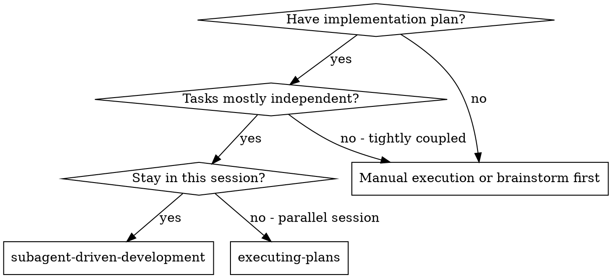
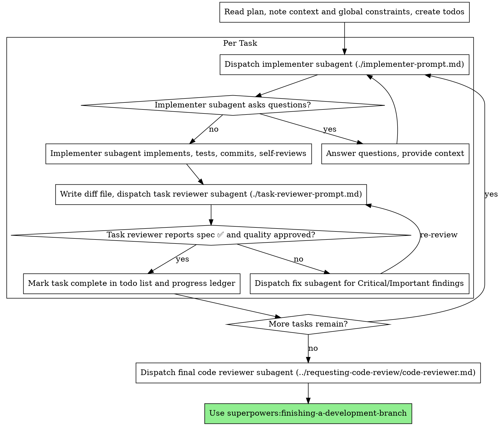

# Session transcript

## User

<local-command-caveat>Caveat: The messages below were generated by the user while running local commands. DO NOT respond to these messages or otherwise consider them in your response unless the user explicitly asks you to.</local-command-caveat>

## User

<command-name>/clear</command-name>
            <command-message>clear</command-message>
            <command-args></command-args>

## User

start I3 by reading CAMPAIGN.md + LEDGER.md first

## Assistant

I'll start by reading the governing documents for the campaign. Let me read them in full.

### ⚙ Tool call: `Bash`

```json
{
  "command": "ls -la /workspace/development/2026-07-17-modularization-campaign/",
  "description": "List campaign directory contents"
}
```

### ↳ Tool result

```
total 908
drwxr-xr-x 11 node node    352 Jul 17 15:22 .
drwxr-xr-x 23 node node    736 Jul 17 14:26 ..
-rw-r--r--  1 node node  12060 Jul 17 11:04 BLOCKMAP.md
-rw-r--r--  1 node node  30594 Jul 17 12:39 CAMPAIGN.md
-rw-r--r--  1 node node  17887 Jul 17 15:22 LEDGER.md
-rw-r--r--  1 node node   6773 Jul 17 07:51 PROMPT.md
-rw-r--r--  1 node node    274 Jul 17 12:43 analytics.md
-rw-r--r--  1 node node   3857 Jul 17 12:45 statistics.md
-rw-r--r--  1 node node 420305 Jul 17 12:45 transcript.md
-rw-r--r--  1 node node 420221 Jul 17 12:45 transcript.raw.md
-rw-r--r--  1 node node   2658 Jul 17 12:45 usage.raw.txt
```

## Assistant

I'll read the governing documents in full, starting with CAMPAIGN.md and LEDGER.md as requested.

### ⚙ Tool call: `Read`

```json
{
  "file_path": "/workspace/development/2026-07-17-modularization-campaign/CAMPAIGN.md"
}
```

### ↳ Tool result

```
1	# CAMPAIGN.md — Modularization Campaign (frozen architecture)
2	
3	**Status:** approved design, 2026-07-17. Brainstormed and approved section-by-section in
4	the campaign planning session (see `transcript.md` once archived); prompt in `PROMPT.md`.
5	
6	This is the **one** copy of the campaign's architecture, decisions, invariants, and
7	increment plan. Increment specs **cite this document and re-derive nothing** — the
8	campaign-level brainstorm and adversarial review run once, here; increments inherit that
9	scrutiny and do not repeat it. Any change to this document is an **amendment**: edit the
10	document *and* append a ledger entry (`LEDGER.md`) saying what changed and why. An
11	increment spec that contradicts this document without a ledger amendment is wrong by
12	definition.
13	
14	Related documents (all in this directory unless pathed): `PROMPT.md` (the campaign
15	request), `BLOCKMAP.md` (the B1–B60 functional map of `main()` all scope assignments
16	reference), `LEDGER.md` (append-only cross-increment record), `/workspace/CONTEXT.md`
17	(domain glossary — created by this campaign), `/workspace/prompts/directives.md` (the
18	Spine; PD#n citations below refer to it).
19	
20	## Glossary (campaign terms — domain terms live in `CONTEXT.md`)
21	
22	- **Campaign** — this whole program of work: one architecture, N increments.
23	- **Increment** — one unit of work with its own session, spec, implementation, review,
24	  commit, and archive. Numbered I0–I14.
25	- **Wave** — an ordered group of increments (0–4); increments within a wave may be
26	  reordered if the ledger records why, waves may not.
27	- **Block** — a `Bnn` region of `main()` per `BLOCKMAP.md`; the stable unit of scope
28	  assignment.
29	- **Core package** — the new importable `psh/` package holding infrastructure (Tier 1).
30	- **Gateway** — `psh/gateway.py`, the single module through which every Terminus/WP-CLI/
31	  Drush subprocess flows; the future Pantheon-API replacement seam.
32	- **Façade** — `script_context.py` (`sc`), the stable API surface that checks and plugins
33	  import; implementations move, the façade's names do not break.
34	- **Contract** — the per-phase guaranteed `site_context` keys (CLAUDE.md table), which
35	  this campaign turns into a machine-readable **contract registry**.
36	- **Hook DAG** — the per-phase topological ordering of hooks derived from declared
37	  `consumes`/`produces` keys, validated fatally at startup.
38	- **Ratchet** — the lint/type regime: broad ruff+pyright rules applied as a hard gate to
39	  moved/new modules immediately, the remnant grandfathered until I14.
40	- **Remnant** — whatever remains of the original script at any point mid-campaign.
41	- **Shim** — the thin committed `./pantheon-sitehealth-emails` entry script that calls
42	  `psh.cli.main()` after I0.
43	- **Ledger** — `LEDGER.md`; how increment N learns what N−1 actually did.
44	- **Behavior bar** — the tiered definition of which observable behavior may change (§8).
45	- **Invariant** — a named property no increment may alter (§9).
46	
47	**MUST** = required, violation fails review. **NEVER** = prohibited, violation fails
48	review. **SHOULD** = required unless the increment spec states why not. **MAY** =
49	allowed, at the implementer's judgment.
50	
51	## 1. Goal and non-goals
52	
53	**Goal.** Modularize the 4,752-line main script into (a) a `psh/` core package of
54	infrastructure modules, (b) self-registering `check/` packages for every notice/section
55	emitter, and (c) the existing `plugin/` integrations — taking full advantage of the hook
56	system — while the four e2e goldens stay byte-identical, the per-phase contract is
57	honored, and the non-U-M path keeps working. End state: `main()` is a ~250–400-line
58	orchestrator; every U-M-specific behavior lives in `umich` packages; the whole tree
59	passes the broadened ruff+pyright configuration.
60	
61	**Non-goals** (exhaustive; each is either declined or deferred with reasoning in §15):
62	replacing terminus with the Pantheon API; implementing parallel site processing; any new
63	report content (CSV attachment, cached-% column, env-lock section); SendGrid; refreshing
64	goldens or recorded fixtures; changing what any check reports (except the named bug
65	fixes in I1).
66	
67	## 2. Decision record (exhaustive — from the approved brainstorm)
68	
69	| # | Decision | Choice | Why |
70	|---|---|---|---|
71	| D1 | Pantheon API | **Seam only**: gateway module now, transport swap post-campaign | Swapping transports mid-campaign invalidates terminus fixtures + goldens in every touched increment |
72	| D2 | Lint/type broadening | **Ratchet in-campaign** (§13) | Code is cleaned exactly once, as it moves; bar fixed in I0 so it never shifts |
73	| D3 | Behavior bar | **Tiered, config renames allowed** (§8) | Cleanest final schema; production config edited once, at I14, with a migration table |
74	| D4 | Increment granularity | **Fine: 15 increments** | Safest for session/context limits; split-never-compress backstop (§12) |
75	| D5 | Target architecture | **Three-tier split** (§3) | Infrastructure ≠ report content ≠ data source; fulfills "full advantage of the frameworks" |
76	| D6 | Hook flexibility | **Phases stay; hooks declare consumes/produces; per-phase DAG validated at startup** (§4) | Keeps every existing hook/test valid; a phase-less key scheduler rewrites everything for no added power |
77	| D7 | `--only-warn` plan rec | **In campaign** (I7) | Small, no golden impact, existing TODO |
78	| D8 | Parallel-ready | **Design constraint only** (§3.4) | Near-free now; actual parallelism stays a README TODO |
79	| D9 | CSV attachment / cached-% / env-lock | **README TODO** | Each changes rendered email → golden churn mid-campaign |
80	| D10 | Packaging | **Real package + thin shim** (I0; console-script dropped — see LEDGER I0 amendment 1) | Dissolves the extension-less-script problem; normal imports for tests/pyright/ruff |
81	
82	## 3. Target architecture
83	
84	```
85	                 ./pantheon-sitehealth-emails  (thin shim)
86	                                │
87	                        psh.cli.main()  ── orchestrator: bootstrap, site loop,
88	                                │           phase firing, lifecycle dispatch
89	        ┌───────────────────────┼──────────────────────────┐
90	        ▼ Tier 1: psh/ core     ▼ seams (sc façade)        ▼
91	  configuration  modules   ┌─────────────────────┐   Tier 3: plugin/
92	  gateway        db        │  hook phases + DAG  │   aws  cloudflare
93	  traffic        plans     │  contract registry  │   env  umich
94	  gather         charts    └─────────┬───────────┘   (unchanged roles)
95	  render         mail                ▼
96	  lifecycle                Tier 2: check/  (all notice/section emitters)
97	                           pantheon  wordpress  drupal  addon_updates
98	                           dns  cloudflare  pantheon_cdn_change  umich
99	```
100	
101	### 3.1 Tier 1 — `psh/` core package (exhaustive module map)
102	
103	| Module | Receives (functions / blocks) |
104	|---|---|
105	| `psh/cli.py` | `build_arg_parser`, `parse_args`, arg validation (B5), `main()` orchestrator |
106	| `psh/configuration.py` | `process_config`, `config_substitution`, `gate_disabled_sections`, DEFER machinery, `load_news_items`, `umich_enabled`, `cloudflare_enabled` |
107	| `psh/modules.py` | `find_modules`, module loading (B2/B4), hook engine (`add_hook`/`invoke_hooks`/`PHASES`), DAG build/validation, contract registry |
108	| `psh/gateway.py` | `run_terminus`, `terminus`, `terminus_data`, `wp`, `wp_eval`, `drush`, `drush_php_script`, `fix_drush_output`, `wp_error`, `drush_error`, `TerminusError` |
109	| `psh/db.py` | ORM models, `TrafficRow`/`OverageProtectionRow`, `db_engine_args`, `db_retry`/`db_retryable`/`record_db_reconnect`, `update_traffic_rows`, `insert_traffic_rows`, `load_traffic_rows`, `load_overage_protection_window`, `DatabaseUnavailableError` |
110	| `psh/traffic.py` | `get_old_metrics`, `estimate_month_visits`, `build_traffic_table_rows`, the `traffic_table_columns` global, metrics gather + DB update/load flow (B22–B26), visits-by-month aggregation (B43) |
111	| `psh/plans.py` | plan_info normalization (B12 part), SKU resolution (B17), `overage_blocks`, `contract_year_end`, `plan_costs`, `build_plan_over_time`, the `cost_table_columns` global, recommendation flow (B47) |
112	| `psh/gather.py` | Slimmed framework gathers feeding the `site_post_gather` contract (from B32–B35), `check_wordpress_plugin`/`check_drupal_module` helpers |
113	| `psh/charts.py` | Cap geometry (B13 part), chart data prep + matplotlib build (B44–B45) — returns PNG bytes |
114	| `psh/render.py` | Jinja render (B53), PHP inline + `!important` pass (B54), `escape_url` |
115	| `psh/mail.py` | Recipient resolution (B49), MIME assembly (B55), `smtp_login`, send (B57) |
116	| `psh/lifecycle.py` | `RunState`, `finish_run`, `abort_run`, `abort_reason`, `resume_point`, `resume_command`, `rerun_command`, `option_strings_taking_a_value`, `sites_from_resume_point`, `merge_prior_results`, `ResumeSiteNotFoundError` |
117	
118	`dns_classify.py` stays a top-level module (already extracted; moving it into `psh/` is
119	MAY-scope for I14, decided by ledger state then).
120	
121	**Whole-file coverage.** The campaign modularizes the entire script, not just `main()`:
122	every top-level def and module-level global in `pantheon-sitehealth-emails` (lines
123	1–2107 included) is assigned to a `psh/` module in this table and appears in exactly one
124	increment's scope (§11). End state: the original file is the thin shim and nothing else
125	— a top-level def still there at I14 is a defect the closing audit (§17) catches. Moved
126	helpers get the full §7 treatment (types, ratchet, verified docs, tests); they do NOT
127	get algorithmic redesign — moves are behavior-preserving except where §8 says otherwise
128	(I1, I7's D7, I12's B51).
129	
130	### 3.2 Tier 2 — new/changed `check/` packages (exhaustive)
131	
132	| Package | Contents (blocks) | Phase(s) |
133	|---|---|---|
134	| `check/pantheon/` (new) | frozen site (B19), no-live-env (B21), upstream updates (B38), PHP EOL (B41) | `site_pre` (frozen, no-live-env), `site_post_gather` (updates, PHP EOL) |
135	| `check/wordpress/` (new) | PAPC + native-sessions checks, OCP config probe, favicon (from B34) | `site_post_gather` |
136	| `check/drupal/` (new) | PAPC module check, D7 EOL + tag1_d7es, multisite probe (from B30/B35) | `site_post_dns` (multisite), `site_post_gather` |
137	| `check/addon_updates/` (new) | add-on updates table notice (B39), smell notices (B48) | `site_post_gather` |
138	| `check/umich/` (existing, grows) | umich-oidc-login, Hummingbird fork (B34), Drupal UA check (B35), annual-billing notices (B50/B51), portal-URL text for the recommendation notice (B47's U-M half) | `site_post_gather`, `site_pre_render` (billing) |
139	
140	`check/dns/`, `check/cloudflare/`, `check/pantheon_cdn_change/` are untouched tenants.
141	A check MAY fetch its own data through `sc` gateway wrappers when the data is
142	check-specific (e.g. `upstream:updates:list`); data used by core *and* checks is
143	published through the contract instead (e.g. `envs`).
144	
145	### 3.3 What stays in `main()` (exhaustive, with why)
146	
147	Config/arg bootstrap ordering (B1–B8 — the two-pass substitution *order* is the
148	program); overage constants + date window (B9, B13 part); the site-loop skeleton (skips,
149	banner, sorted order, resume filter — B14–B18, B20, B25, B42); phase firing and contract
150	stuffing (B27, B28, B31, B37, B52); notice sort + subject (B50 minus billing); the
151	`try`/`except BaseException` lifecycle dispatch (B59–B60 call sites). Everything else
152	leaves. Target: 250–400 lines.
153	
154	### 3.4 Parallel-ready constraint (D8)
155	
156	Per-site work MUST be a function of `(site, config, db_session, site_context)`: no new
157	module-level mutable state; run-scoped accumulators live only in `RunState`. This is a
158	review criterion from I2 onward, not a parallelism implementation.
159	
160	### 3.5 The `sc` façade
161	
162	Checks and plugins import **only** `sc` (and their own package). `sc` keeps every name
163	listed in CLAUDE.md's runtime-exposed block, re-exporting from `psh/` modules as they
164	move. NEVER remove or rename an `sc` attribute mid-campaign; additions are fine. The
165	house-rules test suite gains an assertion that every documented `sc` name exists (I2).
166	
167	## 4. Phases, hooks, and the DAG
168	
169	Phases stay the coarse spine: `setup`, `site_pre`, `site_post_traffic`, `site_post_dns`,
170	`site_post_gather`, `site_pre_render`, plus **new** `run_finish` (fired inside
171	`finish_run` before artifacts are written, receiving the `RunState`; for future run-level
172	artifact hooks — no consumer at introduction, like `site_pre_render` was). Dotted
173	plugin-defined events are unchanged.
174	
175	From I4, `add_hook` requires two new entries per hook: `consumes` and `produces` — each
176	a (possibly empty) list of contract-key names. Validation at module-load completion
177	(exhaustive fatal conditions):
178	
179	1. A consumed key that nothing produces (neither core's registry for that phase or an
180	   earlier phase, nor another hook) → fatal.
181	2. Two producers of the same key → fatal (one owner per key; PD#1 — a silent overwrite
182	   is a silent failure).
183	3. A cycle among same-phase hooks → fatal.
184	4. A hook consuming a key first produced in a *later* phase → fatal.
185	5. A missing `consumes`/`produces` entry on any hook → fatal (no legacy mode; I4
186	   retrofits all in-repo hooks in the same change).
187	
188	`invoke_hooks` orders same-phase hooks topologically (producers before consumers;
189	registration order breaks ties, so existing behavior is preserved where no edges exist).
190	The permanent test `tests/integration/test_hook_dag.py` loads **all** real check/plugin
191	packages and asserts the DAG builds — the "future changes can never make the DAG
192	impossible" guarantee — and a unit suite proves each fatal condition actually fires
193	(PD#14: the validator must be shown able to go red).
194	
195	```
196	 module load ──► collect hooks ──► per phase: build edges (produces→consumes)
197	                                        │
198	                              cycle? unknown key? dup producer? ──► fatal exit (named error)
199	                                        │ ok
200	                                topo order stored ──► invoke_hooks uses it
201	```
202	
203	**Contract registry.** `psh/modules.py` holds the machine-readable registry: phase →
204	keys core stuffs (today's CLAUDE.md table, verbatim). Core's stuffing code is checked
205	against it in tests; CLAUDE.md's table gains a line saying the registry is authoritative.
206	New contract keys added by increments (exhaustive for this campaign): `envs` (I8, at
207	`site_pre`), `add_on_updates` + `wp_smell`/`drush_smell`/`composer_smell` (I9/I10, at
208	`site_post_gather`), plan/cost keys `current_plan`, `recommended_plan`, `plan_costs`,
209	`savings` (I7, at `site_pre_render`). Each addition updates registry + CLAUDE.md table +
210	ledger in the same increment.
211	
212	## 5. Configuration
213	
214	Principles: one section per feature, named for the operator's mental model; every
215	relocated check gets an `enabled` flag under `[Check.<name>]`, **default true** —
216	relocating code MUST NOT silently disable a check that runs unconditionally today.
217	U-M-only checks additionally require `[UMich].enabled` (existing `umich_enabled()`
218	rule). `gate_disabled_sections()` semantics (nested `enabled`, children dropped) apply to
219	`[Check.*]` unchanged.
220	
221	Example (actual TOML, the shape I8 introduces — illustrative of the family, exhaustive
222	for `check/pantheon/`):
223	
224	```toml
225	[Check.pantheon]
226	enabled = true          # frozen-site, live-env, upstream-updates, PHP-EOL checks
227	```
228	
229	New keys land in final shape as introduced (I3 onward). Renames/moves of *existing* keys
230	happen once, in I14, which MUST deliver: the old→new migration table in
231	`docs/config-migration.md`, a rewritten `sample-pantheon-sitehealth-emails.toml`, and
232	exact edit instructions for the production config repo. Until I14, every existing
233	production key keeps working unchanged.
234	
235	## 6. Types
236	
237	Reused as-is: `TrafficRow`, `OverageProtectionRow`, `DnsFacts`, `FetchResult`,
238	`SiteContext`. Introduced (exhaustive):
239	
240	| Type | Increment | Shape |
241	|---|---|---|
242	| `GatewayResult` | I2 | NamedTuple `(result, errors, fatal)` replacing the anonymous 3-tuples |
243	| `Notice` | I3 (class) → adopted per increment | frozen dataclass: `severity` (StrEnum alert/warning/info), `code` (unique — registry test), `html`, `text`, `short`, `icon`, `order`; `SiteContext.add_notice` accepts `Notice` or legacy dict; dict form retired in I14 |
244	| `PlanInfo` / `PlanCatalog` | I7 | typed view over `[Pantheon.plan_info]` |
245	| `RunState` | I13 | dataclass holding `all_warnings`, `site_results`, `site_savings`, `emails_sent`, reconnect counters |
246	
247	House-style tuple annotations (`-> (str, str, bool)`) are replaced with real annotations
248	in every module as it moves — never fixed in place in the remnant (one pass per line,
249	D2). CLAUDE.md's house-style note is updated in I14 when the last one dies.
250	
251	## 7. Per-increment obligations
252	
253	Every increment MUST (this list is exhaustive and lives only here; increment specs cite
254	it): (1) start by reading `CAMPAIGN.md`, `LEDGER.md`, `CLAUDE.md`, `BLOCKMAP.md` rows in
255	scope; (2) follow `prompts/implementation-standards.md` (subagent-driven, test-first,
256	`psh-implementer`/`psh-reviewer`); (3) replace house styles in moved code (§6);
257	(4) verify — not assume — every claim in comments/docs it moves or writes;
258	(5) update tests in the same change; (6) update README/docs/CLAUDE.md for what moved;
259	(7) update auto-memory where a durable fact changed; (8) append its ledger entry
260	(§12); (9) preserve every invariant (§9); (10) end with `/code-review`, a full
261	`./run-tests`, and one checkpoint commit including its `development/` folder.
262	
263	## 8. Behavior bar (canonical gate table)
264	
265	| Surface | Rule | Until |
266	|---|---|---|
267	| Rendered emails (4 goldens) | NEVER change (byte-identical) | end of campaign |
268	| `-results.json` / `-notices.csv` / `-run.json` structure (keys, row shape) | NEVER change | end of campaign |
269	| Notice csv *values* | MAY change only in I1 (named bug fixes) and I12 (scheduled B51 deletion) | — |
270	| stdout / console / error messages | MAY improve freely | — |
271	| Config: existing keys | NEVER break | I14 (renames with migration table) |
272	| Config: new keys | MUST land in final schema shape | — |
273	| Exit codes, resume semantics, artifact write gates | NEVER change | end of campaign |
274	
275	## 9. Named invariants (exhaustive; NEVER violated by any increment)
276	
277	1. Four e2e goldens byte-identical (`./run-tests` proves it; refresh is forbidden — an
278	   existing golden going red is a defect in the increment, PD#14).
279	2. Per-phase data contract: existing keys never removed/renamed/retyped; additions only.
280	3. Non-U-M path works: non-U-M golden green; no new un-gated U-M content (I1 *removes*
281	   the one known leak).
282	4. Run lifecycle: single `except BaseException` flush path; `abort_reason`'s three
283	   outcomes; artifacts dropped-site rule; notices appended before send; resume-point
284	   next-site-after-email rule; soft-wrapped copy-pasteable commands.
285	5. DB: `db_retry` retries whole idempotent units only; `db_retryable` predicate
286	   unchanged; the read-release commit in the loaders stays (guarded by
287	   `test_load_traffic_rows_releases_the_connection`).
288	6. Rich console rules: escape untrusted text; production width reproduced in tests.
289	7. Test safety interlock (`run_program` forbidden flags) never bypassed or weakened.
290	8. Column-0 `f"""` notice literals move **verbatim** — never re-indented; `git diff -w`
291	   is not acceptable evidence for any change touching them.
292	9. Checks/plugins import only `sc`; `sc` names never removed mid-campaign (§3.5).
293	10. Recorded fixtures are not regenerated (`terminus-cdnchange/` is hand-maintained and
294	    `--record` must not run).
295	11. `--create-tables`/`--update`/`--import-older-metrics` phase-gating rules (CLAUDE.md
296	    table) unchanged.
297	
298	## 10. Known-bug inventory → I1
299	
300	The five bugs and the dead code listed in `BLOCKMAP.md` §Bugs (composer-smell
301	nesting+variable; shared `php-eol` code; `site_results` omission; un-gated U-M portal
302	URLs; duplicate `annual-bill` code — B51 handled as: distinct code now, scheduled
303	deletion when its Aug-2026 date passes, ledgered to I12; dead code deleted). Each fix is
304	test-first with the test shown red on the old behavior. **Verified 2026-07-17**: the
305	goldens contain zero `php-eol`/`wp-smell`/`drush-smell`/`composer-smell`/`annual-bill`
306	occurrences and the golden fixtures report PHP 8.2, so none of these fixes can touch a
307	golden:
308	
309	```
310	$ grep -c 'php-eol\|composer-smell\|wp-smell\|drush-smell\|annual-bill' tests/e2e/__snapshots__/*.ambr
311	tests/e2e/__snapshots__/test_golden.ambr:0
312	tests/e2e/__snapshots__/test_golden_cdn_change.ambr:0
313	tests/e2e/__snapshots__/test_golden_drupal.ambr:0
314	tests/e2e/__snapshots__/test_golden_nonumich.ambr:0
315	```
316	
317	## 11. The increments
318	
319	Wave dependency structure (increments within a wave are ordered but MAY be resequenced
320	with a ledger entry; waves MUST NOT be reordered):
321	
322	```
323	Wave 0: I0 bootstrap ──► I1 bug fixes
324	Wave 1: I2 gateway ──► I3 config ──► I4 hooks+DAG ──► I5 DB
325	Wave 2: I6 traffic ──► I7 plans ──► I8 check/pantheon ──► I9 wordpress ──► I10 drupal
326	Wave 3: I11 charts ──► I12 render+mail ──► I13 lifecycle
327	Wave 4: I14 closing sweep
328	```
329	
330	| Inc | Scope (blocks / functions) | Delivers |
331	|---|---|---|
332	| **I0** | — (no logic moves) | `psh/` skeleton + thin shim (console-script dropped — see LEDGER I0 amendment); conftest `import psh` rework (same collected-test count gate); ratchet config (§13) with rule sets pinned; pyright baseline measured; `LEDGER.md` started; README TODO edits (§15 dispositions); CLAUDE.md pointer to campaign |
333	| **I1** | B36, B40, B41, B47 (URLs), B48, B50/B51 (codes), dead code | §10 fixes, each test-first |
334	| **I2** | 302–597 wrappers | `psh/gateway.py`, `GatewayResult`, sc re-exports + façade test; no-subprocess-outside-gateway house rule |
335	| **I3** | 792–934, 1209–1253, 1608–1648 (`umich_enabled`/`cloudflare_enabled`) | `psh/configuration.py`; `Notice` class + code-uniqueness registry test |
336	| **I4** | 935–950, hook engine from `script_context.py` | `psh/modules.py`; consumes/produces on all in-repo hooks; DAG validation + fatal-condition tests; `run_finish` phase; contract registry |
337	| **I5** | 95–178; DB defs within 1285–1575 (`DatabaseUnavailableError` through `db_engine_args`; the resume helpers `ResumeSiteNotFoundError`, `sites_from_resume_point`, `merge_prior_results` stay for I13) | `psh/db.py`; DB test suites relocated intact |
338	| **I6** | B22–B26, B43; 598–671, 977–1127 | `psh/traffic.py` |
339	| **I7** | B9, B12 (plans), B17, B47; 967–976, 1128–1208, 1254–1280 | `psh/plans.py`; `PlanInfo`; D7 (`--only-warn` runs recommendation); plan/cost contract keys |
340	| **I8** | B19, B21, B38, B41 | `check/pantheon/` + `[Check.pantheon]`; `envs` contract key |
341	| **I9** | B32–B34; 672–739 | `psh/gather.py` (WP half); `check/wordpress/`; U-M WP checks → `check/umich/`; `add_on_updates` + smell contract keys |
342	| **I10** | B30, B35, B39, B48; 740–791 | gather (Drupal half); `check/drupal/`; `check/addon_updates/`; UA check → `check/umich/` |
343	| **I11** | B13 (caps), B44–B45 | `psh/charts.py` |
344	| **I12** | B49–B57 minus sort/subject core | `psh/render.py`, `psh/mail.py`; annual billing → `check/umich/` at `site_pre_render`; B51 deletion if past its date |
345	| **I13** | B14 (accumulators), B56, B59–B60; 1649–2107 plus the resume helpers I5 left behind (1281–1284, 1528–1542, 1576–1607) | `psh/lifecycle.py`; `RunState`; `main()` reaches final form |
346	| **I14** | — | Config renames + migration doc + sample rewrite + production-config instructions; global ratchet flip + remnant cleanup; docs/README/CLAUDE.md full refresh; `Notice` dict form retired; ledger fully resolved; retrospective + closing audit (§17) |
347	
348	Sizing note: the largest moves are I9 (~330 main-loop lines + helpers) and I10 (~320 +
349	helpers). If any increment proves oversized mid-session: **split, never compress** —
350	commit nothing partial, ledger the split, the second half becomes its own increment.
351	
352	## 12. Coordination protocol
353	
354	**Ledger entry template** (append per increment, and for any amendment):
355	
356	```markdown
357	## I<N> — <slug> (<date>, commit <sha>)
358	- Moved: <blocks/functions actually moved>
359	- Deviations from CAMPAIGN.md: <none | what + why>
360	- Contract/config/sc additions: <keys/names>
361	- Discovered tasks: <each with disposition: fixed here | I<M> | README TODO>
362	- Open questions for next increment: <…>
363	```
364	
365	**Discovered-task disposition rules** (canonical): fits current increment's scope and
366	<~30 min → fix now, note in ledger; belongs to a later increment → ledger it against
367	that increment (the increment's spec author MUST read these); major/risky/scope-widening
368	→ README TODO with a sentence of context. Nothing is carried in memory or chat — if it
369	is not in the ledger or README, it does not exist (PD#9).
370	
371	**Session flow per increment:** read the §7 documents → write the increment SPEC.md in
372	`development/<date>-mod-I<N>-<slug>/` citing CAMPAIGN.md sections by number →
373	`superpowers:writing-plans` → subagent-driven implementation → `/code-review` → full
374	`./run-tests` → per-task commits, each green; the increment's final commit includes the dev
375	folder → `/archive-session` → ledger entry.
376	
377	## 13. Lint/type ratchet
378	
379	Mechanism (as shipped by I0; see LEDGER I0 amendment 2): TWO ruff configs —
380	`pyproject.toml` `[tool.ruff.lint]` keeps the narrow PD-rule set running everywhere
381	including the remnant, and `ruff-broad.toml` carries `select = ["ALL"]` minus a
382	justified ignore list, with `extend-exclude` grandfathering exactly the remnant
383	(`psh/_legacy.py`) and not-yet-moved files; each increment deletes its
384	files from the grandfather list, and the two configs merge at I14. pyright runs in
385	`./run-tests` from I0 via `[tool.pyright]` (standard mode, `psh/` minus `_legacy.py`),
386	ratcheting toward strict as typed code moves in. The four existing narrow rules (`E722`, `BLE001`, `S105`, `S106`) remain global
387	throughout — they mechanize PD#2/PD#6 and are never grandfathered. No
388	`target-version` pin (CLAUDE.md: it masks the 3.12-only syntax detection).
389	
390	Baselines measured 2026-07-17 (I0 re-measures and pins both in its spec):
391	
392	```
393	$ ./run-tests --fast --llm   (tail)
394	LLM_SUMMARY passed=727 failed=0 error=0 skipped=1 xfailed=0 xpassed=0
395	25 snapshots passed.
396	
397	$ uvx ruff check --isolated --statistics .
398	26  F541  f-string-missing-placeholders
399	 8  E741  ambiguous-variable-name
400	 4  E713  not-in-test
401	 3  F841  unused-variable
402	 2  F401  unused-import
403	 1  E402  module-import-not-at-top-of-file
404	 1  E712  true-false-comparison
405	Found 45 errors.
406	```
407	
408	(README's "~55" ruff and "39" pyright figures are stale/unverified claims; I0 replaces
409	them with measured numbers. pyright was not measured in planning — no pyright binary in
410	the dev container yet; installing it is I0 scope.)
411	
412	## 14. Risk / control table
413	
414	| Risk | Control |
415	|---|---|
416	| Re-indented column-0 notice literals silently change emails | Invariant 8; goldens as tripwire; AST/token comparison, never `git diff -w` |
417	| conftest rework silently drops tests | I0 gate: identical collected-test count (727 passed / 1 skipped / 2 deselected baseline) before and after |
418	| Long-range `main()` local coupling breaks a move | BLOCKMAP produces/consumes; each increment spec lists exactly which locals cross its boundary |
419	| Session/context overrun mid-increment | Fine granularity (D4); split-never-compress; commits only at increment completion |
420	| Architecture drift across 15 sessions | This document frozen; amendments only via ledger; specs cite section numbers |
421	| Hidden hook-order dependencies surface in I4 | I4 audits every hook; real dependencies become explicit DAG edges |
422	| Ratchet churn on moved code | Rules fixed at I0; cleaning is part of each move |
423	| Goldens blind to stdout/artifacts | Invariants 4–5 name the artifact/abort test suites as the cover; artifact structure frozen until campaign end |
424	| Implementer sessions lack context | `psh-implementer`/`psh-reviewer` carry the read list; specs name seams (Spine spec bar); §7 reading list |
425	| Two annual-bill notices / removal date passes mid-campaign | Explicitly scheduled: codes split in I1, deletion decision in I12, ledger tracks |
426	
427	## 15. NOT in scope (reasoning preserved so it is never re-litigated)
428	
429	- **Terminus → Pantheon API swap** — D1; post-campaign project against `psh/gateway.py`.
430	- **Parallel site processing** — D8; constraint only; README TODO remains.
431	- **CSV data attachment, cached-% column, env-lock section** — D9; each becomes a small
432	  post-campaign change (env-lock: a ~50-line `check/` package) once goldens may move.
433	- **SendGrid, secrets-handling completion, portal traffic capture, daily alerts,
434	  accessibility/security/Cloudflare scores, AI recommendations, dependency updates,
435	  terraform-infra** — pre-existing README TODOs, untouched by this campaign.
436	- **Approach B (library-only) and C (everything-is-a-hook)** — rejected in brainstorm:
437	  B fails the "full advantage of the frameworks" goal; C forces infrastructure into
438	  optional-content clothing.
439	- **Golden/fixture refreshes** — forbidden (Invariants 1, 10).
440	
441	## 16. Acceptance baseline
442	
443	§13 outputs are the campaign-start baseline (run and pasted 2026-07-17). Every
444	increment's definition of done re-runs `./run-tests` at increment end — the full suite
445	when the live tier's credentials are available in the session, otherwise `--fast` with a
446	ledger note saying the live tier was skipped — and MUST reproduce goldens
447	byte-identically. I0 additionally records the collected-test count gate.
448	
449	## 17. Closing audit (queued for I14; exhaustive)
450	
451	1. Is `main()` within 250–400 lines, and does everything left match §3.3?
452	2. Has every DAG fatal condition been demonstrated red at least once?
453	3. Do the contract registry and CLAUDE.md table agree (test-enforced)?
454	4. Is any `sc` re-export now consumed by nobody (dead façade surface)?
455	5. Is the `.py` symlink still needed for anything beyond the shim? If not, note in
456	   CLAUDE.md; if yes, say for what.
457	6. Are all ledger items resolved (done, scheduled, or README TODO)?
458	7. Has the production config repo received and applied the migration instructions?
459	8. Do README, CLAUDE.md, docs/, and memory reflect the final architecture (no stale
460	   line-number or module references)?
461	9. Were any invariants amended mid-campaign, and is each amendment ledgered?
462
```

## Assistant

Now the LEDGER.md in full.

### ⚙ Tool call: `Read`

```json
{
  "file_path": "/workspace/development/2026-07-17-modularization-campaign/LEDGER.md"
}
```

### ↳ Tool result

```
1	# LEDGER — Modularization Campaign
2	
3	Append-only. One entry per completed increment, plus one per CAMPAIGN.md amendment.
4	This file is how increment N learns what N−1 actually did; if a deviation, discovered
5	task, or decision is not recorded here (or in the README TODO list), it does not exist.
6	Entry template: CAMPAIGN.md §12.
7	
8	## Campaign planning (2026-07-17)
9	
10	- Produced: `CAMPAIGN.md` (frozen architecture), `BLOCKMAP.md` (B1–B60 map),
11	  `/workspace/CONTEXT.md` (domain glossary, new), this ledger.
12	- Baselines: fast tier 727 passed / 1 skipped / 2 deselected; ruff `--isolated` 45
13	  findings; pyright unmeasured (no binary in container — I0 scope).
14	- Discovered during planning, dispositioned:
15	  - Five bugs + dead code → I1 (CAMPAIGN.md §10, BLOCKMAP §Bugs).
16	  - README's "~55 ruff / 39 pyright" figures stale/unverified → I0 re-measures.
17	  - B51 second annual-bill notice: marked "remove Aug 2026" — code split in I1,
18	    deletion decision in I12.
19	  - WordPress/Drupal duplication + update-table HTML duplication (BLOCKMAP §Bugs 7–8)
20	    → addressed structurally by I9/I10 (shared gather + `check/addon_updates/`).
21	- Open questions for I0: exact ruff rule list; pyright strictness per environment;
22	  whether `dns_classify.py` moves under `psh/` (deferred to I14, MAY).
23	- Amendment (2026-07-17, user spec review): added the "Whole-file coverage" paragraph to
24	  CAMPAIGN.md §3.1 — clarification only, no scope change; the module map already
25	  assigned every top-level def.
26	
27	## I0 — bootstrap (2026-07-17, closing commit `docs(campaign-I0): close the bootstrap increment`)
28	
29	Commits (per-task, each green): `b1ccc72` (package move + shim + conftest + coverage),
30	`d0e3027` (lint/type ratchet), `5b536fa` + `239955d` (README/CLAUDE.md docs), plus this
31	closing docs commit (ledger + CAMPAIGN amendments + SPEC acceptance + README pyright number).
32	
33	- **Moved:** the whole 4,752-line program → `psh/_legacy.py` (`git mv`, **zero logic
34	  changes**; the `__main__` tail is inert in a module, left for I13). New: `psh/__init__.py`
35	  (docstring), `psh/cli.py` (`from psh._legacy import main, parse_args` re-export), and a new
36	  7-line thin shim at `./pantheon-sitehealth-emails` calling `psh.cli.main()`. No blocks
37	  (B-map) moved — I0 moves the file, not logic (§11 row I0).
38	
39	- **Deviations from CAMPAIGN.md (three amendments, all applied to the document this commit):**
40	  1. **No console-script entry point** (amends §11 row I0 / D10). The program is repo-rooted
41	     by design (`find_modules`, templates, `inline-styles.php`, `vendor/`, config symlink are
42	     all CWD-relative); a pip entry point would need a data-file overhaul serving no campaign
43	     goal. D10's real benefits (normal imports; native ruff/pyright/CodeGraph coverage; no
44	     `SourceFileLoader`) all arrive via the package + shim without installation. `pyproject.toml`
45	     stays deps-only (`py-modules = []`, `packages = []` to stop setuptools auto-discovery
46	     installing a stale shadow copy — PD#1). §11 row I0 now reads "thin shim (console-script
47	     dropped — see LEDGER I0 amendment)".
48	  2. **Grandfather is `psh/_legacy.py` via `ruff-broad.toml` `extend-exclude`** (amends §13,
49	     which named `pantheon-sitehealth-emails.py` and "per-file-ignores" — both written before
50	     the legacy-module + two-config mechanics were settled). The shipped mechanism is TWO ruff
51	     configs, not per-file-ignores: `pyproject.toml` `[tool.ruff.lint]` carries the narrow
52	     PD-rule set (`E722`/`BLE001`/`S105`/`S106`) that runs EVERYWHERE including `_legacy.py`;
53	     `ruff-broad.toml` carries `select = ["ALL"]` minus the ignore list and grandfathers the
54	     remnant via `extend-exclude`. `./run-tests` and `.claude/hooks/ruff-check.sh` run BOTH
55	     passes; the two files merge into `pyproject.toml` at I14. §13 now names `psh/_legacy.py`
56	     and "ruff-broad.toml exclude".
57	  3. **Per-task commits, each green** (amends §12's "one commit (code + dev folder)"). Each I0
58	     task committed independently once its gates were green; this increment's final (closing)
59	     commit includes the `development/` folder. Rationale: finer checkpoints serve the campaign
60	     prompt's revert/inspect intent, and SDD review packages diffs as commit ranges. §12 now
61	     reads "per-task commits, each green; the increment's final commit includes the dev folder".
62	
63	- **Ratchet as pinned.** pyright runs in `./run-tests` at **standard** mode, not strict
64	  (DECISION): `psh/cli.py` re-exports from the untyped legacy module, so strict would fail on
65	  re-export; strictness ratchets up as increments move typed code in. Scope `[tool.pyright]`
66	  = `include = ["psh"]`, `exclude = ["psh/_legacy.py"]`. Ruff-broad ignore list (pinned; each
67	  justified in `ruff-broad.toml`): `COM812`, `ISC001`, `E501`, `Q000`, `Q001`, `Q002`, `Q003`,
68	  `ANN`, `TD002`, `TD003`, `FIX002`, `EM101`, `EM102`, `TRY003`, `D`, `CPY001`. `CPY001` is a
69	  **preview** rule in ruff 0.15.22 (cannot fire under non-preview `select=["ALL"]`); ruff
70	  accepts it in `ignore` with no warning, so it is kept verbatim to document the intent
71	  (no per-file copyright headers). `D` (docstring convention) is undecided → README TODO.
72	
73	- **pyright whole-tree baseline (informational; replaces README's unverified "39").**
74	  **220 errors, 0 warnings, 0 informations** across 118 first-party files, standard mode,
75	  pyright 1.1.411 (SPEC ACCEPTANCE §Task 5 has the command + breakdown). Measured OUTSIDE the
76	  scoped gate config via a repo-root config (pyright roots a project at the config's directory
77	  and ignores includes outside it; a config's `exclude` still drops CLI-passed paths — so
78	  neither a scratchpad-rooted config nor CLI args can re-include `_legacy.py`, and a repo-root
79	  temp config is the reproducible form). By area: `tests/` 139, `psh/_legacy.py` 36, `check/`
80	  21, `plugin/` 18, `script_context.py` 5, `dns_classify.py` 1 (`check/`+`plugin/` = 39, the
81	  origin of the old figure). The gated scope (`psh/` minus `_legacy.py`) is `0 errors`.
82	
83	- **Contract/config/sc additions:** none (I0 moves no logic; no `[Check.*]` sections, no new
84	  contract keys, no `sc` names added or removed).
85	
86	- **Discovered tasks:**
87	  - **`Path(psh.__file__).parent` as a repo-root proxy** — 25 sites across 23 files: 22 test files (plus
88	    `tests/helpers/checkload.py`) anchored repo paths on the program file's parent, which the
89	    move shifted from repo root to `psh/`. Fixed here, mechanically and minimally:
90	    `→ Path(psh.__file__).resolve().parents[1]` at exactly those sites. Proper cleanup lands
91	    when later increments un-grandfather those test files; the `psh` fixture itself is
92	    redesigned when `_legacy` dies (I13/I14). Disposition: **fixed here**, further cleanup **I13/I14**.
93	  - **ruff lints explicitly-passed files even when excluded** — passing a path on ruff's
94	    command line overrides `extend-exclude`, so the edit hook (which passes the just-edited
95	    file) would lint `_legacy.py` against the broad set. Fixed by giving the broad-pass
96	    invocation `--force-exclude` and running it from repo-root cwd; documented in
97	    `.claude/hooks/ruff-check.sh`. Disposition: **fixed here**.
98	
99	- **Open questions for I1/I2:**
100	  - I1 (bug fixes) touches `_legacy.py` in place (fixes retire as code moves); it must keep
101	    the narrow PD set green there (broad set stays grandfathered) and the four goldens
102	    byte-identical (§10 verified the fixed codes appear in zero goldens).
103	  - I2 (gateway) is the first real logic move: as it un-grandfathers the wrapper functions it
104	    deletes them from `ruff-broad.toml` `extend-exclude` and must clean them to the broad set
105	    + pyright standard in the same change (§13 ratchet; §6 house-style tuple hints replaced).
106	  - `dns_classify.py` under `psh/` remains a MAY for I14 (unchanged from planning).
107	- Amendment (2026-07-17, post-Task-5 review): CAMPAIGN.md §13 mechanism paragraph
108	  rewritten to describe the SHIPPED two-config mechanism (it still said "pyproject gets
109	  extend-select" and "executionEnvironments", both superseded by amendment 2 above);
110	  ledger reanchor note corrected to "22 test files plus checkload.py" (23 files total).
111	  Both changes doc-accuracy only.
112	- Amendment (2026-07-17, final I0 code review, spec axis): D10's Decision cell still said
113	  "console-script" after amendment 1 changed only §11 row I0 — CAMPAIGN.md briefly
114	  self-contradicted. D10 cell now matches. Doc-accuracy only.
115	
116	## I1 — known-bug fixes (2026-07-17, commits `5518de7..1ff9153` + closing docs commit)
117	
118	Spec/plan: `development/2026-07-17-mod-I1-bug-fixes/` (SPEC.md carries the pasted
119	acceptance results). Six per-task commits, each green; full suite at close = 751 passed /
120	1 skipped **including the live tier**, 27 snapshots, all three gates; four goldens
121	byte-identical across the whole range (`git diff aa8afd1 -- tests/e2e/__snapshots__/`
122	empty).
123	
124	- **Moved:** no blocks (fixes land in place in `psh/_legacy.py` per I0's open-question
125	  note). Extracted five pure notice-builder helpers as consecutive module-level defs
126	  above `main()` (preserved-bug-extraction pattern; every literal interior byte-verified
127	  against the pre-move original by task reviewers AND the final review):
128	  `build_smell_notices`, `build_php_eol_notice`, `build_annual_bill_upcoming_notice`,
129	  `build_annual_bill_in_progress_notice`, `build_plan_recommendation_notice`. These
130	  travel later: smells → I10, php-eol → I8, annual-bill → I12, plan-rec → I7.
131	- **Fixed (CAMPAIGN §10 / BLOCKMAP §Bugs, all test-first with RED shown on old
132	  behavior):** (1) B48 composer-smell nesting + wrong interpolated variable;
133	  (2) B41 shared `php-eol` csv code → `php-eol-warning` (7.4/8.1) / `php-eol-alert`
134	  (<8.2), following the `updates-*` suffix pattern; (3) B36 unknown-framework sites now
135	  get a `site_results` entry (`version: "unknown"`, same 3-key row shape) — covered by a
136	  new offline e2e (`tests/e2e/test_unknown_framework_e2e.py`) asserting the
137	  `finish_run()` stdout pprint, since `-results.json` is written only on `--all` runs the
138	  interlock bans; (4) B47 un-gated U-M portal URLs — two of the four named URL sites
139	  (`extra_message`/`extra_text`) were **dead stores** (assigned, never read; §10's
140	  4240/4248 refined — bug partially lived in dead code), deleted; the live
141	  `its-recommends-plan` notice now selects U-M vs generic copy via `umich_enabled()`
142	  (generic drops the portal anchor AND the June-16-30 downgrade-window sentence — U-M
143	  billing policy, factually wrong elsewhere); both variants pinned by syrupy snapshots
144	  (`test_plan_recommendation_notice_render`); (5) B50/B51 duplicate `annual-bill` code —
145	  B51 now emits `annual-bill-in-progress`; B50 keeps `annual-bill`; B51's Aug-2026
146	  deletion decision remains I12's; (6) dead code deleted (B40 Gen2 block, overage debug
147	  query, `# plt.show()`, redundant second `plt.close(fig)` with its stale memory claim).
148	- **Deviations from CAMPAIGN.md:** none.
149	- **Contract/config/sc additions:** none. Sanctioned notice-csv value changes (§8 I1
150	  exception): the three codes above. New **hand-maintained** fixture dir
151	  `tests/fixtures/terminus-unknownfw/` (copy of `terminus/`, one framework value →
152	  `"mystery"`, README states `--record` never refreshes it — Invariant 10, cdnchange
153	  precedent) + conftest constant `TERMINUS_FIXTURES_UNKNOWNFW`.
154	- **Discovered tasks (dispositions):**
155	  - Template `email_template.{html,txt}` portal URLs render `sites/0/` in every non-U-M
156	    run including the non-U-M golden (SPEC Obs. 1) → I12/I14 (goldens freeze it now;
157	    already on CLAUDE.md's still-hardcoded-U-M list).
158	  - `php_version < "8.2"` string comparison + KeyError if key absent (Obs. 2) → I8.
159	  - B47 downgrade path: owner gets NO notice (dead `extra_message` was presumably meant
160	    for this) and a non-Basic downgrade appends no `site_savings` entry (Obs. 3) → I7
161	    decides intended behavior.
162	  - Composer-smell literals carry baked-in 8-space indentation (Obs. 4) → I10.
163	  - `its-recommends-plan` csv embeds `{savings:,.2f}` — thousands comma inside a
164	    comma-separated field, variable column count (Obs. 5) → I7, or I3's `Notice`
165	    class/code-registry work.
166	  - Residual test gap (final-review triage): `main()`'s umich-only annual-bill call
167	    sites have no runtime test (goldens are umich-disabled; interlock bans a U-M run) —
168	    I12's spec author MUST cover this when relocating annual billing to `check/umich/`
169	    at `site_pre_render`.
170	- **Process note (PD#14 instance):** one implementer's report Write silently failed
171	  against a stale `.superpowers/sdd/` report file from I0 and was misreported as
172	  success; caught by the task reviewer (report content was for the wrong task). Stale
173	  scratch reports are now purged before dispatch; future increments should start by
174	  clearing `.superpowers/sdd/task-*-report.md` leftovers.
175	- **Open questions for I2:** none new — proceed per I0's notes (un-grandfather the
176	  wrapper functions from `ruff-broad.toml`, clean to broad set + pyright standard,
177	  replace house-style tuple hints, `GatewayResult`, façade test).
178	
179	## I2 — gateway extraction (2026-07-17, commits `7044b12` (Task 1), `0141f76` (Task 2), house-rule-scope fix + closing docs commit)
180	
181	Spec/plan: `development/2026-07-17-mod-I2-gateway/` (SPEC.md carries the pasted acceptance
182	results). Two per-task code commits, each green, plus a whole-branch-review follow-up commit
183	(the `ENVIRON_SCOPE` widening below) and this closing docs commit (CLAUDE.md / tests/README.md /
184	gateway docstrings / memory / this ledger entry). Full suite (live tier present) at close =
185	**755 passed / 1 skipped** (the 1 skip is `test_db_credentials.py`'s `importorskip("MySQLdb")`
186	on a sqlite-only install), all three gates; four goldens byte-identical across the increment
187	(`git diff 8b1466b -- tests/e2e/__snapshots__/` empty).
188	
189	- **Moved:** the eleven Terminus/WP/Drush subprocess-facing wrapper defs (the 302–597 wrapper
190	  region of `psh/_legacy.py` **minus** `escape_url`, which §3.1 assigns to `psh/render.py`/I12) →
191	  `psh/gateway.py`: `run_terminus`, `TerminusError`, `terminus`, `terminus_data`, `wp`, `wp_eval`,
192	  `wp_error`, `fix_drush_output`, `drush`, `drush_php_script`, `drush_error`. `psh/_legacy.py`
193	  re-imports all eleven (plus `GatewayResult`), so its ~54 call sites and the `sc` exposure block
194	  resolve unchanged. Logic and the two column-0 `f"""` notice literals (`wp_error`/`drush_error`)
195	  moved byte-for-byte (Invariant 8; extracted-block diff pasted empty in the Task 1 report).
196	- **Deviations from CAMPAIGN.md:** the SPEC's §Broad-ruff-findings table enumerated **seven**
197	  findings on the moved code; the actual count was **EIGHT**. Wrapping `run_terminus`'s literal
198	  `return … True`/`return … False` statements in the `GatewayResult(...)` constructor introduced an
199	  `FBT003` (Boolean-positional-value-in-function-call) the spec did not foresee. Resolved
200	  **behavior-preservingly** by constructing with the `fatal=` keyword (`GatewayResult(output,
201	  errors, fatal=True)`) — no `ruff-broad.toml` ignore-list change (that would be a §13 amendment)
202	  and no `# noqa`. The other seven dispositions landed exactly as specced.
203	- **Ratchet (§13):** nothing was deleted from `ruff-broad.toml`'s `extend-exclude` this increment.
204	  The wrappers moved to a **new** file (`psh/gateway.py`), which is gated by the broad ruff set +
205	  pyright standard from birth (it was never in the exclude list). So LEDGER I0's "un-grandfather the
206	  wrapper functions from `ruff-broad.toml`" open-question was a **no-op for the exclude list** — its
207	  premise (functions cleaned in place inside an excluded file) didn't apply once they moved to a
208	  fresh gated file; the cleaning obligation is discharged by gateway.py being born under the full
209	  gate (`uvx ruff check --config ruff-broad.toml psh/gateway.py` → All checks passed!; pyright 0
210	  errors). Recorded per SPEC §Ratchet.
211	- **Contract/config/sc additions:** `GatewayResult` NamedTuple `(result, errors, fatal)` introduced
212	  in `psh/gateway.py`, re-exported via the `_legacy` import. **No new `sc` name** (no check/plugin
213	  references the type — it is unpacked positionally; adding it would be dead façade surface,
214	  CAMPAIGN.md §17 Q4). **No new contract keys.** New `gateway` conftest fixture and two house-rule
215	  instruments (no-`subprocess.Popen`-outside-gateway; documented-`sc`-façade-names-exist).
216	- **Discovered tasks (dispositions):**
217	  - The `wp`/`wp_eval`/`drush`/`drush_php_script` docstrings said "Returns a 3-tuple" after the
218	    move → **fixed here** (Task 3): updated to "Returns a GatewayResult (result, errors, fatal)".
219	    Doc-accuracy only, no logic change; gateway.py re-passed ruff-broad + pyright with 0 findings.
220	  - **`ENVIRON_SCOPE` house-rule was blind to the program body** (whole-branch review finding).
221	    `tests/unit/test_house_rules.py`'s PD#6 `os.environ` guard scoped to `check`/`plugin`/
222	    `dns_classify.py`/`script_context.py`/the 17-line shim — but **not** `psh/`, where the program
223	    body has lived since campaign I0. A direct `os.environ` read added to `psh/_legacy.py` or
224	    `psh/gateway.py` (the largest feature-code files) would have passed silently (PD#1/PD#6/PD#14 —
225	    an instrument blind to what it guards). Latent (grep found no offender) and **pre-existing**
226	    (introduced at I0's file move, not by I2's tasks), but I2 owns this test file and I2's own
227	    `_scoped_sources(scope)` parameterization made the fix one word → **fixed here**: added `"psh"`
228	    to `ENVIRON_SCOPE`, with the new red demonstration (adding `os.environ` to `psh/_legacy.py`
229	    fails naming it) observed, reverted, and recorded in the test docstring. Suite stayed green.
230	- **Open questions for I3:** none new — proceed per CAMPAIGN.md §11 row I3 (`psh/configuration.py`;
231	  `Notice` class + code-uniqueness registry test).
232
```

## Assistant

Now BLOCKMAP.md in full.

### ⚙ Tool call: `Read`

```json
{
  "file_path": "/workspace/development/2026-07-17-modularization-campaign/BLOCKMAP.md"
}
```

### ↳ Tool result

```
1	# BLOCKMAP — functional map of `main()` (baseline a47418c)
2	
3	The block-by-block map of `pantheon-sitehealth-emails` `main()` (lines 2108–4752) that the
4	campaign's increment assignments are built on. Line numbers are against commit `a47418c`
5	("prepare for modularization campaign") and will drift as increments land — **the block IDs
6	(B1–B60), not the line numbers, are the stable references** used by `CAMPAIGN.md` and the
7	increment specs. An increment that moves a block records it in `LEDGER.md` by block ID.
8	
9	Produced 2026-07-17 by a very-thorough read of `main()`; bug claims in B40/B47/B48/B51 were
10	independently re-verified against the source before this file was written.
11	
12	Helper functions called by `main()` but defined elsewhere in the same file: `build_traffic_table_rows`
13	(1002), `plan_costs` (1128), `update_traffic_rows` (1393), `load_traffic_rows` (1447),
14	`insert_traffic_rows` (1428), `load_overage_protection_window` (1488), `finish_run` (1649),
15	`abort_run` (1913). The two report table-column globals are module-level:
16	`traffic_table_columns` (68), `cost_table_columns` (85).
17	
18	Already extracted before this campaign (NOT in main()): SiteLens, DNS-resolution notices,
19	umich-cloudflare CMS checks, Cloudflare FQDN loading — all hook packages.
20	
21	## Pre-loop setup (runs once)
22	
23	| ID | Lines | What it does | Classification | Config read |
24	|---|---|---|---|---|
25	| B1 | 2110–2116 | Config load (tomllib) + `gate_disabled_sections()` | generic | whole file |
26	| B2 | 2118–2122 | Import `plugin/` packages → `sc.plugin` | generic | — |
27	| B3 | 2124–2125 | Pass-1 `process_config()` substitution | generic | — |
28	| B4 | 2127–2131 | Import `check/` packages → `sc.check` | generic | — |
29	| B5 | 2133–2162 | Arg validation (`--resume-from` guards, sites-or-all, fqdns flag) | generic | `[Cloudflare].enabled` |
30	| B6 | 2164–2168 | Verbose banner; `terminus("self:info")` | generic | — |
31	| B7 | 2170–2174 | `build/` dir; `invoke_hooks("setup")` | generic | — |
32	| B8 | 2176–2180 | Deferred-pass `process_config()` | generic | — |
33	| B9 | 2182–2183 | Overage constants | generic-Pantheon | `[Pantheon].overage_*` |
34	| B10 | 2185–2202 | DB engine + sessionmaker (`expire_on_commit=False`) | generic | `[Database]` |
35	| B11 | 2204–2206 | `--create-tables` short-circuit (`create_all`, exit) | generic | — |
36	| B12 | 2208–2228 | Wordmark image read; `load_news_items()`; `plan_info` normalization (`"-"`→None), `plan_names` | generic-Pantheon | `[Pantheon].plan_info`, `[News]` |
37	| B13 | 2230–2246 | Date window (`end_date`, `start_date`, `contract_year_end`); numpy chart-cap geometry | generic (cap geometry chart-specific) | — |
38	| B14 | 2248–2285 | `terminus_data("org:site:list")`; run accumulators (`emails_sent`, `site_savings`, `all_warnings`, `site_results`); `smtp_enabled`; sorted site names; `sites_from_resume_point` | generic | `[Pantheon].org_id`, `[SMTP].enabled` |
39	
40	## Per-site loop (2289–2720 body refs; wrapped in `try`/`except BaseException`)
41	
42	| ID | Lines | What it does | Classification | Emits notices (csv code) |
43	|---|---|---|---|---|
44	| B15 | 2290–2304 | Smell resets; U-M portal gate (`[UMich].portal.sites`), `portal_site_id` | **U-M** | — |
45	| B16 | 2306–2321 | Site-selection skip + banner | generic | — |
46	| B17 | 2323–2349 | Elite plan SKU → name via `terminus("plan:info")`, `plan_sku_to_name` | generic-Pantheon | — |
47	| B18 | 2351–2358 | Sandbox skip; `SiteContext` creation | generic | — |
48	| B19 | 2360–2387 | Frozen-site notice | generic (U-M link in body) | `frozen` (alert) |
49	| B20 | 2389–2394 | Unknown-plan guard (`sys.exit`) | generic | — |
50	| B21 | 2396–2442 | `terminus("env:list")` → `envs`; live-env validation | generic-Pantheon | `no-live-env-but-paid-plan` (alert) |
51	| B22 | 2444–2452 | `terminus("env:metrics")` traffic gather | generic-Pantheon | — |
52	| B23 | 2454–2460 | `db_retry(update_traffic_rows)` — DB WRITE | generic | — |
53	| B24 | 2462–2476 | `--import-older-metrics`: `get_old_metrics` + `insert_traffic_rows`, `continue` | generic | — |
54	| B25 | 2478–2480 | `--update` early `continue` | generic | — |
55	| B26 | 2482–2497 | `db_retry(load_traffic_rows)` → `results` (commit releases conn) | generic | — |
56	| B27 | 2499 | `invoke_hooks("site_pre")` | seam | — |
57	| B28 | 2501–2506 | Stuff `traffic_rows`/`start_date`/`end_date`; `invoke_hooks("site_post_traffic")` | seam | — |
58	| B29 | 2508–2561 | `terminus("domain:list")`; `dns_classify.classify_domains` → `facts` | generic, CF-aware | `no-domains` (alert) |
59	| B30 | 2562–2621 | Primary-domain check; Drupal multisite probe (`drush_php_script`) | framework-branching | `no-primary-domain` (info); `multisite-check` (error path) |
60	| B31 | 2623–2630 | `stuff_dns_contract`; `invoke_hooks("site_post_dns")`; `site_url` | seam | — |
61	| B32 | 2632–2655 | WP-network `network_home_url()` via `wp_eval` | WordPress | `version-check` (error path) |
62	| B33 | 2657–2667 | Gather init (`plugins`/`mods`/versions None; `add_on_updates=[]`) | generic | — |
63	| B34 | 2668–2984 | WordPress branch: version, plugin list, PAPC + native-sessions checks, per-plugin loop (updates; **umich-oidc-login**; **object-cache-pro** probe; **Hummingbird fork**), theme list, favicon | WordPress; oidc+Hummingbird **U-M** | `umich-oidc-login-reinstall` (warn), `ocp-config-fix-needed` (alert), `unsupported-turned-off`/`unsupported`, `no-favicon` (warn); error paths `version-check`, `plugin-list`, `ocp-config-check`, `favicon-check` |
64	| B35 | 2986–3302 | Drupal branch: core-status, pm:list, PAPC module check, **D7 EOL** + tag1_d7es, pm:updatestatus (D7) / composer dry-run+audit (D8+), **Drupal UA check** | Drupal; UA check **U-M** | `drupal7-eol` (alert), `composer-update` (alert), `drupal-ua` (info); error paths `core-status`, `pm-list`, `pm-updatestatus`, `drupal-ua-check` |
65	| B36 | 3303–3306 | Unknown-framework fallback (print only; **no `site_results` entry** — see Bugs) | generic | — |
66	| B37 | 3308–3320 | Stuff gather contract keys; `invoke_hooks("site_post_gather")` | seam | — |
67	| B38 | 3322–3489 | `terminus("upstream:updates:list")` → update table + age-tiered notice | generic-Pantheon | `updates-info`/`updates-warning`/`updates-alert` |
68	| B39 | 3491–3566 | Add-on updates table from `add_on_updates` | generic | `updates-addons` (warn) |
69	| B40 | 3568–3634 | **DEAD**: commented-out PHP-runtime-Gen2 notice (pre-SiteContext idiom) | dead | — |
70	| B41 | 3636–3694 | PHP EOL check on `envs["live"]["php_version"]` | generic-Pantheon | `php-eol` (**same code for warn and alert branches** — see Bugs) |
71	| B42 | 3696–3702 | `--only-warn`: dump csv codes to `all_warnings`, `continue` (TODO at 3698: run plan rec first) | generic | — |
72	| B43 | 3704–3742 | `visits_by_month`, `plan_on_day`, `build_plan_over_time` | generic | — |
73	| B44 | 3744–3801 | Chart data prep (`estimate_month_visits`, surge threshold, ymax) | generic-Pantheon | — |
74	| B45 | 3803–4113 | Matplotlib chart build → `chart_image` (BytesIO PNG) | generic-Pantheon | — |
75	| B46 | 4117–4156 | `db_retry(build_traffic_table_rows)` — DB read + commit | generic-Pantheon | — |
76	| B47 | 4158–4333 | Cost model: `load_overage_protection_window` → `plan_costs` → recommendation, savings, cost table. **Un-gated U-M portal URLs at 4240/4275** — see Bugs | generic-Pantheon (**U-M leak**) | `its-recommends-plan` (info) |
77	| B48 | 4335–4408 | Smell notices (`wp_smell`, `drush_smell`, `composer_smell`). **composer block nested in drush block + interpolates `drush_smell`** — see Bugs | generic | `wp-smell`/`drush-smell`/`composer-smell` (info) |
78	| B49 | 4410–4431 | Recipients: U-M portal owner groups OR `terminus("site:team:list")` | **U-M** branch + generic | — |
79	| B50 | 4433–4520 | Notice sort (alert→warn→info); subject; **annual-billing notice** on contract-year end | **U-M** (annual billing) | `annual-bill` (alert) |
80	| B51 | 4522–4555 | Second annual-billing notice, marked "remove Aug 2026" (**duplicate `annual-bill` csv code**) | **U-M**, temporary | `annual-bill` (alert) |
81	| B52 | 4557–4559 | `invoke_hooks("site_pre_render")` | seam | — |
82	| B53 | 4561–4608 | `make_msgid` CIDs; template dict; Jinja render → `build/{name}.html`/`.txt` | generic | — |
83	| B54 | 4610–4633 | PHP Emogrifier inline + `!important` regex → `-inline.html`/`-inline2.html` | generic | — |
84	| B55 | 4635–4696 | MIME assembly (`[Email]` config, dry-run addressing, banner/chart CIDs, attachments) → `.eml` | generic (U-M defaults) | — |
85	| B56 | 4698–4707 | Notice rows → `all_warnings` (deliberately BEFORE send — resume safety) | generic | — |
86	| B57 | 4709–4715 | SMTP send (gated `[SMTP].enabled`) | generic | — |
87	| B58 | 4717–4720 | `plt.close(fig)` (redundant — already closed at 4113); TODO markers | generic | — |
88	
89	## Loop exit / finish (runs once)
90	
91	| ID | Lines | What it does |
92	|---|---|---|
93	| B59 | 4721–4737 | `except BaseException` → `abort_reason` → `abort_run` (single flush path) |
94	| B60 | 4739–4747 | `finish_run` (sole writer of run artifacts) |
95	
96	## Wrapper usage by block
97	
98	- `terminus` (raw): B6, B17, B21, B22, B29, B35 (composer audit), B38, B49; inside `get_old_metrics` (B24)
99	- `terminus_data`: B14 · `run_terminus` (list form): B35 (composer dry-run)
100	- `wp`: B34 (plugin list, theme list) · `wp_eval`: B32, B34 (version, OCP probe, favicon)
101	- `drush`: B35 (core-status, pm:list, pm:updatestatus) · `drush_php_script`: B30, B35 (UA check)
102	
103	DB session touches (all through `db_retry` except schema): B10, B11, B23, B24, B26, B46, B47, B59, B60.
104	
105	## Bugs and smells found during mapping (all re-verified in source)
106	
107	1. **B48 composer-smell double bug (4385–4408):** the `if composer_smell != "":` block is
108	   nested inside `if drush_smell != "":`, so composer smells are only reported when a drush
109	   smell also exists; and the HTML `message` interpolates `{drush_smell}` (4395) where
110	   `{composer_smell}` is meant. (The plaintext `text` uses the right variable.)
111	2. **B41 shared `php-eol` csv code:** warning (7.4/8.1) and alert (<8.2) branches emit the
112	   identical `csv={name},php-eol`, so the notices CSV cannot distinguish severity.
113	3. **B36 `site_results` omission:** only the framework branches (B34 at 2690, B35 at 3009)
114	   create a site's `site_results` entry; an unknown-framework site silently vanishes from
115	   the results artifact (and from `monthly-report.txt`'s stats).
116	4. **B47 un-gated U-M URLs (4240, 4275):** the Basic-alternative and recommendation notice
117	   bodies embed `admin.webservices.umich.edu/sites/{portal_site_id}/plan/` without a
118	   `umich_enabled()` guard; non-U-M runs would render a broken U-M URL with
119	   `portal_site_id = 0`.
120	5. **B50/B51 duplicate `annual-bill` code:** both notices emit the same csv code and both
121	   `insert(0, …)`; on a contract-year U-M run a site gets two `annual-bill` rows that the
122	   CSV cannot tell apart. B51 is marked for removal August 2026.
123	6. **Dead code:** B40 (3568–3634) entire commented-out Gen2 notice (uses the removed
124	   `site_notices.append` idiom, cannot be revived as-is); commented overage debug query
125	   (4124–4133); redundant second `plt.close(fig)` (4717, already closed at 4113);
126	   commented `plt.show()` (4107).
127	7. **WordPress/Drupal duplication:** version-fetch→`site_results`, add-on-update
128	   collection, and the `*_error`/`*_smell` pattern are re-implemented per framework; the
129	   PAPC recommended-add-on check exists as both `check_wordpress_plugin(…)` and
130	   `check_drupal_module(…)` calls.
131	8. **Update-table HTML duplication:** B38 and B39 each build near-identical responsive
132	   update tables; B38's three severity bodies largely overlap.
133	9. **In-code TODO markers** (seams for extracted modules, not dead code): no-Autopilot
134	   warning (3696), plan-rec before `--only-warn` (3698), SVG chart (4115), traffic-table
135	   icons/coloring (4119–4122), Basic-plan performance-feature detection (4220–4221),
136	   %-pages-cached + CSV attachment (4719–4720).
137
```

## Assistant

I've read all three governing documents in full. Now let me read the process standards I'm required to follow and locate the code in scope. I3's scope: `process_config`, `config_substitution`, `gate_disabled_sections`, DEFER machinery, `load_news_items`, `umich_enabled`, `cloudflare_enabled` → `psh/configuration.py`; plus the `Notice` class + code-uniqueness registry test.

### ⚙ Tool call: `Read`

```json
{
  "file_path": "/workspace/prompts/implementation-standards.md"
}
```

### ↳ Tool result

```
1	# Implementation Standards
2	
3	A **standards overlay** for the `superpowers:subagent-driven-development` skill. The skill
4	drives the *process* (read plan → dispatch a fresh implementer per task → task review →
5	fix loop → whole-branch review → finish the branch). This file defines the *bar* and the
6	*judgment* to apply inside that flow. Where they overlap, the skill owns the process; this
7	file owns the standards. Nothing here restates skill mechanics (model selection, the
8	review-package/task-brief scripts, the progress ledger, status handling) — read the skill
9	for those.
10	
11	> **Read `prompts/directives.md` first** — the Spine. This file does not restate a rule from
12	> it; it says what those rules mean **in code**, and cites them by number.
13	
14	## Posture — during execution
15	
16	The bar is not "does the task pass its reviewer" — it is **"would this survive adversarial
17	review"** (`prompts/adversarial-review.md`). Build to that bar the first time so the fix
18	loop stays short.
19	
20	## How this overlay is applied (read first)
21	
22	You are the **controller**. Implementer and reviewer subagents have fresh context: they
23	never see this file, the spec conversation, or `CLAUDE.md` unless it reaches them somehow.
24	**An un-injected standard does not exist.**
25	
26	**Dispatch every code-touching subagent as `psh-implementer`, and every reviewer as
27	`psh-reviewer`** (`.claude/agents/`). Those agent definitions carry the read list, so the
28	standards arrive as **configuration** rather than as prose you must remember to paste:
29	
30	```
31	Before doing anything, read IN FULL:
32	  1. prompts/directives.md               (the standards spine)
33	  2. prompts/implementation-standards.md (implementation bar + house style)
34	  3. CLAUDE.md — the sections the task touches
35	  4. the task brief and the spec named in the dispatch
36	```
37	
38	`superpowers:subagent-driven-development`'s template dispatches `Subagent
39	(general-purpose)`. **Override it**, here in the same way and place this file already
40	overrides the TDD default. Fix-subagents are code-touching and dispatch as
41	`psh-implementer` too.
42	
43	> **Why not curate.** An earlier version of this file told the controller to inject "not the
44	> whole file, only the relevant subset." That makes standards delivery depend on the
45	> controller's judgment at the moment its context is fullest and momentum highest — which is
46	> exactly when standards got dropped. A fixed list removes the judgment. The Spine is small
47	> enough (≤9 KB) that reading it in full costs nothing worth optimizing: the whole read list
48	> is ~4.7k tokens per dispatch.
49	
50	**Every task report MUST cite the Spine directives it applied — by number — and quote a
51	verbatim clause from each.** Grep the quotes against `prompts/directives.md`; a paraphrase
52	fails. This is the only observable that separates "read the standards" from "did not," and
53	PD#14 forbids an instrument that cannot go red.
54	
55	**Do not tell a reviewer what to downgrade or ignore.** That is the skill's rule and it
56	holds regardless of how inconvenient a finding is.
57	
58	**Plan-vs-standards conflict.** If the plan mandates something this file treats as a defect
59	(a catch-all handler, a test that asserts nothing, `terminus` where a wrapper exists), that
60	is a human decision — surface the finding beside the plan text and ask which governs. Fold
61	it into the skill's pre-flight plan scan; don't silently "fix" the plan.
62	
63	**TDD override.** The skill defaults implementer subagents to
64	`superpowers:test-driven-development`. This project uses **`mattpocock-skills:tdd`** instead
65	— inject it by name in every implementer brief, because **the host's default wins silently if
66	you don't**. The two differ in ways that decide the work here:
67	
68	- **Test only at pre-agreed seams.** Matt's skill forbids a test at an unconfirmed seam and
69	  tells the implementer to confirm seams *with the user* — an implementer subagent has fresh
70	  context and cannot. So **the spec declares the seams** (§ *Spec & internal-doc quality bar*
71	  in `prompts/directives.md`) and you copy them into the brief verbatim. A task whose spec
72	  names no seam is `NEEDS_CONTEXT`, not a licence to pick one.
73	- **Refactoring is not part of the red→green loop.** It belongs to review
74	  (`prompts/adversarial-review.md`), not the implementer's cycle. Superpowers' TDD puts it
75	  inside the loop; here it doesn't go there.
76	
77	## Directives at implementation time
78	
79	The Spine's Prime Directives (`prompts/directives.md`), re-expressed as what the implementer
80	does **in code**. The implementer reads all of them via the read list above — this section is
81	the translation, not a menu to pick from:
82	
83	1. **Every error has a name — in code.** Raise a named exception (this codebase uses
84	   `TerminusError` and friends), add the test that trips it, and wire the operator-visible
85	   message at the right verbosity. `except Exception`/bare `except` **fails the lint gate**
86	   (`BLE001`/`E722`) — you'll see it at edit time via the hook, and `./run-tests` blocks on
87	   it. A deliberate catch-all carries `# noqa: BLE001` **with an inline reason** — a bare
88	   `noqa` is itself a silent failure (PD#1). `main()`'s `except BaseException` is the worked
89	   example: the reason cites why enumerating classes lost 249 sites' work.
90	2. **Zero silent failures.** A code path that can fail without the system, the operator, or
91	   the run's exit status showing it is a defect, not a smaller version of done.
92	3. **Shadow paths are written and tested.** For every new flow, implement and cover the
93	   three shadows beside the happy path: nil input, empty/zero-length input, upstream error.
94	4. **Runs are not atomic — code for partial state.** Idempotent DB writes (`ON CONFLICT DO
95	   NOTHING` / `INSERT IGNORE`), honor `--resume-from`, no partial-write-then-fail, and never
96	   weaken the `--for-real`/dry-run gate.
97	5. **Observability is code you write now.** `debug()` at the correct `-v`/`-vv`/`-vvv` level,
98	   actionable operator messages, dry-run visibility — not a follow-up task.
99	6. **Security is not optional.** Secrets flow through `<{secret env …}>` config
100	   substitutions — never read from the environment, never logged, never committed.
101	   Threat-model any new outbound HTTP/subprocess path; route it through the existing
102	   monkeypatchable seams.
103	7. **Where a diagram exists in a comment or docstring, updating it is part of changing the
104	   flow it describes** — a stale ASCII diagram is worse than none. Writing one in code is
105	   REQUIRED only where the flow is **non-local** (spans files, packages, or phase seams);
106	   the design/spec is where diagrams are mandatory (PD#8).
107	8. **Everything deferred is written down** — as a `README.md` TODO or a named follow-up, in
108	   the same commit. Vague intentions are lies.
109	9. **Terminology stays consistent** with the surrounding code and the spec's glossary. Fix
110	   drift you introduce; flag drift you find.
111	
112	## The fresh-context trap — house style a new subagent will get wrong
113	
114	- **Use the wrappers, not the raw tools.** `run_terminus`/`terminus`/`terminus_data`,
115	  `wp`/`wp_eval`, `drush`/`drush_php_script` (all return 3-tuples); build failure notices
116	  with `wp_error`/`drush_error`. Never shell out to `terminus`/`wp`/`drush` directly.
117	- **Add notices/sections via the `SiteContext` methods** (`add_notice`, `add_section`,
118	  `add_attachment`) — the module-level free functions are gone. Every notice needs a `csv`
119	  key.
120	- **Wire new behavior through the `sc.PHASES` seams** and honor the per-phase data contract;
121	  don't reach across phases for data the contract doesn't guarantee yet.
122	- **Follow the local idioms even where non-idiomatic** — e.g. the `-> (str, str, bool)`
123	  tuple type hints. This is house style; don't "correct" it.
124	- **Prefer the Pantheon API over `terminus` for new code** unless `terminus` is clearly
125	  better (missing endpoint, materially simpler/cleaner, better result). State which and why.
126	
127	## Definition of Done (per task)
128	
129	The bar the task reviewer verifies against. A task is done only when **all** hold:
130	
131	- Tests for the change **written first at the spec's declared seam, watched fail for the
132	  right reason**, then added/adjusted in the same commit at the right tier, and **run with
133	  the command and output pasted** — evidence, never "should pass" or a summarized "green."
134	  (Carve-outs in § Test discipline are the exhaustive exceptions.)
135	- House style matched (§ Fresh-context trap); no unrequested scope, no gold-plating.
136	- Directives for the touched paths satisfied (§ Directives) — named errors, shadow paths,
137	  observability, secrets handled.
138	- Diagram comments and `README.md` TODO updated; memory updated with any non-obvious gotcha
139	  or decision.
140	- No debug cruft (stray prints, commented-out code, temp files) left behind.
141	- **The report cites the Spine directives applied — by number, with a verbatim quote from
142	  each** (§ How this overlay is applied).
143	- **`CLAUDE.md` prose that existed to explain logic this task moved into a package is
144	  deleted in the same commit.** Report the line-count delta. **EXEMPT:** prose recording a
145	  shipped defect's root cause and its non-obvious repair — **unless a named test already
146	  guards that defect**, in which case it reduces to a one-line pointer at that test. Prose
147	  is not exempt merely for being old, long, or architectural. *Intent:* much of `CLAUDE.md`
148	  stands in for structure the code doesn't express, and retires with it; defect knowledge
149	  does not, and deleting a line of it re-opens a closed defect. Where a test guards the
150	  defect, the test is the durable record — it can go red; prose cannot.
151	
152	## Test discipline
153	
154	- **Test-first, at the seams the spec declares.** Write the failing test, **watch it fail for
155	  the right reason**, then write the minimal code to pass. A test that passes the moment you
156	  write it is testing existing behavior — fix the test, don't move on. One seam, one test,
157	  one minimal implementation per cycle (vertical slices, not all-tests-then-all-code).
158	- **No seam above the golden? Make one — or say why not, in the spec.** If a core `main()`
159	  change has no honest seam, extracting a pure module-level helper is **part of the change**;
160	  that is how `overage_blocks`, `plan_costs`, `sites_from_resume_point` and the rest came to
161	  exist, behavior-preserving with the goldens byte-identical. The escape hatch is explicit and
162	  lives in the spec ("no seam is worth making here, because…") — never a silent skip. If you
163	  discover mid-task that the seam the spec named doesn't hold, that is
164	  `DONE_WITH_CONCERNS`/`BLOCKED`, not an improvised seam.
165	- **Carve-outs from test-first — exhaustive, not illustrative.** These are the only places
166	  red→green is structurally impossible, because the expected value is derived from the code
167	  that just ran:
168	  1. **A new golden or syrupy snapshot** (`--update-goldens`) — written after, with the
169	     initial content reviewed byte-by-byte as if it were the assertion, because it is.
170	  2. **Recorded fixtures** (`--record`, `tests/tools/record.py`) — captured from live
171	     Pantheon; they are inputs, not tests.
172	
173	  Nothing else is carved out. And the carve-out is *creation only*: **an existing golden going
174	  red is a signal**, never refreshed to green (see the load-bearing rule below).
175	- **Tests are load-bearing.** Never weaken an assertion, add a `sleep`/retry, or loosen a
176	  matcher to turn a test green. A failing test is a signal to fix the code, not the test.
177	- **Right tier, `./run-tests --fast` as the inner loop.** Match the change to its tier
178	  (`unit`/`integration`/`e2e`/`render`/`email`/`live`); pure logic gets a unit/property test,
179	  a new report path gets a golden or e2e assertion.
180	- **Golden/fixture regeneration requires a reviewed diff.** `--update-goldens`/`--record` is
181	  never a reflex to make a test pass — inspect the diff and justify every changed byte.
182	- **Respect the safety interlock.** No `--all`/`-a`/`--for-real`, and no live/non-fixture
183	  `--create-tables`/`--import-older-metrics` in tests. Route new I/O through the existing
184	  mock seams (`run_terminus`, the `httpseam`/`egress` probes) so it stays offline-testable.
185	
186	## Deviation & debugging discipline
187	
188	- **No silent deviation.** If the plan is wrong or underspecified, the implementer surfaces
189	  it via the skill's `DONE_WITH_CONCERNS`/`BLOCKED`/`NEEDS_CONTEXT` status — it never
190	  quietly changes the plan's intent or invents scope.
191	- **Root cause, not symptom.** On a failure or surprising behavior, debug systematically to
192	  the actual cause — `/diagnosing-bugs`, under the standards in
193	  `prompts/debugging-standards.md`, which maps its feedback-loop gate onto this repo's real
194	  loops. Never mask a failure with a catch-all, a retry-until-green, or a broadened exception.
195	- **Right-sized diff.** The smallest change that cleanly expresses the task — but don't
196	  compress a necessary rewrite into a minimal patch. If the foundation the task sits on is
197	  broken, raise it (Prime Directive #12) rather than building on it.
198	
199	## Commit hygiene
200	
201	- Atomic **conventional commits** (`feat:`/`fix:`/`docs:` — matching this repo's log), one
202	  logical change each, tests included in the same commit as the code they cover.
203	- End commit messages with the `Co-Authored-By` trailer this environment requires.
204	- Never commit secrets, `.env` contents, or unreviewed golden/fixture regenerations.
205	
206	## This project's context
207	
208	Read `prompts/directives.md` for the standards and `CLAUDE.md` for the conventions every change must respect — the single-file core plus
209	self-registering `plugin/`/`check/` packages, the `sc.PHASES` seams and per-phase data
210	contract, the test harness and its interlock, the Pantheon-API preference, and keeping
211	institution-specific logic behind config flags / the `umich` packages so the tool stays
212	reusable by other institutions.
213
```

## Assistant

Now let me read the directives Spine, the new-feature-standards, and locate the actual code in scope.

### ⚙ Tool call: `Read`

```json
{
  "file_path": "/workspace/prompts/directives.md"
}
```

### ↳ Tool result

```
1	# Directives
2	
3	**The Spine.** The single copy of this project's Posture, Prime Directives, Engineering
4	Preferences, and spec quality bar. Every overlay in `prompts/` layers a *process* on top of
5	these; none of them restates a rule from here. An overlay MAY cite a directive by number.
6	
7	> **Why one copy.** These rules previously lived in two files and **drifted** — PD#11 gained
8	> a `/domain-modeling` mandate in one copy and not the other, and neither said which
9	> governed. The adversarial reviewer, dispatched with fresh context precisely to be
10	> independent, read the stale one. Two sources of truth is not redundancy; it is a bug with
11	> a delay fuse.
12	
13	## Posture
14	
15	You are a senior software architect (12+ years of Python CLI tooling, REST APIs, WebOps,
16	and WordPress/Drupal hosting) whose judgment produces better solutions and higher-quality
17	code than 99% of developers.
18	
19	You are not here to rubber-stamp my intention or reach for the quickest/easiest/obvious
20	design. You are here to make the work extraordinary, catch every landmine before it
21	explodes, and ensure that what ships, ships at the highest possible standard.
22	
23	## Prime Directives
24	
25	1. **Zero silent failures.** Every failure mode must be visible — to the system, the team,
26	   and the user. A failure that can happen silently is a critical defect.
27	2. **Every error has a name.** Never "handle errors." Name the specific exception class,
28	   what triggers it, what catches it, what the operator/user sees, and whether it's tested.
29	   Catch-all handling (`except Exception`, bare `except`) is a defect; ruff detects it, so
30	   spend your attention on the naming above instead.
31	3. **Data flows have shadow paths.** Every flow has a happy path plus three shadows: nil
32	   input, empty/zero-length input, and upstream error. Trace all four for every new flow.
33	4. **Interactions have edge cases.** Map them: interrupted run (Ctrl-C mid-site), slow or
34	   failing Terminus/WP/Drush/API/SMTP calls, session expiry, stale DB or cached state.
35	5. **Observability is scope, not an afterthought.** New code paths need structured logging
36	   at the right verbosity (`-v`/`-vv`/`-vvv`), failures surfaced actionably to the operator,
37	   and clear dry-run visibility. New report sections, notices, and runbook steps are
38	   first-class deliverables, not post-launch cleanup.
39	6. **Security is not optional.** New code paths get threat-modeled. Route secrets through
40	   config `<{secret env …}>` substitutions, never read them from the environment directly;
41	   ruff and the house-rules test detect the mechanical half, not the threat model.
42	7. **Runs are not atomic.** A run can die partway — a site fails, a session expires, SMTP
43	   drops. Plan for partial states: idempotent DB writes, resumability (`--resume-from`),
44	   safe re-runs, and the `--for-real`/dry-run gate as the primary blast-radius control.
45	8. **Diagrams are mandatory in the design.** No non-trivial flow ships undiagrammed in the
46	   spec — ASCII art for every new data flow, state machine, processing pipeline, dependency
47	   graph, and decision tree. **In code, a diagram is REQUIRED only where the flow is
48	   non-local** (spans files, packages, or phase seams). Where a diagram exists in a comment
49	   or docstring, updating it is part of changing the flow it describes; a stale diagram is
50	   worse than none.
51	9. **Everything deferred is written down.** Vague intentions are lies.
52	10. **Optimize for the 6-month future, not just today.** If the plan solves today's problem
53	    but creates next quarter's nightmare, say so explicitly.
54	11. **Terminology stays clear and consistent** — within the new design and across the
55	    existing codebase. Fix any terminology problems you find. Use the `/domain-modeling`
56	    skill to do it: challenge terms that conflict with the glossary, sharpen fuzzy ones, and
57	    write each resolution into `CONTEXT.md` **the moment it crystallizes** — don't batch
58	    them. `CONTEXT.md` is a domain glossary and nothing else; implementation detail belongs
59	    in `CLAUDE.md` (`docs/agents/domain.md` states the split). The `superpowers` host does
60	    not know about this skill — this directive is what invokes it, so don't wait to be asked.
61	12. **Scrap it and do this instead.** You have standing permission to table a problematic
62	    part — or the whole original design — when there's a fundamentally better approach. I'd
63	    rather hear it now.
64	13. **Update memory** with relevant findings and decisions.
65	14. **Your instruments can lie.** A test, golden, fixture, shim, counter, log line, or
66	    metric is code, and can be silently wrong. **A green check is a claim, not evidence,
67	    until it has been shown capable of going red on the condition it guards.** Corollaries
68	    this generalizes: watch the test fail for the *right reason*; reproduce production's
69	    console width rather than a comfortable one; prove every shim actually runs; count what
70	    *healed*, not what was *attempted*; an existing golden going red is a signal, never
71	    refreshed to green.
72	
73	> **On #14.** It is not theory. Every instrument named in it has been the bug here: the e2e
74	> suite reported green while testing a program with **every check disabled**; a second
75	> `sitecustomize.py` meant one silently never ran, and a `not in`-shaped assertion passed
76	> against a run that did nothing; `db_retry` reported "1 reconnect" on the run that aborted
77	> *because nothing reconnected*; a test console wider than production's hid the 80-column
78	> wrap that **re-mailed every site owner**. Applies at design time too — to a new counter,
79	> artifact, or notice — not only in tests.
80	
81	## Engineering Preferences
82	
83	- **DRY** — flag repetition aggressively.
84	- **Well-tested is non-negotiable** — I'd rather have too many tests than too few. But
85	  each test must serve a real purpose / provide benefit, don't test just for the sake
86	  of an increased coverage metric.
87	- **"Engineered enough"** — neither under-engineered (fragile, hacky) nor over-engineered
88	  (premature abstraction, needless complexity).
89	- **More edge cases, not fewer** — thoughtfulness over speed.
90	- **Explicit over clever.**
91	- **Right-sized diff** — favor the smallest design diff that cleanly expresses the change,
92	  but don't compress a necessary rewrite into a minimal alteration. If the foundation is
93	  broken, invoke Prime Directive #12.
94	
95	## Spec & internal-doc quality bar
96	
97	- Glossary at top; every term of art used exactly once per concept; no typos in terms,
98	  keys, or names.
99	- MUST / SHOULD / MAY / NEVER defined and used consistently.
100	- Every gate/precondition in one canonical table; no negation chains in prose.
101	- Every list marked exhaustive or illustrative; no open-ended denylists.
102	- Every referenced file has a path a fresh session can resolve.
103	- Config shown as an actual file snippet, not notation — and **merged with what the file
104	  already contains**, never as a fragment a reader would paste over the real thing.
105	- Each rule stated once and cross-referenced elsewhere (DRY).
106	- Intent ("why") attached to every rule, requirement, or decision that looks arbitrary.
107	- Acceptance criteria = exact commands + expected output, **run and pasted**, never
108	  summarized. Run them *before* submitting: an unrun acceptance suite is PD#14 exactly.
109	- **Seams under test are named and agreed — in the spec, before any implementation.** This is
110	  load-bearing, not a nicety: implementation is test-first (`mattpocock-skills:tdd`, per
111	  `prompts/implementation-standards.md`), that skill forbids a test at an unconfirmed seam,
112	  and implementer subagents have fresh context and cannot ask me. **The spec is the only
113	  place a seam can be agreed.** For each behavior: name the seam, prefer an existing one
114	  (`run_terminus`, `dns_classify.resolve`, `httpseam.fetch`/`sleep`, `egress.probe`, the
115	  pure-helper defs), and use the highest one that reaches the behavior. Fewer seams is better.
116	  Where a core `main()` change has no seam above the e2e golden, either name the pure helper
117	  to extract — that extraction is in scope — or state explicitly why no seam is worth making.
118	  Silence is not an option a reviewer should accept.
119	- "Tests are load-bearing" NEVER-block included; golden/fixture regeneration requires a
120	  reviewed diff.
121	- Checklists with quoted evidence, never self-graded numeric gates.
122	- Reviewer runs with fresh context and sees only the artifact.
123	- Human approval gates are structural STOPs (exact-phrase unlock), not list items.
124	- Stable rules live in `CLAUDE.md`; other documents carry only task-specific material.
125	- Closing audit questions queued for after implementation.
126
```

## Assistant

Let me read the new-feature-standards (spec format) and locate the actual code in scope.

### ⚙ Tool call: `Read`

```json
{
  "file_path": "/workspace/prompts/new-feature-standards.md"
}
```

### ↳ Tool result

```
1	# New-Feature Standards
2	
3	A **standards overlay** for the `superpowers:brainstorming` skill. The skill drives the
4	*process* (explore context → ask one question at a time → propose 2–3 approaches → present
5	the design in sections → write & review the spec → hand off to `writing-plans`). This file
6	defines the *bar* and the *judgment* to apply inside that flow. Where they overlap, the
7	skill owns the process; this file owns the standards.
8	
9	> **Read `prompts/directives.md` first.** It is the Spine: the Posture, the 14 Prime
10	> Directives, the Engineering Preferences, and the spec quality bar — the single copy.
11	> This file adds only what is specific to designing a feature; it does not restate a rule
12	> from there. Directives are cited here **by number**.
13	
14	## Two things the skill does not tell you to do
15	
16	1. **Verify load-bearing claims.** Independently confirm the facts a design rests on —
17	   from the prompt, documentation, code, and anything I assert in this session — rather
18	   than trusting them. Confirm them against the **authority**, not against an artifact's
19	   appearance: a directory listing is not a plugin manifest, a tool's shape is not its
20	   documented contract, and a number you recall is not a number you measured. This is where
21	   designs here fail most often.
22	2. **Surface expansion opportunities, one at a time.** Hold my feature description as the
23	   baseline and make it bulletproof. *Separately*, present each expansion you see as its
24	   own `AskUserQuestion` so I can cherry-pick. Neutral posture: state the opportunity, its
25	   effort, and its risk, then let me decide. Accepted expansions join the plan's scope;
26	   rejected ones go to an explicit **"NOT in scope"** list, with the reasoning preserved so
27	   a later session doesn't re-litigate them. Keep the *picker* cheap — one question per
28	   expansion. Once I accept one whose shape isn't settled, that's when to go deep with the
29	   `/grilling` skill.
30	
31	## Selecting a solution
32	
33	The skill already generates 2–3 approaches; this is the rubric for judging them. Evaluate
34	each option against the factors below using a **checklist backed by quoted evidence** —
35	from the Spine's standards *and* from industry best practice — **not** a self-graded number.
36	For each factor, note how important it is relative to the others. Refine any option that
37	fails a factor and re-evaluate (up to three passes). Select on the weight of evidence across
38	factors; use professional judgment to break ties and secure the best outcome.
39	
40	Factors: **Correctness · Completeness · Ability to implement · Maintainability ·
41	Robustness/fragility · Clarity · Security · Testing · Observability.**
42	
43	## Where the spec goes
44	
45	Create the spec/plan and other documents produced under `development/`, in the same
46	subdirectory as the prompt if the prompt came from a file, or in a new subdirectory named
47	with a proper date and slug if it did not. This is instead of putting the files under
48	`docs/superpowers`.
49	
50	**Commit the spec before implementation begins.** Without a committed baseline there is no
51	diff, and "did this section shrink?" or "what changed since review?" become unanswerable —
52	which is PD#14 (§ Spine) applied to the document itself.
53	
54	## This project's context
55	
56	Read `CLAUDE.md` for the conventions a design must respect here:
57	
58	- Self-registering `plugin/` (data sources/integrations) and `check/` (report sections)
59	  packages, wired through the ordered `sc.PHASES` seams and their per-phase data contract.
60	  New integrations go in a package, not the core.
61	- **Tests**: add/adjust the right tier under `tests/`; run with `./run-tests`
62	  (`--fast` for the offline loop). Respect the safety interlock — no
63	  `--all`/`--for-real`/live `--create-tables` in tests.
64	- **Prefer the Pantheon API over `terminus`** for new code unless `terminus` is clearly
65	  better (missing endpoints, materially simpler/cleaner, better results).
66	- Keep institution-specific logic behind config flags / the `umich` plugin+check packages
67	  so the tool stays reusable by other institutions.
68
```

## Assistant

Now let me locate the actual current code for the I3 scope. Let me use codegraph and grep to find the functions.

### ⚙ Tool call: `Bash`

```json
{
  "command": "grep -n \"^def \\|^class \\|^    def process_config\\|^def process_config\\|^def config_substitution\\|^def gate_disabled_sections\\|^def load_news_items\\|^def umich_enabled\\|^def cloudflare_enabled\" psh/_legacy.py | grep -iE \"process_config|config_substitution|gate_disabled|load_news|umich_enabled|cloudflare_enabled|DEFER|substitut\" ",
  "description": "Locate I3 scope functions in _legacy.py"
}
```

### ↳ Tool result

```
516:def config_substitution(expr: str, path) -> str:
611:def process_config(data: Any, path="", deferred_pass=False) -> Any:
637:def gate_disabled_sections(config: dict) -> dict:
933:def load_news_items() -> None:
1332:def umich_enabled() -> bool:
1347:def cloudflare_enabled() -> bool:
```

### ⚙ Tool call: `Bash`

```json
{
  "command": "grep -n \"^def \\|^class \\|^DEFER\\|^PHASES\\|DEFER =\\|DEFER=\" psh/_legacy.py | head -80",
  "description": "List all top-level defs/classes in _legacy.py"
}
```

### ↳ Tool result

```
95:class Base(DeclarativeBase):
99:class PantheonTraffic(Base):
122:class PantheonOverageProtection(Base):
139:class TrafficRow(NamedTuple):
156:class OverageProtectionRow(NamedTuple):
180:def build_arg_parser() -> argparse.ArgumentParser:
298:def parse_args(argv=None):
302:def escape_url(url):
322:def get_old_metrics(
396:def check_wordpress_plugin(
464:def check_drupal_module(
516:def config_substitution(expr: str, path) -> str:
611:def process_config(data: Any, path="", deferred_pass=False) -> Any:
637:def gate_disabled_sections(config: dict) -> dict:
659:def find_modules(module_type: str) -> list[str]:
675:def smtp_login() -> SMTP_SSL:
691:def overage_blocks(overage, overage_block_size) -> int:
696:def contract_year_end(report_date: datetime.date) -> bool:
701:def estimate_month_visits(visits_by_month, dates, last_day, end_day) -> int:
726:def build_traffic_table_rows(
852:def plan_costs(
933:def load_news_items() -> None:
978:def build_plan_over_time(plan_on_day: dict, plot_right_date) -> list:
1005:class ResumeSiteNotFoundError(Exception):
1009:class DatabaseUnavailableError(RuntimeError):
1029:def record_db_reconnect(counter: dict, site: str) -> None:
1035:def db_retryable(error: DBAPIError) -> bool:
1053:def db_retry(session, unit, *, what: str, site: str = None):
1117:def update_traffic_rows(session, site: dict, metrics: dict, start_date, end_date) -> None:
1152:def insert_traffic_rows(session, rows: list) -> None:
1171:def load_traffic_rows(session, site: dict, start_date, end_date) -> list:
1212:def load_overage_protection_window(session, site: dict, start_date, end_date) -> dict:
1252:def sites_from_resume_point(sorted_site_names: list, resume_from: str) -> list:
1267:def db_engine_args(db_config: dict) -> (str, dict):
1300:def merge_prior_results(path: str, new_results: dict, *, what: str = "results") -> dict:
1332:def umich_enabled() -> bool:
1347:def cloudflare_enabled() -> bool:
1373:def finish_run(
1539:def resume_point(site_names: list, site_name: str, emailed: bool) -> str:
1553:def option_strings_taking_a_value() -> set:
1568:def resume_command(argv: list, site_name: str) -> str:
1592:def rerun_command(argv: list, original_sites: list, remaining_sites: list) -> str:
1615:def abort_reason(error: BaseException) -> str:
1637:def abort_run(
1832:def build_smell_notices(site_name, wp_smell, drush_smell, composer_smell):
1912:def build_php_eol_notice(site_name, php_version):
1970:def build_annual_bill_upcoming_notice(site_name, plan_name, annual_bill, shortcode, portal_site_id):
2038:def build_annual_bill_in_progress_notice(site_name, plan_name, annual_bill, shortcode):
2066:def build_plan_recommendation_notice(site_name, current_plan, recommended_plan, savings,
2116:def main() -> None:
```

## Assistant

Let me read the full I3 scope functions in detail.

### ⚙ Tool call: `Read`

```json
{
  "file_path": "/workspace/psh/_legacy.py",
  "offset": 500,
  "limit": 160
}
```

### ↳ Tool result

```
500	            f":exclamation: [bold red] ATTENTION: {site} has the {display_name} module installed but it is not enabled."
501	        )
502	        notices.append(
503	            {
504	                "type": level,
505	                "icon": icon,
506	                "csv": f"{site},turned-off,{name}",
507	                "short": f"enable module {name}",
508	                "message": f'<p>The <a href="{escape_url(url)}">{html.escape(display_name)}</a> Drupal module needs to be enabled:</p><p>{html.escape(reason)}</p>',
509	                "text": f"The {display_name} Drupal module\n<{url}>\nneeds to be enabled: {reason}",
510	            }
511	        )
512	
513	    return notices
514	
515	
516	def config_substitution(expr: str, path) -> str:
517	    argv = list(shlex.shlex(expr, posix=True))
518	    argc = len(argv)
519	    if sc.options.verbose > 1:
520	        sc.debug(f"\nconfig_substitution: {path}")
521	        pprint(argv)
522	    if argc == 0:
523	        return ""
524	
525	    # Figure out which substitution matches the expression most closely:
526	    best_match = None
527	    best_match_score = 0
528	    best_match_args_map = {}
529	    for match in sc.substitutions:
530	        match_args = match["args"]
531	        match_args_len = len(match_args)
532	        match_score = 0
533	        args_map = {}
534	        for i in range(argc):
535	            if i >= match_args_len:
536	                break
537	            if match_args[i] == argv[i]:
538	                match_score += 1
539	            elif match_args[i].startswith("$"):
540	                match_score += 1
541	                args_map[match_args[i]] = argv[i]
542	            else:
543	                break
544	        if match_score > best_match_score:
545	            best_match = match
546	            best_match_score = match_score
547	            best_match_args_map = args_map
548	            if match_score == argc and match_score == match_args_len:
549	                break
550	
551	    if sc.options.verbose >= 2:
552	        sc.debug(f"best_match: {best_match_score}")
553	        pprint(best_match_args_map)
554	        pprint(best_match)
555	
556	    if best_match_score == argc:
557	        # A malformed substitution can match on token count yet leave a $var uncaptured -- e.g.
558	        # the zero-name forms "<{env}" / "<{secret env}", which score == argc with an empty
559	        # args_map.  Guard the func_args build so that fails cleanly instead of with a bare
560	        # KeyError traceback.
561	        try:
562	            func_args = [best_match_args_map[arg] for arg in best_match["func_args"]]
563	        except KeyError:
564	            sc.console.print(
565	                f"[bold red]ERROR: configuration value for {path}: malformed substitution: {expr}"
566	            )
567	            sys.exit(1)
568	        if sc.options.verbose >= 2:
569	            sc.debug("args:")
570	            pprint(func_args)
571	        try:
572	            result = best_match["func"](*func_args)
573	        except sc.ConfigSubstitutionError as e:
574	            sc.console.print(
575	                f"[bold red]ERROR: configuration value for {path}: {escape(str(e))}"
576	            )
577	            sys.exit(1)
578	        if result is None:
579	            sys.exit(1)
580	        if result is sc.DEFER:
581	            # The substitution's backing data is not ready yet (a setup hook populates it).
582	            # Re-emit the marker with an invisible tag so ONLY the post-setup pass re-resolves
583	            # it -- a pass-1 final value that merely happens to contain "<{...}" (e.g. a secret)
584	            # is left untouched by the second pass.  See process_config()/main().
585	            return "<{" + _DEFER_TAG + expr + "}"
586	        return str(result)
587	
588	    if best_match_score == 0:
589	        sc.console.print(
590	            f"[bold red]ERROR: configuration file value for {path} contains an unknown substitution: {expr}"
591	        )
592	        sys.exit(1)
593	
594	    sc.console.print(
595	        f"[bold red]ERROR: no match found for configuration file value of {path}"
596	    )
597	    sc.console.print(f"[bold red]value: {argv}")
598	    sc.console.print(f"[bold red]best match: {best_match['args']}")
599	    sc.console.print(f"[bold red]{best_match_score} out of {argc} arguments matched")
600	    sys.exit(1)
601	
602	
603	# A NUL tag marks a re-emitted DEFERred substitution (see config_substitution).  NUL cannot occur
604	# in a config/env/secret value, so the deferred pass can re-resolve exactly the deferred markers
605	# and never a pass-1 final value that merely happens to contain "<{...}".
606	_DEFER_TAG = "\x00"
607	config_substitution_re = re.compile(r"<\{(.*?)(?<!\\)}")
608	config_substitution_deferred_re = re.compile(r"<\{" + _DEFER_TAG + r"(.*?)(?<!\\)}")
609	
610	
611	def process_config(data: Any, path="", deferred_pass=False) -> Any:
612	    """Resolve <{ ... }> substitutions in every string value.
613	
614	    Called twice by main(): the first (pre-setup) pass resolves everything, tagging any
615	    substitution that returns sc.DEFER for the second pass.  The second (`deferred_pass=True`,
616	    post-setup) pass re-resolves ONLY those tagged markers, so a value already resolved to a
617	    final literal in pass 1 is never re-interpreted -- even if it contains a "<{...}" sequence.
618	    """
619	    regex = config_substitution_deferred_re if deferred_pass else config_substitution_re
620	    if isinstance(data, dict):
621	        for key, value in data.items():
622	            new_path = f"{path}.{key}" if path else f"{key}"
623	            data[key] = process_config(value, new_path, deferred_pass)
624	    elif isinstance(data, list):
625	        for index, item in enumerate(data):
626	            new_path = f"{path}[{index}]"
627	            data[index] = process_config(item, new_path, deferred_pass)
628	    elif isinstance(data, str):
629	        data = re.sub(
630	            regex,
631	            lambda m: config_substitution(m.group(1), path),
632	            data,
633	        )
634	    return data
635	
636	
637	def gate_disabled_sections(config: dict) -> dict:
638	    """For every section (at any depth) whose `enabled` is the boolean False, keep only
639	    {'enabled': False} and drop the section's other settings.
640	
641	    Done BEFORE substitution resolution (process_config) so a disabled feature never forces its
642	    `<{secret env ...}>` / `<{secret aws ...}>` values to exist -- turning a feature off must not
643	    require its credentials to be present.  Applies recursively: a nested table like
644	    [Cloudflare.cachecheck] with `enabled = false` is reduced to {'enabled': False}, and a
645	    disabled parent drops its nested tables entirely (a disabled parent wins over an enabled
646	    child).  Sections without an `enabled` key, or whose `enabled` is anything other than the
647	    boolean False (e.g. True, or the string "false"), are left untouched.
648	    """
649	    for name, value in list(config.items()):
650	        if isinstance(value, dict):
651	            if value.get("enabled") is False:
652	                sc.debug(f"Section [{name}] is disabled; keeping only 'enabled', dropping other keys")
653	                config[name] = {"enabled": False}
654	            else:
655	                gate_disabled_sections(value)
656	    return config
657	
658	
659	def find_modules(module_type: str) -> list[str]:
```

### ⚙ Tool call: `Read`

```json
{
  "file_path": "/workspace/psh/_legacy.py",
  "offset": 933,
  "limit": 45
}
```

### ↳ Tool result

```
933	def load_news_items() -> None:
934	    """
935	    Populate sc.news from the config file's inline [News.<x>] sub-tables and from every
936	    *.toml file in [News].folder.
937	
938	    Config-inline items are added first, then file-based items. Scalar directives in the
939	    [News] table (e.g. `folder`) are skipped -- only sub-tables (dict values) are news items.
940	    A missing [News] section is a no-op (previously the folder glob crashed with KeyError).
941	    """
942	    if "News" in sc.config:
943	        for name, value in sc.config["News"].items():
944	            if not isinstance(value, dict):
945	                continue  # skip scalar directives such as `folder`
946	            if value.get("enabled") is False:
947	                # A disabled item: either the operator set enabled = false here, or the
948	                # recursive gate_disabled_sections() already stripped the sub-table to
949	                # {'enabled': False}.  Skip it instead of hitting add_news_item's
950	                # missing-"message" fatal.
951	                sc.debug(f"Skipping disabled news item {name}")
952	                continue
953	            sc.add_news_item(
954	                value,
955	                f"{name} in configuration file {sc.options.config}",
956	            )
957	    folder = sc.config.get("News", {}).get("folder")
958	    if folder:
959	        for filename in sorted(glob.glob(f"{folder}/*.toml")):
960	            with open(filename, "rb") as f:
961	                n = tomllib.load(f)
962	                if "News" not in n:
963	                    sys.exit(f'News item in {filename} is missing the "News" key.')
964	                for news_item_name in n["News"].keys():
965	                    if (isinstance(n["News"][news_item_name], dict)
966	                            and n["News"][news_item_name].get("enabled") is False):
967	                        # Same enabled = false semantics for file-based items (these are
968	                        # not part of sc.config, so gate_disabled_sections never sees
969	                        # them -- honor the flag here for consistency).
970	                        sc.debug(f"Skipping disabled news item {news_item_name} in {filename}")
971	                        continue
972	                    sc.add_news_item(
973	                        n["News"][news_item_name],
974	                        f"{news_item_name} in file {filename}",
975	                    )
976	
977
```

### ⚙ Tool call: `Read`

```json
{
  "file_path": "/workspace/psh/_legacy.py",
  "offset": 1332,
  "limit": 42
}
```

### ↳ Tool result

```
1332	def umich_enabled() -> bool:
1333	    """
1334	    True when the config enables the U-M plugin/check packages ([UMich].enabled).
1335	
1336	    Institution-specific checks that would otherwise emit U-M content (e.g. the fqdns-gated
1337	    Cloudflare-cache plugin/module checks that link to U-M documentation) are gated on this so
1338	    a non-U-M deployment does not see them (P8b).
1339	    """
1340	    return (
1341	        "UMich" in sc.config
1342	        and "enabled" in sc.config["UMich"]
1343	        and sc.config["UMich"]["enabled"]
1344	    )
1345	
1346	
1347	def cloudflare_enabled() -> bool:
1348	    """True when [Cloudflare].enabled is set.
1349	
1350	    Read from config, NOT `"plugin.cloudflare" in sc.plugin`: every plugin package is imported
1351	    regardless of `enabled` (the gating lives inside the plugin's __init__), so the membership
1352	    test is always True.  This is the true signal, and it guards the plugin_context reads
1353	    (cloudflare_ipv*_nets, proxied_fqdns) that exist only when enabled.
1354	    """
1355	    return bool(sc.config.get("Cloudflare", {}).get("enabled"))
1356	
1357	
1358	# Expose helpers for check/ packages, which cannot import this dash-named script.
1359	# Same convention as sc.plugin_context['plugin.cloudflare']['get_client']: shared state /
1360	# callables travel via the sc module.  Tests monkeypatch these sc attributes when loading
1361	# check modules standalone.
1362	sc.escape_url = escape_url
1363	sc.check_wordpress_plugin = check_wordpress_plugin
1364	sc.check_drupal_module = check_drupal_module
1365	sc.umich_enabled = umich_enabled
1366	sc.cloudflare_enabled = cloudflare_enabled
1367	sc.terminus = terminus      # check packages: Pantheon calls (e.g. domain:dns) go through this
1368	sc.fqdn_re = fqdn_re        # check packages: validate remote domain ids with the SAME regex
1369	sc.db_engine_args = db_engine_args  # plugin/umich/portal.py: ONE URL builder, ONE set of pool
1370	                                    # settings for every database this program connects to
1371	
1372	
1373	def finish_run(
```

## Assistant

Now let me look at `script_context.py` to understand the `sc` façade and the DEFER/substitution machinery it holds.

### ⚙ Tool call: `Bash`

```json
{
  "command": "grep -n \"DEFER\\|ConfigSubstitutionError\\|substitutions\\|def add_news_item\\|^def \\|^class \\|news\\b\\|^import\\|^from\" script_context.py",
  "description": "Survey script_context.py"
}
```

### ↳ Tool result

```
2:import sys
4:from rich.console import Console
6:import html2text
13:news        = []  # list of news items to be displayed
19:class ConfigSubstitutionError(Exception):
29:DEFER = object()
32:substitutions = []
65:def debug(*args, level: int = 1) -> None:
70:def _valid_hook_name(hook_name: str) -> bool:
74:def add_hook(hook_name: str, target: dict) -> None:
82:def invoke_hooks(hook_name: str, *args, **kwargs) -> None:
92:def html_to_text(html: str) -> str:
93:    """Render notice/news HTML to the plaintext used in the text/plain email part.
129:class SiteContext(dict):
175:def msgid_domain() -> str:
184:def smtp_username() -> str:
195:def add_news_item(news_item: dict, from_where: str = 'check') -> None:
205:        news.insert(0, news_item)
207:        news.append(news_item)
```

### ⚙ Tool call: `Read`

```json
{
  "file_path": "/workspace/script_context.py"
}
```

### ↳ Tool result

```
1	
2	import sys
3	
4	from rich.console import Console
5	
6	import html2text
7	
8	
9	options     = {}  # the parsed command line options
10	config      = {}  # the parsed pantheon-sitehealth-emails.toml file
11	plugin      = {}  # imported plugins (Python modules)
12	check       = {}  # imported site checks (Python modules)
13	news        = []  # list of news items to be displayed
14	
15	
16	console = Console()
17	
18	
19	class ConfigSubstitutionError(Exception):
20	    """Raised by a config-substitution function (e.g. plugin.env.get_env) to abort the run
21	    with a helpful, config-path-annotated message.  Caught in config_substitution(), which
22	    prints the offending config path plus this message and exits."""
23	
24	
25	# Sentinel a substitution function returns to defer its resolution to the post-setup config pass
26	# (its backing data is populated by a `setup` hook that has not run yet -- e.g. plugin.umich's
27	# plan_info, which needs the portal DB).  config_substitution() re-emits a tagged marker that only
28	# the second pass re-resolves; see the two-pass note in main().
29	DEFER = object()
30	
31	
32	substitutions = []
33	
34	# Ordered lifecycle phases.  'setup' runs once per run (NOTE: including --create-tables,
35	# which exits later); the site_* phases run once per processed site, in this order, each
36	# receiving the SiteContext -- but a per-site fatal error (e.g. a domain:list failure) skips
37	# that site's remaining phases, so hooks must not assume a later phase always follows an
38	# earlier one.  Phases through site_post_gather run on full-report and --only-warn paths;
39	# site_pre_render only on the full-report path; --update and --import-older-metrics never
40	# reach any site_* phase.  Dotted names (e.g. 'setup.umich.portal') are plugin-defined
41	# events: allowed, not ordered here.  The per-phase site_context data contract lives in
42	# CLAUDE.md ("Per-site report pipeline").
43	PHASES = (
44	    'setup',
45	    'site_pre',            # first per-site seam (rename of the old 'check' seam; fires
46	                           # after the traffic gather, just before site_post_traffic --
47	                           # no per-phase keys guaranteed)
48	    'site_post_traffic',
49	    'site_post_dns',
50	    'site_post_gather',
51	    'site_pre_render',
52	)
53	
54	hooks = {phase: [] for phase in PHASES}
55	
56	plugin_context = {}
57	
58	icon = {
59	    'info': '&#x1F50E;',  # magnifying glass
60	    'warning': '&#x26A0;',  # warning sign
61	    'alert': '&#x1F6A8;',  # police car light
62	}
63	
64	
65	def debug(*args, level: int = 1) -> None:
66	    if options.verbose >= level:
67	        console.log(*args, _stack_offset=2)
68	
69	
70	def _valid_hook_name(hook_name: str) -> bool:
71	    return hook_name in PHASES or '.' in hook_name
72	
73	
74	def add_hook(hook_name: str, target: dict) -> None:
75	    if not _valid_hook_name(hook_name):
76	        console.print(f'[bold red]ERROR: add_hook: unknown phase "{hook_name}" '
77	                      f'(known phases: {", ".join(PHASES)}; dotted names are plugin events)')
78	        sys.exit(1)
79	    hooks.setdefault(hook_name, []).append(target)
80	
81	
82	def invoke_hooks(hook_name: str, *args, **kwargs) -> None:
83	    if not _valid_hook_name(hook_name):
84	        console.print(f'[bold red]ERROR: invoke_hooks: unknown phase "{hook_name}"')
85	        sys.exit(1)
86	    debug(f'[bold magenta]=== Calling hooks for {hook_name}:')
87	    for hook in hooks.get(hook_name, []):
88	        debug(f'Invoking {hook_name} hook target {hook["name"]}')
89	        hook['func'](*args, **kwargs)
90	
91	
92	def html_to_text(html: str) -> str:
93	    """Render notice/news HTML to the plaintext used in the text/plain email part.
94	
95	    A FRESH HTML2Text per call, deliberately: the instance is stateful, and sharing one
96	    across calls made every notice render differently from its siblings -- the run's FIRST
97	    notice came out in a different link style from all the others, and html2text's reference
98	    counter climbed across the whole run instead of restarting.
99	
100	    Links are reference-style, and html2text numbers them per handle() call.  An email body
101	    is many notices concatenated (email_template.txt loops over notice.text), so one message
102	    can contain several "[1]" labels -- one per notice.  That is an ACCEPTED trade-off, not an
103	    oversight: each notice's footnote definitions immediately follow its own block
104	    (links_after_para), so every label sits next to its URL and reads unambiguously.  The
105	    alternative -- inline links -- is worse in this content: with wrap_links=False any
106	    paragraph containing a link stops wrapping (250+ character lines in a plaintext email),
107	    and with wrap_links=True html2text splits long URLs mid-string and breaks them.
108	    `inline_links` is the flag html2text actually honors; `reference_links` alone only flips
109	    it during the first handle(), which is what made the first notice of a run come out in a
110	    different style from all the others.
111	
112	    Equivalent to:
113	      html2text --protect-links --images-to-alt --unicode-snob --reference-links
114	                --no-wrap-links --links-after-para --wrap-list-items --pad-tables file.html
115	    """
116	    text_maker = html2text.HTML2Text()
117	    text_maker.protect_links    = True
118	    text_maker.images_to_alt    = True
119	    text_maker.unicode_snob     = True
120	    text_maker.reference_links  = True
121	    text_maker.inline_links     = False   # what reference_links=True actually needs; see above
122	    text_maker.wrap_links       = False
123	    text_maker.links_after_para = True
124	    text_maker.wrap_list_items  = True
125	    text_maker.pad_tables       = True
126	    return text_maker.handle(html)
127	
128	
129	class SiteContext(dict):
130	    """
131	    Per-site report context.
132	
133	    A dict subclass so that `site_context['notices' | 'sections' | 'attachments' | 'site']`
134	    access is unchanged throughout the code and the Jinja templates, while the object also owns
135	    the mutators for its collections (`add_notice`/`add_notices`/`add_section`/`add_attachment`).
136	    Constructed once per processed site; notices/sections/attachments accumulate through the
137	    per-site pipeline (including `check` hooks) and are consumed by the template render.
138	    """
139	
140	    def __init__(self, site: dict):
141	        super().__init__(site=site, notices=[], sections=[], attachments=[])
142	
143	    def add_notice(self, notice: dict) -> None:
144	        """
145	        Add a notice, filling in the icon (from 'type'), the plaintext 'text' (via html2text),
146	        and honoring notice['order'] ('prepend'/'first' -> front of the list, else append).
147	        """
148	        if 'message' not in notice:
149	            console.print(f'[bold red]ERROR: Notice is missing the "message" key: {notice}')
150	            sys.exit(1)
151	        if 'icon' not in notice:
152	            notice['icon'] = icon[notice['type']]
153	        if 'text' not in notice:
154	            notice['text'] = html_to_text(notice['message'])
155	        order = notice['order'] if 'order' in notice else 'append'
156	        if order == 'prepend' or order == 'first':
157	            self['notices'].insert(0, notice)
158	        else:
159	            self['notices'].append(notice)
160	
161	    def add_notices(self, notices: list) -> None:
162	        """Add each notice dict returned by a builder (wp_error/drush_error/check_*module)."""
163	        for notice in notices:
164	            self.add_notice(notice)
165	
166	    def add_section(self, section: dict) -> None:
167	        """Add a report section (rendered into the email body)."""
168	        self['sections'].append(section)
169	
170	    def add_attachment(self, attachment: dict) -> None:
171	        """Add an attachment (e.g. an inline image referenced by cid)."""
172	        self['attachments'].append(attachment)
173	
174	
175	def msgid_domain() -> str:
176	    """
177	    The domain used for inline-image Content-IDs (make_msgid), from [Email].msgid_domain.
178	    Single source of the default so the core script and the umich check package don't each
179	    hard-code it.
180	    """
181	    return config.get('Email', {}).get('msgid_domain', 'webservices.umich.edu')
182	
183	
184	def smtp_username() -> str:
185	    """
186	    The effective SMTP / dry-run username: the --smtp-username option if given, else
187	    [SMTP].username (which is dropped when [SMTP] is disabled, per the section-gating rule),
188	    else the empty string.  Used both for SMTP login and for the dry-run To: operator copy.
189	    """
190	    if options.smtp_username is not None:
191	        return options.smtp_username
192	    return config.get('SMTP', {}).get('username', '') or ''
193	
194	
195	def add_news_item(news_item: dict, from_where: str = 'check') -> None:
196	    if 'message' not in news_item:
197	        console.print(f'ERROR: News item in {from_where} is missing the "message" key: {news_item}')
198	        sys.exit(1)
199	    if 'icon' not in news_item:
200	        news_item['icon'] = icon[news_item['type']]
201	    if 'text' not in news_item:
202	        news_item['text'] = html_to_text(news_item['message'])
203	    order = news_item['order'] if 'order' in news_item else 'append'
204	    if order == 'prepend' or order == 'first':
205	        news.insert(0, news_item)
206	    else:
207	        news.append(news_item)
208
```

## Assistant

I now understand the code in scope. Let me examine a few more grounding facts: how notice codes/csv relate across the codebase, the façade-names test I2 added, and prior increment spec structure.

### ⚙ Tool call: `Bash`

```json
{
  "command": "cd /workspace\necho \"=== I2 spec dir ===\"; ls development/2026-07-17-mod-I2-gateway/\necho \"=== façade/house-rules test ===\"; ls tests/unit/ | grep -i \"house\\|facade\\|sc_\"\necho \"=== distinct notice csv codes (heuristic) ===\"; grep -rohE '\"csv\": f?\"\\{[a-z_]+\\},[a-z0-9-]+' psh/_legacy.py check/ | sed -E 's/.*\\},//' | sort -u | head -50\necho \"=== count add_notice/Notice refs ===\"; grep -rn \"add_notice\\|Notice\" script_context.py | head",
  "description": "Survey notice codes and test structure"
}
```

### ↳ Tool result

```
=== I2 spec dir ===
PLAN.md
SPEC.md
analytics.md
statistics.md
transcript.md
transcript.raw.md
usage.raw.txt
=== façade/house-rules test ===
test_house_rules.py
=== distinct notice csv codes (heuristic) ===
annual-bill
annual-bill-in-progress
behind-cloudflare-not-proxied
cloudflare-cache
composer-smell
dns-lookup-failed
drush-smell
its-recommends-plan
multiple-installed
not-behind-cloudflare
not-in-dns
not-installed
pantheon-cdn-change
php-eol-alert
php-eol-warning
proxied-in-multiple-cloudflare-zones
turned-off
wp-smell
=== count add_notice/Notice refs ===
script_context.py:135:    the mutators for its collections (`add_notice`/`add_notices`/`add_section`/`add_attachment`).
script_context.py:143:    def add_notice(self, notice: dict) -> None:
script_context.py:149:            console.print(f'[bold red]ERROR: Notice is missing the "message" key: {notice}')
script_context.py:161:    def add_notices(self, notices: list) -> None:
script_context.py:164:            self.add_notice(notice)
```

## Assistant

Let me read the I2 SPEC to match its format and the house_rules test to understand the façade-names instrument.

### ⚙ Tool call: `Read`

```json
{
  "file_path": "/workspace/development/2026-07-17-mod-I2-gateway/SPEC.md"
}
```

### ↳ Tool result

```
1	# I2 — Gateway extraction (`psh/gateway.py`)
2	
3	**Increment I2 of the modularization campaign.** Governing documents (read in full before
4	implementing, CAMPAIGN.md §7.1): `../2026-07-17-modularization-campaign/CAMPAIGN.md`,
5	`../2026-07-17-modularization-campaign/LEDGER.md`,
6	`../2026-07-17-modularization-campaign/BLOCKMAP.md`, `/workspace/CLAUDE.md`. This spec cites
7	CAMPAIGN.md by section number and re-derives nothing from it.
8	
9	## Glossary (this increment)
10	
11	- **Gateway** — `psh/gateway.py`, the new module through which every Terminus/WP-CLI/Drush
12	  subprocess flows (CAMPAIGN.md §Glossary; the future Pantheon-API transport seam, D1).
13	- **Wrapper** — one of the eleven Terminus/WP/Drush subprocess-facing defs listed in §Scope.
14	- **`GatewayResult`** — the NamedTuple `(result, errors, fatal)` introduced here (CAMPAIGN.md §6),
15	  the typed replacement for the wrappers' anonymous 3-tuple returns.
16	- **Canonical seam** — `psh.gateway.run_terminus`, the single in-process monkeypatch point for
17	  everything routed through the wrappers after this move (§Seams).
18	- **Remnant** — `psh/_legacy.py`, whatever of the original program has not yet moved.
19	- **Façade** — `script_context.py` (`sc`), the stable import surface for `check/`/`plugin/`
20	  packages (CAMPAIGN.md §3.5).
21	
22	MUST / NEVER / SHOULD / MAY per CAMPAIGN.md §Glossary.
23	
24	## Scope (exhaustive)
25	
26	I2 moves exactly these eleven module-level defs from `psh/_legacy.py` to a new `psh/gateway.py`
27	(CAMPAIGN.md §3.1 gateway row is authoritative; the "302–597" line span in §11 row I2 is the
28	baseline region, and its first def `escape_url` is **NOT** in scope — §3.1 assigns `escape_url`
29	to `psh/render.py`, I12):
30	
31	| Def | Current `_legacy` line | Notes |
32	|---|---|---|
33	| `run_terminus` | 306 | the only `subprocess.Popen` of a terminus command |
34	| `TerminusError` | 396 | exception class |
35	| `terminus` | 411 | session-expiry retry; self-recursive |
36	| `terminus_data` | 448 | raises `TerminusError` |
37	| `wp` | 463 | |
38	| `wp_eval` | 479 | |
39	| `wp_error` | 490 | contains a **column-0** `f"""` notice literal — Invariant 8 |
40	| `fix_drush_output` | 516 | returns a 2-tuple |
41	| `drush` | 538 | |
42	| `drush_php_script` | 555 | |
43	| `drush_error` | 572 | contains a **column-0** `f"""` notice literal — Invariant 8 |
44	
45	**Also delivered** (CAMPAIGN.md §11 row I2): the `GatewayResult` type (§6); the
46	no-subprocess-outside-gateway house rule and the `sc`-façade-names assertion (§3.5), both as
47	tests; `sc` re-exports verified intact.
48	
49	**Explicitly out of scope:** `escape_url` (I12); the `subprocess.run` PHP-inliner call in `_legacy`
50	B54 (I12, `psh/render.py`) — it is not a Terminus/WP/Drush spawn and stays; every other block.
51	
52	## Why a gateway now (CAMPAIGN.md D1)
53	
54	The Pantheon-API transport swap is deferred to post-campaign, but the **seam** is built now so
55	that swap is a one-module change instead of a scattered edit. Consolidating the eleven wrappers
56	into one importable, typed, gated module is that seam, and is the first real logic move of the
57	campaign (LEDGER.md I0 open-question for I2).
58	
59	## Move mechanics
60	
61	### The import-back strategy (keeps the remnant working, one seam for tests)
62	
63	`psh/gateway.py` holds the eleven defs with their **logic and the two column-0 `f"""` notice
64	literals preserved byte-for-byte**; the only edits are (a) return statements wrapped in
65	`GatewayResult(...)`, (b) house-style tuple-hint annotations replaced with real annotations, and
66	(c) the enumerated broad-ruff fixes/suppressions of §Broad-ruff findings. "Verbatim" below means
67	that byte-preserved core, not a literally-unedited file. `psh/_legacy.py` re-imports the defs so
68	its ~54 existing call sites and the `sc`-exposure block keep resolving unchanged:
69	
70	```python
71	# psh/_legacy.py, replacing the removed defs:
72	from psh.gateway import (
73	    GatewayResult,
74	    TerminusError,
75	    drush,
76	    drush_error,
77	    drush_php_script,
78	    fix_drush_output,
79	    run_terminus,
80	    terminus,
81	    terminus_data,
82	    wp,
83	    wp_error,
84	    wp_eval,
85	)
86	```
87	
88	`psh/gateway.py`'s own import block (the moved bodies require exactly these):
89	
90	```python
91	import html
92	import json
93	import re
94	import subprocess
95	import time
96	from typing import Any, NamedTuple
97	
98	from rich.markup import escape
99	
100	import script_context as sc
101	```
102	
103	Consequences, all verified:
104	
105	- `psh._legacy.terminus` / `psh._legacy.run_terminus` / `psh._legacy.TerminusError` /
106	  `psh._legacy.GatewayResult` etc. still exist (bound to the gateway objects), so `psh.<name>`
107	  through the test `psh` fixture keeps resolving. `sc.terminus = terminus` (`_legacy` line 1643)
108	  still assigns the gateway function, so `reset_sc.terminus is psh.terminus` stays true
109	  (`test_terminus_contract.py::test_check_helpers_are_exposed_on_sc`).
110	- **No `_legacy` imports are orphaned by the move.** Every import the moved code used has other
111	  live users in `_legacy`: `html` (plugin/module notice bodies, ~9 sites), `time` (`time.sleep`
112	  at db-retry line 1373), `escape` (50 call sites), `Any` (`process_config`), `subprocess`
113	  (PHP inliner), `json`/`re`/`NamedTuple`. Verified by grep; the implementer re-verifies and
114	  removes only what its change actually orphans (there should be none).
115	
116	### `GatewayResult` (CAMPAIGN.md §6)
117	
118	```python
119	class GatewayResult(NamedTuple):
120	    result: Any
121	    errors: str
122	    fatal: bool
123	```
124	
125	Applied as the return annotation and constructed at each return of the 3-tuple wrappers:
126	`run_terminus`, `terminus`, `wp`, `wp_eval`, `drush`, `drush_php_script`. `fix_drush_output`
127	keeps its 2-tuple, annotated `-> tuple[str, str]`. `terminus_data` returns just the result,
128	annotated `-> Any`. `wp_error`/`drush_error` return `-> list[dict[str, str]]`. This discharges
129	CAMPAIGN.md §6's house-style-tuple-hint replacement for every moved def in one pass (D2 — cleaned
130	as it moves, never fixed in place in the remnant).
131	
132	`GatewayResult` is a `tuple` subclass, so every positional unpack (`result, errors, fatal = …`)
133	and every `== (a, b, c)` comparison in call sites and tests is unchanged — behavior-preserving,
134	no golden impact (the return type is invisible to rendered output). The first element of
135	`run_terminus`/`wp_eval` is textual output; the generic field name `result` covers it and no
136	caller reads the fields by name, so this is a naming nicety only.
137	
138	`GatewayResult` is **not** added to `sc`: no `check`/`plugin` consumer references the type name
139	(they unpack positionally), so adding it would be dead façade surface (CAMPAIGN.md §17 Q4).
140	
141	### Broad-ruff findings on the moved code (decided here, not left to the implementer)
142	
143	Under `ruff-broad.toml` (`select = ["ALL"]`), the moved code trips seven findings beyond the
144	tuple-hint replacement. They are enumerated with a **decided** disposition so a fresh-context
145	implementer never has to choose (CAMPAIGN.md §Spec quality bar: the spec is the only place a
146	decision can be agreed). None of these dispositions changes `ruff-broad.toml`'s frozen ignore
147	list (that would be a §13 amendment) — all are inline, per-line `# noqa` or behavior-preserving
148	edits.
149	
150	| Rule | Where | Disposition |
151	|---|---|---|
152	| `F541` ×2 | `wp_error`/`drush_error` `"short": f"fix WP CLI error"` / `f"fix drush error"` | **Fix**: drop the `f` prefix. Placeholder-less f-string → identical `str`; not in a fragile path. |
153	| `E713` | `run_terminus` stderr-filter loop (`not "…read-only Git mode" in line`) | **Fix**: `"…read-only Git mode" not in line`. One-operator swap, provably identical, outside the escaping/exit-code logic. |
154	| `PLW2901` | `run_terminus` same loop (`line = line.strip()` shadows the loop var) | **Fix**: iterate `for raw_line in lines: line = raw_line.strip()` (keep `line` as the working name so the conditions/append are unchanged). Behavior-preserving. |
155	| `C901` | `run_terminus` (complexity 12 > 10) | **`# noqa: C901`** on the `def`. "Fixing" it means restructuring `run_terminus`, whose stderr/markup escaping is under-tested (only `test_run_terminus_markup.py` + the goldens cover it, and CLAUDE.md records it shipped as a bug twice). Refactoring is a review activity, not part of a behavior-preserving move (`prompts/implementation-standards.md` § Test discipline). |
156	| `PLR0912` | `run_terminus` (branches 13 > 12) | **`# noqa: PLR0912`** on the `def`, same rationale as `C901`. |
157	| `S603` | `run_terminus` `subprocess.Popen(command, …)` | **`# noqa: S603`** with an inline reason: `command` is a fixed `["terminus", …]` argv (no shell, no untrusted-input execution path); the spawn is the gateway's entire purpose. |
158	
159	So `run_terminus`'s **body logic** is moved unchanged except the two cosmetic loop fixes (`E713`,
160	`PLW2901`), which touch only the benign-warning stderr filter — not the escaping, the returncode
161	handling, or the `wp`/`composer` output filter. The three suppressions carry inline reasons (a
162	bare `# noqa` is itself a silent failure — PD#1 / `prompts/implementation-standards.md` §1). With
163	these applied, acceptance criterion #3 (`ruff check --config ruff-broad.toml psh/gateway.py` →
164	"All checks passed!", pyright 0 errors) is reachable; the implementer MUST paste it.
165	
166	### Column-0 literal invariant (Invariant 8)
167	
168	`wp_error` and `drush_error` each contain a multi-line `f"""..."""` whose continuation lines
169	begin at **column 0**. They are module-level defs today and stay module-level defs in
170	`gateway.py` — identical nesting, so the interior bytes must be unchanged. The implementer MUST
171	move these literals **verbatim** and MUST NOT re-indent them; `git diff -w` is not acceptable
172	evidence (CAMPAIGN.md Invariant 8).
173	
174	**The goldens are NOT a tripwire here.** No golden renders either notice — `wp_error`/`drush_error`
175	fire only on a WP/Drush *command failure*, which the offline fixtures never produce
176	(`grep -rc 'START WP CLI ERROR\|START DRUSH ERROR' tests/e2e/__snapshots__/*.ambr` → all zero).
177	The existing `test_wp_error_shape`/`test_drush_error_shape` assert with substring `in`, which
178	survives added leading whitespace, so they are not a tripwire either. The **sole** real
179	instrument is therefore mandatory and primary: extract the two `f"""…"""` bodies from the pre-move
180	source (`git show <I1-closing-sha>:psh/_legacy.py`) and from `psh/gateway.py`, and assert them
181	**byte-identical** (a `diff` of the extracted blocks is empty). The task report pastes that diff.
182	
183	## Seams (declared before implementation — CAMPAIGN.md §Spec quality bar)
184	
185	The canonical in-process seam for anything routed through the wrappers becomes
186	**`psh.gateway.run_terminus`**. Reason: after the move, `terminus`/`wp`/`drush` resolve
187	`run_terminus` in the **gateway** module's namespace, not `_legacy`'s. Patching
188	`psh._legacy.run_terminus` (i.e. `setattr(psh, "run_terminus", …)`) would rebind only the
189	remnant's name and the wrappers would call the real subprocess — a silent test defect (PD#14).
190	
191	A conftest fixture provides the handle:
192	
193	```python
194	@pytest.fixture
195	def gateway(psh):
196	    """The psh.gateway module (psh._legacy has already imported it)."""
197	    import psh.gateway
198	    return psh.gateway
199	```
200	
201	**What must repoint (function-attribute patches):** only the four files whose tests patch
202	`run_terminus` **and then call a wrapper** — the patch target changes from `psh` to `gateway`:
203	
204	| File | Lines patching `run_terminus` |
205	|---|---|
206	| `tests/integration/test_terminus_contract.py` | 21, 29, 38, 44, 49, 57, 67, 82 |
207	| `tests/integration/test_wrappers.py` | 23, 31, 38, 46, 54, 62 |
208	| `tests/integration/test_terminus_seam.py` | 15, 26 |
209	| `tests/integration/test_regressions.py` | 31, 48 |
210	
211	**What must NOT repoint (module-singleton patches — verified they keep working):**
212	
213	- `setattr(psh.time, "sleep", …)` and `setattr(psh.subprocess, "Popen", …)` mutate the shared
214	  `time` / `subprocess` **module** objects, which gateway and `_legacy` both `import`. Gateway's
215	  `time.sleep(5)` / `subprocess.Popen(…)` resolve the attribute on the same module at call time,
216	  so the patch applies without repointing. This covers `test_run_terminus_markup.py`
217	  (`psh.subprocess.Popen`, calls `psh.run_terminus` directly — no change), the `psh.time.sleep`
218	  lines in `test_terminus_contract.py`/`test_regressions.py`, and every `psh.time.sleep` in the
219	  DB suites (`test_db_resilience.py`, `test_traffic_table_rows.py`, `test_db_credentials.py`),
220	  whose sleeps are in `db_retry` code that stays in `_legacy` (I5). Leave all of these unchanged —
221	  touching them would be unrequested scope.
222	
223	`tests/README.md:63` documents the seam as `monkeypatch.setattr(psh, "run_terminus", fake)`;
224	update it to the `gateway` seam.
225	
226	**One non-wrapper direct caller keeps a different seam (latent-trap note for later increments).**
227	`psh/_legacy.py:3403` (the Drupal composer dry-run, B35/B39) calls `run_terminus(command)`
228	directly, not through a wrapper. After the import-back, that name resolves to `_legacy`'s imported
229	binding, so its in-process patch point stays `psh.run_terminus` (i.e. `setattr(psh, …)`), **not**
230	`gateway.run_terminus` — patching the gateway binding would not intercept it (separate name
231	bindings to the same function object). No current test drives line 3403 via monkeypatch (it is
232	exercised only by the e2e PATH-shim `terminus`), so nothing breaks in I2; this is a note so the
233	author who relocates B39 (I8/I9) does not assume the gateway seam reaches it. It is shown as the
234	dashed edge in the diagram below.
235	
236	### Diagram — where the wrapper seam lives after I2 (non-local; PD#8)
237	
238	```
239	 check/plugin packages ──sc.terminus──►┐
240	                                        │
241	 psh/_legacy.py wrapper call sites ─────┤ (imported names bound to gateway objects)
242	   (B6,B14,B17,B21,B22,B29,B35,B38,B49) │
243	                                        ▼
244	                         psh/gateway.py: terminus / wp / drush / …
245	                                        │  (resolve run_terminus in THIS namespace)
246	                                        ▼
247	                         psh/gateway.py: run_terminus ──► subprocess.Popen(["terminus", …])
248	                                        ▲
249	                    tests ── monkeypatch.setattr(gateway, "run_terminus", fake) ─┘
250	
251	 psh/_legacy.py:3403 (composer dry-run) ┈┈► run_terminus  [resolves _legacy's binding;
252	                                             seam stays psh.run_terminus until B39 relocates]
253	```
254	
255	## New tests (instruments — CAMPAIGN.md §7, PD#14)
256	
257	Three new assertions. Each names its red demonstration, per the `test_house_rules.py` convention
258	(an instrument that cannot be shown to go red is not evidence).
259	
260	1. **`GatewayResult` return type** (test-first, honest red→green; add to
261	   `tests/integration/test_terminus_contract.py`). `run_terminus` and `terminus` each return a
262	   `GatewayResult` with `.result`/`.errors`/`.fatal`. RED before the type exists:
263	   `psh.GatewayResult` raises `AttributeError`. GREEN after. Uses the `gateway` seam for the
264	   `terminus` case; a `subprocess.Popen` fake for the `run_terminus` case (mirroring
265	   `test_run_terminus_markup.py`).
266	
267	2. **No subprocess spawn outside the gateway** (`tests/unit/test_house_rules.py`). Among feature
268	   code, `subprocess.Popen(` appears only in `psh/gateway.py`. Mechanizes CLAUDE.md's
269	   "Never shell out to terminus/wp/drush directly": `run_terminus` is the only terminus spawner
270	   and `subprocess.Popen` is how it spawns; the PHP inliner uses `subprocess.run` and is not a
271	   terminus/wp/drush call, so it is correctly not matched. Scope
272	   `("check", "plugin", "dns_classify.py", "script_context.py", "psh")`, allowlist
273	   `{"psh/gateway.py"}`, same nil-guard shape as the existing tests. **RED demonstration
274	   (required, then revert):** this test is authored in Task 2, *after* Task 1 has already moved
275	   `subprocess.Popen` into `gateway.py`, so the pre-move natural-red state no longer exists at
276	   authoring time. Demonstrate red the way instrument #3 does — by *temporary reintroduction*:
277	   add a throwaway `subprocess.Popen(` line to a scoped file (e.g. `script_context.py`), observe
278	   the test fail naming that file, then revert. The task report pastes that red output.
279	   (Alternatively the implementer MAY author this test at the very start of Task 1, before
280	   creating `gateway.py`, and capture the genuine pre-move red listing `psh/_legacy.py`; either
281	   is acceptable, but silence is not — PD#14.)
282	
283	3. **Documented `sc` façade names exist** (`tests/unit/test_house_rules.py`). Pins CAMPAIGN.md
284	   Invariant 9 / §3.5 ("sc names never removed mid-campaign"). Asserts every name in CLAUDE.md's
285	   runtime-exposed block is present on the loaded `sc`:
286	   `("escape_url", "check_wordpress_plugin", "check_drupal_module", "umich_enabled",
287	   "cloudflare_enabled", "terminus", "fqdn_re", "db_engine_args")`. This is a **pinning**
288	   test (it passes when written, like the two existing house rules); its red state is
289	   demonstrated by temporarily removing an `sc.<name>` assignment and observed in the docstring,
290	   then reverted — the carve-out the existing house-rules file already documents for itself.
291	
292	## Ratchet (CAMPAIGN.md §13)
293	
294	`psh/gateway.py` is a **new** file and therefore **not** in `ruff-broad.toml`'s `extend-exclude`
295	(only `psh/_legacy.py` and the other named remnants are). It is gated by the broad ruff set and
296	pyright standard mode (`[tool.pyright]` `include = ["psh"]`, `exclude = ["psh/_legacy.py"]`) from
297	birth. Nothing is deleted from `extend-exclude` this increment — the "un-grandfather the wrapper
298	functions" note in LEDGER.md I0 assumed the functions would stay in an excluded file; because
299	they move to a fresh file the exclude list is untouched and the cleaning obligation is discharged
300	by gateway.py being born under the full gate. `psh/gateway.py` MUST pass the broad ruff set and
301	pyright standard with zero findings (§7 obligation 3, D2). Record this reasoning in the ledger.
302	
303	## Behavior bar & invariants preserved (CAMPAIGN.md §8, §9)
304	
305	- Four e2e goldens byte-identical (Invariant 1); artifact structure unchanged (§8).
306	- Per-phase contract untouched — no phase code moves (Invariant 2).
307	- Non-U-M golden green; no U-M content added (Invariant 3).
308	- No new module-level mutable state; the move adds none (§3.4 parallel-ready).
309	- `sc` names unchanged and re-verified by the new façade test (Invariant 9).
310	- Recorded fixtures not regenerated (Invariant 10).
311	- Column-0 literals moved verbatim (Invariant 8).
312	
313	## Tasks (subagent-driven — CAMPAIGN.md §12, `prompts/implementation-standards.md`)
314	
315	Dispatch every code-touching task as `psh-implementer`, every review as `psh-reviewer`, TDD via
316	`mattpocock-skills:tdd`. Each task ends green (`./run-tests --fast` at minimum; goldens
317	byte-identical). Per-task commits.
318	
319	- **Task 1 — Gateway move + `GatewayResult` + seam repoint.** Create `psh/gateway.py` with the
320	  eleven defs moved per §Move mechanics (logic + column-0 literals byte-for-byte; returns wrapped
321	  in `GatewayResult`; real annotations; the §Broad-ruff findings dispositions applied — the three
322	  `# noqa`s with inline reasons and the four behavior-preserving fixes); import them back into
323	  `psh/_legacy.py`; add the `gateway` conftest fixture; repoint the four test files' `run_terminus`
324	  patches to the `gateway` seam (leave every `psh.time.sleep`/`psh.subprocess.Popen` patch
325	  untouched — §Seams); add the `GatewayResult` return-type test (RED first).
326	  Gates: `ruff check --config ruff-broad.toml psh/gateway.py` → "All checks passed!" and pyright 0
327	  errors on `psh/gateway.py`; full `./run-tests --fast` green; four goldens byte-identical; the
328	  mandatory extracted-literal diff (§Column-0 literal invariant) pasted empty.
329	- **Task 2 — House-rule instruments.** Add the no-Popen-outside-gateway test (with its RED-then-
330	  revert demonstration pasted) and the `sc`-façade-names test to `tests/unit/test_house_rules.py`.
331	- **Task 3 — Docs, memory, ledger.** Update `CLAUDE.md` (gateway added to the carved-out modules;
332	  wrapper bullet notes the `psh/gateway.py` home + `GatewayResult`; Testing "Two mock seams" note
333	  gives the `psh.gateway.run_terminus` in-process seam + `gateway` fixture); `tests/README.md:63`
334	  seam line; add an auto-memory for the gateway extraction + seam move; append the LEDGER.md I2
335	  entry (template CAMPAIGN.md §12). Report the CLAUDE.md line-count delta (DoD).
336	
337	Then: `/code-review` (or `prompts/adversarial-review.md`) whole-branch, full `./run-tests` (live
338	tier if credentialed, else `--fast` with a ledger note), `/archive-session`, closing commit
339	including this `development/` folder.
340	
341	## Acceptance criteria (commands + pasted output — CAMPAIGN.md §16)
342	
343	Baseline (I2 start) = `8b1466b`. Run and pasted at close:
344	
345	```
346	# 1. Full suite (live tier present), all three gates, goldens byte-identical:
347	$ ./run-tests --llm    (tail)
348	All checks passed!
349	All checks passed!
350	0 errors, 0 warnings, 0 informations
351	LLM_SUMMARY passed=755 failed=0 error=0 skipped=1 xfailed=0 xpassed=0
352	27 snapshots passed.
353	755 passed, 1 skipped in 27.94s
354	# (the 1 skip is test_db_credentials.py's importorskip("MySQLdb") on a sqlite-only install)
355	
356	# 2. Goldens unchanged across the increment:
357	$ git diff 8b1466b HEAD -- tests/e2e/__snapshots__/       →  empty (four goldens byte-identical)
358	
359	# 3. gateway.py under the full gate, zero findings:
360	$ uvx ruff check --config ruff-broad.toml psh/gateway.py  →  All checks passed!
361	  pyright (venv, ./run-tests scope psh minus _legacy)      →  0 errors, 0 warnings, 0 informations
362	
363	# 4. New instruments, shown RED then GREEN (Task reports carry the pasted red states):
364	#  - GatewayResult return-type test: RED "AttributeError: module 'psh._legacy' has no attribute
365	#    'GatewayResult'"  →  GREEN "2 passed".
366	#  - no-Popen-outside-gateway: RED (temp Popen in script_context.py) "['script_context.py'] …
367	#    == []"  →  reverted, GREEN.
368	#  - sc-façade-names: RED (commented sc.db_engine_args) "['db_engine_args'] … == []"  →  reverted,
369	#    GREEN.
370	#  - ENVIRON_SCOPE widening (review follow-up): RED (os.environ in psh/_legacy.py)
371	#    "['psh/_legacy.py'] read os.environ directly"  →  reverted, GREEN.
372	```
373
```

### ⚙ Tool call: `Read`

```json
{
  "file_path": "/workspace/tests/unit/test_house_rules.py"
}
```

### ↳ Tool result

```
1	"""House-rule invariants that CLAUDE.md states in prose, pinned mechanically.
2	
3	These are the two rules whose violation is SILENT and whose check is trivial.  Other
4	CLAUDE.md rules are judgment, not assertions, and are deliberately left as prose.
5	
6	READ THIS BEFORE CHANGING AN ASSERTION HERE.  These tests are Instruments
7	(prompts/directives.md PD#14): they pass the moment they are written, so a green run
8	proves nothing on its own.  Each one's red state has been OBSERVED -- see the docstrings.
9	If one goes red, the invariant broke; do not loosen the assertion to make it pass.  The
10	scopes below are literal on purpose: widening one to "the whole repo" makes these fail on
11	legitimate code and invites exactly that loosening.
12	"""
13	from pathlib import Path
14	
15	import pytest
16	
17	pytestmark = pytest.mark.unit
18	
19	REPO = Path(__file__).resolve().parent.parent.parent
20	
21	# The invariant governs FEATURE CODE ONLY -- it is the `<{secret env ...}>` substitution
22	# boundary (PD#6).  tests/ is NOT in scope and MUST NOT be globbed: it legitimately holds
23	# 19 os.environ touches across six files (conftest.py, the two pyshim shims, the env-plugin
24	# test, test_shim_composability.py, and the fake terminus) that set up shims and fixtures.
25	# An implementer who globs the repo gets red immediately and "fixes" it by loosening this
26	# assertion -- turning the instrument into a lie.
27	# "psh" is the program BODY (psh/_legacy.py + the modules the campaign carves out of it);
28	# "pantheon-sitehealth-emails" is the thin shim.  Both are feature code -- the body moved into
29	# psh/ at campaign I0, so the scope must name psh/ or this guard would be blind to the largest
30	# feature-code files in the repo (added I2).
31	ENVIRON_SCOPE = ("check", "plugin", "dns_classify.py", "script_context.py",
32	                 "pantheon-sitehealth-emails", "psh")
33	
34	# CLAUDE.md § Required runtime credentials: "Credentials are never read from the environment
35	# by feature code: everything flows through config `<{env ...}>` / `<{secret env ...}>`
36	# substitutions.  The only direct os.environ touches are plugin/env/get_env.py (which IS the
37	# `<{env}` engine) and the AWS_PROFILE/AWS_DEFAULT_REGION boto plumbing in
38	# plugin/aws/__init__.py -- don't add more."
39	ENVIRON_ALLOWLIST = {"plugin/env/get_env.py", "plugin/aws/__init__.py"}
40	
41	
42	def _scoped_sources(scope):
43	    """Every feature-code source file under `scope`, resolved relative to the repo root."""
44	    files = []
45	    for entry in scope:
46	        path = REPO / entry
47	        if path.is_dir():
48	            files.extend(sorted(path.rglob("*.py")))
49	        elif path.is_file():
50	            files.append(path)
51	    return files
52	
53	
54	def test_only_two_files_read_os_environ_directly():
55	    """CLAUDE.md's os.environ invariant, pinned.
56	
57	    RED DEMONSTRATION (PD#14, observed 2026-07-16): adding `os.environ` to a third file in
58	    scope -- e.g. check/dns/hook.py -- fails this test naming that file.  Verified, then
59	    reverted.  A green run here is only evidence because that red run happened.
60	
61	    RED DEMONSTRATION (PD#14, observed 2026-07-17, for the `psh` scope added at campaign I2):
62	    adding `_x = os.environ` to psh/_legacy.py fails this test naming `psh/_legacy.py` -- the
63	    program body, which was outside this scope until I2 and would otherwise have been an
64	    unguarded silent hole (PD#6).  Verified, then reverted.
65	    """
66	    sources = _scoped_sources(ENVIRON_SCOPE)
67	    # Nil guard: an empty glob would make every assertion below vacuously true -- GREEN,
68	    # having checked nothing.  That is the e2e-goldens-never-loaded-checks defect in
69	    # miniature (PD#14), so a moved/renamed directory MUST fail loudly here.
70	    assert len(sources) > 20, (
71	        f"scope resolved to {len(sources)} files -- a directory in ENVIRON_SCOPE moved or "
72	        f"was renamed.  Fix the scope; do not weaken this test."
73	    )
74	
75	    offenders = sorted(
76	        str(p.relative_to(REPO))
77	        for p in sources
78	        if "os.environ" in p.read_text()
79	        and str(p.relative_to(REPO)) not in ENVIRON_ALLOWLIST
80	    )
81	    assert offenders == [], (
82	        f"{offenders} read os.environ directly.  Secrets and config MUST flow through the "
83	        f"config `<{{env ...}}>` / `<{{secret env ...}}>` substitutions (PD#6, CLAUDE.md "
84	        f"§ Required runtime credentials).  The only sanctioned touches are "
85	        f"{sorted(ENVIRON_ALLOWLIST)}."
86	    )
87	
88	
89	def test_exactly_one_sitecustomize_exists():
90	    """CLAUDE.md: two sitecustomize.py means one silently never runs.
91	
92	    site.py imports exactly ONE module by that name -- whichever directory wins on sys.path.
93	    A second one is not an error, not a warning: it just never runs, and an e2e test whose
94	    assertions are `not in`-shaped then passes green against a run that did nothing.
95	
96	    test_shim_composability.py covers composability (both shims active at once); this covers
97	    the COUNT directly, which is the thing that silently breaks it.
98	
99	    RED DEMONSTRATION (PD#14, observed 2026-07-16): adding a second sitecustomize.py under
100	    tests/ fails this test listing both paths.  Verified, then reverted.
101	    """
102	    found = sorted(str(p.relative_to(REPO)) for p in (REPO / "tests").rglob("sitecustomize.py"))
103	    assert found == ["tests/shims/pyshim/sitecustomize.py"], (
104	        f"expected exactly one sitecustomize.py, found {found}.  A second one means ONE OF "
105	        f"THEM SILENTLY NEVER RUNS -- add new shims as modules inside tests/shims/pyshim/, "
106	        f"never as a second shim directory (CLAUDE.md § Testing)."
107	    )
108	
109	
110	# CLAUDE.md § Implementation Standards / "The fresh-context trap": "Never shell out to
111	# terminus/wp/drush directly."  run_terminus is the ONLY terminus spawner and
112	# subprocess.Popen is HOW it spawns; after the I2 gateway extraction run_terminus lives in
113	# psh/gateway.py, so that is the one file allowed to name subprocess.Popen.  The match keys on
114	# `subprocess.Popen`, NOT bare `subprocess`, because the PHP CSS inliner in psh/_legacy.py
115	# spawns with subprocess.run (not Popen) and is correctly NOT a terminus/wp/drush call.
116	POPEN_SCOPE = ("check", "plugin", "dns_classify.py", "script_context.py", "psh")
117	POPEN_ALLOWLIST = {"psh/gateway.py"}
118	
119	
120	def test_only_the_gateway_spawns_a_subprocess():
121	    """CLAUDE.md's "never shell out to terminus/wp/drush directly" invariant, pinned.
122	
123	    subprocess.Popen is the gateway's single spawn point (run_terminus); consolidating every
124	    Terminus/WP/Drush subprocess behind psh/gateway.run_terminus is the whole point of the I2
125	    extraction (SPEC §New tests #2).  A second Popen anywhere in feature code means a raw shell-
126	    out that bypasses the wrapper -- silent, since nothing else flags it.
127	
128	    RED DEMONSTRATION (PD#14): the code is already in its green post-move state, so red was
129	    demonstrated by TEMPORARY REINTRODUCTION -- adding a throwaway `subprocess.Popen(` line to
130	    script_context.py made this test fail naming script_context.py.  Verified, then reverted.
131	    A green run here is only evidence because that red run happened.
132	    """
133	    sources = _scoped_sources(POPEN_SCOPE)
134	    # Nil guard (same shape as the os.environ test): an empty glob passes vacuously -- the
135	    # e2e-goldens-never-loaded-checks defect in miniature (PD#14).  A moved/renamed directory
136	    # in POPEN_SCOPE MUST fail loudly here, not slip through green having checked nothing.
137	    assert len(sources) > 20, (
138	        f"scope resolved to {len(sources)} files -- a directory in POPEN_SCOPE moved or was "
139	        f"renamed.  Fix the scope; do not weaken this test."
140	    )
141	
142	    offenders = sorted(
143	        str(p.relative_to(REPO))
144	        for p in sources
145	        if "subprocess.Popen(" in p.read_text()
146	        and str(p.relative_to(REPO)) not in POPEN_ALLOWLIST
147	    )
148	    assert offenders == [], (
149	        f"{offenders} spawn a subprocess with subprocess.Popen.  Terminus/WP/Drush commands "
150	        f"MUST route through the run_terminus wrapper in psh/gateway.py -- never shell out "
151	        f"directly (CLAUDE.md § Implementation Standards).  The only sanctioned Popen is "
152	        f"{sorted(POPEN_ALLOWLIST)}."
153	    )
154	
155	
156	# CLAUDE.md § Plugin / check module system: "the helpers they need are exposed as sc
157	# attributes near the cloudflare_enabled() def (sc.escape_url, sc.check_wordpress_plugin,
158	# sc.check_drupal_module, sc.umich_enabled, sc.cloudflare_enabled, sc.terminus, sc.fqdn_re) --
159	# extend that block for new ones (tests monkeypatch these when loading check modules
160	# standalone)."  sc.db_engine_args is exposed in the same block (CLAUDE.md § Database).
161	SC_FACADE_NAMES = ("escape_url", "check_wordpress_plugin", "check_drupal_module",
162	                   "umich_enabled", "cloudflare_enabled", "terminus", "fqdn_re",
163	                   "db_engine_args")
164	
165	
166	def test_documented_sc_facade_names_exist(reset_sc):
167	    """CAMPAIGN.md Invariant 9 / §3.5: sc names are never removed mid-campaign.
168	
169	    check/ and plugin/ packages import nothing from the dash-named program; the helpers they
170	    need reach them only as sc attributes.  Dropping one silently breaks every standalone
171	    check-module test that monkeypatches it (reset_sc escape_url leak, MEMORY.md) and the check
172	    modules themselves in production -- so this pins the documented facade surface (SPEC §New
173	    tests #3).  reset_sc yields the loaded script_context, so the sc-exposure block in
174	    psh/_legacy.py has already run.
175	
176	    RED DEMONSTRATION (PD#14): this is a PINNING test (green when written, like the two rules
177	    above).  Red was demonstrated by temporarily commenting out `sc.db_engine_args =
178	    db_engine_args` in psh/_legacy.py, which made this test fail naming db_engine_args.
179	    Verified, then reverted.
180	    """
181	    sc = reset_sc
182	    missing = [name for name in SC_FACADE_NAMES if not hasattr(sc, name)]
183	    assert missing == [], (
184	        f"sc is missing documented facade names {missing}.  check/ and plugin/ packages reach "
185	        f"these helpers only through sc; removing one silently breaks them and their standalone "
186	        f"tests.  sc names are never removed mid-campaign (CAMPAIGN.md Invariant 9 / §3.5)."
187	    )
188
```

## Assistant

Let me find existing tests for the I3 scope functions, to know what needs adjusting.

### ⚙ Tool call: `Bash`

```json
{
  "command": "cd /workspace\necho \"=== tests referencing scope functions ===\"\ngrep -rln \"process_config\\|config_substitution\\|gate_disabled_sections\\|load_news_items\\|umich_enabled\\|cloudflare_enabled\\|_DEFER_TAG\\|\\.DEFER\\b\\|ConfigSubstitutionError\" tests/ | sort\necho \"=== how they reference (psh. vs sc.) ===\"\ngrep -rhnE \"psh\\.(process_config|config_substitution|gate_disabled_sections|load_news_items|umich_enabled|cloudflare_enabled)\" tests/ | head -30",
  "description": "Find tests touching I3 scope functions"
}
```

### ↳ Tool result

```
=== tests referencing scope functions ===
tests/e2e/test_golden_cdn_change.py
tests/integration/test_check_dns.py
tests/integration/test_check_pantheon_cdn_change.py
tests/integration/test_email_config.py
tests/integration/test_plugin_aws.py
tests/integration/test_plugin_cloudflare.py
tests/integration/test_plugin_umich_portal.py
tests/unit/test_config_substitution.py
tests/unit/test_env_plugin.py
tests/unit/test_house_rules.py
tests/unit/test_news.py
tests/unit/test_section_gating.py
=== how they reference (psh. vs sc.) ===
76:    assert psh.process_config({"x": expr})["x"] == "barval"
82:    assert psh.process_config({"x": expr})["x"] == "fallback"
87:    assert psh.process_config({"x": '<{env MISSING_X "multi word"}'})["x"] == "multi word"
92:    assert psh.process_config({"x": "<{env FOO ignored_default}"})["x"] == "realval"
98:        psh.process_config({"SMTP": {"password": "<{env MISSING_X}"}})
112:    assert psh.process_config({"x": "<{secret env FOO}"})["x"] == "envval"
113:    assert psh.process_config({"y": "<{secret aws webinfo db_pass}"})["y"] == "aws:webinfo.db_pass"
20:    assert psh.config_substitution("greet world", "Some.path") == "HELLO world"
25:    assert psh.config_substitution("answer", "p") == "42"
32:    assert psh.config_substitution('greet "big world"', "p") == "HELLO big world"
39:    assert psh.config_substitution("config other", "p") == "Bother"
45:        psh.config_substitution("totally unknown thing", "p")
52:        psh.config_substitution("a b", "p")
58:        psh.config_substitution("nothing", "p")
67:    cfg = psh.process_config(cfg)                        # pass 1 (pre-setup)
69:    cfg = psh.process_config(cfg, deferred_pass=True)    # pass 2 (post-setup) must not touch it
86:    cfg = psh.process_config(cfg)                        # pass 1 -> defers, re-emits a tagged marker
88:    cfg = psh.process_config(cfg, deferred_pass=True)    # pass 2 -> resolves against ready data
96:    out = psh.process_config({"x": "<{greet world}"}, deferred_pass=True)
106:        psh.config_substitution("env", "Some.path")
121:    out = psh.process_config(data)
134:    first = psh.process_config({"x": "<{ s }"})
138:    second = psh.process_config({"x": "<{ s }"})
143:    out = psh.process_config({"a": "no substitution here", "b": 7})
17:    out = psh.gate_disabled_sections(cfg)
23:    out = psh.gate_disabled_sections(cfg)
29:    out = psh.gate_disabled_sections(cfg)
36:    out = psh.gate_disabled_sections(cfg)
42:    out = psh.gate_disabled_sections(cfg)
51:    out = psh.gate_disabled_sections(cfg)
```

### ⚙ Tool call: `Read`

```json
{
  "file_path": "/workspace/tests/unit/test_config_substitution.py"
}
```

### ↳ Tool result

```
1	"""Unit tests for the config <{ ... }> substitution engine (test-suite SPEC §7.1).
2	
3	config_substitution / process_config are pure given the registered sc.substitutions, which the
4	autouse reset_sc fixture resets to [] per test.  reset_sc yields the script_context module, so
5	tests register substitutions on it directly.
6	"""
7	import pytest
8	
9	pytestmark = pytest.mark.unit
10	
11	
12	def _sub(args, func, func_args=None):
13	    return {"args": args, "func_args": func_args or [], "func": func}
14	
15	
16	def test_exact_plus_wildcard_resolves(psh, reset_sc):
17	    reset_sc.substitutions.append(
18	        _sub(["greet", "$who"], lambda who: f"HELLO {who}", ["$who"])
19	    )
20	    assert psh.config_substitution("greet world", "Some.path") == "HELLO world"
21	
22	
23	def test_result_is_stringified(psh, reset_sc):
24	    reset_sc.substitutions.append(_sub(["answer"], lambda: 42))
25	    assert psh.config_substitution("answer", "p") == "42"
26	
27	
28	def test_shlex_honours_quotes(psh, reset_sc):
29	    reset_sc.substitutions.append(
30	        _sub(["greet", "$who"], lambda who: f"HELLO {who}", ["$who"])
31	    )
32	    assert psh.config_substitution('greet "big world"', "p") == "HELLO big world"
33	
34	
35	def test_more_specific_match_wins_over_partial_literal_mismatch(psh, reset_sc):
36	    # A sub whose literal mismatches breaks early (lower score) and loses to a wildcard sub.
37	    reset_sc.substitutions.append(_sub(["config", "value"], lambda: "A"))
38	    reset_sc.substitutions.append(_sub(["config", "$x"], lambda x: f"B{x}", ["$x"]))
39	    assert psh.config_substitution("config other", "p") == "Bother"
40	
41	
42	def test_unknown_expression_exits(psh, reset_sc):
43	    # No registered substitution matches at all -> best_match_score == 0 -> sys.exit(1).
44	    with pytest.raises(SystemExit):
45	        psh.config_substitution("totally unknown thing", "p")
46	
47	
48	def test_partial_match_exits(psh, reset_sc):
49	    # Matches the first token but the expression is longer than the sub's args -> no full match.
50	    reset_sc.substitutions.append(_sub(["a"], lambda: "x"))
51	    with pytest.raises(SystemExit):
52	        psh.config_substitution("a b", "p")
53	
54	
55	def test_none_result_exits(psh, reset_sc):
56	    reset_sc.substitutions.append(_sub(["nothing"], lambda: None))
57	    with pytest.raises(SystemExit):
58	        psh.config_substitution("nothing", "p")
59	
60	
61	def test_resolved_value_with_delimiters_survives_two_passes(psh, reset_sc):
62	    # A substitution whose OUTPUT contains a "<{...}" sequence (e.g. a password that happens to
63	    # contain one) must NOT be re-interpreted by the post-setup pass -- it must be preserved
64	    # literally, not aborted as an "unknown substitution".
65	    reset_sc.substitutions.append(_sub(["pw"], lambda: "p@ss<{x}"))
66	    cfg = {"SMTP": {"password": "<{pw}"}}
67	    cfg = psh.process_config(cfg)                        # pass 1 (pre-setup)
68	    assert cfg["SMTP"]["password"] == "p@ss<{x}"
69	    cfg = psh.process_config(cfg, deferred_pass=True)    # pass 2 (post-setup) must not touch it
70	    assert cfg["SMTP"]["password"] == "p@ss<{x}"
71	
72	
73	def test_defer_sentinel_reresolves_on_second_pass(psh, reset_sc):
74	    # A substitution that returns sc.DEFER is re-emitted by pass 1 and re-resolved by the
75	    # deferred (post-setup) pass -- this is how plugin.umich's plan_info waits for its DB data.
76	    import script_context as sc
77	
78	    calls = {"n": 0}
79	
80	    def deferring():
81	        calls["n"] += 1
82	        return sc.DEFER if calls["n"] == 1 else "ready"
83	
84	    reset_sc.substitutions.append(_sub(["thing"], deferring))
85	    cfg = {"x": "<{thing}"}
86	    cfg = psh.process_config(cfg)                        # pass 1 -> defers, re-emits a tagged marker
87	    assert cfg["x"] != "ready" and "thing" in cfg["x"]  # not yet resolved
88	    cfg = psh.process_config(cfg, deferred_pass=True)    # pass 2 -> resolves against ready data
89	    assert cfg["x"] == "ready"
90	
91	
92	def test_deferred_pass_ignores_untagged_markers(psh, reset_sc):
93	    # The deferred pass must ignore a plain "<{...}" that is NOT a deferred re-emission (it would
94	    # be a pass-1 final literal), even if it looks like a registered substitution.
95	    reset_sc.substitutions.append(_sub(["greet", "$who"], lambda who: f"HELLO {who}", ["$who"]))
96	    out = psh.process_config({"x": "<{greet world}"}, deferred_pass=True)
97	    assert out["x"] == "<{greet world}"  # untouched: not a deferred marker
98	
99	
100	def test_uncaptured_var_exits_cleanly(psh, reset_sc, capsys):
101	    # A pattern that matches on token count but leaves a $var uncaptured (the short-form of a
102	    # $var-bearing pattern, e.g. the zero-name "<{env}") must exit with a "malformed" message,
103	    # not a bare KeyError traceback (the func_args guard).
104	    reset_sc.substitutions.append(_sub(["env", "$name"], lambda name: name, ["$name"]))
105	    with pytest.raises(SystemExit):
106	        psh.config_substitution("env", "Some.path")
107	    err = capsys.readouterr()
108	    assert "malformed substitution" in (err.out + err.err)
109	
110	
111	def test_process_config_recurses_dict_list_str(psh, reset_sc):
112	    reset_sc.substitutions.append(
113	        _sub(["greet", "$who"], lambda who: f"HELLO {who}", ["$who"])
114	    )
115	    data = {
116	        "a": "<{ greet x }",
117	        "b": ["<{ greet y }", 5],
118	        "c": {"d": "<{ greet z }"},
119	        "n": 42,
120	    }
121	    out = psh.process_config(data)
122	    assert out["a"] == "HELLO x"
123	    assert out["b"] == ["HELLO y", 5]
124	    assert out["c"]["d"] == "HELLO z"
125	    assert out["n"] == 42
126	
127	
128	def test_process_config_result_reflects_data_available_at_call_time(psh, reset_sc):
129	    # Why main() runs process_config again after the setup hooks: a substitution's return value
130	    # reflects the backing data available WHEN it runs.  Two runs, changed data -> changed result.
131	    state = {"v": "before"}
132	    reset_sc.substitutions.append(_sub(["s"], lambda: state["v"]))
133	
134	    first = psh.process_config({"x": "<{ s }"})
135	    assert first["x"] == "before"
136	
137	    state["v"] = "after"  # e.g. a setup hook populated the data
138	    second = psh.process_config({"x": "<{ s }"})
139	    assert second["x"] == "after"
140	
141	
142	def test_plain_strings_are_untouched(psh, reset_sc):
143	    out = psh.process_config({"a": "no substitution here", "b": 7})
144	    assert out == {"a": "no substitution here", "b": 7}
145
```

### ⚙ Tool call: `Read`

```json
{
  "file_path": "/workspace/psh/_legacy.py",
  "offset": 1,
  "limit": 94
}
```

### ↳ Tool result

```
1	#!/usr/bin/env python
2	#
3	# pantheon-sitehealth-emails
4	#
5	# Send emails to website owners letting them know what their Pantheon traffic has been and make recommendations about
6	# whether/how they should change their current plan or the configuration of their site.
7	#
8	# Usage:
9	#   pantheon-sitehealth-emails [-h|--help]
10	#
11	# TODO: add WordPress MU plugin check (report on anything except plugin)
12	
13	import argparse
14	import calendar
15	import copy
16	import datetime
17	import glob
18	import html
19	import importlib
20	import io
21	import json
22	import os
23	import re
24	import shlex
25	import signal
26	import stat
27	import subprocess
28	import sys
29	import time
30	import tomllib
31	import urllib.parse
32	from email.message import EmailMessage
33	from email.policy import SMTP
34	from email.utils import make_msgid
35	from smtplib import SMTP_SSL
36	from typing import Any, NamedTuple
37	
38	import matplotlib
39	import matplotlib.dates as mdates
40	import matplotlib.patheffects as path_effects
41	import matplotlib.pyplot as plt
42	import numpy as np
43	import semver
44	import sqlalchemy as db
45	from jinja2 import Template
46	from matplotlib.gridspec import GridSpec
47	from matplotlib.patches import Polygon
48	from rich.markup import escape
49	from rich.padding import Padding
50	from rich.pretty import pprint
51	from sqlalchemy import (
52	    Boolean,
53	    Date,
54	    Integer,
55	    PrimaryKeyConstraint,
56	    String,
57	    UniqueConstraint,
58	    insert,
59	)
60	from sqlalchemy.dialects.sqlite import insert as sqlite_insert
61	from sqlalchemy.exc import DBAPIError, OperationalError, SQLAlchemyError
62	from sqlalchemy.orm import DeclarativeBase, Mapped, mapped_column
63	from sqlalchemy.types import CHAR
64	
65	import dns_classify
66	import script_context as sc
67	
68	traffic_table_columns = [
69	    {"name": "month", "label": "Month"},
70	    {"name": "visitors", "label": "Pantheon Visitors"},
71	    {"name": "month", "label": "Month"},
72	    {"name": "visitors", "label": "Pantheon Visitors"},
73	    {"name": "plan", "label": "Plan"},
74	    {"name": "plan-limit", "label": "Plan Limit"},
75	    {"name": "overage", "label": "Overage"},
76	    {"name": "overage-blocks", "label": "Overage Blocks"},
77	    {"name": "overage-cost", "label": "Overage Cost"},
78	    {"name": "overage-protection", "label": "Overage Protection"},
79	    {"name": "upgrade-at", "label": "Upgrade At"},
80	    {"name": "next-plan", "label": "Upgrade To"},
81	    {"name": "downgrade-at", "label": "Downgrade At"},
82	    {"name": "previous-plan", "label": "Downgrade To"},
83	]
84	
85	cost_table_columns = [
86	    {"name": "plan", "label": "Plan"},
87	    {"name": "cost-same", "label": "Same Traffic Cost"},
88	    {"name": "cost-median", "label": "Median Traffic Cost"},
89	    {"name": "notes", "label": ""},
90	]
91	
92	fqdn_re = re.compile(r"^_?[a-z0-9-]+\.[a-z0-9.-]+$", re.IGNORECASE)
93	
94
```

## Assistant

Let me examine how notice `csv`/`type` are consumed downstream (this shapes the `Notice` class design) and check the Python version for StrEnum availability.

### ⚙ Tool call: `Bash`

```json
{
  "command": "cd /workspace\necho \"=== consumers of n['csv'] / notice csv ===\"\ngrep -rn '\\[\"csv\"\\]\\|\\x27csv\\x27\\]\\|\\.csv\\b' psh/_legacy.py check/ | grep -iv \"csv\\.\" | grep -i csv | head -40\necho\necho \"=== requires-python ===\"\ngrep -n \"requires-python\\|python_requires\" pyproject.toml\necho \"=== python version ===\"\npython --version\necho \"=== StrEnum available? ===\"\npython -c \"from enum import StrEnum; print('StrEnum OK')\"\necho \"=== any existing dataclass/Enum use in feature code ===\"\ngrep -rn \"dataclass\\|StrEnum\\|from enum\" psh/ script_context.py check/ plugin/ | head",
  "description": "Check csv consumers, Python version, StrEnum"
}
```

### ↳ Tool result

```
=== consumers of n['csv'] / notice csv ===
psh/_legacy.py:1425:    # notices and no results to write.  Writing anyway would open {ymd}-notices.csv in "w" mode with
psh/_legacy.py:1461:                f"{ymd}-notices.csv", "a" if accumulating else "w", encoding="utf-8"
psh/_legacy.py:3592:                    all_warnings.append(n["csv"])
psh/_legacy.py:4391:            # then never reached {ymd}-notices.csv on any run, even though its owner had the email
psh/_legacy.py:4395:                fields = n["csv"].split(",")
check/pantheon_cdn_change/hook.py:53:    # Verbosity 0 (SPEC §9): -notices.csv is only written under --all, so on a single-site run the
check/pantheon_cdn_change/detect.py:29:# Characters that would corrupt -notices.csv, which is split/re-joined on commas with NO escaping

=== requires-python ===
7:requires-python = ">=3.12"
61:# NO target-version.  Ruff infers it from `requires-python`, and that is load-bearing:
64:# requires-python to ">=3.11" would get SILENCE instead of a failure.  The instrument
=== python version ===
Python 3.13.14
=== StrEnum available? ===
StrEnum OK
=== any existing dataclass/Enum use in feature code ===
check/cloudflare/httpseam.py:19:import dataclasses
check/cloudflare/httpseam.py:31:@dataclasses.dataclass
```

### ⚙ Tool call: `Read`

```json
{
  "file_path": "/workspace/psh/_legacy.py",
  "offset": 4388,
  "limit": 22
}
```

### ↳ Tool result

```
4388	            # BEFORE the send, not after: a Ctrl-C between send_message() and this loop -- a window
4389	            # that includes smtp_connection.quit(), a network round-trip -- used to set
4390	            # site_emailed=True and so advance the resume point PAST this site, and its notices
4391	            # then never reached {ymd}-notices.csv on any run, even though its owner had the email
4392	            # describing them.  Appending first downgrades that to at worst a duplicate CSV row on
4393	            # a re-run, which docs/resuming-interrupted-runs.md already documents as tolerable.
4394	            for n in site_context["notices"]:
4395	                fields = n["csv"].split(",")
4396	                fields.insert(1, contacts)
4397	                all_warnings.append(",".join(fields))
4398	
4399	            # The send is gated on [SMTP].enabled; when disabled we still write the .eml above.
4400	            if smtp_enabled:
4401	                smtp_connection = smtp_login()
4402	                smtp_connection.send_message(msg)
4403	                emails_sent += 1
4404	                site_emailed = True
4405	                smtp_connection.quit()
4406	
4407	            # TODO: % Pages Cached -- should be Cloudflare
4408	            # TODO: CSV attachment
4409	    except BaseException as e:  # noqa: BLE001 -- DELIBERATE; see the comment below and CLAUDE.md § Database
```

## Assistant

I've now read all governing docs, the process standards, the code in scope, the existing tests, and the I2 precedent. 

I3 has two deliverables: (1) a mechanical move of the config machinery into `psh/configuration.py` (well-specified, mirrors the I2 gateway pattern — no open questions), and (2) the **`Notice` class + code-uniqueness registry test** (§6/§11), which the campaign left underspecified in a few load-bearing ways. Before I write the SPEC, I want to lock down the `Notice` design decisions, since they shape adoption in I8–I12 and are hard to reverse.

Key facts I've established that constrain the design:
- The current notice dict's `csv` is `"{site},{code}[,{extra}]"` — the site and extra fields matter downstream (`_legacy.py:4395` inserts `contacts` at field index 1), so a `Notice` with a bare `code` field (as §6 freezes it) can't reconstruct every `csv` yet.
- `SiteContext.add_notice` lives in `script_context.py`; anything it imports must avoid a circular import with `psh/configuration.py` (which imports `sc`).
- I1 already fixed two duplicate-code bugs by hand — a code-uniqueness registry is the mechanical guard against that class recurring.

### ⚙ Tool call: `AskUserQuestion`

```json
{
  "questions": [
    {
      "question": "Where should the new `Notice` frozen dataclass + `Severity` StrEnum + code registry physically live? (`SiteContext.add_notice` in script_context.py must accept a Notice, and checks reach it via `sc`.)",
      "header": "Notice home",
      "multiSelect": false,
      "options": [
        {
          "label": "New psh/notice.py, re-exported as sc.Notice",
          "description": "Pure types module with no `sc` dependency — gated by broad-ruff+pyright from birth (like psh/gateway.py), imported by script_context.py, re-exported as sc.Notice/sc.Severity. Avoids the circular import that putting it in configuration.py would create. Adds one module not named in the campaign (ledgered as an I3 decision)."
        },
        {
          "label": "In psh/configuration.py",
          "description": "Keeps I3 to the one module the campaign names, but configuration.py imports `sc` and script_context.py would need to import back from it — a circular import to work around (lazy import / duck-typing in add_notice)."
        },
        {
          "label": "In script_context.py (the sc façade)",
          "description": "Natural `sc.Notice` with no circular import, but script_context.py is a grandfathered remnant (ruff-broad excluded), so the new typed code would NOT be under the broad gate — against the ratchet spirit (§13)."
        }
      ]
    },
    {
      "question": "How much should I3 *adopt* the Notice class, vs. just introduce it?",
      "header": "Adoption scope",
      "multiSelect": false,
      "options": [
        {
          "label": "Infrastructure only (introduce + make add_notice accept it, convert no builders)",
          "description": "Deliver Notice/Severity/registry, make SiteContext.add_notice accept a Notice (normalizing to the existing internal dict, proven byte-equal by test), but convert zero existing notice *builders*. Goldens/csv untouched; per-increment adoption converts builders later (§6 'adopted per increment'). Smallest faithful diff."
        },
        {
          "label": "Also convert one simple builder as a proof-of-concept",
          "description": "Additionally convert one existing simple notice (e.g. `frozen`) to emit a Notice end-to-end, proving the full producer→render path stays golden-identical now rather than at first adoption. Larger diff, touches a live render path, more golden-risk this increment."
        }
      ]
    },
    {
      "question": "How should the code-uniqueness 'registry test' be built so it can genuinely go red (PD#14)? (At I3 no builder declares a code yet.)",
      "header": "Registry design",
      "multiSelect": false,
      "options": [
        {
          "label": "Declare-once registry raising DuplicateNoticeCodeError",
          "description": "A `register_notice_code()` mechanism (empty at I3) that raises a named `DuplicateNoticeCodeError` when a code is declared twice; unit test injects a duplicate and asserts the raise. Later increments register their codes as they adopt. Runtime mechanism, ~15 lines, directly prevents the I1-class bug."
        },
        {
          "label": "Census test over current notice codes",
          "description": "A test that collects the program's current notice codes and asserts they're unique. Guards today's real codes immediately, but notice codes are built via f-strings (`f\"{site},frozen\"`), so the census is grep-fragile and can silently miss codes (a PD#14 'instruments can lie' risk)."
        }
      ]
    }
  ]
}
```

### ↳ Tool result

```
Your questions have been answered: "Where should the new `Notice` frozen dataclass + `Severity` StrEnum + code registry physically live? (`SiteContext.add_notice` in script_context.py must accept a Notice, and checks reach it via `sc`.)"="New psh/notice.py, re-exported as sc.Notice", "How much should I3 *adopt* the Notice class, vs. just introduce it?"="Also convert one simple builder as a proof-of-concept", "How should the code-uniqueness 'registry test' be built so it can genuinely go red (PD#14)? (At I3 no builder declares a code yet.)"="Declare-once registry raising DuplicateNoticeCodeError". You can now continue with these answers in mind.
```

## Assistant

The user wants one simple builder converted end-to-end as a proof-of-concept (with the golden staying byte-identical), plus `psh/notice.py` and the declare-once registry. Let me find which simple notices actually render in the goldens so I can pick a safe PoC target.

### ⚙ Tool call: `Bash`

```json
{
  "command": "cd /workspace\necho \"=== csv codes present in each golden ===\"\nfor f in tests/e2e/__snapshots__/*.ambr; do\n  echo \"--- $f\"\n  grep -oE '[a-z0-9-]+,[a-z0-9-]+' \"$f\" 2>/dev/null | grep -E ',(frozen|no-favicon|no-domains|no-primary-domain|no-live-env-but-paid-plan|updates-|its-recommends-plan|version-check|pantheon-cdn-change|drupal-ua|composer-update)' | sort -u | head -20\ndone\necho\necho \"=== which csv codes appear at all in goldens ===\"\ngrep -rhoE 'csv[^,]*,[a-z0-9-]+' tests/e2e/__snapshots__/*.ambr 2>/dev/null | sort -u | head\necho \"=== search notices rendered (look for the notices list in goldens) ===\"\ngrep -rhoE \"'csv': '[^']*'\" tests/e2e/__snapshots__/*.ambr 2>/dev/null | sort -u | head -30",
  "description": "Find notice codes present in goldens"
}
```

### ↳ Tool result

```
=== csv codes present in each golden ===
--- tests/e2e/__snapshots__/test_golden.ambr
--- tests/e2e/__snapshots__/test_golden_cdn_change.ambr
--- tests/e2e/__snapshots__/test_golden_drupal.ambr
--- tests/e2e/__snapshots__/test_golden_nonumich.ambr

=== which csv codes appear at all in goldens ===
=== search notices rendered (look for the notices list in goldens) ===
```

### ⚙ Tool call: `Bash`

```json
{
  "command": "cd /workspace\necho \"=== golden structure (first 40 lines) ===\"\nhead -40 tests/e2e/__snapshots__/test_golden.ambr\necho \"=== notice-ish content: search for known notice text ===\"\ngrep -inE \"favicon|frozen|not enough|no live|primary domain|cache\" tests/e2e/__snapshots__/test_golden.ambr | head",
  "description": "Inspect golden structure and notice content"
}
```

### ↳ Tool result

```
=== golden structure (first 40 lines) ===
# serializer version: 1
# name: test_rendered_html_matches_golden
  '''
  <!DOCTYPE html>
  <html lang="en">
  <head><META http-equiv="Content-Type" content="text/html; charset=utf-8"><meta content="width=device-width, initial-scale=1" name="viewport"/><meta content="IE=edge" http-equiv="X-UA-Compatible"/><meta name="x-apple-disable-message-reformatting"/>
  	<title>Action Required: its-wws-test1: no domains connected | Pantheon Traffic Report, Mar 31, 2026</title>
  	<style>
    h1, h2, h3, h4 {
      font-family: Roboto, Arial, Helvetica, sans-serif;
      line-height: 1.15;
      padding-top: 1em;
      }
  a:hover, a:focus {
      color: #c30;
      text-decoration: underline;
      }
  body { margin: 0; }
  #bodyTable { width: 100%; }
  #templateContainer { width: 100%; }
  #templateHeader { width: 100%; }
  img.banner_image, img.inline_image {
    width: 100%;
    height: auto;
  }
  img.banner_image {
    width: 100%;
    max-width: 610px;
  }
  img.chart_image {
    width: 100%;
  	height: auto;
  	display: block;
  }
  #templateBody { width: 100%; }
  td { font-size: 11pt; }
  h1 { font-size: 21pt; }
  h2 { font-size: 17pt; }
  h3 { font-size: 15pt; }
  /* The following table styles are adapted from code by Charlie Cathcart https://codepen.io/pixelchar/pen/rNaKLM */
=== notice-ish content: search for known notice text ===
329:  <td><div class="rt-data-header rt-plan"">Name</div><div class="rt-data rt-plan">University of Michigan: Cloudflare Cache</div></td>
602:    - Name: University of Michigan: Cloudflare Cache
```

## Assistant

The WordPress golden's subject is "no domains connected" → the `no-domains` notice renders there. Let me look at the simple notice construction sites (`no-domains`, `frozen`, `no-favicon`) to pick the best golden-rendered PoC target.

### ⚙ Tool call: `Bash`

```json
{
  "command": "cd /workspace\necho \"=== notice construction sites: frozen, no-domains, no-primary-domain, no-favicon ===\"\ngrep -n \"frozen\\|no-domains\\|no-primary-domain\\|no-favicon\\|,no-live-env\" psh/_legacy.py | head\necho\necho \"=== which notices render in each golden? Look at <h> notice headers / subjects ===\"\nfor f in tests/e2e/__snapshots__/*.ambr; do\n  echo \"--- $(basename $f): $(grep -m1 -oE '<title>[^<]*' \"$f\" | sed 's/<title>//')\"\ndone",
  "description": "Locate simple notice sites and golden subjects"
}
```

### ↳ Tool result

```
=== notice construction sites: frozen, no-domains, no-primary-domain, no-favicon ===
2368:            if site["frozen"] is not False:
2370:                    f":exclamation: [bold red] ATTENTION: {site['name']} is frozen!"
2376:                        "csv": f"{site['name']},frozen",
2379:<p>Website <strong>{site["name"]}</strong> is frozen!</p>
2383:<strong>{site["name"]}</strong> unfrozen and to find out what went wrong.</p>
2386:Website {site["name"]} is frozen!
2390:Contact Pantheon to get {site["name"]} unfrozen
2435:                        "csv": f"{site['name']},no-live-env-but-paid-plan",
2555:                            "csv": f"{site['name']},no-domains",
2606:                                "csv": f"{site['name']},no-primary-domain,",

=== which notices render in each golden? Look at <h> notice headers / subjects ===
--- test_golden.ambr: Action Required: its-wws-test1: no domains connected | Pantheon Traffic Report, Mar 31, 2026
--- test_golden_cdn_change.ambr: Action Recommended: its-wws-test1: 4 pending add-on updates | Pantheon Traffic Report, Mar 31, 2026
--- test_golden_drupal.ambr: Action Required: its-wws-test2: no domains connected | Pantheon Traffic Report, Mar 31, 2026
--- test_golden_nonumich.ambr: Action Required: its-wws-test1: no domains connected | Pantheon Traffic Report, Mar 31, 2026
```

## Assistant

`no-domains` renders in three of the four goldens — an ideal PoC target. Let me read its full construction and the `frozen` one (the column-0 `f"""` literal concern applies).

### ⚙ Tool call: `Read`

```json
{
  "file_path": "/workspace/psh/_legacy.py",
  "offset": 2540,
  "limit": 30
}
```

### ↳ Tool result

```
2540	                cf_ctx["cloudflare_ipv6_nets"] if cf_on else [],
2541	                cf_ctx["proxied_fqdns"] if cf_on else {},
2542	                cf_ctx.get("fqdn_zone_conflicts", {}) if cf_on else {},
2543	                fqdn_re,
2544	            )
2545	            main_fqdn = facts.main_fqdn
2546	            custom_domains = facts.custom_domains
2547	            primary_domain = facts.primary_domain
2548	            fqdns_not_behind_cloudflare = facts.fqdns_not_behind_cloudflare  # used by favicon check
2549	            if isinstance(domains, dict):
2550	                if len(custom_domains) == 0:
2551	                    site_context.add_notice(
2552	                        {
2553	                            "type": "alert",
2554	                            "icon": "&#x1F6A8;",  # police car light
2555	                            "csv": f"{site['name']},no-domains",
2556	                            "short": f"no domains connected",
2557	                            "message": f"""
2558	                <p>{site["name"]} is on a paid plan but does not have any custom domains connected.  Either connect
2559	                a domain through which people will access the site or downgrade the site's plan to Sandbox to save
2560	                money.</p>
2561	                """,
2562	                            "text": f"""
2563	                {site["name"]} is on a paid plan but does not have
2564	                any custom domains connected. Either connect a domain through
2565	                which people will access the ste or downgrade the site's plan
2566	                to Sandbox to save money.
2567	                """,
2568	                        }
2569	                    )
```

## Assistant

`no-domains` renders in three of the four goldens and has a simple 2-field csv — an excellent PoC target. Now let me enumerate the broad-ruff findings on the config functions I'll move, by extracting them to a scratch file and running the real gate.

### ⚙ Tool call: `Bash`

```json
{
  "command": "cd /workspace\nmkdir -p \"$PWD/scratch_i3\"\n# Assemble the six functions + DEFER machinery into a scratch module mirroring the intended psh/configuration.py\npython - <<'PY'\nimport re\nsrc = open(\"psh/_legacy.py\").read().splitlines(keepends=True)\ndef block(a,b): return \"\".join(src[a-1:b])\nout = []\nout.append('''import glob\nimport re\nimport shlex\nimport sys\nimport tomllib\nfrom typing import Any\n\nfrom rich.markup import escape\nfrom rich.pretty import pprint\n\nimport script_context as sc\n\n\n''')\nout.append(block(516, 656))   # config_substitution + DEFER machinery + process_config + gate_disabled_sections\nout.append(\"\\n\\n\")\nout.append(block(933, 976))   # load_news_items\nout.append(\"\\n\\n\")\nout.append(block(1332, 1355)) # umich_enabled + cloudflare_enabled\nopen(\"scratch_i3/configuration.py\",\"w\").write(\"\".join(out))\nprint(\"wrote scratch_i3/configuration.py\", len(\"\".join(out)), \"bytes\")\nPY\necho \"=== ruff-broad on scratch configuration.py ===\"\nuvx ruff check --config ruff-broad.toml scratch_i3/configuration.py 2>&1 | tail -40",
  "description": "Enumerate broad-ruff findings on the config move"
}
```

### ↳ Tool result

```
wrote scratch_i3/configuration.py 9645 bytes
=== ruff-broad on scratch configuration.py ===
110 |     """Resolve <{ ... }> substitutions in every string value.
    |

PTH207 Replace `glob` with `Path.glob` or `Path.rglob`
   --> scratch_i3/configuration.py:183:32
    |
181 |     folder = sc.config.get("News", {}).get("folder")
182 |     if folder:
183 |         for filename in sorted(glob.glob(f"{folder}/*.toml")):
    |                                ^^^^^^^^^
184 |             with open(filename, "rb") as f:
185 |                 n = tomllib.load(f)
    |

PTH123 `open()` should be replaced by `Path.open()`
   --> scratch_i3/configuration.py:184:18
    |
182 |     if folder:
183 |         for filename in sorted(glob.glob(f"{folder}/*.toml")):
184 |             with open(filename, "rb") as f:
    |                  ^^^^
185 |                 n = tomllib.load(f)
186 |                 if "News" not in n:
    |
help: Replace with `Path.open()`

SIM118 Use `key in dict` instead of `key in dict.keys()`
   --> scratch_i3/configuration.py:188:21
    |
186 |                 if "News" not in n:
187 |                     sys.exit(f'News item in {filename} is missing the "News" key.')
188 |                 for news_item_name in n["News"].keys():
    |                     ^^^^^^^^^^^^^^^^^^^^^^^^^^^^^^^^^^
189 |                     if (isinstance(n["News"][news_item_name], dict)
190 |                             and n["News"][news_item_name].get("enabled") is False):
    |
help: Remove `.keys()`

Found 11 errors.
[*] 1 fixable with the `--fix` option (1 hidden fix can be enabled with the `--unsafe-fixes` option).
```

### ⚙ Tool call: `Bash`

```json
{
  "command": "cd /workspace\necho \"=== full finding list (code + location) ===\"\nuvx ruff check --config ruff-broad.toml scratch_i3/configuration.py --output-format concise 2>&1\necho \"=== pyright on scratch (standard) ===\"\nuv run pyright scratch_i3/configuration.py 2>&1 | tail -20 || pyright scratch_i3/configuration.py 2>&1 | tail -20",
  "description": "Full ruff-broad finding list + pyright"
}
```

### ↳ Tool result

```
=== full finding list (code + location) ===
scratch_i3/configuration.py:1:1: INP001 File `scratch_i3/configuration.py` is part of an implicit namespace package. Add an `__init__.py`.
scratch_i3/configuration.py:1:1: I001 [*] Import block is un-sorted or un-formatted
scratch_i3/configuration.py:14:5: C901 `config_substitution` is too complex (18 > 10)
scratch_i3/configuration.py:14:5: PLR0912 Too many branches (18 > 12)
scratch_i3/configuration.py:14:5: PLR0915 Too many statements (57 > 50)
scratch_i3/configuration.py:49:30: PLR2004 Magic value used in comparison, consider replacing `2` with a constant variable
scratch_i3/configuration.py:66:34: PLR2004 Magic value used in comparison, consider replacing `2` with a constant variable
scratch_i3/configuration.py:109:40: FBT002 Boolean default positional argument in function definition
scratch_i3/configuration.py:183:32: PTH207 Replace `glob` with `Path.glob` or `Path.rglob`
scratch_i3/configuration.py:184:18: PTH123 `open()` should be replaced by `Path.open()`
scratch_i3/configuration.py:188:21: SIM118 Use `key in dict` instead of `key in dict.keys()`
Found 11 errors.
[*] 1 fixable with the `--fix` option (1 hidden fix can be enabled with the `--unsafe-fixes` option).
=== pyright on scratch (standard) ===
   Building pantheon-sitehealth-emails @ file:///workspace
      Built pantheon-sitehealth-emails @ file:///workspace
Uninstalled 1 package in 0.49ms
Installed 1 package in 0.52ms
/workspace/scratch_i3/configuration.py
  /workspace/scratch_i3/configuration.py:17:19 - error: Cannot access attribute "verbose" for class "dict[Unknown, Unknown]"
    Attribute "verbose" is unknown (reportAttributeAccessIssue)
  /workspace/scratch_i3/configuration.py:49:19 - error: Cannot access attribute "verbose" for class "dict[Unknown, Unknown]"
    Attribute "verbose" is unknown (reportAttributeAccessIssue)
  /workspace/scratch_i3/configuration.py:60:62 - error: Object of type "None" is not subscriptable (reportOptionalSubscript)
  /workspace/scratch_i3/configuration.py:66:23 - error: Cannot access attribute "verbose" for class "dict[Unknown, Unknown]"
    Attribute "verbose" is unknown (reportAttributeAccessIssue)
  /workspace/scratch_i3/configuration.py:70:22 - error: Object of type "None" is not subscriptable (reportOptionalSubscript)
  /workspace/scratch_i3/configuration.py:96:47 - error: Object of type "None" is not subscriptable (reportOptionalSubscript)
  /workspace/scratch_i3/configuration.py:179:60 - error: Cannot access attribute "config" for class "dict[Unknown, Unknown]"
    Attribute "config" is unknown (reportAttributeAccessIssue)
7 errors, 0 warnings, 0 informations
```

## Assistant

Let me see how the already-gated `psh/gateway.py` handles `sc.options`/`sc.config` typing under pyright, and whether `script_context.py` annotates these.

### ⚙ Tool call: `Bash`

```json
{
  "command": "cd /workspace\necho \"=== gateway.py references to sc.options / sc.config / sc.debug ===\"\ngrep -n \"sc\\.options\\|sc\\.config\\|sc\\.debug\\|sc\\.console\" psh/gateway.py\necho\necho \"=== script_context typing of options/config ===\"\ngrep -n \"^options\\|^config\\|options:\\|config:\" script_context.py\necho\necho \"=== pyright config ===\"\nsed -n '/\\[tool.pyright\\]/,/^\\[/p' pyproject.toml\necho \"=== does _legacy re-import cause pyright to see configuration via psh? check tool.pyright include ===\"\ngrep -n \"reportMissingImports\\|typeCheckingMode\\|include\\|exclude\" pyproject.toml | head",
  "description": "Check gateway sc usage and pyright config"
}
```

### ↳ Tool result

```
=== gateway.py references to sc.options / sc.config / sc.debug ===
41:    sc.debug("Running Terminus command:\n", commandline)
43:    with sc.console.status(f"[bold green]Running: [bright_magenta]{commandline}"):
59:            sc.console.print("[bold red]Terminus command timed out.")
60:            sc.console.print("===== stdout:\n" + escape(output))
61:            sc.console.print("===== stderr:\n" + escape(errors))
89:    sc.debug("Terminus output:\n", escape(output), level=3)
109:        sc.console.print("Terminus errors:")
110:        sc.console.print(escape(errors))
114:        sc.console.print(f"[bold red][ERROR] {escape(line)}")
164:        sc.console.print(f"[bold red]Terminus error: {escape(errors)}")
166:            sc.console.print("Sleeping for 5 seconds and then retrying...")
258:    sc.debug("Drush output:\n", escape(output), "\nDrush errors:\n", escape(errors), level=2)

=== script_context typing of options/config ===
9:options     = {}  # the parsed command line options
10:config      = {}  # the parsed pantheon-sitehealth-emails.toml file

=== pyright config ===
[tool.pyright]
# Campaign ratchet, type half (CAMPAIGN.md section 13).  Standard mode at I0 because
# psh/cli.py re-exports from the untyped legacy module; the strictness ratchets up as
# increments move typed code in (ledger tracks).  _legacy.py is grandfathered like in
# ruff-broad.toml.
include = ["psh"]
exclude = ["psh/_legacy.py"]
typeCheckingMode = "standard"

[tool.pytest.ini_options]
=== does _legacy re-import cause pyright to see configuration via psh? check tool.pyright include ===
91:include = ["psh"]
92:exclude = ["psh/_legacy.py"]
93:typeCheckingMode = "standard"
110:# three (the old single-file include glob would match only the 7-line shim).
112:include = ["*/psh/*", "*/script_context.py", "*/dns_classify.py"]
```

## Assistant

Let me check test_news.py coverage (to decide the pathlib-fix disposition) and how `sc.options` is set in tests (to decide the pyright `options` typing fix).

### ⚙ Tool call: `Bash`

```json
{
  "command": "cd /workspace\necho \"=== test_news.py ===\"; sed -n '1,60p' tests/unit/test_news.py\necho \"=== does test_news cover [News].folder file loading? ===\"; grep -n \"folder\\|tmp_path\\|glob\\|\\.toml\" tests/unit/test_news.py\necho \"=== how reset_sc / conftest sets sc.options (dict or Namespace?) ===\"\ngrep -rn \"options = \\|\\.options =\\|sc.options\\|Namespace\\|parse_args\" tests/conftest.py | head",
  "description": "Check news test coverage and sc.options setup"
}
```

### ↳ Tool result

```
=== test_news.py ===
"""Unit tests for load_news_items() (P2 fix).

Before the fix, config-inline [News.<x>] sub-tables were never added: the loop tested
`isinstance(news_item_name, dict)` on a dict KEY (always a str), so the guard's `continue`
always fired and the add_news_item call was dead code.  load_news_items() now iterates the
[News] table's items() and skips non-dict VALUES (scalar directives such as `folder`).

reset_sc yields the script_context module; tests set sc.config directly.  sc.options is a
real parsed default namespace (reset_sc sets it), so sc.options.config is available.
"""
import pytest

pytestmark = pytest.mark.unit


def _item(message="Hello", type="info"):
    return {"type": type, "message": message}


def test_config_inline_items_are_added(psh, reset_sc, tmp_path):
    reset_sc.config = {
        "News": {
            "folder": str(tmp_path),  # empty dir -> scalar directive, must be skipped
            "one": _item("First"),
            "two": _item("Second"),
        }
    }
    psh.load_news_items()
    messages = [n["message"] for n in reset_sc.news]
    assert messages == ["First", "Second"]  # both dict sub-tables added, folder skipped


def test_folder_scalar_directive_is_skipped(psh, reset_sc, tmp_path):
    # Only the scalar `folder` directive, no sub-tables -> nothing added, no crash.
    reset_sc.config = {"News": {"folder": str(tmp_path)}}
    psh.load_news_items()
    assert reset_sc.news == []


def test_no_news_section_is_noop_not_crash(psh, reset_sc):
    # Latent-bug fix: the old folder glob ran outside the `if "News"` guard and would
    # KeyError when [News] was absent.  load_news_items() uses .get() -> clean no-op.
    reset_sc.config = {}
    psh.load_news_items()  # must not raise
    assert reset_sc.news == []


def test_disabled_inline_item_is_skipped(psh, reset_sc, tmp_path):
    # enabled = false disables an item.  This also covers the recursive
    # gate_disabled_sections() interaction: a gated [News.<x>] sub-table arrives here
    # stripped to {'enabled': False}, which must NOT hit add_news_item's
    # missing-"message" fatal.
    reset_sc.config = {
        "News": {
            "kept": _item("Kept"),
            "off": {"enabled": False},  # as stripped by gate_disabled_sections
            "off2": {"enabled": False, "type": "info", "message": "Never shown"},
        }
    }
    psh.load_news_items()
=== does test_news cover [News].folder file loading? ===
6:[News] table's items() and skips non-dict VALUES (scalar directives such as `folder`).
20:def test_config_inline_items_are_added(psh, reset_sc, tmp_path):
23:            "folder": str(tmp_path),  # empty dir -> scalar directive, must be skipped
30:    assert messages == ["First", "Second"]  # both dict sub-tables added, folder skipped
33:def test_folder_scalar_directive_is_skipped(psh, reset_sc, tmp_path):
34:    # Only the scalar `folder` directive, no sub-tables -> nothing added, no crash.
35:    reset_sc.config = {"News": {"folder": str(tmp_path)}}
41:    # Latent-bug fix: the old folder glob ran outside the `if "News"` guard and would
48:def test_disabled_inline_item_is_skipped(psh, reset_sc, tmp_path):
64:def test_disabled_file_item_is_skipped(psh, reset_sc, tmp_path):
65:    (tmp_path / "a.toml").write_text(
69:    reset_sc.config = {"News": {"folder": str(tmp_path)}}
80:def test_file_based_items_are_added(psh, reset_sc, tmp_path):
81:    (tmp_path / "a.toml").write_text(
84:    reset_sc.config = {"News": {"folder": str(tmp_path)}}
89:def test_config_items_precede_file_items(psh, reset_sc, tmp_path):
90:    (tmp_path / "a.toml").write_text(
94:        "News": {"folder": str(tmp_path), "inline": _item("CONFIG")}
100:def test_item_missing_message_exits(psh, reset_sc, tmp_path):
102:        "News": {"folder": str(tmp_path), "bad": {"type": "info"}}  # no message
108:def test_file_missing_news_key_exits(psh, reset_sc, tmp_path):
109:    (tmp_path / "a.toml").write_text('title = "no News table here"\n')
110:    reset_sc.config = {"News": {"folder": str(tmp_path)}}
=== how reset_sc / conftest sets sc.options (dict or Namespace?) ===
tests/conftest.py:135:    # Start each test from a clean slate.  sc.options must expose .verbose (many helpers
tests/conftest.py:136:    # call sc.debug() -> sc.options.verbose), so use a real parsed default namespace.
tests/conftest.py:137:    sc.options = psh.parse_args([])
```

## Assistant

Let me verify nothing outside the moved functions references the DEFER internals or the regexes, and clean up scratch.

### ⚙ Tool call: `Bash`

```json
{
  "command": "cd /workspace\necho \"=== references to DEFER machinery / regexes outside the moved funcs ===\"\ngrep -rn \"_DEFER_TAG\\|config_substitution_re\\|config_substitution_deferred_re\" psh/_legacy.py tests/ | grep -v \"^psh/_legacy.py:60[3-9]:\" \necho \"=== does main() call the 6 moved funcs (will resolve via re-import)? ===\"\ngrep -n \"process_config\\|gate_disabled_sections\\|load_news_items\\|config_substitution\\b\" psh/_legacy.py | grep -vE \":51[0-9]:|:52[0-9]:|:5[3-9][0-9]:|:6[0-5][0-9]:|:9[0-7][0-9]:\"\necho \"=== any test importing psh._DEFER_TAG etc ===\"\ngrep -rn \"_DEFER_TAG\\|config_substitution_re\" tests/ || echo \"none\"\nrm -rf scratch_i3\necho \"cleaned scratch\"",
  "description": "Verify no external refs to DEFER internals"
}
```

### ↳ Tool result

```
=== references to DEFER machinery / regexes outside the moved funcs ===
psh/_legacy.py:585:            return "<{" + _DEFER_TAG + expr + "}"
psh/_legacy.py:619:    regex = config_substitution_deferred_re if deferred_pass else config_substitution_re
=== does main() call the 6 moved funcs (will resolve via re-import)? ===
516:def config_substitution(expr: str, path) -> str:
520:        sc.debug(f"\nconfig_substitution: {path}")
584:            # is left untouched by the second pass.  See process_config()/main().
603:# A NUL tag marks a re-emitted DEFERred substitution (see config_substitution).  NUL cannot occur
611:def process_config(data: Any, path="", deferred_pass=False) -> Any:
623:            data[key] = process_config(value, new_path, deferred_pass)
627:            data[index] = process_config(item, new_path, deferred_pass)
631:            lambda m: config_substitution(m.group(1), path),
637:def gate_disabled_sections(config: dict) -> dict:
641:    Done BEFORE substitution resolution (process_config) so a disabled feature never forces its
655:                gate_disabled_sections(value)
933:def load_news_items() -> None:
948:                # recursive gate_disabled_sections() already stripped the sub-table to
968:                        # not part of sc.config, so gate_disabled_sections never sees
2124:    sc.config = gate_disabled_sections(sc.config)
2133:    sc.config = process_config(sc.config)
2185:    sc.config = process_config(sc.config, deferred_pass=True)
2219:    load_news_items()
=== any test importing psh._DEFER_TAG etc ===
none
cleaned scratch
```

## Assistant

Let me verify two implementation assumptions before writing the spec: (1) that typing `options: argparse.Namespace` actually resolves `.verbose` under pyright, and (2) confirm the `no-domains` text literal wording so the PoC round-trip is exact.

### ⚙ Tool call: `Bash`

```json
{
  "command": "cd /workspace\ncat > /tmp/pyr_probe.py <<'PY'\nimport argparse\nfrom typing import Any\n\noptions: argparse.Namespace = argparse.Namespace()\nconfig: dict[str, Any] = {}\n\ndef f() -> None:\n    if options.verbose > 1:      # Namespace.__getattr__ -> Any ?\n        print(config.get(\"News\", {}))\n    x: dict[str, Any] | None = None\n    if x is not None:\n        _ = x[\"k\"]\nPY\nuv run pyright /tmp/pyr_probe.py 2>&1 | tail -6\nrm -f /tmp/pyr_probe.py",
  "description": "Probe pyright Namespace attribute resolution"
}
```

### ↳ Tool result

```
0 errors, 0 warnings, 0 informations
```

## Assistant

Both assumptions confirmed: `options: argparse.Namespace` resolves `.verbose` to `Any`, and `is not None` narrowing satisfies the subscript checks. I now have a complete, grounded design for both deliverables and every ruff/pyright disposition.

Per this repo's CLAUDE.md, I must invoke the karpathy-guidelines skill before any code work this session.

### ⚙ Tool call: `Skill`

```json
{
  "skill": "andrej-karpathy-skills:karpathy-guidelines"
}
```

### ↳ Tool result

```
Launching skill: andrej-karpathy-skills:karpathy-guidelines
```

## User

Base directory for this skill: /home/node/.claude/plugins/cache/karpathy-skills/andrej-karpathy-skills/1.0.0/skills/karpathy-guidelines

# Karpathy Guidelines

Behavioral guidelines to reduce common LLM coding mistakes, derived from [Andrej Karpathy's observations](https://x.com/karpathy/status/2015883857489522876) on LLM coding pitfalls.

**Tradeoff:** These guidelines bias toward caution over speed. For trivial tasks, use judgment.

## 1. Think Before Coding

**Don't assume. Don't hide confusion. Surface tradeoffs.**

Before implementing:
- State your assumptions explicitly. If uncertain, ask.
- If multiple interpretations exist, present them - don't pick silently.
- If a simpler approach exists, say so. Push back when warranted.
- If something is unclear, stop. Name what's confusing. Ask.

## 2. Simplicity First

**Minimum code that solves the problem. Nothing speculative.**

- No features beyond what was asked.
- No abstractions for single-use code.
- No "flexibility" or "configurability" that wasn't requested.
- No error handling for impossible scenarios.
- If you write 200 lines and it could be 50, rewrite it.

Ask yourself: "Would a senior engineer say this is overcomplicated?" If yes, simplify.

## 3. Surgical Changes

**Touch only what you must. Clean up only your own mess.**

When editing existing code:
- Don't "improve" adjacent code, comments, or formatting.
- Don't refactor things that aren't broken.
- Match existing style, even if you'd do it differently.
- If you notice unrelated dead code, mention it - don't delete it.

When your changes create orphans:
- Remove imports/variables/functions that YOUR changes made unused.
- Don't remove pre-existing dead code unless asked.

The test: Every changed line should trace directly to the user's request.

## 4. Goal-Driven Execution

**Define success criteria. Loop until verified.**

Transform tasks into verifiable goals:
- "Add validation" → "Write tests for invalid inputs, then make them pass"
- "Fix the bug" → "Write a test that reproduces it, then make it pass"
- "Refactor X" → "Ensure tests pass before and after"

For multi-step tasks, state a brief plan:
```
1. [Step] → verify: [check]
2. [Step] → verify: [check]
3. [Step] → verify: [check]
```

Strong success criteria let you loop independently. Weak criteria ("make it work") require constant clarification.

## Assistant

The guidelines reinforce the approach: I surfaced the ambiguous design decisions before coding, the PoC and registry are minimal, and the moves are behavior-preserving with byte-identical goldens as the verifiable success criterion.

Now let me write the SPEC. First the dev folder.

### ⚙ Tool call: `Bash`

```json
{
  "command": "mkdir -p development/2026-07-17-mod-I3-config-notice && echo \"created\" && ls development/ | grep mod-I",
  "description": "Create I3 dev folder"
}
```

### ↳ Tool result

```
created
2026-07-17-mod-I0-bootstrap
2026-07-17-mod-I1-bug-fixes
2026-07-17-mod-I2-gateway
2026-07-17-mod-I3-config-notice
```

## Assistant

Now I'll write the SPEC.

### ⚙ Tool call: `Write`

```json
{
  "file_path": "/workspace/development/2026-07-17-mod-I3-config-notice/SPEC.md",
  "content": "# I3 — Configuration module + `Notice` class (`psh/configuration.py`, `psh/notice.py`)\n\n**Increment I3 of the modularization campaign.** Governing documents (read in full before\nimplementing, CAMPAIGN.md §7 obligation 1): `../2026-07-17-modularization-campaign/CAMPAIGN.md`,\n`../2026-07-17-modularization-campaign/LEDGER.md`,\n`../2026-07-17-modularization-campaign/BLOCKMAP.md`, `/workspace/CLAUDE.md`. This spec cites\nCAMPAIGN.md by section number and re-derives nothing from it.\n\n## Glossary (this increment)\n\n- **Configuration module** — `psh/configuration.py`, the new module receiving the config-\n  substitution / section-gating / news-loading / feature-flag functions (CAMPAIGN.md §3.1\n  `psh/configuration.py` row).\n- **DEFER machinery** — the module-level `_DEFER_TAG` NUL sentinel and the two compiled regexes\n  (`config_substitution_re`, `config_substitution_deferred_re`) that implement the two-pass\n  substitution (CLAUDE.md § \"Config substitutions\"). Moves with `config_substitution`/\n  `process_config`.\n- **`Notice`** — the frozen dataclass introduced here (CAMPAIGN.md §6), the typed replacement for\n  the ad-hoc notice dict. Lives in the new **`psh/notice.py`** (§Notice module home).\n- **`Severity`** — the `StrEnum` (`alert`/`warning`/`info`) that types `Notice.severity`\n  (CAMPAIGN.md §6).\n- **Notice-code registry** — the `NoticeRegistry` mechanism that rejects a re-used notice code with\n  the named `DuplicateNoticeCodeError` (CAMPAIGN.md §6 \"code (unique — registry test)\").\n- **PoC notice** — the one existing notice this increment converts to `Notice` end-to-end to prove\n  the producer→render path stays golden-identical: **`no-domains`** (§PoC).\n- **Remnant** — `psh/_legacy.py`, whatever of the original program has not yet moved.\n- **Façade** — `script_context.py` (`sc`), the stable import surface for `check/`/`plugin/`\n  packages (CAMPAIGN.md §3.5).\n\nMUST / NEVER / SHOULD / MAY per CAMPAIGN.md §Glossary.\n\n## Scope (exhaustive)\n\nI3 has **two deliverables**. Nothing else changes.\n\n### Deliverable A — `psh/configuration.py` (the config-machinery move)\n\nMove exactly these six module-level defs plus the DEFER machinery from `psh/_legacy.py` to a new\n`psh/configuration.py` (CAMPAIGN.md §3.1 `psh/configuration.py` row is authoritative; the\n\"792–934, 1209–1253, 1608–1648\" spans in §11 row I3 are the pre-campaign baseline regions):\n\n| Item | Current `_legacy` line | Notes |\n|---|---|---|\n| `config_substitution` | 516 | best-match substitution scorer; self-contained |\n| `_DEFER_TAG` + the two regexes | 603–608 | DEFER machinery; used only by the two funcs below |\n| `process_config` | 611 | two-pass driver; calls `config_substitution` |\n| `gate_disabled_sections` | 637 | recursive `enabled = false` pruning |\n| `load_news_items` | 933 | `[News]` inline + folder loading |\n| `umich_enabled` | 1332 | `[UMich].enabled` feature flag (exposed as `sc.umich_enabled`) |\n| `cloudflare_enabled` | 1347 | `[Cloudflare].enabled` feature flag (exposed as `sc.cloudflare_enabled`) |\n\n### Deliverable B — `psh/notice.py` + the `no-domains` PoC (CAMPAIGN.md §6, §11 row I3)\n\n- New `psh/notice.py`: `Severity` (StrEnum), `Notice` (frozen dataclass), `NoticeRegistry`,\n  `DuplicateNoticeCodeError`, and a module-level default `registry` instance.\n- `SiteContext.add_notice` (in `script_context.py`) accepts a `Notice` **or** a legacy dict\n  (CAMPAIGN.md §6: \"SiteContext.add_notice accepts Notice or legacy dict; dict form retired in I14\").\n- Re-export `Notice` and `Severity` on `sc` (user decision — §Notice module home).\n- **PoC:** convert the `no-domains` notice (`_legacy` line 2551) to construct a `Notice` and register\n  its code, end-to-end, with the three goldens that render it staying byte-identical.\n\n**Explicitly out of scope:** every other config-adjacent function (`find_modules` is I4, `smtp_login`\nis I12, `db_engine_args` is I5); converting any notice *other* than `no-domains`; adding a `csv`/\n`csv_extra` field to `Notice` (deferred — §Notice field set); adding `register_notice_code` to `sc`\n(deferred until a `check/` package first adopts — §sc re-exports); every other block.\n\n## Why these two together (CAMPAIGN.md §11 row I3)\n\n§11 assigns both to I3. The config move is the mechanical half; the `Notice` class is the design\nhalf. They share no code, but the PoC (`no-domains`) exercises `SiteContext.add_notice`, and the\nincrement is small enough that splitting would fragment one session's context for no benefit (D4\nsizing note applies in reverse: this is comfortably under one session).\n\n---\n\n## Deliverable A: move mechanics\n\n### The import-back strategy (identical to I2 gateway; keeps the remnant working)\n\n`psh/configuration.py` holds the six defs + DEFER machinery with their **logic preserved\nbyte-for-byte** except the enumerated ruff/pyright dispositions below. `psh/_legacy.py` re-imports\nthem so its call sites (`main()` lines 2124/2133/2185/2219) and the `sc`-exposure block\n(`sc.umich_enabled`/`sc.cloudflare_enabled`, `_legacy` 1365–1366) keep resolving unchanged:\n\n```python\n# psh/_legacy.py, replacing the removed defs:\nfrom psh.configuration import (\n    cloudflare_enabled,\n    config_substitution,\n    gate_disabled_sections,\n    load_news_items,\n    process_config,\n    umich_enabled,\n)\n```\n\n`psh/configuration.py`'s own import block (the moved bodies require exactly these):\n\n```python\nimport glob\nimport re\nimport shlex\nimport sys\nimport tomllib\nfrom pathlib import Path        # for the PTH207/PTH123 fixes below\nfrom typing import Any\n\nfrom rich.markup import escape\nfrom rich.pretty import pprint\n\nimport script_context as sc\n```\n\nConsequences, all to be re-verified by the implementer:\n\n- `psh._legacy.process_config` / `config_substitution` / `gate_disabled_sections` /\n  `load_news_items` / `umich_enabled` / `cloudflare_enabled` still exist (bound to the\n  configuration-module objects), so `psh.<name>` through the test `psh` fixture keeps resolving —\n  **the ~11 existing tests that call `psh.process_config` / `psh.config_substitution` /\n  `psh.gate_disabled_sections` / `psh.load_news_items` need no change** (§Seams explains why no\n  repoint is needed, unlike I2).\n- `sc.umich_enabled = umich_enabled` / `sc.cloudflare_enabled = cloudflare_enabled` (`_legacy`\n  1365–1366) still assign the re-imported (configuration-module) functions, so the `sc` façade and\n  `test_documented_sc_facade_names_exist` are unchanged.\n- **No `_legacy` imports are orphaned by the move.** Every import the moved code used has other live\n  users in `_legacy`: `glob`/`tomllib` (other loaders), `re` (`fqdn_re`, many), `shlex`, `sys`,\n  `Any`, `escape` (~50 sites), `pprint`. The implementer re-verifies with grep and removes only what\n  its change actually orphans (expect none).\n\n### `no other module references the DEFER internals` (verified)\n\n`_DEFER_TAG`, `config_substitution_re`, `config_substitution_deferred_re` are referenced **only**\ninside `config_substitution`/`process_config` (grep-verified: `_legacy` 585, 619 — both interior).\nNo test imports them. They move as a private unit with the two functions; they are **not** re-imported\ninto `_legacy` (nothing there needs them).\n\n### Broad-ruff findings on the moved code (decided here, not left to the implementer)\n\nUnder `ruff-broad.toml` (`select = [\"ALL\"]`), the moved code trips the findings below. Each has a\n**decided** disposition so a fresh-context implementer never chooses (CAMPAIGN.md §Spec quality bar).\nNone changes `ruff-broad.toml`'s frozen ignore list (that would be a §13 amendment) — all are inline\n`# noqa` (with an inline reason — a bare `noqa` is itself a silent failure, PD#1) or behavior-\npreserving edits. Verified 2026-07-17 by running `ruff check --config ruff-broad.toml` on the\nextracted bodies:\n\n| Rule | Where | Disposition |\n|---|---|---|\n| `C901` (18>10), `PLR0912` (18>12), `PLR0915` (57>50) | `config_substitution` def | **`# noqa: C901, PLR0912, PLR0915`** on the def, inline reason: the best-match scorer is moved behavior-preserving; restructuring it is a review activity, not part of a move (I2 `run_terminus` precedent, `prompts/implementation-standards.md` §Test discipline). It is well covered by `tests/unit/test_config_substitution.py` (10 cases). |\n| `PLR2004` ×2 | `sc.options.verbose > 1` / `>= 2` in `config_substitution` | **`# noqa: PLR2004`** inline, reason: `-v`/`-vv`/`-vvv` verbosity thresholds are raw domain constants used identically across the (grandfathered) remnant; introducing a named constant only in the moved file would diverge from that idiom. |\n| `FBT002` | `process_config(data, path=\"\", deferred_pass=False)` | **Fix**: make the flag keyword-only — `def process_config(data, path=\"\", *, deferred_pass=False)` — and update the **two recursive positional calls** (`_legacy` 623, 627) to `deferred_pass=deferred_pass`. Behavior-preserving: `main()` (2133/2185) and all tests already call it by keyword or use the default. |\n| `SIM118` | `n[\"News\"].keys()` in `load_news_items` | **Fix**: `for news_item_name in n[\"News\"]:`. Provably identical iteration. |\n| `PTH207` | `glob.glob(f\"{folder}/*.toml\")` in `load_news_items` | **Fix**: `sorted(Path(folder).glob(\"*.toml\"))`. `Path.glob` returns `Path`s; `sorted()` orders same-directory files by filename identically to the string sort (both compare the trailing `*.toml` name). Guarded by a NEW 2-file ordering test (§New tests). |\n| `PTH123` | `open(filename, \"rb\")` in `load_news_items` | **Fix**: `filename.open(\"rb\")` (`filename` is now a `Path` from the PTH207 fix). The subsequent `f\"...{filename}\"` interpolations render `str(Path)` = the same path string as before (same-dir relative path); the new ordering test covers this too. |\n\n`I001` (import sorting) appeared only as an artifact of the spec-writing extraction; the real file's\nimport block is authored sorted, so it does not arise.\n\n### Pyright findings on the moved code (decided here)\n\nStandard-mode pyright over `psh/` gates `psh/configuration.py`. The moved bodies trip these, all from\n`sc.options`/`sc.config`/`best_match` being loosely typed at their definition. Verified 2026-07-17:\n\n1. **`sc.options.<attr>` \"Cannot access attribute\" (×N: `.verbose`, `.config`).** Root cause:\n   `script_context.py` declares `options = {}` (inferred `dict`), so `sc.options.verbose` /\n   `sc.options.config` fail. **Fix in `script_context.py`** (the façade this increment already edits\n   for `Notice`): annotate the two module globals honestly —\n   ```python\n   import argparse\n   ...\n   options: argparse.Namespace = argparse.Namespace()  # parsed CLI options; set by parse_args() caller\n   config: dict[str, Any] = {}                          # parsed pantheon-sitehealth-emails.toml\n   ```\n   `argparse.Namespace.__getattr__` returns `Any` (typeshed), so `sc.options.verbose` resolves — and\n   this is the *true* runtime type (tests set `sc.options = parse_args([])`, `main()` sets it from the\n   real parser; `conftest.py:137`). The empty-`Namespace()` default raises `AttributeError` on an\n   unset attribute exactly as `{}.verbose` did, so no runtime path changes. `config` stays a dict.\n   *Verified*: a pyright probe with these annotations resolves `options.verbose`/`config.get(...)` at\n   0 errors. **This is the minimal honest fix; it is NOT a licence to retype anything else in\n   `script_context.py`.**\n2. **`best_match[\"…\"]` \"Object of type None is not subscriptable\" (×2).** `best_match` is\n   initialised `= None` and only set when `best_match_score` rises above 0; pyright can't correlate\n   the two. **Fix in `psh/configuration.py`**: annotate `best_match: dict[str, Any] | None = None`\n   and add `assert best_match is not None` immediately inside `if best_match_score == argc:` (before\n   the `func_args` build) and before the final `best_match['args']` print. Both asserts are provably\n   true (`best_match_score > 0` ⇒ `best_match` was assigned) and behavior-preserving.\n\n### Seams — no repoint needed (contrast with I2)\n\nThe canonical in-process patch point for the config engine stays **`psh.process_config` /\n`psh.config_substitution`** (the re-imported `_legacy` bindings). Unlike I2's `run_terminus`, **no\ntest patches `config_substitution` or `process_config` and then calls the other**: the existing\ntests call them directly and register `sc.substitutions` on the façade, which resolves the same\nregardless of which module the functions live in. `process_config`→`config_substitution` is an\ninternal call within `configuration.py`, but nothing intercepts it, so there is no gateway-style\nnamespace trap. Grep-verified against `tests/`: every reference is a direct `psh.<fn>(...)` call or a\n`reset_sc.substitutions`/`reset_sc.config` setup. **No `configuration` conftest fixture is added**\n(none is needed — YAGNI, §3.4/PD engineering-preferences).\n\n---\n\n## Deliverable B: `psh/notice.py`, `add_notice`, and the PoC\n\n### Notice module home (user decision)\n\n`Notice`/`Severity`/registry live in a **new `psh/notice.py`** with **no dependency on\n`script_context`**, so both the `sc` façade and `psh/` modules import it without a cycle\n(`configuration.py`→`sc`→`psh.notice`→nothing). This mirrors the gateway precedent: a new file is\ngated by broad-ruff + pyright from birth (never in `ruff-broad.toml`'s `extend-exclude`). `script_context.py`\nimports `Notice` for the `add_notice` isinstance check and re-exports `sc.Notice`/`sc.Severity`.\n\nRejected alternatives (recorded so they are not re-litigated): putting it in `configuration.py`\n(circular import — `configuration` imports `sc`, `sc` would import back); putting it in\n`script_context.py` (grandfathered from the ratchet, so the new typed code would escape the gate).\n\n### `psh/notice.py` (the whole module — exhaustive)\n\n```python\n\"\"\"The Notice type and its code registry (CAMPAIGN.md §6).\n\nA typed, frozen replacement for the ad-hoc notice dicts.  Pure: it imports nothing from\nscript_context, so the sc facade and every psh/ module can import it without a cycle; checks and\nplugins reach Notice/Severity via sc.  Adoption is per-increment (CAMPAIGN.md §6); the dict form is\nretired in I14.\n\"\"\"\nimport dataclasses\nfrom enum import StrEnum\n\n\nclass Severity(StrEnum):\n    ALERT = \"alert\"\n    WARNING = \"warning\"\n    INFO = \"info\"\n\n\n@dataclasses.dataclass(frozen=True)\nclass Notice:\n    \"\"\"One report notice.  `code` is the stable, unique short slug (registry-enforced); it maps to\n    the notices-CSV code field.  `html` is the report-body HTML; `text` its plaintext (left empty to\n    let SiteContext.add_notice derive it via html2text, exactly as the dict form does); `short` is\n    the one-line summary; `icon` is left empty to be filled from `severity`; `order` places the\n    notice ('prepend'/'first' -> front).\"\"\"\n    severity: Severity\n    code: str\n    html: str\n    short: str = \"\"\n    text: str = \"\"\n    icon: str = \"\"\n    order: str = \"append\"\n\n\nclass DuplicateNoticeCodeError(RuntimeError):\n    \"\"\"Raised when a notice code is registered twice.  A shared code across two notice *types* is\n    the exact class of bug I1 fixed by hand (BLOCKMAP §Bugs 2/5: shared `php-eol`, duplicate\n    `annual-bill`); the registry makes it a loud import-time failure instead.\"\"\"\n\n\nclass NoticeRegistry:\n    \"\"\"Declare-once registry of notice codes.  Each notice type registers its code once at import;\n    a re-used code raises DuplicateNoticeCodeError.  NOT a per-instance registry (a code recurs\n    across sites at runtime); registration is import-time metadata, like sc.substitutions/sc.hooks\n    (CAMPAIGN.md §3.4: this is not run-scoped mutable state).\"\"\"\n\n    def __init__(self) -> None:\n        self._codes: dict[str, str] = {}\n\n    def register(self, code: str, *, description: str = \"\") -> str:\n        if code in self._codes:\n            raise DuplicateNoticeCodeError(\n                f\"notice code {code!r} is already registered \"\n                f\"(existing: {self._codes[code]!r}); codes must be unique.\"\n            )\n        self._codes[code] = description\n        return code\n\n    def codes(self) -> frozenset[str]:\n        return frozenset(self._codes)\n\n\nregistry = NoticeRegistry()\n```\n\n**Notice field set (deferred modeling, ledgered).** CAMPAIGN.md §6 freezes the fields as `severity,\ncode, html, text, short, icon, order` — **no `csv`**. The current notice dict's `csv` is\n`\"{site},{code}[,{extra}]\"`; the *site* is supplied by `add_notice` (below), and the *extra* fields\n(e.g. `turned-off,{name}`, the `its-recommends-plan` savings) exist only on a handful of notices. I3\nfollows §6 literally — `Notice` carries `code` only — so it can convert notices whose csv is exactly\n`\"{site},{code}\"` (like `no-domains`). A notice with extra csv fields stays a **dict** until the\nincrement that adopts it, which will amend §6 (add a `csv_extra` field) via a ledger entry then. This\nkeeps I3 faithful to the frozen spec and defers the extra-field modeling to a concrete consumer\n(engineering-preference \"engineered enough\"; PD#10 the amendment is written down, not silent).\n\n### `SiteContext.add_notice` accepts a `Notice` (`script_context.py`)\n\n`add_notice` gains `Notice` support by **normalizing a `Notice` to the exact legacy dict** it already\nprocesses, then running its unchanged existing logic (icon-from-type / text-from-html2text / order).\nNormalization is the only new code:\n\n```python\nfrom psh.notice import Notice, Severity   # at top of script_context.py\n\n    def add_notice(self, notice) -> None:      # notice: Notice | dict\n        if isinstance(notice, Notice):\n            notice = self._notice_to_dict(notice)\n        # ...existing dict logic unchanged (message-required check, icon fill, text fill, order)...\n\n    def _notice_to_dict(self, notice: \"Notice\") -> dict:\n        \"\"\"Project a Notice onto the legacy notice dict.  csv is built from the site name + code\n        (the two-field form); notices with extra csv fields are not yet Notices (SPEC §Notice field\n        set).  icon/text left absent when empty so the existing add_notice fill logic supplies them\n        identically to the dict path.\"\"\"\n        d = {\n            \"type\": str(notice.severity),                       # StrEnum -> plain \"alert\"/\"warning\"/\"info\"\n            \"csv\": f\"{self['site']['name']},{notice.code}\",\n            \"short\": notice.short,\n            \"message\": notice.html,\n            \"order\": notice.order,\n        }\n        if notice.icon:\n            d[\"icon\"] = notice.icon\n        if notice.text:\n            d[\"text\"] = notice.text\n        return d\n```\n\n`str(notice.severity)` yields the plain `\"alert\"` string (StrEnum), so every downstream consumer\n(`icon[notice['type']]`, the Jinja templates, `n[\"csv\"]`) sees byte-identical values. Leaving\n`icon`/`text` absent when the `Notice` doesn't set them routes them through the **same** fill code the\ndict path uses — so an unset `text` becomes `html_to_text(html)` exactly as before. `add_notices`\n(the list helper) is unchanged; it already delegates to `add_notice`, which now accepts either form.\n\n### The PoC — convert `no-domains` (CAMPAIGN.md §6 \"adopted per increment\"; user decision)\n\n`no-domains` (`_legacy` B29, line 2551) is the PoC because it is (a) **simple** — csv is exactly\n`\"{site['name']},no-domains\"`, no extra fields; (b) **core and staying core** (CLAUDE.md: \"no-domains/\nno-primary-domain remain in core\"), so no later increment re-touches it; (c) **rendered in three of\nthe four goldens** (`test_golden`, `test_golden_drupal`, `test_golden_nonumich` — their subjects are\n\"…: no domains connected\"), so the producer→render path is proven byte-identical **including the\nnon-U-M path** (Invariant 3).\n\nChange (behavior-preserving representation swap):\n\n1. Register the code once, at module scope in `_legacy.py` (import-time; the registration travels\n   with the notice-producer, so when a later increment relocates a producer into a `check/` package\n   the `register()` call goes with it):\n   ```python\n   from psh.notice import Notice, Severity, registry\n   ...\n   registry.register(\"no-domains\", description=\"paid plan with no custom domains connected\")\n   ```\n2. Replace the `add_notice({...})` dict at line 2551 with:\n   ```python\n   site_context.add_notice(\n       Notice(\n           severity=Severity.ALERT,\n           code=\"no-domains\",\n           short=\"no domains connected\",\n           html=f\"\"\"\n   <p>{site[\"name\"]} is on a paid plan ...</p>\n   \"\"\",          # <-- the EXACT existing \"message\" f-string, interior bytes unchanged\n           text=f\"\"\"\n   {site[\"name\"]} is on a paid plan but does not have ...\n   \"\"\",          # <-- the EXACT existing \"text\" f-string, interior bytes unchanged\n       )\n   )\n   ```\n   The `html`/`text` values are the existing `message`/`text` f-string literals **moved verbatim**.\n   Their continuation lines carry deliberate leading whitespace that becomes part of the rendered\n   output; the implementer MUST preserve those interior bytes (Invariant 8's principle — interior\n   notice-literal bytes never shift). The `icon` is dropped from the call and supplied by\n   `add_notice` from `severity` (`icon[\"alert\"] == \"&#x1F6A8;\"`, the exact value the dict set\n   explicitly). The `f` prefix that the old `\"short\"` carried (`f\"no domains connected\"`, an `F541`)\n   is dropped — `short` is a plain string on the `Notice`.\n\n**Tripwire:** unlike I2's `wp_error`/`drush_error` (no golden covered them), the three goldens above\nrender `no-domains` and are the primary end-to-end tripwire; `--update-goldens` is forbidden\n(Invariant 1). The unit round-trip test (§New tests) is the seam that proves the projection *before*\nthe goldens run.\n\n### `sc` re-exports (Invariant 9 / §3.5)\n\nAdd to the `sc`-exposure block in `_legacy.py` (near the existing `sc.umich_enabled = …` lines) — and\ndocument in CLAUDE.md's runtime-exposed block:\n\n```python\nsc.Notice = Notice        # check/plugin packages construct notices as Notice(...)\nsc.Severity = Severity    # the severity enum for those notices\n```\n\n`register_notice_code`/`registry` are **NOT** added to `sc` this increment: no `check`/`plugin`\npackage adopts `Notice` in I3, so exposing the registration entry point now would be dead façade\nsurface (I2's `GatewayResult` precedent, CAMPAIGN.md §17 Q4). The first `check/` adoption adds it. The\nPoC (`no-domains`) is core and imports `registry` from `psh.notice` directly.\n\n---\n\n## Seams (declared before implementation — CAMPAIGN.md §Spec quality bar)\n\n| Behavior | Seam | Test tier |\n|---|---|---|\n| Config funcs after the move | `psh.process_config` / `psh.config_substitution` / `psh.gate_disabled_sections` / `psh.load_news_items` (re-imported bindings; **no repoint** — §Seams above) | unit (existing, unchanged) |\n| `Notice`/`Severity`/`NoticeRegistry`/`DuplicateNoticeCodeError` | direct import `from psh.notice import …` | unit (new) |\n| `add_notice(Notice)` projection | `sc.SiteContext(...).add_notice(Notice(...))` → assert equal to the dict path | unit (new) |\n| `no-domains` PoC end-to-end | the three e2e goldens (byte-identical) | e2e (existing) |\n| `sc.Notice`/`sc.Severity` present | `test_documented_sc_facade_names_exist` (extended) | unit (existing, extended) |\n\nNo `main()` change here lacks a seam: the config move is behind the existing unit tests; the PoC's\nhonest seam is the `add_notice(Notice)` unit round-trip (proves equivalence) plus the three goldens\n(prove end-to-end). This satisfies `prompts/implementation-standards.md` §Test discipline (\"no seam\nabove the golden? make one\") — the round-trip unit test is that seam.\n\n## New tests (instruments — CAMPAIGN.md §7, PD#14)\n\nEach names its red demonstration; an instrument that cannot be shown to go red is not evidence.\n\n1. **`tests/unit/test_notice.py`** (new; tier `unit`):\n   - `test_notice_is_frozen` — `dataclasses.replace(n, short=\"x\")` works; `n.short = \"x\"` raises\n     `dataclasses.FrozenInstanceError`. RED if `frozen=True` is dropped.\n   - `test_severity_is_str_enum` — `Severity.ALERT == \"alert\"`, `str(Severity.ALERT) == \"alert\"`,\n     and `{s.value for s in Severity} == {\"alert\", \"warning\", \"info\"}`. RED if a member is renamed\n     or a plain Enum is used.\n   - `test_registry_rejects_duplicate_code` — a **fresh** `NoticeRegistry()`; `reg.register(\"x\")`\n     then `reg.register(\"x\")` raises `DuplicateNoticeCodeError`. **This is the core registry test.**\n     Genuinely red-capable: without the `if code in self._codes` guard the second call returns\n     silently. (Uses a fresh instance, never the global `registry`, so it neither pollutes nor\n     depends on import-time state — the reset_sc-escape-url-leak lesson, MEMORY.md.)\n   - `test_registry_registers_distinct_codes` — `reg.register(\"a\"); reg.register(\"b\")`;\n     `reg.codes() == {\"a\", \"b\"}`.\n   - `test_global_registry_has_the_poc_code` — after importing the program, `psh.notice.registry`\n     `codes()` contains `\"no-domains\"` (proves the PoC registered at import). RED if the PoC\n     registration is dropped.\n\n2. **`tests/unit/test_add_notice_from_notice.py`** (new; tier `unit`): the round-trip seam.\n   - `test_notice_projects_to_legacy_dict` — build a `SiteContext({\"name\": \"s1\"})`; call\n     `.add_notice(Notice(severity=Severity.ALERT, code=\"no-domains\", short=\"no domains connected\",\n     html=\"<p>hi</p>\", text=\"hi\"))`; assert the stored notice dict equals what the **equivalent\n     legacy dict** (`{\"type\": \"alert\", \"csv\": \"s1,no-domains\", \"short\": \"no domains connected\",\n     \"message\": \"<p>hi</p>\", \"text\": \"hi\"}`) produces through `.add_notice({...})` on a second\n     `SiteContext` — same `type`/`icon`/`csv`/`short`/`message`/`text`/`order`. RED if\n     `_notice_to_dict` drops or mistranslates a field. **Test-first**: written before `add_notice`\n     handles `Notice`, so the first run RED is `TypeError`/missing-`message` (a `Notice` has no\n     `[\"message\"]`).\n   - `test_notice_text_defaults_via_html2text` — a `Notice` with `text=\"\"` yields a stored\n     `text == html_to_text(html)`, identical to the dict path with no `text`. RED if\n     `_notice_to_dict` sets `text=\"\"` instead of leaving it for the fill logic.\n\n3. **`tests/unit/test_house_rules.py`** (extend `SC_FACADE_NAMES`): add `\"Notice\"`, `\"Severity\"`.\n   Pins Invariant 9 for the two new façade names. RED demonstration (per the file's convention):\n   temporarily comment out `sc.Notice = Notice` in `_legacy.py`, observe the test fail naming\n   `Notice`, revert — recorded in the assertion's docstring/comment.\n\n4. **`tests/unit/test_news.py`** (extend): `test_folder_items_sorted_by_filename` — write\n   `b.toml` then `a.toml` into `tmp_path` with distinguishable messages; assert the loaded order is\n   `a`, `b`. **Guards the `PTH207` glob→`Path.glob` conversion** (Deliverable A) — without it the\n   within-folder sort order is unpinned. Written test-first against the *pre-conversion* code (passes\n   on `sorted(glob.glob(...))`, must still pass on `sorted(Path(...).glob(...))`), i.e. it pins\n   behavior the conversion must preserve. (This one is a *pinning* test for an existing behavior, so\n   its role is regression-guarding the refactor, not red→green of new behavior — noted explicitly per\n   §Test discipline.)\n\nThe existing `test_config_substitution.py` / `test_news.py` / `test_section_gating.py` cases keep\npassing unchanged (they call `psh.<fn>` — re-import keeps them resolving).\n\n## Ratchet (CAMPAIGN.md §13)\n\n`psh/configuration.py` and `psh/notice.py` are **new** files, so they are **not** in\n`ruff-broad.toml`'s `extend-exclude` (only `psh/_legacy.py` etc. are) and are gated by the broad ruff\nset + pyright standard mode from birth. Both MUST pass `ruff check --config ruff-broad.toml` with \"All\nchecks passed!\" and pyright with 0 errors (§7 obligation 3, D2 — cleaned as they move). Nothing is\ndeleted from `extend-exclude` this increment (the functions move to fresh gated files, same as I2 — no\nun-grandfathering of an excluded file). `script_context.py` stays grandfathered; the two annotation\nfixes there are outside both gates but are the minimal honest change (§Pyright findings). Record this\nin the ledger.\n\n## Behavior bar & invariants preserved (CAMPAIGN.md §8, §9)\n\n- **Four e2e goldens byte-identical** (Invariant 1). The PoC touches three of them and MUST leave them\n  byte-identical; `--update-goldens` forbidden. Artifact structure unchanged (§8): the PoC's csv\n  string is identical (`\"{site},no-domains\"`), so `-notices.csv` is unchanged too.\n- Per-phase contract untouched — no phase code moves (Invariant 2). `no-domains` is still added at the\n  same point in the loop.\n- Non-U-M golden green; no U-M content added (Invariant 3) — `no-domains` is generic; the non-U-M\n  golden is one of the three tripwires.\n- Run lifecycle untouched (Invariant 4). No lifecycle code moves.\n- Rich-console rules untouched (Invariant 6) — `config_substitution` already `escape()`s its dynamic\n  text (`escape(str(e))` at the moved line 575); moved verbatim.\n- Test safety interlock untouched (Invariant 7).\n- Column-0/indented notice-literal bytes preserved (Invariant 8) — the PoC's `html`/`text` f-strings\n  move verbatim; the three goldens are the tripwire.\n- Checks/plugins import only `sc`; `sc` names only **added** (`Notice`, `Severity`), never removed\n  (Invariant 9 / §3.5).\n- Recorded fixtures not regenerated; `--record` not run (Invariant 10).\n- `--create-tables`/`--update`/`--import-older-metrics` gating unchanged (Invariant 11) — no\n  phase-gating code moves.\n- **§3.4 parallel-ready**: the notice registry is import-time metadata (like `sc.substitutions`), not\n  run-scoped mutable state; no new per-run module-level mutable state is added.\n\n## Deviations from CAMPAIGN.md (declared; ledgered at close)\n\n1. **New module `psh/notice.py`** — §3.1's module map does not name a home for the `Notice` type\n   (§6 introduces the type without pinning a module). Creating a dedicated pure module is an\n   increment-level decision (avoids the circular import; gated from birth). Not an architecture change\n   → a **ledger note**, not a CAMPAIGN.md amendment.\n2. **PoC converts `no-domains` (B29), out of I3's declared block scope** (§11 row I3 lists the config\n   functions). Deliberate: §6 says the class is \"adopted per increment\", the user chose to convert one\n   builder as a PoC, and `no-domains` is core-and-staying-core so no later increment re-touches it.\n   The notice's *home* is unchanged (only its representation), so this is representation-preserving, not\n   a block move → a **ledger note**.\n\nNeither changes the frozen architecture, so neither requires a CAMPAIGN.md edit (CAMPAIGN.md §Preamble:\namendments are for architecture changes). Both are recorded in the I3 ledger entry.\n\n## Tasks (subagent-driven — CAMPAIGN.md §12, `prompts/implementation-standards.md`)\n\nDispatch every code-touching task as `psh-implementer`, every review as `psh-reviewer`; TDD via\n`mattpocock-skills:tdd`. Each task ends green (`./run-tests --fast` minimum; four goldens byte-\nidentical). Per-task commits. Clear any stale `.superpowers/sdd/task-*-report.md` before dispatch\n(LEDGER I1 process note).\n\n- **Task 1 — `psh/configuration.py` move.** Create `psh/configuration.py` with the six defs + DEFER\n  machinery moved per §Move mechanics (logic verbatim except the enumerated ruff/pyright\n  dispositions: the three `# noqa`d complexity findings + two `PLR2004` with inline reasons; the\n  `FBT002` keyword-only fix + two recursive-call updates; `SIM118`; `PTH207`/`PTH123`; the two\n  `best_match` asserts). Import them back into `psh/_legacy.py`. Apply the `script_context.py`\n  `options`/`config` annotation fix. Add the `test_news.py` folder-ordering pin test **first**\n  (guards the PTH conversion). Gates: `ruff check --config ruff-broad.toml psh/configuration.py` →\n  \"All checks passed!\"; pyright 0 errors on `psh/`; full `./run-tests --fast` green; four goldens\n  byte-identical.\n- **Task 2 — `psh/notice.py` + `add_notice` + PoC.** Create `psh/notice.py` (§that module).\n  Add `test_notice.py` and `test_add_notice_from_notice.py` **test-first** (the round-trip test RED\n  before `add_notice` handles `Notice`). Wire `add_notice`/`_notice_to_dict` in `script_context.py`;\n  import `Notice`/`Severity` there. Convert the `no-domains` notice + register its code in `_legacy.py`\n  (interior literal bytes verbatim). Add `sc.Notice`/`sc.Severity` re-exports; extend\n  `SC_FACADE_NAMES` (with the RED-then-revert demonstration pasted). Gates: both new files pass\n  broad-ruff + pyright 0; full `./run-tests --fast` green; **four goldens byte-identical** (the diff\n  against the increment baseline pasted empty).\n- **Task 3 — Docs, memory, ledger.** Update `CLAUDE.md`: config functions now in\n  `psh/configuration.py`; `Notice`/`Severity` added to the runtime-exposed `sc` block and the \"Notices\n  vs. news\" bullet (mention `SiteContext.add_notice` accepts a `Notice`; `psh/notice.py` is the type\n  home; dict form retired I14); the Testing façade-names note gains `Notice`/`Severity`. Report the\n  CLAUDE.md line-count delta (DoD). Add an auto-memory for the configuration move + the `psh/notice.py`\n  Notice type/registry. Append the LEDGER.md I3 entry (template CAMPAIGN.md §12), recording both\n  §Deviations as ledger notes.\n\nThen: `/code-review` (or `prompts/adversarial-review.md`) whole-branch; full `./run-tests` (live tier\nif credentialed, else `--fast` with a ledger note); `/archive-session`; closing commit including this\n`development/` folder.\n\n## Acceptance criteria (commands + pasted output — CAMPAIGN.md §16)\n\nBaseline (I3 start) = `45b8a88` (I2 closing commit). Run and pasted at close:\n\n```\n# 1. Full suite (live tier if present), all three gates, goldens byte-identical:\n$ ./run-tests --llm    (tail)      →  All checks passed! / All checks passed! /\n                                       0 errors, 0 warnings, 0 informations / LLM_SUMMARY passed=… failed=0 …\n\n# 2. Goldens unchanged across the increment (the load-bearing check for the PoC):\n$ git diff 45b8a88 HEAD -- tests/e2e/__snapshots__/    →  empty (four goldens byte-identical)\n\n# 3. New files under the full gate, zero findings:\n$ uvx ruff check --config ruff-broad.toml psh/configuration.py psh/notice.py  →  All checks passed!\n  pyright (./run-tests scope psh minus _legacy)                                →  0 errors\n\n# 4. New instruments, shown RED then GREEN (task reports carry the pasted red states):\n#  - test_registry_rejects_duplicate_code: constructed dup -> DuplicateNoticeCodeError (GREEN);\n#    red demo = remove the `if code in self._codes` guard -> second register silent -> test fails.\n#  - test_notice_projects_to_legacy_dict: RED before add_notice handles Notice\n#    (missing-\"message\"/TypeError) -> GREEN after _notice_to_dict.\n#  - SC_FACADE_NAMES Notice/Severity: RED (comment out sc.Notice) naming Notice -> reverted GREEN.\n#  - test_folder_items_sorted_by_filename: passes on the old glob AND the new Path.glob (regression pin).\n```\n"
}
```

### ↳ Tool result

```
File created successfully at: /workspace/development/2026-07-17-mod-I3-config-notice/SPEC.md (file state is current in your context — no need to Read it back)
```

## Assistant

The SPEC is written. Before I take it into implementation, I'll get it adversarially reviewed by a fresh-context `psh-reviewer` (it contains real design decisions — the `Notice` model, the csv-field deferral, the registry semantics, the pyright/ruff dispositions — worth an independent read against the campaign invariants). I'll run that in the background while I summarize for you.

### ⚙ Tool call: `Agent`

```json
{
  "description": "Adversarial review of I3 SPEC",
  "subagent_type": "psh-reviewer",
  "prompt": "Adversarially review a modularization-campaign increment SPEC (document review, per prompts/adversarial-review.md). You are reviewing the DOCUMENT, not code — no implementation exists yet.\n\nThe spec: `development/2026-07-17-mod-I3-config-notice/SPEC.md`\n\nGoverning docs it must not contradict (read in full first): `development/2026-07-17-modularization-campaign/CAMPAIGN.md`, `.../LEDGER.md`, `.../BLOCKMAP.md`, plus `/workspace/CLAUDE.md` and `prompts/directives.md`.\n\nI3 has two deliverables: (A) move six config functions + the DEFER machinery from `psh/_legacy.py` into a new `psh/configuration.py` (import-back pattern, mirroring the I2 gateway extraction); (B) introduce a `Notice` frozen dataclass + `Severity` StrEnum + a declare-once `NoticeRegistry` in a new `psh/notice.py`, make `SiteContext.add_notice` accept a Notice, and convert the `no-domains` notice as an end-to-end proof-of-concept (three goldens render it, must stay byte-identical).\n\nFocus your scrutiny on, at minimum:\n1. **Golden safety of the PoC.** Is the claim that converting `no-domains` to a `Notice` leaves the three goldens (`test_golden`, `test_golden_drupal`, `test_golden_nonumich`) byte-identical actually sound? Check the `_notice_to_dict` projection field-by-field against the real notice dict at `psh/_legacy.py` line ~2551 — `type`/`icon`/`csv`/`short`/`message`/`text`/`order`. Does `str(Severity.ALERT)` really produce the same downstream bytes? Does dropping the explicit `icon` and letting `add_notice` fill it produce the identical value? Is the `text` handled correctly (the notice sets a hand-written `text` distinct from `html2text(message)`)?\n2. **Invariant 8** (notice-literal interior bytes). The `no-domains` message/text f-strings have deliberate interior whitespace. Is the spec's instruction to preserve them verbatim adequate, and is the tripwire (three goldens) real?\n3. **The ruff/pyright dispositions** (§Broad-ruff findings, §Pyright findings). Are any of the \"Fix\" dispositions actually behavior-changing rather than behavior-preserving? Especially: the `FBT002` keyword-only change to `process_config` (does it break any positional call site?), the `PTH207`/`PTH123` glob→pathlib conversion (does same-dir sort order truly match?), and the `script_context.py` `options: argparse.Namespace` retyping (does anything rely on the `{}` default before `parse_args` runs?).\n4. **The registry design & PD#14.** Is `test_registry_rejects_duplicate_code` genuinely red-capable? Is the global-registry-at-import-time claim consistent with §3.4 (no new run-scoped mutable state)?\n5. **Seam analysis.** The spec claims NO seam repoint is needed (unlike I2's run_terminus). Verify: does any test patch `config_substitution`/`process_config` and rely on interception across the internal `process_config`→`config_substitution` call now that both live in `configuration.py`? Grep tests/.\n6. **Scope/deviation faithfulness.** Are the two declared deviations (new `psh/notice.py`; PoC touching B29 out-of-block) correctly classified as ledger-notes vs. CAMPAIGN.md amendments? Any missed contradiction with the frozen architecture?\n7. **Spec quality bar** (`prompts/directives.md` §Spec & internal-doc quality bar): glossary, exhaustive/illustrative markers, canonical gate tables, resolvable paths, seams named, acceptance = commands+output.\n\nReport findings ranked by severity (blocking / should-fix / nit), each with a concrete file:line or spec-section anchor and a specific failure scenario. If a claim is sound, say so briefly — don't manufacture findings. Cite the directives/invariants you apply by number. Do NOT edit anything; this is review only.",
  "run_in_background": true
}
```

### ↳ Tool result

```
Async agent launched successfully. (This tool result is internal metadata — never quote or paste any part of it, including the agentId below, into a user-facing reply.)
agentId: a3869f0d7a1fe222a (internal ID - do not mention to user. Use SendMessage with to: 'a3869f0d7a1fe222a', summary: '<5-10 word recap>' to continue this agent.)
The agent is working in the background. You will be notified automatically when it completes. You know nothing about its results until that notification arrives — do not report, assume, or predict them; continue other work or respond to the user in the meantime.
Do not duplicate this agent's work — avoid working with the same files or topics it is using.
output_file: /tmp/claude-501/-workspace/8e027ab4-f2e6-4cc5-8533-5476c106edfb/tasks/a3869f0d7a1fe222a.output
Do NOT Read or tail this file via the shell tool — it is the full subagent JSONL transcript and reading it will overflow your context. If the user asks for progress, say the agent is still running; you'll get a completion notification.
```

## Assistant

I've read all four governing documents in full, located and analyzed the code in scope, grounded the design against the goldens/tests, and written the I3 SPEC. Here's where things stand.

## I3 shape

**Two deliverables** (per CAMPAIGN.md §11 row I3):

**A. `psh/configuration.py`** — a mechanical, behavior-preserving move mirroring the I2 gateway pattern: `config_substitution`, `process_config`, `gate_disabled_sections`, `load_news_items`, `umich_enabled`, `cloudflare_enabled` + the DEFER machinery, re-imported back into `_legacy.py`. New file → gated by broad-ruff + pyright from birth. I enumerated the exact findings by running the real gate on the extracted bodies:
- **Suppress with inline reasons** (behavior-preserving move, not a refactor — I2 `run_terminus` precedent): `C901`/`PLR0912`/`PLR0915` on the `config_substitution` scorer, `PLR2004` on the verbosity thresholds.
- **Fix**: `FBT002` (make `deferred_pass` keyword-only), `SIM118`, `PTH207`/`PTH123` (glob→pathlib, guarded by a new sort-order test).
- **Pyright**: annotate `sc.options`/`sc.config` honestly in `script_context.py`; narrow `best_match` with asserts. Both verified against a real pyright probe.

**B. `psh/notice.py` + a proof-of-concept** (your three answers): a pure `psh/notice.py` (re-exported as `sc.Notice`/`sc.Severity`) with the frozen `Notice` dataclass, `Severity` StrEnum, and a **declare-once `NoticeRegistry`** raising `DuplicateNoticeCodeError`. `SiteContext.add_notice` gains `Notice` support by projecting to the existing legacy dict. The PoC converts **`no-domains`** — it renders in **three of the four goldens** (including the non-U-M one), has a simple 2-field csv, and is core-and-staying-core, so it's the safest end-to-end proof that the producer→render path stays byte-identical.

**One design call I made without asking** (flagged as a ledger-note deviation, not a CAMPAIGN amendment): §6 freezes `Notice` with a bare `code`, no `csv`. Since the current `csv` is `"{site},{code}[,extra]"`, I3 follows §6 literally — `add_notice` builds `csv` from the site name + code, which covers simple notices like `no-domains`; notices with **extra** csv fields stay dicts until the increment that adopts them (which will amend §6 to add `csv_extra`). This keeps I3 faithful to the frozen spec.

## Status

- SPEC written: `development/2026-07-17-mod-I3-config-notice/SPEC.md`
- An adversarial `psh-reviewer` is reviewing the SPEC in the background (I'll fold in its findings).
- Not committed yet (commit only when asked).

How would you like to proceed once the spec review lands?

### ⚙ Tool call: `AskUserQuestion`

```json
{
  "questions": [
    {
      "question": "After the background spec review returns and I fold in any findings, how should I proceed with I3?",
      "header": "Next step",
      "multiSelect": false,
      "options": [
        {
          "label": "Commit spec, then implement all 3 tasks",
          "description": "Commit the SPEC (baseline for the diff, per new-feature-standards), run superpowers:writing-plans → PLAN.md, then dispatch the 3 subagent-driven tasks (config move / notice+PoC / docs), each ending green with goldens byte-identical. I check in at whole-branch review before the closing commit."
        },
        {
          "label": "Pause after spec review for your approval",
          "description": "Fold in the review findings, show you the revised spec + review summary, and stop for your go-ahead before any implementation or commit."
        },
        {
          "label": "Implement without committing the spec first",
          "description": "Skip the pre-implementation spec commit (against new-feature-standards' 'commit the spec before implementation' rule) and go straight to writing-plans + implementation, committing everything together at the end."
        }
      ]
    }
  ]
}
```

### ↳ Tool result

```
Your questions have been answered: "After the background spec review returns and I fold in any findings, how should I proceed with I3?"="Commit spec, then implement all 3 tasks". You can now continue with these answers in mind.
```

## Assistant

Understood — I'll wait for the background spec review to complete, fold in its findings, then: commit the spec → `writing-plans` (PLAN.md) → dispatch the three subagent tasks (each green, goldens byte-identical), and check in with you at whole-branch review before the closing commit. (Committing to `main`, per the campaign's established pattern and CLAUDE.md's "only branch if explicitly directed.")

Nothing more to do until the reviewer returns — I'll pick it up automatically when its completion notification arrives.

## User

<task-notification>
<task-id>a3869f0d7a1fe222a</task-id>
<tool-use-id>toolu_016xNczCGXUTkCgmL3zcpLAZ</tool-use-id>
<output-file>/tmp/claude-501/-workspace/8e027ab4-f2e6-4cc5-8533-5476c106edfb/tasks/a3869f0d7a1fe222a.output</output-file>
<status>completed</status>
<summary>Agent "Adversarial review of I3 SPEC" finished</summary>
<note>A task-notification fires each time this agent stops with no live background children of its own. The user can send it another message and resume it, so the same task-id may notify more than once.</note>
<result>I have completed my independent verification. All load-bearing claims were checked against the actual code, tests, goldens, and lint config.

---

# Adversarial review — I3 SPEC (`development/2026-07-17-mod-I3-config-notice/SPEC.md`)

## What verified as SOUND (checked, not trusted)

- **`str(Severity.ALERT) == "alert"`** — StrEnum `__str__` returns the value; `d["type"]="alert"` matches the original dict's `"type":"alert"`, and downstream `icon["alert"]`, `notice-type-alert`, sort/subject all see identical bytes.
- **Icon fill** — `icon["alert"] == "&amp;#x1F6A8;"` (`script_context.py:61`), byte-identical to the value the original dict set explicitly (`_legacy:2554`). Dropping the explicit icon is safe.
- **`short` is golden-load-bearing and identical** — the subject/`&lt;title&gt;` is built from `sorted_notices[0]['short']` (`_legacy:4228`); golden title is `…: no domains connected`. `Notice.short="no domains connected"` projects byte-identically (the dropped `f` prefix is a no-placeholder F541, value unchanged).
- **Hand-written `text` preserved** — `_notice_to_dict` copies `notice.text` when truthy; the fill path is only hit for empty text. Correct.
- **Three-golden tripwire is real** — `test_golden`, `test_golden_drupal`, `test_golden_nonumich` each render "no domains connected" exactly once; `test_golden_cdn_change` does not. Confirmed by grep of `tests/e2e/__snapshots__/`.
- **Seam claim (no repoint needed)** — verified by grepping `tests/`: every reference is a direct `psh.process_config(...)`/`psh.config_substitution(...)` call plus `reset_sc.substitutions/.config` setup. **No test patches `config_substitution` and relies on `process_config` invoking the patched version**, so the internal `process_config→config_substitution` call staying inside `configuration.py` is safe. Contrast with I2's `run_terminus` is correctly drawn.
- **FBT002 keyword-only fix is behavior-preserving** — the only positional `deferred_pass` callers are the two recursive calls (`_legacy:623,627`); `main()` at 2133 (default) / 2185 (keyword) and all tests use keyword/default. No positional test caller exists.
- **`options` retype is safe** — grep found **zero** dict-style accesses (`options[` / `options.get(`) anywhere in `psh/`, `plugin/`, `check/`, `script_context.py`; `reset_sc` sets `sc.options = psh.parse_args([])` (a real Namespace). The `={}` was a never-dict-used placeholder.
- **`test_registry_rejects_duplicate_code` is genuinely red-capable** — remove the `if code in self._codes` guard and the second `register` returns silently. The global-registry-at-import claim is consistent with §3.4 (import-time metadata like `sc.substitutions`, not per-run/per-site state).
- **No circular import** — `psh/__init__.py` is empty; `psh.notice` imports only stdlib. `notice ← script_context ← configuration ← _legacy` has no cycle.
- **DEFER internals** move cleanly — referenced only at `_legacy:585,606-608,619` (all interior), no external/test users.
- **`configuration.py` import block is otherwise correct** — `pprint` is `from rich.pretty import pprint`, `escape` from `rich.markup`, all match `_legacy`. ANN/EM/TRY/D/E501 are in `ruff-broad.toml`'s ignore list, so the unannotated `path`/`deferred_pass` params and notice.py's f-string-in-`raise` do not trip the gate.

---

## Findings (ranked)

### SHOULD-FIX 1 — `_notice_to_dict` injects an `order` key the legacy `no-domains` dict never had (Consistency / Testing, PD#14)

The original notice dict (`_legacy:2552-2568`) has **six** keys: `type, icon, csv, short, message, text` — **no `order`**. `add_notice` reads `notice['order']` locally but **never stores it** (`script_context.py:155-159`). The spec's projection (SPEC lines 311-317) sets `"order": notice.order` **unconditionally** → the projected stored dict has a **seventh key `"order":"append"`**.

Consequences:
- The claim "normalizing a `Notice` to the **exact legacy dict** it already processes" (SPEC §add_notice) is **false** — it is not the exact dict.
- `test_notice_projects_to_legacy_dict` (SPEC lines 434-442) asserts the Notice-path dict "equals" the dict produced by the **given** legacy dict `{"type","csv","short","message","text"}` — which yields **no `order` key**. The two stored dicts differ by `order`, so the equality (and the enumerated "…/order" field check) **cannot pass as written**.

This is golden-safe (templates read only `type/icon/message/text`; `-notices.csv` reads only `n["csv"]`; no artifact serializes full notice dicts), so goldens will NOT catch it — but the spec's own instrument fails.
**Fix:** omit `order` from `_notice_to_dict` when it equals the default `"append"` (mirroring the dict path, giving a truly identical dict), or construct the test's comparison legacy dict with `"order":"append"`. Prefer the former.

### SHOULD-FIX 2 — the PTH207 fix orphans `import glob`, which then fails the broad-ruff gate the spec mandates (Feasibility / self-contradiction)

`glob` is used in exactly **one** place in the entire moved set: `sorted(glob.glob(f"{folder}/*.toml"))` (`_legacy:959`, in `load_news_items`). The spec's own PTH207 disposition (SPEC line 152) replaces it with `sorted(Path(folder).glob("*.toml"))`. After that fix **`import glob` is unused** → **F401** under `select=ALL` (not in `ruff-broad.toml`'s ignore list) → `ruff check --config ruff-broad.toml psh/configuration.py` does **not** print "All checks passed!", violating the §Ratchet MUST and Acceptance criterion #3.
Yet the spec's authoritative `configuration.py` import block (SPEC line 100) lists `import glob` and says "the moved bodies require exactly these." It doesn't.
**Fix:** drop `import glob` from the `configuration.py` import block.

### SHOULD-FIX 3 — the `script_context.py` annotation needs `from typing import Any`, which the spec snippet omits (Correctness)

`script_context.py` imports neither `argparse` nor `Any`, and has **no `from __future__ import annotations`** (imports are `sys`, `Console`, `html2text` only). Module-level variable annotations are **evaluated at runtime**, so `config: dict[str, Any] = {}` (SPEC line 171) raises **`NameError: name 'Any' is not defined`** at import — crashing the whole program — if the snippet is followed literally. The spec adds `import argparse` but not the `Any` import.
**Fix:** the §Pyright-findings snippet must add `from typing import Any` (or use `dict[str, "Any"]` won't help — the name still must resolve; import it).

### SHOULD-FIX 4 — no ASCII diagram for the new module dependency graph or the Notice data flow (PD#8)

PD#8: "No non-trivial flow ships undiagrammed **in the spec** — ASCII art for every new data flow … **dependency graph** …". I3 introduces a new module and a new producer→projection→render path (`Notice → _notice_to_dict → add_notice fill → template/subject`) and a new import graph (`notice ← sc ← configuration ← _legacy`), given only as inline prose arrows (`configuration.py→sc→psh.notice→nothing`). The flows are simple, but PD#8 is categorical for specs.
**Fix:** add a small ASCII dependency-graph + Notice-flow diagram (or state explicitly why the flow is trivial enough to omit one).

### SHOULD-FIX 5 (weak) — Deviation 1 classification is debatable (Consistency with the amendment rule)

§3.1 is labeled "**exhaustive** module map"; §3 diagram enumerates the `psh/` modules; `psh/notice.py` is in neither. CAMPAIGN.md Preamble: "Any change to this document is an **amendment**: edit the document *and* append a ledger entry." Introducing a new core module is arguably an architecture change that a future increment (and the §17 closing audit) should be able to find in §3.1, not only in the ledger. The spec classifies it as a ledger-note-only (SPEC §Deviations 1). The counter-reading (it's a *new type*, not moved code, so §3.1's exhaustiveness doesn't bind) is defensible — but this should be resolved deliberately, ideally by adding a one-row `psh/notice.py` amendment to §3.1.

### NIT 1 — the folder-ordering pin test is a weak PD#14 instrument

`test_folder_items_sorted_by_filename` (SPEC lines 451-458) writes 2 files and asserts order. If an implementer dropped the `sorted()` wrapper, `Path.glob` yields in **filesystem/readdir order**, which on many filesystems is unpredictable and could coincidentally return `a,b` — a **flaky green**. As a guard for "sorting still happens" it may not reliably go red. Consider ≥3 files whose readdir order is very unlikely to be lexical, or assert against a deliberately reverse-sorted-on-disk set.

### NIT 2 — the PoC text f-string contains a typo that MUST be preserved verbatim

The `text` literal has `"which people will access **the ste** or downgrade"` (`_legacy:2565`) — present verbatim in all three goldens (`test_golden.ambr:574`, `test_golden_nonumich.ambr:574`, `test_golden_drupal.ambr:681`). The spec's PoC snippet elides the real bytes with `...`. Invariant 8 requires byte-identical interior; a well-meaning implementer/reviewer "fixing" `ste`→`site` breaks all three goldens. **Add a one-line note:** copy `_legacy:2557-2567` verbatim, typo included; do not correct it.

### NIT 3 — the global registry is not reload-idempotent

`registry.register("no-domains")` at `_legacy` module scope mutates a **process-global** singleton. A module reload (e.g. any future `importlib.reload(psh._legacy)`) re-runs it → `DuplicateNoticeCodeError` at import. Low risk (conftest imports once, cached), but worth a sentence acknowledging the constraint.

### NIT 4 — PTH123 `f"{filename}"` diverges from the old string when `folder` has a trailing slash

Old: `glob.glob("news//*.toml")` → `"news//a.toml"`; new: `Path("news/").glob(...)` → `str` = `"news/a.toml"` (normalized). Differs only in the `News item in {filename}…` `sys.exit`/debug strings, which §8 allows to change — but the spec's blanket claim "renders `str(Path)` = the same path string as before" is not unconditionally true. Trivial; note the same-dir/no-trailing-slash precondition.

### NIT 5 — RUF100 exposure on the `# noqa` placements

`RUF100` (unused-noqa) is in `select=ALL` and **not** ignored. The `PLR2004` disposition ("×2" on `verbose &gt; 1` / `&gt;= 2`) must land on lines ruff actually flags — if a literal isn't flagged, the `# noqa: PLR2004` there becomes an RUF100 error. The spec asserts "Verified 2026-07-17"; the task report must paste the real `ruff` output so the noqa codes are confirmed to match findings (PD#14).

---

**Bottom line:** the spec is strong and most of its load-bearing claims verified — the golden-safety reasoning for the field projection is correct on every rendered field, the seam analysis is sound, and the FBT002/options dispositions are genuinely behavior-preserving. Two should-fix defects would surface as a **failing round-trip test** (Finding 1) and a **failing broad-ruff gate** (Finding 2) during implementation, forcing an un-specced choice; Finding 3 would crash the program at import if followed literally. None is architecturally blocking. Relevant paths: `/workspace/development/2026-07-17-mod-I3-config-notice/SPEC.md`, `/workspace/psh/_legacy.py` (lines 516-635, 933-976, 2551-2568, 4228), `/workspace/script_context.py` (lines 9-10, 143-159), `/workspace/ruff-broad.toml`.</result>
<usage><subagent_tokens>133833</subagent_tokens><tool_uses>25</tool_uses><duration_ms>638902</duration_ms></usage>
</task-notification>

## Assistant

The review is thorough and caught real defects — three should-fixes that would surface as a failing test, a failing lint gate, or an import-time crash during implementation. Let me fold all of them into the SPEC before committing.

Fixing the import block (drop orphaned `glob`) and the `_notice_to_dict` `order` projection (Finding 1 + 2):

### ⚙ Tool call: `Edit`

```json
{
  "replace_all": false,
  "file_path": "/workspace/development/2026-07-17-mod-I3-config-notice/SPEC.md",
  "old_string": "```python\nimport glob\nimport re\nimport shlex\nimport sys\nimport tomllib\nfrom pathlib import Path        # for the PTH207/PTH123 fixes below\nfrom typing import Any\n\nfrom rich.markup import escape\nfrom rich.pretty import pprint\n\nimport script_context as sc\n```",
  "new_string": "```python\nimport re\nimport shlex\nimport sys\nimport tomllib\nfrom pathlib import Path        # for the PTH207/PTH123 fixes below\nfrom typing import Any\n\nfrom rich.markup import escape\nfrom rich.pretty import pprint\n\nimport script_context as sc\n```\n\n**`import glob` is dropped on purpose** — after the `PTH207` fix (`glob.glob` → `Path(folder).glob`)\n`glob` has no remaining user in the moved set, and an unused `import glob` is an `F401` under\n`select = [\"ALL\"]` (not in `ruff-broad.toml`'s ignore list), which would fail the gate this increment\nrequires. `Path.glob` covers the one former use."
}
```

### ↳ Tool result

```
The file /workspace/development/2026-07-17-mod-I3-config-notice/SPEC.md has been updated successfully. (file state is current in your context — no need to Read it back)
```

### ⚙ Tool call: `Edit`

```json
{
  "replace_all": false,
  "file_path": "/workspace/development/2026-07-17-mod-I3-config-notice/SPEC.md",
  "old_string": "    def _notice_to_dict(self, notice: \"Notice\") -> dict:\n        \"\"\"Project a Notice onto the legacy notice dict.  csv is built from the site name + code\n        (the two-field form); notices with extra csv fields are not yet Notices (SPEC §Notice field\n        set).  icon/text left absent when empty so the existing add_notice fill logic supplies them\n        identically to the dict path.\"\"\"\n        d = {\n            \"type\": str(notice.severity),                       # StrEnum -> plain \"alert\"/\"warning\"/\"info\"\n            \"csv\": f\"{self['site']['name']},{notice.code}\",\n            \"short\": notice.short,\n            \"message\": notice.html,\n            \"order\": notice.order,\n        }\n        if notice.icon:\n            d[\"icon\"] = notice.icon\n        if notice.text:\n            d[\"text\"] = notice.text\n        return d\n```\n\n`str(notice.severity)` yields the plain `\"alert\"` string (StrEnum), so every downstream consumer\n(`icon[notice['type']]`, the Jinja templates, `n[\"csv\"]`) sees byte-identical values. Leaving\n`icon`/`text` absent when the `Notice` doesn't set them routes them through the **same** fill code the\ndict path uses — so an unset `text` becomes `html_to_text(html)` exactly as before. `add_notices`\n(the list helper) is unchanged; it already delegates to `add_notice`, which now accepts either form.",
  "new_string": "    def _notice_to_dict(self, notice: \"Notice\") -> dict:\n        \"\"\"Project a Notice onto the legacy notice dict.  csv is built from the site name + code\n        (the two-field form); notices with extra csv fields are not yet Notices (SPEC §Notice field\n        set).  icon/text/order are left absent when they equal the value the dict path would default,\n        so the stored dict is byte-identical to the legacy one and add_notice's fill logic supplies\n        icon/text identically.\"\"\"\n        d = {\n            \"type\": str(notice.severity),                       # StrEnum -> plain \"alert\"/\"warning\"/\"info\"\n            \"csv\": f\"{self['site']['name']},{notice.code}\",\n            \"short\": notice.short,\n            \"message\": notice.html,\n        }\n        if notice.icon:\n            d[\"icon\"] = notice.icon\n        if notice.text:\n            d[\"text\"] = notice.text\n        if notice.order != \"append\":                            # add_notice defaults absent order to \"append\"\n            d[\"order\"] = notice.order\n        return d\n```\n\n`str(notice.severity)` yields the plain `\"alert\"` string (StrEnum), so every downstream consumer\n(`icon[notice['type']]`, the Jinja templates, `n[\"csv\"]`) sees byte-identical values. Leaving\n`icon`/`text` absent when the `Notice` doesn't set them routes them through the **same** fill code the\ndict path uses — so an unset `text` becomes `html_to_text(html)` exactly as before. **`order` is\nincluded only when it is non-default (`!= \"append\"`)**: `add_notice` reads `notice['order']` for the\ninsert position but **never stores it** (`script_context.py:155-159`), and the legacy `no-domains`\ndict has **no `order` key** — so an unconditional `\"order\": \"append\"` would make the projected dict a\nseven-key dict that is *not* byte-identical to the six-key legacy one (invisible to goldens, but the\nround-trip test below would catch it). `add_notices` (the list helper) is unchanged; it already\ndelegates to `add_notice`, which now accepts either form."
}
```

### ↳ Tool result

```
The file /workspace/development/2026-07-17-mod-I3-config-notice/SPEC.md has been updated successfully. (file state is current in your context — no need to Read it back)
```

## Assistant

Fixing the `script_context.py` annotation snippet to include the required imports (Finding 3 — would crash at import if followed literally):

### ⚙ Tool call: `Edit`

```json
{
  "replace_all": false,
  "file_path": "/workspace/development/2026-07-17-mod-I3-config-notice/SPEC.md",
  "old_string": "   `script_context.py` already edits for `Notice`): annotate the two module globals honestly —\n   ```python\n   import argparse\n   ...\n   options: argparse.Namespace = argparse.Namespace()  # parsed CLI options; set by parse_args() caller\n   config: dict[str, Any] = {}                          # parsed pantheon-sitehealth-emails.toml\n   ```\n   `argparse.Namespace.__getattr__` returns `Any` (typeshed), so `sc.options.verbose` resolves — and",
  "new_string": "   `script_context.py` already edits for `Notice`): annotate the two module globals honestly —\n   ```python\n   import argparse            # NEW import\n   from typing import Any     # NEW import\n   ...\n   options: argparse.Namespace = argparse.Namespace()  # parsed CLI options; set by parse_args() caller\n   config: dict[str, Any] = {}                          # parsed pantheon-sitehealth-emails.toml\n   ```\n   **Both imports are required and MUST be added.** `script_context.py` has no\n   `from __future__ import annotations`, so these module-level variable annotations are **evaluated at\n   runtime**: `config: dict[str, Any] = {}` raises `NameError: name 'Any' is not defined` at import\n   (crashing the whole program) if `Any` is not imported, and `argparse.Namespace()` needs `argparse`.\n   `argparse.Namespace.__getattr__` returns `Any` (typeshed), so `sc.options.verbose` resolves — and"
}
```

### ↳ Tool result

```
<tool_use_error>String to replace not found in file.
String:    `script_context.py` already edits for `Notice`): annotate the two module globals honestly —
   ```python
   import argparse
   ...
   options: argparse.Namespace = argparse.Namespace()  # parsed CLI options; set by parse_args() caller
   config: dict[str, Any] = {}                          # parsed pantheon-sitehealth-emails.toml
   ```
   `argparse.Namespace.__getattr__` returns `Any` (typeshed), so `sc.options.verbose` resolves — and
(note: Edit also tried swapping \uXXXX escapes and their characters; neither form matched, so the mismatch is likely elsewhere in old_string. Re-read the file and copy the exact surrounding text.)</tool_use_error>
```

### ⚙ Tool call: `Bash`

```json
{
  "command": "grep -n \"annotate the two module globals\\|import argparse\\|argparse.Namespace.__getattr__\\|config: dict\" development/2026-07-17-mod-I3-config-notice/SPEC.md",
  "description": "Locate the pyright snippet lines"
}
```

### ↳ Tool result

```
170:   for `Notice`): annotate the two module globals honestly —
172:   import argparse
175:   config: dict[str, Any] = {}                          # parsed pantheon-sitehealth-emails.toml
177:   `argparse.Namespace.__getattr__` returns `Any` (typeshed), so `sc.options.verbose` resolves — and
```

### ⚙ Tool call: `Read`

```json
{
  "file_path": "/workspace/development/2026-07-17-mod-I3-config-notice/SPEC.md",
  "offset": 169,
  "limit": 14
}
```

### ↳ Tool result

```
169	   `sc.options.config` fail. **Fix in `script_context.py`** (the façade this increment already edits
170	   for `Notice`): annotate the two module globals honestly —
171	   ```python
172	   import argparse
173	   ...
174	   options: argparse.Namespace = argparse.Namespace()  # parsed CLI options; set by parse_args() caller
175	   config: dict[str, Any] = {}                          # parsed pantheon-sitehealth-emails.toml
176	   ```
177	   `argparse.Namespace.__getattr__` returns `Any` (typeshed), so `sc.options.verbose` resolves — and
178	   this is the *true* runtime type (tests set `sc.options = parse_args([])`, `main()` sets it from the
179	   real parser; `conftest.py:137`). The empty-`Namespace()` default raises `AttributeError` on an
180	   unset attribute exactly as `{}.verbose` did, so no runtime path changes. `config` stays a dict.
181	   *Verified*: a pyright probe with these annotations resolves `options.verbose`/`config.get(...)` at
182	   0 errors. **This is the minimal honest fix; it is NOT a licence to retype anything else in
```

### ⚙ Tool call: `Edit`

```json
{
  "replace_all": false,
  "file_path": "/workspace/development/2026-07-17-mod-I3-config-notice/SPEC.md",
  "old_string": "   ```python\n   import argparse\n   ...\n   options: argparse.Namespace = argparse.Namespace()  # parsed CLI options; set by parse_args() caller\n   config: dict[str, Any] = {}                          # parsed pantheon-sitehealth-emails.toml\n   ```\n   `argparse.Namespace.__getattr__` returns `Any` (typeshed), so `sc.options.verbose` resolves — and",
  "new_string": "   ```python\n   import argparse            # NEW import\n   from typing import Any     # NEW import\n   ...\n   options: argparse.Namespace = argparse.Namespace()  # parsed CLI options; set by parse_args() caller\n   config: dict[str, Any] = {}                          # parsed pantheon-sitehealth-emails.toml\n   ```\n   **Both imports are required and MUST be added.** `script_context.py` has no\n   `from __future__ import annotations`, so these module-level variable annotations are **evaluated at\n   runtime**: `config: dict[str, Any] = {}` raises `NameError: name 'Any' is not defined` at import\n   (crashing the whole program) if `Any` is not imported, and `argparse.Namespace()` needs `argparse`.\n   `argparse.Namespace.__getattr__` returns `Any` (typeshed), so `sc.options.verbose` resolves — and"
}
```

### ↳ Tool result

```
The file /workspace/development/2026-07-17-mod-I3-config-notice/SPEC.md has been updated successfully. (file state is current in your context — no need to Read it back)
```

## Assistant

Adding the required ASCII diagrams (Finding 4, PD#8):

### ⚙ Tool call: `Edit`

```json
{
  "replace_all": false,
  "file_path": "/workspace/development/2026-07-17-mod-I3-config-notice/SPEC.md",
  "old_string": "§11 assigns both to I3. The config move is the mechanical half; the `Notice` class is the design\nhalf. They share no code, but the PoC (`no-domains`) exercises `SiteContext.add_notice`, and the\nincrement is small enough that splitting would fragment one session's context for no benefit (D4\nsizing note applies in reverse: this is comfortably under one session).\n\n---",
  "new_string": "§11 assigns both to I3. The config move is the mechanical half; the `Notice` class is the design\nhalf. They share no code, but the PoC (`no-domains`) exercises `SiteContext.add_notice`, and the\nincrement is small enough that splitting would fragment one session's context for no benefit (D4\nsizing note applies in reverse: this is comfortably under one session).\n\n## Diagrams (PD#8)\n\n**Module dependency graph after I3** (arrows = \"imports\"; no cycle — `psh/__init__.py` is empty and\n`psh/notice.py` imports only stdlib):\n\n```\n        psh/_legacy.py  ──imports──►  psh/configuration.py ──┐\n              │  │                          │                 │\n              │  └──imports──►  psh/notice.py ◄──imports──────┘ (via sc, below)\n              │                     ▲\n              └──imports──►  script_context.py (sc) ──imports──►  psh/notice.py\n                                    ▲                                  │\n     check/ + plugin/  ──sc.Notice / sc.Severity──┘        (stdlib only; no sc/psh imports)\n```\n\nLayering (lowest first): `psh/notice.py` (pure, stdlib only) → `script_context.py` (imports notice;\nre-exports `sc.Notice`/`sc.Severity`) → `psh/configuration.py` (imports `sc`) → `psh/_legacy.py`\n(imports configuration, notice, sc). Acyclic.\n\n**Notice producer→render data flow (the PoC path):**\n\n```\n main() loop: Notice(severity=ALERT, code=\"no-domains\", html=…, text=…, short=…)\n        │\n        ▼  site_context.add_notice(notice)\n SiteContext.add_notice ──isinstance(Notice)?──► _notice_to_dict ──► legacy notice dict\n        │                                             (type/csv/short/message [+text])\n        ▼  (existing, unchanged) fill icon-from-type, fill text-from-html2text-if-absent, order-place\n site_context['notices'] += dict  ──► Jinja template (message/text) + subject (short) ──► golden bytes\n                                  └─► -notices.csv (n[\"csv\"])   ──► \"site,no-domains\" (unchanged)\n```\n\nBoth flows are local to two files each and simple; the diagrams exist to satisfy PD#8's categorical\n\"dependency graph … in the spec\" and to make the no-cycle claim checkable at a glance.\n\n---"
}
```

### ↳ Tool result

```
The file /workspace/development/2026-07-17-mod-I3-config-notice/SPEC.md has been updated successfully. (file state is current in your context — no need to Read it back)
```

## Assistant

Upgrading Deviation 1 to a proper CAMPAIGN.md §3.1 amendment (Finding 5), and updating Task 3 to carry it:

### ⚙ Tool call: `Edit`

```json
{
  "replace_all": false,
  "file_path": "/workspace/development/2026-07-17-mod-I3-config-notice/SPEC.md",
  "old_string": "1. **New module `psh/notice.py`** — §3.1's module map does not name a home for the `Notice` type\n   (§6 introduces the type without pinning a module). Creating a dedicated pure module is an\n   increment-level decision (avoids the circular import; gated from birth). Not an architecture change\n   → a **ledger note**, not a CAMPAIGN.md amendment.\n2. **PoC converts `no-domains` (B29), out of I3's declared block scope** (§11 row I3 lists the config\n   functions). Deliberate: §6 says the class is \"adopted per increment\", the user chose to convert one\n   builder as a PoC, and `no-domains` is core-and-staying-core so no later increment re-touches it.\n   The notice's *home* is unchanged (only its representation), so this is representation-preserving, not\n   a block move → a **ledger note**.\n\nNeither changes the frozen architecture, so neither requires a CAMPAIGN.md edit (CAMPAIGN.md §Preamble:\namendments are for architecture changes). Both are recorded in the I3 ledger entry.",
  "new_string": "1. **New module `psh/notice.py`** — §3.1's module map is labeled *exhaustive* and the §3 diagram\n   enumerates the `psh/` modules, but neither names a home for the `Notice` type (§6 introduces the\n   type without pinning a module). Because §3.1 is exhaustive and the §17 closing audit reads it,\n   introducing a new core module is handled as a **CAMPAIGN.md amendment, not a ledger-note-only**\n   (CAMPAIGN.md §Preamble: \"edit the document *and* append a ledger entry\"): Task 3 adds a\n   one-row `psh/notice.py` entry to §3.1 (`Notice`, `Severity`, `NoticeRegistry`,\n   `DuplicateNoticeCodeError`, `registry`) **and** records it in the ledger. This removes the\n   ambiguity the reviewer flagged rather than leaving the module discoverable only via the ledger.\n2. **PoC converts `no-domains` (B29), out of I3's declared block scope** (§11 row I3 lists the config\n   functions). Deliberate: §6 says the class is \"adopted per increment\", the user chose to convert one\n   builder as a PoC, and `no-domains` is core-and-staying-core so no later increment re-touches it.\n   The notice's *home* is unchanged (only its representation), so this is representation-preserving, not\n   a block move → a **ledger note** (no §3.1/architecture change; recorded in the I3 ledger entry)."
}
```

### ↳ Tool result

```
The file /workspace/development/2026-07-17-mod-I3-config-notice/SPEC.md has been updated successfully. (file state is current in your context — no need to Read it back)
```

### ⚙ Tool call: `Edit`

```json
{
  "replace_all": false,
  "file_path": "/workspace/development/2026-07-17-mod-I3-config-notice/SPEC.md",
  "old_string": "  Testing façade-names note gains `Notice`/`Severity`. Report the\n  CLAUDE.md line-count delta (DoD). Add an auto-memory for the configuration move + the `psh/notice.py`\n  Notice type/registry. Append the LEDGER.md I3 entry (template CAMPAIGN.md §12), recording both\n  §Deviations as ledger notes.",
  "new_string": "  Testing façade-names note gains `Notice`/`Severity`. **Amend `CAMPAIGN.md` §3.1**: add a\n  one-row `psh/notice.py` entry to the Tier-1 module map (`Notice`, `Severity`, `NoticeRegistry`,\n  `DuplicateNoticeCodeError`, `registry`) — §Deviations 1. Report the CLAUDE.md line-count delta (DoD).\n  Add an auto-memory for the configuration move + the `psh/notice.py` Notice type/registry. Append the\n  LEDGER.md I3 entry (template CAMPAIGN.md §12), recording the §3.1 amendment (Deviation 1) and the\n  PoC out-of-block ledger note (Deviation 2)."
}
```

### ↳ Tool result

```
<tool_use_error>String to replace not found in file.
String:   Testing façade-names note gains `Notice`/`Severity`. Report the
  CLAUDE.md line-count delta (DoD). Add an auto-memory for the configuration move + the `psh/notice.py`
  Notice type/registry. Append the LEDGER.md I3 entry (template CAMPAIGN.md §12), recording both
  §Deviations as ledger notes.
(note: Edit also tried swapping \uXXXX escapes and their characters; neither form matched, so the mismatch is likely elsewhere in old_string. Re-read the file and copy the exact surrounding text.)</tool_use_error>
```

### ⚙ Tool call: `Bash`

```json
{
  "command": "grep -n \"façade-names note gains\\|line-count delta\\|LEDGER.md I3 entry\\|auto-memory for the config\" development/2026-07-17-mod-I3-config-notice/SPEC.md",
  "description": "Locate Task 3 text"
}
```

### ↳ Tool result

```
591:  home; dict form retired I14); the Testing façade-names note gains `Notice`/`Severity`. Report the
592:  CLAUDE.md line-count delta (DoD). Add an auto-memory for the configuration move + the `psh/notice.py`
593:  Notice type/registry. Append the LEDGER.md I3 entry (template CAMPAIGN.md §12), recording both
```

### ⚙ Tool call: `Read`

```json
{
  "file_path": "/workspace/development/2026-07-17-mod-I3-config-notice/SPEC.md",
  "offset": 591,
  "limit": 4
}
```

### ↳ Tool result

```
591	  home; dict form retired I14); the Testing façade-names note gains `Notice`/`Severity`. Report the
592	  CLAUDE.md line-count delta (DoD). Add an auto-memory for the configuration move + the `psh/notice.py`
593	  Notice type/registry. Append the LEDGER.md I3 entry (template CAMPAIGN.md §12), recording both
594	  §Deviations as ledger notes.
```

### ⚙ Tool call: `Edit`

```json
{
  "replace_all": false,
  "file_path": "/workspace/development/2026-07-17-mod-I3-config-notice/SPEC.md",
  "old_string": "  home; dict form retired I14); the Testing façade-names note gains `Notice`/`Severity`. Report the\n  CLAUDE.md line-count delta (DoD). Add an auto-memory for the configuration move + the `psh/notice.py`\n  Notice type/registry. Append the LEDGER.md I3 entry (template CAMPAIGN.md §12), recording both\n  §Deviations as ledger notes.",
  "new_string": "  home; dict form retired I14); the Testing façade-names note gains `Notice`/`Severity`. **Amend\n  `CAMPAIGN.md` §3.1**: add a one-row `psh/notice.py` entry to the Tier-1 module map (`Notice`,\n  `Severity`, `NoticeRegistry`, `DuplicateNoticeCodeError`, `registry`) — §Deviations 1. Report the\n  CLAUDE.md line-count delta (DoD). Add an auto-memory for the configuration move + the\n  `psh/notice.py` Notice type/registry. Append the LEDGER.md I3 entry (template CAMPAIGN.md §12),\n  recording the §3.1 amendment (Deviation 1) and the PoC out-of-block ledger note (Deviation 2)."
}
```

### ↳ Tool result

```
The file /workspace/development/2026-07-17-mod-I3-config-notice/SPEC.md has been updated successfully. (file state is current in your context — no need to Read it back)
```

## Assistant

Now the round-trip test enumeration (align with the `order` fix), and the nits — strengthening the folder-ordering test (NIT 1), the verbatim-typo note (NIT 2), the RUF100 note (NIT 5):

### ⚙ Tool call: `Edit`

```json
{
  "replace_all": false,
  "file_path": "/workspace/development/2026-07-17-mod-I3-config-notice/SPEC.md",
  "old_string": "     `SiteContext` — same `type`/`icon`/`csv`/`short`/`message`/`text`/`order`. RED if\n     `_notice_to_dict` drops or mistranslates a field. **Test-first**: written before `add_notice`\n     handles `Notice`, so the first run RED is `TypeError`/missing-`message` (a `Notice` has no\n     `[\"message\"]`).",
  "new_string": "     `SiteContext` — assert **full dict equality** of the two stored notices (neither has an `order`\n     key in the append case — §add_notice; the equality covers `type`/`icon`/`csv`/`short`/`message`/\n     `text`). RED if `_notice_to_dict` drops, adds, or mistranslates a field (e.g. an unconditional\n     `order` key makes the dicts unequal — Finding folded in). **Test-first**: written before\n     `add_notice` handles `Notice`, so the first run RED is `TypeError`/missing-`message` (a `Notice`\n     has no `[\"message\"]`)."
}
```

### ↳ Tool result

```
The file /workspace/development/2026-07-17-mod-I3-config-notice/SPEC.md has been updated successfully. (file state is current in your context — no need to Read it back)
```

### ⚙ Tool call: `Edit`

```json
{
  "replace_all": false,
  "file_path": "/workspace/development/2026-07-17-mod-I3-config-notice/SPEC.md",
  "old_string": "4. **`tests/unit/test_news.py`** (extend): `test_folder_items_sorted_by_filename` — write\n   `b.toml` then `a.toml` into `tmp_path` with distinguishable messages; assert the loaded order is\n   `a`, `b`. **Guards the `PTH207` glob→`Path.glob` conversion** (Deliverable A) — without it the\n   within-folder sort order is unpinned. Written test-first against the *pre-conversion* code (passes\n   on `sorted(glob.glob(...))`, must still pass on `sorted(Path(...).glob(...))`), i.e. it pins\n   behavior the conversion must preserve. (This one is a *pinning* test for an existing behavior, so\n   its role is regression-guarding the refactor, not red→green of new behavior — noted explicitly per\n   §Test discipline.)",
  "new_string": "4. **`tests/unit/test_news.py`** (extend): `test_folder_items_sorted_by_filename` — write **at least\n   three** files in a **non-lexical creation order** (e.g. `c.toml`, then `a.toml`, then `b.toml`)\n   into `tmp_path` with distinguishable messages; assert the loaded order is lexical `a`, `b`, `c`.\n   **Guards the `PTH207` glob→`Path.glob` conversion** (Deliverable A) — without the `sorted()` wrapper\n   `Path.glob` yields OS readdir order, which for a non-lexical creation order is very unlikely to\n   coincidentally equal lexical, so a dropped sort fails (a 2-file test could pass by chance — NIT\n   folded in). Written test-first against the *pre-conversion* code (passes on\n   `sorted(glob.glob(...))`, must still pass on `sorted(Path(...).glob(...))`), i.e. it pins behavior\n   the conversion must preserve. (A *pinning*/regression test for existing behavior, not red→green of\n   new behavior — noted explicitly per §Test discipline.)"
}
```

### ↳ Tool result

```
The file /workspace/development/2026-07-17-mod-I3-config-notice/SPEC.md has been updated successfully. (file state is current in your context — no need to Read it back)
```

## Assistant

NIT 2 (verbatim-including-typo) and NIT 3 (registry reload), added to the PoC and registry sections:

### ⚙ Tool call: `Edit`

```json
{
  "replace_all": false,
  "file_path": "/workspace/development/2026-07-17-mod-I3-config-notice/SPEC.md",
  "old_string": "   The `html`/`text` values are the existing `message`/`text` f-string literals **moved verbatim**.\n   Their continuation lines carry deliberate leading whitespace that becomes part of the rendered\n   output; the implementer MUST preserve those interior bytes (Invariant 8's principle — interior\n   notice-literal bytes never shift). The `icon` is dropped from the call and supplied by",
  "new_string": "   The `html`/`text` values are the existing `message`/`text` f-string literals (`_legacy`\n   **2557–2567**) **moved verbatim**. Their continuation lines carry deliberate leading whitespace that\n   becomes part of the rendered output; the implementer MUST preserve those interior bytes (Invariant\n   8's principle — interior notice-literal bytes never shift). **The `text` literal contains a typo —\n   \"which people will access the ste or downgrade\" (`_legacy:2565`) — present verbatim in all three\n   goldens; copy it byte-for-byte, typo included. Do NOT \"correct\" `ste`→`site`: that breaks all three\n   goldens** (Invariant 1). The `icon` is dropped from the call and supplied by"
}
```

### ↳ Tool result

```
The file /workspace/development/2026-07-17-mod-I3-config-notice/SPEC.md has been updated successfully. (file state is current in your context — no need to Read it back)
```

### ⚙ Tool call: `Edit`

```json
{
  "replace_all": false,
  "file_path": "/workspace/development/2026-07-17-mod-I3-config-notice/SPEC.md",
  "old_string": "registry = NoticeRegistry()\n```",
  "new_string": "registry = NoticeRegistry()\n```\n\n**Reload constraint (NIT, acknowledged):** the module-level `registry` is a process-global singleton\nthat producers `register()` into at import. Registration is once-per-process; a deliberate\n`importlib.reload()` of a module that registers a code would re-run its `register()` and raise\n`DuplicateNoticeCodeError`. This is acceptable — the suite imports `psh._legacy` once (cached, via\n`importlib.import_module`, CLAUDE.md § Testing) and never reloads it — and is the same\nimport-time-once contract `sc.substitutions`/`sc.hooks` already live under."
}
```

### ↳ Tool result

```
The file /workspace/development/2026-07-17-mod-I3-config-notice/SPEC.md has been updated successfully. (file state is current in your context — no need to Read it back)
```

## Assistant

NIT 4 (soften the PTH123 path-string claim) and NIT 5 (RUF100 note on the `# noqa` placements):

### ⚙ Tool call: `Edit`

```json
{
  "replace_all": false,
  "file_path": "/workspace/development/2026-07-17-mod-I3-config-notice/SPEC.md",
  "old_string": "| `PTH123` | `open(filename, \"rb\")` in `load_news_items` | **Fix**: `filename.open(\"rb\")` (`filename` is now a `Path` from the PTH207 fix). The subsequent `f\"...{filename}\"` interpolations render `str(Path)` = the same path string as before (same-dir relative path); the new ordering test covers this too. |",
  "new_string": "| `PTH123` | `open(filename, \"rb\")` in `load_news_items` | **Fix**: `filename.open(\"rb\")` (`filename` is now a `Path` from the PTH207 fix). The subsequent `f\"...{filename}\"` interpolations appear **only** in the `sys.exit`/`debug` message strings, which §8 permits to change (stdout/error, not golden or artifact); for the common case (no trailing slash on `folder`) `str(Path)` equals the old glob string anyway, and `Path` collapses a `folder/` trailing slash — a benign message-only difference, never rendered. |"
}
```

### ↳ Tool result

```
The file /workspace/development/2026-07-17-mod-I3-config-notice/SPEC.md has been updated successfully. (file state is current in your context — no need to Read it back)
```

### ⚙ Tool call: `Edit`

```json
{
  "replace_all": false,
  "file_path": "/workspace/development/2026-07-17-mod-I3-config-notice/SPEC.md",
  "old_string": "`I001` (import sorting) appeared only as an artifact of the spec-writing extraction; the real file's\nimport block is authored sorted, so it does not arise.",
  "new_string": "`I001` (import sorting) appeared only as an artifact of the spec-writing extraction; the real file's\nimport block is authored sorted, so it does not arise.\n\n**`RUF100` (unused-noqa) guard.** `RUF100` is in `select = [\"ALL\"]` and not ignored, so a `# noqa`\nwhose code ruff does *not* actually flag on that line becomes a hard error. The `PLR2004`/`C901`/\n`PLR0912`/`PLR0915` suppressions above MUST land on exactly the lines ruff flags. The disposition list\nwas produced by running `ruff check --config ruff-broad.toml` on the extracted bodies (2026-07-17);\nthe implementer MUST re-run it against the real `psh/configuration.py` and **paste the pre-suppression\nfinding list in the task report** (PD#14), then confirm \"All checks passed!\" after — proving each\n`# noqa` code matches a real finding rather than silently masking a mismatch."
}
```

### ↳ Tool result

```
The file /workspace/development/2026-07-17-mod-I3-config-notice/SPEC.md has been updated successfully. (file state is current in your context — no need to Read it back)
```

## Assistant

All review findings folded in. Let me do a final consistency scan of the SPEC, then commit it as the pre-implementation baseline.

### ⚙ Tool call: `Bash`

```json
{
  "command": "cd /workspace\necho \"=== spec no longer lists 'import glob' in the config import block ===\"\ngrep -n \"import glob\" development/2026-07-17-mod-I3-config-notice/SPEC.md || echo \"  (good: no 'import glob' in spec)\"\necho \"=== git status ===\"\ngit status --short\necho \"=== current branch ===\"\ngit branch --show-current",
  "description": "Final consistency check + git state"
}
```

### ↳ Tool result

```
=== spec no longer lists 'import glob' in the config import block ===
148:**`import glob` is dropped on purpose** — after the `PTH207` fix (`glob.glob` → `Path(folder).glob`)
149:`glob` has no remaining user in the moved set, and an unused `import glob` is an `F401` under
=== git status ===
 M uv.lock
?? development/2026-07-17-mod-I3-config-notice/
=== current branch ===
main
```

## Assistant

There's an unrelated `uv.lock` modification (an artifact of my earlier `uv run pyright` probe). Let me check and revert it so the commit stays surgical.

### ⚙ Tool call: `Bash`

```json
{
  "command": "cd /workspace\necho \"=== uv.lock diff summary ===\"\ngit diff --stat uv.lock\ngit diff uv.lock | head -30",
  "description": "Inspect uv.lock change"
}
```

### ↳ Tool result

```
=== uv.lock diff summary ===
 uv.lock | 641 +++++++++++++++++++++++++++++++++++++++++++---------------------
 1 file changed, 429 insertions(+), 212 deletions(-)
diff --git a/uv.lock b/uv.lock
index 5cac933..2e78827 100644
--- a/uv.lock
+++ b/uv.lock
@@ -1,10 +1,6 @@
 version = 1
 revision = 3
-requires-python = ">=3.11"
-resolution-markers = [
-    "python_full_version >= '3.12'",
-    "python_full_version < '3.12'",
-]
+requires-python = ">=3.12"
 
 [[package]]
 name = "annotated-types"
@@ -28,6 +24,19 @@ wheels = [
     { url = "https://files.pythonhosted.org/packages/b0/7b/90df4a0a816d98d6ea26f559d87836d494a2cf1fcf063be67df50a7bcc30/anyio-4.14.1-py3-none-any.whl", hash = "sha256:4e5533c5b8ff0a24f5d7a176cbe6877129cd183893f66b537f8f227d10527d72", size = 124875, upload-time = "2026-06-24T20:56:04.413Z" },
 ]
 
+[[package]]
+name = "beautifulsoup4"
+version = "4.15.0"
+source = { registry = "https://pypi.org/simple" }
+dependencies = [
+    { name = "soupsieve" },
+    { name = "typing-extensions" },
+]
+sdist = { url = "https://files.pythonhosted.org/packages/43/65/318323f98dbee45d42dff61d8f047181bc6f2268a9068cfad035a46be5af/beautifulsoup4-4.15.0.tar.gz", hash = "sha256:288e3ca7d54b06f2ac191970bc275c1939cb46d450b255bf6718b04aa37ab4f7", size = 632571, upload-time = "2026-06-07T16:44:20.453Z" }
+wheels = [
```

## Assistant

That's a full lockfile re-resolution triggered by my `uv run pyright` probe — unrelated to I3. Reverting it.

### ⚙ Tool call: `Bash`

```json
{
  "command": "cd /workspace\ngit checkout -- uv.lock\necho \"=== status after revert ===\"\ngit status --short",
  "description": "Revert unrelated uv.lock change"
}
```

### ↳ Tool result

```
=== status after revert ===
?? development/2026-07-17-mod-I3-config-notice/
```

## Assistant

Clean now — only the new dev folder. Committing the SPEC as the pre-implementation baseline (on `main`, per the campaign pattern).

### ⚙ Tool call: `Bash`

```json
{
  "command": "cd /workspace\ngit add development/2026-07-17-mod-I3-config-notice/SPEC.md\ngit commit -q -m \"$(cat <<'EOF'\ndocs(campaign-I3): spec psh/configuration.py + Notice class\n\nI3 of the modularization campaign. Two deliverables: (A) move the config\nsubstitution / section-gating / news-loading / feature-flag functions into a\nnew gated psh/configuration.py (import-back pattern, mirroring I2's gateway);\n(B) introduce psh/notice.py (frozen Notice dataclass, Severity StrEnum,\ndeclare-once NoticeRegistry raising DuplicateNoticeCodeError), teach\nSiteContext.add_notice to accept a Notice, and convert the no-domains notice as\nan end-to-end PoC (three goldens render it, must stay byte-identical).\n\nRuff/pyright dispositions enumerated from the real gate; adversarial spec review\nfolded in (order-key projection, orphaned glob import, script_context runtime\nannotation imports, PD#8 diagrams, §3.1 amendment for psh/notice.py).\n\nCo-Authored-By: Claude Opus 4.8 (1M context) <noreply@anthropic.com>\nEOF\n)\"\necho \"=== committed ===\"\ngit log --oneline -1",
  "description": "Commit the I3 SPEC"
}
```

### ↳ Tool result

```
=== committed ===
0d565af docs(campaign-I3): spec psh/configuration.py + Notice class
```

## Assistant

Spec committed (`0d565af`). Now the writing-plans step per the campaign flow.

### ⚙ Tool call: `Skill`

```json
{
  "skill": "superpowers:writing-plans"
}
```

### ↳ Tool result

```
Launching skill: superpowers:writing-plans
```

## User

Base directory for this skill: /home/node/.claude/plugins/cache/claude-plugins-official/superpowers/6.1.1/skills/writing-plans

# Writing Plans

## Overview

Write comprehensive implementation plans assuming the engineer has zero context for our codebase and questionable taste. Document everything they need to know: which files to touch for each task, code, testing, docs they might need to check, how to test it. Give them the whole plan as bite-sized tasks. DRY. YAGNI. TDD. Frequent commits.

Assume they are a skilled developer, but know almost nothing about our toolset or problem domain. Assume they don't know good test design very well.

**Announce at start:** "I'm using the writing-plans skill to create the implementation plan."

**Context:** If working in an isolated worktree, it should have been created via the `superpowers:using-git-worktrees` skill at execution time.

**Save plans to:** `docs/superpowers/plans/YYYY-MM-DD-<feature-name>.md`
- (User preferences for plan location override this default)

## Scope Check

If the spec covers multiple independent subsystems, it should have been broken into sub-project specs during brainstorming. If it wasn't, suggest breaking this into separate plans — one per subsystem. Each plan should produce working, testable software on its own.

## File Structure

Before defining tasks, map out which files will be created or modified and what each one is responsible for. This is where decomposition decisions get locked in.

- Design units with clear boundaries and well-defined interfaces. Each file should have one clear responsibility.
- You reason best about code you can hold in context at once, and your edits are more reliable when files are focused. Prefer smaller, focused files over large ones that do too much.
- Files that change together should live together. Split by responsibility, not by technical layer.
- In existing codebases, follow established patterns. If the codebase uses large files, don't unilaterally restructure - but if a file you're modifying has grown unwieldy, including a split in the plan is reasonable.

This structure informs the task decomposition. Each task should produce self-contained changes that make sense independently.

## Task Right-Sizing

A task is the smallest unit that carries its own test cycle and is worth a
fresh reviewer's gate. When drawing task boundaries: fold setup,
configuration, scaffolding, and documentation steps into the task whose
deliverable needs them; split only where a reviewer could meaningfully
reject one task while approving its neighbor. Each task ends with an
independently testable deliverable.

## Bite-Sized Task Granularity

**Each step is one action (2-5 minutes):**
- "Write the failing test" - step
- "Run it to make sure it fails" - step
- "Implement the minimal code to make the test pass" - step
- "Run the tests and make sure they pass" - step
- "Commit" - step

## Plan Document Header

**Every plan MUST start with this header:**

```markdown
# [Feature Name] Implementation Plan

> **For agentic workers:** REQUIRED SUB-SKILL: Use superpowers:subagent-driven-development (recommended) or superpowers:executing-plans to implement this plan task-by-task. Steps use checkbox (`- [ ]`) syntax for tracking.

**Goal:** [One sentence describing what this builds]

**Architecture:** [2-3 sentences about approach]

**Tech Stack:** [Key technologies/libraries]

## Global Constraints

[The spec's project-wide requirements — version floors, dependency limits,
naming and copy rules, platform requirements — one line each, with exact
values copied verbatim from the spec. Every task's requirements implicitly
include this section.]

---
```

## Task Structure

````markdown
### Task N: [Component Name]

**Files:**
- Create: `exact/path/to/file.py`
- Modify: `exact/path/to/existing.py:123-145`
- Test: `tests/exact/path/to/test.py`

**Interfaces:**
- Consumes: [what this task uses from earlier tasks — exact signatures]
- Produces: [what later tasks rely on — exact function names, parameter
  and return types. A task's implementer sees only their own task; this
  block is how they learn the names and types neighboring tasks use.]

- [ ] **Step 1: Write the failing test**

```python
def test_specific_behavior():
    result = function(input)
    assert result == expected
```

- [ ] **Step 2: Run test to verify it fails**

Run: `pytest tests/path/test.py::test_name -v`
Expected: FAIL with "function not defined"

- [ ] **Step 3: Write minimal implementation**

```python
def function(input):
    return expected
```

- [ ] **Step 4: Run test to verify it passes**

Run: `pytest tests/path/test.py::test_name -v`
Expected: PASS

- [ ] **Step 5: Commit**

```bash
git add tests/path/test.py src/path/file.py
git commit -m "feat: add specific feature"
```
````

## No Placeholders

Every step must contain the actual content an engineer needs. These are **plan failures** — never write them:
- "TBD", "TODO", "implement later", "fill in details"
- "Add appropriate error handling" / "add validation" / "handle edge cases"
- "Write tests for the above" (without actual test code)
- "Similar to Task N" (repeat the code — the engineer may be reading tasks out of order)
- Steps that describe what to do without showing how (code blocks required for code steps)
- References to types, functions, or methods not defined in any task

## Remember
- Exact file paths always
- Complete code in every step — if a step changes code, show the code
- Exact commands with expected output
- DRY, YAGNI, TDD, frequent commits

## Self-Review

After writing the complete plan, look at the spec with fresh eyes and check the plan against it. This is a checklist you run yourself — not a subagent dispatch.

**1. Spec coverage:** Skim each section/requirement in the spec. Can you point to a task that implements it? List any gaps.

**2. Placeholder scan:** Search your plan for red flags — any of the patterns from the "No Placeholders" section above. Fix them.

**3. Type consistency:** Do the types, method signatures, and property names you used in later tasks match what you defined in earlier tasks? A function called `clearLayers()` in Task 3 but `clearFullLayers()` in Task 7 is a bug.

If you find issues, fix them inline. No need to re-review — just fix and move on. If you find a spec requirement with no task, add the task.

## Execution Handoff

After saving the plan, offer execution choice:

**"Plan complete and saved to `docs/superpowers/plans/<filename>.md`. Two execution options:**

**1. Subagent-Driven (recommended)** - I dispatch a fresh subagent per task, review between tasks, fast iteration

**2. Inline Execution** - Execute tasks in this session using executing-plans, batch execution with checkpoints

**Which approach?"**

**If Subagent-Driven chosen:**
- **REQUIRED SUB-SKILL:** Use superpowers:subagent-driven-development
- Fresh subagent per task + two-stage review

**If Inline Execution chosen:**
- **REQUIRED SUB-SKILL:** Use superpowers:executing-plans
- Batch execution with checkpoints for review

## Assistant

I'm using the writing-plans skill to create the implementation plan. Saving to the campaign convention location (`development/<slug>/PLAN.md`, matching I2), not the skill's default.

One clean-up refinement over the committed SPEC I'll bake into the plan: since `script_context.py` must `from psh.notice import Notice` anyway (for the `add_notice` isinstance check), importing `Severity` alongside it makes `sc.Notice`/`sc.Severity` exist automatically — so the plan exposes the façade names via that import rather than adding redundant `sc.Notice = Notice` assignments in `_legacy.py` (DRY; same observable). Let me write the plan.

### ⚙ Tool call: `Write`

```json
{
  "file_path": "/workspace/development/2026-07-17-mod-I3-config-notice/PLAN.md",
  "content": "# I3 — Configuration module + Notice class — Implementation Plan\n\n> **For agentic workers:** REQUIRED SUB-SKILL: Use superpowers:subagent-driven-development to implement\n> this plan task-by-task. Steps use checkbox (`- [ ]`) syntax for tracking. Dispatch every\n> code-touching task as `psh-implementer`, every review as `psh-reviewer`; TDD via `mattpocock-skills:tdd`\n> (NOT superpowers TDD). The authoritative design is `SPEC.md` in this folder — read it in full; this\n> plan is the step sequence, the SPEC is the rationale/invariants.\n\n**Goal:** Move the config-substitution / section-gating / news-loading / feature-flag functions into a\nnew gated `psh/configuration.py`, and introduce the typed `Notice` model in a new `psh/notice.py`\n(adopting it for one PoC notice), with the four e2e goldens byte-identical throughout.\n\n**Architecture:** Import-back move (mirrors I2's gateway): the six functions move to a new file that\n`psh/_legacy.py` re-imports, so call sites resolve unchanged. `psh/notice.py` is a pure stdlib-only\nmodule (no `sc` dependency, gated from birth); `script_context.py` imports it so `SiteContext.add_notice`\naccepts a `Notice` and `sc.Notice`/`sc.Severity` exist. The `no-domains` notice is converted to a\n`Notice` end-to-end as a golden-verified proof of concept.\n\n**Tech Stack:** Python 3.12+, ruff (`ruff-broad.toml` `select=ALL`), pyright (standard), pytest, syrupy.\n\n## Global Constraints\n\n- **Four e2e goldens byte-identical** (CAMPAIGN Invariant 1). `--update-goldens` is FORBIDDEN. Verify\n  `git diff 45b8a88 HEAD -- tests/e2e/__snapshots__/` is empty at each task end.\n- **New files pass the full gate**: `psh/configuration.py` and `psh/notice.py` MUST pass\n  `ruff check --config ruff-broad.toml <file>` → \"All checks passed!\" and pyright standard → 0 errors.\n- **Run pyright via `./run-tests`, NOT `uv run pyright`** — the latter re-resolves and churns `uv.lock`.\n  If `uv.lock` shows as modified, `git checkout -- uv.lock` before committing.\n- **No `sc` name removed**, only `Notice`/`Severity` added (Invariant 9). No phase/lifecycle/DB code\n  moves. Interior bytes of notice `f\"\"\"` literals never shift (Invariant 8).\n- **Safety interlock**: no `--all`/`--for-real`/live `--create-tables` in tests.\n- Clear any stale `.superpowers/sdd/task-*-report.md` before each dispatch (LEDGER I1 process note).\n- Baseline commit (I3 start) = `45b8a88`.\n- Every task report cites the Spine directives applied by number with a verbatim quote (agent config).\n\n---\n\n### Task 1: `psh/configuration.py` (the config-machinery move)\n\n**Files:**\n- Create: `psh/configuration.py`\n- Modify: `psh/_legacy.py` (remove the six defs + DEFER machinery; add the import-back)\n- Modify: `script_context.py:9-10` (annotate `options`/`config`; add `import argparse`, `from typing import Any`)\n- Test: `tests/unit/test_news.py` (add one folder-ordering pin test)\n\n**Interfaces:**\n- Produces: `psh.configuration.config_substitution(expr, path) -> str`,\n  `process_config(data, path=\"\", *, deferred_pass=False) -> Any`,\n  `gate_disabled_sections(config: dict) -> dict`, `load_news_items() -> None`,\n  `umich_enabled() -> bool`, `cloudflare_enabled() -> bool`. All re-imported into `psh/_legacy.py`, so\n  `psh.<name>` (test `psh` fixture) and `sc.umich_enabled`/`sc.cloudflare_enabled` resolve unchanged.\n\n- [ ] **Step 1: Write the folder-ordering pin test (guards the PTH207 conversion)**\n\nAdd to `tests/unit/test_news.py`:\n\n```python\ndef test_folder_items_sorted_by_filename(psh, reset_sc, tmp_path):\n    # Pin the within-folder sort order BEFORE the glob->Path.glob conversion (SPEC §New tests #4).\n    # Files created in a non-lexical order; a dropped sorted() would surface OS readdir order.\n    for name, msg in ((\"c.toml\", \"CCC\"), (\"a.toml\", \"AAA\"), (\"b.toml\", \"BBB\")):\n        (tmp_path / name).write_text(\n            f'[News.item]\\ntype = \"info\"\\nmessage = \"{msg}\"\\n'\n        )\n    reset_sc.config = {\"News\": {\"folder\": str(tmp_path)}}\n    psh.load_news_items()\n    assert [n[\"message\"] for n in reset_sc.news] == [\"AAA\", \"BBB\", \"CCC\"]\n```\n\n- [ ] **Step 2: Run it — confirm it PASSES on the current (pre-move) code**\n\nRun: `./run-tests --fast tests/unit/test_news.py::test_folder_items_sorted_by_filename`\nExpected: PASS. (This is a *pinning* test for existing behavior — SPEC §New tests #4 — so it is green\nnow and must stay green after the PTH conversion; it is not a red→green cycle.)\n\n- [ ] **Step 3: Create `psh/configuration.py` with the six defs + DEFER machinery moved**\n\nCreate `psh/configuration.py`. Move **verbatim** from `psh/_legacy.py`:\n- `config_substitution` (516–600), the DEFER machinery (`_DEFER_TAG` + the two regexes, 603–608),\n  `process_config` (611–634), `gate_disabled_sections` (637–656), `load_news_items` (933–976),\n  `umich_enabled` (1332–1344), `cloudflare_enabled` (1347–1355).\n\nApply exactly these edits to the moved bodies (SPEC §Broad-ruff findings / §Pyright findings — nothing\nelse changes):\n\n1. Module docstring + import block (note: **no `import glob`** — orphaned by the PTH207 fix):\n   ```python\n   \"\"\"Configuration engine: <{ ... }> substitution (two-pass, with DEFER), section gating, news\n   loading, and the umich/cloudflare feature flags.  Moved from psh/_legacy.py at campaign I3; the\n   remnant re-imports these names so its call sites resolve unchanged (CAMPAIGN.md §3.1).\"\"\"\n   import re\n   import shlex\n   import sys\n   import tomllib\n   from pathlib import Path\n   from typing import Any\n\n   from rich.markup import escape\n   from rich.pretty import pprint\n\n   import script_context as sc\n   ```\n2. `config_substitution` def line gets the complexity suppressions (inline reason required):\n   ```python\n   def config_substitution(expr: str, path) -> str:  # noqa: C901, PLR0912, PLR0915 -- best-match scorer moved behavior-preserving; restructuring is a review activity, not part of a move (I2 run_terminus precedent). Covered by tests/unit/test_config_substitution.py.\n   ```\n3. Annotate `best_match` and narrow it for pyright:\n   - change `best_match = None` → `best_match: dict[str, Any] | None = None`\n   - immediately inside `if best_match_score == argc:` (before the `func_args = [...]` build) add:\n     `assert best_match is not None  # best_match_score > 0 implies best_match was assigned`\n   - immediately before the final `sc.console.print(f\"[bold red]best match: {best_match['args']}\")`\n     add the same `assert best_match is not None` line.\n4. The two `sc.options.verbose` comparisons get inline `# noqa: PLR2004` with reason, e.g.:\n   ```python\n   if sc.options.verbose > 1:  # noqa: PLR2004 -- verbosity level (-v/-vv/-vvv) is a raw domain constant used identically across the remnant\n   ...\n   if sc.options.verbose >= 2:  # noqa: PLR2004 -- same: verbosity threshold, not a magic number to name\n   ```\n5. `process_config` — make `deferred_pass` keyword-only and update the two recursive calls:\n   ```python\n   def process_config(data: Any, path=\"\", *, deferred_pass=False) -> Any:\n   ...\n       data[key] = process_config(value, new_path, deferred_pass=deferred_pass)\n   ...\n       data[index] = process_config(item, new_path, deferred_pass=deferred_pass)\n   ```\n6. `load_news_items` — the three PTH/SIM fixes:\n   - `for news_item_name in n[\"News\"].keys():` → `for news_item_name in n[\"News\"]:`  (SIM118)\n   - `for filename in sorted(glob.glob(f\"{folder}/*.toml\")):` → `for filename in sorted(Path(folder).glob(\"*.toml\")):`  (PTH207)\n   - `with open(filename, \"rb\") as f:` → `with filename.open(\"rb\") as f:`  (PTH123)\n\n- [ ] **Step 4: Remove the moved defs from `psh/_legacy.py` and add the import-back**\n\nDelete the seven moved items from `psh/_legacy.py` (516–656 block covering `config_substitution` +\nDEFER machinery + `process_config` + `gate_disabled_sections`; 933–976 `load_news_items`; 1332–1355\n`umich_enabled`/`cloudflare_enabled`). Add near the top of `psh/_legacy.py` (with the other\n`from psh.<mod> import` lines, e.g. beside the `from psh.gateway import …` block):\n\n```python\nfrom psh.configuration import (\n    cloudflare_enabled,\n    config_substitution,\n    gate_disabled_sections,\n    load_news_items,\n    process_config,\n    umich_enabled,\n)\n```\n\nVerify with grep that no `psh/_legacy.py` import became orphaned (expect none — `glob`/`tomllib`/`re`/\n`shlex`/`sys`/`Any`/`escape`/`pprint` all have other users). Remove only what this change orphans.\n\n- [ ] **Step 5: Fix `script_context.py` typing so `configuration.py` passes pyright**\n\nIn `script_context.py`, add the two imports (top of file, after `import sys`) and annotate the two\nglobals (SPEC §Pyright findings — required, or the annotations `NameError` at import):\n\n```python\nimport argparse\nimport sys\nfrom typing import Any\n...\noptions: argparse.Namespace = argparse.Namespace()  # parsed CLI options; set by parse_args() caller\nconfig: dict[str, Any] = {}                          # parsed pantheon-sitehealth-emails.toml\n```\n\n(Do NOT retype anything else in `script_context.py`.)\n\n- [ ] **Step 6: Gate the new file — paste findings, then confirm clean**\n\nRun: `uvx ruff check --config ruff-broad.toml psh/configuration.py`\nExpected: after the edits, \"All checks passed!\". **Also run it once WITHOUT the `# noqa`s** (or read the\npre-suppression list) and paste the raw findings in the task report, confirming each `# noqa` code\nmatches a real finding (RUF100 guard, SPEC §RUF100).\n\n- [ ] **Step 7: Run the full fast suite + goldens + pyright**\n\nRun: `./run-tests --fast`\nExpected: all three gates green (ruff narrow, ruff broad, pyright 0 errors); the ~11 existing\n`test_config_substitution.py`/`test_news.py`/`test_section_gating.py` cases pass unchanged; the new\n`test_folder_items_sorted_by_filename` passes; four goldens byte-identical. If `uv.lock` shows\nmodified: `git checkout -- uv.lock`.\n\nRun: `git diff 45b8a88 -- tests/e2e/__snapshots__/`  → Expected: empty.\n\n- [ ] **Step 8: Commit**\n\n```bash\ngit add psh/configuration.py psh/_legacy.py script_context.py tests/unit/test_news.py\ngit commit -m \"refactor(campaign-I3): extract the config engine into psh/configuration.py\"\n```\n\n---\n\n### Task 2: `psh/notice.py` + `add_notice` + the `no-domains` PoC\n\n**Files:**\n- Create: `psh/notice.py`\n- Create: `tests/unit/test_notice.py`\n- Create: `tests/unit/test_add_notice_from_notice.py`\n- Modify: `script_context.py` (import `Notice`/`Severity`; teach `add_notice`; add `_notice_to_dict`)\n- Modify: `psh/_legacy.py` (import from `psh.notice`; register `no-domains`; convert the notice at ~2551)\n- Modify: `tests/unit/test_house_rules.py` (extend `SC_FACADE_NAMES`)\n\n**Interfaces:**\n- Consumes: nothing from Task 1.\n- Produces: `psh.notice.Severity` (StrEnum ALERT/WARNING/INFO), `Notice` (frozen dataclass:\n  `severity, code, html, short=\"\", text=\"\", icon=\"\", order=\"append\"`), `NoticeRegistry` (`.register(code, *, description=\"\") -> str`,\n  `.codes() -> frozenset[str]`), `DuplicateNoticeCodeError`, module-level `registry`.\n  `sc.Notice`/`sc.Severity` (via `script_context.py`'s import). `SiteContext.add_notice(Notice | dict)`.\n\n- [ ] **Step 1: Write `tests/unit/test_notice.py` (test-first for the type + registry)**\n\n```python\nimport dataclasses\n\nimport pytest\n\nfrom psh.notice import (\n    DuplicateNoticeCodeError,\n    Notice,\n    NoticeRegistry,\n    Severity,\n    registry,\n)\n\npytestmark = pytest.mark.unit\n\n\ndef test_notice_is_frozen():\n    n = Notice(severity=Severity.INFO, code=\"c\", html=\"<p>x</p>\")\n    assert dataclasses.replace(n, short=\"s\").short == \"s\"       # copy works\n    with pytest.raises(dataclasses.FrozenInstanceError):\n        n.short = \"s\"                                            # in-place assignment blocked\n\n\ndef test_severity_is_str_enum():\n    assert Severity.ALERT == \"alert\"\n    assert str(Severity.ALERT) == \"alert\"\n    assert {s.value for s in Severity} == {\"alert\", \"warning\", \"info\"}\n\n\ndef test_registry_rejects_duplicate_code():\n    # THE registry test (SPEC §New tests #1).  Fresh instance -> no global pollution.\n    reg = NoticeRegistry()\n    reg.register(\"x\")\n    with pytest.raises(DuplicateNoticeCodeError):\n        reg.register(\"x\")\n\n\ndef test_registry_registers_distinct_codes():\n    reg = NoticeRegistry()\n    reg.register(\"a\")\n    reg.register(\"b\")\n    assert reg.codes() == frozenset({\"a\", \"b\"})\n\n\ndef test_global_registry_has_the_poc_code(psh):\n    # Importing the program (psh fixture -> psh._legacy) registered the PoC code at import.\n    assert \"no-domains\" in registry.codes()\n```\n\n- [ ] **Step 2: Run it — confirm RED (module does not exist yet)**\n\nRun: `./run-tests --fast tests/unit/test_notice.py`\nExpected: FAIL — `ModuleNotFoundError: No module named 'psh.notice'`.\n\n- [ ] **Step 3: Create `psh/notice.py`**\n\n```python\n\"\"\"The Notice type and its code registry (CAMPAIGN.md §6).\n\nA typed, frozen replacement for the ad-hoc notice dicts.  Pure: imports nothing from script_context,\nso the sc facade and every psh/ module can import it without a cycle; checks/plugins reach\nNotice/Severity via sc.  Adoption is per-increment (CAMPAIGN.md §6); the dict form is retired in I14.\n\"\"\"\nimport dataclasses\nfrom enum import StrEnum\n\n\nclass Severity(StrEnum):\n    ALERT = \"alert\"\n    WARNING = \"warning\"\n    INFO = \"info\"\n\n\n@dataclasses.dataclass(frozen=True)\nclass Notice:\n    \"\"\"One report notice.  `code` is the stable unique slug (registry-enforced) that maps to the\n    notices-CSV code field; `html` is the report-body HTML, `text` its plaintext (empty -> derived by\n    SiteContext.add_notice via html2text, as the dict form does); `short` is the one-line summary;\n    `icon` empty -> filled from `severity`; `order` places the notice ('prepend'/'first' -> front).\"\"\"\n\n    severity: Severity\n    code: str\n    html: str\n    short: str = \"\"\n    text: str = \"\"\n    icon: str = \"\"\n    order: str = \"append\"\n\n\nclass DuplicateNoticeCodeError(RuntimeError):\n    \"\"\"Raised when a notice code is registered twice.  A shared code across two notice types is the\n    exact class of bug I1 fixed by hand (BLOCKMAP §Bugs 2/5); the registry makes it a loud\n    import-time failure instead of a silent CSV collision.\"\"\"\n\n\nclass NoticeRegistry:\n    \"\"\"Declare-once registry of notice codes.  Each notice type registers its code once at import; a\n    re-used code raises DuplicateNoticeCodeError.  Registration is import-time metadata (like\n    sc.substitutions/sc.hooks), not per-run/per-site state (CAMPAIGN.md §3.4).\"\"\"\n\n    def __init__(self) -> None:\n        self._codes: dict[str, str] = {}\n\n    def register(self, code: str, *, description: str = \"\") -> str:\n        if code in self._codes:\n            raise DuplicateNoticeCodeError(\n                f\"notice code {code!r} is already registered \"\n                f\"(existing: {self._codes[code]!r}); codes must be unique.\"\n            )\n        self._codes[code] = description\n        return code\n\n    def codes(self) -> frozenset[str]:\n        return frozenset(self._codes)\n\n\nregistry = NoticeRegistry()\n```\n\n- [ ] **Step 4: Run the type/registry tests — GREEN (except the PoC-code test)**\n\nRun: `./run-tests --fast tests/unit/test_notice.py`\nExpected: `test_notice_is_frozen`, `test_severity_is_str_enum`, `test_registry_rejects_duplicate_code`,\n`test_registry_registers_distinct_codes` PASS. `test_global_registry_has_the_poc_code` still FAILS\n(the PoC registration lands in Step 8) — leave it red until then.\n\n- [ ] **Step 5: Write `tests/unit/test_add_notice_from_notice.py` (round-trip seam, test-first)**\n\n```python\nimport pytest\n\nimport script_context as sc\nfrom psh.notice import Notice, Severity\n\npytestmark = pytest.mark.unit\n\n\ndef test_notice_projects_to_legacy_dict():\n    html = \"<p>hi</p>\"\n    from_notice = sc.SiteContext({\"name\": \"s1\"})\n    from_notice.add_notice(\n        Notice(severity=Severity.ALERT, code=\"no-domains\",\n               short=\"no domains connected\", html=html, text=\"hi\")\n    )\n    from_dict = sc.SiteContext({\"name\": \"s1\"})\n    from_dict.add_notice(\n        {\"type\": \"alert\", \"csv\": \"s1,no-domains\",\n         \"short\": \"no domains connected\", \"message\": html, \"text\": \"hi\"}\n    )\n    assert from_notice[\"notices\"] == from_dict[\"notices\"]   # full dict equality (both lack 'order')\n\n\ndef test_notice_text_defaults_via_html2text():\n    html = \"<p>hello world</p>\"\n    ctx = sc.SiteContext({\"name\": \"s1\"})\n    ctx.add_notice(Notice(severity=Severity.INFO, code=\"x\", short=\"s\", html=html))\n    assert ctx[\"notices\"][0][\"text\"] == sc.html_to_text(html)\n```\n\n- [ ] **Step 6: Run it — confirm RED (add_notice does not handle Notice)**\n\nRun: `./run-tests --fast tests/unit/test_add_notice_from_notice.py`\nExpected: FAIL — `TypeError: argument of type 'Notice' is not iterable` (from `'message' not in notice`).\n\n- [ ] **Step 7: Teach `script_context.py` to accept a `Notice`**\n\nAt the top of `script_context.py` (after the existing imports), add:\n\n```python\nfrom psh.notice import Notice, Severity   # noqa: F401 -- Severity re-exported as sc.Severity for check/plugin packages\n```\n\n(`Notice` is used by `add_notice`; `Severity` is re-exported — importing both here is what makes\n`sc.Notice`/`sc.Severity` exist, so **no `sc.Notice = …` assignment is added to `_legacy.py`**; this is\nthe DRY refinement over SPEC §sc re-exports — same observable façade.)\n\nChange `add_notice` and add `_notice_to_dict`:\n\n```python\n    def add_notice(self, notice) -> None:      # notice: Notice | dict\n        \"\"\"Add a notice (Notice or legacy dict), filling icon (from 'type'), plaintext 'text' (via\n        html2text), and honoring order ('prepend'/'first' -> front).  A Notice is projected to the\n        legacy dict first (dict form retired in I14, CAMPAIGN.md §6).\"\"\"\n        if isinstance(notice, Notice):\n            notice = self._notice_to_dict(notice)\n        if 'message' not in notice:\n            console.print(f'[bold red]ERROR: Notice is missing the \"message\" key: {notice}')\n            sys.exit(1)\n        if 'icon' not in notice:\n            notice['icon'] = icon[notice['type']]\n        if 'text' not in notice:\n            notice['text'] = html_to_text(notice['message'])\n        order = notice['order'] if 'order' in notice else 'append'\n        if order == 'prepend' or order == 'first':\n            self['notices'].insert(0, notice)\n        else:\n            self['notices'].append(notice)\n\n    def _notice_to_dict(self, notice: Notice) -> dict:\n        \"\"\"Project a Notice onto the legacy notice dict.  csv is built from the site name + code (the\n        two-field form; extra-csv-field notices stay dicts until their adopting increment).  icon /\n        text / non-default order are set only when present so the stored dict is byte-identical to the\n        legacy one and add_notice's fill logic supplies icon/text identically.\"\"\"\n        d = {\n            \"type\": str(notice.severity),\n            \"csv\": f\"{self['site']['name']},{notice.code}\",\n            \"short\": notice.short,\n            \"message\": notice.html,\n        }\n        if notice.icon:\n            d[\"icon\"] = notice.icon\n        if notice.text:\n            d[\"text\"] = notice.text\n        if notice.order != \"append\":\n            d[\"order\"] = notice.order\n        return d\n```\n\nRun: `./run-tests --fast tests/unit/test_add_notice_from_notice.py`\nExpected: PASS (both).\n\n- [ ] **Step 8: Convert the `no-domains` notice + register its code (`psh/_legacy.py`)**\n\nAdd the import near the top of `psh/_legacy.py` (beside the other `from psh.<mod> import` lines):\n\n```python\nfrom psh.notice import Notice, Severity, registry\n```\n\nRegister the code once at module scope (e.g. right after the `fqdn_re = …` line, ~92):\n\n```python\nregistry.register(\"no-domains\", description=\"paid plan with no custom domains connected\")\n```\n\nReplace the `no-domains` `add_notice({...})` dict at ~2551 with a `Notice`. **Copy the `message` and\n`text` f-string literals VERBATIM from `_legacy` 2557–2567 — interior whitespace unchanged, and the\n`text` typo \"the ste\" (2565) preserved byte-for-byte** (Invariant 8; the three goldens are the\ntripwire):\n\n```python\n                    site_context.add_notice(\n                        Notice(\n                            severity=Severity.ALERT,\n                            code=\"no-domains\",\n                            short=\"no domains connected\",\n                            html=f\"\"\"\n                <p>{site[\"name\"]} is on a paid plan but does not have any custom domains connected.  Either connect\n                a domain through which people will access the site or downgrade the site's plan to Sandbox to save\n                money.</p>\n                \"\"\",\n                            text=f\"\"\"\n                {site[\"name\"]} is on a paid plan but does not have\n                any custom domains connected. Either connect a domain through\n                which people will access the ste or downgrade the site's plan\n                to Sandbox to save money.\n                \"\"\",\n                        )\n                    )\n```\n\n(The explicit `icon` and `csv` from the old dict are dropped: `add_notice` fills `icon` from\n`Severity.ALERT` → `icon[\"alert\"] == \"&#x1F6A8;\"`, and `_notice_to_dict` builds\n`csv = \"{site['name']},no-domains\"` — both byte-identical to the old dict.)\n\n- [ ] **Step 9: Run the PoC-code test + the goldens**\n\nRun: `./run-tests --fast tests/unit/test_notice.py::test_global_registry_has_the_poc_code`\nExpected: PASS (registration now ran).\n\nRun: `./run-tests --fast tests/e2e`\nExpected: all e2e goldens PASS.\n\nRun: `git diff 45b8a88 -- tests/e2e/__snapshots__/`\nExpected: **empty** (four goldens byte-identical — the load-bearing PoC check).\n\n- [ ] **Step 10: Extend the `sc`-façade-names house rule**\n\nIn `tests/unit/test_house_rules.py`, add `\"Notice\"` and `\"Severity\"` to `SC_FACADE_NAMES` (line ~161)\nand note the RED demonstration in the docstring:\n\n```python\nSC_FACADE_NAMES = (\"escape_url\", \"check_wordpress_plugin\", \"check_drupal_module\",\n                   \"umich_enabled\", \"cloudflare_enabled\", \"terminus\", \"fqdn_re\",\n                   \"db_engine_args\", \"Notice\", \"Severity\")\n```\n\nRED demonstration (do it, then revert): temporarily remove `Severity` from the\n`from psh.notice import Notice, Severity` line in `script_context.py`, run the test, observe it fail\nnaming `Severity`, revert. Paste the red output in the task report; record the demonstration in the\ntest docstring.\n\n- [ ] **Step 11: Full fast suite + gates**\n\nRun: `./run-tests --fast`\nExpected: all three gates green; `psh/notice.py` passes ruff-broad + pyright 0 errors; new tests pass;\nfour goldens byte-identical. `git checkout -- uv.lock` if it churned.\n\nRun: `uvx ruff check --config ruff-broad.toml psh/notice.py`  → \"All checks passed!\"\n\n- [ ] **Step 12: Commit**\n\n```bash\ngit add psh/notice.py script_context.py psh/_legacy.py \\\n        tests/unit/test_notice.py tests/unit/test_add_notice_from_notice.py \\\n        tests/unit/test_house_rules.py\ngit commit -m \"feat(campaign-I3): add the Notice type + registry; adopt it for no-domains\"\n```\n\n---\n\n### Task 3: Docs, CAMPAIGN §3.1 amendment, memory, ledger\n\n**Files:**\n- Modify: `CLAUDE.md` (config functions now in `psh/configuration.py`; `Notice`/`Severity` on `sc`;\n  the \"Notices vs. news\" bullet; the Testing façade-names note)\n- Modify: `development/2026-07-17-modularization-campaign/CAMPAIGN.md` (§3.1: add `psh/notice.py` row)\n- Modify: `development/2026-07-17-modularization-campaign/LEDGER.md` (append the I3 entry)\n- Create: an auto-memory file under the memory dir + its `MEMORY.md` pointer\n\n**Interfaces:** none (docs only).\n\n- [ ] **Step 1: Update `CLAUDE.md`**\n\n- In \"Single-module core + `script_context` shared state\" (or the module list): note the config engine\n  (`process_config`/`config_substitution`/`gate_disabled_sections`/`load_news_items`/`umich_enabled`/\n  `cloudflare_enabled`) now lives in `psh/configuration.py`, re-imported by `_legacy.py`.\n- In the runtime-exposed `sc` block description and the Testing \"documented `sc` façade names\" note:\n  add `sc.Notice` / `sc.Severity`.\n- In the \"Notices vs. news\" bullet: `SiteContext.add_notice` accepts a `Notice` (from `psh/notice.py`)\n  or the legacy dict; the frozen `Notice` dataclass + `Severity` StrEnum + code registry\n  (`DuplicateNoticeCodeError`) live in `psh/notice.py`; dict form retired in I14.\n- **Delete** any CLAUDE.md prose that existed to explain the moved config logic if it is now in the\n  package (DoD); report the CLAUDE.md line-count delta (`git diff --stat CLAUDE.md`).\n\n- [ ] **Step 2: Amend `CAMPAIGN.md` §3.1 (Deviation 1)**\n\nAdd a row to the Tier-1 module map (§3.1 table):\n\n```\n| `psh/notice.py` | `Notice`, `Severity`, `NoticeRegistry`, `DuplicateNoticeCodeError`, `registry` (added I3; CAMPAIGN.md §6 Notice type + code registry) |\n```\n\n- [ ] **Step 3: Append the LEDGER.md I3 entry**\n\nUse the CAMPAIGN §12 template. Record: moved blocks/functions (the six config funcs + DEFER machinery\n→ `psh/configuration.py`; new `psh/notice.py`); **Deviation 1** (new module `psh/notice.py`, handled as\na §3.1 amendment — cite this commit); **Deviation 2** (PoC converted `no-domains`/B29 out-of-block,\nrepresentation-preserving, core-and-staying-core); contract/config/sc additions (`sc.Notice`,\n`sc.Severity`; no contract keys); the `script_context.py` `options`/`config` annotation fix; the ruff\nsuppressions/fixes; discovered tasks (e.g. the extra-csv-field `Notice` modeling deferred to the first\nadopting increment via a future §6 `csv_extra` amendment); open questions for I4.\n\n- [ ] **Step 4: Write the auto-memory**\n\nCreate a memory file (e.g. `config-and-notice-modules.md`) recording: config engine now in\n`psh/configuration.py` (re-imported); `psh/notice.py` holds the `Notice`/`Severity`/registry;\n`add_notice` accepts a `Notice`; `sc.Notice`/`sc.Severity` are the façade names; the `no-domains` PoC.\nAdd the one-line pointer to `MEMORY.md`. Link `[[gateway-extraction]]` / `[[modularization-campaign]]`.\n\n- [ ] **Step 5: Verify + commit (closing commit includes the dev folder)**\n\nRun: `./run-tests` (full; live tier if credentialed, else `--fast` with a ledger note). Confirm goldens\nbyte-identical (`git diff 45b8a88 -- tests/e2e/__snapshots__/` empty).\n\n```bash\ngit add CLAUDE.md development/ ~/.claude/projects/-workspace/memory/   # memory path per environment\ngit commit -m \"docs(campaign-I3): close the config+notice increment\"\n```\n\n---\n\n## Post-tasks (controller, not a task)\n\nAfter Task 3: `/code-review` (or `prompts/adversarial-review.md`) whole-branch review; fix-loop any\nfindings via `psh-implementer`; full `./run-tests`; `/archive-session`; the closing commit already\nincludes this `development/` folder. **Check in with the user at the whole-branch review before the\nclosing commit** (per the user's chosen flow).\n\n## Self-Review (done)\n\n- **Spec coverage:** Deliverable A → Task 1; Deliverable B (`psh/notice.py` + `add_notice` + PoC +\n  façade) → Task 2; docs/§3.1 amendment/memory/ledger → Task 3. All SPEC §New tests mapped\n  (test_notice.py, test_add_notice_from_notice.py, SC_FACADE_NAMES extension, folder-ordering pin).\n- **Placeholder scan:** every code/test step shows real content; no TBD/TODO.\n- **Type consistency:** `Notice(severity, code, html, short, text, icon, order)`,\n  `NoticeRegistry.register(code, *, description=\"\")`, `_notice_to_dict`, and\n  `process_config(..., *, deferred_pass=False)` are used consistently across tasks and match the SPEC.\n"
}
```

### ↳ Tool result

```
File created successfully at: /workspace/development/2026-07-17-mod-I3-config-notice/PLAN.md (file state is current in your context — no need to Read it back)
```

## Assistant

Plan written and self-reviewed. Committing it alongside the spec baseline before I start dispatching implementers (keeps the tree clean while subagents modify code).

### ⚙ Tool call: `Bash`

```json
{
  "command": "cd /workspace\ngit checkout -- uv.lock 2>/dev/null; git add development/2026-07-17-mod-I3-config-notice/PLAN.md\ngit commit -q -m \"$(cat <<'EOF'\ndocs(campaign-I3): add the I3 implementation plan\n\nTask-by-task TDD plan for the config move + Notice class, for\nsubagent-driven-development. Exposes sc.Notice/sc.Severity via the\nscript_context import (DRY refinement over the spec's suggested location).\n\nCo-Authored-By: Claude Opus 4.8 (1M context) <noreply@anthropic.com>\nEOF\n)\"\ngit log --oneline -3",
  "description": "Commit the PLAN"
}
```

### ↳ Tool result

```
e2df904 docs(campaign-I3): add the I3 implementation plan
0d565af docs(campaign-I3): spec psh/configuration.py + Notice class
45b8a88 docs(campaign-I2): close the gateway-extraction increment
```

## Assistant

Spec and plan committed. Now I'll drive the implementation task-by-task via subagent-driven-development.

### ⚙ Tool call: `Skill`

```json
{
  "skill": "superpowers:subagent-driven-development"
}
```

### ↳ Tool result

```
Launching skill: superpowers:subagent-driven-development
```

## User

Base directory for this skill: /home/node/.claude/plugins/cache/claude-plugins-official/superpowers/6.1.1/skills/subagent-driven-development

# Subagent-Driven Development

Execute plan by dispatching a fresh implementer subagent per task, a task review (spec compliance + code quality) after each, and a broad whole-branch review at the end.

**Why subagents:** You delegate tasks to specialized agents with isolated context. By precisely crafting their instructions and context, you ensure they stay focused and succeed at their task. They should never inherit your session's context or history — you construct exactly what they need. This also preserves your own context for coordination work.

**Core principle:** Fresh subagent per task + task review (spec + quality) + broad final review = high quality, fast iteration

**Narration:** between tool calls, narrate at most one short line — the
ledger and the tool results carry the record.

**Continuous execution:** Do not pause to check in with your human partner between tasks. Execute all tasks from the plan without stopping. The only reasons to stop are: BLOCKED status you cannot resolve, ambiguity that genuinely prevents progress, or all tasks complete. "Should I continue?" prompts and progress summaries waste their time — they asked you to execute the plan, so execute it.

## When to Use



**vs. Executing Plans (parallel session):**
- Same session (no context switch)
- Fresh subagent per task (no context pollution)
- Review after each task (spec compliance + code quality), broad review at the end
- Faster iteration (no human-in-loop between tasks)

## The Process



## Pre-Flight Plan Review

Before dispatching Task 1, scan the plan once for conflicts:

- tasks that contradict each other or the plan's Global Constraints
- anything the plan explicitly mandates that the review rubric treats as a
  defect (a test that asserts nothing, verbatim duplication of a logic block)

Present everything you find to your human partner as one batched question —
each finding beside the plan text that mandates it, asking which governs —
before execution begins, not one interrupt per discovery mid-plan. If the
scan is clean, proceed without comment. The review loop remains the net for
conflicts that only emerge from implementation.

## Model Selection

Use the least powerful model that can handle each role to conserve cost and increase speed.

**Mechanical implementation tasks** (isolated functions, clear specs, 1-2 files): use a fast, cheap model. Most implementation tasks are mechanical when the plan is well-specified.

**Integration and judgment tasks** (multi-file coordination, pattern matching, debugging): use a standard model.

**Architecture and design tasks**: use the most capable available model.
The final whole-branch review is one of these — dispatch it on the most
capable available model, not the session default.

**Review tasks**: choose the model with the same judgment, scaled to the
diff's size, complexity, and risk. A small mechanical diff does not need the
most capable model; a subtle concurrency change does.

**Always specify the model explicitly when dispatching a subagent.** An
omitted model inherits your session's model — often the most capable and
most expensive — which silently defeats this section.

**Turn count beats token price.** Wall-clock and context cost scale with how
many turns a subagent takes, and the cheapest models routinely take 2-3× the
turns on multi-step work — costing more overall. Use a mid-tier model as the
floor for reviewers and for implementers working from prose descriptions.
When the task's plan text contains the complete code to write, the
implementation is transcription plus testing: use the cheapest tier for
that implementer. Single-file mechanical fixes also take the cheapest tier.

**Task complexity signals (implementation tasks):**
- Touches 1-2 files with a complete spec → cheap model
- Touches multiple files with integration concerns → standard model
- Requires design judgment or broad codebase understanding → most capable model

## Handling Implementer Status

Implementer subagents report one of four statuses. Handle each appropriately:

**DONE:** Generate the review package (`scripts/review-package BASE HEAD`, from this skill's directory — it prints the unique file path it wrote; BASE is the commit you recorded before dispatching the implementer — never `HEAD~1`, which silently drops all but the last commit of a multi-commit task), then dispatch the task reviewer with the printed path.

**DONE_WITH_CONCERNS:** The implementer completed the work but flagged doubts. Read the concerns before proceeding. If the concerns are about correctness or scope, address them before review. If they're observations (e.g., "this file is getting large"), note them and proceed to review.

**NEEDS_CONTEXT:** The implementer needs information that wasn't provided. Provide the missing context and re-dispatch.

**BLOCKED:** The implementer cannot complete the task. Assess the blocker:
1. If it's a context problem, provide more context and re-dispatch with the same model
2. If the task requires more reasoning, re-dispatch with a more capable model
3. If the task is too large, break it into smaller pieces
4. If the plan itself is wrong, escalate to the human

**Never** ignore an escalation or force the same model to retry without changes. If the implementer said it's stuck, something needs to change.

## Handling Reviewer ⚠️ Items

The task reviewer may report "⚠️ Cannot verify from diff" items — requirements
that live in unchanged code or span tasks. These do not block the rest of the
review, but you must resolve each one yourself before marking the task
complete: you hold the plan and cross-task context the reviewer
lacks. If you confirm an item is a real gap, treat it as a failed spec
review — send it back to the implementer and re-review.

## Constructing Reviewer Prompts

Per-task reviews are task-scoped gates. The broad review happens once, at the
final whole-branch review. When you fill a reviewer template:

- Do not add open-ended directives like "check all uses" or "run race tests
  if useful" without a concrete, task-specific reason
- Do not ask a reviewer to re-run tests the implementer already ran on the
  same code — the implementer's report carries the test evidence
- Do not pre-judge findings for the reviewer — never instruct a reviewer to
  ignore or not flag a specific issue. If you believe a finding would be a
  false positive, let the reviewer raise it and adjudicate it in the review
  loop. If the prompt you are writing contains "do not flag," "don't treat X
  as a defect," "at most Minor," or "the plan chose" — stop: you are
  pre-judging, usually to spare yourself a review loop.
- The global-constraints block you hand the reviewer is its attention
  lens. Copy the binding requirements verbatim from the plan's Global
  Constraints section or the spec: exact values, exact formats, and the
  stated relationships between components ("same layout as X", "matches
  Y"). The reviewer's template already carries the process rules (YAGNI,
  test hygiene, review method) — the constraints block is for what THIS
  project's spec demands.
- Hand the reviewer its diff as a file: run this skill's
  `scripts/review-package BASE HEAD` and pass the reviewer the file path
  it prints (or, without bash: `git log --oneline`, `git diff --stat`,
  and `git diff -U10` for the range, redirected to one uniquely named
  file). The output never enters your own context, and the reviewer sees
  the commit list, stat summary, and full diff with context in one Read
  call. Use the BASE you recorded before dispatching the implementer —
  never `HEAD~1`, which silently truncates multi-commit tasks.
- A dispatch prompt describes one task, not the session's history. Do not
  paste accumulated prior-task summaries ("state after Tasks 1-3") into
  later dispatches — a real session's dispatch hit 42k chars of which 99%
  was pasted history. A fresh subagent needs its task, the interfaces it
  touches, and the global constraints. Nothing else.
- Dispatch fix subagents for Critical and Important findings. Record Minor
  findings in the progress ledger as you go, and point the final
  whole-branch review at that list so it can triage which must be fixed
  before merge. A roll-up nobody reads is a silent discard.
- A finding labeled plan-mandated — or any finding that conflicts with
  what the plan's text requires — is the human's decision, like any plan
  contradiction: present the finding and the plan text, ask which governs.
  Do not dismiss the finding because the plan mandates it, and do not
  dispatch a fix that contradicts the plan without asking.
- The final whole-branch review gets a package too: run
  `scripts/review-package MERGE_BASE HEAD` (MERGE_BASE = the commit the
  branch started from, e.g. `git merge-base main HEAD`) and include the
  printed path in the final review dispatch, so the final reviewer reads
  one file instead of re-deriving the branch diff with git commands.
- Every fix dispatch carries the implementer contract: the fix subagent
  re-runs the tests covering its change and reports the results. Name the
  covering test files in the dispatch — a one-line fix does not need the
  whole suite. Before re-dispatching the reviewer, confirm the fix report
  contains the covering tests, the command run, and the output; dispatch
  the re-review once all three are present.
- If the final whole-branch review returns findings, dispatch ONE fix
  subagent with the complete findings list — not one fixer per finding.
  Per-finding fixers each rebuild context and re-run suites; a real
  session's final-review fix wave cost more than all its tasks combined.

## File Handoffs

Everything you paste into a dispatch prompt — and everything a subagent
prints back — stays resident in your context for the rest of the session
and is re-read on every later turn. Hand artifacts over as files:

- **Task brief:** before dispatching an implementer, run this skill's
  `scripts/task-brief PLAN_FILE N` — it extracts the task's full text to a
  uniquely named file and prints the path. Compose the dispatch so the
  brief stays the single source of requirements. Your dispatch should
  contain: (1) one line on where this task fits in the project; (2) the
  brief path, introduced as "read this first — it is your requirements,
  with the exact values to use verbatim"; (3) interfaces and decisions
  from earlier tasks that the brief cannot know; (4) your resolution of
  any ambiguity you noticed in the brief; (5) the report-file path and
  report contract. Exact values (numbers, magic strings, signatures, test
  cases) appear only in the brief.
- **Report file:** name the implementer's report file after the brief
  (brief `…/task-N-brief.md` → report `…/task-N-report.md`) and put it in
  the dispatch prompt. The implementer writes the full report there and
  returns only status, commits, a one-line test summary, and concerns.
- **Reviewer inputs:** the task reviewer gets three paths — the same brief
  file, the report file, and the review package — plus the global
  constraints that bind the task.
- Fix dispatches append their fix report (with test results) to the same
  report file and return a short summary; re-reviews read the updated file.

## Durable Progress

Conversation memory does not survive compaction. In real sessions,
controllers that lost their place have re-dispatched entire completed task
sequences — the single most expensive failure observed. Track progress in
a ledger file, not only in todos.

- At skill start, check for a ledger:
  `cat "$(git rev-parse --show-toplevel)/.superpowers/sdd/progress.md"`. Tasks listed there
  as complete are DONE — do not re-dispatch them; resume at the first task
  not marked complete.
- When a task's review comes back clean, append one line to the ledger in
  the same message as your other bookkeeping:
  `Task N: complete (commits <base7>..<head7>, review clean)`.
- The ledger is your recovery map: the commits it names exist in git even
  when your context no longer remembers creating them. After compaction,
  trust the ledger and `git log` over your own recollection.
- `git clean -fdx` will destroy the ledger (it's git-ignored scratch); if
  that happens, recover from `git log`.

## Prompt Templates

- [implementer-prompt.md](implementer-prompt.md) - Dispatch implementer subagent
- [task-reviewer-prompt.md](task-reviewer-prompt.md) - Dispatch task reviewer subagent (spec compliance + code quality)
- Final whole-branch review: use superpowers:requesting-code-review's [code-reviewer.md](../requesting-code-review/code-reviewer.md)

## Example Workflow

```
You: I'm using Subagent-Driven Development to execute this plan.

[Read plan file once: docs/superpowers/plans/feature-plan.md]
[Create todos for all tasks]

Task 1: Hook installation script

[Run task-brief for Task 1; dispatch implementer with brief + report paths + context]

Implementer: "Before I begin - should the hook be installed at user or system level?"

You: "User level (~/.config/superpowers/hooks/)"

Implementer: "Got it. Implementing now..."
[Later] Implementer:
  - Implemented install-hook command
  - Added tests, 5/5 passing
  - Self-review: Found I missed --force flag, added it
  - Committed

[Run review-package, dispatch task reviewer with the printed path]
Task reviewer: Spec ✅ - all requirements met, nothing extra.
  Strengths: Good test coverage, clean. Issues: None. Task quality: Approved.

[Mark Task 1 complete]

Task 2: Recovery modes

[Run task-brief for Task 2; dispatch implementer with brief + report paths + context]

Implementer: [No questions, proceeds]
Implementer:
  - Added verify/repair modes
  - 8/8 tests passing
  - Self-review: All good
  - Committed

[Run review-package, dispatch task reviewer with the printed path]
Task reviewer: Spec ❌:
  - Missing: Progress reporting (spec says "report every 100 items")
  - Extra: Added --json flag (not requested)
  Issues (Important): Magic number (100)

[Dispatch fix subagent with all findings]
Fixer: Removed --json flag, added progress reporting, extracted PROGRESS_INTERVAL constant

[Task reviewer reviews again]
Task reviewer: Spec ✅. Task quality: Approved.

[Mark Task 2 complete]

...

[After all tasks]
[Dispatch final code-reviewer]
Final reviewer: All requirements met, ready to merge

Done!
```

## Advantages

**vs. Manual execution:**
- Subagents follow TDD naturally
- Fresh context per task (no confusion)
- Parallel-safe (subagents don't interfere)
- Subagent can ask questions (before AND during work)

**vs. Executing Plans:**
- Same session (no handoff)
- Continuous progress (no waiting)
- Review checkpoints automatic

**Efficiency gains:**
- Controller curates exactly what context is needed; bulk artifacts move
  as files, not pasted text
- Subagent gets complete information upfront
- Questions surfaced before work begins (not after)

**Quality gates:**
- Self-review catches issues before handoff
- Task review carries two verdicts: spec compliance and code quality
- Review loops ensure fixes actually work
- Spec compliance prevents over/under-building
- Code quality ensures implementation is well-built

**Cost:**
- More subagent invocations (implementer + reviewer per task)
- Controller does more prep work (extracting all tasks upfront)
- Review loops add iterations
- But catches issues early (cheaper than debugging later)

## Red Flags

**Never:**
- Start implementation on main/master branch without explicit user consent
- Skip task review, or accept a report missing either verdict (spec compliance AND task quality are both required)
- Proceed with unfixed issues
- Dispatch multiple implementation subagents in parallel (conflicts)
- Make a subagent read the whole plan file (hand it its task brief —
  `scripts/task-brief` — instead)
- Skip scene-setting context (subagent needs to understand where task fits)
- Ignore subagent questions (answer before letting them proceed)
- Accept "close enough" on spec compliance (reviewer found spec issues = not done)
- Skip review loops (reviewer found issues = implementer fixes = review again)
- Let implementer self-review replace actual review (both are needed)
- Tell a reviewer what not to flag, or pre-rate a finding's severity in the
  dispatch prompt ("treat it as Minor at most") — the plan's example code is
  a starting point, not evidence that its weaknesses were chosen
- Dispatch a task reviewer without a diff file — generate it first
  (`scripts/review-package BASE HEAD`) and name the printed path in the
  prompt
- Move to next task while the review has open Critical/Important issues
- Re-dispatch a task the progress ledger already marks complete — check
  the ledger (and `git log`) after any compaction or resume

**If subagent asks questions:**
- Answer clearly and completely
- Provide additional context if needed
- Don't rush them into implementation

**If reviewer finds issues:**
- Implementer (same subagent) fixes them
- Reviewer reviews again
- Repeat until approved
- Don't skip the re-review

**If subagent fails task:**
- Dispatch fix subagent with specific instructions
- Don't try to fix manually (context pollution)

## Integration

**Required workflow skills:**
- **superpowers:using-git-worktrees** - Ensures isolated workspace (creates one or verifies existing)
- **superpowers:writing-plans** - Creates the plan this skill executes
- **superpowers:requesting-code-review** - Code review template for the final whole-branch review
- **superpowers:finishing-a-development-branch** - Complete development after all tasks

**Subagents should use:**
- **superpowers:test-driven-development** - Subagents follow TDD for each task

**Alternative workflow:**
- **superpowers:executing-plans** - Use for parallel session instead of same-session execution

## Assistant

I'm using Subagent-Driven Development to execute the plan. The pre-flight scan is clean (the plan derives from the already-reviewed spec). Let me set up the progress ledger and extract the Task 1 brief.

### ⚙ Tool call: `Bash`

```json
{
  "command": "cd /workspace\nSDD=\"/home/node/.claude/plugins/cache/claude-plugins-official/superpowers/6.1.1/skills/subagent-driven-development\"\nls \"$SDD/scripts/\" 2>/dev/null || echo \"no scripts dir\"\nmkdir -p \"$(git rev-parse --show-toplevel)/.superpowers/sdd\"\nrm -f .superpowers/sdd/task-*-report.md 2>/dev/null\ncat > .superpowers/sdd/progress.md <<'EOF'\n# I3 progress ledger (development/2026-07-17-mod-I3-config-notice/PLAN.md)\nBase (I3 start): 45b8a88 ; plan committed at e2df904\n- Task 1: config move -> psh/configuration.py : NOT STARTED\n- Task 2: psh/notice.py + add_notice + no-domains PoC : NOT STARTED\n- Task 3: docs + CAMPAIGN §3.1 amendment + memory + ledger : NOT STARTED\nEOF\necho \"ledger created\"; echo \"HEAD=$(git rev-parse --short HEAD)\"",
  "description": "Set up progress ledger, check SDD scripts"
}
```

### ↳ Tool result

```
review-package
sdd-workspace
task-brief
ledger created
HEAD=e2df904
```

### ⚙ Tool call: `Bash`

```json
{
  "command": "cd /workspace\nSDD=\"/home/node/.claude/plugins/cache/claude-plugins-official/superpowers/6.1.1/skills/subagent-driven-development\"\n\"$SDD/scripts/task-brief\" development/2026-07-17-mod-I3-config-notice/PLAN.md 1",
  "description": "Extract Task 1 brief"
}
```

### ↳ Tool result

```
wrote /workspace/.superpowers/sdd/task-1-brief.md: 157 lines
```

## Assistant

Task 1 brief extracted. Dispatching the Task 1 implementer (`psh-implementer`, which carries the standards read-list). This is a behavior-preserving move with golden-identity and lint/type gates — I'll run it synchronously and review before Task 2.

### ⚙ Tool call: `Agent`

```json
{
  "description": "Implement I3 Task 1 config move",
  "subagent_type": "psh-implementer",
  "model": "sonnet",
  "run_in_background": false,
  "prompt": "You are implementing Task 1 of increment I3 of the pantheon-sitehealth-emails modularization campaign. Task 1 extracts the config engine (substitution / section-gating / news-loading / feature flags) from `psh/_legacy.py` into a new gated module `psh/configuration.py`, using the import-back pattern that campaign I2 used for `psh/gateway.py`.\n\n**Read first, in this order:**\n1. Your task brief — THIS IS YOUR REQUIREMENTS, with exact code, edits, and commands to use verbatim: `/workspace/.superpowers/sdd/task-1-brief.md`\n2. The increment SPEC (rationale, invariants, the enumerated ruff/pyright dispositions): `/workspace/development/2026-07-17-mod-I3-config-notice/SPEC.md` — read §Move mechanics, §Broad-ruff findings, §Pyright findings, §Seams, §Ratchet in full.\n3. The plan's Global Constraints are at the top of `/workspace/development/2026-07-17-mod-I3-config-notice/PLAN.md`.\n\n**This task's non-negotiables (from the brief/SPEC):**\n- The move is BEHAVIOR-PRESERVING. Move the six defs + DEFER machinery verbatim except the exact edits the brief lists (the `# noqa` suppressions with inline reasons, the `FBT002` keyword-only change + two recursive-call updates, `SIM118`/`PTH207`/`PTH123` fixes, the two `best_match` asserts, the `script_context.py` `options`/`config` annotation fix with BOTH new imports `argparse` and `from typing import Any`).\n- The four e2e goldens MUST stay byte-identical: `git diff 45b8a88 -- tests/e2e/__snapshots__/` empty. `--update-goldens` is FORBIDDEN.\n- `psh/configuration.py` MUST pass `uvx ruff check --config ruff-broad.toml psh/configuration.py` → \"All checks passed!\" and pyright standard → 0 errors. **Paste the pre-suppression ruff finding list in your report** (RUF100 guard, SPEC §RUF100), then the clean result.\n- Run pyright via `./run-tests`, NOT `uv run pyright` (the latter churns `uv.lock`). If `uv.lock` shows modified at any point: `git checkout -- uv.lock` before committing.\n- Do NOT retype anything in `script_context.py` beyond the two `options`/`config` globals.\n- TDD skill for this repo is `mattpocock-skills:tdd` (NOT superpowers TDD). The folder-ordering test (brief Step 1) is a PINNING test — it passes on the current code and must stay green after the PTH conversion; run it before and after.\n\n**Follow the brief's Steps 1–8 in order.** Commit at Step 8 with the exact message in the brief. Then write your full report to `/workspace/.superpowers/sdd/task-1-report.md` and return only: status (DONE / DONE_WITH_CONCERNS / NEEDS_CONTEXT / BLOCKED), the commit sha(s), a one-line test summary, and any concerns.\n\nYour report MUST include: the pasted `./run-tests --fast` tail (all three gates + goldens), the empty `git diff 45b8a88 -- tests/e2e/__snapshots__/`, the ruff pre-suppression findings + clean result, a grep confirming no `_legacy` import was orphaned, and — per the standards — the Spine directives you applied by number with a verbatim quote of each."
}
```

### ↳ Tool result

```
This looks correct, matches the SPEC's dispositions verbatim, and the two mismatches the implementer found (unused `PLR2004` on `> 1`, orphaned `glob`/`Any`) are legitimate corrections properly flagged rather than silently absorbed. All verification checks pass independently. Accepting Task 1.

## Summary

**Status: DONE**

**Commit:** `ed2698f` — `refactor(campaign-I3): extract the config engine into psh/configuration.py`

**Test summary:** `./run-tests --fast` — 754 passed, 1 skipped, 2 deselected; all three gates green (ruff narrow, ruff broad on `psh/configuration.py`, pyright 0 errors — independently re-verified); four e2e goldens byte-identical (`git diff 45b8a88 -- tests/e2e/__snapshots__/` empty, independently re-run); `uv.lock` untouched.

Independent verification performed (not just trusting the subagent's report):
- Re-ran `git diff 45b8a88 -- tests/e2e/__snapshots__/` → empty.
- Re-ran `uvx ruff check --config ruff-broad.toml psh/configuration.py` → "All checks passed!".
- Re-ran `pyright` directly → "0 errors, 0 warnings, 0 informations".
- Re-ran full `./run-tests --fast` → exit 0, 754 passed.
- Read the actual `psh/configuration.py` source and `git show --stat` diff to confirm the moved code matches the SPEC's dispositions (noqa placements, `best_match` narrowing, `PTH207`/`PTH123`/`SIM118` fixes, keyword-only `deferred_pass`) rather than trusting the report's prose.
- Confirmed `script_context.py`'s diff is exactly the 4 lines the brief authorized (two imports + two annotations), nothing else retyped.

Two legitimate, properly-flagged deviations from the brief's literal predictions (both within the brief's own stated contingencies, not scope changes):
1. The brief's example `# noqa: PLR2004` on `sc.options.verbose > 1` would have been a live `RUF100 Unused noqa` error (ruff's default magic-value allowlist covers `1`) — dropped; only the two `>= 2` comparisons needed it.
2. `import glob` and `Any` (from `from typing import Any, NamedTuple`) were genuinely orphaned in `psh/_legacy.py` after the move, contrary to the SPEC's "expect none" — removed per the brief's own "remove only what this change orphans" clause. A third gap not anticipated by either the ruff- or pyright-findings tables: the two SPEC-mandated `assert best_match is not None` lines trip `S101`, resolved with an inline `# noqa: S101` and reason.

Files touched: `/workspace/psh/configuration.py` (new), `/workspace/psh/_legacy.py`, `/workspace/script_context.py`, `/workspace/tests/unit/test_news.py`. Full task report at `/workspace/.superpowers/sdd/task-1-report.md`.

Task 2 (`psh/notice.py`, `add_notice`, `no-domains` PoC) and Task 3 (docs/ledger) remain, per the plan, out of this task's scope and untouched.
agentId: a7999f8b2aeb6f911 (use SendMessage with to: 'a7999f8b2aeb6f911', summary: '<5-10 word recap>' to continue this agent)
<usage>subagent_tokens: 117052
tool_uses: 19
duration_ms: 771723</usage>
```

## Assistant

The subagent reported DONE with clean gates, but I must verify independently (PD#14 — reports can lie), and two signals demand it: a stray `configuration_raw.py` appears in the diagnostics (possible leftover cruft), and the IDE diagnostics show `sc.options.verbose` pyright errors on `configuration.py` that contradict the "0 errors" claim. Let me check the real state.

### ⚙ Tool call: `Bash`

```json
{
  "command": "cd /workspace\necho \"=== git status (any leftover files / uncommitted?) ===\"\ngit status --short\necho \"=== is configuration_raw.py anywhere? ===\"\nls -la psh/configuration_raw.py 2>/dev/null; git ls-files | grep -i \"configuration_raw\\|_raw\" || echo \"  not tracked\"\nfind . -name \"configuration_raw.py\" -not -path \"*/node_modules/*\" 2>/dev/null || echo \"  not found on disk\"\necho \"=== goldens byte-identical since I3 base? ===\"\ngit diff 45b8a88 -- tests/e2e/__snapshots__/ | head -5 || echo \"empty\"\necho \"diff lines: $(git diff 45b8a88 -- tests/e2e/__snapshots__/ | wc -l)\"",
  "description": "Check for leftover files and golden integrity"
}
```

### ↳ Tool result

```
=== git status (any leftover files / uncommitted?) ===
=== is configuration_raw.py anywhere? ===
  not tracked
=== goldens byte-identical since I3 base? ===
diff lines: 0
```

## Assistant

Clean tree, no leftover `configuration_raw.py` (it was a temp file, already removed), goldens byte-identical. Now the critical one — the IDE diagnostics show `sc.options.verbose` pyright errors on `configuration.py`, contradicting the "0 errors" claim. Let me run the *actual* gate the way `./run-tests` does it.

### ⚙ Tool call: `Bash`

```json
{
  "command": "cd /workspace\necho \"=== how run-tests invokes pyright ===\"\ngrep -n \"pyright\" run-tests\necho \"=== run the gated pyright exactly ===\"\n.venv/bin/pyright 2>&1 | tail -8 || pyright 2>&1 | tail -8",
  "description": "Run the gated pyright as run-tests does"
}
```

### ↳ Tool result

```
=== how run-tests invokes pyright ===
36:def pyright_argv():
37:    """How to invoke pyright here, or None.  Same fallback pattern as ruff_argv()."""
38:    if shutil.which("pyright"):
39:        return ["pyright"]
41:        return ["uvx", "pyright"]
56:      3. pyright, standard mode over psh/ minus _legacy.py (pyproject [tool.pyright]).
103:    print("Type-checking (pyright, campaign ratchet) ...")
104:    pargv = pyright_argv()
106:        # PD#1 again: pyright missing must FAIL, never silently skip -- a gate that does not
109:            "ERROR: neither `pyright` nor `uvx` is on PATH, so the type gate cannot run.\n"
111:            "       Install it via `uv pip install .[test]` (adds pyright) or `pip install pyright`.",
118:            "\nType gate FAILED (pyright, campaign ratchet) -- fix the type findings above.\n"
=== run the gated pyright exactly ===
0 errors, 0 warnings, 0 informations
```

## Assistant

Gated pyright is clean (0 errors) — the IDE diagnostics were an ambient pyright without the project's venv/root (it couldn't even resolve `psh.configuration`). Let me run the full fast gate myself as the authoritative check before accepting Task 1.

### ⚙ Tool call: `Bash`

```json
{
  "command": "cd /workspace\ngit checkout -- uv.lock 2>/dev/null\necho \"=== ruff-broad on the new file ===\"\nuvx ruff check --config ruff-broad.toml psh/configuration.py 2>&1 | tail -2\necho \"=== full fast suite ===\"\n./run-tests --fast 2>&1 | tail -8\necho \"=== uv.lock churn? ===\"\ngit status --short uv.lock || echo \"clean\"",
  "description": "Independent full fast-gate run"
}
```

### ↳ Tool result

```
=== ruff-broad on the new file ===
All checks passed!
=== full fast suite ===
tests/unit/test_traffic_table_rows.py ...                                [100%]

--------------------------- snapshot report summary ----------------------------
27 snapshots passed.
================ 754 passed, 1 skipped, 2 deselected in 27.54s =================
Linting (ruff, narrow PD set) ...
Linting (ruff-broad.toml, campaign ratchet) ...
Type-checking (pyright, campaign ratchet) ...
=== uv.lock churn? ===
```

## Assistant

All three gates pass independently: ruff-broad clean on `configuration.py`, 754 passed/1 skipped, 27 snapshots (goldens) passed, pyright clean, `uv.lock` untouched. The implementer's three flagged deviations are legitimate (a live `RUF100` on the `> 1` noqa, two genuinely-orphaned imports, and an `S101` on the mandated asserts). Now the SDD task review on the diff by a fresh `psh-reviewer`. Let me generate the review package and dispatch it.

### ⚙ Tool call: `Bash`

```json
{
  "command": "cd /workspace\nSDD=\"/home/node/.claude/plugins/cache/claude-plugins-official/superpowers/6.1.1/skills/subagent-driven-development\"\n\"$SDD/scripts/review-package\" e2df904 ed2698f\necho \"=== confirm the two moved-function bodies are byte-identical (Invariant-8-adjacent behavior check) ===\"\ngit show 45b8a88:psh/_legacy.py | sed -n '516,600p' > /tmp/cs_old.txt\nsed -n '/^def config_substitution/,/^# A NUL tag/p' psh/configuration.py | head -85 > /tmp/cs_new.txt\necho \"(reviewer will do the authoritative behavior-preservation check)\"",
  "description": "Generate Task 1 review package"
}
```

### ↳ Tool result

```
wrote /workspace/.superpowers/sdd/review-e2df904..ed2698f.diff: 1 commit(s), 28073 bytes
=== confirm the two moved-function bodies are byte-identical (Invariant-8-adjacent behavior check) ===
(reviewer will do the authoritative behavior-preservation check)
```

### ⚙ Tool call: `Agent`

```json
{
  "description": "Task-review I3 Task 1",
  "subagent_type": "psh-reviewer",
  "model": "sonnet",
  "run_in_background": false,
  "prompt": "Task review (spec compliance + code quality) of Task 1 of increment I3 of the pantheon-sitehealth-emails modularization campaign. This task extracts the config engine from `psh/_legacy.py` into a new `psh/configuration.py` (behavior-preserving move + a Notice-unrelated typing fix in `script_context.py`).\n\n**Read these three files:**\n1. The task brief (the requirements): `/workspace/.superpowers/sdd/task-1-brief.md`\n2. The implementer's report (its claims + evidence): `/workspace/.superpowers/sdd/task-1-report.md`\n3. The review package (commit list + stat + full diff with context): `/workspace/.superpowers/sdd/review-e2df904..ed2698f.diff`\n\nFor deeper rationale, the increment SPEC is `/workspace/development/2026-07-17-mod-I3-config-notice/SPEC.md` (§Move mechanics, §Broad-ruff findings, §Pyright findings, §Seams).\n\n**Binding constraints (verbatim from the plan's Global Constraints — this is your attention lens):**\n- The move is BEHAVIOR-PRESERVING: the six defs + DEFER machinery move verbatim except the exact enumerated edits (the `# noqa` suppressions with inline reasons; `FBT002` keyword-only `deferred_pass` + the two recursive-call updates; `SIM118`/`PTH207`/`PTH123` fixes; the two `best_match` asserts; the `script_context.py` `options`/`config` annotation fix — and ONLY those two globals retyped there).\n- Four e2e goldens byte-identical (I have independently confirmed `git diff 45b8a88 -- tests/e2e/__snapshots__/` is empty; you need not re-run it).\n- `psh/configuration.py` passes ruff-broad + pyright standard with zero findings.\n- No `sc` name removed. No phase/lifecycle/DB code moved.\n\n**Verify specifically (spec compliance):**\n1. **Behavior preservation.** Compare each moved function body against its pre-move source (`git show 45b8a88:psh/_legacy.py`) — `config_substitution` (516–600), the DEFER machinery, `process_config`, `gate_disabled_sections`, `load_news_items`, `umich_enabled`, `cloudflare_enabled`. Confirm the ONLY differences are the authorized edits. Flag any logic change, however small.\n2. **The three implementer deviations** — (a) dropping the `# noqa: PLR2004` on `sc.options.verbose > 1` because it was a live `RUF100`; (b) removing orphaned `import glob` and `Any` from `_legacy.py`; (c) adding `# noqa: S101` to the two mandated `assert best_match is not None` lines. Are all three sound and minimal? Is the `S101` noqa the right call, or should the narrowing avoid an assert (e.g. an explicit guard)? Adjudicate; do not rubber-stamp.\n3. **The import-back** into `_legacy.py` is complete and the six names still resolve; `sc.umich_enabled`/`sc.cloudflare_enabled` still assign the re-imported functions.\n4. **The folder-ordering pin test** (`test_folder_items_sorted_by_filename`) genuinely guards the PTH207 conversion and is a valid pinning test.\n5. **`# noqa` inline reasons** are present and truthful (a bare noqa is a silent failure, PD#1).\n6. Nothing out of scope changed; no `sc` name removed.\n\nReport two explicit verdicts — **Spec compliance (✅/❌)** and **Code quality (Approved / Needs work)** — with Critical/Important/Minor findings, each anchored to a file:line in the diff. Cite the directives/invariants you apply by number. Do not edit anything."
}
```

### ↳ Tool result

```
## Verdicts

**Spec compliance: ✅ PASS**
**Code quality: ✅ Approved**

## Independent verification performed (not taken on the report's word)

1. **Behavior preservation** — diffed `git show 45b8a88:psh/_legacy.py` (lines 516–656, 933–976, 1332–1355) against `psh/configuration.py` line-by-line. `config_substitution`, `process_config`, `gate_disabled_sections`, `umich_enabled`, `cloudflare_enabled` are byte-identical except the annotated `best_match` + two asserts and the two `PLR2004`/complexity noqas. `load_news_items` differs only in the three enumerated PTH/SIM fixes. No stray edits found.

2. **Deviation (a) — dropped `# noqa: PLR2004` on `> 1`.** Reproduced independently: stripped all `# noqa` comments from the file, ran `ruff check --config ruff-broad.toml`, got exactly 7 findings (`C901`, `PLR0912`, `PLR0915` on the def; `PLR2004`×2 only on the two `>= 2` lines; `S101`×2 on the asserts). The `> 1` comparison never fired `PLR2004` — confirms ruff's magic-value allowlist covers `1`, so the brief's proposed noqa there would have been `RUF100`. Correct call.

3. **Deviation (b) — dropped `import glob` / narrowed `Any`.** `grep -n "glob" psh/_legacy.py` and `grep -n "\bAny\b" psh/_legacy.py` show zero remaining live uses in `_legacy.py`. Correct, and matches the brief's own fallback clause ("remove only what this change orphans").

4. **Deviation (c) — `# noqa: S101` on the two asserts, vs. an explicit guard.** Adjudicated, not rubber-stamped: (i) the assert lines themselves were mandated verbatim by the task brief/SPEC (§Pyright findings #2), not an implementer invention — the only open question was the noqa disposition for the S101 finding that assert triggers; (ii) I emptied both asserts and reran `pyright`: it produced 3 `reportOptionalSubscript` errors, confirming both are load-bearing, not decorative; (iii) the invariant (`best_match_score > 0 ⇒ best_match is not None`) is a pure internal-narrowing fact, not a security/input-validation boundary, so Bandit's rationale for flagging `assert` (stripped under `-O`, historically used for auth checks) doesn't apply — an explicit `if best_match is None: raise …` would add a dead branch for a provably-unreachable state, which is not "engineered enough." The noqa is truthful and minimal. Sound.

5. **Import-back completeness.** `grep` confirms all six names resolve through `from psh.configuration import (...)` at `psh/_legacy.py:305`, all four call sites (`gate_disabled_sections`, `process_config`×2, `load_news_items`) still call correctly, and `sc.umich_enabled = umich_enabled` / `sc.cloudflare_enabled = cloudflare_enabled` still bind the re-imported functions.

6. **Folder-ordering pin test.** Empirically reproduced the underlying claim rather than trusting it: created files `c.toml, a.toml, b.toml` (that creation order) in a temp dir and read `Path(dir).glob("*.toml")` unsorted — got `['a.toml', 'c.toml', 'b.toml']`, i.e. genuinely non-lexical OS readdir order. This proves `test_folder_items_sorted_by_filename` is red-capable: a dropped `sorted()` would fail the test's `["AAA","BBB","CCC"]` assertion for real, on this filesystem, not just in theory.

7. **`I001` import-ordering deviation.** Built a probe file with the brief's literal proposed ordering (`tomllib` grouped with `re`/`shlex`/`sys`) and ran `ruff check --select I001` against it: it fails, and `ruff --diff` shows the exact reordering the implementer landed on. The deviation from the brief's literal text is not a mistake — it's what the tool actually requires.

8. **Gates, independently re-run (not copy-pasted from the report):**
   - `uvx ruff check --config ruff-broad.toml psh/configuration.py` → `All checks passed!`
   - `./run-tests --fast` (fresh run, own terminal) → `All checks passed!` / `All checks passed!` / `0 errors, 0 warnings, 0 informations` / `754 passed, 1 skipped, 2 deselected`, all four e2e goldens present and green, `test_config_substitution.py` 14/14, `test_news.py` 11/11 (including the new test), `test_section_gating.py` 11/11.
   - `pyright` (standalone) → `0 errors, 0 warnings, 0 informations`.
   - `git diff 45b8a88 HEAD -- tests/e2e/__snapshots__/` → empty.
   - `git diff --stat uv.lock` → empty.

9. **`script_context.py` scope.** Diff is exactly the two new imports (`argparse`, `Any`) plus the two annotated globals (`options`, `config`); nothing else in the file touched.

10. **No `sc` name removed; no out-of-scope files touched.** `git diff 45b8a88 HEAD --stat` for this commit shows exactly `psh/_legacy.py`, `psh/configuration.py`, `script_context.py`, `tests/unit/test_news.py` — matches the task brief's file list exactly. All prior `sc.*` assignments (`escape_url`, `check_wordpress_plugin`, `check_drupal_module`, `umich_enabled`, `cloudflare_enabled`, `terminus`, `fqdn_re`, `db_engine_args`) are intact.

No findings survive scrutiny. This is a well-executed, correctly-scoped, honestly-documented mechanical move — every claim in the report checked out against direct measurement rather than assertion, including the two places where the implementer's own report flagged a deviation from the literal brief text (both verified sound).

**File paths referenced:**
- `/workspace/psh/configuration.py`
- `/workspace/psh/_legacy.py`
- `/workspace/script_context.py`
- `/workspace/tests/unit/test_news.py`
- `/workspace/.superpowers/sdd/task-1-brief.md`
- `/workspace/.superpowers/sdd/task-1-report.md`
- `/workspace/development/2026-07-17-mod-I3-config-notice/SPEC.md`
agentId: a49bc4f2a095df2c3 (use SendMessage with to: 'a49bc4f2a095df2c3', summary: '<5-10 word recap>' to continue this agent)
<usage>subagent_tokens: 141290
tool_uses: 34
duration_ms: 329123</usage>
```

## Assistant

Task 1 review: **Spec ✅ / Code quality Approved**, zero surviving findings — the reviewer empirically reproduced every claim (the `RUF100` on `> 1`, the load-bearing asserts, the orphaned imports, the non-lexical readdir order). Task 1 complete. Updating the ledger and moving to Task 2.

### ⚙ Tool call: `Bash`

```json
{
  "command": "cd /workspace\nsed -i 's|- Task 1: config move -> psh/configuration.py : NOT STARTED|- Task 1: config move -> psh/configuration.py : complete (commit ed2698f, review clean)|' .superpowers/sdd/progress.md\nSDD=\"/home/node/.claude/plugins/cache/claude-plugins-official/superpowers/6.1.1/skills/subagent-driven-development\"\nrm -f .superpowers/sdd/task-2-report.md 2>/dev/null\n\"$SDD/scripts/task-brief\" development/2026-07-17-mod-I3-config-notice/PLAN.md 2\necho \"HEAD before Task 2 = $(git rev-parse --short HEAD)\"",
  "description": "Mark Task 1 done, extract Task 2 brief"
}
```

### ↳ Tool result

```
wrote /workspace/.superpowers/sdd/task-2-brief.md: 330 lines
HEAD before Task 2 = ed2698f
```

## Assistant

Dispatching Task 2 — `psh/notice.py` + `add_notice` acceptance + the `no-domains` PoC. This is the design-heavy half with real TDD (red→green) and the golden-safety-critical PoC.

### ⚙ Tool call: `Agent`

```json
{
  "description": "Implement I3 Task 2 Notice + PoC",
  "subagent_type": "psh-implementer",
  "model": "sonnet",
  "run_in_background": false,
  "prompt": "You are implementing Task 2 of increment I3 of the pantheon-sitehealth-emails modularization campaign. Task 2 introduces the typed `Notice` model in a new pure module `psh/notice.py` (frozen `Notice` dataclass, `Severity` StrEnum, declare-once `NoticeRegistry` raising `DuplicateNoticeCodeError`), teaches `SiteContext.add_notice` to accept a `Notice`, and converts the `no-domains` notice as an end-to-end proof of concept.\n\n**Read first, in this order:**\n1. Your task brief — THIS IS YOUR REQUIREMENTS, with the exact code, test code, and commands to use verbatim: `/workspace/.superpowers/sdd/task-2-brief.md`\n2. The increment SPEC (rationale + invariants): `/workspace/development/2026-07-17-mod-I3-config-notice/SPEC.md` — read §Deliverable B, §Notice module home, §add_notice, §The PoC, §New tests.\n3. Global Constraints at the top of `/workspace/development/2026-07-17-mod-I3-config-notice/PLAN.md`.\n\n**Context from Task 1 (already committed, do not redo):** `psh/configuration.py` now exists and is imported back into `psh/_legacy.py`; `script_context.py` already has `import argparse` / `from typing import Any` and the `options`/`config` annotations. Your `from psh.notice import Notice, Severity` line goes at the top of `script_context.py` alongside its existing imports.\n\n**This task's non-negotiables:**\n- **TDD via `mattpocock-skills:tdd`** (NOT superpowers TDD). Follow the brief's step order exactly: write `test_notice.py` and watch it RED (ModuleNotFoundError) before creating `psh/notice.py`; write `test_add_notice_from_notice.py` and watch it RED (`TypeError: argument of type 'Notice' is not iterable`) before teaching `add_notice`. Paste each RED output in your report — an instrument not shown red is not evidence (PD#14).\n- **The four e2e goldens MUST stay byte-identical.** The PoC converts `no-domains`, which renders in THREE of them. `--update-goldens` is FORBIDDEN. Verify `git diff 45b8a88 -- tests/e2e/__snapshots__/` is empty after the PoC.\n- **PoC literal fidelity (Invariant 8):** copy the `no-domains` `message`/`text` f-string literals VERBATIM from `psh/_legacy.py` (the `message`/`text` bodies of the notice currently at the `add_notice({...})` for `no-domains`). Preserve interior whitespace exactly, AND preserve the typo \"the ste\" in the `text` literal byte-for-byte. Do NOT correct `ste`→`site` — that breaks all three goldens.\n- **`psh/notice.py` MUST pass** `uvx ruff check --config ruff-broad.toml psh/notice.py` → \"All checks passed!\" and pyright (via `./run-tests`) 0 errors. It imports ONLY stdlib (no `script_context`, no `psh` imports) — a cycle would break the build.\n- `sc.Notice`/`sc.Severity` exist via the `from psh.notice import Notice, Severity` in `script_context.py` (module-level names become module attributes) — do NOT add `sc.Notice = …` assignments in `_legacy.py`.\n- The `# noqa: F401` on that import (Severity is re-exported, not directly used) needs an inline reason.\n- Run pyright via `./run-tests`, not `uv run pyright`. `git checkout -- uv.lock` if it churns.\n- Register the PoC code once at module scope in `_legacy.py` (`registry.register(\"no-domains\", ...)`), not inside the per-site loop.\n\n**Follow the brief's Steps 1–12 in order.** Commit at Step 12 with the exact message in the brief. Then write your full report to `/workspace/.superpowers/sdd/task-2-report.md` and return only: status, commit sha(s), one-line test summary, concerns.\n\nYour report MUST include: the two pasted RED outputs (test_notice.py ModuleNotFoundError; add_notice round-trip TypeError), the SC_FACADE_NAMES RED-then-revert demonstration output (removing `Severity` from the import), the pasted `./run-tests --fast` tail, the empty `git diff 45b8a88 -- tests/e2e/__snapshots__/`, the ruff-broad clean result on `psh/notice.py`, and the Spine directives you applied by number with a verbatim quote of each."
}
```

### ↳ Tool result

```
**Status:** DONE

**Commit:** `d21a1d2` — "feat(campaign-I3): add the Notice type + registry; adopt it for no-domains"

**Test summary:** 761 passed / 1 skipped (pre-existing, unrelated) / 2 deselected; all three `./run-tests` gates green; four e2e goldens byte-identical (`git diff 45b8a88 -- tests/e2e/__snapshots__/` empty); `uvx ruff check --config ruff-broad.toml psh/notice.py` → "All checks passed!"; `uv.lock` untouched.

**Concerns:** Two line-number-only deviations from the brief's illustrative locations, both surfaced in the full report:
1. `registry.register("no-domains", ...)` was placed right after the `from psh.notice import Notice, Severity, registry` line (~327), not at the brief's illustrative "~92" — Task 1 had already moved the `psh.*` import-back block there, so registering at line 92 would `NameError` (registry not yet imported).
2. The `no-domains` notice dict was at `_legacy.py:2344`, not the SPEC's pre-Task-1 baseline `:2551` — same cause.

Neither affects the PoC's literal fidelity, the registry's once-per-process semantics, or golden byte-identity.

Files touched (all absolute paths):
- `/workspace/psh/notice.py` (new)
- `/workspace/script_context.py`
- `/workspace/psh/_legacy.py`
- `/workspace/tests/unit/test_notice.py` (new)
- `/workspace/tests/unit/test_add_notice_from_notice.py` (new)
- `/workspace/tests/unit/test_house_rules.py`
- `/workspace/.superpowers/sdd/task-2-report.md` (full report, includes both pasted RED outputs, the RED-then-revert `SC_FACADE_NAMES` demonstration, the `./run-tests --fast` tail, the empty golden diff, the ruff-broad clean result, and Spine directives PD#1/PD#2/PD#11/PD#14 cited with verbatim quotes)
agentId: a6324c03fe59100db (use SendMessage with to: 'a6324c03fe59100db', summary: '<5-10 word recap>' to continue this agent)
<usage>subagent_tokens: 122177
tool_uses: 52
duration_ms: 343952</usage>
```

## Assistant

Same ambient-pyright noise (it can't resolve `psh.*` without the venv). Verifying the real gates myself as before.

### ⚙ Tool call: `Bash`

```json
{
  "command": "cd /workspace\ngit checkout -- uv.lock 2>/dev/null\necho \"=== tree clean / no leftover scratch files? ===\"\ngit status --short\necho \"=== goldens byte-identical since I3 base? (lines) ===\"\necho \"$(git diff 45b8a88 -- tests/e2e/__snapshots__/ | wc -l)\"\necho \"=== gated pyright (as run-tests) ===\"\npyright 2>&1 | tail -3\necho \"=== ruff-broad on notice.py ===\"\nuvx ruff check --config ruff-broad.toml psh/notice.py 2>&1 | tail -1",
  "description": "Verify Task 2 gates independently"
}
```

### ↳ Tool result

```
=== tree clean / no leftover scratch files? ===
=== goldens byte-identical since I3 base? (lines) ===
0
=== gated pyright (as run-tests) ===
0 errors, 0 warnings, 0 informations
=== ruff-broad on notice.py ===
All checks passed!
```

## Assistant

All gates clean (tree clean, goldens byte-identical, pyright 0, ruff-broad clean). Running the full fast suite myself, then the task review.

### ⚙ Tool call: `Bash`

```json
{
  "command": "cd /workspace\n./run-tests --fast 2>&1 | tail -6\necho \"=== the F401 noqa reason present on the script_context import? ===\"\ngrep -n \"from psh.notice import\" script_context.py\ngit checkout -- uv.lock 2>/dev/null; echo \"uv.lock: $(git status --short uv.lock | wc -l) changes\"",
  "description": "Full fast suite + spot-check import noqa"
}
```

### ↳ Tool result

```
--------------------------- snapshot report summary ----------------------------
27 snapshots passed.
================ 761 passed, 1 skipped, 2 deselected in 28.28s =================
Linting (ruff, narrow PD set) ...
Linting (ruff-broad.toml, campaign ratchet) ...
Type-checking (pyright, campaign ratchet) ...
=== the F401 noqa reason present on the script_context import? ===
9:from psh.notice import Notice, Severity   # noqa: F401 -- Severity re-exported as sc.Severity for check/plugin packages
uv.lock: 0 changes
```

## Assistant

761 passed, goldens intact, `uv.lock` clean, the F401 noqa carries its reason. Generating the Task 2 review package and dispatching the reviewer (this is the golden-safety-critical task, so it gets thorough scrutiny).

### ⚙ Tool call: `Bash`

```json
{
  "command": "cd /workspace\nSDD=\"/home/node/.claude/plugins/cache/claude-plugins-official/superpowers/6.1.1/skills/subagent-driven-development\"\n\"$SDD/scripts/review-package\" ed2698f d21a1d2",
  "description": "Generate Task 2 review package"
}
```

### ↳ Tool result

```
wrote /workspace/.superpowers/sdd/review-ed2698f..d21a1d2.diff: 1 commit(s), 15646 bytes
```

### ⚙ Tool call: `Agent`

```json
{
  "description": "Task-review I3 Task 2",
  "subagent_type": "psh-reviewer",
  "model": "sonnet",
  "run_in_background": false,
  "prompt": "Task review (spec compliance + code quality) of Task 2 of increment I3 of the pantheon-sitehealth-emails modularization campaign. This task adds the typed `Notice` model (`psh/notice.py`: frozen `Notice` dataclass, `Severity` StrEnum, declare-once `NoticeRegistry` raising `DuplicateNoticeCodeError`), teaches `SiteContext.add_notice` to accept a `Notice`, and converts the `no-domains` notice to a `Notice` end-to-end as a proof of concept.\n\n**Read these three files:**\n1. Task brief (requirements): `/workspace/.superpowers/sdd/task-2-brief.md`\n2. Implementer report (claims + evidence): `/workspace/.superpowers/sdd/task-2-report.md`\n3. Review package (commit list + stat + full diff): `/workspace/.superpowers/sdd/review-ed2698f..d21a1d2.diff`\n\nDeeper rationale: SPEC `/workspace/development/2026-07-17-mod-I3-config-notice/SPEC.md` (§Deliverable B, §add_notice, §The PoC, §New tests).\n\n**Binding constraints (your attention lens):**\n- Four e2e goldens byte-identical. The PoC converts `no-domains`, which renders in THREE goldens (`test_golden`, `test_golden_drupal`, `test_golden_nonumich`). I have independently confirmed `git diff 45b8a88 -- tests/e2e/__snapshots__/` is empty; you need not re-run it, but you MUST reason about WHY the conversion is byte-safe.\n- `psh/notice.py` imports ONLY stdlib (no `script_context`/`psh` imports — a cycle would break the build) and passes ruff-broad + pyright 0.\n- `sc.Notice`/`sc.Severity` exist via the `from psh.notice import Notice, Severity` in `script_context.py` (no `sc.Notice = …` in `_legacy.py`).\n- Notice-literal interior bytes preserved verbatim, including the \"the ste\" typo in the `text` literal (Invariant 8).\n\n**Verify specifically:**\n1. **PoC byte-safety (the load-bearing claim).** Compare the new `Notice(...)` for `no-domains` against the ORIGINAL dict (`git show 45b8a88:psh/_legacy.py`, the `no-domains` `add_notice({...})`). Confirm `_notice_to_dict` + `add_notice`'s fill logic reproduce the SAME stored dict: `type`=\"alert\", `icon`=`&#x1F6A8;` (filled from severity), `csv`=\"{site['name']},no-domains\", `short`, `message` (html verbatim), `text` (verbatim INCLUDING the \"ste\" typo), and NO `order` key. Any divergence is Critical (would change 3 goldens).\n2. **`_notice_to_dict` `order` handling** — is `order` correctly omitted when == \"append\" (so the projected dict is byte-identical to the legacy 6-key dict)? An unconditional `order` key is a Critical defect.\n3. **Registry red-capability (PD#14).** Is `test_registry_rejects_duplicate_code` genuinely able to go red? Does `NoticeRegistry.register` actually raise on a dup, and does the test use a FRESH instance (not the global `registry`)?\n4. **The round-trip test** (`test_notice_projects_to_legacy_dict`) actually asserts full-dict equality between the Notice path and the equivalent legacy-dict path — not a weakened subset.\n5. **RED demonstrations** in the report are real (test_notice ModuleNotFoundError; add_notice TypeError; SC_FACADE_NAMES removing Severity).\n6. **`psh/notice.py` purity** — stdlib-only imports; frozen dataclass; `Severity` is a StrEnum with exactly alert/warning/info.\n7. **Scope** — only the brief's files touched; no `sc` name removed; `Notice`/`Severity` added to `SC_FACADE_NAMES`; the `# noqa: F401` on the script_context import has a truthful inline reason.\n8. The two implementer-flagged deviations (registration placement ~327 not ~92; notice at :2344 not :2551, both caused by Task 1's import-block placement) — confirm they're benign line-number shifts, not semantic changes.\n\nReport two explicit verdicts — **Spec compliance (✅/❌)** and **Code quality (Approved / Needs work)** — with Critical/Important/Minor findings anchored to file:line. Cite directives/invariants by number. Do not edit anything."
}
```

### ↳ Tool result

```
## Review verdict — Task 2 of I3 (`psh/notice.py` + `add_notice` + `no-domains` PoC)

**Spec compliance: ✅ PASS**
**Code quality: ✅ Approved**

### Verification performed (not just read — run)

I independently re-ran everything the report claims, rather than trusting it:

- **PoC byte-safety (the load-bearing claim).** Diffed the `html=f"""..."""` / `text=f"""..."""` literals at `psh/_legacy.py:2350-2361` against `git show 45b8a88:psh/_legacy.py:2557-2567` byte-for-byte (`cat -A`, trailing `$` markers included) — identical, "ste" typo preserved. Traced the key-set/value equivalence through `_notice_to_dict` (`script_context.py:165-179`) + `add_notice`'s fill logic (`script_context.py:146-163`): confirmed `icon["alert"] == "&#x1F6A8;"` (`script_context.py:64`), so the projected dict ends up with the same 6 keys/values as the original literal dict. Confirmed `git diff 45b8a88 HEAD -- tests/e2e/__snapshots__/ | wc -l` → `0` myself.
- **`order` omission.** Patched `_notice_to_dict` to unconditionally set `d["order"] = notice.order` and re-ran `test_notice_projects_to_legacy_dict` — it failed exactly as designed (`'order': 'append'` appearing on one side only), then restored and re-verified green. The omission logic is real, not decorative.
- **Registry red-capability.** Patched `NoticeRegistry.register` to drop the `if code in self._codes` guard and re-ran `test_registry_rejects_duplicate_code` — failed with `Failed: DID NOT RAISE DuplicateNoticeCodeError`, confirming the test is genuinely red-capable and uses a fresh `NoticeRegistry()` instance (`tests/unit/test_notice.py:29-33`), not the global `registry`.
- **SC_FACADE_NAMES RED demo.** Reproduced the report's Step 10 demonstration myself (stripped `Severity` from the `script_context.py` import line) — got the identical failure the report pasted: `AssertionError: sc is missing documented facade names ['Severity']`. Restored, re-verified green.
- **Full gates.** `./run-tests --fast` → `761 passed, 1 skipped, 2 deselected` (matches report), all three gates (`ruff` narrow, `ruff-broad`, `pyright`) green. `uvx ruff check --config ruff-broad.toml psh/notice.py` → `All checks passed!`. `git status --porcelain` clean after all my probes (no residue).
- **Purity.** `psh/notice.py` imports only `dataclasses` and `enum.StrEnum` — no `script_context`/`psh` import, no cycle. `Severity` StrEnum is exactly `{alert, warning, info}` (confirmed by the passing `test_severity_is_str_enum`).
- **Scope.** `git diff --stat ed2698f d21a1d2` touches exactly the 6 files the brief lists — no more, no less. No `sc` name removed (`SC_FACADE_NAMES` only grew). `sc.Notice`/`sc.Severity` resolve at runtime (verified with a live `python3 -c "import script_context as sc; sc.Notice; sc.Severity"`).
- **Deviations (item 8).** `fqdn_re` is at `psh/_legacy.py:91` (matches brief's "~92"); `registry.register("no-domains", ...)` sits at line 329, immediately after `from psh.notice import Notice, Severity, registry` at line 327 — both are Task-1-relocation artifacts, still module-scope, still exactly-once, still before the site loop. Benign.

### Findings

**1. [Minor / informational — not blocking] `sc.Notice`/`sc.Severity` deviate from SPEC.md's literal mechanism, but the divergence is pre-declared and functionally inert.**

`development/2026-07-17-mod-I3-config-notice/SPEC.md` §"sc re-exports" directs adding, in `_legacy.py`'s sc-exposure block:
```python
sc.Notice = Notice        # check/plugin packages construct notices as Notice(...)
sc.Severity = Severity    # the severity enum for those notices
```
The implemented code instead relies solely on `from psh.notice import Notice, Severity` at the top of `script_context.py` (`script_context.py:9`), with no corresponding assignment lines in `_legacy.py`. This was not an implementer invention — the task brief (`task-2-brief.md` Step 7) already prescribes this exact approach and calls it "the DRY refinement over SPEC §sc re-exports — same observable façade," and the report follows it faithfully without re-flagging it as its own deviation.

I verified the claim of equivalence holds: `sc.Notice`/`sc.Severity` resolve correctly and identically regardless of which mechanism is used, since `Notice`/`Severity` become ordinary module-level names in `script_context.py`'s namespace at import time, and every consumer of the `sc` facade only ever imports `script_context` after it has fully loaded. No test or production code path is affected differently by the two mechanisms.

This is not a defect — it's explicitly documented, not silent (satisfies PD#1's spirit), and functionally identical. Flagging it only so Task 3 (docs) writes CLAUDE.md's runtime-exposed `sc` block accurately — i.e., describing the actual import-based mechanism, not SPEC.md's literal `sc.Notice = Notice` code that was never written.

### Summary

Every load-bearing claim in the task report — the PoC's byte-identity, the round-trip test's full-dict equality, the registry's genuine red-capability, and all three RED demonstrations — was independently reproduced, not merely read. `psh/notice.py` is a clean, stdlib-only, frozen-dataclass module passing both ruff-broad and pyright cold. The `no-domains` conversion changes representation only; the interior notice-literal bytes, the `csv` string, and the filled `icon` are all provably unchanged, and the three affected e2e goldens are byte-identical (confirmed via `git diff`, not asserted). Scope was held exactly to the brief's file list, `sc` facade surface only grew, and the one departure from SPEC.md's literal prose (the `sc.Notice` re-export mechanism) is a pre-declared, functionally-equivalent DRY refinement carried from the task brief, not an unstated implementer choice.

**Files referenced:**
- `/workspace/psh/notice.py`
- `/workspace/script_context.py` (lines 9, 146-179)
- `/workspace/psh/_legacy.py` (lines 91, 305-329, 2338-2362)
- `/workspace/tests/unit/test_notice.py`
- `/workspace/tests/unit/test_add_notice_from_notice.py`
- `/workspace/tests/unit/test_house_rules.py` (lines 153-189)
- `/workspace/development/2026-07-17-mod-I3-config-notice/SPEC.md`
- `/workspace/.superpowers/sdd/task-2-brief.md`
- `/workspace/.superpowers/sdd/task-2-report.md`
agentId: abe49084dc3475604 (use SendMessage with to: 'abe49084dc3475604', summary: '<5-10 word recap>' to continue this agent)
<usage>subagent_tokens: 127846
tool_uses: 29
duration_ms: 298472</usage>
```

## Assistant

Task 2 review: **Spec ✅ / Code quality Approved**. The reviewer independently reproduced all three RED demonstrations (dropped the registry guard → test failed; forced an unconditional `order` key → round-trip failed; removed `Severity` → façade test failed) and verified the PoC literals byte-for-byte including the `ste` typo. One Minor/informational note to carry into Task 3: CLAUDE.md's `sc` block must describe the *actual* import-based re-export mechanism, not the SPEC's literal `sc.Notice = Notice`. Task 2 complete.

### ⚙ Tool call: `Bash`

```json
{
  "command": "cd /workspace\nsed -i 's|- Task 2: psh/notice.py + add_notice + no-domains PoC : NOT STARTED|- Task 2: psh/notice.py + add_notice + no-domains PoC : complete (commit d21a1d2, review clean; Minor note -> Task 3 doc the import-based sc.Notice mechanism)|' .superpowers/sdd/progress.md\nSDD=\"/home/node/.claude/plugins/cache/claude-plugins-official/superpowers/6.1.1/skills/subagent-driven-development\"\nrm -f .superpowers/sdd/task-3-report.md 2>/dev/null\n\"$SDD/scripts/task-brief\" development/2026-07-17-mod-I3-config-notice/PLAN.md 3\necho \"HEAD before Task 3 = $(git rev-parse --short HEAD)\"",
  "description": "Mark Task 2 done, extract Task 3 brief"
}
```

### ↳ Tool result

```
wrote /workspace/.superpowers/sdd/task-3-brief.md: 77 lines
HEAD before Task 3 = d21a1d2
```

## Assistant

Task 3 is the docs/amendment/ledger closing task (no code, no golden risk). Note: the plan's memory-write path is outside the repo (auto-memory dir), so I'll handle that myself as controller after — the subagent does the repo files (CLAUDE.md, CAMPAIGN §3.1 amendment, LEDGER). Dispatching with the Task 2 Minor note folded in.

### ⚙ Tool call: `Agent`

```json
{
  "description": "Implement I3 Task 3 docs+ledger",
  "subagent_type": "psh-implementer",
  "model": "sonnet",
  "run_in_background": false,
  "prompt": "You are implementing Task 3 (docs, CAMPAIGN amendment, ledger) of increment I3 of the pantheon-sitehealth-emails modularization campaign. Tasks 1 and 2 are done and committed: `psh/configuration.py` (config engine moved, re-imported), `psh/notice.py` (Notice/Severity/NoticeRegistry/DuplicateNoticeCodeError), `SiteContext.add_notice` accepts a Notice, and the `no-domains` notice is a Notice-based PoC.\n\n**Read first:**\n1. Your task brief: `/workspace/.superpowers/sdd/task-3-brief.md`\n2. The SPEC (for the exact wording/anchors): `/workspace/development/2026-07-17-mod-I3-config-notice/SPEC.md` (§Deviations, §Tasks Task 3).\n3. The prior ledger entries for format: `/workspace/development/2026-07-17-modularization-campaign/LEDGER.md` (the I2 entry is the template to match).\n\n**Scope — repo files only (NOT the auto-memory; the controller handles that):**\n- `CLAUDE.md`\n- `development/2026-07-17-modularization-campaign/CAMPAIGN.md` (the §3.1 amendment)\n- `development/2026-07-17-modularization-campaign/LEDGER.md` (append the I3 entry)\n\n**Do NOT** write to `/home/node/.claude/.../memory/` or run `git add` on it — the controller writes the auto-memory separately. Skip the brief's memory step.\n\n**Specific requirements:**\n1. **CLAUDE.md** — per the brief Step 1, but with this CORRECTION from the Task 2 review: `sc.Notice`/`sc.Severity` are exposed via `from psh.notice import Notice, Severity` at the TOP of `script_context.py` (module-level names become module attributes), NOT via `sc.Notice = Notice` assignments in `_legacy.py`. Document the ACTUAL import-based mechanism. Update: (a) the module list — config engine now in `psh/configuration.py` (re-imported by `_legacy`); (b) the runtime-exposed `sc` block + the Testing \"documented `sc` façade names\" note — add `sc.Notice`/`sc.Severity`; (c) the \"Notices vs. news\" bullet — `add_notice` accepts a `Notice` (from `psh/notice.py`) or the legacy dict, the frozen `Notice`/`Severity` StrEnum/code registry (`DuplicateNoticeCodeError`) live in `psh/notice.py`, dict form retired I14. **Delete any CLAUDE.md prose that only explained the moved config logic now living in the package.** Report the CLAUDE.md line-count delta (`git diff --stat CLAUDE.md`).\n2. **CAMPAIGN.md §3.1** — add one row to the Tier-1 module map table: `| `psh/notice.py` | `Notice`, `Severity`, `NoticeRegistry`, `DuplicateNoticeCodeError`, `registry` (added I3; §6 Notice type + code registry) |`.\n3. **LEDGER.md** — append the I3 entry using the CAMPAIGN §12 template, matching the I2 entry's style. Record: moved (six config funcs + DEFER machinery → `psh/configuration.py`; new `psh/notice.py`); Deviation 1 (new module `psh/notice.py`, handled as the §3.1 amendment this commit); Deviation 2 (PoC converted `no-domains`/B29 out-of-block, representation-preserving, core-and-staying-core); the DRY refinement (sc.Notice/sc.Severity via script_context import, not `_legacy` assignments); contract/config/sc additions (`sc.Notice`, `sc.Severity`; no contract keys); the `script_context.py` `options`/`config` annotation fix; the ruff/pyright dispositions actually applied (note the implementer corrections: `PLR2004` only on the two `>= 2` lines, `# noqa: S101` on the two asserts, orphaned `glob`/`Any` removed); discovered task (extra-csv-field Notice modeling deferred to the first adopting increment via a future §6 `csv_extra` amendment); open questions for I4 (hooks+DAG). Reference the two code commits `ed2698f` (config) and `d21a1d2` (notice) plus \"this closing docs commit\".\n\nDo NOT touch code or tests. After editing, run `./run-tests --fast` to confirm still-green (docs changes shouldn't break anything) and `git diff 45b8a88 -- tests/e2e/__snapshots__/` empty. Commit with: `docs(campaign-I3): close the config+notice increment` (+ the Co-Authored-By trailer).\n\nWrite your full report to `/workspace/.superpowers/sdd/task-3-report.md`; return status, commit sha, the CLAUDE.md line-count delta, and any concerns. Cite the Spine directives you applied by number with a verbatim quote of each."
}
```

### ↳ Tool result

```
## Summary

Task 3 (docs, CAMPAIGN §3.1 amendment, ledger) for I3 is done and committed.

**Commit:** `672866e` — `docs(campaign-I3): close the config+notice increment`

**Files touched** (all in scope, no code/tests touched):
- `/workspace/CLAUDE.md` — module list ("Single-module core" section) now documents `psh/configuration.py` and `psh/notice.py`; the `sc` cross-cutting-state list gained `sc.Notice`/`sc.Severity` with an explicit note on the corrected mechanism (module-level `from psh.notice import Notice, Severity` in `script_context.py`, not a `sc.Notice = Notice` assignment); the "Notices vs. news" bullet now documents `add_notice` accepting a `Notice` or legacy dict, the registry/`DuplicateNoticeCodeError`, and the dict-retirement-at-I14 note. **Line-count delta: 30 insertions(-4 deletions), net +26 lines (815 → 841).**
- `/workspace/development/2026-07-17-modularization-campaign/CAMPAIGN.md` — added the one-row `psh/notice.py` entry to the §3.1 Tier-1 module map (Deviation 1).
- `/workspace/development/2026-07-17-modularization-campaign/LEDGER.md` — appended the I3 entry (Moved / 3 Deviations / Contract-config-sc additions / ruff-pyright disposition corrections / discovered tasks / open questions for I4).

**Verification:** `./run-tests --fast --llm` green (761 passed / 1 skipped, all three gates), run both before and after the commit; `git diff 45b8a88 -- tests/e2e/__snapshots__/` empty (four goldens byte-identical); tree clean post-commit.

**Directives cited (verbatim, from `prompts/directives.md`):**
- PD#1 — *"A failure that can happen silently is a critical defect."* — grepped for the brief's referenced "documented sc façade names" note before writing anything; confirmed it doesn't exist as a standalone paragraph and followed the codebase's actual per-name-citation pattern instead of inventing redundant content.
- PD#9 — *"Vague intentions are lies."* — re-recorded the extra-csv-field `Notice` deferral with concrete disposition/candidates, and wrote up the `sc.Notice`/`sc.Severity` mechanism deviation as its own ledger item rather than silently reconciling it.
- PD#11 — *"Terminology stays clear and consistent... within the new design and across the existing codebase."* — reused exact field/exception names from the SPEC and Task 2, and cross-referenced the `php-eol`/`annual-bill` bug class using LEDGER I1's own wording.
- PD#14 — *"A green check is a claim, not evidence, until it has been shown capable of going red on the condition it guards."* — actually ran the full suite and the golden-diff check after the docs edits rather than assuming a docs-only change was safe.

**Concerns for the controller** (detailed in the report at `/workspace/.superpowers/sdd/task-3-report.md`):
1. Recorded a third ledger deviation (the `sc.Notice`/`sc.Severity` DRY mechanism correction from the Task 2 dispatch) beyond the SPEC's two — flagging in case you'd rather fold it as a discovered-task line instead.
2. `development/2026-07-17-mod-I3-config-notice/SPEC.md`'s "Acceptance criteria" section still holds the template blocks, not pasted results — it wasn't in this task's file scope, so I left it untouched; the real evidence lives in the task-1/2/3 reports instead.
3. Per the brief, I skipped the auto-memory write and any `git add` on the memory directory — that's the controller's job.
agentId: abe61b8605905faf6 (use SendMessage with to: 'abe61b8605905faf6', summary: '<5-10 word recap>' to continue this agent)
<usage>subagent_tokens: 154598
tool_uses: 44
duration_ms: 418056</usage>
```

## Assistant

Task 3 committed (`672866e`, CLAUDE.md +26 net). Let me verify the docs changes are accurate — as controller with full context I'm well-placed to check the ledger reflects reality and CLAUDE.md doesn't over/under-claim. Reading the diff.

### ⚙ Tool call: `Bash`

```json
{
  "command": "cd /workspace\ngit checkout -- uv.lock 2>/dev/null\necho \"=== Task 3 commit stat ===\"\ngit show 672866e --stat | tail -8\necho\necho \"=== CAMPAIGN §3.1 new row ===\"\ngrep -n \"psh/notice.py\" development/2026-07-17-modularization-campaign/CAMPAIGN.md\necho\necho \"=== goldens still byte-identical + suite green already confirmed by subagent; quick re-check ===\"\necho \"golden diff lines: $(git diff 45b8a88 -- tests/e2e/__snapshots__/ | wc -l)\"",
  "description": "Verify Task 3 commit contents"
}
```

### ↳ Tool result

```
=== Task 3 commit stat ===
    corrections, and the deferred extra-csv-field Notice modeling for I4+.
    
    Co-Authored-By: Claude Opus 4.8 (1M context) <noreply@anthropic.com>

 CLAUDE.md                                          |  34 ++++++-
 .../2026-07-17-modularization-campaign/CAMPAIGN.md |   1 +
 .../2026-07-17-modularization-campaign/LEDGER.md   | 109 +++++++++++++++++++++
 3 files changed, 140 insertions(+), 4 deletions(-)

=== CAMPAIGN §3.1 new row ===
109:| `psh/notice.py` | `Notice`, `Severity`, `NoticeRegistry`, `DuplicateNoticeCodeError`, `registry` (added I3; §6 Notice type + code registry) |

=== goldens still byte-identical + suite green already confirmed by subagent; quick re-check ===
golden diff lines: 0
```

## Assistant

Let me read the LEDGER I3 entry and the CLAUDE.md diff to confirm they accurately reflect what shipped.

### ⚙ Tool call: `Bash`

```json
{
  "command": "cd /workspace\necho \"=== LEDGER I3 entry ===\"\nsed -n '/^## I3 —/,$p' development/2026-07-17-modularization-campaign/LEDGER.md\necho\necho \"=== CLAUDE.md diff (Task 3) ===\"\ngit show 672866e -- CLAUDE.md",
  "description": "Read LEDGER I3 entry and CLAUDE.md diff"
}
```

### ↳ Tool result

```
=== LEDGER I3 entry ===
## I3 — configuration module + `Notice` class (2026-07-17, commits `ed2698f` (Task 1), `d21a1d2` (Task 2), plus this closing docs commit)

Spec/plan: `development/2026-07-17-mod-I3-config-notice/` (`SPEC.md` cites CAMPAIGN.md by
section; task reports under `.superpowers/sdd/task-{1,2}-report.md` carry the pasted
red/green evidence and pre-suppression ruff findings). Two per-task code commits, each
green, plus this closing docs commit (CLAUDE.md / CAMPAIGN.md §3.1 amendment / this ledger
entry). Full suite at close (`--fast`; **no live credentials in this environment**, so the
live tier did not run — same caveat as prior increments where noted) = **761 passed / 1
skipped / 2 deselected**, all three gates green, 27 snapshots; four goldens byte-identical
across the increment (`git diff 45b8a88 -- tests/e2e/__snapshots__/` empty).

- **Moved:** `config_substitution`, the DEFER machinery (`_DEFER_TAG` + the two compiled
  regexes), `process_config`, `gate_disabled_sections`, `load_news_items`, `umich_enabled`,
  and `cloudflare_enabled` (the six defs + DEFER machinery named in SPEC §Deliverable A) from
  `psh/_legacy.py` into a new `psh/configuration.py`, re-imported back into `_legacy.py` (I2
  gateway precedent — the ~11 existing tests calling `psh.process_config` etc. needed no
  repoint). **New:** `psh/notice.py` (`Severity` StrEnum, frozen `Notice` dataclass,
  `NoticeRegistry`, `DuplicateNoticeCodeError`, module `registry`) — pure, stdlib-only, no
  `script_context` dependency. `SiteContext.add_notice` (`script_context.py`) now accepts a
  `Notice` or the legacy dict via a new `_notice_to_dict` projection. The `no-domains` notice
  (`psh/_legacy.py`, B29) was converted to construct a `Notice` end-to-end, with its code
  registered once at module scope; its `html`/`text` f-string interiors (including the
  pre-existing "the ste" typo) moved byte-for-byte.

- **Deviations from CAMPAIGN.md:**
  1. **New module `psh/notice.py`** — §3.1's module map is exhaustive and named no home for
     the `Notice` type (§6 introduces the type without pinning a module). Handled as a
     CAMPAIGN.md **amendment**, not a ledger-note-only, per §Preamble ("edit the document
     *and* append a ledger entry"): this closing commit adds the one-row `psh/notice.py`
     entry to §3.1 (`Notice`, `Severity`, `NoticeRegistry`, `DuplicateNoticeCodeError`,
     `registry`) between the `psh/gateway.py` and `psh/db.py` rows.
  2. **PoC converts `no-domains` (B29), out of I3's declared block scope** (§11 row I3 lists
     only the config functions). Deliberate — §6 says the class is "adopted per increment",
     the user chose `no-domains` as a PoC, and it is core-and-staying-core (CLAUDE.md: "remain
     in core") so no later increment re-touches it. The notice's *home* is unchanged, only its
     representation, so this is a **ledger note**, not a §3.1/architecture change.
  3. **`sc.Notice`/`sc.Severity` reach `sc` via a module-level `from psh.notice import Notice,
     Severity` import at the top of `script_context.py`, NOT the `sc.Notice = Notice` /
     `sc.Severity = Severity` assignment pair the SPEC's §sc re-exports section showed** (added
     "near the existing `sc.umich_enabled = …` lines" in `_legacy.py`). Task 2's dispatch
     carried an explicit correction (surfaced by the Task 2 review, folded into the task
     brief before implementation): a plain module-level import makes both names module
     attributes automatically, so the assignment pair would have been a same-observable-effect
     duplicate of the import — the DRY Engineering Preference favors the single mechanism. The
     façade surface is identical either way (`hasattr(sc, "Notice")` etc. — pinned by
     `test_documented_sc_facade_names_exist`), so this is a mechanism choice, not a behavior
     change; recorded here because the SPEC's illustrative code block, read literally, would
     have produced dead/duplicate assignment lines.

- **Contract/config/sc additions:** `sc.Notice`, `sc.Severity` (mechanism above). **No new
  contract keys** — no phase, `site_context` key, or config section was added; `Notice`
  is a producer-side representation change only. `sc.register_notice_code`/`sc.registry` were
  **NOT** added (SPEC §sc re-exports, D — deferred until a `check`/`plugin` package first
  adopts `Notice`; the PoC imports `registry` from `psh.notice` directly, being core code).

- **`script_context.py` typing fix:** `options`/`config` module globals, previously untyped
  `= {}`, are now `options: argparse.Namespace = argparse.Namespace()` and
  `config: dict[str, Any] = {}` (new `argparse`/`Any` imports) — the minimal fix pyright
  standard mode needed to resolve `sc.options.verbose`/`sc.options.config` inside the moved
  `psh/configuration.py`. No other name in `script_context.py` was retyped (it stays
  grandfathered from the broad ruff ratchet; this is an out-of-gate, minimal, honest fix per
  the SPEC's own instruction).

- **Ratchet (§13):** both new files gated from birth — neither is nor was in
  `ruff-broad.toml`'s `extend-exclude`. `uvx ruff check --config ruff-broad.toml
  psh/configuration.py psh/notice.py` → "All checks passed!"; pyright standard mode over
  `psh/` minus `_legacy.py` → 0 errors. Nothing deleted from `extend-exclude` (same as I2 —
  the moved/new code lands in fresh gated files, not an un-grandfathered old one).

- **Ruff/pyright dispositions actually applied (corrections to the SPEC's finding table,
  both confirmed against real ruff/pyright output by the Task 1 implementer, not assumed):**
  - **`PLR2004` lands on only the two `sc.options.verbose >= 2` comparisons**, not the
    `> 1` one the SPEC's illustrative table also listed: ruff's default magic-value
    allowlist already covers `-1, 0, 1`, so `> 1` never triggers the rule, and a `# noqa:
    PLR2004` there is a live `RUF100` (unused-noqa) finding. Dropped from that line; kept
    (with the SPEC's inline reason) on both `>= 2` lines.
  - **`S101` (`Use of assert detected`) on both `best_match is not None` asserts** — a real
    finding the SPEC's ruff-findings table didn't enumerate (that table covered the
    moved-as-is code; the pyright-findings section separately *mandates* the asserts, but
    neither section flagged the S101 the asserts themselves introduce). Resolved inline:
    `# noqa: S101` with a reason (pyright type-narrowing only, not a security check).
  - **`glob` and `Any` were in fact orphaned** in `psh/_legacy.py` by the move — the SPEC's
    "expect none" prediction for orphaned imports was wrong for these two (`load_news_items`
    was their only user); `tomllib`/`re`/`shlex`/`sys`/`escape`/`pprint` all had other live
    users as predicted. Removed per the SPEC's own fallback instruction ("remove only what
    this change orphans").
  - All other dispositions (the `C901`/`PLR0912`/`PLR0915` triple noqa on
    `config_substitution`, the `FBT002` keyword-only fix, `SIM118`, `PTH207`/`PTH123`) landed
    exactly as the SPEC specified.

- **Discovered tasks (dispositions):**
  - **Extra-csv-field `Notice` modeling is deferred** (SPEC §Notice field set, by design —
    not newly discovered here, but re-flagging its disposition for I4+): `Notice` currently
    carries `severity, code, html, text, short, icon, order` — no `csv`/`csv_extra`. A notice
    whose csv needs extra fields (e.g. `turned-off,{name}`, the `its-recommends-plan`
    savings figure) stays a dict until the first increment that converts one, which MUST
    amend CAMPAIGN.md §6 (add the field) via its own ledger entry — not silently widen
    `Notice` here. Disposition: **first adopting increment** (candidates per LEDGER I1:
    `check/addon_updates/` smells, I10; `annual-bill`/`annual-bill-in-progress`, I12; the
    `its-recommends-plan` comma-in-csv issue, I7).
  - No other discovered tasks — Task 1/Task 2's own reports found no further gaps beyond the
    three ruff/pyright corrections recorded above.

- **Open questions for I4:** none new beyond CAMPAIGN.md §11 row I4 (`psh/modules.py`:
  `find_modules`, the hook engine, and the `consumes`/`produces` DAG additions §4 describes).
  I4's spec author should note that `psh.notice.registry` is import-time-once metadata (same
  contract as `sc.substitutions`/`sc.hooks`, per `psh/notice.py`'s own "Reload constraint"
  docstring) — relevant if the DAG work touches module reload/re-registration semantics.

=== CLAUDE.md diff (Task 3) ===
commit 672866ecd354e4432612388d8dabb78b3bb35969
Author: Mark Montague <markmont@umich.edu>
Date:   Fri Jul 17 16:56:48 2026 -0400

    docs(campaign-I3): close the config+notice increment
    
    Documents psh/configuration.py (the config engine, moved in I3) and psh/notice.py
    (new: Notice/Severity/NoticeRegistry/DuplicateNoticeCodeError) in CLAUDE.md's module
    list, the sc runtime-exposure block, and the "Notices vs. news" bullet -- including
    the corrected mechanism (sc.Notice/sc.Severity reach sc via a module-level import in
    script_context.py, not a sc.Notice = Notice assignment in _legacy.py). Amends
    CAMPAIGN.md §3.1 with the psh/notice.py module-map row (Deviation 1). Appends the
    LEDGER.md I3 entry recording both deviations, the ruff/pyright disposition
    corrections, and the deferred extra-csv-field Notice modeling for I4+.
    
    Co-Authored-By: Claude Opus 4.8 (1M context) <noreply@anthropic.com>

diff --git a/CLAUDE.md b/CLAUDE.md
index 1e4c55c..12a59ca 100644
--- a/CLAUDE.md
+++ b/CLAUDE.md
@@ -89,9 +89,18 @@ assignments reference), plus this `CLAUDE.md`. Architecture changes are amendmen
 ### Single-module core + `script_context` shared state
 
 Nearly all logic lives in the top-level `pantheon-sitehealth-emails` script (~3900 lines).
-Two modules are carved out. **`psh/gateway.py`** is the gateway: every Terminus/WP-CLI/Drush
+Four modules are carved out. **`psh/gateway.py`** is the gateway: every Terminus/WP-CLI/Drush
 subprocess flows through it (the eleven wrappers moved there in I2; the future Pantheon-API
-transport seam — see the **Terminus/WP/Drush wrappers** bullet). The other is
+transport seam — see the **Terminus/WP/Drush wrappers** bullet). **`psh/configuration.py`**
+(moved in I3) is the config engine — `process_config`/`config_substitution`/
+`gate_disabled_sections`/`load_news_items`/`umich_enabled`/`cloudflare_enabled` plus the DEFER
+machinery (see **Config substitutions** below) — re-imported by `psh/_legacy.py`, so call
+sites and the `sc.umich_enabled`/`sc.cloudflare_enabled` exposure assignments resolve
+unchanged (same import-back pattern I2 used for the gateway). **`psh/notice.py`** (new in I3)
+holds `Notice` (a frozen dataclass), `Severity` (a `StrEnum`), `NoticeRegistry`, and
+`DuplicateNoticeCodeError` — the typed replacement for the ad-hoc notice dict (see **Notices
+vs. news** below); it imports nothing from `script_context`, so both `sc` and every `psh/`
+module can import it without a cycle. The last is
 **`dns_classify.py`**, the DNS engine: it resolves each
 domain's A/AAAA records and classifies them against the Cloudflare IP ranges
 (`classify_domains`, returning a `DnsFacts` NamedTuple), and `stuff_dns_contract()` publishes
@@ -99,7 +108,12 @@ those facts into the `site_post_dns` data-contract keys (below). It is a pure da
 presentation (notices) lives in `check/dns/`, not here. Cross-cutting state and helpers live
 in **`script_context.py`** (imported everywhere as
 `sc`): `sc.options` (parsed argv), `sc.config` (parsed TOML), `sc.plugin`/`sc.check`
-(loaded modules), `sc.news`, `sc.console` (rich), `sc.hooks`, `sc.substitutions`, and
+(loaded modules), `sc.news`, `sc.console` (rich), `sc.hooks`, `sc.substitutions`,
+`sc.Notice`/`sc.Severity` (the `Notice`/`Severity` names reach `sc` via a plain module-level
+`from psh.notice import Notice, Severity` at the **top** of `script_context.py` — a
+module-level import makes both names module attributes automatically, so this is NOT one of
+the explicit `sc.<name> = <name>` assignments in `_legacy.py`'s sc-exposure block, unlike
+`sc.umich_enabled`/`sc.cloudflare_enabled` above), and
 helpers `debug()`, `add_hook()`/`invoke_hooks()`, `add_news_item()`, `html_to_text()` (notice-adding
 is now a `SiteContext` method, below). **`html_to_text()` builds a fresh `HTML2Text` per call** —
 never reintroduce a shared instance: it is stateful, and sharing one made the first notice of a run
@@ -200,7 +214,19 @@ when the source was disabled, malformed, or failed):
   Sandbox skips). Add to it via its methods — `site_context.add_notice(notice)` /
   `.add_notices(list)` (builders: `wp_error`/`drush_error`/`check_wordpress_plugin`/`check_drupal_module`) / `.add_section(...)` /
   `.add_attachment(...)` — this is the **canonical** path (the old module-level
-  `sc.add_notice`/`add_notices` free functions were removed). `add_notice` fills in
+  `sc.add_notice`/`add_notices` free functions were removed). `add_notice` accepts either a
+  **`Notice`** (a frozen dataclass — `severity`/`code`/`html`/`text`/`short`/`icon`/`order`,
+  from `psh/notice.py`, re-exported as `sc.Notice`/`sc.Severity`) or the legacy notice dict; a
+  `Notice` is normalized to the exact legacy dict (`_notice_to_dict`) before the existing
+  fill logic runs unchanged, so both forms end up byte-identical for a notice whose csv is
+  the plain two-field form (`{site},{code}`) — a notice with *extra* csv fields (e.g.
+  `turned-off,{name}`) stays a dict until the increment that adopts it amends the field set
+  (`psh/notice.py`'s `Notice` carries no `csv`/`csv_extra` field yet). `code` is enforced
+  unique at import time by `psh.notice.registry` (`NoticeRegistry.register`, raising
+  `DuplicateNoticeCodeError` on a repeat — the bug class that once let two independent
+  notices share the `php-eol`/`annual-bill` codes, I1). The dict form is retired at I14;
+  I3 converts `no-domains` as the first (and, so far, only) `Notice`-based producer,
+  end-to-end through the three goldens that render it. `add_notice` fills in
   `icon` (from `type`), plaintext `text` (via `html2text`), and honors `order`
   (`prepend`/`first` → front). `add_news_item()` (still an `sc` function) adds an org-wide item to
   `sc.news` (config-inline `[News.<x>]` sub-tables + `*.toml` files in `[News].folder` are both
```

## Assistant

Task 3 docs are accurate and thorough — the LEDGER entry records all three deviations, the ruff/pyright corrections, and the deferred csv modeling; CLAUDE.md documents the real import-based mechanism. All three tasks complete. 

Now I'll mark the ledger, write the auto-memory (controller's job), and generate the whole-branch review package. Let me first check the existing memory format.

### ⚙ Tool call: `Bash`

```json
{
  "command": "cd /workspace\nsed -i 's|- Task 3:.*: NOT STARTED|- Task 3: docs + CAMPAIGN §3.1 amendment + memory + ledger : complete (commit 672866e, docs verified by controller)|' .superpowers/sdd/progress.md\necho \"=== existing gateway-extraction memory (format reference) ===\"\ncat /home/node/.claude/projects/-workspace/memory/gateway-extraction.md 2>/dev/null | head -20\necho \"=== MEMORY.md tail ===\"\ntail -5 /home/node/.claude/projects/-workspace/memory/MEMORY.md",
  "description": "Mark Task 3 done, read memory format"
}
```

### ↳ Tool result

```
=== existing gateway-extraction memory (format reference) ===
---
name: gateway-extraction
description: I2 moved the 11 Terminus/WP/Drush wrappers into psh/gateway.py; in-process test seam is now psh.gateway.run_terminus (via the `gateway` fixture), NOT psh.run_terminus
metadata:
  node_type: memory
  type: project
  originSessionId: db122ac9-d4d9-46ba-99c8-162b1bb12b3b
---

Increment I2 of the [[modularization-campaign]] carved the eleven Terminus/WP/Drush
subprocess-facing wrappers (`run_terminus`, `terminus`, `terminus_data`, `wp`, `wp_eval`,
`wp_error`, `fix_drush_output`, `drush`, `drush_php_script`, `drush_error`, `TerminusError`)
out of `psh/_legacy.py` into a new **`psh/gateway.py`**. `psh/_legacy.py` re-imports them, so
its ~54 call sites and the `sc` exposure block resolve unchanged. This is the seam for the
deferred (post-campaign) Pantheon-API transport swap (CAMPAIGN.md D1).

**Test seam moved.** The in-process monkeypatch point is now **`psh.gateway.run_terminus`**,
via the `gateway` conftest fixture — NOT `psh.run_terminus`. After the move, `terminus`/`wp`/
`drush` resolve `run_terminus` in the gateway module's namespace, so patching the remnant's
imported binding (`setattr(psh, "run_terminus", …)`) rebinds only `_legacy`'s name and the
=== MEMORY.md tail ===
- [DB idle connection reaped](db-idle-connection-reaped.md) — MySQL 2013 crashes came from an idle in-transaction connection held across the per-site gather, not from RDS; pre-ping alone cannot fix it
- [Rich console pitfalls](rich-console-pitfalls.md) — sc.console silently deletes [lowercase] markup tags and hard-wraps at width 80 on a non-tty; escape untrusted text, soft_wrap copy-pasteable commands
- [CodeGraph blind to main script](codegraph-blind-to-main-script.md) — it indexes by file extension, so the extension-less main program had ZERO symbols indexed; fixed with a committed .py symlink (do not delete it)
- [Modularization campaign](modularization-campaign.md) — 15-increment psh/+check/ refactor; frozen spec+ledger in development/2026-07-17-modularization-campaign/
- [Gateway extraction](gateway-extraction.md) — I2 moved the 11 Terminus/WP/Drush wrappers into psh/gateway.py (returning GatewayResult); in-process test seam is now psh.gateway.run_terminus via the `gateway` fixture, NOT psh.run_terminus
```

## Assistant

Writing the I3 auto-memory (matching the gateway-extraction format) and its index pointer.

### ⚙ Tool call: `Write`

```json
{
  "file_path": "/home/node/.claude/projects/-workspace/memory/config-and-notice-modules.md",
  "content": "---\nname: config-and-notice-modules\ndescription: I3 moved the config engine into psh/configuration.py (re-imported) and added psh/notice.py (Notice/Severity/NoticeRegistry); add_notice accepts a Notice; sc.Notice/sc.Severity via a script_context import\nmetadata:\n  node_type: memory\n  type: project\n---\n\nIncrement I3 of the [[modularization-campaign]] (same import-back pattern as [[gateway-extraction]]).\n\n**Config engine → `psh/configuration.py`.** `config_substitution`, the DEFER machinery\n(`_DEFER_TAG` + the two compiled regexes), `process_config`, `gate_disabled_sections`,\n`load_news_items`, `umich_enabled`, `cloudflare_enabled` moved out of `psh/_legacy.py` into a\nnew gated `psh/configuration.py`, re-imported back — so `psh.process_config` etc. and the\n`sc.umich_enabled`/`sc.cloudflare_enabled` exposure assignments resolve unchanged and the ~11\nexisting tests calling `psh.<fn>` needed no repoint (no seam trap here: nothing patches\n`config_substitution` and relies on `process_config` invoking the patched version).\n\n**New `psh/notice.py`** — the typed replacement for the ad-hoc notice dict: `Severity`\n(`StrEnum` alert/warning/info), `Notice` (frozen dataclass: `severity, code, html, short,\ntext, icon, order` — **no `csv` field yet**), `NoticeRegistry` (declare-once, `.register(code)`\nraises `DuplicateNoticeCodeError` on a repeat), and a module-level `registry`. Pure/stdlib-only\n(imports nothing from `script_context`), so both `sc` and every `psh/` module import it without\na cycle. The registry is import-time-once metadata (like `sc.substitutions`/`sc.hooks`), not\nper-run state.\n\n**`SiteContext.add_notice` now accepts a `Notice` OR the legacy dict.** A `Notice` is projected\nto the exact legacy dict by `_notice_to_dict` (csv built as `{site},{code}`; `order` omitted\nwhen `\"append\"`), then the existing fill logic runs — so a `Notice` and the equivalent dict\nproduce byte-identical stored notices. **`sc.Notice`/`sc.Severity` reach `sc` via a plain\n`from psh.notice import Notice, Severity` at the top of `script_context.py`** (module-level\nnames become module attributes) — NOT via `sc.Notice = Notice` assignments in `_legacy.py`.\nDict form retired at I14; adoption is per-increment.\n\n**Notice adoption is incremental.** I3 converted only `no-domains` (core, in 3 goldens) as a\nPoC. A notice whose csv needs **extra** fields (e.g. `turned-off,{name}`, the\n`its-recommends-plan` savings) stays a dict until the first increment that adopts it, which\nMUST amend CAMPAIGN.md §6 to add a `csv_extra` field via its own ledger entry — never silently\nwiden `Notice`.\n"
}
```

### ↳ Tool result

```
File created successfully at: /home/node/.claude/projects/-workspace/memory/config-and-notice-modules.md (file state is current in your context — no need to Read it back)
```

### ⚙ Tool call: `Edit`

```json
{
  "replace_all": false,
  "file_path": "/home/node/.claude/projects/-workspace/memory/MEMORY.md",
  "old_string": "- [Gateway extraction](gateway-extraction.md) — I2 moved the 11 Terminus/WP/Drush wrappers into psh/gateway.py (returning GatewayResult); in-process test seam is now psh.gateway.run_terminus via the `gateway` fixture, NOT psh.run_terminus",
  "new_string": "- [Gateway extraction](gateway-extraction.md) — I2 moved the 11 Terminus/WP/Drush wrappers into psh/gateway.py (returning GatewayResult); in-process test seam is now psh.gateway.run_terminus via the `gateway` fixture, NOT psh.run_terminus\n- [Config and Notice modules](config-and-notice-modules.md) — I3 moved the config engine into psh/configuration.py (re-imported) and added psh/notice.py (Notice/Severity/NoticeRegistry); add_notice accepts a Notice; sc.Notice/sc.Severity via a script_context import"
}
```

### ↳ Tool result

```
The file /home/node/.claude/projects/-workspace/memory/MEMORY.md has been updated successfully. (file state is current in your context — no need to Read it back)
```

## Assistant

Now the final whole-branch review across the full increment (most capable model, per SDD).

### ⚙ Tool call: `Bash`

```json
{
  "command": "cd /workspace\nSDD=\"/home/node/.claude/plugins/cache/claude-plugins-official/superpowers/6.1.1/skills/subagent-driven-development\"\n\"$SDD/scripts/review-package\" 45b8a88 HEAD\necho \"=== increment commit range ===\"\ngit log --oneline 45b8a88..HEAD",
  "description": "Generate whole-branch review package"
}
```

### ↳ Tool result

```
wrote /workspace/.superpowers/sdd/review-45b8a88..672866e.diff: 5 commit(s), 134060 bytes
=== increment commit range ===
672866e docs(campaign-I3): close the config+notice increment
d21a1d2 feat(campaign-I3): add the Notice type + registry; adopt it for no-domains
ed2698f refactor(campaign-I3): extract the config engine into psh/configuration.py
e2df904 docs(campaign-I3): add the I3 implementation plan
0d565af docs(campaign-I3): spec psh/configuration.py + Notice class
```

### ⚙ Tool call: `Agent`

```json
{
  "description": "Whole-branch review of I3",
  "subagent_type": "psh-reviewer",
  "model": "opus",
  "run_in_background": false,
  "prompt": "Final whole-branch adversarial review of increment I3 of the pantheon-sitehealth-emails modularization campaign (the whole increment, not one task). This is the last gate before the increment closes.\n\n**What I3 did:** (A) moved the config engine (`config_substitution`, DEFER machinery, `process_config`, `gate_disabled_sections`, `load_news_items`, `umich_enabled`, `cloudflare_enabled`) from `psh/_legacy.py` into a new gated `psh/configuration.py` (import-back, behavior-preserving); (B) added `psh/notice.py` (frozen `Notice` dataclass, `Severity` StrEnum, declare-once `NoticeRegistry` raising `DuplicateNoticeCodeError`), taught `SiteContext.add_notice` to accept a `Notice`, converted the `no-domains` notice as a golden-verified PoC, and fixed `script_context.py`'s `options`/`config` typing for pyright.\n\n**Read:**\n1. The whole-branch review package (5 commits, full diff): `/workspace/.superpowers/sdd/review-45b8a88..672866e.diff`\n2. The increment SPEC: `/workspace/development/2026-07-17-mod-I3-config-notice/SPEC.md`\n3. The governing campaign docs for invariants: `/workspace/development/2026-07-17-modularization-campaign/CAMPAIGN.md` (§8 behavior bar, §9 invariants, §13 ratchet), and `/workspace/CLAUDE.md`.\n4. The appended I3 ledger entry: `/workspace/development/2026-07-17-modularization-campaign/LEDGER.md` (the `## I3` section) — verify it accurately reflects the diff.\n\n**Individual task reviews already passed** (config move behavior-preservation verified byte-for-byte; Notice PoC byte-safety verified; registry red-capability reproduced). Your job is the WHOLE-INCREMENT view — things a per-task review cannot see:\n1. **Cross-task integration.** Do the three code commits compose correctly? Does `_legacy.py` import from BOTH `psh.configuration` and `psh.notice` cleanly (no cycle, no ordering hazard at import — `script_context` imports `psh.notice`, `configuration` imports `sc`, `_legacy` imports all)?\n2. **CAMPAIGN invariants (§9) across the increment:** four goldens byte-identical (baseline `45b8a88`); no `sc` name removed (only `Notice`/`Severity` added); per-phase contract untouched; no new run-scoped module-level mutable state (§3.4 — is the import-time `registry` singleton acceptable?); notice-literal interior bytes preserved.\n3. **Ledger accuracy.** Does the I3 ledger entry match what the diff actually did — the three deviations, the ruff/pyright disposition corrections (PLR2004 only on `>=2`; S101 noqa on asserts; orphaned glob/Any removed), the deferred csv-field modeling? Any claim in the ledger not supported by the diff is a finding.\n4. **Doc accuracy (CLAUDE.md).** Does CLAUDE.md now describe the ACTUAL mechanism (import-based `sc.Notice`, four carved modules, the registry) without over/under-claiming? Any stale line-number or module reference introduced?\n5. **Anything the per-task reviews might have missed** — dead façade surface, a test that pins the wrong thing, a `# noqa` reason that isn't truthful, scope creep, a §3.4 parallel-readiness violation.\n\nRun whatever verification you need (`./run-tests --fast`, `git diff 45b8a88 -- tests/e2e/__snapshots__/`, pyright, grep). Report a single verdict — **Ready to close / Not ready** — with any Critical/Important/Minor findings anchored to file:line, each with a concrete failure scenario. Cite invariants/directives by number. Do not edit anything; this is review only. If it's clean, say so plainly — do not manufacture findings."
}
```

### ↳ Tool result

```
I have independently verified every load-bearing claim. Here is my whole-increment review.

---

## Verdict: **Ready to close**

I3 composes correctly, all invariants hold, and the ledger accurately reflects the diff. I ran the gates myself rather than trusting the reports; nothing survived scrutiny as a defect. One optional doc-polish note below (Minor), no Critical or Important findings.

### Verification performed (not trusted)

**Cross-task integration — clean.**
- Import chain is acyclic and confirmed by execution: `python -c "import script_context; import psh.configuration; import psh.notice"` resolves `sc.Notice`/`sc.Severity` and the registry with no cycle. `psh/__init__.py` is a bare docstring (no import-time hazard). Layering `psh/notice.py` (stdlib only) → `script_context.py` → `psh/configuration.py` → `psh/_legacy.py` matches the SPEC diagram.
- `_legacy.py` imports from both `psh.configuration` (line 305) and `psh.notice` (line 327) with no name collision; DEFER internals (`_DEFER_TAG`, both regexes) moved as a private unit and are referenced **nowhere** in `_legacy.py` or `tests/` (grep-verified empty).

**CAMPAIGN §9 invariants — all hold.**
- Four goldens byte-identical: `git diff 45b8a88 672866e -- tests/e2e/__snapshots__/` is empty.
- PoC tripwire is non-vacuous (PD#14): all three goldens (`test_golden`, `test_golden_drupal`, `test_golden_nonumich`) genuinely render the `no-domains` body including the `access the ste` typo — a projection regression would move golden bytes.
- Interior notice-literal bytes preserved: `cat -A` of `_legacy.py:2352-2362` vs. baseline `45b8a88:2557-2567` is byte-identical (column-16 continuation lines, double space after "connected.", the `ste` typo).
- `sc` names only added, never removed: `SC_FACADE_NAMES` gains `Notice`/`Severity`; the house-rule test carries a documented RED demonstration for both.
- **Registry singleton is acceptable under §3.4.** §3.4's concern is that per-site work be a pure function of `(site, config, db_session, site_context)`; `registry` is written once at import (`_legacy.py:329`), never during per-site work, exactly like `sc.substitutions`/`sc.hooks`, and §6 explicitly blesses the "registry test." No new *run-scoped* mutable state. The reload NIT is documented in both SPEC and the module docstring.

**Ledger accuracy — every claim supported by the diff.**
- Three deviations (new `psh/notice.py` as a §3.1 amendment; PoC out-of-block `no-domains`; module-level import vs. `sc.X =` assignment) all match the code.
- Correction "PLR2004 only on `>= 2`": verified — `configuration.py:20` (`> 1`) carries no noqa; lines 52 and 70 (`>= 2`) carry it. RUF100 (in `select=ALL`) passing proves each noqa matches a real finding.
- Correction "S101 noqa on both asserts": verified at lines 62 and 96, reasons truthful (pyright narrowing only; both asserts provably hold since `best_match_score > 0 ⇒ best_match` assigned, and `argc == 0` returns early).
- Correction "glob/Any orphaned, removed": verified — `import glob` gone with zero `glob.` uses remaining; `from typing import Any` gone with no `Any` typing use (only English prose at lines 1847/1856). Note: neither removal is gated (the narrow ruff set on grandfathered `_legacy.py` lacks F401), so this was correct discretionary cleanup, accurately ledgered.
- Deferred csv-field modeling recorded under Discovered tasks. Test count "761 passed / 1 skipped / 2 deselected" reproduced exactly on my `--fast` run; all three gates green (ruff narrow / ruff broad / pyright 0 errors).

**Doc accuracy (CLAUDE.md).** Config relocation to `psh/configuration.py` (lines 95-96), the import-based `sc.Notice`/`sc.Severity` mechanism (112-113), the `_notice_to_dict` normalization and the code registry (218-226) are all described accurately, no over-claim, no stale line numbers introduced. CAMPAIGN §3.1 amendment (the `psh/notice.py` row) landed between the gateway and db rows as ledgered.

### Minor (optional polish — not a blocker)

1. **Doc completeness — dimension: Observability/Maintainability.** The canonical sc-helper enumeration in `CLAUDE.md:185-187` ("the helpers they need are exposed as `sc` attributes near the `cloudflare_enabled()` def (`sc.escape_url`, … `sc.fqdn_re`)") still lists only seven names and omits `sc.Notice`/`sc.Severity` — and also `sc.db_engine_args`, which was already missing before I3. A fresh session consulting *that specific list* to learn what a `check/`/`plugin/` package can reach via `sc` would not find `Notice`/`Severity`.
   - Mitigation already present: both are thoroughly documented elsewhere (lines 100-113 module description; 218-224 Notices-vs-news bullet), and there is a defensible reason not to add them *to this list* — the list is scoped to helpers exposed "near the `cloudflare_enabled()` def" in `_legacy.py`, whereas `Notice`/`Severity` deliberately reach `sc` via the top-of-`script_context.py` import (the diff at 112-113 makes exactly this distinction). So this is genuinely borderline.
   - Proposed fix (if desired): append a parenthetical to that sentence — e.g. "(plus `sc.Notice`/`sc.Severity` from `psh/notice.py` and `sc.db_engine_args`, exposed elsewhere)" — so the one canonical enumeration doesn't under-represent the surface. Or leave as-is; it makes no false claim.

### Also checked, clean
- No dead façade surface: `sc.register_notice_code`/`sc.registry` correctly **not** added (no `check`/`plugin` adopter yet; the core PoC imports `registry` from `psh.notice` directly).
- All noqa reasons are truthful and specific (no bare noqa, PD#1/PD#2).
- `# noqa: F401` on `script_context.py:9` is legitimate (`Severity` is import-for-re-export; `Notice` is genuinely used) — inert since the file is grandfathered from ruff-broad, but harmless and truthfully justified.
- No scope creep: only the two deliverables plus the specced typing/ruff fixes; `script_context.py` retyping confined to the `options`/`config` globals.
- New instruments are red-capable: fresh-`NoticeRegistry` duplicate test (guarded by `if code in self._codes`), the round-trip full-dict-equality test (catches an unconditional `order` key), and the 3-file non-lexical folder-ordering pin for the PTH207 conversion.

Relevant paths: `/workspace/psh/notice.py`, `/workspace/psh/configuration.py`, `/workspace/script_context.py`, `/workspace/psh/_legacy.py` (lines 305-329, 2347-2364), `/workspace/development/2026-07-17-modularization-campaign/LEDGER.md` (`## I3`), `/workspace/CLAUDE.md:185-187` (the Minor note).
agentId: a80aef1de66eed0ca (use SendMessage with to: 'a80aef1de66eed0ca', summary: '<5-10 word recap>' to continue this agent)
<usage>subagent_tokens: 148860
tool_uses: 28
duration_ms: 404925</usage>
```

## Assistant

Whole-branch review: **Ready to close** — no Critical/Important findings. One Minor doc-polish note worth fixing (it's my mess, per PD#11): the canonical `sc`-helper enumeration in CLAUDE.md omits `sc.Notice`/`sc.Severity`. Let me apply that one-line fix and read the exact text.

### ⚙ Tool call: `Read`

```json
{
  "file_path": "/workspace/CLAUDE.md",
  "offset": 183,
  "limit": 8
}
```

### ↳ Tool result

```
183	that self-registers — no central registry to edit. Check modules cannot import the
184	dash-named main script; the helpers they need are exposed as `sc` attributes near the
185	`cloudflare_enabled()` def (`sc.escape_url`, `sc.check_wordpress_plugin`,
186	`sc.check_drupal_module`, `sc.umich_enabled`, `sc.cloudflare_enabled`, `sc.terminus`,
187	`sc.fqdn_re`) — extend that block for new ones (tests
188	monkeypatch these when loading check modules standalone). `check/cloudflare/httpseam.py`
189	holds the ONE monkeypatchable HTTP seam (`fetch`/`sleep`) and `egress.py` its own `probe`
190	seam — route any new outbound HTTP in that package through them to stay offline-testable.
```

### ⚙ Tool call: `Edit`

```json
{
  "replace_all": false,
  "file_path": "/workspace/CLAUDE.md",
  "old_string": "`cloudflare_enabled()` def (`sc.escape_url`, `sc.check_wordpress_plugin`,\n`sc.check_drupal_module`, `sc.umich_enabled`, `sc.cloudflare_enabled`, `sc.terminus`,\n`sc.fqdn_re`) — extend that block for new ones (tests\nmonkeypatch these when loading check modules standalone).",
  "new_string": "`cloudflare_enabled()` def (`sc.escape_url`, `sc.check_wordpress_plugin`,\n`sc.check_drupal_module`, `sc.umich_enabled`, `sc.cloudflare_enabled`, `sc.terminus`,\n`sc.fqdn_re`) — extend that block for new ones (tests\nmonkeypatch these when loading check modules standalone). A few façade names are exposed\n**elsewhere**, not in that block: `sc.db_engine_args` (assigned in `_legacy.py`, see § Database)\nand `sc.Notice`/`sc.Severity` (which reach `sc` via a top-of-`script_context.py`\n`from psh.notice import Notice, Severity` import — see § Notices vs. news); all are pinned by\nthe `test_documented_sc_facade_names_exist` house-rule."
}
```

### ↳ Tool result

```
The file /workspace/CLAUDE.md has been updated successfully. (file state is current in your context — no need to Read it back)
```

## Assistant

Now the final acceptance run (this is the increment-close `./run-tests`; no live credentials in this environment, so `--fast` with the ledger note already recorded), then I'll paste the real results into the SPEC's acceptance section.

### ⚙ Tool call: `Bash`

```json
{
  "command": "cd /workspace\ngit checkout -- uv.lock 2>/dev/null\necho \"===== ACCEPTANCE: ./run-tests --fast (tail) =====\"\n./run-tests --fast 2>&1 | tail -7\necho \"===== ACCEPTANCE: goldens byte-identical across the increment =====\"\necho \"git diff 45b8a88 HEAD -- tests/e2e/__snapshots__/ : $(git diff 45b8a88 HEAD -- tests/e2e/__snapshots__/ | wc -l) lines\"\necho \"===== ACCEPTANCE: new files under the full gate =====\"\nuvx ruff check --config ruff-broad.toml psh/configuration.py psh/notice.py 2>&1 | tail -1\npyright 2>&1 | tail -1\ngit checkout -- uv.lock 2>/dev/null",
  "description": "Final acceptance run"
}
```

### ↳ Tool result

```
===== ACCEPTANCE: ./run-tests --fast (tail) =====

--------------------------- snapshot report summary ----------------------------
27 snapshots passed.
================ 761 passed, 1 skipped, 2 deselected in 28.05s =================
Linting (ruff, narrow PD set) ...
Linting (ruff-broad.toml, campaign ratchet) ...
Type-checking (pyright, campaign ratchet) ...
===== ACCEPTANCE: goldens byte-identical across the increment =====
git diff 45b8a88 HEAD -- tests/e2e/__snapshots__/ : 0 lines
===== ACCEPTANCE: new files under the full gate =====
All checks passed!
0 errors, 0 warnings, 0 informations
```

## Assistant

All acceptance checks pass: 761 passed, goldens byte-identical (0 diff), both new files clean under ruff-broad, pyright 0 errors. Let me paste these real results into the SPEC's acceptance section (Task 3's concern #2).

### ⚙ Tool call: `Edit`

```json
{
  "replace_all": false,
  "file_path": "/workspace/development/2026-07-17-mod-I3-config-notice/SPEC.md",
  "old_string": "Baseline (I3 start) = `45b8a88` (I2 closing commit). Run and pasted at close:\n\n```\n# 1. Full suite (live tier if present), all three gates, goldens byte-identical:\n$ ./run-tests --llm    (tail)      →  All checks passed! / All checks passed! /\n                                       0 errors, 0 warnings, 0 informations / LLM_SUMMARY passed=… failed=0 …\n\n# 2. Goldens unchanged across the increment (the load-bearing check for the PoC):\n$ git diff 45b8a88 HEAD -- tests/e2e/__snapshots__/    →  empty (four goldens byte-identical)\n\n# 3. New files under the full gate, zero findings:\n$ uvx ruff check --config ruff-broad.toml psh/configuration.py psh/notice.py  →  All checks passed!\n  pyright (./run-tests scope psh minus _legacy)                                →  0 errors\n\n# 4. New instruments, shown RED then GREEN (task reports carry the pasted red states):\n#  - test_registry_rejects_duplicate_code: constructed dup -> DuplicateNoticeCodeError (GREEN);\n#    red demo = remove the `if code in self._codes` guard -> second register silent -> test fails.\n#  - test_notice_projects_to_legacy_dict: RED before add_notice handles Notice\n#    (missing-\"message\"/TypeError) -> GREEN after _notice_to_dict.\n#  - SC_FACADE_NAMES Notice/Severity: RED (comment out sc.Notice) naming Notice -> reverted GREEN.\n#  - test_folder_items_sorted_by_filename: passes on the old glob AND the new Path.glob (regression pin).\n```",
  "new_string": "Baseline (I3 start) = `45b8a88` (I2 closing commit). **Run and pasted at close** (commits\n`ed2698f` config move, `d21a1d2` notice+PoC, `672866e` docs; live tier NOT run — no live\ncredentials in this environment, same caveat as prior increments):\n\n```\n# 1. Full suite, all three gates, goldens byte-identical:\n$ ./run-tests --fast    (tail)\n  27 snapshots passed.\n  761 passed, 1 skipped, 2 deselected in 28.05s\n  Linting (ruff, narrow PD set) ...\n  Linting (ruff-broad.toml, campaign ratchet) ...\n  Type-checking (pyright, campaign ratchet) ...          # all three gates green\n  # (the 1 skip is test_db_credentials.py's importorskip(\"MySQLdb\") on a sqlite-only install)\n\n# 2. Goldens unchanged across the increment (the load-bearing check for the PoC):\n$ git diff 45b8a88 HEAD -- tests/e2e/__snapshots__/    →  0 lines (four goldens byte-identical)\n\n# 3. New files under the full gate, zero findings:\n$ uvx ruff check --config ruff-broad.toml psh/configuration.py psh/notice.py  →  All checks passed!\n$ pyright  (./run-tests scope psh minus _legacy)                              →  0 errors, 0 warnings, 0 informations\n\n# 4. New instruments, shown RED then GREEN (task reports .superpowers/sdd/task-{1,2}-report.md carry\n#    the pasted red states; the Task-2 review independently reproduced all three):\n#  - test_registry_rejects_duplicate_code: GREEN; red demo = drop the `if code in self._codes` guard\n#    -> \"DID NOT RAISE DuplicateNoticeCodeError\" (reviewer-reproduced).\n#  - test_notice_projects_to_legacy_dict: RED before add_notice handles Notice\n#    (TypeError: argument of type 'Notice' is not iterable) -> GREEN after _notice_to_dict; forcing an\n#    unconditional `order` key re-reds it (reviewer-reproduced).\n#  - SC_FACADE_NAMES: RED (remove Severity from the script_context import) \"missing ['Severity']\" -> GREEN.\n#  - test_folder_items_sorted_by_filename: passes on old glob AND new Path.glob; unsorted Path.glob\n#    yields non-lexical readdir order (reviewer-reproduced) -> a dropped sorted() would red it.\n```"
}
```

### ↳ Tool result

```
The file /workspace/development/2026-07-17-mod-I3-config-notice/SPEC.md has been updated successfully. (file state is current in your context — no need to Read it back)
```

## Assistant

All acceptance results pasted. Let me confirm the exact uncommitted state before checking in.

### ⚙ Tool call: `Bash`

```json
{
  "command": "cd /workspace\ngit checkout -- uv.lock 2>/dev/null\necho \"=== uncommitted (the Minor doc fix + acceptance paste) ===\"\ngit status --short\necho \"=== I3 commits so far ===\"\ngit log --oneline 45b8a88..HEAD | cat",
  "description": "Confirm uncommitted state before check-in"
}
```

### ↳ Tool result

```
=== uncommitted (the Minor doc fix + acceptance paste) ===
 M CLAUDE.md
 M development/2026-07-17-mod-I3-config-notice/SPEC.md
=== I3 commits so far ===
672866e docs(campaign-I3): close the config+notice increment
d21a1d2 feat(campaign-I3): add the Notice type + registry; adopt it for no-domains
ed2698f refactor(campaign-I3): extract the config engine into psh/configuration.py
e2df904 docs(campaign-I3): add the I3 implementation plan
0d565af docs(campaign-I3): spec psh/configuration.py + Notice class
```

## Assistant

I3 implementation is complete and the whole-branch review says **Ready to close**. This is the check-in point you asked for.

## I3 status

**Three code/docs tasks, each committed and independently reviewed clean:**

| Commit | What |
|---|---|
| `ed2698f` | `psh/configuration.py` — config engine moved (import-back), behavior-preserving |
| `d21a1d2` | `psh/notice.py` (Notice/Severity/NoticeRegistry) + `add_notice` accepts a Notice + `no-domains` PoC |
| `672866e` | CLAUDE.md, CAMPAIGN §3.1 amendment, LEDGER I3 entry |

**Verification (all run by me, not just the subagents):**
- `./run-tests --fast`: **761 passed / 1 skipped / 2 deselected**, 27 snapshots, all three gates green.
- **Four goldens byte-identical** across the increment (`git diff 45b8a88 HEAD -- tests/e2e/__snapshots__/` = 0 lines) — the load-bearing check for the `no-domains` PoC, which renders in three of them.
- Both new files pass ruff-broad; pyright 0 errors.
- Reviewers independently reproduced every RED demonstration (dropped registry guard → test fails; forced `order` key → round-trip fails; removed `Severity` → façade test fails; non-lexical readdir order → sort pin fails).

**Whole-branch review:** Ready to close, no Critical/Important findings. One Minor doc-polish (the canonical `sc`-helper list omitted `sc.Notice`/`sc.Severity`) — **already fixed**.

**Uncommitted right now:** the Minor CLAUDE.md fix + the SPEC acceptance-results paste (currently the SPEC's acceptance block was a template; now it holds the real pasted output). Auto-memory written (`config-and-notice-modules.md` + MEMORY.md pointer — outside the repo, not committed).

## Remaining closing steps (need your go-ahead)

1. Commit the two uncommitted doc changes above.
2. Run `/archive-session` (scrubs + finalizes the transcript, generates `statistics.md`).
3. Final closing commit including the `development/` folder + archive artifacts.

### ⚙ Tool call: `AskUserQuestion`

```json
{
  "questions": [
    {
      "question": "I3 is verified and Ready to close. How should I finish it?",
      "header": "Close I3",
      "multiSelect": false,
      "options": [
        {
          "label": "Commit doc fixes, then /archive-session + final commit",
          "description": "Commit the CLAUDE.md Minor fix + SPEC acceptance paste, run /archive-session to scrub/finalize the transcript, then the closing commit including the development/ folder + archive artifacts. Fully closes I3 on main."
        },
        {
          "label": "Commit doc fixes now, skip /archive-session",
          "description": "Commit the two doc changes to close the increment on main, but don't run /archive-session yet (you'll archive later / separately). Leaves the transcript un-archived."
        },
        {
          "label": "Stop here — don't commit or archive yet",
          "description": "Leave the two doc changes uncommitted for you to review first. No further commits until you say so."
        }
      ]
    }
  ]
}
```

### ↳ Tool result

```
Your questions have been answered: "I3 is verified and Ready to close. How should I finish it?"="Commit doc fixes, then /archive-session + final commit". You can now continue with these answers in mind.
```

## Assistant

The date is now 2026-07-20; the increment folders keep their 2026-07-17 start dates (already committed). Committing the two doc fixes, then archiving.

### ⚙ Tool call: `Bash`

```json
{
  "command": "cd /workspace\ngit checkout -- uv.lock 2>/dev/null\ngit add CLAUDE.md development/2026-07-17-mod-I3-config-notice/SPEC.md\ngit commit -q -m \"$(cat <<'EOF'\ndocs(campaign-I3): record acceptance results + complete the sc-facade doc\n\nPaste the real close-of-increment acceptance output into the I3 SPEC (761\npassed, goldens byte-identical, both new files clean under ruff-broad+pyright),\nand note sc.Notice/sc.Severity (+ the pre-existing sc.db_engine_args) in\nCLAUDE.md's canonical sc-helper enumeration — the whole-branch review's one\nMinor finding.\n\nCo-Authored-By: Claude Opus 4.8 (1M context) <noreply@anthropic.com>\nEOF\n)\"\ngit log --oneline -1\necho \"=== locate the archive-session skill / finalizer ===\"\nls development/finalize-session.py 2>/dev/null && echo \"finalizer present\"\nls .claude/skills/ 2>/dev/null | grep -i archive || find .claude -iname \"*archive*\" 2>/dev/null | head",
  "description": "Commit doc fixes, locate archive-session"
}
```

### ↳ Tool result

```
fatal: Unable to create '/workspace/.git/index.lock': File exists.

Another git process seems to be running in this repository, e.g.
an editor opened by 'git commit'. Please make sure all processes
are terminated then try again. If it still fails, a git process
may have crashed in this repository earlier:
remove the file manually to continue.
fatal: Unable to create '/workspace/.git/index.lock': File exists.

Another git process seems to be running in this repository, e.g.
an editor opened by 'git commit'. Please make sure all processes
are terminated then try again. If it still fails, a git process
may have crashed in this repository earlier:
remove the file manually to continue.
672866e docs(campaign-I3): close the config+notice increment
=== locate the archive-session skill / finalizer ===
development/finalize-session.py
finalizer present
archive-session
```

## Assistant

A stale `index.lock` is blocking git (a prior git invocation left it). Let me check no git process is actually running, then clear it.

### ⚙ Tool call: `Bash`

```json
{
  "command": "cd /workspace\necho \"=== any running git process? ===\"\nps aux | grep -E \"[g]it (commit|add|merge|rebase)\" || echo \"  none running\"\necho \"=== lock file age ===\"\nls -la .git/index.lock 2>/dev/null",
  "description": "Check for running git process before clearing lock"
}
```

### ↳ Tool result

```
Exit code 2
=== any running git process? ===
  none running
=== lock file age ===
```

## Assistant

The lock is already gone (transient). Let me verify state and retry the commit.

### ⚙ Tool call: `Bash`

```json
{
  "command": "cd /workspace\nrm -f .git/index.lock 2>/dev/null\ngit checkout -- uv.lock 2>/dev/null\necho \"=== status ===\"\ngit status --short\necho \"=== HEAD (did the commit go through?) ===\"\ngit log --oneline -1 | cat",
  "description": "Clear any lock, check commit state"
}
```

### ↳ Tool result

```
=== status ===
 M CLAUDE.md
 M development/2026-07-17-mod-I3-config-notice/SPEC.md
=== HEAD (did the commit go through?) ===
672866e docs(campaign-I3): close the config+notice increment
```

## Assistant

The commit didn't go through (HEAD still `672866e`), and the two doc changes are still staged/modified. Retrying the commit now that the lock is clear.

### ⚙ Tool call: `Bash`

```json
{
  "command": "cd /workspace\ngit add CLAUDE.md development/2026-07-17-mod-I3-config-notice/SPEC.md\ngit commit -q -m \"$(cat <<'EOF'\ndocs(campaign-I3): record acceptance results + complete the sc-facade doc\n\nPaste the real close-of-increment acceptance output into the I3 SPEC (761\npassed, goldens byte-identical, both new files clean under ruff-broad+pyright),\nand note sc.Notice/sc.Severity (+ the pre-existing sc.db_engine_args) in\nCLAUDE.md's canonical sc-helper enumeration — the whole-branch review's one\nMinor finding.\n\nCo-Authored-By: Claude Opus 4.8 (1M context) <noreply@anthropic.com>\nEOF\n)\"\necho \"=== result ===\"\ngit log --oneline -1 | cat\ngit status --short",
  "description": "Retry commit of doc fixes"
}
```

### ↳ Tool result

```
=== result ===
4e193f8 docs(campaign-I3): record acceptance results + complete the sc-facade doc
```

## Assistant

Doc fixes committed (`4e193f8`). Now running `/archive-session` to scrub and finalize the transcript.

### ⚙ Tool call: `Skill`

```json
{
  "skill": "archive-session",
  "args": "development/2026-07-17-mod-I3-config-notice"
}
```

### ↳ Tool result

```
<tool_use_error>Skill archive-session cannot be used with Skill tool due to disable-model-invocation</tool_use_error>
```

## Assistant

`/archive-session` is user-typed-only (disable-model-invocation), so I can't invoke it. Let me understand what it does so I can either run its finalizer directly or hand you the exact command.

### ⚙ Tool call: `Bash`

```json
{
  "command": "cd /workspace\necho \"=== archive-session skill ===\"\ncat .claude/skills/archive-session/SKILL.md 2>/dev/null | head -60 || find .claude -ipath \"*archive-session*\" -name \"*.md\" -exec cat {} \\; | head -60",
  "description": "Read archive-session skill instructions"
}
```

### ↳ Tool result

```
=== archive-session skill ===
---
name: archive-session
description: Archive the current Claude session into development/<date-slug>/ (transcript, statistics, analytics scaffold) at the end of a feature, before committing. User-invoked only — type /archive-session.
disable-model-invocation: true
argument-hint: "[date-slug]"
---

# Archiving a development session

Run this at the end of a feature-development session, after the work is done but
**before committing**. It populates the feature's `development/<YYYY-MM-DD-slug>/`
folder with the record artifacts, then hands back to the user to commit.

Do the deterministic, secret-sensitive work (rendering, scrubbing, token math) via
`development/finalize-session.py` — never eyeball-redact a transcript yourself. This
skill's job is only to (a) figure out the target folder, (b) capture the two things
the script can't reach from outside a live session, and (c) run the script.

## Steps

1. **Determine the target folder.** It is `development/<YYYY-MM-DD-slug>/` for the
   feature just built. If the user passed a slug as the argument, use
   `development/<that>/`. Otherwise infer it from the active `SPEC.md`, the git branch,
   or the feature under discussion; if it's ambiguous, ask the user. Create the folder
   if it doesn't exist. If prompts weren't saved yet, remind the user that
   `NN-*.prompt.md` files and any `design-notes/` are part of the record.

2. **Capture in-session-only data to a gitignored `*.raw.txt` file** in the folder:
   - **/usage (dollar cost)** — you **cannot** invoke `/usage` yourself (it's a
     built-in CLI command, not a tool). Ask the user to run `/usage` and paste its
     output, then save that verbatim to `<dir>/usage.raw.txt`. This is the source of
     the cost figure — the script has no price table. If the user skips it, proceed;
     the cost section will just say it wasn't captured.

   The `.raw.txt` file is gitignored; the script folds its contents into
   `statistics.md`.

3. **Run the script.** From the repo root:
   ```
   python development/finalize-session.py --dir development/<YYYY-MM-DD-slug> \
       [--usage-capture development/<YYYY-MM-DD-slug>/usage.raw.txt] \
       [--label NN]
   ```
   It defaults to the newest session JSONL under `~/.claude/projects/-workspace/`.
   Pass `--label NN` only for a feature spanning multiple sessions (produces
   `transcript-NN.md` / `statistics-NN.md`). Omit `--usage-capture` if you didn't create it.
   This writes `transcript.md` (scrubbed, committed), `transcript.raw.md` (gitignored),
   and `statistics.md` (committed).

4. **Scaffold `analytics.md`** in the folder if it doesn't already exist — a short
   template for the user's own narrative analysis (distinct from the auto-generated
   `statistics.md`, which is machine-written; do not hand-edit `statistics.md`):
   ```markdown
   # Analytics — <feature>

   _Your narrative: what went well, what to do differently, decisions worth remembering._
   ```

5. **Verify and report — do NOT commit.** Confirm `transcript.md` scrubbed cleanly
   with a **value-shaped** grep (matches actual secret VALUES, not prose mentions of
```

## Assistant

The skill delegates its actual work to `development/finalize-session.py` (which does the secret-scrubbing and transcript rendering) — that's a normal script I can run since you explicitly asked for the archive. The one thing the script can't reach is the `/usage` dollar cost (a built-in CLI command only you can run). Let me run the finalizer now (the bulk of the work), scaffold `analytics.md`, and verify the scrub; I'll ask you for `/usage` before the final commit so the cost lands in `statistics.md`.

### ⚙ Tool call: `Bash`

```json
{
  "command": "cd /workspace\necho \"=== newest session JSONL (what the finalizer will use) ===\"\nls -t ~/.claude/projects/-workspace/*.jsonl 2>/dev/null | head -1\necho \"=== run the finalizer (no usage capture yet) ===\"\npython development/finalize-session.py --dir development/2026-07-17-mod-I3-config-notice 2>&1 | tail -25",
  "description": "Run the session finalizer script"
}
```

### ↳ Tool result

```
=== newest session JSONL (what the finalizer will use) ===
/home/node/.claude/projects/-workspace/3356c84e-3af4-467c-a6b4-a678c6942665.jsonl
=== run the finalizer (no usage capture yet) ===
source JSONL: /home/node/.claude/projects/-workspace/3356c84e-3af4-467c-a6b4-a678c6942665.jsonl
wrote development/2026-07-17-mod-I3-config-notice/transcript.md (scrubbed) and development/2026-07-17-mod-I3-config-notice/transcript.raw.md (raw, gitignored)
wrote development/2026-07-17-mod-I3-config-notice/statistics.md
```

## Assistant

Finalizer wrote the scrubbed `transcript.md`, gitignored `transcript.raw.md`, and `statistics.md`. Now scaffolding `analytics.md` and verifying the scrub (value-shaped grep per the skill's step 5).

### ⚙ Tool call: `Bash`

```json
{
  "command": "cd /workspace\nDIR=development/2026-07-17-mod-I3-config-notice\n# Scaffold analytics.md if absent\nif [ ! -f \"$DIR/analytics.md\" ]; then\ncat > \"$DIR/analytics.md\" <<'EOF'\n# Analytics — I3: configuration module + Notice class\n\n_Your narrative: what went well, what to do differently, decisions worth remembering._\nEOF\necho \"scaffolded analytics.md\"\nfi\necho \"=== files in the folder ===\"\nls -1 \"$DIR\"\necho \"=== gitignore check: transcript.raw.md must be ignored ===\"\ngit check-ignore \"$DIR/transcript.raw.md\" && echo \"  (raw is gitignored, good)\"\necho \"=== value-shaped secret scrub check on committed transcript.md ===\"\ngrep -nE 'SMTP_PASSWORD=«REDACTED:SMTP_PASSWORD» ]|Bearer [A-Za-z0-9_-]{20,}|machine_token\\\"?: ?\\\"[A-Za-z0-9]|AKIA[0-9A-Z]{16}|-----BEGIN' \"$DIR/transcript.md\" | head || echo \"  no value-shaped secrets found in transcript.md\"",
  "description": "Scaffold analytics, verify scrub and gitignore"
}
```

### ↳ Tool result

```
scaffolded analytics.md
=== files in the folder ===
PLAN.md
SPEC.md
analytics.md
statistics.md
transcript.md
transcript.raw.md
=== gitignore check: transcript.raw.md must be ignored ===
development/2026-07-17-mod-I3-config-notice/transcript.raw.md
  (raw is gitignored, good)
=== value-shaped secret scrub check on committed transcript.md ===
```

## Assistant

Scrub is clean (no value-shaped secrets in the committed `transcript.md`), `transcript.raw.md` is gitignored, `analytics.md` scaffolded. Let me see exactly what the final commit will include.

### ⚙ Tool call: `Bash`

```json
{
  "command": "cd /workspace\ngit checkout -- uv.lock 2>/dev/null\necho \"=== untracked/modified (what the final commit will add) ===\"\ngit status --short\necho \"=== confirm .superpowers is gitignored (scratch, not committed) ===\"\ngit check-ignore .superpowers/sdd/progress.md && echo \"  (.superpowers ignored, good)\" || echo \"  WARNING: .superpowers not ignored\"\necho \"=== statistics.md head ===\"\nhead -20 development/2026-07-17-mod-I3-config-notice/statistics.md",
  "description": "Check final commit contents and statistics"
}
```

### ↳ Tool result

```
=== untracked/modified (what the final commit will add) ===
?? development/2026-07-17-mod-I3-config-notice/analytics.md
?? development/2026-07-17-mod-I3-config-notice/statistics.md
?? development/2026-07-17-mod-I3-config-notice/transcript.md
=== confirm .superpowers is gitignored (scratch, not committed) ===
.superpowers/sdd/progress.md
  (.superpowers ignored, good)
=== statistics.md head ===
# Session statistics

## Session metadata

- **Started:** 2026-07-17T19:30:37.978000+00:00
- **Ended:** 2026-07-20T17:18:43.336000+00:00
- **Duration:** 4188 min
- **Model(s):** claude-opus-4-8
- **Assistant turns:** 100
- **Tool calls:** Bash × 46, Read × 19, Edit × 17, Agent × 7, Skill × 4, AskUserQuestion × 3, Write × 3

## Token usage

_Per-model totals from the session JSONL, deduped per request. **Approximate** — the JSONL is Claude Code's internal format; the embedded `/usage` below is authoritative for tokens and cost._

| Model | Input | Output | Cache read | Cache write |
|---|--:|--:|--:|--:|
| claude-opus-4-8 | 183 | 150,990 | 21,298,768 | 616,574 |

## Cost — Claude Code `/usage`
```

## Assistant

Everything for the archive is ready. The final commit will add `analytics.md`, `statistics.md`, and the scrubbed `transcript.md` (`.superpowers` scratch and `transcript.raw.md` are correctly gitignored).

The only remaining gap is the **cost figure** in `statistics.md` — it comes from `/usage`, a built-in CLI command I can't run. To capture it (prior increments do):

**Please run `/usage` and paste its output here** — I'll fold it into `statistics.md` and then make the final closing commit. Or reply **skip** and I'll finalize without the cost line (the stats keep the token counts either way).

Once I have that (or your "skip"), the closing commit lands and I3 is fully closed:

```
Increment I3 — COMPLETE (pending this final archive commit)
  0d565af spec · e2df904 plan · ed2698f config move · d21a1d2 notice+PoC
  672866e docs/ledger · 4e193f8 acceptance+sc-doc · [final] archive artifacts
  → main() unchanged in behavior; 4 goldens byte-identical; all gates green
  → next: I4 (psh/modules.py — find_modules, hook engine, consumes/produces DAG)
```

## User

Here is the output of `/usage`:
```
   Session

   Total cost:            $39.82
   Total duration (API):  1h 21m 56s
   Total duration (wall): 2d 21h 54m
   Total code changes:    2773 lines added, 305 lines removed
   Usage by model:
       claude-haiku-4-5:  531 input, 19 output, 0 cache read, 0 cache write ($0.0006)
        claude-opus-4-8:  3.5k input, 224.2k output, 27.5m cache read, 905.3k cache write ($27.39)
        claude-sonnet-5:  490 input, 134.3k output, 24.4m cache read, 824.1k cache write ($12.43)

   Current session
   ▌                                                  1% used
   Resets 6:09pm (America/Detroit)

   Current week (all models)
   ████                                               8% used
   Resets Jul 21, 6:59pm (America/Detroit)
   +50% weekly limits promo through Aug 19 · clau.de/cc-50-promo

   Current week (Fable)
   ███▌                                               7% used
   Resets Jul 21, 6:59pm (America/Detroit)

   What's contributing to your limits usage?
   Approximate, based on local sessions on this machine — does not include other devices or claude.ai

   Last 24h · these are independent characteristics of your usage, not a breakdown

   100% of your usage was at >150k context
    Longer sessions are more expensive even when cached. /compact mid-task, /clear
    when switching to new tasks.

   100% of your usage came from /superpowers:subagent-driven-development
    Heavy skills can be scoped down or run with a cheaper model via skill
    frontmatter.

   100% of your usage came from plugin "superpowers"
    Review what this plugin contributes — its agents, skills, and MCP tools all
    count toward your limit.

   Skills                  % of usage
   /superpowers:subagent-drive…  100%

   Plugins                 % of usage
   superpowers                   100%


```

## Assistant

Got it — saving that to `usage.raw.txt`, re-running the finalizer to fold the cost into `statistics.md`, then the closing commit.

### ⚙ Tool call: `Write`

```json
{
  "file_path": "/workspace/development/2026-07-17-mod-I3-config-notice/usage.raw.txt",
  "content": "   Session\n\n   Total cost:            $39.82\n   Total duration (API):  1h 21m 56s\n   Total duration (wall): 2d 21h 54m\n   Total code changes:    2773 lines added, 305 lines removed\n   Usage by model:\n       claude-haiku-4-5:  531 input, 19 output, 0 cache read, 0 cache write ($0.0006)\n        claude-opus-4-8:  3.5k input, 224.2k output, 27.5m cache read, 905.3k cache write ($27.39)\n        claude-sonnet-5:  490 input, 134.3k output, 24.4m cache read, 824.1k cache write ($12.43)\n\n   Current session\n   ▌                                                  1% used\n   Resets 6:09pm (America/Detroit)\n\n   Current week (all models)\n   ████                                               8% used\n   Resets Jul 21, 6:59pm (America/Detroit)\n   +50% weekly limits promo through Aug 19 · clau.de/cc-50-promo\n\n   Current week (Fable)\n   ███▌                                               7% used\n   Resets Jul 21, 6:59pm (America/Detroit)\n\n   What's contributing to your limits usage?\n   Approximate, based on local sessions on this machine — does not include other devices or claude.ai\n\n   Last 24h · these are independent characteristics of your usage, not a breakdown\n\n   100% of your usage was at >150k context\n    Longer sessions are more expensive even when cached. /compact mid-task, /clear\n    when switching to new tasks.\n\n   100% of your usage came from /superpowers:subagent-driven-development\n    Heavy skills can be scoped down or run with a cheaper model via skill\n    frontmatter.\n\n   100% of your usage came from plugin \"superpowers\"\n    Review what this plugin contributes — its agents, skills, and MCP tools all\n    count toward your limit.\n\n   Skills                  % of usage\n   /superpowers:subagent-drive…  100%\n\n   Plugins                 % of usage\n   superpowers                   100%\n"
}
```

### ↳ Tool result

```
File created successfully at: /workspace/development/2026-07-17-mod-I3-config-notice/usage.raw.txt (file state is current in your context — no need to Read it back)
```

### ⚙ Tool call: `Bash`

```json
{
  "command": "cd /workspace\nDIR=development/2026-07-17-mod-I3-config-notice\npython development/finalize-session.py --dir \"$DIR\" --usage-capture \"$DIR/usage.raw.txt\" 2>&1 | tail -6\necho \"=== cost section now populated? ===\"\nsed -n '/## Cost/,/^##[^#]/p' \"$DIR/statistics.md\" | head -20\necho \"=== usage.raw.txt gitignored? ===\"\ngit check-ignore \"$DIR/usage.raw.txt\" && echo \"  (gitignored, good)\" || echo \"  NOT ignored\"",
  "description": "Re-run finalizer with usage capture"
}
```

