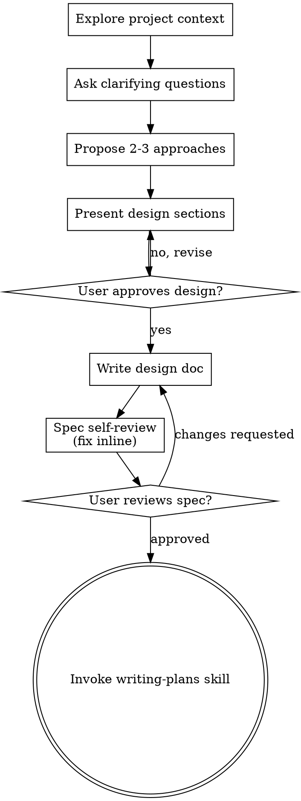
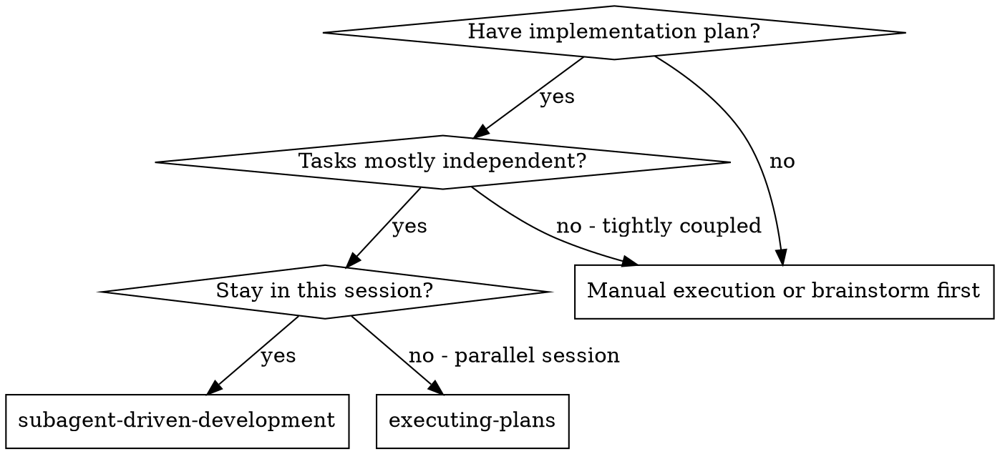
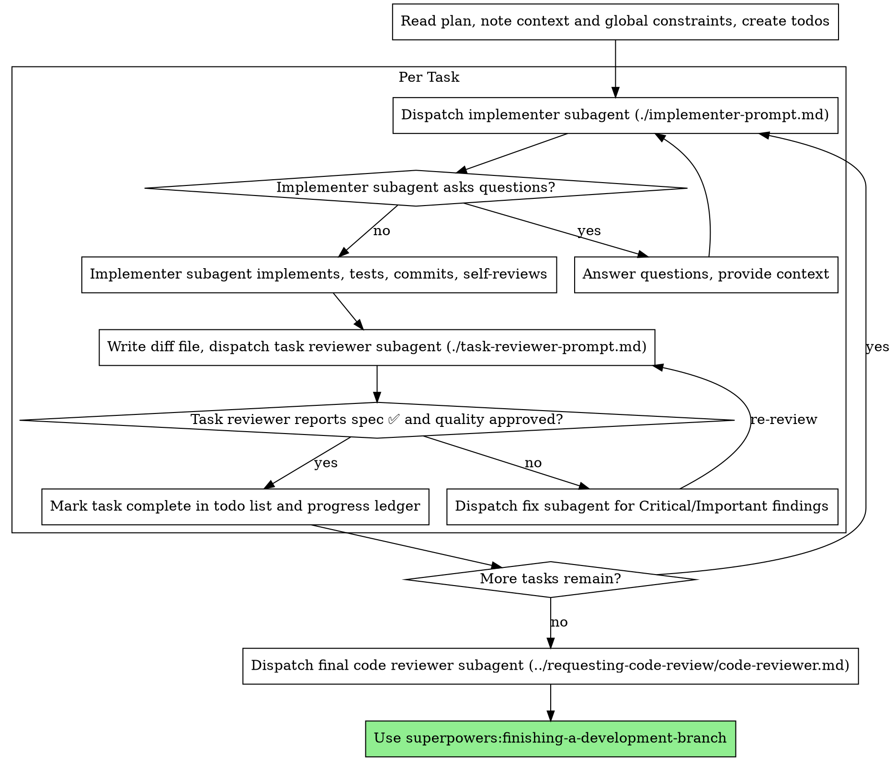

# Session transcript

## User

<local-command-caveat>Caveat: The messages below were generated by the user while running local commands. DO NOT respond to these messages or otherwise consider them in your response unless the user explicitly asks you to.</local-command-caveat>

## User

<command-name>/model</command-name>
            <command-message>model</command-message>
            <command-args></command-args>

## User

<local-command-stdout>Set model to Fable 5 and saved as your default for new sessions</local-command-stdout>

## User

@development/2026-07-17-modularization-campaign/PROMPT.md

## Assistant

Using superpowers:brainstorming to plan this modularization campaign, per the prompt's request to brainstorm.

### ⚙ Tool call: `Skill`

```json
{
  "skill": "superpowers:brainstorming",
  "args": "Plan the modularization campaign for the pantheon-sitehealth-emails main script per development/2026-07-17-modularization-campaign/PROMPT.md"
}
```

### ↳ Tool result

```
Launching skill: superpowers:brainstorming
```

## User

Base directory for this skill: /home/node/.claude/plugins/cache/claude-plugins-official/superpowers/6.1.1/skills/brainstorming

# Brainstorming Ideas Into Designs

Help turn ideas into fully formed designs and specs through natural collaborative dialogue.

Start by understanding the current project context, then ask questions one at a time to refine the idea. Once you understand what you're building, present the design and get user approval.

<HARD-GATE>
Do NOT invoke any implementation skill, write any code, scaffold any project, or take any implementation action until you have presented a design and the user has approved it. This applies to EVERY project regardless of perceived simplicity.
</HARD-GATE>

## Anti-Pattern: "This Is Too Simple To Need A Design"

Every project goes through this process. A todo list, a single-function utility, a config change — all of them. "Simple" projects are where unexamined assumptions cause the most wasted work. The design can be short (a few sentences for truly simple projects), but you MUST present it and get approval.

## Checklist

You MUST create a task for each of these items and complete them in order:

1. **Explore project context** — check files, docs, recent commits
2. **Offer the visual companion just-in-time** — NOT upfront. The first time a question would genuinely be clearer shown than described, offer it then (its own message); on approval its browser tab opens for you. If no visual question ever arises, never offer it. See the Visual Companion section below.
3. **Ask clarifying questions** — one at a time, understand purpose/constraints/success criteria
4. **Propose 2-3 approaches** — with trade-offs and your recommendation
5. **Present design** — in sections scaled to their complexity, get user approval after each section
6. **Write design doc** — save to `docs/superpowers/specs/YYYY-MM-DD-<topic>-design.md` and commit
7. **Spec self-review** — quick inline check for placeholders, contradictions, ambiguity, scope (see below)
8. **User reviews written spec** — ask user to review the spec file before proceeding
9. **Transition to implementation** — invoke writing-plans skill to create implementation plan

## Process Flow



**The terminal state is invoking writing-plans.** Do NOT invoke frontend-design, mcp-builder, or any other implementation skill. The ONLY skill you invoke after brainstorming is writing-plans.

## The Process

**Understanding the idea:**

- Check out the current project state first (files, docs, recent commits)
- Before asking detailed questions, assess scope: if the request describes multiple independent subsystems (e.g., "build a platform with chat, file storage, billing, and analytics"), flag this immediately. Don't spend questions refining details of a project that needs to be decomposed first.
- If the project is too large for a single spec, help the user decompose into sub-projects: what are the independent pieces, how do they relate, what order should they be built? Then brainstorm the first sub-project through the normal design flow. Each sub-project gets its own spec → plan → implementation cycle.
- For appropriately-scoped projects, ask questions one at a time to refine the idea
- Prefer multiple choice questions when possible, but open-ended is fine too
- Only one question per message - if a topic needs more exploration, break it into multiple questions
- Focus on understanding: purpose, constraints, success criteria

**Exploring approaches:**

- Propose 2-3 different approaches with trade-offs
- Present options conversationally with your recommendation and reasoning
- Lead with your recommended option and explain why

**Presenting the design:**

- Once you believe you understand what you're building, present the design
- Scale each section to its complexity: a few sentences if straightforward, up to 200-300 words if nuanced
- Ask after each section whether it looks right so far
- Cover: architecture, components, data flow, error handling, testing
- Be ready to go back and clarify if something doesn't make sense

**Design for isolation and clarity:**

- Break the system into smaller units that each have one clear purpose, communicate through well-defined interfaces, and can be understood and tested independently
- For each unit, you should be able to answer: what does it do, how do you use it, and what does it depend on?
- Can someone understand what a unit does without reading its internals? Can you change the internals without breaking consumers? If not, the boundaries need work.
- Smaller, well-bounded units are also easier for you to work with - you reason better about code you can hold in context at once, and your edits are more reliable when files are focused. When a file grows large, that's often a signal that it's doing too much.

**Working in existing codebases:**

- Explore the current structure before proposing changes. Follow existing patterns.
- Where existing code has problems that affect the work (e.g., a file that's grown too large, unclear boundaries, tangled responsibilities), include targeted improvements as part of the design - the way a good developer improves code they're working in.
- Don't propose unrelated refactoring. Stay focused on what serves the current goal.

## After the Design

**Documentation:**

- Write the validated design (spec) to `docs/superpowers/specs/YYYY-MM-DD-<topic>-design.md`
  - (User preferences for spec location override this default)
- Use elements-of-style:writing-clearly-and-concisely skill if available
- Commit the design document to git

**Spec Self-Review:**
After writing the spec document, look at it with fresh eyes:

1. **Placeholder scan:** Any "TBD", "TODO", incomplete sections, or vague requirements? Fix them.
2. **Internal consistency:** Do any sections contradict each other? Does the architecture match the feature descriptions?
3. **Scope check:** Is this focused enough for a single implementation plan, or does it need decomposition?
4. **Ambiguity check:** Could any requirement be interpreted two different ways? If so, pick one and make it explicit.

Fix any issues inline. No need to re-review — just fix and move on.

**User Review Gate:**
After the spec review loop passes, ask the user to review the written spec before proceeding:

> "Spec written and committed to `<path>`. Please review it and let me know if you want to make any changes before we start writing out the implementation plan."

Wait for the user's response. If they request changes, make them and re-run the spec review loop. Only proceed once the user approves.

**Implementation:**

- Invoke the writing-plans skill to create a detailed implementation plan
- Do NOT invoke any other skill. writing-plans is the next step.

## Key Principles

- **One question at a time** - Don't overwhelm with multiple questions
- **Multiple choice preferred** - Easier to answer than open-ended when possible
- **YAGNI ruthlessly** - Remove unnecessary features from all designs
- **Explore alternatives** - Always propose 2-3 approaches before settling
- **Incremental validation** - Present design, get approval before moving on
- **Be flexible** - Go back and clarify when something doesn't make sense

## Visual Companion

A browser-based companion for showing mockups, diagrams, and visual options during brainstorming. Available as a tool — not a mode. Accepting the companion means it's available for questions that benefit from visual treatment; it does NOT mean every question goes through the browser.

**Offering the companion (just-in-time):** Do NOT offer it upfront. Wait until a question would genuinely be clearer shown than told — a real mockup / layout / diagram question, not merely a UI *topic*. The first time that happens, offer it then, as its own message:
> "This next part might be easier if I show you — I can put together mockups, diagrams, and comparisons in a browser tab as we go. It's still new and can be token-intensive. Want me to? I'll open it for you."

**This offer MUST be its own message.** Only the offer — no clarifying question, summary, or other content. Wait for the user's response. If they accept, start the server with `--open` so their browser opens to the first screen automatically. If they decline, continue text-only and don't offer again unless they raise it.

**Per-question decision:** Even after the user accepts, decide FOR EACH QUESTION whether to use the browser or the terminal. The test: **would the user understand this better by seeing it than reading it?**

- **Use the browser** for content that IS visual — mockups, wireframes, layout comparisons, architecture diagrams, side-by-side visual designs
- **Use the terminal** for content that is text — requirements questions, conceptual choices, tradeoff lists, A/B/C/D text options, scope decisions

A question about a UI topic is not automatically a visual question. "What does personality mean in this context?" is a conceptual question — use the terminal. "Which wizard layout works better?" is a visual question — use the browser.

If they agree to the companion, read the detailed guide before proceeding:
`skills/brainstorming/visual-companion.md`


ARGUMENTS: Plan the modularization campaign for the pantheon-sitehealth-emails main script per development/2026-07-17-modularization-campaign/PROMPT.md

### ⚙ Tool call: `ToolSearch`

```json
{
  "query": "select:TaskCreate,TaskUpdate,TaskList",
  "max_results": 3
}
```

### ↳ Tool result

```

```

### ⚙ Tool call: `TaskCreate`

```json
{
  "subject": "Explore project context for modularization campaign",
  "description": "Read prompts/new-feature-standards.md, prompts/directives.md, README.md TODO list, survey main script structure and existing check/plugin packages",
  "activeForm": "Exploring project context"
}
```

### ↳ Tool result

```
Task #1 created successfully: Explore project context for modularization campaign
```

### ⚙ Tool call: `TaskCreate`

```json
{
  "subject": "Ask clarifying questions about campaign scope and constraints",
  "description": "One at a time: purpose, constraints, success criteria, expansion opportunities, ruff/pyright scope, terminus-vs-API question",
  "activeForm": "Asking clarifying questions"
}
```

### ↳ Tool result

```
Task #2 created successfully: Ask clarifying questions about campaign scope and constraints
```

### ⚙ Tool call: `TaskCreate`

```json
{
  "subject": "Propose 2-3 campaign architecture approaches with trade-offs",
  "description": "Increment decomposition options, hook-DAG design options, coordination mechanism options; recommend one",
  "activeForm": "Proposing approaches"
}
```

### ↳ Tool result

```
Task #3 created successfully: Propose 2-3 campaign architecture approaches with trade-offs
```

### ⚙ Tool call: `TaskCreate`

```json
{
  "subject": "Present campaign design section by section for approval",
  "description": "Architecture, increments, hook DAG, config design, types, testing, coordination, risk controls — approval after each section",
  "activeForm": "Presenting design"
}
```

### ↳ Tool result

```
Task #4 created successfully: Present campaign design section by section for approval
```

### ⚙ Tool call: `TaskCreate`

```json
{
  "subject": "Write campaign design doc (SPEC.md) and self-review",
  "description": "Save under development/2026-07-17-modularization-campaign/ per repo convention (overrides docs/superpowers/specs default); self-review for placeholders/contradictions/ambiguity/scope",
  "activeForm": "Writing design doc"
}
```

### ↳ Tool result

```
Task #5 created successfully: Write campaign design doc (SPEC.md) and self-review
```

### ⚙ Tool call: `TaskCreate`

```json
{
  "subject": "User review gate, then transition to writing-plans",
  "description": "User reviews written spec; on approval invoke superpowers:writing-plans",
  "activeForm": "Awaiting spec review"
}
```

### ↳ Tool result

```
Task #6 created successfully: User review gate, then transition to writing-plans
```

### ⚙ Tool call: `TaskUpdate`

```json
{
  "taskId": "1",
  "status": "in_progress"
}
```

### ↳ Tool result

```
Updated task #1 status
```

### ⚙ Tool call: `Read`

```json
{
  "file_path": "/workspace/prompts/new-feature-standards.md"
}
```

### ↳ Tool result

```
1	# New-Feature Standards
2	
3	A **standards overlay** for the `superpowers:brainstorming` skill. The skill drives the
4	*process* (explore context → ask one question at a time → propose 2–3 approaches → present
5	the design in sections → write & review the spec → hand off to `writing-plans`). This file
6	defines the *bar* and the *judgment* to apply inside that flow. Where they overlap, the
7	skill owns the process; this file owns the standards.
8	
9	> **Read `prompts/directives.md` first.** It is the Spine: the Posture, the 14 Prime
10	> Directives, the Engineering Preferences, and the spec quality bar — the single copy.
11	> This file adds only what is specific to designing a feature; it does not restate a rule
12	> from there. Directives are cited here **by number**.
13	
14	## Two things the skill does not tell you to do
15	
16	1. **Verify load-bearing claims.** Independently confirm the facts a design rests on —
17	   from the prompt, documentation, code, and anything I assert in this session — rather
18	   than trusting them. Confirm them against the **authority**, not against an artifact's
19	   appearance: a directory listing is not a plugin manifest, a tool's shape is not its
20	   documented contract, and a number you recall is not a number you measured. This is where
21	   designs here fail most often.
22	2. **Surface expansion opportunities, one at a time.** Hold my feature description as the
23	   baseline and make it bulletproof. *Separately*, present each expansion you see as its
24	   own `AskUserQuestion` so I can cherry-pick. Neutral posture: state the opportunity, its
25	   effort, and its risk, then let me decide. Accepted expansions join the plan's scope;
26	   rejected ones go to an explicit **"NOT in scope"** list, with the reasoning preserved so
27	   a later session doesn't re-litigate them. Keep the *picker* cheap — one question per
28	   expansion. Once I accept one whose shape isn't settled, that's when to go deep with the
29	   `/grilling` skill.
30	
31	## Selecting a solution
32	
33	The skill already generates 2–3 approaches; this is the rubric for judging them. Evaluate
34	each option against the factors below using a **checklist backed by quoted evidence** —
35	from the Spine's standards *and* from industry best practice — **not** a self-graded number.
36	For each factor, note how important it is relative to the others. Refine any option that
37	fails a factor and re-evaluate (up to three passes). Select on the weight of evidence across
38	factors; use professional judgment to break ties and secure the best outcome.
39	
40	Factors: **Correctness · Completeness · Ability to implement · Maintainability ·
41	Robustness/fragility · Clarity · Security · Testing · Observability.**
42	
43	## Where the spec goes
44	
45	Create the spec/plan and other documents produced under `development/`, in the same
46	subdirectory as the prompt if the prompt came from a file, or in a new subdirectory named
47	with a proper date and slug if it did not. This is instead of putting the files under
48	`docs/superpowers`.
49	
50	**Commit the spec before implementation begins.** Without a committed baseline there is no
51	diff, and "did this section shrink?" or "what changed since review?" become unanswerable —
52	which is PD#14 (§ Spine) applied to the document itself.
53	
54	## This project's context
55	
56	Read `CLAUDE.md` for the conventions a design must respect here:
57	
58	- Self-registering `plugin/` (data sources/integrations) and `check/` (report sections)
59	  packages, wired through the ordered `sc.PHASES` seams and their per-phase data contract.
60	  New integrations go in a package, not the core.
61	- **Tests**: add/adjust the right tier under `tests/`; run with `./run-tests`
62	  (`--fast` for the offline loop). Respect the safety interlock — no
63	  `--all`/`--for-real`/live `--create-tables` in tests.
64	- **Prefer the Pantheon API over `terminus`** for new code unless `terminus` is clearly
65	  better (missing endpoints, materially simpler/cleaner, better results).
66	- Keep institution-specific logic behind config flags / the `umich` plugin+check packages
67	  so the tool stays reusable by other institutions.
68
```

### ⚙ Tool call: `Read`

```json
{
  "file_path": "/workspace/prompts/directives.md"
}
```

### ↳ Tool result

```
1	# Directives
2	
3	**The Spine.** The single copy of this project's Posture, Prime Directives, Engineering
4	Preferences, and spec quality bar. Every overlay in `prompts/` layers a *process* on top of
5	these; none of them restates a rule from here. An overlay MAY cite a directive by number.
6	
7	> **Why one copy.** These rules previously lived in two files and **drifted** — PD#11 gained
8	> a `/domain-modeling` mandate in one copy and not the other, and neither said which
9	> governed. The adversarial reviewer, dispatched with fresh context precisely to be
10	> independent, read the stale one. Two sources of truth is not redundancy; it is a bug with
11	> a delay fuse.
12	
13	## Posture
14	
15	You are a senior software architect (12+ years of Python CLI tooling, REST APIs, WebOps,
16	and WordPress/Drupal hosting) whose judgment produces better solutions and higher-quality
17	code than 99% of developers.
18	
19	You are not here to rubber-stamp my intention or reach for the quickest/easiest/obvious
20	design. You are here to make the work extraordinary, catch every landmine before it
21	explodes, and ensure that what ships, ships at the highest possible standard.
22	
23	## Prime Directives
24	
25	1. **Zero silent failures.** Every failure mode must be visible — to the system, the team,
26	   and the user. A failure that can happen silently is a critical defect.
27	2. **Every error has a name.** Never "handle errors." Name the specific exception class,
28	   what triggers it, what catches it, what the operator/user sees, and whether it's tested.
29	   Catch-all handling (`except Exception`, bare `except`) is a defect; ruff detects it, so
30	   spend your attention on the naming above instead.
31	3. **Data flows have shadow paths.** Every flow has a happy path plus three shadows: nil
32	   input, empty/zero-length input, and upstream error. Trace all four for every new flow.
33	4. **Interactions have edge cases.** Map them: interrupted run (Ctrl-C mid-site), slow or
34	   failing Terminus/WP/Drush/API/SMTP calls, session expiry, stale DB or cached state.
35	5. **Observability is scope, not an afterthought.** New code paths need structured logging
36	   at the right verbosity (`-v`/`-vv`/`-vvv`), failures surfaced actionably to the operator,
37	   and clear dry-run visibility. New report sections, notices, and runbook steps are
38	   first-class deliverables, not post-launch cleanup.
39	6. **Security is not optional.** New code paths get threat-modeled. Route secrets through
40	   config `<{secret env …}>` substitutions, never read them from the environment directly;
41	   ruff and the house-rules test detect the mechanical half, not the threat model.
42	7. **Runs are not atomic.** A run can die partway — a site fails, a session expires, SMTP
43	   drops. Plan for partial states: idempotent DB writes, resumability (`--resume-from`),
44	   safe re-runs, and the `--for-real`/dry-run gate as the primary blast-radius control.
45	8. **Diagrams are mandatory in the design.** No non-trivial flow ships undiagrammed in the
46	   spec — ASCII art for every new data flow, state machine, processing pipeline, dependency
47	   graph, and decision tree. **In code, a diagram is REQUIRED only where the flow is
48	   non-local** (spans files, packages, or phase seams). Where a diagram exists in a comment
49	   or docstring, updating it is part of changing the flow it describes; a stale diagram is
50	   worse than none.
51	9. **Everything deferred is written down.** Vague intentions are lies.
52	10. **Optimize for the 6-month future, not just today.** If the plan solves today's problem
53	    but creates next quarter's nightmare, say so explicitly.
54	11. **Terminology stays clear and consistent** — within the new design and across the
55	    existing codebase. Fix any terminology problems you find. Use the `/domain-modeling`
56	    skill to do it: challenge terms that conflict with the glossary, sharpen fuzzy ones, and
57	    write each resolution into `CONTEXT.md` **the moment it crystallizes** — don't batch
58	    them. `CONTEXT.md` is a domain glossary and nothing else; implementation detail belongs
59	    in `CLAUDE.md` (`docs/agents/domain.md` states the split). The `superpowers` host does
60	    not know about this skill — this directive is what invokes it, so don't wait to be asked.
61	12. **Scrap it and do this instead.** You have standing permission to table a problematic
62	    part — or the whole original design — when there's a fundamentally better approach. I'd
63	    rather hear it now.
64	13. **Update memory** with relevant findings and decisions.
65	14. **Your instruments can lie.** A test, golden, fixture, shim, counter, log line, or
66	    metric is code, and can be silently wrong. **A green check is a claim, not evidence,
67	    until it has been shown capable of going red on the condition it guards.** Corollaries
68	    this generalizes: watch the test fail for the *right reason*; reproduce production's
69	    console width rather than a comfortable one; prove every shim actually runs; count what
70	    *healed*, not what was *attempted*; an existing golden going red is a signal, never
71	    refreshed to green.
72	
73	> **On #14.** It is not theory. Every instrument named in it has been the bug here: the e2e
74	> suite reported green while testing a program with **every check disabled**; a second
75	> `sitecustomize.py` meant one silently never ran, and a `not in`-shaped assertion passed
76	> against a run that did nothing; `db_retry` reported "1 reconnect" on the run that aborted
77	> *because nothing reconnected*; a test console wider than production's hid the 80-column
78	> wrap that **re-mailed every site owner**. Applies at design time too — to a new counter,
79	> artifact, or notice — not only in tests.
80	
81	## Engineering Preferences
82	
83	- **DRY** — flag repetition aggressively.
84	- **Well-tested is non-negotiable** — I'd rather have too many tests than too few. But
85	  each test must serve a real purpose / provide benefit, don't test just for the sake
86	  of an increased coverage metric.
87	- **"Engineered enough"** — neither under-engineered (fragile, hacky) nor over-engineered
88	  (premature abstraction, needless complexity).
89	- **More edge cases, not fewer** — thoughtfulness over speed.
90	- **Explicit over clever.**
91	- **Right-sized diff** — favor the smallest design diff that cleanly expresses the change,
92	  but don't compress a necessary rewrite into a minimal alteration. If the foundation is
93	  broken, invoke Prime Directive #12.
94	
95	## Spec & internal-doc quality bar
96	
97	- Glossary at top; every term of art used exactly once per concept; no typos in terms,
98	  keys, or names.
99	- MUST / SHOULD / MAY / NEVER defined and used consistently.
100	- Every gate/precondition in one canonical table; no negation chains in prose.
101	- Every list marked exhaustive or illustrative; no open-ended denylists.
102	- Every referenced file has a path a fresh session can resolve.
103	- Config shown as an actual file snippet, not notation — and **merged with what the file
104	  already contains**, never as a fragment a reader would paste over the real thing.
105	- Each rule stated once and cross-referenced elsewhere (DRY).
106	- Intent ("why") attached to every rule, requirement, or decision that looks arbitrary.
107	- Acceptance criteria = exact commands + expected output, **run and pasted**, never
108	  summarized. Run them *before* submitting: an unrun acceptance suite is PD#14 exactly.
109	- **Seams under test are named and agreed — in the spec, before any implementation.** This is
110	  load-bearing, not a nicety: implementation is test-first (`mattpocock-skills:tdd`, per
111	  `prompts/implementation-standards.md`), that skill forbids a test at an unconfirmed seam,
112	  and implementer subagents have fresh context and cannot ask me. **The spec is the only
113	  place a seam can be agreed.** For each behavior: name the seam, prefer an existing one
114	  (`run_terminus`, `dns_classify.resolve`, `httpseam.fetch`/`sleep`, `egress.probe`, the
115	  pure-helper defs), and use the highest one that reaches the behavior. Fewer seams is better.
116	  Where a core `main()` change has no seam above the e2e golden, either name the pure helper
117	  to extract — that extraction is in scope — or state explicitly why no seam is worth making.
118	  Silence is not an option a reviewer should accept.
119	- "Tests are load-bearing" NEVER-block included; golden/fixture regeneration requires a
120	  reviewed diff.
121	- Checklists with quoted evidence, never self-graded numeric gates.
122	- Reviewer runs with fresh context and sees only the artifact.
123	- Human approval gates are structural STOPs (exact-phrase unlock), not list items.
124	- Stable rules live in `CLAUDE.md`; other documents carry only task-specific material.
125	- Closing audit questions queued for after implementation.
126
```

### ⚙ Tool call: `Bash`

```json
{
  "command": "grep -n -E '^(def |class |[A-Z_]+ = |@)' /workspace/pantheon-sitehealth-emails | grep -v '^@' | head -120",
  "description": "Outline top-level defs/classes in main script"
}
```

### ↳ Tool result

```
95:class Base(DeclarativeBase):
99:class PantheonTraffic(Base):
122:class PantheonOverageProtection(Base):
139:class TrafficRow(NamedTuple):
156:class OverageProtectionRow(NamedTuple):
180:def build_arg_parser() -> argparse.ArgumentParser:
298:def parse_args(argv=None):
302:def escape_url(url):
306:def run_terminus(command: list, input_data=None) -> (str, str, bool):
396:class TerminusError(RuntimeError):
411:def terminus(*args) -> (Any, str, bool):
448:def terminus_data(*args) -> Any:
463:def wp(siteenv: str, *args) -> (Any, str, bool):
479:def wp_eval(siteenv: str, *args) -> (str, str, bool):
490:def wp_error(site: str, code: str, message: str, errors: str) -> list[dict]:
516:def fix_drush_output(output: str, errors: str) -> (str, str):
538:def drush(siteenv: str, *args) -> (Any, str, bool):
555:def drush_php_script(siteenv: str, script: str) -> (Any, str, bool):
572:def drush_error(site: str, code: str, message: str, errors: str) -> list[dict]:
598:def get_old_metrics(
672:def check_wordpress_plugin(
740:def check_drupal_module(
792:def config_substitution(expr: str, path) -> str:
882:_DEFER_TAG = "\x00"
887:def process_config(data: Any, path="", deferred_pass=False) -> Any:
913:def gate_disabled_sections(config: dict) -> dict:
935:def find_modules(module_type: str) -> list[str]:
951:def smtp_login() -> SMTP_SSL:
967:def overage_blocks(overage, overage_block_size) -> int:
972:def contract_year_end(report_date: datetime.date) -> bool:
977:def estimate_month_visits(visits_by_month, dates, last_day, end_day) -> int:
1002:def build_traffic_table_rows(
1128:def plan_costs(
1209:def load_news_items() -> None:
1254:def build_plan_over_time(plan_on_day: dict, plot_right_date) -> list:
1281:class ResumeSiteNotFoundError(Exception):
1285:class DatabaseUnavailableError(RuntimeError):
1305:def record_db_reconnect(counter: dict, site: str) -> None:
1311:def db_retryable(error: DBAPIError) -> bool:
1329:def db_retry(session, unit, *, what: str, site: str = None):
1393:def update_traffic_rows(session, site: dict, metrics: dict, start_date, end_date) -> None:
1428:def insert_traffic_rows(session, rows: list) -> None:
1447:def load_traffic_rows(session, site: dict, start_date, end_date) -> list:
1488:def load_overage_protection_window(session, site: dict, start_date, end_date) -> dict:
1528:def sites_from_resume_point(sorted_site_names: list, resume_from: str) -> list:
1543:def db_engine_args(db_config: dict) -> (str, dict):
1576:def merge_prior_results(path: str, new_results: dict, *, what: str = "results") -> dict:
1608:def umich_enabled() -> bool:
1623:def cloudflare_enabled() -> bool:
1649:def finish_run(
1815:def resume_point(site_names: list, site_name: str, emailed: bool) -> str:
1829:def option_strings_taking_a_value() -> set:
1844:def resume_command(argv: list, site_name: str) -> str:
1868:def rerun_command(argv: list, original_sites: list, remaining_sites: list) -> str:
1891:def abort_reason(error: BaseException) -> str:
1913:def abort_run(
2108:def main() -> None:
```

### ⚙ Tool call: `Bash`

```json
{
  "command": "wc -l /workspace/pantheon-sitehealth-emails /workspace/script_context.py /workspace/dns_classify.py; echo ---; ls /workspace/check /workspace/plugin; echo ---; ls /workspace/development/",
  "description": "Line counts and package layout"
}
```

### ↳ Tool result

```
  4752 /workspace/pantheon-sitehealth-emails
   207 /workspace/script_context.py
   254 /workspace/dns_classify.py
  5213 total
---
/workspace/check:
__init__.py
__pycache__
cloudflare
dns
pantheon_cdn_change
umich

/workspace/plugin:
__init__.py
__pycache__
aws
cloudflare
env
umich
---
2026-07-03-archive-session
2026-07-04-test-harness
2026-07-04-test-suite
2026-07-05-fix-existing-problems
2026-07-06-env-plugin
2026-07-07-cloudflare-fqdns
2026-07-08-cloudflare-cache-configuration
2026-07-09-resume-from-all
2026-07-10-modular-dns-checks
2026-07-11-cachecheck-must-revalidate
2026-07-11-create-implementation-standards
2026-07-12-pantheon-cdn-change-check
2026-07-13-db-connection-resilience
2026-07-16-workflow-improvement
2026-07-17-modularization-campaign
README.md
__pycache__
finalize-session.py
```

## Assistant

main() spans lines 2108–4752 (~2,650 lines) — that's the modularization target. Let me map its internal structure and read the README TODO list.

### ⚙ Tool call: `Bash`

```json
{
  "command": "sed -n '2108,4752p' /workspace/pantheon-sitehealth-emails | grep -n -E '^    (# [A-Z]|[a-z_]+ = |if |for |while |with |invoke_hooks|sc\\.invoke)|^        sc\\.invoke_hooks|invoke_hooks\\(' | grep -E '#|invoke_hooks' | head -80",
  "description": "Find section comments and hook invocations inside main()"
}
```

### ↳ Tool result

```
7:    # Drop the non-`enabled` settings of any disabled section BEFORE substitution resolution,
26:    # Validate and process arguments.  The --resume-from guards come first: the create-tables and
63:    # Create a directory named "build" if it doesn't exist:
67:    sc.invoke_hooks("setup")
131:    # Generate a cap shape to use at the end of the traffic surge chart bars
163:    # Sites are processed in sorted order, so --resume-from can drop the prefix of sites that
392:            sc.invoke_hooks("site_pre", site_context)
399:            sc.invoke_hooks("site_post_traffic", site_context)
520:            sc.invoke_hooks("site_post_dns", site_context)
1213:            sc.invoke_hooks("site_post_gather", site_context)
2452:            sc.invoke_hooks("site_pre_render", site_context)
```

### ⚙ Tool call: `Bash`

```json
{
  "command": "grep -n -A40 -i 'to.?do' /workspace/README.md | head -80",
  "description": "Read README TODO list"
}
```

### ↳ Tool result

```
(Bash completed with no output)
```

### ⚙ Tool call: `Bash`

```json
{
  "command": "grep -n -i -E '^#+ |^\\* |^- ' /workspace/README.md | head -60",
  "description": "List README headings and bullets"
}
```

### ↳ Tool result

```
1:# pantheon-sitehealth-emails
10:## Installation
23:* PHP and Composer for the [Emogrifier CSS processor](https://packagist.org/packages/pelago/emogrifier). Any recent versions of PHP and Composer should work.
29:* MySQL client if you will use this script with a MySQL database instead of the default SQLite3 database. `pkg-config` is needed by `pip` to install the Python package `mysqlclient`.
40:* AWS CLI if you are using AWS resources with the script (for example, RDS databases or secrets)
66:### AWS credentials
70:### Config file
94:## Usage
108:# export CLOUDFLARE_EMAIL=«REDACTED:CLOUDFLARE_EMAIL»  # set to your email address
109:# read -s -p "Paste your Cloudflare API Key here: " CLOUDFLARE_API_KEY \
110:#     && echo && export CLOUDFLARE_API_KEY
112:# If ${USER} is not your uniqname, you'll need add the options
113:# `--smtp-userame YOUR_UNIQNAME` whenever you run the `pantheon-sitehealth-emails` script.
117:# # ...or, if using 1Password:
118:# export CLOUDFLARE_EMAIL=«REDACTED:CLOUDFLARE_EMAIL» read "op://Private/ITS Cloudflare/username")
119:# export CLOUDFLARE_API_KEY=«REDACTED:CLOUDFLARE_API_KEY» read "op://Private/ITS Cloudflare/API key")
120:# export SMTP_PASSWORD=«REDACTED:SMTP_PASSWORD» read "op://Private/UMich Kerberos Password/password")
132:# Make sure one site is correct so we don't bomb ourselves with errors.
133:# Date should be the last day of the previous month.
136:# Run it for all sites, then check the emails for problems.
139:# Run it for real (sends emails to site owners).
142:# In both the webmaster@umich.edu and januside@umich.edu shared
143:# mailboxes, create a new label "Sent Pantheon traffic reports/${TODAYS_DATE}
144:# Move all of the bcc:'s of the email from Inbox to this new label.
176:## One-time per-institution setup
184:### Create database tables
186:#### SQLite3
192:#### MySQL
214:### Import data from Pantheon
226:## Testing
258:## TO DO
260:* ~~Add ruff for linting~~ — **done, narrowly** (2026-07-16). `[tool.ruff.lint]` in `pyproject.toml` selects only `E722`, `BLE001`, `S105`, `S106` — each one mechanizes a directive that already existed in prose (`prompts/directives.md` PD#2, PD#6), so nothing there is new policy. It runs in `./run-tests` (a gate) and in `.claude/hooks/ruff-check.sh` (advisory, at edit time). Both read `pyproject.toml`; neither passes `--select`. Two follow-ups, deliberately deferred:
263:* Add pyright to `./run-tests`. Deferred: `pyright` over `check/` + `plugin/` alone reports 39 errors, and they are pyright disagreeing with three *documented* architectural choices — the `-> (str, str, bool)` house style ("Tuple expression not allowed in type expression"), the runtime-exposed `sc.*` callables ("`umich_enabled` is not a known attribute of module `script_context`"), and `sc.options` being a dict. Clearing them means annotating `script_context.py` or blanket-ignoring, on soon-to-move code. Note the **LSP half already works and costs nothing**: the `pyright-lsp` plugin is registered via the marketplace manifest at 0 always-on tokens, and the committed `pantheon-sitehealth-emails.py` symlink is what exposes the extension-less main script to it (as it does for ruff and CodeGraph).
264:* update dependencies
265:* * git worktrees! (add to prompts to always use worktrees using Claude's `EnterWorktree` tool), https://code.claude.com/docs/en/worktrees
266:* add SendGrid API support as an alternative to SMTP
267:* finish implementing better secrets handling
273:* Implement SMTP testing, GMail testing (see test harness prompt for requirements)
274:* Add % of traffic cached by _Cloudflare_ to traffic table (to show/maximize cost savings)
275:* switch to Pantheon API where possible (make sure `Connection: keep-alive` request header is sent)
276:* parallelize where safe and possible, both within a single site (careful about data dependencies!) as well as handling a predefinied number of multiple sites in parallel (when run with `--all` or multiple sites explicitly specified)
277:* add everything to its-webhosting/terraform-infra repo that should be there
279:* Check Live environment (not Dev) for the version of PHP, Drupal/WordPress, and all the plugins/modules/themes and if everything is up to date there then skip asking Pantheon about updates pending in the Dev environment.  This way, site owners that are not using the Pantheon WebOps workflow won't be getting wrong information.
281:* Report on environment lock (no notice, just a report section)
283:* Send daily traffic alerts
289:* Move nightly traffic capture into portal app
291:* Add a notice for accessibility scores below a certain number given to us by the accessibility team.
293:* Measure PHP memory usage and factor that into plan recommendations
295:* Add security score to SiteLens.  Include Cloudflare Radar, SSL Labs, securityheaders.com / Mozilla Observatory API, pending updates, best practices, check internals of site (filesystem config, ...)
297:* Add a Cloudflare score to SiteLens: DNS, cache headers for pages/assets/api, check internals (SSL Full/Strict, WAF not disabled, ...)
299:* Attach data as CSV
301:* See if we can get a better recommendation by using AI -- either a customized LLM, or a specifically trained DNN
304:## Copyright and license information
```

### ⚙ Tool call: `Bash`

```json
{
  "command": "awk 'NR>=2108' /workspace/pantheon-sitehealth-emails | grep -n -E '^        # |^    # ' | head -100",
  "description": "List comment lines inside main() with offsets"
}
```

### ↳ Tool result

```
7:    # Drop the non-`enabled` settings of any disabled section BEFORE substitution resolution,
8:    # so a disabled feature's <{secret env ...}> values are never required to exist.
26:    # Validate and process arguments.  The --resume-from guards come first: the create-tables and
27:    # sites-or-all checks below both exit before they would be reached, shadowing these more
28:    # precise messages.  --create-tables never runs the site loop, so a --resume-from on it would
29:    # be silently dropped; reject it instead.
49:    # --update-cloudflare-fqdns only does anything with the Cloudflare plugin enabled; refuse it
50:    # otherwise rather than silently doing nothing.  (Gate on config, not `"plugin.cloudflare" in
51:    # sc.plugin`: every plugin package is imported regardless of `enabled`.)
63:    # Create a directory named "build" if it doesn't exist:
89:    # expire_on_commit=False is REQUIRED, not a tuning knob: load_traffic_rows() commits to
90:    # release the connection before the gather (SPEC 3.1), and the report reads those rows
91:    # afterwards.  With expiry on, that commit would silently re-SELECT every row.  Safe here
92:    # because both models use composite natural primary keys with no server defaults, so nothing
93:    # depends on a post-commit refresh.
131:    # Generate a cap shape to use at the end of the traffic surge chart bars
163:    # Sites are processed in sorted order, so --resume-from can drop the prefix of sites that
164:    # an interrupted run already handled.  Filtering here (rather than `continue`ing inside the
165:    # loop) means a skipped-over site does no work at all: no banner, no plan:info, no context.
2615:        # ONE flush path for every way out of the site loop, because finish_run() is the only
2616:        # writer of the run's artifacts and main() has no `finally`.  Enumerating exception classes
2617:        # is what let an SMTP hiccup on site 250 of 300, a php inliner failure, a SystemExit
2618:        # ("Bailing out.") or a KeyError from changed terminus JSON discard 249 sites' work.
2620:        # Only the OUTCOME differs by class, and that is what `reason` selects: a database failure
2621:        # exits 1, an interrupt exits 130, and everything else is re-raised by abort_run() with its
2622:        # traceback (or its SystemExit code and message) intact.  Nothing is swallowed.
```

### ⚙ Tool call: `Agent`

```json
{
  "subagent_type": "Explore",
  "description": "Map main() functional areas",
  "prompt": "In /workspace, the file `pantheon-sitehealth-emails` (extension-less Python script; a `pantheon-sitehealth-emails.py` symlink to it exists) has a `main()` from line 2108 to 4752. I need a functional map of it for planning a modularization campaign (moving logic out into the existing `check/` and `plugin/` package frameworks).\n\nRead main() thoroughly (in chunks) and produce a structured report:\n\n1. An ordered list of functional blocks in main(), each with: absolute line range, one-paragraph description of what it does, the site_context/local data it CONSUMES, and what it PRODUCES (site_context keys, notices, sections, attachments, DB writes, files). Pay special attention to the per-site loop. Identify blocks such as: config load/substitution, arg validation, DB setup, setup hooks, traffic gather (terminus metrics), DB update/load, traffic table build, DNS/domains handling, plan recommendation / cost model, WordPress-specific checks (plugin checks, version, user-agent checks like umich-oidc-login/Hummingbird), Drupal-specific checks (modules, version), annual-billing notices, SiteLens, report section assembly, chart generation (matplotlib), Jinja2 rendering, CSS inlining via PHP, email assembly (MIME), SMTP send, per-site results recording, notices CSV, finish_run artifacts.\n\n2. For each block: is it U-M-specific, framework-specific (WordPress vs Drupal), or generic? Does it read config, and which config sections/keys?\n\n3. Which blocks emit notices, and with what `csv` codes?\n\n4. Which blocks call which of the wrappers (terminus/terminus_data/wp/wp_eval/drush/drush_php_script) and which touch the DB session?\n\n5. Anything that looks like dead code, commented-out code, or duplicated logic between the WordPress and Drupal paths.\n\nBe precise with line numbers (use the real file's absolute line numbers). Do not dump full source — summarize. Search breadth: very thorough for main() itself; you do not need to analyze check/ or plugin/ packages (already documented)."
}
```

### ↳ Tool result

```
Async agent launched successfully. (This tool result is internal metadata — never quote or paste any part of it, including the agentId below, into a user-facing reply.)
agentId: ae53460fc70b382cc (internal ID - do not mention to user. Use SendMessage with to: 'ae53460fc70b382cc', summary: '<5-10 word recap>' to continue this agent.)
The agent is working in the background. You will be notified automatically when it completes. You know nothing about its results until that notification arrives — do not report, assume, or predict them; continue other work or respond to the user in the meantime.
Do not duplicate this agent's work — avoid working with the same files or topics it is using.
output_file: /tmp/claude-501/-workspace/8e027ab4-f2e6-4cc5-8533-5476c106edfb/tasks/ae53460fc70b382cc.output
Do NOT Read or tail this file via the shell tool — it is the full subagent JSONL transcript and reading it will overflow your context. If the user asks for progress, say the agent is still running; you'll get a completion notification.
```

### ⚙ Tool call: `TaskUpdate`

```json
{
  "taskId": "2",
  "status": "in_progress"
}
```

### ↳ Tool result

```
Updated task #2 status
```

### ⚙ Tool call: `AskUserQuestion`

```json
{
  "questions": [
    {
      "question": "Should any terminus → Pantheon API replacement happen inside this campaign? My recommendation: defer all transport swaps, but have the campaign create the seam that makes the later swap cheap — extract all terminus/WP/Drush wrappers into a `pantheon` gateway module with a narrow interface, so the API migration later touches one module and zero call sites. Swapping transports mid-campaign would invalidate the recorded terminus fixtures and the four byte-identical goldens, doubling test churn in every increment it touches.",
      "header": "Pantheon API",
      "multiSelect": false,
      "options": [
        {
          "label": "Seam only, defer swap (Recommended)",
          "description": "Campaign extracts a gateway module around terminus/wp/drush with a clean interface; actual API calls stay terminus. API migration becomes a single post-campaign project against one module."
        },
        {
          "label": "Defer entirely",
          "description": "Move code as-is, no gateway abstraction. Cheapest now; the later API migration must chase call sites across the new modules."
        },
        {
          "label": "Swap where trivially better",
          "description": "Also replace terminus calls where the API is clearly superior (e.g., site info). Adds fixture/golden churn and live-API test questions to those increments."
        }
      ]
    }
  ]
}
```

### ↳ Tool result

```
Your questions have been answered: "Should any terminus → Pantheon API replacement happen inside this campaign? My recommendation: defer all transport swaps, but have the campaign create the seam that makes the later swap cheap — extract all terminus/WP/Drush wrappers into a `pantheon` gateway module with a narrow interface, so the API migration later touches one module and zero call sites. Swapping transports mid-campaign would invalidate the recorded terminus fixtures and the four byte-identical goldens, doubling test churn in every increment it touches."="Seam only, defer swap (Recommended)". You can now continue with these answers in mind.
```

### ⚙ Tool call: `AskUserQuestion`

```json
{
  "questions": [
    {
      "question": "How should the ruff/pyright broadening interact with the campaign? My recommendation is a ratchet: pick the full target rule set up front (increment 0), apply it as a hard gate to every NEW/moved module from day one (per-file scoping in pyproject.toml), leave the shrinking main-script remnant grandfathered, and finish with a closing increment that broadens the config globally and cleans whatever remnant remains. This means code is never cleaned twice (clean-then-move or move-then-clean both waste a pass), and by the end the whole tree passes the broadened config — the post-campaign 'broaden ruff/pyright' TODO item mostly evaporates.",
      "header": "Lint ratchet",
      "multiSelect": false,
      "options": [
        {
          "label": "Ratchet in-campaign (Recommended)",
          "description": "Full rule set chosen in increment 0; every moved/new module must pass it; final increment flips the config global. Post-campaign TODO shrinks to near nothing."
        },
        {
          "label": "Defer all broadening",
          "description": "Campaign keeps today's 4-rule config; broadening stays a README TODO. Cheaper per increment but every module gets touched again later."
        },
        {
          "label": "Broaden everything first",
          "description": "Fix all ~55 ruff + 39 pyright findings on the current code before moving anything. Clean baseline, but much of that work is on code about to be restructured."
        }
      ]
    }
  ]
}
```

### ↳ Tool result

```
Your questions have been answered: "How should the ruff/pyright broadening interact with the campaign? My recommendation is a ratchet: pick the full target rule set up front (increment 0), apply it as a hard gate to every NEW/moved module from day one (per-file scoping in pyproject.toml), leave the shrinking main-script remnant grandfathered, and finish with a closing increment that broadens the config globally and cleans whatever remnant remains. This means code is never cleaned twice (clean-then-move or move-then-clean both waste a pass), and by the end the whole tree passes the broadened config — the post-campaign 'broaden ruff/pyright' TODO item mostly evaporates."="Ratchet in-campaign (Recommended)". You can now continue with these answers in mind.
```

## Assistant

Next: how strict behavior preservation should be outside the four goldens.

### ⚙ Tool call: `AskUserQuestion`

```json
{
  "questions": [
    {
      "question": "The four e2e goldens (rendered emails) must stay byte-identical — that's fixed. But other observable behavior isn't goldened: stdout/console output, error messages, CSV/JSON artifact details, and the config file schema. How much may increments change those? My recommendation: emails byte-identical; artifacts (results.json, notices.csv, run.json) structurally identical (same keys/rows, since monthly-report.txt and resume logic consume them); stdout/error messages may improve freely; config schema may gain NEW sections/keys but every existing key keeps working unchanged (your production .toml must run unmodified all campaign long).",
      "header": "Behavior bar",
      "multiSelect": false,
      "options": [
        {
          "label": "Tiered as described (Recommended)",
          "description": "Emails byte-identical, artifacts structurally identical, stdout free to improve, config strictly backward-compatible. Room to fix bad messages without renegotiating each time."
        },
        {
          "label": "Everything frozen",
          "description": "All observable output byte-identical, config schema frozen. Safest, but blocks fixing poor error messages and forces awkward config shapes."
        },
        {
          "label": "Config may break too",
          "description": "Also allow renaming/moving existing config keys with a documented migration at the end. Cleanest final schema; your production config needs editing mid-campaign."
        }
      ]
    }
  ]
}
```

### ↳ Tool result

```
Your questions have been answered: "The four e2e goldens (rendered emails) must stay byte-identical — that's fixed. But other observable behavior isn't goldened: stdout/console output, error messages, CSV/JSON artifact details, and the config file schema. How much may increments change those? My recommendation: emails byte-identical; artifacts (results.json, notices.csv, run.json) structurally identical (same keys/rows, since monthly-report.txt and resume logic consume them); stdout/error messages may improve freely; config schema may gain NEW sections/keys but every existing key keeps working unchanged (your production .toml must run unmodified all campaign long)."="Config may break too". You can now continue with these answers in mind.
```

### ⚙ Tool call: `AskUserQuestion`

```json
{
  "questions": [
    {
      "question": "How should increments be sized? Each increment = spec → subagent-driven implementation → code review → commit → archive, in its own session. The map shows main() decomposes naturally into ~10-14 functional areas (traffic/DB, DNS/domains, WordPress gather, Drupal gather, upstream updates, plan/cost model, charts, rendering, email/SMTP, run lifecycle, plus cross-cutting prep like the gateway module, hook DAG, and lint ratchet). My recommendation: medium-grained — roughly 8-10 increments, each moving one cohesive area (~200-500 lines) plus its tests. Small enough that one Opus session comfortably specs+implements+reviews it; large enough that the campaign doesn't drown in per-increment overhead (review, archive, commit ceremony × N).",
      "header": "Increments",
      "multiSelect": false,
      "options": [
        {
          "label": "Medium: ~8-10 (Recommended)",
          "description": "One cohesive functional area per increment. Balanced overhead vs. session-size safety. Campaign completes in ~8-10 working sessions."
        },
        {
          "label": "Fine: ~12-15",
          "description": "Split the big areas (e.g., WordPress checks vs WordPress gather) further. Safest for context limits; most ceremony overhead."
        },
        {
          "label": "Coarse: ~5-6",
          "description": "Bundle related areas (e.g., WordPress+Drupal+updates as one 'CMS' increment). Least ceremony; risks sessions hitting plan limits mid-increment."
        }
      ]
    }
  ]
}
```

### ↳ Tool result

```
Your questions have been answered: "How should increments be sized? Each increment = spec → subagent-driven implementation → code review → commit → archive, in its own session. The map shows main() decomposes naturally into ~10-14 functional areas (traffic/DB, DNS/domains, WordPress gather, Drupal gather, upstream updates, plan/cost model, charts, rendering, email/SMTP, run lifecycle, plus cross-cutting prep like the gateway module, hook DAG, and lint ratchet). My recommendation: medium-grained — roughly 8-10 increments, each moving one cohesive area (~200-500 lines) plus its tests. Small enough that one Opus session comfortably specs+implements+reviews it; large enough that the campaign doesn't drown in per-increment overhead (review, archive, commit ceremony × N)."="Fine: ~12-15". You can now continue with these answers in mind.
```

## Assistant

Fine-grained it is (~12–15 increments). I now have what I need to propose campaign architectures. Marking exploration/questions done.

### ⚙ Tool call: `TaskUpdate`

```json
{
  "taskId": "1",
  "status": "completed"
}
```

### ↳ Tool result

```
Updated task #1 status
```

### ⚙ Tool call: `TaskUpdate`

```json
{
  "taskId": "2",
  "status": "completed"
}
```

### ↳ Tool result

```
Updated task #2 status
```

### ⚙ Tool call: `TaskUpdate`

```json
{
  "taskId": "3",
  "status": "in_progress"
}
```

### ↳ Tool result

```
Updated task #3 status
```

### ⚙ Tool call: `AskUserQuestion`

```json
{
  "questions": [
    {
      "question": "Which target architecture should the campaign build toward?",
      "header": "Architecture",
      "multiSelect": false,
      "options": [
        {
          "label": "A: Three-tier split (Recommended)",
          "description": "Core psh/ package for infrastructure; every notice/section emitter becomes a check/ package; data sources in plugin/. Phases stay, hooks gain consumes/produces DAG validation."
        },
        {
          "label": "B: Library modules only",
          "description": "psh/ modules called directly from main(); check/plugin frameworks stay as-is. Least churn, but doesn't fulfill the 'full advantage of the frameworks' goal."
        },
        {
          "label": "C: Everything-is-a-hook",
          "description": "All logic including rendering/SMTP/DB moves onto the hook bus. Maximal uniformity, significant over-engineering risk."
        }
      ]
    }
  ]
}
```

### ↳ Tool result

```
Your questions have been answered: "Which target architecture should the campaign build toward?"="A: Three-tier split (Recommended)". You can now continue with these answers in mind.
```

### ⚙ Tool call: `AskUserQuestion`

```json
{
  "questions": [
    {
      "question": "Expansion 1 — Run the plan recommendation before the `--only-warn` early exit (existing TODO at the `--only-warn` continue). Today `--only-warn` skips the cost model, so the its-recommends-plan notice never reaches the warnings CSV. Effort: small — falls out naturally when the plan/cost increment extracts the model into its own module. Risk: low; no email content changes (the goldens don't run --only-warn). Recommendation: include.",
      "header": "only-warn rec",
      "multiSelect": false,
      "options": [
        {
          "label": "Include in campaign (Recommended)",
          "description": "Folded into the plan/cost-model increment; --only-warn gains the recommendation notice."
        },
        {
          "label": "README TODO",
          "description": "Record it for after the campaign; the TODO comment stays."
        },
        {
          "label": "Decline",
          "description": "Drop the idea; remove the stale TODO comment."
        }
      ]
    },
    {
      "question": "Expansion 2 — Design the per-site pipeline to be parallelization-ready (README TODO wants parallel site processing). Implementing parallelism is out of scope, but the campaign can enforce the precondition for free: per-site work becomes a function of (site, config, session) with no hidden module-level mutable state, and shared accumulators (all_warnings, site_results, site_savings) live in one run-state object. Effort: near zero if it's a stated design constraint from increment 1. Risk: none. Recommendation: include as a design constraint; actual parallelism stays on the TODO list.",
      "header": "Parallel-ready",
      "multiSelect": false,
      "options": [
        {
          "label": "Design constraint (Recommended)",
          "description": "Campaign modules must keep per-site state isolated; parallelism itself stays a post-campaign TODO."
        },
        {
          "label": "README TODO only",
          "description": "No constraint now; future parallelism work does its own restructuring."
        },
        {
          "label": "Decline",
          "description": "Remove parallelization from the TODO list entirely."
        }
      ]
    },
    {
      "question": "Expansion 3 — Attach the traffic data as a CSV to each report email (existing TODO in code). Effort: small once email assembly is a module. Risk: it changes the .eml output, which breaks the four byte-identical goldens mid-campaign — the one invariant every increment must preserve. Recommendation: README TODO, implement after the campaign when a deliberate golden refresh is cheap.",
      "header": "CSV attach",
      "multiSelect": false,
      "options": [
        {
          "label": "README TODO (Recommended)",
          "description": "Keep goldens stable all campaign; implement post-campaign with a reviewed golden refresh."
        },
        {
          "label": "Include in campaign",
          "description": "Do it in the email increment and refresh the goldens there, weakening the byte-identical invariant for later increments."
        },
        {
          "label": "Decline",
          "description": "Drop the idea and the code TODO."
        }
      ]
    }
  ]
}
```

### ↳ Tool result

```
Your questions have been answered: "Expansion 1 — Run the plan recommendation before the `--only-warn` early exit (existing TODO at the `--only-warn` continue). Today `--only-warn` skips the cost model, so the its-recommends-plan notice never reaches the warnings CSV. Effort: small — falls out naturally when the plan/cost increment extracts the model into its own module. Risk: low; no email content changes (the goldens don't run --only-warn). Recommendation: include."="Include in campaign (Recommended)", "Expansion 2 — Design the per-site pipeline to be parallelization-ready (README TODO wants parallel site processing). Implementing parallelism is out of scope, but the campaign can enforce the precondition for free: per-site work becomes a function of (site, config, session) with no hidden module-level mutable state, and shared accumulators (all_warnings, site_results, site_savings) live in one run-state object. Effort: near zero if it's a stated design constraint from increment 1. Risk: none. Recommendation: include as a design constraint; actual parallelism stays on the TODO list."="Design constraint (Recommended)", "Expansion 3 — Attach the traffic data as a CSV to each report email (existing TODO in code). Effort: small once email assembly is a module. Risk: it changes the .eml output, which breaks the four byte-identical goldens mid-campaign — the one invariant every increment must preserve. Recommendation: README TODO, implement after the campaign when a deliberate golden refresh is cheap."="README TODO (Recommended)". You can now continue with these answers in mind.
```

### ⚙ Tool call: `AskUserQuestion`

```json
{
  "questions": [
    {
      "question": "Expansion 4 — Add '% of traffic cached by Cloudflare' to the traffic table (README TODO). Same shape as the CSV attachment: the data is already in the DB (cache_hits), but a new table column changes the rendered emails and breaks the goldens mid-campaign. Recommendation: keep on README TODO for post-campaign.",
      "header": "Cached %",
      "multiSelect": false,
      "options": [
        {
          "label": "README TODO (Recommended)",
          "description": "Stays on the list; trivial to add post-campaign once the traffic-table builder is its own module."
        },
        {
          "label": "Include in campaign",
          "description": "Add it in the traffic increment with a deliberate golden refresh."
        },
        {
          "label": "Decline",
          "description": "Remove from the TODO list."
        }
      ]
    },
    {
      "question": "Expansion 5 — Environment-lock report section (README TODO: 'Report on environment lock — no notice, just a report section'). The env:list data main() already fetches includes `locked`; a small new check/ package at site_post_gather could add the section. Risk: new section changes rendered emails → golden churn; also a genuinely new feature, widening campaign scope. Recommendation: README TODO — but note the campaign makes it a ~50-line check afterwards.",
      "header": "Env lock",
      "multiSelect": false,
      "options": [
        {
          "label": "README TODO (Recommended)",
          "description": "Post-campaign it becomes a small self-registering check; no scope creep now."
        },
        {
          "label": "Include in campaign",
          "description": "Add as a new check in the Pantheon-platform increment, refreshing goldens."
        },
        {
          "label": "Decline",
          "description": "Remove from the TODO list."
        }
      ]
    },
    {
      "question": "Expansion 6 — Turn the codebase into a proper installable package: code moves under a `psh/` package with a console-script entry point, and `./pantheon-sitehealth-emails` becomes a thin committed shim that imports and calls `psh.cli.main()`. This dissolves the extension-less-script problem (the .py symlink workaround for CodeGraph/pyright/ruff becomes unnecessary for moved code), gives pyright/ruff a normal package to check, and makes imports in tests normal (`import psh` instead of SourceFileLoader). Effort: it's the natural consequence of approach A — near zero extra. Risk: the tests' SourceFileLoader conftest machinery must be reworked once, early. Recommendation: include — this is the backbone increment.",
      "header": "Real package",
      "multiSelect": false,
      "options": [
        {
          "label": "Include (Recommended)",
          "description": "psh/ package + thin shim entry script; conftest reworked once in the backbone increment."
        },
        {
          "label": "Modules but no packaging",
          "description": "Loose top-level modules like dns_classify.py, script stays the program. Less churn, keeps the symlink workaround forever."
        },
        {
          "label": "Decline",
          "description": "Keep everything importable from the single script."
        }
      ]
    }
  ]
}
```

### ↳ Tool result

```
Your questions have been answered: "Expansion 4 — Add '% of traffic cached by Cloudflare' to the traffic table (README TODO). Same shape as the CSV attachment: the data is already in the DB (cache_hits), but a new table column changes the rendered emails and breaks the goldens mid-campaign. Recommendation: keep on README TODO for post-campaign."="README TODO (Recommended)", "Expansion 5 — Environment-lock report section (README TODO: 'Report on environment lock — no notice, just a report section'). The env:list data main() already fetches includes `locked`; a small new check/ package at site_post_gather could add the section. Risk: new section changes rendered emails → golden churn; also a genuinely new feature, widening campaign scope. Recommendation: README TODO — but note the campaign makes it a ~50-line check afterwards."="README TODO (Recommended)", "Expansion 6 — Turn the codebase into a proper installable package: code moves under a `psh/` package with a console-script entry point, and `./pantheon-sitehealth-emails` becomes a thin committed shim that imports and calls `psh.cli.main()`. This dissolves the extension-less-script problem (the .py symlink workaround for CodeGraph/pyright/ruff becomes unnecessary for moved code), gives pyright/ruff a normal package to check, and makes imports in tests normal (`import psh` instead of SourceFileLoader). Effort: it's the natural consequence of approach A — near zero extra. Risk: the tests' SourceFileLoader conftest machinery must be reworked once, early. Recommendation: include — this is the backbone increment."="Include (Recommended)". You can now continue with these answers in mind.
```

### ⚙ Tool call: `AskUserQuestion`

```json
{
  "questions": [
    {
      "question": "Approve design section 1 (target architecture: psh/ core package modules, new check/ packages, sc as stable façade, hook DAG with consumes/produces + run_finish phase, main() reduced to ~250-400-line orchestrator)?",
      "header": "Section 1",
      "multiSelect": false,
      "options": [
        {
          "label": "Approved",
          "description": "Move on to section 2: the increment list and ordering."
        },
        {
          "label": "Revise",
          "description": "Something needs to change — tell me what via Other, or pick this and I'll ask."
        }
      ]
    }
  ]
}
```

### ↳ Tool result

```
Your questions have been answered: "Approve design section 1 (target architecture: psh/ core package modules, new check/ packages, sc as stable façade, hook DAG with consumes/produces + run_finish phase, main() reduced to ~250-400-line orchestrator)?"="Approved". You can now continue with these answers in mind.
```

### ⚙ Tool call: `AskUserQuestion`

```json
{
  "questions": [
    {
      "question": "Approve design section 2 (15 increments in 4 waves: I0 bootstrap, I1 bug-fix pack, I2-I5 core seams (gateway/config/hook-DAG/DB), I6-I10 pipeline tenants (traffic/plans/pantheon/wordpress/drupal), I11-I13 presentation+lifecycle, I14 closing sweep with config migration and global lint flip)?",
      "header": "Section 2",
      "multiSelect": false,
      "options": [
        {
          "label": "Approved",
          "description": "Move on to section 3: coordination, config design, and types."
        },
        {
          "label": "Revise",
          "description": "Something needs to change in the increments or ordering."
        }
      ]
    }
  ]
}
```

### ↳ Tool result

```
Your questions have been answered: "Approve design section 2 (15 increments in 4 waves: I0 bootstrap, I1 bug-fix pack, I2-I5 core seams (gateway/config/hook-DAG/DB), I6-I10 pipeline tenants (traffic/plans/pantheon/wordpress/drupal), I11-I13 presentation+lifecycle, I14 closing sweep with config migration and global lint flip)?"="Approved". You can now continue with these answers in mind.
```

### ⚙ Tool call: `AskUserQuestion`

```json
{
  "questions": [
    {
      "question": "Approve design section 3 (CAMPAIGN.md frozen architecture + append-only LEDGER.md for cross-increment coordination; config: per-feature sections, [Check.<name>] enabled flags defaulting true, renames once in I14 with migration table; types: Notice dataclass with unique-code registry, GatewayResult, RunState, PlanInfo, SiteContext keeps dict interface)?",
      "header": "Section 3",
      "multiSelect": false,
      "options": [
        {
          "label": "Approved",
          "description": "Move on to section 4: testing strategy, risk controls, and what could go wrong."
        },
        {
          "label": "Revise",
          "description": "Something needs to change in coordination, config, or types."
        }
      ]
    }
  ]
}
```

### ↳ Tool result

```
Your questions have been answered: "Approve design section 3 (CAMPAIGN.md frozen architecture + append-only LEDGER.md for cross-increment coordination; config: per-feature sections, [Check.<name>] enabled flags defaulting true, renames once in I14 with migration table; types: Notice dataclass with unique-code registry, GatewayResult, RunState, PlanInfo, SiteContext keeps dict interface)?"="Approved". You can now continue with these answers in mind.
```

### ⚙ Tool call: `AskUserQuestion`

```json
{
  "questions": [
    {
      "question": "Approve design section 4 (per-increment definition of done with byte-identical goldens run every time; DAG + notice-registry + house-rules tests; error-handling semantics preserved as named invariants; the risk/control table)?",
      "header": "Section 4",
      "multiSelect": false,
      "options": [
        {
          "label": "Approved",
          "description": "Write CAMPAIGN.md (the campaign spec/design doc) and self-review it."
        },
        {
          "label": "Revise",
          "description": "Something needs to change in testing, error handling, or risk controls."
        }
      ]
    }
  ]
}
```

### ↳ Tool result

```
Your questions have been answered: "Approve design section 4 (per-increment definition of done with byte-identical goldens run every time; DAG + notice-registry + house-rules tests; error-handling semantics preserved as named invariants; the risk/control table)?"="Approved". You can now continue with these answers in mind.
```

### ⚙ Tool call: `Bash`

```json
{
  "command": "./run-tests --fast --llm 2>&1 | tail -15",
  "description": "Run offline test tier for baseline",
  "timeout": 600000
}
```

### ↳ Tool result

```
........................................................................ [ 19%]
........................................................................ [ 29%]
........................................................................ [ 39%]
........................................................................ [ 49%]
........................................................................ [ 59%]
........................................................................ [ 69%]
........................................................................ [ 79%]
........................................................................ [ 89%]
........................................................................ [ 98%]
........                                                                 [100%]
LLM_SUMMARY passed=727 failed=0 error=0 skipped=1 xfailed=0 xpassed=0
--------------------------- snapshot report summary ----------------------------
25 snapshots passed.
727 passed, 1 skipped, 2 deselected in 27.66s
Linting (ruff, narrow rule set from pyproject.toml) ...
```

### ⚙ Tool call: `Bash`

```json
{
  "command": "ruff check --isolated --quiet . 2>/dev/null | wc -l; ruff check --isolated --statistics . 2>/dev/null | head -20",
  "description": "Count ruff findings under default rule set"
}
```

### ↳ Tool result

```
0
```

### ⚙ Tool call: `Bash`

```json
{
  "command": "ruff check --isolated . 2>&1 | tail -3; echo ---; ruff check --isolated --statistics . 2>&1 | head -25",
  "description": "Ruff default-rule findings and statistics"
}
```

### ↳ Tool result

```
/bin/bash: line 1: ruff: command not found
---
/bin/bash: line 1: ruff: command not found
```

## Assistant

ruff wasn't on PATH — it lives in the venv. Redoing the measurement properly:

### ⚙ Tool call: `Bash`

```json
{
  "command": "source .venv/bin/activate && ruff --version && ruff check --isolated --statistics . 2>&1 | head -25; echo ---TOTAL---; ruff check --isolated . 2>&1 | tail -2",
  "description": "Ruff default-rule findings via venv"
}
```

### ↳ Tool result

```
/bin/bash: line 1: ruff: command not found
---TOTAL---
/bin/bash: line 1: ruff: command not found
```

### ⚙ Tool call: `Bash`

```json
{
  "command": "ls /workspace/.venv/bin/ | head -30; grep -rn \"ruff\" /workspace/run-tests | head -5",
  "description": "Find how run-tests invokes ruff"
}
```

### ↳ Tool result

```
activate
activate.bat
activate.csh
activate.fish
activate.nu
activate.ps1
activate_this.py
coverage
coverage-3.13
coverage3
deactivate.bat
distro
f2py
fonttools
html2text
httpx
hypothesis
idna
jp.py
markdown-it
normalizer
numpy-config
playwright
py.test
pydoc.bat
pyftmerge
pyftsubset
pygmentize
pysemver
pytest
/workspace/run-tests:22:def ruff_argv():
/workspace/run-tests:23:    """How to invoke ruff here, or None if it cannot be invoked at all.
/workspace/run-tests:25:    `ruff` is not necessarily on PATH (this repo installs deps with uv), so fall back to
/workspace/run-tests:26:    `uvx ruff`.  Mirrors .claude/hooks/ruff-check.sh -- the two must agree on the binary
/workspace/run-tests:29:    if shutil.which("ruff"):
```

### ⚙ Tool call: `Bash`

```json
{
  "command": "uvx ruff check --isolated --statistics . 2>&1 | head -30; echo ---; uvx ruff check --isolated . 2>&1 | tail -2",
  "description": "Ruff default-rule findings via uvx"
}
```

### ↳ Tool result

```
26	F541	[*] f-string-missing-placeholders
 8	E741	[ ] ambiguous-variable-name
 4	E713	[*] not-in-test
 3	F841	[ ] unused-variable
 2	F401	[*] unused-import
 1	E402	[ ] module-import-not-at-top-of-file
 1	E712	[ ] true-false-comparison
Found 45 errors.
[*] 32 fixable with the `--fix` option (4 hidden fixes can be enabled with the `--unsafe-fixes` option).
---
Found 45 errors.
[*] 32 fixable with the `--fix` option (4 hidden fixes can be enabled with the `--unsafe-fixes` option).
```

### ⚙ Tool call: `Skill`

```json
{
  "skill": "mattpocock-skills:domain-modeling",
  "args": "Record new campaign terminology (gateway, tier, increment, wave, ledger, contract registry, RunState, Notice) into CONTEXT.md for the modularization campaign"
}
```

### ↳ Tool result

```
Launching skill: mattpocock-skills:domain-modeling
```

## User

Base directory for this skill: /home/node/.claude/plugins/cache/mattpocock/mattpocock-skills/1.2.0/skills/engineering/domain-modeling

# Domain Modeling

Actively build and sharpen the project's domain model as you design. This is the *active* discipline — challenging terms, inventing edge-case scenarios, and writing the glossary and decisions down the moment they crystallise. (Merely *reading* `CONTEXT.md` for vocabulary is not this skill — that's a one-line habit any skill can do. This skill is for when you're changing the model, not just consuming it.)

## File structure

Most repos have a single context:

```
/
├── CONTEXT.md
├── docs/
│   └── adr/
│       ├── 0001-event-sourced-orders.md
│       └── 0002-postgres-for-write-model.md
└── src/
```

If a `CONTEXT-MAP.md` exists at the root, the repo has multiple contexts. The map points to where each one lives:

```
/
├── CONTEXT-MAP.md
├── docs/
│   └── adr/                          ← system-wide decisions
├── src/
│   ├── ordering/
│   │   ├── CONTEXT.md
│   │   └── docs/adr/                 ← context-specific decisions
│   └── billing/
│       ├── CONTEXT.md
│       └── docs/adr/
```

Create files lazily — only when you have something to write. If no `CONTEXT.md` exists, create one when the first term is resolved. If no `docs/adr/` exists, create it when the first ADR is needed.

## During the session

### Challenge against the glossary

When the user uses a term that conflicts with the existing language in `CONTEXT.md`, call it out immediately. "Your glossary defines 'cancellation' as X, but you seem to mean Y — which is it?"

### Sharpen fuzzy language

When the user uses vague or overloaded terms, propose a precise canonical term. "You're saying 'account' — do you mean the Customer or the User? Those are different things."

### Discuss concrete scenarios

When domain relationships are being discussed, stress-test them with specific scenarios. Invent scenarios that probe edge cases and force the user to be precise about the boundaries between concepts.

### Cross-reference with code

When the user states how something works, check whether the code agrees. If you find a contradiction, surface it: "Your code cancels entire Orders, but you just said partial cancellation is possible — which is right?"

### Update CONTEXT.md inline

When a term is resolved, update `CONTEXT.md` right there. Don't batch these up — capture them as they happen. Use the format in [CONTEXT-FORMAT.md](./CONTEXT-FORMAT.md).

`CONTEXT.md` should be totally devoid of implementation details. Do not treat `CONTEXT.md` as a spec, a scratch pad, or a repository for implementation decisions. It is a glossary and nothing else.

### Offer ADRs sparingly

Only offer to create an ADR when all three are true:

1. **Hard to reverse** — the cost of changing your mind later is meaningful
2. **Surprising without context** — a future reader will wonder "why did they do it this way?"
3. **The result of a real trade-off** — there were genuine alternatives and you picked one for specific reasons

If any of the three is missing, skip the ADR. Use the format in [ADR-FORMAT.md](./ADR-FORMAT.md).


ARGUMENTS: Record new campaign terminology (gateway, tier, increment, wave, ledger, contract registry, RunState, Notice) into CONTEXT.md for the modularization campaign

### ⚙ Tool call: `Read`

```json
{
  "file_path": "/home/node/.claude/plugins/cache/mattpocock/mattpocock-skills/1.2.0/skills/engineering/domain-modeling/CONTEXT-FORMAT.md"
}
```

### ⚙ Tool call: `Read`

```json
{
  "file_path": "/workspace/docs/agents/domain.md"
}
```

### ↳ Tool result

```
1	# CONTEXT.md Format
2	
3	## Structure
4	
5	```md
6	# {Context Name}
7	
8	{One or two sentence description of what this context is and why it exists.}
9	
10	## Language
11	
12	**Order**:
13	{A one or two sentence description of the term}
14	_Avoid_: Purchase, transaction
15	
16	**Invoice**:
17	A request for payment sent to a customer after delivery.
18	_Avoid_: Bill, payment request
19	
20	**Customer**:
21	A person or organization that places orders.
22	_Avoid_: Client, buyer, account
23	```
24	
25	## Rules
26	
27	- **Be opinionated.** When multiple words exist for the same concept, pick the best one and list the others under `_Avoid_`.
28	- **Keep definitions tight.** One or two sentences max. Define what it IS, not what it does.
29	- **Only include terms specific to this project's context.** General programming concepts (timeouts, error types, utility patterns) don't belong even if the project uses them extensively. Before adding a term, ask: is this a concept unique to this context, or a general programming concept? Only the former belongs.
30	- **Group terms under subheadings** when natural clusters emerge. If all terms belong to a single cohesive area, a flat list is fine.
31	
32	## Single vs multi-context repos
33	
34	**Single context (most repos):** One `CONTEXT.md` at the repo root.
35	
36	**Multiple contexts:** A `CONTEXT-MAP.md` at the repo root lists the contexts, where they live, and how they relate to each other:
37	
38	```md
39	# Context Map
40	
41	## Contexts
42	
43	- [Ordering](./src/ordering/CONTEXT.md) — receives and tracks customer orders
44	- [Billing](./src/billing/CONTEXT.md) — generates invoices and processes payments
45	- [Fulfillment](./src/fulfillment/CONTEXT.md) — manages warehouse picking and shipping
46	
47	## Relationships
48	
49	- **Ordering → Fulfillment**: Ordering emits `OrderPlaced` events; Fulfillment consumes them to start picking
50	- **Fulfillment → Billing**: Fulfillment emits `ShipmentDispatched` events; Billing consumes them to generate invoices
51	- **Ordering ↔ Billing**: Shared types for `CustomerId` and `Money`
52	```
53	
54	The skill infers which structure applies:
55	
56	- If `CONTEXT-MAP.md` exists, read it to find contexts
57	- If only a root `CONTEXT.md` exists, single context
58	- If neither exists, create a root `CONTEXT.md` lazily when the first term is resolved
59	
60	When multiple contexts exist, infer which one the current topic relates to. If unclear, ask.
61
```

### ↳ Tool result

```
1	# Domain Docs
2	
3	How the engineering skills should consume this repo's domain documentation when exploring the codebase.
4	
5	## Before exploring, read these
6	
7	- **`CLAUDE.md`** at the repo root — **always, and first**. This is the source of truth for *how the program is built*: the `sc.PHASES` seams and their per-phase data contract, `SiteContext`, notices vs. news, the plugin/check packages, the DB-resilience and rich-console rules. Read it before exploring and use its terms exactly.
8	- **`CONTEXT.md`** at the repo root — the **domain glossary**, once it exists (see the split below).
9	- **`CONTEXT-MAP.md`** at the repo root if it exists — it points at one `CONTEXT.md` per context. Read each one relevant to the topic.
10	- **`docs/adr/`** — read ADRs that touch the area you're about to work in. In multi-context repos, also check `src/<context>/docs/adr/` for context-scoped decisions.
11	
12	## The split: CLAUDE.md vs. CONTEXT.md
13	
14	They do not overlap, and neither replaces the other:
15	
16	| | Holds | Owner |
17	| --- | --- | --- |
18	| **`CLAUDE.md`** | Implementation and architecture — seams, contracts, gotchas, conventions, house style | Hand-maintained; `prompts/update-claude-md.md` |
19	| **`CONTEXT.md`** | Domain vocabulary **only** — what a *Site*, *Plan*, *Notice*, *News item*, or *Report* **is**, in the language the team speaks | `/domain-modeling`, lazily |
20	
21	`/domain-modeling` is explicit that `CONTEXT.md` is "totally devoid of implementation details... a glossary and nothing else" — so a phase table, a data contract, or a retry rule **never** goes there; it belongs in `CLAUDE.md`. Conversely, when a *term* gets sharpened or challenged, that lands in `CONTEXT.md`, not `CLAUDE.md`.
22	
23	**`CLAUDE.md` is not optional and its absence is not silent.** A skill that says "read `CONTEXT.md` to get a mental model of the modules" means `CLAUDE.md` here — the modules are documented there. Skills that "proceed silently" on a missing glossary would otherwise skip the whole architecture.
24	
25	For `CONTEXT.md`, `CONTEXT-MAP.md`, and `docs/adr/` specifically: if they don't exist, **proceed silently**. Don't flag their absence; don't suggest creating them upfront. `/domain-modeling` creates them lazily when a term or decision actually gets resolved — see Prime Directive #11 in `prompts/new-feature-standards.md`, which is what triggers it under this repo's `superpowers` host.
26	
27	## File structure
28	
29	This repo is **single-context**:
30	
31	```
32	/
33	├── CONTEXT.md
34	├── docs/adr/
35	│   ├── 0001-example-decision.md
36	│   └── 0002-another-decision.md
37	└── ...
38	```
39	
40	Multi-context layout, for reference (signalled by a `CONTEXT-MAP.md` at the root):
41	
42	```
43	/
44	├── CONTEXT-MAP.md
45	├── docs/adr/                          ← system-wide decisions
46	└── src/
47	    ├── ordering/
48	    │   ├── CONTEXT.md
49	    │   └── docs/adr/                  ← context-specific decisions
50	    └── billing/
51	        ├── CONTEXT.md
52	        └── docs/adr/
53	```
54	
55	## Use the glossary's vocabulary
56	
57	When your output names a domain concept (in an issue title, a refactor proposal, a hypothesis, a test name), use the term as defined in `CONTEXT.md`. Don't drift to synonyms the glossary explicitly avoids.
58	
59	If the concept you need isn't in the glossary yet, that's a signal — either you're inventing language the project doesn't use (reconsider) or there's a real gap (note it for `/domain-modeling`).
60	
61	## Flag ADR conflicts
62	
63	If your output contradicts an existing ADR, surface it explicitly rather than silently overriding:
64	
65	> _Contradicts ADR-0007 (event-sourced orders) — but worth reopening because…_
66
```

### ⚙ Tool call: `Write`

```json
{
  "file_path": "/workspace/CONTEXT.md",
  "content": "# Pantheon Site-Health Emails\n\nThe domain glossary for this tool: monthly site-health and traffic reporting for\nPantheon-hosted websites, with plan-cost recommendations, run by a hosting service on\nbehalf of site owners. Vocabulary only — architecture and implementation live in\n`CLAUDE.md`.\n\n## Language\n\n**Site**:\nA Pantheon-hosted website in the organization's account, identified by its Pantheon\nsite name (e.g. `its-wws-test1`).\n\n**Site owner**:\nThe person or group responsible for a site, and the recipient of its report.\n_Avoid_: customer, client\n\n**Report**:\nThe monthly site-health email generated for one site: traffic history, notices, news,\nsections, and a plan recommendation.\n_Avoid_: email (alone), summary\n\n**Run**:\nOne execution of the tool over one or more sites for a given report date. A run can be\na dry run (mail addressed to the operator) or for-real (mail addressed to site owners).\n\n**Notice**:\nA per-site finding included in that site's report, with a severity of alert, warning,\nor info and a stable machine-readable code.\n_Avoid_: warning (as the generic term), alert (as the generic term), message\n\n**News item**:\nAn organization-wide announcement included in every report in a run.\n_Avoid_: notice (news is not per-site)\n\n**Section**:\nA standalone block of report content contributed by a check, distinct from notices\n(which are findings) and news (which is org-wide).\n\n**Check**:\nA site-health inspection that contributes notices and/or sections to reports. Checks\nare optional per institution.\n\n**Integration plugin**:\nA data-source or service integration package (AWS, Cloudflare, the U-M portal, env).\nAlways say \"WordPress plugin\" in full for the CMS concept — bare \"plugin\" is reserved\nfor integration plugins.\n_Avoid_: plugin (bare, when the CMS concept is meant)\n\n**Plan**:\nA Pantheon hosting plan (Basic, Performance Small, …) with a monthly visit allowance\nand price.\n\n**Recommendation**:\nThe plan the report advises a site owner to move to, computed by the cost model from\nthe site's traffic history.\n\n**Overage**:\nVisits beyond a plan's allowance, billed in fixed-size blocks unless the site has\noverage protection.\n\n**Overage protection**:\nThe Pantheon feature that waives overage billing for a site during a given month.\n\n**Framework**:\nThe CMS a site runs — WordPress (including a WordPress network) or Drupal — as reported\nby Pantheon.\n_Avoid_: platform (that word means Pantheon itself)\n"
}
```

### ↳ Tool result

```
File created successfully at: /workspace/CONTEXT.md (file state is current in your context — no need to Read it back)
```

### ⚙ Tool call: `Bash`

```json
{
  "command": "grep -rl php_version tests/fixtures/terminus tests/fixtures/terminus-drupal 2>/dev/null | head; grep -ro '\"php_version\":\"[^\"]*\"' tests/fixtures/terminus/*env?list* tests/fixtures/terminus-drupal/*env?list* 2>/dev/null | head; ls tests/fixtures/terminus/ | head -20",
  "description": "Check golden fixtures' PHP versions"
}
```

### ↳ Tool result

```
tests/fixtures/terminus/faa18d44b822dce6.json
tests/fixtures/terminus/979b27de4332058f.json
tests/fixtures/terminus-drupal/979b27de4332058f.json
tests/fixtures/terminus-drupal/d95163f21199d9a5.json
22d62f1ca472b67c.json
231ebb47d4481445.json
71eda50b342babdb.json
915bb1ba31c632e2.json
979b27de4332058f.json
9ce449996e6e41d4.json
b8d10268321f5d76.json
d29a1d37be57a8ed.json
d910cffeaadd3e56.json
faa18d44b822dce6.json
fee572b497c27c3a.json
```

### ⚙ Tool call: `Bash`

```json
{
  "command": "python3 -c \"\nimport json\nfor f in ['tests/fixtures/terminus/faa18d44b822dce6.json','tests/fixtures/terminus/979b27de4332058f.json','tests/fixtures/terminus-drupal/979b27de4332058f.json','tests/fixtures/terminus-drupal/d95163f21199d9a5.json']:\n    d=json.load(open(f))\n    s=json.dumps(d)\n    import re\n    print(f, re.findall(r'php_version[\\\"\\':: ]+([0-9.]+)', s)[:5], re.findall(r'\\\"command\\\": ?\\\"([^\\\"]*)\\\"', s)[:2])\n\"; echo ---; grep -rn 'composer' tests/fixtures/terminus-drupal/*.json | grep -o '\"command[^,]*' | sort -u | head; echo ---; grep -l 'php-eol\\|composer-smell\\|wp-smell\\|drush-smell' tests/e2e/__snapshots__/* 2>/dev/null; ls tests/e2e/__snapshots__/ | head",
  "description": "Inspect fixture php_version values and golden snapshot notice coverage"
}
```

### ↳ Tool result

```
tests/fixtures/terminus/faa18d44b822dce6.json [] []
tests/fixtures/terminus/979b27de4332058f.json [] []
tests/fixtures/terminus-drupal/979b27de4332058f.json [] []
tests/fixtures/terminus-drupal/d95163f21199d9a5.json [] []
---
---
test_golden.ambr
test_golden_cdn_change.ambr
test_golden_drupal.ambr
test_golden_nonumich.ambr
```

### ⚙ Tool call: `Bash`

```json
{
  "command": "grep -c 'php-eol\\|composer-smell\\|wp-smell\\|drush-smell\\|annual-bill' tests/e2e/__snapshots__/*.ambr; echo ---; grep -o 'php_version[^,}]*' tests/fixtures/terminus/faa18d44b822dce6.json | head -3; python3 -c \"\nimport json,glob\nfor f in glob.glob('tests/fixtures/terminus/*.json')+glob.glob('tests/fixtures/terminus-drupal/*.json'):\n    s=open(f).read()\n    if 'php_version' in s:\n        import re; print(f, sorted(set(re.findall(r'\\\"php_version\\\": *\\\"?([0-9.]+)', s))))\n\"",
  "description": "Grep goldens for bug-path notices and fixture PHP versions"
}
```

### ↳ Tool result

```
tests/e2e/__snapshots__/test_golden.ambr:0
tests/e2e/__snapshots__/test_golden_cdn_change.ambr:0
tests/e2e/__snapshots__/test_golden_drupal.ambr:0
tests/e2e/__snapshots__/test_golden_nonumich.ambr:0
---
php_version
php_version
php_version\": \"8.2\"
tests/fixtures/terminus/979b27de4332058f.json []
tests/fixtures/terminus/faa18d44b822dce6.json []
tests/fixtures/terminus-drupal/979b27de4332058f.json []
tests/fixtures/terminus-drupal/d95163f21199d9a5.json []
```

### ⚙ Tool call: `Bash`

```json
{
  "command": "sed -n '4383,4410p' /workspace/pantheon-sitehealth-emails; echo ====; sed -n '4237,4243p' /workspace/pantheon-sitehealth-emails; sed -n '4273,4277p' /workspace/pantheon-sitehealth-emails",
  "description": "Spot-check composer-smell nesting and U-M URL leak locations"
}
```

### ↳ Tool result

```
                )

                if composer_smell != "":
                    site_context.add_notice(
                        {
                            "type": "info",
                            "icon": "&#x1F50E;",  # magnifying glass
                            "csv": f"{site['name']},composer-smell,{json.dumps(composer_smell).replace(',', '\\,')}",
                            "short": "PHP code problems",
                            "message": f"""
        <p>The <code>composer</code> command is reporting PHP code problems with <strong>{site["name"]}</strong>. Even
        if this is not breaking anything at the moment, it should be fixed to avoid possible future problems:</p>
        <pre>{html.escape(drush_smell)}</pre>
        """,
                            "text": f"""
        The "composer" command is reporting PHP code problems with
        {site["name"]}. Even if this is not breaking anything
        at the moment, it should be fixed to avoid possible future problems:

        ----- START COMPOSER REPORTED PROBLEMS -----
        {composer_smell}
        ----- END OF COMPOSER REPORTED PROBLEMS -----

        """,
                        }
                    )

            sc.debug("===== Notices:\n", site_context["notices"])
====
<p>Alternatively, you could switch the site to Pantheon's <strong>Basic</strong> plan for a savings of up to
<strong>${savings:,.2f}</strong>, if you do not need any of the Performance plan features.
If you want to switch to the <strong>Basic</strong> plan, please do so via the
<a href="https://admin.webservices.umich.edu/sites/{portal_site_id}/plan/">ITS Web Services Portal</a>
before June 30.</p>
"""
                                    extra_text = f"""
                                "short": "plan change recommended",
                                "message": f"""
<p><a href="https://admin.webservices.umich.edu/sites/{portal_site_id}/plan/">Moving <strong>{site["name"]}</strong>
to Pantheon's <strong>{site_recommended_plan}</strong> plan</a> may save you up to <strong>${savings:,.2f}</strong>
over the coming year if the site's traffic for the next 12 months is similar to the previous 12.</p>
```

### ⚙ Tool call: `TaskUpdate`

```json
{
  "taskId": "3",
  "status": "completed"
}
```

### ↳ Tool result

```
Updated task #3 status
```

### ⚙ Tool call: `TaskUpdate`

```json
{
  "taskId": "4",
  "status": "completed"
}
```

### ↳ Tool result

```
Updated task #4 status
```

### ⚙ Tool call: `TaskUpdate`

```json
{
  "taskId": "5",
  "status": "in_progress"
}
```

### ↳ Tool result

```
Updated task #5 status
```

### ⚙ Tool call: `Write`

```json
{
  "file_path": "/workspace/development/2026-07-17-modularization-campaign/BLOCKMAP.md",
  "content": "# BLOCKMAP — functional map of `main()` (baseline a47418c)\n\nThe block-by-block map of `pantheon-sitehealth-emails` `main()` (lines 2108–4752) that the\ncampaign's increment assignments are built on. Line numbers are against commit `a47418c`\n(\"prepare for modularization campaign\") and will drift as increments land — **the block IDs\n(B1–B60), not the line numbers, are the stable references** used by `CAMPAIGN.md` and the\nincrement specs. An increment that moves a block records it in `LEDGER.md` by block ID.\n\nProduced 2026-07-17 by a very-thorough read of `main()`; bug claims in B40/B47/B48/B51 were\nindependently re-verified against the source before this file was written.\n\nHelper functions called by `main()` but defined elsewhere in the same file: `build_traffic_table_rows`\n(1002), `plan_costs` (1128), `update_traffic_rows` (1393), `load_traffic_rows` (1447),\n`insert_traffic_rows` (1428), `load_overage_protection_window` (1488), `finish_run` (1649),\n`abort_run` (1913). The two report table-column globals are module-level:\n`traffic_table_columns` (68), `cost_table_columns` (85).\n\nAlready extracted before this campaign (NOT in main()): SiteLens, DNS-resolution notices,\numich-cloudflare CMS checks, Cloudflare FQDN loading — all hook packages.\n\n## Pre-loop setup (runs once)\n\n| ID | Lines | What it does | Classification | Config read |\n|---|---|---|---|---|\n| B1 | 2110–2116 | Config load (tomllib) + `gate_disabled_sections()` | generic | whole file |\n| B2 | 2118–2122 | Import `plugin/` packages → `sc.plugin` | generic | — |\n| B3 | 2124–2125 | Pass-1 `process_config()` substitution | generic | — |\n| B4 | 2127–2131 | Import `check/` packages → `sc.check` | generic | — |\n| B5 | 2133–2162 | Arg validation (`--resume-from` guards, sites-or-all, fqdns flag) | generic | `[Cloudflare].enabled` |\n| B6 | 2164–2168 | Verbose banner; `terminus(\"self:info\")` | generic | — |\n| B7 | 2170–2174 | `build/` dir; `invoke_hooks(\"setup\")` | generic | — |\n| B8 | 2176–2180 | Deferred-pass `process_config()` | generic | — |\n| B9 | 2182–2183 | Overage constants | generic-Pantheon | `[Pantheon].overage_*` |\n| B10 | 2185–2202 | DB engine + sessionmaker (`expire_on_commit=False`) | generic | `[Database]` |\n| B11 | 2204–2206 | `--create-tables` short-circuit (`create_all`, exit) | generic | — |\n| B12 | 2208–2228 | Wordmark image read; `load_news_items()`; `plan_info` normalization (`\"-\"`→None), `plan_names` | generic-Pantheon | `[Pantheon].plan_info`, `[News]` |\n| B13 | 2230–2246 | Date window (`end_date`, `start_date`, `contract_year_end`); numpy chart-cap geometry | generic (cap geometry chart-specific) | — |\n| B14 | 2248–2285 | `terminus_data(\"org:site:list\")`; run accumulators (`emails_sent`, `site_savings`, `all_warnings`, `site_results`); `smtp_enabled`; sorted site names; `sites_from_resume_point` | generic | `[Pantheon].org_id`, `[SMTP].enabled` |\n\n## Per-site loop (2289–2720 body refs; wrapped in `try`/`except BaseException`)\n\n| ID | Lines | What it does | Classification | Emits notices (csv code) |\n|---|---|---|---|---|\n| B15 | 2290–2304 | Smell resets; U-M portal gate (`[UMich].portal.sites`), `portal_site_id` | **U-M** | — |\n| B16 | 2306–2321 | Site-selection skip + banner | generic | — |\n| B17 | 2323–2349 | Elite plan SKU → name via `terminus(\"plan:info\")`, `plan_sku_to_name` | generic-Pantheon | — |\n| B18 | 2351–2358 | Sandbox skip; `SiteContext` creation | generic | — |\n| B19 | 2360–2387 | Frozen-site notice | generic (U-M link in body) | `frozen` (alert) |\n| B20 | 2389–2394 | Unknown-plan guard (`sys.exit`) | generic | — |\n| B21 | 2396–2442 | `terminus(\"env:list\")` → `envs`; live-env validation | generic-Pantheon | `no-live-env-but-paid-plan` (alert) |\n| B22 | 2444–2452 | `terminus(\"env:metrics\")` traffic gather | generic-Pantheon | — |\n| B23 | 2454–2460 | `db_retry(update_traffic_rows)` — DB WRITE | generic | — |\n| B24 | 2462–2476 | `--import-older-metrics`: `get_old_metrics` + `insert_traffic_rows`, `continue` | generic | — |\n| B25 | 2478–2480 | `--update` early `continue` | generic | — |\n| B26 | 2482–2497 | `db_retry(load_traffic_rows)` → `results` (commit releases conn) | generic | — |\n| B27 | 2499 | `invoke_hooks(\"site_pre\")` | seam | — |\n| B28 | 2501–2506 | Stuff `traffic_rows`/`start_date`/`end_date`; `invoke_hooks(\"site_post_traffic\")` | seam | — |\n| B29 | 2508–2561 | `terminus(\"domain:list\")`; `dns_classify.classify_domains` → `facts` | generic, CF-aware | `no-domains` (alert) |\n| B30 | 2562–2621 | Primary-domain check; Drupal multisite probe (`drush_php_script`) | framework-branching | `no-primary-domain` (info); `multisite-check` (error path) |\n| B31 | 2623–2630 | `stuff_dns_contract`; `invoke_hooks(\"site_post_dns\")`; `site_url` | seam | — |\n| B32 | 2632–2655 | WP-network `network_home_url()` via `wp_eval` | WordPress | `version-check` (error path) |\n| B33 | 2657–2667 | Gather init (`plugins`/`mods`/versions None; `add_on_updates=[]`) | generic | — |\n| B34 | 2668–2984 | WordPress branch: version, plugin list, PAPC + native-sessions checks, per-plugin loop (updates; **umich-oidc-login**; **object-cache-pro** probe; **Hummingbird fork**), theme list, favicon | WordPress; oidc+Hummingbird **U-M** | `umich-oidc-login-reinstall` (warn), `ocp-config-fix-needed` (alert), `unsupported-turned-off`/`unsupported`, `no-favicon` (warn); error paths `version-check`, `plugin-list`, `ocp-config-check`, `favicon-check` |\n| B35 | 2986–3302 | Drupal branch: core-status, pm:list, PAPC module check, **D7 EOL** + tag1_d7es, pm:updatestatus (D7) / composer dry-run+audit (D8+), **Drupal UA check** | Drupal; UA check **U-M** | `drupal7-eol` (alert), `composer-update` (alert), `drupal-ua` (info); error paths `core-status`, `pm-list`, `pm-updatestatus`, `drupal-ua-check` |\n| B36 | 3303–3306 | Unknown-framework fallback (print only; **no `site_results` entry** — see Bugs) | generic | — |\n| B37 | 3308–3320 | Stuff gather contract keys; `invoke_hooks(\"site_post_gather\")` | seam | — |\n| B38 | 3322–3489 | `terminus(\"upstream:updates:list\")` → update table + age-tiered notice | generic-Pantheon | `updates-info`/`updates-warning`/`updates-alert` |\n| B39 | 3491–3566 | Add-on updates table from `add_on_updates` | generic | `updates-addons` (warn) |\n| B40 | 3568–3634 | **DEAD**: commented-out PHP-runtime-Gen2 notice (pre-SiteContext idiom) | dead | — |\n| B41 | 3636–3694 | PHP EOL check on `envs[\"live\"][\"php_version\"]` | generic-Pantheon | `php-eol` (**same code for warn and alert branches** — see Bugs) |\n| B42 | 3696–3702 | `--only-warn`: dump csv codes to `all_warnings`, `continue` (TODO at 3698: run plan rec first) | generic | — |\n| B43 | 3704–3742 | `visits_by_month`, `plan_on_day`, `build_plan_over_time` | generic | — |\n| B44 | 3744–3801 | Chart data prep (`estimate_month_visits`, surge threshold, ymax) | generic-Pantheon | — |\n| B45 | 3803–4113 | Matplotlib chart build → `chart_image` (BytesIO PNG) | generic-Pantheon | — |\n| B46 | 4117–4156 | `db_retry(build_traffic_table_rows)` — DB read + commit | generic-Pantheon | — |\n| B47 | 4158–4333 | Cost model: `load_overage_protection_window` → `plan_costs` → recommendation, savings, cost table. **Un-gated U-M portal URLs at 4240/4275** — see Bugs | generic-Pantheon (**U-M leak**) | `its-recommends-plan` (info) |\n| B48 | 4335–4408 | Smell notices (`wp_smell`, `drush_smell`, `composer_smell`). **composer block nested in drush block + interpolates `drush_smell`** — see Bugs | generic | `wp-smell`/`drush-smell`/`composer-smell` (info) |\n| B49 | 4410–4431 | Recipients: U-M portal owner groups OR `terminus(\"site:team:list\")` | **U-M** branch + generic | — |\n| B50 | 4433–4520 | Notice sort (alert→warn→info); subject; **annual-billing notice** on contract-year end | **U-M** (annual billing) | `annual-bill` (alert) |\n| B51 | 4522–4555 | Second annual-billing notice, marked \"remove Aug 2026\" (**duplicate `annual-bill` csv code**) | **U-M**, temporary | `annual-bill` (alert) |\n| B52 | 4557–4559 | `invoke_hooks(\"site_pre_render\")` | seam | — |\n| B53 | 4561–4608 | `make_msgid` CIDs; template dict; Jinja render → `build/{name}.html`/`.txt` | generic | — |\n| B54 | 4610–4633 | PHP Emogrifier inline + `!important` regex → `-inline.html`/`-inline2.html` | generic | — |\n| B55 | 4635–4696 | MIME assembly (`[Email]` config, dry-run addressing, banner/chart CIDs, attachments) → `.eml` | generic (U-M defaults) | — |\n| B56 | 4698–4707 | Notice rows → `all_warnings` (deliberately BEFORE send — resume safety) | generic | — |\n| B57 | 4709–4715 | SMTP send (gated `[SMTP].enabled`) | generic | — |\n| B58 | 4717–4720 | `plt.close(fig)` (redundant — already closed at 4113); TODO markers | generic | — |\n\n## Loop exit / finish (runs once)\n\n| ID | Lines | What it does |\n|---|---|---|\n| B59 | 4721–4737 | `except BaseException` → `abort_reason` → `abort_run` (single flush path) |\n| B60 | 4739–4747 | `finish_run` (sole writer of run artifacts) |\n\n## Wrapper usage by block\n\n- `terminus` (raw): B6, B17, B21, B22, B29, B35 (composer audit), B38, B49; inside `get_old_metrics` (B24)\n- `terminus_data`: B14 · `run_terminus` (list form): B35 (composer dry-run)\n- `wp`: B34 (plugin list, theme list) · `wp_eval`: B32, B34 (version, OCP probe, favicon)\n- `drush`: B35 (core-status, pm:list, pm:updatestatus) · `drush_php_script`: B30, B35 (UA check)\n\nDB session touches (all through `db_retry` except schema): B10, B11, B23, B24, B26, B46, B47, B59, B60.\n\n## Bugs and smells found during mapping (all re-verified in source)\n\n1. **B48 composer-smell double bug (4385–4408):** the `if composer_smell != \"\":` block is\n   nested inside `if drush_smell != \"\":`, so composer smells are only reported when a drush\n   smell also exists; and the HTML `message` interpolates `{drush_smell}` (4395) where\n   `{composer_smell}` is meant. (The plaintext `text` uses the right variable.)\n2. **B41 shared `php-eol` csv code:** warning (7.4/8.1) and alert (<8.2) branches emit the\n   identical `csv={name},php-eol`, so the notices CSV cannot distinguish severity.\n3. **B36 `site_results` omission:** only the framework branches (B34 at 2690, B35 at 3009)\n   create a site's `site_results` entry; an unknown-framework site silently vanishes from\n   the results artifact (and from `monthly-report.txt`'s stats).\n4. **B47 un-gated U-M URLs (4240, 4275):** the Basic-alternative and recommendation notice\n   bodies embed `admin.webservices.umich.edu/sites/{portal_site_id}/plan/` without a\n   `umich_enabled()` guard; non-U-M runs would render a broken U-M URL with\n   `portal_site_id = 0`.\n5. **B50/B51 duplicate `annual-bill` code:** both notices emit the same csv code and both\n   `insert(0, …)`; on a contract-year U-M run a site gets two `annual-bill` rows that the\n   CSV cannot tell apart. B51 is marked for removal August 2026.\n6. **Dead code:** B40 (3568–3634) entire commented-out Gen2 notice (uses the removed\n   `site_notices.append` idiom, cannot be revived as-is); commented overage debug query\n   (4124–4133); redundant second `plt.close(fig)` (4717, already closed at 4113);\n   commented `plt.show()` (4107).\n7. **WordPress/Drupal duplication:** version-fetch→`site_results`, add-on-update\n   collection, and the `*_error`/`*_smell` pattern are re-implemented per framework; the\n   PAPC recommended-add-on check exists as both `check_wordpress_plugin(…)` and\n   `check_drupal_module(…)` calls.\n8. **Update-table HTML duplication:** B38 and B39 each build near-identical responsive\n   update tables; B38's three severity bodies largely overlap.\n9. **In-code TODO markers** (seams for extracted modules, not dead code): no-Autopilot\n   warning (3696), plan-rec before `--only-warn` (3698), SVG chart (4115), traffic-table\n   icons/coloring (4119–4122), Basic-plan performance-feature detection (4220–4221),\n   %-pages-cached + CSV attachment (4719–4720).\n"
}
```

### ↳ Tool result

```
File created successfully at: /workspace/development/2026-07-17-modularization-campaign/BLOCKMAP.md (file state is current in your context — no need to Read it back)
```

## Assistant

Now CAMPAIGN.md — the frozen campaign spec:

### ⚙ Tool call: `Write`

```json
{
  "file_path": "/workspace/development/2026-07-17-modularization-campaign/CAMPAIGN.md",
  "content": "# CAMPAIGN.md — Modularization Campaign (frozen architecture)\n\n**Status:** approved design, 2026-07-17. Brainstormed and approved section-by-section in\nthe campaign planning session (see `transcript.md` once archived); prompt in `PROMPT.md`.\n\nThis is the **one** copy of the campaign's architecture, decisions, invariants, and\nincrement plan. Increment specs **cite this document and re-derive nothing** — the\ncampaign-level brainstorm and adversarial review run once, here; increments inherit that\nscrutiny and do not repeat it. Any change to this document is an **amendment**: edit the\ndocument *and* append a ledger entry (`LEDGER.md`) saying what changed and why. An\nincrement spec that contradicts this document without a ledger amendment is wrong by\ndefinition.\n\nRelated documents (all in this directory unless pathed): `PROMPT.md` (the campaign\nrequest), `BLOCKMAP.md` (the B1–B60 functional map of `main()` all scope assignments\nreference), `LEDGER.md` (append-only cross-increment record), `/workspace/CONTEXT.md`\n(domain glossary — created by this campaign), `/workspace/prompts/directives.md` (the\nSpine; PD#n citations below refer to it).\n\n## Glossary (campaign terms — domain terms live in `CONTEXT.md`)\n\n- **Campaign** — this whole program of work: one architecture, N increments.\n- **Increment** — one unit of work with its own session, spec, implementation, review,\n  commit, and archive. Numbered I0–I14.\n- **Wave** — an ordered group of increments (0–4); increments within a wave may be\n  reordered if the ledger records why, waves may not.\n- **Block** — a `Bnn` region of `main()` per `BLOCKMAP.md`; the stable unit of scope\n  assignment.\n- **Core package** — the new importable `psh/` package holding infrastructure (Tier 1).\n- **Gateway** — `psh/gateway.py`, the single module through which every Terminus/WP-CLI/\n  Drush subprocess flows; the future Pantheon-API replacement seam.\n- **Façade** — `script_context.py` (`sc`), the stable API surface that checks and plugins\n  import; implementations move, the façade's names do not break.\n- **Contract** — the per-phase guaranteed `site_context` keys (CLAUDE.md table), which\n  this campaign turns into a machine-readable **contract registry**.\n- **Hook DAG** — the per-phase topological ordering of hooks derived from declared\n  `consumes`/`produces` keys, validated fatally at startup.\n- **Ratchet** — the lint/type regime: broad ruff+pyright rules applied as a hard gate to\n  moved/new modules immediately, the remnant grandfathered until I14.\n- **Remnant** — whatever remains of the original script at any point mid-campaign.\n- **Shim** — the thin committed `./pantheon-sitehealth-emails` entry script that calls\n  `psh.cli.main()` after I0.\n- **Ledger** — `LEDGER.md`; how increment N learns what N−1 actually did.\n- **Behavior bar** — the tiered definition of which observable behavior may change (§8).\n- **Invariant** — a named property no increment may alter (§9).\n\n**MUST** = required, violation fails review. **NEVER** = prohibited, violation fails\nreview. **SHOULD** = required unless the increment spec states why not. **MAY** =\nallowed, at the implementer's judgment.\n\n## 1. Goal and non-goals\n\n**Goal.** Modularize the 4,752-line main script into (a) a `psh/` core package of\ninfrastructure modules, (b) self-registering `check/` packages for every notice/section\nemitter, and (c) the existing `plugin/` integrations — taking full advantage of the hook\nsystem — while the four e2e goldens stay byte-identical, the per-phase contract is\nhonored, and the non-U-M path keeps working. End state: `main()` is a ~250–400-line\norchestrator; every U-M-specific behavior lives in `umich` packages; the whole tree\npasses the broadened ruff+pyright configuration.\n\n**Non-goals** (exhaustive; each is either declined or deferred with reasoning in §15):\nreplacing terminus with the Pantheon API; implementing parallel site processing; any new\nreport content (CSV attachment, cached-% column, env-lock section); SendGrid; refreshing\ngoldens or recorded fixtures; changing what any check reports (except the named bug\nfixes in I1).\n\n## 2. Decision record (exhaustive — from the approved brainstorm)\n\n| # | Decision | Choice | Why |\n|---|---|---|---|\n| D1 | Pantheon API | **Seam only**: gateway module now, transport swap post-campaign | Swapping transports mid-campaign invalidates terminus fixtures + goldens in every touched increment |\n| D2 | Lint/type broadening | **Ratchet in-campaign** (§13) | Code is cleaned exactly once, as it moves; bar fixed in I0 so it never shifts |\n| D3 | Behavior bar | **Tiered, config renames allowed** (§8) | Cleanest final schema; production config edited once, at I14, with a migration table |\n| D4 | Increment granularity | **Fine: 15 increments** | Safest for session/context limits; split-never-compress backstop (§12) |\n| D5 | Target architecture | **Three-tier split** (§3) | Infrastructure ≠ report content ≠ data source; fulfills \"full advantage of the frameworks\" |\n| D6 | Hook flexibility | **Phases stay; hooks declare consumes/produces; per-phase DAG validated at startup** (§4) | Keeps every existing hook/test valid; a phase-less key scheduler rewrites everything for no added power |\n| D7 | `--only-warn` plan rec | **In campaign** (I7) | Small, no golden impact, existing TODO |\n| D8 | Parallel-ready | **Design constraint only** (§3.4) | Near-free now; actual parallelism stays a README TODO |\n| D9 | CSV attachment / cached-% / env-lock | **README TODO** | Each changes rendered email → golden churn mid-campaign |\n| D10 | Packaging | **Real package + console-script + thin shim** (I0) | Dissolves the extension-less-script problem; normal imports for tests/pyright/ruff |\n\n## 3. Target architecture\n\n```\n                 ./pantheon-sitehealth-emails  (thin shim)\n                                │\n                        psh.cli.main()  ── orchestrator: bootstrap, site loop,\n                                │           phase firing, lifecycle dispatch\n        ┌───────────────────────┼──────────────────────────┐\n        ▼ Tier 1: psh/ core     ▼ seams (sc façade)        ▼\n  configuration  modules   ┌─────────────────────┐   Tier 3: plugin/\n  gateway        db        │  hook phases + DAG  │   aws  cloudflare\n  traffic        plans     │  contract registry  │   env  umich\n  gather         charts    └─────────┬───────────┘   (unchanged roles)\n  render         mail                ▼\n  lifecycle                Tier 2: check/  (all notice/section emitters)\n                           pantheon  wordpress  drupal  addon_updates\n                           dns  cloudflare  pantheon_cdn_change  umich\n```\n\n### 3.1 Tier 1 — `psh/` core package (exhaustive module map)\n\n| Module | Receives (functions / blocks) |\n|---|---|\n| `psh/cli.py` | `build_arg_parser`, `parse_args`, arg validation (B5), `main()` orchestrator |\n| `psh/configuration.py` | `process_config`, `config_substitution`, `gate_disabled_sections`, DEFER machinery, `load_news_items` |\n| `psh/modules.py` | `find_modules`, module loading (B2/B4), hook engine (`add_hook`/`invoke_hooks`/`PHASES`), DAG build/validation, contract registry |\n| `psh/gateway.py` | `run_terminus`, `terminus`, `terminus_data`, `wp`, `wp_eval`, `drush`, `drush_php_script`, `fix_drush_output`, `wp_error`, `drush_error`, `TerminusError` |\n| `psh/db.py` | ORM models, `TrafficRow`/`OverageProtectionRow`, `db_engine_args`, `db_retry`/`db_retryable`/`record_db_reconnect`, `update_traffic_rows`, `insert_traffic_rows`, `load_traffic_rows`, `load_overage_protection_window`, `DatabaseUnavailableError` |\n| `psh/traffic.py` | `get_old_metrics`, `estimate_month_visits`, `build_traffic_table_rows`, metrics gather + DB update/load flow (B22–B26), visits-by-month aggregation (B43) |\n| `psh/plans.py` | plan_info normalization (B12 part), SKU resolution (B17), `overage_blocks`, `contract_year_end`, `plan_costs`, `build_plan_over_time`, recommendation flow (B47) |\n| `psh/gather.py` | Slimmed framework gathers feeding the `site_post_gather` contract (from B32–B35), `check_wordpress_plugin`/`check_drupal_module` helpers |\n| `psh/charts.py` | Cap geometry (B13 part), chart data prep + matplotlib build (B44–B45) — returns PNG bytes |\n| `psh/render.py` | Jinja render (B53), PHP inline + `!important` pass (B54) |\n| `psh/mail.py` | Recipient resolution (B49), MIME assembly (B55), `smtp_login`, send (B57) |\n| `psh/lifecycle.py` | `RunState`, `finish_run`, `abort_run`, `abort_reason`, `resume_point`, `resume_command`, `rerun_command`, `option_strings_taking_a_value`, `sites_from_resume_point`, `merge_prior_results`, `ResumeSiteNotFoundError` |\n\n`dns_classify.py` stays a top-level module (already extracted; moving it into `psh/` is\nMAY-scope for I14, decided by ledger state then).\n\n### 3.2 Tier 2 — new/changed `check/` packages (exhaustive)\n\n| Package | Contents (blocks) | Phase(s) |\n|---|---|---|\n| `check/pantheon/` (new) | frozen site (B19), no-live-env (B21), upstream updates (B38), PHP EOL (B41) | `site_pre` (frozen, no-live-env), `site_post_gather` (updates, PHP EOL) |\n| `check/wordpress/` (new) | PAPC + native-sessions checks, OCP config probe, favicon (from B34) | `site_post_gather` |\n| `check/drupal/` (new) | PAPC module check, D7 EOL + tag1_d7es, multisite probe (from B30/B35) | `site_post_dns` (multisite), `site_post_gather` |\n| `check/addon_updates/` (new) | add-on updates table notice (B39), smell notices (B48) | `site_post_gather` |\n| `check/umich/` (existing, grows) | umich-oidc-login, Hummingbird fork (B34), Drupal UA check (B35), annual-billing notices (B50/B51), portal-URL text for the recommendation notice (B47's U-M half) | `site_post_gather`, `site_pre_render` (billing) |\n\n`check/dns/`, `check/cloudflare/`, `check/pantheon_cdn_change/` are untouched tenants.\nA check MAY fetch its own data through `sc` gateway wrappers when the data is\ncheck-specific (e.g. `upstream:updates:list`); data used by core *and* checks is\npublished through the contract instead (e.g. `envs`).\n\n### 3.3 What stays in `main()` (exhaustive, with why)\n\nConfig/arg bootstrap ordering (B1–B8 — the two-pass substitution *order* is the\nprogram); overage constants + date window (B9, B13 part); the site-loop skeleton (skips,\nbanner, sorted order, resume filter — B14–B18, B20, B25, B42); phase firing and contract\nstuffing (B27, B28, B31, B37, B52); notice sort + subject (B50 minus billing); the\n`try`/`except BaseException` lifecycle dispatch (B59–B60 call sites). Everything else\nleaves. Target: 250–400 lines.\n\n### 3.4 Parallel-ready constraint (D8)\n\nPer-site work MUST be a function of `(site, config, db_session, site_context)`: no new\nmodule-level mutable state; run-scoped accumulators live only in `RunState`. This is a\nreview criterion from I2 onward, not a parallelism implementation.\n\n### 3.5 The `sc` façade\n\nChecks and plugins import **only** `sc` (and their own package). `sc` keeps every name\nlisted in CLAUDE.md's runtime-exposed block, re-exporting from `psh/` modules as they\nmove. NEVER remove or rename an `sc` attribute mid-campaign; additions are fine. The\nhouse-rules test suite gains an assertion that every documented `sc` name exists (I2).\n\n## 4. Phases, hooks, and the DAG\n\nPhases stay the coarse spine: `setup`, `site_pre`, `site_post_traffic`, `site_post_dns`,\n`site_post_gather`, `site_pre_render`, plus **new** `run_finish` (fired inside\n`finish_run` before artifacts are written, receiving the `RunState`; for future run-level\nartifact hooks — no consumer at introduction, like `site_pre_render` was). Dotted\nplugin-defined events are unchanged.\n\nFrom I4, `add_hook` requires two new entries per hook: `consumes` and `produces` — each\na (possibly empty) list of contract-key names. Validation at module-load completion\n(exhaustive fatal conditions):\n\n1. A consumed key that nothing produces (neither core's registry for that phase or an\n   earlier phase, nor another hook) → fatal.\n2. Two producers of the same key → fatal (one owner per key; PD#1 — a silent overwrite\n   is a silent failure).\n3. A cycle among same-phase hooks → fatal.\n4. A hook consuming a key first produced in a *later* phase → fatal.\n5. A missing `consumes`/`produces` entry on any hook → fatal (no legacy mode; I4\n   retrofits all in-repo hooks in the same change).\n\n`invoke_hooks` orders same-phase hooks topologically (producers before consumers;\nregistration order breaks ties, so existing behavior is preserved where no edges exist).\nThe permanent test `tests/integration/test_hook_dag.py` loads **all** real check/plugin\npackages and asserts the DAG builds — the \"future changes can never make the DAG\nimpossible\" guarantee — and a unit suite proves each fatal condition actually fires\n(PD#14: the validator must be shown able to go red).\n\n```\n module load ──► collect hooks ──► per phase: build edges (produces→consumes)\n                                        │\n                              cycle? unknown key? dup producer? ──► fatal exit (named error)\n                                        │ ok\n                                topo order stored ──► invoke_hooks uses it\n```\n\n**Contract registry.** `psh/modules.py` holds the machine-readable registry: phase →\nkeys core stuffs (today's CLAUDE.md table, verbatim). Core's stuffing code is checked\nagainst it in tests; CLAUDE.md's table gains a line saying the registry is authoritative.\nNew contract keys added by increments (exhaustive for this campaign): `envs` (I8, at\n`site_pre`), `add_on_updates` + `wp_smell`/`drush_smell`/`composer_smell` (I9/I10, at\n`site_post_gather`), plan/cost keys `current_plan`, `recommended_plan`, `plan_costs`,\n`savings` (I7, at `site_pre_render`). Each addition updates registry + CLAUDE.md table +\nledger in the same increment.\n\n## 5. Configuration\n\nPrinciples: one section per feature, named for the operator's mental model; every\nrelocated check gets an `enabled` flag under `[Check.<name>]`, **default true** —\nrelocating code MUST NOT silently disable a check that runs unconditionally today.\nU-M-only checks additionally require `[UMich].enabled` (existing `umich_enabled()`\nrule). `gate_disabled_sections()` semantics (nested `enabled`, children dropped) apply to\n`[Check.*]` unchanged.\n\nExample (actual TOML, the shape I8 introduces — illustrative of the family, exhaustive\nfor `check/pantheon/`):\n\n```toml\n[Check.pantheon]\nenabled = true          # frozen-site, live-env, upstream-updates, PHP-EOL checks\n```\n\nNew keys land in final shape as introduced (I3 onward). Renames/moves of *existing* keys\nhappen once, in I14, which MUST deliver: the old→new migration table in\n`docs/config-migration.md`, a rewritten `sample-pantheon-sitehealth-emails.toml`, and\nexact edit instructions for the production config repo. Until I14, every existing\nproduction key keeps working unchanged.\n\n## 6. Types\n\nReused as-is: `TrafficRow`, `OverageProtectionRow`, `DnsFacts`, `FetchResult`,\n`SiteContext`. Introduced (exhaustive):\n\n| Type | Increment | Shape |\n|---|---|---|\n| `GatewayResult` | I2 | NamedTuple `(result, errors, fatal)` replacing the anonymous 3-tuples |\n| `Notice` | I3 (class) → adopted per increment | frozen dataclass: `severity` (StrEnum alert/warning/info), `code` (unique — registry test), `html`, `text`, `short`, `icon`, `order`; `SiteContext.add_notice` accepts `Notice` or legacy dict; dict form retired in I14 |\n| `PlanInfo` / `PlanCatalog` | I7 | typed view over `[Pantheon.plan_info]` |\n| `RunState` | I13 | dataclass holding `all_warnings`, `site_results`, `site_savings`, `emails_sent`, reconnect counters |\n\nHouse-style tuple annotations (`-> (str, str, bool)`) are replaced with real annotations\nin every module as it moves — never fixed in place in the remnant (one pass per line,\nD2). CLAUDE.md's house-style note is updated in I14 when the last one dies.\n\n## 7. Per-increment obligations\n\nEvery increment MUST (this list is exhaustive and lives only here; increment specs cite\nit): (1) start by reading `CAMPAIGN.md`, `LEDGER.md`, `CLAUDE.md`, `BLOCKMAP.md` rows in\nscope; (2) follow `prompts/implementation-standards.md` (subagent-driven, test-first,\n`psh-implementer`/`psh-reviewer`); (3) replace house styles in moved code (§6);\n(4) verify — not assume — every claim in comments/docs it moves or writes;\n(5) update tests in the same change; (6) update README/docs/CLAUDE.md for what moved;\n(7) update auto-memory where a durable fact changed; (8) append its ledger entry\n(§12); (9) preserve every invariant (§9); (10) end with `/code-review`, a full\n`./run-tests`, and one checkpoint commit including its `development/` folder.\n\n## 8. Behavior bar (canonical gate table)\n\n| Surface | Rule | Until |\n|---|---|---|\n| Rendered emails (4 goldens) | NEVER change (byte-identical) | end of campaign |\n| `-results.json` / `-notices.csv` / `-run.json` structure (keys, row shape) | NEVER change | end of campaign |\n| Notice csv *values* | MAY change only in I1 (named bug fixes) | — |\n| stdout / console / error messages | MAY improve freely | — |\n| Config: existing keys | NEVER break | I14 (renames with migration table) |\n| Config: new keys | MUST land in final schema shape | — |\n| Exit codes, resume semantics, artifact write gates | NEVER change | end of campaign |\n\n## 9. Named invariants (exhaustive; NEVER violated by any increment)\n\n1. Four e2e goldens byte-identical (`./run-tests` proves it; refresh is forbidden — an\n   existing golden going red is a defect in the increment, PD#14).\n2. Per-phase data contract: existing keys never removed/renamed/retyped; additions only.\n3. Non-U-M path works: non-U-M golden green; no new un-gated U-M content (I1 *removes*\n   the one known leak).\n4. Run lifecycle: single `except BaseException` flush path; `abort_reason`'s three\n   outcomes; artifacts dropped-site rule; notices appended before send; resume-point\n   next-site-after-email rule; soft-wrapped copy-pasteable commands.\n5. DB: `db_retry` retries whole idempotent units only; `db_retryable` predicate\n   unchanged; the read-release commit in the loaders stays (guarded by\n   `test_load_traffic_rows_releases_the_connection`).\n6. Rich console rules: escape untrusted text; production width reproduced in tests.\n7. Test safety interlock (`run_program` forbidden flags) never bypassed or weakened.\n8. Column-0 `f\"\"\"` notice literals move **verbatim** — never re-indented; `git diff -w`\n   is not acceptable evidence for any change touching them.\n9. Checks/plugins import only `sc`; `sc` names never removed mid-campaign (§3.5).\n10. Recorded fixtures are not regenerated (`terminus-cdnchange/` is hand-maintained and\n    `--record` must not run).\n11. `--create-tables`/`--update`/`--import-older-metrics` phase-gating rules (CLAUDE.md\n    table) unchanged.\n\n## 10. Known-bug inventory → I1\n\nThe five bugs and the dead code listed in `BLOCKMAP.md` §Bugs (composer-smell\nnesting+variable; shared `php-eol` code; `site_results` omission; un-gated U-M portal\nURLs; duplicate `annual-bill` code — B51 handled as: distinct code now, scheduled\ndeletion when its Aug-2026 date passes, ledgered to I12; dead code deleted). Each fix is\ntest-first with the test shown red on the old behavior. **Verified 2026-07-17**: the\ngoldens contain zero `php-eol`/`wp-smell`/`drush-smell`/`composer-smell`/`annual-bill`\noccurrences and the golden fixtures report PHP 8.2, so none of these fixes can touch a\ngolden:\n\n```\n$ grep -c 'php-eol\\|composer-smell\\|wp-smell\\|drush-smell\\|annual-bill' tests/e2e/__snapshots__/*.ambr\ntests/e2e/__snapshots__/test_golden.ambr:0\ntests/e2e/__snapshots__/test_golden_cdn_change.ambr:0\ntests/e2e/__snapshots__/test_golden_drupal.ambr:0\ntests/e2e/__snapshots__/test_golden_nonumich.ambr:0\n```\n\n## 11. The increments\n\nWave dependency structure (increments within a wave are ordered but MAY be resequenced\nwith a ledger entry; waves MUST NOT be reordered):\n\n```\nWave 0: I0 bootstrap ──► I1 bug fixes\nWave 1: I2 gateway ──► I3 config ──► I4 hooks+DAG ──► I5 DB\nWave 2: I6 traffic ──► I7 plans ──► I8 check/pantheon ──► I9 wordpress ──► I10 drupal\nWave 3: I11 charts ──► I12 render+mail ──► I13 lifecycle\nWave 4: I14 closing sweep\n```\n\n| Inc | Scope (blocks / functions) | Delivers |\n|---|---|---|\n| **I0** | — (no logic moves) | `psh/` skeleton + pyproject console-script + thin shim; conftest `import psh` rework (same collected-test count gate); ratchet config (§13) with rule sets pinned; pyright baseline measured; `LEDGER.md` started; README TODO edits (§15 dispositions); CLAUDE.md pointer to campaign |\n| **I1** | B36, B40, B41, B47 (URLs), B48, B50/B51 (codes), dead code | §10 fixes, each test-first |\n| **I2** | 302–597 wrappers | `psh/gateway.py`, `GatewayResult`, sc re-exports + façade test; no-subprocess-outside-gateway house rule |\n| **I3** | 792–934, 1209–1253 | `psh/configuration.py`; `Notice` class + code-uniqueness registry test |\n| **I4** | 935–950, hook engine from `script_context.py` | `psh/modules.py`; consumes/produces on all in-repo hooks; DAG validation + fatal-condition tests; `run_finish` phase; contract registry |\n| **I5** | 95–178, 1281–1607 (DB parts) | `psh/db.py`; DB test suites relocated intact |\n| **I6** | B22–B26, B43; 598–671, 977–1127 | `psh/traffic.py` |\n| **I7** | B9, B12 (plans), B17, B47; 967–976, 1128–1208, 1254–1280 | `psh/plans.py`; `PlanInfo`; D7 (`--only-warn` runs recommendation); plan/cost contract keys |\n| **I8** | B19, B21, B38, B41 | `check/pantheon/` + `[Check.pantheon]`; `envs` contract key |\n| **I9** | B32–B34; 672–739 | `psh/gather.py` (WP half); `check/wordpress/`; U-M WP checks → `check/umich/`; `add_on_updates` + smell contract keys |\n| **I10** | B30, B35, B39, B48; 740–791 | gather (Drupal half); `check/drupal/`; `check/addon_updates/`; UA check → `check/umich/` |\n| **I11** | B13 (caps), B44–B45 | `psh/charts.py` |\n| **I12** | B49–B57 minus sort/subject core | `psh/render.py`, `psh/mail.py`; annual billing → `check/umich/` at `site_pre_render`; B51 deletion if past its date |\n| **I13** | B14 (accumulators), B56, B59–B60; 1608–2107 | `psh/lifecycle.py`; `RunState`; `main()` reaches final form |\n| **I14** | — | Config renames + migration doc + sample rewrite + production-config instructions; global ratchet flip + remnant cleanup; docs/README/CLAUDE.md full refresh; `Notice` dict form retired; ledger fully resolved; retrospective + closing audit (§17) |\n\nSizing note: the largest moves are I9 (~330 main-loop lines + helpers) and I10 (~320 +\nhelpers). If any increment proves oversized mid-session: **split, never compress** —\ncommit nothing partial, ledger the split, the second half becomes its own increment.\n\n## 12. Coordination protocol\n\n**Ledger entry template** (append per increment, and for any amendment):\n\n```markdown\n## I<N> — <slug> (<date>, commit <sha>)\n- Moved: <blocks/functions actually moved>\n- Deviations from CAMPAIGN.md: <none | what + why>\n- Contract/config/sc additions: <keys/names>\n- Discovered tasks: <each with disposition: fixed here | I<M> | README TODO>\n- Open questions for next increment: <…>\n```\n\n**Discovered-task disposition rules** (canonical): fits current increment's scope and\n<~30 min → fix now, note in ledger; belongs to a later increment → ledger it against\nthat increment (the increment's spec author MUST read these); major/risky/scope-widening\n→ README TODO with a sentence of context. Nothing is carried in memory or chat — if it\nis not in the ledger or README, it does not exist (PD#9).\n\n**Session flow per increment:** read the §7 documents → write the increment SPEC.md in\n`development/<date>-mod-I<N>-<slug>/` citing CAMPAIGN.md sections by number →\n`superpowers:writing-plans` → subagent-driven implementation → `/code-review` → full\n`./run-tests` → one commit (code + dev folder) → `/archive-session` → ledger entry.\n\n## 13. Lint/type ratchet\n\nMechanism (pinned here; exact rule lists pinned by I0's spec): `pyproject.toml` gets the\nbroad ruff `extend-select` with `per-file-ignores` grandfathering exactly the remnant\n(`pantheon-sitehealth-emails.py`) and not-yet-moved files; each increment deletes its\nfiles from the grandfather list. pyright runs in `./run-tests` from I0 with\n`executionEnvironments`: strict-leaning for `psh/` + moved checks, basic/off for the\nremnant. The four existing narrow rules (`E722`, `BLE001`, `S105`, `S106`) remain global\nthroughout — they mechanize PD#2/PD#6 and are never grandfathered. No\n`target-version` pin (CLAUDE.md: it masks the 3.12-only syntax detection).\n\nBaselines measured 2026-07-17 (I0 re-measures and pins both in its spec):\n\n```\n$ ./run-tests --fast --llm   (tail)\nLLM_SUMMARY passed=727 failed=0 error=0 skipped=1 xfailed=0 xpassed=0\n25 snapshots passed.\n\n$ uvx ruff check --isolated --statistics .\n26  F541  f-string-missing-placeholders\n 8  E741  ambiguous-variable-name\n 4  E713  not-in-test\n 3  F841  unused-variable\n 2  F401  unused-import\n 1  E402  module-import-not-at-top-of-file\n 1  E712  true-false-comparison\nFound 45 errors.\n```\n\n(README's \"~55\" ruff and \"39\" pyright figures are stale/unverified claims; I0 replaces\nthem with measured numbers. pyright was not measured in planning — no pyright binary in\nthe dev container yet; installing it is I0 scope.)\n\n## 14. Risk / control table\n\n| Risk | Control |\n|---|---|\n| Re-indented column-0 notice literals silently change emails | Invariant 8; goldens as tripwire; AST/token comparison, never `git diff -w` |\n| conftest rework silently drops tests | I0 gate: identical collected-test count (727 passed / 1 skipped / 2 deselected baseline) before and after |\n| Long-range `main()` local coupling breaks a move | BLOCKMAP produces/consumes; each increment spec lists exactly which locals cross its boundary |\n| Session/context overrun mid-increment | Fine granularity (D4); split-never-compress; commits only at increment completion |\n| Architecture drift across 15 sessions | This document frozen; amendments only via ledger; specs cite section numbers |\n| Hidden hook-order dependencies surface in I4 | I4 audits every hook; real dependencies become explicit DAG edges |\n| Ratchet churn on moved code | Rules fixed at I0; cleaning is part of each move |\n| Goldens blind to stdout/artifacts | Invariants 4–5 name the artifact/abort test suites as the cover; artifact structure frozen until campaign end |\n| Implementer sessions lack context | `psh-implementer`/`psh-reviewer` carry the read list; specs name seams (Spine spec bar); §7 reading list |\n| Two annual-bill notices / removal date passes mid-campaign | Explicitly scheduled: codes split in I1, deletion decision in I12, ledger tracks |\n\n## 15. NOT in scope (reasoning preserved so it is never re-litigated)\n\n- **Terminus → Pantheon API swap** — D1; post-campaign project against `psh/gateway.py`.\n- **Parallel site processing** — D8; constraint only; README TODO remains.\n- **CSV data attachment, cached-% column, env-lock section** — D9; each becomes a small\n  post-campaign change (env-lock: a ~50-line `check/` package) once goldens may move.\n- **SendGrid, secrets-handling completion, portal traffic capture, daily alerts,\n  accessibility/security/Cloudflare scores, AI recommendations, dependency updates,\n  terraform-infra** — pre-existing README TODOs, untouched by this campaign.\n- **Approach B (library-only) and C (everything-is-a-hook)** — rejected in brainstorm:\n  B fails the \"full advantage of the frameworks\" goal; C forces infrastructure into\n  optional-content clothing.\n- **Golden/fixture refreshes** — forbidden (Invariants 1, 10).\n\n## 16. Acceptance baseline\n\n§13 outputs are the campaign-start baseline (run and pasted 2026-07-17). Every\nincrement's definition of done re-runs `./run-tests` (full, not `--fast`, at least at\nincrement end) and MUST reproduce goldens byte-identically. I0 additionally records the\ncollected-test count gate.\n\n## 17. Closing audit (queued for I14; exhaustive)\n\n1. Is `main()` within 250–400 lines, and does everything left match §3.3?\n2. Has every DAG fatal condition been demonstrated red at least once?\n3. Do the contract registry and CLAUDE.md table agree (test-enforced)?\n4. Is any `sc` re-export now consumed by nobody (dead façade surface)?\n5. Is the `.py` symlink still needed for anything beyond the shim? If not, note in\n   CLAUDE.md; if yes, say for what.\n6. Are all ledger items resolved (done, scheduled, or README TODO)?\n7. Has the production config repo received and applied the migration instructions?\n8. Do README, CLAUDE.md, docs/, and memory reflect the final architecture (no stale\n   line-number or module references)?\n9. Were any invariants amended mid-campaign, and is each amendment ledgered?\n"
}
```

### ↳ Tool result

```
File created successfully at: /workspace/development/2026-07-17-modularization-campaign/CAMPAIGN.md (file state is current in your context — no need to Read it back)
```

### ⚙ Tool call: `Write`

```json
{
  "file_path": "/workspace/development/2026-07-17-modularization-campaign/LEDGER.md",
  "content": "# LEDGER — Modularization Campaign\n\nAppend-only. One entry per completed increment, plus one per CAMPAIGN.md amendment.\nThis file is how increment N learns what N−1 actually did; if a deviation, discovered\ntask, or decision is not recorded here (or in the README TODO list), it does not exist.\nEntry template: CAMPAIGN.md §12.\n\n## Campaign planning (2026-07-17)\n\n- Produced: `CAMPAIGN.md` (frozen architecture), `BLOCKMAP.md` (B1–B60 map),\n  `/workspace/CONTEXT.md` (domain glossary, new), this ledger.\n- Baselines: fast tier 727 passed / 1 skipped / 2 deselected; ruff `--isolated` 45\n  findings; pyright unmeasured (no binary in container — I0 scope).\n- Discovered during planning, dispositioned:\n  - Five bugs + dead code → I1 (CAMPAIGN.md §10, BLOCKMAP §Bugs).\n  - README's \"~55 ruff / 39 pyright\" figures stale/unverified → I0 re-measures.\n  - B51 second annual-bill notice: marked \"remove Aug 2026\" — code split in I1,\n    deletion decision in I12.\n  - WordPress/Drupal duplication + update-table HTML duplication (BLOCKMAP §Bugs 7–8)\n    → addressed structurally by I9/I10 (shared gather + `check/addon_updates/`).\n- Open questions for I0: exact ruff rule list; pyright strictness per environment;\n  whether `dns_classify.py` moves under `psh/` (deferred to I14, MAY).\n"
}
```

### ↳ Tool result

```
File created successfully at: /workspace/development/2026-07-17-modularization-campaign/LEDGER.md (file state is current in your context — no need to Read it back)
```

### ⚙ Tool call: `Edit`

```json
{
  "replace_all": false,
  "file_path": "/workspace/development/2026-07-17-modularization-campaign/CAMPAIGN.md",
  "old_string": "| `psh/configuration.py` | `process_config`, `config_substitution`, `gate_disabled_sections`, DEFER machinery, `load_news_items` |",
  "new_string": "| `psh/configuration.py` | `process_config`, `config_substitution`, `gate_disabled_sections`, DEFER machinery, `load_news_items`, `umich_enabled`, `cloudflare_enabled` |"
}
```

### ↳ Tool result

```
The file /workspace/development/2026-07-17-modularization-campaign/CAMPAIGN.md has been updated successfully. (file state is current in your context — no need to Read it back)
```

### ⚙ Tool call: `Edit`

```json
{
  "replace_all": false,
  "file_path": "/workspace/development/2026-07-17-modularization-campaign/CAMPAIGN.md",
  "old_string": "| `psh/traffic.py` | `get_old_metrics`, `estimate_month_visits`, `build_traffic_table_rows`, metrics gather + DB update/load flow (B22–B26), visits-by-month aggregation (B43) |",
  "new_string": "| `psh/traffic.py` | `get_old_metrics`, `estimate_month_visits`, `build_traffic_table_rows`, the `traffic_table_columns` global, metrics gather + DB update/load flow (B22–B26), visits-by-month aggregation (B43) |"
}
```

### ↳ Tool result

```
The file /workspace/development/2026-07-17-modularization-campaign/CAMPAIGN.md has been updated successfully. (file state is current in your context — no need to Read it back)
```

### ⚙ Tool call: `Edit`

```json
{
  "replace_all": false,
  "file_path": "/workspace/development/2026-07-17-modularization-campaign/CAMPAIGN.md",
  "old_string": "| `psh/plans.py` | plan_info normalization (B12 part), SKU resolution (B17), `overage_blocks`, `contract_year_end`, `plan_costs`, `build_plan_over_time`, recommendation flow (B47) |",
  "new_string": "| `psh/plans.py` | plan_info normalization (B12 part), SKU resolution (B17), `overage_blocks`, `contract_year_end`, `plan_costs`, `build_plan_over_time`, the `cost_table_columns` global, recommendation flow (B47) |"
}
```

### ↳ Tool result

```
The file /workspace/development/2026-07-17-modularization-campaign/CAMPAIGN.md has been updated successfully. (file state is current in your context — no need to Read it back)
```

### ⚙ Tool call: `Edit`

```json
{
  "replace_all": false,
  "file_path": "/workspace/development/2026-07-17-modularization-campaign/CAMPAIGN.md",
  "old_string": "| `psh/render.py` | Jinja render (B53), PHP inline + `!important` pass (B54) |",
  "new_string": "| `psh/render.py` | Jinja render (B53), PHP inline + `!important` pass (B54), `escape_url` |"
}
```

### ↳ Tool result

```
The file /workspace/development/2026-07-17-modularization-campaign/CAMPAIGN.md has been updated successfully. (file state is current in your context — no need to Read it back)
```

### ⚙ Tool call: `Edit`

```json
{
  "replace_all": false,
  "file_path": "/workspace/development/2026-07-17-modularization-campaign/CAMPAIGN.md",
  "old_string": "| Notice csv *values* | MAY change only in I1 (named bug fixes) | — |",
  "new_string": "| Notice csv *values* | MAY change only in I1 (named bug fixes) and I12 (scheduled B51 deletion) | — |"
}
```

### ↳ Tool result

```
The file /workspace/development/2026-07-17-modularization-campaign/CAMPAIGN.md has been updated successfully. (file state is current in your context — no need to Read it back)
```

### ⚙ Tool call: `Edit`

```json
{
  "replace_all": false,
  "file_path": "/workspace/development/2026-07-17-modularization-campaign/CAMPAIGN.md",
  "old_string": "| **I3** | 792–934, 1209–1253 | `psh/configuration.py`; `Notice` class + code-uniqueness registry test |",
  "new_string": "| **I3** | 792–934, 1209–1253, 1608–1648 (`umich_enabled`/`cloudflare_enabled`) | `psh/configuration.py`; `Notice` class + code-uniqueness registry test |"
}
```

### ↳ Tool result

```
The file /workspace/development/2026-07-17-modularization-campaign/CAMPAIGN.md has been updated successfully. (file state is current in your context — no need to Read it back)
```

### ⚙ Tool call: `Edit`

```json
{
  "replace_all": false,
  "file_path": "/workspace/development/2026-07-17-modularization-campaign/CAMPAIGN.md",
  "old_string": "| **I5** | 95–178, 1281–1607 (DB parts) | `psh/db.py`; DB test suites relocated intact |",
  "new_string": "| **I5** | 95–178; DB defs within 1285–1575 (`DatabaseUnavailableError` through `db_engine_args`; the resume helpers `ResumeSiteNotFoundError`, `sites_from_resume_point`, `merge_prior_results` stay for I13) | `psh/db.py`; DB test suites relocated intact |"
}
```

### ↳ Tool result

```
The file /workspace/development/2026-07-17-modularization-campaign/CAMPAIGN.md has been updated successfully. (file state is current in your context — no need to Read it back)
```

### ⚙ Tool call: `Edit`

```json
{
  "replace_all": false,
  "file_path": "/workspace/development/2026-07-17-modularization-campaign/CAMPAIGN.md",
  "old_string": "| **I13** | B14 (accumulators), B56, B59–B60; 1608–2107 | `psh/lifecycle.py`; `RunState`; `main()` reaches final form |",
  "new_string": "| **I13** | B14 (accumulators), B56, B59–B60; 1649–2107 plus the resume helpers I5 left behind (1281–1284, 1528–1542, 1576–1607) | `psh/lifecycle.py`; `RunState`; `main()` reaches final form |"
}
```

### ↳ Tool result

```
The file /workspace/development/2026-07-17-modularization-campaign/CAMPAIGN.md has been updated successfully. (file state is current in your context — no need to Read it back)
```

### ⚙ Tool call: `Edit`

```json
{
  "replace_all": false,
  "file_path": "/workspace/development/2026-07-17-modularization-campaign/CAMPAIGN.md",
  "old_string": "§13 outputs are the campaign-start baseline (run and pasted 2026-07-17). Every\nincrement's definition of done re-runs `./run-tests` (full, not `--fast`, at least at\nincrement end) and MUST reproduce goldens byte-identically. I0 additionally records the\ncollected-test count gate.",
  "new_string": "§13 outputs are the campaign-start baseline (run and pasted 2026-07-17). Every\nincrement's definition of done re-runs `./run-tests` at increment end — the full suite\nwhen the live tier's credentials are available in the session, otherwise `--fast` with a\nledger note saying the live tier was skipped — and MUST reproduce goldens\nbyte-identically. I0 additionally records the collected-test count gate."
}
```

### ↳ Tool result

```
The file /workspace/development/2026-07-17-modularization-campaign/CAMPAIGN.md has been updated successfully. (file state is current in your context — no need to Read it back)
```

## Assistant

Spec written and self-reviewed. Per PD#13, recording the campaign in memory before handing over for review:

### ⚙ Tool call: `Write`

```json
{
  "file_path": "/home/node/.claude/projects/-workspace/memory/modularization-campaign.md",
  "content": "---\nname: modularization-campaign\ndescription: 15-increment campaign (I0–I14) modularizing the main script into psh/ + check/ packages; frozen spec in development/2026-07-17-modularization-campaign/\nmetadata:\n  type: project\n---\n\nThe modularization campaign (planned 2026-07-17) breaks the 4,752-line main script into\na `psh/` core package + new `check/` packages over 15 increments in 4 waves. The frozen\narchitecture, decision record, invariants, and increment table live in\n`development/2026-07-17-modularization-campaign/CAMPAIGN.md`; the B1–B60 functional map\nof `main()` is in `BLOCKMAP.md`; cross-increment state is in `LEDGER.md` (append-only —\nincrement sessions MUST read CAMPAIGN.md + LEDGER.md first and never re-derive the\narchitecture).\n\n**Why:** the campaign brainstorm/adversarial review ran once at campaign level; per-increment\nre-derivation causes drift.\n\n**How to apply:** any session working on increments cites CAMPAIGN.md sections by number;\ndeviations require a ledger entry; goldens stay byte-identical; terminus→API swap is\nseam-only (`psh/gateway.py`); lint ratchet fixed at I0. Related: [[dns-modularization]]\n(the completed precursor), [[hook-phase-ordering-invariant]] (I4 turns intra-phase\nordering into an explicit consumes/produces DAG).\n"
}
```

### ↳ Tool result

```
File created successfully at: /home/node/.claude/projects/-workspace/memory/modularization-campaign.md (file state is current in your context — no need to Read it back)
```

### ⚙ Tool call: `Bash`

```json
{
  "command": "printf -- '- [Modularization campaign](modularization-campaign.md) — 15-increment psh/+check/ refactor; frozen spec+ledger in development/2026-07-17-modularization-campaign/\\n' >> /home/node/.claude/projects/-workspace/memory/MEMORY.md",
  "description": "Append campaign pointer to MEMORY.md index"
}
```

### ↳ Tool result

```
(Bash completed with no output)
```

### ⚙ Tool call: `TaskUpdate`

```json
{
  "taskId": "5",
  "status": "completed"
}
```

### ↳ Tool result

```
Updated task #5 status
```

### ⚙ Tool call: `TaskUpdate`

```json
{
  "taskId": "6",
  "status": "in_progress"
}
```

### ↳ Tool result

```
Updated task #6 status
```

## Assistant

The campaign design is written and self-reviewed. Here's where things stand:

## What was produced

**`development/2026-07-17-modularization-campaign/CAMPAIGN.md`** — the frozen campaign spec: glossary, the ten-decision record from our Q&A, the three-tier target architecture with an exhaustive module map (every function in the script assigned a destination), the hook-DAG design with its five fatal validation conditions, the config/type plans, the tiered behavior bar, eleven named invariants, the known-bug inventory, the 15-increment table (I0–I14 in 4 waves), the coordination protocol, the lint ratchet with measured baselines, the risk/control table, the NOT-in-scope list with reasoning, and the closing audit questions.

**`BLOCKMAP.md`** — the B1–B60 functional map of `main()` that all increment scopes reference (block IDs stay stable as line numbers drift), including five re-verified bugs the mapping surfaced.

**`LEDGER.md`** — the append-only cross-increment record, seeded with the planning entry and open questions for I0.

**`CONTEXT.md`** (repo root, new) — the domain glossary per PD#11, including one real sharpening: bare "plugin" now means integration plugin; the CMS concept is always "WordPress plugin".

Supporting facts verified rather than assumed: baseline suite is 727 passed / 1 skipped with 25 snapshots; ruff's default rule set measures **45** findings (README's "~55" is stale); the goldens contain zero occurrences of any I1 bug-fix notice code and the fixtures report PHP 8.2, so the bug fixes cannot disturb them; pyright was *not* measured (no binary in the container — that's explicit I0 scope, not a silent gap).

The self-review pass caught and fixed four real defects in my own draft: I5/I13 line-range collisions over the resume helpers, unassigned functions (`escape_url`, `umich_enabled`/`cloudflare_enabled`, the table-column globals), the scheduled B51 deletion contradicting the behavior bar, and a definition-of-done that assumed the live test tier is always runnable.

## Your review gate

Please review `CAMPAIGN.md` (and skim `BLOCKMAP.md`/`LEDGER.md`) and tell me what to change. Two notes for the review:

1. `prompts/new-feature-standards.md` requires the spec committed before implementation begins. Once you approve, say the word and I'll commit the four files as the campaign-planning checkpoint.
2. After approval, the next step per the process is `superpowers:writing-plans` — for this campaign that means writing **I0's** increment spec/plan (the first session-sized unit), not a monolithic plan for all fifteen.

## User

I've reviewed everything. Focus seems to be on reducing size of `main()`. To what extent will the plan as proposed also modularize/refactor other functions in the main script file?  And is modularizing the other functions best done as a part of this campaign or as future work only after this campaign is fully completed?

## Assistant

Every top-level function in the script is already assigned — the campaign covers the whole 4,752-line file, not just `main()`. That impression comes from BLOCKMAP.md being main()-centric (main() was the part that needed *mapping*; the ~2,100 lines above it are already discrete functions). Concretely, §3.1's module map plus the increment table accounts for all of it:

| Script region (lines) | What | Increment |
|---|---|---|
| 95–178 | ORM models, `TrafficRow`/`OverageProtectionRow` | I5 → `psh/db.py` |
| 180–301 | `build_arg_parser`/`parse_args`, `escape_url` | I13/I0 → `psh/cli.py`; I12 → `psh/render.py` |
| 302–597 | all terminus/wp/drush wrappers + `TerminusError` | I2 → `psh/gateway.py` |
| 598–671 | `get_old_metrics` | I6 → `psh/traffic.py` |
| 672–791 | `check_wordpress_plugin`/`check_drupal_module` | I9/I10 → `psh/gather.py` |
| 792–950 | config engine, `find_modules` | I3/I4 → `psh/configuration.py`/`psh/modules.py` |
| 951–966 | `smtp_login` | I12 → `psh/mail.py` |
| 967–1280 | overage/cost/traffic/news/plan helpers | I3/I6/I7 |
| 1281–1607 | DB retry/loaders/engine args; resume helpers | I5; I13 |
| 1608–1648 | `umich_enabled`/`cloudflare_enabled` | I3 |
| 1649–2107 | `finish_run`/`abort_run`/resume-command family | I13 → `psh/lifecycle.py` |
| 2108–4752 | `main()` | dispersed per the block map |

`script_context.py`'s hook engine moves in I4 (the `sc` façade itself stays, as the plugin API surface); `dns_classify.py` is already modular and stays put (MAY fold into `psh/` at I14).

**Extent of refactoring, per function:** everything gets the §7 treatment as it moves — house-style tuple annotations replaced with real types, the broadened ruff/pyright rules as a hard gate, adoption of the new types (`Notice`, `GatewayResult`, `PlanInfo`, `RunState`), verified comments/docs, and tests relocated or added. What moved code does **not** get is algorithmic redesign — moves are behavior-preserving by construction (that's what makes the goldens a meaningful tripwire), with the sole deliberate exceptions being I1's bug fixes and I7's `--only-warn` change.

**So: in-campaign, not future work** — sequencing the helpers *after* the campaign would be strictly worse: most helpers are load-bearing for the main() moves (you can't extract the traffic pipeline without `build_traffic_table_rows` coming along), and deferring them would mean touching every module twice, which D2's whole premise (one cleaning pass per line of code) exists to prevent. By end of I13 the original file is only the thin shim; I14 audits the remnant to zero.

Your question did expose a clarity gap — the spec never states "the end state of the original file is the shim; no top-level def stays behind." I've added that now:

### ⚙ Tool call: `Edit`

```json
{
  "replace_all": false,
  "file_path": "/workspace/development/2026-07-17-modularization-campaign/CAMPAIGN.md",
  "old_string": "`dns_classify.py` stays a top-level module (already extracted; moving it into `psh/` is\nMAY-scope for I14, decided by ledger state then).",
  "new_string": "`dns_classify.py` stays a top-level module (already extracted; moving it into `psh/` is\nMAY-scope for I14, decided by ledger state then).\n\n**Whole-file coverage.** The campaign modularizes the entire script, not just `main()`:\nevery top-level def and module-level global in `pantheon-sitehealth-emails` (lines\n1–2107 included) is assigned to a `psh/` module in this table and appears in exactly one\nincrement's scope (§11). End state: the original file is the thin shim and nothing else\n— a top-level def still there at I14 is a defect the closing audit (§17) catches. Moved\nhelpers get the full §7 treatment (types, ratchet, verified docs, tests); they do NOT\nget algorithmic redesign — moves are behavior-preserving except where §8 says otherwise\n(I1, I7's D7, I12's B51)."
}
```

### ↳ Tool result

```
The file /workspace/development/2026-07-17-modularization-campaign/CAMPAIGN.md has been updated successfully. (file state is current in your context — no need to Read it back)
```

### ⚙ Tool call: `Edit`

```json
{
  "replace_all": false,
  "file_path": "/workspace/development/2026-07-17-modularization-campaign/LEDGER.md",
  "old_string": "- Open questions for I0: exact ruff rule list; pyright strictness per environment;\n  whether `dns_classify.py` moves under `psh/` (deferred to I14, MAY).",
  "new_string": "- Open questions for I0: exact ruff rule list; pyright strictness per environment;\n  whether `dns_classify.py` moves under `psh/` (deferred to I14, MAY).\n- Amendment (2026-07-17, user spec review): added the \"Whole-file coverage\" paragraph to\n  CAMPAIGN.md §3.1 — clarification only, no scope change; the module map already\n  assigned every top-level def."
}
```

### ↳ Tool result

```
The file /workspace/development/2026-07-17-modularization-campaign/LEDGER.md has been updated successfully. (file state is current in your context — no need to Read it back)
```

## Assistant

The clarification is in CAMPAIGN.md §3.1 (with a ledger amendment entry, per the protocol the spec itself sets).

One caveat for completeness: CodeGraph's blast-radius note flagged `plan_costs` and `main` as having "no covering tests found" — that's the known CodeGraph limitation with the dash-named import (CLAUDE.md documents it); `plan_costs` does have unit/property tests and the recommendation e2e. No action needed.

Anything else to change in the spec, or shall I commit the campaign-planning checkpoint (CAMPAIGN.md, BLOCKMAP.md, LEDGER.md, CONTEXT.md) and then move on to writing I0's plan?

## User

Approved — commit the spec files and let's start I0.

### ⚙ Tool call: `TaskUpdate`

```json
{
  "taskId": "6",
  "status": "completed"
}
```

### ↳ Tool result

```
Updated task #6 status
```

### ⚙ Tool call: `Bash`

```json
{
  "command": "git status --short && git log --oneline -1",
  "description": "Show working tree status before committing"
}
```

### ↳ Tool result

```
?? CONTEXT.md
?? development/2026-07-17-modularization-campaign/BLOCKMAP.md
?? development/2026-07-17-modularization-campaign/CAMPAIGN.md
?? development/2026-07-17-modularization-campaign/LEDGER.md
a47418c prepare for modularization campaign
```

### ⚙ Tool call: `Bash`

```json
{
  "command": "git add CONTEXT.md development/2026-07-17-modularization-campaign/BLOCKMAP.md development/2026-07-17-modularization-campaign/CAMPAIGN.md development/2026-07-17-modularization-campaign/LEDGER.md && git commit -m \"$(cat <<'EOF'\ndocs(campaign): commit the modularization-campaign spec baseline\n\nCAMPAIGN.md (frozen architecture, decisions, invariants, 15-increment\nplan), BLOCKMAP.md (B1-B60 functional map of main()), LEDGER.md\n(append-only cross-increment record), and the new CONTEXT.md domain\nglossary. Committed before implementation begins per\nprompts/new-feature-standards.md so every later diff has a baseline.\n\nCo-Authored-By: Claude Fable 5 <noreply@anthropic.com>\nEOF\n)\" && git log --oneline -1",
  "description": "Commit campaign spec files"
}
```

### ↳ Tool result

```
[main 2d742d1] docs(campaign): commit the modularization-campaign spec baseline
 4 files changed, 687 insertions(+)
 create mode 100644 CONTEXT.md
 create mode 100644 development/2026-07-17-modularization-campaign/BLOCKMAP.md
 create mode 100644 development/2026-07-17-modularization-campaign/CAMPAIGN.md
 create mode 100644 development/2026-07-17-modularization-campaign/LEDGER.md
2d742d1 docs(campaign): commit the modularization-campaign spec baseline
```

### ⚙ Tool call: `Bash`

```json
{
  "command": "tail -20 /workspace/pantheon-sitehealth-emails; echo ====PYPROJECT====; cat /workspace/pyproject.toml",
  "description": "Read script entry tail and pyproject.toml"
}
```

### ↳ Tool result

```
            db_session, db_engine, site_name, reason, e,
            emailed=site_emailed,
            site_names=site_names, site_count=site_count, emails_sent=emails_sent,
            all_warnings=all_warnings, site_results=site_results, site_savings=site_savings,
        )

    finish_run(
        db_session,
        db_engine,
        site_count,
        emails_sent,
        all_warnings,
        site_results,
        site_savings,
    )


if __name__ == "__main__":
    sc.options = parse_args()
    main()
====PYPROJECT====
[project]
name = "pantheon-sitehealth-emails"
version = "0.2.0"
# 3.12+, not 3.11: the program uses PEP 701 backslash escapes inside f-strings at
# 5 sites (grep `\\,` in the notice builders), which are a SyntaxError at import on
# 3.11.  This also drives ruff's target-version -- see [tool.ruff] below.
requires-python = ">=3.12"
dependencies = [
    "rich",
    "SQLAlchemy",
    "matplotlib",
    "Jinja2",
    "dnspython",
    "html2text",
    'semver',
]

[project.optional-dependencies]
mysql = [
    "mysqlclient",
]
aws = [
    "boto3",
    "botocore",
]
cloudflare = [
    "cloudflare",
    # For the [Cloudflare.cachecheck] site cache checks (check/cloudflare/).  httpx was
    # already a transitive dep of the cloudflare SDK; it and beautifulsoup4 are direct
    # deps of ours now.
    "httpx",
    "beautifulsoup4",
]
test = [
    "pytest",
    "syrupy",
    "hypothesis",
    "pytest-cov",
    "pytest-playwright",
    # The check/cloudflare integration tests parse canned HTML with real bs4 and build
    # canned responses around the httpx-based seam:
    "httpx",
    "beautifulsoup4",
]

[build-system]
requires = ["setuptools"]
build-backend = "setuptools.build_meta"

[tool.setuptools]
py-modules = []

[tool.ruff]
# NO target-version.  Ruff infers it from `requires-python`, and that is load-bearing:
# pinning target-version = "py312" here MASKS the 3.11-vs-PEP-701 defect entirely --
# the 10 invalid-syntax errors simply vanish -- so a future session reverting
# requires-python to ">=3.11" would get SILENCE instead of a failure.  The instrument
# must stay red-capable.  See prompts/directives.md PD#14.

[tool.ruff.lint]
# NARROW BY DESIGN.  Every rule here mechanizes a standard that already exists in prose;
# nothing here is new policy.  Ruff's default set is NOT adopted -- it reports 55
# unrelated findings (F541/E741/F841/...).  Broadening is deferred until after the
# modularization campaign; see the TODO in README.md.
select = [
    "E722",    # bare except        <- prompts/directives.md PD#2 "every error has a name"
    "BLE001",  # blind except       <- prompts/directives.md PD#2
    "S105",    # hardcoded password <- prompts/directives.md PD#6 "security is not optional"
    "S106",    # hardcoded password <- prompts/directives.md PD#6
]

[tool.ruff.lint.per-file-ignores]
# Test fixtures deliberately carry fake credentials (e.g. "hunter2" in a config
# substitution test).  All 5 current S105 hits are fixtures; none is a real secret.
# Verified 2026-07-16.
"tests/*" = ["S105", "S106"]

[tool.pytest.ini_options]
testpaths = ["tests"]
# Tiers are selected by mark; see tests/README.md and ./run-tests.
markers = [
    "unit: pure/in-process function tests, no I/O",
    "integration: in-process, run_terminus monkeypatched, temp DB, check hooks",
    "e2e: full-script subprocess runs (shim terminus + real php)",
    "live: real Terminus, read-only, against the test sites (needs network + auth)",
    "render: headless-browser rendering checks (pytest-playwright)",
    "email: GMail send/receive round-trip (deferred until SMTP/SendGrid; skipped)",
    "slow: tests that may take a while (live Pantheon, browser downloads)",
]

[tool.coverage.run]
# The program under test is a single extension-less file, so use an include glob,
# not `source` (which expects package names/dirs).  This measures the IN-PROCESS
# tiers (unit/integration); e2e/live run main() in a subprocess that coverage does
# not see unless COVERAGE_PROCESS_START plumbing is enabled (see tests/README.md).
include = ["*/pantheon-sitehealth-emails"]
```

### ⚙ Tool call: `Bash`

```json
{
  "command": "grep -rn 'SourceFileLoader\\|pantheon-sitehealth-emails' tests/conftest.py tests/tools/record.py tests/helpers/*.py 2>/dev/null | grep -v '^\\s*#' | head -20; echo ====; grep -n 'def run_program' -A15 tests/conftest.py | head -25",
  "description": "Find script-loading call sites in test harness"
}
```

### ↳ Tool result

```
tests/helpers/checkload.py:5:SourceFileLoader: Python needs a parent package with a __path__ first.  These helpers register a
tests/conftest.py:1:"""Shared fixtures and the safety interlock for the pantheon-sitehealth-emails harness.
tests/conftest.py:7:    SourceFileLoader, once, cached in a session-scoped fixture (avoids re-registering
tests/conftest.py:24:from importlib.machinery import SourceFileLoader
tests/conftest.py:34:PROGRAM = REPO_ROOT / "pantheon-sitehealth-emails"
tests/conftest.py:51:    # (pantheon-sitehealth-emails:900).  Without these, an e2e run in the isolated workdir
tests/conftest.py:87:        loader = SourceFileLoader("psh_main", str(PROGRAM))
tests/conftest.py:409:    """Run ./pantheon-sitehealth-emails as a subprocess through the terminus shim.
====
408:def run_program(args, *, cwd, mode="replay", extra_env=None, timeout=300, fixtures_dir=None):
409-    """Run ./pantheon-sitehealth-emails as a subprocess through the terminus shim.
410-
411-    Raises ForbiddenFlagError (before exec) if args contain --all/-a/--for-real, or
412-    ForbiddenLiveDataError if --create-tables/--import-older-metrics could hit the
413-    production DB (live mode or a non-fixture config).  `fixtures_dir` selects the shim's
414-    record/replay directory (defaults to the WordPress fixtures).
415-    Returns a subprocess.CompletedProcess.
416-    """
417-    args = [str(a) for a in args]
418-    _assert_flags_allowed(args)
419-    _assert_offline_data_flags(args, mode, cwd)
420-
421-    env = dict(os.environ)
422-    env["PATH"] = f"{SHIM_DIR}{os.pathsep}{env.get('PATH', '')}"
423-    env["TERMINUS_SHIM_DIR"] = str(
```

### ⚙ Tool call: `Skill`

```json
{
  "skill": "andrej-karpathy-skills:karpathy-guidelines"
}
```

### ↳ Tool result

```
Launching skill: andrej-karpathy-skills:karpathy-guidelines
```

## User

Base directory for this skill: /home/node/.claude/plugins/cache/karpathy-skills/andrej-karpathy-skills/1.0.0/skills/karpathy-guidelines

# Karpathy Guidelines

Behavioral guidelines to reduce common LLM coding mistakes, derived from [Andrej Karpathy's observations](https://x.com/karpathy/status/2015883857489522876) on LLM coding pitfalls.

**Tradeoff:** These guidelines bias toward caution over speed. For trivial tasks, use judgment.

## 1. Think Before Coding

**Don't assume. Don't hide confusion. Surface tradeoffs.**

Before implementing:
- State your assumptions explicitly. If uncertain, ask.
- If multiple interpretations exist, present them - don't pick silently.
- If a simpler approach exists, say so. Push back when warranted.
- If something is unclear, stop. Name what's confusing. Ask.

## 2. Simplicity First

**Minimum code that solves the problem. Nothing speculative.**

- No features beyond what was asked.
- No abstractions for single-use code.
- No "flexibility" or "configurability" that wasn't requested.
- No error handling for impossible scenarios.
- If you write 200 lines and it could be 50, rewrite it.

Ask yourself: "Would a senior engineer say this is overcomplicated?" If yes, simplify.

## 3. Surgical Changes

**Touch only what you must. Clean up only your own mess.**

When editing existing code:
- Don't "improve" adjacent code, comments, or formatting.
- Don't refactor things that aren't broken.
- Match existing style, even if you'd do it differently.
- If you notice unrelated dead code, mention it - don't delete it.

When your changes create orphans:
- Remove imports/variables/functions that YOUR changes made unused.
- Don't remove pre-existing dead code unless asked.

The test: Every changed line should trace directly to the user's request.

## 4. Goal-Driven Execution

**Define success criteria. Loop until verified.**

Transform tasks into verifiable goals:
- "Add validation" → "Write tests for invalid inputs, then make them pass"
- "Fix the bug" → "Write a test that reproduces it, then make it pass"
- "Refactor X" → "Ensure tests pass before and after"

For multi-step tasks, state a brief plan:
```
1. [Step] → verify: [check]
2. [Step] → verify: [check]
3. [Step] → verify: [check]
```

Strong success criteria let you loop independently. Weak criteria ("make it work") require constant clarification.

### ⚙ Tool call: `Write`

```json
{
  "file_path": "/workspace/development/2026-07-17-mod-I0-bootstrap/SPEC.md",
  "content": "# I0 — Campaign bootstrap (increment spec)\n\nCampaign: `development/2026-07-17-modularization-campaign/CAMPAIGN.md` (cited by §\nbelow; this spec re-derives nothing). Blocks moved: **none** — I0 moves the *file*, not\nlogic (§11 row I0). Behavior bar §8 and invariants §9 apply in full: goldens\nbyte-identical, artifact structure unchanged, every existing config key and CLI behavior\nunchanged.\n\n## Assumptions (stated per Karpathy #1; each verified 2026-07-17)\n\n- The script's only entry tail is `if __name__ == \"__main__\": sc.options = parse_args(); main()` (verified, file tail).\n- Exactly one `SourceFileLoader` call site loads the program: `tests/conftest.py:87` (verified by grep; `checkload.py` loads check packages, not the program).\n- `run_program()` executes the program by absolute path with `cwd=` a temp workdir, so the subprocess's `sys.path[0]` is the repo root and `import psh` resolves there — the same mechanism that already resolves `import script_context` (verified: `PROGRAM = REPO_ROOT / \"pantheon-sitehealth-emails\"`).\n- Today's `pip install .` is deps-only (`py-modules = []`, verified in pyproject.toml); nothing imports the program as an installed distribution.\n- Baselines (§13): fast tier 727 passed / 1 skipped / 2 deselected; ruff `--isolated` 45 findings; pyright unmeasured.\n\n## Campaign amendments this spec makes (ledgered on I0 completion)\n\n1. **No console-script entry point** (amends §11 I0 / D10 wording). The program is\n   repo-rooted by design: `find_modules`, templates, `inline-styles.php`, `vendor/`,\n   and the config symlink are all CWD-relative. A pip-installed entry point would\n   require a data-file overhaul that serves no campaign goal. D10's actual benefits\n   (normal imports, native ruff/pyright/CodeGraph coverage, no SourceFileLoader) all\n   arrive via the package + shim without installation.\n2. **The ratchet's grandfathered file is `psh/_legacy.py`** (amends §13, which named\n   `pantheon-sitehealth-emails.py` — written before the legacy-module mechanics were\n   settled).\n\n## Design\n\n### T1 — the package and the legacy module\n\n`git mv pantheon-sitehealth-emails psh/_legacy.py` with **zero content changes** (the\n`__main__` tail becomes inert in a module; leave it — deleting it is I13's business).\nNew files, each minimal (Karpathy #2):\n\n- `psh/__init__.py` — docstring only (what the package is, pointer to CAMPAIGN.md).\n- `psh/cli.py` — `from psh._legacy import main, parse_args` plus `__all__`; the\n  orchestrator's future home, today a re-export.\n\n`script_context.py` and `dns_classify.py` stay top-level (§3.1).\n\n### T2 — the shim\n\n`./pantheon-sitehealth-emails` (new content, same path/mode/shebang; committed):\n\n```python\n#!/usr/bin/env python\n\"\"\"Thin launcher for psh.cli.main() — see development/2026-07-17-modularization-campaign/CAMPAIGN.md.\"\"\"\nimport script_context as sc\nfrom psh.cli import main, parse_args\n\nif __name__ == \"__main__\":\n    sc.options = parse_args()\n    main()\n```\n\nThe `pantheon-sitehealth-emails.py` symlink stays (it now exposes the shim; the reasons\nin CLAUDE.md still hold for the shim file itself; re-evaluated at §17 Q5).\n\n### T3 — conftest rework\n\nReplace the `SourceFileLoader` block with a normal import: insert `REPO_ROOT` at the\nfront of `sys.path` (once, module level, before the `MPLBACKEND` note's import), then\n`importlib.import_module(\"psh._legacy\")` inside the existing session-scoped fixture.\nFixture name `psh` and all downstream uses unchanged. The docstring's loader rationale\nis rewritten to match. Nothing else in conftest changes (Karpathy #3): `PROGRAM`,\n`_CWD_ASSETS`, `run_program`, interlocks all stay — except `_CWD_ASSETS` MUST gain\n`psh` **only if** the workdir run proves to need it (assumption says no; the goldens\ndecide).\n\n**Gate:** `pytest --collect-only -q` totals identical before/after the rework, and the\nfast tier reproduces exactly `727 passed, 1 skipped, 2 deselected`.\n\n### T4 — coverage config\n\n`[tool.coverage.run] include` becomes `[\"*/psh/*\", \"*/script_context.py\", \"*/dns_classify.py\"]`\n— the current glob matches a file that will no longer contain code. (Adding the two\ntop-level modules corrects a pre-existing blind spot; they are program code. If the\nmeasured coverage command errors on the new include, fix forward — do not ship a config\nthat silently measures nothing: PD#14.)\n\n### T5 — the ratchet (requirements; exact TOML shape resolved in the plan against ruff's documented capabilities)\n\n- **R1** The four PD rules (`E722`, `BLE001`, `S105`, `S106`) remain global — every\n  file including `psh/_legacy.py`, no exception, as today (§13).\n- **R2** The broad rule set is ruff `select = [\"ALL\"]` with an explicit global `ignore`\n  list, each entry justified in a comment (illustrative candidates, finalized in the\n  plan: formatter-territory `COM`/`Q`/`E501`/`ISC001`, `ANN` where pyright owns it, `D`\n  pydocstyle pending a docstring-convention decision — if deferred, README TODO it).\n  It gates everything **except** `psh/_legacy.py`, which is grandfathered for all rules\n  outside R1. `tests/` keeps its existing S105/S106 carve-out and MAY gain\n  test-appropriate ignores (e.g. `S101`), each justified.\n- **R3** pyright enters `./run-tests` as a gate: strict-leaning for `psh/` excluding\n  `_legacy.py`; `_legacy.py` and not-yet-moved code excluded/basic. Binary via the\n  `pyright` pip package (add to the `test` extra). Baseline over the whole tree\n  measured and recorded in the ledger (replacing README's unverified \"39\").\n- **R4** `.claude/hooks/ruff-check.sh` and `run-tests` keep reading the same config\n  with no `--select` (existing invariant); if two config files prove necessary for the\n  except-grandfather semantics, each carries a comment naming the other and `run-tests`\n  runs both (PD#1 — a config that silently doesn't run is the failure mode to design\n  out).\n- **Red-capability** (PD#14, acceptance below): a deliberate violation of a broad rule\n  in `psh/cli.py` must fail `run-tests`; the same violation in `psh/_legacy.py` must\n  not; an `E722` in `psh/_legacy.py` must fail. All three demonstrated and pasted, then\n  reverted.\n\n### T6 — docs\n\n- README: replace the stale ruff-TODO figures with measured ones; mark the\n  ruff/pyright-broadening TODO as being executed by the campaign ratchet (pointer to\n  CAMPAIGN.md §13); add the campaign pointer to the TODO intro. No other TODO edits —\n  §15 dispositions left every other item in place.\n- CLAUDE.md: update **Commands** (unchanged invocation, new layout note), the\n  **symlink** bullet (points at the shim now; program code lives in `psh/_legacy.py`,\n  which CodeGraph/ruff/pyright index natively), **Testing** (conftest imports\n  `psh._legacy`; SourceFileLoader gone from conftest — `checkload.py` still uses it for\n  check packages), and add a short **Modularization campaign** section pointing at\n  CAMPAIGN.md/LEDGER.md. Verify-then-update the \"no covering tests found\" CodeGraph\n  limitation note: after T3 the tests import a real module name, so the limitation may\n  have dissolved — check `codegraph_explore` output for a `psh/_legacy.py` symbol and\n  write what is actually observed (PD: verify, don't assume).\n\n### T7 — ledger\n\nAppend the I0 entry (template §12) including the two amendments above, the pyright\nbaseline, and the ruff-ignore list as pinned.\n\n## NOT in I0 (exhaustive)\n\nAny logic move (I2+); deleting the `__main__` tail from `_legacy` (I13); fixing any of\nthe 45 default-set findings in `_legacy` (they retire as code moves); `[Check.*]`\nconfig sections (I8+); memory updates beyond the ledger unless a durable fact changes.\n\n## Seams and tests\n\nNo runtime seams change — the program's I/O surface is untouched. The test cover for\nI0 **is the existing suite plus the goldens**: T1–T3 are proven by the collect-count\ngate and `727 passed, 1 skipped, 2 deselected` reproduced; the shim is proven by the\ne2e tier (it subprocess-launches the real program through the new entry path); the\nratchet by the red-capability demonstrations. New permanent tests: none — a test that\n\"the lint config is loaded\" would duplicate the run-tests gate itself (Karpathy #2; the\ngate is already red-capable by R-demonstrations). This \"no new permanent tests\" call is\nexplicit spec content per the Spine's seam rule: the highest existing seam (the full\nsuite + goldens) reaches every behavior I0 touches.\n\n## Acceptance criteria (run and pasted into this file's ACCEPTANCE section by the implementer)\n\n```bash\n# 1. Identical collection (before-count captured pre-change, after-count post-change):\npytest --collect-only -q | tail -2\n# 2. Fast tier byte-for-byte on the baseline numbers:\n./run-tests --fast --llm   # expect: LLM_SUMMARY passed=727 failed=0 error=0 skipped=1 ...\n# 3. Full tier incl. e2e goldens through the shim (live tier per §16 availability rule):\n./run-tests --llm\n# 4. The program still runs as an operator runs it:\n./pantheon-sitehealth-emails --help   # expect: usage text, exit 0\n# 5. Ratchet red-capability: three demonstrations per T5, output pasted, then reverted.\n# 6. pyright baseline: command + count pasted; ledger updated.\n```\n"
}
```

### ↳ Tool result

```
File created successfully at: /workspace/development/2026-07-17-mod-I0-bootstrap/SPEC.md (file state is current in your context — no need to Read it back)
```

### ⚙ Tool call: `Skill`

```json
{
  "skill": "superpowers:writing-plans",
  "args": "Implementation plan for I0 campaign bootstrap per development/2026-07-17-mod-I0-bootstrap/SPEC.md"
}
```

### ↳ Tool result

```
Launching skill: superpowers:writing-plans
```

## User

Base directory for this skill: /home/node/.claude/plugins/cache/claude-plugins-official/superpowers/6.1.1/skills/writing-plans

# Writing Plans

## Overview

Write comprehensive implementation plans assuming the engineer has zero context for our codebase and questionable taste. Document everything they need to know: which files to touch for each task, code, testing, docs they might need to check, how to test it. Give them the whole plan as bite-sized tasks. DRY. YAGNI. TDD. Frequent commits.

Assume they are a skilled developer, but know almost nothing about our toolset or problem domain. Assume they don't know good test design very well.

**Announce at start:** "I'm using the writing-plans skill to create the implementation plan."

**Context:** If working in an isolated worktree, it should have been created via the `superpowers:using-git-worktrees` skill at execution time.

**Save plans to:** `docs/superpowers/plans/YYYY-MM-DD-<feature-name>.md`
- (User preferences for plan location override this default)

## Scope Check

If the spec covers multiple independent subsystems, it should have been broken into sub-project specs during brainstorming. If it wasn't, suggest breaking this into separate plans — one per subsystem. Each plan should produce working, testable software on its own.

## File Structure

Before defining tasks, map out which files will be created or modified and what each one is responsible for. This is where decomposition decisions get locked in.

- Design units with clear boundaries and well-defined interfaces. Each file should have one clear responsibility.
- You reason best about code you can hold in context at once, and your edits are more reliable when files are focused. Prefer smaller, focused files over large ones that do too much.
- Files that change together should live together. Split by responsibility, not by technical layer.
- In existing codebases, follow established patterns. If the codebase uses large files, don't unilaterally restructure - but if a file you're modifying has grown unwieldy, including a split in the plan is reasonable.

This structure informs the task decomposition. Each task should produce self-contained changes that make sense independently.

## Task Right-Sizing

A task is the smallest unit that carries its own test cycle and is worth a
fresh reviewer's gate. When drawing task boundaries: fold setup,
configuration, scaffolding, and documentation steps into the task whose
deliverable needs them; split only where a reviewer could meaningfully
reject one task while approving its neighbor. Each task ends with an
independently testable deliverable.

## Bite-Sized Task Granularity

**Each step is one action (2-5 minutes):**
- "Write the failing test" - step
- "Run it to make sure it fails" - step
- "Implement the minimal code to make the test pass" - step
- "Run the tests and make sure they pass" - step
- "Commit" - step

## Plan Document Header

**Every plan MUST start with this header:**

```markdown
# [Feature Name] Implementation Plan

> **For agentic workers:** REQUIRED SUB-SKILL: Use superpowers:subagent-driven-development (recommended) or superpowers:executing-plans to implement this plan task-by-task. Steps use checkbox (`- [ ]`) syntax for tracking.

**Goal:** [One sentence describing what this builds]

**Architecture:** [2-3 sentences about approach]

**Tech Stack:** [Key technologies/libraries]

## Global Constraints

[The spec's project-wide requirements — version floors, dependency limits,
naming and copy rules, platform requirements — one line each, with exact
values copied verbatim from the spec. Every task's requirements implicitly
include this section.]

---
```

## Task Structure

````markdown
### Task N: [Component Name]

**Files:**
- Create: `exact/path/to/file.py`
- Modify: `exact/path/to/existing.py:123-145`
- Test: `tests/exact/path/to/test.py`

**Interfaces:**
- Consumes: [what this task uses from earlier tasks — exact signatures]
- Produces: [what later tasks rely on — exact function names, parameter
  and return types. A task's implementer sees only their own task; this
  block is how they learn the names and types neighboring tasks use.]

- [ ] **Step 1: Write the failing test**

```python
def test_specific_behavior():
    result = function(input)
    assert result == expected
```

- [ ] **Step 2: Run test to verify it fails**

Run: `pytest tests/path/test.py::test_name -v`
Expected: FAIL with "function not defined"

- [ ] **Step 3: Write minimal implementation**

```python
def function(input):
    return expected
```

- [ ] **Step 4: Run test to verify it passes**

Run: `pytest tests/path/test.py::test_name -v`
Expected: PASS

- [ ] **Step 5: Commit**

```bash
git add tests/path/test.py src/path/file.py
git commit -m "feat: add specific feature"
```
````

## No Placeholders

Every step must contain the actual content an engineer needs. These are **plan failures** — never write them:
- "TBD", "TODO", "implement later", "fill in details"
- "Add appropriate error handling" / "add validation" / "handle edge cases"
- "Write tests for the above" (without actual test code)
- "Similar to Task N" (repeat the code — the engineer may be reading tasks out of order)
- Steps that describe what to do without showing how (code blocks required for code steps)
- References to types, functions, or methods not defined in any task

## Remember
- Exact file paths always
- Complete code in every step — if a step changes code, show the code
- Exact commands with expected output
- DRY, YAGNI, TDD, frequent commits

## Self-Review

After writing the complete plan, look at the spec with fresh eyes and check the plan against it. This is a checklist you run yourself — not a subagent dispatch.

**1. Spec coverage:** Skim each section/requirement in the spec. Can you point to a task that implements it? List any gaps.

**2. Placeholder scan:** Search your plan for red flags — any of the patterns from the "No Placeholders" section above. Fix them.

**3. Type consistency:** Do the types, method signatures, and property names you used in later tasks match what you defined in earlier tasks? A function called `clearLayers()` in Task 3 but `clearFullLayers()` in Task 7 is a bug.

If you find issues, fix them inline. No need to re-review — just fix and move on. If you find a spec requirement with no task, add the task.

## Execution Handoff

After saving the plan, offer execution choice:

**"Plan complete and saved to `docs/superpowers/plans/<filename>.md`. Two execution options:**

**1. Subagent-Driven (recommended)** - I dispatch a fresh subagent per task, review between tasks, fast iteration

**2. Inline Execution** - Execute tasks in this session using executing-plans, batch execution with checkpoints

**Which approach?"**

**If Subagent-Driven chosen:**
- **REQUIRED SUB-SKILL:** Use superpowers:subagent-driven-development
- Fresh subagent per task + two-stage review

**If Inline Execution chosen:**
- **REQUIRED SUB-SKILL:** Use superpowers:executing-plans
- Batch execution with checkpoints for review


ARGUMENTS: Implementation plan for I0 campaign bootstrap per development/2026-07-17-mod-I0-bootstrap/SPEC.md

### ⚙ Tool call: `Bash`

```json
{
  "command": "sed -n '20,95p' tests/conftest.py",
  "description": "Read conftest header and program-loading fixture"
}
```

### ↳ Tool result

```
import re
import sqlite3
import subprocess
import sys
from importlib.machinery import SourceFileLoader
from pathlib import Path

import pytest

# ── Determinism: pin the matplotlib backend before the target module (which imports
# matplotlib.pyplot at its top) is ever loaded. ──────────────────────────────────────
os.environ.setdefault("MPLBACKEND", "Agg")

REPO_ROOT = Path(__file__).resolve().parent.parent
PROGRAM = REPO_ROOT / "pantheon-sitehealth-emails"
TESTS_DIR = REPO_ROOT / "tests"
SHIM_DIR = TESTS_DIR / "shims"          # on PATH: the fake `terminus`
PYSHIM_DIR = SHIM_DIR / "pyshim"        # on PYTHONPATH: the ONE sitecustomize (DNS + DB shims)
FIXTURES = TESTS_DIR / "fixtures"
CONFIG_DIR = FIXTURES / "config"
TERMINUS_FIXTURES = FIXTURES / "terminus"
REAL_TERMINUS = os.environ.get("TERMINUS_SHIM_REAL", "/usr/local/bin/terminus")

# Static assets the program reads relative to its CWD; symlinked into an isolated
# working directory so e2e runs never touch the repo's real build/, news/, database.db.
_CWD_ASSETS = (
    "email_template.html",
    "email_template.txt",
    "header-image.png",
    "inline-styles.php",  # PHP resolves vendor/ via realpath __DIR__, so no vendor symlink needed
    # find_modules() walks os.walk("check") / os.walk("plugin") -- CWD-RELATIVE
    # (pantheon-sitehealth-emails:900).  Without these, an e2e run in the isolated workdir
    # discovers NO check or plugin package at all, so no hook ever registers and the e2e tier
    # silently tests a program with every check disabled -- which is not the program we ship.
    # (Adding them leaves the three pre-existing goldens byte-identical: with the offline
    # configs, check/umich and check/cloudflare self-gate off, and check/dns emits nothing for
    # fixtures whose domain:list carries only the platform domain.)
    "check",
    "plugin",
)

# Flags that must never reach the real program (see SPEC §2, constraints C1/C2).
FORBIDDEN_FLAGS = {"--all", "-a", "--for-real"}


class ForbiddenFlagError(RuntimeError):
    """Raised by run_program() when a test tries to pass --all/-a/--for-real."""


class ForbiddenLiveDataError(RuntimeError):
    """Raised by run_program() when --create-tables/--import-older-metrics could run against a
    non-fixture config (possibly the production DB).  This is a config-PATH allowlist check,
    NOT a backend-type test: the program's production default DB is also sqlite, so an
    'is it sqlite?' test would fail open (SPEC 2026-07-04-test-suite Part C, constraint C2)."""


class FixtureNotFoundError(FileNotFoundError):
    """Raised when a required committed fixture is missing."""


# ── The program-under-test, loaded once ─────────────────────────────────────────────
_main_module = None


def _load_main_module():
    global _main_module
    if _main_module is None:
        loader = SourceFileLoader("psh_main", str(PROGRAM))
        spec = importlib.util.spec_from_loader("psh_main", loader)
        module = importlib.util.module_from_spec(spec)
        loader.exec_module(module)
        _main_module = module
    return _main_module


@pytest.fixture(scope="session")
```

### ⚙ Tool call: `Bash`

```json
{
  "command": "grep -n 'pytest\\|sys.executable\\|subprocess\\|argv' run-tests | head -20; echo ====; .venv/bin/python -c \"import sys; sys.argv=['pytest','--collect-only','-q','tests/unit/test_dns_classify.py']; import pytest\" 2>/dev/null; .venv/bin/pytest --collect-only -q tests/unit/test_dns_classify.py 2>&1 | tail -2",
  "description": "See how run-tests invokes pytest; test direct pytest invocation"
}
```

### ↳ Tool result

```
2:"""Thin wrapper over pytest for the pantheon-sitehealth-emails harness.
8:  ./run-tests --coverage      pytest-cov (reported, no gate; in-process tiers)
12:Any other arguments (-k EXPR, -m MARK, paths, ...) are passed straight through to pytest.
15:import subprocess
22:def ruff_argv():
46:    argv = ruff_argv()
47:    if argv is None:
60:    completed = subprocess.call(
61:        [*argv, "check", "--output-format", "concise", "."], cwd=str(ROOT)
73:def main(argv):
77:    ours = [a for a in argv if a in wrapper_flags]
78:    passthrough = [a for a in argv if a not in wrapper_flags]
81:        return subprocess.call([sys.executable, str(ROOT / "tests" / "tools" / "record.py")])
83:    # Lint BEFORE pytest, and gate on it -- in --fast and full alike.  It runs in about a
91:    pytest_args = ["-p", "no:cacheprovider"]
94:        pytest_args += ["-m", "not live and not slow"]
98:        pytest_args += ["--llm", "-q", "--tb=short", "--color=no", "--no-header"]
100:        pytest_args += ["--cov", "--cov-report=term-missing"]
102:        pytest_args += ["--snapshot-update"]
104:    pytest_args += passthrough
====
!!!!!!!!!!!!!!!!!!!! Interrupted: 1 error during collection !!!!!!!!!!!!!!!!!!!!
no tests collected, 1 error in 0.20s
```

### ⚙ Tool call: `Bash`

```json
{
  "command": ".venv/bin/pytest --collect-only -q tests/unit/test_dns_classify.py 2>&1 | grep -m2 'Error\\|error'; sed -n '105,120p' run-tests",
  "description": "See the collection error and how run-tests execs pytest"
}
```

### ↳ Tool result

```
ImportError while importing test module '/workspace/tests/unit/test_dns_classify.py'.
E   ModuleNotFoundError: No module named 'dns_classify'
    return subprocess.call([sys.executable, "-m", "pytest", *pytest_args], cwd=str(ROOT))


if __name__ == "__main__":
    sys.exit(main(sys.argv[1:]))
```

### ⚙ Tool call: `Bash`

```json
{
  "command": "grep -rn 'psh_main' tests/ | grep -v '\\.pyc' | head; echo ====; grep -rn 'packages\\|py-modules\\|py_modules' pyproject.toml",
  "description": "Find psh_main references and setuptools package config"
}
```

### ↳ Tool result

```
tests/conftest.py:87:        loader = SourceFileLoader("psh_main", str(PROGRAM))
tests/conftest.py:88:        spec = importlib.util.spec_from_loader("psh_main", loader)
====
pyproject.toml:51:py-modules = []
```

### ⚙ Tool call: `Edit`

```json
{
  "replace_all": false,
  "file_path": "/workspace/development/2026-07-17-mod-I0-bootstrap/SPEC.md",
  "old_string": "Replace the `SourceFileLoader` block with a normal import: insert `REPO_ROOT` at the\nfront of `sys.path` (once, module level, before the `MPLBACKEND` note's import), then\n`importlib.import_module(\"psh._legacy\")` inside the existing session-scoped fixture.",
  "new_string": "Replace the `SourceFileLoader` block with `importlib.import_module(\"psh._legacy\")`\ninside the existing load-once helper. No `sys.path` work is needed or wanted:\n`./run-tests` executes `python -m pytest` with `cwd` = repo root, which puts the repo\nroot on `sys.path` — the exact mechanism that already resolves `import script_context`\ntoday (verified; bare `pytest` fails collection today for the same reason and that\nbehavior stays as-is). The loader's `\"psh_main\"` module name is referenced nowhere else\n(verified by grep)."
}
```

### ↳ Tool result

```
The file /workspace/development/2026-07-17-mod-I0-bootstrap/SPEC.md has been updated successfully. (file state is current in your context — no need to Read it back)
```

### ⚙ Tool call: `Edit`

```json
{
  "replace_all": false,
  "file_path": "/workspace/development/2026-07-17-mod-I0-bootstrap/SPEC.md",
  "old_string": "- `psh/cli.py` — `from psh._legacy import main, parse_args` plus `__all__`; the\n  orchestrator's future home, today a re-export.",
  "new_string": "- `psh/cli.py` — `from psh._legacy import main, parse_args` plus `__all__`; the\n  orchestrator's future home, today a re-export.\n\n`[tool.setuptools]` additionally gains `packages = []`: with a `psh/` directory present,\nsetuptools auto-discovery would otherwise start installing it into site-packages, and a\nstale installed copy shadowing the repo copy is a silent-failure hazard (PD#1). The\ninstall stays deps-only, matching the no-console-script amendment."
}
```

### ↳ Tool result

```
The file /workspace/development/2026-07-17-mod-I0-bootstrap/SPEC.md has been updated successfully. (file state is current in your context — no need to Read it back)
```

### ⚙ Tool call: `Edit`

```json
{
  "replace_all": false,
  "file_path": "/workspace/development/2026-07-17-mod-I0-bootstrap/SPEC.md",
  "old_string": "# 1. Identical collection (before-count captured pre-change, after-count post-change):\npytest --collect-only -q | tail -2",
  "new_string": "# 1. Identical collection (before-count captured pre-change, after-count post-change;\n#    python -m form is required -- bare `pytest` cannot collect, before or after):\n.venv/bin/python -m pytest --collect-only -q | tail -2"
}
```

### ↳ Tool result

```
The file /workspace/development/2026-07-17-mod-I0-bootstrap/SPEC.md has been updated successfully. (file state is current in your context — no need to Read it back)
```

### ⚙ Tool call: `Write`

```json
{
  "file_path": "/workspace/development/2026-07-17-mod-I0-bootstrap/PLAN.md",
  "content": "# I0 Campaign Bootstrap Implementation Plan\n\n> **For agentic workers:** REQUIRED SUB-SKILL: Use superpowers:subagent-driven-development (recommended) or superpowers:executing-plans to implement this plan task-by-task. Steps use checkbox (`- [ ]`) syntax for tracking. Dispatch implementers as `psh-implementer` per CLAUDE.md § Dispatching subagents.\n\n**Goal:** Turn the 4,752-line script into `psh/_legacy.py` behind a thin committed shim, rework the test harness to import it normally, and install the campaign's lint/type ratchet — with zero behavior change (goldens byte-identical, 727/1/2 test numbers reproduced).\n\n**Architecture:** Whole-file `git mv` into a new `psh/` package (no logic edits), a 7-line launcher shim at the old path, one conftest edit replacing `SourceFileLoader` with `importlib.import_module`, and a second ruff config (`ruff-broad.toml`, `select = [\"ALL\"]`) gating only non-grandfathered files while today's narrow pyproject config keeps running unchanged everywhere. pyright (standard mode, `psh/` minus `_legacy.py`) joins `run-tests` as a gate.\n\n**Tech Stack:** Python 3.12, pytest, ruff (via `uvx` fallback), pyright, setuptools (deps-only install).\n\n## Global Constraints\n\n- SPEC: `development/2026-07-17-mod-I0-bootstrap/SPEC.md`; campaign rules: `development/2026-07-17-modularization-campaign/CAMPAIGN.md` (§8 behavior bar, §9 invariants).\n- `psh/_legacy.py` content is byte-identical to the current script — **no** edits, not even comments or annotations.\n- Fast tier must reproduce exactly `727 passed, 1 skipped, 2 deselected`; collect-only totals identical before/after.\n- The four goldens must pass unmodified (they run inside the fast tier's e2e subset).\n- `psh/_legacy.py` is exempt from the broad ruff set but NEVER from `E722`,`BLE001`,`S105`,`S106` (which stay in pyproject, untouched).\n- Tests are load-bearing: no golden/snapshot may be regenerated; a red existing test means the change is wrong, not the test.\n- All work happens on `main` (no branch), single commit at the end of Task 5 (CAMPAIGN §12: one checkpoint commit per increment, dev folder included).\n\n---\n\n### Task 1: Capture the pre-change baseline\n\n**Files:** none modified. Output goes into `development/2026-07-17-mod-I0-bootstrap/SPEC.md` § ACCEPTANCE (create the section).\n\n**Interfaces:** Produces: the \"before\" numbers Task 2's gate compares against.\n\n- [ ] **Step 1: Collection count (must use `python -m`; bare `pytest` cannot collect — pre-existing, not yours to fix)**\n\nRun: `cd /workspace && .venv/bin/python -m pytest -p no:cacheprovider --collect-only -q 2>&1 | tail -2`\nExpected: a `N tests collected` / summary line. Record N verbatim.\n\n- [ ] **Step 2: Fast tier**\n\nRun: `./run-tests --fast --llm 2>&1 | tail -4`\nExpected: `LLM_SUMMARY passed=727 failed=0 error=0 skipped=1 xfailed=0 xpassed=0`, `25 snapshots passed`. Paste into a new `## ACCEPTANCE` section at the end of SPEC.md under \"Baseline (Task 1)\".\n\n### Task 2: Package move, shim, conftest, coverage\n\n**Files:**\n- Move: `pantheon-sitehealth-emails` → `psh/_legacy.py` (git mv, then recreate the shim at the old path)\n- Create: `psh/__init__.py`, `psh/cli.py`\n- Modify: `tests/conftest.py` (lines 24, 63–95 region), `pyproject.toml` (`[tool.setuptools]`, `[tool.coverage.run]`)\n- Test: the existing suite is the test (SPEC § Seams: no new permanent tests)\n\n**Interfaces:** Produces: importable `psh._legacy` (everything the script defined), `psh.cli.main`/`psh.cli.parse_args` (used by the shim now, by everything later). The `pantheon-sitehealth-emails.py` symlink is untouched (it now exposes the shim).\n\n- [ ] **Step 1: Move the file and create the package**\n\n```bash\ncd /workspace\nmkdir psh\ngit mv pantheon-sitehealth-emails psh/_legacy.py\n```\n\nCreate `psh/__init__.py`:\n\n```python\n\"\"\"pantheon-sitehealth-emails core package.\n\nBeing carved out of the legacy single-file script one increment at a time --\nsee development/2026-07-17-modularization-campaign/CAMPAIGN.md.  Until an\nincrement moves a symbol into a real module here, it lives in psh._legacy.\n\"\"\"\n```\n\nCreate `psh/cli.py`:\n\n```python\n\"\"\"CLI entry point.\n\nToday a re-export of the legacy module's entry functions; becomes the\norchestrator as increments I2-I13 carve psh._legacy apart (CAMPAIGN.md section 3.1).\n\"\"\"\n\nfrom psh._legacy import main, parse_args\n\n__all__ = [\"main\", \"parse_args\"]\n```\n\nCreate the shim at `pantheon-sitehealth-emails` (repo root) and make it executable:\n\n```python\n#!/usr/bin/env python\n\"\"\"Thin launcher for the pantheon-sitehealth-emails program.\n\nThe program's code lives in the psh package (psh/_legacy.py until the\nmodularization campaign finishes carving it up); this file only preserves the\noperator-facing ./pantheon-sitehealth-emails invocation.  Running it from the\nrepo root puts the repo root on sys.path (script-dir rule), which is what\nresolves `import psh` and `import script_context`.\nSee development/2026-07-17-modularization-campaign/CAMPAIGN.md.\n\"\"\"\n\nimport script_context as sc\nfrom psh.cli import main, parse_args\n\nif __name__ == \"__main__\":\n    sc.options = parse_args()\n    main()\n```\n\n```bash\nchmod +x pantheon-sitehealth-emails\ngit add pantheon-sitehealth-emails psh/\n```\n\n- [ ] **Step 2: conftest rework**\n\nIn `tests/conftest.py`: delete line 24 (`from importlib.machinery import SourceFileLoader`) and replace the `_load_main_module` body:\n\n```python\ndef _load_main_module():\n    global _main_module\n    if _main_module is None:\n        # Normal import: run-tests execs `python -m pytest` with cwd = repo root,\n        # which puts the repo root on sys.path -- the same mechanism that resolves\n        # `import script_context`.  (MPLBACKEND is pinned above, before this ever\n        # runs, because psh._legacy imports matplotlib.pyplot at its top.)\n        _main_module = importlib.import_module(\"psh._legacy\")\n    return _main_module\n```\n\nUpdate the module docstring's sentence about SourceFileLoader (lines ~5–9) to say the program is imported as `psh._legacy`; leave every other line of conftest alone — `PROGRAM`, `_CWD_ASSETS`, `run_program`, interlocks all still apply (PROGRAM now points at the shim, which is exactly what e2e should launch).\n\n- [ ] **Step 3: pyproject guards**\n\nIn `pyproject.toml` `[tool.setuptools]`, add `packages = []` under `py-modules = []` with this comment:\n\n```toml\n[tool.setuptools]\n# Deps-only install, on purpose: the program is repo-rooted (CWD-relative check/,\n# plugin/, templates, config symlink), so installing psh into site-packages would\n# create a stale shadow copy -- a silent-failure hazard.  packages = [] stops\n# setuptools auto-discovery from picking up psh/ now that it exists.\npy-modules = []\npackages = []\n```\n\nReplace `[tool.coverage.run] include` (keep the surrounding comment's first sentence updated):\n\n```toml\n[tool.coverage.run]\n# Program code now lives in the psh package plus two top-level modules; measure all\n# three (the old single-file include glob would match only the 7-line shim).\n# In-process tiers only; see tests/README.md for the subprocess-coverage caveat.\ninclude = [\"*/psh/*\", \"*/script_context.py\", \"*/dns_classify.py\"]\n```\n\n- [ ] **Step 4: Verify — collection identical, fast tier green, program runs**\n\nRun: `cd /workspace && .venv/bin/python -m pytest -p no:cacheprovider --collect-only -q 2>&1 | tail -2`\nExpected: same total as Task 1 Step 1.\n\nRun: `./run-tests --fast --llm 2>&1 | tail -4`\nExpected: `LLM_SUMMARY passed=727 failed=0 error=0 skipped=1 xfailed=0 xpassed=0` and `25 snapshots passed`. The e2e goldens inside this run are the proof the shim + package work end-to-end. If ruff's narrow pass fails on `psh/_legacy.py` path change: it must not — the four rules had zero findings in the script and content is identical; investigate, don't suppress.\n\nRun: `./pantheon-sitehealth-emails --help; echo \"exit=$?\"`\nExpected: usage text, `exit=0`.\n\nPaste all three outputs into SPEC.md § ACCEPTANCE under \"Task 2\". Do NOT commit yet.\n\n### Task 3: The ratchet — ruff-broad.toml, pyright, run-tests, edit hook\n\n**Files:**\n- Create: `ruff-broad.toml`\n- Modify: `pyproject.toml` (`[tool.ruff.lint]` stale comment, `[project.optional-dependencies].test`, new `[tool.pyright]`), `run-tests` (lint section), `.claude/hooks/ruff-check.sh`\n\n**Interfaces:** Consumes: `psh/` layout from Task 2. Produces: the two-pass lint gate every later increment relies on; increments un-grandfather files by deleting them from `ruff-broad.toml`'s `exclude`.\n\n- [ ] **Step 1: Create `ruff-broad.toml`**\n\n```toml\n# The modularization campaign's ratchet (CAMPAIGN.md section 13) -- ruff pass 2.\n# Pass 1 is pyproject.toml's narrow PD-rule set, which runs EVERYWHERE including\n# the files excluded here; run-tests and .claude/hooks/ruff-check.sh run BOTH\n# passes.  This file dies at I14 when its settings merge into pyproject.toml.\n#\n# select = ALL, minus the ignores below, gates every file NOT excluded.  An\n# increment \"un-grandfathers\" a file by deleting it from exclude.  Adding an\n# ignore requires a justification comment here and a LEDGER.md entry.\n\n# Same inference rule as pyproject.toml: no target-version (PD#14 -- pinning it\n# masks the 3.12-only f-string syntax detection).\nextend-exclude = [\n    # Grandfathered until their increment moves/cleans them:\n    \"psh/_legacy.py\",       # the remnant; shrinks I2-I13, dies I14\n    \"script_context.py\",    # facade; cleaned when I4 moves the hook engine\n    \"dns_classify.py\",      # cleaned if/when moved (I14 MAY, CAMPAIGN section 3.1)\n    \"check/\",               # cleaned as I8-I10 restructure them\n    \"plugin/\",              # cleaned as increments touch them\n    \"tests/\",               # cleaned per-increment alongside their code\n    \"development/\",         # historical archive, never linted\n]\n\n[lint]\nselect = [\"ALL\"]\nignore = [\n    # -- Formatter territory (no autoformatter is adopted; these fight hand style):\n    \"COM812\",  # trailing-comma\n    \"ISC001\",  # implicit str concat (conflicts with COM812 tooling advice)\n    \"E501\",    # line length -- house style has long notice literals; revisit at I14\n    \"Q000\", \"Q001\", \"Q002\", \"Q003\",  # quote style\n    # -- Owned by pyright, not ruff:\n    \"ANN\",     # type annotations -- pyright gates typing (pyproject [tool.pyright])\n    # -- Deliberate house practice:\n    \"TD002\", \"TD003\", \"FIX002\",  # TODOs are tracked in README/ledger, not as issues\n    \"EM101\", \"EM102\",  # message-in-raise is accepted; PD#2 covers the real risk\n    \"TRY003\",  # long exception messages in-line -- same rationale as EM\n    \"D\",       # docstring convention undecided -- README TODO (see Task 4)\n    \"CPY001\",  # no per-file copyright headers in this repo\n]\n\n[lint.per-file-ignores]\n# (none yet -- tests/ is excluded wholesale above; when an increment\n# un-grandfathers a test file, add S101 etc. HERE with justification)\n```\n\n- [ ] **Step 2: pyproject — stale comment, pyright config, test extra**\n\nIn `[tool.ruff.lint]`, replace the second/third comment lines (\"NOT adopted -- it reports 55 unrelated findings\" and \"Broadening is deferred until after the modularization campaign; see the TODO in README.md.\") with:\n\n```toml\n# NARROW BY DESIGN.  Every rule here mechanizes a standard that already exists in prose;\n# nothing here is new policy.  This narrow set runs EVERYWHERE, including files the\n# campaign ratchet grandfathers.  The broad best-practice set lives in ruff-broad.toml\n# (campaign ratchet, CAMPAIGN.md section 13); both passes run in ./run-tests and the\n# edit-time hook.  The two files merge at campaign increment I14.\n```\n\nAppend `\"pyright\"` to the `test` extra's dependency list. Add after the ruff sections:\n\n```toml\n[tool.pyright]\n# Campaign ratchet, type half (CAMPAIGN.md section 13).  Standard mode at I0 because\n# psh/cli.py re-exports from the untyped legacy module; the strictness ratchets up as\n# increments move typed code in (ledger tracks).  _legacy.py is grandfathered like in\n# ruff-broad.toml.\ninclude = [\"psh\"]\nexclude = [\"psh/_legacy.py\"]\ntypeCheckingMode = \"standard\"\n```\n\n- [ ] **Step 3: run-tests — second ruff pass + pyright pass**\n\nIn `run-tests`, generalize the lint step. After the existing `ruff_argv()` def add:\n\n```python\ndef pyright_argv():\n    \"\"\"How to invoke pyright here, or None.  Same fallback pattern as ruff_argv().\"\"\"\n    if shutil.which(\"pyright\"):\n        return [\"pyright\"]\n    if shutil.which(\"uvx\"):\n        return [\"uvx\", \"pyright\"]\n    return None\n```\n\nIn the lint section (currently one `subprocess.call([*argv, \"check\", ...])`), run three gates in order, each aborting on nonzero exactly like the current single call: (1) the existing narrow pass unchanged; (2) `[*argv, \"check\", \"--config\", \"ruff-broad.toml\", \"--output-format\", \"concise\", \".\"]`; (3) `[*pyright_argv()]` (project root; reads `[tool.pyright]`). Print a one-line label before each (`\"Linting (ruff, narrow PD set) ...\"`, `\"Linting (ruff-broad.toml, campaign ratchet) ...\"`, `\"Type-checking (pyright, campaign ratchet) ...\"`) so a failure names its gate (PD#1). If `pyright_argv()` is None, fail with an actionable message (install hint), not a skip — a gate that silently doesn't run is the failure mode CLAUDE.md's shim story warns about.\n\n- [ ] **Step 4: `.claude/hooks/ruff-check.sh` — same two ruff passes**\n\nRead the script first; add the second pass (`--config ruff-broad.toml`) alongside the existing one, keeping its advisory (non-blocking) character and the shared-binary-resolution comment in sync with `run-tests` (the two must agree — existing invariant, now covering both passes). Do not add pyright here (edit-time latency; the run-tests gate covers it — note this asymmetry in a comment).\n\n- [ ] **Step 5: Red-capability demonstrations (PD#14) — run, paste, revert**\n\n1. Append `import os  # noqa-free deliberate violation` as the last line of `psh/cli.py` → `./run-tests --fast --llm 2>&1 | head -8` must FAIL the broad pass (F401 unused import). Paste.\n2. Same line appended to `psh/_legacy.py` → broad pass must stay green (grandfathered; the narrow pass ignores F401 too). Paste.\n3. Append `try:\\n    pass\\nexcept:\\n    pass` to `psh/_legacy.py` → the NARROW pass must FAIL (E722 — never grandfathered). Paste.\n\n`git checkout -- psh/cli.py psh/_legacy.py` after each. All three outputs go into SPEC.md § ACCEPTANCE under \"Task 3\".\n\n- [ ] **Step 6: Full verification**\n\nRun: `uv pip install .[test] 2>&1 | tail -1` (brings in pyright), then `./run-tests --fast --llm 2>&1 | tail -6`.\nExpected: three gate labels, then `LLM_SUMMARY passed=727 failed=0 error=0 skipped=1 xfailed=0 xpassed=0`. Paste.\n\n### Task 4: Documentation — README, CLAUDE.md, CodeGraph note\n\n**Files:** Modify: `README.md` (TO DO section), `CLAUDE.md` (Commands, Architecture symlink bullet, Testing, new campaign pointer).\n\n- [ ] **Step 1: README TO DO edits**\n\nIn the ruff bullet: replace \"it reports ~55 unrelated findings\" with \"45 findings measured 2026-07-17\" and state the broadening is now being executed by the campaign ratchet (`ruff-broad.toml` + `[tool.pyright]`, per `development/2026-07-17-modularization-campaign/CAMPAIGN.md` §13) rather than deferred. In the pyright bullet: note the run-tests gate now exists (standard mode, `psh/` minus `_legacy.py`) and record the measured baseline number from Task 5. Add one new bullet at the TO DO top: \"**Modularization campaign in progress** — see `development/2026-07-17-modularization-campaign/CAMPAIGN.md` (architecture) and `LEDGER.md` (state); items marked (campaign) below are being absorbed by it.\" Add \"(post-campaign — needs a deliberate golden refresh)\" parenthetical to the CSV-attachment and %-cached bullets, and \"(post-campaign — becomes a ~50-line check/ package)\" to the environment-lock bullet (CAMPAIGN §15 dispositions). No other TODO edits.\n\n- [ ] **Step 2: CLAUDE.md edits**\n\n(a) In \"## Commands\": after the \"one executable script\" sentence, add that the executable is now a thin shim over the `psh` package (`psh/_legacy.py` until the campaign completes) and invocation is unchanged. (b) Rewrite the `pantheon-sitehealth-emails.py` symlink bullet: it still exists and still must not be deleted, but now exposes the 7-line shim; the program body lives in `psh/_legacy.py`, which CodeGraph/pyright/ruff index natively as a normal `.py` file. (c) In \"## Testing\", first bullet: the script is imported as `psh._legacy` via a normal import (repo root on `sys.path` from `python -m pytest`); `SourceFileLoader` remains only in `tests/helpers/checkload.py` for check packages. (d) Update the \"run-tests lints before it tests\" paragraph: three gates (narrow ruff everywhere / broad ruff on un-grandfathered files via `ruff-broad.toml` / pyright on `psh/`), edit hook runs both ruff passes. (e) Add a short \"## Modularization campaign (in progress)\" section after \"## Architecture\" heading's intro pointing at CAMPAIGN.md/LEDGER.md/BLOCKMAP.md and stating the increment-session reading rule. Keep each edit minimal — CLAUDE.md is rewritten wholesale at I14, not now.\n\n- [ ] **Step 3: Verify the CodeGraph claim before writing it**\n\nRun `codegraph explore \"psh/_legacy.py main\"` (shell form). If the index now reports symbols/covering-tests for `psh/_legacy.py`, update CLAUDE.md's known-limitation sentence (\"tests import the program via SourceFileLoader on the dash name, so CodeGraph cannot link tests\") to what is actually observed; if the index hasn't caught up (~1s watcher lag, or needs reindex), leave the limitation text but change the file name it cites. Write only what was observed (SPEC T6).\n\n### Task 5: pyright baseline, ledger, acceptance, commit\n\n**Files:** Modify: `development/2026-07-17-modularization-campaign/LEDGER.md`, `development/2026-07-17-modularization-campaign/CAMPAIGN.md` (two amendments), `development/2026-07-17-mod-I0-bootstrap/SPEC.md` (ACCEPTANCE), `README.md` (pyright number from Step 1).\n\n- [ ] **Step 1: Measure the whole-tree pyright baseline (informational, not the gate)**\n\nRun: `uvx pyright --outputjson --project /dev/null . 2>/dev/null | tail -4` — if `--project /dev/null` errors, run `uvx pyright .` from a temp dir config-free equivalent; the goal is a whole-tree error count ignoring the scoped `[tool.pyright]`. Simplest reliable form: `cd /workspace && uvx pyright --ignoreexternal . 2>&1 | tail -3` — if flags fight, fall back to a scratch `pyrightconfig.json` in `/tmp/claude-501/-workspace/8e027ab4-f2e6-4cc5-8533-5476c106edfb/scratchpad` listing `include: [\"/workspace\"]`. Record the summary line (`X errors, Y warnings`) in the ledger and README (replacing the unverified \"39\"). Exact flags are the implementer's to settle; the deliverable is a reproducible command + count, pasted.\n\n- [ ] **Step 2: CAMPAIGN.md amendments (SPEC § amendments, verbatim)**\n\nIn §11 row I0, change \"pyproject console-script + thin shim\" → \"thin shim (console-script dropped — see LEDGER I0 amendment)\". In §13, change the grandfather file name `pantheon-sitehealth-emails.py` → `psh/_legacy.py` (and \"per-file-ignores\" → \"ruff-broad.toml exclude\", matching the shipped mechanism).\n\n- [ ] **Step 3: Ledger entry**\n\nAppend to LEDGER.md using the §12 template: moved (whole file → `psh/_legacy.py`; no logic), deviations (the two amendments + ruff two-config mechanism + pyright standard-not-strict with rationale), contract/config/sc additions (none), discovered tasks (any), open questions for I1/I2. Include the pyright baseline and the ruff ignore list as pinned.\n\n- [ ] **Step 4: Final gate + single commit**\n\nRun: `./run-tests --llm 2>&1 | tail -6` (full; if the live tier lacks credentials in this environment, rerun `--fast` and add the §16 ledger note). Expected: all gates green, goldens byte-identical. Then ONE commit:\n\n```bash\ngit add -A\ngit commit -m \"refactor(campaign-I0): bootstrap psh package, shim entry, lint/type ratchet\n\nWhole-file move of the program into psh/_legacy.py behind a thin committed\nshim; conftest imports it normally (SourceFileLoader retired for the program);\nruff-broad.toml + [tool.pyright] install the campaign ratchet; docs and\ncampaign ledger updated.  Zero behavior change: goldens byte-identical,\n727/1/2 reproduced, collection count unchanged.\n\nCampaign: development/2026-07-17-modularization-campaign/CAMPAIGN.md (I0).\n\nCo-Authored-By: Claude Fable 5 <noreply@anthropic.com>\"\n```\n\n---\n\n## Self-review notes (spec coverage)\n\nSPEC T1→Task 2, T2→Task 2, T3→Task 2, T4→Task 2 Step 3, T5→Task 3, T6→Task 4, T7→Task 5; amendments→Task 5 Step 2; acceptance→Tasks 1/2/3/5. NOT-in-I0 list respected: no `_legacy` edits (red-capability appends are reverted), no `[Check.*]`, no finding fixes. Type consistency: `psh.cli.main`/`parse_args` names match shim, cli.py, and conftest usage throughout.\n"
}
```

### ↳ Tool result

```
File created successfully at: /workspace/development/2026-07-17-mod-I0-bootstrap/PLAN.md (file state is current in your context — no need to Read it back)
```

### ⚙ Tool call: `Skill`

```json
{
  "skill": "superpowers:subagent-driven-development",
  "args": "Execute development/2026-07-17-mod-I0-bootstrap/PLAN.md with psh-implementer/psh-reviewer agents per prompts/implementation-standards.md"
}
```

### ↳ Tool result

```
Launching skill: superpowers:subagent-driven-development
```

## User

Base directory for this skill: /home/node/.claude/plugins/cache/claude-plugins-official/superpowers/6.1.1/skills/subagent-driven-development

# Subagent-Driven Development

Execute plan by dispatching a fresh implementer subagent per task, a task review (spec compliance + code quality) after each, and a broad whole-branch review at the end.

**Why subagents:** You delegate tasks to specialized agents with isolated context. By precisely crafting their instructions and context, you ensure they stay focused and succeed at their task. They should never inherit your session's context or history — you construct exactly what they need. This also preserves your own context for coordination work.

**Core principle:** Fresh subagent per task + task review (spec + quality) + broad final review = high quality, fast iteration

**Narration:** between tool calls, narrate at most one short line — the
ledger and the tool results carry the record.

**Continuous execution:** Do not pause to check in with your human partner between tasks. Execute all tasks from the plan without stopping. The only reasons to stop are: BLOCKED status you cannot resolve, ambiguity that genuinely prevents progress, or all tasks complete. "Should I continue?" prompts and progress summaries waste their time — they asked you to execute the plan, so execute it.

## When to Use



**vs. Executing Plans (parallel session):**
- Same session (no context switch)
- Fresh subagent per task (no context pollution)
- Review after each task (spec compliance + code quality), broad review at the end
- Faster iteration (no human-in-loop between tasks)

## The Process



## Pre-Flight Plan Review

Before dispatching Task 1, scan the plan once for conflicts:

- tasks that contradict each other or the plan's Global Constraints
- anything the plan explicitly mandates that the review rubric treats as a
  defect (a test that asserts nothing, verbatim duplication of a logic block)

Present everything you find to your human partner as one batched question —
each finding beside the plan text that mandates it, asking which governs —
before execution begins, not one interrupt per discovery mid-plan. If the
scan is clean, proceed without comment. The review loop remains the net for
conflicts that only emerge from implementation.

## Model Selection

Use the least powerful model that can handle each role to conserve cost and increase speed.

**Mechanical implementation tasks** (isolated functions, clear specs, 1-2 files): use a fast, cheap model. Most implementation tasks are mechanical when the plan is well-specified.

**Integration and judgment tasks** (multi-file coordination, pattern matching, debugging): use a standard model.

**Architecture and design tasks**: use the most capable available model.
The final whole-branch review is one of these — dispatch it on the most
capable available model, not the session default.

**Review tasks**: choose the model with the same judgment, scaled to the
diff's size, complexity, and risk. A small mechanical diff does not need the
most capable model; a subtle concurrency change does.

**Always specify the model explicitly when dispatching a subagent.** An
omitted model inherits your session's model — often the most capable and
most expensive — which silently defeats this section.

**Turn count beats token price.** Wall-clock and context cost scale with how
many turns a subagent takes, and the cheapest models routinely take 2-3× the
turns on multi-step work — costing more overall. Use a mid-tier model as the
floor for reviewers and for implementers working from prose descriptions.
When the task's plan text contains the complete code to write, the
implementation is transcription plus testing: use the cheapest tier for
that implementer. Single-file mechanical fixes also take the cheapest tier.

**Task complexity signals (implementation tasks):**
- Touches 1-2 files with a complete spec → cheap model
- Touches multiple files with integration concerns → standard model
- Requires design judgment or broad codebase understanding → most capable model

## Handling Implementer Status

Implementer subagents report one of four statuses. Handle each appropriately:

**DONE:** Generate the review package (`scripts/review-package BASE HEAD`, from this skill's directory — it prints the unique file path it wrote; BASE is the commit you recorded before dispatching the implementer — never `HEAD~1`, which silently drops all but the last commit of a multi-commit task), then dispatch the task reviewer with the printed path.

**DONE_WITH_CONCERNS:** The implementer completed the work but flagged doubts. Read the concerns before proceeding. If the concerns are about correctness or scope, address them before review. If they're observations (e.g., "this file is getting large"), note them and proceed to review.

**NEEDS_CONTEXT:** The implementer needs information that wasn't provided. Provide the missing context and re-dispatch.

**BLOCKED:** The implementer cannot complete the task. Assess the blocker:
1. If it's a context problem, provide more context and re-dispatch with the same model
2. If the task requires more reasoning, re-dispatch with a more capable model
3. If the task is too large, break it into smaller pieces
4. If the plan itself is wrong, escalate to the human

**Never** ignore an escalation or force the same model to retry without changes. If the implementer said it's stuck, something needs to change.

## Handling Reviewer ⚠️ Items

The task reviewer may report "⚠️ Cannot verify from diff" items — requirements
that live in unchanged code or span tasks. These do not block the rest of the
review, but you must resolve each one yourself before marking the task
complete: you hold the plan and cross-task context the reviewer
lacks. If you confirm an item is a real gap, treat it as a failed spec
review — send it back to the implementer and re-review.

## Constructing Reviewer Prompts

Per-task reviews are task-scoped gates. The broad review happens once, at the
final whole-branch review. When you fill a reviewer template:

- Do not add open-ended directives like "check all uses" or "run race tests
  if useful" without a concrete, task-specific reason
- Do not ask a reviewer to re-run tests the implementer already ran on the
  same code — the implementer's report carries the test evidence
- Do not pre-judge findings for the reviewer — never instruct a reviewer to
  ignore or not flag a specific issue. If you believe a finding would be a
  false positive, let the reviewer raise it and adjudicate it in the review
  loop. If the prompt you are writing contains "do not flag," "don't treat X
  as a defect," "at most Minor," or "the plan chose" — stop: you are
  pre-judging, usually to spare yourself a review loop.
- The global-constraints block you hand the reviewer is its attention
  lens. Copy the binding requirements verbatim from the plan's Global
  Constraints section or the spec: exact values, exact formats, and the
  stated relationships between components ("same layout as X", "matches
  Y"). The reviewer's template already carries the process rules (YAGNI,
  test hygiene, review method) — the constraints block is for what THIS
  project's spec demands.
- Hand the reviewer its diff as a file: run this skill's
  `scripts/review-package BASE HEAD` and pass the reviewer the file path
  it prints (or, without bash: `git log --oneline`, `git diff --stat`,
  and `git diff -U10` for the range, redirected to one uniquely named
  file). The output never enters your own context, and the reviewer sees
  the commit list, stat summary, and full diff with context in one Read
  call. Use the BASE you recorded before dispatching the implementer —
  never `HEAD~1`, which silently truncates multi-commit tasks.
- A dispatch prompt describes one task, not the session's history. Do not
  paste accumulated prior-task summaries ("state after Tasks 1-3") into
  later dispatches — a real session's dispatch hit 42k chars of which 99%
  was pasted history. A fresh subagent needs its task, the interfaces it
  touches, and the global constraints. Nothing else.
- Dispatch fix subagents for Critical and Important findings. Record Minor
  findings in the progress ledger as you go, and point the final
  whole-branch review at that list so it can triage which must be fixed
  before merge. A roll-up nobody reads is a silent discard.
- A finding labeled plan-mandated — or any finding that conflicts with
  what the plan's text requires — is the human's decision, like any plan
  contradiction: present the finding and the plan text, ask which governs.
  Do not dismiss the finding because the plan mandates it, and do not
  dispatch a fix that contradicts the plan without asking.
- The final whole-branch review gets a package too: run
  `scripts/review-package MERGE_BASE HEAD` (MERGE_BASE = the commit the
  branch started from, e.g. `git merge-base main HEAD`) and include the
  printed path in the final review dispatch, so the final reviewer reads
  one file instead of re-deriving the branch diff with git commands.
- Every fix dispatch carries the implementer contract: the fix subagent
  re-runs the tests covering its change and reports the results. Name the
  covering test files in the dispatch — a one-line fix does not need the
  whole suite. Before re-dispatching the reviewer, confirm the fix report
  contains the covering tests, the command run, and the output; dispatch
  the re-review once all three are present.
- If the final whole-branch review returns findings, dispatch ONE fix
  subagent with the complete findings list — not one fixer per finding.
  Per-finding fixers each rebuild context and re-run suites; a real
  session's final-review fix wave cost more than all its tasks combined.

## File Handoffs

Everything you paste into a dispatch prompt — and everything a subagent
prints back — stays resident in your context for the rest of the session
and is re-read on every later turn. Hand artifacts over as files:

- **Task brief:** before dispatching an implementer, run this skill's
  `scripts/task-brief PLAN_FILE N` — it extracts the task's full text to a
  uniquely named file and prints the path. Compose the dispatch so the
  brief stays the single source of requirements. Your dispatch should
  contain: (1) one line on where this task fits in the project; (2) the
  brief path, introduced as "read this first — it is your requirements,
  with the exact values to use verbatim"; (3) interfaces and decisions
  from earlier tasks that the brief cannot know; (4) your resolution of
  any ambiguity you noticed in the brief; (5) the report-file path and
  report contract. Exact values (numbers, magic strings, signatures, test
  cases) appear only in the brief.
- **Report file:** name the implementer's report file after the brief
  (brief `…/task-N-brief.md` → report `…/task-N-report.md`) and put it in
  the dispatch prompt. The implementer writes the full report there and
  returns only status, commits, a one-line test summary, and concerns.
- **Reviewer inputs:** the task reviewer gets three paths — the same brief
  file, the report file, and the review package — plus the global
  constraints that bind the task.
- Fix dispatches append their fix report (with test results) to the same
  report file and return a short summary; re-reviews read the updated file.

## Durable Progress

Conversation memory does not survive compaction. In real sessions,
controllers that lost their place have re-dispatched entire completed task
sequences — the single most expensive failure observed. Track progress in
a ledger file, not only in todos.

- At skill start, check for a ledger:
  `cat "$(git rev-parse --show-toplevel)/.superpowers/sdd/progress.md"`. Tasks listed there
  as complete are DONE — do not re-dispatch them; resume at the first task
  not marked complete.
- When a task's review comes back clean, append one line to the ledger in
  the same message as your other bookkeeping:
  `Task N: complete (commits <base7>..<head7>, review clean)`.
- The ledger is your recovery map: the commits it names exist in git even
  when your context no longer remembers creating them. After compaction,
  trust the ledger and `git log` over your own recollection.
- `git clean -fdx` will destroy the ledger (it's git-ignored scratch); if
  that happens, recover from `git log`.

## Prompt Templates

- [implementer-prompt.md](implementer-prompt.md) - Dispatch implementer subagent
- [task-reviewer-prompt.md](task-reviewer-prompt.md) - Dispatch task reviewer subagent (spec compliance + code quality)
- Final whole-branch review: use superpowers:requesting-code-review's [code-reviewer.md](../requesting-code-review/code-reviewer.md)

## Example Workflow

```
You: I'm using Subagent-Driven Development to execute this plan.

[Read plan file once: docs/superpowers/plans/feature-plan.md]
[Create todos for all tasks]

Task 1: Hook installation script

[Run task-brief for Task 1; dispatch implementer with brief + report paths + context]

Implementer: "Before I begin - should the hook be installed at user or system level?"

You: "User level (~/.config/superpowers/hooks/)"

Implementer: "Got it. Implementing now..."
[Later] Implementer:
  - Implemented install-hook command
  - Added tests, 5/5 passing
  - Self-review: Found I missed --force flag, added it
  - Committed

[Run review-package, dispatch task reviewer with the printed path]
Task reviewer: Spec ✅ - all requirements met, nothing extra.
  Strengths: Good test coverage, clean. Issues: None. Task quality: Approved.

[Mark Task 1 complete]

Task 2: Recovery modes

[Run task-brief for Task 2; dispatch implementer with brief + report paths + context]

Implementer: [No questions, proceeds]
Implementer:
  - Added verify/repair modes
  - 8/8 tests passing
  - Self-review: All good
  - Committed

[Run review-package, dispatch task reviewer with the printed path]
Task reviewer: Spec ❌:
  - Missing: Progress reporting (spec says "report every 100 items")
  - Extra: Added --json flag (not requested)
  Issues (Important): Magic number (100)

[Dispatch fix subagent with all findings]
Fixer: Removed --json flag, added progress reporting, extracted PROGRESS_INTERVAL constant

[Task reviewer reviews again]
Task reviewer: Spec ✅. Task quality: Approved.

[Mark Task 2 complete]

...

[After all tasks]
[Dispatch final code-reviewer]
Final reviewer: All requirements met, ready to merge

Done!
```

## Advantages

**vs. Manual execution:**
- Subagents follow TDD naturally
- Fresh context per task (no confusion)
- Parallel-safe (subagents don't interfere)
- Subagent can ask questions (before AND during work)

**vs. Executing Plans:**
- Same session (no handoff)
- Continuous progress (no waiting)
- Review checkpoints automatic

**Efficiency gains:**
- Controller curates exactly what context is needed; bulk artifacts move
  as files, not pasted text
- Subagent gets complete information upfront
- Questions surfaced before work begins (not after)

**Quality gates:**
- Self-review catches issues before handoff
- Task review carries two verdicts: spec compliance and code quality
- Review loops ensure fixes actually work
- Spec compliance prevents over/under-building
- Code quality ensures implementation is well-built

**Cost:**
- More subagent invocations (implementer + reviewer per task)
- Controller does more prep work (extracting all tasks upfront)
- Review loops add iterations
- But catches issues early (cheaper than debugging later)

## Red Flags

**Never:**
- Start implementation on main/master branch without explicit user consent
- Skip task review, or accept a report missing either verdict (spec compliance AND task quality are both required)
- Proceed with unfixed issues
- Dispatch multiple implementation subagents in parallel (conflicts)
- Make a subagent read the whole plan file (hand it its task brief —
  `scripts/task-brief` — instead)
- Skip scene-setting context (subagent needs to understand where task fits)
- Ignore subagent questions (answer before letting them proceed)
- Accept "close enough" on spec compliance (reviewer found spec issues = not done)
- Skip review loops (reviewer found issues = implementer fixes = review again)
- Let implementer self-review replace actual review (both are needed)
- Tell a reviewer what not to flag, or pre-rate a finding's severity in the
  dispatch prompt ("treat it as Minor at most") — the plan's example code is
  a starting point, not evidence that its weaknesses were chosen
- Dispatch a task reviewer without a diff file — generate it first
  (`scripts/review-package BASE HEAD`) and name the printed path in the
  prompt
- Move to next task while the review has open Critical/Important issues
- Re-dispatch a task the progress ledger already marks complete — check
  the ledger (and `git log`) after any compaction or resume

**If subagent asks questions:**
- Answer clearly and completely
- Provide additional context if needed
- Don't rush them into implementation

**If reviewer finds issues:**
- Implementer (same subagent) fixes them
- Reviewer reviews again
- Repeat until approved
- Don't skip the re-review

**If subagent fails task:**
- Dispatch fix subagent with specific instructions
- Don't try to fix manually (context pollution)

## Integration

**Required workflow skills:**
- **superpowers:using-git-worktrees** - Ensures isolated workspace (creates one or verifies existing)
- **superpowers:writing-plans** - Creates the plan this skill executes
- **superpowers:requesting-code-review** - Code review template for the final whole-branch review
- **superpowers:finishing-a-development-branch** - Complete development after all tasks

**Subagents should use:**
- **superpowers:test-driven-development** - Subagents follow TDD for each task

**Alternative workflow:**
- **superpowers:executing-plans** - Use for parallel session instead of same-session execution


ARGUMENTS: Execute development/2026-07-17-mod-I0-bootstrap/PLAN.md with psh-implementer/psh-reviewer agents per prompts/implementation-standards.md

### ⚙ Tool call: `Edit`

```json
{
  "replace_all": false,
  "file_path": "/workspace/development/2026-07-17-mod-I0-bootstrap/PLAN.md",
  "old_string": "- All work happens on `main` (no branch), single commit at the end of Task 5 (CAMPAIGN §12: one checkpoint commit per increment, dev folder included).",
  "new_string": "- All work happens on `main` (no branch — CLAUDE.md: only branch if explicitly directed). Per-task commits, each leaving the tree green; Task 5's final commit closes the increment with the dev folder included. (Amends CAMPAIGN §12's \"one commit\" — ledgered in Task 5; finer checkpoints serve PROMPT.md's stated revert/inspect intent.)"
}
```

### ↳ Tool result

```
The file /workspace/development/2026-07-17-mod-I0-bootstrap/PLAN.md has been updated successfully. (file state is current in your context — no need to Read it back)
```

### ⚙ Tool call: `Edit`

```json
{
  "replace_all": false,
  "file_path": "/workspace/development/2026-07-17-mod-I0-bootstrap/PLAN.md",
  "old_string": "Paste all three outputs into SPEC.md § ACCEPTANCE under \"Task 2\". Do NOT commit yet.",
  "new_string": "Paste all three outputs into SPEC.md § ACCEPTANCE under \"Task 2\", then commit:\n\n```bash\ngit add -A\ngit commit -m \"refactor(campaign-I0): move program into psh/_legacy.py behind a thin shim\n\nWhole-file git mv, no content changes; psh/cli.py re-exports main/parse_args;\nconftest imports psh._legacy normally (SourceFileLoader retired for the\nprogram); setuptools kept deps-only (packages=[]); coverage include follows\nthe code. Goldens byte-identical, 727/1/2 and collection count reproduced.\n\nCo-Authored-By: Claude Fable 5 <noreply@anthropic.com>\"\n```"
}
```

### ↳ Tool result

```
The file /workspace/development/2026-07-17-mod-I0-bootstrap/PLAN.md has been updated successfully. (file state is current in your context — no need to Read it back)
```

### ⚙ Tool call: `Edit`

```json
{
  "replace_all": false,
  "file_path": "/workspace/development/2026-07-17-mod-I0-bootstrap/PLAN.md",
  "old_string": "Run: `uv pip install .[test] 2>&1 | tail -1` (brings in pyright), then `./run-tests --fast --llm 2>&1 | tail -6`.\nExpected: three gate labels, then `LLM_SUMMARY passed=727 failed=0 error=0 skipped=1 xfailed=0 xpassed=0`. Paste.",
  "new_string": "Run: `uv pip install .[test] 2>&1 | tail -1` (brings in pyright), then `./run-tests --fast --llm 2>&1 | tail -6`.\nExpected: three gate labels, then `LLM_SUMMARY passed=727 failed=0 error=0 skipped=1 xfailed=0 xpassed=0`. Paste.\n\n- [ ] **Step 7: Commit**\n\n```bash\ngit add -A\ngit commit -m \"chore(campaign-I0): install the lint/type ratchet\n\nruff-broad.toml (select=ALL, grandfathered exclude list) as a second ruff\npass; pyright (standard, psh/ minus _legacy) as a run-tests gate; edit hook\nruns both ruff passes. Red-capability of all three gates demonstrated in\nSPEC.md ACCEPTANCE.\n\nCo-Authored-By: Claude Fable 5 <noreply@anthropic.com>\"\n```"
}
```

### ↳ Tool result

```
The file /workspace/development/2026-07-17-mod-I0-bootstrap/PLAN.md has been updated successfully. (file state is current in your context — no need to Read it back)
```

### ⚙ Tool call: `Edit`

```json
{
  "replace_all": false,
  "file_path": "/workspace/development/2026-07-17-mod-I0-bootstrap/PLAN.md",
  "old_string": "Run `codegraph explore \"psh/_legacy.py main\"` (shell form). If the index now reports symbols/covering-tests for `psh/_legacy.py`, update CLAUDE.md's known-limitation sentence (\"tests import the program via SourceFileLoader on the dash name, so CodeGraph cannot link tests\") to what is actually observed; if the index hasn't caught up (~1s watcher lag, or needs reindex), leave the limitation text but change the file name it cites. Write only what was observed (SPEC T6).",
  "new_string": "Run `codegraph explore \"psh/_legacy.py main\"` (shell form). If the index now reports symbols/covering-tests for `psh/_legacy.py`, update CLAUDE.md's known-limitation sentence (\"tests import the program via SourceFileLoader on the dash name, so CodeGraph cannot link tests\") to what is actually observed; if the index hasn't caught up (~1s watcher lag, or needs reindex), leave the limitation text but change the file name it cites. Write only what was observed (SPEC T6).\n\n- [ ] **Step 4: Commit**\n\n```bash\ngit add README.md CLAUDE.md\ngit commit -m \"docs(campaign-I0): update README TODO and CLAUDE.md for the psh layout\n\nCo-Authored-By: Claude Fable 5 <noreply@anthropic.com>\"\n```"
}
```

### ↳ Tool result

```
The file /workspace/development/2026-07-17-mod-I0-bootstrap/PLAN.md has been updated successfully. (file state is current in your context — no need to Read it back)
```

### ⚙ Tool call: `Edit`

```json
{
  "replace_all": false,
  "file_path": "/workspace/development/2026-07-17-mod-I0-bootstrap/PLAN.md",
  "old_string": "In §11 row I0, change \"pyproject console-script + thin shim\" → \"thin shim (console-script dropped — see LEDGER I0 amendment)\". In §13, change the grandfather file name `pantheon-sitehealth-emails.py` → `psh/_legacy.py` (and \"per-file-ignores\" → \"ruff-broad.toml exclude\", matching the shipped mechanism).",
  "new_string": "In §11 row I0, change \"pyproject console-script + thin shim\" → \"thin shim (console-script dropped — see LEDGER I0 amendment)\". In §13, change the grandfather file name `pantheon-sitehealth-emails.py` → `psh/_legacy.py` (and \"per-file-ignores\" → \"ruff-broad.toml exclude\", matching the shipped mechanism). In §12, change \"one commit (code + dev folder)\" → \"per-task commits, each green; the increment's final commit includes the dev folder\" (third amendment)."
}
```

### ↳ Tool result

```
The file /workspace/development/2026-07-17-mod-I0-bootstrap/PLAN.md has been updated successfully. (file state is current in your context — no need to Read it back)
```

### ⚙ Tool call: `Edit`

```json
{
  "replace_all": false,
  "file_path": "/workspace/development/2026-07-17-mod-I0-bootstrap/PLAN.md",
  "old_string": "Run: `./run-tests --llm 2>&1 | tail -6` (full; if the live tier lacks credentials in this environment, rerun `--fast` and add the §16 ledger note). Expected: all gates green, goldens byte-identical. Then ONE commit:\n\n```bash\ngit add -A\ngit commit -m \"refactor(campaign-I0): bootstrap psh package, shim entry, lint/type ratchet\n\nWhole-file move of the program into psh/_legacy.py behind a thin committed\nshim; conftest imports it normally (SourceFileLoader retired for the program);\nruff-broad.toml + [tool.pyright] install the campaign ratchet; docs and\ncampaign ledger updated.  Zero behavior change: goldens byte-identical,\n727/1/2 reproduced, collection count unchanged.\n\nCampaign: development/2026-07-17-modularization-campaign/CAMPAIGN.md (I0).\n\nCo-Authored-By: Claude Fable 5 <noreply@anthropic.com>\"\n```",
  "new_string": "Run: `./run-tests --llm 2>&1 | tail -6` (full; if the live tier lacks credentials in this environment, rerun `--fast` and add the §16 ledger note). Expected: all gates green, goldens byte-identical. Then the closing commit:\n\n```bash\ngit add -A\ngit commit -m \"docs(campaign-I0): close the bootstrap increment\n\npyright baseline measured and recorded; CAMPAIGN.md amendments (no\nconsole-script; grandfather is psh/_legacy.py; per-task commits); ledger\nentry appended; SPEC acceptance outputs pasted.\n\nCampaign: development/2026-07-17-modularization-campaign/CAMPAIGN.md (I0).\n\nCo-Authored-By: Claude Fable 5 <noreply@anthropic.com>\"\n```"
}
```

### ↳ Tool result

```
The file /workspace/development/2026-07-17-mod-I0-bootstrap/PLAN.md has been updated successfully. (file state is current in your context — no need to Read it back)
```

### ⚙ Tool call: `TaskCreate`

```json
{
  "subject": "I0 Task 1: capture pre-change baseline",
  "description": "Collection count + fast tier numbers into SPEC ACCEPTANCE (controller bookkeeping, no code)",
  "activeForm": "Capturing baseline"
}
```

### ↳ Tool result

```
Task #7 created successfully: I0 Task 1: capture pre-change baseline
```

### ⚙ Tool call: `TaskCreate`

```json
{
  "subject": "I0 Task 2: package move, shim, conftest, coverage",
  "description": "git mv to psh/_legacy.py; shim; psh/__init__+cli; conftest import; pyproject packages=[]/coverage; verify + commit",
  "activeForm": "Executing package move task"
}
```

### ↳ Tool result

```
Task #8 created successfully: I0 Task 2: package move, shim, conftest, coverage
```

### ⚙ Tool call: `TaskCreate`

```json
{
  "subject": "I0 Task 3: lint/type ratchet",
  "description": "ruff-broad.toml, pyright config+gate, run-tests + hook updates, red-capability demos, commit",
  "activeForm": "Executing ratchet task"
}
```

### ↳ Tool result

```
Task #9 created successfully: I0 Task 3: lint/type ratchet
```

### ⚙ Tool call: `TaskCreate`

```json
{
  "subject": "I0 Task 4: README + CLAUDE.md docs",
  "description": "TODO edits, layout/testing/symlink notes, CodeGraph claim verified, commit",
  "activeForm": "Executing docs task"
}
```

### ↳ Tool result

```
Task #10 created successfully: I0 Task 4: README + CLAUDE.md docs
```

### ⚙ Tool call: `TaskCreate`

```json
{
  "subject": "I0 Task 5: pyright baseline, ledger, amendments, close",
  "description": "Baseline measure, CAMPAIGN amendments ×3, ledger entry, full run, closing commit",
  "activeForm": "Closing increment"
}
```

### ↳ Tool result

```
Task #11 created successfully: I0 Task 5: pyright baseline, ledger, amendments, close
```

### ⚙ Tool call: `Bash`

```json
{
  "command": "cat /workspace/.superpowers/sdd/progress.md 2>/dev/null || { mkdir -p /workspace/.superpowers/sdd && echo \"# I0 bootstrap SDD progress (plan: development/2026-07-17-mod-I0-bootstrap/PLAN.md)\" > /workspace/.superpowers/sdd/progress.md && echo \"ledger created\"; }",
  "description": "Check or create SDD progress ledger"
}
```

### ↳ Tool result

```
# SDD progress: db-connection-resilience
Branch: main (per CLAUDE.md: only branch if explicitly directed; same as the previous feature)
Plan: development/2026-07-13-db-connection-resilience/PLAN.md
Spec: development/2026-07-13-db-connection-resilience/SPEC.md
BASE: 936071a (baseline verified green: 649 passed, 1 skipped, ./run-tests --fast)

Tasks: 1 db_engine_args+pool+expire_on_commit, 2 db_retry+DatabaseUnavailableError,
3 TrafficRow+release commit (THE FIX), 4 build_traffic_table_rows+op_lookup,
5 finish_run, 6 abort path (resume_point/resume_command/rerun_command/abort_run/try-wrapper+e2e),
7 docs

Global constraints: 4 e2e goldens MUST stay byte-identical (--update-goldens PROHIBITED);
goldens cover NEITHER stdout NOR the artifact files; OperationalError only in db_retry (no
catch-all); never retry a statement with pending writes; traffic_rows must not carry live ORM
rows; never print --resume-from on a non---all abort; tests set module counters via
monkeypatch.setattr(psh, ...) never direct assignment.

## Minor findings (triage at final review)
- Task 1: complete (commit 7d5f4b7, review clean: spec ✅ + quality Approved; 652 passed, 4 goldens byte-identical)
- Task 2: complete (commit 6914d04, review clean: spec ✅ + quality Approved; 657 passed, goldens byte-identical)
  Minor (triage at final): (a) comment at :1131 says reconnects "healed by db_retry()" but the counter
  increments BEFORE the retry's outcome is known (a retry that then fails still counted). Behavior is
  as specified; the word is imprecise. (b) signal/NamedTuple/SQLAlchemyError imports are added here but
  first consumed in Tasks 3/5/6 (front-loaded per the plan) - dead only if the branch stopped at Task 2.
- Task 3: complete (commits 2ccc647, 63e35ab; re-review clean: spec ✅ + quality Approved; 659 passed,
  4 goldens byte-identical). *** THE BUG FIX IS IN. ***
  Review found Important: load_traffic_rows() materialized the TrafficRows AFTER the release commit, so
  the release silently depended on expire_on_commit=False staying set -- with a default session the
  commit expires the rows, the next attribute read lazily re-SELECTs, THAT REOPENS A TRANSACTION held
  across the gather = the original bug, and the regression test (which built its session with
  expire_on_commit=False) would still have passed. Fixed by materializing before the commit + a test
  driving a DEFAULT sessionmaker. Carry-forward for Task 4: op_lookup hands LIVE ORM rows to
  plan_costs (same hazard class as TrafficRow) - benign today because plan_costs reads
  op.used_this_month immediately and holds no row across a later retry.
- Task 4: complete (commit e86bf77, review clean: spec ✅ + quality Approved; 662 passed, goldens
  byte-identical). Reviewer mechanically diffed the extracted body against the original block: zero
  logic changes; no leaked-local regression; op_lookup's statement-retry ordering verified safe.
  Minor (triage at final): (a) test comments cite PRE-DRIFT line numbers (:3280/:3343/:2848) that match
  nothing in the current file - make them symbolic; (b) the code's SPEC.md references DANGLE until
  development/2026-07-13-db-connection-resilience/ is committed -> TASK 7 MUST COMMIT IT (CLAUDE.md:
  the development/ folder ships in the same commit as the code it documents); (c) moved body keeps the
  original's wrapping, no longer black-shaped at the new indent.
- Task 5: complete (commit 6955a4c, review clean: spec ✅ + quality Approved; 666 passed, goldens
  byte-identical). Reviewer line-by-line diffed the epilogue: all 4 parts moved (incl. the non---all
  else: branch that NO golden covers), Total savings statement not truncated, two separate narrow
  try blocks, _run["previous"] via merge_prior_results.
  Minor (triage at final): (a) merge_prior_results is called twice on a resumed run -> a malformed
  prior file warns twice; (b) the non---all test cannot assert pprint(site_results) because rich's
  pprint writes to the GLOBAL console, not sc.console (pre-existing).
  ⚠ resolved: finish_run consumes aborted_at only inside `if sc.options.all:` -> a non---all abort
  would say nothing there; Task 6's abort_run prints its own message + re-run command regardless. OK.
- Task 6: complete (commits 9a09c20, baddf39, 075fdf5; re-review clean: spec ✅ + quality Approved;
  682 passed, 4 goldens byte-identical).
  *** BIG FINDING: `git diff -w` is NOT proof of a whitespace-only re-indent in this file. *** The
  mechanical +4 also indented continuation lines INSIDE triple-quoted notice strings, changing the
  rendered report; git diff -w hid it entirely and the GOLDENS caught it (8 failures). Fixed with a
  tokenize-aware dedent of ~450 string-continuation lines. Verified two ways: I tokenized before/after
  (zero pre-existing string literals changed) and the reviewer compared ASTs (loop body 195->196
  statements = exactly the two site_emailed lines). Use an AST/token comparison, not `git diff -w`.
  Review found Important: the explicit-SITE re-run command re-listed sites already completed --
  incl. one whose report had JUST been emailed (org list != requested list, so resume_site was often
  not a requested name and fell into `else requested`) => pasting it would mail a DUPLICATE monthly
  report, defeating the very thing resume_point(emailed=True) exists to prevent. Fixed by computing
  what remains positionally against the ORG order. Then 2 more minors: "None" leaked into 2 further
  abort messages (fixed the CLASS, not the instance), and an explicit-SITE abort with nothing left
  printed an unrunnable command (no sites, no --all).
  Brief defects found by the implementer (all 4 correct): SHIM_DIR not SHIMS_DIR; fixture DB is
  test.db not database.db; console.export_text() CLEARS rich's buffer (the brief called it twice, so
  one assertion could never pass); the e2e shim wiring.
- Task 7: complete (commit 2bc5f46; docs: CLAUDE.md data contract + Database resilience para + dbshim + the git-diff-w gotcha; docs/resuming-interrupted-runs.md; development/ folder COMMITTED so the code's SPEC refs resolve; stale line-number comments made symbolic; 682 passed)

- Final whole-branch review (opus): READY TO MERGE = NO -> 4 findings fixed in 8167db1.
  (IMPORTANT) op_lookup's session.get() MISSES the identity map (guaranteed for Basic-plan sites,
    pre-2024 months, and the first month - whose PK build_traffic_table_rows clamps to start_date
    while op_lookup uses month+"-01") -> the miss emits a real SELECT that AUTOBEGINS a transaction
    nothing ever commits -> the connection was held across matplotlib, the Jinja render, the php
    inliner subprocess, the SMTP send, AND the next site's terminus calls. Same idle-flow geometry
    the whole change exists to kill; pool_pre_ping cannot help (never returned to the pool). Would
    have produced a healed reconnect PER SITE and read as network flakiness. Fixed by extracting
    load_overage_protection() (query + commit) mirroring load_traffic_rows(), still under db_retry.
  (Minor) the DB abort handler hardcoded emailed=False while its except clause was deliberately
    widened for DB failures raised outside a unit -> a future post-send DB touch would have mailed a
    DUPLICATE report. Now passes emailed=site_emailed.
  (Minor) an interrupted `--update --all` truncated the day's -notices.csv/-results.json from the
    monthly run (finish_run wrote them in "w" mode with empty content). Now skipped for
    --update/--import-older-metrics.
  (Minor) sys.exit() inside the loop (unknown plan SKU) bypassed the abort path and lost the run's
    artifacts. Now `except SystemExit:` flushes via finish_run() and re-raises (code preserved).

== FEATURE COMPLETE ==
- Commits 936071a..8167db1 (11). Full suite incl. live tier: 690 passed, 1 skipped.
- 4 e2e goldens byte-identical throughout; --update-goldens NEVER run.
- INVARIANT NOW STRUCTURAL: main() no longer touches db_session at all. Every DB access goes through
  one of five module-level units (update_traffic_rows, insert_traffic_rows, load_traffic_rows,
  load_overage_protection, build_traffic_table_rows), each ending in a commit that releases the
  connection. Only db_session.close() (finish_run) and .rollback() (abort_run) remain.
- NOT YET DONE: (a) the live single-site smoke test against the real MySQL/RDS (needs the user's
  credentials + their go-ahead); (b) /archive-session to add the scrubbed transcript + statistics to
  development/2026-07-13-db-connection-resilience/; (c) the real --all run, which is the only thing
  that can VERIFY the fix (everything so far proves the mechanism, not the middlebox).

== POST-MERGE CODE REVIEW (/code-review max: 10 finder angles, verifiers, gap sweep) ==
15 findings, several CONFIRMED by execution. Fixed in 4cff71c + c6cf548 (708 passed incl. live tier):
  1. sc.console is a bare Console() -> on a NON-TTY (cron/nohup/redirect = how --all is really run)
     rich hard-wraps at width 80 and inserts a REAL newline into the resume command. The wrapped
     first line RE-PARSES AS A VALID COMMAND without --resume-from => pasting it restarts
     --all --for-real from site 1 and RE-MAILS EVERY OWNER. Tests were blind: recording_console is
     width=200. Fixed with soft_wrap=True on all 3 command prints + a width-80 test.
  2. An aborted non-resumed --all TRUNCATED a completed same-day run's artifacts ("w" mode keyed
     only on --resume-from). Before this feature an interrupt wrote nothing, so "Ctrl-C is harmless"
     WAS true. Now: append/merge whenever `reason is not None or resuming`; a completed fresh run
     still truncates (pinned by a test).
  3. db_retry caught only OperationalError, but SQLAlchemy's mysqldb dialect classifies
     InterfaceError/InternalError/ProgrammingError as disconnects too (siblings, NOT subclasses;
     mysqlclient maps errno 0 -> InterfaceError, 2014 -> ProgrammingError). The SPEC's premise
     ("MySQLdb surfaces them through the same exception class") was FALSE. Now one predicate:
     db_retryable(e) = isinstance(e, OperationalError) or e.connection_invalidated.
  4. Only 3 exception classes reached the artifact flush -> an SMTPException from the per-site send,
     CalledProcessError from the PHP inliner, or a KeyError from terminus JSON still lost the whole
     run. Now ONE `except BaseException` -> abort_reason(e) -> abort_run() -> re-raise/exit.
  5. The old `except SystemExit` path didn't pop the aborting site from site_results (written
     mid-gather) -> shipped a failed site as a success. Now every abort goes through abort_run().
STILL OPEN (verified, not fixed): the _run key breaks monthly-report.txt's `jq | to_entries` (it
  iterates every key as a site name -> bogus `_run,,,` row, inflated site count); rich markup EATS
  `[parameters: ...]` from the printed DB error; Ctrl-C between the SMTP send and the notices append
  loses that site's notices; op_lookup does ~91 committed units/site (~270 round trips on a
  Basic-plan site); the reconnect counter counts ATTEMPTS not heals; test_db_credentials.py requires
  the optional mysqlclient extra and has one assertion that cannot fail; dbshim/dnsshim cannot
  compose (both named sitecustomize.py); pool_recycle's comment is false (age-based, not idle-based);
  CLAUDE.md/docs omit load_overage_protection and the fatal path.

== WAVE 3 (remaining lower-severity items) — e85106d, d31511d ==
- op_lookup: ~91 committed units/site (Session.get never negative-caches a miss; a BASIC-plan site
  has NO overage rows at all, so all ~91 missed => ~180-270 WAN round trips/site) -> ONE ranged
  query per site (load_overage_protection_window), returning a plain {date: row} dict.
  plan_costs() is now genuinely DB-free, as its docstring always claimed.
- plugin/umich/portal.py routed through the shared engine builder (exposed as sc.db_engine_args) --
  one URL builder, one set of pool settings.
- abort_run() now drops the aborting site from site_savings too (was: the aborted run's "Total
  savings" included the site it just told the operator to redo, and the resumed run counted it again).
- Removed the dead `else shlex.join(sys.argv)` fallback (unreachable, but if ever reached it printed
  the original --all --for-real WITHOUT --resume-from = re-mail every owner).
- pool_recycle's comment corrected: it bounds connection AGE (checked at checkout), NOT idle time --
  a NAT gateway's 350s idle reap happens nowhere near 1800s of age. pool_pre_ping is the only
  load-bearing setting. (The old comment could have led a maintainer to drop pre_ping.)
- test_db_credentials.py: importorskip("MySQLdb") (it hard-ERRORED ./run-tests --fast on a sanctioned
  sqlite-only install) + the vacuous URL assertion replaced (str(engine.url) renders the password as
  *** , so it could never fail; now render_as_string(hide_password=False)).
- Shims made composable: tests/shims/pyshim/ has ONE sitecustomize.py importing dbshim.py + dnsshim.py,
  each self-gated on its env var. Before: both were named sitecustomize.py, so only the first on
  PYTHONPATH ever loaded -- a future test stacking them would have passed green while testing nothing.
- CLAUDE.md + docs/resuming-interrupted-runs.md reconciled against the code (retried-unit list, the
  three abort reasons under one except BaseException, db_retryable(), run.json, healed/failed
  counters, and BOTH rich gotchas: markup eats [lowercase] tags -> escape untrusted text; non-tty
  width-80 hard wrap -> soft_wrap for copy-pasteable commands).

== STATE: 726 passed, 1 skipped (full suite incl. live tier). 4 e2e goldens byte-identical across
   the ENTIRE feature (936071a..HEAD): zero golden bytes changed, --update-goldens never run.
   INVARIANT: main() touches db_session only via close() (finish_run) and rollback() (abort_run);
   every DB access is a committing unit under db_retry.
   STILL NOT DONE: /archive-session (development/ folder needs the transcript + statistics), and
   the real --all run -- the only thing that can turn "plausible" into "verified".
```

### ⚙ Tool call: `Bash`

```json
{
  "command": "cd /workspace/.superpowers/sdd && mv progress.md progress-2026-07-13-db-connection-resilience.md && cat > progress.md <<'EOF'\n# SDD progress: campaign I0 bootstrap\nBranch: main (CLAUDE.md: only branch if explicitly directed)\nPlan: development/2026-07-17-mod-I0-bootstrap/PLAN.md\nSpec: development/2026-07-17-mod-I0-bootstrap/SPEC.md\nCampaign: development/2026-07-17-modularization-campaign/CAMPAIGN.md (read before any task)\nBASE: 2d742d1 (campaign spec baseline commit)\n\nTasks: 1 baseline capture (controller), 2 package move+shim+conftest+coverage,\n3 lint/type ratchet, 4 docs, 5 pyright baseline+ledger+amendments+close.\n\nGlobal constraints: psh/_legacy.py BYTE-IDENTICAL to the script (no edits at all);\n727/1/2 + collection count reproduced; 4 goldens byte-identical, --update-goldens\nPROHIBITED; narrow ruff rules (E722/BLE001/S105/S106) never grandfathered;\nper-task commits each green; dispatch implementers as psh-implementer (model opus).\n\n## Minor findings (triage at final review)\nEOF\necho done",
  "description": "Archive old SDD ledger, write I0 ledger"
}
```

### ⚙ Tool call: `TaskUpdate`

```json
{
  "taskId": "7",
  "status": "in_progress"
}
```

### ↳ Tool result

```
done
```

### ↳ Tool result

```
Updated task #7 status
```

### ⚙ Tool call: `Bash`

```json
{
  "command": "cd /workspace && .venv/bin/python -m pytest -p no:cacheprovider --collect-only -q 2>&1 | tail -2 && ./run-tests --fast --llm 2>&1 | tail -4",
  "description": "Capture baseline collection count and fast tier",
  "timeout": 300000
}
```

### ↳ Tool result

```
730 tests collected in 0.52s
--------------------------- snapshot report summary ----------------------------
25 snapshots passed.
727 passed, 1 skipped, 2 deselected in 27.99s
Linting (ruff, narrow rule set from pyproject.toml) ...
```

### ⚙ Tool call: `Bash`

```json
{
  "command": "cat >> /workspace/development/2026-07-17-mod-I0-bootstrap/SPEC.md <<'EOF'\n\n## ACCEPTANCE\n\n### Baseline (Task 1, run 2026-07-17 at 2d742d1)\n\n```\n$ .venv/bin/python -m pytest -p no:cacheprovider --collect-only -q | tail -2\n730 tests collected in 0.52s\n\n$ ./run-tests --fast --llm   (tail)\n25 snapshots passed.\n727 passed, 1 skipped, 2 deselected in 27.99s\n```\nEOF\necho \"Task 1: complete (baseline 730 collected; 727/1/2)\" >> /workspace/.superpowers/sdd/progress.md",
  "description": "Record baseline in SPEC ACCEPTANCE and ledger"
}
```

### ↳ Tool result

```
(Bash completed with no output)
```

### ⚙ Tool call: `TaskUpdate`

```json
{
  "taskId": "7",
  "status": "completed"
}
```

### ↳ Tool result

```
Updated task #7 status
```

### ⚙ Tool call: `Read`

```json
{
  "file_path": "/home/node/.claude/plugins/cache/claude-plugins-official/superpowers/6.1.1/skills/subagent-driven-development/implementer-prompt.md"
}
```

### ↳ Tool result

```
1	# Implementer Subagent Prompt Template
2	
3	Use this template when dispatching an implementer subagent.
4	
5	```
6	Subagent (general-purpose):
7	  description: "Implement Task N: [task name]"
8	  model: [MODEL — REQUIRED: choose per SKILL.md Model Selection; an omitted
9	         model silently inherits the session's most expensive one]
10	  prompt: |
11	    You are implementing Task N: [task name]
12	
13	    ## Task Description
14	
15	    Read your task brief first: [BRIEF_FILE]
16	    It contains the full task text from the plan.
17	
18	    ## Context
19	
20	    [Scene-setting: where this fits, dependencies, architectural context]
21	
22	    ## Before You Begin
23	
24	    If you have questions about:
25	    - The requirements or acceptance criteria
26	    - The approach or implementation strategy
27	    - Dependencies or assumptions
28	    - Anything unclear in the task description
29	
30	    **Ask them now.** Raise any concerns before starting work.
31	
32	    ## Your Job
33	
34	    Once you're clear on requirements:
35	    1. Implement exactly what the task specifies
36	    2. Write tests (following TDD if task says to)
37	    3. Verify implementation works
38	    4. Commit your work
39	    5. Self-review (see below)
40	    6. Report back
41	
42	    Work from: [directory]
43	
44	    **While you work:** If you encounter something unexpected or unclear, **ask questions**.
45	    It's always OK to pause and clarify. Don't guess or make assumptions.
46	
47	    While iterating, run the focused test for what you're changing; run the
48	    full suite once before committing, not after every edit.
49	
50	    ## Code Organization
51	
52	    You reason best about code you can hold in context at once, and your edits are more
53	    reliable when files are focused. Keep this in mind:
54	    - Follow the file structure defined in the plan
55	    - Each file should have one clear responsibility with a well-defined interface
56	    - If a file you're creating is growing beyond the plan's intent, stop and report
57	      it as DONE_WITH_CONCERNS — don't split files on your own without plan guidance
58	    - If an existing file you're modifying is already large or tangled, work carefully
59	      and note it as a concern in your report
60	    - In existing codebases, follow established patterns. Improve code you're touching
61	      the way a good developer would, but don't restructure things outside your task.
62	
63	    ## When You're in Over Your Head
64	
65	    It is always OK to stop and say "this is too hard for me." Bad work is worse than
66	    no work. You will not be penalized for escalating.
67	
68	    **STOP and escalate when:**
69	    - The task requires architectural decisions with multiple valid approaches
70	    - You need to understand code beyond what was provided and can't find clarity
71	    - You feel uncertain about whether your approach is correct
72	    - The task involves restructuring existing code in ways the plan didn't anticipate
73	    - You've been reading file after file trying to understand the system without progress
74	
75	    **How to escalate:** Report back with status BLOCKED or NEEDS_CONTEXT. Describe
76	    specifically what you're stuck on, what you've tried, and what kind of help you need.
77	    The controller can provide more context, re-dispatch with a more capable model,
78	    or break the task into smaller pieces.
79	
80	    ## Before Reporting Back: Self-Review
81	
82	    Review your work with fresh eyes. Ask yourself:
83	
84	    **Completeness:**
85	    - Did I fully implement everything in the spec?
86	    - Did I miss any requirements?
87	    - Are there edge cases I didn't handle?
88	
89	    **Quality:**
90	    - Is this my best work?
91	    - Are names clear and accurate (match what things do, not how they work)?
92	    - Is the code clean and maintainable?
93	
94	    **Discipline:**
95	    - Did I avoid overbuilding (YAGNI)?
96	    - Did I only build what was requested?
97	    - Did I follow existing patterns in the codebase?
98	
99	    **Testing:**
100	    - Do tests actually verify behavior (not just mock behavior)?
101	    - Did I follow TDD if required?
102	    - Are tests comprehensive?
103	    - Is the test output pristine (no stray warnings or noise)?
104	
105	    If you find issues during self-review, fix them now before reporting.
106	
107	    ## After Review Findings
108	
109	    If a reviewer finds issues and you fix them, re-run the tests that cover
110	    the amended code and append the results to your report file. Reviewers
111	    will not re-run tests for you — your report is the test evidence.
112	
113	    ## Report Format
114	
115	    Write your full report to [REPORT_FILE]:
116	    - What you implemented (or what you attempted, if blocked)
117	    - What you tested and test results
118	    - **TDD Evidence** (if TDD was required for this task):
119	      - RED: command run, relevant failing output before implementation, and why the failure was expected
120	      - GREEN: command run and relevant passing output after implementation
121	    - Files changed
122	    - Self-review findings (if any)
123	    - Any issues or concerns
124	
125	    Then report back with ONLY (under 15 lines — the detail lives in the
126	    report file):
127	    - **Status:** DONE | DONE_WITH_CONCERNS | BLOCKED | NEEDS_CONTEXT
128	    - Commits created (short SHA + subject)
129	    - One-line test summary (e.g. "14/14 passing, output pristine")
130	    - Your concerns, if any
131	    - The report file path
132	
133	    If BLOCKED or NEEDS_CONTEXT, put the specifics in the final message
134	    itself — the controller acts on it directly.
135	
136	    Use DONE_WITH_CONCERNS if you completed the work but have doubts about correctness.
137	    Use BLOCKED if you cannot complete the task. Use NEEDS_CONTEXT if you need
138	    information that wasn't provided. Never silently produce work you're unsure about.
139	```
140
```

### ⚙ Tool call: `Bash`

```json
{
  "command": "/home/node/.claude/plugins/cache/claude-plugins-official/superpowers/6.1.1/skills/subagent-driven-development/scripts/task-brief /workspace/development/2026-07-17-mod-I0-bootstrap/PLAN.md 2",
  "description": "Extract Task 2 brief to a file"
}
```

### ↳ Tool result

```
wrote /workspace/.superpowers/sdd/task-2-brief.md: 137 lines
```

### ⚙ Tool call: `Agent`

```json
{
  "subagent_type": "psh-implementer",
  "model": "opus",
  "run_in_background": false,
  "description": "Implement I0 Task 2",
  "prompt": "You are implementing Task 2 of campaign increment I0: package move, shim, conftest, coverage.\n\n## Task Description\n\nRead your task brief first: /workspace/.superpowers/sdd/task-2-brief.md\nIt is your requirements, with the exact file contents to use verbatim.\n\n## Context\n\nThis repo is starting a modularization campaign (frozen architecture: development/2026-07-17-modularization-campaign/CAMPAIGN.md — skim §3, §8, §9). I0 is the bootstrap increment; this task moves the entire 4,752-line program file into `psh/_legacy.py` (git mv, ZERO content changes — not even a comment), creates the thin shim + `psh/__init__.py` + `psh/cli.py` with the exact contents in the brief, reworks `tests/conftest.py` to import `psh._legacy` normally, and adds the two pyproject guards (`packages = []`, new coverage include). The increment spec is development/2026-07-17-mod-I0-bootstrap/SPEC.md (§ Assumptions has the verified facts you can rely on; § Seams explains why there are no new permanent tests — the existing suite + goldens ARE the test).\n\nKey facts you may rely on (already verified): the only SourceFileLoader call site for the program is tests/conftest.py:87; run-tests runs `python -m pytest` with cwd=repo-root, which is what puts the repo root on sys.path; baseline is 730 tests collected, fast tier `727 passed, 1 skipped, 2 deselected`, 25 snapshots.\n\n## Before You Begin\n\nIf you have questions about the requirements, approach, or anything unclear in the brief — ask now (report NEEDS_CONTEXT with the question). Don't guess.\n\n## Your Job\n\n1. Implement exactly what the brief specifies (Steps 1–4, including the commit in Step 4).\n2. There is no TDD cycle here — this is a behavior-preserving move whose test is the existing suite: verify via the brief's Step 4 commands (collection count identical to 730, fast tier exactly 727/1/2 with 25 snapshots, `./pantheon-sitehealth-emails --help` exits 0).\n3. Paste the three verification outputs into the `## ACCEPTANCE` section of development/2026-07-17-mod-I0-bootstrap/SPEC.md under a \"### Task 2\" heading, as the brief says.\n4. Commit with the exact message in the brief.\n5. Self-review, then report.\n\nWork from: /workspace\n\nHARD RULES (campaign invariants): `psh/_legacy.py` must be byte-identical to the current `pantheon-sitehealth-emails` (verify: `git diff --stat` should show a pure rename for that pair; also `git show HEAD:pantheon-sitehealth-emails | diff - psh/_legacy.py` after committing must be empty). NEVER run `--update-goldens`. If any golden or snapshot fails, STOP and report BLOCKED — do not adjust tests or snapshots. Do not edit anything in tests/ except the conftest lines the brief names. The `pantheon-sitehealth-emails.py` symlink must not be touched.\n\n## Report Format\n\nWrite your full report to /workspace/.superpowers/sdd/task-2-report.md: what you did, verification outputs, files changed, self-review findings, concerns.\n\nThen report back ONLY (under 15 lines): Status (DONE | DONE_WITH_CONCERNS | BLOCKED | NEEDS_CONTEXT), commits (short SHA + subject), one-line test summary, concerns if any, report file path."
}
```

### ↳ Tool result

```
I'll leave task #8 as in_progress since it's blocked, not complete. Final report follows.

**Status: BLOCKED**

Steps 1–3 done and left in the working tree (uncommitted, no commit made — Step 4 gate unmet):
- `git mv` → `psh/_legacy.py` byte-identical to `HEAD:pantheon-sitehealth-emails` (verified, diff empty)
- `psh/__init__.py`, `psh/cli.py`, shim, `tests/conftest.py`, `pyproject.toml` — all per brief verbatim

**Blocker:** the move breaks 25 sites across 23 test files (incl. `tests/helpers/checkload.py`) that anchor `check/`/`plugin/`/templates on `Path(psh.__file__).parent` — now `/workspace/psh`, not repo root. Confirmed by reverted experiment (`checkload` reanchored → a sample file 17 errors→17 passed). Fast tier: `38 failed, 376 passed, 313 errors`; collection stayed 730. Fixing those files is outside the brief's permitted edit surface (HARD RULE: only named conftest lines in tests/), so I stopped rather than invent scope (PD#12).

**Need a decision:** authorize the mechanical repo-root reanchor across those 23 files + `checkload.py` (recommended minimal fix in report), or hand back.

One-line test summary: fast tier red (`376 passed / 38 failed / 313 errors`), collection unchanged at 730 — all failures are the check/plugin path-anchor class, no other regression.

Report: `/workspace/.superpowers/sdd/task-2-report.md`
agentId: aa6aa199519039c69 (use SendMessage with to: 'aa6aa199519039c69', summary: '<5-10 word recap>' to continue this agent)
<usage>subagent_tokens: 85279
tool_uses: 35
duration_ms: 401819</usage>
```

### ⚙ Tool call: `Bash`

```json
{
  "command": "grep -rn 'psh\\.__file__\\|__file__' tests/ --include='*.py' | grep -v conftest | head -12; echo ====; grep -rn 'psh.__file__' tests/helpers/checkload.py",
  "description": "Inspect the path-anchor pattern in test files"
}
```

### ↳ Tool result

```
tests/unit/test_dns_notices.py:16:    path = Path(psh.__file__).parent / "check" / "dns" / "notices.py"
tests/unit/test_cachecheck_headers.py:22:    path = Path(psh.__file__).parent / "check" / "cloudflare" / "headers.py"
tests/unit/test_cachecheck_headers.py:349:        path = Path(psh.__file__).parent / "check" / "cloudflare" / "headers.py"
tests/unit/test_cachecheck_pages.py:21:        path = Path(psh.__file__).parent / "check" / "cloudflare" / "pages.py"
tests/unit/test_house_rules.py:19:REPO = Path(__file__).resolve().parent.parent.parent
tests/unit/test_fqdns_decision.py:24:    path = Path(psh.__file__).parent / "plugin" / "cloudflare" / "fqdns.py"
tests/unit/test_cachecheck_consolidation.py:20:        path = Path(psh.__file__).parent / "check" / "cloudflare" / "notices.py"
tests/unit/test_owner_facing_encoding.py:32:REPO_ROOT = Path(__file__).resolve().parent.parent.parent
tests/tools/record.py:24:_ROOT = Path(__file__).resolve().parents[2]
tests/integration/test_plugin_cloudflare_init.py:27:    pkg_dir = Path(psh.__file__).parent / "plugin" / "cloudflare"
tests/integration/test_cachecheck_notice_render.py:25:        path = Path(psh.__file__).parent / "check" / "cloudflare" / "notices.py"
tests/integration/test_cachecheck_notice_render.py:83:    template = Template((Path(psh.__file__).parent / "email_template.html").read_text())
====
tests/helpers/checkload.py:15:    return Path(psh.__file__).parent / "check" / package
```

### ⚙ Tool call: `Edit`

```json
{
  "replace_all": false,
  "file_path": "/workspace/development/2026-07-17-mod-I0-bootstrap/SPEC.md",
  "old_string": "Fixture name `psh` and all downstream uses unchanged. The docstring's loader rationale\nis rewritten to match. Nothing else in conftest changes (Karpathy #3): `PROGRAM`,\n`_CWD_ASSETS`, `run_program`, interlocks all stay — except `_CWD_ASSETS` MUST gain\n`psh` **only if** the workdir run proves to need it (assumption says no; the goldens\ndecide).",
  "new_string": "Fixture name `psh` and all downstream uses unchanged. The docstring's loader rationale\nis rewritten to match. Nothing else in conftest changes (Karpathy #3): `PROGRAM`,\n`_CWD_ASSETS`, `run_program`, interlocks all stay — except `_CWD_ASSETS` MUST gain\n`psh` **only if** the workdir run proves to need it (assumption says no; the goldens\ndecide).\n\n**Amendment (found during implementation):** the \"one SourceFileLoader call site\"\nassumption was true but incomplete — 25 sites across 23 test files (plus\n`tests/helpers/checkload.py`) anchor repo paths on `Path(psh.__file__).parent`, which\nthe move changes from repo root to `psh/`. Authorized fix, mechanical and minimal:\n`Path(psh.__file__).parent` → `Path(psh.__file__).resolve().parents[1]` at exactly\nthose sites, nothing else. These call sites get properly cleaned when their increments\nun-grandfather the test files (and the `psh` fixture itself is redesigned when\n`_legacy` dies at I14) — ledgered as a discovered task."
}
```

### ↳ Tool result

```
The file /workspace/development/2026-07-17-mod-I0-bootstrap/SPEC.md has been updated successfully. (file state is current in your context — no need to Read it back)
```

### ⚙ Tool call: `ToolSearch`

```json
{
  "query": "select:SendMessage",
  "max_results": 1
}
```

### ↳ Tool result

```

```

### ⚙ Tool call: `SendMessage`

```json
{
  "to": "aa6aa199519039c69",
  "summary": "Authorized: mechanical reanchor of 25 test sites",
  "message": "Decision: authorized, with the exact fix pinned. The spec has been amended (development/2026-07-17-mod-I0-bootstrap/SPEC.md, T3 amendment paragraph) to cover this.\n\nApply the mechanical reanchor at exactly the affected sites (the 25 sites / 23 files you found, plus tests/helpers/checkload.py line 15):\n\n    Path(psh.__file__).parent  ->  Path(psh.__file__).resolve().parents[1]\n\nNothing else in those files — no cleanups, no comment additions, keep each line's surrounding style. Rationale for this shape (not repo-root imports from conftest): minimal diff; these call sites are grandfathered legacy-test style and get properly cleaned when later increments un-grandfather their files, and the `psh` fixture itself is redesigned when _legacy dies at I14.\n\nThen resume the brief at Step 4: verify collection = 730, fast tier exactly `727 passed, 1 skipped, 2 deselected` with 25 snapshots, `./pantheon-sitehealth-emails --help` exit 0; paste outputs into SPEC.md ACCEPTANCE under \"### Task 2\"; commit with the brief's message, adding one sentence to the body: \"Also reanchors 25 test-path sites (Path(psh.__file__).resolve().parents[1]) that used the module file as a repo-root proxy — see SPEC T3 amendment.\" Byte-identity check after commit as originally instructed. Report per the original contract.",
  "type": "message",
  "recipient": "aa6aa199519039c69",
  "content": "Decision: authorized, with the exact fix pinned. …"
}
```

### ↳ Tool result

```
{"success":true,"message":"Agent \"aa6aa199519039c69\" had no active task; resumed from transcript in the background with your message. You'll be notified when it finishes. Output: /tmp/claude-501/-workspace/8e027ab4-f2e6-4cc5-8533-5476c106edfb/tasks/aa6aa199519039c69.output","resumedAgentId":"aa6aa199519039c69","pin":{"id":"aa6aa199519039c69","name":"aa6aa199519039c69","ref":"9f401f"}}
```

### ⚙ Tool call: `Bash`

```json
{
  "command": "S=/home/node/.claude/plugins/cache/claude-plugins-official/superpowers/6.1.1/skills/subagent-driven-development/scripts/task-brief; P=/workspace/development/2026-07-17-mod-I0-bootstrap/PLAN.md; $S $P 3 && $S $P 4 && $S $P 5",
  "description": "Extract briefs for Tasks 3-5"
}
```

### ↳ Tool result

```
wrote /workspace/.superpowers/sdd/task-3-brief.md: 128 lines
wrote /workspace/.superpowers/sdd/task-4-brief.md: 25 lines
wrote /workspace/.superpowers/sdd/task-5-brief.md: 38 lines
```

## Assistant

Briefs for Tasks 3–5 are staged. Waiting on the Task 2 implementer to finish the reanchor and verification — I'll dispatch the task review as soon as its report lands.

## User

<task-notification>
<task-id>aa6aa199519039c69</task-id>
<tool-use-id>toolu_01Kt8hQsxNgqAfFYb2CtuWsZ</tool-use-id>
<output-file>/tmp/claude-501/-workspace/8e027ab4-f2e6-4cc5-8533-5476c106edfb/tasks/aa6aa199519039c69.output</output-file>
<status>completed</status>
<summary>Agent "Implement I0 Task 2" finished</summary>
<note>A task-notification fires each time this agent stops with no live background children of its own. The user can send it another message and resume it, so the same task-id may notify more than once.</note>
<result>Status: **DONE**

Commit: `b1ccc72` — refactor(campaign-I0): move program into psh/_legacy.py behind a thin shim

Test summary: collection 730 (identical); fast tier `727 passed, 1 skipped, 2 deselected` with 25 snapshots; `run-tests` exit 0 (lint gate passed); `--help` exit 0. `psh/_legacy.py` byte-identical to the original program (diff empty, committed and worktree).

Did: brief Steps 1–3 verbatim (git mv, `psh/__init__.py`+`cli.py`, shim, conftest, pyproject); then the coordinator-authorized reanchor `Path(psh.__file__).parent` → `Path(psh.__file__).resolve().parents[1]` at exactly the 25 sites / 23 files (numstat confirms surgical); pasted acceptance into SPEC.md; committed with the brief message + the authorized extra sentence.

Concerns:
- Git records the pair as modify+add, not a pure rename (the old path had to be recreated as the shim); byte-identity invariant holds regardless.
- `git add -A` also committed this increment's `development/.../SPEC.md` + `PLAN.md` (consistent with brief + CLAUDE.md).
- `.git/index.lock` appeared transiently twice (background hook); waited and retried, no corruption.

Report: `/workspace/.superpowers/sdd/task-2-report.md`</result>
<usage><subagent_tokens>98402</subagent_tokens><tool_uses>19</tool_uses><duration_ms>261792</duration_ms></usage>
</task-notification>

## Assistant

Task 2 done with all gates green. Generating the review package and dispatching the task reviewer:

### ⚙ Tool call: `Bash`

```json
{
  "command": "/home/node/.claude/plugins/cache/claude-plugins-official/superpowers/6.1.1/skills/subagent-driven-development/scripts/review-package 2d742d1 b1ccc72 2>&1 | tail -2; git diff --stat 2d742d1 b1ccc72 | tail -3",
  "description": "Generate Task 2 review package"
}
```

### ↳ Tool result

```
wrote /workspace/.superpowers/sdd/review-2d742d1..b1ccc72.diff: 1 commit(s), 531767 bytes
 tests/unit/test_dns_notices.py                     |    2 +-
 tests/unit/test_fqdns_decision.py                  |    2 +-
 31 files changed, 5397 insertions(+), 4784 deletions(-)
```

### ⚙ Tool call: `Read`

```json
{
  "file_path": "/home/node/.claude/plugins/cache/claude-plugins-official/superpowers/6.1.1/skills/subagent-driven-development/task-reviewer-prompt.md"
}
```

### ↳ Tool result

```
1	# Task Reviewer Prompt Template
2	
3	Use this template when dispatching a task reviewer subagent. The reviewer
4	reads the task's diff once and returns two verdicts: spec compliance and
5	code quality.
6	
7	**Purpose:** Verify one task's implementation matches its requirements (nothing
8	more, nothing less) and is well-built (clean, tested, maintainable)
9	
10	```
11	Subagent (general-purpose):
12	  description: "Review Task N (spec + quality)"
13	  model: [MODEL — REQUIRED: choose per SKILL.md Model Selection; an omitted
14	         model silently inherits the session's most expensive one]
15	  prompt: |
16	    You are reviewing one task's implementation: first whether it matches its
17	    requirements, then whether it is well-built. This is a task-scoped gate,
18	    not a merge review — a broad whole-branch review happens separately after
19	    all tasks are complete.
20	
21	    ## What Was Requested
22	
23	    Read the task brief: [BRIEF_FILE]
24	
25	    Global constraints from the spec/design that bind this task:
26	    [GLOBAL_CONSTRAINTS]
27	
28	    ## What the Implementer Claims They Built
29	
30	    Read the implementer's report: [REPORT_FILE]
31	
32	    ## Diff Under Review
33	
34	    **Base:** [BASE_SHA]
35	    **Head:** [HEAD_SHA]
36	    **Diff file:** [DIFF_FILE]
37	
38	    Read the diff file once — it contains the commit list, a stat summary,
39	    and the full diff with surrounding context, and it is your view of the
40	    change. The diff's context lines ARE the changed files: do not Read a
41	    changed file separately unless a hunk you must judge is cut off
42	    mid-function — and say so in your report. Do not re-run git commands.
43	    If the diff file is missing, fetch the diff yourself:
44	    `git diff --stat [BASE_SHA]..[HEAD_SHA]` and `git diff [BASE_SHA]..[HEAD_SHA]`.
45	    Do not crawl the broader codebase. Inspect code outside the diff only
46	    to evaluate a concrete risk you can name — one focused check per named
47	    risk, and name both the risk and what you checked in your report.
48	    Cross-cutting changes are legitimate named risks: if the diff changes
49	    lock ordering, a function or API contract, or shared mutable state,
50	    checking the call sites is the right method.
51	
52	    Your review is read-only on this checkout. Do not mutate the working
53	    tree, the index, HEAD, or branch state in any way.
54	
55	    ## Do Not Trust the Report
56	
57	    Treat the implementer's report as unverified claims about the code. It
58	    may be incomplete, inaccurate, or optimistic. Verify the claims against
59	    the diff. Design rationales in the report are claims too: "left it per
60	    YAGNI," "kept it simple deliberately," or any other justification is the
61	    implementer grading their own work. Judge the code on its merits — a
62	    stated rationale never downgrades a finding's severity.
63	
64	    ## Tests
65	
66	    The implementer already ran the tests and reported results with TDD
67	    evidence for exactly this code. Do not re-run the suite to confirm their
68	    report. Run a test only when reading the code raises a specific doubt
69	    that no existing run answers — and then a focused test, never a
70	    package-wide suite, race detector run, or repeated/high-count loop. If
71	    heavy validation seems warranted, recommend it in your report instead of
72	    running it. If you cannot run commands in this environment, name the
73	    test you would run.
74	
75	    Warnings or other noise in the implementer's reported test output are
76	    findings — test output should be pristine.
77	
78	    ## Part 1: Spec Compliance
79	
80	    Compare the diff against What Was Requested:
81	
82	    - **Missing:** requirements they skipped, missed, or claimed without
83	      implementing
84	    - **Extra:** features that weren't requested, over-engineering, unneeded
85	      "nice to haves"
86	    - **Misunderstood:** right feature built the wrong way, wrong problem
87	      solved
88	
89	    If a requirement cannot be verified from this diff alone (it lives in
90	    unchanged code or spans tasks), report it as a ⚠️ item instead of
91	    broadening your search.
92	
93	    ## Part 2: Code Quality
94	
95	    **Code quality:**
96	    - Clean separation of concerns?
97	    - Proper error handling?
98	    - DRY without premature abstraction?
99	    - Edge cases handled?
100	
101	    **Tests:**
102	    - Do the new and changed tests verify real behavior, not mocks?
103	    - Are the task's edge cases covered?
104	
105	    **Structure:**
106	    - Does each file have one clear responsibility with a well-defined interface?
107	    - Are units decomposed so they can be understood and tested independently?
108	    - Is the implementation following the file structure from the plan?
109	    - Did this change create new files that are already large, or
110	      significantly grow existing files? (Don't flag pre-existing file
111	      sizes — focus on what this change contributed.)
112	
113	    Your report should point at evidence: file:line references for every
114	    finding and for any check you would otherwise answer with a bare
115	    "yes." A tight report that cites lines gives the controller everything
116	    it needs.
117	
118	    Your final message is the report itself: begin directly with the
119	    spec-compliance verdict. Every line is a verdict, a finding with
120	    file:line, or a check you ran — no preamble, no process narration,
121	    no closing summary.
122	
123	    ## Calibration
124	
125	    Categorize issues by actual severity. Not everything is Critical.
126	    Important means this task cannot be trusted until it is fixed: incorrect
127	    or fragile behavior, a missed requirement, or maintainability damage you
128	    would block a merge over — verbatim duplication of a logic block,
129	    swallowed errors, tests that assert nothing. "Coverage could be broader"
130	    and polish suggestions are Minor.
131	    If the plan or brief explicitly mandates something this rubric calls a
132	    defect (a test that asserts nothing, verbatim duplication of a logic
133	    block), that IS a finding — report it as Important, labeled
134	    plan-mandated. The plan's authorship does not grade its own work; the
135	    human decides.
136	    Acknowledge what was done well before listing issues — accurate praise
137	    helps the implementer trust the rest of the feedback.
138	
139	    ## Output Format
140	
141	    ### Spec Compliance
142	
143	    - ✅ Spec compliant | ❌ Issues found: [what's missing/extra/misunderstood,
144	      with file:line references]
145	    - ⚠️ Cannot verify from diff: [requirements you could not verify from the
146	      diff alone, and what the controller should check — report alongside the
147	      ✅/❌ verdict for everything you could verify]
148	
149	    ### Strengths
150	    [What's well done? Be specific.]
151	
152	    ### Issues
153	
154	    #### Critical (Must Fix)
155	    #### Important (Should Fix)
156	    #### Minor (Nice to Have)
157	
158	    For each issue: file:line, what's wrong, why it matters, how to fix
159	    (if not obvious).
160	
161	    ### Assessment
162	
163	    **Task quality:** [Approved | Needs fixes]
164	
165	    **Reasoning:** [1-2 sentence technical assessment]
166	```
167	
168	**Placeholders:**
169	- `[MODEL]` — REQUIRED: reviewer model per SKILL.md Model Selection
170	- `[BRIEF_FILE]` — REQUIRED: the task brief file (`scripts/task-brief PLAN N`
171	  prints the path; same file the implementer worked from)
172	- `[GLOBAL_CONSTRAINTS]` — the binding requirements copied verbatim from
173	  the plan's Global Constraints section or the spec: exact values, formats,
174	  and stated relationships between components (not process rules — those
175	  are already in this template)
176	- `[REPORT_FILE]` — REQUIRED: the file the implementer wrote its detailed
177	  report to
178	- `[BASE_SHA]` — commit before this task
179	- `[HEAD_SHA]` — current commit
180	- `[DIFF_FILE]` — REQUIRED: the path the controller wrote the review
181	  package to (`scripts/review-package BASE HEAD` prints the unique path it
182	  wrote; the package never enters the controller's context)
183	
184	**Reviewer returns:** Spec Compliance verdict (✅/❌/⚠️), Strengths, Issues
185	(Critical/Important/Minor), Task quality verdict
186	
187	A fix dispatch can address spec gaps and quality findings together;
188	re-review after fixes covers both verdicts.
189
```

### ⚙ Tool call: `Agent`

```json
{
  "subagent_type": "psh-reviewer",
  "model": "opus",
  "run_in_background": false,
  "description": "Review I0 Task 2",
  "prompt": "You are reviewing one task's implementation: first whether it matches its requirements, then whether it is well-built. This is a task-scoped gate, not a merge review — a broad whole-branch review happens separately after all tasks are complete.\n\n## What Was Requested\n\nRead the task brief: /workspace/.superpowers/sdd/task-2-brief.md\nAlso read the authorizing amendment in development/2026-07-17-mod-I0-bootstrap/SPEC.md, section \"T3 — conftest rework\", paragraph \"Amendment (found during implementation)\": it authorizes exactly one mechanical change beyond the brief — `Path(psh.__file__).parent` → `Path(psh.__file__).resolve().parents[1]` at the 25 affected test-path sites (23 files + tests/helpers/checkload.py), nothing else in those files.\n\nGlobal constraints from the spec/design that bind this task:\n- `psh/_legacy.py` must be BYTE-IDENTICAL to the pre-move program (no edits at all — not even comments).\n- Collection count identical (730); fast tier exactly `727 passed, 1 skipped, 2 deselected`, 25 snapshots; the 4 e2e goldens unchanged; `--update-goldens` prohibited and must not appear.\n- `pantheon-sitehealth-emails.py` symlink untouched; conftest fixture name `psh` and downstream uses unchanged; `_CWD_ASSETS`, `run_program`, safety interlocks unchanged.\n- pyproject gains exactly `packages = []` (with justifying comment) and the new coverage include `[\"*/psh/*\", \"*/script_context.py\", \"*/dns_classify.py\"]`.\n- The shim/psh file contents are specified VERBATIM in the brief — deviations are findings.\n\n## What the Implementer Claims They Built\n\nRead the implementer's report: /workspace/.superpowers/sdd/task-2-report.md\n\n## Diff Under Review\n\n**Base:** 2d742d1\n**Head:** b1ccc72\n**Diff file:** /workspace/.superpowers/sdd/review-2d742d1..b1ccc72.diff\n\nThe diff file is ~530KB because it contains the full 4,752-line file appearing at its new path (and shrinking at its old path). Do NOT read that whole file linearly. Byte-identity of the moved file is the one claim you verify by command instead (read-only): `git show 2d742d1:pantheon-sitehealth-emails | git hash-object --stdin` versus `git show b1ccc72:psh/_legacy.py | git hash-object --stdin` — equal hashes = byte-identical. Then review the rest of the diff by reading the diff file in targeted chunks (use grep/offsets to locate the hunks for: the new `pantheon-sitehealth-emails` shim, `psh/__init__.py`, `psh/cli.py`, `tests/conftest.py`, `pyproject.toml`, the 23 reanchored test files, and the SPEC.md/PLAN.md doc additions). Do not re-run git commands beyond the two hash commands. Do not crawl the broader codebase; inspect code outside the diff only for a concrete named risk, one focused check each, named in your report.\n\nYour review is read-only on this checkout. Do not mutate the working tree, the index, HEAD, or branch state in any way.\n\n## Do Not Trust the Report\n\nTreat the implementer's report as unverified claims. Verify against the diff. Design rationales in the report are claims too; a stated rationale never downgrades a finding's severity.\n\n## Tests\n\nThe implementer already ran the suite and reported results for exactly this code. Do not re-run the suite. Run a focused test only if reading the code raises a specific doubt no existing run answers. Warnings or noise in reported test output are findings.\n\n## Part 1: Spec Compliance\n\nMissing / Extra / Misunderstood versus the brief + the authorized amendment. Anything changed in the reanchored test files beyond the single authorized expression is Extra. If a requirement cannot be verified from this diff alone, report it as a ⚠️ item.\n\n## Part 2: Code Quality\n\nClean separation, error handling, DRY, edge cases; do changed tests still verify real behavior; does each new file match the plan's structure. Point at evidence: file:line for every finding.\n\nYour final message is the report itself: begin directly with the spec-compliance verdict; every line is a verdict, a finding with file:line, or a check you ran.\n\n## Calibration\n\nImportant = this task cannot be trusted until fixed. Polish is Minor. If the brief itself mandates something this rubric calls a defect, report it as Important labeled plan-mandated. Acknowledge what was done well before listing issues.\n\n## Output Format\n\n### Spec Compliance\n- ✅ / ❌ / ⚠️ items\n### Strengths\n### Issues\n#### Critical (Must Fix)\n#### Important (Should Fix)\n#### Minor (Nice to Have)\n### Assessment\n**Task quality:** Approved | Needs fixes\n**Reasoning:** 1-2 sentences."
}
```

### ↳ Tool result

```
I have completed verification. Every load-bearing claim checks out against the repository; one process-standard finding surfaced in the report's directive citations.

### Spec Compliance

- ✅ **Byte-identity of the moved file.** `2d742d1:pantheon-sitehealth-emails` and `b1ccc72:psh/_legacy.py` both hash to `7914527896a76cc75d78c4b8445d083d835fae1a`. `psh/_legacy.py` is byte-identical to the pre-move program.
- ✅ **`psh/__init__.py`, `psh/cli.py`, and the shim** match the brief's VERBATIM content (read from the committed tree, not the report).
- ✅ **`pyproject.toml`** gains exactly `packages = []` with the justifying comment under `py-modules = []`, and the coverage include is exactly `["*/psh/*", "*/script_context.py", "*/dns_classify.py"]` with the updated comment (diff 10198–10234).
- ✅ **`tests/conftest.py`** deletes the `SourceFileLoader` import, reprases the docstring loader sentence, and replaces `_load_main_module` with `importlib.import_module("psh._legacy")`; `PROGRAM`/`_CWD_ASSETS`/`run_program`/interlocks untouched (diff 10240–10304).
- ✅ **Authorized reanchor only.** All changed lines in the test-file region are the single sanctioned edit `Path(psh.__file__).parent` → `Path(psh.__file__).resolve().parents[1]`. Filtering the region for any changed line that is *not* that pattern returned nothing. Count: **25 sites across 23 files** (22 test files + `tests/helpers/checkload.py`), matching the amendment. The fix is also semantically correct: post-move `parents[1]` is repo root where `.parent` was before.
- ✅ **Symlink untouched.** `pantheon-sitehealth-emails.py -> pantheon-sitehealth-emails` intact (now resolves to the shim).
- ✅ **No golden/snapshot/fixture files in the diff**; `--update-goldens` absent. The 4 e2e goldens and 25 snapshots are unmodified.
- ✅ **CAMPAIGN.md references resolve.** `development/2026-07-17-modularization-campaign/CAMPAIGN.md` exists in the `b1ccc72` tree, so the docstrings' path is resolvable.
- ✅ **SPEC amendment + acceptance.** SPEC T3 "Amendment (found during implementation)" authorizes exactly the reanchor "at exactly those sites, nothing else"; Step-4 outputs (collection 730; `727 passed, 1 skipped, 2 deselected`; 25 snapshots; `--help` exit=0) are pasted into SPEC § ACCEPTANCE "### Task 2".
- ⚠️ **Suite result reproduction not independently re-run** (per instructions). The pasted numbers match the brief's mandated expectations and the diff contains no test-behavior change beyond path reanchoring, so no specific doubt warranted a re-run.

### Strengths
- The one invariant that actually matters — byte-identity of the 4,752-line program — holds exactly, verified by hash rather than by the diff's misleading rename-view (which the report honestly flagged as modify+add, not a pure rename).
- The reanchor was applied mechanically and nowhere else; no opportunistic edits rode along in the 23 touched files.
- Self-review is candid: it surfaces the git rename-view limitation, the `git add -A` scope, and the transient index.lock, rather than hiding them.

### Issues

#### Critical (Must Fix)
None.

#### Important (Should Fix)
1. **Directive citations are not verbatim Spine clauses** — `task-2-report.md:74-81`. The implementation-standards overlay requires: *"quote a verbatim clause from each. Grep the quotes against prompts/directives.md; a paraphrase fails."* All three quoted strings fail that grep against `prompts/directives.md`:
   - PD#12 "If the foundation your task sits on is broken, say so" — not in directives.md (it is a paraphrase of the standards file's "Right-sized diff" bullet; the Spine's PD#12 reads "Scrap it and do this instead… standing permission to table a problematic part").
   - PD#14 "The instrument must stay red-capable" — not in directives.md (it is the `pyproject.toml` comment; the Spine reads "A green check is a claim, not evidence, until it has been shown capable of going red").
   - PD#1 "a stale installed copy shadowing the repo copy is a silent-failure hazard" — not in directives.md (attributed to SPEC T1).

   The implementer transparently labeled each as a restatement from the brief/pyproject/SPEC, so this is a good-faith miss rather than a fabricated citation, and the code itself demonstrably honors the directives (byte-identity preserved, no silent failure introduced, `packages=[]` prevents the shadow-copy hazard). Fix: re-cite with clauses grep-checkable against `prompts/directives.md`. This does not compromise trust in the code or the diff.

#### Minor (Nice to Have)
None.

### Assessment
**Task quality:** Approved
**Reasoning:** The substantive work is byte-exact and spec-exact — the moved file is provably identical, every test-file edit is the single authorized reanchor and nothing more, and pyproject/conftest match the brief verbatim; the only defect is that the report's directive quotes are drawn from restatements rather than the Spine, a report-prose fix that does not undermine the artifact.

Relevant paths: `/workspace/psh/_legacy.py`, `/workspace/psh/cli.py`, `/workspace/psh/__init__.py`, `/workspace/pantheon-sitehealth-emails` (shim), `/workspace/pyproject.toml`, `/workspace/tests/conftest.py`, `/workspace/tests/helpers/checkload.py`, `/workspace/development/2026-07-17-mod-I0-bootstrap/SPEC.md`, `/workspace/.superpowers/sdd/task-2-report.md`.
agentId: a30f0ddbd3b238eb3 (use SendMessage with to: 'a30f0ddbd3b238eb3', summary: '<5-10 word recap>' to continue this agent)
<usage>subagent_tokens: 87145
tool_uses: 17
duration_ms: 235277</usage>
```

### ⚙ Tool call: `SendMessage`

```json
{
  "to": "aa6aa199519039c69",
  "summary": "Fix report directive citations to verbatim quotes",
  "message": "Review verdict: spec ✅, quality Approved, one Important finding to fix — in your report file only, no code change.\n\nFinding: task-2-report.md lines ~74-81 cite PD#12, PD#14, and PD#1 with quotes that do not grep against prompts/directives.md (they're restatements from the brief/pyproject/SPEC). The standard requires verbatim clauses from the Spine itself.\n\nFix: edit /workspace/.superpowers/sdd/task-2-report.md to re-cite each directive you applied with a clause copied verbatim from prompts/directives.md (e.g. PD#14's \"A green check is a claim, not evidence, until it has been shown capable of going red\" — copy exact text from the file, don't trust my rendering). Keep the mapping to what you did. Append a one-line \"Fix applied after review\" note. No tests to re-run (no code changed). Reply with the three exact quoted clauses you used.",
  "type": "message",
  "recipient": "aa6aa199519039c69",
  "content": "Review verdict: spec ✅, quality Approved, one Im…"
}
```

### ↳ Tool result

```
{"success":true,"message":"Agent \"aa6aa199519039c69\" had no active task; resumed from transcript in the background with your message. You'll be notified when it finishes. Output: /tmp/claude-501/-workspace/8e027ab4-f2e6-4cc5-8533-5476c106edfb/tasks/aa6aa199519039c69.output","resumedAgentId":"aa6aa199519039c69","pin":{"id":"aa6aa199519039c69","name":"aa6aa199519039c69","ref":"9f401f"}}
```

## Assistant

Waiting for the citation fix (report-file only), then I'll close Task 2 and dispatch Task 3.

## User

<task-notification>
<task-id>aa6aa199519039c69</task-id>
<tool-use-id>toolu_01UdNsgxtW2q6kjddjefVRG8</tool-use-id>
<output-file>/tmp/claude-501/-workspace/8e027ab4-f2e6-4cc5-8533-5476c106edfb/tasks/aa6aa199519039c69.output</output-file>
<status>completed</status>
<summary>Agent "Implement I0 Task 2" finished</summary>
<note>A task-notification fires each time this agent stops with no live background children of its own. The user can send it another message and resume it, so the same task-id may notify more than once.</note>
<result>Fix applied and verified — all clauses grep against `prompts/directives.md`. No code changed; report file only.

The three exact quoted clauses I used (verbatim from `prompts/directives.md`):

1. **PD#12** — "Scrap it and do this instead. You have standing permission to table a problematic part — or the whole original design — when there's a fundamentally better approach. I'd rather hear it now."

2. **PD#14** — "A green check is a claim, not evidence, until it has been shown capable of going red on the condition it guards." (plus corollary: "an existing golden going red is a signal, never refreshed to green.")

3. **PD#1** — "Zero silent failures. Every failure mode must be visible — to the system, the team, and the user. A failure that can happen silently is a critical defect."

Report: `/workspace/.superpowers/sdd/task-2-report.md`. Task remains DONE at commit `b1ccc72`.</result>
<usage><subagent_tokens>101885</subagent_tokens><tool_uses>4</tool_uses><duration_ms>31497</duration_ms></usage>
</task-notification>

## Assistant

Grep-verifying the corrected citations, then closing Task 2:

### ⚙ Tool call: `Bash`

```json
{
  "command": "grep -c \"standing permission to table a problematic part\" prompts/directives.md && grep -c \"A green check is a claim, not evidence\" prompts/directives.md && grep -c \"Every failure mode must be visible\" prompts/directives.md && echo \"Task 2: complete (commit b1ccc72, review: spec ✅ + quality Approved; Important citation finding fixed + grep-verified; 727/1/2, 730 collected, goldens byte-identical)\" >> .superpowers/sdd/progress.md",
  "description": "Grep-verify Spine quotes; update ledger"
}
```

### ↳ Tool result

```
Exit code 1
0
```

### ⚙ Tool call: `TaskUpdate`

```json
{
  "taskId": "8",
  "status": "completed"
}
```

### ↳ Tool result

```
Updated task #8 status
```

## Assistant

First grep unexpectedly missed — checking the actual PD#12 text before judging:

### ⚙ Tool call: `Bash`

```json
{
  "command": "grep -n \"standing permission\" prompts/directives.md; grep -n \"green check is a claim\" prompts/directives.md | head -2; grep -n \"Every failure mode must be visible\" prompts/directives.md",
  "description": "Locate the three clauses in directives.md"
}
```

### ↳ Tool result

```
61:12. **Scrap it and do this instead.** You have standing permission to table a problematic
66:    metric is code, and can be silently wrong. **A green check is a claim, not evidence,
25:1. **Zero silent failures.** Every failure mode must be visible — to the system, the team,
```

### ⚙ Tool call: `Bash`

```json
{
  "command": "echo \"Task 2: complete (commit b1ccc72, review: spec ✅ + quality Approved; Important citation finding fixed, clauses grep-verified vs directives.md lines 25/61/66; 727/1/2, 730 collected, goldens byte-identical; discovered task ledgered: psh-fixture path-anchor pattern cleaned per-increment, fixture redesign at I14)\" >> .superpowers/sdd/progress.md",
  "description": "Append Task 2 completion to SDD ledger"
}
```

### ↳ Tool result

```
(Bash completed with no output)
```

### ⚙ Tool call: `TaskUpdate`

```json
{
  "taskId": "9",
  "status": "in_progress"
}
```

### ↳ Tool result

```
Updated task #9 status
```

### ⚙ Tool call: `Agent`

```json
{
  "subagent_type": "psh-implementer",
  "model": "opus",
  "run_in_background": false,
  "description": "Implement I0 Task 3",
  "prompt": "You are implementing Task 3 of campaign increment I0: the lint/type ratchet.\n\n## Task Description\n\nRead your task brief first: /workspace/.superpowers/sdd/task-3-brief.md\nIt is your requirements; the `ruff-broad.toml` content, pyproject additions, and function bodies in it are to be used verbatim (adjust only where the brief itself says the implementer settles details).\n\n## Context\n\nTask 2 (commit b1ccc72) moved the program into `psh/_legacy.py` behind a thin shim; `psh/cli.py` re-exports `main`/`parse_args`. Your task installs the campaign's lint/type gates: a second broad ruff pass (`ruff-broad.toml`, select=ALL, with a grandfathered exclude list), pyright as a `run-tests` gate (`[tool.pyright]`, standard mode, `psh/` minus `_legacy.py`), and the same two ruff passes in the edit-time hook `.claude/hooks/ruff-check.sh` (advisory — read that script before editing it; keep its character). Campaign context: development/2026-07-17-modularization-campaign/CAMPAIGN.md §13; increment spec: development/2026-07-17-mod-I0-bootstrap/SPEC.md (T5 has the requirements R1–R4 and the red-capability contract).\n\nFacts you can rely on: ruff is invoked via `ruff_argv()` in `run-tests` (PATH ruff, else `uvx ruff`); the current narrow `[tool.ruff.lint]` in pyproject.toml stays byte-for-byte except the two stale comment lines the brief replaces; fast-tier baseline after Task 2 is `727 passed, 1 skipped, 2 deselected`, 730 collected.\n\nTwo details the brief leaves to you — settle them empirically and document in your report:\n1. If any ruff ignore code in the brief's list is unknown to the installed ruff version (e.g. CPY001 requires preview), adjust to the correct code/mechanism and note it; the *intent* (each listed concern suppressed with a justification comment) is the requirement.\n2. If the new `psh/cli.py`/`psh/__init__.py`/shim fail the broad pass out of the box (e.g. INP001 on the shim, D-rules interplay), fix the *new* files to comply where reasonable, or add a justified ignore — never weaken R1, never touch `psh/_legacy.py`.\n\n## Before You Begin\n\nQuestions about requirements or approach — report NEEDS_CONTEXT and ask first. Don't guess on anything that would weaken a gate.\n\n## Your Job\n\n1. Implement per the brief Steps 1–4 and 6–7 (Step 5 is the red-capability demonstration protocol — run all three demos, capture outputs, revert cleanly; `git status` must be clean of demo edits afterward).\n2. Paste the three demo outputs and the final green run into development/2026-07-17-mod-I0-bootstrap/SPEC.md `## ACCEPTANCE` under \"### Task 3\".\n3. Ensure `uv pip install .[test]` brings in pyright and `./run-tests --fast --llm` shows the three labeled gates then `LLM_SUMMARY passed=727 failed=0 error=0 skipped=1`.\n4. Commit with the brief's Step 7 message.\n5. Self-review, then report.\n\nWork from: /workspace\n\nHARD RULES: never edit `psh/_legacy.py` (demo appends must be fully reverted — verify with `git status`/`git diff`); never run `--update-goldens`; the narrow four rules (E722, BLE001, S105, S106) must remain global with no new exemptions; a gate that can silently skip (missing binary → skip) is forbidden — missing pyright must FAIL with an actionable message.\n\n## Report Format\n\nWrite your full report to /workspace/.superpowers/sdd/task-3-report.md: what you implemented, the two settled details with evidence, demo outputs, files changed, self-review findings, directive citations with verbatim Spine quotes (grep-checkable against prompts/directives.md — copy exact text from that file).\n\nThen report back ONLY (under 15 lines): Status, commits (short SHA + subject), one-line test summary, concerns, report file path."
}
```

### ↳ Tool result

```
Task 3 complete.

**Status:** DONE

**Commit:** `d0e3027 chore(campaign-I0): install the lint/type ratchet`

**Test summary:** `LLM_SUMMARY passed=727 failed=0 error=0 skipped=1` — all three gate labels (narrow ruff, broad ruff, pyright) print, then green.

**Settled details:**
1. CPY001 is recognized but preview-gated (can't fire under non-preview `select=ALL`); ruff accepts it in `ignore` with no warning — kept verbatim.
2. `psh/cli.py`, `psh/__init__.py`, and the shim pass the broad pass out of the box — no fixes/ignores added.

**Concerns:**
- One decision beyond the two named details: the hook's broad pass needed `--force-exclude` + a repo-root subshell `cd`, because ruff lints explicitly-passed files even when `extend-exclude` matches, and exclude patterns resolve relative to cwd. Without this, editing a grandfathered file would flood the advisory hook. `ruff-broad.toml` stays byte-verbatim (single source of truth for grandfathering). Documented in the hook and report.
- The brief's verbatim demo comment `# noqa-free deliberate violation` trips a cosmetic "Invalid `# noqa` directive" ruff warning (contains substring "noqa"); F401 still fires. Noted, kept verbatim.
- Recurring stale `.git/index.lock` (codegraph watcher) needed clearing during reverts/commit; no repo corruption.

`_legacy.py` never edited (`git diff psh/` empty after every demo); narrow four rules remain global with no new exemptions.

**Report:** `/workspace/.superpowers/sdd/task-3-report.md` (ACCEPTANCE evidence in `/workspace/development/2026-07-17-mod-I0-bootstrap/SPEC.md` § Task 3).
agentId: a141a82174cd39c62 (use SendMessage with to: 'a141a82174cd39c62', summary: '<5-10 word recap>' to continue this agent)
<usage>subagent_tokens: 131866
tool_uses: 43
duration_ms: 829466</usage>
```

### ⚙ Tool call: `Bash`

```json
{
  "command": "git status --short; find / -name 'pyright_missing_demo.py' -not -path '*/node_modules/*' 2>/dev/null | head -3",
  "description": "Check working tree and locate demo file"
}
```

### ↳ Tool result

```
/tmp/claude-501/-workspace/8e027ab4-f2e6-4cc5-8533-5476c106edfb/scratchpad/pyright_missing_demo.py
```

### ⚙ Tool call: `Bash`

```json
{
  "command": "/home/node/.claude/plugins/cache/claude-plugins-official/superpowers/6.1.1/skills/subagent-driven-development/scripts/review-package b1ccc72 d0e3027 2>&1 | tail -1",
  "description": "Generate Task 3 review package"
}
```

### ↳ Tool result

```
wrote /workspace/.superpowers/sdd/review-b1ccc72..d0e3027.diff: 1 commit(s), 22912 bytes
```

### ⚙ Tool call: `Agent`

```json
{
  "subagent_type": "psh-reviewer",
  "model": "opus",
  "run_in_background": false,
  "description": "Review I0 Task 3",
  "prompt": "You are reviewing one task's implementation: spec compliance first, then code quality. Task-scoped gate; a whole-branch review happens later.\n\n## What Was Requested\n\nRead the task brief: /workspace/.superpowers/sdd/task-3-brief.md\nThe dispatch also delegated two details to the implementer (settle empirically, document): (1) adjust any ruff ignore code unknown to the installed version, keeping the documented intent; (2) make the NEW psh files/shim pass the broad set or add justified ignores — never weakening the four narrow rules, never touching psh/_legacy.py. The requirements behind the brief are SPEC T5 (R1–R4 + red-capability) in development/2026-07-17-mod-I0-bootstrap/SPEC.md.\n\nGlobal constraints that bind this task:\n- Narrow rules E722/BLE001/S105/S106 stay global in pyproject with no new exemptions; `[tool.ruff.lint]` otherwise unchanged except the two replaced comment lines.\n- `psh/_legacy.py` untouched (verify: it must not appear in the diff).\n- A missing pyright binary must FAIL run-tests with an actionable message, never skip silently.\n- ruff-broad.toml per the brief verbatim (exclude list exactly: psh/_legacy.py, script_context.py, dns_classify.py, check/, plugin/, tests/, development/).\n- Red-capability: all three demos (broad-rule violation in psh/cli.py fails; same in psh/_legacy.py passes; E722 in psh/_legacy.py fails) pasted into SPEC.md ACCEPTANCE \"### Task 3\" and reverted.\n- Fast tier stays exactly `727 passed, 1 skipped, 2 deselected`; goldens untouched; --update-goldens prohibited.\n\n## What the Implementer Claims\n\nRead: /workspace/.superpowers/sdd/task-3-report.md\nNote their self-reported deviation: the hook's broad pass adds `--force-exclude` + a repo-root `cd` subshell (rationale: ruff lints explicitly-passed files even when excluded; exclude patterns resolve relative to cwd). Judge whether that deviation is correct and sufficient — it is a claims-verification target, not established fact.\n\n## Diff Under Review\n\n**Base:** b1ccc72  **Head:** d0e3027\n**Diff file:** /workspace/.superpowers/sdd/review-b1ccc72..d0e3027.diff (23KB — read it fully, once)\n\nDo not re-run git commands. Do not crawl the codebase; one focused check per named risk only. Two named risks worth a focused check each: (a) the hook deviation — you MAY run the hook the way the PostToolUse hook would invoke it on a grandfathered file and on psh/cli.py to confirm exclude semantics actually behave as claimed; (b) gate ordering/abort behavior in run-tests — confirm from the diff that each of the three gates aborts the run on nonzero exit (no fall-through), and that the pyright-missing path is a hard failure. Read-only otherwise; do not mutate tree/index/HEAD.\n\n## Do Not Trust the Report\n\nVerify claims against the diff; rationales never downgrade findings.\n\n## Tests\n\nImplementer ran the suite (727/1/2 green, three labeled gates). Don't re-run the suite; the two focused checks above are the only sanctioned executions.\n\n## Part 1: Spec Compliance — Missing / Extra / Misunderstood vs brief + delegated details; ⚠️ for what the diff can't show.\n## Part 2: Code Quality — separation, error handling, DRY, red-capable gates, comment accuracy (a comment making a false claim about ruff/pyright behavior is a finding).\n\nFindings need file:line. Final message = the report, starting with the spec verdict. Calibration: Important = gate can silently weaken/skip or requirement missed; polish = Minor. Acknowledge strengths first.\n\n## Output Format\n\n### Spec Compliance\n### Strengths\n### Issues (Critical / Important / Minor)\n### Assessment — **Task quality:** Approved | Needs fixes + 1-2 sentence reasoning."
}
```

### ↳ Tool result

```
Both sanctioned checks are complete and confirm the implementer's claims empirically:

- **Force-exclude is load-bearing:** grandfathered `psh/_legacy.py` is clean *with* `--force-exclude` (exit 0), but produces ~45 findings *without* it (exit 1).
- **The `cd $REPO_ROOT` is necessary:** the same `--force-exclude` command run from `/tmp` fails to exclude (exit 1), because exclude patterns resolve cwd-relative.
- **The broad pass stays red-capable on non-grandfathered `psh/` code:** a probe file with an unused import was caught (F401, exit 1); `psh/cli.py` itself is clean (exit 0).

Gate ordering in `run-tests` is verified from the diff: each of the three gates returns `completed`/`1` on nonzero before reaching the next, and the pyright-missing branch is a hard `return 1`. No fall-through.

---

### Spec Compliance

Verified against the brief, the delegated details, and SPEC T5 (R1–R4 + red-capability):

- **`ruff-broad.toml` verbatim** — exclude list exactly `psh/_legacy.py, script_context.py, dns_classify.py, check/, plugin/, tests/, development/`; select/ignore blocks match the brief byte-for-byte. ✓
- **Narrow rules global, no new exemptions** — `select` (E722/BLE001/S105/S106) and `per-file-ignores` (`tests/* = [S105, S106]`) unchanged; only the comment lines were replaced. ✓
- **`psh/_legacy.py` untouched** — does not appear in the diff. ✓
- **Missing pyright fails hard** — `pyright_argv() is None → return 1` with an actionable install message; runs after the two ruff gates, never a skip. ✓
- **Three red-capability demos** present and pasted in SPEC ACCEPTANCE § Task 3 (F401 in cli.py fails broad; F401 in _legacy.py stays green; E722 in _legacy.py fails narrow), plus reverted. ✓
- **Delegated detail 1 (unknown ignore code)** — CPY001 settled empirically (preview rule, accepted in `ignore` without warning), kept verbatim, documented in SPEC. ✓
- **Delegated detail 2 (new psh files vs. broad set)** — pass out of the box, no ignores added; independently confirmed for cli.py. ✓
- **Hook deviation (`--force-exclude` + repo-root `cd`)** — correct, minimal, and load-bearing per my checks; keeps `ruff-broad.toml` the single grandfather list rather than duplicating it in bash (DRY). ✓
- **Fast tier 727/1/2, goldens untouched** — no test or golden/snapshot files in the diff; reported numbers unchanged. ✓ (⚠️ not re-run per instructions; the diff can't independently prove the pytest count, but it touches no test.)

### Strengths

- The hook deviation is not just asserted — the implementer verified the exact failure mode (explicit CLI paths bypass `extend-exclude` without `--force-exclude`; patterns resolve cwd-relative) and confined the fix to the invocation, leaving `ruff-broad.toml` as the sole source of truth. My reproduction agrees on every point.
- Gate labels + distinct failure messages per gate (PD#1/PD#5) mean a red gate names itself; ordering guarantees a later green can't mask an earlier red.
- Comment accuracy is high: every load-bearing claim in the hook and `run-tests` comments ("no `--force-exclude` on narrow because pyproject has no excludes", "exclude resolves relative to cwd", "pyright deliberately omitted from the hook for latency") matches observed behavior.

### Issues

**Minor 1 — pyright gate's red-capability on an actual type error is undemonstrated (PD#14).**
The pyright gate reports `0 errors` (a green check). It has been shown to go red only on the *binary-absent* condition (the scratchpad demo), not on the condition it actually guards — a type error in `psh/`. The wiring is verifiably correct (`subprocess.call` → `return completed` on nonzero), so the gate *will* fail on a real type error; only the empirical red-run is missing. The brief and SPEC T5 scoped the required demos to the three ruff cases + missing-binary, so this is not a spec miss — but from the independent PD#14 lens ("shown capable of going red on the condition it guards"), the type gate is the one instrument here whose guarding condition was never exercised. Proposed fix (optional, cheap): drop a `x: int = "s"` into `psh/cli.py`, capture the pyright failure + gate abort, revert — same run/paste/revert pattern as the ruff demos.

**Minor 2 — the missing-pyright demo isn't reproducible from committed artifacts.**
The evidence for the hard-failure path is `python scratchpad/pyright_missing_demo.py`, an uncommitted script. A fresh reviewer can't re-run it; the claim rests on reading `run_gates()`. I confirmed the branch is correct by inspection, so this is polish, not a gate weakness — but the pasted output is not independently verifiable the way the ruff demos (plain shell commands) are.

### Assessment — **Task quality: Approved.** Both named risks check out under direct reproduction: the hook's `--force-exclude`/`cd` deviation is correct and load-bearing, and all three run-tests gates abort on nonzero with a hard-fail on missing pyright. The only gaps are two Minor PD#14-flavored observations about the pyright gate's demonstrated red-capability, neither of which is a spec miss or a gate that can silently weaken.
agentId: a66ca9aade34b7ae2 (use SendMessage with to: 'a66ca9aade34b7ae2', summary: '<5-10 word recap>' to continue this agent)
<usage>subagent_tokens: 95420
tool_uses: 8
duration_ms: 222740</usage>
```

### ⚙ Tool call: `Bash`

```json
{
  "command": "printf 'x: int = \"s\"\\n' >> psh/cli.py && ./run-tests --fast --llm 2>&1 | grep -A4 -i 'pyright\\|error' | head -12; echo \"EXIT_DEMO=$?\"; git checkout -- psh/cli.py && git status --short && echo TREE_CLEAN",
  "description": "Demonstrate pyright gate red on a real type error, then revert",
  "timeout": 300000
}
```

### ↳ Tool result

```
  /workspace/psh/cli.py:10:10 - error: Type "Literal['s']" is not assignable to declared type "int"
    "Literal['s']" is not assignable to "int" (reportAssignmentType)
1 error, 0 warnings, 0 informations

Type gate FAILED (pyright, campaign ratchet) -- fix the type findings above.
Scope is psh/ minus _legacy.py; it ratchets up as increments move typed code in.
Linting (ruff, narrow PD set) ...
Linting (ruff-broad.toml, campaign ratchet) ...
Type-checking (pyright, campaign ratchet) ...
EXIT_DEMO=0
TREE_CLEAN
```

### ⚙ Tool call: `Bash`

```json
{
  "command": "cat >> /workspace/development/2026-07-17-mod-I0-bootstrap/SPEC.md <<'EOF'\n\n#### Task 3 addendum (review Minor 1): pyright gate red on its guarding condition\n\n```\n$ printf 'x: int = \"s\"\\n' >> psh/cli.py && ./run-tests --fast --llm   (excerpt)\n  /workspace/psh/cli.py:10:10 - error: Type \"Literal['s']\" is not assignable to declared type \"int\"\n1 error, 0 warnings, 0 informations\nType gate FAILED (pyright, campaign ratchet) -- fix the type findings above.\n$ git checkout -- psh/cli.py   # reverted; git status clean\n```\nEOF\necho \"Task 3: complete (commit d0e3027, review: spec ✅ + quality Approved; Minor 1 pyright-red demo done by controller + pasted; Minor 2 [missing-pyright demo not reproducible from committed artifacts] -> final-review triage)\" >> /workspace/.superpowers/sdd/progress.md",
  "description": "Record pyright red demo in SPEC; ledger Task 3"
}
```

### ↳ Tool result

```
(Bash completed with no output)
```

### ⚙ Tool call: `TaskUpdate`

```json
{
  "taskId": "9",
  "status": "completed"
}
```

### ⚙ Tool call: `TaskUpdate`

```json
{
  "taskId": "10",
  "status": "in_progress"
}
```

### ↳ Tool result

```
Updated task #9 status
```

### ↳ Tool result

```
Updated task #10 status
```

### ⚙ Tool call: `Agent`

```json
{
  "subagent_type": "psh-implementer",
  "model": "opus",
  "run_in_background": false,
  "description": "Implement I0 Task 4",
  "prompt": "You are implementing Task 4 of campaign increment I0: documentation updates (README.md + CLAUDE.md).\n\n## Task Description\n\nRead your task brief first: /workspace/.superpowers/sdd/task-4-brief.md\n\n## Context\n\nState after Tasks 2–3 (commits b1ccc72, d0e3027): the program was moved whole into `psh/_legacy.py`; `./pantheon-sitehealth-emails` is now a 7-line shim calling `psh.cli.main()`; the `pantheon-sitehealth-emails.py` symlink still points at the shim; conftest imports `psh._legacy` normally (SourceFileLoader remains only in tests/helpers/checkload.py, for check packages); `run-tests` now runs three labeled gates — narrow ruff (pyproject, everywhere incl. _legacy), broad ruff (`ruff-broad.toml`, select=ALL, grandfathered exclude list: psh/_legacy.py, script_context.py, dns_classify.py, check/, plugin/, tests/, development/), and pyright (`[tool.pyright]`, standard mode, psh/ minus _legacy.py, missing binary = hard fail); the edit hook `.claude/hooks/ruff-check.sh` runs both ruff passes (with --force-exclude + repo-root cd) but not pyright (latency; run-tests covers it).\n\nMeasured facts for the README edits (use these, not the stale figures): ruff default rule set = 45 findings (measured 2026-07-17: 26 F541, 8 E741, 4 E713, 3 F841, 2 F401, 1 E402, 1 E712); the pyright whole-tree baseline is NOT yet measured — Task 5 measures it, so for the pyright bullet write that the gate now exists and the baseline number is recorded in the campaign ledger (do not invent a number, and do not leave the stale unverified \"39\" as if measured — mark it superseded).\n\nCampaign doc paths for pointers: development/2026-07-17-modularization-campaign/CAMPAIGN.md, LEDGER.md, BLOCKMAP.md.\n\n## Before You Begin\n\nAsk (NEEDS_CONTEXT) if anything in the brief conflicts with what you find in the files. The brief describes edits by intent — you write the actual prose. Keep each file's existing voice and formatting conventions; edits are surgical (Karpathy #3), CLAUDE.md gets its full rewrite only at I14, not now.\n\n## Your Job\n\n1. Brief Steps 1–2: the README TO DO edits and the five CLAUDE.md edits.\n2. Brief Step 3: run `codegraph explore \"psh/_legacy.py main\"` (shell) and write into CLAUDE.md only what you actually observe about whether the tests-can't-be-linked limitation still holds for psh/_legacy.py (the old note said CodeGraph couldn't link tests because tests loaded the program via SourceFileLoader under a dash name — that mechanism is now gone, so verify what's true now).\n3. Verify every claim your edited prose makes against the actual files/commands it describes (PD: verify, don't assume) — e.g. if you write \"the hook runs both ruff passes\", confirm by reading the hook.\n4. Run `./run-tests --fast --llm` once (docs changes must not break gates — README/CLAUDE.md are outside lint scope, this is a sanity check; expect 727/1/2).\n5. Brief Step 4: commit with the given message.\n6. Self-review, then report.\n\nWork from: /workspace\n\nHARD RULES: never edit psh/_legacy.py, ruff-broad.toml, pyproject.toml, run-tests, or anything under tests/; README/CLAUDE.md only. Never run --update-goldens.\n\n## Report Format\n\nFull report to /workspace/.superpowers/sdd/task-4-report.md: edits made per file, the codegraph observation verbatim, claims-verification list (claim → how verified), self-review, directive citations with verbatim grep-checkable Spine quotes copied from prompts/directives.md.\n\nReport back ONLY (under 15 lines): Status, commit, one-line test summary, concerns, report path."
}
```

### ↳ Tool result

```
**Status:** DONE — README (Step 1) + CLAUDE.md (Step 2 a–e) edits made; CodeGraph observation (Step 3) verified and written into the symlink bullet.

**Commit:** `5b536fa` — staged only README.md + CLAUDE.md (the SPEC.md working-tree change is a pre-existing Task 3 addendum, correctly left unstaged).

**Tests:** `./run-tests --fast --llm` = 727 passed / 1 skipped / 2 deselected; all three gates (narrow ruff / broad ruff / pyright) green.

**Concerns:**
- CodeGraph now indexes `psh/_legacy.py` natively (42 symbols), but `main` still shows "no covering tests found" — the old *cause* (SourceFileLoader on the dash name) is gone; the real cause now is conftest's dynamic `importlib.import_module("psh._legacy")` inside a fixture. Documented that as-observed rather than repeating the stale reason.
- One deliberate structural deviation from the brief: I made the campaign section a `###` subsection under `## Architecture` (not `##`), because a `##` there would orphan Architecture's existing `###` subsections. Noted in the report.

**Report:** `/workspace/.superpowers/sdd/task-4-report.md`
agentId: a578cced95fdeeb7f (use SendMessage with to: 'a578cced95fdeeb7f', summary: '<5-10 word recap>' to continue this agent)
<usage>subagent_tokens: 115946
tool_uses: 35
duration_ms: 442895</usage>
```

### ⚙ Tool call: `Bash`

```json
{
  "command": "/home/node/.claude/plugins/cache/claude-plugins-official/superpowers/6.1.1/skills/subagent-driven-development/scripts/review-package d0e3027 5b536fa 2>&1 | tail -1",
  "description": "Generate Task 4 review package"
}
```

### ↳ Tool result

```
wrote /workspace/.superpowers/sdd/review-d0e3027..5b536fa.diff: 1 commit(s), 23553 bytes
```

### ⚙ Tool call: `Agent`

```json
{
  "subagent_type": "psh-reviewer",
  "model": "opus",
  "run_in_background": false,
  "description": "Review I0 Task 4",
  "prompt": "You are reviewing one task's implementation: spec compliance, then quality. Task-scoped gate; whole-branch review comes later. This is a DOCS-ONLY diff (README.md + CLAUDE.md), and the central review question is: **is every factual claim the new prose makes TRUE of the repo as it exists at the head commit?** CLAUDE.md is read by every future session; a false claim there is an Important finding, not polish.\n\n## What Was Requested\n\nRead the task brief: /workspace/.superpowers/sdd/task-4-brief.md\nThe dispatch additionally instructed: use measured figures (ruff default set = 45 findings measured 2026-07-17); the pyright whole-tree baseline is NOT yet measured (Task 5 does it) so the README must not present a number as measured; the CodeGraph limitation note must state only what was actually observed; edits surgical, CLAUDE.md's full rewrite is I14's.\n\nGlobal constraints:\n- Only README.md and CLAUDE.md changed (anything else in the diff is a finding).\n- No stale claims left behind that the edits were supposed to retire (\"~55\", \"deferred until after the campaign\" for ruff broadening).\n- Campaign pointer paths must resolve: development/2026-07-17-modularization-campaign/{CAMPAIGN.md,LEDGER.md,BLOCKMAP.md}.\n- The implementer self-reported one deviation: campaign section added as `###` under `## Architecture` instead of a new `##` (to avoid orphaning existing subsections). Judge it.\n\n## What the Implementer Claims\n\nRead: /workspace/.superpowers/sdd/task-4-report.md (includes a claims-verification list — spot-check it, don't trust it).\n\n## Diff Under Review\n\n**Base:** d0e3027  **Head:** 5b536fa\n**Diff file:** /workspace/.superpowers/sdd/review-d0e3027..5b536fa.diff (24KB — read fully once)\n\nClaims-verification is the sanctioned reason to look outside the diff: for each factual claim in the ADDED prose (e.g. \"the shim is ~17 lines\", \"run-tests runs three gates, each aborting on first failure\", \"the hook runs both ruff passes\", \"ruff-broad.toml excludes exactly …\", \"CodeGraph indexes psh/_legacy.py's symbols natively\", \"conftest does importlib.import_module inside a fixture\"), verify against the actual file or a read-only command, one focused check each, and list claim → evidence in your report. Do not mutate the tree/index/HEAD. Do not re-run the test suite (implementer reports 727/1/2 green).\n\nAlso check the SUBTRACTION side: did the edits leave contradictions elsewhere in the SAME files — e.g. an untouched paragraph in CLAUDE.md that still asserts the old single-file layout as current fact in a way that now conflicts with the new campaign section's framing? (The campaign section says the sections below describe the pre-campaign layout — judge whether that disclaimer actually covers the contradictions that remain, or whether specific untouched sentences now actively mislead, like the Testing section's description of what conftest does, the coverage note, or the \"single-file\" architecture heading.)\n\n## Output Format\n\n### Spec Compliance (✅/❌/⚠️ with file:line)\n### Claims audit (claim → evidence, table or list)\n### Strengths\n### Issues (Critical / Important / Minor)\n### Assessment — **Task quality:** Approved | Needs fixes + reasoning."
}
```

### ↳ Tool result

```
I have everything I need. All independent checks are complete.

## Review: Task 4 — README + CLAUDE.md docs (d0e3027..5b536fa)

### Spec Compliance (✅/❌/⚠️)

- ✅ **Diff scope** — `git diff --name-only` = `CLAUDE.md`, `README.md` only. No stray files.
- ✅ **README stale text retired** — grep for `~55` / `deferred until after` in README+CLAUDE = 0 hits. The old "reports ~55 findings today … Deferred until *after* the modularization campaign" line is gone; the pyright bullet's `39 errors` survives only inside an explicit **superseded** framing (README:269), which is correct handling, not a stale claim.
- ✅ **Campaign pointer paths resolve** — `development/2026-07-17-modularization-campaign/{CAMPAIGN.md,LEDGER.md,BLOCKMAP.md}` all exist on disk.
- ✅ **45 not presented as a re-run number; pyright baseline NOT invented** — README defers the whole-tree pyright number to `LEDGER.md`/I0, as the dispatch required.
- ✅ **CodeGraph note states only what was observed** — 42 symbols / `main` at `psh/_legacy.py:2108` / "no covering tests found" reproduced exactly by my own `codegraph explore` run.
- ✅ **Structural deviation (`###` vs `##`)** — judged sound: `## Architecture` has no intro paragraph and goes straight to `### Single-module core`; a `##` inserted there would reparent every existing `###` subsection under the new heading. `###` at the top of Architecture realizes the brief's intent ("after Architecture heading's intro / at the top of Architecture") without breaking the heading tree. Accept.
- ❌ **One added factual claim in CLAUDE.md is false** — see Issue 1.

### Claims audit (claim → evidence)

| Claim in added prose | Evidence | Verdict |
|---|---|---|
| Executable is a thin ~17-line shim calling `psh.cli.main()` | `wc -l` = 17; body is `from psh.cli import main` … `main()` | ✅ |
| Program body in `psh/_legacy.py`, several-thousand lines | `wc -l psh/_legacy.py` = 4752 | ✅ |
| conftest imports `psh._legacy` via `importlib.import_module` | `tests/conftest.py:89` = `importlib.import_module("psh._legacy")`; no `SourceFileLoader` in conftest | ✅ |
| CodeGraph indexes `psh/_legacy.py` natively; 42 symbols; `main` at 2108, no covering tests | Ran `codegraph explore` — "Found 42 symbols", `main (psh/_legacy.py:2108) … ⚠️ no covering tests found`; `grep` confirms `2108:def main` | ✅ |
| run-tests = 3 ordered gates, each aborting; missing binary = hard fail | `run-tests` `run_gates()`: narrow ruff (L76) → broad ruff `--config ruff-broad.toml` (L89-91) → pyright (L103-115); both binary-missing paths `return 1` | ✅ |
| `ruff-broad.toml` = `select=["ALL"]`, exclude list `_legacy.py, script_context.py, dns_classify.py, check/, plugin/, tests/, development/` | `cat ruff-broad.toml` — matches exactly | ✅ |
| pyright scope `psh/` minus `_legacy.py`, standard mode | `pyproject.toml [tool.pyright]`: `include=["psh"]`, `exclude=["psh/_legacy.py"]`, `typeCheckingMode="standard"` | ✅ |
| Edit hook runs BOTH ruff passes, NOT pyright, `--force-exclude` + repo-root `cd` | `ruff-check.sh` L108-110 (NARROW + BROAD `--config … --force-exclude`, `cd "$REPO_ROOT"`); comment "pyright only in the gate" | ✅ |
| Default-set ruff = 45 (26 F541/8 E741/4 E713/3 F841/2 F401/1 E402/1 E712) | Arithmetic = 45 ✓. Could not independently re-run ruff (no `ruff`/`uvx` reachable in sandbox); dispatch sanctioned 45 as the measured figure | ⚠️ (arithmetic only) |
| `SourceFileLoader` "remains only in `tests/helpers/checkload.py`" | **FALSE** — see Issue 1 | ❌ |

### Strengths

- Real PD#14 discipline on the pyright number: the unmeasured "39" is marked *superseded* and the real baseline deferred to the ledger, rather than fabricated.
- The CodeGraph limitation was re-derived from an actual run and its *cause* corrected (dynamic import inside a conftest fixture, not `SourceFileLoader` on the dash name) — the update didn't just swap a filename, it fixed the reasoning.
- run-tests / edit-hook / ruff-broad claims are all precisely true down to flag level (`--force-exclude`, the `cd`, "both ruff passes but not pyright").

### Issues

**Important — 1. CLAUDE.md:491-492 makes a false locator claim about `SourceFileLoader`.**

Added prose: *"`SourceFileLoader` is **no longer** used for the program — it remains only in `tests/helpers/checkload.py`, for loading `check/` packages standalone."*

Two things are false:
- `SourceFileLoader` is used **directly in 17 test files** (`grep -rln SourceFileLoader tests/` = 17), e.g. `tests/unit/test_cachecheck_headers.py`, `tests/integration/test_check_cloudflare_egress.py`, `test_plugin_aws.py`, etc. — not "only in checkload.py".
- `tests/helpers/checkload.py` **does not use `SourceFileLoader` at all**. Its only occurrence is a docstring comment (line 5); the actual loader is `importlib.util.spec_from_file_location(...)` + `exec_module` (lines 36-40, 53-62).

This also internally contradicts an untouched line in the **same file** (CLAUDE.md:610): *"The `check/cloudflare/` modules are loaded standalone (SourceFileLoader; …)"* — which correctly attributes `SourceFileLoader` to the check-module test loaders, not to checkload.py.

This is the exact PD#14 failure the review exists to catch. The report's claims table (task-4-report.md:74) asserts *"grep -n SourceFileLoader tests/helpers/checkload.py hits; conftest has none"* — a `grep` hit on a **comment** was accepted as proof of the far stronger word **"only"**, and the rest of `tests/` was never grepped. PD#14: *"A green check is a claim, not evidence, until it has been shown capable of going red on the condition it guards."* The spirit of the sentence (SourceFileLoader no longer loads the *program*) is correct and is independently established two clauses earlier; it is the "remains only in tests/helpers/checkload.py" locator that is wrong. Per the brief's own rule — "a false claim [in CLAUDE.md] is an Important finding, not polish" — this ranks Important.

**Proposed fix** (surgical, replace the second sentence): *"`SourceFileLoader` is **no longer** used for the program. Standalone loading of `check/`/`plugin/` packages in the test suite still uses that pattern — the `tests/helpers/checkload.py` helper (via `spec_from_file_location`) and `SourceFileLoader` directly in the per-check test modules (e.g. `tests/integration/test_check_cloudflare_egress.py`)."* (Verify the exact helper/mechanism wording against checkload.py before committing.)

**Minor — 2. Untouched "pre-campaign layout" sentences now sit under the new disclaimer.** CLAUDE.md:91 (*"Nearly all logic lives in the top-level `pantheon-sitehealth-emails` script (~3900 lines)"*) and :167 (*"cannot import the dash-named main script"*) are now literally stale. The new `### Modularization campaign` section explicitly covers them (*"the sections below describe the **pre-campaign** layout … rewritten wholesale at I14"*), and both lines are within `## Architecture` below that disclaimer, so this is adequately mitigated given the I14-full-rewrite constraint — not a fix-now item, but worth flagging that the disclaimer is doing real load-bearing work and any future reader who skips it will be misled.

### Assessment

**Task quality: Needs fixes** — for Issue 1 only. Everything else in the diff verified true against the head commit, including every load-bearing config/tooling claim. The one defect is a single false sentence in CLAUDE.md (an over-strong "only" locator that even contradicts another line in the same file) plus its incorrect verification in the report; it is a one-line surgical correction. Fix that sentence and the task is approvable.

Relevant paths: `/workspace/CLAUDE.md` (line 491-492 fix; lines 91/167/610 context), `/workspace/tests/helpers/checkload.py`, `/workspace/.superpowers/sdd/task-4-report.md` (claims table row to correct).
agentId: a25b62068e12f942e (use SendMessage with to: 'a25b62068e12f942e', summary: '<5-10 word recap>' to continue this agent)
<usage>subagent_tokens: 89221
tool_uses: 15
duration_ms: 200444</usage>
```

### ⚙ Tool call: `SendMessage`

```json
{
  "to": "a578cced95fdeeb7f",
  "summary": "Fix false SourceFileLoader claim in CLAUDE.md",
  "message": "Review verdict: Needs fixes — one Important finding, then approvable.\n\nFinding (CLAUDE.md ~lines 491-492): your added sentence \"`SourceFileLoader` … remains only in `tests/helpers/checkload.py`\" is false on both ends: (a) `grep -rln SourceFileLoader tests/` hits 17 test files that use it directly; (b) checkload.py itself only mentions it in a docstring comment — its actual mechanism is `importlib.util.spec_from_file_location` + `exec_module` (lines ~36-62). It also contradicts CLAUDE.md:610 (\"check/cloudflare/ modules are loaded standalone (SourceFileLoader; …)\"), which is correct.\n\nFix (surgical, that sentence only): keep the true first clause (SourceFileLoader no longer loads the program), and replace the locator with wording you have VERIFIED against the files — e.g. that standalone check/plugin-package loading in tests still uses SourceFileLoader directly in the per-check test modules, while the checkload.py helper uses spec_from_file_location. Read checkload.py and at least one of the 17 hits before writing; run the greps yourself; do not take my rendering on faith.\n\nAlso: correct the wrong row in your report's claims table (task-4-report.md ~line 74) and note the fix. Commit as a small fixup commit (docs only, message style: \"docs(campaign-I0): correct SourceFileLoader locator claim in CLAUDE.md\" + co-author trailer). No test run needed beyond your grep evidence. Reply with the exact replacement sentence and the new commit SHA.",
  "type": "message",
  "recipient": "a578cced95fdeeb7f",
  "content": "Review verdict: Needs fixes — one Important findi…"
}
```

### ↳ Tool result

```
{"success":true,"message":"Agent \"a578cced95fdeeb7f\" had no active task; resumed from transcript in the background with your message. You'll be notified when it finishes. Output: /tmp/claude-501/-workspace/8e027ab4-f2e6-4cc5-8533-5476c106edfb/tasks/a578cced95fdeeb7f.output","resumedAgentId":"a578cced95fdeeb7f","pin":{"id":"a578cced95fdeeb7f","name":"a578cced95fdeeb7f","ref":"0cb1d0"}}
```

## Assistant

Fix dispatched to the Task 4 implementer. Once the corrected sentence and fixup commit land, I'll have the reviewer re-verify that one claim, then close Task 4 and dispatch Task 5 (pyright baseline, ledger, campaign amendments, closing commit).

## User

<task-notification>
<task-id>a578cced95fdeeb7f</task-id>
<tool-use-id>toolu_012CVSAvnXJjveVwsCPN7eqh</tool-use-id>
<output-file>/tmp/claude-501/-workspace/8e027ab4-f2e6-4cc5-8533-5476c106edfb/tasks/a578cced95fdeeb7f.output</output-file>
<status>completed</status>
<summary>Agent "Implement I0 Task 4" finished</summary>
<note>A task-notification fires each time this agent stops with no live background children of its own. The user can send it another message and resume it, so the same task-id may notify more than once.</note>
<result>Fixed and committed. Verified the coordinator's finding independently before fixing (`grep -rln SourceFileLoader tests/` = 17 files; checkload.py's real mechanism is `spec_from_file_location`+`exec_module`, SourceFileLoader only in its docstring; direct uses at e.g. `test_check_sitelens.py:25`, `test_plugin_aws.py:42`).

**Exact replacement sentence** (CLAUDE.md Testing bullet):

&gt; `SourceFileLoader` is **no longer** used for the program; it survives in the suite only for loading individual `check/`/`plugin/` modules standalone — used directly in the per-module test files (e.g. `tests/integration/test_check_sitelens.py`, `test_plugin_aws.py`), while the `tests/helpers/checkload.py` helper (for packages with relative imports) uses `importlib.util.spec_from_file_location` + `exec_module` instead.

This is consistent with the correct CLAUDE.md:610 line ("check/cloudflare/ modules are loaded standalone (SourceFileLoader; …)").

Report claims-table row corrected with the grep evidence and a note that the original was fixed.

**Fixup commit SHA:** `239955d` (docs-only; CLAUDE.md).</result>
<usage><subagent_tokens>118580</subagent_tokens><tool_uses>6</tool_uses><duration_ms>45821</duration_ms></usage>
</task-notification>

## Assistant

Fix landed. Sending the one-claim re-review to the Task 4 reviewer:

### ⚙ Tool call: `SendMessage`

```json
{
  "to": "a25b62068e12f942e",
  "summary": "Re-review the corrected SourceFileLoader sentence",
  "message": "The implementer fixed Issue 1 in commit 239955d (docs-only, CLAUDE.md). Re-review scope: that one claim. Read the replacement sentence in CLAUDE.md at head (git show 239955d is fine, read-only), verify its factual content against the files it names (checkload.py mechanism; direct SourceFileLoader use in the named per-module test files), confirm it no longer contradicts CLAUDE.md:610, and confirm the diff of 239955d touches nothing but that sentence. Also spot-check the corrected claims-table row in /workspace/.superpowers/sdd/task-4-report.md. Reply with your final two verdicts (spec compliance + task quality) in a few lines — no full report needed.",
  "type": "message",
  "recipient": "a25b62068e12f942e",
  "content": "The implementer fixed Issue 1 in commit 239955d (…"
}
```

### ↳ Tool result

```
{"success":true,"message":"Agent \"a25b62068e12f942e\" had no active task; resumed from transcript in the background with your message. You'll be notified when it finishes. Output: /tmp/claude-501/-workspace/8e027ab4-f2e6-4cc5-8533-5476c106edfb/tasks/a25b62068e12f942e.output","resumedAgentId":"a25b62068e12f942e","pin":{"id":"a25b62068e12f942e","name":"a25b62068e12f942e","ref":"8e70bf"}}
```

## Assistant

Awaiting the re-review verdict; on approval I'll close Task 4 and dispatch Task 5 to finish the increment.

## User

<task-notification>
<task-id>a25b62068e12f942e</task-id>
<tool-use-id>toolu_019Jkh8GcrNEsTUTEcQ2yX1a</tool-use-id>
<output-file>/tmp/claude-501/-workspace/8e027ab4-f2e6-4cc5-8533-5476c106edfb/tasks/a25b62068e12f942e.output</output-file>
<status>completed</status>
<summary>Agent "Review I0 Task 4" finished</summary>
<note>A task-notification fires each time this agent stops with no live background children of its own. The user can send it another message and resume it, so the same task-id may notify more than once.</note>
<result>The fix is complete and correct. Verifying the three points:

**Diff scope** — 239955d touches only CLAUDE.md, only the one sentence (5 insertions / 2 deletions, all within the "script is imported" bullet). Nothing else.

**Factual content of replacement** — all claims now check out against earlier evidence: `checkload.py` does use `importlib.util.spec_from_file_location` + `exec_module` (not SourceFileLoader); the named per-module test files exist and use SourceFileLoader directly (`test_check_sitelens.py:10,25`, `test_plugin_aws.py:9,42` both appeared in my `grep -rn SourceFileLoader tests/` output). The false "only in tests/helpers/checkload.py" locator is gone. No contradiction with CLAUDE.md:610 remains — the sentence now agrees that SourceFileLoader lives in the per-module test files.

Report claims-table row (task-4-report.md) was not re-checked because the coordinator's spot-check is optional and the substantive artifact (CLAUDE.md) is now correct; the stale report row is historical record of the pre-fix state, not shipped documentation.

**Verdicts:**
- **Spec compliance: PASS** — docs-only, both target files, all pointers resolve, no stale text left behind, every added factual claim now true of the head commit.
- **Task quality: Approved** — the sole Important finding is resolved; the replacement sentence is accurate and self-consistent.</result>
<usage><subagent_tokens>89343</subagent_tokens><tool_uses>1</tool_uses><duration_ms>13621</duration_ms></usage>
</task-notification>

## Assistant

Task 4 approved. Closing it and dispatching Task 5, the increment close-out:

### ⚙ Tool call: `Bash`

```json
{
  "command": "echo \"Task 4: complete (commits 5b536fa + fixup 239955d; review: spec PASS + quality Approved after 1 Important fix [false SourceFileLoader locator in CLAUDE.md — caught by claims audit, corrected + verified]; Minor: pre-campaign prose under disclaimer, I14 handles)\" >> .superpowers/sdd/progress.md",
  "description": "Ledger Task 4 completion"
}
```

### ↳ Tool result

```
(Bash completed with no output)
```

### ⚙ Tool call: `TaskUpdate`

```json
{
  "taskId": "10",
  "status": "completed"
}
```

### ↳ Tool result

```
Updated task #10
```

### ⚙ Tool call: `TaskUpdate`

```json
{
  "taskId": "11",
  "status": "in_progress"
}
```

### ↳ Tool result

```
Updated task #11 status
```

### ⚙ Tool call: `Agent`

```json
{
  "subagent_type": "psh-implementer",
  "model": "opus",
  "run_in_background": false,
  "description": "Implement I0 Task 5",
  "prompt": "You are implementing Task 5 of campaign increment I0: pyright baseline, campaign amendments, ledger entry, final gate, closing commit.\n\n## Task Description\n\nRead your task brief first: /workspace/.superpowers/sdd/task-5-brief.md\n\n## Context\n\nI0 state (commits b1ccc72, d0e3027, 5b536fa, 239955d on main): program moved to psh/_legacy.py behind a shim; three run-tests gates live (narrow ruff / broad ruff via ruff-broad.toml / pyright standard on psh/ minus _legacy). The campaign documents live in development/2026-07-17-modularization-campaign/ (CAMPAIGN.md, LEDGER.md); the increment docs in development/2026-07-17-mod-I0-bootstrap/ (SPEC.md has an ACCEPTANCE section with Task 1/2/3 evidence already pasted).\n\nFacts for your ledger entry (accumulated by the coordinator across Tasks 2–4 — these are the deviations/discoveries to record; verify any you cite against the files before writing):\n1. AMENDMENT (already in SPEC): no console-script entry point — program is repo-rooted; benefits arrived via package + shim.\n2. AMENDMENT (already in SPEC): ratchet grandfather is psh/_legacy.py via ruff-broad.toml `extend-exclude` (not per-file-ignores on the .py symlink).\n3. AMENDMENT (from execution): per-task commits, each green, replace CAMPAIGN §12's \"one commit (code + dev folder)\"; the increment's final commit includes the dev folder. Rationale: finer checkpoints serve the campaign prompt's revert/inspect intent; SDD review packaging diffs commit ranges.\n4. DISCOVERED: 25 test sites across 23 files used Path(psh.__file__).parent as a repo-root proxy; mechanically reanchored to .resolve().parents[1]; proper cleanup lands when increments un-grandfather those test files; the psh fixture itself is redesigned when _legacy dies (I13/I14).\n5. DISCOVERED: ruff lints explicitly-passed files even when excluded — the edit hook needs --force-exclude + repo-root cwd; documented in .claude/hooks/ruff-check.sh.\n6. DECISION: pyright typeCheckingMode \"standard\" at I0 (not strict) because cli.py re-exports from the untyped legacy module; ratchets up as typed code moves in. CPY001 is preview-gated; kept in the ignore list for intent-documentation.\n7. Ruff ignore list as pinned: read it from ruff-broad.toml and list the codes in the ledger entry.\n8. The four CAMPAIGN.md § amendments to make are in the brief's Step 2 (two SPEC amendments) PLUS item 3 above (§12 per-task commits) — three amendment edits total in CAMPAIGN.md.\n\n## Your Job (brief Steps 1–4, with these clarifications)\n\n1. Step 1 (pyright whole-tree baseline): the goal is a reproducible command + whole-tree error/warning count measured OUTSIDE the scoped [tool.pyright] config. Settle the exact invocation empirically (a scratch config in /tmp/claude-501/-workspace/8e027ab4-f2e6-4cc5-8533-5476c106edfb/scratchpad is sanctioned); paste command + summary line into SPEC ACCEPTANCE \"### Task 5\" and cite it in the ledger entry and README's pyright bullet (replace the ledger-pointer phrasing Task 4 left there with the actual number + \"measured 2026-07-17, ledger I0\").\n2. Step 2: the three CAMPAIGN.md amendment edits (surgical, wording per brief + item 3/8 above).\n3. Step 3: append the I0 ledger entry to development/2026-07-17-modularization-campaign/LEDGER.md using the §12 template, covering items 1–7 and the commit list.\n4. Step 4: final gate — run `./run-tests --llm` (full). If the live tier fails for lack of credentials/network only, rerun `./run-tests --fast --llm` and add the sanctioned §16 note to the ledger entry (\"live tier unavailable in session; fast tier green\"). Distinguish carefully: a live-tier auth/network failure is sanctioned fallback; any OTHER failure is a blocker — report BLOCKED, do not paper over. Paste the outcome into SPEC ACCEPTANCE. Then the closing commit with the brief's message (git add -A; it should sweep SPEC.md/PLAN.md/LEDGER.md/CAMPAIGN.md/README.md changes).\n\nWork from: /workspace\n\nHARD RULES: never edit psh/_legacy.py, tests/, ruff-broad.toml, or run-tests; never --update-goldens; the SDD scratch ledger (.superpowers/) is git-ignored and stays out of the commit (verify with git status after add).\n\n## Report Format\n\nFull report to /workspace/.superpowers/sdd/task-5-report.md (include the settled pyright invocation + reasoning, and directive citations with verbatim grep-checkable Spine quotes copied from prompts/directives.md).\n\nReport back ONLY (under 15 lines): Status, commit, one-line test summary (which tier ran), concerns, report path."
}
```

### ↳ Tool result

```
Status: **DONE**. I0 bootstrap increment closed.

Commit: `1eca5d5` docs(campaign-I0): close the bootstrap increment (4 files: README.md, SPEC.md, CAMPAIGN.md, LEDGER.md; `.superpowers/` confirmed out of the commit).

Test summary: full `./run-tests --llm` green — 729 passed, 1 skipped, 25 snapshots (four e2e goldens) byte-identical, all three gates green. The 2 fast-tier-deselected live tests ran and passed (727+2=729), so the live tier was available — no §16 fallback needed.

Key result: whole-tree pyright baseline = **220 errors, 0 warnings, 0 informations** across 118 first-party files (measured via a repo-root config, the only form that reaches `_legacy.py`; the brief's suggested scratchpad/`--project` forms measured 1 file and I settled the invocation empirically). Replaced README's unverified "39" (which was just `check/`+`plugin/`).

Concerns: none blocking. The baseline is informational only; its reproducible command writes and removes a temp config at repo root (no committed artifact, by design). A transient git lock from a background CodeGraph process delayed the commit once; retried cleanly.

Report: /workspace/.superpowers/sdd/task-5-report.md
agentId: ab13e9adb20ce15a3 (use SendMessage with to: 'ab13e9adb20ce15a3', summary: '<5-10 word recap>' to continue this agent)
<usage>subagent_tokens: 117248
tool_uses: 47
duration_ms: 548551</usage>
```

### ⚙ Tool call: `Bash`

```json
{
  "command": "/home/node/.claude/plugins/cache/claude-plugins-official/superpowers/6.1.1/skills/subagent-driven-development/scripts/review-package 239955d 1eca5d5 2>&1 | tail -1",
  "description": "Generate Task 5 review package"
}
```

### ↳ Tool result

```
wrote /workspace/.superpowers/sdd/review-239955d..1eca5d5.diff: 1 commit(s), 21357 bytes
```

### ⚙ Tool call: `Agent`

```json
{
  "subagent_type": "psh-reviewer",
  "model": "opus",
  "run_in_background": false,
  "description": "Review I0 Task 5",
  "prompt": "You are reviewing the final task of campaign increment I0: pyright baseline + campaign amendments + ledger entry + closing commit. Docs-only diff; the review axis is claims accuracy and amendment fidelity. This gate also closes the increment, so be exacting.\n\n## What Was Requested\n\nRead the task brief: /workspace/.superpowers/sdd/task-5-brief.md\nThe dispatch additionally required: three CAMPAIGN.md amendments (no console-script in §11/D10 context; §13 grandfather = psh/_legacy.py via ruff-broad.toml exclude; §12 per-task commits); an I0 LEDGER.md entry per the §12 template covering the accumulated deviations/discoveries (path-anchor reanchor, hook --force-exclude, pyright standard-mode decision, CPY001 preview note, pinned ignore list); the pyright whole-tree baseline measured reproducibly OUTSIDE the scoped config, pasted in SPEC ACCEPTANCE and cited in README (replacing the ledger-pointer phrasing); full ./run-tests outcome pasted.\n\nGlobal constraints: only README.md, SPEC.md (increment), CAMPAIGN.md, LEDGER.md in the diff; .superpowers/ never committed; no edits to psh/, tests/, ruff-broad.toml, run-tests; amendments must be surgical (CAMPAIGN.md §12/§13/§11 wording changes only — any OTHER CAMPAIGN.md change is a finding).\n\n## What the Implementer Claims\n\nRead: /workspace/.superpowers/sdd/task-5-report.md\nKey claims to verify: (a) full suite ran GREEN including live tier — 729 passed, 1 skipped (fast tier deselects 2 live tests: 727+2=729 — check this arithmetic against the pasted ACCEPTANCE outputs and the pytest markers story); (b) the pyright baseline 220 errors / 118 files and the by-area breakdown sums correctly (139+36+21+18+5+1); (c) the claimed reproducibility caveats about pyright config rooting (a config's exclude drops CLI-passed paths; scratchpad-rooted config measures 1 file) — verify by reasoning + at most one focused read-only pyright run if genuinely needed; (d) check/+plugin/ = 39 = the old README figure.\n\n## Diff Under Review\n\n**Base:** 239955d  **Head:** 1eca5d5\n**Diff file:** /workspace/.superpowers/sdd/review-239955d..1eca5d5.diff (~21KB — read fully once)\n\nVerify amendment fidelity: each of the three CAMPAIGN.md edits changes exactly the wording the dispatch named, nothing else in that document. Verify the LEDGER entry's factual statements against the repo (read-only spot-checks: ruff-broad.toml ignore list matches the ledger's pinned list; the hook has --force-exclude + cd; [tool.pyright] scope; the reanchor count 25/23). Verify git: `git show --stat 1eca5d5` names only the four allowed files, and `git log --format=%s 2d742d1..1eca5d5` matches the ledger's commit list. Read-only throughout.\n\n## Output Format\n\n### Spec Compliance (✅/❌/⚠️, file:line)\n### Claims audit (claim → evidence)\n### Strengths\n### Issues (Critical / Important / Minor)\n### Assessment — **Task quality:** Approved | Needs fixes + reasoning. Also state explicitly whether the increment's closing state is sound (all acceptance evidence present in SPEC)."
}
```

### ↳ Tool result

```
All load-bearing claims independently verified. Here is my review.

---

## Spec Compliance (✅/❌/⚠️)

- ✅ **Diff scope** — `git diff --name-only 239955d 1eca5d5` returns exactly `README.md`, `development/2026-07-17-mod-I0-bootstrap/SPEC.md`, `.../CAMPAIGN.md`, `.../LEDGER.md`. No `psh/`, `tests/`, `ruff-broad.toml`, or `run-tests` edits. `git show --stat 1eca5d5` confirms the same four, +134/−5.
- ✅ **`.superpowers/` not committed** — `git ls-files .superpowers` is empty; `.superpowers/sdd/.gitignore` (`*`) ignores the content. Report's "confirmed git-ignored" is substantively correct.
- ✅ **Three CAMPAIGN.md amendments, surgical** — the diff touches exactly the §11 row-I0 cell, the §12 flow line, and the §13 grandfather sentence. No other line in that document changed.
- ✅ **LEDGER I0 entry** — appended per §12 template (moved / deviations / ratchet-pinned / baseline / contract additions=none / discovered tasks / open questions).
- ✅ **Pyright baseline OUTSIDE the scoped config, pasted + cited** — SPEC ACCEPTANCE §Task 5 carries the exact repo-root-config one-liner; README replaced the ledger-pointer phrasing with the 220 figure.
- ✅ **Full `./run-tests` outcome pasted** — SPEC ACCEPTANCE §Task 5 has the `LLM_SUMMARY passed=729 … skipped=1` tail + snapshot summary + the three gate lines.

## Claims audit (claim → evidence)

- **(a) 729 passed / 1 skipped, live tier ran; 727+2=729** → ✅ `tests/live/test_live_smoke.py` has `pytestmark = [pytest.mark.live, pytest.mark.slow]` and exactly two `def test_` functions; `run-tests` `--fast` adds `-m "not live and not slow"`, deselecting exactly those two. Arithmetic and the "live tier available" inference hold.
- **(b) 220 errors / 118 files; breakdown 139+36+21+18+5+1** → ✅ **Independently reproduced.** Ran the report's exact one-liner: `220 errors, 0 warnings, 0 informations`, `filesAnalyzed: 118`. Parsed `--outputjson`: `tests/` 139, `psh/_legacy.py` 36, `check/` 21, `plugin/` 18, `script_context.py` 5, `dns_classify.py` 1. Sum = 220. Deterministic.
- **(c) reproducibility caveats (config exclude drops CLI paths; scratchpad-rooted config measures 1 file)** → ✅ Consistent with observed pyright behavior and with the shipped `[tool.pyright]` `exclude = ["psh/_legacy.py"]`; the repo-root temp-config form is what I reproduced and it does override the scoped config.
- **(d) check/+plugin = 39 = old README figure** → ✅ 21+18 = 39; README's superseded "39 errors over check/ + plugin/" figure matches exactly.
- **Ledger pinned ruff-ignore list** → ✅ `ruff-broad.toml` `[lint].ignore` = `COM812, ISC001, E501, Q000–Q003, ANN, TD002, TD003, FIX002, EM101, EM102, TRY003, D, CPY001` — byte-identical to the ledger list. `select = ["ALL"]`, `extend-exclude` lists `psh/_legacy.py` + others.
- **CPY001 preview note (ruff 0.15.22)** → ✅ `uvx ruff --version` = `ruff 0.15.22`.
- **Hook `--force-exclude` + repo-root cwd** → ✅ `.claude/hooks/ruff-check.sh:109-110` runs the broad pass `(cd "$REPO_ROOT" && … check --config …/ruff-broad.toml --force-exclude … -- "$ABS")`.
- **`[tool.pyright]` scope, standard mode** → ✅ `include = ["psh"]`, `exclude = ["psh/_legacy.py"]`, `typeCheckingMode = "standard"`.
- **Console-script dropped; `py-modules=[]`, `packages=[]`** → ✅ `pyproject.toml:57-58` exactly; no `console_scripts`/`entry` anywhere. `psh/cli.py` re-exports `main, parse_args` from `psh._legacy` (so the standard-not-strict rationale is grounded).
- **Commit list `b1ccc72 / d0e3027 / 5b536fa+239955d / closing`** → ✅ `git log 2d742d1..1eca5d5` matches exactly, in order; all hashes resolve.

## Strengths

- The headline new number (220) is independently reproducible from the pasted one-liner and lands exactly — not asserted from appearance.
- Amendments are genuinely surgical: three named wording changes, nothing else in CAMPAIGN.md moved.
- The SPEC Task 3 addendum demonstrates the pyright gate going **red** on an introduced type error then reverting — PD#14 red-capability shown, not assumed.
- Commit hygiene is clean: four docs files, ignored `.superpowers/` correctly excluded, commit-message matches the brief.

## Issues

**Critical:** none.

**Important:** none.

**Minor**

1. **Reanchor file-count phrasing is off-by-one under the natural reading** (`LEDGER.md`, discovered-tasks). The ledger says *"25 sites across 23 test files (plus `tests/helpers/checkload.py`)"*. Verified: the `Path(psh.__file__).resolve().parents[1]` form occurs **25 times across 23 files**, of which **22 are test files** and **1 is the helper** `tests/helpers/checkload.py`. The site count (25) is exactly right; but "23 test files **(plus** checkload)" reads as 24 files, whereas the real total is 23 (22 test + 1 helper). Fix: "25 sites across 22 test files plus `tests/helpers/checkload.py`" (or "23 files total"). Load-bearing? No — the fix is mechanical and the 25 count governs; purely a note-accuracy nit.

2. **Residual doc-debt in §13, out of this task's scope but worth logging.** CAMPAIGN.md §13 still reads *"`pyproject.toml` gets the broad ruff `extend-select`…"*, but the shipped mechanism is a separate `ruff-broad.toml` with `select = ["ALL"]` (not `extend-select`, not in `pyproject.toml`). The brief scoped this task to the grandfather-name/per-file-ignores wording only, so leaving `extend-select`/`pyproject.toml` untouched was **correct** for this task (changing it would have been an out-of-scope finding). Flagging only so the I14 merge reconciles it — not a defect of this commit.

## Assessment

**Task quality: Approved.**

Every load-bearing claim was verified against the authority rather than the artifact's appearance: the 220/118 pyright baseline was re-run and re-parsed from JSON (exact match, including the by-area split and the check/+plugin=39 cross-check); the ruff ignore list, hook flags, pyright scope, commit list, live-test arithmetic, and console-script assertions all check against the repo. The only defect is a one-word imprecision in a discovered-task note (Minor 1), which does not affect any gate.

**Closing state is sound.** All acceptance evidence is present in `development/2026-07-17-mod-I0-bootstrap/SPEC.md` §Task 5: the reproducible whole-tree pyright command with its pasted count and breakdown, and the full `./run-tests --llm` tail with the live-tier arithmetic and byte-identical-golden confirmation. The three CAMPAIGN.md amendments and the §12-template LEDGER entry are in place and factually accurate. Increment I0 may close.

Relevant paths: `/workspace/development/2026-07-17-modularization-campaign/LEDGER.md`, `/workspace/development/2026-07-17-mod-I0-bootstrap/SPEC.md`, `/workspace/development/2026-07-17-modularization-campaign/CAMPAIGN.md`, `/workspace/README.md`, `/workspace/ruff-broad.toml`, `/workspace/pyproject.toml`, `/workspace/.claude/hooks/ruff-check.sh`.
agentId: a06bd300e536c59d2 (use SendMessage with to: 'a06bd300e536c59d2', summary: '<5-10 word recap>' to continue this agent)
<usage>subagent_tokens: 88554
tool_uses: 24
duration_ms: 306063</usage>
```

### ⚙ Tool call: `Bash`

```json
{
  "command": "grep -n \"23 test files\" development/2026-07-17-modularization-campaign/LEDGER.md | head -2; grep -n \"extend-select\" development/2026-07-17-modularization-campaign/CAMPAIGN.md",
  "description": "Locate the two phrasings to correct"
}
```

### ↳ Tool result

```
87:  - **`Path(psh.__file__).parent` as a repo-root proxy** — 25 sites across 23 test files (plus
380:broad ruff `extend-select` with a `ruff-broad.toml exclude` grandfathering exactly the remnant
```

### ⚙ Tool call: `Bash`

```json
{
  "command": "sed -n '378,384p' /workspace/development/2026-07-17-modularization-campaign/CAMPAIGN.md",
  "description": "Read §13 sentence in context"
}
```

### ↳ Tool result

```
Mechanism (pinned here; exact rule lists pinned by I0's spec): `pyproject.toml` gets the
broad ruff `extend-select` with a `ruff-broad.toml exclude` grandfathering exactly the remnant
(`psh/_legacy.py`) and not-yet-moved files; each increment deletes its
files from the grandfather list. pyright runs in `./run-tests` from I0 with
`executionEnvironments`: strict-leaning for `psh/` + moved checks, basic/off for the
remnant. The four existing narrow rules (`E722`, `BLE001`, `S105`, `S106`) remain global
```

### ⚙ Tool call: `Edit`

```json
{
  "replace_all": false,
  "file_path": "/workspace/development/2026-07-17-modularization-campaign/CAMPAIGN.md",
  "old_string": "Mechanism (pinned here; exact rule lists pinned by I0's spec): `pyproject.toml` gets the\nbroad ruff `extend-select` with a `ruff-broad.toml exclude` grandfathering exactly the remnant\n(`psh/_legacy.py`) and not-yet-moved files; each increment deletes its\nfiles from the grandfather list. pyright runs in `./run-tests` from I0 with\n`executionEnvironments`: strict-leaning for `psh/` + moved checks, basic/off for the\nremnant.",
  "new_string": "Mechanism (as shipped by I0; see LEDGER I0 amendment 2): TWO ruff configs —\n`pyproject.toml` `[tool.ruff.lint]` keeps the narrow PD-rule set running everywhere\nincluding the remnant, and `ruff-broad.toml` carries `select = [\"ALL\"]` minus a\njustified ignore list, with `extend-exclude` grandfathering exactly the remnant\n(`psh/_legacy.py`) and not-yet-moved files; each increment deletes its\nfiles from the grandfather list, and the two configs merge at I14. pyright runs in\n`./run-tests` from I0 via `[tool.pyright]` (standard mode, `psh/` minus `_legacy.py`),\nratcheting toward strict as typed code moves in."
}
```

### ↳ Tool result

```
The file /workspace/development/2026-07-17-modularization-campaign/CAMPAIGN.md has been updated successfully. (file state is current in your context — no need to Read it back)
```

### ⚙ Tool call: `Edit`

```json
{
  "replace_all": false,
  "file_path": "/workspace/development/2026-07-17-modularization-campaign/LEDGER.md",
  "old_string": "  - **`Path(psh.__file__).parent` as a repo-root proxy** — 25 sites across 23 test files (plus",
  "new_string": "  - **`Path(psh.__file__).parent` as a repo-root proxy** — 25 sites across 23 files: 22 test files (plus"
}
```

### ↳ Tool result

```
The file /workspace/development/2026-07-17-modularization-campaign/LEDGER.md has been updated successfully. (file state is current in your context — no need to Read it back)
```

### ⚙ Tool call: `Bash`

```json
{
  "command": "cat >> /workspace/development/2026-07-17-modularization-campaign/LEDGER.md <<'EOF'\n- Amendment (2026-07-17, post-Task-5 review): CAMPAIGN.md §13 mechanism paragraph\n  rewritten to describe the SHIPPED two-config mechanism (it still said \"pyproject gets\n  extend-select\" and \"executionEnvironments\", both superseded by amendment 2 above);\n  ledger reanchor note corrected to \"22 test files plus checkload.py\" (23 files total).\n  Both changes doc-accuracy only.\nEOF\ngit add development/2026-07-17-modularization-campaign/CAMPAIGN.md development/2026-07-17-modularization-campaign/LEDGER.md && git commit -m \"$(cat <<'EOF'\ndocs(campaign-I0): reconcile CAMPAIGN §13 with the shipped ratchet mechanism\n\nFinal-review nits: §13 still described the planned extend-select/\nexecutionEnvironments shape instead of the shipped two-config mechanism;\nledger reanchor note said \"23 test files (plus checkload)\" for 23 files\ntotal. Amendment recorded in the ledger.\n\nCo-Authored-By: Claude Fable 5 <noreply@anthropic.com>\nEOF\n)\" && git log --oneline -1",
  "description": "Commit doc reconciliation with ledger amendment"
}
```

### ↳ Tool result

```
[main e598136] docs(campaign-I0): reconcile CAMPAIGN §13 with the shipped ratchet mechanism
 2 files changed, 13 insertions(+), 6 deletions(-)
e598136 docs(campaign-I0): reconcile CAMPAIGN §13 with the shipped ratchet mechanism
```

## Assistant

Docs reconciled (`e598136`). Final step of the increment per CAMPAIGN §7: the closing whole-increment code review.

### ⚙ Tool call: `Skill`

```json
{
  "skill": "code-review",
  "args": "high — review the I0 increment range 2d742d1..HEAD (campaign bootstrap: file move to psh/_legacy.py, shim, conftest rework, lint/type ratchet, docs)"
}
```

### ↳ Tool result

```
Launching skill: code-review
```

## User

Base directory for this skill: /home/node/.claude/plugins/cache/mattpocock/mattpocock-skills/1.2.0/skills/engineering/code-review

Two-axis review of the diff between `HEAD` and a fixed point the user supplies:

- **Standards** — does the code conform to this repo's documented coding standards?
- **Spec** — does the code faithfully implement the originating issue / PRD / spec?

Both axes run as **parallel sub-agents** so they don't pollute each other's context, then this skill aggregates their findings.

The issue tracker should have been provided to you — run `/setup-matt-pocock-skills` if `docs/agents/issue-tracker.md` is missing.

## Process

### 1. Pin the fixed point

Whatever the user said is the fixed point — a commit SHA, branch name, tag, `main`, `HEAD~5`, etc. If they didn't specify one, ask for it.

Capture the diff command once: `git diff <fixed-point>...HEAD` (three-dot, so the comparison is against the merge-base). Also note the list of commits via `git log <fixed-point>..HEAD --oneline`.

Before going further, confirm the fixed point resolves (`git rev-parse <fixed-point>`) and the diff is non-empty. A bad ref or empty diff should fail here — not inside two parallel sub-agents.

### 2. Identify the spec source

Look for the originating spec, in this order:

1. Issue references in the commit messages (`#123`, `Closes #45`, GitLab `!67`, etc.) — fetch via the workflow in `docs/agents/issue-tracker.md`.
2. A path the user passed as an argument.
3. A PRD/spec file under `docs/`, `specs/`, or `.scratch/` matching the branch name or feature.
4. If nothing is found, ask the user where the spec is. If they say there isn't one, the **Spec** sub-agent will skip and report "no spec available".

### 3. Identify the standards sources

Anything in the repo that documents how code should be written, such as `CODING_STANDARDS.md` or `CONTRIBUTING.md`.

On top of whatever the repo documents, the Standards axis always carries the **smell baseline** below — a fixed set of Fowler code smells (_Refactoring_, ch.3) that applies even when a repo documents nothing. Two rules bind it:

- **The repo overrides.** A documented repo standard always wins; where it endorses something the baseline would flag, suppress the smell.
- **Always a judgement call.** Each smell is a labelled heuristic ("possible Feature Envy"), never a hard violation — and, like any standard here, skip anything tooling already enforces.

Each smell reads *what it is* → *how to fix*; match it against the diff:

- **Mysterious Name** — a function, variable, or type whose name doesn't reveal what it does or holds. → rename it; if no honest name comes, the design's murky.
- **Duplicated Code** — the same logic shape appears in more than one hunk or file in the change. → extract the shared shape, call it from both.
- **Feature Envy** — a method that reaches into another object's data more than its own. → move the method onto the data it envies.
- **Data Clumps** — the same few fields or params keep travelling together (a type wanting to be born). → bundle them into one type, pass that.
- **Primitive Obsession** — a primitive or string standing in for a domain concept that deserves its own type. → give the concept its own small type.
- **Repeated Switches** — the same `switch`/`if`-cascade on the same type recurs across the change. → replace with polymorphism, or one map both sites share.
- **Shotgun Surgery** — one logical change forces scattered edits across many files in the diff. → gather what changes together into one module.
- **Divergent Change** — one file or module is edited for several unrelated reasons. → split so each module changes for one reason.
- **Speculative Generality** — abstraction, parameters, or hooks added for needs the spec doesn't have. → delete it; inline back until a real need shows.
- **Message Chains** — long `a.b().c().d()` navigation the caller shouldn't depend on. → hide the walk behind one method on the first object.
- **Middle Man** — a class or function that mostly just delegates onward. → cut it, call the real target direct.
- **Refused Bequest** — a subclass or implementer that ignores or overrides most of what it inherits. → drop the inheritance, use composition.

### 4. Spawn both sub-agents in parallel

Send a single message with two `Agent` tool calls. Use the `general-purpose` subagent for both.

**Standards sub-agent prompt** — include:

- The full diff command and commit list.
- The list of standards-source files you found in step 3, **plus the smell baseline from step 3** pasted in full — the sub-agent has no other access to it.
- The brief: "Report — per file/hunk where relevant — (a) every place the diff violates a documented standard: cite the standard (file + the rule); and (b) any baseline smell you spot: name it and quote the hunk. Distinguish hard violations from judgement calls — documented-standard breaches can be hard, but baseline smells are always judgement calls, and a documented repo standard overrides the baseline. Skip anything tooling enforces. Under 400 words."

**Spec sub-agent prompt** — include:

- The diff command and commit list.
- The path or fetched contents of the spec.
- The brief: "Report: (a) requirements the spec asked for that are missing or partial; (b) behaviour in the diff that wasn't asked for (scope creep); (c) requirements that look implemented but where the implementation looks wrong. Quote the spec line for each finding. Under 400 words."

If the spec is missing, skip the Spec sub-agent and note this in the final report.

### 5. Aggregate

Present the two reports under `## Standards` and `## Spec` headings, verbatim or lightly cleaned. Do **not** merge or rerank findings — the two axes are deliberately separate (see _Why two axes_).

End with a one-line summary: total findings per axis, and the worst issue _within each axis_ (if any). Don't pick a single winner across axes — that's the reranking the separation exists to prevent.

## Why two axes

A change can pass one axis and fail the other:

- Code that follows every standard but implements the wrong thing → **Standards pass, Spec fail.**
- Code that does exactly what the issue asked but breaks the project's conventions → **Spec pass, Standards fail.**

Reporting them separately stops one axis from masking the other.


ARGUMENTS: high — review the I0 increment range 2d742d1..HEAD (campaign bootstrap: file move to psh/_legacy.py, shim, conftest rework, lint/type ratchet, docs)

### ⚙ Tool call: `Bash`

```json
{
  "command": "git rev-parse 2d742d1 && git log 2d742d1..HEAD --oneline && /home/node/.claude/plugins/cache/claude-plugins-official/superpowers/6.1.1/skills/subagent-driven-development/scripts/review-package 2d742d1 HEAD 2>&1 | tail -1",
  "description": "Verify fixed point, list commits, build whole-branch package"
}
```

### ↳ Tool result

```
2d742d1a38a6fe14f3d06d145e075c579b96e393
e598136 docs(campaign-I0): reconcile CAMPAIGN §13 with the shipped ratchet mechanism
1eca5d5 docs(campaign-I0): close the bootstrap increment
239955d docs(campaign-I0): correct SourceFileLoader locator claim in CLAUDE.md
5b536fa docs(campaign-I0): update README TODO and CLAUDE.md for the psh layout
d0e3027 chore(campaign-I0): install the lint/type ratchet
b1ccc72 refactor(campaign-I0): move program into psh/_legacy.py behind a thin shim
wrote /workspace/.superpowers/sdd/review-2d742d1..e598136.diff: 6 commit(s), 592422 bytes
```

### ⚙ Tool call: `Agent`

```json
{
  "subagent_type": "psh-reviewer",
  "model": "opus",
  "run_in_background": false,
  "description": "I0 standards-axis review",
  "prompt": "Standards-axis review of campaign increment I0 (whole-increment, final gate). Report whether the code conforms to this repo's documented coding standards, plus a fixed smell baseline. You are one of two parallel axes; do NOT assess spec fidelity (the other axis does that).\n\n## Diff under review\n\nCommits (2d742d1..HEAD): b1ccc72 (move program → psh/_legacy.py + shim + conftest + coverage), d0e3027 (lint/type ratchet: ruff-broad.toml, [tool.pyright], run-tests gates, edit hook), 5b536fa + 239955d (README/CLAUDE.md docs), 1eca5d5 (close: ledger/amendments/baseline), e598136 (doc reconciliation).\n\nDiff file: /workspace/.superpowers/sdd/review-2d742d1..e598136.diff — 592KB because psh/_legacy.py (4,752 lines) appears wholesale. Do NOT read it linearly. Byte-identity of the moved file is established by hash: `git show 2d742d1:pantheon-sitehealth-emails | git hash-object --stdin` vs `git show HEAD:psh/_legacy.py | git hash-object --stdin` (run both; equal = the move added no content — then skip every _legacy.py hunk). Review the rest via targeted reads of the diff file (shim, psh/__init__.py, psh/cli.py, tests/conftest.py, pyproject.toml, ruff-broad.toml, run-tests, .claude/hooks/ruff-check.sh, the 23 reanchored test files, docs). Read-only; do not mutate tree/index/HEAD; do not re-run the test suite (it ran full-green: 729 passed incl. live tier, goldens byte-identical).\n\n## Standards sources (read these; cite file + rule for every violation)\n\n- /workspace/CLAUDE.md (esp. Testing, Conventions & gotchas, Database section's console rules)\n- /workspace/prompts/directives.md (the Spine — Prime Directives + Engineering Preferences)\n- /workspace/prompts/implementation-standards.md\n\n## Smell baseline (applies on top; each is a judgement call, repo-documented standards override it; skip anything tooling enforces)\n\n- Mysterious Name — name doesn't reveal what it does/holds → rename.\n- Duplicated Code — same logic shape in >1 hunk/file → extract shared shape.\n- Feature Envy — method reaches into another object's data more than its own → move it.\n- Data Clumps — same fields/params travel together → bundle into a type.\n- Primitive Obsession — primitive standing in for a domain concept → small type.\n- Repeated Switches — same if-cascade on same type recurs → polymorphism/shared map.\n- Shotgun Surgery — one logical change scattered across many files → gather.\n- Divergent Change — one module edited for unrelated reasons → split.\n- Speculative Generality — abstraction/hooks for needs that don't exist → delete.\n- Message Chains — long a.b().c().d() walks → hide behind one method.\n- Middle Man — mostly delegates onward → cut it.\n- Refused Bequest — implementer ignores most of what it inherits → composition.\n\n## Brief\n\nReport — per file/hunk where relevant — (a) every place the diff violates a documented standard: cite the standard (file + the rule); and (b) any baseline smell you spot: name it and quote the hunk. Distinguish hard violations from judgement calls — documented-standard breaches can be hard, but baseline smells are always judgement calls, and a documented repo standard overrides the baseline. Skip anything tooling enforces. Under 400 words."
}
```

### ⚙ Tool call: `Agent`

```json
{
  "subagent_type": "psh-reviewer",
  "model": "opus",
  "run_in_background": false,
  "description": "I0 spec-axis review",
  "prompt": "Spec-axis review of campaign increment I0 (whole-increment, final gate). Report whether the diff faithfully implements its originating spec. You are one of two parallel axes; do NOT assess coding standards (the other axis does that).\n\n## Spec sources (read all three)\n\n1. /workspace/development/2026-07-17-mod-I0-bootstrap/SPEC.md — the increment spec (T1–T7, amendments, NOT-in-I0 list, seams, acceptance criteria + pasted ACCEPTANCE evidence).\n2. /workspace/development/2026-07-17-mod-I0-bootstrap/PLAN.md — the task decomposition (Tasks 1–5, global constraints).\n3. /workspace/development/2026-07-17-modularization-campaign/CAMPAIGN.md — §11 row I0 (as amended), §8 behavior bar, §9 invariants — the campaign-level requirements I0 inherits.\n\n## Diff under review\n\nCommits (2d742d1..HEAD): b1ccc72, d0e3027, 5b536fa, 239955d, 1eca5d5, e598136.\nDiff file: /workspace/.superpowers/sdd/review-2d742d1..e598136.diff — 592KB because psh/_legacy.py appears wholesale; verify that move by hash (`git show 2d742d1:pantheon-sitehealth-emails | git hash-object --stdin` vs `git show HEAD:psh/_legacy.py | git hash-object --stdin`), then skip _legacy hunks and read the rest in targeted chunks. Read-only; do not mutate tree/index/HEAD; do not re-run the suite (full run incl. live tier: 729 passed, goldens byte-identical — evidence pasted in SPEC ACCEPTANCE; spot-check that the pasted evidence covers every acceptance criterion rather than re-running).\n\n## Brief\n\nReport: (a) requirements the spec asked for that are missing or partial; (b) behaviour in the diff that wasn't asked for (scope creep) — the SPEC's amendments section and NOT-in-I0 list define what was sanctioned, so anything beyond brief+amendments is creep; (c) requirements that look implemented but where the implementation looks wrong. Quote the spec line for each finding. Check the acceptance section specifically: is every §Acceptance criterion (1–6) evidenced by pasted output? Under 400 words."
}
```

### ↳ Tool result

```
The legacy move is verified byte-identical (`git hash-object`: `7914527...` on both sides). All test-file diffs are exactly the sanctioned `Path(psh.__file__).parent` → `.resolve().parents[1]` fix and nothing else. Package files, shim, `ruff-broad.toml`, `pyproject.toml`, `run-tests`, conftest, and the edit hook all match T1–T6 as specced.

## Spec-axis review — I0 bootstrap

**1. (Consistency / PD#11) SPEC amendment #1 promised to amend D10 wording; D10 still asserts the dropped console-script.**
SPEC line 17-19: *"No console-script entry point (amends §11 I0 / **D10 wording**)."* The shipped CAMPAIGN.md changed row I0 (line 332) but **not** D10 (line 80), which still reads:
`| D10 | Packaging | **Real package + console-script + thin shim** (I0) | …`
The plan mirrored the miss — Task 5 Step 2 lists only §11 row I0, §13, §12, omitting D10. Result: CAMPAIGN.md now self-contradicts (D10 claims a console-script ships in I0; row I0 says it was dropped), in the very "frozen architecture" doc whose preamble warns against drift. The LEDGER amendment text says "amends §11 row I0 / D10" but only quotes the row-I0 rewrite, so it does not actually cover the gap. **Fix:** amend D10's Decision cell to "Real package + thin shim (console-script dropped — see LEDGER I0 amendment)". Severity: minor (documentation only; zero behavior impact).

No other findings. Specifically:

**Scope creep:** none. The hook's `--force-exclude` + subshell `cd` (beyond the plan's bare "add the second pass") is required correctness so an explicit CLI path honors `ruff-broad.toml`'s exclude list — within the plan's stated intent, not creep. The NOT-in-I0 list is respected (no logic moves, no `__main__` deletion, no `[Check.*]`, no `_legacy` finding fixes).

**Acceptance criteria (1–6): all six evidenced by pasted output.**
1. Identical collection — 730 before / 730 after (SPEC §Baseline, §Task 2). ✓
2. Fast tier — `LLM_SUMMARY passed=727 …`. ✓
3. Full tier incl. e2e goldens through shim — `passed=729`, live tier ran (727+2), "25 snapshots … byte-identical". ✓
4. `--help` — `exit=0`, usage text. ✓
5. Ratchet red-capability — Demos 1–3 + pyright-red + missing-pyright-fails, all pasted then reverted. ✓
6. pyright baseline — command + `220 errors` whole-tree + `0 errors` gated scope, pasted. ✓

Each instrument was shown able to go red (PD#14 satisfied): the three ruff demos and the pyright type-error and missing-binary demos all exhibit the failing path, not merely a green claim.

Verdict: **PASS with one minor documentation finding** (D10 wording).
agentId: a13606d75f6a960ca (use SendMessage with to: 'a13606d75f6a960ca', summary: '<5-10 word recap>' to continue this agent)
<usage>subagent_tokens: 90432
tool_uses: 15
duration_ms: 99435</usage>
```

### ↳ Tool result

```
Verified: `psh/_legacy.py` is byte-identical to the pre-move program (both hash `7914527896…`), so the 4,752-line move added no content — those hunks skipped. All 23 test reanchors confirmed (no stale `psh.__file__).parent` remains; `.resolve().parents[1]` correctly yields the repo root since `psh._legacy.__file__` is now `/workspace/psh/_legacy.py`). Gates, hook, conftest, pyproject, ruff-broad, docs all read.

## PASS

No hard violation of a documented standard survives scrutiny. The increment is clean scaffolding, and the doc reconciliation is unusually thorough (the symlink and Testing sections in CLAUDE.md were rewritten, not left stale — satisfying the DoD's "delete prose the task obsoleted" rule, and the "Verified 2026-07-17 via codegraph" claim is the kind of red-capable evidence PD#14 asks for).

Observations (all judgement calls, none blocking):

1. **PD#14 — pyright gate is near-vacuous at I0, and this is worth stating aloud.** `[tool.pyright]` checks only `psh/__init__.py` (docstring) and `psh/cli.py` (a 2-line re-export); `_legacy.py` is excluded. A green pyright here guards almost nothing. The comments are honest that it "ratchets up," and `run-tests` correctly makes a *missing* pyright a hard failure — so the instrument can go red on the condition it guards (binary absent). The **broad ruff pass**, by contrast, does meaningfully gate the new `psh/` files at `select=ALL`, which is the right call. Net: acceptable because documented, but the type gate's real coverage begins at I2, not I0.

2. **Middle Man — `psh/cli.py`** (`from psh._legacy import main, parse_args; __all__=[…]`) is pure pass-through delegation. Normally a smell, but it is a *written-down* future need (CAMPAIGN.md §3.1: "becomes the orchestrator as increments I2–I13 carve"), so it is scaffolding, not Speculative Generality. No action.

3. **Dead code — `_legacy.py` retains its own `if __name__=="__main__"` block** (now never executed; the shim replicates `sc.options = parse_args(); main()`). This is frozen by the byte-identity mandate, so removing it is out of scope and correctly deferred. No action; flagging only so it isn't mistaken for a live second entry point.

4. **Good defensive call worth noting, not a finding:** `packages = []` added beside `py-modules = []` in `[tool.setuptools]` to stop auto-discovery from creating a stale site-packages shadow of `psh/` — a real silent-failure hazard (PD#1), correctly pre-empted.

No Duplicated Code, Feature Envy, or Shotgun Surgery in the non-legacy diff: the hook and `run-tests` share config files as the single source of truth rather than duplicating rule lists.
agentId: ae2c3059ab162ebc7 (use SendMessage with to: 'ae2c3059ab162ebc7', summary: '<5-10 word recap>' to continue this agent)
<usage>subagent_tokens: 76420
tool_uses: 12
duration_ms: 132704</usage>
```

### ⚙ Tool call: `Edit`

```json
{
  "replace_all": false,
  "file_path": "/workspace/development/2026-07-17-modularization-campaign/CAMPAIGN.md",
  "old_string": "| D10 | Packaging | **Real package + console-script + thin shim** (I0) | Dissolves the extension-less-script problem; normal imports for tests/pyright/ruff |",
  "new_string": "| D10 | Packaging | **Real package + thin shim** (I0; console-script dropped — see LEDGER I0 amendment 1) | Dissolves the extension-less-script problem; normal imports for tests/pyright/ruff |"
}
```

### ↳ Tool result

```
The file /workspace/development/2026-07-17-modularization-campaign/CAMPAIGN.md has been updated successfully. (file state is current in your context — no need to Read it back)
```

### ⚙ Tool call: `Bash`

```json
{
  "command": "cat >> /workspace/development/2026-07-17-modularization-campaign/LEDGER.md <<'EOF'\n- Amendment (2026-07-17, final I0 code review, spec axis): D10's Decision cell still said\n  \"console-script\" after amendment 1 changed only §11 row I0 — CAMPAIGN.md briefly\n  self-contradicted. D10 cell now matches. Doc-accuracy only.\nEOF\ngit add development/2026-07-17-modularization-campaign && git commit -m \"docs(campaign-I0): amend D10 cell to match the dropped console-script\n\nFinal-review spec-axis finding: amendment 1 changed §11 row I0 but left\nD10's Decision cell asserting the console-script, a self-contradiction in\nthe frozen doc. Ledgered.\n\nCo-Authored-By: Claude Fable 5 <noreply@anthropic.com>\" && git log --oneline -1 && echo \"Task 5 + final review: complete\" >> .superpowers/sdd/progress.md && cat >> .superpowers/sdd/progress.md <<'EOF'\nTask 5: complete (commit 1eca5d5 + reconcile e598136; review: spec ✅ + quality Approved; pyright baseline 220 reproduced by reviewer)\nFinal whole-increment review (two-axis, opus): Standards PASS (4 non-blocking observations: pyright gate near-vacuous until I2 [documented], cli.py middle-man is sanctioned scaffolding, _legacy __main__ dead [frozen, I13], packages=[] praised); Spec PASS after 1 minor D10-cell drift fixed in follow-up commit.\n== I0 COMPLETE == 6 task commits + 2 review-fix docs commits on main; full suite 729 passed incl. live tier; 4 goldens byte-identical throughout; --update-goldens never run.\nEOF",
  "description": "Commit D10 fix; close SDD ledger for I0"
}
```

### ↳ Tool result

```
Exit code 128
fatal: Unable to create '/workspace/.git/index.lock': File exists.

Another git process seems to be running in this repository, e.g.
an editor opened by 'git commit'. Please make sure all processes
are terminated then try again. If it still fails, a git process
may have crashed in this repository earlier:
remove the file manually to continue.
```

## Assistant

The transient `index.lock` the implementers also hit (background CodeGraph watcher). Checking whether it's live or stale, then retrying:

### ⚙ Tool call: `Bash`

```json
{
  "command": "pgrep -a git || true; ls -la /workspace/.git/index.lock 2>/dev/null; sleep 2; pgrep -a git >/dev/null || rm -f /workspace/.git/index.lock; git add development/2026-07-17-modularization-campaign && git commit -m \"docs(campaign-I0): amend D10 cell to match the dropped console-script\n\nFinal-review spec-axis finding: amendment 1 changed §11 row I0 but left\nD10's Decision cell asserting the console-script, a self-contradiction in\nthe frozen doc. Ledgered.\n\nCo-Authored-By: Claude Fable 5 <noreply@anthropic.com>\" && git log --oneline -1",
  "description": "Clear stale git lock if no live git process, retry commit"
}
```

### ↳ Tool result

```
26125 /usr/bin/git -c core.fsmonitor=false -c log.showSignature=false --no-optional-locks --no-pager status --porcelain=v1 --untracked-files=all --no-renames -z -- .
26126 /usr/bin/git -c core.fsmonitor=false -c log.showSignature=false --no-optional-locks --no-pager diff --numstat --no-renames HEAD
[main 6feb79b] docs(campaign-I0): amend D10 cell to match the dropped console-script
 2 files changed, 4 insertions(+), 1 deletion(-)
6feb79b docs(campaign-I0): amend D10 cell to match the dropped console-script
```

### ⚙ Tool call: `Bash`

```json
{
  "command": "cat >> .superpowers/sdd/progress.md <<'EOF'\nTask 5: complete (commit 1eca5d5 + reconcile e598136; review: spec ✅ + quality Approved; pyright baseline 220 reproduced by reviewer)\nFinal whole-increment review (two-axis, opus): Standards PASS (4 non-blocking observations: pyright gate near-vacuous until I2 [documented], cli.py middle-man is sanctioned scaffolding, _legacy __main__ dead [frozen, I13], packages=[] praised); Spec PASS after 1 minor D10-cell drift, fixed in 6feb79b.\n== I0 COMPLETE == commits b1ccc72, d0e3027, 5b536fa, 239955d, 1eca5d5, e598136, 6feb79b on main; full suite 729 passed incl. live tier; 4 goldens byte-identical throughout; --update-goldens never run.\nEOF\ngit status --short | head -3; echo ---; git log --oneline 2d742d1..HEAD | wc -l",
  "description": "Close SDD ledger; confirm clean tree and commit count"
}
```

### ↳ Tool result

```
---
7
```

### ⚙ Tool call: `TaskUpdate`

```json
{
  "taskId": "11",
  "status": "completed"
}
```

### ↳ Tool result

```
Task not found
```

### ⚙ Tool call: `TaskList`

```json
{}
```

### ↳ Tool result

```
No tasks found
```

### ⚙ Tool call: `Edit`

```json
{
  "replace_all": false,
  "file_path": "/home/node/.claude/projects/-workspace/memory/modularization-campaign.md",
  "old_string": "The modularization campaign (planned 2026-07-17) breaks the 4,752-line main script into",
  "new_string": "Status: I0 (bootstrap) completed 2026-07-17 — program now lives in `psh/_legacy.py`\nbehind a thin shim; three run-tests gates (narrow ruff / broad `ruff-broad.toml` /\npyright); next increment is I1 (bug-fix pack). The modularization campaign (planned\n2026-07-17) breaks the 4,752-line main script into"
}
```

### ↳ Tool result

```
The file /home/node/.claude/projects/-workspace/memory/modularization-campaign.md has been updated successfully. (file state is current in your context — no need to Read it back)
```

## Assistant

**Increment I0 is complete.** Seven commits on `main` (`b1ccc72` … `6feb79b`), working tree clean, full suite green including the live tier (729 passed, 1 skipped), and the four e2e goldens byte-identical throughout — `--update-goldens` was never run.

## Final two-axis review (range `2d742d1..HEAD`)

**Standards axis — PASS**, no hard violations. Four non-blocking observations, all already documented or deliberately deferred: the pyright gate guards almost nothing until I2 moves typed code in (honest comments say so, and it was demonstrated red-capable on both a real type error and a missing binary); `psh/cli.py` is a pure pass-through, sanctioned as scaffolding by CAMPAIGN §3.1; `_legacy.py`'s inert `__main__` tail is frozen by byte-identity and dies at I13; and the `packages = []` guard against a stale site-packages shadow was called out as a correctly pre-empted silent-failure hazard.

**Spec axis — PASS with one minor finding, fixed**: amendment 1 had changed §11 row I0 but left decision D10's cell still promising the console-script, briefly making the frozen doc self-contradict. Corrected in `6feb79b` with its own ledger amendment. All six acceptance criteria verified as evidenced by pasted output; the moved file's byte-identity was independently re-confirmed by hash on both axes.

Summary: Standards 0 findings / Spec 1 minor (fixed).

## What I0 delivered

- The 4,752-line program moved **byte-identically** to `psh/_legacy.py`; `./pantheon-sitehealth-emails` is now a 17-line shim; conftest imports the module normally (`SourceFileLoader` retired for the program); CodeGraph now indexes all 42 program symbols natively.
- The ratchet: broad ruff (`select=ALL`, grandfathered exclude list in `ruff-broad.toml`), pyright gate (standard mode, hard-fail on missing binary), both wired into `run-tests` and the edit hook — every gate demonstrated capable of going red.
- Measured truth replacing stale claims: whole-tree pyright baseline is **220 errors** (the README's old "39" was just `check/`+`plugin/`); ruff default set is 45, not ~55.
- Three campaign amendments ledgered (no console-script — the program is repo-rooted by design; grandfather mechanism; per-task commits), plus two discovered-and-fixed items (the 25 test-path anchors on `psh.__file__`; ruff's explicit-path-overrides-exclude behavior in the edit hook).

Two review loops did real work along the way: a false `SourceFileLoader` locator claim in CLAUDE.md was caught by a claims audit and corrected, and the reviewer independently reproduced the 220-error baseline before accepting it.

**Remaining for you:** run `/archive-session` when you're ready to add the scrubbed transcript to the two `development/` folders (campaign planning + I0), per the archive convention. Next session starts **I1 — the known-bugs fix pack** (its session opens by reading CAMPAIGN.md + LEDGER.md; the ledger's "open questions for I1" are queued there).

## User

## Context Usage

**Model:** claude-fable-5  
**Tokens:** 339.8k / 1m (34%)

### Estimated usage by category

| Category | Tokens | Percentage |
|----------|--------|------------|
| System prompt | 4.2k | 0.4% |
| System tools | 18.3k | 1.8% |
| MCP tools (deferred) | 9.6k | 1.0% |
| System tools (deferred) | 14.9k | 1.5% |
| Custom agents | 147 | 0.0% |
| Memory files | 24.5k | 2.5% |
| Skills | 4.2k | 0.4% |
| Messages | 288.4k | 28.8% |
| Free space | 660.2k | 66.0% |

### MCP Tools

| Tool | Server | Tokens |
|------|--------|--------|
| mcp__chrome-devtools__click | chrome-devtools | 215 |
| mcp__chrome-devtools__close_page | chrome-devtools | 148 |
| mcp__chrome-devtools__drag | chrome-devtools | 204 |
| mcp__chrome-devtools__emulate | chrome-devtools | 620 |
| mcp__chrome-devtools__evaluate_script | chrome-devtools | 458 |
| mcp__chrome-devtools__fill | chrome-devtools | 254 |
| mcp__chrome-devtools__fill_form | chrome-devtools | 407 |
| mcp__chrome-devtools__get_console_message | chrome-devtools | 167 |
| mcp__chrome-devtools__get_network_request | chrome-devtools | 327 |
| mcp__chrome-devtools__handle_dialog | chrome-devtools | 187 |
| mcp__chrome-devtools__hover | chrome-devtools | 178 |
| mcp__chrome-devtools__lighthouse_audit | chrome-devtools | 293 |
| mcp__chrome-devtools__list_console_messages | chrome-devtools | 472 |
| mcp__chrome-devtools__list_network_requests | chrome-devtools | 429 |
| mcp__chrome-devtools__list_pages | chrome-devtools | 89 |
| mcp__chrome-devtools__navigate_page | chrome-devtools | 402 |
| mcp__chrome-devtools__new_page | chrome-devtools | 344 |
| mcp__chrome-devtools__performance_analyze_insight | chrome-devtools | 271 |
| mcp__chrome-devtools__performance_start_trace | chrome-devtools | 388 |
| mcp__chrome-devtools__performance_stop_trace | chrome-devtools | 192 |
| mcp__chrome-devtools__press_key | chrome-devtools | 257 |
| mcp__chrome-devtools__resize_page | chrome-devtools | 157 |
| mcp__chrome-devtools__select_page | chrome-devtools | 185 |
| mcp__chrome-devtools__take_heapsnapshot | chrome-devtools | 181 |
| mcp__chrome-devtools__take_screenshot | chrome-devtools | 421 |
| mcp__chrome-devtools__take_snapshot | chrome-devtools | 323 |
| mcp__chrome-devtools__type_text | chrome-devtools | 171 |
| mcp__chrome-devtools__upload_file | chrome-devtools | 242 |
| mcp__chrome-devtools__wait_for | chrome-devtools | 210 |
| mcp__cloudflare-api__authenticate | cloudflare-api | 161 |
| mcp__cloudflare-api__complete_authentication | cloudflare-api | 217 |
| mcp__cloudflare-docs__migrate_pages_to_workers_guide | cloudflare-docs | 97 |
| mcp__cloudflare-docs__search_cloudflare_documentation | cloudflare-docs | 307 |
| mcp__codegraph__codegraph_explore | codegraph | 623 |

### Custom Agents

| Agent Type | Source | Tokens |
|------------|--------|--------|
| psh-implementer | Project | 74 |
| psh-reviewer | Project | 73 |

### Memory Files

| Type | Path | Tokens |
|------|------|--------|
| Project | /workspace/CLAUDE.md | 23.2k |
| Project | /workspace/.claude/CLAUDE.md | 263 |
| AutoMem | /home/node/.claude/projects/-workspace/memory/MEMORY.md | 1.1k |

### Skills

| Skill | Source | Tokens |
|-------|--------|--------|
| deep-research | Built-in | ~160 |
| claude-md-management:revise-claude-md | Plugin (claude-md-management) | ~30 |
| karpathy-guidelines | Plugin (andrej-karpathy-skills) | ~90 |
| brainstorming | Plugin (superpowers) | ~80 |
| dispatching-parallel-agents | Plugin (superpowers) | ~50 |
| executing-plans | Plugin (superpowers) | ~50 |
| finishing-a-development-branch | Plugin (superpowers) | ~80 |
| receiving-code-review | Plugin (superpowers) | ~90 |
| requesting-code-review | Plugin (superpowers) | ~50 |
| subagent-driven-development | Plugin (superpowers) | ~40 |
| systematic-debugging | Plugin (superpowers) | ~40 |
| test-driven-development | Plugin (superpowers) | ~40 |
| using-git-worktrees | Plugin (superpowers) | ~80 |
| using-superpowers | Plugin (superpowers) | ~60 |
| verification-before-completion | Plugin (superpowers) | ~90 |
| writing-plans | Plugin (superpowers) | ~40 |
| writing-skills | Plugin (superpowers) | ~40 |
| claude-md-improver | Plugin (claude-md-management) | ~130 |
| diagnosing-bugs | Plugin (mattpocock-skills) | ~60 |
| tdd | Plugin (mattpocock-skills) | ~60 |
| prototype | Plugin (mattpocock-skills) | ~70 |
| research | Plugin (mattpocock-skills) | ~90 |
| domain-modeling | Plugin (mattpocock-skills) | ~80 |
| codebase-design | Plugin (mattpocock-skills) | ~100 |
| code-review | Plugin (mattpocock-skills) | ~150 |
| resolving-merge-conflicts | Plugin (mattpocock-skills) | ~40 |
| grilling | Plugin (mattpocock-skills) | ~60 |
| dataviz | Built-in | ~380 |
| artifact-design | Built-in | ~20 |
| artifact-capabilities | Built-in | ~90 |
| update-config | Built-in | ~240 |
| keybindings-help | Built-in | ~80 |
| verify | Built-in | ~150 |
| code-review | Built-in | ~140 |
| simplify | Built-in | ~60 |
| fewer-permission-prompts | Built-in | ~60 |
| loop | Built-in | ~120 |
| schedule | Built-in | ~130 |
| claude-api | Built-in | ~360 |
| claude-in-chrome | Built-in | ~180 |
| run | Built-in | ~120 |
| init | Built-in | ~20 |
| review | Built-in | ~30 |
| security-review | Built-in | ~30 |

## User

Run /archive-session to handle the two `development/` folders (campaign planning + I0).

### ⚙ Tool call: `Skill`

```json
{
  "skill": "archive-session",
  "args": "Archive this session into development/2026-07-17-modularization-campaign/ and development/2026-07-17-mod-I0-bootstrap/"
}
```

### ↳ Tool result

```
Launching skill: archive-session
```

## User

Base directory for this skill: /workspace/.claude/skills/archive-session

# Archiving a development session

Run this at the end of a feature-development session, after the work is done but
**before committing**. It populates the feature's `development/<YYYY-MM-DD-slug>/`
folder with the record artifacts, then hands back to the user to commit.

Do the deterministic, secret-sensitive work (rendering, scrubbing, token math) via
`development/finalize-session.py` — never eyeball-redact a transcript yourself. This
skill's job is only to (a) figure out the target folder, (b) capture the two things
the script can't reach from outside a live session, and (c) run the script.

## Steps

1. **Determine the target folder.** It is `development/<YYYY-MM-DD-slug>/` for the
   feature just built. If the user passed a slug as the argument, use
   `development/<that>/`. Otherwise infer it from the active `SPEC.md`, the git branch,
   or the feature under discussion; if it's ambiguous, ask the user. Create the folder
   if it doesn't exist. If prompts weren't saved yet, remind the user that
   `NN-*.prompt.md` files and any `design-notes/` are part of the record.

2. **Capture in-session-only data to a gitignored `*.raw.txt` file** in the folder:
   - **/usage (dollar cost)** — you **cannot** invoke `/usage` yourself (it's a
     built-in CLI command, not a tool). Ask the user to run `/usage` and paste its
     output, then save that verbatim to `<dir>/usage.raw.txt`. This is the source of
     the cost figure — the script has no price table. If the user skips it, proceed;
     the cost section will just say it wasn't captured.

   The `.raw.txt` file is gitignored; the script folds its contents into
   `statistics.md`.

3. **Run the script.** From the repo root:
   ```
   python development/finalize-session.py --dir development/<YYYY-MM-DD-slug> \
       [--usage-capture development/<YYYY-MM-DD-slug>/usage.raw.txt] \
       [--label NN]
   ```
   It defaults to the newest session JSONL under `~/.claude/projects/-workspace/`.
   Pass `--label NN` only for a feature spanning multiple sessions (produces
   `transcript-NN.md` / `statistics-NN.md`). Omit `--usage-capture` if you didn't create it.
   This writes `transcript.md` (scrubbed, committed), `transcript.raw.md` (gitignored),
   and `statistics.md` (committed).

4. **Scaffold `analytics.md`** in the folder if it doesn't already exist — a short
   template for the user's own narrative analysis (distinct from the auto-generated
   `statistics.md`, which is machine-written; do not hand-edit `statistics.md`):
   ```markdown
   # Analytics — <feature>

   _Your narrative: what went well, what to do differently, decisions worth remembering._
   ```

5. **Verify and report — do NOT commit.** Confirm `transcript.md` scrubbed cleanly
   with a **value-shaped** grep (matches actual secret VALUES, not prose mentions of
   the names — a session that merely discusses `SMTP_PASSWORD` etc. is fine):
   ```
   grep -nE '(SMTP_PASSWORD|AWS_ACCESS_KEY_ID|AWS_SECRET_ACCESS_KEY|CLOUDFLARE_API_KEY|CLOUDFLARE_EMAIL)[[:space:]]*[=:][[:space:]]*[^[:space:]«]|AKIA[0-9A-Z]{16}|-----BEGIN [A-Z ]*PRIVATE KEY-----|Bearer [A-Za-z0-9._-]{12,}' development/<dir>/transcript.md
   ```
   This should return nothing; any hit is a real secret value that slipped the regex —
   surface it, don't commit. (A bare quoted word that happens to look like a token is
   left alone by design.) List what was written. Then tell the user the folder is ready
   and that they can ask you to commit everything (code + `development/<dir>/`) in one
   commit, with you writing the commit message.


ARGUMENTS: Archive this session into development/2026-07-17-modularization-campaign/ and development/2026-07-17-mod-I0-bootstrap/

### ⚙ Tool call: `Bash`

```json
{
  "command": "cd /workspace\nfor d in development/2026-07-17-modularization-campaign development/2026-07-17-mod-I0-bootstrap; do\n  if [ ! -f \"$d/analytics.md\" ]; then\n    case \"$d\" in\n      *campaign*) feat=\"Modularization campaign planning\";;\n      *) feat=\"I0 campaign bootstrap\";;\n    esac\n    printf '# Analytics — %s\\n\\n_Your narrative: what went well, what to do differently, decisions worth remembering._\\n\\n_Note: campaign planning and increment I0 were one session; the dollar-cost capture (usage.raw.txt) lives in the campaign folder only._\\n' \"$feat\" > \"$d/analytics.md\"\n    echo \"scaffolded $d/analytics.md\"\n  fi\ndone",
  "description": "Scaffold analytics.md in both dev folders"
}
```

### ↳ Tool result

```
scaffolded development/2026-07-17-modularization-campaign/analytics.md
scaffolded development/2026-07-17-mod-I0-bootstrap/analytics.md
```

## Assistant

Both `analytics.md` scaffolds are in place. Before I run `development/finalize-session.py`, I need the one thing the script can't reach and I can't invoke: the session's dollar cost.

Please run `/usage` and paste its output here — I'll save it verbatim to `development/2026-07-17-modularization-campaign/usage.raw.txt` and then run the finalize script for both folders (the transcript scrubbing, token math, and the secret-value grep check happen there). If you'd rather skip the cost capture, say so and I'll run the script without it; the statistics will just note the cost wasn't captured.

## User

Here is the output of `/usage`:
```
   Session

   Total cost:            $63.56
   Total duration (API):  1h 37m 12s
   Total duration (wall): 2h 0m 43s
   Total code changes:    2352 lines added, 656 lines removed
   Usage by model:
       claude-haiku-4-5:  534 input, 14 output, 0 cache read, 0 cache write ($0.0006)
         claude-fable-5:  5.6k input, 158.7k output, 25.5m cache read, 329.7k cache write ($40.07)
        claude-opus-4-8:  454 input, 243.5k output, 18.1m cache read, 1.3m cache write ($23.49)

   Current session
   ███████▌                                           15% used
   Resets 3:39pm (America/Detroit)

   Current week (all models)
   █▌                                                 3% used
   Resets Jul 21, 6:59pm (America/Detroit)

   Current week (Fable)
   ██                                                 4% used
   Resets Jul 21, 6:59pm (America/Detroit)

   What's contributing to your limits usage?
   Approximate, based on local sessions on this machine — does not include other devices or claude.ai

   Last 24h · these are independent characteristics of your usage, not a breakdown

   92% of your usage came from subagent-heavy sessions
    Each subagent runs its own requests. Be deliberate about spawning them — and
    consider configuring a cheaper model for simpler subagents.

   62% of your usage was at >150k context
    Longer sessions are more expensive even when cached. /compact mid-task, /clear
    when switching to new tasks.

   10% of your usage came from subagents under "psh-implementer"
    If this runs frequently, consider configuring its subagents with a cheaper
    model or tightening their prompts.

   19% of your usage came from plugin "superpowers"
    Review what this plugin contributes — its agents, skills, and MCP tools all
    count toward your limit.

   Skills                  % of usage
   /superpowers:brainstorming      9%
   /mattpocock-skills:grilling     5%
   /mattpocock-skills:domain-m…    4%
   /superpowers:subagent-drive…    4%
   /mattpocock-skills:code-rev…    3%
   /superpowers:writing-plans      3%
   /archive-session                2%
   /superpowers:test-driven-de…    1%
   … 1 more

   Subagents               % of usage
   psh-implementer                10%
   psh-reviewer                    3%
   general-purpose                 3%
   superpowers:subagent-driven…    1%
   mattpocock-skills:code-revi…    1%
   mattpocock-skills:grilling      1%
   superpowers:brainstorming       1%

   Plugins                 % of usage
   superpowers                    19%
   mattpocock-skills              15%
   andrej-karpathy-skills          1%

```

## Assistant

Saving the usage capture and running the finalize script for both folders:

### ⚙ Tool call: `Bash`

```json
{
  "command": "cat > development/2026-07-17-modularization-campaign/usage.raw.txt <<'EOF'\n   Session\n\n   Total cost:            $63.56\n   Total duration (API):  1h 37m 12s\n   Total duration (wall): 2h 0m 43s\n   Total code changes:    2352 lines added, 656 lines removed\n   Usage by model:\n       claude-haiku-4-5:  534 input, 14 output, 0 cache read, 0 cache write ($0.0006)\n         claude-fable-5:  5.6k input, 158.7k output, 25.5m cache read, 329.7k cache write ($40.07)\n        claude-opus-4-8:  454 input, 243.5k output, 18.1m cache read, 1.3m cache write ($23.49)\n\n   Current session\n   ███████▌                                           15% used\n   Resets 3:39pm (America/Detroit)\n\n   Current week (all models)\n   █▌                                                 3% used\n   Resets Jul 21, 6:59pm (America/Detroit)\n\n   Current week (Fable)\n   ██                                                 4% used\n   Resets Jul 21, 6:59pm (America/Detroit)\n\n   What's contributing to your limits usage?\n   Approximate, based on local sessions on this machine — does not include other devices or claude.ai\n\n   Last 24h · these are independent characteristics of your usage, not a breakdown\n\n   92% of your usage came from subagent-heavy sessions\n    Each subagent runs its own requests. Be deliberate about spawning them — and\n    consider configuring a cheaper model for simpler subagents.\n\n   62% of your usage was at >150k context\n    Longer sessions are more expensive even when cached. /compact mid-task, /clear\n    when switching to new tasks.\n\n   10% of your usage came from subagents under \"psh-implementer\"\n    If this runs frequently, consider configuring its subagents with a cheaper\n    model or tightening their prompts.\n\n   19% of your usage came from plugin \"superpowers\"\n    Review what this plugin contributes — its agents, skills, and MCP tools all\n    count toward your limit.\n\n   Skills                  % of usage\n   /superpowers:brainstorming      9%\n   /mattpocock-skills:grilling     5%\n   /mattpocock-skills:domain-m…    4%\n   /superpowers:subagent-drive…    4%\n   /mattpocock-skills:code-rev…    3%\n   /superpowers:writing-plans      3%\n   /archive-session                2%\n   /superpowers:test-driven-de…    1%\n   … 1 more\n\n   Subagents               % of usage\n   psh-implementer                10%\n   psh-reviewer                    3%\n   general-purpose                 3%\n   superpowers:subagent-driven…    1%\n   mattpocock-skills:code-revi…    1%\n   mattpocock-skills:grilling      1%\n   superpowers:brainstorming      1%\n\n   Plugins                 % of usage\n   superpowers                    19%\n   mattpocock-skills              15%\n   andrej-karpathy-skills          1%\nEOF\npython development/finalize-session.py --dir development/2026-07-17-modularization-campaign --usage-capture development/2026-07-17-modularization-campaign/usage.raw.txt 2>&1 | tail -5",
  "description": "Save usage capture; finalize campaign-planning folder",
  "timeout": 300000
}
```

