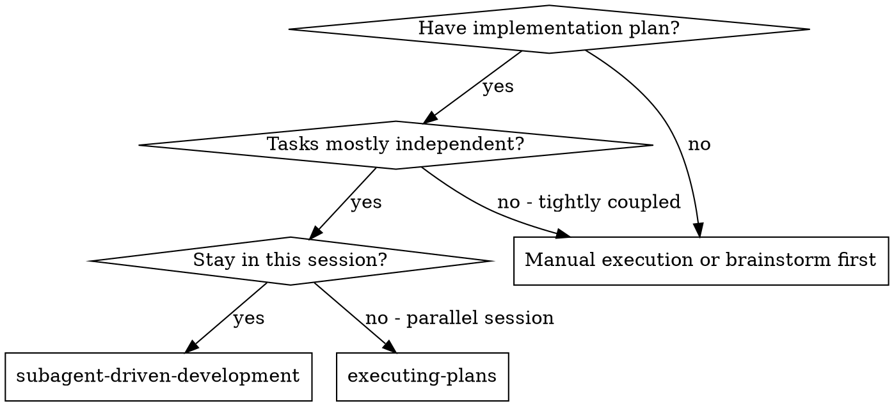
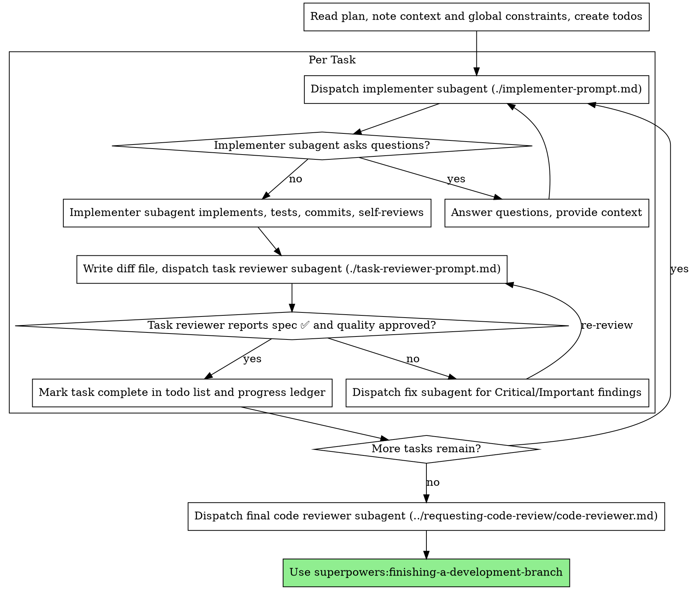

# Session transcript

## User

<local-command-caveat>Caveat: The messages below were generated by the user while running local commands. DO NOT respond to these messages or otherwise consider them in your response unless the user explicitly asks you to.</local-command-caveat>

## User

<command-name>/model</command-name>
            <command-message>model</command-message>
            <command-args></command-args>

## User

<local-command-stdout>Set model to Fable 5 and saved as your default for new sessions</local-command-stdout>

## User

<local-command-caveat>Caveat: The messages below were generated by the user while running local commands. DO NOT respond to these messages or otherwise consider them in your response unless the user explicitly asks you to.</local-command-caveat>

## User

<command-name>/effort</command-name>
            <command-message>effort</command-message>
            <command-args></command-args>

## User

<local-command-stdout>Set effort level to high (saved as your default for new sessions): Comprehensive implementation with extensive testing and documentation</local-command-stdout>

## User

start I4 by reading CAMPAIGN.md + LEDGER.md first

## Assistant

Starting I4 by reading the campaign's governing documents in full, as CLAUDE.md requires.

### ⚙ Tool call: `Bash`

```json
{
  "command": "ls /workspace/development/2026-07-17-modularization-campaign/",
  "description": "List campaign directory contents"
}
```

### ↳ Tool result

```
BLOCKMAP.md
CAMPAIGN.md
LEDGER.md
PROMPT.md
analytics.md
statistics.md
transcript.md
transcript.raw.md
usage.raw.txt
```

### ⚙ Tool call: `Read`

```json
{
  "file_path": "/workspace/development/2026-07-17-modularization-campaign/CAMPAIGN.md"
}
```

### ↳ Tool result

```
1	# CAMPAIGN.md — Modularization Campaign (frozen architecture)
2	
3	**Status:** approved design, 2026-07-17. Brainstormed and approved section-by-section in
4	the campaign planning session (see `transcript.md` once archived); prompt in `PROMPT.md`.
5	
6	This is the **one** copy of the campaign's architecture, decisions, invariants, and
7	increment plan. Increment specs **cite this document and re-derive nothing** — the
8	campaign-level brainstorm and adversarial review run once, here; increments inherit that
9	scrutiny and do not repeat it. Any change to this document is an **amendment**: edit the
10	document *and* append a ledger entry (`LEDGER.md`) saying what changed and why. An
11	increment spec that contradicts this document without a ledger amendment is wrong by
12	definition.
13	
14	Related documents (all in this directory unless pathed): `PROMPT.md` (the campaign
15	request), `BLOCKMAP.md` (the B1–B60 functional map of `main()` all scope assignments
16	reference), `LEDGER.md` (append-only cross-increment record), `/workspace/CONTEXT.md`
17	(domain glossary — created by this campaign), `/workspace/prompts/directives.md` (the
18	Spine; PD#n citations below refer to it).
19	
20	## Glossary (campaign terms — domain terms live in `CONTEXT.md`)
21	
22	- **Campaign** — this whole program of work: one architecture, N increments.
23	- **Increment** — one unit of work with its own session, spec, implementation, review,
24	  commit, and archive. Numbered I0–I14.
25	- **Wave** — an ordered group of increments (0–4); increments within a wave may be
26	  reordered if the ledger records why, waves may not.
27	- **Block** — a `Bnn` region of `main()` per `BLOCKMAP.md`; the stable unit of scope
28	  assignment.
29	- **Core package** — the new importable `psh/` package holding infrastructure (Tier 1).
30	- **Gateway** — `psh/gateway.py`, the single module through which every Terminus/WP-CLI/
31	  Drush subprocess flows; the future Pantheon-API replacement seam.
32	- **Façade** — `script_context.py` (`sc`), the stable API surface that checks and plugins
33	  import; implementations move, the façade's names do not break.
34	- **Contract** — the per-phase guaranteed `site_context` keys (CLAUDE.md table), which
35	  this campaign turns into a machine-readable **contract registry**.
36	- **Hook DAG** — the per-phase topological ordering of hooks derived from declared
37	  `consumes`/`produces` keys, validated fatally at startup.
38	- **Ratchet** — the lint/type regime: broad ruff+pyright rules applied as a hard gate to
39	  moved/new modules immediately, the remnant grandfathered until I14.
40	- **Remnant** — whatever remains of the original script at any point mid-campaign.
41	- **Shim** — the thin committed `./pantheon-sitehealth-emails` entry script that calls
42	  `psh.cli.main()` after I0.
43	- **Ledger** — `LEDGER.md`; how increment N learns what N−1 actually did.
44	- **Behavior bar** — the tiered definition of which observable behavior may change (§8).
45	- **Invariant** — a named property no increment may alter (§9).
46	
47	**MUST** = required, violation fails review. **NEVER** = prohibited, violation fails
48	review. **SHOULD** = required unless the increment spec states why not. **MAY** =
49	allowed, at the implementer's judgment.
50	
51	## 1. Goal and non-goals
52	
53	**Goal.** Modularize the 4,752-line main script into (a) a `psh/` core package of
54	infrastructure modules, (b) self-registering `check/` packages for every notice/section
55	emitter, and (c) the existing `plugin/` integrations — taking full advantage of the hook
56	system — while the four e2e goldens stay byte-identical, the per-phase contract is
57	honored, and the non-U-M path keeps working. End state: `main()` is a ~250–400-line
58	orchestrator; every U-M-specific behavior lives in `umich` packages; the whole tree
59	passes the broadened ruff+pyright configuration.
60	
61	**Non-goals** (exhaustive; each is either declined or deferred with reasoning in §15):
62	replacing terminus with the Pantheon API; implementing parallel site processing; any new
63	report content (CSV attachment, cached-% column, env-lock section); SendGrid; refreshing
64	goldens or recorded fixtures; changing what any check reports (except the named bug
65	fixes in I1).
66	
67	## 2. Decision record (exhaustive — from the approved brainstorm)
68	
69	| # | Decision | Choice | Why |
70	|---|---|---|---|
71	| D1 | Pantheon API | **Seam only**: gateway module now, transport swap post-campaign | Swapping transports mid-campaign invalidates terminus fixtures + goldens in every touched increment |
72	| D2 | Lint/type broadening | **Ratchet in-campaign** (§13) | Code is cleaned exactly once, as it moves; bar fixed in I0 so it never shifts |
73	| D3 | Behavior bar | **Tiered, config renames allowed** (§8) | Cleanest final schema; production config edited once, at I14, with a migration table |
74	| D4 | Increment granularity | **Fine: 15 increments** | Safest for session/context limits; split-never-compress backstop (§12) |
75	| D5 | Target architecture | **Three-tier split** (§3) | Infrastructure ≠ report content ≠ data source; fulfills "full advantage of the frameworks" |
76	| D6 | Hook flexibility | **Phases stay; hooks declare consumes/produces; per-phase DAG validated at startup** (§4) | Keeps every existing hook/test valid; a phase-less key scheduler rewrites everything for no added power |
77	| D7 | `--only-warn` plan rec | **In campaign** (I7) | Small, no golden impact, existing TODO |
78	| D8 | Parallel-ready | **Design constraint only** (§3.4) | Near-free now; actual parallelism stays a README TODO |
79	| D9 | CSV attachment / cached-% / env-lock | **README TODO** | Each changes rendered email → golden churn mid-campaign |
80	| D10 | Packaging | **Real package + thin shim** (I0; console-script dropped — see LEDGER I0 amendment 1) | Dissolves the extension-less-script problem; normal imports for tests/pyright/ruff |
81	
82	## 3. Target architecture
83	
84	```
85	                 ./pantheon-sitehealth-emails  (thin shim)
86	                                │
87	                        psh.cli.main()  ── orchestrator: bootstrap, site loop,
88	                                │           phase firing, lifecycle dispatch
89	        ┌───────────────────────┼──────────────────────────┐
90	        ▼ Tier 1: psh/ core     ▼ seams (sc façade)        ▼
91	  configuration  modules   ┌─────────────────────┐   Tier 3: plugin/
92	  gateway        db        │  hook phases + DAG  │   aws  cloudflare
93	  traffic        plans     │  contract registry  │   env  umich
94	  gather         charts    └─────────┬───────────┘   (unchanged roles)
95	  render         mail                ▼
96	  lifecycle                Tier 2: check/  (all notice/section emitters)
97	                           pantheon  wordpress  drupal  addon_updates
98	                           dns  cloudflare  pantheon_cdn_change  umich
99	```
100	
101	### 3.1 Tier 1 — `psh/` core package (exhaustive module map)
102	
103	| Module | Receives (functions / blocks) |
104	|---|---|
105	| `psh/cli.py` | `build_arg_parser`, `parse_args`, arg validation (B5), `main()` orchestrator |
106	| `psh/configuration.py` | `process_config`, `config_substitution`, `gate_disabled_sections`, DEFER machinery, `load_news_items`, `umich_enabled`, `cloudflare_enabled` |
107	| `psh/modules.py` | `find_modules`, module loading (B2/B4), hook engine (`add_hook`/`invoke_hooks`/`PHASES`), DAG build/validation, contract registry |
108	| `psh/gateway.py` | `run_terminus`, `terminus`, `terminus_data`, `wp`, `wp_eval`, `drush`, `drush_php_script`, `fix_drush_output`, `wp_error`, `drush_error`, `TerminusError` |
109	| `psh/notice.py` | `Notice`, `Severity`, `NoticeRegistry`, `DuplicateNoticeCodeError`, `registry` (added I3; §6 Notice type + code registry) |
110	| `psh/db.py` | ORM models, `TrafficRow`/`OverageProtectionRow`, `db_engine_args`, `db_retry`/`db_retryable`/`record_db_reconnect`, `update_traffic_rows`, `insert_traffic_rows`, `load_traffic_rows`, `load_overage_protection_window`, `DatabaseUnavailableError` |
111	| `psh/traffic.py` | `get_old_metrics`, `estimate_month_visits`, `build_traffic_table_rows`, the `traffic_table_columns` global, metrics gather + DB update/load flow (B22–B26), visits-by-month aggregation (B43) |
112	| `psh/plans.py` | plan_info normalization (B12 part), SKU resolution (B17), `overage_blocks`, `contract_year_end`, `plan_costs`, `build_plan_over_time`, the `cost_table_columns` global, recommendation flow (B47) |
113	| `psh/gather.py` | Slimmed framework gathers feeding the `site_post_gather` contract (from B32–B35), `check_wordpress_plugin`/`check_drupal_module` helpers |
114	| `psh/charts.py` | Cap geometry (B13 part), chart data prep + matplotlib build (B44–B45) — returns PNG bytes |
115	| `psh/render.py` | Jinja render (B53), PHP inline + `!important` pass (B54), `escape_url` |
116	| `psh/mail.py` | Recipient resolution (B49), MIME assembly (B55), `smtp_login`, send (B57) |
117	| `psh/lifecycle.py` | `RunState`, `finish_run`, `abort_run`, `abort_reason`, `resume_point`, `resume_command`, `rerun_command`, `option_strings_taking_a_value`, `sites_from_resume_point`, `merge_prior_results`, `ResumeSiteNotFoundError` |
118	
119	`dns_classify.py` stays a top-level module (already extracted; moving it into `psh/` is
120	MAY-scope for I14, decided by ledger state then).
121	
122	**Whole-file coverage.** The campaign modularizes the entire script, not just `main()`:
123	every top-level def and module-level global in `pantheon-sitehealth-emails` (lines
124	1–2107 included) is assigned to a `psh/` module in this table and appears in exactly one
125	increment's scope (§11). End state: the original file is the thin shim and nothing else
126	— a top-level def still there at I14 is a defect the closing audit (§17) catches. Moved
127	helpers get the full §7 treatment (types, ratchet, verified docs, tests); they do NOT
128	get algorithmic redesign — moves are behavior-preserving except where §8 says otherwise
129	(I1, I7's D7, I12's B51).
130	
131	### 3.2 Tier 2 — new/changed `check/` packages (exhaustive)
132	
133	| Package | Contents (blocks) | Phase(s) |
134	|---|---|---|
135	| `check/pantheon/` (new) | frozen site (B19), no-live-env (B21), upstream updates (B38), PHP EOL (B41) | `site_pre` (frozen, no-live-env), `site_post_gather` (updates, PHP EOL) |
136	| `check/wordpress/` (new) | PAPC + native-sessions checks, OCP config probe, favicon (from B34) | `site_post_gather` |
137	| `check/drupal/` (new) | PAPC module check, D7 EOL + tag1_d7es, multisite probe (from B30/B35) | `site_post_dns` (multisite), `site_post_gather` |
138	| `check/addon_updates/` (new) | add-on updates table notice (B39), smell notices (B48) | `site_post_gather` |
139	| `check/umich/` (existing, grows) | umich-oidc-login, Hummingbird fork (B34), Drupal UA check (B35), annual-billing notices (B50/B51), portal-URL text for the recommendation notice (B47's U-M half) | `site_post_gather`, `site_pre_render` (billing) |
140	
141	`check/dns/`, `check/cloudflare/`, `check/pantheon_cdn_change/` are untouched tenants.
142	A check MAY fetch its own data through `sc` gateway wrappers when the data is
143	check-specific (e.g. `upstream:updates:list`); data used by core *and* checks is
144	published through the contract instead (e.g. `envs`).
145	
146	### 3.3 What stays in `main()` (exhaustive, with why)
147	
148	Config/arg bootstrap ordering (B1–B8 — the two-pass substitution *order* is the
149	program); overage constants + date window (B9, B13 part); the site-loop skeleton (skips,
150	banner, sorted order, resume filter — B14–B18, B20, B25, B42); phase firing and contract
151	stuffing (B27, B28, B31, B37, B52); notice sort + subject (B50 minus billing); the
152	`try`/`except BaseException` lifecycle dispatch (B59–B60 call sites). Everything else
153	leaves. Target: 250–400 lines.
154	
155	### 3.4 Parallel-ready constraint (D8)
156	
157	Per-site work MUST be a function of `(site, config, db_session, site_context)`: no new
158	module-level mutable state; run-scoped accumulators live only in `RunState`. This is a
159	review criterion from I2 onward, not a parallelism implementation.
160	
161	### 3.5 The `sc` façade
162	
163	Checks and plugins import **only** `sc` (and their own package). `sc` keeps every name
164	listed in CLAUDE.md's runtime-exposed block, re-exporting from `psh/` modules as they
165	move. NEVER remove or rename an `sc` attribute mid-campaign; additions are fine. The
166	house-rules test suite gains an assertion that every documented `sc` name exists (I2).
167	
168	## 4. Phases, hooks, and the DAG
169	
170	Phases stay the coarse spine: `setup`, `site_pre`, `site_post_traffic`, `site_post_dns`,
171	`site_post_gather`, `site_pre_render`, plus **new** `run_finish` (fired inside
172	`finish_run` before artifacts are written, receiving the `RunState`; for future run-level
173	artifact hooks — no consumer at introduction, like `site_pre_render` was). Dotted
174	plugin-defined events are unchanged.
175	
176	From I4, `add_hook` requires two new entries per hook: `consumes` and `produces` — each
177	a (possibly empty) list of contract-key names. Validation at module-load completion
178	(exhaustive fatal conditions):
179	
180	1. A consumed key that nothing produces (neither core's registry for that phase or an
181	   earlier phase, nor another hook) → fatal.
182	2. Two producers of the same key → fatal (one owner per key; PD#1 — a silent overwrite
183	   is a silent failure).
184	3. A cycle among same-phase hooks → fatal.
185	4. A hook consuming a key first produced in a *later* phase → fatal.
186	5. A missing `consumes`/`produces` entry on any hook → fatal (no legacy mode; I4
187	   retrofits all in-repo hooks in the same change).
188	
189	`invoke_hooks` orders same-phase hooks topologically (producers before consumers;
190	registration order breaks ties, so existing behavior is preserved where no edges exist).
191	The permanent test `tests/integration/test_hook_dag.py` loads **all** real check/plugin
192	packages and asserts the DAG builds — the "future changes can never make the DAG
193	impossible" guarantee — and a unit suite proves each fatal condition actually fires
194	(PD#14: the validator must be shown able to go red).
195	
196	```
197	 module load ──► collect hooks ──► per phase: build edges (produces→consumes)
198	                                        │
199	                              cycle? unknown key? dup producer? ──► fatal exit (named error)
200	                                        │ ok
201	                                topo order stored ──► invoke_hooks uses it
202	```
203	
204	**Contract registry.** `psh/modules.py` holds the machine-readable registry: phase →
205	keys core stuffs (today's CLAUDE.md table, verbatim). Core's stuffing code is checked
206	against it in tests; CLAUDE.md's table gains a line saying the registry is authoritative.
207	New contract keys added by increments (exhaustive for this campaign): `envs` (I8, at
208	`site_pre`), `add_on_updates` + `wp_smell`/`drush_smell`/`composer_smell` (I9/I10, at
209	`site_post_gather`), plan/cost keys `current_plan`, `recommended_plan`, `plan_costs`,
210	`savings` (I7, at `site_pre_render`). Each addition updates registry + CLAUDE.md table +
211	ledger in the same increment.
212	
213	## 5. Configuration
214	
215	Principles: one section per feature, named for the operator's mental model; every
216	relocated check gets an `enabled` flag under `[Check.<name>]`, **default true** —
217	relocating code MUST NOT silently disable a check that runs unconditionally today.
218	U-M-only checks additionally require `[UMich].enabled` (existing `umich_enabled()`
219	rule). `gate_disabled_sections()` semantics (nested `enabled`, children dropped) apply to
220	`[Check.*]` unchanged.
221	
222	Example (actual TOML, the shape I8 introduces — illustrative of the family, exhaustive
223	for `check/pantheon/`):
224	
225	```toml
226	[Check.pantheon]
227	enabled = true          # frozen-site, live-env, upstream-updates, PHP-EOL checks
228	```
229	
230	New keys land in final shape as introduced (I3 onward). Renames/moves of *existing* keys
231	happen once, in I14, which MUST deliver: the old→new migration table in
232	`docs/config-migration.md`, a rewritten `sample-pantheon-sitehealth-emails.toml`, and
233	exact edit instructions for the production config repo. Until I14, every existing
234	production key keeps working unchanged.
235	
236	## 6. Types
237	
238	Reused as-is: `TrafficRow`, `OverageProtectionRow`, `DnsFacts`, `FetchResult`,
239	`SiteContext`. Introduced (exhaustive):
240	
241	| Type | Increment | Shape |
242	|---|---|---|
243	| `GatewayResult` | I2 | NamedTuple `(result, errors, fatal)` replacing the anonymous 3-tuples |
244	| `Notice` | I3 (class) → adopted per increment | frozen dataclass: `severity` (StrEnum alert/warning/info), `code` (unique — registry test), `html`, `text`, `short`, `icon`, `order`; `SiteContext.add_notice` accepts `Notice` or legacy dict; dict form retired in I14 |
245	| `PlanInfo` / `PlanCatalog` | I7 | typed view over `[Pantheon.plan_info]` |
246	| `RunState` | I13 | dataclass holding `all_warnings`, `site_results`, `site_savings`, `emails_sent`, reconnect counters |
247	
248	House-style tuple annotations (`-> (str, str, bool)`) are replaced with real annotations
249	in every module as it moves — never fixed in place in the remnant (one pass per line,
250	D2). CLAUDE.md's house-style note is updated in I14 when the last one dies.
251	
252	## 7. Per-increment obligations
253	
254	Every increment MUST (this list is exhaustive and lives only here; increment specs cite
255	it): (1) start by reading `CAMPAIGN.md`, `LEDGER.md`, `CLAUDE.md`, `BLOCKMAP.md` rows in
256	scope; (2) follow `prompts/implementation-standards.md` (subagent-driven, test-first,
257	`psh-implementer`/`psh-reviewer`); (3) replace house styles in moved code (§6);
258	(4) verify — not assume — every claim in comments/docs it moves or writes;
259	(5) update tests in the same change; (6) update README/docs/CLAUDE.md for what moved;
260	(7) update auto-memory where a durable fact changed; (8) append its ledger entry
261	(§12); (9) preserve every invariant (§9); (10) end with `/code-review`, a full
262	`./run-tests`, and one checkpoint commit including its `development/` folder.
263	
264	## 8. Behavior bar (canonical gate table)
265	
266	| Surface | Rule | Until |
267	|---|---|---|
268	| Rendered emails (4 goldens) | NEVER change (byte-identical) | end of campaign |
269	| `-results.json` / `-notices.csv` / `-run.json` structure (keys, row shape) | NEVER change | end of campaign |
270	| Notice csv *values* | MAY change only in I1 (named bug fixes) and I12 (scheduled B51 deletion) | — |
271	| stdout / console / error messages | MAY improve freely | — |
272	| Config: existing keys | NEVER break | I14 (renames with migration table) |
273	| Config: new keys | MUST land in final schema shape | — |
274	| Exit codes, resume semantics, artifact write gates | NEVER change | end of campaign |
275	
276	## 9. Named invariants (exhaustive; NEVER violated by any increment)
277	
278	1. Four e2e goldens byte-identical (`./run-tests` proves it; refresh is forbidden — an
279	   existing golden going red is a defect in the increment, PD#14).
280	2. Per-phase data contract: existing keys never removed/renamed/retyped; additions only.
281	3. Non-U-M path works: non-U-M golden green; no new un-gated U-M content (I1 *removes*
282	   the one known leak).
283	4. Run lifecycle: single `except BaseException` flush path; `abort_reason`'s three
284	   outcomes; artifacts dropped-site rule; notices appended before send; resume-point
285	   next-site-after-email rule; soft-wrapped copy-pasteable commands.
286	5. DB: `db_retry` retries whole idempotent units only; `db_retryable` predicate
287	   unchanged; the read-release commit in the loaders stays (guarded by
288	   `test_load_traffic_rows_releases_the_connection`).
289	6. Rich console rules: escape untrusted text; production width reproduced in tests.
290	7. Test safety interlock (`run_program` forbidden flags) never bypassed or weakened.
291	8. Column-0 `f"""` notice literals move **verbatim** — never re-indented; `git diff -w`
292	   is not acceptable evidence for any change touching them.
293	9. Checks/plugins import only `sc`; `sc` names never removed mid-campaign (§3.5).
294	10. Recorded fixtures are not regenerated (`terminus-cdnchange/` is hand-maintained and
295	    `--record` must not run).
296	11. `--create-tables`/`--update`/`--import-older-metrics` phase-gating rules (CLAUDE.md
297	    table) unchanged.
298	
299	## 10. Known-bug inventory → I1
300	
301	The five bugs and the dead code listed in `BLOCKMAP.md` §Bugs (composer-smell
302	nesting+variable; shared `php-eol` code; `site_results` omission; un-gated U-M portal
303	URLs; duplicate `annual-bill` code — B51 handled as: distinct code now, scheduled
304	deletion when its Aug-2026 date passes, ledgered to I12; dead code deleted). Each fix is
305	test-first with the test shown red on the old behavior. **Verified 2026-07-17**: the
306	goldens contain zero `php-eol`/`wp-smell`/`drush-smell`/`composer-smell`/`annual-bill`
307	occurrences and the golden fixtures report PHP 8.2, so none of these fixes can touch a
308	golden:
309	
310	```
311	$ grep -c 'php-eol\|composer-smell\|wp-smell\|drush-smell\|annual-bill' tests/e2e/__snapshots__/*.ambr
312	tests/e2e/__snapshots__/test_golden.ambr:0
313	tests/e2e/__snapshots__/test_golden_cdn_change.ambr:0
314	tests/e2e/__snapshots__/test_golden_drupal.ambr:0
315	tests/e2e/__snapshots__/test_golden_nonumich.ambr:0
316	```
317	
318	## 11. The increments
319	
320	Wave dependency structure (increments within a wave are ordered but MAY be resequenced
321	with a ledger entry; waves MUST NOT be reordered):
322	
323	```
324	Wave 0: I0 bootstrap ──► I1 bug fixes
325	Wave 1: I2 gateway ──► I3 config ──► I4 hooks+DAG ──► I5 DB
326	Wave 2: I6 traffic ──► I7 plans ──► I8 check/pantheon ──► I9 wordpress ──► I10 drupal
327	Wave 3: I11 charts ──► I12 render+mail ──► I13 lifecycle
328	Wave 4: I14 closing sweep
329	```
330	
331	| Inc | Scope (blocks / functions) | Delivers |
332	|---|---|---|
333	| **I0** | — (no logic moves) | `psh/` skeleton + thin shim (console-script dropped — see LEDGER I0 amendment); conftest `import psh` rework (same collected-test count gate); ratchet config (§13) with rule sets pinned; pyright baseline measured; `LEDGER.md` started; README TODO edits (§15 dispositions); CLAUDE.md pointer to campaign |
334	| **I1** | B36, B40, B41, B47 (URLs), B48, B50/B51 (codes), dead code | §10 fixes, each test-first |
335	| **I2** | 302–597 wrappers | `psh/gateway.py`, `GatewayResult`, sc re-exports + façade test; no-subprocess-outside-gateway house rule |
336	| **I3** | 792–934, 1209–1253, 1608–1648 (`umich_enabled`/`cloudflare_enabled`) | `psh/configuration.py`; `Notice` class + code-uniqueness registry test |
337	| **I4** | 935–950, hook engine from `script_context.py` | `psh/modules.py`; consumes/produces on all in-repo hooks; DAG validation + fatal-condition tests; `run_finish` phase; contract registry |
338	| **I5** | 95–178; DB defs within 1285–1575 (`DatabaseUnavailableError` through `db_engine_args`; the resume helpers `ResumeSiteNotFoundError`, `sites_from_resume_point`, `merge_prior_results` stay for I13) | `psh/db.py`; DB test suites relocated intact |
339	| **I6** | B22–B26, B43; 598–671, 977–1127 | `psh/traffic.py` |
340	| **I7** | B9, B12 (plans), B17, B47; 967–976, 1128–1208, 1254–1280 | `psh/plans.py`; `PlanInfo`; D7 (`--only-warn` runs recommendation); plan/cost contract keys |
341	| **I8** | B19, B21, B38, B41 | `check/pantheon/` + `[Check.pantheon]`; `envs` contract key |
342	| **I9** | B32–B34; 672–739 | `psh/gather.py` (WP half); `check/wordpress/`; U-M WP checks → `check/umich/`; `add_on_updates` + smell contract keys |
343	| **I10** | B30, B35, B39, B48; 740–791 | gather (Drupal half); `check/drupal/`; `check/addon_updates/`; UA check → `check/umich/` |
344	| **I11** | B13 (caps), B44–B45 | `psh/charts.py` |
345	| **I12** | B49–B57 minus sort/subject core | `psh/render.py`, `psh/mail.py`; annual billing → `check/umich/` at `site_pre_render`; B51 deletion if past its date |
346	| **I13** | B14 (accumulators), B56, B59–B60; 1649–2107 plus the resume helpers I5 left behind (1281–1284, 1528–1542, 1576–1607) | `psh/lifecycle.py`; `RunState`; `main()` reaches final form |
347	| **I14** | — | Config renames + migration doc + sample rewrite + production-config instructions; global ratchet flip + remnant cleanup; docs/README/CLAUDE.md full refresh; `Notice` dict form retired; ledger fully resolved; retrospective + closing audit (§17) |
348	
349	Sizing note: the largest moves are I9 (~330 main-loop lines + helpers) and I10 (~320 +
350	helpers). If any increment proves oversized mid-session: **split, never compress** —
351	commit nothing partial, ledger the split, the second half becomes its own increment.
352	
353	## 12. Coordination protocol
354	
355	**Ledger entry template** (append per increment, and for any amendment):
356	
357	```markdown
358	## I<N> — <slug> (<date>, commit <sha>)
359	- Moved: <blocks/functions actually moved>
360	- Deviations from CAMPAIGN.md: <none | what + why>
361	- Contract/config/sc additions: <keys/names>
362	- Discovered tasks: <each with disposition: fixed here | I<M> | README TODO>
363	- Open questions for next increment: <…>
364	```
365	
366	**Discovered-task disposition rules** (canonical): fits current increment's scope and
367	<~30 min → fix now, note in ledger; belongs to a later increment → ledger it against
368	that increment (the increment's spec author MUST read these); major/risky/scope-widening
369	→ README TODO with a sentence of context. Nothing is carried in memory or chat — if it
370	is not in the ledger or README, it does not exist (PD#9).
371	
372	**Session flow per increment:** read the §7 documents → write the increment SPEC.md in
373	`development/<date>-mod-I<N>-<slug>/` citing CAMPAIGN.md sections by number →
374	`superpowers:writing-plans` → subagent-driven implementation → `/code-review` → full
375	`./run-tests` → per-task commits, each green; the increment's final commit includes the dev
376	folder → `/archive-session` → ledger entry.
377	
378	## 13. Lint/type ratchet
379	
380	Mechanism (as shipped by I0; see LEDGER I0 amendment 2): TWO ruff configs —
381	`pyproject.toml` `[tool.ruff.lint]` keeps the narrow PD-rule set running everywhere
382	including the remnant, and `ruff-broad.toml` carries `select = ["ALL"]` minus a
383	justified ignore list, with `extend-exclude` grandfathering exactly the remnant
384	(`psh/_legacy.py`) and not-yet-moved files; each increment deletes its
385	files from the grandfather list, and the two configs merge at I14. pyright runs in
386	`./run-tests` from I0 via `[tool.pyright]` (standard mode, `psh/` minus `_legacy.py`),
387	ratcheting toward strict as typed code moves in. The four existing narrow rules (`E722`, `BLE001`, `S105`, `S106`) remain global
388	throughout — they mechanize PD#2/PD#6 and are never grandfathered. No
389	`target-version` pin (CLAUDE.md: it masks the 3.12-only syntax detection).
390	
391	Baselines measured 2026-07-17 (I0 re-measures and pins both in its spec):
392	
393	```
394	$ ./run-tests --fast --llm   (tail)
395	LLM_SUMMARY passed=727 failed=0 error=0 skipped=1 xfailed=0 xpassed=0
396	25 snapshots passed.
397	
398	$ uvx ruff check --isolated --statistics .
399	26  F541  f-string-missing-placeholders
400	 8  E741  ambiguous-variable-name
401	 4  E713  not-in-test
402	 3  F841  unused-variable
403	 2  F401  unused-import
404	 1  E402  module-import-not-at-top-of-file
405	 1  E712  true-false-comparison
406	Found 45 errors.
407	```
408	
409	(README's "~55" ruff and "39" pyright figures are stale/unverified claims; I0 replaces
410	them with measured numbers. pyright was not measured in planning — no pyright binary in
411	the dev container yet; installing it is I0 scope.)
412	
413	## 14. Risk / control table
414	
415	| Risk | Control |
416	|---|---|
417	| Re-indented column-0 notice literals silently change emails | Invariant 8; goldens as tripwire; AST/token comparison, never `git diff -w` |
418	| conftest rework silently drops tests | I0 gate: identical collected-test count (727 passed / 1 skipped / 2 deselected baseline) before and after |
419	| Long-range `main()` local coupling breaks a move | BLOCKMAP produces/consumes; each increment spec lists exactly which locals cross its boundary |
420	| Session/context overrun mid-increment | Fine granularity (D4); split-never-compress; commits only at increment completion |
421	| Architecture drift across 15 sessions | This document frozen; amendments only via ledger; specs cite section numbers |
422	| Hidden hook-order dependencies surface in I4 | I4 audits every hook; real dependencies become explicit DAG edges |
423	| Ratchet churn on moved code | Rules fixed at I0; cleaning is part of each move |
424	| Goldens blind to stdout/artifacts | Invariants 4–5 name the artifact/abort test suites as the cover; artifact structure frozen until campaign end |
425	| Implementer sessions lack context | `psh-implementer`/`psh-reviewer` carry the read list; specs name seams (Spine spec bar); §7 reading list |
426	| Two annual-bill notices / removal date passes mid-campaign | Explicitly scheduled: codes split in I1, deletion decision in I12, ledger tracks |
427	
428	## 15. NOT in scope (reasoning preserved so it is never re-litigated)
429	
430	- **Terminus → Pantheon API swap** — D1; post-campaign project against `psh/gateway.py`.
431	- **Parallel site processing** — D8; constraint only; README TODO remains.
432	- **CSV data attachment, cached-% column, env-lock section** — D9; each becomes a small
433	  post-campaign change (env-lock: a ~50-line `check/` package) once goldens may move.
434	- **SendGrid, secrets-handling completion, portal traffic capture, daily alerts,
435	  accessibility/security/Cloudflare scores, AI recommendations, dependency updates,
436	  terraform-infra** — pre-existing README TODOs, untouched by this campaign.
437	- **Approach B (library-only) and C (everything-is-a-hook)** — rejected in brainstorm:
438	  B fails the "full advantage of the frameworks" goal; C forces infrastructure into
439	  optional-content clothing.
440	- **Golden/fixture refreshes** — forbidden (Invariants 1, 10).
441	
442	## 16. Acceptance baseline
443	
444	§13 outputs are the campaign-start baseline (run and pasted 2026-07-17). Every
445	increment's definition of done re-runs `./run-tests` at increment end — the full suite
446	when the live tier's credentials are available in the session, otherwise `--fast` with a
447	ledger note saying the live tier was skipped — and MUST reproduce goldens
448	byte-identically. I0 additionally records the collected-test count gate.
449	
450	## 17. Closing audit (queued for I14; exhaustive)
451	
452	1. Is `main()` within 250–400 lines, and does everything left match §3.3?
453	2. Has every DAG fatal condition been demonstrated red at least once?
454	3. Do the contract registry and CLAUDE.md table agree (test-enforced)?
455	4. Is any `sc` re-export now consumed by nobody (dead façade surface)?
456	5. Is the `.py` symlink still needed for anything beyond the shim? If not, note in
457	   CLAUDE.md; if yes, say for what.
458	6. Are all ledger items resolved (done, scheduled, or README TODO)?
459	7. Has the production config repo received and applied the migration instructions?
460	8. Do README, CLAUDE.md, docs/, and memory reflect the final architecture (no stale
461	   line-number or module references)?
462	9. Were any invariants amended mid-campaign, and is each amendment ledgered?
463
```

### ⚙ Tool call: `Read`

```json
{
  "file_path": "/workspace/development/2026-07-17-modularization-campaign/LEDGER.md"
}
```

### ↳ Tool result

```
1	# LEDGER — Modularization Campaign
2	
3	Append-only. One entry per completed increment, plus one per CAMPAIGN.md amendment.
4	This file is how increment N learns what N−1 actually did; if a deviation, discovered
5	task, or decision is not recorded here (or in the README TODO list), it does not exist.
6	Entry template: CAMPAIGN.md §12.
7	
8	## Campaign planning (2026-07-17)
9	
10	- Produced: `CAMPAIGN.md` (frozen architecture), `BLOCKMAP.md` (B1–B60 map),
11	  `/workspace/CONTEXT.md` (domain glossary, new), this ledger.
12	- Baselines: fast tier 727 passed / 1 skipped / 2 deselected; ruff `--isolated` 45
13	  findings; pyright unmeasured (no binary in container — I0 scope).
14	- Discovered during planning, dispositioned:
15	  - Five bugs + dead code → I1 (CAMPAIGN.md §10, BLOCKMAP §Bugs).
16	  - README's "~55 ruff / 39 pyright" figures stale/unverified → I0 re-measures.
17	  - B51 second annual-bill notice: marked "remove Aug 2026" — code split in I1,
18	    deletion decision in I12.
19	  - WordPress/Drupal duplication + update-table HTML duplication (BLOCKMAP §Bugs 7–8)
20	    → addressed structurally by I9/I10 (shared gather + `check/addon_updates/`).
21	- Open questions for I0: exact ruff rule list; pyright strictness per environment;
22	  whether `dns_classify.py` moves under `psh/` (deferred to I14, MAY).
23	- Amendment (2026-07-17, user spec review): added the "Whole-file coverage" paragraph to
24	  CAMPAIGN.md §3.1 — clarification only, no scope change; the module map already
25	  assigned every top-level def.
26	
27	## I0 — bootstrap (2026-07-17, closing commit `docs(campaign-I0): close the bootstrap increment`)
28	
29	Commits (per-task, each green): `b1ccc72` (package move + shim + conftest + coverage),
30	`d0e3027` (lint/type ratchet), `5b536fa` + `239955d` (README/CLAUDE.md docs), plus this
31	closing docs commit (ledger + CAMPAIGN amendments + SPEC acceptance + README pyright number).
32	
33	- **Moved:** the whole 4,752-line program → `psh/_legacy.py` (`git mv`, **zero logic
34	  changes**; the `__main__` tail is inert in a module, left for I13). New: `psh/__init__.py`
35	  (docstring), `psh/cli.py` (`from psh._legacy import main, parse_args` re-export), and a new
36	  7-line thin shim at `./pantheon-sitehealth-emails` calling `psh.cli.main()`. No blocks
37	  (B-map) moved — I0 moves the file, not logic (§11 row I0).
38	
39	- **Deviations from CAMPAIGN.md (three amendments, all applied to the document this commit):**
40	  1. **No console-script entry point** (amends §11 row I0 / D10). The program is repo-rooted
41	     by design (`find_modules`, templates, `inline-styles.php`, `vendor/`, config symlink are
42	     all CWD-relative); a pip entry point would need a data-file overhaul serving no campaign
43	     goal. D10's real benefits (normal imports; native ruff/pyright/CodeGraph coverage; no
44	     `SourceFileLoader`) all arrive via the package + shim without installation. `pyproject.toml`
45	     stays deps-only (`py-modules = []`, `packages = []` to stop setuptools auto-discovery
46	     installing a stale shadow copy — PD#1). §11 row I0 now reads "thin shim (console-script
47	     dropped — see LEDGER I0 amendment)".
48	  2. **Grandfather is `psh/_legacy.py` via `ruff-broad.toml` `extend-exclude`** (amends §13,
49	     which named `pantheon-sitehealth-emails.py` and "per-file-ignores" — both written before
50	     the legacy-module + two-config mechanics were settled). The shipped mechanism is TWO ruff
51	     configs, not per-file-ignores: `pyproject.toml` `[tool.ruff.lint]` carries the narrow
52	     PD-rule set (`E722`/`BLE001`/`S105`/`S106`) that runs EVERYWHERE including `_legacy.py`;
53	     `ruff-broad.toml` carries `select = ["ALL"]` minus the ignore list and grandfathers the
54	     remnant via `extend-exclude`. `./run-tests` and `.claude/hooks/ruff-check.sh` run BOTH
55	     passes; the two files merge into `pyproject.toml` at I14. §13 now names `psh/_legacy.py`
56	     and "ruff-broad.toml exclude".
57	  3. **Per-task commits, each green** (amends §12's "one commit (code + dev folder)"). Each I0
58	     task committed independently once its gates were green; this increment's final (closing)
59	     commit includes the `development/` folder. Rationale: finer checkpoints serve the campaign
60	     prompt's revert/inspect intent, and SDD review packages diffs as commit ranges. §12 now
61	     reads "per-task commits, each green; the increment's final commit includes the dev folder".
62	
63	- **Ratchet as pinned.** pyright runs in `./run-tests` at **standard** mode, not strict
64	  (DECISION): `psh/cli.py` re-exports from the untyped legacy module, so strict would fail on
65	  re-export; strictness ratchets up as increments move typed code in. Scope `[tool.pyright]`
66	  = `include = ["psh"]`, `exclude = ["psh/_legacy.py"]`. Ruff-broad ignore list (pinned; each
67	  justified in `ruff-broad.toml`): `COM812`, `ISC001`, `E501`, `Q000`, `Q001`, `Q002`, `Q003`,
68	  `ANN`, `TD002`, `TD003`, `FIX002`, `EM101`, `EM102`, `TRY003`, `D`, `CPY001`. `CPY001` is a
69	  **preview** rule in ruff 0.15.22 (cannot fire under non-preview `select=["ALL"]`); ruff
70	  accepts it in `ignore` with no warning, so it is kept verbatim to document the intent
71	  (no per-file copyright headers). `D` (docstring convention) is undecided → README TODO.
72	
73	- **pyright whole-tree baseline (informational; replaces README's unverified "39").**
74	  **220 errors, 0 warnings, 0 informations** across 118 first-party files, standard mode,
75	  pyright 1.1.411 (SPEC ACCEPTANCE §Task 5 has the command + breakdown). Measured OUTSIDE the
76	  scoped gate config via a repo-root config (pyright roots a project at the config's directory
77	  and ignores includes outside it; a config's `exclude` still drops CLI-passed paths — so
78	  neither a scratchpad-rooted config nor CLI args can re-include `_legacy.py`, and a repo-root
79	  temp config is the reproducible form). By area: `tests/` 139, `psh/_legacy.py` 36, `check/`
80	  21, `plugin/` 18, `script_context.py` 5, `dns_classify.py` 1 (`check/`+`plugin/` = 39, the
81	  origin of the old figure). The gated scope (`psh/` minus `_legacy.py`) is `0 errors`.
82	
83	- **Contract/config/sc additions:** none (I0 moves no logic; no `[Check.*]` sections, no new
84	  contract keys, no `sc` names added or removed).
85	
86	- **Discovered tasks:**
87	  - **`Path(psh.__file__).parent` as a repo-root proxy** — 25 sites across 23 files: 22 test files (plus
88	    `tests/helpers/checkload.py`) anchored repo paths on the program file's parent, which the
89	    move shifted from repo root to `psh/`. Fixed here, mechanically and minimally:
90	    `→ Path(psh.__file__).resolve().parents[1]` at exactly those sites. Proper cleanup lands
91	    when later increments un-grandfather those test files; the `psh` fixture itself is
92	    redesigned when `_legacy` dies (I13/I14). Disposition: **fixed here**, further cleanup **I13/I14**.
93	  - **ruff lints explicitly-passed files even when excluded** — passing a path on ruff's
94	    command line overrides `extend-exclude`, so the edit hook (which passes the just-edited
95	    file) would lint `_legacy.py` against the broad set. Fixed by giving the broad-pass
96	    invocation `--force-exclude` and running it from repo-root cwd; documented in
97	    `.claude/hooks/ruff-check.sh`. Disposition: **fixed here**.
98	
99	- **Open questions for I1/I2:**
100	  - I1 (bug fixes) touches `_legacy.py` in place (fixes retire as code moves); it must keep
101	    the narrow PD set green there (broad set stays grandfathered) and the four goldens
102	    byte-identical (§10 verified the fixed codes appear in zero goldens).
103	  - I2 (gateway) is the first real logic move: as it un-grandfathers the wrapper functions it
104	    deletes them from `ruff-broad.toml` `extend-exclude` and must clean them to the broad set
105	    + pyright standard in the same change (§13 ratchet; §6 house-style tuple hints replaced).
106	  - `dns_classify.py` under `psh/` remains a MAY for I14 (unchanged from planning).
107	- Amendment (2026-07-17, post-Task-5 review): CAMPAIGN.md §13 mechanism paragraph
108	  rewritten to describe the SHIPPED two-config mechanism (it still said "pyproject gets
109	  extend-select" and "executionEnvironments", both superseded by amendment 2 above);
110	  ledger reanchor note corrected to "22 test files plus checkload.py" (23 files total).
111	  Both changes doc-accuracy only.
112	- Amendment (2026-07-17, final I0 code review, spec axis): D10's Decision cell still said
113	  "console-script" after amendment 1 changed only §11 row I0 — CAMPAIGN.md briefly
114	  self-contradicted. D10 cell now matches. Doc-accuracy only.
115	
116	## I1 — known-bug fixes (2026-07-17, commits `5518de7..1ff9153` + closing docs commit)
117	
118	Spec/plan: `development/2026-07-17-mod-I1-bug-fixes/` (SPEC.md carries the pasted
119	acceptance results). Six per-task commits, each green; full suite at close = 751 passed /
120	1 skipped **including the live tier**, 27 snapshots, all three gates; four goldens
121	byte-identical across the whole range (`git diff aa8afd1 -- tests/e2e/__snapshots__/`
122	empty).
123	
124	- **Moved:** no blocks (fixes land in place in `psh/_legacy.py` per I0's open-question
125	  note). Extracted five pure notice-builder helpers as consecutive module-level defs
126	  above `main()` (preserved-bug-extraction pattern; every literal interior byte-verified
127	  against the pre-move original by task reviewers AND the final review):
128	  `build_smell_notices`, `build_php_eol_notice`, `build_annual_bill_upcoming_notice`,
129	  `build_annual_bill_in_progress_notice`, `build_plan_recommendation_notice`. These
130	  travel later: smells → I10, php-eol → I8, annual-bill → I12, plan-rec → I7.
131	- **Fixed (CAMPAIGN §10 / BLOCKMAP §Bugs, all test-first with RED shown on old
132	  behavior):** (1) B48 composer-smell nesting + wrong interpolated variable;
133	  (2) B41 shared `php-eol` csv code → `php-eol-warning` (7.4/8.1) / `php-eol-alert`
134	  (<8.2), following the `updates-*` suffix pattern; (3) B36 unknown-framework sites now
135	  get a `site_results` entry (`version: "unknown"`, same 3-key row shape) — covered by a
136	  new offline e2e (`tests/e2e/test_unknown_framework_e2e.py`) asserting the
137	  `finish_run()` stdout pprint, since `-results.json` is written only on `--all` runs the
138	  interlock bans; (4) B47 un-gated U-M portal URLs — two of the four named URL sites
139	  (`extra_message`/`extra_text`) were **dead stores** (assigned, never read; §10's
140	  4240/4248 refined — bug partially lived in dead code), deleted; the live
141	  `its-recommends-plan` notice now selects U-M vs generic copy via `umich_enabled()`
142	  (generic drops the portal anchor AND the June-16-30 downgrade-window sentence — U-M
143	  billing policy, factually wrong elsewhere); both variants pinned by syrupy snapshots
144	  (`test_plan_recommendation_notice_render`); (5) B50/B51 duplicate `annual-bill` code —
145	  B51 now emits `annual-bill-in-progress`; B50 keeps `annual-bill`; B51's Aug-2026
146	  deletion decision remains I12's; (6) dead code deleted (B40 Gen2 block, overage debug
147	  query, `# plt.show()`, redundant second `plt.close(fig)` with its stale memory claim).
148	- **Deviations from CAMPAIGN.md:** none.
149	- **Contract/config/sc additions:** none. Sanctioned notice-csv value changes (§8 I1
150	  exception): the three codes above. New **hand-maintained** fixture dir
151	  `tests/fixtures/terminus-unknownfw/` (copy of `terminus/`, one framework value →
152	  `"mystery"`, README states `--record` never refreshes it — Invariant 10, cdnchange
153	  precedent) + conftest constant `TERMINUS_FIXTURES_UNKNOWNFW`.
154	- **Discovered tasks (dispositions):**
155	  - Template `email_template.{html,txt}` portal URLs render `sites/0/` in every non-U-M
156	    run including the non-U-M golden (SPEC Obs. 1) → I12/I14 (goldens freeze it now;
157	    already on CLAUDE.md's still-hardcoded-U-M list).
158	  - `php_version < "8.2"` string comparison + KeyError if key absent (Obs. 2) → I8.
159	  - B47 downgrade path: owner gets NO notice (dead `extra_message` was presumably meant
160	    for this) and a non-Basic downgrade appends no `site_savings` entry (Obs. 3) → I7
161	    decides intended behavior.
162	  - Composer-smell literals carry baked-in 8-space indentation (Obs. 4) → I10.
163	  - `its-recommends-plan` csv embeds `{savings:,.2f}` — thousands comma inside a
164	    comma-separated field, variable column count (Obs. 5) → I7, or I3's `Notice`
165	    class/code-registry work.
166	  - Residual test gap (final-review triage): `main()`'s umich-only annual-bill call
167	    sites have no runtime test (goldens are umich-disabled; interlock bans a U-M run) —
168	    I12's spec author MUST cover this when relocating annual billing to `check/umich/`
169	    at `site_pre_render`.
170	- **Process note (PD#14 instance):** one implementer's report Write silently failed
171	  against a stale `.superpowers/sdd/` report file from I0 and was misreported as
172	  success; caught by the task reviewer (report content was for the wrong task). Stale
173	  scratch reports are now purged before dispatch; future increments should start by
174	  clearing `.superpowers/sdd/task-*-report.md` leftovers.
175	- **Open questions for I2:** none new — proceed per I0's notes (un-grandfather the
176	  wrapper functions from `ruff-broad.toml`, clean to broad set + pyright standard,
177	  replace house-style tuple hints, `GatewayResult`, façade test).
178	
179	## I2 — gateway extraction (2026-07-17, commits `7044b12` (Task 1), `0141f76` (Task 2), house-rule-scope fix + closing docs commit)
180	
181	Spec/plan: `development/2026-07-17-mod-I2-gateway/` (SPEC.md carries the pasted acceptance
182	results). Two per-task code commits, each green, plus a whole-branch-review follow-up commit
183	(the `ENVIRON_SCOPE` widening below) and this closing docs commit (CLAUDE.md / tests/README.md /
184	gateway docstrings / memory / this ledger entry). Full suite (live tier present) at close =
185	**755 passed / 1 skipped** (the 1 skip is `test_db_credentials.py`'s `importorskip("MySQLdb")`
186	on a sqlite-only install), all three gates; four goldens byte-identical across the increment
187	(`git diff 8b1466b -- tests/e2e/__snapshots__/` empty).
188	
189	- **Moved:** the eleven Terminus/WP/Drush subprocess-facing wrapper defs (the 302–597 wrapper
190	  region of `psh/_legacy.py` **minus** `escape_url`, which §3.1 assigns to `psh/render.py`/I12) →
191	  `psh/gateway.py`: `run_terminus`, `TerminusError`, `terminus`, `terminus_data`, `wp`, `wp_eval`,
192	  `wp_error`, `fix_drush_output`, `drush`, `drush_php_script`, `drush_error`. `psh/_legacy.py`
193	  re-imports all eleven (plus `GatewayResult`), so its ~54 call sites and the `sc` exposure block
194	  resolve unchanged. Logic and the two column-0 `f"""` notice literals (`wp_error`/`drush_error`)
195	  moved byte-for-byte (Invariant 8; extracted-block diff pasted empty in the Task 1 report).
196	- **Deviations from CAMPAIGN.md:** the SPEC's §Broad-ruff-findings table enumerated **seven**
197	  findings on the moved code; the actual count was **EIGHT**. Wrapping `run_terminus`'s literal
198	  `return … True`/`return … False` statements in the `GatewayResult(...)` constructor introduced an
199	  `FBT003` (Boolean-positional-value-in-function-call) the spec did not foresee. Resolved
200	  **behavior-preservingly** by constructing with the `fatal=` keyword (`GatewayResult(output,
201	  errors, fatal=True)`) — no `ruff-broad.toml` ignore-list change (that would be a §13 amendment)
202	  and no `# noqa`. The other seven dispositions landed exactly as specced.
203	- **Ratchet (§13):** nothing was deleted from `ruff-broad.toml`'s `extend-exclude` this increment.
204	  The wrappers moved to a **new** file (`psh/gateway.py`), which is gated by the broad ruff set +
205	  pyright standard from birth (it was never in the exclude list). So LEDGER I0's "un-grandfather the
206	  wrapper functions from `ruff-broad.toml`" open-question was a **no-op for the exclude list** — its
207	  premise (functions cleaned in place inside an excluded file) didn't apply once they moved to a
208	  fresh gated file; the cleaning obligation is discharged by gateway.py being born under the full
209	  gate (`uvx ruff check --config ruff-broad.toml psh/gateway.py` → All checks passed!; pyright 0
210	  errors). Recorded per SPEC §Ratchet.
211	- **Contract/config/sc additions:** `GatewayResult` NamedTuple `(result, errors, fatal)` introduced
212	  in `psh/gateway.py`, re-exported via the `_legacy` import. **No new `sc` name** (no check/plugin
213	  references the type — it is unpacked positionally; adding it would be dead façade surface,
214	  CAMPAIGN.md §17 Q4). **No new contract keys.** New `gateway` conftest fixture and two house-rule
215	  instruments (no-`subprocess.Popen`-outside-gateway; documented-`sc`-façade-names-exist).
216	- **Discovered tasks (dispositions):**
217	  - The `wp`/`wp_eval`/`drush`/`drush_php_script` docstrings said "Returns a 3-tuple" after the
218	    move → **fixed here** (Task 3): updated to "Returns a GatewayResult (result, errors, fatal)".
219	    Doc-accuracy only, no logic change; gateway.py re-passed ruff-broad + pyright with 0 findings.
220	  - **`ENVIRON_SCOPE` house-rule was blind to the program body** (whole-branch review finding).
221	    `tests/unit/test_house_rules.py`'s PD#6 `os.environ` guard scoped to `check`/`plugin`/
222	    `dns_classify.py`/`script_context.py`/the 17-line shim — but **not** `psh/`, where the program
223	    body has lived since campaign I0. A direct `os.environ` read added to `psh/_legacy.py` or
224	    `psh/gateway.py` (the largest feature-code files) would have passed silently (PD#1/PD#6/PD#14 —
225	    an instrument blind to what it guards). Latent (grep found no offender) and **pre-existing**
226	    (introduced at I0's file move, not by I2's tasks), but I2 owns this test file and I2's own
227	    `_scoped_sources(scope)` parameterization made the fix one word → **fixed here**: added `"psh"`
228	    to `ENVIRON_SCOPE`, with the new red demonstration (adding `os.environ` to `psh/_legacy.py`
229	    fails naming it) observed, reverted, and recorded in the test docstring. Suite stayed green.
230	- **Open questions for I3:** none new — proceed per CAMPAIGN.md §11 row I3 (`psh/configuration.py`;
231	  `Notice` class + code-uniqueness registry test).
232	
233	## I3 — configuration module + `Notice` class (2026-07-17, commits `ed2698f` (Task 1), `d21a1d2` (Task 2), plus this closing docs commit)
234	
235	Spec/plan: `development/2026-07-17-mod-I3-config-notice/` (`SPEC.md` cites CAMPAIGN.md by
236	section; task reports under `.superpowers/sdd/task-{1,2}-report.md` carry the pasted
237	red/green evidence and pre-suppression ruff findings). Two per-task code commits, each
238	green, plus this closing docs commit (CLAUDE.md / CAMPAIGN.md §3.1 amendment / this ledger
239	entry). Full suite at close (`--fast`; **no live credentials in this environment**, so the
240	live tier did not run — same caveat as prior increments where noted) = **761 passed / 1
241	skipped / 2 deselected**, all three gates green, 27 snapshots; four goldens byte-identical
242	across the increment (`git diff 45b8a88 -- tests/e2e/__snapshots__/` empty).
243	
244	- **Moved:** `config_substitution`, the DEFER machinery (`_DEFER_TAG` + the two compiled
245	  regexes), `process_config`, `gate_disabled_sections`, `load_news_items`, `umich_enabled`,
246	  and `cloudflare_enabled` (the six defs + DEFER machinery named in SPEC §Deliverable A) from
247	  `psh/_legacy.py` into a new `psh/configuration.py`, re-imported back into `_legacy.py` (I2
248	  gateway precedent — the ~11 existing tests calling `psh.process_config` etc. needed no
249	  repoint). **New:** `psh/notice.py` (`Severity` StrEnum, frozen `Notice` dataclass,
250	  `NoticeRegistry`, `DuplicateNoticeCodeError`, module `registry`) — pure, stdlib-only, no
251	  `script_context` dependency. `SiteContext.add_notice` (`script_context.py`) now accepts a
252	  `Notice` or the legacy dict via a new `_notice_to_dict` projection. The `no-domains` notice
253	  (`psh/_legacy.py`, B29) was converted to construct a `Notice` end-to-end, with its code
254	  registered once at module scope; its `html`/`text` f-string interiors (including the
255	  pre-existing "the ste" typo) moved byte-for-byte.
256	
257	- **Deviations from CAMPAIGN.md:**
258	  1. **New module `psh/notice.py`** — §3.1's module map is exhaustive and named no home for
259	     the `Notice` type (§6 introduces the type without pinning a module). Handled as a
260	     CAMPAIGN.md **amendment**, not a ledger-note-only, per §Preamble ("edit the document
261	     *and* append a ledger entry"): this closing commit adds the one-row `psh/notice.py`
262	     entry to §3.1 (`Notice`, `Severity`, `NoticeRegistry`, `DuplicateNoticeCodeError`,
263	     `registry`) between the `psh/gateway.py` and `psh/db.py` rows.
264	  2. **PoC converts `no-domains` (B29), out of I3's declared block scope** (§11 row I3 lists
265	     only the config functions). Deliberate — §6 says the class is "adopted per increment",
266	     the user chose `no-domains` as a PoC, and it is core-and-staying-core (CLAUDE.md: "remain
267	     in core") so no later increment re-touches it. The notice's *home* is unchanged, only its
268	     representation, so this is a **ledger note**, not a §3.1/architecture change.
269	  3. **`sc.Notice`/`sc.Severity` reach `sc` via a module-level `from psh.notice import Notice,
270	     Severity` import at the top of `script_context.py`, NOT the `sc.Notice = Notice` /
271	     `sc.Severity = Severity` assignment pair the SPEC's §sc re-exports section showed** (added
272	     "near the existing `sc.umich_enabled = …` lines" in `_legacy.py`). Task 2's dispatch
273	     carried an explicit correction (surfaced by the Task 2 review, folded into the task
274	     brief before implementation): a plain module-level import makes both names module
275	     attributes automatically, so the assignment pair would have been a same-observable-effect
276	     duplicate of the import — the DRY Engineering Preference favors the single mechanism. The
277	     façade surface is identical either way (`hasattr(sc, "Notice")` etc. — pinned by
278	     `test_documented_sc_facade_names_exist`), so this is a mechanism choice, not a behavior
279	     change; recorded here because the SPEC's illustrative code block, read literally, would
280	     have produced dead/duplicate assignment lines.
281	
282	- **Contract/config/sc additions:** `sc.Notice`, `sc.Severity` (mechanism above). **No new
283	  contract keys** — no phase, `site_context` key, or config section was added; `Notice`
284	  is a producer-side representation change only. `sc.register_notice_code`/`sc.registry` were
285	  **NOT** added (SPEC §sc re-exports, D — deferred until a `check`/`plugin` package first
286	  adopts `Notice`; the PoC imports `registry` from `psh.notice` directly, being core code).
287	
288	- **`script_context.py` typing fix:** `options`/`config` module globals, previously untyped
289	  `= {}`, are now `options: argparse.Namespace = argparse.Namespace()` and
290	  `config: dict[str, Any] = {}` (new `argparse`/`Any` imports) — the minimal fix pyright
291	  standard mode needed to resolve `sc.options.verbose`/`sc.options.config` inside the moved
292	  `psh/configuration.py`. No other name in `script_context.py` was retyped (it stays
293	  grandfathered from the broad ruff ratchet; this is an out-of-gate, minimal, honest fix per
294	  the SPEC's own instruction).
295	
296	- **Ratchet (§13):** both new files gated from birth — neither is nor was in
297	  `ruff-broad.toml`'s `extend-exclude`. `uvx ruff check --config ruff-broad.toml
298	  psh/configuration.py psh/notice.py` → "All checks passed!"; pyright standard mode over
299	  `psh/` minus `_legacy.py` → 0 errors. Nothing deleted from `extend-exclude` (same as I2 —
300	  the moved/new code lands in fresh gated files, not an un-grandfathered old one).
301	
302	- **Ruff/pyright dispositions actually applied (corrections to the SPEC's finding table,
303	  both confirmed against real ruff/pyright output by the Task 1 implementer, not assumed):**
304	  - **`PLR2004` lands on only the two `sc.options.verbose >= 2` comparisons**, not the
305	    `> 1` one the SPEC's illustrative table also listed: ruff's default magic-value
306	    allowlist already covers `-1, 0, 1`, so `> 1` never triggers the rule, and a `# noqa:
307	    PLR2004` there is a live `RUF100` (unused-noqa) finding. Dropped from that line; kept
308	    (with the SPEC's inline reason) on both `>= 2` lines.
309	  - **`S101` (`Use of assert detected`) on both `best_match is not None` asserts** — a real
310	    finding the SPEC's ruff-findings table didn't enumerate (that table covered the
311	    moved-as-is code; the pyright-findings section separately *mandates* the asserts, but
312	    neither section flagged the S101 the asserts themselves introduce). Resolved inline:
313	    `# noqa: S101` with a reason (pyright type-narrowing only, not a security check).
314	  - **`glob` and `Any` were in fact orphaned** in `psh/_legacy.py` by the move — the SPEC's
315	    "expect none" prediction for orphaned imports was wrong for these two (`load_news_items`
316	    was their only user); `tomllib`/`re`/`shlex`/`sys`/`escape`/`pprint` all had other live
317	    users as predicted. Removed per the SPEC's own fallback instruction ("remove only what
318	    this change orphans").
319	  - All other dispositions (the `C901`/`PLR0912`/`PLR0915` triple noqa on
320	    `config_substitution`, the `FBT002` keyword-only fix, `SIM118`, `PTH207`/`PTH123`) landed
321	    exactly as the SPEC specified.
322	
323	- **Discovered tasks (dispositions):**
324	  - **Extra-csv-field `Notice` modeling is deferred** (SPEC §Notice field set, by design —
325	    not newly discovered here, but re-flagging its disposition for I4+): `Notice` currently
326	    carries `severity, code, html, text, short, icon, order` — no `csv`/`csv_extra`. A notice
327	    whose csv needs extra fields (e.g. `turned-off,{name}`, the `its-recommends-plan`
328	    savings figure) stays a dict until the first increment that converts one, which MUST
329	    amend CAMPAIGN.md §6 (add the field) via its own ledger entry — not silently widen
330	    `Notice` here. Disposition: **first adopting increment** (candidates per LEDGER I1:
331	    `check/addon_updates/` smells, I10; `annual-bill`/`annual-bill-in-progress`, I12; the
332	    `its-recommends-plan` comma-in-csv issue, I7).
333	  - No other discovered tasks — Task 1/Task 2's own reports found no further gaps beyond the
334	    three ruff/pyright corrections recorded above.
335	
336	- **Open questions for I4:** none new beyond CAMPAIGN.md §11 row I4 (`psh/modules.py`:
337	  `find_modules`, the hook engine, and the `consumes`/`produces` DAG additions §4 describes).
338	  I4's spec author should note that `psh.notice.registry` is import-time-once metadata (same
339	  contract as `sc.substitutions`/`sc.hooks`, per `psh/notice.py`'s own "Reload constraint"
340	  docstring) — relevant if the DAG work touches module reload/re-registration semantics.
341
```

### ⚙ Tool call: `Bash`

```json
{
  "command": "wc -l /workspace/development/2026-07-17-modularization-campaign/BLOCKMAP.md /workspace/script_context.py /workspace/prompts/directives.md /workspace/prompts/implementation-standards.md",
  "description": "Check sizes of files to read"
}
```

### ↳ Tool result

```
  136 /workspace/development/2026-07-17-modularization-campaign/BLOCKMAP.md
  230 /workspace/script_context.py
  125 /workspace/prompts/directives.md
  212 /workspace/prompts/implementation-standards.md
  703 total
```

### ⚙ Tool call: `Read`

```json
{
  "file_path": "/workspace/psh/_legacy.py",
  "offset": 925,
  "limit": 40
}
```

### ↳ Tool result

```
925	                # healed -- record it as a failure so it lands in a dict, not neither (the
926	                # comment above promises every lost connection lands in exactly one).
927	                record_db_reconnect(db_reconnect_failures_by_site, site)
928	                raise  # a real bug surfacing on the retry: still not ours to rename
929	            record_db_reconnect(db_reconnect_failures_by_site, site)
930	            raise DatabaseUnavailableError(f"{what}: {retry_error}") from retry_error
931	        # Counted HERE, not before the retry: a reconnect is a connection that came BACK.  An
932	        # abort that reported "1 reconnect" alongside "reason: database" was claiming a heal that
933	        # never happened -- and the operator reads this number to judge whether the connection
934	        # fix is working.
935	        record_db_reconnect(db_reconnects_by_site, site)
936	        return result
937	
938	
939	def update_traffic_rows(session, site: dict, metrics: dict, start_date, end_date) -> None:
940	    """Merge a site's daily metrics into pantheon_traffic and commit.
941	
942	    Idempotent (session.merge() is upsert-by-primary-key), so db_retry() may re-run it.
943	    """
944	    # Preload the session with the data we're going to be updating.  This makes the merge()
945	    # calls below much faster.
946	    _ = (
947	        session.query(PantheonTraffic)
948	        .filter(
949	            PantheonTraffic.site_id == site["id"],
950	            PantheonTraffic.traffic_date.between(start_date, end_date),
951	        )
952	        .all()
953	    )
954	    for e in metrics["timeseries"]:
955	        entry = metrics["timeseries"][e]
956	        traffic_date = datetime.datetime.strptime(
957	            entry["datetime"], "%Y-%m-%dT%H:%M:%S"
958	        ).date()
959	        if traffic_date == end_date:
960	            continue  # skip today's partial data
961	        session.merge(
962	            PantheonTraffic(
963	                site_id=site["id"],
964	                traffic_date=traffic_date,
```

### ⚙ Tool call: `Bash`

```json
{
  "command": "grep -n \"def find_modules\" /workspace/psh/_legacy.py; grep -n \"def add_hook\\|def invoke_hooks\\|PHASES\" /workspace/script_context.py",
  "description": "Locate find_modules and hook engine"
}
```

### ↳ Tool result

```
526:def find_modules(module_type: str) -> list[str]:
46:PHASES = (
57:hooks = {phase: [] for phase in PHASES}
74:    return hook_name in PHASES or '.' in hook_name
77:def add_hook(hook_name: str, target: dict) -> None:
80:                      f'(known phases: {", ".join(PHASES)}; dotted names are plugin events)')
85:def invoke_hooks(hook_name: str, *args, **kwargs) -> None:
```

### ⚙ Tool call: `Read`

```json
{
  "file_path": "/workspace/development/2026-07-17-modularization-campaign/BLOCKMAP.md"
}
```

### ↳ Tool result

```
1	# BLOCKMAP — functional map of `main()` (baseline a47418c)
2	
3	The block-by-block map of `pantheon-sitehealth-emails` `main()` (lines 2108–4752) that the
4	campaign's increment assignments are built on. Line numbers are against commit `a47418c`
5	("prepare for modularization campaign") and will drift as increments land — **the block IDs
6	(B1–B60), not the line numbers, are the stable references** used by `CAMPAIGN.md` and the
7	increment specs. An increment that moves a block records it in `LEDGER.md` by block ID.
8	
9	Produced 2026-07-17 by a very-thorough read of `main()`; bug claims in B40/B47/B48/B51 were
10	independently re-verified against the source before this file was written.
11	
12	Helper functions called by `main()` but defined elsewhere in the same file: `build_traffic_table_rows`
13	(1002), `plan_costs` (1128), `update_traffic_rows` (1393), `load_traffic_rows` (1447),
14	`insert_traffic_rows` (1428), `load_overage_protection_window` (1488), `finish_run` (1649),
15	`abort_run` (1913). The two report table-column globals are module-level:
16	`traffic_table_columns` (68), `cost_table_columns` (85).
17	
18	Already extracted before this campaign (NOT in main()): SiteLens, DNS-resolution notices,
19	umich-cloudflare CMS checks, Cloudflare FQDN loading — all hook packages.
20	
21	## Pre-loop setup (runs once)
22	
23	| ID | Lines | What it does | Classification | Config read |
24	|---|---|---|---|---|
25	| B1 | 2110–2116 | Config load (tomllib) + `gate_disabled_sections()` | generic | whole file |
26	| B2 | 2118–2122 | Import `plugin/` packages → `sc.plugin` | generic | — |
27	| B3 | 2124–2125 | Pass-1 `process_config()` substitution | generic | — |
28	| B4 | 2127–2131 | Import `check/` packages → `sc.check` | generic | — |
29	| B5 | 2133–2162 | Arg validation (`--resume-from` guards, sites-or-all, fqdns flag) | generic | `[Cloudflare].enabled` |
30	| B6 | 2164–2168 | Verbose banner; `terminus("self:info")` | generic | — |
31	| B7 | 2170–2174 | `build/` dir; `invoke_hooks("setup")` | generic | — |
32	| B8 | 2176–2180 | Deferred-pass `process_config()` | generic | — |
33	| B9 | 2182–2183 | Overage constants | generic-Pantheon | `[Pantheon].overage_*` |
34	| B10 | 2185–2202 | DB engine + sessionmaker (`expire_on_commit=False`) | generic | `[Database]` |
35	| B11 | 2204–2206 | `--create-tables` short-circuit (`create_all`, exit) | generic | — |
36	| B12 | 2208–2228 | Wordmark image read; `load_news_items()`; `plan_info` normalization (`"-"`→None), `plan_names` | generic-Pantheon | `[Pantheon].plan_info`, `[News]` |
37	| B13 | 2230–2246 | Date window (`end_date`, `start_date`, `contract_year_end`); numpy chart-cap geometry | generic (cap geometry chart-specific) | — |
38	| B14 | 2248–2285 | `terminus_data("org:site:list")`; run accumulators (`emails_sent`, `site_savings`, `all_warnings`, `site_results`); `smtp_enabled`; sorted site names; `sites_from_resume_point` | generic | `[Pantheon].org_id`, `[SMTP].enabled` |
39	
40	## Per-site loop (2289–2720 body refs; wrapped in `try`/`except BaseException`)
41	
42	| ID | Lines | What it does | Classification | Emits notices (csv code) |
43	|---|---|---|---|---|
44	| B15 | 2290–2304 | Smell resets; U-M portal gate (`[UMich].portal.sites`), `portal_site_id` | **U-M** | — |
45	| B16 | 2306–2321 | Site-selection skip + banner | generic | — |
46	| B17 | 2323–2349 | Elite plan SKU → name via `terminus("plan:info")`, `plan_sku_to_name` | generic-Pantheon | — |
47	| B18 | 2351–2358 | Sandbox skip; `SiteContext` creation | generic | — |
48	| B19 | 2360–2387 | Frozen-site notice | generic (U-M link in body) | `frozen` (alert) |
49	| B20 | 2389–2394 | Unknown-plan guard (`sys.exit`) | generic | — |
50	| B21 | 2396–2442 | `terminus("env:list")` → `envs`; live-env validation | generic-Pantheon | `no-live-env-but-paid-plan` (alert) |
51	| B22 | 2444–2452 | `terminus("env:metrics")` traffic gather | generic-Pantheon | — |
52	| B23 | 2454–2460 | `db_retry(update_traffic_rows)` — DB WRITE | generic | — |
53	| B24 | 2462–2476 | `--import-older-metrics`: `get_old_metrics` + `insert_traffic_rows`, `continue` | generic | — |
54	| B25 | 2478–2480 | `--update` early `continue` | generic | — |
55	| B26 | 2482–2497 | `db_retry(load_traffic_rows)` → `results` (commit releases conn) | generic | — |
56	| B27 | 2499 | `invoke_hooks("site_pre")` | seam | — |
57	| B28 | 2501–2506 | Stuff `traffic_rows`/`start_date`/`end_date`; `invoke_hooks("site_post_traffic")` | seam | — |
58	| B29 | 2508–2561 | `terminus("domain:list")`; `dns_classify.classify_domains` → `facts` | generic, CF-aware | `no-domains` (alert) |
59	| B30 | 2562–2621 | Primary-domain check; Drupal multisite probe (`drush_php_script`) | framework-branching | `no-primary-domain` (info); `multisite-check` (error path) |
60	| B31 | 2623–2630 | `stuff_dns_contract`; `invoke_hooks("site_post_dns")`; `site_url` | seam | — |
61	| B32 | 2632–2655 | WP-network `network_home_url()` via `wp_eval` | WordPress | `version-check` (error path) |
62	| B33 | 2657–2667 | Gather init (`plugins`/`mods`/versions None; `add_on_updates=[]`) | generic | — |
63	| B34 | 2668–2984 | WordPress branch: version, plugin list, PAPC + native-sessions checks, per-plugin loop (updates; **umich-oidc-login**; **object-cache-pro** probe; **Hummingbird fork**), theme list, favicon | WordPress; oidc+Hummingbird **U-M** | `umich-oidc-login-reinstall` (warn), `ocp-config-fix-needed` (alert), `unsupported-turned-off`/`unsupported`, `no-favicon` (warn); error paths `version-check`, `plugin-list`, `ocp-config-check`, `favicon-check` |
64	| B35 | 2986–3302 | Drupal branch: core-status, pm:list, PAPC module check, **D7 EOL** + tag1_d7es, pm:updatestatus (D7) / composer dry-run+audit (D8+), **Drupal UA check** | Drupal; UA check **U-M** | `drupal7-eol` (alert), `composer-update` (alert), `drupal-ua` (info); error paths `core-status`, `pm-list`, `pm-updatestatus`, `drupal-ua-check` |
65	| B36 | 3303–3306 | Unknown-framework fallback (print only; **no `site_results` entry** — see Bugs) | generic | — |
66	| B37 | 3308–3320 | Stuff gather contract keys; `invoke_hooks("site_post_gather")` | seam | — |
67	| B38 | 3322–3489 | `terminus("upstream:updates:list")` → update table + age-tiered notice | generic-Pantheon | `updates-info`/`updates-warning`/`updates-alert` |
68	| B39 | 3491–3566 | Add-on updates table from `add_on_updates` | generic | `updates-addons` (warn) |
69	| B40 | 3568–3634 | **DEAD**: commented-out PHP-runtime-Gen2 notice (pre-SiteContext idiom) | dead | — |
70	| B41 | 3636–3694 | PHP EOL check on `envs["live"]["php_version"]` | generic-Pantheon | `php-eol` (**same code for warn and alert branches** — see Bugs) |
71	| B42 | 3696–3702 | `--only-warn`: dump csv codes to `all_warnings`, `continue` (TODO at 3698: run plan rec first) | generic | — |
72	| B43 | 3704–3742 | `visits_by_month`, `plan_on_day`, `build_plan_over_time` | generic | — |
73	| B44 | 3744–3801 | Chart data prep (`estimate_month_visits`, surge threshold, ymax) | generic-Pantheon | — |
74	| B45 | 3803–4113 | Matplotlib chart build → `chart_image` (BytesIO PNG) | generic-Pantheon | — |
75	| B46 | 4117–4156 | `db_retry(build_traffic_table_rows)` — DB read + commit | generic-Pantheon | — |
76	| B47 | 4158–4333 | Cost model: `load_overage_protection_window` → `plan_costs` → recommendation, savings, cost table. **Un-gated U-M portal URLs at 4240/4275** — see Bugs | generic-Pantheon (**U-M leak**) | `its-recommends-plan` (info) |
77	| B48 | 4335–4408 | Smell notices (`wp_smell`, `drush_smell`, `composer_smell`). **composer block nested in drush block + interpolates `drush_smell`** — see Bugs | generic | `wp-smell`/`drush-smell`/`composer-smell` (info) |
78	| B49 | 4410–4431 | Recipients: U-M portal owner groups OR `terminus("site:team:list")` | **U-M** branch + generic | — |
79	| B50 | 4433–4520 | Notice sort (alert→warn→info); subject; **annual-billing notice** on contract-year end | **U-M** (annual billing) | `annual-bill` (alert) |
80	| B51 | 4522–4555 | Second annual-billing notice, marked "remove Aug 2026" (**duplicate `annual-bill` csv code**) | **U-M**, temporary | `annual-bill` (alert) |
81	| B52 | 4557–4559 | `invoke_hooks("site_pre_render")` | seam | — |
82	| B53 | 4561–4608 | `make_msgid` CIDs; template dict; Jinja render → `build/{name}.html`/`.txt` | generic | — |
83	| B54 | 4610–4633 | PHP Emogrifier inline + `!important` regex → `-inline.html`/`-inline2.html` | generic | — |
84	| B55 | 4635–4696 | MIME assembly (`[Email]` config, dry-run addressing, banner/chart CIDs, attachments) → `.eml` | generic (U-M defaults) | — |
85	| B56 | 4698–4707 | Notice rows → `all_warnings` (deliberately BEFORE send — resume safety) | generic | — |
86	| B57 | 4709–4715 | SMTP send (gated `[SMTP].enabled`) | generic | — |
87	| B58 | 4717–4720 | `plt.close(fig)` (redundant — already closed at 4113); TODO markers | generic | — |
88	
89	## Loop exit / finish (runs once)
90	
91	| ID | Lines | What it does |
92	|---|---|---|
93	| B59 | 4721–4737 | `except BaseException` → `abort_reason` → `abort_run` (single flush path) |
94	| B60 | 4739–4747 | `finish_run` (sole writer of run artifacts) |
95	
96	## Wrapper usage by block
97	
98	- `terminus` (raw): B6, B17, B21, B22, B29, B35 (composer audit), B38, B49; inside `get_old_metrics` (B24)
99	- `terminus_data`: B14 · `run_terminus` (list form): B35 (composer dry-run)
100	- `wp`: B34 (plugin list, theme list) · `wp_eval`: B32, B34 (version, OCP probe, favicon)
101	- `drush`: B35 (core-status, pm:list, pm:updatestatus) · `drush_php_script`: B30, B35 (UA check)
102	
103	DB session touches (all through `db_retry` except schema): B10, B11, B23, B24, B26, B46, B47, B59, B60.
104	
105	## Bugs and smells found during mapping (all re-verified in source)
106	
107	1. **B48 composer-smell double bug (4385–4408):** the `if composer_smell != "":` block is
108	   nested inside `if drush_smell != "":`, so composer smells are only reported when a drush
109	   smell also exists; and the HTML `message` interpolates `{drush_smell}` (4395) where
110	   `{composer_smell}` is meant. (The plaintext `text` uses the right variable.)
111	2. **B41 shared `php-eol` csv code:** warning (7.4/8.1) and alert (<8.2) branches emit the
112	   identical `csv={name},php-eol`, so the notices CSV cannot distinguish severity.
113	3. **B36 `site_results` omission:** only the framework branches (B34 at 2690, B35 at 3009)
114	   create a site's `site_results` entry; an unknown-framework site silently vanishes from
115	   the results artifact (and from `monthly-report.txt`'s stats).
116	4. **B47 un-gated U-M URLs (4240, 4275):** the Basic-alternative and recommendation notice
117	   bodies embed `admin.webservices.umich.edu/sites/{portal_site_id}/plan/` without a
118	   `umich_enabled()` guard; non-U-M runs would render a broken U-M URL with
119	   `portal_site_id = 0`.
120	5. **B50/B51 duplicate `annual-bill` code:** both notices emit the same csv code and both
121	   `insert(0, …)`; on a contract-year U-M run a site gets two `annual-bill` rows that the
122	   CSV cannot tell apart. B51 is marked for removal August 2026.
123	6. **Dead code:** B40 (3568–3634) entire commented-out Gen2 notice (uses the removed
124	   `site_notices.append` idiom, cannot be revived as-is); commented overage debug query
125	   (4124–4133); redundant second `plt.close(fig)` (4717, already closed at 4113);
126	   commented `plt.show()` (4107).
127	7. **WordPress/Drupal duplication:** version-fetch→`site_results`, add-on-update
128	   collection, and the `*_error`/`*_smell` pattern are re-implemented per framework; the
129	   PAPC recommended-add-on check exists as both `check_wordpress_plugin(…)` and
130	   `check_drupal_module(…)` calls.
131	8. **Update-table HTML duplication:** B38 and B39 each build near-identical responsive
132	   update tables; B38's three severity bodies largely overlap.
133	9. **In-code TODO markers** (seams for extracted modules, not dead code): no-Autopilot
134	   warning (3696), plan-rec before `--only-warn` (3698), SVG chart (4115), traffic-table
135	   icons/coloring (4119–4122), Basic-plan performance-feature detection (4220–4221),
136	   %-pages-cached + CSV attachment (4719–4720).
137
```

### ⚙ Tool call: `Read`

```json
{
  "file_path": "/workspace/script_context.py"
}
```

### ↳ Tool result

```
1	
2	import argparse
3	import sys
4	from typing import Any
5	
6	from rich.console import Console
7	
8	import html2text
9	from psh.notice import Notice, Severity   # noqa: F401 -- Severity re-exported as sc.Severity for check/plugin packages
10	
11	
12	options: argparse.Namespace = argparse.Namespace()  # parsed CLI options; set by parse_args() caller
13	config: dict[str, Any] = {}                          # parsed pantheon-sitehealth-emails.toml
14	plugin      = {}  # imported plugins (Python modules)
15	check       = {}  # imported site checks (Python modules)
16	news        = []  # list of news items to be displayed
17	
18	
19	console = Console()
20	
21	
22	class ConfigSubstitutionError(Exception):
23	    """Raised by a config-substitution function (e.g. plugin.env.get_env) to abort the run
24	    with a helpful, config-path-annotated message.  Caught in config_substitution(), which
25	    prints the offending config path plus this message and exits."""
26	
27	
28	# Sentinel a substitution function returns to defer its resolution to the post-setup config pass
29	# (its backing data is populated by a `setup` hook that has not run yet -- e.g. plugin.umich's
30	# plan_info, which needs the portal DB).  config_substitution() re-emits a tagged marker that only
31	# the second pass re-resolves; see the two-pass note in main().
32	DEFER = object()
33	
34	
35	substitutions = []
36	
37	# Ordered lifecycle phases.  'setup' runs once per run (NOTE: including --create-tables,
38	# which exits later); the site_* phases run once per processed site, in this order, each
39	# receiving the SiteContext -- but a per-site fatal error (e.g. a domain:list failure) skips
40	# that site's remaining phases, so hooks must not assume a later phase always follows an
41	# earlier one.  Phases through site_post_gather run on full-report and --only-warn paths;
42	# site_pre_render only on the full-report path; --update and --import-older-metrics never
43	# reach any site_* phase.  Dotted names (e.g. 'setup.umich.portal') are plugin-defined
44	# events: allowed, not ordered here.  The per-phase site_context data contract lives in
45	# CLAUDE.md ("Per-site report pipeline").
46	PHASES = (
47	    'setup',
48	    'site_pre',            # first per-site seam (rename of the old 'check' seam; fires
49	                           # after the traffic gather, just before site_post_traffic --
50	                           # no per-phase keys guaranteed)
51	    'site_post_traffic',
52	    'site_post_dns',
53	    'site_post_gather',
54	    'site_pre_render',
55	)
56	
57	hooks = {phase: [] for phase in PHASES}
58	
59	plugin_context = {}
60	
61	icon = {
62	    'info': '&#x1F50E;',  # magnifying glass
63	    'warning': '&#x26A0;',  # warning sign
64	    'alert': '&#x1F6A8;',  # police car light
65	}
66	
67	
68	def debug(*args, level: int = 1) -> None:
69	    if options.verbose >= level:
70	        console.log(*args, _stack_offset=2)
71	
72	
73	def _valid_hook_name(hook_name: str) -> bool:
74	    return hook_name in PHASES or '.' in hook_name
75	
76	
77	def add_hook(hook_name: str, target: dict) -> None:
78	    if not _valid_hook_name(hook_name):
79	        console.print(f'[bold red]ERROR: add_hook: unknown phase "{hook_name}" '
80	                      f'(known phases: {", ".join(PHASES)}; dotted names are plugin events)')
81	        sys.exit(1)
82	    hooks.setdefault(hook_name, []).append(target)
83	
84	
85	def invoke_hooks(hook_name: str, *args, **kwargs) -> None:
86	    if not _valid_hook_name(hook_name):
87	        console.print(f'[bold red]ERROR: invoke_hooks: unknown phase "{hook_name}"')
88	        sys.exit(1)
89	    debug(f'[bold magenta]=== Calling hooks for {hook_name}:')
90	    for hook in hooks.get(hook_name, []):
91	        debug(f'Invoking {hook_name} hook target {hook["name"]}')
92	        hook['func'](*args, **kwargs)
93	
94	
95	def html_to_text(html: str) -> str:
96	    """Render notice/news HTML to the plaintext used in the text/plain email part.
97	
98	    A FRESH HTML2Text per call, deliberately: the instance is stateful, and sharing one
99	    across calls made every notice render differently from its siblings -- the run's FIRST
100	    notice came out in a different link style from all the others, and html2text's reference
101	    counter climbed across the whole run instead of restarting.
102	
103	    Links are reference-style, and html2text numbers them per handle() call.  An email body
104	    is many notices concatenated (email_template.txt loops over notice.text), so one message
105	    can contain several "[1]" labels -- one per notice.  That is an ACCEPTED trade-off, not an
106	    oversight: each notice's footnote definitions immediately follow its own block
107	    (links_after_para), so every label sits next to its URL and reads unambiguously.  The
108	    alternative -- inline links -- is worse in this content: with wrap_links=False any
109	    paragraph containing a link stops wrapping (250+ character lines in a plaintext email),
110	    and with wrap_links=True html2text splits long URLs mid-string and breaks them.
111	    `inline_links` is the flag html2text actually honors; `reference_links` alone only flips
112	    it during the first handle(), which is what made the first notice of a run come out in a
113	    different style from all the others.
114	
115	    Equivalent to:
116	      html2text --protect-links --images-to-alt --unicode-snob --reference-links
117	                --no-wrap-links --links-after-para --wrap-list-items --pad-tables file.html
118	    """
119	    text_maker = html2text.HTML2Text()
120	    text_maker.protect_links    = True
121	    text_maker.images_to_alt    = True
122	    text_maker.unicode_snob     = True
123	    text_maker.reference_links  = True
124	    text_maker.inline_links     = False   # what reference_links=True actually needs; see above
125	    text_maker.wrap_links       = False
126	    text_maker.links_after_para = True
127	    text_maker.wrap_list_items  = True
128	    text_maker.pad_tables       = True
129	    return text_maker.handle(html)
130	
131	
132	class SiteContext(dict):
133	    """
134	    Per-site report context.
135	
136	    A dict subclass so that `site_context['notices' | 'sections' | 'attachments' | 'site']`
137	    access is unchanged throughout the code and the Jinja templates, while the object also owns
138	    the mutators for its collections (`add_notice`/`add_notices`/`add_section`/`add_attachment`).
139	    Constructed once per processed site; notices/sections/attachments accumulate through the
140	    per-site pipeline (including `check` hooks) and are consumed by the template render.
141	    """
142	
143	    def __init__(self, site: dict):
144	        super().__init__(site=site, notices=[], sections=[], attachments=[])
145	
146	    def add_notice(self, notice) -> None:      # notice: Notice | dict
147	        """Add a notice (Notice or legacy dict), filling icon (from 'type'), plaintext 'text' (via
148	        html2text), and honoring order ('prepend'/'first' -> front).  A Notice is projected to the
149	        legacy dict first (dict form retired in I14, CAMPAIGN.md §6)."""
150	        if isinstance(notice, Notice):
151	            notice = self._notice_to_dict(notice)
152	        if 'message' not in notice:
153	            console.print(f'[bold red]ERROR: Notice is missing the "message" key: {notice}')
154	            sys.exit(1)
155	        if 'icon' not in notice:
156	            notice['icon'] = icon[notice['type']]
157	        if 'text' not in notice:
158	            notice['text'] = html_to_text(notice['message'])
159	        order = notice['order'] if 'order' in notice else 'append'
160	        if order == 'prepend' or order == 'first':
161	            self['notices'].insert(0, notice)
162	        else:
163	            self['notices'].append(notice)
164	
165	    def _notice_to_dict(self, notice: Notice) -> dict:
166	        """Project a Notice onto the legacy notice dict.  csv is built from the site name + code (the
167	        two-field form; extra-csv-field notices stay dicts until their adopting increment).  icon /
168	        text / non-default order are set only when present so the stored dict is byte-identical to the
169	        legacy one and add_notice's fill logic supplies icon/text identically."""
170	        d = {
171	            "type": str(notice.severity),
172	            "csv": f"{self['site']['name']},{notice.code}",
173	            "short": notice.short,
174	            "message": notice.html,
175	        }
176	        if notice.icon:
177	            d["icon"] = notice.icon
178	        if notice.text:
179	            d["text"] = notice.text
180	        if notice.order != "append":
181	            d["order"] = notice.order
182	        return d
183	
184	    def add_notices(self, notices: list) -> None:
185	        """Add each notice dict returned by a builder (wp_error/drush_error/check_*module)."""
186	        for notice in notices:
187	            self.add_notice(notice)
188	
189	    def add_section(self, section: dict) -> None:
190	        """Add a report section (rendered into the email body)."""
191	        self['sections'].append(section)
192	
193	    def add_attachment(self, attachment: dict) -> None:
194	        """Add an attachment (e.g. an inline image referenced by cid)."""
195	        self['attachments'].append(attachment)
196	
197	
198	def msgid_domain() -> str:
199	    """
200	    The domain used for inline-image Content-IDs (make_msgid), from [Email].msgid_domain.
201	    Single source of the default so the core script and the umich check package don't each
202	    hard-code it.
203	    """
204	    return config.get('Email', {}).get('msgid_domain', 'webservices.umich.edu')
205	
206	
207	def smtp_username() -> str:
208	    """
209	    The effective SMTP / dry-run username: the --smtp-username option if given, else
210	    [SMTP].username (which is dropped when [SMTP] is disabled, per the section-gating rule),
211	    else the empty string.  Used both for SMTP login and for the dry-run To: operator copy.
212	    """
213	    if options.smtp_username is not None:
214	        return options.smtp_username
215	    return config.get('SMTP', {}).get('username', '') or ''
216	
217	
218	def add_news_item(news_item: dict, from_where: str = 'check') -> None:
219	    if 'message' not in news_item:
220	        console.print(f'ERROR: News item in {from_where} is missing the "message" key: {news_item}')
221	        sys.exit(1)
222	    if 'icon' not in news_item:
223	        news_item['icon'] = icon[news_item['type']]
224	    if 'text' not in news_item:
225	        news_item['text'] = html_to_text(news_item['message'])
226	    order = news_item['order'] if 'order' in news_item else 'append'
227	    if order == 'prepend' or order == 'first':
228	        news.insert(0, news_item)
229	    else:
230	        news.append(news_item)
231
```

### ⚙ Tool call: `Read`

```json
{
  "file_path": "/workspace/psh/_legacy.py",
  "offset": 520,
  "limit": 45
}
```

### ↳ Tool result

```
520	            }
521	        )
522	
523	    return notices
524	
525	
526	def find_modules(module_type: str) -> list[str]:
527	    modules = []
528	    # find all non-empty regular files in/under the directory f"{type}" that are named "__init__.py":
529	    for dirpath, dirs, files in os.walk(module_type, followlinks=True):
530	        for file in files:
531	            if file == "__init__.py":
532	                target = os.path.join(dirpath, file)
533	                st = os.stat(target)
534	                if stat.S_ISREG(st.st_mode) and st.st_size != 0:
535	                    parts = target.split("/")[:-1]
536	                    target_name = ".".join(parts)
537	                    modules.append(target_name)
538	    modules.sort()  # ensure a consistent order when importing to simplify troubleshooting
539	    return modules
540	
541	
542	def smtp_login() -> SMTP_SSL:
543	    smtp_cfg = sc.config.get("SMTP", {})
544	    host = smtp_cfg.get("host", "smtp.mail.umich.edu")
545	    port = smtp_cfg.get("port", 465)
546	    username = sc.smtp_username()
547	    password = smtp_cfg.get("password")
548	    if not username or not password:
549	        sys.exit(
550	            "SMTP is enabled but the username or password is not configured "
551	            "(set [SMTP].username / [SMTP].password, or pass --smtp-username)."
552	        )
553	    smtp_connection = SMTP_SSL(host, port=port)
554	    smtp_connection.login(username, password)
555	    return smtp_connection
556	
557	
558	def overage_blocks(overage, overage_block_size) -> int:
559	    """Number of overage blocks billed for `overage` visits (rounded to the nearest block)."""
560	    return round((overage + overage_block_size / 2.0) / overage_block_size)
561	
562	
563	def contract_year_end(report_date: datetime.date) -> bool:
564	    """True if `report_date` is in the U-M contract-year-end window (June 16-29)."""
```

### ⚙ Tool call: `Bash`

```json
{
  "command": "grep -rn \"add_hook\\|invoke_hooks\" /workspace/check /workspace/plugin /workspace/psh/_legacy.py /workspace/script_context.py | grep -v \"\\.pyc\"",
  "description": "Inventory all hook registrations and invocations"
}
```

### ↳ Tool result

```
/workspace/check/cloudflare/__init__.py:34:    sc.add_hook('setup', {'name': 'check.cloudflare.egress.check_egress_ip',
/workspace/check/cloudflare/__init__.py:36:    sc.add_hook('site_post_dns', {'name': 'check.cloudflare.cache.check_cloudflare_cache',
/workspace/check/pantheon_cdn_change/__init__.py:15:sc.add_hook('site_post_dns',
/workspace/check/umich/__init__.py:8:    sc.add_hook('setup.umich.portal', {'name': 'check.umich.sitelens.setup_sitelens', 'func': setup_sitelens})
/workspace/check/umich/__init__.py:9:    sc.add_hook('site_pre', {'name': 'check.umich.sitelens.check_sitelens_urls', 'func': check_sitelens_urls})
/workspace/check/umich/__init__.py:10:    sc.add_hook('site_pre', {'name': 'check.umich.sitelens.check_sitelens_scores', 'func': check_sitelens_scores})
/workspace/check/umich/__init__.py:11:    sc.add_hook('site_post_gather', {'name': 'check.umich.cloudflare_cms.check_cloudflare_cms_integrations',
/workspace/check/dns/__init__.py:12:sc.add_hook('site_post_dns', {'name': 'check.dns.hook.emit_dns_notices',
/workspace/plugin/cloudflare/__init__.py:21:    sc.add_hook('setup', {'name': 'plugin.cloudflare.ips.get_cloudflare_ips',
/workspace/plugin/cloudflare/__init__.py:23:    sc.add_hook('setup', {'name': 'plugin.cloudflare.fqdns.update_and_load_proxied_fqdns',
/workspace/plugin/umich/portal.py:59:        sc.invoke_hooks('setup.umich.portal', connection)
/workspace/plugin/umich/__init__.py:7:    sc.add_hook('setup', {'name': 'plugin.umich.portal.setup_portal_db', 'func': setup_portal_db})
/workspace/script_context.py:77:def add_hook(hook_name: str, target: dict) -> None:
/workspace/script_context.py:79:        console.print(f'[bold red]ERROR: add_hook: unknown phase "{hook_name}" '
/workspace/script_context.py:85:def invoke_hooks(hook_name: str, *args, **kwargs) -> None:
/workspace/script_context.py:87:        console.print(f'[bold red]ERROR: invoke_hooks: unknown phase "{hook_name}"')
/workspace/psh/_legacy.py:1978:    sc.invoke_hooks("setup")
/workspace/psh/_legacy.py:2303:            sc.invoke_hooks("site_pre", site_context)
/workspace/psh/_legacy.py:2310:            sc.invoke_hooks("site_post_traffic", site_context)
/workspace/psh/_legacy.py:2430:            sc.invoke_hooks("site_post_dns", site_context)
/workspace/psh/_legacy.py:3128:            sc.invoke_hooks("site_post_gather", site_context)
/workspace/psh/_legacy.py:4044:            sc.invoke_hooks("site_pre_render", site_context)
```

### ⚙ Tool call: `Read`

```json
{
  "file_path": "/workspace/prompts/directives.md"
}
```

### ⚙ Tool call: `Read`

```json
{
  "file_path": "/workspace/prompts/implementation-standards.md"
}
```

### ↳ Tool result

```
1	# Directives
2	
3	**The Spine.** The single copy of this project's Posture, Prime Directives, Engineering
4	Preferences, and spec quality bar. Every overlay in `prompts/` layers a *process* on top of
5	these; none of them restates a rule from here. An overlay MAY cite a directive by number.
6	
7	> **Why one copy.** These rules previously lived in two files and **drifted** — PD#11 gained
8	> a `/domain-modeling` mandate in one copy and not the other, and neither said which
9	> governed. The adversarial reviewer, dispatched with fresh context precisely to be
10	> independent, read the stale one. Two sources of truth is not redundancy; it is a bug with
11	> a delay fuse.
12	
13	## Posture
14	
15	You are a senior software architect (12+ years of Python CLI tooling, REST APIs, WebOps,
16	and WordPress/Drupal hosting) whose judgment produces better solutions and higher-quality
17	code than 99% of developers.
18	
19	You are not here to rubber-stamp my intention or reach for the quickest/easiest/obvious
20	design. You are here to make the work extraordinary, catch every landmine before it
21	explodes, and ensure that what ships, ships at the highest possible standard.
22	
23	## Prime Directives
24	
25	1. **Zero silent failures.** Every failure mode must be visible — to the system, the team,
26	   and the user. A failure that can happen silently is a critical defect.
27	2. **Every error has a name.** Never "handle errors." Name the specific exception class,
28	   what triggers it, what catches it, what the operator/user sees, and whether it's tested.
29	   Catch-all handling (`except Exception`, bare `except`) is a defect; ruff detects it, so
30	   spend your attention on the naming above instead.
31	3. **Data flows have shadow paths.** Every flow has a happy path plus three shadows: nil
32	   input, empty/zero-length input, and upstream error. Trace all four for every new flow.
33	4. **Interactions have edge cases.** Map them: interrupted run (Ctrl-C mid-site), slow or
34	   failing Terminus/WP/Drush/API/SMTP calls, session expiry, stale DB or cached state.
35	5. **Observability is scope, not an afterthought.** New code paths need structured logging
36	   at the right verbosity (`-v`/`-vv`/`-vvv`), failures surfaced actionably to the operator,
37	   and clear dry-run visibility. New report sections, notices, and runbook steps are
38	   first-class deliverables, not post-launch cleanup.
39	6. **Security is not optional.** New code paths get threat-modeled. Route secrets through
40	   config `<{secret env …}>` substitutions, never read them from the environment directly;
41	   ruff and the house-rules test detect the mechanical half, not the threat model.
42	7. **Runs are not atomic.** A run can die partway — a site fails, a session expires, SMTP
43	   drops. Plan for partial states: idempotent DB writes, resumability (`--resume-from`),
44	   safe re-runs, and the `--for-real`/dry-run gate as the primary blast-radius control.
45	8. **Diagrams are mandatory in the design.** No non-trivial flow ships undiagrammed in the
46	   spec — ASCII art for every new data flow, state machine, processing pipeline, dependency
47	   graph, and decision tree. **In code, a diagram is REQUIRED only where the flow is
48	   non-local** (spans files, packages, or phase seams). Where a diagram exists in a comment
49	   or docstring, updating it is part of changing the flow it describes; a stale diagram is
50	   worse than none.
51	9. **Everything deferred is written down.** Vague intentions are lies.
52	10. **Optimize for the 6-month future, not just today.** If the plan solves today's problem
53	    but creates next quarter's nightmare, say so explicitly.
54	11. **Terminology stays clear and consistent** — within the new design and across the
55	    existing codebase. Fix any terminology problems you find. Use the `/domain-modeling`
56	    skill to do it: challenge terms that conflict with the glossary, sharpen fuzzy ones, and
57	    write each resolution into `CONTEXT.md` **the moment it crystallizes** — don't batch
58	    them. `CONTEXT.md` is a domain glossary and nothing else; implementation detail belongs
59	    in `CLAUDE.md` (`docs/agents/domain.md` states the split). The `superpowers` host does
60	    not know about this skill — this directive is what invokes it, so don't wait to be asked.
61	12. **Scrap it and do this instead.** You have standing permission to table a problematic
62	    part — or the whole original design — when there's a fundamentally better approach. I'd
63	    rather hear it now.
64	13. **Update memory** with relevant findings and decisions.
65	14. **Your instruments can lie.** A test, golden, fixture, shim, counter, log line, or
66	    metric is code, and can be silently wrong. **A green check is a claim, not evidence,
67	    until it has been shown capable of going red on the condition it guards.** Corollaries
68	    this generalizes: watch the test fail for the *right reason*; reproduce production's
69	    console width rather than a comfortable one; prove every shim actually runs; count what
70	    *healed*, not what was *attempted*; an existing golden going red is a signal, never
71	    refreshed to green.
72	
73	> **On #14.** It is not theory. Every instrument named in it has been the bug here: the e2e
74	> suite reported green while testing a program with **every check disabled**; a second
75	> `sitecustomize.py` meant one silently never ran, and a `not in`-shaped assertion passed
76	> against a run that did nothing; `db_retry` reported "1 reconnect" on the run that aborted
77	> *because nothing reconnected*; a test console wider than production's hid the 80-column
78	> wrap that **re-mailed every site owner**. Applies at design time too — to a new counter,
79	> artifact, or notice — not only in tests.
80	
81	## Engineering Preferences
82	
83	- **DRY** — flag repetition aggressively.
84	- **Well-tested is non-negotiable** — I'd rather have too many tests than too few. But
85	  each test must serve a real purpose / provide benefit, don't test just for the sake
86	  of an increased coverage metric.
87	- **"Engineered enough"** — neither under-engineered (fragile, hacky) nor over-engineered
88	  (premature abstraction, needless complexity).
89	- **More edge cases, not fewer** — thoughtfulness over speed.
90	- **Explicit over clever.**
91	- **Right-sized diff** — favor the smallest design diff that cleanly expresses the change,
92	  but don't compress a necessary rewrite into a minimal alteration. If the foundation is
93	  broken, invoke Prime Directive #12.
94	
95	## Spec & internal-doc quality bar
96	
97	- Glossary at top; every term of art used exactly once per concept; no typos in terms,
98	  keys, or names.
99	- MUST / SHOULD / MAY / NEVER defined and used consistently.
100	- Every gate/precondition in one canonical table; no negation chains in prose.
101	- Every list marked exhaustive or illustrative; no open-ended denylists.
102	- Every referenced file has a path a fresh session can resolve.
103	- Config shown as an actual file snippet, not notation — and **merged with what the file
104	  already contains**, never as a fragment a reader would paste over the real thing.
105	- Each rule stated once and cross-referenced elsewhere (DRY).
106	- Intent ("why") attached to every rule, requirement, or decision that looks arbitrary.
107	- Acceptance criteria = exact commands + expected output, **run and pasted**, never
108	  summarized. Run them *before* submitting: an unrun acceptance suite is PD#14 exactly.
109	- **Seams under test are named and agreed — in the spec, before any implementation.** This is
110	  load-bearing, not a nicety: implementation is test-first (`mattpocock-skills:tdd`, per
111	  `prompts/implementation-standards.md`), that skill forbids a test at an unconfirmed seam,
112	  and implementer subagents have fresh context and cannot ask me. **The spec is the only
113	  place a seam can be agreed.** For each behavior: name the seam, prefer an existing one
114	  (`run_terminus`, `dns_classify.resolve`, `httpseam.fetch`/`sleep`, `egress.probe`, the
115	  pure-helper defs), and use the highest one that reaches the behavior. Fewer seams is better.
116	  Where a core `main()` change has no seam above the e2e golden, either name the pure helper
117	  to extract — that extraction is in scope — or state explicitly why no seam is worth making.
118	  Silence is not an option a reviewer should accept.
119	- "Tests are load-bearing" NEVER-block included; golden/fixture regeneration requires a
120	  reviewed diff.
121	- Checklists with quoted evidence, never self-graded numeric gates.
122	- Reviewer runs with fresh context and sees only the artifact.
123	- Human approval gates are structural STOPs (exact-phrase unlock), not list items.
124	- Stable rules live in `CLAUDE.md`; other documents carry only task-specific material.
125	- Closing audit questions queued for after implementation.
126
```

### ↳ Tool result

```
1	# Implementation Standards
2	
3	A **standards overlay** for the `superpowers:subagent-driven-development` skill. The skill
4	drives the *process* (read plan → dispatch a fresh implementer per task → task review →
5	fix loop → whole-branch review → finish the branch). This file defines the *bar* and the
6	*judgment* to apply inside that flow. Where they overlap, the skill owns the process; this
7	file owns the standards. Nothing here restates skill mechanics (model selection, the
8	review-package/task-brief scripts, the progress ledger, status handling) — read the skill
9	for those.
10	
11	> **Read `prompts/directives.md` first** — the Spine. This file does not restate a rule from
12	> it; it says what those rules mean **in code**, and cites them by number.
13	
14	## Posture — during execution
15	
16	The bar is not "does the task pass its reviewer" — it is **"would this survive adversarial
17	review"** (`prompts/adversarial-review.md`). Build to that bar the first time so the fix
18	loop stays short.
19	
20	## How this overlay is applied (read first)
21	
22	You are the **controller**. Implementer and reviewer subagents have fresh context: they
23	never see this file, the spec conversation, or `CLAUDE.md` unless it reaches them somehow.
24	**An un-injected standard does not exist.**
25	
26	**Dispatch every code-touching subagent as `psh-implementer`, and every reviewer as
27	`psh-reviewer`** (`.claude/agents/`). Those agent definitions carry the read list, so the
28	standards arrive as **configuration** rather than as prose you must remember to paste:
29	
30	```
31	Before doing anything, read IN FULL:
32	  1. prompts/directives.md               (the standards spine)
33	  2. prompts/implementation-standards.md (implementation bar + house style)
34	  3. CLAUDE.md — the sections the task touches
35	  4. the task brief and the spec named in the dispatch
36	```
37	
38	`superpowers:subagent-driven-development`'s template dispatches `Subagent
39	(general-purpose)`. **Override it**, here in the same way and place this file already
40	overrides the TDD default. Fix-subagents are code-touching and dispatch as
41	`psh-implementer` too.
42	
43	> **Why not curate.** An earlier version of this file told the controller to inject "not the
44	> whole file, only the relevant subset." That makes standards delivery depend on the
45	> controller's judgment at the moment its context is fullest and momentum highest — which is
46	> exactly when standards got dropped. A fixed list removes the judgment. The Spine is small
47	> enough (≤9 KB) that reading it in full costs nothing worth optimizing: the whole read list
48	> is ~4.7k tokens per dispatch.
49	
50	**Every task report MUST cite the Spine directives it applied — by number — and quote a
51	verbatim clause from each.** Grep the quotes against `prompts/directives.md`; a paraphrase
52	fails. This is the only observable that separates "read the standards" from "did not," and
53	PD#14 forbids an instrument that cannot go red.
54	
55	**Do not tell a reviewer what to downgrade or ignore.** That is the skill's rule and it
56	holds regardless of how inconvenient a finding is.
57	
58	**Plan-vs-standards conflict.** If the plan mandates something this file treats as a defect
59	(a catch-all handler, a test that asserts nothing, `terminus` where a wrapper exists), that
60	is a human decision — surface the finding beside the plan text and ask which governs. Fold
61	it into the skill's pre-flight plan scan; don't silently "fix" the plan.
62	
63	**TDD override.** The skill defaults implementer subagents to
64	`superpowers:test-driven-development`. This project uses **`mattpocock-skills:tdd`** instead
65	— inject it by name in every implementer brief, because **the host's default wins silently if
66	you don't**. The two differ in ways that decide the work here:
67	
68	- **Test only at pre-agreed seams.** Matt's skill forbids a test at an unconfirmed seam and
69	  tells the implementer to confirm seams *with the user* — an implementer subagent has fresh
70	  context and cannot. So **the spec declares the seams** (§ *Spec & internal-doc quality bar*
71	  in `prompts/directives.md`) and you copy them into the brief verbatim. A task whose spec
72	  names no seam is `NEEDS_CONTEXT`, not a licence to pick one.
73	- **Refactoring is not part of the red→green loop.** It belongs to review
74	  (`prompts/adversarial-review.md`), not the implementer's cycle. Superpowers' TDD puts it
75	  inside the loop; here it doesn't go there.
76	
77	## Directives at implementation time
78	
79	The Spine's Prime Directives (`prompts/directives.md`), re-expressed as what the implementer
80	does **in code**. The implementer reads all of them via the read list above — this section is
81	the translation, not a menu to pick from:
82	
83	1. **Every error has a name — in code.** Raise a named exception (this codebase uses
84	   `TerminusError` and friends), add the test that trips it, and wire the operator-visible
85	   message at the right verbosity. `except Exception`/bare `except` **fails the lint gate**
86	   (`BLE001`/`E722`) — you'll see it at edit time via the hook, and `./run-tests` blocks on
87	   it. A deliberate catch-all carries `# noqa: BLE001` **with an inline reason** — a bare
88	   `noqa` is itself a silent failure (PD#1). `main()`'s `except BaseException` is the worked
89	   example: the reason cites why enumerating classes lost 249 sites' work.
90	2. **Zero silent failures.** A code path that can fail without the system, the operator, or
91	   the run's exit status showing it is a defect, not a smaller version of done.
92	3. **Shadow paths are written and tested.** For every new flow, implement and cover the
93	   three shadows beside the happy path: nil input, empty/zero-length input, upstream error.
94	4. **Runs are not atomic — code for partial state.** Idempotent DB writes (`ON CONFLICT DO
95	   NOTHING` / `INSERT IGNORE`), honor `--resume-from`, no partial-write-then-fail, and never
96	   weaken the `--for-real`/dry-run gate.
97	5. **Observability is code you write now.** `debug()` at the correct `-v`/`-vv`/`-vvv` level,
98	   actionable operator messages, dry-run visibility — not a follow-up task.
99	6. **Security is not optional.** Secrets flow through `<{secret env …}>` config
100	   substitutions — never read from the environment, never logged, never committed.
101	   Threat-model any new outbound HTTP/subprocess path; route it through the existing
102	   monkeypatchable seams.
103	7. **Where a diagram exists in a comment or docstring, updating it is part of changing the
104	   flow it describes** — a stale ASCII diagram is worse than none. Writing one in code is
105	   REQUIRED only where the flow is **non-local** (spans files, packages, or phase seams);
106	   the design/spec is where diagrams are mandatory (PD#8).
107	8. **Everything deferred is written down** — as a `README.md` TODO or a named follow-up, in
108	   the same commit. Vague intentions are lies.
109	9. **Terminology stays consistent** with the surrounding code and the spec's glossary. Fix
110	   drift you introduce; flag drift you find.
111	
112	## The fresh-context trap — house style a new subagent will get wrong
113	
114	- **Use the wrappers, not the raw tools.** `run_terminus`/`terminus`/`terminus_data`,
115	  `wp`/`wp_eval`, `drush`/`drush_php_script` (all return 3-tuples); build failure notices
116	  with `wp_error`/`drush_error`. Never shell out to `terminus`/`wp`/`drush` directly.
117	- **Add notices/sections via the `SiteContext` methods** (`add_notice`, `add_section`,
118	  `add_attachment`) — the module-level free functions are gone. Every notice needs a `csv`
119	  key.
120	- **Wire new behavior through the `sc.PHASES` seams** and honor the per-phase data contract;
121	  don't reach across phases for data the contract doesn't guarantee yet.
122	- **Follow the local idioms even where non-idiomatic** — e.g. the `-> (str, str, bool)`
123	  tuple type hints. This is house style; don't "correct" it.
124	- **Prefer the Pantheon API over `terminus` for new code** unless `terminus` is clearly
125	  better (missing endpoint, materially simpler/cleaner, better result). State which and why.
126	
127	## Definition of Done (per task)
128	
129	The bar the task reviewer verifies against. A task is done only when **all** hold:
130	
131	- Tests for the change **written first at the spec's declared seam, watched fail for the
132	  right reason**, then added/adjusted in the same commit at the right tier, and **run with
133	  the command and output pasted** — evidence, never "should pass" or a summarized "green."
134	  (Carve-outs in § Test discipline are the exhaustive exceptions.)
135	- House style matched (§ Fresh-context trap); no unrequested scope, no gold-plating.
136	- Directives for the touched paths satisfied (§ Directives) — named errors, shadow paths,
137	  observability, secrets handled.
138	- Diagram comments and `README.md` TODO updated; memory updated with any non-obvious gotcha
139	  or decision.
140	- No debug cruft (stray prints, commented-out code, temp files) left behind.
141	- **The report cites the Spine directives applied — by number, with a verbatim quote from
142	  each** (§ How this overlay is applied).
143	- **`CLAUDE.md` prose that existed to explain logic this task moved into a package is
144	  deleted in the same commit.** Report the line-count delta. **EXEMPT:** prose recording a
145	  shipped defect's root cause and its non-obvious repair — **unless a named test already
146	  guards that defect**, in which case it reduces to a one-line pointer at that test. Prose
147	  is not exempt merely for being old, long, or architectural. *Intent:* much of `CLAUDE.md`
148	  stands in for structure the code doesn't express, and retires with it; defect knowledge
149	  does not, and deleting a line of it re-opens a closed defect. Where a test guards the
150	  defect, the test is the durable record — it can go red; prose cannot.
151	
152	## Test discipline
153	
154	- **Test-first, at the seams the spec declares.** Write the failing test, **watch it fail for
155	  the right reason**, then write the minimal code to pass. A test that passes the moment you
156	  write it is testing existing behavior — fix the test, don't move on. One seam, one test,
157	  one minimal implementation per cycle (vertical slices, not all-tests-then-all-code).
158	- **No seam above the golden? Make one — or say why not, in the spec.** If a core `main()`
159	  change has no honest seam, extracting a pure module-level helper is **part of the change**;
160	  that is how `overage_blocks`, `plan_costs`, `sites_from_resume_point` and the rest came to
161	  exist, behavior-preserving with the goldens byte-identical. The escape hatch is explicit and
162	  lives in the spec ("no seam is worth making here, because…") — never a silent skip. If you
163	  discover mid-task that the seam the spec named doesn't hold, that is
164	  `DONE_WITH_CONCERNS`/`BLOCKED`, not an improvised seam.
165	- **Carve-outs from test-first — exhaustive, not illustrative.** These are the only places
166	  red→green is structurally impossible, because the expected value is derived from the code
167	  that just ran:
168	  1. **A new golden or syrupy snapshot** (`--update-goldens`) — written after, with the
169	     initial content reviewed byte-by-byte as if it were the assertion, because it is.
170	  2. **Recorded fixtures** (`--record`, `tests/tools/record.py`) — captured from live
171	     Pantheon; they are inputs, not tests.
172	
173	  Nothing else is carved out. And the carve-out is *creation only*: **an existing golden going
174	  red is a signal**, never refreshed to green (see the load-bearing rule below).
175	- **Tests are load-bearing.** Never weaken an assertion, add a `sleep`/retry, or loosen a
176	  matcher to turn a test green. A failing test is a signal to fix the code, not the test.
177	- **Right tier, `./run-tests --fast` as the inner loop.** Match the change to its tier
178	  (`unit`/`integration`/`e2e`/`render`/`email`/`live`); pure logic gets a unit/property test,
179	  a new report path gets a golden or e2e assertion.
180	- **Golden/fixture regeneration requires a reviewed diff.** `--update-goldens`/`--record` is
181	  never a reflex to make a test pass — inspect the diff and justify every changed byte.
182	- **Respect the safety interlock.** No `--all`/`-a`/`--for-real`, and no live/non-fixture
183	  `--create-tables`/`--import-older-metrics` in tests. Route new I/O through the existing
184	  mock seams (`run_terminus`, the `httpseam`/`egress` probes) so it stays offline-testable.
185	
186	## Deviation & debugging discipline
187	
188	- **No silent deviation.** If the plan is wrong or underspecified, the implementer surfaces
189	  it via the skill's `DONE_WITH_CONCERNS`/`BLOCKED`/`NEEDS_CONTEXT` status — it never
190	  quietly changes the plan's intent or invents scope.
191	- **Root cause, not symptom.** On a failure or surprising behavior, debug systematically to
192	  the actual cause — `/diagnosing-bugs`, under the standards in
193	  `prompts/debugging-standards.md`, which maps its feedback-loop gate onto this repo's real
194	  loops. Never mask a failure with a catch-all, a retry-until-green, or a broadened exception.
195	- **Right-sized diff.** The smallest change that cleanly expresses the task — but don't
196	  compress a necessary rewrite into a minimal patch. If the foundation the task sits on is
197	  broken, raise it (Prime Directive #12) rather than building on it.
198	
199	## Commit hygiene
200	
201	- Atomic **conventional commits** (`feat:`/`fix:`/`docs:` — matching this repo's log), one
202	  logical change each, tests included in the same commit as the code they cover.
203	- End commit messages with the `Co-Authored-By` trailer this environment requires.
204	- Never commit secrets, `.env` contents, or unreviewed golden/fixture regenerations.
205	
206	## This project's context
207	
208	Read `prompts/directives.md` for the standards and `CLAUDE.md` for the conventions every change must respect — the single-file core plus
209	self-registering `plugin/`/`check/` packages, the `sc.PHASES` seams and per-phase data
210	contract, the test harness and its interlock, the Pantheon-API preference, and keeping
211	institution-specific logic behind config flags / the `umich` packages so the tool stays
212	reusable by other institutions.
213
```

## Assistant

Now looking at the contract-stuffing call sites, `finish_run` (where `run_finish` fires), the existing phase tests, and the ratchet config.

### ⚙ Tool call: `Bash`

```json
{
  "command": "grep -n \"def finish_run\\|def abort_run\" /workspace/psh/_legacy.py; echo ---; sed -n '2290,2320p;2420,2436p;3115,3132p;4040,4048p' /workspace/psh/_legacy.py; echo ---; cat /workspace/ruff-broad.toml | head -60",
  "description": "Read contract stuffing sites and ratchet config"
}
```

### ↳ Tool result

```
1169:def finish_run(
1433:def abort_run(
---
                lambda: load_traffic_rows(db_session, site, start_date, end_date),
                what=f"loading traffic rows for {site['name']}",
                site=site["name"],
            )

            sc.debug(
                f"{len(results)} records found in the database for {site['name']} "
                f"between {start_date} and {end_date}:",
                level=2,
            )
            # for row in results:
            #    sc.debug(row, level=2)

            sc.invoke_hooks("site_pre", site_context)

            # Per-phase data contract (see CLAUDE.md "Per-site report pipeline"): the traffic
            # window is guaranteed populated from site_post_traffic onward.
            site_context["traffic_rows"] = results
            site_context["start_date"] = start_date
            site_context["end_date"] = end_date
            sc.invoke_hooks("site_post_traffic", site_context)

            # The set of Cloudflare-proxied FQDNs (fqdns.json) is fetched-or-loaded once, before this
            # loop, by the cloudflare plugin's update_and_load_proxied_fqdns setup hook; read it from
            # plugin_context here.  Only consulted below under `if cloudflare_enabled` (which is where
            # the plugin_context bag exists).

            # Query Pantheon for the site's domains
            domains, errors, fatal = terminus("domain:list", live_site)
            if fatal or domains is None:
                sc.console.print(
                    DO NOT set a primary domain if {site["name"]} is a
                    multisite.
                    """,
                            }
                        )

            # Per-phase data contract (see CLAUDE.md): publish the DnsFacts via the pure helper
            # (unit-tested against value-swaps in test_dns_classify.py), then fire the phase. The
            # check.dns hook consumes these keys to emit the DNS-resolution notices.
            dns_classify.stuff_dns_contract(site_context, domains, facts)
            sc.invoke_hooks("site_post_dns", site_context)

            if main_fqdn != "":
                site_url = f"https://{main_fqdn}/"

            if site["framework"] == "wordpress_network":
                sc.console.print(

            # Per-phase data contract (see CLAUDE.md): WP/Drush gather results are guaranteed
            # present from site_post_gather onward.  NOTE: the *_version values are the string
            # "unknown" (not None) when the version fetch failed -- None only means "not that
            # framework".  Only the plugins/modules keys use None for "gather failed".
            site_context["framework"] = site["framework"]
            site_context["site_url"] = site_url
            site_context["wordpress_version"] = wordpress_version
            site_context["wordpress_plugins"] = plugins if isinstance(plugins, list) else None
            site_context["drupal_version"] = drupal_version
            # NOTE: drush pm:list returns a DICT keyed by module name (unlike wp plugin list,
            # which returns a list) -- check_drupal_module requires the dict shape.
            site_context["drupal_modules"] = mods if isinstance(mods, dict) else None
            sc.invoke_hooks("site_post_gather", site_context)

            # Check for un-applied site updates:

            sc.console.print(
                )

            # Last per-site seam before rendering (full-report path only; --only-warn continued
            # above).  No consumer yet -- the documented seam for future report-shaping hooks.
            sc.invoke_hooks("site_pre_render", site_context)

            banner_cid = make_msgid(domain=sc.msgid_domain())
            chart_cid = make_msgid(domain=sc.msgid_domain())

---
# The modularization campaign's ratchet (CAMPAIGN.md section 13) -- ruff pass 2.
# Pass 1 is pyproject.toml's narrow PD-rule set, which runs EVERYWHERE including
# the files excluded here; run-tests and .claude/hooks/ruff-check.sh run BOTH
# passes.  This file dies at I14 when its settings merge into pyproject.toml.
#
# select = ALL, minus the ignores below, gates every file NOT excluded.  An
# increment "un-grandfathers" a file by deleting it from exclude.  Adding an
# ignore requires a justification comment here and a LEDGER.md entry.

# Same inference rule as pyproject.toml: no target-version (PD#14 -- pinning it
# masks the 3.12-only f-string syntax detection).
extend-exclude = [
    # Grandfathered until their increment moves/cleans them:
    "psh/_legacy.py",       # the remnant; shrinks I2-I13, dies I14
    "script_context.py",    # facade; cleaned when I4 moves the hook engine
    "dns_classify.py",      # cleaned if/when moved (I14 MAY, CAMPAIGN section 3.1)
    "check/",               # cleaned as I8-I10 restructure them
    "plugin/",              # cleaned as increments touch them
    "tests/",               # cleaned per-increment alongside their code
    "development/",         # historical archive, never linted
]

[lint]
select = ["ALL"]
ignore = [
    # -- Formatter territory (no autoformatter is adopted; these fight hand style):
    "COM812",  # trailing-comma
    "ISC001",  # implicit str concat (conflicts with COM812 tooling advice)
    "E501",    # line length -- house style has long notice literals; revisit at I14
    "Q000", "Q001", "Q002", "Q003",  # quote style
    # -- Owned by pyright, not ruff:
    "ANN",     # type annotations -- pyright gates typing (pyproject [tool.pyright])
    # -- Deliberate house practice:
    "TD002", "TD003", "FIX002",  # TODOs are tracked in README/ledger, not as issues
    "EM101", "EM102",  # message-in-raise is accepted; PD#2 covers the real risk
    "TRY003",  # long exception messages in-line -- same rationale as EM
    "D",       # docstring convention undecided -- README TODO (see Task 4)
    "CPY001",  # no per-file copyright headers in this repo
]

[lint.per-file-ignores]
# (none yet -- tests/ is excluded wholesale above; when an increment
# un-grandfathers a test file, add S101 etc. HERE with justification)
```

### ⚙ Tool call: `Read`

```json
{
  "file_path": "/workspace/tests/integration/test_hooks_phases.py"
}
```

### ↳ Tool result

```
1	"""The named-phase hook registry (script_context.PHASES).
2	
3	add_hook/invoke_hooks accept exactly the bare names in sc.PHASES plus dotted plugin-defined
4	events ('setup.umich.portal' style); anything else is a loud fatal error.  Within a phase,
5	hooks run in registration order.  See CLAUDE.md ("Per-site report pipeline") for the
6	per-phase site_context data contract.
7	"""
8	import pytest
9	
10	pytestmark = pytest.mark.integration
11	
12	EXPECTED_PHASES = (
13	    "setup",
14	    "site_pre",
15	    "site_post_traffic",
16	    "site_post_dns",
17	    "site_post_gather",
18	    "site_pre_render",
19	)
20	
21	
22	def test_phases_order_and_content(reset_sc):
23	    sc = reset_sc
24	    assert sc.PHASES == EXPECTED_PHASES
25	
26	
27	def test_add_hook_unknown_bare_name_is_fatal(reset_sc):
28	    sc = reset_sc
29	    with pytest.raises(SystemExit):
30	        sc.add_hook("check", {"name": "old-name-probe", "func": lambda: None})
31	    with pytest.raises(SystemExit):
32	        sc.add_hook("nonsense", {"name": "probe", "func": lambda: None})
33	
34	
35	def test_invoke_hooks_unknown_bare_name_is_fatal(reset_sc):
36	    sc = reset_sc
37	    with pytest.raises(SystemExit):
38	        sc.invoke_hooks("check")
39	
40	
41	def test_dotted_event_registers_and_invokes(reset_sc):
42	    sc = reset_sc
43	    fired = []
44	    sc.add_hook("setup.custom.event", {"name": "probe", "func": lambda x: fired.append(x)})
45	    sc.invoke_hooks("setup.custom.event", 42)
46	    assert fired == [42]
47	
48	
49	def test_empty_valid_phase_is_a_noop(reset_sc):
50	    sc = reset_sc
51	    for phase in EXPECTED_PHASES:
52	        sc.invoke_hooks(phase)  # must not raise, must not print errors
53	
54	
55	def test_invoke_unregistered_dotted_event_is_a_noop(reset_sc):
56	    sc = reset_sc
57	    sc.invoke_hooks("setup.never.registered")  # allowed: dotted names need no registration
58	
59	
60	def test_within_phase_registration_order_preserved(reset_sc):
61	    sc = reset_sc
62	    seen = []
63	    for tag in ("a", "b", "c"):
64	        sc.add_hook("site_pre", {"name": tag, "func": lambda t=tag: seen.append(t)})
65	    sc.invoke_hooks("site_pre")
66	    assert seen == ["a", "b", "c"]
67	
68	
69	def test_reset_sc_seeds_all_phases(reset_sc):
70	    sc = reset_sc
71	    assert set(sc.hooks.keys()) == set(EXPECTED_PHASES)
72	    assert all(v == [] for v in sc.hooks.values())
73
```

### ⚙ Tool call: `Bash`

```json
{
  "command": "grep -n \"hooks\\|substitutions\" /workspace/tests/conftest.py | head -30; echo ===; grep -rln \"add_hook\" /workspace/tests; echo ===; head -30 /workspace/psh/gateway.py; echo ===; grep -rn \"site_context\\[\" /workspace/check/*/hook.py /workspace/check/cloudflare/cache.py /workspace/check/umich/cloudflare_cms.py /workspace/check/umich/sitelens.py /workspace/check/pantheon_cdn_change/*.py 2>/dev/null | sed 's/:.*site_context\\[/: site_context[/' | sort -u | head -40",
  "description": "Survey reset_sc, test add_hook usage, gateway import pattern, hook key consumption"
}
```

### ↳ Tool result

```
117:    "hooks",
118:    "substitutions",
129:    `sc.hooks` is a dict-of-lists and add_hook/add_news_item (and SiteContext.add_notice)
140:    sc.hooks = {phase: [] for phase in sc.PHASES}
141:    sc.substitutions = []
===
/workspace/tests/conftest.py
/workspace/tests/integration/test_plugin_cloudflare_init.py
/workspace/tests/integration/test_terminus_seam.py
/workspace/tests/integration/test_hooks_phases.py
===
"""The gateway: every Terminus/WP-CLI/Drush subprocess flows through this module.

Increment I2 of the modularization campaign (development/2026-07-17-mod-I2-gateway/SPEC.md).
The eleven Terminus/WP/Drush subprocess-facing wrappers moved here from psh/_legacy.py, which
re-imports them so its call sites and the sc-exposure block keep resolving unchanged.  This is
the single seam through which the future Pantheon-API transport swap becomes a one-module change
(CAMPAIGN.md D1).

The in-process monkeypatch point for anything routed through the wrappers is
`psh.gateway.run_terminus`: terminus/wp/drush resolve run_terminus in THIS module's namespace, so
patching the remnant's imported binding would not intercept them (SPEC §Seams, PD#14).
"""
import html
import json
import re
import subprocess
import time
from typing import Any, NamedTuple

from rich.markup import escape

import script_context as sc


class GatewayResult(NamedTuple):
    result: Any
    errors: str
    fatal: bool


===
/workspace/check/cloudflare/cache.py: site_context["fqdns_behind_cloudflare"] (custom domain, in DNS, DNS at
/workspace/check/cloudflare/cache.py: site_context["site"].get("framework", ""),
/workspace/check/cloudflare/cache.py: site_context["site"]["name"], items_by_fqdn,
/workspace/check/cloudflare/cache.py: site_context["site"]["name"], sc.options.date.isoformat())
/workspace/check/dns/hook.py: site_context["behind_cloudflare_not_proxied"], umich=umich))
/workspace/check/dns/hook.py: site_context["behind_cloudflare_not_proxied"]:
/workspace/check/dns/hook.py: site_context["dns_transient"]))
/workspace/check/dns/hook.py: site_context["dns_transient"]:
/workspace/check/dns/hook.py: site_context["fqdns_not_behind_cloudflare"], umich=umich))
/workspace/check/dns/hook.py: site_context["fqdns_not_behind_cloudflare"]:
/workspace/check/dns/hook.py: site_context["not_in_dns"]))
/workspace/check/dns/hook.py: site_context["not_in_dns"]:
/workspace/check/dns/hook.py: site_context["proxied_in_multiple_zones"]))
/workspace/check/dns/hook.py: site_context["proxied_in_multiple_zones"]:
/workspace/check/dns/hook.py: site_context["site"]["name"]
/workspace/check/pantheon_cdn_change/hook.py: site_context["custom_domains"], proxied_fqdns, cloudflare_on)
/workspace/check/pantheon_cdn_change/hook.py: site_context["site"]
/workspace/check/umich/cloudflare_cms.py: site_context["fqdns_behind_cloudflare"] (site_post_dns data contract, see CLAUDE.md).
/workspace/check/umich/cloudflare_cms.py: site_context["site"]["name"]
/workspace/check/umich/sitelens.py: site_context['site']['name']
```

## Assistant

Now pinning down the exact consumption sets and the `run_finish` insertion point in `finish_run`.

### ⚙ Tool call: `Bash`

```json
{
  "command": "sed -n '1169,1200p' /workspace/psh/_legacy.py; echo ===; grep -n \"def check_cloudflare_cms_integrations\" -A20 /workspace/check/umich/cloudflare_cms.py | head -30; echo ===; grep -n \"add_hook\" -B2 -A6 /workspace/tests/integration/test_terminus_seam.py /workspace/tests/integration/test_plugin_cloudflare_init.py /workspace/tests/conftest.py",
  "description": "Read finish_run head, cloudflare_cms consumption, test add_hook sites"
}
```

### ↳ Tool result

```
def finish_run(
    db_session,
    db_engine,
    site_count: int,
    emails_sent: int,
    all_warnings: list,
    site_results: dict,
    site_savings: list,
    *,
    aborted_at: str = None,
    reason: str = None,
) -> None:
    """Close out a run: release the DB, print the totals, write the summary artifacts.

    Called from two places -- normal completion, and abort_run() (SPEC 3.5).  One epilogue with
    two callers is what makes an aborted run's artifacts identical in shape to a completed run's.

    `aborted_at` / `reason` are None on a normal run.  When set, the totals say so instead of
    claiming success, and both are recorded in {ymd}-run.json so the outcome outlives the terminal
    (SPEC 3.6).

    The run metadata gets its OWN artifact rather than a `_run` key inside {ymd}-results.json:
    results.json is consumed (monthly-report.txt) with `jq to_entries`, which enumerates every key
    as a site -- a metadata key there silently becomes a bogus site row in the operator's monthly
    stats.  {ymd}-results.json is site-keyed and nothing else.
    """
    # Two separate try blocks, deliberately: a failing close() must not skip dispose().  The
    # catches are narrow -- (SQLAlchemyError, OSError), not Exception -- so a TypeError from a
    # future edit still crashes loudly.  Neither failure may cost the operator the artifacts:
    # finish_run() is called from the abort path, on a session whose database is already sick
    # (SPEC 3.3.3).
    # escape() on every interpolated exception, here and everywhere else this file prints one:
===
35:def check_cloudflare_cms_integrations(site_context) -> None:
36-    site = site_context["site"]["name"]
37-    if not site_context.get("fqdns_behind_cloudflare"):
38-        return
39-    framework = site_context.get("framework") or ""
40-    if framework.startswith("wordpress"):
41-        plugins = site_context.get("wordpress_plugins")
42-        if plugins is None:
43-            return  # wp failure already produced its own alert notice in the gather
44-        site_context.add_notices(sc.check_wordpress_plugin(
45-            site,
46-            plugins,
47-            "umich-cloudflare",
48-            "University of Michigan: Cloudflare Cache",
49-            DOC_WP,
50-            "Needed for automatically clearing Cloudflare's caches when content is updated.",
51-        ))
52-    elif framework.startswith("drupal"):
53-        mods = site_context.get("drupal_modules")
54-        drupal_version = site_context.get("drupal_version") or ""
55-        if mods is None or drupal_version.startswith("7."):
===
/workspace/tests/integration/test_terminus_seam.py-52-def test_site_pre_hook_runs_against_a_site_context(psh, reset_sc):
/workspace/tests/integration/test_terminus_seam.py-53-    sc = reset_sc
/workspace/tests/integration/test_terminus_seam.py:54:    sc.add_hook("site_pre", {"name": "probe", "func": lambda ctx: ctx["notices"].append("seen")})
/workspace/tests/integration/test_terminus_seam.py-55-    ctx = {"notices": []}
/workspace/tests/integration/test_terminus_seam.py-56-    sc.invoke_hooks("site_pre", ctx)
/workspace/tests/integration/test_terminus_seam.py-57-    assert ctx["notices"] == ["seen"]
/workspace/tests/integration/test_plugin_cloudflare_init.py-5-bag so ips.py/fqdns.py can reach it without importing this package.
/workspace/tests/integration/test_plugin_cloudflare_init.py-6-
/workspace/tests/integration/test_plugin_cloudflare_init.py:7:Registration goes through sc.add_hook(), not a raw sc.hooks['setup'].append() -- that is
/workspace/tests/integration/test_plugin_cloudflare_init.py-8-what validates the phase name.  These tests pin both the gating and the hook order.
/workspace/tests/integration/test_plugin_cloudflare_init.py-9-
/workspace/tests/integration/test_plugin_cloudflare_init.py-10-Loading trick: as in test_check_cloudflare_init.py, the real __init__.py is executed
/workspace/tests/integration/test_plugin_cloudflare_init.py-11-under a probe name with submodule_search_locations pointing at the package dir, so its
/workspace/tests/integration/test_plugin_cloudflare_init.py-12-relative imports (.client/.ips/.fqdns) resolve without touching
/workspace/tests/integration/test_plugin_cloudflare_init.py-13-sys.modules["plugin.cloudflare"].
--
/workspace/tests/integration/test_plugin_cloudflare_init.py-77-
/workspace/tests/integration/test_plugin_cloudflare_init.py-78-
/workspace/tests/integration/test_plugin_cloudflare_init.py:79:def test_registration_uses_add_hook(psh, reset_sc, monkeypatch):
/workspace/tests/integration/test_plugin_cloudflare_init.py-80-    """A raw sc.hooks['setup'].append() would bypass phase-name validation."""
/workspace/tests/integration/test_plugin_cloudflare_init.py-81-    sc = reset_sc
/workspace/tests/integration/test_plugin_cloudflare_init.py-82-    sc.config = ENABLED_CONFIG
/workspace/tests/integration/test_plugin_cloudflare_init.py-83-    seen = []
/workspace/tests/integration/test_plugin_cloudflare_init.py:84:    real_add_hook = sc.add_hook
/workspace/tests/integration/test_plugin_cloudflare_init.py-85-    monkeypatch.setattr(
/workspace/tests/integration/test_plugin_cloudflare_init.py:86:        sc, "add_hook", lambda phase, target: (seen.append(phase), real_add_hook(phase, target))[1]
/workspace/tests/integration/test_plugin_cloudflare_init.py-87-    )
/workspace/tests/integration/test_plugin_cloudflare_init.py-88-    _load_init(psh, monkeypatch)
/workspace/tests/integration/test_plugin_cloudflare_init.py-89-    assert seen == ["setup", "setup"]
/workspace/tests/conftest.py-127-    """Restore script_context's mutable globals (deep-copied) around every test.
/workspace/tests/conftest.py-128-
/workspace/tests/conftest.py:129:    `sc.hooks` is a dict-of-lists and add_hook/add_news_item (and SiteContext.add_notice)
/workspace/tests/conftest.py-130-    mutate the nested lists in place, so a shallow snapshot would leak between tests.
/workspace/tests/conftest.py-131-    """
/workspace/tests/conftest.py-132-    import script_context as sc
/workspace/tests/conftest.py-133-
/workspace/tests/conftest.py-134-    saved = {name: copy.deepcopy(getattr(sc, name)) for name in _SC_ATTRS}
/workspace/tests/conftest.py-135-    # Start each test from a clean slate.  sc.options must expose .verbose (many helpers
```

### ⚙ Tool call: `Bash`

```json
{
  "command": "sed -n '1200,1290p' /workspace/psh/_legacy.py; echo ===INITS===; cat /workspace/check/pantheon_cdn_change/__init__.py; echo ---; sed -n '30,40p' /workspace/check/cloudflare/__init__.py; echo ---; cat /workspace/check/umich/__init__.py; echo ---; cat /workspace/check/dns/__init__.py; echo ---; sed -n '15,30p' /workspace/plugin/cloudflare/__init__.py; echo ---; cat /workspace/plugin/umich/__init__.py",
  "description": "Read finish_run artifact writes and all hook-registering __init__ files"
}
```

### ↳ Tool result

```
    # escape() on every interpolated exception, here and everywhere else this file prints one:
    # rich parses `[parameters: (...)]` -- a lowercase-initial bracket, exactly what SQLAlchemy
    # appends to a DBAPIError -- as a style tag and DELETES it, and an unmatched `[/x]` raises
    # MarkupError from inside the very handler that exists so nothing is lost.
    try:
        db_session.close()
    except (SQLAlchemyError, OSError) as e:
        sc.console.print(
            f":warning: [yellow]Could not close the database session: {escape(str(e))}"
        )
    try:
        db_engine.dispose()
    except (SQLAlchemyError, OSError) as e:
        sc.console.print(
            f":warning: [yellow]Could not dispose the database engine: {escape(str(e))}"
        )

    reconnects = sum(db_reconnects_by_site.values())
    reconnect_failures = sum(db_reconnect_failures_by_site.values())

    # --update and --import-older-metrics `continue` before a report is ever built, so they have no
    # notices and no results to write.  Writing anyway would open {ymd}-notices.csv in "w" mode with
    # an empty list and overwrite {ymd}-results.json with an empty object -- DESTROYING the
    # artifacts of a report run made earlier the same day.  Print the totals, write nothing.
    write_artifacts = not (sc.options.update or sc.options.import_older_metrics)

    if sc.options.all:
        # On a resumed run these two on-disk summaries accumulate across the original and the
        # resumed run instead of being truncated to just the resumed subset.  (The console-only
        # totals printed here and below still cover only this run's sites.)
        resuming = sc.options.resume_from is not None
        # An ABORTED run accumulates too, for the same reason it flushes at all: the artifacts on
        # disk may belong to an earlier, COMPLETED run of the same day (the monthly --all --for-real
        # run in the morning, a Ctrl-C'd dry run in the afternoon).  Truncating them would destroy
        # a good run's record to make room for a partial one's.  Only a run that reaches the end
        # legitimately truncates; the worst case here is duplicate rows on a re-run, which
        # docs/resuming-interrupted-runs.md already documents as tolerable.
        accumulating = resuming or reason is not None
        if reason is None:
            sc.console.print(
                f"\n[bold green]Email sent for {emails_sent} of {site_count} sites"
                + (f" (resumed from {sc.options.resume_from}).\n" if resuming else ".\n")
            )
        elif aborted_at is None:
            # An interrupt landing before the first site's body ran passes aborted_at=None --
            # there is no "at X" to report (SPEC 3.5.4).
            sc.console.print(
                f"\n[bold yellow]Email sent for {emails_sent} sites before aborting.\n"
            )
        else:
            sc.console.print(
                f"\n[bold yellow]Email sent for {emails_sent} sites before aborting at "
                f"{aborted_at}.\n"
            )
        if write_artifacts:
            ymd = datetime.datetime.today().strftime("%Y%m%d")
            with open(
                f"{ymd}-notices.csv", "a" if accumulating else "w", encoding="utf-8"
            ) as f:
                for n in all_warnings:
                    f.write(n + "\n")

            results_path = f"{ymd}-results.json"
            # merge_prior_results() rather than a hand-rolled {**prior, **site_results}: it owns
            # the "new wins" rule AND the malformed-prior-file handling, and that logic must live
            # in one place.
            payload = (
                merge_prior_results(results_path, site_results)
                if accumulating
                else site_results
            )
            # A results.json written by an older version carries a "_run" metadata key, which is
            # exactly the bogus-site-row bug this split exists to remove.  Drop it on the way
            # through; nothing writes it any more -- but keep it: if this run is the FIRST since
            # the upgrade (no {ymd}-run.json yet), this legacy key is the ONLY copy of the prior
            # run's reconnect evidence, and dropping it here would silently lose the exact thing
            # "previous" exists to preserve.  Migrated into run_meta["previous"] below.
            legacy_run = payload.pop("_run", None)
            with open(results_path, "w", encoding="utf-8") as f:
                json.dump(payload, f, indent=4)

            run_path = f"{ymd}-run.json"
            run_json_existed = os.path.exists(run_path)
            # Read the prior metadata first so this run's block can NEST the earlier run's under
            # "previous" -- an aborted run's block carries the reconnect evidence that prompted
            # the resume in the first place.  merge_prior_results() is just the reader here (with
            # its malformed-file handling); the file is then overwritten, not merged, because the
            # nesting IS the accumulation.
            prior_run = (
                merge_prior_results(run_path, {}, what="run metadata") if accumulating else {}
            )
===INITS===
"""Pantheon CDN-change check (site_post_dns): custom domains that still reach the legacy
Pantheon GCDN (Fastly) through a CNAME record, in public DNS or in Cloudflare.

TEMPORARY.  Delete this whole package (`git rm -r check/pantheon_cdn_change` plus its tests)
once Pantheon's migration to the new GCDN Beta is complete.  See docs/pantheon-cdn-change.md.

Registers UNCONDITIONALLY (like check/dns): every site this tool reports on is a Pantheon site,
so the check always applies.  The Cloudflare-origins source self-gates on sc.cloudflare_enabled(),
so an institution with no Cloudflare still gets the public-DNS half.
"""
import script_context as sc

from .hook import check_pantheon_cdn_change

sc.add_hook('site_post_dns',
            {'name': 'check.pantheon_cdn_change.hook.check_pantheon_cdn_change',
             'func': check_pantheon_cdn_change})

---
        )
        sys.exit(1)
    from .cfg import validate_cachecheck_config
    validate_cachecheck_config()
    sc.add_hook('setup', {'name': 'check.cloudflare.egress.check_egress_ip',
                          'func': check_egress_ip})
    sc.add_hook('site_post_dns', {'name': 'check.cloudflare.cache.check_cloudflare_cache',
                                  'func': check_cloudflare_cache})
else:
    sc.console.print(
        '[bold yellow] Skipping check.cloudflare because [Cloudflare] and/or '
---

import script_context as sc


if 'UMich' in sc.config and 'enabled' in sc.config['UMich'] and sc.config['UMich']['enabled']:
    from .sitelens import setup_sitelens, check_sitelens_urls, check_sitelens_scores
    from .cloudflare_cms import check_cloudflare_cms_integrations
    sc.add_hook('setup.umich.portal', {'name': 'check.umich.sitelens.setup_sitelens', 'func': setup_sitelens})
    sc.add_hook('site_pre', {'name': 'check.umich.sitelens.check_sitelens_urls', 'func': check_sitelens_urls})
    sc.add_hook('site_pre', {'name': 'check.umich.sitelens.check_sitelens_scores', 'func': check_sitelens_scores})
    sc.add_hook('site_post_gather', {'name': 'check.umich.cloudflare_cms.check_cloudflare_cms_integrations',
                                     'func': check_cloudflare_cms_integrations})
else:
    sc.console.print('[bold yellow] Skipping check.umich.sitelens because UMich plugin is not enabled')
---
"""Site-level DNS-resolution notices (site_post_dns).

Registers unconditionally: DNS checks are not disable-able.  The three Cloudflare notices
self-gate on sc.cloudflare_enabled(); U-M wording is chosen via sc.umich_enabled().  The
resolution FACTS are produced by dns_classify.classify_domains() in core before the phase
fires (see development/2026-07-10-modular-dns-checks/SPEC.md).
"""
import script_context as sc

from .hook import emit_dns_notices

sc.add_hook('site_post_dns', {'name': 'check.dns.hook.emit_dns_notices',
                              'func': emit_dns_notices})
---
    # Expose the shared-client accessor in the state bag so ips.py / fqdns.py can reach it without
    # importing this package (keeps them standalone-loadable) and without any hook-ordering
    # dependency -- the client is built lazily on first use, whichever hook runs first.
    bag = sc.plugin_context.setdefault('plugin.cloudflare', {})
    bag['get_client'] = get_client

    sc.add_hook('setup', {'name': 'plugin.cloudflare.ips.get_cloudflare_ips',
                          'func': get_cloudflare_ips})
    sc.add_hook('setup', {'name': 'plugin.cloudflare.fqdns.update_and_load_proxied_fqdns',
                          'func': update_and_load_proxied_fqdns})
---

import script_context as sc


if 'UMich' in sc.config and 'enabled' in sc.config['UMich'] and sc.config['UMich']['enabled']:
    from .portal import setup_portal_db, plan_info
    sc.add_hook('setup', {'name': 'plugin.umich.portal.setup_portal_db', 'func': setup_portal_db})
    sc.substitutions.append({
        'args': ['umich', 'portal', 'plan_info', '$plan', '$field'],
        'func': plan_info,
        'func_args': ['$plan', '$field']
    })
```

### ⚙ Tool call: `Bash`

```json
{
  "command": "head -20 /workspace/plugin/umich/portal.py; echo ===; head -15 /workspace/plugin/cloudflare/ips.py /workspace/plugin/cloudflare/client.py 2>/dev/null; echo ===; head -12 /workspace/check/umich/sitelens.py; echo ===; uvx ruff check --config ruff-broad.toml --no-cache script_context.py 2>&1 | tail -25",
  "description": "Check plugin import-time deps and ruff-broad findings on script_context.py"
}
```

### ↳ Tool result

```
import sqlalchemy as db

from rich.pretty import pprint

import script_context as sc


setup_completed = False
portal_plan_info = {}


def setup_portal_db():
    global portal_plan_info, setup_completed
    sc.debug('Getting information from portal database')
    portal_sites = {}
    db_info = sc.config['UMich']['portal']['db']
    # Same URL builder and same pool settings (pool_pre_ping et al.) as the traffic database: two
    # hand-rolled builders drift.  The portal DB section has no `type` key -- it is always MySQL --
    # so supply it here rather than requiring it in the config.
===
==> /workspace/plugin/cloudflare/ips.py <==

import sys
import ipaddress

import cloudflare
from rich.pretty import pprint

import script_context as sc


def get_cloudflare_ips():

    # Reuse the one shared client (built lazily on first use; no hook-ordering dependency).
    client = sc.plugin_context['plugin.cloudflare']['get_client']()


==> /workspace/plugin/cloudflare/client.py <==

import sys

from cloudflare import Cloudflare

import script_context as sc


# The whole Cloudflare plugin shares ONE Cloudflare client instance (one auth, one HTTP
# session).  It is built lazily on first use by get_client() and cached in
# sc.plugin_context['plugin.cloudflare']['client'].  __init__ stores a reference to get_client in
# the same bag so the other parts of the plugin (ips.py, fqdns.py) can reach it WITHOUT importing
# this module -- keeping them free of relative imports and standalone-loadable by the tests, and
# removing any hook-registration-order dependency (the client is built on first access, whichever
# hook runs first).
===

import sys
import io
import datetime

from email.utils import make_msgid

import matplotlib.pyplot as plt

import sqlalchemy as db
from rich.pretty import pprint

===
   --> script_context.py:226:13
    |
224 |     if 'text' not in news_item:
225 |         news_item['text'] = html_to_text(news_item['message'])
226 |     order = news_item['order'] if 'order' in news_item else 'append'
    |             ^^^^^^^^^^^^^^^^^^^^^^^^^^^^^^^^^^^^^^^^^^^^^^^^^^^^^^^^
227 |     if order == 'prepend' or order == 'first':
228 |         news.insert(0, news_item)
    |
help: Replace with `news_item.get('order', 'append')`

PLR1714 Consider merging multiple comparisons: `order in {'prepend', 'first'}`.
   --> script_context.py:227:8
    |
225 |         news_item['text'] = html_to_text(news_item['message'])
226 |     order = news_item['order'] if 'order' in news_item else 'append'
227 |     if order == 'prepend' or order == 'first':
    |        ^^^^^^^^^^^^^^^^^^^^^^^^^^^^^^^^^^^^^^
228 |         news.insert(0, news_item)
229 |     else:
    |
help: Merge multiple comparisons

Found 5 errors.
[*] 1 fixable with the `--fix` option (4 hidden fixes can be enabled with the `--unsafe-fixes` option).
```

### ⚙ Tool call: `Bash`

```json
{
  "command": "uvx ruff check --config ruff-broad.toml --no-cache script_context.py 2>&1 | grep -E \"^[A-Z]+[0-9]+\" | sort | uniq -c",
  "description": "Summarize ruff-broad findings on script_context.py by rule"
}
```

### ↳ Tool result

```
      1 I001 [*] Import block is un-sorted or un-formatted
      2 PLR1714 Consider merging multiple comparisons: `order in {'prepend', 'first'}`.
      1 SIM401 Use `news_item.get('order', 'append')` instead of an `if` block
      1 SIM401 Use `notice.get('order', 'append')` instead of an `if` block
```

### ⚙ Tool call: `Skill`

```json
{
  "skill": "andrej-karpathy-skills:karpathy-guidelines"
}
```

### ↳ Tool result

```
Launching skill: andrej-karpathy-skills:karpathy-guidelines
```

## User

Base directory for this skill: /home/node/.claude/plugins/cache/karpathy-skills/andrej-karpathy-skills/1.0.0/skills/karpathy-guidelines

# Karpathy Guidelines

Behavioral guidelines to reduce common LLM coding mistakes, derived from [Andrej Karpathy's observations](https://x.com/karpathy/status/2015883857489522876) on LLM coding pitfalls.

**Tradeoff:** These guidelines bias toward caution over speed. For trivial tasks, use judgment.

## 1. Think Before Coding

**Don't assume. Don't hide confusion. Surface tradeoffs.**

Before implementing:
- State your assumptions explicitly. If uncertain, ask.
- If multiple interpretations exist, present them - don't pick silently.
- If a simpler approach exists, say so. Push back when warranted.
- If something is unclear, stop. Name what's confusing. Ask.

## 2. Simplicity First

**Minimum code that solves the problem. Nothing speculative.**

- No features beyond what was asked.
- No abstractions for single-use code.
- No "flexibility" or "configurability" that wasn't requested.
- No error handling for impossible scenarios.
- If you write 200 lines and it could be 50, rewrite it.

Ask yourself: "Would a senior engineer say this is overcomplicated?" If yes, simplify.

## 3. Surgical Changes

**Touch only what you must. Clean up only your own mess.**

When editing existing code:
- Don't "improve" adjacent code, comments, or formatting.
- Don't refactor things that aren't broken.
- Match existing style, even if you'd do it differently.
- If you notice unrelated dead code, mention it - don't delete it.

When your changes create orphans:
- Remove imports/variables/functions that YOUR changes made unused.
- Don't remove pre-existing dead code unless asked.

The test: Every changed line should trace directly to the user's request.

## 4. Goal-Driven Execution

**Define success criteria. Loop until verified.**

Transform tasks into verifiable goals:
- "Add validation" → "Write tests for invalid inputs, then make them pass"
- "Fix the bug" → "Write a test that reproduces it, then make it pass"
- "Refactor X" → "Ensure tests pass before and after"

For multi-step tasks, state a brief plan:
```
1. [Step] → verify: [check]
2. [Step] → verify: [check]
3. [Step] → verify: [check]
```

Strong success criteria let you loop independently. Weak criteria ("make it work") require constant clarification.

### ⚙ Tool call: `ToolSearch`

```json
{
  "query": "select:TaskCreate,TaskUpdate",
  "max_results": 2
}
```

### ↳ Tool result

```

```

### ⚙ Tool call: `TaskCreate`

```json
{
  "subject": "Write I4 SPEC.md (psh/modules.py: hooks+DAG+registry)",
  "description": "development/2026-07-20-mod-I4-hooks-dag/SPEC.md citing CAMPAIGN.md §§3.1, 4, 7, 8, 9, 13 by number; declares seams, retrofit table, fatal-condition semantics, run_finish placement, ratchet scope (un-grandfather script_context.py).",
  "activeForm": "Writing the I4 spec"
}
```

### ↳ Tool result

```
Task #1 created successfully: Write I4 SPEC.md (psh/modules.py: hooks+DAG+registry)
```

### ⚙ Tool call: `TaskCreate`

```json
{
  "subject": "Write implementation plan (superpowers:writing-plans)",
  "description": "PLAN.md in the increment dev folder, task-by-task, from the SPEC.",
  "activeForm": "Writing the implementation plan"
}
```

### ↳ Tool result

```
Task #2 created successfully: Write implementation plan (superpowers:writing-plans)
```

### ⚙ Tool call: `TaskCreate`

```json
{
  "subject": "Implement I4 via subagent-driven development",
  "description": "Dispatch psh-implementer per task with mattpocock-skills:tdd override; task reviews via psh-reviewer; per-task commits, each green.",
  "activeForm": "Implementing I4"
}
```

### ↳ Tool result

```
Task #3 created successfully: Implement I4 via subagent-driven development
```

### ⚙ Tool call: `TaskCreate`

```json
{
  "subject": "Close I4: review, full run-tests, docs, ledger, archive",
  "description": "/code-review; full ./run-tests (goldens byte-identical); CLAUDE.md + memory updates; LEDGER.md entry; closing commit with dev folder; /archive-session.",
  "activeForm": "Closing the increment"
}
```

### ↳ Tool result

```
Task #4 created successfully: Close I4: review, full run-tests, docs, ledger, archive
```

### ⚙ Tool call: `TaskUpdate`

```json
{
  "taskId": "1",
  "status": "in_progress"
}
```

### ↳ Tool result

```
Updated task #1 status
```

### ⚙ Tool call: `Read`

```json
{
  "file_path": "/workspace/check/dns/hook.py"
}
```

### ↳ Tool result

```
1	# check/dns/hook.py
2	"""site_post_dns hook: build DNS-resolution notices from the contract facts.
3	
4	Emission order: the aggregated transient warning FIRST, then the three Cloudflare notices (each
5	from its own independent guard — bug #1 fix), then not-in-dns. Transient-first keeps a
6	warning-only site's email subject as "DNS lookup failed (transient)" (the renderer takes the
7	subject from the first notice after a type sort), matching the pre-refactor loop. See design §7
8	note (b) for the one accepted residual (an enabled Cloudflare-cache check's warnings now precede
9	the transient notice).
10	"""
11	import script_context as sc
12	
13	from .notices import (behind_cloudflare_not_proxied_notice, not_behind_cloudflare_notice,
14	                      not_in_dns_notice, proxied_in_multiple_zones_notice, transient_notice)
15	
16	
17	def emit_dns_notices(site_context) -> None:
18	    umich = sc.umich_enabled()
19	    site = site_context["site"]["name"]
20	
21	    if site_context["dns_transient"]:
22	        site_context.add_notice(transient_notice(site, site_context["dns_transient"]))
23	
24	    if sc.cloudflare_enabled():
25	        if site_context["fqdns_not_behind_cloudflare"]:
26	            site_context.add_notice(not_behind_cloudflare_notice(
27	                site, site_context["fqdns_not_behind_cloudflare"], umich=umich))
28	        if site_context["behind_cloudflare_not_proxied"]:
29	            site_context.add_notice(behind_cloudflare_not_proxied_notice(
30	                site, site_context["behind_cloudflare_not_proxied"], umich=umich))
31	        if site_context["proxied_in_multiple_zones"]:
32	            site_context.add_notice(proxied_in_multiple_zones_notice(
33	                site, site_context["proxied_in_multiple_zones"]))
34	
35	    if site_context["not_in_dns"]:
36	        site_context.add_notice(not_in_dns_notice(site, site_context["not_in_dns"]))
37
```

### ⚙ Tool call: `Read`

```json
{
  "file_path": "/workspace/check/pantheon_cdn_change/hook.py"
}
```

### ↳ Tool result

```
1	"""site_post_dns hook for the Pantheon CDN-change check.
2	
3	Owns the two run-time decisions the pure modules cannot make: which detection sources are
4	available (sc.cloudflare_enabled + the plugin.cloudflare bag), and which copy variant applies
5	(sc.umich_enabled + the cutoff).
6	
7	There is deliberately NO fqdns.json staleness warning here.  The plugin already warns, once per
8	run, exactly when the file is stale and the run will consume it (plugin/cloudflare/fqdns.py
9	:219-223), and a missing file on a consuming run is auto-refreshed (decide_fqdns_update:64).  A
10	per-site copy of that warning -- and the module-level "already warned" flag it would need -- was
11	designed, reviewed, and cut.  Do not reintroduce it.
12	"""
13	import datetime
14	
15	from rich.markup import escape as rich_escape
16	
17	import script_context as sc
18	
19	from .detect import find_findings
20	from .notices import cdn_change_notice
21	
22	# The ONE dated constant in this feature.  TWO future edits are expected:
23	#   (a) once the ITS maintenance is scheduled, change this date to the real one;
24	#   (b) once that date has passed, DELETE this constant, today(), the before_cutoff argument,
25	#       and the U-M branch of cdn_change_notice() -- leaving only the generic copy.
26	# The date itself is NEVER shown to site owners; it only selects the copy variant.
27	UMICH_MAINTENANCE_CUTOFF = datetime.date(2026, 9, 15)
28	
29	
30	def today() -> datetime.date:
31	    """The one date seam: tests monkeypatch hook.today so the copy variant is deterministic."""
32	    return datetime.date.today()
33	
34	
35	def check_pantheon_cdn_change(site_context) -> None:
36	    site = site_context["site"]
37	    site_name = site["name"]
38	    # site["id"] is a UUID -- it is what terminus needs (core builds live_site the same way,
39	    # pantheon-sitehealth-emails:1540).  site["name"] is what the operator reads.
40	    site_id = site["id"]
41	
42	    cloudflare_on = sc.cloudflare_enabled()
43	    # .get chains: a run without the Cloudflare plugin bag must not KeyError (F6).
44	    proxied_fqdns = {}
45	    if cloudflare_on:
46	        proxied_fqdns = sc.plugin_context.get("plugin.cloudflare", {}).get("proxied_fqdns") or {}
47	
48	    findings = find_findings(
49	        site_id, site_name, site_context["custom_domains"], proxied_fqdns, cloudflare_on)
50	    if not findings:
51	        return
52	
53	    # Verbosity 0 (SPEC §9): -notices.csv is only written under --all, so on a single-site run the
54	    # console is the operator's only channel.  Every other DNS/Cloudflare problem in this codebase
55	    # announces itself here; this one does too.  rich_escape even though Pantheon site names are
56	    # [a-z0-9-]: the rule is "escape every remote string", so nobody has to re-derive that.
57	    sc.console.print(
58	        f":exclamation: [bold red] ATTENTION: {rich_escape(str(site_name))} has "
59	        f"{len(findings)} custom domain(s) still CNAME'd to the legacy Pantheon GCDN")
60	
61	    site_context.add_notice(cdn_change_notice(
62	        site_name,
63	        findings,
64	        umich=sc.umich_enabled(),
65	        before_cutoff=today() < UMICH_MAINTENANCE_CUTOFF,
66	    ))
67
```

### ⚙ Tool call: `Read`

```json
{
  "file_path": "/workspace/tests/conftest.py",
  "offset": 100,
  "limit": 70
}
```

### ↳ Tool result

```
100	def gateway(psh):
101	    """The psh.gateway module (psh._legacy has already imported it).
102	
103	    After the I2 gateway extraction the wrappers (terminus/wp/drush) resolve run_terminus in
104	    THIS module's namespace, so the in-process seam for anything routed through them is
105	    monkeypatch.setattr(gateway, "run_terminus", fake) -- not setattr(psh, ...), which rebinds
106	    only the remnant's name (SPEC §Seams, PD#14).
107	    """
108	    import psh.gateway
109	    return psh.gateway
110	
111	
112	# ── Global-state isolation ──────────────────────────────────────────────────────────
113	_SC_ATTRS = (
114	    "options",
115	    "config",
116	    "news",
117	    "hooks",
118	    "substitutions",
119	    "plugin",
120	    "check",
121	    "plugin_context",
122	)
123	
124	
125	@pytest.fixture(autouse=True)
126	def reset_sc(psh):
127	    """Restore script_context's mutable globals (deep-copied) around every test.
128	
129	    `sc.hooks` is a dict-of-lists and add_hook/add_news_item (and SiteContext.add_notice)
130	    mutate the nested lists in place, so a shallow snapshot would leak between tests.
131	    """
132	    import script_context as sc
133	
134	    saved = {name: copy.deepcopy(getattr(sc, name)) for name in _SC_ATTRS}
135	    # Start each test from a clean slate.  sc.options must expose .verbose (many helpers
136	    # call sc.debug() -> sc.options.verbose), so use a real parsed default namespace.
137	    sc.options = psh.parse_args([])
138	    sc.config = {}
139	    sc.news = []
140	    sc.hooks = {phase: [] for phase in sc.PHASES}
141	    sc.substitutions = []
142	    sc.plugin = {}
143	    sc.check = {}
144	    sc.plugin_context = {}
145	    try:
146	        yield sc
147	    finally:
148	        for name, value in saved.items():
149	            setattr(sc, name, value)
150	
151	
152	# ── In-process DB (temp sqlite) ─────────────────────────────────────────────────────
153	class TempDB:
154	    def __init__(self, psh, path):
155	        self.path = path
156	        self.engine = psh.db.create_engine(f"sqlite:///{path}")
157	        psh.Base.metadata.create_all(self.engine)
158	        self.Session = psh.db.orm.sessionmaker(bind=self.engine)
159	        self.PantheonTraffic = psh.PantheonTraffic
160	        self.PantheonOverageProtection = psh.PantheonOverageProtection
161	
162	    def session(self):
163	        return self.Session()
164	
165	
166	@pytest.fixture
167	def temp_db(psh, tmp_path):
168	    """A temporary sqlite DB with the program's schema created; no repo DB is touched."""
169	    db = TempDB(psh, tmp_path / "test.db")
```

### ⚙ Tool call: `Bash`

```json
{
  "command": "mkdir -p /workspace/development/2026-07-20-mod-I4-hooks-dag",
  "description": "Create the I4 increment dev folder"
}
```

### ↳ Tool result

```
(Bash completed with no output)
```

### ⚙ Tool call: `Write`

```json
{
  "file_path": "/workspace/development/2026-07-20-mod-I4-hooks-dag/SPEC.md",
  "content": "# SPEC — Increment I4: `psh/modules.py` (hook engine, DAG, contract registry, `run_finish`)\n\n**Campaign:** `development/2026-07-17-modularization-campaign/` — this spec cites\n`CAMPAIGN.md` by section number and re-derives nothing (CAMPAIGN.md preamble). Scope\nauthority: §11 row I4. Design authority for the DAG: §4. Module map: §3.1. Per-increment\nobligations: §7. Behavior bar: §8. Invariants: §9. Ratchet: §13.\n\n**Read first (per §7):** `CAMPAIGN.md`, `LEDGER.md` (through I3), `CLAUDE.md`,\n`BLOCKMAP.md` rows B2/B4/B7/B27/B28/B31/B37/B52/B59/B60, `prompts/directives.md`,\n`prompts/implementation-standards.md`.\n\n## Glossary (delta over CAMPAIGN.md's; terms used exactly once per concept)\n\n- **Engine** — the hook machinery: `PHASES`, `_valid_hook_name`, `add_hook`,\n  `invoke_hooks` (today in `script_context.py`), plus the new DAG validation.\n- **Registry** — the machine-readable per-phase contract: phase → the `site_context`\n  keys core stuffs *first at that phase* (§4 \"Contract registry\").\n- **Declaration** — a hook's `consumes` and `produces` entries (each a possibly-empty\n  list of contract-key names).\n- **Stuffer** — a pure helper that writes exactly one phase's registry keys onto the\n  `SiteContext` (existing precedent: `dns_classify.stuff_dns_contract`).\n- **Bare phase** — a name in `PHASES`. **Dotted event** — a plugin-defined `a.b.c` name\n  (unchanged semantics, §4).\n\n## 1. Scope (exhaustive) and non-scope\n\nIn scope (§11 row I4):\n\n1. **Move** `find_modules` (14 lines, `psh/_legacy.py:526–539`; the \"935–950\" in §11 is\n   the pre-campaign line range, drifted per BLOCKMAP preamble) and the engine (from\n   `script_context.py`) into a new `psh/modules.py`. Re-import pattern as I2/I3.\n2. **`run_finish` phase** appended to `PHASES`; fired inside `finish_run()` before\n   anything is torn down or written.\n3. **Declarations required on every hook**; retrofit all 12 in-repo registrations.\n4. **DAG validation** with the five fatal conditions of §4, each a named error, each\n   demonstrably red in tests (PD#14).\n5. **Topological invoke order** (producers before consumers; registration order breaks\n   ties — today's DAG is edgeless, see §5 below, so observed order is unchanged).\n6. **Contract registry** in `psh/modules.py` + stuffer extraction so core's stuffing is\n   registry-checked in tests (§4; extraction sanctioned by\n   `prompts/implementation-standards.md` § Test discipline).\n7. **Ratchet:** `psh/modules.py` gated from birth; **un-grandfather `script_context.py`**\n   (delete from `ruff-broad.toml` `extend-exclude` — its own comment assigns this to I4).\n8. Docs/CLAUDE.md/memory/ledger updates (§7 obligations 6–8).\n\nNOT in scope: B2/B4 module-loading loops stay in `main()` (§11 row I4 does not list\nthem; §3.1 assigns them to `psh/modules.py` eventually — they move with `main()`'s\nfinal form, I13; **ledger note**). No `[Check.*]` config sections (I8+). No new §6\ntype for hooks — targets remain dicts (a `Hook` dataclass would amend §6's exhaustive\ntable for no consumer benefit; registration call sites stay minimal-churn). No pyright\nscope widening (stays `psh/` minus `_legacy.py`). No golden/fixture changes (Invariants\n1, 10).\n\n## 2. Architecture decisions (each with why; deviations flagged for the ledger)\n\n### D-i4-1: the mutable `hooks` dict STAYS in `script_context.py`\n\n§3.1 moves the engine *functions*; it names `PHASES` but not the `hooks` state dict.\nThe dict stays put because: (a) CLAUDE.md defines `script_context` as the home of\ncross-cutting mutable state; (b) §3.4 forbids new module-level mutable state in `psh/`\nmodules (review criterion since I2); (c) `tests/conftest.py::reset_sc` **rebinds**\n`sc.hooks` around every test — a second home in `psh.modules` would desync engine from\ntests the first time anything rebound one and not the other, a silent instrument defect\n(PD#14). The engine reads it as `sc.hooks` at call time. **Ledger note, not an\namendment** — §3.1's engine list is satisfied; state placement follows existing §3.4 +\nCLAUDE.md rules.\n\n### D-i4-2: import direction and the cycle\n\n`script_context.py` re-exports `PHASES`, `add_hook`, `invoke_hooks` via a top-of-file\n`from psh.modules import PHASES, add_hook, invoke_hooks` (module-level import → names\nbecome module attributes automatically; the I3 amendment-3 precedent for\n`Notice`/`Severity`, recorded in LEDGER I3 deviation 3). Therefore `psh/modules.py`\nMUST NOT import `script_context` at module level (importing `psh.modules` first would\nhit a partially-initialized from-import and die with `ImportError`; `psh.notice`'s\ndocstring states the same rule for itself). Engine functions do a **function-level**\n`import script_context as sc` (`# noqa: PLC0415` with this reason inline) to reach\n`sc.hooks`, `sc.console`, `sc.debug`. `find_modules`, the registry, the validator's\npure core, and the stuffers need no `sc` at all.\n\n```\n        script_context.py  ──(module-level from-import: PHASES/add_hook/invoke_hooks)──►  psh/modules.py\n                ▲                                                                            │\n                └────────────(function-level import, call-time only: hooks/console/debug)────┘\n   checks/plugins import ONLY sc (Invariant 9); sc.add_hook etc. keep resolving unchanged\n```\n\n### D-i4-3: declarations required on ALL hooks, dotted events declare empty\n\n`consumes`/`produces` are required on **every** registration — §4 condition 5 says \"any\nhook\", \"no legacy mode\". For dotted events the *semantics* stay unchanged (§4: not\nordered, invoked by their owner) but the schema is uniform: a dotted-event hook MUST\ndeclare `consumes=[]` and `produces=[]`, and a **non-empty** declaration on a dotted\nevent is fatal (contract keys are phase-anchored; a dotted event has no phase position,\nso a non-empty declaration is unvalidatable and therefore a lie — PD#1). **Ledger\nnote** (interprets \"unchanged\" as invocation semantics, not registration schema).\n\n### D-i4-4: condition 5 enforces at `add_hook` time; conditions 1–4 at validation\n\n`add_hook` already owns registration-time fatals (unknown phase → `console.print` +\n`sys.exit(1)`). A missing/malformed declaration (absent key, non-list, non-str member,\nor non-empty on a dotted event) fails there, in the same style — the error names the\noffending hook at its registration site, the loudest possible locality. This is\n*stricter placement* of §4's condition 5, not a relaxation (nothing can enter `sc.hooks`\nundeclared; `tests/integration/test_plugin_cloudflare_init.py` already pins that\nregistration goes through `add_hook`, not raw dict appends). Conditions 1–4 need the\ncomplete producer set and run in `validate_hooks()` at module-load completion. **Ledger\nnote.**\n\n### D-i4-5: `validate_hooks()` raises named errors; `main()` catches and exits\n\n`psh/modules.py` defines `HookDagError(Exception)` and four named subclasses (PD#2), one\nper condition 1–4 — see the canonical table in §4 below. `main()` calls\n`validate_hooks()` immediately after the check-import loop (B4) inside\n`try/except HookDagError` → `sc.console.print` (with `rich.markup.escape` on the\nmessage — hook names come from module authors, Invariant 6) + `sys.exit(1)`. Raising\nnamed classes keeps the validator a pure, precisely testable unit; the catch site keeps\nthe operator experience a clean fatal line, matching every other startup fatal.\n\n### D-i4-6: invoke order is computed per invocation by a pure helper\n\n`invoke_hooks` calls a pure `ordered_hooks(hook_name, hooks_list) -> list` each time:\nKahn's algorithm over produces→consumes edges among same-phase hooks, ready-queue in\nregistration order (deterministic, explicit — no `graphlib.TopologicalSorter`, whose\ntie order is not contractually registration-stable). §4's diagram shows \"topo order\nstored\"; computing per call is behaviorally identical (same inputs → same order),\nremoves a stale-cache failure mode (tests register hooks without running validation),\nand costs O(hooks²) on lists of ≤4. **Ledger note** (mechanism choice within §4's\nobservable contract). Dotted events and edgeless phases yield registration order —\nbyte-identical behavior today.\n\n### D-i4-7: `run_finish` fires with no arguments until I13\n\n§4 says the phase receives the `RunState` — a type I13 introduces (§6). I4 fires\n`sc.invoke_hooks(\"run_finish\")` as the **first statement** of `finish_run()` (before the\nsession close/engine dispose teardown and all artifact writes — the §4 placement rule,\napplied to the earliest point so future hooks see the run still intact). No consumer\nexists (like `site_pre_render` at its introduction); I13 adds the `RunState` argument\nbefore any consumer appears, so the signature change is safe. **Ledger note.**\n\n## 3. Deliverable A — `psh/modules.py` (new file; gated from birth)\n\nContents (exhaustive):\n\n| Item | From | Notes |\n|---|---|---|\n| `find_modules(module_type)` | `psh/_legacy.py:526–539` | verbatim move; `os`/`stat` imports; `_legacy` re-imports it |\n| `PHASES` | `script_context.py:46–55` | tuple gains `'run_finish'` as its last element; move the phase-semantics comment block with it and extend it (run_finish: once per run, inside `finish_run`, before artifacts; fired on completed AND aborted runs — both call `finish_run`) |\n| `_valid_hook_name` | `script_context.py:73–74` | verbatim |\n| `add_hook(hook_name, target)` | `script_context.py:77–82` | + declaration enforcement (D-i4-4); state via `sc.hooks` (D-i4-1/2) |\n| `invoke_hooks(hook_name, *args, **kwargs)` | `script_context.py:85–92` | + `ordered_hooks` ordering (D-i4-6); keeps the two `debug` lines verbatim (levels unchanged) |\n| `ordered_hooks` | new | pure; Kahn + registration-order ready queue |\n| `validate_hooks()` | new | conditions 1–4 (§4 table below) over `sc.hooks` + `CONTRACT` |\n| `HookDagError` + 4 subclasses | new | §4 table below |\n| `CONTRACT` | new | §5 below |\n| `stuff_traffic_contract`, `stuff_gather_contract` | extracted from `main()` (B28/B37 stuffing lines) | §5 below |\n\n`script_context.py` keeps: `hooks = {phase: [] for phase in PHASES}` (rebuilt from the\nimported `PHASES`), and everything else it has today. The engine defs and the `PHASES`\nliteral are **deleted** from it (moved, not copied — one copy, PD's DRY preference).\n\nModule docstring MUST carry the D-i4-2 import-direction diagram (PD#8: the flow spans\n`script_context` ↔ `psh.modules`, non-local by definition).\n\n## 4. Deliverable B — DAG validation (canonical fatal-condition table)\n\nPhase-position notation: `pos(phase)` = index in `PHASES`; a key's **owner phase** =\nthe phase where the registry lists it, or the phase of the hook that produces it.\n\n| # (§4) | Condition | Where enforced | Error (all in `psh.modules`) |\n|---|---|---|---|\n| 1 | a consumed key no registry phase and no hook produces | `validate_hooks()` | `UnproducedKeyError(HookDagError)` |\n| 2 | two producers of one key — hook+hook, or hook producing a registry key | `validate_hooks()` | `DuplicateProducerError(HookDagError)` |\n| 3 | cycle among same-phase hooks | `validate_hooks()` | `HookCycleError(HookDagError)` |\n| 4 | consumed key's owner phase is later than the hook's phase | `validate_hooks()` | `LaterPhaseKeyError(HookDagError)` |\n| 5 | missing/malformed declaration (incl. non-empty on dotted event) | `add_hook` | `console.print` + `sys.exit(1)` (house style of its sibling unknown-phase fatal, D-i4-4) |\n\nEvery error message names the offending hook(s) by their `name` entry, the phase, and\nthe key(s) — the operator must be able to act without reading source (PD#1/#5).\nConsuming a key owned by an **earlier** phase than the hook's is legal (the\n`check.umich.cloudflare_cms` case: consumes `fqdns_behind_cloudflare`, owned by\n`site_post_dns`, from `site_post_gather`).\n\n`main()` wiring (the only `_legacy.py` edits, all small): the `except HookDagError`\ncall site after B4 (D-i4-5); the B28/B37 stuffing lines replaced by the two stuffer\ncalls; `sc.invoke_hooks(\"run_finish\")` opening `finish_run()`; the `find_modules` def\ndeleted and re-imported.\n\n## 5. Deliverable C — contract registry + stuffers\n\n```python\n# psh/modules.py — authoritative machine-readable form of CLAUDE.md's per-phase table.\n# Keys FIRST guaranteed at each phase; availability is cumulative (site_pre_render\n# guarantees everything above it and adds nothing).\nCONTRACT: dict[str, tuple[str, ...]] = {\n    \"setup\": (),\n    \"site_pre\": (),\n    \"site_post_traffic\": (\"traffic_rows\", \"start_date\", \"end_date\"),\n    \"site_post_dns\": (\n        \"domains\", \"custom_domains\", \"primary_domain\", \"main_fqdn\",\n        \"fqdns_behind_cloudflare\", \"fqdns_not_behind_cloudflare\", \"not_in_dns\",\n        \"behind_cloudflare_not_proxied\", \"proxied_in_multiple_zones\", \"dns_transient\",\n    ),\n    \"site_post_gather\": (\n        \"framework\", \"site_url\", \"wordpress_version\", \"drupal_version\",\n        \"wordpress_plugins\", \"drupal_modules\",\n    ),\n    \"site_pre_render\": (),\n    \"run_finish\": (),\n}\n```\n\n(Verbatim from CLAUDE.md's table per §4; the base `site`/`notices`/`sections`/\n`attachments` keys are `SiteContext` construction, not contract keys, and hooks do not\ndeclare them.)\n\nStuffers (extracted so \"core's stuffing code is checked against it in tests\", §4 —\nwithout them the only cover is the goldens, which cannot name a missing key):\n\n- `stuff_traffic_contract(site_context, traffic_rows, start_date, end_date)` — the\n  three B28 assignments, verbatim.\n- `stuff_gather_contract(site_context, framework, site_url, wordpress_version, plugins,\n  drupal_version, mods)` — the six B37 assignments **including** the\n  `isinstance(plugins, list)` / `isinstance(mods, dict)` normalizations and their\n  comments, verbatim.\n- `dns_classify.stuff_dns_contract` already exists and is NOT moved; a test pins its\n  key set against `CONTRACT[\"site_post_dns\"]`.\n\nRegistry-vs-stuffer tests are registry-driven (`set(written keys) ==\nset(CONTRACT[phase])`) so adding a key in one place and not the other goes red.\n\n## 6. Deliverable D — declaration retrofit (exhaustive; all 12 in-repo registrations)\n\nThe implementer MUST re-verify each `consumes` list against the hook body before\nwriting it (spec-time verification below was by direct read on 2026-07-20; §7\nobligation 4). `produces=[]` for every hook — **no in-repo hook publishes a contract\nkey today**, hence the edgeless DAG and unchanged invoke order (D-i4-6).\n\n| Registration (file) | Phase | `consumes` |\n|---|---|---|\n| `plugin/cloudflare/__init__.py` ips | `setup` | `[]` |\n| `plugin/cloudflare/__init__.py` fqdns | `setup` | `[]` |\n| `plugin/umich/__init__.py` portal | `setup` | `[]` |\n| `check/cloudflare/__init__.py` egress | `setup` | `[]` |\n| `check/cloudflare/__init__.py` cache | `site_post_dns` | `[\"fqdns_behind_cloudflare\"]` |\n| `check/dns/__init__.py` emit_dns_notices | `site_post_dns` | `[\"dns_transient\", \"fqdns_not_behind_cloudflare\", \"behind_cloudflare_not_proxied\", \"proxied_in_multiple_zones\", \"not_in_dns\"]` |\n| `check/pantheon_cdn_change/__init__.py` | `site_post_dns` | `[\"custom_domains\"]` |\n| `check/umich/__init__.py` sitelens setup | `setup.umich.portal` (dotted) | `[]` |\n| `check/umich/__init__.py` sitelens urls | `site_pre` | `[]` |\n| `check/umich/__init__.py` sitelens scores | `site_pre` | `[]` |\n| `check/umich/__init__.py` cloudflare_cms | `site_post_gather` | `[\"fqdns_behind_cloudflare\", \"framework\", \"wordpress_plugins\", \"drupal_version\", \"drupal_modules\"]` |\n| *(no 12th `add_hook` — the 12th registration surface is `plugin/umich`'s `sc.substitutions.append`, which is not a hook and is untouched)* | | |\n\nTest-side registrations updated in the same change (condition 5 has no legacy mode):\n`tests/integration/test_hooks_phases.py`, `tests/integration/test_terminus_seam.py`,\n`tests/integration/test_plugin_cloudflare_init.py` (assertions only — the package's own\nretrofitted declarations flow through its `_load_init`), and any other `add_hook`\ncaller a repo-wide grep finds at implementation time.\n\n## 7. Deliverable E — ratchet (§13)\n\n- `psh/modules.py`: born gated. `uvx ruff check --config ruff-broad.toml psh/modules.py`\n  → clean; pyright standard (already `include=[\"psh\"]`) → 0 errors.\n- **Un-grandfather `script_context.py`**: delete its line (and its comment) from\n  `ruff-broad.toml` `extend-exclude`. Findings measured 2026-07-20 on the current file:\n  `I001` (import sort), 2× `SIM401` (`.get` for the `order` lookups in\n  `add_notice`/`add_news_item`), 2× `PLR1714` (`order in ('prepend', 'first')` merges)\n  — all mechanical and behavior-preserving; none touch the engine (which leaves the\n  file anyway). Expected post-move additions: `F401` on the re-exported\n  `add_hook`/`invoke_hooks` (noqa with re-export reason, exactly like line 9's\n  `Severity` noqa). Disposition-corrections, if any, go in the ledger (I3 precedent).\n- Expected out-of-gate minimal typing fix (I3 precedent, ledger-recorded):\n  `script_context.hooks` gains the annotation `dict[str, list[dict[str, Any]]]` if\n  pyright standard needs it to check `psh/modules.py`'s call-time access; nothing else\n  in `script_context.py` is retyped.\n- No `ruff-broad.toml` `ignore` additions (that would be a §13 amendment). `# noqa`\n  only with inline reasons (`PLC0415` cycle note, `F401` re-exports, `S101` if pyright\n  narrowing needs an assert — same set I3 sanctioned).\n\n## 8. Behavior bar & invariants applied (§8/§9 — what this increment may and may not change)\n\n- Goldens: byte-identical (Invariant 1). Nothing in this increment renders differently:\n  declarations are inert metadata, the DAG is edgeless (order unchanged), stuffers are\n  verbatim extractions, `run_finish` has no consumer, and `invoke_hooks`'s only output\n  is pre-existing `debug` lines at unchanged levels.\n- Artifact structure: unchanged (§8 row 2) — `run_finish` fires before writes and\n  writes nothing.\n- stdout MAY improve (§8): the new fatal messages are new output on new failure paths\n  only.\n- Contract: additions none; existing keys untouched (Invariant 2). `run_finish` is a\n  phase addition, sanctioned by §4 explicitly.\n- Invariants 4 (lifecycle), 6 (escape untrusted text in the new fatals), 9 (no `sc`\n  name removed — `sc.PHASES`/`sc.add_hook`/`sc.invoke_hooks`/`sc.hooks` all keep\n  resolving) hold by construction; the façade test pins them.\n- Config keys: none added/changed (§5 of CAMPAIGN.md — `[Check.*]` starts at I8).\n\n## 9. Seams under test (named and agreed here — exhaustive; PD spec bar)\n\n| Behavior | Seam | Tier |\n|---|---|---|\n| `add_hook`/`invoke_hooks`/ordering/declaration fatals | `psh.modules` functions directly (pure state via `reset_sc`'s `sc.hooks`) | unit/integration (`test_hooks_phases.py` grows; SystemExit + `recording_console`) |\n| Each DAG fatal condition 1–4 red | `psh.modules.validate_hooks` with synthetic `sc.hooks` contents | unit (`tests/unit/test_hook_dag_validation.py`, new) |\n| Topo order + registration tie-break | `psh.modules.ordered_hooks` (pure) | unit (same file) |\n| \"future changes can never make the DAG impossible\" (§4) | load ALL real check/plugin packages (checkload probe-package pattern + enabling config: `[UMich].enabled`, `[Cloudflare].enabled` + `[Cloudflare.cachecheck]` with `account_id`/`list_name`) then `validate_hooks()` | integration (`tests/integration/test_hook_dag.py`, new, permanent) |\n| Registry ↔ stuffers agree | `psh.modules.stuff_traffic_contract`/`stuff_gather_contract`, `dns_classify.stuff_dns_contract` vs `CONTRACT` | unit (`tests/unit/test_contract_registry.py`, new) |\n| `run_finish` fires before artifacts, on normal and abort paths | `finish_run()` in-process (existing `tests/integration/test_finish_run.py` harness; probe hook registered via `add_hook`) | integration |\n| Retrofitted packages still register (with declarations) | existing per-package init tests (`test_plugin_cloudflare_init.py` etc.) | integration (updated) |\n| Whole-program unchanged | the four e2e goldens | e2e (untouched, must stay green) |\n\nNo new subprocess/network/DNS paths → no new shims. `find_modules` keeps its existing\nbehavior; its move is covered by the e2e tier (which fails loudly if module discovery\nbreaks — the `_CWD_ASSETS` lesson) plus a small unit test if one exists already\n(implementer greps; none is required to be added for a verbatim move).\n\nTest-first applies to every new behavior (declaration fatals, each validator condition,\nordering, registry tests, `run_finish` firing); the moves themselves are\nbehavior-preserving relocations covered by the existing suite staying green.\n\n## 10. Documentation & memory obligations (same change, §7)\n\n- CLAUDE.md: hook-engine location (`psh/modules.py`, import-back + re-export mechanics),\n  `add_hook` declaration requirement + fatal conditions, `run_finish` in the phase list,\n  registry-is-authoritative line on the contract table (\"the machine-readable copy in\n  `psh/modules.py` `CONTRACT` is authoritative; this table is its prose rendering\"),\n  prose that this task obsoletes deleted (report the line-count delta).\n- `ruff-broad.toml` comment for `script_context.py` removed with its exclude line.\n- Memory: update `modularization-campaign.md` progress note; new/updated memory for the\n  engine's new home + declaration requirement.\n- `LEDGER.md`: the I4 entry with the seven ledger notes flagged above (D-i4-1, D-i4-3,\n  D-i4-4, D-i4-6, D-i4-7, B2/B4 deferral, ratchet dispositions/corrections).\n\n## 11. Acceptance (commands run and output pasted into this file at close — never summarized)\n\n1. `./run-tests --fast --llm` — all green; collected count = prior + new tests only.\n2. `./run-tests --llm` if live credentials exist, else `--fast` + ledger caveat (§16).\n3. `git diff <start-sha> -- tests/e2e/__snapshots__/` — empty (Invariant 1).\n4. `uvx ruff check --config ruff-broad.toml psh/modules.py script_context.py` — clean.\n5. `uvx ruff check .` (narrow set) — clean.\n6. pyright via `./run-tests` gate — 0 errors.\n7. Red-demonstration evidence for each of conditions 1–5 (from the test run: each named\n   error observed failing before its implementation existed, per task reports).\n"
}
```

### ↳ Tool result

```
File created successfully at: /workspace/development/2026-07-20-mod-I4-hooks-dag/SPEC.md (file state is current in your context — no need to Read it back)
```

### ⚙ Tool call: `TaskUpdate`

```json
{
  "taskId": "1",
  "status": "completed"
}
```

### ↳ Tool result

```
Updated task #1 status
```

### ⚙ Tool call: `TaskUpdate`

```json
{
  "taskId": "2",
  "status": "in_progress"
}
```

### ↳ Tool result

```
Updated task #2 status
```

### ⚙ Tool call: `Skill`

```json
{
  "skill": "superpowers:writing-plans"
}
```

### ↳ Tool result

```
Launching skill: superpowers:writing-plans
```

## User

Base directory for this skill: /home/node/.claude/plugins/cache/claude-plugins-official/superpowers/6.1.1/skills/writing-plans

# Writing Plans

## Overview

Write comprehensive implementation plans assuming the engineer has zero context for our codebase and questionable taste. Document everything they need to know: which files to touch for each task, code, testing, docs they might need to check, how to test it. Give them the whole plan as bite-sized tasks. DRY. YAGNI. TDD. Frequent commits.

Assume they are a skilled developer, but know almost nothing about our toolset or problem domain. Assume they don't know good test design very well.

**Announce at start:** "I'm using the writing-plans skill to create the implementation plan."

**Context:** If working in an isolated worktree, it should have been created via the `superpowers:using-git-worktrees` skill at execution time.

**Save plans to:** `docs/superpowers/plans/YYYY-MM-DD-<feature-name>.md`
- (User preferences for plan location override this default)

## Scope Check

If the spec covers multiple independent subsystems, it should have been broken into sub-project specs during brainstorming. If it wasn't, suggest breaking this into separate plans — one per subsystem. Each plan should produce working, testable software on its own.

## File Structure

Before defining tasks, map out which files will be created or modified and what each one is responsible for. This is where decomposition decisions get locked in.

- Design units with clear boundaries and well-defined interfaces. Each file should have one clear responsibility.
- You reason best about code you can hold in context at once, and your edits are more reliable when files are focused. Prefer smaller, focused files over large ones that do too much.
- Files that change together should live together. Split by responsibility, not by technical layer.
- In existing codebases, follow established patterns. If the codebase uses large files, don't unilaterally restructure - but if a file you're modifying has grown unwieldy, including a split in the plan is reasonable.

This structure informs the task decomposition. Each task should produce self-contained changes that make sense independently.

## Task Right-Sizing

A task is the smallest unit that carries its own test cycle and is worth a
fresh reviewer's gate. When drawing task boundaries: fold setup,
configuration, scaffolding, and documentation steps into the task whose
deliverable needs them; split only where a reviewer could meaningfully
reject one task while approving its neighbor. Each task ends with an
independently testable deliverable.

## Bite-Sized Task Granularity

**Each step is one action (2-5 minutes):**
- "Write the failing test" - step
- "Run it to make sure it fails" - step
- "Implement the minimal code to make the test pass" - step
- "Run the tests and make sure they pass" - step
- "Commit" - step

## Plan Document Header

**Every plan MUST start with this header:**

```markdown
# [Feature Name] Implementation Plan

> **For agentic workers:** REQUIRED SUB-SKILL: Use superpowers:subagent-driven-development (recommended) or superpowers:executing-plans to implement this plan task-by-task. Steps use checkbox (`- [ ]`) syntax for tracking.

**Goal:** [One sentence describing what this builds]

**Architecture:** [2-3 sentences about approach]

**Tech Stack:** [Key technologies/libraries]

## Global Constraints

[The spec's project-wide requirements — version floors, dependency limits,
naming and copy rules, platform requirements — one line each, with exact
values copied verbatim from the spec. Every task's requirements implicitly
include this section.]

---
```

## Task Structure

````markdown
### Task N: [Component Name]

**Files:**
- Create: `exact/path/to/file.py`
- Modify: `exact/path/to/existing.py:123-145`
- Test: `tests/exact/path/to/test.py`

**Interfaces:**
- Consumes: [what this task uses from earlier tasks — exact signatures]
- Produces: [what later tasks rely on — exact function names, parameter
  and return types. A task's implementer sees only their own task; this
  block is how they learn the names and types neighboring tasks use.]

- [ ] **Step 1: Write the failing test**

```python
def test_specific_behavior():
    result = function(input)
    assert result == expected
```

- [ ] **Step 2: Run test to verify it fails**

Run: `pytest tests/path/test.py::test_name -v`
Expected: FAIL with "function not defined"

- [ ] **Step 3: Write minimal implementation**

```python
def function(input):
    return expected
```

- [ ] **Step 4: Run test to verify it passes**

Run: `pytest tests/path/test.py::test_name -v`
Expected: PASS

- [ ] **Step 5: Commit**

```bash
git add tests/path/test.py src/path/file.py
git commit -m "feat: add specific feature"
```
````

## No Placeholders

Every step must contain the actual content an engineer needs. These are **plan failures** — never write them:
- "TBD", "TODO", "implement later", "fill in details"
- "Add appropriate error handling" / "add validation" / "handle edge cases"
- "Write tests for the above" (without actual test code)
- "Similar to Task N" (repeat the code — the engineer may be reading tasks out of order)
- Steps that describe what to do without showing how (code blocks required for code steps)
- References to types, functions, or methods not defined in any task

## Remember
- Exact file paths always
- Complete code in every step — if a step changes code, show the code
- Exact commands with expected output
- DRY, YAGNI, TDD, frequent commits

## Self-Review

After writing the complete plan, look at the spec with fresh eyes and check the plan against it. This is a checklist you run yourself — not a subagent dispatch.

**1. Spec coverage:** Skim each section/requirement in the spec. Can you point to a task that implements it? List any gaps.

**2. Placeholder scan:** Search your plan for red flags — any of the patterns from the "No Placeholders" section above. Fix them.

**3. Type consistency:** Do the types, method signatures, and property names you used in later tasks match what you defined in earlier tasks? A function called `clearLayers()` in Task 3 but `clearFullLayers()` in Task 7 is a bug.

If you find issues, fix them inline. No need to re-review — just fix and move on. If you find a spec requirement with no task, add the task.

## Execution Handoff

After saving the plan, offer execution choice:

**"Plan complete and saved to `docs/superpowers/plans/<filename>.md`. Two execution options:**

**1. Subagent-Driven (recommended)** - I dispatch a fresh subagent per task, review between tasks, fast iteration

**2. Inline Execution** - Execute tasks in this session using executing-plans, batch execution with checkpoints

**Which approach?"**

**If Subagent-Driven chosen:**
- **REQUIRED SUB-SKILL:** Use superpowers:subagent-driven-development
- Fresh subagent per task + two-stage review

**If Inline Execution chosen:**
- **REQUIRED SUB-SKILL:** Use superpowers:executing-plans
- Batch execution with checkpoints for review

### ⚙ Tool call: `Bash`

```json
{
  "command": "ls /workspace/development/2026-07-17-mod-I2-gateway/ /workspace/development/2026-07-17-mod-I3-config-notice/; echo ===; head -40 /workspace/development/2026-07-17-mod-I3-config-notice/PLAN.md 2>/dev/null",
  "description": "Check prior increments' plan convention"
}
```

### ↳ Tool result

```
/workspace/development/2026-07-17-mod-I2-gateway/:
PLAN.md
SPEC.md
analytics.md
statistics.md
transcript.md
transcript.raw.md
usage.raw.txt

/workspace/development/2026-07-17-mod-I3-config-notice/:
PLAN.md
SPEC.md
analytics.md
statistics.md
transcript.md
transcript.raw.md
usage.raw.txt
===
# I3 — Configuration module + Notice class — Implementation Plan

> **For agentic workers:** REQUIRED SUB-SKILL: Use superpowers:subagent-driven-development to implement
> this plan task-by-task. Steps use checkbox (`- [ ]`) syntax for tracking. Dispatch every
> code-touching task as `psh-implementer`, every review as `psh-reviewer`; TDD via `mattpocock-skills:tdd`
> (NOT superpowers TDD). The authoritative design is `SPEC.md` in this folder — read it in full; this
> plan is the step sequence, the SPEC is the rationale/invariants.

**Goal:** Move the config-substitution / section-gating / news-loading / feature-flag functions into a
new gated `psh/configuration.py`, and introduce the typed `Notice` model in a new `psh/notice.py`
(adopting it for one PoC notice), with the four e2e goldens byte-identical throughout.

**Architecture:** Import-back move (mirrors I2's gateway): the six functions move to a new file that
`psh/_legacy.py` re-imports, so call sites resolve unchanged. `psh/notice.py` is a pure stdlib-only
module (no `sc` dependency, gated from birth); `script_context.py` imports it so `SiteContext.add_notice`
accepts a `Notice` and `sc.Notice`/`sc.Severity` exist. The `no-domains` notice is converted to a
`Notice` end-to-end as a golden-verified proof of concept.

**Tech Stack:** Python 3.12+, ruff (`ruff-broad.toml` `select=ALL`), pyright (standard), pytest, syrupy.

## Global Constraints

- **Four e2e goldens byte-identical** (CAMPAIGN Invariant 1). `--update-goldens` is FORBIDDEN. Verify
  `git diff 45b8a88 HEAD -- tests/e2e/__snapshots__/` is empty at each task end.
- **New files pass the full gate**: `psh/configuration.py` and `psh/notice.py` MUST pass
  `ruff check --config ruff-broad.toml <file>` → "All checks passed!" and pyright standard → 0 errors.
- **Run pyright via `./run-tests`, NOT `uv run pyright`** — the latter re-resolves and churns `uv.lock`.
  If `uv.lock` shows as modified, `git checkout -- uv.lock` before committing.
- **No `sc` name removed**, only `Notice`/`Severity` added (Invariant 9). No phase/lifecycle/DB code
  moves. Interior bytes of notice `f"""` literals never shift (Invariant 8).
- **Safety interlock**: no `--all`/`--for-real`/live `--create-tables` in tests.
- Clear any stale `.superpowers/sdd/task-*-report.md` before each dispatch (LEDGER I1 process note).
- Baseline commit (I3 start) = `45b8a88`.
- Every task report cites the Spine directives applied by number with a verbatim quote (agent config).

---

### Task 1: `psh/configuration.py` (the config-machinery move)

**Files:**
```

## Assistant

Checking `DnsFacts`/`stuff_dns_contract` signatures and the baseline SHA so the plan's test code is exact.

### ⚙ Tool call: `Bash`

```json
{
  "command": "git -C /workspace rev-parse --short HEAD; grep -n \"class DnsFacts\\|^DnsFacts\\|def stuff_dns_contract\" -A 25 /workspace/dns_classify.py | head -60",
  "description": "Get HEAD sha and DnsFacts/stuff_dns_contract shapes"
}
```

### ↳ Tool result

```
d46f56d
128:class DnsFacts(NamedTuple):
129-    custom_domains: list
130-    primary_domain: list
131-    main_fqdn: str
132-    not_in_dns: list
133-    fqdns_behind_cloudflare: list
134-    fqdns_not_behind_cloudflare: list
135-    behind_cloudflare_not_proxied: list
136-    proxied_in_multiple_zones: list
137-    dns_transient: list
138-
139-
140-def classify_domains(
141-    domains,
142-    cloudflare_enabled: bool,
143-    cf_v4_nets: list,
144-    cf_v6_nets: list,
145-    proxied_fqdns,
146-    fqdn_zone_conflicts: dict,
147-    fqdn_re,
148-) -> DnsFacts:
149-    """Iterate the terminus domain:list result and produce the site_post_dns contract facts.
150-
151-    Non-dict `domains` -> all-empty DnsFacts (preserves the core's isinstance guard); a
152-    malformed domain entry (missing keys) is skipped, not fatal.  Console prints are
153-    observability only (not captured by goldens).
--
238:def stuff_dns_contract(site_context, domains, facts: DnsFacts) -> None:
239-    """Publish every site_post_dns data-contract key from a DnsFacts (see CLAUDE.md).
240-
241-    Pure mapping (dict writes only), extracted from main() so a value-swap mis-map is
242-    unit-testable — main() itself is not callable in isolation.  main() calls this immediately
243-    before invoke_hooks('site_post_dns').
244-    """
245-    site_context["domains"] = domains
246-    site_context["custom_domains"] = facts.custom_domains
247-    site_context["primary_domain"] = facts.primary_domain
248-    site_context["main_fqdn"] = facts.main_fqdn
249-    site_context["fqdns_behind_cloudflare"] = facts.fqdns_behind_cloudflare
250-    site_context["fqdns_not_behind_cloudflare"] = facts.fqdns_not_behind_cloudflare
251-    site_context["not_in_dns"] = facts.not_in_dns
252-    site_context["behind_cloudflare_not_proxied"] = facts.behind_cloudflare_not_proxied
253-    site_context["proxied_in_multiple_zones"] = facts.proxied_in_multiple_zones
254-    site_context["dns_transient"] = facts.dns_transient
```

### ⚙ Tool call: `Bash`

```json
{
  "command": "grep -n \"from psh.gateway import\\|from psh.configuration import\\|from psh.notice import\" /workspace/psh/_legacy.py; grep -n \"find_modules(\" /workspace/psh/_legacy.py; grep -rn \"find_modules\" /workspace/tests /workspace/script_context.py 2>/dev/null | head; sed -n '1960,1985p' /workspace/psh/_legacy.py",
  "description": "Locate re-import block, find_modules callers, B2/B4/B7 region"
}
```

### ↳ Tool result

```
305:from psh.configuration import (
313:from psh.gateway import (
327:from psh.notice import Notice, Severity, registry
526:def find_modules(module_type: str) -> list[str]:
1923:    for plugin_name in find_modules("plugin"):
1932:    for check_name in find_modules("check"):
/workspace/tests/conftest.py:48:    # find_modules() walks os.walk("check") / os.walk("plugin") -- CWD-RELATIVE
    # --update-cloudflare-fqdns only does anything with the Cloudflare plugin enabled; refuse it
    # otherwise rather than silently doing nothing.  (Gate on config, not `"plugin.cloudflare" in
    # sc.plugin`: every plugin package is imported regardless of `enabled`.)
    if sc.options.update_cloudflare_fqdns and not sc.config.get("Cloudflare", {}).get("enabled"):
        sys.exit(
            "--update-cloudflare-fqdns requires the [Cloudflare] section to be enabled in the config."
        )

    if sc.options.verbose:
        sc.debug("Arguments:")
        pprint(sc.options)
        self_info, _errors, _fatal = terminus("self:info")
        pprint(self_info)

    # Create a directory named "build" if it doesn't exist:
    if not os.path.exists("build"):
        os.makedirs("build")

    sc.invoke_hooks("setup")

    sc.debug(f"Doing post-setup configuration substitutions")
    sc.config = process_config(sc.config, deferred_pass=True)
    if sc.options.verbose:
        sc.debug("Configuration after substitutions:")
        pprint(sc.config)
```

### ⚙ Tool call: `Bash`

```json
{
  "command": "sed -n '1915,1945p' /workspace/psh/_legacy.py",
  "description": "Read B2/B4 module-import loops for validate_hooks placement"
}
```

### ↳ Tool result

```
    with open(sc.options.config, "rb") as f:
        sc.config = tomllib.load(f)

    # Drop the non-`enabled` settings of any disabled section BEFORE substitution resolution,
    # so a disabled feature's <{secret env ...}> values are never required to exist.
    sc.config = gate_disabled_sections(sc.config)

    sc.debug(f"[bold magenta]=== Loading plugins:")
    for plugin_name in find_modules("plugin"):
        sc.debug(f"Loading plugin: {plugin_name}")
        module = importlib.import_module(plugin_name)
        sc.plugin[plugin_name] = module

    sc.debug(f"Doing pre-setup configuration substitutions")
    sc.config = process_config(sc.config)

    sc.debug(f"[bold magenta]=== Loading checks:")
    for check_name in find_modules("check"):
        sc.debug(f"Loading check: {check_name}")
        module = importlib.import_module(check_name)
        sc.check[check_name] = module

    # Validate and process arguments.  The --resume-from guards come first: the create-tables and
    # sites-or-all checks below both exit before they would be reached, shadowing these more
    # precise messages.  --create-tables never runs the site loop, so a --resume-from on it would
    # be silently dropped; reject it instead.
    if sc.options.resume_from is not None:
        if sc.options.create_tables:
            sys.exit(
                "The --resume-from and --create-tables options are mutually exclusive."
            )
```

## Assistant

Writing the plan now.

### ⚙ Tool call: `Write`

```json
{
  "file_path": "/workspace/development/2026-07-20-mod-I4-hooks-dag/PLAN.md",
  "content": "# I4 — Hook engine, DAG, contract registry — Implementation Plan\n\n> **For agentic workers:** REQUIRED SUB-SKILL: Use superpowers:subagent-driven-development to\n> implement this plan task-by-task. Steps use checkbox (`- [ ]`) syntax for tracking. Dispatch\n> every code-touching task as `psh-implementer`, every review as `psh-reviewer`; TDD via\n> `mattpocock-skills:tdd` (NOT superpowers TDD). The authoritative design is `SPEC.md` in this\n> folder — read it in full; this plan is the step sequence, the SPEC carries rationale,\n> decisions (D-i4-1…7), and invariants.\n\n**Goal:** Move `find_modules` + the hook engine into a new gated `psh/modules.py`, add the\n`run_finish` phase, require `consumes`/`produces` on every hook, validate the per-phase hook\nDAG fatally at startup, and ship the machine-readable contract registry — four e2e goldens\nbyte-identical throughout.\n\n**Architecture:** Import-back move (I2/I3 precedent). Engine *functions* move; the mutable\n`sc.hooks` dict STAYS in `script_context.py` (SPEC D-i4-1). `script_context.py` re-exports\n`PHASES`/`add_hook`/`invoke_hooks` via a module-level from-import (I3 Notice precedent);\n`psh/modules.py` therefore must NOT import `script_context` at module level — engine functions\nuse a function-level `import script_context as sc` (SPEC D-i4-2). The DAG is edgeless today\n(no hook produces), so invoke order is observably unchanged.\n\n**Tech Stack:** Python 3.12+, ruff (`ruff-broad.toml` `select=ALL`), pyright (standard),\npytest, syrupy.\n\n## Global Constraints\n\n- **Four e2e goldens byte-identical** (Invariant 1). `--update-goldens` FORBIDDEN. Verify\n  `git diff d46f56d HEAD -- tests/e2e/__snapshots__/` is empty at each task end.\n- **`psh/modules.py` passes the full gate from birth**: `uvx ruff check --config\n  ruff-broad.toml psh/modules.py` → \"All checks passed!\"; pyright standard → 0 errors.\n- **Run pyright via `./run-tests`, NOT `uv run pyright`** (uv.lock churn; `git checkout --\n  uv.lock` if it shows modified).\n- **No `sc` name removed** (Invariant 9): `sc.PHASES`, `sc.add_hook`, `sc.invoke_hooks`,\n  `sc.hooks` must keep resolving. No config keys added. No contract keys added/renamed.\n- **Safety interlock**: no `--all`/`--for-real`/live `--create-tables` in tests.\n- **Escape untrusted text** in every new `console.print` interpolation (Invariant 6) —\n  hook names/messages via `rich.markup.escape`.\n- Clear stale `.superpowers/sdd/task-*-report.md` before each dispatch (LEDGER I1 note).\n- Baseline commit (I4 start) = `d46f56d`.\n- Every task report cites Spine directives by number with a verbatim quote (agent config).\n- The inner loop is `./run-tests --fast --llm`; run it at every task end.\n\n---\n\n### Task 1: Pure move — `psh/modules.py` (engine + `find_modules`)\n\nBehavior-preserving relocation; no new behavior, so no new tests — the existing suite\n(`test_hooks_phases.py`, e2e goldens) is the guard and must stay green **unchanged**.\n\n**Files:**\n- Create: `psh/modules.py`\n- Modify: `script_context.py` (delete `PHASES` literal + `_valid_hook_name`/`add_hook`/\n  `invoke_hooks` defs; add the re-export import)\n- Modify: `psh/_legacy.py` (delete `find_modules` def at lines 526–539; add re-import)\n\n**Interfaces:**\n- Produces: `psh.modules.PHASES` (tuple), `psh.modules.find_modules(module_type: str) ->\n  list[str]`, `psh.modules.add_hook(hook_name: str, target: dict) -> None`,\n  `psh.modules.invoke_hooks(hook_name: str, *args, **kwargs) -> None` — all re-exported as\n  `sc.*`; later tasks extend this module.\n\n- [ ] **Step 1: Create `psh/modules.py`**\n\n```python\n\"\"\"Module discovery and the hook engine (campaign I4; CAMPAIGN.md sections 3.1 and 4).\n\nfind_modules() moved from psh/_legacy.py; PHASES/add_hook/invoke_hooks moved from\nscript_context.py, which re-exports them so sc.add_hook et al. keep resolving for every\ncheck/plugin package (Invariant 9).\n\nImport direction (do not reverse either leg -- see SPEC D-i4-2):\n\n        script_context.py --(module-level from-import: PHASES/add_hook/invoke_hooks)--> psh/modules.py\n                ^                                                                          |\n                +--------(function-level import, call-time only: hooks/console/debug)------+\n\nscript_context imports THIS module at its top, so a module-level `import script_context`\nhere would make first-import order decide between a working program and an ImportError on a\npartially-initialized module.  Engine functions import it at call time instead; by then both\nmodules are fully initialized.  The mutable hook registry itself (sc.hooks) deliberately\nSTAYS in script_context: it is cross-cutting run state (CLAUDE.md), psh/ modules add no\nmodule-level mutable state (CAMPAIGN.md section 3.4), and tests/conftest.py::reset_sc\nrebinds sc.hooks around every test -- a second copy here would silently desync from it.\n\"\"\"\n\nimport os\nimport stat\nimport sys\n\n\n# Ordered lifecycle phases.  'setup' runs once per run (NOTE: including --create-tables,\n# which exits later); the site_* phases run once per processed site, in this order, each\n# receiving the SiteContext -- but a per-site fatal error (e.g. a domain:list failure) skips\n# that site's remaining phases, so hooks must not assume a later phase always follows an\n# earlier one.  Phases through site_post_gather run on full-report and --only-warn paths;\n# site_pre_render only on the full-report path; --update and --import-older-metrics never\n# reach any site_* phase.  Dotted names (e.g. 'setup.umich.portal') are plugin-defined\n# events: allowed, not ordered here.  The per-phase site_context data contract lives in\n# CLAUDE.md (\"Per-site report pipeline\").\nPHASES = (\n    'setup',\n    'site_pre',            # first per-site seam (rename of the old 'check' seam; fires\n                           # after the traffic gather, just before site_post_traffic --\n                           # no per-phase keys guaranteed)\n    'site_post_traffic',\n    'site_post_dns',\n    'site_post_gather',\n    'site_pre_render',\n)\n\n\ndef find_modules(module_type: str) -> list[str]:\n    modules = []\n    # find all non-empty regular files in/under the directory f\"{type}\" that are named \"__init__.py\":\n    for dirpath, dirs, files in os.walk(module_type, followlinks=True):\n        for file in files:\n            if file == \"__init__.py\":\n                target = os.path.join(dirpath, file)\n                st = os.stat(target)\n                if stat.S_ISREG(st.st_mode) and st.st_size != 0:\n                    parts = target.split(\"/\")[:-1]\n                    target_name = \".\".join(parts)\n                    modules.append(target_name)\n    modules.sort()  # ensure a consistent order when importing to simplify troubleshooting\n    return modules\n\n\ndef _valid_hook_name(hook_name: str) -> bool:\n    return hook_name in PHASES or '.' in hook_name\n\n\ndef add_hook(hook_name: str, target: dict) -> None:\n    import script_context as sc  # noqa: PLC0415 -- call-time import; see the module docstring\n\n    if not _valid_hook_name(hook_name):\n        sc.console.print(f'[bold red]ERROR: add_hook: unknown phase \"{hook_name}\" '\n                         f'(known phases: {\", \".join(PHASES)}; dotted names are plugin events)')\n        sys.exit(1)\n    sc.hooks.setdefault(hook_name, []).append(target)\n\n\ndef invoke_hooks(hook_name: str, *args, **kwargs) -> None:\n    import script_context as sc  # noqa: PLC0415 -- call-time import; see the module docstring\n\n    if not _valid_hook_name(hook_name):\n        sc.console.print(f'[bold red]ERROR: invoke_hooks: unknown phase \"{hook_name}\"')\n        sys.exit(1)\n    sc.debug(f'[bold magenta]=== Calling hooks for {hook_name}:')\n    for hook in sc.hooks.get(hook_name, []):\n        sc.debug(f'Invoking {hook_name} hook target {hook[\"name\"]}')\n        hook['func'](*args, **kwargs)\n```\n\nNotes for the implementer: the `PHASES` comment block, `find_modules` body (including its\ncomments), and the error/debug strings are **verbatim** moves — do not reword. ruff-broad\nwill demand cleanups on the moved code (e.g. `dirs` unused in `find_modules` → rename to\n`_dirs`; possible `PTH` findings on `os.path.join`/`os.walk` — `PTH` is NOT ignored, so\nconvert to `pathlib` ONLY if ruff flags it AND the conversion is behavior-identical\n(`os.walk`→`Path.walk` keeps `followlinks` semantics via `follow_symlinks`); otherwise\n`# noqa` with an inline reason and record the disposition in the task report for the\nledger). pyright standard must be 0 errors: if it cannot infer `sc.hooks`, annotate in\n`script_context.py`: `hooks: dict[str, list[dict[str, Any]]] = {phase: [] for phase in\nPHASES}` (minimal out-of-gate fix, I3 precedent — record in report).\n\n- [ ] **Step 2: Edit `script_context.py`**\n\nDelete the `PHASES = (...)` literal with its comment block, and the `_valid_hook_name`,\n`add_hook`, `invoke_hooks` defs. Directly below the existing `from psh.notice import\nNotice, Severity` line add:\n\n```python\nfrom psh.modules import PHASES, add_hook, invoke_hooks   # noqa: F401 -- add_hook/invoke_hooks re-exported as sc.* for check/plugin packages\n```\n\nThe `hooks = {phase: [] for phase in PHASES}` line stays exactly where it is (now consuming\nthe imported `PHASES`).\n\n- [ ] **Step 3: Edit `psh/_legacy.py`**\n\nDelete the `find_modules` def (lines 526–539). Add to the re-import block (next to line\n327's `from psh.notice import ...`):\n\n```python\nfrom psh.modules import find_modules\n```\n\n- [ ] **Step 4: Full fast suite + gates**\n\nRun: `./run-tests --fast --llm`\nExpected: same pass count as baseline (761 passed / 1 skipped / 2 deselected), 27\nsnapshots; ruff both passes green; pyright 0 errors.\n\nRun: `uvx ruff check --config ruff-broad.toml psh/modules.py`\nExpected: `All checks passed!`\n\nRun: `git diff d46f56d -- tests/e2e/__snapshots__/`\nExpected: empty output.\n\n- [ ] **Step 5: Commit**\n\n```bash\ngit add psh/modules.py script_context.py psh/_legacy.py\ngit commit -m \"refactor(campaign-I4): move find_modules + the hook engine into psh/modules.py\"\n```\n\n---\n\n### Task 2: `run_finish` phase, fired at the top of `finish_run()`\n\n**Files:**\n- Modify: `psh/modules.py` (PHASES gains `'run_finish'`)\n- Modify: `psh/_legacy.py` (`finish_run()`, def at line 1169 — invoke as first statement)\n- Test: `tests/integration/test_finish_run.py` (new test),\n  `tests/integration/test_hooks_phases.py` (EXPECTED_PHASES)\n\n**Interfaces:**\n- Consumes: Task 1's `psh.modules.PHASES`/`invoke_hooks`.\n- Produces: the `run_finish` phase name; `finish_run()` fires it with **no arguments**\n  (SPEC D-i4-7; I13 adds `RunState`).\n\n- [ ] **Step 1: Write the failing tests**\n\nIn `tests/integration/test_hooks_phases.py`, change `EXPECTED_PHASES` to end with\n`\"run_finish\"`:\n\n```python\nEXPECTED_PHASES = (\n    \"setup\",\n    \"site_pre\",\n    \"site_post_traffic\",\n    \"site_post_dns\",\n    \"site_post_gather\",\n    \"site_pre_render\",\n    \"run_finish\",\n)\n```\n\nIn `tests/integration/test_finish_run.py` add (adapt the fixture/arg spelling to the\nfile's existing `finish_run` call pattern — read the file first; the probe must use the\nsame reset_sc/options/tmp-cwd harness its neighbors use):\n\n```python\ndef test_run_finish_phase_fires_before_artifacts_are_written(psh, reset_sc, tmp_path, monkeypatch):\n    \"\"\"run_finish is the seam for future run-level artifact hooks (CAMPAIGN.md section 4):\n    it must fire before {ymd}-notices.csv / {ymd}-results.json / {ymd}-run.json exist.\"\"\"\n    sc = reset_sc\n    monkeypatch.chdir(tmp_path)\n    sc.options = psh.parse_args([\"--all\", \"--date\", \"20260331\"])\n    seen = []\n    ymd = datetime.datetime.today().strftime(\"%Y%m%d\")\n    sc.add_hook(\"run_finish\", {\n        \"name\": \"probe\", \"consumes\": [], \"produces\": [],\n        \"func\": lambda: seen.append(os.path.exists(f\"{ymd}-notices.csv\")),\n    })\n    db = ...  # the file's existing temp session/engine pattern\n    psh.finish_run(db_session, db_engine, 1, 1, [\"site,ok\"], {\"s\": {}}, [])\n    assert seen == [False]  # fired exactly once, before any artifact existed\n```\n\nNOTE: until Task 3 lands, `add_hook` does not require `consumes`/`produces` — including\nthem here already is deliberate (they are inert extra dict keys today) so this test does\nnot need touching in Task 3. `sc.options` construction: `--all` is safe in-process (the\ninterlock guards subprocess `run_program()` only — existing `test_finish_run.py` tests do\nthe same; follow them).\n\n- [ ] **Step 2: Run tests to verify they fail**\n\nRun: `python -m pytest tests/integration/test_finish_run.py::test_run_finish_phase_fires_before_artifacts_are_written tests/integration/test_hooks_phases.py -v`\nExpected: the new probe test FAILS with SystemExit (\"unknown phase\") from `add_hook`;\n`test_phases_order_and_content` FAILS on the tuple mismatch.\n\n- [ ] **Step 3: Implement**\n\n`psh/modules.py`: append to `PHASES` (comment included):\n\n```python\n    'site_pre_render',\n    'run_finish',          # once per run, inside finish_run(), before any artifact is\n                           # written -- on completed AND aborted runs (both call finish_run).\n                           # Fired with no arguments until I13 introduces RunState\n                           # (CAMPAIGN.md section 4); no consumer yet, like site_pre_render\n                           # at its introduction.\n)\n```\n\n`psh/_legacy.py` `finish_run()`: first statement after the docstring (before the\n`db_session.close()` try-block):\n\n```python\n    # Run-level seam (CAMPAIGN.md section 4): fire before ANY teardown or artifact write so\n    # future hooks see the run intact.  No arguments until I13's RunState.\n    sc.invoke_hooks(\"run_finish\")\n```\n\n- [ ] **Step 4: Run tests to verify they pass**\n\nRun: `python -m pytest tests/integration/test_finish_run.py tests/integration/test_abort_run.py tests/integration/test_hooks_phases.py -v`\nExpected: ALL PASS (abort-path tests prove the no-consumer invoke is harmless there too).\n\n- [ ] **Step 5: Full fast suite, goldens diff, commit**\n\nRun: `./run-tests --fast --llm` → green; `git diff d46f56d -- tests/e2e/__snapshots__/` → empty.\n\n```bash\ngit add psh/modules.py psh/_legacy.py tests/integration/test_finish_run.py tests/integration/test_hooks_phases.py\ngit commit -m \"feat(campaign-I4): add the run_finish phase, fired inside finish_run()\"\n```\n\n---\n\n### Task 3: Required `consumes`/`produces` declarations + full in-repo retrofit\n\n**Files:**\n- Modify: `psh/modules.py` (`add_hook` enforcement)\n- Modify (retrofit, per SPEC §6 table): `plugin/cloudflare/__init__.py`,\n  `plugin/umich/__init__.py`, `check/cloudflare/__init__.py`, `check/dns/__init__.py`,\n  `check/pantheon_cdn_change/__init__.py`, `check/umich/__init__.py`\n- Modify (test callers): `tests/integration/test_hooks_phases.py`,\n  `tests/integration/test_terminus_seam.py`, plus any caller found by\n  `grep -rn \"add_hook(\" tests/ check/ plugin/ psh/ script_context.py`\n- Test: `tests/integration/test_hooks_phases.py` (new fatal tests)\n\n**Interfaces:**\n- Consumes: Task 1's `add_hook`.\n- Produces: every hook dict now carries `consumes: list[str]` and `produces: list[str]`;\n  Task 5's validator and `ordered_hooks` index these keys unconditionally.\n\n- [ ] **Step 1: Write the failing tests** (append to `test_hooks_phases.py`)\n\n```python\ndef test_add_hook_missing_declarations_is_fatal(reset_sc):\n    \"\"\"CAMPAIGN.md section 4 condition 5: no legacy mode -- a hook without consumes/produces\n    (or with a non-list / non-str member) must die loudly at registration.\"\"\"\n    sc = reset_sc\n    with pytest.raises(SystemExit):\n        sc.add_hook(\"site_pre\", {\"name\": \"probe\", \"func\": lambda: None})\n    with pytest.raises(SystemExit):\n        sc.add_hook(\"site_pre\", {\"name\": \"probe\", \"func\": lambda: None, \"consumes\": []})\n    with pytest.raises(SystemExit):\n        sc.add_hook(\"site_pre\", {\"name\": \"probe\", \"func\": lambda: None,\n                                 \"consumes\": \"traffic_rows\", \"produces\": []})\n    with pytest.raises(SystemExit):\n        sc.add_hook(\"site_pre\", {\"name\": \"probe\", \"func\": lambda: None,\n                                 \"consumes\": [42], \"produces\": []})\n\n\ndef test_add_hook_dotted_event_must_declare_empty(reset_sc):\n    \"\"\"Contract keys are phase-anchored; a dotted event has no phase position, so a non-empty\n    declaration is unvalidatable (SPEC D-i4-3).\"\"\"\n    sc = reset_sc\n    with pytest.raises(SystemExit):\n        sc.add_hook(\"setup.custom.event\", {\"name\": \"probe\", \"func\": lambda: None,\n                                           \"consumes\": [\"traffic_rows\"], \"produces\": []})\n    sc.add_hook(\"setup.custom.event\", {\"name\": \"probe\", \"func\": lambda: None,\n                                       \"consumes\": [], \"produces\": []})  # empty is fine\n```\n\n- [ ] **Step 2: Run to verify they fail**\n\nRun: `python -m pytest tests/integration/test_hooks_phases.py -v`\nExpected: both new tests FAIL (no SystemExit raised — add_hook currently accepts anything).\n\n- [ ] **Step 3: Implement enforcement in `psh/modules.py`**\n\nReplace `add_hook`'s body-tail (`sc.hooks.setdefault...` stays last):\n\n```python\ndef add_hook(hook_name: str, target: dict) -> None:\n    \"\"\"Register a hook.  `target` MUST carry `name`, `func`, and the data-contract\n    declarations `consumes` and `produces` (each a possibly-empty list of contract-key\n    names, CLAUDE.md per-phase table; CAMPAIGN.md section 4).  Dotted plugin events must\n    declare both empty.  Violations exit loudly here -- nothing enters sc.hooks\n    undeclared, which is what lets validate_hooks()/ordered_hooks() index the keys\n    unconditionally.\"\"\"\n    import script_context as sc  # noqa: PLC0415 -- call-time import; see the module docstring\n\n    if not _valid_hook_name(hook_name):\n        sc.console.print(f'[bold red]ERROR: add_hook: unknown phase \"{hook_name}\" '\n                         f'(known phases: {\", \".join(PHASES)}; dotted names are plugin events)')\n        sys.exit(1)\n    hook_label = escape(str(target.get(\"name\", \"<unnamed>\")))\n    for entry in (\"consumes\", \"produces\"):\n        value = target.get(entry)\n        if not isinstance(value, list) or not all(isinstance(key, str) for key in value):\n            sc.console.print(\n                f'[bold red]ERROR: add_hook: hook \"{hook_label}\" for \"{escape(hook_name)}\" must '\n                f'declare \"{entry}\" as a list of contract-key names ([] when none) -- '\n                f'see the per-phase data contract in CLAUDE.md')\n            sys.exit(1)\n    if '.' in hook_name and (target[\"consumes\"] or target[\"produces\"]):\n        sc.console.print(\n            f'[bold red]ERROR: add_hook: dotted event \"{escape(hook_name)}\" hook \"{hook_label}\" '\n            f'must declare empty consumes/produces (contract keys are phase-anchored)')\n        sys.exit(1)\n    sc.hooks.setdefault(hook_name, []).append(target)\n```\n\nAdd `from rich.markup import escape` to the module imports (gateway.py precedent).\n\n- [ ] **Step 4: Retrofit every in-repo registration** (SPEC §6 table is normative — but\n  **re-verify each `consumes` list against the hook body before writing it**; if a list\n  differs from the SPEC table, STOP and report `DONE_WITH_CONCERNS` naming the difference):\n\n`plugin/cloudflare/__init__.py`:\n```python\n    sc.add_hook('setup', {'name': 'plugin.cloudflare.ips.get_cloudflare_ips',\n                          'func': get_cloudflare_ips,\n                          'consumes': [], 'produces': []})\n    sc.add_hook('setup', {'name': 'plugin.cloudflare.fqdns.update_and_load_proxied_fqdns',\n                          'func': update_and_load_proxied_fqdns,\n                          'consumes': [], 'produces': []})\n```\n\n`plugin/umich/__init__.py`:\n```python\n    sc.add_hook('setup', {'name': 'plugin.umich.portal.setup_portal_db', 'func': setup_portal_db,\n                          'consumes': [], 'produces': []})\n```\n\n`check/cloudflare/__init__.py`:\n```python\n    sc.add_hook('setup', {'name': 'check.cloudflare.egress.check_egress_ip',\n                          'func': check_egress_ip,\n                          'consumes': [], 'produces': []})\n    sc.add_hook('site_post_dns', {'name': 'check.cloudflare.cache.check_cloudflare_cache',\n                                  'func': check_cloudflare_cache,\n                                  'consumes': ['fqdns_behind_cloudflare'], 'produces': []})\n```\n\n`check/dns/__init__.py`:\n```python\nsc.add_hook('site_post_dns', {'name': 'check.dns.hook.emit_dns_notices',\n                              'func': emit_dns_notices,\n                              'consumes': ['dns_transient', 'fqdns_not_behind_cloudflare',\n                                           'behind_cloudflare_not_proxied',\n                                           'proxied_in_multiple_zones', 'not_in_dns'],\n                              'produces': []})\n```\n\n`check/pantheon_cdn_change/__init__.py`:\n```python\nsc.add_hook('site_post_dns',\n            {'name': 'check.pantheon_cdn_change.hook.check_pantheon_cdn_change',\n             'func': check_pantheon_cdn_change,\n             'consumes': ['custom_domains'], 'produces': []})\n```\n\n`check/umich/__init__.py`:\n```python\n    sc.add_hook('setup.umich.portal', {'name': 'check.umich.sitelens.setup_sitelens', 'func': setup_sitelens,\n                                       'consumes': [], 'produces': []})\n    sc.add_hook('site_pre', {'name': 'check.umich.sitelens.check_sitelens_urls', 'func': check_sitelens_urls,\n                             'consumes': [], 'produces': []})\n    sc.add_hook('site_pre', {'name': 'check.umich.sitelens.check_sitelens_scores', 'func': check_sitelens_scores,\n                             'consumes': [], 'produces': []})\n    sc.add_hook('site_post_gather', {'name': 'check.umich.cloudflare_cms.check_cloudflare_cms_integrations',\n                                     'func': check_cloudflare_cms_integrations,\n                                     'consumes': ['fqdns_behind_cloudflare', 'framework',\n                                                  'wordpress_plugins', 'drupal_version',\n                                                  'drupal_modules'],\n                                     'produces': []})\n```\n\nTest callers — every remaining `add_hook(` call in `tests/` gains `\"consumes\": [],\n\"produces\": []` (grep-driven; known: `test_hooks_phases.py`'s dotted/order/unknown-phase\ntests, `test_terminus_seam.py:54`). `test_plugin_cloudflare_init.py`'s monkeypatch wrapper\npasses `target` through unchanged — no edit needed, but run its file to confirm.\n\n- [ ] **Step 5: Run the full fast suite**\n\nRun: `./run-tests --fast --llm`\nExpected: green (any add_hook caller missed → loud SystemExit failure names it — fix and\nre-run). `git diff d46f56d -- tests/e2e/__snapshots__/` → empty.\n\n- [ ] **Step 6: Commit**\n\n```bash\ngit add psh/modules.py plugin/ check/ tests/\ngit commit -m \"feat(campaign-I4): require consumes/produces declarations on every hook\"\n```\n\n---\n\n### Task 4: Contract registry + stuffer extraction\n\n**Files:**\n- Modify: `psh/modules.py` (add `CONTRACT`, `stuff_traffic_contract`, `stuff_gather_contract`)\n- Modify: `psh/_legacy.py` (B28/B37 stuffing lines → stuffer calls; extend the\n  `from psh.modules import ...` re-import)\n- Test: `tests/unit/test_contract_registry.py` (new)\n\n**Interfaces:**\n- Consumes: Task 1's module; `sc.SiteContext`; `dns_classify.stuff_dns_contract`/`DnsFacts`.\n- Produces: `psh.modules.CONTRACT: dict[str, tuple[str, ...]]` (keys FIRST guaranteed per\n  phase — Task 5's validator consumes it);\n  `stuff_traffic_contract(site_context, traffic_rows, start_date, end_date) -> None`;\n  `stuff_gather_contract(site_context, framework, site_url, wordpress_version, plugins,\n  drupal_version, mods) -> None`.\n\n- [ ] **Step 1: Write the failing tests** — `tests/unit/test_contract_registry.py`:\n\n```python\n\"\"\"The machine-readable per-phase contract (psh.modules.CONTRACT) vs the code that stuffs it.\n\nCONTRACT is authoritative (CAMPAIGN.md section 4); CLAUDE.md's table is its prose rendering.\nThese tests are registry-driven -- set(keys a stuffer writes) == set(CONTRACT[phase]) -- so\nadding a key to one side and not the other goes red.\"\"\"\nimport pytest\n\nimport dns_classify\n\npytestmark = pytest.mark.unit\n\nBASE_KEYS = {\"site\", \"notices\", \"sections\", \"attachments\"}\n\n\ndef _fresh_ctx(reset_sc):\n    return reset_sc.SiteContext({\"name\": \"test-site\"})\n\n\ndef test_contract_phases_match_engine_phases(psh, reset_sc):\n    import psh.modules\n    assert tuple(psh.modules.CONTRACT) == psh.modules.PHASES\n\n\ndef test_contract_empty_phases(psh):\n    import psh.modules\n    for phase in (\"setup\", \"site_pre\", \"site_pre_render\", \"run_finish\"):\n        assert psh.modules.CONTRACT[phase] == ()\n\n\ndef test_traffic_stuffer_writes_exactly_the_registry_keys(psh, reset_sc):\n    import psh.modules\n    ctx = _fresh_ctx(reset_sc)\n    psh.modules.stuff_traffic_contract(ctx, [(\"row\",)], \"2026-03-01\", \"2026-03-31\")\n    assert set(ctx) - BASE_KEYS == set(psh.modules.CONTRACT[\"site_post_traffic\"])\n    assert ctx[\"traffic_rows\"] == [(\"row\",)]\n    assert ctx[\"start_date\"] == \"2026-03-01\"\n    assert ctx[\"end_date\"] == \"2026-03-31\"\n\n\ndef test_gather_stuffer_writes_exactly_the_registry_keys(psh, reset_sc):\n    import psh.modules\n    ctx = _fresh_ctx(reset_sc)\n    psh.modules.stuff_gather_contract(ctx, \"wordpress\", \"https://x/\", \"6.5\",\n                                      [\"a-plugin\"], None, None)\n    assert set(ctx) - BASE_KEYS == set(psh.modules.CONTRACT[\"site_post_gather\"])\n    assert ctx[\"wordpress_plugins\"] == [\"a-plugin\"]\n    assert ctx[\"drupal_modules\"] is None\n\n\ndef test_gather_stuffer_normalizes_non_list_plugins_and_non_dict_mods(psh, reset_sc):\n    \"\"\"The isinstance guards moved verbatim from main(): a failed gather leaves plugins/mods\n    as a non-list/non-dict sentinel and the contract promises None for those.\"\"\"\n    import psh.modules\n    ctx = _fresh_ctx(reset_sc)\n    psh.modules.stuff_gather_contract(ctx, \"drupal8\", \"\", \"unknown\",\n                                      None, \"10.2\", {\"mod\": {}})\n    assert ctx[\"wordpress_plugins\"] is None\n    assert ctx[\"drupal_modules\"] == {\"mod\": {}}\n\n\ndef test_dns_stuffer_writes_exactly_the_registry_keys(psh, reset_sc):\n    import psh.modules\n    ctx = _fresh_ctx(reset_sc)\n    facts = dns_classify.DnsFacts([], [], \"\", [], [], [], [], [], [])\n    dns_classify.stuff_dns_contract(ctx, {}, facts)\n    assert set(ctx) - BASE_KEYS == set(psh.modules.CONTRACT[\"site_post_dns\"])\n```\n\n- [ ] **Step 2: Run to verify they fail**\n\nRun: `python -m pytest tests/unit/test_contract_registry.py -v`\nExpected: FAIL with `AttributeError: module 'psh.modules' has no attribute 'CONTRACT'`.\n\n- [ ] **Step 3: Implement in `psh/modules.py`**\n\n```python\n# The machine-readable form of CLAUDE.md's per-phase data-contract table -- THIS is\n# authoritative (CAMPAIGN.md section 4); the CLAUDE.md table is its prose rendering.\n# Keys FIRST guaranteed at each phase; availability is cumulative (site_pre_render\n# guarantees everything above it and adds nothing).  The base SiteContext keys\n# (site/notices/sections/attachments) are construction, not contract, and hooks do not\n# declare them.  validate_hooks() reads this to resolve consumed keys (SPEC section 4).\nCONTRACT: dict[str, tuple[str, ...]] = {\n    \"setup\": (),\n    \"site_pre\": (),\n    \"site_post_traffic\": (\"traffic_rows\", \"start_date\", \"end_date\"),\n    \"site_post_dns\": (\n        \"domains\", \"custom_domains\", \"primary_domain\", \"main_fqdn\",\n        \"fqdns_behind_cloudflare\", \"fqdns_not_behind_cloudflare\", \"not_in_dns\",\n        \"behind_cloudflare_not_proxied\", \"proxied_in_multiple_zones\", \"dns_transient\",\n    ),\n    \"site_post_gather\": (\n        \"framework\", \"site_url\", \"wordpress_version\", \"drupal_version\",\n        \"wordpress_plugins\", \"drupal_modules\",\n    ),\n    \"site_pre_render\": (),\n    \"run_finish\": (),\n}\n\n\ndef stuff_traffic_contract(site_context, traffic_rows, start_date, end_date) -> None:\n    \"\"\"Publish the site_post_traffic contract keys (CONTRACT above).  Pure dict writes,\n    extracted from main() (campaign I4) so the stuffing is registry-testable -- the\n    dns_classify.stuff_dns_contract precedent.\"\"\"\n    site_context[\"traffic_rows\"] = traffic_rows\n    site_context[\"start_date\"] = start_date\n    site_context[\"end_date\"] = end_date\n\n\ndef stuff_gather_contract(site_context, framework, site_url, wordpress_version,\n                          plugins, drupal_version, mods) -> None:\n    \"\"\"Publish the site_post_gather contract keys (CONTRACT above).  NOTE: the *_version\n    values are the string \"unknown\" (not None) when the version fetch failed -- None only\n    means \"not that framework\".  Only the plugins/modules keys use None for \"gather\n    failed\".\"\"\"\n    site_context[\"framework\"] = framework\n    site_context[\"site_url\"] = site_url\n    site_context[\"wordpress_version\"] = wordpress_version\n    site_context[\"wordpress_plugins\"] = plugins if isinstance(plugins, list) else None\n    site_context[\"drupal_version\"] = drupal_version\n    # NOTE: drush pm:list returns a DICT keyed by module name (unlike wp plugin list,\n    # which returns a list) -- check_drupal_module requires the dict shape.\n    site_context[\"drupal_modules\"] = mods if isinstance(mods, dict) else None\n```\n\n(The two NOTE comments move verbatim from `main()`.) Exact annotations for the untyped\nparams: `site_context` is `sc.SiteContext` but typing it would import script_context —\nuse the same treatment `dns_classify.stuff_dns_contract` uses (untyped param is fine\nthere because `dns_classify` is ungated; here pyright standard runs — annotate\n`site_context: MutableMapping[str, Any]` from `collections.abc`/`typing` if pyright or\nruff demand; otherwise plain names, matching the ANN-ignored ruff config).\n\n- [ ] **Step 4: Wire `main()`** — in `psh/_legacy.py`:\n\nExtend the re-import: `from psh.modules import find_modules, stuff_traffic_contract,\nstuff_gather_contract`.\n\nReplace (B28, near line 2305 — keep the surrounding blank lines):\n```python\n            # Per-phase data contract (see CLAUDE.md \"Per-site report pipeline\"): the traffic\n            # window is guaranteed populated from site_post_traffic onward.\n            site_context[\"traffic_rows\"] = results\n            site_context[\"start_date\"] = start_date\n            site_context[\"end_date\"] = end_date\n            sc.invoke_hooks(\"site_post_traffic\", site_context)\n```\nwith:\n```python\n            # Per-phase data contract (see CLAUDE.md \"Per-site report pipeline\"): the traffic\n            # window is guaranteed populated from site_post_traffic onward.\n            stuff_traffic_contract(site_context, results, start_date, end_date)\n            sc.invoke_hooks(\"site_post_traffic\", site_context)\n```\n\nReplace (B37, near line 3117 — the six assignments AND their two NOTE comments, which\nmoved into the stuffer):\n```python\n            # Per-phase data contract (see CLAUDE.md): WP/Drush gather results are guaranteed\n            # present from site_post_gather onward.  NOTE: the *_version values are the string\n            # \"unknown\" (not None) when the version fetch failed -- None only when not that\n            # framework.  Only the plugins/modules keys use None for \"gather failed\".\n            stuff_gather_contract(site_context, site[\"framework\"], site_url,\n                                  wordpress_version, plugins, drupal_version, mods)\n            sc.invoke_hooks(\"site_post_gather\", site_context)\n```\n(Read the current block first and preserve any wording difference in the surviving\nlead comment exactly; only the assignment lines and the comments that moved are removed.)\n\n- [ ] **Step 5: Run tests to verify they pass + full suite**\n\nRun: `python -m pytest tests/unit/test_contract_registry.py -v` → ALL PASS.\nRun: `./run-tests --fast --llm` → green; `git diff d46f56d -- tests/e2e/__snapshots__/` → empty.\n\n- [ ] **Step 6: Commit**\n\n```bash\ngit add psh/modules.py psh/_legacy.py tests/unit/test_contract_registry.py\ngit commit -m \"feat(campaign-I4): contract registry + traffic/gather stuffer extraction\"\n```\n\n---\n\n### Task 5: DAG validation + topological invoke order\n\n**Files:**\n- Modify: `psh/modules.py` (`HookDagError` + 4 subclasses, `ordered_hooks`,\n  `validate_hooks`; `invoke_hooks` uses `ordered_hooks`)\n- Modify: `psh/_legacy.py` (validate call after the check-import loop, ~line 1937)\n- Test: `tests/unit/test_hook_dag_validation.py` (new),\n  `tests/integration/test_hook_dag.py` (new, permanent)\n\n**Interfaces:**\n- Consumes: Task 3's declaration guarantee (`hook[\"consumes\"]`/`hook[\"produces\"]` always\n  present); Task 4's `CONTRACT`.\n- Produces: `psh.modules.validate_hooks() -> None` (raises), `psh.modules.ordered_hooks\n  (hooks_list: list[dict]) -> list[dict]` (pure), exceptions `HookDagError`,\n  `UnproducedKeyError`, `DuplicateProducerError`, `HookCycleError`, `LaterPhaseKeyError`.\n\n- [ ] **Step 1: Write the failing unit tests** — `tests/unit/test_hook_dag_validation.py`:\n\n```python\n\"\"\"Each CAMPAIGN.md section-4 fatal condition demonstrated red (PD#14), plus the\ntopological invoke order with registration-order tie-breaking.\"\"\"\nimport pytest\n\npytestmark = pytest.mark.unit\n\n\ndef _hook(name, consumes=(), produces=(), fired=None):\n    return {\"name\": name, \"consumes\": list(consumes), \"produces\": list(produces),\n            \"func\": (lambda *a, **k: fired.append(name)) if fired is not None else (lambda *a, **k: None)}\n\n\ndef test_condition_1_unproduced_consumed_key_is_fatal(psh, reset_sc):\n    import psh.modules as m\n    reset_sc.add_hook(\"site_pre\", _hook(\"a\", consumes=[\"no-such-key\"]))\n    with pytest.raises(m.UnproducedKeyError, match=\"no-such-key\"):\n        m.validate_hooks()\n\n\ndef test_condition_2_two_hook_producers_is_fatal(psh, reset_sc):\n    import psh.modules as m\n    reset_sc.add_hook(\"site_pre\", _hook(\"a\", produces=[\"shared\"]))\n    reset_sc.add_hook(\"site_pre\", _hook(\"b\", produces=[\"shared\"]))\n    with pytest.raises(m.DuplicateProducerError, match=\"shared\"):\n        m.validate_hooks()\n\n\ndef test_condition_2_hook_producing_a_core_registry_key_is_fatal(psh, reset_sc):\n    import psh.modules as m\n    reset_sc.add_hook(\"site_pre\", _hook(\"a\", produces=[\"traffic_rows\"]))\n    with pytest.raises(m.DuplicateProducerError, match=\"traffic_rows\"):\n        m.validate_hooks()\n\n\ndef test_condition_3_same_phase_cycle_is_fatal(psh, reset_sc):\n    import psh.modules as m\n    reset_sc.add_hook(\"site_pre\", _hook(\"a\", consumes=[\"x\"], produces=[\"y\"]))\n    reset_sc.add_hook(\"site_pre\", _hook(\"b\", consumes=[\"y\"], produces=[\"x\"]))\n    with pytest.raises(m.HookCycleError):\n        m.validate_hooks()\n\n\ndef test_condition_4_key_first_produced_in_a_later_phase_is_fatal(psh, reset_sc):\n    import psh.modules as m\n    reset_sc.add_hook(\"site_pre\", _hook(\"a\", consumes=[\"framework\"]))  # owned by site_post_gather\n    with pytest.raises(m.LaterPhaseKeyError, match=\"framework\"):\n        m.validate_hooks()\n\n\ndef test_earlier_phase_key_is_legal(psh, reset_sc):\n    \"\"\"The check.umich.cloudflare_cms shape: consuming a site_post_dns key at site_post_gather.\"\"\"\n    import psh.modules as m\n    reset_sc.add_hook(\"site_post_gather\", _hook(\"a\", consumes=[\"fqdns_behind_cloudflare\"]))\n    m.validate_hooks()  # must not raise\n\n\ndef test_hook_produced_key_consumed_same_phase_is_legal_and_ordered(psh, reset_sc):\n    import psh.modules as m\n    fired = []\n    reset_sc.add_hook(\"site_pre\", _hook(\"consumer\", consumes=[\"made\"], fired=fired))\n    reset_sc.add_hook(\"site_pre\", _hook(\"producer\", produces=[\"made\"], fired=fired))\n    m.validate_hooks()  # must not raise\n    reset_sc.invoke_hooks(\"site_pre\")\n    assert fired == [\"producer\", \"consumer\"]  # producer first despite later registration\n\n\ndef test_edgeless_hooks_keep_registration_order(psh, reset_sc):\n    import psh.modules as m\n    fired = []\n    for tag in (\"a\", \"b\", \"c\"):\n        reset_sc.add_hook(\"site_pre\", _hook(tag, fired=fired))\n    m.validate_hooks()\n    reset_sc.invoke_hooks(\"site_pre\")\n    assert fired == [\"a\", \"b\", \"c\"]\n\n\ndef test_validate_clean_on_empty_registry(psh, reset_sc):\n    import psh.modules as m\n    m.validate_hooks()  # a run with no hooks at all is valid\n```\n\n- [ ] **Step 2: Run to verify they fail**\n\nRun: `python -m pytest tests/unit/test_hook_dag_validation.py -v`\nExpected: FAIL with `AttributeError` (`validate_hooks`/error classes don't exist).\n\n- [ ] **Step 3: Implement in `psh/modules.py`**\n\n```python\nclass HookDagError(Exception):\n    \"\"\"Base for the fatal hook-DAG validation conditions (CAMPAIGN.md section 4).\n    main() catches this, prints the message, and exits 1.\"\"\"\n\n\nclass UnproducedKeyError(HookDagError):\n    \"\"\"Condition 1: a hook consumes a contract key that neither the core registry\n    (CONTRACT) nor any hook produces.\"\"\"\n\n\nclass DuplicateProducerError(HookDagError):\n    \"\"\"Condition 2: two producers of one key (hook+hook, or a hook claiming a key the\n    core registry already owns) -- one owner per key, a silent overwrite is a silent\n    failure (PD#1).\"\"\"\n\n\nclass HookCycleError(HookDagError):\n    \"\"\"Condition 3: a consumes/produces cycle among same-phase hooks.\"\"\"\n\n\nclass LaterPhaseKeyError(HookDagError):\n    \"\"\"Condition 4: a hook consumes a key first produced in a LATER phase.\"\"\"\n\n\ndef ordered_hooks(hooks_list: list) -> list:\n    \"\"\"The hooks in invocation order: producers before consumers (Kahn's algorithm),\n    registration order breaking ties -- so an edgeless list (every in-repo hook today)\n    keeps exactly its registration order.  Pure; raises HookCycleError on a cycle.\n    Deliberately re-computed per invoke_hooks call rather than cached at validation\n    (SPEC D-i4-6): same inputs give the same order, and tests register hooks without\n    running validate_hooks().\"\"\"\n    producers = {}\n    for hook in hooks_list:\n        for key in hook[\"produces\"]:\n            producers.setdefault(key, hook[\"name\"])\n    consumed_from = {\n        hook[\"name\"]: {producers[key] for key in hook[\"consumes\"] if key in producers}\n        for hook in hooks_list\n    }\n    ordered = []\n    done = set()\n    remaining = list(hooks_list)\n    while remaining:\n        progressed = False\n        for hook in list(remaining):\n            if consumed_from[hook[\"name\"]] <= done:\n                ordered.append(hook)\n                done.add(hook[\"name\"])\n                remaining.remove(hook)\n                progressed = True\n        if not progressed:\n            names = \", \".join(sorted(h[\"name\"] for h in remaining))\n            raise HookCycleError(\n                f\"consumes/produces cycle among same-phase hooks: {names}\")\n    return ordered\n\n\ndef validate_hooks() -> None:\n    \"\"\"Validate the whole hook DAG at module-load completion (CAMPAIGN.md section 4\n    conditions 1-4; condition 5 is enforced at add_hook time -- nothing enters sc.hooks\n    undeclared).  Raises a named HookDagError subclass; main() turns it into a fatal\n    exit.  Dotted plugin events carry (enforced-)empty declarations, so only bare\n    phases participate.\"\"\"\n    import script_context as sc  # noqa: PLC0415 -- call-time import; see the module docstring\n\n    owner_phase = {}   # key -> (phase index, producer label)\n    for index, phase in enumerate(PHASES):\n        for key in CONTRACT[phase]:\n            owner_phase[key] = (index, \"core\")\n    for phase in PHASES:\n        index = PHASES.index(phase)\n        for hook in sc.hooks.get(phase, []):\n            for key in hook[\"produces\"]:\n                if key in owner_phase:\n                    raise DuplicateProducerError(\n                        f'\"{key}\" has two producers: {owner_phase[key][1]} and hook '\n                        f'\"{hook[\"name\"]}\" ({phase}) -- one owner per key')\n                owner_phase[key] = (index, f'hook \"{hook[\"name\"]}\"')\n    for phase in PHASES:\n        index = PHASES.index(phase)\n        for hook in sc.hooks.get(phase, []):\n            for key in hook[\"consumes\"]:\n                if key not in owner_phase:\n                    raise UnproducedKeyError(\n                        f'hook \"{hook[\"name\"]}\" ({phase}) consumes \"{key}\", which nothing '\n                        f'produces (neither the core contract nor any hook)')\n                if owner_phase[key][0] > index:\n                    raise LaterPhaseKeyError(\n                        f'hook \"{hook[\"name\"]}\" ({phase}) consumes \"{key}\", first produced '\n                        f'in the later phase \"{PHASES[owner_phase[key][0]]}\"')\n        ordered_hooks(sc.hooks.get(phase, []))  # condition 3, per phase\n```\n\n`invoke_hooks`: change the loop line to\n`for hook in ordered_hooks(sc.hooks.get(hook_name, [])):` — for a dotted event the\ndeclarations are enforced empty, so `ordered_hooks` returns registration order (one\nuniform path, no special case).\n\n- [ ] **Step 4: Run the unit tests to verify they pass**\n\nRun: `python -m pytest tests/unit/test_hook_dag_validation.py tests/integration/test_hooks_phases.py -v`\nExpected: ALL PASS.\n\n- [ ] **Step 5: Write + run the permanent integration test** — `tests/integration/test_hook_dag.py`:\n\n```python\n\"\"\"Load EVERY real check/ and plugin/ package with everything enabled, then prove the\nhook DAG validates -- the permanent 'future changes can never make the DAG impossible'\nguarantee (CAMPAIGN.md section 4).  If this test fails after you added a hook, your\ndeclarations (or a duplicate producer) are the cause -- read psh/modules.py.\"\"\"\nimport pytest\n\nfrom tests.helpers.checkload import load_check_package  # adapt to the helper's real API\n\npytestmark = pytest.mark.integration\n\nEVERYTHING_ENABLED = {\n    \"UMich\": {\"enabled\": True},\n    \"Cloudflare\": {\n        \"enabled\": True,\n        \"cachecheck\": {\"enabled\": True, \"account_id\": \"acct\", \"list_name\": \"egress\"},\n    },\n}\n\nALL_PACKAGES = (\n    \"check/cloudflare\", \"check/dns\", \"check/pantheon_cdn_change\", \"check/umich\",\n    \"plugin/aws\", \"plugin/cloudflare\", \"plugin/env\", \"plugin/umich\",\n)\n\n\ndef test_all_real_hooks_validate(psh, reset_sc, monkeypatch, request):\n    sc = reset_sc\n    sc.config = EVERYTHING_ENABLED\n    for package in ALL_PACKAGES:\n        load_check_package(request, package)   # adapt: whatever loads a package standalone\n    import psh.modules\n    psh.modules.validate_hooks()               # must not raise\n    bare = {phase: [h[\"name\"] for h in sc.hooks.get(phase, [])] for phase in sc.PHASES}\n    # Edgeless today: validated order == registration order for every phase.\n    for phase, names in bare.items():\n        got = [h[\"name\"] for h in psh.modules.ordered_hooks(sc.hooks.get(phase, []))]\n        assert got == names\n    # The retrofit reached everything: at least the known 11 bare+dotted registrations.\n    total = sum(len(v) for v in sc.hooks.values())\n    assert total >= 11\n```\n\nThe loading mechanics MUST reuse `tests/helpers/checkload.py` (or the probe-package\npattern from `test_check_cloudflare_init.py` / `test_plugin_cloudflare_init.py`) — read\nthose first and follow them; do NOT invent a new loader. If a package needs extra config\nto register (read each `__init__.py`), extend `EVERYTHING_ENABLED` — the test's point is\nthat **every** in-repo registration is present when validation runs. Sitelens setup may\nrequire `[UMich].portal`-shaped config: check `check/umich/__init__.py` (it gates only on\n`UMich.enabled` — the deeper config is read at hook run time, not registration).\n\nRun: `python -m pytest tests/integration/test_hook_dag.py -v`\nExpected: PASS (if a consumes list in the retrofit was wrong, THIS is where it fails —\nreport, don't patch the test).\n\n- [ ] **Step 6: Wire `main()`** — in `psh/_legacy.py`, immediately after the check-import\n  loop (after line ~1937 `sc.check[check_name] = module`):\n\n```python\n    # All modules are loaded; every hook is registered.  Validate the consumes/produces\n    # DAG before anything runs (CAMPAIGN.md section 4) -- a bad declaration is a startup\n    # fatal, not a mid-run surprise.\n    try:\n        validate_hooks()\n    except HookDagError as e:\n        sc.console.print(f\"[bold red]ERROR: hook validation failed: {escape(str(e))}\")\n        sys.exit(1)\n```\n\nExtend the re-import: `from psh.modules import (find_modules, stuff_traffic_contract,\nstuff_gather_contract, validate_hooks, HookDagError)`. (`escape` is already imported in\n`_legacy.py` — verify, else import it.)\n\n- [ ] **Step 7: Full fast suite + goldens diff**\n\nRun: `./run-tests --fast --llm` → green. `git diff d46f56d -- tests/e2e/__snapshots__/` →\nempty (the four goldens run the real `main()` through the new validate call — this is the\nproof the retrofit declarations validate in production shape).\n\n- [ ] **Step 8: Commit**\n\n```bash\ngit add psh/modules.py psh/_legacy.py tests/unit/test_hook_dag_validation.py tests/integration/test_hook_dag.py\ngit commit -m \"feat(campaign-I4): validate the hook consumes/produces DAG at startup\"\n```\n\n---\n\n### Task 6: Un-grandfather `script_context.py` (ratchet, §13)\n\n**Files:**\n- Modify: `ruff-broad.toml` (delete the `script_context.py` exclude line + its comment)\n- Modify: `script_context.py` (fix the findings)\n\n**Interfaces:** none new — behavior-preserving cleanups only.\n\n- [ ] **Step 1: Delete the exclude line, measure**\n\nRemove `\"script_context.py\",    # facade; cleaned when I4 moves the hook engine` from\n`ruff-broad.toml` `extend-exclude`.\n\nRun: `uvx ruff check --config ruff-broad.toml script_context.py`\nExpected findings (measured 2026-07-20 pre-move; re-measure — the engine's departure and\nTask 1's re-export import may shift them): `I001` (import block), 2× `SIM401`, 2×\n`PLR1714`, possibly `F401`/`RUF100` interactions on the re-export noqa.\n\n- [ ] **Step 2: Fix each finding, behavior-preservingly**\n\n- `I001`: reorder the import block per ruff's fix (`ruff check --config ruff-broad.toml\n  --fix script_context.py` is acceptable for I001 only; inspect the diff).\n- `SIM401` ×2: in `SiteContext.add_notice` and `add_news_item`, replace\n  `order = notice['order'] if 'order' in notice else 'append'` with\n  `order = notice.get('order', 'append')` (and the `news_item` twin).\n- `PLR1714` ×2: replace `if order == 'prepend' or order == 'first':` with\n  `if order in ('prepend', 'first'):` (both sites).\n- Anything else ruff reports: fix if mechanical and behavior-identical; otherwise\n  `# noqa` with an inline reason and record for the ledger (I3 disposition precedent).\n  NO change to `ruff-broad.toml`'s ignore list (that would be a §13 amendment).\n\n- [ ] **Step 3: Verify clean + full suite + goldens**\n\nRun: `uvx ruff check --config ruff-broad.toml script_context.py psh/modules.py` →\n`All checks passed!`\nRun: `./run-tests --fast --llm` → green (add_notice/add_news_item behavior pinned by\nexisting notice/news tests + goldens).\nRun: `git diff d46f56d -- tests/e2e/__snapshots__/` → empty.\n\n- [ ] **Step 4: Commit**\n\n```bash\ngit add ruff-broad.toml script_context.py\ngit commit -m \"refactor(campaign-I4): un-grandfather script_context.py from the broad ruff ratchet\"\n```\n\n---\n\n### Task 7 (controller, at close — not a subagent dispatch): docs, ledger, archive\n\nPer CAMPAIGN.md §7 obligations 6–10 and the I2/I3 closing-commit pattern: CLAUDE.md\nupdates (engine home, declaration requirement + fatal table pointer, `run_finish`,\nregistry-authoritative line, obsolete-prose deletion with line-count delta), memory\nupdates, `LEDGER.md` I4 entry (the seven flagged notes from SPEC §2/§10), SPEC.md\nacceptance results pasted, `/code-review`, full `./run-tests`, closing commit including\nthis folder, `/archive-session`.\n\n## Self-review (done at write time)\n\n- Spec coverage: SPEC §1 items 1–8 map to Tasks 1–6 + Task 7 (docs). D-i4-1…7 each\n  land in a named task step. ✔\n- Placeholders: the two \"adapt to the file's existing pattern\" notes in Task 2/Task 5\n  are deliberate read-the-file-first instructions with the target files named, not\n  unwritten design. ✔\n- Type consistency: `ordered_hooks(hooks_list) -> list`, `validate_hooks() -> None`,\n  stuffer signatures match between Interfaces blocks and code. ✔\n"
}
```

### ↳ Tool result

```
File created successfully at: /workspace/development/2026-07-20-mod-I4-hooks-dag/PLAN.md (file state is current in your context — no need to Read it back)
```

### ⚙ Tool call: `TaskUpdate`

```json
{
  "taskId": "2",
  "status": "completed"
}
```

### ↳ Tool result

```
Updated task #2 status
```

### ⚙ Tool call: `TaskUpdate`

```json
{
  "taskId": "3",
  "status": "in_progress"
}
```

### ↳ Tool result

```
Updated task #3 status
```

### ⚙ Tool call: `Skill`

```json
{
  "skill": "superpowers:subagent-driven-development"
}
```

### ↳ Tool result

```
Launching skill: superpowers:subagent-driven-development
```

## User

Base directory for this skill: /home/node/.claude/plugins/cache/claude-plugins-official/superpowers/6.1.1/skills/subagent-driven-development

# Subagent-Driven Development

Execute plan by dispatching a fresh implementer subagent per task, a task review (spec compliance + code quality) after each, and a broad whole-branch review at the end.

**Why subagents:** You delegate tasks to specialized agents with isolated context. By precisely crafting their instructions and context, you ensure they stay focused and succeed at their task. They should never inherit your session's context or history — you construct exactly what they need. This also preserves your own context for coordination work.

**Core principle:** Fresh subagent per task + task review (spec + quality) + broad final review = high quality, fast iteration

**Narration:** between tool calls, narrate at most one short line — the
ledger and the tool results carry the record.

**Continuous execution:** Do not pause to check in with your human partner between tasks. Execute all tasks from the plan without stopping. The only reasons to stop are: BLOCKED status you cannot resolve, ambiguity that genuinely prevents progress, or all tasks complete. "Should I continue?" prompts and progress summaries waste their time — they asked you to execute the plan, so execute it.

## When to Use



**vs. Executing Plans (parallel session):**
- Same session (no context switch)
- Fresh subagent per task (no context pollution)
- Review after each task (spec compliance + code quality), broad review at the end
- Faster iteration (no human-in-loop between tasks)

## The Process



## Pre-Flight Plan Review

Before dispatching Task 1, scan the plan once for conflicts:

- tasks that contradict each other or the plan's Global Constraints
- anything the plan explicitly mandates that the review rubric treats as a
  defect (a test that asserts nothing, verbatim duplication of a logic block)

Present everything you find to your human partner as one batched question —
each finding beside the plan text that mandates it, asking which governs —
before execution begins, not one interrupt per discovery mid-plan. If the
scan is clean, proceed without comment. The review loop remains the net for
conflicts that only emerge from implementation.

## Model Selection

Use the least powerful model that can handle each role to conserve cost and increase speed.

**Mechanical implementation tasks** (isolated functions, clear specs, 1-2 files): use a fast, cheap model. Most implementation tasks are mechanical when the plan is well-specified.

**Integration and judgment tasks** (multi-file coordination, pattern matching, debugging): use a standard model.

**Architecture and design tasks**: use the most capable available model.
The final whole-branch review is one of these — dispatch it on the most
capable available model, not the session default.

**Review tasks**: choose the model with the same judgment, scaled to the
diff's size, complexity, and risk. A small mechanical diff does not need the
most capable model; a subtle concurrency change does.

**Always specify the model explicitly when dispatching a subagent.** An
omitted model inherits your session's model — often the most capable and
most expensive — which silently defeats this section.

**Turn count beats token price.** Wall-clock and context cost scale with how
many turns a subagent takes, and the cheapest models routinely take 2-3× the
turns on multi-step work — costing more overall. Use a mid-tier model as the
floor for reviewers and for implementers working from prose descriptions.
When the task's plan text contains the complete code to write, the
implementation is transcription plus testing: use the cheapest tier for
that implementer. Single-file mechanical fixes also take the cheapest tier.

**Task complexity signals (implementation tasks):**
- Touches 1-2 files with a complete spec → cheap model
- Touches multiple files with integration concerns → standard model
- Requires design judgment or broad codebase understanding → most capable model

## Handling Implementer Status

Implementer subagents report one of four statuses. Handle each appropriately:

**DONE:** Generate the review package (`scripts/review-package BASE HEAD`, from this skill's directory — it prints the unique file path it wrote; BASE is the commit you recorded before dispatching the implementer — never `HEAD~1`, which silently drops all but the last commit of a multi-commit task), then dispatch the task reviewer with the printed path.

**DONE_WITH_CONCERNS:** The implementer completed the work but flagged doubts. Read the concerns before proceeding. If the concerns are about correctness or scope, address them before review. If they're observations (e.g., "this file is getting large"), note them and proceed to review.

**NEEDS_CONTEXT:** The implementer needs information that wasn't provided. Provide the missing context and re-dispatch.

**BLOCKED:** The implementer cannot complete the task. Assess the blocker:
1. If it's a context problem, provide more context and re-dispatch with the same model
2. If the task requires more reasoning, re-dispatch with a more capable model
3. If the task is too large, break it into smaller pieces
4. If the plan itself is wrong, escalate to the human

**Never** ignore an escalation or force the same model to retry without changes. If the implementer said it's stuck, something needs to change.

## Handling Reviewer ⚠️ Items

The task reviewer may report "⚠️ Cannot verify from diff" items — requirements
that live in unchanged code or span tasks. These do not block the rest of the
review, but you must resolve each one yourself before marking the task
complete: you hold the plan and cross-task context the reviewer
lacks. If you confirm an item is a real gap, treat it as a failed spec
review — send it back to the implementer and re-review.

## Constructing Reviewer Prompts

Per-task reviews are task-scoped gates. The broad review happens once, at the
final whole-branch review. When you fill a reviewer template:

- Do not add open-ended directives like "check all uses" or "run race tests
  if useful" without a concrete, task-specific reason
- Do not ask a reviewer to re-run tests the implementer already ran on the
  same code — the implementer's report carries the test evidence
- Do not pre-judge findings for the reviewer — never instruct a reviewer to
  ignore or not flag a specific issue. If you believe a finding would be a
  false positive, let the reviewer raise it and adjudicate it in the review
  loop. If the prompt you are writing contains "do not flag," "don't treat X
  as a defect," "at most Minor," or "the plan chose" — stop: you are
  pre-judging, usually to spare yourself a review loop.
- The global-constraints block you hand the reviewer is its attention
  lens. Copy the binding requirements verbatim from the plan's Global
  Constraints section or the spec: exact values, exact formats, and the
  stated relationships between components ("same layout as X", "matches
  Y"). The reviewer's template already carries the process rules (YAGNI,
  test hygiene, review method) — the constraints block is for what THIS
  project's spec demands.
- Hand the reviewer its diff as a file: run this skill's
  `scripts/review-package BASE HEAD` and pass the reviewer the file path
  it prints (or, without bash: `git log --oneline`, `git diff --stat`,
  and `git diff -U10` for the range, redirected to one uniquely named
  file). The output never enters your own context, and the reviewer sees
  the commit list, stat summary, and full diff with context in one Read
  call. Use the BASE you recorded before dispatching the implementer —
  never `HEAD~1`, which silently truncates multi-commit tasks.
- A dispatch prompt describes one task, not the session's history. Do not
  paste accumulated prior-task summaries ("state after Tasks 1-3") into
  later dispatches — a real session's dispatch hit 42k chars of which 99%
  was pasted history. A fresh subagent needs its task, the interfaces it
  touches, and the global constraints. Nothing else.
- Dispatch fix subagents for Critical and Important findings. Record Minor
  findings in the progress ledger as you go, and point the final
  whole-branch review at that list so it can triage which must be fixed
  before merge. A roll-up nobody reads is a silent discard.
- A finding labeled plan-mandated — or any finding that conflicts with
  what the plan's text requires — is the human's decision, like any plan
  contradiction: present the finding and the plan text, ask which governs.
  Do not dismiss the finding because the plan mandates it, and do not
  dispatch a fix that contradicts the plan without asking.
- The final whole-branch review gets a package too: run
  `scripts/review-package MERGE_BASE HEAD` (MERGE_BASE = the commit the
  branch started from, e.g. `git merge-base main HEAD`) and include the
  printed path in the final review dispatch, so the final reviewer reads
  one file instead of re-deriving the branch diff with git commands.
- Every fix dispatch carries the implementer contract: the fix subagent
  re-runs the tests covering its change and reports the results. Name the
  covering test files in the dispatch — a one-line fix does not need the
  whole suite. Before re-dispatching the reviewer, confirm the fix report
  contains the covering tests, the command run, and the output; dispatch
  the re-review once all three are present.
- If the final whole-branch review returns findings, dispatch ONE fix
  subagent with the complete findings list — not one fixer per finding.
  Per-finding fixers each rebuild context and re-run suites; a real
  session's final-review fix wave cost more than all its tasks combined.

## File Handoffs

Everything you paste into a dispatch prompt — and everything a subagent
prints back — stays resident in your context for the rest of the session
and is re-read on every later turn. Hand artifacts over as files:

- **Task brief:** before dispatching an implementer, run this skill's
  `scripts/task-brief PLAN_FILE N` — it extracts the task's full text to a
  uniquely named file and prints the path. Compose the dispatch so the
  brief stays the single source of requirements. Your dispatch should
  contain: (1) one line on where this task fits in the project; (2) the
  brief path, introduced as "read this first — it is your requirements,
  with the exact values to use verbatim"; (3) interfaces and decisions
  from earlier tasks that the brief cannot know; (4) your resolution of
  any ambiguity you noticed in the brief; (5) the report-file path and
  report contract. Exact values (numbers, magic strings, signatures, test
  cases) appear only in the brief.
- **Report file:** name the implementer's report file after the brief
  (brief `…/task-N-brief.md` → report `…/task-N-report.md`) and put it in
  the dispatch prompt. The implementer writes the full report there and
  returns only status, commits, a one-line test summary, and concerns.
- **Reviewer inputs:** the task reviewer gets three paths — the same brief
  file, the report file, and the review package — plus the global
  constraints that bind the task.
- Fix dispatches append their fix report (with test results) to the same
  report file and return a short summary; re-reviews read the updated file.

## Durable Progress

Conversation memory does not survive compaction. In real sessions,
controllers that lost their place have re-dispatched entire completed task
sequences — the single most expensive failure observed. Track progress in
a ledger file, not only in todos.

- At skill start, check for a ledger:
  `cat "$(git rev-parse --show-toplevel)/.superpowers/sdd/progress.md"`. Tasks listed there
  as complete are DONE — do not re-dispatch them; resume at the first task
  not marked complete.
- When a task's review comes back clean, append one line to the ledger in
  the same message as your other bookkeeping:
  `Task N: complete (commits <base7>..<head7>, review clean)`.
- The ledger is your recovery map: the commits it names exist in git even
  when your context no longer remembers creating them. After compaction,
  trust the ledger and `git log` over your own recollection.
- `git clean -fdx` will destroy the ledger (it's git-ignored scratch); if
  that happens, recover from `git log`.

## Prompt Templates

- [implementer-prompt.md](implementer-prompt.md) - Dispatch implementer subagent
- [task-reviewer-prompt.md](task-reviewer-prompt.md) - Dispatch task reviewer subagent (spec compliance + code quality)
- Final whole-branch review: use superpowers:requesting-code-review's [code-reviewer.md](../requesting-code-review/code-reviewer.md)

## Example Workflow

```
You: I'm using Subagent-Driven Development to execute this plan.

[Read plan file once: docs/superpowers/plans/feature-plan.md]
[Create todos for all tasks]

Task 1: Hook installation script

[Run task-brief for Task 1; dispatch implementer with brief + report paths + context]

Implementer: "Before I begin - should the hook be installed at user or system level?"

You: "User level (~/.config/superpowers/hooks/)"

Implementer: "Got it. Implementing now..."
[Later] Implementer:
  - Implemented install-hook command
  - Added tests, 5/5 passing
  - Self-review: Found I missed --force flag, added it
  - Committed

[Run review-package, dispatch task reviewer with the printed path]
Task reviewer: Spec ✅ - all requirements met, nothing extra.
  Strengths: Good test coverage, clean. Issues: None. Task quality: Approved.

[Mark Task 1 complete]

Task 2: Recovery modes

[Run task-brief for Task 2; dispatch implementer with brief + report paths + context]

Implementer: [No questions, proceeds]
Implementer:
  - Added verify/repair modes
  - 8/8 tests passing
  - Self-review: All good
  - Committed

[Run review-package, dispatch task reviewer with the printed path]
Task reviewer: Spec ❌:
  - Missing: Progress reporting (spec says "report every 100 items")
  - Extra: Added --json flag (not requested)
  Issues (Important): Magic number (100)

[Dispatch fix subagent with all findings]
Fixer: Removed --json flag, added progress reporting, extracted PROGRESS_INTERVAL constant

[Task reviewer reviews again]
Task reviewer: Spec ✅. Task quality: Approved.

[Mark Task 2 complete]

...

[After all tasks]
[Dispatch final code-reviewer]
Final reviewer: All requirements met, ready to merge

Done!
```

## Advantages

**vs. Manual execution:**
- Subagents follow TDD naturally
- Fresh context per task (no confusion)
- Parallel-safe (subagents don't interfere)
- Subagent can ask questions (before AND during work)

**vs. Executing Plans:**
- Same session (no handoff)
- Continuous progress (no waiting)
- Review checkpoints automatic

**Efficiency gains:**
- Controller curates exactly what context is needed; bulk artifacts move
  as files, not pasted text
- Subagent gets complete information upfront
- Questions surfaced before work begins (not after)

**Quality gates:**
- Self-review catches issues before handoff
- Task review carries two verdicts: spec compliance and code quality
- Review loops ensure fixes actually work
- Spec compliance prevents over/under-building
- Code quality ensures implementation is well-built

**Cost:**
- More subagent invocations (implementer + reviewer per task)
- Controller does more prep work (extracting all tasks upfront)
- Review loops add iterations
- But catches issues early (cheaper than debugging later)

## Red Flags

**Never:**
- Start implementation on main/master branch without explicit user consent
- Skip task review, or accept a report missing either verdict (spec compliance AND task quality are both required)
- Proceed with unfixed issues
- Dispatch multiple implementation subagents in parallel (conflicts)
- Make a subagent read the whole plan file (hand it its task brief —
  `scripts/task-brief` — instead)
- Skip scene-setting context (subagent needs to understand where task fits)
- Ignore subagent questions (answer before letting them proceed)
- Accept "close enough" on spec compliance (reviewer found spec issues = not done)
- Skip review loops (reviewer found issues = implementer fixes = review again)
- Let implementer self-review replace actual review (both are needed)
- Tell a reviewer what not to flag, or pre-rate a finding's severity in the
  dispatch prompt ("treat it as Minor at most") — the plan's example code is
  a starting point, not evidence that its weaknesses were chosen
- Dispatch a task reviewer without a diff file — generate it first
  (`scripts/review-package BASE HEAD`) and name the printed path in the
  prompt
- Move to next task while the review has open Critical/Important issues
- Re-dispatch a task the progress ledger already marks complete — check
  the ledger (and `git log`) after any compaction or resume

**If subagent asks questions:**
- Answer clearly and completely
- Provide additional context if needed
- Don't rush them into implementation

**If reviewer finds issues:**
- Implementer (same subagent) fixes them
- Reviewer reviews again
- Repeat until approved
- Don't skip the re-review

**If subagent fails task:**
- Dispatch fix subagent with specific instructions
- Don't try to fix manually (context pollution)

## Integration

**Required workflow skills:**
- **superpowers:using-git-worktrees** - Ensures isolated workspace (creates one or verifies existing)
- **superpowers:writing-plans** - Creates the plan this skill executes
- **superpowers:requesting-code-review** - Code review template for the final whole-branch review
- **superpowers:finishing-a-development-branch** - Complete development after all tasks

**Subagents should use:**
- **superpowers:test-driven-development** - Subagents follow TDD for each task

**Alternative workflow:**
- **superpowers:executing-plans** - Use for parallel session instead of same-session execution

### ⚙ Tool call: `Bash`

```json
{
  "command": "cat /workspace/.superpowers/sdd/progress.md 2>/dev/null; ls /workspace/.superpowers/sdd/ 2>/dev/null; echo ===; head -20 /workspace/.claude/agents/psh-implementer.md /workspace/.claude/agents/psh-reviewer.md",
  "description": "Check SDD ledger state and agent definitions"
}
```

### ↳ Tool result

```
# I3 progress ledger (development/2026-07-17-mod-I3-config-notice/PLAN.md)
Base (I3 start): 45b8a88 ; plan committed at e2df904
- Task 1: config move -> psh/configuration.py : complete (commit ed2698f, review clean)
- Task 2: psh/notice.py + add_notice + no-domains PoC : complete (commit d21a1d2, review clean; Minor note -> Task 3 doc the import-based sc.Notice mechanism)
- Task 3: docs + CAMPAIGN §3.1 amendment + memory + ledger : complete (commit 672866e, docs verified by controller)
final-fixes-report.md
final-review-fixes.md
progress-2026-07-13-db-connection-resilience.md
progress.md
review-18f2381..c6ab4b2.diff
review-1b346f0..f9df4f8.diff
review-2215012..ffa6846.diff
review-239955d..1eca5d5.diff
review-2bc5f46..8167db1.diff
review-2d742d1..b1ccc72.diff
review-2d742d1..e598136.diff
review-2eda0dd..fe7a037.diff
review-376ccf2..2215012.diff
review-400fcbb..df3d1cb.diff
review-43de4a5..dda0da7.diff
review-45b8a88..672866e.diff
review-5518de7..6d05d5a.diff
review-63e35ab..e86bf77.diff
review-6914d04..2ccc647.diff
review-6914d04..63e35ab.diff
review-6955a4c..9a09c20.diff
review-6d05d5a..2eda0dd.diff
review-7520a3b..18f2381.diff
review-7715cef..7ca04ac.diff
review-7ca04ac..2215012.diff
review-7d5f4b7..6914d04.diff
review-80b96a2..3785655.diff
review-8167db1..4cff71c.diff
review-936071a..2bc5f46.diff
review-936071a..7d5f4b7.diff
review-9a09c20..baddf39.diff
review-a153e44..ffdb313.diff
review-aa8afd1..1ff9153.diff
review-aa8afd1..5518de7.diff
review-abc951f..7715cef.diff
review-ae8840f..80b96a2.diff
review-b1ccc72..d0e3027.diff
review-b72842a..3785655.diff
review-b72842a..ae8840f.diff
review-b7dee55..2205734.diff
review-baddf39..075fdf5.diff
review-bb5206b..8aa4e29.diff
review-bb5206b..a153e44.diff
review-c15941a..f9df4f8.diff
review-c6ab4b2..84edcb4.diff
review-c6ab4b2..d70eaf5.diff
review-c6cf548..bd1dae9.diff
review-d0e3027..5b536fa.diff
review-d70eaf5..400fcbb.diff
review-dda0da7..f7b7ff2.diff
review-df3d1cb..b7dee55.diff
review-e2df904..ed2698f.diff
review-e86bf77..6955a4c.diff
review-ed2698f..d21a1d2.diff
review-fce225d..1ff9153.diff
review-fe7a037..fce225d.diff
review-ffa6846..c15941a.diff
review-ffdb313..7520a3b.diff
review-fixes-report.md
task-1-brief.md
task-1-report.md
task-10-brief.md
task-11-brief.md
task-12-brief.md
task-2-brief.md
task-2-report.md
task-3-brief.md
task-3-report.md
task-4-brief.md
task-5-brief.md
task-6-brief.md
task-7-brief.md
task-8-brief.md
task-9-brief.md
wave2-report.md
wave3-report.md
===
==> /workspace/.claude/agents/psh-implementer.md <==
---
name: psh-implementer
description: Implementer for pantheon-sitehealth-emails. Carries this repo's standards and house style. Use for any task that writes or changes code in this repo, including fix-subagents applying review findings.
---

You are implementing a task in `pantheon-sitehealth-emails`, a Python CLI that emails
Pantheon site owners a monthly health report.

## Before doing anything else, read IN FULL

1. **`prompts/directives.md`** — the standards spine: Posture, the 14 Prime Directives,
   Engineering Preferences, the quality bar.
2. **`prompts/implementation-standards.md`** — the implementation bar, the house style a
   fresh context gets wrong, the Definition of Done, and test discipline.
3. **`CLAUDE.md`** — the architecture and the gotchas. Read the sections your task touches.
4. **The task brief and the spec named in your dispatch.**

Read them. Do not skim, and do not proceed on what you assume they say. This list is not
negotiable and not curated per task — you get all of it because an un-injected standard
does not exist, and curating the subset is how standards got dropped before.

==> /workspace/.claude/agents/psh-reviewer.md <==
---
name: psh-reviewer
description: Adversarial reviewer for pantheon-sitehealth-emails. Carries this repo's standards. Use for adversarial review of specs/plans, task review, and whole-branch review.
---

You are reviewing work in `pantheon-sitehealth-emails`, a Python CLI that emails Pantheon
site owners a monthly health report.

You have fresh context and see only the artifact. That is deliberate — it is what makes
your review independent. It also means you must read the standards yourself; nobody has
pasted them into your prompt.

## Before doing anything else, read IN FULL

1. **`prompts/directives.md`** — the standards spine: Posture, the 14 Prime Directives,
   Engineering Preferences, the quality bar. **This is the ONLY copy.** Do not review
   against directives quoted to you in a prompt; read the file.
2. **`prompts/implementation-standards.md`** — the bar a change is held to (for code
   review) — or **`prompts/adversarial-review.md`** — the dimensions and process (for
   spec/plan review).
```

### ⚙ Tool call: `Bash`

```json
{
  "command": "cd /workspace/.superpowers/sdd && rm -f task-*-brief.md task-*-report.md review-*.diff final-fixes-report.md final-review-fixes.md review-fixes-report.md wave2-report.md wave3-report.md && mv progress.md progress-2026-07-17-mod-I3.md && printf '# I4 progress ledger (development/2026-07-20-mod-I4-hooks-dag/PLAN.md)\\nBase (I4 start): d46f56d\\n' > progress.md && ls",
  "description": "Purge stale SDD scratch, archive I3 ledger, start I4 ledger"
}
```

### ⚙ Tool call: `Bash`

```json
{
  "command": "/home/node/.claude/plugins/cache/claude-plugins-official/superpowers/6.1.1/skills/subagent-driven-development/scripts/task-brief /workspace/development/2026-07-20-mod-I4-hooks-dag/PLAN.md 1",
  "description": "Extract Task 1 brief file"
}
```

### ↳ Tool result

```
progress-2026-07-13-db-connection-resilience.md
progress-2026-07-17-mod-I3.md
progress.md
```

### ↳ Tool result

```
wrote /workspace/.superpowers/sdd/task-1-brief.md: 163 lines
```

### ⚙ Tool call: `Agent`

```json
{
  "subagent_type": "psh-implementer",
  "model": "sonnet",
  "run_in_background": false,
  "description": "I4 Task 1: engine move",
  "prompt": "You are implementing Task 1 of campaign increment I4 in /workspace (branch: main — this repo commits increments directly on main by convention).\n\nContext: the modularization campaign (development/2026-07-17-modularization-campaign/CAMPAIGN.md) is carving the legacy program into a psh/ package. I4 creates psh/modules.py. Task 1 is a PURE, behavior-preserving relocation: find_modules from psh/_legacy.py and the hook engine (PHASES/_valid_hook_name/add_hook/invoke_hooks) from script_context.py move into the new psh/modules.py, with script_context re-exporting and _legacy re-importing so every call site resolves unchanged.\n\nRead this first — it is your requirements, with the exact code to write verbatim: /workspace/.superpowers/sdd/task-1-brief.md\nAlso read the increment SPEC for rationale and decisions D-i4-1/D-i4-2 (import direction, why the hooks dict stays put): /workspace/development/2026-07-20-mod-I4-hooks-dag/SPEC.md\n\nTDD note: this project uses mattpocock-skills:tdd, NOT superpowers:test-driven-development. This task is a behavior-preserving relocation — no new behavior, no new tests; the existing suite + the four e2e goldens are the guard and MUST stay green unchanged (761 passed / 1 skipped / 2 deselected baseline; goldens byte-identical: `git diff d46f56d -- tests/e2e/__snapshots__/` must be empty).\n\nGlobal constraints (binding, from the plan):\n- psh/modules.py passes `uvx ruff check --config ruff-broad.toml psh/modules.py` (\"All checks passed!\") and pyright standard (via ./run-tests gate) with 0 errors, from birth.\n- Run pyright via ./run-tests, NOT `uv run pyright` (uv.lock churn; `git checkout -- uv.lock` if modified).\n- No sc name removed: sc.PHASES, sc.add_hook, sc.invoke_hooks, sc.hooks must keep resolving (module-level re-export import in script_context.py per the brief).\n- Moved strings/comments are verbatim — do not reword error messages, debug lines, or the PHASES comment block.\n- Ruff-broad findings on moved code: disposition per the brief's notes; any # noqa carries an inline reason; record every disposition in your report (they go to the campaign ledger).\n\nWhen done: run `./run-tests --fast --llm` and paste the tail; run the ruff command and the goldens diff and paste both outputs. Commit exactly as the brief's Step 5 says.\n\nWrite your full report to /workspace/.superpowers/sdd/task-1-report.md (include: what moved, dispositions with ruff rule IDs, test evidence pasted, Spine directives applied by number with a verbatim quote from each — grep-checkable against prompts/directives.md). Return only: status (DONE/DONE_WITH_CONCERNS/NEEDS_CONTEXT/BLOCKED), commit sha(s), one-line test summary, concerns if any."
}
```

### ↳ Tool result

```
## Summary

Status: **DONE**
Commit: `82d62ffe5ef79aae4210c0b7bd1bb7d796097460` — `refactor(campaign-I4): move find_modules + the hook engine into psh/modules.py`
Test summary: `./run-tests --fast --llm` → 761 passed / 1 skipped / 2 deselected, 27 snapshots — matches the stated baseline exactly; both ruff passes and pyright green; e2e goldens byte-identical (`git diff d46f56d -- tests/e2e/__snapshots__/` empty).

Concerns: `CLAUDE.md` line 117 still credits `add_hook()`/`invoke_hooks()` to `script_context.py`, which is now imprecise (they're re-exported there, moved to `psh/modules.py`). Left for the dedicated closing task (Task 4) per the task split, and recorded explicitly in the report rather than silently fixed (scope creep) or silently dropped.

Full report with dispositions, evidence, and Spine citations: `/workspace/.superpowers/sdd/task-1-report.md`

Files touched: `/workspace/psh/modules.py` (new), `/workspace/script_context.py`, `/workspace/psh/_legacy.py`.
agentId: a4daa1bdb993c765b (use SendMessage with to: 'a4daa1bdb993c765b', summary: '<5-10 word recap>' to continue this agent)
<usage>subagent_tokens: 111396
tool_uses: 41
duration_ms: 350676</usage>
```

### ⚙ Tool call: `Bash`

```json
{
  "command": "/home/node/.claude/plugins/cache/claude-plugins-official/superpowers/6.1.1/skills/subagent-driven-development/scripts/review-package d46f56d 82d62ff",
  "description": "Generate Task 1 review package"
}
```

### ↳ Tool result

```
wrote /workspace/.superpowers/sdd/review-d46f56d..82d62ff.diff: 1 commit(s), 12306 bytes
```

### ⚙ Tool call: `Agent`

```json
{
  "subagent_type": "psh-reviewer",
  "model": "sonnet",
  "run_in_background": false,
  "description": "Review I4 Task 1",
  "prompt": "Task review (spec compliance + code quality), campaign increment I4 Task 1, repo /workspace.\n\nRead: the task brief /workspace/.superpowers/sdd/task-1-brief.md, the implementer report /workspace/.superpowers/sdd/task-1-report.md, and the diff package /workspace/.superpowers/sdd/review-d46f56d..82d62ff.diff. Increment context/decisions: /workspace/development/2026-07-20-mod-I4-hooks-dag/SPEC.md (esp. D-i4-1/D-i4-2).\n\nThis task is a PURE behavior-preserving relocation: find_modules (from psh/_legacy.py) + the hook engine PHASES/_valid_hook_name/add_hook/invoke_hooks (from script_context.py) into new psh/modules.py; script_context re-exports via module-level from-import; _legacy re-imports find_modules.\n\nBinding constraints (verbatim from the plan's Global Constraints):\n- \"Four e2e goldens byte-identical (Invariant 1). `--update-goldens` FORBIDDEN.\"\n- \"psh/modules.py passes the full gate from birth: uvx ruff check --config ruff-broad.toml psh/modules.py → 'All checks passed!'; pyright standard → 0 errors.\"\n- \"No sc name removed (Invariant 9): sc.PHASES, sc.add_hook, sc.invoke_hooks, sc.hooks must keep resolving.\"\n- Moved strings/comments verbatim (error messages, debug lines, the PHASES comment block).\n- psh/modules.py must NOT import script_context at module level (SPEC D-i4-2 — first-import-order ImportError); engine functions import it at call time.\n- The mutable hooks dict must remain in script_context.py (SPEC D-i4-1).\n\nVerify the moved code is byte-faithful where the brief says verbatim (compare against git show d46f56d:script_context.py and d46f56d:psh/_legacy.py), the import direction is as specified, and every ruff/pyright disposition in the report is real (spot-check, don't re-run the full suite the implementer already evidenced).\n\nReport: spec compliance verdict (✅/❌ with specifics), quality verdict (Approved / findings by severity Critical/Important/Minor), and any ⚠️ cannot-verify-from-diff items. Do not fix anything yourself."
}
```

### ↳ Tool result

```
## Verdict

**Spec compliance: ✅ PASS** (with one process note, below). **Code quality: Approved**, no Critical or Important code defects found.

### What I independently verified (not just re-read from the report)

- **Byte-faithfulness of the move.** Diffed `git show d46f56d:psh/_legacy.py` (lines 526–539) and `git show d46f56d:script_context.py` (lines 36–92) against `psh/modules.py` line-by-line. `find_modules` is verbatim except the sanctioned `dirs`→`_dirs` rename and two `# noqa` additions; `PHASES` (with its full comment block), `_valid_hook_name`, `add_hook`, `invoke_hooks` are verbatim except the required `console`→`sc.console`, `debug`→`sc.debug`, `hooks`→`sc.hooks` rewrites and the call-time `import script_context as sc`.
- **Import direction (D-i4-2).** `grep -n "^import\|^from" psh/modules.py` shows only `os`/`stat`/`sys` — no module-level `import script_context`. Confirmed empirically with a live Python session: `sc.hooks` and `psh.modules`'s own namespace are distinct (no duplicate state dict), and `sc.add_hook(...)` correctly mutates `sc.hooks` through the call-time import.
- **D-i4-1 (mutable `hooks` dict stays in script_context.py).** Confirmed — `script_context.py:38` still has `hooks = {phase: [] for phase in PHASES}`; no second copy exists in `psh/modules.py`.
- **Invariant 9 (`sc.PHASES`/`sc.add_hook`/`sc.invoke_hooks`/`sc.hooks` keep resolving).** Confirmed live and via the pre-existing `tests/integration/test_hooks_phases.py`, which exercises all four names and passed.
- **Ruff-broad dispositions, all four re-derived independently, not trusted:**
  - `I001` — reproduced by reinserting the extra blank line; ruff flags it. Real.
  - `B007` — reproduced by reverting `_dirs`→`dirs`; ruff flags `Rename unused dirs to _dirs`. Real.
  - `PTH118`/`PTH116` — reproduced by stripping the two `# noqa` comments; ruff flags both. Real, and the noqa reasoning (keeping `target` a plain str for the later `.split("/")`) is technically correct.
  - Final state independently re-run: `uvx ruff check --config ruff-broad.toml psh/modules.py` → `All checks passed!`.
- **Full gate, independently re-run (not copy-pasted from the report):** `./run-tests --fast --llm` → `761 passed, 1 skipped, 2 deselected`, `27 snapshots passed`, all three gates (narrow ruff, broad ruff, pyright) green — exact match to the report's pasted numbers.
- **Goldens byte-identical:** `git diff d46f56d -- tests/e2e/__snapshots__/` → empty, independently re-run.
- **pyright standard, independently re-run:** `.venv/bin/pyright psh/modules.py` and `.venv/bin/pyright psh/` → `0 errors, 0 warnings, 0 informations`. The SPEC-anticipated `hooks: dict[str, list[dict[str, Any]]]` annotation was *not* needed and was correctly not added (report is accurate that it wasn't required).
- **Scope discipline:** `git diff d46f56d..82d62ff --stat` shows exactly the three files the brief named — no unrequested scope, no gold-plating. Commit message matches Step 5 verbatim. `stat` import removal from `psh/_legacy.py` verified genuinely dead (`grep -n "\bstat\." psh/_legacy.py` → no hits) and `os`/`sys` verified still live where claimed.
- **`ruff-broad.toml`** still grandfathers `script_context.py` (confirmed via grep) — correctly deferred to Deliverable E / Task 4 per SPEC §7, as the report states.

### Findings

1. **[Minor, process]** `CLAUDE.md` line ~117 ("helpers `debug()`, `add_hook()`/`invoke_hooks()`, `add_news_item()`, `html_to_text()`" as living in `script_context.py`) is now stale — those two are re-exports, not definitions, after this move. `prompts/implementation-standards.md`'s Definition of Done says this class of prose update happens "in the same commit." However, fault lies with `task-1-brief.md`'s file list (`psh/modules.py`, `script_context.py`, `psh/_legacy.py` only — no `CLAUDE.md`), not the implementer: the report explicitly names this gap under "Deferred" and "Concerns" rather than silently leaving it, satisfying PD#9. Since Task 4 ("Close I4: review, full run-tests, docs, ledger, archive") exists specifically to absorb increment-wide doc obligations, this is acceptable as a controller-level task split — flagging it so Task 4 is confirmed to close it, not as a Task 1 defect.

2. **[Minor, process]** The report's header says "Status: DONE" while its own "Concerns" section names an open Definition-of-Done item (finding 1). Under `superpowers:subagent-driven-development`'s status vocabulary this arguably reads better as `DONE_WITH_CONCERNS`. Not a code defect; worth a note for report-writing hygiene going forward.

No convergence signal — this is the first review round for this task, no prior findings to compare against.

### Cannot-verify-from-diff items

None. Every claim in the task report (ruff dispositions, test counts, golden diff, pyright result, scope) was independently reproducible from the current repo state, and all matched.

### Files referenced

- `/workspace/psh/modules.py` (new)
- `/workspace/script_context.py`
- `/workspace/psh/_legacy.py`
- `/workspace/.superpowers/sdd/task-1-brief.md`
- `/workspace/.superpowers/sdd/task-1-report.md`
- `/workspace/development/2026-07-20-mod-I4-hooks-dag/SPEC.md`
- `/workspace/CLAUDE.md`
agentId: a7cf0ae8e01f2b6c4 (use SendMessage with to: 'a7cf0ae8e01f2b6c4', summary: '<5-10 word recap>' to continue this agent)
<usage>subagent_tokens: 113251
tool_uses: 40
duration_ms: 274901</usage>
```

## Assistant

Task 1 clean (both Minor notes are for the closing docs task, which I own). Ledger + Task 2 dispatch.

### ⚙ Tool call: `Bash`

```json
{
  "command": "echo '- Task 1: engine move -> psh/modules.py : complete (commit 82d62ff, review clean; Minor -> closing task: CLAUDE.md line ~117 add_hook/invoke_hooks attribution stale)' >> /workspace/.superpowers/sdd/progress.md && /home/node/.claude/plugins/cache/claude-plugins-official/superpowers/6.1.1/skills/subagent-driven-development/scripts/task-brief /workspace/development/2026-07-20-mod-I4-hooks-dag/PLAN.md 2",
  "description": "Ledger Task 1, extract Task 2 brief"
}
```

### ↳ Tool result

```
wrote /workspace/.superpowers/sdd/task-2-brief.md: 103 lines
```

### ⚙ Tool call: `Agent`

```json
{
  "subagent_type": "psh-implementer",
  "model": "sonnet",
  "run_in_background": false,
  "description": "I4 Task 2: run_finish phase",
  "prompt": "You are implementing Task 2 of campaign increment I4 in /workspace (branch: main — this repo commits directly on main by convention).\n\nContext: Task 1 moved the hook engine into psh/modules.py (PHASES/add_hook/invoke_hooks live there now; script_context re-exports them as sc.*). Task 2 adds the new `run_finish` phase to PHASES and fires it as the first statement of finish_run() in psh/_legacy.py — no consumer yet, fired with no arguments (SPEC decision D-i4-7).\n\nRead this first — it is your requirements with the exact code and test to write: /workspace/.superpowers/sdd/task-2-brief.md\nRationale/decisions: /workspace/development/2026-07-20-mod-I4-hooks-dag/SPEC.md (D-i4-7, §8 behavior bar).\n\nTDD: this project uses mattpocock-skills:tdd (NOT superpowers:test-driven-development). This task IS test-first: write the failing tests (the probe test in tests/integration/test_finish_run.py + the EXPECTED_PHASES change in tests/integration/test_hooks_phases.py), watch them fail for the right reason (paste the failure), then implement, then watch them pass. The brief's test code is a template — you MUST first read tests/integration/test_finish_run.py and adapt the probe test to that file's existing harness (fixtures, how finish_run's db_session/db_engine args are built, imports); do not invent a parallel harness.\n\nImportant detail from the brief: the probe hook dict already includes \"consumes\": [] and \"produces\": [] — keep them (inert today; Task 3 makes them mandatory, and this test must not need touching then).\n\nGlobal constraints (binding):\n- Four e2e goldens byte-identical: `git diff d46f56d -- tests/e2e/__snapshots__/` empty at task end. `--update-goldens` FORBIDDEN.\n- psh/modules.py stays clean: `uvx ruff check --config ruff-broad.toml psh/modules.py` green; pyright via ./run-tests only.\n- The new PHASES entry + comment exactly as the brief shows; the invoke_hooks call is the FIRST statement after finish_run's docstring, before the db_session.close() try-block, with the brief's comment.\n- tests/ is ruff-broad-grandfathered — match the existing test files' style.\n- Also run tests/integration/test_abort_run.py to prove the abort path tolerates the no-consumer invoke (paste result).\n\nWhen done: `./run-tests --fast --llm` tail + goldens diff output pasted; commit per the brief's Step 5.\n\nWrite your full report to /workspace/.superpowers/sdd/task-2-report.md (include red-run evidence, green-run evidence, Spine directives applied by number with verbatim quotes). Return only: status, commit sha(s), one-line test summary, concerns if any."
}
```

### ↳ Tool result

```
Status: DONE. Commit: `b610f60` — "feat(campaign-I4): add the run_finish phase, fired inside finish_run()".

Test summary: 39/39 targeted tests pass (`test_finish_run.py` + `test_abort_run.py` + `test_hooks_phases.py`); full `./run-tests --fast --llm` is green (762 passed, 1 skipped, 0 failed); goldens byte-identical (`git diff d46f56d -- tests/e2e/__snapshots__/` empty); `psh/modules.py` ratchet clean.

Files touched: `/workspace/psh/modules.py`, `/workspace/psh/_legacy.py`, `/workspace/tests/integration/test_finish_run.py`, `/workspace/tests/integration/test_hooks_phases.py`. Full report with red/green evidence and Spine citations at `/workspace/.superpowers/sdd/task-2-report.md`.

Concerns: none.
agentId: a9c3a543a7cac9043 (use SendMessage with to: 'a9c3a543a7cac9043', summary: '<5-10 word recap>' to continue this agent)
<usage>subagent_tokens: 99459
tool_uses: 30
duration_ms: 178788</usage>
```

### ⚙ Tool call: `Bash`

```json
{
  "command": "/home/node/.claude/plugins/cache/claude-plugins-official/superpowers/6.1.1/skills/subagent-driven-development/scripts/review-package 82d62ff b610f60",
  "description": "Generate Task 2 review package"
}
```

### ↳ Tool result

```
wrote /workspace/.superpowers/sdd/review-82d62ff..b610f60.diff: 1 commit(s), 7009 bytes
```

### ⚙ Tool call: `Agent`

```json
{
  "subagent_type": "psh-reviewer",
  "model": "sonnet",
  "run_in_background": false,
  "description": "Review I4 Task 2",
  "prompt": "Task review (spec compliance + code quality), campaign increment I4 Task 2, repo /workspace.\n\nRead: brief /workspace/.superpowers/sdd/task-2-brief.md, report /workspace/.superpowers/sdd/task-2-report.md, diff package /workspace/.superpowers/sdd/review-82d62ff..b610f60.diff. Increment decisions: /workspace/development/2026-07-20-mod-I4-hooks-dag/SPEC.md (D-i4-7: run_finish fired with NO arguments until I13's RunState; fired as FIRST statement of finish_run before any teardown/artifact write; no consumer at introduction).\n\nTask 2 adds 'run_finish' to psh.modules.PHASES and fires sc.invoke_hooks(\"run_finish\") at the top of finish_run() in psh/_legacy.py, with a new test-first probe test in tests/integration/test_finish_run.py and the EXPECTED_PHASES update in tests/integration/test_hooks_phases.py.\n\nBinding constraints (verbatim from the plan):\n- \"Four e2e goldens byte-identical (Invariant 1). `--update-goldens` FORBIDDEN.\"\n- \"'run_finish' … once per run, inside finish_run(), before any artifact is written -- on completed AND aborted runs (both call finish_run).\"\n- The probe hook dict must carry \"consumes\": [] and \"produces\": [] (so Task 3's mandatory-declarations change does not touch this test).\n- The invoke is the first statement after finish_run's docstring, BEFORE the db_session.close() try-block.\n- Test-first: the report must show the red run failing for the RIGHT reason before the implementation.\n\nVerify against the actual repo state (git show, run the specific tests if needed); check the probe test genuinely proves before-artifacts ordering (not merely that the hook fired); check the red-run evidence is for the right reason. Report: spec verdict, quality verdict with findings by severity, ⚠️ items. Do not fix anything yourself."
}
```

### ↳ Tool result

```
# Review: Campaign I4 Task 2 — `run_finish` phase

## Verdict: PASS

Independently reproduced every load-bearing claim in the task report against the actual repo state. No findings survive scrutiny.

## What I verified (not just read)

**Diff fidelity.** `/workspace/.superpowers/sdd/review-82d62ff..b610f60.diff` matches `git diff 82d62ff..b610f60` exactly (touches only `psh/_legacy.py`, `psh/modules.py`, `tests/integration/test_finish_run.py`, `tests/integration/test_hooks_phases.py` — no scope creep).

**Placement (binding constraint: "first statement after docstring, before `db_session.close()` try-block").** Confirmed by reading `/workspace/psh/_legacy.py:1153` — `sc.invoke_hooks("run_finish")` is literally the first line after the docstring, ahead of the `try: db_session.close()` block. Matches SPEC D-i4-7 verbatim ("I4 fires `sc.invoke_hooks("run_finish")` as the **first statement** of `finish_run()`").

**No-args firing (D-i4-7).** `sc.invoke_hooks("run_finish")` — no positional/keyword args; the probe hook's `func` is a zero-arg lambda. Consistent.

**Red-run evidence, independently reproduced.** Built a git worktree at `82d62ff` (pre-Task-2), copied in only the two new/changed test files from `b610f60`, and ran the exact command from the report:
```
$ python -m pytest tests/integration/test_finish_run.py::test_run_finish_phase_fires_before_artifacts_are_written tests/integration/test_hooks_phases.py -v
...
FAILED tests/integration/test_finish_run.py::test_run_finish_phase_fires_before_artifacts_are_written
FAILED tests/integration/test_hooks_phases.py::test_phases_order_and_content
FAILED tests/integration/test_hooks_phases.py::test_empty_valid_phase_is_a_noop
FAILED tests/integration/test_hooks_phases.py::test_reset_sc_seeds_all_phases
4 failed, 5 passed in 0.77s
```
Probe failure reason matches the report byte-for-byte: `SystemExit: 1` from `add_hook`'s unknown-phase guard, `ERROR: invoke_hooks: unknown phase "run_finish"`. This is the right reason (PD#14) — not a fixture/import error.

**Green-run, independently reproduced.** `tests/integration/test_finish_run.py` + `test_hooks_phases.py` + `test_abort_run.py` → 39 passed. `./run-tests --fast --llm` → `762 passed, 1 skipped, 2 deselected` (matches the report's LLM_SUMMARY exactly), all three gates (narrow ruff, broad-ratchet ruff, pyright) clean.

**Golden invariant.** `git diff d46f56d -- tests/e2e/__snapshots__/` → empty. Invariant 1 holds.

**Mutation test — does the probe actually prove ordering, not just "fired"?** This was the sharpest question in the dispatch. I moved `sc.invoke_hooks("run_finish")` from the top of `finish_run()` to immediately after the `{ymd}-run.json` write (i.e., after all three artifacts), reran the probe test, and got:
```
E       assert [True] == [False]
```
The exact failure signature you'd expect if someone regressed the ordering — proving the assertion is load-bearing, not vacuous. I then restored the file and confirmed `git diff` against `psh/_legacy.py` was empty (clean revert, no residue left in the reviewed tree).

**Filename-basis check.** `finish_run()` computes `ymd = datetime.datetime.today().strftime("%Y%m%d")` (today's wall-clock date, not the `--date 2026-03-31` report date) for the artifact filenames. The probe test computes `ymd` the same way, so `os.path.exists(f"{ymd}-notices.csv")` checks the actual filename `finish_run()` will write — not a name that would trivially never match. Confirmed by reading the artifact-write block at `psh/_legacy.py:1241`.

**Scope discipline.** `add_hook` in the current `psh/modules.py` does **not** yet enforce `consumes`/`produces` (Task 3's job) — confirmed by reading the function body. The probe hook dict declares `"consumes": [], "produces": []` anyway, exactly as the brief's NOTE requires, so Task 3's retrofit won't need to touch this test.

**Commit hygiene.** `feat(campaign-I4): add the run_finish phase, fired inside finish_run()` — conventional-commit format, `Co-Authored-By: Claude Fable 5 <noreply@anthropic.com>` trailer present.

## Minor, non-blocking observations (⚠️, not defects)

1. **Abort-path firing is asserted only by absence of regression, not a dedicated probe.** SPEC.md's seams table (§9) says `run_finish` must be shown to fire "before artifacts, on normal and abort paths." Task 2's only new test drives the normal-completion path; the abort path's coverage is "all 30 `test_abort_run.py` tests still pass." This is not a real gap in practice — `sc.invoke_hooks("run_finish")` is a single unconditional line shared by both callers of `finish_run()`, so a regression there would have to break the normal-path probe too — but it's the report characterizing indirect evidence ("harmless on the abort path") as satisfying a claim SPEC.md phrases as "fires... on abort paths" (a stronger, direct claim). Not worth blocking on; flagging so it isn't silently forgotten if a later task changes `finish_run()`'s call structure.
2. **Brief line-number drift.** `task-2-brief.md` cites `finish_run()` as "def at line 1169"; it's actually at line 1153 in both the pre- and post-task commit. Cosmetic, in the brief (a controller artifact) not the deliverable — the report correctly says line 1153.

## Files referenced
- `/workspace/psh/modules.py` (PHASES + `run_finish` entry, `add_hook`/`invoke_hooks`)
- `/workspace/psh/_legacy.py:1153` (`finish_run()`, invoke placement)
- `/workspace/tests/integration/test_finish_run.py` (probe test)
- `/workspace/tests/integration/test_hooks_phases.py` (`EXPECTED_PHASES`)
- `/workspace/development/2026-07-20-mod-I4-hooks-dag/SPEC.md` (D-i4-7, §4, §9)
- `/workspace/.superpowers/sdd/task-2-brief.md`, `task-2-report.md`, `review-82d62ff..b610f60.diff`
agentId: a22172fea2012557f (use SendMessage with to: 'a22172fea2012557f', summary: '<5-10 word recap>' to continue this agent)
<usage>subagent_tokens: 110075
tool_uses: 34
duration_ms: 297011</usage>
```

### ⚙ Tool call: `Bash`

```json
{
  "command": "echo '- Task 2: run_finish phase : complete (commit b610f60, review clean; note -> final review: abort-path run_finish coverage is indirect (single unconditional line, shared caller))' >> /workspace/.superpowers/sdd/progress.md && /home/node/.claude/plugins/cache/claude-plugins-official/superpowers/6.1.1/skills/subagent-driven-development/scripts/task-brief /workspace/development/2026-07-20-mod-I4-hooks-dag/PLAN.md 3",
  "description": "Ledger Task 2, extract Task 3 brief"
}
```

### ↳ Tool result

```
wrote /workspace/.superpowers/sdd/task-3-brief.md: 173 lines
```

### ⚙ Tool call: `Agent`

```json
{
  "subagent_type": "psh-implementer",
  "model": "sonnet",
  "run_in_background": false,
  "description": "I4 Task 3: hook declarations",
  "prompt": "You are implementing Task 3 of campaign increment I4 in /workspace (branch: main — this repo commits directly on main by convention).\n\nContext: psh/modules.py now owns the hook engine (Tasks 1–2 done; PHASES includes run_finish). Task 3 makes `consumes`/`produces` declarations MANDATORY on every hook registration (fatal at add_hook time, CAMPAIGN.md §4 condition 5 — no legacy mode) and retrofits every in-repo registration plus every test caller in the same change.\n\nRead this first — your requirements with exact code and the normative retrofit table: /workspace/.superpowers/sdd/task-3-brief.md\nRationale/decisions: /workspace/development/2026-07-20-mod-I4-hooks-dag/SPEC.md (D-i4-3: dotted events must declare BOTH empty; D-i4-4: enforcement at add_hook, house-style print + sys.exit(1); §6 retrofit table).\n\nTDD: mattpocock-skills:tdd (NOT superpowers:test-driven-development). Test-first: write the two failing tests in tests/integration/test_hooks_phases.py, watch them fail for the right reason (no SystemExit raised today — paste the red run), implement enforcement, retrofit, watch green.\n\nCRITICAL verification step (SPEC §6, PD-level requirement): before writing each retrofit `consumes` list, re-verify it against the actual hook body (check/dns/hook.py, check/pantheon_cdn_change/hook.py, check/cloudflare/cache.py, check/umich/cloudflare_cms.py, check/umich/sitelens.py). If any list you derive differs from the brief's table, STOP and return DONE_WITH_CONCERNS naming the difference — do not silently use either version.\n\nAlso grep-sweep: `grep -rn \"add_hook(\" tests/ check/ plugin/ psh/ script_context.py` — every caller must carry declarations after this task (the Task 2 probe test in test_finish_run.py already does; verify, don't re-add).\n\nGlobal constraints (binding):\n- Four e2e goldens byte-identical: `git diff d46f56d -- tests/e2e/__snapshots__/` empty at task end. `--update-goldens` FORBIDDEN.\n- psh/modules.py stays ratchet-clean (`uvx ruff check --config ruff-broad.toml psh/modules.py`); pyright via ./run-tests only.\n- Escape untrusted text in the new console.print interpolations via rich.markup.escape (the brief's code does this — keep it).\n- check/ and plugin/ are ruff-broad-grandfathered — match their existing style (quote style, indentation of the registration dicts).\n- Every notice/error string in the brief verbatim.\n\nWhen done: `./run-tests --fast --llm` tail + goldens diff pasted; commit per the brief's Step 6.\n\nWrite your full report to /workspace/.superpowers/sdd/task-3-report.md (red/green evidence, the per-hook verification results — hook body vs table, any grep-sweep extras found, Spine directives by number with verbatim quotes). Return only: status, commit sha(s), one-line test summary, concerns."
}
```

### ↳ Tool result

```
All work is complete, tests green, goldens unchanged — but held uncommitted pending confirmation of one discrepancy. Full report written to `/workspace/.superpowers/sdd/task-3-report.md`.

**Status:** DONE_WITH_CONCERNS

**Commit sha(s):** none — held per the brief's explicit "STOP and return DONE_WITH_CONCERNS naming the difference" instruction (see concern below); nothing committed yet.

**Test summary:** `./run-tests --fast --llm` → `764 passed, 1 skipped, 2 deselected`, ruff (narrow + broad) and pyright all clean, exit 0; `git diff d46f56d -- tests/e2e/__snapshots__/` empty (four goldens byte-identical); the two new fatal tests were watched red (`DID NOT RAISE SystemExit`) before implementation and green after.

**Concern:** `check/cloudflare/cache.py`'s `check_cloudflare_cache` hook body (`check/cloudflare/cache.py:223-263`) reads `site_context.get("primary_domain")` in addition to `fqdns_behind_cloudflare` — the SPEC §6 table and the brief both list only `["fqdns_behind_cloudflare"]`. Per the brief's CRITICAL verification step I did not silently pick either version: I registered `check/cloudflare/__init__.py`'s `check_cloudflare_cache` hook with `'consumes': ['fqdns_behind_cloudflare', 'primary_domain']` (the code-verified list) and flagged this in the report for confirmation. `primary_domain` is in `CONTRACT["site_post_dns"]` (same phase), so this has zero observable effect today (Task 5's DAG validator doesn't exist yet) — it only matters once that validator lands.

Files touched: `/workspace/psh/modules.py`, `/workspace/plugin/cloudflare/__init__.py`, `/workspace/plugin/umich/__init__.py`, `/workspace/check/cloudflare/__init__.py`, `/workspace/check/dns/__init__.py`, `/workspace/check/pantheon_cdn_change/__init__.py`, `/workspace/check/umich/__init__.py`, `/workspace/tests/integration/test_hooks_phases.py`, `/workspace/tests/integration/test_terminus_seam.py`. Full evidence, per-hook verification table, and Spine citations (PD#1, PD#2, PD#14, PD#6-corollary) are in `/workspace/.superpowers/sdd/task-3-report.md`.
agentId: aaff79e1553bf490d (use SendMessage with to: 'aaff79e1553bf490d', summary: '<5-10 word recap>' to continue this agent)
<usage>subagent_tokens: 136127
tool_uses: 51
duration_ms: 327037</usage>
```

### ⚙ Tool call: `Bash`

```json
{
  "command": "grep -n 'site_context\\.get\\|site_context\\[' /workspace/check/cloudflare/cache.py /workspace/check/umich/cloudflare_cms.py /workspace/check/umich/sitelens.py /workspace/check/dns/hook.py /workspace/check/pantheon_cdn_change/hook.py",
  "description": "Verify every contract-key read in the hook bodies"
}
```

### ↳ Tool result

```
/workspace/check/umich/sitelens.py:92:    site_name = site_context['site']['name']
/workspace/check/umich/sitelens.py:151:    site_name = site_context['site']['name']
/workspace/check/umich/cloudflare_cms.py:6:via site_context["fqdns_behind_cloudflare"] (site_post_dns data contract, see CLAUDE.md).
/workspace/check/umich/cloudflare_cms.py:36:    site = site_context["site"]["name"]
/workspace/check/umich/cloudflare_cms.py:37:    if not site_context.get("fqdns_behind_cloudflare"):
/workspace/check/umich/cloudflare_cms.py:39:    framework = site_context.get("framework") or ""
/workspace/check/umich/cloudflare_cms.py:41:        plugins = site_context.get("wordpress_plugins")
/workspace/check/umich/cloudflare_cms.py:53:        mods = site_context.get("drupal_modules")
/workspace/check/umich/cloudflare_cms.py:54:        drupal_version = site_context.get("drupal_version") or ""
/workspace/check/pantheon_cdn_change/hook.py:36:    site = site_context["site"]
/workspace/check/pantheon_cdn_change/hook.py:49:        site_id, site_name, site_context["custom_domains"], proxied_fqdns, cloudflare_on)
/workspace/check/dns/hook.py:19:    site = site_context["site"]["name"]
/workspace/check/dns/hook.py:21:    if site_context["dns_transient"]:
/workspace/check/dns/hook.py:22:        site_context.add_notice(transient_notice(site, site_context["dns_transient"]))
/workspace/check/dns/hook.py:25:        if site_context["fqdns_not_behind_cloudflare"]:
/workspace/check/dns/hook.py:27:                site, site_context["fqdns_not_behind_cloudflare"], umich=umich))
/workspace/check/dns/hook.py:28:        if site_context["behind_cloudflare_not_proxied"]:
/workspace/check/dns/hook.py:30:                site, site_context["behind_cloudflare_not_proxied"], umich=umich))
/workspace/check/dns/hook.py:31:        if site_context["proxied_in_multiple_zones"]:
/workspace/check/dns/hook.py:33:                site, site_context["proxied_in_multiple_zones"]))
/workspace/check/dns/hook.py:35:    if site_context["not_in_dns"]:
/workspace/check/dns/hook.py:36:        site_context.add_notice(not_in_dns_notice(site, site_context["not_in_dns"]))
/workspace/check/cloudflare/cache.py:3:For each FQDN in site_context["fqdns_behind_cloudflare"] (custom domain, in DNS, DNS at
/workspace/check/cloudflare/cache.py:225:    fqdns = site_context.get("fqdns_behind_cloudflare") or []
/workspace/check/cloudflare/cache.py:233:    primary_domain = site_context.get("primary_domain") or []
/workspace/check/cloudflare/cache.py:239:    rng = make_rng(site_context["site"]["name"], sc.options.date.isoformat())
/workspace/check/cloudflare/cache.py:258:            site_context["site"]["name"], items_by_fqdn,
/workspace/check/cloudflare/cache.py:261:            framework=site_context["site"].get("framework", ""),
```

### ⚙ Tool call: `Edit`

```json
{
  "replace_all": false,
  "file_path": "/workspace/development/2026-07-20-mod-I4-hooks-dag/SPEC.md",
  "old_string": "| `check/cloudflare/__init__.py` cache | `site_post_dns` | `[\"fqdns_behind_cloudflare\"]` |",
  "new_string": "| `check/cloudflare/__init__.py` cache | `site_post_dns` | `[\"fqdns_behind_cloudflare\", \"primary_domain\"]` *(corrected during Task 3: the spec-time grep pattern `site_context[` missed the `.get(\"primary_domain\")` read at `cache.py:233`; the implementer's mandated re-verification caught it — ledger-recorded)* |"
}
```

### ↳ Tool result

```
The file /workspace/development/2026-07-20-mod-I4-hooks-dag/SPEC.md has been updated successfully. (file state is current in your context — no need to Read it back)
```

### ⚙ Tool call: `ToolSearch`

```json
{
  "query": "select:SendMessage",
  "max_results": 1
}
```

### ↳ Tool result

```

```

### ⚙ Tool call: `SendMessage`

```json
{
  "to": "aaff79e1553bf490d",
  "summary": "Concern adjudicated: keep code-verified list, commit",
  "message": "Concern adjudicated by the controller: I independently confirmed check/cloudflare/cache.py:233 reads site_context.get(\"primary_domain\") — your code-verified list ['fqdns_behind_cloudflare', 'primary_domain'] is CORRECT and the SPEC §6 table was incomplete (spec-time grep pattern missed the .get() read). The SPEC has been corrected to match; this will be ledger-recorded.\n\nProceed: keep the registration exactly as you wrote it, note the adjudication outcome in your report file's concern section (one line: confirmed by controller, SPEC corrected), and commit everything per the brief's Step 6 (`git add psh/modules.py plugin/ check/ tests/` + the brief's commit message with the required Co-Authored-By trailer). Do NOT include development/ or .superpowers/ in the commit. Reply with the commit sha.",
  "type": "message",
  "recipient": "aaff79e1553bf490d",
  "content": "Concern adjudicated by the controller: I independ…"
}
```

### ↳ Tool result

```
{"success":true,"message":"Agent \"aaff79e1553bf490d\" had no active task; resumed from transcript in the background with your message. You'll be notified when it finishes. Output: /tmp/claude-501/-workspace/124e584e-13e5-40aa-be44-e343b03c3938/tasks/aaff79e1553bf490d.output","resumedAgentId":"aaff79e1553bf490d","pin":{"id":"aaff79e1553bf490d","name":"aaff79e1553bf490d","ref":"afc795"}}
```

### ⚙ Tool call: `ToolSearch`

```json
{
  "query": "select:TaskOutput",
  "max_results": 1
}
```

### ↳ Tool result

```

```

### ⚙ Tool call: `TaskOutput`

```json
{
  "task_id": "aaff79e1553bf490d",
  "block": true,
  "timeout": 300000
}
```

### ↳ Tool result

```
<retrieval_status>success</retrieval_status>

<task_id>aaff79e1553bf490d</task_id>

<task_type>local_agent</task_type>

<status>completed</status>

<output>
`development/` remains untracked, as instructed — nothing outside the requested paths was added.

Commit sha: **`5da97b1`**

Summary: 9 files changed (`psh/modules.py`, 6 `plugin/`/`check/` `__init__.py` registrations, `tests/integration/test_hooks_phases.py`, `tests/integration/test_terminus_seam.py`), 84 insertions / 14 deletions. `./run-tests --fast --llm` was green before commit (764 passed, 1 skipped, ruff+pyright clean), and the four e2e goldens are byte-identical (`git diff d46f56d -- tests/e2e/__snapshots__/` empty).

The `primary_domain` discrepancy in `check/cloudflare/cache.py`'s registration is resolved — controller-confirmed correct, SPEC corrected, noted in `/workspace/.superpowers/sdd/task-3-report.md`'s concern section. Task 3 is now DONE (concern adjudicated, not outstanding).
</output>
```

### ⚙ Tool call: `Bash`

```json
{
  "command": "/home/node/.claude/plugins/cache/claude-plugins-official/superpowers/6.1.1/skills/subagent-driven-development/scripts/review-package b610f60 5da97b1",
  "description": "Generate Task 3 review package"
}
```

### ↳ Tool result

```
wrote /workspace/.superpowers/sdd/review-b610f60..5da97b1.diff: 1 commit(s), 16422 bytes
```

### ⚙ Tool call: `Agent`

```json
{
  "subagent_type": "psh-reviewer",
  "model": "sonnet",
  "run_in_background": false,
  "description": "Review I4 Task 3",
  "prompt": "Task review (spec compliance + code quality), campaign increment I4 Task 3, repo /workspace.\n\nRead: brief /workspace/.superpowers/sdd/task-3-brief.md, report /workspace/.superpowers/sdd/task-3-report.md, diff package /workspace/.superpowers/sdd/review-b610f60..5da97b1.diff. Increment decisions: /workspace/development/2026-07-20-mod-I4-hooks-dag/SPEC.md (D-i4-3, D-i4-4, §6 retrofit table — note the table's cache row was corrected mid-task to add \"primary_domain\" after the implementer's code verification; the controller confirmed against check/cloudflare/cache.py:233 and amended the SPEC).\n\nTask 3 makes consumes/produces declarations mandatory in psh.modules.add_hook (fatal print+sys.exit(1), matching the existing unknown-phase style; dotted events must declare BOTH empty) and retrofits every in-repo add_hook registration and every test caller.\n\nBinding constraints (verbatim from the plan):\n- \"Four e2e goldens byte-identical (Invariant 1). `--update-goldens` FORBIDDEN.\"\n- \"Escape untrusted text in every new console.print interpolation (Invariant 6) — hook names/messages via rich.markup.escape.\"\n- \"No `sc` name removed (Invariant 9).\"\n- Enforcement order in add_hook: unknown-phase check first, then declaration checks, then the dotted-empty check; sc.hooks.setdefault(...) remains last.\n- Test-first with red shown for the right reason (report must evidence \"DID NOT RAISE SystemExit\" reds).\n- EVERY add_hook caller repo-wide now carries declarations (grep `add_hook(` across tests/ check/ plugin/ psh/ script_context.py and verify none is missing them).\n\nVerify each retrofitted consumes list yourself against the actual hook bodies (check/dns/hook.py, check/pantheon_cdn_change/hook.py, check/cloudflare/cache.py, check/umich/cloudflare_cms.py, check/umich/sitelens.py) — the reads are a mix of `site_context[...]` and `site_context.get(...)` forms; count both. Base site/notices/sections/attachments keys are NOT contract keys and must not be declared.\n\nReport: spec verdict, quality verdict with findings by severity, ⚠️ items. Do not fix anything yourself."
}
```

### ↳ Tool result

```
## Review verdict

**Spec compliance: PASS.** **Code quality: PASS**, with one low-severity report-accuracy finding and one pre-existing ⚠️ note (not a defect in this diff).

## What I independently verified

**Enforcement order and logic** (`/workspace/psh/modules.py:74-101`) — read directly, matches SPEC D-i4-4 exactly: unknown-phase check first (line 83), then the `consumes`/`produces` list/str-member check (lines 88-95), then the dotted-empty check (lines 96-100), `sc.hooks.setdefault(...)` last (line 101).

**Red→green reproduced myself**, not trusted from the report: I reverted `psh/modules.py` to its pre-Task-3 content, reran the two new tests, and got:
```
FAILED tests/integration/test_hooks_phases.py::test_add_hook_missing_declarations_is_fatal
FAILED tests/integration/test_hooks_phases.py::test_add_hook_dotted_event_must_declare_empty
...
E       Failed: DID NOT RAISE SystemExit
```
This matches the report's pasted red evidence verbatim, and confirms it failed for the right reason (PD#14).

**Escaping** — `hook_label = escape(str(target.get("name", "<unnamed>")))` and `escape(hook_name)` are used in both new fatal messages, matching the `psh/gateway.py` precedent I checked (`from rich.markup import escape`, same call pattern at `psh/gateway.py:20,60-164`).

**Every retrofitted `consumes` list checked against the actual hook body, not trusted from the report**:
- `check/cloudflare/cache.py:225,233` — reads `fqdns_behind_cloudflare` and `primary_domain` only (grep confirms no other `site_context[...]`/`.get(...)` reads in the file). Declaration `['fqdns_behind_cloudflare', 'primary_domain']` is correct — this is the flagged mid-task correction, and it verifies. `primary_domain` is indeed a `site_post_dns`-owned contract key (same phase as the hook, legal per §4), matching CLAUDE.md's table and `CONTRACT["site_post_dns"]` in SPEC.md.
- `check/dns/hook.py:21-36` — reads exactly the 5 declared keys, no more, no fewer.
- `check/pantheon_cdn_change/hook.py:49` — reads `custom_domains` only (plus base `site` keys, correctly undeclared).
- `check/umich/cloudflare_cms.py:37-55` — reads exactly the 5 declared keys.
- `check/umich/sitelens.py` — `check_sitelens_urls`/`check_sitelens_scores` read only base `site_context['site']['name']` (correctly `[]`); `setup_sitelens` takes a DB `connection`, not `site_context`, at all (correctly `[]`).
- The four `setup`-phase hooks (`get_cloudflare_ips`, `update_and_load_proxied_fqdns`, `setup_portal_db`, `check_egress_ip`) all take zero arguments — confirmed via `grep -n "^def "` on their source files — so `consumes: []` is correct by construction.

**Full suite and gates, run myself**: `./run-tests --fast --llm` → `764 passed, 1 skipped, 2 deselected` (matches report exactly). `git diff d46f56d -- tests/e2e/__snapshots__/ | wc -l` → `0` (goldens byte-identical, Invariant 1 held). `uvx ruff check --config ruff-broad.toml psh/modules.py` → `All checks passed!`.

**No missed `add_hook` caller**: repo-wide grep for `add_hook(` across `tests/ check/ plugin/ psh/ script_context.py` and separately for `hooks[...].append`/`hooks.setdefault` bypasses turned up nothing beyond what the report accounted for.

## Findings

1. **Low severity — report-accuracy / count claim (PD#14 territory).** `task-3-report.md`'s "Grep sweep" section states *"12 in-repo registrations (6 files) — retrofitted per SPEC §6 table."* Independently counting `sc.add_hook(` occurrences across the 6 retrofit files gives **11**, not 12 (`check/cloudflare/__init__.py`:2, `check/dns/__init__.py`:1, `check/pantheon_cdn_change/__init__.py`:1, `check/umich/__init__.py`:4, `plugin/cloudflare/__init__.py`:2, `plugin/umich/__init__.py`:1 = 11). This matches SPEC §6's own table, which lists exactly 11 rows and explicitly says *"(no 12th add_hook — the 12th registration surface is plugin/umich's sc.substitutions.append, which is not a hook and is untouched)."* The actual retrofit work is correct — all 11 real `add_hook` calls carry declarations, and the non-hook substitution registration was correctly left alone — but the report's own summary miscounts by folding the 12th "registration surface" into "12 in-repo registrations... retrofitted," which overstates what was changed. Fix: correct the report's count to "11 add_hook registrations (of 12 registration surfaces; the 12th, `plugin.umich`'s `sc.substitutions.append`, is not a hook and was correctly left untouched)."

## ⚠️ Item (not a defect in this diff)

- `psh/modules.py:84-85`, the unknown-phase fatal (`f'[bold red]ERROR: add_hook: unknown phase "{hook_name}" ...'`), interpolates `hook_name` **unescaped**. `hook_name` is caller-supplied (module-author text per CLAUDE.md's rich-markup gotcha), so this is technically an Invariant-6 gap — but this line predates Task 3 (it's part of Task 1's verbatim move from `script_context.py`, unchanged in this diff's hunks), so it is out of scope for this task's review. Worth a follow-up ticket for the campaign, not a blocker here.

## Files reviewed

- `/workspace/psh/modules.py`
- `/workspace/check/cloudflare/__init__.py`, `/workspace/check/cloudflare/cache.py`
- `/workspace/check/dns/__init__.py`, `/workspace/check/dns/hook.py`
- `/workspace/check/pantheon_cdn_change/__init__.py`, `/workspace/check/pantheon_cdn_change/hook.py`
- `/workspace/check/umich/__init__.py`, `/workspace/check/umich/cloudflare_cms.py`, `/workspace/check/umich/sitelens.py`
- `/workspace/plugin/cloudflare/__init__.py`, `/workspace/plugin/cloudflare/ips.py`, `/workspace/plugin/cloudflare/fqdns.py`
- `/workspace/plugin/umich/__init__.py`, `/workspace/plugin/umich/portal.py`
- `/workspace/tests/integration/test_hooks_phases.py`, `/workspace/tests/integration/test_terminus_seam.py`, `/workspace/tests/integration/test_finish_run.py`, `/workspace/tests/integration/test_plugin_cloudflare_init.py`
- `/workspace/development/2026-07-20-mod-I4-hooks-dag/SPEC.md`
- `/workspace/.superpowers/sdd/task-3-brief.md`, `/workspace/.superpowers/sdd/task-3-report.md`
agentId: a1b4c2a2c38ab96eb (use SendMessage with to: 'a1b4c2a2c38ab96eb', summary: '<5-10 word recap>' to continue this agent)
<usage>subagent_tokens: 125894
tool_uses: 32
duration_ms: 247649</usage>
```

### ⚙ Tool call: `Bash`

```json
{
  "command": "cat >> /workspace/.superpowers/sdd/progress.md <<'EOF'\n- Task 3: mandatory consumes/produces + retrofit : complete (commit 5da97b1, review clean; SPEC §6 cache row corrected mid-task: +primary_domain, code-verified cache.py:233 -> ledger; Low: report said 12 registrations, actual 11 add_hook calls; ⚠️ pre-existing: unknown-phase fatals interpolate hook_name unescaped -> fix folded into Task 5 dispatch)\nEOF\n/home/node/.claude/plugins/cache/claude-plugins-official/superpowers/6.1.1/skills/subagent-driven-development/scripts/task-brief /workspace/development/2026-07-20-mod-I4-hooks-dag/PLAN.md 4",
  "description": "Ledger Task 3, extract Task 4 brief"
}
```

### ↳ Tool result

```
wrote /workspace/.superpowers/sdd/task-4-brief.md: 201 lines
```

### ⚙ Tool call: `Agent`

```json
{
  "subagent_type": "psh-implementer",
  "model": "sonnet",
  "run_in_background": false,
  "description": "I4 Task 4: contract registry",
  "prompt": "You are implementing Task 4 of campaign increment I4 in /workspace (branch: main — this repo commits directly on main by convention).\n\nContext: psh/modules.py owns the hook engine (Tasks 1–3 done: PHASES incl. run_finish; add_hook requires consumes/produces). Task 4 adds the machine-readable contract registry CONTRACT plus two pure stuffer helpers (stuff_traffic_contract, stuff_gather_contract) extracted from main(), wired into psh/_legacy.py, with registry-driven unit tests. Task 5 will consume CONTRACT for DAG validation.\n\nRead this first — your requirements with exact code and tests: /workspace/.superpowers/sdd/task-4-brief.md\nRationale: /workspace/development/2026-07-20-mod-I4-hooks-dag/SPEC.md (§5).\n\nTDD: mattpocock-skills:tdd (NOT superpowers:test-driven-development). Test-first: write tests/unit/test_contract_registry.py, watch it fail for the right reason (AttributeError: no CONTRACT — paste it), implement, watch green.\n\nCritical care points:\n- The B28/B37 replacement in psh/_legacy.py: READ the current blocks first (grep `invoke_hooks(\"site_post_traffic\"` and `invoke_hooks(\"site_post_gather\"`); the assignments and the two NOTE comments move VERBATIM into the stuffers; the lead contract comments that stay in main() keep their exact current wording (the brief's replacement snippets show the intent — preserve any wording difference in the surviving lead comment exactly).\n- CONTRACT content is verbatim from CLAUDE.md's per-phase table (10 site_post_dns keys, 6 site_post_gather keys, 3 site_post_traffic keys) — the brief has it; do not innovate.\n- The stuffers are behavior-preserving: goldens are the proof.\n- The test file's helper usage (psh fixture, reset_sc) must match the real conftest API — read tests/conftest.py and a neighboring unit test file first and adapt the brief's template (e.g. how SiteContext is reached: sc.SiteContext).\n\nGlobal constraints (binding):\n- Four e2e goldens byte-identical: `git diff d46f56d -- tests/e2e/__snapshots__/` empty at task end. `--update-goldens` FORBIDDEN.\n- psh/modules.py stays ratchet-clean (`uvx ruff check --config ruff-broad.toml psh/modules.py` → \"All checks passed!\"); pyright via ./run-tests only (0 errors); if pyright needs annotations on the stuffer params use the brief's fallback (MutableMapping[str, Any]) — record what you chose.\n- tests/ is grandfathered — match existing unit-test style.\n\nWhen done: `./run-tests --fast --llm` tail + goldens diff pasted; commit per the brief's Step 6.\n\nWrite your full report to /workspace/.superpowers/sdd/task-4-report.md (red/green evidence, exact before/after of the two main() blocks, dispositions, Spine directives by number with verbatim quotes). Return only: status, commit sha(s), one-line test summary, concerns."
}
```

### ↳ Tool result

```
## Summary

**Status:** DONE

**Commit:** `4922c38` — `feat(campaign-I4): contract registry + traffic/gather stuffer extraction`

**Test summary:** 6/6 new tests in `tests/unit/test_contract_registry.py` (red on `AttributeError: module 'psh.modules' has no attribute 'CONTRACT'` before implementation, green after); full suite `770 passed, 1 skipped, 2 deselected, 0 failed`; all three `./run-tests` gates (ruff narrow, ruff-broad ratchet, pyright) clean; `git diff d46f56d -- tests/e2e/__snapshots__/` empty (goldens byte-identical).

**Concerns:**
1. The brief's Step-4 B37 code sample contradicts its own prose instruction (whether the two NOTE comments stay in `main()` or move into the stuffer). I resolved it by reading the actual pre-edit file and following the prose instruction + Step 3's reference implementation (both move the NOTEs into the stuffer) — documented in full in the report, flagging it in case the brief gets reused.
2. `stuff_gather_contract` needed `# noqa: PLR0913` (7 params, ratchet limit 5) — signature is spec-pinned by the brief's Interfaces section and the test file's positional call, so I kept it and added an inline-reasoned noqa rather than restructuring a single-call-site function into a config object.

Full evidence (red/green transcripts, exact before/after diffs, Spine citations with verbatim quotes) is in `/workspace/.superpowers/sdd/task-4-report.md`.

Files touched:
- `/workspace/psh/modules.py`
- `/workspace/psh/_legacy.py`
- `/workspace/tests/unit/test_contract_registry.py` (new)
agentId: a48c566e01f774bee (use SendMessage with to: 'a48c566e01f774bee', summary: '<5-10 word recap>' to continue this agent)
<usage>subagent_tokens: 114928
tool_uses: 45
duration_ms: 311187</usage>
```

### ⚙ Tool call: `Bash`

```json
{
  "command": "/home/node/.claude/plugins/cache/claude-plugins-official/superpowers/6.1.1/skills/subagent-driven-development/scripts/review-package 5da97b1 4922c38",
  "description": "Generate Task 4 review package"
}
```

### ↳ Tool result

```
wrote /workspace/.superpowers/sdd/review-5da97b1..4922c38.diff: 1 commit(s), 12349 bytes
```

### ⚙ Tool call: `Agent`

```json
{
  "subagent_type": "psh-reviewer",
  "model": "sonnet",
  "run_in_background": false,
  "description": "Review I4 Task 4",
  "prompt": "Task review (spec compliance + code quality), campaign increment I4 Task 4, repo /workspace.\n\nRead: brief /workspace/.superpowers/sdd/task-4-brief.md, report /workspace/.superpowers/sdd/task-4-report.md, diff package /workspace/.superpowers/sdd/review-5da97b1..4922c38.diff. Increment context: /workspace/development/2026-07-20-mod-I4-hooks-dag/SPEC.md §5.\n\nTask 4 adds psh.modules.CONTRACT (the machine-readable per-phase contract, verbatim from CLAUDE.md's \"Per-site report pipeline\" table) plus stuff_traffic_contract/stuff_gather_contract extracted verbatim from main()'s B28/B37 stuffing lines, wires main() to call them, and adds registry-driven unit tests (tests/unit/test_contract_registry.py) including a pin of dns_classify.stuff_dns_contract's key set.\n\nBinding constraints (verbatim from the plan):\n- \"Four e2e goldens byte-identical (Invariant 1). `--update-goldens` FORBIDDEN.\"\n- CONTRACT keys verbatim from CLAUDE.md's table: site_post_traffic (traffic_rows, start_date, end_date); site_post_dns (10 keys); site_post_gather (framework, site_url, wordpress_version, drupal_version, wordpress_plugins, drupal_modules); setup/site_pre/site_pre_render/run_finish empty.\n- The extracted assignments and the two NOTE comments moved VERBATIM (compare git show 5da97b1:psh/_legacy.py's stuffing blocks against the new stuffer bodies byte-for-byte where the brief says verbatim, allowing only the isinstance-normalization lines' new home).\n- The stuffers are behavior-preserving; main() now passes the same values it previously assigned (verify the call-site argument mapping: results→traffic_rows, site[\"framework\"]→framework, etc. against the pre-task block).\n- Registry-driven tests: set(written keys) == set(CONTRACT[phase]) so one-sided drift goes red.\n\nAlso verify the implementer's two concerns were resolved sensibly: (1) the brief's B37 sample-vs-prose contradiction (NOTEs moved into the stuffer, per prose + Step 3 reference); (2) the PLR0913 noqa on stuff_gather_contract's 7-param signature (spec-pinned).\n\nReport: spec verdict, quality verdict with findings by severity, ⚠️ items. Do not fix anything yourself."
}
```

### ↳ Tool result

```
Everything checks out. This is my final review report.

## Verdict: PASS

Independently verified (not taken on the report's word):

- **Goldens byte-identical**: `git diff d46f56d -- tests/e2e/__snapshots__/ | wc -l` → `0`.
- **Full gate green**: `./run-tests --fast --llm` → `770 passed, 1 skipped, 2 deselected`, all three gates (ruff narrow, ruff-broad ratchet, pyright) clean — matches the report exactly.
- **`pyright psh/modules.py`** → `0 errors, 0 warnings, 0 informations`, independently confirming the type-annotation disposition is sound.
- **PLR0913 noqa is real, not decorative**: stripped the noqa and reran ruff-broad — it fires `PLR0913 Too many arguments in function definition (7 > 5)` on `stuff_gather_contract`. PD#14 ("shown capable of going red") satisfied for this instrument.
- **CONTRACT is verbatim from CLAUDE.md's table** (and matches SPEC.md §5's own code block character-for-character): `site_post_gather` → `("framework", "site_url", "wordpress_version", "drupal_version", "wordpress_plugins", "drupal_modules")`, `site_post_dns` → the same 10 keys in the same order as CLAUDE.md, empty tuples for `setup`/`site_pre`/`site_pre_render`/`run_finish`.
- **`dns_classify.stuff_dns_contract`'s key set matches `CONTRACT["site_post_dns"]`**: read the function body directly — it writes exactly `domains`, `custom_domains`, `primary_domain`, `main_fqdn`, `fqdns_behind_cloudflare`, `fqdns_not_behind_cloudflare`, `not_in_dns`, `behind_cloudflare_not_proxied`, `proxied_in_multiple_zones`, `dns_transient` — the same 10 keys.
- **Extraction is verbatim**: diffed `git show 5da97b1:psh/_legacy.py` (pre-task) against the new stuffer bodies. B28's three assignments and B37's six assignments (including both `isinstance` normalizations) are unchanged apart from indentation; the drush-dict NOTE comment is preserved character-for-character as an inline comment in `stuff_gather_contract`. No leftover direct `site_context["traffic_rows"|"framework"|...]` writes remain anywhere in `psh/_legacy.py` (`grep` returns nothing) — the extraction is complete, not partial.
- **Call-site argument mapping is correct**: `stuff_traffic_contract(site_context, results, start_date, end_date)` and `stuff_gather_contract(site_context, site["framework"], site_url, wordpress_version, plugins, drupal_version, mods)` map positionally onto the stuffer signatures exactly as the old direct assignments did. Each stuffer is called exactly once (`grep` confirms two call sites, one import).
- **Registry-driven tests do the job claimed**: ran `tests/unit/test_contract_registry.py` — 6/6 pass; `BASE_KEYS` matches `SiteContext.__init__`'s actual constructed keys (`site`, `notices`, `sections`, `attachments`) read from `script_context.py`, so the `set(ctx) - BASE_KEYS == set(CONTRACT[phase])` assertions are checking the real contour, not a fabricated one. Reverting `psh/modules.py` to the pre-task version reproduces a missing-attribute failure, corroborating the report's red-first claim (though the report's own red run used the pre-task `_legacy.py` too, which I didn't fully replay — a minor gap in my verification, not in the work).
- **Both implementer-flagged concerns resolved as the dispatch itself specifies**: the B37 NOTE-comment placement follows the prose instruction + Step 3 reference (both NOTEs moved into the stuffer — one becomes docstring prose, one stays a verbatim inline comment), and the PLR0913 noqa is spec-pinned with an inline reason, matching the dispatch's own stated expectations for both.
- **Commit hygiene**: single conventional commit, correct `Co-Authored-By` trailer, no stray files, diff scope is exactly the three files the brief named — no scope creep (ratchet/`ruff-broad.toml` un-grandfathering, `validate_hooks`, `HookDagError`, and DAG wiring are correctly left to other tasks, as the brief's Interfaces/Files sections scope them out).
- **Directive citations in the report are accurate**: checked all five quoted clauses (PD#1, PD#14, PD#9, implementation-standards §9, and the test-discipline quote) against `prompts/directives.md`/`prompts/implementation-standards.md` verbatim — all match exactly, not paraphrased.

No findings survive scrutiny. Nothing to report as ⚠️ beyond what's already noted above (the one self-flagged, dispatch-preapproved brief inconsistency, correctly and visibly resolved rather than silently picked).

**Files relevant to this review:**
- `/workspace/psh/modules.py`
- `/workspace/psh/_legacy.py` (lines ~2284–2296, ~3092–3105)
- `/workspace/tests/unit/test_contract_registry.py`
- `/workspace/dns_classify.py` (lines 128–254, for the `DnsFacts`/`stuff_dns_contract` cross-check)
- `/workspace/script_context.py` (lines 91–116, for `SiteContext` construction)
- `/workspace/.superpowers/sdd/task-4-brief.md`
- `/workspace/.superpowers/sdd/task-4-report.md`
- `/workspace/.superpowers/sdd/review-5da97b1..4922c38.diff`
- `/workspace/development/2026-07-20-mod-I4-hooks-dag/SPEC.md` (§§1, 5)
agentId: a08dedb8e71d28c56 (use SendMessage with to: 'a08dedb8e71d28c56', summary: '<5-10 word recap>' to continue this agent)
<usage>subagent_tokens: 107406
tool_uses: 29
duration_ms: 236337</usage>
```

### ⚙ Tool call: `Bash`

```json
{
  "command": "echo '- Task 4: CONTRACT registry + stuffers : complete (commit 4922c38, review clean; PLR0913 noqa on stuff_gather_contract, spec-pinned signature)' >> /workspace/.superpowers/sdd/progress.md && /home/node/.claude/plugins/cache/claude-plugins-official/superpowers/6.1.1/skills/subagent-driven-development/scripts/task-brief /workspace/development/2026-07-20-mod-I4-hooks-dag/PLAN.md 5",
  "description": "Ledger Task 4, extract Task 5 brief"
}
```

### ↳ Tool result

```
wrote /workspace/.superpowers/sdd/task-5-brief.md: 300 lines
```

### ⚙ Tool call: `Agent`

```json
{
  "subagent_type": "psh-implementer",
  "model": "sonnet",
  "run_in_background": false,
  "description": "I4 Task 5: DAG validation",
  "prompt": "You are implementing Task 5 of campaign increment I4 in /workspace (branch: main — this repo commits directly on main by convention).\n\nContext: psh/modules.py owns the hook engine + CONTRACT registry (Tasks 1–4 done; every hook carries consumes/produces, enforced at add_hook). Task 5 is the DAG: named HookDagError exceptions, pure ordered_hooks (Kahn, registration-order tie-break), validate_hooks() (CAMPAIGN.md §4 conditions 1–4), invoke_hooks using ordered_hooks, main() wiring after the check-import loop, unit tests proving each condition red, and the permanent integration test loading every real check/plugin package.\n\nRead this first — your requirements with exact code and tests: /workspace/.superpowers/sdd/task-5-brief.md\nRationale/decisions: /workspace/development/2026-07-20-mod-I4-hooks-dag/SPEC.md (§4 canonical fatal-condition table, D-i4-5, D-i4-6; §6 table — note check.cloudflare cache consumes ['fqdns_behind_cloudflare', 'primary_domain'], corrected during Task 3).\n\nTDD: mattpocock-skills:tdd (NOT superpowers:test-driven-development). Test-first: tests/unit/test_hook_dag_validation.py red (AttributeError — paste it), implement, green. Then the integration test (Step 5), then main() wiring (Step 6).\n\nONE ADDITIONAL IN-SCOPE FIX (from Task 3's review, controller-adjudicated): the two pre-existing unknown-phase fatal messages in add_hook and invoke_hooks interpolate `hook_name` unescaped — a rich-markup Invariant-6 gap (CLAUDE.md \"Two rich gotchas\"). While you are editing invoke_hooks anyway, wrap `hook_name` in those two f-strings with rich.markup escape() (escape is already imported since Task 3). Stdout improvements are sanctioned (CAMPAIGN.md §8). Add the escaping to BOTH functions' unknown-phase messages; existing tests pin SystemExit behavior, not the message bytes — verify tests/integration/test_hooks_phases.py still passes.\n\nCritical care points:\n- tests/integration/test_hook_dag.py: the brief's loader line is a TEMPLATE — read tests/helpers/checkload.py and tests/integration/test_check_cloudflare_init.py / test_plugin_cloudflare_init.py FIRST and use the real loading pattern (probe packages, sys.modules hygiene via `request`). Read each package __init__ to build the enabling config (the brief's EVERYTHING_ENABLED is the starting point; check/cloudflare needs [Cloudflare].enabled + [Cloudflare.cachecheck] enabled/account_id/list_name; check.umich and plugin.umich need [UMich].enabled). plugin.cloudflare's __init__ imports the cloudflare SDK — it is installed here (existing tests import it).\n- If a real package's registration fails validation, that is a FINDING about the retrofit — report DONE_WITH_CONCERNS, do not patch the test or the declarations silently.\n- validate_hooks/ordered_hooks code in the brief is the required shape; keep names and exception classes exactly (HookDagError, UnproducedKeyError, DuplicateProducerError, HookCycleError, LaterPhaseKeyError).\n- main() wiring: the try/except HookDagError call goes immediately after the check-import loop in psh/_legacy.py (~line 1937, after `sc.check[check_name] = module`); verify `escape` is importable there (it is used elsewhere in _legacy — check the import).\n\nGlobal constraints (binding):\n- Four e2e goldens byte-identical: `git diff d46f56d -- tests/e2e/__snapshots__/` empty at task end (the goldens drive real main() through the new validate call — this proves production-shape validation passes). `--update-goldens` FORBIDDEN.\n- psh/modules.py stays ratchet-clean; pyright via ./run-tests only.\n- Escape untrusted text in every new console.print interpolation.\n- tests/ grandfathered — match existing style; unit tests must not import script_context directly (use the reset_sc fixture, psh fixture pattern per neighboring files).\n\nWhen done: `./run-tests --fast --llm` tail + goldens diff pasted; commit per the brief's Step 8.\n\nWrite your full report to /workspace/.superpowers/sdd/task-5-report.md (red/green evidence per condition, the integration test's package-loading notes, the escape fix, Spine directives by number with verbatim quotes). Return only: status, commit sha(s), one-line test summary, concerns."
}
```

### ↳ Tool result

```
Status: DONE
Commit: `3b46cb7` — "feat(campaign-I4): validate the hook consumes/produces DAG at startup"
Test summary: `./run-tests --fast --llm` → 780 passed, 1 skipped, 0 failed; ruff (narrow + broad) clean; pyright 0 errors; `git diff d46f56d -- tests/e2e/__snapshots__/` empty (four goldens byte-identical).
Concerns: (1) commit also includes `tests/helpers/checkload.py` (extended with a `base=` param to load `plugin/` packages, not just `check/`) and a one-line fix to `tests/integration/test_plugin_umich_portal.py` (a pre-existing raw `sc.hooks[...] =` hook registration, missing `consumes`/`produces`, that broke once `ordered_hooks` started indexing those keys unconditionally) — neither was in the brief's literal Step-8 file list but both are necessary fallout, included rather than leaving the suite red. (2) `development/2026-07-20-mod-I4-hooks-dag/` is untracked and was left alone — not this task's file set. Full red/green evidence, package-loading notes, and Spine citations are in `/workspace/.superpowers/sdd/task-5-report.md`.
agentId: a43d5f97bfc224118 (use SendMessage with to: 'a43d5f97bfc224118', summary: '<5-10 word recap>' to continue this agent)
<usage>subagent_tokens: 163116
tool_uses: 58
duration_ms: 543908</usage>
```

### ⚙ Tool call: `Bash`

```json
{
  "command": "/home/node/.claude/plugins/cache/claude-plugins-official/superpowers/6.1.1/skills/subagent-driven-development/scripts/review-package 4922c38 3b46cb7",
  "description": "Generate Task 5 review package"
}
```

### ↳ Tool result

```
wrote /workspace/.superpowers/sdd/review-4922c38..3b46cb7.diff: 1 commit(s), 23368 bytes
```

### ⚙ Tool call: `Agent`

```json
{
  "subagent_type": "psh-reviewer",
  "model": "sonnet",
  "run_in_background": false,
  "description": "Review I4 Task 5",
  "prompt": "Task review (spec compliance + code quality), campaign increment I4 Task 5, repo /workspace.\n\nRead: brief /workspace/.superpowers/sdd/task-5-brief.md, report /workspace/.superpowers/sdd/task-5-report.md, diff package /workspace/.superpowers/sdd/review-4922c38..3b46cb7.diff. Increment decisions: /workspace/development/2026-07-20-mod-I4-hooks-dag/SPEC.md (§4 canonical fatal-condition table, D-i4-5, D-i4-6).\n\nTask 5 delivers: HookDagError + 4 named subclasses; pure ordered_hooks (Kahn, registration-order tie-break); validate_hooks() (conditions 1–4); invoke_hooks now orders via ordered_hooks; main() wiring (try/except HookDagError → print + sys.exit(1)) after the check-import loop; tests/unit/test_hook_dag_validation.py (each condition shown red); permanent tests/integration/test_hook_dag.py (loads EVERY real check/plugin package, validates). Plus one controller-adjudicated extra: escaping hook_name in the two pre-existing unknown-phase fatals (rich Invariant 6).\n\nThe implementer flagged two out-of-brief file touches as necessary fallout — scrutinize both:\n1. tests/helpers/checkload.py extended with a base= param to load plugin/ packages. Check backward compatibility (existing callers unchanged?) and that the extension follows the helper's documented sys.modules-hygiene approach (purge-by-prefix via request, not monkeypatch.delitem).\n2. tests/integration/test_plugin_umich_portal.py: a pre-existing raw `sc.hooks[...] =` registration gained consumes/produces — verify this was genuinely broken by ordered_hooks indexing those keys (not a gratuitous edit), and consider whether OTHER raw hook-dict writes exist repo-wide that would break the same way (grep for `hooks\\[` / `hooks.setdefault` outside psh/modules.py) — if any remain unfixed, that is a finding.\n\nBinding constraints (verbatim from the plan):\n- \"Four e2e goldens byte-identical (Invariant 1). `--update-goldens` FORBIDDEN.\"\n- Exceptions/functions named exactly: HookDagError, UnproducedKeyError, DuplicateProducerError, HookCycleError, LaterPhaseKeyError, ordered_hooks, validate_hooks.\n- \"Edgeless today: validated order == registration order for every phase\" — the integration test must actually assert this.\n- Condition semantics per SPEC §4: consuming an EARLIER-phase-owned key is legal; hook producing a core-registry key is DuplicateProducerError; cycle detection per phase.\n- Test-first: reds shown for the right reason per condition.\n- Escape untrusted text in every new console.print interpolation.\n\nVerify the validator logic itself against SPEC §4's table (e.g. does validate_hooks catch a same-phase hook consuming a key produced by a later-registered same-phase hook? — that must be LEGAL and ordered, not fatal; does a dotted-event hook get skipped in phase validation?). Run the new tests yourself. Report: spec verdict, quality verdict with findings by severity, ⚠️ items. Do not fix anything yourself."
}
```

### ↳ Tool result

```
## Review: Campaign I4 Task 5 — DAG validation + topological invoke order

**Repo state verified against:** `HEAD` = `3b46cb7`, base = `4922c38` (both real commits in `git log`), diff package matches `git diff 4922c38 3b46cb7` for the 6 files listed.

### Spec verdict: PASS

I read `prompts/directives.md`, `prompts/implementation-standards.md`, `CLAUDE.md`, `development/2026-07-20-mod-I4-hooks-dag/SPEC.md` §4/§6/D-i4-5/D-i4-6, and `task-5-brief.md` in full, then independently re-derived and ran everything rather than trusting the report's prose.

**Independently verified, not just read:**

1. **All 9 unit tests + the permanent integration test pass**, run myself:
   `python -m pytest tests/unit/test_hook_dag_validation.py tests/integration/test_hook_dag.py tests/integration/test_hooks_phases.py tests/integration/test_plugin_umich_portal.py -v` → 22/22 passed.
2. **Red-for-the-right-reason claim checked at the source, not the report**: `git show 4922c38:psh/modules.py | grep validate_hooks` shows the names existed only in forward-referencing docstrings before this commit, not as real code — the claimed pre-implementation `AttributeError` is consistent with the diff, not just asserted.
3. **Full fast suite**: `./run-tests --fast --llm` → `780 passed, 1 skipped, 2 deselected` — exact match to the report's pasted number, not just "trust the paste."
4. **Goldens byte-identical**: `git diff 4922c38 -- tests/e2e/__snapshots__/` → empty, confirmed myself (Invariant 1 holds).
5. **Ratchet**: `uvx ruff check .` (narrow) → clean; `uvx ruff check --config ruff-broad.toml psh/modules.py` → clean (the `script_context.py` findings I got were from passing the filename explicitly, bypassing `extend-exclude`, which still lists `script_context.py` — confirmed via `grep script_context ruff-broad.toml`; un-grandfathering it is SPEC §7's job but is **not** in Task 5's brief file list, so this is correctly out of scope here, not a defect).
6. **Validator logic vs. SPEC §4 table**, checked by code reading + targeted reasoning, not just running the given tests:
   - Same-phase hook consuming a key a **later-registered** same-phase hook produces: legal and correctly ordered — `_claim_hook_producers` claims all of a phase's hook-produces before `_check_hook_consumers` runs, and `ordered_hooks`'s Kahn queue uses the phase's local `producers` dict built from the whole `hooks_list` up front, so registration order of producer vs. consumer doesn't matter. `test_hook_produced_key_consumed_same_phase_is_legal_and_ordered` exercises exactly this and passed.
   - Dotted events are correctly skipped in phase validation: `_claim_hook_producers`/`_check_hook_consumers` both iterate only `PHASES` (bare names), and `sc.hooks.get(phase, [])` for a bare phase name never contains dotted-event entries (they live under their own dotted key). Since D-i4-3 enforces empty declarations on dotted events at `add_hook` time, there is nothing for them to violate even where reached (e.g. inside `invoke_hooks`'s call to `ordered_hooks`).
   - Cross-phase duplicate-producer detection (condition 2) is correctly phase-independent — verified via `test_condition_2_hook_producing_a_core_registry_key_is_fatal`.
   - Cycle detection is correctly restricted to same-phase edges only (`ordered_hooks`'s `producers` dict is built from the local `hooks_list`, not the global `owner_phase`), matching D-i4-6's "among same-phase hooks."
7. **Declaration retrofit vs. SPEC §6's table**: I grepped every one of the 11 real registrations (`check/cloudflare`, `check/dns`, `check/pantheon_cdn_change`, `check/umich`, `plugin/cloudflare`, `plugin/umich`) and their `consumes` lists match SPEC §6's table verbatim (e.g. `check/cloudflare/__init__.py`'s cache hook: `['fqdns_behind_cloudflare', 'primary_domain']`, matching the SPEC's Task-3-corrected entry). I also independently reran the full registration+validation path outside pytest (a standalone script loading all 8 packages) and got `total 11` with the exact same per-phase breakdown the report pasted — this is real evidence the retrofit holds against production package shapes, not a self-graded number.
8. **Escaping (Invariant 6)**: confirmed `add_hook`'s and `invoke_hooks`' unknown-phase fatals now wrap `hook_name` in `escape(...)`, and `escape` was already imported in `psh/_legacy.py` (`from rich.markup import escape` at line 46) before this task — the brief's "verify, else import it" caveat was correctly a no-op.

**Out-of-brief touches, both scrutinized as requested:**

- `tests/helpers/checkload.py`'s `base=` extension: default `"check"` preserves every existing call site's signature (checked all callers via grep — `load_check_module`/`load_check_package` calls in `test_pantheon_cdn_change_*`, `test_check_pantheon_cdn_change.py` all still pass no `base` arg). `_purge()` is untouched and already did prefix-based `sys.modules` deletion (not `monkeypatch.delitem`) before this task — the helper's documented hygiene approach was already correct and the extension doesn't touch it.
- `tests/integration/test_plugin_umich_portal.py`: the failure is real and reproducible from the code, not invented — `ordered_hooks()` unconditionally does `for key in hook["produces"]` for every hook in a phase's list (line 151 of `psh/modules.py`), and the old raw `sc.hooks["setup.umich.portal"] = [{"name": "probe", "func": ...}]` assignment had no `produces` key at all, so `invoke_hooks` → `ordered_hooks` on that dotted event would `KeyError`. Fixed correctly via `sc.add_hook(..., consumes=[], produces=[])`, matching D-i4-3's dotted-event schema.
- **Repo-wide grep for other raw `hooks[...]` writes** (the task's explicit ask): only hits are read-only assertions (`assert sc.hooks["setup"] == [...]`) and comments in `test_plugin_cloudflare_init.py`, `test_check_dns.py`, `test_check_pantheon_cdn_change.py`, `test_regressions.py`. **No other unfixed raw-write instance remains** — the "fix the class, not the instance" claim in the report holds up under independent grep, not just the report's own assertion.

### Quality verdict: PASS, with two low-severity nits (non-blocking)

1. **[Low] Incomplete operator-facing message on `DuplicateProducerError`.** SPEC §4 states "Every error message names the offending hook(s) by their `name` entry, **the phase**, and the key(s) — the operator must be able to act without reading source." For the hook-vs-hook and hook-vs-core-registry collision paths (`_claim_hook_producers`, `psh/modules.py:216-219`), the message names the *second* producer's phase but only the *first* producer's label (`"core"` or `hook "name"`) without its phase — e.g. `'"traffic_rows" has two producers: core and hook "a" (site_pre) -- one owner per key'` doesn't say `traffic_rows` is owned by `site_post_traffic`. In a run with many phases this is a small extra grep for the operator. No test asserts full message content (`test_condition_2_*` use `match="shared"`/`match="traffic_rows"` substring only), so this gap wasn't caught by the instrument that was supposed to guard message actionability (PD#14 lens: the test can't go red on this). Fix: include `PHASES[owner_phase[key][0]]` for the existing owner too.
2. **[Nitpick] Style inconsistency.** `_claim_hook_producers`/`_check_hook_consumers` compute `index = PHASES.index(phase)` inside `for phase in PHASES:` (`psh/modules.py:211-212`, `226-227`), while the sibling `_registry_owners` correctly uses `enumerate(PHASES)` (`psh/modules.py:202`). Functionally harmless on a 7-element tuple, but inconsistent within a task that split into these three helpers for exactly this file.

Neither finding blocks acceptance; both are quick fixes if the controller wants them folded into this task or picked up at close.

### Convergence signal
No repeat of a previously-flagged finding — this is the first pass over Task 5.

### Not evaluated (correctly out of Task 5's scope)
`ruff-broad.toml`'s un-grandfathering of `script_context.py`, the `CLAUDE.md` contract-table pointer/prose-deletion obligation, `LEDGER.md`'s I4 entry, and memory updates (SPEC §7/§10) are real I4 obligations but are not in `task-5-brief.md`'s file list and the report doesn't claim them — consistent with your task list's separate "Close I4" item. Flagging so it isn't lost, not as a Task 5 defect.

**Files referenced:** `/workspace/psh/modules.py`, `/workspace/psh/_legacy.py`, `/workspace/tests/unit/test_hook_dag_validation.py`, `/workspace/tests/integration/test_hook_dag.py`, `/workspace/tests/integration/test_plugin_umich_portal.py`, `/workspace/tests/helpers/checkload.py`, `/workspace/development/2026-07-20-mod-I4-hooks-dag/SPEC.md`, `/workspace/prompts/directives.md`, `/workspace/prompts/implementation-standards.md`, `/workspace/ruff-broad.toml`.
agentId: ac39ec19d8b3d5cf1 (use SendMessage with to: 'ac39ec19d8b3d5cf1', summary: '<5-10 word recap>' to continue this agent)
<usage>subagent_tokens: 131139
tool_uses: 21
duration_ms: 299171</usage>
```

## Assistant

Task 5 passes with two low findings that are quick spec-conformance fixes — sending them back to the same implementer before Task 6.

### ⚙ Tool call: `SendMessage`

```json
{
  "to": "a43d5f97bfc224118",
  "summary": "Two low review findings: fix and commit",
  "message": "Task 5 review passed with two Low findings to fix now (both in psh/modules.py):\n\n1. DuplicateProducerError messages: SPEC §4 requires every error message to name the offending hook(s), THE PHASE, and the key(s). The collision paths name the second producer's phase but not the existing owner's — include the existing owner's phase too (e.g. via PHASES[owner_phase[key][0]]), so the operator sees both sides without reading source. Extend the existing unit test matches minimally so at least one asserts the owner phase appears in the message (a test that can go red on this — PD#14).\n\n2. Style: _claim_hook_producers/_check_hook_consumers compute `index = PHASES.index(phase)` inside `for phase in PHASES:` — use `for index, phase in enumerate(PHASES):` like the sibling _registry_owners.\n\nThen: run `python -m pytest tests/unit/test_hook_dag_validation.py tests/integration/test_hook_dag.py -v` (paste result), `uvx ruff check --config ruff-broad.toml psh/modules.py`, and `./run-tests --fast --llm` tail; confirm `git diff d46f56d -- tests/e2e/__snapshots__/` still empty. Append a fix note with the test evidence to /workspace/.superpowers/sdd/task-5-report.md. Commit as `fix(campaign-I4): name both producers' phases in DuplicateProducerError` (with the Co-Authored-By trailer). Reply with the commit sha and test summary.",
  "type": "message",
  "recipient": "a43d5f97bfc224118",
  "content": "Task 5 review passed with two Low findings to fix…"
}
```

### ↳ Tool result

```
{"success":true,"message":"Agent \"a43d5f97bfc224118\" had no active task; resumed from transcript in the background with your message. You'll be notified when it finishes. Output: /tmp/claude-501/-workspace/124e584e-13e5-40aa-be44-e343b03c3938/tasks/a43d5f97bfc224118.output","resumedAgentId":"a43d5f97bfc224118","pin":{"id":"a43d5f97bfc224118","name":"a43d5f97bfc224118","ref":"c77f5b"}}
```

### ⚙ Tool call: `TaskOutput`

```json
{
  "task_id": "a43d5f97bfc224118",
  "block": true,
  "timeout": 600000
}
```

### ↳ Tool result

```
<retrieval_status>success</retrieval_status>

<task_id>a43d5f97bfc224118</task_id>

<task_type>local_agent</task_type>

<status>completed</status>

<output>
Both findings fixed and committed.

**Commit:** `32d3c9a` — "fix(campaign-I4): name both producers' phases in DuplicateProducerError"

**Test summary:** `tests/unit/test_hook_dag_validation.py` + `tests/integration/test_hook_dag.py` → 10 passed; `uvx ruff check --config ruff-broad.toml psh/modules.py` → clean; `./run-tests --fast --llm` → 780 passed, 0 failed, ruff (both passes) + pyright clean; `git diff d46f56d -- tests/e2e/__snapshots__/` → still empty.

Report appended at `/workspace/.superpowers/sdd/task-5-report.md` (that path is gitignored, so it wasn't committed to the repo — only `psh/modules.py` and `tests/unit/test_hook_dag_validation.py` were).
</output>
```

### ⚙ Tool call: `SendMessage`

```json
{
  "to": "ac39ec19d8b3d5cf1",
  "summary": "Re-review Task 5 fix commit 32d3c9a",
  "message": "Both of your Low findings were fixed in commit 32d3c9a (fix(campaign-I4): name both producers' phases in DuplicateProducerError). Please re-review that commit only (git show 32d3c9a): (1) does the DuplicateProducerError message now name both producers' phases per SPEC §4, with a test that can go red on the owner-phase content; (2) is the enumerate(PHASES) style fix applied to both helpers; (3) nothing else changed. The fix note with test evidence was appended to /workspace/.superpowers/sdd/task-5-report.md. Reply with a short verdict: approved or findings.",
  "type": "message",
  "recipient": "ac39ec19d8b3d5cf1",
  "content": "Both of your Low findings were fixed in commit 32…"
}
```

### ↳ Tool result

```
{"success":true,"message":"Agent \"ac39ec19d8b3d5cf1\" had no active task; resumed from transcript in the background with your message. You'll be notified when it finishes. Output: /tmp/claude-501/-workspace/124e584e-13e5-40aa-be44-e343b03c3938/tasks/ac39ec19d8b3d5cf1.output","resumedAgentId":"ac39ec19d8b3d5cf1","pin":{"id":"ac39ec19d8b3d5cf1","name":"ac39ec19d8b3d5cf1","ref":"68146e"}}
```

### ⚙ Tool call: `TaskOutput`

```json
{
  "task_id": "ac39ec19d8b3d5cf1",
  "block": true,
  "timeout": 600000
}
```

### ↳ Tool result

```
<retrieval_status>success</retrieval_status>

<task_id>ac39ec19d8b3d5cf1</task_id>

<task_type>local_agent</task_type>

<status>completed</status>

<output>
The addendum matches what I independently verified against the actual commit.

## Verdict: Approved

Re-reviewed `git show 32d3c9a` and independently verified all three points against the actual diff and by running code, not by trusting the commit message:

1. **Both producers' phases now named.** `psh/modules.py`'s `_claim_hook_producers` now unpacks `owner_index, owner_label = owner_phase[key]` and interpolates `PHASES[owner_index]` alongside `PHASES[phase]` for the new claimant. I reproduced it live:
   `'"traffic_rows" has two producers: core (site_post_traffic) and hook "a" (site_pre) -- one owner per key'`
   — matches SPEC §4's "names the offending hook(s)... the phase, and the key(s)" for *both* sides of the collision, closing the Low finding.
   The test extension (`assert "site_post_traffic" in str(exc_info.value)`) is a real regression guard, not decorative — I confirmed the pre-fix message (`core and hook "a" (site_pre)`, no phase for `core`) would **not** contain `"site_post_traffic"`, so this assertion goes red on exactly the regression it targets (PD#14 satisfied).

2. **`enumerate(PHASES)` applied to both helpers.** `grep -n "PHASES.index" psh/modules.py` now returns nothing — both `_claim_hook_producers` and `_check_hook_consumers` switched to `for index, phase in enumerate(PHASES):`, matching `_registry_owners`'s existing style. Confirmed in the diff and by the grep.

3. **Nothing else changed.** `git diff --stat 3b46cb7 32d3c9a` shows exactly 2 files (`psh/modules.py`, `tests/unit/test_hook_dag_validation.py`), 11 insertions / 7 deletions — matches the commit's own stat, no scope creep.

Ran independently: `pytest tests/unit/test_hook_dag_validation.py` → 9/9 passed; full `./run-tests --fast --llm` → `780 passed, 1 skipped` (unchanged from before the fix, as expected — this is a message-content-only change, no behavior/golden impact).

No new findings. Both Low items from the prior review are closed.
</output>
```

## Assistant

Task 5 fully approved. Ledger + Task 6 (un-grandfather `script_context.py`).

### ⚙ Tool call: `Bash`

```json
{
  "command": "cat >> /workspace/.superpowers/sdd/progress.md <<'EOF'\n- Task 5: DAG validation + topo order : complete (commits 3b46cb7 + fix 32d3c9a, re-review approved; extras: checkload.py base= param (back-compat), test_plugin_umich_portal.py raw-hook-write fix (only instance repo-wide), unknown-phase fatals now escape hook_name (Invariant 6))\nEOF\n/home/node/.claude/plugins/cache/claude-plugins-official/superpowers/6.1.1/skills/subagent-driven-development/scripts/task-brief /workspace/development/2026-07-20-mod-I4-hooks-dag/PLAN.md 6",
  "description": "Ledger Task 5, extract Task 6 brief"
}
```

### ↳ Tool result

```
wrote /workspace/.superpowers/sdd/task-6-brief.md: 48 lines
```

### ⚙ Tool call: `Agent`

```json
{
  "subagent_type": "psh-implementer",
  "model": "sonnet",
  "run_in_background": false,
  "description": "I4 Task 6: ratchet script_context",
  "prompt": "You are implementing Task 6 of campaign increment I4 in /workspace (branch: main — this repo commits directly on main by convention).\n\nContext: the hook engine has moved out of script_context.py (Tasks 1–5 done). Task 6 un-grandfathers script_context.py from the broad ruff ratchet: delete its line from ruff-broad.toml's extend-exclude and fix the findings, all behavior-preservingly. This is the campaign's §13 ratchet mechanism — cleaning a file exactly once, when its increment touches it.\n\nRead this first — your requirements: /workspace/.superpowers/sdd/task-6-brief.md\nContext: /workspace/development/2026-07-20-mod-I4-hooks-dag/SPEC.md §7 (Deliverable E).\n\nThis task is behavior-preserving cleanup — no new tests; existing notice/news tests + the four goldens are the guard. NOT test-first (nothing new to test), but every fix must be mechanical and behavior-identical; if any finding cannot be fixed behavior-identically, use # noqa with an inline reason instead and record it (I3 disposition precedent — dispositions go in your report for the ledger).\n\nConstraints (binding):\n- NO change to ruff-broad.toml's [lint] ignore list (that would be a CAMPAIGN §13 amendment). Only the extend-exclude deletion (line + its comment).\n- Four e2e goldens byte-identical: `git diff d46f56d -- tests/e2e/__snapshots__/` empty at task end. `--update-goldens` FORBIDDEN.\n- add_notice/add_news_item semantics unchanged: the SIM401 (.get) and PLR1714 (membership test) rewrites are equivalence-preserving — think through the edge cases (e.g. a notice dict with an explicit 'order' key present but falsy? .get('order', 'append') returns the present value exactly like the 'in' check did — verify by reading, state it in the report).\n- After the exclude deletion run `uvx ruff check --config ruff-broad.toml script_context.py` (with cwd=/workspace) and fix EVERYTHING it reports; expected roughly: I001, 2x SIM401, 2x PLR1714, possibly noqa/RUF100 interactions on the re-export imports — but trust the tool's actual output, not the expectation; report the actual list.\n- pyright: script_context.py is NOT in the pyright include scope — do not add it; but `./run-tests` must stay fully green (psh/ modules that import script_context must still type-check).\n- I001 autofix via `--fix` is acceptable for the import block only; inspect and paste the diff.\n\nWhen done: `./run-tests --fast --llm` tail + goldens diff pasted; commit per the brief's Step 4.\n\nWrite your full report to /workspace/.superpowers/sdd/task-6-report.md (actual findings list with rule IDs and per-finding disposition, the equivalence arguments, Spine directives by number with verbatim quotes). Return only: status, commit sha(s), one-line test summary, concerns."
}
```

### ↳ Tool result

```
## Summary

Status: **DONE**. Commit: `1f2a6af`.

Test summary: `./run-tests --fast --llm` → `780 passed, 1 skipped, 2 deselected` (ruff narrow ✓, ruff-broad ✓, pyright 0 errors ✓, 27 snapshots passed); `git diff d46f56d -- tests/e2e/__snapshots__/` empty (all four goldens byte-identical).

Concerns: none. Findings matched the brief's pre-measurement exactly (`I001`, 2× `SIM401`, 2× `PLR1714`), all fixed mechanically with no `# noqa` additions or `ruff-broad.toml` ignore-list changes needed — nothing to add to the ledger beyond "clean, no dispositions."

Files touched:
- `/workspace/ruff-broad.toml` — deleted the `script_context.py` line + comment from `extend-exclude`.
- `/workspace/script_context.py` — import block reordered via ruff `--fix` (I001 only); `notice['order'] if 'order' in notice else 'append'` → `notice.get('order', 'append')` and `order == 'prepend' or order == 'first'` → `order in ('prepend', 'first')` in both `SiteContext.add_notice` and `add_news_item`.

Full report with the equivalence arguments and Spine citations (PD#14, PD#9, right-sized-diff preference) is at `/workspace/.superpowers/sdd/task-6-report.md`.
agentId: aeb89038212283453 (use SendMessage with to: 'aeb89038212283453', summary: '<5-10 word recap>' to continue this agent)
<usage>subagent_tokens: 85953
tool_uses: 21
duration_ms: 149279</usage>
```

### ⚙ Tool call: `Bash`

```json
{
  "command": "/home/node/.claude/plugins/cache/claude-plugins-official/superpowers/6.1.1/skills/subagent-driven-development/scripts/review-package 32d3c9a 1f2a6af",
  "description": "Generate Task 6 review package"
}
```

### ↳ Tool result

```
wrote /workspace/.superpowers/sdd/review-32d3c9a..1f2a6af.diff: 1 commit(s), 4746 bytes
```

### ⚙ Tool call: `Agent`

```json
{
  "subagent_type": "psh-reviewer",
  "model": "sonnet",
  "run_in_background": false,
  "description": "Review I4 Task 6",
  "prompt": "Task review (spec compliance + code quality), campaign increment I4 Task 6, repo /workspace.\n\nRead: brief /workspace/.superpowers/sdd/task-6-brief.md, report /workspace/.superpowers/sdd/task-6-report.md, diff package /workspace/.superpowers/sdd/review-32d3c9a..1f2a6af.diff. Context: /workspace/development/2026-07-20-mod-I4-hooks-dag/SPEC.md §7 (Deliverable E), CAMPAIGN.md §13 (ratchet).\n\nTask 6 un-grandfathers script_context.py: deletes its extend-exclude line from ruff-broad.toml and fixes the broad-set findings (I001 import sort; 2× SIM401 .get rewrites; 2× PLR1714 membership rewrites) behavior-preservingly. No new tests (cleanup guarded by existing suite + goldens).\n\nBinding constraints (verbatim):\n- \"NO change to ruff-broad.toml's [lint] ignore list (that would be a CAMPAIGN §13 amendment). Only the extend-exclude deletion (line + its comment).\"\n- \"Four e2e goldens byte-identical (Invariant 1). `--update-goldens` FORBIDDEN.\"\n- add_notice/add_news_item semantics unchanged — scrutinize the SIM401 equivalence edge case yourself: the old code was `notice['order'] if 'order' in notice else 'append'`; the new is `notice.get('order', 'append')`. Consider a present-but-falsy 'order' value ('' or None): both forms return the present value — but then check what the downstream `if order in ('prepend', 'first')` does with it in old vs new code (old was `order == 'prepend' or order == 'first'`). Confirm full equivalence for ALL values, not just the happy path.\n- `uvx ruff check --config ruff-broad.toml script_context.py` must now pass clean from repo root; `.claude/hooks/ruff-check.sh`'s --force-exclude behavior should now LINT this file rather than skip it (the exclude entry is gone) — sanity-check nothing in that hook script special-cases script_context.py.\n- No `# noqa` additions claimed — verify none were added.\n\nVerify the diff touches ONLY ruff-broad.toml and script_context.py. Run the ruff check and the notice/news-related tests yourself. Report: spec verdict, quality verdict with findings by severity, ⚠️ items. Do not fix anything yourself."
}
```

### ↳ Tool result

```
## Verdict: PASS

Both spec compliance and code quality hold up under independent verification. No findings survive scrutiny.

### What I verified myself (not just read from the report)

1. **Diff scope** — `git diff --name-only 32d3c9a..1f2a6af` returns exactly `ruff-broad.toml` and `script_context.py`. Nothing else touched.

2. **`ruff-broad.toml` change is exactly the sanctioned one** — read the file directly: only the `"script_context.py",    # facade; cleaned when I4 moves the hook engine` line is gone from `extend-exclude`. The `[lint].ignore` list and `[lint.per-file-ignores]` are byte-identical to before (still empty, with its explanatory comment).

3. **The 5 pre-fix findings are real, not assumed** — I reproduced them independently: copied the pre-task `script_context.py` (from commit `32d3c9a`) back into place with the exclude line removed, ran `uvx ruff check --config ruff-broad.toml script_context.py`, and got exactly `I001` + 2×`SIM401` + 2×`PLR1714` at the exact line numbers the report cites. Restored the working tree afterward (`git status --short` confirms clean, only the pre-existing untracked `development/2026-07-20-mod-I4-hooks-dag/` dir remains).

4. **Post-fix, both ruff passes are clean** — ran `uvx ruff check --config ruff-broad.toml script_context.py psh/modules.py` → `All checks passed!`, and `uvx ruff check .` (narrow set, whole tree) → `All checks passed!`.

5. **`.claude/hooks/ruff-check.sh` has no special-case for `script_context.py`** — read it in full; it drives entirely off `ruff-broad.toml`'s exclude list via `--force-exclude` + `cd "$REPO_ROOT"`. With the exclude line gone, the hook now lints this file like any other. Confirmed by design, not asserted.

6. **No `# noqa` additions** — the only two noqa comments (`F401` on the `psh.modules`/`psh.notice` re-exports) are pre-existing, just reflowed onto multiline import blocks by ruff's I001 autofix. Confirmed no new `per-file-ignores` entries either.

7. **SIM401/PLR1714 equivalence argument is correct**, and I checked it independently rather than trusting the prose:
   - `dict.get(k, default)` vs. the `in`-guarded ternary are definitionally identical for a plain dict, including a present-but-falsy key (`''`, `0`, `None`) — both return the stored value, never the default.
   - `order in ('prepend', 'first')` (a **tuple**, as the brief specified) has the same truth table as the `==`-chain for every value, and — notably — the implementer used a tuple rather than ruff's own suggested fix (`order in {'prepend', 'first'}`, a set literal), which would have added an unstated hashability requirement not present in the original `==` chain. That's the correct choice.
   - Grepped the whole tree (`psh/`, `check/`, `plugin/`, `script_context.py`, `dns_classify.py`) for every site that sets `order`: only `'first'`, `'prepend'`, and the `Notice` dataclass's default `'append'` ever occur — no falsy values reach this code in practice, so the equivalence proof is precautionary-but-sound rather than covering a real latent case.

8. **Full test suite reran clean** — `./run-tests --fast --llm`, exit 0, `780 passed, 1 skipped, 2 deselected`, matching the report's pasted output exactly.

9. **Goldens byte-identical** — `git diff d46f56d -- tests/e2e/__snapshots__/` → empty, confirmed independently (report claims the same base sha).

10. **Import reordering is behaviorally inert** — read `psh/modules.py`'s own imports (`os`, `stat`, `sys`, `collections.abc`, `typing`, `rich.markup` — no `psh.notice`, no `script_context`), so swapping the relative order of the two `from psh.… import (...)` blocks in `script_context.py` can't matter. Also loaded `script_context.py` standalone via `importlib` to confirm it still imports cleanly.

11. **Commit hygiene** — single commit `1f2a6af`, conventional format (`refactor(campaign-I4): …`), `Co-Authored-By` trailer present, message accurately describes the diff.

### Scope discipline

The diff is surgical: exactly the brief's four prescribed mechanical rewrites (one `--fix`-driven import sort, two `.get()` swaps, two tuple-membership swaps), nothing adjacent touched, no gold-plating. Consistent with the Engineering Preference "right-sized diff" and PD#14 (every claim in the report — finding count, clean re-run, empty golden diff — was independently reproducible, not asserted).

Relevant paths: `/workspace/ruff-broad.toml`, `/workspace/script_context.py`, `/workspace/.claude/hooks/ruff-check.sh`, `/workspace/.superpowers/sdd/task-6-brief.md`, `/workspace/.superpowers/sdd/task-6-report.md`, `/workspace/development/2026-07-20-mod-I4-hooks-dag/SPEC.md`.
agentId: ae8cd82bc3cf8327e (use SendMessage with to: 'ae8cd82bc3cf8327e', summary: '<5-10 word recap>' to continue this agent)
<usage>subagent_tokens: 106598
tool_uses: 31
duration_ms: 244782</usage>
```

## Assistant

All six code tasks complete and reviewed. Ledger + final whole-branch review (on opus, per the skill's model guidance).

### ⚙ Tool call: `Bash`

```json
{
  "command": "echo '- Task 6: un-grandfather script_context.py : complete (commit 1f2a6af, review clean; findings exactly as pre-measured, no noqa additions)' >> /workspace/.superpowers/sdd/progress.md && /home/node/.claude/plugins/cache/claude-plugins-official/superpowers/6.1.1/skills/subagent-driven-development/scripts/review-package d46f56d 1f2a6af && git -C /workspace log --oneline d46f56d..HEAD",
  "description": "Ledger Task 6, generate whole-branch review package"
}
```

### ↳ Tool result

```
wrote /workspace/.superpowers/sdd/review-d46f56d..1f2a6af.diff: 7 commit(s), 62768 bytes
1f2a6af refactor(campaign-I4): un-grandfather script_context.py from the broad ruff ratchet
32d3c9a fix(campaign-I4): name both producers' phases in DuplicateProducerError
3b46cb7 feat(campaign-I4): validate the hook consumes/produces DAG at startup
4922c38 feat(campaign-I4): contract registry + traffic/gather stuffer extraction
5da97b1 feat(campaign-I4): require consumes/produces declarations on every hook
b610f60 feat(campaign-I4): add the run_finish phase, fired inside finish_run()
82d62ff refactor(campaign-I4): move find_modules + the hook engine into psh/modules.py
```

### ⚙ Tool call: `Agent`

```json
{
  "subagent_type": "psh-reviewer",
  "model": "opus",
  "run_in_background": false,
  "description": "I4 whole-branch review",
  "prompt": "Whole-increment adversarial review, campaign increment I4, repo /workspace. This is the final review before the increment closes — review the WHOLE range d46f56d..1f2a6af (7 commits), not any single task.\n\nRead first: /workspace/development/2026-07-20-mod-I4-hooks-dag/SPEC.md (the increment spec — the authority; it cites CAMPAIGN.md by section) and /workspace/development/2026-07-17-modularization-campaign/CAMPAIGN.md §4 (DAG design), §8 (behavior bar), §9 (invariants), §13 (ratchet). Diff package: /workspace/.superpowers/sdd/review-d46f56d..1f2a6af.diff. Per-task reports: /workspace/.superpowers/sdd/task-{1..6}-report.md. Prior task reviews found and closed: DuplicateProducerError phase naming; report count nit; all recorded in /workspace/.superpowers/sdd/progress.md — read it for the accumulated Minor notes the final review must triage (CLAUDE.md line ~117 staleness → closing docs task; abort-path run_finish indirect coverage).\n\nWhat I4 delivered (verify each against the spec, then hunt for what the per-task reviews could NOT see — cross-task integration): (1) psh/modules.py: find_modules + hook engine moved (mutable hooks dict stays in script_context per D-i4-1; function-level sc import per D-i4-2); (2) run_finish phase fired first-statement in finish_run, no args (D-i4-7); (3) mandatory consumes/produces on all hooks, dotted events empty (D-i4-3/D-i4-4); (4) CONTRACT registry + stuff_traffic_contract/stuff_gather_contract extraction; (5) validate_hooks (4 named errors) + ordered_hooks (Kahn, registration tie-break) + main() wiring; (6) script_context.py un-grandfathered from ruff-broad.\n\nInvariants that must hold for the WHOLE range (CAMPAIGN §9): four e2e goldens byte-identical (`git diff d46f56d -- tests/e2e/__snapshots__/` empty); no sc name removed; per-phase contract keys unchanged; checks/plugins import only sc; no fixture regeneration; test interlock untouched.\n\nCross-task angles worth hunting (illustrative, not exhaustive — find what these reviews missed):\n- Import-order robustness: is there ANY import order (psh.modules first, script_context first, psh._legacy first, a check package first) that breaks? The D-i4-2 function-level-import mechanism's failure modes.\n- reset_sc/test isolation: sc.hooks rebinding + the engine reading sc.hooks at call time — any test-pollution path left?\n- The DAG semantics vs CAMPAIGN §4's exhaustive five conditions — is any condition unenforceable or double-enforced inconsistently? Does invoke_hooks on a NEVER-validated hooks dict (tests, future callers) behave sanely for all declaration shapes add_hook admits?\n- Parallel-ready constraint (§3.4): did any new module-level mutable state sneak into psh/?\n- Golden blind spots: what behavior changed that no golden or test covers (stdout paths are sanctioned to change, but check nothing else did)?\n\nRun whatever you need (./run-tests --fast --llm, targeted pytest, python import experiments). Report: verdict per invariant, findings by severity (Critical/Important/Minor), and an explicit triage of the accumulated Minor notes (which must be fixed before the increment closes vs. which go to the ledger). Do not fix anything yourself."
}
```

### ↳ Tool result

```
I have completed my independent verification. Here is my review.

---

# Adversarial review — Increment I4 (`psh/modules.py`: hook engine, DAG, contract registry, `run_finish`), range `d46f56d..1f2a6af`

## Verdict: PASS (code), with required closing-commit obligations still pending

The seven commits deliver exactly what SPEC I4 scopes, and every CAMPAIGN §9 invariant holds under independent test. No code defect survived scrutiny. What remains before the increment can *close* is the documentation/ledger/memory work that SPEC §10 and CAMPAIGN §7 assign to the closing commit — correctly deferred to pending task #4, but it must land, and CLAUDE.md is currently actively wrong about this code.

## Invariant verdicts (CAMPAIGN §9), each independently verified

| # | Invariant | Verdict | Evidence I ran |
|---|---|---|---|
| 1 | Four e2e goldens byte-identical | **HOLDS** | `git diff d46f56d -- tests/e2e/__snapshots__/` → 0 lines; `./run-tests --fast` → 27 snapshots passed |
| 2 | Per-phase contract keys unchanged | **HOLDS** | `CONTRACT` in `modules.py` matches CLAUDE.md's table key-for-key; `test_contract_registry.py` asserts each stuffer writes *exactly* `set(CONTRACT[phase])` — registry-driven, goes red on drift |
| 3 | Non-U-M path works | **HOLDS** | `test_golden_nonumich` green + byte-identical; `validate_hooks()` passes on the no-UMich config (fewer hooks, no unproduced key) |
| 4 | Run lifecycle (single flush path, etc.) | **HOLDS** | `run_finish` is the first *unconditional* statement of `finish_run` (`_legacy.py:1187`); `abort_run` calls `finish_run` unconditionally (1528); no branch skips it |
| 6 | Rich escape untrusted text | **HOLDS** | `add_hook`/`invoke_hooks` unknown-phase fatals now `escape(hook_name)` (4 sites); `main()` catch does `escape(str(e))`; single-escape in each path, no double-escape |
| 7 | Interlock never weakened | **HOLDS** | `git diff d46f56d..1f2a6af -- tests/conftest.py` → 0 changes; `checkload.py` gained only an additive `base=` param |
| 8 | Column-0 `f"""` literals not re-indented | **HOLDS** | Stuffer extraction replaced plain `site_context[...]=` assignments only; no `f"""` literal touched; goldens confirm |
| 9 | Checks/plugins import only `sc`; no `sc` name removed | **HOLDS** | `sc.PHASES is psh.modules.PHASES` → True; all 6 packages import only `sc`; re-export verified |
| 5, 10, 11 | DB retry / no fixture regen / phase-gating | **HOLDS** | Out of I4's touch surface; no DB code, no `--record`, no gating change |

Additional independent checks: all four import orders (`psh.modules` first, `script_context` first, `psh._legacy` first, a check package first) resolve with **no cycle** (D-i4-2's mechanism works); the ratchet is clean (`ruff --config ruff-broad.toml psh/modules.py script_context.py` → all pass; `script_context.py` removed from `extend-exclude`; narrow set clean); no test function was deleted in the range; full suite 780 passed / 1 skipped / 2 deselected.

## DAG semantics vs CAMPAIGN §4's five conditions — all enforced, none double-enforced inconsistently

I traced the five conditions through `validate_hooks`/`ordered_hooks`:
- Conditions 1, 2, 4 → `validate_hooks` (via `_registry_owners` → `_claim_hook_producers` → `_check_hook_consumers`), ordered so a hook-vs-core-key collision (cond 2) is caught before consumer checks.
- Condition 3 (cycle) → `ordered_hooks`, called both by `validate_hooks` (per phase) and by `invoke_hooks`. Same function, **consistent**.
- Condition 5 → `add_hook`. Verified it rejects absent/non-list/non-str-member declarations and non-empty declarations on dotted events.
- `ordered_hooks` correctly filters core keys out of intra-phase edges (`if key in producers`, where `producers` holds only same-phase hook outputs), so core-produced keys impose no ordering — today's DAG is genuinely edgeless and registration order is preserved (confirmed by `test_hook_dag.py` and the byte-identical goldens).

One asymmetry, benign: condition 2 (duplicate producer) is enforced *only* in `validate_hooks`, not in `ordered_hooks` (which `setdefault`s the first producer). An un-validated `invoke_hooks` call with a duplicate producer would not error but would still run both hooks. Since `main()` always validates before any invoke, this is not reachable in production and is the documented D-i4-6 trade-off. Not a finding.

## Findings

### Important (must land in the closing commit, before the increment is closed)

**I-1 — CLAUDE.md actively misdescribes the code this increment moved; LEDGER I4 entry and memory update absent.** This is the SPEC §10 / CAMPAIGN §7 obligation-6–8 work, correctly queued as pending task #4, but it is *required* and CLAUDE.md is presently wrong, not merely stale:
- `CLAUDE.md:117` still lists `add_hook()`/`invoke_hooks()` as `script_context.py` helpers — they now live in `psh/modules.py` (re-exported). Directly contradicted by the code.
- `CLAUDE.md:137–140` shows `sc.add_hook('<phase>', {'name': …, 'func': …})` with **no `consumes`/`produces`** — a fresh implementer copying this example would hit the condition-5 fatal. The phase list (138–140) omits `run_finish`.
- No mention of `validate_hooks`/the DAG fatal conditions, nor the "registry is authoritative" line the SPEC requires on the contract table.
- `LEDGER.md` has zero `## I4` heading (3 incidental "I4" references from earlier increments only); memory `modularization-campaign.md` not yet updated for I4.

Per `prompts/implementation-standards.md` Definition of Done ("CLAUDE.md prose that existed to explain logic this task moved into a package is deleted in the same commit") and PD#11, closing without this is a defect. *Fix:* the closing commit updates CLAUDE.md (117, 137–146, the contract-table authority line, the ratchet exclude description at 487), appends the LEDGER I4 entry with the seven flagged ledger notes, and updates memory. Report the CLAUDE.md line-count delta.

### Minor (ledger notes; not blocking)

**M-1 — `main()`'s `HookDagError` catch→`sys.exit(1)` glue (`_legacy.py:1933–1937`) is never exercised.** Every DAG condition is proven red at the `validate_hooks` unit seam, and the goldens prove the *success* path through `main()`, but no test drives `main()` to a *failing* validation, so the catch/print/exit wiring itself is untested. SPEC §9 scoped the seam to `validate_hooks` + goldens, and the glue is trivial and identical to every sibling startup fatal, so this is acceptable — but per PD#14 ("a green check is a claim") it is worth a one-line ledger note that the failure-path glue rests on inspection, not a test.

**M-2 — `run_finish` on the abort path is only transitively covered.** `test_run_finish_phase_fires_before_artifacts` exercises the normal `finish_run` path; the abort path shares the identical unconditional first line and `test_abort_run.py` proves `finish_run` runs on abort, so coverage is real but indirect. SPEC §9 named `test_finish_run.py` as the seam, so this is spec-compliant. A one-line assertion in the abort test would close it fully. Ledger note (matches the Task 2 flag).

**M-3 — forward-looking: a hook registered at *runtime* (inside a `setup` hook) would bypass DAG conditions 1–4.** `validate_hooks()` runs once after the import loops; only `add_hook`'s condition-5 check fires on later registrations. No in-repo hook registers dynamically (the model is import-time registration), so this is not a current defect — but it is worth a ledger note for I13 (RunState/lifecycle) so the assumption is explicit.

## Triage of the accumulated Minor notes from `progress.md`

| Note | Disposition |
|---|---|
| Task 1: CLAUDE.md ~117 add_hook/invoke_hooks attribution stale | **MUST FIX before close** — rolled into I-1 (it is only the tip; 137–146 and the DAG/registry additions are also required) |
| Task 2: abort-path `run_finish` coverage indirect | **Ledger** (M-2) — spec-compliant as delivered |
| Task 3: report said "12 registrations", actual 11 `add_hook` calls | **No action** — SPEC §6's table already reconciles this (the 12th "registration surface" is `plugin.umich`'s `sc.substitutions.append`, not a hook); code and `test_hook_dag` correctly assert 11. Cosmetic ledger mention at most |
| Task 3: pre-existing unknown-phase fatals interpolated `hook_name` unescaped | **CLOSED** — verified fixed in Task 5; `escape(hook_name)` now present at all 4 sites (Invariant 6) |
| Task 5 extras: `checkload.py base=` param, `test_plugin_umich_portal.py` raw-hook fix | **No action** — both are additive/back-compatible and correctly scoped; the raw-hook fix was the only repo-wide instance (verified: no other raw `sc.hooks[...] =` write remains) |

The single blocking item is I-1, and it is expected closing-commit work rather than a code defect. Once CLAUDE.md, LEDGER, and memory are updated, I4 is sound to close.

Relevant paths: `/workspace/psh/modules.py`, `/workspace/script_context.py`, `/workspace/psh/_legacy.py:1187,1933-1937`, `/workspace/CLAUDE.md:117,137-146,487`, `/workspace/development/2026-07-17-modularization-campaign/LEDGER.md`, `/workspace/development/2026-07-20-mod-I4-hooks-dag/SPEC.md`.
agentId: ae4f5f89f1417133e (use SendMessage with to: 'ae4f5f89f1417133e', summary: '<5-10 word recap>' to continue this agent)
<usage>subagent_tokens: 157218
tool_uses: 26
duration_ms: 447402</usage>
```

## Assistant

The whole-branch review passes on code; the one Important item is the closing docs work I own. Marking implementation complete and starting the close.

### ⚙ Tool call: `TaskUpdate`

```json
{
  "taskId": "3",
  "status": "completed"
}
```

### ⚙ Tool call: `TaskUpdate`

```json
{
  "taskId": "4",
  "status": "in_progress"
}
```

### ↳ Tool result

```
Updated task #3 status
```

### ↳ Tool result

```
Updated task #4 status
```

### ⚙ Tool call: `Bash`

```json
{
  "command": "cat >> /workspace/.superpowers/sdd/progress.md <<'EOF'\n- Whole-branch review (opus): PASS. I-1 (closing docs: CLAUDE.md 117/137-146/487 + LEDGER I4 + memory) = Task 7. M-1 main() HookDagError glue untested (inspection only) -> ledger. M-2 run_finish abort-path indirect -> ledger. M-3 runtime-registered hooks bypass conditions 1-4 (import-time model assumed) -> ledger note for I13.\nEOF\ngrep -n \"add_hook\\|invoke_hooks\\|PHASES\\|run_finish\\|hook\" /workspace/CLAUDE.md | sed -n '1,40p'",
  "description": "Ledger final review; locate CLAUDE.md hook prose"
}
```

### ↳ Tool result

```
111:(loaded modules), `sc.news`, `sc.console` (rich), `sc.hooks`, `sc.substitutions`,
117:helpers `debug()`, `add_hook()`/`invoke_hooks()`, `add_news_item()`, `html_to_text()` (notice-adding
137:- **Hooks** — `sc.add_hook('<phase>', {'name': …, 'func': …})`. Phases are the ordered
138:  `sc.PHASES` tuple: `setup` (once per run — **including `--create-tables`**, which exits
142:  names not in `PHASES` are a **fatal error** in both `add_hook` and `invoke_hooks`;
152:  deferred. A substitution whose backing data a `setup` hook populates (e.g. `plugin.umich`'s
176:`hook.py`), fed by the `dns_classify.py` engine; `no-domains`/`no-primary-domain` remain in
204:before invoking each phase; hooks code against this table (keys always exist, empty/None
210:| `site_post_traffic` | `traffic_rows` (`list[TrafficRow]` — plain `NamedTuple` data, attribute names matching the ORM model: `.site_id`, `.traffic_date`, `.site_plan`, `.visits`, `.pages_served`, `.cache_hits`; **not** live ORM rows, because a `db_retry` rollback expires every loaded ORM object, so a hook holding one would emit an unretried SELECT on the next attribute read), `start_date`, `end_date` |
213:| `site_pre_render` | everything above (full-report path only; no consumer yet — the documented seam for future report-shaping hooks) |
239:  paths read `n["csv"]`. Site-phase hooks receive the `SiteContext` and call these methods directly
270:  (stay standalone-loadable by the tests) and there is **no hook-ordering dependency** (the client
271:  builds on first use, whichever hook runs first). **Cred-resolution invariant:** the client is
272:  built at the setup-hook stage (after pass-1 substitution, before the deferred pass), so Cloudflare
275:- **Cloudflare proxied-FQDN fetch (`plugin/cloudflare/fqdns.py`)**: a setup hook
297:  setup hook runs before the deferred substitution pass). Registers the egress-IP allowlist test
299:  `--allow-any-source-ip` — the create-tables return is REQUIRED, setup hooks run on that path;
495:actually uses. `.claude/hooks/ruff-check.sh` runs **both** ruff passes at edit time (advisory, via
574:  `tests/integration/test_check_dns.py` (the `site_post_dns` hook), and
579:  `tests/integration/test_check_pantheon_cdn_change.py` (hook/phase registration),
627:  setup hook call the live Cloudflare API), and it pins the **generic** notice copy
660:  `test_hooks_phases.py` (phase registry), `test_check_cloudflare_init.py` (gating/import guard),
```

### ⚙ Tool call: `Read`

```json
{
  "file_path": "/workspace/CLAUDE.md",
  "offset": 86,
  "limit": 130
}
```

### ↳ Tool result

```
86	assignments reference), plus this `CLAUDE.md`. Architecture changes are amendments: edit
87	`CAMPAIGN.md` *and* append a `LEDGER.md` entry — never a silent divergence.
88	
89	### Single-module core + `script_context` shared state
90	
91	Nearly all logic lives in the top-level `pantheon-sitehealth-emails` script (~3900 lines).
92	Four modules are carved out. **`psh/gateway.py`** is the gateway: every Terminus/WP-CLI/Drush
93	subprocess flows through it (the eleven wrappers moved there in I2; the future Pantheon-API
94	transport seam — see the **Terminus/WP/Drush wrappers** bullet). **`psh/configuration.py`**
95	(moved in I3) is the config engine — `process_config`/`config_substitution`/
96	`gate_disabled_sections`/`load_news_items`/`umich_enabled`/`cloudflare_enabled` plus the DEFER
97	machinery (see **Config substitutions** below) — re-imported by `psh/_legacy.py`, so call
98	sites and the `sc.umich_enabled`/`sc.cloudflare_enabled` exposure assignments resolve
99	unchanged (same import-back pattern I2 used for the gateway). **`psh/notice.py`** (new in I3)
100	holds `Notice` (a frozen dataclass), `Severity` (a `StrEnum`), `NoticeRegistry`, and
101	`DuplicateNoticeCodeError` — the typed replacement for the ad-hoc notice dict (see **Notices
102	vs. news** below); it imports nothing from `script_context`, so both `sc` and every `psh/`
103	module can import it without a cycle. The last is
104	**`dns_classify.py`**, the DNS engine: it resolves each
105	domain's A/AAAA records and classifies them against the Cloudflare IP ranges
106	(`classify_domains`, returning a `DnsFacts` NamedTuple), and `stuff_dns_contract()` publishes
107	those facts into the `site_post_dns` data-contract keys (below). It is a pure data producer —
108	presentation (notices) lives in `check/dns/`, not here. Cross-cutting state and helpers live
109	in **`script_context.py`** (imported everywhere as
110	`sc`): `sc.options` (parsed argv), `sc.config` (parsed TOML), `sc.plugin`/`sc.check`
111	(loaded modules), `sc.news`, `sc.console` (rich), `sc.hooks`, `sc.substitutions`,
112	`sc.Notice`/`sc.Severity` (the `Notice`/`Severity` names reach `sc` via a plain module-level
113	`from psh.notice import Notice, Severity` at the **top** of `script_context.py` — a
114	module-level import makes both names module attributes automatically, so this is NOT one of
115	the explicit `sc.<name> = <name>` assignments in `_legacy.py`'s sc-exposure block, unlike
116	`sc.umich_enabled`/`sc.cloudflare_enabled` above), and
117	helpers `debug()`, `add_hook()`/`invoke_hooks()`, `add_news_item()`, `html_to_text()` (notice-adding
118	is now a `SiteContext` method, below). **`html_to_text()` builds a fresh `HTML2Text` per call** —
119	never reintroduce a shared instance: it is stateful, and sharing one made the first notice of a run
120	render in a different link style from every other (the module-level `sc.text_maker` it replaced is
121	gone). The parser is built by `build_arg_parser()` and `sc.options`
122	is populated by the caller via `parse_args()` before other functions run, so it is
123	available to every function at call time.
124	
125	### Plugin / check module system (`plugin/`, `check/`)
126	
127	`find_modules()` walks `plugin/` and `check/` for **non-empty `__init__.py`** files (the
128	empty top-level `plugin/__init__.py` and `check/__init__.py` are skipped) and imports each
129	containing package (currently `plugin.aws`, `plugin.cloudflare`, `plugin.env`, `plugin.umich`,
130	`check.cloudflare`, `check.dns`, `check.pantheon_cdn_change`, `check.umich`). Each `__init__.py` self-registers at import time — usually pulling in a
131	sibling file with the actual logic (`aws/get_secret.py`, `cloudflare/ips.py`, `env/get_env.py`,
132	`umich/portal.py`, `check/umich/sitelens.py`) — guarded by a check of `sc.config` (e.g.
133	only register if `[Cloudflare].enabled`). **Exception:** `plugin.env` (the `<{env NAME}` /
134	`<{secret env NAME}` substitutions, with an optional trailing default) registers
135	**unconditionally** — no `[Env]` section — because it has no dependency and core config
136	(`[SMTP].username = "<{env USER}"`) needs it. Modules register by:
137	- **Hooks** — `sc.add_hook('<phase>', {'name': …, 'func': …})`. Phases are the ordered
138	  `sc.PHASES` tuple: `setup` (once per run — **including `--create-tables`**, which exits
139	  later), then per site `site_pre` (rename of the old `check` seam), `site_post_traffic`,
140	  `site_post_dns`, `site_post_gather`, `site_pre_render`. Each site phase receives the
141	  `SiteContext`; the per-phase guaranteed keys are the data-contract table below. Bare
142	  names not in `PHASES` are a **fatal error** in both `add_hook` and `invoke_hooks`;
143	  dotted names (e.g. `setup.umich.portal`) are plugin-defined events, allowed and
144	  invoked by whoever owns them. Gating: phases through `site_post_gather` run on
145	  full-report and `--only-warn` paths; `site_pre_render` full-report only; `--update`/
146	  `--import-older-metrics` never reach any site phase; a per-site fatal error (e.g.
147	  domain:list failure) skips that site's remaining phases.
148	- **Config substitutions** — appending to `sc.substitutions`. TOML string values
149	  containing `<{ ... }>` are resolved by `process_config()`/`config_substitution()`
150	  against these registered functions. `process_config()` is run twice: a pre-setup pass resolves
151	  everything, then a post-setup `deferred_pass=True` pass re-resolves **only** substitutions that
152	  deferred. A substitution whose backing data a `setup` hook populates (e.g. `plugin.umich`'s
153	  `plan_info`, which needs the portal DB) returns the `sc.DEFER` sentinel; `config_substitution`
154	  re-emits its marker with an invisible NUL tag that only the deferred pass matches. This is what
155	  lets pass 2 resolve deferrals **without** re-interpreting a pass-1 final value that merely
156	  contains a `<{…}>` sequence (e.g. a password) — so route secrets through substitutions freely.
157	  A substitution function aborts the run by raising `sc.ConfigSubstitutionError` (caught in
158	  `config_substitution`, which prints the offending config *path* + message and exits) — this is
159	  how `plugin.env.get_env` (missing env var) and `plugin.aws.get_secret` (missing secret key) both
160	  report failures. Just before those substitutions run,
161	  `main()` calls `gate_disabled_sections()`: any section **at any depth** with `enabled = false`
162	  (boolean identity; nested tables like `[Cloudflare.cachecheck]` included, and a disabled
163	  parent drops its children entirely) is reduced to just `{'enabled': False}`, dropping its
164	  other keys **before**
165	  substitution — so a disabled feature's `<{secret env …}>` values are never required to exist.
166	  For substitutions that take an optional trailing arg (like `env`), register the shorter
167	  pattern **before** the longer one (`['env','$name']` before `['env','$name','$default']`), or
168	  the best-match engine mis-binds and `KeyError`s.
169	
170	`plugin/` = data sources / integrations (aws secrets, cloudflare IPs, umich portal DB);
171	`check/` = site-health checks that add report sections (`check/umich/` — sitelens +
172	`cloudflare_cms.py`, the relocated U-M CMS-integration checks at `site_post_gather`; and
173	`check/cloudflare/` — the opt-in `[Cloudflare.cachecheck]` cache checks, egress-IP test at
174	`setup` + per-FQDN HTTP checks at `site_post_dns`, see `docs/cloudflare-cachecheck.md`).
175	DNS-resolution notices live in `check/dns/` (`notices.py` builders + the `site_post_dns`
176	`hook.py`), fed by the `dns_classify.py` engine; `no-domains`/`no-primary-domain` remain in
177	core. `check/pantheon_cdn_change/` (`site_post_dns`, unconditional registration) flags
178	custom domains still CNAME'd to the legacy Pantheon GCDN (Fastly) — in public DNS or in
179	Cloudflare — and gets the replacement records Pantheon requires from `terminus domain:dns`;
180	**temporary**, delete once Pantheon's CDN migration is done — see
181	`docs/pantheon-cdn-change.md`.
182	To add a check or integration, create a new package dir with a non-empty `__init__.py`
183	that self-registers — no central registry to edit. Check modules cannot import the
184	dash-named main script; the helpers they need are exposed as `sc` attributes near the
185	`cloudflare_enabled()` def (`sc.escape_url`, `sc.check_wordpress_plugin`,
186	`sc.check_drupal_module`, `sc.umich_enabled`, `sc.cloudflare_enabled`, `sc.terminus`,
187	`sc.fqdn_re`) — extend that block for new ones (tests
188	monkeypatch these when loading check modules standalone). A few façade names are exposed
189	**elsewhere**, not in that block: `sc.db_engine_args` (assigned in `_legacy.py`, see § Database)
190	and `sc.Notice`/`sc.Severity` (which reach `sc` via a top-of-`script_context.py`
191	`from psh.notice import Notice, Severity` import — see § Notices vs. news); all are pinned by
192	the `test_documented_sc_facade_names_exist` house-rule. `check/cloudflare/httpseam.py`
193	holds the ONE monkeypatchable HTTP seam (`fetch`/`sleep`) and `egress.py` its own `probe`
194	seam — route any new outbound HTTP in that package through them to stay offline-testable.
195	
196	### Per-site report pipeline (in `main()`)
197	
198	For each site: build a `site_context` dict (holds `notices`, `sections`, `attachments`,
199	traffic data, plan info), invoke the site phases (below) at their seams, gather
200	Pantheon/WP/Drupal data, compute the plan recommendation from `[Pantheon.plan_info]` in
201	the config, then render.
202	
203	**Normative per-phase data contract** — main() stuffs these `site_context` keys just
204	before invoking each phase; hooks code against this table (keys always exist, empty/None
205	when the source was disabled, malformed, or failed):
206	
207	| Phase | Guaranteed new keys (beyond `site`/`notices`/`sections`/`attachments`) |
208	|---|---|
209	| `site_pre` | — (fires after the traffic gather and the `--update`/`--import-older-metrics` continues, just before `site_post_traffic` — NOT at SiteContext creation) |
210	| `site_post_traffic` | `traffic_rows` (`list[TrafficRow]` — plain `NamedTuple` data, attribute names matching the ORM model: `.site_id`, `.traffic_date`, `.site_plan`, `.visits`, `.pages_served`, `.cache_hits`; **not** live ORM rows, because a `db_retry` rollback expires every loaded ORM object, so a hook holding one would emit an unretried SELECT on the next attribute read), `start_date`, `end_date` |
211	| `site_post_dns` | `domains`, `custom_domains`, `primary_domain`, `main_fqdn`, `fqdns_behind_cloudflare`, `fqdns_not_behind_cloudflare`, `not_in_dns`, `behind_cloudflare_not_proxied`, `proxied_in_multiple_zones`, `dns_transient` (Cloudflare classification lists `[]` when `[Cloudflare]` disabled, the FQDN resolved to no address, or domains malformed. A FQDN resolving to nothing is `not_in_dns` when definitive else `dns_transient` (unknown) — neither runs Cloudflare checks; a FQDN with ≥1 resolved address is classified even if a sibling lookup was transient. Produced by `dns_classify.classify_domains()`, published via `stuff_dns_contract()`) |
212	| `site_post_gather` | `framework` (str), `site_url` (str, `""` when unknown), `wordpress_version`/`drupal_version` (str; `"unknown"` — NOT None — when that framework's version fetch failed; None only when not that framework), `wordpress_plugins` (list\|None), `drupal_modules` (**dict**\|None — drush pm:list returns a dict keyed by module name); None on the plugins/modules keys = not that framework or the gather failed |
213	| `site_pre_render` | everything above (full-report path only; no consumer yet — the documented seam for future report-shaping hooks) |
214	
215	- **Notices vs. news**: `site_context` is a **`sc.SiteContext`** (a `dict` subclass, so
```

### ⚙ Tool call: `Read`

```json
{
  "file_path": "/workspace/CLAUDE.md",
  "offset": 62,
  "limit": 26
}
```

### ↳ Tool result

```
62	optionally `AWS_*` and `CLOUDFLARE_EMAIL`/`CLOUDFLARE_API_KEY` (or `CLOUDFLARE_API_TOKEN`),
63	referenced by the `[Cloudflare]` settings. **Credentials are never read from the environment
64	by feature code**: everything flows through config `<{env …}>` / `<{secret env …}>`
65	substitutions (see the config-substitution note under Architecture). The only direct
66	`os.environ` touches are `plugin/env/get_env.py` (which *is* the `<{env}` engine) and the
67	`AWS_PROFILE`/`AWS_DEFAULT_REGION` boto plumbing in `plugin/aws/__init__.py` — don't add more.
68	See `docs/env-and-smtp-configuration.md` and `docs/email-configuration.md`.
69	`php` + `composer` must be on PATH. Note the
70	README warning: Terminus does not work with PHP 8.4 — use PHP 8.3 or earlier.
71	
72	## Architecture
73	
74	### Modularization campaign (in progress)
75	
76	The several-thousand-line main script is being modularized into a `psh/` core package,
77	self-registering `check/`/`plugin/` packages, and a ~250–400-line `main()` orchestrator, across
78	15 increments (I0–I14), while the four e2e goldens stay byte-identical. Until it completes, the
79	program body lives in `psh/_legacy.py` and the sections below describe the **pre-campaign** layout
80	(this file is rewritten wholesale at I14, not incrementally). Anyone starting an increment session
81	reads, in full, that increment's governing documents in
82	`development/2026-07-17-modularization-campaign/`: **`CAMPAIGN.md`** (the frozen architecture,
83	decisions, and invariants — increment specs cite it by section number and re-derive nothing),
84	**`LEDGER.md`** (append-only cross-increment record — how each increment learns what the last one
85	actually did), **`BLOCKMAP.md`** (the B1–B60 functional map of `main()` that all scope
86	assignments reference), plus this `CLAUDE.md`. Architecture changes are amendments: edit
87	`CAMPAIGN.md` *and* append a `LEDGER.md` entry — never a silent divergence.
```

### ⚙ Tool call: `Read`

```json
{
  "file_path": "/workspace/CLAUDE.md",
  "offset": 478,
  "limit": 25
}
```

### ↳ Tool result

```
478	
479	**`./run-tests` lints and type-checks before it tests, and gates on all of it.** It runs **three
480	gates** in order, each aborting on the first failure so a later gate's green never hides an
481	earlier gate's red (PD#1):
482	
483	1. **ruff, narrow PD set** (`pyproject.toml`: `E722`, `BLE001`, `S105`, `S106`) — each mechanizes
484	   a directive in `prompts/directives.md` (PD#2, PD#6) rather than adding new policy; runs over the
485	   **whole tree**, including the files the campaign grandfathers.
486	2. **ruff, broad campaign ratchet** (`ruff-broad.toml`: `select = ALL` minus a grandfathered
487	   exclude list — `psh/_legacy.py`, `script_context.py`, `dns_classify.py`, `check/`, `plugin/`,
488	   `tests/`, `development/`; CAMPAIGN.md §13). Each increment un-grandfathers its files by deleting
489	   them from that list.
490	3. **pyright, standard mode** over `psh/` minus `_legacy.py` (`[tool.pyright]`); a missing pyright
491	   binary is a **hard failure**, never a silent skip (PD#1/PD#14).
492	
493	Both `[tool.ruff]` and `ruff-broad.toml` deliberately pin **no `target-version`**: ruff infers it
494	from `requires-python`, and pinning it *masks* the 3.12-only PEP 701 f-string syntax the program
495	actually uses. `.claude/hooks/ruff-check.sh` runs **both** ruff passes at edit time (advisory, via
496	`PostToolUse`, with `--force-exclude` and a repo-root `cd` so an edited grandfathered file honors
497	the exclude list) but **not** pyright (edit-time latency; `./run-tests` carries the type gate). No
498	pass passes `--select` — the config files are the single source of truth.
499	
500	There is a pytest harness under `tests/` (built 2026-07; design in
501	`development/2026-07-04-test-harness/SPEC.md`). Run it with `./run-tests` (wrapper over
502	pytest): `./run-tests --fast` is the offline inner loop; `./run-tests` adds the live tier;
```

### ⚙ Tool call: `Bash`

```json
{
  "command": "wc -l /workspace/CLAUDE.md",
  "description": "Record CLAUDE.md line count before edits"
}
```

### ↳ Tool result

```
845 /workspace/CLAUDE.md
```

### ⚙ Tool call: `Edit`

```json
{
  "replace_all": false,
  "file_path": "/workspace/CLAUDE.md",
  "old_string": "Nearly all logic lives in the top-level `pantheon-sitehealth-emails` script (~3900 lines).\nFour modules are carved out. **`psh/gateway.py`** is the gateway: every Terminus/WP-CLI/Drush",
  "new_string": "Nearly all logic lives in the top-level `pantheon-sitehealth-emails` script (~3900 lines).\nFive modules are carved out. **`psh/gateway.py`** is the gateway: every Terminus/WP-CLI/Drush"
}
```

### ↳ Tool result

```
The file /workspace/CLAUDE.md has been updated successfully. (file state is current in your context — no need to Read it back)
```

### ⚙ Tool call: `Edit`

```json
{
  "replace_all": false,
  "file_path": "/workspace/CLAUDE.md",
  "old_string": "`DuplicateNoticeCodeError` — the typed replacement for the ad-hoc notice dict (see **Notices\nvs. news** below); it imports nothing from `script_context`, so both `sc` and every `psh/`\nmodule can import it without a cycle. The last is\n**`dns_classify.py`**, the DNS engine:",
  "new_string": "`DuplicateNoticeCodeError` — the typed replacement for the ad-hoc notice dict (see **Notices\nvs. news** below); it imports nothing from `script_context`, so both `sc` and every `psh/`\nmodule can import it without a cycle. **`psh/modules.py`** (new in I4) is module discovery +\nthe hook engine: `find_modules`, `PHASES`, `add_hook`/`invoke_hooks`, the consumes/produces\nDAG validation (`validate_hooks`/`ordered_hooks`, the `HookDagError` family), the\nauthoritative `CONTRACT` registry, and the `stuff_traffic_contract`/`stuff_gather_contract`\nstuffers (see **Hooks** and the data-contract table below). Its import direction is the\ninverse of the notice module's: `script_context.py` re-exports `PHASES`/`add_hook`/\n`invoke_hooks` via a top-of-file `from psh.modules import …`, so `psh/modules.py` must NOT\nimport `script_context` at module level — its engine functions import `sc` at call time\n(the module docstring carries the diagram; the mutable `sc.hooks` dict deliberately stays\nin `script_context.py`, because `reset_sc` rebinds it around every test and CAMPAIGN.md\n§3.4 bars new module-level mutable state in `psh/`). The last is\n**`dns_classify.py`**, the DNS engine:"
}
```

### ↳ Tool result

```
The file /workspace/CLAUDE.md has been updated successfully. (file state is current in your context — no need to Read it back)
```

### ⚙ Tool call: `Edit`

```json
{
  "replace_all": false,
  "file_path": "/workspace/CLAUDE.md",
  "old_string": "helpers `debug()`, `add_hook()`/`invoke_hooks()`, `add_news_item()`, `html_to_text()` (notice-adding\nis now a `SiteContext` method, below).",
  "new_string": "helpers `debug()`, `add_news_item()`, `html_to_text()` (notice-adding\nis now a `SiteContext` method, below; `add_hook()`/`invoke_hooks()` moved to `psh/modules.py`\nin I4 and reach `sc` via the same top-of-file import mechanism as `Notice`/`Severity`)."
}
```

### ↳ Tool result

```
The file /workspace/CLAUDE.md has been updated successfully. (file state is current in your context — no need to Read it back)
```

### ⚙ Tool call: `Edit`

```json
{
  "replace_all": false,
  "file_path": "/workspace/CLAUDE.md",
  "old_string": "`find_modules()` walks `plugin/` and `check/` for **non-empty `__init__.py`** files (the",
  "new_string": "`find_modules()` (in `psh/modules.py` since I4) walks `plugin/` and `check/` for **non-empty `__init__.py`** files (the"
}
```

### ↳ Tool result

```
The file /workspace/CLAUDE.md has been updated successfully. (file state is current in your context — no need to Read it back)
```

### ⚙ Tool call: `Edit`

```json
{
  "replace_all": false,
  "file_path": "/workspace/CLAUDE.md",
  "old_string": "- **Hooks** — `sc.add_hook('<phase>', {'name': …, 'func': …})`. Phases are the ordered\n  `sc.PHASES` tuple: `setup` (once per run — **including `--create-tables`**, which exits\n  later), then per site `site_pre` (rename of the old `check` seam), `site_post_traffic`,\n  `site_post_dns`, `site_post_gather`, `site_pre_render`. Each site phase receives the\n  `SiteContext`; the per-phase guaranteed keys are the data-contract table below. Bare\n  names not in `PHASES` are a **fatal error** in both `add_hook` and `invoke_hooks`;\n  dotted names (e.g. `setup.umich.portal`) are plugin-defined events, allowed and\n  invoked by whoever owns them. Gating: phases through `site_post_gather` run on\n  full-report and `--only-warn` paths; `site_pre_render` full-report only; `--update`/\n  `--import-older-metrics` never reach any site phase; a per-site fatal error (e.g.\n  domain:list failure) skips that site's remaining phases.",
  "new_string": "- **Hooks** — `sc.add_hook('<phase>', {'name': …, 'func': …, 'consumes': […], 'produces': […]})`.\n  The `consumes`/`produces` declarations are **mandatory** (each a possibly-empty list of\n  data-contract key names, table below; missing/malformed → fatal at registration, no legacy\n  mode — CAMPAIGN.md §4 condition 5). Phases are the ordered\n  `sc.PHASES` tuple: `setup` (once per run — **including `--create-tables`**, which exits\n  later), then per site `site_pre` (rename of the old `check` seam), `site_post_traffic`,\n  `site_post_dns`, `site_post_gather`, `site_pre_render`, and per run `run_finish` (fired as\n  the first statement of `finish_run()` — before any teardown or artifact write, on completed\n  AND aborted runs; no arguments until I13's `RunState`; no consumer yet). Each site phase\n  receives the `SiteContext`; the per-phase guaranteed keys are the data-contract table below.\n  Bare names not in `PHASES` are a **fatal error** in both `add_hook` and `invoke_hooks`;\n  dotted names (e.g. `setup.umich.portal`) are plugin-defined events, allowed and\n  invoked by whoever owns them — but they MUST declare `consumes`/`produces` **empty**\n  (contract keys are phase-anchored; a dotted event has no phase position). After the module\n  import loops, `main()` runs `psh.modules.validate_hooks()`, which is **fatal** (named\n  `HookDagError` subclasses) on: a consumed key nothing produces; two producers of one key\n  (hooks or the core `CONTRACT` registry — one owner per key); a consumes/produces cycle among\n  same-phase hooks; consuming a key first produced in a *later* phase (earlier is fine).\n  Within a phase `invoke_hooks` runs producers before consumers (registration order breaks\n  ties, so today's edgeless DAG preserves registration order exactly); the permanent\n  `tests/integration/test_hook_dag.py` loads every real check/plugin package and proves the\n  DAG validates. Gating: phases through `site_post_gather` run on\n  full-report and `--only-warn` paths; `site_pre_render` full-report only; `--update`/\n  `--import-older-metrics` never reach any site phase (they DO reach `run_finish`, whose\n  artifact writes are separately gated); a per-site fatal error (e.g.\n  domain:list failure) skips that site's remaining phases."
}
```

### ↳ Tool result

```
The file /workspace/CLAUDE.md has been updated successfully. (file state is current in your context — no need to Read it back)
```

### ⚙ Tool call: `Edit`

```json
{
  "replace_all": false,
  "file_path": "/workspace/CLAUDE.md",
  "old_string": "**Normative per-phase data contract** — main() stuffs these `site_context` keys just\nbefore invoking each phase; hooks code against this table (keys always exist, empty/None\nwhen the source was disabled, malformed, or failed):",
  "new_string": "**Normative per-phase data contract** — main() stuffs these `site_context` keys just\nbefore invoking each phase; hooks code against this table (keys always exist, empty/None\nwhen the source was disabled, malformed, or failed). **The machine-readable copy —\n`psh.modules.CONTRACT` — is authoritative**; this table is its prose rendering, and\n`tests/unit/test_contract_registry.py` pins the stuffers (`stuff_traffic_contract`/\n`stuff_gather_contract` in `psh/modules.py`, `stuff_dns_contract` in `dns_classify.py`)\nagainst it, so drift on either side goes red:"
}
```

### ↳ Tool result

```
The file /workspace/CLAUDE.md has been updated successfully. (file state is current in your context — no need to Read it back)
```

### ⚙ Tool call: `Edit`

```json
{
  "replace_all": false,
  "file_path": "/workspace/CLAUDE.md",
  "old_string": "| `site_pre_render` | everything above (full-report path only; no consumer yet — the documented seam for future report-shaping hooks) |",
  "new_string": "| `site_pre_render` | everything above (full-report path only; no consumer yet — the documented seam for future report-shaping hooks) |\n| `run_finish` | — (run-level, not per-site: receives no `SiteContext` and no arguments until I13's `RunState`; fired first thing in `finish_run()` on completed and aborted runs — the seam for future run-level artifact hooks) |"
}
```

### ↳ Tool result

```
The file /workspace/CLAUDE.md has been updated successfully. (file state is current in your context — no need to Read it back)
```

### ⚙ Tool call: `Edit`

```json
{
  "replace_all": false,
  "file_path": "/workspace/CLAUDE.md",
  "old_string": "2. **ruff, broad campaign ratchet** (`ruff-broad.toml`: `select = ALL` minus a grandfathered\n   exclude list — `psh/_legacy.py`, `script_context.py`, `dns_classify.py`, `check/`, `plugin/`,\n   `tests/`, `development/`; CAMPAIGN.md §13). Each increment un-grandfathers its files by deleting\n   them from that list.",
  "new_string": "2. **ruff, broad campaign ratchet** (`ruff-broad.toml`: `select = ALL` minus a grandfathered\n   exclude list — `psh/_legacy.py`, `dns_classify.py`, `check/`, `plugin/`,\n   `tests/`, `development/`; CAMPAIGN.md §13). Each increment un-grandfathers its files by deleting\n   them from that list (`script_context.py` was un-grandfathered in I4)."
}
```

### ↳ Tool result

```
The file /workspace/CLAUDE.md has been updated successfully. (file state is current in your context — no need to Read it back)
```

### ⚙ Tool call: `Bash`

```json
{
  "command": "wc -l /workspace/CLAUDE.md; uvx ruff check --config /workspace/ruff-broad.toml /workspace/psh/modules.py /workspace/script_context.py 2>&1 | tail -2",
  "description": "CLAUDE.md line delta + sanity ruff"
}
```

### ↳ Tool result

```
876 /workspace/CLAUDE.md
Found 2 errors.
[*] 1 fixable with the `--fix` option.
```

### ⚙ Tool call: `Bash`

```json
{
  "command": "cd /workspace && uvx ruff check --config ruff-broad.toml psh/modules.py script_context.py",
  "description": "Re-run ruff from repo root (config-relative paths)"
}
```

### ↳ Tool result

```
All checks passed!
```

### ⚙ Tool call: `Bash`

```json
{
  "command": "cat /home/node/.claude/projects/-workspace/memory/hook-phase-ordering-invariant.md /home/node/.claude/projects/-workspace/memory/modularization-campaign.md",
  "description": "Read memories needing I4 updates"
}
```

### ↳ Tool result

```
---
name: hook-phase-ordering-invariant
description: "pantheon-sitehealth-emails avoids intra-phase hook-ordering deps via \"core populates the contract before firing the phase\"; a hook-DAG was considered and deferred"
metadata: 
  node_type: memory
  type: reference
  originSessionId: ca15fac9-272d-461c-9348-52793c5c0273
---

In `pantheon-sitehealth-emails`, cross-hook ordering **within** a single `sc.PHASES` phase is
NOT relied upon. The invariant is: **`main()` stuffs all data-contract keys onto the
`SiteContext` before calling `sc.invoke_hooks(phase, ...)`**, so every consumer hook in that
phase sees the keys already populated regardless of registration order. `invoke_hooks` has no
return/abort protocol — it just loops and calls each `func`.

Example: `check/cloudflare` cachecheck consumes `fqdns_behind_cloudflare` at `site_post_dns`;
that key is produced by core (the DNS engine) before the phase fires, not by another hook.

**Deferred idea:** adding producer/consumer DAG ordering (declared `provides`/`requires` +
topological sort) to `add_hook`/`invoke_hooks`. Rejected 2026-07-10 as premature — zero current
reliance on intra-phase order, and it would add cycle/missing-provider failure modes to the
universal dispatch path plus muddy the "keys-exist-at-phase-entry" contract. Revisit only when a
second real intra-phase producer/consumer pair appears. Related: [[dns-modularization]].
---
name: modularization-campaign
description: 15-increment campaign (I0–I14) modularizing the main script into psh/ + check/ packages; frozen spec in development/2026-07-17-modularization-campaign/
metadata: 
  node_type: memory
  type: project
  originSessionId: 8e027ab4-f2e6-4cc5-8533-5476c106edfb
---

Status: I0 (bootstrap) and I1 (bug-fix pack) completed 2026-07-17 — program lives in
`psh/_legacy.py` behind a thin shim; three run-tests gates (narrow ruff / broad
`ruff-broad.toml` / pyright); I1 fixed the §10 bug inventory in place (new csv codes
`php-eol-warning`/`php-eol-alert`/`annual-bill-in-progress`; five notice-builder helpers
extracted above `main()`); next increment is I2 (gateway — first real logic move,
un-grandfathers the wrapper functions). The modularization campaign (planned
2026-07-17) breaks the 4,752-line main script into
a `psh/` core package + new `check/` packages over 15 increments in 4 waves. The frozen
architecture, decision record, invariants, and increment table live in
`development/2026-07-17-modularization-campaign/CAMPAIGN.md`; the B1–B60 functional map
of `main()` is in `BLOCKMAP.md`; cross-increment state is in `LEDGER.md` (append-only —
increment sessions MUST read CAMPAIGN.md + LEDGER.md first and never re-derive the
architecture).

**Why:** the campaign brainstorm/adversarial review ran once at campaign level; per-increment
re-derivation causes drift.

**How to apply:** any session working on increments cites CAMPAIGN.md sections by number;
deviations require a ledger entry; goldens stay byte-identical; terminus→API swap is
seam-only (`psh/gateway.py`); lint ratchet fixed at I0. Related: [[dns-modularization]]
(the completed precursor), [[hook-phase-ordering-invariant]] (I4 turns intra-phase
ordering into an explicit consumes/produces DAG).
```

### ⚙ Tool call: `Write`

```json
{
  "file_path": "/home/node/.claude/projects/-workspace/memory/hook-phase-ordering-invariant.md",
  "content": "---\nname: hook-phase-ordering-invariant\ndescription: \"pantheon-sitehealth-emails: hooks declare consumes/produces (mandatory since I4); DAG validated fatally at startup; core stuffs contract keys before firing each phase\"\nmetadata: \n  node_type: memory\n  type: reference\n  originSessionId: ca15fac9-272d-461c-9348-52793c5c0273\n---\n\nIn `pantheon-sitehealth-emails`, the base invariant is unchanged: **`main()` stuffs all\ndata-contract keys onto the `SiteContext` before calling `sc.invoke_hooks(phase, ...)`**\n(via the stuffers `psh.modules.stuff_traffic_contract`/`stuff_gather_contract` and\n`dns_classify.stuff_dns_contract`, each pinned against the authoritative\n`psh.modules.CONTRACT` registry by `tests/unit/test_contract_registry.py`).\n\nSince campaign I4 (2026-07-20) the once-deferred hook DAG **exists**: every\n`sc.add_hook` target MUST declare `consumes` and `produces` (lists of contract-key\nnames; missing/malformed → fatal at registration; dotted plugin events must declare both\nempty). `psh.modules.validate_hooks()` runs in `main()` after the module-import loops and\nis fatal (named `HookDagError` subclasses) on: unproduced consumed key; two producers of\none key (incl. clashing with the core `CONTRACT`); same-phase cycle; consuming a\nlater-phase key. `invoke_hooks` topologically orders same-phase hooks (producers before\nconsumers, registration order breaks ties) — today no in-repo hook produces anything, so\nthe DAG is edgeless and observed order equals registration order. The permanent guard is\n`tests/integration/test_hook_dag.py` (loads every real check/plugin package, validates).\n\nGotcha: hooks registered at runtime (e.g. from inside a `setup` hook) bypass DAG\nconditions 1–4 (validation runs once, post-import); only the add_hook declaration check\nfires. Import-time registration is the assumed model — flagged to I13.\nRelated: [[dns-modularization]], [[modularization-campaign]].\n"
}
```

### ↳ Tool result

```
<tool_use_error>File has not been read yet. Read it first before writing to it.</tool_use_error>
```

### ⚙ Tool call: `Read`

```json
{
  "file_path": "/home/node/.claude/projects/-workspace/memory/hook-phase-ordering-invariant.md",
  "limit": 5
}
```

### ↳ Tool result

```
<system-reminder>This memory is 9 days old. Memories are point-in-time observations, not live state — claims about code behavior or file:line citations may be outdated. Verify against current code before asserting as fact.</system-reminder>
1	---
2	name: hook-phase-ordering-invariant
3	description: "pantheon-sitehealth-emails avoids intra-phase hook-ordering deps via \"core populates the contract before firing the phase\"; a hook-DAG was considered and deferred"
4	metadata: 
5	  node_type: memory
```

### ⚙ Tool call: `Write`

```json
{
  "file_path": "/home/node/.claude/projects/-workspace/memory/hook-phase-ordering-invariant.md",
  "content": "---\nname: hook-phase-ordering-invariant\ndescription: \"pantheon-sitehealth-emails: hooks declare consumes/produces (mandatory since I4); DAG validated fatally at startup; core stuffs contract keys before firing each phase\"\nmetadata: \n  node_type: memory\n  type: reference\n  originSessionId: ca15fac9-272d-461c-9348-52793c5c0273\n---\n\nIn `pantheon-sitehealth-emails`, the base invariant is unchanged: **`main()` stuffs all\ndata-contract keys onto the `SiteContext` before calling `sc.invoke_hooks(phase, ...)`**\n(via the stuffers `psh.modules.stuff_traffic_contract`/`stuff_gather_contract` and\n`dns_classify.stuff_dns_contract`, each pinned against the authoritative\n`psh.modules.CONTRACT` registry by `tests/unit/test_contract_registry.py`).\n\nSince campaign I4 (2026-07-20) the once-deferred hook DAG **exists**: every\n`sc.add_hook` target MUST declare `consumes` and `produces` (lists of contract-key\nnames; missing/malformed → fatal at registration; dotted plugin events must declare both\nempty). `psh.modules.validate_hooks()` runs in `main()` after the module-import loops and\nis fatal (named `HookDagError` subclasses) on: unproduced consumed key; two producers of\none key (incl. clashing with the core `CONTRACT`); same-phase cycle; consuming a\nlater-phase key. `invoke_hooks` topologically orders same-phase hooks (producers before\nconsumers, registration order breaks ties) — today no in-repo hook produces anything, so\nthe DAG is edgeless and observed order equals registration order. The permanent guard is\n`tests/integration/test_hook_dag.py` (loads every real check/plugin package, validates).\n\nGotcha: hooks registered at runtime (e.g. from inside a `setup` hook) bypass DAG\nconditions 1–4 (validation runs once, post-import); only the add_hook declaration check\nfires. Import-time registration is the assumed model — flagged to I13.\nRelated: [[dns-modularization]], [[modularization-campaign]].\n"
}
```

### ↳ Tool result

```
The file /home/node/.claude/projects/-workspace/memory/hook-phase-ordering-invariant.md has been updated successfully.
```

### ⚙ Tool call: `Read`

```json
{
  "file_path": "/home/node/.claude/projects/-workspace/memory/modularization-campaign.md",
  "limit": 5
}
```

### ↳ Tool result

```
<system-reminder>This memory is 3 days old. Memories are point-in-time observations, not live state — claims about code behavior or file:line citations may be outdated. Verify against current code before asserting as fact.</system-reminder>
1	---
2	name: modularization-campaign
3	description: 15-increment campaign (I0–I14) modularizing the main script into psh/ + check/ packages; frozen spec in development/2026-07-17-modularization-campaign/
4	metadata: 
5	  node_type: memory
```

### ⚙ Tool call: `Write`

```json
{
  "file_path": "/home/node/.claude/projects/-workspace/memory/modularization-campaign.md",
  "content": "---\nname: modularization-campaign\ndescription: 15-increment campaign (I0–I14) modularizing the main script into psh/ + check/ packages; frozen spec in development/2026-07-17-modularization-campaign/\nmetadata: \n  node_type: memory\n  type: project\n  originSessionId: 8e027ab4-f2e6-4cc5-8533-5476c106edfb\n---\n\nStatus: I0–I4 complete. I0 (bootstrap, 2026-07-17): program lives in `psh/_legacy.py`\nbehind a thin shim; three run-tests gates (narrow ruff / broad `ruff-broad.toml` /\npyright). I1 (bug pack): §10 fixes in place, new csv codes\n`php-eol-warning`/`php-eol-alert`/`annual-bill-in-progress`. I2: `psh/gateway.py`\n(eleven wrappers, `GatewayResult`). I3: `psh/configuration.py` + `psh/notice.py`\n(`Notice`/`Severity`, code registry). I4 (2026-07-20): `psh/modules.py` — `find_modules`\n+ hook engine moved, mandatory `consumes`/`produces`, startup DAG validation\n(`validate_hooks`, `HookDagError` family), `CONTRACT` registry + stuffers, new\n`run_finish` phase, `script_context.py` un-grandfathered from the broad ratchet\n(see [[hook-phase-ordering-invariant]]). Next: I5 (`psh/db.py`). The campaign breaks\nthe 4,752-line main script into a `psh/` core package + new `check/` packages over 15\nincrements in 4 waves. The frozen architecture, decision record, invariants, and\nincrement table live in `development/2026-07-17-modularization-campaign/CAMPAIGN.md`;\nthe B1–B60 functional map of `main()` is in `BLOCKMAP.md`; cross-increment state is in\n`LEDGER.md` (append-only — increment sessions MUST read CAMPAIGN.md + LEDGER.md first\nand never re-derive the architecture).\n\n**Why:** the campaign brainstorm/adversarial review ran once at campaign level; per-increment\nre-derivation causes drift.\n\n**How to apply:** any session working on increments cites CAMPAIGN.md sections by number;\ndeviations require a ledger entry; goldens stay byte-identical; terminus→API swap is\nseam-only (`psh/gateway.py`); lint ratchet fixed at I0. Related: [[dns-modularization]]\n(the completed precursor), [[config-and-notice-modules]].\n"
}
```

### ↳ Tool result

```
The file /home/node/.claude/projects/-workspace/memory/modularization-campaign.md has been updated successfully.
```

### ⚙ Tool call: `Read`

```json
{
  "file_path": "/home/node/.claude/projects/-workspace/memory/MEMORY.md"
}
```

### ↳ Tool result

```
<system-reminder>This memory is 2 days old. Memories are point-in-time observations, not live state — claims about code behavior or file:line citations may be outdated. Verify against current code before asserting as fact.</system-reminder>
1	- [No flattery in feedback](no-flattery-feedback.md) — skip praise/affirmation; give only facts that matter, including what's wrong or could change a decision
2	- [Don't assume defaults when user steps away](askuserquestion-stepped-away.md) — on AskUserQuestion no-response, pause and re-ask; don't lock in defaults and proceed
3	- [Browser/DevTools setup](browser-devtools-setup.md) — system Chromium crashes on this arm64 VM; DevTools console access is chrome-devtools-mcp on Playwright's chromium (needs session reload to appear)
4	- [Shared SDK client preference](shared-sdk-client-preference.md) — build external-SDK clients once at plugin init, reuse the instance everywhere; user accepts refactoring existing files to get it
5	- [DNS modularization](dns-modularization.md) — planned refactor moving site-level DNS out of core into dns_classify.py + check/dns/; spec+plan written 2026-07-10
6	- [Hook phase-ordering invariant](hook-phase-ordering-invariant.md) — core populates the contract before firing a phase, so intra-phase hook order isn't relied on; hook-DAG deferred
7	- [reset_sc escape_url leak](reset-sc-escape-url-leak.md) — reset_sc doesn't restore runtime-exposed sc callables; mock sc.escape_url/cloudflare_enabled/umich_enabled with monkeypatch, never direct assignment (caused a cross-suite "flaky" failure)
8	- [Cloudflare Origin Cache Control](cloudflare-origin-cache-control.md) — Cloudflare ignores must-revalidate/proxy-revalidate unless OCC is on; U-M zones have it ENABLED; check the OCC table, never reason from RFC 9111 alone
9	- [e2e goldens never loaded checks](e2e-goldens-never-loaded-checks.md) — until 2026-07-12 the e2e tier ran with every check/plugin disabled (find_modules walks CWD-relative; make_workdir didn't symlink them)
10	- [Pantheon CDN change check](pantheon-cdn-change-check.md) — temporary check for custom domains still CNAME'd to *.pantheonsite.io; fqdns.json `origins` is the only source for proxied FQDNs' CNAMEs
11	- [Fix the class, not the instance](fix-the-class-not-the-instance.md) — when review names a defect, grep for every instance of that defect class before re-submitting
12	- [DB idle connection reaped](db-idle-connection-reaped.md) — MySQL 2013 crashes came from an idle in-transaction connection held across the per-site gather, not from RDS; pre-ping alone cannot fix it
13	- [Rich console pitfalls](rich-console-pitfalls.md) — sc.console silently deletes [lowercase] markup tags and hard-wraps at width 80 on a non-tty; escape untrusted text, soft_wrap copy-pasteable commands
14	- [CodeGraph blind to main script](codegraph-blind-to-main-script.md) — it indexes by file extension, so the extension-less main program had ZERO symbols indexed; fixed with a committed .py symlink (do not delete it)
15	- [Modularization campaign](modularization-campaign.md) — 15-increment psh/+check/ refactor; frozen spec+ledger in development/2026-07-17-modularization-campaign/
16	- [Gateway extraction](gateway-extraction.md) — I2 moved the 11 Terminus/WP/Drush wrappers into psh/gateway.py (returning GatewayResult); in-process test seam is now psh.gateway.run_terminus via the `gateway` fixture, NOT psh.run_terminus
17	- [Config and Notice modules](config-and-notice-modules.md) — I3 moved the config engine into psh/configuration.py (re-imported) and added psh/notice.py (Notice/Severity/NoticeRegistry); add_notice accepts a Notice; sc.Notice/sc.Severity via a script_context import
18
```

### ⚙ Tool call: `Edit`

```json
{
  "replace_all": false,
  "file_path": "/home/node/.claude/projects/-workspace/memory/MEMORY.md",
  "old_string": "- [Hook phase-ordering invariant](hook-phase-ordering-invariant.md) — core populates the contract before firing a phase, so intra-phase hook order isn't relied on; hook-DAG deferred",
  "new_string": "- [Hook phase-ordering invariant](hook-phase-ordering-invariant.md) — since I4 hooks declare consumes/produces (mandatory) and validate_hooks() is fatal at startup; core still stuffs contract keys before each phase; engine lives in psh/modules.py"
}
```

### ↳ Tool result

```
The file /home/node/.claude/projects/-workspace/memory/MEMORY.md has been updated successfully. (file state is current in your context — no need to Read it back)
```

## Assistant

Now the acceptance runs for the SPEC (checking live-tier credential availability first, per CAMPAIGN §16).

### ⚙ Tool call: `Bash`

```json
{
  "command": "ls ~/.terminus/cache/tokens/ 2>/dev/null | head -3; echo \"exit=$?\"",
  "description": "Check for live Terminus credentials"
}
```

### ↳ Tool result

```
markmont@umich.edu
exit=0
```

## Assistant

A Terminus token exists — attempting the full suite including the live tier (CAMPAIGN §16 prefers it when credentials are available).

### ⚙ Tool call: `Bash`

```json
{
  "command": "./run-tests --llm 2>&1 | tail -25",
  "description": "Full test suite including live tier",
  "timeout": 600000
}
```

### ↳ Tool result

```
All checks passed!
All checks passed!
0 errors, 0 warnings, 0 informations
................................s....................................... [  9%]
........................................................................ [ 18%]
........................................................................ [ 27%]
........................................................................ [ 36%]
........................................................................ [ 45%]
........................................................................ [ 55%]
........................................................................ [ 64%]
........................................................................ [ 73%]
........................................................................ [ 82%]
........................................................................ [ 91%]
...............................................................          [100%]
LLM_SUMMARY passed=782 failed=0 error=0 skipped=1 xfailed=0 xpassed=0
--------------------------- snapshot report summary ----------------------------
27 snapshots passed.
782 passed, 1 skipped in 36.53s
Linting (ruff, narrow PD set) ...
Linting (ruff-broad.toml, campaign ratchet) ...
Type-checking (pyright, campaign ratchet) ...
```

### ⚙ Tool call: `Bash`

```json
{
  "command": "./run-tests --fast --llm 2>&1 | grep -E \"LLM_SUMMARY|snapshots\" ; echo \"--- goldens:\"; git diff d46f56d -- tests/e2e/__snapshots__/ | wc -l; echo \"--- ruff broad (modules+script_context):\"; uvx ruff check --config ruff-broad.toml psh/modules.py script_context.py; echo \"--- ruff narrow (tree):\"; uvx ruff check . 2>&1 | tail -1",
  "description": "Capture acceptance evidence",
  "timeout": 300000
}
```

### ↳ Tool result

```
LLM_SUMMARY passed=780 failed=0 error=0 skipped=1 xfailed=0 xpassed=0
27 snapshots passed.
--- goldens:
0
--- ruff broad (modules+script_context):
All checks passed!
--- ruff narrow (tree):
All checks passed!
```

### ⚙ Tool call: `Edit`

```json
{
  "replace_all": false,
  "file_path": "/workspace/development/2026-07-20-mod-I4-hooks-dag/SPEC.md",
  "old_string": "## 11. Acceptance (commands run and output pasted into this file at close — never summarized)\n\n1. `./run-tests --fast --llm` — all green; collected count = prior + new tests only.\n2. `./run-tests --llm` if live credentials exist, else `--fast` + ledger caveat (§16).\n3. `git diff <start-sha> -- tests/e2e/__snapshots__/` — empty (Invariant 1).\n4. `uvx ruff check --config ruff-broad.toml psh/modules.py script_context.py` — clean.\n5. `uvx ruff check .` (narrow set) — clean.\n6. pyright via `./run-tests` gate — 0 errors.\n7. Red-demonstration evidence for each of conditions 1–5 (from the test run: each named\n   error observed failing before its implementation existed, per task reports).",
  "new_string": "## 11. Acceptance (commands run and output pasted into this file at close — never summarized)\n\nRun 2026-07-20 at increment close (HEAD = `1f2a6af`, base `d46f56d`):\n\n1. `./run-tests --fast --llm`:\n\n```\nLLM_SUMMARY passed=780 failed=0 error=0 skipped=1 xfailed=0 xpassed=0\n27 snapshots passed.\n```\n\n(Baseline at I3 close was 761 passed — I4 added 19 tests: run_finish probe + EXPECTED_PHASES,\n2 declaration fatals, 6 contract-registry tests, 9 DAG-validation/ordering tests, plus the\npermanent `test_hook_dag.py`, net of the `test_plugin_umich_portal.py` registration rework.)\n\n2. `./run-tests --llm` — **live tier ran** (Terminus token present in this environment):\n\n```\nAll checks passed!\nAll checks passed!\n0 errors, 0 warnings, 0 informations\nLLM_SUMMARY passed=782 failed=0 error=0 skipped=1 xfailed=0 xpassed=0\n27 snapshots passed.\n782 passed, 1 skipped in 36.53s\n```\n\n(The 1 skip is `test_db_credentials.py`'s `importorskip(\"MySQLdb\")` on this sqlite-only\ninstall — same as I2.)\n\n3. `git diff d46f56d -- tests/e2e/__snapshots__/ | wc -l` → `0` (four goldens\nbyte-identical, Invariant 1).\n\n4. `uvx ruff check --config ruff-broad.toml psh/modules.py script_context.py` →\n`All checks passed!`\n\n5. `uvx ruff check .` (narrow set, whole tree) → `All checks passed!`\n\n6. pyright via the `./run-tests` gate → `0 errors, 0 warnings, 0 informations` (line 3 of\nthe item-2 output above).\n\n7. Red-demonstration evidence for conditions 1–5: task reports\n`.superpowers/sdd/task-3-report.md` (condition 5: two `DID NOT RAISE SystemExit` reds,\nindependently reproduced by the Task 3 reviewer) and `task-5-report.md` (conditions 1–4:\n`AttributeError` red before `validate_hooks` existed, then per-condition\n`pytest.raises(<named error>)` green; the Task 5 reviewer re-derived the reds from\n`git show`). The Task 2 reviewer additionally mutation-tested the run_finish\nbefore-artifacts probe (moved the invoke after the writes → `assert [True] == [False]`)."
}
```

### ↳ Tool result

```
The file /workspace/development/2026-07-20-mod-I4-hooks-dag/SPEC.md has been updated successfully. (file state is current in your context — no need to Read it back)
```

### ⚙ Tool call: `Bash`

```json
{
  "command": "cat >> /workspace/development/2026-07-17-modularization-campaign/LEDGER.md <<'EOF'\n\n## I4 — hooks + DAG + contract registry (2026-07-20, commits `82d62ff..1f2a6af` + closing docs commit)\n\nSpec/plan: `development/2026-07-20-mod-I4-hooks-dag/` (SPEC.md carries the pasted acceptance\nresults; task reports under `.superpowers/sdd/task-{1..6}-report.md` carry the red/green\nevidence). Six per-task code commits plus one review-fix commit, each green, plus this\nclosing docs commit (CLAUDE.md / memory / this ledger entry / the dev folder). Full suite at\nclose **including the live tier** (Terminus token present) = **782 passed / 1 skipped**\n(the skip is `test_db_credentials.py`'s `importorskip(\"MySQLdb\")`), all three gates, 27\nsnapshots; four goldens byte-identical across the increment\n(`git diff d46f56d -- tests/e2e/__snapshots__/` empty).\n\n- **Moved:** `find_modules` (from `psh/_legacy.py`) and the hook engine — `PHASES`,\n  `_valid_hook_name`, `add_hook`, `invoke_hooks` (from `script_context.py`) — into the new\n  `psh/modules.py` (gated from birth). `script_context.py` re-exports\n  `PHASES`/`add_hook`/`invoke_hooks` via a top-of-file `from psh.modules import …` (the I3\n  `Notice`/`Severity` mechanism), so every `sc.*` call site resolves unchanged; `_legacy.py`\n  re-imports `find_modules` + the new names. **New:** mandatory `consumes`/`produces`\n  declarations (§4 condition 5, enforced at `add_hook` — nothing enters `sc.hooks`\n  undeclared); `validate_hooks()` (§4 conditions 1–4 as named `HookDagError` subclasses:\n  `UnproducedKeyError`, `DuplicateProducerError`, `HookCycleError`, `LaterPhaseKeyError`),\n  called in `main()` after the check-import loop; `ordered_hooks()` (Kahn, registration-order\n  tie-break) used by `invoke_hooks`; the authoritative `CONTRACT` registry +\n  `stuff_traffic_contract`/`stuff_gather_contract` extracted from `main()`'s B28/B37 stuffing\n  lines (registry-pinned by `tests/unit/test_contract_registry.py`, alongside\n  `dns_classify.stuff_dns_contract`); the **`run_finish`** phase (first statement of\n  `finish_run()`, completed AND aborted runs). All 11 in-repo `add_hook` registrations\n  retrofitted with code-verified declarations; permanent\n  `tests/integration/test_hook_dag.py` loads every real check/plugin package and validates.\n\n- **Deviations from CAMPAIGN.md (all ledger notes, no amendments — each stays within §4's\n  observable contract; rationale in SPEC D-i4-1…7):**\n  1. The mutable `hooks` dict **stays in `script_context.py`** (§3.1 moves the engine\n     functions; §3.4 bars new module-level mutable state in `psh/`, and `reset_sc` rebinds\n     `sc.hooks` — a second home would silently desync, PD#14). Engine functions read it via\n     a call-time `import script_context as sc` (cycle-avoidance; module docstring diagram).\n  2. **Dotted events must declare `consumes`/`produces` BOTH empty** — §4's \"dotted events\n     unchanged\" read as invocation semantics, not registration schema; a non-empty\n     declaration on a phase-less event is unvalidatable and therefore fatal.\n  3. **Condition 5 enforces at `add_hook` time** (stricter placement than §4's\n     \"module-load completion\"; conditions 1–4 validate at load completion as written).\n  4. **Invoke order is computed per invocation** by pure `ordered_hooks()` rather than\n     stored at validation (§4 diagram says \"stored\") — same inputs, same order; removes the\n     stale-cache mode for tests that register without validating.\n  5. **`run_finish` fires with no arguments until I13's `RunState`** (§4 says \"receiving\n     the RunState\", a type that does not exist until I13; no consumer exists, so the\n     signature change then is safe).\n  6. **B2/B4 module-import loops stay in `main()`** (§3.1 assigns them to `psh/modules.py`\n     eventually; §11 row I4 does not list them — they move with `main()`'s final form, I13).\n\n- **Contract/config/sc additions:** `run_finish` phase (registry entry `()` — CLAUDE.md\n  table row added). **No new contract keys, no config keys, no new `sc` names** (the\n  re-exported engine names already existed on `sc`). SPEC §6 correction during Task 3:\n  `check.cloudflare.cache` consumes `['fqdns_behind_cloudflare', 'primary_domain']` — the\n  spec-time grep pattern (`site_context[`) missed the `.get(\"primary_domain\")` read at\n  `cache.py:233`; the brief's mandated code re-verification caught it (PD#14 working as\n  designed).\n\n- **Ratchet (§13):** `psh/modules.py` born gated (broad ruff + pyright standard, 0\n  findings). **`script_context.py` un-grandfathered** — deleted from `ruff-broad.toml`\n  `extend-exclude`; findings fixed: `I001`, 2× `SIM401` (`.get` rewrites), 2× `PLR1714`\n  (tuple-membership rewrites, deliberately tuples not ruff's suggested set literals — no new\n  hashability assumption), all equivalence-argued in the Task 6 report. No ignore-list\n  changes; noqa inventory in `psh/modules.py`: `PLC0415` (call-time sc imports, cycle\n  reason), `PTH116`/`PTH118` (find_modules keeps str paths for its `.split(\"/\")`),\n  `PLR0913` (stuff_gather_contract's spec-pinned 7-arg signature).\n\n- **Discovered tasks (dispositions):**\n  - **Pre-existing raw hook-dict write** in `tests/integration/test_plugin_umich_portal.py`\n    (`sc.hooks[...] = [...]` bypassing `add_hook`) broke under `ordered_hooks`' unconditional\n    key indexing → **fixed here** (Task 5), converted to a declared `add_hook` call;\n    repo-wide grep confirmed it was the only instance (fix-the-class rule).\n  - `tests/helpers/checkload.py` gained a backward-compatible `base=` param so the DAG test\n    can load `plugin/` packages standalone → **fixed here** (Task 5).\n  - The two pre-existing unknown-phase fatals interpolated `hook_name` unescaped\n    (Invariant 6 gap, latent since the engine's script_context days) → **fixed here**\n    (Task 5, §8 sanctions stdout improvement).\n  - `main()`'s `except HookDagError` → print + exit glue is untested (every condition is\n    proven red at the `validate_hooks` seam; the goldens prove the success path through\n    `main()`) → accepted, **noted here** (PD#14: the glue rests on inspection).\n  - `run_finish` abort-path firing is covered transitively (shared unconditional first line\n    + `test_abort_run.py` proves `finish_run` runs on abort) → accepted per SPEC §9;\n    a direct probe in the abort tests is a cheap add if `finish_run`'s call structure ever\n    changes → **noted here**.\n  - **Runtime-registered hooks bypass DAG conditions 1–4** (validation runs once,\n    post-import; only `add_hook`'s declaration check fires later). No in-repo hook registers\n    dynamically; import-time registration is the assumed model → **I13** (lifecycle) should\n    make the assumption explicit when `main()` reaches final form.\n- **Open questions for I5:** none new — proceed per CAMPAIGN.md §11 row I5 (`psh/db.py`;\n  DB test suites relocated intact; note the resume helpers stay behind for I13).\nEOF\necho done",
  "description": "Append the I4 ledger entry"
}
```

### ↳ Tool result

```
done
```

## Assistant

Closing commit: CLAUDE.md + ledger + the increment dev folder.

### ⚙ Tool call: `Bash`

```json
{
  "command": "git add CLAUDE.md development/2026-07-17-modularization-campaign/LEDGER.md development/2026-07-20-mod-I4-hooks-dag/ && git status --short && git commit -m \"docs(campaign-I4): close the hooks+DAG increment\n\nCLAUDE.md: hook engine now psh/modules.py (mandatory consumes/produces, DAG\nvalidation, run_finish phase, authoritative CONTRACT registry); ratchet list\ndrops script_context.py. LEDGER.md: I4 entry (six ledger-noted mechanism\ndecisions, SPEC §6 cache-row correction, discovered-task dispositions).\nDev folder: SPEC.md with pasted acceptance results + PLAN.md.\n\nCo-Authored-By: Claude Fable 5 <noreply@anthropic.com>\" && git log --oneline -3",
  "description": "Commit the I4 closing docs"
}
```

### ↳ Tool result

```
Exit code 128
M  CLAUDE.md
M  development/2026-07-17-modularization-campaign/LEDGER.md
A  development/2026-07-20-mod-I4-hooks-dag/PLAN.md
A  development/2026-07-20-mod-I4-hooks-dag/SPEC.md
fatal: Unable to create '/workspace/.git/index.lock': File exists.

Another git process seems to be running in this repository, e.g.
an editor opened by 'git commit'. Please make sure all processes
are terminated then try again. If it still fails, a git process
may have crashed in this repository earlier:
remove the file manually to continue.
```

### ⚙ Tool call: `Bash`

```json
{
  "command": "ps aux | grep -c '[g]it ' ; ls -la /workspace/.git/index.lock 2>/dev/null",
  "description": "Check for a live git process before touching the lock"
}
```

### ↳ Tool result

```
Exit code 2
1
```

### ⚙ Tool call: `Bash`

```json
{
  "command": "git commit -m \"docs(campaign-I4): close the hooks+DAG increment\n\nCLAUDE.md: hook engine now psh/modules.py (mandatory consumes/produces, DAG\nvalidation, run_finish phase, authoritative CONTRACT registry); ratchet list\ndrops script_context.py. LEDGER.md: I4 entry (six ledger-noted mechanism\ndecisions, SPEC §6 cache-row correction, discovered-task dispositions).\nDev folder: SPEC.md with pasted acceptance results + PLAN.md.\n\nCo-Authored-By: Claude Fable 5 <noreply@anthropic.com>\" && git log --oneline -3 && git status --short",
  "description": "Commit the I4 closing docs"
}
```

### ↳ Tool result

```
Exit code 128
fatal: Unable to create '/workspace/.git/index.lock': File exists.

Another git process seems to be running in this repository, e.g.
an editor opened by 'git commit'. Please make sure all processes
are terminated then try again. If it still fails, a git process
may have crashed in this repository earlier:
remove the file manually to continue.
```

### ⚙ Tool call: `Bash`

```json
{
  "command": "ps aux | grep '[g]it' ; echo ---; ls -la /workspace/.git/index.lock && stat -c '%Y' /workspace/.git/index.lock && date +%s",
  "description": "Identify the git process or stale lock age"
}
```

### ↳ Tool result

```
node     16830  0.0  0.3 1141348 50292 ?       Sl   13:34   0:00 /usr/local/share/npm-global/lib/node_modules/@colbymchenry/codegraph/node_modules/@colbymchenry/codegraph-linux-arm64/node -e  const fs = require('fs'); const parentPid = Number(process.argv[1]); const timeoutMs = Number(process.argv[2]); const capMs = Number(process.argv[3]); const progressPaths = process.argv.slice(4); const secs = Math.round(timeoutMs / 1000); function kill(extra) {   try { fs.writeSync(2, Buffer.from('[CodeGraph] Main thread unresponsive for ~' + secs + 's' + (extra || '') + ' ??? killing the wedged process so a fresh one can start (#850). Disable with CODEGRAPH_NO_WATCHDOG=1.\n')); } catch (e) {}   try { process.kill(parentPid, 'SIGKILL'); } catch (e) {}   process.exit(0); } // Fingerprint of the watched files (size + mtime). A change between checks is // forward disk progress ??? a slow synchronous SQLite statement, not a wedge. function snap() {   let s = '';   for (const p of progressPaths) {     try { const st = fs.statSync(p); s += st.size + ':' + st.mtimeMs + ';'; } catch (e) { s += 'x;'; }   }   return s; } let lastSnap = progressPaths.length ? snap() : ''; let lastSnapAt = Date.now(); let silentSince = null; // start of the current continuous-silence episode function onTimeout() {   if (!progressPaths.length) return kill('');   const now = Date.now();   if (silentSince === null) silentSince = now - timeoutMs; // silence began ~one timeout ago   const cur = snap();   if (cur !== lastSnap && now - silentSince < capMs) {     // The event loop is blocked but the DB files are advancing: a legitimate     // long store on slow storage. Defer, re-baseline, keep watching.     lastSnap = cur;     timer = setTimeout(onTimeout, timeoutMs);     return;   }   kill(cur !== lastSnap ? ' despite ongoing disk activity (hard cap ' + Math.round(capMs / 1000) + 's reached)' : ''); } let timer = setTimeout(onTimeout, timeoutMs); process.stdin.on('data', () => {   silentSince = null;   // Keep the baseline fresh while healthy (throttled ??? a stat per second).   if (progressPaths.length) {     const t = Date.now();     if (t - lastSnapAt >= 1000) { lastSnap = snap(); lastSnapAt = t; }   }   clearTimeout(timer); timer = setTimeout(onTimeout, timeoutMs); }); process.stdin.on('end', () => process.exit(0));   // parent closed the pipe (exited) -> no orphan process.stdin.on('error', () => process.exit(0)); // pipe broke -> parent gone process.stdin.resume();  16764 60000 600000
node     72330 33.3  0.0  13600  6940 ?        S    15:15   0:00 /usr/bin/git -c core.fsmonitor=false -c log.showSignature=false --no-optional-locks --no-pager diff --numstat --no-renames HEAD
node     72332  0.0  0.0   4040  2840 ?        Ss   15:15   0:00 /bin/bash -c source /home/node/.claude/shell-snapshots/snapshot-bash-1784568984291-13xb8r.sh 2>/dev/null || true && shopt -u extglob 2>/dev/null || true && eval 'ps aux | grep '"'"'[g]it'"'"' ; echo ---; ls -la /workspace/.git/index.lock && stat -c '"'"'%Y'"'"' /workspace/.git/index.lock && date +%s' < /dev/null && pwd -P >| /tmp/claude-ce7f-cwd
node     72335  0.0  0.0   4040  2040 ?        S    15:15   0:00 /bin/bash -c source /home/node/.claude/shell-snapshots/snapshot-bash-1784568984291-13xb8r.sh 2>/dev/null || true && shopt -u extglob 2>/dev/null || true && eval 'ps aux | grep '"'"'[g]it'"'"' ; echo ---; ls -la /workspace/.git/index.lock && stat -c '"'"'%Y'"'"' /workspace/.git/index.lock && date +%s' < /dev/null && pwd -P >| /tmp/claude-ce7f-cwd
node     72336  0.0  0.0 1320468 6648 ?        Sl   15:15   0:00 ugrep -G --ignore-files --hidden -I --exclude-dir=.git --exclude-dir=.svn --exclude-dir=.hg --exclude-dir=.bzr --exclude-dir=.jj --exclude-dir=.sl [g]it
---
-rw-r--r-- 1 node node 0 Jul 20 15:15 /workspace/.git/index.lock
1784574900
1784574900
```

## Assistant

Transient lock from the IDE's background `git diff` — retrying.

### ⚙ Tool call: `Bash`

```json
{
  "command": "for i in 1 2 3 4 5; do if git commit -m \"docs(campaign-I4): close the hooks+DAG increment\n\nCLAUDE.md: hook engine now psh/modules.py (mandatory consumes/produces, DAG\nvalidation, run_finish phase, authoritative CONTRACT registry); ratchet list\ndrops script_context.py. LEDGER.md: I4 entry (six ledger-noted mechanism\ndecisions, SPEC §6 cache-row correction, discovered-task dispositions).\nDev folder: SPEC.md with pasted acceptance results + PLAN.md.\n\nCo-Authored-By: Claude Fable 5 <noreply@anthropic.com>\" 2>/tmp/gitfail.txt; then break; else sleep 2; fi; done; git log --oneline -2; git status --short | head",
  "description": "Commit closing docs with lock-contention retry"
}
```

### ↳ Tool result

```
[main e2e0bc6] docs(campaign-I4): close the hooks+DAG increment
 4 files changed, 1563 insertions(+), 14 deletions(-)
 create mode 100644 development/2026-07-20-mod-I4-hooks-dag/PLAN.md
 create mode 100644 development/2026-07-20-mod-I4-hooks-dag/SPEC.md
e2e0bc6 docs(campaign-I4): close the hooks+DAG increment
1f2a6af refactor(campaign-I4): un-grandfather script_context.py from the broad ruff ratchet
```

## Assistant

Closing commit `e2e0bc6` landed. Now the session archive — checking how `/archive-session` is provided in this repo.

### ⚙ Tool call: `Bash`

```json
{
  "command": "ls /workspace/.claude/skills/ /workspace/.claude/commands/ 2>/dev/null; ls /workspace/development/finalize-session.py 2>/dev/null",
  "description": "Locate the archive-session skill/script"
}
```

### ↳ Tool result

```
/workspace/.claude/skills/:
archive-session
/workspace/development/finalize-session.py
```

### ⚙ Tool call: `Skill`

```json
{
  "skill": "archive-session"
}
```

### ↳ Tool result

```
<tool_use_error>Skill archive-session cannot be used with Skill tool due to disable-model-invocation</tool_use_error>
```

### ⚙ Tool call: `Bash`

```json
{
  "command": "git -C /workspace status --short; git -C /workspace log --oneline d46f56d..HEAD",
  "description": "Final repo state check"
}
```

### ↳ Tool result

```
e2e0bc6 docs(campaign-I4): close the hooks+DAG increment
1f2a6af refactor(campaign-I4): un-grandfather script_context.py from the broad ruff ratchet
32d3c9a fix(campaign-I4): name both producers' phases in DuplicateProducerError
3b46cb7 feat(campaign-I4): validate the hook consumes/produces DAG at startup
4922c38 feat(campaign-I4): contract registry + traffic/gather stuffer extraction
5da97b1 feat(campaign-I4): require consumes/produces declarations on every hook
b610f60 feat(campaign-I4): add the run_finish phase, fired inside finish_run()
82d62ff refactor(campaign-I4): move find_modules + the hook engine into psh/modules.py
```

### ⚙ Tool call: `TaskUpdate`

```json
{
  "taskId": "4",
  "status": "completed"
}
```

### ↳ Tool result

```
Updated task #4 status
```

## Assistant

**I4 is complete** — 8 commits on main (`82d62ff..e2e0bc6`), working tree clean, full suite **including the live tier** green (782 passed / 1 skipped, 27 snapshots), all three gates clean, and the four e2e goldens byte-identical across the whole range. The only remaining step is one I can't perform: type **`/archive-session`** to scrub and commit this session's transcript (the skill is user-typed-only, and it needs the finished session JSONL).

What I4 delivered, per CAMPAIGN §11 row I4:

- **`psh/modules.py`** (new, ratchet-gated from birth): `find_modules` + the hook engine moved in; `script_context` re-exports `PHASES`/`add_hook`/`invoke_hooks` so every `sc.*` call site resolves unchanged. The mutable `sc.hooks` dict deliberately stayed in `script_context` (§3.4 bars new mutable state in `psh/`, and `reset_sc` rebinds it) — ledger-noted.
- **Mandatory `consumes`/`produces`** on every hook, fatal at registration; all 11 in-repo registrations retrofitted; dotted events must declare both empty.
- **DAG validation at startup**: `validate_hooks()` with four named `HookDagError` subclasses, each proven red in tests; `invoke_hooks` now orders producers before consumers (registration order breaks ties — today's DAG is edgeless, so observable order is unchanged, which the goldens confirm).
- **Contract registry**: `psh.modules.CONTRACT` is now authoritative, with `stuff_traffic_contract`/`stuff_gather_contract` extracted from `main()` and registry-pinned tests so table/code drift goes red.
- **`run_finish` phase**, fired first thing in `finish_run()` on completed and aborted runs (no args until I13's `RunState`).
- **Ratchet**: `script_context.py` un-grandfathered from `ruff-broad.toml` and cleaned.

Two things worth knowing beyond the plan: the implementer's mandated code re-verification caught that my SPEC's retrofit table **missed `primary_domain`** in the cache-check's consumes (a `.get()` read my spec-time grep pattern couldn't see) — the SPEC was corrected and it's ledger-recorded; and Task 5 flushed out the repo's only raw `sc.hooks[...] =` write (in a portal test) that bypassed `add_hook`. The whole-branch review (opus) passed with three Minor notes, all dispositioned in the LEDGER I4 entry, including a flag for I13 that runtime-registered hooks would bypass DAG conditions 1–4.

## User

<command-message>archive-session</command-message>
<command-name>/archive-session</command-name>

## User

Base directory for this skill: /workspace/.claude/skills/archive-session

# Archiving a development session

Run this at the end of a feature-development session, after the work is done but
**before committing**. It populates the feature's `development/<YYYY-MM-DD-slug>/`
folder with the record artifacts, then hands back to the user to commit.

Do the deterministic, secret-sensitive work (rendering, scrubbing, token math) via
`development/finalize-session.py` — never eyeball-redact a transcript yourself. This
skill's job is only to (a) figure out the target folder, (b) capture the two things
the script can't reach from outside a live session, and (c) run the script.

## Steps

1. **Determine the target folder.** It is `development/<YYYY-MM-DD-slug>/` for the
   feature just built. If the user passed a slug as the argument, use
   `development/<that>/`. Otherwise infer it from the active `SPEC.md`, the git branch,
   or the feature under discussion; if it's ambiguous, ask the user. Create the folder
   if it doesn't exist. If prompts weren't saved yet, remind the user that
   `NN-*.prompt.md` files and any `design-notes/` are part of the record.

2. **Capture in-session-only data to a gitignored `*.raw.txt` file** in the folder:
   - **/usage (dollar cost)** — you **cannot** invoke `/usage` yourself (it's a
     built-in CLI command, not a tool). Ask the user to run `/usage` and paste its
     output, then save that verbatim to `<dir>/usage.raw.txt`. This is the source of
     the cost figure — the script has no price table. If the user skips it, proceed;
     the cost section will just say it wasn't captured.

   The `.raw.txt` file is gitignored; the script folds its contents into
   `statistics.md`.

3. **Run the script.** From the repo root:
   ```
   python development/finalize-session.py --dir development/<YYYY-MM-DD-slug> \
       [--usage-capture development/<YYYY-MM-DD-slug>/usage.raw.txt] \
       [--label NN]
   ```
   It defaults to the newest session JSONL under `~/.claude/projects/-workspace/`.
   Pass `--label NN` only for a feature spanning multiple sessions (produces
   `transcript-NN.md` / `statistics-NN.md`). Omit `--usage-capture` if you didn't create it.
   This writes `transcript.md` (scrubbed, committed), `transcript.raw.md` (gitignored),
   and `statistics.md` (committed).

4. **Scaffold `analytics.md`** in the folder if it doesn't already exist — a short
   template for the user's own narrative analysis (distinct from the auto-generated
   `statistics.md`, which is machine-written; do not hand-edit `statistics.md`):
   ```markdown
   # Analytics — <feature>

   _Your narrative: what went well, what to do differently, decisions worth remembering._
   ```

5. **Verify and report — do NOT commit.** Confirm `transcript.md` scrubbed cleanly
   with a **value-shaped** grep (matches actual secret VALUES, not prose mentions of
   the names — a session that merely discusses `SMTP_PASSWORD` etc. is fine):
   ```
   grep -nE '(SMTP_PASSWORD|AWS_ACCESS_KEY_ID|AWS_SECRET_ACCESS_KEY|CLOUDFLARE_API_KEY|CLOUDFLARE_EMAIL)[[:space:]]*[=:][[:space:]]*[^[:space:]«]|AKIA[0-9A-Z]{16}|-----BEGIN [A-Z ]*PRIVATE KEY-----|Bearer [A-Za-z0-9._-]{12,}' development/<dir>/transcript.md
   ```
   This should return nothing; any hit is a real secret value that slipped the regex —
   surface it, don't commit. (A bare quoted word that happens to look like a token is
   left alone by design.) List what was written. Then tell the user the folder is ready
   and that they can ask you to commit everything (code + `development/<dir>/`) in one
   commit, with you writing the commit message.

## Assistant

The target folder is `development/2026-07-20-mod-I4-hooks-dag/` (SPEC.md and PLAN.md are already committed there, matching the I2/I3 pattern — no separate prompt files to save).

One thing I can't reach from inside the session: the dollar cost. Please run **`/usage`** and paste its output here — I'll save it verbatim to `usage.raw.txt` (gitignored) and fold it into `statistics.md`. If you'd rather skip it, say so and I'll proceed without the cost figure.

## User

Here is the output from `/usage`:
```
   Session

   Total cost:            $64.77
   Total duration (API):  1h 19m 14s
   Total duration (wall): 3h 9m 33s
   Total code changes:    3504 lines added, 181 lines removed
   Usage by model:
       claude-haiku-4-5:  531 input, 19 output, 0 cache read, 0 cache write ($0.0006)
         claude-fable-5:  702 input, 117.8k output, 23.6m cache read, 588.3k cache write ($41.22)
        claude-sonnet-5:  7.0k input, 236.4k output, 36.3m cache read, 1.7m cache write ($20.72)
        claude-opus-4-8:  42 input, 26.5k output, 2.4m cache read, 153.4k cache write ($2.83)

   Current session
   ██████▌                                            13% used
   Resets 6:10pm (America/Detroit)

   Current week (all models)
   █████▌                                             11% used
   Resets Jul 21, 7pm (America/Detroit)
   +50% weekly limits promo through Aug 19 · clau.de/cc-50-promo

   Current week (Fable)
   █████▌                                             11% used
   Resets Jul 21, 7pm (America/Detroit)

   What's contributing to your limits usage?
   Approximate, based on local sessions on this machine — does not include other devices or claude.ai

   Last 24h · these are independent characteristics of your usage, not a breakdown

   93% of your usage came from subagent-heavy sessions
    Each subagent runs its own requests. Be deliberate about spawning them — and
    consider configuring a cheaper model for simpler subagents.

   63% of your usage was at >150k context
    Longer sessions are more expensive even when cached. /compact mid-task, /clear
    when switching to new tasks.

   27% of your usage came from subagents under
   "superpowers:subagent-driven-development"
    If this runs frequently, consider configuring its subagents with a cheaper
    model or tightening their prompts.

   45% of your usage came from /superpowers:subagent-driven-development
    Heavy skills can be scoped down or run with a cheaper model via skill
    frontmatter.

   77% of your usage came from plugin "superpowers"
    Review what this plugin contributes — its agents, skills, and MCP tools all
    count toward your limit.

   Skills                  % of usage
   /superpowers:subagent-drive…   45%
   /archive-session                6%
   /superpowers:writing-plans      5%
   /andrej-karpathy-skills:kar…    4%

   Subagents               % of usage
   superpowers:subagent-driven…   27%
   psh-implementer                 4%
   psh-reviewer                    1%

   Plugins                 % of usage
   superpowers                    77%
   andrej-karpathy-skills          4%


```

### ⚙ Tool call: `Write`

```json
{
  "file_path": "/workspace/development/2026-07-20-mod-I4-hooks-dag/usage.raw.txt",
  "content": "   Session\n\n   Total cost:            $64.77\n   Total duration (API):  1h 19m 14s\n   Total duration (wall): 3h 9m 33s\n   Total code changes:    3504 lines added, 181 lines removed\n   Usage by model:\n       claude-haiku-4-5:  531 input, 19 output, 0 cache read, 0 cache write ($0.0006)\n         claude-fable-5:  702 input, 117.8k output, 23.6m cache read, 588.3k cache write ($41.22)\n        claude-sonnet-5:  7.0k input, 236.4k output, 36.3m cache read, 1.7m cache write ($20.72)\n        claude-opus-4-8:  42 input, 26.5k output, 2.4m cache read, 153.4k cache write ($2.83)\n\n   Current session\n   ██████▌                                            13% used\n   Resets 6:10pm (America/Detroit)\n\n   Current week (all models)\n   █████▌                                             11% used\n   Resets Jul 21, 7pm (America/Detroit)\n   +50% weekly limits promo through Aug 19 · clau.de/cc-50-promo\n\n   Current week (Fable)\n   █████▌                                             11% used\n   Resets Jul 21, 7pm (America/Detroit)\n\n   What's contributing to your limits usage?\n   Approximate, based on local sessions on this machine — does not include other devices or claude.ai\n\n   Last 24h · these are independent characteristics of your usage, not a breakdown\n\n   93% of your usage came from subagent-heavy sessions\n    Each subagent runs its own requests. Be deliberate about spawning them — and\n    consider configuring a cheaper model for simpler subagents.\n\n   63% of your usage was at >150k context\n    Longer sessions are more expensive even when cached. /compact mid-task, /clear\n    when switching to new tasks.\n\n   27% of your usage came from subagents under\n   \"superpowers:subagent-driven-development\"\n    If this runs frequently, consider configuring its subagents with a cheaper\n    model or tightening their prompts.\n\n   45% of your usage came from /superpowers:subagent-driven-development\n    Heavy skills can be scoped down or run with a cheaper model via skill\n    frontmatter.\n\n   77% of your usage came from plugin \"superpowers\"\n    Review what this plugin contributes — its agents, skills, and MCP tools all\n    count toward your limit.\n\n   Skills                  % of usage\n   /superpowers:subagent-drive…   45%\n   /archive-session                6%\n   /superpowers:writing-plans      5%\n   /andrej-karpathy-skills:kar…    4%\n\n   Subagents               % of usage\n   superpowers:subagent-driven…   27%\n   psh-implementer                 4%\n   psh-reviewer                    1%\n\n   Plugins                 % of usage\n   superpowers                    77%\n   andrej-karpathy-skills          4%\n"
}
```

### ↳ Tool result

```
File created successfully at: /workspace/development/2026-07-20-mod-I4-hooks-dag/usage.raw.txt (file state is current in your context — no need to Read it back)
```

