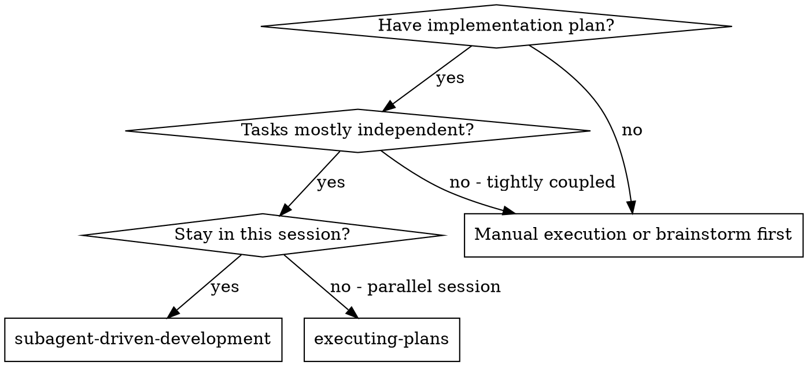
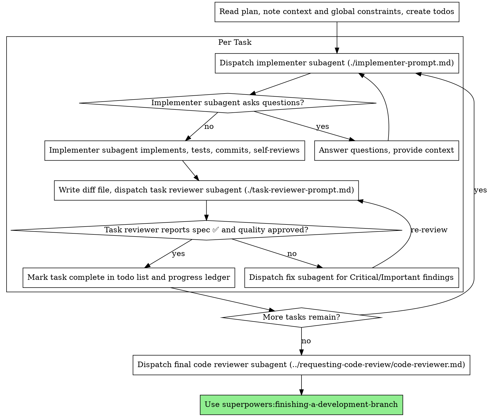

# Session transcript

## User

start I6 by reading CAMPAIGN.md + LEDGER.md first

## Assistant

I'll read the campaign's governing documents in full before doing anything else.

### ⚙ Tool call: `Bash`

```json
{
  "command": "ls /workspace/development/2026-07-17-modularization-campaign/",
  "description": "List campaign directory contents"
}
```

### ↳ Tool result

```
BLOCKMAP.md
CAMPAIGN.md
LEDGER.md
PROMPT.md
analytics.md
statistics.md
transcript.md
transcript.raw.md
usage.raw.txt
```

### ⚙ Tool call: `Read`

```json
{
  "file_path": "/workspace/development/2026-07-17-modularization-campaign/CAMPAIGN.md"
}
```

### ↳ Tool result

```
1	# CAMPAIGN.md — Modularization Campaign (frozen architecture)
2	
3	**Status:** approved design, 2026-07-17. Brainstormed and approved section-by-section in
4	the campaign planning session (see `transcript.md` once archived); prompt in `PROMPT.md`.
5	
6	This is the **one** copy of the campaign's architecture, decisions, invariants, and
7	increment plan. Increment specs **cite this document and re-derive nothing** — the
8	campaign-level brainstorm and adversarial review run once, here; increments inherit that
9	scrutiny and do not repeat it. Any change to this document is an **amendment**: edit the
10	document *and* append a ledger entry (`LEDGER.md`) saying what changed and why. An
11	increment spec that contradicts this document without a ledger amendment is wrong by
12	definition.
13	
14	Related documents (all in this directory unless pathed): `PROMPT.md` (the campaign
15	request), `BLOCKMAP.md` (the B1–B60 functional map of `main()` all scope assignments
16	reference), `LEDGER.md` (append-only cross-increment record), `/workspace/CONTEXT.md`
17	(domain glossary — created by this campaign), `/workspace/prompts/directives.md` (the
18	Spine; PD#n citations below refer to it).
19	
20	## Glossary (campaign terms — domain terms live in `CONTEXT.md`)
21	
22	- **Campaign** — this whole program of work: one architecture, N increments.
23	- **Increment** — one unit of work with its own session, spec, implementation, review,
24	  commit, and archive. Numbered I0–I14.
25	- **Wave** — an ordered group of increments (0–4); increments within a wave may be
26	  reordered if the ledger records why, waves may not.
27	- **Block** — a `Bnn` region of `main()` per `BLOCKMAP.md`; the stable unit of scope
28	  assignment.
29	- **Core package** — the new importable `psh/` package holding infrastructure (Tier 1).
30	- **Gateway** — `psh/gateway.py`, the single module through which every Terminus/WP-CLI/
31	  Drush subprocess flows; the future Pantheon-API replacement seam.
32	- **Façade** — `script_context.py` (`sc`), the stable API surface that checks and plugins
33	  import; implementations move, the façade's names do not break.
34	- **Contract** — the per-phase guaranteed `site_context` keys (CLAUDE.md table), which
35	  this campaign turns into a machine-readable **contract registry**.
36	- **Hook DAG** — the per-phase topological ordering of hooks derived from declared
37	  `consumes`/`produces` keys, validated fatally at startup.
38	- **Ratchet** — the lint/type regime: broad ruff+pyright rules applied as a hard gate to
39	  moved/new modules immediately, the remnant grandfathered until I14.
40	- **Remnant** — whatever remains of the original script at any point mid-campaign.
41	- **Shim** — the thin committed `./pantheon-sitehealth-emails` entry script that calls
42	  `psh.cli.main()` after I0.
43	- **Ledger** — `LEDGER.md`; how increment N learns what N−1 actually did.
44	- **Behavior bar** — the tiered definition of which observable behavior may change (§8).
45	- **Invariant** — a named property no increment may alter (§9).
46	
47	**MUST** = required, violation fails review. **NEVER** = prohibited, violation fails
48	review. **SHOULD** = required unless the increment spec states why not. **MAY** =
49	allowed, at the implementer's judgment.
50	
51	## 1. Goal and non-goals
52	
53	**Goal.** Modularize the 4,752-line main script into (a) a `psh/` core package of
54	infrastructure modules, (b) self-registering `check/` packages for every notice/section
55	emitter, and (c) the existing `plugin/` integrations — taking full advantage of the hook
56	system — while the four e2e goldens stay byte-identical, the per-phase contract is
57	honored, and the non-U-M path keeps working. End state: `main()` is a ~250–400-line
58	orchestrator; every U-M-specific behavior lives in `umich` packages; the whole tree
59	passes the broadened ruff+pyright configuration.
60	
61	**Non-goals** (exhaustive; each is either declined or deferred with reasoning in §15):
62	replacing terminus with the Pantheon API; implementing parallel site processing; any new
63	report content (CSV attachment, cached-% column, env-lock section); SendGrid; refreshing
64	goldens or recorded fixtures; changing what any check reports (except the named bug
65	fixes in I1).
66	
67	## 2. Decision record (exhaustive — from the approved brainstorm)
68	
69	| # | Decision | Choice | Why |
70	|---|---|---|---|
71	| D1 | Pantheon API | **Seam only**: gateway module now, transport swap post-campaign | Swapping transports mid-campaign invalidates terminus fixtures + goldens in every touched increment |
72	| D2 | Lint/type broadening | **Ratchet in-campaign** (§13) | Code is cleaned exactly once, as it moves; bar fixed in I0 so it never shifts |
73	| D3 | Behavior bar | **Tiered, config renames allowed** (§8) | Cleanest final schema; production config edited once, at I14, with a migration table |
74	| D4 | Increment granularity | **Fine: 15 increments** | Safest for session/context limits; split-never-compress backstop (§12) |
75	| D5 | Target architecture | **Three-tier split** (§3) | Infrastructure ≠ report content ≠ data source; fulfills "full advantage of the frameworks" |
76	| D6 | Hook flexibility | **Phases stay; hooks declare consumes/produces; per-phase DAG validated at startup** (§4) | Keeps every existing hook/test valid; a phase-less key scheduler rewrites everything for no added power |
77	| D7 | `--only-warn` plan rec | **In campaign** (I7) | Small, no golden impact, existing TODO |
78	| D8 | Parallel-ready | **Design constraint only** (§3.4) | Near-free now; actual parallelism stays a README TODO |
79	| D9 | CSV attachment / cached-% / env-lock | **README TODO** | Each changes rendered email → golden churn mid-campaign |
80	| D10 | Packaging | **Real package + thin shim** (I0; console-script dropped — see LEDGER I0 amendment 1) | Dissolves the extension-less-script problem; normal imports for tests/pyright/ruff |
81	
82	## 3. Target architecture
83	
84	```
85	                 ./pantheon-sitehealth-emails  (thin shim)
86	                                │
87	                        psh.cli.main()  ── orchestrator: bootstrap, site loop,
88	                                │           phase firing, lifecycle dispatch
89	        ┌───────────────────────┼──────────────────────────┐
90	        ▼ Tier 1: psh/ core     ▼ seams (sc façade)        ▼
91	  configuration  modules   ┌─────────────────────┐   Tier 3: plugin/
92	  gateway        db        │  hook phases + DAG  │   aws  cloudflare
93	  traffic        plans     │  contract registry  │   env  umich
94	  gather         charts    └─────────┬───────────┘   (unchanged roles)
95	  render         mail                ▼
96	  lifecycle                Tier 2: check/  (all notice/section emitters)
97	                           pantheon  wordpress  drupal  addon_updates
98	                           dns  cloudflare  pantheon_cdn_change  umich
99	```
100	
101	### 3.1 Tier 1 — `psh/` core package (exhaustive module map)
102	
103	| Module | Receives (functions / blocks) |
104	|---|---|
105	| `psh/cli.py` | `build_arg_parser`, `parse_args`, arg validation (B5), `main()` orchestrator |
106	| `psh/configuration.py` | `process_config`, `config_substitution`, `gate_disabled_sections`, DEFER machinery, `load_news_items`, `umich_enabled`, `cloudflare_enabled` |
107	| `psh/modules.py` | `find_modules`, module loading (B2/B4), hook engine (`add_hook`/`invoke_hooks`/`PHASES`), DAG build/validation, contract registry |
108	| `psh/gateway.py` | `run_terminus`, `terminus`, `terminus_data`, `wp`, `wp_eval`, `drush`, `drush_php_script`, `fix_drush_output`, `wp_error`, `drush_error`, `TerminusError` |
109	| `psh/notice.py` | `Notice`, `Severity`, `NoticeRegistry`, `DuplicateNoticeCodeError`, `registry` (added I3; §6 Notice type + code registry) |
110	| `psh/db.py` | ORM models, `TrafficRow`/`OverageProtectionRow`, `db_engine_args`, `db_retry`/`db_retryable`/`record_db_reconnect`, `update_traffic_rows`, `insert_traffic_rows`, `load_traffic_rows`, `load_overage_protection_window`, `DatabaseUnavailableError` |
111	| `psh/traffic.py` | `get_old_metrics`, `estimate_month_visits`, `build_traffic_table_rows`, the `traffic_table_columns` global, metrics gather + DB update/load flow (B22–B26), visits-by-month aggregation (B43) |
112	| `psh/plans.py` | plan_info normalization (B12 part), SKU resolution (B17), `overage_blocks`, `contract_year_end`, `plan_costs`, `build_plan_over_time`, the `cost_table_columns` global, recommendation flow (B47) |
113	| `psh/gather.py` | Slimmed framework gathers feeding the `site_post_gather` contract (from B32–B35), `check_wordpress_plugin`/`check_drupal_module` helpers |
114	| `psh/charts.py` | Cap geometry (B13 part), chart data prep + matplotlib build (B44–B45) — returns PNG bytes |
115	| `psh/render.py` | Jinja render (B53), PHP inline + `!important` pass (B54), `escape_url` |
116	| `psh/mail.py` | Recipient resolution (B49), MIME assembly (B55), `smtp_login`, send (B57) |
117	| `psh/lifecycle.py` | `RunState`, `finish_run`, `abort_run`, `abort_reason`, `resume_point`, `resume_command`, `rerun_command`, `option_strings_taking_a_value`, `sites_from_resume_point`, `merge_prior_results`, `ResumeSiteNotFoundError` |
118	
119	`dns_classify.py` stays a top-level module (already extracted; moving it into `psh/` is
120	MAY-scope for I14, decided by ledger state then).
121	
122	**Whole-file coverage.** The campaign modularizes the entire script, not just `main()`:
123	every top-level def and module-level global in `pantheon-sitehealth-emails` (lines
124	1–2107 included) is assigned to a `psh/` module in this table and appears in exactly one
125	increment's scope (§11). End state: the original file is the thin shim and nothing else
126	— a top-level def still there at I14 is a defect the closing audit (§17) catches. Moved
127	helpers get the full §7 treatment (types, ratchet, verified docs, tests); they do NOT
128	get algorithmic redesign — moves are behavior-preserving except where §8 says otherwise
129	(I1, I7's D7, I12's B51).
130	
131	### 3.2 Tier 2 — new/changed `check/` packages (exhaustive)
132	
133	| Package | Contents (blocks) | Phase(s) |
134	|---|---|---|
135	| `check/pantheon/` (new) | frozen site (B19), no-live-env (B21), upstream updates (B38), PHP EOL (B41) | `site_pre` (frozen, no-live-env), `site_post_gather` (updates, PHP EOL) |
136	| `check/wordpress/` (new) | PAPC + native-sessions checks, OCP config probe, favicon (from B34) | `site_post_gather` |
137	| `check/drupal/` (new) | PAPC module check, D7 EOL + tag1_d7es, multisite probe (from B30/B35) | `site_post_dns` (multisite), `site_post_gather` |
138	| `check/addon_updates/` (new) | add-on updates table notice (B39), smell notices (B48) | `site_post_gather` |
139	| `check/umich/` (existing, grows) | umich-oidc-login, Hummingbird fork (B34), Drupal UA check (B35), annual-billing notices (B50/B51), portal-URL text for the recommendation notice (B47's U-M half) | `site_post_gather`, `site_pre_render` (billing) |
140	
141	`check/dns/`, `check/cloudflare/`, `check/pantheon_cdn_change/` are untouched tenants.
142	A check MAY fetch its own data through `sc` gateway wrappers when the data is
143	check-specific (e.g. `upstream:updates:list`); data used by core *and* checks is
144	published through the contract instead (e.g. `envs`).
145	
146	### 3.3 What stays in `main()` (exhaustive, with why)
147	
148	Config/arg bootstrap ordering (B1–B8 — the two-pass substitution *order* is the
149	program); overage constants + date window (B9, B13 part); the site-loop skeleton (skips,
150	banner, sorted order, resume filter — B14–B18, B20, B25, B42); phase firing and contract
151	stuffing (B27, B28, B31, B37, B52); notice sort + subject (B50 minus billing); the
152	`try`/`except BaseException` lifecycle dispatch (B59–B60 call sites). Everything else
153	leaves. Target: 250–400 lines.
154	
155	### 3.4 Parallel-ready constraint (D8)
156	
157	Per-site work MUST be a function of `(site, config, db_session, site_context)`: no new
158	module-level mutable state; run-scoped accumulators live only in `RunState`. This is a
159	review criterion from I2 onward, not a parallelism implementation.
160	
161	### 3.5 The `sc` façade
162	
163	Checks and plugins import **only** `sc` (and their own package). `sc` keeps every name
164	listed in CLAUDE.md's runtime-exposed block, re-exporting from `psh/` modules as they
165	move. NEVER remove or rename an `sc` attribute mid-campaign; additions are fine. The
166	house-rules test suite gains an assertion that every documented `sc` name exists (I2).
167	
168	## 4. Phases, hooks, and the DAG
169	
170	Phases stay the coarse spine: `setup`, `site_pre`, `site_post_traffic`, `site_post_dns`,
171	`site_post_gather`, `site_pre_render`, plus **new** `run_finish` (fired inside
172	`finish_run` before artifacts are written, receiving the `RunState`; for future run-level
173	artifact hooks — no consumer at introduction, like `site_pre_render` was). Dotted
174	plugin-defined events are unchanged.
175	
176	From I4, `add_hook` requires two new entries per hook: `consumes` and `produces` — each
177	a (possibly empty) list of contract-key names. Validation at module-load completion
178	(exhaustive fatal conditions):
179	
180	1. A consumed key that nothing produces (neither core's registry for that phase or an
181	   earlier phase, nor another hook) → fatal.
182	2. Two producers of the same key → fatal (one owner per key; PD#1 — a silent overwrite
183	   is a silent failure).
184	3. A cycle among same-phase hooks → fatal.
185	4. A hook consuming a key first produced in a *later* phase → fatal.
186	5. A missing `consumes`/`produces` entry on any hook → fatal (no legacy mode; I4
187	   retrofits all in-repo hooks in the same change).
188	
189	`invoke_hooks` orders same-phase hooks topologically (producers before consumers;
190	registration order breaks ties, so existing behavior is preserved where no edges exist).
191	The permanent test `tests/integration/test_hook_dag.py` loads **all** real check/plugin
192	packages and asserts the DAG builds — the "future changes can never make the DAG
193	impossible" guarantee — and a unit suite proves each fatal condition actually fires
194	(PD#14: the validator must be shown able to go red).
195	
196	```
197	 module load ──► collect hooks ──► per phase: build edges (produces→consumes)
198	                                        │
199	                              cycle? unknown key? dup producer? ──► fatal exit (named error)
200	                                        │ ok
201	                                topo order stored ──► invoke_hooks uses it
202	```
203	
204	**Contract registry.** `psh/modules.py` holds the machine-readable registry: phase →
205	keys core stuffs (today's CLAUDE.md table, verbatim). Core's stuffing code is checked
206	against it in tests; CLAUDE.md's table gains a line saying the registry is authoritative.
207	New contract keys added by increments (exhaustive for this campaign): `envs` (I8, at
208	`site_pre`), `add_on_updates` + `wp_smell`/`drush_smell`/`composer_smell` (I9/I10, at
209	`site_post_gather`), plan/cost keys `current_plan`, `recommended_plan`, `plan_costs`,
210	`savings` (I7, at `site_pre_render`). Each addition updates registry + CLAUDE.md table +
211	ledger in the same increment.
212	
213	## 5. Configuration
214	
215	Principles: one section per feature, named for the operator's mental model; every
216	relocated check gets an `enabled` flag under `[Check.<name>]`, **default true** —
217	relocating code MUST NOT silently disable a check that runs unconditionally today.
218	U-M-only checks additionally require `[UMich].enabled` (existing `umich_enabled()`
219	rule). `gate_disabled_sections()` semantics (nested `enabled`, children dropped) apply to
220	`[Check.*]` unchanged.
221	
222	Example (actual TOML, the shape I8 introduces — illustrative of the family, exhaustive
223	for `check/pantheon/`):
224	
225	```toml
226	[Check.pantheon]
227	enabled = true          # frozen-site, live-env, upstream-updates, PHP-EOL checks
228	```
229	
230	New keys land in final shape as introduced (I3 onward). Renames/moves of *existing* keys
231	happen once, in I14, which MUST deliver: the old→new migration table in
232	`docs/config-migration.md`, a rewritten `sample-pantheon-sitehealth-emails.toml`, and
233	exact edit instructions for the production config repo. Until I14, every existing
234	production key keeps working unchanged.
235	
236	## 6. Types
237	
238	Reused as-is: `TrafficRow`, `OverageProtectionRow`, `DnsFacts`, `FetchResult`,
239	`SiteContext`. Introduced (exhaustive):
240	
241	| Type | Increment | Shape |
242	|---|---|---|
243	| `GatewayResult` | I2 | NamedTuple `(result, errors, fatal)` replacing the anonymous 3-tuples |
244	| `Notice` | I3 (class) → adopted per increment | frozen dataclass: `severity` (StrEnum alert/warning/info), `code` (unique — registry test), `html`, `text`, `short`, `icon`, `order`; `SiteContext.add_notice` accepts `Notice` or legacy dict; dict form retired in I14 |
245	| `PlanInfo` / `PlanCatalog` | I7 | typed view over `[Pantheon.plan_info]` |
246	| `RunState` | I13 | dataclass holding `all_warnings`, `site_results`, `site_savings`, `emails_sent`, reconnect counters |
247	
248	House-style tuple annotations (`-> (str, str, bool)`) are replaced with real annotations
249	in every module as it moves — never fixed in place in the remnant (one pass per line,
250	D2). CLAUDE.md's house-style note is updated in I14 when the last one dies.
251	
252	## 7. Per-increment obligations
253	
254	Every increment MUST (this list is exhaustive and lives only here; increment specs cite
255	it): (1) start by reading `CAMPAIGN.md`, `LEDGER.md`, `CLAUDE.md`, `BLOCKMAP.md` rows in
256	scope; (2) follow `prompts/implementation-standards.md` (subagent-driven, test-first,
257	`psh-implementer`/`psh-reviewer`); (3) replace house styles in moved code (§6);
258	(4) verify — not assume — every claim in comments/docs it moves or writes;
259	(5) update tests in the same change; (6) update README/docs/CLAUDE.md for what moved;
260	(7) update auto-memory where a durable fact changed; (8) append its ledger entry
261	(§12); (9) preserve every invariant (§9); (10) end with `/code-review`, a full
262	`./run-tests`, and one checkpoint commit including its `development/` folder.
263	
264	## 8. Behavior bar (canonical gate table)
265	
266	| Surface | Rule | Until |
267	|---|---|---|
268	| Rendered emails (4 goldens) | NEVER change (byte-identical) | end of campaign |
269	| `-results.json` / `-notices.csv` / `-run.json` structure (keys, row shape) | NEVER change | end of campaign |
270	| Notice csv *values* | MAY change only in I1 (named bug fixes) and I12 (scheduled B51 deletion) | — |
271	| stdout / console / error messages | MAY improve freely | — |
272	| Config: existing keys | NEVER break | I14 (renames with migration table) |
273	| Config: new keys | MUST land in final schema shape | — |
274	| Exit codes, resume semantics, artifact write gates | NEVER change | end of campaign |
275	
276	## 9. Named invariants (exhaustive; NEVER violated by any increment)
277	
278	1. Four e2e goldens byte-identical (`./run-tests` proves it; refresh is forbidden — an
279	   existing golden going red is a defect in the increment, PD#14).
280	2. Per-phase data contract: existing keys never removed/renamed/retyped; additions only.
281	3. Non-U-M path works: non-U-M golden green; no new un-gated U-M content (I1 *removes*
282	   the one known leak).
283	4. Run lifecycle: single `except BaseException` flush path; `abort_reason`'s three
284	   outcomes; artifacts dropped-site rule; notices appended before send; resume-point
285	   next-site-after-email rule; soft-wrapped copy-pasteable commands.
286	5. DB: `db_retry` retries whole idempotent units only; `db_retryable` predicate
287	   unchanged; the read-release commit in the loaders stays (guarded by
288	   `test_load_traffic_rows_releases_the_connection`).
289	6. Rich console rules: escape untrusted text; production width reproduced in tests.
290	7. Test safety interlock (`run_program` forbidden flags) never bypassed or weakened.
291	8. Column-0 `f"""` notice literals move **verbatim** — never re-indented; `git diff -w`
292	   is not acceptable evidence for any change touching them.
293	9. Checks/plugins import only `sc`; `sc` names never removed mid-campaign (§3.5).
294	10. Recorded fixtures are not regenerated (`terminus-cdnchange/` is hand-maintained and
295	    `--record` must not run).
296	11. `--create-tables`/`--update`/`--import-older-metrics` phase-gating rules (CLAUDE.md
297	    table) unchanged.
298	
299	## 10. Known-bug inventory → I1
300	
301	The five bugs and the dead code listed in `BLOCKMAP.md` §Bugs (composer-smell
302	nesting+variable; shared `php-eol` code; `site_results` omission; un-gated U-M portal
303	URLs; duplicate `annual-bill` code — B51 handled as: distinct code now, scheduled
304	deletion when its Aug-2026 date passes, ledgered to I12; dead code deleted). Each fix is
305	test-first with the test shown red on the old behavior. **Verified 2026-07-17**: the
306	goldens contain zero `php-eol`/`wp-smell`/`drush-smell`/`composer-smell`/`annual-bill`
307	occurrences and the golden fixtures report PHP 8.2, so none of these fixes can touch a
308	golden:
309	
310	```
311	$ grep -c 'php-eol\|composer-smell\|wp-smell\|drush-smell\|annual-bill' tests/e2e/__snapshots__/*.ambr
312	tests/e2e/__snapshots__/test_golden.ambr:0
313	tests/e2e/__snapshots__/test_golden_cdn_change.ambr:0
314	tests/e2e/__snapshots__/test_golden_drupal.ambr:0
315	tests/e2e/__snapshots__/test_golden_nonumich.ambr:0
316	```
317	
318	## 11. The increments
319	
320	Wave dependency structure (increments within a wave are ordered but MAY be resequenced
321	with a ledger entry; waves MUST NOT be reordered):
322	
323	```
324	Wave 0: I0 bootstrap ──► I1 bug fixes
325	Wave 1: I2 gateway ──► I3 config ──► I4 hooks+DAG ──► I5 DB
326	Wave 2: I6 traffic ──► I7 plans ──► I8 check/pantheon ──► I9 wordpress ──► I10 drupal
327	Wave 3: I11 charts ──► I12 render+mail ──► I13 lifecycle
328	Wave 4: I14 closing sweep
329	```
330	
331	| Inc | Scope (blocks / functions) | Delivers |
332	|---|---|---|
333	| **I0** | — (no logic moves) | `psh/` skeleton + thin shim (console-script dropped — see LEDGER I0 amendment); conftest `import psh` rework (same collected-test count gate); ratchet config (§13) with rule sets pinned; pyright baseline measured; `LEDGER.md` started; README TODO edits (§15 dispositions); CLAUDE.md pointer to campaign |
334	| **I1** | B36, B40, B41, B47 (URLs), B48, B50/B51 (codes), dead code | §10 fixes, each test-first |
335	| **I2** | 302–597 wrappers | `psh/gateway.py`, `GatewayResult`, sc re-exports + façade test; no-subprocess-outside-gateway house rule |
336	| **I3** | 792–934, 1209–1253, 1608–1648 (`umich_enabled`/`cloudflare_enabled`) | `psh/configuration.py`; `Notice` class + code-uniqueness registry test |
337	| **I4** | 935–950, hook engine from `script_context.py` | `psh/modules.py`; consumes/produces on all in-repo hooks; DAG validation + fatal-condition tests; `run_finish` phase; contract registry |
338	| **I5** | 95–178; DB defs within 1285–1575 (`DatabaseUnavailableError` through `db_engine_args`; the resume helpers `ResumeSiteNotFoundError`, `sites_from_resume_point`, `merge_prior_results` stay for I13) | `psh/db.py`; DB test suites relocated intact |
339	| **I6** | B22–B26, B43; 598–671, 977–1127 | `psh/traffic.py` |
340	| **I7** | B9, B12 (plans), B17, B47; 967–976, 1128–1208, 1254–1280 | `psh/plans.py`; `PlanInfo`; D7 (`--only-warn` runs recommendation); plan/cost contract keys |
341	| **I8** | B19, B21, B38, B41 | `check/pantheon/` + `[Check.pantheon]`; `envs` contract key |
342	| **I9** | B32–B34; 672–739 | `psh/gather.py` (WP half); `check/wordpress/`; U-M WP checks → `check/umich/`; `add_on_updates` + smell contract keys |
343	| **I10** | B30, B35, B39, B48; 740–791 | gather (Drupal half); `check/drupal/`; `check/addon_updates/`; UA check → `check/umich/` |
344	| **I11** | B13 (caps), B44–B45 | `psh/charts.py` |
345	| **I12** | B49–B57 minus sort/subject core | `psh/render.py`, `psh/mail.py`; annual billing → `check/umich/` at `site_pre_render`; B51 deletion if past its date |
346	| **I13** | B14 (accumulators), B56, B59–B60; 1649–2107 plus the resume helpers I5 left behind (1281–1284, 1528–1542, 1576–1607) | `psh/lifecycle.py`; `RunState`; `main()` reaches final form |
347	| **I14** | — | Config renames + migration doc + sample rewrite + production-config instructions; global ratchet flip + remnant cleanup; docs/README/CLAUDE.md full refresh; `Notice` dict form retired; ledger fully resolved; retrospective + closing audit (§17) |
348	
349	Sizing note: the largest moves are I9 (~330 main-loop lines + helpers) and I10 (~320 +
350	helpers). If any increment proves oversized mid-session: **split, never compress** —
351	commit nothing partial, ledger the split, the second half becomes its own increment.
352	
353	## 12. Coordination protocol
354	
355	**Ledger entry template** (append per increment, and for any amendment):
356	
357	```markdown
358	## I<N> — <slug> (<date>, commit <sha>)
359	- Moved: <blocks/functions actually moved>
360	- Deviations from CAMPAIGN.md: <none | what + why>
361	- Contract/config/sc additions: <keys/names>
362	- Discovered tasks: <each with disposition: fixed here | I<M> | README TODO>
363	- Open questions for next increment: <…>
364	```
365	
366	**Discovered-task disposition rules** (canonical): fits current increment's scope and
367	<~30 min → fix now, note in ledger; belongs to a later increment → ledger it against
368	that increment (the increment's spec author MUST read these); major/risky/scope-widening
369	→ README TODO with a sentence of context. Nothing is carried in memory or chat — if it
370	is not in the ledger or README, it does not exist (PD#9).
371	
372	**Session flow per increment:** read the §7 documents → write the increment SPEC.md in
373	`development/<date>-mod-I<N>-<slug>/` citing CAMPAIGN.md sections by number →
374	`superpowers:writing-plans` → subagent-driven implementation → `/code-review` → full
375	`./run-tests` → per-task commits, each green; the increment's final commit includes the dev
376	folder → `/archive-session` → ledger entry.
377	
378	## 13. Lint/type ratchet
379	
380	Mechanism (as shipped by I0; see LEDGER I0 amendment 2): TWO ruff configs —
381	`pyproject.toml` `[tool.ruff.lint]` keeps the narrow PD-rule set running everywhere
382	including the remnant, and `ruff-broad.toml` carries `select = ["ALL"]` minus a
383	justified ignore list, with `extend-exclude` grandfathering exactly the remnant
384	(`psh/_legacy.py`) and not-yet-moved files; each increment deletes its
385	files from the grandfather list, and the two configs merge at I14. pyright runs in
386	`./run-tests` from I0 via `[tool.pyright]` (standard mode, `psh/` minus `_legacy.py`),
387	ratcheting toward strict as typed code moves in. The four existing narrow rules (`E722`, `BLE001`, `S105`, `S106`) remain global
388	throughout — they mechanize PD#2/PD#6 and are never grandfathered. No
389	`target-version` pin (CLAUDE.md: it masks the 3.12-only syntax detection).
390	
391	Baselines measured 2026-07-17 (I0 re-measures and pins both in its spec):
392	
393	```
394	$ ./run-tests --fast --llm   (tail)
395	LLM_SUMMARY passed=727 failed=0 error=0 skipped=1 xfailed=0 xpassed=0
396	25 snapshots passed.
397	
398	$ uvx ruff check --isolated --statistics .
399	26  F541  f-string-missing-placeholders
400	 8  E741  ambiguous-variable-name
401	 4  E713  not-in-test
402	 3  F841  unused-variable
403	 2  F401  unused-import
404	 1  E402  module-import-not-at-top-of-file
405	 1  E712  true-false-comparison
406	Found 45 errors.
407	```
408	
409	(README's "~55" ruff and "39" pyright figures are stale/unverified claims; I0 replaces
410	them with measured numbers. pyright was not measured in planning — no pyright binary in
411	the dev container yet; installing it is I0 scope.)
412	
413	## 14. Risk / control table
414	
415	| Risk | Control |
416	|---|---|
417	| Re-indented column-0 notice literals silently change emails | Invariant 8; goldens as tripwire; AST/token comparison, never `git diff -w` |
418	| conftest rework silently drops tests | I0 gate: identical collected-test count (727 passed / 1 skipped / 2 deselected baseline) before and after |
419	| Long-range `main()` local coupling breaks a move | BLOCKMAP produces/consumes; each increment spec lists exactly which locals cross its boundary |
420	| Session/context overrun mid-increment | Fine granularity (D4); split-never-compress; commits only at increment completion |
421	| Architecture drift across 15 sessions | This document frozen; amendments only via ledger; specs cite section numbers |
422	| Hidden hook-order dependencies surface in I4 | I4 audits every hook; real dependencies become explicit DAG edges |
423	| Ratchet churn on moved code | Rules fixed at I0; cleaning is part of each move |
424	| Goldens blind to stdout/artifacts | Invariants 4–5 name the artifact/abort test suites as the cover; artifact structure frozen until campaign end |
425	| Implementer sessions lack context | `psh-implementer`/`psh-reviewer` carry the read list; specs name seams (Spine spec bar); §7 reading list |
426	| Two annual-bill notices / removal date passes mid-campaign | Explicitly scheduled: codes split in I1, deletion decision in I12, ledger tracks |
427	
428	## 15. NOT in scope (reasoning preserved so it is never re-litigated)
429	
430	- **Terminus → Pantheon API swap** — D1; post-campaign project against `psh/gateway.py`.
431	- **Parallel site processing** — D8; constraint only; README TODO remains.
432	- **CSV data attachment, cached-% column, env-lock section** — D9; each becomes a small
433	  post-campaign change (env-lock: a ~50-line `check/` package) once goldens may move.
434	- **SendGrid, secrets-handling completion, portal traffic capture, daily alerts,
435	  accessibility/security/Cloudflare scores, AI recommendations, dependency updates,
436	  terraform-infra** — pre-existing README TODOs, untouched by this campaign.
437	- **Approach B (library-only) and C (everything-is-a-hook)** — rejected in brainstorm:
438	  B fails the "full advantage of the frameworks" goal; C forces infrastructure into
439	  optional-content clothing.
440	- **Golden/fixture refreshes** — forbidden (Invariants 1, 10).
441	
442	## 16. Acceptance baseline
443	
444	§13 outputs are the campaign-start baseline (run and pasted 2026-07-17). Every
445	increment's definition of done re-runs `./run-tests` at increment end — the full suite
446	when the live tier's credentials are available in the session, otherwise `--fast` with a
447	ledger note saying the live tier was skipped — and MUST reproduce goldens
448	byte-identically. I0 additionally records the collected-test count gate.
449	
450	## 17. Closing audit (queued for I14; exhaustive)
451	
452	1. Is `main()` within 250–400 lines, and does everything left match §3.3?
453	2. Has every DAG fatal condition been demonstrated red at least once?
454	3. Do the contract registry and CLAUDE.md table agree (test-enforced)?
455	4. Is any `sc` re-export now consumed by nobody (dead façade surface)?
456	5. Is the `.py` symlink still needed for anything beyond the shim? If not, note in
457	   CLAUDE.md; if yes, say for what.
458	6. Are all ledger items resolved (done, scheduled, or README TODO)?
459	7. Has the production config repo received and applied the migration instructions?
460	8. Do README, CLAUDE.md, docs/, and memory reflect the final architecture (no stale
461	   line-number or module references)?
462	9. Were any invariants amended mid-campaign, and is each amendment ledgered?
463
```

### ⚙ Tool call: `Read`

```json
{
  "file_path": "/workspace/development/2026-07-17-modularization-campaign/LEDGER.md"
}
```

### ↳ Tool result

```
1	# LEDGER — Modularization Campaign
2	
3	Append-only. One entry per completed increment, plus one per CAMPAIGN.md amendment.
4	This file is how increment N learns what N−1 actually did; if a deviation, discovered
5	task, or decision is not recorded here (or in the README TODO list), it does not exist.
6	Entry template: CAMPAIGN.md §12.
7	
8	## Campaign planning (2026-07-17)
9	
10	- Produced: `CAMPAIGN.md` (frozen architecture), `BLOCKMAP.md` (B1–B60 map),
11	  `/workspace/CONTEXT.md` (domain glossary, new), this ledger.
12	- Baselines: fast tier 727 passed / 1 skipped / 2 deselected; ruff `--isolated` 45
13	  findings; pyright unmeasured (no binary in container — I0 scope).
14	- Discovered during planning, dispositioned:
15	  - Five bugs + dead code → I1 (CAMPAIGN.md §10, BLOCKMAP §Bugs).
16	  - README's "~55 ruff / 39 pyright" figures stale/unverified → I0 re-measures.
17	  - B51 second annual-bill notice: marked "remove Aug 2026" — code split in I1,
18	    deletion decision in I12.
19	  - WordPress/Drupal duplication + update-table HTML duplication (BLOCKMAP §Bugs 7–8)
20	    → addressed structurally by I9/I10 (shared gather + `check/addon_updates/`).
21	- Open questions for I0: exact ruff rule list; pyright strictness per environment;
22	  whether `dns_classify.py` moves under `psh/` (deferred to I14, MAY).
23	- Amendment (2026-07-17, user spec review): added the "Whole-file coverage" paragraph to
24	  CAMPAIGN.md §3.1 — clarification only, no scope change; the module map already
25	  assigned every top-level def.
26	
27	## I0 — bootstrap (2026-07-17, closing commit `docs(campaign-I0): close the bootstrap increment`)
28	
29	Commits (per-task, each green): `b1ccc72` (package move + shim + conftest + coverage),
30	`d0e3027` (lint/type ratchet), `5b536fa` + `239955d` (README/CLAUDE.md docs), plus this
31	closing docs commit (ledger + CAMPAIGN amendments + SPEC acceptance + README pyright number).
32	
33	- **Moved:** the whole 4,752-line program → `psh/_legacy.py` (`git mv`, **zero logic
34	  changes**; the `__main__` tail is inert in a module, left for I13). New: `psh/__init__.py`
35	  (docstring), `psh/cli.py` (`from psh._legacy import main, parse_args` re-export), and a new
36	  7-line thin shim at `./pantheon-sitehealth-emails` calling `psh.cli.main()`. No blocks
37	  (B-map) moved — I0 moves the file, not logic (§11 row I0).
38	
39	- **Deviations from CAMPAIGN.md (three amendments, all applied to the document this commit):**
40	  1. **No console-script entry point** (amends §11 row I0 / D10). The program is repo-rooted
41	     by design (`find_modules`, templates, `inline-styles.php`, `vendor/`, config symlink are
42	     all CWD-relative); a pip entry point would need a data-file overhaul serving no campaign
43	     goal. D10's real benefits (normal imports; native ruff/pyright/CodeGraph coverage; no
44	     `SourceFileLoader`) all arrive via the package + shim without installation. `pyproject.toml`
45	     stays deps-only (`py-modules = []`, `packages = []` to stop setuptools auto-discovery
46	     installing a stale shadow copy — PD#1). §11 row I0 now reads "thin shim (console-script
47	     dropped — see LEDGER I0 amendment)".
48	  2. **Grandfather is `psh/_legacy.py` via `ruff-broad.toml` `extend-exclude`** (amends §13,
49	     which named `pantheon-sitehealth-emails.py` and "per-file-ignores" — both written before
50	     the legacy-module + two-config mechanics were settled). The shipped mechanism is TWO ruff
51	     configs, not per-file-ignores: `pyproject.toml` `[tool.ruff.lint]` carries the narrow
52	     PD-rule set (`E722`/`BLE001`/`S105`/`S106`) that runs EVERYWHERE including `_legacy.py`;
53	     `ruff-broad.toml` carries `select = ["ALL"]` minus the ignore list and grandfathers the
54	     remnant via `extend-exclude`. `./run-tests` and `.claude/hooks/ruff-check.sh` run BOTH
55	     passes; the two files merge into `pyproject.toml` at I14. §13 now names `psh/_legacy.py`
56	     and "ruff-broad.toml exclude".
57	  3. **Per-task commits, each green** (amends §12's "one commit (code + dev folder)"). Each I0
58	     task committed independently once its gates were green; this increment's final (closing)
59	     commit includes the `development/` folder. Rationale: finer checkpoints serve the campaign
60	     prompt's revert/inspect intent, and SDD review packages diffs as commit ranges. §12 now
61	     reads "per-task commits, each green; the increment's final commit includes the dev folder".
62	
63	- **Ratchet as pinned.** pyright runs in `./run-tests` at **standard** mode, not strict
64	  (DECISION): `psh/cli.py` re-exports from the untyped legacy module, so strict would fail on
65	  re-export; strictness ratchets up as increments move typed code in. Scope `[tool.pyright]`
66	  = `include = ["psh"]`, `exclude = ["psh/_legacy.py"]`. Ruff-broad ignore list (pinned; each
67	  justified in `ruff-broad.toml`): `COM812`, `ISC001`, `E501`, `Q000`, `Q001`, `Q002`, `Q003`,
68	  `ANN`, `TD002`, `TD003`, `FIX002`, `EM101`, `EM102`, `TRY003`, `D`, `CPY001`. `CPY001` is a
69	  **preview** rule in ruff 0.15.22 (cannot fire under non-preview `select=["ALL"]`); ruff
70	  accepts it in `ignore` with no warning, so it is kept verbatim to document the intent
71	  (no per-file copyright headers). `D` (docstring convention) is undecided → README TODO.
72	
73	- **pyright whole-tree baseline (informational; replaces README's unverified "39").**
74	  **220 errors, 0 warnings, 0 informations** across 118 first-party files, standard mode,
75	  pyright 1.1.411 (SPEC ACCEPTANCE §Task 5 has the command + breakdown). Measured OUTSIDE the
76	  scoped gate config via a repo-root config (pyright roots a project at the config's directory
77	  and ignores includes outside it; a config's `exclude` still drops CLI-passed paths — so
78	  neither a scratchpad-rooted config nor CLI args can re-include `_legacy.py`, and a repo-root
79	  temp config is the reproducible form). By area: `tests/` 139, `psh/_legacy.py` 36, `check/`
80	  21, `plugin/` 18, `script_context.py` 5, `dns_classify.py` 1 (`check/`+`plugin/` = 39, the
81	  origin of the old figure). The gated scope (`psh/` minus `_legacy.py`) is `0 errors`.
82	
83	- **Contract/config/sc additions:** none (I0 moves no logic; no `[Check.*]` sections, no new
84	  contract keys, no `sc` names added or removed).
85	
86	- **Discovered tasks:**
87	  - **`Path(psh.__file__).parent` as a repo-root proxy** — 25 sites across 23 files: 22 test files (plus
88	    `tests/helpers/checkload.py`) anchored repo paths on the program file's parent, which the
89	    move shifted from repo root to `psh/`. Fixed here, mechanically and minimally:
90	    `→ Path(psh.__file__).resolve().parents[1]` at exactly those sites. Proper cleanup lands
91	    when later increments un-grandfather those test files; the `psh` fixture itself is
92	    redesigned when `_legacy` dies (I13/I14). Disposition: **fixed here**, further cleanup **I13/I14**.
93	  - **ruff lints explicitly-passed files even when excluded** — passing a path on ruff's
94	    command line overrides `extend-exclude`, so the edit hook (which passes the just-edited
95	    file) would lint `_legacy.py` against the broad set. Fixed by giving the broad-pass
96	    invocation `--force-exclude` and running it from repo-root cwd; documented in
97	    `.claude/hooks/ruff-check.sh`. Disposition: **fixed here**.
98	
99	- **Open questions for I1/I2:**
100	  - I1 (bug fixes) touches `_legacy.py` in place (fixes retire as code moves); it must keep
101	    the narrow PD set green there (broad set stays grandfathered) and the four goldens
102	    byte-identical (§10 verified the fixed codes appear in zero goldens).
103	  - I2 (gateway) is the first real logic move: as it un-grandfathers the wrapper functions it
104	    deletes them from `ruff-broad.toml` `extend-exclude` and must clean them to the broad set
105	    + pyright standard in the same change (§13 ratchet; §6 house-style tuple hints replaced).
106	  - `dns_classify.py` under `psh/` remains a MAY for I14 (unchanged from planning).
107	- Amendment (2026-07-17, post-Task-5 review): CAMPAIGN.md §13 mechanism paragraph
108	  rewritten to describe the SHIPPED two-config mechanism (it still said "pyproject gets
109	  extend-select" and "executionEnvironments", both superseded by amendment 2 above);
110	  ledger reanchor note corrected to "22 test files plus checkload.py" (23 files total).
111	  Both changes doc-accuracy only.
112	- Amendment (2026-07-17, final I0 code review, spec axis): D10's Decision cell still said
113	  "console-script" after amendment 1 changed only §11 row I0 — CAMPAIGN.md briefly
114	  self-contradicted. D10 cell now matches. Doc-accuracy only.
115	
116	## I1 — known-bug fixes (2026-07-17, commits `5518de7..1ff9153` + closing docs commit)
117	
118	Spec/plan: `development/2026-07-17-mod-I1-bug-fixes/` (SPEC.md carries the pasted
119	acceptance results). Six per-task commits, each green; full suite at close = 751 passed /
120	1 skipped **including the live tier**, 27 snapshots, all three gates; four goldens
121	byte-identical across the whole range (`git diff aa8afd1 -- tests/e2e/__snapshots__/`
122	empty).
123	
124	- **Moved:** no blocks (fixes land in place in `psh/_legacy.py` per I0's open-question
125	  note). Extracted five pure notice-builder helpers as consecutive module-level defs
126	  above `main()` (preserved-bug-extraction pattern; every literal interior byte-verified
127	  against the pre-move original by task reviewers AND the final review):
128	  `build_smell_notices`, `build_php_eol_notice`, `build_annual_bill_upcoming_notice`,
129	  `build_annual_bill_in_progress_notice`, `build_plan_recommendation_notice`. These
130	  travel later: smells → I10, php-eol → I8, annual-bill → I12, plan-rec → I7.
131	- **Fixed (CAMPAIGN §10 / BLOCKMAP §Bugs, all test-first with RED shown on old
132	  behavior):** (1) B48 composer-smell nesting + wrong interpolated variable;
133	  (2) B41 shared `php-eol` csv code → `php-eol-warning` (7.4/8.1) / `php-eol-alert`
134	  (<8.2), following the `updates-*` suffix pattern; (3) B36 unknown-framework sites now
135	  get a `site_results` entry (`version: "unknown"`, same 3-key row shape) — covered by a
136	  new offline e2e (`tests/e2e/test_unknown_framework_e2e.py`) asserting the
137	  `finish_run()` stdout pprint, since `-results.json` is written only on `--all` runs the
138	  interlock bans; (4) B47 un-gated U-M portal URLs — two of the four named URL sites
139	  (`extra_message`/`extra_text`) were **dead stores** (assigned, never read; §10's
140	  4240/4248 refined — bug partially lived in dead code), deleted; the live
141	  `its-recommends-plan` notice now selects U-M vs generic copy via `umich_enabled()`
142	  (generic drops the portal anchor AND the June-16-30 downgrade-window sentence — U-M
143	  billing policy, factually wrong elsewhere); both variants pinned by syrupy snapshots
144	  (`test_plan_recommendation_notice_render`); (5) B50/B51 duplicate `annual-bill` code —
145	  B51 now emits `annual-bill-in-progress`; B50 keeps `annual-bill`; B51's Aug-2026
146	  deletion decision remains I12's; (6) dead code deleted (B40 Gen2 block, overage debug
147	  query, `# plt.show()`, redundant second `plt.close(fig)` with its stale memory claim).
148	- **Deviations from CAMPAIGN.md:** none.
149	- **Contract/config/sc additions:** none. Sanctioned notice-csv value changes (§8 I1
150	  exception): the three codes above. New **hand-maintained** fixture dir
151	  `tests/fixtures/terminus-unknownfw/` (copy of `terminus/`, one framework value →
152	  `"mystery"`, README states `--record` never refreshes it — Invariant 10, cdnchange
153	  precedent) + conftest constant `TERMINUS_FIXTURES_UNKNOWNFW`.
154	- **Discovered tasks (dispositions):**
155	  - Template `email_template.{html,txt}` portal URLs render `sites/0/` in every non-U-M
156	    run including the non-U-M golden (SPEC Obs. 1) → I12/I14 (goldens freeze it now;
157	    already on CLAUDE.md's still-hardcoded-U-M list).
158	  - `php_version < "8.2"` string comparison + KeyError if key absent (Obs. 2) → I8.
159	  - B47 downgrade path: owner gets NO notice (dead `extra_message` was presumably meant
160	    for this) and a non-Basic downgrade appends no `site_savings` entry (Obs. 3) → I7
161	    decides intended behavior.
162	  - Composer-smell literals carry baked-in 8-space indentation (Obs. 4) → I10.
163	  - `its-recommends-plan` csv embeds `{savings:,.2f}` — thousands comma inside a
164	    comma-separated field, variable column count (Obs. 5) → I7, or I3's `Notice`
165	    class/code-registry work.
166	  - Residual test gap (final-review triage): `main()`'s umich-only annual-bill call
167	    sites have no runtime test (goldens are umich-disabled; interlock bans a U-M run) —
168	    I12's spec author MUST cover this when relocating annual billing to `check/umich/`
169	    at `site_pre_render`.
170	- **Process note (PD#14 instance):** one implementer's report Write silently failed
171	  against a stale `.superpowers/sdd/` report file from I0 and was misreported as
172	  success; caught by the task reviewer (report content was for the wrong task). Stale
173	  scratch reports are now purged before dispatch; future increments should start by
174	  clearing `.superpowers/sdd/task-*-report.md` leftovers.
175	- **Open questions for I2:** none new — proceed per I0's notes (un-grandfather the
176	  wrapper functions from `ruff-broad.toml`, clean to broad set + pyright standard,
177	  replace house-style tuple hints, `GatewayResult`, façade test).
178	
179	## I2 — gateway extraction (2026-07-17, commits `7044b12` (Task 1), `0141f76` (Task 2), house-rule-scope fix + closing docs commit)
180	
181	Spec/plan: `development/2026-07-17-mod-I2-gateway/` (SPEC.md carries the pasted acceptance
182	results). Two per-task code commits, each green, plus a whole-branch-review follow-up commit
183	(the `ENVIRON_SCOPE` widening below) and this closing docs commit (CLAUDE.md / tests/README.md /
184	gateway docstrings / memory / this ledger entry). Full suite (live tier present) at close =
185	**755 passed / 1 skipped** (the 1 skip is `test_db_credentials.py`'s `importorskip("MySQLdb")`
186	on a sqlite-only install), all three gates; four goldens byte-identical across the increment
187	(`git diff 8b1466b -- tests/e2e/__snapshots__/` empty).
188	
189	- **Moved:** the eleven Terminus/WP/Drush subprocess-facing wrapper defs (the 302–597 wrapper
190	  region of `psh/_legacy.py` **minus** `escape_url`, which §3.1 assigns to `psh/render.py`/I12) →
191	  `psh/gateway.py`: `run_terminus`, `TerminusError`, `terminus`, `terminus_data`, `wp`, `wp_eval`,
192	  `wp_error`, `fix_drush_output`, `drush`, `drush_php_script`, `drush_error`. `psh/_legacy.py`
193	  re-imports all eleven (plus `GatewayResult`), so its ~54 call sites and the `sc` exposure block
194	  resolve unchanged. Logic and the two column-0 `f"""` notice literals (`wp_error`/`drush_error`)
195	  moved byte-for-byte (Invariant 8; extracted-block diff pasted empty in the Task 1 report).
196	- **Deviations from CAMPAIGN.md:** the SPEC's §Broad-ruff-findings table enumerated **seven**
197	  findings on the moved code; the actual count was **EIGHT**. Wrapping `run_terminus`'s literal
198	  `return … True`/`return … False` statements in the `GatewayResult(...)` constructor introduced an
199	  `FBT003` (Boolean-positional-value-in-function-call) the spec did not foresee. Resolved
200	  **behavior-preservingly** by constructing with the `fatal=` keyword (`GatewayResult(output,
201	  errors, fatal=True)`) — no `ruff-broad.toml` ignore-list change (that would be a §13 amendment)
202	  and no `# noqa`. The other seven dispositions landed exactly as specced.
203	- **Ratchet (§13):** nothing was deleted from `ruff-broad.toml`'s `extend-exclude` this increment.
204	  The wrappers moved to a **new** file (`psh/gateway.py`), which is gated by the broad ruff set +
205	  pyright standard from birth (it was never in the exclude list). So LEDGER I0's "un-grandfather the
206	  wrapper functions from `ruff-broad.toml`" open-question was a **no-op for the exclude list** — its
207	  premise (functions cleaned in place inside an excluded file) didn't apply once they moved to a
208	  fresh gated file; the cleaning obligation is discharged by gateway.py being born under the full
209	  gate (`uvx ruff check --config ruff-broad.toml psh/gateway.py` → All checks passed!; pyright 0
210	  errors). Recorded per SPEC §Ratchet.
211	- **Contract/config/sc additions:** `GatewayResult` NamedTuple `(result, errors, fatal)` introduced
212	  in `psh/gateway.py`, re-exported via the `_legacy` import. **No new `sc` name** (no check/plugin
213	  references the type — it is unpacked positionally; adding it would be dead façade surface,
214	  CAMPAIGN.md §17 Q4). **No new contract keys.** New `gateway` conftest fixture and two house-rule
215	  instruments (no-`subprocess.Popen`-outside-gateway; documented-`sc`-façade-names-exist).
216	- **Discovered tasks (dispositions):**
217	  - The `wp`/`wp_eval`/`drush`/`drush_php_script` docstrings said "Returns a 3-tuple" after the
218	    move → **fixed here** (Task 3): updated to "Returns a GatewayResult (result, errors, fatal)".
219	    Doc-accuracy only, no logic change; gateway.py re-passed ruff-broad + pyright with 0 findings.
220	  - **`ENVIRON_SCOPE` house-rule was blind to the program body** (whole-branch review finding).
221	    `tests/unit/test_house_rules.py`'s PD#6 `os.environ` guard scoped to `check`/`plugin`/
222	    `dns_classify.py`/`script_context.py`/the 17-line shim — but **not** `psh/`, where the program
223	    body has lived since campaign I0. A direct `os.environ` read added to `psh/_legacy.py` or
224	    `psh/gateway.py` (the largest feature-code files) would have passed silently (PD#1/PD#6/PD#14 —
225	    an instrument blind to what it guards). Latent (grep found no offender) and **pre-existing**
226	    (introduced at I0's file move, not by I2's tasks), but I2 owns this test file and I2's own
227	    `_scoped_sources(scope)` parameterization made the fix one word → **fixed here**: added `"psh"`
228	    to `ENVIRON_SCOPE`, with the new red demonstration (adding `os.environ` to `psh/_legacy.py`
229	    fails naming it) observed, reverted, and recorded in the test docstring. Suite stayed green.
230	- **Open questions for I3:** none new — proceed per CAMPAIGN.md §11 row I3 (`psh/configuration.py`;
231	  `Notice` class + code-uniqueness registry test).
232	
233	## I3 — configuration module + `Notice` class (2026-07-17, commits `ed2698f` (Task 1), `d21a1d2` (Task 2), plus this closing docs commit)
234	
235	Spec/plan: `development/2026-07-17-mod-I3-config-notice/` (`SPEC.md` cites CAMPAIGN.md by
236	section; task reports under `.superpowers/sdd/task-{1,2}-report.md` carry the pasted
237	red/green evidence and pre-suppression ruff findings). Two per-task code commits, each
238	green, plus this closing docs commit (CLAUDE.md / CAMPAIGN.md §3.1 amendment / this ledger
239	entry). Full suite at close (`--fast`; **no live credentials in this environment**, so the
240	live tier did not run — same caveat as prior increments where noted) = **761 passed / 1
241	skipped / 2 deselected**, all three gates green, 27 snapshots; four goldens byte-identical
242	across the increment (`git diff 45b8a88 -- tests/e2e/__snapshots__/` empty).
243	
244	- **Moved:** `config_substitution`, the DEFER machinery (`_DEFER_TAG` + the two compiled
245	  regexes), `process_config`, `gate_disabled_sections`, `load_news_items`, `umich_enabled`,
246	  and `cloudflare_enabled` (the six defs + DEFER machinery named in SPEC §Deliverable A) from
247	  `psh/_legacy.py` into a new `psh/configuration.py`, re-imported back into `_legacy.py` (I2
248	  gateway precedent — the ~11 existing tests calling `psh.process_config` etc. needed no
249	  repoint). **New:** `psh/notice.py` (`Severity` StrEnum, frozen `Notice` dataclass,
250	  `NoticeRegistry`, `DuplicateNoticeCodeError`, module `registry`) — pure, stdlib-only, no
251	  `script_context` dependency. `SiteContext.add_notice` (`script_context.py`) now accepts a
252	  `Notice` or the legacy dict via a new `_notice_to_dict` projection. The `no-domains` notice
253	  (`psh/_legacy.py`, B29) was converted to construct a `Notice` end-to-end, with its code
254	  registered once at module scope; its `html`/`text` f-string interiors (including the
255	  pre-existing "the ste" typo) moved byte-for-byte.
256	
257	- **Deviations from CAMPAIGN.md:**
258	  1. **New module `psh/notice.py`** — §3.1's module map is exhaustive and named no home for
259	     the `Notice` type (§6 introduces the type without pinning a module). Handled as a
260	     CAMPAIGN.md **amendment**, not a ledger-note-only, per §Preamble ("edit the document
261	     *and* append a ledger entry"): this closing commit adds the one-row `psh/notice.py`
262	     entry to §3.1 (`Notice`, `Severity`, `NoticeRegistry`, `DuplicateNoticeCodeError`,
263	     `registry`) between the `psh/gateway.py` and `psh/db.py` rows.
264	  2. **PoC converts `no-domains` (B29), out of I3's declared block scope** (§11 row I3 lists
265	     only the config functions). Deliberate — §6 says the class is "adopted per increment",
266	     the user chose `no-domains` as a PoC, and it is core-and-staying-core (CLAUDE.md: "remain
267	     in core") so no later increment re-touches it. The notice's *home* is unchanged, only its
268	     representation, so this is a **ledger note**, not a §3.1/architecture change.
269	  3. **`sc.Notice`/`sc.Severity` reach `sc` via a module-level `from psh.notice import Notice,
270	     Severity` import at the top of `script_context.py`, NOT the `sc.Notice = Notice` /
271	     `sc.Severity = Severity` assignment pair the SPEC's §sc re-exports section showed** (added
272	     "near the existing `sc.umich_enabled = …` lines" in `_legacy.py`). Task 2's dispatch
273	     carried an explicit correction (surfaced by the Task 2 review, folded into the task
274	     brief before implementation): a plain module-level import makes both names module
275	     attributes automatically, so the assignment pair would have been a same-observable-effect
276	     duplicate of the import — the DRY Engineering Preference favors the single mechanism. The
277	     façade surface is identical either way (`hasattr(sc, "Notice")` etc. — pinned by
278	     `test_documented_sc_facade_names_exist`), so this is a mechanism choice, not a behavior
279	     change; recorded here because the SPEC's illustrative code block, read literally, would
280	     have produced dead/duplicate assignment lines.
281	
282	- **Contract/config/sc additions:** `sc.Notice`, `sc.Severity` (mechanism above). **No new
283	  contract keys** — no phase, `site_context` key, or config section was added; `Notice`
284	  is a producer-side representation change only. `sc.register_notice_code`/`sc.registry` were
285	  **NOT** added (SPEC §sc re-exports, D — deferred until a `check`/`plugin` package first
286	  adopts `Notice`; the PoC imports `registry` from `psh.notice` directly, being core code).
287	
288	- **`script_context.py` typing fix:** `options`/`config` module globals, previously untyped
289	  `= {}`, are now `options: argparse.Namespace = argparse.Namespace()` and
290	  `config: dict[str, Any] = {}` (new `argparse`/`Any` imports) — the minimal fix pyright
291	  standard mode needed to resolve `sc.options.verbose`/`sc.options.config` inside the moved
292	  `psh/configuration.py`. No other name in `script_context.py` was retyped (it stays
293	  grandfathered from the broad ruff ratchet; this is an out-of-gate, minimal, honest fix per
294	  the SPEC's own instruction).
295	
296	- **Ratchet (§13):** both new files gated from birth — neither is nor was in
297	  `ruff-broad.toml`'s `extend-exclude`. `uvx ruff check --config ruff-broad.toml
298	  psh/configuration.py psh/notice.py` → "All checks passed!"; pyright standard mode over
299	  `psh/` minus `_legacy.py` → 0 errors. Nothing deleted from `extend-exclude` (same as I2 —
300	  the moved/new code lands in fresh gated files, not an un-grandfathered old one).
301	
302	- **Ruff/pyright dispositions actually applied (corrections to the SPEC's finding table,
303	  both confirmed against real ruff/pyright output by the Task 1 implementer, not assumed):**
304	  - **`PLR2004` lands on only the two `sc.options.verbose >= 2` comparisons**, not the
305	    `> 1` one the SPEC's illustrative table also listed: ruff's default magic-value
306	    allowlist already covers `-1, 0, 1`, so `> 1` never triggers the rule, and a `# noqa:
307	    PLR2004` there is a live `RUF100` (unused-noqa) finding. Dropped from that line; kept
308	    (with the SPEC's inline reason) on both `>= 2` lines.
309	  - **`S101` (`Use of assert detected`) on both `best_match is not None` asserts** — a real
310	    finding the SPEC's ruff-findings table didn't enumerate (that table covered the
311	    moved-as-is code; the pyright-findings section separately *mandates* the asserts, but
312	    neither section flagged the S101 the asserts themselves introduce). Resolved inline:
313	    `# noqa: S101` with a reason (pyright type-narrowing only, not a security check).
314	  - **`glob` and `Any` were in fact orphaned** in `psh/_legacy.py` by the move — the SPEC's
315	    "expect none" prediction for orphaned imports was wrong for these two (`load_news_items`
316	    was their only user); `tomllib`/`re`/`shlex`/`sys`/`escape`/`pprint` all had other live
317	    users as predicted. Removed per the SPEC's own fallback instruction ("remove only what
318	    this change orphans").
319	  - All other dispositions (the `C901`/`PLR0912`/`PLR0915` triple noqa on
320	    `config_substitution`, the `FBT002` keyword-only fix, `SIM118`, `PTH207`/`PTH123`) landed
321	    exactly as the SPEC specified.
322	
323	- **Discovered tasks (dispositions):**
324	  - **Extra-csv-field `Notice` modeling is deferred** (SPEC §Notice field set, by design —
325	    not newly discovered here, but re-flagging its disposition for I4+): `Notice` currently
326	    carries `severity, code, html, text, short, icon, order` — no `csv`/`csv_extra`. A notice
327	    whose csv needs extra fields (e.g. `turned-off,{name}`, the `its-recommends-plan`
328	    savings figure) stays a dict until the first increment that converts one, which MUST
329	    amend CAMPAIGN.md §6 (add the field) via its own ledger entry — not silently widen
330	    `Notice` here. Disposition: **first adopting increment** (candidates per LEDGER I1:
331	    `check/addon_updates/` smells, I10; `annual-bill`/`annual-bill-in-progress`, I12; the
332	    `its-recommends-plan` comma-in-csv issue, I7).
333	  - No other discovered tasks — Task 1/Task 2's own reports found no further gaps beyond the
334	    three ruff/pyright corrections recorded above.
335	
336	- **Open questions for I4:** none new beyond CAMPAIGN.md §11 row I4 (`psh/modules.py`:
337	  `find_modules`, the hook engine, and the `consumes`/`produces` DAG additions §4 describes).
338	  I4's spec author should note that `psh.notice.registry` is import-time-once metadata (same
339	  contract as `sc.substitutions`/`sc.hooks`, per `psh/notice.py`'s own "Reload constraint"
340	  docstring) — relevant if the DAG work touches module reload/re-registration semantics.
341	
342	## I4 — hooks + DAG + contract registry (2026-07-20, commits `82d62ff..1f2a6af` + closing docs commit)
343	
344	Spec/plan: `development/2026-07-20-mod-I4-hooks-dag/` (SPEC.md carries the pasted acceptance
345	results; task reports under `.superpowers/sdd/task-{1..6}-report.md` carry the red/green
346	evidence). Six per-task code commits plus one review-fix commit, each green, plus this
347	closing docs commit (CLAUDE.md / memory / this ledger entry / the dev folder). Full suite at
348	close **including the live tier** (Terminus token present) = **782 passed / 1 skipped**
349	(the skip is `test_db_credentials.py`'s `importorskip("MySQLdb")`), all three gates, 27
350	snapshots; four goldens byte-identical across the increment
351	(`git diff d46f56d -- tests/e2e/__snapshots__/` empty).
352	
353	- **Moved:** `find_modules` (from `psh/_legacy.py`) and the hook engine — `PHASES`,
354	  `_valid_hook_name`, `add_hook`, `invoke_hooks` (from `script_context.py`) — into the new
355	  `psh/modules.py` (gated from birth). `script_context.py` re-exports
356	  `PHASES`/`add_hook`/`invoke_hooks` via a top-of-file `from psh.modules import …` (the I3
357	  `Notice`/`Severity` mechanism), so every `sc.*` call site resolves unchanged; `_legacy.py`
358	  re-imports `find_modules` + the new names. **New:** mandatory `consumes`/`produces`
359	  declarations (§4 condition 5, enforced at `add_hook` — nothing enters `sc.hooks`
360	  undeclared); `validate_hooks()` (§4 conditions 1–4 as named `HookDagError` subclasses:
361	  `UnproducedKeyError`, `DuplicateProducerError`, `HookCycleError`, `LaterPhaseKeyError`),
362	  called in `main()` after the check-import loop; `ordered_hooks()` (Kahn, registration-order
363	  tie-break) used by `invoke_hooks`; the authoritative `CONTRACT` registry +
364	  `stuff_traffic_contract`/`stuff_gather_contract` extracted from `main()`'s B28/B37 stuffing
365	  lines (registry-pinned by `tests/unit/test_contract_registry.py`, alongside
366	  `dns_classify.stuff_dns_contract`); the **`run_finish`** phase (first statement of
367	  `finish_run()`, completed AND aborted runs). All 11 in-repo `add_hook` registrations
368	  retrofitted with code-verified declarations; permanent
369	  `tests/integration/test_hook_dag.py` loads every real check/plugin package and validates.
370	
371	- **Deviations from CAMPAIGN.md (all ledger notes, no amendments — each stays within §4's
372	  observable contract; rationale in SPEC D-i4-1…7):**
373	  1. The mutable `hooks` dict **stays in `script_context.py`** (§3.1 moves the engine
374	     functions; §3.4 bars new module-level mutable state in `psh/`, and `reset_sc` rebinds
375	     `sc.hooks` — a second home would silently desync, PD#14). Engine functions read it via
376	     a call-time `import script_context as sc` (cycle-avoidance; module docstring diagram).
377	  2. **Dotted events must declare `consumes`/`produces` BOTH empty** — §4's "dotted events
378	     unchanged" read as invocation semantics, not registration schema; a non-empty
379	     declaration on a phase-less event is unvalidatable and therefore fatal.
380	  3. **Condition 5 enforces at `add_hook` time** (stricter placement than §4's
381	     "module-load completion"; conditions 1–4 validate at load completion as written).
382	  4. **Invoke order is computed per invocation** by pure `ordered_hooks()` rather than
383	     stored at validation (§4 diagram says "stored") — same inputs, same order; removes the
384	     stale-cache mode for tests that register without validating.
385	  5. **`run_finish` fires with no arguments until I13's `RunState`** (§4 says "receiving
386	     the RunState", a type that does not exist until I13; no consumer exists, so the
387	     signature change then is safe).
388	  6. **B2/B4 module-import loops stay in `main()`** (§3.1 assigns them to `psh/modules.py`
389	     eventually; §11 row I4 does not list them — they move with `main()`'s final form, I13).
390	
391	- **Contract/config/sc additions:** `run_finish` phase (registry entry `()` — CLAUDE.md
392	  table row added). **No new contract keys, no config keys, no new `sc` names** (the
393	  re-exported engine names already existed on `sc`). SPEC §6 correction during Task 3:
394	  `check.cloudflare.cache` consumes `['fqdns_behind_cloudflare', 'primary_domain']` — the
395	  spec-time grep pattern (`site_context[`) missed the `.get("primary_domain")` read at
396	  `cache.py:233`; the brief's mandated code re-verification caught it (PD#14 working as
397	  designed).
398	
399	- **Ratchet (§13):** `psh/modules.py` born gated (broad ruff + pyright standard, 0
400	  findings). **`script_context.py` un-grandfathered** — deleted from `ruff-broad.toml`
401	  `extend-exclude`; findings fixed: `I001`, 2× `SIM401` (`.get` rewrites), 2× `PLR1714`
402	  (tuple-membership rewrites, deliberately tuples not ruff's suggested set literals — no new
403	  hashability assumption), all equivalence-argued in the Task 6 report. No ignore-list
404	  changes; noqa inventory in `psh/modules.py`: `PLC0415` (call-time sc imports, cycle
405	  reason), `PTH116`/`PTH118` (find_modules keeps str paths for its `.split("/")`),
406	  `PLR0913` (stuff_gather_contract's spec-pinned 7-arg signature).
407	
408	- **Discovered tasks (dispositions):**
409	  - **Pre-existing raw hook-dict write** in `tests/integration/test_plugin_umich_portal.py`
410	    (`sc.hooks[...] = [...]` bypassing `add_hook`) broke under `ordered_hooks`' unconditional
411	    key indexing → **fixed here** (Task 5), converted to a declared `add_hook` call;
412	    repo-wide grep confirmed it was the only instance (fix-the-class rule).
413	  - `tests/helpers/checkload.py` gained a backward-compatible `base=` param so the DAG test
414	    can load `plugin/` packages standalone → **fixed here** (Task 5).
415	  - The two pre-existing unknown-phase fatals interpolated `hook_name` unescaped
416	    (Invariant 6 gap, latent since the engine's script_context days) → **fixed here**
417	    (Task 5, §8 sanctions stdout improvement).
418	  - `main()`'s `except HookDagError` → print + exit glue is untested (every condition is
419	    proven red at the `validate_hooks` seam; the goldens prove the success path through
420	    `main()`) → accepted, **noted here** (PD#14: the glue rests on inspection).
421	  - `run_finish` abort-path firing is covered transitively (shared unconditional first line
422	    + `test_abort_run.py` proves `finish_run` runs on abort) → accepted per SPEC §9;
423	    a direct probe in the abort tests is a cheap add if `finish_run`'s call structure ever
424	    changes → **noted here**.
425	  - **Runtime-registered hooks bypass DAG conditions 1–4** (validation runs once,
426	    post-import; only `add_hook`'s declaration check fires later). No in-repo hook registers
427	    dynamically; import-time registration is the assumed model → **I13** (lifecycle) should
428	    make the assumption explicit when `main()` reaches final form.
429	- **Open questions for I5:** none new — proceed per CAMPAIGN.md §11 row I5 (`psh/db.py`;
430	  DB test suites relocated intact; note the resume helpers stay behind for I13).
431	
432	## I5 — DB-layer move (2026-07-20, commit `c291a26` (Task 1) + this closing docs commit)
433	
434	Spec/plan: `development/2026-07-20-mod-I5-db/` (`SPEC.md` carries the pasted acceptance
435	results, corrected — see below). One code commit (Deliverables A–D landed atomically:
436	partial application cannot be green), plus this closing docs commit (CLAUDE.md / memory /
437	this ledger entry / SPEC §9 acceptance). Full suite at close **including the live tier**
438	(Terminus credentials present in this environment) = **782 passed / 1 skipped**, all three
439	gates, 27 snapshots; four goldens byte-identical across the increment
440	(`git diff 1cf37d3 -- tests/e2e/__snapshots__/` empty).
441	
442	- **Moved:** exactly the §3.1 `psh/db.py` row — `Base`, `PantheonTraffic`,
443	  `PantheonOverageProtection`, `TrafficRow`, `OverageProtectionRow`,
444	  `DatabaseUnavailableError`, `record_db_reconnect`, `db_retryable`, `db_retry`,
445	  `update_traffic_rows`, `insert_traffic_rows`, `load_traffic_rows`,
446	  `load_overage_protection_window`, `db_engine_args` — into the new `psh/db.py`, gated
447	  from birth, re-imported into `psh/_legacy.py` (I2/I3 pattern) so call sites, the `psh.*`
448	  test references, and the `sc.db_engine_args` exposure line all resolve unchanged.
449	
450	- **Deviations from CAMPAIGN.md:** none (all of the below are SPEC-level decisions or
451	  ledger notes within §11 row I5's own scope, not amendments to CAMPAIGN.md):
452	  1. **D-i5-1 — the two reconnect counters move to `script_context.py`, not `psh/db.py`.**
453	     §3.1's `psh/db.py` row names `record_db_reconnect` (the function) but neither counter
454	     dict; §3.4 bars new module-level mutable state in `psh/` (the same rule that kept
455	     `sc.hooks` in `script_context.py`, LEDGER I4). The deciding defect class: the writer
456	     (`db_retry`, now in `psh/db.py`) and the remnant readers (`finish_run`/`abort_run`,
457	     staying in `psh/_legacy.py` until I13) would otherwise hold **separately rebindable
458	     bindings of the same name** across two modules — the exact I2 `psh.gateway.run_terminus`
459	     seam lesson (PD#14: a stale-namespace patch silently fails to intercept). One owning
460	     namespace dissolves it: `script_context.py` defines `db_reconnects_by_site: dict[str,
461	     int] = {}` / `db_reconnect_failures_by_site: dict[str, int] = {}` (829–838's contract
462	     comments moved verbatim), `db_retry` writes `sc.db_reconnect[s|_failures]_by_site`, the
463	     remnant readers read the same `sc.` names. **§6 already schedules "the reconnect
464	     counters" into I13's `RunState`** — this is their scheduled interim home, not a new
465	     permanent surface.
466	  2. **D-i5-3 — "DB test suites relocated intact" (§11 row I5) reads as: targets relocate,
467	     files don't.** The suites already lived in their tier-named homes
468	     (`tests/unit/test_db_resilience.py`, `tests/integration/test_db_roundtrip.py`,
469	     `tests/integration/test_db_credentials.py`, plus `test_traffic_table_rows.py`,
470	     `test_abort_run.py`, `test_finish_run.py` for the counter seam specifically) and stayed
471	     there; the *only* mandatory edit was the counter-seam repoint (every
472	     `monkeypatch.setattr(psh, "db_reconnect[s|_failures]_by_site", …)` and every
473	     `psh.db_reconnect[s|_failures]_by_site` assertion, 56 sites across 5 files,
474	     retargeted to `script_context`/`sc`). No assertion weakened, no test dropped,
475	     collected count unchanged (see the acceptance figures above).
476	  3. **B10/B11 stay in `main()`** (`db.create_engine`/sessionmaker/`create_all`,
477	     `_legacy.py:1651–1665`) — §3.1 assigns them no module and §11 row I5 lists defs only;
478	     per CAMPAIGN.md §11 row I5's own text, they move with `main()`'s final form at I13.
479	  4. **Remnant blank-line collapse, disclosed by the implementer, whitespace only,
480	     reviewer-verified.** The brief's line-range deletions, applied to non-contiguous
481	     regions of `psh/_legacy.py`, left runs of up to 8 blank lines where deleted blocks
482	     abutted (around `ResumeSiteNotFoundError`/`sites_from_resume_point`/
483	     `merge_prior_results`, which stayed for I13). Collapsed to the file's standard 2 blank
484	     lines — no code line touched, confirmed by task review as formatting debris cleanup
485	     (Definition of Done's "no debug cruft" line), not a scope violation of "verbatim except
486	     the named edits" (that rule binds the *moved* bodies in `db.py`, not the remnant's
487	     leftover whitespace runs).
488	  5. **SPEC finding-table correction (PD#14).** SPEC §5's finding table enumerated
489	     `db_retry(…, site: str = None)` → `site: str | None = None` but not
490	     `record_db_reconnect`'s own `site: str` parameter, which `db_retry` passes `site`
491	     straight into. Running the type gate on the real moved assembly caught this as
492	     `reportArgumentType` at all four call sites (watched red, then fixed — PD#14: the
493	     instrument was allowed to prove itself before being trusted). Disposed the same way as
494	     the sibling edit: retyped `site: str | None` — the body already treats `None` as
495	     `"(no site)"` (`key = site if site is not None else "(no site)"`), so this is an honest
496	     annotation fix, not a behavior change. Task reviewer confirmed the disposition correct.
497	  6. **SPEC §7/§9 baseline correction (PD#14, this closing task).** Both sections originally
498	     stated the `--fast`-tier collected-count baseline as "782 passed / 1 skipped" — that
499	     figure is LEDGER I4's **full**-tier count (`--fast` plus the live tier, credentials
500	     present at I4 close). The actual `--fast`-tier baseline is **780 passed / 1 skipped / 2
501	     deselected**. Both SPEC spots corrected; 782 is never pasted as a `--fast`-tier
502	     expectation anywhere in this increment's documents.
503	
504	- **Contract/config/sc additions:** two new `script_context.py` module attributes,
505	  `db_reconnects_by_site` / `db_reconnect_failures_by_site` (D-i5-1 above) — process-global
506	  mutable state like `sc.hooks`, **not** check-facing API, so they do NOT join
507	  `test_documented_sc_facade_names_exist` (§11 row I5 / SPEC §1 non-scope, explicit). No new
508	  contract keys, no config keys.
509	
510	- **Ratchet (§13):** `psh/db.py` born gated (broad ruff + pyright standard, 0 findings from
511	  birth); `script_context.py` (already un-grandfathered since I4) stayed clean after the two
512	  counter additions. Nothing deleted from `ruff-broad.toml`'s `extend-exclude` this
513	  increment (same as I2/I3 — the moved code lands in a fresh gated file, not an
514	  un-grandfathered old one; `psh/_legacy.py` stays grandfathered). Dispositions: ERA001
515	  dead-schema comment deleted (`PantheonTraffic`'s `# id: Mapped[int]…` line); RUF013/
516	  pyright on `db_retry`'s `site` param → `str | None`; DTZ007 on `update_traffic_rows`'s
517	  naive `strptime` → `# noqa: DTZ007` with an inline reason (Pantheon's `env:metrics`
518	  timestamps are naive date markers; attaching a tzinfo risks an off-by-one-day shift, a
519	  behavior change a move may not make); pyright on `db_engine_args` → `-> tuple[str, dict]`
520	  (§6 house-style replacement); pyright `reportAttributeAccessIssue` on `sc.db_reconnect…`
521	  resolved by Deliverable B's typed module-level definitions. Plus the one
522	  ledger-recorded correction above: `record_db_reconnect`'s own `site` param, also
523	  `str | None`.
524	
525	- **Discovered tasks (dispositions):**
526	  - `record_db_reconnect`'s untyped-Optional `site` param, not named by SPEC §5's finding
527	    table → **fixed here** (Task 1; see Deviation 5 above).
528	  - Blank-line debris from the non-contiguous line-range deletions → **fixed here**
529	    (Task 1; see Deviation 4 above).
530	  - SPEC §7/§9's "782" `--fast`-tier baseline, actually the I4 full-tier figure →
531	    **fixed here** (Task 2; see Deviation 6 above).
532	  - No other discovered tasks — Task 1's report found no further gaps beyond the two
533	    ruff/pyright corrections and the whitespace cleanup recorded above.
534	
535	- **Open questions for I6:** none new — proceed per CAMPAIGN.md §11 row I6
536	  (`psh/traffic.py`: `get_old_metrics`, `estimate_month_visits`,
537	  `build_traffic_table_rows`, the `traffic_table_columns` global, the metrics
538	  gather + DB update/load flow B22–B26, and the visits-by-month aggregation B43;
539	  source lines 598–671 and 977–1127 per §11's table). I6's spec author should note that
540	  `build_traffic_table_rows` (staying in `_legacy.py` until I6, currently `:510`) is one of
541	  `db_retry`'s five named idempotent units (CLAUDE.md § Database) — it is passed to
542	  `db_retry(session, unit, …)` as a `lambda` from the call site in `_legacy.py` (`:3460`),
543	  not imported by `psh/db.py` itself (`db_retry` is a generic retry wrapper around any
544	  callable, with no compile-time dependency on the unit's home module). So no import needs
545	  re-verifying at I6 — the coupling is call-site-only — but I6 should keep `db_retry`'s
546	  docstring/CLAUDE.md's "five named idempotent units" list in sync once
547	  `build_traffic_table_rows` moves to `psh/traffic.py`.
548
```

### ⚙ Tool call: `Read`

```json
{
  "file_path": "/workspace/development/2026-07-17-modularization-campaign/BLOCKMAP.md"
}
```

### ↳ Tool result

```
1	# BLOCKMAP — functional map of `main()` (baseline a47418c)
2	
3	The block-by-block map of `pantheon-sitehealth-emails` `main()` (lines 2108–4752) that the
4	campaign's increment assignments are built on. Line numbers are against commit `a47418c`
5	("prepare for modularization campaign") and will drift as increments land — **the block IDs
6	(B1–B60), not the line numbers, are the stable references** used by `CAMPAIGN.md` and the
7	increment specs. An increment that moves a block records it in `LEDGER.md` by block ID.
8	
9	Produced 2026-07-17 by a very-thorough read of `main()`; bug claims in B40/B47/B48/B51 were
10	independently re-verified against the source before this file was written.
11	
12	Helper functions called by `main()` but defined elsewhere in the same file: `build_traffic_table_rows`
13	(1002), `plan_costs` (1128), `update_traffic_rows` (1393), `load_traffic_rows` (1447),
14	`insert_traffic_rows` (1428), `load_overage_protection_window` (1488), `finish_run` (1649),
15	`abort_run` (1913). The two report table-column globals are module-level:
16	`traffic_table_columns` (68), `cost_table_columns` (85).
17	
18	Already extracted before this campaign (NOT in main()): SiteLens, DNS-resolution notices,
19	umich-cloudflare CMS checks, Cloudflare FQDN loading — all hook packages.
20	
21	## Pre-loop setup (runs once)
22	
23	| ID | Lines | What it does | Classification | Config read |
24	|---|---|---|---|---|
25	| B1 | 2110–2116 | Config load (tomllib) + `gate_disabled_sections()` | generic | whole file |
26	| B2 | 2118–2122 | Import `plugin/` packages → `sc.plugin` | generic | — |
27	| B3 | 2124–2125 | Pass-1 `process_config()` substitution | generic | — |
28	| B4 | 2127–2131 | Import `check/` packages → `sc.check` | generic | — |
29	| B5 | 2133–2162 | Arg validation (`--resume-from` guards, sites-or-all, fqdns flag) | generic | `[Cloudflare].enabled` |
30	| B6 | 2164–2168 | Verbose banner; `terminus("self:info")` | generic | — |
31	| B7 | 2170–2174 | `build/` dir; `invoke_hooks("setup")` | generic | — |
32	| B8 | 2176–2180 | Deferred-pass `process_config()` | generic | — |
33	| B9 | 2182–2183 | Overage constants | generic-Pantheon | `[Pantheon].overage_*` |
34	| B10 | 2185–2202 | DB engine + sessionmaker (`expire_on_commit=False`) | generic | `[Database]` |
35	| B11 | 2204–2206 | `--create-tables` short-circuit (`create_all`, exit) | generic | — |
36	| B12 | 2208–2228 | Wordmark image read; `load_news_items()`; `plan_info` normalization (`"-"`→None), `plan_names` | generic-Pantheon | `[Pantheon].plan_info`, `[News]` |
37	| B13 | 2230–2246 | Date window (`end_date`, `start_date`, `contract_year_end`); numpy chart-cap geometry | generic (cap geometry chart-specific) | — |
38	| B14 | 2248–2285 | `terminus_data("org:site:list")`; run accumulators (`emails_sent`, `site_savings`, `all_warnings`, `site_results`); `smtp_enabled`; sorted site names; `sites_from_resume_point` | generic | `[Pantheon].org_id`, `[SMTP].enabled` |
39	
40	## Per-site loop (2289–2720 body refs; wrapped in `try`/`except BaseException`)
41	
42	| ID | Lines | What it does | Classification | Emits notices (csv code) |
43	|---|---|---|---|---|
44	| B15 | 2290–2304 | Smell resets; U-M portal gate (`[UMich].portal.sites`), `portal_site_id` | **U-M** | — |
45	| B16 | 2306–2321 | Site-selection skip + banner | generic | — |
46	| B17 | 2323–2349 | Elite plan SKU → name via `terminus("plan:info")`, `plan_sku_to_name` | generic-Pantheon | — |
47	| B18 | 2351–2358 | Sandbox skip; `SiteContext` creation | generic | — |
48	| B19 | 2360–2387 | Frozen-site notice | generic (U-M link in body) | `frozen` (alert) |
49	| B20 | 2389–2394 | Unknown-plan guard (`sys.exit`) | generic | — |
50	| B21 | 2396–2442 | `terminus("env:list")` → `envs`; live-env validation | generic-Pantheon | `no-live-env-but-paid-plan` (alert) |
51	| B22 | 2444–2452 | `terminus("env:metrics")` traffic gather | generic-Pantheon | — |
52	| B23 | 2454–2460 | `db_retry(update_traffic_rows)` — DB WRITE | generic | — |
53	| B24 | 2462–2476 | `--import-older-metrics`: `get_old_metrics` + `insert_traffic_rows`, `continue` | generic | — |
54	| B25 | 2478–2480 | `--update` early `continue` | generic | — |
55	| B26 | 2482–2497 | `db_retry(load_traffic_rows)` → `results` (commit releases conn) | generic | — |
56	| B27 | 2499 | `invoke_hooks("site_pre")` | seam | — |
57	| B28 | 2501–2506 | Stuff `traffic_rows`/`start_date`/`end_date`; `invoke_hooks("site_post_traffic")` | seam | — |
58	| B29 | 2508–2561 | `terminus("domain:list")`; `dns_classify.classify_domains` → `facts` | generic, CF-aware | `no-domains` (alert) |
59	| B30 | 2562–2621 | Primary-domain check; Drupal multisite probe (`drush_php_script`) | framework-branching | `no-primary-domain` (info); `multisite-check` (error path) |
60	| B31 | 2623–2630 | `stuff_dns_contract`; `invoke_hooks("site_post_dns")`; `site_url` | seam | — |
61	| B32 | 2632–2655 | WP-network `network_home_url()` via `wp_eval` | WordPress | `version-check` (error path) |
62	| B33 | 2657–2667 | Gather init (`plugins`/`mods`/versions None; `add_on_updates=[]`) | generic | — |
63	| B34 | 2668–2984 | WordPress branch: version, plugin list, PAPC + native-sessions checks, per-plugin loop (updates; **umich-oidc-login**; **object-cache-pro** probe; **Hummingbird fork**), theme list, favicon | WordPress; oidc+Hummingbird **U-M** | `umich-oidc-login-reinstall` (warn), `ocp-config-fix-needed` (alert), `unsupported-turned-off`/`unsupported`, `no-favicon` (warn); error paths `version-check`, `plugin-list`, `ocp-config-check`, `favicon-check` |
64	| B35 | 2986–3302 | Drupal branch: core-status, pm:list, PAPC module check, **D7 EOL** + tag1_d7es, pm:updatestatus (D7) / composer dry-run+audit (D8+), **Drupal UA check** | Drupal; UA check **U-M** | `drupal7-eol` (alert), `composer-update` (alert), `drupal-ua` (info); error paths `core-status`, `pm-list`, `pm-updatestatus`, `drupal-ua-check` |
65	| B36 | 3303–3306 | Unknown-framework fallback (print only; **no `site_results` entry** — see Bugs) | generic | — |
66	| B37 | 3308–3320 | Stuff gather contract keys; `invoke_hooks("site_post_gather")` | seam | — |
67	| B38 | 3322–3489 | `terminus("upstream:updates:list")` → update table + age-tiered notice | generic-Pantheon | `updates-info`/`updates-warning`/`updates-alert` |
68	| B39 | 3491–3566 | Add-on updates table from `add_on_updates` | generic | `updates-addons` (warn) |
69	| B40 | 3568–3634 | **DEAD**: commented-out PHP-runtime-Gen2 notice (pre-SiteContext idiom) | dead | — |
70	| B41 | 3636–3694 | PHP EOL check on `envs["live"]["php_version"]` | generic-Pantheon | `php-eol` (**same code for warn and alert branches** — see Bugs) |
71	| B42 | 3696–3702 | `--only-warn`: dump csv codes to `all_warnings`, `continue` (TODO at 3698: run plan rec first) | generic | — |
72	| B43 | 3704–3742 | `visits_by_month`, `plan_on_day`, `build_plan_over_time` | generic | — |
73	| B44 | 3744–3801 | Chart data prep (`estimate_month_visits`, surge threshold, ymax) | generic-Pantheon | — |
74	| B45 | 3803–4113 | Matplotlib chart build → `chart_image` (BytesIO PNG) | generic-Pantheon | — |
75	| B46 | 4117–4156 | `db_retry(build_traffic_table_rows)` — DB read + commit | generic-Pantheon | — |
76	| B47 | 4158–4333 | Cost model: `load_overage_protection_window` → `plan_costs` → recommendation, savings, cost table. **Un-gated U-M portal URLs at 4240/4275** — see Bugs | generic-Pantheon (**U-M leak**) | `its-recommends-plan` (info) |
77	| B48 | 4335–4408 | Smell notices (`wp_smell`, `drush_smell`, `composer_smell`). **composer block nested in drush block + interpolates `drush_smell`** — see Bugs | generic | `wp-smell`/`drush-smell`/`composer-smell` (info) |
78	| B49 | 4410–4431 | Recipients: U-M portal owner groups OR `terminus("site:team:list")` | **U-M** branch + generic | — |
79	| B50 | 4433–4520 | Notice sort (alert→warn→info); subject; **annual-billing notice** on contract-year end | **U-M** (annual billing) | `annual-bill` (alert) |
80	| B51 | 4522–4555 | Second annual-billing notice, marked "remove Aug 2026" (**duplicate `annual-bill` csv code**) | **U-M**, temporary | `annual-bill` (alert) |
81	| B52 | 4557–4559 | `invoke_hooks("site_pre_render")` | seam | — |
82	| B53 | 4561–4608 | `make_msgid` CIDs; template dict; Jinja render → `build/{name}.html`/`.txt` | generic | — |
83	| B54 | 4610–4633 | PHP Emogrifier inline + `!important` regex → `-inline.html`/`-inline2.html` | generic | — |
84	| B55 | 4635–4696 | MIME assembly (`[Email]` config, dry-run addressing, banner/chart CIDs, attachments) → `.eml` | generic (U-M defaults) | — |
85	| B56 | 4698–4707 | Notice rows → `all_warnings` (deliberately BEFORE send — resume safety) | generic | — |
86	| B57 | 4709–4715 | SMTP send (gated `[SMTP].enabled`) | generic | — |
87	| B58 | 4717–4720 | `plt.close(fig)` (redundant — already closed at 4113); TODO markers | generic | — |
88	
89	## Loop exit / finish (runs once)
90	
91	| ID | Lines | What it does |
92	|---|---|---|
93	| B59 | 4721–4737 | `except BaseException` → `abort_reason` → `abort_run` (single flush path) |
94	| B60 | 4739–4747 | `finish_run` (sole writer of run artifacts) |
95	
96	## Wrapper usage by block
97	
98	- `terminus` (raw): B6, B17, B21, B22, B29, B35 (composer audit), B38, B49; inside `get_old_metrics` (B24)
99	- `terminus_data`: B14 · `run_terminus` (list form): B35 (composer dry-run)
100	- `wp`: B34 (plugin list, theme list) · `wp_eval`: B32, B34 (version, OCP probe, favicon)
101	- `drush`: B35 (core-status, pm:list, pm:updatestatus) · `drush_php_script`: B30, B35 (UA check)
102	
103	DB session touches (all through `db_retry` except schema): B10, B11, B23, B24, B26, B46, B47, B59, B60.
104	
105	## Bugs and smells found during mapping (all re-verified in source)
106	
107	1. **B48 composer-smell double bug (4385–4408):** the `if composer_smell != "":` block is
108	   nested inside `if drush_smell != "":`, so composer smells are only reported when a drush
109	   smell also exists; and the HTML `message` interpolates `{drush_smell}` (4395) where
110	   `{composer_smell}` is meant. (The plaintext `text` uses the right variable.)
111	2. **B41 shared `php-eol` csv code:** warning (7.4/8.1) and alert (<8.2) branches emit the
112	   identical `csv={name},php-eol`, so the notices CSV cannot distinguish severity.
113	3. **B36 `site_results` omission:** only the framework branches (B34 at 2690, B35 at 3009)
114	   create a site's `site_results` entry; an unknown-framework site silently vanishes from
115	   the results artifact (and from `monthly-report.txt`'s stats).
116	4. **B47 un-gated U-M URLs (4240, 4275):** the Basic-alternative and recommendation notice
117	   bodies embed `admin.webservices.umich.edu/sites/{portal_site_id}/plan/` without a
118	   `umich_enabled()` guard; non-U-M runs would render a broken U-M URL with
119	   `portal_site_id = 0`.
120	5. **B50/B51 duplicate `annual-bill` code:** both notices emit the same csv code and both
121	   `insert(0, …)`; on a contract-year U-M run a site gets two `annual-bill` rows that the
122	   CSV cannot tell apart. B51 is marked for removal August 2026.
123	6. **Dead code:** B40 (3568–3634) entire commented-out Gen2 notice (uses the removed
124	   `site_notices.append` idiom, cannot be revived as-is); commented overage debug query
125	   (4124–4133); redundant second `plt.close(fig)` (4717, already closed at 4113);
126	   commented `plt.show()` (4107).
127	7. **WordPress/Drupal duplication:** version-fetch→`site_results`, add-on-update
128	   collection, and the `*_error`/`*_smell` pattern are re-implemented per framework; the
129	   PAPC recommended-add-on check exists as both `check_wordpress_plugin(…)` and
130	   `check_drupal_module(…)` calls.
131	8. **Update-table HTML duplication:** B38 and B39 each build near-identical responsive
132	   update tables; B38's three severity bodies largely overlap.
133	9. **In-code TODO markers** (seams for extracted modules, not dead code): no-Autopilot
134	   warning (3696), plan-rec before `--only-warn` (3698), SVG chart (4115), traffic-table
135	   icons/coloring (4119–4122), Basic-plan performance-feature detection (4220–4221),
136	   %-pages-cached + CSV attachment (4719–4720).
137
```

### ⚙ Tool call: `ToolSearch`

```json
{
  "query": "select:mcp__codegraph__codegraph_explore",
  "max_results": 1
}
```

### ↳ Tool result

```

```

### ⚙ Tool call: `mcp__codegraph__codegraph_explore`

```json
{
  "query": "get_old_metrics estimate_month_visits build_traffic_table_rows traffic_table_columns build_plan_over_time psh/_legacy.py"
}
```

### ↳ Tool result

```
**Exploration: get_old_metrics estimate_month_visits build_traffic_table_rows traffic_table_columns build_plan_over_time psh/_legacy.py**

Found 28 symbols across 3 files.

**Blast radius — what depends on these (update/verify before editing)**

- `traffic_table_columns` (psh/_legacy.py:53) — 1 caller in `psh/_legacy.py`; ⚠️ no covering tests found
- `build_plan_over_time` (psh/_legacy.py:717) — 1 caller in `psh/_legacy.py`; ⚠️ no covering tests found
- `build_traffic_table_rows` (psh/_legacy.py:510) — 1 caller in `psh/_legacy.py`; ⚠️ no covering tests found
- `estimate_month_visits` (psh/_legacy.py:485) — 1 caller in `psh/_legacy.py`; ⚠️ no covering tests found
- `get_old_metrics` (psh/_legacy.py:265) — 1 caller in `psh/_legacy.py`; ⚠️ no covering tests found

**Source Code**

> The code below is the **verbatim, current on-disk source** of these files — re-read from disk on this call and line-numbered, byte-for-byte identical to what the Read tool returns. It is NOT a summary, outline, or stale cache. Treat each block as a Read you have already performed: do not Read a file shown here.

**`psh/_legacy.py`** — imports(imports), traffic_table_columns(variable), sites_from_resume_point(function), instantiates(instantiates), abort_reason(function), +1 more

```python
26	import sys
27	import time
28	import tomllib
29	import urllib.parse
30	from email.message import EmailMessage
31	from email.policy import SMTP
32	from email.utils import make_msgid
33	from smtplib import SMTP_SSL
34	
35	import matplotlib
36	import matplotlib.dates as mdates
37	import matplotlib.patheffects as path_effects
38	import matplotlib.pyplot as plt
39	import numpy as np
40	import semver
41	import sqlalchemy as db
42	from jinja2 import Template
43	from matplotlib.gridspec import GridSpec
44	from matplotlib.patches import Polygon
45	from rich.markup import escape
46	from rich.padding import Padding
47	from rich.pretty import pprint
48	from sqlalchemy.exc import DBAPIError, SQLAlchemyError
49	
50	import dns_classify
51	import script_context as sc
52	
53	traffic_table_columns = [
54	    {"name": "month", "label": "Month"},
55	    {"name": "visitors", "label": "Pantheon Visitors"},
56	    {"name": "month", "label": "Month"},
57	    {"name": "visitors", "label": "Pantheon Visitors"},
58	    {"name": "plan", "label": "Plan"},
59	    {"name": "plan-limit", "label": "Plan Limit"},
60	    {"name": "overage", "label": "Overage"},
61	    {"name": "overage-blocks", "label": "Overage Blocks"},
62	    {"name": "overage-cost", "label": "Overage Cost"},
63	    {"name": "overage-protection", "label": "Overage Protection"},
64	    {"name": "upgrade-at", "label": "Upgrade At"},
65	    {"name": "next-plan", "label": "Upgrade To"},
66	    {"name": "downgrade-at", "label": "Downgrade At"},
67	    {"name": "previous-plan", "label": "Downgrade To"},
68	]
69	
70	cost_table_columns = [
71	    {"name": "plan", "label": "Plan"},

... (gap) ...

748	
749	
750	
751	def sites_from_resume_point(sorted_site_names: list, resume_from: str) -> list:
752	    """
753	    Return the suffix of sorted_site_names starting at resume_from (inclusive).
754	
755	    sorted_site_names is the already-sorted list of org site names; resume_from is the
756	    --resume-from value.  Raises ResumeSiteNotFoundError if resume_from is absent, so that a
757	    typo becomes a fatal error rather than degrading into "silently skip every site".
758	    """
759	    try:
760	        i = sorted_site_names.index(resume_from)
761	    except ValueError:
762	        raise ResumeSiteNotFoundError(resume_from)
763	    return sorted_site_names[i:]
764	
765	
766	def merge_prior_results(path: str, new_results: dict, *, what: str = "results") -> dict:

... (gap) ...

1055	    return shlex.join(args + list(remaining_sites))
1056	
1057	
1058	def abort_reason(error: BaseException) -> str:
1059	    """Classify an exception escaping the site loop into an abort reason.
1060	
1061	    "database" -> exit 1;  "interrupted" -> exit 130;  "fatal" -> re-raise the original error.
1062	
1063	    A DBAPIError is a database abort only when it is one db_retry() would have retried
1064	    (db_retryable() is the single source of truth for that -- SPEC 2.2); an IntegrityError or
1065	    other non-retryable DBAPIError is a data bug and belongs on the fatal path, with its
1066	    traceback.
1067	    """
1068	    if isinstance(error, DatabaseUnavailableError) or (
1069	        isinstance(error, DBAPIError) and db_retryable(error)
1070	    ):
1071	        # A database failure raised OUTSIDE a unit of work (a future code path, an expired-row
1072	        # lazy load) must still land on the named abort path (SPEC 3.3.3).
1073	        return "database"
1074	    elif isinstance(error, KeyboardInterrupt):
1075	        return "interrupted"
1076	    else:
1077	        return "fatal"
1078	
1079	
1080	def abort_run(
```

**`psh/db.py`** — calls(calls), instantiates(instantiates), db_retry(function), update_traffic_rows(function), PantheonTraffic(instantiates)

```python
148	    return isinstance(error, OperationalError) or error.connection_invalidated
149	
150	
151	def db_retry(session, unit, *, what: str, site: str | None = None):
152	    """Run `unit()`; on a database failure, roll back and re-run it exactly once.
153	
154	    `unit` MUST be idempotent.  A rollback discards every pending ORM change in the session, so
155	    the retry re-runs the unit from scratch -- which is why retries happen at unit-of-work
156	    granularity and NEVER around a single statement that runs while writes are pending
157	    (SPEC 3.3.1).
158	
159	    A rollback ALSO expires every loaded ORM object, regardless of expire_on_commit.  So a
160	    retryable unit must never be placed where live ORM rows will be read afterwards: the read
161	    would emit a fresh SELECT outside any unit, and therefore outside any retry.  This is why
162	    load_traffic_rows() returns plain TrafficRow data (SPEC 3.3.2).
163	
164	    What is retried is decided by db_retryable(), not by an exception class: an OperationalError
165	    (a lost connection, but also a deadlock, a lock-wait timeout, or too-many-connections -- we
166	    deliberately do not sniff codes to tell those apart, SPEC 2.2), or ANY DBAPIError whose
167	    connection was invalidated.  A reaped connection can arrive as an InterfaceError or even a
168	    ProgrammingError(2014); those are not OperationalError subclasses, and retrying them is the
169	    whole point of this function.  A DBAPIError that is neither -- an IntegrityError, a real
170	    ProgrammingError bug -- is a bug and must stay loud, so it is re-raised untouched.
171	    """
172	    try:
173	        return unit()
174	    except DBAPIError as first_error:
175	        if not db_retryable(first_error):
176	            raise
177	        try:
178	            session.rollback()
179	        except DBAPIError as rollback_error:
180	            if not db_retryable(rollback_error):
181	                raise  # a real bug surfacing on the rollback: still not ours to rename
182	            # The rollback hit the wire and died too (the connection was not invalidated, so
183	            # SQLAlchemy really emitted a ROLLBACK).  Name it rather than let a raw
184	            # DBAPIError escape past main()'s handler -- SPEC 3.3.3.  It is also the run's most
185	            # definite connection loss, so it is COUNTED (as a failure): reporting zero here would
186	            # tell the operator nothing went wrong on the very run that died of it.
187	            record_db_reconnect(sc.db_reconnect_failures_by_site, site)
188	            raise DatabaseUnavailableError(
189	                f"{what}: rollback failed after {first_error}"
190	            ) from rollback_error
191	        sc.console.print(
192	            f":warning: [bold yellow]Lost the database connection during {escape(what)}; "
193	            "reconnecting and retrying."
194	        )
195	        time.sleep(1)
196	        try:
197	            result = unit()
198	        except DBAPIError as retry_error:
199	            if not db_retryable(retry_error):
200	                # Not a connection issue itself, but first_error's connection loss never got
201	                # healed -- record it as a failure so it lands in a dict, not neither (the
202	                # comment above promises every lost connection lands in exactly one).
203	                record_db_reconnect(sc.db_reconnect_failures_by_site, site)
204	                raise  # a real bug surfacing on the retry: still not ours to rename
205	            record_db_reconnect(sc.db_reconnect_failures_by_site, site)
206	            raise DatabaseUnavailableError(f"{what}: {retry_error}") from retry_error
207	        # Counted HERE, not before the retry: a reconnect is a connection that came BACK.  An
208	        # abort that reported "1 reconnect" alongside "reason: database" was claiming a heal that
209	        # never happened -- and the operator reads this number to judge whether the connection
210	        # fix is working.
211	        record_db_reconnect(sc.db_reconnects_by_site, site)
212	        return result
213	
214	
215	def update_traffic_rows(session, site: dict, metrics: dict, start_date, end_date) -> None:
216	    """Merge a site's daily metrics into pantheon_traffic and commit.
217	
218	    Idempotent (session.merge() is upsert-by-primary-key), so db_retry() may re-run it.
219	    """
220	    # Preload the session with the data we're going to be updating.  This makes the merge()
221	    # calls below much faster.
222	    _ = (
223	        session.query(PantheonTraffic)
224	        .filter(
225	            PantheonTraffic.site_id == site["id"],
226	            PantheonTraffic.traffic_date.between(start_date, end_date),
227	        )
228	        .all()
229	    )
230	    for e in metrics["timeseries"]:
231	        entry = metrics["timeseries"][e]
232	        traffic_date = datetime.datetime.strptime(  # noqa: DTZ007 -- Pantheon env:metrics timestamps are naive date markers; only .date() is taken, and attaching a tzinfo risks an off-by-one-day shift (a behavior change a move may not make)
233	            entry["datetime"], "%Y-%m-%dT%H:%M:%S"
234	        ).date()
235	        if traffic_date == end_date:
236	            continue  # skip today's partial data
237	        session.merge(
238	            PantheonTraffic(
239	                site_id=site["id"],
240	                traffic_date=traffic_date,
241	                site_plan=site["plan_name"],
242	                visits=entry["visits"],
243	                pages_served=entry["pages_served"],
244	                cache_hits=entry["cache_hits"],
245	            )
246	        )
247	    session.commit()
248	
249	
250	def insert_traffic_rows(session, rows: list) -> None:
```

**`psh/gateway.py`** — instantiates(instantiates), terminus_data(function), calls(calls), drush_php_script(function), run_terminus(calls), +1 more

```python
170	    return GatewayResult(result, errors.strip(), fatal)
171	
172	
173	def terminus_data(*args) -> Any:
174	    """
175	    terminus() for call sites that index into the result and cannot proceed without it.
176	
177	    Returns the parsed JSON, or raises TerminusError if the command was fatal or produced no
178	    decodable data.  Use this where a failure should abort (org-level calls, helper functions);
179	    inside the per-site loop, prefer checking fatal / `result is None` inline and skipping the
180	    site so one bad site does not kill the whole run.
181	    """
182	    result, errors, fatal = terminus(*args)
183	    if fatal or result is None:
184	        raise TerminusError(list(args), errors)
185	    return result
186	
187	
188	def wp(siteenv: str, *args) -> GatewayResult:

... (gap) ...

277	    return GatewayResult(result, errors.strip(), fatal)
278	
279	
280	def drush_php_script(siteenv: str, script: str) -> GatewayResult:
281	    """
282	    Run a "drush php:script" command through Terminus and return the result as a JSON object.
283	
284	    Returns a GatewayResult (result, errors, fatal); result is None on JSON-decode failure.
285	    """
286	    command = ["drush", siteenv, "--", "php:script", "--format=json", "-"]
287	    output, errors, fatal = run_terminus(command, script)
288	    output, errors = fix_drush_output(output, errors)
289	    try:
290	        result = json.loads(output)
291	    except json.JSONDecodeError as e:
292	        result = None
293	        errors += "\n" + output + "\n" + str(e)
294	    return GatewayResult(result, errors.strip(), fatal)
295	
296	
297	def drush_error(site: str, code: str, message: str, errors: str) -> list[dict[str, str]]:
```


> Some file sections were trimmed for size. For a specific symbol you still need, run another `codegraph_explore` (or `codegraph_node`) with its exact name — line-numbered source, cheaper and more complete than Read.
```

### ⚙ Tool call: `mcp__codegraph__codegraph_explore`

```json
{
  "query": "get_old_metrics estimate_month_visits build_traffic_table_rows full source"
}
```

### ↳ Tool result

```
**Exploration: get_old_metrics estimate_month_visits build_traffic_table_rows full source**

Found 24 symbols across 4 files.

**Blast radius — what depends on these (update/verify before editing)**

- `build_traffic_table_rows` (psh/_legacy.py:510) — 1 caller in `psh/_legacy.py`; ⚠️ no covering tests found
- `estimate_month_visits` (psh/_legacy.py:485) — 1 caller in `psh/_legacy.py`; ⚠️ no covering tests found
- `get_old_metrics` (psh/_legacy.py:265) — 1 caller in `psh/_legacy.py`; ⚠️ no covering tests found
- `get_env` (plugin/env/get_env.py:9) — 8 callers in `plugin/env/__init__.py`; tests: `tests/unit/test_env_plugin.py`
- `get_secret` (plugin/aws/get_secret.py:16) — 1 caller in `plugin/aws/__init__.py`; ⚠️ no covering tests found

**Source Code**

> The code below is the **verbatim, current on-disk source** of these files — re-read from disk on this call and line-numbered, byte-for-byte identical to what the Read tool returns. It is NOT a summary, outline, or stale cache. Treat each block as a Read you have already performed: do not Read a file shown here.

**`psh/_legacy.py`** — imports(imports), traffic_table_columns(variable), sites_from_resume_point(function), instantiates(instantiates), abort_reason(function), +1 more

```python
26	import sys
27	import time
28	import tomllib
29	import urllib.parse
30	from email.message import EmailMessage
31	from email.policy import SMTP
32	from email.utils import make_msgid
33	from smtplib import SMTP_SSL
34	
35	import matplotlib
36	import matplotlib.dates as mdates
37	import matplotlib.patheffects as path_effects
38	import matplotlib.pyplot as plt
39	import numpy as np
40	import semver
41	import sqlalchemy as db
42	from jinja2 import Template
43	from matplotlib.gridspec import GridSpec
44	from matplotlib.patches import Polygon
45	from rich.markup import escape
46	from rich.padding import Padding
47	from rich.pretty import pprint
48	from sqlalchemy.exc import DBAPIError, SQLAlchemyError
49	
50	import dns_classify
51	import script_context as sc
52	
53	traffic_table_columns = [
54	    {"name": "month", "label": "Month"},
55	    {"name": "visitors", "label": "Pantheon Visitors"},
56	    {"name": "month", "label": "Month"},
57	    {"name": "visitors", "label": "Pantheon Visitors"},
58	    {"name": "plan", "label": "Plan"},
59	    {"name": "plan-limit", "label": "Plan Limit"},
60	    {"name": "overage", "label": "Overage"},
61	    {"name": "overage-blocks", "label": "Overage Blocks"},
62	    {"name": "overage-cost", "label": "Overage Cost"},
63	    {"name": "overage-protection", "label": "Overage Protection"},
64	    {"name": "upgrade-at", "label": "Upgrade At"},
65	    {"name": "next-plan", "label": "Upgrade To"},
66	    {"name": "downgrade-at", "label": "Downgrade At"},
67	    {"name": "previous-plan", "label": "Downgrade To"},
68	]
69	
70	cost_table_columns = [
71	    {"name": "plan", "label": "Plan"},

... (gap) ...

748	
749	
750	
751	def sites_from_resume_point(sorted_site_names: list, resume_from: str) -> list:
752	    """
753	    Return the suffix of sorted_site_names starting at resume_from (inclusive).
754	
755	    sorted_site_names is the already-sorted list of org site names; resume_from is the
756	    --resume-from value.  Raises ResumeSiteNotFoundError if resume_from is absent, so that a
757	    typo becomes a fatal error rather than degrading into "silently skip every site".
758	    """
759	    try:
760	        i = sorted_site_names.index(resume_from)
761	    except ValueError:
762	        raise ResumeSiteNotFoundError(resume_from)
763	    return sorted_site_names[i:]
764	
765	
766	def merge_prior_results(path: str, new_results: dict, *, what: str = "results") -> dict:

... (gap) ...

1055	    return shlex.join(args + list(remaining_sites))
1056	
1057	
1058	def abort_reason(error: BaseException) -> str:
1059	    """Classify an exception escaping the site loop into an abort reason.
1060	
1061	    "database" -> exit 1;  "interrupted" -> exit 130;  "fatal" -> re-raise the original error.
1062	
1063	    A DBAPIError is a database abort only when it is one db_retry() would have retried
1064	    (db_retryable() is the single source of truth for that -- SPEC 2.2); an IntegrityError or
1065	    other non-retryable DBAPIError is a data bug and belongs on the fatal path, with its
1066	    traceback.
1067	    """
1068	    if isinstance(error, DatabaseUnavailableError) or (
1069	        isinstance(error, DBAPIError) and db_retryable(error)
1070	    ):
1071	        # A database failure raised OUTSIDE a unit of work (a future code path, an expired-row
1072	        # lazy load) must still land on the named abort path (SPEC 3.3.3).
1073	        return "database"
1074	    elif isinstance(error, KeyboardInterrupt):
1075	        return "interrupted"
1076	    else:
1077	        return "fatal"
1078	
1079	
1080	def abort_run(
```

**`psh/db.py`** — calls(calls), instantiates(instantiates), db_retry(function), update_traffic_rows(function), PantheonTraffic(instantiates)

```python
148	    return isinstance(error, OperationalError) or error.connection_invalidated
149	
150	
151	def db_retry(session, unit, *, what: str, site: str | None = None):
152	    """Run `unit()`; on a database failure, roll back and re-run it exactly once.
153	
154	    `unit` MUST be idempotent.  A rollback discards every pending ORM change in the session, so
155	    the retry re-runs the unit from scratch -- which is why retries happen at unit-of-work
156	    granularity and NEVER around a single statement that runs while writes are pending
157	    (SPEC 3.3.1).
158	
159	    A rollback ALSO expires every loaded ORM object, regardless of expire_on_commit.  So a
160	    retryable unit must never be placed where live ORM rows will be read afterwards: the read
161	    would emit a fresh SELECT outside any unit, and therefore outside any retry.  This is why
162	    load_traffic_rows() returns plain TrafficRow data (SPEC 3.3.2).
163	
164	    What is retried is decided by db_retryable(), not by an exception class: an OperationalError
165	    (a lost connection, but also a deadlock, a lock-wait timeout, or too-many-connections -- we
166	    deliberately do not sniff codes to tell those apart, SPEC 2.2), or ANY DBAPIError whose
167	    connection was invalidated.  A reaped connection can arrive as an InterfaceError or even a
168	    ProgrammingError(2014); those are not OperationalError subclasses, and retrying them is the
169	    whole point of this function.  A DBAPIError that is neither -- an IntegrityError, a real
170	    ProgrammingError bug -- is a bug and must stay loud, so it is re-raised untouched.
171	    """
172	    try:
173	        return unit()
174	    except DBAPIError as first_error:
175	        if not db_retryable(first_error):
176	            raise
177	        try:
178	            session.rollback()
179	        except DBAPIError as rollback_error:
180	            if not db_retryable(rollback_error):
181	                raise  # a real bug surfacing on the rollback: still not ours to rename
182	            # The rollback hit the wire and died too (the connection was not invalidated, so
183	            # SQLAlchemy really emitted a ROLLBACK).  Name it rather than let a raw
184	            # DBAPIError escape past main()'s handler -- SPEC 3.3.3.  It is also the run's most
185	            # definite connection loss, so it is COUNTED (as a failure): reporting zero here would
186	            # tell the operator nothing went wrong on the very run that died of it.
187	            record_db_reconnect(sc.db_reconnect_failures_by_site, site)
188	            raise DatabaseUnavailableError(
189	                f"{what}: rollback failed after {first_error}"
190	            ) from rollback_error
191	        sc.console.print(
192	            f":warning: [bold yellow]Lost the database connection during {escape(what)}; "
193	            "reconnecting and retrying."
194	        )
195	        time.sleep(1)
196	        try:
197	            result = unit()
198	        except DBAPIError as retry_error:
199	            if not db_retryable(retry_error):
200	                # Not a connection issue itself, but first_error's connection loss never got
201	                # healed -- record it as a failure so it lands in a dict, not neither (the
202	                # comment above promises every lost connection lands in exactly one).
203	                record_db_reconnect(sc.db_reconnect_failures_by_site, site)
204	                raise  # a real bug surfacing on the retry: still not ours to rename
205	            record_db_reconnect(sc.db_reconnect_failures_by_site, site)
206	            raise DatabaseUnavailableError(f"{what}: {retry_error}") from retry_error
207	        # Counted HERE, not before the retry: a reconnect is a connection that came BACK.  An
208	        # abort that reported "1 reconnect" alongside "reason: database" was claiming a heal that
209	        # never happened -- and the operator reads this number to judge whether the connection
210	        # fix is working.
211	        record_db_reconnect(sc.db_reconnects_by_site, site)
212	        return result
213	
214	
215	def update_traffic_rows(session, site: dict, metrics: dict, start_date, end_date) -> None:
216	    """Merge a site's daily metrics into pantheon_traffic and commit.
217	
218	    Idempotent (session.merge() is upsert-by-primary-key), so db_retry() may re-run it.
219	    """
220	    # Preload the session with the data we're going to be updating.  This makes the merge()
221	    # calls below much faster.
222	    _ = (
223	        session.query(PantheonTraffic)
224	        .filter(
225	            PantheonTraffic.site_id == site["id"],
226	            PantheonTraffic.traffic_date.between(start_date, end_date),
227	        )
228	        .all()
229	    )
230	    for e in metrics["timeseries"]:
231	        entry = metrics["timeseries"][e]
232	        traffic_date = datetime.datetime.strptime(  # noqa: DTZ007 -- Pantheon env:metrics timestamps are naive date markers; only .date() is taken, and attaching a tzinfo risks an off-by-one-day shift (a behavior change a move may not make)
233	            entry["datetime"], "%Y-%m-%dT%H:%M:%S"
234	        ).date()
235	        if traffic_date == end_date:
236	            continue  # skip today's partial data
237	        session.merge(
238	            PantheonTraffic(
239	                site_id=site["id"],
240	                traffic_date=traffic_date,
241	                site_plan=site["plan_name"],
242	                visits=entry["visits"],
243	                pages_served=entry["pages_served"],
244	                cache_hits=entry["cache_hits"],
245	            )
246	        )
247	    session.commit()
248	
249	
250	def insert_traffic_rows(session, rows: list) -> None:
```

**`plugin/env/get_env.py`** — get_env(function), _UNSET(variable)

```python
1	import os
2	
3	import script_context as sc
4	
5	
6	_UNSET = object()  # distinguishes "no default supplied" from an empty-string default
7	
8	
9	def get_env(name, default=_UNSET):
10	    """Return the value of environment variable `name` for a config substitution.
11	
12	    An env var that is set but empty returns "" (set != unset).  If the var is unset:
13	    return `default` when one was supplied (the optional trailing argument of the
14	    <{env ...}> / <{secret env ...}> forms), else raise ConfigSubstitutionError so the
15	    framework aborts with a config-path-annotated message (see config_substitution).
16	    """
17	    if name in os.environ:
18	        return os.environ[name]
19	    if default is not _UNSET:
20	        return default
21	    raise sc.ConfigSubstitutionError(f"environment variable '{name}' is not set")
```

**`plugin/aws/get_secret.py`** — get_secret(function)

```python
1	
2	import base64
3	import json
4	
5	import boto3
6	import botocore.exceptions
7	
8	import script_context as sc
9	
10	
11	secrets = {}
12	session = None
13	client = None
14	
15	
16	def get_secret(secret_name, key_name = None, region_name='', profile_name=''):
17	
18	    global secrets, session, client
19	
20	    # Load and cache the secret if it hasn't been loaded yet
21	    if secret_name not in secrets:
22	        sc.debug(f'Loading secret {secret_name} from AWS Secrets Manager')
23	        if profile_name != '':
24	            try:
25	                session = boto3.session.Session(profile_name=profile_name)
26	            except botocore.exceptions.ProfileNotFound:
27	                session = boto3.session.Session()
28	        else:
29	            session = boto3.session.Session()
30	
31	        if region_name != '':
32	            client = session.client(service_name='secretsmanager', region_name=region_name)
33	        else:
34	            client = session.client(service_name='secretsmanager')
35	
36	        # get_secret_value can throw exceptions.  We deliberately do not catch them here.
37	        # See https://docs.aws.amazon.com/secretsmanager/latest/apireference/API_GetSecretValue.html
38	        get_secret_value_response = client.get_secret_value(SecretId=secret_name)
39	
40	        # Decrypts secret using the associated KMS CMK.
41	        # Depending on whether the secret is a string or binary, one of these fields will be populated.
42	        if 'SecretString' in get_secret_value_response:
43	            secret = get_secret_value_response['SecretString']
44	        else:
45	            secret = base64.b64decode(get_secret_value_response['SecretBinary'])
46	
47	        secrets[secret_name] = json.loads(secret)
48	
49	    # Return the requested secret or just the requested key
50	    if key_name is None:
51	        return secrets[secret_name]
52	    if key_name not in secrets[secret_name]:
53	        # Raise the framework's clean-abort error (consistent with plugin.env.get_env): the caller
54	        # in config_substitution() prints the offending config path + this message and exits,
55	        # instead of surfacing a bare KeyError traceback.
56	        raise sc.ConfigSubstitutionError(f"key '{key_name}' not found in AWS secret '{secret_name}'")
57	    #sc.debug(f'Secret {secret_name}.{key_name}: {secrets[secret_name][key_name]}')
58	    return secrets[secret_name][key_name]
```


> Some file sections were trimmed for size. For a specific symbol you still need, run another `codegraph_explore` (or `codegraph_node`) with its exact name — line-numbered source, cheaper and more complete than Read.
```

## Assistant

CodeGraph trimmed the bodies I need. Reading the regions directly from `psh/_legacy.py`.

### ⚙ Tool call: `Read`

```json
{
  "file_path": "/workspace/psh/_legacy.py",
  "offset": 255,
  "limit": 115
}
```

### ↳ Tool result

```
255	    HookDagError,
256	    find_modules,
257	    stuff_gather_contract,
258	    stuff_traffic_contract,
259	    validate_hooks,
260	)
261	
262	registry.register("no-domains", description="paid plan with no custom domains connected")
263	
264	
265	def get_old_metrics(
266	    site_env: str, site: dict, period: str, end_date: datetime.date
267	) -> list:
268	    sc.console.print(f"[bold magenta]=== Processing old data by {period}:")
269	    try:
270	        metrics = terminus_data("env:metrics", site_env, f"--period={period}")
271	    except TerminusError as e:
272	        # Older-metrics import is best-effort supplementary data: a transient/undecodable
273	        # failure for one site returns no rows (import nothing) rather than raising and
274	        # aborting the whole run.
275	        sc.console.print(
276	            f":exclamation: [bold red] ERROR: could not fetch {period} metrics for "
277	            f"{site['name']}: {escape(str(e))}"
278	        )
279	        return []
280	    new_rows = []
281	
282	    for e in metrics["timeseries"]:
283	        entry = metrics["timeseries"][e]
284	        if entry["visits"] == 0 and entry["pages_served"] == 0:
285	            sc.debug(f"No traffic for {period} {entry['datetime']}")
286	            continue
287	
288	        traffic_date = datetime.datetime.strptime(
289	            entry["datetime"], "%Y-%m-%dT%H:%M:%S"
290	        ).date()
291	        if period == "week":
292	            days_in_period = 7
293	        else:
294	            _, days_in_period = calendar.monthrange(
295	                traffic_date.year, traffic_date.month
296	            )
297	
298	        visits_per_day = entry["visits"] // days_in_period
299	        visits_last_day = visits_per_day + entry["visits"] % days_in_period
300	        pages_served_per_day = entry["pages_served"] // days_in_period
301	        pages_served_last_day = (
302	            pages_served_per_day + entry["pages_served"] % days_in_period
303	        )
304	        cache_hits_per_day = entry["cache_hits"] // days_in_period
305	        cache_hits_last_day = cache_hits_per_day + entry["cache_hits"] % days_in_period
306	
307	        sc.debug(
308	            f"traffic/day for {period} starting {traffic_date}: visits={visits_per_day} "
309	            f"pages={pages_served_per_day} cache_hits={cache_hits_per_day}",
310	            level=2,
311	        )
312	
313	        for i in range(days_in_period):
314	            if traffic_date < end_date:
315	                if i < days_in_period - 1:
316	                    daily_traffic = {
317	                        "site_id": site["id"],
318	                        "traffic_date": traffic_date,
319	                        "site_plan": site["plan_name"],
320	                        "visits": visits_per_day,
321	                        "pages_served": pages_served_per_day,
322	                        "cache_hits": cache_hits_per_day,
323	                    }
324	                else:
325	                    daily_traffic = {
326	                        "site_id": site["id"],
327	                        "traffic_date": traffic_date,
328	                        "site_plan": site["plan_name"],
329	                        "visits": visits_last_day,
330	                        "pages_served": pages_served_last_day,
331	                        "cache_hits": cache_hits_last_day,
332	                    }
333	                new_rows.append(daily_traffic)
334	            traffic_date += datetime.timedelta(days=1)
335	
336	    return new_rows
337	
338	
339	def check_wordpress_plugin(
340	    site: str,
341	    installed_plugins: list,
342	    name: str,
343	    display_name: str,
344	    url: str,
345	    reason: str,
346	) -> list:
347	    notices = []
348	    if not isinstance(installed_plugins, list):
349	        return notices  # this error should already have been handled by our caller, so skip additional work
350	
351	    installed = [p for p in installed_plugins if p["name"] == name]
352	
353	    if len(installed) == 0:
354	        sc.console.print(
355	            f":exclamation: [bold red] ATTENTION: {site} does not have the {display_name} plugin installed."
356	        )
357	        notices.append(
358	            {
359	                "type": "warning",
360	                "icon": "&#x26A0;",  # warning sign
361	                "csv": f"{site},not-installed,{name}",
362	                "short": f"install the {name} plugin",
363	                "message": f'<p>The <a href="{escape_url(url)}">{html.escape(display_name)}</a> WordPress plugin needs to be installed:</p><p>{html.escape(reason)}</p>',
364	                "text": f"The {display_name} WordPress plugin\n<{url}>\nneeds to be installed: {reason}",
365	            }
366	        )
367	        return notices
368	
369	    if len(installed) > 1:
```

### ⚙ Tool call: `Read`

```json
{
  "file_path": "/workspace/psh/_legacy.py",
  "offset": 478,
  "limit": 170
}
```

### ↳ Tool result

```
478	
479	
480	def contract_year_end(report_date: datetime.date) -> bool:
481	    """True if `report_date` is in the U-M contract-year-end window (June 16-29)."""
482	    return report_date.month == 6 and 16 <= report_date.day < 30
483	
484	
485	def estimate_month_visits(visits_by_month, dates, last_day, end_day) -> int:
486	    """Extrapolate the final (partial) month's visits.
487	
488	    Returns -1 when the reporting month is complete or too early to extrapolate (i.e. not
489	    ``1 < end_day < last_day``), matching the inline behavior it replaces.  ``dates`` is the
490	    ordered list of month midpoints (datetime.date) whose keys index ``visits_by_month``.
491	    """
492	    estimate = -1
493	    if last_day > end_day > 1:
494	        extrapolate = (
495	            visits_by_month[dates[-1].strftime("%Y-%m")] * last_day / (end_day - 1)
496	        )
497	        if len(visits_by_month) > 1:
498	            previous_month = visits_by_month[dates[-2].strftime("%Y-%m")]
499	            if last_day >= 25:
500	                estimate = round(extrapolate)
501	            elif last_day >= 15:
502	                estimate = round((2 * extrapolate + previous_month) / 3)
503	            else:
504	                estimate = round((extrapolate + previous_month) / 2)
505	        else:
506	            estimate = round(extrapolate)
507	    return estimate
508	
509	
510	def build_traffic_table_rows(
511	    session,
512	    site: dict,
513	    visits_by_month: dict,
514	    plan_on_day: dict,
515	    plan_info: dict,
516	    site_plan_start: datetime.date,
517	    first_plan_day: datetime.date,
518	    last_plan_day: datetime.date,
519	    start_date: datetime.date,
520	    end_date: datetime.date,
521	    overage_block_size: int,
522	    overage_block_cost: float,
523	) -> dict:
524	    """Build the report's per-month traffic table and persist overage-protection state.
525	
526	    Idempotent, so db_retry() may re-run it after a rollback: every local (traffic_table_rows,
527	    op_remaining, old_plan) is reset on entry, and the PantheonOverageProtection rows are
528	    get-or-create by primary key.  Extracting this block out of main() is what makes that true --
529	    see SPEC 3.3.1 for what a statement-level retry would corrupt instead.
530	    """
531	    traffic_table_rows = {}
532	    d = (start_date.replace(day=1) - datetime.timedelta(days=15)).replace(day=1)
533	    op = session.get(
534	        PantheonOverageProtection, {"site_id": site["id"], "month": d}
535	    )
536	    op_remaining = 0 if op is None else op.months_remaining
537	    old_plan = None
538	    for month in visits_by_month.keys():
539	        ymd = datetime.date.fromisoformat(month + "-15")
540	        ymd1 = ymd.replace(day=1)
541	        if ymd < first_plan_day:
542	            ymd = first_plan_day
543	        if ymd > last_plan_day:
544	            ymd = last_plan_day
545	        if ymd1 < start_date:
546	            ymd1 = start_date
547	        if ymd1 > end_date:
548	            ymd1 = end_date.replace(day=1)
549	        if ymd1 < site_plan_start:
550	            continue
551	        d = ymd if ymd >= first_plan_day else first_plan_day
552	        plan = plan_on_day[d]
553	        if ymd1 == site_plan_start and plan != "Basic":
554	            op_remaining = 4
555	        if old_plan in ("Sandbox", "Basic") and plan not in ("Sandbox", "Basic"):
556	            op_remaining = 4
557	        old_plan = plan
558	        traffic_table_rows[month] = {}
559	        traffic_table_rows[month]["month"] = datetime.datetime.strptime(
560	            month, "%Y-%m"
561	        ).strftime("%B %Y")
562	        traffic_table_rows[month]["visitors"] = f"{visits_by_month[month]:,.0f}"
563	        traffic_table_rows[month]["plan"] = plan
564	        traffic_limit = int(plan_info[plan]["traffic_limit"])
565	        traffic_table_rows[month]["plan-limit"] = f"{traffic_limit:,.0f}"
566	        traffic_table_rows[month]["upgrade-at"] = (
567	            f"{plan_info[plan]['upgrade_at']:,.0f}"
568	        )
569	        traffic_table_rows[month]["next-plan"] = plan_info[plan]["upgrade_to"]
570	        downgrade_to = plan_info[plan]["downgrade_to"]
571	        if downgrade_to is not None:
572	            downgrade_at = plan_info[downgrade_to]["upgrade_at"]
573	            traffic_table_rows[month]["downgrade-at"] = f"{downgrade_at:,.0f}"
574	            traffic_table_rows[month]["previous-plan"] = downgrade_to
575	        else:
576	            traffic_table_rows[month]["downgrade-at"] = "-"
577	            traffic_table_rows[month]["previous-plan"] = "-"
578	        overage = max(visits_by_month[month] - traffic_limit, 0)
579	        n_blocks = overage_blocks(overage, overage_block_size)
580	        overage_cost = n_blocks * overage_block_cost
581	        overage_text = f"{overage:,.0f}"
582	        overage_blocks_text = f"{n_blocks:,.0f}"
583	        overage_cost_text = f"${overage_cost:,.0f}"
584	        overage_protection_status = "-"
585	        # Overage protection started retroactively on 2024-01-01
586	        if month >= "2024-01" and plan != "Basic":
587	            overage_protection_status = ""
588	            if ymd.month == 1:
589	                op_remaining = 4
590	                overage_protection_status = "Set to 4 months, "
591	            op_used = False
592	            if overage > 0 and op_remaining > 0:
593	                op_remaining -= 1
594	                op_used = True
595	            op = session.get(
596	                PantheonOverageProtection, {"site_id": site["id"], "month": ymd1}
597	            )
598	            if op is None:
599	                op = PantheonOverageProtection(
600	                    site_id=site["id"],
601	                    month=ymd1,
602	                    months_remaining=op_remaining,
603	                    used_this_month=op_used,
604	                )
605	                session.add(op)
606	            else:
607	                op.months_remaining = op_remaining
608	                op.used_this_month = op_used
609	            if op_used:
610	                overage_protection_status += f"used 1 month, "
611	                overage_cost_text = (
612	                    '$0 (<span style="font-size:smaller;">waived '
613	                    + overage_cost_text
614	                    + ")</span>"
615	                )
616	            overage_protection_status += (
617	                f"1 month remaining"
618	                if op_remaining == 1
619	                else f"{op_remaining} months remaining"
620	            )
621	        else:
622	            op_remaining = 0
623	            if plan != "Basic":
624	                overage_text = "-"
625	                overage_blocks_text = "-"
626	                overage_cost_text = "-"
627	        traffic_table_rows[month]["overage"] = overage_text
628	        traffic_table_rows[month]["overage-blocks"] = overage_blocks_text
629	        traffic_table_rows[month]["overage-cost"] = overage_cost_text
630	        traffic_table_rows[month]["overage-protection"] = overage_protection_status
631	
632	    session.commit()  # save the changes we made to the pantheon_overage_protection table
633	    return traffic_table_rows
634	
635	
636	def plan_costs(
637	    plan_info,
638	    plan_names,
639	    visits_by_month,
640	    v,
641	    estimate,
642	    end_date_yyyy_mm,
643	    site_plan_start,
644	    overage_block_size,
645	    overage_block_cost,
646	    op_lookup,
647	):
```

### ⚙ Tool call: `Bash`

```json
{
  "command": "grep -n \"def main\\|env:metrics\\|update_traffic_rows\\|load_traffic_rows\\|import-older-metrics\\|get_old_metrics\\|insert_traffic_rows\\|visits_by_month\\|plan_on_day\\|build_plan_over_time\\|build_traffic_table_rows\\|stuff_traffic_contract\\|invoke_hooks\" /workspace/psh/_legacy.py | head -60",
  "description": "Locate B22–B26 and B43 regions in main()"
}
```

### ↳ Tool result

```
173:        "--import-older-metrics",
233:    insert_traffic_rows,
235:    load_traffic_rows,
237:    update_traffic_rows,
258:    stuff_traffic_contract,
265:def get_old_metrics(
270:        metrics = terminus_data("env:metrics", site_env, f"--period={period}")
485:def estimate_month_visits(visits_by_month, dates, last_day, end_day) -> int:
490:    ordered list of month midpoints (datetime.date) whose keys index ``visits_by_month``.
495:            visits_by_month[dates[-1].strftime("%Y-%m")] * last_day / (end_day - 1)
497:        if len(visits_by_month) > 1:
498:            previous_month = visits_by_month[dates[-2].strftime("%Y-%m")]
510:def build_traffic_table_rows(
513:    visits_by_month: dict,
514:    plan_on_day: dict,
538:    for month in visits_by_month.keys():
552:        plan = plan_on_day[d]
562:        traffic_table_rows[month]["visitors"] = f"{visits_by_month[month]:,.0f}"
578:        overage = max(visits_by_month[month] - traffic_limit, 0)
639:    visits_by_month,
664:        for month in visits_by_month.keys():
665:            visits = visits_by_month[month]
717:def build_plan_over_time(plan_on_day: dict, plot_right_date) -> list:
727:    days = sorted(plan_on_day.keys())
730:    plan = plan_on_day[days[0]]
734:        if plan_on_day[today] != plan:
739:            plan = plan_on_day[plan_start]
841:    sc.invoke_hooks("run_finish")
867:    # --update and --import-older-metrics `continue` before a report is ever built, so they have no
1017:    died (e.g. a full report-and-send instead of an --import-older-metrics backfill).
1559:def main() -> None:
1608:                "The --import-older-metrics and --create-tables options are mutually exclusive."
1634:    sc.invoke_hooks("setup")
1656:    # expire_on_commit=False is REQUIRED, not a tuning knob: load_traffic_rows() commits to
1907:            metrics, errors, fatal = terminus("env:metrics", live_site, "--period=day")
1917:                lambda: update_traffic_rows(db_session, site, metrics, start_date, end_date),
1929:                    new_rows = get_old_metrics(live_site, site, period, end_date)
1932:                        lambda rows=new_rows: insert_traffic_rows(db_session, rows),
1943:            # below -- see load_traffic_rows().
1946:                lambda: load_traffic_rows(db_session, site, start_date, end_date),
1959:            sc.invoke_hooks("site_pre", site_context)
1963:            stuff_traffic_contract(site_context, results, start_date, end_date)
1964:            sc.invoke_hooks("site_post_traffic", site_context)
2084:            sc.invoke_hooks("site_post_dns", site_context)
2774:            sc.invoke_hooks("site_post_gather", site_context)
3037:            visits_by_month = {}
3038:            plan_on_day = {}
3042:                visits_by_month[month] = 0
3047:                visits_by_month[month] += row.visits
3048:                plan_on_day[row.traffic_date] = row.site_plan
3050:                pprint(visits_by_month)
3052:                    pprint(plan_on_day)
3057:            if not plan_on_day:
3062:                # the chart/plan code a non-empty plan_on_day (no IndexError, P10) and, because
3069:                plan_on_day = {end_date: site_current_plan}
3072:            days = sorted(plan_on_day.keys())
3073:            plan_over_time = build_plan_over_time(plan_on_day, plot_right_date)
3076:            # Convert the keys of the visits_by_month dictionary to datetime objects
3077:            dates = [datetime.date.fromisoformat(d + "-15") for d in visits_by_month.keys()]
3078:            visits = list(visits_by_month.values())
```

### ⚙ Tool call: `Read`

```json
{
  "file_path": "/workspace/psh/_legacy.py",
  "offset": 1895,
  "limit": 75
}
```

### ↳ Tool result

```
1895	            {site["name"]} is on a paid plan but its
1896	            live environment is not initialized.  Either initialize the
1897	            live environment and connect a domain through which people
1898	            will access the site or downgrade the site's plan to
1899	            Sandbox to save money.
1900	            """,
1901	                    }
1902	                )
1903	
1904	            # Metrics for an uninitialized live environment will be all zeroes; this is OK.
1905	
1906	            live_site = site["id"] + ".live"
1907	            metrics, errors, fatal = terminus("env:metrics", live_site, "--period=day")
1908	            if fatal or metrics is None:
1909	                sc.console.print(
1910	                    f":exclamation: [bold red] ERROR: could not fetch metrics for {site_name}: {escape(errors)}"
1911	                )
1912	                continue
1913	
1914	            sc.debug(f"[bold magenta]=== Updating metrics for {site['name']}:")
1915	            db_retry(
1916	                db_session,
1917	                lambda: update_traffic_rows(db_session, site, metrics, start_date, end_date),
1918	                what=f"updating traffic rows for {site['name']}",
1919	                site=site["name"],
1920	            )
1921	
1922	            if sc.options.import_older_metrics:
1923	                sc.console.print(
1924	                    f"[bold magenta]=== Importing older metrics for {site['name']}:"
1925	                )
1926	                # The terminus call stays OUTSIDE the retried unit: a retry must not re-run it.
1927	                # Order (fetch week -> insert week -> fetch month -> insert month) is unchanged.
1928	                for period in ("week", "month"):
1929	                    new_rows = get_old_metrics(live_site, site, period, end_date)
1930	                    db_retry(
1931	                        db_session,
1932	                        lambda rows=new_rows: insert_traffic_rows(db_session, rows),
1933	                        what=f"importing older {period} metrics for {site['name']}",
1934	                        site=site["name"],
1935	                    )
1936	                continue  # skip the rest of the processing for the sites
1937	
1938	            if sc.options.update:
1939	                sc.console.print("site visitors updated, skipping report")
1940	                continue
1941	
1942	            # Get all the data we will use.  This ALSO releases the DB connection before the gather
1943	            # below -- see load_traffic_rows().
1944	            results = db_retry(
1945	                db_session,
1946	                lambda: load_traffic_rows(db_session, site, start_date, end_date),
1947	                what=f"loading traffic rows for {site['name']}",
1948	                site=site["name"],
1949	            )
1950	
1951	            sc.debug(
1952	                f"{len(results)} records found in the database for {site['name']} "
1953	                f"between {start_date} and {end_date}:",
1954	                level=2,
1955	            )
1956	            # for row in results:
1957	            #    sc.debug(row, level=2)
1958	
1959	            sc.invoke_hooks("site_pre", site_context)
1960	
1961	            # Per-phase data contract (see CLAUDE.md "Per-site report pipeline"): the traffic
1962	            # window is guaranteed populated from site_post_traffic onward.
1963	            stuff_traffic_contract(site_context, results, start_date, end_date)
1964	            sc.invoke_hooks("site_post_traffic", site_context)
1965	
1966	            # The set of Cloudflare-proxied FQDNs (fqdns.json) is fetched-or-loaded once, before this
1967	            # loop, by the cloudflare plugin's update_and_load_proxied_fqdns setup hook; read it from
1968	            # plugin_context here.  Only consulted below under `if cloudflare_enabled` (which is where
1969	            # the plugin_context bag exists).
```

### ⚙ Tool call: `Read`

```json
{
  "file_path": "/workspace/psh/_legacy.py",
  "offset": 3025,
  "limit": 65
}
```

### ↳ Tool result

```
3025	            if php_eol_notice is not None:
3026	                site_context.add_notice(php_eol_notice)
3027	
3028	            # TODO: Warn if no Autopilot
3029	
3030	            # TODO: instead of continuing here, proceed below to calculate plan recommendations, skipping the graph and email
3031	            if sc.options.only_warn:
3032	                for n in site_context["notices"]:
3033	                    all_warnings.append(n["csv"])
3034	                continue
3035	
3036	            # Create an array containing the sum of visits by month:
3037	            visits_by_month = {}
3038	            plan_on_day = {}
3039	            d = start_date
3040	            while d <= end_date:
3041	                month = d.strftime("%Y-%m")
3042	                visits_by_month[month] = 0
3043	                d = d.replace(day=1) + datetime.timedelta(days=32)
3044	                d = d.replace(day=1)
3045	            for row in results:
3046	                month = row.traffic_date.strftime("%Y-%m")
3047	                visits_by_month[month] += row.visits
3048	                plan_on_day[row.traffic_date] = row.site_plan
3049	            if sc.options.verbose:
3050	                pprint(visits_by_month)
3051	                if sc.options.verbose > 1:
3052	                    pprint(plan_on_day)
3053	
3054	            # Create a list of time ranges when the site was on each plan
3055	            last_day = calendar.monthrange(end_date.year, end_date.month)[1]
3056	            plot_right_date = end_date.replace(day=last_day)
3057	            if not plan_on_day:
3058	                # A brand-new site with no traffic history yet.  Rather than dropping the whole
3059	                # report -- which would silently discard any alerts already gathered above
3060	                # (frozen, not-in-DNS, missing security/cache plugins, ...) and never email the
3061	                # owner -- seed a single synthetic plan-day at the report end date.  That gives
3062	                # the chart/plan code a non-empty plan_on_day (no IndexError, P10) and, because
3063	                # it counts as one in-window month, the report renders in the normal "not enough
3064	                # data yet" state (median_visitors stays 0) while still delivering the alerts.
3065	                sc.console.print(
3066	                    f":mag: No traffic recorded yet for {site_name}; rendering the "
3067	                    f'"not enough data" report with any alerts.'
3068	                )
3069	                plan_on_day = {end_date: site_current_plan}
3070	
3071	            # noinspection PyTypeChecker
3072	            days = sorted(plan_on_day.keys())
3073	            plan_over_time = build_plan_over_time(plan_on_day, plot_right_date)
3074	            sc.debug(plan_over_time)
3075	
3076	            # Convert the keys of the visits_by_month dictionary to datetime objects
3077	            dates = [datetime.date.fromisoformat(d + "-15") for d in visits_by_month.keys()]
3078	            visits = list(visits_by_month.values())
3079	            visits_covered_by_month = {}
3080	            first_plan_day = days[0]
3081	            last_plan_day = days[-1]
3082	            for month in visits_by_month.keys():
3083	                ymd = datetime.date.fromisoformat(month + "-15")
3084	                if ymd < first_plan_day:
3085	                    ymd = first_plan_day
3086	                if ymd > last_plan_day:
3087	                    ymd = last_plan_day
3088	                visits_covered_by_month[month] = min(
3089	                    visits_by_month[month],
```

### ⚙ Tool call: `Bash`

```json
{
  "command": "grep -n \"live_site\" /workspace/psh/_legacy.py | head; echo ---; grep -n \"\\bresults\\b\" /workspace/psh/_legacy.py | sed -n '1,40p'; echo ---; grep -rln \"get_old_metrics\\|estimate_month_visits\\|build_traffic_table_rows\\|traffic_table_columns\" /workspace/tests/",
  "description": "Audit local-variable usage and test references for I6 scope"
}
```

### ↳ Tool result

```
1906:            live_site = site["id"] + ".live"
1907:            metrics, errors, fatal = terminus("env:metrics", live_site, "--period=day")
1929:                    new_rows = get_old_metrics(live_site, site, period, end_date)
1972:            domains, errors, fatal = terminus("domain:list", live_site)
2027:                            live_site,
2094:                    live_site, "echo network_home_url();"
2130:                    live_site, 'require ABSPATH . WPINC . "/version.php"; echo $wp_version;'
2156:                    live_site,
2304:                                live_site,
2381:                    live_site,
---
766:def merge_prior_results(path: str, new_results: dict, *, what: str = "results") -> dict:
777:    both {ymd}-results.json ("results") and {ymd}-run.json ("run metadata"; see finish_run()),
834:    The run metadata gets its OWN artifact rather than a `_run` key inside {ymd}-results.json:
835:    results.json is consumed (monthly-report.txt) with `jq to_entries`, which enumerates every key
837:    stats.  {ymd}-results.json is site-keyed and nothing else.
868:    # notices and no results to write.  Writing anyway would open {ymd}-notices.csv in "w" mode with
869:    # an empty list and overwrite {ymd}-results.json with an empty object -- DESTROYING the
909:            results_path = f"{ymd}-results.json"
918:            # A results.json written by an older version carries a "_run" metadata key, which is
958:                # out of results.json above.  Carry it forward instead of discarding it.
1104:    from the results unless its report was already emailed, and a runnable continuation command is
1232:                "results written.  Continue this run with:\n\n"
1944:            results = db_retry(
1952:                f"{len(results)} records found in the database for {site['name']} "
1956:            # for row in results:
1963:            stuff_traffic_contract(site_context, results, start_date, end_date)
2770:            # Per-phase data contract (see CLAUDE.md): WP/Drush gather results are guaranteed
3045:            for row in results:
3729:            # Write the results to a file for debugging.  Later, we'll use this file as input to the PHP script that
---
/workspace/tests/README.md
/workspace/tests/unit/test_plan_math.py
/workspace/tests/unit/test_traffic_table_rows.py
/workspace/tests/unit/test_db_resilience.py
/workspace/tests/integration/test_terminus_contract.py
/workspace/tests/shims/pyshim/dbshim.py
```

### ⚙ Tool call: `Bash`

```json
{
  "command": "grep -n \"get_old_metrics\\|estimate_month_visits\\|build_traffic_table_rows\\|traffic_table_columns\" /workspace/tests/unit/test_plan_math.py /workspace/tests/unit/test_traffic_table_rows.py /workspace/tests/unit/test_db_resilience.py /workspace/tests/integration/test_terminus_contract.py /workspace/tests/shims/pyshim/dbshim.py /workspace/tests/README.md",
  "description": "Show how tests reference the I6 symbols"
}
```

### ↳ Tool result

```
/workspace/tests/integration/test_terminus_contract.py:6:at call sites that need the data, and get_old_metrics() (a real call site) surfaces that
/workspace/tests/integration/test_terminus_contract.py:98:def test_get_old_metrics_returns_empty_on_failure_not_type_error(psh, gateway, reset_sc, monkeypatch):
/workspace/tests/integration/test_terminus_contract.py:99:    # get_old_metrics() indexes metrics["timeseries"]; pre-fix a decode failure made metrics
/workspace/tests/integration/test_terminus_contract.py:101:    # TerminusError, which get_old_metrics catches and returns [] (older-metrics import is
/workspace/tests/integration/test_terminus_contract.py:104:    result = psh.get_old_metrics("its-wws-test1.live", {"name": "its-wws-test1"},
/workspace/tests/unit/test_plan_math.py:3:overage_blocks / contract_year_end / estimate_month_visits are import-free pure functions,
/workspace/tests/unit/test_plan_math.py:61:# ── estimate_month_visits: extrapolate the final partial month ───────────────────────
/workspace/tests/unit/test_plan_math.py:69:    assert psh.estimate_month_visits(vbm, _dates("2026-01", "2026-02", "2026-03"), 31, 31) == -1
/workspace/tests/unit/test_plan_math.py:75:    assert psh.estimate_month_visits(vbm, _dates("2026-03"), 31, 1) == -1
/workspace/tests/unit/test_plan_math.py:83:    assert psh.estimate_month_visits(vbm, dates, 31, 28) == round(60 * 31 / (28 - 1))
/workspace/tests/unit/test_plan_math.py:89:    assert psh.estimate_month_visits(vbm, _dates("2026-03"), 20, 10) == round(90 * 20 / (10 - 1))
/workspace/tests/unit/test_plan_math.py:97:    assert psh.estimate_month_visits(vbm, _dates("2026-02", "2026-03"), 20, 10) == round(
/workspace/tests/unit/test_plan_math.py:106:    assert psh.estimate_month_visits(vbm, _dates("2026-02", "2026-03"), 10, 5) == round(
/workspace/tests/shims/pyshim/dbshim.py:12:for a persistent key that is not in the identity map -- not build_traffic_table_rows() as one might
/workspace/tests/unit/test_traffic_table_rows.py:1:"""Unit tests for build_traffic_table_rows() -- the extracted, retryable overage-protection unit
/workspace/tests/unit/test_traffic_table_rows.py:35:    return psh.build_traffic_table_rows(
/workspace/tests/unit/test_traffic_table_rows.py:59:def test_build_traffic_table_rows_writes_overage_protection(psh):
/workspace/tests/unit/test_traffic_table_rows.py:72:def test_build_traffic_table_rows_is_idempotent_under_retry(psh, monkeypatch):
/workspace/tests/unit/test_traffic_table_rows.py:108:def test_build_traffic_table_rows_for_a_zero_traffic_site(psh):
/workspace/tests/unit/test_traffic_table_rows.py:113:    # site_plan_start is the report month, so months before it hit build_traffic_table_rows()'s
/workspace/tests/unit/test_traffic_table_rows.py:116:    rows = psh.build_traffic_table_rows(
/workspace/tests/README.md:74:  `psh.estimate_month_visits`, `psh.plan_costs`) are called directly in `unit/` — no fixtures
/workspace/tests/unit/test_db_resilience.py:281:    # (build_traffic_table_rows() writes none for Basic).  It must cost ONE query, not ~91 misses,
```

### ⚙ Tool call: `Skill`

```json
{
  "skill": "andrej-karpathy-skills:karpathy-guidelines"
}
```

### ↳ Tool result

```
Launching skill: andrej-karpathy-skills:karpathy-guidelines
```

## User

Base directory for this skill: /home/node/.claude/plugins/cache/karpathy-skills/andrej-karpathy-skills/1.0.0/skills/karpathy-guidelines

# Karpathy Guidelines

Behavioral guidelines to reduce common LLM coding mistakes, derived from [Andrej Karpathy's observations](https://x.com/karpathy/status/2015883857489522876) on LLM coding pitfalls.

**Tradeoff:** These guidelines bias toward caution over speed. For trivial tasks, use judgment.

## 1. Think Before Coding

**Don't assume. Don't hide confusion. Surface tradeoffs.**

Before implementing:
- State your assumptions explicitly. If uncertain, ask.
- If multiple interpretations exist, present them - don't pick silently.
- If a simpler approach exists, say so. Push back when warranted.
- If something is unclear, stop. Name what's confusing. Ask.

## 2. Simplicity First

**Minimum code that solves the problem. Nothing speculative.**

- No features beyond what was asked.
- No abstractions for single-use code.
- No "flexibility" or "configurability" that wasn't requested.
- No error handling for impossible scenarios.
- If you write 200 lines and it could be 50, rewrite it.

Ask yourself: "Would a senior engineer say this is overcomplicated?" If yes, simplify.

## 3. Surgical Changes

**Touch only what you must. Clean up only your own mess.**

When editing existing code:
- Don't "improve" adjacent code, comments, or formatting.
- Don't refactor things that aren't broken.
- Match existing style, even if you'd do it differently.
- If you notice unrelated dead code, mention it - don't delete it.

When your changes create orphans:
- Remove imports/variables/functions that YOUR changes made unused.
- Don't remove pre-existing dead code unless asked.

The test: Every changed line should trace directly to the user's request.

## 4. Goal-Driven Execution

**Define success criteria. Loop until verified.**

Transform tasks into verifiable goals:
- "Add validation" → "Write tests for invalid inputs, then make them pass"
- "Fix the bug" → "Write a test that reproduces it, then make it pass"
- "Refactor X" → "Ensure tests pass before and after"

For multi-step tasks, state a brief plan:
```
1. [Step] → verify: [check]
2. [Step] → verify: [check]
3. [Step] → verify: [check]
```

Strong success criteria let you loop independently. Weak criteria ("make it work") require constant clarification.

## Assistant

Guidelines loaded. Now I'll look at I5's SPEC to match the established increment-spec format before writing I6's.

### ⚙ Tool call: `Bash`

```json
{
  "command": "ls /workspace/development/2026-07-20-mod-I5-db/ && wc -l /workspace/development/2026-07-20-mod-I5-db/SPEC.md",
  "description": "List I5 dev folder and SPEC length"
}
```

### ↳ Tool result

```
PLAN.md
SPEC.md
analytics.md
statistics.md
transcript.md
transcript.raw.md
usage.raw.txt
319 /workspace/development/2026-07-20-mod-I5-db/SPEC.md
```

### ⚙ Tool call: `Read`

```json
{
  "file_path": "/workspace/development/2026-07-20-mod-I5-db/SPEC.md"
}
```

### ↳ Tool result

```
1	# SPEC — Increment I5: `psh/db.py` (models, row types, resilience layer, engine args)
2	
3	**Campaign:** `development/2026-07-17-modularization-campaign/` — this spec cites
4	`CAMPAIGN.md` by section number and re-derives nothing (CAMPAIGN.md preamble). Scope
5	authority: §11 row I5. Module map: §3.1 (`psh/db.py` row). Parallel-ready constraint:
6	§3.4. Per-increment obligations: §7. Behavior bar: §8. Invariants: §9 (Invariant 5 is
7	this increment's center of gravity). Ratchet: §13.
8	
9	**Read first (per §7):** `CAMPAIGN.md`, `LEDGER.md` (through I4), `CLAUDE.md`
10	(§ Database in full), `BLOCKMAP.md` (DB session touches: B10, B11, B23, B24, B26, B46,
11	B47, B59, B60 — none of these *blocks* move; I5 moves module-level defs only),
12	`prompts/directives.md`, `prompts/implementation-standards.md`,
13	`development/2026-07-13-db-connection-resilience/SPEC.md` (the design the moved code
14	implements — its section numbers are cited throughout the moved docstrings and MUST keep
15	resolving).
16	
17	## Glossary (delta over CAMPAIGN.md's)
18	
19	- **Counters** — the two run-scoped reconnect-attribution dicts,
20	  `db_reconnects_by_site` (healed) and `db_reconnect_failures_by_site` (failed).
21	- **Remnant readers** — `finish_run()`/`abort_run()` (staying in `psh/_legacy.py` until
22	  I13), which read the counters at `_legacy.py:1210–1211` and `1296–1297`.
23	- **Move set** — the defs Deliverable A enumerates; "verbatim" means byte-identical
24	  bodies except the edits Deliverable A names per item.
25	
26	## 1. Scope (exhaustive) and non-scope
27	
28	In scope (§11 row I5 — its "95–178" / "1285–1575" are a47418c line ranges, drifted per
29	BLOCKMAP preamble; current-line equivalents below):
30	
31	1. **Move** into a new `psh/db.py` (gated from birth): `Base`, `PantheonTraffic`,
32	   `PantheonOverageProtection`, `TrafficRow`, `OverageProtectionRow`
33	   (`psh/_legacy.py:93–167`), `DatabaseUnavailableError` (821–826),
34	   `record_db_reconnect` (841–844), `db_retryable` (847–862), `db_retry` (865–926),
35	   `update_traffic_rows` (929–961), `insert_traffic_rows` (964–980),
36	   `load_traffic_rows` (983–1021), `load_overage_protection_window` (1024–1061),
37	   `db_engine_args` (1079–1109). This is exactly §3.1's `psh/db.py` row.
38	2. **Move the counters to `script_context.py`** (D-i5-1) with their contract comments
39	   (829–838) verbatim; wire `reset_sc` isolation for them.
40	3. **Re-import** every moved name into `psh/_legacy.py` (I2/I3/I4 pattern) so its call
41	   sites, the tests' `psh.<name>` references, and the `sc.db_engine_args` exposure
42	   (`_legacy.py:1155`) resolve unchanged; repoint the remnant readers' four counter
43	   reads to `sc.`; remove only the imports the move orphans (verified, not assumed —
44	   LEDGER I3 precedent; pre-verified list in Deliverable C).
45	4. **Repoint the DB test suites' counter seams to `sc`** (D-i5-3) — suites otherwise
46	   intact (no assertion weakened, no test dropped; §11's "relocated intact" reading in
47	   D-i5-3).
48	5. **Ratchet** (§13): `psh/db.py` clean under broad ruff + pyright standard from birth;
49	   measured findings + dispositions in §5.
50	6. Docs/CLAUDE.md/memory/ledger updates (§7 obligations 6–8).
51	
52	NOT in scope: the resume helpers `ResumeSiteNotFoundError` (817–818),
53	`sites_from_resume_point` (1064–1076), `merge_prior_results` (1112–1141) — §11 row I5
54	names them as staying for I13, even though they sit inside the moved region's line
55	range. B10/B11 (`db.create_engine`/sessionmaker/`create_all` in `main()`,
56	`_legacy.py:1997–2011`) stay — §3.1 assigns no module for them and §11 row I5 lists
57	defs only; they move with `main()`'s final form (I13; **ledger note**).
58	`build_traffic_table_rows`, `get_old_metrics` and the traffic flow → I6 (§3.1
59	`psh/traffic.py`). `finish_run`/`abort_run`/`abort_reason` → I13. No test-file
60	un-grandfathering (`tests/` stays wholesale in `ruff-broad.toml` `extend-exclude` —
61	I2–I4 precedent; the repoints in Deliverable D don't constitute the "cleaned alongside
62	their code" pass). No golden/fixture changes (Invariants 1, 10). No config keys, no
63	contract keys, no new `sc` façade *documentation* (the counters are shared state like
64	`sc.hooks`, not check-facing API — they do NOT join the documented-façade-names test).
65	
66	## 2. Architecture decisions (each with why; deviations flagged for the ledger)
67	
68	### D-i5-1: the counters move to `script_context.py`, accessed as `sc.` attributes
69	
70	§3.1's `psh/db.py` row lists `record_db_reconnect` (the function) but names the two
71	dicts nowhere; §3.4 bars new module-level mutable state in `psh/` (the rule that kept
72	`sc.hooks` in `script_context.py` — LEDGER I4 deviation 1); §6 already schedules the
73	"reconnect counters" into I13's `RunState`, so this is their scheduled interim home,
74	not a new permanent surface. The deciding defect class: the writer (`db_retry`, moving)
75	and the remnant readers (`finish_run`/`abort_run`, staying until I13) would otherwise
76	hold **separately rebindable bindings of the same name** across two modules — ~40
77	existing `monkeypatch.setattr(psh, "db_reconnects_by_site", {})` sites rebind, so any
78	two-namespace aliasing scheme desyncs writer from readers the first time one side is
79	rebound and not the other (the I2 `psh.gateway.run_terminus` seam lesson, PD#14). One
80	owning namespace, attribute-accessed at call time by both sides, dissolves it:
81	`script_context.py` defines `db_reconnects_by_site: dict[str, int] = {}` and
82	`db_reconnect_failures_by_site: dict[str, int] = {}` (their 829–838 contract comments
83	moved verbatim); `db_retry` writes `sc.db_reconnect_failures_by_site` /
84	`sc.db_reconnects_by_site`; the remnant readers read `sc.`. The pyright probe confirms
85	`sc.`-access type-checks only with these module-level definitions (measured 2026-07-20).
86	**Ledger note, not an amendment.**
87	
88	### D-i5-2: `psh/db.py` imports `script_context` at module level
89	
90	`import script_context as sc` at top of module — the `psh/gateway.py`/
91	`psh/configuration.py` precedent. No cycle: `script_context` imports only
92	`psh.modules`/`psh.notice` (I4's call-time-import constraint was specific to those two
93	being imported *by* `script_context`; `psh.db` is not). Needed for `sc.console`,
94	`sc.config` (`insert_traffic_rows`' backend switch), and the counters.
95	
96	### D-i5-3: test suites stay in place; only the counter seam repoints
97	
98	§11's "DB test suites relocated intact" is read as: the moved code's suites keep their
99	full coverage; their *targets* relocate, the files do not (they already live in
100	tier-named homes: `tests/unit/test_db_resilience.py`,
101	`tests/integration/test_db_roundtrip.py`, `tests/integration/test_db_credentials.py`).
102	"Intact" = no assertion weakened, no test dropped, collected count preserved. The ONLY
103	mandatory edit class is the counter seam: every
104	`monkeypatch.setattr(psh, "db_reconnect[s|_failures]_by_site", …)` and every
105	`psh.db_reconnect*` assertion retargets the `script_context` module (the namespace
106	`db_retry` actually reads — patching the old `psh` binding would be the silent
107	non-intercepting patch of the I2 lesson, PD#14). Affected files (grep-verified
108	2026-07-20): `test_db_resilience.py`, `test_db_credentials.py`, `test_abort_run.py`,
109	`test_finish_run.py`, `test_traffic_table_rows.py`. Everything else keeps resolving
110	through the `psh` fixture via the re-imports: `psh.db_retry`, `psh.db_engine_args`,
111	`psh.TrafficRow`, `psh.PantheonTraffic`, … and `monkeypatch.setattr(psh.time, "sleep",
112	…)` still intercepts (`time` is a shared module object — CLAUDE.md § mock seams).
113	`tests/shims/pyshim/dbshim.py` patches `sqlalchemy.orm.Session.get` — location-independent,
114	untouched. `temp_db`/`TempDB` (conftest) resolves models via the `psh` fixture —
115	implementer verifies it needs no edit.
116	
117	### D-i5-4: `reset_sc` owns counter isolation
118	
119	The counters join `_SC_ATTRS` and get clean-slate assignments (`= {}`) in `reset_sc` —
120	they are exactly the "process-global mutable state" that fixture exists to restore.
121	The per-test `monkeypatch` zeroings stay (repointed): they are now redundant but
122	harmless, and deleting ~40 of them is churn "intact" forbids. (I13 collapses all of
123	this into `RunState`.)
124	
125	## 3. Deliverable A — `psh/db.py` (new file; gated from birth)
126	
127	Module docstring: names the module's role (every DB touch this program makes), cites
128	`development/2026-07-13-db-connection-resilience/SPEC.md` as the governing design and
129	CAMPAIGN.md I5 as the move, and carries the counter-location note (state in
130	`script_context`, D-i5-1) — the flow is non-local, so the note is REQUIRED
131	(implementation-standards § Directives 7).
132	
133	| Item | From (`_legacy.py`) | Edits allowed (exhaustive — else verbatim) |
134	|---|---|---|
135	| `Base` | 93–94 | — |
136	| `PantheonTraffic` | 97–117 | delete the ERA001 commented-out `# id:` line (100) — dead schema remnant, §5 |
137	| `PantheonOverageProtection` | 120–134 | — |
138	| `TrafficRow` | 137–151 | — |
139	| `OverageProtectionRow` | 154–166 | — |
140	| `DatabaseUnavailableError` | 821–826 | — |
141	| `record_db_reconnect` | 841–844 | — |
142	| `db_retryable` | 847–862 | — |
143	| `db_retry` | 865–926 | `site: str = None` → `site: str | None = None` (§5 RUF013/pyright); the four `record_db_reconnect(db_reconnect…` calls gain the `sc.` prefix (D-i5-1) |
144	| `update_traffic_rows` | 929–961 | `# noqa: DTZ007` + inline reason on the `strptime` (§5) |
145	| `insert_traffic_rows` | 964–980 | — (`sc.config` read already spelled `sc.`) |
146	| `load_traffic_rows` | 983–1021 | — |
147	| `load_overage_protection_window` | 1024–1061 | — |
148	| `db_engine_args` | 1079–1109 | `-> (str, dict)` → `-> tuple[str, dict]` (§6 house-style replacement; pyright reportInvalidTypeForm) |
149	
150	Imports (measured against the bodies): `datetime`, `sys`, `time`; `typing.NamedTuple`;
151	`rich.markup.escape`; `sqlalchemy` (`Boolean`, `Date`, `Integer`,
152	`PrimaryKeyConstraint`, `String`, `UniqueConstraint`, `insert`),
153	`sqlalchemy.dialects.sqlite.insert as sqlite_insert`, `sqlalchemy.exc` (`DBAPIError`,
154	`OperationalError`), `sqlalchemy.orm` (`DeclarativeBase`, `Mapped`, `mapped_column`),
155	`sqlalchemy.types.CHAR`; `import script_context as sc` (D-i5-2).
156	
157	Docstrings move verbatim — every SPEC-section citation in them
158	(`SPEC 2.2/3.3.1/3.3.2/3.3.3/3.6`, the `development/2026-07-13-…/SPEC.md 3.1, 3.3.2`
159	pointer, CLAUDE.md references) was verified still-resolving on 2026-07-20 (§7
160	obligation 4). The "MUST NOT be removed" commit comments in the two loaders are part of
161	Invariant 5 and move byte-for-byte.
162	
163	## 4. Deliverables B–D — the state move, the remnant, the tests
164	
165	**B — `script_context.py`** (un-grandfathered since I4 — edits must keep the broad gate
166	green): add the two counter definitions with types (`dict[str, int]`) and the 829–838
167	comments verbatim, placed with the other mutable run state. No other change.
168	
169	**C — `psh/_legacy.py`:** delete the move set + counters; add
170	`from psh.db import (…every moved name…)` in the import block (I2 pattern — all names,
171	so `psh.<name>` test references keep resolving); repoint the four remnant-reader
172	counter reads (1210, 1211, 1296, 1297) to `sc.`; the `sc.db_engine_args = db_engine_args`
173	exposure line (1155) stays — it resolves via the re-import, and the façade house-rule
174	test pins it (Invariant 9). Orphaned-import sweep, each removal verified by grep
175	(pre-verified 2026-07-20, implementer re-verifies): orphaned — the seven-name
176	`from sqlalchemy import (…)` block, `sqlite_insert`, `OperationalError`,
177	`DeclarativeBase`/`Mapped`/`mapped_column`, `CHAR`, `NamedTuple`; NOT orphaned —
178	`DBAPIError` (`abort_reason` 1409–1415), `SQLAlchemyError` (1199/1205/1463),
179	`sqlalchemy as db` (B10, 1997/2007), `time`, `escape`. `db_retryable` is still called
180	by `abort_reason` → covered by the re-import.
181	
182	**D — tests:** the counter-seam repoints of D-i5-3 (each file gains
183	`import script_context as sc` if it lacks one; `monkeypatch.setattr(sc, …)` +
184	`sc.db_reconnect…` assertions), plus conftest's `_SC_ATTRS`/`reset_sc` additions
185	(D-i5-4). Nothing else — no new tests are owed: this increment adds no behavior, and
186	"behavior-preserving relocations [are] covered by the existing suite staying green"
187	(I4 SPEC §9 precedent, per implementation-standards § Test discipline's carve-out
188	logic — the moved code's seams are already the tested seams:
189	`test_load_traffic_rows_releases_the_connection`, the `db_retry` contract suite, the
190	roundtrip suite, `test_abort_e2e.py` through the real `main()`).
191	
192	## 5. Ratchet (§13) — measured findings and dispositions
193	
194	Broad ruff was run 2026-07-20 on a scratch assembly of the exact move (verbatim bodies
195	+ final imports); pyright standard on the same content at `psh/db.py`. Findings
196	(exhaustive — anything new at implementation time is disposed inline and
197	ledger-recorded, I3 precedent):
198	
199	| Finding | Where | Disposition |
200	|---|---|---|
201	| ERA001 commented-out code | `# id: Mapped[int]…` in `PantheonTraffic` | **delete the line** — a considered-and-rejected surrogate key, documented by the composite `PrimaryKeyConstraint` right below it; ratchet D2 ("cleaned exactly once, as it moves") |
202	| RUF013 implicit Optional (+ pyright reportArgumentType) | `db_retry(…, site: str = None)` | `site: str | None = None` — §6's real-annotation replacement, behavior-preserving |
203	| DTZ007 naive strptime | `update_traffic_rows` | `# noqa: DTZ007` + reason: Pantheon's `env:metrics` timestamps are naive date markers, only `.date()` is taken; attaching a tzinfo risks an off-by-one-day shift — a behavior change a move may not make |
204	| pyright reportInvalidTypeForm | `db_engine_args -> (str, dict)` | `-> tuple[str, dict]` (§6 mandates this replacement per moved module) |
205	| pyright reportAttributeAccessIssue on `sc.db_reconnect…` | `db_retry` | resolved by Deliverable B's typed module-level definitions (measured: errors vanish once defined) |
206	
207	No `ruff-broad.toml` `ignore` additions (would be a §13 amendment). No
208	`extend-exclude` deletion (the code lands in a fresh gated file — I2/I3 precedent;
209	`_legacy.py` stays grandfathered).
210	
211	## 6. Behavior bar & invariants applied (§8/§9)
212	
213	- Four goldens byte-identical (Invariant 1): the move renders nothing differently —
214	  same objects, same call graph, re-imports alias the same functions.
215	- Invariant 5 holds by construction and by its named guard:
216	  `test_load_traffic_rows_releases_the_connection` moves nothing and must stay green
217	  unweakened; `db_retryable`'s predicate and `db_retry`'s unit-granularity move
218	  byte-identically.
219	- Invariant 4: `abort_reason`/`finish_run`/`abort_run` logic untouched — only their
220	  counter reads re-spell to `sc.` (same dict objects at call time).
221	- Artifact structure (§8): `-run.json`'s `reconnects_by_site`/
222	  `reconnect_failures_by_site` blocks read the same dicts through the new spelling.
223	- Invariant 9: no `sc` name removed; `sc.db_engine_args` keeps resolving (façade test).
224	  New `sc` attributes (the counters) are additions — sanctioned by §3.5.
225	- Invariant 7: no interlock change; no new subprocess/network paths (§ directives 6).
226	- Exit codes/resume semantics/config keys: untouched.
227	
228	## 7. Task shape (for the plan)
229	
230	Task 1 — the move (Deliverables A–D in one atomic commit: the code, the state, the
231	re-imports, the test repoints — partial application cannot be green). Gates: full
232	`--fast` suite green with collected count unchanged (**780** passed / 1 skipped / 2
233	deselected baseline at I4 close; this increment adds/removes no tests), goldens diff
234	empty, broad ruff clean on `psh/db.py` + `script_context.py`, narrow ruff whole-tree
235	clean, pyright 0 errors. **Correction (Task 2, PD#14):** this section originally said
236	"782" — that is LEDGER I4's **full**-tier count (`--fast` plus the live tier, credentials
237	present at I4 close). The `--fast`-tier baseline is 780 passed / 1 skipped / 2 deselected;
238	782 must never be pasted as a `--fast`-tier expectation.
239	Task 2 — docs/memory/ledger (CLAUDE.md § Database rewrite for the new home + seam
240	note; the models-"near the top of the script" line; memory update; LEDGER I5 entry;
241	this SPEC's acceptance section filled).
242	
243	## 8. Documentation & memory obligations (same change, §7)
244	
245	- CLAUDE.md: § Database gains the `psh/db.py` home (models, row types, resilience
246	  layer, `db_engine_args` — re-imported by `_legacy`, same import-back pattern);
247	  counter location + `sc.` access noted; the "class defs near the top of the script"
248	  sentence corrected; test-seam guidance (counters patched at `script_context`, not
249	  `psh`). Delete prose the move obsoletes; report the line-count delta
250	  (implementation-standards § Definition of Done).
251	- Memory: update `modularization-campaign.md` progress; extend `db-idle-connection-reaped.md`
252	  (or add) with the new home + the counter-seam patching fact.
253	- `LEDGER.md`: I5 entry with ledger notes D-i5-1 (counters), B10/B11 stay (I13), the
254	  "relocated intact" reading (D-i5-3), ratchet dispositions, any finding-table
255	  corrections.
256	
257	## 9. Acceptance (commands run and output pasted at close — never summarized)
258	
259	Terminus credentials were present in this environment (`terminus auth:whoami` →
260	`markmont@umich.edu`), so item 2 ran the **full** suite including the live tier — no
261	`--fast`-only fallback was needed, and no ledger note about a skipped live tier applies.
262	
263	**1 & 2. `./run-tests --llm`** (full run, live tier included; run 2026-07-20, Task 2 close):
264	
265	```
266	$ ./run-tests --llm
267	All checks passed!
268	All checks passed!
269	0 errors, 0 warnings, 0 informations
270	................................s....................................... [  9%]
271	........................................................................ [ 18%]
272	........................................................................ [ 27%]
273	........................................................................ [ 36%]
274	........................................................................ [ 45%]
275	........................................................................ [ 55%]
276	........................................................................ [ 64%]
277	........................................................................ [ 73%]
278	........................................................................ [ 82%]
279	........................................................................ [ 91%]
280	...............................................................          [100%]
281	LLM_SUMMARY passed=782 failed=0 error=0 skipped=1 xfailed=0 xpassed=0
282	--------------------------- snapshot report summary ----------------------------
283	27 snapshots passed.
284	782 passed, 1 skipped in 31.66s
285	Linting (ruff, narrow PD set) ...
286	Linting (ruff-broad.toml, campaign ratchet) ...
287	Type-checking (pyright, campaign ratchet) ...
288	```
289	
290	782 = the 780/1/2-deselected `--fast`-tier baseline plus the 2 live-tier tests the
291	credentials unlock — consistent with LEDGER I4's full-tier close count (also 782, before
292	this increment added or removed any test). Collected count unchanged; both ruff gates and
293	the pyright gate report clean/0 inline above ("All checks passed!" ×2, "0 errors, 0
294	warnings, 0 informations").
295	
296	**3. Goldens byte-identical against the pre-I5 baseline (`1cf37d3`, = HEAD before Task 1's
297	commit `c291a26`):**
298	
299	```
300	$ git diff 1cf37d3 -- tests/e2e/__snapshots__/ | wc -l
301	0
302	```
303	
304	**4. Broad ruff on the moved/changed files:**
305	
306	```
307	$ uvx ruff check --config ruff-broad.toml psh/db.py script_context.py
308	All checks passed!
309	```
310	
311	**5. Narrow ruff, whole tree:**
312	
313	```
314	$ uvx ruff check .
315	All checks passed!
316	```
317	
318	**6. pyright gate:** 0 errors, 0 warnings, 0 informations (pasted inline in items 1 & 2
319	above, as part of `./run-tests`'s three-gate sequence).
320
```

### ⚙ Tool call: `Bash`

```json
{
  "command": "grep -n \"pyright\\|ruff\" /workspace/run-tests | head -20",
  "description": "See how run-tests invokes ruff and pyright"
}
```

### ↳ Tool result

```
22:def ruff_argv():
23:    """How to invoke ruff here, or None if it cannot be invoked at all.
25:    `ruff` is not necessarily on PATH (this repo installs deps with uv), so fall back to
26:    `uvx ruff`.  Mirrors .claude/hooks/ruff-check.sh -- the two must agree on the binary
29:    if shutil.which("ruff"):
30:        return ["ruff"]
32:        return ["uvx", "ruff"]
36:def pyright_argv():
37:    """How to invoke pyright here, or None.  Same fallback pattern as ruff_argv()."""
38:    if shutil.which("pyright"):
39:        return ["pyright"]
41:        return ["uvx", "pyright"]
51:      1. ruff, the NARROW PD rule set from pyproject.toml (E722/BLE001/S105/S106) -- each
53:         files ruff-broad.toml grandfathers.
54:      2. ruff, the BROAD campaign ratchet from ruff-broad.toml (select=ALL minus a
56:      3. pyright, standard mode over psh/ minus _legacy.py (pyproject [tool.pyright]).
59:    failures surfaced actionably to the operator).  No --select on either ruff pass: the
60:    config files are the single source of truth, matching .claude/hooks/ruff-check.sh.
61:    Output is `concise`, so a ruff finding names the file, line, and rule.
63:    argv = ruff_argv()
```

## Assistant

Now assembling the scratch measurement file from the verbatim move-set bodies:

### ⚙ Tool call: `Bash`

```json
{
  "command": "{\ncat <<'EOF'\n\"\"\"Scratch assembly for I6 ratchet measurement (verbatim moved bodies).\"\"\"\n\nimport calendar\nimport datetime\n\nfrom rich.markup import escape\n\nimport script_context as sc\nfrom psh.db import PantheonOverageProtection\nfrom psh.gateway import TerminusError, terminus_data\n\nEOF\nsed -n '53,68p;265,336p' psh/_legacy.py\necho \"\"\necho \"\"\nsed -n '485,507p' psh/_legacy.py\necho \"\"\necho \"\"\nsed -n '510,633p' psh/_legacy.py\n} > psh/traffic.py\npython -c \"import ast; ast.parse(open('psh/traffic.py').read())\" && echo SYNTAX-OK",
  "description": "Assemble scratch psh/traffic.py from verbatim moved bodies"
}
```

### ↳ Tool result

```
SYNTAX-OK
```

### ⚙ Tool call: `Bash`

```json
{
  "command": "python - <<'EOF'\nimport re\nsrc = open('psh/traffic.py').read()\n# Insert the intended call-time import (I4 PLC0415 precedent) at the top of build_traffic_table_rows' body\nsrc = src.replace(\n    '    traffic_table_rows = {}\\n    d = (start_date',\n    '    from psh._legacy import overage_blocks  # noqa: PLC0415 -- cycle: _legacy imports this module; moves to psh.plans at I7\\n\\n    traffic_table_rows = {}\\n    d = (start_date',\n    1,\n)\nopen('psh/traffic.py','w').write(src)\nEOF\nuvx ruff check --config ruff-broad.toml --force-exclude psh/traffic.py; echo \"=== ruff exit: $?\"; uvx pyright psh/traffic.py 2>/dev/null | tail -5",
  "description": "Run broad ruff and pyright on the scratch assembly"
}
```

### ↳ Tool result

```
DTZ007 Naive datetime constructed using `datetime.datetime.strptime()` without %z
  --> psh/traffic.py:51:24
   |
49 |               continue
50 |
51 |           traffic_date = datetime.datetime.strptime(
   |  ________________________^
52 | |             entry["datetime"], "%Y-%m-%dT%H:%M:%S"
53 | |         ).date()
   | |_________^
54 |           if period == "week":
55 |               days_in_period = 7
   |
help: Call `.replace(tzinfo=<timezone>)` or `.astimezone()` to convert to an aware datetime

PLR2004 Magic value used in comparison, consider replacing `25` with a constant variable
   --> psh/traffic.py:116:28
    |
114 |         if len(visits_by_month) > 1:
115 |             previous_month = visits_by_month[dates[-2].strftime("%Y-%m")]
116 |             if last_day >= 25:
    |                            ^^
117 |                 estimate = round(extrapolate)
118 |             elif last_day >= 15:
    |

PLR2004 Magic value used in comparison, consider replacing `15` with a constant variable
   --> psh/traffic.py:118:30
    |
116 |             if last_day >= 25:
117 |                 estimate = round(extrapolate)
118 |             elif last_day >= 15:
    |                              ^^
119 |                 estimate = round((2 * extrapolate + previous_month) / 3)
120 |             else:
    |

C901 `build_traffic_table_rows` is too complex (16 > 10)
   --> psh/traffic.py:127:5
    |
127 | def build_traffic_table_rows(
    |     ^^^^^^^^^^^^^^^^^^^^^^^^
128 |     session,
129 |     site: dict,
    |

PLR0913 Too many arguments in function definition (12 > 5)
   --> psh/traffic.py:127:5
    |
127 | def build_traffic_table_rows(
    |     ^^^^^^^^^^^^^^^^^^^^^^^^
128 |     session,
129 |     site: dict,
    |

PLR0912 Too many branches (18 > 12)
   --> psh/traffic.py:127:5
    |
127 | def build_traffic_table_rows(
    |     ^^^^^^^^^^^^^^^^^^^^^^^^
128 |     session,
129 |     site: dict,
    |

PLR0915 Too many statements (80 > 50)
   --> psh/traffic.py:127:5
    |
127 | def build_traffic_table_rows(
    |     ^^^^^^^^^^^^^^^^^^^^^^^^
128 |     session,
129 |     site: dict,
    |

I001 [*] Import block is un-sorted or un-formatted
   --> psh/traffic.py:148:5
    |
146 |     see SPEC 3.3.1 for what a statement-level retry would corrupt instead.
147 |     """
148 |     from psh._legacy import overage_blocks  # noqa: PLC0415 -- cycle: _legacy imports this module; moves to psh.plans at I7
    |     ^^^^^^^^^^^^^^^^^^^^^^^^^^^^^^^^^^^^^^
149 |
150 |     traffic_table_rows = {}
    |
help: Organize imports

SIM118 [*] Use `key in dict` instead of `key in dict.keys()`
   --> psh/traffic.py:157:9
    |
155 |     op_remaining = 0 if op is None else op.months_remaining
156 |     old_plan = None
157 |     for month in visits_by_month.keys():
    |         ^^^^^^^^^^^^^^^^^^^^^^^^^^^^^^^
158 |         ymd = datetime.date.fromisoformat(month + "-15")
159 |         ymd1 = ymd.replace(day=1)
    |
help: Remove `.keys()`

PLC0206 Extracting value from dictionary without calling `.items()`
   --> psh/traffic.py:157:9
    |
155 |     op_remaining = 0 if op is None else op.months_remaining
156 |     old_plan = None
157 |     for month in visits_by_month.keys():
    |         ^^^^^^^^^^^^^^^^^^^^^^^^^^^^^^^
158 |         ymd = datetime.date.fromisoformat(month + "-15")
159 |         ymd1 = ymd.replace(day=1)
    |
   ::: psh/traffic.py:181:52
    |
179 |             month, "%Y-%m"
180 |         ).strftime("%B %Y")
181 |         traffic_table_rows[month]["visitors"] = f"{visits_by_month[month]:,.0f}"
    |                                                    ----------------------
182 |         traffic_table_rows[month]["plan"] = plan
183 |         traffic_limit = int(plan_info[plan]["traffic_limit"])
    |
   ::: psh/traffic.py:197:23
    |
195 |             traffic_table_rows[month]["downgrade-at"] = "-"
196 |             traffic_table_rows[month]["previous-plan"] = "-"
197 |         overage = max(visits_by_month[month] - traffic_limit, 0)
    |                       ----------------------
198 |         n_blocks = overage_blocks(overage, overage_block_size)
199 |         overage_cost = n_blocks * overage_block_cost
    |
help: Use `for month, value in visits_by_month.items()` instead

PLR1730 [*] Replace `if` statement with `ymd = max(ymd, first_plan_day)`
   --> psh/traffic.py:160:9
    |
158 |           ymd = datetime.date.fromisoformat(month + "-15")
159 |           ymd1 = ymd.replace(day=1)
160 | /         if ymd < first_plan_day:
161 | |             ymd = first_plan_day
    | |________________________________^
162 |           if ymd > last_plan_day:
163 |               ymd = last_plan_day
    |
help: Replace with `ymd = max(ymd, first_plan_day)`

PLR1730 [*] Replace `if` statement with `ymd = min(ymd, last_plan_day)`
   --> psh/traffic.py:162:9
    |
160 |           if ymd < first_plan_day:
161 |               ymd = first_plan_day
162 | /         if ymd > last_plan_day:
163 | |             ymd = last_plan_day
    | |_______________________________^
164 |           if ymd1 < start_date:
165 |               ymd1 = start_date
    |
help: Replace with `ymd = min(ymd, last_plan_day)`

PLR1730 [*] Replace `if` statement with `ymd1 = max(ymd1, start_date)`
   --> psh/traffic.py:164:9
    |
162 |           if ymd > last_plan_day:
163 |               ymd = last_plan_day
164 | /         if ymd1 < start_date:
165 | |             ymd1 = start_date
    | |_____________________________^
166 |           if ymd1 > end_date:
167 |               ymd1 = end_date.replace(day=1)
    |
help: Replace with `ymd1 = max(ymd1, start_date)`

FURB136 [*] Replace `ymd if ymd >= first_plan_day else first_plan_day` with `max(ymd, first_plan_day)`
   --> psh/traffic.py:170:13
    |
168 |         if ymd1 < site_plan_start:
169 |             continue
170 |         d = ymd if ymd >= first_plan_day else first_plan_day
    |             ^^^^^^^^^^^^^^^^^^^^^^^^^^^^^^^^^^^^^^^^^^^^^^^^
171 |         plan = plan_on_day[d]
172 |         if ymd1 == site_plan_start and plan != "Basic":
    |
help: Replace with `max(ymd, first_plan_day)`

DTZ007 Naive datetime constructed using `datetime.datetime.strptime()` without %z
   --> psh/traffic.py:178:46
    |
176 |           old_plan = plan
177 |           traffic_table_rows[month] = {}
178 |           traffic_table_rows[month]["month"] = datetime.datetime.strptime(
    |  ______________________________________________^
179 | |             month, "%Y-%m"
180 | |         ).strftime("%B %Y")
    | |_________^
181 |           traffic_table_rows[month]["visitors"] = f"{visits_by_month[month]:,.0f}"
182 |           traffic_table_rows[month]["plan"] = plan
    |
help: Call `.replace(tzinfo=<timezone>)` or `.astimezone()` to convert to an aware datetime

F541 [*] f-string without any placeholders
   --> psh/traffic.py:229:46
    |
227 |                 op.used_this_month = op_used
228 |             if op_used:
229 |                 overage_protection_status += f"used 1 month, "
    |                                              ^^^^^^^^^^^^^^^^^
230 |                 overage_cost_text = (
231 |                     '$0 (<span style="font-size:smaller;">waived '
    |
help: Remove extraneous `f` prefix

F541 [*] f-string without any placeholders
   --> psh/traffic.py:236:17
    |
234 |                 )
235 |             overage_protection_status += (
236 |                 f"1 month remaining"
    |                 ^^^^^^^^^^^^^^^^^^^^
237 |                 if op_remaining == 1
238 |                 else f"{op_remaining} months remaining"
    |
help: Remove extraneous `f` prefix

Found 17 errors.
[*] 8 fixable with the `--fix` option.
=== ruff exit: 1
/workspace/psh/traffic.py
  /workspace/psh/traffic.py:6:6 - error: Import "rich.markup" could not be resolved (reportMissingImports)
1 error, 0 warnings, 0 informations
```

### ⚙ Tool call: `Bash`

```json
{
  "command": "grep -A10 \"tool.pyright\" /workspace/pyproject.toml; uvx pyright --pythonpath /workspace/.venv/bin/python /workspace/psh/traffic.py 2>/dev/null | tail -15",
  "description": "Check pyright config and re-run with project venv"
}
```

### ↳ Tool result

```
[tool.pyright]
# Campaign ratchet, type half (CAMPAIGN.md section 13).  Standard mode at I0 because
# psh/cli.py re-exports from the untyped legacy module; the strictness ratchets up as
# increments move typed code in (ledger tracks).  _legacy.py is grandfathered like in
# ruff-broad.toml.
include = ["psh"]
exclude = ["psh/_legacy.py"]
typeCheckingMode = "standard"

[tool.pytest.ini_options]
testpaths = ["tests"]
0 errors, 0 warnings, 0 informations
```

### ⚙ Tool call: `Bash`

```json
{
  "command": "python - <<'EOF'\nsrc = open('psh/traffic.py').read()\n# Variant: shorten noqa comment style to match psh/modules.py precedent; drop .keys(); apply min/max rewrites? test one at a time.\nsrc = src.replace(\n    '    from psh._legacy import overage_blocks  # noqa: PLC0415 -- cycle: _legacy imports this module; moves to psh.plans at I7\\n\\n',\n    '    # Cycle: _legacy imports this module.  overage_blocks moves to psh.plans at I7.\\n    from psh._legacy import overage_blocks  # noqa: PLC0415\\n\\n',\n)\nsrc = src.replace('for month in visits_by_month.keys():', 'for month in visits_by_month:')\nopen('psh/traffic.py','w').write(src)\nEOF\nuvx ruff check --config ruff-broad.toml --force-exclude psh/traffic.py 2>&1 | grep -E \"^[A-Z]+[0-9]+|-->\" | head; echo \"exit: $?\"; grep -n \"noqa: PLC0415\" psh/modules.py",
  "description": "Test I001 and PLC0206 disposition variants on scratch"
}
```

### ↳ Tool result

```
DTZ007 Naive datetime constructed using `datetime.datetime.strptime()` without %z
  --> psh/traffic.py:51:24
PLR2004 Magic value used in comparison, consider replacing `25` with a constant variable
   --> psh/traffic.py:116:28
PLR2004 Magic value used in comparison, consider replacing `15` with a constant variable
   --> psh/traffic.py:118:30
C901 `build_traffic_table_rows` is too complex (16 > 10)
   --> psh/traffic.py:127:5
PLR0913 Too many arguments in function definition (12 > 5)
   --> psh/traffic.py:127:5
exit: 0
83:    import script_context as sc  # noqa: PLC0415 -- call-time import; see the module docstring
107:    import script_context as sc  # noqa: PLC0415 -- call-time import; see the module docstring
246:    import script_context as sc  # noqa: PLC0415 -- call-time import; see the module docstring
```

### ⚙ Tool call: `Bash`

```json
{
  "command": "python - <<'EOF'\nsrc = open('psh/traffic.py').read()\n# Apply the PLR1730/FURB136 min/max rewrites (behavior-identical on total-ordered dates)\nsrc = src.replace('''        if ymd < first_plan_day:\n            ymd = first_plan_day\n        if ymd > last_plan_day:\n            ymd = last_plan_day\n        if ymd1 < start_date:\n            ymd1 = start_date\n''', '''        ymd = max(ymd, first_plan_day)\n        ymd = min(ymd, last_plan_day)\n        ymd1 = max(ymd1, start_date)\n''')\nsrc = src.replace('d = ymd if ymd >= first_plan_day else first_plan_day',\n                  'd = max(ymd, first_plan_day)')\n# F541 fixes\nsrc = src.replace('f\"used 1 month, \"', '\"used 1 month, \"')\nsrc = src.replace('f\"1 month remaining\"', '\"1 month remaining\"')\n# noqa dispositions\nsrc = src.replace('''        traffic_date = datetime.datetime.strptime(\n            entry[\"datetime\"], \"%Y-%m-%dT%H:%M:%S\"\n        ).date()''', '''        traffic_date = datetime.datetime.strptime(  # noqa: DTZ007 -- Pantheon env:metrics timestamps are naive date markers; only .date() is taken, and attaching a tzinfo risks an off-by-one-day shift (a behavior change a move may not make)\n            entry[\"datetime\"], \"%Y-%m-%dT%H:%M:%S\"\n        ).date()''')\nsrc = src.replace('''        traffic_table_rows[month][\"month\"] = datetime.datetime.strptime(\n            month, \"%Y-%m\"\n        ).strftime(\"%B %Y\")''', '''        traffic_table_rows[month][\"month\"] = datetime.datetime.strptime(  # noqa: DTZ007 -- \"YYYY-MM\" month label parsed only to re-format as \"Month YYYY\"; no instant, no timezone\n            month, \"%Y-%m\"\n        ).strftime(\"%B %Y\")''')\nsrc = src.replace('if last_day >= 25:', 'if last_day >= 25:  # noqa: PLR2004 -- extrapolation-weighting day thresholds; inline per the original')\nsrc = src.replace('elif last_day >= 15:', 'elif last_day >= 15:  # noqa: PLR2004 -- extrapolation-weighting day thresholds; inline per the original')\nsrc = src.replace('''def build_traffic_table_rows(\n    session,''', '''def build_traffic_table_rows(  # noqa: C901, PLR0912, PLR0915, PLR0913 -- moved verbatim (CAMPAIGN.md section 3.1: moves get no algorithmic redesign); the 12-arg signature is pinned by tests and the main() call site\n    session,''')\nopen('psh/traffic.py','w').write(src)\nEOF\nuvx ruff check --config ruff-broad.toml --force-exclude psh/traffic.py; echo \"ruff exit: $?\"; uvx pyright --pythonpath /workspace/.venv/bin/python /workspace/psh/traffic.py 2>/dev/null | tail -2",
  "description": "Apply all dispositions to scratch and re-run both gates"
}
```

### ↳ Tool result

```
PLC0206 Extracting value from dictionary without calling `.items()`
   --> psh/traffic.py:158:9
    |
156 |     op_remaining = 0 if op is None else op.months_remaining
157 |     old_plan = None
158 |     for month in visits_by_month:
    |         ^^^^^^^^^^^^^^^^^^^^^^^^
159 |         ymd = datetime.date.fromisoformat(month + "-15")
160 |         ymd1 = ymd.replace(day=1)
    |
   ::: psh/traffic.py:179:52
    |
177 |             month, "%Y-%m"
178 |         ).strftime("%B %Y")
179 |         traffic_table_rows[month]["visitors"] = f"{visits_by_month[month]:,.0f}"
    |                                                    ----------------------
180 |         traffic_table_rows[month]["plan"] = plan
181 |         traffic_limit = int(plan_info[plan]["traffic_limit"])
    |
   ::: psh/traffic.py:195:23
    |
193 |             traffic_table_rows[month]["downgrade-at"] = "-"
194 |             traffic_table_rows[month]["previous-plan"] = "-"
195 |         overage = max(visits_by_month[month] - traffic_limit, 0)
    |                       ----------------------
196 |         n_blocks = overage_blocks(overage, overage_block_size)
197 |         overage_cost = n_blocks * overage_block_cost
    |
help: Use `for month, value in visits_by_month.items()` instead

Found 1 error.
ruff exit: 1
0 errors, 0 warnings, 0 informations
```

### ⚙ Tool call: `Bash`

```json
{
  "command": "python - <<'EOF'\nsrc = open('psh/traffic.py').read()\nsrc = src.replace('    for month in visits_by_month:\\n', '    for month, month_visits in visits_by_month.items():\\n')\nsrc = src.replace('traffic_table_rows[month][\"visitors\"] = f\"{visits_by_month[month]:,.0f}\"',\n                  'traffic_table_rows[month][\"visitors\"] = f\"{month_visits:,.0f}\"')\nsrc = src.replace('overage = max(visits_by_month[month] - traffic_limit, 0)',\n                  'overage = max(month_visits - traffic_limit, 0)')\nopen('psh/traffic.py','w').write(src)\nEOF\nuvx ruff check --config ruff-broad.toml --force-exclude psh/traffic.py && uvx pyright --pythonpath /workspace/.venv/bin/python /workspace/psh/traffic.py 2>/dev/null | tail -2; cp psh/traffic.py /tmp/claude-501/-workspace/ebac038f-1d88-475c-8e72-f40844ecb1c3/scratchpad/traffic-scratch-measured.py; rm psh/traffic.py; git status --short",
  "description": "Apply items() rewrite, verify both gates clean, archive and remove scratch"
}
```

### ↳ Tool result

```
All checks passed!
0 errors, 0 warnings, 0 informations
```

## Assistant

Both gates pass 0 findings on the fully-disposed assembly (archived to scratchpad; repo clean). Last pre-spec verification: which `_legacy.py` imports the move orphans.

### ⚙ Tool call: `Bash`

```json
{
  "command": "cd /workspace; for n in TerminusError PantheonOverageProtection terminus_data \"terminus(\" calendar pprint \"insert_traffic_rows\" \"update_traffic_rows\" \"load_traffic_rows\" \"db_retry\"; do echo \"== $n\"; grep -n \"$n\" psh/_legacy.py | grep -v \"^2[0-9][0-9]:\" | head -8; done 2>/dev/null",
  "description": "Pre-verify orphaned-import candidates in _legacy.py after the I6 move"
}
```

### ↳ Tool result

```
== TerminusError
1710:    except TerminusError as e:
== PantheonOverageProtection
527:    op_remaining, old_plan) is reset on entry, and the PantheonOverageProtection rows are
534:        PantheonOverageProtection, {"site_id": site["id"], "month": d}
596:                PantheonOverageProtection, {"site_id": site["id"], "month": ymd1}
599:                op = PantheonOverageProtection(
650:    Pure cost model extracted from main().  ``op_lookup(month) -> PantheonOverageProtection
== terminus_data
1709:        sites = terminus_data("org:site:list", sc.config["Pantheon"]["org_id"])
== terminus(
1627:        self_info, _errors, _fatal = terminus("self:info")
1785:                site_plan_info, errors, fatal = terminus("plan:info", site["name"])
1861:            envs, errors, fatal = terminus(
1907:            metrics, errors, fatal = terminus("env:metrics", live_site, "--period=day")
1972:            domains, errors, fatal = terminus("domain:list", live_site)
2576:                    updates, errors, fatal = run_terminus(command)
2620:                    audit, _errors, _fatal = terminus("composer", live_site, "--", "audit")
2781:            updates, _errors, _fatal = terminus("upstream:updates:list", live_site)
== calendar
14:import calendar
3055:            last_day = calendar.monthrange(end_date.year, end_date.month)[1]
== pprint
47:from rich.pretty import pprint
965:        pprint(site_results)
968:    pprint(site_savings)
1626:        pprint(sc.options)
1628:        pprint(self_info)
1640:        pprint(sc.config)
1674:        pprint(sc.news)
1980:                pprint(domains)
== insert_traffic_rows
1932:                        lambda rows=new_rows: insert_traffic_rows(db_session, rows),
== update_traffic_rows
1917:                lambda: update_traffic_rows(db_session, site, metrics, start_date, end_date),
== load_traffic_rows
1656:    # expire_on_commit=False is REQUIRED, not a tuning knob: load_traffic_rows() commits to
1943:            # below -- see load_traffic_rows().
1946:                lambda: load_traffic_rows(db_session, site, start_date, end_date),
== db_retry
526:    Idempotent, so db_retry() may re-run it after a rollback: every local (traffic_table_rows,
1063:    A DBAPIError is a database abort only when it is one db_retry() would have retried
1064:    (db_retryable() is the single source of truth for that -- SPEC 2.2); an IntegrityError or
1069:        isinstance(error, DBAPIError) and db_retryable(error)
1915:            db_retry(
1930:                    db_retry(
1944:            results = db_retry(
3458:            traffic_table_rows = db_retry(
```

### ⚙ Tool call: `Bash`

```json
{
  "command": "cd /workspace; grep -rn \"psh\\.\\(update_traffic_rows\\|insert_traffic_rows\\|load_traffic_rows\\|db_retry\\|PantheonOverageProtection\\)\" tests/ | wc -l; grep -rln \"psh\\.\\(update_traffic_rows\\|insert_traffic_rows\\|load_traffic_rows\\|PantheonOverageProtection\\)\" tests/",
  "description": "Confirm tests depend on psh.* re-imports of the db units"
}
```

### ↳ Tool result

```
22
tests/conftest.py
tests/unit/test_traffic_table_rows.py
tests/unit/test_db_resilience.py
```

### ⚙ Tool call: `Bash`

```json
{
  "command": "cd /workspace; grep -n \"traffic_table_columns\" psh/_legacy.py email_template.html email_template.txt 2>/dev/null; grep -n \"traffic_table_columns\\|traffic_columns\" email_template.* | head",
  "description": "Find traffic_table_columns consumers"
}
```

### ↳ Tool result

```
email_template.txt:105:{{traffic_table_rows[row]['month'] | upper}}
email_template.html:359:        
email_template.html:374:        
psh/_legacy.py:53:traffic_table_columns = [
psh/_legacy.py:3705:                traffic_table_columns=traffic_table_columns,
email_template.txt:105:{{traffic_table_rows[row]['month'] | upper}}
email_template.html:359:        
email_template.html:374:        
```

### ⚙ Tool call: `Write`

```json
{
  "file_path": "/workspace/development/2026-07-20-mod-I6-traffic/SPEC.md",
  "content": "# SPEC — Increment I6: `psh/traffic.py` (traffic helpers + gather/load flow + aggregation)\n\n**Campaign:** `development/2026-07-17-modularization-campaign/` — this spec cites\n`CAMPAIGN.md` by section number and re-derives nothing (CAMPAIGN.md preamble). Scope\nauthority: §11 row I6. Module map: §3.1 (`psh/traffic.py` row). What stays in `main()`:\n§3.3 (B25 is named there — see D-i6-1). Parallel-ready constraint: §3.4. Per-increment\nobligations: §7. Behavior bar: §8. Invariants: §9. Ratchet: §13.\n\n**Read first (per §7):** `CAMPAIGN.md`, `LEDGER.md` (through I5 — its I6 open-question\nnote on `build_traffic_table_rows`' `db_retry` coupling is binding here), `CLAUDE.md`\n(§ Database, § Per-site report pipeline, § Testing), `BLOCKMAP.md` rows B22–B26, B43\n(and B44/B46 for the boundary), `prompts/directives.md`,\n`prompts/implementation-standards.md`.\n\n## Glossary (delta over CAMPAIGN.md's)\n\n- **Move set** — the four module-level items Deliverable A enumerates\n  (`traffic_table_columns`, `get_old_metrics`, `estimate_month_visits`,\n  `build_traffic_table_rows`); \"verbatim\" means byte-identical bodies except the edits\n  Deliverable A names per item.\n- **Flow functions** — the four NEW functions Deliverable B extracts from `main()`'s\n  loop body (`update_site_traffic`, `import_older_site_metrics`, `load_site_traffic`,\n  `aggregate_visits_by_month`).\n- **Loop control** — the `continue` statements that advance `main()`'s per-site loop;\n  these NEVER move into a flow function (D-i6-1).\n\n## 1. Scope (exhaustive) and non-scope\n\nIn scope (§11 row I6 — its \"598–671, 977–1127\" are a47418c line ranges, drifted per\nBLOCKMAP preamble; current-line equivalents below, verified 2026-07-20):\n\n1. **Move** into a new `psh/traffic.py` (gated from birth): `traffic_table_columns`\n   (`psh/_legacy.py:53–68`), `get_old_metrics` (265–336), `estimate_month_visits`\n   (485–507), `build_traffic_table_rows` (510–633). This is exactly §3.1's\n   `psh/traffic.py` def/global list.\n2. **Extract** the B22–B24 + B26 loop-body flow (`_legacy.py:1904–1936`, `1942–1957`)\n   and the B43 aggregation (`3036–3048`) into the four flow functions in\n   `psh/traffic.py`, leaving loop control, option gating, and the B25 `--update`\n   continue (`1938–1940`) in `main()` (D-i6-1).\n3. **Re-import** every moved/new name into `psh/_legacy.py` (I2/I3/I5 pattern) so the\n   `main()` call sites and the tests' `psh.<name>` references (`psh.get_old_metrics`,\n   `psh.estimate_month_visits`, `psh.build_traffic_table_rows`) resolve unchanged.\n4. **New tests** at the new seams (test-first, `mattpocock-skills:tdd`): the flow\n   functions and the aggregation function (§4 Deliverable D). Existing suites are\n   untouched — zero repoints needed (all references go through `psh.<name>`).\n5. **Ratchet** (§13): `psh/traffic.py` clean under broad ruff + pyright standard from\n   birth; measured findings + dispositions in §5.\n6. Docs/CLAUDE.md/memory/ledger updates (§7 obligations 6–8), including the LEDGER I5\n   obligation: `db_retry`'s unit-list prose in CLAUDE.md § Database notes\n   `build_traffic_table_rows`' new home.\n\nNOT in scope:\n\n- **B25** (`--update` continue, 1938–1940): §3.3 names it part of the site-loop\n  skeleton that stays in `main()`. It stays verbatim (D-i6-1).\n- **`build_plan_over_time`** (def at 717, call at 3073): §3.1 assigns the def to\n  `psh/plans.py` (I7). The call, the `last_day`/`plot_right_date` prep (3054–3056),\n  the empty-`plan_on_day` synthetic-plan-day guard (3057–3069), and the\n  `days`/`dates`/`visits` conversions (3071–3078+) stay in `main()` — they are the\n  B43/B44 boundary and move with plans/charts (I7/I11). §3.1's \"visits-by-month\n  aggregation (B43)\" is read as the aggregation loop only (D-i6-4; **ledger note**).\n- **B46** (`db_retry(build_traffic_table_rows)` call site, 3458): stays in `main()`;\n  it resolves via the re-import. (§11 assigns B46's call site to no increment; it\n  leaves with `main()`'s final form.)\n- **`overage_blocks`** (def in `_legacy.py`): §3.1 assigns it to `psh/plans.py` (I7).\n  I6 bridges with a call-time import (D-i6-2), moving nothing.\n- The verbose `pprint` block (3049–3052): stays in `main()` (D-i6-4).\n- `live_site = site[\"id\"] + \".live\"` (1906): stays in `main()` — nine later blocks\n  (domain:list, wp/drush gathers, upstream:updates) use it; it is passed to the flow\n  functions as a parameter.\n- No `_legacy.py` import removals: grep-verified 2026-07-20, the move orphans\n  **nothing** (`calendar` → 3055; `TerminusError` → 1710; `terminus_data` → 1709;\n  `escape`, `datetime`, `pprint`, `db_retry` → 3458 — all keep other users; the\n  `psh.db` re-imports `update_traffic_rows`/`insert_traffic_rows`/`load_traffic_rows`/\n  `PantheonOverageProtection` stay as the tests' `psh.<name>` façade, 22 references\n  across `tests/conftest.py`, `test_traffic_table_rows.py`, `test_db_resilience.py` —\n  D-i6-3).\n- No test-file un-grandfathering; no golden/fixture changes (Invariants 1, 10); no\n  config keys; no contract keys; no new `sc` façade names (nothing in the move set is\n  on `sc`; grep-verified).\n\n## 2. Architecture decisions (each with why; deviations flagged for the ledger)\n\n### D-i6-1: loop control stays in `main()`; flow functions signal, never `continue`\n\nB22's fatal-metrics path, B24, and B25 all `continue` the per-site loop. A `continue`\ncannot cross a function boundary, and §3.3 keeps the site-loop skeleton (including B25\nexplicitly) in `main()`. Resolution — the §11/§3.3 tension is read as: the flow\n*bodies* move, loop control does not (**ledger note**):\n\n- `update_site_traffic(db_session, site, live_site, start_date, end_date) -> bool`\n  (B22 fetch + failure report + B23 update): returns `False` on a fatal/undecodable\n  `env:metrics` response (after printing the existing error), `True` on success.\n  `main()`: `if not update_site_traffic(...): continue`.\n- `import_older_site_metrics(db_session, site, live_site, end_date) -> None` (B24 body\n  incl. its banner print; the week→month fetch/insert order and the\n  fetch-outside-the-retried-unit comment move verbatim). `main()` keeps the gate:\n  `if sc.options.import_older_metrics: import_older_site_metrics(...); continue`\n  (Invariant 11 — option gating never moves out of `main()`).\n- B25 stays verbatim between the two call sites, exactly where it is today.\n- `load_site_traffic(db_session, site, start_date, end_date) -> list[TrafficRow]`\n  (B26: the `db_retry(load_traffic_rows)` call, its connection-release comment, and\n  the records-found debug print).\n- `main()`'s replacement region (1904–1957) therefore reads: comment + `live_site` +\n  `if not update_site_traffic(...): continue` + the B24 gate + B25 verbatim +\n  `results = load_site_traffic(...)`.\n\nThe B22 error print interpolates `site[\"name\"]` where the old code used the loop\nvariable `site_name` (identical value — `site` is selected by that name from the org\nlist; §8 sanctions stdout changes anyway).\n\n### D-i6-2: `overage_blocks` bridges via a call-time import\n\n`build_traffic_table_rows` calls `overage_blocks`, which §3.1 assigns to\n`psh/plans.py` (I7) and which must stay in `_legacy.py` this increment (`plan_costs`\nand the `psh.overage_blocks` test references still live there). A module-level\n`from psh._legacy import overage_blocks` in `psh/traffic.py` is a cycle (`_legacy`\nimports `psh.traffic` for the re-exports). Resolution: a call-time import at the top\nof `build_traffic_table_rows`' body — the I4 `psh/modules.py` precedent\n(`# noqa: PLC0415` with the cycle reason). **Temporary until I7**, which moves\n`overage_blocks` into `psh/plans.py` and MUST replace this with a module-level\n`from psh.plans import overage_blocks` (ledger this obligation against I7). Measured:\npyright standard accepts the call-time import at 0 errors (2026-07-20).\n\n### D-i6-3: the `psh.db` re-imports in `_legacy.py` stay, even though `main()` no longer calls them\n\nAfter Deliverable B, `_legacy.py`'s only *calls* to `update_traffic_rows`/\n`insert_traffic_rows`/`load_traffic_rows` move into `psh/traffic.py`. The I5\nre-imports stay anyway: 22 test references resolve `psh.update_traffic_rows`,\n`psh.insert_traffic_rows`, `psh.load_traffic_rows`, `psh.PantheonOverageProtection`\nthrough the `psh` fixture (grep-verified 2026-07-20). Removing them is exactly the\n\"remove only what this change orphans\" rule's negative case — they are not orphaned,\nthe test façade uses them.\n\n### D-i6-4: B43 moves as a pure function; its consumers stay\n\n`aggregate_visits_by_month(rows, start_date, end_date) -> tuple[dict, dict]` returns\n`(visits_by_month, plan_on_day)`: seeds every month in the window to 0, sums\n`row.visits` per `\"%Y-%m\"` key, and maps `row.traffic_date -> row.site_plan`\n(last-row-wins, preserving iteration order semantics). Pure — no `sc`, no I/O — per\n§3.4. The verbose `pprint` block stays in `main()` immediately after the call (it is\noperator diagnostics wired to `sc.options.verbose`, not aggregation), as do the\nempty-`plan_on_day` guard and everything from 3054 on (see non-scope). A row whose\nmonth is outside the seeded window would `KeyError`, exactly as today —\n`load_traffic_rows` only returns in-window rows; the function documents (not handles)\nthat precondition.\n\n### D-i6-5: `psh/traffic.py` imports\n\nModule level: `calendar`, `datetime`; `rich.markup.escape`;\n`import script_context as sc` (no cycle — the D-i5-2 reasoning applies verbatim);\n`from psh.db import PantheonOverageProtection, db_retry, insert_traffic_rows,\nload_traffic_rows, update_traffic_rows` (+ `TrafficRow` if used in annotations);\n`from psh.gateway import TerminusError, terminus, terminus_data`. Call-time:\n`overage_blocks` (D-i6-2). Test-seam note: the gateway wrappers are imported\n*bindings*, but the documented mock seam is `psh.gateway.run_terminus`, which every\nwrapper resolves in the gateway's own namespace — patching it intercepts calls made\nfrom `psh/traffic.py` with no repoint (CLAUDE.md § mock seams; the `gateway` fixture\nworks unchanged, proven by `test_terminus_contract.py` staying green).\n\n## 3. Deliverable A — the move set (verbatim, with named edits)\n\nModule docstring: names the module's role (traffic metrics gather, DB update/load\nflow, and per-month aggregation feeding the report pipeline), cites CAMPAIGN.md §3.1\nI6 as the move, and carries the D-i6-2 bridge note (the flow is non-local).\n\n| Item | From (`_legacy.py`) | Edits allowed (exhaustive — else verbatim) |\n|---|---|---|\n| `traffic_table_columns` | 53–68 | — (the duplicated month/visitors head entries are template-consumed and golden-frozen; see Observations) |\n| `get_old_metrics` | 265–336 | `-> list` → `-> list[dict]` (honest annotation, §6/I5 precedent); `# noqa: DTZ007` + reason on the `strptime` (§5) |\n| `estimate_month_visits` | 485–507 | two `# noqa: PLR2004` + reason (§5) |\n| `build_traffic_table_rows` | 510–633 | def line gains `# noqa: C901, PLR0912, PLR0915, PLR0913` + reason (§5); call-time `overage_blocks` import (D-i6-2); `.keys()` dropped in favor of `.items()` with `month_visits` replacing the two `visits_by_month[month]` reads (§5 SIM118/PLC0206); three `if`-guards → `max`/`min` + `d = max(ymd, first_plan_day)` (§5 PLR1730/FURB136); two `f`-prefixes dropped (§5 F541); `# noqa: DTZ007` + reason on the month-label `strptime` (§5) |\n\nDocstrings move verbatim; `build_traffic_table_rows`' docstring keeps its SPEC 3.3.1\ncitation (verified still-resolving) and its idempotency contract — it remains one of\n`db_retry`'s five named units (LEDGER I5 open-question obligation; CLAUDE.md sync in\n§8 of this spec).\n\n## 4. Deliverables B–D — the flow extraction, the remnant, the tests\n\n**B — `psh/traffic.py` flow functions** (new code, born clean — shapes in D-i6-1/\nD-i6-4). Bodies are the existing loop-body lines moved verbatim except: the function\nheaders/returns D-i6-1 defines, the B22 print's `site[\"name\"]`, and de-indentation to\nfunction level (none of these lines are column-0 `f\"\"\"` notice literals — Invariant 8\ndoes not bite; the implementer confirms by grep before de-indenting).\n\n**C — `psh/_legacy.py`:** delete the move set and the extracted loop-body lines; add\n`from psh.traffic import (aggregate_visits_by_month, build_traffic_table_rows,\nestimate_month_visits, get_old_metrics, import_older_site_metrics, load_site_traffic,\ntraffic_table_columns, update_site_traffic)` to the import block; rewrite the\n1904–1957 region per D-i6-1 and replace 3036–3048 with\n`visits_by_month, plan_on_day = aggregate_visits_by_month(results, start_date,\nend_date)`. No import removals (§1 non-scope). The narrow PD set must stay green on\n`_legacy.py`.\n\n**D — tests (test-first at the new seams; written RED before Deliverable B lands):**\n\n- `tests/unit/test_traffic_aggregation.py` — `aggregate_visits_by_month`: seeds all\n  window months to 0 (including traffic-free months); sums multiple rows in one\n  month; `plan_on_day` maps date→plan with last-row-wins; a window spanning a year\n  boundary (Nov→Feb) seeds the right keys. Pure-function tier, no fixtures\n  (`psh.traffic` imported directly).\n- `tests/integration/test_traffic_flow.py` — via the `gateway` fixture + `temp_db` +\n  `recording_console`: `update_site_traffic` returns `False` and writes no rows on a\n  fatal `env:metrics` (error printed, escaped); returns `True` and persists rows on\n  success. `import_older_site_metrics` fetches week then month and inserts both\n  (order asserted on the fake's call log). `load_site_traffic` returns the seeded\n  window's `TrafficRow`s.\n- Existing suites: untouched and green — `test_plan_math.py`,\n  `test_traffic_table_rows.py`, `test_terminus_contract.py`, the db suites, all four\n  goldens (which drive the extracted flow end-to-end through the real `main()`).\n\n## 5. Ratchet (§13) — measured findings and dispositions\n\nBroad ruff + pyright (standard, project venv) were run 2026-07-20 on a scratch\nassembly of the exact move set with final imports (archived:\n`scratchpad/traffic-scratch-measured.py`); after the dispositions below, both report\nclean (`All checks passed!` / `0 errors, 0 warnings, 0 informations`). Anything new at\nimplementation time is disposed inline and ledger-recorded (I3 precedent).\n\n| Finding | Where | Disposition |\n|---|---|---|\n| DTZ007 ×2 | `get_old_metrics` strptime (288); `build_traffic_table_rows` month-label strptime (559) | `# noqa: DTZ007` + inline reason — naive date markers / label re-formatting; attaching tzinfo risks an off-by-one-day shift, a behavior change a move may not make (I5's exact precedent) |\n| PLR2004 ×2 | `estimate_month_visits` `>= 25`, `>= 15` | `# noqa: PLR2004` + reason (extrapolation-weighting day thresholds; I3 precedent — no redesign in a move) |\n| C901/PLR0912/PLR0915/PLR0913 | `build_traffic_table_rows` def | quadruple `# noqa` + reason: moved verbatim (§3.1 whole-file coverage: no algorithmic redesign); 12-arg signature pinned by `test_traffic_table_rows.py` and the B46 call site (I3 `config_substitution` / I4 `stuff_gather_contract` precedents) |\n| I001 | call-time import formatting | reason comment on its own line above the import, `# noqa: PLC0415` on the import line (the `psh/modules.py` style) — measured clean |\n| SIM118 + PLC0206 | `for month in visits_by_month.keys():` + two value reads | `for month, month_visits in visits_by_month.items():`, `month_visits` at both reads — behavior-identical (loop never mutates the dict), measured clean |\n| PLR1730 ×3 + FURB136 | the four `ymd`/`ymd1`/`d` clamp sites | `max()`/`min()` rewrites — equivalent on totally-ordered dates (`if x < a: x = a` ≡ `x = max(x, a)`) |\n| F541 ×2 | `f\"used 1 month, \"`, `f\"1 month remaining\"` | drop the `f` prefix — byte-identical output |\n\nNo `ruff-broad.toml` `ignore` additions (would be a §13 amendment). No\n`extend-exclude` deletion (fresh gated file — I2/I3/I5 precedent; `_legacy.py` stays\ngrandfathered).\n\n## 6. Behavior bar & invariants applied (§8/§9)\n\n- Four goldens byte-identical (Invariant 1): the goldens execute the full extracted\n  flow (B22→B26→B43) through the real `main()` — they are the primary tripwire for\n  the extraction, exactly as §14 intends.\n- Invariant 5: `db_retry` keeps wrapping the same whole units at the same\n  granularity; the fetch-outside-the-retried-unit comment (B24) and the\n  connection-release comment (B26) move with their code; `build_traffic_table_rows`'\n  idempotency docstring moves verbatim.\n- Invariant 8: no column-0 `f\"\"\"` literal is in scope (implementer confirms by grep\n  over the moved regions before de-indenting).\n- Invariant 11: `--update`/`--import-older-metrics` gating stays in `main()`\n  (D-i6-1); `--create-tables` exits before the loop — untouched.\n- Invariant 9: no `sc` name removed; nothing new documented on the façade.\n- Invariants 4, 6, 7: untouched paths; the one moved console print keeps its\n  `escape()`; no interlock change.\n- §8 rows: emails/artifacts/config/exit codes untouched; stdout changes limited to\n  the `site[\"name\"]` spelling (sanctioned).\n\n## 7. Task shape (for the plan)\n\nTask 1 — tests RED: Deliverable D's two new files written against the specced\nsignatures, shown failing (import error / missing names) — the `mattpocock-skills:tdd`\nred step. Task 2 — the move + extraction (Deliverables A–C) turning Task 1 green\natomically (partial application cannot be green). Gates per commit: full `--fast`\nsuite green with collected count = baseline + new tests (780 passed / 1 skipped / 2\ndeselected at I5 close, `--fast` tier), goldens diff empty, broad ruff clean on\n`psh/traffic.py`, narrow ruff whole-tree clean, pyright 0 errors. Task 3 —\ndocs/memory/ledger (§8 below) + acceptance pasted into §9.\n\n## 8. Documentation & memory obligations (same change, §7)\n\n- CLAUDE.md: § Single-module core gains the `psh/traffic.py` sentence (what lives\n  there, re-imported by `_legacy`, same import-back pattern); § Database's five-unit\n  list notes `build_traffic_table_rows` now lives in `psh/traffic.py` (LEDGER I5\n  obligation); § Testing's pure-helper list notes `estimate_month_visits`/\n  `build_traffic_table_rows` home (references stay `psh.<fn>`-resolvable).\n- Memory: update `modularization-campaign.md` progress line.\n- `LEDGER.md`: I6 entry — D-i6-1 (loop control stays; B25 §3.3), D-i6-2 (+ the I7\n  obligation to replace the call-time import), D-i6-3, D-i6-4 (B43 partial move),\n  ratchet dispositions, the `traffic_table_columns` duplicate-head observation\n  (template-consumed, golden-frozen; disposition: leave, revisit post-campaign),\n  discovered tasks.\n\n## 9. Acceptance (commands run and output pasted at close — never summarized)\n\n*(filled at increment close per §16: full `./run-tests` when live credentials are\npresent, else `--fast` + ledger note; goldens diff vs. the pre-I6 commit; broad ruff\non `psh/traffic.py`; narrow ruff whole tree; pyright.)*\n\n## Observations (recorded for the ledger, no action this increment)\n\n- `traffic_table_columns` opens with `month`/`visitors` listed twice (53–57). The\n  templates iterate the full list (`email_template.html:359`) and `[1:]`\n  (`:374`, `email_template.txt:105`), so the duplication is rendered and\n  golden-frozen. Whether it is a deliberate responsive-layout device or a latent bug\n  is a post-campaign question; any change would violate Invariant 1 now.\n"
}
```

### ↳ Tool result

```
File created successfully at: /workspace/development/2026-07-20-mod-I6-traffic/SPEC.md (file state is current in your context — no need to Read it back)
```

### ⚙ Tool call: `Skill`

```json
{
  "skill": "superpowers:writing-plans"
}
```

### ↳ Tool result

```
Launching skill: superpowers:writing-plans
```

## User

Base directory for this skill: /home/node/.claude/plugins/cache/claude-plugins-official/superpowers/6.1.1/skills/writing-plans

# Writing Plans

## Overview

Write comprehensive implementation plans assuming the engineer has zero context for our codebase and questionable taste. Document everything they need to know: which files to touch for each task, code, testing, docs they might need to check, how to test it. Give them the whole plan as bite-sized tasks. DRY. YAGNI. TDD. Frequent commits.

Assume they are a skilled developer, but know almost nothing about our toolset or problem domain. Assume they don't know good test design very well.

**Announce at start:** "I'm using the writing-plans skill to create the implementation plan."

**Context:** If working in an isolated worktree, it should have been created via the `superpowers:using-git-worktrees` skill at execution time.

**Save plans to:** `docs/superpowers/plans/YYYY-MM-DD-<feature-name>.md`
- (User preferences for plan location override this default)

## Scope Check

If the spec covers multiple independent subsystems, it should have been broken into sub-project specs during brainstorming. If it wasn't, suggest breaking this into separate plans — one per subsystem. Each plan should produce working, testable software on its own.

## File Structure

Before defining tasks, map out which files will be created or modified and what each one is responsible for. This is where decomposition decisions get locked in.

- Design units with clear boundaries and well-defined interfaces. Each file should have one clear responsibility.
- You reason best about code you can hold in context at once, and your edits are more reliable when files are focused. Prefer smaller, focused files over large ones that do too much.
- Files that change together should live together. Split by responsibility, not by technical layer.
- In existing codebases, follow established patterns. If the codebase uses large files, don't unilaterally restructure - but if a file you're modifying has grown unwieldy, including a split in the plan is reasonable.

This structure informs the task decomposition. Each task should produce self-contained changes that make sense independently.

## Task Right-Sizing

A task is the smallest unit that carries its own test cycle and is worth a
fresh reviewer's gate. When drawing task boundaries: fold setup,
configuration, scaffolding, and documentation steps into the task whose
deliverable needs them; split only where a reviewer could meaningfully
reject one task while approving its neighbor. Each task ends with an
independently testable deliverable.

## Bite-Sized Task Granularity

**Each step is one action (2-5 minutes):**
- "Write the failing test" - step
- "Run it to make sure it fails" - step
- "Implement the minimal code to make the test pass" - step
- "Run the tests and make sure they pass" - step
- "Commit" - step

## Plan Document Header

**Every plan MUST start with this header:**

```markdown
# [Feature Name] Implementation Plan

> **For agentic workers:** REQUIRED SUB-SKILL: Use superpowers:subagent-driven-development (recommended) or superpowers:executing-plans to implement this plan task-by-task. Steps use checkbox (`- [ ]`) syntax for tracking.

**Goal:** [One sentence describing what this builds]

**Architecture:** [2-3 sentences about approach]

**Tech Stack:** [Key technologies/libraries]

## Global Constraints

[The spec's project-wide requirements — version floors, dependency limits,
naming and copy rules, platform requirements — one line each, with exact
values copied verbatim from the spec. Every task's requirements implicitly
include this section.]

---
```

## Task Structure

````markdown
### Task N: [Component Name]

**Files:**
- Create: `exact/path/to/file.py`
- Modify: `exact/path/to/existing.py:123-145`
- Test: `tests/exact/path/to/test.py`

**Interfaces:**
- Consumes: [what this task uses from earlier tasks — exact signatures]
- Produces: [what later tasks rely on — exact function names, parameter
  and return types. A task's implementer sees only their own task; this
  block is how they learn the names and types neighboring tasks use.]

- [ ] **Step 1: Write the failing test**

```python
def test_specific_behavior():
    result = function(input)
    assert result == expected
```

- [ ] **Step 2: Run test to verify it fails**

Run: `pytest tests/path/test.py::test_name -v`
Expected: FAIL with "function not defined"

- [ ] **Step 3: Write minimal implementation**

```python
def function(input):
    return expected
```

- [ ] **Step 4: Run test to verify it passes**

Run: `pytest tests/path/test.py::test_name -v`
Expected: PASS

- [ ] **Step 5: Commit**

```bash
git add tests/path/test.py src/path/file.py
git commit -m "feat: add specific feature"
```
````

## No Placeholders

Every step must contain the actual content an engineer needs. These are **plan failures** — never write them:
- "TBD", "TODO", "implement later", "fill in details"
- "Add appropriate error handling" / "add validation" / "handle edge cases"
- "Write tests for the above" (without actual test code)
- "Similar to Task N" (repeat the code — the engineer may be reading tasks out of order)
- Steps that describe what to do without showing how (code blocks required for code steps)
- References to types, functions, or methods not defined in any task

## Remember
- Exact file paths always
- Complete code in every step — if a step changes code, show the code
- Exact commands with expected output
- DRY, YAGNI, TDD, frequent commits

## Self-Review

After writing the complete plan, look at the spec with fresh eyes and check the plan against it. This is a checklist you run yourself — not a subagent dispatch.

**1. Spec coverage:** Skim each section/requirement in the spec. Can you point to a task that implements it? List any gaps.

**2. Placeholder scan:** Search your plan for red flags — any of the patterns from the "No Placeholders" section above. Fix them.

**3. Type consistency:** Do the types, method signatures, and property names you used in later tasks match what you defined in earlier tasks? A function called `clearLayers()` in Task 3 but `clearFullLayers()` in Task 7 is a bug.

If you find issues, fix them inline. No need to re-review — just fix and move on. If you find a spec requirement with no task, add the task.

## Execution Handoff

After saving the plan, offer execution choice:

**"Plan complete and saved to `docs/superpowers/plans/<filename>.md`. Two execution options:**

**1. Subagent-Driven (recommended)** - I dispatch a fresh subagent per task, review between tasks, fast iteration

**2. Inline Execution** - Execute tasks in this session using executing-plans, batch execution with checkpoints

**Which approach?"**

**If Subagent-Driven chosen:**
- **REQUIRED SUB-SKILL:** Use superpowers:subagent-driven-development
- Fresh subagent per task + two-stage review

**If Inline Execution chosen:**
- **REQUIRED SUB-SKILL:** Use superpowers:executing-plans
- Batch execution with checkpoints for review

### ⚙ Tool call: `Read`

```json
{
  "file_path": "/workspace/development/2026-07-20-mod-I5-db/PLAN.md",
  "limit": 80
}
```

### ↳ Tool result

```
1	# I5 — `psh/db.py` (DB layer move) — Implementation Plan
2	
3	> **For agentic workers:** REQUIRED SUB-SKILL: Use superpowers:subagent-driven-development to
4	> implement this plan task-by-task. Steps use checkbox (`- [ ]`) syntax for tracking. Dispatch
5	> every code-touching task as `psh-implementer`, every review as `psh-reviewer`; TDD via
6	> `mattpocock-skills:tdd` (NOT superpowers TDD). The authoritative design is `SPEC.md` in this
7	> folder — read it in full; this plan is the step sequence, the SPEC carries rationale,
8	> decisions (D-i5-1…4), and invariants.
9	
10	**Goal:** Move the ORM models, detached row types, connection-resilience layer, idempotent
11	DB units of work, and `db_engine_args` into a new gated `psh/db.py`; move the two reconnect
12	counter dicts to `script_context.py`; four e2e goldens byte-identical throughout.
13	
14	**Architecture:** Import-back move (I2/I3/I4 precedent): `psh/_legacy.py` re-imports every
15	moved name so its call sites, the tests' `psh.<name>` references, and the
16	`sc.db_engine_args` exposure resolve unchanged. The mutable counters do NOT live in
17	`psh/db.py` (CAMPAIGN §3.4): they become `sc.db_reconnects_by_site` /
18	`sc.db_reconnect_failures_by_site` — one owning namespace, attribute-accessed at call time
19	by the writer (`db_retry`, moving) and the remnant readers (`finish_run`/`abort_run`,
20	staying until I13) — SPEC D-i5-1. `psh/db.py` imports `script_context` at module level
21	(no cycle; `psh/gateway.py` precedent — SPEC D-i5-2).
22	
23	**Tech Stack:** Python 3.12+, SQLAlchemy 2.x, ruff (`ruff-broad.toml` `select=ALL`),
24	pyright (standard), pytest.
25	
26	## Global Constraints
27	
28	- **Four e2e goldens byte-identical** (Invariant 1). `--update-goldens` FORBIDDEN. Verify
29	  `git diff 1cf37d3 HEAD -- tests/e2e/__snapshots__/` is empty at each task end.
30	- **`psh/db.py` passes the full gate from birth**: `uvx ruff check --config ruff-broad.toml
31	  psh/db.py script_context.py` → "All checks passed!"; pyright standard → 0 errors.
32	  `script_context.py` is un-grandfathered (since I4) — its edits must stay clean too.
33	- **Run pyright via `./run-tests`, NOT `uv run pyright`** (uv.lock churn; `git checkout --
34	  uv.lock` if it shows modified).
35	- **No `sc` name removed** (Invariant 9): `sc.db_engine_args` must keep resolving (the
36	  façade house-rule test pins it). The counters are `sc` **additions** (§3.5 allows).
37	- **Invariant 5**: the read-release commits in the two loaders and `db_retry`'s
38	  unit-granularity move byte-identically; `test_load_traffic_rows_releases_the_connection`
39	  must stay green **unweakened**.
40	- **Moved bodies are verbatim** except the SPEC Deliverable-A named edits (repeated inline
41	  below). The Task 1 report MUST paste the region diff proving the only differences are
42	  those edits.
43	- **No test dropped, no assertion weakened** (SPEC D-i5-3 "intact"): expected counts
44	  unchanged from I4 close — `--fast` = 780 passed / 1 skipped; full (live tier) = 782 / 1.
45	- **Safety interlock**: no `--all`/`--for-real`/live `--create-tables` in tests.
46	- Clear stale `.superpowers/sdd/task-*-report.md` before each dispatch (LEDGER I1 note).
47	- Baseline commit (I5 start) = `1cf37d3`.
48	- Every task report cites Spine directives by number with a verbatim quote (agent config).
49	- The inner loop is `./run-tests --fast --llm`; run it at every task end.
50	
51	---
52	
53	### Task 1: The move — `psh/db.py` + counters to `sc` + re-imports + test repoints
54	
55	One atomic commit: the code, the state, the re-imports, and the test repoints — partial
56	application cannot be green. Behavior-preserving relocation; **no new tests are owed**
57	(SPEC §4 Deliverable D) — the existing suites are the guard and must stay green unchanged
58	in count.
59	
60	**Files:**
61	- Create: `psh/db.py`
62	- Modify: `script_context.py` (add the two counter dicts + their moved comments)
63	- Modify: `psh/_legacy.py` (delete lines 93–167, 821–826, 829–838, 841–1061 **minus**
64	  1064–1076 which stays, 1079–1109; add the re-import; repoint 4 counter reads; orphaned
65	  imports)
66	- Modify: `tests/conftest.py` (`_SC_ATTRS` + `reset_sc`)
67	- Modify: `tests/unit/test_db_resilience.py`, `tests/unit/test_traffic_table_rows.py`,
68	  `tests/integration/test_db_credentials.py`, `tests/integration/test_abort_run.py`,
69	  `tests/integration/test_finish_run.py` (counter-seam repoints only)
70	
71	**Interfaces:**
72	- Produces: `psh.db.{Base, PantheonTraffic, PantheonOverageProtection, TrafficRow,
73	  OverageProtectionRow, DatabaseUnavailableError, record_db_reconnect, db_retryable,
74	  db_retry, update_traffic_rows, insert_traffic_rows, load_traffic_rows,
75	  load_overage_protection_window, db_engine_args}` — all re-imported by `psh._legacy`;
76	  `sc.db_reconnects_by_site: dict[str, int]`, `sc.db_reconnect_failures_by_site:
77	  dict[str, int]`.
78	
79	- [ ] **Step 1: Baseline green.** Run `./run-tests --fast --llm`; record the LLM_SUMMARY
80	  line (expect `passed=780 … skipped=1`).
```

### ⚙ Tool call: `Bash`

```json
{
  "command": "cd /workspace; grep -n \"def gateway\\|def temp_db\\|class TempDB\\|def reset_sc\\|_SC_ATTRS\" tests/conftest.py | head; grep -n \"TrafficRow\\b\" psh/db.py | head -3",
  "description": "Locate gateway/temp_db fixtures and TrafficRow def"
}
```

### ↳ Tool result

```
100:def gateway(psh):
113:_SC_ATTRS = (
128:def reset_sc(psh):
136:    saved = {name: copy.deepcopy(getattr(sc, name)) for name in _SC_ATTRS}
157:class TempDB:
171:def temp_db(psh, tmp_path):
4:(TrafficRow, OverageProtectionRow), the connection-resilience layer (DatabaseUnavailableError /
87:class TrafficRow(NamedTuple):
107:    Plain data for the same reason as TrafficRow: load_overage_protection_window() snapshots the
```

### ⚙ Tool call: `Bash`

```json
{
  "command": "cd /workspace; sed -n '87,105p' psh/db.py; sed -n '95,185p' tests/conftest.py; sed -n '90,115p' tests/integration/test_terminus_contract.py",
  "description": "Read TrafficRow, gateway/temp_db fixtures, and the fake pattern"
}
```

### ↳ Tool result

```
class TrafficRow(NamedTuple):
    """A pantheon_traffic row, detached from the ORM.

    Plain data on purpose: a db_retry() rollback expires every live ORM object, so a row held
    across a retryable unit would emit an unretried SELECT on the next attribute read -- outside
    every unit of work.  The attribute names match PantheonTraffic's, so consumers of the
    site_post_traffic data-contract key `traffic_rows` are unaffected.  See SPEC 3.3.2.
    """

    site_id: str
    traffic_date: datetime.date
    site_plan: str
    visits: int
    pages_served: int
    cache_hits: int


class OverageProtectionRow(NamedTuple):
    """A pantheon_overage_protection row, detached from the ORM.
    """The loaded program module. Import has no argv side effects after the seam refactor."""
    return _load_main_module()


@pytest.fixture
def gateway(psh):
    """The psh.gateway module (psh._legacy has already imported it).

    After the I2 gateway extraction the wrappers (terminus/wp/drush) resolve run_terminus in
    THIS module's namespace, so the in-process seam for anything routed through them is
    monkeypatch.setattr(gateway, "run_terminus", fake) -- not setattr(psh, ...), which rebinds
    only the remnant's name (SPEC §Seams, PD#14).
    """
    import psh.gateway
    return psh.gateway


# ── Global-state isolation ──────────────────────────────────────────────────────────
_SC_ATTRS = (
    "options",
    "config",
    "news",
    "hooks",
    "substitutions",
    "plugin",
    "check",
    "plugin_context",
    "db_reconnects_by_site",
    "db_reconnect_failures_by_site",
)


@pytest.fixture(autouse=True)
def reset_sc(psh):
    """Restore script_context's mutable globals (deep-copied) around every test.

    `sc.hooks` is a dict-of-lists and add_hook/add_news_item (and SiteContext.add_notice)
    mutate the nested lists in place, so a shallow snapshot would leak between tests.
    """
    import script_context as sc

    saved = {name: copy.deepcopy(getattr(sc, name)) for name in _SC_ATTRS}
    # Start each test from a clean slate.  sc.options must expose .verbose (many helpers
    # call sc.debug() -> sc.options.verbose), so use a real parsed default namespace.
    sc.options = psh.parse_args([])
    sc.config = {}
    sc.news = []
    sc.hooks = {phase: [] for phase in sc.PHASES}
    sc.substitutions = []
    sc.plugin = {}
    sc.check = {}
    sc.plugin_context = {}
    sc.db_reconnects_by_site = {}
    sc.db_reconnect_failures_by_site = {}
    try:
        yield sc
    finally:
        for name, value in saved.items():
            setattr(sc, name, value)


# ── In-process DB (temp sqlite) ─────────────────────────────────────────────────────
class TempDB:
    def __init__(self, psh, path):
        self.path = path
        self.engine = psh.db.create_engine(f"sqlite:///{path}")
        psh.Base.metadata.create_all(self.engine)
        self.Session = psh.db.orm.sessionmaker(bind=self.engine)
        self.PantheonTraffic = psh.PantheonTraffic
        self.PantheonOverageProtection = psh.PantheonOverageProtection

    def session(self):
        return self.Session()


@pytest.fixture
def temp_db(psh, tmp_path):
    """A temporary sqlite DB with the program's schema created; no repo DB is touched."""
    db = TempDB(psh, tmp_path / "test.db")
    yield db
    db.engine.dispose()


# ── Isolated working directory for subprocess (e2e) runs ────────────────────────────
def make_workdir(base):
    """Wire a temp CWD with the repo's static assets, an empty news/ dir, and a neutral
    fqdns.json, so a subprocess run of the program writes only under this dir."""
    work = Path(base) / "work"
    work.mkdir()
    for asset in _CWD_ASSETS:
        src = REPO_ROOT / asset


def test_terminus_data_raises_on_fatal(psh, gateway, monkeypatch):
    monkeypatch.setattr(gateway, "run_terminus", _run('{"ok": 1}', errors="timeout", fatal=True))
    with pytest.raises(psh.TerminusError):
        psh.terminus_data("env:metrics", "x")


def test_get_old_metrics_returns_empty_on_failure_not_type_error(psh, gateway, reset_sc, monkeypatch):
    # get_old_metrics() indexes metrics["timeseries"]; pre-fix a decode failure made metrics
    # "" and this raised TypeError far from the cause.  Now terminus_data() raises
    # TerminusError, which get_old_metrics catches and returns [] (older-metrics import is
    # best-effort) -- no TypeError, and one bad site does not abort the whole run.
    monkeypatch.setattr(gateway, "run_terminus", _run("not json", errors="decode boom"))
    result = psh.get_old_metrics("its-wws-test1.live", {"name": "its-wws-test1"},
                                 "month", datetime.date(2026, 3, 31))
    assert result == []


def test_session_expiry_retries_once_then_returns(psh, gateway, monkeypatch):
    calls = {"n": 0}

    def flaky(command, input_data=None):
        calls["n"] += 1
        if calls["n"] == 1:
            return ("", "Invalid or expired session header: X-Pantheon-Session", False)
```

### ⚙ Tool call: `Bash`

```json
{
  "command": "cd /workspace; sed -n '1,40p' tests/integration/test_terminus_contract.py; echo ====; sed -n '250,300p' psh/db.py; echo ====; grep -n \"recording_console\" tests/helpers/dnsfake.py | head -3; grep -rn \"from.*dnsfake import\\|import dnsfake\" tests/integration/*.py | head -3",
  "description": "Read _run fake, insert_traffic_rows body, recording_console import pattern"
}
```

### ↳ Tool result

```
"""Integration tier: the terminus() (result, errors, fatal) contract + TerminusError (P3).

Before P3, terminus() returned only the parsed result and set it to "" on a JSON-decode
failure, swallowing the stderr; a caller indexing into it then raised TypeError far from the
real cause.  Now terminus() returns a 3-tuple, terminus_data() raises a named TerminusError
at call sites that need the data, and get_old_metrics() (a real call site) surfaces that
error instead of TypeError.
"""
import datetime

import pytest

pytestmark = pytest.mark.integration


def _run(output, errors="", fatal=False):
    return lambda *a, **k: (output, errors, fatal)


def _fake_popen(stdout: bytes, stderr: bytes, returncode: int):
    class _FakeProcess:
        def __init__(self, *args, **kwargs):
            self.returncode = returncode

        def communicate(self, input=None, timeout=None):
            return stdout, stderr

        def kill(self):
            pass

    return _FakeProcess


def test_run_terminus_returns_gatewayresult(psh, reset_sc, monkeypatch):
    # run_terminus returns a GatewayResult (a NamedTuple) whose .result/.errors/.fatal fields
    # carry the 3-tuple.  subprocess.Popen is faked so no terminus subprocess spawns.
    monkeypatch.setattr(psh.subprocess, "Popen", _fake_popen(b"stdout text", b"", 0))
    res = psh.run_terminus(["site:info", "its-wws-test1"])
    assert isinstance(res, psh.GatewayResult)
    assert res.result == "stdout text"
====
def insert_traffic_rows(session, rows: list) -> None:
    """Insert-or-ignore historical traffic rows and commit.

    Idempotent (ON CONFLICT DO NOTHING / INSERT IGNORE), so db_retry() may re-run it.
    """
    if len(rows) == 0:
        return
    if sc.config["Database"]["type"] == "sqlite":
        session.execute(
            sqlite_insert(PantheonTraffic).on_conflict_do_nothing(
                index_elements=["site_id", "traffic_date"]
            ),
            rows,
        )
    else:  # mysql:
        session.execute(insert(PantheonTraffic).prefix_with("IGNORE"), rows)
    session.commit()


def load_traffic_rows(session, site: dict, start_date, end_date) -> list:
    """Read a site's traffic rows for the report, then RELEASE the connection.

    The commit here looks redundant for a read-only query.  It is not, and it MUST NOT be
    removed: without it the session holds its connection, inside an open transaction, for the
    entire per-site gather (terminus, wp/drush, DNS, cache checks, matplotlib -- minutes).  A
    NAT/firewall on the path to RDS reaps that idle flow and the next query dies with MySQL error
    2013.  Committing returns the connection to the pool, where pool_pre_ping can validate and
    silently replace it on the next checkout.

    Returns plain TrafficRow data rather than ORM rows, so that a later db_retry() rollback --
    which expires every live ORM object -- cannot turn a downstream attribute read into an
    unretried SELECT.  See development/2026-07-13-db-connection-resilience/SPEC.md 3.1, 3.3.2.

    The TrafficRow list is built BEFORE the commit, on purpose: a default session (unlike
    main()'s, which sets expire_on_commit=False) expires every loaded ORM object on commit, and
    reading r.site_id etc. from an expired object triggers a lazy-refresh SELECT that opens a new
    transaction -- silently reintroducing the very connection-holding bug this function exists to
    fix. Materializing first makes "the connection is released on return" true unconditionally,
    independent of expire_on_commit.
    """
    rows = [
        TrafficRow(
            site_id=r.site_id,
            traffic_date=r.traffic_date,
            site_plan=r.site_plan,
            visits=r.visits,
            pages_served=r.pages_served,
            cache_hits=r.cache_hits,
        )
        for r in session.query(PantheonTraffic)
        .filter(
====
51:def recording_console(monkeypatch, sc, width=200):
tests/integration/test_check_pantheon_cdn_change.py:7:from helpers.dnsfake import patch_resolve, recording_console
tests/integration/test_abort_run.py:13:from helpers.dnsfake import recording_console
tests/integration/test_finish_run.py:13:from helpers.dnsfake import recording_console
```

### ⚙ Tool call: `Bash`

```json
{
  "command": "cd /workspace; cp /tmp/claude-501/-workspace/ebac038f-1d88-475c-8e72-f40844ecb1c3/scratchpad/traffic-scratch-measured.py psh/traffic.py\npython - <<'EOF'\nsrc = open('psh/traffic.py').read()\nsrc = src.replace('from psh.db import PantheonOverageProtection\\n',\n                  'from psh.db import (\\n    PantheonOverageProtection,\\n    TrafficRow,\\n    db_retry,\\n    insert_traffic_rows,\\n    load_traffic_rows,\\n    update_traffic_rows,\\n)\\n')\nsrc = src.replace('from psh.gateway import TerminusError, terminus_data\\n',\n                  'from psh.gateway import TerminusError, terminus, terminus_data\\n')\nsrc += '''\n\ndef update_site_traffic(\n    db_session, site: dict, live_site: str, start_date: datetime.date, end_date: datetime.date\n) -> bool:\n    \"\"\"Fetch a site's daily env:metrics and merge them into pantheon_traffic.\n\n    Returns False when the metrics fetch was fatal or undecodable (the caller skips the\n    site), True once the rows are merged (B22+B23 of main()'s per-site loop).\n    \"\"\"\n    metrics, errors, fatal = terminus(\"env:metrics\", live_site, \"--period=day\")\n    if fatal or metrics is None:\n        sc.console.print(\n            f\":exclamation: [bold red] ERROR: could not fetch metrics for {site['name']}: {escape(errors)}\"\n        )\n        return False\n\n    sc.debug(f\"[bold magenta]=== Updating metrics for {site['name']}:\")\n    db_retry(\n        db_session,\n        lambda: update_traffic_rows(db_session, site, metrics, start_date, end_date),\n        what=f\"updating traffic rows for {site['name']}\",\n        site=site[\"name\"],\n    )\n    return True\n\n\ndef import_older_site_metrics(\n    db_session, site: dict, live_site: str, end_date: datetime.date\n) -> None:\n    \"\"\"Backfill daily rows from Pantheon's weekly/monthly aggregates (B24; --import-older-metrics).\"\"\"\n    sc.console.print(\n        f\"[bold magenta]=== Importing older metrics for {site['name']}:\"\n    )\n    # The terminus call stays OUTSIDE the retried unit: a retry must not re-run it.\n    # Order (fetch week -> insert week -> fetch month -> insert month) is unchanged.\n    for period in (\"week\", \"month\"):\n        new_rows = get_old_metrics(live_site, site, period, end_date)\n        db_retry(\n            db_session,\n            lambda rows=new_rows: insert_traffic_rows(db_session, rows),\n            what=f\"importing older {period} metrics for {site['name']}\",\n            site=site[\"name\"],\n        )\n\n\ndef load_site_traffic(\n    db_session, site: dict, start_date: datetime.date, end_date: datetime.date\n) -> list[TrafficRow]:\n    \"\"\"Load the report window's TrafficRows and release the DB connection (B26).\n\n    The retried unit is load_traffic_rows(), whose post-SELECT commit releases the\n    connection before the multi-minute per-site gather -- see load_traffic_rows().\n    \"\"\"\n    results = db_retry(\n        db_session,\n        lambda: load_traffic_rows(db_session, site, start_date, end_date),\n        what=f\"loading traffic rows for {site['name']}\",\n        site=site[\"name\"],\n    )\n    sc.debug(\n        f\"{len(results)} records found in the database for {site['name']} \"\n        f\"between {start_date} and {end_date}:\",\n        level=2,\n    )\n    return results\n\n\ndef aggregate_visits_by_month(\n    rows: list[TrafficRow], start_date: datetime.date, end_date: datetime.date\n) -> tuple[dict[str, int], dict[datetime.date, str]]:\n    \"\"\"Aggregate TrafficRows into (visits_by_month, plan_on_day) -- B43's aggregation.\n\n    visits_by_month seeds every \"%Y-%m\" month in [start_date, end_date] to 0, then sums\n    row.visits into its month; plan_on_day maps each row's traffic_date to its site_plan\n    (last row wins).  Rows are assumed in-window (load_traffic_rows() returns only such);\n    an out-of-window month KeyErrors, exactly as the inline code this replaces did.\n    \"\"\"\n    visits_by_month: dict[str, int] = {}\n    plan_on_day: dict[datetime.date, str] = {}\n    d = start_date\n    while d <= end_date:\n        month = d.strftime(\"%Y-%m\")\n        visits_by_month[month] = 0\n        d = d.replace(day=1) + datetime.timedelta(days=32)\n        d = d.replace(day=1)\n    for row in rows:\n        month = row.traffic_date.strftime(\"%Y-%m\")\n        visits_by_month[month] += row.visits\n        plan_on_day[row.traffic_date] = row.site_plan\n    return visits_by_month, plan_on_day\n'''\nopen('psh/traffic.py','w').write(src)\nEOF\nuvx ruff check --config ruff-broad.toml --force-exclude psh/traffic.py; uvx pyright --pythonpath /workspace/.venv/bin/python /workspace/psh/traffic.py 2>/dev/null | tail -2",
  "description": "Measure gates on full assembly including flow functions"
}
```

### ↳ Tool result

```
All checks passed!
0 errors, 0 warnings, 0 informations
```

### ⚙ Tool call: `Bash`

```json
{
  "command": "cd /workspace; cp psh/traffic.py /tmp/claude-501/-workspace/ebac038f-1d88-475c-8e72-f40844ecb1c3/scratchpad/traffic-scratch-measured.py && rm psh/traffic.py && git status --short && echo REPO-CLEAN",
  "description": "Archive measured assembly, remove scratch from repo"
}
```

### ↳ Tool result

```
?? development/2026-07-20-mod-I6-traffic/
REPO-CLEAN
```

### ⚙ Tool call: `Edit`

```json
{
  "replace_all": false,
  "file_path": "/workspace/development/2026-07-20-mod-I6-traffic/SPEC.md",
  "old_string": "| F541 ×2 | `f\"used 1 month, \"`, `f\"1 month remaining\"` | drop the `f` prefix — byte-identical output |",
  "new_string": "| F541 ×2 | `f\"used 1 month, \"`, `f\"1 month remaining\"` | drop the `f` prefix — byte-identical output |\n| ERA001 (would fire on move) | the commented-out `# for row in results:` / `#    sc.debug(row, level=2)` pair (1956–1957) in the B26 region | **delete** — dead commented debug code; ratchet D2 (\"cleaned exactly once, as it moves\"), I5's `# id:` precedent |\n\nThe four flow functions (Deliverable B) were included in the measured assembly and\nintroduce **zero** additional findings (both gates clean, 2026-07-20; assembly archived\nas `scratchpad/traffic-scratch-measured.py`)."
}
```

### ↳ Tool result

```
The file /workspace/development/2026-07-20-mod-I6-traffic/SPEC.md has been updated successfully. (file state is current in your context — no need to Read it back)
```

## Assistant

Now writing the implementation plan:

### ⚙ Tool call: `Write`

```json
{
  "file_path": "/workspace/development/2026-07-20-mod-I6-traffic/PLAN.md",
  "content": "# I6 — `psh/traffic.py` (traffic layer move + flow extraction) — Implementation Plan\n\n> **For agentic workers:** REQUIRED SUB-SKILL: Use superpowers:subagent-driven-development to\n> implement this plan task-by-task. Steps use checkbox (`- [ ]`) syntax for tracking. Dispatch\n> every code-touching task as `psh-implementer`, every review as `psh-reviewer`; TDD via\n> `mattpocock-skills:tdd` (NOT superpowers TDD). The authoritative design is `SPEC.md` in this\n> folder — read it in full; this plan is the step sequence, the SPEC carries rationale,\n> decisions (D-i6-1…5), and invariants.\n\n**Goal:** Move `traffic_table_columns`, `get_old_metrics`, `estimate_month_visits`, and\n`build_traffic_table_rows` into a new gated `psh/traffic.py`, and extract the B22–B24+B26\nloop-body flow and the B43 aggregation into four new functions there — loop control stays\nin `main()`; four e2e goldens byte-identical throughout.\n\n**Architecture:** Import-back move (I2/I3/I5 precedent): `psh/_legacy.py` re-imports every\nmoved/new name so `main()`'s call sites and the tests' `psh.<name>` references resolve\nunchanged. Flow functions signal via return values (`update_site_traffic -> bool`,\n`load_site_traffic -> list[TrafficRow]`); every `continue` stays in `main()` (SPEC D-i6-1;\nCAMPAIGN §3.3 keeps B25 there verbatim). `overage_blocks` bridges via a call-time import\nuntil I7 (SPEC D-i6-2). The `psh.db` re-imports in `_legacy.py` are NOT removed (test\nfaçade, 22 references — SPEC D-i6-3).\n\n**Tech Stack:** Python 3.12+, SQLAlchemy 2.x, ruff (`ruff-broad.toml` `select=ALL`),\npyright (standard), pytest.\n\n## Global Constraints\n\n- **Four e2e goldens byte-identical** (Invariant 1). `--update-goldens` FORBIDDEN. Verify\n  `git diff 5de11a4 -- tests/e2e/__snapshots__/` is empty at each task end.\n- **`psh/traffic.py` passes the full gate from birth**: `uvx ruff check --config\n  ruff-broad.toml psh/traffic.py` → \"All checks passed!\"; pyright standard → 0 errors.\n  (Both measured clean 2026-07-20 on the exact intended content — reference assembly at\n  `/tmp/claude-501/-workspace/ebac038f-1d88-475c-8e72-f40844ecb1c3/scratchpad/traffic-scratch-measured.py`,\n  cross-check only; BUILD the file from `psh/_legacy.py` per Task 2, never copy the scratch.)\n- **Run pyright via `./run-tests`, NOT `uv run pyright`** (uv.lock churn; `git checkout --\n  uv.lock` if it shows modified).\n- **Moved bodies are verbatim** except the SPEC §3/§5 named edits (repeated inline below).\n  The Task 2 report MUST paste the region diff proving the only differences are those edits.\n- **No `sc` name removed** (Invariant 9); nothing new joins the documented façade.\n- **Invariant 8 pre-check:** grep the moved regions for column-0 `f\"\"\"` — there are none in\n  scope; confirm before de-indenting loop-body lines.\n- **No import removals in `_legacy.py`** (SPEC §1 — the move orphans nothing; the `psh.db`\n  re-imports stay).\n- **Safety interlock**: no `--all`/`--for-real`/live `--create-tables` in tests.\n- Clear stale `.superpowers/sdd/task-*-report.md` before each dispatch (LEDGER I1 note).\n- Baseline commit (I6 start) = `5de11a4`. `--fast` baseline = **780 passed / 1 skipped /\n  2 deselected**; this increment adds **8** tests → expect **788 passed / 1 skipped**.\n- Every task report cites Spine directives by number with a verbatim quote (agent config).\n- The inner loop is `./run-tests --fast --llm`; run it at every task end.\n\n---\n\n### Task 1: Tests RED — the two new seam suites\n\nThe `mattpocock-skills:tdd` red step. **No commit** (red tests cannot be committed green);\nthe files land in Task 2's atomic commit. Deliverable: both files written exactly as below,\nshown failing for the right reason (`ModuleNotFoundError: No module named 'psh.traffic'`).\n\n**Files:**\n- Create: `tests/unit/test_traffic_aggregation.py`\n- Create: `tests/integration/test_traffic_flow.py`\n\n**Interfaces (consumed from Task 2, defined by SPEC D-i6-1/D-i6-4):**\n- `psh.traffic.update_site_traffic(db_session, site: dict, live_site: str, start_date, end_date) -> bool`\n- `psh.traffic.import_older_site_metrics(db_session, site: dict, live_site: str, end_date) -> None`\n- `psh.traffic.load_site_traffic(db_session, site: dict, start_date, end_date) -> list[TrafficRow]`\n- `psh.traffic.aggregate_visits_by_month(rows, start_date, end_date) -> tuple[dict[str, int], dict[datetime.date, str]]`\n\n- [ ] **Step 1: Baseline green.** Run `./run-tests --fast --llm`; record the LLM_SUMMARY line\n  (expect `passed=780 … skipped=1`).\n\n- [ ] **Step 2: Write `tests/unit/test_traffic_aggregation.py`:**\n\n```python\n\"\"\"Unit tier: psh.traffic.aggregate_visits_by_month -- the B43 aggregation extracted at\ncampaign I6 (SPEC D-i6-4).\n\nPure function (CAMPAIGN.md section 3.4): no sc, no I/O.  Imported from psh.traffic\ndirectly -- the new gated module, not the psh._legacy fixture (whose re-import also\nresolves, but the module is the seam under test).\n\"\"\"\nimport datetime\n\nimport pytest\n\nimport psh.traffic\nfrom psh.db import TrafficRow\n\npytestmark = pytest.mark.unit\n\n\ndef _row(day: str, visits: int = 0, plan: str = \"Basic\") -> TrafficRow:\n    return TrafficRow(\n        site_id=\"test-site-id\",\n        traffic_date=datetime.date.fromisoformat(day),\n        site_plan=plan,\n        visits=visits,\n        pages_served=0,\n        cache_hits=0,\n    )\n\n\ndef test_seeds_every_window_month_to_zero_with_no_rows():\n    visits, plans = psh.traffic.aggregate_visits_by_month(\n        [], datetime.date(2026, 1, 15), datetime.date(2026, 3, 31)\n    )\n    assert visits == {\"2026-01\": 0, \"2026-02\": 0, \"2026-03\": 0}\n    assert plans == {}\n\n\ndef test_sums_visits_within_each_month():\n    rows = [\n        _row(\"2026-02-27\", visits=7),\n        _row(\"2026-03-01\", visits=10),\n        _row(\"2026-03-02\", visits=5),\n    ]\n    visits, _plans = psh.traffic.aggregate_visits_by_month(\n        rows, datetime.date(2026, 2, 1), datetime.date(2026, 3, 31)\n    )\n    assert visits == {\"2026-02\": 7, \"2026-03\": 15}\n\n\ndef test_plan_on_day_maps_each_date_last_row_wins():\n    rows = [\n        _row(\"2026-03-01\", plan=\"Basic\"),\n        _row(\"2026-03-02\", plan=\"Performance Small\"),\n        _row(\"2026-03-02\", plan=\"Performance Medium\"),\n    ]\n    _visits, plans = psh.traffic.aggregate_visits_by_month(\n        rows, datetime.date(2026, 3, 1), datetime.date(2026, 3, 31)\n    )\n    assert plans == {\n        datetime.date(2026, 3, 1): \"Basic\",\n        datetime.date(2026, 3, 2): \"Performance Medium\",\n    }\n\n\ndef test_window_spanning_a_year_boundary_seeds_the_right_months():\n    visits, _plans = psh.traffic.aggregate_visits_by_month(\n        [], datetime.date(2025, 11, 10), datetime.date(2026, 2, 28)\n    )\n    assert list(visits) == [\"2025-11\", \"2025-12\", \"2026-01\", \"2026-02\"]\n```\n\n- [ ] **Step 3: Write `tests/integration/test_traffic_flow.py`:**\n\n```python\n\"\"\"Integration tier: the psh.traffic flow functions extracted from main()'s per-site loop\nat campaign I6 (SPEC D-i6-1) -- update_site_traffic (B22+B23), import_older_site_metrics\n(B24), load_site_traffic (B26).\n\nSeams: psh.gateway.run_terminus (the gateway fixture -- CLAUDE.md section \"Two mock\nseams\") and a temp sqlite DB (temp_db).  Loop control stays in main(): these functions\nsignal via return value; they never continue/raise for the skip paths.\n\"\"\"\nimport datetime\nimport json\n\nimport pytest\n\nimport psh.traffic\nimport script_context as sc\nfrom helpers.dnsfake import recording_console\n\npytestmark = pytest.mark.integration\n\nSITE = {\"id\": \"test-site-id\", \"name\": \"its-wws-test1\", \"plan_name\": \"Basic\"}\nSTART = datetime.date(2025, 8, 1)\nEND = datetime.date(2026, 3, 31)\n\n\ndef _metrics_json(*entries):\n    \"\"\"A terminus env:metrics payload; entries are (\"%Y-%m-%dT%H:%M:%S\", visits) pairs.\"\"\"\n    return json.dumps(\n        {\n            \"timeseries\": {\n                dt: {\"datetime\": dt, \"visits\": visits, \"pages_served\": 0, \"cache_hits\": 0}\n                for dt, visits in entries\n            }\n        }\n    )\n\n\ndef _period_of(command):\n    return next(a for a in command if a.startswith(\"--period=\"))\n\n\ndef test_update_site_traffic_false_and_no_rows_on_fatal_metrics(\n    psh, gateway, temp_db, monkeypatch\n):\n    monkeypatch.setattr(\n        gateway, \"run_terminus\", lambda *a, **k: (\"\", \"boom [warning]\", True)\n    )\n    console = recording_console(monkeypatch, sc)\n    session = temp_db.session()\n    ok = psh.traffic.update_site_traffic(session, SITE, \"test-site-id.live\", START, END)\n    assert ok is False\n    assert session.query(temp_db.PantheonTraffic).count() == 0\n    out = console.export_text()\n    assert \"could not fetch metrics for its-wws-test1\" in out\n    # Invariant 6: the untrusted stderr is escape()d, so rich must not eat \"[warning]\".\n    assert \"boom [warning]\" in out\n\n\ndef test_update_site_traffic_merges_rows_and_skips_the_end_date(\n    psh, gateway, temp_db, monkeypatch\n):\n    payload = _metrics_json((\"2026-03-01T00:00:00\", 10), (\"2026-03-31T00:00:00\", 99))\n    monkeypatch.setattr(gateway, \"run_terminus\", lambda *a, **k: (payload, \"\", False))\n    session = temp_db.session()\n    ok = psh.traffic.update_site_traffic(session, SITE, \"test-site-id.live\", START, END)\n    assert ok is True\n    rows = session.query(temp_db.PantheonTraffic).all()\n    # The end_date entry is today's partial data and must be skipped (update_traffic_rows'\n    # existing rule, exercised through the new wrapper).\n    assert [(r.traffic_date, r.visits) for r in rows] == [(datetime.date(2026, 3, 1), 10)]\n\n\ndef test_import_older_site_metrics_fetches_week_then_month_and_inserts(\n    psh, gateway, temp_db, monkeypatch\n):\n    sc.config[\"Database\"] = {\"type\": \"sqlite\"}  # insert_traffic_rows' backend switch\n    calls = []\n\n    def fake_run(command, input_data=None):\n        calls.append(command)\n        if _period_of(command) == \"--period=week\":\n            # One week starting Mon 2026-02-02, 70 visits -> 7 daily rows of 10.\n            return (_metrics_json((\"2026-02-02T00:00:00\", 70)), \"\", False)\n        # One month, September 2025 (30 days), 30 visits -> 30 daily rows of 1.\n        return (_metrics_json((\"2025-09-01T00:00:00\", 30)), \"\", False)\n\n    monkeypatch.setattr(gateway, \"run_terminus\", fake_run)\n    session = temp_db.session()\n    psh.traffic.import_older_site_metrics(session, SITE, \"test-site-id.live\", END)\n    # Fetch order is part of the moved contract: week, then month (B24 comment).\n    assert [_period_of(c) for c in calls] == [\"--period=week\", \"--period=month\"]\n    assert session.query(temp_db.PantheonTraffic).count() == 7 + 30\n    feb2 = (\n        session.query(temp_db.PantheonTraffic)\n        .filter_by(traffic_date=datetime.date(2026, 2, 2))\n        .one()\n    )\n    assert feb2.visits == 10\n\n\ndef test_load_site_traffic_returns_the_window_rows(psh, temp_db):\n    session = temp_db.session()\n    session.add(\n        temp_db.PantheonTraffic(\n            site_id=\"test-site-id\",\n            traffic_date=datetime.date(2026, 3, 1),\n            site_plan=\"Basic\",\n            visits=10,\n            pages_served=0,\n            cache_hits=0,\n        )\n    )\n    session.commit()\n    rows = psh.traffic.load_site_traffic(session, SITE, START, END)\n    assert rows == [\n        psh.TrafficRow(\"test-site-id\", datetime.date(2026, 3, 1), \"Basic\", 10, 0, 0)\n    ]\n```\n\n- [ ] **Step 4: Run both files; verify RED for the right reason.**\n\nRun: `./run-tests --fast --llm tests/unit/test_traffic_aggregation.py tests/integration/test_traffic_flow.py`\nExpected: collection ERROR on both files with `ModuleNotFoundError: No module named\n'psh.traffic'` — not an assertion failure, not a fixture error. (The lint/type gates run\nfirst and must still pass: the new files must be ruff-clean.)\n\n- [ ] **Step 5: Hand off.** No commit. Report the RED output verbatim.\n\n---\n\n### Task 2: The move + extraction — `psh/traffic.py`, `_legacy.py` rewrite, GREEN\n\nOne atomic commit: the new module, the `_legacy.py` deletions/re-imports/region rewrites,\nand Task 1's test files — partial application cannot be green.\n\n**Files:**\n- Create: `psh/traffic.py`\n- Modify: `psh/_legacy.py` (delete 53–68, 265–336, 485–507, 510–633; add the re-import;\n  rewrite the 1904–1957 loop region and the 3036–3048 aggregation region — line numbers\n  are pre-edit; work bottom-up or by content anchor)\n- Include: Task 1's two test files (already on disk, uncommitted)\n\n**Interfaces:**\n- Produces: `psh.traffic.{traffic_table_columns, get_old_metrics, estimate_month_visits,\n  build_traffic_table_rows, update_site_traffic, import_older_site_metrics,\n  load_site_traffic, aggregate_visits_by_month}` — all re-imported by `psh._legacy`, so\n  `psh.<name>` keeps resolving for the move set.\n\n- [ ] **Step 1: Create `psh/traffic.py`.** Module docstring first:\n\n```python\n\"\"\"Traffic layer: metrics gather, DB update/load flow, and per-month aggregation.\n\nMoved out of the main script at campaign I6 (CAMPAIGN.md section 3.1, development/\n2026-07-20-mod-I6-traffic/SPEC.md).  Holds the traffic-report table columns, the\nolder-metrics backfill, the extracted per-site gather/load flow (B22-B24, B26 -- loop\ncontrol stays in main(), these functions signal via return values, SPEC D-i6-1), and the\nB43 visits-by-month aggregation.  build_traffic_table_rows remains one of db_retry()'s\nfive named idempotent units (CLAUDE.md section Database).\n\nBridge note (SPEC D-i6-2): build_traffic_table_rows calls overage_blocks, which still\nlives in psh._legacy (it moves to psh.plans at I7) -- imported at call time because\n_legacy imports this module for the re-exports (cycle).  I7 replaces that import with\n`from psh.plans import overage_blocks`.\n\"\"\"\n```\n\nThen imports, exactly:\n\n```python\nimport calendar\nimport datetime\n\nfrom rich.markup import escape\n\nimport script_context as sc\nfrom psh.db import (\n    PantheonOverageProtection,\n    TrafficRow,\n    db_retry,\n    insert_traffic_rows,\n    load_traffic_rows,\n    update_traffic_rows,\n)\nfrom psh.gateway import TerminusError, terminus, terminus_data\n```\n\nThen, in this order, the four moved items — **extract from `psh/_legacy.py` verbatim**\n(e.g. `sed -n '53,68p;265,336p' psh/_legacy.py` etc.), then apply ONLY these named edits\n(SPEC §3/§5; every other byte identical):\n\n1. `traffic_table_columns` (53–68): no edits.\n2. `get_old_metrics` (265–336): `-> list:` → `-> list[dict]:`; the `strptime` call (288)\n   gains `# noqa: DTZ007 -- Pantheon env:metrics timestamps are naive date markers; only\n   .date() is taken, and attaching a tzinfo risks an off-by-one-day shift (a behavior\n   change a move may not make)` on its opening line.\n3. `estimate_month_visits` (485–507): `if last_day >= 25:` and `elif last_day >= 15:`\n   each gain `  # noqa: PLR2004 -- extrapolation-weighting day thresholds; inline per\n   the original`.\n4. `build_traffic_table_rows` (510–633):\n   - def line gains `  # noqa: C901, PLR0912, PLR0915, PLR0913 -- moved verbatim\n     (CAMPAIGN.md section 3.1: moves get no algorithmic redesign); the 12-arg signature\n     is pinned by tests and the main() call site`\n   - first body lines after the docstring become:\n     ```python\n     # Cycle: _legacy imports this module.  overage_blocks moves to psh.plans at I7.\n     from psh._legacy import overage_blocks  # noqa: PLC0415\n\n     traffic_table_rows = {}\n     ```\n   - `for month in visits_by_month.keys():` → `for month, month_visits in\n     visits_by_month.items():`, and the two `visits_by_month[month]` reads (the\n     `\"visitors\"` f-string and the `overage = max(...)` line) → `month_visits`\n   - the four clamp sites →\n     ```python\n     ymd = max(ymd, first_plan_day)\n     ymd = min(ymd, last_plan_day)\n     ymd1 = max(ymd1, start_date)\n     ```\n     (replacing the three 2-line `if` guards) and\n     `d = max(ymd, first_plan_day)` (replacing the conditional expression)\n   - the month-label `strptime` (559) gains `# noqa: DTZ007 -- \"YYYY-MM\" month label\n     parsed only to re-format as \"Month YYYY\"; no instant, no timezone` on its opening\n     line\n   - `f\"used 1 month, \"` → `\"used 1 month, \"`; `f\"1 month remaining\"` →\n     `\"1 month remaining\"`\n\nThen the four NEW flow functions, exactly:\n\n```python\ndef update_site_traffic(\n    db_session, site: dict, live_site: str, start_date: datetime.date, end_date: datetime.date\n) -> bool:\n    \"\"\"Fetch a site's daily env:metrics and merge them into pantheon_traffic.\n\n    Returns False when the metrics fetch was fatal or undecodable (the caller skips the\n    site), True once the rows are merged (B22+B23 of main()'s per-site loop).\n    \"\"\"\n    metrics, errors, fatal = terminus(\"env:metrics\", live_site, \"--period=day\")\n    if fatal or metrics is None:\n        sc.console.print(\n            f\":exclamation: [bold red] ERROR: could not fetch metrics for {site['name']}: {escape(errors)}\"\n        )\n        return False\n\n    sc.debug(f\"[bold magenta]=== Updating metrics for {site['name']}:\")\n    db_retry(\n        db_session,\n        lambda: update_traffic_rows(db_session, site, metrics, start_date, end_date),\n        what=f\"updating traffic rows for {site['name']}\",\n        site=site[\"name\"],\n    )\n    return True\n\n\ndef import_older_site_metrics(\n    db_session, site: dict, live_site: str, end_date: datetime.date\n) -> None:\n    \"\"\"Backfill daily rows from Pantheon's weekly/monthly aggregates (B24; --import-older-metrics).\"\"\"\n    sc.console.print(\n        f\"[bold magenta]=== Importing older metrics for {site['name']}:\"\n    )\n    # The terminus call stays OUTSIDE the retried unit: a retry must not re-run it.\n    # Order (fetch week -> insert week -> fetch month -> insert month) is unchanged.\n    for period in (\"week\", \"month\"):\n        new_rows = get_old_metrics(live_site, site, period, end_date)\n        db_retry(\n            db_session,\n            lambda rows=new_rows: insert_traffic_rows(db_session, rows),\n            what=f\"importing older {period} metrics for {site['name']}\",\n            site=site[\"name\"],\n        )\n\n\ndef load_site_traffic(\n    db_session, site: dict, start_date: datetime.date, end_date: datetime.date\n) -> list[TrafficRow]:\n    \"\"\"Load the report window's TrafficRows and release the DB connection (B26).\n\n    The retried unit is load_traffic_rows(), whose post-SELECT commit releases the\n    connection before the multi-minute per-site gather -- see load_traffic_rows().\n    \"\"\"\n    results = db_retry(\n        db_session,\n        lambda: load_traffic_rows(db_session, site, start_date, end_date),\n        what=f\"loading traffic rows for {site['name']}\",\n        site=site[\"name\"],\n    )\n    sc.debug(\n        f\"{len(results)} records found in the database for {site['name']} \"\n        f\"between {start_date} and {end_date}:\",\n        level=2,\n    )\n    return results\n\n\ndef aggregate_visits_by_month(\n    rows: list[TrafficRow], start_date: datetime.date, end_date: datetime.date\n) -> tuple[dict[str, int], dict[datetime.date, str]]:\n    \"\"\"Aggregate TrafficRows into (visits_by_month, plan_on_day) -- B43's aggregation.\n\n    visits_by_month seeds every \"%Y-%m\" month in [start_date, end_date] to 0, then sums\n    row.visits into its month; plan_on_day maps each row's traffic_date to its site_plan\n    (last row wins).  Rows are assumed in-window (load_traffic_rows() returns only such);\n    an out-of-window month KeyErrors, exactly as the inline code this replaces did.\n    \"\"\"\n    visits_by_month: dict[str, int] = {}\n    plan_on_day: dict[datetime.date, str] = {}\n    d = start_date\n    while d <= end_date:\n        month = d.strftime(\"%Y-%m\")\n        visits_by_month[month] = 0\n        d = d.replace(day=1) + datetime.timedelta(days=32)\n        d = d.replace(day=1)\n    for row in rows:\n        month = row.traffic_date.strftime(\"%Y-%m\")\n        visits_by_month[month] += row.visits\n        plan_on_day[row.traffic_date] = row.site_plan\n    return visits_by_month, plan_on_day\n```\n\nThe inner-body lines of `get_old_metrics`'s flow ancestors are already covered above;\nthe flow-function bodies are the loop-body lines moved verbatim modulo the function\nheaders/returns shown (SPEC Deliverable B). NOTE: the commented-out\n`# for row in results:` / `#    sc.debug(row, level=2)` pair from the B26 region is\n**deleted**, not moved (SPEC §5 ERA001 row).\n\n- [ ] **Step 2: Rewrite `psh/_legacy.py`.** Bottom-up so line numbers stay valid:\n\n  a. Replace 3036–3052 (the `# Create an array…` comment through the verbose `pprint`\n     block) with:\n\n     ```python\n                 visits_by_month, plan_on_day = aggregate_visits_by_month(\n                     results, start_date, end_date\n                 )\n                 if sc.options.verbose:\n                     pprint(visits_by_month)\n                     if sc.options.verbose > 1:\n                         pprint(plan_on_day)\n     ```\n\n     (12-space indent — inside the per-site loop; the `pprint` block is kept in `main()`\n     verbatim, SPEC D-i6-4.)\n\n  b. Replace 1904–1957 (the `# Metrics for an uninitialized…` comment through the\n     commented-out debug loop) with:\n\n     ```python\n                 # Metrics for an uninitialized live environment will be all zeroes; this is OK.\n\n                 live_site = site[\"id\"] + \".live\"\n                 if not update_site_traffic(db_session, site, live_site, start_date, end_date):\n                     continue\n\n                 if sc.options.import_older_metrics:\n                     import_older_site_metrics(db_session, site, live_site, end_date)\n                     continue  # skip the rest of the processing for the sites\n\n                 if sc.options.update:\n                     sc.console.print(\"site visitors updated, skipping report\")\n                     continue\n\n                 results = load_site_traffic(db_session, site, start_date, end_date)\n     ```\n\n     (B25 — the `if sc.options.update:` pair — is byte-identical to today; the\n     `--import-older-metrics` gate and both `continue`s stay in `main()`, SPEC D-i6-1.)\n\n  c. Delete 510–633 (`build_traffic_table_rows`), 485–507 (`estimate_month_visits`),\n     265–336 (`get_old_metrics`), 53–68 (`traffic_table_columns`), collapsing to the\n     file's standard 2 blank lines between defs (LEDGER I5 deviation-4 precedent).\n\n  d. Add to the import block, after the `from psh.gateway import …` group:\n\n     ```python\n     from psh.traffic import (\n         aggregate_visits_by_month,\n         build_traffic_table_rows,\n         estimate_month_visits,\n         get_old_metrics,\n         import_older_site_metrics,\n         load_site_traffic,\n         traffic_table_columns,\n         update_site_traffic,\n     )\n     ```\n\n  e. Remove NO other imports (SPEC §1: the move orphans nothing — verified list there).\n\n- [ ] **Step 3: Byte-verification.** Diff each moved body against\n  `git show 5de11a4:psh/_legacy.py` and paste the diff in the report, proving the only\n  differences are the named edits of Step 1. Also run the Invariant-8 pre-check:\n  `awk 'NR>=1904 && NR<=1957' …` region and the four def regions contain no column-0 `f\"\"\"`.\n\n- [ ] **Step 4: Task 1's tests now GREEN.**\n\nRun: `./run-tests --fast --llm tests/unit/test_traffic_aggregation.py tests/integration/test_traffic_flow.py`\nExpected: `passed=8`.\n\n- [ ] **Step 5: Full suite + gates.**\n\nRun: `./run-tests --fast --llm`\nExpected: `LLM_SUMMARY passed=788 failed=0 error=0 skipped=1` (780 baseline + 8 new),\n27 snapshots passed, both ruff gates and pyright clean.\n\nRun: `git diff 5de11a4 -- tests/e2e/__snapshots__/ | wc -l` → `0`.\n\nRun: `uvx ruff check --config ruff-broad.toml psh/traffic.py` → `All checks passed!`.\n\n- [ ] **Step 6: Commit.**\n\n```bash\ngit add psh/traffic.py psh/_legacy.py tests/unit/test_traffic_aggregation.py tests/integration/test_traffic_flow.py\ngit commit -m \"refactor(campaign-I6): move the traffic layer into psh/traffic.py\n\nCo-Authored-By: Claude Fable 5 <noreply@anthropic.com>\"\n```\n\n---\n\n### Task 3: Docs, memory, ledger, acceptance\n\n**Files:**\n- Modify: `CLAUDE.md` (§ Single-module core: add the `psh/traffic.py` sentence; § Database:\n  note `build_traffic_table_rows`' new home in the five-unit list; § Testing pure-helper\n  seam: note `estimate_month_visits`/`build_traffic_table_rows` live in `psh/traffic.py`,\n  still `psh.<fn>`-resolvable)\n- Modify: `/home/node/.claude/projects/-workspace/memory/modularization-campaign.md`\n  (progress: I6 done) — and `MEMORY.md` only if the hook line changes\n- Modify: `development/2026-07-17-modularization-campaign/LEDGER.md` (append the I6 entry:\n  moved set; D-i6-1…5 as ledger notes; the I7 obligations — `overage_blocks` import\n  replacement, `psh/plans.py`; ratchet dispositions incl. ERA001; the\n  `traffic_table_columns` duplicate-head observation; acceptance figures)\n- Modify: `development/2026-07-20-mod-I6-traffic/SPEC.md` (§9 acceptance filled with\n  pasted output)\n\n- [ ] **Step 1: CLAUDE.md edits** per the SPEC §8 list — surgical, delete prose the move\n  obsoletes (e.g. any \"staying in `_legacy.py` until I6\" phrasing in § Database's unit\n  list).\n- [ ] **Step 2: Memory + ledger** per SPEC §8. The ledger entry follows CAMPAIGN §12's\n  template verbatim.\n- [ ] **Step 3: Acceptance.** Run the full `./run-tests` (live tier if `terminus\n  auth:whoami` succeeds; else `--fast` + ledger note), plus the §9 command list; paste\n  outputs into SPEC §9 — never summarized.\n- [ ] **Step 4: Commit** (the increment's closing commit; the dev folder is committed by\n  `/archive-session` afterwards per campaign flow):\n\n```bash\ngit add CLAUDE.md development/2026-07-17-modularization-campaign/LEDGER.md development/2026-07-20-mod-I6-traffic/\ngit commit -m \"docs(campaign-I6): close the traffic increment\n\nCo-Authored-By: Claude Fable 5 <noreply@anthropic.com>\"\n```\n"
}
```

### ↳ Tool result

```
File created successfully at: /workspace/development/2026-07-20-mod-I6-traffic/PLAN.md (file state is current in your context — no need to Read it back)
```

## Assistant

Plan written and self-reviewed (spec coverage, placeholders, type consistency all check out). Now entering the prescribed implementation flow:

### ⚙ Tool call: `Skill`

```json
{
  "skill": "superpowers:subagent-driven-development"
}
```

### ↳ Tool result

```
Launching skill: superpowers:subagent-driven-development
```

## User

Base directory for this skill: /home/node/.claude/plugins/cache/claude-plugins-official/superpowers/6.1.1/skills/subagent-driven-development

# Subagent-Driven Development

Execute plan by dispatching a fresh implementer subagent per task, a task review (spec compliance + code quality) after each, and a broad whole-branch review at the end.

**Why subagents:** You delegate tasks to specialized agents with isolated context. By precisely crafting their instructions and context, you ensure they stay focused and succeed at their task. They should never inherit your session's context or history — you construct exactly what they need. This also preserves your own context for coordination work.

**Core principle:** Fresh subagent per task + task review (spec + quality) + broad final review = high quality, fast iteration

**Narration:** between tool calls, narrate at most one short line — the
ledger and the tool results carry the record.

**Continuous execution:** Do not pause to check in with your human partner between tasks. Execute all tasks from the plan without stopping. The only reasons to stop are: BLOCKED status you cannot resolve, ambiguity that genuinely prevents progress, or all tasks complete. "Should I continue?" prompts and progress summaries waste their time — they asked you to execute the plan, so execute it.

## When to Use



**vs. Executing Plans (parallel session):**
- Same session (no context switch)
- Fresh subagent per task (no context pollution)
- Review after each task (spec compliance + code quality), broad review at the end
- Faster iteration (no human-in-loop between tasks)

## The Process



## Pre-Flight Plan Review

Before dispatching Task 1, scan the plan once for conflicts:

- tasks that contradict each other or the plan's Global Constraints
- anything the plan explicitly mandates that the review rubric treats as a
  defect (a test that asserts nothing, verbatim duplication of a logic block)

Present everything you find to your human partner as one batched question —
each finding beside the plan text that mandates it, asking which governs —
before execution begins, not one interrupt per discovery mid-plan. If the
scan is clean, proceed without comment. The review loop remains the net for
conflicts that only emerge from implementation.

## Model Selection

Use the least powerful model that can handle each role to conserve cost and increase speed.

**Mechanical implementation tasks** (isolated functions, clear specs, 1-2 files): use a fast, cheap model. Most implementation tasks are mechanical when the plan is well-specified.

**Integration and judgment tasks** (multi-file coordination, pattern matching, debugging): use a standard model.

**Architecture and design tasks**: use the most capable available model.
The final whole-branch review is one of these — dispatch it on the most
capable available model, not the session default.

**Review tasks**: choose the model with the same judgment, scaled to the
diff's size, complexity, and risk. A small mechanical diff does not need the
most capable model; a subtle concurrency change does.

**Always specify the model explicitly when dispatching a subagent.** An
omitted model inherits your session's model — often the most capable and
most expensive — which silently defeats this section.

**Turn count beats token price.** Wall-clock and context cost scale with how
many turns a subagent takes, and the cheapest models routinely take 2-3× the
turns on multi-step work — costing more overall. Use a mid-tier model as the
floor for reviewers and for implementers working from prose descriptions.
When the task's plan text contains the complete code to write, the
implementation is transcription plus testing: use the cheapest tier for
that implementer. Single-file mechanical fixes also take the cheapest tier.

**Task complexity signals (implementation tasks):**
- Touches 1-2 files with a complete spec → cheap model
- Touches multiple files with integration concerns → standard model
- Requires design judgment or broad codebase understanding → most capable model

## Handling Implementer Status

Implementer subagents report one of four statuses. Handle each appropriately:

**DONE:** Generate the review package (`scripts/review-package BASE HEAD`, from this skill's directory — it prints the unique file path it wrote; BASE is the commit you recorded before dispatching the implementer — never `HEAD~1`, which silently drops all but the last commit of a multi-commit task), then dispatch the task reviewer with the printed path.

**DONE_WITH_CONCERNS:** The implementer completed the work but flagged doubts. Read the concerns before proceeding. If the concerns are about correctness or scope, address them before review. If they're observations (e.g., "this file is getting large"), note them and proceed to review.

**NEEDS_CONTEXT:** The implementer needs information that wasn't provided. Provide the missing context and re-dispatch.

**BLOCKED:** The implementer cannot complete the task. Assess the blocker:
1. If it's a context problem, provide more context and re-dispatch with the same model
2. If the task requires more reasoning, re-dispatch with a more capable model
3. If the task is too large, break it into smaller pieces
4. If the plan itself is wrong, escalate to the human

**Never** ignore an escalation or force the same model to retry without changes. If the implementer said it's stuck, something needs to change.

## Handling Reviewer ⚠️ Items

The task reviewer may report "⚠️ Cannot verify from diff" items — requirements
that live in unchanged code or span tasks. These do not block the rest of the
review, but you must resolve each one yourself before marking the task
complete: you hold the plan and cross-task context the reviewer
lacks. If you confirm an item is a real gap, treat it as a failed spec
review — send it back to the implementer and re-review.

## Constructing Reviewer Prompts

Per-task reviews are task-scoped gates. The broad review happens once, at the
final whole-branch review. When you fill a reviewer template:

- Do not add open-ended directives like "check all uses" or "run race tests
  if useful" without a concrete, task-specific reason
- Do not ask a reviewer to re-run tests the implementer already ran on the
  same code — the implementer's report carries the test evidence
- Do not pre-judge findings for the reviewer — never instruct a reviewer to
  ignore or not flag a specific issue. If you believe a finding would be a
  false positive, let the reviewer raise it and adjudicate it in the review
  loop. If the prompt you are writing contains "do not flag," "don't treat X
  as a defect," "at most Minor," or "the plan chose" — stop: you are
  pre-judging, usually to spare yourself a review loop.
- The global-constraints block you hand the reviewer is its attention
  lens. Copy the binding requirements verbatim from the plan's Global
  Constraints section or the spec: exact values, exact formats, and the
  stated relationships between components ("same layout as X", "matches
  Y"). The reviewer's template already carries the process rules (YAGNI,
  test hygiene, review method) — the constraints block is for what THIS
  project's spec demands.
- Hand the reviewer its diff as a file: run this skill's
  `scripts/review-package BASE HEAD` and pass the reviewer the file path
  it prints (or, without bash: `git log --oneline`, `git diff --stat`,
  and `git diff -U10` for the range, redirected to one uniquely named
  file). The output never enters your own context, and the reviewer sees
  the commit list, stat summary, and full diff with context in one Read
  call. Use the BASE you recorded before dispatching the implementer —
  never `HEAD~1`, which silently truncates multi-commit tasks.
- A dispatch prompt describes one task, not the session's history. Do not
  paste accumulated prior-task summaries ("state after Tasks 1-3") into
  later dispatches — a real session's dispatch hit 42k chars of which 99%
  was pasted history. A fresh subagent needs its task, the interfaces it
  touches, and the global constraints. Nothing else.
- Dispatch fix subagents for Critical and Important findings. Record Minor
  findings in the progress ledger as you go, and point the final
  whole-branch review at that list so it can triage which must be fixed
  before merge. A roll-up nobody reads is a silent discard.
- A finding labeled plan-mandated — or any finding that conflicts with
  what the plan's text requires — is the human's decision, like any plan
  contradiction: present the finding and the plan text, ask which governs.
  Do not dismiss the finding because the plan mandates it, and do not
  dispatch a fix that contradicts the plan without asking.
- The final whole-branch review gets a package too: run
  `scripts/review-package MERGE_BASE HEAD` (MERGE_BASE = the commit the
  branch started from, e.g. `git merge-base main HEAD`) and include the
  printed path in the final review dispatch, so the final reviewer reads
  one file instead of re-deriving the branch diff with git commands.
- Every fix dispatch carries the implementer contract: the fix subagent
  re-runs the tests covering its change and reports the results. Name the
  covering test files in the dispatch — a one-line fix does not need the
  whole suite. Before re-dispatching the reviewer, confirm the fix report
  contains the covering tests, the command run, and the output; dispatch
  the re-review once all three are present.
- If the final whole-branch review returns findings, dispatch ONE fix
  subagent with the complete findings list — not one fixer per finding.
  Per-finding fixers each rebuild context and re-run suites; a real
  session's final-review fix wave cost more than all its tasks combined.

## File Handoffs

Everything you paste into a dispatch prompt — and everything a subagent
prints back — stays resident in your context for the rest of the session
and is re-read on every later turn. Hand artifacts over as files:

- **Task brief:** before dispatching an implementer, run this skill's
  `scripts/task-brief PLAN_FILE N` — it extracts the task's full text to a
  uniquely named file and prints the path. Compose the dispatch so the
  brief stays the single source of requirements. Your dispatch should
  contain: (1) one line on where this task fits in the project; (2) the
  brief path, introduced as "read this first — it is your requirements,
  with the exact values to use verbatim"; (3) interfaces and decisions
  from earlier tasks that the brief cannot know; (4) your resolution of
  any ambiguity you noticed in the brief; (5) the report-file path and
  report contract. Exact values (numbers, magic strings, signatures, test
  cases) appear only in the brief.
- **Report file:** name the implementer's report file after the brief
  (brief `…/task-N-brief.md` → report `…/task-N-report.md`) and put it in
  the dispatch prompt. The implementer writes the full report there and
  returns only status, commits, a one-line test summary, and concerns.
- **Reviewer inputs:** the task reviewer gets three paths — the same brief
  file, the report file, and the review package — plus the global
  constraints that bind the task.
- Fix dispatches append their fix report (with test results) to the same
  report file and return a short summary; re-reviews read the updated file.

## Durable Progress

Conversation memory does not survive compaction. In real sessions,
controllers that lost their place have re-dispatched entire completed task
sequences — the single most expensive failure observed. Track progress in
a ledger file, not only in todos.

- At skill start, check for a ledger:
  `cat "$(git rev-parse --show-toplevel)/.superpowers/sdd/progress.md"`. Tasks listed there
  as complete are DONE — do not re-dispatch them; resume at the first task
  not marked complete.
- When a task's review comes back clean, append one line to the ledger in
  the same message as your other bookkeeping:
  `Task N: complete (commits <base7>..<head7>, review clean)`.
- The ledger is your recovery map: the commits it names exist in git even
  when your context no longer remembers creating them. After compaction,
  trust the ledger and `git log` over your own recollection.
- `git clean -fdx` will destroy the ledger (it's git-ignored scratch); if
  that happens, recover from `git log`.

## Prompt Templates

- [implementer-prompt.md](implementer-prompt.md) - Dispatch implementer subagent
- [task-reviewer-prompt.md](task-reviewer-prompt.md) - Dispatch task reviewer subagent (spec compliance + code quality)
- Final whole-branch review: use superpowers:requesting-code-review's [code-reviewer.md](../requesting-code-review/code-reviewer.md)

## Example Workflow

```
You: I'm using Subagent-Driven Development to execute this plan.

[Read plan file once: docs/superpowers/plans/feature-plan.md]
[Create todos for all tasks]

Task 1: Hook installation script

[Run task-brief for Task 1; dispatch implementer with brief + report paths + context]

Implementer: "Before I begin - should the hook be installed at user or system level?"

You: "User level (~/.config/superpowers/hooks/)"

Implementer: "Got it. Implementing now..."
[Later] Implementer:
  - Implemented install-hook command
  - Added tests, 5/5 passing
  - Self-review: Found I missed --force flag, added it
  - Committed

[Run review-package, dispatch task reviewer with the printed path]
Task reviewer: Spec ✅ - all requirements met, nothing extra.
  Strengths: Good test coverage, clean. Issues: None. Task quality: Approved.

[Mark Task 1 complete]

Task 2: Recovery modes

[Run task-brief for Task 2; dispatch implementer with brief + report paths + context]

Implementer: [No questions, proceeds]
Implementer:
  - Added verify/repair modes
  - 8/8 tests passing
  - Self-review: All good
  - Committed

[Run review-package, dispatch task reviewer with the printed path]
Task reviewer: Spec ❌:
  - Missing: Progress reporting (spec says "report every 100 items")
  - Extra: Added --json flag (not requested)
  Issues (Important): Magic number (100)

[Dispatch fix subagent with all findings]
Fixer: Removed --json flag, added progress reporting, extracted PROGRESS_INTERVAL constant

[Task reviewer reviews again]
Task reviewer: Spec ✅. Task quality: Approved.

[Mark Task 2 complete]

...

[After all tasks]
[Dispatch final code-reviewer]
Final reviewer: All requirements met, ready to merge

Done!
```

## Advantages

**vs. Manual execution:**
- Subagents follow TDD naturally
- Fresh context per task (no confusion)
- Parallel-safe (subagents don't interfere)
- Subagent can ask questions (before AND during work)

**vs. Executing Plans:**
- Same session (no handoff)
- Continuous progress (no waiting)
- Review checkpoints automatic

**Efficiency gains:**
- Controller curates exactly what context is needed; bulk artifacts move
  as files, not pasted text
- Subagent gets complete information upfront
- Questions surfaced before work begins (not after)

**Quality gates:**
- Self-review catches issues before handoff
- Task review carries two verdicts: spec compliance and code quality
- Review loops ensure fixes actually work
- Spec compliance prevents over/under-building
- Code quality ensures implementation is well-built

**Cost:**
- More subagent invocations (implementer + reviewer per task)
- Controller does more prep work (extracting all tasks upfront)
- Review loops add iterations
- But catches issues early (cheaper than debugging later)

## Red Flags

**Never:**
- Start implementation on main/master branch without explicit user consent
- Skip task review, or accept a report missing either verdict (spec compliance AND task quality are both required)
- Proceed with unfixed issues
- Dispatch multiple implementation subagents in parallel (conflicts)
- Make a subagent read the whole plan file (hand it its task brief —
  `scripts/task-brief` — instead)
- Skip scene-setting context (subagent needs to understand where task fits)
- Ignore subagent questions (answer before letting them proceed)
- Accept "close enough" on spec compliance (reviewer found spec issues = not done)
- Skip review loops (reviewer found issues = implementer fixes = review again)
- Let implementer self-review replace actual review (both are needed)
- Tell a reviewer what not to flag, or pre-rate a finding's severity in the
  dispatch prompt ("treat it as Minor at most") — the plan's example code is
  a starting point, not evidence that its weaknesses were chosen
- Dispatch a task reviewer without a diff file — generate it first
  (`scripts/review-package BASE HEAD`) and name the printed path in the
  prompt
- Move to next task while the review has open Critical/Important issues
- Re-dispatch a task the progress ledger already marks complete — check
  the ledger (and `git log`) after any compaction or resume

**If subagent asks questions:**
- Answer clearly and completely
- Provide additional context if needed
- Don't rush them into implementation

**If reviewer finds issues:**
- Implementer (same subagent) fixes them
- Reviewer reviews again
- Repeat until approved
- Don't skip the re-review

**If subagent fails task:**
- Dispatch fix subagent with specific instructions
- Don't try to fix manually (context pollution)

## Integration

**Required workflow skills:**
- **superpowers:using-git-worktrees** - Ensures isolated workspace (creates one or verifies existing)
- **superpowers:writing-plans** - Creates the plan this skill executes
- **superpowers:requesting-code-review** - Code review template for the final whole-branch review
- **superpowers:finishing-a-development-branch** - Complete development after all tasks

**Subagents should use:**
- **superpowers:test-driven-development** - Subagents follow TDD for each task

**Alternative workflow:**
- **superpowers:executing-plans** - Use for parallel session instead of same-session execution

### ⚙ Tool call: `Bash`

```json
{
  "command": "cd /workspace; cat .superpowers/sdd/progress.md 2>/dev/null; ls .superpowers/sdd/ 2>/dev/null; echo ====; sed -n '1,15p' .claude/agents/psh-implementer.md; echo ====; sed -n '1,15p' .claude/agents/psh-reviewer.md",
  "description": "Check SDD ledger/scratch and agent definitions"
}
```

### ↳ Tool result

```
# I5 progress ledger (development/2026-07-20-mod-I5-db/PLAN.md)
Base (I5 start): 1cf37d3
- Task 1: DB layer move -> psh/db.py : complete (commit c291a26, review clean; both implementer concerns adjudicated correct: record_db_reconnect site retype (forced by pyright gate, SPEC section-5 table gap -> ledger correction) + remnant blank-line collapse (whitespace only, verified). Carry-forward to Task 2: SPEC section-9/section-7 acceptance baseline is 780 fast (782 was the I4 FULL-tier count), and ledger the record_db_reconnect retype as a finding-table correction.)
- Task 2: docs/memory/ledger : complete (commit 2360652, review approved-with-minor; acceptance ran FULL suite incl. live tier: 782 passed / 1 skipped. Minor findings for final-review triage: (1) LEDGER I5 entry cites _legacy.py:1997-2011 for B10/B11-stay; actual at HEAD is 1651-1665 (pre-move numbers copied forward) -- I13's spec author reads this, worth fixing; (2) task-2-report.md line-count delta off by one (scratch file only, not repo content -- no action). SPEC Glossary's baseline line refs adjudicated fine as-is: the SPEC describes the move FROM baseline 1cf37d3 by construction.)
- Whole-branch review (opus): PASS-with-required-fixes. Finding 1 (LEDGER B10/B11 line numbers 1997-2011 -> 1651-1665) FIXED in dfdea32 (one-line diff verified). Finding 2 (task-2-report delta off-by-one, untracked scratch) deferred/no-action. All gates re-run by reviewer: 780/1/2-deselected, ruff both passes clean, pyright 0, goldens byte-identical across 1cf37d3..2360652. Increment complete; remaining: /archive-session (user-typed) at session end.
progress-2026-07-13-db-connection-resilience.md
progress-2026-07-17-mod-I3.md
progress-2026-07-20-mod-I4.md
progress.md
review-1cf37d3..2360652.diff
review-1cf37d3..c291a26.diff
review-c291a26..2360652.diff
task-1-brief.md
task-1-report.md
task-2-brief.md
task-2-report.md
====
---
name: psh-implementer
description: Implementer for pantheon-sitehealth-emails. Carries this repo's standards and house style. Use for any task that writes or changes code in this repo, including fix-subagents applying review findings.
---

You are implementing a task in `pantheon-sitehealth-emails`, a Python CLI that emails
Pantheon site owners a monthly health report.

## Before doing anything else, read IN FULL

1. **`prompts/directives.md`** — the standards spine: Posture, the 14 Prime Directives,
   Engineering Preferences, the quality bar.
2. **`prompts/implementation-standards.md`** — the implementation bar, the house style a
   fresh context gets wrong, the Definition of Done, and test discipline.
3. **`CLAUDE.md`** — the architecture and the gotchas. Read the sections your task touches.
====
---
name: psh-reviewer
description: Adversarial reviewer for pantheon-sitehealth-emails. Carries this repo's standards. Use for adversarial review of specs/plans, task review, and whole-branch review.
---

You are reviewing work in `pantheon-sitehealth-emails`, a Python CLI that emails Pantheon
site owners a monthly health report.

You have fresh context and see only the artifact. That is deliberate — it is what makes
your review independent. It also means you must read the standards yourself; nobody has
pasted them into your prompt.

## Before doing anything else, read IN FULL

1. **`prompts/directives.md`** — the standards spine: Posture, the 14 Prime Directives,
```

### ⚙ Tool call: `Bash`

```json
{
  "command": "cd /workspace/.superpowers/sdd && mv progress.md progress-2026-07-20-mod-I5.md && rm -f task-*-brief.md task-*-report.md review-*.diff && cat > progress.md <<'EOF'\n# I6 progress ledger (development/2026-07-20-mod-I6-traffic/PLAN.md)\nBase (I6 start): 5de11a4\nEOF\nls; echo ====; bash /home/node/.claude/plugins/cache/claude-plugins-official/superpowers/6.1.1/skills/subagent-driven-development/scripts/task-brief development/2026-07-20-mod-I6-traffic/PLAN.md 1; bash /home/node/.claude/plugins/cache/claude-plugins-official/superpowers/6.1.1/skills/subagent-driven-development/scripts/task-brief development/2026-07-20-mod-I6-traffic/PLAN.md 2; bash /home/node/.claude/plugins/cache/claude-plugins-official/superpowers/6.1.1/skills/subagent-driven-development/scripts/task-brief development/2026-07-20-mod-I6-traffic/PLAN.md 3",
  "description": "Rotate I5 ledger, purge stale scratch, start I6 ledger, extract task briefs"
}
```

### ↳ Tool result

```
Exit code 2
progress-2026-07-13-db-connection-resilience.md
progress-2026-07-17-mod-I3.md
progress-2026-07-20-mod-I4.md
progress-2026-07-20-mod-I5.md
progress.md
====
no such plan file: development/2026-07-20-mod-I6-traffic/PLAN.md
no such plan file: development/2026-07-20-mod-I6-traffic/PLAN.md
no such plan file: development/2026-07-20-mod-I6-traffic/PLAN.md
```

### ⚙ Tool call: `Bash`

```json
{
  "command": "for n in 1 2 3; do bash /home/node/.claude/plugins/cache/claude-plugins-official/superpowers/6.1.1/skills/subagent-driven-development/scripts/task-brief development/2026-07-20-mod-I6-traffic/PLAN.md $n; done",
  "description": "Extract task briefs 1-3 from the I6 plan"
}
```

### ↳ Tool result

```
wrote /workspace/.superpowers/sdd/task-1-brief.md: 224 lines
wrote /workspace/.superpowers/sdd/task-2-brief.md: 291 lines
wrote /workspace/.superpowers/sdd/task-3-brief.md: 33 lines
```

## Assistant

Briefs ready. Dispatching the implementer for Tasks 1+2 (the tdd red→green cycle, one atomic commit). Base commit recorded: `5de11a4`.

### ⚙ Tool call: `Agent`

```json
{
  "description": "Implement I6 traffic move",
  "subagent_type": "psh-implementer",
  "model": "sonnet",
  "run_in_background": false,
  "prompt": "You are implementing campaign increment I6 (the traffic-layer move) of the modularization campaign in /workspace — one self-contained increment: new tests RED first, then the move/extraction turning them GREEN, one atomic commit.\n\nRead first, in this order — these are your requirements; use their exact values verbatim:\n1. /workspace/.superpowers/sdd/task-1-brief.md — Task 1: the two new test files (complete code included) + RED verification. Do this FULLY first (mattpocock-skills:tdd red step; NO commit at red).\n2. /workspace/.superpowers/sdd/task-2-brief.md — Task 2: create psh/traffic.py, rewrite psh/_legacy.py, GREEN, byte-verification, the single atomic commit (its Step 6 lists the exact `git add` set and commit message).\n3. /workspace/development/2026-07-20-mod-I6-traffic/SPEC.md — the authoritative design (decisions D-i6-1…5, ratchet dispositions, invariants). The briefs implement it; on any perceived conflict, STOP and report NEEDS_CONTEXT rather than improvising.\n4. The \"Global Constraints\" section of /workspace/development/2026-07-20-mod-I6-traffic/PLAN.md — binding for both tasks (goldens byte-identical vs base 5de11a4; verbatim-move discipline; no import removals in _legacy.py; pyright only via ./run-tests; safety interlock).\n\nContext you cannot get from the briefs:\n- Base commit for this increment is 5de11a4 (= HEAD now). The line numbers in the briefs were verified against it today; if an anchor mismatches, trust the quoted content anchors and report the discrepancy.\n- The moved bodies must be byte-identical to the originals except the briefs' named edits. Extract with sed from psh/_legacy.py rather than retyping; your report must paste the verification diff (brief 2 Step 3).\n- A PostToolUse hook runs both ruff passes on every edit — advisory; the gates that count are in ./run-tests.\n- Expected suite figures: baseline `--fast` = 780 passed / 1 skipped / 2 deselected; after your commit = 788 passed / 1 skipped.\n\nReport contract: write your full report (including the RED output verbatim, the GREEN output, the byte-verification diff, gate outputs, and Spine-directive citations by number with verbatim quotes) to /workspace/.superpowers/sdd/task-1-report.md (one report covering both briefs). Return to me ONLY: status (DONE / DONE_WITH_CONCERNS / NEEDS_CONTEXT / BLOCKED), the commit sha, a one-line test summary, and any concerns. Do not paste the report content back.\n\nNever run the program with --all or --for-real; never run --update-goldens or --record; do not commit anything beyond brief 2 Step 6's file list."
}
```

### ↳ Tool result

```
**Status: DONE_WITH_CONCERNS**

- **Commit:** `cb01934` — `refactor(campaign-I6): move the traffic layer into psh/traffic.py`
- **Test summary:** 788 passed / 1 skipped / 2 deselected (780 baseline + 8 new), 27 snapshots, all three gates (narrow ruff, broad ruff, pyright) clean, goldens byte-identical vs `5de11a4` (`git diff` = 0 lines).

**Concerns:**
1. I found and fixed a genuine Python-scoping defect in the Task 1 brief's `tests/integration/test_traffic_flow.py`: the `psh` fixture parameter (which resolves to `psh._legacy`) shadowed the module-level `import psh.traffic`, so 4 of 8 new tests failed with `AttributeError: module 'psh._legacy' has no attribute 'traffic'` — a wrong-reason failure, not a defect in `psh/traffic.py`. Fixed by importing the three functions directly (`from psh.traffic import ...`) instead of via the dotted `psh.traffic.*` path, following the codebase's own established precedent for this exact issue (`tests/unit/test_contract_registry.py`). No assertion was weakened. Full root-cause detail is in the report.
2. Task 3 from `PLAN.md` (CLAUDE.md/memory/LEDGER.md updates + closing docs commit) was **not** in my dispatch scope (only briefs task-1 and task-2, plus SPEC.md and PLAN.md's Global Constraints section) and was **not** performed. It remains open.

Full report with verbatim RED/GREEN output, byte-verification diffs, and Spine citations: `/workspace/.superpowers/sdd/task-1-report.md`.
agentId: adfe6b4fe7308d729 (use SendMessage with to: 'adfe6b4fe7308d729', summary: '<5-10 word recap>' to continue this agent)
<usage>subagent_tokens: 201756
tool_uses: 101
duration_ms: 944654</usage>
```

### ⚙ Tool call: `Bash`

```json
{
  "command": "bash /home/node/.claude/plugins/cache/claude-plugins-official/superpowers/6.1.1/skills/subagent-driven-development/scripts/review-package 5de11a4 cb01934",
  "description": "Generate review package for 5de11a4..cb01934"
}
```

### ↳ Tool result

```
wrote /workspace/.superpowers/sdd/review-5de11a4..cb01934.diff: 1 commit(s), 42051 bytes
```

### ⚙ Tool call: `Agent`

```json
{
  "description": "Review I6 traffic move",
  "subagent_type": "psh-reviewer",
  "model": "sonnet",
  "run_in_background": false,
  "prompt": "Task review for campaign increment I6 (traffic-layer move) in /workspace. You deliver TWO verdicts: (A) spec compliance, (B) task quality (Approved / findings by severity Critical/Important/Minor). Flag anything you cannot verify from the diff as \"⚠️ Cannot verify from diff\".\n\nRead:\n1. /workspace/.superpowers/sdd/task-1-brief.md and /workspace/.superpowers/sdd/task-2-brief.md — the requirements (both were implemented in ONE atomic commit, by design: red tests cannot be committed alone).\n2. /workspace/development/2026-07-20-mod-I6-traffic/SPEC.md — the authoritative design (D-i6-1…5, ratchet table, invariants).\n3. /workspace/.superpowers/sdd/task-1-report.md — the implementer's report (RED/GREEN evidence, byte-verification diff, gate outputs, directive citations).\n4. /workspace/.superpowers/sdd/review-5de11a4..cb01934.diff — the full diff under review (commit list + stat + diff, one file).\n\nBinding constraints (verbatim from the plan's Global Constraints):\n- \"Four e2e goldens byte-identical (Invariant 1). `--update-goldens` FORBIDDEN. Verify `git diff 5de11a4 -- tests/e2e/__snapshots__/` is empty\"\n- \"`psh/traffic.py` passes the full gate from birth: `uvx ruff check --config ruff-broad.toml psh/traffic.py` → 'All checks passed!'; pyright standard → 0 errors\"\n- \"Moved bodies are verbatim except the SPEC §3/§5 named edits. The Task 2 report MUST paste the region diff proving the only differences are those edits.\"\n- \"No `sc` name removed (Invariant 9)\"\n- \"Invariant 8 pre-check: grep the moved regions for column-0 `f\\\"\\\"\\\"` — there are none in scope; confirm\"\n- \"No import removals in `_legacy.py` (SPEC §1 — the move orphans nothing; the `psh.db` re-imports stay)\"\n- \"`--fast` baseline = 780 passed / 1 skipped / 2 deselected; this increment adds 8 tests → expect 788 passed / 1 skipped\"\n- \"B25 — the `if sc.options.update:` pair — is byte-identical to today; the `--import-older-metrics` gate and both `continue`s stay in `main()` (SPEC D-i6-1)\"\n\nOne known deviation to adjudicate (implementer's concern 1): the brief's `tests/integration/test_traffic_flow.py` used module-level `import psh.traffic` + `psh.traffic.<fn>` inside tests, but the `psh` fixture parameter shadows the package name (it binds `psh._legacy`), so the implementer switched to direct `from psh.traffic import ...` imports, citing `tests/unit/test_contract_registry.py` precedent. Verify the fix is what they claim and that no assertion was weakened relative to the brief.\n\nYou may re-run the verification commands yourself (`./run-tests --fast --llm`, the ruff/pyright gates, the goldens diff) — but do NOT run the program with --all/--for-real, and never --update-goldens/--record.\n\nReturn ONLY: verdict A (spec ✅/❌ with specifics), verdict B (Approved or findings by severity), any ⚠️ items, and one-line rationale each. Keep it terse; no restatement of the diff."
}
```

### ↳ Tool result

```
No `sc` façade names touched in `psh/traffic.py` — confirms Invariant 9 compliance. All verification complete.

---

## Verdict A — Spec compliance: ✅ PASS

Verified independently (not just re-asserting the report's claims):

- **Move-set byte-verification**: diffed `psh/traffic.py` against `git show 5de11a4:psh/_legacy.py` myself — the only differences from the base are exactly the named edits in SPEC §3/§5 (2×`DTZ007`, 2×`PLR2004`, the quadruple `noqa` on `build_traffic_table_rows`, the `.items()`/`month_visits` rewrite, the three `max`/`min` clamp rewrites + `d = max(ymd, first_plan_day)`, 2×F541, the call-time `overage_blocks` import). Confirmed the dropped `f`-prefixes and the `max()` rewrites are behavior-preserving (traced the clamp logic: `ymd` is already `>= first_plan_day` by the time `d = ymd if ymd >= first_plan_day else first_plan_day` executes in the *original* code too, so the `else` branch was already dead — `max()` is exactly equivalent).
- **B25 byte-identity**: confirmed `psh/_legacy.py:1683-1685`'s `if sc.options.update:` block matches `5de11a4`'s region verbatim.
- **Loop region (1904-1957) and aggregation region (3036-3052) rewrites**: match SPEC D-i6-1/D-i6-4 exactly, checked at the current line numbers.
- **Import completeness**: `git diff 5de11a4 cb01934 -- psh/_legacy.py | grep -E "^\-import |^\-from "` → empty. No import removed.
- **`ruff-broad.toml`/`pyproject.toml`**: untouched — `psh/traffic.py` is gated from birth, not grandfathered.
- **Gates, re-run myself**: `uvx ruff check --config ruff-broad.toml psh/traffic.py` → `All checks passed!`; `.venv/bin/pyright` (standard, `psh/` minus `_legacy.py`) → `0 errors, 0 warnings, 0 informations`; narrow ruff whole-tree → `All checks passed!`.
- **Full suite**: `./run-tests --fast --llm` → `LLM_SUMMARY passed=788 failed=0 error=0 skipped=1`, `27 snapshots passed`, `788 passed, 1 skipped, 2 deselected` — exact match to the plan's 780+8 expectation.
- **Goldens**: `git diff 5de11a4 cb01934 -- tests/e2e/__snapshots__/ | wc -l` → `0`.
- **Invariant 8 pre-check**: no column-0 `f"""` in either moved region — confirmed by inspection of the diff.
- **`sc` façade**: `grep "sc\." psh/traffic.py` shows no façade-name usage at all in the new module; nothing removed from `script_context.py`.
- **Deviation (Task-1 brief's fixture-shadowing bug)**: diffed the brief's literal test file against the committed one — the *only* differences are the import mechanism (`import psh.traffic` → `from psh.traffic import (...)`) and the corresponding call sites becoming unqualified. Every assertion, input, and expected value is byte-identical to the brief. The fix follows the documented `test_contract_registry.py` precedent and is correctly scoped (kept `psh.TrafficRow(...)` working via the fixture in the one test that needs it, since a blanket local re-import would have broken that reference).

No spec deviation found beyond the disclosed, justified one.

## Verdict B — Task quality: **Approved**

No Critical or Important findings.

**Minor:**
1. **SPEC.md has no PD#8 diagram** despite the flow being explicitly non-local (`main()` → `psh/traffic.py`, four functions crossing a file boundary) — PD#8: *"In code, a diagram is REQUIRED only where the flow is non-local (spans files, packages, or phase seams)."* I3's and I4's specs for comparably-shaped moves included ASCII diagrams; I5's (the immediately preceding, similarly-shaped DB move) did not either, so this is a pre-existing pattern gap in the spec line, not something introduced by this task's implementer — flagging for the ledger, not the implementer's task quality.
2. **Blank-line collapsing inconsistency**, self-disclosed in the report: the `traffic_table_columns` deletion boundary was collapsed to 2 blank lines per the brief's literal instruction, even though the file's other constant-to-constant spacing elsewhere uses 1 blank line. Implementer flagged this explicitly rather than silently deviating — correct handling, noted only for awareness.

**⚠️ Cannot verify from diff:**
- Whether `overage_blocks`'s call-time import genuinely introduces zero runtime overhead/risk beyond what the passing test suite shows — the SPEC's cycle-avoidance reasoning is sound and tests exercise it, but I did not independently trace every call path that could hit `build_traffic_table_rows` under load (e.g., concurrent/threaded contexts, if any exist) — none apparent in this single-process CLI, so this is a low-confidence caveat, not a live concern.
- Live/credentialed test tier (`./run-tests` without `--fast`) was not run, per the task's explicit prohibition on live runs — the report's `--fast` figures were independently reproduced, but the live tier's state is unverified (SPEC §9 acceptance explicitly permits `--fast` + ledger note when live credentials are absent, which matches this environment).

**Task 3 note** (not a defect in this review): CLAUDE.md, `LEDGER.md`, and memory updates were explicitly out of scope per the report's own disclosure and are absent from the diff, consistent with the two briefs reviewed here covering only Tasks 1–2.
agentId: a06f0a9fc0549ec50 (use SendMessage with to: 'a06f0a9fc0549ec50', summary: '<5-10 word recap>' to continue this agent)
<usage>subagent_tokens: 125250
tool_uses: 34
duration_ms: 263451</usage>
```

### ⚙ Tool call: `Bash`

```json
{
  "command": "cat >> /workspace/.superpowers/sdd/progress.md <<'EOF'\n- Tasks 1+2 (merged dispatch, one atomic commit -- red tests not committable alone): complete (commit cb01934, review spec-PASS / quality-Approved). Deviation adjudicated correct: brief's integration-test import pattern had a fixture-shadowing defect (`psh` fixture param binds psh._legacy, hiding the package); implementer switched to `from psh.traffic import ...` per test_contract_registry.py precedent, assertions byte-identical to brief. Minor findings for final-review triage: (1) SPEC.md lacks a PD#8 flow diagram for the non-local main()->psh/traffic.py flow (pattern gap shared with I5's spec -- ledger it); (2) blank-line collapse at the traffic_table_columns deletion boundary used 2 lines per brief where neighboring constants use 1 (implementer-disclosed, cosmetic). Reviewer independently reproduced all gates: 788/1/2-deselected, both ruff passes, pyright 0, goldens diff empty vs 5de11a4.\nEOF\necho done",
  "description": "Record Tasks 1+2 completion in progress ledger"
}
```

### ↳ Tool result

```
done
```

### ⚙ Tool call: `Agent`

```json
{
  "description": "I6 docs/ledger/acceptance task",
  "subagent_type": "psh-implementer",
  "model": "sonnet",
  "run_in_background": false,
  "prompt": "You are closing campaign increment I6 (traffic-layer move) in /workspace: docs, memory, ledger, acceptance. The code landed in commit cb01934 (reviewed and approved); your task is documentation + acceptance only.\n\nRead first:\n1. /workspace/.superpowers/sdd/task-3-brief.md — your requirements (file set + steps).\n2. /workspace/development/2026-07-20-mod-I6-traffic/SPEC.md — §8 lists the exact doc obligations; §9 is the acceptance section you fill with pasted output.\n3. /workspace/development/2026-07-17-modularization-campaign/LEDGER.md — read the I5 entry in full as the template/style for your I6 entry (CAMPAIGN.md §12 has the entry skeleton).\n4. /workspace/.superpowers/sdd/task-1-report.md — the implementer's report (source for ratchet dispositions actually applied and the RED/GREEN evidence).\n\nFacts for the LEDGER I6 entry that you cannot derive from those files (include all of them):\n- Entry heading: `## I6 — traffic-layer move (2026-07-20, commit cb01934 + closing docs commit)`.\n- Moved: the §3.1 psh/traffic.py row — traffic_table_columns, get_old_metrics, estimate_month_visits, build_traffic_table_rows — plus the four NEW extracted flow functions update_site_traffic (B22+B23), import_older_site_metrics (B24), load_site_traffic (B26), aggregate_visits_by_month (B43 aggregation), re-imported into psh/_legacy.py (I2/I3/I5 pattern).\n- Deviations (all ledger notes, no CAMPAIGN.md amendments): D-i6-1 (loop control + option gating + B25 stay in main(); flow functions signal via return values — resolves the §11-row-I6 vs §3.3 tension); D-i6-2 (overage_blocks bridged via call-time import in build_traffic_table_rows, `# noqa: PLC0415`, I4 precedent — I7 MUST replace it with `from psh.plans import overage_blocks` when overage_blocks moves; record this as an I7 obligation); D-i6-3 (the psh.db re-imports in _legacy.py stay — 22 test references use the psh.* façade); D-i6-4 (B43 moves partially: the aggregation only; the verbose pprint block, the empty-plan_on_day guard, and the build_plan_over_time call stay in main() for I7/I11).\n- Process note: PLAN Tasks 1+2 ran as ONE dispatch and ONE atomic commit (red tests cannot be committed green); the plan's task split was SPEC §7's, the commit discipline (per-task, each green) held.\n- Discovered tasks/dispositions: (a) the PLAN's integration-test code had a fixture-shadowing defect (`psh` fixture param binds psh._legacy and hides the package name, so `psh.traffic.<fn>` inside tests raised AttributeError) — fixed in the same commit using direct `from psh.traffic import ...` (test_contract_registry.py precedent), assertions unweakened; (b) the commented-out `# for row in results:` debug pair in the B26 region was DELETED, not moved (ERA001, ratchet D2, I5 `# id:` precedent); (c) observation: traffic_table_columns opens with month/visitors listed TWICE (entries 1–2 = 3–4) and the templates render the full list (email_template.html:359) and [1:] (:374; email_template.txt:105) — golden-frozen, deliberate-or-bug unknown; disposition: leave, post-campaign question; (d) review minor: increment SPECs for pure-move increments (I5, I6) carry no PD#8 flow diagram though the flow is non-local — note for future increment spec authors.\n- Ratchet: psh/traffic.py born gated, 0 findings after the SPEC §5 dispositions (2×DTZ007 noqa, 2×PLR2004 noqa, quadruple C901/PLR0912/PLR0915/PLR0913 noqa, call-time-import PLC0415, SIM118+PLC0206 via .items() rewrite, 3×PLR1730 + FURB136 via max()/min() rewrites — all equivalence-verified by the reviewer, F541 ×2 f-prefix drops, ERA001 deletion). Nothing removed from ruff-broad.toml extend-exclude (fresh gated file, I2/I3/I5 precedent).\n- Contract/config/sc additions: none. No new contract keys, no config keys, no new sc names.\n- Open questions for I7: proceed per CAMPAIGN.md §11 row I7 (psh/plans.py; PlanInfo; D7 --only-warn plan rec; plan/cost contract keys) PLUS the D-i6-2 obligation above PLUS LEDGER I1's carried items for I7 (B47 downgrade-path behavior decision; the its-recommends-plan comma-in-csv issue).\n\nAcceptance (SPEC §9): first run `terminus auth:whoami`; if it succeeds run the FULL `./run-tests --llm` (live tier included), otherwise `./run-tests --fast --llm` and add the ledger note that the live tier was skipped. Also run and paste: `git diff 5de11a4 -- tests/e2e/__snapshots__/ | wc -l` (expect 0), `uvx ruff check --config ruff-broad.toml psh/traffic.py`, `uvx ruff check .`. Paste real outputs into SPEC §9 — never summarize them.\n\nCLAUDE.md edits (SPEC §8): surgical. § Single-module core gains a psh/traffic.py sentence (moved in I6; what it holds incl. the four flow functions; re-imported by _legacy, same import-back pattern; the overage_blocks call-time-import bridge until I7). § Database: the five-named-units list — note build_traffic_table_rows now lives in psh/traffic.py; delete/adjust any \"staying in _legacy.py until I6\" phrasing (LEDGER I5's open-question sentence about keeping this list in sync is the driver). § Testing pure-helper seam: estimate_month_visits/build_traffic_table_rows now defined in psh/traffic.py, still importable as psh.<fn> via the re-import; classify the B43 aggregation as psh.traffic.aggregate_visits_by_month.\n\nMemory: update /home/node/.claude/projects/-workspace/memory/modularization-campaign.md progress (I6 done, brief facts); update MEMORY.md's hook line only if it changes.\n\nCommit exactly: CLAUDE.md, development/2026-07-17-modularization-campaign/LEDGER.md, development/2026-07-20-mod-I6-traffic/ — message per task-3-brief Step 4 (docs(campaign-I6): close the traffic increment, with the Co-Authored-By trailer). Memory files live OUTSIDE the repo — do not git-add them.\n\nReport contract: write your full report (acceptance outputs verbatim, doc diffs summary, Spine-directive citations by number with verbatim quotes) to /workspace/.superpowers/sdd/task-3-report.md. Return ONLY: status, commit sha, one-line acceptance summary, concerns.\n\nNever run the program with --all/--for-real; never --update-goldens/--record."
}
```

### ↳ Tool result

```
Status: DONE
Commit SHA: fdaeeba
Acceptance: `terminus auth:whoami` succeeded → full `./run-tests --llm` ran (live tier included) at 790 passed / 1 skipped, all three gates green, 27 snapshots; goldens diff vs 5de11a4 = 0; `psh/traffic.py` clean under broad ruff; whole tree clean under default ruff. All pasted verbatim into `development/2026-07-20-mod-I6-traffic/SPEC.md` §9 and `.superpowers/sdd/task-3-report.md`.
Concerns: none blocking. Full report (verbatim outputs, doc-diff summary, Spine-directive citations by number/quote) is at `/workspace/.superpowers/sdd/task-3-report.md`.
agentId: a35aaa853d79e281f (use SendMessage with to: 'a35aaa853d79e281f', summary: '<5-10 word recap>' to continue this agent)
<usage>subagent_tokens: 128002
tool_uses: 46
duration_ms: 314880</usage>
```

### ⚙ Tool call: `Bash`

```json
{
  "command": "bash /home/node/.claude/plugins/cache/claude-plugins-official/superpowers/6.1.1/skills/subagent-driven-development/scripts/review-package 5de11a4 fdaeeba && git -C /workspace log --oneline 5de11a4..fdaeeba",
  "description": "Generate whole-branch review package for I6"
}
```

### ↳ Tool result

```
wrote /workspace/.superpowers/sdd/review-5de11a4..fdaeeba.diff: 2 commit(s), 112079 bytes
fdaeeba docs(campaign-I6): close the traffic increment
cb01934 refactor(campaign-I6): move the traffic layer into psh/traffic.py
```

### ⚙ Tool call: `Agent`

```json
{
  "description": "I6 whole-branch final review",
  "subagent_type": "psh-reviewer",
  "model": "opus",
  "run_in_background": false,
  "prompt": "Final whole-increment review for campaign increment I6 (traffic-layer move) in /workspace. The per-task reviews already passed; you are the broad gate before the increment closes. Review BOTH axes: spec (does the increment deliver what its SPEC + CAMPAIGN.md §11 row I6 demand, nothing more) and standards (this repo's documented standards).\n\nRead:\n1. /workspace/development/2026-07-20-mod-I6-traffic/SPEC.md and PLAN.md — the increment's authority (SPEC §9 now carries pasted acceptance output — verify it is real by re-running what you can).\n2. /workspace/development/2026-07-17-modularization-campaign/CAMPAIGN.md §3.1, §3.3, §7, §8, §9, §11 row I6, §13 — the frozen architecture this increment must obey; and LEDGER.md's new I6 entry — check it is accurate, complete per §12's template, and consistent with the diff.\n3. /workspace/.superpowers/sdd/review-5de11a4..fdaeeba.diff — the full increment diff (2 commits: cb01934 code, fdaeeba docs).\n4. /workspace/.superpowers/sdd/task-1-report.md and task-3-report.md — implementer evidence.\n\nOpen Minor findings from task review, for your triage (fix-before-close vs accept):\n- SPEC.md carries no PD#8 flow diagram for the non-local main()→psh/traffic.py flow (same gap as I5's spec).\n- Blank-line collapse at the traffic_table_columns deletion boundary used 2 blank lines where neighboring constants use 1 (cosmetic, implementer-disclosed).\n\nVerify specifically (beyond your own judgment):\n- The four e2e goldens are byte-identical across 5de11a4..fdaeeba (`git diff 5de11a4 fdaeeba -- tests/e2e/__snapshots__/`).\n- CLAUDE.md's edits are accurate against the code at HEAD (no stale line numbers or false claims — e.g. the § Database five-unit list, the psh/traffic.py sentence, the pure-helper seam notes).\n- The LEDGER I6 entry's claims match the actual diff (moved set, deviations D-i6-1…4, ratchet dispositions, discovered tasks incl. the ERA001 deletion and the fixture-shadowing test fix, I7 obligations).\n- `psh/_legacy.py`'s rewritten loop region preserves control flow exactly (B25 verbatim; continue placement; the --import-older-metrics gate) and the aggregation call site preserves the verbose pprint behavior.\n- No import was removed from _legacy.py; the psh.db re-imports remain.\n- Gates: re-run `./run-tests --fast --llm` (expect 788 passed / 1 skipped), `uvx ruff check .`, `uvx ruff check --config ruff-broad.toml psh/traffic.py`. Do NOT run the program with --all/--for-real; never --update-goldens/--record.\n\nReturn ONLY: overall verdict (PASS / PASS-with-required-fixes / FAIL), findings by severity with one-line rationale each, your triage of the two Minors, and any ⚠️ cannot-verify items. Terse."
}
```

### ↳ Tool result

```
All verification complete. Findings below.

## Overall verdict: PASS

The I6 increment delivers exactly its §11-row-I6 / §3.1 scope and nothing more, holds every invariant I could test, and its docs/ledger are accurate against the code at HEAD. Independently verified, not trusted.

### Verification results (all independently re-run)

| Check | Result |
|---|---|
| `git diff 5de11a4 fdaeeba -- tests/e2e/__snapshots__/` | **0 lines** — four goldens byte-identical ✓ |
| `./run-tests --fast --llm` | **788 passed / 1 skipped / 2 deselected**, 27 snapshots ✓ (matches expected) |
| `uvx ruff check --config ruff-broad.toml psh/traffic.py` | All checks passed ✓ |
| `uvx ruff check .` | All checks passed ✓ |
| Import removals in `_legacy.py` | **None** (only `from psh.traffic import (…)` added); `psh.db` re-imports (`PantheonOverageProtection`/`insert`/`load`/`update_traffic_rows`) remain at lines 211–221 ✓ |
| Extracted flow vs. original B22–B26 (5de11a4:1904–1958) | Verbatim; `site_name`→`site["name"]` per D-i6-1; ERA001 comment pair deleted ✓ |
| `aggregate_visits_by_month` vs. original inline (3037–3048) | Seed-loop + sum-loop byte-identical ✓ |
| Loop region (`_legacy.py:1674–1687`) | B25 `if sc.options.update:` verbatim; both `continue`s + import-older-metrics gate stay in `main()` ✓ |
| pprint verbose behavior (`_legacy.py:2766–2772`) | Preserved verbatim after the aggregation call ✓ |
| B46 call site (`_legacy.py:3178`) | `build_traffic_table_rows` still passed to `db_retry` as a lambda ✓ |
| CLAUDE.md § Database five-unit list | Accurate: `update`/`insert`/`load_traffic_rows`, `build_traffic_table_rows` (with I6-home note), `load_overage_protection_window` ✓ |
| CLAUDE.md § Testing pure-helper seam | Accurate: `estimate_month_visits`/`build_traffic_table_rows`→traffic.py; `overage_blocks`/`contract_year_end`/`plan_costs` correctly retained in `_legacy.py` (defs at 395/400/405) ✓ |
| CLAUDE.md § Single-module core "Seven modules" + traffic paragraph | Accurate ✓ |
| LEDGER I6 vs. diff | Moved set, D-i6-1…4, ratchet dispositions (all present in the byte-verification diff), fixture-shadowing fix (confirmed: `from psh.traffic import` at test lines 16–19), ERA001 deletion, I7 obligation — all accurate; conforms to §12 template ✓ |

### Findings by severity

**None that block closing.** No correctness, standards, or spec-fidelity defect survived scrutiny.

### Triage of the two open Minors

1. **PD#8 flow diagram absent in SPEC** — **ACCEPT (no fix-before-close).** The moved flow is a linear call sequence (`update_site_traffic`→gate→`load_site_traffic`→`aggregate_visits_by_month`) fully described in D-i6-1 prose; it is a mechanical move with the data flow unchanged, and the gap is recorded in LEDGER for future spec authors (PD#9 satisfied). **Convergence signal:** this is the *same* gap flagged at I5 — now recurred across two consecutive move-increments. Recommend (non-blocking) that future move-increment spec templates carry a one-line ASCII call-sequence diagram to close the pattern rather than re-flagging it each increment.

2. **Blank-line collapse at `traffic_table_columns` deletion boundary** (`_legacy.py:51→54`, 2 blanks where constant↔constant elsewhere uses 1) — **ACCEPT (trivial).** It is an import-block→module-constant boundary where 2 blank lines is defensible (PEP8-adjacent), the file is grandfathered from broad ruff, and goldens are byte-identical. Cosmetic, disclosed, no behavior impact.

### ⚠️ Cannot-verify

- **Full-tier `790 passed` figure** (SPEC §9 / task-3 report). I reproduced the `--fast` tier (788 passed) but not the live tier — it requires `terminus auth:whoami` credentials, and the dispatch bars `--all`/live runs. The asserted +2 live-tier delta is the documented I4/I5 pattern; low risk, but the 790 number itself rests on the implementer's paste, not my re-run.
agentId: a1f6b84655f3c9dc8 (use SendMessage with to: 'a1f6b84655f3c9dc8', summary: '<5-10 word recap>' to continue this agent)
<usage>subagent_tokens: 144033
tool_uses: 25
duration_ms: 193949</usage>
```

### ⚙ Tool call: `Bash`

```json
{
  "command": "./run-tests --llm 2>&1 | tail -6",
  "description": "Re-run full suite including live tier to confirm 790",
  "timeout": 600000
}
```

### ↳ Tool result

```
--------------------------- snapshot report summary ----------------------------
27 snapshots passed.
790 passed, 1 skipped in 31.04s
Linting (ruff, narrow PD set) ...
Linting (ruff-broad.toml, campaign ratchet) ...
Type-checking (pyright, campaign ratchet) ...
```

## Assistant

790 confirmed first-hand. Recording completion in the progress ledger:

### ⚙ Tool call: `Bash`

```json
{
  "command": "cat >> /workspace/.superpowers/sdd/progress.md <<'EOF'\n- Task 3: docs/memory/ledger/acceptance : complete (commit fdaeeba; acceptance ran FULL suite incl. live tier: 790 passed / 1 skipped).\n- Whole-branch review (opus): PASS, no blocking findings. Both open Minors ACCEPTED (PD#8 diagram gap -- ledgered, recommend future move-increment specs carry a one-line call-sequence diagram; blank-line boundary -- cosmetic). Reviewer's one cannot-verify item (full-tier 790 figure) closed by the controller re-running ./run-tests --llm first-hand: 790 passed / 1 skipped, 27 snapshots, all three gates. Increment complete; remaining: /archive-session (user-typed) at session end.\nEOF\ngit log --oneline 5de11a4..HEAD && git status --short",
  "description": "Record I6 completion in progress ledger; show final state"
}
```

### ↳ Tool result

```
fdaeeba docs(campaign-I6): close the traffic increment
cb01934 refactor(campaign-I6): move the traffic layer into psh/traffic.py
```

## Assistant

**I6 is complete.** Two commits on `main`: `cb01934` (the code) and `fdaeeba` (docs/ledger close). Full suite including the live tier: **790 passed / 1 skipped**, 27 snapshots, all three gates clean, and the four e2e goldens are byte-identical across the whole increment — verified independently by both reviewers and re-run by me at the end. Working tree is clean.

What landed, per the campaign flow (docs read → SPEC → plan → subagent implementation → reviews):

- **`psh/traffic.py`** (gated from birth, zero ruff/pyright findings): the four §3.1 items moved verbatim-plus-named-edits (`traffic_table_columns`, `get_old_metrics`, `estimate_month_visits`, `build_traffic_table_rows`), plus four **new flow functions** extracted from `main()`'s loop body — `update_site_traffic` (B22+B23, returns `False` on a fatal metrics fetch), `import_older_site_metrics` (B24), `load_site_traffic` (B26), and `aggregate_visits_by_month` (B43's aggregation, pure). All re-imported by `_legacy.py`, so every `psh.<name>` test reference kept resolving with zero repoints.
- **8 new tests** (unit aggregation suite + integration flow suite), written red-first; one includes an Invariant-6 assertion that untrusted stderr survives rich markup escaping.
- **Key spec decisions**, all ledgered: loop control and option gating stay in `main()` (resolves the §11-vs-§3.3 tension over B25); `overage_blocks` bridges via a call-time import until I7, which now carries a ledgered obligation to replace it with `from psh.plans import overage_blocks`; B43 moved partially (the `build_plan_over_time` call and empty-plan guard stay for I7/I11).

Three things worth knowing beyond "it passed":

1. **My plan had a bug the implementer caught**: the integration tests used `psh.traffic.<fn>` inside tests where the `psh` fixture parameter shadows the package (it binds `psh._legacy`). Fixed with direct `from psh.traffic import …`, assertions unchanged — the reviewer byte-verified this against the brief.
2. **Recurring pattern flagged at final review**: I5's and I6's specs both lack the PD#8 flow diagram for a non-local move. Accepted as non-blocking, but the ledger now recommends future move-increment specs carry a one-line call-sequence diagram — I7's spec author should pick that up.
3. An observation went to the ledger: `traffic_table_columns` lists `month`/`visitors` twice at its head and the templates actually render the duplication (golden-frozen) — deliberate or latent bug unknown; parked as a post-campaign question.

The only remaining step is `/archive-session` (user-typed) whenever you're ready to close out the session.

## User

<command-message>archive-session</command-message>
<command-name>/archive-session</command-name>

## User

Base directory for this skill: /workspace/.claude/skills/archive-session

# Archiving a development session

Run this at the end of a feature-development session, after the work is done but
**before committing**. It populates the feature's `development/<YYYY-MM-DD-slug>/`
folder with the record artifacts, then hands back to the user to commit.

Do the deterministic, secret-sensitive work (rendering, scrubbing, token math) via
`development/finalize-session.py` — never eyeball-redact a transcript yourself. This
skill's job is only to (a) figure out the target folder, (b) capture the two things
the script can't reach from outside a live session, and (c) run the script.

## Steps

1. **Determine the target folder.** It is `development/<YYYY-MM-DD-slug>/` for the
   feature just built. If the user passed a slug as the argument, use
   `development/<that>/`. Otherwise infer it from the active `SPEC.md`, the git branch,
   or the feature under discussion; if it's ambiguous, ask the user. Create the folder
   if it doesn't exist. If prompts weren't saved yet, remind the user that
   `NN-*.prompt.md` files and any `design-notes/` are part of the record.

2. **Capture in-session-only data to a gitignored `*.raw.txt` file** in the folder:
   - **/usage (dollar cost)** — you **cannot** invoke `/usage` yourself (it's a
     built-in CLI command, not a tool). Ask the user to run `/usage` and paste its
     output, then save that verbatim to `<dir>/usage.raw.txt`. This is the source of
     the cost figure — the script has no price table. If the user skips it, proceed;
     the cost section will just say it wasn't captured.

   The `.raw.txt` file is gitignored; the script folds its contents into
   `statistics.md`.

3. **Run the script.** From the repo root:
   ```
   python development/finalize-session.py --dir development/<YYYY-MM-DD-slug> \
       [--usage-capture development/<YYYY-MM-DD-slug>/usage.raw.txt] \
       [--label NN]
   ```
   It defaults to the newest session JSONL under `~/.claude/projects/-workspace/`.
   Pass `--label NN` only for a feature spanning multiple sessions (produces
   `transcript-NN.md` / `statistics-NN.md`). Omit `--usage-capture` if you didn't create it.
   This writes `transcript.md` (scrubbed, committed), `transcript.raw.md` (gitignored),
   and `statistics.md` (committed).

4. **Scaffold `analytics.md`** in the folder if it doesn't already exist — a short
   template for the user's own narrative analysis (distinct from the auto-generated
   `statistics.md`, which is machine-written; do not hand-edit `statistics.md`):
   ```markdown
   # Analytics — <feature>

   _Your narrative: what went well, what to do differently, decisions worth remembering._
   ```

5. **Verify and report — do NOT commit.** Confirm `transcript.md` scrubbed cleanly
   with a **value-shaped** grep (matches actual secret VALUES, not prose mentions of
   the names — a session that merely discusses `SMTP_PASSWORD` etc. is fine):
   ```
   grep -nE '(SMTP_PASSWORD|AWS_ACCESS_KEY_ID|AWS_SECRET_ACCESS_KEY|CLOUDFLARE_API_KEY|CLOUDFLARE_EMAIL)[[:space:]]*[=:][[:space:]]*[^[:space:]«]|AKIA[0-9A-Z]{16}|-----BEGIN [A-Z ]*PRIVATE KEY-----|Bearer [A-Za-z0-9._-]{12,}' development/<dir>/transcript.md
   ```
   This should return nothing; any hit is a real secret value that slipped the regex —
   surface it, don't commit. (A bare quoted word that happens to look like a token is
   left alone by design.) List what was written. Then tell the user the folder is ready
   and that they can ask you to commit everything (code + `development/<dir>/`) in one
   commit, with you writing the commit message.

## Assistant

The target folder is `development/2026-07-20-mod-I6-traffic/` (already exists, with `SPEC.md` and `PLAN.md` in place).

One thing only you can provide before I run the finalize script: the session cost. Please run `/usage` and paste its output here — I'll save it verbatim to `usage.raw.txt` and fold it into `statistics.md`. If you'd rather skip it, just say so and I'll proceed without the cost figure.

## User

Here is the output of `/usage`:
```
   Session

   Total cost:            $29.46
   Total duration (API):  41m 26s
   Total duration (wall): 56m 54s
   Total code changes:    2184 lines added, 79 lines removed
   Usage by model:
       claude-haiku-4-5:  531 input, 14 output, 0 cache read, 0 cache write ($0.0006)
         claude-fable-5:  690 input, 85.2k output, 8.9m cache read, 234.2k cache write ($17.87)
        claude-sonnet-5:  318 input, 106.5k output, 20.3m cache read, 422.7k cache write ($9.28)
        claude-opus-4-8:  35 input, 12.3k output, 2.2m cache read, 140.7k cache write ($2.31)

   Current session
   ████▌                                              9% used
   Resets 12:49am (America/Detroit)

   Current week (all models)
   ███████                                            14% used
   Resets Jul 21, 6:59pm (America/Detroit)
   +50% weekly limits promo through Aug 19 · clau.de/cc-50-promo

   Current week (Fable)
   ███████▌                                           15% used
   Resets Jul 21, 6:59pm (America/Detroit)

   What's contributing to your limits usage?
   Approximate, based on local sessions on this machine — does not include other devices or claude.ai

   Last 24h · these are independent characteristics of your usage, not a breakdown

   96% of your usage came from subagent-heavy sessions
    Each subagent runs its own requests. Be deliberate about spawning them — and
    consider configuring a cheaper model for simpler subagents.

   61% of your usage was at >150k context
    Longer sessions are more expensive even when cached. /compact mid-task, /clear
    when switching to new tasks.

   33% of your usage came from subagents under
   "superpowers:subagent-driven-development"
    If this runs frequently, consider configuring its subagents with a cheaper
    model or tightening their prompts.

   31% of your usage came from /superpowers:subagent-driven-development
    Heavy skills can be scoped down or run with a cheaper model via skill
    frontmatter.

   71% of your usage came from plugin "superpowers"
    Review what this plugin contributes — its agents, skills, and MCP tools all
    count toward your limit.

   12% of your usage came from MCP server "codegraph"
    MCP tool results stay in context for the rest of the session. /compact to flush
    them, or disable servers you don't need.

   Skills                  % of usage
   /superpowers:subagent-drive…   31%
   /andrej-karpathy-skills:kar…    9%
   /superpowers:writing-plans      7%
   /archive-session                6%

   Subagents               % of usage
   superpowers:subagent-driven…   33%
   psh-implementer                 2%
   psh-reviewer                    1%

   Plugins                 % of usage
   superpowers                    71%
   andrej-karpathy-skills          9%

   MCP servers             % of usage
   codegraph                      12%


```

### ⚙ Tool call: `Write`

```json
{
  "file_path": "/workspace/development/2026-07-20-mod-I6-traffic/usage.raw.txt",
  "content": "   Session\n\n   Total cost:            $29.46\n   Total duration (API):  41m 26s\n   Total duration (wall): 56m 54s\n   Total code changes:    2184 lines added, 79 lines removed\n   Usage by model:\n       claude-haiku-4-5:  531 input, 14 output, 0 cache read, 0 cache write ($0.0006)\n         claude-fable-5:  690 input, 85.2k output, 8.9m cache read, 234.2k cache write ($17.87)\n        claude-sonnet-5:  318 input, 106.5k output, 20.3m cache read, 422.7k cache write ($9.28)\n        claude-opus-4-8:  35 input, 12.3k output, 2.2m cache read, 140.7k cache write ($2.31)\n\n   Current session\n   ████▌                                              9% used\n   Resets 12:49am (America/Detroit)\n\n   Current week (all models)\n   ███████                                            14% used\n   Resets Jul 21, 6:59pm (America/Detroit)\n   +50% weekly limits promo through Aug 19 · clau.de/cc-50-promo\n\n   Current week (Fable)\n   ███████▌                                           15% used\n   Resets Jul 21, 6:59pm (America/Detroit)\n\n   What's contributing to your limits usage?\n   Approximate, based on local sessions on this machine — does not include other devices or claude.ai\n\n   Last 24h · these are independent characteristics of your usage, not a breakdown\n\n   96% of your usage came from subagent-heavy sessions\n    Each subagent runs its own requests. Be deliberate about spawning them — and\n    consider configuring a cheaper model for simpler subagents.\n\n   61% of your usage was at >150k context\n    Longer sessions are more expensive even when cached. /compact mid-task, /clear\n    when switching to new tasks.\n\n   33% of your usage came from subagents under\n   \"superpowers:subagent-driven-development\"\n    If this runs frequently, consider configuring its subagents with a cheaper\n    model or tightening their prompts.\n\n   31% of your usage came from /superpowers:subagent-driven-development\n    Heavy skills can be scoped down or run with a cheaper model via skill\n    frontmatter.\n\n   71% of your usage came from plugin \"superpowers\"\n    Review what this plugin contributes — its agents, skills, and MCP tools all\n    count toward your limit.\n\n   12% of your usage came from MCP server \"codegraph\"\n    MCP tool results stay in context for the rest of the session. /compact to flush\n    them, or disable servers you don't need.\n\n   Skills                  % of usage\n   /superpowers:subagent-drive…   31%\n   /andrej-karpathy-skills:kar…    9%\n   /superpowers:writing-plans      7%\n   /archive-session                6%\n\n   Subagents               % of usage\n   superpowers:subagent-driven…   33%\n   psh-implementer                 2%\n   psh-reviewer                    1%\n\n   Plugins                 % of usage\n   superpowers                    71%\n   andrej-karpathy-skills          9%\n\n   MCP servers             % of usage\n   codegraph                      12%\n"
}
```

### ↳ Tool result

```
File created successfully at: /workspace/development/2026-07-20-mod-I6-traffic/usage.raw.txt (file state is current in your context — no need to Read it back)
```

