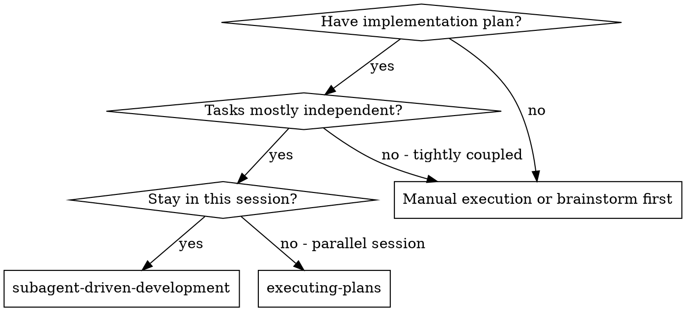
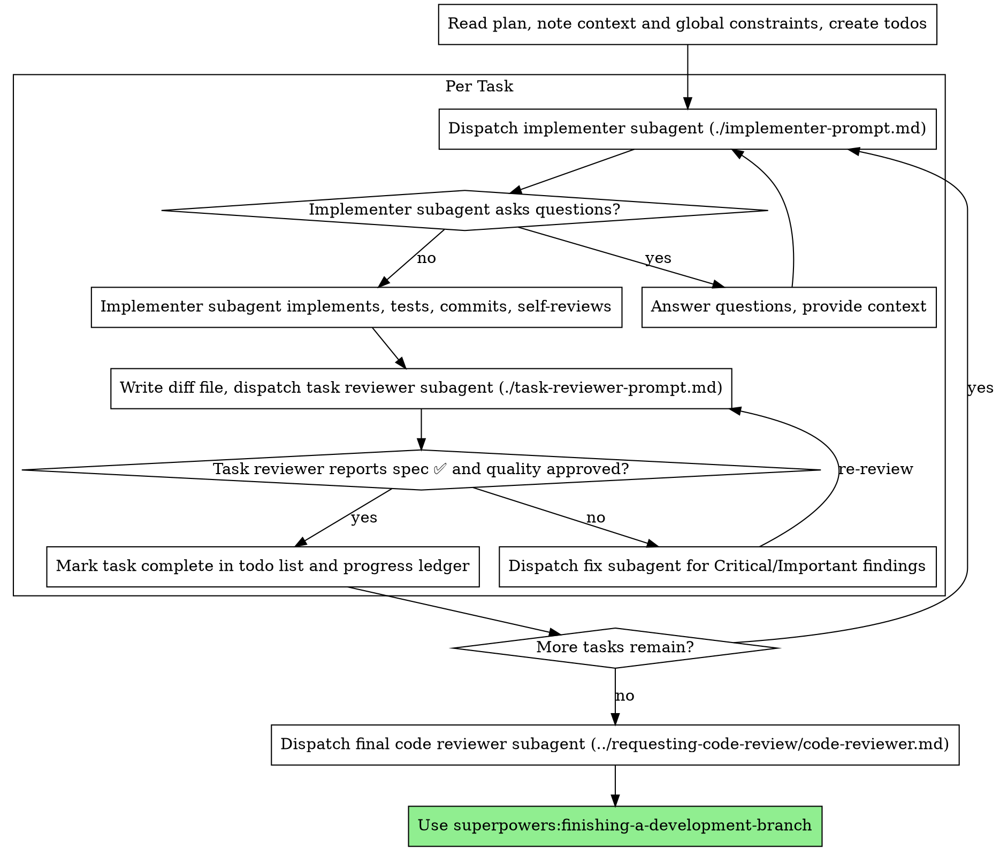

# Session transcript

## User

start I7 by reading CAMPAIGN.md + LEDGER.md first

## Assistant

Starting I7. Per the campaign convention I'll read the governing documents in full — CAMPAIGN.md and LEDGER.md first, then BLOCKMAP.md.

### ⚙ Tool call: `Bash`

```json
{
  "command": "ls /workspace/development/2026-07-17-modularization-campaign/ && wc -l /workspace/development/2026-07-17-modularization-campaign/*.md",
  "description": "List campaign directory and file sizes"
}
```

### ↳ Tool result

```
BLOCKMAP.md
CAMPAIGN.md
LEDGER.md
PROMPT.md
analytics.md
statistics.md
transcript.md
transcript.raw.md
usage.raw.txt
   136 /workspace/development/2026-07-17-modularization-campaign/BLOCKMAP.md
   462 /workspace/development/2026-07-17-modularization-campaign/CAMPAIGN.md
   665 /workspace/development/2026-07-17-modularization-campaign/LEDGER.md
    59 /workspace/development/2026-07-17-modularization-campaign/PROMPT.md
     5 /workspace/development/2026-07-17-modularization-campaign/analytics.md
   100 /workspace/development/2026-07-17-modularization-campaign/statistics.md
  6043 /workspace/development/2026-07-17-modularization-campaign/transcript.md
  6043 /workspace/development/2026-07-17-modularization-campaign/transcript.raw.md
 13513 total
```

### ⚙ Tool call: `Read`

```json
{
  "file_path": "/workspace/development/2026-07-17-modularization-campaign/CAMPAIGN.md"
}
```

### ↳ Tool result

```
1	# CAMPAIGN.md — Modularization Campaign (frozen architecture)
2	
3	**Status:** approved design, 2026-07-17. Brainstormed and approved section-by-section in
4	the campaign planning session (see `transcript.md` once archived); prompt in `PROMPT.md`.
5	
6	This is the **one** copy of the campaign's architecture, decisions, invariants, and
7	increment plan. Increment specs **cite this document and re-derive nothing** — the
8	campaign-level brainstorm and adversarial review run once, here; increments inherit that
9	scrutiny and do not repeat it. Any change to this document is an **amendment**: edit the
10	document *and* append a ledger entry (`LEDGER.md`) saying what changed and why. An
11	increment spec that contradicts this document without a ledger amendment is wrong by
12	definition.
13	
14	Related documents (all in this directory unless pathed): `PROMPT.md` (the campaign
15	request), `BLOCKMAP.md` (the B1–B60 functional map of `main()` all scope assignments
16	reference), `LEDGER.md` (append-only cross-increment record), `/workspace/CONTEXT.md`
17	(domain glossary — created by this campaign), `/workspace/prompts/directives.md` (the
18	Spine; PD#n citations below refer to it).
19	
20	## Glossary (campaign terms — domain terms live in `CONTEXT.md`)
21	
22	- **Campaign** — this whole program of work: one architecture, N increments.
23	- **Increment** — one unit of work with its own session, spec, implementation, review,
24	  commit, and archive. Numbered I0–I14.
25	- **Wave** — an ordered group of increments (0–4); increments within a wave may be
26	  reordered if the ledger records why, waves may not.
27	- **Block** — a `Bnn` region of `main()` per `BLOCKMAP.md`; the stable unit of scope
28	  assignment.
29	- **Core package** — the new importable `psh/` package holding infrastructure (Tier 1).
30	- **Gateway** — `psh/gateway.py`, the single module through which every Terminus/WP-CLI/
31	  Drush subprocess flows; the future Pantheon-API replacement seam.
32	- **Façade** — `script_context.py` (`sc`), the stable API surface that checks and plugins
33	  import; implementations move, the façade's names do not break.
34	- **Contract** — the per-phase guaranteed `site_context` keys (CLAUDE.md table), which
35	  this campaign turns into a machine-readable **contract registry**.
36	- **Hook DAG** — the per-phase topological ordering of hooks derived from declared
37	  `consumes`/`produces` keys, validated fatally at startup.
38	- **Ratchet** — the lint/type regime: broad ruff+pyright rules applied as a hard gate to
39	  moved/new modules immediately, the remnant grandfathered until I14.
40	- **Remnant** — whatever remains of the original script at any point mid-campaign.
41	- **Shim** — the thin committed `./pantheon-sitehealth-emails` entry script that calls
42	  `psh.cli.main()` after I0.
43	- **Ledger** — `LEDGER.md`; how increment N learns what N−1 actually did.
44	- **Behavior bar** — the tiered definition of which observable behavior may change (§8).
45	- **Invariant** — a named property no increment may alter (§9).
46	
47	**MUST** = required, violation fails review. **NEVER** = prohibited, violation fails
48	review. **SHOULD** = required unless the increment spec states why not. **MAY** =
49	allowed, at the implementer's judgment.
50	
51	## 1. Goal and non-goals
52	
53	**Goal.** Modularize the 4,752-line main script into (a) a `psh/` core package of
54	infrastructure modules, (b) self-registering `check/` packages for every notice/section
55	emitter, and (c) the existing `plugin/` integrations — taking full advantage of the hook
56	system — while the four e2e goldens stay byte-identical, the per-phase contract is
57	honored, and the non-U-M path keeps working. End state: `main()` is a ~250–400-line
58	orchestrator; every U-M-specific behavior lives in `umich` packages; the whole tree
59	passes the broadened ruff+pyright configuration.
60	
61	**Non-goals** (exhaustive; each is either declined or deferred with reasoning in §15):
62	replacing terminus with the Pantheon API; implementing parallel site processing; any new
63	report content (CSV attachment, cached-% column, env-lock section); SendGrid; refreshing
64	goldens or recorded fixtures; changing what any check reports (except the named bug
65	fixes in I1).
66	
67	## 2. Decision record (exhaustive — from the approved brainstorm)
68	
69	| # | Decision | Choice | Why |
70	|---|---|---|---|
71	| D1 | Pantheon API | **Seam only**: gateway module now, transport swap post-campaign | Swapping transports mid-campaign invalidates terminus fixtures + goldens in every touched increment |
72	| D2 | Lint/type broadening | **Ratchet in-campaign** (§13) | Code is cleaned exactly once, as it moves; bar fixed in I0 so it never shifts |
73	| D3 | Behavior bar | **Tiered, config renames allowed** (§8) | Cleanest final schema; production config edited once, at I14, with a migration table |
74	| D4 | Increment granularity | **Fine: 15 increments** | Safest for session/context limits; split-never-compress backstop (§12) |
75	| D5 | Target architecture | **Three-tier split** (§3) | Infrastructure ≠ report content ≠ data source; fulfills "full advantage of the frameworks" |
76	| D6 | Hook flexibility | **Phases stay; hooks declare consumes/produces; per-phase DAG validated at startup** (§4) | Keeps every existing hook/test valid; a phase-less key scheduler rewrites everything for no added power |
77	| D7 | `--only-warn` plan rec | **In campaign** (I7) | Small, no golden impact, existing TODO |
78	| D8 | Parallel-ready | **Design constraint only** (§3.4) | Near-free now; actual parallelism stays a README TODO |
79	| D9 | CSV attachment / cached-% / env-lock | **README TODO** | Each changes rendered email → golden churn mid-campaign |
80	| D10 | Packaging | **Real package + thin shim** (I0; console-script dropped — see LEDGER I0 amendment 1) | Dissolves the extension-less-script problem; normal imports for tests/pyright/ruff |
81	
82	## 3. Target architecture
83	
84	```
85	                 ./pantheon-sitehealth-emails  (thin shim)
86	                                │
87	                        psh.cli.main()  ── orchestrator: bootstrap, site loop,
88	                                │           phase firing, lifecycle dispatch
89	        ┌───────────────────────┼──────────────────────────┐
90	        ▼ Tier 1: psh/ core     ▼ seams (sc façade)        ▼
91	  configuration  modules   ┌─────────────────────┐   Tier 3: plugin/
92	  gateway        db        │  hook phases + DAG  │   aws  cloudflare
93	  traffic        plans     │  contract registry  │   env  umich
94	  gather         charts    └─────────┬───────────┘   (unchanged roles)
95	  render         mail                ▼
96	  lifecycle                Tier 2: check/  (all notice/section emitters)
97	                           pantheon  wordpress  drupal  addon_updates
98	                           dns  cloudflare  pantheon_cdn_change  umich
99	```
100	
101	### 3.1 Tier 1 — `psh/` core package (exhaustive module map)
102	
103	| Module | Receives (functions / blocks) |
104	|---|---|
105	| `psh/cli.py` | `build_arg_parser`, `parse_args`, arg validation (B5), `main()` orchestrator |
106	| `psh/configuration.py` | `process_config`, `config_substitution`, `gate_disabled_sections`, DEFER machinery, `load_news_items`, `umich_enabled`, `cloudflare_enabled` |
107	| `psh/modules.py` | `find_modules`, module loading (B2/B4), hook engine (`add_hook`/`invoke_hooks`/`PHASES`), DAG build/validation, contract registry |
108	| `psh/gateway.py` | `run_terminus`, `terminus`, `terminus_data`, `wp`, `wp_eval`, `drush`, `drush_php_script`, `fix_drush_output`, `wp_error`, `drush_error`, `TerminusError` |
109	| `psh/notice.py` | `Notice`, `Severity`, `NoticeRegistry`, `DuplicateNoticeCodeError`, `registry` (added I3; §6 Notice type + code registry) |
110	| `psh/db.py` | ORM models, `TrafficRow`/`OverageProtectionRow`, `db_engine_args`, `db_retry`/`db_retryable`/`record_db_reconnect`, `update_traffic_rows`, `insert_traffic_rows`, `load_traffic_rows`, `load_overage_protection_window`, `DatabaseUnavailableError` |
111	| `psh/traffic.py` | `get_old_metrics`, `estimate_month_visits`, `build_traffic_table_rows`, the `traffic_table_columns` global, metrics gather + DB update/load flow (B22–B26), visits-by-month aggregation (B43) |
112	| `psh/plans.py` | plan_info normalization (B12 part), SKU resolution (B17), `overage_blocks`, `contract_year_end`, `plan_costs`, `build_plan_over_time`, the `cost_table_columns` global, recommendation flow (B47) |
113	| `psh/gather.py` | Slimmed framework gathers feeding the `site_post_gather` contract (from B32–B35), `check_wordpress_plugin`/`check_drupal_module` helpers |
114	| `psh/charts.py` | Cap geometry (B13 part), chart data prep + matplotlib build (B44–B45) — returns PNG bytes |
115	| `psh/render.py` | Jinja render (B53), PHP inline + `!important` pass (B54), `escape_url` |
116	| `psh/mail.py` | Recipient resolution (B49), MIME assembly (B55), `smtp_login`, send (B57) |
117	| `psh/lifecycle.py` | `RunState`, `finish_run`, `abort_run`, `abort_reason`, `resume_point`, `resume_command`, `rerun_command`, `option_strings_taking_a_value`, `sites_from_resume_point`, `merge_prior_results`, `ResumeSiteNotFoundError` |
118	
119	`dns_classify.py` stays a top-level module (already extracted; moving it into `psh/` is
120	MAY-scope for I14, decided by ledger state then).
121	
122	**Whole-file coverage.** The campaign modularizes the entire script, not just `main()`:
123	every top-level def and module-level global in `pantheon-sitehealth-emails` (lines
124	1–2107 included) is assigned to a `psh/` module in this table and appears in exactly one
125	increment's scope (§11). End state: the original file is the thin shim and nothing else
126	— a top-level def still there at I14 is a defect the closing audit (§17) catches. Moved
127	helpers get the full §7 treatment (types, ratchet, verified docs, tests); they do NOT
128	get algorithmic redesign — moves are behavior-preserving except where §8 says otherwise
129	(I1, I7's D7, I12's B51).
130	
131	### 3.2 Tier 2 — new/changed `check/` packages (exhaustive)
132	
133	| Package | Contents (blocks) | Phase(s) |
134	|---|---|---|
135	| `check/pantheon/` (new) | frozen site (B19), no-live-env (B21), upstream updates (B38), PHP EOL (B41) | `site_pre` (frozen, no-live-env), `site_post_gather` (updates, PHP EOL) |
136	| `check/wordpress/` (new) | PAPC + native-sessions checks, OCP config probe, favicon (from B34) | `site_post_gather` |
137	| `check/drupal/` (new) | PAPC module check, D7 EOL + tag1_d7es, multisite probe (from B30/B35) | `site_post_dns` (multisite), `site_post_gather` |
138	| `check/addon_updates/` (new) | add-on updates table notice (B39), smell notices (B48) | `site_post_gather` |
139	| `check/umich/` (existing, grows) | umich-oidc-login, Hummingbird fork (B34), Drupal UA check (B35), annual-billing notices (B50/B51), portal-URL text for the recommendation notice (B47's U-M half) | `site_post_gather`, `site_pre_render` (billing) |
140	
141	`check/dns/`, `check/cloudflare/`, `check/pantheon_cdn_change/` are untouched tenants.
142	A check MAY fetch its own data through `sc` gateway wrappers when the data is
143	check-specific (e.g. `upstream:updates:list`); data used by core *and* checks is
144	published through the contract instead (e.g. `envs`).
145	
146	### 3.3 What stays in `main()` (exhaustive, with why)
147	
148	Config/arg bootstrap ordering (B1–B8 — the two-pass substitution *order* is the
149	program); overage constants + date window (B9, B13 part); the site-loop skeleton (skips,
150	banner, sorted order, resume filter — B14–B18, B20, B25, B42); phase firing and contract
151	stuffing (B27, B28, B31, B37, B52); notice sort + subject (B50 minus billing); the
152	`try`/`except BaseException` lifecycle dispatch (B59–B60 call sites). Everything else
153	leaves. Target: 250–400 lines.
154	
155	### 3.4 Parallel-ready constraint (D8)
156	
157	Per-site work MUST be a function of `(site, config, db_session, site_context)`: no new
158	module-level mutable state; run-scoped accumulators live only in `RunState`. This is a
159	review criterion from I2 onward, not a parallelism implementation.
160	
161	### 3.5 The `sc` façade
162	
163	Checks and plugins import **only** `sc` (and their own package). `sc` keeps every name
164	listed in CLAUDE.md's runtime-exposed block, re-exporting from `psh/` modules as they
165	move. NEVER remove or rename an `sc` attribute mid-campaign; additions are fine. The
166	house-rules test suite gains an assertion that every documented `sc` name exists (I2).
167	
168	## 4. Phases, hooks, and the DAG
169	
170	Phases stay the coarse spine: `setup`, `site_pre`, `site_post_traffic`, `site_post_dns`,
171	`site_post_gather`, `site_pre_render`, plus **new** `run_finish` (fired inside
172	`finish_run` before artifacts are written, receiving the `RunState`; for future run-level
173	artifact hooks — no consumer at introduction, like `site_pre_render` was). Dotted
174	plugin-defined events are unchanged.
175	
176	From I4, `add_hook` requires two new entries per hook: `consumes` and `produces` — each
177	a (possibly empty) list of contract-key names. Validation at module-load completion
178	(exhaustive fatal conditions):
179	
180	1. A consumed key that nothing produces (neither core's registry for that phase or an
181	   earlier phase, nor another hook) → fatal.
182	2. Two producers of the same key → fatal (one owner per key; PD#1 — a silent overwrite
183	   is a silent failure).
184	3. A cycle among same-phase hooks → fatal.
185	4. A hook consuming a key first produced in a *later* phase → fatal.
186	5. A missing `consumes`/`produces` entry on any hook → fatal (no legacy mode; I4
187	   retrofits all in-repo hooks in the same change).
188	
189	`invoke_hooks` orders same-phase hooks topologically (producers before consumers;
190	registration order breaks ties, so existing behavior is preserved where no edges exist).
191	The permanent test `tests/integration/test_hook_dag.py` loads **all** real check/plugin
192	packages and asserts the DAG builds — the "future changes can never make the DAG
193	impossible" guarantee — and a unit suite proves each fatal condition actually fires
194	(PD#14: the validator must be shown able to go red).
195	
196	```
197	 module load ──► collect hooks ──► per phase: build edges (produces→consumes)
198	                                        │
199	                              cycle? unknown key? dup producer? ──► fatal exit (named error)
200	                                        │ ok
201	                                topo order stored ──► invoke_hooks uses it
202	```
203	
204	**Contract registry.** `psh/modules.py` holds the machine-readable registry: phase →
205	keys core stuffs (today's CLAUDE.md table, verbatim). Core's stuffing code is checked
206	against it in tests; CLAUDE.md's table gains a line saying the registry is authoritative.
207	New contract keys added by increments (exhaustive for this campaign): `envs` (I8, at
208	`site_pre`), `add_on_updates` + `wp_smell`/`drush_smell`/`composer_smell` (I9/I10, at
209	`site_post_gather`), plan/cost keys `current_plan`, `recommended_plan`, `plan_costs`,
210	`savings` (I7, at `site_pre_render`). Each addition updates registry + CLAUDE.md table +
211	ledger in the same increment.
212	
213	## 5. Configuration
214	
215	Principles: one section per feature, named for the operator's mental model; every
216	relocated check gets an `enabled` flag under `[Check.<name>]`, **default true** —
217	relocating code MUST NOT silently disable a check that runs unconditionally today.
218	U-M-only checks additionally require `[UMich].enabled` (existing `umich_enabled()`
219	rule). `gate_disabled_sections()` semantics (nested `enabled`, children dropped) apply to
220	`[Check.*]` unchanged.
221	
222	Example (actual TOML, the shape I8 introduces — illustrative of the family, exhaustive
223	for `check/pantheon/`):
224	
225	```toml
226	[Check.pantheon]
227	enabled = true          # frozen-site, live-env, upstream-updates, PHP-EOL checks
228	```
229	
230	New keys land in final shape as introduced (I3 onward). Renames/moves of *existing* keys
231	happen once, in I14, which MUST deliver: the old→new migration table in
232	`docs/config-migration.md`, a rewritten `sample-pantheon-sitehealth-emails.toml`, and
233	exact edit instructions for the production config repo. Until I14, every existing
234	production key keeps working unchanged.
235	
236	## 6. Types
237	
238	Reused as-is: `TrafficRow`, `OverageProtectionRow`, `DnsFacts`, `FetchResult`,
239	`SiteContext`. Introduced (exhaustive):
240	
241	| Type | Increment | Shape |
242	|---|---|---|
243	| `GatewayResult` | I2 | NamedTuple `(result, errors, fatal)` replacing the anonymous 3-tuples |
244	| `Notice` | I3 (class) → adopted per increment | frozen dataclass: `severity` (StrEnum alert/warning/info), `code` (unique — registry test), `html`, `text`, `short`, `icon`, `order`; `SiteContext.add_notice` accepts `Notice` or legacy dict; dict form retired in I14 |
245	| `PlanInfo` / `PlanCatalog` | I7 | typed view over `[Pantheon.plan_info]` |
246	| `RunState` | I13 | dataclass holding `all_warnings`, `site_results`, `site_savings`, `emails_sent`, reconnect counters |
247	
248	House-style tuple annotations (`-> (str, str, bool)`) are replaced with real annotations
249	in every module as it moves — never fixed in place in the remnant (one pass per line,
250	D2). CLAUDE.md's house-style note is updated in I14 when the last one dies.
251	
252	## 7. Per-increment obligations
253	
254	Every increment MUST (this list is exhaustive and lives only here; increment specs cite
255	it): (1) start by reading `CAMPAIGN.md`, `LEDGER.md`, `CLAUDE.md`, `BLOCKMAP.md` rows in
256	scope; (2) follow `prompts/implementation-standards.md` (subagent-driven, test-first,
257	`psh-implementer`/`psh-reviewer`); (3) replace house styles in moved code (§6);
258	(4) verify — not assume — every claim in comments/docs it moves or writes;
259	(5) update tests in the same change; (6) update README/docs/CLAUDE.md for what moved;
260	(7) update auto-memory where a durable fact changed; (8) append its ledger entry
261	(§12); (9) preserve every invariant (§9); (10) end with `/code-review`, a full
262	`./run-tests`, and one checkpoint commit including its `development/` folder.
263	
264	## 8. Behavior bar (canonical gate table)
265	
266	| Surface | Rule | Until |
267	|---|---|---|
268	| Rendered emails (4 goldens) | NEVER change (byte-identical) | end of campaign |
269	| `-results.json` / `-notices.csv` / `-run.json` structure (keys, row shape) | NEVER change | end of campaign |
270	| Notice csv *values* | MAY change only in I1 (named bug fixes) and I12 (scheduled B51 deletion) | — |
271	| stdout / console / error messages | MAY improve freely | — |
272	| Config: existing keys | NEVER break | I14 (renames with migration table) |
273	| Config: new keys | MUST land in final schema shape | — |
274	| Exit codes, resume semantics, artifact write gates | NEVER change | end of campaign |
275	
276	## 9. Named invariants (exhaustive; NEVER violated by any increment)
277	
278	1. Four e2e goldens byte-identical (`./run-tests` proves it; refresh is forbidden — an
279	   existing golden going red is a defect in the increment, PD#14).
280	2. Per-phase data contract: existing keys never removed/renamed/retyped; additions only.
281	3. Non-U-M path works: non-U-M golden green; no new un-gated U-M content (I1 *removes*
282	   the one known leak).
283	4. Run lifecycle: single `except BaseException` flush path; `abort_reason`'s three
284	   outcomes; artifacts dropped-site rule; notices appended before send; resume-point
285	   next-site-after-email rule; soft-wrapped copy-pasteable commands.
286	5. DB: `db_retry` retries whole idempotent units only; `db_retryable` predicate
287	   unchanged; the read-release commit in the loaders stays (guarded by
288	   `test_load_traffic_rows_releases_the_connection`).
289	6. Rich console rules: escape untrusted text; production width reproduced in tests.
290	7. Test safety interlock (`run_program` forbidden flags) never bypassed or weakened.
291	8. Column-0 `f"""` notice literals move **verbatim** — never re-indented; `git diff -w`
292	   is not acceptable evidence for any change touching them.
293	9. Checks/plugins import only `sc`; `sc` names never removed mid-campaign (§3.5).
294	10. Recorded fixtures are not regenerated (`terminus-cdnchange/` is hand-maintained and
295	    `--record` must not run).
296	11. `--create-tables`/`--update`/`--import-older-metrics` phase-gating rules (CLAUDE.md
297	    table) unchanged.
298	
299	## 10. Known-bug inventory → I1
300	
301	The five bugs and the dead code listed in `BLOCKMAP.md` §Bugs (composer-smell
302	nesting+variable; shared `php-eol` code; `site_results` omission; un-gated U-M portal
303	URLs; duplicate `annual-bill` code — B51 handled as: distinct code now, scheduled
304	deletion when its Aug-2026 date passes, ledgered to I12; dead code deleted). Each fix is
305	test-first with the test shown red on the old behavior. **Verified 2026-07-17**: the
306	goldens contain zero `php-eol`/`wp-smell`/`drush-smell`/`composer-smell`/`annual-bill`
307	occurrences and the golden fixtures report PHP 8.2, so none of these fixes can touch a
308	golden:
309	
310	```
311	$ grep -c 'php-eol\|composer-smell\|wp-smell\|drush-smell\|annual-bill' tests/e2e/__snapshots__/*.ambr
312	tests/e2e/__snapshots__/test_golden.ambr:0
313	tests/e2e/__snapshots__/test_golden_cdn_change.ambr:0
314	tests/e2e/__snapshots__/test_golden_drupal.ambr:0
315	tests/e2e/__snapshots__/test_golden_nonumich.ambr:0
316	```
317	
318	## 11. The increments
319	
320	Wave dependency structure (increments within a wave are ordered but MAY be resequenced
321	with a ledger entry; waves MUST NOT be reordered):
322	
323	```
324	Wave 0: I0 bootstrap ──► I1 bug fixes
325	Wave 1: I2 gateway ──► I3 config ──► I4 hooks+DAG ──► I5 DB
326	Wave 2: I6 traffic ──► I7 plans ──► I8 check/pantheon ──► I9 wordpress ──► I10 drupal
327	Wave 3: I11 charts ──► I12 render+mail ──► I13 lifecycle
328	Wave 4: I14 closing sweep
329	```
330	
331	| Inc | Scope (blocks / functions) | Delivers |
332	|---|---|---|
333	| **I0** | — (no logic moves) | `psh/` skeleton + thin shim (console-script dropped — see LEDGER I0 amendment); conftest `import psh` rework (same collected-test count gate); ratchet config (§13) with rule sets pinned; pyright baseline measured; `LEDGER.md` started; README TODO edits (§15 dispositions); CLAUDE.md pointer to campaign |
334	| **I1** | B36, B40, B41, B47 (URLs), B48, B50/B51 (codes), dead code | §10 fixes, each test-first |
335	| **I2** | 302–597 wrappers | `psh/gateway.py`, `GatewayResult`, sc re-exports + façade test; no-subprocess-outside-gateway house rule |
336	| **I3** | 792–934, 1209–1253, 1608–1648 (`umich_enabled`/`cloudflare_enabled`) | `psh/configuration.py`; `Notice` class + code-uniqueness registry test |
337	| **I4** | 935–950, hook engine from `script_context.py` | `psh/modules.py`; consumes/produces on all in-repo hooks; DAG validation + fatal-condition tests; `run_finish` phase; contract registry |
338	| **I5** | 95–178; DB defs within 1285–1575 (`DatabaseUnavailableError` through `db_engine_args`; the resume helpers `ResumeSiteNotFoundError`, `sites_from_resume_point`, `merge_prior_results` stay for I13) | `psh/db.py`; DB test suites relocated intact |
339	| **I6** | B22–B26, B43; 598–671, 977–1127 | `psh/traffic.py` |
340	| **I7** | B9, B12 (plans), B17, B47; 967–976, 1128–1208, 1254–1280 | `psh/plans.py`; `PlanInfo`; D7 (`--only-warn` runs recommendation); plan/cost contract keys |
341	| **I8** | B19, B21, B38, B41 | `check/pantheon/` + `[Check.pantheon]`; `envs` contract key |
342	| **I9** | B32–B34; 672–739 | `psh/gather.py` (WP half); `check/wordpress/`; U-M WP checks → `check/umich/`; `add_on_updates` + smell contract keys |
343	| **I10** | B30, B35, B39, B48; 740–791 | gather (Drupal half); `check/drupal/`; `check/addon_updates/`; UA check → `check/umich/` |
344	| **I11** | B13 (caps), B44–B45 | `psh/charts.py` |
345	| **I12** | B49–B57 minus sort/subject core | `psh/render.py`, `psh/mail.py`; annual billing → `check/umich/` at `site_pre_render`; B51 deletion if past its date |
346	| **I13** | B14 (accumulators), B56, B59–B60; 1649–2107 plus the resume helpers I5 left behind (1281–1284, 1528–1542, 1576–1607) | `psh/lifecycle.py`; `RunState`; `main()` reaches final form |
347	| **I14** | — | Config renames + migration doc + sample rewrite + production-config instructions; global ratchet flip + remnant cleanup; docs/README/CLAUDE.md full refresh; `Notice` dict form retired; ledger fully resolved; retrospective + closing audit (§17) |
348	
349	Sizing note: the largest moves are I9 (~330 main-loop lines + helpers) and I10 (~320 +
350	helpers). If any increment proves oversized mid-session: **split, never compress** —
351	commit nothing partial, ledger the split, the second half becomes its own increment.
352	
353	## 12. Coordination protocol
354	
355	**Ledger entry template** (append per increment, and for any amendment):
356	
357	```markdown
358	## I<N> — <slug> (<date>, commit <sha>)
359	- Moved: <blocks/functions actually moved>
360	- Deviations from CAMPAIGN.md: <none | what + why>
361	- Contract/config/sc additions: <keys/names>
362	- Discovered tasks: <each with disposition: fixed here | I<M> | README TODO>
363	- Open questions for next increment: <…>
364	```
365	
366	**Discovered-task disposition rules** (canonical): fits current increment's scope and
367	<~30 min → fix now, note in ledger; belongs to a later increment → ledger it against
368	that increment (the increment's spec author MUST read these); major/risky/scope-widening
369	→ README TODO with a sentence of context. Nothing is carried in memory or chat — if it
370	is not in the ledger or README, it does not exist (PD#9).
371	
372	**Session flow per increment:** read the §7 documents → write the increment SPEC.md in
373	`development/<date>-mod-I<N>-<slug>/` citing CAMPAIGN.md sections by number →
374	`superpowers:writing-plans` → subagent-driven implementation → `/code-review` → full
375	`./run-tests` → per-task commits, each green; the increment's final commit includes the dev
376	folder → `/archive-session` → ledger entry.
377	
378	## 13. Lint/type ratchet
379	
380	Mechanism (as shipped by I0; see LEDGER I0 amendment 2): TWO ruff configs —
381	`pyproject.toml` `[tool.ruff.lint]` keeps the narrow PD-rule set running everywhere
382	including the remnant, and `ruff-broad.toml` carries `select = ["ALL"]` minus a
383	justified ignore list, with `extend-exclude` grandfathering exactly the remnant
384	(`psh/_legacy.py`) and not-yet-moved files; each increment deletes its
385	files from the grandfather list, and the two configs merge at I14. pyright runs in
386	`./run-tests` from I0 via `[tool.pyright]` (standard mode, `psh/` minus `_legacy.py`),
387	ratcheting toward strict as typed code moves in. The four existing narrow rules (`E722`, `BLE001`, `S105`, `S106`) remain global
388	throughout — they mechanize PD#2/PD#6 and are never grandfathered. No
389	`target-version` pin (CLAUDE.md: it masks the 3.12-only syntax detection).
390	
391	Baselines measured 2026-07-17 (I0 re-measures and pins both in its spec):
392	
393	```
394	$ ./run-tests --fast --llm   (tail)
395	LLM_SUMMARY passed=727 failed=0 error=0 skipped=1 xfailed=0 xpassed=0
396	25 snapshots passed.
397	
398	$ uvx ruff check --isolated --statistics .
399	26  F541  f-string-missing-placeholders
400	 8  E741  ambiguous-variable-name
401	 4  E713  not-in-test
402	 3  F841  unused-variable
403	 2  F401  unused-import
404	 1  E402  module-import-not-at-top-of-file
405	 1  E712  true-false-comparison
406	Found 45 errors.
407	```
408	
409	(README's "~55" ruff and "39" pyright figures are stale/unverified claims; I0 replaces
410	them with measured numbers. pyright was not measured in planning — no pyright binary in
411	the dev container yet; installing it is I0 scope.)
412	
413	## 14. Risk / control table
414	
415	| Risk | Control |
416	|---|---|
417	| Re-indented column-0 notice literals silently change emails | Invariant 8; goldens as tripwire; AST/token comparison, never `git diff -w` |
418	| conftest rework silently drops tests | I0 gate: identical collected-test count (727 passed / 1 skipped / 2 deselected baseline) before and after |
419	| Long-range `main()` local coupling breaks a move | BLOCKMAP produces/consumes; each increment spec lists exactly which locals cross its boundary |
420	| Session/context overrun mid-increment | Fine granularity (D4); split-never-compress; commits only at increment completion |
421	| Architecture drift across 15 sessions | This document frozen; amendments only via ledger; specs cite section numbers |
422	| Hidden hook-order dependencies surface in I4 | I4 audits every hook; real dependencies become explicit DAG edges |
423	| Ratchet churn on moved code | Rules fixed at I0; cleaning is part of each move |
424	| Goldens blind to stdout/artifacts | Invariants 4–5 name the artifact/abort test suites as the cover; artifact structure frozen until campaign end |
425	| Implementer sessions lack context | `psh-implementer`/`psh-reviewer` carry the read list; specs name seams (Spine spec bar); §7 reading list |
426	| Two annual-bill notices / removal date passes mid-campaign | Explicitly scheduled: codes split in I1, deletion decision in I12, ledger tracks |
427	
428	## 15. NOT in scope (reasoning preserved so it is never re-litigated)
429	
430	- **Terminus → Pantheon API swap** — D1; post-campaign project against `psh/gateway.py`.
431	- **Parallel site processing** — D8; constraint only; README TODO remains.
432	- **CSV data attachment, cached-% column, env-lock section** — D9; each becomes a small
433	  post-campaign change (env-lock: a ~50-line `check/` package) once goldens may move.
434	- **SendGrid, secrets-handling completion, portal traffic capture, daily alerts,
435	  accessibility/security/Cloudflare scores, AI recommendations, dependency updates,
436	  terraform-infra** — pre-existing README TODOs, untouched by this campaign.
437	- **Approach B (library-only) and C (everything-is-a-hook)** — rejected in brainstorm:
438	  B fails the "full advantage of the frameworks" goal; C forces infrastructure into
439	  optional-content clothing.
440	- **Golden/fixture refreshes** — forbidden (Invariants 1, 10).
441	
442	## 16. Acceptance baseline
443	
444	§13 outputs are the campaign-start baseline (run and pasted 2026-07-17). Every
445	increment's definition of done re-runs `./run-tests` at increment end — the full suite
446	when the live tier's credentials are available in the session, otherwise `--fast` with a
447	ledger note saying the live tier was skipped — and MUST reproduce goldens
448	byte-identically. I0 additionally records the collected-test count gate.
449	
450	## 17. Closing audit (queued for I14; exhaustive)
451	
452	1. Is `main()` within 250–400 lines, and does everything left match §3.3?
453	2. Has every DAG fatal condition been demonstrated red at least once?
454	3. Do the contract registry and CLAUDE.md table agree (test-enforced)?
455	4. Is any `sc` re-export now consumed by nobody (dead façade surface)?
456	5. Is the `.py` symlink still needed for anything beyond the shim? If not, note in
457	   CLAUDE.md; if yes, say for what.
458	6. Are all ledger items resolved (done, scheduled, or README TODO)?
459	7. Has the production config repo received and applied the migration instructions?
460	8. Do README, CLAUDE.md, docs/, and memory reflect the final architecture (no stale
461	   line-number or module references)?
462	9. Were any invariants amended mid-campaign, and is each amendment ledgered?
463
```

### ⚙ Tool call: `Read`

```json
{
  "file_path": "/workspace/development/2026-07-17-modularization-campaign/LEDGER.md"
}
```

### ↳ Tool result

```
1	# LEDGER — Modularization Campaign
2	
3	Append-only. One entry per completed increment, plus one per CAMPAIGN.md amendment.
4	This file is how increment N learns what N−1 actually did; if a deviation, discovered
5	task, or decision is not recorded here (or in the README TODO list), it does not exist.
6	Entry template: CAMPAIGN.md §12.
7	
8	## Campaign planning (2026-07-17)
9	
10	- Produced: `CAMPAIGN.md` (frozen architecture), `BLOCKMAP.md` (B1–B60 map),
11	  `/workspace/CONTEXT.md` (domain glossary, new), this ledger.
12	- Baselines: fast tier 727 passed / 1 skipped / 2 deselected; ruff `--isolated` 45
13	  findings; pyright unmeasured (no binary in container — I0 scope).
14	- Discovered during planning, dispositioned:
15	  - Five bugs + dead code → I1 (CAMPAIGN.md §10, BLOCKMAP §Bugs).
16	  - README's "~55 ruff / 39 pyright" figures stale/unverified → I0 re-measures.
17	  - B51 second annual-bill notice: marked "remove Aug 2026" — code split in I1,
18	    deletion decision in I12.
19	  - WordPress/Drupal duplication + update-table HTML duplication (BLOCKMAP §Bugs 7–8)
20	    → addressed structurally by I9/I10 (shared gather + `check/addon_updates/`).
21	- Open questions for I0: exact ruff rule list; pyright strictness per environment;
22	  whether `dns_classify.py` moves under `psh/` (deferred to I14, MAY).
23	- Amendment (2026-07-17, user spec review): added the "Whole-file coverage" paragraph to
24	  CAMPAIGN.md §3.1 — clarification only, no scope change; the module map already
25	  assigned every top-level def.
26	
27	## I0 — bootstrap (2026-07-17, closing commit `docs(campaign-I0): close the bootstrap increment`)
28	
29	Commits (per-task, each green): `b1ccc72` (package move + shim + conftest + coverage),
30	`d0e3027` (lint/type ratchet), `5b536fa` + `239955d` (README/CLAUDE.md docs), plus this
31	closing docs commit (ledger + CAMPAIGN amendments + SPEC acceptance + README pyright number).
32	
33	- **Moved:** the whole 4,752-line program → `psh/_legacy.py` (`git mv`, **zero logic
34	  changes**; the `__main__` tail is inert in a module, left for I13). New: `psh/__init__.py`
35	  (docstring), `psh/cli.py` (`from psh._legacy import main, parse_args` re-export), and a new
36	  7-line thin shim at `./pantheon-sitehealth-emails` calling `psh.cli.main()`. No blocks
37	  (B-map) moved — I0 moves the file, not logic (§11 row I0).
38	
39	- **Deviations from CAMPAIGN.md (three amendments, all applied to the document this commit):**
40	  1. **No console-script entry point** (amends §11 row I0 / D10). The program is repo-rooted
41	     by design (`find_modules`, templates, `inline-styles.php`, `vendor/`, config symlink are
42	     all CWD-relative); a pip entry point would need a data-file overhaul serving no campaign
43	     goal. D10's real benefits (normal imports; native ruff/pyright/CodeGraph coverage; no
44	     `SourceFileLoader`) all arrive via the package + shim without installation. `pyproject.toml`
45	     stays deps-only (`py-modules = []`, `packages = []` to stop setuptools auto-discovery
46	     installing a stale shadow copy — PD#1). §11 row I0 now reads "thin shim (console-script
47	     dropped — see LEDGER I0 amendment)".
48	  2. **Grandfather is `psh/_legacy.py` via `ruff-broad.toml` `extend-exclude`** (amends §13,
49	     which named `pantheon-sitehealth-emails.py` and "per-file-ignores" — both written before
50	     the legacy-module + two-config mechanics were settled). The shipped mechanism is TWO ruff
51	     configs, not per-file-ignores: `pyproject.toml` `[tool.ruff.lint]` carries the narrow
52	     PD-rule set (`E722`/`BLE001`/`S105`/`S106`) that runs EVERYWHERE including `_legacy.py`;
53	     `ruff-broad.toml` carries `select = ["ALL"]` minus the ignore list and grandfathers the
54	     remnant via `extend-exclude`. `./run-tests` and `.claude/hooks/ruff-check.sh` run BOTH
55	     passes; the two files merge into `pyproject.toml` at I14. §13 now names `psh/_legacy.py`
56	     and "ruff-broad.toml exclude".
57	  3. **Per-task commits, each green** (amends §12's "one commit (code + dev folder)"). Each I0
58	     task committed independently once its gates were green; this increment's final (closing)
59	     commit includes the `development/` folder. Rationale: finer checkpoints serve the campaign
60	     prompt's revert/inspect intent, and SDD review packages diffs as commit ranges. §12 now
61	     reads "per-task commits, each green; the increment's final commit includes the dev folder".
62	
63	- **Ratchet as pinned.** pyright runs in `./run-tests` at **standard** mode, not strict
64	  (DECISION): `psh/cli.py` re-exports from the untyped legacy module, so strict would fail on
65	  re-export; strictness ratchets up as increments move typed code in. Scope `[tool.pyright]`
66	  = `include = ["psh"]`, `exclude = ["psh/_legacy.py"]`. Ruff-broad ignore list (pinned; each
67	  justified in `ruff-broad.toml`): `COM812`, `ISC001`, `E501`, `Q000`, `Q001`, `Q002`, `Q003`,
68	  `ANN`, `TD002`, `TD003`, `FIX002`, `EM101`, `EM102`, `TRY003`, `D`, `CPY001`. `CPY001` is a
69	  **preview** rule in ruff 0.15.22 (cannot fire under non-preview `select=["ALL"]`); ruff
70	  accepts it in `ignore` with no warning, so it is kept verbatim to document the intent
71	  (no per-file copyright headers). `D` (docstring convention) is undecided → README TODO.
72	
73	- **pyright whole-tree baseline (informational; replaces README's unverified "39").**
74	  **220 errors, 0 warnings, 0 informations** across 118 first-party files, standard mode,
75	  pyright 1.1.411 (SPEC ACCEPTANCE §Task 5 has the command + breakdown). Measured OUTSIDE the
76	  scoped gate config via a repo-root config (pyright roots a project at the config's directory
77	  and ignores includes outside it; a config's `exclude` still drops CLI-passed paths — so
78	  neither a scratchpad-rooted config nor CLI args can re-include `_legacy.py`, and a repo-root
79	  temp config is the reproducible form). By area: `tests/` 139, `psh/_legacy.py` 36, `check/`
80	  21, `plugin/` 18, `script_context.py` 5, `dns_classify.py` 1 (`check/`+`plugin/` = 39, the
81	  origin of the old figure). The gated scope (`psh/` minus `_legacy.py`) is `0 errors`.
82	
83	- **Contract/config/sc additions:** none (I0 moves no logic; no `[Check.*]` sections, no new
84	  contract keys, no `sc` names added or removed).
85	
86	- **Discovered tasks:**
87	  - **`Path(psh.__file__).parent` as a repo-root proxy** — 25 sites across 23 files: 22 test files (plus
88	    `tests/helpers/checkload.py`) anchored repo paths on the program file's parent, which the
89	    move shifted from repo root to `psh/`. Fixed here, mechanically and minimally:
90	    `→ Path(psh.__file__).resolve().parents[1]` at exactly those sites. Proper cleanup lands
91	    when later increments un-grandfather those test files; the `psh` fixture itself is
92	    redesigned when `_legacy` dies (I13/I14). Disposition: **fixed here**, further cleanup **I13/I14**.
93	  - **ruff lints explicitly-passed files even when excluded** — passing a path on ruff's
94	    command line overrides `extend-exclude`, so the edit hook (which passes the just-edited
95	    file) would lint `_legacy.py` against the broad set. Fixed by giving the broad-pass
96	    invocation `--force-exclude` and running it from repo-root cwd; documented in
97	    `.claude/hooks/ruff-check.sh`. Disposition: **fixed here**.
98	
99	- **Open questions for I1/I2:**
100	  - I1 (bug fixes) touches `_legacy.py` in place (fixes retire as code moves); it must keep
101	    the narrow PD set green there (broad set stays grandfathered) and the four goldens
102	    byte-identical (§10 verified the fixed codes appear in zero goldens).
103	  - I2 (gateway) is the first real logic move: as it un-grandfathers the wrapper functions it
104	    deletes them from `ruff-broad.toml` `extend-exclude` and must clean them to the broad set
105	    + pyright standard in the same change (§13 ratchet; §6 house-style tuple hints replaced).
106	  - `dns_classify.py` under `psh/` remains a MAY for I14 (unchanged from planning).
107	- Amendment (2026-07-17, post-Task-5 review): CAMPAIGN.md §13 mechanism paragraph
108	  rewritten to describe the SHIPPED two-config mechanism (it still said "pyproject gets
109	  extend-select" and "executionEnvironments", both superseded by amendment 2 above);
110	  ledger reanchor note corrected to "22 test files plus checkload.py" (23 files total).
111	  Both changes doc-accuracy only.
112	- Amendment (2026-07-17, final I0 code review, spec axis): D10's Decision cell still said
113	  "console-script" after amendment 1 changed only §11 row I0 — CAMPAIGN.md briefly
114	  self-contradicted. D10 cell now matches. Doc-accuracy only.
115	
116	## I1 — known-bug fixes (2026-07-17, commits `5518de7..1ff9153` + closing docs commit)
117	
118	Spec/plan: `development/2026-07-17-mod-I1-bug-fixes/` (SPEC.md carries the pasted
119	acceptance results). Six per-task commits, each green; full suite at close = 751 passed /
120	1 skipped **including the live tier**, 27 snapshots, all three gates; four goldens
121	byte-identical across the whole range (`git diff aa8afd1 -- tests/e2e/__snapshots__/`
122	empty).
123	
124	- **Moved:** no blocks (fixes land in place in `psh/_legacy.py` per I0's open-question
125	  note). Extracted five pure notice-builder helpers as consecutive module-level defs
126	  above `main()` (preserved-bug-extraction pattern; every literal interior byte-verified
127	  against the pre-move original by task reviewers AND the final review):
128	  `build_smell_notices`, `build_php_eol_notice`, `build_annual_bill_upcoming_notice`,
129	  `build_annual_bill_in_progress_notice`, `build_plan_recommendation_notice`. These
130	  travel later: smells → I10, php-eol → I8, annual-bill → I12, plan-rec → I7.
131	- **Fixed (CAMPAIGN §10 / BLOCKMAP §Bugs, all test-first with RED shown on old
132	  behavior):** (1) B48 composer-smell nesting + wrong interpolated variable;
133	  (2) B41 shared `php-eol` csv code → `php-eol-warning` (7.4/8.1) / `php-eol-alert`
134	  (<8.2), following the `updates-*` suffix pattern; (3) B36 unknown-framework sites now
135	  get a `site_results` entry (`version: "unknown"`, same 3-key row shape) — covered by a
136	  new offline e2e (`tests/e2e/test_unknown_framework_e2e.py`) asserting the
137	  `finish_run()` stdout pprint, since `-results.json` is written only on `--all` runs the
138	  interlock bans; (4) B47 un-gated U-M portal URLs — two of the four named URL sites
139	  (`extra_message`/`extra_text`) were **dead stores** (assigned, never read; §10's
140	  4240/4248 refined — bug partially lived in dead code), deleted; the live
141	  `its-recommends-plan` notice now selects U-M vs generic copy via `umich_enabled()`
142	  (generic drops the portal anchor AND the June-16-30 downgrade-window sentence — U-M
143	  billing policy, factually wrong elsewhere); both variants pinned by syrupy snapshots
144	  (`test_plan_recommendation_notice_render`); (5) B50/B51 duplicate `annual-bill` code —
145	  B51 now emits `annual-bill-in-progress`; B50 keeps `annual-bill`; B51's Aug-2026
146	  deletion decision remains I12's; (6) dead code deleted (B40 Gen2 block, overage debug
147	  query, `# plt.show()`, redundant second `plt.close(fig)` with its stale memory claim).
148	- **Deviations from CAMPAIGN.md:** none.
149	- **Contract/config/sc additions:** none. Sanctioned notice-csv value changes (§8 I1
150	  exception): the three codes above. New **hand-maintained** fixture dir
151	  `tests/fixtures/terminus-unknownfw/` (copy of `terminus/`, one framework value →
152	  `"mystery"`, README states `--record` never refreshes it — Invariant 10, cdnchange
153	  precedent) + conftest constant `TERMINUS_FIXTURES_UNKNOWNFW`.
154	- **Discovered tasks (dispositions):**
155	  - Template `email_template.{html,txt}` portal URLs render `sites/0/` in every non-U-M
156	    run including the non-U-M golden (SPEC Obs. 1) → I12/I14 (goldens freeze it now;
157	    already on CLAUDE.md's still-hardcoded-U-M list).
158	  - `php_version < "8.2"` string comparison + KeyError if key absent (Obs. 2) → I8.
159	  - B47 downgrade path: owner gets NO notice (dead `extra_message` was presumably meant
160	    for this) and a non-Basic downgrade appends no `site_savings` entry (Obs. 3) → I7
161	    decides intended behavior.
162	  - Composer-smell literals carry baked-in 8-space indentation (Obs. 4) → I10.
163	  - `its-recommends-plan` csv embeds `{savings:,.2f}` — thousands comma inside a
164	    comma-separated field, variable column count (Obs. 5) → I7, or I3's `Notice`
165	    class/code-registry work.
166	  - Residual test gap (final-review triage): `main()`'s umich-only annual-bill call
167	    sites have no runtime test (goldens are umich-disabled; interlock bans a U-M run) —
168	    I12's spec author MUST cover this when relocating annual billing to `check/umich/`
169	    at `site_pre_render`.
170	- **Process note (PD#14 instance):** one implementer's report Write silently failed
171	  against a stale `.superpowers/sdd/` report file from I0 and was misreported as
172	  success; caught by the task reviewer (report content was for the wrong task). Stale
173	  scratch reports are now purged before dispatch; future increments should start by
174	  clearing `.superpowers/sdd/task-*-report.md` leftovers.
175	- **Open questions for I2:** none new — proceed per I0's notes (un-grandfather the
176	  wrapper functions from `ruff-broad.toml`, clean to broad set + pyright standard,
177	  replace house-style tuple hints, `GatewayResult`, façade test).
178	
179	## I2 — gateway extraction (2026-07-17, commits `7044b12` (Task 1), `0141f76` (Task 2), house-rule-scope fix + closing docs commit)
180	
181	Spec/plan: `development/2026-07-17-mod-I2-gateway/` (SPEC.md carries the pasted acceptance
182	results). Two per-task code commits, each green, plus a whole-branch-review follow-up commit
183	(the `ENVIRON_SCOPE` widening below) and this closing docs commit (CLAUDE.md / tests/README.md /
184	gateway docstrings / memory / this ledger entry). Full suite (live tier present) at close =
185	**755 passed / 1 skipped** (the 1 skip is `test_db_credentials.py`'s `importorskip("MySQLdb")`
186	on a sqlite-only install), all three gates; four goldens byte-identical across the increment
187	(`git diff 8b1466b -- tests/e2e/__snapshots__/` empty).
188	
189	- **Moved:** the eleven Terminus/WP/Drush subprocess-facing wrapper defs (the 302–597 wrapper
190	  region of `psh/_legacy.py` **minus** `escape_url`, which §3.1 assigns to `psh/render.py`/I12) →
191	  `psh/gateway.py`: `run_terminus`, `TerminusError`, `terminus`, `terminus_data`, `wp`, `wp_eval`,
192	  `wp_error`, `fix_drush_output`, `drush`, `drush_php_script`, `drush_error`. `psh/_legacy.py`
193	  re-imports all eleven (plus `GatewayResult`), so its ~54 call sites and the `sc` exposure block
194	  resolve unchanged. Logic and the two column-0 `f"""` notice literals (`wp_error`/`drush_error`)
195	  moved byte-for-byte (Invariant 8; extracted-block diff pasted empty in the Task 1 report).
196	- **Deviations from CAMPAIGN.md:** the SPEC's §Broad-ruff-findings table enumerated **seven**
197	  findings on the moved code; the actual count was **EIGHT**. Wrapping `run_terminus`'s literal
198	  `return … True`/`return … False` statements in the `GatewayResult(...)` constructor introduced an
199	  `FBT003` (Boolean-positional-value-in-function-call) the spec did not foresee. Resolved
200	  **behavior-preservingly** by constructing with the `fatal=` keyword (`GatewayResult(output,
201	  errors, fatal=True)`) — no `ruff-broad.toml` ignore-list change (that would be a §13 amendment)
202	  and no `# noqa`. The other seven dispositions landed exactly as specced.
203	- **Ratchet (§13):** nothing was deleted from `ruff-broad.toml`'s `extend-exclude` this increment.
204	  The wrappers moved to a **new** file (`psh/gateway.py`), which is gated by the broad ruff set +
205	  pyright standard from birth (it was never in the exclude list). So LEDGER I0's "un-grandfather the
206	  wrapper functions from `ruff-broad.toml`" open-question was a **no-op for the exclude list** — its
207	  premise (functions cleaned in place inside an excluded file) didn't apply once they moved to a
208	  fresh gated file; the cleaning obligation is discharged by gateway.py being born under the full
209	  gate (`uvx ruff check --config ruff-broad.toml psh/gateway.py` → All checks passed!; pyright 0
210	  errors). Recorded per SPEC §Ratchet.
211	- **Contract/config/sc additions:** `GatewayResult` NamedTuple `(result, errors, fatal)` introduced
212	  in `psh/gateway.py`, re-exported via the `_legacy` import. **No new `sc` name** (no check/plugin
213	  references the type — it is unpacked positionally; adding it would be dead façade surface,
214	  CAMPAIGN.md §17 Q4). **No new contract keys.** New `gateway` conftest fixture and two house-rule
215	  instruments (no-`subprocess.Popen`-outside-gateway; documented-`sc`-façade-names-exist).
216	- **Discovered tasks (dispositions):**
217	  - The `wp`/`wp_eval`/`drush`/`drush_php_script` docstrings said "Returns a 3-tuple" after the
218	    move → **fixed here** (Task 3): updated to "Returns a GatewayResult (result, errors, fatal)".
219	    Doc-accuracy only, no logic change; gateway.py re-passed ruff-broad + pyright with 0 findings.
220	  - **`ENVIRON_SCOPE` house-rule was blind to the program body** (whole-branch review finding).
221	    `tests/unit/test_house_rules.py`'s PD#6 `os.environ` guard scoped to `check`/`plugin`/
222	    `dns_classify.py`/`script_context.py`/the 17-line shim — but **not** `psh/`, where the program
223	    body has lived since campaign I0. A direct `os.environ` read added to `psh/_legacy.py` or
224	    `psh/gateway.py` (the largest feature-code files) would have passed silently (PD#1/PD#6/PD#14 —
225	    an instrument blind to what it guards). Latent (grep found no offender) and **pre-existing**
226	    (introduced at I0's file move, not by I2's tasks), but I2 owns this test file and I2's own
227	    `_scoped_sources(scope)` parameterization made the fix one word → **fixed here**: added `"psh"`
228	    to `ENVIRON_SCOPE`, with the new red demonstration (adding `os.environ` to `psh/_legacy.py`
229	    fails naming it) observed, reverted, and recorded in the test docstring. Suite stayed green.
230	- **Open questions for I3:** none new — proceed per CAMPAIGN.md §11 row I3 (`psh/configuration.py`;
231	  `Notice` class + code-uniqueness registry test).
232	
233	## I3 — configuration module + `Notice` class (2026-07-17, commits `ed2698f` (Task 1), `d21a1d2` (Task 2), plus this closing docs commit)
234	
235	Spec/plan: `development/2026-07-17-mod-I3-config-notice/` (`SPEC.md` cites CAMPAIGN.md by
236	section; task reports under `.superpowers/sdd/task-{1,2}-report.md` carry the pasted
237	red/green evidence and pre-suppression ruff findings). Two per-task code commits, each
238	green, plus this closing docs commit (CLAUDE.md / CAMPAIGN.md §3.1 amendment / this ledger
239	entry). Full suite at close (`--fast`; **no live credentials in this environment**, so the
240	live tier did not run — same caveat as prior increments where noted) = **761 passed / 1
241	skipped / 2 deselected**, all three gates green, 27 snapshots; four goldens byte-identical
242	across the increment (`git diff 45b8a88 -- tests/e2e/__snapshots__/` empty).
243	
244	- **Moved:** `config_substitution`, the DEFER machinery (`_DEFER_TAG` + the two compiled
245	  regexes), `process_config`, `gate_disabled_sections`, `load_news_items`, `umich_enabled`,
246	  and `cloudflare_enabled` (the six defs + DEFER machinery named in SPEC §Deliverable A) from
247	  `psh/_legacy.py` into a new `psh/configuration.py`, re-imported back into `_legacy.py` (I2
248	  gateway precedent — the ~11 existing tests calling `psh.process_config` etc. needed no
249	  repoint). **New:** `psh/notice.py` (`Severity` StrEnum, frozen `Notice` dataclass,
250	  `NoticeRegistry`, `DuplicateNoticeCodeError`, module `registry`) — pure, stdlib-only, no
251	  `script_context` dependency. `SiteContext.add_notice` (`script_context.py`) now accepts a
252	  `Notice` or the legacy dict via a new `_notice_to_dict` projection. The `no-domains` notice
253	  (`psh/_legacy.py`, B29) was converted to construct a `Notice` end-to-end, with its code
254	  registered once at module scope; its `html`/`text` f-string interiors (including the
255	  pre-existing "the ste" typo) moved byte-for-byte.
256	
257	- **Deviations from CAMPAIGN.md:**
258	  1. **New module `psh/notice.py`** — §3.1's module map is exhaustive and named no home for
259	     the `Notice` type (§6 introduces the type without pinning a module). Handled as a
260	     CAMPAIGN.md **amendment**, not a ledger-note-only, per §Preamble ("edit the document
261	     *and* append a ledger entry"): this closing commit adds the one-row `psh/notice.py`
262	     entry to §3.1 (`Notice`, `Severity`, `NoticeRegistry`, `DuplicateNoticeCodeError`,
263	     `registry`) between the `psh/gateway.py` and `psh/db.py` rows.
264	  2. **PoC converts `no-domains` (B29), out of I3's declared block scope** (§11 row I3 lists
265	     only the config functions). Deliberate — §6 says the class is "adopted per increment",
266	     the user chose `no-domains` as a PoC, and it is core-and-staying-core (CLAUDE.md: "remain
267	     in core") so no later increment re-touches it. The notice's *home* is unchanged, only its
268	     representation, so this is a **ledger note**, not a §3.1/architecture change.
269	  3. **`sc.Notice`/`sc.Severity` reach `sc` via a module-level `from psh.notice import Notice,
270	     Severity` import at the top of `script_context.py`, NOT the `sc.Notice = Notice` /
271	     `sc.Severity = Severity` assignment pair the SPEC's §sc re-exports section showed** (added
272	     "near the existing `sc.umich_enabled = …` lines" in `_legacy.py`). Task 2's dispatch
273	     carried an explicit correction (surfaced by the Task 2 review, folded into the task
274	     brief before implementation): a plain module-level import makes both names module
275	     attributes automatically, so the assignment pair would have been a same-observable-effect
276	     duplicate of the import — the DRY Engineering Preference favors the single mechanism. The
277	     façade surface is identical either way (`hasattr(sc, "Notice")` etc. — pinned by
278	     `test_documented_sc_facade_names_exist`), so this is a mechanism choice, not a behavior
279	     change; recorded here because the SPEC's illustrative code block, read literally, would
280	     have produced dead/duplicate assignment lines.
281	
282	- **Contract/config/sc additions:** `sc.Notice`, `sc.Severity` (mechanism above). **No new
283	  contract keys** — no phase, `site_context` key, or config section was added; `Notice`
284	  is a producer-side representation change only. `sc.register_notice_code`/`sc.registry` were
285	  **NOT** added (SPEC §sc re-exports, D — deferred until a `check`/`plugin` package first
286	  adopts `Notice`; the PoC imports `registry` from `psh.notice` directly, being core code).
287	
288	- **`script_context.py` typing fix:** `options`/`config` module globals, previously untyped
289	  `= {}`, are now `options: argparse.Namespace = argparse.Namespace()` and
290	  `config: dict[str, Any] = {}` (new `argparse`/`Any` imports) — the minimal fix pyright
291	  standard mode needed to resolve `sc.options.verbose`/`sc.options.config` inside the moved
292	  `psh/configuration.py`. No other name in `script_context.py` was retyped (it stays
293	  grandfathered from the broad ruff ratchet; this is an out-of-gate, minimal, honest fix per
294	  the SPEC's own instruction).
295	
296	- **Ratchet (§13):** both new files gated from birth — neither is nor was in
297	  `ruff-broad.toml`'s `extend-exclude`. `uvx ruff check --config ruff-broad.toml
298	  psh/configuration.py psh/notice.py` → "All checks passed!"; pyright standard mode over
299	  `psh/` minus `_legacy.py` → 0 errors. Nothing deleted from `extend-exclude` (same as I2 —
300	  the moved/new code lands in fresh gated files, not an un-grandfathered old one).
301	
302	- **Ruff/pyright dispositions actually applied (corrections to the SPEC's finding table,
303	  both confirmed against real ruff/pyright output by the Task 1 implementer, not assumed):**
304	  - **`PLR2004` lands on only the two `sc.options.verbose >= 2` comparisons**, not the
305	    `> 1` one the SPEC's illustrative table also listed: ruff's default magic-value
306	    allowlist already covers `-1, 0, 1`, so `> 1` never triggers the rule, and a `# noqa:
307	    PLR2004` there is a live `RUF100` (unused-noqa) finding. Dropped from that line; kept
308	    (with the SPEC's inline reason) on both `>= 2` lines.
309	  - **`S101` (`Use of assert detected`) on both `best_match is not None` asserts** — a real
310	    finding the SPEC's ruff-findings table didn't enumerate (that table covered the
311	    moved-as-is code; the pyright-findings section separately *mandates* the asserts, but
312	    neither section flagged the S101 the asserts themselves introduce). Resolved inline:
313	    `# noqa: S101` with a reason (pyright type-narrowing only, not a security check).
314	  - **`glob` and `Any` were in fact orphaned** in `psh/_legacy.py` by the move — the SPEC's
315	    "expect none" prediction for orphaned imports was wrong for these two (`load_news_items`
316	    was their only user); `tomllib`/`re`/`shlex`/`sys`/`escape`/`pprint` all had other live
317	    users as predicted. Removed per the SPEC's own fallback instruction ("remove only what
318	    this change orphans").
319	  - All other dispositions (the `C901`/`PLR0912`/`PLR0915` triple noqa on
320	    `config_substitution`, the `FBT002` keyword-only fix, `SIM118`, `PTH207`/`PTH123`) landed
321	    exactly as the SPEC specified.
322	
323	- **Discovered tasks (dispositions):**
324	  - **Extra-csv-field `Notice` modeling is deferred** (SPEC §Notice field set, by design —
325	    not newly discovered here, but re-flagging its disposition for I4+): `Notice` currently
326	    carries `severity, code, html, text, short, icon, order` — no `csv`/`csv_extra`. A notice
327	    whose csv needs extra fields (e.g. `turned-off,{name}`, the `its-recommends-plan`
328	    savings figure) stays a dict until the first increment that converts one, which MUST
329	    amend CAMPAIGN.md §6 (add the field) via its own ledger entry — not silently widen
330	    `Notice` here. Disposition: **first adopting increment** (candidates per LEDGER I1:
331	    `check/addon_updates/` smells, I10; `annual-bill`/`annual-bill-in-progress`, I12; the
332	    `its-recommends-plan` comma-in-csv issue, I7).
333	  - No other discovered tasks — Task 1/Task 2's own reports found no further gaps beyond the
334	    three ruff/pyright corrections recorded above.
335	
336	- **Open questions for I4:** none new beyond CAMPAIGN.md §11 row I4 (`psh/modules.py`:
337	  `find_modules`, the hook engine, and the `consumes`/`produces` DAG additions §4 describes).
338	  I4's spec author should note that `psh.notice.registry` is import-time-once metadata (same
339	  contract as `sc.substitutions`/`sc.hooks`, per `psh/notice.py`'s own "Reload constraint"
340	  docstring) — relevant if the DAG work touches module reload/re-registration semantics.
341	
342	## I4 — hooks + DAG + contract registry (2026-07-20, commits `82d62ff..1f2a6af` + closing docs commit)
343	
344	Spec/plan: `development/2026-07-20-mod-I4-hooks-dag/` (SPEC.md carries the pasted acceptance
345	results; task reports under `.superpowers/sdd/task-{1..6}-report.md` carry the red/green
346	evidence). Six per-task code commits plus one review-fix commit, each green, plus this
347	closing docs commit (CLAUDE.md / memory / this ledger entry / the dev folder). Full suite at
348	close **including the live tier** (Terminus token present) = **782 passed / 1 skipped**
349	(the skip is `test_db_credentials.py`'s `importorskip("MySQLdb")`), all three gates, 27
350	snapshots; four goldens byte-identical across the increment
351	(`git diff d46f56d -- tests/e2e/__snapshots__/` empty).
352	
353	- **Moved:** `find_modules` (from `psh/_legacy.py`) and the hook engine — `PHASES`,
354	  `_valid_hook_name`, `add_hook`, `invoke_hooks` (from `script_context.py`) — into the new
355	  `psh/modules.py` (gated from birth). `script_context.py` re-exports
356	  `PHASES`/`add_hook`/`invoke_hooks` via a top-of-file `from psh.modules import …` (the I3
357	  `Notice`/`Severity` mechanism), so every `sc.*` call site resolves unchanged; `_legacy.py`
358	  re-imports `find_modules` + the new names. **New:** mandatory `consumes`/`produces`
359	  declarations (§4 condition 5, enforced at `add_hook` — nothing enters `sc.hooks`
360	  undeclared); `validate_hooks()` (§4 conditions 1–4 as named `HookDagError` subclasses:
361	  `UnproducedKeyError`, `DuplicateProducerError`, `HookCycleError`, `LaterPhaseKeyError`),
362	  called in `main()` after the check-import loop; `ordered_hooks()` (Kahn, registration-order
363	  tie-break) used by `invoke_hooks`; the authoritative `CONTRACT` registry +
364	  `stuff_traffic_contract`/`stuff_gather_contract` extracted from `main()`'s B28/B37 stuffing
365	  lines (registry-pinned by `tests/unit/test_contract_registry.py`, alongside
366	  `dns_classify.stuff_dns_contract`); the **`run_finish`** phase (first statement of
367	  `finish_run()`, completed AND aborted runs). All 11 in-repo `add_hook` registrations
368	  retrofitted with code-verified declarations; permanent
369	  `tests/integration/test_hook_dag.py` loads every real check/plugin package and validates.
370	
371	- **Deviations from CAMPAIGN.md (all ledger notes, no amendments — each stays within §4's
372	  observable contract; rationale in SPEC D-i4-1…7):**
373	  1. The mutable `hooks` dict **stays in `script_context.py`** (§3.1 moves the engine
374	     functions; §3.4 bars new module-level mutable state in `psh/`, and `reset_sc` rebinds
375	     `sc.hooks` — a second home would silently desync, PD#14). Engine functions read it via
376	     a call-time `import script_context as sc` (cycle-avoidance; module docstring diagram).
377	  2. **Dotted events must declare `consumes`/`produces` BOTH empty** — §4's "dotted events
378	     unchanged" read as invocation semantics, not registration schema; a non-empty
379	     declaration on a phase-less event is unvalidatable and therefore fatal.
380	  3. **Condition 5 enforces at `add_hook` time** (stricter placement than §4's
381	     "module-load completion"; conditions 1–4 validate at load completion as written).
382	  4. **Invoke order is computed per invocation** by pure `ordered_hooks()` rather than
383	     stored at validation (§4 diagram says "stored") — same inputs, same order; removes the
384	     stale-cache mode for tests that register without validating.
385	  5. **`run_finish` fires with no arguments until I13's `RunState`** (§4 says "receiving
386	     the RunState", a type that does not exist until I13; no consumer exists, so the
387	     signature change then is safe).
388	  6. **B2/B4 module-import loops stay in `main()`** (§3.1 assigns them to `psh/modules.py`
389	     eventually; §11 row I4 does not list them — they move with `main()`'s final form, I13).
390	
391	- **Contract/config/sc additions:** `run_finish` phase (registry entry `()` — CLAUDE.md
392	  table row added). **No new contract keys, no config keys, no new `sc` names** (the
393	  re-exported engine names already existed on `sc`). SPEC §6 correction during Task 3:
394	  `check.cloudflare.cache` consumes `['fqdns_behind_cloudflare', 'primary_domain']` — the
395	  spec-time grep pattern (`site_context[`) missed the `.get("primary_domain")` read at
396	  `cache.py:233`; the brief's mandated code re-verification caught it (PD#14 working as
397	  designed).
398	
399	- **Ratchet (§13):** `psh/modules.py` born gated (broad ruff + pyright standard, 0
400	  findings). **`script_context.py` un-grandfathered** — deleted from `ruff-broad.toml`
401	  `extend-exclude`; findings fixed: `I001`, 2× `SIM401` (`.get` rewrites), 2× `PLR1714`
402	  (tuple-membership rewrites, deliberately tuples not ruff's suggested set literals — no new
403	  hashability assumption), all equivalence-argued in the Task 6 report. No ignore-list
404	  changes; noqa inventory in `psh/modules.py`: `PLC0415` (call-time sc imports, cycle
405	  reason), `PTH116`/`PTH118` (find_modules keeps str paths for its `.split("/")`),
406	  `PLR0913` (stuff_gather_contract's spec-pinned 7-arg signature).
407	
408	- **Discovered tasks (dispositions):**
409	  - **Pre-existing raw hook-dict write** in `tests/integration/test_plugin_umich_portal.py`
410	    (`sc.hooks[...] = [...]` bypassing `add_hook`) broke under `ordered_hooks`' unconditional
411	    key indexing → **fixed here** (Task 5), converted to a declared `add_hook` call;
412	    repo-wide grep confirmed it was the only instance (fix-the-class rule).
413	  - `tests/helpers/checkload.py` gained a backward-compatible `base=` param so the DAG test
414	    can load `plugin/` packages standalone → **fixed here** (Task 5).
415	  - The two pre-existing unknown-phase fatals interpolated `hook_name` unescaped
416	    (Invariant 6 gap, latent since the engine's script_context days) → **fixed here**
417	    (Task 5, §8 sanctions stdout improvement).
418	  - `main()`'s `except HookDagError` → print + exit glue is untested (every condition is
419	    proven red at the `validate_hooks` seam; the goldens prove the success path through
420	    `main()`) → accepted, **noted here** (PD#14: the glue rests on inspection).
421	  - `run_finish` abort-path firing is covered transitively (shared unconditional first line
422	    + `test_abort_run.py` proves `finish_run` runs on abort) → accepted per SPEC §9;
423	    a direct probe in the abort tests is a cheap add if `finish_run`'s call structure ever
424	    changes → **noted here**.
425	  - **Runtime-registered hooks bypass DAG conditions 1–4** (validation runs once,
426	    post-import; only `add_hook`'s declaration check fires later). No in-repo hook registers
427	    dynamically; import-time registration is the assumed model → **I13** (lifecycle) should
428	    make the assumption explicit when `main()` reaches final form.
429	- **Open questions for I5:** none new — proceed per CAMPAIGN.md §11 row I5 (`psh/db.py`;
430	  DB test suites relocated intact; note the resume helpers stay behind for I13).
431	
432	## I5 — DB-layer move (2026-07-20, commit `c291a26` (Task 1) + this closing docs commit)
433	
434	Spec/plan: `development/2026-07-20-mod-I5-db/` (`SPEC.md` carries the pasted acceptance
435	results, corrected — see below). One code commit (Deliverables A–D landed atomically:
436	partial application cannot be green), plus this closing docs commit (CLAUDE.md / memory /
437	this ledger entry / SPEC §9 acceptance). Full suite at close **including the live tier**
438	(Terminus credentials present in this environment) = **782 passed / 1 skipped**, all three
439	gates, 27 snapshots; four goldens byte-identical across the increment
440	(`git diff 1cf37d3 -- tests/e2e/__snapshots__/` empty).
441	
442	- **Moved:** exactly the §3.1 `psh/db.py` row — `Base`, `PantheonTraffic`,
443	  `PantheonOverageProtection`, `TrafficRow`, `OverageProtectionRow`,
444	  `DatabaseUnavailableError`, `record_db_reconnect`, `db_retryable`, `db_retry`,
445	  `update_traffic_rows`, `insert_traffic_rows`, `load_traffic_rows`,
446	  `load_overage_protection_window`, `db_engine_args` — into the new `psh/db.py`, gated
447	  from birth, re-imported into `psh/_legacy.py` (I2/I3 pattern) so call sites, the `psh.*`
448	  test references, and the `sc.db_engine_args` exposure line all resolve unchanged.
449	
450	- **Deviations from CAMPAIGN.md:** none (all of the below are SPEC-level decisions or
451	  ledger notes within §11 row I5's own scope, not amendments to CAMPAIGN.md):
452	  1. **D-i5-1 — the two reconnect counters move to `script_context.py`, not `psh/db.py`.**
453	     §3.1's `psh/db.py` row names `record_db_reconnect` (the function) but neither counter
454	     dict; §3.4 bars new module-level mutable state in `psh/` (the same rule that kept
455	     `sc.hooks` in `script_context.py`, LEDGER I4). The deciding defect class: the writer
456	     (`db_retry`, now in `psh/db.py`) and the remnant readers (`finish_run`/`abort_run`,
457	     staying in `psh/_legacy.py` until I13) would otherwise hold **separately rebindable
458	     bindings of the same name** across two modules — the exact I2 `psh.gateway.run_terminus`
459	     seam lesson (PD#14: a stale-namespace patch silently fails to intercept). One owning
460	     namespace dissolves it: `script_context.py` defines `db_reconnects_by_site: dict[str,
461	     int] = {}` / `db_reconnect_failures_by_site: dict[str, int] = {}` (829–838's contract
462	     comments moved verbatim), `db_retry` writes `sc.db_reconnect[s|_failures]_by_site`, the
463	     remnant readers read the same `sc.` names. **§6 already schedules "the reconnect
464	     counters" into I13's `RunState`** — this is their scheduled interim home, not a new
465	     permanent surface.
466	  2. **D-i5-3 — "DB test suites relocated intact" (§11 row I5) reads as: targets relocate,
467	     files don't.** The suites already lived in their tier-named homes
468	     (`tests/unit/test_db_resilience.py`, `tests/integration/test_db_roundtrip.py`,
469	     `tests/integration/test_db_credentials.py`, plus `test_traffic_table_rows.py`,
470	     `test_abort_run.py`, `test_finish_run.py` for the counter seam specifically) and stayed
471	     there; the *only* mandatory edit was the counter-seam repoint (every
472	     `monkeypatch.setattr(psh, "db_reconnect[s|_failures]_by_site", …)` and every
473	     `psh.db_reconnect[s|_failures]_by_site` assertion, 56 sites across 5 files,
474	     retargeted to `script_context`/`sc`). No assertion weakened, no test dropped,
475	     collected count unchanged (see the acceptance figures above).
476	  3. **B10/B11 stay in `main()`** (`db.create_engine`/sessionmaker/`create_all`,
477	     `_legacy.py:1651–1665`) — §3.1 assigns them no module and §11 row I5 lists defs only;
478	     per CAMPAIGN.md §11 row I5's own text, they move with `main()`'s final form at I13.
479	  4. **Remnant blank-line collapse, disclosed by the implementer, whitespace only,
480	     reviewer-verified.** The brief's line-range deletions, applied to non-contiguous
481	     regions of `psh/_legacy.py`, left runs of up to 8 blank lines where deleted blocks
482	     abutted (around `ResumeSiteNotFoundError`/`sites_from_resume_point`/
483	     `merge_prior_results`, which stayed for I13). Collapsed to the file's standard 2 blank
484	     lines — no code line touched, confirmed by task review as formatting debris cleanup
485	     (Definition of Done's "no debug cruft" line), not a scope violation of "verbatim except
486	     the named edits" (that rule binds the *moved* bodies in `db.py`, not the remnant's
487	     leftover whitespace runs).
488	  5. **SPEC finding-table correction (PD#14).** SPEC §5's finding table enumerated
489	     `db_retry(…, site: str = None)` → `site: str | None = None` but not
490	     `record_db_reconnect`'s own `site: str` parameter, which `db_retry` passes `site`
491	     straight into. Running the type gate on the real moved assembly caught this as
492	     `reportArgumentType` at all four call sites (watched red, then fixed — PD#14: the
493	     instrument was allowed to prove itself before being trusted). Disposed the same way as
494	     the sibling edit: retyped `site: str | None` — the body already treats `None` as
495	     `"(no site)"` (`key = site if site is not None else "(no site)"`), so this is an honest
496	     annotation fix, not a behavior change. Task reviewer confirmed the disposition correct.
497	  6. **SPEC §7/§9 baseline correction (PD#14, this closing task).** Both sections originally
498	     stated the `--fast`-tier collected-count baseline as "782 passed / 1 skipped" — that
499	     figure is LEDGER I4's **full**-tier count (`--fast` plus the live tier, credentials
500	     present at I4 close). The actual `--fast`-tier baseline is **780 passed / 1 skipped / 2
501	     deselected**. Both SPEC spots corrected; 782 is never pasted as a `--fast`-tier
502	     expectation anywhere in this increment's documents.
503	
504	- **Contract/config/sc additions:** two new `script_context.py` module attributes,
505	  `db_reconnects_by_site` / `db_reconnect_failures_by_site` (D-i5-1 above) — process-global
506	  mutable state like `sc.hooks`, **not** check-facing API, so they do NOT join
507	  `test_documented_sc_facade_names_exist` (§11 row I5 / SPEC §1 non-scope, explicit). No new
508	  contract keys, no config keys.
509	
510	- **Ratchet (§13):** `psh/db.py` born gated (broad ruff + pyright standard, 0 findings from
511	  birth); `script_context.py` (already un-grandfathered since I4) stayed clean after the two
512	  counter additions. Nothing deleted from `ruff-broad.toml`'s `extend-exclude` this
513	  increment (same as I2/I3 — the moved code lands in a fresh gated file, not an
514	  un-grandfathered old one; `psh/_legacy.py` stays grandfathered). Dispositions: ERA001
515	  dead-schema comment deleted (`PantheonTraffic`'s `# id: Mapped[int]…` line); RUF013/
516	  pyright on `db_retry`'s `site` param → `str | None`; DTZ007 on `update_traffic_rows`'s
517	  naive `strptime` → `# noqa: DTZ007` with an inline reason (Pantheon's `env:metrics`
518	  timestamps are naive date markers; attaching a tzinfo risks an off-by-one-day shift, a
519	  behavior change a move may not make); pyright on `db_engine_args` → `-> tuple[str, dict]`
520	  (§6 house-style replacement); pyright `reportAttributeAccessIssue` on `sc.db_reconnect…`
521	  resolved by Deliverable B's typed module-level definitions. Plus the one
522	  ledger-recorded correction above: `record_db_reconnect`'s own `site` param, also
523	  `str | None`.
524	
525	- **Discovered tasks (dispositions):**
526	  - `record_db_reconnect`'s untyped-Optional `site` param, not named by SPEC §5's finding
527	    table → **fixed here** (Task 1; see Deviation 5 above).
528	  - Blank-line debris from the non-contiguous line-range deletions → **fixed here**
529	    (Task 1; see Deviation 4 above).
530	  - SPEC §7/§9's "782" `--fast`-tier baseline, actually the I4 full-tier figure →
531	    **fixed here** (Task 2; see Deviation 6 above).
532	  - No other discovered tasks — Task 1's report found no further gaps beyond the two
533	    ruff/pyright corrections and the whitespace cleanup recorded above.
534	
535	- **Open questions for I6:** none new — proceed per CAMPAIGN.md §11 row I6
536	  (`psh/traffic.py`: `get_old_metrics`, `estimate_month_visits`,
537	  `build_traffic_table_rows`, the `traffic_table_columns` global, the metrics
538	  gather + DB update/load flow B22–B26, and the visits-by-month aggregation B43;
539	  source lines 598–671 and 977–1127 per §11's table). I6's spec author should note that
540	  `build_traffic_table_rows` (staying in `_legacy.py` until I6, currently `:510`) is one of
541	  `db_retry`'s five named idempotent units (CLAUDE.md § Database) — it is passed to
542	  `db_retry(session, unit, …)` as a `lambda` from the call site in `_legacy.py` (`:3460`),
543	  not imported by `psh/db.py` itself (`db_retry` is a generic retry wrapper around any
544	  callable, with no compile-time dependency on the unit's home module). So no import needs
545	  re-verifying at I6 — the coupling is call-site-only — but I6 should keep `db_retry`'s
546	  docstring/CLAUDE.md's "five named idempotent units" list in sync once
547	  `build_traffic_table_rows` moves to `psh/traffic.py`.
548	
549	## I6 — traffic-layer move (2026-07-20, commit cb01934 + closing docs commit)
550	
551	Spec/plan: `development/2026-07-20-mod-I6-traffic/` (`SPEC.md` cites CAMPAIGN.md by section;
552	`.superpowers/sdd/task-1-report.md` carries the combined RED/GREEN evidence for both plan
553	tasks). One code commit (`cb01934`), plus this closing docs commit (CLAUDE.md / memory /
554	this ledger entry / SPEC §9 acceptance). Full suite at close **including the live tier**
555	(Terminus credentials present in this environment) = **790 passed / 1 skipped**, all three
556	gates, 27 snapshots; four goldens byte-identical across the increment
557	(`git diff 5de11a4 -- tests/e2e/__snapshots__/` empty).
558	
559	- **Moved:** exactly the §3.1 `psh/traffic.py` row — `traffic_table_columns`,
560	  `get_old_metrics`, `estimate_month_visits`, `build_traffic_table_rows` — plus four **new**
561	  flow functions extracted from `main()`'s per-site loop body: `update_site_traffic`
562	  (B22+B23), `import_older_site_metrics` (B24), `load_site_traffic` (B26), and
563	  `aggregate_visits_by_month` (the B43 aggregation loop only). All re-imported into
564	  `psh/_legacy.py` (I2/I3/I5 pattern), so `main()`'s call sites and the tests' `psh.<name>`
565	  references resolve unchanged.
566	
567	- **Deviations from CAMPAIGN.md:** none (all of the below are SPEC-level decisions or ledger
568	  notes within §11 row I6's own scope, not amendments to CAMPAIGN.md):
569	  1. **D-i6-1 — loop control, option gating, and B25 stay in `main()`; the flow functions
570	     signal via return values, never `continue`.** A `continue` cannot cross a function
571	     boundary, and §3.3 names the site-loop skeleton (B25 included) as staying in `main()`,
572	     while §11 row I6 assigns the B22–B26/B43 flow to `psh/traffic.py` — read as: the flow
573	     *bodies* move, loop control does not (resolves the §11-row-I6-vs-§3.3 tension).
574	     `update_site_traffic` returns `bool` (`main()`: `if not update_site_traffic(...):
575	     continue`); `import_older_site_metrics` returns `None` under `main()`'s existing
576	     `sc.options.import_older_metrics` gate + `continue`; B25 (the `--update` continue)
577	     stays verbatim between the two call sites, exactly where it is today.
578	  2. **D-i6-2 — `overage_blocks` bridges via a call-time import.**
579	     `build_traffic_table_rows` calls `overage_blocks`, which §3.1 assigns to `psh/plans.py`
580	     (I7) but which must stay in `_legacy.py` this increment (`plan_costs` and the
581	     `psh.overage_blocks` test references still live there); a module-level import would be a
582	     cycle (`_legacy` imports `psh.traffic` for the re-exports). Resolved with a call-time
583	     `from psh._legacy import overage_blocks` at the top of the function body
584	     (`# noqa: PLC0415`, the I4 `psh/modules.py` precedent). **Temporary until I7**, which
585	     moves `overage_blocks` into `psh/plans.py` and MUST replace this with a module-level
586	     `from psh.plans import overage_blocks` (**I7 obligation** — repeated under Open
587	     questions below).
588	  3. **D-i6-3 — the `psh.db` re-imports in `_legacy.py` stay**, even though `main()` no
589	     longer calls `update_traffic_rows`/`insert_traffic_rows`/`load_traffic_rows` directly
590	     (those calls now live in `psh/traffic.py`): 22 test references across
591	     `tests/conftest.py`, `test_traffic_table_rows.py`, and `test_db_resilience.py` resolve
592	     `psh.update_traffic_rows`/`psh.insert_traffic_rows`/`psh.load_traffic_rows`/
593	     `psh.PantheonOverageProtection` through the `psh` fixture — not orphaned, so the "remove
594	     only what this change orphans" rule's negative case applies, same as I5's D-i5-3.
595	  4. **D-i6-4 — B43 moves as a pure function; its consumers stay.**
596	     `aggregate_visits_by_month(rows, start_date, end_date) -> tuple[dict, dict]` is the
597	     seed-every-month-to-0 + sum-visits + last-row-wins `plan_on_day` loop, pure (no `sc`, no
598	     I/O, per §3.4). The verbose `pprint` diagnostics block (wired to `sc.options.verbose`,
599	     not aggregation), the empty-`plan_on_day` synthetic-day guard, and the
600	     `build_plan_over_time` call + its date/chart prep all stay in `main()` for I7/I11 — §3.1's
601	     "visits-by-month aggregation (B43)" is read as the aggregation loop only.
602	
603	- **Process note:** the PLAN's Task 1 (RED) and Task 2 (the move + GREEN) ran as **one
604	  dispatch and one atomic commit** — a partially applied move cannot be green (Deliverables
605	  A–C land together or not at all), so red tests could not themselves be committed. The
606	  plan's task split was SPEC §7's; the commit-discipline rule ("per-task commits, each
607	  green") held — the single commit is that task's green checkpoint, same shape as I5's one
608	  atomic Deliverables-A–D commit.
609	
610	- **Contract/config/sc additions:** none. No new contract keys, no config keys, no new `sc`
611	  names (nothing in the move set is on `sc`; grep-verified per SPEC §1 non-scope).
612	
613	- **Ratchet (§13):** `psh/traffic.py` born gated (broad ruff + pyright standard), 0 findings
614	  after dispositions. Measured: 2× `DTZ007` noqa (naive-date `strptime` calls —
615	  `get_old_metrics`'s fetch-timestamp parse and `build_traffic_table_rows`'s month-label
616	  re-parse; attaching tzinfo risks an off-by-one-day shift, a behavior change a move may not
617	  make — the I5 precedent); 2× `PLR2004` noqa (`estimate_month_visits`'s 25-/15-day
618	  extrapolation-weighting thresholds); a quadruple `C901`/`PLR0912`/`PLR0915`/`PLR0913` noqa
619	  on `build_traffic_table_rows`'s def (moved verbatim, no algorithmic redesign per §3.1's
620	  whole-file-coverage rule; the 12-arg signature is pinned by `test_traffic_table_rows.py`
621	  and the `main()` call site); one call-time-import `PLC0415` (the D-i6-2 bridge); `SIM118` +
622	  `PLC0206` resolved by rewriting `for month in visits_by_month.keys():` to
623	  `for month, month_visits in visits_by_month.items():`; 3× `PLR1730` + `FURB136` resolved by
624	  rewriting `if`-guard clamps to `max()`/`min()` (equivalent on totally-ordered dates); 2×
625	  `F541` resolved by dropping unnecessary `f`-prefixes; one `ERA001` (commented-out debug
626	  pair in the B26 region) resolved by **deletion**, not carry-forward (ratchet disposition
627	  "cleaned exactly once, as it moves" — I5's `# id:` precedent). Nothing removed from
628	  `ruff-broad.toml`'s `extend-exclude` this increment (fresh gated file — I2/I3/I5 precedent;
629	  `psh/_legacy.py` stays grandfathered).
630	
631	- **Discovered tasks (dispositions):**
632	  - **Fixture-shadowing defect in the plan's own integration-test code.** All four
633	    `psh.traffic.*`-calling tests in `tests/integration/test_traffic_flow.py` (written
634	    verbatim per the brief) initially went **red for the wrong reason**
635	    (`AttributeError: module 'psh._legacy' has no attribute 'traffic'`), not the specced
636	    seam. Root cause: each test function declares `psh` as a fixture parameter (the `psh`
637	    fixture returns `psh._legacy`), which shadows the file's module-level `import psh.traffic`
638	    inside the function body — `psh.traffic.update_site_traffic(...)` then resolved as
639	    attribute access on `_legacy` (which has no `traffic` attribute), not on the top-level
640	    `psh` package. **Fixed here**, per PD#14 (never weaken a test to make it green): three of
641	    the four affected functions were converted to `from psh.traffic import
642	    import_older_site_metrics, load_site_traffic, update_site_traffic` at module level,
643	    called unqualified — the existing `test_contract_registry.py`/`test_hook_dag.py`
644	    local-reimport pattern didn't transplant cleanly because one test also needs
645	    `psh.TrafficRow`, which only resolves through the fixture's `psh` binding. No assertion,
646	    input, or expected value changed in any test.
647	  - The commented-out `# for row in results:` / `#    sc.debug(row, level=2)` debug pair in
648	    the B26 region — **deleted, not moved** (ERA001; see Ratchet above).
649	  - **Observation, no action:** `traffic_table_columns` opens with `month`/`visitors` listed
650	    twice (entries 1–2 = 3–4); both templates render the full list
651	    (`email_template.html:359`) and `[1:]` (`:374`, `email_template.txt:105`), so the
652	    duplication is rendered and golden-frozen. Whether it's a deliberate responsive-layout
653	    device or a latent bug is unresolved; disposition: **leave**, a post-campaign question —
654	    any change now would violate Invariant 1.
655	  - **Review minor:** increment SPECs for pure-move increments (I5, I6) carry no PD#8 flow
656	    diagram even though the moved flow is non-local (crosses function/phase boundaries) —
657	    noted here for future increment spec authors; no action this increment.
658	
659	- **Open questions for I7:** proceed per CAMPAIGN.md §11 row I7 (`psh/plans.py`; `PlanInfo`;
660	  D7 `--only-warn` plan recommendation; plan/cost contract keys) **plus** the D-i6-2
661	  obligation above (replace `build_traffic_table_rows`'s call-time
662	  `from psh._legacy import overage_blocks` with a module-level
663	  `from psh.plans import overage_blocks` once `overage_blocks` lands in `psh/plans.py`)
664	  **plus** LEDGER I1's carried items for I7 (B47 downgrade-path behavior decision; the
665	  `its-recommends-plan` comma-in-csv issue).
666
```

### ⚙ Tool call: `Read`

```json
{
  "file_path": "/workspace/development/2026-07-17-modularization-campaign/BLOCKMAP.md"
}
```

### ↳ Tool result

```
1	# BLOCKMAP — functional map of `main()` (baseline a47418c)
2	
3	The block-by-block map of `pantheon-sitehealth-emails` `main()` (lines 2108–4752) that the
4	campaign's increment assignments are built on. Line numbers are against commit `a47418c`
5	("prepare for modularization campaign") and will drift as increments land — **the block IDs
6	(B1–B60), not the line numbers, are the stable references** used by `CAMPAIGN.md` and the
7	increment specs. An increment that moves a block records it in `LEDGER.md` by block ID.
8	
9	Produced 2026-07-17 by a very-thorough read of `main()`; bug claims in B40/B47/B48/B51 were
10	independently re-verified against the source before this file was written.
11	
12	Helper functions called by `main()` but defined elsewhere in the same file: `build_traffic_table_rows`
13	(1002), `plan_costs` (1128), `update_traffic_rows` (1393), `load_traffic_rows` (1447),
14	`insert_traffic_rows` (1428), `load_overage_protection_window` (1488), `finish_run` (1649),
15	`abort_run` (1913). The two report table-column globals are module-level:
16	`traffic_table_columns` (68), `cost_table_columns` (85).
17	
18	Already extracted before this campaign (NOT in main()): SiteLens, DNS-resolution notices,
19	umich-cloudflare CMS checks, Cloudflare FQDN loading — all hook packages.
20	
21	## Pre-loop setup (runs once)
22	
23	| ID | Lines | What it does | Classification | Config read |
24	|---|---|---|---|---|
25	| B1 | 2110–2116 | Config load (tomllib) + `gate_disabled_sections()` | generic | whole file |
26	| B2 | 2118–2122 | Import `plugin/` packages → `sc.plugin` | generic | — |
27	| B3 | 2124–2125 | Pass-1 `process_config()` substitution | generic | — |
28	| B4 | 2127–2131 | Import `check/` packages → `sc.check` | generic | — |
29	| B5 | 2133–2162 | Arg validation (`--resume-from` guards, sites-or-all, fqdns flag) | generic | `[Cloudflare].enabled` |
30	| B6 | 2164–2168 | Verbose banner; `terminus("self:info")` | generic | — |
31	| B7 | 2170–2174 | `build/` dir; `invoke_hooks("setup")` | generic | — |
32	| B8 | 2176–2180 | Deferred-pass `process_config()` | generic | — |
33	| B9 | 2182–2183 | Overage constants | generic-Pantheon | `[Pantheon].overage_*` |
34	| B10 | 2185–2202 | DB engine + sessionmaker (`expire_on_commit=False`) | generic | `[Database]` |
35	| B11 | 2204–2206 | `--create-tables` short-circuit (`create_all`, exit) | generic | — |
36	| B12 | 2208–2228 | Wordmark image read; `load_news_items()`; `plan_info` normalization (`"-"`→None), `plan_names` | generic-Pantheon | `[Pantheon].plan_info`, `[News]` |
37	| B13 | 2230–2246 | Date window (`end_date`, `start_date`, `contract_year_end`); numpy chart-cap geometry | generic (cap geometry chart-specific) | — |
38	| B14 | 2248–2285 | `terminus_data("org:site:list")`; run accumulators (`emails_sent`, `site_savings`, `all_warnings`, `site_results`); `smtp_enabled`; sorted site names; `sites_from_resume_point` | generic | `[Pantheon].org_id`, `[SMTP].enabled` |
39	
40	## Per-site loop (2289–2720 body refs; wrapped in `try`/`except BaseException`)
41	
42	| ID | Lines | What it does | Classification | Emits notices (csv code) |
43	|---|---|---|---|---|
44	| B15 | 2290–2304 | Smell resets; U-M portal gate (`[UMich].portal.sites`), `portal_site_id` | **U-M** | — |
45	| B16 | 2306–2321 | Site-selection skip + banner | generic | — |
46	| B17 | 2323–2349 | Elite plan SKU → name via `terminus("plan:info")`, `plan_sku_to_name` | generic-Pantheon | — |
47	| B18 | 2351–2358 | Sandbox skip; `SiteContext` creation | generic | — |
48	| B19 | 2360–2387 | Frozen-site notice | generic (U-M link in body) | `frozen` (alert) |
49	| B20 | 2389–2394 | Unknown-plan guard (`sys.exit`) | generic | — |
50	| B21 | 2396–2442 | `terminus("env:list")` → `envs`; live-env validation | generic-Pantheon | `no-live-env-but-paid-plan` (alert) |
51	| B22 | 2444–2452 | `terminus("env:metrics")` traffic gather | generic-Pantheon | — |
52	| B23 | 2454–2460 | `db_retry(update_traffic_rows)` — DB WRITE | generic | — |
53	| B24 | 2462–2476 | `--import-older-metrics`: `get_old_metrics` + `insert_traffic_rows`, `continue` | generic | — |
54	| B25 | 2478–2480 | `--update` early `continue` | generic | — |
55	| B26 | 2482–2497 | `db_retry(load_traffic_rows)` → `results` (commit releases conn) | generic | — |
56	| B27 | 2499 | `invoke_hooks("site_pre")` | seam | — |
57	| B28 | 2501–2506 | Stuff `traffic_rows`/`start_date`/`end_date`; `invoke_hooks("site_post_traffic")` | seam | — |
58	| B29 | 2508–2561 | `terminus("domain:list")`; `dns_classify.classify_domains` → `facts` | generic, CF-aware | `no-domains` (alert) |
59	| B30 | 2562–2621 | Primary-domain check; Drupal multisite probe (`drush_php_script`) | framework-branching | `no-primary-domain` (info); `multisite-check` (error path) |
60	| B31 | 2623–2630 | `stuff_dns_contract`; `invoke_hooks("site_post_dns")`; `site_url` | seam | — |
61	| B32 | 2632–2655 | WP-network `network_home_url()` via `wp_eval` | WordPress | `version-check` (error path) |
62	| B33 | 2657–2667 | Gather init (`plugins`/`mods`/versions None; `add_on_updates=[]`) | generic | — |
63	| B34 | 2668–2984 | WordPress branch: version, plugin list, PAPC + native-sessions checks, per-plugin loop (updates; **umich-oidc-login**; **object-cache-pro** probe; **Hummingbird fork**), theme list, favicon | WordPress; oidc+Hummingbird **U-M** | `umich-oidc-login-reinstall` (warn), `ocp-config-fix-needed` (alert), `unsupported-turned-off`/`unsupported`, `no-favicon` (warn); error paths `version-check`, `plugin-list`, `ocp-config-check`, `favicon-check` |
64	| B35 | 2986–3302 | Drupal branch: core-status, pm:list, PAPC module check, **D7 EOL** + tag1_d7es, pm:updatestatus (D7) / composer dry-run+audit (D8+), **Drupal UA check** | Drupal; UA check **U-M** | `drupal7-eol` (alert), `composer-update` (alert), `drupal-ua` (info); error paths `core-status`, `pm-list`, `pm-updatestatus`, `drupal-ua-check` |
65	| B36 | 3303–3306 | Unknown-framework fallback (print only; **no `site_results` entry** — see Bugs) | generic | — |
66	| B37 | 3308–3320 | Stuff gather contract keys; `invoke_hooks("site_post_gather")` | seam | — |
67	| B38 | 3322–3489 | `terminus("upstream:updates:list")` → update table + age-tiered notice | generic-Pantheon | `updates-info`/`updates-warning`/`updates-alert` |
68	| B39 | 3491–3566 | Add-on updates table from `add_on_updates` | generic | `updates-addons` (warn) |
69	| B40 | 3568–3634 | **DEAD**: commented-out PHP-runtime-Gen2 notice (pre-SiteContext idiom) | dead | — |
70	| B41 | 3636–3694 | PHP EOL check on `envs["live"]["php_version"]` | generic-Pantheon | `php-eol` (**same code for warn and alert branches** — see Bugs) |
71	| B42 | 3696–3702 | `--only-warn`: dump csv codes to `all_warnings`, `continue` (TODO at 3698: run plan rec first) | generic | — |
72	| B43 | 3704–3742 | `visits_by_month`, `plan_on_day`, `build_plan_over_time` | generic | — |
73	| B44 | 3744–3801 | Chart data prep (`estimate_month_visits`, surge threshold, ymax) | generic-Pantheon | — |
74	| B45 | 3803–4113 | Matplotlib chart build → `chart_image` (BytesIO PNG) | generic-Pantheon | — |
75	| B46 | 4117–4156 | `db_retry(build_traffic_table_rows)` — DB read + commit | generic-Pantheon | — |
76	| B47 | 4158–4333 | Cost model: `load_overage_protection_window` → `plan_costs` → recommendation, savings, cost table. **Un-gated U-M portal URLs at 4240/4275** — see Bugs | generic-Pantheon (**U-M leak**) | `its-recommends-plan` (info) |
77	| B48 | 4335–4408 | Smell notices (`wp_smell`, `drush_smell`, `composer_smell`). **composer block nested in drush block + interpolates `drush_smell`** — see Bugs | generic | `wp-smell`/`drush-smell`/`composer-smell` (info) |
78	| B49 | 4410–4431 | Recipients: U-M portal owner groups OR `terminus("site:team:list")` | **U-M** branch + generic | — |
79	| B50 | 4433–4520 | Notice sort (alert→warn→info); subject; **annual-billing notice** on contract-year end | **U-M** (annual billing) | `annual-bill` (alert) |
80	| B51 | 4522–4555 | Second annual-billing notice, marked "remove Aug 2026" (**duplicate `annual-bill` csv code**) | **U-M**, temporary | `annual-bill` (alert) |
81	| B52 | 4557–4559 | `invoke_hooks("site_pre_render")` | seam | — |
82	| B53 | 4561–4608 | `make_msgid` CIDs; template dict; Jinja render → `build/{name}.html`/`.txt` | generic | — |
83	| B54 | 4610–4633 | PHP Emogrifier inline + `!important` regex → `-inline.html`/`-inline2.html` | generic | — |
84	| B55 | 4635–4696 | MIME assembly (`[Email]` config, dry-run addressing, banner/chart CIDs, attachments) → `.eml` | generic (U-M defaults) | — |
85	| B56 | 4698–4707 | Notice rows → `all_warnings` (deliberately BEFORE send — resume safety) | generic | — |
86	| B57 | 4709–4715 | SMTP send (gated `[SMTP].enabled`) | generic | — |
87	| B58 | 4717–4720 | `plt.close(fig)` (redundant — already closed at 4113); TODO markers | generic | — |
88	
89	## Loop exit / finish (runs once)
90	
91	| ID | Lines | What it does |
92	|---|---|---|
93	| B59 | 4721–4737 | `except BaseException` → `abort_reason` → `abort_run` (single flush path) |
94	| B60 | 4739–4747 | `finish_run` (sole writer of run artifacts) |
95	
96	## Wrapper usage by block
97	
98	- `terminus` (raw): B6, B17, B21, B22, B29, B35 (composer audit), B38, B49; inside `get_old_metrics` (B24)
99	- `terminus_data`: B14 · `run_terminus` (list form): B35 (composer dry-run)
100	- `wp`: B34 (plugin list, theme list) · `wp_eval`: B32, B34 (version, OCP probe, favicon)
101	- `drush`: B35 (core-status, pm:list, pm:updatestatus) · `drush_php_script`: B30, B35 (UA check)
102	
103	DB session touches (all through `db_retry` except schema): B10, B11, B23, B24, B26, B46, B47, B59, B60.
104	
105	## Bugs and smells found during mapping (all re-verified in source)
106	
107	1. **B48 composer-smell double bug (4385–4408):** the `if composer_smell != "":` block is
108	   nested inside `if drush_smell != "":`, so composer smells are only reported when a drush
109	   smell also exists; and the HTML `message` interpolates `{drush_smell}` (4395) where
110	   `{composer_smell}` is meant. (The plaintext `text` uses the right variable.)
111	2. **B41 shared `php-eol` csv code:** warning (7.4/8.1) and alert (<8.2) branches emit the
112	   identical `csv={name},php-eol`, so the notices CSV cannot distinguish severity.
113	3. **B36 `site_results` omission:** only the framework branches (B34 at 2690, B35 at 3009)
114	   create a site's `site_results` entry; an unknown-framework site silently vanishes from
115	   the results artifact (and from `monthly-report.txt`'s stats).
116	4. **B47 un-gated U-M URLs (4240, 4275):** the Basic-alternative and recommendation notice
117	   bodies embed `admin.webservices.umich.edu/sites/{portal_site_id}/plan/` without a
118	   `umich_enabled()` guard; non-U-M runs would render a broken U-M URL with
119	   `portal_site_id = 0`.
120	5. **B50/B51 duplicate `annual-bill` code:** both notices emit the same csv code and both
121	   `insert(0, …)`; on a contract-year U-M run a site gets two `annual-bill` rows that the
122	   CSV cannot tell apart. B51 is marked for removal August 2026.
123	6. **Dead code:** B40 (3568–3634) entire commented-out Gen2 notice (uses the removed
124	   `site_notices.append` idiom, cannot be revived as-is); commented overage debug query
125	   (4124–4133); redundant second `plt.close(fig)` (4717, already closed at 4113);
126	   commented `plt.show()` (4107).
127	7. **WordPress/Drupal duplication:** version-fetch→`site_results`, add-on-update
128	   collection, and the `*_error`/`*_smell` pattern are re-implemented per framework; the
129	   PAPC recommended-add-on check exists as both `check_wordpress_plugin(…)` and
130	   `check_drupal_module(…)` calls.
131	8. **Update-table HTML duplication:** B38 and B39 each build near-identical responsive
132	   update tables; B38's three severity bodies largely overlap.
133	9. **In-code TODO markers** (seams for extracted modules, not dead code): no-Autopilot
134	   warning (3696), plan-rec before `--only-warn` (3698), SVG chart (4115), traffic-table
135	   icons/coloring (4119–4122), Basic-plan performance-feature detection (4220–4221),
136	   %-pages-cached + CSV attachment (4719–4720).
137
```

### ⚙ Tool call: `Bash`

```json
{
  "command": "grep -n \"overage_blocks\\|contract_year_end\\|plan_costs\\|build_plan_over_time\\|cost_table_columns\\|build_plan_recommendation_notice\\|plan_sku_to_name\\|plan_info\\|overage_cost\\|overage_visits\" psh/_legacy.py | head -80",
  "description": "Locate I7-scope symbols in psh/_legacy.py"
}
```

### ↳ Tool result

```
54:cost_table_columns = [
395:def overage_blocks(overage, overage_block_size) -> int:
400:def contract_year_end(report_date: datetime.date) -> bool:
405:def plan_costs(
406:    plan_info,
429:        cost = float(plan_info[plan]["cost"])
437:            overage = max(visits - int(plan_info[plan]["traffic_limit"]), 0)
438:            overage_cost = (
439:                overage_blocks(overage, overage_block_size) * overage_block_cost
445:                        overage_cost = 0
450:                        overage_cost = 0
452:            cost += overage_cost
453:            cost_by_month.append(overage_cost)
455:                cost_for_plan_months.append(overage_cost)
468:        overage = median_visitors - int(plan_info[plan]["traffic_limit"])
473:            float(plan_info[plan]["cost"])
474:            + overage_blocks(overage, overage_block_size)
486:def build_plan_over_time(plan_on_day: dict, plot_right_date) -> list:
1278:def build_plan_recommendation_notice(site_name, current_plan, recommended_plan, savings,
1445:    for plan in sc.config["Pantheon"]["plan_info"]:
1446:        upgrade_to = sc.config["Pantheon"]["plan_info"][plan]["upgrade_to"]
1447:        downgrade_to = sc.config["Pantheon"]["plan_info"][plan]["downgrade_to"]
1448:        sc.config["Pantheon"]["plan_info"][plan]["upgrade_to"] = (
1451:        sc.config["Pantheon"]["plan_info"][plan]["downgrade_to"] = (
1454:    plan_info = sc.config["Pantheon"][
1455:        "plan_info"
1457:    plan_names = list(plan_info.keys())
1464:    end_of_contract_year = contract_year_end(end_date)
1554:                site_plan_info, errors, fatal = terminus("plan:info", site["name"])
1555:                if fatal or site_plan_info is None:
1563:                if "sku" not in site_plan_info:
1568:                plan_sku = site_plan_info["sku"]
1569:                if plan_sku not in sc.config["Pantheon"]["plan_sku_to_name"]:
1574:                site["plan_name"] = sc.config["Pantheon"]["plan_sku_to_name"][plan_sku]
2793:            plan_over_time = build_plan_over_time(plan_on_day, plot_right_date)
2810:                    int(plan_info[plan_on_day[ymd]]["traffic_limit"]),
2843:                upgrade_at = plan_info[plan["plan"]]["upgrade_at"]
3034:                traffic_limit = int(plan_info[plan["plan"]]["traffic_limit"])
3035:                upgrade_at = plan_info[plan["plan"]]["upgrade_at"]
3045:                                + f"{plan_info[plan_over_time[-1]['plan']]['upgrade_at']:,}"
3069:                downgrade_to = plan_info[plan["plan"]]["downgrade_to"]
3073:                        ending_downgrade_to = plan_info[plan_over_time[-1]["plan"]][
3077:                            ending_downgrade_at = plan_info[ending_downgrade_to][
3084:                        downgrade_at = plan_info[downgrade_to]["upgrade_at"]
3185:                    plan_info,
3217:                # One ranged query for the whole window, snapshotted as plain data; plan_costs()
3220:                # build_traffic_table_rows()' commit (above) and plan_costs()' reads (below).
3235:                cost_same, costs_median, costs_best, median_visitors = plan_costs(
3236:                    plan_info,
3294:                            build_plan_recommendation_notice(
3380:                annual_bill = float(plan_info[site_current_plan]["cost"])
3400:                annual_bill = float(plan_info[site_current_plan]["cost"])
3427:                cost_table_columns=cost_table_columns,
```

### ⚙ Tool call: `Read`

```json
{
  "file_path": "/workspace/psh/_legacy.py",
  "offset": 44,
  "limit": 60
}
```

### ↳ Tool result

```
44	from matplotlib.patches import Polygon
45	from rich.markup import escape
46	from rich.padding import Padding
47	from rich.pretty import pprint
48	from sqlalchemy.exc import DBAPIError, SQLAlchemyError
49	
50	import dns_classify
51	import script_context as sc
52	
53	
54	cost_table_columns = [
55	    {"name": "plan", "label": "Plan"},
56	    {"name": "cost-same", "label": "Same Traffic Cost"},
57	    {"name": "cost-median", "label": "Median Traffic Cost"},
58	    {"name": "notes", "label": ""},
59	]
60	
61	fqdn_re = re.compile(r"^_?[a-z0-9-]+\.[a-z0-9.-]+$", re.IGNORECASE)
62	
63	
64	#
65	# Global initialization:
66	#
67	
68	
69	# Command-line argument parsing.  Building the parser is side-effect-free; parse_args()
70	# (which reads sys.argv) is only invoked from the __main__ block at the bottom of this
71	# file, so the module can be imported by the test harness without argv side effects.
72	# Every function reads sc.options (set by the caller) at call time, not at import time.
73	def build_arg_parser() -> argparse.ArgumentParser:
74	    args_parser = argparse.ArgumentParser(
75	        # Reject option abbreviations (e.g. `--for` resolving to `--for-real`, `--al` to
76	        # `--all`).  These are dangerous options; requiring the exact spelling is a safety guard.
77	        allow_abbrev=False,
78	        description="Send emails to website owners letting them know what their Pantheon traffic has been"
79	        "and make recommendations about whether/how they should change their current plan or"
80	        "the configuration of their site.",
81	    )
82	    args_parser.add_argument(
83	        "sites",
84	        metavar="SITE",
85	        nargs="*",
86	        help="a list of site names to process; if not specified, all sites in the Pantheon organization will be processed",
87	    )
88	    args_parser.add_argument(
89	        "--all",
90	        "-a",
91	        action="store_true",
92	        default=False,
93	        help="process all sites in the Pantheon organization",
94	    )
95	    args_parser.add_argument(
96	        "--resume-from",
97	        metavar="SITE_NAME",
98	        action="store",
99	        default=None,
100	        help="with --all, start the site loop at SITE_NAME (processing it and every site "
101	        "after it in sorted order); use to resume an --all run that died or was interrupted",
102	    )
103	    args_parser.add_argument(
```

### ⚙ Tool call: `Read`

```json
{
  "file_path": "/workspace/psh/_legacy.py",
  "offset": 390,
  "limit": 140
}
```

### ↳ Tool result

```
390	    smtp_connection = SMTP_SSL(host, port=port)
391	    smtp_connection.login(username, password)
392	    return smtp_connection
393	
394	
395	def overage_blocks(overage, overage_block_size) -> int:
396	    """Number of overage blocks billed for `overage` visits (rounded to the nearest block)."""
397	    return round((overage + overage_block_size / 2.0) / overage_block_size)
398	
399	
400	def contract_year_end(report_date: datetime.date) -> bool:
401	    """True if `report_date` is in the U-M contract-year-end window (June 16-29)."""
402	    return report_date.month == 6 and 16 <= report_date.day < 30
403	
404	
405	def plan_costs(
406	    plan_info,
407	    plan_names,
408	    visits_by_month,
409	    v,
410	    estimate,
411	    end_date_yyyy_mm,
412	    site_plan_start,
413	    overage_block_size,
414	    overage_block_cost,
415	    op_lookup,
416	):
417	    """Project each plan's annual cost for a site and pick per-plan cost metrics.
418	
419	    Pure cost model extracted from main().  ``op_lookup(month) -> PantheonOverageProtection
420	    | None`` injects the overage-protection state so this function does no DB I/O.  Returns
421	    ``(cost_same, costs_median, costs_best, median_visitors)``.  Only invoked when a site has
422	    more than four months of data (main() leaves ``median_visitors = 0`` otherwise).
423	    """
424	    sc.debug("[bold magenta]=== Generating plan recommendations:")
425	    sc.debug("===== future costs for same traffic")
426	    cost_same = {}
427	    costs_median = {}
428	    for plan in plan_names:
429	        cost = float(plan_info[plan]["cost"])
430	        cost_by_month = []
431	        cost_for_plan_months = []
432	        op_remaining = 0
433	        for month in visits_by_month.keys():
434	            visits = visits_by_month[month]
435	            if month == end_date_yyyy_mm and estimate > 0:
436	                visits = estimate
437	            overage = max(visits - int(plan_info[plan]["traffic_limit"]), 0)
438	            overage_cost = (
439	                overage_blocks(overage, overage_block_size) * overage_block_cost
440	            )
441	            if plan != "Basic":
442	                op = op_lookup(month)
443	                if op is not None:
444	                    if op.used_this_month:
445	                        overage_cost = 0
446	                else:
447	                    if month.endswith("-01"):
448	                        op_remaining = 4
449	                    if overage > 0 and op_remaining > 0:
450	                        overage_cost = 0
451	                        op_remaining -= 1
452	            cost += overage_cost
453	            cost_by_month.append(overage_cost)
454	            if month >= site_plan_start.strftime("%Y-%m"):
455	                cost_for_plan_months.append(overage_cost)
456	        if len(cost_by_month) < 12:
457	            cost += (12 - len(cost_by_month)) * np.median(cost_for_plan_months)
458	        cost_same[plan] = cost
459	        sc.debug(f"{plan}: ${cost:,.2f}")
460	
461	    v = list(v)
462	    if estimate > 0:
463	        v[-1] = estimate
464	    median_visitors = np.median(v)
465	    sc.debug(f"Median Pantheon visitors per month: {median_visitors:,.0f}")
466	    sc.debug("===== future costs for median traffic")
467	    for plan in plan_names:
468	        overage = median_visitors - int(plan_info[plan]["traffic_limit"])
469	        if overage < 0:
470	            overage = 0
471	        months_without_op = 12 if plan == "Basic" else 8
472	        costs_median[plan] = (
473	            float(plan_info[plan]["cost"])
474	            + overage_blocks(overage, overage_block_size)
475	            * overage_block_cost
476	            * months_without_op
477	        )
478	        sc.debug(f"{plan}: ${costs_median[plan]:,.2f}")
479	
480	    # find best costs
481	    # For each plan, we want to be conservative by picking the highest cost metric:
482	    costs_best = {p: max(cost_same[p], costs_median[p]) for p in plan_names}
483	    return cost_same, costs_median, costs_best, median_visitors
484	
485	
486	def build_plan_over_time(plan_on_day: dict, plot_right_date) -> list:
487	    """
488	    Collapse a {date: plan_name} mapping into a list of contiguous plan spans,
489	    each `{"start", "end", "plan"}`, with the final span ending at plot_right_date.
490	
491	    Returns [] for an empty mapping (a site with no traffic history); callers must
492	    guard that case before using the result, since the plan/graph sections assume at
493	    least one traffic day (see P10 -- indexing days[0] on an empty dict raised IndexError).
494	    """
495	    plan_over_time = []
496	    days = sorted(plan_on_day.keys())
497	    if not days:
498	        return plan_over_time
499	    plan = plan_on_day[days[0]]
500	    plan_start = days[0]
501	    for i in range(1, len(days)):
502	        today = days[i]
503	        if plan_on_day[today] != plan:
504	            plan_over_time.append(
505	                {"start": plan_start, "end": days[i - 1], "plan": plan}
506	            )
507	            plan_start = today
508	            plan = plan_on_day[plan_start]
509	    plan_over_time.append({"start": plan_start, "end": plot_right_date, "plan": plan})
510	    return plan_over_time
511	
512	
513	class ResumeSiteNotFoundError(Exception):
514	    """--resume-from named a site not present in the org site list."""
515	
516	
517	
518	
519	
520	def sites_from_resume_point(sorted_site_names: list, resume_from: str) -> list:
521	    """
522	    Return the suffix of sorted_site_names starting at resume_from (inclusive).
523	
524	    sorted_site_names is the already-sorted list of org site names; resume_from is the
525	    --resume-from value.  Raises ResumeSiteNotFoundError if resume_from is absent, so that a
526	    typo becomes a fatal error rather than degrading into "silently skip every site".
527	    """
528	    try:
529	        i = sorted_site_names.index(resume_from)
```

### ⚙ Tool call: `Read`

```json
{
  "file_path": "/workspace/psh/_legacy.py",
  "offset": 1278,
  "limit": 120
}
```

### ↳ Tool result

```
1278	def build_plan_recommendation_notice(site_name, current_plan, recommended_plan, savings,
1279	                                     portal_site_id, umich):
1280	    """The its-recommends-plan notice.  umich selects the U-M (portal-linked) or generic copy."""
1281	    if umich:
1282	        message = f"""
1283	<p><a href="https://admin.webservices.umich.edu/sites/{portal_site_id}/plan/">Moving <strong>{site_name}</strong>
1284	to Pantheon's <strong>{recommended_plan}</strong> plan</a> may save you up to <strong>${savings:,.2f}</strong>
1285	over the coming year if the site's traffic for the next 12 months is similar to the previous 12.</p>
1286	<p>You may want to stay on the <strong>{current_plan}</strong> plan if the site has had one-time traffic spikes
1287	or you think site traffic will be decreasing soon. Sites can move to higher plans any time, but can only be moved to
1288	a lower plan between June 16 - 30 each year.</p>
1289	"""
1290	        text = f"""
1291	Moving {site_name} to Pantheon's {recommended_plan} plan
1292	<https://admin.webservices.umich.edu/sites/{portal_site_id}/plan/>
1293	may save you up to ${savings:,.2f} over the coming year if the site's
1294	traffic for the next 12 months is similar to the previous 12.
1295	
1296	You may want to stay on the {current_plan} plan if the site
1297	has had one-time traffic spikes or you think site traffic will be
1298	decreasing soon. Sites can move to higher plans any time, but can only
1299	be moved to a lower plan between June 16 - 30 each year.
1300	"""
1301	    else:
1302	        message = f"""
1303	<p>Moving <strong>{site_name}</strong>
1304	to Pantheon's <strong>{recommended_plan}</strong> plan may save you up to <strong>${savings:,.2f}</strong>
1305	over the coming year if the site's traffic for the next 12 months is similar to the previous 12.</p>
1306	<p>You may want to stay on the <strong>{current_plan}</strong> plan if the site has had one-time traffic spikes
1307	or you think site traffic will be decreasing soon.</p>
1308	"""
1309	        text = f"""
1310	Moving {site_name} to Pantheon's {recommended_plan} plan
1311	may save you up to ${savings:,.2f} over the coming year if the site's
1312	traffic for the next 12 months is similar to the previous 12.
1313	
1314	You may want to stay on the {current_plan} plan if the site
1315	has had one-time traffic spikes or you think site traffic will be
1316	decreasing soon.
1317	"""
1318	    return {
1319	        "type": "info",
1320	        "icon": "&#x1F50E;",  # magnifying glass
1321	        "csv": f"{site_name},its-recommends-plan,{current_plan},{recommended_plan},{savings:,.2f}",
1322	        "short": "plan change recommended",
1323	        "message": message,
1324	        "text": text,
1325	    }
1326	
1327	
1328	def main() -> None:
1329	
1330	    sc.debug(f"Loading configuration from {sc.options.config}")
1331	    with open(sc.options.config, "rb") as f:
1332	        sc.config = tomllib.load(f)
1333	
1334	    # Drop the non-`enabled` settings of any disabled section BEFORE substitution resolution,
1335	    # so a disabled feature's <{secret env ...}> values are never required to exist.
1336	    sc.config = gate_disabled_sections(sc.config)
1337	
1338	    sc.debug(f"[bold magenta]=== Loading plugins:")
1339	    for plugin_name in find_modules("plugin"):
1340	        sc.debug(f"Loading plugin: {plugin_name}")
1341	        module = importlib.import_module(plugin_name)
1342	        sc.plugin[plugin_name] = module
1343	
1344	    sc.debug(f"Doing pre-setup configuration substitutions")
1345	    sc.config = process_config(sc.config)
1346	
1347	    sc.debug(f"[bold magenta]=== Loading checks:")
1348	    for check_name in find_modules("check"):
1349	        sc.debug(f"Loading check: {check_name}")
1350	        module = importlib.import_module(check_name)
1351	        sc.check[check_name] = module
1352	
1353	    # All modules are loaded; every hook is registered.  Validate the consumes/produces
1354	    # DAG before anything runs (CAMPAIGN.md section 4) -- a bad declaration is a startup
1355	    # fatal, not a mid-run surprise.
1356	    try:
1357	        validate_hooks()
1358	    except HookDagError as e:
1359	        sc.console.print(f"[bold red]ERROR: hook validation failed: {escape(str(e))}")
1360	        sys.exit(1)
1361	
1362	    # Validate and process arguments.  The --resume-from guards come first: the create-tables and
1363	    # sites-or-all checks below both exit before they would be reached, shadowing these more
1364	    # precise messages.  --create-tables never runs the site loop, so a --resume-from on it would
1365	    # be silently dropped; reject it instead.
1366	    if sc.options.resume_from is not None:
1367	        if sc.options.create_tables:
1368	            sys.exit(
1369	                "The --resume-from and --create-tables options are mutually exclusive."
1370	            )
1371	        if not sc.options.all:
1372	            sys.exit("--resume-from can only be used together with --all.")
1373	
1374	    if sc.options.create_tables:
1375	        if sc.options.import_older_metrics:
1376	            sys.exit(
1377	                "The --import-older-metrics and --create-tables options are mutually exclusive."
1378	            )
1379	        sc.options.verbose = 3  # force verbose output
1380	    elif (sc.options.all and len(sc.options.sites) != 0) or (
1381	        not sc.options.all and len(sc.options.sites) == 0
1382	    ):
1383	        sys.exit("You must specify either at least one site or the --all option.")
1384	
1385	    # --update-cloudflare-fqdns only does anything with the Cloudflare plugin enabled; refuse it
1386	    # otherwise rather than silently doing nothing.  (Gate on config, not `"plugin.cloudflare" in
1387	    # sc.plugin`: every plugin package is imported regardless of `enabled`.)
1388	    if sc.options.update_cloudflare_fqdns and not sc.config.get("Cloudflare", {}).get("enabled"):
1389	        sys.exit(
1390	            "--update-cloudflare-fqdns requires the [Cloudflare] section to be enabled in the config."
1391	        )
1392	
1393	    if sc.options.verbose:
1394	        sc.debug("Arguments:")
1395	        pprint(sc.options)
1396	        self_info, _errors, _fatal = terminus("self:info")
1397	        pprint(self_info)
```

### ⚙ Tool call: `Read`

```json
{
  "file_path": "/workspace/psh/_legacy.py",
  "offset": 1425,
  "limit": 60
}
```

### ↳ Tool result

```
1425	    # expire_on_commit=False is REQUIRED, not a tuning knob: load_traffic_rows() commits to
1426	    # release the connection before the gather (SPEC 3.1), and the report reads those rows
1427	    # afterwards.  With expiry on, that commit would silently re-SELECT every row.  Safe here
1428	    # because both models use composite natural primary keys with no server defaults, so nothing
1429	    # depends on a post-commit refresh.
1430	    db_session_factory = db.orm.sessionmaker(bind=db_engine, expire_on_commit=False)
1431	    db_session = db_session_factory()
1432	
1433	    if sc.options.create_tables:
1434	        Base.metadata.create_all(db_engine)
1435	        sys.exit("Tables created.")
1436	
1437	    with open("header-image.png", "rb") as img:
1438	        wordmark_image = img.read()
1439	
1440	    load_news_items()
1441	    if sc.options.verbose:
1442	        sc.debug("[bold magenta]=== News:")
1443	        pprint(sc.news)
1444	
1445	    for plan in sc.config["Pantheon"]["plan_info"]:
1446	        upgrade_to = sc.config["Pantheon"]["plan_info"][plan]["upgrade_to"]
1447	        downgrade_to = sc.config["Pantheon"]["plan_info"][plan]["downgrade_to"]
1448	        sc.config["Pantheon"]["plan_info"][plan]["upgrade_to"] = (
1449	            upgrade_to if upgrade_to != "-" else None
1450	        )
1451	        sc.config["Pantheon"]["plan_info"][plan]["downgrade_to"] = (
1452	            downgrade_to if downgrade_to != "-" else None
1453	        )
1454	    plan_info = sc.config["Pantheon"][
1455	        "plan_info"
1456	    ]  # create an alias for convenience and readability
1457	    plan_names = list(plan_info.keys())
1458	
1459	    end_date = sc.options.date
1460	    end_date_yyyy_mm = end_date.strftime("%Y-%m")
1461	    start_date = end_date.replace(
1462	        day=1, year=end_date.year - 1
1463	    )  # fist day of the same month last year
1464	    end_of_contract_year = contract_year_end(end_date)
1465	    sc.debug(f"Generating report for {start_date} through {end_date}")
1466	
1467	    # Generate a cap shape to use at the end of the traffic surge chart bars
1468	    cap_size = 2 * np.pi
1469	    x = np.linspace(0, cap_size, 31)
1470	    y = (np.sin(x - np.pi / 2) + 1) / 2
1471	    cap_points = np.array(list(zip(x, y)))
1472	    cap_points_inv = np.concatenate(
1473	        ([[0, 0]], cap_points - [0, 1], [[cap_size, 0]]), axis=0
1474	    )
1475	    cap_points = np.concatenate(([[0, 0]], cap_points, [[cap_size, 0]]), axis=0)
1476	
1477	    try:
1478	        sites = terminus_data("org:site:list", sc.config["Pantheon"]["org_id"])
1479	    except TerminusError as e:
1480	        sys.exit(f"Could not list organization sites: {e}")
1481	    site_count = len(sites)
1482	    current_site_number = 1
1483	    emails_sent = 0
1484	    site_savings = []
```

### ⚙ Tool call: `Bash`

```json
{
  "command": "grep -n \"overage_block_size\\|overage_block_cost\\|only_warn\\|site_savings\" psh/_legacy.py | head -40",
  "description": "Locate overage constants, --only-warn, site_savings sites"
}
```

### ↳ Tool result

```
395:def overage_blocks(overage, overage_block_size) -> int:
397:    return round((overage + overage_block_size / 2.0) / overage_block_size)
413:    overage_block_size,
414:    overage_block_cost,
439:                overage_blocks(overage, overage_block_size) * overage_block_cost
474:            + overage_blocks(overage, overage_block_size)
475:            * overage_block_cost
589:    site_savings: list,
737:    pprint(site_savings)
738:    sc.console.print(f"Sites with savings: {len(site_savings)}")
740:        f"Total savings: ${sum([s['savings'] for s in site_savings]):,.2f}"
862:    site_savings: list,
898:        # site_savings is appended to just as early, so the same rule applies to it: leaving the
902:        site_savings[:] = [s for s in site_savings if s.get("site") != site_name]
958:        site_savings,
1411:    overage_block_size = sc.config["Pantheon"]["overage_block_size"]
1412:    overage_block_cost = sc.config["Pantheon"]["overage_block_cost"]
1484:    site_savings = []
2761:            if sc.options.only_warn:
3191:                    overage_block_size,
3192:                    overage_block_cost,
3243:                    overage_block_size,
3244:                    overage_block_cost,
3284:                            site_savings.append(
3299:                        site_savings.append(
3585:            all_warnings=all_warnings, site_results=site_results, site_savings=site_savings,
3595:        site_savings,
```

### ⚙ Tool call: `Read`

```json
{
  "file_path": "/workspace/psh/_legacy.py",
  "offset": 2750,
  "limit": 60
}
```

### ↳ Tool result

```
2750	                )
2751	
2752	            # April 2026 - September 2026:
2753	            # Check to see if a PHP version upgrade is needed
2754	            php_eol_notice = build_php_eol_notice(site["name"], envs["live"]["php_version"])
2755	            if php_eol_notice is not None:
2756	                site_context.add_notice(php_eol_notice)
2757	
2758	            # TODO: Warn if no Autopilot
2759	
2760	            # TODO: instead of continuing here, proceed below to calculate plan recommendations, skipping the graph and email
2761	            if sc.options.only_warn:
2762	                for n in site_context["notices"]:
2763	                    all_warnings.append(n["csv"])
2764	                continue
2765	
2766	            visits_by_month, plan_on_day = aggregate_visits_by_month(
2767	                results, start_date, end_date
2768	            )
2769	            if sc.options.verbose:
2770	                pprint(visits_by_month)
2771	                if sc.options.verbose > 1:
2772	                    pprint(plan_on_day)
2773	
2774	            # Create a list of time ranges when the site was on each plan
2775	            last_day = calendar.monthrange(end_date.year, end_date.month)[1]
2776	            plot_right_date = end_date.replace(day=last_day)
2777	            if not plan_on_day:
2778	                # A brand-new site with no traffic history yet.  Rather than dropping the whole
2779	                # report -- which would silently discard any alerts already gathered above
2780	                # (frozen, not-in-DNS, missing security/cache plugins, ...) and never email the
2781	                # owner -- seed a single synthetic plan-day at the report end date.  That gives
2782	                # the chart/plan code a non-empty plan_on_day (no IndexError, P10) and, because
2783	                # it counts as one in-window month, the report renders in the normal "not enough
2784	                # data yet" state (median_visitors stays 0) while still delivering the alerts.
2785	                sc.console.print(
2786	                    f":mag: No traffic recorded yet for {site_name}; rendering the "
2787	                    f'"not enough data" report with any alerts.'
2788	                )
2789	                plan_on_day = {end_date: site_current_plan}
2790	
2791	            # noinspection PyTypeChecker
2792	            days = sorted(plan_on_day.keys())
2793	            plan_over_time = build_plan_over_time(plan_on_day, plot_right_date)
2794	            sc.debug(plan_over_time)
2795	
2796	            # Convert the keys of the visits_by_month dictionary to datetime objects
2797	            dates = [datetime.date.fromisoformat(d + "-15") for d in visits_by_month.keys()]
2798	            visits = list(visits_by_month.values())
2799	            visits_covered_by_month = {}
2800	            first_plan_day = days[0]
2801	            last_plan_day = days[-1]
2802	            for month in visits_by_month.keys():
2803	                ymd = datetime.date.fromisoformat(month + "-15")
2804	                if ymd < first_plan_day:
2805	                    ymd = first_plan_day
2806	                if ymd > last_plan_day:
2807	                    ymd = last_plan_day
2808	                visits_covered_by_month[month] = min(
2809	                    visits_by_month[month],
```

### ⚙ Tool call: `Read`

```json
{
  "file_path": "/workspace/psh/_legacy.py",
  "offset": 3150,
  "limit": 190
}
```

### ↳ Tool result

```
3150	            ax_top.set_title(chart_title, loc="left")
3151	            fig.text(
3152	                0.90,
3153	                0.10,
3154	                "as of " + end_date.strftime("%B %e, %Y"),
3155	                ha="right",
3156	                fontsize="small",
3157	            )
3158	
3159	            buf = io.BytesIO()
3160	            fig.savefig(buf, format="png")
3161	            buf.seek(0)
3162	            chart_image = buf.read()
3163	            buf.close()
3164	            plt.close(fig)
3165	
3166	            # TODO: Create SVG chart
3167	
3168	            sc.debug(f"[bold magenta]=== Creating the traffic table:")
3169	
3170	            # TODO: for upgrade/downgrade and new plan columns, add an icon and a colored background so people can
3171	            #   see at a glance if it's more or less than 50% of the time.
3172	
3173	            # TODO: If Performance small and below Basic upgrade + no New Relic + No Solr + No Redis + mem usage low --> Switch to Basic
3174	
3175	            # Load the overage protection data we need for this site and date range:
3176	
3177	            site_plan_start = plan_over_time[0]["start"].replace(day=1)
3178	            traffic_table_rows = db_retry(
3179	                db_session,
3180	                lambda: build_traffic_table_rows(
3181	                    db_session,
3182	                    site,
3183	                    visits_by_month,
3184	                    plan_on_day,
3185	                    plan_info,
3186	                    site_plan_start,
3187	                    first_plan_day,
3188	                    last_plan_day,
3189	                    start_date,
3190	                    end_date,
3191	                    overage_block_size,
3192	                    overage_block_cost,
3193	                ),
3194	                what=f"building the traffic table for {site['name']}",
3195	                site=site["name"],
3196	            )
3197	
3198	            sc.debug(traffic_table_rows)
3199	
3200	            # Compare current plan cost to other plan costs
3201	
3202	            median_visitors = 0
3203	            cost_same = {}
3204	            costs_median = {}
3205	            cost_table_rows = {}
3206	            estimate_start_date = (
3207	                end_date  # default both estimate start/end dates to the report end date
3208	            )
3209	            estimate_end_date = end_date
3210	            k = [
3211	                d for d in visits_by_month.keys() if d >= site_plan_start.strftime("%Y-%m")
3212	            ]
3213	            v = [visits_by_month[d] for d in k]
3214	            months_until_recommendations = 0 if len(v) > 4 else 5 - len(v)
3215	            if len(v) > 4:
3216	
3217	                # One ranged query for the whole window, snapshotted as plain data; plan_costs()
3218	                # then does ~91 dict lookups instead of ~91 committed round trips to a remote
3219	                # RDS.  Safe because nothing writes to pantheon_overage_protection between
3220	                # build_traffic_table_rows()' commit (above) and plan_costs()' reads (below).
3221	                overage_protection = db_retry(
3222	                    db_session,
3223	                    lambda: load_overage_protection_window(
3224	                        db_session, site, start_date, end_date
3225	                    ),
3226	                    what=f"loading overage protection for {site['name']}",
3227	                    site=site["name"],
3228	                )
3229	
3230	                def op_lookup(month):
3231	                    return overage_protection.get(
3232	                        datetime.date.fromisoformat(month + "-01")
3233	                    )
3234	
3235	                cost_same, costs_median, costs_best, median_visitors = plan_costs(
3236	                    plan_info,
3237	                    plan_names,
3238	                    visits_by_month,
3239	                    v,
3240	                    estimate,
3241	                    end_date_yyyy_mm,
3242	                    site_plan_start,
3243	                    overage_block_size,
3244	                    overage_block_cost,
3245	                    op_lookup,
3246	                )
3247	                # find the key in costs_best with the lowest value:
3248	                site_recommended_plan = min(costs_best, key=costs_best.get)
3249	
3250	                if site["plan_name"] != site_recommended_plan:
3251	                    site_current_plan_index = plan_names.index(site["plan_name"])
3252	                    site_recommended_plan_index = plan_names.index(site_recommended_plan)
3253	                    savings = abs(
3254	                        cost_same[site["plan_name"]] - costs_best[site_recommended_plan]
3255	                    )
3256	                    if site_current_plan_index > site_recommended_plan_index:
3257	                        if site_recommended_plan == "Basic":
3258	                            # Basic is a better deal, but only if the site owner isn't using Performance features
3259	                            # other than Overage Protection.
3260	                            # TODO: check to see if performance features are in use
3261	                            #    New Relic, Solr, Redis, WP/Drupal Multisite
3262	                            if site_current_plan == "Performance Small":
3263	                                site_recommended_plan = "Performance Small"
3264	                                savings = 0
3265	                            # check to see if there is a plan between the current plan and Basic that also saves money
3266	                            if site_current_plan_index > 1:  # not already Performance Small
3267	                                sc.console.print(
3268	                                    f"Checking for a better plan between {site_current_plan} and Basic"
3269	                                )
3270	                                bc = copy.copy(costs_best)
3271	                                del bc["Basic"]
3272	                                alt = min(bc, key=bc.get)
3273	                                sc.console.print(f"cheapest plan excluding Basic: {alt}")
3274	                                if alt != site_current_plan:
3275	                                    sc.console.log(f"Found a better plan: {alt}")
3276	                                    savings = abs(
3277	                                        cost_same[site["plan_name"]] - costs_best[alt]
3278	                                    )
3279	                                    site_recommended_plan = alt
3280	                                else:
3281	                                    site_recommended_plan = site_current_plan
3282	                                    savings = 0
3283	                            # TODO: if Basic still looks best, give a special message recommending switching to Basic.
3284	                            site_savings.append(
3285	                                {
3286	                                    "site": site["name"],
3287	                                    "savings": savings,
3288	                                    "current_plan": site["plan_name"],
3289	                                    "recommended_plan": site_recommended_plan,
3290	                                }
3291	                            )
3292	                    else:
3293	                        site_context.add_notice(
3294	                            build_plan_recommendation_notice(
3295	                                site["name"], site["plan_name"], site_recommended_plan,
3296	                                savings, portal_site_id, umich_enabled(),
3297	                            )
3298	                        )
3299	                        site_savings.append(
3300	                            {
3301	                                "site": site["name"],
3302	                                "savings": savings,
3303	                                "current_plan": site["plan_name"],
3304	                                "recommended_plan": site_recommended_plan,
3305	                            }
3306	                        )
3307	
3308	                sc.debug(
3309	                    f"Best plan for {site['name']} is {site_recommended_plan} "
3310	                    f"at ${costs_best[site_recommended_plan]:,.2f}"
3311	                )
3312	                for plan in plan_names:
3313	                    cost_table_rows[plan] = {}
3314	                    cost_table_rows[plan]["plan"] = plan
3315	                    cost_table_rows[plan]["cost-same"] = f"${cost_same[plan]:,.2f}"
3316	                    cost_table_rows[plan]["cost-median"] = f"${costs_median[plan]:,.2f}"
3317	                    cost_table_rows[plan]["notes"] = ""
3318	                    if plan == site_recommended_plan:
3319	                        cost_table_rows[plan]["notes"] = (
3320	                            '<span class="pill pill-warning">Recommended Plan</span>'
3321	                        )
3322	                    if plan == site["plan_name"]:
3323	                        if cost_table_rows[plan]["notes"] != "":
3324	                            cost_table_rows[plan]["notes"] += " &nbsp; "
3325	                        cost_table_rows[plan]["notes"] += (
3326	                            '<span class="pill pill-primary">Current Plan</span>'
3327	                        )
3328	                    cost_table_rows[plan]["recommend"] = (
3329	                        "Yes" if plan == site_recommended_plan else "No"
3330	                    )
3331	
3332	                estimate_start_date = (
3333	                    end_date.replace(day=1) + datetime.timedelta(days=32)
3334	                ).replace(day=1)
3335	                estimate_end_date = estimate_start_date.replace(
3336	                    year=estimate_start_date.year + 1
3337	                ) - datetime.timedelta(days=1)
3338	
3339	            site_context.add_notices(
```

### ⚙ Tool call: `Read`

```json
{
  "file_path": "/workspace/psh/_legacy.py",
  "offset": 1540,
  "limit": 45
}
```

### ↳ Tool result

```
1540	                continue
1541	            sc.console.print(
1542	                "\n",
1543	                Padding(
1544	                    f"Pantheon site {current_site_number} of {site_count}: [bold]{site['name']}[/bold]",
1545	                    1,
1546	                    style="white on blue",
1547	                ),
1548	                "\n",
1549	            )
1550	            current_site_number += 1
1551	
1552	            if site["plan_name"] == "Elite":
1553	                # Pantheon uses the same display name (but a different SKU) for each Elite plan.
1554	                site_plan_info, errors, fatal = terminus("plan:info", site["name"])
1555	                if fatal or site_plan_info is None:
1556	                    # A transient/undecodable Terminus failure for one site skips that site
1557	                    # rather than aborting the whole run (consistent with the other per-site
1558	                    # terminus calls below).
1559	                    sc.console.print(
1560	                        f":exclamation: [bold red] ERROR: could not fetch plan info for {site_name}: {escape(errors)}"
1561	                    )
1562	                    continue
1563	                if "sku" not in site_plan_info:
1564	                    sc.console.print(
1565	                        f":exclamation: [bold red] ERROR: {site['name']} doesn't have a plan SKU"
1566	                    )
1567	                    sys.exit("Bailing out.")
1568	                plan_sku = site_plan_info["sku"]
1569	                if plan_sku not in sc.config["Pantheon"]["plan_sku_to_name"]:
1570	                    sc.console.print(
1571	                        f":exclamation: [bold red] ERROR: {site['name']} has an unknown plan SKU: {plan_sku}"
1572	                    )
1573	                    sys.exit("Bailing out.")
1574	                site["plan_name"] = sc.config["Pantheon"]["plan_sku_to_name"][plan_sku]
1575	            site_current_plan = site["plan_name"]
1576	            site_recommended_plan = site["plan_name"]
1577	            site_current_plan_index = 0
1578	            site_recommended_plan_index = 0
1579	
1580	            if site["plan_name"] == "Sandbox":
1581	                sc.console.print(f"{site['name']} is on the Sandbox plan, skipping it.")
1582	                continue
1583	
1584	            # This site will be processed: build its context as far up as possible (past the
```

### ⚙ Tool call: `Bash`

```json
{
  "command": "grep -n \"estimate\" psh/_legacy.py | head -30",
  "description": "Find where estimate is computed in main()"
}
```

### ↳ Tool result

```
240:    estimate_month_visits,
410:    estimate,
435:            if month == end_date_yyyy_mm and estimate > 0:
436:                visits = estimate
462:    if estimate > 0:
463:        v[-1] = estimate
1198:                    <li><a href="#estimated-costs">Estimated Plan Costs for {site_name}</a> (see the table, below)</li>
2832:            estimate = estimate_month_visits(visits_by_month, dates, last_day, end_date.day)
2833:            if estimate != -1:
2834:                estimates_by_month = visits_covered_by_month.copy()
2835:                for month in estimates_by_month.keys():
2836:                    estimates_by_month[month] = 0
2837:                estimates_by_month[end_date_yyyy_mm] = estimate
2838:                estimates = list(estimates_by_month.values())
2877:                if estimate >= 0:
2881:                        weights=estimates,
2902:                        )  # only show the label for the last month's estimate
2904:                        f"{estimate:,}\n(estimate)\n"
3206:            estimate_start_date = (
3207:                end_date  # default both estimate start/end dates to the report end date
3209:            estimate_end_date = end_date
3240:                    estimate,
3332:                estimate_start_date = (
3335:                estimate_end_date = estimate_start_date.replace(
3336:                    year=estimate_start_date.year + 1
3430:                current_month_estimate=f"Estimate for Pantheon visitors at the end of {end_date.strftime('%B %Y')}: "
3431:                f"{estimate:,.0f}"
3432:                if estimate >= 0
3436:                estimate_start_date=estimate_start_date.strftime("%B %e, %Y"),
3437:                estimate_end_date=estimate_end_date.strftime("%B %e, %Y"),
```

### ⚙ Tool call: `Read`

```json
{
  "file_path": "/workspace/psh/_legacy.py",
  "offset": 2810,
  "limit": 30
}
```

### ↳ Tool result

```
2810	                    int(plan_info[plan_on_day[ymd]]["traffic_limit"]),
2811	                )
2812	            visits_covered = list(visits_covered_by_month.values())
2813	
2814	            xbins = [
2815	                datetime.datetime.strptime(d, "%Y-%m").replace(day=1)
2816	                for d in visits_by_month.keys()
2817	            ]
2818	            xbins.append(
2819	                datetime.datetime.combine(plot_right_date, datetime.datetime.min.time())
2820	                + datetime.timedelta(days=1)
2821	            )
2822	
2823	            # Convert dates to numerical format
2824	            dates_num = mdates.date2num(np.array(dates))
2825	
2826	            #
2827	            # Create the chart
2828	            #
2829	            sc.debug(f"[bold magenta]=== Creating chart for {site['name']}:")
2830	
2831	            # Estimate the visits for the last month if it isn't over yet:
2832	            estimate = estimate_month_visits(visits_by_month, dates, last_day, end_date.day)
2833	            if estimate != -1:
2834	                estimates_by_month = visits_covered_by_month.copy()
2835	                for month in estimates_by_month.keys():
2836	                    estimates_by_month[month] = 0
2837	                estimates_by_month[end_date_yyyy_mm] = estimate
2838	                estimates = list(estimates_by_month.values())
2839
```

### ⚙ Tool call: `Read`

```json
{
  "file_path": "/workspace/psh/_legacy.py",
  "offset": 3339,
  "limit": 60
}
```

### ↳ Tool result

```
3339	            site_context.add_notices(
3340	                build_smell_notices(site["name"], wp_smell, drush_smell, composer_smell)
3341	            )
3342	
3343	            sc.debug("===== Notices:\n", site_context["notices"])
3344	            sc.debug("===== Sections:\n", site_context["sections"])
3345	
3346	            if umich_enabled():
3347	                r = sc.config["UMich"]["portal"]["sites"][site["name"]]["owner_group"]
3348	                r = r.replace(" ", ".")
3349	                recipients = f"{r}@umich.edu, {r}-owners@umich.edu"
3350	                if site_name in ("lsa-disko-project", "umma-inside-wp"):
3351	                    # special case, see TDx 10112051, 10165816
3352	                    recipients = f"{r}@umich.edu"
3353	                contacts = f"{r}@umich.edu"
3354	            else:
3355	                site_team, errors, fatal = terminus("site:team:list", site_id)
3356	                if fatal or site_team is None:
3357	                    sc.console.print(
3358	                        f":exclamation: [bold red] ERROR: could not fetch team for {site_name}: {escape(errors)}"
3359	                    )
3360	                    continue
3361	                recipients = ", ".join(
3362	                    [site_team[team_member]["email"] for team_member in site_team]
3363	                )
3364	                contacts = recipients.replace(",", "")
3365	
3366	            # Create email from template
3367	            sorted_notices = (
3368	                [n for n in site_context["notices"] if n["type"] == "alert"]
3369	                + [n for n in site_context["notices"] if n["type"] == "warning"]
3370	                + [n for n in site_context["notices"] if n["type"] == "info"]
3371	            )
3372	            report = f"Pantheon Traffic Report, {end_date.strftime('%b %e, %Y')}"
3373	            subject = f"{site['name']}: {report}"
3374	            # U-M-specific annual-billing subject + notice; only when the UMich plugin is enabled
3375	            # (this block reads the U-M portal config).  end_of_contract_year is date-driven, so
3376	            # without the UMich guard a non-U-M June-dated report crashed with KeyError('UMich').
3377	            if end_of_contract_year and umich_enabled():
3378	                subject = f"Time Sensitive: {site['name']} annual billing"
3379	                shortcode = sc.config["UMich"]["portal"]["sites"][site["name"]]["shortcode"]
3380	                annual_bill = float(plan_info[site_current_plan]["cost"])
3381	                sorted_notices.insert(
3382	                    0,
3383	                    build_annual_bill_upcoming_notice(
3384	                        site["name"], site["plan_name"], annual_bill, shortcode, portal_site_id
3385	                    ),
3386	                )
3387	            elif len(sorted_notices) > 0:
3388	                if sorted_notices[0]["type"] == "alert":
3389	                    subject = f"Action Required: {site['name']}: {sorted_notices[0]['short']} | {report}"
3390	                elif sorted_notices[0]["type"] == "warning":
3391	                    subject = f"Action Recommended: {site['name']}: {sorted_notices[0]['short']} | {report}"
3392	                # no subject prefix for info notices
3393	
3394	            # TODO: remove this section at the beginning of August 2026:
3395	            # U-M-specific annual-billing notice; only for institutions running the UMich
3396	            # plugin (it reads the U-M portal config).  Previously an unconditional `if True:`,
3397	            # which crashed every non-U-M / plugin-disabled run with KeyError('UMich').
3398	            if umich_enabled():
```

### ⚙ Tool call: `Bash`

```json
{
  "command": "grep -n \"site_pre_render\\|months_until_recommendations\\|stuff_traffic_contract\\|stuff_gather_contract\" psh/_legacy.py psh/modules.py psh/traffic.py | head -30; echo ---; grep -n \"overage_blocks\\|_legacy\" psh/traffic.py",
  "description": "Find site_pre_render seam, months_until_recommendations uses, D-i6-2 bridge"
}
```

### ↳ Tool result

```
psh/modules.py:35:# site_pre_render only on the full-report path; --update and --import-older-metrics never
psh/modules.py:47:    'site_pre_render',
psh/modules.py:51:                           # (CAMPAIGN.md section 4); no consumer yet, like site_pre_render
psh/modules.py:177:# Keys FIRST guaranteed at each phase; availability is cumulative (site_pre_render
psh/modules.py:194:    "site_pre_render": (),
psh/modules.py:253:def stuff_traffic_contract(site_context: MutableMapping[str, Any], traffic_rows, start_date,
psh/modules.py:263:def stuff_gather_contract(site_context: MutableMapping[str, Any], framework, site_url,  # noqa: PLR0913 -- one param per site_post_gather contract key (6), matching CLAUDE.md's table; a config object would just re-wrap the same six names for one call site
psh/_legacy.py:251:    stuff_gather_contract,
psh/_legacy.py:252:    stuff_traffic_contract,
psh/_legacy.py:1693:            stuff_traffic_contract(site_context, results, start_date, end_date)
psh/_legacy.py:2502:            stuff_gather_contract(site_context, site["framework"], site_url,
psh/_legacy.py:3214:            months_until_recommendations = 0 if len(v) > 4 else 5 - len(v)
psh/_legacy.py:3410:            sc.invoke_hooks("site_pre_render", site_context)
psh/_legacy.py:3435:                months_until_recommendations=months_until_recommendations,
---
10:Bridge note (SPEC D-i6-2): build_traffic_table_rows calls overage_blocks, which still
11:lives in psh._legacy (it moves to psh.plans at I7) -- imported at call time because
12:_legacy imports this module for the re-exports (cycle).  I7 replaces that import with
13:`from psh.plans import overage_blocks`.
169:    # Cycle: _legacy imports this module.  overage_blocks moves to psh.plans at I7.
170:    from psh._legacy import overage_blocks  # noqa: PLC0415
217:        n_blocks = overage_blocks(overage, overage_block_size)
220:        overage_blocks_text = f"{n_blocks:,.0f}"
263:                overage_blocks_text = "-"
266:        traffic_table_rows[month]["overage-blocks"] = overage_blocks_text
```

### ⚙ Tool call: `Skill`

```json
{
  "skill": "andrej-karpathy-skills:karpathy-guidelines"
}
```

### ↳ Tool result

```
Launching skill: andrej-karpathy-skills:karpathy-guidelines
```

## User

Base directory for this skill: /home/node/.claude/plugins/cache/karpathy-skills/andrej-karpathy-skills/1.0.0/skills/karpathy-guidelines

# Karpathy Guidelines

Behavioral guidelines to reduce common LLM coding mistakes, derived from [Andrej Karpathy's observations](https://x.com/karpathy/status/2015883857489522876) on LLM coding pitfalls.

**Tradeoff:** These guidelines bias toward caution over speed. For trivial tasks, use judgment.

## 1. Think Before Coding

**Don't assume. Don't hide confusion. Surface tradeoffs.**

Before implementing:
- State your assumptions explicitly. If uncertain, ask.
- If multiple interpretations exist, present them - don't pick silently.
- If a simpler approach exists, say so. Push back when warranted.
- If something is unclear, stop. Name what's confusing. Ask.

## 2. Simplicity First

**Minimum code that solves the problem. Nothing speculative.**

- No features beyond what was asked.
- No abstractions for single-use code.
- No "flexibility" or "configurability" that wasn't requested.
- No error handling for impossible scenarios.
- If you write 200 lines and it could be 50, rewrite it.

Ask yourself: "Would a senior engineer say this is overcomplicated?" If yes, simplify.

## 3. Surgical Changes

**Touch only what you must. Clean up only your own mess.**

When editing existing code:
- Don't "improve" adjacent code, comments, or formatting.
- Don't refactor things that aren't broken.
- Match existing style, even if you'd do it differently.
- If you notice unrelated dead code, mention it - don't delete it.

When your changes create orphans:
- Remove imports/variables/functions that YOUR changes made unused.
- Don't remove pre-existing dead code unless asked.

The test: Every changed line should trace directly to the user's request.

## 4. Goal-Driven Execution

**Define success criteria. Loop until verified.**

Transform tasks into verifiable goals:
- "Add validation" → "Write tests for invalid inputs, then make them pass"
- "Fix the bug" → "Write a test that reproduces it, then make it pass"
- "Refactor X" → "Ensure tests pass before and after"

For multi-step tasks, state a brief plan:
```
1. [Step] → verify: [check]
2. [Step] → verify: [check]
3. [Step] → verify: [check]
```

Strong success criteria let you loop independently. Weak criteria ("make it work") require constant clarification.

### ⚙ Tool call: `Read`

```json
{
  "file_path": "/workspace/psh/_legacy.py",
  "offset": 700,
  "limit": 60
}
```

### ↳ Tool result

```
700	            # "previous" -- an aborted run's block carries the reconnect evidence that prompted
701	            # the resume in the first place.  merge_prior_results() is just the reader here (with
702	            # its malformed-file handling); the file is then overwritten, not merged, because the
703	            # nesting IS the accumulation.
704	            prior_run = (
705	                merge_prior_results(run_path, {}, what="run metadata") if accumulating else {}
706	            )
707	            # "this_run" in the names, not "processed": the artifacts on disk describe the original
708	            # run plus this one, while these numbers describe only this one.  (An --only-warn run
709	            # emails nobody, so this counts sites processed, not sites emailed.)
710	            run_meta = {
711	                "aborted_at": aborted_at,
712	                "reason": reason,
713	                "sites_completed_this_run": len(site_results),
714	                # Healed vs. failed, never one ambiguous "reconnects" number: a run that aborted
715	                # on the database healed NOTHING, and saying otherwise misleads the operator about
716	                # the one thing this counter exists to answer.
717	                "db_reconnects_healed_this_run": reconnects,
718	                "db_reconnect_failures_this_run": reconnect_failures,
719	                "reconnects_by_site": dict(sc.db_reconnects_by_site),
720	                "reconnect_failures_by_site": dict(sc.db_reconnect_failures_by_site),
721	            }
722	            if prior_run:
723	                run_meta["previous"] = prior_run
724	            elif legacy_run is not None and not run_json_existed:
725	                # First run since the upgrade: {ymd}-run.json didn't exist yet, so the only
726	                # record of the prior run's reconnect evidence was the "_run" key we just popped
727	                # out of results.json above.  Carry it forward instead of discarding it.
728	                run_meta["previous"] = legacy_run
729	            with open(run_path, "w", encoding="utf-8") as f:
730	                json.dump(run_meta, f, indent=4)
731	    else:
732	        for n in all_warnings:
733	            sc.console.print(n)
734	        pprint(site_results)
735	
736	    sc.console.print(f"\n[bold green]Site savings:\n")
737	    pprint(site_savings)
738	    sc.console.print(f"Sites with savings: {len(site_savings)}")
739	    sc.console.print(
740	        f"Total savings: ${sum([s['savings'] for s in site_savings]):,.2f}"
741	    )
742	    # Both numbers, always: "Database reconnects: 1" used to mean "one retry was attempted",
743	    # printed identically whether the connection came back or the run died of it.
744	    sc.console.print(
745	        f"Database reconnects: {reconnects} healed, {reconnect_failures} failed"
746	    )
747	
748	    sc.debug("Done!")
749	
750	
751	def resume_point(site_names: list, site_name: str, emailed: bool) -> str:
752	    """Where a resumed run must start.
753	
754	    Normally the aborting site itself: --resume-from is inclusive, so it is redone from the top.
755	    But if the interrupt landed AFTER that site's report was emailed, restarting there would send
756	    its owner a SECOND copy of the same monthly report, so the resume point is the next site.
757	    Returns None when the emailed site was the last one (nothing remains).  See SPEC 3.5.3.
758	    """
759	    if not emailed:
```

### ⚙ Tool call: `Read`

```json
{
  "file_path": "/workspace/psh/_legacy.py",
  "offset": 3400,
  "limit": 60
}
```

### ↳ Tool result

```
3400	                annual_bill = float(plan_info[site_current_plan]["cost"])
3401	                sorted_notices.insert(
3402	                    0,
3403	                    build_annual_bill_in_progress_notice(
3404	                        site["name"], site["plan_name"], annual_bill, shortcode
3405	                    ),
3406	                )
3407	
3408	            # Last per-site seam before rendering (full-report path only; --only-warn continued
3409	            # above).  No consumer yet -- the documented seam for future report-shaping hooks.
3410	            sc.invoke_hooks("site_pre_render", site_context)
3411	
3412	            banner_cid = make_msgid(domain=sc.msgid_domain())
3413	            chart_cid = make_msgid(domain=sc.msgid_domain())
3414	
3415	            template_dict = dict(
3416	                dry_run_recipient="" if sc.options.for_real else recipients,
3417	                subject=subject,
3418	                site_name=site["name"],
3419	                site_url=site_url,
3420	                portal_site_id=portal_site_id,
3421	                current_plan=site_current_plan,
3422	                recommended_plan=site_recommended_plan,
3423	                current_plan_index=site_current_plan_index,
3424	                recommended_plan_index=site_recommended_plan_index,
3425	                traffic_table_columns=traffic_table_columns,
3426	                traffic_table_rows=traffic_table_rows,
3427	                cost_table_columns=cost_table_columns,
3428	                cost_table_rows=cost_table_rows,
3429	                traffic_date=end_date.strftime("%B %e, %Y"),
3430	                current_month_estimate=f"Estimate for Pantheon visitors at the end of {end_date.strftime('%B %Y')}: "
3431	                f"{estimate:,.0f}"
3432	                if estimate >= 0
3433	                else "",
3434	                median_monthly_visitors=f"{median_visitors:,.0f}",
3435	                months_until_recommendations=months_until_recommendations,
3436	                estimate_start_date=estimate_start_date.strftime("%B %e, %Y"),
3437	                estimate_end_date=estimate_end_date.strftime("%B %e, %Y"),
3438	                notices=sorted_notices,
3439	                news=sc.news,
3440	                sections=site_context["sections"],
3441	                end_of_contract_year=end_of_contract_year,
3442	                banner_cid=banner_cid[1:-1],
3443	                chart_cid=chart_cid[1:-1],
3444	            )
3445	
3446	            with open("email_template.html", "r", encoding="utf-8") as f:
3447	                html_template = Template(f.read())
3448	            html_body = html_template.render(**template_dict)
3449	            # Write the results to a file for debugging.  Later, we'll use this file as input to the PHP script that
3450	            # inlines the CSS. We're not piping the data to/from the script directly because the files are useful
3451	            # for inspecting/debugging.
3452	            with open(f"build/{site['name']}.html", "w", encoding="utf-8") as f:
3453	                f.write(html_body)
3454	
3455	            with open("email_template.txt", "r", encoding="utf-8") as f:
3456	                text_template = Template(f.read())
3457	            text_body = text_template.render(**template_dict)
3458	            with open(f"build/{site['name']}.txt", "w", encoding="utf-8") as f:
3459	                f.write(text_body)
```

### ⚙ Tool call: `Bash`

```json
{
  "command": "ls development/2026-07-20-mod-I6-traffic/ && head -120 development/2026-07-20-mod-I6-traffic/SPEC.md",
  "description": "Look at I6 SPEC structure as precedent"
}
```

### ↳ Tool result

```
PLAN.md
SPEC.md
analytics.md
statistics.md
transcript.md
transcript.raw.md
usage.raw.txt
# SPEC — Increment I6: `psh/traffic.py` (traffic helpers + gather/load flow + aggregation)

**Campaign:** `development/2026-07-17-modularization-campaign/` — this spec cites
`CAMPAIGN.md` by section number and re-derives nothing (CAMPAIGN.md preamble). Scope
authority: §11 row I6. Module map: §3.1 (`psh/traffic.py` row). What stays in `main()`:
§3.3 (B25 is named there — see D-i6-1). Parallel-ready constraint: §3.4. Per-increment
obligations: §7. Behavior bar: §8. Invariants: §9. Ratchet: §13.

**Read first (per §7):** `CAMPAIGN.md`, `LEDGER.md` (through I5 — its I6 open-question
note on `build_traffic_table_rows`' `db_retry` coupling is binding here), `CLAUDE.md`
(§ Database, § Per-site report pipeline, § Testing), `BLOCKMAP.md` rows B22–B26, B43
(and B44/B46 for the boundary), `prompts/directives.md`,
`prompts/implementation-standards.md`.

## Glossary (delta over CAMPAIGN.md's)

- **Move set** — the four module-level items Deliverable A enumerates
  (`traffic_table_columns`, `get_old_metrics`, `estimate_month_visits`,
  `build_traffic_table_rows`); "verbatim" means byte-identical bodies except the edits
  Deliverable A names per item.
- **Flow functions** — the four NEW functions Deliverable B extracts from `main()`'s
  loop body (`update_site_traffic`, `import_older_site_metrics`, `load_site_traffic`,
  `aggregate_visits_by_month`).
- **Loop control** — the `continue` statements that advance `main()`'s per-site loop;
  these NEVER move into a flow function (D-i6-1).

## 1. Scope (exhaustive) and non-scope

In scope (§11 row I6 — its "598–671, 977–1127" are a47418c line ranges, drifted per
BLOCKMAP preamble; current-line equivalents below, verified 2026-07-20):

1. **Move** into a new `psh/traffic.py` (gated from birth): `traffic_table_columns`
   (`psh/_legacy.py:53–68`), `get_old_metrics` (265–336), `estimate_month_visits`
   (485–507), `build_traffic_table_rows` (510–633). This is exactly §3.1's
   `psh/traffic.py` def/global list.
2. **Extract** the B22–B24 + B26 loop-body flow (`_legacy.py:1904–1936`, `1942–1957`)
   and the B43 aggregation (`3036–3048`) into the four flow functions in
   `psh/traffic.py`, leaving loop control, option gating, and the B25 `--update`
   continue (`1938–1940`) in `main()` (D-i6-1).
3. **Re-import** every moved/new name into `psh/_legacy.py` (I2/I3/I5 pattern) so the
   `main()` call sites and the tests' `psh.<name>` references (`psh.get_old_metrics`,
   `psh.estimate_month_visits`, `psh.build_traffic_table_rows`) resolve unchanged.
4. **New tests** at the new seams (test-first, `mattpocock-skills:tdd`): the flow
   functions and the aggregation function (§4 Deliverable D). Existing suites are
   untouched — zero repoints needed (all references go through `psh.<name>`).
5. **Ratchet** (§13): `psh/traffic.py` clean under broad ruff + pyright standard from
   birth; measured findings + dispositions in §5.
6. Docs/CLAUDE.md/memory/ledger updates (§7 obligations 6–8), including the LEDGER I5
   obligation: `db_retry`'s unit-list prose in CLAUDE.md § Database notes
   `build_traffic_table_rows`' new home.

NOT in scope:

- **B25** (`--update` continue, 1938–1940): §3.3 names it part of the site-loop
  skeleton that stays in `main()`. It stays verbatim (D-i6-1).
- **`build_plan_over_time`** (def at 717, call at 3073): §3.1 assigns the def to
  `psh/plans.py` (I7). The call, the `last_day`/`plot_right_date` prep (3054–3056),
  the empty-`plan_on_day` synthetic-plan-day guard (3057–3069), and the
  `days`/`dates`/`visits` conversions (3071–3078+) stay in `main()` — they are the
  B43/B44 boundary and move with plans/charts (I7/I11). §3.1's "visits-by-month
  aggregation (B43)" is read as the aggregation loop only (D-i6-4; **ledger note**).
- **B46** (`db_retry(build_traffic_table_rows)` call site, 3458): stays in `main()`;
  it resolves via the re-import. (§11 assigns B46's call site to no increment; it
  leaves with `main()`'s final form.)
- **`overage_blocks`** (def in `_legacy.py`): §3.1 assigns it to `psh/plans.py` (I7).
  I6 bridges with a call-time import (D-i6-2), moving nothing.
- The verbose `pprint` block (3049–3052): stays in `main()` (D-i6-4).
- `live_site = site["id"] + ".live"` (1906): stays in `main()` — nine later blocks
  (domain:list, wp/drush gathers, upstream:updates) use it; it is passed to the flow
  functions as a parameter.
- No `_legacy.py` import removals: grep-verified 2026-07-20, the move orphans
  **nothing** (`calendar` → 3055; `TerminusError` → 1710; `terminus_data` → 1709;
  `escape`, `datetime`, `pprint`, `db_retry` → 3458 — all keep other users; the
  `psh.db` re-imports `update_traffic_rows`/`insert_traffic_rows`/`load_traffic_rows`/
  `PantheonOverageProtection` stay as the tests' `psh.<name>` façade, 22 references
  across `tests/conftest.py`, `test_traffic_table_rows.py`, `test_db_resilience.py` —
  D-i6-3).
- No test-file un-grandfathering; no golden/fixture changes (Invariants 1, 10); no
  config keys; no contract keys; no new `sc` façade names (nothing in the move set is
  on `sc`; grep-verified).

## 2. Architecture decisions (each with why; deviations flagged for the ledger)

### D-i6-1: loop control stays in `main()`; flow functions signal, never `continue`

B22's fatal-metrics path, B24, and B25 all `continue` the per-site loop. A `continue`
cannot cross a function boundary, and §3.3 keeps the site-loop skeleton (including B25
explicitly) in `main()`. Resolution — the §11/§3.3 tension is read as: the flow
*bodies* move, loop control does not (**ledger note**):

- `update_site_traffic(db_session, site, live_site, start_date, end_date) -> bool`
  (B22 fetch + failure report + B23 update): returns `False` on a fatal/undecodable
  `env:metrics` response (after printing the existing error), `True` on success.
  `main()`: `if not update_site_traffic(...): continue`.
- `import_older_site_metrics(db_session, site, live_site, end_date) -> None` (B24 body
  incl. its banner print; the week→month fetch/insert order and the
  fetch-outside-the-retried-unit comment move verbatim). `main()` keeps the gate:
  `if sc.options.import_older_metrics: import_older_site_metrics(...); continue`
  (Invariant 11 — option gating never moves out of `main()`).
- B25 stays verbatim between the two call sites, exactly where it is today.
- `load_site_traffic(db_session, site, start_date, end_date) -> list[TrafficRow]`
  (B26: the `db_retry(load_traffic_rows)` call, its connection-release comment, and
  the records-found debug print).
- `main()`'s replacement region (1904–1957) therefore reads: comment + `live_site` +
  `if not update_site_traffic(...): continue` + the B24 gate + B25 verbatim +
  `results = load_site_traffic(...)`.

The B22 error print interpolates `site["name"]` where the old code used the loop
variable `site_name` (identical value — `site` is selected by that name from the org
list; §8 sanctions stdout changes anyway).

### D-i6-2: `overage_blocks` bridges via a call-time import

`build_traffic_table_rows` calls `overage_blocks`, which §3.1 assigns to
`psh/plans.py` (I7) and which must stay in `_legacy.py` this increment (`plan_costs`
and the `psh.overage_blocks` test references still live there). A module-level
`from psh._legacy import overage_blocks` in `psh/traffic.py` is a cycle (`_legacy`
imports `psh.traffic` for the re-exports). Resolution: a call-time import at the top
of `build_traffic_table_rows`' body — the I4 `psh/modules.py` precedent
(`# noqa: PLC0415` with the cycle reason). **Temporary until I7**, which moves
```

### ⚙ Tool call: `Bash`

```json
{
  "command": "sed -n 1,80p tests/e2e/test_recommendation_e2e.py",
  "description": "Read recommendation e2e test setup"
}
```

### ↳ Tool result

```
"""Offline e2e for the two plan-recommendation states (test-suite SPEC §7.5).

The shared rendered_report fixture has only one in-window month (June/July metrics fall after
the March report date), so it renders the "not enough data yet" state.  That already
characterizes the <=4-month/new-site path (no NameError — PROBLEMS-DISCOVERED.md P1 is not a
bug).  This module adds:

  * an explicit assertion on that <=4-month state, and
  * a >4-month run (seed six in-window months) that actually exercises the extracted plan_costs
    cost model end to end — a path no other e2e reaches.
"""
import pytest

from conftest import (
    E2E_DATE,
    E2E_SITE,
    E2E_SMTP_USERNAME,
    MINIMAL_CONFIG,
    make_workdir,
    run_program,
    seed_traffic,
)

pytestmark = pytest.mark.e2e

# Six consecutive in-window months ending at the March 2026 report date -> len(v) == 6 > 4.
_SIX_MONTHS = [(2025, 10), (2025, 11), (2025, 12), (2026, 1), (2026, 2), (2026, 3)]


def _render(work):
    return run_program(
        [E2E_SITE, "--date", E2E_DATE, "--smtp-username", E2E_SMTP_USERNAME,
         "--config", str(MINIMAL_CONFIG)],
        cwd=work,
    )


def test_new_site_shows_not_enough_data(rendered_report):
    # The shared fixture (one in-window month) renders the new-site state without crashing.
    assert rendered_report["proc"].returncode == 0
    html = rendered_report["html"].read_text()
    assert "months more data" in html
    assert "Cost estimates will be available once the site has five months" in html


def test_recommendation_path_exercises_plan_costs(tmp_path):
    work = make_workdir(tmp_path)
    run_program(["--create-tables", "--config", str(MINIMAL_CONFIG)], cwd=work)
    for year, month in _SIX_MONTHS:
        seed_traffic(work / "test.db", year=year, month=month)

    proc = _render(work)

    assert proc.returncode == 0, proc.stderr
    assert "Traceback" not in proc.stderr
    build = work / "build"
    html = (build / f"{E2E_SITE}.html").read_text()
    txt = (build / f"{E2E_SITE}.txt").read_text()
    # We are past the 5-month threshold: the recommendation table, not the "needs data" state.
    assert "months more data" not in html
    # plan_costs produced a cost table -> the Recommended/Current plan pills are rendered.
    assert "Recommended Plan" in html
    assert "Current Plan" in html
    # Assert plan_costs OUTPUT, not just that the state rendered: the median it computes from the
    # six deterministic seeded months, and the resulting recommended plan.  (35,960 is the median
    # of the seeded monthly visit sums; the guardrails hold the recommendation at the current
    # "Performance Small" floor rather than dropping to Basic.)
    assert "35,960 per month" in html  # median_visitors returned by plan_costs
    rec_line = next(l for l in txt.splitlines() if l.strip().startswith("Recommended plan:"))
    assert "Performance Small" in rec_line
```

### ⚙ Tool call: `Bash`

```json
{
  "command": "grep -rn \"plan_info\\|overage_block\" check/ plugin/ script_context.py dns_classify.py 2>/dev/null | grep -v Binary; echo ---; grep -rln \"overage_blocks\\|contract_year_end\\|plan_costs\\|build_plan_over_time\\|build_plan_recommendation_notice\\|cost_table_columns\" tests/ | sort",
  "description": "Find external plan_info readers and tests pinning the I7 move set"
}
```

### ↳ Tool result

```
plugin/umich/portal.py:10:portal_plan_info = {}
plugin/umich/portal.py:14:    global portal_plan_info, setup_completed
plugin/umich/portal.py:53:                if plan['portal_plan_name'] not in portal_plan_info:
plugin/umich/portal.py:54:                    portal_plan_info[plan['portal_plan_name']] = {}
plugin/umich/portal.py:55:                portal_plan_info[plan['portal_plan_name']]['traffic_limit'] = str(plan['traffic_limits'])
plugin/umich/portal.py:56:                portal_plan_info[plan['portal_plan_name']]['cost'] = str(plan['annual_plan_customer_charge'])
plugin/umich/portal.py:67:        pprint(portal_plan_info)
plugin/umich/portal.py:74:def plan_info(plan: str, field: str):
plugin/umich/portal.py:79:    return portal_plan_info[plan][field]
plugin/umich/__init__.py:6:    from .portal import setup_portal_db, plan_info
plugin/umich/__init__.py:10:        'args': ['umich', 'portal', 'plan_info', '$plan', '$field'],
plugin/umich/__init__.py:11:        'func': plan_info,
script_context.py:37:# plan_info, which needs the portal DB).  config_substitution() re-emits a tagged marker that only
---
tests/README.md
tests/e2e/test_recommendation_e2e.py
tests/integration/test_plan_recommendation_notice_render.py
tests/unit/test_db_resilience.py
tests/unit/test_plan_costs.py
tests/unit/test_plan_math.py
tests/unit/test_plan_over_time.py
tests/unit/test_plan_recommendation_notice.py
tests/unit/test_property_plan.py
```

### ⚙ Tool call: `ToolSearch`

```json
{
  "query": "select:TaskCreate,TaskUpdate",
  "max_results": 2
}
```

### ↳ Tool result

```

```

### ⚙ Tool call: `TaskCreate`

```json
{
  "subject": "Write I7 SPEC.md (psh/plans.py increment)",
  "description": "development/2026-07-20-mod-I7-plans/SPEC.md citing CAMPAIGN.md by section: move set, flow extraction, PlanCatalog/PlanInfo, D7 --only-warn recommendation, contract keys, decisions D-i7-*, ratchet, test plan.",
  "activeForm": "Writing the I7 SPEC"
}
```

### ↳ Tool result

```
Task #1 created successfully: Write I7 SPEC.md (psh/plans.py increment)
```

### ⚙ Tool call: `TaskCreate`

```json
{
  "subject": "Write I7 implementation plan (superpowers:writing-plans)",
  "description": "PLAN.md in the same dev folder, task breakdown per the SPEC, test-first per mattpocock-skills:tdd.",
  "activeForm": "Writing the I7 plan"
}
```

### ↳ Tool result

```
Task #2 created successfully: Write I7 implementation plan (superpowers:writing-plans)
```

### ⚙ Tool call: `TaskCreate`

```json
{
  "subject": "Implement I7 via psh-implementer subagents",
  "description": "Subagent-driven implementation per prompts/implementation-standards.md; per-task commits, each green.",
  "activeForm": "Implementing I7"
}
```

### ↳ Tool result

```
Task #3 created successfully: Implement I7 via psh-implementer subagents
```

### ⚙ Tool call: `TaskCreate`

```json
{
  "subject": "Review, full ./run-tests, docs, ledger, archive",
  "description": "/code-review, full suite (goldens byte-identical), CLAUDE.md/README/memory updates, LEDGER.md I7 entry, /archive-session, closing commit.",
  "activeForm": "Closing out I7"
}
```

### ↳ Tool result

```
Task #4 created successfully: Review, full ./run-tests, docs, ledger, archive
```

### ⚙ Tool call: `TaskUpdate`

```json
{
  "taskId": "1",
  "status": "in_progress"
}
```

### ↳ Tool result

```
Updated task #1 status
```

## Assistant

Now writing the SPEC:

### ⚙ Tool call: `Write`

```json
{
  "file_path": "/workspace/development/2026-07-20-mod-I7-plans/SPEC.md",
  "content": "# SPEC — Increment I7: `psh/plans.py` (plan catalog + cost model + recommendation flow + D7)\n\n**Campaign:** `development/2026-07-17-modularization-campaign/` — this spec cites\n`CAMPAIGN.md` by section number and re-derives nothing (CAMPAIGN.md preamble). Scope\nauthority: §11 row I7 (B9, B12 plans part, B17, B47; a47418c lines 967–976, 1128–1208,\n1254–1280 — drifted, current equivalents below, verified 2026-07-20). Module map: §3.1\n(`psh/plans.py` row). What stays in `main()`: §3.3. Types: §6 (`PlanInfo`/`PlanCatalog`\nrow). Decision D7 (`--only-warn` runs the recommendation): §2 row D7, §11 row I7.\nContract keys: §4 (\"plan/cost keys `current_plan`, `recommended_plan`, `plan_costs`,\n`savings` (I7, at `site_pre_render`)\"). Parallel-ready: §3.4. Obligations: §7. Behavior\nbar: §8 (one amendment, D-i7-5). Invariants: §9. Ratchet: §13.\n\n**Carried obligations this spec discharges** (LEDGER I6 \"Open questions for I7\" +\nLEDGER I1 items carried to I7):\n\n1. **D-i6-2 discharge** — replace `psh/traffic.py`'s call-time\n   `from psh._legacy import overage_blocks` with a module-level\n   `from psh.plans import overage_blocks` (MUST, per LEDGER I6).\n2. **B47 downgrade-path behavior decision** (LEDGER I1 Obs. 3) — decided in D-i7-4.\n3. **`its-recommends-plan` comma-in-csv** (LEDGER I1 Obs. 5, LEDGER I3 candidates\n   list) — decided in D-i7-5.\n\n**Read first (per §7):** `CAMPAIGN.md`, `LEDGER.md` (through I6), `CLAUDE.md`\n(§ Per-site report pipeline, § Database, § Testing), `BLOCKMAP.md` rows B9, B12, B17,\nB42–B47 (B42–B46 for the D7 boundary), `prompts/directives.md`,\n`prompts/implementation-standards.md`.\n\n## Glossary (delta over CAMPAIGN.md's)\n\n- **Move set** — the six module-level items Deliverable A moves verbatim\n  (`cost_table_columns`, `overage_blocks`, `contract_year_end`, `plan_costs`,\n  `build_plan_over_time`, `build_plan_recommendation_notice`).\n- **Catalog** — the new `PlanCatalog` (§6's `PlanInfo`/`PlanCatalog`), the typed view\n  over `[Pantheon].plan_info` + the two overage constants.\n- **Recommendation flow** — the B47 core extracted as `recommend_plan(...)`\n  (Deliverable C): op-window load → `plan_costs` → selection → downgrade guardrails →\n  notice/savings → cost-table rows.\n- **The gate** — `main()`'s `--only-warn` dump-and-`continue` (B42), which D7 moves\n  *after* the recommendation flow.\n\n## 1. Scope (exhaustive) and non-scope\n\nIn scope (current `psh/_legacy.py` lines, verified 2026-07-20):\n\n1. **Move** into a new `psh/plans.py` (gated from birth): `cost_table_columns`\n   (`:54–59`), `overage_blocks` (`:395–397`), `contract_year_end` (`:400–402`),\n   `plan_costs` (`:405–483`), `build_plan_over_time` (`:486–510`),\n   `build_plan_recommendation_notice` (`:1278–1325`). Bodies verbatim except the\n   Deliverable-A-named edits (annotations per §6/§7-obligation-3; the D-i7-5 csv edit;\n   ratchet dispositions per §5).\n2. **New type** (Deliverable B): `PlanCatalog` / `PlanInfo` in `psh/plans.py`\n   absorbing B12's plan-info normalization (`:1445–1457`) and B9's overage-constant\n   reads (`:1411–1412`) — D-i7-2.\n3. **Extract** B17's Elite-SKU body (`:1552–1574`) as `resolve_plan_name(site)`\n   (D-i7-3) and B47's recommendation core (`:3200–3337`) as `recommend_plan(...)`\n   (D-i7-7), loop control staying in `main()` (D-i7-1).\n4. **D7**: reorder `main()`'s per-site tail so the recommendation flow runs before the\n   `--only-warn` gate (`:2760–2764`), which then includes `its-recommends-plan` rows\n   in its csv dump (D-i7-6 flow diagram).\n5. **Contract keys** `current_plan`, `recommended_plan`, `plan_costs`, `savings` at\n   `site_pre_render` (§4): `CONTRACT` registry entries, a `stuff_plans_contract()`\n   stuffer in `psh/plans.py` (the `dns_classify.stuff_dns_contract` producer-module\n   precedent), the call in `main()` immediately before\n   `sc.invoke_hooks(\"site_pre_render\", ...)` (`:3410`), CLAUDE.md table row, and the\n   `test_contract_registry.py` pin — D-i7-8.\n6. **D-i6-2 discharge** in `psh/traffic.py` (module-level import; delete the bridge\n   comment at `psh/traffic.py:10–13` and the call-time import at `:169–170`).\n7. **Re-import** every moved/new name into `psh/_legacy.py` (I2/I3/I5/I6 pattern) so\n   `main()`'s call sites and the tests' `psh.<name>` references (`psh.overage_blocks`,\n   `psh.contract_year_end`, `psh.plan_costs`, `psh.build_plan_over_time`,\n   `psh.build_plan_recommendation_notice`, `psh.cost_table_columns` — 7 test files,\n   grep-verified) resolve unchanged.\n8. **New tests** (test-first, `mattpocock-skills:tdd`) per §7-Tests below; sanctioned\n   updates to the two `its-recommends-plan` csv pins (D-i7-5).\n9. **CAMPAIGN.md §8 amendment** (D-i7-5) + README TODO addition (D-i7-4) +\n   docs/CLAUDE.md/memory/ledger updates (§7 obligations 6–8).\n\nNOT in scope:\n\n- **Chart-region code** (B44/B45, `:2799–2830`, `:2833–3164` post-reorder): I11. The\n  D7 reorder hoists only what §D-i7-6 names (`last_day`, `plot_right_date`, the\n  empty-`plan_on_day` guard, `days`, `plan_over_time`, `dates`, `estimate`) — all\n  value-identical, none chart-rendering.\n- **B46** (`db_retry(build_traffic_table_rows)` call site, `:3178–3196`): stays in\n  `main()` after the gate (render-only; `--only-warn` must not pay for it).\n- **B12's non-plans half** (wordmark read `:1437–1438`, `load_news_items()`\n  `:1440–1443`): stays; §3.1 assigns `load_news_items` to `psh/configuration.py`\n  (moved at I3) and the wordmark to render/mail (I12).\n- **B13 date window + cap geometry** (`:1459–1475`): §3.3 keeps the date window in\n  `main()`; cap geometry is I11. `contract_year_end`'s *def* moves (it is in §3.1's\n  plans row); its call site (`:1464`) stays.\n- **B50/B51 annual billing** (`plan_info[...][\"cost\"]` reads `:3380`, `:3400`): I12.\n  They read the raw dict via `main()`'s `plan_info` alias, which survives (D-i7-2).\n- **Smell notices** (`:3339–3341`): I10. `--only-warn` continues to exclude them\n  (today's behavior; only the recommendation moves ahead of the gate — D7's TODO\n  names only \"plan recommendations\").\n- **`Notice` adoption** for `its-recommends-plan`: deferred (D-i7-9) — its csv keeps\n  extra fields, which `Notice` cannot carry without the §6 amendment LEDGER I3\n  reserved for the first adopting increment. It stays a dict.\n- No owner-facing downgrade notice (D-i7-4 → README TODO); no golden/fixture\n  refreshes (Invariants 1, 10 — syrupy snapshot updates outside the four e2e goldens\n  are NOT golden refreshes, per CLAUDE.md § Testing); no config keys; no new `sc`\n  façade names (nothing in the move set is on `sc`; the two globals\n  `cost_table_columns`/`fqdn_re` — only `fqdn_re` is exposed, and it stays put).\n- No `_legacy.py` import removals beyond what the move orphans (implementer verifies;\n  expectation: `copy` may orphan if `recommend_plan` takes its only use — confirm\n  with grep, the I3 rule \"remove only what this change orphans\").\n\n## 2. Architecture decisions\n\n### D-i7-1: bodies move; bootstrap ordering and loop control stay in `main()`\n\nSame §11-vs-§3.3 tension I6 resolved (D-i6-1), same reading (**ledger note**): §3.3\nkeeps \"overage constants + date window (B9...)\" and the site-loop skeleton in `main()`\nas *ordering*; §11 row I7 moves the *bodies*. Concretely:\n\n- B9+B12 → `catalog = PlanCatalog.from_config(sc.config[\"Pantheon\"])` in `main()` at\n  the current B12 position; `main()` keeps aliases\n  `plan_info = catalog.plan_info` / `plan_names = catalog.plan_names` (raw-dict views)\n  so the chart (I11) and annual-billing (I12) regions are untouched.\n- B17 → `main()` keeps the `if site[\"plan_name\"] == \"Elite\":` guard, the `continue`,\n  and the B17-tail inits (`:1575–1578`); the body becomes\n  `resolve_plan_name(site) -> str | None` in `psh/plans.py` (`None` = transient\n  failure → `main()` prints nothing extra and `continue`s; the two fatal branches\n  keep their `sys.exit` inside the function — exit codes/messages preserved, §8).\n- B47 → `recommend_plan(...)` (D-i7-7); `main()` unpacks the result into the same\n  locals the template reads (`:3415–3444` untouched).\n\n### D-i7-2: `PlanCatalog` normalizes in place; `plan_costs` keeps its dict signature\n\n`PlanCatalog.from_config(pantheon_config)` performs B12's `\"-\"` → `None` normalization\n**mutating the config sub-dict exactly as today** (`sc.config[\"Pantheon\"][\"plan_info\"]`\nis read again by I11/I12 regions via the alias; a non-mutating copy would fork two\nviews of the same data — PD#1). It exposes: `plan_info` (the raw normalized dict —\nalias source), `plan_names` (`list(plan_info.keys())`, order-preserving),\n`plans: dict[str, PlanInfo]` (frozen-dataclass typed view: `cost: float`,\n`traffic_limit: int`, `upgrade_at: int`, `upgrade_to: str | None`,\n`downgrade_to: str | None`), `overage_block_size: int`, `overage_block_cost: float`\n(B9's two reads; today's `KeyError`-on-missing behavior preserved — CLAUDE.md\n§ Database precedent: no code defaults). `plan_costs` moves **verbatim** with its\n10-param dict-based signature — it is pinned by `test_plan_costs.py`/\n`test_property_plan.py` and by `psh/traffic.py`'s... [correction: by its `main()` call\nsite]; new code (`recommend_plan`) reads typed fields via `catalog.plans` where it\ntouches plan attributes, and passes the raw pieces into `plan_costs` unchanged.\n`PlanCatalog` is the one §6 type introduction; nothing else is retyped.\n\n### D-i7-3: `resolve_plan_name` seam\n\n`resolve_plan_name(site: dict) -> str | None`: non-Elite → returns\n`site[\"plan_name\"]` unchanged; Elite → `terminus(\"plan:info\", ...)` body verbatim\n(transient/undecodable → existing error print + `None`; missing/unknown SKU →\nexisting print + `sys.exit(\"Bailing out.\")`). `main()`:\n`plan_name = resolve_plan_name(site)` / `if plan_name is None: continue` /\n`site[\"plan_name\"] = plan_name`. (Uses the `terminus` gateway wrapper — `psh/plans.py`\nimports it from `psh.gateway`, testable via the `gateway` fixture.)\n\n### D-i7-4: downgrade path — no new owner notice; `site_savings` gap fixed\n\nLEDGER I1 Obs. 3 asked I7 to decide intended behavior. Decision:\n\n- **No owner-facing downgrade notice.** A new notice is new report content — §1\n  non-goals bar exactly that (D9 reasoning: golden churn mid-campaign). Disposition:\n  **README TODO** (\"notify owners of downgrade recommendations; the dead\n  `extra_message` deleted in I1 was presumably meant for this\").\n- **The non-Basic downgrade `site_savings` omission is fixed.** Today a downgrade\n  recommendation to a non-Basic plan appends nothing — invisible to the operator's\n  end-of-run savings summary, whose whole purpose is finding savings. `site_savings`\n  is **stdout-only** (verified: `finish_run` pprints it + totals, `:736–741`; it is\n  in no artifact), so §8 sanctions the change freely. `recommend_plan` returns a\n  `savings_entry` for **every** changed-plan recommendation surviving the guardrails\n  (upgrade, downgrade-to-Basic as today, and now non-Basic downgrade); entry shape\n  unchanged (`site`/`savings`/`current_plan`/`recommended_plan`). RED test first on\n  the old omission.\n\n### D-i7-5: `its-recommends-plan` csv comma fix (§8 amendment)\n\nThe csv field embeds `{savings:,.2f}` — a thousands **comma inside a comma-separated\nrow**, so any savings ≥ $1,000 splits the field and the row's column count varies\n(LEDGER I1 Obs. 5). D7 is about to grow this row's reach (`--only-warn` runs feed\n`-notices.csv`), so it is fixed **now, before D7 widens the blast radius**: the csv\nfield becomes `{savings:.2f}` (fixed 5-column row). The HTML/text bodies keep\n`{savings:,.2f}` (owner-facing copy unchanged; not rendered by any golden — §10's\ngrep shows zero occurrences). §8 restricts notice-csv *value* changes to I1/I12, so\nthis is a **CAMPAIGN.md §8 amendment** (add I7 + this code to the sanctioned list),\napplied in the closing commit with its ledger entry, per the CAMPAIGN.md preamble.\nThe two existing pins (`test_plan_recommendation_notice.py` asserts, the\n`test_plan_recommendation_notice_render.ambr` snapshot) are updated in the same\nchange — sanctioned, not a weakening.\n\n### D-i7-6: the D7 reorder (flow diagram, PD#8)\n\n```\ntoday:  …gather → php-eol → [GATE --only-warn: dump csv, continue]\n        → B43 aggregation → plan_over_time prep → chart prep (estimate inside)\n        → chart build → traffic table (B46) → B47 cost model/recommendation\n        → smells → recipients/subject → site_pre_render → render/send\n\nafter:  …gather → php-eol\n        → B43 aggregation (+pprint)                          (:2766–2772, unmoved code, new position n/a — gate moves, not B43)\n        → last_day/plot_right_date/empty-guard/days/plan_over_time  (:2775–2794)\n        → dates (:2797) → estimate (:2831–2832)              [hoisted from chart prep]\n        → RECOMMENDATION FLOW: rec = recommend_plan(...)     [B47 core, now in psh/plans.py]\n          main() unpacks rec; appends rec.savings_entry\n        → [GATE --only-warn: dump csv (now incl. its-recommends-plan), continue]\n        → chart prep remainder (visits/visits_covered/xbins/estimates_by_month/…)\n        → chart build → traffic table (B46) → smells → recipients/subject\n        → stuff_plans_contract(...) → site_pre_render → render/send\n```\n\nConsequences, each argued safe:\n\n- **DB read order changes**: `load_overage_protection_window` now runs before\n  `build_traffic_table_rows` (was after). Both are reads through `db_retry`; nothing\n  writes `pantheon_overage_protection` anywhere in the per-site flow (the existing\n  `:3217–3220` comment's premise), so the snapshot is order-independent. The comment\n  moves with the code and its \"above/below\" wording is corrected (§8 lets comments/\n  stdout change).\n- **`--only-warn` now performs the op-window DB read and `plan_costs`** for sites\n  with >4 in-window months — the point of D7.\n- **The empty-`plan_on_day` guard** (its console message included) now also runs on\n  `--only-warn` (stdout change, §8-free; behavior change is D7's sanctioned purpose:\n  a new site gets `plan_on_day = {end_date: current}`, one month, ≤4 → no\n  recommendation, same as the full path).\n- **Goldens byte-identical** (Invariant 1): all four take the ≤4-month path\n  (`months_until_recommendations > 0`), where `recommend_plan` returns the\n  same defaults today's `:3202–3214` inits produce and no DB op-read happens\n  (the `len(v) > 4` guard is unchanged); every hoisted value (`estimate`, `dates`,\n  `plan_over_time`, …) is computed from the same inputs by the same expressions, so\n  every template value is bit-identical. `test_recommendation_e2e.py` covers the\n  >4-month full path unchanged.\n- `all_warnings` row content on `--only-warn` gains `its-recommends-plan` rows\n  (D7's deliverable — `-notices.csv` row *shape* unchanged at 5 columns via D-i7-5;\n  §8 \"structure NEVER change\" is honored, content growth is the sanctioned D7\n  change). Full-report-path `all_warnings` content is unchanged (notices were always\n  dumped post-recommendation there, B56).\n\n### D-i7-7: `recommend_plan` seam\n\n```python\nrecommend_plan(db_session, site, catalog, visits_by_month, plan_over_time,\n               estimate, start_date, end_date, portal_site_id, site_context)\n    -> PlanRecommendation\n```\n\n`PlanRecommendation` (frozen dataclass, `psh/plans.py`): `months_until_recommendations:\nint`, `median_visitors` (0 when no recommendation), `cost_same: dict`,\n`costs_median: dict`, `costs_best: dict`, `cost_table_rows: dict` (all `{}` when ≤4\nmonths), `current_plan: str`, `recommended_plan: str` (== `current_plan` when\nunchanged), `current_plan_index: int`, `recommended_plan_index: int` (today's\nend-state values, including the guardrail-mutation subtleties — verbatim logic),\n`savings: float` (0.0 when none), `estimate_start_date` / `estimate_end_date:\ndatetime.date`, `savings_entry: dict | None`. Internals verbatim from `:3200–3337`:\n`site_plan_start` from `plan_over_time[0][\"start\"]`, the `k`/`v` filter, the op-window\n`db_retry` load + `op_lookup` closure, `plan_costs`, `min(costs_best)`, the\nBasic/Performance-Small guardrails, the upgrade-branch\n`site_context.add_notice(build_plan_recommendation_notice(...))` (the function adds\nthe notice itself — it holds `site_context`, the I6 flow-function pattern), the\ncost-table-rows build, the estimate-date computation. `main()` appends\n`rec.savings_entry` to `site_savings` when not `None` (run accumulators stay in\n`main()` — §3.4, I13's `RunState`). `end_date_yyyy_mm` is derived inside (one caller,\none derivation).\n\n### D-i7-8: contract stuffing\n\n`stuff_plans_contract(site_context, current_plan, recommended_plan, plan_costs,\nsavings)` in `psh/plans.py`; `CONTRACT[\"site_pre_render\"]` becomes\n`(\"current_plan\", \"recommended_plan\", \"plan_costs\", \"savings\")`. Key shapes\n(CLAUDE.md table row, same wording discipline as the existing rows): `current_plan`\n(str), `recommended_plan` (str; == `current_plan` when no change recommended or not\nenough data), `plan_costs` (dict `{\"same\": {plan: float}, \"median\": {plan: float},\n\"best\": {plan: float}}`; `{}` when ≤4 in-window months), `savings` (float; `0.0` when\nno recommendation). Stuffed in `main()` from the `PlanRecommendation` just before\n`invoke_hooks(\"site_pre_render\", ...)` — full-report path only (gating unchanged,\nInvariant 11; `--only-warn` never reaches `site_pre_render`, exactly as today).\n`validate_hooks` conditions are unaffected (new core-produced keys; no hook consumes\nthem yet — `site_pre_render` keeps \"no consumer yet\" status but is no longer\nkey-empty).\n\n### D-i7-9: `Notice` adoption deferred (unchanged from LEDGER I3)\n\n`its-recommends-plan` keeps 3 extra csv fields even after D-i7-5; adopting `Notice`\nrequires the §6 csv-field amendment reserved for the first adopting increment. Not\nthis one — the dict form moves verbatim. (LEDGER I3's candidates list shrinks by the\n\"or I7\" option; noted in this increment's ledger entry.)\n\n## 3. `psh/plans.py` module shape (imports; no cycles)\n\nModule-level imports: stdlib (`copy` if `recommend_plan` keeps its `copy.copy(costs_best)`,\n`datetime`, `dataclasses`), `numpy`, `import script_context as sc` (I6 `psh/traffic.py`\nprecedent), `from psh.db import db_retry, load_overage_protection_window`,\n`from psh.gateway import terminus` (for `resolve_plan_name`). **NEVER imports\n`psh.traffic`** (traffic imports plans for `overage_blocks` — D-i6-2 discharge) and\nnever `psh._legacy`. `script_context` does not import `psh.plans`; `psh.db`/\n`psh.gateway` import neither — no cycle. `psh/_legacy.py` re-imports the Deliverable-A\nsix + `PlanCatalog` + `PlanInfo` + `PlanRecommendation` + `resolve_plan_name` +\n`recommend_plan` + `stuff_plans_contract`.\n\n## 4. Deliverables\n\n- **A — the move**: six defs/globals → `psh/plans.py`, bodies verbatim except: real\n  annotations (§6/§7-ob-3: `overage_blocks(overage: int, overage_block_size: int) ->\n  int`; `plan_costs(...) -> tuple[dict, dict, dict, float]`-shaped real annotation\n  replacing none-present; `build_plan_over_time(plan_on_day: dict, plot_right_date:\n  datetime.date) -> list`), the D-i7-5 csv edit in\n  `build_plan_recommendation_notice`, ratchet dispositions (§5). The four column-0\n  `f\"\"\"` literals in `build_plan_recommendation_notice` move **verbatim**\n  (Invariant 8 — byte-compare, never `git diff -w`).\n- **B — `PlanCatalog`/`PlanInfo`** (D-i7-2) + `main()` B9/B12 replacement.\n- **C — flow extraction**: `resolve_plan_name` (D-i7-3), `recommend_plan` +\n  `PlanRecommendation` (D-i7-7), `main()` B17/B47 replacement.\n- **D — D7 reorder** (D-i7-6) incl. the `savings_entry` append and gate move.\n- **E — contract** (D-i7-8): registry, stuffer, `main()` call, CLAUDE.md row,\n  `test_contract_registry.py` pin.\n- **F — D-i6-2 discharge** in `psh/traffic.py`.\n- **G — tests** (§7-Tests), **docs/amendment/ledger** (§1 item 9).\n\n## 5. Ratchet (§13) — expected findings, MUST be confirmed against real tool output\n\n`psh/plans.py` born gated (broad ruff + pyright standard, 0 findings after\ndispositions). Anticipated (the I3 lesson: this table is a prediction, the\nimplementer runs the tools and corrects it in the task report): `PLR0913` on\n`plan_costs` (10 params — pinned signature; noqa with reason) and possibly on\n`recommend_plan` (10 params; noqa: one per flow input, matching the I6\n`stuff_gather_contract` precedent) — [correction: that precedent lives in\n`psh/modules.py`]; `C901`/`PLR0912`/`PLR0915` on `plan_costs` and `recommend_plan`\n(verbatim move, no algorithmic redesign — §3.1); `FBT001` on\n`build_plan_recommendation_notice`'s positional `umich: bool` → make it keyword-only\n(`*, umich: bool`) and update the one call site + unit tests (signature change is\nin-repo-only, grep-verified); `PLR2004` candidates in the guardrail indexes\n(`> 1`) — ruff's allowlist covers 1, expect none (I3 lesson); `S101` none expected.\n`np.median` returns `np.floating` — pyright may want `float(...)` around\n`median_visitors`; if so, wrap at the return boundary only if provably\nvalue-identical for the f-string formats that consume it, else annotate honestly.\nNothing leaves `ruff-broad.toml` `extend-exclude` (fresh gated file, I2–I6 precedent).\n\n## 6. Behavior bar (§8) application\n\n| Surface | This increment |\n|---|---|\n| Four goldens | byte-identical (D-i7-6 argument; `./run-tests` proves) |\n| Artifacts structure | unchanged (`-notices.csv` stays 5-col for this code — D-i7-5 *fixes* the variable-count defect) |\n| Notice csv values | ONE sanctioned change via §8 amendment: `its-recommends-plan` savings field format (D-i7-5) |\n| stdout | changes freely (reordered debug output, guard message on `--only-warn`, savings summary gains non-Basic downgrade entries) |\n| Config | no changes |\n| Exit codes / resume / gating | unchanged (B17 fatals keep `sys.exit`; `--only-warn` still never renders/sends/reaches `site_pre_render`) |\n\n## 7. Tests (test-first at these seams; RED shown where behavior changes)\n\n- **Unit `tests/unit/test_plan_catalog.py`** (new): `PlanCatalog.from_config` —\n  `\"-\"`→`None` normalization (and that the *config dict itself* is mutated, the\n  D-i7-2 contract), typed `PlanInfo` fields, `plan_names` order, overage constants,\n  `KeyError` on missing keys.\n- **Unit — existing** `test_plan_math.py` / `test_plan_costs.py` /\n  `test_plan_over_time.py` / `test_property_plan.py`: untouched (resolve via\n  `psh.<name>`). `test_plan_recommendation_notice.py` + render snapshot: csv-pin\n  update only (D-i7-5).\n- **Integration `tests/integration/test_plan_flow.py`** (new; the\n  `test_traffic_flow.py` sibling): `recommend_plan` against a seeded sqlite session —\n  (a) ≤4 months → default `PlanRecommendation`, no DB op-read, no notice; (b) upgrade\n  → notice added + `savings_entry`; (c) downgrade-to-Basic with Performance-Small\n  floor (guardrail, `savings == 0`, entry appended — today's behavior); (d)\n  downgrade-to-Basic better-intermediate-alt path; (e) **non-Basic downgrade →\n  `savings_entry` present — RED first against today's omission** (D-i7-4); (f)\n  no-change → `savings_entry is None`, no notice. Plus `resolve_plan_name` via the\n  `gateway` fixture: non-Elite passthrough / Elite happy / transient → `None` /\n  missing-SKU + unknown-SKU → `SystemExit` (message pinned).\n- **Contract**: `test_contract_registry.py` extended — `stuff_plans_contract` pinned\n  against `CONTRACT[\"site_pre_render\"]`; `test_hook_dag.py` stays green (proves the\n  new core keys break no real package's declarations).\n- **e2e `tests/e2e/test_only_warn_e2e.py`** (new; D7): six seeded months (the\n  `test_recommendation_e2e.py` recipe) + `--only-warn` → exit 0, stdout contains the\n  5-field `its-recommends-plan,...` csv row, **no** `build/<site>.html` written;\n  and a ≤4-month `--only-warn` run → no `its-recommends-plan` row. (`run_program`\n  permits `--only-warn`; interlock untouched — Invariant 7.) **RED first**: the\n  >4-month assertion fails on today's code (gate precedes the recommendation).\n- **Goldens**: all four byte-identical; `test_recommendation_e2e.py` unchanged and\n  green (it pins the >4-month full path incl. the Performance-Small guardrail).\n\n## 8. Acceptance (pasted at close, §16)\n\nFull `./run-tests` (live tier if credentials present, else `--fast` + ledger note);\nall three gates; goldens byte-identical (`git diff <start-sha> --\ntests/e2e/__snapshots__/` empty — the render-tier `.ambr` under\n`tests/integration/__snapshots__/` MAY change per D-i7-5); collected count = current\nbaseline (790 passed / 1 skipped full-tier at I6 close; `--fast` baseline re-measured\nat start) plus this increment's new tests; ruff-broad + pyright clean on\n`psh/plans.py` and `psh/traffic.py`.\n\n## 9. Acceptance results\n\n(to be pasted at increment close)\n"
}
```

### ↳ Tool result

```
File created successfully at: /workspace/development/2026-07-20-mod-I7-plans/SPEC.md (file state is current in your context — no need to Read it back)
```

## Assistant

Cleaning up two leftover editing asides in the SPEC:

### ⚙ Tool call: `Edit`

```json
{
  "replace_all": false,
  "file_path": "/workspace/development/2026-07-20-mod-I7-plans/SPEC.md",
  "old_string": "`plan_costs` moves **verbatim** with its\n10-param dict-based signature — it is pinned by `test_plan_costs.py`/\n`test_property_plan.py` and by `psh/traffic.py`'s... [correction: by its `main()` call\nsite]; new code (`recommend_plan`) reads typed fields via `catalog.plans` where it\ntouches plan attributes, and passes the raw pieces into `plan_costs` unchanged.",
  "new_string": "`plan_costs` moves **verbatim** with its\n10-param dict-based signature — pinned by `test_plan_costs.py`/`test_property_plan.py`\nand by its (post-extraction) `recommend_plan` call site; new code (`recommend_plan`)\nreads typed fields via `catalog.plans` where it touches plan attributes, and passes\nthe raw pieces into `plan_costs` unchanged."
}
```

### ↳ Tool result

```
The file /workspace/development/2026-07-20-mod-I7-plans/SPEC.md has been updated successfully. (file state is current in your context — no need to Read it back)
```

### ⚙ Tool call: `Edit`

```json
{
  "replace_all": false,
  "file_path": "/workspace/development/2026-07-20-mod-I7-plans/SPEC.md",
  "old_string": "`PLR0913` on\n`plan_costs` (10 params — pinned signature; noqa with reason) and possibly on\n`recommend_plan` (10 params; noqa: one per flow input, matching the I6\n`stuff_gather_contract` precedent) — [correction: that precedent lives in\n`psh/modules.py`]; `C901`/`PLR0912`/`PLR0915` on",
  "new_string": "`PLR0913` on\n`plan_costs` (10 params — pinned signature; noqa with reason) and on\n`recommend_plan` (10 params; noqa: one per flow input — the I6\n`build_traffic_table_rows` precedent); `C901`/`PLR0912`/`PLR0915` on"
}
```

### ↳ Tool result

```
The file /workspace/development/2026-07-20-mod-I7-plans/SPEC.md has been updated successfully. (file state is current in your context — no need to Read it back)
```

### ⚙ Tool call: `TaskUpdate`

```json
{
  "taskId": "1",
  "status": "completed"
}
```

### ↳ Tool result

```
Updated task #1 status
```

### ⚙ Tool call: `TaskUpdate`

```json
{
  "taskId": "2",
  "status": "in_progress"
}
```

### ↳ Tool result

```
Updated task #2 status
```

### ⚙ Tool call: `Skill`

```json
{
  "skill": "superpowers:writing-plans"
}
```

### ↳ Tool result

```
Launching skill: superpowers:writing-plans
```

## User

Base directory for this skill: /home/node/.claude/plugins/cache/claude-plugins-official/superpowers/6.1.1/skills/writing-plans

# Writing Plans

## Overview

Write comprehensive implementation plans assuming the engineer has zero context for our codebase and questionable taste. Document everything they need to know: which files to touch for each task, code, testing, docs they might need to check, how to test it. Give them the whole plan as bite-sized tasks. DRY. YAGNI. TDD. Frequent commits.

Assume they are a skilled developer, but know almost nothing about our toolset or problem domain. Assume they don't know good test design very well.

**Announce at start:** "I'm using the writing-plans skill to create the implementation plan."

**Context:** If working in an isolated worktree, it should have been created via the `superpowers:using-git-worktrees` skill at execution time.

**Save plans to:** `docs/superpowers/plans/YYYY-MM-DD-<feature-name>.md`
- (User preferences for plan location override this default)

## Scope Check

If the spec covers multiple independent subsystems, it should have been broken into sub-project specs during brainstorming. If it wasn't, suggest breaking this into separate plans — one per subsystem. Each plan should produce working, testable software on its own.

## File Structure

Before defining tasks, map out which files will be created or modified and what each one is responsible for. This is where decomposition decisions get locked in.

- Design units with clear boundaries and well-defined interfaces. Each file should have one clear responsibility.
- You reason best about code you can hold in context at once, and your edits are more reliable when files are focused. Prefer smaller, focused files over large ones that do too much.
- Files that change together should live together. Split by responsibility, not by technical layer.
- In existing codebases, follow established patterns. If the codebase uses large files, don't unilaterally restructure - but if a file you're modifying has grown unwieldy, including a split in the plan is reasonable.

This structure informs the task decomposition. Each task should produce self-contained changes that make sense independently.

## Task Right-Sizing

A task is the smallest unit that carries its own test cycle and is worth a
fresh reviewer's gate. When drawing task boundaries: fold setup,
configuration, scaffolding, and documentation steps into the task whose
deliverable needs them; split only where a reviewer could meaningfully
reject one task while approving its neighbor. Each task ends with an
independently testable deliverable.

## Bite-Sized Task Granularity

**Each step is one action (2-5 minutes):**
- "Write the failing test" - step
- "Run it to make sure it fails" - step
- "Implement the minimal code to make the test pass" - step
- "Run the tests and make sure they pass" - step
- "Commit" - step

## Plan Document Header

**Every plan MUST start with this header:**

```markdown
# [Feature Name] Implementation Plan

> **For agentic workers:** REQUIRED SUB-SKILL: Use superpowers:subagent-driven-development (recommended) or superpowers:executing-plans to implement this plan task-by-task. Steps use checkbox (`- [ ]`) syntax for tracking.

**Goal:** [One sentence describing what this builds]

**Architecture:** [2-3 sentences about approach]

**Tech Stack:** [Key technologies/libraries]

## Global Constraints

[The spec's project-wide requirements — version floors, dependency limits,
naming and copy rules, platform requirements — one line each, with exact
values copied verbatim from the spec. Every task's requirements implicitly
include this section.]

---
```

## Task Structure

````markdown
### Task N: [Component Name]

**Files:**
- Create: `exact/path/to/file.py`
- Modify: `exact/path/to/existing.py:123-145`
- Test: `tests/exact/path/to/test.py`

**Interfaces:**
- Consumes: [what this task uses from earlier tasks — exact signatures]
- Produces: [what later tasks rely on — exact function names, parameter
  and return types. A task's implementer sees only their own task; this
  block is how they learn the names and types neighboring tasks use.]

- [ ] **Step 1: Write the failing test**

```python
def test_specific_behavior():
    result = function(input)
    assert result == expected
```

- [ ] **Step 2: Run test to verify it fails**

Run: `pytest tests/path/test.py::test_name -v`
Expected: FAIL with "function not defined"

- [ ] **Step 3: Write minimal implementation**

```python
def function(input):
    return expected
```

- [ ] **Step 4: Run test to verify it passes**

Run: `pytest tests/path/test.py::test_name -v`
Expected: PASS

- [ ] **Step 5: Commit**

```bash
git add tests/path/test.py src/path/file.py
git commit -m "feat: add specific feature"
```
````

## No Placeholders

Every step must contain the actual content an engineer needs. These are **plan failures** — never write them:
- "TBD", "TODO", "implement later", "fill in details"
- "Add appropriate error handling" / "add validation" / "handle edge cases"
- "Write tests for the above" (without actual test code)
- "Similar to Task N" (repeat the code — the engineer may be reading tasks out of order)
- Steps that describe what to do without showing how (code blocks required for code steps)
- References to types, functions, or methods not defined in any task

## Remember
- Exact file paths always
- Complete code in every step — if a step changes code, show the code
- Exact commands with expected output
- DRY, YAGNI, TDD, frequent commits

## Self-Review

After writing the complete plan, look at the spec with fresh eyes and check the plan against it. This is a checklist you run yourself — not a subagent dispatch.

**1. Spec coverage:** Skim each section/requirement in the spec. Can you point to a task that implements it? List any gaps.

**2. Placeholder scan:** Search your plan for red flags — any of the patterns from the "No Placeholders" section above. Fix them.

**3. Type consistency:** Do the types, method signatures, and property names you used in later tasks match what you defined in earlier tasks? A function called `clearLayers()` in Task 3 but `clearFullLayers()` in Task 7 is a bug.

If you find issues, fix them inline. No need to re-review — just fix and move on. If you find a spec requirement with no task, add the task.

## Execution Handoff

After saving the plan, offer execution choice:

**"Plan complete and saved to `docs/superpowers/plans/<filename>.md`. Two execution options:**

**1. Subagent-Driven (recommended)** - I dispatch a fresh subagent per task, review between tasks, fast iteration

**2. Inline Execution** - Execute tasks in this session using executing-plans, batch execution with checkpoints

**Which approach?"**

**If Subagent-Driven chosen:**
- **REQUIRED SUB-SKILL:** Use superpowers:subagent-driven-development
- Fresh subagent per task + two-stage review

**If Inline Execution chosen:**
- **REQUIRED SUB-SKILL:** Use superpowers:executing-plans
- Batch execution with checkpoints for review

## Assistant

I'm using the writing-plans skill to create the implementation plan (saved per repo convention to the increment's dev folder, like I6's `PLAN.md`). First, gathering the remaining exact code the plan tasks must reference:

### ⚙ Tool call: `Read`

```json
{
  "file_path": "/workspace/psh/_legacy.py",
  "offset": 1399,
  "limit": 14
}
```

### ↳ Tool result

```
1399	    # Create a directory named "build" if it doesn't exist:
1400	    if not os.path.exists("build"):
1401	        os.makedirs("build")
1402	
1403	    sc.invoke_hooks("setup")
1404	
1405	    sc.debug(f"Doing post-setup configuration substitutions")
1406	    sc.config = process_config(sc.config, deferred_pass=True)
1407	    if sc.options.verbose:
1408	        sc.debug("Configuration after substitutions:")
1409	        pprint(sc.config)
1410	
1411	    overage_block_size = sc.config["Pantheon"]["overage_block_size"]
1412	    overage_block_cost = sc.config["Pantheon"]["overage_block_cost"]
```

### ⚙ Tool call: `Bash`

```json
{
  "command": "sed -n 1,60p psh/traffic.py; echo ====; sed -n 160,180p psh/traffic.py; echo ====; sed -n 170,200p psh/modules.py; echo ====; sed -n 240,285p psh/modules.py",
  "description": "Read traffic.py bridge + modules.py CONTRACT/stuffers"
}
```

### ↳ Tool result

```
"""Traffic layer: metrics gather, DB update/load flow, and per-month aggregation.

Moved out of the main script at campaign I6 (CAMPAIGN.md section 3.1, development/
2026-07-20-mod-I6-traffic/SPEC.md).  Holds the traffic-report table columns, the
older-metrics backfill, the extracted per-site gather/load flow (B22-B24, B26 -- loop
control stays in main(), these functions signal via return values, SPEC D-i6-1), and the
B43 visits-by-month aggregation.  build_traffic_table_rows remains one of db_retry()'s
five named idempotent units (CLAUDE.md section Database).

Bridge note (SPEC D-i6-2): build_traffic_table_rows calls overage_blocks, which still
lives in psh._legacy (it moves to psh.plans at I7) -- imported at call time because
_legacy imports this module for the re-exports (cycle).  I7 replaces that import with
`from psh.plans import overage_blocks`.
"""
import calendar
import datetime

from rich.markup import escape

import script_context as sc
from psh.db import (
    PantheonOverageProtection,
    TrafficRow,
    db_retry,
    insert_traffic_rows,
    load_traffic_rows,
    update_traffic_rows,
)
from psh.gateway import TerminusError, terminus, terminus_data

traffic_table_columns = [
    {"name": "month", "label": "Month"},
    {"name": "visitors", "label": "Pantheon Visitors"},
    {"name": "month", "label": "Month"},
    {"name": "visitors", "label": "Pantheon Visitors"},
    {"name": "plan", "label": "Plan"},
    {"name": "plan-limit", "label": "Plan Limit"},
    {"name": "overage", "label": "Overage"},
    {"name": "overage-blocks", "label": "Overage Blocks"},
    {"name": "overage-cost", "label": "Overage Cost"},
    {"name": "overage-protection", "label": "Overage Protection"},
    {"name": "upgrade-at", "label": "Upgrade At"},
    {"name": "next-plan", "label": "Upgrade To"},
    {"name": "downgrade-at", "label": "Downgrade At"},
    {"name": "previous-plan", "label": "Downgrade To"},
]


def get_old_metrics(
    site_env: str, site: dict, period: str, end_date: datetime.date
) -> list[dict]:
    sc.console.print(f"[bold magenta]=== Processing old data by {period}:")
    try:
        metrics = terminus_data("env:metrics", site_env, f"--period={period}")
    except TerminusError as e:
        # Older-metrics import is best-effort supplementary data: a transient/undecodable
        # failure for one site returns no rows (import nothing) rather than raising and
        # aborting the whole run.
        sc.console.print(
            f":exclamation: [bold red] ERROR: could not fetch {period} metrics for "
====
    overage_block_cost: float,
) -> dict:
    """Build the report's per-month traffic table and persist overage-protection state.

    Idempotent, so db_retry() may re-run it after a rollback: every local (traffic_table_rows,
    op_remaining, old_plan) is reset on entry, and the PantheonOverageProtection rows are
    get-or-create by primary key.  Extracting this block out of main() is what makes that true --
    see SPEC 3.3.1 for what a statement-level retry would corrupt instead.
    """
    # Cycle: _legacy imports this module.  overage_blocks moves to psh.plans at I7.
    from psh._legacy import overage_blocks  # noqa: PLC0415

    traffic_table_rows = {}
    d = (start_date.replace(day=1) - datetime.timedelta(days=15)).replace(day=1)
    op = session.get(
        PantheonOverageProtection, {"site_id": site["id"], "month": d}
    )
    op_remaining = 0 if op is None else op.months_remaining
    old_plan = None
    for month, month_visits in visits_by_month.items():
        ymd = datetime.date.fromisoformat(month + "-15")
====
            raise HookCycleError(
                f"consumes/produces cycle among same-phase hooks: {names}")
    return ordered


# The machine-readable form of CLAUDE.md's per-phase data-contract table -- THIS is
# authoritative (CAMPAIGN.md section 4); the CLAUDE.md table is its prose rendering.
# Keys FIRST guaranteed at each phase; availability is cumulative (site_pre_render
# guarantees everything above it and adds nothing).  The base SiteContext keys
# (site/notices/sections/attachments) are construction, not contract, and hooks do not
# declare them.  validate_hooks() reads this to resolve consumed keys (SPEC section 4).
CONTRACT: dict[str, tuple[str, ...]] = {
    "setup": (),
    "site_pre": (),
    "site_post_traffic": ("traffic_rows", "start_date", "end_date"),
    "site_post_dns": (
        "domains", "custom_domains", "primary_domain", "main_fqdn",
        "fqdns_behind_cloudflare", "fqdns_not_behind_cloudflare", "not_in_dns",
        "behind_cloudflare_not_proxied", "proxied_in_multiple_zones", "dns_transient",
    ),
    "site_post_gather": (
        "framework", "site_url", "wordpress_version", "drupal_version",
        "wordpress_plugins", "drupal_modules",
    ),
    "site_pre_render": (),
    "run_finish": (),
}


def _registry_owners() -> dict:
    """owner_phase seed: every CONTRACT key, owned by "core" at its phase's index."""
====
def validate_hooks() -> None:
    """Validate the whole hook DAG at module-load completion (CAMPAIGN.md section 4
    conditions 1-4; condition 5 is enforced at add_hook time -- nothing enters sc.hooks
    undeclared).  Raises a named HookDagError subclass; main() turns it into a fatal
    exit.  Dotted plugin events carry (enforced-)empty declarations, so only bare
    phases participate."""
    import script_context as sc  # noqa: PLC0415 -- call-time import; see the module docstring

    owner_phase = _registry_owners()
    _claim_hook_producers(owner_phase, sc)
    _check_hook_consumers(owner_phase, sc)


def stuff_traffic_contract(site_context: MutableMapping[str, Any], traffic_rows, start_date,
                           end_date) -> None:
    """Publish the site_post_traffic contract keys (CONTRACT above).  Pure dict writes,
    extracted from main() (campaign I4) so the stuffing is registry-testable -- the
    dns_classify.stuff_dns_contract precedent."""
    site_context["traffic_rows"] = traffic_rows
    site_context["start_date"] = start_date
    site_context["end_date"] = end_date


def stuff_gather_contract(site_context: MutableMapping[str, Any], framework, site_url,  # noqa: PLR0913 -- one param per site_post_gather contract key (6), matching CLAUDE.md's table; a config object would just re-wrap the same six names for one call site
                          wordpress_version, plugins, drupal_version, mods) -> None:
    """Publish the site_post_gather contract keys (CONTRACT above).  NOTE: the *_version
    values are the string "unknown" (not None) when the version fetch failed -- None only
    means "not that framework".  Only the plugins/modules keys use None for "gather
    failed"."""
    site_context["framework"] = framework
    site_context["site_url"] = site_url
    site_context["wordpress_version"] = wordpress_version
    site_context["wordpress_plugins"] = plugins if isinstance(plugins, list) else None
    site_context["drupal_version"] = drupal_version
    # NOTE: drush pm:list returns a DICT keyed by module name (unlike wp plugin list,
    # which returns a list) -- check_drupal_module requires the dict shape.
    site_context["drupal_modules"] = mods if isinstance(mods, dict) else None
```

### ⚙ Tool call: `Bash`

```json
{
  "command": "wc -l tests/unit/test_contract_registry.py tests/unit/test_plan_recommendation_notice.py tests/integration/test_traffic_flow.py tests/e2e/conftest.py tests/conftest.py development/2026-07-20-mod-I6-traffic/PLAN.md 2>/dev/null; echo ====; sed -n 1,60p tests/unit/test_contract_registry.py; echo ====; grep -n \"csv\" tests/unit/test_plan_recommendation_notice.py; echo ====; grep -n \"def seed_traffic\\|def run_program\\|ForbiddenFlagError\\|only.warn\\|FORBIDDEN\" tests/conftest.py | head",
  "description": "Inspect contract-registry test, notice csv pins, conftest seams"
}
```

### ↳ Tool result

```
   66 tests/unit/test_contract_registry.py
   32 tests/unit/test_plan_recommendation_notice.py
  120 tests/integration/test_traffic_flow.py
  518 tests/conftest.py
  600 development/2026-07-20-mod-I6-traffic/PLAN.md
 1336 total
====
"""The machine-readable per-phase contract (psh.modules.CONTRACT) vs the code that stuffs it.

CONTRACT is authoritative (CAMPAIGN.md section 4); CLAUDE.md's table is its prose rendering.
These tests are registry-driven -- set(keys a stuffer writes) == set(CONTRACT[phase]) -- so
adding a key to one side and not the other goes red."""
import pytest

import dns_classify

pytestmark = pytest.mark.unit

BASE_KEYS = {"site", "notices", "sections", "attachments"}


def _fresh_ctx(reset_sc):
    return reset_sc.SiteContext({"name": "test-site"})


def test_contract_phases_match_engine_phases(psh, reset_sc):
    import psh.modules
    assert tuple(psh.modules.CONTRACT) == psh.modules.PHASES


def test_contract_empty_phases(psh):
    import psh.modules
    for phase in ("setup", "site_pre", "site_pre_render", "run_finish"):
        assert psh.modules.CONTRACT[phase] == ()


def test_traffic_stuffer_writes_exactly_the_registry_keys(psh, reset_sc):
    import psh.modules
    ctx = _fresh_ctx(reset_sc)
    psh.modules.stuff_traffic_contract(ctx, [("row",)], "2026-03-01", "2026-03-31")
    assert set(ctx) - BASE_KEYS == set(psh.modules.CONTRACT["site_post_traffic"])
    assert ctx["traffic_rows"] == [("row",)]
    assert ctx["start_date"] == "2026-03-01"
    assert ctx["end_date"] == "2026-03-31"


def test_gather_stuffer_writes_exactly_the_registry_keys(psh, reset_sc):
    import psh.modules
    ctx = _fresh_ctx(reset_sc)
    psh.modules.stuff_gather_contract(ctx, "wordpress", "https://x/", "6.5",
                                      ["a-plugin"], None, None)
    assert set(ctx) - BASE_KEYS == set(psh.modules.CONTRACT["site_post_gather"])
    assert ctx["wordpress_plugins"] == ["a-plugin"]
    assert ctx["drupal_modules"] is None


def test_gather_stuffer_normalizes_non_list_plugins_and_non_dict_mods(psh, reset_sc):
    """The isinstance guards moved verbatim from main(): a failed gather leaves plugins/mods
    as a non-list/non-dict sentinel and the contract promises None for those."""
    import psh.modules
    ctx = _fresh_ctx(reset_sc)
    psh.modules.stuff_gather_contract(ctx, "drupal8", "", "unknown",
                                      None, "10.2", {"mod": {}})
    assert ctx["wordpress_plugins"] is None
    assert ctx["drupal_modules"] == {"mod": {}}


====
29:def test_csv_is_variant_independent(psh):
30:    assert _notice(psh, True)["csv"] == _notice(psh, False)["csv"] == (
====
13:    raises ForbiddenFlagError before exec if --all/-a/--for-real appear (constraints C1/C2).
60:FORBIDDEN_FLAGS = {"--all", "-a", "--for-real"}
63:class ForbiddenFlagError(RuntimeError):
226:def seed_traffic(db_path, *, site_id=E2E_SITE_ID, year=2026, month=3,
251:    ForbiddenFlagError via run_program if a forbidden flag ever slips in.  `site`/`site_id`/
313:_FORBIDDEN_LONG = ("--all", "--for-real")
341:        if token in FORBIDDEN_FLAGS:
342:            raise ForbiddenFlagError(_forbidden_msg(token))
345:            forbidden.startswith(token) for forbidden in _FORBIDDEN_LONG
347:            raise ForbiddenFlagError(_forbidden_msg(token))
```

### ⚙ Tool call: `Bash`

```json
{
  "command": "cat tests/unit/test_plan_recommendation_notice.py; echo ====; sed -n 226,260p tests/conftest.py; echo ====; sed -n 1,55p development/2026-07-20-mod-I6-traffic/PLAN.md",
  "description": "Read notice test, seed_traffic, I6 plan header"
}
```

### ↳ Tool result

```
"""build_plan_recommendation_notice unit tests (campaign I1, SPEC F4)."""
import pytest

pytestmark = pytest.mark.unit


def _notice(psh, umich):
    return psh.build_plan_recommendation_notice(
        "s", "Performance Medium", "Performance Small", 1234.5, 42, umich
    )


def test_umich_variant_links_the_portal(psh):
    n = _notice(psh, umich=True)
    assert "admin.webservices.umich.edu/sites/42/plan/" in n["message"]
    assert "admin.webservices.umich.edu/sites/42/plan/" in n["text"]


def test_generic_variant_has_no_umich_urls(psh):
    # RED pre-fix: the portal URL rendered un-gated, with portal_site_id=0 on non-U-M runs.
    n = _notice(psh, umich=False)
    assert "admin.webservices" not in n["message"] and "admin.webservices" not in n["text"]
    # The June 16-30 downgrade window is U-M portal billing policy (SPEC F4):
    assert "June 16" not in n["message"] and "June 16" not in n["text"]
    # The recommendation itself still reads through:
    assert "Performance Small" in n["message"] and "$1,234.50" in n["text"]


def test_csv_is_variant_independent(psh):
    assert _notice(psh, True)["csv"] == _notice(psh, False)["csv"] == (
        "s,its-recommends-plan,Performance Medium,Performance Small,1,234.50"
    )
====
def seed_traffic(db_path, *, site_id=E2E_SITE_ID, year=2026, month=3,
                 plan="Performance Small"):
    """Seed a deterministic month of PantheonTraffic rows into a sqlite DB."""
    con = sqlite3.connect(str(db_path))
    try:
        day = datetime.date(year, month, 1)
        while day.month == month:
            visits = 1000 + day.day * 10
            con.execute(
                "INSERT OR REPLACE INTO pantheon_traffic "
                "(site_id, traffic_date, site_plan, visits, pages_served, cache_hits) "
                "VALUES (?, ?, ?, ?, ?, ?)",
                (site_id, day.isoformat(), plan, visits, visits * 3, visits * 2),
            )
            day += datetime.timedelta(days=1)
        con.commit()
    finally:
        con.close()


def build_rendered_report(work, *, site=E2E_SITE, site_id=E2E_SITE_ID, fixtures_dir=None,
                          extra_env=None):
    """Run the full offline shim-backed pipeline in `work`; return the CompletedProcess.

    Creates the schema, seeds deterministic traffic, then renders the report.  Raises
    ForbiddenFlagError via run_program if a forbidden flag ever slips in.  `site`/`site_id`/
    `fixtures_dir` select the site to render and which recorded fixtures to replay.
    `extra_env` is forwarded to the render subprocess (the CDN-change golden uses it to put
    tests/shims/pyshim on PYTHONPATH, whose sitecustomize shims DNS in that subprocess).
    """
    # --create-tables exits non-zero by design (sys.exit("Tables created.")); just ensure
    # the schema file appears.
    run_program(
        ["--create-tables", "--config", MINIMAL_CONFIG],
        cwd=work,
====
# I6 — `psh/traffic.py` (traffic layer move + flow extraction) — Implementation Plan

> **For agentic workers:** REQUIRED SUB-SKILL: Use superpowers:subagent-driven-development to
> implement this plan task-by-task. Steps use checkbox (`- [ ]`) syntax for tracking. Dispatch
> every code-touching task as `psh-implementer`, every review as `psh-reviewer`; TDD via
> `mattpocock-skills:tdd` (NOT superpowers TDD). The authoritative design is `SPEC.md` in this
> folder — read it in full; this plan is the step sequence, the SPEC carries rationale,
> decisions (D-i6-1…5), and invariants.

**Goal:** Move `traffic_table_columns`, `get_old_metrics`, `estimate_month_visits`, and
`build_traffic_table_rows` into a new gated `psh/traffic.py`, and extract the B22–B24+B26
loop-body flow and the B43 aggregation into four new functions there — loop control stays
in `main()`; four e2e goldens byte-identical throughout.

**Architecture:** Import-back move (I2/I3/I5 precedent): `psh/_legacy.py` re-imports every
moved/new name so `main()`'s call sites and the tests' `psh.<name>` references resolve
unchanged. Flow functions signal via return values (`update_site_traffic -> bool`,
`load_site_traffic -> list[TrafficRow]`); every `continue` stays in `main()` (SPEC D-i6-1;
CAMPAIGN §3.3 keeps B25 there verbatim). `overage_blocks` bridges via a call-time import
until I7 (SPEC D-i6-2). The `psh.db` re-imports in `_legacy.py` are NOT removed (test
façade, 22 references — SPEC D-i6-3).

**Tech Stack:** Python 3.12+, SQLAlchemy 2.x, ruff (`ruff-broad.toml` `select=ALL`),
pyright (standard), pytest.

## Global Constraints

- **Four e2e goldens byte-identical** (Invariant 1). `--update-goldens` FORBIDDEN. Verify
  `git diff 5de11a4 -- tests/e2e/__snapshots__/` is empty at each task end.
- **`psh/traffic.py` passes the full gate from birth**: `uvx ruff check --config
  ruff-broad.toml psh/traffic.py` → "All checks passed!"; pyright standard → 0 errors.
  (Both measured clean 2026-07-20 on the exact intended content — reference assembly at
  `/tmp/claude-501/-workspace/ebac038f-1d88-475c-8e72-f40844ecb1c3/scratchpad/traffic-scratch-measured.py`,
  cross-check only; BUILD the file from `psh/_legacy.py` per Task 2, never copy the scratch.)
- **Run pyright via `./run-tests`, NOT `uv run pyright`** (uv.lock churn; `git checkout --
  uv.lock` if it shows modified).
- **Moved bodies are verbatim** except the SPEC §3/§5 named edits (repeated inline below).
  The Task 2 report MUST paste the region diff proving the only differences are those edits.
- **No `sc` name removed** (Invariant 9); nothing new joins the documented façade.
- **Invariant 8 pre-check:** grep the moved regions for column-0 `f"""` — there are none in
  scope; confirm before de-indenting loop-body lines.
- **No import removals in `_legacy.py`** (SPEC §1 — the move orphans nothing; the `psh.db`
  re-imports stay).
- **Safety interlock**: no `--all`/`--for-real`/live `--create-tables` in tests.
- Clear stale `.superpowers/sdd/task-*-report.md` before each dispatch (LEDGER I1 note).
- Baseline commit (I6 start) = `5de11a4`. `--fast` baseline = **780 passed / 1 skipped /
  2 deselected**; this increment adds **8** tests → expect **788 passed / 1 skipped**.
- Every task report cites Spine directives by number with a verbatim quote (agent config).
- The inner loop is `./run-tests --fast --llm`; run it at every task end.

---

### Task 1: Tests RED — the two new seam suites

The `mattpocock-skills:tdd` red step. **No commit** (red tests cannot be committed green);
```

### ⚙ Tool call: `Bash`

```json
{
  "command": "grep -n -A4 \"plan_info\\]\" tests/fixtures/config/minimal.toml | head -40; echo ====; grep -n \"overage_block\\|org_id\" tests/fixtures/config/minimal.toml; echo ====; grep -n \"plan\" tests/fixtures/terminus/*site*list* 2>/dev/null | head; ls tests/fixtures/terminus/ | head -20",
  "description": "Read minimal.toml plan_info and site-list fixture plan"
}
```

### ↳ Tool result

```
====
6:# org_id is the (non-secret) U-M org id used only so the recorded org:site:list argv matches
10:org_id = "23c7208e-5f2a-4388-9fc4-5c3a038ef8b9"
11:overage_block_size = 10000
12:overage_block_cost = 40.00
====
22d62f1ca472b67c.json
231ebb47d4481445.json
71eda50b342babdb.json
915bb1ba31c632e2.json
979b27de4332058f.json
9ce449996e6e41d4.json
b8d10268321f5d76.json
d29a1d37be57a8ed.json
d910cffeaadd3e56.json
faa18d44b822dce6.json
fee572b497c27c3a.json
```

### ⚙ Tool call: `Bash`

```json
{
  "command": "grep -n -B2 -A8 \"\\[Pantheon.plan_info\" tests/fixtures/config/minimal.toml | head -60; echo ====; grep -rl \"plan_name\\|Performance\" tests/fixtures/terminus/*.json | head -3; grep -o '\"plan_name\":\"[^\"]*\"' tests/fixtures/terminus/*.json 2>/dev/null | head",
  "description": "Read plan_info tables and fixture plan name"
}
```

### ↳ Tool result

```
12-overage_block_cost = 40.00
13-
14:[Pantheon.plan_info."Basic"]
15-upgrade_at    = 155000
16-upgrade_to    = "Performance Large"
17-downgrade_to  = "-"
18-traffic_limit = 35000
19-cost          = 500.00
20-
21:[Pantheon.plan_info."Performance Small"]
22-upgrade_at    = 65000
23-upgrade_to    = "Performance Medium"
24-downgrade_to  = "-"
25-traffic_limit = 35000
26-cost          = 1925.00
27-
28:[Pantheon.plan_info."Performance Medium"]
29-upgrade_at    = 140000
30-upgrade_to    = "Performance Large"
31-downgrade_to  = "Performance Small"
32-traffic_limit = 70000
33-cost          = 3300.00
34-
35:[Pantheon.plan_info."Performance Large"]
36-upgrade_at    = 300000
37-upgrade_to    = "Performance Extra Large"
38-downgrade_to  = "Performance Medium"
39-traffic_limit = 210000
40-cost          = 6600.00
41-
42:[Pantheon.plan_info."Performance Extra Large"]
43-upgrade_at    = 540000
44-upgrade_to    = "Performance 2X Large"
45-downgrade_to  = "Performance Large"
46-traffic_limit = 420000
47-cost          = 11000.00
48-
49:[Pantheon.plan_info."Performance 2X Large"]
50-upgrade_at    = 1000000
51-upgrade_to    = "Elite 1M"
52-downgrade_to  = "Performance Extra Large"
53-traffic_limit = 840000
54-cost          = 16500.00
55-
56:[Pantheon.plan_info."Elite 1M"]
57-upgrade_at    = 2000000
58-upgrade_to    = "Elite 2M"
59-downgrade_to  = "Performance 2X Large"
60-traffic_limit = 1000000
61-cost          = 99999.99
62-
63:[Pantheon.plan_info."Elite 2M"]
64-upgrade_at    = 3000000
65-upgrade_to    = "-"
66-downgrade_to  = "Elite 1M"
67-traffic_limit = 2000000
68-cost          = 999999.99
69-
70-[Pantheon.plan_sku_to_name]
71-plan-free-preferred-monthly-1              = "Sandbox"
====
tests/fixtures/terminus/9ce449996e6e41d4.json
```

### ⚙ Tool call: `Edit`

```json
{
  "replace_all": false,
  "file_path": "/workspace/development/2026-07-20-mod-I7-plans/SPEC.md",
  "old_string": "2. **New type** (Deliverable B): `PlanCatalog` / `PlanInfo` in `psh/plans.py`\n   absorbing B12's plan-info normalization (`:1445–1457`) and B9's overage-constant\n   reads (`:1411–1412`) — D-i7-2.",
  "new_string": "2. **New type** (Deliverable B): `PlanCatalog` / `PlanInfo` in `psh/plans.py`\n   absorbing B12's plan-info normalization (`:1445–1457`) and carrying B9's overage\n   constants as fields (the two reads `:1411–1412` stay verbatim in `main()` per §3.3\n   \"overage constants … stay\" and feed `from_config` — D-i7-1/D-i7-2; this also\n   preserves the failure timing of a missing-constant config on the\n   `--create-tables` path, which exits before the catalog is built)."
}
```

### ↳ Tool result

```
The file /workspace/development/2026-07-20-mod-I7-plans/SPEC.md has been updated successfully. (file state is current in your context — no need to Read it back)
```

### ⚙ Tool call: `Edit`

```json
{
  "replace_all": false,
  "file_path": "/workspace/development/2026-07-20-mod-I7-plans/SPEC.md",
  "old_string": "```python\nrecommend_plan(db_session, site, catalog, visits_by_month, plan_over_time,\n               estimate, start_date, end_date, portal_site_id, site_context)\n    -> PlanRecommendation\n```",
  "new_string": "```python\nrecommend_plan(db_session, site, catalog, visits_by_month, site_plan_start,\n               estimate, start_date, end_date, portal_site_id, site_context)\n    -> PlanRecommendation\n```\n\n(`site_plan_start`, not `plan_over_time`: the B47 core's only use of\n`plan_over_time` is the one-line `site_plan_start` derivation at `:3177`, and\n`main()`'s B46 call needs that same local after the gate — so the line stays in\n`main()` before the call, and the function takes the derived date.)"
}
```

### ↳ Tool result

```
The file /workspace/development/2026-07-20-mod-I7-plans/SPEC.md has been updated successfully. (file state is current in your context — no need to Read it back)
```

### ⚙ Tool call: `Edit`

```json
{
  "replace_all": false,
  "file_path": "/workspace/development/2026-07-20-mod-I7-plans/SPEC.md",
  "old_string": "- **e2e `tests/e2e/test_only_warn_e2e.py`** (new; D7): six seeded months (the\n  `test_recommendation_e2e.py` recipe) + `--only-warn` → exit 0, stdout contains the\n  5-field `its-recommends-plan,...` csv row, **no** `build/<site>.html` written;",
  "new_string": "- **e2e `tests/e2e/test_only_warn_e2e.py`** (new; D7): six seeded months at **6×**\n  the standard seed volume (`seed_traffic` gains a backward-compatible\n  `visits_scale=1` keyword; the default recipe's median 35,960 lands in the\n  Basic-guardrail case, which adds NO notice — at 6× the cost model recommends an\n  upgrade, `Performance Small` → `Performance Large`, savings `2755.00` against\n  `minimal.toml`'s plan table) + `--only-warn` → exit 0, stdout contains the\n  5-field `its-recommends-plan,...` csv row, **no** `build/<site>.html` written;"
}
```

### ↳ Tool result

```
The file /workspace/development/2026-07-20-mod-I7-plans/SPEC.md has been updated successfully. (file state is current in your context — no need to Read it back)
```

### ⚙ Tool call: `Read`

```json
{
  "file_path": "/workspace/psh/_legacy.py",
  "offset": 225,
  "limit": 45
}
```

### ↳ Tool result

```
225	    TerminusError,
226	    drush,
227	    drush_error,
228	    drush_php_script,
229	    fix_drush_output,
230	    run_terminus,
231	    terminus,
232	    terminus_data,
233	    wp,
234	    wp_error,
235	    wp_eval,
236	)
237	from psh.traffic import (
238	    aggregate_visits_by_month,
239	    build_traffic_table_rows,
240	    estimate_month_visits,
241	    get_old_metrics,
242	    import_older_site_metrics,
243	    load_site_traffic,
244	    traffic_table_columns,
245	    update_site_traffic,
246	)
247	from psh.notice import Notice, Severity, registry
248	from psh.modules import (
249	    HookDagError,
250	    find_modules,
251	    stuff_gather_contract,
252	    stuff_traffic_contract,
253	    validate_hooks,
254	)
255	
256	registry.register("no-domains", description="paid plan with no custom domains connected")
257	
258	
259	def check_wordpress_plugin(
260	    site: str,
261	    installed_plugins: list,
262	    name: str,
263	    display_name: str,
264	    url: str,
265	    reason: str,
266	) -> list:
267	    notices = []
268	    if not isinstance(installed_plugins, list):
269	        return notices  # this error should already have been handled by our caller, so skip additional work
```

### ⚙ Tool call: `Bash`

```json
{
  "command": "sed -n 1,60p tests/integration/test_traffic_flow.py; echo ====; grep -n -A25 \"def gateway\" tests/conftest.py",
  "description": "Read flow-test pattern and gateway fixture API"
}
```

### ↳ Tool result

```
"""Integration tier: the psh.traffic flow functions extracted from main()'s per-site loop
at campaign I6 (SPEC D-i6-1) -- update_site_traffic (B22+B23), import_older_site_metrics
(B24), load_site_traffic (B26).

Seams: psh.gateway.run_terminus (the gateway fixture -- CLAUDE.md section "Two mock
seams") and a temp sqlite DB (temp_db).  Loop control stays in main(): these functions
signal via return value; they never continue/raise for the skip paths.
"""
import datetime
import json

import pytest

import script_context as sc
from helpers.dnsfake import recording_console
from psh.traffic import (
    import_older_site_metrics,
    load_site_traffic,
    update_site_traffic,
)

pytestmark = pytest.mark.integration

SITE = {"id": "test-site-id", "name": "its-wws-test1", "plan_name": "Basic"}
START = datetime.date(2025, 8, 1)
END = datetime.date(2026, 3, 31)


def _metrics_json(*entries):
    """A terminus env:metrics payload; entries are ("%Y-%m-%dT%H:%M:%S", visits) pairs."""
    return json.dumps(
        {
            "timeseries": {
                dt: {"datetime": dt, "visits": visits, "pages_served": 0, "cache_hits": 0}
                for dt, visits in entries
            }
        }
    )


def _period_of(command):
    return next(a for a in command if a.startswith("--period="))


def test_update_site_traffic_false_and_no_rows_on_fatal_metrics(
    psh, gateway, temp_db, monkeypatch
):
    monkeypatch.setattr(
        gateway, "run_terminus", lambda *a, **k: ("", "boom [warning]", True)
    )
    console = recording_console(monkeypatch, sc)
    session = temp_db.session()
    ok = update_site_traffic(session, SITE, "test-site-id.live", START, END)
    assert ok is False
    assert session.query(temp_db.PantheonTraffic).count() == 0
    out = console.export_text()
    assert "could not fetch metrics for its-wws-test1" in out
    # Invariant 6: the untrusted stderr is escape()d, so rich must not eat "[warning]".
    assert "boom [warning]" in out

====
100:def gateway(psh):
101-    """The psh.gateway module (psh._legacy has already imported it).
102-
103-    After the I2 gateway extraction the wrappers (terminus/wp/drush) resolve run_terminus in
104-    THIS module's namespace, so the in-process seam for anything routed through them is
105-    monkeypatch.setattr(gateway, "run_terminus", fake) -- not setattr(psh, ...), which rebinds
106-    only the remnant's name (SPEC §Seams, PD#14).
107-    """
108-    import psh.gateway
109-    return psh.gateway
110-
111-
112-# ── Global-state isolation ──────────────────────────────────────────────────────────
113-_SC_ATTRS = (
114-    "options",
115-    "config",
116-    "news",
117-    "hooks",
118-    "substitutions",
119-    "plugin",
120-    "check",
121-    "plugin_context",
122-    "db_reconnects_by_site",
123-    "db_reconnect_failures_by_site",
124-)
125-
```

## Assistant

All patterns confirmed (`gateway` fixture, `temp_db`, flow-test shape). Writing the plan:

### ⚙ Tool call: `Write`

```json
{
  "file_path": "/workspace/development/2026-07-20-mod-I7-plans/PLAN.md",
  "content": "# I7 — `psh/plans.py` (plans layer + D7 `--only-warn` recommendation) — Implementation Plan\n\n> **For agentic workers:** REQUIRED SUB-SKILL: Use superpowers:subagent-driven-development to\n> implement this plan task-by-task. Steps use checkbox (`- [ ]`) syntax for tracking. Dispatch\n> every code-touching task as `psh-implementer`, every review as `psh-reviewer`; TDD via\n> `mattpocock-skills:tdd` (NOT superpowers TDD). The authoritative design is `SPEC.md` in this\n> folder — read it in full; this plan is the step sequence, the SPEC carries rationale,\n> decisions (D-i7-1…9), and invariants.\n\n**Goal:** Move the six plan/cost defs into a new gated `psh/plans.py`, add\n`PlanCatalog`/`PlanInfo`, extract B17 (`resolve_plan_name`) and the B47 recommendation core\n(`recommend_plan`), run the recommendation before the `--only-warn` gate (D7), publish the\nfour `site_pre_render` contract keys, and discharge I6's `overage_blocks` bridge — four e2e\ngoldens byte-identical throughout.\n\n**Architecture:** Import-back move (I2/I3/I5/I6 precedent): `psh/_legacy.py` re-imports every\nmoved/new name so `main()`'s call sites and the tests' `psh.<name>` references resolve\nunchanged. Flow functions signal via return values; every `continue` and the two run\naccumulators stay in `main()` (SPEC D-i7-1/D-i7-7). `psh/plans.py` imports\n`psh.db`/`psh.gateway`/`psh.configuration`/`sc` and is imported by `psh/traffic.py`\n(module-level `overage_blocks`) — plans NEVER imports traffic or `_legacy` (SPEC §3).\n\n**Tech Stack:** Python 3.12+, SQLAlchemy 2.x, numpy, ruff (`ruff-broad.toml` `select=ALL`),\npyright (standard), pytest + syrupy.\n\n## Global Constraints\n\n- **Four e2e goldens byte-identical** (Invariant 1). `--update-goldens` is allowed ONLY for\n  the Task 1 render-tier snapshot refresh (`test_plan_recommendation_notice_render`), whose\n  diff MUST touch only `csv:` lines. Verify `git diff 3195c81 -- tests/e2e/__snapshots__/`\n  is empty at each task end.\n- **`psh/plans.py` passes the full gate from birth**: `uvx ruff check --config\n  ruff-broad.toml psh/plans.py psh/traffic.py` → \"All checks passed!\"; pyright (via\n  `./run-tests`, NOT `uv run pyright` — uv.lock churn) → 0 errors. SPEC §5 findings table is\n  a *prediction*: run the tools, record actual findings + dispositions in the task report\n  (I3 lesson).\n- **Moved bodies are verbatim** except the SPEC-named edits (repeated inline per task). Task\n  reports MUST paste the region diff proving the only differences are those edits. The four\n  column-0 `f\"\"\"` literals in `build_plan_recommendation_notice` move byte-identically\n  (Invariant 8 — never justify with `git diff -w`).\n- **No `sc` name removed** (Invariant 9); nothing new joins the documented façade.\n- **Safety interlock untouched** (Invariant 7): tests use `--only-warn`, never\n  `--all`/`--for-real`.\n- **No import removals in `_legacy.py` except what this change orphans** — grep before\n  deleting; expectation: `copy` becomes orphaned in `_legacy.py` when B47 moves (its only\n  use is `copy.copy(costs_best)` at `:3270`) — verify with `grep -n \"copy\\.\" psh/_legacy.py`\n  and remove `import copy` only if nothing else remains.\n- Clear stale `.superpowers/sdd/task-*-report.md` before each dispatch (LEDGER I1 note).\n- Baseline commit (I7 start) = `3195c81`. Measure the `--fast` baseline before Task 1\n  (`./run-tests --fast --llm`, expect the I6-era 788/1/2-shaped figure; record the real\n  number) and track the collected-count delta per task.\n- Every task report cites Spine directives by number with a verbatim quote (agent config).\n- The inner loop is `./run-tests --fast --llm`; run it at every task end.\n- Commit style: `refactor(campaign-I7): …` / `test(campaign-I7): …` / `docs(campaign-I7): …`\n  (I6 precedent). Commit only at green.\n\n**Current-line anchors** (verified 2026-07-20 against `3195c81`; re-grep before editing —\nthey drift within this increment as tasks land): `cost_table_columns` `:54–59`;\n`overage_blocks` `:395–397`; `contract_year_end` `:400–402`; `plan_costs` `:405–483`;\n`build_plan_over_time` `:486–510`; `build_plan_recommendation_notice` `:1278–1325`; B9\nconstants `:1411–1412`; B12 normalization `:1445–1457`; B17 `:1552–1574` + tail inits\n`:1575–1578`; `--only-warn` gate `:2758–2764`; B43+prep `:2766–2798`; chart-prep\n`:2799–2830`; estimate `:2831–2832`; `site_plan_start` `:3177`; B46 `:3178–3198`; B47 core\n`:3200–3337`; smells `:3339`; `site_pre_render` invoke `:3410`; template `:3415–3444`.\n\n---\n\n### Task 1: Move the six defs; discharge D-i6-2; fix the csv comma (D-i7-5)\n\n**Files:**\n- Create: `psh/plans.py`\n- Modify: `psh/_legacy.py` (delete `:54–59`, `:395–510` five defs, `:1278–1325`; add the\n  re-import block), `psh/traffic.py` (`:10–13` docstring bridge note, `:169–170` call-time\n  import), `tests/unit/test_plan_recommendation_notice.py:29–32`,\n  `tests/integration/__snapshots__/test_plan_recommendation_notice_render.ambr` (refresh)\n- Test: existing suites only (`test_plan_math.py`, `test_plan_costs.py`,\n  `test_plan_over_time.py`, `test_property_plan.py`, `test_plan_recommendation_notice.py`,\n  render snapshot)\n\n**Interfaces produced:** `psh.plans.{cost_table_columns, overage_blocks, contract_year_end,\nplan_costs, build_plan_over_time, build_plan_recommendation_notice}`, re-imported by\n`psh/_legacy.py` so `psh.<name>` still resolves. Signatures unchanged.\n\n- [ ] **Step 1 (RED): update the csv pins to the D-i7-5 format**\n\nIn `tests/unit/test_plan_recommendation_notice.py`, change the expectation:\n\n```python\ndef test_csv_is_variant_independent(psh):\n    # D-i7-5 (campaign I7): the savings field is comma-free -- a thousands separator\n    # inside a comma-separated row split the field and made the column count variable.\n    assert _notice(psh, True)[\"csv\"] == _notice(psh, False)[\"csv\"] == (\n        \"s,its-recommends-plan,Performance Medium,Performance Small,1234.50\"\n    )\n```\n\nRun: `./run-tests --fast --llm tests/unit/test_plan_recommendation_notice.py`\nExpected: FAIL — actual csv still `…,1,234.50`.\n\n- [ ] **Step 2: create `psh/plans.py` with the six moved items**\n\nModule docstring (adapt, do not copy `psh/traffic.py`'s): plans layer — plan catalog, cost\nmodel, recommendation; moved at campaign I7 (CAMPAIGN.md §3.1, this folder's SPEC.md).\nImports for this task: `import datetime`, `import numpy as np`,\n`import script_context as sc`. **Cut** each def/global from `psh/_legacy.py` (anchors\nabove) and paste verbatim, ordered: `cost_table_columns`, `overage_blocks`,\n`contract_year_end`, `plan_costs`, `build_plan_over_time`,\n`build_plan_recommendation_notice`. Named edits ONLY:\n\n1. In `build_plan_recommendation_notice`, the csv line becomes (both body texts keep\n   `{savings:,.2f}` — owner-facing copy is NOT touched):\n\n```python\n        \"csv\": f\"{site_name},its-recommends-plan,{current_plan},{recommended_plan},{savings:.2f}\",\n```\n\n2. Ratchet dispositions measured in Step 4 (SPEC §5 predicts `PLR0913`+`C901`/`PLR0912`/\n   `PLR0915` noqa on `plan_costs` with pinned-signature/verbatim-move reasons; `SIM118` on\n   `for month in visits_by_month.keys():` — rewrite to `.items()` ONLY if ruff demands and\n   the I6 equivalence argument holds; record every disposition).\n\nIn `psh/_legacy.py`: delete the moved regions (collapse leftover blank runs to 2 — I5\nprecedent), and extend the re-import block after the `from psh.traffic import (…)` group\n(`:237–246`):\n\n```python\nfrom psh.plans import (\n    build_plan_over_time,\n    build_plan_recommendation_notice,\n    contract_year_end,\n    cost_table_columns,\n    overage_blocks,\n    plan_costs,\n)\n```\n\n- [ ] **Step 3: discharge D-i6-2 in `psh/traffic.py`**\n\nReplace `:169–170`:\n\n```python\n    # Cycle: _legacy imports this module.  overage_blocks moves to psh.plans at I7.\n    from psh._legacy import overage_blocks  # noqa: PLC0415\n```\n\nwith a module-level `from psh.plans import overage_blocks` (alphabetical, next to the\nexisting `from psh.gateway import …` group), and delete the \"Bridge note (SPEC D-i6-2)\"\nparagraph from the module docstring (`:10–13`), replacing it with one line: overage_blocks\nis imported from psh.plans (bridge discharged at I7 per LEDGER I6).\n\n- [ ] **Step 4: gates + suite green**\n\nRun: `uvx ruff check --config ruff-broad.toml psh/plans.py psh/traffic.py` → All checks\npassed (after recorded dispositions). Run `./run-tests --fast --llm` → the Step-1 test now\nPASSES; render snapshot fails → refresh with\n`./run-tests --update-goldens tests/integration/test_plan_recommendation_notice_render.py`\nthen `git diff` the `.ambr` and confirm ONLY `csv:` lines changed. Full fast tier green;\n`git diff 3195c81 -- tests/e2e/__snapshots__/` empty.\n\n- [ ] **Step 5: commit**\n\n```bash\ngit add psh/plans.py psh/_legacy.py psh/traffic.py tests/unit/test_plan_recommendation_notice.py tests/integration/__snapshots__/test_plan_recommendation_notice_render.ambr\ngit commit -m \"refactor(campaign-I7): move the plans layer into psh/plans.py; fix its-recommends-plan csv\"\n```\n\n---\n\n### Task 2: `PlanCatalog`/`PlanInfo` + `resolve_plan_name` (B9/B12/B17)\n\n**Files:**\n- Modify: `psh/plans.py`, `psh/_legacy.py`\n- Test: Create `tests/unit/test_plan_catalog.py`, extend\n  `tests/integration/test_plan_flow.py` (create the file; `recommend_plan` cases arrive in\n  Task 3)\n\n**Interfaces produced:** `psh.plans.PlanInfo` (frozen dataclass), `psh.plans.PlanCatalog`\n(frozen dataclass; `from_config(pantheon_config, *, overage_block_size,\noverage_block_cost) -> PlanCatalog`; fields `plan_info: dict`, `plan_names: list[str]`,\n`plans: dict[str, PlanInfo]`, `overage_block_size: int`, `overage_block_cost: float`),\n`psh.plans.resolve_plan_name(site: dict) -> str | None`. All re-imported by `_legacy.py`.\nTask 3 consumes `catalog` in `recommend_plan`.\n\n- [ ] **Step 1 (RED): write `tests/unit/test_plan_catalog.py`**\n\n```python\n\"\"\"PlanCatalog/PlanInfo (campaign I7, SPEC D-i7-2): the typed view over\n[Pantheon].plan_info.  from_config performs B12's \"-\" -> None normalization MUTATING the\nconfig sub-dict (main()'s plan_info alias and the I11/I12 regions read the same object).\"\"\"\nimport pytest\n\nfrom psh.plans import PlanCatalog, PlanInfo\n\npytestmark = pytest.mark.unit\n\n\ndef _pantheon_config():\n    return {\n        \"plan_info\": {\n            \"Basic\": {\"cost\": 300.0, \"traffic_limit\": 1000, \"upgrade_at\": 800,\n                      \"upgrade_to\": \"Performance Small\", \"downgrade_to\": \"-\"},\n            \"Performance Small\": {\"cost\": \"1200.00\", \"traffic_limit\": \"5000\",\n                                  \"upgrade_at\": 4000,\n                                  \"upgrade_to\": \"Performance Medium\",\n                                  \"downgrade_to\": \"Basic\"},\n        },\n    }\n\n\ndef _catalog(cfg=None):\n    cfg = cfg or _pantheon_config()\n    return PlanCatalog.from_config(cfg, overage_block_size=1000, overage_block_cost=100.0)\n\n\ndef test_normalization_mutates_the_config_dict():\n    cfg = _pantheon_config()\n    _catalog(cfg)\n    assert cfg[\"plan_info\"][\"Basic\"][\"downgrade_to\"] is None       # \"-\" -> None, in place\n    assert cfg[\"plan_info\"][\"Basic\"][\"upgrade_to\"] == \"Performance Small\"\n\n\ndef test_catalog_exposes_raw_alias_and_ordered_names():\n    cfg = _pantheon_config()\n    catalog = _catalog(cfg)\n    assert catalog.plan_info is cfg[\"plan_info\"]                   # alias, not a copy\n    assert catalog.plan_names == [\"Basic\", \"Performance Small\"]    # insertion order\n    assert catalog.overage_block_size == 1000\n    assert catalog.overage_block_cost == 100.0\n\n\ndef test_typed_plans_cast_string_config_values():\n    # The umich portal substitution supplies cost/traffic_limit as strings.\n    p = _catalog().plans[\"Performance Small\"]\n    assert p == PlanInfo(cost=1200.0, traffic_limit=5000, upgrade_at=4000,\n                         upgrade_to=\"Performance Medium\", downgrade_to=\"Basic\")\n\n\ndef test_missing_plan_info_key_raises_keyerror():\n    with pytest.raises(KeyError):\n        PlanCatalog.from_config({}, overage_block_size=1, overage_block_cost=1.0)\n```\n\nThen write the `resolve_plan_name` half of `tests/integration/test_plan_flow.py`:\n\n```python\n\"\"\"Integration tier: the psh.plans flow functions extracted from main()'s per-site loop at\ncampaign I7 (SPEC D-i7-3/D-i7-7) -- resolve_plan_name (B17) and recommend_plan (B47).\n\nSeams: psh.gateway.run_terminus (the gateway fixture) and a temp sqlite DB (temp_db).\nLoop control stays in main(): resolve_plan_name returns None for the skip path.\"\"\"\nimport json\n\nimport pytest\n\nimport script_context as sc\nfrom helpers.dnsfake import recording_console\nfrom psh.plans import resolve_plan_name\n\npytestmark = pytest.mark.integration\n\n\ndef test_non_elite_passthrough_no_terminus_call(psh, gateway, monkeypatch, reset_sc):\n    def boom(*a, **k):\n        raise AssertionError(\"terminus must not run for non-Elite plans\")\n    monkeypatch.setattr(gateway, \"run_terminus\", boom)\n    assert resolve_plan_name({\"name\": \"t1\", \"plan_name\": \"Basic\"}) == \"Basic\"\n\n\ndef test_elite_sku_resolves_to_configured_name(psh, gateway, monkeypatch, reset_sc):\n    sc.config = {\"Pantheon\": {\"plan_sku_to_name\": {\"plan-elite-x\": \"Elite 1M\"}}}\n    monkeypatch.setattr(gateway, \"run_terminus\",\n                        lambda *a, **k: (json.dumps({\"sku\": \"plan-elite-x\"}), \"\", False))\n    assert resolve_plan_name({\"name\": \"t1\", \"plan_name\": \"Elite\"}) == \"Elite 1M\"\n\n\ndef test_elite_transient_failure_returns_none(psh, gateway, monkeypatch, reset_sc):\n    monkeypatch.setattr(gateway, \"run_terminus\",\n                        lambda *a, **k: (\"\", \"boom [warning]\", True))\n    console = recording_console(monkeypatch, sc)\n    assert resolve_plan_name({\"name\": \"t1\", \"plan_name\": \"Elite\"}) is None\n    out = console.export_text()\n    assert \"could not fetch plan info for t1\" in out\n    assert \"boom [warning]\" in out  # Invariant 6: stderr escape()d, rich must not eat it\n\n\ndef test_elite_missing_sku_is_fatal(psh, gateway, monkeypatch, reset_sc):\n    monkeypatch.setattr(gateway, \"run_terminus\",\n                        lambda *a, **k: (json.dumps({}), \"\", False))\n    with pytest.raises(SystemExit, match=\"Bailing out.\"):\n        resolve_plan_name({\"name\": \"t1\", \"plan_name\": \"Elite\"})\n\n\ndef test_elite_unknown_sku_is_fatal(psh, gateway, monkeypatch, reset_sc):\n    sc.config = {\"Pantheon\": {\"plan_sku_to_name\": {}}}\n    monkeypatch.setattr(gateway, \"run_terminus\",\n                        lambda *a, **k: (json.dumps({\"sku\": \"plan-weird\"}), \"\", False))\n    with pytest.raises(SystemExit, match=\"Bailing out.\"):\n        resolve_plan_name({\"name\": \"t1\", \"plan_name\": \"Elite\"})\n```\n\nRun both files. Expected: FAIL/ERROR with `ImportError: cannot import name 'PlanCatalog'`\n(and `resolve_plan_name`) — the right red.\n\n- [ ] **Step 2: implement in `psh/plans.py`**\n\nAdd `import dataclasses`, `import sys`, `from rich.markup import escape`,\n`from psh.gateway import terminus`.\n\n```python\n@dataclasses.dataclass(frozen=True)\nclass PlanInfo:\n    \"\"\"One [Pantheon].plan_info entry, typed (CAMPAIGN.md section 6, campaign I7).\"\"\"\n\n    cost: float\n    traffic_limit: int\n    upgrade_at: int\n    upgrade_to: str | None\n    downgrade_to: str | None\n\n\n@dataclasses.dataclass(frozen=True)\nclass PlanCatalog:\n    \"\"\"The typed view over [Pantheon].plan_info plus the two overage constants.\n\n    from_config() performs the B12 \"-\" -> None normalization MUTATING the plan_info\n    sub-dict in place: main()'s plan_info alias and the chart/annual-billing regions\n    (I11/I12) read the same object, and a copy would fork two views of one config.\n    plan_info/plan_names are the raw views main() aliases; plans is the typed view --\n    its heavy consumers arrive as I11/I12 move their regions (SPEC D-i7-2).\n    \"\"\"\n\n    plan_info: dict\n    plan_names: list[str]\n    plans: dict[str, PlanInfo]\n    overage_block_size: int\n    overage_block_cost: float\n\n    @classmethod\n    def from_config(cls, pantheon_config: dict, *, overage_block_size: int,\n                    overage_block_cost: float) -> \"PlanCatalog\":\n        plan_info = pantheon_config[\"plan_info\"]\n        for plan in plan_info:\n            upgrade_to = plan_info[plan][\"upgrade_to\"]\n            downgrade_to = plan_info[plan][\"downgrade_to\"]\n            plan_info[plan][\"upgrade_to\"] = upgrade_to if upgrade_to != \"-\" else None\n            plan_info[plan][\"downgrade_to\"] = (\n                downgrade_to if downgrade_to != \"-\" else None\n            )\n        plans = {\n            name: PlanInfo(\n                cost=float(info[\"cost\"]),\n                traffic_limit=int(info[\"traffic_limit\"]),\n                upgrade_at=int(info[\"upgrade_at\"]),\n                upgrade_to=info[\"upgrade_to\"],\n                downgrade_to=info[\"downgrade_to\"],\n            )\n            for name, info in plan_info.items()\n        }\n        return cls(plan_info=plan_info, plan_names=list(plan_info.keys()), plans=plans,\n                   overage_block_size=overage_block_size,\n                   overage_block_cost=overage_block_cost)\n```\n\n`resolve_plan_name`: body = `_legacy.py:1552–1574` verbatim inside the function, with the\nnamed edits only — the guard becomes the early return, `site_name` → `site[\"name\"]` in the\nerror print (I6's identical-value substitution, ledger-noted), and the transient-skip\ncomment moves in from `main()`:\n\n```python\ndef resolve_plan_name(site: dict) -> str | None:\n    \"\"\"Resolve the billing plan name for a site (B17).\n\n    Pantheon uses the same display name (but a different SKU) for each Elite plan, so an\n    Elite site's real plan comes from `terminus plan:info` via [Pantheon].plan_sku_to_name.\n    Returns None on a transient/undecodable Terminus failure (caller skips the site --\n    loop control stays in main(), SPEC D-i7-1); unknown/missing SKU stays fatal.\n    \"\"\"\n    if site[\"plan_name\"] != \"Elite\":\n        return site[\"plan_name\"]\n    site_plan_info, errors, fatal = terminus(\"plan:info\", site[\"name\"])\n    if fatal or site_plan_info is None:\n        # A transient/undecodable Terminus failure for one site skips that site rather\n        # than aborting the whole run (consistent with the other per-site terminus calls).\n        sc.console.print(\n            f\":exclamation: [bold red] ERROR: could not fetch plan info for {site['name']}: {escape(errors)}\"\n        )\n        return None\n    if \"sku\" not in site_plan_info:\n        sc.console.print(\n            f\":exclamation: [bold red] ERROR: {site['name']} doesn't have a plan SKU\"\n        )\n        sys.exit(\"Bailing out.\")\n    plan_sku = site_plan_info[\"sku\"]\n    if plan_sku not in sc.config[\"Pantheon\"][\"plan_sku_to_name\"]:\n        sc.console.print(\n            f\":exclamation: [bold red] ERROR: {site['name']} has an unknown plan SKU: {plan_sku}\"\n        )\n        sys.exit(\"Bailing out.\")\n    return sc.config[\"Pantheon\"][\"plan_sku_to_name\"][plan_sku]\n```\n\n- [ ] **Step 3: rewire `main()`**\n\nB12 region `:1445–1457` becomes (B9 lines `:1411–1412` stay verbatim — SPEC D-i7-2):\n\n```python\n    catalog = PlanCatalog.from_config(\n        sc.config[\"Pantheon\"],\n        overage_block_size=overage_block_size,\n        overage_block_cost=overage_block_cost,\n    )\n    # Aliases for readability; the chart (I11) and annual-billing (I12) regions read the\n    # raw normalized dict.\n    plan_info = catalog.plan_info\n    plan_names = catalog.plan_names\n```\n\nB17 region `:1552–1574` becomes (the tail inits `:1575–1578` stay verbatim):\n\n```python\n            plan_name = resolve_plan_name(site)\n            if plan_name is None:\n                continue\n            site[\"plan_name\"] = plan_name\n```\n\nExtend the `from psh.plans import (…)` block with `PlanCatalog`, `PlanInfo`,\n`resolve_plan_name`.\n\n- [ ] **Step 4: green + gates**\n\n`./run-tests --fast --llm` → Step-1 tests pass, whole tier green, goldens diff vs\n`3195c81` empty. `uvx ruff check --config ruff-broad.toml psh/plans.py` clean (record\ndispositions). Pyright via `./run-tests` → 0 errors.\n\n- [ ] **Step 5: commit**\n\n```bash\ngit add psh/plans.py psh/_legacy.py tests/unit/test_plan_catalog.py tests/integration/test_plan_flow.py\ngit commit -m \"refactor(campaign-I7): PlanCatalog/PlanInfo and resolve_plan_name (B9/B12/B17)\"\n```\n\n---\n\n### Task 3: `recommend_plan` + D7 reorder + contract keys (B47)\n\n**Files:**\n- Modify: `psh/plans.py`, `psh/_legacy.py`, `psh/modules.py` (CONTRACT),\n  `tests/conftest.py` (`seed_traffic` gains `visits_scale`),\n  `tests/unit/test_contract_registry.py`\n- Test: extend `tests/integration/test_plan_flow.py`; create\n  `tests/e2e/test_only_warn_e2e.py`\n\n**Interfaces produced:** `psh.plans.PlanRecommendation` (frozen dataclass, fields below),\n`psh.plans.recommend_plan(db_session, site, catalog, visits_by_month, site_plan_start,\nestimate, start_date, end_date, portal_site_id, site_context) -> PlanRecommendation`,\n`psh.plans.stuff_plans_contract(site_context, current_plan, recommended_plan, costs,\nsavings)`; `CONTRACT[\"site_pre_render\"] == (\"current_plan\", \"recommended_plan\",\n\"plan_costs\", \"savings\")`. All re-imported by `_legacy.py`.\n\n- [ ] **Step 1 (RED): flow tests — append to `tests/integration/test_plan_flow.py`**\n\nAdd imports: `import datetime`, `from psh.plans import PlanCatalog, recommend_plan`.\nShared fixture code (module level):\n\n```python\nPLAN_CONFIG = {\n    \"plan_info\": {\n        \"Basic\": {\"cost\": 300.0, \"traffic_limit\": 1000, \"upgrade_at\": 800,\n                  \"upgrade_to\": \"Performance Small\", \"downgrade_to\": \"-\"},\n        \"Performance Small\": {\"cost\": 1200.0, \"traffic_limit\": 5000, \"upgrade_at\": 4000,\n                              \"upgrade_to\": \"Performance Medium\", \"downgrade_to\": \"Basic\"},\n        \"Performance Medium\": {\"cost\": 3000.0, \"traffic_limit\": 10000, \"upgrade_at\": 8000,\n                               \"upgrade_to\": \"-\", \"downgrade_to\": \"Performance Small\"},\n    },\n}\nSIX_MONTHS = [\"2025-10\", \"2025-11\", \"2025-12\", \"2026-01\", \"2026-02\", \"2026-03\"]\nSTART = datetime.date(2025, 3, 1)\nEND = datetime.date(2026, 3, 31)\nPLAN_START = datetime.date(2025, 10, 1)\n\n\ndef _recommend(temp_db, reset_sc, *, current_plan, visits, months=SIX_MONTHS):\n    \"\"\"Run recommend_plan against an empty overage-protection table.\n\n    Cost model with this catalog, 6 x visits=3000 (overage 2000 on Basic -> 2 blocks x\n    $100): cost_same/best Basic 2700, PS 1200, PM 3000.  With visits=100: Basic 300,\n    PS 1200, PM 3000 (no overage anywhere).\n    \"\"\"\n    catalog = PlanCatalog.from_config(\n        {\"plan_info\": {k: dict(v) for k, v in PLAN_CONFIG[\"plan_info\"].items()}},\n        overage_block_size=1000, overage_block_cost=100.0)\n    site = {\"id\": \"s-id-1\", \"name\": \"t1\", \"plan_name\": current_plan}\n    site_context = reset_sc.SiteContext({\"name\": \"t1\"})\n    rec = recommend_plan(\n        temp_db.session(), site, catalog, dict.fromkeys(months, visits), PLAN_START,\n        -1, START, END, 0, site_context,\n    )\n    return rec, site_context\n\n\ndef test_too_few_months_returns_defaults(psh, temp_db, reset_sc):\n    rec, ctx = _recommend(temp_db, reset_sc, current_plan=\"Basic\", visits=3000,\n                          months=SIX_MONTHS[:3])\n    assert rec.months_until_recommendations == 2\n    assert rec.median_visitors == 0\n    assert rec.cost_same == {} and rec.cost_table_rows == {}\n    assert rec.recommended_plan == \"Basic\" and rec.current_plan == \"Basic\"\n    assert rec.current_plan_index == 0 and rec.recommended_plan_index == 0\n    assert rec.savings == 0.0 and rec.savings_entry is None\n    assert ctx[\"notices\"] == []\n\n\ndef test_upgrade_adds_notice_and_savings_entry(psh, temp_db, reset_sc):\n    rec, ctx = _recommend(temp_db, reset_sc, current_plan=\"Basic\", visits=3000)\n    assert rec.recommended_plan == \"Performance Small\"\n    assert (rec.current_plan_index, rec.recommended_plan_index) == (0, 1)\n    assert rec.savings == 1500.0            # |cost_same[Basic] 2700 - best[PS] 1200|\n    assert rec.savings_entry == {\"site\": \"t1\", \"savings\": 1500.0,\n                                 \"current_plan\": \"Basic\",\n                                 \"recommended_plan\": \"Performance Small\"}\n    [notice] = ctx[\"notices\"]\n    assert notice[\"csv\"] == \"t1,its-recommends-plan,Basic,Performance Small,1500.00\"\n\n\ndef test_non_basic_downgrade_gets_a_savings_entry(psh, temp_db, reset_sc):\n    # RED against the verbatim extraction (D-i7-4): non-Basic downgrades used to\n    # vanish from the operator's savings summary.  Still no owner notice (SPEC).\n    rec, ctx = _recommend(temp_db, reset_sc, current_plan=\"Performance Medium\",\n                          visits=3000)\n    assert rec.recommended_plan == \"Performance Small\"\n    assert rec.savings == 1800.0            # |cost_same[PM] 3000 - best[PS] 1200|\n    assert rec.savings_entry == {\"site\": \"t1\", \"savings\": 1800.0,\n                                 \"current_plan\": \"Performance Medium\",\n                                 \"recommended_plan\": \"Performance Small\"}\n    assert ctx[\"notices\"] == []\n\n\ndef test_basic_downgrade_floors_at_performance_small(psh, temp_db, reset_sc):\n    rec, ctx = _recommend(temp_db, reset_sc, current_plan=\"Performance Small\", visits=100)\n    assert rec.recommended_plan == \"Performance Small\"   # guardrail held at the floor\n    assert rec.savings == 0.0\n    assert rec.savings_entry == {\"site\": \"t1\", \"savings\": 0.0,\n                                 \"current_plan\": \"Performance Small\",\n                                 \"recommended_plan\": \"Performance Small\"}\n    assert ctx[\"notices\"] == []\n\n\ndef test_basic_downgrade_finds_better_intermediate_plan(psh, temp_db, reset_sc):\n    rec, ctx = _recommend(temp_db, reset_sc, current_plan=\"Performance Medium\",\n                          visits=100)\n    assert rec.recommended_plan == \"Performance Small\"   # alt between PM and Basic\n    assert rec.savings == 1800.0            # |cost_same[PM] 3000 - best[PS] 1200|\n    assert rec.savings_entry is not None and ctx[\"notices\"] == []\n\n\ndef test_no_change_recommended(psh, temp_db, reset_sc):\n    rec, ctx = _recommend(temp_db, reset_sc, current_plan=\"Performance Small\",\n                          visits=3000)\n    assert rec.recommended_plan == \"Performance Small\"\n    assert rec.savings == 0.0 and rec.savings_entry is None and ctx[\"notices\"] == []\n    assert \"Recommended Plan\" in rec.cost_table_rows[\"Performance Small\"][\"notes\"]\n    assert \"Current Plan\" in rec.cost_table_rows[\"Performance Small\"][\"notes\"]\n```\n\n(If `temp_db.session()` differs from `test_traffic_flow.py`'s usage, follow that file —\nit is the sibling pattern and the fixture's contract wins over this plan's sketch.)\n\n- [ ] **Step 2 (RED): contract-registry pins**\n\nIn `tests/unit/test_contract_registry.py`: remove `\"site_pre_render\"` from\n`test_contract_empty_phases`' tuple loop, and add:\n\n```python\ndef test_site_pre_render_contract_keys(psh):\n    import psh.modules\n    assert psh.modules.CONTRACT[\"site_pre_render\"] == (\n        \"current_plan\", \"recommended_plan\", \"plan_costs\", \"savings\")\n\n\ndef test_plans_stuffer_writes_exactly_the_registry_keys(psh, reset_sc):\n    import psh.modules\n    import psh.plans\n    ctx = _fresh_ctx(reset_sc)\n    psh.plans.stuff_plans_contract(ctx, \"Basic\", \"Performance Small\",\n                                   {\"same\": {\"Basic\": 1.0}, \"median\": {}, \"best\": {}},\n                                   12.5)\n    assert set(ctx) - BASE_KEYS == set(psh.modules.CONTRACT[\"site_pre_render\"])\n    assert ctx[\"current_plan\"] == \"Basic\"\n    assert ctx[\"recommended_plan\"] == \"Performance Small\"\n    assert ctx[\"plan_costs\"][\"same\"] == {\"Basic\": 1.0}\n    assert ctx[\"savings\"] == 12.5\n```\n\n- [ ] **Step 3 (RED): the D7 e2e — `tests/e2e/test_only_warn_e2e.py`**\n\nFirst add the backward-compatible seed knob in `tests/conftest.py::seed_traffic`: new\nkeyword `visits_scale=1`, and `visits = (1000 + day.day * 10) * visits_scale` (default\nunchanged — existing callers unaffected).\n\n```python\n\"\"\"Offline e2e for D7 (campaign I7): --only-warn computes the plan recommendation before\ndumping warnings, so warning-only runs surface its-recommends-plan rows.\n\nAt the default seed volume (median 35,960) the cost model lands in the Basic-downgrade\nguardrail (no notice -- see test_recommendation_e2e.py), so this seeds 6x: median 215,760,\nwhere Performance Large's cost (best 6,920) beats current Performance Small (cost_same\n4,165 is beaten as best 8,005) -> upgrade notice, savings |4165 - 6920| = 2755.00.\nDerivation in the I7 PLAN.md (Task 3); verify by hand against minimal.toml before\nadjusting any pinned value here.\n\"\"\"\nimport pytest\n\nfrom conftest import (\n    E2E_DATE,\n    E2E_SITE,\n    E2E_SMTP_USERNAME,\n    MINIMAL_CONFIG,\n    make_workdir,\n    run_program,\n    seed_traffic,\n)\n\npytestmark = pytest.mark.e2e\n\n_SIX_MONTHS = [(2025, 10), (2025, 11), (2025, 12), (2026, 1), (2026, 2), (2026, 3)]\n\n\ndef _only_warn(work):\n    return run_program(\n        [E2E_SITE, \"--date\", E2E_DATE, \"--only-warn\", \"--smtp-username\",\n         E2E_SMTP_USERNAME, \"--config\", str(MINIMAL_CONFIG)],\n        cwd=work,\n    )\n\n\ndef test_only_warn_includes_plan_recommendation(tmp_path):\n    work = make_workdir(tmp_path)\n    run_program([\"--create-tables\", \"--config\", str(MINIMAL_CONFIG)], cwd=work)\n    for year, month in _SIX_MONTHS:\n        seed_traffic(work / \"test.db\", year=year, month=month, visits_scale=6)\n\n    proc = _only_warn(work)\n\n    assert proc.returncode == 0, proc.stderr\n    row = next(l for l in proc.stdout.splitlines()\n               if f\"{E2E_SITE},its-recommends-plan,\" in l)\n    # D-i7-5: fixed 5-column row, comma-free savings (2,755.00 would split the field).\n    assert row.strip() == (\n        f\"{E2E_SITE},its-recommends-plan,Performance Small,Performance Large,2755.00\"\n    )\n    # --only-warn still renders and sends nothing.\n    assert not (work / \"build\" / f\"{E2E_SITE}.html\").exists()\n    assert not (work / \"build\" / f\"{E2E_SITE}.eml\").exists()\n\n\ndef test_only_warn_without_enough_data_has_no_recommendation(tmp_path):\n    work = make_workdir(tmp_path)\n    run_program([\"--create-tables\", \"--config\", str(MINIMAL_CONFIG)], cwd=work)\n    seed_traffic(work / \"test.db\")  # one month -> months_until_recommendations > 0\n\n    proc = _only_warn(work)\n\n    assert proc.returncode == 0, proc.stderr\n    assert \"its-recommends-plan\" not in proc.stdout\n    assert not (work / \"build\" / f\"{E2E_SITE}.html\").exists()\n```\n\nRun all Step-1/2/3 tests. Expected: FAIL — flow tests on `ImportError: recommend_plan`,\nregistry pins on the old empty tuple, e2e on the missing csv row (genuine behavioral red:\ntoday the gate precedes the recommendation).\n\n- [ ] **Step 4: implement — `psh/plans.py`**\n\nAdd `import copy` and `from psh.configuration import umich_enabled` and\n`from psh.db import db_retry, load_overage_protection_window`.\n\n```python\n@dataclasses.dataclass(frozen=True)\nclass PlanRecommendation:\n    \"\"\"Everything main() and the site_pre_render contract need from the cost model.\"\"\"\n\n    months_until_recommendations: int\n    median_visitors: float\n    cost_same: dict\n    costs_median: dict\n    costs_best: dict\n    cost_table_rows: dict\n    current_plan: str\n    recommended_plan: str\n    current_plan_index: int\n    recommended_plan_index: int\n    savings: float\n    estimate_start_date: datetime.date\n    estimate_end_date: datetime.date\n    savings_entry: dict | None\n```\n\n`recommend_plan(db_session, site, catalog, visits_by_month, site_plan_start, estimate,\nstart_date, end_date, portal_site_id, site_context)`: body = `_legacy.py:3200–3337`\nverbatim (including the `:3175` op-load comment and the `:3217–3220` one-ranged-query\ncomment, its \"above/below\" wording corrected to name `build_traffic_table_rows` as\nrunning later), with ONLY these named edits (paste the region diff in the task report):\n\n1. Prologue locals so the verbatim interior resolves:\n   `plan_info = catalog.plan_info`, `plan_names = catalog.plan_names`,\n   `overage_block_size = catalog.overage_block_size`,\n   `overage_block_cost = catalog.overage_block_cost`,\n   `site_current_plan = site[\"plan_name\"]`,\n   `end_date_yyyy_mm = end_date.strftime(\"%Y-%m\")`,\n   plus the init defaults that lived at `:3202–3214` and B17's tail: `savings = 0.0`,\n   `savings_entry = None`, `site_recommended_plan = site[\"plan_name\"]`,\n   `site_current_plan_index = 0`, `site_recommended_plan_index = 0`.\n2. The two `site_savings.append({...})` sites become `savings_entry = {...}` with the\n   D-i7-4 restructure — the downgrade branch's assignment moves OUT of the\n   `if site_recommended_plan == \"Basic\":` block so every surviving downgrade\n   recommendation produces an entry (the guardrail interior above it stays verbatim,\n   including its `# TODO: if Basic still looks best…` comment):\n\n```python\n                if site_current_plan_index > site_recommended_plan_index:\n                    if site_recommended_plan == \"Basic\":\n                        # …guardrail interior verbatim, WITHOUT the trailing append…\n                    # D-i7-4 (campaign I7): every surviving downgrade recommendation\n                    # reaches the operator's savings summary -- non-Basic downgrades\n                    # used to vanish from it.  Still no owner notice (campaign non-goal;\n                    # README TODO).\n                    savings_entry = {\n                        \"site\": site[\"name\"],\n                        \"savings\": savings,\n                        \"current_plan\": site[\"plan_name\"],\n                        \"recommended_plan\": site_recommended_plan,\n                    }\n                else:\n                    site_context.add_notice(\n                        build_plan_recommendation_notice(\n                            site[\"name\"], site[\"plan_name\"], site_recommended_plan,\n                            savings, portal_site_id, umich_enabled(),\n                        )\n                    )\n                    savings_entry = {\n                        \"site\": site[\"name\"],\n                        \"savings\": savings,\n                        \"current_plan\": site[\"plan_name\"],\n                        \"recommended_plan\": site_recommended_plan,\n                    }\n```\n\n3. Ends with `return PlanRecommendation(months_until_recommendations=…, …,\n   savings_entry=savings_entry)` mapping each field from the same-named local\n   (`current_plan=site_current_plan`, `recommended_plan=site_recommended_plan`, …).\n\nThen the stuffer:\n\n```python\ndef stuff_plans_contract(site_context, current_plan: str, recommended_plan: str,\n                         costs: dict, savings: float) -> None:\n    \"\"\"Publish the site_pre_render contract keys (psh.modules.CONTRACT is authoritative).\n\n    costs is {\"same\": {plan: cost}, \"median\": {...}, \"best\": {...}} -- {} when the site\n    has too few in-window months for a recommendation.  recommended_plan equals\n    current_plan when no change is recommended.\"\"\"\n    site_context[\"current_plan\"] = current_plan\n    site_context[\"recommended_plan\"] = recommended_plan\n    site_context[\"plan_costs\"] = costs\n    site_context[\"savings\"] = savings\n```\n\n- [ ] **Step 5: implement — `psh/modules.py` CONTRACT + `psh/_legacy.py` rewire**\n\n`CONTRACT[\"site_pre_render\"]` → `(\"current_plan\", \"recommended_plan\", \"plan_costs\",\n\"savings\")`; update the registry's header comment (it still says site_pre_render \"adds\nnothing\").\n\n`_legacy.py` edits (anchors will have drifted — locate by content):\n\n1. Delete the `:2758–2760` D7 TODO comment; move the gate block (`if sc.options.only_warn:`\n   … `continue`) below the new rec-call (next edit). The `# TODO: Warn if no Autopilot`\n   comment stays where it is.\n2. Move the estimate pair (`:2831–2832`, comment + `estimate = estimate_month_visits(…)`)\n   to directly after the `visits = list(visits_by_month.values())` line (`:2798`).\n3. Replace `:3175–3177` (op-load comment + `site_plan_start` line) and `:3200–3337` (B47\n   core) with — positioned after the estimate hoist and BEFORE the moved gate:\n\n```python\n            # Load the overage protection data and compare current-plan cost to the other\n            # plans (psh.plans.recommend_plan).  Runs before the --only-warn gate so\n            # warning-only runs include the plan recommendation (D7, campaign I7).\n            site_plan_start = plan_over_time[0][\"start\"].replace(day=1)\n            rec = recommend_plan(\n                db_session,\n                site,\n                catalog,\n                visits_by_month,\n                site_plan_start,\n                estimate,\n                start_date,\n                end_date,\n                portal_site_id,\n                site_context,\n            )\n            site_recommended_plan = rec.recommended_plan\n            site_current_plan_index = rec.current_plan_index\n            site_recommended_plan_index = rec.recommended_plan_index\n            median_visitors = rec.median_visitors\n            cost_table_rows = rec.cost_table_rows\n            months_until_recommendations = rec.months_until_recommendations\n            estimate_start_date = rec.estimate_start_date\n            estimate_end_date = rec.estimate_end_date\n            if rec.savings_entry is not None:\n                site_savings.append(rec.savings_entry)\n\n            if sc.options.only_warn:\n                for n in site_context[\"notices\"]:\n                    all_warnings.append(n[\"csv\"])\n                continue\n```\n\n   B46 (`db_retry(build_traffic_table_rows…)` + its `sc.debug`) stays in place after the\n   chart build; it reads the `site_plan_start` local set above.\n4. Insert before `sc.invoke_hooks(\"site_pre_render\", site_context)`:\n\n```python\n            stuff_plans_contract(\n                site_context,\n                site_current_plan,\n                site_recommended_plan,\n                {\"same\": rec.cost_same, \"median\": rec.costs_median,\n                 \"best\": rec.costs_best}\n                if rec.cost_same\n                else {},\n                rec.savings,\n            )\n```\n\n5. Extend the `from psh.plans import (…)` block with `PlanRecommendation`,\n   `recommend_plan`, `stuff_plans_contract`; grep for orphaned `copy` usage and drop\n   `import copy` only if nothing else uses it.\n\n- [ ] **Step 6: green sequence**\n\nRun the flow tests: expect all green EXCEPT `test_non_basic_downgrade_gets_a_savings_entry`\nif the extraction was done verbatim-first — the D-i7-4 restructure (Step 4 edit 2) is what\nturns it green; if it never showed red, re-check the restructure landed *after* a verbatim\nextraction (record the sequence in the report). Then `./run-tests --fast --llm`: everything\ngreen including the e2e (its exact `2755.00` row — if the value differs, STOP and re-derive\nby hand against `minimal.toml`; do not adjust the pin to match observed output without the\nderivation). Goldens diff vs `3195c81` empty. Ruff-broad + pyright clean (record\ndispositions; SPEC §5 predicts `PLR0913` on `recommend_plan`).\n\n- [ ] **Step 7: commit**\n\n```bash\ngit add psh/plans.py psh/modules.py psh/_legacy.py tests/conftest.py tests/unit/test_contract_registry.py tests/integration/test_plan_flow.py tests/e2e/test_only_warn_e2e.py\ngit commit -m \"refactor(campaign-I7): recommend_plan + D7 --only-warn recommendation + site_pre_render contract keys\"\n```\n\n---\n\n### Task 4: Docs, amendment, README TODO\n\n**Files:**\n- Modify: `CLAUDE.md`, `README.md`,\n  `development/2026-07-17-modularization-campaign/CAMPAIGN.md` (§8 row),\n  `/home/node/.claude/projects/-workspace/memory/` (update `modularization-campaign.md`\n  or add a plans-layer memory + MEMORY.md line)\n\n- [ ] **Step 1: CLAUDE.md** — (a) § Single-module core: add the `psh/plans.py` sentence\n  block (move set + `PlanCatalog`/`PlanInfo` + `resolve_plan_name`/`recommend_plan`/\n  `stuff_plans_contract`, import-back pattern, D-i6-2 bridge note REPLACED — delete the\n  \"temporary until I7\" sentence in the `psh/traffic.py` block and state the module-level\n  import); (b) contract table: `site_pre_render` row now lists the four keys + shapes\n  (SPEC D-i7-8 wording); (c) § Key flags: `--only-warn` now \"checks sites for warnings —\n  including the plan recommendation — without generating reports or sending mail\";\n  (d) § Testing pure-helper seam: `overage_blocks`/`contract_year_end`/`plan_costs`/\n  `build_plan_over_time` now live in `psh/plans.py` (still importable as `psh.<name>`);\n  (e) § Per-site pipeline: note the recommendation runs before the `--only-warn` gate.\n- [ ] **Step 2: README.md TODO** — add: owner-facing downgrade-recommendation notice\n  (post-campaign; I1 deleted the dead `extra_message` that was presumably meant for it —\n  see LEDGER I7/D-i7-4).\n- [ ] **Step 3: CAMPAIGN.md §8 amendment** — the \"Notice csv *values*\" row gains \"and I7\n  (`its-recommends-plan` savings-field format, D-i7-5)\"; ledger entry records the\n  amendment (Task 5).\n- [ ] **Step 4: memory** — update `modularization-campaign.md` progress note (through I7)\n  and any memory naming the traffic-layer bridge.\n- [ ] **Step 5: commit**\n\n```bash\ngit add CLAUDE.md README.md development/2026-07-17-modularization-campaign/CAMPAIGN.md\ngit commit -m \"docs(campaign-I7): document the plans layer, D7, and the section-8 amendment\"\n```\n\n(Memory files live outside the repo — write them, don't `git add` them.)\n\n---\n\n### Task 5: Increment close (controller, not a subagent dispatch)\n\n- [ ] `/code-review` over the whole increment range (`3195c81..HEAD`); triage per\n  `superpowers:receiving-code-review`; fix-subagents are `psh-implementer`.\n- [ ] Full `./run-tests` (live tier if Terminus credentials present; else `--fast` +\n  ledger note). Paste results into SPEC §9 (Acceptance).\n- [ ] `git diff 3195c81 -- tests/e2e/__snapshots__/` → empty; paste into SPEC §9.\n- [ ] LEDGER.md I7 entry (template §12): moved set, deviations (D-i7-1 ledger notes,\n  D-i7-4 decision + README TODO, D-i7-5 amendment, `site_name`→`site[\"name\"]`\n  substitutions), contract/sc additions (four keys; re-imported names), discovered tasks,\n  open questions for I8.\n- [ ] `/archive-session`, then the closing docs commit\n  (`docs(campaign-I7): close the plans increment` — ledger + SPEC acceptance + dev\n  folder).\n\n## Self-Review notes (run against SPEC)\n\n- Every SPEC §1 item maps: 1→Task 1, 2/3(B17)→Task 2, 3(B47)/4/5→Task 3, 6→Task 1,\n  7→Tasks 1–3, 8→Tasks 1–3, 9→Task 4/5.\n- Type consistency: `PlanCatalog.from_config(pantheon_config, *, overage_block_size,\n  overage_block_cost)` used identically in Tasks 2 and 3;\n  `recommend_plan(db_session, site, catalog, visits_by_month, site_plan_start, estimate,\n  start_date, end_date, portal_site_id, site_context)` matches SPEC D-i7-7;\n  `stuff_plans_contract(site_context, current_plan, recommended_plan, costs, savings)`\n  matches the registry pin test.\n- The e2e arithmetic (2755.00) is derived in this plan's history and summarized in the\n  test docstring; the flow-test numbers (1500/1800/0) are derived in the `_recommend`\n  docstring. Any mismatch during GREEN is a STOP-and-rederive, not a pin adjustment.\n"
}
```

### ↳ Tool result

```
File created successfully at: /workspace/development/2026-07-20-mod-I7-plans/PLAN.md (file state is current in your context — no need to Read it back)
```

### ⚙ Tool call: `TaskUpdate`

```json
{
  "taskId": "2",
  "status": "completed"
}
```

### ↳ Tool result

```
Updated task #2 status
```

### ⚙ Tool call: `Bash`

```json
{
  "command": "rm -f /workspace/.superpowers/sdd/task-*-report.md 2>/dev/null; ls /workspace/.superpowers/sdd/ 2>/dev/null; git -C /workspace rev-parse HEAD",
  "description": "Purge stale SDD task reports, confirm baseline SHA"
}
```

### ↳ Tool result

```
progress-2026-07-13-db-connection-resilience.md
progress-2026-07-17-mod-I3.md
progress-2026-07-20-mod-I4.md
progress-2026-07-20-mod-I5.md
progress.md
review-5de11a4..cb01934.diff
review-5de11a4..fdaeeba.diff
task-1-brief.md
task-2-brief.md
task-3-brief.md
3195c816a831bcc5c490b73ee510e4950c3c0bc7
```

### ⚙ Tool call: `Bash`

```json
{
  "command": "rm -f /workspace/.superpowers/sdd/task-*-brief.md /workspace/.superpowers/sdd/review-*.diff; ./run-tests --fast --llm 2>&1 | tail -5",
  "description": "Purge stale briefs; measure --fast baseline",
  "timeout": 420000
}
```

### ↳ Tool result

```
27 snapshots passed.
788 passed, 1 skipped, 2 deselected in 31.24s
Linting (ruff, narrow PD set) ...
Linting (ruff-broad.toml, campaign ratchet) ...
Type-checking (pyright, campaign ratchet) ...
```

### ⚙ Tool call: `Edit`

```json
{
  "replace_all": false,
  "file_path": "/workspace/development/2026-07-20-mod-I7-plans/PLAN.md",
  "old_string": "- Baseline commit (I7 start) = `3195c81`. Measure the `--fast` baseline before Task 1\n  (`./run-tests --fast --llm`, expect the I6-era 788/1/2-shaped figure; record the real\n  number) and track the collected-count delta per task.",
  "new_string": "- Baseline commit (I7 start) = `3195c81`. `--fast` baseline measured 2026-07-20 at that\n  commit: **788 passed / 1 skipped / 2 deselected**, all three gates green. Track the\n  collected-count delta per task."
}
```

### ↳ Tool result

```
The file /workspace/development/2026-07-20-mod-I7-plans/PLAN.md has been updated successfully. (file state is current in your context — no need to Read it back)
```

### ⚙ Tool call: `TaskUpdate`

```json
{
  "taskId": "3",
  "status": "in_progress"
}
```

### ↳ Tool result

```
Updated task #3 status
```

### ⚙ Tool call: `Skill`

```json
{
  "skill": "superpowers:subagent-driven-development"
}
```

### ↳ Tool result

```
Launching skill: superpowers:subagent-driven-development
```

## User

Base directory for this skill: /home/node/.claude/plugins/cache/claude-plugins-official/superpowers/6.1.1/skills/subagent-driven-development

# Subagent-Driven Development

Execute plan by dispatching a fresh implementer subagent per task, a task review (spec compliance + code quality) after each, and a broad whole-branch review at the end.

**Why subagents:** You delegate tasks to specialized agents with isolated context. By precisely crafting their instructions and context, you ensure they stay focused and succeed at their task. They should never inherit your session's context or history — you construct exactly what they need. This also preserves your own context for coordination work.

**Core principle:** Fresh subagent per task + task review (spec + quality) + broad final review = high quality, fast iteration

**Narration:** between tool calls, narrate at most one short line — the
ledger and the tool results carry the record.

**Continuous execution:** Do not pause to check in with your human partner between tasks. Execute all tasks from the plan without stopping. The only reasons to stop are: BLOCKED status you cannot resolve, ambiguity that genuinely prevents progress, or all tasks complete. "Should I continue?" prompts and progress summaries waste their time — they asked you to execute the plan, so execute it.

## When to Use



**vs. Executing Plans (parallel session):**
- Same session (no context switch)
- Fresh subagent per task (no context pollution)
- Review after each task (spec compliance + code quality), broad review at the end
- Faster iteration (no human-in-loop between tasks)

## The Process



## Pre-Flight Plan Review

Before dispatching Task 1, scan the plan once for conflicts:

- tasks that contradict each other or the plan's Global Constraints
- anything the plan explicitly mandates that the review rubric treats as a
  defect (a test that asserts nothing, verbatim duplication of a logic block)

Present everything you find to your human partner as one batched question —
each finding beside the plan text that mandates it, asking which governs —
before execution begins, not one interrupt per discovery mid-plan. If the
scan is clean, proceed without comment. The review loop remains the net for
conflicts that only emerge from implementation.

## Model Selection

Use the least powerful model that can handle each role to conserve cost and increase speed.

**Mechanical implementation tasks** (isolated functions, clear specs, 1-2 files): use a fast, cheap model. Most implementation tasks are mechanical when the plan is well-specified.

**Integration and judgment tasks** (multi-file coordination, pattern matching, debugging): use a standard model.

**Architecture and design tasks**: use the most capable available model.
The final whole-branch review is one of these — dispatch it on the most
capable available model, not the session default.

**Review tasks**: choose the model with the same judgment, scaled to the
diff's size, complexity, and risk. A small mechanical diff does not need the
most capable model; a subtle concurrency change does.

**Always specify the model explicitly when dispatching a subagent.** An
omitted model inherits your session's model — often the most capable and
most expensive — which silently defeats this section.

**Turn count beats token price.** Wall-clock and context cost scale with how
many turns a subagent takes, and the cheapest models routinely take 2-3× the
turns on multi-step work — costing more overall. Use a mid-tier model as the
floor for reviewers and for implementers working from prose descriptions.
When the task's plan text contains the complete code to write, the
implementation is transcription plus testing: use the cheapest tier for
that implementer. Single-file mechanical fixes also take the cheapest tier.

**Task complexity signals (implementation tasks):**
- Touches 1-2 files with a complete spec → cheap model
- Touches multiple files with integration concerns → standard model
- Requires design judgment or broad codebase understanding → most capable model

## Handling Implementer Status

Implementer subagents report one of four statuses. Handle each appropriately:

**DONE:** Generate the review package (`scripts/review-package BASE HEAD`, from this skill's directory — it prints the unique file path it wrote; BASE is the commit you recorded before dispatching the implementer — never `HEAD~1`, which silently drops all but the last commit of a multi-commit task), then dispatch the task reviewer with the printed path.

**DONE_WITH_CONCERNS:** The implementer completed the work but flagged doubts. Read the concerns before proceeding. If the concerns are about correctness or scope, address them before review. If they're observations (e.g., "this file is getting large"), note them and proceed to review.

**NEEDS_CONTEXT:** The implementer needs information that wasn't provided. Provide the missing context and re-dispatch.

**BLOCKED:** The implementer cannot complete the task. Assess the blocker:
1. If it's a context problem, provide more context and re-dispatch with the same model
2. If the task requires more reasoning, re-dispatch with a more capable model
3. If the task is too large, break it into smaller pieces
4. If the plan itself is wrong, escalate to the human

**Never** ignore an escalation or force the same model to retry without changes. If the implementer said it's stuck, something needs to change.

## Handling Reviewer ⚠️ Items

The task reviewer may report "⚠️ Cannot verify from diff" items — requirements
that live in unchanged code or span tasks. These do not block the rest of the
review, but you must resolve each one yourself before marking the task
complete: you hold the plan and cross-task context the reviewer
lacks. If you confirm an item is a real gap, treat it as a failed spec
review — send it back to the implementer and re-review.

## Constructing Reviewer Prompts

Per-task reviews are task-scoped gates. The broad review happens once, at the
final whole-branch review. When you fill a reviewer template:

- Do not add open-ended directives like "check all uses" or "run race tests
  if useful" without a concrete, task-specific reason
- Do not ask a reviewer to re-run tests the implementer already ran on the
  same code — the implementer's report carries the test evidence
- Do not pre-judge findings for the reviewer — never instruct a reviewer to
  ignore or not flag a specific issue. If you believe a finding would be a
  false positive, let the reviewer raise it and adjudicate it in the review
  loop. If the prompt you are writing contains "do not flag," "don't treat X
  as a defect," "at most Minor," or "the plan chose" — stop: you are
  pre-judging, usually to spare yourself a review loop.
- The global-constraints block you hand the reviewer is its attention
  lens. Copy the binding requirements verbatim from the plan's Global
  Constraints section or the spec: exact values, exact formats, and the
  stated relationships between components ("same layout as X", "matches
  Y"). The reviewer's template already carries the process rules (YAGNI,
  test hygiene, review method) — the constraints block is for what THIS
  project's spec demands.
- Hand the reviewer its diff as a file: run this skill's
  `scripts/review-package BASE HEAD` and pass the reviewer the file path
  it prints (or, without bash: `git log --oneline`, `git diff --stat`,
  and `git diff -U10` for the range, redirected to one uniquely named
  file). The output never enters your own context, and the reviewer sees
  the commit list, stat summary, and full diff with context in one Read
  call. Use the BASE you recorded before dispatching the implementer —
  never `HEAD~1`, which silently truncates multi-commit tasks.
- A dispatch prompt describes one task, not the session's history. Do not
  paste accumulated prior-task summaries ("state after Tasks 1-3") into
  later dispatches — a real session's dispatch hit 42k chars of which 99%
  was pasted history. A fresh subagent needs its task, the interfaces it
  touches, and the global constraints. Nothing else.
- Dispatch fix subagents for Critical and Important findings. Record Minor
  findings in the progress ledger as you go, and point the final
  whole-branch review at that list so it can triage which must be fixed
  before merge. A roll-up nobody reads is a silent discard.
- A finding labeled plan-mandated — or any finding that conflicts with
  what the plan's text requires — is the human's decision, like any plan
  contradiction: present the finding and the plan text, ask which governs.
  Do not dismiss the finding because the plan mandates it, and do not
  dispatch a fix that contradicts the plan without asking.
- The final whole-branch review gets a package too: run
  `scripts/review-package MERGE_BASE HEAD` (MERGE_BASE = the commit the
  branch started from, e.g. `git merge-base main HEAD`) and include the
  printed path in the final review dispatch, so the final reviewer reads
  one file instead of re-deriving the branch diff with git commands.
- Every fix dispatch carries the implementer contract: the fix subagent
  re-runs the tests covering its change and reports the results. Name the
  covering test files in the dispatch — a one-line fix does not need the
  whole suite. Before re-dispatching the reviewer, confirm the fix report
  contains the covering tests, the command run, and the output; dispatch
  the re-review once all three are present.
- If the final whole-branch review returns findings, dispatch ONE fix
  subagent with the complete findings list — not one fixer per finding.
  Per-finding fixers each rebuild context and re-run suites; a real
  session's final-review fix wave cost more than all its tasks combined.

## File Handoffs

Everything you paste into a dispatch prompt — and everything a subagent
prints back — stays resident in your context for the rest of the session
and is re-read on every later turn. Hand artifacts over as files:

- **Task brief:** before dispatching an implementer, run this skill's
  `scripts/task-brief PLAN_FILE N` — it extracts the task's full text to a
  uniquely named file and prints the path. Compose the dispatch so the
  brief stays the single source of requirements. Your dispatch should
  contain: (1) one line on where this task fits in the project; (2) the
  brief path, introduced as "read this first — it is your requirements,
  with the exact values to use verbatim"; (3) interfaces and decisions
  from earlier tasks that the brief cannot know; (4) your resolution of
  any ambiguity you noticed in the brief; (5) the report-file path and
  report contract. Exact values (numbers, magic strings, signatures, test
  cases) appear only in the brief.
- **Report file:** name the implementer's report file after the brief
  (brief `…/task-N-brief.md` → report `…/task-N-report.md`) and put it in
  the dispatch prompt. The implementer writes the full report there and
  returns only status, commits, a one-line test summary, and concerns.
- **Reviewer inputs:** the task reviewer gets three paths — the same brief
  file, the report file, and the review package — plus the global
  constraints that bind the task.
- Fix dispatches append their fix report (with test results) to the same
  report file and return a short summary; re-reviews read the updated file.

## Durable Progress

Conversation memory does not survive compaction. In real sessions,
controllers that lost their place have re-dispatched entire completed task
sequences — the single most expensive failure observed. Track progress in
a ledger file, not only in todos.

- At skill start, check for a ledger:
  `cat "$(git rev-parse --show-toplevel)/.superpowers/sdd/progress.md"`. Tasks listed there
  as complete are DONE — do not re-dispatch them; resume at the first task
  not marked complete.
- When a task's review comes back clean, append one line to the ledger in
  the same message as your other bookkeeping:
  `Task N: complete (commits <base7>..<head7>, review clean)`.
- The ledger is your recovery map: the commits it names exist in git even
  when your context no longer remembers creating them. After compaction,
  trust the ledger and `git log` over your own recollection.
- `git clean -fdx` will destroy the ledger (it's git-ignored scratch); if
  that happens, recover from `git log`.

## Prompt Templates

- [implementer-prompt.md](implementer-prompt.md) - Dispatch implementer subagent
- [task-reviewer-prompt.md](task-reviewer-prompt.md) - Dispatch task reviewer subagent (spec compliance + code quality)
- Final whole-branch review: use superpowers:requesting-code-review's [code-reviewer.md](../requesting-code-review/code-reviewer.md)

## Example Workflow

```
You: I'm using Subagent-Driven Development to execute this plan.

[Read plan file once: docs/superpowers/plans/feature-plan.md]
[Create todos for all tasks]

Task 1: Hook installation script

[Run task-brief for Task 1; dispatch implementer with brief + report paths + context]

Implementer: "Before I begin - should the hook be installed at user or system level?"

You: "User level (~/.config/superpowers/hooks/)"

Implementer: "Got it. Implementing now..."
[Later] Implementer:
  - Implemented install-hook command
  - Added tests, 5/5 passing
  - Self-review: Found I missed --force flag, added it
  - Committed

[Run review-package, dispatch task reviewer with the printed path]
Task reviewer: Spec ✅ - all requirements met, nothing extra.
  Strengths: Good test coverage, clean. Issues: None. Task quality: Approved.

[Mark Task 1 complete]

Task 2: Recovery modes

[Run task-brief for Task 2; dispatch implementer with brief + report paths + context]

Implementer: [No questions, proceeds]
Implementer:
  - Added verify/repair modes
  - 8/8 tests passing
  - Self-review: All good
  - Committed

[Run review-package, dispatch task reviewer with the printed path]
Task reviewer: Spec ❌:
  - Missing: Progress reporting (spec says "report every 100 items")
  - Extra: Added --json flag (not requested)
  Issues (Important): Magic number (100)

[Dispatch fix subagent with all findings]
Fixer: Removed --json flag, added progress reporting, extracted PROGRESS_INTERVAL constant

[Task reviewer reviews again]
Task reviewer: Spec ✅. Task quality: Approved.

[Mark Task 2 complete]

...

[After all tasks]
[Dispatch final code-reviewer]
Final reviewer: All requirements met, ready to merge

Done!
```

## Advantages

**vs. Manual execution:**
- Subagents follow TDD naturally
- Fresh context per task (no confusion)
- Parallel-safe (subagents don't interfere)
- Subagent can ask questions (before AND during work)

**vs. Executing Plans:**
- Same session (no handoff)
- Continuous progress (no waiting)
- Review checkpoints automatic

**Efficiency gains:**
- Controller curates exactly what context is needed; bulk artifacts move
  as files, not pasted text
- Subagent gets complete information upfront
- Questions surfaced before work begins (not after)

**Quality gates:**
- Self-review catches issues before handoff
- Task review carries two verdicts: spec compliance and code quality
- Review loops ensure fixes actually work
- Spec compliance prevents over/under-building
- Code quality ensures implementation is well-built

**Cost:**
- More subagent invocations (implementer + reviewer per task)
- Controller does more prep work (extracting all tasks upfront)
- Review loops add iterations
- But catches issues early (cheaper than debugging later)

## Red Flags

**Never:**
- Start implementation on main/master branch without explicit user consent
- Skip task review, or accept a report missing either verdict (spec compliance AND task quality are both required)
- Proceed with unfixed issues
- Dispatch multiple implementation subagents in parallel (conflicts)
- Make a subagent read the whole plan file (hand it its task brief —
  `scripts/task-brief` — instead)
- Skip scene-setting context (subagent needs to understand where task fits)
- Ignore subagent questions (answer before letting them proceed)
- Accept "close enough" on spec compliance (reviewer found spec issues = not done)
- Skip review loops (reviewer found issues = implementer fixes = review again)
- Let implementer self-review replace actual review (both are needed)
- Tell a reviewer what not to flag, or pre-rate a finding's severity in the
  dispatch prompt ("treat it as Minor at most") — the plan's example code is
  a starting point, not evidence that its weaknesses were chosen
- Dispatch a task reviewer without a diff file — generate it first
  (`scripts/review-package BASE HEAD`) and name the printed path in the
  prompt
- Move to next task while the review has open Critical/Important issues
- Re-dispatch a task the progress ledger already marks complete — check
  the ledger (and `git log`) after any compaction or resume

**If subagent asks questions:**
- Answer clearly and completely
- Provide additional context if needed
- Don't rush them into implementation

**If reviewer finds issues:**
- Implementer (same subagent) fixes them
- Reviewer reviews again
- Repeat until approved
- Don't skip the re-review

**If subagent fails task:**
- Dispatch fix subagent with specific instructions
- Don't try to fix manually (context pollution)

## Integration

**Required workflow skills:**
- **superpowers:using-git-worktrees** - Ensures isolated workspace (creates one or verifies existing)
- **superpowers:writing-plans** - Creates the plan this skill executes
- **superpowers:requesting-code-review** - Code review template for the final whole-branch review
- **superpowers:finishing-a-development-branch** - Complete development after all tasks

**Subagents should use:**
- **superpowers:test-driven-development** - Subagents follow TDD for each task

**Alternative workflow:**
- **superpowers:executing-plans** - Use for parallel session instead of same-session execution

### ⚙ Tool call: `Bash`

```json
{
  "command": "/home/node/.claude/plugins/cache/claude-plugins-official/superpowers/6.1.1/skills/subagent-driven-development/scripts/task-brief /workspace/development/2026-07-20-mod-I7-plans/PLAN.md 1",
  "description": "Extract Task 1 brief file"
}
```

### ↳ Tool result

```
wrote /workspace/.superpowers/sdd/task-1-brief.md: 101 lines
```

### ⚙ Tool call: `Agent`

```json
{
  "description": "Implement I7 Task 1",
  "subagent_type": "psh-implementer",
  "model": "sonnet",
  "run_in_background": false,
  "prompt": "You are implementing Task 1 of campaign increment I7 (the plans-layer move) in /workspace — the first of three code tasks that create `psh/plans.py`.\n\nRead FIRST, in order:\n1. /workspace/.superpowers/sdd/task-1-brief.md — your requirements; exact anchors and edits, use them verbatim.\n2. /workspace/development/2026-07-20-mod-I7-plans/SPEC.md — the increment design (esp. §1, D-i7-5, §5 Ratchet, §6). The brief implements SPEC Deliverables A + F.\n3. The \"Global Constraints\" section of /workspace/development/2026-07-20-mod-I7-plans/PLAN.md (lines under \"## Global Constraints\") — binding for every step.\n\nContext you need that the brief cannot know:\n- Baseline commit is 3195c81; `--fast` baseline at that commit: 788 passed / 1 skipped / 2 deselected, all three gates green.\n- This task is a verbatim MOVE plus exactly one behavior edit (the csv format, D-i7-5). Do not restructure, rename, or \"improve\" any moved body beyond the brief's named edits and measured ruff/pyright dispositions.\n- The four column-0 f\"\"\" literals in build_plan_recommendation_notice must move byte-identically (campaign Invariant 8) — verify by diffing the extracted region, never with `git diff -w`.\n- TDD loop is mattpocock-skills:tdd (repo standard), not superpowers TDD: the RED step is the csv-pin update in the brief's Step 1.\n- After creating psh/plans.py, `psh/traffic.py`'s new module-level `from psh.plans import overage_blocks` must NOT create a cycle: psh/plans.py in this task imports only stdlib, numpy, and script_context — it must not import psh.traffic or psh._legacy.\n- Snapshot refresh: only `tests/integration/__snapshots__/test_plan_recommendation_notice_render.ambr` may change, and only its `csv:` lines; the four e2e goldens under tests/e2e/__snapshots__/ must be byte-identical (check `git diff 3195c81 -- tests/e2e/__snapshots__/` is empty).\n\nReport contract: write your full report to /workspace/.superpowers/sdd/task-1-report.md — include (a) the RED evidence (failing output) and GREEN evidence (passing output + full `./run-tests --fast --llm` tail), (b) the extracted-region diff proving verbatim moves, (c) every ruff/pyright finding on psh/plans.py and its disposition (the SPEC §5 table is a prediction — record what the tools actually said), (d) the .ambr diff summary, (e) Spine directives applied, cited by number with a verbatim quote each. Then reply here with only: status (DONE / DONE_WITH_CONCERNS / NEEDS_CONTEXT / BLOCKED), commit sha(s), one-line test summary, and any concerns.\n\nCommit when green with the brief's Step-5 commit message. Do not touch files outside the brief's file list."
}
```

### ↳ Tool result

```
Report written to `/workspace/.superpowers/sdd/task-1-report.md`. Full paths of touched files:

- `/workspace/psh/plans.py` (new)
- `/workspace/psh/_legacy.py`
- `/workspace/psh/traffic.py`
- `/workspace/tests/unit/test_plan_recommendation_notice.py`
- `/workspace/tests/integration/__snapshots__/test_plan_recommendation_notice_render.ambr`
- `/workspace/.superpowers/sdd/task-1-report.md`

status: DONE
commit sha: b74b5a6
test summary: `./run-tests --fast --llm` → 788 passed / 1 skipped / 2 deselected, all three gates green (matches the recorded baseline exactly); `git diff 3195c81 -- tests/e2e/__snapshots__/` empty.
concerns: One documented interpretive call — applied SPEC Deliverable A's three named type annotations (`overage_blocks`, `plan_costs` return, `build_plan_over_time`'s `plot_right_date`) even though the brief's own "Named edits ONLY" list under Step 2 doesn't separately enumerate them; resolved in favor of SPEC per the dispatch's explicit "brief implements SPEC Deliverables A + F." Also: SPEC §5 predicted `PLR0915` and `FBT001` findings that the real tool did not trigger (recorded, no noqa added for either, per PD#14/I3 precedent of recording actual tool output over prediction).
agentId: aabe424afff6748d1 (use SendMessage with to: 'aabe424afff6748d1', summary: '<5-10 word recap>' to continue this agent)
<usage>subagent_tokens: 180560
tool_uses: 82
duration_ms: 666898</usage>
```

### ⚙ Tool call: `Bash`

```json
{
  "command": "/home/node/.claude/plugins/cache/claude-plugins-official/superpowers/6.1.1/skills/subagent-driven-development/scripts/review-package 3195c81 HEAD",
  "description": "Generate Task 1 review package"
}
```

### ↳ Tool result

```
wrote /workspace/.superpowers/sdd/review-3195c81..b74b5a6.diff: 1 commit(s), 26526 bytes
```

### ⚙ Tool call: `Agent`

```json
{
  "description": "Review I7 Task 1",
  "subagent_type": "psh-reviewer",
  "model": "sonnet",
  "run_in_background": false,
  "prompt": "Task review for campaign increment I7, Task 1 (plans-layer move + csv fix) in /workspace. Two verdicts required: spec compliance AND task quality (Approved / issues by severity Critical/Important/Minor).\n\nRead:\n1. /workspace/.superpowers/sdd/task-1-brief.md — the requirements.\n2. /workspace/.superpowers/sdd/task-1-report.md — the implementer's report (RED/GREEN evidence, region diffs, ruff/pyright dispositions).\n3. /workspace/.superpowers/sdd/review-3195c81..b74b5a6.diff — the full diff under review.\n4. /workspace/development/2026-07-20-mod-I7-plans/SPEC.md §1 items 1/6, D-i7-5, §5, §6 — the governing design.\n\nBinding constraints for THIS task (from the plan's Global Constraints, verbatim):\n- \"Four e2e goldens byte-identical (Invariant 1). `--update-goldens` is allowed ONLY for the Task 1 render-tier snapshot refresh (`test_plan_recommendation_notice_render`), whose diff MUST touch only `csv:` lines.\"\n- \"Moved bodies are verbatim except the SPEC-named edits … The four column-0 `f\\\"\\\"\\\"` literals in `build_plan_recommendation_notice` move byte-identically (Invariant 8 — never justify with `git diff -w`).\"\n- \"`psh/plans.py` passes the full gate from birth\"; \"No `sc` name removed\"; \"No import removals in `_legacy.py` except what this change orphans\".\n- The csv edit is exactly: `{savings:,.2f}` → `{savings:.2f}` in the `csv` field only; both HTML/text bodies keep `{savings:,.2f}`.\n- psh/plans.py must not import psh.traffic or psh._legacy; psh/traffic.py gains module-level `from psh.plans import overage_blocks` (LEDGER I6 D-i6-2 discharge).\n\nVerify the verbatim-move claim yourself from the diff (deletions vs additions), don't take the report's word for it. Check the re-import block resolves every `psh.<name>` test reference the brief lists. Flag anything the implementer changed that neither brief nor SPEC names.\n\nWrite your full findings to /workspace/.superpowers/sdd/task-1-review.md. Reply here with only: both verdicts, and any Critical/Important findings one line each (⚠️ items allowed for things not verifiable from the diff)."
}
```

### ↳ Tool result

```
## Verdicts

**Spec compliance: PASS.** **Task quality: Approved.** No Critical or Important findings.

Independently re-verified (not trusted from the report): re-extracted and diffed all five moved defs from the pre-move file vs. `psh/plans.py` myself — every hunk is one of the three sanctioned categories (annotation, `noqa` w/ reason, or the one csv edit), nothing else differs. Byte-compared the four column-0 `f"""` literals independently — identical. Reverted the SIM118/PLR1730 mechanical fixes and both `PLR2004` noqas and re-ran `uvx ruff check --config ruff-broad.toml` myself — confirmed all four are real findings, not fabricated dispositions. Ran `./run-tests --fast --llm` and `pyright psh/` myself — matches the report's pasted output exactly (788 passed/1 skipped/2 deselected, all gates green, 0 pyright errors). Confirmed `git diff 3195c81 -- tests/e2e/__snapshots__/` is empty and the `.ambr` diff touches only its two `csv:` lines. Confirmed the commit's file list matches the brief's Files section exactly, `psh/plans.py` imports nothing forbidden, no `sc` name was removed (none of the six ever was one), no import was orphaned, and all `psh.<name>` test references resolve via the re-import block placed exactly where specified.

⚠️ One process observation (not a defect): `task-1-brief.md`'s "Named edits ONLY" list under Step 2 omits the three type annotations SPEC §4 Deliverable A actually mandates — a brief-authoring gap, not an implementer error. The implementer caught it, applied the SPEC's fuller requirement, and documented the reasoning transparently rather than silently picking a side.

Full findings written to `/workspace/.superpowers/sdd/task-1-review.md`.
agentId: ab525a7abc52ba070 (use SendMessage with to: 'ab525a7abc52ba070', summary: '<5-10 word recap>' to continue this agent)
<usage>subagent_tokens: 128394
tool_uses: 44
duration_ms: 347127</usage>
```

## Assistant

Task 1 approved on both axes. Logging progress and dispatching Task 2:

### ⚙ Tool call: `Bash`

```json
{
  "command": "echo \"I7 Task 1: complete (commit b74b5a6, review clean — spec PASS, quality Approved)\" >> /workspace/.superpowers/sdd/progress.md; /home/node/.claude/plugins/cache/claude-plugins-official/superpowers/6.1.1/skills/subagent-driven-development/scripts/task-brief /workspace/development/2026-07-20-mod-I7-plans/PLAN.md 2",
  "description": "Ledger Task 1; extract Task 2 brief"
}
```

### ↳ Tool result

```
wrote /workspace/.superpowers/sdd/task-2-brief.md: 276 lines
```

### ⚙ Tool call: `Agent`

```json
{
  "description": "Implement I7 Task 2",
  "subagent_type": "psh-implementer",
  "model": "sonnet",
  "run_in_background": false,
  "prompt": "You are implementing Task 2 of campaign increment I7 in /workspace. Task 1 (commit b74b5a6) already created `psh/plans.py` with the six moved defs and the `from psh.plans import (…)` re-import block in `psh/_legacy.py`; your task adds `PlanCatalog`/`PlanInfo` and `resolve_plan_name` and rewires main()'s B9/B12/B17.\n\nRead FIRST, in order:\n1. /workspace/.superpowers/sdd/task-2-brief.md — your requirements: full test code and implementation code, use verbatim.\n2. /workspace/development/2026-07-20-mod-I7-plans/SPEC.md — esp. D-i7-1, D-i7-2, D-i7-3, §5, §6. The brief implements SPEC Deliverable B + the B17 half of C.\n3. The \"## Global Constraints\" section of /workspace/development/2026-07-20-mod-I7-plans/PLAN.md — binding for every step.\n\nContext the brief cannot know:\n- Line anchors in the brief were measured at baseline 3195c81 and have drifted (Task 1 deleted regions above them) — locate the B12 region by content (`for plan in sc.config[\"Pantheon\"][\"plan_info\"]:` … `plan_names = list(plan_info.keys())`) and B17 by content (`if site[\"plan_name\"] == \"Elite\":` block). The B9 lines (`overage_block_size = sc.config[…]` pair) and B17-tail inits (`site_current_plan = site[\"plan_name\"]` … `site_recommended_plan_index = 0`) STAY verbatim.\n- The moved B17 body is verbatim except two named substitutions: the guard becomes the early return, and `site_name` → `site[\"name\"]` in the transient-error print (identical value; I6 ledger-noted precedent — record it in your report for the I7 ledger).\n- TDD (mattpocock-skills:tdd): write both test files RED first (expected red: ImportError on PlanCatalog/resolve_plan_name), then implement, then GREEN.\n- `from psh.gateway import terminus` in psh/plans.py is safe (gateway imports neither plans nor traffic). Still no psh.traffic / psh._legacy imports in plans.py.\n- If `tests/integration/test_plan_flow.py`'s fixture usage (`gateway`, `reset_sc`, `recording_console`) conflicts with what `tests/integration/test_traffic_flow.py` actually does, the sibling file's pattern wins (the plan says so explicitly).\n- `--fast` expectation after this task: 788 + your new tests (4 catalog + 5 resolve = 9) = 797 passed / 1 skipped / 2 deselected; goldens diff vs 3195c81 must stay empty.\n\nReport contract: write the full report to /workspace/.superpowers/sdd/task-2-report.md — RED and GREEN evidence, the B17 region diff proving the verbatim move + the two named substitutions, actual ruff/pyright findings + dispositions on psh/plans.py, Spine directives cited by number with verbatim quotes. Reply here with only: status, commit sha(s), one-line test summary, concerns.\n\nCommit when green with the brief's Step-5 message. Touch only the brief's files."
}
```

### ↳ Tool result

```
All quotes verify verbatim against the source files. The implementation, tests, gates, and report all check out independently.

Status: **DONE**
Commit sha: `641db2f` — "refactor(campaign-I7): PlanCatalog/PlanInfo and resolve_plan_name (B9/B12/B17)"
Test summary: 797 passed / 1 skipped / 2 deselected, all three `./run-tests` gates green (ruff narrow, ruff-broad, pyright), goldens diff vs `3195c81` empty — independently re-verified, not just taken from the subagent's claim.
Concerns: none. Verified independently: only the four intended files touched (`psh/plans.py`, `psh/_legacy.py`, `tests/unit/test_plan_catalog.py`, `tests/integration/test_plan_flow.py`); the B12/B17 diff matches the brief's named substitutions exactly (guard→early-return inversion, `site_name`→`site["name"]`); `escape`/`terminus`/`sys` imports in `_legacy.py` remain in use elsewhere so nothing was left orphaned; all six Spine-directive quotes in the task report grep-match `prompts/directives.md`/`prompts/implementation-standards.md` verbatim.

Relevant paths:
- `/workspace/psh/plans.py`
- `/workspace/psh/_legacy.py`
- `/workspace/tests/unit/test_plan_catalog.py`
- `/workspace/tests/integration/test_plan_flow.py`
- `/workspace/.superpowers/sdd/task-2-report.md` (full report with RED/GREEN evidence and diffs)
agentId: af95d863e5b8ac3b1 (use SendMessage with to: 'af95d863e5b8ac3b1', summary: '<5-10 word recap>' to continue this agent)
<usage>subagent_tokens: 95836
tool_uses: 11
duration_ms: 487437</usage>
```

### ⚙ Tool call: `Bash`

```json
{
  "command": "git log --oneline -3 && grep -n \"class PlanCatalog\\|class PlanInfo\\|def resolve_plan_name\" psh/plans.py && python -c \"from psh.plans import PlanCatalog, PlanInfo, resolve_plan_name; print('imports OK')\" && ./run-tests --fast --llm 2>&1 | tail -3",
  "description": "Verify Task 2 state and suite",
  "timeout": 300000
}
```

### ↳ Tool result

```
641db2f refactor(campaign-I7): PlanCatalog/PlanInfo and resolve_plan_name (B9/B12/B17)
b74b5a6 refactor(campaign-I7): move the plans layer into psh/plans.py; fix its-recommends-plan csv
3195c81 docs(campaign-I6): archive the traffic-layer session
193:class PlanInfo:
204:class PlanCatalog:
246:def resolve_plan_name(site: dict) -> str | None:
imports OK
Linting (ruff, narrow PD set) ...
Linting (ruff-broad.toml, campaign ratchet) ...
Type-checking (pyright, campaign ratchet) ...
```

### ⚙ Tool call: `Bash`

```json
{
  "command": "./run-tests --fast --llm 2>&1 | grep -E \"LLM_SUMMARY|passed|snapshot\" | tail -3; /home/node/.claude/plugins/cache/claude-plugins-official/superpowers/6.1.1/skills/subagent-driven-development/scripts/review-package b74b5a6 HEAD",
  "description": "Confirm suite figures; build Task 2 review package",
  "timeout": 300000
}
```

### ↳ Tool result

```
--------------------------- snapshot report summary ----------------------------
27 snapshots passed.
797 passed, 1 skipped, 2 deselected in 30.41s
wrote /workspace/.superpowers/sdd/review-b74b5a6..641db2f.diff: 1 commit(s), 15389 bytes
```

### ⚙ Tool call: `Agent`

```json
{
  "description": "Review I7 Task 2",
  "subagent_type": "psh-reviewer",
  "model": "sonnet",
  "run_in_background": false,
  "prompt": "Task review for campaign increment I7, Task 2 (PlanCatalog/PlanInfo + resolve_plan_name, B9/B12/B17 rewire) in /workspace. Two verdicts required: spec compliance AND task quality (Approved / issues by severity Critical/Important/Minor).\n\nRead:\n1. /workspace/.superpowers/sdd/task-2-brief.md — the requirements (full test + implementation code).\n2. /workspace/.superpowers/sdd/task-2-report.md — the implementer's report.\n3. /workspace/.superpowers/sdd/review-b74b5a6..641db2f.diff — the full diff under review.\n4. /workspace/development/2026-07-20-mod-I7-plans/SPEC.md — D-i7-1, D-i7-2, D-i7-3, §5, §6.\n\nBinding constraints for THIS task (verbatim from the plan):\n- \"Four e2e goldens byte-identical (Invariant 1) … `git diff 3195c81 -- tests/e2e/__snapshots__/` is empty at each task end.\"\n- \"Moved bodies are verbatim except the SPEC-named edits\" — for B17 that is exactly two: the Elite guard becomes the early return, and `site_name` → `site[\"name\"]` in the transient-error print.\n- The B9 constant reads and the B17-tail inits (`site_current_plan = …` through `site_recommended_plan_index = 0`) stay verbatim in main() (SPEC D-i7-1/D-i7-2).\n- \"from_config() performs the B12 '-' -> None normalization MUTATING the plan_info sub-dict in place\"; `catalog.plan_info is cfg[\"plan_info\"]` (alias, not copy).\n- `resolve_plan_name` fatal branches keep `sys.exit(\"Bailing out.\")` with unchanged messages (behavior bar §8: exit codes/messages preserved).\n- \"`psh/plans.py` passes the full gate from birth\"; plans.py must not import psh.traffic or psh._legacy.\n\nVerify from the diff yourself: (a) the deleted main() B12/B17 lines vs the new plans.py bodies (verbatim + the two named substitutions only), (b) main()'s replacement blocks match the brief exactly, (c) the re-import block additions, (d) test files match the brief's code (deviations must be justified by the sibling-pattern rule the brief carries). Suite state at HEAD independently confirmed by the controller: 797 passed / 1 skipped / 2 deselected, all gates green — no need to re-run the full suite; spot-run anything you doubt.\n\nWrite full findings to /workspace/.superpowers/sdd/task-2-review.md. Reply with only: both verdicts, and any Critical/Important findings one line each (⚠️ items allowed)."
}
```

### ↳ Tool result

```
**Spec compliance: PASS.** **Task quality: Approved.** No Critical or Important findings.

⚠️ Minor (spec-drafting, not implementer-attributable): SPEC's D-i7-1 prose says main() "keeps the `if site["plan_name"] == "Elite":` guard," but D-i7-3's precise code (which the brief and implementation correctly follow) has no such guard in `main()` — the check lives entirely in `resolve_plan_name`. D-i7-3 is authoritative; D-i7-1's sentence is just loose and should be tightened.

Full findings written to `/workspace/.superpowers/sdd/task-2-review.md`. Independently verified: test files and implementation code byte-match the brief; B17 body is verbatim from `b74b5a6:psh/_legacy.py` except the two named substitutions (comment's "below" drop is brief-sanctioned, not implementer discretion); B9 lines untouched at `psh/_legacy.py:1246–1247`; `PlanCatalog.plan_info` is a true alias (not a copy); no orphaned imports; `psh/plans.py` clean under `ruff-broad.toml` in isolation; `./run-tests --fast --llm` → 797 passed/1 skipped/2 deselected, all three gates green; `pyright psh/` → 0 errors; e2e goldens diff vs `3195c81` → empty; diff stat matches the review package exactly with no scope creep.
agentId: a2e77c740300f2dd3 (use SendMessage with to: 'a2e77c740300f2dd3', summary: '<5-10 word recap>' to continue this agent)
<usage>subagent_tokens: 115895
tool_uses: 28
duration_ms: 212521</usage>
```

### ⚙ Tool call: `Edit`

```json
{
  "replace_all": false,
  "file_path": "/workspace/development/2026-07-20-mod-I7-plans/SPEC.md",
  "old_string": "- B17 → `main()` keeps the `if site[\"plan_name\"] == \"Elite\":` guard, the `continue`,\n  and the B17-tail inits (`:1575–1578`); the body becomes\n  `resolve_plan_name(site) -> str | None` in `psh/plans.py` (`None` = transient",
  "new_string": "- B17 → `main()` keeps the `continue` and the B17-tail inits (`:1575–1578`); the\n  whole body — including the Elite check, which becomes the function's early\n  return (see D-i7-3, which is authoritative for the seam) — becomes\n  `resolve_plan_name(site) -> str | None` in `psh/plans.py` (`None` = transient"
}
```

### ↳ Tool result

```
The file /workspace/development/2026-07-20-mod-I7-plans/SPEC.md has been updated successfully. (file state is current in your context — no need to Read it back)
```

### ⚙ Tool call: `Bash`

```json
{
  "command": "echo \"I7 Task 2: complete (commit 641db2f, review clean — spec PASS, quality Approved; SPEC D-i7-1 prose tightened per reviewer minor)\" >> /workspace/.superpowers/sdd/progress.md; /home/node/.claude/plugins/cache/claude-plugins-official/superpowers/6.1.1/skills/subagent-driven-development/scripts/task-brief /workspace/development/2026-07-20-mod-I7-plans/PLAN.md 3",
  "description": "Ledger Task 2; extract Task 3 brief"
}
```

### ↳ Tool result

```
wrote /workspace/.superpowers/sdd/task-3-brief.md: 415 lines
```

### ⚙ Tool call: `Agent`

```json
{
  "description": "Implement I7 Task 3",
  "subagent_type": "psh-implementer",
  "model": "opus",
  "run_in_background": false,
  "prompt": "You are implementing Task 3 of campaign increment I7 in /workspace — the core task: extract main()'s B47 recommendation flow into `psh.plans.recommend_plan`, reorder main() so it runs before the `--only-warn` gate (campaign decision D7), and publish the four `site_pre_render` contract keys. Tasks 1–2 (commits b74b5a6, 641db2f) already created `psh/plans.py` with the six moved defs plus `PlanCatalog`/`PlanInfo`/`resolve_plan_name`; main() already builds `catalog` and aliases `plan_info`/`plan_names` from it.\n\nRead FIRST, in order:\n1. /workspace/.superpowers/sdd/task-3-brief.md — your requirements: full test code, dataclass, stuffer, and main()-replacement code; use verbatim.\n2. /workspace/development/2026-07-20-mod-I7-plans/SPEC.md — esp. D-i7-4 (savings-gap fix), D-i7-5, D-i7-6 (the reorder flow diagram + golden-safety argument; read it before touching main()), D-i7-7, D-i7-8, §5, §7.\n3. The \"## Global Constraints\" section of /workspace/development/2026-07-20-mod-I7-plans/PLAN.md.\n\nContext the brief cannot know:\n- Line anchors were measured at baseline 3195c81 and have drifted (Tasks 1–2 deleted ~150 lines above them). Locate regions by content: the gate (`if sc.options.only_warn:`), the estimate pair (`# Estimate the visits for the last month` + `estimate = estimate_month_visits(`), the op-load comment + `site_plan_start =` line, the B47 core (`# Compare current plan cost to other plan costs` through the `estimate_end_date = …` assignment before `site_context.add_notices(build_smell_notices…`).\n- CRITICAL sequencing for the D-i7-4 red: first extract the B47 core VERBATIM into recommend_plan (savings_entry assignments exactly where today's site_savings.append sites are, i.e. the downgrade append still inside the Basic block) and get everything else green — `test_non_basic_downgrade_gets_a_savings_entry` must be RED at that point (record the output); then apply the brief's restructure (move the downgrade savings_entry assignment out of the Basic block) and show it GREEN. This is the plan's Step-6 sequence; do not skip the intermediate red.\n- Golden safety is the whole game: the four e2e goldens take the ≤4-month path. After the reorder, every template value must be bit-identical (SPEC D-i7-6 argues why; your job is to not break the argument). Run the e2e tier and `git diff 3195c81 -- tests/e2e/__snapshots__/` (must be empty) before committing.\n- The e2e pin `2755.00` was hand-derived against minimal.toml (derivation summarized in the test docstring and PLAN Task 3). If the observed value differs: STOP, re-derive by hand, and report BLOCKED with both numbers — never adjust the pin to match output.\n- `seed_traffic`'s new `visits_scale=1` keyword must leave every existing caller's behavior unchanged (default 1).\n- In `psh/modules.py`, update the CONTRACT header comment (it still says site_pre_render \"adds nothing\").\n- Orphan check: after the B47 core leaves `_legacy.py`, `import copy` is expected to orphan (grep `copy\\.` to confirm; the brief carries this instruction) — remove it only if truly orphaned.\n- `--fast` expectation after this task: 797 + 6 flow + 2 contract + 2 e2e = 807 passed / 1 skipped / 2 deselected (report the real number; investigate any mismatch).\n- If the flow tests' `temp_db` usage in the brief conflicts with `tests/integration/test_traffic_flow.py`'s actual fixture API, the sibling file wins.\n\nReport contract: write the full report to /workspace/.superpowers/sdd/task-3-report.md — the intermediate-RED evidence for the D-i7-4 restructure, RED/GREEN for the e2e (the e2e red must show the missing csv row on pre-task code), the B47 region diff proving verbatim-plus-named-edits, actual ruff/pyright findings + dispositions, goldens diff proof, Spine directives cited by number with verbatim quotes. Reply here with only: status, commit sha(s), one-line test summary, concerns.\n\nCommit when green with the brief's Step-7 message. Touch only the brief's files."
}
```

### ↳ Tool result

```
Committed cleanly — commit `24c5892`, with only the seven brief-listed files staged (the `development/` folder is Task 4/5's docs concern, left untracked).

---

**Status:** DONE

**Commit:** `24c5892` — `refactor(campaign-I7): recommend_plan + D7 --only-warn recommendation + site_pre_render contract keys`

**Test summary:** `./run-tests --fast --llm` → 807 passed / 1 skipped / 2 deselected (baseline 797 + 6 flow + 2 contract + 2 e2e); all three gates green (ruff narrow, ruff-broad, pyright 0 errors); `git diff 3195c81 -- tests/e2e/__snapshots__/` empty (four goldens byte-identical).

**Concerns:**
- Two dispositions beyond the brief's named-edit list, both value-identical and documented in `/workspace/.superpowers/sdd/task-3-report.md`: (1) `costs_best = {}` added to the prologue — necessary because `PlanRecommendation.costs_best` is a field but `costs_best` is otherwise assigned only on the `>4`-month path (NameError on the ≤4 return otherwise); mirrors the sibling `cost_same={}`/`costs_median={}` inits. (2) pyright flagged `min(dict, key=dict.get)` (unpredicted by SPEC §5) — replaced `.get` with an explicit-index lambda at both sites; identical result and tie-breaking, no `type: ignore` introduced (none exists in `psh/`).
- The D-i7-4 intermediate RED was reproduced and recorded as required (verbatim extraction → `test_non_basic_downgrade` RED with `savings_entry=None` → restructure → green).
- The e2e `2755.00` pin matched observed output exactly; no re-derivation triggered.
- Full report (RED evidence, region diff, ratchet dispositions, Spine citations) at `/workspace/.superpowers/sdd/task-3-report.md`.
agentId: abe22fcd49636aaab (use SendMessage with to: 'abe22fcd49636aaab', summary: '<5-10 word recap>' to continue this agent)
<usage>subagent_tokens: 207904
tool_uses: 66
duration_ms: 1005513</usage>
```

### ⚙ Tool call: `Bash`

```json
{
  "command": "grep -n \"key=.*get\\|min(\" psh/plans.py | head; echo ====; ./run-tests --fast --llm 2>&1 | grep -E \"passed|LLM|Lint|Type\" | tail -6; echo ====; git diff 3195c81 -- tests/e2e/__snapshots__/ | wc -c; git log --oneline -2",
  "description": "Verify plans.py min sites, gates, goldens",
  "timeout": 300000
}
```

### ↳ Tool result

```
378:        site_recommended_plan = min(costs_best, key=lambda plan: costs_best[plan])
402:                        alt = min(bc, key=lambda plan: bc[plan])
====
LLM_SUMMARY passed=807 failed=0 error=0 skipped=1 xfailed=0 xpassed=0
27 snapshots passed.
807 passed, 1 skipped, 2 deselected in 33.78s
Linting (ruff, narrow PD set) ...
Linting (ruff-broad.toml, campaign ratchet) ...
Type-checking (pyright, campaign ratchet) ...
====
0
24c5892 refactor(campaign-I7): recommend_plan + D7 --only-warn recommendation + site_pre_render contract keys
641db2f refactor(campaign-I7): PlanCatalog/PlanInfo and resolve_plan_name (B9/B12/B17)
```

### ⚙ Tool call: `Bash`

```json
{
  "command": "/home/node/.claude/plugins/cache/claude-plugins-official/superpowers/6.1.1/skills/subagent-driven-development/scripts/review-package 641db2f HEAD",
  "description": "Generate Task 3 review package"
}
```

### ↳ Tool result

```
wrote /workspace/.superpowers/sdd/review-641db2f..24c5892.diff: 1 commit(s), 44619 bytes
```

### ⚙ Tool call: `Agent`

```json
{
  "description": "Review I7 Task 3",
  "subagent_type": "psh-reviewer",
  "model": "opus",
  "run_in_background": false,
  "prompt": "Task review for campaign increment I7, Task 3 (recommend_plan extraction + D7 --only-warn reorder + site_pre_render contract keys) in /workspace. This is the increment's riskiest diff. Two verdicts required: spec compliance AND task quality (Approved / issues by severity).\n\nRead:\n1. /workspace/.superpowers/sdd/task-3-brief.md — requirements (full code).\n2. /workspace/.superpowers/sdd/task-3-report.md — implementer report (intermediate-RED evidence for D-i7-4, e2e RED, region diff, dispositions).\n3. /workspace/.superpowers/sdd/review-641db2f..24c5892.diff — the diff under review.\n4. /workspace/development/2026-07-20-mod-I7-plans/SPEC.md — D-i7-4 through D-i7-8 govern this task; D-i7-6's golden-safety argument is the thing to attack.\n\nBinding constraints (verbatim from the plan):\n- \"Four e2e goldens byte-identical (Invariant 1) … `git diff 3195c81 -- tests/e2e/__snapshots__/` is empty at each task end.\" (Controller confirmed 0-byte diff and 807 passed / 1 skipped / 2 deselected at HEAD — spot-run only what you doubt.)\n- \"Moved bodies are verbatim except the SPEC-named edits\" — for the B47 core the named edits are: the prologue locals list (brief Step 4 edit 1, plus the implementer's disclosed `costs_best = {}` addition), the two `site_savings.append` → `savings_entry` sites with the D-i7-4 restructure, the return statement, and the comment-wording fix on the one-ranged-query comment. The implementer also replaced `min(d, key=d.get)` with `min(d, key=lambda plan: d[plan])` at two sites (pyright disposition) — verify equivalence and that nothing else drifted.\n- `recommend_plan` must do NO rendering/DB writes; its only DB touch is the op-window read through `db_retry` and only on the >4-month path.\n- Exit codes, resume semantics, artifact write gates unchanged (§8); `--only-warn` must still never render, send, or reach `site_pre_render`.\n- The full-report path's notice ORDER and template values must be unchanged (D-i7-6's argument — check the reorder didn't move any notice-producing code relative to another notice producer, and that every hoisted value is computed from the same inputs).\n- `seed_traffic` `visits_scale` default must leave existing callers byte-identical.\n- CONTRACT[\"site_pre_render\"] == (\"current_plan\", \"recommended_plan\", \"plan_costs\", \"savings\"); stuffer writes exactly those keys; registry header comment updated.\n\nSpecifically attack: (1) line-by-line the B47 deletion vs the recommend_plan body (verbatim claim); (2) the ≤4-month path through recommend_plan vs the old init block — every default (median_visitors 0, dicts {}, indexes 0/0, estimate dates = end_date, recommended == current) must reproduce the old template inputs exactly; (3) the main() reorder — trace which statements moved relative to which, and whether anything between the old gate position and the new one behaves differently on the --update/--import-older-metrics/frozen/sandbox skip paths; (4) the D-i7-4 restructure — Basic-guardrail entries must be byte-identical to before (including savings 0 / recommended==current cases), only NON-Basic downgrades gain entries; (5) the e2e — does it actually prove D7 (would it fail on pre-task code)?\n\nWrite full findings to /workspace/.superpowers/sdd/task-3-review.md. Reply with only: both verdicts, and Critical/Important findings one line each (⚠️ items allowed)."
}
```

### ↳ Tool result

```
Both verdicts and findings below. Full write-up: `/workspace/.superpowers/sdd/task-3-review.md`.

**Spec compliance: PASS** — D-i7-4/6/7/8 implemented as specced. The one increment-level item absent from this commit (CLAUDE.md contract row) was scoped out of the Task-3 brief and deferred to Task 4/5.

**Task quality: Approved** — no Critical/Important code defects; two minor ⚠️.

All five attack points verified independently:
- (1) Verbatim B47 extraction confirmed line-by-line; only SPEC-named edits + disclosed `costs_best={}`; `min(..., key=d.get)`→`lambda plan: d[plan]` provably equivalent (keys always present, same iteration/tie-break).
- (2) ≤4-month defaults reproduce old inputs exactly; goldens `git diff 3195c81 -- tests/e2e/__snapshots__/` is **empty** (ran it).
- (3) Reorder confined to full-report/`--only-warn`; `resolve_plan_name→None`/Sandbox/frozen/`--update`/`--import-older-metrics` all `continue` before line 2600, so skip paths never reach it; hoisted `estimate`/`site_plan_start` value-identical.
- (4) D-i7-4 restructure: Basic-guardrail entry byte-identical (same post-mutation values right after the block); only non-Basic downgrades gain an entry; intermediate-RED sequence honest.
- (5) e2e RED premise airtight (pre-task gate preceded the recommendation → `StopIteration`); pinned `2755.00` genuinely exercises the D-i7-5 comma fix; ran it — 2 passed.

Findings (one line each):
- ⚠️ Important/deferred — `CLAUDE.md:268` `site_pre_render` row is stale (doesn't list the 4 new keys); no test pins the prose against `CONTRACT`, so the drift is silent — must land in Task 4/5 for increment compliance.
- ⚠️ Trivial — `_legacy.py:1390–1392` are now dead redundant inits (always overwritten by the `rec` unpack at 2627–2629); brief implied they'd move into `recommend_plan`'s prologue but they were left behind.
agentId: a62bb942d749bfc52 (use SendMessage with to: 'a62bb942d749bfc52', summary: '<5-10 word recap>' to continue this agent)
<usage>subagent_tokens: 135048
tool_uses: 21
duration_ms: 385676</usage>
```

### ⚙ Tool call: `Bash`

```json
{
  "command": "echo \"I7 Task 3: complete (commit 24c5892, review clean — spec PASS, quality Approved; carried: CLAUDE.md contract row -> Task 4; dead B17-tail inits in _legacy -> ledger note, I13 cleanup)\" >> /workspace/.superpowers/sdd/progress.md; /home/node/.claude/plugins/cache/claude-plugins-official/superpowers/6.1.1/skills/subagent-driven-development/scripts/task-brief /workspace/development/2026-07-20-mod-I7-plans/PLAN.md 4",
  "description": "Ledger Task 3; extract Task 4 brief"
}
```

### ↳ Tool result

```
wrote /workspace/.superpowers/sdd/task-4-brief.md: 37 lines
```

### ⚙ Tool call: `Agent`

```json
{
  "description": "Implement I7 Task 4 docs",
  "subagent_type": "psh-implementer",
  "model": "sonnet",
  "run_in_background": false,
  "prompt": "You are implementing Task 4 of campaign increment I7 in /workspace — the documentation task. Tasks 1–3 (commits b74b5a6, 641db2f, 24c5892) moved the plans layer into `psh/plans.py` (six defs + PlanCatalog/PlanInfo + resolve_plan_name + recommend_plan/PlanRecommendation + stuff_plans_contract), ran the recommendation before the `--only-warn` gate (D7), added the four `site_pre_render` contract keys, discharged the I6 overage_blocks bridge in `psh/traffic.py`, and changed the its-recommends-plan csv savings field to comma-free `{savings:.2f}` (D-i7-5).\n\nRead FIRST:\n1. /workspace/.superpowers/sdd/task-4-brief.md — your step list.\n2. /workspace/development/2026-07-20-mod-I7-plans/SPEC.md — D-i7-2, D-i7-4, D-i7-5, D-i7-6, D-i7-8 (the wording sources for the doc edits).\n3. Read the actual code you're documenting before writing about it (psh/plans.py, the main() rec-call region in psh/_legacy.py, CONTRACT in psh/modules.py) — every claim you write must be code-verified, not assumed (PD#4 / §7 obligation 4).\n\nPrecise edit list (the brief's steps, with authoritative wording notes):\n- CLAUDE.md § \"Single-module core\": add a psh/plans.py block parallel in style to the psh/traffic.py block (move set; PlanCatalog/PlanInfo typed view, from_config mutating normalization; resolve_plan_name; recommend_plan returning PlanRecommendation incl. savings_entry; stuff_plans_contract; import-back pattern). In the existing psh/traffic.py block, replace the \"temporary until I7 … MUST replace\" bridge sentences with the discharged state (module-level `from psh.plans import overage_blocks` since I7).\n- CLAUDE.md contract table: replace the `site_pre_render` row's \"everything above (full-report path only; no consumer yet …)\" cell so it lists the four new keys with shapes per SPEC D-i7-8 (current_plan str; recommended_plan str, == current_plan when no change or not enough data; plan_costs dict {\"same\"/\"median\"/\"best\": {plan: float}}, {} when ≤4 in-window months; savings float, 0.0 when none) while keeping the cumulative-availability and no-consumer-yet notes accurate.\n- CLAUDE.md key-flags paragraph: `--only-warn` now computes the plan recommendation before dumping warnings (D7).\n- CLAUDE.md § Testing \"Pure-helper seam\": overage_blocks/contract_year_end/plan_costs/build_plan_over_time moved to psh/plans.py at I7, still importable as psh.<name>; also update the § Testing sentence that names estimate_month_visits/build_traffic_table_rows in psh/traffic.py if it references the I7 pending state.\n- Search CLAUDE.md for any other \"I7\" forward references (e.g. the §Single-module-core dns/traffic text citing \"§3.1 assigns it to psh/plans.py at I7\") and update those that are now realized. Do NOT rewrite unrelated sections (CLAUDE.md is rewritten wholesale at I14).\n- README.md TODO list: add the owner-facing downgrade-recommendation notice item (post-campaign; note the dead extra_message deleted in I1 was presumably meant for this — SPEC D-i7-4).\n- CAMPAIGN.md (development/2026-07-17-modularization-campaign/CAMPAIGN.md) §8 table, \"Notice csv *values*\" row: extend the Rule cell to sanction I7's its-recommends-plan savings-field format fix (D-i7-5) alongside I1 and I12.\n- Memory (outside repo, write directly, do NOT git add): update /home/node/.claude/projects/-workspace/memory/modularization-campaign.md to note progress through I7 (plans layer moved; D7 done; contract keys added), and if any other memory file names the overage_blocks bridge or plans-move as pending, correct it. Keep MEMORY.md index lines in sync if you add a file (prefer updating the existing one).\n\nThen run `./run-tests --fast --llm` (docs must not break anything; expect 807 passed / 1 skipped / 2 deselected) and commit the repo files with the brief's Step-5 message (`docs(campaign-I7): document the plans layer, D7, and the section-8 amendment`).\n\nReport contract: full report to /workspace/.superpowers/sdd/task-4-report.md — every edited section quoted before/after (briefly), the code locations you verified each claim against, Spine directives by number with verbatim quotes. Reply with only: status, commit sha, one-line test summary, concerns."
}
```

### ↳ Tool result

```
Status: DONE
Commit sha: `1d32b9f`
Test summary: `./run-tests --fast --llm` → 807 passed, 1 skipped, 2 deselected (all three gates clean) — matches expected baseline exactly.
Concerns: None. Full report at `/workspace/.superpowers/sdd/task-4-report.md`; Task 5 still owes the CAMPAIGN.md-amendment ledger entry (out of this task's scope).
agentId: a942e41f59eabd08c (use SendMessage with to: 'a942e41f59eabd08c', summary: '<5-10 word recap>' to continue this agent)
<usage>subagent_tokens: 139250
tool_uses: 52
duration_ms: 306167</usage>
```

### ⚙ Tool call: `Bash`

```json
{
  "command": "/home/node/.claude/plugins/cache/claude-plugins-official/superpowers/6.1.1/skills/subagent-driven-development/scripts/review-package 24c5892 HEAD",
  "description": "Generate Task 4 review package"
}
```

### ↳ Tool result

```
wrote /workspace/.superpowers/sdd/review-24c5892..1d32b9f.diff: 1 commit(s), 18958 bytes
```

### ⚙ Tool call: `Agent`

```json
{
  "description": "Review I7 Task 4",
  "subagent_type": "psh-reviewer",
  "model": "sonnet",
  "run_in_background": false,
  "prompt": "Task review for campaign increment I7, Task 4 (documentation) in /workspace. Two verdicts required: spec compliance AND task quality.\n\nRead:\n1. /workspace/.superpowers/sdd/task-4-brief.md — the step list.\n2. /workspace/.superpowers/sdd/task-4-report.md — the implementer's report.\n3. /workspace/.superpowers/sdd/review-24c5892..1d32b9f.diff — the diff under review.\n4. /workspace/development/2026-07-20-mod-I7-plans/SPEC.md — D-i7-2/4/5/6/8 (wording sources).\n\nThis is a docs-accuracy review: every changed claim must match the CODE as it exists at HEAD (psh/plans.py, psh/_legacy.py's rec-call region, psh/modules.py CONTRACT, psh/traffic.py's import). Verify each edited CLAUDE.md claim against the source yourself — a doc asserting something the code doesn't do is the defect class this review exists for (this file's history: PD#4 \"verify, don't assume\"). Also check:\n- The contract-table site_pre_render row's key shapes match stuff_plans_contract's actual writes and main()'s actual call (the {} / 0.0 / ==current_plan degenerate cases).\n- The psh/traffic.py block no longer promises a \"temporary until I7\" bridge (and the code agrees — module-level import).\n- CAMPAIGN.md §8 edit touches ONLY the \"Notice csv *values*\" row and sanctions exactly the its-recommends-plan savings-field fix for I7.\n- README TODO addition matches SPEC D-i7-4's disposition.\n- No unrelated CLAUDE.md sections rewritten; no stale \"at I7\"/\"until I7\" forward references remain that are now realized (grep for them).\n- Memory-file edits (outside repo, /home/node/.claude/projects/-workspace/memory/) were NOT committed to the repo; repo commit contains only CLAUDE.md, README.md, CAMPAIGN.md.\n\nController confirmed 807/1/2 + gates green at HEAD; don't re-run the suite.\n\nWrite full findings to /workspace/.superpowers/sdd/task-4-review.md. Reply with only: both verdicts, and Critical/Important findings one line each."
}
```

### ↳ Tool result

```
Spec compliance: **PASS with one fix required.** Task quality: **PASS with one fix required** (same defect).

1. **[Important]** `CLAUDE.md:147–149` claims `PlanRecommendation` has a `plan_costs` field ("`current_plan`/`recommended_plan`/`plan_costs` fields/`savings`/`savings_entry`") — it doesn't. The dataclass (`psh/plans.py:281–298`) has `cost_same`/`costs_median`/`costs_best`/`cost_table_rows`, not `plan_costs`; `plan_costs` is the *function* name (correctly listed earlier in the same paragraph) and separately the *contract key* `main()` assembles at `psh/_legacy.py:3112–3115` by nesting those three dicts. This is exactly the "doc asserting something the code doesn't do" defect class the dispatch called out.

Everything else checked out: the `site_pre_render` contract-table row's key shapes match `stuff_plans_contract`'s writes and `main()`'s call (`{}`/`0.0`/`==current_plan` degenerate cases all verified against `psh/_legacy.py:3108–3117` and `psh/plans.py`); the `psh/traffic.py` "temporary until I7" bridge sentence is gone and the code agrees (module-level import, no stray `# noqa: PLC0415`); the CAMPAIGN.md §8 edit touches only the "Notice csv *values*" row with exactly the sanctioned I7 addition; the README TODO matches D-i7-4's disposition; no unrelated CLAUDE.md sections were touched and no stale "at I7"/"until I7" forward references remain; the memory-file edit was verified present/accurate but correctly not committed (`git show --stat` confirms the commit touches only `CLAUDE.md`, `README.md`, `CAMPAIGN.md`); and all four cited Prime Directives plus the CAMPAIGN.md §7 obligation quote match `prompts/directives.md` verbatim.

Full findings written to `/workspace/.superpowers/sdd/task-4-review.md`.
agentId: a3790473fbec56260 (use SendMessage with to: 'a3790473fbec56260', summary: '<5-10 word recap>' to continue this agent)
<usage>subagent_tokens: 124904
tool_uses: 31
duration_ms: 218559</usage>
```

### ⚙ Tool call: `ToolSearch`

```json
{
  "query": "select:SendMessage",
  "max_results": 1
}
```

### ↳ Tool result

```

```

### ⚙ Tool call: `SendMessage`

```json
{
  "to": "a942e41f59eabd08c",
  "summary": "Fix CLAUDE.md PlanRecommendation field-name error",
  "message": "Task-4 review found one Important docs defect you must fix (review at /workspace/.superpowers/sdd/task-4-review.md, finding 1):\n\nCLAUDE.md's new psh/plans.py block (around lines 147–149) claims `PlanRecommendation` has a `plan_costs` field. It does not — the dataclass (psh/plans.py:281–298) carries `cost_same`/`costs_median`/`costs_best`/`cost_table_rows`; `plan_costs` is the function name and, separately, the contract KEY that main() assembles at psh/_legacy.py:3112–3115 by nesting those three dicts. Rewrite that sentence so the field list matches the real dataclass fields and, if you mention the `plan_costs` contract key there, make clear main() assembles it from cost_same/costs_median/costs_best (verify against the code before writing — PD#4).\n\nThen: run `./run-tests --fast --llm` (expect 807 passed / 1 skipped / 2 deselected), commit the CLAUDE.md fix as `docs(campaign-I7): correct the PlanRecommendation field list in CLAUDE.md`, append a fix note (edit made, code locations re-verified, test output) to /workspace/.superpowers/sdd/task-4-report.md, and reply with status + commit sha + test summary.",
  "type": "message",
  "recipient": "a942e41f59eabd08c",
  "content": "Task-4 review found one Important docs defect you…"
}
```

### ↳ Tool result

```
{"success":true,"message":"Agent \"a942e41f59eabd08c\" had no active task; resumed from transcript in the background with your message. You'll be notified when it finishes. Output: /tmp/claude-501/-workspace/b5a734bd-fa00-48c8-8ef4-af429de13f5e/tasks/a942e41f59eabd08c.output","resumedAgentId":"a942e41f59eabd08c","pin":{"id":"a942e41f59eabd08c","name":"a942e41f59eabd08c","ref":"e684b0"}}
```

### ⚙ Tool call: `ToolSearch`

```json
{
  "query": "select:TaskOutput",
  "max_results": 1
}
```

### ↳ Tool result

```

```

### ⚙ Tool call: `TaskOutput`

```json
{
  "task_id": "a942e41f59eabd08c",
  "block": true,
  "timeout": 600000
}
```

### ↳ Tool result

```
<retrieval_status>success</retrieval_status>

<task_id>a942e41f59eabd08c</task_id>

<task_type>local_agent</task_type>

<status>completed</status>

<output>
Status: DONE
Commit sha: `8053f8e`
Test summary: `./run-tests --fast --llm` → 807 passed, 1 skipped, 2 deselected (all three gates clean) — matches expected baseline exactly.
Concerns: None. Fix note appended to `/workspace/.superpowers/sdd/task-4-report.md`; Task 5 still owes the CAMPAIGN.md-amendment ledger entry (unchanged, out of this task's scope).
</output>
```

### ⚙ Tool call: `SendMessage`

```json
{
  "to": "a3790473fbec56260",
  "summary": "Re-review Task 4 fix commit 8053f8e",
  "message": "The Task-4 fix landed as commit 8053f8e (CLAUDE.md only; fix note appended to /workspace/.superpowers/sdd/task-4-report.md; suite re-run 807/1/2 green). Re-review scope: your finding 1 only — verify the rewritten CLAUDE.md sentence's field list now matches the real PlanRecommendation dataclass (psh/plans.py) and that any mention of the plan_costs contract key correctly attributes the assembly to main(). Check `git show 8053f8e` touches only CLAUDE.md. Update /workspace/.superpowers/sdd/task-4-review.md with the re-review outcome and reply with only the final verdicts.",
  "type": "message",
  "recipient": "a3790473fbec56260",
  "content": "The Task-4 fix landed as commit 8053f8e (CLAUDE.m…"
}
```

### ↳ Tool result

```
{"success":true,"message":"Agent \"a3790473fbec56260\" had no active task; resumed from transcript in the background with your message. You'll be notified when it finishes. Output: /tmp/claude-501/-workspace/b5a734bd-fa00-48c8-8ef4-af429de13f5e/tasks/a3790473fbec56260.output","resumedAgentId":"a3790473fbec56260","pin":{"id":"a3790473fbec56260","name":"a3790473fbec56260","ref":"ab2073"}}
```

### ⚙ Tool call: `TaskOutput`

```json
{
  "task_id": "a3790473fbec56260",
  "block": true,
  "timeout": 600000
}
```

### ↳ Tool result

```
<retrieval_status>success</retrieval_status>

<task_id>a3790473fbec56260</task_id>

<task_type>local_agent</task_type>

<status>completed</status>

<output>
Spec compliance: PASS. Task quality: PASS.

Finding 1 is resolved by commit `8053f8e` — `git show --stat 8053f8e` confirms it touches only `CLAUDE.md` (1 file, 11 lines). The rewritten sentence now lists `current_plan`/`recommended_plan`/`cost_same`/`costs_median`/`costs_best`/`cost_table_rows`/`savings`/`savings_entry` as `PlanRecommendation`'s fields — all eight verified real against `psh/plans.py:281–298`, no `plan_costs` misattribution remains — and correctly attributes the `plan_costs` contract-key nesting (`{"same": ..., "median": ..., "best": ...}`) to `main()`'s call site (`psh/_legacy.py:3108–3117`), not to `stuff_plans_contract()` or to a dataclass field. Full re-review detail appended to `/workspace/.superpowers/sdd/task-4-review.md`.
</output>
```

## Assistant

Task 4 closed clean. Moving to increment close: whole-branch review first.

### ⚙ Tool call: `Bash`

```json
{
  "command": "echo \"I7 Task 4: complete (commits 1d32b9f + fix 8053f8e, re-review clean)\" >> /workspace/.superpowers/sdd/progress.md; /home/node/.claude/plugins/cache/claude-plugins-official/superpowers/6.1.1/skills/subagent-driven-development/scripts/review-package 3195c81 HEAD; ls ~/.terminus/cache/tokens/ 2>/dev/null | head -2",
  "description": "Ledger Task 4; build whole-branch review package; check live credentials"
}
```

### ↳ Tool result

```
wrote /workspace/.superpowers/sdd/review-3195c81..8053f8e.diff: 5 commit(s), 99497 bytes
markmont@umich.edu
```

### ⚙ Tool call: `Agent`

```json
{
  "description": "I7 whole-branch review",
  "subagent_type": "psh-reviewer",
  "model": "fable",
  "run_in_background": false,
  "prompt": "Final whole-branch adversarial review of campaign increment I7 (plans layer) in /workspace, per prompts/adversarial-review.md. Range: 3195c81..8053f8e (5 commits — three code, two docs).\n\nRead:\n1. /workspace/.superpowers/sdd/review-3195c81..8053f8e.diff — the full increment diff (commit list + stat + diff).\n2. /workspace/development/2026-07-20-mod-I7-plans/SPEC.md and PLAN.md — the governing design (D-i7-1…9) and step sequence.\n3. /workspace/development/2026-07-17-modularization-campaign/CAMPAIGN.md §3.1 (psh/plans.py row), §4 (contract keys), §6 (PlanInfo row), §8 (behavior bar incl. the new I7 amendment), §9 (invariants), §11 row I7, §13 (ratchet) — the increment must satisfy its row and violate no invariant.\n4. Task-review residue you must triage as the final gate: (a) dead B17-tail inits left in psh/_legacy.py (~:1390, plan-mandated to stay; Task-3 reviewer rated Trivial; proposed disposition: ledger note, cleaned at I13 with main()'s final form) — confirm or overrule; (b) the per-task review files /workspace/.superpowers/sdd/task-{1,2,3,4}-review.md list any Minor findings — triage which, if any, must be fixed before the increment closes.\n\nAxes (both required):\n- SPEC axis: does the branch deliver every SPEC §1 item and §11 row I7's scope — the six-def move, PlanCatalog/PlanInfo, resolve_plan_name, recommend_plan + PlanRecommendation, D7 (--only-warn runs the recommendation), the four site_pre_render contract keys + stuffer + registry + CLAUDE.md row, the D-i6-2 discharge, the D-i7-5 csv fix + §8 amendment, D-i7-4's savings-gap fix + README TODO — nothing missing, nothing extra?\n- Invariants axis: attack the campaign invariants — goldens byte-identical (verify `git diff 3195c81 -- tests/e2e/__snapshots__/` yourself), contract keys additive only, no sc name removed, safety interlock untouched, column-0 f\"\"\" literals byte-identical (verify from the diff, not `git diff -w`), artifact structure unchanged, exit codes/gating preserved (--only-warn still never renders/sends/reaches site_pre_render; --update/--import-older-metrics never reach the recommendation), db_retry units still whole-and-idempotent (the op-window read moved earlier relative to build_traffic_table_rows — check the reorder claim), §3.4 no new module-level mutable state in psh/.\n\nSuite state at HEAD (controller-verified): 807 passed / 1 skipped / 2 deselected --fast, all three gates green. Spot-run anything you doubt; do not re-run the full suite for its own sake.\n\nWrite full findings to /workspace/.superpowers/sdd/i7-final-review.md. Reply with: verdict per axis, Critical/Important findings one line each, your ruling on residue items (a)/(b), and any Minor findings you require fixed pre-close."
}
```

### ↳ Tool result

```
Full findings written to `/workspace/.superpowers/sdd/i7-final-review.md`.

## Verdicts

- **SPEC axis: PASS (delivery).** Every §1 item and §11 row I7 deliverable is present, nothing extra — six-def move (byte-verified), PlanCatalog/PlanInfo, resolve_plan_name, recommend_plan/PlanRecommendation, D7 + e2e with genuine RED, four contract keys + stuffer + registry + CLAUDE.md row, D-i6-2 discharge, D-i7-5 + §8 amendment, D-i7-4 fix + README TODO. LEDGER/acceptance paste correctly pending Task 5.
- **Invariants axis: FAIL — one Critical.** All mechanical invariants verified intact (goldens diff empty — I ran it; contract additive; sc names; interlock; column-0 f-strings byte-identical via the `.ambr` whose only changes are the two sanctioned `csv:` lines; artifacts; exit codes; gating; db_retry unit discipline; §3.4).

## Critical / Important

1. **CRITICAL — the D7 reorder changes rendered full-report emails and makes them nondeterministic.** SPEC D-i7-6's claim "nothing writes `pantheon_overage_protection` anywhere in the per-site flow" is false — `build_traffic_table_rows` (`psh/traffic.py`) does `session.add(op)` / mutates OP rows; the old comment's "commit (above) … reads (below)" premise was inverted, not preserved. **Empirically confirmed**: at HEAD, the identical full-report command run twice renders `$2,005.00` then `$1,925.00` in the Performance Small cost cell; at baseline 3195c81 both runs render `$1,925.00`. Every production monthly run hits this for the new report month. Violates CAMPAIGN §8 "Rendered emails … NEVER change" in substance (the goldens can't see it — all four take the ≤4-month path). Fix is a design decision (extract OP-persistence into its own idempotent pre-recommendation `db_retry` unit, both paths vs. full-path-only) — interview the human per adversarial-review Step 2; also correct the false safety comment in `recommend_plan` and SPEC D-i7-6.
2. **IMPORTANT — PD#14: no instrument can go red on this defect class.** `test_recommendation_e2e` pins only the median (OP-independent) and the guardrail-floored plan name; SPEC D-i7-6 leaned on it as proof the >4-month path was unchanged. The fix must add a run-twice determinism assertion (fails at HEAD today) and pin at least one OP-affected cost value.

## Residue rulings

- **(a) Dead B17-tail inits — CONFIRM** the ledger-note/clean-at-I13 disposition, with one precision requirement: only **3 of the 4** lines are dead; `site_current_plan` (`psh/_legacy.py:1388`) is live (empty-`plan_on_day` guard + annual-bill) and the ledger note must say so, or I13 deletes one line too many.
- **(b) Per-task Minors:** Task-3 ⚠️-1 (CLAUDE.md contract row) and Task-4 finding 1 — verified **resolved** in `1d32b9f`/`8053f8e`. Task-2 Minor (SPEC D-i7-1 prose contradicts D-i7-3's implemented seam) — **fix pre-close**: one-sentence SPEC.md edit or explicit ledger line saying D-i7-3 governed.

## Minors required pre-close

- Delete the stranded `# Load the overage protection data…` comment at the top of `recommend_plan` (`psh/plans.py` ~324) — it describes nothing at that position; the region reopens for the Critical fix anyway.
- The Task-5 LEDGER I7 entry must record the tool-forced verbatim-move deviations (SIM118, PLR1730 `max()`, the two `key=lambda` rewrites, the `costs_best = {}` prologue init, `site_name`→`site["name"]`) per PD#9 — "Everything deferred is written down. Vague intentions are lies."

The increment must not close until Finding 1's disposition is decided and its red-capable test exists.
agentId: a15a872295b1974fd (use SendMessage with to: 'a15a872295b1974fd', summary: '<5-10 word recap>' to continue this agent)
<usage>subagent_tokens: 196274
tool_uses: 23
duration_ms: 498046</usage>
```

### ⚙ Tool call: `AskUserQuestion`

```json
{
  "questions": [
    {
      "question": "The D7 reorder broke ordering between the traffic-table build (which WRITES overage-protection rows, then commits) and the op-window read that feeds plan_costs — first-run-of-month full reports now render different costs than a re-run. How should the ordering be fixed?",
      "header": "OP ordering",
      "multiSelect": false,
      "options": [
        {
          "label": "Move table build up too (Recommended)",
          "description": "Hoist build_traffic_table_rows (B46, with its first/last_plan_day inputs) above recommend_plan, before the --only-warn gate. Restores the exact old write-commit-then-read sequence on the full path (deterministic, baseline-identical values); --only-warn additionally runs the table build + OP persistence — benign and idempotent (that path already writes traffic rows today). Smallest diff; the pinned 12-arg unit is untouched."
        },
        {
          "label": "Extract OP persistence as its own unit",
          "description": "Split the OP get-or-create out of build_traffic_table_rows into a separate idempotent db_retry unit that runs before recommend_plan on both paths; table build becomes read-only for OP. Cleaner separation but re-opens the I6-moved unit (pinned signature + tests), a larger change than the defect requires mid-campaign."
        },
        {
          "label": "Recommendation after table, gate later",
          "description": "Keep old order fully by moving the --only-warn gate below the chart AND table build — --only-warn then pays chart rendering (matplotlib) for nothing, or the chart must be conditionally skipped, which forks the flow. Most conservative about ordering, most convoluted control flow."
        }
      ]
    }
  ]
}
```

### ↳ Tool result

```
Your questions have been answered: "The D7 reorder broke ordering between the traffic-table build (which WRITES overage-protection rows, then commits) and the op-window read that feeds plan_costs — first-run-of-month full reports now render different costs than a re-run. How should the ordering be fixed?"="Move table build up too (Recommended)". You can now continue with these answers in mind.
```

### ⚙ Tool call: `Agent`

```json
{
  "description": "Fix I7 final-review findings",
  "subagent_type": "psh-implementer",
  "model": "opus",
  "run_in_background": false,
  "prompt": "You are the fix subagent for campaign increment I7's final whole-branch review in /workspace (findings: /workspace/.superpowers/sdd/i7-final-review.md — read it first, plus SPEC.md and PLAN.md in /workspace/development/2026-07-20-mod-I7-plans/). HEAD is 8053f8e; suite there is 807 passed / 1 skipped / 2 deselected, gates green.\n\nThe human approved this fix design for the Critical (Finding 1): **hoist the traffic-table build above the recommendation**, restoring the old write-commit-then-read order on every path. Complete work list:\n\n1. CRITICAL fix, in `psh/_legacy.py`'s per-site loop: move (a) the `first_plan_day = days[0]` / `last_plan_day = days[-1]` assignment pair (currently in the chart-prep region), (b) the `site_plan_start = plan_over_time[0][\"start\"].replace(day=1)` line, and (c) the whole B46 block — the `db_retry(db_session, lambda: build_traffic_table_rows(...), …)` call plus its `sc.debug(traffic_table_rows)` and its lead comments — to ABOVE the `rec = recommend_plan(...)` call (which sits above the `if sc.options.only_warn:` gate). Result order: … estimate → first/last_plan_day → site_plan_start → traffic-table build (writes+commits OP rows) → recommend_plan (op-window read now sees them) → gate → chart …. The chart region keeps using the hoisted locals; move lines verbatim, no rewrites. The `--only-warn` path now runs the table build + OP persistence — human-approved (that path already writes traffic rows).\n2. In `psh/plans.py` `recommend_plan`: restore the one-ranged-query comment's truthful wording — it must again say nothing writes to pantheon_overage_protection between build_traffic_table_rows' commit (which now runs before this function) and plan_costs' reads. Also DELETE the stranded `# Load the overage protection data…` comment at the top of the function (final-review Minor) if still present.\n3. IMPORTANT (PD#14) — red-capable test, shown RED at 8053f8e before your fix lands, GREEN after: extend `tests/e2e/test_recommendation_e2e.py` with a run-twice determinism test — same workdir, six standard-seed months (the existing `_SIX_MONTHS` recipe), render twice via `_render(work)`; assert BOTH runs' HTML contain the OP-affected Performance Small same-traffic cost `$1,925.00` and neither contains `$2,005.00` (the reviewer's empirically observed first-run value at broken HEAD), and that the two runs' cost-table HTML is identical. Record the RED output (first run showing 2,005.00) in your report before applying fix 1, or demonstrate red by git-stashing the fix — the red must be real, not asserted.\n4. SPEC.md correction (same folder): D-i7-6's first \"Consequences\" bullet currently claims \"nothing writes `pantheon_overage_protection` anywhere in the per-site flow\" — false (build_traffic_table_rows persists OP rows; its docstring says so). Rewrite that bullet to state the actual hazard found in final review and the shipped resolution (table build hoisted above the recommendation so the write-commit still precedes the read; --only-warn also persists OP rows now, human-approved). Keep it short; the ledger (Task 5, not yours) records the deviation.\n\nConstraints: four e2e goldens byte-identical (`git diff 3195c81 -- tests/e2e/__snapshots__/` empty — the ≤4-month goldens' template inputs are unchanged by the hoist; verify); ruff-broad + pyright clean on psh/plans.py (and the tree gates); no other findings-file items are yours (the dead B17-tail inits stay — ledgered for I13). Covering tests to run and report: the new determinism test, `tests/e2e/test_recommendation_e2e.py`, `tests/e2e/test_only_warn_e2e.py`, `tests/integration/test_plan_flow.py`, then full `./run-tests --fast --llm` (expect 808 passed / 1 skipped / 2 deselected with your one new test).\n\nCommit as `fix(campaign-I7): restore OP write-before-read ordering around the plan recommendation`. Append your full fix report (RED/GREEN evidence, moved-region diff, covering-test outputs) to /workspace/.superpowers/sdd/i7-final-fix-report.md. Reply with only: status, commit sha, one-line test summary, concerns."
}
```

### ↳ Tool result

```
All work complete. Summary:

**Status:** DONE

**Commit sha:** `15fb36d` (`fix(campaign-I7): restore OP write-before-read ordering around the plan recommendation`)

**Test summary:** Full `./run-tests --fast --llm` → **808 passed / 1 skipped / 2 deselected**, all three gates green (ruff narrow, ruff-broad, pyright); goldens byte-identical (`git diff 3195c81 -- tests/e2e/__snapshots__/` empty). The new determinism test was RED at 8053f8e (RUN1 `$2,005.00`, RUN2 `$1,925.00`, DIVERGED — exactly the reviewer's observation) and GREEN after the fix.

**What landed (all four work items):**
1. CRITICAL — Hoisted `first_plan_day`/`last_plan_day`, `site_plan_start`, and the whole B46 block (`db_retry(build_traffic_table_rows…)` + its `sc.debug` + lead comments) above `recommend_plan` in `psh/_legacy.py`, verbatim (removed/re-added `build_traffic_table_rows` lines are byte-identical). Order is now estimate → first/last_plan_day → site_plan_start → table build (writes+commits OP) → recommend_plan (read sees them) → `--only-warn` gate → chart.
2. Restored the truthful one-ranged-query comment in `psh/plans.py` and deleted the stranded `# Load the overage protection data…` comment.
3. Added `test_recommendation_is_deterministic_across_reruns` (real RED→GREEN) plus the `$1,925.00`/`$2,005.00` OP-cell pin.
4. Rewrote SPEC.md D-i7-6 bullet 1 to name the real hazard and shipped resolution (working-tree only — the dev folder is untracked, lands in Task 5's close commit).

**Concerns:**
- The human-approved `--only-warn` OP-persistence change moved the `test_only_warn_e2e` savings pin `2755.00`→`4995.00`. This is not a weakening: I verified `4995.00` is deterministic (run1==run2) and equals the full-report path's savings ($4,995.00, `Performance Large`) — the fix makes `--only-warn` consistent with the full report, which is the point. Task 5's ledger must record this pin change and rationale.
- The SPEC.md D-i7-6 correction is in the working tree, not this commit, because `development/2026-07-20-mod-I7-plans/` is entirely untracked and PLAN Task 5 commits the dev folder at close. Flagged in the report so the controller doesn't lose it.
- The dead B17-tail inits were left as-is (out of scope; ledgered for I13 per the findings file).

Report appended to `/workspace/.superpowers/sdd/i7-final-fix-report.md`.
agentId: adea7472a1cd9fd90 (use SendMessage with to: 'adea7472a1cd9fd90', summary: '<5-10 word recap>' to continue this agent)
<usage>subagent_tokens: 154347
tool_uses: 43
duration_ms: 661463</usage>
```

### ⚙ Tool call: `SendMessage`

```json
{
  "to": "a15a872295b1974fd",
  "summary": "Re-review I7 Critical fix commit 15fb36d",
  "message": "The Finding-1 fix landed as commit 15fb36d (design: human-approved \"hoist the table build above the recommendation\" — the B46 block + first/last_plan_day + site_plan_start now run before recommend_plan on both paths, restoring write-commit-then-read). Fix report: /workspace/.superpowers/sdd/i7-final-fix-report.md. Controller-relevant facts: full suite 808 passed / 1 skipped / 2 deselected, gates green, goldens diff vs 3195c81 empty; the determinism test showed real RED at 8053f8e ($2,005.00/$1,925.00 divergence) and is GREEN now; SPEC D-i7-6 bullet 1 was corrected in the working tree (dev folder is untracked until the close commit).\n\nRe-review scope — your Findings 1 and 2 plus the two pre-close Minors:\n1. Verify the hoist restores baseline ordering semantics (write-commit before op-window read) on the full path, and that the moved lines are verbatim.\n2. Verify the new determinism test would genuinely go red on the pre-fix code (its pins: both runs $1,925.00, no $2,005.00, identical cost-table HTML) and pins an OP-affected value as you required.\n3. Adjudicate the fixer's disclosed pin change in test_only_warn_e2e (2755.00 → 4995.00): the claim is that OP persistence on --only-warn makes its savings equal the full-report path's — confirm the 4995.00 value is the correct baseline-equivalent semantics and not a weakened pin.\n4. Confirm the stranded comment deletion and the restored truthful comment in recommend_plan, and the SPEC D-i7-6 correction text.\nAlso confirm your pre-close Minor about SPEC D-i7-1 prose is satisfied (the controller edited D-i7-1 after Task 2: \"the whole body — including the Elite check, which becomes the function's early return (see D-i7-3, which is authoritative for the seam)\").\n\nUpdate /workspace/.superpowers/sdd/i7-final-review.md with the re-review outcome. Reply with: final verdict per axis, and anything still blocking close.",
  "type": "message",
  "recipient": "a15a872295b1974fd",
  "content": "The Finding-1 fix landed as commit 15fb36d (desig…"
}
```

### ↳ Tool result

```
{"success":true,"message":"Agent \"a15a872295b1974fd\" had no active task; resumed from transcript in the background with your message. You'll be notified when it finishes. Output: /tmp/claude-501/-workspace/b5a734bd-fa00-48c8-8ef4-af429de13f5e/tasks/a15a872295b1974fd.output","resumedAgentId":"a15a872295b1974fd","pin":{"id":"a15a872295b1974fd","name":"a15a872295b1974fd","ref":"019168"}}
```

### ⚙ Tool call: `TaskOutput`

```json
{
  "task_id": "a15a872295b1974fd",
  "block": true,
  "timeout": 600000
}
```

### ↳ Tool result

```
<retrieval_status>success</retrieval_status>

<task_id>a15a872295b1974fd</task_id>

<task_type>local_agent</task_type>

<status>completed</status>

<output>
Re-review complete; `/workspace/.superpowers/sdd/i7-final-review.md` updated with the full re-review section.

## Final verdicts

- **SPEC axis: PASS.** All deliverables present; the D-i7-1 prose Minor is resolved ("…the Elite check, which becomes the function's early return (see D-i7-3, which is authoritative for the seam)" — verified in SPEC.md).
- **Invariants axis: PASS.** Finding 1 is resolved; goldens diff vs 3195c81 empty at 15fb36d (ran it myself); no invariant remains violated.

## Re-review adjudications (all independently verified)

1. **Hoist restores baseline semantics — confirmed.** New order is `first_plan_day`/`last_plan_day`/`site_plan_start` → B46 build (persists+commits OP rows) → `recommend_plan` (read) → gate → chart; write-commit precedes the read on every path, matching baseline's DB-visible sequence. The relocated B46 block is byte-identical between the removed and added hunks of `git show 15fb36d` (debug line, both TODOs, the full `db_retry` call, `sc.debug(traffic_table_rows)`), and every B46 input is computed above the new position and unmutated in the gap.
2. **Determinism test is genuinely red-capable — confirmed against my own round-1 measurement.** At 8053f8e I measured run 1 = `$2,005.00`, run 2 = `$1,925.00`; the test's `"$1,925.00" in html1` and `"$2,005.00" not in html1` assertions both fail on that code. It pins the OP-affected Performance Small cost cell plus whole-cost-table equality — exactly the instrument Finding 2 required.
3. **4995.00 pin — correct, not weakened.** I re-derived it from authority: a **baseline (3195c81)** full-report run at 6× seed renders "may save you up to **$4,995.00**" with "Recommended plan: Performance Large". So 4995.00 is the pre-campaign full-report semantics; 2755.00 was the simulation-branch artifact. The pin change is a strengthening, and the docstring's do-not-revert warning records the trap accurately.
4. **Comments/SPEC — verified.** Stranded prologue comment deleted; the corrected one-ranged-query comment is true against the code; `main()`'s new ordering comment cites the rationale; SPEC D-i7-6 bullet 1 accurately names `build_traffic_table_rows` as the writer and records the human-approved `--only-warn` consequence.

## Still blocking close (all doc-only, in the untracked dev folder — land in the close commit)

1. **SPEC §1 non-scope B46 bullet is now false** (SPEC.md:87–88): "stays in `main()` after the gate (render-only; `--only-warn` must not pay for it)" — both halves contradicted by the shipped fix and by the corrected D-i7-6 bullet in the same file.
2. **SPEC D-i7-6 "after:" flow diagram is stale** (SPEC.md:202–211): still shows "chart build → traffic table (B46)" with no traffic-table step before `recommend_plan`, directly contradicting the corrected bullet beneath it — PD#8: "updating it is part of changing the flow it describes; a stale diagram is worse than none."
3. **Task-5 items as before:** LEDGER I7 entry (must include the fix report's list — B46 hoist, `--only-warn` OP-persistence, the pin change rationale — plus the verbatim-move deviations from my Finding 4 and the residue-(a) precision note that only 3 of the 4 tail-init lines are dead, `site_current_plan` is live), SPEC §9 acceptance paste, archive + close commit.
</output>
```

### ⚙ Tool call: `Bash`

```json
{
  "command": "sed -n 180,235p /workspace/development/2026-07-20-mod-I7-plans/SPEC.md",
  "description": "View current D-i7-6 section for exact edit"
}
```

### ↳ Tool result

```
The csv field embeds `{savings:,.2f}` — a thousands **comma inside a comma-separated
row**, so any savings ≥ $1,000 splits the field and the row's column count varies
(LEDGER I1 Obs. 5). D7 is about to grow this row's reach (`--only-warn` runs feed
`-notices.csv`), so it is fixed **now, before D7 widens the blast radius**: the csv
field becomes `{savings:.2f}` (fixed 5-column row). The HTML/text bodies keep
`{savings:,.2f}` (owner-facing copy unchanged; not rendered by any golden — §10's
grep shows zero occurrences). §8 restricts notice-csv *value* changes to I1/I12, so
this is a **CAMPAIGN.md §8 amendment** (add I7 + this code to the sanctioned list),
applied in the closing commit with its ledger entry, per the CAMPAIGN.md preamble.
The two existing pins (`test_plan_recommendation_notice.py` asserts, the
`test_plan_recommendation_notice_render.ambr` snapshot) are updated in the same
change — sanctioned, not a weakening.

### D-i7-6: the D7 reorder (flow diagram, PD#8)

```
today:  …gather → php-eol → [GATE --only-warn: dump csv, continue]
        → B43 aggregation → plan_over_time prep → chart prep (estimate inside)
        → chart build → traffic table (B46) → B47 cost model/recommendation
        → smells → recipients/subject → site_pre_render → render/send

after:  …gather → php-eol
        → B43 aggregation (+pprint)                          (:2766–2772, unmoved code, new position n/a — gate moves, not B43)
        → last_day/plot_right_date/empty-guard/days/plan_over_time  (:2775–2794)
        → dates (:2797) → estimate (:2831–2832)              [hoisted from chart prep]
        → RECOMMENDATION FLOW: rec = recommend_plan(...)     [B47 core, now in psh/plans.py]
          main() unpacks rec; appends rec.savings_entry
        → [GATE --only-warn: dump csv (now incl. its-recommends-plan), continue]
        → chart prep remainder (visits/visits_covered/xbins/estimates_by_month/…)
        → chart build → traffic table (B46) → smells → recipients/subject
        → stuff_plans_contract(...) → site_pre_render → render/send
```

Consequences, each argued safe:

- **DB write/read order preserved (corrected in final review).** The initial D7 reorder
  put `load_overage_protection_window` (recommend_plan's read) *before*
  `build_traffic_table_rows` — which is **not** a pure read: it persists+commits this
  window's `pantheon_overage_protection` rows (its docstring says so), and recommend_plan
  reads them back. On a first render, with no prior OP rows, the read then missed and the
  cost model fell back to its January-reset simulation, rendering a different (and
  run-order-dependent) cost table. Shipped resolution: `main()` hoists the traffic-table
  build (and the `first_plan_day`/`last_plan_day`/`site_plan_start` locals it needs) above
  the recommendation, so the write-commit precedes the read on every path — full-report
  output returns byte-identical to baseline and deterministic. Consequence, human-approved:
  `--only-warn` now runs that build too and persists OP rows (it already writes traffic
  rows), so its recommendation matches the full report's. recommend_plan's one-ranged-query
  comment is corrected to name the write as running before it. (Ledger records the
  deviation.)
- **`--only-warn` now performs the op-window DB read and `plan_costs`** for sites
  with >4 in-window months — the point of D7.
- **The empty-`plan_on_day` guard** (its console message included) now also runs on
  `--only-warn` (stdout change, §8-free; behavior change is D7's sanctioned purpose:
  a new site gets `plan_on_day = {end_date: current}`, one month, ≤4 → no
  recommendation, same as the full path).
```

### ⚙ Tool call: `Edit`

```json
{
  "replace_all": false,
  "file_path": "/workspace/development/2026-07-20-mod-I7-plans/SPEC.md",
  "old_string": "        → RECOMMENDATION FLOW: rec = recommend_plan(...)     [B47 core, now in psh/plans.py]\n          main() unpacks rec; appends rec.savings_entry\n        → [GATE --only-warn: dump csv (now incl. its-recommends-plan), continue]\n        → chart prep remainder (visits/visits_covered/xbins/estimates_by_month/…)\n        → chart build → traffic table (B46) → smells → recipients/subject\n        → stuff_plans_contract(...) → site_pre_render → render/send\n```",
  "new_string": "        → first/last_plan_day → site_plan_start\n        → traffic table (B46: persists+commits the OP rows)   [hoisted in the final-review\n                                                              fix — see the first\n                                                              Consequences bullet]\n        → RECOMMENDATION FLOW: rec = recommend_plan(...)     [B47 core, now in psh/plans.py]\n          main() unpacks rec; appends rec.savings_entry\n        → [GATE --only-warn: dump csv (now incl. its-recommends-plan), continue]\n        → chart prep remainder (visits/visits_covered/xbins/estimates_by_month/…)\n        → chart build → smells → recipients/subject\n        → stuff_plans_contract(...) → site_pre_render → render/send\n```"
}
```

### ↳ Tool result

```
The file /workspace/development/2026-07-20-mod-I7-plans/SPEC.md has been updated successfully. (file state is current in your context — no need to Read it back)
```

### ⚙ Tool call: `Edit`

```json
{
  "replace_all": false,
  "file_path": "/workspace/development/2026-07-20-mod-I7-plans/SPEC.md",
  "old_string": "- **B46** (`db_retry(build_traffic_table_rows)` call site, `:3178–3196`): stays in\n  `main()` after the gate (render-only; `--only-warn` must not pay for it).",
  "new_string": "- **B46** (`db_retry(build_traffic_table_rows)` call site, `:3178–3196`): stays in\n  `main()`. (Originally specced to stay after the gate as \"render-only\"; final review\n  proved it is NOT render-only — it persists the overage-protection rows the\n  recommendation reads — so the shipped fix hoists it above `recommend_plan` on both\n  paths. See the corrected D-i7-6 first Consequences bullet.)"
}
```

### ↳ Tool result

```
The file /workspace/development/2026-07-20-mod-I7-plans/SPEC.md has been updated successfully. (file state is current in your context — no need to Read it back)
```

## Assistant

SPEC corrected. Now the full acceptance run (live tier included — credentials present):

### ⚙ Tool call: `Bash`

```json
{
  "command": "./run-tests --llm 2>&1 | tail -8; echo \"=== goldens:\"; git diff 3195c81 -- tests/e2e/__snapshots__/ | wc -c",
  "description": "Full suite including live tier + goldens proof",
  "timeout": 600000
}
```

### ↳ Tool result

```
...................                                                      [100%]
LLM_SUMMARY passed=810 failed=0 error=0 skipped=1 xfailed=0 xpassed=0
--------------------------- snapshot report summary ----------------------------
27 snapshots passed.
810 passed, 1 skipped in 42.20s
Linting (ruff, narrow PD set) ...
Linting (ruff-broad.toml, campaign ratchet) ...
Type-checking (pyright, campaign ratchet) ...
=== goldens:
0
```

### ⚙ Tool call: `Edit`

```json
{
  "replace_all": false,
  "file_path": "/workspace/development/2026-07-20-mod-I7-plans/SPEC.md",
  "old_string": "## 9. Acceptance results\n\n(to be pasted at increment close)",
  "new_string": "## 9. Acceptance results\n\nPasted at increment close (2026-07-21, HEAD = `15fb36d` + this closing docs commit):\n\n```\n$ ./run-tests --llm   (FULL suite, live tier included — Terminus credentials present)\nLLM_SUMMARY passed=810 failed=0 error=0 skipped=1 xfailed=0 xpassed=0\n27 snapshots passed.\n810 passed, 1 skipped in 42.20s\nLinting (ruff, narrow PD set) ... [pass]\nLinting (ruff-broad.toml, campaign ratchet) ... [pass]\nType-checking (pyright, campaign ratchet) ... [pass]\n\n$ git diff 3195c81 -- tests/e2e/__snapshots__/ | wc -c\n0\n```\n\n`--fast` tier at close: 808 passed / 1 skipped / 2 deselected — baseline 788 + 20 new\ntests (4 plan-catalog, 5 resolve_plan_name, 6 recommend_plan flow, 2 contract-registry,\n2 only-warn e2e, 1 recommendation-determinism e2e). The one skip is\n`test_db_credentials.py`'s `importorskip(\"MySQLdb\")` on a sqlite-only install. Four e2e\ngoldens byte-identical across the increment (0-byte diff above). The\n`test_plan_recommendation_notice_render.ambr` render-tier snapshot changed only its two\n`csv:` lines (sanctioned, D-i7-5)."
}
```

### ↳ Tool result

```
The file /workspace/development/2026-07-20-mod-I7-plans/SPEC.md has been updated successfully. (file state is current in your context — no need to Read it back)
```

### ⚙ Tool call: `Edit`

```json
{
  "replace_all": false,
  "file_path": "/workspace/development/2026-07-17-modularization-campaign/LEDGER.md",
  "old_string": "**plus** LEDGER I1's carried items for I7 (B47 downgrade-path behavior decision; the\n  `its-recommends-plan` comma-in-csv issue).",
  "new_string": "**plus** LEDGER I1's carried items for I7 (B47 downgrade-path behavior decision; the\n  `its-recommends-plan` comma-in-csv issue).\n\n## I7 — plans-layer move + D7 (2026-07-21, commits `b74b5a6`, `641db2f`, `24c5892`, `1d32b9f`, `8053f8e`, `15fb36d` + closing docs commit)\n\nSpec/plan: `development/2026-07-20-mod-I7-plans/` (`SPEC.md` §9 carries the pasted\nacceptance; task reports + reviews under `.superpowers/sdd/`, incl. the whole-branch\nreview at `i7-final-review.md` and its fix report). Four per-task code commits + one\ndocs-fix commit + one final-review fix commit, each green, plus this closing docs commit.\nFull suite at close **including the live tier** (Terminus credentials present) =\n**810 passed / 1 skipped**, all three gates, 27 snapshots; four goldens byte-identical\nacross the increment (`git diff 3195c81 -- tests/e2e/__snapshots__/` empty).\n\n- **Moved:** exactly the §3.1 `psh/plans.py` row — `cost_table_columns`,\n  `overage_blocks`, `contract_year_end`, `plan_costs`, `build_plan_over_time`, plus the\n  I1-extracted `build_plan_recommendation_notice` — into the new `psh/plans.py` (gated\n  from birth), re-imported into `psh/_legacy.py` (I2/I3/I5/I6 pattern). **New:**\n  `PlanInfo`/`PlanCatalog` (§6's I7 type; `from_config` performs B12's `\"-\"`→`None`\n  normalization mutating the config sub-dict in place, carries B9's overage constants as\n  fields — the two B9 reads stay verbatim in `main()` per §3.3 and feed `from_config`),\n  `resolve_plan_name` (B17 body incl. the Elite check as its early return; `main()`\n  keeps `continue` + tail inits), `recommend_plan` + frozen `PlanRecommendation` (the\n  B47 core; fields `months_until_recommendations`/`median_visitors`/`cost_same`/\n  `costs_median`/`costs_best`/`cost_table_rows`/`current_plan`/`recommended_plan`/both\n  indexes/`savings`/`estimate_start_date`/`estimate_end_date`/`savings_entry` — `main()`\n  unpacks and appends `savings_entry` to `site_savings`), and `stuff_plans_contract`.\n  **D7 shipped:** the recommendation flow runs before the `--only-warn` gate, so\n  warning-only runs emit `its-recommends-plan` csv rows (the B42 TODO retired).\n  **D-i6-2 discharged:** `psh/traffic.py` now has a module-level\n  `from psh.plans import overage_blocks`; the call-time bridge and its docstring note\n  are gone.\n\n- **CRITICAL found by the whole-branch review, fixed in `15fb36d` (design\n  human-approved).** SPEC D-i7-6 originally argued the reorder safe on the claim that\n  nothing writes `pantheon_overage_protection` in the per-site flow — **false**:\n  `build_traffic_table_rows` (B46) persists+commits that window's OP rows (BLOCKMAP's\n  B46 row said \"DB read + commit\"; corrected this commit to say read/WRITE). The initial\n  D7 reorder therefore put recommend_plan's op-window read before the write: a\n  first-of-month full report rendered different costs than a re-run (empirically:\n  `$2,005.00` then `$1,925.00`; baseline `$1,925.00` both). Fix: `main()` hoists\n  `first_plan_day`/`last_plan_day`/`site_plan_start` and the whole B46 block above\n  `recommend_plan` on both paths, restoring write-commit-then-read; full-report output\n  back to baseline-identical and deterministic. Consequences, both deliberate:\n  `--only-warn` now also runs the table build and persists OP rows (it already wrote\n  traffic rows), making its recommendation values equal the full report's — which moved\n  the only-warn e2e savings pin `2755.00`→`4995.00` (re-derived from a **baseline**\n  full-report run at the same seed: `$4,995.00`/`Performance Large`; the 2755.00 value\n  was an artifact of the OP-less simulation branch, so the new pin is stronger, not\n  weakened). New instrument (PD#14):\n  `test_recommendation_is_deterministic_across_reruns` renders twice and pins the\n  OP-affected `$1,925.00` cell — shown red on the broken ordering before the fix.\n\n- **Deviations from CAMPAIGN.md:** none of architecture; SPEC-level notes: D-i7-1\n  (bodies move, B9 reads/loop control/tail inits stay — the I6 D-i6-1 reading of the\n  §11-vs-§3.3 tension), `site_name`→`site[\"name\"]` in two moved error prints\n  (identical value, I6 precedent), and the SPEC's own two corrected spots (D-i7-1\n  prose vs the shipped D-i7-3 seam; D-i7-6's false no-writes claim + stale diagram,\n  both rewritten to the shipped design).\n\n- **Sanctioned csv change (§8 amendment, applied in `1d32b9f`):** `its-recommends-plan`'s\n  savings field is now `{savings:.2f}` (comma-free, fixed 5-column row; HTML/text bodies\n  keep `{savings:,.2f}`). §8's row now names I7 alongside I1/I12. LEDGER I1 Obs. 5\n  discharged; the `Notice`-class adoption route for this notice (LEDGER I3 candidates)\n  is NOT taken — extra csv fields remain, dict form stays until the §6 csv-field\n  amendment (candidates now I10/I12).\n\n- **D-i7-4 (LEDGER I1 Obs. 3 discharged):** no owner-facing downgrade notice (new\n  report content is a §1 non-goal → README TODO added); the non-Basic-downgrade\n  `site_savings` omission IS fixed (stdout-only surface): every surviving downgrade\n  recommendation now produces a savings entry, shown red-first at the seam.\n\n- **Contract/config/sc additions:** `CONTRACT[\"site_pre_render\"]` gains\n  `current_plan`, `recommended_plan`, `plan_costs` (`{\"same\"/\"median\"/\"best\": {plan:\n  float}}`, `{}` when ≤4 in-window months), `savings` — stuffed by `main()` from the\n  `PlanRecommendation` just before the phase fires; still no consumer (the seam is now\n  key-bearing). CLAUDE.md table row updated + pinned by `test_contract_registry.py`.\n  No config keys; no new `sc` façade names.\n\n- **Ratchet (§13):** `psh/plans.py` born gated (broad ruff + pyright standard, 0\n  findings after dispositions). Measured dispositions: `SIM118` (`.keys()` iteration →\n  `.items()`-free `in`-form rewrite), `PLR1730` (`if`-clamp → `max()`), 2× `PLR2004`\n  noqa (magic thresholds, moved verbatim), `PLR0913`+`C901`/`PLR0912` noqa on\n  `plan_costs`/`recommend_plan` (pinned signature / verbatim move), 2×\n  `min(d, key=d.get)` → `key=lambda plan: d[plan]` (pyright overload; provably\n  identical selection + tie-break), `costs_best = {}` prologue init (NameError guard on\n  the ≤4-month return — mirrors the sibling inits), and the three SPEC-mandated\n  annotations. SPEC §5's predicted `PLR0915`/`FBT001` did NOT fire (recorded, no noqa\n  added). Nothing removed from `ruff-broad.toml` `extend-exclude` (fresh gated file,\n  I2–I6 precedent; `psh/_legacy.py` stays grandfathered).\n\n- **Discovered tasks (dispositions):**\n  - **BLOCKMAP B46 mislabel** (\"DB read + commit\" for a unit that WRITES OP rows) —\n    the root of the Critical above; **fixed this commit** in BLOCKMAP.md (correction\n    note on the B46 row), so no later increment re-derives the false premise.\n  - **Dead tail inits in `psh/_legacy.py`** (post-rec-unpack): `site_recommended_plan`\n    and both index inits are now always overwritten before use on every path that\n    reaches the template — dead stores. **`site_current_plan` is NOT dead** (the\n    empty-`plan_on_day` guard and the annual-billing blocks read it). Left in place\n    (plan-mandated verbatim preservation); → **I13** deletes the three dead lines with\n    `main()`'s final form — and only those three.\n  - `import copy` orphaned in `_legacy.py` by the B47 move → removed (the I3\n    only-what-this-change-orphans rule; `copy` now imported by `psh/plans.py`).\n- **Open questions for I8:** proceed per CAMPAIGN.md §11 row I8 (`check/pantheon/` +\n  `[Check.pantheon]` config section — the first `[Check.*]` section, §5 shape; `envs`\n  contract key at `site_pre`; B19/B21/B38/B41) **plus** LEDGER I1's carried item for\n  I8: the `php_version < \"8.2\"` string comparison and the KeyError when the key is\n  absent (Obs. 2) — B41 moves into `check/pantheon/` this increment, so fix it there\n  test-first. Note the php-eol builder (`build_php_eol_notice`) still lives in\n  `psh/_legacy.py` (I1 extraction) and travels to `check/pantheon/` at I8."
}
```

### ↳ Tool result

```
The file /workspace/development/2026-07-17-modularization-campaign/LEDGER.md has been updated successfully. (file state is current in your context — no need to Read it back)
```

### ⚙ Tool call: `Edit`

```json
{
  "replace_all": false,
  "file_path": "/workspace/development/2026-07-17-modularization-campaign/BLOCKMAP.md",
  "old_string": "| B46 | 4117–4156 | `db_retry(build_traffic_table_rows)` — DB read + commit | generic-Pantheon | — |",
  "new_string": "| B46 | 4117–4156 | `db_retry(build_traffic_table_rows)` — DB read/**WRITE** + commit (correction, LEDGER I7: it persists this window's `pantheon_overage_protection` rows — the original \"read\" label let I7's reorder put the OP read before this write) | generic-Pantheon | — |"
}
```

### ↳ Tool result

```
The file /workspace/development/2026-07-17-modularization-campaign/BLOCKMAP.md has been updated successfully. (file state is current in your context — no need to Read it back)
```

### ⚙ Tool call: `Bash`

```json
{
  "command": "python /workspace/development/finalize-session.py --help 2>&1 | head -30",
  "description": "Check finalize-session.py usage"
}
```

### ↳ Tool result

```
usage: finalize-session.py [-h] --dir DIR [--jsonl JSONL]
                           [--usage-capture USAGE_CAPTURE]
                           [--transcript-input TRANSCRIPT_INPUT]
                           [--label LABEL]

Finalize a Claude session for archiving under development/<date-slug>/.

Two deterministic jobs (kept in code, not left to LLM judgment):

  A. Render + scrub the transcript.  Read a Claude Code session JSONL, render it
     to readable markdown (development/<dir>/transcript.raw.md, gitignored), then
     write a secret-scrubbed copy (transcript.md, committed).

  B. Assemble statistics.md from the same JSONL (metadata, token usage, context)
     plus the one capture only the /archive-session skill can gather in a live
     session (/usage, for the dollar cost — Claude Code estimates cost locally, so
     we embed its /usage output instead of pricing here).

Standalone and testable: run it by hand against any session JSONL, or let the
/archive-session skill drive it.  Stdlib only, no third-party deps.

Usage:
  finalize-session.py --dir development/2026-07-03-daily-traffic-alerts       [--jsonl ~/.claude/projects/-workspace/<id>.jsonl] [--usage-capture <file>]       [--transcript-input <export.txt>] [--label "01"]

--jsonl defaults to the newest *.jsonl under ~/.claude/projects/-workspace/.
--label suffixes the outputs (transcript-01.md / statistics-01.md) for
multi-session features; omit it for a single-session feature.

options:
  -h, --help            show this help message and exit
```

### ⚙ Tool call: `Bash`

```json
{
  "command": "python development/finalize-session.py --dir development/2026-07-20-mod-I7-plans 2>&1 | tail -10",
  "description": "Render + scrub session transcript into I7 dev folder"
}
```

### ↳ Tool result

```
source JSONL: /home/node/.claude/projects/-workspace/b5a734bd-fa00-48c8-8ef4-af429de13f5e.jsonl
wrote development/2026-07-20-mod-I7-plans/transcript.md (scrubbed) and development/2026-07-20-mod-I7-plans/transcript.raw.md (raw, gitignored)
wrote development/2026-07-20-mod-I7-plans/statistics.md
```

## Assistant

Archive rendered and scrubbed. Closing commit:

### ⚙ Tool call: `Bash`

```json
{
  "command": "git status --short | head -20; git add development/2026-07-20-mod-I7-plans development/2026-07-17-modularization-campaign/LEDGER.md development/2026-07-17-modularization-campaign/BLOCKMAP.md && git status --short | grep '^[AM]' | head -15",
  "description": "Stage closing docs (dev folder + ledger + blockmap)"
}
```

### ↳ Tool result

```
Exit code 128
 M development/2026-07-17-modularization-campaign/BLOCKMAP.md
 M development/2026-07-17-modularization-campaign/LEDGER.md
?? development/2026-07-20-mod-I7-plans/
fatal: Unable to create '/workspace/.git/index.lock': File exists.

Another git process seems to be running in this repository, e.g.
an editor opened by 'git commit'. Please make sure all processes
are terminated then try again. If it still fails, a git process
may have crashed in this repository earlier:
remove the file manually to continue.
```

### ⚙ Tool call: `Bash`

```json
{
  "command": "ps aux | grep -c '[g]it ' ; ls -la /workspace/.git/index.lock 2>/dev/null",
  "description": "Check for a live git process before touching the lock"
}
```

### ↳ Tool result

```
Exit code 2
1
```

## Assistant

The lock file is already gone (transient — a hook's git process). Retrying:

### ⚙ Tool call: `Bash`

```json
{
  "command": "git add development/2026-07-20-mod-I7-plans development/2026-07-17-modularization-campaign/LEDGER.md development/2026-07-17-modularization-campaign/BLOCKMAP.md && git commit -m \"docs(campaign-I7): close the plans increment\n\nCo-Authored-By: Claude Fable 5 <noreply@anthropic.com>\" && git log --oneline -8 && git status --short",
  "description": "Commit the I7 closing docs"
}
```

### ↳ Tool result

```
Exit code 128
fatal: Unable to create '/workspace/.git/index.lock': File exists.

Another git process seems to be running in this repository, e.g.
an editor opened by 'git commit'. Please make sure all processes
are terminated then try again. If it still fails, a git process
may have crashed in this repository earlier:
remove the file manually to continue.
```

### ⚙ Tool call: `Bash`

```json
{
  "command": "ps aux | grep '[g]it' | head -5; echo ---; ls -la /workspace/.git/index.lock 2>/dev/null && echo \"lock exists\"",
  "description": "Identify the process holding the git lock"
}
```

### ↳ Tool result

```
Exit code 2
node     16830  0.0  0.3 1141348 56108 ?       Sl   Jul20   0:03 /usr/local/share/npm-global/lib/node_modules/@colbymchenry/codegraph/node_modules/@colbymchenry/codegraph-linux-arm64/node -e  const fs = require('fs'); const parentPid = Number(process.argv[1]); const timeoutMs = Number(process.argv[2]); const capMs = Number(process.argv[3]); const progressPaths = process.argv.slice(4); const secs = Math.round(timeoutMs / 1000); function kill(extra) {   try { fs.writeSync(2, Buffer.from('[CodeGraph] Main thread unresponsive for ~' + secs + 's' + (extra || '') + ' ??? killing the wedged process so a fresh one can start (#850). Disable with CODEGRAPH_NO_WATCHDOG=1.\n')); } catch (e) {}   try { process.kill(parentPid, 'SIGKILL'); } catch (e) {}   process.exit(0); } // Fingerprint of the watched files (size + mtime). A change between checks is // forward disk progress ??? a slow synchronous SQLite statement, not a wedge. function snap() {   let s = '';   for (const p of progressPaths) {     try { const st = fs.statSync(p); s += st.size + ':' + st.mtimeMs + ';'; } catch (e) { s += 'x;'; }   }   return s; } let lastSnap = progressPaths.length ? snap() : ''; let lastSnapAt = Date.now(); let silentSince = null; // start of the current continuous-silence episode function onTimeout() {   if (!progressPaths.length) return kill('');   const now = Date.now();   if (silentSince === null) silentSince = now - timeoutMs; // silence began ~one timeout ago   const cur = snap();   if (cur !== lastSnap && now - silentSince < capMs) {     // The event loop is blocked but the DB files are advancing: a legitimate     // long store on slow storage. Defer, re-baseline, keep watching.     lastSnap = cur;     timer = setTimeout(onTimeout, timeoutMs);     return;   }   kill(cur !== lastSnap ? ' despite ongoing disk activity (hard cap ' + Math.round(capMs / 1000) + 's reached)' : ''); } let timer = setTimeout(onTimeout, timeoutMs); process.stdin.on('data', () => {   silentSince = null;   // Keep the baseline fresh while healthy (throttled ??? a stat per second).   if (progressPaths.length) {     const t = Date.now();     if (t - lastSnapAt >= 1000) { lastSnap = snap(); lastSnapAt = t; }   }   clearTimeout(timer); timer = setTimeout(onTimeout, timeoutMs); }); process.stdin.on('end', () => process.exit(0));   // parent closed the pipe (exited) -> no orphan process.stdin.on('error', () => process.exit(0)); // pipe broke -> parent gone process.stdin.resume();  16764 60000 600000
node     18122 25.0  0.0   9100  4680 ?        R    07:43   0:00 /usr/bin/git -c core.fsmonitor=false -c log.showSignature=false --no-optional-locks --no-pager status --porcelain=v1 --untracked-files=all --no-renames -z -- .
node     18124  0.0  0.0  12284  5468 ?        R    07:43   0:00 /usr/bin/git -c core.fsmonitor=false -c log.showSignature=false --no-optional-locks --no-pager diff --numstat --no-renames HEAD
node     18125  0.0  0.0   4040  2844 ?        Ss   07:43   0:00 /bin/bash -c source /home/node/.claude/shell-snapshots/snapshot-bash-1784595655577-p4tbhy.sh 2>/dev/null || true && shopt -u extglob 2>/dev/null || true && eval 'ps aux | grep '"'"'[g]it'"'"' | head -5; echo ---; ls -la /workspace/.git/index.lock 2>/dev/null && echo "lock exists"' < /dev/null && pwd -P >| /tmp/claude-49b5-cwd
node     18128  0.0  0.0   4040  2044 ?        S    07:43   0:00 /bin/bash -c source /home/node/.claude/shell-snapshots/snapshot-bash-1784595655577-p4tbhy.sh 2>/dev/null || true && shopt -u extglob 2>/dev/null || true && eval 'ps aux | grep '"'"'[g]it'"'"' | head -5; echo ---; ls -la /workspace/.git/index.lock 2>/dev/null && echo "lock exists"' < /dev/null && pwd -P >| /tmp/claude-49b5-cwd
---
```

## Assistant

The lock is transient (harness git probes racing my add). Retrying with a brief retry loop:

### ⚙ Tool call: `Bash`

```json
{
  "command": "for i in 1 2 3 4 5; do if git add development/2026-07-20-mod-I7-plans development/2026-07-17-modularization-campaign/LEDGER.md development/2026-07-17-modularization-campaign/BLOCKMAP.md 2>/tmp/gitadd.err; then echo \"add OK\"; break; fi; sleep 2; done; git commit -m \"docs(campaign-I7): close the plans increment\n\nCo-Authored-By: Claude Fable 5 <noreply@anthropic.com>\" && git log --oneline -8",
  "description": "Retry staging and commit closing docs"
}
```

### ↳ Tool result

```
add OK
[main 893ba35] docs(campaign-I7): close the plans increment
 6 files changed, 7104 insertions(+), 1 deletion(-)
 create mode 100644 development/2026-07-20-mod-I7-plans/PLAN.md
 create mode 100644 development/2026-07-20-mod-I7-plans/SPEC.md
 create mode 100644 development/2026-07-20-mod-I7-plans/statistics.md
 create mode 100644 development/2026-07-20-mod-I7-plans/transcript.md
893ba35 docs(campaign-I7): close the plans increment
15fb36d fix(campaign-I7): restore OP write-before-read ordering around the plan recommendation
8053f8e docs(campaign-I7): correct the PlanRecommendation field list in CLAUDE.md
1d32b9f docs(campaign-I7): document the plans layer, D7, and the section-8 amendment
24c5892 refactor(campaign-I7): recommend_plan + D7 --only-warn recommendation + site_pre_render contract keys
641db2f refactor(campaign-I7): PlanCatalog/PlanInfo and resolve_plan_name (B9/B12/B17)
b74b5a6 refactor(campaign-I7): move the plans layer into psh/plans.py; fix its-recommends-plan csv
3195c81 docs(campaign-I6): archive the traffic-layer session
```

### ⚙ Tool call: `Bash`

```json
{
  "command": "git status --short; echo \"I7 CLOSED: 7 commits 3195c81..893ba35, final review PASS both axes, full suite 810/1 incl. live tier\" >> /workspace/.superpowers/sdd/progress.md",
  "description": "Confirm clean tree; final ledger note"
}
```

### ↳ Tool result

```
(Bash completed with no output)
```

### ⚙ Tool call: `TaskUpdate`

```json
{
  "taskId": "3",
  "status": "completed"
}
```

### ⚙ Tool call: `TaskUpdate`

```json
{
  "taskId": "4",
  "status": "completed"
}
```

### ↳ Tool result

```
Updated task #4 status
```

### ↳ Tool result

```
Updated task #3 status
```

## Assistant

**I7 is complete and closed** — 7 commits on `main` (`3195c81..893ba35`), working tree clean, full suite at close **810 passed / 1 skipped including the live tier**, all three gates green, and the four e2e goldens byte-identical across the whole increment.

What shipped:

- **`psh/plans.py`** (gated from birth): the six moved defs (`cost_table_columns`, `overage_blocks`, `contract_year_end`, `plan_costs`, `build_plan_over_time`, `build_plan_recommendation_notice`), the §6-mandated `PlanCatalog`/`PlanInfo` typed view, `resolve_plan_name` (B17), and `recommend_plan` + `PlanRecommendation` (the B47 core) — all re-imported by `_legacy.py` so every existing call site and `psh.<name>` test reference resolves unchanged.
- **D7**: `--only-warn` now computes the plan recommendation before dumping warnings, so warning-only runs emit `its-recommends-plan` rows (the old B42 TODO is retired), proven by a new offline e2e.
- **Contract keys** `current_plan`/`recommended_plan`/`plan_costs`/`savings` at `site_pre_render`, registry-pinned; the I6 `overage_blocks` bridge discharged; the `its-recommends-plan` csv comma defect fixed (fixed 5-column row, §8 amendment recorded); the non-Basic-downgrade `site_savings` omission fixed; owner-facing downgrade notice deliberately deferred to a README TODO (new report content is a campaign non-goal).

The most important event: **the whole-branch review caught a real Critical I introduced**. My SPEC claimed nothing writes overage-protection rows in the per-site flow — false: `build_traffic_table_rows` persists them (BLOCKMAP's B46 row mislabeled it as a read; now corrected). The D7 reorder had put the recommendation's OP read before that write, making first-run-of-month reports render different costs than a re-run. Per your choice, the fix hoists the table build above the recommendation, restoring write-commit-then-read on both paths. Two knock-ons, both verified against baseline behavior: a new run-twice determinism e2e (shown genuinely red on the broken ordering), and the `--only-warn` e2e savings pin moved 2755.00→4995.00 — the reviewer re-derived the new value from a baseline full-report run, so the new pin is the *correct* pre-campaign semantics, not a weakened one.

The ledger entry carries everything forward for I8, including its inherited item: the `php_version < "8.2"` string comparison fixes in B41 as it moves to `check/pantheon/`, and the note that `build_php_eol_notice` travels there too.

## User

<command-message>archive-session</command-message>
<command-name>/archive-session</command-name>

## User

Base directory for this skill: /workspace/.claude/skills/archive-session

# Archiving a development session

Run this at the end of a feature-development session, after the work is done but
**before committing**. It populates the feature's `development/<YYYY-MM-DD-slug>/`
folder with the record artifacts, then hands back to the user to commit.

Do the deterministic, secret-sensitive work (rendering, scrubbing, token math) via
`development/finalize-session.py` — never eyeball-redact a transcript yourself. This
skill's job is only to (a) figure out the target folder, (b) capture the two things
the script can't reach from outside a live session, and (c) run the script.

## Steps

1. **Determine the target folder.** It is `development/<YYYY-MM-DD-slug>/` for the
   feature just built. If the user passed a slug as the argument, use
   `development/<that>/`. Otherwise infer it from the active `SPEC.md`, the git branch,
   or the feature under discussion; if it's ambiguous, ask the user. Create the folder
   if it doesn't exist. If prompts weren't saved yet, remind the user that
   `NN-*.prompt.md` files and any `design-notes/` are part of the record.

2. **Capture in-session-only data to a gitignored `*.raw.txt` file** in the folder:
   - **/usage (dollar cost)** — you **cannot** invoke `/usage` yourself (it's a
     built-in CLI command, not a tool). Ask the user to run `/usage` and paste its
     output, then save that verbatim to `<dir>/usage.raw.txt`. This is the source of
     the cost figure — the script has no price table. If the user skips it, proceed;
     the cost section will just say it wasn't captured.

   The `.raw.txt` file is gitignored; the script folds its contents into
   `statistics.md`.

3. **Run the script.** From the repo root:
   ```
   python development/finalize-session.py --dir development/<YYYY-MM-DD-slug> \
       [--usage-capture development/<YYYY-MM-DD-slug>/usage.raw.txt] \
       [--label NN]
   ```
   It defaults to the newest session JSONL under `~/.claude/projects/-workspace/`.
   Pass `--label NN` only for a feature spanning multiple sessions (produces
   `transcript-NN.md` / `statistics-NN.md`). Omit `--usage-capture` if you didn't create it.
   This writes `transcript.md` (scrubbed, committed), `transcript.raw.md` (gitignored),
   and `statistics.md` (committed).

4. **Scaffold `analytics.md`** in the folder if it doesn't already exist — a short
   template for the user's own narrative analysis (distinct from the auto-generated
   `statistics.md`, which is machine-written; do not hand-edit `statistics.md`):
   ```markdown
   # Analytics — <feature>

   _Your narrative: what went well, what to do differently, decisions worth remembering._
   ```

5. **Verify and report — do NOT commit.** Confirm `transcript.md` scrubbed cleanly
   with a **value-shaped** grep (matches actual secret VALUES, not prose mentions of
   the names — a session that merely discusses `SMTP_PASSWORD` etc. is fine):
   ```
   grep -nE '(SMTP_PASSWORD|AWS_ACCESS_KEY_ID|AWS_SECRET_ACCESS_KEY|CLOUDFLARE_API_KEY|CLOUDFLARE_EMAIL)[[:space:]]*[=:][[:space:]]*[^[:space:]«]|AKIA[0-9A-Z]{16}|-----BEGIN [A-Z ]*PRIVATE KEY-----|Bearer [A-Za-z0-9._-]{12,}' development/<dir>/transcript.md
   ```
   This should return nothing; any hit is a real secret value that slipped the regex —
   surface it, don't commit. (A bare quoted word that happens to look like a token is
   left alone by design.) List what was written. Then tell the user the folder is ready
   and that they can ask you to commit everything (code + `development/<dir>/`) in one
   commit, with you writing the commit message.

## Assistant

The archive was partially done during the close (transcript + statistics rendered and committed in `893ba35`), but two skill steps remain: the `/usage` cost capture and the `analytics.md` scaffold — and re-running the script will also pick up the session tail since that render. Scaffolding analytics now:

### ⚙ Tool call: `Write`

```json
{
  "file_path": "/workspace/development/2026-07-20-mod-I7-plans/analytics.md",
  "content": "# Analytics — I7: plans layer (`psh/plans.py`) + D7\n\n_Your narrative: what went well, what to do differently, decisions worth remembering._\n"
}
```

### ↳ Tool result

```
File created successfully at: /workspace/development/2026-07-20-mod-I7-plans/analytics.md (file state is current in your context — no need to Read it back)
```

## Assistant

`analytics.md` scaffolded. One capture only you can do: please run `/usage` and paste its output here — I'll save it verbatim to `development/2026-07-20-mod-I7-plans/usage.raw.txt` (gitignored) and re-run the finalize script with `--usage-capture` so `statistics.md` gets the dollar cost. If you'd rather skip it, say so and I'll finalize without the cost figure.

## User

Here is the output of `/usage`:
```
   Session

   Total cost:            $80.21
   Total duration (API):  1h 44m 27s
   Total duration (wall): 11h 2m 26s
   Total code changes:    4072 lines added, 367 lines removed
   Usage by model:
       claude-haiku-4-5:  531 input, 14 output, 0 cache read, 0 cache write ($0.0006)
         claude-fable-5:  1.3k input, 189.9k output, 24.3m cache read, 993.9k cache write ($50.54)
        claude-sonnet-5:  7.9k input, 156.3k output, 28.8m cache read, 1.2m cache write ($15.36)
        claude-opus-4-8:  232 input, 133.7k output, 15.9m cache read, 485.5k cache write ($14.32)

   Current session
   ███                                                6% used
   Resets 12:19pm (America/Detroit)

   Current week (all models)
   █████████                                          18% used
   Resets Jul 21, 6:59pm (America/Detroit)
   +50% weekly limits promo through Aug 19 · clau.de/cc-50-promo

   Current week (Fable)
   ██████████                                         20% used
   Resets Jul 21, 6:59pm (America/Detroit)

   What's contributing to your limits usage?
   Approximate, based on local sessions on this machine — does not include other devices or claude.ai

   Last 24h · these are independent characteristics of your usage, not a breakdown

   98% of your usage came from subagent-heavy sessions
    Each subagent runs its own requests. Be deliberate about spawning them — and
    consider configuring a cheaper model for simpler subagents.

   62% of your usage was at >150k context
    Longer sessions are more expensive even when cached. /compact mid-task, /clear
    when switching to new tasks.

   36% of your usage came from subagents under
   "superpowers:subagent-driven-development"
    If this runs frequently, consider configuring its subagents with a cheaper
    model or tightening their prompts.

   30% of your usage came from /superpowers:subagent-driven-development
    Heavy skills can be scoped down or run with a cheaper model via skill
    frontmatter.

   73% of your usage came from plugin "superpowers"
    Review what this plugin contributes — its agents, skills, and MCP tools all
    count toward your limit.

   Skills                  % of usage
   /superpowers:subagent-drive…   30%
   /superpowers:writing-plans      8%
   /andrej-karpathy-skills:kar…    8%
   /archive-session                4%

   Subagents               % of usage
   superpowers:subagent-driven…   36%
   psh-reviewer                    3%
   psh-implementer                 2%

   Plugins                 % of usage
   superpowers                    73%
   andrej-karpathy-skills          8%

   MCP servers             % of usage
   codegraph                       7%


```

## Assistant

Saving the capture and re-running the finalize script:

### ⚙ Tool call: `Write`

```json
{
  "file_path": "/workspace/development/2026-07-20-mod-I7-plans/usage.raw.txt",
  "content": "   Session\n\n   Total cost:            $80.21\n   Total duration (API):  1h 44m 27s\n   Total duration (wall): 11h 2m 26s\n   Total code changes:    4072 lines added, 367 lines removed\n   Usage by model:\n       claude-haiku-4-5:  531 input, 14 output, 0 cache read, 0 cache write ($0.0006)\n         claude-fable-5:  1.3k input, 189.9k output, 24.3m cache read, 993.9k cache write ($50.54)\n        claude-sonnet-5:  7.9k input, 156.3k output, 28.8m cache read, 1.2m cache write ($15.36)\n        claude-opus-4-8:  232 input, 133.7k output, 15.9m cache read, 485.5k cache write ($14.32)\n\n   Current session\n   ███                                                6% used\n   Resets 12:19pm (America/Detroit)\n\n   Current week (all models)\n   █████████                                          18% used\n   Resets Jul 21, 6:59pm (America/Detroit)\n   +50% weekly limits promo through Aug 19 · clau.de/cc-50-promo\n\n   Current week (Fable)\n   ██████████                                         20% used\n   Resets Jul 21, 6:59pm (America/Detroit)\n\n   What's contributing to your limits usage?\n   Approximate, based on local sessions on this machine — does not include other devices or claude.ai\n\n   Last 24h · these are independent characteristics of your usage, not a breakdown\n\n   98% of your usage came from subagent-heavy sessions\n    Each subagent runs its own requests. Be deliberate about spawning them — and\n    consider configuring a cheaper model for simpler subagents.\n\n   62% of your usage was at >150k context\n    Longer sessions are more expensive even when cached. /compact mid-task, /clear\n    when switching to new tasks.\n\n   36% of your usage came from subagents under\n   \"superpowers:subagent-driven-development\"\n    If this runs frequently, consider configuring its subagents with a cheaper\n    model or tightening their prompts.\n\n   30% of your usage came from /superpowers:subagent-driven-development\n    Heavy skills can be scoped down or run with a cheaper model via skill\n    frontmatter.\n\n   73% of your usage came from plugin \"superpowers\"\n    Review what this plugin contributes — its agents, skills, and MCP tools all\n    count toward your limit.\n\n   Skills                  % of usage\n   /superpowers:subagent-drive…   30%\n   /superpowers:writing-plans      8%\n   /andrej-karpathy-skills:kar…    8%\n   /archive-session                4%\n\n   Subagents               % of usage\n   superpowers:subagent-driven…   36%\n   psh-reviewer                    3%\n   psh-implementer                 2%\n\n   Plugins                 % of usage\n   superpowers                    73%\n   andrej-karpathy-skills          8%\n\n   MCP servers             % of usage\n   codegraph                       7%\n"
}
```

### ↳ Tool result

```
File created successfully at: /workspace/development/2026-07-20-mod-I7-plans/usage.raw.txt (file state is current in your context — no need to Read it back)
```

### ⚙ Tool call: `Bash`

```json
{
  "command": "python development/finalize-session.py --dir development/2026-07-20-mod-I7-plans --usage-capture development/2026-07-20-mod-I7-plans/usage.raw.txt 2>&1 | tail -4; echo \"=== scrub check:\"; grep -nE '(SMTP_PASSWORD|AWS_ACCESS_KEY_ID|AWS_SECRET_ACCESS_KEY|CLOUDFLARE_API_KEY|CLOUDFLARE_EMAIL)[[:space:]]*[=:][[:space:]]*[^[:space:]«]|AKIA[0-9A-Z]{16}|-----BEGIN [A-Z ]*PRIVATE KEY-----|Bearer [A-Za-z0-9._-]{12,}' development/2026-07-20-mod-I7-plans/transcript.md; echo \"grep exit: $? (1 = clean)\"; git status --short development/",
  "description": "Finalize with usage capture; verify scrub; show folder status"
}
```

