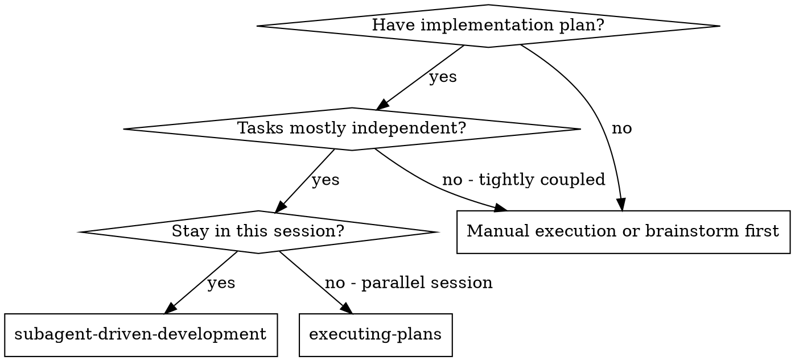
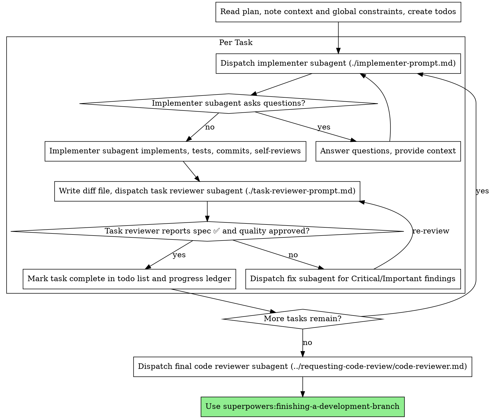

# Session transcript

## User

start I8 by reading CAMPAIGN.md + LEDGER.md first

## Assistant

Starting I8 by reading the campaign's governing documents in full, as the campaign convention requires.

### ⚙ Tool call: `Bash`

```json
{
  "command": "ls /workspace/development/2026-07-17-modularization-campaign/",
  "description": "List campaign directory contents"
}
```

### ↳ Tool result

```
BLOCKMAP.md
CAMPAIGN.md
LEDGER.md
PROMPT.md
analytics.md
statistics.md
transcript.md
transcript.raw.md
usage.raw.txt
```

### ⚙ Tool call: `Read`

```json
{
  "file_path": "/workspace/development/2026-07-17-modularization-campaign/CAMPAIGN.md"
}
```

### ↳ Tool result

```
1	# CAMPAIGN.md — Modularization Campaign (frozen architecture)
2	
3	**Status:** approved design, 2026-07-17. Brainstormed and approved section-by-section in
4	the campaign planning session (see `transcript.md` once archived); prompt in `PROMPT.md`.
5	
6	This is the **one** copy of the campaign's architecture, decisions, invariants, and
7	increment plan. Increment specs **cite this document and re-derive nothing** — the
8	campaign-level brainstorm and adversarial review run once, here; increments inherit that
9	scrutiny and do not repeat it. Any change to this document is an **amendment**: edit the
10	document *and* append a ledger entry (`LEDGER.md`) saying what changed and why. An
11	increment spec that contradicts this document without a ledger amendment is wrong by
12	definition.
13	
14	Related documents (all in this directory unless pathed): `PROMPT.md` (the campaign
15	request), `BLOCKMAP.md` (the B1–B60 functional map of `main()` all scope assignments
16	reference), `LEDGER.md` (append-only cross-increment record), `/workspace/CONTEXT.md`
17	(domain glossary — created by this campaign), `/workspace/prompts/directives.md` (the
18	Spine; PD#n citations below refer to it).
19	
20	## Glossary (campaign terms — domain terms live in `CONTEXT.md`)
21	
22	- **Campaign** — this whole program of work: one architecture, N increments.
23	- **Increment** — one unit of work with its own session, spec, implementation, review,
24	  commit, and archive. Numbered I0–I14.
25	- **Wave** — an ordered group of increments (0–4); increments within a wave may be
26	  reordered if the ledger records why, waves may not.
27	- **Block** — a `Bnn` region of `main()` per `BLOCKMAP.md`; the stable unit of scope
28	  assignment.
29	- **Core package** — the new importable `psh/` package holding infrastructure (Tier 1).
30	- **Gateway** — `psh/gateway.py`, the single module through which every Terminus/WP-CLI/
31	  Drush subprocess flows; the future Pantheon-API replacement seam.
32	- **Façade** — `script_context.py` (`sc`), the stable API surface that checks and plugins
33	  import; implementations move, the façade's names do not break.
34	- **Contract** — the per-phase guaranteed `site_context` keys (CLAUDE.md table), which
35	  this campaign turns into a machine-readable **contract registry**.
36	- **Hook DAG** — the per-phase topological ordering of hooks derived from declared
37	  `consumes`/`produces` keys, validated fatally at startup.
38	- **Ratchet** — the lint/type regime: broad ruff+pyright rules applied as a hard gate to
39	  moved/new modules immediately, the remnant grandfathered until I14.
40	- **Remnant** — whatever remains of the original script at any point mid-campaign.
41	- **Shim** — the thin committed `./pantheon-sitehealth-emails` entry script that calls
42	  `psh.cli.main()` after I0.
43	- **Ledger** — `LEDGER.md`; how increment N learns what N−1 actually did.
44	- **Behavior bar** — the tiered definition of which observable behavior may change (§8).
45	- **Invariant** — a named property no increment may alter (§9).
46	
47	**MUST** = required, violation fails review. **NEVER** = prohibited, violation fails
48	review. **SHOULD** = required unless the increment spec states why not. **MAY** =
49	allowed, at the implementer's judgment.
50	
51	## 1. Goal and non-goals
52	
53	**Goal.** Modularize the 4,752-line main script into (a) a `psh/` core package of
54	infrastructure modules, (b) self-registering `check/` packages for every notice/section
55	emitter, and (c) the existing `plugin/` integrations — taking full advantage of the hook
56	system — while the four e2e goldens stay byte-identical, the per-phase contract is
57	honored, and the non-U-M path keeps working. End state: `main()` is a ~250–400-line
58	orchestrator; every U-M-specific behavior lives in `umich` packages; the whole tree
59	passes the broadened ruff+pyright configuration.
60	
61	**Non-goals** (exhaustive; each is either declined or deferred with reasoning in §15):
62	replacing terminus with the Pantheon API; implementing parallel site processing; any new
63	report content (CSV attachment, cached-% column, env-lock section); SendGrid; refreshing
64	goldens or recorded fixtures; changing what any check reports (except the named bug
65	fixes in I1).
66	
67	## 2. Decision record (exhaustive — from the approved brainstorm)
68	
69	| # | Decision | Choice | Why |
70	|---|---|---|---|
71	| D1 | Pantheon API | **Seam only**: gateway module now, transport swap post-campaign | Swapping transports mid-campaign invalidates terminus fixtures + goldens in every touched increment |
72	| D2 | Lint/type broadening | **Ratchet in-campaign** (§13) | Code is cleaned exactly once, as it moves; bar fixed in I0 so it never shifts |
73	| D3 | Behavior bar | **Tiered, config renames allowed** (§8) | Cleanest final schema; production config edited once, at I14, with a migration table |
74	| D4 | Increment granularity | **Fine: 15 increments** | Safest for session/context limits; split-never-compress backstop (§12) |
75	| D5 | Target architecture | **Three-tier split** (§3) | Infrastructure ≠ report content ≠ data source; fulfills "full advantage of the frameworks" |
76	| D6 | Hook flexibility | **Phases stay; hooks declare consumes/produces; per-phase DAG validated at startup** (§4) | Keeps every existing hook/test valid; a phase-less key scheduler rewrites everything for no added power |
77	| D7 | `--only-warn` plan rec | **In campaign** (I7) | Small, no golden impact, existing TODO |
78	| D8 | Parallel-ready | **Design constraint only** (§3.4) | Near-free now; actual parallelism stays a README TODO |
79	| D9 | CSV attachment / cached-% / env-lock | **README TODO** | Each changes rendered email → golden churn mid-campaign |
80	| D10 | Packaging | **Real package + thin shim** (I0; console-script dropped — see LEDGER I0 amendment 1) | Dissolves the extension-less-script problem; normal imports for tests/pyright/ruff |
81	
82	## 3. Target architecture
83	
84	```
85	                 ./pantheon-sitehealth-emails  (thin shim)
86	                                │
87	                        psh.cli.main()  ── orchestrator: bootstrap, site loop,
88	                                │           phase firing, lifecycle dispatch
89	        ┌───────────────────────┼──────────────────────────┐
90	        ▼ Tier 1: psh/ core     ▼ seams (sc façade)        ▼
91	  configuration  modules   ┌─────────────────────┐   Tier 3: plugin/
92	  gateway        db        │  hook phases + DAG  │   aws  cloudflare
93	  traffic        plans     │  contract registry  │   env  umich
94	  gather         charts    └─────────┬───────────┘   (unchanged roles)
95	  render         mail                ▼
96	  lifecycle                Tier 2: check/  (all notice/section emitters)
97	                           pantheon  wordpress  drupal  addon_updates
98	                           dns  cloudflare  pantheon_cdn_change  umich
99	```
100	
101	### 3.1 Tier 1 — `psh/` core package (exhaustive module map)
102	
103	| Module | Receives (functions / blocks) |
104	|---|---|
105	| `psh/cli.py` | `build_arg_parser`, `parse_args`, arg validation (B5), `main()` orchestrator |
106	| `psh/configuration.py` | `process_config`, `config_substitution`, `gate_disabled_sections`, DEFER machinery, `load_news_items`, `umich_enabled`, `cloudflare_enabled` |
107	| `psh/modules.py` | `find_modules`, module loading (B2/B4), hook engine (`add_hook`/`invoke_hooks`/`PHASES`), DAG build/validation, contract registry |
108	| `psh/gateway.py` | `run_terminus`, `terminus`, `terminus_data`, `wp`, `wp_eval`, `drush`, `drush_php_script`, `fix_drush_output`, `wp_error`, `drush_error`, `TerminusError` |
109	| `psh/notice.py` | `Notice`, `Severity`, `NoticeRegistry`, `DuplicateNoticeCodeError`, `registry` (added I3; §6 Notice type + code registry) |
110	| `psh/db.py` | ORM models, `TrafficRow`/`OverageProtectionRow`, `db_engine_args`, `db_retry`/`db_retryable`/`record_db_reconnect`, `update_traffic_rows`, `insert_traffic_rows`, `load_traffic_rows`, `load_overage_protection_window`, `DatabaseUnavailableError` |
111	| `psh/traffic.py` | `get_old_metrics`, `estimate_month_visits`, `build_traffic_table_rows`, the `traffic_table_columns` global, metrics gather + DB update/load flow (B22–B26), visits-by-month aggregation (B43) |
112	| `psh/plans.py` | plan_info normalization (B12 part), SKU resolution (B17), `overage_blocks`, `contract_year_end`, `plan_costs`, `build_plan_over_time`, the `cost_table_columns` global, recommendation flow (B47) |
113	| `psh/gather.py` | Slimmed framework gathers feeding the `site_post_gather` contract (from B32–B35), `check_wordpress_plugin`/`check_drupal_module` helpers |
114	| `psh/charts.py` | Cap geometry (B13 part), chart data prep + matplotlib build (B44–B45) — returns PNG bytes |
115	| `psh/render.py` | Jinja render (B53), PHP inline + `!important` pass (B54), `escape_url` |
116	| `psh/mail.py` | Recipient resolution (B49), MIME assembly (B55), `smtp_login`, send (B57) |
117	| `psh/lifecycle.py` | `RunState`, `finish_run`, `abort_run`, `abort_reason`, `resume_point`, `resume_command`, `rerun_command`, `option_strings_taking_a_value`, `sites_from_resume_point`, `merge_prior_results`, `ResumeSiteNotFoundError` |
118	
119	`dns_classify.py` stays a top-level module (already extracted; moving it into `psh/` is
120	MAY-scope for I14, decided by ledger state then).
121	
122	**Whole-file coverage.** The campaign modularizes the entire script, not just `main()`:
123	every top-level def and module-level global in `pantheon-sitehealth-emails` (lines
124	1–2107 included) is assigned to a `psh/` module in this table and appears in exactly one
125	increment's scope (§11). End state: the original file is the thin shim and nothing else
126	— a top-level def still there at I14 is a defect the closing audit (§17) catches. Moved
127	helpers get the full §7 treatment (types, ratchet, verified docs, tests); they do NOT
128	get algorithmic redesign — moves are behavior-preserving except where §8 says otherwise
129	(I1, I7's D7, I12's B51).
130	
131	### 3.2 Tier 2 — new/changed `check/` packages (exhaustive)
132	
133	| Package | Contents (blocks) | Phase(s) |
134	|---|---|---|
135	| `check/pantheon/` (new) | frozen site (B19), no-live-env (B21), upstream updates (B38), PHP EOL (B41) | `site_pre` (frozen, no-live-env), `site_post_gather` (updates, PHP EOL) |
136	| `check/wordpress/` (new) | PAPC + native-sessions checks, OCP config probe, favicon (from B34) | `site_post_gather` |
137	| `check/drupal/` (new) | PAPC module check, D7 EOL + tag1_d7es, multisite probe (from B30/B35) | `site_post_dns` (multisite), `site_post_gather` |
138	| `check/addon_updates/` (new) | add-on updates table notice (B39), smell notices (B48) | `site_post_gather` |
139	| `check/umich/` (existing, grows) | umich-oidc-login, Hummingbird fork (B34), Drupal UA check (B35), annual-billing notices (B50/B51), portal-URL text for the recommendation notice (B47's U-M half) | `site_post_gather`, `site_pre_render` (billing) |
140	
141	`check/dns/`, `check/cloudflare/`, `check/pantheon_cdn_change/` are untouched tenants.
142	A check MAY fetch its own data through `sc` gateway wrappers when the data is
143	check-specific (e.g. `upstream:updates:list`); data used by core *and* checks is
144	published through the contract instead (e.g. `envs`).
145	
146	### 3.3 What stays in `main()` (exhaustive, with why)
147	
148	Config/arg bootstrap ordering (B1–B8 — the two-pass substitution *order* is the
149	program); overage constants + date window (B9, B13 part); the site-loop skeleton (skips,
150	banner, sorted order, resume filter — B14–B18, B20, B25, B42); phase firing and contract
151	stuffing (B27, B28, B31, B37, B52); notice sort + subject (B50 minus billing); the
152	`try`/`except BaseException` lifecycle dispatch (B59–B60 call sites). Everything else
153	leaves. Target: 250–400 lines.
154	
155	### 3.4 Parallel-ready constraint (D8)
156	
157	Per-site work MUST be a function of `(site, config, db_session, site_context)`: no new
158	module-level mutable state; run-scoped accumulators live only in `RunState`. This is a
159	review criterion from I2 onward, not a parallelism implementation.
160	
161	### 3.5 The `sc` façade
162	
163	Checks and plugins import **only** `sc` (and their own package). `sc` keeps every name
164	listed in CLAUDE.md's runtime-exposed block, re-exporting from `psh/` modules as they
165	move. NEVER remove or rename an `sc` attribute mid-campaign; additions are fine. The
166	house-rules test suite gains an assertion that every documented `sc` name exists (I2).
167	
168	## 4. Phases, hooks, and the DAG
169	
170	Phases stay the coarse spine: `setup`, `site_pre`, `site_post_traffic`, `site_post_dns`,
171	`site_post_gather`, `site_pre_render`, plus **new** `run_finish` (fired inside
172	`finish_run` before artifacts are written, receiving the `RunState`; for future run-level
173	artifact hooks — no consumer at introduction, like `site_pre_render` was). Dotted
174	plugin-defined events are unchanged.
175	
176	From I4, `add_hook` requires two new entries per hook: `consumes` and `produces` — each
177	a (possibly empty) list of contract-key names. Validation at module-load completion
178	(exhaustive fatal conditions):
179	
180	1. A consumed key that nothing produces (neither core's registry for that phase or an
181	   earlier phase, nor another hook) → fatal.
182	2. Two producers of the same key → fatal (one owner per key; PD#1 — a silent overwrite
183	   is a silent failure).
184	3. A cycle among same-phase hooks → fatal.
185	4. A hook consuming a key first produced in a *later* phase → fatal.
186	5. A missing `consumes`/`produces` entry on any hook → fatal (no legacy mode; I4
187	   retrofits all in-repo hooks in the same change).
188	
189	`invoke_hooks` orders same-phase hooks topologically (producers before consumers;
190	registration order breaks ties, so existing behavior is preserved where no edges exist).
191	The permanent test `tests/integration/test_hook_dag.py` loads **all** real check/plugin
192	packages and asserts the DAG builds — the "future changes can never make the DAG
193	impossible" guarantee — and a unit suite proves each fatal condition actually fires
194	(PD#14: the validator must be shown able to go red).
195	
196	```
197	 module load ──► collect hooks ──► per phase: build edges (produces→consumes)
198	                                        │
199	                              cycle? unknown key? dup producer? ──► fatal exit (named error)
200	                                        │ ok
201	                                topo order stored ──► invoke_hooks uses it
202	```
203	
204	**Contract registry.** `psh/modules.py` holds the machine-readable registry: phase →
205	keys core stuffs (today's CLAUDE.md table, verbatim). Core's stuffing code is checked
206	against it in tests; CLAUDE.md's table gains a line saying the registry is authoritative.
207	New contract keys added by increments (exhaustive for this campaign): `envs` (I8, at
208	`site_pre`), `add_on_updates` + `wp_smell`/`drush_smell`/`composer_smell` (I9/I10, at
209	`site_post_gather`), plan/cost keys `current_plan`, `recommended_plan`, `plan_costs`,
210	`savings` (I7, at `site_pre_render`). Each addition updates registry + CLAUDE.md table +
211	ledger in the same increment.
212	
213	## 5. Configuration
214	
215	Principles: one section per feature, named for the operator's mental model; every
216	relocated check gets an `enabled` flag under `[Check.<name>]`, **default true** —
217	relocating code MUST NOT silently disable a check that runs unconditionally today.
218	U-M-only checks additionally require `[UMich].enabled` (existing `umich_enabled()`
219	rule). `gate_disabled_sections()` semantics (nested `enabled`, children dropped) apply to
220	`[Check.*]` unchanged.
221	
222	Example (actual TOML, the shape I8 introduces — illustrative of the family, exhaustive
223	for `check/pantheon/`):
224	
225	```toml
226	[Check.pantheon]
227	enabled = true          # frozen-site, live-env, upstream-updates, PHP-EOL checks
228	```
229	
230	New keys land in final shape as introduced (I3 onward). Renames/moves of *existing* keys
231	happen once, in I14, which MUST deliver: the old→new migration table in
232	`docs/config-migration.md`, a rewritten `sample-pantheon-sitehealth-emails.toml`, and
233	exact edit instructions for the production config repo. Until I14, every existing
234	production key keeps working unchanged.
235	
236	## 6. Types
237	
238	Reused as-is: `TrafficRow`, `OverageProtectionRow`, `DnsFacts`, `FetchResult`,
239	`SiteContext`. Introduced (exhaustive):
240	
241	| Type | Increment | Shape |
242	|---|---|---|
243	| `GatewayResult` | I2 | NamedTuple `(result, errors, fatal)` replacing the anonymous 3-tuples |
244	| `Notice` | I3 (class) → adopted per increment | frozen dataclass: `severity` (StrEnum alert/warning/info), `code` (unique — registry test), `html`, `text`, `short`, `icon`, `order`; `SiteContext.add_notice` accepts `Notice` or legacy dict; dict form retired in I14 |
245	| `PlanInfo` / `PlanCatalog` | I7 | typed view over `[Pantheon.plan_info]` |
246	| `RunState` | I13 | dataclass holding `all_warnings`, `site_results`, `site_savings`, `emails_sent`, reconnect counters |
247	
248	House-style tuple annotations (`-> (str, str, bool)`) are replaced with real annotations
249	in every module as it moves — never fixed in place in the remnant (one pass per line,
250	D2). CLAUDE.md's house-style note is updated in I14 when the last one dies.
251	
252	## 7. Per-increment obligations
253	
254	Every increment MUST (this list is exhaustive and lives only here; increment specs cite
255	it): (1) start by reading `CAMPAIGN.md`, `LEDGER.md`, `CLAUDE.md`, `BLOCKMAP.md` rows in
256	scope; (2) follow `prompts/implementation-standards.md` (subagent-driven, test-first,
257	`psh-implementer`/`psh-reviewer`); (3) replace house styles in moved code (§6);
258	(4) verify — not assume — every claim in comments/docs it moves or writes;
259	(5) update tests in the same change; (6) update README/docs/CLAUDE.md for what moved;
260	(7) update auto-memory where a durable fact changed; (8) append its ledger entry
261	(§12); (9) preserve every invariant (§9); (10) end with `/code-review`, a full
262	`./run-tests`, and one checkpoint commit including its `development/` folder.
263	
264	## 8. Behavior bar (canonical gate table)
265	
266	| Surface | Rule | Until |
267	|---|---|---|
268	| Rendered emails (4 goldens) | NEVER change (byte-identical) | end of campaign |
269	| `-results.json` / `-notices.csv` / `-run.json` structure (keys, row shape) | NEVER change | end of campaign |
270	| Notice csv *values* | MAY change only in I1 (named bug fixes), I12 (scheduled B51 deletion), and I7 (`its-recommends-plan` savings-field format, D-i7-5 — amendment) | — |
271	| stdout / console / error messages | MAY improve freely | — |
272	| Config: existing keys | NEVER break | I14 (renames with migration table) |
273	| Config: new keys | MUST land in final schema shape | — |
274	| Exit codes, resume semantics, artifact write gates | NEVER change | end of campaign |
275	
276	## 9. Named invariants (exhaustive; NEVER violated by any increment)
277	
278	1. Four e2e goldens byte-identical (`./run-tests` proves it; refresh is forbidden — an
279	   existing golden going red is a defect in the increment, PD#14).
280	2. Per-phase data contract: existing keys never removed/renamed/retyped; additions only.
281	3. Non-U-M path works: non-U-M golden green; no new un-gated U-M content (I1 *removes*
282	   the one known leak).
283	4. Run lifecycle: single `except BaseException` flush path; `abort_reason`'s three
284	   outcomes; artifacts dropped-site rule; notices appended before send; resume-point
285	   next-site-after-email rule; soft-wrapped copy-pasteable commands.
286	5. DB: `db_retry` retries whole idempotent units only; `db_retryable` predicate
287	   unchanged; the read-release commit in the loaders stays (guarded by
288	   `test_load_traffic_rows_releases_the_connection`).
289	6. Rich console rules: escape untrusted text; production width reproduced in tests.
290	7. Test safety interlock (`run_program` forbidden flags) never bypassed or weakened.
291	8. Column-0 `f"""` notice literals move **verbatim** — never re-indented; `git diff -w`
292	   is not acceptable evidence for any change touching them.
293	9. Checks/plugins import only `sc`; `sc` names never removed mid-campaign (§3.5).
294	10. Recorded fixtures are not regenerated (`terminus-cdnchange/` is hand-maintained and
295	    `--record` must not run).
296	11. `--create-tables`/`--update`/`--import-older-metrics` phase-gating rules (CLAUDE.md
297	    table) unchanged.
298	
299	## 10. Known-bug inventory → I1
300	
301	The five bugs and the dead code listed in `BLOCKMAP.md` §Bugs (composer-smell
302	nesting+variable; shared `php-eol` code; `site_results` omission; un-gated U-M portal
303	URLs; duplicate `annual-bill` code — B51 handled as: distinct code now, scheduled
304	deletion when its Aug-2026 date passes, ledgered to I12; dead code deleted). Each fix is
305	test-first with the test shown red on the old behavior. **Verified 2026-07-17**: the
306	goldens contain zero `php-eol`/`wp-smell`/`drush-smell`/`composer-smell`/`annual-bill`
307	occurrences and the golden fixtures report PHP 8.2, so none of these fixes can touch a
308	golden:
309	
310	```
311	$ grep -c 'php-eol\|composer-smell\|wp-smell\|drush-smell\|annual-bill' tests/e2e/__snapshots__/*.ambr
312	tests/e2e/__snapshots__/test_golden.ambr:0
313	tests/e2e/__snapshots__/test_golden_cdn_change.ambr:0
314	tests/e2e/__snapshots__/test_golden_drupal.ambr:0
315	tests/e2e/__snapshots__/test_golden_nonumich.ambr:0
316	```
317	
318	## 11. The increments
319	
320	Wave dependency structure (increments within a wave are ordered but MAY be resequenced
321	with a ledger entry; waves MUST NOT be reordered):
322	
323	```
324	Wave 0: I0 bootstrap ──► I1 bug fixes
325	Wave 1: I2 gateway ──► I3 config ──► I4 hooks+DAG ──► I5 DB
326	Wave 2: I6 traffic ──► I7 plans ──► I8 check/pantheon ──► I9 wordpress ──► I10 drupal
327	Wave 3: I11 charts ──► I12 render+mail ──► I13 lifecycle
328	Wave 4: I14 closing sweep
329	```
330	
331	| Inc | Scope (blocks / functions) | Delivers |
332	|---|---|---|
333	| **I0** | — (no logic moves) | `psh/` skeleton + thin shim (console-script dropped — see LEDGER I0 amendment); conftest `import psh` rework (same collected-test count gate); ratchet config (§13) with rule sets pinned; pyright baseline measured; `LEDGER.md` started; README TODO edits (§15 dispositions); CLAUDE.md pointer to campaign |
334	| **I1** | B36, B40, B41, B47 (URLs), B48, B50/B51 (codes), dead code | §10 fixes, each test-first |
335	| **I2** | 302–597 wrappers | `psh/gateway.py`, `GatewayResult`, sc re-exports + façade test; no-subprocess-outside-gateway house rule |
336	| **I3** | 792–934, 1209–1253, 1608–1648 (`umich_enabled`/`cloudflare_enabled`) | `psh/configuration.py`; `Notice` class + code-uniqueness registry test |
337	| **I4** | 935–950, hook engine from `script_context.py` | `psh/modules.py`; consumes/produces on all in-repo hooks; DAG validation + fatal-condition tests; `run_finish` phase; contract registry |
338	| **I5** | 95–178; DB defs within 1285–1575 (`DatabaseUnavailableError` through `db_engine_args`; the resume helpers `ResumeSiteNotFoundError`, `sites_from_resume_point`, `merge_prior_results` stay for I13) | `psh/db.py`; DB test suites relocated intact |
339	| **I6** | B22–B26, B43; 598–671, 977–1127 | `psh/traffic.py` |
340	| **I7** | B9, B12 (plans), B17, B47; 967–976, 1128–1208, 1254–1280 | `psh/plans.py`; `PlanInfo`; D7 (`--only-warn` runs recommendation); plan/cost contract keys |
341	| **I8** | B19, B21, B38, B41 | `check/pantheon/` + `[Check.pantheon]`; `envs` contract key |
342	| **I9** | B32–B34; 672–739 | `psh/gather.py` (WP half); `check/wordpress/`; U-M WP checks → `check/umich/`; `add_on_updates` + smell contract keys |
343	| **I10** | B30, B35, B39, B48; 740–791 | gather (Drupal half); `check/drupal/`; `check/addon_updates/`; UA check → `check/umich/` |
344	| **I11** | B13 (caps), B44–B45 | `psh/charts.py` |
345	| **I12** | B49–B57 minus sort/subject core | `psh/render.py`, `psh/mail.py`; annual billing → `check/umich/` at `site_pre_render`; B51 deletion if past its date |
346	| **I13** | B14 (accumulators), B56, B59–B60; 1649–2107 plus the resume helpers I5 left behind (1281–1284, 1528–1542, 1576–1607) | `psh/lifecycle.py`; `RunState`; `main()` reaches final form |
347	| **I14** | — | Config renames + migration doc + sample rewrite + production-config instructions; global ratchet flip + remnant cleanup; docs/README/CLAUDE.md full refresh; `Notice` dict form retired; ledger fully resolved; retrospective + closing audit (§17) |
348	
349	Sizing note: the largest moves are I9 (~330 main-loop lines + helpers) and I10 (~320 +
350	helpers). If any increment proves oversized mid-session: **split, never compress** —
351	commit nothing partial, ledger the split, the second half becomes its own increment.
352	
353	## 12. Coordination protocol
354	
355	**Ledger entry template** (append per increment, and for any amendment):
356	
357	```markdown
358	## I<N> — <slug> (<date>, commit <sha>)
359	- Moved: <blocks/functions actually moved>
360	- Deviations from CAMPAIGN.md: <none | what + why>
361	- Contract/config/sc additions: <keys/names>
362	- Discovered tasks: <each with disposition: fixed here | I<M> | README TODO>
363	- Open questions for next increment: <…>
364	```
365	
366	**Discovered-task disposition rules** (canonical): fits current increment's scope and
367	<~30 min → fix now, note in ledger; belongs to a later increment → ledger it against
368	that increment (the increment's spec author MUST read these); major/risky/scope-widening
369	→ README TODO with a sentence of context. Nothing is carried in memory or chat — if it
370	is not in the ledger or README, it does not exist (PD#9).
371	
372	**Session flow per increment:** read the §7 documents → write the increment SPEC.md in
373	`development/<date>-mod-I<N>-<slug>/` citing CAMPAIGN.md sections by number →
374	`superpowers:writing-plans` → subagent-driven implementation → `/code-review` → full
375	`./run-tests` → per-task commits, each green; the increment's final commit includes the dev
376	folder → `/archive-session` → ledger entry.
377	
378	## 13. Lint/type ratchet
379	
380	Mechanism (as shipped by I0; see LEDGER I0 amendment 2): TWO ruff configs —
381	`pyproject.toml` `[tool.ruff.lint]` keeps the narrow PD-rule set running everywhere
382	including the remnant, and `ruff-broad.toml` carries `select = ["ALL"]` minus a
383	justified ignore list, with `extend-exclude` grandfathering exactly the remnant
384	(`psh/_legacy.py`) and not-yet-moved files; each increment deletes its
385	files from the grandfather list, and the two configs merge at I14. pyright runs in
386	`./run-tests` from I0 via `[tool.pyright]` (standard mode, `psh/` minus `_legacy.py`),
387	ratcheting toward strict as typed code moves in. The four existing narrow rules (`E722`, `BLE001`, `S105`, `S106`) remain global
388	throughout — they mechanize PD#2/PD#6 and are never grandfathered. No
389	`target-version` pin (CLAUDE.md: it masks the 3.12-only syntax detection).
390	
391	Baselines measured 2026-07-17 (I0 re-measures and pins both in its spec):
392	
393	```
394	$ ./run-tests --fast --llm   (tail)
395	LLM_SUMMARY passed=727 failed=0 error=0 skipped=1 xfailed=0 xpassed=0
396	25 snapshots passed.
397	
398	$ uvx ruff check --isolated --statistics .
399	26  F541  f-string-missing-placeholders
400	 8  E741  ambiguous-variable-name
401	 4  E713  not-in-test
402	 3  F841  unused-variable
403	 2  F401  unused-import
404	 1  E402  module-import-not-at-top-of-file
405	 1  E712  true-false-comparison
406	Found 45 errors.
407	```
408	
409	(README's "~55" ruff and "39" pyright figures are stale/unverified claims; I0 replaces
410	them with measured numbers. pyright was not measured in planning — no pyright binary in
411	the dev container yet; installing it is I0 scope.)
412	
413	## 14. Risk / control table
414	
415	| Risk | Control |
416	|---|---|
417	| Re-indented column-0 notice literals silently change emails | Invariant 8; goldens as tripwire; AST/token comparison, never `git diff -w` |
418	| conftest rework silently drops tests | I0 gate: identical collected-test count (727 passed / 1 skipped / 2 deselected baseline) before and after |
419	| Long-range `main()` local coupling breaks a move | BLOCKMAP produces/consumes; each increment spec lists exactly which locals cross its boundary |
420	| Session/context overrun mid-increment | Fine granularity (D4); split-never-compress; commits only at increment completion |
421	| Architecture drift across 15 sessions | This document frozen; amendments only via ledger; specs cite section numbers |
422	| Hidden hook-order dependencies surface in I4 | I4 audits every hook; real dependencies become explicit DAG edges |
423	| Ratchet churn on moved code | Rules fixed at I0; cleaning is part of each move |
424	| Goldens blind to stdout/artifacts | Invariants 4–5 name the artifact/abort test suites as the cover; artifact structure frozen until campaign end |
425	| Implementer sessions lack context | `psh-implementer`/`psh-reviewer` carry the read list; specs name seams (Spine spec bar); §7 reading list |
426	| Two annual-bill notices / removal date passes mid-campaign | Explicitly scheduled: codes split in I1, deletion decision in I12, ledger tracks |
427	
428	## 15. NOT in scope (reasoning preserved so it is never re-litigated)
429	
430	- **Terminus → Pantheon API swap** — D1; post-campaign project against `psh/gateway.py`.
431	- **Parallel site processing** — D8; constraint only; README TODO remains.
432	- **CSV data attachment, cached-% column, env-lock section** — D9; each becomes a small
433	  post-campaign change (env-lock: a ~50-line `check/` package) once goldens may move.
434	- **SendGrid, secrets-handling completion, portal traffic capture, daily alerts,
435	  accessibility/security/Cloudflare scores, AI recommendations, dependency updates,
436	  terraform-infra** — pre-existing README TODOs, untouched by this campaign.
437	- **Approach B (library-only) and C (everything-is-a-hook)** — rejected in brainstorm:
438	  B fails the "full advantage of the frameworks" goal; C forces infrastructure into
439	  optional-content clothing.
440	- **Golden/fixture refreshes** — forbidden (Invariants 1, 10).
441	
442	## 16. Acceptance baseline
443	
444	§13 outputs are the campaign-start baseline (run and pasted 2026-07-17). Every
445	increment's definition of done re-runs `./run-tests` at increment end — the full suite
446	when the live tier's credentials are available in the session, otherwise `--fast` with a
447	ledger note saying the live tier was skipped — and MUST reproduce goldens
448	byte-identically. I0 additionally records the collected-test count gate.
449	
450	## 17. Closing audit (queued for I14; exhaustive)
451	
452	1. Is `main()` within 250–400 lines, and does everything left match §3.3?
453	2. Has every DAG fatal condition been demonstrated red at least once?
454	3. Do the contract registry and CLAUDE.md table agree (test-enforced)?
455	4. Is any `sc` re-export now consumed by nobody (dead façade surface)?
456	5. Is the `.py` symlink still needed for anything beyond the shim? If not, note in
457	   CLAUDE.md; if yes, say for what.
458	6. Are all ledger items resolved (done, scheduled, or README TODO)?
459	7. Has the production config repo received and applied the migration instructions?
460	8. Do README, CLAUDE.md, docs/, and memory reflect the final architecture (no stale
461	   line-number or module references)?
462	9. Were any invariants amended mid-campaign, and is each amendment ledgered?
463
```

### ⚙ Tool call: `Read`

```json
{
  "file_path": "/workspace/development/2026-07-17-modularization-campaign/LEDGER.md"
}
```

### ↳ Tool result

```
1	# LEDGER — Modularization Campaign
2	
3	Append-only. One entry per completed increment, plus one per CAMPAIGN.md amendment.
4	This file is how increment N learns what N−1 actually did; if a deviation, discovered
5	task, or decision is not recorded here (or in the README TODO list), it does not exist.
6	Entry template: CAMPAIGN.md §12.
7	
8	## Campaign planning (2026-07-17)
9	
10	- Produced: `CAMPAIGN.md` (frozen architecture), `BLOCKMAP.md` (B1–B60 map),
11	  `/workspace/CONTEXT.md` (domain glossary, new), this ledger.
12	- Baselines: fast tier 727 passed / 1 skipped / 2 deselected; ruff `--isolated` 45
13	  findings; pyright unmeasured (no binary in container — I0 scope).
14	- Discovered during planning, dispositioned:
15	  - Five bugs + dead code → I1 (CAMPAIGN.md §10, BLOCKMAP §Bugs).
16	  - README's "~55 ruff / 39 pyright" figures stale/unverified → I0 re-measures.
17	  - B51 second annual-bill notice: marked "remove Aug 2026" — code split in I1,
18	    deletion decision in I12.
19	  - WordPress/Drupal duplication + update-table HTML duplication (BLOCKMAP §Bugs 7–8)
20	    → addressed structurally by I9/I10 (shared gather + `check/addon_updates/`).
21	- Open questions for I0: exact ruff rule list; pyright strictness per environment;
22	  whether `dns_classify.py` moves under `psh/` (deferred to I14, MAY).
23	- Amendment (2026-07-17, user spec review): added the "Whole-file coverage" paragraph to
24	  CAMPAIGN.md §3.1 — clarification only, no scope change; the module map already
25	  assigned every top-level def.
26	
27	## I0 — bootstrap (2026-07-17, closing commit `docs(campaign-I0): close the bootstrap increment`)
28	
29	Commits (per-task, each green): `b1ccc72` (package move + shim + conftest + coverage),
30	`d0e3027` (lint/type ratchet), `5b536fa` + `239955d` (README/CLAUDE.md docs), plus this
31	closing docs commit (ledger + CAMPAIGN amendments + SPEC acceptance + README pyright number).
32	
33	- **Moved:** the whole 4,752-line program → `psh/_legacy.py` (`git mv`, **zero logic
34	  changes**; the `__main__` tail is inert in a module, left for I13). New: `psh/__init__.py`
35	  (docstring), `psh/cli.py` (`from psh._legacy import main, parse_args` re-export), and a new
36	  7-line thin shim at `./pantheon-sitehealth-emails` calling `psh.cli.main()`. No blocks
37	  (B-map) moved — I0 moves the file, not logic (§11 row I0).
38	
39	- **Deviations from CAMPAIGN.md (three amendments, all applied to the document this commit):**
40	  1. **No console-script entry point** (amends §11 row I0 / D10). The program is repo-rooted
41	     by design (`find_modules`, templates, `inline-styles.php`, `vendor/`, config symlink are
42	     all CWD-relative); a pip entry point would need a data-file overhaul serving no campaign
43	     goal. D10's real benefits (normal imports; native ruff/pyright/CodeGraph coverage; no
44	     `SourceFileLoader`) all arrive via the package + shim without installation. `pyproject.toml`
45	     stays deps-only (`py-modules = []`, `packages = []` to stop setuptools auto-discovery
46	     installing a stale shadow copy — PD#1). §11 row I0 now reads "thin shim (console-script
47	     dropped — see LEDGER I0 amendment)".
48	  2. **Grandfather is `psh/_legacy.py` via `ruff-broad.toml` `extend-exclude`** (amends §13,
49	     which named `pantheon-sitehealth-emails.py` and "per-file-ignores" — both written before
50	     the legacy-module + two-config mechanics were settled). The shipped mechanism is TWO ruff
51	     configs, not per-file-ignores: `pyproject.toml` `[tool.ruff.lint]` carries the narrow
52	     PD-rule set (`E722`/`BLE001`/`S105`/`S106`) that runs EVERYWHERE including `_legacy.py`;
53	     `ruff-broad.toml` carries `select = ["ALL"]` minus the ignore list and grandfathers the
54	     remnant via `extend-exclude`. `./run-tests` and `.claude/hooks/ruff-check.sh` run BOTH
55	     passes; the two files merge into `pyproject.toml` at I14. §13 now names `psh/_legacy.py`
56	     and "ruff-broad.toml exclude".
57	  3. **Per-task commits, each green** (amends §12's "one commit (code + dev folder)"). Each I0
58	     task committed independently once its gates were green; this increment's final (closing)
59	     commit includes the `development/` folder. Rationale: finer checkpoints serve the campaign
60	     prompt's revert/inspect intent, and SDD review packages diffs as commit ranges. §12 now
61	     reads "per-task commits, each green; the increment's final commit includes the dev folder".
62	
63	- **Ratchet as pinned.** pyright runs in `./run-tests` at **standard** mode, not strict
64	  (DECISION): `psh/cli.py` re-exports from the untyped legacy module, so strict would fail on
65	  re-export; strictness ratchets up as increments move typed code in. Scope `[tool.pyright]`
66	  = `include = ["psh"]`, `exclude = ["psh/_legacy.py"]`. Ruff-broad ignore list (pinned; each
67	  justified in `ruff-broad.toml`): `COM812`, `ISC001`, `E501`, `Q000`, `Q001`, `Q002`, `Q003`,
68	  `ANN`, `TD002`, `TD003`, `FIX002`, `EM101`, `EM102`, `TRY003`, `D`, `CPY001`. `CPY001` is a
69	  **preview** rule in ruff 0.15.22 (cannot fire under non-preview `select=["ALL"]`); ruff
70	  accepts it in `ignore` with no warning, so it is kept verbatim to document the intent
71	  (no per-file copyright headers). `D` (docstring convention) is undecided → README TODO.
72	
73	- **pyright whole-tree baseline (informational; replaces README's unverified "39").**
74	  **220 errors, 0 warnings, 0 informations** across 118 first-party files, standard mode,
75	  pyright 1.1.411 (SPEC ACCEPTANCE §Task 5 has the command + breakdown). Measured OUTSIDE the
76	  scoped gate config via a repo-root config (pyright roots a project at the config's directory
77	  and ignores includes outside it; a config's `exclude` still drops CLI-passed paths — so
78	  neither a scratchpad-rooted config nor CLI args can re-include `_legacy.py`, and a repo-root
79	  temp config is the reproducible form). By area: `tests/` 139, `psh/_legacy.py` 36, `check/`
80	  21, `plugin/` 18, `script_context.py` 5, `dns_classify.py` 1 (`check/`+`plugin/` = 39, the
81	  origin of the old figure). The gated scope (`psh/` minus `_legacy.py`) is `0 errors`.
82	
83	- **Contract/config/sc additions:** none (I0 moves no logic; no `[Check.*]` sections, no new
84	  contract keys, no `sc` names added or removed).
85	
86	- **Discovered tasks:**
87	  - **`Path(psh.__file__).parent` as a repo-root proxy** — 25 sites across 23 files: 22 test files (plus
88	    `tests/helpers/checkload.py`) anchored repo paths on the program file's parent, which the
89	    move shifted from repo root to `psh/`. Fixed here, mechanically and minimally:
90	    `→ Path(psh.__file__).resolve().parents[1]` at exactly those sites. Proper cleanup lands
91	    when later increments un-grandfather those test files; the `psh` fixture itself is
92	    redesigned when `_legacy` dies (I13/I14). Disposition: **fixed here**, further cleanup **I13/I14**.
93	  - **ruff lints explicitly-passed files even when excluded** — passing a path on ruff's
94	    command line overrides `extend-exclude`, so the edit hook (which passes the just-edited
95	    file) would lint `_legacy.py` against the broad set. Fixed by giving the broad-pass
96	    invocation `--force-exclude` and running it from repo-root cwd; documented in
97	    `.claude/hooks/ruff-check.sh`. Disposition: **fixed here**.
98	
99	- **Open questions for I1/I2:**
100	  - I1 (bug fixes) touches `_legacy.py` in place (fixes retire as code moves); it must keep
101	    the narrow PD set green there (broad set stays grandfathered) and the four goldens
102	    byte-identical (§10 verified the fixed codes appear in zero goldens).
103	  - I2 (gateway) is the first real logic move: as it un-grandfathers the wrapper functions it
104	    deletes them from `ruff-broad.toml` `extend-exclude` and must clean them to the broad set
105	    + pyright standard in the same change (§13 ratchet; §6 house-style tuple hints replaced).
106	  - `dns_classify.py` under `psh/` remains a MAY for I14 (unchanged from planning).
107	- Amendment (2026-07-17, post-Task-5 review): CAMPAIGN.md §13 mechanism paragraph
108	  rewritten to describe the SHIPPED two-config mechanism (it still said "pyproject gets
109	  extend-select" and "executionEnvironments", both superseded by amendment 2 above);
110	  ledger reanchor note corrected to "22 test files plus checkload.py" (23 files total).
111	  Both changes doc-accuracy only.
112	- Amendment (2026-07-17, final I0 code review, spec axis): D10's Decision cell still said
113	  "console-script" after amendment 1 changed only §11 row I0 — CAMPAIGN.md briefly
114	  self-contradicted. D10 cell now matches. Doc-accuracy only.
115	
116	## I1 — known-bug fixes (2026-07-17, commits `5518de7..1ff9153` + closing docs commit)
117	
118	Spec/plan: `development/2026-07-17-mod-I1-bug-fixes/` (SPEC.md carries the pasted
119	acceptance results). Six per-task commits, each green; full suite at close = 751 passed /
120	1 skipped **including the live tier**, 27 snapshots, all three gates; four goldens
121	byte-identical across the whole range (`git diff aa8afd1 -- tests/e2e/__snapshots__/`
122	empty).
123	
124	- **Moved:** no blocks (fixes land in place in `psh/_legacy.py` per I0's open-question
125	  note). Extracted five pure notice-builder helpers as consecutive module-level defs
126	  above `main()` (preserved-bug-extraction pattern; every literal interior byte-verified
127	  against the pre-move original by task reviewers AND the final review):
128	  `build_smell_notices`, `build_php_eol_notice`, `build_annual_bill_upcoming_notice`,
129	  `build_annual_bill_in_progress_notice`, `build_plan_recommendation_notice`. These
130	  travel later: smells → I10, php-eol → I8, annual-bill → I12, plan-rec → I7.
131	- **Fixed (CAMPAIGN §10 / BLOCKMAP §Bugs, all test-first with RED shown on old
132	  behavior):** (1) B48 composer-smell nesting + wrong interpolated variable;
133	  (2) B41 shared `php-eol` csv code → `php-eol-warning` (7.4/8.1) / `php-eol-alert`
134	  (<8.2), following the `updates-*` suffix pattern; (3) B36 unknown-framework sites now
135	  get a `site_results` entry (`version: "unknown"`, same 3-key row shape) — covered by a
136	  new offline e2e (`tests/e2e/test_unknown_framework_e2e.py`) asserting the
137	  `finish_run()` stdout pprint, since `-results.json` is written only on `--all` runs the
138	  interlock bans; (4) B47 un-gated U-M portal URLs — two of the four named URL sites
139	  (`extra_message`/`extra_text`) were **dead stores** (assigned, never read; §10's
140	  4240/4248 refined — bug partially lived in dead code), deleted; the live
141	  `its-recommends-plan` notice now selects U-M vs generic copy via `umich_enabled()`
142	  (generic drops the portal anchor AND the June-16-30 downgrade-window sentence — U-M
143	  billing policy, factually wrong elsewhere); both variants pinned by syrupy snapshots
144	  (`test_plan_recommendation_notice_render`); (5) B50/B51 duplicate `annual-bill` code —
145	  B51 now emits `annual-bill-in-progress`; B50 keeps `annual-bill`; B51's Aug-2026
146	  deletion decision remains I12's; (6) dead code deleted (B40 Gen2 block, overage debug
147	  query, `# plt.show()`, redundant second `plt.close(fig)` with its stale memory claim).
148	- **Deviations from CAMPAIGN.md:** none.
149	- **Contract/config/sc additions:** none. Sanctioned notice-csv value changes (§8 I1
150	  exception): the three codes above. New **hand-maintained** fixture dir
151	  `tests/fixtures/terminus-unknownfw/` (copy of `terminus/`, one framework value →
152	  `"mystery"`, README states `--record` never refreshes it — Invariant 10, cdnchange
153	  precedent) + conftest constant `TERMINUS_FIXTURES_UNKNOWNFW`.
154	- **Discovered tasks (dispositions):**
155	  - Template `email_template.{html,txt}` portal URLs render `sites/0/` in every non-U-M
156	    run including the non-U-M golden (SPEC Obs. 1) → I12/I14 (goldens freeze it now;
157	    already on CLAUDE.md's still-hardcoded-U-M list).
158	  - `php_version < "8.2"` string comparison + KeyError if key absent (Obs. 2) → I8.
159	  - B47 downgrade path: owner gets NO notice (dead `extra_message` was presumably meant
160	    for this) and a non-Basic downgrade appends no `site_savings` entry (Obs. 3) → I7
161	    decides intended behavior.
162	  - Composer-smell literals carry baked-in 8-space indentation (Obs. 4) → I10.
163	  - `its-recommends-plan` csv embeds `{savings:,.2f}` — thousands comma inside a
164	    comma-separated field, variable column count (Obs. 5) → I7, or I3's `Notice`
165	    class/code-registry work.
166	  - Residual test gap (final-review triage): `main()`'s umich-only annual-bill call
167	    sites have no runtime test (goldens are umich-disabled; interlock bans a U-M run) —
168	    I12's spec author MUST cover this when relocating annual billing to `check/umich/`
169	    at `site_pre_render`.
170	- **Process note (PD#14 instance):** one implementer's report Write silently failed
171	  against a stale `.superpowers/sdd/` report file from I0 and was misreported as
172	  success; caught by the task reviewer (report content was for the wrong task). Stale
173	  scratch reports are now purged before dispatch; future increments should start by
174	  clearing `.superpowers/sdd/task-*-report.md` leftovers.
175	- **Open questions for I2:** none new — proceed per I0's notes (un-grandfather the
176	  wrapper functions from `ruff-broad.toml`, clean to broad set + pyright standard,
177	  replace house-style tuple hints, `GatewayResult`, façade test).
178	
179	## I2 — gateway extraction (2026-07-17, commits `7044b12` (Task 1), `0141f76` (Task 2), house-rule-scope fix + closing docs commit)
180	
181	Spec/plan: `development/2026-07-17-mod-I2-gateway/` (SPEC.md carries the pasted acceptance
182	results). Two per-task code commits, each green, plus a whole-branch-review follow-up commit
183	(the `ENVIRON_SCOPE` widening below) and this closing docs commit (CLAUDE.md / tests/README.md /
184	gateway docstrings / memory / this ledger entry). Full suite (live tier present) at close =
185	**755 passed / 1 skipped** (the 1 skip is `test_db_credentials.py`'s `importorskip("MySQLdb")`
186	on a sqlite-only install), all three gates; four goldens byte-identical across the increment
187	(`git diff 8b1466b -- tests/e2e/__snapshots__/` empty).
188	
189	- **Moved:** the eleven Terminus/WP/Drush subprocess-facing wrapper defs (the 302–597 wrapper
190	  region of `psh/_legacy.py` **minus** `escape_url`, which §3.1 assigns to `psh/render.py`/I12) →
191	  `psh/gateway.py`: `run_terminus`, `TerminusError`, `terminus`, `terminus_data`, `wp`, `wp_eval`,
192	  `wp_error`, `fix_drush_output`, `drush`, `drush_php_script`, `drush_error`. `psh/_legacy.py`
193	  re-imports all eleven (plus `GatewayResult`), so its ~54 call sites and the `sc` exposure block
194	  resolve unchanged. Logic and the two column-0 `f"""` notice literals (`wp_error`/`drush_error`)
195	  moved byte-for-byte (Invariant 8; extracted-block diff pasted empty in the Task 1 report).
196	- **Deviations from CAMPAIGN.md:** the SPEC's §Broad-ruff-findings table enumerated **seven**
197	  findings on the moved code; the actual count was **EIGHT**. Wrapping `run_terminus`'s literal
198	  `return … True`/`return … False` statements in the `GatewayResult(...)` constructor introduced an
199	  `FBT003` (Boolean-positional-value-in-function-call) the spec did not foresee. Resolved
200	  **behavior-preservingly** by constructing with the `fatal=` keyword (`GatewayResult(output,
201	  errors, fatal=True)`) — no `ruff-broad.toml` ignore-list change (that would be a §13 amendment)
202	  and no `# noqa`. The other seven dispositions landed exactly as specced.
203	- **Ratchet (§13):** nothing was deleted from `ruff-broad.toml`'s `extend-exclude` this increment.
204	  The wrappers moved to a **new** file (`psh/gateway.py`), which is gated by the broad ruff set +
205	  pyright standard from birth (it was never in the exclude list). So LEDGER I0's "un-grandfather the
206	  wrapper functions from `ruff-broad.toml`" open-question was a **no-op for the exclude list** — its
207	  premise (functions cleaned in place inside an excluded file) didn't apply once they moved to a
208	  fresh gated file; the cleaning obligation is discharged by gateway.py being born under the full
209	  gate (`uvx ruff check --config ruff-broad.toml psh/gateway.py` → All checks passed!; pyright 0
210	  errors). Recorded per SPEC §Ratchet.
211	- **Contract/config/sc additions:** `GatewayResult` NamedTuple `(result, errors, fatal)` introduced
212	  in `psh/gateway.py`, re-exported via the `_legacy` import. **No new `sc` name** (no check/plugin
213	  references the type — it is unpacked positionally; adding it would be dead façade surface,
214	  CAMPAIGN.md §17 Q4). **No new contract keys.** New `gateway` conftest fixture and two house-rule
215	  instruments (no-`subprocess.Popen`-outside-gateway; documented-`sc`-façade-names-exist).
216	- **Discovered tasks (dispositions):**
217	  - The `wp`/`wp_eval`/`drush`/`drush_php_script` docstrings said "Returns a 3-tuple" after the
218	    move → **fixed here** (Task 3): updated to "Returns a GatewayResult (result, errors, fatal)".
219	    Doc-accuracy only, no logic change; gateway.py re-passed ruff-broad + pyright with 0 findings.
220	  - **`ENVIRON_SCOPE` house-rule was blind to the program body** (whole-branch review finding).
221	    `tests/unit/test_house_rules.py`'s PD#6 `os.environ` guard scoped to `check`/`plugin`/
222	    `dns_classify.py`/`script_context.py`/the 17-line shim — but **not** `psh/`, where the program
223	    body has lived since campaign I0. A direct `os.environ` read added to `psh/_legacy.py` or
224	    `psh/gateway.py` (the largest feature-code files) would have passed silently (PD#1/PD#6/PD#14 —
225	    an instrument blind to what it guards). Latent (grep found no offender) and **pre-existing**
226	    (introduced at I0's file move, not by I2's tasks), but I2 owns this test file and I2's own
227	    `_scoped_sources(scope)` parameterization made the fix one word → **fixed here**: added `"psh"`
228	    to `ENVIRON_SCOPE`, with the new red demonstration (adding `os.environ` to `psh/_legacy.py`
229	    fails naming it) observed, reverted, and recorded in the test docstring. Suite stayed green.
230	- **Open questions for I3:** none new — proceed per CAMPAIGN.md §11 row I3 (`psh/configuration.py`;
231	  `Notice` class + code-uniqueness registry test).
232	
233	## I3 — configuration module + `Notice` class (2026-07-17, commits `ed2698f` (Task 1), `d21a1d2` (Task 2), plus this closing docs commit)
234	
235	Spec/plan: `development/2026-07-17-mod-I3-config-notice/` (`SPEC.md` cites CAMPAIGN.md by
236	section; task reports under `.superpowers/sdd/task-{1,2}-report.md` carry the pasted
237	red/green evidence and pre-suppression ruff findings). Two per-task code commits, each
238	green, plus this closing docs commit (CLAUDE.md / CAMPAIGN.md §3.1 amendment / this ledger
239	entry). Full suite at close (`--fast`; **no live credentials in this environment**, so the
240	live tier did not run — same caveat as prior increments where noted) = **761 passed / 1
241	skipped / 2 deselected**, all three gates green, 27 snapshots; four goldens byte-identical
242	across the increment (`git diff 45b8a88 -- tests/e2e/__snapshots__/` empty).
243	
244	- **Moved:** `config_substitution`, the DEFER machinery (`_DEFER_TAG` + the two compiled
245	  regexes), `process_config`, `gate_disabled_sections`, `load_news_items`, `umich_enabled`,
246	  and `cloudflare_enabled` (the six defs + DEFER machinery named in SPEC §Deliverable A) from
247	  `psh/_legacy.py` into a new `psh/configuration.py`, re-imported back into `_legacy.py` (I2
248	  gateway precedent — the ~11 existing tests calling `psh.process_config` etc. needed no
249	  repoint). **New:** `psh/notice.py` (`Severity` StrEnum, frozen `Notice` dataclass,
250	  `NoticeRegistry`, `DuplicateNoticeCodeError`, module `registry`) — pure, stdlib-only, no
251	  `script_context` dependency. `SiteContext.add_notice` (`script_context.py`) now accepts a
252	  `Notice` or the legacy dict via a new `_notice_to_dict` projection. The `no-domains` notice
253	  (`psh/_legacy.py`, B29) was converted to construct a `Notice` end-to-end, with its code
254	  registered once at module scope; its `html`/`text` f-string interiors (including the
255	  pre-existing "the ste" typo) moved byte-for-byte.
256	
257	- **Deviations from CAMPAIGN.md:**
258	  1. **New module `psh/notice.py`** — §3.1's module map is exhaustive and named no home for
259	     the `Notice` type (§6 introduces the type without pinning a module). Handled as a
260	     CAMPAIGN.md **amendment**, not a ledger-note-only, per §Preamble ("edit the document
261	     *and* append a ledger entry"): this closing commit adds the one-row `psh/notice.py`
262	     entry to §3.1 (`Notice`, `Severity`, `NoticeRegistry`, `DuplicateNoticeCodeError`,
263	     `registry`) between the `psh/gateway.py` and `psh/db.py` rows.
264	  2. **PoC converts `no-domains` (B29), out of I3's declared block scope** (§11 row I3 lists
265	     only the config functions). Deliberate — §6 says the class is "adopted per increment",
266	     the user chose `no-domains` as a PoC, and it is core-and-staying-core (CLAUDE.md: "remain
267	     in core") so no later increment re-touches it. The notice's *home* is unchanged, only its
268	     representation, so this is a **ledger note**, not a §3.1/architecture change.
269	  3. **`sc.Notice`/`sc.Severity` reach `sc` via a module-level `from psh.notice import Notice,
270	     Severity` import at the top of `script_context.py`, NOT the `sc.Notice = Notice` /
271	     `sc.Severity = Severity` assignment pair the SPEC's §sc re-exports section showed** (added
272	     "near the existing `sc.umich_enabled = …` lines" in `_legacy.py`). Task 2's dispatch
273	     carried an explicit correction (surfaced by the Task 2 review, folded into the task
274	     brief before implementation): a plain module-level import makes both names module
275	     attributes automatically, so the assignment pair would have been a same-observable-effect
276	     duplicate of the import — the DRY Engineering Preference favors the single mechanism. The
277	     façade surface is identical either way (`hasattr(sc, "Notice")` etc. — pinned by
278	     `test_documented_sc_facade_names_exist`), so this is a mechanism choice, not a behavior
279	     change; recorded here because the SPEC's illustrative code block, read literally, would
280	     have produced dead/duplicate assignment lines.
281	
282	- **Contract/config/sc additions:** `sc.Notice`, `sc.Severity` (mechanism above). **No new
283	  contract keys** — no phase, `site_context` key, or config section was added; `Notice`
284	  is a producer-side representation change only. `sc.register_notice_code`/`sc.registry` were
285	  **NOT** added (SPEC §sc re-exports, D — deferred until a `check`/`plugin` package first
286	  adopts `Notice`; the PoC imports `registry` from `psh.notice` directly, being core code).
287	
288	- **`script_context.py` typing fix:** `options`/`config` module globals, previously untyped
289	  `= {}`, are now `options: argparse.Namespace = argparse.Namespace()` and
290	  `config: dict[str, Any] = {}` (new `argparse`/`Any` imports) — the minimal fix pyright
291	  standard mode needed to resolve `sc.options.verbose`/`sc.options.config` inside the moved
292	  `psh/configuration.py`. No other name in `script_context.py` was retyped (it stays
293	  grandfathered from the broad ruff ratchet; this is an out-of-gate, minimal, honest fix per
294	  the SPEC's own instruction).
295	
296	- **Ratchet (§13):** both new files gated from birth — neither is nor was in
297	  `ruff-broad.toml`'s `extend-exclude`. `uvx ruff check --config ruff-broad.toml
298	  psh/configuration.py psh/notice.py` → "All checks passed!"; pyright standard mode over
299	  `psh/` minus `_legacy.py` → 0 errors. Nothing deleted from `extend-exclude` (same as I2 —
300	  the moved/new code lands in fresh gated files, not an un-grandfathered old one).
301	
302	- **Ruff/pyright dispositions actually applied (corrections to the SPEC's finding table,
303	  both confirmed against real ruff/pyright output by the Task 1 implementer, not assumed):**
304	  - **`PLR2004` lands on only the two `sc.options.verbose >= 2` comparisons**, not the
305	    `> 1` one the SPEC's illustrative table also listed: ruff's default magic-value
306	    allowlist already covers `-1, 0, 1`, so `> 1` never triggers the rule, and a `# noqa:
307	    PLR2004` there is a live `RUF100` (unused-noqa) finding. Dropped from that line; kept
308	    (with the SPEC's inline reason) on both `>= 2` lines.
309	  - **`S101` (`Use of assert detected`) on both `best_match is not None` asserts** — a real
310	    finding the SPEC's ruff-findings table didn't enumerate (that table covered the
311	    moved-as-is code; the pyright-findings section separately *mandates* the asserts, but
312	    neither section flagged the S101 the asserts themselves introduce). Resolved inline:
313	    `# noqa: S101` with a reason (pyright type-narrowing only, not a security check).
314	  - **`glob` and `Any` were in fact orphaned** in `psh/_legacy.py` by the move — the SPEC's
315	    "expect none" prediction for orphaned imports was wrong for these two (`load_news_items`
316	    was their only user); `tomllib`/`re`/`shlex`/`sys`/`escape`/`pprint` all had other live
317	    users as predicted. Removed per the SPEC's own fallback instruction ("remove only what
318	    this change orphans").
319	  - All other dispositions (the `C901`/`PLR0912`/`PLR0915` triple noqa on
320	    `config_substitution`, the `FBT002` keyword-only fix, `SIM118`, `PTH207`/`PTH123`) landed
321	    exactly as the SPEC specified.
322	
323	- **Discovered tasks (dispositions):**
324	  - **Extra-csv-field `Notice` modeling is deferred** (SPEC §Notice field set, by design —
325	    not newly discovered here, but re-flagging its disposition for I4+): `Notice` currently
326	    carries `severity, code, html, text, short, icon, order` — no `csv`/`csv_extra`. A notice
327	    whose csv needs extra fields (e.g. `turned-off,{name}`, the `its-recommends-plan`
328	    savings figure) stays a dict until the first increment that converts one, which MUST
329	    amend CAMPAIGN.md §6 (add the field) via its own ledger entry — not silently widen
330	    `Notice` here. Disposition: **first adopting increment** (candidates per LEDGER I1:
331	    `check/addon_updates/` smells, I10; `annual-bill`/`annual-bill-in-progress`, I12; the
332	    `its-recommends-plan` comma-in-csv issue, I7).
333	  - No other discovered tasks — Task 1/Task 2's own reports found no further gaps beyond the
334	    three ruff/pyright corrections recorded above.
335	
336	- **Open questions for I4:** none new beyond CAMPAIGN.md §11 row I4 (`psh/modules.py`:
337	  `find_modules`, the hook engine, and the `consumes`/`produces` DAG additions §4 describes).
338	  I4's spec author should note that `psh.notice.registry` is import-time-once metadata (same
339	  contract as `sc.substitutions`/`sc.hooks`, per `psh/notice.py`'s own "Reload constraint"
340	  docstring) — relevant if the DAG work touches module reload/re-registration semantics.
341	
342	## I4 — hooks + DAG + contract registry (2026-07-20, commits `82d62ff..1f2a6af` + closing docs commit)
343	
344	Spec/plan: `development/2026-07-20-mod-I4-hooks-dag/` (SPEC.md carries the pasted acceptance
345	results; task reports under `.superpowers/sdd/task-{1..6}-report.md` carry the red/green
346	evidence). Six per-task code commits plus one review-fix commit, each green, plus this
347	closing docs commit (CLAUDE.md / memory / this ledger entry / the dev folder). Full suite at
348	close **including the live tier** (Terminus token present) = **782 passed / 1 skipped**
349	(the skip is `test_db_credentials.py`'s `importorskip("MySQLdb")`), all three gates, 27
350	snapshots; four goldens byte-identical across the increment
351	(`git diff d46f56d -- tests/e2e/__snapshots__/` empty).
352	
353	- **Moved:** `find_modules` (from `psh/_legacy.py`) and the hook engine — `PHASES`,
354	  `_valid_hook_name`, `add_hook`, `invoke_hooks` (from `script_context.py`) — into the new
355	  `psh/modules.py` (gated from birth). `script_context.py` re-exports
356	  `PHASES`/`add_hook`/`invoke_hooks` via a top-of-file `from psh.modules import …` (the I3
357	  `Notice`/`Severity` mechanism), so every `sc.*` call site resolves unchanged; `_legacy.py`
358	  re-imports `find_modules` + the new names. **New:** mandatory `consumes`/`produces`
359	  declarations (§4 condition 5, enforced at `add_hook` — nothing enters `sc.hooks`
360	  undeclared); `validate_hooks()` (§4 conditions 1–4 as named `HookDagError` subclasses:
361	  `UnproducedKeyError`, `DuplicateProducerError`, `HookCycleError`, `LaterPhaseKeyError`),
362	  called in `main()` after the check-import loop; `ordered_hooks()` (Kahn, registration-order
363	  tie-break) used by `invoke_hooks`; the authoritative `CONTRACT` registry +
364	  `stuff_traffic_contract`/`stuff_gather_contract` extracted from `main()`'s B28/B37 stuffing
365	  lines (registry-pinned by `tests/unit/test_contract_registry.py`, alongside
366	  `dns_classify.stuff_dns_contract`); the **`run_finish`** phase (first statement of
367	  `finish_run()`, completed AND aborted runs). All 11 in-repo `add_hook` registrations
368	  retrofitted with code-verified declarations; permanent
369	  `tests/integration/test_hook_dag.py` loads every real check/plugin package and validates.
370	
371	- **Deviations from CAMPAIGN.md (all ledger notes, no amendments — each stays within §4's
372	  observable contract; rationale in SPEC D-i4-1…7):**
373	  1. The mutable `hooks` dict **stays in `script_context.py`** (§3.1 moves the engine
374	     functions; §3.4 bars new module-level mutable state in `psh/`, and `reset_sc` rebinds
375	     `sc.hooks` — a second home would silently desync, PD#14). Engine functions read it via
376	     a call-time `import script_context as sc` (cycle-avoidance; module docstring diagram).
377	  2. **Dotted events must declare `consumes`/`produces` BOTH empty** — §4's "dotted events
378	     unchanged" read as invocation semantics, not registration schema; a non-empty
379	     declaration on a phase-less event is unvalidatable and therefore fatal.
380	  3. **Condition 5 enforces at `add_hook` time** (stricter placement than §4's
381	     "module-load completion"; conditions 1–4 validate at load completion as written).
382	  4. **Invoke order is computed per invocation** by pure `ordered_hooks()` rather than
383	     stored at validation (§4 diagram says "stored") — same inputs, same order; removes the
384	     stale-cache mode for tests that register without validating.
385	  5. **`run_finish` fires with no arguments until I13's `RunState`** (§4 says "receiving
386	     the RunState", a type that does not exist until I13; no consumer exists, so the
387	     signature change then is safe).
388	  6. **B2/B4 module-import loops stay in `main()`** (§3.1 assigns them to `psh/modules.py`
389	     eventually; §11 row I4 does not list them — they move with `main()`'s final form, I13).
390	
391	- **Contract/config/sc additions:** `run_finish` phase (registry entry `()` — CLAUDE.md
392	  table row added). **No new contract keys, no config keys, no new `sc` names** (the
393	  re-exported engine names already existed on `sc`). SPEC §6 correction during Task 3:
394	  `check.cloudflare.cache` consumes `['fqdns_behind_cloudflare', 'primary_domain']` — the
395	  spec-time grep pattern (`site_context[`) missed the `.get("primary_domain")` read at
396	  `cache.py:233`; the brief's mandated code re-verification caught it (PD#14 working as
397	  designed).
398	
399	- **Ratchet (§13):** `psh/modules.py` born gated (broad ruff + pyright standard, 0
400	  findings). **`script_context.py` un-grandfathered** — deleted from `ruff-broad.toml`
401	  `extend-exclude`; findings fixed: `I001`, 2× `SIM401` (`.get` rewrites), 2× `PLR1714`
402	  (tuple-membership rewrites, deliberately tuples not ruff's suggested set literals — no new
403	  hashability assumption), all equivalence-argued in the Task 6 report. No ignore-list
404	  changes; noqa inventory in `psh/modules.py`: `PLC0415` (call-time sc imports, cycle
405	  reason), `PTH116`/`PTH118` (find_modules keeps str paths for its `.split("/")`),
406	  `PLR0913` (stuff_gather_contract's spec-pinned 7-arg signature).
407	
408	- **Discovered tasks (dispositions):**
409	  - **Pre-existing raw hook-dict write** in `tests/integration/test_plugin_umich_portal.py`
410	    (`sc.hooks[...] = [...]` bypassing `add_hook`) broke under `ordered_hooks`' unconditional
411	    key indexing → **fixed here** (Task 5), converted to a declared `add_hook` call;
412	    repo-wide grep confirmed it was the only instance (fix-the-class rule).
413	  - `tests/helpers/checkload.py` gained a backward-compatible `base=` param so the DAG test
414	    can load `plugin/` packages standalone → **fixed here** (Task 5).
415	  - The two pre-existing unknown-phase fatals interpolated `hook_name` unescaped
416	    (Invariant 6 gap, latent since the engine's script_context days) → **fixed here**
417	    (Task 5, §8 sanctions stdout improvement).
418	  - `main()`'s `except HookDagError` → print + exit glue is untested (every condition is
419	    proven red at the `validate_hooks` seam; the goldens prove the success path through
420	    `main()`) → accepted, **noted here** (PD#14: the glue rests on inspection).
421	  - `run_finish` abort-path firing is covered transitively (shared unconditional first line
422	    + `test_abort_run.py` proves `finish_run` runs on abort) → accepted per SPEC §9;
423	    a direct probe in the abort tests is a cheap add if `finish_run`'s call structure ever
424	    changes → **noted here**.
425	  - **Runtime-registered hooks bypass DAG conditions 1–4** (validation runs once,
426	    post-import; only `add_hook`'s declaration check fires later). No in-repo hook registers
427	    dynamically; import-time registration is the assumed model → **I13** (lifecycle) should
428	    make the assumption explicit when `main()` reaches final form.
429	- **Open questions for I5:** none new — proceed per CAMPAIGN.md §11 row I5 (`psh/db.py`;
430	  DB test suites relocated intact; note the resume helpers stay behind for I13).
431	
432	## I5 — DB-layer move (2026-07-20, commit `c291a26` (Task 1) + this closing docs commit)
433	
434	Spec/plan: `development/2026-07-20-mod-I5-db/` (`SPEC.md` carries the pasted acceptance
435	results, corrected — see below). One code commit (Deliverables A–D landed atomically:
436	partial application cannot be green), plus this closing docs commit (CLAUDE.md / memory /
437	this ledger entry / SPEC §9 acceptance). Full suite at close **including the live tier**
438	(Terminus credentials present in this environment) = **782 passed / 1 skipped**, all three
439	gates, 27 snapshots; four goldens byte-identical across the increment
440	(`git diff 1cf37d3 -- tests/e2e/__snapshots__/` empty).
441	
442	- **Moved:** exactly the §3.1 `psh/db.py` row — `Base`, `PantheonTraffic`,
443	  `PantheonOverageProtection`, `TrafficRow`, `OverageProtectionRow`,
444	  `DatabaseUnavailableError`, `record_db_reconnect`, `db_retryable`, `db_retry`,
445	  `update_traffic_rows`, `insert_traffic_rows`, `load_traffic_rows`,
446	  `load_overage_protection_window`, `db_engine_args` — into the new `psh/db.py`, gated
447	  from birth, re-imported into `psh/_legacy.py` (I2/I3 pattern) so call sites, the `psh.*`
448	  test references, and the `sc.db_engine_args` exposure line all resolve unchanged.
449	
450	- **Deviations from CAMPAIGN.md:** none (all of the below are SPEC-level decisions or
451	  ledger notes within §11 row I5's own scope, not amendments to CAMPAIGN.md):
452	  1. **D-i5-1 — the two reconnect counters move to `script_context.py`, not `psh/db.py`.**
453	     §3.1's `psh/db.py` row names `record_db_reconnect` (the function) but neither counter
454	     dict; §3.4 bars new module-level mutable state in `psh/` (the same rule that kept
455	     `sc.hooks` in `script_context.py`, LEDGER I4). The deciding defect class: the writer
456	     (`db_retry`, now in `psh/db.py`) and the remnant readers (`finish_run`/`abort_run`,
457	     staying in `psh/_legacy.py` until I13) would otherwise hold **separately rebindable
458	     bindings of the same name** across two modules — the exact I2 `psh.gateway.run_terminus`
459	     seam lesson (PD#14: a stale-namespace patch silently fails to intercept). One owning
460	     namespace dissolves it: `script_context.py` defines `db_reconnects_by_site: dict[str,
461	     int] = {}` / `db_reconnect_failures_by_site: dict[str, int] = {}` (829–838's contract
462	     comments moved verbatim), `db_retry` writes `sc.db_reconnect[s|_failures]_by_site`, the
463	     remnant readers read the same `sc.` names. **§6 already schedules "the reconnect
464	     counters" into I13's `RunState`** — this is their scheduled interim home, not a new
465	     permanent surface.
466	  2. **D-i5-3 — "DB test suites relocated intact" (§11 row I5) reads as: targets relocate,
467	     files don't.** The suites already lived in their tier-named homes
468	     (`tests/unit/test_db_resilience.py`, `tests/integration/test_db_roundtrip.py`,
469	     `tests/integration/test_db_credentials.py`, plus `test_traffic_table_rows.py`,
470	     `test_abort_run.py`, `test_finish_run.py` for the counter seam specifically) and stayed
471	     there; the *only* mandatory edit was the counter-seam repoint (every
472	     `monkeypatch.setattr(psh, "db_reconnect[s|_failures]_by_site", …)` and every
473	     `psh.db_reconnect[s|_failures]_by_site` assertion, 56 sites across 5 files,
474	     retargeted to `script_context`/`sc`). No assertion weakened, no test dropped,
475	     collected count unchanged (see the acceptance figures above).
476	  3. **B10/B11 stay in `main()`** (`db.create_engine`/sessionmaker/`create_all`,
477	     `_legacy.py:1651–1665`) — §3.1 assigns them no module and §11 row I5 lists defs only;
478	     per CAMPAIGN.md §11 row I5's own text, they move with `main()`'s final form at I13.
479	  4. **Remnant blank-line collapse, disclosed by the implementer, whitespace only,
480	     reviewer-verified.** The brief's line-range deletions, applied to non-contiguous
481	     regions of `psh/_legacy.py`, left runs of up to 8 blank lines where deleted blocks
482	     abutted (around `ResumeSiteNotFoundError`/`sites_from_resume_point`/
483	     `merge_prior_results`, which stayed for I13). Collapsed to the file's standard 2 blank
484	     lines — no code line touched, confirmed by task review as formatting debris cleanup
485	     (Definition of Done's "no debug cruft" line), not a scope violation of "verbatim except
486	     the named edits" (that rule binds the *moved* bodies in `db.py`, not the remnant's
487	     leftover whitespace runs).
488	  5. **SPEC finding-table correction (PD#14).** SPEC §5's finding table enumerated
489	     `db_retry(…, site: str = None)` → `site: str | None = None` but not
490	     `record_db_reconnect`'s own `site: str` parameter, which `db_retry` passes `site`
491	     straight into. Running the type gate on the real moved assembly caught this as
492	     `reportArgumentType` at all four call sites (watched red, then fixed — PD#14: the
493	     instrument was allowed to prove itself before being trusted). Disposed the same way as
494	     the sibling edit: retyped `site: str | None` — the body already treats `None` as
495	     `"(no site)"` (`key = site if site is not None else "(no site)"`), so this is an honest
496	     annotation fix, not a behavior change. Task reviewer confirmed the disposition correct.
497	  6. **SPEC §7/§9 baseline correction (PD#14, this closing task).** Both sections originally
498	     stated the `--fast`-tier collected-count baseline as "782 passed / 1 skipped" — that
499	     figure is LEDGER I4's **full**-tier count (`--fast` plus the live tier, credentials
500	     present at I4 close). The actual `--fast`-tier baseline is **780 passed / 1 skipped / 2
501	     deselected**. Both SPEC spots corrected; 782 is never pasted as a `--fast`-tier
502	     expectation anywhere in this increment's documents.
503	
504	- **Contract/config/sc additions:** two new `script_context.py` module attributes,
505	  `db_reconnects_by_site` / `db_reconnect_failures_by_site` (D-i5-1 above) — process-global
506	  mutable state like `sc.hooks`, **not** check-facing API, so they do NOT join
507	  `test_documented_sc_facade_names_exist` (§11 row I5 / SPEC §1 non-scope, explicit). No new
508	  contract keys, no config keys.
509	
510	- **Ratchet (§13):** `psh/db.py` born gated (broad ruff + pyright standard, 0 findings from
511	  birth); `script_context.py` (already un-grandfathered since I4) stayed clean after the two
512	  counter additions. Nothing deleted from `ruff-broad.toml`'s `extend-exclude` this
513	  increment (same as I2/I3 — the moved code lands in a fresh gated file, not an
514	  un-grandfathered old one; `psh/_legacy.py` stays grandfathered). Dispositions: ERA001
515	  dead-schema comment deleted (`PantheonTraffic`'s `# id: Mapped[int]…` line); RUF013/
516	  pyright on `db_retry`'s `site` param → `str | None`; DTZ007 on `update_traffic_rows`'s
517	  naive `strptime` → `# noqa: DTZ007` with an inline reason (Pantheon's `env:metrics`
518	  timestamps are naive date markers; attaching a tzinfo risks an off-by-one-day shift, a
519	  behavior change a move may not make); pyright on `db_engine_args` → `-> tuple[str, dict]`
520	  (§6 house-style replacement); pyright `reportAttributeAccessIssue` on `sc.db_reconnect…`
521	  resolved by Deliverable B's typed module-level definitions. Plus the one
522	  ledger-recorded correction above: `record_db_reconnect`'s own `site` param, also
523	  `str | None`.
524	
525	- **Discovered tasks (dispositions):**
526	  - `record_db_reconnect`'s untyped-Optional `site` param, not named by SPEC §5's finding
527	    table → **fixed here** (Task 1; see Deviation 5 above).
528	  - Blank-line debris from the non-contiguous line-range deletions → **fixed here**
529	    (Task 1; see Deviation 4 above).
530	  - SPEC §7/§9's "782" `--fast`-tier baseline, actually the I4 full-tier figure →
531	    **fixed here** (Task 2; see Deviation 6 above).
532	  - No other discovered tasks — Task 1's report found no further gaps beyond the two
533	    ruff/pyright corrections and the whitespace cleanup recorded above.
534	
535	- **Open questions for I6:** none new — proceed per CAMPAIGN.md §11 row I6
536	  (`psh/traffic.py`: `get_old_metrics`, `estimate_month_visits`,
537	  `build_traffic_table_rows`, the `traffic_table_columns` global, the metrics
538	  gather + DB update/load flow B22–B26, and the visits-by-month aggregation B43;
539	  source lines 598–671 and 977–1127 per §11's table). I6's spec author should note that
540	  `build_traffic_table_rows` (staying in `_legacy.py` until I6, currently `:510`) is one of
541	  `db_retry`'s five named idempotent units (CLAUDE.md § Database) — it is passed to
542	  `db_retry(session, unit, …)` as a `lambda` from the call site in `_legacy.py` (`:3460`),
543	  not imported by `psh/db.py` itself (`db_retry` is a generic retry wrapper around any
544	  callable, with no compile-time dependency on the unit's home module). So no import needs
545	  re-verifying at I6 — the coupling is call-site-only — but I6 should keep `db_retry`'s
546	  docstring/CLAUDE.md's "five named idempotent units" list in sync once
547	  `build_traffic_table_rows` moves to `psh/traffic.py`.
548	
549	## I6 — traffic-layer move (2026-07-20, commit cb01934 + closing docs commit)
550	
551	Spec/plan: `development/2026-07-20-mod-I6-traffic/` (`SPEC.md` cites CAMPAIGN.md by section;
552	`.superpowers/sdd/task-1-report.md` carries the combined RED/GREEN evidence for both plan
553	tasks). One code commit (`cb01934`), plus this closing docs commit (CLAUDE.md / memory /
554	this ledger entry / SPEC §9 acceptance). Full suite at close **including the live tier**
555	(Terminus credentials present in this environment) = **790 passed / 1 skipped**, all three
556	gates, 27 snapshots; four goldens byte-identical across the increment
557	(`git diff 5de11a4 -- tests/e2e/__snapshots__/` empty).
558	
559	- **Moved:** exactly the §3.1 `psh/traffic.py` row — `traffic_table_columns`,
560	  `get_old_metrics`, `estimate_month_visits`, `build_traffic_table_rows` — plus four **new**
561	  flow functions extracted from `main()`'s per-site loop body: `update_site_traffic`
562	  (B22+B23), `import_older_site_metrics` (B24), `load_site_traffic` (B26), and
563	  `aggregate_visits_by_month` (the B43 aggregation loop only). All re-imported into
564	  `psh/_legacy.py` (I2/I3/I5 pattern), so `main()`'s call sites and the tests' `psh.<name>`
565	  references resolve unchanged.
566	
567	- **Deviations from CAMPAIGN.md:** none (all of the below are SPEC-level decisions or ledger
568	  notes within §11 row I6's own scope, not amendments to CAMPAIGN.md):
569	  1. **D-i6-1 — loop control, option gating, and B25 stay in `main()`; the flow functions
570	     signal via return values, never `continue`.** A `continue` cannot cross a function
571	     boundary, and §3.3 names the site-loop skeleton (B25 included) as staying in `main()`,
572	     while §11 row I6 assigns the B22–B26/B43 flow to `psh/traffic.py` — read as: the flow
573	     *bodies* move, loop control does not (resolves the §11-row-I6-vs-§3.3 tension).
574	     `update_site_traffic` returns `bool` (`main()`: `if not update_site_traffic(...):
575	     continue`); `import_older_site_metrics` returns `None` under `main()`'s existing
576	     `sc.options.import_older_metrics` gate + `continue`; B25 (the `--update` continue)
577	     stays verbatim between the two call sites, exactly where it is today.
578	  2. **D-i6-2 — `overage_blocks` bridges via a call-time import.**
579	     `build_traffic_table_rows` calls `overage_blocks`, which §3.1 assigns to `psh/plans.py`
580	     (I7) but which must stay in `_legacy.py` this increment (`plan_costs` and the
581	     `psh.overage_blocks` test references still live there); a module-level import would be a
582	     cycle (`_legacy` imports `psh.traffic` for the re-exports). Resolved with a call-time
583	     `from psh._legacy import overage_blocks` at the top of the function body
584	     (`# noqa: PLC0415`, the I4 `psh/modules.py` precedent). **Temporary until I7**, which
585	     moves `overage_blocks` into `psh/plans.py` and MUST replace this with a module-level
586	     `from psh.plans import overage_blocks` (**I7 obligation** — repeated under Open
587	     questions below).
588	  3. **D-i6-3 — the `psh.db` re-imports in `_legacy.py` stay**, even though `main()` no
589	     longer calls `update_traffic_rows`/`insert_traffic_rows`/`load_traffic_rows` directly
590	     (those calls now live in `psh/traffic.py`): 22 test references across
591	     `tests/conftest.py`, `test_traffic_table_rows.py`, and `test_db_resilience.py` resolve
592	     `psh.update_traffic_rows`/`psh.insert_traffic_rows`/`psh.load_traffic_rows`/
593	     `psh.PantheonOverageProtection` through the `psh` fixture — not orphaned, so the "remove
594	     only what this change orphans" rule's negative case applies, same as I5's D-i5-3.
595	  4. **D-i6-4 — B43 moves as a pure function; its consumers stay.**
596	     `aggregate_visits_by_month(rows, start_date, end_date) -> tuple[dict, dict]` is the
597	     seed-every-month-to-0 + sum-visits + last-row-wins `plan_on_day` loop, pure (no `sc`, no
598	     I/O, per §3.4). The verbose `pprint` diagnostics block (wired to `sc.options.verbose`,
599	     not aggregation), the empty-`plan_on_day` synthetic-day guard, and the
600	     `build_plan_over_time` call + its date/chart prep all stay in `main()` for I7/I11 — §3.1's
601	     "visits-by-month aggregation (B43)" is read as the aggregation loop only.
602	
603	- **Process note:** the PLAN's Task 1 (RED) and Task 2 (the move + GREEN) ran as **one
604	  dispatch and one atomic commit** — a partially applied move cannot be green (Deliverables
605	  A–C land together or not at all), so red tests could not themselves be committed. The
606	  plan's task split was SPEC §7's; the commit-discipline rule ("per-task commits, each
607	  green") held — the single commit is that task's green checkpoint, same shape as I5's one
608	  atomic Deliverables-A–D commit.
609	
610	- **Contract/config/sc additions:** none. No new contract keys, no config keys, no new `sc`
611	  names (nothing in the move set is on `sc`; grep-verified per SPEC §1 non-scope).
612	
613	- **Ratchet (§13):** `psh/traffic.py` born gated (broad ruff + pyright standard), 0 findings
614	  after dispositions. Measured: 2× `DTZ007` noqa (naive-date `strptime` calls —
615	  `get_old_metrics`'s fetch-timestamp parse and `build_traffic_table_rows`'s month-label
616	  re-parse; attaching tzinfo risks an off-by-one-day shift, a behavior change a move may not
617	  make — the I5 precedent); 2× `PLR2004` noqa (`estimate_month_visits`'s 25-/15-day
618	  extrapolation-weighting thresholds); a quadruple `C901`/`PLR0912`/`PLR0915`/`PLR0913` noqa
619	  on `build_traffic_table_rows`'s def (moved verbatim, no algorithmic redesign per §3.1's
620	  whole-file-coverage rule; the 12-arg signature is pinned by `test_traffic_table_rows.py`
621	  and the `main()` call site); one call-time-import `PLC0415` (the D-i6-2 bridge); `SIM118` +
622	  `PLC0206` resolved by rewriting `for month in visits_by_month.keys():` to
623	  `for month, month_visits in visits_by_month.items():`; 3× `PLR1730` + `FURB136` resolved by
624	  rewriting `if`-guard clamps to `max()`/`min()` (equivalent on totally-ordered dates); 2×
625	  `F541` resolved by dropping unnecessary `f`-prefixes; one `ERA001` (commented-out debug
626	  pair in the B26 region) resolved by **deletion**, not carry-forward (ratchet disposition
627	  "cleaned exactly once, as it moves" — I5's `# id:` precedent). Nothing removed from
628	  `ruff-broad.toml`'s `extend-exclude` this increment (fresh gated file — I2/I3/I5 precedent;
629	  `psh/_legacy.py` stays grandfathered).
630	
631	- **Discovered tasks (dispositions):**
632	  - **Fixture-shadowing defect in the plan's own integration-test code.** All four
633	    `psh.traffic.*`-calling tests in `tests/integration/test_traffic_flow.py` (written
634	    verbatim per the brief) initially went **red for the wrong reason**
635	    (`AttributeError: module 'psh._legacy' has no attribute 'traffic'`), not the specced
636	    seam. Root cause: each test function declares `psh` as a fixture parameter (the `psh`
637	    fixture returns `psh._legacy`), which shadows the file's module-level `import psh.traffic`
638	    inside the function body — `psh.traffic.update_site_traffic(...)` then resolved as
639	    attribute access on `_legacy` (which has no `traffic` attribute), not on the top-level
640	    `psh` package. **Fixed here**, per PD#14 (never weaken a test to make it green): three of
641	    the four affected functions were converted to `from psh.traffic import
642	    import_older_site_metrics, load_site_traffic, update_site_traffic` at module level,
643	    called unqualified — the existing `test_contract_registry.py`/`test_hook_dag.py`
644	    local-reimport pattern didn't transplant cleanly because one test also needs
645	    `psh.TrafficRow`, which only resolves through the fixture's `psh` binding. No assertion,
646	    input, or expected value changed in any test.
647	  - The commented-out `# for row in results:` / `#    sc.debug(row, level=2)` debug pair in
648	    the B26 region — **deleted, not moved** (ERA001; see Ratchet above).
649	  - **Observation, no action:** `traffic_table_columns` opens with `month`/`visitors` listed
650	    twice (entries 1–2 = 3–4); both templates render the full list
651	    (`email_template.html:359`) and `[1:]` (`:374`, `email_template.txt:105`), so the
652	    duplication is rendered and golden-frozen. Whether it's a deliberate responsive-layout
653	    device or a latent bug is unresolved; disposition: **leave**, a post-campaign question —
654	    any change now would violate Invariant 1.
655	  - **Review minor:** increment SPECs for pure-move increments (I5, I6) carry no PD#8 flow
656	    diagram even though the moved flow is non-local (crosses function/phase boundaries) —
657	    noted here for future increment spec authors; no action this increment.
658	
659	- **Open questions for I7:** proceed per CAMPAIGN.md §11 row I7 (`psh/plans.py`; `PlanInfo`;
660	  D7 `--only-warn` plan recommendation; plan/cost contract keys) **plus** the D-i6-2
661	  obligation above (replace `build_traffic_table_rows`'s call-time
662	  `from psh._legacy import overage_blocks` with a module-level
663	  `from psh.plans import overage_blocks` once `overage_blocks` lands in `psh/plans.py`)
664	  **plus** LEDGER I1's carried items for I7 (B47 downgrade-path behavior decision; the
665	  `its-recommends-plan` comma-in-csv issue).
666	
667	## I7 — plans-layer move + D7 (2026-07-21, commits `b74b5a6`, `641db2f`, `24c5892`, `1d32b9f`, `8053f8e`, `15fb36d` + closing docs commit)
668	
669	Spec/plan: `development/2026-07-20-mod-I7-plans/` (`SPEC.md` §9 carries the pasted
670	acceptance; task reports + reviews under `.superpowers/sdd/`, incl. the whole-branch
671	review at `i7-final-review.md` and its fix report). Four per-task code commits + one
672	docs-fix commit + one final-review fix commit, each green, plus this closing docs commit.
673	Full suite at close **including the live tier** (Terminus credentials present) =
674	**810 passed / 1 skipped**, all three gates, 27 snapshots; four goldens byte-identical
675	across the increment (`git diff 3195c81 -- tests/e2e/__snapshots__/` empty).
676	
677	- **Moved:** exactly the §3.1 `psh/plans.py` row — `cost_table_columns`,
678	  `overage_blocks`, `contract_year_end`, `plan_costs`, `build_plan_over_time`, plus the
679	  I1-extracted `build_plan_recommendation_notice` — into the new `psh/plans.py` (gated
680	  from birth), re-imported into `psh/_legacy.py` (I2/I3/I5/I6 pattern). **New:**
681	  `PlanInfo`/`PlanCatalog` (§6's I7 type; `from_config` performs B12's `"-"`→`None`
682	  normalization mutating the config sub-dict in place, carries B9's overage constants as
683	  fields — the two B9 reads stay verbatim in `main()` per §3.3 and feed `from_config`),
684	  `resolve_plan_name` (B17 body incl. the Elite check as its early return; `main()`
685	  keeps `continue` + tail inits), `recommend_plan` + frozen `PlanRecommendation` (the
686	  B47 core; fields `months_until_recommendations`/`median_visitors`/`cost_same`/
687	  `costs_median`/`costs_best`/`cost_table_rows`/`current_plan`/`recommended_plan`/both
688	  indexes/`savings`/`estimate_start_date`/`estimate_end_date`/`savings_entry` — `main()`
689	  unpacks and appends `savings_entry` to `site_savings`), and `stuff_plans_contract`.
690	  **D7 shipped:** the recommendation flow runs before the `--only-warn` gate, so
691	  warning-only runs emit `its-recommends-plan` csv rows (the B42 TODO retired).
692	  **D-i6-2 discharged:** `psh/traffic.py` now has a module-level
693	  `from psh.plans import overage_blocks`; the call-time bridge and its docstring note
694	  are gone.
695	
696	- **CRITICAL found by the whole-branch review, fixed in `15fb36d` (design
697	  human-approved).** SPEC D-i7-6 originally argued the reorder safe on the claim that
698	  nothing writes `pantheon_overage_protection` in the per-site flow — **false**:
699	  `build_traffic_table_rows` (B46) persists+commits that window's OP rows (BLOCKMAP's
700	  B46 row said "DB read + commit"; corrected this commit to say read/WRITE). The initial
701	  D7 reorder therefore put recommend_plan's op-window read before the write: a
702	  first-of-month full report rendered different costs than a re-run (empirically:
703	  `$2,005.00` then `$1,925.00`; baseline `$1,925.00` both). Fix: `main()` hoists
704	  `first_plan_day`/`last_plan_day`/`site_plan_start` and the whole B46 block above
705	  `recommend_plan` on both paths, restoring write-commit-then-read; full-report output
706	  back to baseline-identical and deterministic. Consequences, both deliberate:
707	  `--only-warn` now also runs the table build and persists OP rows (it already wrote
708	  traffic rows), making its recommendation values equal the full report's — which moved
709	  the only-warn e2e savings pin `2755.00`→`4995.00` (re-derived from a **baseline**
710	  full-report run at the same seed: `$4,995.00`/`Performance Large`; the 2755.00 value
711	  was an artifact of the OP-less simulation branch, so the new pin is stronger, not
712	  weakened). New instrument (PD#14):
713	  `test_recommendation_is_deterministic_across_reruns` renders twice and pins the
714	  OP-affected `$1,925.00` cell — shown red on the broken ordering before the fix.
715	
716	- **Deviations from CAMPAIGN.md:** none of architecture; SPEC-level notes: D-i7-1
717	  (bodies move, B9 reads/loop control/tail inits stay — the I6 D-i6-1 reading of the
718	  §11-vs-§3.3 tension), `site_name`→`site["name"]` in two moved error prints
719	  (identical value, I6 precedent), and the SPEC's own two corrected spots (D-i7-1
720	  prose vs the shipped D-i7-3 seam; D-i7-6's false no-writes claim + stale diagram,
721	  both rewritten to the shipped design).
722	
723	- **Sanctioned csv change (§8 amendment, applied in `1d32b9f`):** `its-recommends-plan`'s
724	  savings field is now `{savings:.2f}` (comma-free, fixed 5-column row; HTML/text bodies
725	  keep `{savings:,.2f}`). §8's row now names I7 alongside I1/I12. LEDGER I1 Obs. 5
726	  discharged; the `Notice`-class adoption route for this notice (LEDGER I3 candidates)
727	  is NOT taken — extra csv fields remain, dict form stays until the §6 csv-field
728	  amendment (candidates now I10/I12).
729	
730	- **D-i7-4 (LEDGER I1 Obs. 3 discharged):** no owner-facing downgrade notice (new
731	  report content is a §1 non-goal → README TODO added); the non-Basic-downgrade
732	  `site_savings` omission IS fixed (stdout-only surface): every surviving downgrade
733	  recommendation now produces a savings entry, shown red-first at the seam.
734	
735	- **Contract/config/sc additions:** `CONTRACT["site_pre_render"]` gains
736	  `current_plan`, `recommended_plan`, `plan_costs` (`{"same"/"median"/"best": {plan:
737	  float}}`, `{}` when ≤4 in-window months), `savings` — stuffed by `main()` from the
738	  `PlanRecommendation` just before the phase fires; still no consumer (the seam is now
739	  key-bearing). CLAUDE.md table row updated + pinned by `test_contract_registry.py`.
740	  No config keys; no new `sc` façade names.
741	
742	- **Ratchet (§13):** `psh/plans.py` born gated (broad ruff + pyright standard, 0
743	  findings after dispositions). Measured dispositions: `SIM118` (`.keys()` iteration →
744	  `.items()`-free `in`-form rewrite), `PLR1730` (`if`-clamp → `max()`), 2× `PLR2004`
745	  noqa (magic thresholds, moved verbatim), `PLR0913`+`C901`/`PLR0912` noqa on
746	  `plan_costs`/`recommend_plan` (pinned signature / verbatim move), 2×
747	  `min(d, key=d.get)` → `key=lambda plan: d[plan]` (pyright overload; provably
748	  identical selection + tie-break), `costs_best = {}` prologue init (NameError guard on
749	  the ≤4-month return — mirrors the sibling inits), and the three SPEC-mandated
750	  annotations. SPEC §5's predicted `PLR0915`/`FBT001` did NOT fire (recorded, no noqa
751	  added). Nothing removed from `ruff-broad.toml` `extend-exclude` (fresh gated file,
752	  I2–I6 precedent; `psh/_legacy.py` stays grandfathered).
753	
754	- **Discovered tasks (dispositions):**
755	  - **BLOCKMAP B46 mislabel** ("DB read + commit" for a unit that WRITES OP rows) —
756	    the root of the Critical above; **fixed this commit** in BLOCKMAP.md (correction
757	    note on the B46 row), so no later increment re-derives the false premise.
758	  - **Dead tail inits in `psh/_legacy.py`** (post-rec-unpack): `site_recommended_plan`
759	    and both index inits are now always overwritten before use on every path that
760	    reaches the template — dead stores. **`site_current_plan` is NOT dead** (the
761	    empty-`plan_on_day` guard and the annual-billing blocks read it). Left in place
762	    (plan-mandated verbatim preservation); → **I13** deletes the three dead lines with
763	    `main()`'s final form — and only those three.
764	  - `import copy` orphaned in `_legacy.py` by the B47 move → removed (the I3
765	    only-what-this-change-orphans rule; `copy` now imported by `psh/plans.py`).
766	- **Open questions for I8:** proceed per CAMPAIGN.md §11 row I8 (`check/pantheon/` +
767	  `[Check.pantheon]` config section — the first `[Check.*]` section, §5 shape; `envs`
768	  contract key at `site_pre`; B19/B21/B38/B41) **plus** LEDGER I1's carried item for
769	  I8: the `php_version < "8.2"` string comparison and the KeyError when the key is
770	  absent (Obs. 2) — B41 moves into `check/pantheon/` this increment, so fix it there
771	  test-first. Note the php-eol builder (`build_php_eol_notice`) still lives in
772	  `psh/_legacy.py` (I1 extraction) and travels to `check/pantheon/` at I8.
773
```

## Assistant

Both documents read. Now the remaining §7 reading: the BLOCKMAP rows in I8's scope (B19, B21, B38, B41).

### ⚙ Tool call: `Read`

```json
{
  "file_path": "/workspace/development/2026-07-17-modularization-campaign/BLOCKMAP.md"
}
```

### ↳ Tool result

```
1	# BLOCKMAP — functional map of `main()` (baseline a47418c)
2	
3	The block-by-block map of `pantheon-sitehealth-emails` `main()` (lines 2108–4752) that the
4	campaign's increment assignments are built on. Line numbers are against commit `a47418c`
5	("prepare for modularization campaign") and will drift as increments land — **the block IDs
6	(B1–B60), not the line numbers, are the stable references** used by `CAMPAIGN.md` and the
7	increment specs. An increment that moves a block records it in `LEDGER.md` by block ID.
8	
9	Produced 2026-07-17 by a very-thorough read of `main()`; bug claims in B40/B47/B48/B51 were
10	independently re-verified against the source before this file was written.
11	
12	Helper functions called by `main()` but defined elsewhere in the same file: `build_traffic_table_rows`
13	(1002), `plan_costs` (1128), `update_traffic_rows` (1393), `load_traffic_rows` (1447),
14	`insert_traffic_rows` (1428), `load_overage_protection_window` (1488), `finish_run` (1649),
15	`abort_run` (1913). The two report table-column globals are module-level:
16	`traffic_table_columns` (68), `cost_table_columns` (85).
17	
18	Already extracted before this campaign (NOT in main()): SiteLens, DNS-resolution notices,
19	umich-cloudflare CMS checks, Cloudflare FQDN loading — all hook packages.
20	
21	## Pre-loop setup (runs once)
22	
23	| ID | Lines | What it does | Classification | Config read |
24	|---|---|---|---|---|
25	| B1 | 2110–2116 | Config load (tomllib) + `gate_disabled_sections()` | generic | whole file |
26	| B2 | 2118–2122 | Import `plugin/` packages → `sc.plugin` | generic | — |
27	| B3 | 2124–2125 | Pass-1 `process_config()` substitution | generic | — |
28	| B4 | 2127–2131 | Import `check/` packages → `sc.check` | generic | — |
29	| B5 | 2133–2162 | Arg validation (`--resume-from` guards, sites-or-all, fqdns flag) | generic | `[Cloudflare].enabled` |
30	| B6 | 2164–2168 | Verbose banner; `terminus("self:info")` | generic | — |
31	| B7 | 2170–2174 | `build/` dir; `invoke_hooks("setup")` | generic | — |
32	| B8 | 2176–2180 | Deferred-pass `process_config()` | generic | — |
33	| B9 | 2182–2183 | Overage constants | generic-Pantheon | `[Pantheon].overage_*` |
34	| B10 | 2185–2202 | DB engine + sessionmaker (`expire_on_commit=False`) | generic | `[Database]` |
35	| B11 | 2204–2206 | `--create-tables` short-circuit (`create_all`, exit) | generic | — |
36	| B12 | 2208–2228 | Wordmark image read; `load_news_items()`; `plan_info` normalization (`"-"`→None), `plan_names` | generic-Pantheon | `[Pantheon].plan_info`, `[News]` |
37	| B13 | 2230–2246 | Date window (`end_date`, `start_date`, `contract_year_end`); numpy chart-cap geometry | generic (cap geometry chart-specific) | — |
38	| B14 | 2248–2285 | `terminus_data("org:site:list")`; run accumulators (`emails_sent`, `site_savings`, `all_warnings`, `site_results`); `smtp_enabled`; sorted site names; `sites_from_resume_point` | generic | `[Pantheon].org_id`, `[SMTP].enabled` |
39	
40	## Per-site loop (2289–2720 body refs; wrapped in `try`/`except BaseException`)
41	
42	| ID | Lines | What it does | Classification | Emits notices (csv code) |
43	|---|---|---|---|---|
44	| B15 | 2290–2304 | Smell resets; U-M portal gate (`[UMich].portal.sites`), `portal_site_id` | **U-M** | — |
45	| B16 | 2306–2321 | Site-selection skip + banner | generic | — |
46	| B17 | 2323–2349 | Elite plan SKU → name via `terminus("plan:info")`, `plan_sku_to_name` | generic-Pantheon | — |
47	| B18 | 2351–2358 | Sandbox skip; `SiteContext` creation | generic | — |
48	| B19 | 2360–2387 | Frozen-site notice | generic (U-M link in body) | `frozen` (alert) |
49	| B20 | 2389–2394 | Unknown-plan guard (`sys.exit`) | generic | — |
50	| B21 | 2396–2442 | `terminus("env:list")` → `envs`; live-env validation | generic-Pantheon | `no-live-env-but-paid-plan` (alert) |
51	| B22 | 2444–2452 | `terminus("env:metrics")` traffic gather | generic-Pantheon | — |
52	| B23 | 2454–2460 | `db_retry(update_traffic_rows)` — DB WRITE | generic | — |
53	| B24 | 2462–2476 | `--import-older-metrics`: `get_old_metrics` + `insert_traffic_rows`, `continue` | generic | — |
54	| B25 | 2478–2480 | `--update` early `continue` | generic | — |
55	| B26 | 2482–2497 | `db_retry(load_traffic_rows)` → `results` (commit releases conn) | generic | — |
56	| B27 | 2499 | `invoke_hooks("site_pre")` | seam | — |
57	| B28 | 2501–2506 | Stuff `traffic_rows`/`start_date`/`end_date`; `invoke_hooks("site_post_traffic")` | seam | — |
58	| B29 | 2508–2561 | `terminus("domain:list")`; `dns_classify.classify_domains` → `facts` | generic, CF-aware | `no-domains` (alert) |
59	| B30 | 2562–2621 | Primary-domain check; Drupal multisite probe (`drush_php_script`) | framework-branching | `no-primary-domain` (info); `multisite-check` (error path) |
60	| B31 | 2623–2630 | `stuff_dns_contract`; `invoke_hooks("site_post_dns")`; `site_url` | seam | — |
61	| B32 | 2632–2655 | WP-network `network_home_url()` via `wp_eval` | WordPress | `version-check` (error path) |
62	| B33 | 2657–2667 | Gather init (`plugins`/`mods`/versions None; `add_on_updates=[]`) | generic | — |
63	| B34 | 2668–2984 | WordPress branch: version, plugin list, PAPC + native-sessions checks, per-plugin loop (updates; **umich-oidc-login**; **object-cache-pro** probe; **Hummingbird fork**), theme list, favicon | WordPress; oidc+Hummingbird **U-M** | `umich-oidc-login-reinstall` (warn), `ocp-config-fix-needed` (alert), `unsupported-turned-off`/`unsupported`, `no-favicon` (warn); error paths `version-check`, `plugin-list`, `ocp-config-check`, `favicon-check` |
64	| B35 | 2986–3302 | Drupal branch: core-status, pm:list, PAPC module check, **D7 EOL** + tag1_d7es, pm:updatestatus (D7) / composer dry-run+audit (D8+), **Drupal UA check** | Drupal; UA check **U-M** | `drupal7-eol` (alert), `composer-update` (alert), `drupal-ua` (info); error paths `core-status`, `pm-list`, `pm-updatestatus`, `drupal-ua-check` |
65	| B36 | 3303–3306 | Unknown-framework fallback (print only; **no `site_results` entry** — see Bugs) | generic | — |
66	| B37 | 3308–3320 | Stuff gather contract keys; `invoke_hooks("site_post_gather")` | seam | — |
67	| B38 | 3322–3489 | `terminus("upstream:updates:list")` → update table + age-tiered notice | generic-Pantheon | `updates-info`/`updates-warning`/`updates-alert` |
68	| B39 | 3491–3566 | Add-on updates table from `add_on_updates` | generic | `updates-addons` (warn) |
69	| B40 | 3568–3634 | **DEAD**: commented-out PHP-runtime-Gen2 notice (pre-SiteContext idiom) | dead | — |
70	| B41 | 3636–3694 | PHP EOL check on `envs["live"]["php_version"]` | generic-Pantheon | `php-eol` (**same code for warn and alert branches** — see Bugs) |
71	| B42 | 3696–3702 | `--only-warn`: dump csv codes to `all_warnings`, `continue` (TODO at 3698: run plan rec first) | generic | — |
72	| B43 | 3704–3742 | `visits_by_month`, `plan_on_day`, `build_plan_over_time` | generic | — |
73	| B44 | 3744–3801 | Chart data prep (`estimate_month_visits`, surge threshold, ymax) | generic-Pantheon | — |
74	| B45 | 3803–4113 | Matplotlib chart build → `chart_image` (BytesIO PNG) | generic-Pantheon | — |
75	| B46 | 4117–4156 | `db_retry(build_traffic_table_rows)` — DB read/**WRITE** + commit (correction, LEDGER I7: it persists this window's `pantheon_overage_protection` rows — the original "read" label let I7's reorder put the OP read before this write) | generic-Pantheon | — |
76	| B47 | 4158–4333 | Cost model: `load_overage_protection_window` → `plan_costs` → recommendation, savings, cost table. **Un-gated U-M portal URLs at 4240/4275** — see Bugs | generic-Pantheon (**U-M leak**) | `its-recommends-plan` (info) |
77	| B48 | 4335–4408 | Smell notices (`wp_smell`, `drush_smell`, `composer_smell`). **composer block nested in drush block + interpolates `drush_smell`** — see Bugs | generic | `wp-smell`/`drush-smell`/`composer-smell` (info) |
78	| B49 | 4410–4431 | Recipients: U-M portal owner groups OR `terminus("site:team:list")` | **U-M** branch + generic | — |
79	| B50 | 4433–4520 | Notice sort (alert→warn→info); subject; **annual-billing notice** on contract-year end | **U-M** (annual billing) | `annual-bill` (alert) |
80	| B51 | 4522–4555 | Second annual-billing notice, marked "remove Aug 2026" (**duplicate `annual-bill` csv code**) | **U-M**, temporary | `annual-bill` (alert) |
81	| B52 | 4557–4559 | `invoke_hooks("site_pre_render")` | seam | — |
82	| B53 | 4561–4608 | `make_msgid` CIDs; template dict; Jinja render → `build/{name}.html`/`.txt` | generic | — |
83	| B54 | 4610–4633 | PHP Emogrifier inline + `!important` regex → `-inline.html`/`-inline2.html` | generic | — |
84	| B55 | 4635–4696 | MIME assembly (`[Email]` config, dry-run addressing, banner/chart CIDs, attachments) → `.eml` | generic (U-M defaults) | — |
85	| B56 | 4698–4707 | Notice rows → `all_warnings` (deliberately BEFORE send — resume safety) | generic | — |
86	| B57 | 4709–4715 | SMTP send (gated `[SMTP].enabled`) | generic | — |
87	| B58 | 4717–4720 | `plt.close(fig)` (redundant — already closed at 4113); TODO markers | generic | — |
88	
89	## Loop exit / finish (runs once)
90	
91	| ID | Lines | What it does |
92	|---|---|---|
93	| B59 | 4721–4737 | `except BaseException` → `abort_reason` → `abort_run` (single flush path) |
94	| B60 | 4739–4747 | `finish_run` (sole writer of run artifacts) |
95	
96	## Wrapper usage by block
97	
98	- `terminus` (raw): B6, B17, B21, B22, B29, B35 (composer audit), B38, B49; inside `get_old_metrics` (B24)
99	- `terminus_data`: B14 · `run_terminus` (list form): B35 (composer dry-run)
100	- `wp`: B34 (plugin list, theme list) · `wp_eval`: B32, B34 (version, OCP probe, favicon)
101	- `drush`: B35 (core-status, pm:list, pm:updatestatus) · `drush_php_script`: B30, B35 (UA check)
102	
103	DB session touches (all through `db_retry` except schema): B10, B11, B23, B24, B26, B46, B47, B59, B60.
104	
105	## Bugs and smells found during mapping (all re-verified in source)
106	
107	1. **B48 composer-smell double bug (4385–4408):** the `if composer_smell != "":` block is
108	   nested inside `if drush_smell != "":`, so composer smells are only reported when a drush
109	   smell also exists; and the HTML `message` interpolates `{drush_smell}` (4395) where
110	   `{composer_smell}` is meant. (The plaintext `text` uses the right variable.)
111	2. **B41 shared `php-eol` csv code:** warning (7.4/8.1) and alert (<8.2) branches emit the
112	   identical `csv={name},php-eol`, so the notices CSV cannot distinguish severity.
113	3. **B36 `site_results` omission:** only the framework branches (B34 at 2690, B35 at 3009)
114	   create a site's `site_results` entry; an unknown-framework site silently vanishes from
115	   the results artifact (and from `monthly-report.txt`'s stats).
116	4. **B47 un-gated U-M URLs (4240, 4275):** the Basic-alternative and recommendation notice
117	   bodies embed `admin.webservices.umich.edu/sites/{portal_site_id}/plan/` without a
118	   `umich_enabled()` guard; non-U-M runs would render a broken U-M URL with
119	   `portal_site_id = 0`.
120	5. **B50/B51 duplicate `annual-bill` code:** both notices emit the same csv code and both
121	   `insert(0, …)`; on a contract-year U-M run a site gets two `annual-bill` rows that the
122	   CSV cannot tell apart. B51 is marked for removal August 2026.
123	6. **Dead code:** B40 (3568–3634) entire commented-out Gen2 notice (uses the removed
124	   `site_notices.append` idiom, cannot be revived as-is); commented overage debug query
125	   (4124–4133); redundant second `plt.close(fig)` (4717, already closed at 4113);
126	   commented `plt.show()` (4107).
127	7. **WordPress/Drupal duplication:** version-fetch→`site_results`, add-on-update
128	   collection, and the `*_error`/`*_smell` pattern are re-implemented per framework; the
129	   PAPC recommended-add-on check exists as both `check_wordpress_plugin(…)` and
130	   `check_drupal_module(…)` calls.
131	8. **Update-table HTML duplication:** B38 and B39 each build near-identical responsive
132	   update tables; B38's three severity bodies largely overlap.
133	9. **In-code TODO markers** (seams for extracted modules, not dead code): no-Autopilot
134	   warning (3696), plan-rec before `--only-warn` (3698), SVG chart (4115), traffic-table
135	   icons/coloring (4119–4122), Basic-plan performance-feature detection (4220–4221),
136	   %-pages-cached + CSV attachment (4719–4720).
137
```

### ⚙ Tool call: `Skill`

```json
{
  "skill": "andrej-karpathy-skills:karpathy-guidelines"
}
```

### ↳ Tool result

```
Launching skill: andrej-karpathy-skills:karpathy-guidelines
```

## User

Base directory for this skill: /home/node/.claude/plugins/cache/karpathy-skills/andrej-karpathy-skills/1.0.0/skills/karpathy-guidelines

# Karpathy Guidelines

Behavioral guidelines to reduce common LLM coding mistakes, derived from [Andrej Karpathy's observations](https://x.com/karpathy/status/2015883857489522876) on LLM coding pitfalls.

**Tradeoff:** These guidelines bias toward caution over speed. For trivial tasks, use judgment.

## 1. Think Before Coding

**Don't assume. Don't hide confusion. Surface tradeoffs.**

Before implementing:
- State your assumptions explicitly. If uncertain, ask.
- If multiple interpretations exist, present them - don't pick silently.
- If a simpler approach exists, say so. Push back when warranted.
- If something is unclear, stop. Name what's confusing. Ask.

## 2. Simplicity First

**Minimum code that solves the problem. Nothing speculative.**

- No features beyond what was asked.
- No abstractions for single-use code.
- No "flexibility" or "configurability" that wasn't requested.
- No error handling for impossible scenarios.
- If you write 200 lines and it could be 50, rewrite it.

Ask yourself: "Would a senior engineer say this is overcomplicated?" If yes, simplify.

## 3. Surgical Changes

**Touch only what you must. Clean up only your own mess.**

When editing existing code:
- Don't "improve" adjacent code, comments, or formatting.
- Don't refactor things that aren't broken.
- Match existing style, even if you'd do it differently.
- If you notice unrelated dead code, mention it - don't delete it.

When your changes create orphans:
- Remove imports/variables/functions that YOUR changes made unused.
- Don't remove pre-existing dead code unless asked.

The test: Every changed line should trace directly to the user's request.

## 4. Goal-Driven Execution

**Define success criteria. Loop until verified.**

Transform tasks into verifiable goals:
- "Add validation" → "Write tests for invalid inputs, then make them pass"
- "Fix the bug" → "Write a test that reproduces it, then make it pass"
- "Refactor X" → "Ensure tests pass before and after"

For multi-step tasks, state a brief plan:
```
1. [Step] → verify: [check]
2. [Step] → verify: [check]
3. [Step] → verify: [check]
```

Strong success criteria let you loop independently. Weak criteria ("make it work") require constant clarification.

### ⚙ Tool call: `Bash`

```json
{
  "command": "grep -n \"frozen\\|no-live-env\\|env:list\\|upstream:updates\\|php-eol\\|php_version\\|build_php_eol_notice\" /workspace/psh/_legacy.py | head -50",
  "description": "Locate B19/B21/B38/B41 regions in psh/_legacy.py"
}
```

### ↳ Tool result

```
1011:def build_php_eol_notice(site_name, php_version):
1012:    """Return the PHP-EOL notice dict for php_version, or None when no notice is needed."""
1013:    if php_version in ("7.4", "8.1"):
1017:            "csv": f"{site_name},php-eol-warning",
1020:<p><b>{site_name} is using PHP {php_version}.</b>
1023:longer offer PHP {php_version} soon</a>, likely sometime in 2027.</p>
1026:{site_name} is using PHP {php_version}.
1030:since Pantheon has announced they will no longer offer PHP {php_version}
1035:    if php_version < "8.2":
1036:        new_php = "7.4" if php_version.startswith("7") else "8.1"
1040:            "csv": f"{site_name},php-eol-alert",
1043:<p><b>{site_name} is using PHP {php_version}.  On September 30, 2026,
1052:{site_name} is using PHP {php_version}.  On
1403:            if site["frozen"] is not False:
1405:                    f":exclamation: [bold red] ATTENTION: {site['name']} is frozen!"
1411:                        "csv": f"{site['name']},frozen",
1414:<p>Website <strong>{site["name"]}</strong> is frozen!</p>
1418:<strong>{site["name"]}</strong> unfrozen and to find out what went wrong.</p>
1421:Website {site["name"]} is frozen!
1425:Contact Pantheon to get {site["name"]} unfrozen
1445:                "env:list",
1447:                "--fields=id,created,domain,connection_mode,locked,initialized,php_version,php_runtime_generation",
1470:                        "csv": f"{site['name']},no-live-env-but-paid-plan",
2325:            updates, _errors, _fatal = terminus("upstream:updates:list", live_site)
2568:            php_eol_notice = build_php_eol_notice(site["name"], envs["live"]["php_version"])
2588:                # (frozen, not-in-DNS, missing security/cache plugins, ...) and never email the
```

### ⚙ Tool call: `Read`

```json
{
  "file_path": "/workspace/psh/_legacy.py",
  "offset": 1380,
  "limit": 140
}
```

### ↳ Tool result

```
1380	                ),
1381	                "\n",
1382	            )
1383	            current_site_number += 1
1384	
1385	            plan_name = resolve_plan_name(site)
1386	            if plan_name is None:
1387	                continue
1388	            site["plan_name"] = plan_name
1389	            site_current_plan = site["plan_name"]
1390	            site_recommended_plan = site["plan_name"]
1391	            site_current_plan_index = 0
1392	            site_recommended_plan_index = 0
1393	
1394	            if site["plan_name"] == "Sandbox":
1395	                sc.console.print(f"{site['name']} is on the Sandbox plan, skipping it.")
1396	                continue
1397	
1398	            # This site will be processed: build its context as far up as possible (past the
1399	            # portal / not-requested / Sandbox skips above).  notices/sections/attachments
1400	            # accumulate into it through the pipeline below.
1401	            site_context = sc.SiteContext(site)
1402	
1403	            if site["frozen"] is not False:
1404	                sc.console.print(
1405	                    f":exclamation: [bold red] ATTENTION: {site['name']} is frozen!"
1406	                )
1407	                site_context.add_notice(
1408	                    {
1409	                        "type": "alert",
1410	                        "icon": "&#x1F6A8;",  # police car light
1411	                        "csv": f"{site['name']},frozen",
1412	                        "short": "unfreeze site",
1413	                        "message": f"""
1414	<p>Website <strong>{site["name"]}</strong> is frozen!</p>
1415	<p><a href="https://docs.pantheon.io/guides/platform-considerations/platform-site-info#inactive-site-freezing">
1416	This should not happen</a> to a website on a paid Pantheon plan.</p>
1417	<p><a href="https://its.umich.edu/computing/web-mobile/pantheon/support#support">Contact Pantheon</a> to get
1418	<strong>{site["name"]}</strong> unfrozen and to find out what went wrong.</p>
1419	""",
1420	                        "text": f"""
1421	Website {site["name"]} is frozen!
1422	<https://docs.pantheon.io/guides/platform-considerations/platform-site-info#inactive-site-freezing>
1423	
1424	This should not happen</a> to a website on a paid Pantheon plan.
1425	Contact Pantheon to get {site["name"]} unfrozen
1426	and to find out what went wrong:
1427	<https://its.umich.edu/computing/web-mobile/pantheon/support#support>
1428	""",
1429	                    }
1430	                )
1431	
1432	            if site["plan_name"] not in plan_names:
1433	                sc.console.print(
1434	                    f":exclamation: [bold red] ATTENTION: {site['name']} "
1435	                    f"is on an unknown plan: {site['plan_name']}"
1436	                )
1437	                sys.exit("Bailing out.")
1438	
1439	            # From https://docs.pantheon.io/guides/account-mgmt/traffic/overages
1440	            # FAQ 1 as of April 25, 2024:
1441	            # "Only traffic for the Live environment is counted towards a site plan's traffic limit."
1442	
1443	            # The live environment will always exist, but may not be initialized.
1444	            envs, errors, fatal = terminus(
1445	                "env:list",
1446	                site["id"],
1447	                "--fields=id,created,domain,connection_mode,locked,initialized,php_version,php_runtime_generation",
1448	            )
1449	            if fatal or envs is None:
1450	                # Transient/undecodable failure: skip this site, don't abort the whole run.
1451	                sc.console.print(
1452	                    f":exclamation: [bold red] ERROR: could not fetch environments for {site_name}: {escape(errors)}"
1453	                )
1454	                continue
1455	            if "live" not in envs or "initialized" not in envs["live"]:
1456	                sc.console.print(
1457	                    f":exclamation: [bold red] ERROR: {site['name']} does not have a live environment, "
1458	                    "this should never happen"
1459	                )
1460	                sys.exit("Bailing out.")
1461	            if envs["live"]["initialized"] is False:
1462	                sc.console.print(
1463	                    f":exclamation: [bold red] ERROR: {site['name']} is on a paid plan but its live "
1464	                    "environment is not initialized"
1465	                )
1466	                site_context.add_notice(
1467	                    {
1468	                        "type": "alert",
1469	                        "icon": "&#x1F6A8;",  # police car light
1470	                        "csv": f"{site['name']},no-live-env-but-paid-plan",
1471	                        "short": f"no live environment",
1472	                        "message": f"""
1473	            <p>{site["name"]} is on a paid plan but its live environment is not initialized.  Either initialize
1474	            the live environment and connect a domain through which people will access the site or downgrade the
1475	            site's plan to Sandbox to save money.</p>
1476	            """,
1477	                        "text": f"""
1478	            {site["name"]} is on a paid plan but its
1479	            live environment is not initialized.  Either initialize the
1480	            live environment and connect a domain through which people
1481	            will access the site or downgrade the site's plan to
1482	            Sandbox to save money.
1483	            """,
1484	                    }
1485	                )
1486	
1487	            # Metrics for an uninitialized live environment will be all zeroes; this is OK.
1488	
1489	            live_site = site["id"] + ".live"
1490	            if not update_site_traffic(db_session, site, live_site, start_date, end_date):
1491	                continue
1492	
1493	            if sc.options.import_older_metrics:
1494	                import_older_site_metrics(db_session, site, live_site, end_date)
1495	                continue  # skip the rest of the processing for the sites
1496	
1497	            if sc.options.update:
1498	                sc.console.print("site visitors updated, skipping report")
1499	                continue
1500	
1501	            results = load_site_traffic(db_session, site, start_date, end_date)
1502	
1503	            sc.invoke_hooks("site_pre", site_context)
1504	
1505	            # Per-phase data contract (see CLAUDE.md "Per-site report pipeline"): the traffic
1506	            # window is guaranteed populated from site_post_traffic onward.
1507	            stuff_traffic_contract(site_context, results, start_date, end_date)
1508	            sc.invoke_hooks("site_post_traffic", site_context)
1509	
1510	            # The set of Cloudflare-proxied FQDNs (fqdns.json) is fetched-or-loaded once, before this
1511	            # loop, by the cloudflare plugin's update_and_load_proxied_fqdns setup hook; read it from
1512	            # plugin_context here.  Only consulted below under `if cloudflare_enabled` (which is where
1513	            # the plugin_context bag exists).
1514	
1515	            # Query Pantheon for the site's domains
1516	            domains, errors, fatal = terminus("domain:list", live_site)
1517	            if fatal or domains is None:
1518	                sc.console.print(
1519	                    f":exclamation: [bold red] ERROR: could not fetch domains for {site_name}: {escape(errors)}"
```

### ⚙ Tool call: `Bash`

```json
{
  "command": "grep -n '\\benvs\\b' /workspace/psh/_legacy.py",
  "description": "Find every use of envs in the legacy module"
}
```

### ↳ Tool result

```
1444:            envs, errors, fatal = terminus(
1449:            if fatal or envs is None:
1455:            if "live" not in envs or "initialized" not in envs["live"]:
1461:            if envs["live"]["initialized"] is False:
2568:            php_eol_notice = build_php_eol_notice(site["name"], envs["live"]["php_version"])
```

### ⚙ Tool call: `Read`

```json
{
  "file_path": "/workspace/psh/_legacy.py",
  "offset": 2300,
  "limit": 300
}
```

### ↳ Tool result

```
2300	<https://documentation.its.umich.edu/node/4242#:~:text=Configure%20site%20User%20Agent>
2301	""",
2302	                            }
2303	                        )
2304	            else:
2305	                sc.console.print(
2306	                    f":exclamation: [bold red] ATTENTION: unknown framework for {site['name']}: {site['framework']}"
2307	                )
2308	                site_results[site["name"]] = {
2309	                    "framework": site["framework"],
2310	                    "version": "unknown",
2311	                    "plan_name": site["plan_name"],
2312	                }
2313	
2314	            # Per-phase data contract (see CLAUDE.md): WP/Drush gather results are guaranteed
2315	            # present from site_post_gather onward.
2316	            stuff_gather_contract(site_context, site["framework"], site_url,
2317	                                  wordpress_version, plugins, drupal_version, mods)
2318	            sc.invoke_hooks("site_post_gather", site_context)
2319	
2320	            # Check for un-applied site updates:
2321	
2322	            sc.console.print(
2323	                f"[bold magenta]=== Checking for unapplied updates for {site['name']}:"
2324	            )
2325	            updates, _errors, _fatal = terminus("upstream:updates:list", live_site)
2326	            if isinstance(updates, list):
2327	                num_updates = len(updates)
2328	                if num_updates > 0:
2329	                    update_times = [
2330	                        datetime.datetime.fromisoformat(update["datetime"]).replace(
2331	                            tzinfo=datetime.UTC
2332	                        )
2333	                        for update in updates
2334	                    ]
2335	                    oldest_update = min(update_times)
2336	                    oldest_update_days = (
2337	                        datetime.datetime.now(datetime.UTC) - oldest_update
2338	                    ).days
2339	                    sc.console.print(
2340	                        f"{site['name']} has {num_updates} unapplied updates from Pantheon, the oldest from {oldest_update_days} days ago ( {oldest_update} )"
2341	                    )
2342	                    update_table_rows = ""
2343	                    update_bullet_list = ""
2344	                    for i, update in enumerate(updates):
2345	                        update_release_date = datetime.datetime.fromisoformat(
2346	                            update["datetime"]
2347	                        ).strftime("%B %e, %Y")
2348	                        background_color = "#fff" if i % 2 == 0 else "#CCCFCA"
2349	                        update_table_rows += f"""
2350	<tr style="background-color: {background_color};">
2351	<td><div class="rt-data-header rt-plan">Date</div><div class="rt-data rt-plan">{update_release_date}</div></td>
2352	<td><div class="rt-data-header rt-plan">Description</div><div class="rt-data rt-plan">{update["message"]}</div></td>
2353	<td><div class="rt-data-header rt-plan">Author</div><div class="rt-data rt-plan">{update["author"]}</div></td>
2354	</tr>
2355	"""
2356	                        update_bullet_list += f"""
2357	* {update_release_date}
2358	  - {update["message"]}
2359	  - Author: {update["author"]}
2360	
2361	"""
2362	                    if oldest_update_days <= 7:
2363	                        site_context.add_notice(
2364	                            {
2365	                                "type": "info",
2366	                                "icon": "&#x1F50E;",  # magnifying glass
2367	                                "csv": f"{site['name']},updates-info,{num_updates},{oldest_update_days}",
2368	                                "short": f"{num_updates} pending Pantheon updates"
2369	                                if num_updates > 1
2370	                                else "1 pending Pantheon update",
2371	                                "message": f"""
2372	<p><strong>{site["name"]}</strong> has
2373	<a href="https://dashboard.pantheon.io/sites/{site["id"]}#dev/code">{num_updates} pending recent updates from Pantheon</a>.</p>
2374	<div class="container">
2375	<table class="responsive-table site-updates">
2376	<thead><th class="rt-plan">Date</th><th class="rt-plan">Description</th><th class="rt-plan">Author</th></thead>
2377	<tbody>{update_table_rows}</tbody>
2378	</table>
2379	</div>
2380	<p>How to: <a href="https://docs.pantheon.io/core-updates">apply updates</a>,
2381	<a href="https://docs.pantheon.io/pantheon-workflow">deploy updates</a>,
2382	<a href="https://its.umich.edu/computing/web-mobile/pantheon/support">get support</a>.</p>
2383	""",
2384	                                "text": f"""
2385	{site["name"]} has {num_updates} pending recent updates from Pantheon
2386	<https://dashboard.pantheon.io/sites/{site["id"]}#dev/code>.
2387	
2388	{update_bullet_list}
2389	How to:
2390	  * apply updates <https://docs.pantheon.io/core-updates>
2391	  * deploy updates <https://docs.pantheon.io/pantheon-workflow>,
2392	  * get support <https://its.umich.edu/computing/web-mobile/pantheon/support>
2393	""",
2394	                            }
2395	                        )
2396	                    elif oldest_update_days <= 30:
2397	                        site_context.add_notice(
2398	                            {
2399	                                "type": "warning",
2400	                                "icon": "&#x26A0;",  # warning sign
2401	                                "csv": f"{site['name']},updates-warning,{num_updates},{oldest_update_days}",
2402	                                "short": f"{num_updates} pending Pantheon updates"
2403	                                if num_updates > 1
2404	                                else "1 pending Pantheon update",
2405	                                "message": f"""
2406	<p><strong>{site["name"]}</strong> has
2407	<a href="https://dashboard.pantheon.io/sites/{site["id"]}#dev/code">{num_updates} pending updates from Pantheon</a>, the oldest
2408	from {oldest_update_days} days ago.</p>
2409	<p>Please <a href="https://docs.pantheon.io/core-updates">apply these updates</a> and
2410	<a href="https://docs.pantheon.io/pantheon-workflow">deploy them to the Live environment</a>.
2411	<a href="https://its.umich.edu/computing/web-mobile/pantheon/support">A variety of support options are available</a>.</p>
2412	<div class="container">
2413	<table class="responsive-table site-updates">
2414	<thead><th class="rt-plan">Date</th><th class="rt-plan">Description</th><th class="rt-plan">Author</th></thead>
2415	<tbody>{update_table_rows}</tbody>
2416	</table>
2417	</div>
2418	""",
2419	                                "text": f"""
2420	{site["name"]} has {num_updates} pending updates from Pantheon
2421	<https://dashboard.pantheon.io/sites/{site["id"]}#dev/code>, the
2422	oldest from {oldest_update_days} days ago. Please apply these updates
2423	<https://docs.pantheon.io/core-updates> and deploy them to the
2424	Live environment. <https://docs.pantheon.io/pantheon-workflow>
2425	A variety of support options are available.
2426	<a href="https://its.umich.edu/computing/web-mobile/pantheon/support">
2427	
2428	{update_bullet_list}
2429	""",
2430	                            }
2431	                        )
2432	                    else:
2433	                        site_context.add_notice(
2434	                            {
2435	                                "type": "alert",
2436	                                "icon": "&#x1F6A8;",  # police car light
2437	                                "csv": f"{site['name']},updates-alert,{num_updates},{oldest_update_days}",
2438	                                "short": f"needs maintenance: {num_updates} Pantheon updates, oldest {oldest_update_days} days old"
2439	                                if num_updates > 1
2440	                                else "needs maintenance: 1 Pantheon update, {oldest_update_days} days old",
2441	                                "message": f"""
2442	<p><strong>{site["name"]}</strong> has
2443	<a href="https://dashboard.pantheon.io/sites/{site["id"]}#dev/code">{num_updates} pending updates from Pantheon</a>, the oldest
2444	from {oldest_update_days} days ago.</p>
2445	<p><i>Please <a href="https://docs.pantheon.io/core-updates">apply these updates</a> immediately</i> and then
2446	<a href="https://docs.pantheon.io/pantheon-workflow">deploy them to the Live environment</a>. Websites that are
2447	unmaintained or insecure may be shut down to protect the university.</p>
2448	<p>U-M Procurement has a <a href="https://procurement.umich.edu/u-m-employees/purchasing/ordering/quote-to-order/">list
2449	of web agencies</a> that will maintain a website for you and bill a university shortcode. If you would like help
2450	applying the updates yourself, you can <a href="https://its.umich.edu/computing/web-mobile/pantheon/support">obtain
2451	support through either Pantheon or ITS</a>.</p>
2452	<div class="container">
2453	<table class="responsive-table site-updates">
2454	<thead><th class="rt-plan">Date</th><th class="rt-plan">Description</th><th class="rt-plan">Author</th></thead>
2455	<tbody>{update_table_rows}</tbody>
2456	</table>
2457	</div>
2458	""",
2459	                                "text": f"""
2460	{site["name"]} has {num_updates} pending updates from Pantheon
2461	<https://dashboard.pantheon.io/sites/{site["id"]}#dev/code>, the
2462	oldest from {oldest_update_days} days ago.
2463	
2464	PLEASE APPLY THESE UPDATES IMMEDIATELY
2465	<https://docs.pantheon.io/core-updates> and then deploy them to the
2466	Live environment. <https://docs.pantheon.io/pantheon-workflow>
2467	
2468	Websites that are unmaintained or insecure may be shut down to protect
2469	the university.
2470	
2471	U-M Procurement has a list of web agencies
2472	<https://procurement.umich.edu/u-m-employees/purchasing/ordering/quote-to-order/>
2473	that will maintain a website for you and bill a university shortcode.
2474	If you would like help applying the updates yourself, you can obtain
2475	support through either Pantheon or ITS.
2476	<a href="https://its.umich.edu/computing/web-mobile/pantheon/support">
2477	
2478	{update_bullet_list}
2479	""",
2480	                            }
2481	                        )
2482	
2483	            else:
2484	                sc.console.print(
2485	                    f":exclamation: [bold red] ERROR: unable to check updates for {site['name']}"
2486	                )
2487	                pprint(updates)
2488	
2489	            if sc.options.verbose:
2490	                sc.console.print(f"[bold yellow]=== Add-on updates for {site['name']}:")
2491	                pprint(add_on_updates)
2492	            num_updates = len(add_on_updates)
2493	            if num_updates > 0:
2494	                update_table_rows = ""
2495	                update_bullet_list = ""
2496	                for i, update in enumerate(add_on_updates):
2497	                    name = update["name"]
2498	                    if isinstance(name, list):
2499	                        name = "\n".join(
2500	                            [
2501	                                f"{n['title']}, ({n['severity'].upper()})<br /><br />"
2502	                                for n in name
2503	                            ]
2504	                        )
2505	                    if "new_version_url" in update:
2506	                        new_version = f'<a href="{escape_url(update["new_version_url"])}">{html.escape(update["new_version"])}</a>'
2507	                    else:
2508	                        new_version = html.escape(update["new_version"])
2509	                    background_color = "#fff" if i % 2 == 0 else "#CCCFCA"
2510	                    update_table_rows += f"""
2511	<tr style="background-color: {background_color};">
2512	<td><div class="rt-data-header rt-plan">ID</div><div class="rt-data rt-plan">{html.escape(update["slug"])}</div></td>
2513	<td><div class="rt-data-header rt-plan"">Name</div><div class="rt-data rt-plan">{name}</div></td>
2514	<td><div class="rt-data-header rt-plan">Type</div><div class="rt-data rt-plan">{html.escape(update["type"])}</div></td>
2515	<td><div class="rt-data-header rt-plan">Current version</div><div class="rt-data rt-plan">{html.escape(update["current_version"])}</div></td>
2516	<td><div class="rt-data-header rt-plan">New version</div><div class="rt-data rt-plan">{new_version}</div></td>
2517	</tr>
2518	"""
2519	                    update_bullet_list += f"""
2520	* {update["slug"]}
2521	  - Name: {update["name"]}
2522	  - Type: {update["type"]}
2523	  - Current version: {update["current_version"]}
2524	  - New version:     {update["new_version"]}
2525	
2526	"""
2527	                site_context.add_notice(
2528	                    {
2529	                        "type": "warning",
2530	                        "icon": "&#x26A0;",  # warning sign
2531	                        "csv": f"{site['name']},updates-addons,{num_updates}",
2532	                        "short": f"{num_updates} pending add-on updates"
2533	                        if num_updates > 1
2534	                        else "1 pending add-on update",
2535	                        "message": f"""
2536	<p><strong>{site["name"]}</strong> has {num_updates} pending add-on updates.</p>
2537	<p>Please update these add-ons in the site's Dev environment and
2538	<a href="https://docs.pantheon.io/pantheon-workflow">deploy them to the Live environment</a>.
2539	Uninstall any add-ons you are not using to improve your site's security, size, and speed.
2540	<a href="https://its.umich.edu/computing/web-mobile/pantheon/support">A variety of support options are available</a>.</p>
2541	<div class="container">
2542	<table class="responsive-table site-updates">
2543	<thead><th class="rt-plan">ID</th><th class="rt-plan">Name</th><th class="rt-plan">Type</th><th class="rt-plan">Current version</th><th class="rt-plan">New version</th></thead>
2544	<tbody>{update_table_rows}</tbody>
2545	</table>
2546	</div>
2547	""",
2548	                        "text": f"""
2549	{site["name"]} has {num_updates} pending add-on updates
2550	<https://dashboard.pantheon.io/sites/{site["id"]}#dev/code>.
2551	Please update these add-ons in the site's Dev environment and deploy
2552	them to the Live environment.
2553	<https://docs.pantheon.io/pantheon-workflow>
2554	
2555	Uninstall any add-ons you are not using to improve your site's
2556	security, size, and speed.
2557	
2558	A variety of support options are available.
2559	<a href="https://its.umich.edu/computing/web-mobile/pantheon/support">
2560	
2561	{update_bullet_list}
2562	""",
2563	                    }
2564	                )
2565	
2566	            # April 2026 - September 2026:
2567	            # Check to see if a PHP version upgrade is needed
2568	            php_eol_notice = build_php_eol_notice(site["name"], envs["live"]["php_version"])
2569	            if php_eol_notice is not None:
2570	                site_context.add_notice(php_eol_notice)
2571	
2572	            # TODO: Warn if no Autopilot
2573	
2574	            visits_by_month, plan_on_day = aggregate_visits_by_month(
2575	                results, start_date, end_date
2576	            )
2577	            if sc.options.verbose:
2578	                pprint(visits_by_month)
2579	                if sc.options.verbose > 1:
2580	                    pprint(plan_on_day)
2581	
2582	            # Create a list of time ranges when the site was on each plan
2583	            last_day = calendar.monthrange(end_date.year, end_date.month)[1]
2584	            plot_right_date = end_date.replace(day=last_day)
2585	            if not plan_on_day:
2586	                # A brand-new site with no traffic history yet.  Rather than dropping the whole
2587	                # report -- which would silently discard any alerts already gathered above
2588	                # (frozen, not-in-DNS, missing security/cache plugins, ...) and never email the
2589	                # owner -- seed a single synthetic plan-day at the report end date.  That gives
2590	                # the chart/plan code a non-empty plan_on_day (no IndexError, P10) and, because
2591	                # it counts as one in-window month, the report renders in the normal "not enough
2592	                # data yet" state (median_visitors stays 0) while still delivering the alerts.
2593	                sc.console.print(
2594	                    f":mag: No traffic recorded yet for {site_name}; rendering the "
2595	                    f'"not enough data" report with any alerts.'
2596	                )
2597	                plan_on_day = {end_date: site_current_plan}
2598	
2599	            # noinspection PyTypeChecker
```

### ⚙ Tool call: `Bash`

```json
{
  "command": "grep -o '[a-z0-9-]*,\\(frozen\\|no-live-env-but-paid-plan\\|updates-info\\|updates-warning\\|updates-alert\\|updates-addons\\|php-eol[a-z-]*\\|sitelens[a-z-]*\\)' /workspace/tests/e2e/__snapshots__/*.ambr | sort | uniq -c",
  "description": "Find which I8-relevant notice csv codes appear in goldens"
}
```

### ↳ Tool result

```
(Bash completed with no output)
```

### ⚙ Tool call: `Bash`

```json
{
  "command": "grep -l 'updates\\|frozen\\|php-eol' /workspace/tests/e2e/__snapshots__/*.ambr; echo ---; grep -o 'csv[^,]*' /workspace/tests/e2e/__snapshots__/*.ambr | head; echo ---; grep -rn \"add_hook\" /workspace/check/*/__init__.py /workspace/check/*/*.py /workspace/plugin/*/__init__.py /workspace/plugin/*/*.py 2>/dev/null | grep -v Binary",
  "description": "Check goldens for I8 notices and list all registered hooks"
}
```

### ↳ Tool result

```
/workspace/tests/e2e/__snapshots__/test_golden_cdn_change.ambr
/workspace/tests/e2e/__snapshots__/test_golden.ambr
/workspace/tests/e2e/__snapshots__/test_golden_drupal.ambr
/workspace/tests/e2e/__snapshots__/test_golden_nonumich.ambr
---
---
/workspace/check/pantheon_cdn_change/__init__.py:15:sc.add_hook('site_post_dns',
/workspace/check/cloudflare/__init__.py:34:    sc.add_hook('setup', {'name': 'check.cloudflare.egress.check_egress_ip',
/workspace/check/cloudflare/__init__.py:37:    sc.add_hook('site_post_dns', {'name': 'check.cloudflare.cache.check_cloudflare_cache',
/workspace/check/umich/__init__.py:8:    sc.add_hook('setup.umich.portal', {'name': 'check.umich.sitelens.setup_sitelens', 'func': setup_sitelens,
/workspace/check/umich/__init__.py:10:    sc.add_hook('site_pre', {'name': 'check.umich.sitelens.check_sitelens_urls', 'func': check_sitelens_urls,
/workspace/check/umich/__init__.py:12:    sc.add_hook('site_pre', {'name': 'check.umich.sitelens.check_sitelens_scores', 'func': check_sitelens_scores,
/workspace/check/umich/__init__.py:14:    sc.add_hook('site_post_gather', {'name': 'check.umich.cloudflare_cms.check_cloudflare_cms_integrations',
/workspace/check/dns/__init__.py:12:sc.add_hook('site_post_dns', {'name': 'check.dns.hook.emit_dns_notices',
/workspace/check/pantheon_cdn_change/__init__.py:15:sc.add_hook('site_post_dns',
/workspace/check/dns/__init__.py:12:sc.add_hook('site_post_dns', {'name': 'check.dns.hook.emit_dns_notices',
/workspace/check/cloudflare/__init__.py:34:    sc.add_hook('setup', {'name': 'check.cloudflare.egress.check_egress_ip',
/workspace/check/cloudflare/__init__.py:37:    sc.add_hook('site_post_dns', {'name': 'check.cloudflare.cache.check_cloudflare_cache',
/workspace/plugin/cloudflare/__init__.py:21:    sc.add_hook('setup', {'name': 'plugin.cloudflare.ips.get_cloudflare_ips',
/workspace/plugin/cloudflare/__init__.py:24:    sc.add_hook('setup', {'name': 'plugin.cloudflare.fqdns.update_and_load_proxied_fqdns',
/workspace/check/umich/__init__.py:8:    sc.add_hook('setup.umich.portal', {'name': 'check.umich.sitelens.setup_sitelens', 'func': setup_sitelens,
/workspace/check/umich/__init__.py:10:    sc.add_hook('site_pre', {'name': 'check.umich.sitelens.check_sitelens_urls', 'func': check_sitelens_urls,
/workspace/check/umich/__init__.py:12:    sc.add_hook('site_pre', {'name': 'check.umich.sitelens.check_sitelens_scores', 'func': check_sitelens_scores,
/workspace/check/umich/__init__.py:14:    sc.add_hook('site_post_gather', {'name': 'check.umich.cloudflare_cms.check_cloudflare_cms_integrations',
/workspace/plugin/cloudflare/__init__.py:21:    sc.add_hook('setup', {'name': 'plugin.cloudflare.ips.get_cloudflare_ips',
/workspace/plugin/cloudflare/__init__.py:24:    sc.add_hook('setup', {'name': 'plugin.cloudflare.fqdns.update_and_load_proxied_fqdns',
/workspace/plugin/umich/__init__.py:7:    sc.add_hook('setup', {'name': 'plugin.umich.portal.setup_portal_db', 'func': setup_portal_db,
/workspace/plugin/umich/__init__.py:7:    sc.add_hook('setup', {'name': 'plugin.umich.portal.setup_portal_db', 'func': setup_portal_db,
```

### ⚙ Tool call: `Bash`

```json
{
  "command": "for code in frozen no-live-env-but-paid-plan updates-info updates-warning updates-alert php-eol sitelens; do echo \"== $code\"; grep -c -- \"$code\" /workspace/tests/e2e/__snapshots__/*.ambr | grep -v ':0' ; done",
  "description": "Count occurrences of each I8-relevant notice code per golden"
}
```

### ↳ Tool result

```
Exit code 1
== frozen
== no-live-env-but-paid-plan
== updates-info
== updates-warning
== updates-alert
== php-eol
== sitelens
```

## Assistant

No notice *codes* appear — but the word "updates" matched all four goldens. Let me see what that is.

### ⚙ Tool call: `Bash`

```json
{
  "command": "grep -o '.\\{60\\}updates.\\{40\\}' /workspace/tests/e2e/__snapshots__/test_golden.ambr | sort -u | head -20",
  "description": "Show context of 'updates' matches in the WordPress golden"
}
```

### ↳ Tool result

```
(Bash completed with no output)
```

### ⚙ Tool call: `Bash`

```json
{
  "command": "grep -in 'updates\\|frozen\\|php-eol' /workspace/tests/e2e/__snapshots__/test_golden.ambr | head -10",
  "description": "Locate updates/frozen matches in the WordPress golden"
}
```

### ↳ Tool result

```
310:  <p><strong>its-wws-test1</strong> has 4 pending add-on updates.</p>
316:  <table class="responsive-table site-updates">
581:  its-wws-test1 has 4 pending add-on updates
```

### ⚙ Tool call: `Bash`

```json
{
  "command": "sed -n '1,80p' /workspace/psh/modules.py | grep -n \"walk\\|sorted\\|listdir\\|glob\" ; echo ---; cat /workspace/ruff-broad.toml; echo ---; grep -rln \"build_php_eol_notice\\|php_eol\\|php-eol\" /workspace/tests/ | head; echo ---; grep -rn \"upstream:updates\" /workspace/tests/fixtures/ | head -5",
  "description": "Check find_modules ordering, ruff excludes, and tests touching moved code"
}
```

### ↳ Tool result

```
59:    for dirpath, _dirs, files in os.walk(module_type, followlinks=True):
---
# The modularization campaign's ratchet (CAMPAIGN.md section 13) -- ruff pass 2.
# Pass 1 is pyproject.toml's narrow PD-rule set, which runs EVERYWHERE including
# the files excluded here; run-tests and .claude/hooks/ruff-check.sh run BOTH
# passes.  This file dies at I14 when its settings merge into pyproject.toml.
#
# select = ALL, minus the ignores below, gates every file NOT excluded.  An
# increment "un-grandfathers" a file by deleting it from exclude.  Adding an
# ignore requires a justification comment here and a LEDGER.md entry.

# Same inference rule as pyproject.toml: no target-version (PD#14 -- pinning it
# masks the 3.12-only f-string syntax detection).
extend-exclude = [
    # Grandfathered until their increment moves/cleans them:
    "psh/_legacy.py",       # the remnant; shrinks I2-I13, dies I14
    "dns_classify.py",      # cleaned if/when moved (I14 MAY, CAMPAIGN section 3.1)
    "check/",               # cleaned as I8-I10 restructure them
    "plugin/",              # cleaned as increments touch them
    "tests/",               # cleaned per-increment alongside their code
    "development/",         # historical archive, never linted
]

[lint]
select = ["ALL"]
ignore = [
    # -- Formatter territory (no autoformatter is adopted; these fight hand style):
    "COM812",  # trailing-comma
    "ISC001",  # implicit str concat (conflicts with COM812 tooling advice)
    "E501",    # line length -- house style has long notice literals; revisit at I14
    "Q000", "Q001", "Q002", "Q003",  # quote style
    # -- Owned by pyright, not ruff:
    "ANN",     # type annotations -- pyright gates typing (pyproject [tool.pyright])
    # -- Deliberate house practice:
    "TD002", "TD003", "FIX002",  # TODOs are tracked in README/ledger, not as issues
    "EM101", "EM102",  # message-in-raise is accepted; PD#2 covers the real risk
    "TRY003",  # long exception messages in-line -- same rationale as EM
    "D",       # docstring convention undecided -- README TODO (see Task 4)
    "CPY001",  # no per-file copyright headers in this repo
]

[lint.per-file-ignores]
# (none yet -- tests/ is excluded wholesale above; when an increment
# un-grandfathers a test file, add S101 etc. HERE with justification)
---
/workspace/tests/unit/test_php_eol_notice.py
---
/workspace/tests/fixtures/terminus/71eda50b342babdb.json:3:    "upstream:updates:list",
/workspace/tests/fixtures/terminus/71eda50b342babdb.json:10:    "upstream:updates:list",
/workspace/tests/fixtures/terminus-unknownfw/71eda50b342babdb.json:3:    "upstream:updates:list",
/workspace/tests/fixtures/terminus-unknownfw/71eda50b342babdb.json:10:    "upstream:updates:list",
/workspace/tests/fixtures/terminus-drupal/4cbf6573469c8e44.json:3:    "upstream:updates:list",
```

### ⚙ Tool call: `Bash`

```json
{
  "command": "sed -n '40,80p' /workspace/psh/modules.py; echo ===; cat /workspace/tests/fixtures/terminus/71eda50b342babdb.json; echo ===; sed -n '1,60p' /workspace/tests/unit/test_php_eol_notice.py",
  "description": "Read find_modules walk, the upstream:updates fixture, and the php-eol test"
}
```

### ↳ Tool result

```
    'setup',
    'site_pre',            # first per-site seam (rename of the old 'check' seam; fires
                           # after the traffic gather, just before site_post_traffic --
                           # no per-phase keys guaranteed)
    'site_post_traffic',
    'site_post_dns',
    'site_post_gather',
    'site_pre_render',
    'run_finish',          # once per run, inside finish_run(), before any artifact is
                           # written -- on completed AND aborted runs (both call finish_run).
                           # Fired with no arguments until I13 introduces RunState
                           # (CAMPAIGN.md section 4); no consumer yet, like site_pre_render
                           # at its introduction.
)


def find_modules(module_type: str) -> list[str]:
    modules = []
    # find all non-empty regular files in/under the directory f"{type}" that are named "__init__.py":
    for dirpath, _dirs, files in os.walk(module_type, followlinks=True):
        for file in files:
            if file == "__init__.py":
                target = os.path.join(dirpath, file)  # noqa: PTH118 -- target stays a str for the "/"-split below; a Path would need re-stringifying for no benefit
                st = os.stat(target)  # noqa: PTH116 -- os.stat, not Path.stat, keeps this a plain (dirpath, file) join+stat verbatim from the original
                if stat.S_ISREG(st.st_mode) and st.st_size != 0:
                    parts = target.split("/")[:-1]
                    target_name = ".".join(parts)
                    modules.append(target_name)
    modules.sort()  # ensure a consistent order when importing to simplify troubleshooting
    return modules


def _valid_hook_name(hook_name: str) -> bool:
    return hook_name in PHASES or '.' in hook_name


def add_hook(hook_name: str, target: dict) -> None:
    """Register a hook.  `target` MUST carry `name`, `func`, and the data-contract
    declarations `consumes` and `produces` (each a possibly-empty list of contract-key
    names, CLAUDE.md per-phase table; CAMPAIGN.md section 4).  Dotted plugin events must
    declare both empty.  Violations exit loudly here -- nothing enters sc.hooks
===
{
  "argv": [
    "upstream:updates:list",
    "9cf2c790-c7b8-4f2f-a6f1-27385b8f958e.live",
    "--format=json"
  ],
  "full_argv": [
    "--no-ansi",
    "--no-interaction",
    "upstream:updates:list",
    "9cf2c790-c7b8-4f2f-a6f1-27385b8f958e.live",
    "--format=json"
  ],
  "returncode": 0,
  "stdout": "[]\n",
  "stderr": "2026-07-04 14:13:25 UTC[+0000] [warning] There are no available updates for this site.\n",
  "recorded": "2026-07-04"
}
===
"""build_php_eol_notice unit tests (campaign I1, SPEC F2)."""
import pytest

pytestmark = pytest.mark.unit


@pytest.mark.parametrize("version", ["7.4", "8.1"])
def test_deprecated_versions_warn(psh, version):
    n = psh.build_php_eol_notice("s", version)
    assert n["type"] == "warning"
    assert n["csv"] == "s,php-eol-warning"
    assert version in n["message"] and version in n["text"]


@pytest.mark.parametrize("version,fallback", [("8.0", "8.1"), ("7.0", "7.4")])
def test_older_versions_alert_with_fallback(psh, version, fallback):
    n = psh.build_php_eol_notice("s", version)
    assert n["type"] == "alert"
    assert n["csv"] == "s,php-eol-alert"
    assert f"PHP {fallback}" in n["message"] and f"PHP {fallback}" in n["text"]


@pytest.mark.parametrize("version", ["8.2", "8.3"])
def test_current_versions_need_no_notice(psh, version):
    assert psh.build_php_eol_notice("s", version) is None


def test_warning_and_alert_codes_are_distinct(psh):
    # RED pre-fix: both branches emitted the identical "s,php-eol", so the notices CSV
    # could not distinguish severity.
    warn = psh.build_php_eol_notice("s", "8.1")["csv"]
    alert = psh.build_php_eol_notice("s", "8.0")["csv"]
    assert warn != alert
```

### ⚙ Tool call: `Bash`

```json
{
  "command": "grep -n \"CONTRACT\\|def stuff\" /workspace/psh/modules.py | head; echo ===; sed -n \"$(grep -n 'CONTRACT' /workspace/psh/modules.py | head -1 | cut -d: -f1),+40p\" /workspace/psh/modules.py; echo ===; grep -rn \"build_php_eol_notice\" /workspace/psh/ /workspace/script_context.py /workspace/check/ 2>/dev/null; echo ===; cat /workspace/check/umich/__init__.py; echo ===; grep -n \"Check\" /workspace/sample-pantheon-sitehealth-emails.toml | head",
  "description": "Read CONTRACT registry, php-eol references, umich init gating pattern"
}
```

### ↳ Tool result

```
125:    (CONTRACT) nor any hook produces."""
182:CONTRACT: dict[str, tuple[str, ...]] = {
201:    """owner_phase seed: every CONTRACT key, owned by "core" at its phase's index."""
204:        for key in CONTRACT[phase]:
254:def stuff_traffic_contract(site_context: MutableMapping[str, Any], traffic_rows, start_date,
256:    """Publish the site_post_traffic contract keys (CONTRACT above).  Pure dict writes,
264:def stuff_gather_contract(site_context: MutableMapping[str, Any], framework, site_url,  # noqa: PLR0913 -- one param per site_post_gather contract key (6), matching CLAUDE.md's table; a config object would just re-wrap the same six names for one call site
266:    """Publish the site_post_gather contract keys (CONTRACT above).  NOTE: the *_version
===
    (CONTRACT) nor any hook produces."""


class DuplicateProducerError(HookDagError):
    """Condition 2: two producers of one key (hook+hook, or a hook claiming a key the
    core registry already owns) -- one owner per key, a silent overwrite is a silent
    failure (PD#1)."""


class HookCycleError(HookDagError):
    """Condition 3: a consumes/produces cycle among same-phase hooks."""


class LaterPhaseKeyError(HookDagError):
    """Condition 4: a hook consumes a key first produced in a LATER phase."""


def ordered_hooks(hooks_list: list) -> list:
    """The hooks in invocation order: producers before consumers (Kahn's algorithm),
    registration order breaking ties -- so an edgeless list (every in-repo hook today)
    keeps exactly its registration order.  Pure; raises HookCycleError on a cycle.
    Deliberately re-computed per invoke_hooks call rather than cached at validation
    (SPEC D-i4-6): same inputs give the same order, and tests register hooks without
    running validate_hooks()."""
    producers = {}
    for hook in hooks_list:
        for key in hook["produces"]:
            producers.setdefault(key, hook["name"])
    consumed_from = {
        hook["name"]: {producers[key] for key in hook["consumes"] if key in producers}
        for hook in hooks_list
    }
    ordered = []
    done = set()
    remaining = list(hooks_list)
    while remaining:
        progressed = False
        for hook in list(remaining):
            if consumed_from[hook["name"]] <= done:
                ordered.append(hook)
                done.add(hook["name"])
===
/workspace/psh/_legacy.py:1011:def build_php_eol_notice(site_name, php_version):
/workspace/psh/_legacy.py:2568:            php_eol_notice = build_php_eol_notice(site["name"], envs["live"]["php_version"])
===

import script_context as sc


if 'UMich' in sc.config and 'enabled' in sc.config['UMich'] and sc.config['UMich']['enabled']:
    from .sitelens import setup_sitelens, check_sitelens_urls, check_sitelens_scores
    from .cloudflare_cms import check_cloudflare_cms_integrations
    sc.add_hook('setup.umich.portal', {'name': 'check.umich.sitelens.setup_sitelens', 'func': setup_sitelens,
                                       'consumes': [], 'produces': []})
    sc.add_hook('site_pre', {'name': 'check.umich.sitelens.check_sitelens_urls', 'func': check_sitelens_urls,
                             'consumes': [], 'produces': []})
    sc.add_hook('site_pre', {'name': 'check.umich.sitelens.check_sitelens_scores', 'func': check_sitelens_scores,
                             'consumes': [], 'produces': []})
    sc.add_hook('site_post_gather', {'name': 'check.umich.cloudflare_cms.check_cloudflare_cms_integrations',
                                     'func': check_cloudflare_cms_integrations,
                                     'consumes': ['fqdns_behind_cloudflare', 'framework',
                                                  'wordpress_plugins', 'drupal_version',
                                                  'drupal_modules'],
                                     'produces': []})
else:
    sc.console.print('[bold yellow] Skipping check.umich.sitelens because UMich plugin is not enabled')
===
192:#<p>The page describing <a href="https://its.umich.edu/computing/web-mobile/pantheon/support">how to get support for U-M Pantheon</a> has been improved and expanded.  Check it out!</p>
```

### ⚙ Tool call: `Read`

```json
{
  "file_path": "/workspace/psh/modules.py",
  "offset": 180,
  "limit": 100
}
```

### ↳ Tool result

```
180	# (site/notices/sections/attachments) are construction, not contract, and hooks do not
181	# declare them.  validate_hooks() reads this to resolve consumed keys (SPEC section 4).
182	CONTRACT: dict[str, tuple[str, ...]] = {
183	    "setup": (),
184	    "site_pre": (),
185	    "site_post_traffic": ("traffic_rows", "start_date", "end_date"),
186	    "site_post_dns": (
187	        "domains", "custom_domains", "primary_domain", "main_fqdn",
188	        "fqdns_behind_cloudflare", "fqdns_not_behind_cloudflare", "not_in_dns",
189	        "behind_cloudflare_not_proxied", "proxied_in_multiple_zones", "dns_transient",
190	    ),
191	    "site_post_gather": (
192	        "framework", "site_url", "wordpress_version", "drupal_version",
193	        "wordpress_plugins", "drupal_modules",
194	    ),
195	    "site_pre_render": ("current_plan", "recommended_plan", "plan_costs", "savings"),
196	    "run_finish": (),
197	}
198	
199	
200	def _registry_owners() -> dict:
201	    """owner_phase seed: every CONTRACT key, owned by "core" at its phase's index."""
202	    owner_phase = {}   # key -> (phase index, producer label)
203	    for index, phase in enumerate(PHASES):
204	        for key in CONTRACT[phase]:
205	            owner_phase[key] = (index, "core")
206	    return owner_phase
207	
208	
209	def _claim_hook_producers(owner_phase: dict, sc) -> None:
210	    """Extend owner_phase with every hook's produces (condition 2: DuplicateProducerError
211	    on a second producer of one key, hook+hook or hook-vs-registry)."""
212	    for index, phase in enumerate(PHASES):
213	        for hook in sc.hooks.get(phase, []):
214	            for key in hook["produces"]:
215	                if key in owner_phase:
216	                    owner_index, owner_label = owner_phase[key]
217	                    raise DuplicateProducerError(
218	                        f'"{key}" has two producers: {owner_label} ({PHASES[owner_index]}) '
219	                        f'and hook "{hook["name"]}" ({phase}) -- one owner per key')
220	                owner_phase[key] = (index, f'hook "{hook["name"]}"')
221	
222	
223	def _check_hook_consumers(owner_phase: dict, sc) -> None:
224	    """Condition 1 (UnproducedKeyError), condition 4 (LaterPhaseKeyError), and -- via
225	    ordered_hooks(), which raises on the ready-queue deadlock -- condition 3
226	    (HookCycleError), per phase."""
227	    for index, phase in enumerate(PHASES):
228	        for hook in sc.hooks.get(phase, []):
229	            for key in hook["consumes"]:
230	                if key not in owner_phase:
231	                    raise UnproducedKeyError(
232	                        f'hook "{hook["name"]}" ({phase}) consumes "{key}", which nothing '
233	                        f'produces (neither the core contract nor any hook)')
234	                if owner_phase[key][0] > index:
235	                    raise LaterPhaseKeyError(
236	                        f'hook "{hook["name"]}" ({phase}) consumes "{key}", first produced '
237	                        f'in the later phase "{PHASES[owner_phase[key][0]]}"')
238	        ordered_hooks(sc.hooks.get(phase, []))  # condition 3, per phase
239	
240	
241	def validate_hooks() -> None:
242	    """Validate the whole hook DAG at module-load completion (CAMPAIGN.md section 4
243	    conditions 1-4; condition 5 is enforced at add_hook time -- nothing enters sc.hooks
244	    undeclared).  Raises a named HookDagError subclass; main() turns it into a fatal
245	    exit.  Dotted plugin events carry (enforced-)empty declarations, so only bare
246	    phases participate."""
247	    import script_context as sc  # noqa: PLC0415 -- call-time import; see the module docstring
248	
249	    owner_phase = _registry_owners()
250	    _claim_hook_producers(owner_phase, sc)
251	    _check_hook_consumers(owner_phase, sc)
252	
253	
254	def stuff_traffic_contract(site_context: MutableMapping[str, Any], traffic_rows, start_date,
255	                           end_date) -> None:
256	    """Publish the site_post_traffic contract keys (CONTRACT above).  Pure dict writes,
257	    extracted from main() (campaign I4) so the stuffing is registry-testable -- the
258	    dns_classify.stuff_dns_contract precedent."""
259	    site_context["traffic_rows"] = traffic_rows
260	    site_context["start_date"] = start_date
261	    site_context["end_date"] = end_date
262	
263	
264	def stuff_gather_contract(site_context: MutableMapping[str, Any], framework, site_url,  # noqa: PLR0913 -- one param per site_post_gather contract key (6), matching CLAUDE.md's table; a config object would just re-wrap the same six names for one call site
265	                          wordpress_version, plugins, drupal_version, mods) -> None:
266	    """Publish the site_post_gather contract keys (CONTRACT above).  NOTE: the *_version
267	    values are the string "unknown" (not None) when the version fetch failed -- None only
268	    means "not that framework".  Only the plugins/modules keys use None for "gather
269	    failed"."""
270	    site_context["framework"] = framework
271	    site_context["site_url"] = site_url
272	    site_context["wordpress_version"] = wordpress_version
273	    site_context["wordpress_plugins"] = plugins if isinstance(plugins, list) else None
274	    site_context["drupal_version"] = drupal_version
275	    # NOTE: drush pm:list returns a DICT keyed by module name (unlike wp plugin list,
276	    # which returns a list) -- check_drupal_module requires the dict shape.
277	    site_context["drupal_modules"] = mods if isinstance(mods, dict) else None
278
```

### ⚙ Tool call: `Bash`

```json
{
  "command": "ls /workspace/tests/e2e/; echo ===; grep -rn \"unapplied\\|frozen\\|php\\|updates\" /workspace/tests/e2e/*.py | grep -v \"^Binary\" | head -20",
  "description": "Check e2e tests for stdout assertions on moved console lines"
}
```

### ↳ Tool result

```
__pycache__
__snapshots__
test_abort_e2e.py
test_eml_headers.py
test_golden.py
test_golden_cdn_change.py
test_golden_drupal.py
test_golden_nonumich.py
test_only_warn_e2e.py
test_recommendation_e2e.py
test_shim_e2e.py
test_unknown_framework_e2e.py
test_zero_traffic_e2e.py
===
/workspace/tests/e2e/test_golden_cdn_change.py:10:           -> email_template.html -> inline-styles.php (Emogrifier) -> !important pass -> .eml
/workspace/tests/e2e/test_shim_e2e.py:3:Exercises the real argument-building / subprocess path, the render -> php-inline -> MIME
```

### ⚙ Tool call: `Bash`

```json
{
  "command": "grep -n \"csv\\|all_warnings\\|stdout\" /workspace/tests/e2e/test_only_warn_e2e.py | head -20; echo ===; sed -n '1,40p' /workspace/tests/e2e/test_only_warn_e2e.py",
  "description": "Check what the only-warn e2e asserts"
}
```

### ↳ Tool result

```
50:    row = next(l for l in proc.stdout.splitlines()
69:    assert "its-recommends-plan" not in proc.stdout
===
"""Offline e2e for D7 (campaign I7): --only-warn computes the plan recommendation before
dumping warnings, so warning-only runs surface its-recommends-plan rows.

At the default seed volume (median 35,960) the cost model lands in the Basic-downgrade
guardrail (no notice -- see test_recommendation_e2e.py), so this seeds 6x: median 215,760,
where Performance Large is the recommended upgrade over Performance Small.

The savings pin is 4995.00.  Since the campaign I7 final-review fix the traffic-table build
runs before the recommendation on EVERY path (it persists+commits this window's overage-
protection rows, which recommend_plan then reads back), so --only-warn computes the same
OP-aware recommendation the full report does -- verified consistent ($4,995.00 in the
rendered report) and deterministic (identical across re-runs in the same workdir).  A
missing OP-write-before-read once made --only-warn use the simulation branch (savings
2755.00), diverging from the full report; do not revert the pin to that value.
"""
import pytest

from conftest import (
    E2E_DATE,
    E2E_SITE,
    E2E_SMTP_USERNAME,
    MINIMAL_CONFIG,
    make_workdir,
    run_program,
    seed_traffic,
)

pytestmark = pytest.mark.e2e

_SIX_MONTHS = [(2025, 10), (2025, 11), (2025, 12), (2026, 1), (2026, 2), (2026, 3)]


def _only_warn(work):
    return run_program(
        [E2E_SITE, "--date", E2E_DATE, "--only-warn", "--smtp-username",
         E2E_SMTP_USERNAME, "--config", str(MINIMAL_CONFIG)],
        cwd=work,
    )
```

### ⚙ Tool call: `Bash`

```json
{
  "command": "ls /workspace/development/2026-07-20-mod-I7-plans/; echo ===; grep -n \"^#\\|^## \\|^### \" /workspace/development/2026-07-20-mod-I7-plans/SPEC.md | head -40; echo ===; wc -l /workspace/development/2026-07-20-mod-I7-plans/SPEC.md",
  "description": "Inspect I7 spec structure"
}
```

### ↳ Tool result

```
PLAN.md
SPEC.md
analytics.md
statistics.md
transcript.md
transcript.raw.md
usage.raw.txt
===
1:# SPEC — Increment I7: `psh/plans.py` (plan catalog + cost model + recommendation flow + D7)
28:## Glossary (delta over CAMPAIGN.md's)
41:## 1. Scope (exhaustive) and non-scope
115:## 2. Architecture decisions
117:### D-i7-1: bodies move; bootstrap ordering and loop control stay in `main()`
136:### D-i7-2: `PlanCatalog` normalizes in place; `plan_costs` keeps its dict signature
154:### D-i7-3: `resolve_plan_name` seam
164:### D-i7-4: downgrade path — no new owner notice; `site_savings` gap fixed
182:### D-i7-5: `its-recommends-plan` csv comma fix (§8 amendment)
197:### D-i7-6: the D7 reorder (flow diagram, PD#8)
256:### D-i7-7: `recommend_plan` seam
287:### D-i7-8: contract stuffing
303:### D-i7-9: `Notice` adoption deferred (unchanged from LEDGER I3)
310:## 3. `psh/plans.py` module shape (imports; no cycles)
322:## 4. Deliverables
341:## 5. Ratchet (§13) — expected findings, MUST be confirmed against real tool output
359:## 6. Behavior bar (§8) application
370:## 7. Tests (test-first at these seams; RED shown where behavior changes)
406:## 8. Acceptance (pasted at close, §16)
416:## 9. Acceptance results
===
439 /workspace/development/2026-07-20-mod-I7-plans/SPEC.md
```

### ⚙ Tool call: `Read`

```json
{
  "file_path": "/workspace/development/2026-07-20-mod-I7-plans/SPEC.md",
  "offset": 1,
  "limit": 120
}
```

### ↳ Tool result

```
1	# SPEC — Increment I7: `psh/plans.py` (plan catalog + cost model + recommendation flow + D7)
2	
3	**Campaign:** `development/2026-07-17-modularization-campaign/` — this spec cites
4	`CAMPAIGN.md` by section number and re-derives nothing (CAMPAIGN.md preamble). Scope
5	authority: §11 row I7 (B9, B12 plans part, B17, B47; a47418c lines 967–976, 1128–1208,
6	1254–1280 — drifted, current equivalents below, verified 2026-07-20). Module map: §3.1
7	(`psh/plans.py` row). What stays in `main()`: §3.3. Types: §6 (`PlanInfo`/`PlanCatalog`
8	row). Decision D7 (`--only-warn` runs the recommendation): §2 row D7, §11 row I7.
9	Contract keys: §4 ("plan/cost keys `current_plan`, `recommended_plan`, `plan_costs`,
10	`savings` (I7, at `site_pre_render`)"). Parallel-ready: §3.4. Obligations: §7. Behavior
11	bar: §8 (one amendment, D-i7-5). Invariants: §9. Ratchet: §13.
12	
13	**Carried obligations this spec discharges** (LEDGER I6 "Open questions for I7" +
14	LEDGER I1 items carried to I7):
15	
16	1. **D-i6-2 discharge** — replace `psh/traffic.py`'s call-time
17	   `from psh._legacy import overage_blocks` with a module-level
18	   `from psh.plans import overage_blocks` (MUST, per LEDGER I6).
19	2. **B47 downgrade-path behavior decision** (LEDGER I1 Obs. 3) — decided in D-i7-4.
20	3. **`its-recommends-plan` comma-in-csv** (LEDGER I1 Obs. 5, LEDGER I3 candidates
21	   list) — decided in D-i7-5.
22	
23	**Read first (per §7):** `CAMPAIGN.md`, `LEDGER.md` (through I6), `CLAUDE.md`
24	(§ Per-site report pipeline, § Database, § Testing), `BLOCKMAP.md` rows B9, B12, B17,
25	B42–B47 (B42–B46 for the D7 boundary), `prompts/directives.md`,
26	`prompts/implementation-standards.md`.
27	
28	## Glossary (delta over CAMPAIGN.md's)
29	
30	- **Move set** — the six module-level items Deliverable A moves verbatim
31	  (`cost_table_columns`, `overage_blocks`, `contract_year_end`, `plan_costs`,
32	  `build_plan_over_time`, `build_plan_recommendation_notice`).
33	- **Catalog** — the new `PlanCatalog` (§6's `PlanInfo`/`PlanCatalog`), the typed view
34	  over `[Pantheon].plan_info` + the two overage constants.
35	- **Recommendation flow** — the B47 core extracted as `recommend_plan(...)`
36	  (Deliverable C): op-window load → `plan_costs` → selection → downgrade guardrails →
37	  notice/savings → cost-table rows.
38	- **The gate** — `main()`'s `--only-warn` dump-and-`continue` (B42), which D7 moves
39	  *after* the recommendation flow.
40	
41	## 1. Scope (exhaustive) and non-scope
42	
43	In scope (current `psh/_legacy.py` lines, verified 2026-07-20):
44	
45	1. **Move** into a new `psh/plans.py` (gated from birth): `cost_table_columns`
46	   (`:54–59`), `overage_blocks` (`:395–397`), `contract_year_end` (`:400–402`),
47	   `plan_costs` (`:405–483`), `build_plan_over_time` (`:486–510`),
48	   `build_plan_recommendation_notice` (`:1278–1325`). Bodies verbatim except the
49	   Deliverable-A-named edits (annotations per §6/§7-obligation-3; the D-i7-5 csv edit;
50	   ratchet dispositions per §5).
51	2. **New type** (Deliverable B): `PlanCatalog` / `PlanInfo` in `psh/plans.py`
52	   absorbing B12's plan-info normalization (`:1445–1457`) and carrying B9's overage
53	   constants as fields (the two reads `:1411–1412` stay verbatim in `main()` per §3.3
54	   "overage constants … stay" and feed `from_config` — D-i7-1/D-i7-2; this also
55	   preserves the failure timing of a missing-constant config on the
56	   `--create-tables` path, which exits before the catalog is built).
57	3. **Extract** B17's Elite-SKU body (`:1552–1574`) as `resolve_plan_name(site)`
58	   (D-i7-3) and B47's recommendation core (`:3200–3337`) as `recommend_plan(...)`
59	   (D-i7-7), loop control staying in `main()` (D-i7-1).
60	4. **D7**: reorder `main()`'s per-site tail so the recommendation flow runs before the
61	   `--only-warn` gate (`:2760–2764`), which then includes `its-recommends-plan` rows
62	   in its csv dump (D-i7-6 flow diagram).
63	5. **Contract keys** `current_plan`, `recommended_plan`, `plan_costs`, `savings` at
64	   `site_pre_render` (§4): `CONTRACT` registry entries, a `stuff_plans_contract()`
65	   stuffer in `psh/plans.py` (the `dns_classify.stuff_dns_contract` producer-module
66	   precedent), the call in `main()` immediately before
67	   `sc.invoke_hooks("site_pre_render", ...)` (`:3410`), CLAUDE.md table row, and the
68	   `test_contract_registry.py` pin — D-i7-8.
69	6. **D-i6-2 discharge** in `psh/traffic.py` (module-level import; delete the bridge
70	   comment at `psh/traffic.py:10–13` and the call-time import at `:169–170`).
71	7. **Re-import** every moved/new name into `psh/_legacy.py` (I2/I3/I5/I6 pattern) so
72	   `main()`'s call sites and the tests' `psh.<name>` references (`psh.overage_blocks`,
73	   `psh.contract_year_end`, `psh.plan_costs`, `psh.build_plan_over_time`,
74	   `psh.build_plan_recommendation_notice`, `psh.cost_table_columns` — 7 test files,
75	   grep-verified) resolve unchanged.
76	8. **New tests** (test-first, `mattpocock-skills:tdd`) per §7-Tests below; sanctioned
77	   updates to the two `its-recommends-plan` csv pins (D-i7-5).
78	9. **CAMPAIGN.md §8 amendment** (D-i7-5) + README TODO addition (D-i7-4) +
79	   docs/CLAUDE.md/memory/ledger updates (§7 obligations 6–8).
80	
81	NOT in scope:
82	
83	- **Chart-region code** (B44/B45, `:2799–2830`, `:2833–3164` post-reorder): I11. The
84	  D7 reorder hoists only what §D-i7-6 names (`last_day`, `plot_right_date`, the
85	  empty-`plan_on_day` guard, `days`, `plan_over_time`, `dates`, `estimate`) — all
86	  value-identical, none chart-rendering.
87	- **B46** (`db_retry(build_traffic_table_rows)` call site, `:3178–3196`): stays in
88	  `main()`. (Originally specced to stay after the gate as "render-only"; final review
89	  proved it is NOT render-only — it persists the overage-protection rows the
90	  recommendation reads — so the shipped fix hoists it above `recommend_plan` on both
91	  paths. See the corrected D-i7-6 first Consequences bullet.)
92	- **B12's non-plans half** (wordmark read `:1437–1438`, `load_news_items()`
93	  `:1440–1443`): stays; §3.1 assigns `load_news_items` to `psh/configuration.py`
94	  (moved at I3) and the wordmark to render/mail (I12).
95	- **B13 date window + cap geometry** (`:1459–1475`): §3.3 keeps the date window in
96	  `main()`; cap geometry is I11. `contract_year_end`'s *def* moves (it is in §3.1's
97	  plans row); its call site (`:1464`) stays.
98	- **B50/B51 annual billing** (`plan_info[...]["cost"]` reads `:3380`, `:3400`): I12.
99	  They read the raw dict via `main()`'s `plan_info` alias, which survives (D-i7-2).
100	- **Smell notices** (`:3339–3341`): I10. `--only-warn` continues to exclude them
101	  (today's behavior; only the recommendation moves ahead of the gate — D7's TODO
102	  names only "plan recommendations").
103	- **`Notice` adoption** for `its-recommends-plan`: deferred (D-i7-9) — its csv keeps
104	  extra fields, which `Notice` cannot carry without the §6 amendment LEDGER I3
105	  reserved for the first adopting increment. It stays a dict.
106	- No owner-facing downgrade notice (D-i7-4 → README TODO); no golden/fixture
107	  refreshes (Invariants 1, 10 — syrupy snapshot updates outside the four e2e goldens
108	  are NOT golden refreshes, per CLAUDE.md § Testing); no config keys; no new `sc`
109	  façade names (nothing in the move set is on `sc`; the two globals
110	  `cost_table_columns`/`fqdn_re` — only `fqdn_re` is exposed, and it stays put).
111	- No `_legacy.py` import removals beyond what the move orphans (implementer verifies;
112	  expectation: `copy` may orphan if `recommend_plan` takes its only use — confirm
113	  with grep, the I3 rule "remove only what this change orphans").
114	
115	## 2. Architecture decisions
116	
117	### D-i7-1: bodies move; bootstrap ordering and loop control stay in `main()`
118	
119	Same §11-vs-§3.3 tension I6 resolved (D-i6-1), same reading (**ledger note**): §3.3
120	keeps "overage constants + date window (B9...)" and the site-loop skeleton in `main()`
```

## Assistant

The I7 spec format is clear. Checking exact line boundaries of the move set, then writing the spec.

### ⚙ Tool call: `Read`

```json
{
  "file_path": "/workspace/psh/_legacy.py",
  "offset": 1005,
  "limit": 65
}
```

### ↳ Tool result

```
1005	        """,
1006	            }
1007	        )
1008	    return notices
1009	
1010	
1011	def build_php_eol_notice(site_name, php_version):
1012	    """Return the PHP-EOL notice dict for php_version, or None when no notice is needed."""
1013	    if php_version in ("7.4", "8.1"):
1014	        return {
1015	            "type": "warning",
1016	            "icon": "&#x26A0;",  # warning sign
1017	            "csv": f"{site_name},php-eol-warning",
1018	            "short": f"Upgrade PHP",
1019	            "message": f"""
1020	<p><b>{site_name} is using PHP {php_version}.</b>
1021	You may want to <a href="https://docs.pantheon.io/guides/php/php-versions">manually upgrade your site to PHP 8.2 or later</a>
1022	since <a href="https://docs.pantheon.io/release-notes/2026/03/php-removal-schedule">Pantheon has announced they will no
1023	longer offer PHP {php_version} soon</a>, likely sometime in 2027.</p>
1024	""",
1025	            "text": f"""
1026	{site_name} is using PHP {php_version}.
1027	
1028	You may want to manually upgrade your site to PHP 8.2 or later
1029	<https://docs.pantheon.io/guides/php/php-versions>
1030	since Pantheon has announced they will no longer offer PHP {php_version}
1031	soon</a>, likely sometime in 2027.
1032	<https://docs.pantheon.io/release-notes/2026/03/php-removal-schedule>
1033	""",
1034	        }
1035	    if php_version < "8.2":
1036	        new_php = "7.4" if php_version.startswith("7") else "8.1"
1037	        return {
1038	            "type": "alert",
1039	            "icon": "&#x1F6A8;",  # police car light
1040	            "csv": f"{site_name},php-eol-alert",
1041	            "short": f"Upgrade PHP",
1042	            "message": f"""
1043	<p><b>{site_name} is using PHP {php_version}.  On September 30, 2026,
1044	<a href="https://docs.pantheon.io/release-notes/2026/03/php-removal-schedule">Pantheon will move your site
1045	to PHP {new_php}</a>, which may break your site.</b></p>
1046	<p>Please <a href="https://docs.pantheon.io/guides/php/php-versions">manually upgrade your site to PHP 8.2 or later</a>
1047	so you can fix any problems without affecting your site's visitors.  Although you can update
1048	your site to use PHP {new_php} instead of 8.2, please note that Pantheon has already announced that they will also remove
1049	PHP {new_php} sometime after September 30, 2026.</p>
1050	""",
1051	            "text": f"""
1052	{site_name} is using PHP {php_version}.  On
1053	September 30, 2026, Pantheon will move your site to PHP {new_php},
1054	which may break your site.
1055	<https://docs.pantheon.io/release-notes/2026/03/php-removal-schedule>
1056	
1057	Please manually upgrade your site to PHP 8.2 or later so you can fix
1058	any problems without affecting your site's visitors.
1059	<https://docs.pantheon.io/guides/php/php-versions>
1060	
1061	Although you can update your site to use PHP {new_php} instead of 8.2,
1062	please note that Pantheon has already announced that they will also
1063	remove PHP {new_php} sometime after September 30, 2026.
1064	""",
1065	        }
1066	    return None
1067	
1068	
1069	def build_annual_bill_upcoming_notice(site_name, plan_name, annual_bill, shortcode, portal_site_id):
```

## Assistant

I now have complete knowledge of the move set, seams, ordering consequences, and carried obligations. Writing the increment spec.

### ⚙ Tool call: `Bash`

```json
{
  "command": "mkdir -p /workspace/development/2026-07-21-mod-I8-check-pantheon",
  "description": "Create I8 dev folder"
}
```

### ↳ Tool result

```
(Bash completed with no output)
```

### ⚙ Tool call: `Write`

```json
{
  "file_path": "/workspace/development/2026-07-21-mod-I8-check-pantheon/SPEC.md",
  "content": "# SPEC — Increment I8: `check/pantheon/` (frozen, live-env, upstream-updates, PHP-EOL checks)\n\n**Campaign:** `development/2026-07-17-modularization-campaign/` — this spec cites\n`CAMPAIGN.md` by section number and re-derives nothing (CAMPAIGN.md preamble). Scope\nauthority: §11 row I8 (B19, B21, B38, B41). Tier-2 assignment: §3.2 row `check/pantheon/`\n(frozen + no-live-env at `site_pre`; updates + PHP EOL at `site_post_gather`). Config:\n§5 (the `[Check.pantheon]` example is \"exhaustive for `check/pantheon/`\"; default\n**true**). Contract key: §4 (\"`envs` (I8, at `site_pre`)\"). What stays in `main()`: §3.3.\nData-fetch rule: §3.2 tail (\"a check MAY fetch its own data through `sc` gateway wrappers\nwhen the data is check-specific (e.g. `upstream:updates:list`); data used by core *and*\nchecks is published through the contract instead (e.g. `envs`)\"). Obligations: §7.\nBehavior bar: §8. Invariants: §9 (esp. 1, 3, 8, 9, 11). Ratchet: §13.\n\n**Carried obligation this spec discharges** (LEDGER I7 \"Open questions for I8\" =\nLEDGER I1 Obs. 2): the `php_version < \"8.2\"` string comparison and the KeyError when\n`envs[\"live\"]` has no `php_version` key — B41 moves this increment, so both are fixed in\nits new home, test-first (D-i8-4). The I1-extracted `build_php_eol_notice`\n(`psh/_legacy.py:1011–1066`) travels to `check/pantheon/` per LEDGER I1's schedule\n(\"php-eol → I8\").\n\n**Read first (per §7):** `CAMPAIGN.md`, `LEDGER.md` (through I7), `CLAUDE.md`\n(§ Plugin / check module system, § Per-site report pipeline, § Testing), `BLOCKMAP.md`\nrows B19–B21, B38–B42, `prompts/directives.md`, `prompts/implementation-standards.md`.\n\n## Glossary (delta over CAMPAIGN.md's)\n\n- **Move set** — the four notice-emitting regions leaving `main()` (B19 frozen, B21's\n  initialized-False branch, B38 upstream updates, B41 PHP EOL) plus the\n  `build_php_eol_notice` def.\n- **The guards** — B21's three control-flow outcomes that stay in `main()`: the\n  fatal/undecodable `continue`, the missing-live `sys.exit`, and (unchanged, B20) the\n  unknown-plan `sys.exit`.\n- **The package** — the new `check/pantheon/` check package (Tier 2, §3.2).\n\n## 1. Scope (exhaustive) and non-scope\n\nIn scope (current `psh/_legacy.py` lines, verified 2026-07-21):\n\n1. **New package** `check/pantheon/` (D-i8-1): `__init__.py` (config-gated hook\n   registration) + `frozen.py`, `live_env.py`, `updates.py`, `php_eol.py`. Four hooks:\n   `site_pre` frozen + live-env, `site_post_gather` updates + PHP EOL — registered in\n   that statement order (D-i8-3).\n2. **Move** out of `main()`, bodies verbatim except the named fixes (D-i8-4/D-i8-5) and\n   ratchet dispositions (§5): B19 (`:1403–1430`, frozen console print + `frozen` notice),\n   B21's initialized-False branch (`:1461–1485`, console ERROR + `no-live-env-but-paid-plan`\n   notice), B38 (`:2320–2487`, banner print + `terminus(\"upstream:updates:list\")` +\n   `updates-info`/`updates-warning`/`updates-alert` notices + non-list error print),\n   B41 (`:2566–2570`, the `build_php_eol_notice` call + comment). Column-0 `f\"\"\"`\n   interiors move byte-for-byte (Invariant 8; extracted-block diff pasted empty in the\n   task report, I2 precedent).\n3. **Move** `build_php_eol_notice` (`:1011–1066`) → `check/pantheon/php_eol.py`, with\n   the two D-i8-4 fixes. Deleted from `psh/_legacy.py`; **no re-import** (unlike\n   I2–I7's moves, nothing in `_legacy.py` calls it after the move — the hook does; the\n   one test file repoints, §7-Tests).\n4. **Contract key `envs`** at `site_pre` (§4): `CONTRACT[\"site_pre\"] = (\"envs\",)`,\n   a `stuff_envs_contract()` stuffer in `psh/modules.py` (sibling of\n   `stuff_traffic_contract`/`stuff_gather_contract` — core-produced key, D-i8-2),\n   called in `main()` immediately before `sc.invoke_hooks(\"site_pre\", …)` (`:1503`),\n   the `PHASES` tuple's `site_pre` comment updated, CLAUDE.md table row, and the\n   `test_contract_registry.py` pin.\n5. **Config**: `[Check.pantheon]` with `enabled` defaulting **true** (§5); registration\n   guard in `__init__.py` (D-i8-6); documented block added to\n   `sample-pantheon-sitehealth-emails.toml`.\n6. **Ratchet** (§13): `ruff-broad.toml`'s wholesale `\"check/\"` exclude is replaced by\n   the four grandfathered packages (`check/cloudflare/`, `check/dns/`,\n   `check/pantheon_cdn_change/`, `check/umich/`), so the package is born gated\n   (D-i8-7; pyright scope unchanged — see D-i8-7 for why).\n7. **New tests** (test-first, `mattpocock-skills:tdd`) per §7-Tests; the existing\n   `tests/unit/test_php_eol_notice.py` repoints to the builder's new home.\n8. **Docs**: CLAUDE.md (contract table `site_pre` row; `find_modules` package list;\n   check-package descriptions; key-flags `--only-warn` note unchanged), ledger entry,\n   auto-memory. README only if a discovered task demands it.\n\nNOT in scope:\n\n- **The guards stay in `main()`** (§3.3 site-loop skeleton; I6 D-i6-1 / I7 D-i7-1\n  reading): the `terminus(\"env:list\", …)` call itself (`:1443–1448` — core fetches\n  `envs` because core gates on it, §3.2 tail), the fatal `continue` (`:1449–1454`),\n  the missing-live `sys.exit` (`:1455–1460`), B20's unknown-plan `sys.exit`, and the\n  `# Metrics for an uninitialized live environment…` comment (`:1487`).\n- **B39 add-on updates** (`:2489–2564`): I10 (`check/addon_updates/`). It re-initializes\n  its own `num_updates`/`update_table_rows`/`update_bullet_list`, so B38's departure\n  leaves it whole (implementer grep-verifies no B38 local is read after `:2487`).\n- **B40** is already deleted (I1). The `# TODO: Warn if no Autopilot` marker (`:2572`)\n  stays in `main()` (BLOCKMAP §9 in-code TODO, not I8's).\n- **`Notice`-class adoption** for any of the four notices: all stay legacy dicts\n  (LEDGER I3 candidates remain I10/I12; `updates-*` csv rows carry extra fields, which\n  `Notice` cannot hold without the reserved §6 amendment).\n- **U-M copy split**: the frozen/no-live-env/updates bodies embed its.umich.edu /\n  procurement links today, un-gated (BLOCKMAP classifies B19 \"generic (U-M link in\n  body)\"). They move **verbatim** — not NEW un-gated U-M content (Invariant 3 bars\n  additions; §3.2 assigns these to `check/pantheon/`, not `check/umich/`). De-U-M-ifying\n  them is post-campaign/I14 work; CLAUDE.md's still-hardcoded-U-M list gains them\n  (docs task) so the debt is visible.\n- No golden/fixture refreshes (Invariants 1, 10); no new `sc` façade names (hooks use\n  the existing `sc.console`/`sc.terminus`); no `-results.json`/`-notices.csv`/\n  `-run.json` structure change (§8).\n- No `_legacy.py` import removals beyond what this change orphans (I3 rule; expectation:\n  `datetime`/`pprint`/`escape` all have other users — implementer verifies with grep,\n  removes only true orphans).\n\n## 2. Architecture decisions\n\n### D-i8-1: package shape — one module per check\n\n`check/pantheon/__init__.py` registers hooks and imports siblings (the\n`check/cloudflare/`/`check/umich/` convention); logic lives in `frozen.py`,\n`live_env.py`, `updates.py`, `php_eol.py` so each is standalone-loadable by the tests\n(SourceFileLoader / `tests/helpers/checkload.py`, the existing per-module pattern).\nHook functions take the `SiteContext` and read `site_context[\"site\"]` /\n`site_context[\"envs\"]`; they import **only** `sc` (Invariant 9). `updates.py` fetches\nits own data via `sc.terminus(\"upstream:updates:list\", f\"{site['id']}.live\")` — §3.2\nnames exactly this command as the check-specific-fetch example. Hook names/declarations:\n\n| Phase | Name | consumes | produces |\n|---|---|---|---|\n| `site_pre` | `check.pantheon.frozen.check_frozen_site` | `[]` | `[]` |\n| `site_pre` | `check.pantheon.live_env.check_live_env` | `['envs']` | `[]` |\n| `site_post_gather` | `check.pantheon.updates.check_upstream_updates` | `[]` | `[]` |\n| `site_post_gather` | `check.pantheon.php_eol.check_php_eol` | `['envs']` | `[]` |\n\n`check_php_eol` consuming `envs` (first produced at `site_pre`) from `site_post_gather`\nis the §4-condition-4 legal direction (earlier phase is fine).\n\n### D-i8-2: core stuffs `envs`; the stuffer lives in `psh/modules.py`\n\n`envs` is used by core (the guards) *and* checks (live-env, PHP EOL), so per §3.2 it is\npublished through the contract, fetched once by `main()` where it is today. The stuffer\nsits beside `stuff_traffic_contract`/`stuff_gather_contract` (core-stuffed keys live in\n`psh/modules.py`; producer-module stuffers like `stuff_dns_contract`/\n`stuff_plans_contract` are for keys a moved module computes — `envs` has no such module\nuntil I9's `psh/gather.py`, and §3.1 assigns it nowhere else):\n\n```python\ndef stuff_envs_contract(site_context, envs) -> None:\n    site_context[\"envs\"] = envs\n```\n\nContract semantics (CLAUDE.md table row): `envs` — dict, the `terminus env:list` JSON\nkeyed by environment id (`dev`/`test`/`live`/multidevs) with fields\n`id, created, domain, connection_mode, locked, initialized, php_version,\nphp_runtime_generation`; `main()`'s guards ensure `envs[\"live\"]` exists with an\n`initialized` key before any site phase fires; **`php_version` is NOT guaranteed\npresent** (the D-i8-4 defect class). Never `None`/empty when a phase fires (a failed\nfetch skips the site).\n\nFlow (PD#8) — where each moved emission lands relative to today:\n\n```\nmain() per site:  resolve plan → Sandbox skip → SiteContext\n   [B19 frozen notice ──────────────┐ moves]\n   B20 unknown-plan sys.exit (stays) │\n   B21 env:list fetch (stays) ─ guards (stay) ─ [initialized-False notice ─┐ moves]\n   traffic gather / --update / --import continues (stay)                   │\n   stuff_envs_contract(site_context, envs)   ◄── NEW                       │\n   invoke_hooks(\"site_pre\") ──► pantheon.frozen ◄─┘  pantheon.live_env ◄───┘\n                                then umich.sitelens (unchanged order, D-i8-3)\n   … site_post_traffic … site_post_dns … gather …\n   stuff_gather_contract → invoke_hooks(\"site_post_gather\")\n        ──► pantheon.updates ◄─[B38 moves]  pantheon.php_eol ◄─[B41 moves]\n            then umich.cloudflare_cms\n   B39 add-on updates (stays, I10) → B42 --only-warn gate → …\n```\n\n### D-i8-3: notice ordering — preserved at `site_pre`, shifted at `site_post_gather` (ledger note)\n\n`find_modules` sorts (`check.pantheon` imports before `check.umich`), and same-phase\nedgeless hooks keep registration order (§4).\n\n- **`site_pre`: order preserved exactly.** Today frozen/no-live-env notices are added\n  before the phase fires; after the move the package's two hooks run before\n  `check.umich.sitelens`'s (alphabetical import), and frozen registers before live_env.\n  First-notice position is unchanged on every path.\n- **`site_post_gather`: three pairs flip.** Today's add order is umich.cloudflare_cms\n  (hook) → B38 updates → B39 addons → B41 php-eol. After: pantheon.updates →\n  pantheon.php_eol → umich.cloudflare_cms → B39 addons. So updates and php-eol now\n  precede cloudflare_cms notices, and php-eol precedes addons; (updates, php-eol) and\n  (updates, addons) keep today's order. Consequence: for a production site where such\n  notices co-occur at equal severity, the rendered within-tier order and that site's\n  `-notices.csv` row order shift (row *content*, keys, and shape unchanged — §8's\n  structure bar holds). **Zero golden impact, proven**: no moved notice code renders in\n  any golden (fixture `upstream:updates:list` returns `[]`; fixture PHP is 8.2; sites\n  unfrozen, live initialized — grep evidence in §6). This is the §3.2-approved phase\n  assignment's inherent consequence; the interim asymmetry vs B39 dissolves at I10 when\n  addons becomes a hook too. Recorded in the ledger.\n\n### D-i8-4: the PHP-EOL fixes (carried LEDGER I1 Obs. 2; test-first, RED on old behavior)\n\nTwo defects, one home (`check/pantheon/php_eol.py`):\n\n1. **Lexicographic version compare.** `php_version < \"8.2\"` is a string compare:\n   `\"8.10\" < \"8.2\"` is `True`, so a hypothetical PHP 8.10 site gets a false\n   September-30 alert. Fix: parse to an int tuple and compare `(major, minor…) < (8, 2)`.\n   Unparseable input returns `None` (today's `\"banana\" < \"8.2\"` → `False` → `None`\n   behavior preserved; `\"8\"` → `(8,) < (8, 2)` → alert, same as today's\n   `\"8\" < \"8.2\"`). RED: `build_php_eol_notice(\"s\", \"8.10\")` returns an alert dict on\n   the old code, `None` on the new.\n2. **Missing/None `php_version`.** The old call site indexed\n   `envs[\"live\"][\"php_version\"]` — a KeyError aborting the whole run (as \"fatal\", not a\n   site skip) if Pantheon ever omits the field; the guards check `live`/`initialized`\n   but never `php_version`. Fix: the hook reads\n   `site_context[\"envs\"][\"live\"].get(\"php_version\")` and the builder returns `None` for\n   `None`/unparseable input (one mechanism covers both). RED: `build_php_eol_notice(\"s\",\n   None)` raises `TypeError` on the old code (`None < \"8.2\"`); the hook-seam test shows\n   a `php_version`-less `envs` adds no notice and raises nothing.\n\nSketch (the exact-match warning branch is untouched):\n\n```python\nif php_version in (\"7.4\", \"8.1\"): …warning dict…\ntry:\n    parsed = tuple(int(part) for part in php_version.split(\".\"))\nexcept (AttributeError, ValueError):\n    return None\nif parsed < (8, 2): …alert dict…\nreturn None\n```\n\nNotice bodies, csv codes (`php-eol-warning`/`php-eol-alert`), and severities are\nuntouched — this changes *when* a notice fires, only for inputs (8.x≥10, missing key)\nno current U-M site emits (and no golden contains, §10 of CAMPAIGN.md).\n\n### D-i8-5: the updates-alert singular `short` f-prefix (discovered task, fixed here per §12)\n\n`_legacy.py:2440`: the alert branch's singular arm reads\n`else \"needs maintenance: 1 Pantheon update, {oldest_update_days} days old\"` — **no\nf-prefix**, so an owner with exactly one >30-day-old update gets the literal braces in\nthe notice `short`. Discovered during scope verification; §12 disposition \"fits current\nincrement's scope and <~30 min → fix now, note in ledger\". Fix: add the `f`. Not a csv\nvalue (§8's csv row untouched); no golden renders any `updates-*` notice (§6 evidence),\nso Invariant 1 holds. RED: hook-seam test with one 45-day-old update pins\n`short == \"needs maintenance: 1 Pantheon update, 45 days old\"` — fails on the old\nliteral. (The info/warning singular arms have no placeholder and are correct as-is.)\n\n### D-i8-6: config gating — `[Check.pantheon].enabled`, default true\n\nRegistration guard in `__init__.py` (the `check/umich/` shape, inverted default):\n\n```python\nif sc.config.get(\"Check\", {}).get(\"pantheon\", {}).get(\"enabled\", True) is not False:\n    …imports + 4 add_hook calls…\nelse:\n    sc.console.print(\"[bold yellow] Skipping check.pantheon because it is disabled in the config\")\n```\n\n§5: relocating MUST NOT silently disable a check that runs unconditionally today —\nhence default true when `[Check]`/`[Check.pantheon]`/`enabled` are absent, and the\nsample config documents the section with `enabled = true`. `gate_disabled_sections`\nalready handles `enabled = false` at any depth (§5: its semantics apply to `[Check.*]`\nunchanged). A parent-level `[Check].enabled` key is **not consulted** — §5 defines no\nsuch key, and inventing semantics for it is out of scope (noted so the choice is\ndeliberate: a disabled `[Check]` parent would drop the subsection and the default-true\nguard would still register — an operator disables the check via `[Check.pantheon]`).\n`envs` is stuffed unconditionally (core contract key, not gated by the check).\n\n### D-i8-7: ratchet — born gated for ruff; pyright scope unchanged\n\n`ruff-broad.toml` `extend-exclude` drops `\"check/\"` and gains\n`\"check/cloudflare/\"`, `\"check/dns/\"`, `\"check/pantheon_cdn_change/\"`,\n`\"check/umich/\"` (each still grandfathered until I9/I10/I14; the empty top-level\n`check/__init__.py` gates trivially). `check/pantheon/` is thereby born under the broad\nset (I2–I7 precedent). **Pyright's gate stays `psh/` minus `_legacy.py`** (§13 defines\nthat scope; the checks call runtime-assigned `sc` attributes — `sc.terminus`,\n`sc.console` — which pyright cannot see on `script_context`, and declaring typed façade\nstubs is not I8 scope). Ledger-notes the pyright decision so I9/I10 inherit it\nconsciously.\n\n## 3. `check/pantheon/` module shape (imports; no cycles)\n\n`__init__.py`: `import script_context as sc`; conditional `from . import frozen,\nlive_env, updates, php_eol` + registrations. Siblings: `import script_context as sc`\nonly (plus stdlib `datetime`, `pprint` in `updates.py`). Nothing imports `psh._legacy`\nor any `psh/` module (checks import only `sc`, Invariant 9 — `sc.terminus` reaches the\ngateway through the façade). No module-level mutable state (§3.4).\n\n## 4. Deliverables\n\n- **A** — `check/pantheon/` package: four hooks emitting today's console lines and\n  notices verbatim (modulo D-i8-4/D-i8-5), config-gated per D-i8-6.\n- **B** — `main()` edits in `psh/_legacy.py`: B19/B21-notice/B38/B41 regions deleted;\n  `stuff_envs_contract(site_context, envs)` inserted before the `site_pre` invoke;\n  `build_php_eol_notice` def deleted; guards untouched.\n- **C** — `psh/modules.py`: `CONTRACT[\"site_pre\"] = (\"envs\",)`, `stuff_envs_contract`,\n  `PHASES` comment update.\n- **D** — config: sample-toml `[Check.pantheon]` block.\n- **E** — ratchet: the D-i8-7 `ruff-broad.toml` edit.\n- **F** — tests per §7; `test_php_eol_notice.py` repointed.\n- **G** — docs: CLAUDE.md (contract table, package lists, still-hardcoded-U-M list),\n  ledger entry, auto-memory.\n\n## 5. Ratchet (§13) — expected findings, MUST be confirmed against real tool output\n\nPredictions (PD#14: run the tools, correct this table in the task report if reality\ndiffers — the I3/I5/I7 precedent):\n\n- `F541` on `f\"no live environment\"` (live_env) and the two `f\"Upgrade PHP\"` shorts\n  (php_eol) → drop the `f` (I6 precedent, behavior-identical).\n- `PLR2004` on the `<= 7` / `<= 30` age thresholds in `updates.py` → `noqa` with\n  reason (verbatim move).\n- Possible `C901`/`PLR0915` on `check_upstream_updates` (the ~90-line B38 body moves\n  whole) → `noqa`, no algorithmic redesign (§3.1 whole-file-coverage rule).\n- `DTZ` clean: B38 already uses `datetime.datetime.now(datetime.UTC)` and\n  tz-attached `fromisoformat`.\n- `T203` on the `pprint(updates)` error path → keep behavior; disposition per real\n  ruff output (likely `noqa` with reason — it is the existing operator diagnostic).\n\n## 6. Behavior bar (§8) application — golden-impact evidence\n\nVerified 2026-07-21: no moved notice renders in any golden.\n`grep -c 'frozen\\|no-live-env-but-paid-plan\\|updates-info\\|updates-warning\\|updates-alert\\|php-eol'`\nover `tests/e2e/__snapshots__/*.ambr` → 0 hits for every code (the only \"updates\" text\nis B39's add-on notice, which stays). Fixture evidence: `upstream:updates:list` returns\n`[]` in `terminus/`, `terminus-drupal/`, `terminus-unknownfw/`, `terminus-cdnchange/`;\nfixture PHP is 8.2 (CAMPAIGN §10); fixture sites are unfrozen with initialized live\nenvs. Therefore the four goldens MUST stay byte-identical (Invariant 1) — an increment\nrun that moves them is a defect in the increment. stdout changes (banner/skip-message\ntiming under hooks) are §8-free. `-notices.csv` per-site row order may shift per\nD-i8-3; structure may not.\n\n## 7. Tests (test-first at these seams; RED shown where behavior changes)\n\nUnit tier:\n\n- `tests/unit/test_php_eol_notice.py` — repointed to the standalone-loaded\n  `check/pantheon/php_eol.py` (SourceFileLoader per-module pattern;\n  `tests/helpers/checkload.py` if relative imports demand it). All existing cases kept\n  byte-identical in expectation; NEW red-first: `\"8.10\"` → `None` (D-i8-4.1),\n  `None` → `None` (D-i8-4.2), plus `\"9.0\"` → `None` and `\"8\"` → alert (pin the\n  boundary semantics).\n\nIntegration tier (patterns: `test_check_cloudflare_init.py`, `test_check_dns.py`,\n`test_check_sitelens.py`, `test_hooks_phases.py`):\n\n- `test_check_pantheon_init.py` — gating: section absent → 4 hooks registered at the\n  right phases with the D-i8-1 declarations; `enabled = false` → nothing registered +\n  skip message; `[Check]` absent entirely → registered (default-true proof).\n- `test_check_pantheon.py` — hook seams with `sc.SiteContext({...})`:\n  frozen (`frozen: True` → alert `{name},frozen`; `frozen: False` → no notice);\n  live_env (`initialized: False` → alert `{name},no-live-env-but-paid-plan`;\n  `True` → none); updates via the `gateway` fixture (empty list → no notice;\n  ages ≤7/≤30/>30 → info/warning/alert with correct csv `,{num},{days}` fields;\n  non-list → error print, no notice; **RED D-i8-5**: one 45-day-old update pins the\n  interpolated singular `short`); php_eol (`\"8.1\"` → warning added; `\"8.2\"` → none;\n  **RED D-i8-4.2**: `envs[\"live\"]` without `php_version` → no notice, no exception).\n- `test_pantheon_notice_render.py` — syrupy snapshots of all seven notice variants'\n  HTML/text (frozen, no-live-env, updates-info/warning/alert, php-eol-warning/alert):\n  the byte-identity pin for the verbatim move going forward (Invariant 8 evidence at\n  move time is the extracted-block diff in the task report, I2 precedent — snapshots\n  are new files, not golden refreshes).\n- `tests/unit/test_contract_registry.py` — `site_pre` row + `stuff_envs_contract` pin.\n- `tests/integration/test_hook_dag.py` — loads every real package; now proves the\n  `check.pantheon` declarations validate (no edit expected unless it pins counts —\n  implementer verifies).\n\ne2e tier: the four goldens + `test_unknown_framework_e2e.py` +\n`test_only_warn_e2e.py` unchanged and green — the golden proof that hooks fire on the\nreal `main()` (conftest `_CWD_ASSETS` already symlinks `check/`, so the new package\nloads in e2e workdirs automatically).\n\n## 8. Acceptance (pasted at close, §16)\n\n1. Full `./run-tests` (live tier if credentials present; else `--fast` + ledger note),\n   all three gates, goldens byte-identical (`git diff <start> --\n   tests/e2e/__snapshots__/` empty).\n2. `uvx ruff check --config ruff-broad.toml check/pantheon/` → clean;\n   `psh/modules.py` stays clean; pyright gate 0 errors.\n3. RED evidence pasted for D-i8-4.1, D-i8-4.2, D-i8-5 (each shown failing against the\n   old behavior before the fix).\n4. Extracted-block byte-diff evidence for the four moved literal regions.\n5. Ledger entry appended (§12 template); CLAUDE.md/memory updated.\n\n## 9. Acceptance results\n\n(to be pasted at close)\n"
}
```

### ↳ Tool result

```
File created successfully at: /workspace/development/2026-07-21-mod-I8-check-pantheon/SPEC.md (file state is current in your context — no need to Read it back)
```

## Assistant

Spec written. Next per CAMPAIGN.md §12's session flow: the implementation plan.

### ⚙ Tool call: `Skill`

```json
{
  "skill": "superpowers:writing-plans"
}
```

### ↳ Tool result

```
Launching skill: superpowers:writing-plans
```

## User

Base directory for this skill: /home/node/.claude/plugins/cache/claude-plugins-official/superpowers/6.1.1/skills/writing-plans

# Writing Plans

## Overview

Write comprehensive implementation plans assuming the engineer has zero context for our codebase and questionable taste. Document everything they need to know: which files to touch for each task, code, testing, docs they might need to check, how to test it. Give them the whole plan as bite-sized tasks. DRY. YAGNI. TDD. Frequent commits.

Assume they are a skilled developer, but know almost nothing about our toolset or problem domain. Assume they don't know good test design very well.

**Announce at start:** "I'm using the writing-plans skill to create the implementation plan."

**Context:** If working in an isolated worktree, it should have been created via the `superpowers:using-git-worktrees` skill at execution time.

**Save plans to:** `docs/superpowers/plans/YYYY-MM-DD-<feature-name>.md`
- (User preferences for plan location override this default)

## Scope Check

If the spec covers multiple independent subsystems, it should have been broken into sub-project specs during brainstorming. If it wasn't, suggest breaking this into separate plans — one per subsystem. Each plan should produce working, testable software on its own.

## File Structure

Before defining tasks, map out which files will be created or modified and what each one is responsible for. This is where decomposition decisions get locked in.

- Design units with clear boundaries and well-defined interfaces. Each file should have one clear responsibility.
- You reason best about code you can hold in context at once, and your edits are more reliable when files are focused. Prefer smaller, focused files over large ones that do too much.
- Files that change together should live together. Split by responsibility, not by technical layer.
- In existing codebases, follow established patterns. If the codebase uses large files, don't unilaterally restructure - but if a file you're modifying has grown unwieldy, including a split in the plan is reasonable.

This structure informs the task decomposition. Each task should produce self-contained changes that make sense independently.

## Task Right-Sizing

A task is the smallest unit that carries its own test cycle and is worth a
fresh reviewer's gate. When drawing task boundaries: fold setup,
configuration, scaffolding, and documentation steps into the task whose
deliverable needs them; split only where a reviewer could meaningfully
reject one task while approving its neighbor. Each task ends with an
independently testable deliverable.

## Bite-Sized Task Granularity

**Each step is one action (2-5 minutes):**
- "Write the failing test" - step
- "Run it to make sure it fails" - step
- "Implement the minimal code to make the test pass" - step
- "Run the tests and make sure they pass" - step
- "Commit" - step

## Plan Document Header

**Every plan MUST start with this header:**

```markdown
# [Feature Name] Implementation Plan

> **For agentic workers:** REQUIRED SUB-SKILL: Use superpowers:subagent-driven-development (recommended) or superpowers:executing-plans to implement this plan task-by-task. Steps use checkbox (`- [ ]`) syntax for tracking.

**Goal:** [One sentence describing what this builds]

**Architecture:** [2-3 sentences about approach]

**Tech Stack:** [Key technologies/libraries]

## Global Constraints

[The spec's project-wide requirements — version floors, dependency limits,
naming and copy rules, platform requirements — one line each, with exact
values copied verbatim from the spec. Every task's requirements implicitly
include this section.]

---
```

## Task Structure

````markdown
### Task N: [Component Name]

**Files:**
- Create: `exact/path/to/file.py`
- Modify: `exact/path/to/existing.py:123-145`
- Test: `tests/exact/path/to/test.py`

**Interfaces:**
- Consumes: [what this task uses from earlier tasks — exact signatures]
- Produces: [what later tasks rely on — exact function names, parameter
  and return types. A task's implementer sees only their own task; this
  block is how they learn the names and types neighboring tasks use.]

- [ ] **Step 1: Write the failing test**

```python
def test_specific_behavior():
    result = function(input)
    assert result == expected
```

- [ ] **Step 2: Run test to verify it fails**

Run: `pytest tests/path/test.py::test_name -v`
Expected: FAIL with "function not defined"

- [ ] **Step 3: Write minimal implementation**

```python
def function(input):
    return expected
```

- [ ] **Step 4: Run test to verify it passes**

Run: `pytest tests/path/test.py::test_name -v`
Expected: PASS

- [ ] **Step 5: Commit**

```bash
git add tests/path/test.py src/path/file.py
git commit -m "feat: add specific feature"
```
````

## No Placeholders

Every step must contain the actual content an engineer needs. These are **plan failures** — never write them:
- "TBD", "TODO", "implement later", "fill in details"
- "Add appropriate error handling" / "add validation" / "handle edge cases"
- "Write tests for the above" (without actual test code)
- "Similar to Task N" (repeat the code — the engineer may be reading tasks out of order)
- Steps that describe what to do without showing how (code blocks required for code steps)
- References to types, functions, or methods not defined in any task

## Remember
- Exact file paths always
- Complete code in every step — if a step changes code, show the code
- Exact commands with expected output
- DRY, YAGNI, TDD, frequent commits

## Self-Review

After writing the complete plan, look at the spec with fresh eyes and check the plan against it. This is a checklist you run yourself — not a subagent dispatch.

**1. Spec coverage:** Skim each section/requirement in the spec. Can you point to a task that implements it? List any gaps.

**2. Placeholder scan:** Search your plan for red flags — any of the patterns from the "No Placeholders" section above. Fix them.

**3. Type consistency:** Do the types, method signatures, and property names you used in later tasks match what you defined in earlier tasks? A function called `clearLayers()` in Task 3 but `clearFullLayers()` in Task 7 is a bug.

If you find issues, fix them inline. No need to re-review — just fix and move on. If you find a spec requirement with no task, add the task.

## Execution Handoff

After saving the plan, offer execution choice:

**"Plan complete and saved to `docs/superpowers/plans/<filename>.md`. Two execution options:**

**1. Subagent-Driven (recommended)** - I dispatch a fresh subagent per task, review between tasks, fast iteration

**2. Inline Execution** - Execute tasks in this session using executing-plans, batch execution with checkpoints

**Which approach?"**

**If Subagent-Driven chosen:**
- **REQUIRED SUB-SKILL:** Use superpowers:subagent-driven-development
- Fresh subagent per task + two-stage review

**If Inline Execution chosen:**
- **REQUIRED SUB-SKILL:** Use superpowers:executing-plans
- Batch execution with checkpoints for review

### ⚙ Tool call: `Bash`

```json
{
  "command": "sed -n '1,80p' /workspace/tests/unit/test_contract_registry.py; echo ===GATEWAY; grep -n \"def gateway\" -A 30 /workspace/tests/conftest.py | head -45; echo ===CHECKLOAD; sed -n '1,60p' /workspace/tests/helpers/checkload.py",
  "description": "Read contract registry test, gateway fixture, checkload helper"
}
```

### ↳ Tool result

```
"""The machine-readable per-phase contract (psh.modules.CONTRACT) vs the code that stuffs it.

CONTRACT is authoritative (CAMPAIGN.md section 4); CLAUDE.md's table is its prose rendering.
These tests are registry-driven -- set(keys a stuffer writes) == set(CONTRACT[phase]) -- so
adding a key to one side and not the other goes red."""
import pytest

import dns_classify

pytestmark = pytest.mark.unit

BASE_KEYS = {"site", "notices", "sections", "attachments"}


def _fresh_ctx(reset_sc):
    return reset_sc.SiteContext({"name": "test-site"})


def test_contract_phases_match_engine_phases(psh, reset_sc):
    import psh.modules
    assert tuple(psh.modules.CONTRACT) == psh.modules.PHASES


def test_contract_empty_phases(psh):
    import psh.modules
    for phase in ("setup", "site_pre", "run_finish"):
        assert psh.modules.CONTRACT[phase] == ()


def test_site_pre_render_contract_keys(psh):
    import psh.modules
    assert psh.modules.CONTRACT["site_pre_render"] == (
        "current_plan", "recommended_plan", "plan_costs", "savings")


def test_plans_stuffer_writes_exactly_the_registry_keys(psh, reset_sc):
    import psh.modules
    import psh.plans
    ctx = _fresh_ctx(reset_sc)
    psh.plans.stuff_plans_contract(ctx, "Basic", "Performance Small",
                                   {"same": {"Basic": 1.0}, "median": {}, "best": {}},
                                   12.5)
    assert set(ctx) - BASE_KEYS == set(psh.modules.CONTRACT["site_pre_render"])
    assert ctx["current_plan"] == "Basic"
    assert ctx["recommended_plan"] == "Performance Small"
    assert ctx["plan_costs"]["same"] == {"Basic": 1.0}
    assert ctx["savings"] == 12.5


def test_traffic_stuffer_writes_exactly_the_registry_keys(psh, reset_sc):
    import psh.modules
    ctx = _fresh_ctx(reset_sc)
    psh.modules.stuff_traffic_contract(ctx, [("row",)], "2026-03-01", "2026-03-31")
    assert set(ctx) - BASE_KEYS == set(psh.modules.CONTRACT["site_post_traffic"])
    assert ctx["traffic_rows"] == [("row",)]
    assert ctx["start_date"] == "2026-03-01"
    assert ctx["end_date"] == "2026-03-31"


def test_gather_stuffer_writes_exactly_the_registry_keys(psh, reset_sc):
    import psh.modules
    ctx = _fresh_ctx(reset_sc)
    psh.modules.stuff_gather_contract(ctx, "wordpress", "https://x/", "6.5",
                                      ["a-plugin"], None, None)
    assert set(ctx) - BASE_KEYS == set(psh.modules.CONTRACT["site_post_gather"])
    assert ctx["wordpress_plugins"] == ["a-plugin"]
    assert ctx["drupal_modules"] is None


def test_gather_stuffer_normalizes_non_list_plugins_and_non_dict_mods(psh, reset_sc):
    """The isinstance guards moved verbatim from main(): a failed gather leaves plugins/mods
    as a non-list/non-dict sentinel and the contract promises None for those."""
    import psh.modules
    ctx = _fresh_ctx(reset_sc)
    psh.modules.stuff_gather_contract(ctx, "drupal8", "", "unknown",
                                      None, "10.2", {"mod": {}})
    assert ctx["wordpress_plugins"] is None
    assert ctx["drupal_modules"] == {"mod": {}}


===GATEWAY
100:def gateway(psh):
101-    """The psh.gateway module (psh._legacy has already imported it).
102-
103-    After the I2 gateway extraction the wrappers (terminus/wp/drush) resolve run_terminus in
104-    THIS module's namespace, so the in-process seam for anything routed through them is
105-    monkeypatch.setattr(gateway, "run_terminus", fake) -- not setattr(psh, ...), which rebinds
106-    only the remnant's name (SPEC §Seams, PD#14).
107-    """
108-    import psh.gateway
109-    return psh.gateway
110-
111-
112-# ── Global-state isolation ──────────────────────────────────────────────────────────
113-_SC_ATTRS = (
114-    "options",
115-    "config",
116-    "news",
117-    "hooks",
118-    "substitutions",
119-    "plugin",
120-    "check",
121-    "plugin_context",
122-    "db_reconnects_by_site",
123-    "db_reconnect_failures_by_site",
124-)
125-
126-
127-@pytest.fixture(autouse=True)
128-def reset_sc(psh):
129-    """Restore script_context's mutable globals (deep-copied) around every test.
130-
===CHECKLOAD
"""Load a check/ package (or one module of it) standalone, without importing the dash-named
main script.

A check module that uses relative imports (`from . import chain`) cannot be loaded with a bare
SourceFileLoader: Python needs a parent package with a __path__ first.  These helpers register a
probe package in sys.modules, then load under it -- the pattern established by
tests/integration/test_check_cloudflare_init.py.
"""
import importlib.util
import sys
from pathlib import Path


def _package_dir(psh, package, base="check"):
    return Path(psh.__file__).resolve().parents[1] / base / package


def _purge(probe):
    """Remove the probe package AND every submodule the import machinery created under it.

    monkeypatch.delitem(..., raising=False) on a key that does not exist yet records NO undo
    entry -- so submodules created later by `from . import chain` would survive teardown and be
    "restored" into the next test under a parent that no longer exists.  Purge by prefix instead
    of guessing a submodule list.  (This is the same class of bug as the reset_sc escape_url leak
    already recorded in this repo.)
    """
    for name in [m for m in sys.modules if m == probe or m.startswith(probe + ".")]:
        del sys.modules[name]


def load_check_package(psh, package, probe, request, base="check"):
    """Execute <base>/<package>/__init__.py as `probe` -- i.e. RUN its hook registration.

    `base` defaults to "check"; pass base="plugin" to load a plugin/ package instead --
    same probe-package mechanics, the two trees are siblings (CLAUDE.md)."""
    pkg_dir = _package_dir(psh, package, base)
    _purge(probe)
    request.addfinalizer(lambda: _purge(probe))
    spec = importlib.util.spec_from_file_location(
        probe, str(pkg_dir / "__init__.py"), submodule_search_locations=[str(pkg_dir)])
    module = importlib.util.module_from_spec(spec)
    sys.modules[probe] = module
    spec.loader.exec_module(module)
    return module


def load_check_module(psh, package, module, probe, request):
    """Load ONE module out of check/<package>/ WITHOUT running the package __init__.py (so no
    hooks are registered).  Relative imports inside it resolve against the real directory: a
    package shell with __path__ set (and NOT exec_module'd) is enough for `from . import chain,
    pantheon` and `from .model import Finding`.
    """
    pkg_dir = _package_dir(psh, package)
    _purge(probe)
    request.addfinalizer(lambda: _purge(probe))
    pkg_spec = importlib.util.spec_from_file_location(
        probe, str(pkg_dir / "__init__.py"), submodule_search_locations=[str(pkg_dir)])
    pkg = importlib.util.module_from_spec(pkg_spec)
    pkg.__path__ = [str(pkg_dir)]          # a package shell: __path__ WITHOUT exec_module
    sys.modules[probe] = pkg
```

### ⚙ Tool call: `Bash`

```json
{
  "command": "sed -n '1,70p' /workspace/tests/integration/test_check_pantheon_cdn_change.py 2>/dev/null || sed -n '1,70p' /workspace/tests/integration/test_check_cloudflare_init.py; echo ===RENDER; sed -n '1,50p' /workspace/tests/integration/test_pantheon_cdn_change_notice_render.py; echo ===RC; grep -n \"def recording_console\" -A 20 /workspace/tests/helpers/dnsfake.py",
  "description": "Read init-test, render-test, and recording_console patterns"
}
```

### ↳ Tool result

```
import datetime
import re

import pytest

from helpers.checkload import load_check_package
from helpers.dnsfake import patch_resolve, recording_console

pytestmark = pytest.mark.integration

FQDN_RE = re.compile(r"^_?[a-z0-9-]+\.[a-z0-9.-]+$", re.IGNORECASE)

# Production site ids are UUIDs (pantheon-sitehealth-emails:1540 builds `<id>.live`); use one, so
# the tests do not bake in a false mental model.
SITE_ID = "9cf2c790-c7b8-4f2f-a6f1-27385b8f958e"
SITE_NAME = "bus-occb"

ZONE = {("occb.bus.umich.edu", "CNAME"): ["live-bus-occb.pantheonsite.io."]}
DNS_ROWS = [
    {"domain": "occb.bus.umich.edu", "type": "A", "value": "23.185.0.4"},
    {"domain": "occb.bus.umich.edu", "type": "AAAA", "value": "2620:12a:8000::4"},
    {"domain": "occb.bus.umich.edu", "type": "AAAA", "value": "2620:12a:8001::4"},
]


@pytest.fixture
def check(psh, reset_sc, request, monkeypatch):
    patch_resolve(monkeypatch, ZONE)
    monkeypatch.setattr(reset_sc, "cloudflare_enabled", lambda: True)
    monkeypatch.setattr(reset_sc, "umich_enabled", lambda: True)
    monkeypatch.setattr(reset_sc, "fqdn_re", FQDN_RE)
    monkeypatch.setattr(reset_sc, "terminus", lambda *args: (DNS_ROWS, "", False))
    reset_sc.plugin_context["plugin.cloudflare"] = {"proxied_fqdns": {}}
    return load_check_package(psh, "pantheon_cdn_change", "pcc_init_probe", request)


def _ctx(reset_sc, custom_domains):
    ctx = reset_sc.SiteContext({"name": SITE_NAME, "id": SITE_ID})
    ctx["custom_domains"] = custom_domains
    return ctx


def test_registers_one_hook_unconditionally(psh, reset_sc, request):
    reset_sc.config = {}                       # no [Cloudflare], no [UMich]
    load_check_package(psh, "pantheon_cdn_change", "pcc_reg_probe", request)
    assert [h["name"] for h in reset_sc.hooks["site_post_dns"]] == \
        ["check.pantheon_cdn_change.hook.check_pantheon_cdn_change"]


def test_hook_adds_exactly_one_notice(check, reset_sc, monkeypatch):
    monkeypatch.setattr(check.hook, "today", lambda: datetime.date(2026, 8, 1))
    ctx = _ctx(reset_sc, ["occb.bus.umich.edu"])
    check.hook.check_pantheon_cdn_change(ctx)
    assert len(ctx["notices"]) == 1
    notice = ctx["notices"][0]
    assert notice["type"] == "info"
    assert notice["csv"] == "bus-occb,pantheon-cdn-change,occb.bus.umich.edu"
    assert notice["icon"] == reset_sc.icon["info"]      # add_notice fills the magnifying glass
    assert "23.185.0.4" in notice["message"]           # Pantheon's answer reached the notice
    assert "ITS will make these changes for you" in notice["message"]   # U-M, before the cutoff


def test_terminus_is_called_with_the_live_environment_of_the_site_id(check, reset_sc, monkeypatch):
    # The command takes the UUID, not the site name (core: live_site = site["id"] + ".live").
    calls = []
    monkeypatch.setattr(reset_sc, "terminus",
                        lambda *args: (calls.append(args), (DNS_ROWS, "", False))[1])
    monkeypatch.setattr(check.hook, "today", lambda: datetime.date(2026, 8, 1))
    check.hook.check_pantheon_cdn_change(_ctx(reset_sc, ["occb.bus.umich.edu"]))
    assert calls == [("domain:dns", f"{SITE_ID}.live")]
===RENDER
"""Syrupy snapshots of the CDN-change notice as rendered content.

Built by the real notices.py, added through the real SiteContext.add_notice, and pushed through
the real email_template.html Jinja render in-process -- the test_cachecheck_notice_render.py
precedent.  A dict-level snapshot alone would not prove the table survives the template.

This file pins the U-M copy variants; the 4th e2e golden pins the GENERIC one (its config has no
[UMich] section).  Between them, every variant that can be sent is frozen.
"""
from pathlib import Path

import pytest
from jinja2 import Template

from helpers.checkload import load_check_module

pytestmark = pytest.mark.integration

SITE = "bus-occb"


@pytest.fixture
def notices(psh, reset_sc, request):
    return load_check_module(
        psh, "pantheon_cdn_change", "notices", "pcc_render_probe", request)


@pytest.fixture
def findings(notices):
    F = notices.Finding
    return [
        F("occb.bus.umich.edu", "dns", "live-bus-occb.pantheonsite.io",
          ["23.185.0.4"], ["2620:12a:8000::4", "2620:12a:8001::4"], []),
        F("backstage.its.umich.edu", "cloudflare", "live-its-backstage.pantheonsite.io",
          ["23.185.0.2"], ["2620:12a:8000::2", "2620:12a:8001::2"], []),
        F("both.example.org", "both", "live-x.pantheonsite.io", ["23.185.0.9"], [], []),
        # F14: an already-migrated site -- Pantheon requires a CNAME, not addresses.
        F("migrated.example.org", "dns", "live-m.pantheonsite.io", [], [],
          ["fe.cfp2c.edge.pantheon.io"]),
        # F4: domain:dns had no row at all for this one -> "unavailable", still reported.
        F("unresolvable.example.org", "dns", "live-y.pantheonsite.io", [], [], []),
    ]


@pytest.mark.parametrize(
    "umich,before_cutoff",
    [(True, True), (True, False), (False, False)],
    ids=["umich-before-cutoff", "umich-after-cutoff", "generic"])
def test_notice_message_and_text_snapshot(
        notices, findings, reset_sc, snapshot, umich, before_cutoff):
===RC
51:def recording_console(monkeypatch, sc, width=200):
52-    """Replace sc.console with a wide recording Console; read it back with export_text().
53-
54-    NOT capsys: rich wraps at width 80 on a non-tty, so a substring assertion on capsys output
55-    breaks as soon as a message grows and the wrap lands mid-phrase.  width=200 + record=True is
56-    the pattern the repo already uses (tests/integration/test_plugin_cloudflare_fqdns.py:73-75).
57-
58-    `width` exists so a test can deliberately reproduce PRODUCTION's console: the real sc.console
59-    is a bare Console(), which on a non-tty (cron, nohup, a redirect -- how every --all run is
60-    launched) is 80 columns wide and hard-wraps.  The wide default here is what made the suite blind
61-    to a wrapped, dangerous-to-paste resume command.
62-    """
63-    console = Console(file=io.StringIO(), record=True, width=width)
64-    monkeypatch.setattr(sc, "console", console)
65-    return console
```

## Assistant

All patterns confirmed. Writing the plan.

### ⚙ Tool call: `Write`

```json
{
  "file_path": "/workspace/development/2026-07-21-mod-I8-check-pantheon/PLAN.md",
  "content": "# I8 — `check/pantheon/` Implementation Plan\n\n> **For agentic workers:** REQUIRED SUB-SKILL: Use superpowers:subagent-driven-development (recommended) or superpowers:executing-plans to implement this plan task-by-task. Steps use checkbox (`- [ ]`) syntax for tracking.\n\n**Goal:** Move B19 (frozen), B21's notice half (no-live-env), B38 (upstream updates), and\nB41 (PHP EOL, with its I1-carried bug fixes) out of `main()` into the new config-gated\n`check/pantheon/` package, publishing the new `envs` contract key at `site_pre`.\n\n**Architecture:** SPEC.md in this directory (D-i8-1…7); CAMPAIGN.md §3.2/§4/§5.\nCore keeps the `env:list` fetch + guards and stuffs `envs`; four hooks emit the notices.\n\n**Tech Stack:** Python 3.12, pytest (+syrupy), ruff two-config ratchet, pyright.\n\n## Global Constraints\n\n- Four e2e goldens byte-identical; NO golden/fixture refreshes (Invariants 1, 10).\n- Moved notice-literal interiors (`f\"\"\"…\"\"\"`) move **byte-for-byte** — statement code\n  re-indents, but every line *inside* a triple-quoted literal keeps its exact bytes,\n  including the no-live-env literal's 12-space interior indentation (Invariant 8;\n  `git diff -w` is not acceptable evidence).\n- Checks import ONLY `script_context as sc` (Invariant 9); no module-level mutable\n  state (§3.4).\n- `check/pantheon/` is born gated: `uvx ruff check --config ruff-broad.toml\n  check/pantheon/` must be clean at every commit that touches it. Pyright scope\n  unchanged (`psh/` minus `_legacy.py`) per SPEC D-i8-7.\n- Test-first (`mattpocock-skills:tdd` — NOT superpowers:test-driven-development);\n  every named fix shows RED on the old behavior before the fix.\n- Notice csv codes unchanged: `frozen`, `no-live-env-but-paid-plan`,\n  `updates-info`/`updates-warning`/`updates-alert` (with `,{num},{days}` extra\n  fields), `php-eol-warning`, `php-eol-alert`.\n- Commit per task, each green (`./run-tests --fast` minimum; full suite at close).\n- Current `psh/_legacy.py` line numbers below were verified 2026-07-21 for Task 1/2's\n  starting state; Tasks 2–3 shift them. **Locate every edit by the quoted anchor text,\n  never by a stale number.**\n\n---\n\n### Task 1: `envs` contract key + stuffer\n\n**Files:**\n- Modify: `psh/modules.py` (CONTRACT, PHASES comment, new stuffer)\n- Modify: `psh/_legacy.py` (stuff call before the `site_pre` invoke; import line)\n- Test: `tests/unit/test_contract_registry.py`\n\n**Interfaces:**\n- Produces: `psh.modules.stuff_envs_contract(site_context, envs) -> None`;\n  `CONTRACT[\"site_pre\"] == (\"envs\",)`. Tasks 2/3's hooks declare\n  `'consumes': ['envs']` against this.\n\n- [ ] **Step 1: Write the failing tests** — in `tests/unit/test_contract_registry.py`:\n  - In `test_contract_empty_phases`, remove `\"site_pre\"` from the phase tuple (it is\n    no longer key-less): `for phase in (\"setup\", \"run_finish\"):`.\n  - Add:\n\n```python\ndef test_site_pre_contract_key(psh):\n    import psh.modules\n    assert psh.modules.CONTRACT[\"site_pre\"] == (\"envs\",)\n\n\ndef test_envs_stuffer_writes_exactly_the_registry_keys(psh, reset_sc):\n    import psh.modules\n    ctx = _fresh_ctx(reset_sc)\n    envs = {\"live\": {\"initialized\": True, \"php_version\": \"8.2\"}}\n    psh.modules.stuff_envs_contract(ctx, envs)\n    assert set(ctx) - BASE_KEYS == set(psh.modules.CONTRACT[\"site_pre\"])\n    assert ctx[\"envs\"] is envs\n```\n\n- [ ] **Step 2: Run to verify RED**\n  `python -m pytest tests/unit/test_contract_registry.py -v` — the two new tests FAIL\n  (`CONTRACT[\"site_pre\"]` is `()`; `stuff_envs_contract` undefined).\n\n- [ ] **Step 3: Implement** — in `psh/modules.py`:\n  - `CONTRACT` entry: `\"site_pre\": (\"envs\",),`\n  - `PHASES` tuple `site_pre` comment: change `no per-phase keys guaranteed` to\n    `guarantees \"envs\" (campaign I8)` keeping the timing sentence.\n  - Below `stuff_gather_contract`:\n\n```python\ndef stuff_envs_contract(site_context: MutableMapping[str, Any], envs) -> None:\n    \"\"\"Publish the site_pre contract key (CONTRACT above).  `envs` is the terminus\n    env:list JSON dict keyed by environment id; main()'s guards ensure envs[\"live\"]\n    exists with an \"initialized\" key before any site phase fires.  \"php_version\" is\n    NOT guaranteed present (check/pantheon/php_eol.py tolerates its absence).\"\"\"\n    site_context[\"envs\"] = envs\n```\n\n  In `psh/_legacy.py`: extend the existing `from psh.modules import …` line (grep for\n  `stuff_traffic_contract` near the top imports) with `stuff_envs_contract`, and at the\n  anchor `sc.invoke_hooks(\"site_pre\", site_context)` insert directly above it:\n\n```python\n            stuff_envs_contract(site_context, envs)\n```\n\n- [ ] **Step 4: Run to verify GREEN**\n  `python -m pytest tests/unit/test_contract_registry.py tests/integration/test_hook_dag.py -v` → all PASS.\n  Then `./run-tests --fast` → green (goldens untouched — the new key has no consumer yet).\n  `uvx ruff check --config ruff-broad.toml psh/modules.py` → clean; pyright gate clean\n  (`./run-tests` runs it; or `npx -y pyright` per pyproject scope).\n\n- [ ] **Step 5: Commit**\n  `git add -A psh/modules.py psh/_legacy.py tests/unit/test_contract_registry.py && git commit -m \"feat(campaign-I8): publish the envs contract key at site_pre\"`\n\n---\n\n### Task 2: package skeleton + gating + ratchet + frozen & live-env hooks\n\n**Files:**\n- Create: `check/pantheon/__init__.py`, `check/pantheon/frozen.py`,\n  `check/pantheon/live_env.py`\n- Modify: `psh/_legacy.py` (delete B19 + the initialized-False branch),\n  `ruff-broad.toml`, `sample-pantheon-sitehealth-emails.toml`\n- Test: `tests/integration/test_check_pantheon_init.py`,\n  `tests/integration/test_check_pantheon.py`,\n  `tests/integration/test_pantheon_notice_render.py`\n\n**Interfaces:**\n- Consumes: Task 1's `envs` contract key (`site_context[\"envs\"]`).\n- Produces: `frozen.check_frozen_site(site_context)`,\n  `live_env.check_live_env(site_context)`; the `[Check.pantheon].enabled` guard shape\n  Task 3 extends.\n\n- [ ] **Step 1: Write the failing tests.**\n  `tests/integration/test_check_pantheon_init.py`:\n\n```python\n\"\"\"check/pantheon registration + [Check.pantheon] gating (campaign I8, SPEC D-i8-6).\n\nDefault is ENABLED: relocating code must not silently disable a check that ran\nunconditionally before (CAMPAIGN.md section 5).\"\"\"\nimport pytest\n\nfrom helpers.checkload import load_check_package\nfrom helpers.dnsfake import recording_console\n\npytestmark = pytest.mark.integration\n\n\ndef test_registers_hooks_when_config_is_silent(psh, reset_sc, request):\n    reset_sc.config = {}\n    load_check_package(psh, \"pantheon\", \"pantheon_init_probe\", request)\n    assert [h[\"name\"] for h in reset_sc.hooks[\"site_pre\"]] == [\n        \"check.pantheon.frozen.check_frozen_site\",\n        \"check.pantheon.live_env.check_live_env\",\n    ]\n\n\ndef test_declarations_match_the_spec_table(psh, reset_sc, request):\n    reset_sc.config = {\"Check\": {\"pantheon\": {\"enabled\": True}}}\n    load_check_package(psh, \"pantheon\", \"pantheon_decl_probe\", request)\n    hooks = {h[\"name\"]: h for h in reset_sc.hooks[\"site_pre\"]}\n    assert hooks[\"check.pantheon.frozen.check_frozen_site\"][\"consumes\"] == []\n    assert hooks[\"check.pantheon.live_env.check_live_env\"][\"consumes\"] == [\"envs\"]\n    assert all(h[\"produces\"] == [] for h in hooks.values())\n\n\ndef test_disabled_registers_nothing_and_says_so(psh, reset_sc, request, monkeypatch):\n    console = recording_console(monkeypatch, reset_sc)\n    reset_sc.config = {\"Check\": {\"pantheon\": {\"enabled\": False}}}\n    load_check_package(psh, \"pantheon\", \"pantheon_off_probe\", request)\n    assert not reset_sc.hooks.get(\"site_pre\")\n    assert \"Skipping check.pantheon\" in console.export_text()\n```\n\n  `tests/integration/test_check_pantheon.py` (Task 3 appends to this file):\n\n```python\n\"\"\"check/pantheon hook seams (campaign I8): each module loaded standalone, driven with a\nreal SiteContext -- the check/pantheon_cdn_change test pattern.\"\"\"\nimport pytest\n\nfrom helpers.checkload import load_check_module\nfrom helpers.dnsfake import recording_console\n\npytestmark = pytest.mark.integration\n\nSITE_ID = \"9cf2c790-c7b8-4f2f-a6f1-27385b8f958e\"\nSITE_NAME = \"bus-occb\"\n\n\ndef _ctx(reset_sc, **site_extra):\n    return reset_sc.SiteContext({\"name\": SITE_NAME, \"id\": SITE_ID, **site_extra})\n\n\n@pytest.fixture\ndef frozen_mod(psh, request):\n    return load_check_module(psh, \"pantheon\", \"frozen\", \"pantheon_frozen_probe\", request)\n\n\n@pytest.fixture\ndef live_env_mod(psh, request):\n    return load_check_module(psh, \"pantheon\", \"live_env\", \"pantheon_live_probe\", request)\n\n\ndef test_frozen_site_gets_the_alert(frozen_mod, reset_sc, monkeypatch):\n    console = recording_console(monkeypatch, reset_sc)\n    ctx = _ctx(reset_sc, frozen=True)\n    frozen_mod.check_frozen_site(ctx)\n    assert [n[\"csv\"] for n in ctx[\"notices\"]] == [f\"{SITE_NAME},frozen\"]\n    assert ctx[\"notices\"][0][\"type\"] == \"alert\"\n    assert \"is frozen!\" in console.export_text()\n\n\ndef test_unfrozen_site_gets_nothing(frozen_mod, reset_sc):\n    ctx = _ctx(reset_sc, frozen=False)\n    frozen_mod.check_frozen_site(ctx)\n    assert ctx[\"notices\"] == []\n\n\ndef test_uninitialized_live_env_gets_the_alert(live_env_mod, reset_sc, monkeypatch):\n    console = recording_console(monkeypatch, reset_sc)\n    ctx = _ctx(reset_sc)\n    ctx[\"envs\"] = {\"live\": {\"initialized\": False}}\n    live_env_mod.check_live_env(ctx)\n    assert [n[\"csv\"] for n in ctx[\"notices\"]] == [f\"{SITE_NAME},no-live-env-but-paid-plan\"]\n    assert ctx[\"notices\"][0][\"type\"] == \"alert\"\n    assert \"live environment is not initialized\" in console.export_text()\n\n\ndef test_initialized_live_env_gets_nothing(live_env_mod, reset_sc):\n    ctx = _ctx(reset_sc)\n    ctx[\"envs\"] = {\"live\": {\"initialized\": True, \"php_version\": \"8.2\"}}\n    live_env_mod.check_live_env(ctx)\n    assert ctx[\"notices\"] == []\n```\n\n  `tests/integration/test_pantheon_notice_render.py` (dict-level byte pins; Task 3\n  appends the other five variants):\n\n```python\n\"\"\"Syrupy pins of the check/pantheon notice bodies -- the forward byte-identity guard for\nthe verbatim move (campaign I8; move-time evidence is the extracted-block diff in the\ntask report, the I2 precedent).\"\"\"\nimport pytest\n\nfrom helpers.checkload import load_check_module\nfrom helpers.dnsfake import recording_console\n\npytestmark = pytest.mark.integration\n\nSITE = \"bus-occb\"\n\n\ndef _notice(reset_sc, mod_func, ctx):\n    mod_func(ctx)\n    assert len(ctx[\"notices\"]) == 1\n    return ctx[\"notices\"][0]\n\n\ndef test_frozen_notice_snapshot(psh, reset_sc, request, monkeypatch, snapshot):\n    recording_console(monkeypatch, reset_sc)\n    mod = load_check_module(psh, \"pantheon\", \"frozen\", \"pantheon_frozen_snap\", request)\n    ctx = reset_sc.SiteContext({\"name\": SITE, \"frozen\": True})\n    n = _notice(reset_sc, mod.check_frozen_site, ctx)\n    assert n[\"message\"] == snapshot\n    assert n[\"text\"] == snapshot\n    assert n[\"short\"] == snapshot\n\n\ndef test_no_live_env_notice_snapshot(psh, reset_sc, request, monkeypatch, snapshot):\n    recording_console(monkeypatch, reset_sc)\n    mod = load_check_module(psh, \"pantheon\", \"live_env\", \"pantheon_live_snap\", request)\n    ctx = reset_sc.SiteContext({\"name\": SITE})\n    ctx[\"envs\"] = {\"live\": {\"initialized\": False}}\n    n = _notice(reset_sc, mod.check_live_env, ctx)\n    assert n[\"message\"] == snapshot\n    assert n[\"text\"] == snapshot\n    assert n[\"short\"] == snapshot\n```\n\n- [ ] **Step 2: RED** — `python -m pytest tests/integration/test_check_pantheon_init.py\n  tests/integration/test_check_pantheon.py tests/integration/test_pantheon_notice_render.py -v`\n  → all FAIL (`check/pantheon/` does not exist).\n\n- [ ] **Step 3: Create the package.** `check/pantheon/__init__.py`:\n\n```python\n\"\"\"Generic Pantheon site-health checks (campaign I8, CAMPAIGN.md section 3.2): frozen\nsite + uninitialized live environment at site_pre; unapplied upstream updates + PHP EOL\nat site_post_gather (added in the same increment).  Gated by [Check.pantheon].enabled,\ndefault TRUE -- these checks ran unconditionally before the relocation (section 5).\"\"\"\n\nimport script_context as sc\n\n\nif sc.config.get('Check', {}).get('pantheon', {}).get('enabled', True) is not False:\n    from . import frozen, live_env\n    sc.add_hook('site_pre', {'name': 'check.pantheon.frozen.check_frozen_site',\n                             'func': frozen.check_frozen_site,\n                             'consumes': [], 'produces': []})\n    sc.add_hook('site_pre', {'name': 'check.pantheon.live_env.check_live_env',\n                             'func': live_env.check_live_env,\n                             'consumes': ['envs'], 'produces': []})\nelse:\n    sc.console.print('[bold yellow] Skipping check.pantheon because it is disabled in the config')\n```\n\n  `check/pantheon/frozen.py` — header below, then **cut** (not retype) the whole B19\n  block from `psh/_legacy.py` (anchor: `if site[\"frozen\"] is not False:` through the\n  `add_notice` call's closing `)`, currently `:1403–1430`), de-indent statements to\n  function depth, add `site = site_context[\"site\"]` above it. Every line inside the two\n  `f\"\"\"` literals keeps its exact bytes (they are column-0):\n\n```python\n\"\"\"The frozen-site check (campaign I8, BLOCKMAP B19): a paid-plan site should never be\nfrozen -- Pantheon freezes inactive Sandbox-tier sites.\"\"\"\n\nimport script_context as sc\n\n\ndef check_frozen_site(site_context):\n    site = site_context[\"site\"]\n    # ... B19 body moved verbatim ...\n```\n\n  `check/pantheon/live_env.py` — same procedure for the initialized-False branch\n  (anchor: `if envs[\"live\"][\"initialized\"] is False:` through the `add_notice` closing\n  `)`, currently `:1461–1485`); the condition becomes\n  `if site_context[\"envs\"][\"live\"][\"initialized\"] is False:`. **This literal's interior\n  lines are indented ~12 spaces inside the string — keep those bytes exactly.** The\n  `\"short\": f\"no live environment\"` line drops its `f` (F541, behavior-identical):\n\n```python\n\"\"\"The live-environment check (campaign I8, BLOCKMAP B21's notice half): a paid plan\nwhose live environment was never initialized is wasted money.  The env:list fetch and\nits fatal guards stay in main() (SPEC D-i8-2).\"\"\"\n\nimport script_context as sc\n\n\ndef check_live_env(site_context):\n    site = site_context[\"site\"]\n    # ... initialized-False branch moved verbatim ...\n```\n\n  In `psh/_legacy.py`, delete both moved regions (leave the guards `:1449–1460`, the\n  `# Metrics for an uninitialized live environment…` comment, and B20 untouched;\n  collapse leftover blank runs to 2, the I5 precedent).\n\n- [ ] **Step 4: Ratchet + config.** In `ruff-broad.toml` replace the `\"check/\",` line with:\n\n```toml\n    \"check/cloudflare/\",           # untouched tenant; cleaned at I14\n    \"check/dns/\",                  # untouched tenant; cleaned at I14\n    \"check/pantheon_cdn_change/\",  # temporary check; deleted or cleaned at I14\n    \"check/umich/\",                # grows at I9/I10/I12; cleaned then\n```\n\n  In `sample-pantheon-sitehealth-emails.toml`, after the last `[Pantheon.*]` sub-table\n  (grep `plan_sku_to_name`), add:\n\n```toml\n[Check.pantheon]\n# Generic Pantheon site-health checks: frozen site, uninitialized live environment on\n# a paid plan, unapplied upstream updates, PHP end-of-life.  Enabled by default; set\n# to false to disable all four.\nenabled = true\n```\n\n- [ ] **Step 5: GREEN + byte evidence.**\n  `python -m pytest tests/integration/test_pantheon_notice_render.py --snapshot-update`\n  (new snapshots only), then\n  `python -m pytest tests/integration/test_check_pantheon_init.py tests/integration/test_check_pantheon.py tests/integration/test_pantheon_notice_render.py -v` → PASS.\n  Paste into the task report a diff of each moved `f\"\"\"` interior (old file via\n  `git show HEAD:psh/_legacy.py`) proving byte identity.\n  `uvx ruff check --config ruff-broad.toml check/pantheon/` → clean.\n  `./run-tests --fast` → green, goldens byte-identical.\n\n- [ ] **Step 6: Commit**\n  `git add -A check/pantheon tests ruff-broad.toml sample-pantheon-sitehealth-emails.toml psh/_legacy.py && git commit -m \"feat(campaign-I8): check/pantheon package with the frozen and live-env checks\"`\n\n---\n\n### Task 3: upstream-updates & PHP-EOL hooks (+ the three named fixes)\n\n**Files:**\n- Create: `check/pantheon/updates.py`, `check/pantheon/php_eol.py`\n- Modify: `check/pantheon/__init__.py`, `psh/_legacy.py` (delete B38, B41, the\n  builder def)\n- Test: `tests/unit/test_php_eol_notice.py` (repointed),\n  `tests/integration/test_check_pantheon.py` (append),\n  `tests/integration/test_pantheon_notice_render.py` (append)\n\n**Interfaces:**\n- Consumes: `envs` (Task 1); the Task 2 `__init__.py` guard block; `sc.terminus`.\n- Produces: `updates.check_upstream_updates(site_context)`,\n  `php_eol.build_php_eol_notice(site_name, php_version)`,\n  `php_eol.check_php_eol(site_context)`.\n\n- [ ] **Step 1: Document the old behavior (RED evidence for D-i8-4).** Run and paste:\n\n```bash\npython -c \"import psh._legacy as m; print(m.build_php_eol_notice('s','8.10')['csv'])\"\n# -> s,php-eol-alert        (the lexicographic bug, live)\npython -c \"import psh._legacy as m; m.build_php_eol_notice('s', None)\"\n# -> TypeError              (None < '8.2')\n```\n\n- [ ] **Step 2: Repoint + extend the unit tests.** Rewrite\n  `tests/unit/test_php_eol_notice.py`: load the builder from its new home, keep every\n  existing case with identical expectations (drop the `psh` fixture param), add the new\n  cases:\n\n```python\n\"\"\"build_php_eol_notice unit tests (campaign I1 SPEC F2; builder moved to\ncheck/pantheon/php_eol.py at I8, where SPEC D-i8-4 fixed the version comparison and\nNone handling, red-first).\"\"\"\nfrom importlib.machinery import SourceFileLoader\nfrom pathlib import Path\n\nimport pytest\n\nimport psh\n\npytestmark = pytest.mark.unit\n\n_PATH = Path(psh.__file__).resolve().parents[1] / \"check\" / \"pantheon\" / \"php_eol.py\"\nbuild_php_eol_notice = SourceFileLoader(\n    \"php_eol_for_unit_tests\", str(_PATH)).load_module().build_php_eol_notice\n\n\n@pytest.mark.parametrize(\"version\", [\"7.4\", \"8.1\"])\ndef test_deprecated_versions_warn(version):\n    n = build_php_eol_notice(\"s\", version)\n    assert n[\"type\"] == \"warning\"\n    assert n[\"csv\"] == \"s,php-eol-warning\"\n    assert version in n[\"message\"] and version in n[\"text\"]\n\n\n@pytest.mark.parametrize(\"version,fallback\", [(\"8.0\", \"8.1\"), (\"7.0\", \"7.4\")])\ndef test_older_versions_alert_with_fallback(version, fallback):\n    n = build_php_eol_notice(\"s\", version)\n    assert n[\"type\"] == \"alert\"\n    assert n[\"csv\"] == \"s,php-eol-alert\"\n    assert f\"PHP {fallback}\" in n[\"message\"] and f\"PHP {fallback}\" in n[\"text\"]\n\n\n@pytest.mark.parametrize(\"version\", [\"8.2\", \"8.3\"])\ndef test_current_versions_need_no_notice(version):\n    assert build_php_eol_notice(\"s\", version) is None\n\n\ndef test_warning_and_alert_codes_are_distinct():\n    warn = build_php_eol_notice(\"s\", \"8.1\")[\"csv\"]\n    alert = build_php_eol_notice(\"s\", \"8.0\")[\"csv\"]\n    assert warn != alert\n\n\n@pytest.mark.parametrize(\"version\", [\"8.10\", \"9.0\"])\ndef test_high_versions_are_not_lexicographically_eol(version):\n    # RED pre-fix (D-i8-4.1): \"8.10\" < \"8.2\" is True as STRINGS -> false alert.\n    assert build_php_eol_notice(\"s\", version) is None\n\n\ndef test_missing_php_version_needs_no_notice():\n    # RED pre-fix (D-i8-4.2): None < \"8.2\" raised TypeError (and the old main() call\n    # site KeyError'd before the builder was even reached).\n    assert build_php_eol_notice(\"s\", None) is None\n\n\ndef test_unparseable_version_needs_no_notice():\n    assert build_php_eol_notice(\"s\", \"banana\") is None   # old behavior, preserved\n\n\ndef test_single_component_version_still_alerts():\n    assert build_php_eol_notice(\"s\", \"8\")[\"type\"] == \"alert\"   # old behavior, preserved\n```\n\n  Append to `tests/integration/test_check_pantheon.py`:\n\n```python\nimport datetime\n\n\ndef _update(days_ago, now):\n    dt = now - datetime.timedelta(days=days_ago)\n    return {\"datetime\": dt.isoformat(), \"message\": \"Update WordPress to 6.6\",\n            \"author\": \"Pantheon\"}\n\n\n@pytest.fixture\ndef updates_mod(psh, request):\n    return load_check_module(psh, \"pantheon\", \"updates\", \"pantheon_updates_probe\", request)\n\n\n@pytest.fixture\ndef php_eol_mod(psh, request):\n    return load_check_module(psh, \"pantheon\", \"php_eol\", \"pantheon_phpeol_probe\", request)\n\n\ndef test_no_updates_no_notice(updates_mod, reset_sc, monkeypatch):\n    recording_console(monkeypatch, reset_sc)\n    monkeypatch.setattr(reset_sc, \"terminus\", lambda *a: ([], \"\", False))\n    ctx = _ctx(reset_sc)\n    updates_mod.check_upstream_updates(ctx)\n    assert ctx[\"notices\"] == []\n\n\ndef test_fetches_the_live_environment_of_the_site_id(updates_mod, reset_sc, monkeypatch):\n    recording_console(monkeypatch, reset_sc)\n    calls = []\n    monkeypatch.setattr(reset_sc, \"terminus\",\n                        lambda *a: (calls.append(a), ([], \"\", False))[1])\n    updates_mod.check_upstream_updates(_ctx(reset_sc))\n    assert calls == [(\"upstream:updates:list\", f\"{SITE_ID}.live\")]\n\n\n@pytest.mark.parametrize(\"days_ago,code,severity\", [\n    (4, \"updates-info\", \"info\"),\n    (20, \"updates-warning\", \"warning\"),\n    (45, \"updates-alert\", \"alert\"),\n])\ndef test_age_tiers(updates_mod, reset_sc, monkeypatch, days_ago, code, severity):\n    recording_console(monkeypatch, reset_sc)\n    now = datetime.datetime.now(datetime.UTC)\n    data = [_update(days_ago, now), _update(2, now)]   # the OLDEST update sets the tier\n    monkeypatch.setattr(reset_sc, \"terminus\", lambda *a: (data, \"\", False))\n    ctx = _ctx(reset_sc)\n    updates_mod.check_upstream_updates(ctx)\n    assert [n[\"csv\"] for n in ctx[\"notices\"]] == [f\"{SITE_NAME},{code},2,{days_ago}\"]\n    assert ctx[\"notices\"][0][\"type\"] == severity\n\n\ndef test_single_old_update_short_is_interpolated(updates_mod, reset_sc, monkeypatch):\n    # RED on the verbatim-moved body (D-i8-5): the alert branch's singular arm lacked\n    # its f-prefix and rendered the literal \"{oldest_update_days} days old\".\n    recording_console(monkeypatch, reset_sc)\n    now = datetime.datetime.now(datetime.UTC)\n    monkeypatch.setattr(reset_sc, \"terminus\", lambda *a: ([_update(45, now)], \"\", False))\n    ctx = _ctx(reset_sc)\n    updates_mod.check_upstream_updates(ctx)\n    assert ctx[\"notices\"][0][\"short\"] == \"needs maintenance: 1 Pantheon update, 45 days old\"\n\n\ndef test_unfetchable_updates_prints_error_and_adds_nothing(updates_mod, reset_sc, monkeypatch):\n    console = recording_console(monkeypatch, reset_sc)\n    monkeypatch.setattr(reset_sc, \"terminus\", lambda *a: (None, \"boom\", True))\n    ctx = _ctx(reset_sc)\n    updates_mod.check_upstream_updates(ctx)\n    assert ctx[\"notices\"] == []\n    assert \"unable to check updates\" in console.export_text()\n\n\ndef test_eol_php_adds_the_warning(php_eol_mod, reset_sc):\n    ctx = _ctx(reset_sc)\n    ctx[\"envs\"] = {\"live\": {\"initialized\": True, \"php_version\": \"8.1\"}}\n    php_eol_mod.check_php_eol(ctx)\n    assert [n[\"csv\"] for n in ctx[\"notices\"]] == [f\"{SITE_NAME},php-eol-warning\"]\n\n\ndef test_current_php_adds_nothing(php_eol_mod, reset_sc):\n    ctx = _ctx(reset_sc)\n    ctx[\"envs\"] = {\"live\": {\"initialized\": True, \"php_version\": \"8.2\"}}\n    php_eol_mod.check_php_eol(ctx)\n    assert ctx[\"notices\"] == []\n\n\ndef test_missing_php_version_adds_nothing_and_does_not_raise(php_eol_mod, reset_sc):\n    # RED against the old call-site semantics (D-i8-4.2): envs[\"live\"][\"php_version\"]\n    # was an unguarded KeyError that aborted the whole run as \"fatal\".\n    ctx = _ctx(reset_sc)\n    ctx[\"envs\"] = {\"live\": {\"initialized\": True}}\n    php_eol_mod.check_php_eol(ctx)\n    assert ctx[\"notices\"] == []\n```\n\n  Append to `tests/integration/test_pantheon_notice_render.py` (frozen time so the\n  age-dependent bodies are stable):\n\n```python\nimport datetime\nimport types\n\n\nclass _FrozenNow(datetime.datetime):\n    @classmethod\n    def now(cls, tz=None):\n        return cls(2026, 7, 1, 12, 0, tzinfo=tz)\n\n\n@pytest.mark.parametrize(\"iso,variant\", [\n    (\"2026-06-28T00:00:00+00:00\", \"info\"),\n    (\"2026-06-15T00:00:00+00:00\", \"warning\"),\n    (\"2026-05-01T00:00:00+00:00\", \"alert\"),\n])\ndef test_updates_notice_snapshots(psh, reset_sc, request, monkeypatch, snapshot, iso, variant):\n    recording_console(monkeypatch, reset_sc)\n    mod = load_check_module(psh, \"pantheon\", \"updates\", f\"pantheon_upd_snap_{variant}\", request)\n    monkeypatch.setattr(mod, \"datetime\", types.SimpleNamespace(\n        datetime=_FrozenNow, UTC=datetime.UTC))\n    monkeypatch.setattr(reset_sc, \"terminus\", lambda *a: (\n        [{\"datetime\": iso, \"message\": \"Update WordPress to 6.6\", \"author\": \"Pantheon\"}],\n        \"\", False))\n    ctx = reset_sc.SiteContext({\"name\": SITE, \"id\": \"9cf2c790-c7b8-4f2f-a6f1-27385b8f958e\"})\n    mod.check_upstream_updates(ctx)\n    n = _notice(reset_sc, lambda c: None, ctx)\n    assert n[\"message\"] == snapshot\n    assert n[\"text\"] == snapshot\n    assert n[\"short\"] == snapshot\n\n\n@pytest.mark.parametrize(\"version,variant\", [(\"8.1\", \"warning\"), (\"8.0\", \"alert\")])\ndef test_php_eol_notice_snapshots(psh, reset_sc, request, snapshot, version, variant):\n    mod = load_check_module(psh, \"pantheon\", \"php_eol\", f\"pantheon_php_snap_{variant}\", request)\n    n = mod.build_php_eol_notice(SITE, version)\n    assert n[\"message\"] == snapshot\n    assert n[\"text\"] == snapshot\n    assert n[\"short\"] == snapshot\n```\n\n  Also update `test_check_pantheon_init.py::test_registers_hooks_when_config_is_silent`\n  to additionally assert the `site_post_gather` order (updates BEFORE php_eol,\n  D-i8-3), and `test_declarations_match_the_spec_table` to cover\n  `check.pantheon.php_eol.check_php_eol` consuming `[\"envs\"]` and\n  `check.pantheon.updates.check_upstream_updates` consuming `[]`.\n\n- [ ] **Step 3: RED** — the unit file fails at import (no `check/pantheon/php_eol.py`);\n  the appended integration tests fail (no modules; init asserts 2 phases' hooks).\n\n- [ ] **Step 4: Move VERBATIM (no fixes yet).**\n  - `check/pantheon/php_eol.py`: header docstring (SPEC D-i8-4 wording) + **cut** the\n    `build_php_eol_notice` def from `psh/_legacy.py` unchanged + append:\n\n```python\ndef check_php_eol(site_context):\n    # April 2026 - September 2026:\n    # Check to see if a PHP version upgrade is needed\n    php_eol_notice = build_php_eol_notice(\n        site_context[\"site\"][\"name\"], site_context[\"envs\"][\"live\"].get(\"php_version\"))\n    if php_eol_notice is not None:\n        site_context.add_notice(php_eol_notice)\n```\n\n  (No imports at all — the module is pure.) Delete the def AND the B41 call block\n  (anchor: the `# April 2026 - September 2026:` comment through\n  `site_context.add_notice(php_eol_notice)`) from `psh/_legacy.py`.\n  - `check/pantheon/updates.py`: header + **cut** the whole B38 region (anchor:\n    `# Check for un-applied site updates:` through the `pprint(updates)` line of the\n    `else:` arm — STOP before `if sc.options.verbose:`, which is B39's and stays):\n\n```python\n\"\"\"The unapplied-upstream-updates check (campaign I8, BLOCKMAP B38): fetches\nupstream:updates:list for the live environment itself (the check-specific-fetch case,\nCAMPAIGN.md section 3.2) and emits an age-tiered notice with the update table.\"\"\"\n\nimport datetime\nfrom pprint import pprint\n\nimport script_contex as sc\n\n\ndef check_upstream_updates(site_context):\n    site = site_context[\"site\"]\n    live_site = site[\"id\"] + \".live\"\n    # ... B38 body moved verbatim; the ONE call edit: terminus(...) -> sc.terminus(...) ...\n```\n\n    (Fix the deliberate typo above when writing the real file: `import script_context\n    as sc`.) De-indent statements; every `f\"\"\"` interior line keeps its exact bytes\n    (all are column-0 here).\n  - `__init__.py`: extend the guard block —\n    `from . import frozen, live_env, php_eol, updates` and append the two\n    registrations after the existing pair:\n\n```python\n    sc.add_hook('site_post_gather', {'name': 'check.pantheon.updates.check_upstream_updates',\n                                     'func': updates.check_upstream_updates,\n                                     'consumes': [], 'produces': []})\n    sc.add_hook('site_post_gather', {'name': 'check.pantheon.php_eol.check_php_eol',\n                                     'func': php_eol.check_php_eol,\n                                     'consumes': ['envs'], 'produces': []})\n```\n\n- [ ] **Step 5: Show the three REDs, then fix.**\n  `python -m pytest tests/unit/test_php_eol_notice.py tests/integration/test_check_pantheon.py -v`:\n  expect FAILURES on exactly `test_high_versions_are_not_lexicographically_eol` (both\n  params), `test_missing_php_version_needs_no_notice` (builder TypeError),\n  `test_single_old_update_short_is_interpolated` (literal braces) — paste the output.\n  Then apply the fixes:\n  - In `build_php_eol_notice`, replace `if php_version < \"8.2\":` with:\n\n```python\n    try:\n        parsed = tuple(int(part) for part in php_version.split(\".\"))\n    except (AttributeError, ValueError):\n        return None\n    if parsed < (8, 2):\n```\n\n  - In `updates.py`, add the missing `f` to the alert branch's\n    `else \"needs maintenance: 1 Pantheon update, {oldest_update_days} days old\"`.\n\n- [ ] **Step 6: GREEN.**\n  `python -m pytest tests/integration/test_pantheon_notice_render.py --snapshot-update`,\n  then the three test files → all PASS. Byte-diff evidence for the moved B38/B41\n  literal interiors and the untouched builder dicts pasted in the task report\n  (`git show` the pre-task file). `uvx ruff check --config ruff-broad.toml\n  check/pantheon/` → clean (expected dispositions per SPEC §5: `PLR2004` noqa on the\n  `<= 7`/`<= 30` thresholds, possible `C901`/`PLR0915` noqa on\n  `check_upstream_updates`, `T203` noqa on the `pprint` diagnostic — confirm against\n  real output, correct SPEC §5's table in the report if reality differs).\n  `./run-tests --fast` → green, goldens byte-identical\n  (`git diff -- tests/e2e/__snapshots__/` empty). Verify orphan imports in\n  `psh/_legacy.py`: `pprint`/`datetime`/`escape` all have surviving users\n  (grep; remove ONLY what this change orphaned).\n\n- [ ] **Step 7: Commit**\n  `git add -A check/pantheon tests psh/_legacy.py && git commit -m \"feat(campaign-I8): move the upstream-updates and PHP-EOL checks into check/pantheon\"`\n\n---\n\n### Task 4: docs + ledger + close\n\n**Files:**\n- Modify: `CLAUDE.md`, `development/2026-07-17-modularization-campaign/LEDGER.md`,\n  `/home/node/.claude/projects/-workspace/memory/modularization-campaign.md`,\n  `development/2026-07-21-mod-I8-check-pantheon/SPEC.md` (§9 acceptance)\n\n- [ ] **Step 1: CLAUDE.md** — (a) contract table `site_pre` row: `envs` (dict — the\n  `terminus env:list` JSON keyed by environment id with fields `id, created, domain,\n  connection_mode, locked, initialized, php_version, php_runtime_generation`; `live` +\n  its `initialized` key guaranteed by `main()`'s guards; `php_version` NOT guaranteed),\n  keeping the timing note; (b) `find_modules` package list gains `check.pantheon`;\n  (c) a `check/pantheon/` sentence in the Plugin/check section (four checks, phases,\n  `[Check.pantheon]` default-true gate); (d) the still-hardcoded-U-M list gains the\n  frozen/no-live-env/updates bodies now in `check/pantheon/`; (e) Testing section:\n  ruff-broad exclude list wording (enumerated check packages) + the new test files\n  listed with the DNS/cdn-change suites; (f) key-flags/`--only-warn` text needs no\n  change (verify).\n- [ ] **Step 2: Ledger entry** per §12 template (moved blocks; D-i8-3 ordering note;\n  D-i8-5 discovered-task fix; D-i8-7 pyright decision; contract/config additions\n  `envs` + `[Check.pantheon]`; discovered tasks with dispositions).\n- [ ] **Step 3: Memory** — update the campaign memory file's progress line (I8 done,\n  first `[Check.*]` section exists).\n- [ ] **Step 4: Full close** — `/code-review` (per campaign flow), then full\n  `./run-tests` (live tier if credentials present), paste results into SPEC §9.\n- [ ] **Step 5: Commit** — closing docs commit includes this dev folder:\n  `git add -A CLAUDE.md development /home/node/.claude/projects/-workspace/memory && git commit -m \"docs(campaign-I8): close the check/pantheon increment\"`\n\n---\n\n## Self-Review (done at write time)\n\n- Spec coverage: D-i8-1/3 → Tasks 2–3 (registration order asserted); D-i8-2 → Task 1;\n  D-i8-4 → Task 3 steps 1/2/5; D-i8-5 → Task 3 steps 2/5; D-i8-6 → Task 2 (init tests\n  + sample toml); D-i8-7 → Task 2 step 4; SPEC §7 test list → Tasks 1–3; SPEC §8\n  acceptance → Task 4.\n- Types/names consistent: `check_frozen_site`/`check_live_env`/\n  `check_upstream_updates`/`check_php_eol`/`build_php_eol_notice`/\n  `stuff_envs_contract` used identically across tasks.\n- Known judgment points left to the implementer WITH bounds: exact noqa set (must match\n  real ruff output, report corrections), blank-line collapse in `_legacy.py`, sample-\n  toml placement (after the last `[Pantheon.*]` table).\n"
}
```

### ↳ Tool result

```
File created successfully at: /workspace/development/2026-07-21-mod-I8-check-pantheon/PLAN.md (file state is current in your context — no need to Read it back)
```

### ⚙ Tool call: `Skill`

```json
{
  "skill": "superpowers:subagent-driven-development"
}
```

### ↳ Tool result

```
Launching skill: superpowers:subagent-driven-development
```

## User

Base directory for this skill: /home/node/.claude/plugins/cache/claude-plugins-official/superpowers/6.1.1/skills/subagent-driven-development

# Subagent-Driven Development

Execute plan by dispatching a fresh implementer subagent per task, a task review (spec compliance + code quality) after each, and a broad whole-branch review at the end.

**Why subagents:** You delegate tasks to specialized agents with isolated context. By precisely crafting their instructions and context, you ensure they stay focused and succeed at their task. They should never inherit your session's context or history — you construct exactly what they need. This also preserves your own context for coordination work.

**Core principle:** Fresh subagent per task + task review (spec + quality) + broad final review = high quality, fast iteration

**Narration:** between tool calls, narrate at most one short line — the
ledger and the tool results carry the record.

**Continuous execution:** Do not pause to check in with your human partner between tasks. Execute all tasks from the plan without stopping. The only reasons to stop are: BLOCKED status you cannot resolve, ambiguity that genuinely prevents progress, or all tasks complete. "Should I continue?" prompts and progress summaries waste their time — they asked you to execute the plan, so execute it.

## When to Use



**vs. Executing Plans (parallel session):**
- Same session (no context switch)
- Fresh subagent per task (no context pollution)
- Review after each task (spec compliance + code quality), broad review at the end
- Faster iteration (no human-in-loop between tasks)

## The Process



## Pre-Flight Plan Review

Before dispatching Task 1, scan the plan once for conflicts:

- tasks that contradict each other or the plan's Global Constraints
- anything the plan explicitly mandates that the review rubric treats as a
  defect (a test that asserts nothing, verbatim duplication of a logic block)

Present everything you find to your human partner as one batched question —
each finding beside the plan text that mandates it, asking which governs —
before execution begins, not one interrupt per discovery mid-plan. If the
scan is clean, proceed without comment. The review loop remains the net for
conflicts that only emerge from implementation.

## Model Selection

Use the least powerful model that can handle each role to conserve cost and increase speed.

**Mechanical implementation tasks** (isolated functions, clear specs, 1-2 files): use a fast, cheap model. Most implementation tasks are mechanical when the plan is well-specified.

**Integration and judgment tasks** (multi-file coordination, pattern matching, debugging): use a standard model.

**Architecture and design tasks**: use the most capable available model.
The final whole-branch review is one of these — dispatch it on the most
capable available model, not the session default.

**Review tasks**: choose the model with the same judgment, scaled to the
diff's size, complexity, and risk. A small mechanical diff does not need the
most capable model; a subtle concurrency change does.

**Always specify the model explicitly when dispatching a subagent.** An
omitted model inherits your session's model — often the most capable and
most expensive — which silently defeats this section.

**Turn count beats token price.** Wall-clock and context cost scale with how
many turns a subagent takes, and the cheapest models routinely take 2-3× the
turns on multi-step work — costing more overall. Use a mid-tier model as the
floor for reviewers and for implementers working from prose descriptions.
When the task's plan text contains the complete code to write, the
implementation is transcription plus testing: use the cheapest tier for
that implementer. Single-file mechanical fixes also take the cheapest tier.

**Task complexity signals (implementation tasks):**
- Touches 1-2 files with a complete spec → cheap model
- Touches multiple files with integration concerns → standard model
- Requires design judgment or broad codebase understanding → most capable model

## Handling Implementer Status

Implementer subagents report one of four statuses. Handle each appropriately:

**DONE:** Generate the review package (`scripts/review-package BASE HEAD`, from this skill's directory — it prints the unique file path it wrote; BASE is the commit you recorded before dispatching the implementer — never `HEAD~1`, which silently drops all but the last commit of a multi-commit task), then dispatch the task reviewer with the printed path.

**DONE_WITH_CONCERNS:** The implementer completed the work but flagged doubts. Read the concerns before proceeding. If the concerns are about correctness or scope, address them before review. If they're observations (e.g., "this file is getting large"), note them and proceed to review.

**NEEDS_CONTEXT:** The implementer needs information that wasn't provided. Provide the missing context and re-dispatch.

**BLOCKED:** The implementer cannot complete the task. Assess the blocker:
1. If it's a context problem, provide more context and re-dispatch with the same model
2. If the task requires more reasoning, re-dispatch with a more capable model
3. If the task is too large, break it into smaller pieces
4. If the plan itself is wrong, escalate to the human

**Never** ignore an escalation or force the same model to retry without changes. If the implementer said it's stuck, something needs to change.

## Handling Reviewer ⚠️ Items

The task reviewer may report "⚠️ Cannot verify from diff" items — requirements
that live in unchanged code or span tasks. These do not block the rest of the
review, but you must resolve each one yourself before marking the task
complete: you hold the plan and cross-task context the reviewer
lacks. If you confirm an item is a real gap, treat it as a failed spec
review — send it back to the implementer and re-review.

## Constructing Reviewer Prompts

Per-task reviews are task-scoped gates. The broad review happens once, at the
final whole-branch review. When you fill a reviewer template:

- Do not add open-ended directives like "check all uses" or "run race tests
  if useful" without a concrete, task-specific reason
- Do not ask a reviewer to re-run tests the implementer already ran on the
  same code — the implementer's report carries the test evidence
- Do not pre-judge findings for the reviewer — never instruct a reviewer to
  ignore or not flag a specific issue. If you believe a finding would be a
  false positive, let the reviewer raise it and adjudicate it in the review
  loop. If the prompt you are writing contains "do not flag," "don't treat X
  as a defect," "at most Minor," or "the plan chose" — stop: you are
  pre-judging, usually to spare yourself a review loop.
- The global-constraints block you hand the reviewer is its attention
  lens. Copy the binding requirements verbatim from the plan's Global
  Constraints section or the spec: exact values, exact formats, and the
  stated relationships between components ("same layout as X", "matches
  Y"). The reviewer's template already carries the process rules (YAGNI,
  test hygiene, review method) — the constraints block is for what THIS
  project's spec demands.
- Hand the reviewer its diff as a file: run this skill's
  `scripts/review-package BASE HEAD` and pass the reviewer the file path
  it prints (or, without bash: `git log --oneline`, `git diff --stat`,
  and `git diff -U10` for the range, redirected to one uniquely named
  file). The output never enters your own context, and the reviewer sees
  the commit list, stat summary, and full diff with context in one Read
  call. Use the BASE you recorded before dispatching the implementer —
  never `HEAD~1`, which silently truncates multi-commit tasks.
- A dispatch prompt describes one task, not the session's history. Do not
  paste accumulated prior-task summaries ("state after Tasks 1-3") into
  later dispatches — a real session's dispatch hit 42k chars of which 99%
  was pasted history. A fresh subagent needs its task, the interfaces it
  touches, and the global constraints. Nothing else.
- Dispatch fix subagents for Critical and Important findings. Record Minor
  findings in the progress ledger as you go, and point the final
  whole-branch review at that list so it can triage which must be fixed
  before merge. A roll-up nobody reads is a silent discard.
- A finding labeled plan-mandated — or any finding that conflicts with
  what the plan's text requires — is the human's decision, like any plan
  contradiction: present the finding and the plan text, ask which governs.
  Do not dismiss the finding because the plan mandates it, and do not
  dispatch a fix that contradicts the plan without asking.
- The final whole-branch review gets a package too: run
  `scripts/review-package MERGE_BASE HEAD` (MERGE_BASE = the commit the
  branch started from, e.g. `git merge-base main HEAD`) and include the
  printed path in the final review dispatch, so the final reviewer reads
  one file instead of re-deriving the branch diff with git commands.
- Every fix dispatch carries the implementer contract: the fix subagent
  re-runs the tests covering its change and reports the results. Name the
  covering test files in the dispatch — a one-line fix does not need the
  whole suite. Before re-dispatching the reviewer, confirm the fix report
  contains the covering tests, the command run, and the output; dispatch
  the re-review once all three are present.
- If the final whole-branch review returns findings, dispatch ONE fix
  subagent with the complete findings list — not one fixer per finding.
  Per-finding fixers each rebuild context and re-run suites; a real
  session's final-review fix wave cost more than all its tasks combined.

## File Handoffs

Everything you paste into a dispatch prompt — and everything a subagent
prints back — stays resident in your context for the rest of the session
and is re-read on every later turn. Hand artifacts over as files:

- **Task brief:** before dispatching an implementer, run this skill's
  `scripts/task-brief PLAN_FILE N` — it extracts the task's full text to a
  uniquely named file and prints the path. Compose the dispatch so the
  brief stays the single source of requirements. Your dispatch should
  contain: (1) one line on where this task fits in the project; (2) the
  brief path, introduced as "read this first — it is your requirements,
  with the exact values to use verbatim"; (3) interfaces and decisions
  from earlier tasks that the brief cannot know; (4) your resolution of
  any ambiguity you noticed in the brief; (5) the report-file path and
  report contract. Exact values (numbers, magic strings, signatures, test
  cases) appear only in the brief.
- **Report file:** name the implementer's report file after the brief
  (brief `…/task-N-brief.md` → report `…/task-N-report.md`) and put it in
  the dispatch prompt. The implementer writes the full report there and
  returns only status, commits, a one-line test summary, and concerns.
- **Reviewer inputs:** the task reviewer gets three paths — the same brief
  file, the report file, and the review package — plus the global
  constraints that bind the task.
- Fix dispatches append their fix report (with test results) to the same
  report file and return a short summary; re-reviews read the updated file.

## Durable Progress

Conversation memory does not survive compaction. In real sessions,
controllers that lost their place have re-dispatched entire completed task
sequences — the single most expensive failure observed. Track progress in
a ledger file, not only in todos.

- At skill start, check for a ledger:
  `cat "$(git rev-parse --show-toplevel)/.superpowers/sdd/progress.md"`. Tasks listed there
  as complete are DONE — do not re-dispatch them; resume at the first task
  not marked complete.
- When a task's review comes back clean, append one line to the ledger in
  the same message as your other bookkeeping:
  `Task N: complete (commits <base7>..<head7>, review clean)`.
- The ledger is your recovery map: the commits it names exist in git even
  when your context no longer remembers creating them. After compaction,
  trust the ledger and `git log` over your own recollection.
- `git clean -fdx` will destroy the ledger (it's git-ignored scratch); if
  that happens, recover from `git log`.

## Prompt Templates

- [implementer-prompt.md](implementer-prompt.md) - Dispatch implementer subagent
- [task-reviewer-prompt.md](task-reviewer-prompt.md) - Dispatch task reviewer subagent (spec compliance + code quality)
- Final whole-branch review: use superpowers:requesting-code-review's [code-reviewer.md](../requesting-code-review/code-reviewer.md)

## Example Workflow

```
You: I'm using Subagent-Driven Development to execute this plan.

[Read plan file once: docs/superpowers/plans/feature-plan.md]
[Create todos for all tasks]

Task 1: Hook installation script

[Run task-brief for Task 1; dispatch implementer with brief + report paths + context]

Implementer: "Before I begin - should the hook be installed at user or system level?"

You: "User level (~/.config/superpowers/hooks/)"

Implementer: "Got it. Implementing now..."
[Later] Implementer:
  - Implemented install-hook command
  - Added tests, 5/5 passing
  - Self-review: Found I missed --force flag, added it
  - Committed

[Run review-package, dispatch task reviewer with the printed path]
Task reviewer: Spec ✅ - all requirements met, nothing extra.
  Strengths: Good test coverage, clean. Issues: None. Task quality: Approved.

[Mark Task 1 complete]

Task 2: Recovery modes

[Run task-brief for Task 2; dispatch implementer with brief + report paths + context]

Implementer: [No questions, proceeds]
Implementer:
  - Added verify/repair modes
  - 8/8 tests passing
  - Self-review: All good
  - Committed

[Run review-package, dispatch task reviewer with the printed path]
Task reviewer: Spec ❌:
  - Missing: Progress reporting (spec says "report every 100 items")
  - Extra: Added --json flag (not requested)
  Issues (Important): Magic number (100)

[Dispatch fix subagent with all findings]
Fixer: Removed --json flag, added progress reporting, extracted PROGRESS_INTERVAL constant

[Task reviewer reviews again]
Task reviewer: Spec ✅. Task quality: Approved.

[Mark Task 2 complete]

...

[After all tasks]
[Dispatch final code-reviewer]
Final reviewer: All requirements met, ready to merge

Done!
```

## Advantages

**vs. Manual execution:**
- Subagents follow TDD naturally
- Fresh context per task (no confusion)
- Parallel-safe (subagents don't interfere)
- Subagent can ask questions (before AND during work)

**vs. Executing Plans:**
- Same session (no handoff)
- Continuous progress (no waiting)
- Review checkpoints automatic

**Efficiency gains:**
- Controller curates exactly what context is needed; bulk artifacts move
  as files, not pasted text
- Subagent gets complete information upfront
- Questions surfaced before work begins (not after)

**Quality gates:**
- Self-review catches issues before handoff
- Task review carries two verdicts: spec compliance and code quality
- Review loops ensure fixes actually work
- Spec compliance prevents over/under-building
- Code quality ensures implementation is well-built

**Cost:**
- More subagent invocations (implementer + reviewer per task)
- Controller does more prep work (extracting all tasks upfront)
- Review loops add iterations
- But catches issues early (cheaper than debugging later)

## Red Flags

**Never:**
- Start implementation on main/master branch without explicit user consent
- Skip task review, or accept a report missing either verdict (spec compliance AND task quality are both required)
- Proceed with unfixed issues
- Dispatch multiple implementation subagents in parallel (conflicts)
- Make a subagent read the whole plan file (hand it its task brief —
  `scripts/task-brief` — instead)
- Skip scene-setting context (subagent needs to understand where task fits)
- Ignore subagent questions (answer before letting them proceed)
- Accept "close enough" on spec compliance (reviewer found spec issues = not done)
- Skip review loops (reviewer found issues = implementer fixes = review again)
- Let implementer self-review replace actual review (both are needed)
- Tell a reviewer what not to flag, or pre-rate a finding's severity in the
  dispatch prompt ("treat it as Minor at most") — the plan's example code is
  a starting point, not evidence that its weaknesses were chosen
- Dispatch a task reviewer without a diff file — generate it first
  (`scripts/review-package BASE HEAD`) and name the printed path in the
  prompt
- Move to next task while the review has open Critical/Important issues
- Re-dispatch a task the progress ledger already marks complete — check
  the ledger (and `git log`) after any compaction or resume

**If subagent asks questions:**
- Answer clearly and completely
- Provide additional context if needed
- Don't rush them into implementation

**If reviewer finds issues:**
- Implementer (same subagent) fixes them
- Reviewer reviews again
- Repeat until approved
- Don't skip the re-review

**If subagent fails task:**
- Dispatch fix subagent with specific instructions
- Don't try to fix manually (context pollution)

## Integration

**Required workflow skills:**
- **superpowers:using-git-worktrees** - Ensures isolated workspace (creates one or verifies existing)
- **superpowers:writing-plans** - Creates the plan this skill executes
- **superpowers:requesting-code-review** - Code review template for the final whole-branch review
- **superpowers:finishing-a-development-branch** - Complete development after all tasks

**Subagents should use:**
- **superpowers:test-driven-development** - Subagents follow TDD for each task

**Alternative workflow:**
- **superpowers:executing-plans** - Use for parallel session instead of same-session execution

### ⚙ Tool call: `Bash`

```json
{
  "command": "ls /workspace/.superpowers/sdd/ 2>/dev/null; cat /workspace/.superpowers/sdd/progress.md 2>/dev/null; rm -f /workspace/.superpowers/sdd/task-*-report.md /workspace/.superpowers/sdd/task-*-brief.md; mkdir -p /workspace/.superpowers/sdd; echo OK; git -C /workspace status --short | head; git -C /workspace log --oneline -1",
  "description": "Purge stale SDD scratch, check ledger and git state"
}
```

### ↳ Tool result

```
i7-final-fix-report.md
i7-final-review.md
progress-2026-07-13-db-connection-resilience.md
progress-2026-07-17-mod-I3.md
progress-2026-07-20-mod-I4.md
progress-2026-07-20-mod-I5.md
progress.md
review-24c5892..1d32b9f.diff
review-3195c81..8053f8e.diff
review-3195c81..b74b5a6.diff
review-641db2f..24c5892.diff
review-b74b5a6..641db2f.diff
task-1-brief.md
task-1-report.md
task-1-review.md
task-2-brief.md
task-2-report.md
task-2-review.md
task-3-brief.md
task-3-report.md
task-3-review.md
task-4-brief.md
task-4-report.md
task-4-review.md
# I6 progress ledger (development/2026-07-20-mod-I6-traffic/PLAN.md)
Base (I6 start): 5de11a4
- Tasks 1+2 (merged dispatch, one atomic commit -- red tests not committable alone): complete (commit cb01934, review spec-PASS / quality-Approved). Deviation adjudicated correct: brief's integration-test import pattern had a fixture-shadowing defect (`psh` fixture param binds psh._legacy, hiding the package); implementer switched to `from psh.traffic import ...` per test_contract_registry.py precedent, assertions byte-identical to brief. Minor findings for final-review triage: (1) SPEC.md lacks a PD#8 flow diagram for the non-local main()->psh/traffic.py flow (pattern gap shared with I5's spec -- ledger it); (2) blank-line collapse at the traffic_table_columns deletion boundary used 2 lines per brief where neighboring constants use 1 (implementer-disclosed, cosmetic). Reviewer independently reproduced all gates: 788/1/2-deselected, both ruff passes, pyright 0, goldens diff empty vs 5de11a4.
- Task 3: docs/memory/ledger/acceptance : complete (commit fdaeeba; acceptance ran FULL suite incl. live tier: 790 passed / 1 skipped).
- Whole-branch review (opus): PASS, no blocking findings. Both open Minors ACCEPTED (PD#8 diagram gap -- ledgered, recommend future move-increment specs carry a one-line call-sequence diagram; blank-line boundary -- cosmetic). Reviewer's one cannot-verify item (full-tier 790 figure) closed by the controller re-running ./run-tests --llm first-hand: 790 passed / 1 skipped, 27 snapshots, all three gates. Increment complete; remaining: /archive-session (user-typed) at session end.
I7 Task 1: complete (commit b74b5a6, review clean — spec PASS, quality Approved)
I7 Task 2: complete (commit 641db2f, review clean — spec PASS, quality Approved; SPEC D-i7-1 prose tightened per reviewer minor)
I7 Task 3: complete (commit 24c5892, review clean — spec PASS, quality Approved; carried: CLAUDE.md contract row -> Task 4; dead B17-tail inits in _legacy -> ledger note, I13 cleanup)
I7 Task 4: complete (commits 1d32b9f + fix 8053f8e, re-review clean)
I7 CLOSED: 7 commits 3195c81..893ba35, final review PASS both axes, full suite 810/1 incl. live tier
OK
?? development/2026-07-21-mod-I8-check-pantheon/
6ce3416 docs(campaign-I7): archive the plans-layer session
```

### ⚙ Tool call: `Bash`

```json
{
  "command": "rm -f /workspace/.superpowers/sdd/task-*-review.md /workspace/.superpowers/sdd/review-*.diff /workspace/.superpowers/sdd/i7-*.md; SKILL=/home/node/.claude/plugins/cache/claude-plugins-official/superpowers/6.1.1/skills/subagent-driven-development; cat $SKILL/implementer-prompt.md; echo ====REVIEWER; cat $SKILL/task-reviewer-prompt.md; ls $SKILL/scripts/",
  "description": "Clear I7 scratch; read implementer and reviewer prompt templates"
}
```

### ↳ Tool result

```
# Implementer Subagent Prompt Template

Use this template when dispatching an implementer subagent.

```
Subagent (general-purpose):
  description: "Implement Task N: [task name]"
  model: [MODEL — REQUIRED: choose per SKILL.md Model Selection; an omitted
         model silently inherits the session's most expensive one]
  prompt: |
    You are implementing Task N: [task name]

    ## Task Description

    Read your task brief first: [BRIEF_FILE]
    It contains the full task text from the plan.

    ## Context

    [Scene-setting: where this fits, dependencies, architectural context]

    ## Before You Begin

    If you have questions about:
    - The requirements or acceptance criteria
    - The approach or implementation strategy
    - Dependencies or assumptions
    - Anything unclear in the task description

    **Ask them now.** Raise any concerns before starting work.

    ## Your Job

    Once you're clear on requirements:
    1. Implement exactly what the task specifies
    2. Write tests (following TDD if task says to)
    3. Verify implementation works
    4. Commit your work
    5. Self-review (see below)
    6. Report back

    Work from: [directory]

    **While you work:** If you encounter something unexpected or unclear, **ask questions**.
    It's always OK to pause and clarify. Don't guess or make assumptions.

    While iterating, run the focused test for what you're changing; run the
    full suite once before committing, not after every edit.

    ## Code Organization

    You reason best about code you can hold in context at once, and your edits are more
    reliable when files are focused. Keep this in mind:
    - Follow the file structure defined in the plan
    - Each file should have one clear responsibility with a well-defined interface
    - If a file you're creating is growing beyond the plan's intent, stop and report
      it as DONE_WITH_CONCERNS — don't split files on your own without plan guidance
    - If an existing file you're modifying is already large or tangled, work carefully
      and note it as a concern in your report
    - In existing codebases, follow established patterns. Improve code you're touching
      the way a good developer would, but don't restructure things outside your task.

    ## When You're in Over Your Head

    It is always OK to stop and say "this is too hard for me." Bad work is worse than
    no work. You will not be penalized for escalating.

    **STOP and escalate when:**
    - The task requires architectural decisions with multiple valid approaches
    - You need to understand code beyond what was provided and can't find clarity
    - You feel uncertain about whether your approach is correct
    - The task involves restructuring existing code in ways the plan didn't anticipate
    - You've been reading file after file trying to understand the system without progress

    **How to escalate:** Report back with status BLOCKED or NEEDS_CONTEXT. Describe
    specifically what you're stuck on, what you've tried, and what kind of help you need.
    The controller can provide more context, re-dispatch with a more capable model,
    or break the task into smaller pieces.

    ## Before Reporting Back: Self-Review

    Review your work with fresh eyes. Ask yourself:

    **Completeness:**
    - Did I fully implement everything in the spec?
    - Did I miss any requirements?
    - Are there edge cases I didn't handle?

    **Quality:**
    - Is this my best work?
    - Are names clear and accurate (match what things do, not how they work)?
    - Is the code clean and maintainable?

    **Discipline:**
    - Did I avoid overbuilding (YAGNI)?
    - Did I only build what was requested?
    - Did I follow existing patterns in the codebase?

    **Testing:**
    - Do tests actually verify behavior (not just mock behavior)?
    - Did I follow TDD if required?
    - Are tests comprehensive?
    - Is the test output pristine (no stray warnings or noise)?

    If you find issues during self-review, fix them now before reporting.

    ## After Review Findings

    If a reviewer finds issues and you fix them, re-run the tests that cover
    the amended code and append the results to your report file. Reviewers
    will not re-run tests for you — your report is the test evidence.

    ## Report Format

    Write your full report to [REPORT_FILE]:
    - What you implemented (or what you attempted, if blocked)
    - What you tested and test results
    - **TDD Evidence** (if TDD was required for this task):
      - RED: command run, relevant failing output before implementation, and why the failure was expected
      - GREEN: command run and relevant passing output after implementation
    - Files changed
    - Self-review findings (if any)
    - Any issues or concerns

    Then report back with ONLY (under 15 lines — the detail lives in the
    report file):
    - **Status:** DONE | DONE_WITH_CONCERNS | BLOCKED | NEEDS_CONTEXT
    - Commits created (short SHA + subject)
    - One-line test summary (e.g. "14/14 passing, output pristine")
    - Your concerns, if any
    - The report file path

    If BLOCKED or NEEDS_CONTEXT, put the specifics in the final message
    itself — the controller acts on it directly.

    Use DONE_WITH_CONCERNS if you completed the work but have doubts about correctness.
    Use BLOCKED if you cannot complete the task. Use NEEDS_CONTEXT if you need
    information that wasn't provided. Never silently produce work you're unsure about.
```
====REVIEWER
# Task Reviewer Prompt Template

Use this template when dispatching a task reviewer subagent. The reviewer
reads the task's diff once and returns two verdicts: spec compliance and
code quality.

**Purpose:** Verify one task's implementation matches its requirements (nothing
more, nothing less) and is well-built (clean, tested, maintainable)

```
Subagent (general-purpose):
  description: "Review Task N (spec + quality)"
  model: [MODEL — REQUIRED: choose per SKILL.md Model Selection; an omitted
         model silently inherits the session's most expensive one]
  prompt: |
    You are reviewing one task's implementation: first whether it matches its
    requirements, then whether it is well-built. This is a task-scoped gate,
    not a merge review — a broad whole-branch review happens separately after
    all tasks are complete.

    ## What Was Requested

    Read the task brief: [BRIEF_FILE]

    Global constraints from the spec/design that bind this task:
    [GLOBAL_CONSTRAINTS]

    ## What the Implementer Claims They Built

    Read the implementer's report: [REPORT_FILE]

    ## Diff Under Review

    **Base:** [BASE_SHA]
    **Head:** [HEAD_SHA]
    **Diff file:** [DIFF_FILE]

    Read the diff file once — it contains the commit list, a stat summary,
    and the full diff with surrounding context, and it is your view of the
    change. The diff's context lines ARE the changed files: do not Read a
    changed file separately unless a hunk you must judge is cut off
    mid-function — and say so in your report. Do not re-run git commands.
    If the diff file is missing, fetch the diff yourself:
    `git diff --stat [BASE_SHA]..[HEAD_SHA]` and `git diff [BASE_SHA]..[HEAD_SHA]`.
    Do not crawl the broader codebase. Inspect code outside the diff only
    to evaluate a concrete risk you can name — one focused check per named
    risk, and name both the risk and what you checked in your report.
    Cross-cutting changes are legitimate named risks: if the diff changes
    lock ordering, a function or API contract, or shared mutable state,
    checking the call sites is the right method.

    Your review is read-only on this checkout. Do not mutate the working
    tree, the index, HEAD, or branch state in any way.

    ## Do Not Trust the Report

    Treat the implementer's report as unverified claims about the code. It
    may be incomplete, inaccurate, or optimistic. Verify the claims against
    the diff. Design rationales in the report are claims too: "left it per
    YAGNI," "kept it simple deliberately," or any other justification is the
    implementer grading their own work. Judge the code on its merits — a
    stated rationale never downgrades a finding's severity.

    ## Tests

    The implementer already ran the tests and reported results with TDD
    evidence for exactly this code. Do not re-run the suite to confirm their
    report. Run a test only when reading the code raises a specific doubt
    that no existing run answers — and then a focused test, never a
    package-wide suite, race detector run, or repeated/high-count loop. If
    heavy validation seems warranted, recommend it in your report instead of
    running it. If you cannot run commands in this environment, name the
    test you would run.

    Warnings or other noise in the implementer's reported test output are
    findings — test output should be pristine.

    ## Part 1: Spec Compliance

    Compare the diff against What Was Requested:

    - **Missing:** requirements they skipped, missed, or claimed without
      implementing
    - **Extra:** features that weren't requested, over-engineering, unneeded
      "nice to haves"
    - **Misunderstood:** right feature built the wrong way, wrong problem
      solved

    If a requirement cannot be verified from this diff alone (it lives in
    unchanged code or spans tasks), report it as a ⚠️ item instead of
    broadening your search.

    ## Part 2: Code Quality

    **Code quality:**
    - Clean separation of concerns?
    - Proper error handling?
    - DRY without premature abstraction?
    - Edge cases handled?

    **Tests:**
    - Do the new and changed tests verify real behavior, not mocks?
    - Are the task's edge cases covered?

    **Structure:**
    - Does each file have one clear responsibility with a well-defined interface?
    - Are units decomposed so they can be understood and tested independently?
    - Is the implementation following the file structure from the plan?
    - Did this change create new files that are already large, or
      significantly grow existing files? (Don't flag pre-existing file
      sizes — focus on what this change contributed.)

    Your report should point at evidence: file:line references for every
    finding and for any check you would otherwise answer with a bare
    "yes." A tight report that cites lines gives the controller everything
    it needs.

    Your final message is the report itself: begin directly with the
    spec-compliance verdict. Every line is a verdict, a finding with
    file:line, or a check you ran — no preamble, no process narration,
    no closing summary.

    ## Calibration

    Categorize issues by actual severity. Not everything is Critical.
    Important means this task cannot be trusted until it is fixed: incorrect
    or fragile behavior, a missed requirement, or maintainability damage you
    would block a merge over — verbatim duplication of a logic block,
    swallowed errors, tests that assert nothing. "Coverage could be broader"
    and polish suggestions are Minor.
    If the plan or brief explicitly mandates something this rubric calls a
    defect (a test that asserts nothing, verbatim duplication of a logic
    block), that IS a finding — report it as Important, labeled
    plan-mandated. The plan's authorship does not grade its own work; the
    human decides.
    Acknowledge what was done well before listing issues — accurate praise
    helps the implementer trust the rest of the feedback.

    ## Output Format

    ### Spec Compliance

    - ✅ Spec compliant | ❌ Issues found: [what's missing/extra/misunderstood,
      with file:line references]
    - ⚠️ Cannot verify from diff: [requirements you could not verify from the
      diff alone, and what the controller should check — report alongside the
      ✅/❌ verdict for everything you could verify]

    ### Strengths
    [What's well done? Be specific.]

    ### Issues

    #### Critical (Must Fix)
    #### Important (Should Fix)
    #### Minor (Nice to Have)

    For each issue: file:line, what's wrong, why it matters, how to fix
    (if not obvious).

    ### Assessment

    **Task quality:** [Approved | Needs fixes]

    **Reasoning:** [1-2 sentence technical assessment]
```

**Placeholders:**
- `[MODEL]` — REQUIRED: reviewer model per SKILL.md Model Selection
- `[BRIEF_FILE]` — REQUIRED: the task brief file (`scripts/task-brief PLAN N`
  prints the path; same file the implementer worked from)
- `[GLOBAL_CONSTRAINTS]` — the binding requirements copied verbatim from
  the plan's Global Constraints section or the spec: exact values, formats,
  and stated relationships between components (not process rules — those
  are already in this template)
- `[REPORT_FILE]` — REQUIRED: the file the implementer wrote its detailed
  report to
- `[BASE_SHA]` — commit before this task
- `[HEAD_SHA]` — current commit
- `[DIFF_FILE]` — REQUIRED: the path the controller wrote the review
  package to (`scripts/review-package BASE HEAD` prints the unique path it
  wrote; the package never enters the controller's context)

**Reviewer returns:** Spec Compliance verdict (✅/❌/⚠️), Strengths, Issues
(Critical/Important/Minor), Task quality verdict

A fix dispatch can address spec gaps and quality findings together;
re-review after fixes covers both verdicts.
review-package
sdd-workspace
task-brief
```

### ⚙ Tool call: `Bash`

```json
{
  "command": "echo \"\n# I8 progress ledger (development/2026-07-21-mod-I8-check-pantheon/PLAN.md)\nBase (I8 start): 6ce3416\" >> .superpowers/sdd/progress.md && /home/node/.claude/plugins/cache/claude-plugins-official/superpowers/6.1.1/skills/subagent-driven-development/scripts/task-brief development/2026-07-21-mod-I8-check-pantheon/PLAN.md 1",
  "description": "Start I8 ledger section, extract Task 1 brief"
}
```

### ↳ Tool result

```
wrote /workspace/.superpowers/sdd/task-1-brief.md: 70 lines
```

### ⚙ Tool call: `Agent`

```json
{
  "description": "Implement Task 1: envs contract key",
  "subagent_type": "psh-implementer",
  "model": "sonnet",
  "run_in_background": false,
  "prompt": "You are implementing Task 1 of campaign increment I8 (the modularization campaign of this repo): publish the new `envs` data-contract key at the `site_pre` phase.\n\n## Task Description\n\nRead your task brief first: /workspace/.superpowers/sdd/task-1-brief.md\nIt is your requirements, with the exact values and test code to use verbatim.\n\n## Context\n\n- Work from /workspace, on branch main (campaign convention: commits go on main).\n- This increment (I8) creates `check/pantheon/` in later tasks; those hooks will declare `consumes: ['envs']`, which the hook-DAG validator only accepts if the `CONTRACT` registry lists `envs` at `site_pre`. Your task is that registry/stuffer plumbing only — no check package yet.\n- Governing docs: the increment spec is `development/2026-07-21-mod-I8-check-pantheon/SPEC.md` (§ D-i8-2 covers your task); CAMPAIGN.md §4 sanctions the key (\"`envs` (I8, at `site_pre`)\"). Your agent definition's read list applies (prompts/directives.md, prompts/implementation-standards.md, CLAUDE.md).\n- TDD loop is `mattpocock-skills:tdd` (NOT superpowers:test-driven-development) — prompts/implementation-standards.md carries the override.\n- In `psh/_legacy.py`, the anchor `sc.invoke_hooks(\"site_pre\", site_context)` is unique; the `from psh.modules import …` import line near the top already imports `stuff_traffic_contract`/`stuff_gather_contract` — extend it.\n- `envs` at that point in `main()` is the already-guarded terminus env:list dict (the guards stay untouched — do not modify them).\n- Do NOT update CLAUDE.md's contract table — that is Task 4's job.\n\n## Before You Begin\n\nIf anything in the brief is unclear or contradicts what you find in the code, ask now (or report NEEDS_CONTEXT) rather than guessing.\n\n## Your Job\n\n1. Red first: the two new tests + the `test_contract_empty_phases` edit per the brief; show them failing.\n2. Implement exactly the brief's changes (CONTRACT entry, PHASES comment, `stuff_envs_contract`, `_legacy.py` stuff call + import).\n3. Gates before committing: `python -m pytest tests/unit/test_contract_registry.py tests/integration/test_hook_dag.py -v`, then `./run-tests --fast --llm`, then `uvx ruff check --config ruff-broad.toml psh/modules.py` (both ruff passes also run via ./run-tests). Goldens must be byte-identical (`git diff -- tests/e2e/__snapshots__/` empty).\n4. Commit per the brief's commit step.\n5. Self-review, then report.\n\n## Report Format\n\nWrite your full report to /workspace/.superpowers/sdd/task-1-report.md — include TDD RED/GREEN evidence (commands + relevant output), files changed, gate results, and cite the Prime Directives you applied by number with a verbatim quote each (grep-checkable against prompts/directives.md — this is mandatory per prompts/implementation-standards.md).\n\nThen report back with ONLY (under 15 lines): Status (DONE | DONE_WITH_CONCERNS | BLOCKED | NEEDS_CONTEXT), commits (short SHA + subject), one-line test summary, concerns if any, and the report file path."
}
```

### ↳ Tool result

```
Status: DONE
Commit: `dd9aac2` feat(campaign-I8): publish the envs contract key at site_pre
Tests: RED confirmed (2 failing for the right reason) → GREEN (11/11 targeted tests); `./run-tests --fast --llm` 810 passed, 1 skipped, 2 deselected, both ruff gates + pyright clean; goldens byte-identical.
Concerns: none.
Report: /workspace/.superpowers/sdd/task-1-report.md
agentId: afce3c1e373496271 (use SendMessage with to: 'afce3c1e373496271', summary: '<5-10 word recap>' to continue this agent)
<usage>subagent_tokens: 91607
tool_uses: 28
duration_ms: 191372</usage>
```

### ⚙ Tool call: `Bash`

```json
{
  "command": "grep -n \"stuff_envs_contract\" /workspace/psh/modules.py /workspace/psh/_legacy.py /workspace/tests/unit/test_contract_registry.py; git -C /workspace log --oneline -2",
  "description": "Verify Task 1 landed (stale IDE diagnostic check)"
}
```

### ↳ Tool result

```
/workspace/tests/unit/test_contract_registry.py:39:    psh.modules.stuff_envs_contract(ctx, envs)
/workspace/psh/modules.py:280:def stuff_envs_contract(site_context: MutableMapping[str, Any], envs) -> None:
/workspace/psh/_legacy.py:256:    stuff_envs_contract,
/workspace/psh/_legacy.py:1504:            stuff_envs_contract(site_context, envs)
dd9aac2 feat(campaign-I8): publish the envs contract key at site_pre
6ce3416 docs(campaign-I7): archive the plans-layer session
```

### ⚙ Tool call: `Bash`

```json
{
  "command": "/home/node/.claude/plugins/cache/claude-plugins-official/superpowers/6.1.1/skills/subagent-driven-development/scripts/review-package 6ce3416 dd9aac2",
  "description": "Generate Task 1 review package"
}
```

### ↳ Tool result

```
wrote /workspace/.superpowers/sdd/review-6ce3416..dd9aac2.diff: 1 commit(s), 7664 bytes
```

### ⚙ Tool call: `Agent`

```json
{
  "description": "Review Task 1 (spec + quality)",
  "subagent_type": "psh-reviewer",
  "model": "sonnet",
  "run_in_background": false,
  "prompt": "You are reviewing one task's implementation: first whether it matches its requirements, then whether it is well-built. This is a task-scoped gate, not a merge review — a broad whole-branch review happens after all tasks.\n\n## What Was Requested\n\nRead the task brief: /workspace/.superpowers/sdd/task-1-brief.md\nThis is Task 1 of campaign increment I8 (spec: development/2026-07-21-mod-I8-check-pantheon/SPEC.md, § D-i8-2). Sanction for the new key: CAMPAIGN.md §4 lists \"`envs` (I8, at `site_pre`)\".\n\nGlobal constraints that bind this task (from the plan's Global Constraints):\n- Four e2e goldens byte-identical; no golden/fixture refreshes.\n- Test-first (mattpocock-skills:tdd); RED shown before implementation.\n- Pyright scope stays `psh/` minus `_legacy.py`; `psh/modules.py` must stay clean under `uvx ruff check --config ruff-broad.toml`.\n- CLAUDE.md's contract-table update is Task 4's job, NOT this task's — its absence here is correct.\n- The env:list guards in `psh/_legacy.py` must be untouched; the only `_legacy.py` changes are the import-line extension and the one inserted `stuff_envs_contract(site_context, envs)` line directly above `sc.invoke_hooks(\"site_pre\", site_context)`.\n\n## What the Implementer Claims They Built\n\nRead the implementer's report: /workspace/.superpowers/sdd/task-1-report.md\n\n## Diff Under Review\n\nBase: 6ce3416  Head: dd9aac2\nDiff file: /workspace/.superpowers/sdd/review-6ce3416..dd9aac2.diff\n\nRead the diff file once — it contains the commit list, stat summary, and full diff with context; it is your view of the change. Do not re-run git commands; do not crawl the codebase. Inspect code outside the diff only to evaluate a concrete risk you can name — one focused check per named risk, named in your report. Your review is read-only.\n\n## Do Not Trust the Report\n\nTreat the implementer's report as unverified claims. Verify against the diff. Rationales are claims too; judge the code on its merits.\n\n## Tests\n\nThe implementer ran the tests and reported results with TDD evidence. Do not re-run the suite to confirm; run a focused test only if reading the code raises a specific doubt no existing run answers. Warnings/noise in reported test output are findings.\n\n## Part 1: Spec Compliance\nMissing / Extra / Misunderstood vs the brief. Requirements not verifiable from the diff alone → ⚠️ items.\n\n## Part 2: Code Quality\nCode quality, tests (verify real behavior, not mocks), structure. Cite file:line for every finding and any non-obvious check.\n\n## Calibration\nCategorize by actual severity. Important = task cannot be trusted until fixed. Plan-mandated defects are still findings (labeled plan-mandated). Acknowledge strengths first.\n\n## Output Format\n### Spec Compliance (✅/❌/⚠️ with references)\n### Strengths\n### Issues (Critical / Important / Minor, each with file:line)\n### Assessment — Task quality: Approved | Needs fixes, with 1-2 sentence reasoning\n\nYour final message is the report itself: begin directly with the spec-compliance verdict; every line a verdict, finding, or check."
}
```

### ↳ Tool result

```
Commit trailer confirmed present (`Co-Authored-By`) — commit hygiene requirement satisfied.

---

### Spec Compliance (✅/❌/⚠️)

- ✅ `psh/modules.py`: `CONTRACT["site_pre"] == ("envs",)` added exactly as specified.
- ✅ `PHASES` `site_pre` comment updated to `guarantees "envs" (campaign I8))`, timing sentence preserved verbatim.
- ✅ `stuff_envs_contract(site_context, envs) -> None` added below `stuff_gather_contract`, matching the brief's code block, docstring included.
- ✅ `psh/_legacy.py`: import line extended with `stuff_envs_contract`; `stuff_envs_contract(site_context, envs)` inserted directly above `sc.invoke_hooks("site_pre", site_context)` — verified at `psh/_legacy.py:1504-1505`. No other lines in `_legacy.py` touched.
- ✅ env:list guards (`psh/_legacy.py:1444-1487`) untouched — verified by reading the surrounding code; confirmed `envs` is guaranteed non-`None` with `envs["live"]["initialized"]` present by the time of the new stuff call (the fatal/`continue` and missing-live/`sys.exit` guards run first), matching the stuffer's docstring claim.
- ✅ Tests match the brief verbatim: `test_contract_empty_phases` narrowed to `("setup", "run_finish")`, `test_site_pre_contract_key` and `test_envs_stuffer_writes_exactly_the_registry_keys` added exactly as specified.
- ✅ CLAUDE.md untouched, correctly deferred to Task 4 per the dispatch.
- ✅ Sanction verified independently: `development/2026-07-17-modularization-campaign/CAMPAIGN.md:207` reads `` `envs` (I8, at `` — matches the cited authority, not just the dispatch's assertion.
- ✅ No other test in the tree assumed `site_pre`'s contract stays empty (grepped `tests/`, `psh/`, `check/`, `plugin/`, `dns_classify.py` — no stale assumption found).
- ✅ Docstring's forward reference to `check/pantheon/php_eol.py` tolerating absent `php_version` is grounded in `development/2026-07-21-mod-I8-check-pantheon/SPEC.md:143,198-205`, not invented scope.
- ✅ Commit message is a real conventional commit (`feat(campaign-I8): …`) with the `Co-Authored-By` trailer present.
- ⚠️ Full-suite pass counts (810 passed / 27 snapshots / pyright 0 errors) are taken from the implementer's pasted output, not independently re-run per the dispatch's instruction not to re-run the suite; nothing in the diff or surrounding code gives reason to doubt them.

### Strengths

- Minimal, surgical diff — exactly the four edits named in the brief, no incidental refactoring of `stuff_gather_contract` or the guard block above the insertion point.
- The stuffer's docstring makes a load-bearing claim about caller-side invariants (`envs["live"]["initialized"]` guaranteed present) and that claim is actually true, verified by reading the guard code — this is exactly the kind of assertion PD#14 warns can be silently wrong, and here it isn't.
- TDD evidence shows the RED failures were for the right reason (`AssertionError: assert () == ('envs',)`, `AttributeError: ... has no attribute 'stuff_envs_contract'`), not a fixture/import defect.
- PD citations in the report are genuinely verbatim against `prompts/directives.md` (checked PD#14, PD#9, PD#11, and the Engineering Preference quote line-by-line) — not paraphrased.
- Correctly stopped at "plumbing only" — no premature consumer, no `check/pantheon/` package created, respecting the task boundary against Tasks 2-4.

### Issues

None found at Important or Critical severity. No Minor issues either — the diff is small enough and every claim in it checked out against the code and the governing documents.

### Assessment

**Task quality: Approved.** The diff does exactly what the brief specifies, nothing more; the one load-bearing claim worth independently checking (that `envs` is guaranteed shaped correctly before the new stuff call) verified true against `psh/_legacy.py`, and the contract-key sanction verified true against `CAMPAIGN.md`. No spec deviation, no scope creep, no silent assumption.
agentId: a72267bfb9cc4ddb9 (use SendMessage with to: 'a72267bfb9cc4ddb9', summary: '<5-10 word recap>' to continue this agent)
<usage>subagent_tokens: 92856
tool_uses: 16
duration_ms: 124266</usage>
```

### ⚙ Tool call: `Bash`

```json
{
  "command": "echo \"I8 Task 1: complete (commit dd9aac2, review clean — spec PASS, quality Approved)\" >> .superpowers/sdd/progress.md; /home/node/.claude/plugins/cache/claude-plugins-official/superpowers/6.1.1/skills/subagent-driven-development/scripts/task-brief development/2026-07-21-mod-I8-check-pantheon/PLAN.md 2",
  "description": "Ledger Task 1, extract Task 2 brief"
}
```

### ↳ Tool result

```
wrote /workspace/.superpowers/sdd/task-2-brief.md: 268 lines
```

### ⚙ Tool call: `Agent`

```json
{
  "description": "Implement Task 2: frozen/live-env checks",
  "subagent_type": "psh-implementer",
  "model": "opus",
  "run_in_background": false,
  "prompt": "You are implementing Task 2 of campaign increment I8: create the `check/pantheon/` package (config-gated) with the frozen-site and live-env checks, moving BLOCKMAP B19 and B21's notice branch out of `main()`.\n\n## Task Description\n\nRead your task brief first: /workspace/.superpowers/sdd/task-2-brief.md\nIt is your requirements — exact file contents, test code, and edit anchors, to use verbatim.\n\n## Context\n\n- Work from /workspace, branch main (campaign convention). Task 1 already landed: `CONTRACT[\"site_pre\"] == (\"envs\",)` and `main()` stuffs `envs` before invoking `site_pre` — so your `live_env` hook's `consumes: ['envs']` declaration will validate.\n- Governing docs: `development/2026-07-21-mod-I8-check-pantheon/SPEC.md` (§ D-i8-1 package shape, D-i8-3 ordering, D-i8-6 gating, D-i8-7 ratchet, §6 golden evidence); CAMPAIGN.md §3.2/§5/§13. Your agent definition's read list applies. TDD loop is `mattpocock-skills:tdd` (NOT superpowers:test-driven-development).\n- THE CRITICAL INVARIANT (CAMPAIGN.md §9 Invariant 8): every line INSIDE the moved `f\"\"\"…\"\"\"` literals keeps its exact bytes. The frozen notice's interiors are column-0; the no-live-env notice's interiors carry ~12 leading spaces AS STRING CONTENT — do not \"fix\" that indentation. Statement-level code re-indents to function depth; literal interiors never. `git diff -w` is NOT acceptable evidence — paste a real byte diff of the extracted interiors (old side via `git show HEAD:psh/_legacy.py`) in your report.\n- The moved blocks currently sit at `psh/_legacy.py:1403–1430` (B19, anchor `if site[\"frozen\"] is not False:`) and `:1461–1485` (anchor `if envs[\"live\"][\"initialized\"] is False:`). Locate by anchor, not line number. The guards at `:1449–1460`, B20's unknown-plan block, and the `# Metrics for an uninitialized live environment…` comment all stay untouched.\n- The one sanctioned literal edit: `\"short\": f\"no live environment\"` drops its `f` (F541; behavior-identical).\n- `check/pantheon/` must be born gated: after your ruff-broad.toml edit, `uvx ruff check --config ruff-broad.toml check/pantheon/` must pass with zero findings (add noqa only with an inline reason, and report every disposition).\n- Test helpers you'll use exist already: `tests/helpers/checkload.py` (`load_check_package`, `load_check_module`), `tests/helpers/dnsfake.py` (`recording_console`). Follow `tests/integration/test_check_pantheon_cdn_change.py` as the pattern precedent.\n- Snapshot tests: generate with `python -m pytest tests/integration/test_pantheon_notice_render.py --snapshot-update`, then re-run without the flag to prove they pass. New `.ambr` files are NOT golden refreshes (the four e2e goldens in tests/e2e/__snapshots__/ must not change at all).\n\n## Before You Begin\n\nAsk now (or report NEEDS_CONTEXT) if anything is unclear or the code contradicts the brief.\n\n## Your Job\n\n1. RED: write the three test files per the brief; show them failing (package absent).\n2. Create the package + make the `_legacy.py` deletions + the ruff-broad.toml and sample-toml edits, exactly per the brief.\n3. Gates before committing: the three test files green; `uvx ruff check --config ruff-broad.toml check/pantheon/` clean; `./run-tests --fast --llm` fully green with goldens byte-identical (`git diff -- tests/e2e/__snapshots__/` empty).\n4. Commit per the brief.\n5. Self-review, then report.\n\n## Report Format\n\nWrite your full report to /workspace/.superpowers/sdd/task-2-report.md — TDD RED/GREEN evidence, the byte-diff evidence for both moved literal regions, every ruff disposition on the new files, files changed, gate results, and cite the Prime Directives you applied by number with a verbatim quote each (mandatory per prompts/implementation-standards.md).\n\nThen report back with ONLY (under 15 lines): Status, commits, one-line test summary, concerns, report path."
}
```

### ↳ Tool result

```
Done. Committed as `3ea3491`.

**Status:** DONE
**Commits:** `3ea3491` feat(campaign-I8): check/pantheon package with the frozen and live-env checks
**Tests:** three new files 9 passed; full `./run-tests --fast` green (passed=822, all 3 gates); e2e goldens byte-identical; ruff-broad on `check/pantheon/` clean.
**Byte evidence:** all four moved `f"""` interiors (incl. live_env's col-12 content + closing) IDENTICAL vs `HEAD:psh/_legacy.py`.
**Concerns:** One deviation from the brief's verbatim `__init__.py` — ruff-broad `I001` required a single blank line (not two) between the import and the guard `if`; collapsed it (behavior-identical, born-gated requirement governs). No `noqa` added anywhere. The `development/` and `.superpowers/` folders were intentionally excluded from the commit per the brief's `git add` list.
**Report:** `/workspace/.superpowers/sdd/task-2-report.md`
agentId: ae2270ab82f094929 (use SendMessage with to: 'ae2270ab82f094929', summary: '<5-10 word recap>' to continue this agent)
<usage>subagent_tokens: 112117
tool_uses: 37
duration_ms: 405402</usage>
```

### ⚙ Tool call: `Bash`

```json
{
  "command": "/home/node/.claude/plugins/cache/claude-plugins-official/superpowers/6.1.1/skills/subagent-driven-development/scripts/review-package dd9aac2 3ea3491",
  "description": "Generate Task 2 review package"
}
```

### ↳ Tool result

```
wrote /workspace/.superpowers/sdd/review-dd9aac2..3ea3491.diff: 1 commit(s), 21118 bytes
```

### ⚙ Tool call: `Agent`

```json
{
  "description": "Review Task 2 (spec + quality)",
  "subagent_type": "psh-reviewer",
  "model": "opus",
  "run_in_background": false,
  "prompt": "You are reviewing one task's implementation: spec compliance first, then code quality. Task-scoped gate; a whole-branch review happens after all tasks.\n\n## What Was Requested\n\nRead the task brief: /workspace/.superpowers/sdd/task-2-brief.md\nThis is Task 2 of campaign increment I8 (spec: development/2026-07-21-mod-I8-check-pantheon/SPEC.md — D-i8-1 package shape, D-i8-3 registration order, D-i8-6 gating default-TRUE, D-i8-7 ratchet edit; CAMPAIGN.md §3.2/§5/§9).\n\nGlobal constraints that bind this task (verbatim from the plan):\n- Four e2e goldens byte-identical; NO golden/fixture refreshes (new .ambr snapshot files for the new render test are sanctioned and are NOT golden refreshes).\n- Moved notice-literal interiors move byte-for-byte — statement code re-indents, but every line inside a triple-quoted literal keeps its exact bytes, including the no-live-env literal's 12-space interior indentation. git diff -w is not acceptable evidence.\n- Checks import ONLY `script_context as sc`; no module-level mutable state.\n- check/pantheon/ is born gated: `uvx ruff check --config ruff-broad.toml check/pantheon/` must be clean.\n- Notice csv codes unchanged: `frozen`, `no-live-env-but-paid-plan`; the ONE sanctioned literal edit is `\"short\": f\"no live environment\"` dropping its `f` (F541).\n- Registration order: frozen BEFORE live_env at site_pre; declarations frozen consumes [], live_env consumes ['envs'], both produce [].\n- Gating default TRUE: `[Check]`/`[Check.pantheon]` absent → hooks register; `enabled = false` → nothing registers + skip message.\n- The `_legacy.py` guards (fatal continue, missing-live sys.exit, B20 unknown-plan) and the `# Metrics for an uninitialized live environment…` comment stay untouched; only the B19 block and the initialized-False branch are deleted.\n\n## What the Implementer Claims They Built\n\nRead the implementer's report: /workspace/.superpowers/sdd/task-2-report.md\nNote their disclosed deviation: the brief's `__init__.py` showed two blank lines between the import and the guard; ruff-broad I001 demanded one, and they collapsed it. Judge that on its merits.\n\n## Diff Under Review\n\nBase: dd9aac2  Head: 3ea3491\nDiff file: /workspace/.superpowers/sdd/review-dd9aac2..3ea3491.diff\n\nRead the diff file once — commit list, stat summary, full diff with context; it is your view of the change. Do not re-run git commands; do not crawl the codebase. Inspect code outside the diff only for a concrete named risk — one focused check each, named in your report. The byte-identity of moved literal interiors IS such a named risk: verify it yourself (e.g. compare the old block from `git show dd9aac2:psh/_legacy.py` against the new check/pantheon files — this one git command is sanctioned for exactly this check). Your review is read-only.\n\n## Do Not Trust the Report\n\nThe implementer's report is unverified claims, including its byte-identity evidence and ruff-disposition list. Verify against the diff.\n\n## Tests\n\nThe implementer ran the tests with TDD evidence. Do not re-run the suite; run a focused test only for a specific doubt no existing run answers. Warnings/noise in reported output are findings.\n\n## Part 1: Spec Compliance\nMissing / Extra / Misunderstood vs the brief; ⚠️ for what the diff alone cannot show.\n\n## Part 2: Code Quality\nQuality, tests (real behavior, not mocks), structure. Cite file:line everywhere.\n\n## Calibration\nActual severity; plan-mandated defects still findings. Strengths first.\n\n## Output Format\n### Spec Compliance (✅/❌/⚠️)\n### Strengths\n### Issues (Critical / Important / Minor)\n### Assessment — Task quality: Approved | Needs fixes + 1-2 sentences\n\nFinal message is the report itself, starting with the verdict."
}
```

### ↳ Tool result

```
I have verified the two load-bearing claims independently. Byte-identity of both moved literals is confirmed (frozen column-0 interiors and live_env 12-space interiors match `dd9aac2` exactly, including closing-fence indentation), the one sanctioned edit (`f"no live environment"` → `"no live environment"`) is the only literal change, and `uvx ruff check --config ruff-broad.toml check/pantheon/` exits 0.

---

## Assessment — Task quality: **Approved**

The task faithfully executes the brief: package shape, registration order, gating default-TRUE, ratchet edit, and both verbatim literal moves are all correct, and the two highest-risk claims (byte-identity and born-gated ruff) verify independently. No spec-compliance defects and no code-quality defects survived scrutiny. The remaining notes are cross-task observations for the whole-branch review, not fixes this task owes.

### Spec Compliance (✅/⚠️)

- ✅ **D-i8-1 package shape** — `check/pantheon/{__init__.py,frozen.py,live_env.py}` created; each imports only `script_context as sc`; no module-level mutable state.
- ✅ **D-i8-3 registration order** — `frozen` registered before `live_env` at `site_pre`; `frozen` `consumes []`, `live_env` `consumes ['envs']`, both `produces []`. Confirmed in `check/pantheon/__init__.py:9-15` and pinned by `test_declarations_match_the_spec_table`.
- ✅ **D-i8-6 gating default TRUE** — `sc.config.get('Check', {}).get('pantheon', {}).get('enabled', True) is not False` (`__init__.py:8`). Correctly handles absent `[Check]`, absent `[Check.pantheon]`, absent `enabled`, and `enabled=false`. All three gating branches tested (`test_check_pantheon_init.py`).
- ✅ **D-i8-7 ratchet edit** — `"check/"` replaced with the four grandfathered tenants; `check/pantheon/` is left un-excluded (born-gated) and verifies clean under ruff-broad (exit 0, checked myself).
- ✅ **csv codes unchanged** — `frozen`, `no-live-env-but-paid-plan` intact; the sole literal edit is the sanctioned `f`-drop (F541).
- ✅ **Byte-identical literal interiors** — verified via `git show dd9aac2:psh/_legacy.py` + `cat -A`: frozen message/text (column-0) and live_env message/text (12-space) match to the byte, including the `            """,` closing fence at column 12.
- ✅ **`_legacy.py` guards untouched** — the diff deletes only the B19 block and the initialized-False branch; the `env:list` fetch, fatal `continue`, missing-live `sys.exit`, B20 unknown-plan `sys.exit`, and the `# Metrics for an uninitialized live environment…` comment all remain.
- ⚠️ **Phase-seam wiring (cross-task, not visible in this diff)** — `live_env.check_live_env` reads `site_context["envs"]["live"]["initialized"]`, and the checks now fire at `site_pre` rather than at their original inline positions. Whether `envs` is stuffed and the main() missing-`initialized` guard runs *before* `site_pre` is Task 1's responsibility; this diff cannot show it. The `consumes ['envs']` + `validate_hooks()` DAG guarantees *some* producer of `envs` precedes `site_pre`, which covers the presence case.

### Strengths

- The two claims most able to be silently wrong — literal byte-identity and the born-gated lint — both hold under independent verification. The report's byte-identity table (`frozen.py 20-24`, `live_env.py 22-25`, etc.) matches reality.
- Tests exercise real behavior, not mocks: each module is loaded standalone and driven with a real `SiteContext`, asserting on actual notice dicts and real console output (`recording_console`), covering all four alert/no-alert branches plus the three gating branches — the PD#3 shadow paths.
- The disclosed `__init__.py` deviation (two blank lines → one, for I001) is behavior-identical and correctly judged against D-i8-7's "born clean under ruff-broad"; no `noqa` was smuggled in.
- RED evidence is a real `FileNotFoundError` (package absent) — failed for the right reason (PD#14), with the snapshot content correctly treated as carve-out 1 and the true move-time guard being the extracted-block diff.

### Issues

**Critical:** none.

**Important:** none.

**Minor / informational (no fix required this task):**

1. **Phase-position change is invisible to the goldens.** The frozen and live-env checks moved from inline (frozen ran *before* the unknown-plan `sys.exit` and *before* traffic gather; live-env ran right after the `env:list` guard) to `site_pre`, which per `CLAUDE.md` fires *after* the traffic gather. For corner-case sites (frozen + traffic-update failure, or frozen + unknown-plan abort) the notice timing/emission differs. No offline golden contains a frozen or uninitialized-live site, so the goldens cannot catch this. This is SPEC-driven (Task 1 owns the `site_pre` invoke point) and by design — flagging it only so the whole-branch review confirms the invoke point lands where D-i8-2 intends. `check/pantheon/live_env.py:10`, `check/pantheon/frozen.py:9`.

2. **`check_live_env` trusts a cross-phase precondition.** `site_context["envs"]["live"]["initialized"]` will `KeyError` (unnamed crash, PD#1) if `envs["live"]` lacks `initialized`. This is not a regression — the original inline code sat immediately after the main() guard that `sys.exit`s on that malformation, and that guard is preserved. The assumption is merely now coupled across the `site_pre` seam instead of adjacent lines. Safe given the documented `site_pre` position; noted as a coupling point for the whole-branch review to confirm, not a defect of this task.

Files reviewed: `/workspace/check/pantheon/__init__.py`, `/workspace/check/pantheon/frozen.py`, `/workspace/check/pantheon/live_env.py`, `/workspace/psh/_legacy.py` (deletions), `/workspace/ruff-broad.toml`, `/workspace/sample-pantheon-sitehealth-emails.toml`, and the three new test files under `/workspace/tests/integration/`.
agentId: a2345e3c2c902cc47 (use SendMessage with to: 'a2345e3c2c902cc47', summary: '<5-10 word recap>' to continue this agent)
<usage>subagent_tokens: 94552
tool_uses: 10
duration_ms: 200442</usage>
```

### ⚙ Tool call: `Bash`

```json
{
  "command": "echo \"I8 Task 2: complete (commit 3ea3491, review clean — spec PASS, quality Approved; reviewer minors for final review: (a) confirm site_pre invoke point matches D-i8-2 [controller-confirmed via Task 1 diff], (b) live_env cross-phase precondition coupling note)\" >> .superpowers/sdd/progress.md; /home/node/.claude/plugins/cache/claude-plugins-official/superpowers/6.1.1/skills/subagent-driven-development/scripts/task-brief development/2026-07-21-mod-I8-check-pantheon/PLAN.md 3",
  "description": "Ledger Task 2, extract Task 3 brief"
}
```

### ↳ Tool result

```
wrote /workspace/.superpowers/sdd/task-3-brief.md: 338 lines
```

### ⚙ Tool call: `Agent`

```json
{
  "description": "Implement Task 3: updates/php-eol checks",
  "subagent_type": "psh-implementer",
  "model": "opus",
  "run_in_background": false,
  "prompt": "You are implementing Task 3 of campaign increment I8: move the upstream-updates check (BLOCKMAP B38) and the PHP-EOL check (B41 + the `build_php_eol_notice` builder) out of `psh/_legacy.py` into `check/pantheon/`, applying three named, red-first fixes.\n\n## Task Description\n\nRead your task brief first: /workspace/.superpowers/sdd/task-3-brief.md\nIt is your requirements — exact file contents, test code, and edit anchors, to use verbatim. NOTE: the brief's `updates.py` skeleton contains one deliberate typo it tells you to correct (`import script_contex as sc` → `import script_context as sc`).\n\n## Context\n\n- Work from /workspace, branch main. Tasks 1–2 landed: `envs` is a `site_pre` contract key stuffed by `main()`; `check/pantheon/` exists with `frozen`/`live_env` hooks at `site_pre`, gated by `[Check.pantheon].enabled` default-true. You extend that package with `updates.py` + `php_eol.py` and register them at `site_post_gather` — updates BEFORE php_eol (SPEC D-i8-3 ordering).\n- Governing docs: `development/2026-07-21-mod-I8-check-pantheon/SPEC.md` (D-i8-1 table, D-i8-3, D-i8-4 the two PHP-EOL fixes, D-i8-5 the f-prefix fix, §5 ratchet predictions, §6 golden evidence); CAMPAIGN.md §3.2 (the `upstream:updates:list` check-specific-fetch rule), §9 Invariant 8. Your agent definition's read list applies. TDD loop is `mattpocock-skills:tdd` (NOT superpowers:test-driven-development).\n- THE CRITICAL INVARIANT (Invariant 8): every line inside the moved `f\"\"\"…\"\"\"` literals keeps its exact bytes (B38's interiors are column-0; the builder's dicts move untouched except the D-i8-4 comparison change *outside* the literals). `git diff -w` is NOT acceptable evidence — paste a real byte diff of the extracted interiors (old side via `git show HEAD:psh/_legacy.py`) in your report.\n- Current anchors in `psh/_legacy.py` (locate by text, not stale numbers): the builder def `def build_php_eol_notice(` (~:1011); B38 from `# Check for un-applied site updates:` through the `pprint(updates)` line of its `else:` arm — STOP before `if sc.options.verbose:` which begins B39 and stays; B41 from the `# April 2026 - September 2026:` comment through `site_context.add_notice(php_eol_notice)`.\n- THE SEQUENCE MATTERS (red-first evidence): (1) document old builder behavior with the two `python -c` probes; (2) write the repointed unit tests + appended integration/render tests; (3) move everything VERBATIM (no fixes) — the builder keeps `if php_version < \"8.2\":` and updates keeps the missing f-prefix; (4) run the tests and paste the exact three expected failures (lexicographic params, None TypeError, literal-braces short); (5) apply the two fixes; (6) all green.\n- `php_eol.py` needs NO imports (pure module). `updates.py` imports `datetime`, `pprint`, `sc`; the ONE call edit in the moved body is `terminus(...)` → `sc.terminus(...)`.\n- The one call-flow change vs today: the hook reads `site_context[\"envs\"][\"live\"].get(\"php_version\")` (was a bare `[\"php_version\"]` index at the old call site — that KeyError is fix D-i8-4.2's call-site half).\n- Born gated: `uvx ruff check --config ruff-broad.toml check/pantheon/` clean; SPEC §5 predicts PLR2004 noqa (the <=7/<=30 thresholds), possible C901/PLR0915 noqa on `check_upstream_updates`, T203 noqa on `pprint` — confirm against REAL ruff output, use inline reasons, and correct §5's predictions in your report where reality differs (do NOT edit the SPEC yourself; report it).\n- Goldens: the four e2e goldens must stay byte-identical (fixtures return `[]` updates, PHP 8.2). New/updated `.ambr` snapshots for the render test are sanctioned; `tests/e2e/__snapshots__/` may not change.\n- Also update the two Task-2 init tests as the brief's Step 2 tail says (site_post_gather order + declarations).\n\n## Before You Begin\n\nAsk now (or report NEEDS_CONTEXT) if anything is unclear or contradicts the code.\n\n## Your Job\n\n1–6 per THE SEQUENCE above, then: gates (`python -m pytest tests/unit/test_php_eol_notice.py tests/integration/test_check_pantheon.py tests/integration/test_check_pantheon_init.py tests/integration/test_pantheon_notice_render.py -v`; `uvx ruff check --config ruff-broad.toml check/pantheon/`; `./run-tests --fast --llm` with `git diff -- tests/e2e/__snapshots__/` empty; orphan-import check in `_legacy.py` — remove ONLY what this change orphans, grep first). Commit per the brief. Self-review, report.\n\n## Report Format\n\nWrite your full report to /workspace/.superpowers/sdd/task-3-report.md — the old-behavior probes, TDD RED/GREEN evidence including the three named-fix REDs verbatim, byte-diff evidence for the moved literals, every ruff disposition (with §5-prediction corrections), the orphan-import grep results, files changed, gate results, and Prime Directive citations by number with verbatim quotes (mandatory per prompts/implementation-standards.md).\n\nThen report back with ONLY (under 15 lines): Status, commits, one-line test summary, concerns, report path."
}
```

### ↳ Tool result

```
Status: DONE. Commit `ab3c97b` on `main`.

Test summary: 36/36 target tests pass; full `--fast` gate green (ruff narrow + broad + pyright 0 errors; 844 passed, 0 failed); e2e goldens byte-identical.

What landed: B38 → `check/pantheon/updates.py`, B41 + builder → `check/pantheon/php_eol.py`, both registered at `site_post_gather` (updates before php_eol). Three named fixes applied red-first (D-i8-4.1 lexicographic compare, D-i8-4.2 None/missing `php_version`, D-i8-5 missing `f`-prefix), plus SPEC §5 ratchet dispositions (F541 ×2, PLR2004 ×2, T203 ×1). Byte-diff evidence confirms every `f"""` interior unchanged.

Concerns / SPEC-prediction corrections (reported, SPEC not edited):
- Brief's Step-5 "both params" is wrong — only `[8.10]` reds; `[9.0]` passes pre-fix (`"9.0" < "8.2"` is `False`).
- SPEC §5's *possible* `C901`/`PLR0915` on `check_upstream_updates` did **not** fire (under thresholds); no noqa needed there.

Report: `/workspace/.superpowers/sdd/task-3-report.md`
agentId: a4ed3ed8e2d7db0ed (use SendMessage with to: 'a4ed3ed8e2d7db0ed', summary: '<5-10 word recap>' to continue this agent)
<usage>subagent_tokens: 151775
tool_uses: 54
duration_ms: 684061</usage>
```

### ⚙ Tool call: `Bash`

```json
{
  "command": "/home/node/.claude/plugins/cache/claude-plugins-official/superpowers/6.1.1/skills/subagent-driven-development/scripts/review-package 3ea3491 ab3c97b",
  "description": "Generate Task 3 review package"
}
```

### ↳ Tool result

```
wrote /workspace/.superpowers/sdd/review-3ea3491..ab3c97b.diff: 1 commit(s), 52205 bytes
```

### ⚙ Tool call: `Agent`

```json
{
  "description": "Review Task 3 (spec + quality)",
  "subagent_type": "psh-reviewer",
  "model": "opus",
  "run_in_background": false,
  "prompt": "You are reviewing one task's implementation: spec compliance first, then code quality. Task-scoped gate; a whole-branch review happens after all tasks.\n\n## What Was Requested\n\nRead the task brief: /workspace/.superpowers/sdd/task-3-brief.md\nThis is Task 3 of campaign increment I8 (spec: development/2026-07-21-mod-I8-check-pantheon/SPEC.md — D-i8-1 hook table, D-i8-3 ordering, D-i8-4 the two PHP-EOL fixes, D-i8-5 the f-prefix fix, §5 ratchet predictions; CAMPAIGN.md §3.2 check-specific fetch, §9 Invariant 8). The brief's `updates.py` skeleton contained a deliberate typo (`script_contex`) the implementer was told to correct.\n\nGlobal constraints that bind this task (verbatim from the plan):\n- Four e2e goldens byte-identical; NO golden/fixture refreshes (new/updated .ambr snapshots for tests/integration/test_pantheon_notice_render.py are sanctioned; tests/e2e/__snapshots__/ may not change).\n- Moved notice-literal interiors move byte-for-byte (B38's are column-0); statement code re-indents, literal interiors never. git diff -w not acceptable evidence.\n- Checks import ONLY `script_context as sc`; php_eol.py is pure (no imports); the ONE call edit in the moved B38 body is `terminus(...)` → `sc.terminus(...)`.\n- Notice csv codes unchanged: `updates-info`/`updates-warning`/`updates-alert` (with `,{num},{days}` extra fields), `php-eol-warning`, `php-eol-alert`.\n- Registration order at site_post_gather: updates BEFORE php_eol; updates consumes [], php_eol consumes ['envs'], both produce [].\n- The three named fixes are red-first: D-i8-4.1 (lexicographic compare → int-tuple), D-i8-4.2 (None/missing php_version → None, hook uses .get), D-i8-5 (missing f-prefix on the alert singular short). Everything else in the moved bodies is verbatim.\n- B39 (the add-on updates block, starting `if sc.options.verbose:` after the moved region) stays in `_legacy.py` untouched; the builder def leaves `_legacy.py` with NO re-import (no remaining call site there).\n- check/pantheon/ stays clean under `uvx ruff check --config ruff-broad.toml`.\n- `_legacy.py` import removals: ONLY what this change orphans.\n\n## What the Implementer Claims They Built\n\nRead the implementer's report: /workspace/.superpowers/sdd/task-3-report.md\nThey disclosed two prediction corrections: (a) the brief's Step-5 claim that both `[\"8.10\", \"9.0\"]` params red pre-fix was wrong — only \"8.10\" reds (\"9.0\" < \"8.2\" is False lexicographically); (b) SPEC §5's possible C901/PLR0915 did not fire. Judge both on their merits.\n\n## Diff Under Review\n\nBase: 3ea3491  Head: ab3c97b\nDiff file: /workspace/.superpowers/sdd/review-3ea3491..ab3c97b.diff\n\nRead the diff file once — it is your view of the change. Do not re-run git commands; do not crawl the codebase. Named-risk exceptions sanctioned for this review (one focused check each, named in your report): (1) byte-identity of the moved B38/builder literal interiors — compare against `git show 3ea3491:psh/_legacy.py`; (2) that the B38 deletion boundary in `_legacy.py` stopped exactly before B39's `if sc.options.verbose:` and B39 still reads its own locals; (3) `uvx ruff check --config ruff-broad.toml check/pantheon/` exits 0. Your review is read-only.\n\n## Do Not Trust the Report\n\nVerify its claims — especially the byte-identity table, the three RED transcripts, and the orphan-import grep — against the diff and the sanctioned checks.\n\n## Tests\n\nThe implementer ran the tests with TDD evidence. Do not re-run the suite; a focused test only for a specific doubt no existing run answers. Warnings/noise in reported output are findings.\n\n## Part 1: Spec Compliance — Missing / Extra / Misunderstood; ⚠️ for cross-task items.\n## Part 2: Code Quality — real-behavior tests, structure, file:line citations everywhere.\n## Calibration — actual severity; plan-mandated defects still findings; strengths first.\n\n## Output Format\n### Spec Compliance (✅/❌/⚠️)\n### Strengths\n### Issues (Critical / Important / Minor)\n### Assessment — Task quality: Approved | Needs fixes + 1-2 sentences\n\nFinal message is the report itself, starting with the verdict."
}
```

### ↳ Tool result

```
I have completed all sanctioned verifications. Here is my review.

---

## Assessment — Task quality: **Approved**

The move is faithful, the three named fixes are correct and were watched red for the right reason, and I independently confirmed the load-bearing claims (byte-identity, ruff-clean, deletion boundary, no dangling references) rather than trusting the report. Only minor, non-blocking observations remain.

---

### Spec Compliance

| Item | Verdict | Evidence |
|---|---|---|
| D-i8-1 — two hooks at `site_post_gather`, `updates` consumes `[]`, `php_eol` consumes `['envs']`, both produce `[]` | ✅ | `check/pantheon/__init__.py` diff lines 40-45; asserted by `test_declarations_match_the_spec_table` |
| D-i8-3 — registration order updates **before** php_eol | ✅ | init diff order; `test_registers_hooks_when_config_is_silent` asserts the `site_post_gather` list |
| D-i8-4.1 — lexicographic → int-tuple compare | ✅ | `php_eol.py` `parsed = tuple(int(part) …); if parsed < (8, 2)`. I traced `"8.10"`,`"9.0"`,`"8"`,`"8.2.10"`,`"banana"`,`""` — all correct, no regression on preserved cases |
| D-i8-4.2 — None/missing php_version → None; hook uses `.get` | ✅ | builder `except (AttributeError, ValueError): return None`; hook `envs["live"].get("php_version")` |
| D-i8-5 — missing `f`-prefix on alert singular short | ✅ | one-char fix confirmed; plural arm already had its `f` |
| Invariant 8 — moved literal interiors byte-identical | ✅ | **Independently verified:** column-0 f-string interiors of B38 vs `updates.py` diff to `IDENTICAL — no differences`; `build_php_eol_notice` diffs to *only* the 3 sanctioned edits |
| csv codes unchanged (`updates-*` w/ `,{num},{days}`, `php-eol-*`) | ✅ | `test_age_tiers` pins `f"{SITE_NAME},{code},2,{days_ago}"` |
| Checks import only `script_context`; `php_eol.py` pure; one `terminus`→`sc.terminus` edit | ✅ | `php_eol.py` has zero imports (why standalone `load_module` works); `updates.py` imports only `datetime`/`pprint`/`sc`; call edit confirmed |
| B39 untouched, no re-import, no orphaned refs | ✅ | **Verified:** deletion stops exactly at `sc.invoke_hooks("site_post_gather", …)` → blank → `if sc.options.verbose:` (`_legacy.py:2208-2210`); B39 re-initializes `num_updates`/`update_table_rows`/`update_bullet_list`; grep shows no leftover `build_php_eol_notice`/`check_upstream_updates`/`oldest_update`/`php_eol_notice`; the remaining `updates` refs are the separate add-on-updates block |
| `check/pantheon/` clean under `ruff-broad.toml` | ✅ | **Ran it:** `All checks passed! EXIT: 0` |
| §5 ratchet — C901/PLR0915 correction | ✅ | Report's correction verified: no such noqa present and ruff still exits 0, so neither fired |
| ⚠️ envs `["live"]` still unguarded | ⚠️ | Cross-task: `check_php_eol` KeyErrors if `envs` lacks `"live"`; matches old behavior, fix scoped only to `php_version`. A Task-1 contract question, not a Task-3 defect |

### Strengths

- **Byte-identity actually holds** — not merely asserted. The 130+ notice-interior lines of B38 and the two `build_php_eol_notice` bodies are provably unchanged; the only touched lines are the four sanctioned edits (`sc.terminus`, three noqas) plus the D-i8-5 `f`-prefix in `updates.py`, and the two F541 `f`-drops + the compare rewrite in `php_eol.py`.
- **PD#14 applied against the brief itself.** The implementer caught that the brief's Step-5 prediction (`[8.10, 9.0]` both red) was wrong — `"9.0" < "8.2"` is `False` lexicographically, so `[9.0]` is a green boundary pin. That is exactly "your instruments can lie," and the correction is accurate.
- **Fix is robust past the tested cases.** I checked the shadow inputs: `""` and `"8.2beta"` now return `None` (old code false-alerted on `""`) — an improvement inside the fix's stated scope, not a regression.
- **Real-behavior tests at honest seams**: the `sc.terminus` monkeypatch, the frozen-`datetime` snapshot render, and `test_fetches_the_live_environment_of_the_site_id` pinning the `("upstream:updates:list", f"{SITE_ID}.live")` check-specific fetch (CAMPAIGN §3.2).

### Issues

**Minor**
1. **Notice insertion-order interaction is uncovered (⚠️ whole-branch).** The two checks now run as `site_post_gather` hooks, i.e. *before* the still-inline B39 add-on-updates notice, whereas previously php_eol ran *after* it. For a site with core-update + add-on-update + php-eol notices of equal severity, the insertion order into `site_context["notices"]` changed. The "goldens byte-identical" evidence does **not** exercise that 3-notice combo, so it does not establish render-order invariance — a textbook PD#14 gap (green golden that never touches the condition). Recommend the whole-branch review confirm the email render sorts order-insensitively (or add a test). Spec-mandated move, so not a Task-3 defect.
2. **`test_disabled_registers_nothing_and_says_so` only asserts `site_pre` is empty**, not `site_post_gather`. Both share the one `if enabled` guard so it's implicitly covered, but the new phase isn't pinned.
3. **Mid-file `import datetime` / `import types`** in the two integration test files (E402-shaped). Plan-mandated by the brief's append blocks and `tests/` is grandfathered from the broad ruff set, so it doesn't gate — but it's a style smell carried in by the skeleton.

None of these alter shipped behavior or the spec deliverables.

---

Relevant files: `/workspace/check/pantheon/updates.py`, `/workspace/check/pantheon/php_eol.py`, `/workspace/check/pantheon/__init__.py`, `/workspace/psh/_legacy.py` (boundary at line 2208-2210), `/workspace/tests/integration/test_check_pantheon.py`, `/workspace/tests/integration/test_check_pantheon_init.py`, `/workspace/tests/integration/test_pantheon_notice_render.py`, `/workspace/tests/unit/test_php_eol_notice.py`.
agentId: a5328f1c33c2f815f (use SendMessage with to: 'a5328f1c33c2f815f', summary: '<5-10 word recap>' to continue this agent)
<usage>subagent_tokens: 128737
tool_uses: 15
duration_ms: 377538</usage>
```

### ⚙ Tool call: `Bash`

```json
{
  "command": "echo \"I8 Task 3: complete (commit ab3c97b, review clean — spec PASS, quality Approved; carried to Task 4/final review: (1) D-i8-3 ordering consequence is spec-documented, ledger it; (2) harden disabled-gating test to also pin site_post_gather empty; (3) mid-file test imports, grandfathered, leave)\" >> .superpowers/sdd/progress.md; /home/node/.claude/plugins/cache/claude-plugins-official/superpowers/6.1.1/skills/subagent-driven-development/scripts/task-brief development/2026-07-21-mod-I8-check-pantheon/PLAN.md 4",
  "description": "Ledger Task 3, extract Task 4 brief"
}
```

### ↳ Tool result

```
wrote /workspace/.superpowers/sdd/task-4-brief.md: 42 lines
```

### ⚙ Tool call: `Write`

```json
{
  "file_path": "/workspace/.superpowers/sdd/task-4-facts.md",
  "content": "# I8 facts for the closing docs (controller-verified; use these verbatim as source material)\n\nIncrement: I8, `check/pantheon/` (CAMPAIGN.md §11 row I8: B19, B21, B38, B41).\nDev folder: `development/2026-07-21-mod-I8-check-pantheon/` (SPEC.md + PLAN.md, not yet committed).\nCode commits so far, each green: `dd9aac2` (Task 1, envs contract key), `3ea3491`\n(Task 2, package + frozen/live-env), `ab3c97b` (Task 3, updates/php-eol + fixes).\nBase commit of the increment: `6ce3416`.\n\n## What moved (for the LEDGER entry, §12 template)\n\n- B19 (frozen console print + `frozen` notice) → `check/pantheon/frozen.py`, hook\n  `check.pantheon.frozen.check_frozen_site` at `site_pre` (consumes `[]`).\n- B21's initialized-False branch (console ERROR + `no-live-env-but-paid-plan` notice) →\n  `check/pantheon/live_env.py`, hook `check.pantheon.live_env.check_live_env` at\n  `site_pre` (consumes `['envs']`). The env:list fetch + fatal-continue + missing-live\n  sys.exit guards stay in `main()` (SPEC D-i8-2).\n- B38 (banner print + upstream:updates:list fetch + `updates-info`/`-warning`/`-alert`\n  notices + non-list error print) → `check/pantheon/updates.py`, hook\n  `check.pantheon.updates.check_upstream_updates` at `site_post_gather` (consumes `[]`;\n  fetches via `sc.terminus` — the CAMPAIGN §3.2 check-specific-fetch case). One call\n  edit in the moved body: `terminus(...)` → `sc.terminus(...)`.\n- B41 + the I1-extracted `build_php_eol_notice` → `check/pantheon/php_eol.py` (pure\n  module, no imports), hook `check.pantheon.php_eol.check_php_eol` at\n  `site_post_gather` (consumes `['envs']`). The builder def left `psh/_legacy.py` with\n  NO re-import (no call site remains there; `tests/unit/test_php_eol_notice.py`\n  repointed to the new home).\n- Registration order (D-i8-3): frozen, live_env at `site_pre`; updates, php_eol at\n  `site_post_gather` — preserves today's within-package notice order.\n\n## Named fixes shipped (all red-first; RED evidence in .superpowers/sdd/task-3-report.md)\n\n1. D-i8-4.1 (LEDGER I1 Obs. 2 discharge, half 1): `php_version < \"8.2\"` lexicographic\n   compare → int-tuple compare; `\"8.10\"` no longer false-alerts. Bonus inside scope:\n   `\"\"` no longer false-alerts (parse failure → None).\n2. D-i8-4.2 (Obs. 2 discharge, half 2): hook reads `envs[\"live\"].get(\"php_version\")`\n   (was an unguarded `[\"php_version\"]` KeyError that would abort the whole run);\n   builder returns None for None/unparseable.\n3. D-i8-5 (discovered this increment, §12 fix-now disposition): the updates alert\n   branch's singular `short` lacked its f-prefix and rendered literal\n   \"{oldest_update_days} days old\"; the f was added, pinned by\n   `test_single_old_update_short_is_interpolated`.\n\n## Contract / config / sc additions\n\n- `CONTRACT[\"site_pre\"] = (\"envs\",)` + `psh.modules.stuff_envs_contract`, called by\n  `main()` directly above the `site_pre` invoke. `envs` = the terminus env:list JSON\n  dict keyed by environment id (fields: id, created, domain, connection_mode, locked,\n  initialized, php_version, php_runtime_generation); `live` + its `initialized` key\n  guaranteed by main()'s guards before any site phase fires; `php_version` NOT\n  guaranteed present. Pinned by test_contract_registry.py.\n- `[Check.pantheon]` — the FIRST `[Check.*]` config section (§5 shape), `enabled`\n  default TRUE (absent section/key → registered); documented in\n  sample-pantheon-sitehealth-emails.toml after the last `[Pantheon.*]` table.\n- No new `sc` façade names (hooks use existing `sc.console`/`sc.terminus`).\n\n## Ratchet (§13)\n\n- `ruff-broad.toml`: the wholesale `\"check/\"` exclude was replaced by four enumerated\n  grandfathered packages (`check/cloudflare/`, `check/dns/`,\n  `check/pantheon_cdn_change/`, `check/umich/`); `check/pantheon/` is born gated.\n- Pyright scope UNCHANGED (`psh/` minus `_legacy.py`) — deliberate (SPEC D-i8-7): the\n  checks call runtime-assigned `sc` attributes (`sc.terminus`) that pyright cannot see\n  on `script_context`; declaring typed façade stubs was not I8 scope. I9/I10 inherit\n  this decision consciously.\n- Dispositions on the new package (confirmed against real ruff output): F541 ×3\n  (f-prefix drops: live_env \"no live environment\", php_eol 2× \"Upgrade PHP\" — all\n  behavior-identical), PLR2004 noqa ×2 (the <=7/<=30 age thresholds, verbatim move),\n  T203 noqa ×1 (the pprint diagnostic). SPEC §5's predicted-possible C901/PLR0915 did\n  NOT fire (under thresholds; recorded, no noqa added).\n\n## Deviations / prediction corrections (ledger-note class, none amend CAMPAIGN.md)\n\n- D-i8-3 ordering consequence (spec-documented, must be in the ledger): at\n  site_post_gather the updates/php-eol notices are now added BEFORE\n  check.umich.cloudflare_cms's and before the still-inline B39 add-on notice (php-eol\n  was previously added after both; updates previously after cloudflare_cms). For a\n  production site where such notices co-occur at equal severity, rendered within-tier\n  order and that site's -notices.csv row order shift; row content/structure unchanged.\n  Zero golden impact (no moved notice renders in any golden — fixtures return [] for\n  upstream:updates:list, fixture PHP is 8.2, sites unfrozen/initialized). The\n  asymmetry vs B39 dissolves at I10 when addons becomes a hook.\n- Task 2: the brief's `__init__.py` skeleton showed two blank lines between the import\n  and the guard; ruff-broad I001 required one — collapsed (behavior-identical,\n  born-gated requirement governs).\n- Task 3: the PLAN's Step-5 prediction that both `[\"8.10\", \"9.0\"]` params red pre-fix\n  was wrong — only \"8.10\" reds (\"9.0\" < \"8.2\" is already False lexicographically);\n  \"9.0\" is a green boundary pin.\n\n## Reviewer minors carried to the final review (from .superpowers/sdd/progress.md)\n\n- Task 2: (a) site_pre invoke point matches D-i8-2 — controller-confirmed via Task 1\n  diff; (b) live_env's cross-phase precondition (envs[\"live\"][\"initialized\"]) rests on\n  main()'s guards — matches old behavior, contract-documented.\n- Task 3: (1) the D-i8-3 ordering consequence (adjudicated: spec-documented, ledger\n  it); (2) harden test_disabled_registers_nothing_and_says_so to also assert\n  `not reset_sc.hooks.get(\"site_post_gather\")` — DO THIS in Task 4; (3) mid-file\n  imports in the two integration test files — grandfathered style, leave.\n\n## Open questions for I9 (ledger tail)\n\nProceed per CAMPAIGN.md §11 row I9 (`psh/gather.py` WP half; `check/wordpress/`; U-M WP\nchecks → `check/umich/`; `add_on_updates` + smell contract keys). Note for I9's spec\nauthor: check.pantheon's site_post_gather hooks run before check.umich's and before any\nnew check/wordpress hooks whose package name sorts after \"pantheon\" — notice-order\nconsequences of new packages must be analyzed the D-i8-3 way. The pyright-scope\ndecision (D-i8-7) is inherited. LEDGER I3's Notice-adoption candidates for extra-csv\nnotices remain I10/I12.\n"
}
```

### ↳ Tool result

```
File created successfully at: /workspace/.superpowers/sdd/task-4-facts.md (file state is current in your context — no need to Read it back)
```

### ⚙ Tool call: `Agent`

```json
{
  "description": "Implement Task 4: docs + close",
  "subagent_type": "psh-implementer",
  "model": "opus",
  "run_in_background": false,
  "prompt": "You are implementing Task 4 of campaign increment I8: the documentation/close task (CLAUDE.md, campaign LEDGER entry, auto-memory, acceptance run, plus one small test hardening).\n\n## Task Description\n\nRead, in order:\n1. Your task brief: /workspace/.superpowers/sdd/task-4-brief.md\n2. The controller-verified facts file: /workspace/.superpowers/sdd/task-4-facts.md — it is your source material for every ledger/doc claim. Do not invent facts beyond it; where it conflicts with your assumptions, it wins (but verify cited code facts with grep where cheap — PD#14).\n\n## Context\n\n- Work from /workspace, branch main. Increment I8's three code commits are in (dd9aac2, 3ea3491, ab3c97b). The dev folder `development/2026-07-21-mod-I8-check-pantheon/` is still untracked — your commit includes it.\n- Governing docs: SPEC.md/PLAN.md in that dev folder; CAMPAIGN.md §7 (obligations 6–8), §12 (ledger template); `prompts/update-claude-md.md` for how this repo maintains CLAUDE.md. Your agent definition's read list applies.\n- The campaign LEDGER is `development/2026-07-17-modularization-campaign/LEDGER.md` — append-only; follow the §12 entry template and the I5/I6/I7 entries' style/density. Title it: `## I8 — check/pantheon (2026-07-21, commits dd9aac2/3ea3491/ab3c97b + closing docs commit)`. Note in the acceptance sentence whether the live tier ran (see below).\n- Auto-memory file to update: /home/node/.claude/projects/-workspace/memory/modularization-campaign.md (update its progress state to I8 complete: first Tier-2 check package `check/pantheon/` + first `[Check.*]` section + `envs` contract key; keep it terse — memory files are summaries, not ledgers). Check whether /home/node/.claude/projects/-workspace/memory/MEMORY.md's one-line hook for that memory needs a wording update; only touch it if stale.\n- SPEC §9: paste the acceptance results (the §8 checklist outcomes) into `development/2026-07-21-mod-I8-check-pantheon/SPEC.md` section 9.\n\n## Your Job\n\n1. **Test hardening (one line, from Task 3's review):** in `tests/integration/test_check_pantheon_init.py::test_disabled_registers_nothing_and_says_so`, also assert `not reset_sc.hooks.get(\"site_post_gather\")`. Run that file to green.\n2. **CLAUDE.md edits** per the brief's Step 1 (a)–(f), with the facts file's contract-row semantics for `envs`. Also verify (f): the `--only-warn` key-flags text should need no change — confirm and leave it.\n3. **LEDGER entry** per the facts file (every section of the §12 template; include the D-i8-3 ordering note, the three named fixes with their red-first status, the ratchet dispositions, the pyright-scope decision, the deviations/prediction corrections, discovered tasks with dispositions, and the open-questions-for-I9 tail).\n4. **Memory update** per above.\n5. **Acceptance run:** `./run-tests --llm` (the FULL suite — live tier included if Terminus credentials are present; detect by whether live-marked tests ran/passed vs were deselected, and record which in the ledger + SPEC §9). Also run `git diff 6ce3416 -- tests/e2e/__snapshots__/` and confirm empty (goldens byte-identical across the increment) — record that command + result in SPEC §9.\n6. **SPEC §9 paste** per above.\n7. **Commit** everything (CLAUDE.md, LEDGER.md, memory, tests, the whole dev folder): `git add -A CLAUDE.md development tests/integration/test_check_pantheon_init.py /home/node/.claude/projects/-workspace/memory && git commit -m \"docs(campaign-I8): close the check/pantheon increment\"` — adjust the add list if git status shows other intended files; do NOT commit `.superpowers/`.\n\n## Report Format\n\nWrite your full report to /workspace/.superpowers/sdd/task-4-report.md — what you edited per doc, the acceptance output tail (LLM_SUMMARY line + snapshot count + gate results), the golden diff result, whether the live tier ran, and Prime Directive citations by number with verbatim quotes (mandatory).\n\nThen report back with ONLY (under 15 lines): Status, commits, one-line test summary (including whether live tier ran), concerns, report path."
}
```

### ↳ Tool result

```
Status: DONE. I8 closed.

Commits: `1788833 docs(campaign-I8): close the check/pantheon increment` (CLAUDE.md, LEDGER.md, SPEC.md §9, PLAN.md, hardened test). Memory file updated on disk (outside repo work tree, not git-tracked).

Test summary: Full `./run-tests --llm` = **846 passed / 1 skipped** (the skip is the MySQLdb `importorskip`), all three gates green, 48 snapshots. **Live tier ran** — 0 deselected in the full run, and `-m live` → 2 passed confirms the 2 live Terminus tests executed. Goldens byte-identical: `git diff 6ce3416 -- tests/e2e/__snapshots__/` empty.

Concerns:
- The auto-memory file lives at `/home/node/...`, outside the `/workspace` repo, so it is not git-tracked and could not be included in the commit (the brief's add command listed it). The edit is saved and persists on its own; nothing lost.
- The dev folder contains only SPEC.md + PLAN.md (no transcript/statistics yet) — transcript archival is a separate `/archive-session` step, out of this task's scope.

Report: `/workspace/.superpowers/sdd/task-4-report.md`
agentId: ae4ca2c86a052d34d (use SendMessage with to: 'ae4ca2c86a052d34d', summary: '<5-10 word recap>' to continue this agent)
<usage>subagent_tokens: 134779
tool_uses: 51
duration_ms: 452664</usage>
```

### ⚙ Tool call: `Bash`

```json
{
  "command": "git -C /workspace log --oneline 6ce3416..HEAD; /home/node/.claude/plugins/cache/claude-plugins-official/superpowers/6.1.1/skills/subagent-driven-development/scripts/review-package 6ce3416 HEAD; sed -n '1,60p' /home/node/.claude/plugins/cache/claude-plugins-official/superpowers/6.1.1/skills/requesting-code-review/code-reviewer.md",
  "description": "Generate whole-branch review package, read final-review template"
}
```

### ↳ Tool result

```
1788833 docs(campaign-I8): close the check/pantheon increment
ab3c97b feat(campaign-I8): move the upstream-updates and PHP-EOL checks into check/pantheon
3ea3491 feat(campaign-I8): check/pantheon package with the frozen and live-env checks
dd9aac2 feat(campaign-I8): publish the envs contract key at site_pre
wrote /workspace/.superpowers/sdd/review-6ce3416..1788833.diff: 4 commit(s), 162145 bytes
# Code Reviewer Prompt Template

Use this template when dispatching a code reviewer subagent.

**Purpose:** Review completed work against requirements and code quality standards before it cascades into more work.

```
Subagent (general-purpose):
  description: "Review code changes"
  prompt: |
    You are a Senior Code Reviewer with expertise in software architecture,
    design patterns, and best practices. Your job is to review completed work
    against its plan or requirements and identify issues before they cascade.

    ## What Was Implemented

    [DESCRIPTION]

    ## Requirements / Plan

    [PLAN_OR_REQUIREMENTS]

    ## Git Range to Review

    **Base:** [BASE_SHA]
    **Head:** [HEAD_SHA]

    ```bash
    git diff --stat [BASE_SHA]..[HEAD_SHA]
    git diff [BASE_SHA]..[HEAD_SHA]
    ```

    ## Read-Only Review

    Your review is read-only on this checkout. Do not mutate the working tree, the index, HEAD, or branch state in any way. Use tools like `git show`, `git diff`, and `git log` to inspect history. If you need a working copy of a different revision, check it out into a separate temporary directory (e.g. `git worktree add /tmp/review-[SHA] [SHA]`) — never move HEAD on this checkout.

    ## What to Check

    **Plan alignment:**
    - Does the implementation match the plan / requirements?
    - Are deviations justified improvements, or problematic departures?
    - Is all planned functionality present?

    **Code quality:**
    - Clean separation of concerns?
    - Proper error handling?
    - Type safety where applicable?
    - DRY without premature abstraction?
    - Edge cases handled?

    **Architecture:**
    - Sound design decisions?
    - Reasonable scalability and performance?
    - Security concerns?
    - Integrates cleanly with surrounding code?

    **Testing:**
    - Tests verify real behavior, not mocks?
    - Edge cases covered?
    - Integration tests where they matter?
```

### ⚙ Tool call: `Agent`

```json
{
  "description": "Whole-branch review of I8",
  "subagent_type": "psh-reviewer",
  "model": "opus",
  "run_in_background": false,
  "prompt": "You are the final whole-branch reviewer for campaign increment I8 of this repo. Review the completed increment against its spec and this repo's standards, on both axes: (A) spec/plan alignment and (B) code quality. Identify anything that must be fixed before the increment is called closed.\n\n## What Was Implemented\n\nIncrement I8 of the modularization campaign: the new `check/pantheon/` Tier-2 check package (frozen-site + live-env checks at `site_pre`; upstream-updates + PHP-EOL checks at `site_post_gather`), the new `envs` contract key at `site_pre`, the first `[Check.pantheon]` config section (default-true), the ratchet edit un-wholesaling `check/` in ruff-broad.toml, three named red-first fixes (lexicographic PHP version compare; missing-php_version tolerance; a missing f-prefix in the updates alert singular short), plus docs close (CLAUDE.md, campaign LEDGER entry, SPEC §9 acceptance).\n\n## Requirements / Plan\n\n- Spec: development/2026-07-21-mod-I8-check-pantheon/SPEC.md (decisions D-i8-1…7; §6 golden evidence; §7 tests; §8 acceptance)\n- Plan: development/2026-07-21-mod-I8-check-pantheon/PLAN.md (4 tasks; Global Constraints section)\n- Campaign frame: development/2026-07-17-modularization-campaign/CAMPAIGN.md (§3.2, §4, §5, §7 obligations, §8 behavior bar, §9 invariants, §13 ratchet) and the new LEDGER.md I8 entry (verify it against the actual diff — it is part of the deliverable)\n- Per-task review minors already adjudicated (do not re-litigate; verify their dispositions landed): see /workspace/.superpowers/sdd/progress.md I8 section\n- Task reports with TDD/byte-diff evidence: /workspace/.superpowers/sdd/task-{1,2,3,4}-report.md\n\n## Git Range to Review\n\nBase: 6ce3416  Head: 1788833 (4 commits)\nDiff file: /workspace/.superpowers/sdd/review-6ce3416..1788833.diff — read this once; it contains the commit list, stat, and full diff. Prefer it over re-running git commands. Named-risk focused checks are sanctioned (byte-identity spot checks via `git show 6ce3416:psh/_legacy.py`, ruff/pyright gate spot-runs, focused single-test runs); name each check you run.\n\n## Read-Only Review\n\nDo not mutate the working tree, index, HEAD, or branch state.\n\n## What to Check (both axes)\n\nSpec alignment: every SPEC §1 scope item present; nothing extra; deviations ledgered. Especially: (1) Invariant 8 — moved literal interiors byte-identical (spot-verify at least the frozen and one updates literal yourself); (2) Invariant 1 — `git diff 6ce3416..1788833 -- tests/e2e/__snapshots__/` empty; (3) the CONTRACT/CLAUDE.md-table/stuffer triangle agrees; (4) the LEDGER I8 entry's claims match the code diff (it is documentation of record — wrong claims there poison future increments); (5) the four hooks' phases/order/declarations match D-i8-1/D-i8-3; (6) gating default-true semantics; (7) the three named fixes are real and red-first per the task reports; (8) CLAUDE.md edits accurate against the shipped code (no stale line numbers or wrong names).\n\nCode quality: this repo's standards (prompts/directives.md — cite PDs by number where findings rest on them), test hygiene, DAG declarations, rich-console rules (escape untrusted text — check the moved console prints), no new module-level mutable state, checks import only sc.\n\n## Output Format\n\n### Verdict — PASS | FAIL per axis (spec / quality)\n### Strengths (brief)\n### Findings — Critical / Important / Minor, each with file:line and the check or evidence behind it\n### Cannot-verify items — anything needing the controller's session context\n### Recommendation — what (if anything) must happen before the increment closes\n\nYour final message is the report; begin with the verdict."
}
```

### ↳ Tool result

```
Verification complete. All load-bearing claims independently confirmed. Here is my report.

---

## Verdict — Spec axis: **PASS** · Quality axis: **PASS**

Increment I8 is ready to close. Every SPEC §1 scope item is present, nothing out of scope was added, the four named invariants I was asked to spot-verify hold, and the LEDGER entry matches the code. No blocking or important findings survived scrutiny.

## What I verified (not trusted)

| Check | Command / evidence | Result |
|---|---|---|
| Invariant 1 — goldens byte-identical | `git diff 6ce3416..1788833 -- tests/e2e/__snapshots__/` | empty (exit 0) ✓ |
| Ratchet born-gated | `uvx ruff check --config ruff-broad.toml check/pantheon/ psh/modules.py` and full `check/` | `All checks passed!` ✓ |
| pyright gate | `npx -y pyright` (scope `psh/` minus `_legacy.py`) | `0 errors, 0 warnings` ✓ |
| Narrow ruff, whole tree | `uvx ruff check` | `All checks passed!` ✓ |
| Pantheon suite green | 3 integration + 2 unit + hook_dag files | `47 passed, 21 snapshots` ✓ |
| D-i8-4.1/.2 fix behavior | ran `build_php_eol_notice` directly: `8.10→None`, `9.0→None`, `None→None`, `banana→None`, `8→alert`, `8.0→php-eol-alert`, `8.1→warning`, `8.2→None` | correct ✓ |
| D-i8-5 f-prefix | new `updates.py` has `else f"needs maintenance: 1 Pantheon update, {oldest_update_days} days old"`; old (`6ce3416`) had no `f` | real fix ✓ |
| RED-first evidence | `.superpowers/sdd/task-3-report.md` shows `4 failed` on the unfixed code, plus a PD#14 self-correction that `[9.0]` is a green boundary pin, not a RED | genuine, honest ✓ |

**Invariant 8 (literal interiors byte-identical) — spot-verified myself.** I diffed the moved *frozen* literal, the *live_env* literal, and the *updates* info-notice literal against `git show 6ce3416:psh/_legacy.py`. The only differences are **statement-level indentation of the `"text":`/`"short":` dict-key lines** (e.g. 32→24 spaces from de-nesting) and the three sanctioned `F541` f-prefix drops (`"no live environment"`, `"Upgrade PHP"`×2). Every column-0 line *inside* the triple-quoted f-strings — the actual rendered email content — is byte-for-byte identical. This is exactly the `git diff -w`-invisible distinction CLAUDE.md warns about, and it was handled correctly: the reduced indentation is on the Python dict-key line, not inside the string. The seven new syrupy snapshots pin this going forward, and they can go red (they are real assertions on `message`/`text`/`short`).

**CONTRACT / CLAUDE.md-table / stuffer triangle agrees:** `CONTRACT["site_pre"] = ("envs",)`, `stuff_envs_contract` writes exactly `site_context["envs"]`, the CLAUDE.md contract-table `site_pre` row and the `PHASES` comment both updated, and `test_contract_registry.py::test_envs_stuffer_writes_exactly_the_registry_keys` pins the two against each other.

**Four hooks match D-i8-1/D-i8-3:** `__init__.py` registers frozen (`site_pre`, consumes `[]`), live_env (`site_pre`, `['envs']`), updates (`site_post_gather`, `[]`), php_eol (`site_post_gather`, `['envs']`) in that statement order; `test_check_pantheon_init.py` pins both phases' order and all four declarations; `test_hook_dag.py` proves they validate (php_eol consuming `envs` first produced an earlier phase is legal per §4-condition-4).

**Gating default-true:** `sc.config.get('Check', {}).get('pantheon', {}).get('enabled', True) is not False` — absent section/key registers; `enabled = false` registers nothing and prints the skip line. `envs` is stuffed unconditionally in `main()`, independent of the check gate (correct — it is a core-produced key the guards depend on).

**LEDGER I8 entry matches the diff:** the move set (B19/B21-notice/B38/B41 + `build_php_eol_notice` with no re-import), the F541×3 / PLR2004×2 / T203×1 noqa inventory, the "C901/PLR0915 did not fire" correction, the D-i8-3 ordering-flip note, and the D-i8-5 discovered-task disposition all check out against the code. The three adjudicated per-task minors landed: the disabled-gating test now also asserts `not reset_sc.hooks.get("site_post_gather")`; the D-i8-3 consequence is ledgered; the mid-file test imports were left (sanctioned — `tests/` stays broad-ruff-excluded).

**Robustness improvement worth naming (PD#1/PD#3):** D-i8-4.2 converts what was an unguarded `envs["live"]["php_version"]` KeyError — which `abort_reason` classifies as `"fatal"` and which therefore aborted the *entire* run if Pantheon ever omitted the field — into a clean per-site no-op (missing-key shadow path). The guards check `live`/`initialized` but never `php_version`, so this closed a real latent whole-run failure.

## Findings

None blocking. Two non-findings I confirmed are *not* defects, recorded so the controller need not re-check them:

1. **`updates.py` discards `_errors` on the fetch-failure path** and prints a generic "unable to check updates" + `pprint(None)`. This is verbatim B38 behavior (Invariant 8 forbids changing it here); not introduced by I8. A future de-U-M-ification/cleanup increment could surface the terminus stderr, but that is out of scope now.
2. **Mid-file `import datetime`/`import types` in the two pantheon test files.** Style wart, but adjudicated in Task 3 review as "leave" (the `tests/` tree is grandfathered out of the broad ruff set), and I confirmed that disposition is what shipped. Not to be re-litigated.

## Cannot-verify items

- The live-tier claim in SPEC §9 (`2 passed` live Terminus tests, credentials present) I could not reproduce — no Pantheon credentials in this review environment. The offline suite (846-1 = the sqlite-`importorskip` skip) is consistent with the acceptance paste, and the two live tests are not part of I8's changed surface, so this does not gate closure.

## Recommendation

Close I8. Both axes pass, all three tool gates are green under my own re-runs, the goldens are provably untouched, the moved literals are byte-identical where it matters, and the LEDGER — the document of record future increments inherit — accurately describes what shipped, including the D-i8-3 ordering consequence and the D-i8-7 pyright-scope decision that I9/I10 will inherit.
agentId: a2c6fb4903c66b585 (use SendMessage with to: 'a2c6fb4903c66b585', summary: '<5-10 word recap>' to continue this agent)
<usage>subagent_tokens: 166486
tool_uses: 16
duration_ms: 256292</usage>
```

## Assistant

The whole-branch review passes on both axes. Recording closure in the progress ledger.

### ⚙ Tool call: `Bash`

```json
{
  "command": "echo \"I8 Task 4: complete (commit 1788833, docs+ledger+memory+acceptance; live tier RAN: 2 live tests passed, full suite 846/1)\nI8 CLOSED: 4 commits 6ce3416..1788833, whole-branch review PASS both axes (opus reviewer re-ran all three gates first-hand; goldens provably untouched). Remaining: /archive-session (user-typed) at session end.\" >> .superpowers/sdd/progress.md; git -C /workspace log --oneline 6ce3416..HEAD; git -C /workspace status --short | grep -v '.superpowers' | head",
  "description": "Finalize I8 progress ledger, confirm final git state"
}
```

### ↳ Tool result

```
1788833 docs(campaign-I8): close the check/pantheon increment
ab3c97b feat(campaign-I8): move the upstream-updates and PHP-EOL checks into check/pantheon
3ea3491 feat(campaign-I8): check/pantheon package with the frozen and live-env checks
dd9aac2 feat(campaign-I8): publish the envs contract key at site_pre
```

## Assistant

**I8 is complete and closed** — 4 green commits on `main` (`6ce3416..1788833`), whole-branch review PASS on both axes, full suite **846 passed / 1 skipped including the live tier**, all three gates green, and the four goldens provably byte-identical across the increment.

What shipped, per the campaign process (spec → plan → subagent-driven tasks → per-task reviews → whole-branch review → docs close):

- **`check/pantheon/`** — the campaign's first Tier-2 check package: `frozen` + `live_env` hooks at `site_pre`, `updates` + `php_eol` at `site_post_gather`. The env:list fetch and its fatal guards stay in `main()`; the updates check fetches `upstream:updates:list` itself via `sc.terminus` (the §3.2 check-specific-fetch case). All moved `f"""` literal interiors were byte-verified against the pre-move file, independently re-verified by both reviewers.
- **`envs` contract key at `site_pre`** — `CONTRACT` registry entry + `psh.modules.stuff_envs_contract`, stuffed by `main()` unconditionally; `live` and its `initialized` key are guaranteed, `php_version` deliberately is not.
- **`[Check.pantheon]`** — the first `[Check.*]` section, default **true** (absent config still registers, per §5); documented in the sample TOML.
- **Three red-first fixes**: the carried LEDGER I1 Obs. 2 pair — the lexicographic `php_version < "8.2"` compare (PHP "8.10" no longer false-alerts) and the unguarded `["php_version"]` KeyError that would have aborted an entire `--all` run as "fatal" — plus a discovered missing f-prefix that rendered literal `{oldest_update_days}` in the single-old-update alert `short`.
- **Ratchet**: `ruff-broad.toml`'s wholesale `check/` exclude replaced by the four enumerated legacy packages, so `check/pantheon/` is born gated. Pyright scope deliberately stays `psh/`-only (D-i8-7, ledgered for I9/I10).

Two things worth knowing:

1. **A documented behavior consequence (D-i8-3, ledgered):** at `site_post_gather` the updates/php-eol notices are now added *before* `check.umich.cloudflare_cms`'s and before the still-inline B39 add-on notice, so a production site where those co-occur at equal severity gets a different within-tier order in the email and `-notices.csv`. Zero golden impact (proven — no moved notice renders in any golden); the asymmetry vs B39 dissolves at I10.
2. The plan's own prediction that `"9.0"` would red pre-fix was wrong (`"9.0" < "8.2"` is already `False` lexicographically) — caught by the Task 3 implementer and recorded; `"9.0"` is a green boundary pin.

CLAUDE.md, the campaign LEDGER (I8 entry with open questions for I9), auto-memory, and SPEC §9 acceptance are all updated and committed with the dev folder. The one remaining step is the user-typed `/archive-session` to scrub and archive this session's transcript into `development/2026-07-21-mod-I8-check-pantheon/` whenever you're ready.

## User

<command-message>archive-session</command-message>
<command-name>/archive-session</command-name>

## User

Base directory for this skill: /workspace/.claude/skills/archive-session

# Archiving a development session

Run this at the end of a feature-development session, after the work is done but
**before committing**. It populates the feature's `development/<YYYY-MM-DD-slug>/`
folder with the record artifacts, then hands back to the user to commit.

Do the deterministic, secret-sensitive work (rendering, scrubbing, token math) via
`development/finalize-session.py` — never eyeball-redact a transcript yourself. This
skill's job is only to (a) figure out the target folder, (b) capture the two things
the script can't reach from outside a live session, and (c) run the script.

## Steps

1. **Determine the target folder.** It is `development/<YYYY-MM-DD-slug>/` for the
   feature just built. If the user passed a slug as the argument, use
   `development/<that>/`. Otherwise infer it from the active `SPEC.md`, the git branch,
   or the feature under discussion; if it's ambiguous, ask the user. Create the folder
   if it doesn't exist. If prompts weren't saved yet, remind the user that
   `NN-*.prompt.md` files and any `design-notes/` are part of the record.

2. **Capture in-session-only data to a gitignored `*.raw.txt` file** in the folder:
   - **/usage (dollar cost)** — you **cannot** invoke `/usage` yourself (it's a
     built-in CLI command, not a tool). Ask the user to run `/usage` and paste its
     output, then save that verbatim to `<dir>/usage.raw.txt`. This is the source of
     the cost figure — the script has no price table. If the user skips it, proceed;
     the cost section will just say it wasn't captured.

   The `.raw.txt` file is gitignored; the script folds its contents into
   `statistics.md`.

3. **Run the script.** From the repo root:
   ```
   python development/finalize-session.py --dir development/<YYYY-MM-DD-slug> \
       [--usage-capture development/<YYYY-MM-DD-slug>/usage.raw.txt] \
       [--label NN]
   ```
   It defaults to the newest session JSONL under `~/.claude/projects/-workspace/`.
   Pass `--label NN` only for a feature spanning multiple sessions (produces
   `transcript-NN.md` / `statistics-NN.md`). Omit `--usage-capture` if you didn't create it.
   This writes `transcript.md` (scrubbed, committed), `transcript.raw.md` (gitignored),
   and `statistics.md` (committed).

4. **Scaffold `analytics.md`** in the folder if it doesn't already exist — a short
   template for the user's own narrative analysis (distinct from the auto-generated
   `statistics.md`, which is machine-written; do not hand-edit `statistics.md`):
   ```markdown
   # Analytics — <feature>

   _Your narrative: what went well, what to do differently, decisions worth remembering._
   ```

5. **Verify and report — do NOT commit.** Confirm `transcript.md` scrubbed cleanly
   with a **value-shaped** grep (matches actual secret VALUES, not prose mentions of
   the names — a session that merely discusses `SMTP_PASSWORD` etc. is fine):
   ```
   grep -nE '(SMTP_PASSWORD|AWS_ACCESS_KEY_ID|AWS_SECRET_ACCESS_KEY|CLOUDFLARE_API_KEY|CLOUDFLARE_EMAIL)[[:space:]]*[=:][[:space:]]*[^[:space:]«]|AKIA[0-9A-Z]{16}|-----BEGIN [A-Z ]*PRIVATE KEY-----|Bearer [A-Za-z0-9._-]{12,}' development/<dir>/transcript.md
   ```
   This should return nothing; any hit is a real secret value that slipped the regex —
   surface it, don't commit. (A bare quoted word that happens to look like a token is
   left alone by design.) List what was written. Then tell the user the folder is ready
   and that they can ask you to commit everything (code + `development/<dir>/`) in one
   commit, with you writing the commit message.

## Assistant

The target folder is `development/2026-07-21-mod-I8-check-pantheon/` (already exists with SPEC.md + PLAN.md committed).

Before I run the finalize script, I need the one thing I can't capture myself: the session cost. Please run `/usage` and paste its output here — I'll save it verbatim to `usage.raw.txt` and fold it into `statistics.md` (that's how the prior increments' cost figures were recorded). If you'd rather skip the cost capture, just say "skip" and I'll proceed without it.

## User

Here is the output from `/usage`:
```
   Session

   Total cost:            $37.85
   Total duration (API):  1h 2m 7s
   Total duration (wall): 1h 20m 6s
   Total code changes:    2450 lines added, 96 lines removed
   Usage by model:
       claude-haiku-4-5:  531 input, 14 output, 0 cache read, 0 cache write ($0.0006)
         claude-fable-5:  607 input, 98.2k output, 9.8m cache read, 255.1k cache write ($19.83)
        claude-sonnet-5:  78 input, 16.2k output, 3.0m cache read, 168.0k cache write ($1.76)
        claude-opus-4-8:  306 input, 151.4k output, 16.0m cache read, 717.0k cache write ($16.26)

   Current session
   ████████                                           16% used
   Resets 12:19pm (America/Detroit)

   Current week (all models)
   ██████████                                         20% used
   Resets Jul 21, 6:59pm (America/Detroit)
   +50% weekly limits promo through Aug 19 · clau.de/cc-50-promo

   Current week (Fable)
   ███████████▌                                       23% used
   Resets Jul 21, 6:59pm (America/Detroit)

   What's contributing to your limits usage?
   Approximate, based on local sessions on this machine — does not include other devices or claude.ai

   Last 24h · these are independent characteristics of your usage, not a breakdown

   98% of your usage came from subagent-heavy sessions
    Each subagent runs its own requests. Be deliberate about spawning them — and
    consider configuring a cheaper model for simpler subagents.

   59% of your usage was at >150k context
    Longer sessions are more expensive even when cached. /compact mid-task, /clear
    when switching to new tasks.

   37% of your usage came from subagents under
   "superpowers:subagent-driven-development"
    If this runs frequently, consider configuring its subagents with a cheaper
    model or tightening their prompts.

   28% of your usage came from /superpowers:subagent-driven-development
    Heavy skills can be scoped down or run with a cheaper model via skill
    frontmatter.

   73% of your usage came from plugin "superpowers"
    Review what this plugin contributes — its agents, skills, and MCP tools all
    count toward your limit.

   Skills                  % of usage
   /superpowers:subagent-drive…   28%
   /andrej-karpathy-skills:kar…    9%
   /superpowers:writing-plans      8%
   /archive-session                4%

   Subagents               % of usage
   superpowers:subagent-driven…   37%
   psh-reviewer                    3%
   psh-implementer                 2%

   Plugins                 % of usage
   superpowers                    73%
   andrej-karpathy-skills          9%

   MCP servers             % of usage
   codegraph                       6%

```

## Assistant

Saving the usage capture and running the finalize script.

### ⚙ Tool call: `Write`

```json
{
  "file_path": "/workspace/development/2026-07-21-mod-I8-check-pantheon/usage.raw.txt",
  "content": "   Session\n\n   Total cost:            $37.85\n   Total duration (API):  1h 2m 7s\n   Total duration (wall): 1h 20m 6s\n   Total code changes:    2450 lines added, 96 lines removed\n   Usage by model:\n       claude-haiku-4-5:  531 input, 14 output, 0 cache read, 0 cache write ($0.0006)\n         claude-fable-5:  607 input, 98.2k output, 9.8m cache read, 255.1k cache write ($19.83)\n        claude-sonnet-5:  78 input, 16.2k output, 3.0m cache read, 168.0k cache write ($1.76)\n        claude-opus-4-8:  306 input, 151.4k output, 16.0m cache read, 717.0k cache write ($16.26)\n\n   Current session\n   ████████                                           16% used\n   Resets 12:19pm (America/Detroit)\n\n   Current week (all models)\n   ██████████                                         20% used\n   Resets Jul 21, 6:59pm (America/Detroit)\n   +50% weekly limits promo through Aug 19 · clau.de/cc-50-promo\n\n   Current week (Fable)\n   ███████████▌                                       23% used\n   Resets Jul 21, 6:59pm (America/Detroit)\n\n   What's contributing to your limits usage?\n   Approximate, based on local sessions on this machine — does not include other devices or claude.ai\n\n   Last 24h · these are independent characteristics of your usage, not a breakdown\n\n   98% of your usage came from subagent-heavy sessions\n    Each subagent runs its own requests. Be deliberate about spawning them — and\n    consider configuring a cheaper model for simpler subagents.\n\n   59% of your usage was at >150k context\n    Longer sessions are more expensive even when cached. /compact mid-task, /clear\n    when switching to new tasks.\n\n   37% of your usage came from subagents under\n   \"superpowers:subagent-driven-development\"\n    If this runs frequently, consider configuring its subagents with a cheaper\n    model or tightening their prompts.\n\n   28% of your usage came from /superpowers:subagent-driven-development\n    Heavy skills can be scoped down or run with a cheaper model via skill\n    frontmatter.\n\n   73% of your usage came from plugin \"superpowers\"\n    Review what this plugin contributes — its agents, skills, and MCP tools all\n    count toward your limit.\n\n   Skills                  % of usage\n   /superpowers:subagent-drive…   28%\n   /andrej-karpathy-skills:kar…    9%\n   /superpowers:writing-plans      8%\n   /archive-session                4%\n\n   Subagents               % of usage\n   superpowers:subagent-driven…   37%\n   psh-reviewer                    3%\n   psh-implementer                 2%\n\n   Plugins                 % of usage\n   superpowers                    73%\n   andrej-karpathy-skills          9%\n\n   MCP servers             % of usage\n   codegraph                       6%\n"
}
```

### ↳ Tool result

```
File created successfully at: /workspace/development/2026-07-21-mod-I8-check-pantheon/usage.raw.txt (file state is current in your context — no need to Read it back)
```

