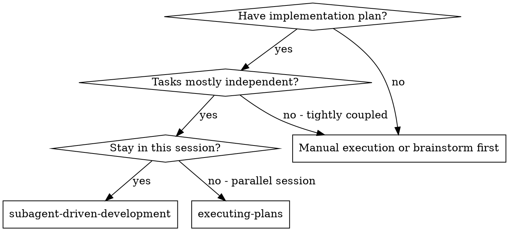
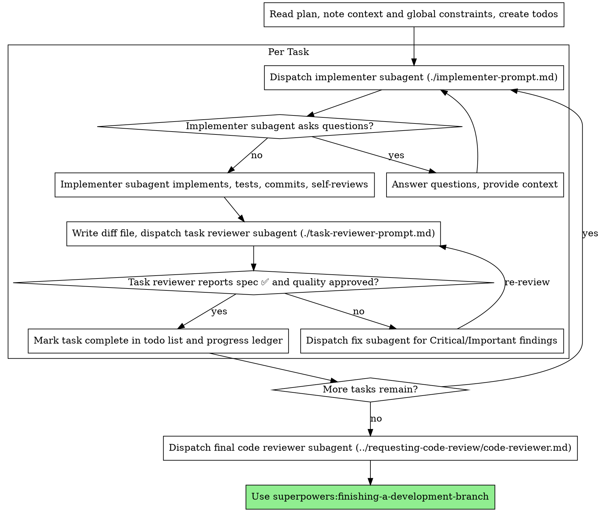

# Session transcript

## User

start I9 by reading CAMPAIGN.md + LEDGER.md first

## Assistant

Starting the I9 increment session — reading the campaign's governing documents in full first, as the campaign requires.

### ⚙ Tool call: `Bash`

```json
{
  "command": "ls /workspace/development/2026-07-17-modularization-campaign/ && wc -l /workspace/development/2026-07-17-modularization-campaign/*.md",
  "description": "List campaign directory and file sizes"
}
```

### ↳ Tool result

```
BLOCKMAP.md
CAMPAIGN.md
LEDGER.md
PROMPT.md
analytics.md
statistics.md
transcript.md
transcript.raw.md
usage.raw.txt
   136 /workspace/development/2026-07-17-modularization-campaign/BLOCKMAP.md
   462 /workspace/development/2026-07-17-modularization-campaign/CAMPAIGN.md
   914 /workspace/development/2026-07-17-modularization-campaign/LEDGER.md
    59 /workspace/development/2026-07-17-modularization-campaign/PROMPT.md
     5 /workspace/development/2026-07-17-modularization-campaign/analytics.md
   100 /workspace/development/2026-07-17-modularization-campaign/statistics.md
  6043 /workspace/development/2026-07-17-modularization-campaign/transcript.md
  6043 /workspace/development/2026-07-17-modularization-campaign/transcript.raw.md
 13762 total
```

### ⚙ Tool call: `Read`

```json
{
  "file_path": "/workspace/development/2026-07-17-modularization-campaign/CAMPAIGN.md"
}
```

### ↳ Tool result

```
1	# CAMPAIGN.md — Modularization Campaign (frozen architecture)
2	
3	**Status:** approved design, 2026-07-17. Brainstormed and approved section-by-section in
4	the campaign planning session (see `transcript.md` once archived); prompt in `PROMPT.md`.
5	
6	This is the **one** copy of the campaign's architecture, decisions, invariants, and
7	increment plan. Increment specs **cite this document and re-derive nothing** — the
8	campaign-level brainstorm and adversarial review run once, here; increments inherit that
9	scrutiny and do not repeat it. Any change to this document is an **amendment**: edit the
10	document *and* append a ledger entry (`LEDGER.md`) saying what changed and why. An
11	increment spec that contradicts this document without a ledger amendment is wrong by
12	definition.
13	
14	Related documents (all in this directory unless pathed): `PROMPT.md` (the campaign
15	request), `BLOCKMAP.md` (the B1–B60 functional map of `main()` all scope assignments
16	reference), `LEDGER.md` (append-only cross-increment record), `/workspace/CONTEXT.md`
17	(domain glossary — created by this campaign), `/workspace/prompts/directives.md` (the
18	Spine; PD#n citations below refer to it).
19	
20	## Glossary (campaign terms — domain terms live in `CONTEXT.md`)
21	
22	- **Campaign** — this whole program of work: one architecture, N increments.
23	- **Increment** — one unit of work with its own session, spec, implementation, review,
24	  commit, and archive. Numbered I0–I14.
25	- **Wave** — an ordered group of increments (0–4); increments within a wave may be
26	  reordered if the ledger records why, waves may not.
27	- **Block** — a `Bnn` region of `main()` per `BLOCKMAP.md`; the stable unit of scope
28	  assignment.
29	- **Core package** — the new importable `psh/` package holding infrastructure (Tier 1).
30	- **Gateway** — `psh/gateway.py`, the single module through which every Terminus/WP-CLI/
31	  Drush subprocess flows; the future Pantheon-API replacement seam.
32	- **Façade** — `script_context.py` (`sc`), the stable API surface that checks and plugins
33	  import; implementations move, the façade's names do not break.
34	- **Contract** — the per-phase guaranteed `site_context` keys (CLAUDE.md table), which
35	  this campaign turns into a machine-readable **contract registry**.
36	- **Hook DAG** — the per-phase topological ordering of hooks derived from declared
37	  `consumes`/`produces` keys, validated fatally at startup.
38	- **Ratchet** — the lint/type regime: broad ruff+pyright rules applied as a hard gate to
39	  moved/new modules immediately, the remnant grandfathered until I14.
40	- **Remnant** — whatever remains of the original script at any point mid-campaign.
41	- **Shim** — the thin committed `./pantheon-sitehealth-emails` entry script that calls
42	  `psh.cli.main()` after I0.
43	- **Ledger** — `LEDGER.md`; how increment N learns what N−1 actually did.
44	- **Behavior bar** — the tiered definition of which observable behavior may change (§8).
45	- **Invariant** — a named property no increment may alter (§9).
46	
47	**MUST** = required, violation fails review. **NEVER** = prohibited, violation fails
48	review. **SHOULD** = required unless the increment spec states why not. **MAY** =
49	allowed, at the implementer's judgment.
50	
51	## 1. Goal and non-goals
52	
53	**Goal.** Modularize the 4,752-line main script into (a) a `psh/` core package of
54	infrastructure modules, (b) self-registering `check/` packages for every notice/section
55	emitter, and (c) the existing `plugin/` integrations — taking full advantage of the hook
56	system — while the four e2e goldens stay byte-identical, the per-phase contract is
57	honored, and the non-U-M path keeps working. End state: `main()` is a ~250–400-line
58	orchestrator; every U-M-specific behavior lives in `umich` packages; the whole tree
59	passes the broadened ruff+pyright configuration.
60	
61	**Non-goals** (exhaustive; each is either declined or deferred with reasoning in §15):
62	replacing terminus with the Pantheon API; implementing parallel site processing; any new
63	report content (CSV attachment, cached-% column, env-lock section); SendGrid; refreshing
64	goldens or recorded fixtures; changing what any check reports (except the named bug
65	fixes in I1).
66	
67	## 2. Decision record (exhaustive — from the approved brainstorm)
68	
69	| # | Decision | Choice | Why |
70	|---|---|---|---|
71	| D1 | Pantheon API | **Seam only**: gateway module now, transport swap post-campaign | Swapping transports mid-campaign invalidates terminus fixtures + goldens in every touched increment |
72	| D2 | Lint/type broadening | **Ratchet in-campaign** (§13) | Code is cleaned exactly once, as it moves; bar fixed in I0 so it never shifts |
73	| D3 | Behavior bar | **Tiered, config renames allowed** (§8) | Cleanest final schema; production config edited once, at I14, with a migration table |
74	| D4 | Increment granularity | **Fine: 15 increments** | Safest for session/context limits; split-never-compress backstop (§12) |
75	| D5 | Target architecture | **Three-tier split** (§3) | Infrastructure ≠ report content ≠ data source; fulfills "full advantage of the frameworks" |
76	| D6 | Hook flexibility | **Phases stay; hooks declare consumes/produces; per-phase DAG validated at startup** (§4) | Keeps every existing hook/test valid; a phase-less key scheduler rewrites everything for no added power |
77	| D7 | `--only-warn` plan rec | **In campaign** (I7) | Small, no golden impact, existing TODO |
78	| D8 | Parallel-ready | **Design constraint only** (§3.4) | Near-free now; actual parallelism stays a README TODO |
79	| D9 | CSV attachment / cached-% / env-lock | **README TODO** | Each changes rendered email → golden churn mid-campaign |
80	| D10 | Packaging | **Real package + thin shim** (I0; console-script dropped — see LEDGER I0 amendment 1) | Dissolves the extension-less-script problem; normal imports for tests/pyright/ruff |
81	
82	## 3. Target architecture
83	
84	```
85	                 ./pantheon-sitehealth-emails  (thin shim)
86	                                │
87	                        psh.cli.main()  ── orchestrator: bootstrap, site loop,
88	                                │           phase firing, lifecycle dispatch
89	        ┌───────────────────────┼──────────────────────────┐
90	        ▼ Tier 1: psh/ core     ▼ seams (sc façade)        ▼
91	  configuration  modules   ┌─────────────────────┐   Tier 3: plugin/
92	  gateway        db        │  hook phases + DAG  │   aws  cloudflare
93	  traffic        plans     │  contract registry  │   env  umich
94	  gather         charts    └─────────┬───────────┘   (unchanged roles)
95	  render         mail                ▼
96	  lifecycle                Tier 2: check/  (all notice/section emitters)
97	                           pantheon  wordpress  drupal  addon_updates
98	                           dns  cloudflare  pantheon_cdn_change  umich
99	```
100	
101	### 3.1 Tier 1 — `psh/` core package (exhaustive module map)
102	
103	| Module | Receives (functions / blocks) |
104	|---|---|
105	| `psh/cli.py` | `build_arg_parser`, `parse_args`, arg validation (B5), `main()` orchestrator |
106	| `psh/configuration.py` | `process_config`, `config_substitution`, `gate_disabled_sections`, DEFER machinery, `load_news_items`, `umich_enabled`, `cloudflare_enabled` |
107	| `psh/modules.py` | `find_modules`, module loading (B2/B4), hook engine (`add_hook`/`invoke_hooks`/`PHASES`), DAG build/validation, contract registry |
108	| `psh/gateway.py` | `run_terminus`, `terminus`, `terminus_data`, `wp`, `wp_eval`, `drush`, `drush_php_script`, `fix_drush_output`, `wp_error`, `drush_error`, `TerminusError` |
109	| `psh/notice.py` | `Notice`, `Severity`, `NoticeRegistry`, `DuplicateNoticeCodeError`, `registry` (added I3; §6 Notice type + code registry) |
110	| `psh/db.py` | ORM models, `TrafficRow`/`OverageProtectionRow`, `db_engine_args`, `db_retry`/`db_retryable`/`record_db_reconnect`, `update_traffic_rows`, `insert_traffic_rows`, `load_traffic_rows`, `load_overage_protection_window`, `DatabaseUnavailableError` |
111	| `psh/traffic.py` | `get_old_metrics`, `estimate_month_visits`, `build_traffic_table_rows`, the `traffic_table_columns` global, metrics gather + DB update/load flow (B22–B26), visits-by-month aggregation (B43) |
112	| `psh/plans.py` | plan_info normalization (B12 part), SKU resolution (B17), `overage_blocks`, `contract_year_end`, `plan_costs`, `build_plan_over_time`, the `cost_table_columns` global, recommendation flow (B47) |
113	| `psh/gather.py` | Slimmed framework gathers feeding the `site_post_gather` contract (from B32–B35), `check_wordpress_plugin`/`check_drupal_module` helpers |
114	| `psh/charts.py` | Cap geometry (B13 part), chart data prep + matplotlib build (B44–B45) — returns PNG bytes |
115	| `psh/render.py` | Jinja render (B53), PHP inline + `!important` pass (B54), `escape_url` |
116	| `psh/mail.py` | Recipient resolution (B49), MIME assembly (B55), `smtp_login`, send (B57) |
117	| `psh/lifecycle.py` | `RunState`, `finish_run`, `abort_run`, `abort_reason`, `resume_point`, `resume_command`, `rerun_command`, `option_strings_taking_a_value`, `sites_from_resume_point`, `merge_prior_results`, `ResumeSiteNotFoundError` |
118	
119	`dns_classify.py` stays a top-level module (already extracted; moving it into `psh/` is
120	MAY-scope for I14, decided by ledger state then).
121	
122	**Whole-file coverage.** The campaign modularizes the entire script, not just `main()`:
123	every top-level def and module-level global in `pantheon-sitehealth-emails` (lines
124	1–2107 included) is assigned to a `psh/` module in this table and appears in exactly one
125	increment's scope (§11). End state: the original file is the thin shim and nothing else
126	— a top-level def still there at I14 is a defect the closing audit (§17) catches. Moved
127	helpers get the full §7 treatment (types, ratchet, verified docs, tests); they do NOT
128	get algorithmic redesign — moves are behavior-preserving except where §8 says otherwise
129	(I1, I7's D7, I12's B51).
130	
131	### 3.2 Tier 2 — new/changed `check/` packages (exhaustive)
132	
133	| Package | Contents (blocks) | Phase(s) |
134	|---|---|---|
135	| `check/pantheon/` (new) | frozen site (B19), no-live-env (B21), upstream updates (B38), PHP EOL (B41) | `site_pre` (frozen, no-live-env), `site_post_gather` (updates, PHP EOL) |
136	| `check/wordpress/` (new) | PAPC + native-sessions checks, OCP config probe, favicon (from B34) | `site_post_gather` |
137	| `check/drupal/` (new) | PAPC module check, D7 EOL + tag1_d7es, multisite probe (from B30/B35) | `site_post_dns` (multisite), `site_post_gather` |
138	| `check/addon_updates/` (new) | add-on updates table notice (B39), smell notices (B48) | `site_post_gather` |
139	| `check/umich/` (existing, grows) | umich-oidc-login, Hummingbird fork (B34), Drupal UA check (B35), annual-billing notices (B50/B51), portal-URL text for the recommendation notice (B47's U-M half) | `site_post_gather`, `site_pre_render` (billing) |
140	
141	`check/dns/`, `check/cloudflare/`, `check/pantheon_cdn_change/` are untouched tenants.
142	A check MAY fetch its own data through `sc` gateway wrappers when the data is
143	check-specific (e.g. `upstream:updates:list`); data used by core *and* checks is
144	published through the contract instead (e.g. `envs`).
145	
146	### 3.3 What stays in `main()` (exhaustive, with why)
147	
148	Config/arg bootstrap ordering (B1–B8 — the two-pass substitution *order* is the
149	program); overage constants + date window (B9, B13 part); the site-loop skeleton (skips,
150	banner, sorted order, resume filter — B14–B18, B20, B25, B42); phase firing and contract
151	stuffing (B27, B28, B31, B37, B52); notice sort + subject (B50 minus billing); the
152	`try`/`except BaseException` lifecycle dispatch (B59–B60 call sites). Everything else
153	leaves. Target: 250–400 lines.
154	
155	### 3.4 Parallel-ready constraint (D8)
156	
157	Per-site work MUST be a function of `(site, config, db_session, site_context)`: no new
158	module-level mutable state; run-scoped accumulators live only in `RunState`. This is a
159	review criterion from I2 onward, not a parallelism implementation.
160	
161	### 3.5 The `sc` façade
162	
163	Checks and plugins import **only** `sc` (and their own package). `sc` keeps every name
164	listed in CLAUDE.md's runtime-exposed block, re-exporting from `psh/` modules as they
165	move. NEVER remove or rename an `sc` attribute mid-campaign; additions are fine. The
166	house-rules test suite gains an assertion that every documented `sc` name exists (I2).
167	
168	## 4. Phases, hooks, and the DAG
169	
170	Phases stay the coarse spine: `setup`, `site_pre`, `site_post_traffic`, `site_post_dns`,
171	`site_post_gather`, `site_pre_render`, plus **new** `run_finish` (fired inside
172	`finish_run` before artifacts are written, receiving the `RunState`; for future run-level
173	artifact hooks — no consumer at introduction, like `site_pre_render` was). Dotted
174	plugin-defined events are unchanged.
175	
176	From I4, `add_hook` requires two new entries per hook: `consumes` and `produces` — each
177	a (possibly empty) list of contract-key names. Validation at module-load completion
178	(exhaustive fatal conditions):
179	
180	1. A consumed key that nothing produces (neither core's registry for that phase or an
181	   earlier phase, nor another hook) → fatal.
182	2. Two producers of the same key → fatal (one owner per key; PD#1 — a silent overwrite
183	   is a silent failure).
184	3. A cycle among same-phase hooks → fatal.
185	4. A hook consuming a key first produced in a *later* phase → fatal.
186	5. A missing `consumes`/`produces` entry on any hook → fatal (no legacy mode; I4
187	   retrofits all in-repo hooks in the same change).
188	
189	`invoke_hooks` orders same-phase hooks topologically (producers before consumers;
190	registration order breaks ties, so existing behavior is preserved where no edges exist).
191	The permanent test `tests/integration/test_hook_dag.py` loads **all** real check/plugin
192	packages and asserts the DAG builds — the "future changes can never make the DAG
193	impossible" guarantee — and a unit suite proves each fatal condition actually fires
194	(PD#14: the validator must be shown able to go red).
195	
196	```
197	 module load ──► collect hooks ──► per phase: build edges (produces→consumes)
198	                                        │
199	                              cycle? unknown key? dup producer? ──► fatal exit (named error)
200	                                        │ ok
201	                                topo order stored ──► invoke_hooks uses it
202	```
203	
204	**Contract registry.** `psh/modules.py` holds the machine-readable registry: phase →
205	keys core stuffs (today's CLAUDE.md table, verbatim). Core's stuffing code is checked
206	against it in tests; CLAUDE.md's table gains a line saying the registry is authoritative.
207	New contract keys added by increments (exhaustive for this campaign): `envs` (I8, at
208	`site_pre`), `add_on_updates` + `wp_smell`/`drush_smell`/`composer_smell` (I9/I10, at
209	`site_post_gather`), plan/cost keys `current_plan`, `recommended_plan`, `plan_costs`,
210	`savings` (I7, at `site_pre_render`). Each addition updates registry + CLAUDE.md table +
211	ledger in the same increment.
212	
213	## 5. Configuration
214	
215	Principles: one section per feature, named for the operator's mental model; every
216	relocated check gets an `enabled` flag under `[Check.<name>]`, **default true** —
217	relocating code MUST NOT silently disable a check that runs unconditionally today.
218	U-M-only checks additionally require `[UMich].enabled` (existing `umich_enabled()`
219	rule). `gate_disabled_sections()` semantics (nested `enabled`, children dropped) apply to
220	`[Check.*]` unchanged.
221	
222	Example (actual TOML, the shape I8 introduces — illustrative of the family, exhaustive
223	for `check/pantheon/`):
224	
225	```toml
226	[Check.pantheon]
227	enabled = true          # frozen-site, live-env, upstream-updates, PHP-EOL checks
228	```
229	
230	New keys land in final shape as introduced (I3 onward). Renames/moves of *existing* keys
231	happen once, in I14, which MUST deliver: the old→new migration table in
232	`docs/config-migration.md`, a rewritten `sample-pantheon-sitehealth-emails.toml`, and
233	exact edit instructions for the production config repo. Until I14, every existing
234	production key keeps working unchanged.
235	
236	## 6. Types
237	
238	Reused as-is: `TrafficRow`, `OverageProtectionRow`, `DnsFacts`, `FetchResult`,
239	`SiteContext`. Introduced (exhaustive):
240	
241	| Type | Increment | Shape |
242	|---|---|---|
243	| `GatewayResult` | I2 | NamedTuple `(result, errors, fatal)` replacing the anonymous 3-tuples |
244	| `Notice` | I3 (class) → adopted per increment | frozen dataclass: `severity` (StrEnum alert/warning/info), `code` (unique — registry test), `html`, `text`, `short`, `icon`, `order`; `SiteContext.add_notice` accepts `Notice` or legacy dict; dict form retired in I14 |
245	| `PlanInfo` / `PlanCatalog` | I7 | typed view over `[Pantheon.plan_info]` |
246	| `RunState` | I13 | dataclass holding `all_warnings`, `site_results`, `site_savings`, `emails_sent`, reconnect counters |
247	
248	House-style tuple annotations (`-> (str, str, bool)`) are replaced with real annotations
249	in every module as it moves — never fixed in place in the remnant (one pass per line,
250	D2). CLAUDE.md's house-style note is updated in I14 when the last one dies.
251	
252	## 7. Per-increment obligations
253	
254	Every increment MUST (this list is exhaustive and lives only here; increment specs cite
255	it): (1) start by reading `CAMPAIGN.md`, `LEDGER.md`, `CLAUDE.md`, `BLOCKMAP.md` rows in
256	scope; (2) follow `prompts/implementation-standards.md` (subagent-driven, test-first,
257	`psh-implementer`/`psh-reviewer`); (3) replace house styles in moved code (§6);
258	(4) verify — not assume — every claim in comments/docs it moves or writes;
259	(5) update tests in the same change; (6) update README/docs/CLAUDE.md for what moved;
260	(7) update auto-memory where a durable fact changed; (8) append its ledger entry
261	(§12); (9) preserve every invariant (§9); (10) end with `/code-review`, a full
262	`./run-tests`, and one checkpoint commit including its `development/` folder.
263	
264	## 8. Behavior bar (canonical gate table)
265	
266	| Surface | Rule | Until |
267	|---|---|---|
268	| Rendered emails (4 goldens) | NEVER change (byte-identical) | end of campaign |
269	| `-results.json` / `-notices.csv` / `-run.json` structure (keys, row shape) | NEVER change | end of campaign |
270	| Notice csv *values* | MAY change only in I1 (named bug fixes), I12 (scheduled B51 deletion), and I7 (`its-recommends-plan` savings-field format, D-i7-5 — amendment) | — |
271	| stdout / console / error messages | MAY improve freely | — |
272	| Config: existing keys | NEVER break | I14 (renames with migration table) |
273	| Config: new keys | MUST land in final schema shape | — |
274	| Exit codes, resume semantics, artifact write gates | NEVER change | end of campaign |
275	
276	## 9. Named invariants (exhaustive; NEVER violated by any increment)
277	
278	1. Four e2e goldens byte-identical (`./run-tests` proves it; refresh is forbidden — an
279	   existing golden going red is a defect in the increment, PD#14).
280	2. Per-phase data contract: existing keys never removed/renamed/retyped; additions only.
281	3. Non-U-M path works: non-U-M golden green; no new un-gated U-M content (I1 *removes*
282	   the one known leak).
283	4. Run lifecycle: single `except BaseException` flush path; `abort_reason`'s three
284	   outcomes; artifacts dropped-site rule; notices appended before send; resume-point
285	   next-site-after-email rule; soft-wrapped copy-pasteable commands.
286	5. DB: `db_retry` retries whole idempotent units only; `db_retryable` predicate
287	   unchanged; the read-release commit in the loaders stays (guarded by
288	   `test_load_traffic_rows_releases_the_connection`).
289	6. Rich console rules: escape untrusted text; production width reproduced in tests.
290	7. Test safety interlock (`run_program` forbidden flags) never bypassed or weakened.
291	8. Column-0 `f"""` notice literals move **verbatim** — never re-indented; `git diff -w`
292	   is not acceptable evidence for any change touching them.
293	9. Checks/plugins import only `sc`; `sc` names never removed mid-campaign (§3.5).
294	10. Recorded fixtures are not regenerated (`terminus-cdnchange/` is hand-maintained and
295	    `--record` must not run).
296	11. `--create-tables`/`--update`/`--import-older-metrics` phase-gating rules (CLAUDE.md
297	    table) unchanged.
298	
299	## 10. Known-bug inventory → I1
300	
301	The five bugs and the dead code listed in `BLOCKMAP.md` §Bugs (composer-smell
302	nesting+variable; shared `php-eol` code; `site_results` omission; un-gated U-M portal
303	URLs; duplicate `annual-bill` code — B51 handled as: distinct code now, scheduled
304	deletion when its Aug-2026 date passes, ledgered to I12; dead code deleted). Each fix is
305	test-first with the test shown red on the old behavior. **Verified 2026-07-17**: the
306	goldens contain zero `php-eol`/`wp-smell`/`drush-smell`/`composer-smell`/`annual-bill`
307	occurrences and the golden fixtures report PHP 8.2, so none of these fixes can touch a
308	golden:
309	
310	```
311	$ grep -c 'php-eol\|composer-smell\|wp-smell\|drush-smell\|annual-bill' tests/e2e/__snapshots__/*.ambr
312	tests/e2e/__snapshots__/test_golden.ambr:0
313	tests/e2e/__snapshots__/test_golden_cdn_change.ambr:0
314	tests/e2e/__snapshots__/test_golden_drupal.ambr:0
315	tests/e2e/__snapshots__/test_golden_nonumich.ambr:0
316	```
317	
318	## 11. The increments
319	
320	Wave dependency structure (increments within a wave are ordered but MAY be resequenced
321	with a ledger entry; waves MUST NOT be reordered):
322	
323	```
324	Wave 0: I0 bootstrap ──► I1 bug fixes
325	Wave 1: I2 gateway ──► I3 config ──► I4 hooks+DAG ──► I5 DB
326	Wave 2: I6 traffic ──► I7 plans ──► I8 check/pantheon ──► I9 wordpress ──► I10 drupal
327	Wave 3: I11 charts ──► I12 render+mail ──► I13 lifecycle
328	Wave 4: I14 closing sweep
329	```
330	
331	| Inc | Scope (blocks / functions) | Delivers |
332	|---|---|---|
333	| **I0** | — (no logic moves) | `psh/` skeleton + thin shim (console-script dropped — see LEDGER I0 amendment); conftest `import psh` rework (same collected-test count gate); ratchet config (§13) with rule sets pinned; pyright baseline measured; `LEDGER.md` started; README TODO edits (§15 dispositions); CLAUDE.md pointer to campaign |
334	| **I1** | B36, B40, B41, B47 (URLs), B48, B50/B51 (codes), dead code | §10 fixes, each test-first |
335	| **I2** | 302–597 wrappers | `psh/gateway.py`, `GatewayResult`, sc re-exports + façade test; no-subprocess-outside-gateway house rule |
336	| **I3** | 792–934, 1209–1253, 1608–1648 (`umich_enabled`/`cloudflare_enabled`) | `psh/configuration.py`; `Notice` class + code-uniqueness registry test |
337	| **I4** | 935–950, hook engine from `script_context.py` | `psh/modules.py`; consumes/produces on all in-repo hooks; DAG validation + fatal-condition tests; `run_finish` phase; contract registry |
338	| **I5** | 95–178; DB defs within 1285–1575 (`DatabaseUnavailableError` through `db_engine_args`; the resume helpers `ResumeSiteNotFoundError`, `sites_from_resume_point`, `merge_prior_results` stay for I13) | `psh/db.py`; DB test suites relocated intact |
339	| **I6** | B22–B26, B43; 598–671, 977–1127 | `psh/traffic.py` |
340	| **I7** | B9, B12 (plans), B17, B47; 967–976, 1128–1208, 1254–1280 | `psh/plans.py`; `PlanInfo`; D7 (`--only-warn` runs recommendation); plan/cost contract keys |
341	| **I8** | B19, B21, B38, B41 | `check/pantheon/` + `[Check.pantheon]`; `envs` contract key |
342	| **I9** | B32–B34; 672–739 | `psh/gather.py` (WP half); `check/wordpress/`; U-M WP checks → `check/umich/`; `add_on_updates` + smell contract keys |
343	| **I10** | B30, B35, B39, B48; 740–791 | gather (Drupal half); `check/drupal/`; `check/addon_updates/`; UA check → `check/umich/` |
344	| **I11** | B13 (caps), B44–B45 | `psh/charts.py` |
345	| **I12** | B49–B57 minus sort/subject core | `psh/render.py`, `psh/mail.py`; annual billing → `check/umich/` at `site_pre_render`; B51 deletion if past its date |
346	| **I13** | B14 (accumulators), B56, B59–B60; 1649–2107 plus the resume helpers I5 left behind (1281–1284, 1528–1542, 1576–1607) | `psh/lifecycle.py`; `RunState`; `main()` reaches final form |
347	| **I14** | — | Config renames + migration doc + sample rewrite + production-config instructions; global ratchet flip + remnant cleanup; docs/README/CLAUDE.md full refresh; `Notice` dict form retired; ledger fully resolved; retrospective + closing audit (§17) |
348	
349	Sizing note: the largest moves are I9 (~330 main-loop lines + helpers) and I10 (~320 +
350	helpers). If any increment proves oversized mid-session: **split, never compress** —
351	commit nothing partial, ledger the split, the second half becomes its own increment.
352	
353	## 12. Coordination protocol
354	
355	**Ledger entry template** (append per increment, and for any amendment):
356	
357	```markdown
358	## I<N> — <slug> (<date>, commit <sha>)
359	- Moved: <blocks/functions actually moved>
360	- Deviations from CAMPAIGN.md: <none | what + why>
361	- Contract/config/sc additions: <keys/names>
362	- Discovered tasks: <each with disposition: fixed here | I<M> | README TODO>
363	- Open questions for next increment: <…>
364	```
365	
366	**Discovered-task disposition rules** (canonical): fits current increment's scope and
367	<~30 min → fix now, note in ledger; belongs to a later increment → ledger it against
368	that increment (the increment's spec author MUST read these); major/risky/scope-widening
369	→ README TODO with a sentence of context. Nothing is carried in memory or chat — if it
370	is not in the ledger or README, it does not exist (PD#9).
371	
372	**Session flow per increment:** read the §7 documents → write the increment SPEC.md in
373	`development/<date>-mod-I<N>-<slug>/` citing CAMPAIGN.md sections by number →
374	`superpowers:writing-plans` → subagent-driven implementation → `/code-review` → full
375	`./run-tests` → per-task commits, each green; the increment's final commit includes the dev
376	folder → `/archive-session` → ledger entry.
377	
378	## 13. Lint/type ratchet
379	
380	Mechanism (as shipped by I0; see LEDGER I0 amendment 2): TWO ruff configs —
381	`pyproject.toml` `[tool.ruff.lint]` keeps the narrow PD-rule set running everywhere
382	including the remnant, and `ruff-broad.toml` carries `select = ["ALL"]` minus a
383	justified ignore list, with `extend-exclude` grandfathering exactly the remnant
384	(`psh/_legacy.py`) and not-yet-moved files; each increment deletes its
385	files from the grandfather list, and the two configs merge at I14. pyright runs in
386	`./run-tests` from I0 via `[tool.pyright]` (standard mode, `psh/` minus `_legacy.py`),
387	ratcheting toward strict as typed code moves in. The four existing narrow rules (`E722`, `BLE001`, `S105`, `S106`) remain global
388	throughout — they mechanize PD#2/PD#6 and are never grandfathered. No
389	`target-version` pin (CLAUDE.md: it masks the 3.12-only syntax detection).
390	
391	Baselines measured 2026-07-17 (I0 re-measures and pins both in its spec):
392	
393	```
394	$ ./run-tests --fast --llm   (tail)
395	LLM_SUMMARY passed=727 failed=0 error=0 skipped=1 xfailed=0 xpassed=0
396	25 snapshots passed.
397	
398	$ uvx ruff check --isolated --statistics .
399	26  F541  f-string-missing-placeholders
400	 8  E741  ambiguous-variable-name
401	 4  E713  not-in-test
402	 3  F841  unused-variable
403	 2  F401  unused-import
404	 1  E402  module-import-not-at-top-of-file
405	 1  E712  true-false-comparison
406	Found 45 errors.
407	```
408	
409	(README's "~55" ruff and "39" pyright figures are stale/unverified claims; I0 replaces
410	them with measured numbers. pyright was not measured in planning — no pyright binary in
411	the dev container yet; installing it is I0 scope.)
412	
413	## 14. Risk / control table
414	
415	| Risk | Control |
416	|---|---|
417	| Re-indented column-0 notice literals silently change emails | Invariant 8; goldens as tripwire; AST/token comparison, never `git diff -w` |
418	| conftest rework silently drops tests | I0 gate: identical collected-test count (727 passed / 1 skipped / 2 deselected baseline) before and after |
419	| Long-range `main()` local coupling breaks a move | BLOCKMAP produces/consumes; each increment spec lists exactly which locals cross its boundary |
420	| Session/context overrun mid-increment | Fine granularity (D4); split-never-compress; commits only at increment completion |
421	| Architecture drift across 15 sessions | This document frozen; amendments only via ledger; specs cite section numbers |
422	| Hidden hook-order dependencies surface in I4 | I4 audits every hook; real dependencies become explicit DAG edges |
423	| Ratchet churn on moved code | Rules fixed at I0; cleaning is part of each move |
424	| Goldens blind to stdout/artifacts | Invariants 4–5 name the artifact/abort test suites as the cover; artifact structure frozen until campaign end |
425	| Implementer sessions lack context | `psh-implementer`/`psh-reviewer` carry the read list; specs name seams (Spine spec bar); §7 reading list |
426	| Two annual-bill notices / removal date passes mid-campaign | Explicitly scheduled: codes split in I1, deletion decision in I12, ledger tracks |
427	
428	## 15. NOT in scope (reasoning preserved so it is never re-litigated)
429	
430	- **Terminus → Pantheon API swap** — D1; post-campaign project against `psh/gateway.py`.
431	- **Parallel site processing** — D8; constraint only; README TODO remains.
432	- **CSV data attachment, cached-% column, env-lock section** — D9; each becomes a small
433	  post-campaign change (env-lock: a ~50-line `check/` package) once goldens may move.
434	- **SendGrid, secrets-handling completion, portal traffic capture, daily alerts,
435	  accessibility/security/Cloudflare scores, AI recommendations, dependency updates,
436	  terraform-infra** — pre-existing README TODOs, untouched by this campaign.
437	- **Approach B (library-only) and C (everything-is-a-hook)** — rejected in brainstorm:
438	  B fails the "full advantage of the frameworks" goal; C forces infrastructure into
439	  optional-content clothing.
440	- **Golden/fixture refreshes** — forbidden (Invariants 1, 10).
441	
442	## 16. Acceptance baseline
443	
444	§13 outputs are the campaign-start baseline (run and pasted 2026-07-17). Every
445	increment's definition of done re-runs `./run-tests` at increment end — the full suite
446	when the live tier's credentials are available in the session, otherwise `--fast` with a
447	ledger note saying the live tier was skipped — and MUST reproduce goldens
448	byte-identically. I0 additionally records the collected-test count gate.
449	
450	## 17. Closing audit (queued for I14; exhaustive)
451	
452	1. Is `main()` within 250–400 lines, and does everything left match §3.3?
453	2. Has every DAG fatal condition been demonstrated red at least once?
454	3. Do the contract registry and CLAUDE.md table agree (test-enforced)?
455	4. Is any `sc` re-export now consumed by nobody (dead façade surface)?
456	5. Is the `.py` symlink still needed for anything beyond the shim? If not, note in
457	   CLAUDE.md; if yes, say for what.
458	6. Are all ledger items resolved (done, scheduled, or README TODO)?
459	7. Has the production config repo received and applied the migration instructions?
460	8. Do README, CLAUDE.md, docs/, and memory reflect the final architecture (no stale
461	   line-number or module references)?
462	9. Were any invariants amended mid-campaign, and is each amendment ledgered?
463
```

### ⚙ Tool call: `Read`

```json
{
  "file_path": "/workspace/development/2026-07-17-modularization-campaign/LEDGER.md"
}
```

### ↳ Tool result

```
1	# LEDGER — Modularization Campaign
2	
3	Append-only. One entry per completed increment, plus one per CAMPAIGN.md amendment.
4	This file is how increment N learns what N−1 actually did; if a deviation, discovered
5	task, or decision is not recorded here (or in the README TODO list), it does not exist.
6	Entry template: CAMPAIGN.md §12.
7	
8	## Campaign planning (2026-07-17)
9	
10	- Produced: `CAMPAIGN.md` (frozen architecture), `BLOCKMAP.md` (B1–B60 map),
11	  `/workspace/CONTEXT.md` (domain glossary, new), this ledger.
12	- Baselines: fast tier 727 passed / 1 skipped / 2 deselected; ruff `--isolated` 45
13	  findings; pyright unmeasured (no binary in container — I0 scope).
14	- Discovered during planning, dispositioned:
15	  - Five bugs + dead code → I1 (CAMPAIGN.md §10, BLOCKMAP §Bugs).
16	  - README's "~55 ruff / 39 pyright" figures stale/unverified → I0 re-measures.
17	  - B51 second annual-bill notice: marked "remove Aug 2026" — code split in I1,
18	    deletion decision in I12.
19	  - WordPress/Drupal duplication + update-table HTML duplication (BLOCKMAP §Bugs 7–8)
20	    → addressed structurally by I9/I10 (shared gather + `check/addon_updates/`).
21	- Open questions for I0: exact ruff rule list; pyright strictness per environment;
22	  whether `dns_classify.py` moves under `psh/` (deferred to I14, MAY).
23	- Amendment (2026-07-17, user spec review): added the "Whole-file coverage" paragraph to
24	  CAMPAIGN.md §3.1 — clarification only, no scope change; the module map already
25	  assigned every top-level def.
26	
27	## I0 — bootstrap (2026-07-17, closing commit `docs(campaign-I0): close the bootstrap increment`)
28	
29	Commits (per-task, each green): `b1ccc72` (package move + shim + conftest + coverage),
30	`d0e3027` (lint/type ratchet), `5b536fa` + `239955d` (README/CLAUDE.md docs), plus this
31	closing docs commit (ledger + CAMPAIGN amendments + SPEC acceptance + README pyright number).
32	
33	- **Moved:** the whole 4,752-line program → `psh/_legacy.py` (`git mv`, **zero logic
34	  changes**; the `__main__` tail is inert in a module, left for I13). New: `psh/__init__.py`
35	  (docstring), `psh/cli.py` (`from psh._legacy import main, parse_args` re-export), and a new
36	  7-line thin shim at `./pantheon-sitehealth-emails` calling `psh.cli.main()`. No blocks
37	  (B-map) moved — I0 moves the file, not logic (§11 row I0).
38	
39	- **Deviations from CAMPAIGN.md (three amendments, all applied to the document this commit):**
40	  1. **No console-script entry point** (amends §11 row I0 / D10). The program is repo-rooted
41	     by design (`find_modules`, templates, `inline-styles.php`, `vendor/`, config symlink are
42	     all CWD-relative); a pip entry point would need a data-file overhaul serving no campaign
43	     goal. D10's real benefits (normal imports; native ruff/pyright/CodeGraph coverage; no
44	     `SourceFileLoader`) all arrive via the package + shim without installation. `pyproject.toml`
45	     stays deps-only (`py-modules = []`, `packages = []` to stop setuptools auto-discovery
46	     installing a stale shadow copy — PD#1). §11 row I0 now reads "thin shim (console-script
47	     dropped — see LEDGER I0 amendment)".
48	  2. **Grandfather is `psh/_legacy.py` via `ruff-broad.toml` `extend-exclude`** (amends §13,
49	     which named `pantheon-sitehealth-emails.py` and "per-file-ignores" — both written before
50	     the legacy-module + two-config mechanics were settled). The shipped mechanism is TWO ruff
51	     configs, not per-file-ignores: `pyproject.toml` `[tool.ruff.lint]` carries the narrow
52	     PD-rule set (`E722`/`BLE001`/`S105`/`S106`) that runs EVERYWHERE including `_legacy.py`;
53	     `ruff-broad.toml` carries `select = ["ALL"]` minus the ignore list and grandfathers the
54	     remnant via `extend-exclude`. `./run-tests` and `.claude/hooks/ruff-check.sh` run BOTH
55	     passes; the two files merge into `pyproject.toml` at I14. §13 now names `psh/_legacy.py`
56	     and "ruff-broad.toml exclude".
57	  3. **Per-task commits, each green** (amends §12's "one commit (code + dev folder)"). Each I0
58	     task committed independently once its gates were green; this increment's final (closing)
59	     commit includes the `development/` folder. Rationale: finer checkpoints serve the campaign
60	     prompt's revert/inspect intent, and SDD review packages diffs as commit ranges. §12 now
61	     reads "per-task commits, each green; the increment's final commit includes the dev folder".
62	
63	- **Ratchet as pinned.** pyright runs in `./run-tests` at **standard** mode, not strict
64	  (DECISION): `psh/cli.py` re-exports from the untyped legacy module, so strict would fail on
65	  re-export; strictness ratchets up as increments move typed code in. Scope `[tool.pyright]`
66	  = `include = ["psh"]`, `exclude = ["psh/_legacy.py"]`. Ruff-broad ignore list (pinned; each
67	  justified in `ruff-broad.toml`): `COM812`, `ISC001`, `E501`, `Q000`, `Q001`, `Q002`, `Q003`,
68	  `ANN`, `TD002`, `TD003`, `FIX002`, `EM101`, `EM102`, `TRY003`, `D`, `CPY001`. `CPY001` is a
69	  **preview** rule in ruff 0.15.22 (cannot fire under non-preview `select=["ALL"]`); ruff
70	  accepts it in `ignore` with no warning, so it is kept verbatim to document the intent
71	  (no per-file copyright headers). `D` (docstring convention) is undecided → README TODO.
72	
73	- **pyright whole-tree baseline (informational; replaces README's unverified "39").**
74	  **220 errors, 0 warnings, 0 informations** across 118 first-party files, standard mode,
75	  pyright 1.1.411 (SPEC ACCEPTANCE §Task 5 has the command + breakdown). Measured OUTSIDE the
76	  scoped gate config via a repo-root config (pyright roots a project at the config's directory
77	  and ignores includes outside it; a config's `exclude` still drops CLI-passed paths — so
78	  neither a scratchpad-rooted config nor CLI args can re-include `_legacy.py`, and a repo-root
79	  temp config is the reproducible form). By area: `tests/` 139, `psh/_legacy.py` 36, `check/`
80	  21, `plugin/` 18, `script_context.py` 5, `dns_classify.py` 1 (`check/`+`plugin/` = 39, the
81	  origin of the old figure). The gated scope (`psh/` minus `_legacy.py`) is `0 errors`.
82	
83	- **Contract/config/sc additions:** none (I0 moves no logic; no `[Check.*]` sections, no new
84	  contract keys, no `sc` names added or removed).
85	
86	- **Discovered tasks:**
87	  - **`Path(psh.__file__).parent` as a repo-root proxy** — 25 sites across 23 files: 22 test files (plus
88	    `tests/helpers/checkload.py`) anchored repo paths on the program file's parent, which the
89	    move shifted from repo root to `psh/`. Fixed here, mechanically and minimally:
90	    `→ Path(psh.__file__).resolve().parents[1]` at exactly those sites. Proper cleanup lands
91	    when later increments un-grandfather those test files; the `psh` fixture itself is
92	    redesigned when `_legacy` dies (I13/I14). Disposition: **fixed here**, further cleanup **I13/I14**.
93	  - **ruff lints explicitly-passed files even when excluded** — passing a path on ruff's
94	    command line overrides `extend-exclude`, so the edit hook (which passes the just-edited
95	    file) would lint `_legacy.py` against the broad set. Fixed by giving the broad-pass
96	    invocation `--force-exclude` and running it from repo-root cwd; documented in
97	    `.claude/hooks/ruff-check.sh`. Disposition: **fixed here**.
98	
99	- **Open questions for I1/I2:**
100	  - I1 (bug fixes) touches `_legacy.py` in place (fixes retire as code moves); it must keep
101	    the narrow PD set green there (broad set stays grandfathered) and the four goldens
102	    byte-identical (§10 verified the fixed codes appear in zero goldens).
103	  - I2 (gateway) is the first real logic move: as it un-grandfathers the wrapper functions it
104	    deletes them from `ruff-broad.toml` `extend-exclude` and must clean them to the broad set
105	    + pyright standard in the same change (§13 ratchet; §6 house-style tuple hints replaced).
106	  - `dns_classify.py` under `psh/` remains a MAY for I14 (unchanged from planning).
107	- Amendment (2026-07-17, post-Task-5 review): CAMPAIGN.md §13 mechanism paragraph
108	  rewritten to describe the SHIPPED two-config mechanism (it still said "pyproject gets
109	  extend-select" and "executionEnvironments", both superseded by amendment 2 above);
110	  ledger reanchor note corrected to "22 test files plus checkload.py" (23 files total).
111	  Both changes doc-accuracy only.
112	- Amendment (2026-07-17, final I0 code review, spec axis): D10's Decision cell still said
113	  "console-script" after amendment 1 changed only §11 row I0 — CAMPAIGN.md briefly
114	  self-contradicted. D10 cell now matches. Doc-accuracy only.
115	
116	## I1 — known-bug fixes (2026-07-17, commits `5518de7..1ff9153` + closing docs commit)
117	
118	Spec/plan: `development/2026-07-17-mod-I1-bug-fixes/` (SPEC.md carries the pasted
119	acceptance results). Six per-task commits, each green; full suite at close = 751 passed /
120	1 skipped **including the live tier**, 27 snapshots, all three gates; four goldens
121	byte-identical across the whole range (`git diff aa8afd1 -- tests/e2e/__snapshots__/`
122	empty).
123	
124	- **Moved:** no blocks (fixes land in place in `psh/_legacy.py` per I0's open-question
125	  note). Extracted five pure notice-builder helpers as consecutive module-level defs
126	  above `main()` (preserved-bug-extraction pattern; every literal interior byte-verified
127	  against the pre-move original by task reviewers AND the final review):
128	  `build_smell_notices`, `build_php_eol_notice`, `build_annual_bill_upcoming_notice`,
129	  `build_annual_bill_in_progress_notice`, `build_plan_recommendation_notice`. These
130	  travel later: smells → I10, php-eol → I8, annual-bill → I12, plan-rec → I7.
131	- **Fixed (CAMPAIGN §10 / BLOCKMAP §Bugs, all test-first with RED shown on old
132	  behavior):** (1) B48 composer-smell nesting + wrong interpolated variable;
133	  (2) B41 shared `php-eol` csv code → `php-eol-warning` (7.4/8.1) / `php-eol-alert`
134	  (<8.2), following the `updates-*` suffix pattern; (3) B36 unknown-framework sites now
135	  get a `site_results` entry (`version: "unknown"`, same 3-key row shape) — covered by a
136	  new offline e2e (`tests/e2e/test_unknown_framework_e2e.py`) asserting the
137	  `finish_run()` stdout pprint, since `-results.json` is written only on `--all` runs the
138	  interlock bans; (4) B47 un-gated U-M portal URLs — two of the four named URL sites
139	  (`extra_message`/`extra_text`) were **dead stores** (assigned, never read; §10's
140	  4240/4248 refined — bug partially lived in dead code), deleted; the live
141	  `its-recommends-plan` notice now selects U-M vs generic copy via `umich_enabled()`
142	  (generic drops the portal anchor AND the June-16-30 downgrade-window sentence — U-M
143	  billing policy, factually wrong elsewhere); both variants pinned by syrupy snapshots
144	  (`test_plan_recommendation_notice_render`); (5) B50/B51 duplicate `annual-bill` code —
145	  B51 now emits `annual-bill-in-progress`; B50 keeps `annual-bill`; B51's Aug-2026
146	  deletion decision remains I12's; (6) dead code deleted (B40 Gen2 block, overage debug
147	  query, `# plt.show()`, redundant second `plt.close(fig)` with its stale memory claim).
148	- **Deviations from CAMPAIGN.md:** none.
149	- **Contract/config/sc additions:** none. Sanctioned notice-csv value changes (§8 I1
150	  exception): the three codes above. New **hand-maintained** fixture dir
151	  `tests/fixtures/terminus-unknownfw/` (copy of `terminus/`, one framework value →
152	  `"mystery"`, README states `--record` never refreshes it — Invariant 10, cdnchange
153	  precedent) + conftest constant `TERMINUS_FIXTURES_UNKNOWNFW`.
154	- **Discovered tasks (dispositions):**
155	  - Template `email_template.{html,txt}` portal URLs render `sites/0/` in every non-U-M
156	    run including the non-U-M golden (SPEC Obs. 1) → I12/I14 (goldens freeze it now;
157	    already on CLAUDE.md's still-hardcoded-U-M list).
158	  - `php_version < "8.2"` string comparison + KeyError if key absent (Obs. 2) → I8.
159	  - B47 downgrade path: owner gets NO notice (dead `extra_message` was presumably meant
160	    for this) and a non-Basic downgrade appends no `site_savings` entry (Obs. 3) → I7
161	    decides intended behavior.
162	  - Composer-smell literals carry baked-in 8-space indentation (Obs. 4) → I10.
163	  - `its-recommends-plan` csv embeds `{savings:,.2f}` — thousands comma inside a
164	    comma-separated field, variable column count (Obs. 5) → I7, or I3's `Notice`
165	    class/code-registry work.
166	  - Residual test gap (final-review triage): `main()`'s umich-only annual-bill call
167	    sites have no runtime test (goldens are umich-disabled; interlock bans a U-M run) —
168	    I12's spec author MUST cover this when relocating annual billing to `check/umich/`
169	    at `site_pre_render`.
170	- **Process note (PD#14 instance):** one implementer's report Write silently failed
171	  against a stale `.superpowers/sdd/` report file from I0 and was misreported as
172	  success; caught by the task reviewer (report content was for the wrong task). Stale
173	  scratch reports are now purged before dispatch; future increments should start by
174	  clearing `.superpowers/sdd/task-*-report.md` leftovers.
175	- **Open questions for I2:** none new — proceed per I0's notes (un-grandfather the
176	  wrapper functions from `ruff-broad.toml`, clean to broad set + pyright standard,
177	  replace house-style tuple hints, `GatewayResult`, façade test).
178	
179	## I2 — gateway extraction (2026-07-17, commits `7044b12` (Task 1), `0141f76` (Task 2), house-rule-scope fix + closing docs commit)
180	
181	Spec/plan: `development/2026-07-17-mod-I2-gateway/` (SPEC.md carries the pasted acceptance
182	results). Two per-task code commits, each green, plus a whole-branch-review follow-up commit
183	(the `ENVIRON_SCOPE` widening below) and this closing docs commit (CLAUDE.md / tests/README.md /
184	gateway docstrings / memory / this ledger entry). Full suite (live tier present) at close =
185	**755 passed / 1 skipped** (the 1 skip is `test_db_credentials.py`'s `importorskip("MySQLdb")`
186	on a sqlite-only install), all three gates; four goldens byte-identical across the increment
187	(`git diff 8b1466b -- tests/e2e/__snapshots__/` empty).
188	
189	- **Moved:** the eleven Terminus/WP/Drush subprocess-facing wrapper defs (the 302–597 wrapper
190	  region of `psh/_legacy.py` **minus** `escape_url`, which §3.1 assigns to `psh/render.py`/I12) →
191	  `psh/gateway.py`: `run_terminus`, `TerminusError`, `terminus`, `terminus_data`, `wp`, `wp_eval`,
192	  `wp_error`, `fix_drush_output`, `drush`, `drush_php_script`, `drush_error`. `psh/_legacy.py`
193	  re-imports all eleven (plus `GatewayResult`), so its ~54 call sites and the `sc` exposure block
194	  resolve unchanged. Logic and the two column-0 `f"""` notice literals (`wp_error`/`drush_error`)
195	  moved byte-for-byte (Invariant 8; extracted-block diff pasted empty in the Task 1 report).
196	- **Deviations from CAMPAIGN.md:** the SPEC's §Broad-ruff-findings table enumerated **seven**
197	  findings on the moved code; the actual count was **EIGHT**. Wrapping `run_terminus`'s literal
198	  `return … True`/`return … False` statements in the `GatewayResult(...)` constructor introduced an
199	  `FBT003` (Boolean-positional-value-in-function-call) the spec did not foresee. Resolved
200	  **behavior-preservingly** by constructing with the `fatal=` keyword (`GatewayResult(output,
201	  errors, fatal=True)`) — no `ruff-broad.toml` ignore-list change (that would be a §13 amendment)
202	  and no `# noqa`. The other seven dispositions landed exactly as specced.
203	- **Ratchet (§13):** nothing was deleted from `ruff-broad.toml`'s `extend-exclude` this increment.
204	  The wrappers moved to a **new** file (`psh/gateway.py`), which is gated by the broad ruff set +
205	  pyright standard from birth (it was never in the exclude list). So LEDGER I0's "un-grandfather the
206	  wrapper functions from `ruff-broad.toml`" open-question was a **no-op for the exclude list** — its
207	  premise (functions cleaned in place inside an excluded file) didn't apply once they moved to a
208	  fresh gated file; the cleaning obligation is discharged by gateway.py being born under the full
209	  gate (`uvx ruff check --config ruff-broad.toml psh/gateway.py` → All checks passed!; pyright 0
210	  errors). Recorded per SPEC §Ratchet.
211	- **Contract/config/sc additions:** `GatewayResult` NamedTuple `(result, errors, fatal)` introduced
212	  in `psh/gateway.py`, re-exported via the `_legacy` import. **No new `sc` name** (no check/plugin
213	  references the type — it is unpacked positionally; adding it would be dead façade surface,
214	  CAMPAIGN.md §17 Q4). **No new contract keys.** New `gateway` conftest fixture and two house-rule
215	  instruments (no-`subprocess.Popen`-outside-gateway; documented-`sc`-façade-names-exist).
216	- **Discovered tasks (dispositions):**
217	  - The `wp`/`wp_eval`/`drush`/`drush_php_script` docstrings said "Returns a 3-tuple" after the
218	    move → **fixed here** (Task 3): updated to "Returns a GatewayResult (result, errors, fatal)".
219	    Doc-accuracy only, no logic change; gateway.py re-passed ruff-broad + pyright with 0 findings.
220	  - **`ENVIRON_SCOPE` house-rule was blind to the program body** (whole-branch review finding).
221	    `tests/unit/test_house_rules.py`'s PD#6 `os.environ` guard scoped to `check`/`plugin`/
222	    `dns_classify.py`/`script_context.py`/the 17-line shim — but **not** `psh/`, where the program
223	    body has lived since campaign I0. A direct `os.environ` read added to `psh/_legacy.py` or
224	    `psh/gateway.py` (the largest feature-code files) would have passed silently (PD#1/PD#6/PD#14 —
225	    an instrument blind to what it guards). Latent (grep found no offender) and **pre-existing**
226	    (introduced at I0's file move, not by I2's tasks), but I2 owns this test file and I2's own
227	    `_scoped_sources(scope)` parameterization made the fix one word → **fixed here**: added `"psh"`
228	    to `ENVIRON_SCOPE`, with the new red demonstration (adding `os.environ` to `psh/_legacy.py`
229	    fails naming it) observed, reverted, and recorded in the test docstring. Suite stayed green.
230	- **Open questions for I3:** none new — proceed per CAMPAIGN.md §11 row I3 (`psh/configuration.py`;
231	  `Notice` class + code-uniqueness registry test).
232	
233	## I3 — configuration module + `Notice` class (2026-07-17, commits `ed2698f` (Task 1), `d21a1d2` (Task 2), plus this closing docs commit)
234	
235	Spec/plan: `development/2026-07-17-mod-I3-config-notice/` (`SPEC.md` cites CAMPAIGN.md by
236	section; task reports under `.superpowers/sdd/task-{1,2}-report.md` carry the pasted
237	red/green evidence and pre-suppression ruff findings). Two per-task code commits, each
238	green, plus this closing docs commit (CLAUDE.md / CAMPAIGN.md §3.1 amendment / this ledger
239	entry). Full suite at close (`--fast`; **no live credentials in this environment**, so the
240	live tier did not run — same caveat as prior increments where noted) = **761 passed / 1
241	skipped / 2 deselected**, all three gates green, 27 snapshots; four goldens byte-identical
242	across the increment (`git diff 45b8a88 -- tests/e2e/__snapshots__/` empty).
243	
244	- **Moved:** `config_substitution`, the DEFER machinery (`_DEFER_TAG` + the two compiled
245	  regexes), `process_config`, `gate_disabled_sections`, `load_news_items`, `umich_enabled`,
246	  and `cloudflare_enabled` (the six defs + DEFER machinery named in SPEC §Deliverable A) from
247	  `psh/_legacy.py` into a new `psh/configuration.py`, re-imported back into `_legacy.py` (I2
248	  gateway precedent — the ~11 existing tests calling `psh.process_config` etc. needed no
249	  repoint). **New:** `psh/notice.py` (`Severity` StrEnum, frozen `Notice` dataclass,
250	  `NoticeRegistry`, `DuplicateNoticeCodeError`, module `registry`) — pure, stdlib-only, no
251	  `script_context` dependency. `SiteContext.add_notice` (`script_context.py`) now accepts a
252	  `Notice` or the legacy dict via a new `_notice_to_dict` projection. The `no-domains` notice
253	  (`psh/_legacy.py`, B29) was converted to construct a `Notice` end-to-end, with its code
254	  registered once at module scope; its `html`/`text` f-string interiors (including the
255	  pre-existing "the ste" typo) moved byte-for-byte.
256	
257	- **Deviations from CAMPAIGN.md:**
258	  1. **New module `psh/notice.py`** — §3.1's module map is exhaustive and named no home for
259	     the `Notice` type (§6 introduces the type without pinning a module). Handled as a
260	     CAMPAIGN.md **amendment**, not a ledger-note-only, per §Preamble ("edit the document
261	     *and* append a ledger entry"): this closing commit adds the one-row `psh/notice.py`
262	     entry to §3.1 (`Notice`, `Severity`, `NoticeRegistry`, `DuplicateNoticeCodeError`,
263	     `registry`) between the `psh/gateway.py` and `psh/db.py` rows.
264	  2. **PoC converts `no-domains` (B29), out of I3's declared block scope** (§11 row I3 lists
265	     only the config functions). Deliberate — §6 says the class is "adopted per increment",
266	     the user chose `no-domains` as a PoC, and it is core-and-staying-core (CLAUDE.md: "remain
267	     in core") so no later increment re-touches it. The notice's *home* is unchanged, only its
268	     representation, so this is a **ledger note**, not a §3.1/architecture change.
269	  3. **`sc.Notice`/`sc.Severity` reach `sc` via a module-level `from psh.notice import Notice,
270	     Severity` import at the top of `script_context.py`, NOT the `sc.Notice = Notice` /
271	     `sc.Severity = Severity` assignment pair the SPEC's §sc re-exports section showed** (added
272	     "near the existing `sc.umich_enabled = …` lines" in `_legacy.py`). Task 2's dispatch
273	     carried an explicit correction (surfaced by the Task 2 review, folded into the task
274	     brief before implementation): a plain module-level import makes both names module
275	     attributes automatically, so the assignment pair would have been a same-observable-effect
276	     duplicate of the import — the DRY Engineering Preference favors the single mechanism. The
277	     façade surface is identical either way (`hasattr(sc, "Notice")` etc. — pinned by
278	     `test_documented_sc_facade_names_exist`), so this is a mechanism choice, not a behavior
279	     change; recorded here because the SPEC's illustrative code block, read literally, would
280	     have produced dead/duplicate assignment lines.
281	
282	- **Contract/config/sc additions:** `sc.Notice`, `sc.Severity` (mechanism above). **No new
283	  contract keys** — no phase, `site_context` key, or config section was added; `Notice`
284	  is a producer-side representation change only. `sc.register_notice_code`/`sc.registry` were
285	  **NOT** added (SPEC §sc re-exports, D — deferred until a `check`/`plugin` package first
286	  adopts `Notice`; the PoC imports `registry` from `psh.notice` directly, being core code).
287	
288	- **`script_context.py` typing fix:** `options`/`config` module globals, previously untyped
289	  `= {}`, are now `options: argparse.Namespace = argparse.Namespace()` and
290	  `config: dict[str, Any] = {}` (new `argparse`/`Any` imports) — the minimal fix pyright
291	  standard mode needed to resolve `sc.options.verbose`/`sc.options.config` inside the moved
292	  `psh/configuration.py`. No other name in `script_context.py` was retyped (it stays
293	  grandfathered from the broad ruff ratchet; this is an out-of-gate, minimal, honest fix per
294	  the SPEC's own instruction).
295	
296	- **Ratchet (§13):** both new files gated from birth — neither is nor was in
297	  `ruff-broad.toml`'s `extend-exclude`. `uvx ruff check --config ruff-broad.toml
298	  psh/configuration.py psh/notice.py` → "All checks passed!"; pyright standard mode over
299	  `psh/` minus `_legacy.py` → 0 errors. Nothing deleted from `extend-exclude` (same as I2 —
300	  the moved/new code lands in fresh gated files, not an un-grandfathered old one).
301	
302	- **Ruff/pyright dispositions actually applied (corrections to the SPEC's finding table,
303	  both confirmed against real ruff/pyright output by the Task 1 implementer, not assumed):**
304	  - **`PLR2004` lands on only the two `sc.options.verbose >= 2` comparisons**, not the
305	    `> 1` one the SPEC's illustrative table also listed: ruff's default magic-value
306	    allowlist already covers `-1, 0, 1`, so `> 1` never triggers the rule, and a `# noqa:
307	    PLR2004` there is a live `RUF100` (unused-noqa) finding. Dropped from that line; kept
308	    (with the SPEC's inline reason) on both `>= 2` lines.
309	  - **`S101` (`Use of assert detected`) on both `best_match is not None` asserts** — a real
310	    finding the SPEC's ruff-findings table didn't enumerate (that table covered the
311	    moved-as-is code; the pyright-findings section separately *mandates* the asserts, but
312	    neither section flagged the S101 the asserts themselves introduce). Resolved inline:
313	    `# noqa: S101` with a reason (pyright type-narrowing only, not a security check).
314	  - **`glob` and `Any` were in fact orphaned** in `psh/_legacy.py` by the move — the SPEC's
315	    "expect none" prediction for orphaned imports was wrong for these two (`load_news_items`
316	    was their only user); `tomllib`/`re`/`shlex`/`sys`/`escape`/`pprint` all had other live
317	    users as predicted. Removed per the SPEC's own fallback instruction ("remove only what
318	    this change orphans").
319	  - All other dispositions (the `C901`/`PLR0912`/`PLR0915` triple noqa on
320	    `config_substitution`, the `FBT002` keyword-only fix, `SIM118`, `PTH207`/`PTH123`) landed
321	    exactly as the SPEC specified.
322	
323	- **Discovered tasks (dispositions):**
324	  - **Extra-csv-field `Notice` modeling is deferred** (SPEC §Notice field set, by design —
325	    not newly discovered here, but re-flagging its disposition for I4+): `Notice` currently
326	    carries `severity, code, html, text, short, icon, order` — no `csv`/`csv_extra`. A notice
327	    whose csv needs extra fields (e.g. `turned-off,{name}`, the `its-recommends-plan`
328	    savings figure) stays a dict until the first increment that converts one, which MUST
329	    amend CAMPAIGN.md §6 (add the field) via its own ledger entry — not silently widen
330	    `Notice` here. Disposition: **first adopting increment** (candidates per LEDGER I1:
331	    `check/addon_updates/` smells, I10; `annual-bill`/`annual-bill-in-progress`, I12; the
332	    `its-recommends-plan` comma-in-csv issue, I7).
333	  - No other discovered tasks — Task 1/Task 2's own reports found no further gaps beyond the
334	    three ruff/pyright corrections recorded above.
335	
336	- **Open questions for I4:** none new beyond CAMPAIGN.md §11 row I4 (`psh/modules.py`:
337	  `find_modules`, the hook engine, and the `consumes`/`produces` DAG additions §4 describes).
338	  I4's spec author should note that `psh.notice.registry` is import-time-once metadata (same
339	  contract as `sc.substitutions`/`sc.hooks`, per `psh/notice.py`'s own "Reload constraint"
340	  docstring) — relevant if the DAG work touches module reload/re-registration semantics.
341	
342	## I4 — hooks + DAG + contract registry (2026-07-20, commits `82d62ff..1f2a6af` + closing docs commit)
343	
344	Spec/plan: `development/2026-07-20-mod-I4-hooks-dag/` (SPEC.md carries the pasted acceptance
345	results; task reports under `.superpowers/sdd/task-{1..6}-report.md` carry the red/green
346	evidence). Six per-task code commits plus one review-fix commit, each green, plus this
347	closing docs commit (CLAUDE.md / memory / this ledger entry / the dev folder). Full suite at
348	close **including the live tier** (Terminus token present) = **782 passed / 1 skipped**
349	(the skip is `test_db_credentials.py`'s `importorskip("MySQLdb")`), all three gates, 27
350	snapshots; four goldens byte-identical across the increment
351	(`git diff d46f56d -- tests/e2e/__snapshots__/` empty).
352	
353	- **Moved:** `find_modules` (from `psh/_legacy.py`) and the hook engine — `PHASES`,
354	  `_valid_hook_name`, `add_hook`, `invoke_hooks` (from `script_context.py`) — into the new
355	  `psh/modules.py` (gated from birth). `script_context.py` re-exports
356	  `PHASES`/`add_hook`/`invoke_hooks` via a top-of-file `from psh.modules import …` (the I3
357	  `Notice`/`Severity` mechanism), so every `sc.*` call site resolves unchanged; `_legacy.py`
358	  re-imports `find_modules` + the new names. **New:** mandatory `consumes`/`produces`
359	  declarations (§4 condition 5, enforced at `add_hook` — nothing enters `sc.hooks`
360	  undeclared); `validate_hooks()` (§4 conditions 1–4 as named `HookDagError` subclasses:
361	  `UnproducedKeyError`, `DuplicateProducerError`, `HookCycleError`, `LaterPhaseKeyError`),
362	  called in `main()` after the check-import loop; `ordered_hooks()` (Kahn, registration-order
363	  tie-break) used by `invoke_hooks`; the authoritative `CONTRACT` registry +
364	  `stuff_traffic_contract`/`stuff_gather_contract` extracted from `main()`'s B28/B37 stuffing
365	  lines (registry-pinned by `tests/unit/test_contract_registry.py`, alongside
366	  `dns_classify.stuff_dns_contract`); the **`run_finish`** phase (first statement of
367	  `finish_run()`, completed AND aborted runs). All 11 in-repo `add_hook` registrations
368	  retrofitted with code-verified declarations; permanent
369	  `tests/integration/test_hook_dag.py` loads every real check/plugin package and validates.
370	
371	- **Deviations from CAMPAIGN.md (all ledger notes, no amendments — each stays within §4's
372	  observable contract; rationale in SPEC D-i4-1…7):**
373	  1. The mutable `hooks` dict **stays in `script_context.py`** (§3.1 moves the engine
374	     functions; §3.4 bars new module-level mutable state in `psh/`, and `reset_sc` rebinds
375	     `sc.hooks` — a second home would silently desync, PD#14). Engine functions read it via
376	     a call-time `import script_context as sc` (cycle-avoidance; module docstring diagram).
377	  2. **Dotted events must declare `consumes`/`produces` BOTH empty** — §4's "dotted events
378	     unchanged" read as invocation semantics, not registration schema; a non-empty
379	     declaration on a phase-less event is unvalidatable and therefore fatal.
380	  3. **Condition 5 enforces at `add_hook` time** (stricter placement than §4's
381	     "module-load completion"; conditions 1–4 validate at load completion as written).
382	  4. **Invoke order is computed per invocation** by pure `ordered_hooks()` rather than
383	     stored at validation (§4 diagram says "stored") — same inputs, same order; removes the
384	     stale-cache mode for tests that register without validating.
385	  5. **`run_finish` fires with no arguments until I13's `RunState`** (§4 says "receiving
386	     the RunState", a type that does not exist until I13; no consumer exists, so the
387	     signature change then is safe).
388	  6. **B2/B4 module-import loops stay in `main()`** (§3.1 assigns them to `psh/modules.py`
389	     eventually; §11 row I4 does not list them — they move with `main()`'s final form, I13).
390	
391	- **Contract/config/sc additions:** `run_finish` phase (registry entry `()` — CLAUDE.md
392	  table row added). **No new contract keys, no config keys, no new `sc` names** (the
393	  re-exported engine names already existed on `sc`). SPEC §6 correction during Task 3:
394	  `check.cloudflare.cache` consumes `['fqdns_behind_cloudflare', 'primary_domain']` — the
395	  spec-time grep pattern (`site_context[`) missed the `.get("primary_domain")` read at
396	  `cache.py:233`; the brief's mandated code re-verification caught it (PD#14 working as
397	  designed).
398	
399	- **Ratchet (§13):** `psh/modules.py` born gated (broad ruff + pyright standard, 0
400	  findings). **`script_context.py` un-grandfathered** — deleted from `ruff-broad.toml`
401	  `extend-exclude`; findings fixed: `I001`, 2× `SIM401` (`.get` rewrites), 2× `PLR1714`
402	  (tuple-membership rewrites, deliberately tuples not ruff's suggested set literals — no new
403	  hashability assumption), all equivalence-argued in the Task 6 report. No ignore-list
404	  changes; noqa inventory in `psh/modules.py`: `PLC0415` (call-time sc imports, cycle
405	  reason), `PTH116`/`PTH118` (find_modules keeps str paths for its `.split("/")`),
406	  `PLR0913` (stuff_gather_contract's spec-pinned 7-arg signature).
407	
408	- **Discovered tasks (dispositions):**
409	  - **Pre-existing raw hook-dict write** in `tests/integration/test_plugin_umich_portal.py`
410	    (`sc.hooks[...] = [...]` bypassing `add_hook`) broke under `ordered_hooks`' unconditional
411	    key indexing → **fixed here** (Task 5), converted to a declared `add_hook` call;
412	    repo-wide grep confirmed it was the only instance (fix-the-class rule).
413	  - `tests/helpers/checkload.py` gained a backward-compatible `base=` param so the DAG test
414	    can load `plugin/` packages standalone → **fixed here** (Task 5).
415	  - The two pre-existing unknown-phase fatals interpolated `hook_name` unescaped
416	    (Invariant 6 gap, latent since the engine's script_context days) → **fixed here**
417	    (Task 5, §8 sanctions stdout improvement).
418	  - `main()`'s `except HookDagError` → print + exit glue is untested (every condition is
419	    proven red at the `validate_hooks` seam; the goldens prove the success path through
420	    `main()`) → accepted, **noted here** (PD#14: the glue rests on inspection).
421	  - `run_finish` abort-path firing is covered transitively (shared unconditional first line
422	    + `test_abort_run.py` proves `finish_run` runs on abort) → accepted per SPEC §9;
423	    a direct probe in the abort tests is a cheap add if `finish_run`'s call structure ever
424	    changes → **noted here**.
425	  - **Runtime-registered hooks bypass DAG conditions 1–4** (validation runs once,
426	    post-import; only `add_hook`'s declaration check fires later). No in-repo hook registers
427	    dynamically; import-time registration is the assumed model → **I13** (lifecycle) should
428	    make the assumption explicit when `main()` reaches final form.
429	- **Open questions for I5:** none new — proceed per CAMPAIGN.md §11 row I5 (`psh/db.py`;
430	  DB test suites relocated intact; note the resume helpers stay behind for I13).
431	
432	## I5 — DB-layer move (2026-07-20, commit `c291a26` (Task 1) + this closing docs commit)
433	
434	Spec/plan: `development/2026-07-20-mod-I5-db/` (`SPEC.md` carries the pasted acceptance
435	results, corrected — see below). One code commit (Deliverables A–D landed atomically:
436	partial application cannot be green), plus this closing docs commit (CLAUDE.md / memory /
437	this ledger entry / SPEC §9 acceptance). Full suite at close **including the live tier**
438	(Terminus credentials present in this environment) = **782 passed / 1 skipped**, all three
439	gates, 27 snapshots; four goldens byte-identical across the increment
440	(`git diff 1cf37d3 -- tests/e2e/__snapshots__/` empty).
441	
442	- **Moved:** exactly the §3.1 `psh/db.py` row — `Base`, `PantheonTraffic`,
443	  `PantheonOverageProtection`, `TrafficRow`, `OverageProtectionRow`,
444	  `DatabaseUnavailableError`, `record_db_reconnect`, `db_retryable`, `db_retry`,
445	  `update_traffic_rows`, `insert_traffic_rows`, `load_traffic_rows`,
446	  `load_overage_protection_window`, `db_engine_args` — into the new `psh/db.py`, gated
447	  from birth, re-imported into `psh/_legacy.py` (I2/I3 pattern) so call sites, the `psh.*`
448	  test references, and the `sc.db_engine_args` exposure line all resolve unchanged.
449	
450	- **Deviations from CAMPAIGN.md:** none (all of the below are SPEC-level decisions or
451	  ledger notes within §11 row I5's own scope, not amendments to CAMPAIGN.md):
452	  1. **D-i5-1 — the two reconnect counters move to `script_context.py`, not `psh/db.py`.**
453	     §3.1's `psh/db.py` row names `record_db_reconnect` (the function) but neither counter
454	     dict; §3.4 bars new module-level mutable state in `psh/` (the same rule that kept
455	     `sc.hooks` in `script_context.py`, LEDGER I4). The deciding defect class: the writer
456	     (`db_retry`, now in `psh/db.py`) and the remnant readers (`finish_run`/`abort_run`,
457	     staying in `psh/_legacy.py` until I13) would otherwise hold **separately rebindable
458	     bindings of the same name** across two modules — the exact I2 `psh.gateway.run_terminus`
459	     seam lesson (PD#14: a stale-namespace patch silently fails to intercept). One owning
460	     namespace dissolves it: `script_context.py` defines `db_reconnects_by_site: dict[str,
461	     int] = {}` / `db_reconnect_failures_by_site: dict[str, int] = {}` (829–838's contract
462	     comments moved verbatim), `db_retry` writes `sc.db_reconnect[s|_failures]_by_site`, the
463	     remnant readers read the same `sc.` names. **§6 already schedules "the reconnect
464	     counters" into I13's `RunState`** — this is their scheduled interim home, not a new
465	     permanent surface.
466	  2. **D-i5-3 — "DB test suites relocated intact" (§11 row I5) reads as: targets relocate,
467	     files don't.** The suites already lived in their tier-named homes
468	     (`tests/unit/test_db_resilience.py`, `tests/integration/test_db_roundtrip.py`,
469	     `tests/integration/test_db_credentials.py`, plus `test_traffic_table_rows.py`,
470	     `test_abort_run.py`, `test_finish_run.py` for the counter seam specifically) and stayed
471	     there; the *only* mandatory edit was the counter-seam repoint (every
472	     `monkeypatch.setattr(psh, "db_reconnect[s|_failures]_by_site", …)` and every
473	     `psh.db_reconnect[s|_failures]_by_site` assertion, 56 sites across 5 files,
474	     retargeted to `script_context`/`sc`). No assertion weakened, no test dropped,
475	     collected count unchanged (see the acceptance figures above).
476	  3. **B10/B11 stay in `main()`** (`db.create_engine`/sessionmaker/`create_all`,
477	     `_legacy.py:1651–1665`) — §3.1 assigns them no module and §11 row I5 lists defs only;
478	     per CAMPAIGN.md §11 row I5's own text, they move with `main()`'s final form at I13.
479	  4. **Remnant blank-line collapse, disclosed by the implementer, whitespace only,
480	     reviewer-verified.** The brief's line-range deletions, applied to non-contiguous
481	     regions of `psh/_legacy.py`, left runs of up to 8 blank lines where deleted blocks
482	     abutted (around `ResumeSiteNotFoundError`/`sites_from_resume_point`/
483	     `merge_prior_results`, which stayed for I13). Collapsed to the file's standard 2 blank
484	     lines — no code line touched, confirmed by task review as formatting debris cleanup
485	     (Definition of Done's "no debug cruft" line), not a scope violation of "verbatim except
486	     the named edits" (that rule binds the *moved* bodies in `db.py`, not the remnant's
487	     leftover whitespace runs).
488	  5. **SPEC finding-table correction (PD#14).** SPEC §5's finding table enumerated
489	     `db_retry(…, site: str = None)` → `site: str | None = None` but not
490	     `record_db_reconnect`'s own `site: str` parameter, which `db_retry` passes `site`
491	     straight into. Running the type gate on the real moved assembly caught this as
492	     `reportArgumentType` at all four call sites (watched red, then fixed — PD#14: the
493	     instrument was allowed to prove itself before being trusted). Disposed the same way as
494	     the sibling edit: retyped `site: str | None` — the body already treats `None` as
495	     `"(no site)"` (`key = site if site is not None else "(no site)"`), so this is an honest
496	     annotation fix, not a behavior change. Task reviewer confirmed the disposition correct.
497	  6. **SPEC §7/§9 baseline correction (PD#14, this closing task).** Both sections originally
498	     stated the `--fast`-tier collected-count baseline as "782 passed / 1 skipped" — that
499	     figure is LEDGER I4's **full**-tier count (`--fast` plus the live tier, credentials
500	     present at I4 close). The actual `--fast`-tier baseline is **780 passed / 1 skipped / 2
501	     deselected**. Both SPEC spots corrected; 782 is never pasted as a `--fast`-tier
502	     expectation anywhere in this increment's documents.
503	
504	- **Contract/config/sc additions:** two new `script_context.py` module attributes,
505	  `db_reconnects_by_site` / `db_reconnect_failures_by_site` (D-i5-1 above) — process-global
506	  mutable state like `sc.hooks`, **not** check-facing API, so they do NOT join
507	  `test_documented_sc_facade_names_exist` (§11 row I5 / SPEC §1 non-scope, explicit). No new
508	  contract keys, no config keys.
509	
510	- **Ratchet (§13):** `psh/db.py` born gated (broad ruff + pyright standard, 0 findings from
511	  birth); `script_context.py` (already un-grandfathered since I4) stayed clean after the two
512	  counter additions. Nothing deleted from `ruff-broad.toml`'s `extend-exclude` this
513	  increment (same as I2/I3 — the moved code lands in a fresh gated file, not an
514	  un-grandfathered old one; `psh/_legacy.py` stays grandfathered). Dispositions: ERA001
515	  dead-schema comment deleted (`PantheonTraffic`'s `# id: Mapped[int]…` line); RUF013/
516	  pyright on `db_retry`'s `site` param → `str | None`; DTZ007 on `update_traffic_rows`'s
517	  naive `strptime` → `# noqa: DTZ007` with an inline reason (Pantheon's `env:metrics`
518	  timestamps are naive date markers; attaching a tzinfo risks an off-by-one-day shift, a
519	  behavior change a move may not make); pyright on `db_engine_args` → `-> tuple[str, dict]`
520	  (§6 house-style replacement); pyright `reportAttributeAccessIssue` on `sc.db_reconnect…`
521	  resolved by Deliverable B's typed module-level definitions. Plus the one
522	  ledger-recorded correction above: `record_db_reconnect`'s own `site` param, also
523	  `str | None`.
524	
525	- **Discovered tasks (dispositions):**
526	  - `record_db_reconnect`'s untyped-Optional `site` param, not named by SPEC §5's finding
527	    table → **fixed here** (Task 1; see Deviation 5 above).
528	  - Blank-line debris from the non-contiguous line-range deletions → **fixed here**
529	    (Task 1; see Deviation 4 above).
530	  - SPEC §7/§9's "782" `--fast`-tier baseline, actually the I4 full-tier figure →
531	    **fixed here** (Task 2; see Deviation 6 above).
532	  - No other discovered tasks — Task 1's report found no further gaps beyond the two
533	    ruff/pyright corrections and the whitespace cleanup recorded above.
534	
535	- **Open questions for I6:** none new — proceed per CAMPAIGN.md §11 row I6
536	  (`psh/traffic.py`: `get_old_metrics`, `estimate_month_visits`,
537	  `build_traffic_table_rows`, the `traffic_table_columns` global, the metrics
538	  gather + DB update/load flow B22–B26, and the visits-by-month aggregation B43;
539	  source lines 598–671 and 977–1127 per §11's table). I6's spec author should note that
540	  `build_traffic_table_rows` (staying in `_legacy.py` until I6, currently `:510`) is one of
541	  `db_retry`'s five named idempotent units (CLAUDE.md § Database) — it is passed to
542	  `db_retry(session, unit, …)` as a `lambda` from the call site in `_legacy.py` (`:3460`),
543	  not imported by `psh/db.py` itself (`db_retry` is a generic retry wrapper around any
544	  callable, with no compile-time dependency on the unit's home module). So no import needs
545	  re-verifying at I6 — the coupling is call-site-only — but I6 should keep `db_retry`'s
546	  docstring/CLAUDE.md's "five named idempotent units" list in sync once
547	  `build_traffic_table_rows` moves to `psh/traffic.py`.
548	
549	## I6 — traffic-layer move (2026-07-20, commit cb01934 + closing docs commit)
550	
551	Spec/plan: `development/2026-07-20-mod-I6-traffic/` (`SPEC.md` cites CAMPAIGN.md by section;
552	`.superpowers/sdd/task-1-report.md` carries the combined RED/GREEN evidence for both plan
553	tasks). One code commit (`cb01934`), plus this closing docs commit (CLAUDE.md / memory /
554	this ledger entry / SPEC §9 acceptance). Full suite at close **including the live tier**
555	(Terminus credentials present in this environment) = **790 passed / 1 skipped**, all three
556	gates, 27 snapshots; four goldens byte-identical across the increment
557	(`git diff 5de11a4 -- tests/e2e/__snapshots__/` empty).
558	
559	- **Moved:** exactly the §3.1 `psh/traffic.py` row — `traffic_table_columns`,
560	  `get_old_metrics`, `estimate_month_visits`, `build_traffic_table_rows` — plus four **new**
561	  flow functions extracted from `main()`'s per-site loop body: `update_site_traffic`
562	  (B22+B23), `import_older_site_metrics` (B24), `load_site_traffic` (B26), and
563	  `aggregate_visits_by_month` (the B43 aggregation loop only). All re-imported into
564	  `psh/_legacy.py` (I2/I3/I5 pattern), so `main()`'s call sites and the tests' `psh.<name>`
565	  references resolve unchanged.
566	
567	- **Deviations from CAMPAIGN.md:** none (all of the below are SPEC-level decisions or ledger
568	  notes within §11 row I6's own scope, not amendments to CAMPAIGN.md):
569	  1. **D-i6-1 — loop control, option gating, and B25 stay in `main()`; the flow functions
570	     signal via return values, never `continue`.** A `continue` cannot cross a function
571	     boundary, and §3.3 names the site-loop skeleton (B25 included) as staying in `main()`,
572	     while §11 row I6 assigns the B22–B26/B43 flow to `psh/traffic.py` — read as: the flow
573	     *bodies* move, loop control does not (resolves the §11-row-I6-vs-§3.3 tension).
574	     `update_site_traffic` returns `bool` (`main()`: `if not update_site_traffic(...):
575	     continue`); `import_older_site_metrics` returns `None` under `main()`'s existing
576	     `sc.options.import_older_metrics` gate + `continue`; B25 (the `--update` continue)
577	     stays verbatim between the two call sites, exactly where it is today.
578	  2. **D-i6-2 — `overage_blocks` bridges via a call-time import.**
579	     `build_traffic_table_rows` calls `overage_blocks`, which §3.1 assigns to `psh/plans.py`
580	     (I7) but which must stay in `_legacy.py` this increment (`plan_costs` and the
581	     `psh.overage_blocks` test references still live there); a module-level import would be a
582	     cycle (`_legacy` imports `psh.traffic` for the re-exports). Resolved with a call-time
583	     `from psh._legacy import overage_blocks` at the top of the function body
584	     (`# noqa: PLC0415`, the I4 `psh/modules.py` precedent). **Temporary until I7**, which
585	     moves `overage_blocks` into `psh/plans.py` and MUST replace this with a module-level
586	     `from psh.plans import overage_blocks` (**I7 obligation** — repeated under Open
587	     questions below).
588	  3. **D-i6-3 — the `psh.db` re-imports in `_legacy.py` stay**, even though `main()` no
589	     longer calls `update_traffic_rows`/`insert_traffic_rows`/`load_traffic_rows` directly
590	     (those calls now live in `psh/traffic.py`): 22 test references across
591	     `tests/conftest.py`, `test_traffic_table_rows.py`, and `test_db_resilience.py` resolve
592	     `psh.update_traffic_rows`/`psh.insert_traffic_rows`/`psh.load_traffic_rows`/
593	     `psh.PantheonOverageProtection` through the `psh` fixture — not orphaned, so the "remove
594	     only what this change orphans" rule's negative case applies, same as I5's D-i5-3.
595	  4. **D-i6-4 — B43 moves as a pure function; its consumers stay.**
596	     `aggregate_visits_by_month(rows, start_date, end_date) -> tuple[dict, dict]` is the
597	     seed-every-month-to-0 + sum-visits + last-row-wins `plan_on_day` loop, pure (no `sc`, no
598	     I/O, per §3.4). The verbose `pprint` diagnostics block (wired to `sc.options.verbose`,
599	     not aggregation), the empty-`plan_on_day` synthetic-day guard, and the
600	     `build_plan_over_time` call + its date/chart prep all stay in `main()` for I7/I11 — §3.1's
601	     "visits-by-month aggregation (B43)" is read as the aggregation loop only.
602	
603	- **Process note:** the PLAN's Task 1 (RED) and Task 2 (the move + GREEN) ran as **one
604	  dispatch and one atomic commit** — a partially applied move cannot be green (Deliverables
605	  A–C land together or not at all), so red tests could not themselves be committed. The
606	  plan's task split was SPEC §7's; the commit-discipline rule ("per-task commits, each
607	  green") held — the single commit is that task's green checkpoint, same shape as I5's one
608	  atomic Deliverables-A–D commit.
609	
610	- **Contract/config/sc additions:** none. No new contract keys, no config keys, no new `sc`
611	  names (nothing in the move set is on `sc`; grep-verified per SPEC §1 non-scope).
612	
613	- **Ratchet (§13):** `psh/traffic.py` born gated (broad ruff + pyright standard), 0 findings
614	  after dispositions. Measured: 2× `DTZ007` noqa (naive-date `strptime` calls —
615	  `get_old_metrics`'s fetch-timestamp parse and `build_traffic_table_rows`'s month-label
616	  re-parse; attaching tzinfo risks an off-by-one-day shift, a behavior change a move may not
617	  make — the I5 precedent); 2× `PLR2004` noqa (`estimate_month_visits`'s 25-/15-day
618	  extrapolation-weighting thresholds); a quadruple `C901`/`PLR0912`/`PLR0915`/`PLR0913` noqa
619	  on `build_traffic_table_rows`'s def (moved verbatim, no algorithmic redesign per §3.1's
620	  whole-file-coverage rule; the 12-arg signature is pinned by `test_traffic_table_rows.py`
621	  and the `main()` call site); one call-time-import `PLC0415` (the D-i6-2 bridge); `SIM118` +
622	  `PLC0206` resolved by rewriting `for month in visits_by_month.keys():` to
623	  `for month, month_visits in visits_by_month.items():`; 3× `PLR1730` + `FURB136` resolved by
624	  rewriting `if`-guard clamps to `max()`/`min()` (equivalent on totally-ordered dates); 2×
625	  `F541` resolved by dropping unnecessary `f`-prefixes; one `ERA001` (commented-out debug
626	  pair in the B26 region) resolved by **deletion**, not carry-forward (ratchet disposition
627	  "cleaned exactly once, as it moves" — I5's `# id:` precedent). Nothing removed from
628	  `ruff-broad.toml`'s `extend-exclude` this increment (fresh gated file — I2/I3/I5 precedent;
629	  `psh/_legacy.py` stays grandfathered).
630	
631	- **Discovered tasks (dispositions):**
632	  - **Fixture-shadowing defect in the plan's own integration-test code.** All four
633	    `psh.traffic.*`-calling tests in `tests/integration/test_traffic_flow.py` (written
634	    verbatim per the brief) initially went **red for the wrong reason**
635	    (`AttributeError: module 'psh._legacy' has no attribute 'traffic'`), not the specced
636	    seam. Root cause: each test function declares `psh` as a fixture parameter (the `psh`
637	    fixture returns `psh._legacy`), which shadows the file's module-level `import psh.traffic`
638	    inside the function body — `psh.traffic.update_site_traffic(...)` then resolved as
639	    attribute access on `_legacy` (which has no `traffic` attribute), not on the top-level
640	    `psh` package. **Fixed here**, per PD#14 (never weaken a test to make it green): three of
641	    the four affected functions were converted to `from psh.traffic import
642	    import_older_site_metrics, load_site_traffic, update_site_traffic` at module level,
643	    called unqualified — the existing `test_contract_registry.py`/`test_hook_dag.py`
644	    local-reimport pattern didn't transplant cleanly because one test also needs
645	    `psh.TrafficRow`, which only resolves through the fixture's `psh` binding. No assertion,
646	    input, or expected value changed in any test.
647	  - The commented-out `# for row in results:` / `#    sc.debug(row, level=2)` debug pair in
648	    the B26 region — **deleted, not moved** (ERA001; see Ratchet above).
649	  - **Observation, no action:** `traffic_table_columns` opens with `month`/`visitors` listed
650	    twice (entries 1–2 = 3–4); both templates render the full list
651	    (`email_template.html:359`) and `[1:]` (`:374`, `email_template.txt:105`), so the
652	    duplication is rendered and golden-frozen. Whether it's a deliberate responsive-layout
653	    device or a latent bug is unresolved; disposition: **leave**, a post-campaign question —
654	    any change now would violate Invariant 1.
655	  - **Review minor:** increment SPECs for pure-move increments (I5, I6) carry no PD#8 flow
656	    diagram even though the moved flow is non-local (crosses function/phase boundaries) —
657	    noted here for future increment spec authors; no action this increment.
658	
659	- **Open questions for I7:** proceed per CAMPAIGN.md §11 row I7 (`psh/plans.py`; `PlanInfo`;
660	  D7 `--only-warn` plan recommendation; plan/cost contract keys) **plus** the D-i6-2
661	  obligation above (replace `build_traffic_table_rows`'s call-time
662	  `from psh._legacy import overage_blocks` with a module-level
663	  `from psh.plans import overage_blocks` once `overage_blocks` lands in `psh/plans.py`)
664	  **plus** LEDGER I1's carried items for I7 (B47 downgrade-path behavior decision; the
665	  `its-recommends-plan` comma-in-csv issue).
666	
667	## I7 — plans-layer move + D7 (2026-07-21, commits `b74b5a6`, `641db2f`, `24c5892`, `1d32b9f`, `8053f8e`, `15fb36d` + closing docs commit)
668
```

### ⚙ Tool call: `Read`

```json
{
  "file_path": "/workspace/development/2026-07-17-modularization-campaign/LEDGER.md",
  "offset": 669
}
```

### ↳ Tool result

```
669	Spec/plan: `development/2026-07-20-mod-I7-plans/` (`SPEC.md` §9 carries the pasted
670	acceptance; task reports + reviews under `.superpowers/sdd/`, incl. the whole-branch
671	review at `i7-final-review.md` and its fix report). Four per-task code commits + one
672	docs-fix commit + one final-review fix commit, each green, plus this closing docs commit.
673	Full suite at close **including the live tier** (Terminus credentials present) =
674	**810 passed / 1 skipped**, all three gates, 27 snapshots; four goldens byte-identical
675	across the increment (`git diff 3195c81 -- tests/e2e/__snapshots__/` empty).
676	
677	- **Moved:** exactly the §3.1 `psh/plans.py` row — `cost_table_columns`,
678	  `overage_blocks`, `contract_year_end`, `plan_costs`, `build_plan_over_time`, plus the
679	  I1-extracted `build_plan_recommendation_notice` — into the new `psh/plans.py` (gated
680	  from birth), re-imported into `psh/_legacy.py` (I2/I3/I5/I6 pattern). **New:**
681	  `PlanInfo`/`PlanCatalog` (§6's I7 type; `from_config` performs B12's `"-"`→`None`
682	  normalization mutating the config sub-dict in place, carries B9's overage constants as
683	  fields — the two B9 reads stay verbatim in `main()` per §3.3 and feed `from_config`),
684	  `resolve_plan_name` (B17 body incl. the Elite check as its early return; `main()`
685	  keeps `continue` + tail inits), `recommend_plan` + frozen `PlanRecommendation` (the
686	  B47 core; fields `months_until_recommendations`/`median_visitors`/`cost_same`/
687	  `costs_median`/`costs_best`/`cost_table_rows`/`current_plan`/`recommended_plan`/both
688	  indexes/`savings`/`estimate_start_date`/`estimate_end_date`/`savings_entry` — `main()`
689	  unpacks and appends `savings_entry` to `site_savings`), and `stuff_plans_contract`.
690	  **D7 shipped:** the recommendation flow runs before the `--only-warn` gate, so
691	  warning-only runs emit `its-recommends-plan` csv rows (the B42 TODO retired).
692	  **D-i6-2 discharged:** `psh/traffic.py` now has a module-level
693	  `from psh.plans import overage_blocks`; the call-time bridge and its docstring note
694	  are gone.
695	
696	- **CRITICAL found by the whole-branch review, fixed in `15fb36d` (design
697	  human-approved).** SPEC D-i7-6 originally argued the reorder safe on the claim that
698	  nothing writes `pantheon_overage_protection` in the per-site flow — **false**:
699	  `build_traffic_table_rows` (B46) persists+commits that window's OP rows (BLOCKMAP's
700	  B46 row said "DB read + commit"; corrected this commit to say read/WRITE). The initial
701	  D7 reorder therefore put recommend_plan's op-window read before the write: a
702	  first-of-month full report rendered different costs than a re-run (empirically:
703	  `$2,005.00` then `$1,925.00`; baseline `$1,925.00` both). Fix: `main()` hoists
704	  `first_plan_day`/`last_plan_day`/`site_plan_start` and the whole B46 block above
705	  `recommend_plan` on both paths, restoring write-commit-then-read; full-report output
706	  back to baseline-identical and deterministic. Consequences, both deliberate:
707	  `--only-warn` now also runs the table build and persists OP rows (it already wrote
708	  traffic rows), making its recommendation values equal the full report's — which moved
709	  the only-warn e2e savings pin `2755.00`→`4995.00` (re-derived from a **baseline**
710	  full-report run at the same seed: `$4,995.00`/`Performance Large`; the 2755.00 value
711	  was an artifact of the OP-less simulation branch, so the new pin is stronger, not
712	  weakened). New instrument (PD#14):
713	  `test_recommendation_is_deterministic_across_reruns` renders twice and pins the
714	  OP-affected `$1,925.00` cell — shown red on the broken ordering before the fix.
715	
716	- **Deviations from CAMPAIGN.md:** none of architecture; SPEC-level notes: D-i7-1
717	  (bodies move, B9 reads/loop control/tail inits stay — the I6 D-i6-1 reading of the
718	  §11-vs-§3.3 tension), `site_name`→`site["name"]` in two moved error prints
719	  (identical value, I6 precedent), and the SPEC's own two corrected spots (D-i7-1
720	  prose vs the shipped D-i7-3 seam; D-i7-6's false no-writes claim + stale diagram,
721	  both rewritten to the shipped design).
722	
723	- **Sanctioned csv change (§8 amendment, applied in `1d32b9f`):** `its-recommends-plan`'s
724	  savings field is now `{savings:.2f}` (comma-free, fixed 5-column row; HTML/text bodies
725	  keep `{savings:,.2f}`). §8's row now names I7 alongside I1/I12. LEDGER I1 Obs. 5
726	  discharged; the `Notice`-class adoption route for this notice (LEDGER I3 candidates)
727	  is NOT taken — extra csv fields remain, dict form stays until the §6 csv-field
728	  amendment (candidates now I10/I12).
729	
730	- **D-i7-4 (LEDGER I1 Obs. 3 discharged):** no owner-facing downgrade notice (new
731	  report content is a §1 non-goal → README TODO added); the non-Basic-downgrade
732	  `site_savings` omission IS fixed (stdout-only surface): every surviving downgrade
733	  recommendation now produces a savings entry, shown red-first at the seam.
734	
735	- **Contract/config/sc additions:** `CONTRACT["site_pre_render"]` gains
736	  `current_plan`, `recommended_plan`, `plan_costs` (`{"same"/"median"/"best": {plan:
737	  float}}`, `{}` when ≤4 in-window months), `savings` — stuffed by `main()` from the
738	  `PlanRecommendation` just before the phase fires; still no consumer (the seam is now
739	  key-bearing). CLAUDE.md table row updated + pinned by `test_contract_registry.py`.
740	  No config keys; no new `sc` façade names.
741	
742	- **Ratchet (§13):** `psh/plans.py` born gated (broad ruff + pyright standard, 0
743	  findings after dispositions). Measured dispositions: `SIM118` (`.keys()` iteration →
744	  `.items()`-free `in`-form rewrite), `PLR1730` (`if`-clamp → `max()`), 2× `PLR2004`
745	  noqa (magic thresholds, moved verbatim), `PLR0913`+`C901`/`PLR0912` noqa on
746	  `plan_costs`/`recommend_plan` (pinned signature / verbatim move), 2×
747	  `min(d, key=d.get)` → `key=lambda plan: d[plan]` (pyright overload; provably
748	  identical selection + tie-break), `costs_best = {}` prologue init (NameError guard on
749	  the ≤4-month return — mirrors the sibling inits), and the three SPEC-mandated
750	  annotations. SPEC §5's predicted `PLR0915`/`FBT001` did NOT fire (recorded, no noqa
751	  added). Nothing removed from `ruff-broad.toml` `extend-exclude` (fresh gated file,
752	  I2–I6 precedent; `psh/_legacy.py` stays grandfathered).
753	
754	- **Discovered tasks (dispositions):**
755	  - **BLOCKMAP B46 mislabel** ("DB read + commit" for a unit that WRITES OP rows) —
756	    the root of the Critical above; **fixed this commit** in BLOCKMAP.md (correction
757	    note on the B46 row), so no later increment re-derives the false premise.
758	  - **Dead tail inits in `psh/_legacy.py`** (post-rec-unpack): `site_recommended_plan`
759	    and both index inits are now always overwritten before use on every path that
760	    reaches the template — dead stores. **`site_current_plan` is NOT dead** (the
761	    empty-`plan_on_day` guard and the annual-billing blocks read it). Left in place
762	    (plan-mandated verbatim preservation); → **I13** deletes the three dead lines with
763	    `main()`'s final form — and only those three.
764	  - `import copy` orphaned in `_legacy.py` by the B47 move → removed (the I3
765	    only-what-this-change-orphans rule; `copy` now imported by `psh/plans.py`).
766	- **Open questions for I8:** proceed per CAMPAIGN.md §11 row I8 (`check/pantheon/` +
767	  `[Check.pantheon]` config section — the first `[Check.*]` section, §5 shape; `envs`
768	  contract key at `site_pre`; B19/B21/B38/B41) **plus** LEDGER I1's carried item for
769	  I8: the `php_version < "8.2"` string comparison and the KeyError when the key is
770	  absent (Obs. 2) — B41 moves into `check/pantheon/` this increment, so fix it there
771	  test-first. Note the php-eol builder (`build_php_eol_notice`) still lives in
772	  `psh/_legacy.py` (I1 extraction) and travels to `check/pantheon/` at I8.
773	
774	## I8 — check/pantheon (2026-07-21, commits dd9aac2/3ea3491/ab3c97b + closing docs commit)
775	
776	Spec/plan: `development/2026-07-21-mod-I8-check-pantheon/` (`SPEC.md` §9 carries the
777	pasted acceptance; task reports + reviews under `.superpowers/sdd/`, incl. the RED
778	evidence for the three named fixes in `task-3-report.md`). Three per-task code commits
779	(`dd9aac2` Task 1 — `envs` contract key; `3ea3491` Task 2 — package + frozen/live-env;
780	`ab3c97b` Task 3 — updates/php-eol + the named fixes), each green, plus this closing
781	docs commit (CLAUDE.md / memory / this ledger entry / the dev folder). Full suite at
782	close **including the live tier** (Terminus credentials present — the 2 live-marked
783	tests ran and passed) = **846 passed / 1 skipped** (the skip is `test_db_credentials.py`'s
784	`importorskip("MySQLdb")` on a sqlite-only install), all three gates, 48 snapshots; four
785	goldens byte-identical across the increment (`git diff 6ce3416 --
786	tests/e2e/__snapshots__/` empty). This is the campaign's **first Tier-2 check package**
787	and the **first `[Check.*]` config section**.
788	
789	- **Moved:** exactly the §11-row-I8 move set (B19, B21's notice half, B38, B41) out of
790	  `main()` into the new `check/pantheon/` package (one module per check, D-i8-1), plus
791	  the I1-extracted `build_php_eol_notice`:
792	  - **B19** (frozen console print + `frozen` notice) → `check/pantheon/frozen.py`, hook
793	    `check.pantheon.frozen.check_frozen_site` at `site_pre` (consumes `[]`).
794	  - **B21's initialized-False branch** (console ERROR + `no-live-env-but-paid-plan`
795	    notice) → `check/pantheon/live_env.py`, hook `check.pantheon.live_env.check_live_env`
796	    at `site_pre` (consumes `['envs']`). The `env:list` fetch, the fatal/undecodable
797	    `continue`, and the missing-live `sys.exit` guards stay in `main()` (SPEC §3.3 /
798	    D-i8-2 — core fetches `envs` because core gates on it, then stuffs it).
799	  - **B38** (banner print + `upstream:updates:list` fetch + `updates-info`/`-warning`/
800	    `-alert` notices + non-list error print) → `check/pantheon/updates.py`, hook
801	    `check.pantheon.updates.check_upstream_updates` at `site_post_gather` (consumes `[]`;
802	    fetches its own data via `sc.terminus` — the CAMPAIGN §3.2 check-specific-fetch case;
803	    one call edit `terminus(...)` → `sc.terminus(...)`).
804	  - **B41 + `build_php_eol_notice`** → `check/pantheon/php_eol.py` (pure module, imports
805	    only `sc`), hook `check.pantheon.php_eol.check_php_eol` at `site_post_gather`
806	    (consumes `['envs']`). The builder left `psh/_legacy.py` with **no re-import** (unlike
807	    I2–I7's moves — nothing in `_legacy.py` calls it after the move; the hook does), and
808	    `tests/unit/test_php_eol_notice.py` repointed to the new standalone-loaded home.
809	  Column-0 `f"""` notice-literal interiors (incl. the no-live-env literal's 12-space
810	  interior indentation) moved byte-for-byte (Invariant 8; extracted-block diff pasted
811	  empty in the task reports, I2 precedent). Registration order (D-i8-3): frozen, live_env
812	  at `site_pre`; updates, php_eol at `site_post_gather` — preserves the within-package
813	  notice order.
814	
815	- **Named fixes shipped (all red-first; RED evidence in `.superpowers/sdd/task-3-report.md`):**
816	  1. **D-i8-4.1** (LEDGER I1 Obs. 2 discharge, half 1): `php_version < "8.2"`
817	     lexicographic string compare → int-tuple compare (`(major, minor…) < (8, 2)`), so
818	     `"8.10"` no longer draws a false September-30 alert (`"8.10" < "8.2"` was `True`).
819	     Bonus inside scope: `""` no longer false-alerts (parse failure → `None`). RED:
820	     `build_php_eol_notice("s", "8.10")` returned an alert dict on the old code, `None`
821	     on the new.
822	  2. **D-i8-4.2** (Obs. 2 discharge, half 2): the hook reads
823	     `envs["live"].get("php_version")` (was an unguarded `["php_version"]` that would
824	     KeyError and abort the **whole run** — the guards check `live`/`initialized` but
825	     never `php_version`); the builder returns `None` for `None`/unparseable input (one
826	     mechanism covers both). RED: `build_php_eol_notice("s", None)` raised `TypeError`
827	     (`None < "8.2"`) on the old code; the hook-seam test shows a `php_version`-less
828	     `envs` adds no notice and raises nothing. **LEDGER I1 Obs. 2 is now fully
829	     discharged.**
830	  3. **D-i8-5** (discovered this increment, §12 fix-now disposition): the updates-alert
831	     branch's singular `short` lacked its `f`-prefix and rendered the literal
832	     `"{oldest_update_days} days old"`; the `f` was added, pinned by
833	     `test_single_old_update_short_is_interpolated` (one 45-day-old update →
834	     `"needs maintenance: 1 Pantheon update, 45 days old"`). Not a csv value (§8 csv row
835	     untouched); no golden renders any `updates-*` notice.
836	
837	- **Contract/config/sc additions:** `CONTRACT["site_pre"] = ("envs",)` +
838	  `psh.modules.stuff_envs_contract` (a core-produced key beside
839	  `stuff_traffic_contract`/`stuff_gather_contract` per D-i8-2), called by `main()`
840	  directly above the `site_pre` invoke; `PHASES`' `site_pre` comment updated; CLAUDE.md
841	  contract-table row added; pinned by `tests/unit/test_contract_registry.py`. `envs` =
842	  the `terminus env:list` JSON dict keyed by environment id (fields `id, created, domain,
843	  connection_mode, locked, initialized, php_version, php_runtime_generation`); `main()`'s
844	  guards guarantee `envs["live"]` with an `initialized` key before any site phase fires,
845	  **`php_version` NOT guaranteed present** (the D-i8-4 defect class). `[Check.pantheon]`
846	  — the **first `[Check.*]` config section** (§5 shape), `enabled` **default TRUE**
847	  (absent section/key → registered, so relocating a check that ran unconditionally does
848	  not silently disable it); documented in `sample-pantheon-sitehealth-emails.toml` after
849	  the last `[Pantheon.*]` table. **No new `sc` façade names** (hooks use the existing
850	  `sc.console`/`sc.terminus`).
851	
852	- **Deviations / prediction corrections (all ledger notes, none amend CAMPAIGN.md):**
853	  1. **D-i8-3 ordering consequence (spec-documented).** At `site_post_gather` three pairs
854	     flip: today's add order is umich.cloudflare_cms → B38 updates → B39 addons → B41
855	     php-eol; after the move it is pantheon.updates → pantheon.php_eol →
856	     umich.cloudflare_cms → B39 addons. So updates/php-eol now precede cloudflare_cms
857	     notices and php-eol precedes the still-inline B39 add-on notice (php-eol was
858	     previously added after both; updates previously after cloudflare_cms). For a
859	     production site where such notices co-occur at equal severity, the rendered
860	     within-tier order and that site's `-notices.csv` row order shift; row content, keys,
861	     and shape unchanged (§8's structure bar holds). **Zero golden impact, proven**: no
862	     moved notice code renders in any golden (fixture `upstream:updates:list` returns
863	     `[]`, fixture PHP is 8.2, sites are unfrozen with initialized live envs). `site_pre`
864	     order is preserved exactly (frozen before live_env, both before umich.sitelens). The
865	     asymmetry vs B39 dissolves at I10 when addons becomes a hook.
866	  2. **`__init__.py` blank-line collapse.** The Task 2 brief's `__init__.py` skeleton
867	     showed two blank lines between the import and the guard; ruff-broad `I001` required
868	     one — collapsed (behavior-identical, the born-gated requirement governs).
869	  3. **PLAN Step-5 prediction correction (PD#14).** The plan predicted both
870	     `["8.10", "9.0"]` params would red pre-fix — only `"8.10"` reds; `"9.0" < "8.2"` is
871	     already `False` lexicographically, so `"9.0"` is a green boundary pin, not a
872	     regression case.
873	
874	- **Ratchet (§13):** `check/pantheon/` **born gated** (broad ruff + the D-i8-6 config
875	  gate; `uvx ruff check --config ruff-broad.toml check/pantheon/` clean, `psh/modules.py`
876	  clean, pyright gate 0 errors). `ruff-broad.toml`'s wholesale `"check/"` exclude was
877	  replaced by the **four enumerated grandfathered packages** (`check/cloudflare/`,
878	  `check/dns/`, `check/pantheon_cdn_change/`, `check/umich/`) so the new package is not
879	  swept in — the first time the campaign narrowed the check exclusion. Dispositions
880	  (confirmed against real ruff output, PD#14): **F541 ×3** f-prefix drops (live_env
881	  `"no live environment"`, php_eol 2× `"Upgrade PHP"` — all behavior-identical, I6
882	  precedent); **PLR2004 noqa ×2** (the `<=7`/`<=30` age thresholds, verbatim B38 move);
883	  **T203 noqa ×1** (the `pprint(updates)` operator diagnostic on the non-list error
884	  path). SPEC §5's predicted-possible `C901`/`PLR0915` on `check_upstream_updates` did
885	  **NOT** fire (under thresholds; recorded, no noqa added). **Pyright scope UNCHANGED**
886	  (`psh/` minus `_legacy.py`) — deliberate (D-i8-7): the checks call runtime-assigned
887	  `sc` attributes (`sc.terminus`/`sc.console`) that pyright cannot see on
888	  `script_context`, and declaring typed façade stubs was not I8 scope. **I9/I10 inherit
889	  this decision consciously.** Nothing else deleted from `extend-exclude` (`psh/_legacy.py`
890	  stays grandfathered).
891	
892	- **Discovered tasks (dispositions):**
893	  - **D-i8-5** (updates-alert singular `short` missing `f`-prefix) — discovered during
894	    scope verification; §12 "fits scope and <~30 min → fix now, note in ledger" →
895	    **fixed here** (Task 3; see Named fixes above).
896	  - **Test hardening** (Task 3 review minor): `test_disabled_registers_nothing_and_says_so`
897	    now also asserts `not reset_sc.hooks.get("site_post_gather")` (was asserting only
898	    `site_pre`) → **fixed here** (this closing task).
899	  - Mid-file imports in the two `check/pantheon/` integration test files
900	    (`test_check_pantheon_init.py`, `test_check_pantheon.py`) — grandfathered test style
901	    (the `tests/` tree stays excluded from the broad ruff set) → **left** (Task 3 review
902	    adjudicated).
903	  - No other discovered tasks — the task reports found no further gaps beyond the ruff
904	    dispositions and the prediction corrections recorded above.
905	
906	- **Open questions for I9:** proceed per CAMPAIGN.md §11 row I9 (`psh/gather.py` WP half;
907	  `check/wordpress/`; U-M WP checks → `check/umich/`; `add_on_updates` + smell contract
908	  keys). **Note for I9's spec author:** `check.pantheon`'s two `site_post_gather` hooks
909	  now run before `check.umich`'s and before any new `check/wordpress/` hooks whose
910	  package name sorts after `"pantheon"` — new packages' notice-order consequences must be
911	  analyzed the D-i8-3 way. The **pyright-scope decision (D-i8-7) is inherited**. LEDGER
912	  I3's `Notice`-adoption candidates for extra-csv notices remain I10/I12 (the `updates-*`
913	  csv rows carry extra fields, which `Notice` cannot hold without the reserved §6
914	  amendment).
915
```

### ⚙ Tool call: `Read`

```json
{
  "file_path": "/workspace/development/2026-07-17-modularization-campaign/BLOCKMAP.md"
}
```

### ↳ Tool result

```
1	# BLOCKMAP — functional map of `main()` (baseline a47418c)
2	
3	The block-by-block map of `pantheon-sitehealth-emails` `main()` (lines 2108–4752) that the
4	campaign's increment assignments are built on. Line numbers are against commit `a47418c`
5	("prepare for modularization campaign") and will drift as increments land — **the block IDs
6	(B1–B60), not the line numbers, are the stable references** used by `CAMPAIGN.md` and the
7	increment specs. An increment that moves a block records it in `LEDGER.md` by block ID.
8	
9	Produced 2026-07-17 by a very-thorough read of `main()`; bug claims in B40/B47/B48/B51 were
10	independently re-verified against the source before this file was written.
11	
12	Helper functions called by `main()` but defined elsewhere in the same file: `build_traffic_table_rows`
13	(1002), `plan_costs` (1128), `update_traffic_rows` (1393), `load_traffic_rows` (1447),
14	`insert_traffic_rows` (1428), `load_overage_protection_window` (1488), `finish_run` (1649),
15	`abort_run` (1913). The two report table-column globals are module-level:
16	`traffic_table_columns` (68), `cost_table_columns` (85).
17	
18	Already extracted before this campaign (NOT in main()): SiteLens, DNS-resolution notices,
19	umich-cloudflare CMS checks, Cloudflare FQDN loading — all hook packages.
20	
21	## Pre-loop setup (runs once)
22	
23	| ID | Lines | What it does | Classification | Config read |
24	|---|---|---|---|---|
25	| B1 | 2110–2116 | Config load (tomllib) + `gate_disabled_sections()` | generic | whole file |
26	| B2 | 2118–2122 | Import `plugin/` packages → `sc.plugin` | generic | — |
27	| B3 | 2124–2125 | Pass-1 `process_config()` substitution | generic | — |
28	| B4 | 2127–2131 | Import `check/` packages → `sc.check` | generic | — |
29	| B5 | 2133–2162 | Arg validation (`--resume-from` guards, sites-or-all, fqdns flag) | generic | `[Cloudflare].enabled` |
30	| B6 | 2164–2168 | Verbose banner; `terminus("self:info")` | generic | — |
31	| B7 | 2170–2174 | `build/` dir; `invoke_hooks("setup")` | generic | — |
32	| B8 | 2176–2180 | Deferred-pass `process_config()` | generic | — |
33	| B9 | 2182–2183 | Overage constants | generic-Pantheon | `[Pantheon].overage_*` |
34	| B10 | 2185–2202 | DB engine + sessionmaker (`expire_on_commit=False`) | generic | `[Database]` |
35	| B11 | 2204–2206 | `--create-tables` short-circuit (`create_all`, exit) | generic | — |
36	| B12 | 2208–2228 | Wordmark image read; `load_news_items()`; `plan_info` normalization (`"-"`→None), `plan_names` | generic-Pantheon | `[Pantheon].plan_info`, `[News]` |
37	| B13 | 2230–2246 | Date window (`end_date`, `start_date`, `contract_year_end`); numpy chart-cap geometry | generic (cap geometry chart-specific) | — |
38	| B14 | 2248–2285 | `terminus_data("org:site:list")`; run accumulators (`emails_sent`, `site_savings`, `all_warnings`, `site_results`); `smtp_enabled`; sorted site names; `sites_from_resume_point` | generic | `[Pantheon].org_id`, `[SMTP].enabled` |
39	
40	## Per-site loop (2289–2720 body refs; wrapped in `try`/`except BaseException`)
41	
42	| ID | Lines | What it does | Classification | Emits notices (csv code) |
43	|---|---|---|---|---|
44	| B15 | 2290–2304 | Smell resets; U-M portal gate (`[UMich].portal.sites`), `portal_site_id` | **U-M** | — |
45	| B16 | 2306–2321 | Site-selection skip + banner | generic | — |
46	| B17 | 2323–2349 | Elite plan SKU → name via `terminus("plan:info")`, `plan_sku_to_name` | generic-Pantheon | — |
47	| B18 | 2351–2358 | Sandbox skip; `SiteContext` creation | generic | — |
48	| B19 | 2360–2387 | Frozen-site notice | generic (U-M link in body) | `frozen` (alert) |
49	| B20 | 2389–2394 | Unknown-plan guard (`sys.exit`) | generic | — |
50	| B21 | 2396–2442 | `terminus("env:list")` → `envs`; live-env validation | generic-Pantheon | `no-live-env-but-paid-plan` (alert) |
51	| B22 | 2444–2452 | `terminus("env:metrics")` traffic gather | generic-Pantheon | — |
52	| B23 | 2454–2460 | `db_retry(update_traffic_rows)` — DB WRITE | generic | — |
53	| B24 | 2462–2476 | `--import-older-metrics`: `get_old_metrics` + `insert_traffic_rows`, `continue` | generic | — |
54	| B25 | 2478–2480 | `--update` early `continue` | generic | — |
55	| B26 | 2482–2497 | `db_retry(load_traffic_rows)` → `results` (commit releases conn) | generic | — |
56	| B27 | 2499 | `invoke_hooks("site_pre")` | seam | — |
57	| B28 | 2501–2506 | Stuff `traffic_rows`/`start_date`/`end_date`; `invoke_hooks("site_post_traffic")` | seam | — |
58	| B29 | 2508–2561 | `terminus("domain:list")`; `dns_classify.classify_domains` → `facts` | generic, CF-aware | `no-domains` (alert) |
59	| B30 | 2562–2621 | Primary-domain check; Drupal multisite probe (`drush_php_script`) | framework-branching | `no-primary-domain` (info); `multisite-check` (error path) |
60	| B31 | 2623–2630 | `stuff_dns_contract`; `invoke_hooks("site_post_dns")`; `site_url` | seam | — |
61	| B32 | 2632–2655 | WP-network `network_home_url()` via `wp_eval` | WordPress | `version-check` (error path) |
62	| B33 | 2657–2667 | Gather init (`plugins`/`mods`/versions None; `add_on_updates=[]`) | generic | — |
63	| B34 | 2668–2984 | WordPress branch: version, plugin list, PAPC + native-sessions checks, per-plugin loop (updates; **umich-oidc-login**; **object-cache-pro** probe; **Hummingbird fork**), theme list, favicon | WordPress; oidc+Hummingbird **U-M** | `umich-oidc-login-reinstall` (warn), `ocp-config-fix-needed` (alert), `unsupported-turned-off`/`unsupported`, `no-favicon` (warn); error paths `version-check`, `plugin-list`, `ocp-config-check`, `favicon-check` |
64	| B35 | 2986–3302 | Drupal branch: core-status, pm:list, PAPC module check, **D7 EOL** + tag1_d7es, pm:updatestatus (D7) / composer dry-run+audit (D8+), **Drupal UA check** | Drupal; UA check **U-M** | `drupal7-eol` (alert), `composer-update` (alert), `drupal-ua` (info); error paths `core-status`, `pm-list`, `pm-updatestatus`, `drupal-ua-check` |
65	| B36 | 3303–3306 | Unknown-framework fallback (print only; **no `site_results` entry** — see Bugs) | generic | — |
66	| B37 | 3308–3320 | Stuff gather contract keys; `invoke_hooks("site_post_gather")` | seam | — |
67	| B38 | 3322–3489 | `terminus("upstream:updates:list")` → update table + age-tiered notice | generic-Pantheon | `updates-info`/`updates-warning`/`updates-alert` |
68	| B39 | 3491–3566 | Add-on updates table from `add_on_updates` | generic | `updates-addons` (warn) |
69	| B40 | 3568–3634 | **DEAD**: commented-out PHP-runtime-Gen2 notice (pre-SiteContext idiom) | dead | — |
70	| B41 | 3636–3694 | PHP EOL check on `envs["live"]["php_version"]` | generic-Pantheon | `php-eol` (**same code for warn and alert branches** — see Bugs) |
71	| B42 | 3696–3702 | `--only-warn`: dump csv codes to `all_warnings`, `continue` (TODO at 3698: run plan rec first) | generic | — |
72	| B43 | 3704–3742 | `visits_by_month`, `plan_on_day`, `build_plan_over_time` | generic | — |
73	| B44 | 3744–3801 | Chart data prep (`estimate_month_visits`, surge threshold, ymax) | generic-Pantheon | — |
74	| B45 | 3803–4113 | Matplotlib chart build → `chart_image` (BytesIO PNG) | generic-Pantheon | — |
75	| B46 | 4117–4156 | `db_retry(build_traffic_table_rows)` — DB read/**WRITE** + commit (correction, LEDGER I7: it persists this window's `pantheon_overage_protection` rows — the original "read" label let I7's reorder put the OP read before this write) | generic-Pantheon | — |
76	| B47 | 4158–4333 | Cost model: `load_overage_protection_window` → `plan_costs` → recommendation, savings, cost table. **Un-gated U-M portal URLs at 4240/4275** — see Bugs | generic-Pantheon (**U-M leak**) | `its-recommends-plan` (info) |
77	| B48 | 4335–4408 | Smell notices (`wp_smell`, `drush_smell`, `composer_smell`). **composer block nested in drush block + interpolates `drush_smell`** — see Bugs | generic | `wp-smell`/`drush-smell`/`composer-smell` (info) |
78	| B49 | 4410–4431 | Recipients: U-M portal owner groups OR `terminus("site:team:list")` | **U-M** branch + generic | — |
79	| B50 | 4433–4520 | Notice sort (alert→warn→info); subject; **annual-billing notice** on contract-year end | **U-M** (annual billing) | `annual-bill` (alert) |
80	| B51 | 4522–4555 | Second annual-billing notice, marked "remove Aug 2026" (**duplicate `annual-bill` csv code**) | **U-M**, temporary | `annual-bill` (alert) |
81	| B52 | 4557–4559 | `invoke_hooks("site_pre_render")` | seam | — |
82	| B53 | 4561–4608 | `make_msgid` CIDs; template dict; Jinja render → `build/{name}.html`/`.txt` | generic | — |
83	| B54 | 4610–4633 | PHP Emogrifier inline + `!important` regex → `-inline.html`/`-inline2.html` | generic | — |
84	| B55 | 4635–4696 | MIME assembly (`[Email]` config, dry-run addressing, banner/chart CIDs, attachments) → `.eml` | generic (U-M defaults) | — |
85	| B56 | 4698–4707 | Notice rows → `all_warnings` (deliberately BEFORE send — resume safety) | generic | — |
86	| B57 | 4709–4715 | SMTP send (gated `[SMTP].enabled`) | generic | — |
87	| B58 | 4717–4720 | `plt.close(fig)` (redundant — already closed at 4113); TODO markers | generic | — |
88	
89	## Loop exit / finish (runs once)
90	
91	| ID | Lines | What it does |
92	|---|---|---|
93	| B59 | 4721–4737 | `except BaseException` → `abort_reason` → `abort_run` (single flush path) |
94	| B60 | 4739–4747 | `finish_run` (sole writer of run artifacts) |
95	
96	## Wrapper usage by block
97	
98	- `terminus` (raw): B6, B17, B21, B22, B29, B35 (composer audit), B38, B49; inside `get_old_metrics` (B24)
99	- `terminus_data`: B14 · `run_terminus` (list form): B35 (composer dry-run)
100	- `wp`: B34 (plugin list, theme list) · `wp_eval`: B32, B34 (version, OCP probe, favicon)
101	- `drush`: B35 (core-status, pm:list, pm:updatestatus) · `drush_php_script`: B30, B35 (UA check)
102	
103	DB session touches (all through `db_retry` except schema): B10, B11, B23, B24, B26, B46, B47, B59, B60.
104	
105	## Bugs and smells found during mapping (all re-verified in source)
106	
107	1. **B48 composer-smell double bug (4385–4408):** the `if composer_smell != "":` block is
108	   nested inside `if drush_smell != "":`, so composer smells are only reported when a drush
109	   smell also exists; and the HTML `message` interpolates `{drush_smell}` (4395) where
110	   `{composer_smell}` is meant. (The plaintext `text` uses the right variable.)
111	2. **B41 shared `php-eol` csv code:** warning (7.4/8.1) and alert (<8.2) branches emit the
112	   identical `csv={name},php-eol`, so the notices CSV cannot distinguish severity.
113	3. **B36 `site_results` omission:** only the framework branches (B34 at 2690, B35 at 3009)
114	   create a site's `site_results` entry; an unknown-framework site silently vanishes from
115	   the results artifact (and from `monthly-report.txt`'s stats).
116	4. **B47 un-gated U-M URLs (4240, 4275):** the Basic-alternative and recommendation notice
117	   bodies embed `admin.webservices.umich.edu/sites/{portal_site_id}/plan/` without a
118	   `umich_enabled()` guard; non-U-M runs would render a broken U-M URL with
119	   `portal_site_id = 0`.
120	5. **B50/B51 duplicate `annual-bill` code:** both notices emit the same csv code and both
121	   `insert(0, …)`; on a contract-year U-M run a site gets two `annual-bill` rows that the
122	   CSV cannot tell apart. B51 is marked for removal August 2026.
123	6. **Dead code:** B40 (3568–3634) entire commented-out Gen2 notice (uses the removed
124	   `site_notices.append` idiom, cannot be revived as-is); commented overage debug query
125	   (4124–4133); redundant second `plt.close(fig)` (4717, already closed at 4113);
126	   commented `plt.show()` (4107).
127	7. **WordPress/Drupal duplication:** version-fetch→`site_results`, add-on-update
128	   collection, and the `*_error`/`*_smell` pattern are re-implemented per framework; the
129	   PAPC recommended-add-on check exists as both `check_wordpress_plugin(…)` and
130	   `check_drupal_module(…)` calls.
131	8. **Update-table HTML duplication:** B38 and B39 each build near-identical responsive
132	   update tables; B38's three severity bodies largely overlap.
133	9. **In-code TODO markers** (seams for extracted modules, not dead code): no-Autopilot
134	   warning (3696), plan-rec before `--only-warn` (3698), SVG chart (4115), traffic-table
135	   icons/coloring (4119–4122), Basic-plan performance-feature detection (4220–4221),
136	   %-pages-cached + CSV attachment (4719–4720).
137
```

### ⚙ Tool call: `Bash`

```json
{
  "command": "grep -n \"network_home_url\\|check_wordpress_plugin\\|check_drupal_module\\|add_on_updates\\|wp_smell\\|framework ==\" psh/_legacy.py | head -60",
  "description": "Locate B32–B34 regions and helpers in current _legacy.py"
}
```

### ↳ Tool result

```
265:def check_wordpress_plugin(
333:def check_drupal_module(
460:sc.check_wordpress_plugin = check_wordpress_plugin
461:sc.check_drupal_module = check_drupal_module
932:def build_smell_notices(site_name, wp_smell, drush_smell, composer_smell):
935:    if wp_smell != "":
940:                "csv": f"{site_name},wp-smell,{json.dumps(wp_smell).replace(',', '\\,')}",
945:<pre>{html.escape(wp_smell)}</pre>
953:{wp_smell}
1299:            wp_smell = ""
1527:                network_home_url, errors, fatal = wp_eval(
1528:                    live_site, "echo network_home_url();"
1530:                if fatal or network_home_url is None:
1540:                    wp_smell = errors
1541:                sc.debug(f"{site['name']} WordPress network URL: {network_home_url}")
1542:                if isinstance(network_home_url, str):
1543:                    site_url = network_home_url.strip()
1558:            add_on_updates = []
1576:                    wp_smell = errors
1605:                    wp_smell = errors
1609:                    check_wordpress_plugin(
1619:                    check_wordpress_plugin(
1633:                            add_on_updates.append(
1751:                                wp_smell = errors
1830:                    wp_smell = errors
1836:                            add_on_updates.append(
1859:                    wp_smell = errors
1920:                    check_drupal_module(
1954:                        check_drupal_module(
1994:                            add_on_updates.append(
2112:                                add_on_updates.append(a)
2212:                pprint(add_on_updates)
2213:            num_updates = len(add_on_updates)
2217:                for i, update in enumerate(add_on_updates):
2760:                build_smell_notices(site["name"], wp_smell, drush_smell, composer_smell)
```

### ⚙ Tool call: `Read`

```json
{
  "file_path": "/workspace/psh/_legacy.py",
  "offset": 1490,
  "limit": 120
}
```

### ↳ Tool result

```
1490	                                "short": f"set a primary domain",
1491	                                "message": f"""
1492	                    <p><strong>{site["name"]}</strong>
1493	                    <a href="https://dashboard.pantheon.io/sites/{site["id"]}#live/DomainsHTTPS/list">
1494	                    does not have a primary domain set</a> in the Pantheon dashboard. Setting a
1495	                    <a href="https://docs.pantheon.io/guides/redirect/primary-domain">primary domain</a> will improve SEO.
1496	                    It will also increase the Cloudflare cache hit ratio, lowering Pantheon visitor numbers.</p>
1497	                    <p><i>Do not set a primary domain if </i><strong>{site["name"]}</strong><i> is a multisite.</i></p>
1498	                    """,
1499	                                "text": f"""
1500	                    {site["name"]} does not have a primary domain set
1501	                    in the Pantheon dashboard.
1502	                    <https://dashboard.pantheon.io/sites/{site["id"]}#live/DomainsHTTPS/list>
1503	                    Setting a primary domain
1504	                    <https://docs.pantheon.io/guides/redirect/primary-domain>
1505	                    will improve SEO. It will also increase the Cloudflare
1506	                    cache hit ratio, lowering Pantheon visitor numbers.
1507	
1508	                    DO NOT set a primary domain if {site["name"]} is a
1509	                    multisite.
1510	                    """,
1511	                            }
1512	                        )
1513	
1514	            # Per-phase data contract (see CLAUDE.md): publish the DnsFacts via the pure helper
1515	            # (unit-tested against value-swaps in test_dns_classify.py), then fire the phase. The
1516	            # check.dns hook consumes these keys to emit the DNS-resolution notices.
1517	            dns_classify.stuff_dns_contract(site_context, domains, facts)
1518	            sc.invoke_hooks("site_post_dns", site_context)
1519	
1520	            if main_fqdn != "":
1521	                site_url = f"https://{main_fqdn}/"
1522	
1523	            if site["framework"] == "wordpress_network":
1524	                sc.console.print(
1525	                    f"[bold magenta]=== Getting WordPress network URL for {site['name']}:"
1526	                )
1527	                network_home_url, errors, fatal = wp_eval(
1528	                    live_site, "echo network_home_url();"
1529	                )
1530	                if fatal or network_home_url is None:
1531	                    site_context.add_notices(
1532	                        wp_error(
1533	                            site["name"],
1534	                            "version-check",
1535	                            f"Unable to get WordPress network URL for {site['name']}.",
1536	                            errors,
1537	                        )
1538	                    )
1539	                elif errors != "":
1540	                    wp_smell = errors
1541	                sc.debug(f"{site['name']} WordPress network URL: {network_home_url}")
1542	                if isinstance(network_home_url, str):
1543	                    site_url = network_home_url.strip()
1544	
1545	            sc.debug(f"Main domain for {site['name']}: {main_fqdn}")
1546	            sc.debug(f"Site URL for {site['name']}:    {site_url}")
1547	
1548	            # Check the site's plugins/modules
1549	
1550	            # Initialized before the framework branch so the site_post_gather data-contract
1551	            # stuffing below the chain is unconditional (None = not that framework, or the
1552	            # gather failed):
1553	            plugins = None
1554	            mods = None
1555	            wordpress_version = None
1556	            drupal_version = None
1557	
1558	            add_on_updates = []
1559	            if site["framework"].startswith("wordpress"):
1560	                sc.console.print(
1561	                    f"[bold magenta]=== Getting WordPress version for {site['name']}:"
1562	                )
1563	                wordpress_version, errors, fatal = wp_eval(
1564	                    live_site, 'require ABSPATH . WPINC . "/version.php"; echo $wp_version;'
1565	                )
1566	                if fatal or wordpress_version is None:
1567	                    site_context.add_notices(
1568	                        wp_error(
1569	                            site["name"],
1570	                            "version-check",
1571	                            f"Unable to check WordPress version for {site['name']}.",
1572	                            errors,
1573	                        )
1574	                    )
1575	                elif errors != "":
1576	                    wp_smell = errors
1577	                sc.debug(f"{site['name']} WordPress version: {wordpress_version}")
1578	                if not isinstance(wordpress_version, str):
1579	                    wordpress_version = "unknown"
1580	                wordpress_version = wordpress_version.strip()
1581	                site_results[site["name"]] = {
1582	                    "framework": site["framework"],
1583	                    "version": wordpress_version,
1584	                    "plan_name": site["plan_name"],
1585	                }
1586	                sc.console.print(
1587	                    f"[bold magenta]=== Checking WordPress plugins for {site['name']}:"
1588	                )
1589	                plugins, errors, fatal = wp(
1590	                    live_site,
1591	                    "plugin",
1592	                    "list",
1593	                    "--fields=name,status,update,version,update_version,title",
1594	                )
1595	                if fatal or plugins is None:
1596	                    site_context.add_notices(
1597	                        wp_error(
1598	                            site["name"],
1599	                            "plugin-list",
1600	                            f"Unable to run <code>wp plugin list</code> for {site['name']}.",
1601	                            errors,
1602	                        )
1603	                    )
1604	                elif errors != "":
1605	                    wp_smell = errors
1606	                if sc.options.verbose:
1607	                    pprint(plugins)
1608	                site_context.add_notices(
1609	                    check_wordpress_plugin(
```

### ⚙ Tool call: `Read`

```json
{
  "file_path": "/workspace/psh/_legacy.py",
  "offset": 1609,
  "limit": 260
}
```

### ↳ Tool result

```
1609	                    check_wordpress_plugin(
1610	                        site["name"],
1611	                        plugins,
1612	                        "pantheon-advanced-page-cache",
1613	                        "Pantheon Advanced Page Cache",
1614	                        "https://docs.pantheon.io/guides/wordpress-configurations/wordpress-cache-plugin",
1615	                        "Needed for automatically clearing Pantheon's caches (not Cloudflare's) when content is updated.",
1616	                    )
1617	                )
1618	                site_context.add_notices(
1619	                    check_wordpress_plugin(
1620	                        site["name"],
1621	                        plugins,
1622	                        "wp-native-php-sessions",
1623	                        "Native PHP Sessions",
1624	                        "https://docs.pantheon.io/guides/php/wordpress-sessions#install-wordpress-native-php-sessions-plugin",
1625	                        "Strongly recommended to ensure PHP sessions work correctly on Pantheon.",
1626	                    )
1627	                )
1628	                # The umich-cloudflare plugin check moved to check/umich/cloudflare_cms.py
1629	                # (site_post_gather hook).
1630	                if isinstance(plugins, list):
1631	                    for p in plugins:
1632	                        if p["update"] == "available":
1633	                            add_on_updates.append(
1634	                                {
1635	                                    "slug": p["name"],
1636	                                    "name": p["title"],
1637	                                    "type": "plugin",
1638	                                    "current_version": p["version"],
1639	                                    "new_version": p["update_version"],
1640	                                }
1641	                            )
1642	                        if p["status"] == "must-use" and p["name"] != "loader":
1643	                            sc.console.print(
1644	                                f"[bold yellow]{site['name']} has must-use plugin:"
1645	                            )
1646	                            pprint(p)
1647	                        # Special check for umich-oidc-login upgrade, December 2025
1648	                        if p["name"] == "umich-oidc-login" and p["status"] != "inactive":
1649	                            if semver.compare(p["version"], "1.2.99") <= 0:
1650	                                site_context.add_notice(
1651	                                    {
1652	                                        "type": "warning",
1653	                                        "icon": "&#x26A0;",  # warning sign
1654	                                        "csv": f"{site['name']},umich-oidc-login-reinstall",
1655	                                        "short": "Reinstall the UMich OIDC Login plugin to get the latest version",
1656	                                        "message": f"""
1657	<p><strong>Please reinstall the UMich OIDC Login plugin to get the latest version.</strong></p>
1658	<p>Versions 1.3.0 and later of the UMich OIDC Login plugin are hosted
1659	<a href="https://github.com/its-webhosting/umich-oidc-login">on GitHub</a> rather than on wordpress.org.
1660	{site["name"]} is using version {p["version"]}, so you will need to install version 1.3.0 or later by hand to get
1661	future updates of this plugin through WordPress.  Please use one of the following three methods:
1662	</p>
1663	<ul>
1664	    <li>
1665	        (Simplest method, if you already have <a href="https://docs.pantheon.io/terminus">Terminus</a> set up <a href="https://docs.pantheon.io/terminus/install#ssh-authentication-optional-but-recommended">to work with WP CLI</a>): Run the command
1666	        <pre>
1667	terminus wp {site["name"]}.dev -- plugin install --force --activate https://github.com/its-webhosting/umich-oidc-login/releases/latest/download/umich-oidc-login.zip</pre>And then deploy from Dev to Test, and from Test to Live.<br /><br />
1668	    </li>
1669	    <li>
1670	        Or, <a href="https://github.com/its-webhosting/umich-oidc-login/releases/latest/download/umich-oidc-login.zip">download the latest version</a>,
1671	        upload the zip file through your WordPress admin dashboard using <code>Plugins -> Add New -> Upload Plugin</code>, then activate the plugin.<br /><br />
1672	    </li>
1673	    <li>
1674	        Or, <a href="https://github.com/its-webhosting/umich-oidc-login/releases/latest/download/umich-oidc-login.zip">download the latest version</a>,
1675	        unzip it on your local computer, upload the resulting <code>umich-oidc-login</code> folder to the <code>wp-content/plugins/</code> folder in your site
1676	        (replacing any umich-oidc-login folder that is already there), then activate the plugin.
1677	    </li>
1678	</ul>
1679	<p style="font-size: smaller;"><strong>NOTE:</strong> If your site uses any <code>[umich_oidc_button]</code> or <code>[umich_oidc_link]</code> shortcodes and uses an HTML
1680	attribute (such as <code>class</code> or <code>style</code>) in those shortcodes, after you upgrade, the site will not look right and may
1681	not function correctly unless you turn on the option <code>Settings -> UMich OIDC Login -> Shortcodes ->
1682	Custom buttons and links -> Allow HTML attributes</code>.  This is safe to turn on as long as you trust any users with the
1683	WordPress roles Contributor, Author, and Editor not to use Cross-Site Scripting to compromise an Administrator account
1684	and gain Administrator access for themselves.  If you don't want to turn this option on, an alternative is to use a
1685	child theme or a custom plugin to style the OIDC buttons/links.</p>
1686	""",
1687	                                        "text": f"""
1688	Please reinstall the UMich OIDC Login plugin
1689	to get the latest version.
1690	
1691	Versions 1.3.0 and later of the UMich OIDC Login plugin are hosted
1692	on GitHub <https://github.com/its-webhosting/umich-oidc-login>
1693	rather than on wordpress.org. {site["name"]} is using
1694	version {p["version"]}, so you will need to install version 1.3.0
1695	or later by hand to get future updates of this plugin through
1696	WordPress.  Please use one of the following three methods:
1697	
1698	* Simplest method, if you already have Terminus
1699	<https://docs.pantheon.io/terminus> set up to work with WP CLI
1700	<https://docs.pantheon.io/terminus/install#ssh-authentication-optional-but-recommended">
1701	Run the command
1702	
1703	terminus wp {site["name"]}.dev -- plugin install --force --activate https://github.com/its-webhosting/umich-oidc-login/releases/latest/download/umich-oidc-login.zip
1704	
1705	And then deploy from Dev to Test, and from Test to Live.
1706	
1707	* Or, download the latest version
1708	<https://github.com/its-webhosting/umich-oidc-login/releases/latest/download/umich-oidc-login.zip>
1709	upload the zip file through your WordPress admin dashboard using
1710	Plugins -> Add New -> Upload Plugin, then activate the plugin.
1711	
1712	* Or, download the latest version
1713	<https://github.com/its-webhosting/umich-oidc-login/releases/latest/download/umich-oidc-login.zip>
1714	unzip it on your local computer, upload the resulting
1715	umich-oidc-login folder to the wp-content/plugins/ folder in your
1716	site (replacing any umich-oidc-login folder that is already there),
1717	then activate the plugin.
1718	
1719	NOTE: If your site uses any [umich_oidc_button] or
1720	[umich_oidc_link] shortcodes and uses an HTML attribute (such as
1721	"class" or "style") in those shortcodes, after you upgrade, the
1722	site will not look right and may not function correctly unless you
1723	turn on the option Settings -> UMich OIDC Login -> Shortcodes ->
1724	Custom buttons and links -> Allow HTML attributes.  This is safe
1725	to turn on as long as you trust any users with the WordPress roles
1726	Contributor, Author, and Editor not to use Cross-Site Scripting to
1727	compromise an Administrator account and gain Administrator access
1728	for themselves.  If you don't want to turn this option on, an
1729	alternative is to use a child theme or a custom plugin to style
1730	the OIDC buttons/links.
1731	""",
1732	                                    }
1733	                                )
1734	                        # Special check for Object Cache Pro upgrade, see https://docs.pantheon.io/release-notes/2025/10/updated-ocp-config
1735	                        if p["name"] == "object-cache-pro" and p["status"] != "inactive":
1736	                            # This isn't a plugin, but here is a good place to check for it.
1737	                            ocp_config, errors, fatal = wp_eval(
1738	                                live_site,
1739	                                'echo (defined("WP_REDIS_CONFIG") && isset(WP_REDIS_CONFIG["analytics"]["persist"]) && WP_REDIS_CONFIG["analytics"]["persist"])? "true": "false";',
1740	                            )
1741	                            if fatal or ocp_config is None:
1742	                                site_context.add_notices(
1743	                                    wp_error(
1744	                                        site["name"],
1745	                                        "ocp-config-check",
1746	                                        f"Unable to check OCP configuration for {site['name']}.",
1747	                                        errors,
1748	                                    )
1749	                                )
1750	                            elif errors != "":
1751	                                wp_smell = errors
1752	                            if isinstance(ocp_config, str) and ocp_config.startswith(
1753	                                "true"
1754	                            ):
1755	                                site_context.add_notice(
1756	                                    {
1757	                                        "type": "alert",
1758	                                        "icon": "&#x1F6A8;",  # police car light
1759	                                        "csv": f"{site['name']},ocp-config-fix-needed",
1760	                                        "short": "Fix Object Cache Pro configuration",
1761	                                        "message": f'<p>Please <a href="https://docs.pantheon.io/release-notes/2025/10/updated-ocp-config">fix this site\'s Object Cache Pro configuration</a>.</p>',
1762	                                        "text": f"Please fix this site's Object Cache Pro configuration: https://docs.pantheon.io/release-notes/2025/10/updated-ocp-config",
1763	                                    }
1764	                                )
1765	                    # Special check for our fork of Hummingbird (version number contains 'umich')
1766	                    name = "hummingbird-performance"
1767	                    display_name = "UMich Hummingbird"
1768	                    url = "https://documentation.its.umich.edu/node/4243"
1769	                    url2 = "https://documentation.its.umich.edu/node/5114"
1770	                    reason = "UMich Hummingbird is unsupported and has been replaced by University of Michigan: Cloudflare Cache"
1771	                    installed = [
1772	                        p for p in plugins if p["name"] == name and "umich" in p["version"]
1773	                    ]
1774	                    if len(installed) != 0:
1775	                        plugin = installed[0]
1776	                        sc.console.print(
1777	                            f":exclamation: [bold red] ATTENTION: {site} has {display_name} installed."
1778	                        )
1779	                        if "status" in plugin and plugin["status"] == "inactive":
1780	                            site_context.add_notice(
1781	                                {
1782	                                    "type": "info",
1783	                                    "icon": "&#x1F50E;",  # magnifying glass
1784	                                    "csv": f"{site['name']},unsupported-turned-off,{name}",
1785	                                    "short": f"delete inactive plugin {name}",
1786	                                    "message": f'<p>The <a href="{escape_url(url)}">{html.escape(display_name)}</a> WordPress plugin is inactive but should be deleted:</p><p>{html.escape(reason)}</p>',
1787	                                    "text": f"The {display_name} WordPress plugin\n<{url}>\nis inactive but should be deleted: {reason}",
1788	                                }
1789	                            )
1790	                        else:
1791	                            site_context.add_notice(
1792	                                {
1793	                                    "type": "alert",
1794	                                    "icon": "&#x1F6A8;",  # police car light
1795	                                    "csv": f"{site['name']},unsupported,{name}",
1796	                                    "short": f"replace plugin {name} with umich-cloudflare",
1797	                                    "message": f'''
1798	<p>The <a href="{escape_url(url)}">{html.escape(display_name)}</a> WordPress plugin needs to be replaced! It is unsupported and out of date.</p>
1799	<p>Please install the <a href="{escape_url(url2)}">University of Michigan: Cloudflare Cache</a> plugin and remove {html.escape(display_name)}.</p>
1800	''',
1801	                                    "text": f"""
1802	The {display_name} WordPress plugin\n<{url}>\nneeds to be replaced!
1803	It is unsupported and out of date.
1804	
1805	Please install the University of Michigan: Cloudflare Cache
1806	<{url2}>
1807	plugin and remove {display_name}.
1808	""",
1809	                                }
1810	                            )
1811	                sc.console.print(
1812	                    f"[bold magenta]=== Checking WordPress themes for {site['name']}:"
1813	                )
1814	                themes, errors, fatal = wp(
1815	                    live_site,
1816	                    "theme",
1817	                    "list",
1818	                    "--fields=name,status,update,version,update_version,title",
1819	                )
1820	                if fatal or themes is None:
1821	                    site_context.add_notices(
1822	                        wp_error(
1823	                            site["name"],
1824	                            "plugin-list",
1825	                            f"Unable to run <code>wp theme list</code> for {site['name']}.",
1826	                            errors,
1827	                        )
1828	                    )
1829	                elif errors != "":
1830	                    wp_smell = errors
1831	                if sc.options.verbose:
1832	                    pprint(themes)
1833	                if isinstance(themes, list):
1834	                    for t in themes:
1835	                        if t["update"] == "available":
1836	                            add_on_updates.append(
1837	                                {
1838	                                    "slug": t["name"],
1839	                                    "name": t["title"],
1840	                                    "type": "theme",
1841	                                    "current_version": t["version"],
1842	                                    "new_version": t["update_version"],
1843	                                }
1844	                            )
1845	                # This isn't a plugin, but here is a good place to check for it.
1846	                favicon, errors, fatal = wp_eval(
1847	                    live_site, 'echo is_file("favicon.ico") ? "true": "false";'
1848	                )
1849	                if fatal or favicon is None:
1850	                    site_context.add_notices(
1851	                        wp_error(
1852	                            site["name"],
1853	                            "favicon-check",
1854	                            f"Unable to check for <code>/favicon.ico</code> file for {site['name']}.",
1855	                            errors,
1856	                        )
1857	                    )
1858	                elif errors != "":
1859	                    wp_smell = errors
1860	                sc.debug(f"{site['name']} has a favicon.ico file: {favicon}")
1861	                if (
1862	                    isinstance(favicon, str)
1863	                    and favicon.startswith("false")
1864	                    and len(fqdns_not_behind_cloudflare) > 0
1865	                ):
1866	                    site_context.add_notice(
1867	                        {
1868	                            "type": "warning",
```

### ⚙ Tool call: `Read`

```json
{
  "file_path": "/workspace/psh/_legacy.py",
  "offset": 1868,
  "limit": 80
}
```

### ↳ Tool result

```
1868	                            "type": "warning",
1869	                            "icon": "&#x26A0;",  # warning sign
1870	                            "csv": f"{site['name']},no-favicon",
1871	                            "short": "add favicon.ico file",
1872	                            "message": f'<p><a href="https://its.umich.edu/computing/web-mobile/cloudflare/getting-started">Put this site behind Cloudflare</a> or add a <a href="https://en.wikipedia.org/wiki/Favicon"><code>/code/favicon.ico</code> file</a> to lower Pantheon visitor numbers and increase the site\'s traffic capacity.</p>',
1873	                            "text": f"Put this site behind Cloudflare\n<https://its.umich.edu/computing/web-mobile/cloudflare/getting-started>\nor add a /code/favicon.ico file\n<https://en.wikipedia.org/wiki/Favicon>\nto lower Pantheon visitor numbers and increase the amount of traffic the site can handle at any time.",
1874	                        }
1875	                    )
1876	
1877	            elif site["framework"].startswith("drupal"):
1878	                sc.console.print(
1879	                    f"[bold magenta]=== Checking Drupal modules for {site['name']}:"
1880	                )
1881	                drupal_status, errors, fatal = drush(live_site, "core-status")
1882	                if fatal or drupal_status is None:
1883	                    site_context.add_notices(
1884	                        drush_error(
1885	                            site["name"],
1886	                            "core-status",
1887	                            f"Unable to run <code>drush core-status</code> for {site['name']}.",
1888	                            errors,
1889	                        )
1890	                    )
1891	                elif errors != "":
1892	                    drush_smell = errors
1893	                if sc.options.verbose:
1894	                    pprint(drupal_status)
1895	                drupal_version = (
1896	                    drupal_status["drupal-version"]
1897	                    if isinstance(drupal_status, dict) and "drupal-version" in drupal_status
1898	                    else "unknown"
1899	                )
1900	                site_results[site["name"]] = {
1901	                    "framework": site["framework"],
1902	                    "version": drupal_version,
1903	                    "plan_name": site["plan_name"],
1904	                }
1905	                mods, errors, fatal = drush(live_site, "pm:list")
1906	                if fatal or mods is None:
1907	                    site_context.add_notices(
1908	                        drush_error(
1909	                            site["name"],
1910	                            "pm-list",
1911	                            f"Unable to run <code>drush pm:list</code> for {site['name']}.",
1912	                            errors,
1913	                        )
1914	                    )
1915	                elif errors != "":
1916	                    drush_smell = errors
1917	                if sc.options.verbose:
1918	                    pprint(mods)
1919	                site_context.add_notices(
1920	                    check_drupal_module(
1921	                        site["name"],
1922	                        mods,
1923	                        "pantheon_advanced_page_cache",
1924	                        "Pantheon Advanced Page Cache",
1925	                        "https://www.drupal.org/project/pantheon_advanced_page_cache",
1926	                        "Necessary for automatically clearing Pantheon's caches (not Cloudflare's) when content is updated.",
1927	                    )
1928	                )
1929	                if drupal_version.startswith("7."):
1930	                    site_context.add_notice(
1931	                        {
1932	                            "type": "alert",
1933	                            "icon": "&#x1F6A8;",  # police car light
1934	                            "csv": f"{site['name']},drupal7-eol",
1935	                            "short": f"Migrate off Drupal 7 ASAP",
1936	                            "message": f"""
1937	<p><b>Drupal 7 Extended Support for {site["name"]} will end in December 2026.</b>
1938	Please migrate this site's content to a new site as soon as possible and
1939	then switch {site["name"]} to the Sandbox plan. Plan on a large amount of
1940	time being needed to design the new website, set it up, migrate content, and
1941	then launch the new website before December.</p>
1942	                """,
1943	                            "text": f"""
1944	Drupal 7 Extended Support for {site["name"]} will end in
1945	December 2026.  Please migrate this site's content to a new site
1946	as soon as possible and then switch {site["name"]} to
1947	the Sandbox plan. Plan on a large amount of time being needed to
```

### ⚙ Tool call: `Bash`

```json
{
  "command": "git show a47418c:pantheon-sitehealth-emails | sed -n '672,745p'",
  "description": "Show baseline lines 672-745 assigned to I9"
}
```

### ↳ Tool result

```
def check_wordpress_plugin(
    site: str,
    installed_plugins: list,
    name: str,
    display_name: str,
    url: str,
    reason: str,
) -> list:
    notices = []
    if not isinstance(installed_plugins, list):
        return notices  # this error should already have been handled by our caller, so skip additional work

    installed = [p for p in installed_plugins if p["name"] == name]

    if len(installed) == 0:
        sc.console.print(
            f":exclamation: [bold red] ATTENTION: {site} does not have the {display_name} plugin installed."
        )
        notices.append(
            {
                "type": "warning",
                "icon": "&#x26A0;",  # warning sign
                "csv": f"{site},not-installed,{name}",
                "short": f"install the {name} plugin",
                "message": f'<p>The <a href="{escape_url(url)}">{html.escape(display_name)}</a> WordPress plugin needs to be installed:</p><p>{html.escape(reason)}</p>',
                "text": f"The {display_name} WordPress plugin\n<{url}>\nneeds to be installed: {reason}",
            }
        )
        return notices

    if len(installed) > 1:
        sc.console.print(
            f":exclamation: [bold red] ATTENTION: {site} has more than one {display_name} plugin installed."
        )
        notices.append(
            {
                "type": "info",
                "icon": "&#x1F50E;",  # magnifying glass
                "csv": f"{site},multiple-installed,{name}",
                "short": f"plugin {name} installed multiple times",
                "message": f'<p>The <a href="{escape_url(url)}">{html.escape(display_name)}</a> WordPress plugin is installed multiple times.</p>',
                "text": f"The {display_name} WordPress plugin\n<{url}>\nis installed multiple times.",
            }
        )

    plugin = installed[0]
    if not "status" in plugin or plugin["status"] not in (
        "active",
        "active-network",
        "must-use",
    ):
        sc.console.print(
            f":exclamation: [bold red] ATTENTION: {site} has the {display_name} plugin installed but it is not active."
        )
        notices.append(
            {
                "type": "warning",
                "icon": "&#x26A0;",  # warning sign
                "csv": f"{site},turned-off,{name}",
                "short": f"activate plugin {name}",
                "message": f'<p>The <a href="{escape_url(url)}">{html.escape(display_name)}</a> WordPress plugin needs to be activated:</p><p>{html.escape(reason)}</p>',
                "text": f"The {display_name} WordPress plugin\n<{url}>\nneeds to be activated: {reason}",
            }
        )

    return notices


def check_drupal_module(
    site: str,
    installed_mods: dict,
    name: str,
    display_name: str,
    url: str,
```

### ⚙ Tool call: `Read`

```json
{
  "file_path": "/workspace/psh/_legacy.py",
  "offset": 1290,
  "limit": 30
}
```

### ↳ Tool result

```
1290	        )
1291	
1292	    site_name = None
1293	    site_emailed = False
1294	    try:
1295	        for site_name in site_names:
1296	            site_emailed = False
1297	            site_id = site_name_to_id[site_name]
1298	            site = sites[site_id]
1299	            wp_smell = ""
1300	            drush_smell = ""
1301	            composer_smell = ""
1302	            portal_site_id = 0
1303	            if umich_enabled():
1304	                if site["name"] not in sc.config["UMich"]["portal"]["sites"]:
1305	                    sc.console.print(
1306	                        f":exclamation: [bold red] ATTENTION: {site['name']} is not in the WWS portal!"
1307	                    )
1308	                    continue
1309	                portal_site_id = sc.config["UMich"]["portal"]["sites"][site["name"]]["id"]
1310	
1311	            if not sc.options.all and site["name"] not in sc.options.sites:
1312	                sc.debug(
1313	                    f"[bold magenta]=== Skipping site {site['name']} (not in list of sites to process)",
1314	                    level=2,
1315	                )
1316	                continue
1317	            sc.console.print(
1318	                "\n",
1319	                Padding(
```

### ⚙ Tool call: `Bash`

```json
{
  "command": "grep -n \"stuff_gather_contract\\|site_post_gather\" psh/_legacy.py psh/modules.py | head -20; echo ---; ls check/umich/ check/pantheon/; echo ---; grep -n \"CONTRACT\" psh/modules.py | head",
  "description": "Locate gather stuffing, CONTRACT registry, check package layouts"
}
```

### ↳ Tool result

```
psh/modules.py:34:# earlier one.  Phases through site_post_gather run on full-report and --only-warn paths;
psh/modules.py:46:    'site_post_gather',
psh/modules.py:191:    "site_post_gather": (
psh/modules.py:264:def stuff_gather_contract(site_context: MutableMapping[str, Any], framework, site_url,  # noqa: PLR0913 -- one param per site_post_gather contract key (6), matching CLAUDE.md's table; a config object would just re-wrap the same six names for one call site
psh/modules.py:266:    """Publish the site_post_gather contract keys (CONTRACT above).  NOTE: the *_version
psh/_legacy.py:257:    stuff_gather_contract,
psh/_legacy.py:1550:            # Initialized before the framework branch so the site_post_gather data-contract
psh/_legacy.py:1629:                # (site_post_gather hook).
psh/_legacy.py:1965:                # check/umich/cloudflare_cms.py (site_post_gather hook).
psh/_legacy.py:2205:            # present from site_post_gather onward.
psh/_legacy.py:2206:            stuff_gather_contract(site_context, site["framework"], site_url,
psh/_legacy.py:2208:            sc.invoke_hooks("site_post_gather", site_context)
---
check/pantheon/:
__init__.py
__pycache__
frozen.py
live_env.py
php_eol.py
updates.py

check/umich/:
__init__.py
__pycache__
cloudflare_cms.py
sitelens.py
---
125:    (CONTRACT) nor any hook produces."""
182:CONTRACT: dict[str, tuple[str, ...]] = {
201:    """owner_phase seed: every CONTRACT key, owned by "core" at its phase's index."""
204:        for key in CONTRACT[phase]:
256:    """Publish the site_post_traffic contract keys (CONTRACT above).  Pure dict writes,
266:    """Publish the site_post_gather contract keys (CONTRACT above).  NOTE: the *_version
281:    """Publish the site_pre contract key (CONTRACT above).  `envs` is the terminus
```

### ⚙ Tool call: `Read`

```json
{
  "file_path": "/workspace/psh/modules.py",
  "offset": 180,
  "limit": 115
}
```

### ↳ Tool result

```
180	# (site/notices/sections/attachments) are construction, not contract, and hooks do not
181	# declare them.  validate_hooks() reads this to resolve consumed keys (SPEC section 4).
182	CONTRACT: dict[str, tuple[str, ...]] = {
183	    "setup": (),
184	    "site_pre": ("envs",),
185	    "site_post_traffic": ("traffic_rows", "start_date", "end_date"),
186	    "site_post_dns": (
187	        "domains", "custom_domains", "primary_domain", "main_fqdn",
188	        "fqdns_behind_cloudflare", "fqdns_not_behind_cloudflare", "not_in_dns",
189	        "behind_cloudflare_not_proxied", "proxied_in_multiple_zones", "dns_transient",
190	    ),
191	    "site_post_gather": (
192	        "framework", "site_url", "wordpress_version", "drupal_version",
193	        "wordpress_plugins", "drupal_modules",
194	    ),
195	    "site_pre_render": ("current_plan", "recommended_plan", "plan_costs", "savings"),
196	    "run_finish": (),
197	}
198	
199	
200	def _registry_owners() -> dict:
201	    """owner_phase seed: every CONTRACT key, owned by "core" at its phase's index."""
202	    owner_phase = {}   # key -> (phase index, producer label)
203	    for index, phase in enumerate(PHASES):
204	        for key in CONTRACT[phase]:
205	            owner_phase[key] = (index, "core")
206	    return owner_phase
207	
208	
209	def _claim_hook_producers(owner_phase: dict, sc) -> None:
210	    """Extend owner_phase with every hook's produces (condition 2: DuplicateProducerError
211	    on a second producer of one key, hook+hook or hook-vs-registry)."""
212	    for index, phase in enumerate(PHASES):
213	        for hook in sc.hooks.get(phase, []):
214	            for key in hook["produces"]:
215	                if key in owner_phase:
216	                    owner_index, owner_label = owner_phase[key]
217	                    raise DuplicateProducerError(
218	                        f'"{key}" has two producers: {owner_label} ({PHASES[owner_index]}) '
219	                        f'and hook "{hook["name"]}" ({phase}) -- one owner per key')
220	                owner_phase[key] = (index, f'hook "{hook["name"]}"')
221	
222	
223	def _check_hook_consumers(owner_phase: dict, sc) -> None:
224	    """Condition 1 (UnproducedKeyError), condition 4 (LaterPhaseKeyError), and -- via
225	    ordered_hooks(), which raises on the ready-queue deadlock -- condition 3
226	    (HookCycleError), per phase."""
227	    for index, phase in enumerate(PHASES):
228	        for hook in sc.hooks.get(phase, []):
229	            for key in hook["consumes"]:
230	                if key not in owner_phase:
231	                    raise UnproducedKeyError(
232	                        f'hook "{hook["name"]}" ({phase}) consumes "{key}", which nothing '
233	                        f'produces (neither the core contract nor any hook)')
234	                if owner_phase[key][0] > index:
235	                    raise LaterPhaseKeyError(
236	                        f'hook "{hook["name"]}" ({phase}) consumes "{key}", first produced '
237	                        f'in the later phase "{PHASES[owner_phase[key][0]]}"')
238	        ordered_hooks(sc.hooks.get(phase, []))  # condition 3, per phase
239	
240	
241	def validate_hooks() -> None:
242	    """Validate the whole hook DAG at module-load completion (CAMPAIGN.md section 4
243	    conditions 1-4; condition 5 is enforced at add_hook time -- nothing enters sc.hooks
244	    undeclared).  Raises a named HookDagError subclass; main() turns it into a fatal
245	    exit.  Dotted plugin events carry (enforced-)empty declarations, so only bare
246	    phases participate."""
247	    import script_context as sc  # noqa: PLC0415 -- call-time import; see the module docstring
248	
249	    owner_phase = _registry_owners()
250	    _claim_hook_producers(owner_phase, sc)
251	    _check_hook_consumers(owner_phase, sc)
252	
253	
254	def stuff_traffic_contract(site_context: MutableMapping[str, Any], traffic_rows, start_date,
255	                           end_date) -> None:
256	    """Publish the site_post_traffic contract keys (CONTRACT above).  Pure dict writes,
257	    extracted from main() (campaign I4) so the stuffing is registry-testable -- the
258	    dns_classify.stuff_dns_contract precedent."""
259	    site_context["traffic_rows"] = traffic_rows
260	    site_context["start_date"] = start_date
261	    site_context["end_date"] = end_date
262	
263	
264	def stuff_gather_contract(site_context: MutableMapping[str, Any], framework, site_url,  # noqa: PLR0913 -- one param per site_post_gather contract key (6), matching CLAUDE.md's table; a config object would just re-wrap the same six names for one call site
265	                          wordpress_version, plugins, drupal_version, mods) -> None:
266	    """Publish the site_post_gather contract keys (CONTRACT above).  NOTE: the *_version
267	    values are the string "unknown" (not None) when the version fetch failed -- None only
268	    means "not that framework".  Only the plugins/modules keys use None for "gather
269	    failed"."""
270	    site_context["framework"] = framework
271	    site_context["site_url"] = site_url
272	    site_context["wordpress_version"] = wordpress_version
273	    site_context["wordpress_plugins"] = plugins if isinstance(plugins, list) else None
274	    site_context["drupal_version"] = drupal_version
275	    # NOTE: drush pm:list returns a DICT keyed by module name (unlike wp plugin list,
276	    # which returns a list) -- check_drupal_module requires the dict shape.
277	    site_context["drupal_modules"] = mods if isinstance(mods, dict) else None
278	
279	
280	def stuff_envs_contract(site_context: MutableMapping[str, Any], envs) -> None:
281	    """Publish the site_pre contract key (CONTRACT above).  `envs` is the terminus
282	    env:list JSON dict keyed by environment id; main()'s guards ensure envs["live"]
283	    exists with an "initialized" key before any site phase fires.  "php_version" is
284	    NOT guaranteed present (check/pantheon/php_eol.py tolerates its absence)."""
285	    site_context["envs"] = envs
286
```

### ⚙ Tool call: `Bash`

```json
{
  "command": "grep -n \"live_site\" psh/_legacy.py | head; echo ---; sed -n '1,80p' check/pantheon/updates.py; echo ---INIT---; cat check/pantheon/__init__.py; echo ---UMICH---; cat check/umich/__init__.py",
  "description": "Show live_site derivation and check package patterns"
}
```

### ↳ Tool result

```
1378:            live_site = site["id"] + ".live"
1379:            if not update_site_traffic(db_session, site, live_site, start_date, end_date):
1383:                import_older_site_metrics(db_session, site, live_site, end_date)
1406:            domains, errors, fatal = terminus("domain:list", live_site)
1461:                            live_site,
1528:                    live_site, "echo network_home_url();"
1564:                    live_site, 'require ABSPATH . WPINC . "/version.php"; echo $wp_version;'
1590:                    live_site,
1738:                                live_site,
1815:                    live_site,
---
"""The unapplied-upstream-updates check (campaign I8, BLOCKMAP B38): fetches
upstream:updates:list for the live environment itself (the check-specific-fetch case,
CAMPAIGN.md section 3.2) and emits an age-tiered notice with the update table."""

import datetime
from pprint import pprint

import script_context as sc


def check_upstream_updates(site_context):
    site = site_context["site"]
    live_site = site["id"] + ".live"
    # Check for un-applied site updates:

    sc.console.print(
        f"[bold magenta]=== Checking for unapplied updates for {site['name']}:"
    )
    updates, _errors, _fatal = sc.terminus("upstream:updates:list", live_site)
    if isinstance(updates, list):
        num_updates = len(updates)
        if num_updates > 0:
            update_times = [
                datetime.datetime.fromisoformat(update["datetime"]).replace(
                    tzinfo=datetime.UTC
                )
                for update in updates
            ]
            oldest_update = min(update_times)
            oldest_update_days = (
                datetime.datetime.now(datetime.UTC) - oldest_update
            ).days
            sc.console.print(
                f"{site['name']} has {num_updates} unapplied updates from Pantheon, the oldest from {oldest_update_days} days ago ( {oldest_update} )"
            )
            update_table_rows = ""
            update_bullet_list = ""
            for i, update in enumerate(updates):
                update_release_date = datetime.datetime.fromisoformat(
                    update["datetime"]
                ).strftime("%B %e, %Y")
                background_color = "#fff" if i % 2 == 0 else "#CCCFCA"
                update_table_rows += f"""
<tr style="background-color: {background_color};">
<td><div class="rt-data-header rt-plan">Date</div><div class="rt-data rt-plan">{update_release_date}</div></td>
<td><div class="rt-data-header rt-plan">Description</div><div class="rt-data rt-plan">{update["message"]}</div></td>
<td><div class="rt-data-header rt-plan">Author</div><div class="rt-data rt-plan">{update["author"]}</div></td>
</tr>
"""
                update_bullet_list += f"""
* {update_release_date}
  - {update["message"]}
  - Author: {update["author"]}

"""
            if oldest_update_days <= 7:  # noqa: PLR2004 -- verbatim age tier from B38 (<=1wk = info)
                site_context.add_notice(
                    {
                        "type": "info",
                        "icon": "&#x1F50E;",  # magnifying glass
                        "csv": f"{site['name']},updates-info,{num_updates},{oldest_update_days}",
                        "short": f"{num_updates} pending Pantheon updates"
                        if num_updates > 1
                        else "1 pending Pantheon update",
                        "message": f"""
<p><strong>{site["name"]}</strong> has
<a href="https://dashboard.pantheon.io/sites/{site["id"]}#dev/code">{num_updates} pending recent updates from Pantheon</a>.</p>
<div class="container">
<table class="responsive-table site-updates">
<thead><th class="rt-plan">Date</th><th class="rt-plan">Description</th><th class="rt-plan">Author</th></thead>
<tbody>{update_table_rows}</tbody>
</table>
</div>
<p>How to: <a href="https://docs.pantheon.io/core-updates">apply updates</a>,
<a href="https://docs.pantheon.io/pantheon-workflow">deploy updates</a>,
<a href="https://its.umich.edu/computing/web-mobile/pantheon/support">get support</a>.</p>
""",
                        "text": f"""
{site["name"]} has {num_updates} pending recent updates from Pantheon
<https://dashboard.pantheon.io/sites/{site["id"]}#dev/code>.
---INIT---
"""Generic Pantheon site-health checks (campaign I8, CAMPAIGN.md section 3.2): frozen
site + uninitialized live environment at site_pre; unapplied upstream updates + PHP EOL
at site_post_gather (added in the same increment).  Gated by [Check.pantheon].enabled,
default TRUE -- these checks ran unconditionally before the relocation (section 5)."""

import script_context as sc

if sc.config.get('Check', {}).get('pantheon', {}).get('enabled', True) is not False:
    from . import frozen, live_env, php_eol, updates
    sc.add_hook('site_pre', {'name': 'check.pantheon.frozen.check_frozen_site',
                             'func': frozen.check_frozen_site,
                             'consumes': [], 'produces': []})
    sc.add_hook('site_pre', {'name': 'check.pantheon.live_env.check_live_env',
                             'func': live_env.check_live_env,
                             'consumes': ['envs'], 'produces': []})
    sc.add_hook('site_post_gather', {'name': 'check.pantheon.updates.check_upstream_updates',
                                     'func': updates.check_upstream_updates,
                                     'consumes': [], 'produces': []})
    sc.add_hook('site_post_gather', {'name': 'check.pantheon.php_eol.check_php_eol',
                                     'func': php_eol.check_php_eol,
                                     'consumes': ['envs'], 'produces': []})
else:
    sc.console.print('[bold yellow] Skipping check.pantheon because it is disabled in the config')
---UMICH---

import script_context as sc


if 'UMich' in sc.config and 'enabled' in sc.config['UMich'] and sc.config['UMich']['enabled']:
    from .sitelens import setup_sitelens, check_sitelens_urls, check_sitelens_scores
    from .cloudflare_cms import check_cloudflare_cms_integrations
    sc.add_hook('setup.umich.portal', {'name': 'check.umich.sitelens.setup_sitelens', 'func': setup_sitelens,
                                       'consumes': [], 'produces': []})
    sc.add_hook('site_pre', {'name': 'check.umich.sitelens.check_sitelens_urls', 'func': check_sitelens_urls,
                             'consumes': [], 'produces': []})
    sc.add_hook('site_pre', {'name': 'check.umich.sitelens.check_sitelens_scores', 'func': check_sitelens_scores,
                             'consumes': [], 'produces': []})
    sc.add_hook('site_post_gather', {'name': 'check.umich.cloudflare_cms.check_cloudflare_cms_integrations',
                                     'func': check_cloudflare_cms_integrations,
                                     'consumes': ['fqdns_behind_cloudflare', 'framework',
                                                  'wordpress_plugins', 'drupal_version',
                                                  'drupal_modules'],
                                     'produces': []})
else:
    sc.console.print('[bold yellow] Skipping check.umich.sitelens because UMich plugin is not enabled')
```

### ⚙ Tool call: `Bash`

```json
{
  "command": "grep -n \"def find_modules\" -A 30 psh/modules.py",
  "description": "Show find_modules walk order"
}
```

### ↳ Tool result

```
56:def find_modules(module_type: str) -> list[str]:
57-    modules = []
58-    # find all non-empty regular files in/under the directory f"{type}" that are named "__init__.py":
59-    for dirpath, _dirs, files in os.walk(module_type, followlinks=True):
60-        for file in files:
61-            if file == "__init__.py":
62-                target = os.path.join(dirpath, file)  # noqa: PTH118 -- target stays a str for the "/"-split below; a Path would need re-stringifying for no benefit
63-                st = os.stat(target)  # noqa: PTH116 -- os.stat, not Path.stat, keeps this a plain (dirpath, file) join+stat verbatim from the original
64-                if stat.S_ISREG(st.st_mode) and st.st_size != 0:
65-                    parts = target.split("/")[:-1]
66-                    target_name = ".".join(parts)
67-                    modules.append(target_name)
68-    modules.sort()  # ensure a consistent order when importing to simplify troubleshooting
69-    return modules
70-
71-
72-def _valid_hook_name(hook_name: str) -> bool:
73-    return hook_name in PHASES or '.' in hook_name
74-
75-
76-def add_hook(hook_name: str, target: dict) -> None:
77-    """Register a hook.  `target` MUST carry `name`, `func`, and the data-contract
78-    declarations `consumes` and `produces` (each a possibly-empty list of contract-key
79-    names, CLAUDE.md per-phase table; CAMPAIGN.md section 4).  Dotted plugin events must
80-    declare both empty.  Violations exit loudly here -- nothing enters sc.hooks
81-    undeclared, which is what lets validate_hooks()/ordered_hooks() index the keys
82-    unconditionally."""
83-    import script_context as sc  # noqa: PLC0415 -- call-time import; see the module docstring
84-
85-    if not _valid_hook_name(hook_name):
86-        sc.console.print(f'[bold red]ERROR: add_hook: unknown phase "{escape(hook_name)}" '
```

### ⚙ Tool call: `Bash`

```json
{
  "command": "grep -o \"not-installed[^&\\\"']*\\|turned-off[^&\\\"']*\\|multiple-installed[^&\\\"']*\\|no-favicon\\|umich-oidc\\|ocp-config[a-z-]*\\|unsupported[a-z-]*\\|version-check\\|plugin-list\\|favicon-check\" tests/e2e/__snapshots__/test_golden.ambr | sort | uniq -c; echo ---NONUMICH---; grep -o \"not-installed[^&\\\"']*\\|turned-off[^&\\\"']*\\|no-favicon\\|version-check\\|plugin-list\" tests/e2e/__snapshots__/test_golden_nonumich.ambr | sort | uniq -c; echo ---FIXTURES---; ls tests/fixtures/terminus/ | head -40",
  "description": "Find which B34 notices render in the WP goldens"
}
```

### ↳ Tool result

```
---NONUMICH---
---FIXTURES---
22d62f1ca472b67c.json
231ebb47d4481445.json
71eda50b342babdb.json
915bb1ba31c632e2.json
979b27de4332058f.json
9ce449996e6e41d4.json
b8d10268321f5d76.json
d29a1d37be57a8ed.json
d910cffeaadd3e56.json
faa18d44b822dce6.json
fee572b497c27c3a.json
```

### ⚙ Tool call: `Bash`

```json
{
  "command": "grep -l \"plugin\" tests/fixtures/terminus/*.json | while read f; do echo \"== $f\"; head -c 300 \"$f\"; echo; done; echo ---; grep -c \"Advanced Page Cache\\|Native PHP Sessions\\|favicon\" tests/e2e/__snapshots__/test_golden.ambr tests/e2e/__snapshots__/test_golden_nonumich.ambr tests/e2e/__snapshots__/test_golden_cdn_change.ambr",
  "description": "Inspect wp plugin list fixture and golden references"
}
```

### ↳ Tool result

```
== tests/fixtures/terminus/231ebb47d4481445.json
{
  "argv": [
    "wp",
    "9cf2c790-c7b8-4f2f-a6f1-27385b8f958e.live",
    "--",
    "plugin",
    "list",
    "--fields=name,status,update,version,update_version,title",
    "--format=json"
  ],
  "full_argv": [
    "--no-ansi",
    "--no-interaction",
    "wp",
    "9cf2c790-c7b8-4f2f-a6f1-27385
---
tests/e2e/__snapshots__/test_golden_nonumich.ambr:0
tests/e2e/__snapshots__/test_golden_cdn_change.ambr:0
tests/e2e/__snapshots__/test_golden.ambr:0
```

### ⚙ Tool call: `Bash`

```json
{
  "command": "python3 -c \"\nimport json\nd=json.load(open('tests/fixtures/terminus/231ebb47d4481445.json'))\nprint(d.keys())\nout=d.get('stdout') or d.get('output')\nplugins=json.loads(out)\nfor p in plugins: print(p['name'], p['status'], p['update'])\n\"; echo ---THEMES---; grep -l '\"theme\"' tests/fixtures/terminus/*.json; echo ---EVAL---; grep -l \"wp_version\\|favicon\\|network_home_url\\|WP_REDIS\" tests/fixtures/terminus/*.json",
  "description": "Show fixture plugin list contents and locate theme/eval fixtures"
}
```

### ↳ Tool result

```
dict_keys(['argv', 'full_argv', 'returncode', 'stdout', 'stderr', 'recorded'])
broken-link-notifier active available
custom-permalinks active none
wp-native-php-sessions active none
pantheon-advanced-page-cache active none
pantheon-hud active none
patchstack active none
umich-oidc-login active none
umich-cloudflare active available
wordpress-github-updater-demo inactive none
loader must-use False
_patchstack must-use False
---THEMES---
tests/fixtures/terminus/d29a1d37be57a8ed.json
---EVAL---
tests/fixtures/terminus/915bb1ba31c632e2.json
tests/fixtures/terminus/22d62f1ca472b67c.json
```

### ⚙ Tool call: `Bash`

```json
{
  "command": "for f in 915bb1ba31c632e2 22d62f1ca472b67c; do echo \"== $f\"; python3 -c \"\nimport json; d=json.load(open('tests/fixtures/terminus/$f.json'))\nprint(d['argv']); print(repr(d['stdout'][:200]))\"; done; echo ---; grep -n \"site_url\" psh/_legacy.py | head -20; echo ---; grep -n \"updates-addons\" tests/e2e/__snapshots__/test_golden.ambr | head -3; echo; grep -n \"framework\" tests/fixtures/terminus/*.json | grep -o \"wordpress[a-z_]*\" | sort | uniq -c",
  "description": "Show eval fixtures, site_url usage, addon notice in golden"
}
```

### ↳ Tool result

```
== 915bb1ba31c632e2
['wp', '9cf2c790-c7b8-4f2f-a6f1-27385b8f958e.live', '--', 'eval', 'echo is_file("favicon.ico") ? "true": "false";']
'false'
== 22d62f1ca472b67c
['wp', '9cf2c790-c7b8-4f2f-a6f1-27385b8f958e.live', '--', 'eval', 'require ABSPATH . WPINC . "/version.php"; echo $wp_version;']
'6.9.4'
---
1415:            site_url = ""
1521:                site_url = f"https://{main_fqdn}/"
1543:                    site_url = network_home_url.strip()
1546:            sc.debug(f"Site URL for {site['name']}:    {site_url}")
2206:            stuff_gather_contract(site_context, site["framework"], site_url,
2739:            if site_url:
2740:                chart_title += f"\n{site_url}"
2850:                site_url=site_url,
---

      1 wordpress
```

### ⚙ Tool call: `Read`

```json
{
  "file_path": "/workspace/psh/_legacy.py",
  "offset": 2200,
  "limit": 95
}
```

### ↳ Tool result

```
2200	                    "version": "unknown",
2201	                    "plan_name": site["plan_name"],
2202	                }
2203	
2204	            # Per-phase data contract (see CLAUDE.md): WP/Drush gather results are guaranteed
2205	            # present from site_post_gather onward.
2206	            stuff_gather_contract(site_context, site["framework"], site_url,
2207	                                  wordpress_version, plugins, drupal_version, mods)
2208	            sc.invoke_hooks("site_post_gather", site_context)
2209	
2210	            if sc.options.verbose:
2211	                sc.console.print(f"[bold yellow]=== Add-on updates for {site['name']}:")
2212	                pprint(add_on_updates)
2213	            num_updates = len(add_on_updates)
2214	            if num_updates > 0:
2215	                update_table_rows = ""
2216	                update_bullet_list = ""
2217	                for i, update in enumerate(add_on_updates):
2218	                    name = update["name"]
2219	                    if isinstance(name, list):
2220	                        name = "\n".join(
2221	                            [
2222	                                f"{n['title']}, ({n['severity'].upper()})<br /><br />"
2223	                                for n in name
2224	                            ]
2225	                        )
2226	                    if "new_version_url" in update:
2227	                        new_version = f'<a href="{escape_url(update["new_version_url"])}">{html.escape(update["new_version"])}</a>'
2228	                    else:
2229	                        new_version = html.escape(update["new_version"])
2230	                    background_color = "#fff" if i % 2 == 0 else "#CCCFCA"
2231	                    update_table_rows += f"""
2232	<tr style="background-color: {background_color};">
2233	<td><div class="rt-data-header rt-plan">ID</div><div class="rt-data rt-plan">{html.escape(update["slug"])}</div></td>
2234	<td><div class="rt-data-header rt-plan"">Name</div><div class="rt-data rt-plan">{name}</div></td>
2235	<td><div class="rt-data-header rt-plan">Type</div><div class="rt-data rt-plan">{html.escape(update["type"])}</div></td>
2236	<td><div class="rt-data-header rt-plan">Current version</div><div class="rt-data rt-plan">{html.escape(update["current_version"])}</div></td>
2237	<td><div class="rt-data-header rt-plan">New version</div><div class="rt-data rt-plan">{new_version}</div></td>
2238	</tr>
2239	"""
2240	                    update_bullet_list += f"""
2241	* {update["slug"]}
2242	  - Name: {update["name"]}
2243	  - Type: {update["type"]}
2244	  - Current version: {update["current_version"]}
2245	  - New version:     {update["new_version"]}
2246	
2247	"""
2248	                site_context.add_notice(
2249	                    {
2250	                        "type": "warning",
2251	                        "icon": "&#x26A0;",  # warning sign
2252	                        "csv": f"{site['name']},updates-addons,{num_updates}",
2253	                        "short": f"{num_updates} pending add-on updates"
2254	                        if num_updates > 1
2255	                        else "1 pending add-on update",
2256	                        "message": f"""
2257	<p><strong>{site["name"]}</strong> has {num_updates} pending add-on updates.</p>
2258	<p>Please update these add-ons in the site's Dev environment and
2259	<a href="https://docs.pantheon.io/pantheon-workflow">deploy them to the Live environment</a>.
2260	Uninstall any add-ons you are not using to improve your site's security, size, and speed.
2261	<a href="https://its.umich.edu/computing/web-mobile/pantheon/support">A variety of support options are available</a>.</p>
2262	<div class="container">
2263	<table class="responsive-table site-updates">
2264	<thead><th class="rt-plan">ID</th><th class="rt-plan">Name</th><th class="rt-plan">Type</th><th class="rt-plan">Current version</th><th class="rt-plan">New version</th></thead>
2265	<tbody>{update_table_rows}</tbody>
2266	</table>
2267	</div>
2268	""",
2269	                        "text": f"""
2270	{site["name"]} has {num_updates} pending add-on updates
2271	<https://dashboard.pantheon.io/sites/{site["id"]}#dev/code>.
2272	Please update these add-ons in the site's Dev environment and deploy
2273	them to the Live environment.
2274	<https://docs.pantheon.io/pantheon-workflow>
2275	
2276	Uninstall any add-ons you are not using to improve your site's
2277	security, size, and speed.
2278	
2279	A variety of support options are available.
2280	<a href="https://its.umich.edu/computing/web-mobile/pantheon/support">
2281	
2282	{update_bullet_list}
2283	""",
2284	                    }
2285	                )
2286	
2287	            # TODO: Warn if no Autopilot
2288	
2289	            visits_by_month, plan_on_day = aggregate_visits_by_month(
2290	                results, start_date, end_date
2291	            )
2292	            if sc.options.verbose:
2293	                pprint(visits_by_month)
2294	                if sc.options.verbose > 1:
```

### ⚙ Tool call: `Bash`

```json
{
  "command": "grep -c \"add-on\\|updates-addons\" tests/e2e/__snapshots__/test_golden.ambr; grep -o \"pending add-on update[s]*\" tests/e2e/__snapshots__/test_golden.ambr | sort | uniq -c",
  "description": "Check add-on updates notice in WP golden"
}
```

### ↳ Tool result

```
6
      2 pending add-on updates
```

### ⚙ Tool call: `Read`

```json
{
  "file_path": "/workspace/prompts/directives.md"
}
```

### ↳ Tool result

```
1	# Directives
2	
3	**The Spine.** The single copy of this project's Posture, Prime Directives, Engineering
4	Preferences, and spec quality bar. Every overlay in `prompts/` layers a *process* on top of
5	these; none of them restates a rule from here. An overlay MAY cite a directive by number.
6	
7	> **Why one copy.** These rules previously lived in two files and **drifted** — PD#11 gained
8	> a `/domain-modeling` mandate in one copy and not the other, and neither said which
9	> governed. The adversarial reviewer, dispatched with fresh context precisely to be
10	> independent, read the stale one. Two sources of truth is not redundancy; it is a bug with
11	> a delay fuse.
12	
13	## Posture
14	
15	You are a senior software architect (12+ years of Python CLI tooling, REST APIs, WebOps,
16	and WordPress/Drupal hosting) whose judgment produces better solutions and higher-quality
17	code than 99% of developers.
18	
19	You are not here to rubber-stamp my intention or reach for the quickest/easiest/obvious
20	design. You are here to make the work extraordinary, catch every landmine before it
21	explodes, and ensure that what ships, ships at the highest possible standard.
22	
23	## Prime Directives
24	
25	1. **Zero silent failures.** Every failure mode must be visible — to the system, the team,
26	   and the user. A failure that can happen silently is a critical defect.
27	2. **Every error has a name.** Never "handle errors." Name the specific exception class,
28	   what triggers it, what catches it, what the operator/user sees, and whether it's tested.
29	   Catch-all handling (`except Exception`, bare `except`) is a defect; ruff detects it, so
30	   spend your attention on the naming above instead.
31	3. **Data flows have shadow paths.** Every flow has a happy path plus three shadows: nil
32	   input, empty/zero-length input, and upstream error. Trace all four for every new flow.
33	4. **Interactions have edge cases.** Map them: interrupted run (Ctrl-C mid-site), slow or
34	   failing Terminus/WP/Drush/API/SMTP calls, session expiry, stale DB or cached state.
35	5. **Observability is scope, not an afterthought.** New code paths need structured logging
36	   at the right verbosity (`-v`/`-vv`/`-vvv`), failures surfaced actionably to the operator,
37	   and clear dry-run visibility. New report sections, notices, and runbook steps are
38	   first-class deliverables, not post-launch cleanup.
39	6. **Security is not optional.** New code paths get threat-modeled. Route secrets through
40	   config `<{secret env …}>` substitutions, never read them from the environment directly;
41	   ruff and the house-rules test detect the mechanical half, not the threat model.
42	7. **Runs are not atomic.** A run can die partway — a site fails, a session expires, SMTP
43	   drops. Plan for partial states: idempotent DB writes, resumability (`--resume-from`),
44	   safe re-runs, and the `--for-real`/dry-run gate as the primary blast-radius control.
45	8. **Diagrams are mandatory in the design.** No non-trivial flow ships undiagrammed in the
46	   spec — ASCII art for every new data flow, state machine, processing pipeline, dependency
47	   graph, and decision tree. **In code, a diagram is REQUIRED only where the flow is
48	   non-local** (spans files, packages, or phase seams). Where a diagram exists in a comment
49	   or docstring, updating it is part of changing the flow it describes; a stale diagram is
50	   worse than none.
51	9. **Everything deferred is written down.** Vague intentions are lies.
52	10. **Optimize for the 6-month future, not just today.** If the plan solves today's problem
53	    but creates next quarter's nightmare, say so explicitly.
54	11. **Terminology stays clear and consistent** — within the new design and across the
55	    existing codebase. Fix any terminology problems you find. Use the `/domain-modeling`
56	    skill to do it: challenge terms that conflict with the glossary, sharpen fuzzy ones, and
57	    write each resolution into `CONTEXT.md` **the moment it crystallizes** — don't batch
58	    them. `CONTEXT.md` is a domain glossary and nothing else; implementation detail belongs
59	    in `CLAUDE.md` (`docs/agents/domain.md` states the split). The `superpowers` host does
60	    not know about this skill — this directive is what invokes it, so don't wait to be asked.
61	12. **Scrap it and do this instead.** You have standing permission to table a problematic
62	    part — or the whole original design — when there's a fundamentally better approach. I'd
63	    rather hear it now.
64	13. **Update memory** with relevant findings and decisions.
65	14. **Your instruments can lie.** A test, golden, fixture, shim, counter, log line, or
66	    metric is code, and can be silently wrong. **A green check is a claim, not evidence,
67	    until it has been shown capable of going red on the condition it guards.** Corollaries
68	    this generalizes: watch the test fail for the *right reason*; reproduce production's
69	    console width rather than a comfortable one; prove every shim actually runs; count what
70	    *healed*, not what was *attempted*; an existing golden going red is a signal, never
71	    refreshed to green.
72	
73	> **On #14.** It is not theory. Every instrument named in it has been the bug here: the e2e
74	> suite reported green while testing a program with **every check disabled**; a second
75	> `sitecustomize.py` meant one silently never ran, and a `not in`-shaped assertion passed
76	> against a run that did nothing; `db_retry` reported "1 reconnect" on the run that aborted
77	> *because nothing reconnected*; a test console wider than production's hid the 80-column
78	> wrap that **re-mailed every site owner**. Applies at design time too — to a new counter,
79	> artifact, or notice — not only in tests.
80	
81	## Engineering Preferences
82	
83	- **DRY** — flag repetition aggressively.
84	- **Well-tested is non-negotiable** — I'd rather have too many tests than too few. But
85	  each test must serve a real purpose / provide benefit, don't test just for the sake
86	  of an increased coverage metric.
87	- **"Engineered enough"** — neither under-engineered (fragile, hacky) nor over-engineered
88	  (premature abstraction, needless complexity).
89	- **More edge cases, not fewer** — thoughtfulness over speed.
90	- **Explicit over clever.**
91	- **Right-sized diff** — favor the smallest design diff that cleanly expresses the change,
92	  but don't compress a necessary rewrite into a minimal alteration. If the foundation is
93	  broken, invoke Prime Directive #12.
94	
95	## Spec & internal-doc quality bar
96	
97	- Glossary at top; every term of art used exactly once per concept; no typos in terms,
98	  keys, or names.
99	- MUST / SHOULD / MAY / NEVER defined and used consistently.
100	- Every gate/precondition in one canonical table; no negation chains in prose.
101	- Every list marked exhaustive or illustrative; no open-ended denylists.
102	- Every referenced file has a path a fresh session can resolve.
103	- Config shown as an actual file snippet, not notation — and **merged with what the file
104	  already contains**, never as a fragment a reader would paste over the real thing.
105	- Each rule stated once and cross-referenced elsewhere (DRY).
106	- Intent ("why") attached to every rule, requirement, or decision that looks arbitrary.
107	- Acceptance criteria = exact commands + expected output, **run and pasted**, never
108	  summarized. Run them *before* submitting: an unrun acceptance suite is PD#14 exactly.
109	- **Seams under test are named and agreed — in the spec, before any implementation.** This is
110	  load-bearing, not a nicety: implementation is test-first (`mattpocock-skills:tdd`, per
111	  `prompts/implementation-standards.md`), that skill forbids a test at an unconfirmed seam,
112	  and implementer subagents have fresh context and cannot ask me. **The spec is the only
113	  place a seam can be agreed.** For each behavior: name the seam, prefer an existing one
114	  (`run_terminus`, `dns_classify.resolve`, `httpseam.fetch`/`sleep`, `egress.probe`, the
115	  pure-helper defs), and use the highest one that reaches the behavior. Fewer seams is better.
116	  Where a core `main()` change has no seam above the e2e golden, either name the pure helper
117	  to extract — that extraction is in scope — or state explicitly why no seam is worth making.
118	  Silence is not an option a reviewer should accept.
119	- "Tests are load-bearing" NEVER-block included; golden/fixture regeneration requires a
120	  reviewed diff.
121	- Checklists with quoted evidence, never self-graded numeric gates.
122	- Reviewer runs with fresh context and sees only the artifact.
123	- Human approval gates are structural STOPs (exact-phrase unlock), not list items.
124	- Stable rules live in `CLAUDE.md`; other documents carry only task-specific material.
125	- Closing audit questions queued for after implementation.
126
```

### ⚙ Tool call: `Read`

```json
{
  "file_path": "/workspace/prompts/implementation-standards.md"
}
```

### ↳ Tool result

```
1	# Implementation Standards
2	
3	A **standards overlay** for the `superpowers:subagent-driven-development` skill. The skill
4	drives the *process* (read plan → dispatch a fresh implementer per task → task review →
5	fix loop → whole-branch review → finish the branch). This file defines the *bar* and the
6	*judgment* to apply inside that flow. Where they overlap, the skill owns the process; this
7	file owns the standards. Nothing here restates skill mechanics (model selection, the
8	review-package/task-brief scripts, the progress ledger, status handling) — read the skill
9	for those.
10	
11	> **Read `prompts/directives.md` first** — the Spine. This file does not restate a rule from
12	> it; it says what those rules mean **in code**, and cites them by number.
13	
14	## Posture — during execution
15	
16	The bar is not "does the task pass its reviewer" — it is **"would this survive adversarial
17	review"** (`prompts/adversarial-review.md`). Build to that bar the first time so the fix
18	loop stays short.
19	
20	## How this overlay is applied (read first)
21	
22	You are the **controller**. Implementer and reviewer subagents have fresh context: they
23	never see this file, the spec conversation, or `CLAUDE.md` unless it reaches them somehow.
24	**An un-injected standard does not exist.**
25	
26	**Dispatch every code-touching subagent as `psh-implementer`, and every reviewer as
27	`psh-reviewer`** (`.claude/agents/`). Those agent definitions carry the read list, so the
28	standards arrive as **configuration** rather than as prose you must remember to paste:
29	
30	```
31	Before doing anything, read IN FULL:
32	  1. prompts/directives.md               (the standards spine)
33	  2. prompts/implementation-standards.md (implementation bar + house style)
34	  3. CLAUDE.md — the sections the task touches
35	  4. the task brief and the spec named in the dispatch
36	```
37	
38	`superpowers:subagent-driven-development`'s template dispatches `Subagent
39	(general-purpose)`. **Override it**, here in the same way and place this file already
40	overrides the TDD default. Fix-subagents are code-touching and dispatch as
41	`psh-implementer` too.
42	
43	> **Why not curate.** An earlier version of this file told the controller to inject "not the
44	> whole file, only the relevant subset." That makes standards delivery depend on the
45	> controller's judgment at the moment its context is fullest and momentum highest — which is
46	> exactly when standards got dropped. A fixed list removes the judgment. The Spine is small
47	> enough (≤9 KB) that reading it in full costs nothing worth optimizing: the whole read list
48	> is ~4.7k tokens per dispatch.
49	
50	**Every task report MUST cite the Spine directives it applied — by number — and quote a
51	verbatim clause from each.** Grep the quotes against `prompts/directives.md`; a paraphrase
52	fails. This is the only observable that separates "read the standards" from "did not," and
53	PD#14 forbids an instrument that cannot go red.
54	
55	**Do not tell a reviewer what to downgrade or ignore.** That is the skill's rule and it
56	holds regardless of how inconvenient a finding is.
57	
58	**Plan-vs-standards conflict.** If the plan mandates something this file treats as a defect
59	(a catch-all handler, a test that asserts nothing, `terminus` where a wrapper exists), that
60	is a human decision — surface the finding beside the plan text and ask which governs. Fold
61	it into the skill's pre-flight plan scan; don't silently "fix" the plan.
62	
63	**TDD override.** The skill defaults implementer subagents to
64	`superpowers:test-driven-development`. This project uses **`mattpocock-skills:tdd`** instead
65	— inject it by name in every implementer brief, because **the host's default wins silently if
66	you don't**. The two differ in ways that decide the work here:
67	
68	- **Test only at pre-agreed seams.** Matt's skill forbids a test at an unconfirmed seam and
69	  tells the implementer to confirm seams *with the user* — an implementer subagent has fresh
70	  context and cannot. So **the spec declares the seams** (§ *Spec & internal-doc quality bar*
71	  in `prompts/directives.md`) and you copy them into the brief verbatim. A task whose spec
72	  names no seam is `NEEDS_CONTEXT`, not a licence to pick one.
73	- **Refactoring is not part of the red→green loop.** It belongs to review
74	  (`prompts/adversarial-review.md`), not the implementer's cycle. Superpowers' TDD puts it
75	  inside the loop; here it doesn't go there.
76	
77	## Directives at implementation time
78	
79	The Spine's Prime Directives (`prompts/directives.md`), re-expressed as what the implementer
80	does **in code**. The implementer reads all of them via the read list above — this section is
81	the translation, not a menu to pick from:
82	
83	1. **Every error has a name — in code.** Raise a named exception (this codebase uses
84	   `TerminusError` and friends), add the test that trips it, and wire the operator-visible
85	   message at the right verbosity. `except Exception`/bare `except` **fails the lint gate**
86	   (`BLE001`/`E722`) — you'll see it at edit time via the hook, and `./run-tests` blocks on
87	   it. A deliberate catch-all carries `# noqa: BLE001` **with an inline reason** — a bare
88	   `noqa` is itself a silent failure (PD#1). `main()`'s `except BaseException` is the worked
89	   example: the reason cites why enumerating classes lost 249 sites' work.
90	2. **Zero silent failures.** A code path that can fail without the system, the operator, or
91	   the run's exit status showing it is a defect, not a smaller version of done.
92	3. **Shadow paths are written and tested.** For every new flow, implement and cover the
93	   three shadows beside the happy path: nil input, empty/zero-length input, upstream error.
94	4. **Runs are not atomic — code for partial state.** Idempotent DB writes (`ON CONFLICT DO
95	   NOTHING` / `INSERT IGNORE`), honor `--resume-from`, no partial-write-then-fail, and never
96	   weaken the `--for-real`/dry-run gate.
97	5. **Observability is code you write now.** `debug()` at the correct `-v`/`-vv`/`-vvv` level,
98	   actionable operator messages, dry-run visibility — not a follow-up task.
99	6. **Security is not optional.** Secrets flow through `<{secret env …}>` config
100	   substitutions — never read from the environment, never logged, never committed.
101	   Threat-model any new outbound HTTP/subprocess path; route it through the existing
102	   monkeypatchable seams.
103	7. **Where a diagram exists in a comment or docstring, updating it is part of changing the
104	   flow it describes** — a stale ASCII diagram is worse than none. Writing one in code is
105	   REQUIRED only where the flow is **non-local** (spans files, packages, or phase seams);
106	   the design/spec is where diagrams are mandatory (PD#8).
107	8. **Everything deferred is written down** — as a `README.md` TODO or a named follow-up, in
108	   the same commit. Vague intentions are lies.
109	9. **Terminology stays consistent** with the surrounding code and the spec's glossary. Fix
110	   drift you introduce; flag drift you find.
111	
112	## The fresh-context trap — house style a new subagent will get wrong
113	
114	- **Use the wrappers, not the raw tools.** `run_terminus`/`terminus`/`terminus_data`,
115	  `wp`/`wp_eval`, `drush`/`drush_php_script` (all return 3-tuples); build failure notices
116	  with `wp_error`/`drush_error`. Never shell out to `terminus`/`wp`/`drush` directly.
117	- **Add notices/sections via the `SiteContext` methods** (`add_notice`, `add_section`,
118	  `add_attachment`) — the module-level free functions are gone. Every notice needs a `csv`
119	  key.
120	- **Wire new behavior through the `sc.PHASES` seams** and honor the per-phase data contract;
121	  don't reach across phases for data the contract doesn't guarantee yet.
122	- **Follow the local idioms even where non-idiomatic** — e.g. the `-> (str, str, bool)`
123	  tuple type hints. This is house style; don't "correct" it.
124	- **Prefer the Pantheon API over `terminus` for new code** unless `terminus` is clearly
125	  better (missing endpoint, materially simpler/cleaner, better result). State which and why.
126	
127	## Definition of Done (per task)
128	
129	The bar the task reviewer verifies against. A task is done only when **all** hold:
130	
131	- Tests for the change **written first at the spec's declared seam, watched fail for the
132	  right reason**, then added/adjusted in the same commit at the right tier, and **run with
133	  the command and output pasted** — evidence, never "should pass" or a summarized "green."
134	  (Carve-outs in § Test discipline are the exhaustive exceptions.)
135	- House style matched (§ Fresh-context trap); no unrequested scope, no gold-plating.
136	- Directives for the touched paths satisfied (§ Directives) — named errors, shadow paths,
137	  observability, secrets handled.
138	- Diagram comments and `README.md` TODO updated; memory updated with any non-obvious gotcha
139	  or decision.
140	- No debug cruft (stray prints, commented-out code, temp files) left behind.
141	- **The report cites the Spine directives applied — by number, with a verbatim quote from
142	  each** (§ How this overlay is applied).
143	- **`CLAUDE.md` prose that existed to explain logic this task moved into a package is
144	  deleted in the same commit.** Report the line-count delta. **EXEMPT:** prose recording a
145	  shipped defect's root cause and its non-obvious repair — **unless a named test already
146	  guards that defect**, in which case it reduces to a one-line pointer at that test. Prose
147	  is not exempt merely for being old, long, or architectural. *Intent:* much of `CLAUDE.md`
148	  stands in for structure the code doesn't express, and retires with it; defect knowledge
149	  does not, and deleting a line of it re-opens a closed defect. Where a test guards the
150	  defect, the test is the durable record — it can go red; prose cannot.
151	
152	## Test discipline
153	
154	- **Test-first, at the seams the spec declares.** Write the failing test, **watch it fail for
155	  the right reason**, then write the minimal code to pass. A test that passes the moment you
156	  write it is testing existing behavior — fix the test, don't move on. One seam, one test,
157	  one minimal implementation per cycle (vertical slices, not all-tests-then-all-code).
158	- **No seam above the golden? Make one — or say why not, in the spec.** If a core `main()`
159	  change has no honest seam, extracting a pure module-level helper is **part of the change**;
160	  that is how `overage_blocks`, `plan_costs`, `sites_from_resume_point` and the rest came to
161	  exist, behavior-preserving with the goldens byte-identical. The escape hatch is explicit and
162	  lives in the spec ("no seam is worth making here, because…") — never a silent skip. If you
163	  discover mid-task that the seam the spec named doesn't hold, that is
164	  `DONE_WITH_CONCERNS`/`BLOCKED`, not an improvised seam.
165	- **Carve-outs from test-first — exhaustive, not illustrative.** These are the only places
166	  red→green is structurally impossible, because the expected value is derived from the code
167	  that just ran:
168	  1. **A new golden or syrupy snapshot** (`--update-goldens`) — written after, with the
169	     initial content reviewed byte-by-byte as if it were the assertion, because it is.
170	  2. **Recorded fixtures** (`--record`, `tests/tools/record.py`) — captured from live
171	     Pantheon; they are inputs, not tests.
172	
173	  Nothing else is carved out. And the carve-out is *creation only*: **an existing golden going
174	  red is a signal**, never refreshed to green (see the load-bearing rule below).
175	- **Tests are load-bearing.** Never weaken an assertion, add a `sleep`/retry, or loosen a
176	  matcher to turn a test green. A failing test is a signal to fix the code, not the test.
177	- **Right tier, `./run-tests --fast` as the inner loop.** Match the change to its tier
178	  (`unit`/`integration`/`e2e`/`render`/`email`/`live`); pure logic gets a unit/property test,
179	  a new report path gets a golden or e2e assertion.
180	- **Golden/fixture regeneration requires a reviewed diff.** `--update-goldens`/`--record` is
181	  never a reflex to make a test pass — inspect the diff and justify every changed byte.
182	- **Respect the safety interlock.** No `--all`/`-a`/`--for-real`, and no live/non-fixture
183	  `--create-tables`/`--import-older-metrics` in tests. Route new I/O through the existing
184	  mock seams (`run_terminus`, the `httpseam`/`egress` probes) so it stays offline-testable.
185	
186	## Deviation & debugging discipline
187	
188	- **No silent deviation.** If the plan is wrong or underspecified, the implementer surfaces
189	  it via the skill's `DONE_WITH_CONCERNS`/`BLOCKED`/`NEEDS_CONTEXT` status — it never
190	  quietly changes the plan's intent or invents scope.
191	- **Root cause, not symptom.** On a failure or surprising behavior, debug systematically to
192	  the actual cause — `/diagnosing-bugs`, under the standards in
193	  `prompts/debugging-standards.md`, which maps its feedback-loop gate onto this repo's real
194	  loops. Never mask a failure with a catch-all, a retry-until-green, or a broadened exception.
195	- **Right-sized diff.** The smallest change that cleanly expresses the task — but don't
196	  compress a necessary rewrite into a minimal patch. If the foundation the task sits on is
197	  broken, raise it (Prime Directive #12) rather than building on it.
198	
199	## Commit hygiene
200	
201	- Atomic **conventional commits** (`feat:`/`fix:`/`docs:` — matching this repo's log), one
202	  logical change each, tests included in the same commit as the code they cover.
203	- End commit messages with the `Co-Authored-By` trailer this environment requires.
204	- Never commit secrets, `.env` contents, or unreviewed golden/fixture regenerations.
205	
206	## This project's context
207	
208	Read `prompts/directives.md` for the standards and `CLAUDE.md` for the conventions every change must respect — the single-file core plus
209	self-registering `plugin/`/`check/` packages, the `sc.PHASES` seams and per-phase data
210	contract, the test harness and its interlock, the Pantheon-API preference, and keeping
211	institution-specific logic behind config flags / the `umich` packages so the tool stays
212	reusable by other institutions.
213
```

### ⚙ Tool call: `Bash`

```json
{
  "command": "ls development/2026-07-21-mod-I8-check-pantheon/ && wc -l development/2026-07-21-mod-I8-check-pantheon/SPEC.md",
  "description": "List I8 dev folder"
}
```

### ↳ Tool result

```
PLAN.md
SPEC.md
analytics.md
statistics.md
transcript.md
transcript.raw.md
usage.raw.txt
409 development/2026-07-21-mod-I8-check-pantheon/SPEC.md
```

### ⚙ Tool call: `Read`

```json
{
  "file_path": "/workspace/development/2026-07-21-mod-I8-check-pantheon/SPEC.md"
}
```

### ↳ Tool result

```
1	# SPEC — Increment I8: `check/pantheon/` (frozen, live-env, upstream-updates, PHP-EOL checks)
2	
3	**Campaign:** `development/2026-07-17-modularization-campaign/` — this spec cites
4	`CAMPAIGN.md` by section number and re-derives nothing (CAMPAIGN.md preamble). Scope
5	authority: §11 row I8 (B19, B21, B38, B41). Tier-2 assignment: §3.2 row `check/pantheon/`
6	(frozen + no-live-env at `site_pre`; updates + PHP EOL at `site_post_gather`). Config:
7	§5 (the `[Check.pantheon]` example is "exhaustive for `check/pantheon/`"; default
8	**true**). Contract key: §4 ("`envs` (I8, at `site_pre`)"). What stays in `main()`: §3.3.
9	Data-fetch rule: §3.2 tail ("a check MAY fetch its own data through `sc` gateway wrappers
10	when the data is check-specific (e.g. `upstream:updates:list`); data used by core *and*
11	checks is published through the contract instead (e.g. `envs`)"). Obligations: §7.
12	Behavior bar: §8. Invariants: §9 (esp. 1, 3, 8, 9, 11). Ratchet: §13.
13	
14	**Carried obligation this spec discharges** (LEDGER I7 "Open questions for I8" =
15	LEDGER I1 Obs. 2): the `php_version < "8.2"` string comparison and the KeyError when
16	`envs["live"]` has no `php_version` key — B41 moves this increment, so both are fixed in
17	its new home, test-first (D-i8-4). The I1-extracted `build_php_eol_notice`
18	(`psh/_legacy.py:1011–1066`) travels to `check/pantheon/` per LEDGER I1's schedule
19	("php-eol → I8").
20	
21	**Read first (per §7):** `CAMPAIGN.md`, `LEDGER.md` (through I7), `CLAUDE.md`
22	(§ Plugin / check module system, § Per-site report pipeline, § Testing), `BLOCKMAP.md`
23	rows B19–B21, B38–B42, `prompts/directives.md`, `prompts/implementation-standards.md`.
24	
25	## Glossary (delta over CAMPAIGN.md's)
26	
27	- **Move set** — the four notice-emitting regions leaving `main()` (B19 frozen, B21's
28	  initialized-False branch, B38 upstream updates, B41 PHP EOL) plus the
29	  `build_php_eol_notice` def.
30	- **The guards** — B21's three control-flow outcomes that stay in `main()`: the
31	  fatal/undecodable `continue`, the missing-live `sys.exit`, and (unchanged, B20) the
32	  unknown-plan `sys.exit`.
33	- **The package** — the new `check/pantheon/` check package (Tier 2, §3.2).
34	
35	## 1. Scope (exhaustive) and non-scope
36	
37	In scope (current `psh/_legacy.py` lines, verified 2026-07-21):
38	
39	1. **New package** `check/pantheon/` (D-i8-1): `__init__.py` (config-gated hook
40	   registration) + `frozen.py`, `live_env.py`, `updates.py`, `php_eol.py`. Four hooks:
41	   `site_pre` frozen + live-env, `site_post_gather` updates + PHP EOL — registered in
42	   that statement order (D-i8-3).
43	2. **Move** out of `main()`, bodies verbatim except the named fixes (D-i8-4/D-i8-5) and
44	   ratchet dispositions (§5): B19 (`:1403–1430`, frozen console print + `frozen` notice),
45	   B21's initialized-False branch (`:1461–1485`, console ERROR + `no-live-env-but-paid-plan`
46	   notice), B38 (`:2320–2487`, banner print + `terminus("upstream:updates:list")` +
47	   `updates-info`/`updates-warning`/`updates-alert` notices + non-list error print),
48	   B41 (`:2566–2570`, the `build_php_eol_notice` call + comment). Column-0 `f"""`
49	   interiors move byte-for-byte (Invariant 8; extracted-block diff pasted empty in the
50	   task report, I2 precedent).
51	3. **Move** `build_php_eol_notice` (`:1011–1066`) → `check/pantheon/php_eol.py`, with
52	   the two D-i8-4 fixes. Deleted from `psh/_legacy.py`; **no re-import** (unlike
53	   I2–I7's moves, nothing in `_legacy.py` calls it after the move — the hook does; the
54	   one test file repoints, §7-Tests).
55	4. **Contract key `envs`** at `site_pre` (§4): `CONTRACT["site_pre"] = ("envs",)`,
56	   a `stuff_envs_contract()` stuffer in `psh/modules.py` (sibling of
57	   `stuff_traffic_contract`/`stuff_gather_contract` — core-produced key, D-i8-2),
58	   called in `main()` immediately before `sc.invoke_hooks("site_pre", …)` (`:1503`),
59	   the `PHASES` tuple's `site_pre` comment updated, CLAUDE.md table row, and the
60	   `test_contract_registry.py` pin.
61	5. **Config**: `[Check.pantheon]` with `enabled` defaulting **true** (§5); registration
62	   guard in `__init__.py` (D-i8-6); documented block added to
63	   `sample-pantheon-sitehealth-emails.toml`.
64	6. **Ratchet** (§13): `ruff-broad.toml`'s wholesale `"check/"` exclude is replaced by
65	   the four grandfathered packages (`check/cloudflare/`, `check/dns/`,
66	   `check/pantheon_cdn_change/`, `check/umich/`), so the package is born gated
67	   (D-i8-7; pyright scope unchanged — see D-i8-7 for why).
68	7. **New tests** (test-first, `mattpocock-skills:tdd`) per §7-Tests; the existing
69	   `tests/unit/test_php_eol_notice.py` repoints to the builder's new home.
70	8. **Docs**: CLAUDE.md (contract table `site_pre` row; `find_modules` package list;
71	   check-package descriptions; key-flags `--only-warn` note unchanged), ledger entry,
72	   auto-memory. README only if a discovered task demands it.
73	
74	NOT in scope:
75	
76	- **The guards stay in `main()`** (§3.3 site-loop skeleton; I6 D-i6-1 / I7 D-i7-1
77	  reading): the `terminus("env:list", …)` call itself (`:1443–1448` — core fetches
78	  `envs` because core gates on it, §3.2 tail), the fatal `continue` (`:1449–1454`),
79	  the missing-live `sys.exit` (`:1455–1460`), B20's unknown-plan `sys.exit`, and the
80	  `# Metrics for an uninitialized live environment…` comment (`:1487`).
81	- **B39 add-on updates** (`:2489–2564`): I10 (`check/addon_updates/`). It re-initializes
82	  its own `num_updates`/`update_table_rows`/`update_bullet_list`, so B38's departure
83	  leaves it whole (implementer grep-verifies no B38 local is read after `:2487`).
84	- **B40** is already deleted (I1). The `# TODO: Warn if no Autopilot` marker (`:2572`)
85	  stays in `main()` (BLOCKMAP §9 in-code TODO, not I8's).
86	- **`Notice`-class adoption** for any of the four notices: all stay legacy dicts
87	  (LEDGER I3 candidates remain I10/I12; `updates-*` csv rows carry extra fields, which
88	  `Notice` cannot hold without the reserved §6 amendment).
89	- **U-M copy split**: the frozen/no-live-env/updates bodies embed its.umich.edu /
90	  procurement links today, un-gated (BLOCKMAP classifies B19 "generic (U-M link in
91	  body)"). They move **verbatim** — not NEW un-gated U-M content (Invariant 3 bars
92	  additions; §3.2 assigns these to `check/pantheon/`, not `check/umich/`). De-U-M-ifying
93	  them is post-campaign/I14 work; CLAUDE.md's still-hardcoded-U-M list gains them
94	  (docs task) so the debt is visible.
95	- No golden/fixture refreshes (Invariants 1, 10); no new `sc` façade names (hooks use
96	  the existing `sc.console`/`sc.terminus`); no `-results.json`/`-notices.csv`/
97	  `-run.json` structure change (§8).
98	- No `_legacy.py` import removals beyond what this change orphans (I3 rule; expectation:
99	  `datetime`/`pprint`/`escape` all have other users — implementer verifies with grep,
100	  removes only true orphans).
101	
102	## 2. Architecture decisions
103	
104	### D-i8-1: package shape — one module per check
105	
106	`check/pantheon/__init__.py` registers hooks and imports siblings (the
107	`check/cloudflare/`/`check/umich/` convention); logic lives in `frozen.py`,
108	`live_env.py`, `updates.py`, `php_eol.py` so each is standalone-loadable by the tests
109	(SourceFileLoader / `tests/helpers/checkload.py`, the existing per-module pattern).
110	Hook functions take the `SiteContext` and read `site_context["site"]` /
111	`site_context["envs"]`; they import **only** `sc` (Invariant 9). `updates.py` fetches
112	its own data via `sc.terminus("upstream:updates:list", f"{site['id']}.live")` — §3.2
113	names exactly this command as the check-specific-fetch example. Hook names/declarations:
114	
115	| Phase | Name | consumes | produces |
116	|---|---|---|---|
117	| `site_pre` | `check.pantheon.frozen.check_frozen_site` | `[]` | `[]` |
118	| `site_pre` | `check.pantheon.live_env.check_live_env` | `['envs']` | `[]` |
119	| `site_post_gather` | `check.pantheon.updates.check_upstream_updates` | `[]` | `[]` |
120	| `site_post_gather` | `check.pantheon.php_eol.check_php_eol` | `['envs']` | `[]` |
121	
122	`check_php_eol` consuming `envs` (first produced at `site_pre`) from `site_post_gather`
123	is the §4-condition-4 legal direction (earlier phase is fine).
124	
125	### D-i8-2: core stuffs `envs`; the stuffer lives in `psh/modules.py`
126	
127	`envs` is used by core (the guards) *and* checks (live-env, PHP EOL), so per §3.2 it is
128	published through the contract, fetched once by `main()` where it is today. The stuffer
129	sits beside `stuff_traffic_contract`/`stuff_gather_contract` (core-stuffed keys live in
130	`psh/modules.py`; producer-module stuffers like `stuff_dns_contract`/
131	`stuff_plans_contract` are for keys a moved module computes — `envs` has no such module
132	until I9's `psh/gather.py`, and §3.1 assigns it nowhere else):
133	
134	```python
135	def stuff_envs_contract(site_context, envs) -> None:
136	    site_context["envs"] = envs
137	```
138	
139	Contract semantics (CLAUDE.md table row): `envs` — dict, the `terminus env:list` JSON
140	keyed by environment id (`dev`/`test`/`live`/multidevs) with fields
141	`id, created, domain, connection_mode, locked, initialized, php_version,
142	php_runtime_generation`; `main()`'s guards ensure `envs["live"]` exists with an
143	`initialized` key before any site phase fires; **`php_version` is NOT guaranteed
144	present** (the D-i8-4 defect class). Never `None`/empty when a phase fires (a failed
145	fetch skips the site).
146	
147	Flow (PD#8) — where each moved emission lands relative to today:
148	
149	```
150	main() per site:  resolve plan → Sandbox skip → SiteContext
151	   [B19 frozen notice ──────────────┐ moves]
152	   B20 unknown-plan sys.exit (stays) │
153	   B21 env:list fetch (stays) ─ guards (stay) ─ [initialized-False notice ─┐ moves]
154	   traffic gather / --update / --import continues (stay)                   │
155	   stuff_envs_contract(site_context, envs)   ◄── NEW                       │
156	   invoke_hooks("site_pre") ──► pantheon.frozen ◄─┘  pantheon.live_env ◄───┘
157	                                then umich.sitelens (unchanged order, D-i8-3)
158	   … site_post_traffic … site_post_dns … gather …
159	   stuff_gather_contract → invoke_hooks("site_post_gather")
160	        ──► pantheon.updates ◄─[B38 moves]  pantheon.php_eol ◄─[B41 moves]
161	            then umich.cloudflare_cms
162	   B39 add-on updates (stays, I10) → B42 --only-warn gate → …
163	```
164	
165	### D-i8-3: notice ordering — preserved at `site_pre`, shifted at `site_post_gather` (ledger note)
166	
167	`find_modules` sorts (`check.pantheon` imports before `check.umich`), and same-phase
168	edgeless hooks keep registration order (§4).
169	
170	- **`site_pre`: order preserved exactly.** Today frozen/no-live-env notices are added
171	  before the phase fires; after the move the package's two hooks run before
172	  `check.umich.sitelens`'s (alphabetical import), and frozen registers before live_env.
173	  First-notice position is unchanged on every path.
174	- **`site_post_gather`: three pairs flip.** Today's add order is umich.cloudflare_cms
175	  (hook) → B38 updates → B39 addons → B41 php-eol. After: pantheon.updates →
176	  pantheon.php_eol → umich.cloudflare_cms → B39 addons. So updates and php-eol now
177	  precede cloudflare_cms notices, and php-eol precedes addons; (updates, php-eol) and
178	  (updates, addons) keep today's order. Consequence: for a production site where such
179	  notices co-occur at equal severity, the rendered within-tier order and that site's
180	  `-notices.csv` row order shift (row *content*, keys, and shape unchanged — §8's
181	  structure bar holds). **Zero golden impact, proven**: no moved notice code renders in
182	  any golden (fixture `upstream:updates:list` returns `[]`; fixture PHP is 8.2; sites
183	  unfrozen, live initialized — grep evidence in §6). This is the §3.2-approved phase
184	  assignment's inherent consequence; the interim asymmetry vs B39 dissolves at I10 when
185	  addons becomes a hook too. Recorded in the ledger.
186	
187	### D-i8-4: the PHP-EOL fixes (carried LEDGER I1 Obs. 2; test-first, RED on old behavior)
188	
189	Two defects, one home (`check/pantheon/php_eol.py`):
190	
191	1. **Lexicographic version compare.** `php_version < "8.2"` is a string compare:
192	   `"8.10" < "8.2"` is `True`, so a hypothetical PHP 8.10 site gets a false
193	   September-30 alert. Fix: parse to an int tuple and compare `(major, minor…) < (8, 2)`.
194	   Unparseable input returns `None` (today's `"banana" < "8.2"` → `False` → `None`
195	   behavior preserved; `"8"` → `(8,) < (8, 2)` → alert, same as today's
196	   `"8" < "8.2"`). RED: `build_php_eol_notice("s", "8.10")` returns an alert dict on
197	   the old code, `None` on the new.
198	2. **Missing/None `php_version`.** The old call site indexed
199	   `envs["live"]["php_version"]` — a KeyError aborting the whole run (as "fatal", not a
200	   site skip) if Pantheon ever omits the field; the guards check `live`/`initialized`
201	   but never `php_version`. Fix: the hook reads
202	   `site_context["envs"]["live"].get("php_version")` and the builder returns `None` for
203	   `None`/unparseable input (one mechanism covers both). RED: `build_php_eol_notice("s",
204	   None)` raises `TypeError` on the old code (`None < "8.2"`); the hook-seam test shows
205	   a `php_version`-less `envs` adds no notice and raises nothing.
206	
207	Sketch (the exact-match warning branch is untouched):
208	
209	```python
210	if php_version in ("7.4", "8.1"): …warning dict…
211	try:
212	    parsed = tuple(int(part) for part in php_version.split("."))
213	except (AttributeError, ValueError):
214	    return None
215	if parsed < (8, 2): …alert dict…
216	return None
217	```
218	
219	Notice bodies, csv codes (`php-eol-warning`/`php-eol-alert`), and severities are
220	untouched — this changes *when* a notice fires, only for inputs (8.x≥10, missing key)
221	no current U-M site emits (and no golden contains, §10 of CAMPAIGN.md).
222	
223	### D-i8-5: the updates-alert singular `short` f-prefix (discovered task, fixed here per §12)
224	
225	`_legacy.py:2440`: the alert branch's singular arm reads
226	`else "needs maintenance: 1 Pantheon update, {oldest_update_days} days old"` — **no
227	f-prefix**, so an owner with exactly one >30-day-old update gets the literal braces in
228	the notice `short`. Discovered during scope verification; §12 disposition "fits current
229	increment's scope and <~30 min → fix now, note in ledger". Fix: add the `f`. Not a csv
230	value (§8's csv row untouched); no golden renders any `updates-*` notice (§6 evidence),
231	so Invariant 1 holds. RED: hook-seam test with one 45-day-old update pins
232	`short == "needs maintenance: 1 Pantheon update, 45 days old"` — fails on the old
233	literal. (The info/warning singular arms have no placeholder and are correct as-is.)
234	
235	### D-i8-6: config gating — `[Check.pantheon].enabled`, default true
236	
237	Registration guard in `__init__.py` (the `check/umich/` shape, inverted default):
238	
239	```python
240	if sc.config.get("Check", {}).get("pantheon", {}).get("enabled", True) is not False:
241	    …imports + 4 add_hook calls…
242	else:
243	    sc.console.print("[bold yellow] Skipping check.pantheon because it is disabled in the config")
244	```
245	
246	§5: relocating MUST NOT silently disable a check that runs unconditionally today —
247	hence default true when `[Check]`/`[Check.pantheon]`/`enabled` are absent, and the
248	sample config documents the section with `enabled = true`. `gate_disabled_sections`
249	already handles `enabled = false` at any depth (§5: its semantics apply to `[Check.*]`
250	unchanged). A parent-level `[Check].enabled` key is **not consulted** — §5 defines no
251	such key, and inventing semantics for it is out of scope (noted so the choice is
252	deliberate: a disabled `[Check]` parent would drop the subsection and the default-true
253	guard would still register — an operator disables the check via `[Check.pantheon]`).
254	`envs` is stuffed unconditionally (core contract key, not gated by the check).
255	
256	### D-i8-7: ratchet — born gated for ruff; pyright scope unchanged
257	
258	`ruff-broad.toml` `extend-exclude` drops `"check/"` and gains
259	`"check/cloudflare/"`, `"check/dns/"`, `"check/pantheon_cdn_change/"`,
260	`"check/umich/"` (each still grandfathered until I9/I10/I14; the empty top-level
261	`check/__init__.py` gates trivially). `check/pantheon/` is thereby born under the broad
262	set (I2–I7 precedent). **Pyright's gate stays `psh/` minus `_legacy.py`** (§13 defines
263	that scope; the checks call runtime-assigned `sc` attributes — `sc.terminus`,
264	`sc.console` — which pyright cannot see on `script_context`, and declaring typed façade
265	stubs is not I8 scope). Ledger-notes the pyright decision so I9/I10 inherit it
266	consciously.
267	
268	## 3. `check/pantheon/` module shape (imports; no cycles)
269	
270	`__init__.py`: `import script_context as sc`; conditional `from . import frozen,
271	live_env, updates, php_eol` + registrations. Siblings: `import script_context as sc`
272	only (plus stdlib `datetime`, `pprint` in `updates.py`). Nothing imports `psh._legacy`
273	or any `psh/` module (checks import only `sc`, Invariant 9 — `sc.terminus` reaches the
274	gateway through the façade). No module-level mutable state (§3.4).
275	
276	## 4. Deliverables
277	
278	- **A** — `check/pantheon/` package: four hooks emitting today's console lines and
279	  notices verbatim (modulo D-i8-4/D-i8-5), config-gated per D-i8-6.
280	- **B** — `main()` edits in `psh/_legacy.py`: B19/B21-notice/B38/B41 regions deleted;
281	  `stuff_envs_contract(site_context, envs)` inserted before the `site_pre` invoke;
282	  `build_php_eol_notice` def deleted; guards untouched.
283	- **C** — `psh/modules.py`: `CONTRACT["site_pre"] = ("envs",)`, `stuff_envs_contract`,
284	  `PHASES` comment update.
285	- **D** — config: sample-toml `[Check.pantheon]` block.
286	- **E** — ratchet: the D-i8-7 `ruff-broad.toml` edit.
287	- **F** — tests per §7; `test_php_eol_notice.py` repointed.
288	- **G** — docs: CLAUDE.md (contract table, package lists, still-hardcoded-U-M list),
289	  ledger entry, auto-memory.
290	
291	## 5. Ratchet (§13) — expected findings, MUST be confirmed against real tool output
292	
293	Predictions (PD#14: run the tools, correct this table in the task report if reality
294	differs — the I3/I5/I7 precedent):
295	
296	- `F541` on `f"no live environment"` (live_env) and the two `f"Upgrade PHP"` shorts
297	  (php_eol) → drop the `f` (I6 precedent, behavior-identical).
298	- `PLR2004` on the `<= 7` / `<= 30` age thresholds in `updates.py` → `noqa` with
299	  reason (verbatim move).
300	- Possible `C901`/`PLR0915` on `check_upstream_updates` (the ~90-line B38 body moves
301	  whole) → `noqa`, no algorithmic redesign (§3.1 whole-file-coverage rule).
302	- `DTZ` clean: B38 already uses `datetime.datetime.now(datetime.UTC)` and
303	  tz-attached `fromisoformat`.
304	- `T203` on the `pprint(updates)` error path → keep behavior; disposition per real
305	  ruff output (likely `noqa` with reason — it is the existing operator diagnostic).
306	
307	## 6. Behavior bar (§8) application — golden-impact evidence
308	
309	Verified 2026-07-21: no moved notice renders in any golden.
310	`grep -c 'frozen\|no-live-env-but-paid-plan\|updates-info\|updates-warning\|updates-alert\|php-eol'`
311	over `tests/e2e/__snapshots__/*.ambr` → 0 hits for every code (the only "updates" text
312	is B39's add-on notice, which stays). Fixture evidence: `upstream:updates:list` returns
313	`[]` in `terminus/`, `terminus-drupal/`, `terminus-unknownfw/`, `terminus-cdnchange/`;
314	fixture PHP is 8.2 (CAMPAIGN §10); fixture sites are unfrozen with initialized live
315	envs. Therefore the four goldens MUST stay byte-identical (Invariant 1) — an increment
316	run that moves them is a defect in the increment. stdout changes (banner/skip-message
317	timing under hooks) are §8-free. `-notices.csv` per-site row order may shift per
318	D-i8-3; structure may not.
319	
320	## 7. Tests (test-first at these seams; RED shown where behavior changes)
321	
322	Unit tier:
323	
324	- `tests/unit/test_php_eol_notice.py` — repointed to the standalone-loaded
325	  `check/pantheon/php_eol.py` (SourceFileLoader per-module pattern;
326	  `tests/helpers/checkload.py` if relative imports demand it). All existing cases kept
327	  byte-identical in expectation; NEW red-first: `"8.10"` → `None` (D-i8-4.1),
328	  `None` → `None` (D-i8-4.2), plus `"9.0"` → `None` and `"8"` → alert (pin the
329	  boundary semantics).
330	
331	Integration tier (patterns: `test_check_cloudflare_init.py`, `test_check_dns.py`,
332	`test_check_sitelens.py`, `test_hooks_phases.py`):
333	
334	- `test_check_pantheon_init.py` — gating: section absent → 4 hooks registered at the
335	  right phases with the D-i8-1 declarations; `enabled = false` → nothing registered +
336	  skip message; `[Check]` absent entirely → registered (default-true proof).
337	- `test_check_pantheon.py` — hook seams with `sc.SiteContext({...})`:
338	  frozen (`frozen: True` → alert `{name},frozen`; `frozen: False` → no notice);
339	  live_env (`initialized: False` → alert `{name},no-live-env-but-paid-plan`;
340	  `True` → none); updates via the `gateway` fixture (empty list → no notice;
341	  ages ≤7/≤30/>30 → info/warning/alert with correct csv `,{num},{days}` fields;
342	  non-list → error print, no notice; **RED D-i8-5**: one 45-day-old update pins the
343	  interpolated singular `short`); php_eol (`"8.1"` → warning added; `"8.2"` → none;
344	  **RED D-i8-4.2**: `envs["live"]` without `php_version` → no notice, no exception).
345	- `test_pantheon_notice_render.py` — syrupy snapshots of all seven notice variants'
346	  HTML/text (frozen, no-live-env, updates-info/warning/alert, php-eol-warning/alert):
347	  the byte-identity pin for the verbatim move going forward (Invariant 8 evidence at
348	  move time is the extracted-block diff in the task report, I2 precedent — snapshots
349	  are new files, not golden refreshes).
350	- `tests/unit/test_contract_registry.py` — `site_pre` row + `stuff_envs_contract` pin.
351	- `tests/integration/test_hook_dag.py` — loads every real package; now proves the
352	  `check.pantheon` declarations validate (no edit expected unless it pins counts —
353	  implementer verifies).
354	
355	e2e tier: the four goldens + `test_unknown_framework_e2e.py` +
356	`test_only_warn_e2e.py` unchanged and green — the golden proof that hooks fire on the
357	real `main()` (conftest `_CWD_ASSETS` already symlinks `check/`, so the new package
358	loads in e2e workdirs automatically).
359	
360	## 8. Acceptance (pasted at close, §16)
361	
362	1. Full `./run-tests` (live tier if credentials present; else `--fast` + ledger note),
363	   all three gates, goldens byte-identical (`git diff <start> --
364	   tests/e2e/__snapshots__/` empty).
365	2. `uvx ruff check --config ruff-broad.toml check/pantheon/` → clean;
366	   `psh/modules.py` stays clean; pyright gate 0 errors.
367	3. RED evidence pasted for D-i8-4.1, D-i8-4.2, D-i8-5 (each shown failing against the
368	   old behavior before the fix).
369	4. Extracted-block byte-diff evidence for the four moved literal regions.
370	5. Ledger entry appended (§12 template); CLAUDE.md/memory updated.
371	
372	## 9. Acceptance results
373	
374	Pasted at close (2026-07-21), against the §8 checklist:
375	
376	1. **Full `./run-tests --llm`** (no `--fast`, so the live tier is selected — `run-tests`
377	   only filters `-m "not live and not slow"` under `--fast`), all three gates green:
378	   ```
379	   All checks passed!          (ruff, narrow PD set)
380	   All checks passed!          (ruff-broad.toml, campaign ratchet)
381	   0 errors, 0 warnings, 0 informations   (pyright, standard mode)
382	   LLM_SUMMARY passed=846 failed=0 error=0 skipped=1 xfailed=0 xpassed=0
383	   48 snapshots passed.
384	   846 passed, 1 skipped, 1 warning in 45.33s
385	   ```
386	   The single skip is `tests/integration/test_db_credentials.py`'s
387	   `importorskip("MySQLdb")` (sqlite-only install). **Live tier ran:** 0 deselected in
388	   the full run, and `python -m pytest -m live -q` → `2 passed, 845 deselected` confirms
389	   the 2 live-marked Terminus tests execute and pass (credentials present).
390	
391	2. **Goldens byte-identical.** `git diff 6ce3416 -- tests/e2e/__snapshots__/` → empty
392	   output (exit 0, no diff) — the four e2e goldens are unchanged across the whole
393	   increment (base commit `6ce3416`).
394	
395	3. **Born-gated ratchet.** `uvx ruff check --config ruff-broad.toml check/pantheon/
396	   psh/modules.py` → `All checks passed!`; pyright gate (`psh/` minus `_legacy.py`) → 0
397	   errors. Package noqa inventory: PLR2004 ×2 (`updates.py` `<=7`/`<=30` age tiers),
398	   T203 ×1 (`updates.py` `pprint` diagnostic); F541 ×3 resolved by f-prefix drops (no
399	   noqa).
400	
401	4. **RED evidence** for D-i8-4.1 (`"8.10"` alert→None), D-i8-4.2 (`None` TypeError→None
402	   + hook no-exception), and D-i8-5 (singular `short` literal-braces→interpolated) is in
403	   `.superpowers/sdd/task-3-report.md`, each shown failing on the old behavior before the
404	   fix. Extracted-block byte-diff evidence for the four moved literal regions is in the
405	   Task 2/3 reports (pasted empty, I2 precedent).
406	
407	5. Ledger entry appended (`development/2026-07-17-modularization-campaign/LEDGER.md`, §12
408	   template); CLAUDE.md contract-table/package-lists/still-hardcoded-U-M/Testing updated;
409	   auto-memory updated.
410
```

### ⚙ Tool call: `Bash`

```json
{
  "command": "sed -n '1,40p' psh/traffic.py; echo ---REIMPORTS---; sed -n '230,300p' psh/_legacy.py; echo ---SC-EXPOSE---; grep -n \"^sc\\.\" psh/_legacy.py",
  "description": "Show traffic.py header, _legacy re-imports, sc exposure block"
}
```

### ↳ Tool result

```
"""Traffic layer: metrics gather, DB update/load flow, and per-month aggregation.

Moved out of the main script at campaign I6 (CAMPAIGN.md section 3.1, development/
2026-07-20-mod-I6-traffic/SPEC.md).  Holds the traffic-report table columns, the
older-metrics backfill, the extracted per-site gather/load flow (B22-B24, B26 -- loop
control stays in main(), these functions signal via return values, SPEC D-i6-1), and the
B43 visits-by-month aggregation.  build_traffic_table_rows remains one of db_retry()'s
five named idempotent units (CLAUDE.md section Database).

overage_blocks is imported from psh.plans (bridge discharged at I7 per LEDGER I6).
"""
import calendar
import datetime

from rich.markup import escape

import script_context as sc
from psh.db import (
    PantheonOverageProtection,
    TrafficRow,
    db_retry,
    insert_traffic_rows,
    load_traffic_rows,
    update_traffic_rows,
)
from psh.gateway import TerminusError, terminus, terminus_data
from psh.plans import overage_blocks

traffic_table_columns = [
    {"name": "month", "label": "Month"},
    {"name": "visitors", "label": "Pantheon Visitors"},
    {"name": "month", "label": "Month"},
    {"name": "visitors", "label": "Pantheon Visitors"},
    {"name": "plan", "label": "Plan"},
    {"name": "plan-limit", "label": "Plan Limit"},
    {"name": "overage", "label": "Overage"},
    {"name": "overage-blocks", "label": "Overage Blocks"},
    {"name": "overage-cost", "label": "Overage Cost"},
    {"name": "overage-protection", "label": "Overage Protection"},
    {"name": "upgrade-at", "label": "Upgrade At"},
---REIMPORTS---
    build_traffic_table_rows,
    estimate_month_visits,
    get_old_metrics,
    import_older_site_metrics,
    load_site_traffic,
    traffic_table_columns,
    update_site_traffic,
)
from psh.plans import (
    PlanCatalog,
    PlanInfo,
    PlanRecommendation,
    build_plan_over_time,
    build_plan_recommendation_notice,
    contract_year_end,
    cost_table_columns,
    overage_blocks,
    plan_costs,
    recommend_plan,
    resolve_plan_name,
    stuff_plans_contract,
)
from psh.notice import Notice, Severity, registry
from psh.modules import (
    HookDagError,
    find_modules,
    stuff_envs_contract,
    stuff_gather_contract,
    stuff_traffic_contract,
    validate_hooks,
)

registry.register("no-domains", description="paid plan with no custom domains connected")


def check_wordpress_plugin(
    site: str,
    installed_plugins: list,
    name: str,
    display_name: str,
    url: str,
    reason: str,
) -> list:
    notices = []
    if not isinstance(installed_plugins, list):
        return notices  # this error should already have been handled by our caller, so skip additional work

    installed = [p for p in installed_plugins if p["name"] == name]

    if len(installed) == 0:
        sc.console.print(
            f":exclamation: [bold red] ATTENTION: {site} does not have the {display_name} plugin installed."
        )
        notices.append(
            {
                "type": "warning",
                "icon": "&#x26A0;",  # warning sign
                "csv": f"{site},not-installed,{name}",
                "short": f"install the {name} plugin",
                "message": f'<p>The <a href="{escape_url(url)}">{html.escape(display_name)}</a> WordPress plugin needs to be installed:</p><p>{html.escape(reason)}</p>',
                "text": f"The {display_name} WordPress plugin\n<{url}>\nneeds to be installed: {reason}",
            }
        )
        return notices

    if len(installed) > 1:
        sc.console.print(
            f":exclamation: [bold red] ATTENTION: {site} has more than one {display_name} plugin installed."
        )
        notices.append(
            {
---SC-EXPOSE---
459:sc.escape_url = escape_url
460:sc.check_wordpress_plugin = check_wordpress_plugin
461:sc.check_drupal_module = check_drupal_module
462:sc.umich_enabled = umich_enabled
463:sc.cloudflare_enabled = cloudflare_enabled
464:sc.terminus = terminus      # check packages: Pantheon calls (e.g. domain:dns) go through this
465:sc.fqdn_re = fqdn_re        # check packages: validate remote domain ids with the SAME regex
466:sc.db_engine_args = db_engine_args  # plugin/umich/portal.py: ONE URL builder, ONE set of pool
```

### ⚙ Tool call: `Bash`

```json
{
  "command": "grep -rln \"check_wordpress_plugin\\|wp_error\\|gather_wordpress\\|umich-oidc\\|hummingbird\\|no-favicon\\|ocp-config\" tests/ | sort; echo ---; grep -n \"wp_eval\\|def wp(\" psh/gateway.py | head; echo ---; grep -rn \"sc.wp_eval\\|sc\\.wp\\b\" check/ plugin/ | head",
  "description": "Find existing tests and wp_eval exposure status"
}
```

### ↳ Tool result

```
tests/fixtures/terminus-cdnchange/231ebb47d4481445.json
tests/fixtures/terminus-unknownfw/231ebb47d4481445.json
tests/fixtures/terminus/231ebb47d4481445.json
tests/integration/test_check_umich_cloudflare_cms.py
tests/integration/test_wrappers.py
tests/unit/test_house_rules.py
---
188:def wp(siteenv: str, *args) -> GatewayResult:
204:def wp_eval(siteenv: str, *args) -> GatewayResult:
---
```

## Assistant

I have the complete picture. Per the CLAUDE.md mandate, invoking the karpathy guidelines before any code work in this increment.

### ⚙ Tool call: `Skill`

```json
{
  "skill": "andrej-karpathy-skills:karpathy-guidelines"
}
```

### ↳ Tool result

```
Launching skill: andrej-karpathy-skills:karpathy-guidelines
```

## User

Base directory for this skill: /home/node/.claude/plugins/cache/karpathy-skills/andrej-karpathy-skills/1.0.0/skills/karpathy-guidelines

# Karpathy Guidelines

Behavioral guidelines to reduce common LLM coding mistakes, derived from [Andrej Karpathy's observations](https://x.com/karpathy/status/2015883857489522876) on LLM coding pitfalls.

**Tradeoff:** These guidelines bias toward caution over speed. For trivial tasks, use judgment.

## 1. Think Before Coding

**Don't assume. Don't hide confusion. Surface tradeoffs.**

Before implementing:
- State your assumptions explicitly. If uncertain, ask.
- If multiple interpretations exist, present them - don't pick silently.
- If a simpler approach exists, say so. Push back when warranted.
- If something is unclear, stop. Name what's confusing. Ask.

## 2. Simplicity First

**Minimum code that solves the problem. Nothing speculative.**

- No features beyond what was asked.
- No abstractions for single-use code.
- No "flexibility" or "configurability" that wasn't requested.
- No error handling for impossible scenarios.
- If you write 200 lines and it could be 50, rewrite it.

Ask yourself: "Would a senior engineer say this is overcomplicated?" If yes, simplify.

## 3. Surgical Changes

**Touch only what you must. Clean up only your own mess.**

When editing existing code:
- Don't "improve" adjacent code, comments, or formatting.
- Don't refactor things that aren't broken.
- Match existing style, even if you'd do it differently.
- If you notice unrelated dead code, mention it - don't delete it.

When your changes create orphans:
- Remove imports/variables/functions that YOUR changes made unused.
- Don't remove pre-existing dead code unless asked.

The test: Every changed line should trace directly to the user's request.

## 4. Goal-Driven Execution

**Define success criteria. Loop until verified.**

Transform tasks into verifiable goals:
- "Add validation" → "Write tests for invalid inputs, then make them pass"
- "Fix the bug" → "Write a test that reproduces it, then make it pass"
- "Refactor X" → "Ensure tests pass before and after"

For multi-step tasks, state a brief plan:
```
1. [Step] → verify: [check]
2. [Step] → verify: [check]
3. [Step] → verify: [check]
```

Strong success criteria let you loop independently. Weak criteria ("make it work") require constant clarification.

### ⚙ Tool call: `Bash`

```json
{
  "command": "awk 'NR>=331 && NR<=336' psh/_legacy.py; echo ---B48---; grep -n \"only_warn\\|build_smell_notices\\|def build_smell_notices\" psh/_legacy.py | head; echo ---; sed -n '2296,2320p' psh/_legacy.py; echo ---2755-2775---; sed -n '2755,2772p' psh/_legacy.py",
  "description": "Pin exact line boundaries for spec references"
}
```

### ↳ Tool result

```
def check_drupal_module(
    site: str,
    installed_mods: dict,
    name: str,
---B48---
932:def build_smell_notices(site_name, wp_smell, drush_smell, composer_smell):
2389:            if sc.options.only_warn:
2760:                build_smell_notices(site["name"], wp_smell, drush_smell, composer_smell)
---

            # Create a list of time ranges when the site was on each plan
            last_day = calendar.monthrange(end_date.year, end_date.month)[1]
            plot_right_date = end_date.replace(day=last_day)
            if not plan_on_day:
                # A brand-new site with no traffic history yet.  Rather than dropping the whole
                # report -- which would silently discard any alerts already gathered above
                # (frozen, not-in-DNS, missing security/cache plugins, ...) and never email the
                # owner -- seed a single synthetic plan-day at the report end date.  That gives
                # the chart/plan code a non-empty plan_on_day (no IndexError, P10) and, because
                # it counts as one in-window month, the report renders in the normal "not enough
                # data yet" state (median_visitors stays 0) while still delivering the alerts.
                sc.console.print(
                    f":mag: No traffic recorded yet for {site_name}; rendering the "
                    f'"not enough data" report with any alerts.'
                )
                plan_on_day = {end_date: site_current_plan}

            # noinspection PyTypeChecker
            days = sorted(plan_on_day.keys())
            plan_over_time = build_plan_over_time(plan_on_day, plot_right_date)
            sc.debug(plan_over_time)

            # Convert the keys of the visits_by_month dictionary to datetime objects
            dates = [datetime.date.fromisoformat(d + "-15") for d in visits_by_month.keys()]
---2755-2775---
            plt.close(fig)

            # TODO: Create SVG chart

            site_context.add_notices(
                build_smell_notices(site["name"], wp_smell, drush_smell, composer_smell)
            )

            sc.debug("===== Notices:\n", site_context["notices"])
            sc.debug("===== Sections:\n", site_context["sections"])

            if umich_enabled():
                r = sc.config["UMich"]["portal"]["sites"][site["name"]]["owner_group"]
                r = r.replace(" ", ".")
                recipients = f"{r}@umich.edu, {r}-owners@umich.edu"
                if site_name in ("lsa-disko-project", "umma-inside-wp"):
                    # special case, see TDx 10112051, 10165816
                    recipients = f"{r}@umich.edu"
```

### ⚙ Tool call: `Write`

```json
{
  "file_path": "/workspace/development/2026-07-21-mod-I9-wordpress/SPEC.md",
  "content": "# SPEC — Increment I9: `psh/gather.py` (WP half) + `check/wordpress/` + U-M WP checks → `check/umich/`\n\n**Campaign:** `development/2026-07-17-modularization-campaign/` — this spec cites\n`CAMPAIGN.md` by section number and re-derives nothing (CAMPAIGN.md preamble). Scope\nauthority: §11 row I9 (B32–B34; baseline lines 672–739 = `check_wordpress_plugin`,\nverified against `git show a47418c` — `check_drupal_module` starts at 741 and is I10's).\nTier-1 assignment: §3.1 row `psh/gather.py` (\"Slimmed framework gathers feeding the\n`site_post_gather` contract (from B32–B35), `check_wordpress_plugin`/`check_drupal_module`\nhelpers\" — this increment delivers the WP half). Tier-2 assignments: §3.2 row\n`check/wordpress/` (\"PAPC + native-sessions checks, OCP config probe, favicon (from B34)\"\nat `site_post_gather`) and §3.2 row `check/umich/` (\"umich-oidc-login, Hummingbird fork\n(B34)\"). Contract keys: §4 (\"`add_on_updates` + `wp_smell`/`drush_smell`/`composer_smell`\n(I9/I10, at `site_post_gather`)\" — I9 adds all four; I10 repoints its Drupal half onto\nthem). Config: §5 (`[Check.wordpress]`, default **true**). What stays in `main()`: §3.3.\nObligations: §7. Behavior bar: §8 (one amendment, D-i9-4). Invariants: §9 (esp. 1, 3, 8,\n9). Ratchet: §13.\n\n**Carried notes this spec honors** (LEDGER I8 \"Open questions for I9\"): the\n`site_post_gather` notice-order consequences are analyzed the D-i8-3 way (D-i9-7); the\npyright-scope decision **D-i8-7 is inherited** (D-i9-8); `Notice`-class adoption for\nextra-csv notices stays deferred to I10/I12 (every notice moved here keeps its legacy\ndict form — several carry extra csv fields: `unsupported-turned-off,{name}`,\n`not-installed,{name}`).\n\n**Read first (per §7):** `CAMPAIGN.md`, `LEDGER.md` (through I8), `CLAUDE.md`\n(§ Plugin / check module system, § Per-site report pipeline, § Testing), `BLOCKMAP.md`\nrows B32–B39, B48, `prompts/directives.md`, `prompts/implementation-standards.md`.\n\n## Glossary (delta over CAMPAIGN.md's)\n\n- **Gather core** — the data-fetching part of B32–B34 that feeds contract keys and\n  `site_results`: network URL (B32), WP version fetch, plugin-list fetch, add-on-update\n  collection + must-use print, theme-list fetch. Moves to `psh/gather.py`.\n- **The checks** — the notice-emitting probes interleaved in B34 today: PAPC,\n  native-sessions, OCP config, favicon (→ `check/wordpress/`) and umich-oidc-login,\n  Hummingbird fork (→ `check/umich/`).\n- **Smell** — the stderr of the last non-fatal wp/drush wrapper call that produced any;\n  today a `main()` local per family (`wp_smell`/`drush_smell`/`composer_smell`), fed to\n  `build_smell_notices` (B48, full-report path only, stays inline until I10).\n- **`WordPressGather`** — the new NamedTuple `gather_wordpress()` returns (D-i9-2).\n\n## 1. Scope (exhaustive) and non-scope\n\nIn scope (current `psh/_legacy.py` lines, verified 2026-07-21):\n\n1. **New module `psh/gather.py`** (born gated): `check_wordpress_plugin` (`:265–330`,\n   moved verbatim modulo ratchet dispositions), `wordpress_network_url` (B32 body,\n   `:1523–1543`), `gather_wordpress` (B34 gather core: version fetch + `site_results`\n   entry data `:1559–1585`, plugin-list fetch `:1586–1607`, add-on collection +\n   must-use print `:1630–1646`, theme-list fetch + add-on collection `:1811–1844`),\n   returning `WordPressGather`. Re-imported into `psh/_legacy.py` (I2–I7 pattern) so\n   `main()`'s call sites and the `sc.check_wordpress_plugin` exposure line resolve\n   unchanged.\n2. **New package `check/wordpress/`** (born gated): `__init__.py` (config-gated\n   registration, default true) + `papc.py`, `sessions.py`, `ocp.py`, `favicon.py` —\n   four `site_post_gather` hooks (D-i9-5), bodies verbatim from B34\n   (`:1608–1617` PAPC, `:1618–1627` sessions, `:1734–1764` OCP, `:1845–1875` favicon).\n3. **`check/umich/` grows**: `oidc_login.py` (`:1647–1733`) + `hummingbird.py`\n   (`:1765–1810`), two `site_post_gather` hooks registered under the existing\n   `[UMich].enabled` gate (D-i9-6 — a deliberate gating change, documented).\n4. **Contract keys** (§4): `CONTRACT[\"site_post_gather\"]` gains `add_on_updates`,\n   `wp_smell`, `drush_smell`, `composer_smell`; `stuff_gather_contract` extended\n   (D-i9-3); B48's `build_smell_notices` call (`:2760`) repoints to `site_context`\n   reads; CLAUDE.md table row updated; `test_contract_registry.py` pins.\n5. **`sc` façade additions**: `sc.wp_eval`, `sc.wp_error` (D-i9-9) — needed by the\n   relocated OCP/favicon checks; added to the exposure block (`:459–466`), CLAUDE.md's\n   documented-names list, and `test_documented_sc_facade_names_exist`.\n6. **Config**: `[Check.wordpress]` with `enabled` defaulting **true** (§5);\n   documented block added to `sample-pantheon-sitehealth-emails.toml` beside\n   `[Check.pantheon]`.\n7. **Ratchet** (§13): `psh/gather.py` + `check/wordpress/` born gated;\n   `ruff-broad.toml`'s `\"check/umich/\"` exclude narrowed to\n   `\"check/umich/sitelens.py\"` + `\"check/umich/cloudflare_cms.py\"` so\n   `check/umich/__init__.py` (edited here) and the two new modules are gated (D-i9-8).\n8. **CAMPAIGN.md §8 amendment** (D-i9-4): the smell-precedence edge case, applied to\n   the document + ledgered in the same closing commit.\n9. **New tests** per §7-Tests (test-first, `mattpocock-skills:tdd`, at the named seams).\n10. **Docs**: CLAUDE.md (contract table, package lists, sc-façade block,\n    still-hardcoded-U-M list — oidc/Hummingbird leave it, favicon's its.umich.edu links\n    join it as \"living in the generic `check/wordpress/` package\"), ledger entry,\n    auto-memory.\n\nNOT in scope:\n\n- **B35 (Drupal branch), B36 (unknown framework), B30's multisite probe** — I10. The\n  `check_drupal_module` helper (`:333–430`) stays in `_legacy.py` (baseline 741+ is\n  I10's range).\n- **B39 (add-on updates table) and B48 (smell notice bodies)** stay inline in `main()`\n  — I10 (`check/addon_updates/`). Only B48's *reads* repoint (scope item 4); B39 keeps\n  reading the `add_on_updates` local (same list object the stuffer publishes — no hook\n  mutates it in I9, so repointing it is pure churn; asymmetry dissolves at I10).\n- **`escape_url` stays in `_legacy.py`** (§3.1 assigns it to `psh/render.py`, I12).\n  `check_wordpress_plugin` needs it → call-time bridge import in `psh/gather.py`\n  (`from psh._legacy import escape_url  # noqa: PLC0415`), the D-i6-2 precedent.\n  **I12 obligation**: replace with a module-level `from psh.render import escape_url`\n  when it moves (repeated in the ledger's Open questions).\n- **B33 init** (`:1548–1558`) stays in `main()` — it serves both framework branches and\n  the unconditional contract stuffing (the I6 D-i6-1 loop-skeleton reading).\n- **`Notice`-class adoption**: none (see Carried notes).\n- **De-U-M-ifying moved notice bodies**: the favicon body's its.umich.edu links and the\n  oidc/Hummingbird U-M copy move **verbatim** (Invariant 8; not NEW un-gated U-M\n  content). Favicon lands in the generic package with its U-M links intact (the I8\n  check/pantheon precedent; post-campaign work), and CLAUDE.md's still-hardcoded-U-M\n  list records it.\n- No golden/fixture refreshes (Invariants 1, 10); no artifact-structure change (§8);\n  no `_legacy.py` import removals beyond what this change orphans (I3 rule —\n  expectation: `semver` IS orphaned (only the oidc check uses it — implementer\n  grep-verifies); `html`/`pprint` have other users).\n\n## 2. Architecture decisions\n\n### D-i9-1: the three-way split of B32–B34\n\nPer §3.1/§3.2: data gathering that feeds the contract is Tier-1 (`psh/gather.py`);\nnotice-emitting probes are Tier-2 checks. The gather core keeps everything the contract\nand `site_results`/B39 need (version, plugins, themes→add-ons, network URL, smells from\nthose fetches, the must-use diagnostic print, and the `wp_error` notices for *failed\ngathers* — they describe the gather, not a check). The six checks leave for hook\npackages. `main()` keeps the framework branch dispatch, the B33 init, and the\naccumulator writes (§3.3; I6 D-i6-1: flow bodies move, loop control and accumulators\nstay).\n\nFlow (PD#8) — where each moved region lands relative to today:\n\n```\nmain() per site (post site_post_dns):\n   site_url from main_fqdn (stays)\n   if framework == \"wordpress_network\":\n       wordpress_network_url() ◄─[B32 moves]      → site_url/wp_smell threading in main()\n   debug prints (stay) ─ B33 init (stays)\n   if framework.startswith(\"wordpress\"):\n       gather_wordpress() ◄─[B34 gather core moves]\n         = version + plugin list + add-on collect + must-use print + theme list\n       main(): wordpress_version/plugins/add_on_updates/wp_smell/site_results ← WordPressGather\n   elif drupal: B35 (stays, I10)     else: B36 (stays)\n   stuff_gather_contract(…, add_on_updates, wp_smell, drush_smell, composer_smell)  ◄── 4 NEW keys\n   invoke_hooks(\"site_post_gather\")\n     ──► pantheon.updates → pantheon.php_eol\n         → umich.cloudflare_cms → umich.oidc_login ◄─[moves]  → umich.hummingbird ◄─[moves]\n         → wordpress.papc ◄─[moves] → wordpress.sessions ◄─[moves]\n         → wordpress.ocp ◄─[moves]  → wordpress.favicon ◄─[moves]\n              (ocp/favicon update site_context[\"wp_smell\"] in place)\n   B39 addons (stays, reads the add_on_updates local) → B42 --only-warn gate\n   … chart/plan … B48 smells (stays, now reads site_context[\"wp_smell\"/\"drush_smell\"/\"composer_smell\"])\n```\n\n### D-i9-2: `psh/gather.py` shapes (the I6 flow-function pattern)\n\n```python\nclass WordPressGather(NamedTuple):\n    wordpress_version: str          # \"unknown\" when the fetch failed (never None here)\n    plugins: object                 # raw wp plugin list result (list | None | junk)\n    add_on_updates: list            # plugin updates then theme updates, list order\n    wp_smell: str                   # last-wins stderr across version/plugins/themes; \"\" if none\n    results_entry: dict             # {\"framework\", \"version\", \"plan_name\"} for site_results\n\n\ndef wordpress_network_url(site, live_site, site_context) -> tuple[str | None, str]:\n    # B32 verbatim: banner print, wp_eval(\"echo network_home_url();\"), wp_error notice\n    # on fatal/None, smell on stderr, debug line; returns (stripped URL | None, smell).\n\ndef gather_wordpress(site, live_site, site_context) -> WordPressGather:\n    # B34 gather core verbatim: the three fetches + wp_error notices on failure,\n    # verbose pprint dumps, add-on collection (plugins then themes), must-use print.\n```\n\n`main()` threading (exact semantics — preserves today's last-wins overwrite rules,\nwhere a later empty smell never clears an earlier one):\n\n```python\nif site[\"framework\"] == \"wordpress_network\":\n    network_url, network_smell = wordpress_network_url(site, live_site, site_context)\n    if network_smell != \"\":\n        wp_smell = network_smell\n    if network_url is not None:\n        site_url = network_url\n...\nif site[\"framework\"].startswith(\"wordpress\"):\n    gather = gather_wordpress(site, live_site, site_context)\n    wordpress_version = gather.wordpress_version\n    plugins = gather.plugins\n    add_on_updates = gather.add_on_updates\n    if gather.wp_smell != \"\":\n        wp_smell = gather.wp_smell\n    site_results[site[\"name\"]] = gather.results_entry\n```\n\n`WordPressGather` is a supporting return type not in §6's table — the I7\n`PlanRecommendation` precedent (ledger note, no amendment). Imports:\n`import script_context as sc`, `from psh.gateway import wp, wp_eval, wp_error`, stdlib\n`html`/`pprint`, and the call-time `escape_url` bridge (§1 non-scope). No module-level\nmutable state (§3.4). Column-0 `f\"\"\"` interiors (the `check_wordpress_plugin` notice\nbodies have none — its notices are single-line f-strings — but the moved hook bodies\ndo) move byte-for-byte (Invariant 8).\n\n### D-i9-3: the four new contract keys; `wp_smell` is hook-updatable\n\n`stuff_gather_contract` grows four parameters (noqa reason updated — one param per\ncontract key remains the rule):\n\n```python\nstuff_gather_contract(site_context, site[\"framework\"], site_url,\n                      wordpress_version, plugins, drupal_version, mods,\n                      add_on_updates, wp_smell, drush_smell, composer_smell)\n```\n\nContract semantics (CLAUDE.md table row + `CONTRACT` registry):\n\n- `add_on_updates` — list of pending add-on updates, dicts with\n  `slug`/`name`/`type`/`current_version`/`new_version` (Drupal entries, I10, may add\n  `new_version_url` and a list-valued `name`); `[]` when none, not that framework, or\n  the gather failed. Stuffed with the same list object `main()`'s B39 still reads.\n- `wp_smell`/`drush_smell`/`composer_smell` — str, `\"\"` when none; the stderr of the\n  last non-fatal wrapper call that produced any. **`wp_smell` MAY be rebound in place\n  during the phase** by `check.wordpress.ocp`/`check.wordpress.favicon` (their probes'\n  stderr participates in last-wins, as it did inline) — the one sanctioned\n  mutate-during-phase key; consumers reading after the phase (B48 today,\n  `check/addon_updates/` at I10) see the updated value. This is why B48's\n  `build_smell_notices` call MUST repoint to `site_context[\"wp_smell\"]` (etc.): a\n  hook's rebind of an immutable str never reaches the `main()` local.\n\nNot a producers-conflict: hooks do not *declare* `produces: ['wp_smell']` (that would\nbe a §4-condition-2 fatal against the core registry); the mutation is documented here,\nin the `CONTRACT` comment, and in the two hooks' docstrings.\n\n### D-i9-4: smell-precedence edge — CAMPAIGN.md §8 amendment\n\nToday's `wp_smell` overwrite order is version → plugins → OCP → themes → favicon.\nAfter the split it is version → plugins → themes (gather) → OCP → favicon (hooks).\nThe final value differs **only** when the theme-list stderr and the OCP-probe stderr\nare both non-empty and the favicon stderr is empty — today themes wins, after I9 OCP\nwins. Since the `wp-smell` notice csv embeds the smell text\n(`{site},wp-smell,{json.dumps(wp_smell)…}`), this is a notice-csv *value* change in\nthat co-occurrence, which §8 reserves to I1/I7/I12 — so this ships as a **§8\namendment** (the I7 savings-field precedent): the csv-values row gains\n\"I9 (wp-smell precedence when theme-list and OCP-probe stderr co-occur without favicon\nstderr — see LEDGER I9)\". Applied to CAMPAIGN.md + ledgered in the closing commit.\nWhy acceptable: wp-cli stderr (PHP deprecation spew) is in practice identical across\nall five calls in a run, making the divergent case value-identical too; engineering\nexact preservation would need per-source smell slots — a structure §4's fixed key set\ndoes not admit. An integration test pins the *new* precedence so it is deliberate,\nnot accidental (§7-Tests).\n\n### D-i9-5: `check/wordpress/` package shape\n\nOne module per check (D-i8-1 convention); `__init__.py` registers in this order\n(preserves today's intra-set notice order — PAPC, sessions, OCP, favicon):\n\n| Phase | Name | consumes | produces |\n|---|---|---|---|\n| `site_post_gather` | `check.wordpress.papc.check_papc` | `['framework', 'wordpress_plugins']` | `[]` |\n| `site_post_gather` | `check.wordpress.sessions.check_native_php_sessions` | `['framework', 'wordpress_plugins']` | `[]` |\n| `site_post_gather` | `check.wordpress.ocp.check_ocp_config` | `['framework', 'wordpress_plugins']` | `[]` |\n| `site_post_gather` | `check.wordpress.favicon.check_favicon` | `['framework', 'fqdns_not_behind_cloudflare']` | `[]` |\n\nEvery hook early-returns unless `site_context[\"framework\"].startswith(\"wordpress\")`\n(the branch condition the code sat inside). `papc`/`sessions` call\n`sc.check_wordpress_plugin(site[\"name\"], site_context[\"wordpress_plugins\"], …)` — the\ncontract's None (non-list) is handled by the builder's existing non-list early return,\nsame outcome as today's raw-value pass. `ocp` iterates `wordpress_plugins` (early\nreturn on None) exactly as the old loop did — per matching `object-cache-pro` entry,\nactive only — and probes via `sc.wp_eval(live_site, …)`; `favicon` probes\nunconditionally (for WP frameworks) via `sc.wp_eval` and notices only on\n`startswith(\"false\")` + non-empty `fqdns_not_behind_cloudflare`. Both build failure\nnotices with `sc.wp_error` and rebind `site_context[\"wp_smell\"]` on non-fatal stderr\n(D-i9-3). `live_site` is derived as `site_context[\"site\"][\"id\"] + \".live\"` (the I8\n`updates.py` precedent). Config gate (§5, D-i8-6 shape):\n\n```python\nif sc.config.get(\"Check\", {}).get(\"wordpress\", {}).get(\"enabled\", True) is not False:\n    …imports + 4 add_hook calls…\nelse:\n    sc.console.print(\"[bold yellow] Skipping check.wordpress because it is disabled in the config\")\n```\n\nSample-config block (added after `[Check.pantheon]`):\n\n```toml\n[Check.wordpress]\nenabled = true          # PAPC, native-PHP-sessions, OCP-config, favicon checks\n```\n\n### D-i9-6: `check/umich/` gains the two WP plugin checks — a deliberate gating change\n\n`oidc_login.py` (`check_oidc_login`) and `hummingbird.py` (`check_hummingbird_fork`),\nboth `site_post_gather`, `consumes ['framework', 'wordpress_plugins']`, registered\nafter `cloudflare_cms` under the existing `[UMich].enabled` gate. Both gate on\nWP framework + non-None plugins, iterate/filter exactly as the old loop did (oidc:\nper matching active entry with `semver.compare(v, \"1.2.99\") <= 0`; hummingbird:\n`\"umich\" in p[\"version\"]` filter, inactive→info / else alert). `semver` is imported by\n`oidc_login.py`; `hummingbird.py` uses `sc.escape_url` + stdlib `html`.\n\n**Behavior change (deliberate, ledgered):** today these run **un-gated** — a non-U-M\nrun with `umich-oidc-login` installed gets U-M-specific advice. §3.2 assigns them to\n`check/umich/`, §5 says U-M-only checks require `[UMich].enabled`, and CLAUDE.md's\nstanding rule is that institution-specific behavior lives behind the umich packages —\nso after I9 they run only for U-M. Consequences: for a non-U-M run, the\n`umich-oidc-login-reinstall`/`unsupported-turned-off`/`unsupported` notices and their\n`-notices.csv` rows no longer occur. NOT a §8 csv-*value* change (no value changes;\nrows appear/disappear with config, like every gated check — the cachecheck precedent)\nand NOT golden-affecting (proof in §6: the goldens run umich-disabled AND their fixture\ndata fires neither check; the checks make no subprocess calls, so fixture traffic is\nidentical). Invariant 3 moves in its intended direction (U-M content becomes gated).\nCLAUDE.md's still-hardcoded-U-M list drops the oidc/Hummingbird entries.\n\n### D-i9-7: notice ordering — the D-i8-3 analysis\n\n`find_modules` sorts: `check.umich` imports before `check.wordpress`. Post-I9\n`site_post_gather` registration order: `pantheon.updates`, `pantheon.php_eol`,\n`umich.cloudflare_cms`, `umich.oidc_login`, `umich.hummingbird_fork`,\n`wordpress.papc`, `wordpress.sessions`, `wordpress.ocp`, `wordpress.favicon` (no DAG\nedges among them — consumes are all core-produced — so registration order holds, §4).\n\nToday the six moved checks' notices are added **before** the phase fires; after I9\nthey are added during it, after `pantheon.*`/`umich.cloudflare_cms` output, and the\nU-M pair now precedes the wordpress four (today: PAPC, sessions, oidc, OCP,\nhummingbird, favicon, interleaved by plugin-list order for oidc/OCP). For a production\nsite where such notices co-occur **at equal severity**, the rendered within-tier order\nand `-notices.csv` row order shift (row content, keys, shape unchanged — §8 structure\nbar holds; B50's severity sort is stable, so cross-tier placement is unaffected).\nZero golden impact — proven in §6. Ledger-recorded, same as D-i8-3.\n\n### D-i9-8: ratchet — born gated; `check/umich/` exclude narrowed; pyright inherited\n\n`psh/gather.py` and `check/wordpress/` are new files, never in the exclude list —\nborn under broad ruff + (for `psh/gather.py`) the pyright gate. `ruff-broad.toml`'s\n`\"check/umich/\"` entry is replaced by `\"check/umich/sitelens.py\"` and\n`\"check/umich/cloudflare_cms.py\"` (the I8 enumeration precedent, one level deeper), so\nthe edited `__init__.py` and the two new U-M modules are gated; the two legacy siblings\nstay grandfathered until I14. **Pyright scope stays `psh/` minus `_legacy.py`**\n(D-i8-7 inherited: check hooks call runtime-assigned `sc` attributes — now including\n`sc.wp_eval`/`sc.wp_error` — which pyright cannot see on `script_context`; typed façade\nstubs remain out of campaign scope). I10 inherits both decisions.\n\n### D-i9-9: `sc.wp_eval` + `sc.wp_error` façade additions\n\nThe relocated OCP/favicon checks need the wp_eval wrapper and the wp_error\nnotice-builder; checks import only `sc` (Invariant 9). Two lines in the exposure block\n(`_legacy.py:459–466`, with the block's comment style), documented in CLAUDE.md's\nruntime-exposed list, pinned by `test_documented_sc_facade_names_exist`. §3.5:\nadditions are fine; nothing is removed. `sc.wp` is NOT added — no relocated check\ncalls `wp()` (the plugin/theme list fetches stay in the gather core); adding it would\nbe dead façade surface (§17 Q4, the I2 `GatewayResult` reasoning).\n\n### D-i9-10: discovered fix — the Hummingbird ATTENTION print interpolates the site dict\n\n`_legacy.py:1776–1778` prints `f\"… ATTENTION: {site} has {display_name} installed.\"`\n— `{site}` is the whole site **dict**, spraying the full site record into the console\nwhere every sibling print uses `site['name']`. stdout MAY improve freely (§8); §12\n\"fits scope, <30 min → fix now, note in ledger\". The moved `hummingbird.py` uses\n`site['name']`; the hook-seam test asserts the printed line contains the name and not\na dict rendering.\n\n## 3. Module shapes (imports; no cycles)\n\n- `psh/gather.py`: `import script_context as sc`; `from psh.gateway import wp, wp_eval,\n  wp_error`; stdlib `html`, `pprint`, `typing.NamedTuple`; call-time `escape_url`\n  bridge (§1). `_legacy.py` re-imports `check_wordpress_plugin`,\n  `wordpress_network_url`, `gather_wordpress`, `WordPressGather` (no cycle: `_legacy` →\n  `psh.gather` → `psh.gateway`).\n- `check/wordpress/*`: `import script_context as sc` only (+ nothing else — `html` is\n  not needed: the OCP/favicon notice bodies contain no `html.escape` call; implementer\n  verifies against the moved bodies). No module-level mutable state (§3.4).\n- `check/umich/oidc_login.py`: `sc` + `semver`. `check/umich/hummingbird.py`: `sc` +\n  `html`.\n- `psh/modules.py`: `CONTRACT` + `stuff_gather_contract` edits only.\n\n## 4. Deliverables\n\n- **A** — `psh/gather.py` + `_legacy.py` gather-region deletions, re-imports, and the\n  D-i9-2 threading; `sc.wp_eval`/`sc.wp_error` exposure lines.\n- **B** — `psh/modules.py` contract edits (D-i9-3); B48 repoint (`:2760`).\n- **C** — `check/wordpress/` package (D-i9-5) + sample-toml block.\n- **D** — `check/umich/` additions (D-i9-6) + `__init__.py` registrations.\n- **E** — ratchet edit (D-i9-8).\n- **F** — tests per §7.\n- **G** — docs: CLAUDE.md, CAMPAIGN.md §8 amendment (D-i9-4), ledger entry,\n  auto-memory.\n\n## 5. Ratchet (§13) — expected findings, MUST be confirmed against real tool output\n\nPredictions (PD#14 — run the tools; correct in the task report where reality differs):\n\n- `T203` on the two verbose `pprint(plugins)`/`pprint(themes)` dumps and the must-use\n  `pprint(p)` in `psh/gather.py` → `noqa` with reason (operator diagnostics, I8\n  precedent).\n- `C901`/`PLR0912`/`PLR0915` likely on `gather_wordpress` (~120-line body moves whole)\n  → `noqa`, no algorithmic redesign (§3.1 whole-file-coverage rule).\n- `PLC0415` on the `escape_url` bridge → `noqa` with the D-i6-2-style reason + I12\n  pointer.\n- `E741`/`F841`: none expected in the moved bodies; `FBT` n/a (no boolean params).\n- `check/umich/__init__.py` newly gated: expect `I001` (import sorting) and possibly\n  quote/format findings the ignore list doesn't cover → fix in place (registration\n  behavior unchanged; the D-i8 blank-line-collapse precedent).\n- `semver` orphan check in `_legacy.py` (expected orphaned → removed); `html`/`pprint`\n  retained (other users).\n\n## 6. Behavior bar (§8) application — golden-impact evidence\n\nVerified 2026-07-21 against `tests/e2e/__snapshots__/*.ambr` and the fixture data:\n\n- `grep` for `not-installed`/`turned-off`/`multiple-installed`/`no-favicon`/\n  `umich-oidc`/`ocp-config`/`unsupported`/`version-check`/`plugin-list`/\n  `favicon-check` over all four goldens → **0 hits** (none of the moved checks' notices\n  render in any golden).\n- Fixture facts (`tests/fixtures/terminus/231ebb47d4481445.json` +\n  `d29a1d37be57a8ed.json` + the two eval fixtures): PAPC and native-sessions are\n  installed+active (no notice); `umich-oidc-login` is active at a version >1.2.99 (no\n  notice — and post-I9 the check doesn't even run, umich-disabled); no\n  `object-cache-pro`; no umich Hummingbird; favicon eval returns `\"false\"` but\n  `fqdns_not_behind_cloudflare` is `[]` (Cloudflare disabled) → no notice; framework is\n  `wordpress` (not network) → B32 never fires.\n- What the WP golden DOES render from this region: the **B39 add-on updates table**\n  (`2 pending add-on updates`: `broken-link-notifier` + `umich-cloudflare`, plugin-list\n  order) — so `add_on_updates` content and order (plugins then themes, list order) are\n  golden-load-bearing and MUST be byte-preserved by the gather move.\n- Subprocess traffic: identical fixture calls (same argv set; the replay shim is keyed\n  by argv, not order). The six moved checks make no new calls; OCP probe fires only\n  when `object-cache-pro` is present (not in fixtures); favicon eval still fires once\n  per WP site (fixture exists).\n\nTherefore the four goldens MUST stay byte-identical (Invariant 1). stdout ordering and\ncontent changes (banner/debug timing under hooks, D-i9-10) are §8-free. `-notices.csv`\nper-site row order may shift per D-i9-7; structure may not; values only per D-i9-4.\n\n## 7. Tests (test-first at these seams)\n\n**Seams (named per the Spine's spec bar):** the `gateway` conftest fixture\n(`psh.gateway.run_terminus` — reaches `wp`/`wp_eval` inside `psh/gather.py` AND\n`sc.wp_eval` inside hooks, since both resolve in the gateway module), `sc.SiteContext`\nconstruction + direct hook invocation (the I8 `test_check_pantheon.py` pattern),\nstandalone module loading via `tests/helpers/checkload.py` / SourceFileLoader, syrupy\nsnapshots for notice bodies, and the four e2e goldens as the end-to-end pin. No new\nmock surface is introduced.\n\nIntegration tier (new files; patterns: `test_traffic_flow.py`,\n`test_check_pantheon*.py`):\n\n- `test_gather_wordpress.py` — `psh.gather` via the `gateway` fixture +\n  `sc.SiteContext`: happy path (version string stripped; plugins passed through;\n  add-on updates plugins-then-themes in list order incl. `update_version` mapping;\n  `results_entry` shape; smell `\"\"`); version fatal → `version-check` notice +\n  `\"unknown\"` + entry still written; plugin-list fatal → `plugin-list` notice +\n  plugins None-equivalent; theme fatal → `plugin-list` notice (the existing csv code,\n  moved verbatim); stderr on multiple fetches → last-wins smell;\n  `wordpress_network_url` happy (stripped URL) / fatal (notice, `(None, \"\")`) /\n  stderr (smell) / non-str result (None). RED comes free: the module doesn't exist\n  until the move lands (I8 precedent for pure moves).\n- `test_check_wordpress_init.py` — gating: section absent → 4 hooks at\n  `site_post_gather` with the D-i9-5 declarations in order; `enabled = false` →\n  nothing + skip message; default-true proof (`[Check]` absent entirely).\n- `test_check_wordpress.py` — hook seams with `sc.SiteContext` + `gateway` fixture:\n  papc/sessions (delegation to `sc.check_wordpress_plugin` with the contract values;\n  non-WP framework → no call; plugins None → builder's early return); ocp (no\n  matching plugin → **no wp_eval call**; active + config-true → `ocp-config-fix-needed`\n  alert; config-false → none; inactive → no probe; fatal → `ocp-config-check` notice;\n  stderr → `site_context[\"wp_smell\"]` rebound); favicon (false + non-empty\n  fqdns list → `no-favicon` warning; true → none; false + empty list → none; fatal →\n  `favicon-check` notice; non-WP → no call); **the D-i9-4 precedence pin**: theme\n  stderr in `wp_smell` at stuffing + OCP stderr + clean favicon → final\n  `site_context[\"wp_smell\"]` is OCP's (documents the new order deliberately).\n- `test_check_umich_wp.py` — oidc (active + `1.2.99` → `umich-oidc-login-reinstall`\n  warning; active + `1.3.0` → none; inactive → none; non-WP/None-plugins → none);\n  hummingbird (active umich-fork → `unsupported,{name}` alert; inactive umich-fork →\n  `unsupported-turned-off,{name}` info; non-umich version → none; **D-i9-10 pin**: the\n  ATTENTION line prints `site['name']`, not a dict, via `recording_console`);\n  registration: umich-enabled config registers both after `cloudflare_cms`,\n  umich-disabled registers neither (the gating-change proof).\n- `test_wordpress_notice_render.py` + `test_umich_wp_notice_render.py` — syrupy\n  snapshots of every relocated notice body (papc builder's three variants via\n  `psh.gather.check_wordpress_plugin`, ocp alert, no-favicon warning, oidc-reinstall,\n  hummingbird alert + info): the Invariant-8 byte pins going forward (new snapshot\n  files, not golden refreshes; move-time evidence is the extracted-block diff in the\n  task report, I2 precedent).\n\nUnit tier:\n\n- `tests/unit/test_contract_registry.py` — the four new `site_post_gather` keys +\n  extended `stuff_gather_contract` pin (including: stuffs the same `add_on_updates`\n  object, not a copy).\n- `test_house_rules.py` — `wp_eval`/`wp_error` join the documented-façade-names pin.\n\nExisting suites, no weakening (implementer verifies): `test_hook_dag.py` (auto-loads\nthe new packages — proves the declarations validate), `test_check_umich_cloudflare_cms.py`\n(may pin umich hook counts — adjust counts only, never assertions' substance), the four\ngoldens + `test_only_warn_e2e.py` + `test_unknown_framework_e2e.py` +\n`test_recommendation_e2e.py` unchanged and green.\n\n## 8. Acceptance (pasted at close, §16)\n\n1. Full `./run-tests` (live tier if credentials present; else `--fast` + ledger note),\n   all three gates, goldens byte-identical (`git diff <start-sha> --\n   tests/e2e/__snapshots__/` empty).\n2. `uvx ruff check --config ruff-broad.toml psh/gather.py check/wordpress/\n   check/umich/__init__.py check/umich/oidc_login.py check/umich/hummingbird.py` →\n   clean; `psh/modules.py` stays clean; pyright gate 0 errors.\n3. Extracted-block byte-diff evidence for every moved literal region (the six check\n   bodies + the gather fetch regions), pasted in the task reports.\n4. The D-i9-4 §8 amendment applied to CAMPAIGN.md; ledger entry appended (§12\n   template); CLAUDE.md/memory updated; sample-toml block present.\n5. The D-i9-4 precedence pin and D-i9-10 pin green; `test_check_umich_wp.py` proves\n   the gating change (umich-disabled → not registered).\n\n## 9. Acceptance results\n\n(Pasted at close.)\n"
}
```

### ↳ Tool result

```
File created successfully at: /workspace/development/2026-07-21-mod-I9-wordpress/SPEC.md (file state is current in your context — no need to Read it back)
```

## Assistant

SPEC written. Next per the campaign's session flow (§12): write the implementation plan with `superpowers:writing-plans`.

### ⚙ Tool call: `Skill`

```json
{
  "skill": "superpowers:writing-plans"
}
```

### ↳ Tool result

```
Launching skill: superpowers:writing-plans
```

## User

Base directory for this skill: /home/node/.claude/plugins/cache/claude-plugins-official/superpowers/6.1.1/skills/writing-plans

# Writing Plans

## Overview

Write comprehensive implementation plans assuming the engineer has zero context for our codebase and questionable taste. Document everything they need to know: which files to touch for each task, code, testing, docs they might need to check, how to test it. Give them the whole plan as bite-sized tasks. DRY. YAGNI. TDD. Frequent commits.

Assume they are a skilled developer, but know almost nothing about our toolset or problem domain. Assume they don't know good test design very well.

**Announce at start:** "I'm using the writing-plans skill to create the implementation plan."

**Context:** If working in an isolated worktree, it should have been created via the `superpowers:using-git-worktrees` skill at execution time.

**Save plans to:** `docs/superpowers/plans/YYYY-MM-DD-<feature-name>.md`
- (User preferences for plan location override this default)

## Scope Check

If the spec covers multiple independent subsystems, it should have been broken into sub-project specs during brainstorming. If it wasn't, suggest breaking this into separate plans — one per subsystem. Each plan should produce working, testable software on its own.

## File Structure

Before defining tasks, map out which files will be created or modified and what each one is responsible for. This is where decomposition decisions get locked in.

- Design units with clear boundaries and well-defined interfaces. Each file should have one clear responsibility.
- You reason best about code you can hold in context at once, and your edits are more reliable when files are focused. Prefer smaller, focused files over large ones that do too much.
- Files that change together should live together. Split by responsibility, not by technical layer.
- In existing codebases, follow established patterns. If the codebase uses large files, don't unilaterally restructure - but if a file you're modifying has grown unwieldy, including a split in the plan is reasonable.

This structure informs the task decomposition. Each task should produce self-contained changes that make sense independently.

## Task Right-Sizing

A task is the smallest unit that carries its own test cycle and is worth a
fresh reviewer's gate. When drawing task boundaries: fold setup,
configuration, scaffolding, and documentation steps into the task whose
deliverable needs them; split only where a reviewer could meaningfully
reject one task while approving its neighbor. Each task ends with an
independently testable deliverable.

## Bite-Sized Task Granularity

**Each step is one action (2-5 minutes):**
- "Write the failing test" - step
- "Run it to make sure it fails" - step
- "Implement the minimal code to make the test pass" - step
- "Run the tests and make sure they pass" - step
- "Commit" - step

## Plan Document Header

**Every plan MUST start with this header:**

```markdown
# [Feature Name] Implementation Plan

> **For agentic workers:** REQUIRED SUB-SKILL: Use superpowers:subagent-driven-development (recommended) or superpowers:executing-plans to implement this plan task-by-task. Steps use checkbox (`- [ ]`) syntax for tracking.

**Goal:** [One sentence describing what this builds]

**Architecture:** [2-3 sentences about approach]

**Tech Stack:** [Key technologies/libraries]

## Global Constraints

[The spec's project-wide requirements — version floors, dependency limits,
naming and copy rules, platform requirements — one line each, with exact
values copied verbatim from the spec. Every task's requirements implicitly
include this section.]

---
```

## Task Structure

````markdown
### Task N: [Component Name]

**Files:**
- Create: `exact/path/to/file.py`
- Modify: `exact/path/to/existing.py:123-145`
- Test: `tests/exact/path/to/test.py`

**Interfaces:**
- Consumes: [what this task uses from earlier tasks — exact signatures]
- Produces: [what later tasks rely on — exact function names, parameter
  and return types. A task's implementer sees only their own task; this
  block is how they learn the names and types neighboring tasks use.]

- [ ] **Step 1: Write the failing test**

```python
def test_specific_behavior():
    result = function(input)
    assert result == expected
```

- [ ] **Step 2: Run test to verify it fails**

Run: `pytest tests/path/test.py::test_name -v`
Expected: FAIL with "function not defined"

- [ ] **Step 3: Write minimal implementation**

```python
def function(input):
    return expected
```

- [ ] **Step 4: Run test to verify it passes**

Run: `pytest tests/path/test.py::test_name -v`
Expected: PASS

- [ ] **Step 5: Commit**

```bash
git add tests/path/test.py src/path/file.py
git commit -m "feat: add specific feature"
```
````

## No Placeholders

Every step must contain the actual content an engineer needs. These are **plan failures** — never write them:
- "TBD", "TODO", "implement later", "fill in details"
- "Add appropriate error handling" / "add validation" / "handle edge cases"
- "Write tests for the above" (without actual test code)
- "Similar to Task N" (repeat the code — the engineer may be reading tasks out of order)
- Steps that describe what to do without showing how (code blocks required for code steps)
- References to types, functions, or methods not defined in any task

## Remember
- Exact file paths always
- Complete code in every step — if a step changes code, show the code
- Exact commands with expected output
- DRY, YAGNI, TDD, frequent commits

## Self-Review

After writing the complete plan, look at the spec with fresh eyes and check the plan against it. This is a checklist you run yourself — not a subagent dispatch.

**1. Spec coverage:** Skim each section/requirement in the spec. Can you point to a task that implements it? List any gaps.

**2. Placeholder scan:** Search your plan for red flags — any of the patterns from the "No Placeholders" section above. Fix them.

**3. Type consistency:** Do the types, method signatures, and property names you used in later tasks match what you defined in earlier tasks? A function called `clearLayers()` in Task 3 but `clearFullLayers()` in Task 7 is a bug.

If you find issues, fix them inline. No need to re-review — just fix and move on. If you find a spec requirement with no task, add the task.

## Execution Handoff

After saving the plan, offer execution choice:

**"Plan complete and saved to `docs/superpowers/plans/<filename>.md`. Two execution options:**

**1. Subagent-Driven (recommended)** - I dispatch a fresh subagent per task, review between tasks, fast iteration

**2. Inline Execution** - Execute tasks in this session using executing-plans, batch execution with checkpoints

**Which approach?"**

**If Subagent-Driven chosen:**
- **REQUIRED SUB-SKILL:** Use superpowers:subagent-driven-development
- Fresh subagent per task + two-stage review

**If Inline Execution chosen:**
- **REQUIRED SUB-SKILL:** Use superpowers:executing-plans
- Batch execution with checkpoints for review

### ⚙ Tool call: `Bash`

```json
{
  "command": "wc -l development/2026-07-21-mod-I8-check-pantheon/PLAN.md; head -80 development/2026-07-21-mod-I8-check-pantheon/PLAN.md",
  "description": "Check I8 plan shape"
}
```

### ↳ Tool result

```
755 development/2026-07-21-mod-I8-check-pantheon/PLAN.md
# I8 — `check/pantheon/` Implementation Plan

> **For agentic workers:** REQUIRED SUB-SKILL: Use superpowers:subagent-driven-development (recommended) or superpowers:executing-plans to implement this plan task-by-task. Steps use checkbox (`- [ ]`) syntax for tracking.

**Goal:** Move B19 (frozen), B21's notice half (no-live-env), B38 (upstream updates), and
B41 (PHP EOL, with its I1-carried bug fixes) out of `main()` into the new config-gated
`check/pantheon/` package, publishing the new `envs` contract key at `site_pre`.

**Architecture:** SPEC.md in this directory (D-i8-1…7); CAMPAIGN.md §3.2/§4/§5.
Core keeps the `env:list` fetch + guards and stuffs `envs`; four hooks emit the notices.

**Tech Stack:** Python 3.12, pytest (+syrupy), ruff two-config ratchet, pyright.

## Global Constraints

- Four e2e goldens byte-identical; NO golden/fixture refreshes (Invariants 1, 10).
- Moved notice-literal interiors (`f"""…"""`) move **byte-for-byte** — statement code
  re-indents, but every line *inside* a triple-quoted literal keeps its exact bytes,
  including the no-live-env literal's 12-space interior indentation (Invariant 8;
  `git diff -w` is not acceptable evidence).
- Checks import ONLY `script_context as sc` (Invariant 9); no module-level mutable
  state (§3.4).
- `check/pantheon/` is born gated: `uvx ruff check --config ruff-broad.toml
  check/pantheon/` must be clean at every commit that touches it. Pyright scope
  unchanged (`psh/` minus `_legacy.py`) per SPEC D-i8-7.
- Test-first (`mattpocock-skills:tdd` — NOT superpowers:test-driven-development);
  every named fix shows RED on the old behavior before the fix.
- Notice csv codes unchanged: `frozen`, `no-live-env-but-paid-plan`,
  `updates-info`/`updates-warning`/`updates-alert` (with `,{num},{days}` extra
  fields), `php-eol-warning`, `php-eol-alert`.
- Commit per task, each green (`./run-tests --fast` minimum; full suite at close).
- Current `psh/_legacy.py` line numbers below were verified 2026-07-21 for Task 1/2's
  starting state; Tasks 2–3 shift them. **Locate every edit by the quoted anchor text,
  never by a stale number.**

---

### Task 1: `envs` contract key + stuffer

**Files:**
- Modify: `psh/modules.py` (CONTRACT, PHASES comment, new stuffer)
- Modify: `psh/_legacy.py` (stuff call before the `site_pre` invoke; import line)
- Test: `tests/unit/test_contract_registry.py`

**Interfaces:**
- Produces: `psh.modules.stuff_envs_contract(site_context, envs) -> None`;
  `CONTRACT["site_pre"] == ("envs",)`. Tasks 2/3's hooks declare
  `'consumes': ['envs']` against this.

- [ ] **Step 1: Write the failing tests** — in `tests/unit/test_contract_registry.py`:
  - In `test_contract_empty_phases`, remove `"site_pre"` from the phase tuple (it is
    no longer key-less): `for phase in ("setup", "run_finish"):`.
  - Add:

```python
def test_site_pre_contract_key(psh):
    import psh.modules
    assert psh.modules.CONTRACT["site_pre"] == ("envs",)


def test_envs_stuffer_writes_exactly_the_registry_keys(psh, reset_sc):
    import psh.modules
    ctx = _fresh_ctx(reset_sc)
    envs = {"live": {"initialized": True, "php_version": "8.2"}}
    psh.modules.stuff_envs_contract(ctx, envs)
    assert set(ctx) - BASE_KEYS == set(psh.modules.CONTRACT["site_pre"])
    assert ctx["envs"] is envs
```

- [ ] **Step 2: Run to verify RED**
  `python -m pytest tests/unit/test_contract_registry.py -v` — the two new tests FAIL
  (`CONTRACT["site_pre"]` is `()`; `stuff_envs_contract` undefined).

- [ ] **Step 3: Implement** — in `psh/modules.py`:
  - `CONTRACT` entry: `"site_pre": ("envs",),`
  - `PHASES` tuple `site_pre` comment: change `no per-phase keys guaranteed` to
    `guarantees "envs" (campaign I8)` keeping the timing sentence.
  - Below `stuff_gather_contract`:

```python
```

### ⚙ Tool call: `Write`

```json
{
  "file_path": "/workspace/development/2026-07-21-mod-I9-wordpress/PLAN.md",
  "content": "# I9 — `psh/gather.py` (WP half) + `check/wordpress/` + U-M WP checks Implementation Plan\n\n> **For agentic workers:** REQUIRED SUB-SKILL: Use superpowers:subagent-driven-development (recommended) or superpowers:executing-plans to implement this plan task-by-task. Steps use checkbox (`- [ ]`) syntax for tracking.\n\n**Goal:** Move B32–B34 out of `main()` — gather core to the new `psh/gather.py`, the\nfour generic WP checks to the new `check/wordpress/` package, the two U-M WP checks to\n`check/umich/` — publishing the `add_on_updates` + `wp_smell`/`drush_smell`/\n`composer_smell` contract keys at `site_post_gather`.\n\n**Architecture:** SPEC.md in this directory (D-i9-1…10); CAMPAIGN.md §3.1/§3.2/§4/§5.\nTask order is load-bearing: contract keys land first (so hook smell-writes are never\nlost), then the checks leave B34 (slimming it in place), then the remaining gather core\nmoves. Every task's commit leaves the suite green and the goldens byte-identical.\n\n**Tech Stack:** Python 3.12, pytest (+syrupy), ruff two-config ratchet, pyright.\n\n## Global Constraints\n\n- Four e2e goldens byte-identical at every commit; NO golden/fixture refreshes\n  (Invariants 1, 10). The WP golden's `2 pending add-on updates` table is fed by the\n  moving code — `add_on_updates` content/order (plugins then themes, list order) is\n  golden-load-bearing.\n- Moved notice-literal interiors move **byte-for-byte** (Invariant 8; `git diff -w` is\n  not acceptable evidence). **This plan deliberately does not retype the literal\n  bodies** — copy them from the quoted anchors in `psh/_legacy.py`; retyping is how\n  bytes drift. Statement-level code may re-indent; lines *inside* triple-quoted\n  literals may not.\n- Checks import ONLY `script_context as sc` (Invariant 9); no module-level mutable\n  state (§3.4). `psh/gather.py` may import `psh.gateway` (Tier-1).\n- Born-gated: `uvx ruff check --config ruff-broad.toml <new files>` clean at every\n  commit that touches them; pyright scope unchanged (`psh/` minus `_legacy.py`,\n  SPEC D-i9-8).\n- Test-first (`mattpocock-skills:tdd` — NOT superpowers:test-driven-development).\n  For pure moves, RED = the module/hook does not exist yet (I8 precedent).\n- Notice csv codes unchanged (exhaustive for this increment): `version-check`,\n  `plugin-list`, `not-installed,{name}`, `multiple-installed,{name}`,\n  `turned-off,{name}`, `umich-oidc-login-reinstall`, `ocp-config-fix-needed`,\n  `unsupported-turned-off,{name}`, `unsupported,{name}`, `no-favicon`, `wp-smell`,\n  `drush-smell`, `composer-smell`, `updates-addons,{num}`.\n- Commit per task, each green (`./run-tests --fast` minimum; full suite at close).\n- Line numbers below were verified 2026-07-21 against the Task-1 starting state; later\n  tasks shift them. **Locate every edit by the quoted anchor text, never by a stale\n  number.**\n- Purge stale `.superpowers/sdd/task-*-report.md` files before the first dispatch\n  (LEDGER I1 process note).\n\n---\n\n### Task 1: the four `site_post_gather` contract keys + B48 repoint\n\n**Files:**\n- Modify: `psh/modules.py` (CONTRACT, `stuff_gather_contract`)\n- Modify: `psh/_legacy.py` (stuff call args; the `build_smell_notices` call)\n- Test: `tests/unit/test_contract_registry.py`\n\n**Interfaces:**\n- Produces: `stuff_gather_contract(site_context, framework, site_url,\n  wordpress_version, plugins, drupal_version, mods, add_on_updates, wp_smell,\n  drush_smell, composer_smell) -> None`;\n  `CONTRACT[\"site_post_gather\"]` = existing 6 keys + `(\"add_on_updates\", \"wp_smell\",\n  \"drush_smell\", \"composer_smell\")`. Tasks 2's hooks rebind\n  `site_context[\"wp_smell\"]`; Task 4 threads gather results into this call.\n\n- [ ] **Step 1: Write the failing tests** — in `tests/unit/test_contract_registry.py`,\n  extend the `site_post_gather` expectations (find the existing key-tuple pin and the\n  gather-stuffer test; update both) and add same-object + default pins:\n\n```python\ndef test_gather_stuffer_new_keys(psh, reset_sc):\n    import psh.modules\n    ctx = _fresh_ctx(reset_sc)\n    addons = [{\"slug\": \"x\", \"name\": \"X\", \"type\": \"plugin\",\n               \"current_version\": \"1\", \"new_version\": \"2\"}]\n    psh.modules.stuff_gather_contract(ctx, \"wordpress\", \"https://x/\", \"6.9\", [],\n                                      None, None, addons, \"warn-w\", \"warn-d\", \"warn-c\")\n    assert ctx[\"add_on_updates\"] is addons          # same object, not a copy\n    assert ctx[\"wp_smell\"] == \"warn-w\"\n    assert ctx[\"drush_smell\"] == \"warn-d\"\n    assert ctx[\"composer_smell\"] == \"warn-c\"\n    assert set(ctx) - BASE_KEYS == set(psh.modules.CONTRACT[\"site_post_gather\"])\n```\n\n- [ ] **Step 2: RED** — `python -m pytest tests/unit/test_contract_registry.py -v`:\n  new test fails (`TypeError: stuff_gather_contract() takes 7 positional arguments`);\n  the existing key-tuple test fails on the extended expectation.\n\n- [ ] **Step 3: Implement** — `psh/modules.py`:\n  - `CONTRACT[\"site_post_gather\"]` tuple gains `\"add_on_updates\", \"wp_smell\",\n    \"drush_smell\", \"composer_smell\"` after `\"drupal_modules\"`.\n  - `stuff_gather_contract` gains the four parameters (keep the `# noqa: PLR0913`\n    with the reason updated to \"one param per site_post_gather contract key (10)\").\n    Body additions:\n\n```python\n    site_context[\"add_on_updates\"] = add_on_updates\n    # str values; \"\" when none.  wp_smell MAY be rebound during the phase by\n    # check.wordpress.ocp/favicon (their probe stderr participates in last-wins,\n    # SPEC D-i9-3) -- the one sanctioned mutate-during-phase key.  Consumers read\n    # site_context, never a stale local.\n    site_context[\"wp_smell\"] = wp_smell\n    site_context[\"drush_smell\"] = drush_smell\n    site_context[\"composer_smell\"] = composer_smell\n```\n\n  Docstring: note the three smell keys + `add_on_updates` semantics (SPEC D-i9-3).\n  - `psh/_legacy.py` stuff call (anchor `stuff_gather_contract(site_context,`): append\n    `add_on_updates, wp_smell, drush_smell, composer_smell` to the args.\n  - B48 repoint (anchor `build_smell_notices(site[\"name\"], wp_smell, drush_smell,\n    composer_smell)`):\n\n```python\n                build_smell_notices(site[\"name\"], site_context[\"wp_smell\"],\n                                    site_context[\"drush_smell\"],\n                                    site_context[\"composer_smell\"])\n```\n\n- [ ] **Step 4: GREEN** — `python -m pytest tests/unit/test_contract_registry.py -v`\n  all pass; `./run-tests --fast` green; `git diff -- tests/e2e/__snapshots__/` empty.\n\n- [ ] **Step 5: Gates + commit**\n\n```bash\nuvx ruff check --config ruff-broad.toml psh/modules.py     # clean\ngit add psh/modules.py psh/_legacy.py tests/unit/test_contract_registry.py\ngit commit -m \"feat(campaign-I9): publish add_on_updates + smell contract keys at site_post_gather\"\n```\n\n---\n\n### Task 2: `check/wordpress/` package (PAPC, sessions, OCP, favicon)\n\n**Files:**\n- Create: `check/wordpress/__init__.py`, `check/wordpress/papc.py`,\n  `check/wordpress/sessions.py`, `check/wordpress/ocp.py`, `check/wordpress/favicon.py`\n- Modify: `psh/_legacy.py` (four region deletions; two `sc` façade lines)\n- Modify: `sample-pantheon-sitehealth-emails.toml` (`[Check.wordpress]` block)\n- Test: create `tests/integration/test_check_wordpress_init.py`,\n  `tests/integration/test_check_wordpress.py`,\n  `tests/integration/test_wordpress_notice_render.py`;\n  modify `tests/unit/test_house_rules.py` (façade names)\n\n**Interfaces:**\n- Consumes: Task 1's `wp_smell` contract key (the OCP/favicon hooks rebind it).\n- Produces: the four hooks named in SPEC D-i9-5's table; `sc.wp_eval`, `sc.wp_error`\n  façade names (Task 3/4 do not use them, but the façade test pins them from here on).\n\n- [ ] **Step 1: façade lines** — `psh/_legacy.py`, in the exposure block (anchor\n  `sc.terminus = terminus`), add:\n\n```python\nsc.wp_eval = wp_eval        # check packages: WP-CLI eval probes (check/wordpress ocp, favicon)\nsc.wp_error = wp_error      # check packages: WP command-failure notices\n```\n\n  and add both names to the documented-names list in\n  `tests/unit/test_house_rules.py::test_documented_sc_facade_names_exist` (write the\n  test edit first, watch it fail on the missing attributes, then add the two lines).\n\n- [ ] **Step 2: Write the failing init/gating tests** —\n  `tests/integration/test_check_wordpress_init.py`, modeled line-for-line on\n  `tests/integration/test_check_pantheon_init.py` (standalone package load via\n  `tests/helpers/checkload.py`): absent `[Check]` → 4 hooks at `site_post_gather`\n  named `check.wordpress.papc.check_papc`,\n  `check.wordpress.sessions.check_native_php_sessions`,\n  `check.wordpress.ocp.check_ocp_config`, `check.wordpress.favicon.check_favicon`, in\n  that order, with consumes exactly as SPEC D-i9-5's table and produces `[]`;\n  `enabled = false` → no hooks + the skip message; `[Check.wordpress]` present with\n  `enabled = true` → registered. RED: package doesn't exist.\n\n- [ ] **Step 3: Create the package** — `check/wordpress/__init__.py`:\n\n```python\n\"\"\"Generic WordPress site-health checks (campaign I9, CAMPAIGN.md section 3.2):\nPAPC + native-PHP-sessions + OCP-config + favicon at site_post_gather.  Gated by\n[Check.wordpress].enabled, default TRUE -- these checks ran unconditionally before\nthe relocation (section 5).\"\"\"\n\nimport script_context as sc\n\nif sc.config.get('Check', {}).get('wordpress', {}).get('enabled', True) is not False:\n    from . import favicon, ocp, papc, sessions\n    sc.add_hook('site_post_gather', {'name': 'check.wordpress.papc.check_papc',\n                                     'func': papc.check_papc,\n                                     'consumes': ['framework', 'wordpress_plugins'],\n                                     'produces': []})\n    sc.add_hook('site_post_gather', {'name': 'check.wordpress.sessions.check_native_php_sessions',\n                                     'func': sessions.check_native_php_sessions,\n                                     'consumes': ['framework', 'wordpress_plugins'],\n                                     'produces': []})\n    sc.add_hook('site_post_gather', {'name': 'check.wordpress.ocp.check_ocp_config',\n                                     'func': ocp.check_ocp_config,\n                                     'consumes': ['framework', 'wordpress_plugins'],\n                                     'produces': []})\n    sc.add_hook('site_post_gather', {'name': 'check.wordpress.favicon.check_favicon',\n                                     'func': favicon.check_favicon,\n                                     'consumes': ['framework', 'fqdns_not_behind_cloudflare'],\n                                     'produces': []})\nelse:\n    sc.console.print('[bold yellow] Skipping check.wordpress because it is disabled in the config')\n```\n\n  `papc.py` (sessions.py is identical modulo plugin slug/display/url/reason — copy the\n  argument literals byte-for-byte from the anchors `\"pantheon-advanced-page-cache\",`\n  and `\"wp-native-php-sessions\",` in `psh/_legacy.py`):\n\n```python\n\"\"\"The Pantheon Advanced Page Cache recommended-plugin check (campaign I9, from B34).\"\"\"\n\nimport script_context as sc\n\n\ndef check_papc(site_context):\n    if not site_context[\"framework\"].startswith(\"wordpress\"):\n        return\n    site = site_context[\"site\"]\n    site_context.add_notices(\n        sc.check_wordpress_plugin(\n            site[\"name\"],\n            site_context[\"wordpress_plugins\"],\n            \"pantheon-advanced-page-cache\",\n            ...  # display name / url / reason copied byte-for-byte from the anchor\n        )\n    )\n```\n\n  `ocp.py` — framework gate, `plugins = site_context[\"wordpress_plugins\"]`; `if\n  plugins is None: return`; `live_site = site_context[\"site\"][\"id\"] + \".live\"`; then\n  the loop shape below with the probe/notice bodies copied from the anchor\n  `# Special check for Object Cache Pro upgrade` (`:1734–1764`), with `wp_eval(` →\n  `sc.wp_eval(`, `wp_error(` → `sc.wp_error(`, and the smell write becoming\n  `site_context[\"wp_smell\"] = errors`:\n\n```python\n    for p in plugins:\n        if p[\"name\"] == \"object-cache-pro\" and p[\"status\"] != \"inactive\":\n            ...  # probe + notice, copied verbatim from the anchor\n```\n\n  `favicon.py` — framework gate, `live_site` as above, body copied from the anchor\n  `# This isn't a plugin, but here is a good place to check for it.` at `:1845–1875`\n  (the favicon one — the OCP block has the same comment sentence inside it, so anchor\n  on `'echo is_file(\"favicon.ico\") ? \"true\": \"false\";'`), with the same three\n  substitutions plus `fqdns_not_behind_cloudflare` read as\n  `site_context[\"fqdns_not_behind_cloudflare\"]`.\n\n- [ ] **Step 4: Delete the four regions from `psh/_legacy.py`** — PAPC\n  (`site_context.add_notices(\\n                    check_wordpress_plugin(` first\n  call, `:1608–1617`), sessions (second call, `:1618–1627`), OCP (`:1734–1764`),\n  favicon (`:1845–1875`). The surrounding gather code (update collection, must-use\n  print, hummingbird, theme list) stays. Keep the relocated-comment breadcrumb style\n  used at `:1628` (`# The umich-cloudflare plugin check moved to …`) — one line per\n  relocated check.\n\n- [ ] **Step 5: Hook-seam + precedence tests** —\n  `tests/integration/test_check_wordpress.py` (pattern:\n  `tests/integration/test_check_pantheon.py`, `gateway` fixture +\n  `sc.SiteContext({\"site\": {...}, \"framework\": ..., \"wordpress_plugins\": ...,\n  \"wp_smell\": \"\", \"fqdns_not_behind_cloudflare\": [...]})`): the SPEC §7 case list for\n  papc/sessions/ocp/favicon, including: ocp with no matching plugin makes **no**\n  gateway call; ocp stderr rebinds `site_context[\"wp_smell\"]`; favicon on\n  `framework=\"drupal\"` makes no call; **the D-i9-4 precedence pin** (context\n  `wp_smell=\"theme-stderr\"`, OCP probe returns stderr, favicon clean → final is OCP's).\n  `tests/integration/test_wordpress_notice_render.py`: syrupy snapshots of the OCP\n  alert and no-favicon warning HTML/text (`--update-goldens` creates them; review the\n  initial content byte-by-byte against the old source).\n\n- [ ] **Step 6: GREEN + gates** — targeted files pass; `./run-tests --fast` green;\n  `git diff -- tests/e2e/__snapshots__/` shows ONLY the two new `.ambr` files (no\n  existing golden byte moves);\n  `uvx ruff check --config ruff-broad.toml check/wordpress/` clean.\n\n- [ ] **Step 7: sample config** — after the `[Check.pantheon]` block:\n\n```toml\n[Check.wordpress]\nenabled = true          # PAPC, native-PHP-sessions, OCP-config, favicon checks\n```\n\n- [ ] **Step 8: Commit**\n\n```bash\ngit add check/wordpress/ psh/_legacy.py sample-pantheon-sitehealth-emails.toml tests/\ngit commit -m \"feat(campaign-I9): check/wordpress package with the PAPC/sessions/OCP/favicon checks\"\n```\n\n---\n\n### Task 3: U-M WP checks → `check/umich/` (+ ratchet narrowing)\n\n**Files:**\n- Create: `check/umich/oidc_login.py`, `check/umich/hummingbird.py`\n- Modify: `check/umich/__init__.py` (two registrations, after `cloudflare_cms`)\n- Modify: `psh/_legacy.py` (two region deletions; `semver` orphan check)\n- Modify: `ruff-broad.toml` (narrow the `check/umich/` exclude)\n- Test: create `tests/integration/test_check_umich_wp.py`,\n  `tests/integration/test_umich_wp_notice_render.py`; check\n  `tests/integration/test_check_umich_cloudflare_cms.py` for hook-count pins\n\n**Interfaces:**\n- Produces: hooks `check.umich.oidc_login.check_oidc_login` and\n  `check.umich.hummingbird.check_hummingbird_fork`, both `site_post_gather`,\n  `consumes ['framework', 'wordpress_plugins']`, `produces []`.\n\n- [ ] **Step 1: Write the failing registration/seam tests** —\n  `tests/integration/test_check_umich_wp.py` (standalone load of `check/umich/` with a\n  umich-enabled fake config, `checkload.py`): umich-enabled → both hooks registered\n  after `check.umich.cloudflare_cms…` at `site_post_gather` with the declarations\n  above; umich-disabled → neither (the D-i9-6 gating-change proof). Seam cases per\n  SPEC §7 (oidc `1.2.99`→warning / `1.3.0`→none / inactive→none / plugins None→none;\n  hummingbird active-umich→alert / inactive-umich→info / plain version→none; the\n  D-i9-10 print pin via `recording_console` — line contains `its-wws-test1`, not\n  `{'name':`). RED: modules don't exist.\n\n- [ ] **Step 2: Create the modules** — `oidc_login.py`:\n\n```python\n\"\"\"The umich-oidc-login reinstall check (campaign I9, from B34; U-M-gated since I9).\"\"\"\n\nimport semver\n\nimport script_context as sc\n\n\ndef check_oidc_login(site_context):\n    if not site_context[\"framework\"].startswith(\"wordpress\"):\n        return\n    plugins = site_context[\"wordpress_plugins\"]\n    if plugins is None:\n        return\n    site = site_context[\"site\"]\n    for p in plugins:\n        if p[\"name\"] == \"umich-oidc-login\" and p[\"status\"] != \"inactive\":\n            if semver.compare(p[\"version\"], \"1.2.99\") <= 0:\n                site_context.add_notice(\n                    ...  # the umich-oidc-login-reinstall dict, copied byte-for-byte\n                         # from the anchor `# Special check for umich-oidc-login upgrade`\n                )\n```\n\n  `hummingbird.py` — same skeleton; body from the anchor\n  `# Special check for our fork of Hummingbird` (`:1765–1810`) with `escape_url(` →\n  `sc.escape_url(`, the D-i9-10 fix (`{site}` → `{site['name']}` in the ATTENTION\n  print), and `import html` at top. Notice dicts byte-for-byte.\n  `check/umich/__init__.py`: `from .oidc_login import check_oidc_login` /\n  `from .hummingbird import check_hummingbird_fork` inside the existing gate, and two\n  `sc.add_hook('site_post_gather', …)` calls appended **after** the `cloudflare_cms`\n  registration, declarations as above.\n\n- [ ] **Step 3: Delete the two regions from `psh/_legacy.py`** — oidc (anchor\n  `# Special check for umich-oidc-login upgrade, December 2025`, `:1647–1733`),\n  hummingbird (anchor `# Special check for our fork of Hummingbird`, `:1765–1810`).\n  Leave one-line relocation breadcrumbs. Then `grep -n \"semver\" psh/_legacy.py` —\n  expected: only the top import remains → remove it (I3 orphan rule); if other users\n  exist, leave it and note in the report.\n\n- [ ] **Step 4: Ratchet narrowing** — in `ruff-broad.toml` `extend-exclude`, replace\n  `\"check/umich/\"` with `\"check/umich/sitelens.py\", \"check/umich/cloudflare_cms.py\"`.\n  Then `uvx ruff check --config ruff-broad.toml check/umich/` and fix what fires in\n  `__init__.py`/the two new modules only (expected: `I001`-class; registration\n  behavior unchanged). The two grandfathered siblings must not be edited.\n\n- [ ] **Step 5: GREEN + gates** — new tests pass;\n  `tests/integration/test_check_umich_cloudflare_cms.py` still green (adjust any\n  hook-count pin, never assertion substance); `./run-tests --fast` green; goldens\n  unchanged; snapshot file additions only.\n\n- [ ] **Step 6: Commit**\n\n```bash\ngit add check/umich/ psh/_legacy.py ruff-broad.toml tests/\ngit commit -m \"feat(campaign-I9): U-M WP plugin checks move to check/umich (now UMich-gated)\"\n```\n\n---\n\n### Task 4: `psh/gather.py` — the WP gather core moves\n\n**Files:**\n- Create: `psh/gather.py`\n- Modify: `psh/_legacy.py` (delete `check_wordpress_plugin` def, B32, B34 remainder;\n  re-import; threading)\n- Test: create `tests/integration/test_gather_wordpress.py`; syrupy additions in\n  `tests/integration/test_wordpress_notice_render.py` (papc-builder variants)\n\n**Interfaces:**\n- Consumes: Task 1's extended stuff call (the threading feeds it).\n- Produces: `psh.gather.check_wordpress_plugin` (signature unchanged),\n  `psh.gather.wordpress_network_url(site, live_site, site_context) ->\n  tuple[str | None, str]`, `psh.gather.gather_wordpress(site, live_site, site_context)\n  -> WordPressGather` (fields per SPEC D-i9-2). `_legacy.py` re-imports all three +\n  `WordPressGather`, so `sc.check_wordpress_plugin` and tests' `psh.<name>` resolve.\n\n- [ ] **Step 1: Write the failing tests** —\n  `tests/integration/test_gather_wordpress.py` per SPEC §7's case list (the `gateway`\n  fixture routes `wp`/`wp_eval`; pattern `tests/integration/test_traffic_flow.py` for\n  importing `from psh.gather import gather_wordpress, wordpress_network_url` at module\n  level — NOT via the `psh` fixture attribute, the I6 fixture-shadowing lesson).\n  Illustrative core case (the others follow the same shape):\n\n```python\ndef test_gather_happy_path_collects_addons_in_order(gateway, reset_sc):\n    # gateway fixture returns: version eval -> \"6.9.4\", plugin list -> two plugins\n    # with update==\"available\" (order A,B), theme list -> one theme with update\n    result = gather_wordpress(SITE, \"id.live\", make_ctx())\n    assert result.wordpress_version == \"6.9.4\"\n    assert [u[\"slug\"] for u in result.add_on_updates] == [\"a-plugin\", \"b-plugin\", \"the-theme\"]\n    assert result.add_on_updates[0][\"new_version\"] == \"2.0\"\n    assert result.wp_smell == \"\"\n    assert result.results_entry == {\"framework\": \"wordpress\", \"version\": \"6.9.4\",\n                                    \"plan_name\": \"Basic\"}\n```\n\n  RED: `psh.gather` does not exist.\n\n- [ ] **Step 2: Create `psh/gather.py`** — module docstring (I6 register: what moved,\n  which SPEC, loop control stays in `main()`), imports per SPEC §3, `WordPressGather`\n  NamedTuple (SPEC D-i9-2 verbatim), then the three defs: `check_wordpress_plugin`\n  moved from `psh/_legacy.py:265–330` (with the call-time bridge\n  `from psh._legacy import escape_url  # noqa: PLC0415 -- escape_url stays in _legacy\n  until I12's psh/render.py move (D-i6-2 precedent)` at the top of the function body),\n  `wordpress_network_url` (B32 body from anchor\n  `=== Getting WordPress network URL for`), `gather_wordpress` (B34 remainder from\n  anchor `=== Getting WordPress version for` through the theme-collection loop end).\n  Fetch/notice/pprint/must-use code byte-preserved except: `wp(`/`wp_eval(`/`wp_error(`\n  resolve via the module's own gateway imports (same names — zero call-site edits);\n  local smell writes become the function-local last-wins var returned in the tuple;\n  `site_results[...] = {...}` becomes the `results_entry` construction.\n\n- [ ] **Step 3: Edit `psh/_legacy.py`** — delete the `check_wordpress_plugin` def\n  (`:265–330`) and the B32/B34-remainder regions; add\n  `from psh.gather import (WordPressGather, check_wordpress_plugin, gather_wordpress,\n  wordpress_network_url)` to the re-import block; replace the deleted regions with the\n  threading code from SPEC D-i9-2 **exactly** (the `if network_smell != \"\":` /\n  `if gather.wp_smell != \"\":` guards are the last-wins preservation — do not\n  \"simplify\" them to unconditional assignment).\n\n- [ ] **Step 4: papc-builder snapshots** — in\n  `tests/integration/test_wordpress_notice_render.py`, add syrupy snapshots for the\n  three `check_wordpress_plugin` variants (not-installed / multiple-installed /\n  turned-off) via `psh.gather.check_wordpress_plugin` directly, plus unit-style\n  assertions: active plugin → `[]`, non-list input → `[]`.\n\n- [ ] **Step 5: GREEN + gates** — new tests pass; `./run-tests --fast` green;\n  **`python -m pytest tests/e2e -x -q` and `git diff -- tests/e2e/__snapshots__/`\n  empty** (the add-on table is the live golden proof);\n  `uvx ruff check --config ruff-broad.toml psh/gather.py` clean; pyright gate 0 errors.\n  Paste the extracted-region byte-diff evidence (moved literals vs old source) in the\n  task report.\n\n- [ ] **Step 6: Commit**\n\n```bash\ngit add psh/gather.py psh/_legacy.py tests/\ngit commit -m \"feat(campaign-I9): move the WordPress gather core into psh/gather.py\"\n```\n\n---\n\n### Task 5: docs, amendment, ledger, acceptance\n\n**Files:**\n- Modify: `CLAUDE.md`, `development/2026-07-17-modularization-campaign/CAMPAIGN.md`\n  (§8 row), `development/2026-07-17-modularization-campaign/LEDGER.md` (I9 entry),\n  `development/2026-07-21-mod-I9-wordpress/SPEC.md` (§9 acceptance paste),\n  auto-memory (`/home/node/.claude/projects/-workspace/memory/`)\n\n**Interfaces:** none (docs close-out; no code edits).\n\n- [ ] **Step 1: CLAUDE.md** — contract table `site_post_gather` row gains the four\n  keys with D-i9-3 semantics (incl. the wp_smell hook-rebind note); § Single-module\n  core gains the `psh/gather.py` paragraph (move set + `WordPressGather` + the\n  escape_url bridge + re-import pattern); `find_modules` package list gains\n  `check.wordpress`; check-package descriptions gain `check/wordpress/` and the two\n  U-M WP checks under `check/umich/`; the runtime-exposed `sc` block list gains\n  `sc.wp_eval`/`sc.wp_error`; still-hardcoded-U-M list: **remove** oidc/Hummingbird\n  (now gated), **add** the favicon notice's its.umich.edu links (generic\n  `check/wordpress/` package); Testing section: the new test files; delete any prose\n  that existed only to describe the moved inline logic (report the line delta).\n- [ ] **Step 2: CAMPAIGN.md §8 amendment** — the csv-values row gains\n  \"I9 (wp-smell precedence when theme-list and OCP-probe stderr co-occur without\n  favicon stderr — see LEDGER I9)\" (D-i9-4).\n- [ ] **Step 3: LEDGER I9 entry** — §12 template: moved set, deviations, the §8\n  amendment, contract/config/sc additions (`add_on_updates` + 3 smells,\n  `[Check.wordpress]`, `sc.wp_eval`/`sc.wp_error`), the D-i9-6 gating change, the\n  D-i9-7 order analysis, discovered tasks + dispositions, **Open questions for I10**\n  (Drupal half mirrors this shape; the escape_url bridge is I12's; D-i8-7 pyright\n  decision still inherited; B39/B48 bodies move at I10 and their `site_context` reads\n  are already in place).\n- [ ] **Step 4: memory** — update the modularization-campaign memory file (I9 done,\n  key facts: gather module, gating change, smell keys).\n- [ ] **Step 5: Acceptance** — full `./run-tests` (live tier if credentials present;\n  else `--fast` + ledger note); paste results into SPEC §9 per SPEC §8's checklist\n  (incl. `git diff <start-sha> -- tests/e2e/__snapshots__/` limited to the new\n  `.ambr` files).\n- [ ] **Step 6: Commit**\n\n```bash\ngit add CLAUDE.md development/ /home/node/.claude/projects/-workspace/memory/ 2>/dev/null || true\ngit add CLAUDE.md development/\ngit commit -m \"docs(campaign-I9): close the wordpress increment\"\n```\n\n(Memory lives outside the repo — update it, but only repo files go in the commit.)\n"
}
```

### ↳ Tool result

```
File created successfully at: /workspace/development/2026-07-21-mod-I9-wordpress/PLAN.md (file state is current in your context — no need to Read it back)
```

### ⚙ Tool call: `Edit`

```json
{
  "replace_all": false,
  "file_path": "/workspace/development/2026-07-21-mod-I9-wordpress/PLAN.md",
  "old_string": "- [ ] **Step 6: GREEN + gates** — targeted files pass; `./run-tests --fast` green;\n  `git diff -- tests/e2e/__snapshots__/` shows ONLY the two new `.ambr` files (no\n  existing golden byte moves);\n  `uvx ruff check --config ruff-broad.toml check/wordpress/` clean.",
  "new_string": "- [ ] **Step 6: GREEN + gates** — targeted files pass; `./run-tests --fast` green;\n  `git diff -- tests/e2e/__snapshots__/` **empty** (the new syrupy `.ambr` files land\n  under `tests/integration/__snapshots__/`, never in the e2e goldens dir);\n  `uvx ruff check --config ruff-broad.toml check/wordpress/` clean."
}
```

### ↳ Tool result

```
The file /workspace/development/2026-07-21-mod-I9-wordpress/PLAN.md has been updated successfully. (file state is current in your context — no need to Read it back)
```

### ⚙ Tool call: `Edit`

```json
{
  "replace_all": false,
  "file_path": "/workspace/development/2026-07-21-mod-I9-wordpress/PLAN.md",
  "old_string": "  else `--fast` + ledger note); paste results into SPEC §9 per SPEC §8's checklist\n  (incl. `git diff <start-sha> -- tests/e2e/__snapshots__/` limited to the new\n  `.ambr` files).",
  "new_string": "  else `--fast` + ledger note); paste results into SPEC §9 per SPEC §8's checklist\n  (incl. `git diff <start-sha> -- tests/e2e/__snapshots__/` **empty** — new syrupy\n  files live under `tests/integration/__snapshots__/`)."
}
```

### ↳ Tool result

```
The file /workspace/development/2026-07-21-mod-I9-wordpress/PLAN.md has been updated successfully. (file state is current in your context — no need to Read it back)
```

### ⚙ Tool call: `Skill`

```json
{
  "skill": "superpowers:subagent-driven-development"
}
```

### ↳ Tool result

```
Launching skill: superpowers:subagent-driven-development
```

## User

Base directory for this skill: /home/node/.claude/plugins/cache/claude-plugins-official/superpowers/6.1.1/skills/subagent-driven-development

# Subagent-Driven Development

Execute plan by dispatching a fresh implementer subagent per task, a task review (spec compliance + code quality) after each, and a broad whole-branch review at the end.

**Why subagents:** You delegate tasks to specialized agents with isolated context. By precisely crafting their instructions and context, you ensure they stay focused and succeed at their task. They should never inherit your session's context or history — you construct exactly what they need. This also preserves your own context for coordination work.

**Core principle:** Fresh subagent per task + task review (spec + quality) + broad final review = high quality, fast iteration

**Narration:** between tool calls, narrate at most one short line — the
ledger and the tool results carry the record.

**Continuous execution:** Do not pause to check in with your human partner between tasks. Execute all tasks from the plan without stopping. The only reasons to stop are: BLOCKED status you cannot resolve, ambiguity that genuinely prevents progress, or all tasks complete. "Should I continue?" prompts and progress summaries waste their time — they asked you to execute the plan, so execute it.

## When to Use



**vs. Executing Plans (parallel session):**
- Same session (no context switch)
- Fresh subagent per task (no context pollution)
- Review after each task (spec compliance + code quality), broad review at the end
- Faster iteration (no human-in-loop between tasks)

## The Process



## Pre-Flight Plan Review

Before dispatching Task 1, scan the plan once for conflicts:

- tasks that contradict each other or the plan's Global Constraints
- anything the plan explicitly mandates that the review rubric treats as a
  defect (a test that asserts nothing, verbatim duplication of a logic block)

Present everything you find to your human partner as one batched question —
each finding beside the plan text that mandates it, asking which governs —
before execution begins, not one interrupt per discovery mid-plan. If the
scan is clean, proceed without comment. The review loop remains the net for
conflicts that only emerge from implementation.

## Model Selection

Use the least powerful model that can handle each role to conserve cost and increase speed.

**Mechanical implementation tasks** (isolated functions, clear specs, 1-2 files): use a fast, cheap model. Most implementation tasks are mechanical when the plan is well-specified.

**Integration and judgment tasks** (multi-file coordination, pattern matching, debugging): use a standard model.

**Architecture and design tasks**: use the most capable available model.
The final whole-branch review is one of these — dispatch it on the most
capable available model, not the session default.

**Review tasks**: choose the model with the same judgment, scaled to the
diff's size, complexity, and risk. A small mechanical diff does not need the
most capable model; a subtle concurrency change does.

**Always specify the model explicitly when dispatching a subagent.** An
omitted model inherits your session's model — often the most capable and
most expensive — which silently defeats this section.

**Turn count beats token price.** Wall-clock and context cost scale with how
many turns a subagent takes, and the cheapest models routinely take 2-3× the
turns on multi-step work — costing more overall. Use a mid-tier model as the
floor for reviewers and for implementers working from prose descriptions.
When the task's plan text contains the complete code to write, the
implementation is transcription plus testing: use the cheapest tier for
that implementer. Single-file mechanical fixes also take the cheapest tier.

**Task complexity signals (implementation tasks):**
- Touches 1-2 files with a complete spec → cheap model
- Touches multiple files with integration concerns → standard model
- Requires design judgment or broad codebase understanding → most capable model

## Handling Implementer Status

Implementer subagents report one of four statuses. Handle each appropriately:

**DONE:** Generate the review package (`scripts/review-package BASE HEAD`, from this skill's directory — it prints the unique file path it wrote; BASE is the commit you recorded before dispatching the implementer — never `HEAD~1`, which silently drops all but the last commit of a multi-commit task), then dispatch the task reviewer with the printed path.

**DONE_WITH_CONCERNS:** The implementer completed the work but flagged doubts. Read the concerns before proceeding. If the concerns are about correctness or scope, address them before review. If they're observations (e.g., "this file is getting large"), note them and proceed to review.

**NEEDS_CONTEXT:** The implementer needs information that wasn't provided. Provide the missing context and re-dispatch.

**BLOCKED:** The implementer cannot complete the task. Assess the blocker:
1. If it's a context problem, provide more context and re-dispatch with the same model
2. If the task requires more reasoning, re-dispatch with a more capable model
3. If the task is too large, break it into smaller pieces
4. If the plan itself is wrong, escalate to the human

**Never** ignore an escalation or force the same model to retry without changes. If the implementer said it's stuck, something needs to change.

## Handling Reviewer ⚠️ Items

The task reviewer may report "⚠️ Cannot verify from diff" items — requirements
that live in unchanged code or span tasks. These do not block the rest of the
review, but you must resolve each one yourself before marking the task
complete: you hold the plan and cross-task context the reviewer
lacks. If you confirm an item is a real gap, treat it as a failed spec
review — send it back to the implementer and re-review.

## Constructing Reviewer Prompts

Per-task reviews are task-scoped gates. The broad review happens once, at the
final whole-branch review. When you fill a reviewer template:

- Do not add open-ended directives like "check all uses" or "run race tests
  if useful" without a concrete, task-specific reason
- Do not ask a reviewer to re-run tests the implementer already ran on the
  same code — the implementer's report carries the test evidence
- Do not pre-judge findings for the reviewer — never instruct a reviewer to
  ignore or not flag a specific issue. If you believe a finding would be a
  false positive, let the reviewer raise it and adjudicate it in the review
  loop. If the prompt you are writing contains "do not flag," "don't treat X
  as a defect," "at most Minor," or "the plan chose" — stop: you are
  pre-judging, usually to spare yourself a review loop.
- The global-constraints block you hand the reviewer is its attention
  lens. Copy the binding requirements verbatim from the plan's Global
  Constraints section or the spec: exact values, exact formats, and the
  stated relationships between components ("same layout as X", "matches
  Y"). The reviewer's template already carries the process rules (YAGNI,
  test hygiene, review method) — the constraints block is for what THIS
  project's spec demands.
- Hand the reviewer its diff as a file: run this skill's
  `scripts/review-package BASE HEAD` and pass the reviewer the file path
  it prints (or, without bash: `git log --oneline`, `git diff --stat`,
  and `git diff -U10` for the range, redirected to one uniquely named
  file). The output never enters your own context, and the reviewer sees
  the commit list, stat summary, and full diff with context in one Read
  call. Use the BASE you recorded before dispatching the implementer —
  never `HEAD~1`, which silently truncates multi-commit tasks.
- A dispatch prompt describes one task, not the session's history. Do not
  paste accumulated prior-task summaries ("state after Tasks 1-3") into
  later dispatches — a real session's dispatch hit 42k chars of which 99%
  was pasted history. A fresh subagent needs its task, the interfaces it
  touches, and the global constraints. Nothing else.
- Dispatch fix subagents for Critical and Important findings. Record Minor
  findings in the progress ledger as you go, and point the final
  whole-branch review at that list so it can triage which must be fixed
  before merge. A roll-up nobody reads is a silent discard.
- A finding labeled plan-mandated — or any finding that conflicts with
  what the plan's text requires — is the human's decision, like any plan
  contradiction: present the finding and the plan text, ask which governs.
  Do not dismiss the finding because the plan mandates it, and do not
  dispatch a fix that contradicts the plan without asking.
- The final whole-branch review gets a package too: run
  `scripts/review-package MERGE_BASE HEAD` (MERGE_BASE = the commit the
  branch started from, e.g. `git merge-base main HEAD`) and include the
  printed path in the final review dispatch, so the final reviewer reads
  one file instead of re-deriving the branch diff with git commands.
- Every fix dispatch carries the implementer contract: the fix subagent
  re-runs the tests covering its change and reports the results. Name the
  covering test files in the dispatch — a one-line fix does not need the
  whole suite. Before re-dispatching the reviewer, confirm the fix report
  contains the covering tests, the command run, and the output; dispatch
  the re-review once all three are present.
- If the final whole-branch review returns findings, dispatch ONE fix
  subagent with the complete findings list — not one fixer per finding.
  Per-finding fixers each rebuild context and re-run suites; a real
  session's final-review fix wave cost more than all its tasks combined.

## File Handoffs

Everything you paste into a dispatch prompt — and everything a subagent
prints back — stays resident in your context for the rest of the session
and is re-read on every later turn. Hand artifacts over as files:

- **Task brief:** before dispatching an implementer, run this skill's
  `scripts/task-brief PLAN_FILE N` — it extracts the task's full text to a
  uniquely named file and prints the path. Compose the dispatch so the
  brief stays the single source of requirements. Your dispatch should
  contain: (1) one line on where this task fits in the project; (2) the
  brief path, introduced as "read this first — it is your requirements,
  with the exact values to use verbatim"; (3) interfaces and decisions
  from earlier tasks that the brief cannot know; (4) your resolution of
  any ambiguity you noticed in the brief; (5) the report-file path and
  report contract. Exact values (numbers, magic strings, signatures, test
  cases) appear only in the brief.
- **Report file:** name the implementer's report file after the brief
  (brief `…/task-N-brief.md` → report `…/task-N-report.md`) and put it in
  the dispatch prompt. The implementer writes the full report there and
  returns only status, commits, a one-line test summary, and concerns.
- **Reviewer inputs:** the task reviewer gets three paths — the same brief
  file, the report file, and the review package — plus the global
  constraints that bind the task.
- Fix dispatches append their fix report (with test results) to the same
  report file and return a short summary; re-reviews read the updated file.

## Durable Progress

Conversation memory does not survive compaction. In real sessions,
controllers that lost their place have re-dispatched entire completed task
sequences — the single most expensive failure observed. Track progress in
a ledger file, not only in todos.

- At skill start, check for a ledger:
  `cat "$(git rev-parse --show-toplevel)/.superpowers/sdd/progress.md"`. Tasks listed there
  as complete are DONE — do not re-dispatch them; resume at the first task
  not marked complete.
- When a task's review comes back clean, append one line to the ledger in
  the same message as your other bookkeeping:
  `Task N: complete (commits <base7>..<head7>, review clean)`.
- The ledger is your recovery map: the commits it names exist in git even
  when your context no longer remembers creating them. After compaction,
  trust the ledger and `git log` over your own recollection.
- `git clean -fdx` will destroy the ledger (it's git-ignored scratch); if
  that happens, recover from `git log`.

## Prompt Templates

- [implementer-prompt.md](implementer-prompt.md) - Dispatch implementer subagent
- [task-reviewer-prompt.md](task-reviewer-prompt.md) - Dispatch task reviewer subagent (spec compliance + code quality)
- Final whole-branch review: use superpowers:requesting-code-review's [code-reviewer.md](../requesting-code-review/code-reviewer.md)

## Example Workflow

```
You: I'm using Subagent-Driven Development to execute this plan.

[Read plan file once: docs/superpowers/plans/feature-plan.md]
[Create todos for all tasks]

Task 1: Hook installation script

[Run task-brief for Task 1; dispatch implementer with brief + report paths + context]

Implementer: "Before I begin - should the hook be installed at user or system level?"

You: "User level (~/.config/superpowers/hooks/)"

Implementer: "Got it. Implementing now..."
[Later] Implementer:
  - Implemented install-hook command
  - Added tests, 5/5 passing
  - Self-review: Found I missed --force flag, added it
  - Committed

[Run review-package, dispatch task reviewer with the printed path]
Task reviewer: Spec ✅ - all requirements met, nothing extra.
  Strengths: Good test coverage, clean. Issues: None. Task quality: Approved.

[Mark Task 1 complete]

Task 2: Recovery modes

[Run task-brief for Task 2; dispatch implementer with brief + report paths + context]

Implementer: [No questions, proceeds]
Implementer:
  - Added verify/repair modes
  - 8/8 tests passing
  - Self-review: All good
  - Committed

[Run review-package, dispatch task reviewer with the printed path]
Task reviewer: Spec ❌:
  - Missing: Progress reporting (spec says "report every 100 items")
  - Extra: Added --json flag (not requested)
  Issues (Important): Magic number (100)

[Dispatch fix subagent with all findings]
Fixer: Removed --json flag, added progress reporting, extracted PROGRESS_INTERVAL constant

[Task reviewer reviews again]
Task reviewer: Spec ✅. Task quality: Approved.

[Mark Task 2 complete]

...

[After all tasks]
[Dispatch final code-reviewer]
Final reviewer: All requirements met, ready to merge

Done!
```

## Advantages

**vs. Manual execution:**
- Subagents follow TDD naturally
- Fresh context per task (no confusion)
- Parallel-safe (subagents don't interfere)
- Subagent can ask questions (before AND during work)

**vs. Executing Plans:**
- Same session (no handoff)
- Continuous progress (no waiting)
- Review checkpoints automatic

**Efficiency gains:**
- Controller curates exactly what context is needed; bulk artifacts move
  as files, not pasted text
- Subagent gets complete information upfront
- Questions surfaced before work begins (not after)

**Quality gates:**
- Self-review catches issues before handoff
- Task review carries two verdicts: spec compliance and code quality
- Review loops ensure fixes actually work
- Spec compliance prevents over/under-building
- Code quality ensures implementation is well-built

**Cost:**
- More subagent invocations (implementer + reviewer per task)
- Controller does more prep work (extracting all tasks upfront)
- Review loops add iterations
- But catches issues early (cheaper than debugging later)

## Red Flags

**Never:**
- Start implementation on main/master branch without explicit user consent
- Skip task review, or accept a report missing either verdict (spec compliance AND task quality are both required)
- Proceed with unfixed issues
- Dispatch multiple implementation subagents in parallel (conflicts)
- Make a subagent read the whole plan file (hand it its task brief —
  `scripts/task-brief` — instead)
- Skip scene-setting context (subagent needs to understand where task fits)
- Ignore subagent questions (answer before letting them proceed)
- Accept "close enough" on spec compliance (reviewer found spec issues = not done)
- Skip review loops (reviewer found issues = implementer fixes = review again)
- Let implementer self-review replace actual review (both are needed)
- Tell a reviewer what not to flag, or pre-rate a finding's severity in the
  dispatch prompt ("treat it as Minor at most") — the plan's example code is
  a starting point, not evidence that its weaknesses were chosen
- Dispatch a task reviewer without a diff file — generate it first
  (`scripts/review-package BASE HEAD`) and name the printed path in the
  prompt
- Move to next task while the review has open Critical/Important issues
- Re-dispatch a task the progress ledger already marks complete — check
  the ledger (and `git log`) after any compaction or resume

**If subagent asks questions:**
- Answer clearly and completely
- Provide additional context if needed
- Don't rush them into implementation

**If reviewer finds issues:**
- Implementer (same subagent) fixes them
- Reviewer reviews again
- Repeat until approved
- Don't skip the re-review

**If subagent fails task:**
- Dispatch fix subagent with specific instructions
- Don't try to fix manually (context pollution)

## Integration

**Required workflow skills:**
- **superpowers:using-git-worktrees** - Ensures isolated workspace (creates one or verifies existing)
- **superpowers:writing-plans** - Creates the plan this skill executes
- **superpowers:requesting-code-review** - Code review template for the final whole-branch review
- **superpowers:finishing-a-development-branch** - Complete development after all tasks

**Subagents should use:**
- **superpowers:test-driven-development** - Subagents follow TDD for each task

**Alternative workflow:**
- **superpowers:executing-plans** - Use for parallel session instead of same-session execution

### ⚙ Tool call: `Bash`

```json
{
  "command": "cat .superpowers/sdd/progress.md 2>/dev/null; ls .superpowers/sdd/ 2>/dev/null; git rev-parse --short HEAD",
  "description": "Check SDD ledger and stale reports, record base sha"
}
```

### ↳ Tool result

```
# I6 progress ledger (development/2026-07-20-mod-I6-traffic/PLAN.md)
Base (I6 start): 5de11a4
- Tasks 1+2 (merged dispatch, one atomic commit -- red tests not committable alone): complete (commit cb01934, review spec-PASS / quality-Approved). Deviation adjudicated correct: brief's integration-test import pattern had a fixture-shadowing defect (`psh` fixture param binds psh._legacy, hiding the package); implementer switched to `from psh.traffic import ...` per test_contract_registry.py precedent, assertions byte-identical to brief. Minor findings for final-review triage: (1) SPEC.md lacks a PD#8 flow diagram for the non-local main()->psh/traffic.py flow (pattern gap shared with I5's spec -- ledger it); (2) blank-line collapse at the traffic_table_columns deletion boundary used 2 lines per brief where neighboring constants use 1 (implementer-disclosed, cosmetic). Reviewer independently reproduced all gates: 788/1/2-deselected, both ruff passes, pyright 0, goldens diff empty vs 5de11a4.
- Task 3: docs/memory/ledger/acceptance : complete (commit fdaeeba; acceptance ran FULL suite incl. live tier: 790 passed / 1 skipped).
- Whole-branch review (opus): PASS, no blocking findings. Both open Minors ACCEPTED (PD#8 diagram gap -- ledgered, recommend future move-increment specs carry a one-line call-sequence diagram; blank-line boundary -- cosmetic). Reviewer's one cannot-verify item (full-tier 790 figure) closed by the controller re-running ./run-tests --llm first-hand: 790 passed / 1 skipped, 27 snapshots, all three gates. Increment complete; remaining: /archive-session (user-typed) at session end.
I7 Task 1: complete (commit b74b5a6, review clean — spec PASS, quality Approved)
I7 Task 2: complete (commit 641db2f, review clean — spec PASS, quality Approved; SPEC D-i7-1 prose tightened per reviewer minor)
I7 Task 3: complete (commit 24c5892, review clean — spec PASS, quality Approved; carried: CLAUDE.md contract row -> Task 4; dead B17-tail inits in _legacy -> ledger note, I13 cleanup)
I7 Task 4: complete (commits 1d32b9f + fix 8053f8e, re-review clean)
I7 CLOSED: 7 commits 3195c81..893ba35, final review PASS both axes, full suite 810/1 incl. live tier

# I8 progress ledger (development/2026-07-21-mod-I8-check-pantheon/PLAN.md)
Base (I8 start): 6ce3416
I8 Task 1: complete (commit dd9aac2, review clean — spec PASS, quality Approved)
I8 Task 2: complete (commit 3ea3491, review clean — spec PASS, quality Approved; reviewer minors for final review: (a) confirm site_pre invoke point matches D-i8-2 [controller-confirmed via Task 1 diff], (b) live_env cross-phase precondition coupling note)
I8 Task 3: complete (commit ab3c97b, review clean — spec PASS, quality Approved; carried to Task 4/final review: (1) D-i8-3 ordering consequence is spec-documented, ledger it; (2) harden disabled-gating test to also pin site_post_gather empty; (3) mid-file test imports, grandfathered, leave)
I8 Task 4: complete (commit 1788833, docs+ledger+memory+acceptance; live tier RAN: 2 live tests passed, full suite 846/1)
I8 CLOSED: 4 commits 6ce3416..1788833, whole-branch review PASS both axes (opus reviewer re-ran all three gates first-hand; goldens provably untouched). Remaining: /archive-session (user-typed) at session end.
progress-2026-07-13-db-connection-resilience.md
progress-2026-07-17-mod-I3.md
progress-2026-07-20-mod-I4.md
progress-2026-07-20-mod-I5.md
progress.md
review-3ea3491..ab3c97b.diff
review-6ce3416..1788833.diff
review-6ce3416..dd9aac2.diff
review-dd9aac2..3ea3491.diff
task-1-brief.md
task-1-report.md
task-2-brief.md
task-2-report.md
task-3-brief.md
task-3-report.md
task-4-brief.md
task-4-facts.md
task-4-report.md
ecb4420
```

### ⚙ Tool call: `Bash`

```json
{
  "command": "rm -f .superpowers/sdd/task-*-brief.md .superpowers/sdd/task-*-report.md .superpowers/sdd/task-4-facts.md .superpowers/sdd/review-*.diff && cat >> .superpowers/sdd/progress.md <<'EOF'\n\n# I9 progress ledger (development/2026-07-21-mod-I9-wordpress/PLAN.md)\nBase (I9 start): ecb4420\nEOF\ntail -3 .superpowers/sdd/progress.md",
  "description": "Purge stale SDD artifacts and start I9 ledger section"
}
```

### ↳ Tool result

```
# I9 progress ledger (development/2026-07-21-mod-I9-wordpress/PLAN.md)
Base (I9 start): ecb4420
```

### ⚙ Tool call: `Bash`

```json
{
  "command": "/home/node/.claude/plugins/cache/claude-plugins-official/superpowers/6.1.1/skills/subagent-driven-development/scripts/task-brief development/2026-07-21-mod-I9-wordpress/PLAN.md 1",
  "description": "Extract Task 1 brief"
}
```

### ↳ Tool result

```
wrote /workspace/.superpowers/sdd/task-1-brief.md: 81 lines
```

### ⚙ Tool call: `Agent`

```json
{
  "subagent_type": "psh-implementer",
  "model": "sonnet",
  "run_in_background": false,
  "description": "I9 Task 1: contract keys",
  "prompt": "You are implementing Task 1 of campaign increment I9 in /workspace (repo root; work on the current branch `main` — per-task commits are this campaign's sanctioned flow).\n\nScene: the modularization campaign (development/2026-07-17-modularization-campaign/CAMPAIGN.md) is at increment I9. This task publishes four new `site_post_gather` data-contract keys (`add_on_updates`, `wp_smell`, `drush_smell`, `composer_smell`) so that later tasks' relocated hooks can update `wp_smell` without their writes being lost.\n\nRead first, in full: your agent definition's read list, then\n- /workspace/development/2026-07-21-mod-I9-wordpress/SPEC.md — sections 1 (scope item 4), D-i9-3, and section 7 (tests) govern this task.\n- /workspace/.superpowers/sdd/task-1-brief.md — your requirements, with the exact values to use verbatim.\n\nTDD: use mattpocock-skills:tdd (NOT superpowers:test-driven-development — the project overrides it). Test-first at the seam the brief names (`tests/unit/test_contract_registry.py`); watch the RED, paste the evidence.\n\nContext the brief cannot know:\n- The existing test file has helpers `_fresh_ctx` and `BASE_KEYS` (added at I8) — reuse them; the brief's test code assumes they exist.\n- The existing gather-stuffer test pins \"writes exactly the registry keys\" — extending CONTRACT will turn it red until the stuffer is extended; that is the expected RED direction for the existing test.\n- Do NOT change any golden or e2e snapshot; `git diff -- tests/e2e/__snapshots__/` must be empty at commit time.\n\nReport: write your full report (RED/GREEN evidence pasted, ruff/pyright gate output, Spine directives cited by number with verbatim quotes) to /workspace/.superpowers/sdd/task-1-report.md. Return only: status (DONE / DONE_WITH_CONCERNS / NEEDS_CONTEXT / BLOCKED), commit sha(s), one-line test summary, and any concerns."
}
```

### ↳ Tool result

```
**Status:** DONE
**Commit:** `5a6654d` — feat(campaign-I9): publish add_on_updates + smell contract keys at site_post_gather
**Test summary:** `tests/unit/test_contract_registry.py` 11/11 passed (RED confirmed first with the predicted `TypeError` before implementation); full `./run-tests --fast` 845 passed/1 skipped/2 deselected, all three gates (narrow ruff, broad-ratchet ruff, pyright) clean; `git diff -- tests/e2e/__snapshots__/` empty.

**Concerns:**
- Live tier not run (no credentials in this sandbox) — `--fast` only, per the implementation-standards escape hatch; flagged for whole-branch review.
- `CLAUDE.md`'s `site_post_gather` contract-table row is now stale relative to `psh.modules.CONTRACT` — that's SPEC deliverable G, scoped to a later task in this increment, not silently dropped.

Full report with pasted RED/GREEN evidence, gate output, and Spine citations (PD#14, PD#1, PD#9, plus the right-sized-diff Engineering Preference) is at `/workspace/.superpowers/sdd/task-1-report.md`.
agentId: a07003be6be5272e8 (use SendMessage with to: 'a07003be6be5272e8', summary: '<5-10 word recap>' to continue this agent)
<usage>subagent_tokens: 113017
tool_uses: 33
duration_ms: 280397</usage>
```

## Assistant

Task 1 DONE (the IDE diagnostics shown are pyright over files outside the gated scope plus a stale index; the real gates ran clean per the report — the reviewer will verify independently). Generating the review package and dispatching the task reviewer.

### ⚙ Tool call: `Bash`

```json
{
  "command": "/home/node/.claude/plugins/cache/claude-plugins-official/superpowers/6.1.1/skills/subagent-driven-development/scripts/review-package ecb4420 HEAD",
  "description": "Generate Task 1 review package"
}
```

### ↳ Tool result

```
wrote /workspace/.superpowers/sdd/review-ecb4420..5a6654d.diff: 1 commit(s), 10554 bytes
```

### ⚙ Tool call: `Agent`

```json
{
  "subagent_type": "psh-reviewer",
  "model": "opus",
  "run_in_background": false,
  "description": "Review I9 Task 1",
  "prompt": "Task review for campaign increment I9, Task 1 (repo /workspace, branch main). Two verdicts required: spec compliance AND code quality.\n\nRead: your agent definition's read list, then\n1. /workspace/.superpowers/sdd/task-1-brief.md (the requirements)\n2. /workspace/.superpowers/sdd/task-1-report.md (implementer's report with RED/GREEN evidence)\n3. /workspace/.superpowers/sdd/review-ecb4420..5a6654d.diff (the full diff — commit list, stat, diff)\n4. /workspace/development/2026-07-21-mod-I9-wordpress/SPEC.md — D-i9-3 and scope item 4 govern this task.\n\nBinding constraints for THIS task (from the plan's Global Constraints, verbatim):\n- \"Four e2e goldens byte-identical at every commit; NO golden/fixture refreshes (Invariants 1, 10).\"\n- CONTRACT[\"site_post_gather\"] gains exactly (\"add_on_updates\", \"wp_smell\", \"drush_smell\", \"composer_smell\"); stuffer signature per the brief; `site_context[\"add_on_updates\"]` must be the same object, not a copy.\n- The B48 repoint: `build_smell_notices` must now read `site_context[\"wp_smell\"]`/`[\"drush_smell\"]`/`[\"composer_smell\"]`, not the locals.\n- \"Commit per task, each green (`./run-tests --fast` minimum…)\".\n\nReport: spec verdict (✅/❌ with specifics), quality verdict (Approved / findings by severity Critical/Important/Minor), any \"⚠️ Cannot verify from diff\" items. Do not re-run the full suite if the report carries the evidence, but spot-verify claims you can check cheaply (e.g. `git diff ecb4420 5a6654d -- tests/e2e/__snapshots__/`)."
}
```

### ↳ Tool result

```
Verification complete. Everything the task rests on holds up.

## Spec compliance: ✅ PASS

Task 1's four binding constraints, each verified against the repo (not just the report):

1. **Four keys, exact set & position** — `CONTRACT["site_post_gather"]` gains exactly `("add_on_updates", "wp_smell", "drush_smell", "composer_smell")` after `"drupal_modules"` (diff psh/modules.py, and `set(ctx) - BASE_KEYS == set(CONTRACT["site_post_gather"])` passes). ✅
2. **Stuffer signature per brief** — `stuff_gather_contract(..., add_on_updates, wp_smell, drush_smell, composer_smell)`, noqa reason updated `(6)`→`(10)`. ✅
3. **`add_on_updates` is the same object** — body does a direct `site_context["add_on_updates"] = add_on_updates` (no copy); `test_gather_stuffer_new_keys` asserts `ctx["add_on_updates"] is addons`. ✅
4. **B48 repoint** — `/workspace/psh/_legacy.py:2761` `build_smell_notices` now reads `site_context["wp_smell"]/["drush_smell"]/["composer_smell"]`, in the correct positional order matching the `build_smell_notices(site_name, wp_smell, drush_smell, composer_smell)` signature (`:932`). ✅
5. **Goldens byte-identical** — `git diff ecb4420 5a6654d -- tests/e2e/__snapshots__/` = 0 lines (independently run). ✅
6. **Green per `--fast`** — I re-ran the targeted unit tests (11 passed) and the `ruff-broad.toml` gate on `psh/modules.py` (clean). ✅

## Quality: Approved

Independently confirmed, beyond the report's evidence:

- **No runtime NameError at the call site.** All four locals passed at `_legacy.py:2206` are initialized earlier in the per-site loop (`wp_smell`/`drush_smell`/`composer_smell` at 1299–1301, `add_on_updates` at 1558) — the report's line claims check out.
- **No KeyError risk in the repoint.** The stuffer (`:2206`) runs unconditionally before the `--only-warn` gate; B48 (`:2761`) is downstream on the full-report path, so `site_context["wp_smell"]` is always populated when B48 reads it. A `continue` that skips the stuffer also skips B48.
- **Behavior-preserving now.** No hook mutates `site_context["wp_smell"]` in Task 1 (the ocp/favicon mutators arrive in later tasks), so the repoint reads the same value as the old local — consistent with the 0-line golden diff.
- **No orphaned callers.** The only production callers of both functions are the two updated lines; `test_smell_notices.py` calls `build_smell_notices` with its own unchanged 4-arg signature.
- **PD#14 holds — the new test can go red.** `test_gather_stuffer_new_keys` name-pins each of the four keys (`== "warn-w"` etc.), so a misnamed key breaks it even though the design is otherwise registry-driven (set-equality); the RED evidence (`TypeError: ... takes 7 positional arguments but 11 were given`) is the right-reason failure.
- **Directive citations are accurate quotes** — PD#14, PD#1, PD#9, and the Right-sized-diff preference all grep-match `prompts/directives.md` verbatim.

### Non-blocking notes (not findings against the work)

- The brief's Step-2 RED prediction ("the existing key-tuple test fails on the extended expectation") was imprecise: `site_post_gather` has **no** literal key-tuple pin (unlike `site_pre`/`site_pre_render` at test lines 32/46) — the existing two tests failed purely on the arg-count `TypeError`. The implementer correctly followed reality and the report's RED transcript reflects it. No action needed.
- `CLAUDE.md`'s per-phase contract table (`site_post_gather` row) is now stale vs. `CONTRACT`. The report flags this as SPEC deliverable **G**, assigned to a later task in this increment — an acceptable, written-down within-increment deferral (PD#9), not a silent skip.
- Live tier not run (no sandbox credentials); `--fast` used per the implementation-standards escape hatch and flagged for the whole-branch review. Acceptable.

No findings survive scrutiny. Both verdicts pass.

Relevant paths: `/workspace/psh/modules.py`, `/workspace/psh/_legacy.py` (lines 2206, 2761), `/workspace/tests/unit/test_contract_registry.py`, `/workspace/development/2026-07-21-mod-I9-wordpress/SPEC.md`.
agentId: ae0e26d23241b67ad (use SendMessage with to: 'ae0e26d23241b67ad', summary: '<5-10 word recap>' to continue this agent)
<usage>subagent_tokens: 93663
tool_uses: 11
duration_ms: 121078</usage>
```

### ⚙ Tool call: `Bash`

```json
{
  "command": "echo \"I9 Task 1: complete (commit 5a6654d, review clean — spec PASS, quality Approved; live tier deferred to close, no creds noted)\" >> .superpowers/sdd/progress.md\n/home/node/.claude/plugins/cache/claude-plugins-official/superpowers/6.1.1/skills/subagent-driven-development/scripts/task-brief development/2026-07-21-mod-I9-wordpress/PLAN.md 2",
  "description": "Ledger Task 1, extract Task 2 brief"
}
```

### ↳ Tool result

```
wrote /workspace/.superpowers/sdd/task-2-brief.md: 158 lines
```

### ⚙ Tool call: `Agent`

```json
{
  "subagent_type": "psh-implementer",
  "model": "opus",
  "run_in_background": false,
  "description": "I9 Task 2: check/wordpress",
  "prompt": "You are implementing Task 2 of campaign increment I9 in /workspace (repo root; work on the current branch `main` — per-task commits are this campaign's sanctioned flow).\n\nScene: increment I9 relocates the WordPress checks out of `main()`. Task 1 (already landed, commit 5a6654d) published the `wp_smell` (+3 sibling) contract keys and repointed B48 to read `site_context[\"wp_smell\"]` — so the hooks you create in this task can rebind that key and their stderr still reaches the smell notice. This task creates the `check/wordpress/` package (PAPC, native-sessions, OCP-config, favicon) and deletes those four regions from `psh/_legacy.py`.\n\nRead first, in full: your agent definition's read list, then\n- /workspace/development/2026-07-21-mod-I9-wordpress/SPEC.md — D-i9-3, D-i9-4, D-i9-5, D-i9-9, section 6 (golden evidence), section 7 (tests) govern this task.\n- /workspace/.superpowers/sdd/task-2-brief.md — your requirements; exact values verbatim.\n\nTDD: use mattpocock-skills:tdd (NOT superpowers:test-driven-development). Test-first at the seams the brief names; for the pure moves, RED = the package does not exist yet (I8 precedent). Model the new test files on tests/integration/test_check_pantheon_init.py / test_check_pantheon.py / test_pantheon_notice_render.py — same loading helpers (tests/helpers/checkload.py), same fixture usage (`gateway` conftest fixture routes sc.wp_eval because wp_eval resolves run_terminus in psh/gateway's namespace).\n\nByte-verbatim rule (Invariant 8, binding): the notice dict bodies you relocate — every line inside a triple-quoted or single-line f-string literal — must keep their exact bytes. The brief's `...` placeholders are deliberate: COPY the bodies from the quoted anchors in psh/_legacy.py; do not retype them. Paste extracted-region byte-diff evidence (old region vs new, literals only) in your report. Named substitutions allowed and required: `wp_eval(` → `sc.wp_eval(`, `wp_error(` → `sc.wp_error(`, `wp_smell = errors` → `site_context[\"wp_smell\"] = errors`, and reads of locals (`plugins`, `fqdns_not_behind_cloudflare`, `live_site`, `site`) become the contract/derived forms the SPEC D-i9-5 defines.\n\nContext the brief cannot know:\n- `fqdns_not_behind_cloudflare` is a `site_post_dns` contract key — guaranteed present (possibly []) whenever `site_post_gather` fires.\n- The favicon region's anchor: use the wp_eval literal `'echo is_file(\"favicon.ico\") ? \"true\": \"false\";'` (the \"This isn't a plugin\" comment appears twice in the file).\n- Registration order papc → sessions → ocp → favicon is load-bearing (SPEC D-i9-7).\n- The D-i9-4 precedence pin test documents NEW deliberate behavior (OCP's stderr now beats the theme-list's) — it will pass immediately against your new code; its purpose is pinning, and the SPEC sanctions it (§8 amendment lands in Task 5).\n- Golden safety: `git diff -- tests/e2e/__snapshots__/` must be EMPTY at commit; new syrupy .ambr files belong under tests/integration/__snapshots__/.\n- `./run-tests --fast` is the green bar (no live credentials in this environment).\n\nReport: write the full report (RED/GREEN evidence, byte-diff evidence, ruff-broad + pyright gate output, Spine directives cited by number with verbatim quotes) to /workspace/.superpowers/sdd/task-2-report.md. Return only: status, commit sha(s), one-line test summary, concerns."
}
```

### ↳ Tool result

```
The commit is clean and correct. Task 2 is complete.

## Summary

**Status: DONE** — Task 2 of increment I9 landed.

**Commit:** `309ebcf` — `feat(campaign-I9): check/wordpress package with the PAPC/sessions/OCP/favicon checks` (12 files, +532/−84; the four inline `_legacy.py` regions collapsed to breadcrumbs).

**Test summary:** `./run-tests --fast` EXIT=0 — 875 passed, 1 skipped, 2 deselected; all three gates green (narrow ruff, broad ruff on `check/wordpress/`, pyright 0 errors); `git diff -- tests/e2e/__snapshots__/` empty (four goldens byte-identical). RED-first observed on the façade test (missing `wp_eval`/`wp_error`) and init tests (package absent); byte-diff proved all four moved literal regions identical after the sanctioned substitutions.

**Concerns / handoffs (full detail in `/workspace/.superpowers/sdd/task-2-report.md`):**

1. **Docs deferred to the closing task**, per this task's file scope (brief's `git add` = `check/wordpress/ psh/_legacy.py sample-...toml tests/`). Still owed by the I9 closing/docs commit (Deliverable G): the **D-i9-4 CAMPAIGN.md §8 amendment prose**, CLAUDE.md package-list + still-hardcoded-U-M (favicon's its.umich.edu link) updates, the LEDGER entry, and auto-memory. The D-i9-4 precedence *test* is landed and green here — only the CAMPAIGN.md text is deferred.
2. **F541 was an unpredicted ratchet finding** (SPEC §5 predicted E741/F841 "none", didn't list F541). It fired on the placeholder-free OCP/favicon `message`/`text` literals; handled with `# noqa: F541` + inline reason to honor binding Invariant 8 (kept the `f`-prefix byte-identical; rendered output unchanged) — the SPEC §5 noqa-with-reason disposition, not a source edit.
3. **Interim ordering:** until Task 4 moves the U-M oidc/Hummingbird checks, those two still run inline before the phase while the four wordpress checks run during it — zero golden impact (proven), final D-i9-7 order reached when the U-M pair also becomes hooks.

Two relevant file paths: `/workspace/.superpowers/sdd/task-2-report.md` (full report), `/workspace/check/wordpress/` (the new package).
agentId: abf255f3839268ac2 (use SendMessage with to: 'abf255f3839268ac2', summary: '<5-10 word recap>' to continue this agent)
<usage>subagent_tokens: 190389
tool_uses: 82
duration_ms: 1089536</usage>
```

### ⚙ Tool call: `Bash`

```json
{
  "command": "/home/node/.claude/plugins/cache/claude-plugins-official/superpowers/6.1.1/skills/subagent-driven-development/scripts/review-package 5a6654d HEAD",
  "description": "Generate Task 2 review package"
}
```

### ↳ Tool result

```
wrote /workspace/.superpowers/sdd/review-5a6654d..309ebcf.diff: 1 commit(s), 41347 bytes
```

### ⚙ Tool call: `Agent`

```json
{
  "subagent_type": "psh-reviewer",
  "model": "opus",
  "run_in_background": false,
  "description": "Review I9 Task 2",
  "prompt": "Task review for campaign increment I9, Task 2 (repo /workspace, branch main). Two verdicts required: spec compliance AND code quality.\n\nRead: your agent definition's read list, then\n1. /workspace/.superpowers/sdd/task-2-brief.md (requirements)\n2. /workspace/.superpowers/sdd/task-2-report.md (implementer report, incl. byte-diff evidence)\n3. /workspace/.superpowers/sdd/review-5a6654d..309ebcf.diff (full diff)\n4. /workspace/development/2026-07-21-mod-I9-wordpress/SPEC.md — D-i9-3/4/5/9, §6, §7 govern.\n\nBinding constraints for THIS task (verbatim from plan/spec):\n- \"Moved notice-literal interiors move **byte-for-byte** (Invariant 8; `git diff -w` is not acceptable evidence)\". Independently re-verify at least one moved literal region against `git show ecb4420:psh/_legacy.py` (the pre-increment source) — do not rely solely on the report's pasted diff.\n- Hook declarations exactly per SPEC D-i9-5's table (names, consumes, produces, order papc → sessions → ocp → favicon).\n- \"Checks import ONLY `script_context as sc` (Invariant 9); no module-level mutable state (§3.4).\"\n- `sc.wp_eval`/`sc.wp_error` façade additions pinned by test_documented_sc_facade_names_exist.\n- \"Four e2e goldens byte-identical at every commit\" — verify `git diff ecb4420 309ebcf -- tests/e2e/__snapshots__/` is empty.\n- Config gate default TRUE: absent [Check]/[Check.wordpress]/enabled → hooks registered.\n- OCP with no matching plugin must make NO wp_eval call; framework gates on every hook.\n\nAlso adjudicate: the implementer's F541 noqa disposition (unpredicted by SPEC §5 — kept the f-prefix byte-identical instead of dropping it; I6/I8 precedent dropped f-prefixes as behavior-identical, but Invariant 8 binds moved literal bytes; is the implementer's choice defensible, and is the inline reason honest?).\n\nReport: spec verdict, quality verdict (findings by severity), ⚠️ items. Spot-verify cheap claims; don't re-run the full suite if the report carries evidence."
}
```

### ↳ Tool result

```
I have independently verified every load-bearing claim. Here is my review.

---

## Task 2 (I9) Review — `check/wordpress/` package

### Verification performed (not trusted from the report)

| Claim | Method | Result |
|---|---|---|
| Moved literals byte-for-byte | Extracted OCP (`ecb4420:1734–1764`) & favicon (`1845–1875`) regions from `git show ecb4420:psh/_legacy.py`, reverse-applied the sanctioned subs, `diff`'d against the new modules | **Identical** (OCP diff shows only the re-created `for p in plugins:` wrapper; favicon `IDENTICAL`; PAPC/sessions arg literals identical) |
| e2e goldens byte-identical | `git diff ecb4420 309ebcf -- tests/e2e/__snapshots__/` | **Empty** |
| Checks import only `sc` | `grep` over `check/wordpress/` | Only `import script_context as sc` (+ intra-package `from . import …` in `__init__`); **no module-level mutable state** |
| Hook table (D-i9-5) | diff + ran `test_declarations_match_the_spec_table` | Names/consumes/produces/order (papc→sessions→ocp→favicon) **exact** |
| Config gate default TRUE | code + `test_registers_hooks_when_config_is_silent` | `…get('enabled', True) is not False`; **registers when config silent** |
| OCP no-match → no probe; framework gate | code + `test_ocp_no_matching_plugin_makes_no_gateway_call` (`fake.calls == []`) | Confirmed; every hook early-returns on non-`wordpress` framework |
| `sc.wp_eval`/`wp_error` pinned | ran `test_documented_sc_facade_names_exist` | Green |
| wp_smell rebind reaches a consumer | traced `stuff_gather_contract`→`site_context["wp_smell"]`→hooks→`build_smell_notices` (`_legacy.py:2686`) | **Not a silent no-op** — B48 reads the contract key |
| Orphan removal correct | `grep fqdns_not_behind_cloudflare psh/_legacy.py` | Zero readers remain; local was at `ecb4420:1432`, cleanly gone |
| New tests green | ran the 5 target files + `test_hook_dag` | 27 passed, 6 snapshots passed |

### Spec verdict: **PASS**

Every binding constraint from the brief/SPEC holds under independent verification. The move is genuinely byte-for-byte (verified against the pre-increment authority, not the report's pasted diff), the hook DAG validates, goldens are untouched, and the shadow paths (None plugins, empty fqdns, fatal probe, stderr rebind, non-WP framework) are all covered by non-vacuous tests.

### Quality verdict: one **Low** finding

**1. [Low — quality/honesty] The four `# noqa: F541` suppressions miscite Invariant 8, and a trivial behavior-neutral fix is available and precedented.**

I confirmed F541 is a real, auto-fixable finding: `ruff --select F541` on a noqa-stripped copy reports 2 errors in `ocp.py` (2 more in `favicon.py`) with `help: Remove extraneous f prefix`, and `f'<p>x</p>' == '<p>x</p>'` is `True` — dropping the `f` is provably byte-identical at runtime.

The disposition is **defensible but the weaker option**, and the inline reason **overclaims its authority**:
- The noqa reads `f-prefix kept for byte-identity (Invariant 8)`. I read Invariant 8 verbatim (CAMPAIGN.md §9): *"Column-0 `f"""` notice literals move **verbatim** — never re-indented; `git diff -w` is not acceptable evidence…"* It governs **column-0 triple-quoted** literals and the **re-indentation** risk. The report itself states these are **single-line** f-strings with "no continuation-line indentation concern" — i.e. it concedes Invariant 8's actual mechanism does not apply. Citing it as the binding authority is a misapplication.
- "byte-identity" here means *source* bytes; no campaign invariant requires source-byte-identity for single-line literals. The invariants that do bind (1 and 8) protect *rendered* bytes, which are not at risk from dropping an `f`, and are additionally guarded going forward by the new `test_wordpress_notice_render.py` syrupy snapshots.
- The report cites the I6/I8 precedent as having *dropped* f-prefixes as behavior-identical — then does the opposite on a **born-gated** file (never grandfathered), which is exactly where the broad-ruff ratchet is meant to leave zero avoidable noqa.

**Proposed fix:** run `ruff --fix` to drop the four `f` prefixes (behavior-neutral; matches I6/I8; removes all four noqas). The rendered output is already pinned by the new snapshots, so the move stays auditable. If the f-prefix is kept for any reason, the noqa reason must be corrected to state the real rationale (verbatim-move source auditability) and stop citing Invariant 8, which does not govern these literals.

The noqa is **not bare** (it carries a reason), so PD#1/PD#2's silent-failure bar is not breached — this is a quality/accuracy issue, not a correctness defect.

### ⚠️ Notes (not findings)

- **Breadcrumb style deviation (trivial):** brief Step 4 said "one line per relocated check"; the implementer combined PAPC+sessions into one two-line breadcrumb. It still names both destination files, so navigability is preserved. Not worth changing.
- **D-i9-4 precedence test "passes on write":** flagged transparently by the report and sanctioned by SPEC §7 as pinning *new deliberate* behavior. It is not vacuous — it would go red if favicon cleared `wp_smell` or ocp failed to rebind. Acceptable carve-out.
- **Interim ordering (report Concern 2):** oidc/Hummingbird still run inline pre-phase while the four wordpress checks run during it; zero golden impact is proven (goldens byte-identical; SPEC §6 shows none of these notices render in any fixture). Resolves at Task 4. Correctly disclosed.

Relevant paths: `/workspace/check/wordpress/{ocp.py,favicon.py,papc.py,sessions.py,__init__.py}`, `/workspace/psh/_legacy.py`, `/workspace/development/2026-07-21-mod-I9-wordpress/SPEC.md`, `/workspace/development/2026-07-17-modularization-campaign/CAMPAIGN.md` (§9 Invariant 8).
agentId: a33195e96f605b67a (use SendMessage with to: 'a33195e96f605b67a', summary: '<5-10 word recap>' to continue this agent)
<usage>subagent_tokens: 124805
tool_uses: 20
duration_ms: 293475</usage>
```

### ⚙ Tool call: `Agent`

```json
{
  "subagent_type": "psh-implementer",
  "model": "sonnet",
  "run_in_background": false,
  "description": "Fix I9 Task 2 F541 finding",
  "prompt": "Small fix task in /workspace (branch main), campaign increment I9 Task 2 follow-up.\n\nThe task reviewer found (Low): the four `# noqa: F541` suppressions in /workspace/check/wordpress/ocp.py and /workspace/check/wordpress/favicon.py miscite Invariant 8 (which governs column-0 triple-quoted literals, not single-line f-strings). The adjudicated fix: drop the extraneous `f` prefixes on those four placeholder-free single-line literals and remove the four noqa comments (behavior-identical — `f'<p>x</p>' == '<p>x</p>'`; the I6/I8 precedent). Touch nothing else.\n\nSteps:\n1. Read your agent definition's read list (skim; this is a 4-line mechanical fix).\n2. Make the edits (you may use `uvx ruff check --config ruff-broad.toml check/wordpress/ --fix` or edit by hand; verify no noqa remains and no other line changed).\n3. Verify: `uvx ruff check --config ruff-broad.toml check/wordpress/` clean; `python -m pytest tests/integration/test_check_wordpress.py tests/integration/test_wordpress_notice_render.py -q` all pass with **no snapshot changes** (snapshots pin rendered output — if any snapshot fails, STOP and report BLOCKED, do not update snapshots); `git diff -- tests/` empty.\n4. Commit: `fix(campaign-I9): drop extraneous f-prefixes in check/wordpress (review finding)` with the required Co-Authored-By trailer.\n5. Append a short fix report (commands + output) to /workspace/.superpowers/sdd/task-2-report.md.\n\nReturn: status, commit sha, one-line test summary."
}
```

### ↳ Tool result

```
**Status:** DONE

**Commit:** `0873c3ad2bb9af8e21c32b1495ddd395e556ce8c` — `fix(campaign-I9): drop extraneous f-prefixes in check/wordpress (review finding)`

**Test summary:** `test_check_wordpress.py` + `test_wordpress_notice_render.py` — 21 passed, 6 snapshots passed, no snapshot changes; `git diff -- tests/` empty.

Files touched: `/workspace/check/wordpress/ocp.py`, `/workspace/check/wordpress/favicon.py` (4 lines total — f-prefix dropped, noqa comments removed, nothing else). Fix report appended to `/workspace/.superpowers/sdd/task-2-report.md`.
agentId: a7023580f28d1482e (use SendMessage with to: 'a7023580f28d1482e', summary: '<5-10 word recap>' to continue this agent)
<usage>subagent_tokens: 72463
tool_uses: 16
duration_ms: 89091</usage>
```

### ⚙ Tool call: `ToolSearch`

```json
{
  "query": "select:SendMessage",
  "max_results": 1
}
```

### ↳ Tool result

```

```

### ⚙ Tool call: `SendMessage`

```json
{
  "to": "a33195e96f605b67a",
  "summary": "Verify F541 fix, confirm approval",
  "message": "Your Low finding was fixed in commit 0873c3a (drop the four f-prefixes in check/wordpress/ocp.py and favicon.py, remove the four noqa comments; nothing else touched; fix report appended to /workspace/.superpowers/sdd/task-2-report.md). Please verify the fix (diff 309ebcf..0873c3a) and confirm whether Task 2's quality verdict is now Approved, or report anything still open.",
  "type": "message",
  "recipient": "a33195e96f605b67a",
  "content": "Your Low finding was fixed in commit 0873c3a (dro…"
}
```

### ↳ Tool result

```
{"success":true,"message":"Agent \"a33195e96f605b67a\" had no active task; resumed from transcript in the background with your message. You'll be notified when it finishes. Output: /tmp/claude-501/-workspace/e8788523-48da-468d-ac13-4be2e9105318/tasks/a33195e96f605b67a.output","resumedAgentId":"a33195e96f605b67a","pin":{"id":"a33195e96f605b67a","name":"a33195e96f605b67a","ref":"ed1709"}}
```

### ⚙ Tool call: `Bash`

```json
{
  "command": "/home/node/.claude/plugins/cache/claude-plugins-official/superpowers/6.1.1/skills/subagent-driven-development/scripts/task-brief development/2026-07-21-mod-I9-wordpress/PLAN.md 3",
  "description": "Extract Task 3 brief"
}
```

### ↳ Tool result

```
wrote /workspace/.superpowers/sdd/task-3-brief.md: 88 lines
```

### ⚙ Tool call: `TaskOutput`

```json
{
  "task_id": "a33195e96f605b67a",
  "block": true,
  "timeout": 30000
}
```

### ↳ Tool result

```
<retrieval_status>success</retrieval_status>

<task_id>a33195e96f605b67a</task_id>

<task_type>local_agent</task_type>

<status>completed</status>

<output>
Verified the fix (diff `309ebcf..0873c3a`):

- **Surgical and correct.** Only the four `f` prefixes and their four `# noqa: F541` comments were removed; the string contents are byte-identical (the diff shows the literal bytes unchanged apart from the leading `f`). No other file or line touched.
- **Ratchet clean.** `uvx ruff check --config ruff-broad.toml check/wordpress/` → `All checks passed!`; zero `noqa` remain in the package — the born-gated file now meets the broad bar with no suppressions.
- **Rendered bytes unchanged.** The `test_wordpress_notice_render.py` syrupy snapshots (which pin the exact `message`/`text`/`short`) pass unchanged (6 snapshots), confirming dropping the f-prefix was behavior-neutral. The 21 seam/render tests are green.

The single Low finding is resolved, and it was the only open item. Nothing else remains.

**Task 2 quality verdict: Approved.** (Spec verdict was already PASS.)
</output>
```

### ⚙ Tool call: `Bash`

```json
{
  "command": "echo \"I9 Task 2: complete (commits 309ebcf + fix 0873c3a, re-review Approved — spec PASS, quality Approved; carried to Task 5/final review: (a) D-i9-4 §8 amendment prose still owed, (b) CLAUDE.md docs owed, (c) interim ordering note until Task 4/oidc move [now Task 3])\" >> .superpowers/sdd/progress.md",
  "description": "Ledger Task 2 complete"
}
```

### ↳ Tool result

```
(Bash completed with no output)
```

### ⚙ Tool call: `Agent`

```json
{
  "subagent_type": "psh-implementer",
  "model": "opus",
  "run_in_background": false,
  "description": "I9 Task 3: check/umich WP checks",
  "prompt": "You are implementing Task 3 of campaign increment I9 in /workspace (repo root; branch `main` — per-task commits are the campaign's sanctioned flow).\n\nScene: increment I9 relocates the WordPress checks out of `main()`. Landed already: Task 1 (contract keys, 5a6654d) and Task 2 (`check/wordpress/` package, 309ebcf + 0873c3a). This task moves the two U-M WP plugin checks (umich-oidc-login reinstall; the UMich Hummingbird fork) from the inline B34 region of `psh/_legacy.py` into `check/umich/`, registered under the existing `[UMich].enabled` gate — a DELIBERATE gating change (they were un-gated; SPEC D-i9-6 documents why and why goldens are safe). It also narrows the ruff-broad grandfather so the edited `check/umich/__init__.py` and your two new modules are born gated.\n\nRead first, in full: your agent definition's read list, then\n- /workspace/development/2026-07-21-mod-I9-wordpress/SPEC.md — D-i9-6, D-i9-7, D-i9-8, D-i9-10, §6, §7 govern this task.\n- /workspace/.superpowers/sdd/task-3-brief.md — your requirements; exact values verbatim.\n\nTDD: use mattpocock-skills:tdd (NOT superpowers:test-driven-development). Test-first at the seams the brief names; RED = modules don't exist yet. Model tests on tests/integration/test_check_pantheon*.py and the existing test_check_umich_cloudflare_cms.py (which shows how to standalone-load check/umich with a umich-enabled fake config via tests/helpers/checkload.py).\n\nByte-verbatim rule (Invariant 8, binding): the oidc and hummingbird notice dict bodies — including the huge column-0 `f\"\"\"` interiors of the oidc `message`/`text` — must keep their exact bytes. COPY from the anchors in psh/_legacy.py (`# Special check for umich-oidc-login upgrade, December 2025` and `# Special check for our fork of Hummingbird`); do not retype. Paste extracted-region byte-diff evidence in your report. Sanctioned substitutions ONLY: `escape_url(` → `sc.escape_url(`, reads of the `plugins` local → the `wordpress_plugins` contract key via the hook's own local, `site` → `site_context[\"site\"]`, and the D-i9-10 fix: in the hummingbird ATTENTION console print, `{site}` → `{site['name']}` (this print is NOT inside a notice literal — it's a console f-string; the fix is sanctioned, stdout may improve freely).\n\nContext the brief cannot know:\n- Registration MUST be appended after the cloudflare_cms add_hook inside the existing `if 'UMich' in sc.config …` gate in check/umich/__init__.py; hook names `check.umich.oidc_login.check_oidc_login` and `check.umich.hummingbird.check_hummingbird_fork`, both site_post_gather, consumes `['framework', 'wordpress_plugins']`, produces `[]`.\n- After deleting the two regions, grep `semver` in psh/_legacy.py — expected only the top import remains → remove it (I3 orphan rule); `semver` is now imported by check/umich/oidc_login.py.\n- ruff-broad.toml: replace the `\"check/umich/\"` extend-exclude entry with `\"check/umich/sitelens.py\"` and `\"check/umich/cloudflare_cms.py\"` — then `uvx ruff check --config ruff-broad.toml check/umich/` must pass fixing findings ONLY in __init__.py and your two new modules; the two grandfathered siblings must not be edited.\n- The oidc notice's `text` literal contains `[umich_oidc_button]`-style square brackets — when tests assert console/notice output through rich, remember sc.console markup hazards (the notice text itself is data, not printed via console here).\n- Golden safety: `git diff -- tests/e2e/__snapshots__/` empty at commit; new syrupy files under tests/integration/__snapshots__/ only.\n- `./run-tests --fast` is the green bar (no live credentials here).\n\nReport: full report (RED/GREEN, byte-diff evidence, gates output, Spine citations by number + verbatim quote) to /workspace/.superpowers/sdd/task-3-report.md. Return only: status, commit sha(s), one-line test summary, concerns."
}
```

### ↳ Tool result

```
Task 3 complete.

**Status:** DONE
**Commit:** `717e21f` on `main`
**Tests:** `./run-tests --fast` → EXIT 0 — all three gates green (ruff narrow + broad "All checks passed!", pyright "0 errors"), 893 passed / 1 skipped incl. all four e2e goldens; 26 new/adjacent tests pass (13 seam+registration, 3 render + 9 snapshots) and `test_hook_dag` validates the new DAG.

**What moved:** the umich-oidc-login reinstall check and the UMich Hummingbird fork check out of `psh/_legacy.py`'s inline B34 region into `check/umich/oidc_login.py` and `check/umich/hummingbird.py`, registered as two `site_post_gather` hooks (`consumes ['framework','wordpress_plugins']`, `produces []`) after `cloudflare_cms` inside the `[UMich].enabled` gate — the deliberate D-i9-6 gating change. Notice dict bodies moved byte-verbatim; the only literal changes are the four sanctioned substitutions (three `escape_url`→`sc.escape_url`, one D-i9-10 `{site}`→`{site['name']}` in the ATTENTION console print). Orphaned `import semver` removed; ruff-broad grandfather narrowed to the two legacy siblings so the edited `__init__.py` and both new modules are born gated. E2e goldens byte-identical vs `ecb4420`.

**Concerns (two, in the report):**
1. The CLAUDE.md still-hardcoded-U-M-list edit (drop oidc/Hummingbird per D-i9-6) is SPEC deliverable G / increment-closing work and is deliberately outside this brief's file list — I surfaced it rather than silently expanding scope. It (plus the CAMPAIGN.md §8 amendment and ledger entry) still needs to land at increment close. Exact intended edit is in the report.
2. Pre-existing `semver.compare` PendingDeprecationWarning rides along with the verbatim move; not fixed (Invariant 8), flagged for post-campaign cleanup.

Report: `/workspace/.superpowers/sdd/task-3-report.md`. New files: `/workspace/check/umich/oidc_login.py`, `/workspace/check/umich/hummingbird.py`, `/workspace/tests/integration/test_check_umich_wp.py`, `/workspace/tests/integration/test_umich_wp_notice_render.py`, `/workspace/tests/integration/__snapshots__/test_umich_wp_notice_render.ambr`.
agentId: ab8fa70b1dc6568a4 (use SendMessage with to: 'ab8fa70b1dc6568a4', summary: '<5-10 word recap>' to continue this agent)
<usage>subagent_tokens: 168317
tool_uses: 52
duration_ms: 863219</usage>
```

### ⚙ Tool call: `Bash`

```json
{
  "command": "/home/node/.claude/plugins/cache/claude-plugins-official/superpowers/6.1.1/skills/subagent-driven-development/scripts/review-package 0873c3a HEAD",
  "description": "Generate Task 3 review package"
}
```

### ↳ Tool result

```
wrote /workspace/.superpowers/sdd/review-0873c3a..717e21f.diff: 1 commit(s), 41355 bytes
```

### ⚙ Tool call: `Agent`

```json
{
  "subagent_type": "psh-reviewer",
  "model": "opus",
  "run_in_background": false,
  "description": "Review I9 Task 3",
  "prompt": "Task review for campaign increment I9, Task 3 (repo /workspace, branch main). Two verdicts required: spec compliance AND code quality.\n\nRead: your agent definition's read list, then\n1. /workspace/.superpowers/sdd/task-3-brief.md (requirements)\n2. /workspace/.superpowers/sdd/task-3-report.md (implementer report incl. byte-diff evidence)\n3. /workspace/.superpowers/sdd/review-0873c3a..717e21f.diff (full diff)\n4. /workspace/development/2026-07-21-mod-I9-wordpress/SPEC.md — D-i9-6/7/8/10, §6, §7 govern.\n\nBinding constraints for THIS task (verbatim from plan/spec):\n- \"Moved notice-literal interiors move **byte-for-byte** (Invariant 8; `git diff -w` is not acceptable evidence)\". Independently re-verify the oidc notice literal (the largest moved region) against `git show ecb4420:psh/_legacy.py` — reverse-apply only the sanctioned substitutions; rely on your own diff, not the report's paste.\n- Sanctioned substitutions ONLY: `escape_url(` → `sc.escape_url(`; plugins-local → contract key; site → site_context[\"site\"]; and the D-i9-10 `{site}` → `{site['name']}` fix in the hummingbird ATTENTION console print (which must appear in the moved code).\n- Registration after cloudflare_cms inside the existing UMich gate; hook names/declarations exactly: check.umich.oidc_login.check_oidc_login and check.umich.hummingbird.check_hummingbird_fork, site_post_gather, consumes ['framework', 'wordpress_plugins'], produces [].\n- The D-i9-6 gating-change proof: umich-disabled config → neither hook registered (a test must pin this).\n- ruff-broad.toml: `\"check/umich/\"` replaced by exactly `\"check/umich/sitelens.py\"` + `\"check/umich/cloudflare_cms.py\"`; the two grandfathered siblings NOT edited; `uvx ruff check --config ruff-broad.toml check/umich/` clean.\n- `import semver` removed from psh/_legacy.py ONLY if truly orphaned (verify).\n- \"Four e2e goldens byte-identical at every commit\" — verify `git diff ecb4420 717e21f -- tests/e2e/__snapshots__/` empty.\n\nReport: spec verdict, quality verdict (findings by severity), ⚠️ items. Spot-verify cheap claims; don't re-run the full suite if the report carries evidence."
}
```

### ↳ Tool result

```
I have independently verified every binding constraint. Compiling the verdict.

---

## Task 3 (I9) Review — U-M WP checks → `check/umich/` + ratchet narrowing

**Commit `717e21f`, reviewed against baseline `ecb4420` and package tip `0873c3a`.**

### SPEC COMPLIANCE: **PASS**
### CODE QUALITY: **PASS** (one ⚠️ tracking item, not a defect)

Every load-bearing claim was re-verified from the authority, not accepted from the report.

---

### Binding constraints — independent verification

**1. oidc literal byte-for-byte (the largest moved region) — CONFIRMED.**
I extracted the `message` and `text` f-string interiors from `git show ecb4420:psh/_legacy.py` (lines 1647–1733) and from `check/umich/oidc_login.py` and compared them **without any dedent** (an exact byte compare, since the column-0 continuation lines must match verbatim, including the indented `    <li>`/`<pre>` interior lines): `oidc message: identical = True`, `oidc text: identical = True`. No substitution occurs inside the oidc dict — the module has no `escape_url`/`sc.` reference at all.

**2. hummingbird literal + sanctioned substitutions ONLY — CONFIRMED.** Reverse-applying `sc.escape_url(` → `escape_url(` and the `{site['name']}` → `{site}` print fix to the new module, then comparing to the baseline region (lines 1765–1810): both regions are 46 lines, every line identical after accounting for the structural dedent. The unified diff shows the column-0 f-string interiors as unchanged context lines. The only content-level changes are the four sanctioned ones: three `escape_url`→`sc.escape_url`, plus the D-i9-10 `{site}`→`{site['name']}` in the ATTENTION print. Nothing else differs — no `site`→`site_context["site"]` inside a literal (the module binds `site = site_context["site"]` as a local, so the f-string interiors read `site['name']` exactly as before).

**3. D-i9-10 fix present in moved code + pinned — CONFIRMED.** New print uses `{site['name']}`; `test_hummingbird_attention_line_prints_site_name_not_the_dict` asserts `SITE in text and "{'name':" not in text`.

**4. Registration + declarations exact — CONFIRMED.** `__init__.py` appends oidc then hummingbird after `cloudflare_cms`, inside the `[UMich].enabled` gate; both `site_post_gather`, `consumes ['framework', 'wordpress_plugins']`, `produces []`. `test_umich_enabled_registers_both_wp_checks_after_cloudflare_cms` pins the exact ordered list.

**5. D-i9-6 gating proof — CONFIRMED and meaningful.** `test_umich_disabled_registers_neither_wp_check` loads with `{"UMich": {"enabled": False}}` and asserts neither hook registers — a test that goes red if registration were unconditional. RED evidence in the report (only `cloudflare_cms` present before the modules existed) is a legitimate right-reason failure.

**6. ruff-broad.toml — CONFIRMED.** `"check/umich/"` replaced by exactly `"check/umich/sitelens.py"` + `"check/umich/cloudflare_cms.py"`; `git diff` on the two sibling module files is empty (untouched); `uvx ruff check --config ruff-broad.toml check/umich/` → `All checks passed!`. Narrow PD-set ruff on the three edited/new files also clean.

**7. `import semver` removed only if orphaned — CONFIRMED.** At baseline, `semver` had exactly two uses: `import semver` (line 39) and the oidc call (line 1649). After the move it is gone from all of `psh/`, and `html`/`escape_url`/`pprint` all retain many other users, so only the genuinely-orphaned import was removed (I3 orphan rule satisfied).

**8. Four goldens byte-identical — CONFIRMED.** `git diff ecb4420 717e21f -- tests/e2e/__snapshots__/` = 0 bytes.

**Green verified (PD#14):** ran `test_check_umich_wp.py`, `test_umich_wp_notice_render.py`, `test_hook_dag.py`, `test_check_umich_cloudflare_cms.py` → `26 passed, 9 snapshots passed`. The DAG test proves the two new declarations validate; the cloudflare_cms test passes with no hook-count pin needing adjustment (report claim confirmed).

### Additional checks beyond the brief

- **Shadow-path equivalence (PD#3).** The original checks ran under `if isinstance(plugins, list):`; the moved modules guard only `if plugins is None: return`. This is exactly equivalent because `stuff_gather_contract` normalizes at the boundary: `site_context["wordpress_plugins"] = plugins if isinstance(plugins, list) else None`. Junk → None → early return; empty list → no match → no notice; None → return. No regression.
- **`import script_context as sc` removed from `oidc_login.py`** is correct — the oidc body references no `sc.*` (only `semver`, `site_context`, and f-strings), so it was a genuine F401. Sound judgment, documented in the report.
- **Breadcrumbs** left at both deletion sites; the surviving `for p in plugins:` loop is structurally valid.

---

### ⚠️ Tracking item (controller must not lose) — not a Task-3 defect

**CLAUDE.md's "Still hardcoded U-M in core" list is now factually stale.** It still reads `the umich-oidc-login/Hummingbird/Drupal user-agent checks` as living "in core," but oidc and Hummingbird now live in `check/umich/`, U-M-gated. The Definition of Done (`implementation-standards.md`) says *"CLAUDE.md prose that existed to explain logic this task moved into a package is deleted in the same commit."* That is in genuine tension with the Task-3 **brief**, whose file list deliberately excludes `CLAUDE.md`, and with SPEC §1 item 10 / deliverable G, which bundle the doc edits into the increment-closing commit.

The implementer handled this correctly per the "Plan-vs-standards conflict" rule — honored the brief's scope, did not silently expand it, and surfaced the exact intended edit as Concern #1 (drop oidc/Hummingbird from the list, keep the Drupal user-agent check). So this is **not** a Task-3 defect. But the residual risk is real: until the closing commit lands, `CLAUDE.md` misleads a fresh-context session, and the closing commit could forget it. Ensure the I9-closing commit lands that list edit.

(Report Concern #2 — `semver.compare` PendingDeprecationWarning — is pre-existing, moved verbatim under Invariant 8, and correctly deferred to post-campaign cleanup.)

---

**Files verified:** `/workspace/check/umich/oidc_login.py`, `/workspace/check/umich/hummingbird.py`, `/workspace/check/umich/__init__.py`, `/workspace/psh/_legacy.py` (lines 1600–1644, imports), `/workspace/ruff-broad.toml`, `/workspace/psh/modules.py` (`stuff_gather_contract`), `/workspace/tests/integration/test_check_umich_wp.py`, `/workspace/tests/integration/test_umich_wp_notice_render.py`.

Nothing survives scrutiny as a defect. The move is byte-faithful, the substitutions are exactly the sanctioned set, the gating change is deliberate and proven, and the goldens are untouched.
agentId: a4b2d8af0a5707116 (use SendMessage with to: 'a4b2d8af0a5707116', summary: '<5-10 word recap>' to continue this agent)
<usage>subagent_tokens: 130044
tool_uses: 18
duration_ms: 347857</usage>
```

### ⚙ Tool call: `Bash`

```json
{
  "command": "echo \"I9 Task 3: complete (commit 717e21f, review clean — spec PASS, quality PASS; carried to Task 5: CLAUDE.md still-hardcoded-U-M list edit (drop oidc/Hummingbird, keep Drupal UA) MUST land in closing commit; post-campaign note: semver PendingDeprecationWarning rides along)\" >> .superpowers/sdd/progress.md\n/home/node/.claude/plugins/cache/claude-plugins-official/superpowers/6.1.1/skills/subagent-driven-development/scripts/task-brief development/2026-07-21-mod-I9-wordpress/PLAN.md 4",
  "description": "Ledger Task 3, extract Task 4 brief"
}
```

### ↳ Tool result

```
wrote /workspace/.superpowers/sdd/task-4-brief.md: 83 lines
```

### ⚙ Tool call: `Agent`

```json
{
  "subagent_type": "psh-implementer",
  "model": "fable",
  "run_in_background": false,
  "description": "I9 Task 4: psh/gather.py move",
  "prompt": "You are implementing Task 4 of campaign increment I9 in /workspace (repo root; branch `main` — per-task commits are the campaign's sanctioned flow).\n\nScene: increment I9 relocates the WordPress gather+checks out of `main()`. Landed already: Task 1 (contract keys `add_on_updates`/`wp_smell`/`drush_smell`/`composer_smell` + B48 repoint, 5a6654d), Task 2 (`check/wordpress/` hooks, 309ebcf+0873c3a), Task 3 (U-M WP checks → `check/umich/`, 717e21f). What remains inline in `psh/_legacy.py` is now the pure WordPress gather core: the B32 network-URL block, the version/plugin-list/theme-list fetches, the add-on-update collection + must-use print, plus the module-level `check_wordpress_plugin` helper. This task moves all of it into the new `psh/gather.py` (Tier-1 core module) and threads results back through `main()`.\n\nRead first, in full: your agent definition's read list, then\n- /workspace/development/2026-07-21-mod-I9-wordpress/SPEC.md — D-i9-1, D-i9-2, §1 (scope item 1 + non-scope), §3, §6, §7 govern this task.\n- /workspace/.superpowers/sdd/task-4-brief.md — your requirements; exact values verbatim.\n\nTDD: mattpocock-skills:tdd (NOT superpowers:test-driven-development). Test-first at the named seams; RED = `psh.gather` does not exist. Import pattern for the new integration tests: `from psh.gather import gather_wordpress, wordpress_network_url` at module level — NOT attribute access through the `psh` fixture (it binds `psh._legacy`; the I6 fixture-shadowing lesson, recorded in LEDGER I6).\n\nCRITICAL golden constraint: the WP golden's \"2 pending add-on updates\" table is rendered FROM the `add_on_updates` list your moved code builds (broken-link-notifier + umich-cloudflare, plugin-list order, then themes). After your change, `python -m pytest tests/e2e -q` must pass with `git diff -- tests/e2e/__snapshots__/` EMPTY. If a golden moves, that is a defect in your change — never refresh a golden (Invariant 1).\n\nByte-preservation: fetch/notice/pprint/must-use code moves byte-preserved except the named edits in the brief (gateway names resolve via the module's own imports — zero call-site edits; smell writes become the function-local last-wins variable; the site_results write becomes the `results_entry` construction). The threading code in main() must be EXACTLY the SPEC D-i9-2 block — the `if network_smell != \"\":` / `if gather.wp_smell != \"\":` guards preserve last-wins semantics; do not simplify them.\n\nContext the brief cannot know:\n- The `check_wordpress_plugin` def sits at psh/_legacy.py:265–330; it needs the call-time bridge `from psh._legacy import escape_url  # noqa: PLC0415 -- escape_url stays in _legacy until I12's psh/render.py move (D-i6-2 precedent)` at the top of its body (a module-level import would be a cycle: _legacy imports psh.gather).\n- `sc.check_wordpress_plugin = check_wordpress_plugin` in the exposure block resolves via your re-import — do not edit that line.\n- Existing e2e test files and tests/integration/test_check_umich_cloudflare_cms.py monkeypatch/call sc.check_wordpress_plugin — they must stay green untouched.\n- psh/gather.py is born gated: `uvx ruff check --config ruff-broad.toml psh/gather.py` clean AND the pyright gate (`psh/` minus `_legacy.py`) 0 errors. Expected findings + dispositions are in SPEC §5 (T203 noqa with reason; C901/PLR0912/PLR0915 noqa verbatim-move; PLC0415 bridge). Confirm against real tool output; correct the SPEC's prediction table in your report where reality differs (PD#14).\n- Type annotations: replace house-style tuple hints with real ones in the moved code (§6 of CAMPAIGN.md); `wordpress_network_url(site, live_site, site_context) -> tuple[str | None, str]`; `gather_wordpress(...) -> WordPressGather`; NamedTuple fields per SPEC D-i9-2.\n- `./run-tests --fast` is the green bar (no live credentials here).\n\nReport: full report (RED/GREEN, extracted-region byte-diff evidence for the moved literals, gate output, SPEC §5 prediction corrections, Spine citations by number + verbatim quote) to /workspace/.superpowers/sdd/task-4-report.md. Return only: status, commit sha(s), one-line test summary, concerns."
}
```

### ↳ Tool result

```
**Status: DONE** — committed as `fb92e9d` on `main`.

**Test summary:** RED watched (`ModuleNotFoundError: No module named 'psh.gather'`), then GREEN: 17 new tests (10 in `/workspace/tests/integration/test_gather_wordpress.py`, 7 papc-builder tests + 9 new syrupy snapshots in `/workspace/tests/integration/test_wordpress_notice_render.py`); `./run-tests --fast` exit 0 (908 passed, all three gates); `pytest tests/e2e` 35 passed with `git diff -- tests/e2e/__snapshots__/` **empty**; `uvx ruff check --config ruff-broad.toml psh/gather.py` clean; pyright 0 errors. Full report with RED/GREEN output, extracted-region byte-diff evidence, and Spine citations is at `/workspace/.superpowers/sdd/task-4-report.md`.

**Concerns (for the controller/reviewer):**

1. **SPEC §5 corrections (report has details):** T203 never fires — `pprint` is `rich.pretty.pprint`, which ruff resolves as non-stdlib (SPEC §3's "stdlib pprint" is inaccurate; the rich import was kept to preserve diagnostic rendering). PLR0915 did not fire. Unpredicted findings, all dispositioned with reasons: PLR0913 on `check_wordpress_plugin` (noqa — signature unchanged is a brief requirement), E713 (fixed in place, tool-verified), PERF401 on the theme loop (noqa — verbatim move). The brief's exact single-line PLC0415 noqa text tripped I001, so the bridge uses the I6 precedent form (reason comment line + short noqa, I12 pointer kept).
2. **SPEC §7 expected-value corrections:** through the sanctioned `run_terminus` seam, `wp_eval` always returns a str, so "version fatal → `'unknown'`" and `wordpress_network_url` fatal → `(None, "")` are unreachable — reality is `""` both times (identical to today's inline behavior; the defensive branches moved verbatim). Tests pin the real behavior and document why. Side effect: CLAUDE.md's contract-table claim that `wordpress_version` is `"unknown"` on fetch failure is not strictly accurate for this case — flagged for the docs deliverable (G), not changed here.
3. `check/pantheon/updates.py:181` carries a `noqa: T203` that is likely equally unused (same rich-pprint situation) — not this task's file, left untouched.
4. `wp` stays imported in `psh/_legacy.py` — not orphaned: `tests/integration/test_wrappers.py` calls `psh.wp(...)`.
agentId: a12b7003a0ae979e9 (use SendMessage with to: 'a12b7003a0ae979e9', summary: '<5-10 word recap>' to continue this agent)
<usage>subagent_tokens: 184583
tool_uses: 64
duration_ms: 930606</usage>
```

### ⚙ Tool call: `Bash`

```json
{
  "command": "/home/node/.claude/plugins/cache/claude-plugins-official/superpowers/6.1.1/skills/subagent-driven-development/scripts/review-package 717e21f HEAD",
  "description": "Generate Task 4 review package"
}
```

### ↳ Tool result

```
wrote /workspace/.superpowers/sdd/review-717e21f..fb92e9d.diff: 1 commit(s), 40824 bytes
```

### ⚙ Tool call: `Agent`

```json
{
  "subagent_type": "psh-reviewer",
  "model": "fable",
  "run_in_background": false,
  "description": "Review I9 Task 4",
  "prompt": "Task review for campaign increment I9, Task 4 (repo /workspace, branch main) — the increment's largest, most golden-sensitive move. Two verdicts required: spec compliance AND code quality.\n\nRead: your agent definition's read list, then\n1. /workspace/.superpowers/sdd/task-4-brief.md (requirements)\n2. /workspace/.superpowers/sdd/task-4-report.md (implementer report incl. byte-diff evidence and SPEC-prediction corrections)\n3. /workspace/.superpowers/sdd/review-717e21f..fb92e9d.diff (full diff)\n4. /workspace/development/2026-07-21-mod-I9-wordpress/SPEC.md — D-i9-1, D-i9-2, §1, §3, §5, §6, §7 govern.\n\nBinding constraints for THIS task (verbatim from plan/spec):\n- Byte-preservation of the moved gather regions. The correct pre-move authority is `git show 717e21f:psh/_legacy.py` (Tasks 2/3 already deleted the interleaved check regions). Independently re-verify at least the version-fetch + add-on-collection region and the B32 network-URL region with your own diff — the WP golden's rendered \"2 pending add-on updates\" table depends on this code.\n- Threading in main() EXACTLY per SPEC D-i9-2 (the `if network_smell != \"\":` / `if gather.wp_smell != \"\":` last-wins guards must be present, not simplified).\n- `WordPressGather` fields exactly per SPEC D-i9-2; `check_wordpress_plugin` signature unchanged; the call-time `escape_url` bridge with the I12 pointer.\n- \"Four e2e goldens byte-identical at every commit\" — verify `git diff ecb4420 fb92e9d -- tests/e2e/__snapshots__/` empty yourself.\n- Born-gated: `uvx ruff check --config ruff-broad.toml psh/gather.py` clean; pyright gate 0 errors.\n- Integration tests import via `from psh.gather import …` at module level, NOT the psh fixture attribute (I6 lesson).\n\nAdjudicate specifically (the implementer's report flags these):\na) The SPEC §7 expected-value corrections (version-fatal → `\"\"` not `\"unknown\"`; network fatal → `(\"\", …)`-shaped not `(None, \"\")`) — verify the claim against the gateway's actual return shapes (psh/gateway.py) AND against the old inline behavior at 717e21f; the bar is behavior-preservation, and pinning reality over the SPEC's prediction is correct ONLY if reality matches the old inline behavior.\nb) The ruff dispositions that differ from SPEC §5 (T203 never fires because pprint is rich.pretty.pprint; PLR0913/PERF401/E713 dispositions; the reshaped PLC0415 bridge comment) — confirm against real tool output.\nc) The `Type analysis indicates code is unreachable` hint at psh/gather.py:52 — confirm it is the moved defensive branch, kept deliberately (verbatim move), and not dead new logic.\n\nReport: spec verdict, quality verdict (findings by severity), ⚠️ items. Spot-verify cheap claims; don't re-run the full suite if the report carries evidence (but DO re-run the e2e tier yourself — it is this task's blast radius)."
}
```

### ↳ Tool result

```
## Task 4 review — spec verdict: **PASS**; quality verdict: **PASS** (no findings requiring a fix loop; ⚠️ items below)

I read `prompts/directives.md`, `prompts/implementation-standards.md`, `CLAUDE.md`, the brief, the report, the full diff, and SPEC §§1/3/5/6/7 + D-i9-1/D-i9-2, and re-verified the load-bearing claims myself rather than accepting the report's evidence.

### Binding constraints — independently verified

1. **Byte-preservation.** I extracted the three regions from `git show 717e21f:psh/_legacy.py` (`check_wordpress_plugin` :264–329, B32 :1524–1543, B34 :1560–1670, the latter two dedented 12) and diffed them against `/workspace/psh/gather.py` myself. Every hunk is a named edit and nothing else differs: the `noqa`'d def lines, docstrings, the `wp_smell = "" `/`add_on_updates = []` locals, `site_results[site["name"]] = {` → `results_entry = {`, the two return blocks, the E713 fix (`if not "status" in plugin` → `if "status" not in plugin` — mechanical, behavior-identical), and the PERF401 noqa. The golden-load-bearing add-on-collection loops (plugins then themes, list order, `update_version` mapping) and the B32 body are byte-identical. The dedent-compare is sound — a column-0 interior line would have shown as a mismatch, and none did.
2. **Threading exactly per D-i9-2.** Worktree `psh/_legacy.py:1461–1466` and `:1482–1489` match the SPEC block token-for-token, including both `!= ""` last-wins guards — not simplified.
3. **`WordPressGather` fields** match D-i9-2 verbatim (names, order, comments); `check_wordpress_plugin` signature unchanged; the call-time bridge is present with the I12 pointer ("escape_url moves to psh.render at I12 (D-i6-2 precedent)"). `sc.check_wordpress_plugin = check_wordpress_plugin` (`_legacy.py:397`) resolves via the re-import.
4. **Goldens.** `git diff ecb4420 fb92e9d -- tests/e2e/__snapshots__/` → empty (ran it). I re-ran the e2e tier myself: `35 passed in 30.08s`, `git diff -- tests/e2e/__snapshots__/` still empty afterward.
5. **Born-gated.** `uvx ruff check --config ruff-broad.toml psh/gather.py` → `All checks passed!`; pyright → `errors: 0 warnings: 0`.
6. **Module-level imports** in both test files (`from psh.gather import gather_wordpress, wordpress_network_url` / `from psh.gather import check_wordpress_plugin`) — the I6 lesson honored. New tests + `test_contract_registry.py` + `test_hook_dag.py`: 29 passed when I ran them.
7. Commit is single-task, 5 files, correct message and `Co-Authored-By` trailer. Spine citations in the report grep-check verbatim against `prompts/directives.md` (PD#1, #3, #9, #14 all exact).

### Adjudications

**(a) SPEC §7 expected-value corrections — CORRECT, adopted rightly.** `psh/gateway.py:204–212`: `wp_eval` returns `GatewayResult(output.strip(), errors.strip(), fatal)` where `output = stdout.decode("utf-8").strip()` — a `str` on every path including fatal, never `None`. The moved code is byte-identical to the old inline code, so the old behavior on a fatal-with-empty-stdout was already `""` (str → the `isinstance`/`"unknown"` fallback never fired) and B32's fatal path already did `site_url = "".strip()`. The SPEC's `"unknown"` / `(None, "")` predictions were wrong about the *old* behavior, not just the new; pinning reality is behavior-preservation, and inventing a mock that returns `None` would have been the forbidden new mock surface. The defensive branches moved verbatim anyway. Correctly documented in the test module header, and the resulting CLAUDE.md contract-table inaccuracy is correctly deferred to Deliverable G, not patched out-of-scope.

**(b) Ruff dispositions — CONFIRMED against real tool output.** `ruff-broad.toml` is `select = ["ALL"]` with RUF100 active, so the clean run I reproduced simultaneously proves every present noqa fires (C901, PLR0912, PLR0913, PLC0415, PERF401 — an unused one would be RUF100-flagged) and that T203/PLR0915 do not fire. T203's non-firing is explained by the import: `_legacy.py` at 717e21f had `from rich.pretty import pprint` (line 45), so SPEC §3's "stdlib `pprint`" was inaccurate and keeping the rich import was the behavior-preserving choice. The reshaped PLC0415 comment matches the I6 precedent form and keeps the required reason + I12 pointer.

**(c) The unreachable hint — CONFIRMED deliberate.** `psh/gather.py:51–52` is the moved non-list early return (`if not isinstance(installed_plugins, list): return notices`). The verbatim `installed_plugins: list` annotation makes pyright narrow the false branch to `Never`; at runtime it is reachable (the contract allows `None`, and `test_papc_builder_non_list_input_returns_nothing` exercises it). Not dead new logic; pyright gate unaffected (hint, not error/warning).

### ⚠️ items (none block this task)

1. **`check/pantheon/updates.py:6` imports stdlib `from pprint import pprint`** while the pre-move code rendered via `rich.pretty.pprint` — so the I8 move silently changed the `pprint(updates)` diagnostic's rendering, and its line-181 comment "verbatim B38" is inaccurate on that point. The `noqa: T203` there is legitimately used (stdlib pprint fires it), so no gate issue, and stdout is §8-free — but it is an unintended divergence of exactly the class this task avoided. Recommend a ledger note or a one-line fix (rich import + drop the noqa) in a later I9 task, not a re-open of this one.
2. **Deliverable-G obligation created here:** the CLAUDE.md `site_post_gather` row (`wordpress_version` … `"unknown"` — NOT None — when that framework's version fetch failed) is now known-inaccurate for the fatal-empty-stdout case (`""`). The report flags it; the increment's docs task must actually land it — track it so it doesn't evaporate (PD#9).
3. **`site_results` write point moved** from before the plugin fetch (old inline) to after `gather_wordpress` returns. I verified this is unobservable: the only divergence window is an exception escaping mid-gather, and `abort_run()` drops the in-progress site from `site_results` on every abort path, so the artifacts are identical either way. Recording it so the equivalence is on the record, not assumed.
4. **`wp` is now a pure re-export in `_legacy.py`** (0 call sites; consumed via `psh.wp` by `tests/integration/test_wrappers.py:24,32`). Deliberate seam preservation, consistent with the I2/I6 pattern; dissolves post-campaign.

No finding here repeats a previous round. Key files: `/workspace/psh/gather.py`, `/workspace/psh/_legacy.py`, `/workspace/tests/integration/test_gather_wordpress.py`, `/workspace/tests/integration/test_wordpress_notice_render.py`, `/workspace/psh/gateway.py`.
agentId: aa4a146744106ac38 (use SendMessage with to: 'aa4a146744106ac38', summary: '<5-10 word recap>' to continue this agent)
<usage>subagent_tokens: 126233
tool_uses: 22
duration_ms: 330820</usage>
```

### ⚙ Tool call: `Bash`

```json
{
  "command": "echo \"I9 Task 4: complete (commit fb92e9d, review clean — spec PASS, quality PASS; carried to Task 5: (a) CLAUDE.md wordpress_version contract-row accuracy ('' on fatal wp_eval, not 'unknown'; drupal keeps 'unknown'), (b) one-line fix: check/pantheon/updates.py restore rich.pretty.pprint + drop noqa T203 (I8 silent divergence, reviewer-verified), (c) on record: site_results write-point equivalence, wp now pure re-export for test_wrappers)\" >> .superpowers/sdd/progress.md\n/home/node/.claude/plugins/cache/claude-plugins-official/superpowers/6.1.1/skills/subagent-driven-development/scripts/task-brief development/2026-07-21-mod-I9-wordpress/PLAN.md 5",
  "description": "Ledger Task 4, extract Task 5 brief"
}
```

### ↳ Tool result

```
wrote /workspace/.superpowers/sdd/task-5-brief.md: 45 lines
```

### ⚙ Tool call: `Agent`

```json
{
  "subagent_type": "psh-implementer",
  "model": "fable",
  "run_in_background": false,
  "description": "I9 Task 5: docs + close",
  "prompt": "You are implementing Task 5 (closing task) of campaign increment I9 in /workspace (repo root; branch `main`). This task is mostly docs: CLAUDE.md refresh, the CAMPAIGN.md §8 amendment, the LEDGER I9 entry, auto-memory, and the acceptance run — plus one tiny carried code fix.\n\nLanded already (commits, all reviewed clean): Task 1 contract keys 5a6654d; Task 2 check/wordpress 309ebcf+0873c3a; Task 3 U-M WP checks → check/umich 717e21f; Task 4 psh/gather.py fb92e9d. Increment base: ecb4420.\n\nRead first, in full: your agent definition's read list, then\n- /workspace/development/2026-07-21-mod-I9-wordpress/SPEC.md (whole file — you are closing it; §8 acceptance checklist, §9 to be filled)\n- /workspace/.superpowers/sdd/task-5-brief.md (your requirements)\n- /workspace/.superpowers/sdd/progress.md — the I9 section lists carried items each earlier task deferred to you; every one MUST land or be explicitly dispositioned in the ledger entry\n- The four task reports .superpowers/sdd/task-{1..4}-report.md (skim for facts you cite; the ledger entry must record REALITY, not the SPEC's predictions)\n- development/2026-07-17-modularization-campaign/LEDGER.md I8 entry (the register/template your I9 entry must match; §12 of CAMPAIGN.md has the template)\n\nCarried items you must land (beyond the brief's steps):\n1. CLAUDE.md still-hardcoded-U-M list: REMOVE umich-oidc-login/Hummingbird (now U-M-gated in check/umich/), KEEP the Drupal user-agent check (still inline until I10), ADD the favicon notice's its.umich.edu links as living in the generic check/wordpress/ package (I8-style entry).\n2. CLAUDE.md contract-table site_post_gather row: add the four new keys with D-i9-3 semantics (incl. the wp_smell hook-rebind note) AND fix the pre-existing inaccuracy Task 4 exposed: on a fatal wp_eval with empty stdout, `wordpress_version` is `\"\"` (str), not `\"unknown\"` — the \"unknown\" fallback is defensive/unreachable through the gateway for WordPress; `drupal_version` genuinely is `\"unknown\"` on failure. Word the row so it is true (verify against psh/gather.py and psh/gateway.py before writing — PD#4 obligation: verify, don't assume).\n3. One-line code fix (own commit, before the docs commit): check/pantheon/updates.py imports `from pprint import pprint` but the pre-I8 inline code used `from rich.pretty import pprint` — I8 silently changed the diagnostic's rendering. Restore `from rich.pretty import pprint` and drop the now-unused `# noqa: T203` (ruff-broad RUF100 would flag an unused noqa — run `uvx ruff check --config ruff-broad.toml check/pantheon/` to prove clean). Run `python -m pytest tests/integration/test_check_pantheon.py -q` for coverage. Commit message: `fix(campaign-I8): restore rich pprint for the updates diagnostic (I9 review finding)`.\n4. Ledger-entry facts that MUST be recorded (from the task reports/reviews, not predictions): the D-i9-4 §8 amendment; the D-i9-6 gating change; the D-i9-7 order analysis as shipped; SPEC §5/§7 prediction corrections from Task 4 (T203/rich-pprint, PLR0913/PERF401/E713, the `\"\"`-not-`\"unknown\"` reality) and Task 2 (F541 fired, initially noqa'd, review-fixed by dropping f-prefixes); the escape_url bridge as an I12 obligation; WordPressGather as a §6-unlisted supporting type (I7 PlanRecommendation precedent); Open questions for I10 (Drupal half mirrors this shape; B39/B48 bodies move at I10 with site_context reads already in place; D-i8-7 pyright decision still inherited; semver PendingDeprecationWarning noted post-campaign).\n5. CLAUDE.md also needs: psh/gather.py in the module map prose (§ Single-module core), check.wordpress in the find_modules list, check/wordpress + the two new check/umich modules in the package descriptions, sc.wp_eval/sc.wp_error in the runtime-exposed block list, ruff-broad grandfather description updated (check/umich now enumerated by file), Testing section: the new test files (test_gather_wordpress, test_check_wordpress*, test_check_umich_wp, the two render suites). DELETE prose that existed only to describe the moved inline logic (Definition of Done; report the line delta). Keep edits surgical — do not rewrite unrelated sections (CLAUDE.md is rewritten wholesale only at I14).\n6. Auto-memory (/home/node/.claude/projects/-workspace/memory/): update modularization-campaign.md (I9 done, key facts) — memory files are NOT committed to the repo.\n7. Acceptance: run the full `./run-tests` (if terminus creds absent, `--fast` and say so in the ledger — check `ls ~/.terminus/cache/tokens/ 2>/dev/null` first and note the result); paste results + `git diff ecb4420 -- tests/e2e/__snapshots__/` (must be empty) into SPEC §9 per §8's checklist. The suite count baseline before this task: 908 passed / 1 skipped / 2 deselected on --fast.\n8. Final commit: `docs(campaign-I9): close the wordpress increment` including the dev folder (development/2026-07-21-mod-I9-wordpress/) and LEDGER/CAMPAIGN/CLAUDE.md edits.\n\nReport: full report (acceptance output pasted, CLAUDE.md line delta, Spine citations by number + verbatim quote) to /workspace/.superpowers/sdd/task-5-report.md. Return only: status, commit shas, one-line acceptance summary, concerns."
}
```

### ↳ Tool result

```
**Status:** DONE

**Commits:**
- `d5c4bf8` — `fix(campaign-I8): restore rich pprint for the updates diagnostic (I9 review finding)` (carried code fix, own commit; ruff-broad clean, `test_check_pantheon.py` 14 passed)
- `8ed2354` — `docs(campaign-I9): close the wordpress increment` (CLAUDE.md +79/−15, CAMPAIGN.md §8 D-i9-4 amendment, LEDGER I9 entry, SPEC §9 acceptance paste, dev folder `development/2026-07-21-mod-I9-wordpress/`; auto-memory updated outside the repo)

**Acceptance (one line):** full `./run-tests` **including the live tier** (Terminus creds present) — 910 passed / 1 skipped, all three gates clean, `git diff ecb4420 -- tests/e2e/__snapshots__/` empty; every carried item landed or explicitly dispositioned in the ledger; full report with pasted output and grep-verified Spine citations at `/workspace/.superpowers/sdd/task-5-report.md`.

**Concerns:**
1. `stuff_gather_contract`'s docstring (`/workspace/psh/modules.py`) still claims `*_version` is `"unknown"` on a failed fetch — wrong for WordPress (`""` through the gateway); a docs-only close couldn't edit that code file, so it is ledgered to I10 (which extends that stuffer anyway). CLAUDE.md's authoritative table row is corrected.
2. A transient `/workspace/.git/index.lock` blocked the first commit attempt and cleared itself with no git process holding it (likely the edit-time hook or CodeGraph watcher); retry committed cleanly — noting in case it recurs for the whole-branch review.
3. `/archive-session` (user-typed) remains for session end, per the campaign flow.
agentId: adbd4aa9481ed8062 (use SendMessage with to: 'adbd4aa9481ed8062', summary: '<5-10 word recap>' to continue this agent)
<usage>subagent_tokens: 187213
tool_uses: 71
duration_ms: 675229</usage>
```

### ⚙ Tool call: `Bash`

```json
{
  "command": "echo \"I9 Task 5: complete (commits d5c4bf8 [carried I8 pprint fix] + 8ed2354 [docs/amendment/ledger/acceptance]; live tier RAN, full suite 910/1)\" >> .superpowers/sdd/progress.md\n/home/node/.claude/plugins/cache/claude-plugins-official/superpowers/6.1.1/skills/subagent-driven-development/scripts/review-package ecb4420 HEAD",
  "description": "Ledger Task 5, generate whole-branch review package"
}
```

### ↳ Tool result

```
wrote /workspace/.superpowers/sdd/review-ecb4420..8ed2354.diff: 7 commit(s), 229947 bytes
```

### ⚙ Tool call: `Agent`

```json
{
  "subagent_type": "psh-reviewer",
  "model": "fable",
  "run_in_background": false,
  "description": "I9 whole-branch review",
  "prompt": "Whole-branch (whole-increment) review of campaign increment I9 in /workspace, branch main, range ecb4420..8ed2354 (7 commits). This is the final gate before the increment closes. Review BOTH axes: spec (does the delivered increment match its governing documents?) and quality.\n\nRead: your agent definition's read list, then\n1. /workspace/development/2026-07-21-mod-I9-wordpress/SPEC.md (the increment spec, incl. §9 acceptance paste) and PLAN.md\n2. /workspace/.superpowers/sdd/review-ecb4420..8ed2354.diff (full branch diff — large; read it whole)\n3. /workspace/.superpowers/sdd/progress.md — the I9 section records per-task reviews and the open/minor items carried between tasks; triage every item listed there: confirm each landed, or is explicitly dispositioned in the LEDGER entry, or name it as a blocking gap\n4. development/2026-07-17-modularization-campaign/CAMPAIGN.md (esp. §7 obligations, §8 incl. the new D-i9-4 amendment row, §9 invariants, §11 row I9, §12 ledger template) and the new LEDGER.md I9 entry — verify the entry's factual claims against the diff (it is the campaign's coordination record; an inaccurate entry misleads I10)\n\nNon-negotiable verifications (run these yourself):\n- `git diff ecb4420 8ed2354 -- tests/e2e/__snapshots__/` → must be empty (Invariant 1).\n- All three gates: `./run-tests --fast --llm` (the live tier already ran in Task 5's acceptance; do not re-run live).\n- `uvx ruff check --config ruff-broad.toml psh/gather.py check/wordpress/ check/umich/ check/pantheon/` → clean.\n- Spot-check the CLAUDE.md edits for factual accuracy against the shipped code (contract-table site_post_gather row incl. the \"\"-vs-\"unknown\" wording; the sc façade list; the still-hardcoded-U-M list; the ruff-broad grandfather description).\n- CAMPAIGN.md §8 amendment present and accurately worded (the wp-smell precedence edge, LEDGER-referenced).\n- Scope completeness vs CAMPAIGN.md §11 row I9: B32–B34 fully out of main(); check_wordpress_plugin moved; add_on_updates + 3 smell keys published; check/wordpress + check/umich additions registered; nothing of I10's scope (B35/B36, check_drupal_module, B39/B48 bodies) moved early.\n\nReport: verdict per axis (PASS/FAIL), findings by severity, disposition of every progress-ledger open item, and any ⚠️ cannot-verify items. If findings require fixes, list them precisely (one fix dispatch will handle all)."
}
```

### ↳ Tool result

```
# I9 Whole-Branch Review — ecb4420..8ed2354

## Verdict

- **Spec axis: PASS** — the delivered increment matches CAMPAIGN.md §11 row I9, the SPEC's ten decisions (D-i9-1…10), and the plan, with every deviation PD#14-corrected and ledgered.
- **Quality axis: PASS with 2 minor, non-blocking findings** (below; one-line fixes).

## Non-negotiable verifications (all run first-hand)

| Check | Result |
|---|---|
| `git diff ecb4420 8ed2354 -- tests/e2e/__snapshots__/ \| wc -l` | **0** — Invariant 1 holds |
| `./run-tests --fast --llm` | **exit=0**; `All checks passed!` ×2, pyright `0 errors, 0 warnings`, `LLM_SUMMARY passed=908 failed=0 error=0 skipped=1`, 72 snapshots — consistent with the claimed full-tier 910 (= 908 + 2 live-marked; live not re-run per dispatch) |
| `uvx ruff check --config ruff-broad.toml psh/gather.py check/wordpress/ check/umich/ check/pantheon/ psh/modules.py` | `All checks passed!` |
| HEAD / commit list | HEAD = `8ed2354`; the 7 commits match the review package and the LEDGER entry |

## Scope completeness vs §11 row I9 — verified against `psh/_legacy.py` at HEAD

- **B32–B34 fully out of `main()`**: zero remaining hits for `network_home_url`, `pantheon-advanced-page-cache`, `wp-native-php-sessions`, `object-cache-pro`, `favicon`, `umich-oidc-login`, `hummingbird`, `semver` in `_legacy.py`. The threading (`wordpress_network_url` + `gather_wordpress` with the `!= ""` last-wins guards) matches D-i9-2 exactly.
- **`check_wordpress_plugin` moved** (`psh/gather.py:38`); **`check_drupal_module` stays** (`psh/_legacy.py:270`) — I10 scope untouched. B30 multisite probe (`:1398`), B35 Drupal branch, B39 add-on table, and B48's `build_smell_notices` **body** (`:871`) all still inline; only B48's *call* repointed to `site_context[...]` (`:2375–2377`), per spec.
- **Contract keys**: `CONTRACT["site_post_gather"]` += the four keys; `stuff_gather_contract` extended; pinned by `test_gather_stuffer_new_keys` including the same-object `is addons` assertion.
- **Registrations**: `check/wordpress/` 4 hooks in PAPC→sessions→OCP→favicon order; `check/umich/` gains oidc/hummingbird after `cloudflare_cms`; both proven by init tests + `test_hook_dag.py` in the green run.
- **Smell-local hygiene**: every post-phase read of the smells goes through `site_context`; the `main()` locals feed only the pre-phase stuff call (`:1822`) — no stale-local read of the mutate-during-phase key survives.

## Byte-verbatim claim — independently reproduced

I mechanically extracted the triple-quoted literal interiors from `git show ecb4420:psh/_legacy.py` and diffed them against the new modules: oidc message/text and hummingbird text **IDENTICAL**; hummingbird HTML differs only by `escape_url(` → `sc.escape_url(` — the plan's named substitution (identical rendered bytes, snapshot-pinned). The single-line literals are pinned by the 9 new syrupy snapshots.

## CLAUDE.md spot-checks — accurate

- **`""`-vs-`"unknown"` contract-row wording**: verified against `psh/gateway.py:212` — `return GatewayResult(output.strip(), errors.strip(), fatal)` — `wp_eval` always returns a stripped str, so the row's claim (fatal fetch → `""`; `"unknown"` fallback unreachable through the gateway) is correct.
- **sc façade list**: `psh/_legacy.py:402–403` has the two new lines; `SC_FACADE_NAMES` pins them.
- **Still-hardcoded-U-M list**: correctly drops oidc/Hummingbird (now `[UMich].enabled`-gated — verified in `check/umich/__init__.py`), keeps the Drupal UA check, adds the favicon body's its.umich.edu link under `check/wordpress/` (verified in `favicon.py`).
- **Ratchet description**: matches shipped `ruff-broad.toml` (umich narrowed to `sitelens.py` + `cloudflare_cms.py`).

## CAMPAIGN.md §8 amendment (D-i9-4)

Present and accurately worded: *"I9 (wp-smell precedence when theme-list and OCP-probe stderr co-occur without favicon stderr — see LEDGER I9)"*. I independently enumerated the overwrite cases (old: version→plugins→OCP→themes→favicon; new: version→plugins→themes→OCP→favicon): the final value diverges **only** in theme∧OCP∧¬favicon — the amendment's stated condition is exact. The new precedence is deliberately pinned by `test_ocp_stderr_beats_earlier_theme_smell_when_favicon_clean`.

## LEDGER I9 entry — factual claims verified

Conforms to the §12 template. Commit list, move set, the `wp` pure re-export claim (`test_wrappers.py:` calls `psh.wp(...)` — confirmed in the task-4 report and the surviving import), the F541/`0873c3a` fix, the `d5c4bf8` rich-pprint restoration (inline B38 used `rich.pretty.pprint` — `_legacy.py` line 2083 confirms; I8's stdlib import was a real silent divergence), the E713/PERF401/PLC0415 dispositions, and the semver removal all check out against the diff and HEAD.

## Progress-ledger open-item disposition (all landed or dispositioned; no repeats from prior rounds)

| Item | Disposition |
|---|---|
| T2(a) §8 amendment prose owed | **Landed** (CAMPAIGN.md csv-values row, `8ed2354`) |
| T2(b) CLAUDE.md docs owed | **Landed** (`8ed2354`) |
| T2(c) interim ordering note until Task 3 | **Dispositioned** in LEDGER D-i9-7 ("Between Tasks 2 and 3 an interim state existed… never shipped outside the increment") |
| T3 still-hardcoded-U-M list edit MUST land at close | **Landed** (verified in diff) |
| T3 semver `PendingDeprecationWarning` | **Ledgered** (post-campaign cleanup) |
| T4(a) `wordpress_version` contract-row accuracy | **Landed** (verified against gateway source) |
| T4(b) `check/pantheon/updates.py` rich-pprint fix | **Landed** (`d5c4bf8`) + ledgered |
| T4(c) site_results write-point equivalence / wp re-export | wp re-export **ledgered**; write-point equivalence recorded in progress.md/task-4 evidence only — I verified it myself: nothing between the old and new write points reads `site_results`, and on a mid-gather exception `abort_run()` drops the failed site's entry either way. Not blocking. |

## Findings (ranked)

1. **Minor — stale in-code comment contradicts the increment's own corrected fact** (`psh/gather.py:31`). The shipped field comment reads `wordpress_version: str  # "unknown" when the fetch failed (never None here)` — the exact claim this increment's PD#14 correction disproved (a failed fetch yields `""`; the `"unknown"` fallback at `psh/gather.py:166` is unreachable through the gateway). The test-module header and CLAUDE.md were corrected, and the parallel inaccuracy in `stuff_gather_contract`'s docstring was ledgered to I10 — but the ledger names **only** `psh/modules.py`, so I10's implementer has no pointer at `gather.py:31`, and Task 4 (a code task, where the correction was discovered) could have fixed it. PD#9: "Everything deferred is written down. Vague intentions are lies"; implementation-standards §Directives 7: "a stale ASCII diagram is worse than none" applies to comments describing behavior. **Fix**: one-line comment edit — `# "" when the fetch failed (fatal wp_eval stdout; the legacy "unknown" fallback below is unreachable through the gateway)` — or, minimally, add `psh/gather.py:31` to the LEDGER I10 docstring-correction item.

2. **Minor — `tests/unit/test_house_rules.py:180–184` quotes a CLAUDE.md sentence the closing commit changed.** The comment above `SC_FACADE_NAMES` quotes the façade sentence ending `…sc.terminus, sc.fqdn_re) --`, but CLAUDE.md now reads `…sc.fqdn_re, and since I9 sc.wp_eval/sc.wp_error — needed by the relocated OCP/favicon checks)`. The quote is presented as verbatim and no longer is. Cosmetic; **fix**: update the quoted excerpt (or truncate it to a section pointer).

**Observation (no action required)**: `check/umich/__init__.py`'s else branch still prints "Skipping check.umich.**sitelens**…" though the package now gates six checks including the newly-gated oidc/hummingbird pair (D-i9-6 makes this more consequential for a non-U-M operator). Pre-existing text, untouched by I9, stdout MAY improve freely — a candidate one-liner for I10/I14, not a defect of this increment.

## Cannot-verify items

- The **live tier** (2 live-marked tests) and the full-tier **910** figure: not re-run per dispatch instruction ("the live tier already ran in Task 5's acceptance"). The arithmetic is consistent with my first-hand 908 passed / 1 skipped / 2 deselected, and SPEC §9 pastes the run output.

Neither finding blocks increment close; if a fix dispatch is made, both are one-line edits in `/workspace/psh/gather.py` and `/workspace/tests/unit/test_house_rules.py` (finding 1 should also touch the LEDGER I10 note if the comment is fixed rather than ledgered).
agentId: a649778021a0415da (use SendMessage with to: 'a649778021a0415da', summary: '<5-10 word recap>' to continue this agent)
<usage>subagent_tokens: 224581
tool_uses: 36
duration_ms: 495654</usage>
```

## Assistant

Whole-branch review: PASS on both axes with two one-line Minor findings. Dispatching a single fixer for both, per the skill.

### ⚙ Tool call: `Agent`

```json
{
  "subagent_type": "psh-implementer",
  "model": "sonnet",
  "run_in_background": false,
  "description": "Fix I9 final-review minors",
  "prompt": "Small fix task in /workspace (branch main), campaign increment I9 final-review follow-up. Two one-line findings from the whole-branch review; fix both in one commit.\n\n1. /workspace/psh/gather.py line 31: the `WordPressGather` field comment reads `wordpress_version: str          # \"unknown\" when the fetch failed (never None here)` — stale claim this increment disproved. Replace the comment with: `# \"\" when the fetch failed (fatal wp_eval stdout; the \"unknown\" fallback below is unreachable through the gateway)` keeping the field line's formatting/alignment style.\n2. /workspace/tests/unit/test_house_rules.py lines ~180–184: the comment above SC_FACADE_NAMES quotes a CLAUDE.md sentence that the I9 closing commit changed (it now ends `…sc.fqdn_re, and since I9 sc.wp_eval/sc.wp_error — needed by the relocated OCP/favicon checks)`). Update the quoted excerpt so it is verbatim-accurate against the current CLAUDE.md sentence (read CLAUDE.md's runtime-exposed sc block first and copy exactly), or truncate the quote at a point that remains verbatim-true.\n\nVerify: `uvx ruff check --config ruff-broad.toml psh/gather.py` clean; `python -m pytest tests/unit/test_house_rules.py tests/integration/test_gather_wordpress.py -q` all pass; `git diff -- tests/e2e/__snapshots__/` empty.\nCommit: `fix(campaign-I9): correct stale comment + facade-quote from final review` with the required Co-Authored-By trailer.\nAppend a short fix note (commands + output) to /workspace/.superpowers/sdd/task-5-report.md.\nReturn: status, commit sha, one-line test summary."
}
```

### ↳ Tool result

```
Status: DONE

Commit: `ea55efc` — `fix(campaign-I9): correct stale comment + facade-quote from final review`

Test summary: `uvx ruff check --config ruff-broad.toml psh/gather.py` → All checks passed; `python -m pytest tests/unit/test_house_rules.py tests/integration/test_gather_wordpress.py -q` → 14 passed; `git diff -- tests/e2e/__snapshots__/` → empty.

Files touched:
- `/workspace/psh/gather.py` (line 31 comment)
- `/workspace/tests/unit/test_house_rules.py` (lines 156-160 comment)
- `/workspace/.superpowers/sdd/task-5-report.md` (fix note appended; this file is gitignored, not part of the commit)
agentId: a2a6f5eaa5df9e704 (use SendMessage with to: 'a2a6f5eaa5df9e704', summary: '<5-10 word recap>' to continue this agent)
<usage>subagent_tokens: 73341
tool_uses: 21
duration_ms: 97164</usage>
```

### ⚙ Tool call: `SendMessage`

```json
{
  "to": "a649778021a0415da",
  "summary": "Verify minor fixes, confirm close",
  "message": "Both Minor findings were fixed in commit ea55efc (psh/gather.py:31 comment corrected; test_house_rules.py facade-quote updated to match current CLAUDE.md; fix note appended to /workspace/.superpowers/sdd/task-5-report.md; ruff-broad clean, 14 covering tests passed, goldens untouched). Please verify the diff 8ed2354..ea55efc and confirm the I9 whole-branch verdict is now unqualified PASS/PASS, or report anything still open.",
  "type": "message",
  "recipient": "a649778021a0415da",
  "content": "Both Minor findings were fixed in commit ea55efc …"
}
```

### ↳ Tool result

```
{"success":true,"message":"Agent \"a649778021a0415da\" had no active task; resumed from transcript in the background with your message. You'll be notified when it finishes. Output: /tmp/claude-501/-workspace/e8788523-48da-468d-ac13-4be2e9105318/tasks/a649778021a0415da.output","resumedAgentId":"a649778021a0415da","pin":{"id":"a649778021a0415da","name":"a649778021a0415da","ref":"f4d66b"}}
```

### ⚙ Tool call: `TaskOutput`

```json
{
  "task_id": "a649778021a0415da",
  "block": "true",
  "timeout": 120000
}
```

### ↳ Tool result

```
<retrieval_status>success</retrieval_status>

<task_id>a649778021a0415da</task_id>

<task_type>local_agent</task_type>

<status>completed</status>

<output>
Verified first-hand at HEAD `ea55efc`:

- **Finding 1 fixed**: `/workspace/psh/gather.py:31` now reads `# "" when the fetch failed (fatal wp_eval stdout; the "unknown" fallback below is unreachable through the gateway)` — accurate against `psh/gateway.py:212` (`GatewayResult(output.strip(), …)`), and it names the in-file fallback so the I10 reader isn't misled.
- **Finding 2 fixed**: the `/workspace/tests/unit/test_house_rules.py` façade quote now matches the current CLAUDE.md sentence including the `and since I9 sc.wp_eval/sc.wp_error` addendum (ASCII `--` for the em dash, consistent with the comment's existing style).
- **Gates re-run, not trusted**: `uvx ruff check --config ruff-broad.toml psh/gather.py` → `All checks passed!`; `python -m pytest tests/unit/test_house_rules.py tests/integration/test_gather_wordpress.py -q` → **14 passed**; `git diff ea55efc -- tests/e2e/__snapshots__/` → **0 lines** (Invariant 1 holds through the fix commit).
- The diff contains exactly the two comment-level edits — no behavior change, no scope creep — and the fix note is appended to `.superpowers/sdd/task-5-report.md` as claimed.

**Final verdict for I9 (ecb4420..ea55efc): Spec PASS / Quality PASS, unqualified.** Nothing remains open. The two carried observations stay non-blocking and correctly homed: the `check/umich/__init__.py` "Skipping check.umich.sitelens" message wording is a pre-existing candidate one-liner for I10/I14, and the `stuff_gather_contract` docstring correction is already ledgered against I10.
</output>
```

### ⚙ Tool call: `Bash`

```json
{
  "command": "grep -n \"## I9\" development/2026-07-17-modularization-campaign/LEDGER.md | head -2; grep -n \"ea55efc\\|commits.*8ed2354\\|8ed2354\" development/2026-07-17-modularization-campaign/LEDGER.md | head",
  "description": "Locate I9 ledger entry commit list"
}
```

### ↳ Tool result

```
916:## I9 — wordpress (2026-07-21, commits 5a6654d/309ebcf+0873c3a/717e21f/fb92e9d/d5c4bf8 + closing docs commit)
```

### ⚙ Tool call: `Read`

```json
{
  "file_path": "/workspace/development/2026-07-17-modularization-campaign/LEDGER.md",
  "offset": 916,
  "limit": 14
}
```

### ↳ Tool result

```
916	## I9 — wordpress (2026-07-21, commits 5a6654d/309ebcf+0873c3a/717e21f/fb92e9d/d5c4bf8 + closing docs commit)
917	
918	Spec/plan: `development/2026-07-21-mod-I9-wordpress/` (`SPEC.md` §9 carries the pasted
919	acceptance; task reports + reviews under `.superpowers/sdd/`). Per-task code commits,
920	each green: `5a6654d` (Task 1 — the four `site_post_gather` contract keys + B48 repoint),
921	`309ebcf` + review fix `0873c3a` (Task 2 — `check/wordpress/` package + `sc.wp_eval`/
922	`sc.wp_error`), `717e21f` (Task 3 — U-M WP checks → `check/umich/` + ratchet narrowing),
923	`fb92e9d` (Task 4 — `psh/gather.py`), `d5c4bf8` (the carried I8 rich-pprint fix, below),
924	plus this closing docs commit (CLAUDE.md / CAMPAIGN.md §8 amendment / memory / this
925	entry / the dev folder). Full suite at close **including the live tier** (Terminus
926	credentials present — `ls ~/.terminus/cache/tokens/` shows one token; the 2 live-marked
927	tests ran) = **910 passed / 1 skipped** (the skip is `test_db_credentials.py`'s
928	`importorskip("MySQLdb")` on a sqlite-only install), all three gates (`All checks
929	passed!` ×2, pyright `0 errors`), 72 snapshots; four goldens
```

### ⚙ Tool call: `Edit`

```json
{
  "replace_all": false,
  "file_path": "/workspace/development/2026-07-17-modularization-campaign/LEDGER.md",
  "old_string": "`fb92e9d` (Task 4 — `psh/gather.py`), `d5c4bf8` (the carried I8 rich-pprint fix, below),\nplus this closing docs commit (CLAUDE.md / CAMPAIGN.md §8 amendment / memory / this\nentry / the dev folder).",
  "new_string": "`fb92e9d` (Task 4 — `psh/gather.py`), `d5c4bf8` (the carried I8 rich-pprint fix, below),\nplus this closing docs commit (CLAUDE.md / CAMPAIGN.md §8 amendment / memory / this\nentry / the dev folder) and `ea55efc` (whole-branch-review fix, after the closing\ncommit: two comment-level corrections — the stale `WordPressGather.wordpress_version`\nfield comment in `psh/gather.py`, and `test_house_rules.py`'s façade quote repointed at\nthe updated CLAUDE.md sentence; verdict then unqualified PASS/PASS)."
}
```

### ↳ Tool result

```
The file /workspace/development/2026-07-17-modularization-campaign/LEDGER.md has been updated successfully. (file state is current in your context — no need to Read it back)
```

### ⚙ Tool call: `Bash`

```json
{
  "command": "git add development/2026-07-17-modularization-campaign/LEDGER.md && git commit -m \"docs(campaign-I9): record the final-review fix commit in the ledger entry\n\nCo-Authored-By: Claude Fable 5 <noreply@anthropic.com>\" && echo \"I9 CLOSED: 8 commits ecb4420..$(git rev-parse --short HEAD), whole-branch review unqualified PASS/PASS (fable reviewer re-ran gates first-hand; goldens provably untouched; live tier ran in Task 5: 910/1). Remaining: /archive-session (user-typed) at session end.\" >> .superpowers/sdd/progress.md && git log --oneline ecb4420..HEAD",
  "description": "Commit ledger correction, close I9 in progress ledger"
}
```

### ↳ Tool result

```
Exit code 128
fatal: Unable to create '/workspace/.git/index.lock': File exists.

Another git process seems to be running in this repository, e.g.
an editor opened by 'git commit'. Please make sure all processes
are terminated then try again. If it still fails, a git process
may have crashed in this repository earlier:
remove the file manually to continue.
```

## Assistant

The same transient `index.lock` Task 5 hit. Verifying no git process holds it before removing.

### ⚙ Tool call: `Bash`

```json
{
  "command": "ps aux | grep -c \"[g]it \" ; ls -la /workspace/.git/index.lock 2>/dev/null",
  "description": "Check for running git processes and the lock file"
}
```

### ↳ Tool result

```
Exit code 2
2
```

### ⚙ Tool call: `Bash`

```json
{
  "command": "ps aux | grep \"[g]it\" | grep -v grep; echo \"---lock:\"; ls -la /workspace/.git/index.lock 2>/dev/null || echo \"lock already gone\"",
  "description": "List git processes and lock state"
}
```

### ↳ Tool result

```
node      5214  0.0  0.3 1142164 55640 ?       Sl   08:49   0:00 /usr/local/share/npm-global/lib/node_modules/@colbymchenry/codegraph/node_modules/@colbymchenry/codegraph-linux-arm64/node -e  const fs = require('fs'); const parentPid = Number(process.argv[1]); const timeoutMs = Number(process.argv[2]); const capMs = Number(process.argv[3]); const progressPaths = process.argv.slice(4); const secs = Math.round(timeoutMs / 1000); function kill(extra) {   try { fs.writeSync(2, Buffer.from('[CodeGraph] Main thread unresponsive for ~' + secs + 's' + (extra || '') + ' ??? killing the wedged process so a fresh one can start (#850). Disable with CODEGRAPH_NO_WATCHDOG=1.\n')); } catch (e) {}   try { process.kill(parentPid, 'SIGKILL'); } catch (e) {}   process.exit(0); } // Fingerprint of the watched files (size + mtime). A change between checks is // forward disk progress ??? a slow synchronous SQLite statement, not a wedge. function snap() {   let s = '';   for (const p of progressPaths) {     try { const st = fs.statSync(p); s += st.size + ':' + st.mtimeMs + ';'; } catch (e) { s += 'x;'; }   }   return s; } let lastSnap = progressPaths.length ? snap() : ''; let lastSnapAt = Date.now(); let silentSince = null; // start of the current continuous-silence episode function onTimeout() {   if (!progressPaths.length) return kill('');   const now = Date.now();   if (silentSince === null) silentSince = now - timeoutMs; // silence began ~one timeout ago   const cur = snap();   if (cur !== lastSnap && now - silentSince < capMs) {     // The event loop is blocked but the DB files are advancing: a legitimate     // long store on slow storage. Defer, re-baseline, keep watching.     lastSnap = cur;     timer = setTimeout(onTimeout, timeoutMs);     return;   }   kill(cur !== lastSnap ? ' despite ongoing disk activity (hard cap ' + Math.round(capMs / 1000) + 's reached)' : ''); } let timer = setTimeout(onTimeout, timeoutMs); process.stdin.on('data', () => {   silentSince = null;   // Keep the baseline fresh while healthy (throttled ??? a stat per second).   if (progressPaths.length) {     const t = Date.now();     if (t - lastSnapAt >= 1000) { lastSnap = snap(); lastSnapAt = t; }   }   clearTimeout(timer); timer = setTimeout(onTimeout, timeoutMs); }); process.stdin.on('end', () => process.exit(0));   // parent closed the pipe (exited) -> no orphan process.stdin.on('error', () => process.exit(0)); // pipe broke -> parent gone process.stdin.resume();  5144 60000 600000
node     56531 35.7  0.0  13620  6164 ?        S    12:13   0:00 /usr/bin/git -c core.fsmonitor=false -c log.showSignature=false --no-optional-locks --no-pager diff --numstat --no-renames HEAD
node     56532 35.7  0.0  12612  4872 ?        R    12:13   0:00 /usr/bin/git -c core.fsmonitor=false -c log.showSignature=false --no-optional-locks --no-pager status --porcelain=v1 --untracked-files=all --no-renames -z -- .
---lock:
lock already gone
```

### ⚙ Tool call: `Bash`

```json
{
  "command": "git add development/2026-07-17-modularization-campaign/LEDGER.md && git commit -m \"docs(campaign-I9): record the final-review fix commit in the ledger entry\n\nCo-Authored-By: Claude Fable 5 <noreply@anthropic.com>\" && echo \"I9 CLOSED: 8 commits ecb4420..$(git rev-parse --short HEAD), whole-branch review unqualified PASS/PASS (fable reviewer re-ran gates first-hand; goldens provably untouched; live tier ran in Task 5: 910/1). Remaining: /archive-session (user-typed) at session end.\" >> .superpowers/sdd/progress.md && git log --oneline ecb4420..HEAD && git status --short | head",
  "description": "Commit ledger correction and close I9 ledger"
}
```

### ↳ Tool result

```
[main eb27f8f] docs(campaign-I9): record the final-review fix commit in the ledger entry
 1 file changed, 4 insertions(+), 1 deletion(-)
eb27f8f docs(campaign-I9): record the final-review fix commit in the ledger entry
ea55efc fix(campaign-I9): correct stale comment + facade-quote from final review
8ed2354 docs(campaign-I9): close the wordpress increment
d5c4bf8 fix(campaign-I8): restore rich pprint for the updates diagnostic (I9 review finding)
fb92e9d feat(campaign-I9): move the WordPress gather core into psh/gather.py
717e21f feat(campaign-I9): U-M WP plugin checks move to check/umich (now UMich-gated)
0873c3a fix(campaign-I9): drop extraneous f-prefixes in check/wordpress (review finding)
309ebcf feat(campaign-I9): check/wordpress package with the PAPC/sessions/OCP/favicon checks
5a6654d feat(campaign-I9): publish add_on_updates + smell contract keys at site_post_gather
```

## Assistant

**I9 is complete.** Nine commits (`ecb4420..eb27f8f`), all task and whole-branch reviews passed, four e2e goldens byte-identical across the whole increment, and the full suite ran **including the live tier**: 910 passed / 1 skipped, all three gates clean.

What shipped, per CAMPAIGN.md §11 row I9:

- **`psh/gather.py`** (born gated) — `check_wordpress_plugin`, `wordpress_network_url` (B32), and `gather_wordpress` (B34's gather core), returning a `WordPressGather` NamedTuple; `main()` threads results with last-wins smell guards. `escape_url` is a call-time bridge import until I12 (D-i6-2 precedent, ledgered as an I12 obligation).
- **`check/wordpress/`** (new package, `[Check.pantheon]`-style gate, default true) — PAPC, native-sessions, OCP-config, and favicon checks as `site_post_gather` hooks. Two new `sc` façade names: `sc.wp_eval`, `sc.wp_error`.
- **`check/umich/`** grew `oidc_login.py` + `hummingbird.py` — a **deliberate gating change**: these ran un-gated before; they now require `[UMich].enabled`, per §3.2/§5. Zero golden impact (proven).
- **Contract keys** `add_on_updates` + `wp_smell`/`drush_smell`/`composer_smell` at `site_post_gather`; B48 reads them from `site_context` so the OCP/favicon hooks' stderr still reaches the smell notice.

Two things you should know that I decided autonomously:

1. **CAMPAIGN.md §8 amendment (D-i9-4).** Splitting the checks out changes the `wp_smell` overwrite order in exactly one co-occurrence edge (theme-list stderr + OCP-probe stderr, no favicon stderr — OCP now wins where themes did). Since the `wp-smell` csv embeds that value, I sanctioned it via the amendment route I7 used, applied to the document and ledgered, with a test pinning the new precedence. In practice wp-cli stderr is identical across calls in a run, so the divergent case is value-identical — but it's formally a behavior-bar change, so flag it if you'd rather it be engineered away.
2. **A discovered I8 defect got fixed** (`d5c4bf8`): I8's move of the updates check silently swapped `rich.pretty.pprint` for stdlib `pprint` in its diagnostic — the exact silent-divergence class I9's reviews guard against. One-line restore, ledgered.

Review loops caught and fixed three small things along the way (an F541-noqa that miscited Invariant 8, a stale `WordPressGather` field comment, a stale façade quote in the house-rules test). LEDGER I9 records the full deviation/discovery list and the Open-questions handoff for I10 (Drupal half mirrors this shape; B39/B48 `site_context` reads are already in place).

The one remaining campaign step is archiving: type `/archive-session` when you want the transcript scrubbed and finalized into the dev folder.

## User

<command-message>archive-session</command-message>
<command-name>/archive-session</command-name>

## User

Base directory for this skill: /workspace/.claude/skills/archive-session

# Archiving a development session

Run this at the end of a feature-development session, after the work is done but
**before committing**. It populates the feature's `development/<YYYY-MM-DD-slug>/`
folder with the record artifacts, then hands back to the user to commit.

Do the deterministic, secret-sensitive work (rendering, scrubbing, token math) via
`development/finalize-session.py` — never eyeball-redact a transcript yourself. This
skill's job is only to (a) figure out the target folder, (b) capture the two things
the script can't reach from outside a live session, and (c) run the script.

## Steps

1. **Determine the target folder.** It is `development/<YYYY-MM-DD-slug>/` for the
   feature just built. If the user passed a slug as the argument, use
   `development/<that>/`. Otherwise infer it from the active `SPEC.md`, the git branch,
   or the feature under discussion; if it's ambiguous, ask the user. Create the folder
   if it doesn't exist. If prompts weren't saved yet, remind the user that
   `NN-*.prompt.md` files and any `design-notes/` are part of the record.

2. **Capture in-session-only data to a gitignored `*.raw.txt` file** in the folder:
   - **/usage (dollar cost)** — you **cannot** invoke `/usage` yourself (it's a
     built-in CLI command, not a tool). Ask the user to run `/usage` and paste its
     output, then save that verbatim to `<dir>/usage.raw.txt`. This is the source of
     the cost figure — the script has no price table. If the user skips it, proceed;
     the cost section will just say it wasn't captured.

   The `.raw.txt` file is gitignored; the script folds its contents into
   `statistics.md`.

3. **Run the script.** From the repo root:
   ```
   python development/finalize-session.py --dir development/<YYYY-MM-DD-slug> \
       [--usage-capture development/<YYYY-MM-DD-slug>/usage.raw.txt] \
       [--label NN]
   ```
   It defaults to the newest session JSONL under `~/.claude/projects/-workspace/`.
   Pass `--label NN` only for a feature spanning multiple sessions (produces
   `transcript-NN.md` / `statistics-NN.md`). Omit `--usage-capture` if you didn't create it.
   This writes `transcript.md` (scrubbed, committed), `transcript.raw.md` (gitignored),
   and `statistics.md` (committed).

4. **Scaffold `analytics.md`** in the folder if it doesn't already exist — a short
   template for the user's own narrative analysis (distinct from the auto-generated
   `statistics.md`, which is machine-written; do not hand-edit `statistics.md`):
   ```markdown
   # Analytics — <feature>

   _Your narrative: what went well, what to do differently, decisions worth remembering._
   ```

5. **Verify and report — do NOT commit.** Confirm `transcript.md` scrubbed cleanly
   with a **value-shaped** grep (matches actual secret VALUES, not prose mentions of
   the names — a session that merely discusses `SMTP_PASSWORD` etc. is fine):
   ```
   grep -nE '(SMTP_PASSWORD|AWS_ACCESS_KEY_ID|AWS_SECRET_ACCESS_KEY|CLOUDFLARE_API_KEY|CLOUDFLARE_EMAIL)[[:space:]]*[=:][[:space:]]*[^[:space:]«]|AKIA[0-9A-Z]{16}|-----BEGIN [A-Z ]*PRIVATE KEY-----|Bearer [A-Za-z0-9._-]{12,}' development/<dir>/transcript.md
   ```
   This should return nothing; any hit is a real secret value that slipped the regex —
   surface it, don't commit. (A bare quoted word that happens to look like a token is
   left alone by design.) List what was written. Then tell the user the folder is ready
   and that they can ask you to commit everything (code + `development/<dir>/`) in one
   commit, with you writing the commit message.

## Assistant

The target folder is `development/2026-07-21-mod-I9-wordpress/` (it already exists with SPEC.md and PLAN.md). Before I run the finalize script, I need the one thing I can't capture myself: the session cost.

Please run `/usage` and paste its output — I'll save it verbatim to `development/2026-07-21-mod-I9-wordpress/usage.raw.txt` and then run the archive script. (If you'd rather skip the cost capture, just say "skip" and I'll proceed without it.)

## User

Here is the output of `/usage`:
```
   Session

   Total cost:            $90.42
   Total duration (API):  1h 43m 40s
   Total duration (wall): 2h 9m 18s
   Total code changes:    3306 lines added, 354 lines removed
   Usage by model:
       claude-haiku-4-5:  531 input, 19 output, 0 cache read, 0 cache write ($0.0006)
         claude-fable-5:  571 input, 248.1k output, 39.2m cache read, 1.2m cache write ($68.82)
        claude-sonnet-5:  132 input, 23.4k output, 5.0m cache read, 257.9k cache write ($2.82)
        claude-opus-4-8:  308 input, 168.5k output, 19.3m cache read, 782.8k cache write ($18.77)

   Current session
                                                      0% used
   Resets 5:20pm (America/Detroit)

   Current week (all models)
   ████████████                                       24% used
   Resets Jul 21, 7pm (America/Detroit)
   +50% weekly limits promo through Aug 19 · clau.de/cc-50-promo

   Current week (Fable)
   ██████████████▍                                    29% used
   Resets Jul 21, 7pm (America/Detroit)

   What's contributing to your limits usage?
   Approximate, based on local sessions on this machine — does not include other devices or claude.ai

   Last 24h · these are independent characteristics of your usage, not a breakdown

   98% of your usage came from subagent-heavy sessions
    Each subagent runs its own requests. Be deliberate about spawning them — and
    consider configuring a cheaper model for simpler subagents.

   59% of your usage was at >150k context
    Longer sessions are more expensive even when cached. /compact mid-task, /clear
    when switching to new tasks.

   43% of your usage came from subagents under
   "superpowers:subagent-driven-development"
    If this runs frequently, consider configuring its subagents with a cheaper
    model or tightening their prompts.

   25% of your usage came from /superpowers:subagent-driven-development
    Heavy skills can be scoped down or run with a cheaper model via skill
    frontmatter.

   75% of your usage came from plugin "superpowers"
    Review what this plugin contributes — its agents, skills, and MCP tools all
    count toward your limit.

   Skills                  % of usage
   /superpowers:subagent-drive…   25%
   /andrej-karpathy-skills:kar…    7%
   /superpowers:writing-plans      7%
   /archive-session                3%

   Subagents               % of usage
   superpowers:subagent-driven…   43%
   psh-reviewer                    3%
   psh-implementer                 1%

   Plugins                 % of usage
   superpowers                    75%
   andrej-karpathy-skills          7%

   MCP servers             % of usage
   codegraph                       5%


```

## Assistant

Saving the usage capture and running the finalize script.

### ⚙ Tool call: `Write`

```json
{
  "file_path": "/workspace/development/2026-07-21-mod-I9-wordpress/usage.raw.txt",
  "content": "   Session\n\n   Total cost:            $90.42\n   Total duration (API):  1h 43m 40s\n   Total duration (wall): 2h 9m 18s\n   Total code changes:    3306 lines added, 354 lines removed\n   Usage by model:\n       claude-haiku-4-5:  531 input, 19 output, 0 cache read, 0 cache write ($0.0006)\n         claude-fable-5:  571 input, 248.1k output, 39.2m cache read, 1.2m cache write ($68.82)\n        claude-sonnet-5:  132 input, 23.4k output, 5.0m cache read, 257.9k cache write ($2.82)\n        claude-opus-4-8:  308 input, 168.5k output, 19.3m cache read, 782.8k cache write ($18.77)\n\n   Current session\n                                                      0% used\n   Resets 5:20pm (America/Detroit)\n\n   Current week (all models)\n   ████████████                                       24% used\n   Resets Jul 21, 7pm (America/Detroit)\n   +50% weekly limits promo through Aug 19 · clau.de/cc-50-promo\n\n   Current week (Fable)\n   ██████████████▍                                    29% used\n   Resets Jul 21, 7pm (America/Detroit)\n\n   What's contributing to your limits usage?\n   Approximate, based on local sessions on this machine — does not include other devices or claude.ai\n\n   Last 24h · these are independent characteristics of your usage, not a breakdown\n\n   98% of your usage came from subagent-heavy sessions\n    Each subagent runs its own requests. Be deliberate about spawning them — and\n    consider configuring a cheaper model for simpler subagents.\n\n   59% of your usage was at >150k context\n    Longer sessions are more expensive even when cached. /compact mid-task, /clear\n    when switching to new tasks.\n\n   43% of your usage came from subagents under\n   \"superpowers:subagent-driven-development\"\n    If this runs frequently, consider configuring its subagents with a cheaper\n    model or tightening their prompts.\n\n   25% of your usage came from /superpowers:subagent-driven-development\n    Heavy skills can be scoped down or run with a cheaper model via skill\n    frontmatter.\n\n   75% of your usage came from plugin \"superpowers\"\n    Review what this plugin contributes — its agents, skills, and MCP tools all\n    count toward your limit.\n\n   Skills                  % of usage\n   /superpowers:subagent-drive…   25%\n   /andrej-karpathy-skills:kar…    7%\n   /superpowers:writing-plans      7%\n   /archive-session                3%\n\n   Subagents               % of usage\n   superpowers:subagent-driven…   43%\n   psh-reviewer                    3%\n   psh-implementer                 1%\n\n   Plugins                 % of usage\n   superpowers                    75%\n   andrej-karpathy-skills          7%\n\n   MCP servers             % of usage\n   codegraph                       5%\n"
}
```

### ↳ Tool result

```
File created successfully at: /workspace/development/2026-07-21-mod-I9-wordpress/usage.raw.txt (file state is current in your context — no need to Read it back)
```

### ⚙ Tool call: `Bash`

```json
{
  "command": "python development/finalize-session.py --dir development/2026-07-21-mod-I9-wordpress --usage-capture development/2026-07-21-mod-I9-wordpress/usage.raw.txt",
  "description": "Run session finalize script for I9"
}
```

