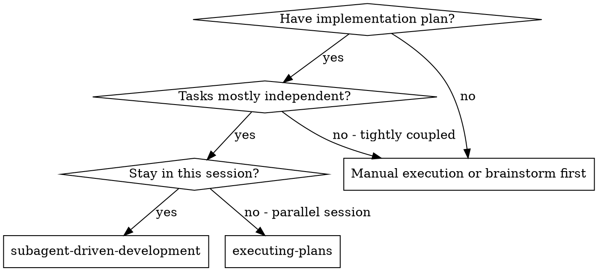
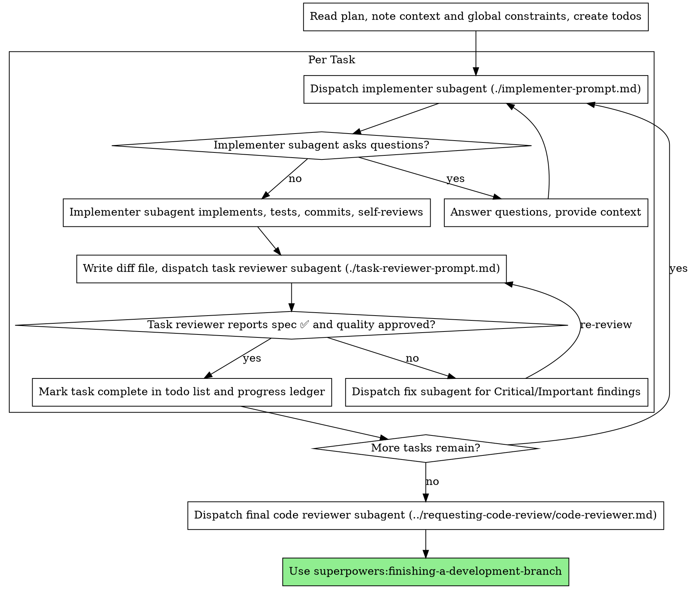

# Session transcript

## User

start I10 by reading CAMPAIGN.md + LEDGER.md first

## Assistant

Starting I10 per the campaign convention: reading the governing documents in full first. Let me check their sizes and read CAMPAIGN.md and LEDGER.md.

### ⚙ Tool call: `Bash`

```json
{
  "command": "wc -l /workspace/development/2026-07-17-modularization-campaign/*.md",
  "description": "List campaign document sizes"
}
```

### ↳ Tool result

```
   136 /workspace/development/2026-07-17-modularization-campaign/BLOCKMAP.md
   462 /workspace/development/2026-07-17-modularization-campaign/CAMPAIGN.md
  1093 /workspace/development/2026-07-17-modularization-campaign/LEDGER.md
    59 /workspace/development/2026-07-17-modularization-campaign/PROMPT.md
     5 /workspace/development/2026-07-17-modularization-campaign/analytics.md
   100 /workspace/development/2026-07-17-modularization-campaign/statistics.md
  6043 /workspace/development/2026-07-17-modularization-campaign/transcript.md
  6043 /workspace/development/2026-07-17-modularization-campaign/transcript.raw.md
 13941 total
```

### ⚙ Tool call: `Read`

```json
{
  "file_path": "/workspace/development/2026-07-17-modularization-campaign/CAMPAIGN.md"
}
```

### ⚙ Tool call: `Read`

```json
{
  "file_path": "/workspace/development/2026-07-17-modularization-campaign/BLOCKMAP.md"
}
```

### ↳ Tool result

```
1	# BLOCKMAP — functional map of `main()` (baseline a47418c)
2	
3	The block-by-block map of `pantheon-sitehealth-emails` `main()` (lines 2108–4752) that the
4	campaign's increment assignments are built on. Line numbers are against commit `a47418c`
5	("prepare for modularization campaign") and will drift as increments land — **the block IDs
6	(B1–B60), not the line numbers, are the stable references** used by `CAMPAIGN.md` and the
7	increment specs. An increment that moves a block records it in `LEDGER.md` by block ID.
8	
9	Produced 2026-07-17 by a very-thorough read of `main()`; bug claims in B40/B47/B48/B51 were
10	independently re-verified against the source before this file was written.
11	
12	Helper functions called by `main()` but defined elsewhere in the same file: `build_traffic_table_rows`
13	(1002), `plan_costs` (1128), `update_traffic_rows` (1393), `load_traffic_rows` (1447),
14	`insert_traffic_rows` (1428), `load_overage_protection_window` (1488), `finish_run` (1649),
15	`abort_run` (1913). The two report table-column globals are module-level:
16	`traffic_table_columns` (68), `cost_table_columns` (85).
17	
18	Already extracted before this campaign (NOT in main()): SiteLens, DNS-resolution notices,
19	umich-cloudflare CMS checks, Cloudflare FQDN loading — all hook packages.
20	
21	## Pre-loop setup (runs once)
22	
23	| ID | Lines | What it does | Classification | Config read |
24	|---|---|---|---|---|
25	| B1 | 2110–2116 | Config load (tomllib) + `gate_disabled_sections()` | generic | whole file |
26	| B2 | 2118–2122 | Import `plugin/` packages → `sc.plugin` | generic | — |
27	| B3 | 2124–2125 | Pass-1 `process_config()` substitution | generic | — |
28	| B4 | 2127–2131 | Import `check/` packages → `sc.check` | generic | — |
29	| B5 | 2133–2162 | Arg validation (`--resume-from` guards, sites-or-all, fqdns flag) | generic | `[Cloudflare].enabled` |
30	| B6 | 2164–2168 | Verbose banner; `terminus("self:info")` | generic | — |
31	| B7 | 2170–2174 | `build/` dir; `invoke_hooks("setup")` | generic | — |
32	| B8 | 2176–2180 | Deferred-pass `process_config()` | generic | — |
33	| B9 | 2182–2183 | Overage constants | generic-Pantheon | `[Pantheon].overage_*` |
34	| B10 | 2185–2202 | DB engine + sessionmaker (`expire_on_commit=False`) | generic | `[Database]` |
35	| B11 | 2204–2206 | `--create-tables` short-circuit (`create_all`, exit) | generic | — |
36	| B12 | 2208–2228 | Wordmark image read; `load_news_items()`; `plan_info` normalization (`"-"`→None), `plan_names` | generic-Pantheon | `[Pantheon].plan_info`, `[News]` |
37	| B13 | 2230–2246 | Date window (`end_date`, `start_date`, `contract_year_end`); numpy chart-cap geometry | generic (cap geometry chart-specific) | — |
38	| B14 | 2248–2285 | `terminus_data("org:site:list")`; run accumulators (`emails_sent`, `site_savings`, `all_warnings`, `site_results`); `smtp_enabled`; sorted site names; `sites_from_resume_point` | generic | `[Pantheon].org_id`, `[SMTP].enabled` |
39	
40	## Per-site loop (2289–2720 body refs; wrapped in `try`/`except BaseException`)
41	
42	| ID | Lines | What it does | Classification | Emits notices (csv code) |
43	|---|---|---|---|---|
44	| B15 | 2290–2304 | Smell resets; U-M portal gate (`[UMich].portal.sites`), `portal_site_id` | **U-M** | — |
45	| B16 | 2306–2321 | Site-selection skip + banner | generic | — |
46	| B17 | 2323–2349 | Elite plan SKU → name via `terminus("plan:info")`, `plan_sku_to_name` | generic-Pantheon | — |
47	| B18 | 2351–2358 | Sandbox skip; `SiteContext` creation | generic | — |
48	| B19 | 2360–2387 | Frozen-site notice | generic (U-M link in body) | `frozen` (alert) |
49	| B20 | 2389–2394 | Unknown-plan guard (`sys.exit`) | generic | — |
50	| B21 | 2396–2442 | `terminus("env:list")` → `envs`; live-env validation | generic-Pantheon | `no-live-env-but-paid-plan` (alert) |
51	| B22 | 2444–2452 | `terminus("env:metrics")` traffic gather | generic-Pantheon | — |
52	| B23 | 2454–2460 | `db_retry(update_traffic_rows)` — DB WRITE | generic | — |
53	| B24 | 2462–2476 | `--import-older-metrics`: `get_old_metrics` + `insert_traffic_rows`, `continue` | generic | — |
54	| B25 | 2478–2480 | `--update` early `continue` | generic | — |
55	| B26 | 2482–2497 | `db_retry(load_traffic_rows)` → `results` (commit releases conn) | generic | — |
56	| B27 | 2499 | `invoke_hooks("site_pre")` | seam | — |
57	| B28 | 2501–2506 | Stuff `traffic_rows`/`start_date`/`end_date`; `invoke_hooks("site_post_traffic")` | seam | — |
58	| B29 | 2508–2561 | `terminus("domain:list")`; `dns_classify.classify_domains` → `facts` | generic, CF-aware | `no-domains` (alert) |
59	| B30 | 2562–2621 | Primary-domain check; Drupal multisite probe (`drush_php_script`) | framework-branching | `no-primary-domain` (info); `multisite-check` (error path) |
60	| B31 | 2623–2630 | `stuff_dns_contract`; `invoke_hooks("site_post_dns")`; `site_url` | seam | — |
61	| B32 | 2632–2655 | WP-network `network_home_url()` via `wp_eval` | WordPress | `version-check` (error path) |
62	| B33 | 2657–2667 | Gather init (`plugins`/`mods`/versions None; `add_on_updates=[]`) | generic | — |
63	| B34 | 2668–2984 | WordPress branch: version, plugin list, PAPC + native-sessions checks, per-plugin loop (updates; **umich-oidc-login**; **object-cache-pro** probe; **Hummingbird fork**), theme list, favicon | WordPress; oidc+Hummingbird **U-M** | `umich-oidc-login-reinstall` (warn), `ocp-config-fix-needed` (alert), `unsupported-turned-off`/`unsupported`, `no-favicon` (warn); error paths `version-check`, `plugin-list`, `ocp-config-check`, `favicon-check` |
64	| B35 | 2986–3302 | Drupal branch: core-status, pm:list, PAPC module check, **D7 EOL** + tag1_d7es, pm:updatestatus (D7) / composer dry-run+audit (D8+), **Drupal UA check** | Drupal; UA check **U-M** | `drupal7-eol` (alert), `composer-update` (alert), `drupal-ua` (info); error paths `core-status`, `pm-list`, `pm-updatestatus`, `drupal-ua-check` |
65	| B36 | 3303–3306 | Unknown-framework fallback (print only; **no `site_results` entry** — see Bugs) | generic | — |
66	| B37 | 3308–3320 | Stuff gather contract keys; `invoke_hooks("site_post_gather")` | seam | — |
67	| B38 | 3322–3489 | `terminus("upstream:updates:list")` → update table + age-tiered notice | generic-Pantheon | `updates-info`/`updates-warning`/`updates-alert` |
68	| B39 | 3491–3566 | Add-on updates table from `add_on_updates` | generic | `updates-addons` (warn) |
69	| B40 | 3568–3634 | **DEAD**: commented-out PHP-runtime-Gen2 notice (pre-SiteContext idiom) | dead | — |
70	| B41 | 3636–3694 | PHP EOL check on `envs["live"]["php_version"]` | generic-Pantheon | `php-eol` (**same code for warn and alert branches** — see Bugs) |
71	| B42 | 3696–3702 | `--only-warn`: dump csv codes to `all_warnings`, `continue` (TODO at 3698: run plan rec first) | generic | — |
72	| B43 | 3704–3742 | `visits_by_month`, `plan_on_day`, `build_plan_over_time` | generic | — |
73	| B44 | 3744–3801 | Chart data prep (`estimate_month_visits`, surge threshold, ymax) | generic-Pantheon | — |
74	| B45 | 3803–4113 | Matplotlib chart build → `chart_image` (BytesIO PNG) | generic-Pantheon | — |
75	| B46 | 4117–4156 | `db_retry(build_traffic_table_rows)` — DB read/**WRITE** + commit (correction, LEDGER I7: it persists this window's `pantheon_overage_protection` rows — the original "read" label let I7's reorder put the OP read before this write) | generic-Pantheon | — |
76	| B47 | 4158–4333 | Cost model: `load_overage_protection_window` → `plan_costs` → recommendation, savings, cost table. **Un-gated U-M portal URLs at 4240/4275** — see Bugs | generic-Pantheon (**U-M leak**) | `its-recommends-plan` (info) |
77	| B48 | 4335–4408 | Smell notices (`wp_smell`, `drush_smell`, `composer_smell`). **composer block nested in drush block + interpolates `drush_smell`** — see Bugs | generic | `wp-smell`/`drush-smell`/`composer-smell` (info) |
78	| B49 | 4410–4431 | Recipients: U-M portal owner groups OR `terminus("site:team:list")` | **U-M** branch + generic | — |
79	| B50 | 4433–4520 | Notice sort (alert→warn→info); subject; **annual-billing notice** on contract-year end | **U-M** (annual billing) | `annual-bill` (alert) |
80	| B51 | 4522–4555 | Second annual-billing notice, marked "remove Aug 2026" (**duplicate `annual-bill` csv code**) | **U-M**, temporary | `annual-bill` (alert) |
81	| B52 | 4557–4559 | `invoke_hooks("site_pre_render")` | seam | — |
82	| B53 | 4561–4608 | `make_msgid` CIDs; template dict; Jinja render → `build/{name}.html`/`.txt` | generic | — |
83	| B54 | 4610–4633 | PHP Emogrifier inline + `!important` regex → `-inline.html`/`-inline2.html` | generic | — |
84	| B55 | 4635–4696 | MIME assembly (`[Email]` config, dry-run addressing, banner/chart CIDs, attachments) → `.eml` | generic (U-M defaults) | — |
85	| B56 | 4698–4707 | Notice rows → `all_warnings` (deliberately BEFORE send — resume safety) | generic | — |
86	| B57 | 4709–4715 | SMTP send (gated `[SMTP].enabled`) | generic | — |
87	| B58 | 4717–4720 | `plt.close(fig)` (redundant — already closed at 4113); TODO markers | generic | — |
88	
89	## Loop exit / finish (runs once)
90	
91	| ID | Lines | What it does |
92	|---|---|---|
93	| B59 | 4721–4737 | `except BaseException` → `abort_reason` → `abort_run` (single flush path) |
94	| B60 | 4739–4747 | `finish_run` (sole writer of run artifacts) |
95	
96	## Wrapper usage by block
97	
98	- `terminus` (raw): B6, B17, B21, B22, B29, B35 (composer audit), B38, B49; inside `get_old_metrics` (B24)
99	- `terminus_data`: B14 · `run_terminus` (list form): B35 (composer dry-run)
100	- `wp`: B34 (plugin list, theme list) · `wp_eval`: B32, B34 (version, OCP probe, favicon)
101	- `drush`: B35 (core-status, pm:list, pm:updatestatus) · `drush_php_script`: B30, B35 (UA check)
102	
103	DB session touches (all through `db_retry` except schema): B10, B11, B23, B24, B26, B46, B47, B59, B60.
104	
105	## Bugs and smells found during mapping (all re-verified in source)
106	
107	1. **B48 composer-smell double bug (4385–4408):** the `if composer_smell != "":` block is
108	   nested inside `if drush_smell != "":`, so composer smells are only reported when a drush
109	   smell also exists; and the HTML `message` interpolates `{drush_smell}` (4395) where
110	   `{composer_smell}` is meant. (The plaintext `text` uses the right variable.)
111	2. **B41 shared `php-eol` csv code:** warning (7.4/8.1) and alert (<8.2) branches emit the
112	   identical `csv={name},php-eol`, so the notices CSV cannot distinguish severity.
113	3. **B36 `site_results` omission:** only the framework branches (B34 at 2690, B35 at 3009)
114	   create a site's `site_results` entry; an unknown-framework site silently vanishes from
115	   the results artifact (and from `monthly-report.txt`'s stats).
116	4. **B47 un-gated U-M URLs (4240, 4275):** the Basic-alternative and recommendation notice
117	   bodies embed `admin.webservices.umich.edu/sites/{portal_site_id}/plan/` without a
118	   `umich_enabled()` guard; non-U-M runs would render a broken U-M URL with
119	   `portal_site_id = 0`.
120	5. **B50/B51 duplicate `annual-bill` code:** both notices emit the same csv code and both
121	   `insert(0, …)`; on a contract-year U-M run a site gets two `annual-bill` rows that the
122	   CSV cannot tell apart. B51 is marked for removal August 2026.
123	6. **Dead code:** B40 (3568–3634) entire commented-out Gen2 notice (uses the removed
124	   `site_notices.append` idiom, cannot be revived as-is); commented overage debug query
125	   (4124–4133); redundant second `plt.close(fig)` (4717, already closed at 4113);
126	   commented `plt.show()` (4107).
127	7. **WordPress/Drupal duplication:** version-fetch→`site_results`, add-on-update
128	   collection, and the `*_error`/`*_smell` pattern are re-implemented per framework; the
129	   PAPC recommended-add-on check exists as both `check_wordpress_plugin(…)` and
130	   `check_drupal_module(…)` calls.
131	8. **Update-table HTML duplication:** B38 and B39 each build near-identical responsive
132	   update tables; B38's three severity bodies largely overlap.
133	9. **In-code TODO markers** (seams for extracted modules, not dead code): no-Autopilot
134	   warning (3696), plan-rec before `--only-warn` (3698), SVG chart (4115), traffic-table
135	   icons/coloring (4119–4122), Basic-plan performance-feature detection (4220–4221),
136	   %-pages-cached + CSV attachment (4719–4720).
137
```

### ↳ Tool result

```
1	# CAMPAIGN.md — Modularization Campaign (frozen architecture)
2	
3	**Status:** approved design, 2026-07-17. Brainstormed and approved section-by-section in
4	the campaign planning session (see `transcript.md` once archived); prompt in `PROMPT.md`.
5	
6	This is the **one** copy of the campaign's architecture, decisions, invariants, and
7	increment plan. Increment specs **cite this document and re-derive nothing** — the
8	campaign-level brainstorm and adversarial review run once, here; increments inherit that
9	scrutiny and do not repeat it. Any change to this document is an **amendment**: edit the
10	document *and* append a ledger entry (`LEDGER.md`) saying what changed and why. An
11	increment spec that contradicts this document without a ledger amendment is wrong by
12	definition.
13	
14	Related documents (all in this directory unless pathed): `PROMPT.md` (the campaign
15	request), `BLOCKMAP.md` (the B1–B60 functional map of `main()` all scope assignments
16	reference), `LEDGER.md` (append-only cross-increment record), `/workspace/CONTEXT.md`
17	(domain glossary — created by this campaign), `/workspace/prompts/directives.md` (the
18	Spine; PD#n citations below refer to it).
19	
20	## Glossary (campaign terms — domain terms live in `CONTEXT.md`)
21	
22	- **Campaign** — this whole program of work: one architecture, N increments.
23	- **Increment** — one unit of work with its own session, spec, implementation, review,
24	  commit, and archive. Numbered I0–I14.
25	- **Wave** — an ordered group of increments (0–4); increments within a wave may be
26	  reordered if the ledger records why, waves may not.
27	- **Block** — a `Bnn` region of `main()` per `BLOCKMAP.md`; the stable unit of scope
28	  assignment.
29	- **Core package** — the new importable `psh/` package holding infrastructure (Tier 1).
30	- **Gateway** — `psh/gateway.py`, the single module through which every Terminus/WP-CLI/
31	  Drush subprocess flows; the future Pantheon-API replacement seam.
32	- **Façade** — `script_context.py` (`sc`), the stable API surface that checks and plugins
33	  import; implementations move, the façade's names do not break.
34	- **Contract** — the per-phase guaranteed `site_context` keys (CLAUDE.md table), which
35	  this campaign turns into a machine-readable **contract registry**.
36	- **Hook DAG** — the per-phase topological ordering of hooks derived from declared
37	  `consumes`/`produces` keys, validated fatally at startup.
38	- **Ratchet** — the lint/type regime: broad ruff+pyright rules applied as a hard gate to
39	  moved/new modules immediately, the remnant grandfathered until I14.
40	- **Remnant** — whatever remains of the original script at any point mid-campaign.
41	- **Shim** — the thin committed `./pantheon-sitehealth-emails` entry script that calls
42	  `psh.cli.main()` after I0.
43	- **Ledger** — `LEDGER.md`; how increment N learns what N−1 actually did.
44	- **Behavior bar** — the tiered definition of which observable behavior may change (§8).
45	- **Invariant** — a named property no increment may alter (§9).
46	
47	**MUST** = required, violation fails review. **NEVER** = prohibited, violation fails
48	review. **SHOULD** = required unless the increment spec states why not. **MAY** =
49	allowed, at the implementer's judgment.
50	
51	## 1. Goal and non-goals
52	
53	**Goal.** Modularize the 4,752-line main script into (a) a `psh/` core package of
54	infrastructure modules, (b) self-registering `check/` packages for every notice/section
55	emitter, and (c) the existing `plugin/` integrations — taking full advantage of the hook
56	system — while the four e2e goldens stay byte-identical, the per-phase contract is
57	honored, and the non-U-M path keeps working. End state: `main()` is a ~250–400-line
58	orchestrator; every U-M-specific behavior lives in `umich` packages; the whole tree
59	passes the broadened ruff+pyright configuration.
60	
61	**Non-goals** (exhaustive; each is either declined or deferred with reasoning in §15):
62	replacing terminus with the Pantheon API; implementing parallel site processing; any new
63	report content (CSV attachment, cached-% column, env-lock section); SendGrid; refreshing
64	goldens or recorded fixtures; changing what any check reports (except the named bug
65	fixes in I1).
66	
67	## 2. Decision record (exhaustive — from the approved brainstorm)
68	
69	| # | Decision | Choice | Why |
70	|---|---|---|---|
71	| D1 | Pantheon API | **Seam only**: gateway module now, transport swap post-campaign | Swapping transports mid-campaign invalidates terminus fixtures + goldens in every touched increment |
72	| D2 | Lint/type broadening | **Ratchet in-campaign** (§13) | Code is cleaned exactly once, as it moves; bar fixed in I0 so it never shifts |
73	| D3 | Behavior bar | **Tiered, config renames allowed** (§8) | Cleanest final schema; production config edited once, at I14, with a migration table |
74	| D4 | Increment granularity | **Fine: 15 increments** | Safest for session/context limits; split-never-compress backstop (§12) |
75	| D5 | Target architecture | **Three-tier split** (§3) | Infrastructure ≠ report content ≠ data source; fulfills "full advantage of the frameworks" |
76	| D6 | Hook flexibility | **Phases stay; hooks declare consumes/produces; per-phase DAG validated at startup** (§4) | Keeps every existing hook/test valid; a phase-less key scheduler rewrites everything for no added power |
77	| D7 | `--only-warn` plan rec | **In campaign** (I7) | Small, no golden impact, existing TODO |
78	| D8 | Parallel-ready | **Design constraint only** (§3.4) | Near-free now; actual parallelism stays a README TODO |
79	| D9 | CSV attachment / cached-% / env-lock | **README TODO** | Each changes rendered email → golden churn mid-campaign |
80	| D10 | Packaging | **Real package + thin shim** (I0; console-script dropped — see LEDGER I0 amendment 1) | Dissolves the extension-less-script problem; normal imports for tests/pyright/ruff |
81	
82	## 3. Target architecture
83	
84	```
85	                 ./pantheon-sitehealth-emails  (thin shim)
86	                                │
87	                        psh.cli.main()  ── orchestrator: bootstrap, site loop,
88	                                │           phase firing, lifecycle dispatch
89	        ┌───────────────────────┼──────────────────────────┐
90	        ▼ Tier 1: psh/ core     ▼ seams (sc façade)        ▼
91	  configuration  modules   ┌─────────────────────┐   Tier 3: plugin/
92	  gateway        db        │  hook phases + DAG  │   aws  cloudflare
93	  traffic        plans     │  contract registry  │   env  umich
94	  gather         charts    └─────────┬───────────┘   (unchanged roles)
95	  render         mail                ▼
96	  lifecycle                Tier 2: check/  (all notice/section emitters)
97	                           pantheon  wordpress  drupal  addon_updates
98	                           dns  cloudflare  pantheon_cdn_change  umich
99	```
100	
101	### 3.1 Tier 1 — `psh/` core package (exhaustive module map)
102	
103	| Module | Receives (functions / blocks) |
104	|---|---|
105	| `psh/cli.py` | `build_arg_parser`, `parse_args`, arg validation (B5), `main()` orchestrator |
106	| `psh/configuration.py` | `process_config`, `config_substitution`, `gate_disabled_sections`, DEFER machinery, `load_news_items`, `umich_enabled`, `cloudflare_enabled` |
107	| `psh/modules.py` | `find_modules`, module loading (B2/B4), hook engine (`add_hook`/`invoke_hooks`/`PHASES`), DAG build/validation, contract registry |
108	| `psh/gateway.py` | `run_terminus`, `terminus`, `terminus_data`, `wp`, `wp_eval`, `drush`, `drush_php_script`, `fix_drush_output`, `wp_error`, `drush_error`, `TerminusError` |
109	| `psh/notice.py` | `Notice`, `Severity`, `NoticeRegistry`, `DuplicateNoticeCodeError`, `registry` (added I3; §6 Notice type + code registry) |
110	| `psh/db.py` | ORM models, `TrafficRow`/`OverageProtectionRow`, `db_engine_args`, `db_retry`/`db_retryable`/`record_db_reconnect`, `update_traffic_rows`, `insert_traffic_rows`, `load_traffic_rows`, `load_overage_protection_window`, `DatabaseUnavailableError` |
111	| `psh/traffic.py` | `get_old_metrics`, `estimate_month_visits`, `build_traffic_table_rows`, the `traffic_table_columns` global, metrics gather + DB update/load flow (B22–B26), visits-by-month aggregation (B43) |
112	| `psh/plans.py` | plan_info normalization (B12 part), SKU resolution (B17), `overage_blocks`, `contract_year_end`, `plan_costs`, `build_plan_over_time`, the `cost_table_columns` global, recommendation flow (B47) |
113	| `psh/gather.py` | Slimmed framework gathers feeding the `site_post_gather` contract (from B32–B35), `check_wordpress_plugin`/`check_drupal_module` helpers |
114	| `psh/charts.py` | Cap geometry (B13 part), chart data prep + matplotlib build (B44–B45) — returns PNG bytes |
115	| `psh/render.py` | Jinja render (B53), PHP inline + `!important` pass (B54), `escape_url` |
116	| `psh/mail.py` | Recipient resolution (B49), MIME assembly (B55), `smtp_login`, send (B57) |
117	| `psh/lifecycle.py` | `RunState`, `finish_run`, `abort_run`, `abort_reason`, `resume_point`, `resume_command`, `rerun_command`, `option_strings_taking_a_value`, `sites_from_resume_point`, `merge_prior_results`, `ResumeSiteNotFoundError` |
118	
119	`dns_classify.py` stays a top-level module (already extracted; moving it into `psh/` is
120	MAY-scope for I14, decided by ledger state then).
121	
122	**Whole-file coverage.** The campaign modularizes the entire script, not just `main()`:
123	every top-level def and module-level global in `pantheon-sitehealth-emails` (lines
124	1–2107 included) is assigned to a `psh/` module in this table and appears in exactly one
125	increment's scope (§11). End state: the original file is the thin shim and nothing else
126	— a top-level def still there at I14 is a defect the closing audit (§17) catches. Moved
127	helpers get the full §7 treatment (types, ratchet, verified docs, tests); they do NOT
128	get algorithmic redesign — moves are behavior-preserving except where §8 says otherwise
129	(I1, I7's D7, I12's B51).
130	
131	### 3.2 Tier 2 — new/changed `check/` packages (exhaustive)
132	
133	| Package | Contents (blocks) | Phase(s) |
134	|---|---|---|
135	| `check/pantheon/` (new) | frozen site (B19), no-live-env (B21), upstream updates (B38), PHP EOL (B41) | `site_pre` (frozen, no-live-env), `site_post_gather` (updates, PHP EOL) |
136	| `check/wordpress/` (new) | PAPC + native-sessions checks, OCP config probe, favicon (from B34) | `site_post_gather` |
137	| `check/drupal/` (new) | PAPC module check, D7 EOL + tag1_d7es, multisite probe (from B30/B35) | `site_post_dns` (multisite), `site_post_gather` |
138	| `check/addon_updates/` (new) | add-on updates table notice (B39), smell notices (B48) | `site_post_gather` |
139	| `check/umich/` (existing, grows) | umich-oidc-login, Hummingbird fork (B34), Drupal UA check (B35), annual-billing notices (B50/B51), portal-URL text for the recommendation notice (B47's U-M half) | `site_post_gather`, `site_pre_render` (billing) |
140	
141	`check/dns/`, `check/cloudflare/`, `check/pantheon_cdn_change/` are untouched tenants.
142	A check MAY fetch its own data through `sc` gateway wrappers when the data is
143	check-specific (e.g. `upstream:updates:list`); data used by core *and* checks is
144	published through the contract instead (e.g. `envs`).
145	
146	### 3.3 What stays in `main()` (exhaustive, with why)
147	
148	Config/arg bootstrap ordering (B1–B8 — the two-pass substitution *order* is the
149	program); overage constants + date window (B9, B13 part); the site-loop skeleton (skips,
150	banner, sorted order, resume filter — B14–B18, B20, B25, B42); phase firing and contract
151	stuffing (B27, B28, B31, B37, B52); notice sort + subject (B50 minus billing); the
152	`try`/`except BaseException` lifecycle dispatch (B59–B60 call sites). Everything else
153	leaves. Target: 250–400 lines.
154	
155	### 3.4 Parallel-ready constraint (D8)
156	
157	Per-site work MUST be a function of `(site, config, db_session, site_context)`: no new
158	module-level mutable state; run-scoped accumulators live only in `RunState`. This is a
159	review criterion from I2 onward, not a parallelism implementation.
160	
161	### 3.5 The `sc` façade
162	
163	Checks and plugins import **only** `sc` (and their own package). `sc` keeps every name
164	listed in CLAUDE.md's runtime-exposed block, re-exporting from `psh/` modules as they
165	move. NEVER remove or rename an `sc` attribute mid-campaign; additions are fine. The
166	house-rules test suite gains an assertion that every documented `sc` name exists (I2).
167	
168	## 4. Phases, hooks, and the DAG
169	
170	Phases stay the coarse spine: `setup`, `site_pre`, `site_post_traffic`, `site_post_dns`,
171	`site_post_gather`, `site_pre_render`, plus **new** `run_finish` (fired inside
172	`finish_run` before artifacts are written, receiving the `RunState`; for future run-level
173	artifact hooks — no consumer at introduction, like `site_pre_render` was). Dotted
174	plugin-defined events are unchanged.
175	
176	From I4, `add_hook` requires two new entries per hook: `consumes` and `produces` — each
177	a (possibly empty) list of contract-key names. Validation at module-load completion
178	(exhaustive fatal conditions):
179	
180	1. A consumed key that nothing produces (neither core's registry for that phase or an
181	   earlier phase, nor another hook) → fatal.
182	2. Two producers of the same key → fatal (one owner per key; PD#1 — a silent overwrite
183	   is a silent failure).
184	3. A cycle among same-phase hooks → fatal.
185	4. A hook consuming a key first produced in a *later* phase → fatal.
186	5. A missing `consumes`/`produces` entry on any hook → fatal (no legacy mode; I4
187	   retrofits all in-repo hooks in the same change).
188	
189	`invoke_hooks` orders same-phase hooks topologically (producers before consumers;
190	registration order breaks ties, so existing behavior is preserved where no edges exist).
191	The permanent test `tests/integration/test_hook_dag.py` loads **all** real check/plugin
192	packages and asserts the DAG builds — the "future changes can never make the DAG
193	impossible" guarantee — and a unit suite proves each fatal condition actually fires
194	(PD#14: the validator must be shown able to go red).
195	
196	```
197	 module load ──► collect hooks ──► per phase: build edges (produces→consumes)
198	                                        │
199	                              cycle? unknown key? dup producer? ──► fatal exit (named error)
200	                                        │ ok
201	                                topo order stored ──► invoke_hooks uses it
202	```
203	
204	**Contract registry.** `psh/modules.py` holds the machine-readable registry: phase →
205	keys core stuffs (today's CLAUDE.md table, verbatim). Core's stuffing code is checked
206	against it in tests; CLAUDE.md's table gains a line saying the registry is authoritative.
207	New contract keys added by increments (exhaustive for this campaign): `envs` (I8, at
208	`site_pre`), `add_on_updates` + `wp_smell`/`drush_smell`/`composer_smell` (I9/I10, at
209	`site_post_gather`), plan/cost keys `current_plan`, `recommended_plan`, `plan_costs`,
210	`savings` (I7, at `site_pre_render`). Each addition updates registry + CLAUDE.md table +
211	ledger in the same increment.
212	
213	## 5. Configuration
214	
215	Principles: one section per feature, named for the operator's mental model; every
216	relocated check gets an `enabled` flag under `[Check.<name>]`, **default true** —
217	relocating code MUST NOT silently disable a check that runs unconditionally today.
218	U-M-only checks additionally require `[UMich].enabled` (existing `umich_enabled()`
219	rule). `gate_disabled_sections()` semantics (nested `enabled`, children dropped) apply to
220	`[Check.*]` unchanged.
221	
222	Example (actual TOML, the shape I8 introduces — illustrative of the family, exhaustive
223	for `check/pantheon/`):
224	
225	```toml
226	[Check.pantheon]
227	enabled = true          # frozen-site, live-env, upstream-updates, PHP-EOL checks
228	```
229	
230	New keys land in final shape as introduced (I3 onward). Renames/moves of *existing* keys
231	happen once, in I14, which MUST deliver: the old→new migration table in
232	`docs/config-migration.md`, a rewritten `sample-pantheon-sitehealth-emails.toml`, and
233	exact edit instructions for the production config repo. Until I14, every existing
234	production key keeps working unchanged.
235	
236	## 6. Types
237	
238	Reused as-is: `TrafficRow`, `OverageProtectionRow`, `DnsFacts`, `FetchResult`,
239	`SiteContext`. Introduced (exhaustive):
240	
241	| Type | Increment | Shape |
242	|---|---|---|
243	| `GatewayResult` | I2 | NamedTuple `(result, errors, fatal)` replacing the anonymous 3-tuples |
244	| `Notice` | I3 (class) → adopted per increment | frozen dataclass: `severity` (StrEnum alert/warning/info), `code` (unique — registry test), `html`, `text`, `short`, `icon`, `order`; `SiteContext.add_notice` accepts `Notice` or legacy dict; dict form retired in I14 |
245	| `PlanInfo` / `PlanCatalog` | I7 | typed view over `[Pantheon.plan_info]` |
246	| `RunState` | I13 | dataclass holding `all_warnings`, `site_results`, `site_savings`, `emails_sent`, reconnect counters |
247	
248	House-style tuple annotations (`-> (str, str, bool)`) are replaced with real annotations
249	in every module as it moves — never fixed in place in the remnant (one pass per line,
250	D2). CLAUDE.md's house-style note is updated in I14 when the last one dies.
251	
252	## 7. Per-increment obligations
253	
254	Every increment MUST (this list is exhaustive and lives only here; increment specs cite
255	it): (1) start by reading `CAMPAIGN.md`, `LEDGER.md`, `CLAUDE.md`, `BLOCKMAP.md` rows in
256	scope; (2) follow `prompts/implementation-standards.md` (subagent-driven, test-first,
257	`psh-implementer`/`psh-reviewer`); (3) replace house styles in moved code (§6);
258	(4) verify — not assume — every claim in comments/docs it moves or writes;
259	(5) update tests in the same change; (6) update README/docs/CLAUDE.md for what moved;
260	(7) update auto-memory where a durable fact changed; (8) append its ledger entry
261	(§12); (9) preserve every invariant (§9); (10) end with `/code-review`, a full
262	`./run-tests`, and one checkpoint commit including its `development/` folder.
263	
264	## 8. Behavior bar (canonical gate table)
265	
266	| Surface | Rule | Until |
267	|---|---|---|
268	| Rendered emails (4 goldens) | NEVER change (byte-identical) | end of campaign |
269	| `-results.json` / `-notices.csv` / `-run.json` structure (keys, row shape) | NEVER change | end of campaign |
270	| Notice csv *values* | MAY change only in I1 (named bug fixes), I12 (scheduled B51 deletion), I7 (`its-recommends-plan` savings-field format, D-i7-5 — amendment), and I9 (wp-smell precedence when theme-list and OCP-probe stderr co-occur without favicon stderr — see LEDGER I9) | — |
271	| stdout / console / error messages | MAY improve freely | — |
272	| Config: existing keys | NEVER break | I14 (renames with migration table) |
273	| Config: new keys | MUST land in final schema shape | — |
274	| Exit codes, resume semantics, artifact write gates | NEVER change | end of campaign |
275	
276	## 9. Named invariants (exhaustive; NEVER violated by any increment)
277	
278	1. Four e2e goldens byte-identical (`./run-tests` proves it; refresh is forbidden — an
279	   existing golden going red is a defect in the increment, PD#14).
280	2. Per-phase data contract: existing keys never removed/renamed/retyped; additions only.
281	3. Non-U-M path works: non-U-M golden green; no new un-gated U-M content (I1 *removes*
282	   the one known leak).
283	4. Run lifecycle: single `except BaseException` flush path; `abort_reason`'s three
284	   outcomes; artifacts dropped-site rule; notices appended before send; resume-point
285	   next-site-after-email rule; soft-wrapped copy-pasteable commands.
286	5. DB: `db_retry` retries whole idempotent units only; `db_retryable` predicate
287	   unchanged; the read-release commit in the loaders stays (guarded by
288	   `test_load_traffic_rows_releases_the_connection`).
289	6. Rich console rules: escape untrusted text; production width reproduced in tests.
290	7. Test safety interlock (`run_program` forbidden flags) never bypassed or weakened.
291	8. Column-0 `f"""` notice literals move **verbatim** — never re-indented; `git diff -w`
292	   is not acceptable evidence for any change touching them.
293	9. Checks/plugins import only `sc`; `sc` names never removed mid-campaign (§3.5).
294	10. Recorded fixtures are not regenerated (`terminus-cdnchange/` is hand-maintained and
295	    `--record` must not run).
296	11. `--create-tables`/`--update`/`--import-older-metrics` phase-gating rules (CLAUDE.md
297	    table) unchanged.
298	
299	## 10. Known-bug inventory → I1
300	
301	The five bugs and the dead code listed in `BLOCKMAP.md` §Bugs (composer-smell
302	nesting+variable; shared `php-eol` code; `site_results` omission; un-gated U-M portal
303	URLs; duplicate `annual-bill` code — B51 handled as: distinct code now, scheduled
304	deletion when its Aug-2026 date passes, ledgered to I12; dead code deleted). Each fix is
305	test-first with the test shown red on the old behavior. **Verified 2026-07-17**: the
306	goldens contain zero `php-eol`/`wp-smell`/`drush-smell`/`composer-smell`/`annual-bill`
307	occurrences and the golden fixtures report PHP 8.2, so none of these fixes can touch a
308	golden:
309	
310	```
311	$ grep -c 'php-eol\|composer-smell\|wp-smell\|drush-smell\|annual-bill' tests/e2e/__snapshots__/*.ambr
312	tests/e2e/__snapshots__/test_golden.ambr:0
313	tests/e2e/__snapshots__/test_golden_cdn_change.ambr:0
314	tests/e2e/__snapshots__/test_golden_drupal.ambr:0
315	tests/e2e/__snapshots__/test_golden_nonumich.ambr:0
316	```
317	
318	## 11. The increments
319	
320	Wave dependency structure (increments within a wave are ordered but MAY be resequenced
321	with a ledger entry; waves MUST NOT be reordered):
322	
323	```
324	Wave 0: I0 bootstrap ──► I1 bug fixes
325	Wave 1: I2 gateway ──► I3 config ──► I4 hooks+DAG ──► I5 DB
326	Wave 2: I6 traffic ──► I7 plans ──► I8 check/pantheon ──► I9 wordpress ──► I10 drupal
327	Wave 3: I11 charts ──► I12 render+mail ──► I13 lifecycle
328	Wave 4: I14 closing sweep
329	```
330	
331	| Inc | Scope (blocks / functions) | Delivers |
332	|---|---|---|
333	| **I0** | — (no logic moves) | `psh/` skeleton + thin shim (console-script dropped — see LEDGER I0 amendment); conftest `import psh` rework (same collected-test count gate); ratchet config (§13) with rule sets pinned; pyright baseline measured; `LEDGER.md` started; README TODO edits (§15 dispositions); CLAUDE.md pointer to campaign |
334	| **I1** | B36, B40, B41, B47 (URLs), B48, B50/B51 (codes), dead code | §10 fixes, each test-first |
335	| **I2** | 302–597 wrappers | `psh/gateway.py`, `GatewayResult`, sc re-exports + façade test; no-subprocess-outside-gateway house rule |
336	| **I3** | 792–934, 1209–1253, 1608–1648 (`umich_enabled`/`cloudflare_enabled`) | `psh/configuration.py`; `Notice` class + code-uniqueness registry test |
337	| **I4** | 935–950, hook engine from `script_context.py` | `psh/modules.py`; consumes/produces on all in-repo hooks; DAG validation + fatal-condition tests; `run_finish` phase; contract registry |
338	| **I5** | 95–178; DB defs within 1285–1575 (`DatabaseUnavailableError` through `db_engine_args`; the resume helpers `ResumeSiteNotFoundError`, `sites_from_resume_point`, `merge_prior_results` stay for I13) | `psh/db.py`; DB test suites relocated intact |
339	| **I6** | B22–B26, B43; 598–671, 977–1127 | `psh/traffic.py` |
340	| **I7** | B9, B12 (plans), B17, B47; 967–976, 1128–1208, 1254–1280 | `psh/plans.py`; `PlanInfo`; D7 (`--only-warn` runs recommendation); plan/cost contract keys |
341	| **I8** | B19, B21, B38, B41 | `check/pantheon/` + `[Check.pantheon]`; `envs` contract key |
342	| **I9** | B32–B34; 672–739 | `psh/gather.py` (WP half); `check/wordpress/`; U-M WP checks → `check/umich/`; `add_on_updates` + smell contract keys |
343	| **I10** | B30, B35, B39, B48; 740–791 | gather (Drupal half); `check/drupal/`; `check/addon_updates/`; UA check → `check/umich/` |
344	| **I11** | B13 (caps), B44–B45 | `psh/charts.py` |
345	| **I12** | B49–B57 minus sort/subject core | `psh/render.py`, `psh/mail.py`; annual billing → `check/umich/` at `site_pre_render`; B51 deletion if past its date |
346	| **I13** | B14 (accumulators), B56, B59–B60; 1649–2107 plus the resume helpers I5 left behind (1281–1284, 1528–1542, 1576–1607) | `psh/lifecycle.py`; `RunState`; `main()` reaches final form |
347	| **I14** | — | Config renames + migration doc + sample rewrite + production-config instructions; global ratchet flip + remnant cleanup; docs/README/CLAUDE.md full refresh; `Notice` dict form retired; ledger fully resolved; retrospective + closing audit (§17) |
348	
349	Sizing note: the largest moves are I9 (~330 main-loop lines + helpers) and I10 (~320 +
350	helpers). If any increment proves oversized mid-session: **split, never compress** —
351	commit nothing partial, ledger the split, the second half becomes its own increment.
352	
353	## 12. Coordination protocol
354	
355	**Ledger entry template** (append per increment, and for any amendment):
356	
357	```markdown
358	## I<N> — <slug> (<date>, commit <sha>)
359	- Moved: <blocks/functions actually moved>
360	- Deviations from CAMPAIGN.md: <none | what + why>
361	- Contract/config/sc additions: <keys/names>
362	- Discovered tasks: <each with disposition: fixed here | I<M> | README TODO>
363	- Open questions for next increment: <…>
364	```
365	
366	**Discovered-task disposition rules** (canonical): fits current increment's scope and
367	<~30 min → fix now, note in ledger; belongs to a later increment → ledger it against
368	that increment (the increment's spec author MUST read these); major/risky/scope-widening
369	→ README TODO with a sentence of context. Nothing is carried in memory or chat — if it
370	is not in the ledger or README, it does not exist (PD#9).
371	
372	**Session flow per increment:** read the §7 documents → write the increment SPEC.md in
373	`development/<date>-mod-I<N>-<slug>/` citing CAMPAIGN.md sections by number →
374	`superpowers:writing-plans` → subagent-driven implementation → `/code-review` → full
375	`./run-tests` → per-task commits, each green; the increment's final commit includes the dev
376	folder → `/archive-session` → ledger entry.
377	
378	## 13. Lint/type ratchet
379	
380	Mechanism (as shipped by I0; see LEDGER I0 amendment 2): TWO ruff configs —
381	`pyproject.toml` `[tool.ruff.lint]` keeps the narrow PD-rule set running everywhere
382	including the remnant, and `ruff-broad.toml` carries `select = ["ALL"]` minus a
383	justified ignore list, with `extend-exclude` grandfathering exactly the remnant
384	(`psh/_legacy.py`) and not-yet-moved files; each increment deletes its
385	files from the grandfather list, and the two configs merge at I14. pyright runs in
386	`./run-tests` from I0 via `[tool.pyright]` (standard mode, `psh/` minus `_legacy.py`),
387	ratcheting toward strict as typed code moves in. The four existing narrow rules (`E722`, `BLE001`, `S105`, `S106`) remain global
388	throughout — they mechanize PD#2/PD#6 and are never grandfathered. No
389	`target-version` pin (CLAUDE.md: it masks the 3.12-only syntax detection).
390	
391	Baselines measured 2026-07-17 (I0 re-measures and pins both in its spec):
392	
393	```
394	$ ./run-tests --fast --llm   (tail)
395	LLM_SUMMARY passed=727 failed=0 error=0 skipped=1 xfailed=0 xpassed=0
396	25 snapshots passed.
397	
398	$ uvx ruff check --isolated --statistics .
399	26  F541  f-string-missing-placeholders
400	 8  E741  ambiguous-variable-name
401	 4  E713  not-in-test
402	 3  F841  unused-variable
403	 2  F401  unused-import
404	 1  E402  module-import-not-at-top-of-file
405	 1  E712  true-false-comparison
406	Found 45 errors.
407	```
408	
409	(README's "~55" ruff and "39" pyright figures are stale/unverified claims; I0 replaces
410	them with measured numbers. pyright was not measured in planning — no pyright binary in
411	the dev container yet; installing it is I0 scope.)
412	
413	## 14. Risk / control table
414	
415	| Risk | Control |
416	|---|---|
417	| Re-indented column-0 notice literals silently change emails | Invariant 8; goldens as tripwire; AST/token comparison, never `git diff -w` |
418	| conftest rework silently drops tests | I0 gate: identical collected-test count (727 passed / 1 skipped / 2 deselected baseline) before and after |
419	| Long-range `main()` local coupling breaks a move | BLOCKMAP produces/consumes; each increment spec lists exactly which locals cross its boundary |
420	| Session/context overrun mid-increment | Fine granularity (D4); split-never-compress; commits only at increment completion |
421	| Architecture drift across 15 sessions | This document frozen; amendments only via ledger; specs cite section numbers |
422	| Hidden hook-order dependencies surface in I4 | I4 audits every hook; real dependencies become explicit DAG edges |
423	| Ratchet churn on moved code | Rules fixed at I0; cleaning is part of each move |
424	| Goldens blind to stdout/artifacts | Invariants 4–5 name the artifact/abort test suites as the cover; artifact structure frozen until campaign end |
425	| Implementer sessions lack context | `psh-implementer`/`psh-reviewer` carry the read list; specs name seams (Spine spec bar); §7 reading list |
426	| Two annual-bill notices / removal date passes mid-campaign | Explicitly scheduled: codes split in I1, deletion decision in I12, ledger tracks |
427	
428	## 15. NOT in scope (reasoning preserved so it is never re-litigated)
429	
430	- **Terminus → Pantheon API swap** — D1; post-campaign project against `psh/gateway.py`.
431	- **Parallel site processing** — D8; constraint only; README TODO remains.
432	- **CSV data attachment, cached-% column, env-lock section** — D9; each becomes a small
433	  post-campaign change (env-lock: a ~50-line `check/` package) once goldens may move.
434	- **SendGrid, secrets-handling completion, portal traffic capture, daily alerts,
435	  accessibility/security/Cloudflare scores, AI recommendations, dependency updates,
436	  terraform-infra** — pre-existing README TODOs, untouched by this campaign.
437	- **Approach B (library-only) and C (everything-is-a-hook)** — rejected in brainstorm:
438	  B fails the "full advantage of the frameworks" goal; C forces infrastructure into
439	  optional-content clothing.
440	- **Golden/fixture refreshes** — forbidden (Invariants 1, 10).
441	
442	## 16. Acceptance baseline
443	
444	§13 outputs are the campaign-start baseline (run and pasted 2026-07-17). Every
445	increment's definition of done re-runs `./run-tests` at increment end — the full suite
446	when the live tier's credentials are available in the session, otherwise `--fast` with a
447	ledger note saying the live tier was skipped — and MUST reproduce goldens
448	byte-identically. I0 additionally records the collected-test count gate.
449	
450	## 17. Closing audit (queued for I14; exhaustive)
451	
452	1. Is `main()` within 250–400 lines, and does everything left match §3.3?
453	2. Has every DAG fatal condition been demonstrated red at least once?
454	3. Do the contract registry and CLAUDE.md table agree (test-enforced)?
455	4. Is any `sc` re-export now consumed by nobody (dead façade surface)?
456	5. Is the `.py` symlink still needed for anything beyond the shim? If not, note in
457	   CLAUDE.md; if yes, say for what.
458	6. Are all ledger items resolved (done, scheduled, or README TODO)?
459	7. Has the production config repo received and applied the migration instructions?
460	8. Do README, CLAUDE.md, docs/, and memory reflect the final architecture (no stale
461	   line-number or module references)?
462	9. Were any invariants amended mid-campaign, and is each amendment ledgered?
463
```

## Assistant

Now the ledger — 1093 lines, reading in full.

### ⚙ Tool call: `Read`

```json
{
  "file_path": "/workspace/development/2026-07-17-modularization-campaign/LEDGER.md"
}
```

### ↳ Tool result

```
1	# LEDGER — Modularization Campaign
2	
3	Append-only. One entry per completed increment, plus one per CAMPAIGN.md amendment.
4	This file is how increment N learns what N−1 actually did; if a deviation, discovered
5	task, or decision is not recorded here (or in the README TODO list), it does not exist.
6	Entry template: CAMPAIGN.md §12.
7	
8	## Campaign planning (2026-07-17)
9	
10	- Produced: `CAMPAIGN.md` (frozen architecture), `BLOCKMAP.md` (B1–B60 map),
11	  `/workspace/CONTEXT.md` (domain glossary, new), this ledger.
12	- Baselines: fast tier 727 passed / 1 skipped / 2 deselected; ruff `--isolated` 45
13	  findings; pyright unmeasured (no binary in container — I0 scope).
14	- Discovered during planning, dispositioned:
15	  - Five bugs + dead code → I1 (CAMPAIGN.md §10, BLOCKMAP §Bugs).
16	  - README's "~55 ruff / 39 pyright" figures stale/unverified → I0 re-measures.
17	  - B51 second annual-bill notice: marked "remove Aug 2026" — code split in I1,
18	    deletion decision in I12.
19	  - WordPress/Drupal duplication + update-table HTML duplication (BLOCKMAP §Bugs 7–8)
20	    → addressed structurally by I9/I10 (shared gather + `check/addon_updates/`).
21	- Open questions for I0: exact ruff rule list; pyright strictness per environment;
22	  whether `dns_classify.py` moves under `psh/` (deferred to I14, MAY).
23	- Amendment (2026-07-17, user spec review): added the "Whole-file coverage" paragraph to
24	  CAMPAIGN.md §3.1 — clarification only, no scope change; the module map already
25	  assigned every top-level def.
26	
27	## I0 — bootstrap (2026-07-17, closing commit `docs(campaign-I0): close the bootstrap increment`)
28	
29	Commits (per-task, each green): `b1ccc72` (package move + shim + conftest + coverage),
30	`d0e3027` (lint/type ratchet), `5b536fa` + `239955d` (README/CLAUDE.md docs), plus this
31	closing docs commit (ledger + CAMPAIGN amendments + SPEC acceptance + README pyright number).
32	
33	- **Moved:** the whole 4,752-line program → `psh/_legacy.py` (`git mv`, **zero logic
34	  changes**; the `__main__` tail is inert in a module, left for I13). New: `psh/__init__.py`
35	  (docstring), `psh/cli.py` (`from psh._legacy import main, parse_args` re-export), and a new
36	  7-line thin shim at `./pantheon-sitehealth-emails` calling `psh.cli.main()`. No blocks
37	  (B-map) moved — I0 moves the file, not logic (§11 row I0).
38	
39	- **Deviations from CAMPAIGN.md (three amendments, all applied to the document this commit):**
40	  1. **No console-script entry point** (amends §11 row I0 / D10). The program is repo-rooted
41	     by design (`find_modules`, templates, `inline-styles.php`, `vendor/`, config symlink are
42	     all CWD-relative); a pip entry point would need a data-file overhaul serving no campaign
43	     goal. D10's real benefits (normal imports; native ruff/pyright/CodeGraph coverage; no
44	     `SourceFileLoader`) all arrive via the package + shim without installation. `pyproject.toml`
45	     stays deps-only (`py-modules = []`, `packages = []` to stop setuptools auto-discovery
46	     installing a stale shadow copy — PD#1). §11 row I0 now reads "thin shim (console-script
47	     dropped — see LEDGER I0 amendment)".
48	  2. **Grandfather is `psh/_legacy.py` via `ruff-broad.toml` `extend-exclude`** (amends §13,
49	     which named `pantheon-sitehealth-emails.py` and "per-file-ignores" — both written before
50	     the legacy-module + two-config mechanics were settled). The shipped mechanism is TWO ruff
51	     configs, not per-file-ignores: `pyproject.toml` `[tool.ruff.lint]` carries the narrow
52	     PD-rule set (`E722`/`BLE001`/`S105`/`S106`) that runs EVERYWHERE including `_legacy.py`;
53	     `ruff-broad.toml` carries `select = ["ALL"]` minus the ignore list and grandfathers the
54	     remnant via `extend-exclude`. `./run-tests` and `.claude/hooks/ruff-check.sh` run BOTH
55	     passes; the two files merge into `pyproject.toml` at I14. §13 now names `psh/_legacy.py`
56	     and "ruff-broad.toml exclude".
57	  3. **Per-task commits, each green** (amends §12's "one commit (code + dev folder)"). Each I0
58	     task committed independently once its gates were green; this increment's final (closing)
59	     commit includes the `development/` folder. Rationale: finer checkpoints serve the campaign
60	     prompt's revert/inspect intent, and SDD review packages diffs as commit ranges. §12 now
61	     reads "per-task commits, each green; the increment's final commit includes the dev folder".
62	
63	- **Ratchet as pinned.** pyright runs in `./run-tests` at **standard** mode, not strict
64	  (DECISION): `psh/cli.py` re-exports from the untyped legacy module, so strict would fail on
65	  re-export; strictness ratchets up as increments move typed code in. Scope `[tool.pyright]`
66	  = `include = ["psh"]`, `exclude = ["psh/_legacy.py"]`. Ruff-broad ignore list (pinned; each
67	  justified in `ruff-broad.toml`): `COM812`, `ISC001`, `E501`, `Q000`, `Q001`, `Q002`, `Q003`,
68	  `ANN`, `TD002`, `TD003`, `FIX002`, `EM101`, `EM102`, `TRY003`, `D`, `CPY001`. `CPY001` is a
69	  **preview** rule in ruff 0.15.22 (cannot fire under non-preview `select=["ALL"]`); ruff
70	  accepts it in `ignore` with no warning, so it is kept verbatim to document the intent
71	  (no per-file copyright headers). `D` (docstring convention) is undecided → README TODO.
72	
73	- **pyright whole-tree baseline (informational; replaces README's unverified "39").**
74	  **220 errors, 0 warnings, 0 informations** across 118 first-party files, standard mode,
75	  pyright 1.1.411 (SPEC ACCEPTANCE §Task 5 has the command + breakdown). Measured OUTSIDE the
76	  scoped gate config via a repo-root config (pyright roots a project at the config's directory
77	  and ignores includes outside it; a config's `exclude` still drops CLI-passed paths — so
78	  neither a scratchpad-rooted config nor CLI args can re-include `_legacy.py`, and a repo-root
79	  temp config is the reproducible form). By area: `tests/` 139, `psh/_legacy.py` 36, `check/`
80	  21, `plugin/` 18, `script_context.py` 5, `dns_classify.py` 1 (`check/`+`plugin/` = 39, the
81	  origin of the old figure). The gated scope (`psh/` minus `_legacy.py`) is `0 errors`.
82	
83	- **Contract/config/sc additions:** none (I0 moves no logic; no `[Check.*]` sections, no new
84	  contract keys, no `sc` names added or removed).
85	
86	- **Discovered tasks:**
87	  - **`Path(psh.__file__).parent` as a repo-root proxy** — 25 sites across 23 files: 22 test files (plus
88	    `tests/helpers/checkload.py`) anchored repo paths on the program file's parent, which the
89	    move shifted from repo root to `psh/`. Fixed here, mechanically and minimally:
90	    `→ Path(psh.__file__).resolve().parents[1]` at exactly those sites. Proper cleanup lands
91	    when later increments un-grandfather those test files; the `psh` fixture itself is
92	    redesigned when `_legacy` dies (I13/I14). Disposition: **fixed here**, further cleanup **I13/I14**.
93	  - **ruff lints explicitly-passed files even when excluded** — passing a path on ruff's
94	    command line overrides `extend-exclude`, so the edit hook (which passes the just-edited
95	    file) would lint `_legacy.py` against the broad set. Fixed by giving the broad-pass
96	    invocation `--force-exclude` and running it from repo-root cwd; documented in
97	    `.claude/hooks/ruff-check.sh`. Disposition: **fixed here**.
98	
99	- **Open questions for I1/I2:**
100	  - I1 (bug fixes) touches `_legacy.py` in place (fixes retire as code moves); it must keep
101	    the narrow PD set green there (broad set stays grandfathered) and the four goldens
102	    byte-identical (§10 verified the fixed codes appear in zero goldens).
103	  - I2 (gateway) is the first real logic move: as it un-grandfathers the wrapper functions it
104	    deletes them from `ruff-broad.toml` `extend-exclude` and must clean them to the broad set
105	    + pyright standard in the same change (§13 ratchet; §6 house-style tuple hints replaced).
106	  - `dns_classify.py` under `psh/` remains a MAY for I14 (unchanged from planning).
107	- Amendment (2026-07-17, post-Task-5 review): CAMPAIGN.md §13 mechanism paragraph
108	  rewritten to describe the SHIPPED two-config mechanism (it still said "pyproject gets
109	  extend-select" and "executionEnvironments", both superseded by amendment 2 above);
110	  ledger reanchor note corrected to "22 test files plus checkload.py" (23 files total).
111	  Both changes doc-accuracy only.
112	- Amendment (2026-07-17, final I0 code review, spec axis): D10's Decision cell still said
113	  "console-script" after amendment 1 changed only §11 row I0 — CAMPAIGN.md briefly
114	  self-contradicted. D10 cell now matches. Doc-accuracy only.
115	
116	## I1 — known-bug fixes (2026-07-17, commits `5518de7..1ff9153` + closing docs commit)
117	
118	Spec/plan: `development/2026-07-17-mod-I1-bug-fixes/` (SPEC.md carries the pasted
119	acceptance results). Six per-task commits, each green; full suite at close = 751 passed /
120	1 skipped **including the live tier**, 27 snapshots, all three gates; four goldens
121	byte-identical across the whole range (`git diff aa8afd1 -- tests/e2e/__snapshots__/`
122	empty).
123	
124	- **Moved:** no blocks (fixes land in place in `psh/_legacy.py` per I0's open-question
125	  note). Extracted five pure notice-builder helpers as consecutive module-level defs
126	  above `main()` (preserved-bug-extraction pattern; every literal interior byte-verified
127	  against the pre-move original by task reviewers AND the final review):
128	  `build_smell_notices`, `build_php_eol_notice`, `build_annual_bill_upcoming_notice`,
129	  `build_annual_bill_in_progress_notice`, `build_plan_recommendation_notice`. These
130	  travel later: smells → I10, php-eol → I8, annual-bill → I12, plan-rec → I7.
131	- **Fixed (CAMPAIGN §10 / BLOCKMAP §Bugs, all test-first with RED shown on old
132	  behavior):** (1) B48 composer-smell nesting + wrong interpolated variable;
133	  (2) B41 shared `php-eol` csv code → `php-eol-warning` (7.4/8.1) / `php-eol-alert`
134	  (<8.2), following the `updates-*` suffix pattern; (3) B36 unknown-framework sites now
135	  get a `site_results` entry (`version: "unknown"`, same 3-key row shape) — covered by a
136	  new offline e2e (`tests/e2e/test_unknown_framework_e2e.py`) asserting the
137	  `finish_run()` stdout pprint, since `-results.json` is written only on `--all` runs the
138	  interlock bans; (4) B47 un-gated U-M portal URLs — two of the four named URL sites
139	  (`extra_message`/`extra_text`) were **dead stores** (assigned, never read; §10's
140	  4240/4248 refined — bug partially lived in dead code), deleted; the live
141	  `its-recommends-plan` notice now selects U-M vs generic copy via `umich_enabled()`
142	  (generic drops the portal anchor AND the June-16-30 downgrade-window sentence — U-M
143	  billing policy, factually wrong elsewhere); both variants pinned by syrupy snapshots
144	  (`test_plan_recommendation_notice_render`); (5) B50/B51 duplicate `annual-bill` code —
145	  B51 now emits `annual-bill-in-progress`; B50 keeps `annual-bill`; B51's Aug-2026
146	  deletion decision remains I12's; (6) dead code deleted (B40 Gen2 block, overage debug
147	  query, `# plt.show()`, redundant second `plt.close(fig)` with its stale memory claim).
148	- **Deviations from CAMPAIGN.md:** none.
149	- **Contract/config/sc additions:** none. Sanctioned notice-csv value changes (§8 I1
150	  exception): the three codes above. New **hand-maintained** fixture dir
151	  `tests/fixtures/terminus-unknownfw/` (copy of `terminus/`, one framework value →
152	  `"mystery"`, README states `--record` never refreshes it — Invariant 10, cdnchange
153	  precedent) + conftest constant `TERMINUS_FIXTURES_UNKNOWNFW`.
154	- **Discovered tasks (dispositions):**
155	  - Template `email_template.{html,txt}` portal URLs render `sites/0/` in every non-U-M
156	    run including the non-U-M golden (SPEC Obs. 1) → I12/I14 (goldens freeze it now;
157	    already on CLAUDE.md's still-hardcoded-U-M list).
158	  - `php_version < "8.2"` string comparison + KeyError if key absent (Obs. 2) → I8.
159	  - B47 downgrade path: owner gets NO notice (dead `extra_message` was presumably meant
160	    for this) and a non-Basic downgrade appends no `site_savings` entry (Obs. 3) → I7
161	    decides intended behavior.
162	  - Composer-smell literals carry baked-in 8-space indentation (Obs. 4) → I10.
163	  - `its-recommends-plan` csv embeds `{savings:,.2f}` — thousands comma inside a
164	    comma-separated field, variable column count (Obs. 5) → I7, or I3's `Notice`
165	    class/code-registry work.
166	  - Residual test gap (final-review triage): `main()`'s umich-only annual-bill call
167	    sites have no runtime test (goldens are umich-disabled; interlock bans a U-M run) —
168	    I12's spec author MUST cover this when relocating annual billing to `check/umich/`
169	    at `site_pre_render`.
170	- **Process note (PD#14 instance):** one implementer's report Write silently failed
171	  against a stale `.superpowers/sdd/` report file from I0 and was misreported as
172	  success; caught by the task reviewer (report content was for the wrong task). Stale
173	  scratch reports are now purged before dispatch; future increments should start by
174	  clearing `.superpowers/sdd/task-*-report.md` leftovers.
175	- **Open questions for I2:** none new — proceed per I0's notes (un-grandfather the
176	  wrapper functions from `ruff-broad.toml`, clean to broad set + pyright standard,
177	  replace house-style tuple hints, `GatewayResult`, façade test).
178	
179	## I2 — gateway extraction (2026-07-17, commits `7044b12` (Task 1), `0141f76` (Task 2), house-rule-scope fix + closing docs commit)
180	
181	Spec/plan: `development/2026-07-17-mod-I2-gateway/` (SPEC.md carries the pasted acceptance
182	results). Two per-task code commits, each green, plus a whole-branch-review follow-up commit
183	(the `ENVIRON_SCOPE` widening below) and this closing docs commit (CLAUDE.md / tests/README.md /
184	gateway docstrings / memory / this ledger entry). Full suite (live tier present) at close =
185	**755 passed / 1 skipped** (the 1 skip is `test_db_credentials.py`'s `importorskip("MySQLdb")`
186	on a sqlite-only install), all three gates; four goldens byte-identical across the increment
187	(`git diff 8b1466b -- tests/e2e/__snapshots__/` empty).
188	
189	- **Moved:** the eleven Terminus/WP/Drush subprocess-facing wrapper defs (the 302–597 wrapper
190	  region of `psh/_legacy.py` **minus** `escape_url`, which §3.1 assigns to `psh/render.py`/I12) →
191	  `psh/gateway.py`: `run_terminus`, `TerminusError`, `terminus`, `terminus_data`, `wp`, `wp_eval`,
192	  `wp_error`, `fix_drush_output`, `drush`, `drush_php_script`, `drush_error`. `psh/_legacy.py`
193	  re-imports all eleven (plus `GatewayResult`), so its ~54 call sites and the `sc` exposure block
194	  resolve unchanged. Logic and the two column-0 `f"""` notice literals (`wp_error`/`drush_error`)
195	  moved byte-for-byte (Invariant 8; extracted-block diff pasted empty in the Task 1 report).
196	- **Deviations from CAMPAIGN.md:** the SPEC's §Broad-ruff-findings table enumerated **seven**
197	  findings on the moved code; the actual count was **EIGHT**. Wrapping `run_terminus`'s literal
198	  `return … True`/`return … False` statements in the `GatewayResult(...)` constructor introduced an
199	  `FBT003` (Boolean-positional-value-in-function-call) the spec did not foresee. Resolved
200	  **behavior-preservingly** by constructing with the `fatal=` keyword (`GatewayResult(output,
201	  errors, fatal=True)`) — no `ruff-broad.toml` ignore-list change (that would be a §13 amendment)
202	  and no `# noqa`. The other seven dispositions landed exactly as specced.
203	- **Ratchet (§13):** nothing was deleted from `ruff-broad.toml`'s `extend-exclude` this increment.
204	  The wrappers moved to a **new** file (`psh/gateway.py`), which is gated by the broad ruff set +
205	  pyright standard from birth (it was never in the exclude list). So LEDGER I0's "un-grandfather the
206	  wrapper functions from `ruff-broad.toml`" open-question was a **no-op for the exclude list** — its
207	  premise (functions cleaned in place inside an excluded file) didn't apply once they moved to a
208	  fresh gated file; the cleaning obligation is discharged by gateway.py being born under the full
209	  gate (`uvx ruff check --config ruff-broad.toml psh/gateway.py` → All checks passed!; pyright 0
210	  errors). Recorded per SPEC §Ratchet.
211	- **Contract/config/sc additions:** `GatewayResult` NamedTuple `(result, errors, fatal)` introduced
212	  in `psh/gateway.py`, re-exported via the `_legacy` import. **No new `sc` name** (no check/plugin
213	  references the type — it is unpacked positionally; adding it would be dead façade surface,
214	  CAMPAIGN.md §17 Q4). **No new contract keys.** New `gateway` conftest fixture and two house-rule
215	  instruments (no-`subprocess.Popen`-outside-gateway; documented-`sc`-façade-names-exist).
216	- **Discovered tasks (dispositions):**
217	  - The `wp`/`wp_eval`/`drush`/`drush_php_script` docstrings said "Returns a 3-tuple" after the
218	    move → **fixed here** (Task 3): updated to "Returns a GatewayResult (result, errors, fatal)".
219	    Doc-accuracy only, no logic change; gateway.py re-passed ruff-broad + pyright with 0 findings.
220	  - **`ENVIRON_SCOPE` house-rule was blind to the program body** (whole-branch review finding).
221	    `tests/unit/test_house_rules.py`'s PD#6 `os.environ` guard scoped to `check`/`plugin`/
222	    `dns_classify.py`/`script_context.py`/the 17-line shim — but **not** `psh/`, where the program
223	    body has lived since campaign I0. A direct `os.environ` read added to `psh/_legacy.py` or
224	    `psh/gateway.py` (the largest feature-code files) would have passed silently (PD#1/PD#6/PD#14 —
225	    an instrument blind to what it guards). Latent (grep found no offender) and **pre-existing**
226	    (introduced at I0's file move, not by I2's tasks), but I2 owns this test file and I2's own
227	    `_scoped_sources(scope)` parameterization made the fix one word → **fixed here**: added `"psh"`
228	    to `ENVIRON_SCOPE`, with the new red demonstration (adding `os.environ` to `psh/_legacy.py`
229	    fails naming it) observed, reverted, and recorded in the test docstring. Suite stayed green.
230	- **Open questions for I3:** none new — proceed per CAMPAIGN.md §11 row I3 (`psh/configuration.py`;
231	  `Notice` class + code-uniqueness registry test).
232	
233	## I3 — configuration module + `Notice` class (2026-07-17, commits `ed2698f` (Task 1), `d21a1d2` (Task 2), plus this closing docs commit)
234	
235	Spec/plan: `development/2026-07-17-mod-I3-config-notice/` (`SPEC.md` cites CAMPAIGN.md by
236	section; task reports under `.superpowers/sdd/task-{1,2}-report.md` carry the pasted
237	red/green evidence and pre-suppression ruff findings). Two per-task code commits, each
238	green, plus this closing docs commit (CLAUDE.md / CAMPAIGN.md §3.1 amendment / this ledger
239	entry). Full suite at close (`--fast`; **no live credentials in this environment**, so the
240	live tier did not run — same caveat as prior increments where noted) = **761 passed / 1
241	skipped / 2 deselected**, all three gates green, 27 snapshots; four goldens byte-identical
242	across the increment (`git diff 45b8a88 -- tests/e2e/__snapshots__/` empty).
243	
244	- **Moved:** `config_substitution`, the DEFER machinery (`_DEFER_TAG` + the two compiled
245	  regexes), `process_config`, `gate_disabled_sections`, `load_news_items`, `umich_enabled`,
246	  and `cloudflare_enabled` (the six defs + DEFER machinery named in SPEC §Deliverable A) from
247	  `psh/_legacy.py` into a new `psh/configuration.py`, re-imported back into `_legacy.py` (I2
248	  gateway precedent — the ~11 existing tests calling `psh.process_config` etc. needed no
249	  repoint). **New:** `psh/notice.py` (`Severity` StrEnum, frozen `Notice` dataclass,
250	  `NoticeRegistry`, `DuplicateNoticeCodeError`, module `registry`) — pure, stdlib-only, no
251	  `script_context` dependency. `SiteContext.add_notice` (`script_context.py`) now accepts a
252	  `Notice` or the legacy dict via a new `_notice_to_dict` projection. The `no-domains` notice
253	  (`psh/_legacy.py`, B29) was converted to construct a `Notice` end-to-end, with its code
254	  registered once at module scope; its `html`/`text` f-string interiors (including the
255	  pre-existing "the ste" typo) moved byte-for-byte.
256	
257	- **Deviations from CAMPAIGN.md:**
258	  1. **New module `psh/notice.py`** — §3.1's module map is exhaustive and named no home for
259	     the `Notice` type (§6 introduces the type without pinning a module). Handled as a
260	     CAMPAIGN.md **amendment**, not a ledger-note-only, per §Preamble ("edit the document
261	     *and* append a ledger entry"): this closing commit adds the one-row `psh/notice.py`
262	     entry to §3.1 (`Notice`, `Severity`, `NoticeRegistry`, `DuplicateNoticeCodeError`,
263	     `registry`) between the `psh/gateway.py` and `psh/db.py` rows.
264	  2. **PoC converts `no-domains` (B29), out of I3's declared block scope** (§11 row I3 lists
265	     only the config functions). Deliberate — §6 says the class is "adopted per increment",
266	     the user chose `no-domains` as a PoC, and it is core-and-staying-core (CLAUDE.md: "remain
267	     in core") so no later increment re-touches it. The notice's *home* is unchanged, only its
268	     representation, so this is a **ledger note**, not a §3.1/architecture change.
269	  3. **`sc.Notice`/`sc.Severity` reach `sc` via a module-level `from psh.notice import Notice,
270	     Severity` import at the top of `script_context.py`, NOT the `sc.Notice = Notice` /
271	     `sc.Severity = Severity` assignment pair the SPEC's §sc re-exports section showed** (added
272	     "near the existing `sc.umich_enabled = …` lines" in `_legacy.py`). Task 2's dispatch
273	     carried an explicit correction (surfaced by the Task 2 review, folded into the task
274	     brief before implementation): a plain module-level import makes both names module
275	     attributes automatically, so the assignment pair would have been a same-observable-effect
276	     duplicate of the import — the DRY Engineering Preference favors the single mechanism. The
277	     façade surface is identical either way (`hasattr(sc, "Notice")` etc. — pinned by
278	     `test_documented_sc_facade_names_exist`), so this is a mechanism choice, not a behavior
279	     change; recorded here because the SPEC's illustrative code block, read literally, would
280	     have produced dead/duplicate assignment lines.
281	
282	- **Contract/config/sc additions:** `sc.Notice`, `sc.Severity` (mechanism above). **No new
283	  contract keys** — no phase, `site_context` key, or config section was added; `Notice`
284	  is a producer-side representation change only. `sc.register_notice_code`/`sc.registry` were
285	  **NOT** added (SPEC §sc re-exports, D — deferred until a `check`/`plugin` package first
286	  adopts `Notice`; the PoC imports `registry` from `psh.notice` directly, being core code).
287	
288	- **`script_context.py` typing fix:** `options`/`config` module globals, previously untyped
289	  `= {}`, are now `options: argparse.Namespace = argparse.Namespace()` and
290	  `config: dict[str, Any] = {}` (new `argparse`/`Any` imports) — the minimal fix pyright
291	  standard mode needed to resolve `sc.options.verbose`/`sc.options.config` inside the moved
292	  `psh/configuration.py`. No other name in `script_context.py` was retyped (it stays
293	  grandfathered from the broad ruff ratchet; this is an out-of-gate, minimal, honest fix per
294	  the SPEC's own instruction).
295	
296	- **Ratchet (§13):** both new files gated from birth — neither is nor was in
297	  `ruff-broad.toml`'s `extend-exclude`. `uvx ruff check --config ruff-broad.toml
298	  psh/configuration.py psh/notice.py` → "All checks passed!"; pyright standard mode over
299	  `psh/` minus `_legacy.py` → 0 errors. Nothing deleted from `extend-exclude` (same as I2 —
300	  the moved/new code lands in fresh gated files, not an un-grandfathered old one).
301	
302	- **Ruff/pyright dispositions actually applied (corrections to the SPEC's finding table,
303	  both confirmed against real ruff/pyright output by the Task 1 implementer, not assumed):**
304	  - **`PLR2004` lands on only the two `sc.options.verbose >= 2` comparisons**, not the
305	    `> 1` one the SPEC's illustrative table also listed: ruff's default magic-value
306	    allowlist already covers `-1, 0, 1`, so `> 1` never triggers the rule, and a `# noqa:
307	    PLR2004` there is a live `RUF100` (unused-noqa) finding. Dropped from that line; kept
308	    (with the SPEC's inline reason) on both `>= 2` lines.
309	  - **`S101` (`Use of assert detected`) on both `best_match is not None` asserts** — a real
310	    finding the SPEC's ruff-findings table didn't enumerate (that table covered the
311	    moved-as-is code; the pyright-findings section separately *mandates* the asserts, but
312	    neither section flagged the S101 the asserts themselves introduce). Resolved inline:
313	    `# noqa: S101` with a reason (pyright type-narrowing only, not a security check).
314	  - **`glob` and `Any` were in fact orphaned** in `psh/_legacy.py` by the move — the SPEC's
315	    "expect none" prediction for orphaned imports was wrong for these two (`load_news_items`
316	    was their only user); `tomllib`/`re`/`shlex`/`sys`/`escape`/`pprint` all had other live
317	    users as predicted. Removed per the SPEC's own fallback instruction ("remove only what
318	    this change orphans").
319	  - All other dispositions (the `C901`/`PLR0912`/`PLR0915` triple noqa on
320	    `config_substitution`, the `FBT002` keyword-only fix, `SIM118`, `PTH207`/`PTH123`) landed
321	    exactly as the SPEC specified.
322	
323	- **Discovered tasks (dispositions):**
324	  - **Extra-csv-field `Notice` modeling is deferred** (SPEC §Notice field set, by design —
325	    not newly discovered here, but re-flagging its disposition for I4+): `Notice` currently
326	    carries `severity, code, html, text, short, icon, order` — no `csv`/`csv_extra`. A notice
327	    whose csv needs extra fields (e.g. `turned-off,{name}`, the `its-recommends-plan`
328	    savings figure) stays a dict until the first increment that converts one, which MUST
329	    amend CAMPAIGN.md §6 (add the field) via its own ledger entry — not silently widen
330	    `Notice` here. Disposition: **first adopting increment** (candidates per LEDGER I1:
331	    `check/addon_updates/` smells, I10; `annual-bill`/`annual-bill-in-progress`, I12; the
332	    `its-recommends-plan` comma-in-csv issue, I7).
333	  - No other discovered tasks — Task 1/Task 2's own reports found no further gaps beyond the
334	    three ruff/pyright corrections recorded above.
335	
336	- **Open questions for I4:** none new beyond CAMPAIGN.md §11 row I4 (`psh/modules.py`:
337	  `find_modules`, the hook engine, and the `consumes`/`produces` DAG additions §4 describes).
338	  I4's spec author should note that `psh.notice.registry` is import-time-once metadata (same
339	  contract as `sc.substitutions`/`sc.hooks`, per `psh/notice.py`'s own "Reload constraint"
340	  docstring) — relevant if the DAG work touches module reload/re-registration semantics.
341	
342	## I4 — hooks + DAG + contract registry (2026-07-20, commits `82d62ff..1f2a6af` + closing docs commit)
343	
344	Spec/plan: `development/2026-07-20-mod-I4-hooks-dag/` (SPEC.md carries the pasted acceptance
345	results; task reports under `.superpowers/sdd/task-{1..6}-report.md` carry the red/green
346	evidence). Six per-task code commits plus one review-fix commit, each green, plus this
347	closing docs commit (CLAUDE.md / memory / this ledger entry / the dev folder). Full suite at
348	close **including the live tier** (Terminus token present) = **782 passed / 1 skipped**
349	(the skip is `test_db_credentials.py`'s `importorskip("MySQLdb")`), all three gates, 27
350	snapshots; four goldens byte-identical across the increment
351	(`git diff d46f56d -- tests/e2e/__snapshots__/` empty).
352	
353	- **Moved:** `find_modules` (from `psh/_legacy.py`) and the hook engine — `PHASES`,
354	  `_valid_hook_name`, `add_hook`, `invoke_hooks` (from `script_context.py`) — into the new
355	  `psh/modules.py` (gated from birth). `script_context.py` re-exports
356	  `PHASES`/`add_hook`/`invoke_hooks` via a top-of-file `from psh.modules import …` (the I3
357	  `Notice`/`Severity` mechanism), so every `sc.*` call site resolves unchanged; `_legacy.py`
358	  re-imports `find_modules` + the new names. **New:** mandatory `consumes`/`produces`
359	  declarations (§4 condition 5, enforced at `add_hook` — nothing enters `sc.hooks`
360	  undeclared); `validate_hooks()` (§4 conditions 1–4 as named `HookDagError` subclasses:
361	  `UnproducedKeyError`, `DuplicateProducerError`, `HookCycleError`, `LaterPhaseKeyError`),
362	  called in `main()` after the check-import loop; `ordered_hooks()` (Kahn, registration-order
363	  tie-break) used by `invoke_hooks`; the authoritative `CONTRACT` registry +
364	  `stuff_traffic_contract`/`stuff_gather_contract` extracted from `main()`'s B28/B37 stuffing
365	  lines (registry-pinned by `tests/unit/test_contract_registry.py`, alongside
366	  `dns_classify.stuff_dns_contract`); the **`run_finish`** phase (first statement of
367	  `finish_run()`, completed AND aborted runs). All 11 in-repo `add_hook` registrations
368	  retrofitted with code-verified declarations; permanent
369	  `tests/integration/test_hook_dag.py` loads every real check/plugin package and validates.
370	
371	- **Deviations from CAMPAIGN.md (all ledger notes, no amendments — each stays within §4's
372	  observable contract; rationale in SPEC D-i4-1…7):**
373	  1. The mutable `hooks` dict **stays in `script_context.py`** (§3.1 moves the engine
374	     functions; §3.4 bars new module-level mutable state in `psh/`, and `reset_sc` rebinds
375	     `sc.hooks` — a second home would silently desync, PD#14). Engine functions read it via
376	     a call-time `import script_context as sc` (cycle-avoidance; module docstring diagram).
377	  2. **Dotted events must declare `consumes`/`produces` BOTH empty** — §4's "dotted events
378	     unchanged" read as invocation semantics, not registration schema; a non-empty
379	     declaration on a phase-less event is unvalidatable and therefore fatal.
380	  3. **Condition 5 enforces at `add_hook` time** (stricter placement than §4's
381	     "module-load completion"; conditions 1–4 validate at load completion as written).
382	  4. **Invoke order is computed per invocation** by pure `ordered_hooks()` rather than
383	     stored at validation (§4 diagram says "stored") — same inputs, same order; removes the
384	     stale-cache mode for tests that register without validating.
385	  5. **`run_finish` fires with no arguments until I13's `RunState`** (§4 says "receiving
386	     the RunState", a type that does not exist until I13; no consumer exists, so the
387	     signature change then is safe).
388	  6. **B2/B4 module-import loops stay in `main()`** (§3.1 assigns them to `psh/modules.py`
389	     eventually; §11 row I4 does not list them — they move with `main()`'s final form, I13).
390	
391	- **Contract/config/sc additions:** `run_finish` phase (registry entry `()` — CLAUDE.md
392	  table row added). **No new contract keys, no config keys, no new `sc` names** (the
393	  re-exported engine names already existed on `sc`). SPEC §6 correction during Task 3:
394	  `check.cloudflare.cache` consumes `['fqdns_behind_cloudflare', 'primary_domain']` — the
395	  spec-time grep pattern (`site_context[`) missed the `.get("primary_domain")` read at
396	  `cache.py:233`; the brief's mandated code re-verification caught it (PD#14 working as
397	  designed).
398	
399	- **Ratchet (§13):** `psh/modules.py` born gated (broad ruff + pyright standard, 0
400	  findings). **`script_context.py` un-grandfathered** — deleted from `ruff-broad.toml`
401	  `extend-exclude`; findings fixed: `I001`, 2× `SIM401` (`.get` rewrites), 2× `PLR1714`
402	  (tuple-membership rewrites, deliberately tuples not ruff's suggested set literals — no new
403	  hashability assumption), all equivalence-argued in the Task 6 report. No ignore-list
404	  changes; noqa inventory in `psh/modules.py`: `PLC0415` (call-time sc imports, cycle
405	  reason), `PTH116`/`PTH118` (find_modules keeps str paths for its `.split("/")`),
406	  `PLR0913` (stuff_gather_contract's spec-pinned 7-arg signature).
407	
408	- **Discovered tasks (dispositions):**
409	  - **Pre-existing raw hook-dict write** in `tests/integration/test_plugin_umich_portal.py`
410	    (`sc.hooks[...] = [...]` bypassing `add_hook`) broke under `ordered_hooks`' unconditional
411	    key indexing → **fixed here** (Task 5), converted to a declared `add_hook` call;
412	    repo-wide grep confirmed it was the only instance (fix-the-class rule).
413	  - `tests/helpers/checkload.py` gained a backward-compatible `base=` param so the DAG test
414	    can load `plugin/` packages standalone → **fixed here** (Task 5).
415	  - The two pre-existing unknown-phase fatals interpolated `hook_name` unescaped
416	    (Invariant 6 gap, latent since the engine's script_context days) → **fixed here**
417	    (Task 5, §8 sanctions stdout improvement).
418	  - `main()`'s `except HookDagError` → print + exit glue is untested (every condition is
419	    proven red at the `validate_hooks` seam; the goldens prove the success path through
420	    `main()`) → accepted, **noted here** (PD#14: the glue rests on inspection).
421	  - `run_finish` abort-path firing is covered transitively (shared unconditional first line
422	    + `test_abort_run.py` proves `finish_run` runs on abort) → accepted per SPEC §9;
423	    a direct probe in the abort tests is a cheap add if `finish_run`'s call structure ever
424	    changes → **noted here**.
425	  - **Runtime-registered hooks bypass DAG conditions 1–4** (validation runs once,
426	    post-import; only `add_hook`'s declaration check fires later). No in-repo hook registers
427	    dynamically; import-time registration is the assumed model → **I13** (lifecycle) should
428	    make the assumption explicit when `main()` reaches final form.
429	- **Open questions for I5:** none new — proceed per CAMPAIGN.md §11 row I5 (`psh/db.py`;
430	  DB test suites relocated intact; note the resume helpers stay behind for I13).
431	
432	## I5 — DB-layer move (2026-07-20, commit `c291a26` (Task 1) + this closing docs commit)
433	
434	Spec/plan: `development/2026-07-20-mod-I5-db/` (`SPEC.md` carries the pasted acceptance
435	results, corrected — see below). One code commit (Deliverables A–D landed atomically:
436	partial application cannot be green), plus this closing docs commit (CLAUDE.md / memory /
437	this ledger entry / SPEC §9 acceptance). Full suite at close **including the live tier**
438	(Terminus credentials present in this environment) = **782 passed / 1 skipped**, all three
439	gates, 27 snapshots; four goldens byte-identical across the increment
440	(`git diff 1cf37d3 -- tests/e2e/__snapshots__/` empty).
441	
442	- **Moved:** exactly the §3.1 `psh/db.py` row — `Base`, `PantheonTraffic`,
443	  `PantheonOverageProtection`, `TrafficRow`, `OverageProtectionRow`,
444	  `DatabaseUnavailableError`, `record_db_reconnect`, `db_retryable`, `db_retry`,
445	  `update_traffic_rows`, `insert_traffic_rows`, `load_traffic_rows`,
446	  `load_overage_protection_window`, `db_engine_args` — into the new `psh/db.py`, gated
447	  from birth, re-imported into `psh/_legacy.py` (I2/I3 pattern) so call sites, the `psh.*`
448	  test references, and the `sc.db_engine_args` exposure line all resolve unchanged.
449	
450	- **Deviations from CAMPAIGN.md:** none (all of the below are SPEC-level decisions or
451	  ledger notes within §11 row I5's own scope, not amendments to CAMPAIGN.md):
452	  1. **D-i5-1 — the two reconnect counters move to `script_context.py`, not `psh/db.py`.**
453	     §3.1's `psh/db.py` row names `record_db_reconnect` (the function) but neither counter
454	     dict; §3.4 bars new module-level mutable state in `psh/` (the same rule that kept
455	     `sc.hooks` in `script_context.py`, LEDGER I4). The deciding defect class: the writer
456	     (`db_retry`, now in `psh/db.py`) and the remnant readers (`finish_run`/`abort_run`,
457	     staying in `psh/_legacy.py` until I13) would otherwise hold **separately rebindable
458	     bindings of the same name** across two modules — the exact I2 `psh.gateway.run_terminus`
459	     seam lesson (PD#14: a stale-namespace patch silently fails to intercept). One owning
460	     namespace dissolves it: `script_context.py` defines `db_reconnects_by_site: dict[str,
461	     int] = {}` / `db_reconnect_failures_by_site: dict[str, int] = {}` (829–838's contract
462	     comments moved verbatim), `db_retry` writes `sc.db_reconnect[s|_failures]_by_site`, the
463	     remnant readers read the same `sc.` names. **§6 already schedules "the reconnect
464	     counters" into I13's `RunState`** — this is their scheduled interim home, not a new
465	     permanent surface.
466	  2. **D-i5-3 — "DB test suites relocated intact" (§11 row I5) reads as: targets relocate,
467	     files don't.** The suites already lived in their tier-named homes
468	     (`tests/unit/test_db_resilience.py`, `tests/integration/test_db_roundtrip.py`,
469	     `tests/integration/test_db_credentials.py`, plus `test_traffic_table_rows.py`,
470	     `test_abort_run.py`, `test_finish_run.py` for the counter seam specifically) and stayed
471	     there; the *only* mandatory edit was the counter-seam repoint (every
472	     `monkeypatch.setattr(psh, "db_reconnect[s|_failures]_by_site", …)` and every
473	     `psh.db_reconnect[s|_failures]_by_site` assertion, 56 sites across 5 files,
474	     retargeted to `script_context`/`sc`). No assertion weakened, no test dropped,
475	     collected count unchanged (see the acceptance figures above).
476	  3. **B10/B11 stay in `main()`** (`db.create_engine`/sessionmaker/`create_all`,
477	     `_legacy.py:1651–1665`) — §3.1 assigns them no module and §11 row I5 lists defs only;
478	     per CAMPAIGN.md §11 row I5's own text, they move with `main()`'s final form at I13.
479	  4. **Remnant blank-line collapse, disclosed by the implementer, whitespace only,
480	     reviewer-verified.** The brief's line-range deletions, applied to non-contiguous
481	     regions of `psh/_legacy.py`, left runs of up to 8 blank lines where deleted blocks
482	     abutted (around `ResumeSiteNotFoundError`/`sites_from_resume_point`/
483	     `merge_prior_results`, which stayed for I13). Collapsed to the file's standard 2 blank
484	     lines — no code line touched, confirmed by task review as formatting debris cleanup
485	     (Definition of Done's "no debug cruft" line), not a scope violation of "verbatim except
486	     the named edits" (that rule binds the *moved* bodies in `db.py`, not the remnant's
487	     leftover whitespace runs).
488	  5. **SPEC finding-table correction (PD#14).** SPEC §5's finding table enumerated
489	     `db_retry(…, site: str = None)` → `site: str | None = None` but not
490	     `record_db_reconnect`'s own `site: str` parameter, which `db_retry` passes `site`
491	     straight into. Running the type gate on the real moved assembly caught this as
492	     `reportArgumentType` at all four call sites (watched red, then fixed — PD#14: the
493	     instrument was allowed to prove itself before being trusted). Disposed the same way as
494	     the sibling edit: retyped `site: str | None` — the body already treats `None` as
495	     `"(no site)"` (`key = site if site is not None else "(no site)"`), so this is an honest
496	     annotation fix, not a behavior change. Task reviewer confirmed the disposition correct.
497	  6. **SPEC §7/§9 baseline correction (PD#14, this closing task).** Both sections originally
498	     stated the `--fast`-tier collected-count baseline as "782 passed / 1 skipped" — that
499	     figure is LEDGER I4's **full**-tier count (`--fast` plus the live tier, credentials
500	     present at I4 close). The actual `--fast`-tier baseline is **780 passed / 1 skipped / 2
501	     deselected**. Both SPEC spots corrected; 782 is never pasted as a `--fast`-tier
502	     expectation anywhere in this increment's documents.
503	
504	- **Contract/config/sc additions:** two new `script_context.py` module attributes,
505	  `db_reconnects_by_site` / `db_reconnect_failures_by_site` (D-i5-1 above) — process-global
506	  mutable state like `sc.hooks`, **not** check-facing API, so they do NOT join
507	  `test_documented_sc_facade_names_exist` (§11 row I5 / SPEC §1 non-scope, explicit). No new
508	  contract keys, no config keys.
509	
510	- **Ratchet (§13):** `psh/db.py` born gated (broad ruff + pyright standard, 0 findings from
511	  birth); `script_context.py` (already un-grandfathered since I4) stayed clean after the two
512	  counter additions. Nothing deleted from `ruff-broad.toml`'s `extend-exclude` this
513	  increment (same as I2/I3 — the moved code lands in a fresh gated file, not an
514	  un-grandfathered old one; `psh/_legacy.py` stays grandfathered). Dispositions: ERA001
515	  dead-schema comment deleted (`PantheonTraffic`'s `# id: Mapped[int]…` line); RUF013/
516	  pyright on `db_retry`'s `site` param → `str | None`; DTZ007 on `update_traffic_rows`'s
517	  naive `strptime` → `# noqa: DTZ007` with an inline reason (Pantheon's `env:metrics`
518	  timestamps are naive date markers; attaching a tzinfo risks an off-by-one-day shift, a
519	  behavior change a move may not make); pyright on `db_engine_args` → `-> tuple[str, dict]`
520	  (§6 house-style replacement); pyright `reportAttributeAccessIssue` on `sc.db_reconnect…`
521	  resolved by Deliverable B's typed module-level definitions. Plus the one
522	  ledger-recorded correction above: `record_db_reconnect`'s own `site` param, also
523	  `str | None`.
524	
525	- **Discovered tasks (dispositions):**
526	  - `record_db_reconnect`'s untyped-Optional `site` param, not named by SPEC §5's finding
527	    table → **fixed here** (Task 1; see Deviation 5 above).
528	  - Blank-line debris from the non-contiguous line-range deletions → **fixed here**
529	    (Task 1; see Deviation 4 above).
530	  - SPEC §7/§9's "782" `--fast`-tier baseline, actually the I4 full-tier figure →
531	    **fixed here** (Task 2; see Deviation 6 above).
532	  - No other discovered tasks — Task 1's report found no further gaps beyond the two
533	    ruff/pyright corrections and the whitespace cleanup recorded above.
534	
535	- **Open questions for I6:** none new — proceed per CAMPAIGN.md §11 row I6
536	  (`psh/traffic.py`: `get_old_metrics`, `estimate_month_visits`,
537	  `build_traffic_table_rows`, the `traffic_table_columns` global, the metrics
538	  gather + DB update/load flow B22–B26, and the visits-by-month aggregation B43;
539	  source lines 598–671 and 977–1127 per §11's table). I6's spec author should note that
540	  `build_traffic_table_rows` (staying in `_legacy.py` until I6, currently `:510`) is one of
541	  `db_retry`'s five named idempotent units (CLAUDE.md § Database) — it is passed to
542	  `db_retry(session, unit, …)` as a `lambda` from the call site in `_legacy.py` (`:3460`),
543	  not imported by `psh/db.py` itself (`db_retry` is a generic retry wrapper around any
544	  callable, with no compile-time dependency on the unit's home module). So no import needs
545	  re-verifying at I6 — the coupling is call-site-only — but I6 should keep `db_retry`'s
546	  docstring/CLAUDE.md's "five named idempotent units" list in sync once
547	  `build_traffic_table_rows` moves to `psh/traffic.py`.
548	
549	## I6 — traffic-layer move (2026-07-20, commit cb01934 + closing docs commit)
550	
551	Spec/plan: `development/2026-07-20-mod-I6-traffic/` (`SPEC.md` cites CAMPAIGN.md by section;
552	`.superpowers/sdd/task-1-report.md` carries the combined RED/GREEN evidence for both plan
553	tasks). One code commit (`cb01934`), plus this closing docs commit (CLAUDE.md / memory /
554	this ledger entry / SPEC §9 acceptance). Full suite at close **including the live tier**
555	(Terminus credentials present in this environment) = **790 passed / 1 skipped**, all three
556	gates, 27 snapshots; four goldens byte-identical across the increment
557	(`git diff 5de11a4 -- tests/e2e/__snapshots__/` empty).
558	
559	- **Moved:** exactly the §3.1 `psh/traffic.py` row — `traffic_table_columns`,
560	  `get_old_metrics`, `estimate_month_visits`, `build_traffic_table_rows` — plus four **new**
561	  flow functions extracted from `main()`'s per-site loop body: `update_site_traffic`
562	  (B22+B23), `import_older_site_metrics` (B24), `load_site_traffic` (B26), and
563	  `aggregate_visits_by_month` (the B43 aggregation loop only). All re-imported into
564	  `psh/_legacy.py` (I2/I3/I5 pattern), so `main()`'s call sites and the tests' `psh.<name>`
565	  references resolve unchanged.
566	
567	- **Deviations from CAMPAIGN.md:** none (all of the below are SPEC-level decisions or ledger
568	  notes within §11 row I6's own scope, not amendments to CAMPAIGN.md):
569	  1. **D-i6-1 — loop control, option gating, and B25 stay in `main()`; the flow functions
570	     signal via return values, never `continue`.** A `continue` cannot cross a function
571	     boundary, and §3.3 names the site-loop skeleton (B25 included) as staying in `main()`,
572	     while §11 row I6 assigns the B22–B26/B43 flow to `psh/traffic.py` — read as: the flow
573	     *bodies* move, loop control does not (resolves the §11-row-I6-vs-§3.3 tension).
574	     `update_site_traffic` returns `bool` (`main()`: `if not update_site_traffic(...):
575	     continue`); `import_older_site_metrics` returns `None` under `main()`'s existing
576	     `sc.options.import_older_metrics` gate + `continue`; B25 (the `--update` continue)
577	     stays verbatim between the two call sites, exactly where it is today.
578	  2. **D-i6-2 — `overage_blocks` bridges via a call-time import.**
579	     `build_traffic_table_rows` calls `overage_blocks`, which §3.1 assigns to `psh/plans.py`
580	     (I7) but which must stay in `_legacy.py` this increment (`plan_costs` and the
581	     `psh.overage_blocks` test references still live there); a module-level import would be a
582	     cycle (`_legacy` imports `psh.traffic` for the re-exports). Resolved with a call-time
583	     `from psh._legacy import overage_blocks` at the top of the function body
584	     (`# noqa: PLC0415`, the I4 `psh/modules.py` precedent). **Temporary until I7**, which
585	     moves `overage_blocks` into `psh/plans.py` and MUST replace this with a module-level
586	     `from psh.plans import overage_blocks` (**I7 obligation** — repeated under Open
587	     questions below).
588	  3. **D-i6-3 — the `psh.db` re-imports in `_legacy.py` stay**, even though `main()` no
589	     longer calls `update_traffic_rows`/`insert_traffic_rows`/`load_traffic_rows` directly
590	     (those calls now live in `psh/traffic.py`): 22 test references across
591	     `tests/conftest.py`, `test_traffic_table_rows.py`, and `test_db_resilience.py` resolve
592	     `psh.update_traffic_rows`/`psh.insert_traffic_rows`/`psh.load_traffic_rows`/
593	     `psh.PantheonOverageProtection` through the `psh` fixture — not orphaned, so the "remove
594	     only what this change orphans" rule's negative case applies, same as I5's D-i5-3.
595	  4. **D-i6-4 — B43 moves as a pure function; its consumers stay.**
596	     `aggregate_visits_by_month(rows, start_date, end_date) -> tuple[dict, dict]` is the
597	     seed-every-month-to-0 + sum-visits + last-row-wins `plan_on_day` loop, pure (no `sc`, no
598	     I/O, per §3.4). The verbose `pprint` diagnostics block (wired to `sc.options.verbose`,
599	     not aggregation), the empty-`plan_on_day` synthetic-day guard, and the
600	     `build_plan_over_time` call + its date/chart prep all stay in `main()` for I7/I11 — §3.1's
601	     "visits-by-month aggregation (B43)" is read as the aggregation loop only.
602	
603	- **Process note:** the PLAN's Task 1 (RED) and Task 2 (the move + GREEN) ran as **one
604	  dispatch and one atomic commit** — a partially applied move cannot be green (Deliverables
605	  A–C land together or not at all), so red tests could not themselves be committed. The
606	  plan's task split was SPEC §7's; the commit-discipline rule ("per-task commits, each
607	  green") held — the single commit is that task's green checkpoint, same shape as I5's one
608	  atomic Deliverables-A–D commit.
609	
610	- **Contract/config/sc additions:** none. No new contract keys, no config keys, no new `sc`
611	  names (nothing in the move set is on `sc`; grep-verified per SPEC §1 non-scope).
612	
613	- **Ratchet (§13):** `psh/traffic.py` born gated (broad ruff + pyright standard), 0 findings
614	  after dispositions. Measured: 2× `DTZ007` noqa (naive-date `strptime` calls —
615	  `get_old_metrics`'s fetch-timestamp parse and `build_traffic_table_rows`'s month-label
616	  re-parse; attaching tzinfo risks an off-by-one-day shift, a behavior change a move may not
617	  make — the I5 precedent); 2× `PLR2004` noqa (`estimate_month_visits`'s 25-/15-day
618	  extrapolation-weighting thresholds); a quadruple `C901`/`PLR0912`/`PLR0915`/`PLR0913` noqa
619	  on `build_traffic_table_rows`'s def (moved verbatim, no algorithmic redesign per §3.1's
620	  whole-file-coverage rule; the 12-arg signature is pinned by `test_traffic_table_rows.py`
621	  and the `main()` call site); one call-time-import `PLC0415` (the D-i6-2 bridge); `SIM118` +
622	  `PLC0206` resolved by rewriting `for month in visits_by_month.keys():` to
623	  `for month, month_visits in visits_by_month.items():`; 3× `PLR1730` + `FURB136` resolved by
624	  rewriting `if`-guard clamps to `max()`/`min()` (equivalent on totally-ordered dates); 2×
625	  `F541` resolved by dropping unnecessary `f`-prefixes; one `ERA001` (commented-out debug
626	  pair in the B26 region) resolved by **deletion**, not carry-forward (ratchet disposition
627	  "cleaned exactly once, as it moves" — I5's `# id:` precedent). Nothing removed from
628	  `ruff-broad.toml`'s `extend-exclude` this increment (fresh gated file — I2/I3/I5 precedent;
629	  `psh/_legacy.py` stays grandfathered).
630	
631	- **Discovered tasks (dispositions):**
632	  - **Fixture-shadowing defect in the plan's own integration-test code.** All four
633	    `psh.traffic.*`-calling tests in `tests/integration/test_traffic_flow.py` (written
634	    verbatim per the brief) initially went **red for the wrong reason**
635	    (`AttributeError: module 'psh._legacy' has no attribute 'traffic'`), not the specced
636	    seam. Root cause: each test function declares `psh` as a fixture parameter (the `psh`
637	    fixture returns `psh._legacy`), which shadows the file's module-level `import psh.traffic`
638	    inside the function body — `psh.traffic.update_site_traffic(...)` then resolved as
639	    attribute access on `_legacy` (which has no `traffic` attribute), not on the top-level
640	    `psh` package. **Fixed here**, per PD#14 (never weaken a test to make it green): three of
641	    the four affected functions were converted to `from psh.traffic import
642	    import_older_site_metrics, load_site_traffic, update_site_traffic` at module level,
643	    called unqualified — the existing `test_contract_registry.py`/`test_hook_dag.py`
644	    local-reimport pattern didn't transplant cleanly because one test also needs
645	    `psh.TrafficRow`, which only resolves through the fixture's `psh` binding. No assertion,
646	    input, or expected value changed in any test.
647	  - The commented-out `# for row in results:` / `#    sc.debug(row, level=2)` debug pair in
648	    the B26 region — **deleted, not moved** (ERA001; see Ratchet above).
649	  - **Observation, no action:** `traffic_table_columns` opens with `month`/`visitors` listed
650	    twice (entries 1–2 = 3–4); both templates render the full list
651	    (`email_template.html:359`) and `[1:]` (`:374`, `email_template.txt:105`), so the
652	    duplication is rendered and golden-frozen. Whether it's a deliberate responsive-layout
653	    device or a latent bug is unresolved; disposition: **leave**, a post-campaign question —
654	    any change now would violate Invariant 1.
655	  - **Review minor:** increment SPECs for pure-move increments (I5, I6) carry no PD#8 flow
656	    diagram even though the moved flow is non-local (crosses function/phase boundaries) —
657	    noted here for future increment spec authors; no action this increment.
658	
659	- **Open questions for I7:** proceed per CAMPAIGN.md §11 row I7 (`psh/plans.py`; `PlanInfo`;
660	  D7 `--only-warn` plan recommendation; plan/cost contract keys) **plus** the D-i6-2
661	  obligation above (replace `build_traffic_table_rows`'s call-time
662	  `from psh._legacy import overage_blocks` with a module-level
663	  `from psh.plans import overage_blocks` once `overage_blocks` lands in `psh/plans.py`)
664	  **plus** LEDGER I1's carried items for I7 (B47 downgrade-path behavior decision; the
665	  `its-recommends-plan` comma-in-csv issue).
666
```

### ⚙ Tool call: `Read`

```json
{
  "file_path": "/workspace/development/2026-07-17-modularization-campaign/LEDGER.md",
  "offset": 667
}
```

### ↳ Tool result

```
667	## I7 — plans-layer move + D7 (2026-07-21, commits `b74b5a6`, `641db2f`, `24c5892`, `1d32b9f`, `8053f8e`, `15fb36d` + closing docs commit)
668	
669	Spec/plan: `development/2026-07-20-mod-I7-plans/` (`SPEC.md` §9 carries the pasted
670	acceptance; task reports + reviews under `.superpowers/sdd/`, incl. the whole-branch
671	review at `i7-final-review.md` and its fix report). Four per-task code commits + one
672	docs-fix commit + one final-review fix commit, each green, plus this closing docs commit.
673	Full suite at close **including the live tier** (Terminus credentials present) =
674	**810 passed / 1 skipped**, all three gates, 27 snapshots; four goldens byte-identical
675	across the increment (`git diff 3195c81 -- tests/e2e/__snapshots__/` empty).
676	
677	- **Moved:** exactly the §3.1 `psh/plans.py` row — `cost_table_columns`,
678	  `overage_blocks`, `contract_year_end`, `plan_costs`, `build_plan_over_time`, plus the
679	  I1-extracted `build_plan_recommendation_notice` — into the new `psh/plans.py` (gated
680	  from birth), re-imported into `psh/_legacy.py` (I2/I3/I5/I6 pattern). **New:**
681	  `PlanInfo`/`PlanCatalog` (§6's I7 type; `from_config` performs B12's `"-"`→`None`
682	  normalization mutating the config sub-dict in place, carries B9's overage constants as
683	  fields — the two B9 reads stay verbatim in `main()` per §3.3 and feed `from_config`),
684	  `resolve_plan_name` (B17 body incl. the Elite check as its early return; `main()`
685	  keeps `continue` + tail inits), `recommend_plan` + frozen `PlanRecommendation` (the
686	  B47 core; fields `months_until_recommendations`/`median_visitors`/`cost_same`/
687	  `costs_median`/`costs_best`/`cost_table_rows`/`current_plan`/`recommended_plan`/both
688	  indexes/`savings`/`estimate_start_date`/`estimate_end_date`/`savings_entry` — `main()`
689	  unpacks and appends `savings_entry` to `site_savings`), and `stuff_plans_contract`.
690	  **D7 shipped:** the recommendation flow runs before the `--only-warn` gate, so
691	  warning-only runs emit `its-recommends-plan` csv rows (the B42 TODO retired).
692	  **D-i6-2 discharged:** `psh/traffic.py` now has a module-level
693	  `from psh.plans import overage_blocks`; the call-time bridge and its docstring note
694	  are gone.
695	
696	- **CRITICAL found by the whole-branch review, fixed in `15fb36d` (design
697	  human-approved).** SPEC D-i7-6 originally argued the reorder safe on the claim that
698	  nothing writes `pantheon_overage_protection` in the per-site flow — **false**:
699	  `build_traffic_table_rows` (B46) persists+commits that window's OP rows (BLOCKMAP's
700	  B46 row said "DB read + commit"; corrected this commit to say read/WRITE). The initial
701	  D7 reorder therefore put recommend_plan's op-window read before the write: a
702	  first-of-month full report rendered different costs than a re-run (empirically:
703	  `$2,005.00` then `$1,925.00`; baseline `$1,925.00` both). Fix: `main()` hoists
704	  `first_plan_day`/`last_plan_day`/`site_plan_start` and the whole B46 block above
705	  `recommend_plan` on both paths, restoring write-commit-then-read; full-report output
706	  back to baseline-identical and deterministic. Consequences, both deliberate:
707	  `--only-warn` now also runs the table build and persists OP rows (it already wrote
708	  traffic rows), making its recommendation values equal the full report's — which moved
709	  the only-warn e2e savings pin `2755.00`→`4995.00` (re-derived from a **baseline**
710	  full-report run at the same seed: `$4,995.00`/`Performance Large`; the 2755.00 value
711	  was an artifact of the OP-less simulation branch, so the new pin is stronger, not
712	  weakened). New instrument (PD#14):
713	  `test_recommendation_is_deterministic_across_reruns` renders twice and pins the
714	  OP-affected `$1,925.00` cell — shown red on the broken ordering before the fix.
715	
716	- **Deviations from CAMPAIGN.md:** none of architecture; SPEC-level notes: D-i7-1
717	  (bodies move, B9 reads/loop control/tail inits stay — the I6 D-i6-1 reading of the
718	  §11-vs-§3.3 tension), `site_name`→`site["name"]` in two moved error prints
719	  (identical value, I6 precedent), and the SPEC's own two corrected spots (D-i7-1
720	  prose vs the shipped D-i7-3 seam; D-i7-6's false no-writes claim + stale diagram,
721	  both rewritten to the shipped design).
722	
723	- **Sanctioned csv change (§8 amendment, applied in `1d32b9f`):** `its-recommends-plan`'s
724	  savings field is now `{savings:.2f}` (comma-free, fixed 5-column row; HTML/text bodies
725	  keep `{savings:,.2f}`). §8's row now names I7 alongside I1/I12. LEDGER I1 Obs. 5
726	  discharged; the `Notice`-class adoption route for this notice (LEDGER I3 candidates)
727	  is NOT taken — extra csv fields remain, dict form stays until the §6 csv-field
728	  amendment (candidates now I10/I12).
729	
730	- **D-i7-4 (LEDGER I1 Obs. 3 discharged):** no owner-facing downgrade notice (new
731	  report content is a §1 non-goal → README TODO added); the non-Basic-downgrade
732	  `site_savings` omission IS fixed (stdout-only surface): every surviving downgrade
733	  recommendation now produces a savings entry, shown red-first at the seam.
734	
735	- **Contract/config/sc additions:** `CONTRACT["site_pre_render"]` gains
736	  `current_plan`, `recommended_plan`, `plan_costs` (`{"same"/"median"/"best": {plan:
737	  float}}`, `{}` when ≤4 in-window months), `savings` — stuffed by `main()` from the
738	  `PlanRecommendation` just before the phase fires; still no consumer (the seam is now
739	  key-bearing). CLAUDE.md table row updated + pinned by `test_contract_registry.py`.
740	  No config keys; no new `sc` façade names.
741	
742	- **Ratchet (§13):** `psh/plans.py` born gated (broad ruff + pyright standard, 0
743	  findings after dispositions). Measured dispositions: `SIM118` (`.keys()` iteration →
744	  `.items()`-free `in`-form rewrite), `PLR1730` (`if`-clamp → `max()`), 2× `PLR2004`
745	  noqa (magic thresholds, moved verbatim), `PLR0913`+`C901`/`PLR0912` noqa on
746	  `plan_costs`/`recommend_plan` (pinned signature / verbatim move), 2×
747	  `min(d, key=d.get)` → `key=lambda plan: d[plan]` (pyright overload; provably
748	  identical selection + tie-break), `costs_best = {}` prologue init (NameError guard on
749	  the ≤4-month return — mirrors the sibling inits), and the three SPEC-mandated
750	  annotations. SPEC §5's predicted `PLR0915`/`FBT001` did NOT fire (recorded, no noqa
751	  added). Nothing removed from `ruff-broad.toml` `extend-exclude` (fresh gated file,
752	  I2–I6 precedent; `psh/_legacy.py` stays grandfathered).
753	
754	- **Discovered tasks (dispositions):**
755	  - **BLOCKMAP B46 mislabel** ("DB read + commit" for a unit that WRITES OP rows) —
756	    the root of the Critical above; **fixed this commit** in BLOCKMAP.md (correction
757	    note on the B46 row), so no later increment re-derives the false premise.
758	  - **Dead tail inits in `psh/_legacy.py`** (post-rec-unpack): `site_recommended_plan`
759	    and both index inits are now always overwritten before use on every path that
760	    reaches the template — dead stores. **`site_current_plan` is NOT dead** (the
761	    empty-`plan_on_day` guard and the annual-billing blocks read it). Left in place
762	    (plan-mandated verbatim preservation); → **I13** deletes the three dead lines with
763	    `main()`'s final form — and only those three.
764	  - `import copy` orphaned in `_legacy.py` by the B47 move → removed (the I3
765	    only-what-this-change-orphans rule; `copy` now imported by `psh/plans.py`).
766	- **Open questions for I8:** proceed per CAMPAIGN.md §11 row I8 (`check/pantheon/` +
767	  `[Check.pantheon]` config section — the first `[Check.*]` section, §5 shape; `envs`
768	  contract key at `site_pre`; B19/B21/B38/B41) **plus** LEDGER I1's carried item for
769	  I8: the `php_version < "8.2"` string comparison and the KeyError when the key is
770	  absent (Obs. 2) — B41 moves into `check/pantheon/` this increment, so fix it there
771	  test-first. Note the php-eol builder (`build_php_eol_notice`) still lives in
772	  `psh/_legacy.py` (I1 extraction) and travels to `check/pantheon/` at I8.
773	
774	## I8 — check/pantheon (2026-07-21, commits dd9aac2/3ea3491/ab3c97b + closing docs commit)
775	
776	Spec/plan: `development/2026-07-21-mod-I8-check-pantheon/` (`SPEC.md` §9 carries the
777	pasted acceptance; task reports + reviews under `.superpowers/sdd/`, incl. the RED
778	evidence for the three named fixes in `task-3-report.md`). Three per-task code commits
779	(`dd9aac2` Task 1 — `envs` contract key; `3ea3491` Task 2 — package + frozen/live-env;
780	`ab3c97b` Task 3 — updates/php-eol + the named fixes), each green, plus this closing
781	docs commit (CLAUDE.md / memory / this ledger entry / the dev folder). Full suite at
782	close **including the live tier** (Terminus credentials present — the 2 live-marked
783	tests ran and passed) = **846 passed / 1 skipped** (the skip is `test_db_credentials.py`'s
784	`importorskip("MySQLdb")` on a sqlite-only install), all three gates, 48 snapshots; four
785	goldens byte-identical across the increment (`git diff 6ce3416 --
786	tests/e2e/__snapshots__/` empty). This is the campaign's **first Tier-2 check package**
787	and the **first `[Check.*]` config section**.
788	
789	- **Moved:** exactly the §11-row-I8 move set (B19, B21's notice half, B38, B41) out of
790	  `main()` into the new `check/pantheon/` package (one module per check, D-i8-1), plus
791	  the I1-extracted `build_php_eol_notice`:
792	  - **B19** (frozen console print + `frozen` notice) → `check/pantheon/frozen.py`, hook
793	    `check.pantheon.frozen.check_frozen_site` at `site_pre` (consumes `[]`).
794	  - **B21's initialized-False branch** (console ERROR + `no-live-env-but-paid-plan`
795	    notice) → `check/pantheon/live_env.py`, hook `check.pantheon.live_env.check_live_env`
796	    at `site_pre` (consumes `['envs']`). The `env:list` fetch, the fatal/undecodable
797	    `continue`, and the missing-live `sys.exit` guards stay in `main()` (SPEC §3.3 /
798	    D-i8-2 — core fetches `envs` because core gates on it, then stuffs it).
799	  - **B38** (banner print + `upstream:updates:list` fetch + `updates-info`/`-warning`/
800	    `-alert` notices + non-list error print) → `check/pantheon/updates.py`, hook
801	    `check.pantheon.updates.check_upstream_updates` at `site_post_gather` (consumes `[]`;
802	    fetches its own data via `sc.terminus` — the CAMPAIGN §3.2 check-specific-fetch case;
803	    one call edit `terminus(...)` → `sc.terminus(...)`).
804	  - **B41 + `build_php_eol_notice`** → `check/pantheon/php_eol.py` (pure module, imports
805	    only `sc`), hook `check.pantheon.php_eol.check_php_eol` at `site_post_gather`
806	    (consumes `['envs']`). The builder left `psh/_legacy.py` with **no re-import** (unlike
807	    I2–I7's moves — nothing in `_legacy.py` calls it after the move; the hook does), and
808	    `tests/unit/test_php_eol_notice.py` repointed to the new standalone-loaded home.
809	  Column-0 `f"""` notice-literal interiors (incl. the no-live-env literal's 12-space
810	  interior indentation) moved byte-for-byte (Invariant 8; extracted-block diff pasted
811	  empty in the task reports, I2 precedent). Registration order (D-i8-3): frozen, live_env
812	  at `site_pre`; updates, php_eol at `site_post_gather` — preserves the within-package
813	  notice order.
814	
815	- **Named fixes shipped (all red-first; RED evidence in `.superpowers/sdd/task-3-report.md`):**
816	  1. **D-i8-4.1** (LEDGER I1 Obs. 2 discharge, half 1): `php_version < "8.2"`
817	     lexicographic string compare → int-tuple compare (`(major, minor…) < (8, 2)`), so
818	     `"8.10"` no longer draws a false September-30 alert (`"8.10" < "8.2"` was `True`).
819	     Bonus inside scope: `""` no longer false-alerts (parse failure → `None`). RED:
820	     `build_php_eol_notice("s", "8.10")` returned an alert dict on the old code, `None`
821	     on the new.
822	  2. **D-i8-4.2** (Obs. 2 discharge, half 2): the hook reads
823	     `envs["live"].get("php_version")` (was an unguarded `["php_version"]` that would
824	     KeyError and abort the **whole run** — the guards check `live`/`initialized` but
825	     never `php_version`); the builder returns `None` for `None`/unparseable input (one
826	     mechanism covers both). RED: `build_php_eol_notice("s", None)` raised `TypeError`
827	     (`None < "8.2"`) on the old code; the hook-seam test shows a `php_version`-less
828	     `envs` adds no notice and raises nothing. **LEDGER I1 Obs. 2 is now fully
829	     discharged.**
830	  3. **D-i8-5** (discovered this increment, §12 fix-now disposition): the updates-alert
831	     branch's singular `short` lacked its `f`-prefix and rendered the literal
832	     `"{oldest_update_days} days old"`; the `f` was added, pinned by
833	     `test_single_old_update_short_is_interpolated` (one 45-day-old update →
834	     `"needs maintenance: 1 Pantheon update, 45 days old"`). Not a csv value (§8 csv row
835	     untouched); no golden renders any `updates-*` notice.
836	
837	- **Contract/config/sc additions:** `CONTRACT["site_pre"] = ("envs",)` +
838	  `psh.modules.stuff_envs_contract` (a core-produced key beside
839	  `stuff_traffic_contract`/`stuff_gather_contract` per D-i8-2), called by `main()`
840	  directly above the `site_pre` invoke; `PHASES`' `site_pre` comment updated; CLAUDE.md
841	  contract-table row added; pinned by `tests/unit/test_contract_registry.py`. `envs` =
842	  the `terminus env:list` JSON dict keyed by environment id (fields `id, created, domain,
843	  connection_mode, locked, initialized, php_version, php_runtime_generation`); `main()`'s
844	  guards guarantee `envs["live"]` with an `initialized` key before any site phase fires,
845	  **`php_version` NOT guaranteed present** (the D-i8-4 defect class). `[Check.pantheon]`
846	  — the **first `[Check.*]` config section** (§5 shape), `enabled` **default TRUE**
847	  (absent section/key → registered, so relocating a check that ran unconditionally does
848	  not silently disable it); documented in `sample-pantheon-sitehealth-emails.toml` after
849	  the last `[Pantheon.*]` table. **No new `sc` façade names** (hooks use the existing
850	  `sc.console`/`sc.terminus`).
851	
852	- **Deviations / prediction corrections (all ledger notes, none amend CAMPAIGN.md):**
853	  1. **D-i8-3 ordering consequence (spec-documented).** At `site_post_gather` three pairs
854	     flip: today's add order is umich.cloudflare_cms → B38 updates → B39 addons → B41
855	     php-eol; after the move it is pantheon.updates → pantheon.php_eol →
856	     umich.cloudflare_cms → B39 addons. So updates/php-eol now precede cloudflare_cms
857	     notices and php-eol precedes the still-inline B39 add-on notice (php-eol was
858	     previously added after both; updates previously after cloudflare_cms). For a
859	     production site where such notices co-occur at equal severity, the rendered
860	     within-tier order and that site's `-notices.csv` row order shift; row content, keys,
861	     and shape unchanged (§8's structure bar holds). **Zero golden impact, proven**: no
862	     moved notice code renders in any golden (fixture `upstream:updates:list` returns
863	     `[]`, fixture PHP is 8.2, sites are unfrozen with initialized live envs). `site_pre`
864	     order is preserved exactly (frozen before live_env, both before umich.sitelens). The
865	     asymmetry vs B39 dissolves at I10 when addons becomes a hook.
866	  2. **`__init__.py` blank-line collapse.** The Task 2 brief's `__init__.py` skeleton
867	     showed two blank lines between the import and the guard; ruff-broad `I001` required
868	     one — collapsed (behavior-identical, the born-gated requirement governs).
869	  3. **PLAN Step-5 prediction correction (PD#14).** The plan predicted both
870	     `["8.10", "9.0"]` params would red pre-fix — only `"8.10"` reds; `"9.0" < "8.2"` is
871	     already `False` lexicographically, so `"9.0"` is a green boundary pin, not a
872	     regression case.
873	
874	- **Ratchet (§13):** `check/pantheon/` **born gated** (broad ruff + the D-i8-6 config
875	  gate; `uvx ruff check --config ruff-broad.toml check/pantheon/` clean, `psh/modules.py`
876	  clean, pyright gate 0 errors). `ruff-broad.toml`'s wholesale `"check/"` exclude was
877	  replaced by the **four enumerated grandfathered packages** (`check/cloudflare/`,
878	  `check/dns/`, `check/pantheon_cdn_change/`, `check/umich/`) so the new package is not
879	  swept in — the first time the campaign narrowed the check exclusion. Dispositions
880	  (confirmed against real ruff output, PD#14): **F541 ×3** f-prefix drops (live_env
881	  `"no live environment"`, php_eol 2× `"Upgrade PHP"` — all behavior-identical, I6
882	  precedent); **PLR2004 noqa ×2** (the `<=7`/`<=30` age thresholds, verbatim B38 move);
883	  **T203 noqa ×1** (the `pprint(updates)` operator diagnostic on the non-list error
884	  path). SPEC §5's predicted-possible `C901`/`PLR0915` on `check_upstream_updates` did
885	  **NOT** fire (under thresholds; recorded, no noqa added). **Pyright scope UNCHANGED**
886	  (`psh/` minus `_legacy.py`) — deliberate (D-i8-7): the checks call runtime-assigned
887	  `sc` attributes (`sc.terminus`/`sc.console`) that pyright cannot see on
888	  `script_context`, and declaring typed façade stubs was not I8 scope. **I9/I10 inherit
889	  this decision consciously.** Nothing else deleted from `extend-exclude` (`psh/_legacy.py`
890	  stays grandfathered).
891	
892	- **Discovered tasks (dispositions):**
893	  - **D-i8-5** (updates-alert singular `short` missing `f`-prefix) — discovered during
894	    scope verification; §12 "fits scope and <~30 min → fix now, note in ledger" →
895	    **fixed here** (Task 3; see Named fixes above).
896	  - **Test hardening** (Task 3 review minor): `test_disabled_registers_nothing_and_says_so`
897	    now also asserts `not reset_sc.hooks.get("site_post_gather")` (was asserting only
898	    `site_pre`) → **fixed here** (this closing task).
899	  - Mid-file imports in the two `check/pantheon/` integration test files
900	    (`test_check_pantheon_init.py`, `test_check_pantheon.py`) — grandfathered test style
901	    (the `tests/` tree stays excluded from the broad ruff set) → **left** (Task 3 review
902	    adjudicated).
903	  - No other discovered tasks — the task reports found no further gaps beyond the ruff
904	    dispositions and the prediction corrections recorded above.
905	
906	- **Open questions for I9:** proceed per CAMPAIGN.md §11 row I9 (`psh/gather.py` WP half;
907	  `check/wordpress/`; U-M WP checks → `check/umich/`; `add_on_updates` + smell contract
908	  keys). **Note for I9's spec author:** `check.pantheon`'s two `site_post_gather` hooks
909	  now run before `check.umich`'s and before any new `check/wordpress/` hooks whose
910	  package name sorts after `"pantheon"` — new packages' notice-order consequences must be
911	  analyzed the D-i8-3 way. The **pyright-scope decision (D-i8-7) is inherited**. LEDGER
912	  I3's `Notice`-adoption candidates for extra-csv notices remain I10/I12 (the `updates-*`
913	  csv rows carry extra fields, which `Notice` cannot hold without the reserved §6
914	  amendment).
915	
916	## I9 — wordpress (2026-07-21, commits 5a6654d/309ebcf+0873c3a/717e21f/fb92e9d/d5c4bf8 + closing docs commit)
917	
918	Spec/plan: `development/2026-07-21-mod-I9-wordpress/` (`SPEC.md` §9 carries the pasted
919	acceptance; task reports + reviews under `.superpowers/sdd/`). Per-task code commits,
920	each green: `5a6654d` (Task 1 — the four `site_post_gather` contract keys + B48 repoint),
921	`309ebcf` + review fix `0873c3a` (Task 2 — `check/wordpress/` package + `sc.wp_eval`/
922	`sc.wp_error`), `717e21f` (Task 3 — U-M WP checks → `check/umich/` + ratchet narrowing),
923	`fb92e9d` (Task 4 — `psh/gather.py`), `d5c4bf8` (the carried I8 rich-pprint fix, below),
924	plus this closing docs commit (CLAUDE.md / CAMPAIGN.md §8 amendment / memory / this
925	entry / the dev folder) and `ea55efc` (whole-branch-review fix, after the closing
926	commit: two comment-level corrections — the stale `WordPressGather.wordpress_version`
927	field comment in `psh/gather.py`, and `test_house_rules.py`'s façade quote repointed at
928	the updated CLAUDE.md sentence; verdict then unqualified PASS/PASS). Full suite at close **including the live tier** (Terminus
929	credentials present — `ls ~/.terminus/cache/tokens/` shows one token; the 2 live-marked
930	tests ran) = **910 passed / 1 skipped** (the skip is `test_db_credentials.py`'s
931	`importorskip("MySQLdb")` on a sqlite-only install), all three gates (`All checks
932	passed!` ×2, pyright `0 errors`), 72 snapshots; four goldens
933	byte-identical across the increment (`git diff ecb4420 -- tests/e2e/__snapshots__/`
934	empty — the new syrupy files live under `tests/integration/__snapshots__/`).
935	
936	- **Moved:** exactly the §11-row-I9 move set (B32–B34; baseline `check_wordpress_plugin`
937	  lines 672–739), split three ways per D-i9-1:
938	  - **Gather core → `psh/gather.py`** (Tier 1, born gated): `check_wordpress_plugin`
939	    (signature unchanged; papc/sessions/cloudflare_cms call it via
940	    `sc.check_wordpress_plugin`), `wordpress_network_url` (B32), `gather_wordpress`
941	    (B34 gather core: version/plugin-list/theme-list fetches, add-on collection
942	    plugins-then-themes, must-use print) returning the new `WordPressGather` NamedTuple
943	    (`wordpress_version`/`plugins`/`add_on_updates`/`wp_smell`/`results_entry`) —
944	    **a §6-unlisted supporting return type, the I7 `PlanRecommendation` precedent
945	    (ledger note, no amendment)**. Re-imported by `_legacy.py` (I2–I7 pattern);
946	    `main()` threads the fields per D-i9-2, preserving the last-wins smell overwrite
947	    (an empty returned smell never clears an earlier one). The failed-gather `wp_error`
948	    notices moved with the fetches (they describe the gather, not a check).
949	    `escape_url` is reached via a call-time bridge import from `psh._legacy`
950	    (`# noqa: PLC0415`, D-i6-2 precedent) — **I12 obligation: replace with a
951	    module-level `from psh.render import escape_url` when I12 moves it there.**
952	  - **Generic checks → `check/wordpress/`** (Tier 2, born gated): `papc.py`,
953	    `sessions.py`, `ocp.py`, `favicon.py`, four `site_post_gather` hooks registered
954	    PAPC → sessions → OCP → favicon (D-i9-5) under `[Check.wordpress].enabled`
955	    (**default true**, D-i8-6 shape; documented in the sample toml). `ocp`/`favicon`
956	    probe via `sc.wp_eval`, build failure notices via `sc.wp_error`, and rebind
957	    `site_context["wp_smell"]` on non-fatal stderr (D-i9-3). The favicon notice body's
958	    un-gated its.umich.edu links moved verbatim (Invariant 8; recorded in CLAUDE.md's
959	    still-hardcoded-U-M list, the I8 check/pantheon precedent).
960	  - **U-M checks → `check/umich/`**: `oidc_login.py` + `hummingbird.py`, two
961	    `site_post_gather` hooks registered after `cloudflare_cms` under the existing
962	    `[UMich].enabled` gate.
963	  Notice-dict literals moved byte-verbatim (extracted-block diff evidence in the task
964	  reports; every difference is a named, sanctioned substitution). All moved notices
965	  keep the legacy dict form — several carry extra csv fields (`not-installed,{name}`,
966	  `turned-off,{name}`), so `Notice`-class adoption stays deferred (LEDGER I3 → I10/I12).
967	
968	- **CAMPAIGN.md §8 AMENDMENT (D-i9-4), applied in this closing commit:** the notice-csv
969	  *values* row gains "I9 (wp-smell precedence when theme-list and OCP-probe stderr
970	  co-occur without favicon stderr — see LEDGER I9)". The smell overwrite order changed
971	  from version → plugins → OCP → themes → favicon (inline) to version → plugins →
972	  themes (gather) → OCP → favicon (hooks); the final `wp_smell` — embedded in the
973	  `wp-smell` notice csv — differs ONLY when theme-list and OCP-probe stderr are both
974	  non-empty and favicon stderr is empty (today themes won; after I9 OCP wins). In
975	  practice wp-cli stderr is identical across a run's calls, making the divergent case
976	  value-identical too; exact preservation would need per-source smell slots §4's fixed
977	  key set does not admit. The new precedence is pinned deliberately by
978	  `test_ocp_stderr_beats_earlier_theme_smell_when_favicon_clean` (Task 2).
979	
980	- **D-i9-6 gating change (deliberate, this is the record):** the umich-oidc-login and
981	  Hummingbird-fork checks previously ran **un-gated** — a non-U-M run with
982	  `umich-oidc-login` installed got U-M-specific advice. After I9 they run only when
983	  `[UMich].enabled` (proof: `test_umich_disabled_registers_neither_wp_check`). For a
984	  non-U-M run the `umich-oidc-login-reinstall`/`unsupported-turned-off`/`unsupported`
985	  notices and csv rows no longer occur — NOT a §8 csv-value change (rows appear/
986	  disappear with config, the cachecheck precedent); zero golden impact (goldens run
987	  umich-disabled and their fixtures fire neither check). Invariant 3 moves in its
988	  intended direction.
989	
990	- **D-i9-7 ordering as shipped:** post-I9 `site_post_gather` registration order is
991	  `pantheon.updates`, `pantheon.php_eol`, `umich.cloudflare_cms`, `umich.oidc_login`,
992	  `umich.hummingbird` (module name is `hummingbird`, not the SPEC sketch's
993	  `hummingbird_fork`; hook name `check.umich.hummingbird.check_hummingbird_fork`),
994	  then `wordpress.papc`, `wordpress.sessions`, `wordpress.ocp`, `wordpress.favicon` —
995	  no DAG edges among them, so registration order holds. The six moved checks' notices
996	  are now added during the phase (after `pantheon.*`/`cloudflare_cms` output) and the
997	  U-M pair precedes the wordpress four (inline order was PAPC, sessions, oidc, OCP,
998	  hummingbird, favicon). Equal-severity co-occurring notices shift within-tier render
999	  and `-notices.csv` row order; content/keys/shape unchanged (§8 structure bar holds).
1000	  Zero golden impact, proven (SPEC §6 + empty snapshot diff). Between Tasks 2 and 3 an
1001	  interim state existed (wordpress hooks in-phase, U-M pair still inline); it resolved
1002	  at Task 3 and never shipped outside the increment.
1003	
1004	- **Contract/config/sc additions:** `CONTRACT["site_post_gather"]` += `add_on_updates`
1005	  (list of pending add-on-update dicts, plugins then themes in list order; `[]` when
1006	  none/not that framework/gather failed; stuffed as the SAME list object `main()`'s B39
1007	  table still reads) and `wp_smell`/`drush_smell`/`composer_smell` (str, `""` when
1008	  none; **`wp_smell` MAY be rebound in place during the phase** by
1009	  `check.wordpress.ocp`/`check.wordpress.favicon` — the one sanctioned
1010	  mutate-during-phase key; hooks do NOT declare `produces: ['wp_smell']`, which would
1011	  be a duplicate-producer fatal). `stuff_gather_contract` grew the four params; B48's
1012	  `build_smell_notices` call repoints to the `site_context` reads (B39 keeps reading
1013	  the local — same object, asymmetry dissolves at I10). `[Check.wordpress]` (`enabled`,
1014	  default true) added to the sample toml. `sc.wp_eval`/`sc.wp_error` façade lines
1015	  added (D-i9-9; `sc.wp` deliberately NOT added — no relocated check calls `wp()`),
1016	  pinned by `test_documented_sc_facade_names_exist`.
1017	
1018	- **Deviations / prediction corrections (PD#14 — real tool output vs. SPEC §5/§7):**
1019	  1. **T203 did NOT fire in `psh/gather.py`** — the diagnostics use `rich.pretty.pprint`
1020	     (what the inline code used; SPEC §3's "stdlib `pprint`" was wrong on that name),
1021	     which T203 (stdlib-only) does not cover; pre-added noqas were RUF100-flagged and
1022	     removed. This exposed an **I8 silent divergence**: `check/pantheon/updates.py` had
1023	     imported stdlib `pprint` where inline B38 used `rich.pretty.pprint`, changing the
1024	     non-list error path's diagnostic rendering — **fixed here** (`d5c4bf8`: rich
1025	     import restored, unused `noqa: T203` dropped, `ruff-broad` clean,
1026	     `test_check_pantheon.py` 14 passed).
1027	  2. `C901` + `PLR0912` fired on `gather_wordpress` (noqa'd, moved verbatim);
1028	     `PLR0915` did NOT (under threshold). Unpredicted: `PLR0913` on
1029	     `check_wordpress_plugin` (noqa — signature unchanged is a requirement), `E713`
1030	     (`not "status" in plugin` — fixed in place, the D-i8 disposition), `PERF401` on
1031	     the theme add-on loop (noqa, verbatim move). `PLC0415` fired as predicted but the
1032	     brief's single-line noqa tripped `I001`; the I6 two-line precedent form was used.
1033	  3. **F541 fired in Task 2** on four placeholder-free single-line notice literals
1034	     (SPEC §5 predicted none) — initially noqa'd citing Invariant 8; review found the
1035	     citation wrong (Invariant 8 governs column-0 triple-quoted literals) and the fix
1036	     (`0873c3a`) dropped the extraneous f-prefixes instead (behavior-identical, I6/I8
1037	     precedent). Task 3's newly-gated files: `I001` fixed, an unused
1038	     `import script_context as sc` in `oidc_login.py` removed (F401 — the moved body
1039	     uses no `sc.*`), `SIM102` noqa'd (collapsing would re-indent a byte-locked dict).
1040	  4. **SPEC §7 expected-value corrections:** through the gateway seam `wp_eval` always
1041	     returns a str, so a fatal version fetch yields `""` (its stripped stdout), NOT
1042	     `"unknown"` — the `"unknown"` fallback moved verbatim but is unreachable for
1043	     WordPress (Drupal's `"unknown"` on failure is real); and a fatal
1044	     `wordpress_network_url` yields `("", "")`, not `(None, "")` — `main()` then sets
1045	     `site_url = ""`, exactly the old inline behavior. Tests pin reality; CLAUDE.md's
1046	     contract-table row now words this accurately.
1047	  5. **D-i9-10 fixed as specced:** the Hummingbird ATTENTION print now interpolates
1048	     `site['name']`, not the whole site dict (stdout MAY improve freely, §8); pinned
1049	     via `recording_console`.
1050	  6. `semver` orphaned from `_legacy.py` and removed (Task 3, grep-verified);
1051	     `html`/`pprint` retained (other users). `wp` also stays imported in `_legacy.py` —
1052	     NOT orphaned (`tests/integration/test_wrappers.py` calls `psh.wp(...)`); it is now
1053	     a pure re-export there.
1054	
1055	- **Ratchet (§13):** `psh/gather.py` + `check/wordpress/` **born gated** (broad ruff +,
1056	  for `psh/gather.py`, the pyright gate — all clean). `ruff-broad.toml`'s
1057	  `"check/umich/"` exclude narrowed one level deeper to `"check/umich/sitelens.py"` +
1058	  `"check/umich/cloudflare_cms.py"` (the I8 enumeration precedent), so the package
1059	  `__init__.py` and the two new modules are gated; the two legacy siblings stay
1060	  grandfathered until I14. **Pyright scope UNCHANGED** (`psh/` minus `_legacy.py`) —
1061	  D-i8-7 inherited (D-i9-8): the checks call runtime-assigned `sc` attributes (now
1062	  including `sc.wp_eval`/`sc.wp_error`) pyright cannot see on `script_context`.
1063	  **I10 inherits both decisions.**
1064	
1065	- **Discovered tasks (dispositions):**
1066	  - The I8 stdlib-vs-rich `pprint` divergence in `check/pantheon/updates.py`
1067	    (Task 4 review finding) → **fixed here** (`d5c4bf8`, §12 fix-now disposition; see
1068	    Deviations 1).
1069	  - `stuff_gather_contract`'s docstring still says the `*_version` values are
1070	    `"unknown"` on a failed fetch — accurate for Drupal, not for WordPress (the `""`
1071	    reality above); a docs-only closing task cannot edit `psh/modules.py` → **ledgered
1072	    to I10**, which extends that stuffer's Drupal half anyway. CLAUDE.md's table (the
1073	    authoritative prose rendering) is already corrected.
1074	  - `semver.compare` emits a `PendingDeprecationWarning` (semver 3 deprecates the free
1075	    function for `Version.compare`) — surfaced by the moved oidc check, pre-existing
1076	    behavior moved verbatim → **post-campaign cleanup** (noted, not a campaign item).
1077	  - No others — the task reports found no further gaps beyond the ruff dispositions
1078	    and prediction corrections above.
1079	
1080	- **Open questions for I10:** the Drupal gather half mirrors this shape
1081	  (`gather_drupal` → `WordPressGather`-style NamedTuple; `check_drupal_module` moves to
1082	  `psh/gather.py` beside its sibling). **B39 (add-on table) and B48 (smell notice
1083	  bodies) move at I10** with their `site_context` reads already in place — B48 was
1084	  repointed at I9; B39 still reads the `add_on_updates` local, which is the same object
1085	  the stuffer publishes, so the repoint is free when it becomes a hook. The
1086	  `escape_url` bridge in `psh/gather.py` is an **I12 obligation** (module-level
1087	  `psh.render` import when it moves). The **pyright-scope decision (D-i8-7/D-i9-8) is
1088	  inherited**. `Notice`-adoption for extra-csv notices remains I10/I12. The
1089	  `stuff_gather_contract` docstring correction above is I10's. drush/composer smells:
1090	  `drush_smell`/`composer_smell` are published but still fed only by `main()`'s inline
1091	  Drupal/composer code — I10 decides whether its relocated checks get the same
1092	  sanctioned-rebind treatment as `wp_smell` (analyze the D-i9-4 way if the overwrite
1093	  order changes).
1094
```

### ⚙ Tool call: `Read`

```json
{
  "file_path": "/workspace/prompts/directives.md"
}
```

### ↳ Tool result

```
1	# Directives
2	
3	**The Spine.** The single copy of this project's Posture, Prime Directives, Engineering
4	Preferences, and spec quality bar. Every overlay in `prompts/` layers a *process* on top of
5	these; none of them restates a rule from here. An overlay MAY cite a directive by number.
6	
7	> **Why one copy.** These rules previously lived in two files and **drifted** — PD#11 gained
8	> a `/domain-modeling` mandate in one copy and not the other, and neither said which
9	> governed. The adversarial reviewer, dispatched with fresh context precisely to be
10	> independent, read the stale one. Two sources of truth is not redundancy; it is a bug with
11	> a delay fuse.
12	
13	## Posture
14	
15	You are a senior software architect (12+ years of Python CLI tooling, REST APIs, WebOps,
16	and WordPress/Drupal hosting) whose judgment produces better solutions and higher-quality
17	code than 99% of developers.
18	
19	You are not here to rubber-stamp my intention or reach for the quickest/easiest/obvious
20	design. You are here to make the work extraordinary, catch every landmine before it
21	explodes, and ensure that what ships, ships at the highest possible standard.
22	
23	## Prime Directives
24	
25	1. **Zero silent failures.** Every failure mode must be visible — to the system, the team,
26	   and the user. A failure that can happen silently is a critical defect.
27	2. **Every error has a name.** Never "handle errors." Name the specific exception class,
28	   what triggers it, what catches it, what the operator/user sees, and whether it's tested.
29	   Catch-all handling (`except Exception`, bare `except`) is a defect; ruff detects it, so
30	   spend your attention on the naming above instead.
31	3. **Data flows have shadow paths.** Every flow has a happy path plus three shadows: nil
32	   input, empty/zero-length input, and upstream error. Trace all four for every new flow.
33	4. **Interactions have edge cases.** Map them: interrupted run (Ctrl-C mid-site), slow or
34	   failing Terminus/WP/Drush/API/SMTP calls, session expiry, stale DB or cached state.
35	5. **Observability is scope, not an afterthought.** New code paths need structured logging
36	   at the right verbosity (`-v`/`-vv`/`-vvv`), failures surfaced actionably to the operator,
37	   and clear dry-run visibility. New report sections, notices, and runbook steps are
38	   first-class deliverables, not post-launch cleanup.
39	6. **Security is not optional.** New code paths get threat-modeled. Route secrets through
40	   config `<{secret env …}>` substitutions, never read them from the environment directly;
41	   ruff and the house-rules test detect the mechanical half, not the threat model.
42	7. **Runs are not atomic.** A run can die partway — a site fails, a session expires, SMTP
43	   drops. Plan for partial states: idempotent DB writes, resumability (`--resume-from`),
44	   safe re-runs, and the `--for-real`/dry-run gate as the primary blast-radius control.
45	8. **Diagrams are mandatory in the design.** No non-trivial flow ships undiagrammed in the
46	   spec — ASCII art for every new data flow, state machine, processing pipeline, dependency
47	   graph, and decision tree. **In code, a diagram is REQUIRED only where the flow is
48	   non-local** (spans files, packages, or phase seams). Where a diagram exists in a comment
49	   or docstring, updating it is part of changing the flow it describes; a stale diagram is
50	   worse than none.
51	9. **Everything deferred is written down.** Vague intentions are lies.
52	10. **Optimize for the 6-month future, not just today.** If the plan solves today's problem
53	    but creates next quarter's nightmare, say so explicitly.
54	11. **Terminology stays clear and consistent** — within the new design and across the
55	    existing codebase. Fix any terminology problems you find. Use the `/domain-modeling`
56	    skill to do it: challenge terms that conflict with the glossary, sharpen fuzzy ones, and
57	    write each resolution into `CONTEXT.md` **the moment it crystallizes** — don't batch
58	    them. `CONTEXT.md` is a domain glossary and nothing else; implementation detail belongs
59	    in `CLAUDE.md` (`docs/agents/domain.md` states the split). The `superpowers` host does
60	    not know about this skill — this directive is what invokes it, so don't wait to be asked.
61	12. **Scrap it and do this instead.** You have standing permission to table a problematic
62	    part — or the whole original design — when there's a fundamentally better approach. I'd
63	    rather hear it now.
64	13. **Update memory** with relevant findings and decisions.
65	14. **Your instruments can lie.** A test, golden, fixture, shim, counter, log line, or
66	    metric is code, and can be silently wrong. **A green check is a claim, not evidence,
67	    until it has been shown capable of going red on the condition it guards.** Corollaries
68	    this generalizes: watch the test fail for the *right reason*; reproduce production's
69	    console width rather than a comfortable one; prove every shim actually runs; count what
70	    *healed*, not what was *attempted*; an existing golden going red is a signal, never
71	    refreshed to green.
72	
73	> **On #14.** It is not theory. Every instrument named in it has been the bug here: the e2e
74	> suite reported green while testing a program with **every check disabled**; a second
75	> `sitecustomize.py` meant one silently never ran, and a `not in`-shaped assertion passed
76	> against a run that did nothing; `db_retry` reported "1 reconnect" on the run that aborted
77	> *because nothing reconnected*; a test console wider than production's hid the 80-column
78	> wrap that **re-mailed every site owner**. Applies at design time too — to a new counter,
79	> artifact, or notice — not only in tests.
80	
81	## Engineering Preferences
82	
83	- **DRY** — flag repetition aggressively.
84	- **Well-tested is non-negotiable** — I'd rather have too many tests than too few. But
85	  each test must serve a real purpose / provide benefit, don't test just for the sake
86	  of an increased coverage metric.
87	- **"Engineered enough"** — neither under-engineered (fragile, hacky) nor over-engineered
88	  (premature abstraction, needless complexity).
89	- **More edge cases, not fewer** — thoughtfulness over speed.
90	- **Explicit over clever.**
91	- **Right-sized diff** — favor the smallest design diff that cleanly expresses the change,
92	  but don't compress a necessary rewrite into a minimal alteration. If the foundation is
93	  broken, invoke Prime Directive #12.
94	
95	## Spec & internal-doc quality bar
96	
97	- Glossary at top; every term of art used exactly once per concept; no typos in terms,
98	  keys, or names.
99	- MUST / SHOULD / MAY / NEVER defined and used consistently.
100	- Every gate/precondition in one canonical table; no negation chains in prose.
101	- Every list marked exhaustive or illustrative; no open-ended denylists.
102	- Every referenced file has a path a fresh session can resolve.
103	- Config shown as an actual file snippet, not notation — and **merged with what the file
104	  already contains**, never as a fragment a reader would paste over the real thing.
105	- Each rule stated once and cross-referenced elsewhere (DRY).
106	- Intent ("why") attached to every rule, requirement, or decision that looks arbitrary.
107	- Acceptance criteria = exact commands + expected output, **run and pasted**, never
108	  summarized. Run them *before* submitting: an unrun acceptance suite is PD#14 exactly.
109	- **Seams under test are named and agreed — in the spec, before any implementation.** This is
110	  load-bearing, not a nicety: implementation is test-first (`mattpocock-skills:tdd`, per
111	  `prompts/implementation-standards.md`), that skill forbids a test at an unconfirmed seam,
112	  and implementer subagents have fresh context and cannot ask me. **The spec is the only
113	  place a seam can be agreed.** For each behavior: name the seam, prefer an existing one
114	  (`run_terminus`, `dns_classify.resolve`, `httpseam.fetch`/`sleep`, `egress.probe`, the
115	  pure-helper defs), and use the highest one that reaches the behavior. Fewer seams is better.
116	  Where a core `main()` change has no seam above the e2e golden, either name the pure helper
117	  to extract — that extraction is in scope — or state explicitly why no seam is worth making.
118	  Silence is not an option a reviewer should accept.
119	- "Tests are load-bearing" NEVER-block included; golden/fixture regeneration requires a
120	  reviewed diff.
121	- Checklists with quoted evidence, never self-graded numeric gates.
122	- Reviewer runs with fresh context and sees only the artifact.
123	- Human approval gates are structural STOPs (exact-phrase unlock), not list items.
124	- Stable rules live in `CLAUDE.md`; other documents carry only task-specific material.
125	- Closing audit questions queued for after implementation.
126
```

### ⚙ Tool call: `Bash`

```json
{
  "command": "grep -n \"def check_drupal_module\\|def build_smell_notices\\|drupal\\\"\\|startswith(\\\"drupal\\\")\\|multisite\\|def gather_wordpress\\|def main\\|add_on_updates\\|drush_smell\\|composer_smell\" /workspace/psh/_legacy.py | head -60",
  "description": "Locate I10-scope regions in psh/_legacy.py"
}
```

### ↳ Tool result

```
270:def check_drupal_module(
871:def build_smell_notices(site_name, wp_smell, drush_smell, composer_smell):
899:    if drush_smell != "":
904:                "csv": f"{site_name},drush-smell,{json.dumps(drush_smell).replace(',', '\\,')}",
909:<pre>{html.escape(drush_smell)}</pre>
917:{drush_smell}
924:    if composer_smell != "":
929:                "csv": f"{site_name},composer-smell,{json.dumps(composer_smell).replace(',', '\\,')}",
934:        <pre>{html.escape(composer_smell)}</pre>
942:        {composer_smell}
1047:def main() -> None:
1239:            drush_smell = ""
1240:            composer_smell = ""
1396:                    is_multisite = False
1397:                    if site["framework"].startswith("drupal"):
1406:                                    "multisite-check",
1407:                                    f"The check for whether {site['name']} is a Drupal multisite failed.",
1412:                            drush_smell = errors
1418:                            is_multisite = True
1420:                            f"{site['name']} is a Drupal multisite: {sites_file}"
1422:                    if not is_multisite:
1435:                    <p><i>Do not set a primary domain if </i><strong>{site["name"]}</strong><i> is a multisite.</i></p>
1447:                    multisite.
1481:            add_on_updates = []
1486:                add_on_updates = gather.add_on_updates
1491:            elif site["framework"].startswith("drupal"):
1506:                    drush_smell = errors
1530:                    drush_smell = errors
1592:                    #     drush_smell = errors  # there will always be verbose progress output for pm:upstatestatus
1608:                            add_on_updates.append(
1649:                        composer_smell = errors
1726:                                add_on_updates.append(a)
1765:                        drush_smell = errors
1822:                                  add_on_updates, wp_smell, drush_smell, composer_smell)
1827:                pprint(add_on_updates)
1828:            num_updates = len(add_on_updates)
1832:                for i, update in enumerate(add_on_updates):
2376:                                    site_context["drush_smell"],
2377:                                    site_context["composer_smell"])
```

## Assistant

Now surveying the current in-scope code. Reading the relevant regions of `psh/_legacy.py`:

### ⚙ Tool call: `Read`

```json
{
  "file_path": "/workspace/psh/_legacy.py",
  "offset": 260,
  "limit": 90
}
```

### ↳ Tool result

```
260	    find_modules,
261	    stuff_envs_contract,
262	    stuff_gather_contract,
263	    stuff_traffic_contract,
264	    validate_hooks,
265	)
266	
267	registry.register("no-domains", description="paid plan with no custom domains connected")
268	
269	
270	def check_drupal_module(
271	    site: str,
272	    installed_mods: dict,
273	    name: str,
274	    display_name: str,
275	    url: str,
276	    reason: str,
277	    level: str = "warning",
278	) -> list:
279	    notices = []
280	    if not isinstance(installed_mods, dict):
281	        return notices  # this error should already have been handled by our caller, so skip additional work
282	
283	    icon = "&#x26A0;"  # warning sign
284	    if level == "info":
285	        icon = "&#x1F50E;"  # magnifying glass
286	
287	    if not name in installed_mods:
288	        sc.console.print(
289	            f":exclamation: [bold red] ATTENTION: {site} does not have the {display_name} module installed."
290	        )
291	        notices.append(
292	            {
293	                "type": level,
294	                "icon": icon,
295	                "csv": f"{site},not-installed,{name}",
296	                "short": f"install module {name}",
297	                "message": f'<p>The <a href="{escape_url(url)}">{html.escape(display_name)}</a> Drupal module needs to be installed:</p><p>{html.escape(reason)}</p>',
298	                "text": f"The {display_name} Drupal module\n<{url}>\nneeds to be installed: {reason}",
299	            }
300	        )
301	        return notices
302	
303	    mod = installed_mods[name]
304	    if not "status" in mod or mod["status"] != "Enabled":
305	        sc.console.print(
306	            f":exclamation: [bold red] ATTENTION: {site} has the {display_name} module installed but it is not enabled."
307	        )
308	        notices.append(
309	            {
310	                "type": level,
311	                "icon": icon,
312	                "csv": f"{site},turned-off,{name}",
313	                "short": f"enable module {name}",
314	                "message": f'<p>The <a href="{escape_url(url)}">{html.escape(display_name)}</a> Drupal module needs to be enabled:</p><p>{html.escape(reason)}</p>',
315	                "text": f"The {display_name} Drupal module\n<{url}>\nneeds to be enabled: {reason}",
316	            }
317	        )
318	
319	    return notices
320	
321	
322	def smtp_login() -> SMTP_SSL:
323	    smtp_cfg = sc.config.get("SMTP", {})
324	    host = smtp_cfg.get("host", "smtp.mail.umich.edu")
325	    port = smtp_cfg.get("port", 465)
326	    username = sc.smtp_username()
327	    password = smtp_cfg.get("password")
328	    if not username or not password:
329	        sys.exit(
330	            "SMTP is enabled but the username or password is not configured "
331	            "(set [SMTP].username / [SMTP].password, or pass --smtp-username)."
332	        )
333	    smtp_connection = SMTP_SSL(host, port=port)
334	    smtp_connection.login(username, password)
335	    return smtp_connection
336	
337	
338	class ResumeSiteNotFoundError(Exception):
339	    """--resume-from named a site not present in the org site list."""
340	
341	
342	
343	
344	
345	def sites_from_resume_point(sorted_site_names: list, resume_from: str) -> list:
346	    """
347	    Return the suffix of sorted_site_names starting at resume_from (inclusive).
348	
349	    sorted_site_names is the already-sorted list of org site names; resume_from is the
```

### ⚙ Tool call: `Read`

```json
{
  "file_path": "/workspace/psh/_legacy.py",
  "offset": 860,
  "limit": 100
}
```

### ↳ Tool result

```
860	                soft_wrap=True,  # never wrap a command; see above
861	            )
862	
863	    if reason == "fatal":
864	        # Re-raise, do not exit: a SystemExit keeps its own code and message, and anything else
865	        # keeps its traceback.  The flush above is all this path adds.
866	        raise error
867	
868	    sys.exit(1 if reason == "database" else 130)
869	
870	
871	def build_smell_notices(site_name, wp_smell, drush_smell, composer_smell):
872	    """Return the list of smell notice dicts (possibly empty) for one site."""
873	    notices = []
874	    if wp_smell != "":
875	        notices.append(
876	            {
877	                "type": "info",
878	                "icon": "&#x1F50E;",  # magnifying glass
879	                "csv": f"{site_name},wp-smell,{json.dumps(wp_smell).replace(',', '\\,')}",
880	                "short": "PHP code problems",
881	                "message": f"""
882	<p>The <code>wp</code> (WP CLI) command is reporting PHP code problems with <strong>{site_name}</strong>.
883	Even if this is not breaking anything at the moment, it should be fixed to avoid possible future problems:</p>
884	<pre>{html.escape(wp_smell)}</pre>
885	""",
886	                "text": f"""
887	The "wp" (WP CLI) command is reporting PHP code problems with
888	{site_name}. Even if this is not breaking anything at
889	the moment, it should be fixed to avoid possible future problems:
890	
891	----- START WP CLI REPORTED PROBLEMS -----
892	{wp_smell}
893	----- END OF WP CLI REPORTED PROBLEMS -----
894	
895	    """,
896	            }
897	        )
898	
899	    if drush_smell != "":
900	        notices.append(
901	            {
902	                "type": "info",
903	                "icon": "&#x1F50E;",  # magnifying glass
904	                "csv": f"{site_name},drush-smell,{json.dumps(drush_smell).replace(',', '\\,')}",
905	                "short": "PHP code problems",
906	                "message": f"""
907	<p>The <code>drush</code> command is reporting PHP code problems with <strong>{site_name}</strong>. Even
908	if this is not breaking anything at the moment, it should be fixed to avoid possible future problems:</p>
909	<pre>{html.escape(drush_smell)}</pre>
910	""",
911	                "text": f"""
912	The "drush" command is reporting PHP code problems with
913	{site_name}. Even if this is not breaking anything
914	at the moment, it should be fixed to avoid possible future problems:
915	
916	----- START DRUSH REPORTED PROBLEMS -----
917	{drush_smell}
918	----- END OF DRUSH REPORTED PROBLEMS -----
919	
920	""",
921	            }
922	        )
923	
924	    if composer_smell != "":
925	        notices.append(
926	            {
927	                "type": "info",
928	                "icon": "&#x1F50E;",  # magnifying glass
929	                "csv": f"{site_name},composer-smell,{json.dumps(composer_smell).replace(',', '\\,')}",
930	                "short": "PHP code problems",
931	                "message": f"""
932	        <p>The <code>composer</code> command is reporting PHP code problems with <strong>{site_name}</strong>. Even
933	        if this is not breaking anything at the moment, it should be fixed to avoid possible future problems:</p>
934	        <pre>{html.escape(composer_smell)}</pre>
935	        """,
936	                "text": f"""
937	        The "composer" command is reporting PHP code problems with
938	        {site_name}. Even if this is not breaking anything
939	        at the moment, it should be fixed to avoid possible future problems:
940	
941	        ----- START COMPOSER REPORTED PROBLEMS -----
942	        {composer_smell}
943	        ----- END OF COMPOSER REPORTED PROBLEMS -----
944	
945	        """,
946	            }
947	        )
948	    return notices
949	
950	
951	def build_annual_bill_upcoming_notice(site_name, plan_name, annual_bill, shortcode, portal_site_id):
952	    """The contract-year-end "will be billed July 1" alert (BLOCKMAP B50)."""
953	    return {
954	        "type": "alert",
955	        "icon": "&#x1F4B5;",  # dollar banknotes
956	        "csv": f"{site_name},annual-bill,{annual_bill},{shortcode}",
957	        "short": f"${annual_bill:,.2f} will be billed to shortcode {shortcode} on July 1",
958	        "message": f"""
959	                <p style="background-color: #f8d7da; padding: 1em; border: 2px solid #58151c;">
```

### ⚙ Tool call: `Read`

```json
{
  "file_path": "/workspace/psh/_legacy.py",
  "offset": 1380,
  "limit": 130
}
```

### ↳ Tool result

```
1380	                a domain through which people will access the site or downgrade the site's plan to Sandbox to save
1381	                money.</p>
1382	                """,
1383	                            text=f"""
1384	                {site["name"]} is on a paid plan but does not have
1385	                any custom domains connected. Either connect a domain through
1386	                which people will access the ste or downgrade the site's plan
1387	                to Sandbox to save money.
1388	                """,
1389	                        )
1390	                    )
1391	                if (
1392	                    len(custom_domains) > 1
1393	                    and len(primary_domain) == 0
1394	                    and site["framework"] != "wordpress_network"
1395	                ):
1396	                    is_multisite = False
1397	                    if site["framework"].startswith("drupal"):
1398	                        sites_file, errors, fatal = drush_php_script(
1399	                            live_site,
1400	                            'echo json_encode( ["result" => (is_file("/code/web/sites/sites.php") || is_file("/code/sites/sites.php") ? true : false) ] );',
1401	                        )
1402	                        if fatal or sites_file is None:
1403	                            site_context.add_notices(
1404	                                drush_error(
1405	                                    site["name"],
1406	                                    "multisite-check",
1407	                                    f"The check for whether {site['name']} is a Drupal multisite failed.",
1408	                                    errors,
1409	                                )
1410	                            )
1411	                        elif errors != "":
1412	                            drush_smell = errors
1413	                        if (
1414	                            isinstance(sites_file, dict)
1415	                            and "result" in sites_file
1416	                            and sites_file["result"] == True
1417	                        ):
1418	                            is_multisite = True
1419	                        sc.console.print(
1420	                            f"{site['name']} is a Drupal multisite: {sites_file}"
1421	                        )
1422	                    if not is_multisite:
1423	                        site_context.add_notice(
1424	                            {
1425	                                "type": "info",
1426	                                "icon": "&#x1F50E;",  # magnifying glass
1427	                                "csv": f"{site['name']},no-primary-domain,",
1428	                                "short": f"set a primary domain",
1429	                                "message": f"""
1430	                    <p><strong>{site["name"]}</strong>
1431	                    <a href="https://dashboard.pantheon.io/sites/{site["id"]}#live/DomainsHTTPS/list">
1432	                    does not have a primary domain set</a> in the Pantheon dashboard. Setting a
1433	                    <a href="https://docs.pantheon.io/guides/redirect/primary-domain">primary domain</a> will improve SEO.
1434	                    It will also increase the Cloudflare cache hit ratio, lowering Pantheon visitor numbers.</p>
1435	                    <p><i>Do not set a primary domain if </i><strong>{site["name"]}</strong><i> is a multisite.</i></p>
1436	                    """,
1437	                                "text": f"""
1438	                    {site["name"]} does not have a primary domain set
1439	                    in the Pantheon dashboard.
1440	                    <https://dashboard.pantheon.io/sites/{site["id"]}#live/DomainsHTTPS/list>
1441	                    Setting a primary domain
1442	                    <https://docs.pantheon.io/guides/redirect/primary-domain>
1443	                    will improve SEO. It will also increase the Cloudflare
1444	                    cache hit ratio, lowering Pantheon visitor numbers.
1445	
1446	                    DO NOT set a primary domain if {site["name"]} is a
1447	                    multisite.
1448	                    """,
1449	                            }
1450	                        )
1451	
1452	            # Per-phase data contract (see CLAUDE.md): publish the DnsFacts via the pure helper
1453	            # (unit-tested against value-swaps in test_dns_classify.py), then fire the phase. The
1454	            # check.dns hook consumes these keys to emit the DNS-resolution notices.
1455	            dns_classify.stuff_dns_contract(site_context, domains, facts)
1456	            sc.invoke_hooks("site_post_dns", site_context)
1457	
1458	            if main_fqdn != "":
1459	                site_url = f"https://{main_fqdn}/"
1460	
1461	            if site["framework"] == "wordpress_network":
1462	                network_url, network_smell = wordpress_network_url(site, live_site, site_context)
1463	                if network_smell != "":
1464	                    wp_smell = network_smell
1465	                if network_url is not None:
1466	                    site_url = network_url
1467	
1468	            sc.debug(f"Main domain for {site['name']}: {main_fqdn}")
1469	            sc.debug(f"Site URL for {site['name']}:    {site_url}")
1470	
1471	            # Check the site's plugins/modules
1472	
1473	            # Initialized before the framework branch so the site_post_gather data-contract
1474	            # stuffing below the chain is unconditional (None = not that framework, or the
1475	            # gather failed):
1476	            plugins = None
1477	            mods = None
1478	            wordpress_version = None
1479	            drupal_version = None
1480	
1481	            add_on_updates = []
1482	            if site["framework"].startswith("wordpress"):
1483	                gather = gather_wordpress(site, live_site, site_context)
1484	                wordpress_version = gather.wordpress_version
1485	                plugins = gather.plugins
1486	                add_on_updates = gather.add_on_updates
1487	                if gather.wp_smell != "":
1488	                    wp_smell = gather.wp_smell
1489	                site_results[site["name"]] = gather.results_entry
1490	
1491	            elif site["framework"].startswith("drupal"):
1492	                sc.console.print(
1493	                    f"[bold magenta]=== Checking Drupal modules for {site['name']}:"
1494	                )
1495	                drupal_status, errors, fatal = drush(live_site, "core-status")
1496	                if fatal or drupal_status is None:
1497	                    site_context.add_notices(
1498	                        drush_error(
1499	                            site["name"],
1500	                            "core-status",
1501	                            f"Unable to run <code>drush core-status</code> for {site['name']}.",
1502	                            errors,
1503	                        )
1504	                    )
1505	                elif errors != "":
1506	                    drush_smell = errors
1507	                if sc.options.verbose:
1508	                    pprint(drupal_status)
1509	                drupal_version = (
```

### ⚙ Tool call: `Read`

```json
{
  "file_path": "/workspace/psh/_legacy.py",
  "offset": 1509,
  "limit": 330
}
```

### ↳ Tool result

```
1509	                drupal_version = (
1510	                    drupal_status["drupal-version"]
1511	                    if isinstance(drupal_status, dict) and "drupal-version" in drupal_status
1512	                    else "unknown"
1513	                )
1514	                site_results[site["name"]] = {
1515	                    "framework": site["framework"],
1516	                    "version": drupal_version,
1517	                    "plan_name": site["plan_name"],
1518	                }
1519	                mods, errors, fatal = drush(live_site, "pm:list")
1520	                if fatal or mods is None:
1521	                    site_context.add_notices(
1522	                        drush_error(
1523	                            site["name"],
1524	                            "pm-list",
1525	                            f"Unable to run <code>drush pm:list</code> for {site['name']}.",
1526	                            errors,
1527	                        )
1528	                    )
1529	                elif errors != "":
1530	                    drush_smell = errors
1531	                if sc.options.verbose:
1532	                    pprint(mods)
1533	                site_context.add_notices(
1534	                    check_drupal_module(
1535	                        site["name"],
1536	                        mods,
1537	                        "pantheon_advanced_page_cache",
1538	                        "Pantheon Advanced Page Cache",
1539	                        "https://www.drupal.org/project/pantheon_advanced_page_cache",
1540	                        "Necessary for automatically clearing Pantheon's caches (not Cloudflare's) when content is updated.",
1541	                    )
1542	                )
1543	                if drupal_version.startswith("7."):
1544	                    site_context.add_notice(
1545	                        {
1546	                            "type": "alert",
1547	                            "icon": "&#x1F6A8;",  # police car light
1548	                            "csv": f"{site['name']},drupal7-eol",
1549	                            "short": f"Migrate off Drupal 7 ASAP",
1550	                            "message": f"""
1551	<p><b>Drupal 7 Extended Support for {site["name"]} will end in December 2026.</b>
1552	Please migrate this site's content to a new site as soon as possible and
1553	then switch {site["name"]} to the Sandbox plan. Plan on a large amount of
1554	time being needed to design the new website, set it up, migrate content, and
1555	then launch the new website before December.</p>
1556	                """,
1557	                            "text": f"""
1558	Drupal 7 Extended Support for {site["name"]} will end in
1559	December 2026.  Please migrate this site's content to a new site
1560	as soon as possible and then switch {site["name"]} to
1561	the Sandbox plan. Plan on a large amount of time being needed to
1562	design the new website, set it up, migrate content, and then
1563	launch the new website before December.
1564	                """,
1565	                        }
1566	                    )
1567	                    site_context.add_notices(
1568	                        check_drupal_module(
1569	                            site["name"],
1570	                            mods,
1571	                            "tag1_d7es",
1572	                            "Tag1 D7ES",
1573	                            "https://docs.pantheon.io/supported-drupal#drupal-7-long-term-support",
1574	                            "Necessary for receiving extended support for Drupal 7.",
1575	                        )
1576	                    )
1577	                # else: the four U-M Cloudflare module checks (cloudflare, cloudflarepurger,
1578	                # purge_processor_lateruntime, purge_processor_cron) moved to
1579	                # check/umich/cloudflare_cms.py (site_post_gather hook).
1580	                if drupal_version.startswith("7."):
1581	                    updates, errors, fatal = drush(live_site, "pm:updatestatus", "--full")
1582	                    if fatal:
1583	                        site_context.add_notices(
1584	                            drush_error(
1585	                                site["name"],
1586	                                "pm-updatestatus",
1587	                                f"Unable to run <code>drush pm:updatestatus</code> for {site['name']}.",
1588	                                errors,
1589	                            )
1590	                        )
1591	                    # elif errors != '':
1592	                    #     drush_smell = errors  # there will always be verbose progress output for pm:upstatestatus
1593	                    if sc.options.verbose:
1594	                        pprint(updates)
1595	                    if isinstance(updates, dict):
1596	                        for package in updates:
1597	                            u = updates[package]
1598	                            current_version = u["existing_version"]
1599	                            new_version = current_version
1600	                            if "candidate_version" in u:
1601	                                new_version = u["candidate_version"]
1602	                            elif "recommended" in u:
1603	                                new_version = u["recommended"]
1604	                            elif "latest_version" in u:
1605	                                new_version = u["latest_version"]
1606	                            if new_version == current_version:
1607	                                new_version = f"none: {u['project_status']}"
1608	                            add_on_updates.append(
1609	                                {
1610	                                    "slug": package,
1611	                                    "name": f'<a href="{escape_url(u["link"])}">{html.escape(u["title"])}</a>'
1612	                                    if "link" in u
1613	                                    else html.escape(u["title"]),
1614	                                    "type": u["type"] if type in u else "package",
1615	                                    "current_version": current_version,
1616	                                    "new_version": new_version,
1617	                                }
1618	                            )
1619	                else:
1620	                    sc.console.print(
1621	                        f"[bold magenta]=== Dry-run update for packages on {site['name']}:"
1622	                    )
1623	                    command = ["composer", live_site, "--", "update", "--dry-run"]
1624	                    updates, errors, fatal = run_terminus(command)
1625	                    if fatal or updates is None:
1626	                        site_context.add_notice(
1627	                            {
1628	                                "type": "alert",
1629	                                "icon": "&#x1F6A8;",  # police car light
1630	                                "csv": f"{site['name']},composer-update",
1631	                                "short": f"fix composer error",
1632	                                "message": f"""
1633	                    <p>Unable to run <code>composer update --dry-run</code> for {site["name"]}.
1634	                    <code>composer</code> returned the following error:</p>
1635	                    <pre>{html.escape(errors)}</pre>
1636	                    """,
1637	                                "text": f"""
1638	                    Unable to run 'composer update --dry-run' for {site["name"]}.
1639	                    composer returned the following error:
1640	
1641	                    ----- START DRUSH ERROR -----
1642	                    {errors}
1643	                    ----- END ERROR -----
1644	
1645	                    """,
1646	                            }
1647	                        )
1648	                    elif errors != "":
1649	                        composer_smell = errors
1650	                    if sc.options.verbose:
1651	                        pprint(updates)
1652	                    package_updates = {}
1653	                    if isinstance(updates, str):
1654	                        for line in updates.split("\n"):
1655	                            # Example line:
1656	                            # - Upgrading drupal/admin_toolbar (3.4.2 => 3.5.3)
1657	                            m = re.search(
1658	                                r"^\s*-\s+Upgrading\s+(\S+)\s+\((.+) => (.+)\)\s*$", line
1659	                            )
1660	                            if m:
1661	                                package_updates[m.group(1)] = {
1662	                                    "current": m.group(2),
1663	                                    "new": m.group(3),
1664	                                }
1665	                    sc.console.print(
1666	                        f"[bold magenta]=== Running audit for packages on {site['name']}:"
1667	                    )
1668	                    audit, _errors, _fatal = terminus("composer", live_site, "--", "audit")
1669	                    if isinstance(audit, dict):
1670	                        if "advisories" in audit:
1671	                            package_list = audit["advisories"]
1672	                            for package in package_list:
1673	                                vuln = []
1674	                                advisory_list = package_list[package]
1675	                                for advisory in advisory_list:
1676	                                    if isinstance(advisory, str):
1677	                                        advisory = package_list[package][advisory]
1678	                                    if sc.options.verbose:
1679	                                        sc.console.print(
1680	                                            f"[bold yellow]Advisory for {package}:"
1681	                                        )
1682	                                        pprint(advisory)
1683	                                    title = advisory["title"]
1684	                                    t = title.split(" - ")
1685	                                    if advisory["severity"]:
1686	                                        severity = advisory["severity"]
1687	                                    elif len(t) == 4:
1688	                                        severity = t[1]
1689	                                        title = " - ".join([t[0], t[2], t[3]])
1690	                                    else:
1691	                                        severity = "unknown"
1692	                                    vuln.append(
1693	                                        {
1694	                                            "title": f'<a href="{escape_url(advisory["link"])}">{html.escape(title)}</a>',
1695	                                            "severity": severity,
1696	                                        }
1697	                                    )
1698	                                current_version = "unknown"
1699	                                new_version = "unknown"
1700	                                new_version_url = None
1701	                                if package in package_updates:
1702	                                    if "current" in package_updates[package]:
1703	                                        current_version = package_updates[package][
1704	                                            "current"
1705	                                        ]
1706	                                    if "new" in package_updates[package]:
1707	                                        new_version = package_updates[package]["new"]
1708	                                    elif "cve" in package_updates[package]:
1709	                                        cve = package_updates[package]["cve"]
1710	                                        new_version = f"See {cve}"
1711	                                        new_version_url = (
1712	                                            f"https://nvd.nist.gov/vuln/detail/{cve}"
1713	                                        )
1714	                                if new_version == "unknown":
1715	                                    new_version = "See advisory"
1716	                                    new_version_url = advisory["link"]
1717	                                a = {
1718	                                    "slug": package,
1719	                                    "name": vuln,
1720	                                    "type": "package",
1721	                                    "current_version": current_version,
1722	                                    "new_version": new_version,
1723	                                }
1724	                                if new_version_url:
1725	                                    a["new_version_url"] = new_version_url
1726	                                add_on_updates.append(a)
1727	                        if "abandoned" in audit and len(audit["abandoned"]) > 0:
1728	                            sc.console.print("[bold yellow]Abandoned packages:")
1729	                            pprint(audit["abandoned"])
1730	                    else:
1731	                        sc.console.print(
1732	                            f"[bold red]Unable to run <code>composer audit</code> for {site['name']}"
1733	                        )
1734	                    if sc.options.verbose:
1735	                        pprint(audit)
1736	                    sc.console.print(
1737	                        f"[bold magenta]=== Checking for Drupal user agent on {site['name']}:"
1738	                    )
1739	                    ua_check_script = """
1740	$result = 'unknown';
1741	try {
1742	    $client = \\Drupal::httpClient();
1743	    $response = $client->get( 'https://ifconfig.me/ua' );
1744	    $result = $response->getBody();
1745	}
1746	catch ( RequestException $e ) {
1747	    watchdog_exception( 'pantheon_sitehealth_emails', $e->getMessage() );
1748	}
1749	echo( json_encode( array( 'result' => "{$result}" ) ) );
1750	"""
1751	                    ua, errors, fatal = drush_php_script(
1752	                        live_site,
1753	                        ua_check_script,
1754	                    )
1755	                    if fatal or ua is None:
1756	                        site_context.add_notices(
1757	                            drush_error(
1758	                                site["name"],
1759	                                "drupal-ua-check",
1760	                                f"Failed to get the user agent string used by {site['name']}.",
1761	                                errors,
1762	                            )
1763	                        )
1764	                    elif errors != "":
1765	                        drush_smell = errors
1766	                    if (
1767	                        not isinstance(ua, dict)
1768	                        or "result" not in ua
1769	                        or not isinstance(ua["result"], str)
1770	                    ):
1771	                        site_context.add_notices(
1772	                            drush_error(
1773	                                site["name"],
1774	                                "drupal-ua-check",
1775	                                f"Failed to get the user agent string used by {site['name']}.",
1776	                                "Unexpected result from drush php-script.",
1777	                            )
1778	                        )
1779	                    elif (
1780	                        not ua["result"].startswith(
1781	                            "Drupal (+https://drupal.org/); UMich; https://"
1782	                        )
1783	                        or "your-site" in ua["result"].lower()
1784	                        or "your_site" in ua["result"].lower()
1785	                    ):
1786	                        site_context.add_notice(
1787	                            {
1788	                                "type": "info",
1789	                                "icon": "&#x1F50E;",  # magnifying glass
1790	                                "csv": f"{site['name']},drupal-ua,{ua['result']}",
1791	                                "short": "Drupal user agent needs to be configured",
1792	                                "message": f"""
1793	<p>Please <a href="https://documentation.its.umich.edu/node/4242#:~:text=Configure%20site%20User%20Agent">
1794	configure the user agent string</a> that <strong>{site["name"]}</strong> uses for outgoing HTTP requests.
1795	This will ensure that requests for data that this site makes of other University of Michigan websites do
1796	not get blocked.</p>
1797	""",
1798	                                "text": f"""
1799	Please configure the user agent string that {site["name"]}
1800	uses for outgoing HTTP requests.  This will ensure that requests for
1801	data that this site makes of other University of Michigan websites do
1802	not get blocked.
1803	
1804	<https://documentation.its.umich.edu/node/4242#:~:text=Configure%20site%20User%20Agent>
1805	""",
1806	                            }
1807	                        )
1808	            else:
1809	                sc.console.print(
1810	                    f":exclamation: [bold red] ATTENTION: unknown framework for {site['name']}: {site['framework']}"
1811	                )
1812	                site_results[site["name"]] = {
1813	                    "framework": site["framework"],
1814	                    "version": "unknown",
1815	                    "plan_name": site["plan_name"],
1816	                }
1817	
1818	            # Per-phase data contract (see CLAUDE.md): WP/Drush gather results are guaranteed
1819	            # present from site_post_gather onward.
1820	            stuff_gather_contract(site_context, site["framework"], site_url,
1821	                                  wordpress_version, plugins, drupal_version, mods,
1822	                                  add_on_updates, wp_smell, drush_smell, composer_smell)
1823	            sc.invoke_hooks("site_post_gather", site_context)
1824	
1825	            if sc.options.verbose:
1826	                sc.console.print(f"[bold yellow]=== Add-on updates for {site['name']}:")
1827	                pprint(add_on_updates)
1828	            num_updates = len(add_on_updates)
1829	            if num_updates > 0:
1830	                update_table_rows = ""
1831	                update_bullet_list = ""
1832	                for i, update in enumerate(add_on_updates):
1833	                    name = update["name"]
1834	                    if isinstance(name, list):
1835	                        name = "\n".join(
1836	                            [
1837	                                f"{n['title']}, ({n['severity'].upper()})<br /><br />"
1838	                                for n in name
```

### ⚙ Tool call: `Read`

```json
{
  "file_path": "/workspace/psh/_legacy.py",
  "offset": 1838,
  "limit": 130
}
```

### ↳ Tool result

```
1838	                                for n in name
1839	                            ]
1840	                        )
1841	                    if "new_version_url" in update:
1842	                        new_version = f'<a href="{escape_url(update["new_version_url"])}">{html.escape(update["new_version"])}</a>'
1843	                    else:
1844	                        new_version = html.escape(update["new_version"])
1845	                    background_color = "#fff" if i % 2 == 0 else "#CCCFCA"
1846	                    update_table_rows += f"""
1847	<tr style="background-color: {background_color};">
1848	<td><div class="rt-data-header rt-plan">ID</div><div class="rt-data rt-plan">{html.escape(update["slug"])}</div></td>
1849	<td><div class="rt-data-header rt-plan"">Name</div><div class="rt-data rt-plan">{name}</div></td>
1850	<td><div class="rt-data-header rt-plan">Type</div><div class="rt-data rt-plan">{html.escape(update["type"])}</div></td>
1851	<td><div class="rt-data-header rt-plan">Current version</div><div class="rt-data rt-plan">{html.escape(update["current_version"])}</div></td>
1852	<td><div class="rt-data-header rt-plan">New version</div><div class="rt-data rt-plan">{new_version}</div></td>
1853	</tr>
1854	"""
1855	                    update_bullet_list += f"""
1856	* {update["slug"]}
1857	  - Name: {update["name"]}
1858	  - Type: {update["type"]}
1859	  - Current version: {update["current_version"]}
1860	  - New version:     {update["new_version"]}
1861	
1862	"""
1863	                site_context.add_notice(
1864	                    {
1865	                        "type": "warning",
1866	                        "icon": "&#x26A0;",  # warning sign
1867	                        "csv": f"{site['name']},updates-addons,{num_updates}",
1868	                        "short": f"{num_updates} pending add-on updates"
1869	                        if num_updates > 1
1870	                        else "1 pending add-on update",
1871	                        "message": f"""
1872	<p><strong>{site["name"]}</strong> has {num_updates} pending add-on updates.</p>
1873	<p>Please update these add-ons in the site's Dev environment and
1874	<a href="https://docs.pantheon.io/pantheon-workflow">deploy them to the Live environment</a>.
1875	Uninstall any add-ons you are not using to improve your site's security, size, and speed.
1876	<a href="https://its.umich.edu/computing/web-mobile/pantheon/support">A variety of support options are available</a>.</p>
1877	<div class="container">
1878	<table class="responsive-table site-updates">
1879	<thead><th class="rt-plan">ID</th><th class="rt-plan">Name</th><th class="rt-plan">Type</th><th class="rt-plan">Current version</th><th class="rt-plan">New version</th></thead>
1880	<tbody>{update_table_rows}</tbody>
1881	</table>
1882	</div>
1883	""",
1884	                        "text": f"""
1885	{site["name"]} has {num_updates} pending add-on updates
1886	<https://dashboard.pantheon.io/sites/{site["id"]}#dev/code>.
1887	Please update these add-ons in the site's Dev environment and deploy
1888	them to the Live environment.
1889	<https://docs.pantheon.io/pantheon-workflow>
1890	
1891	Uninstall any add-ons you are not using to improve your site's
1892	security, size, and speed.
1893	
1894	A variety of support options are available.
1895	<a href="https://its.umich.edu/computing/web-mobile/pantheon/support">
1896	
1897	{update_bullet_list}
1898	""",
1899	                    }
1900	                )
1901	
1902	            # TODO: Warn if no Autopilot
1903	
1904	            visits_by_month, plan_on_day = aggregate_visits_by_month(
1905	                results, start_date, end_date
1906	            )
1907	            if sc.options.verbose:
1908	                pprint(visits_by_month)
1909	                if sc.options.verbose > 1:
1910	                    pprint(plan_on_day)
1911	
1912	            # Create a list of time ranges when the site was on each plan
1913	            last_day = calendar.monthrange(end_date.year, end_date.month)[1]
1914	            plot_right_date = end_date.replace(day=last_day)
1915	            if not plan_on_day:
1916	                # A brand-new site with no traffic history yet.  Rather than dropping the whole
1917	                # report -- which would silently discard any alerts already gathered above
1918	                # (frozen, not-in-DNS, missing security/cache plugins, ...) and never email the
1919	                # owner -- seed a single synthetic plan-day at the report end date.  That gives
1920	                # the chart/plan code a non-empty plan_on_day (no IndexError, P10) and, because
1921	                # it counts as one in-window month, the report renders in the normal "not enough
1922	                # data yet" state (median_visitors stays 0) while still delivering the alerts.
1923	                sc.console.print(
1924	                    f":mag: No traffic recorded yet for {site_name}; rendering the "
1925	                    f'"not enough data" report with any alerts.'
1926	                )
1927	                plan_on_day = {end_date: site_current_plan}
1928	
1929	            # noinspection PyTypeChecker
1930	            days = sorted(plan_on_day.keys())
1931	            plan_over_time = build_plan_over_time(plan_on_day, plot_right_date)
1932	            sc.debug(plan_over_time)
1933	
1934	            # Convert the keys of the visits_by_month dictionary to datetime objects
1935	            dates = [datetime.date.fromisoformat(d + "-15") for d in visits_by_month.keys()]
1936	            visits = list(visits_by_month.values())
1937	
1938	            # Estimate the visits for the last month if it isn't over yet:
1939	            estimate = estimate_month_visits(visits_by_month, dates, last_day, end_date.day)
1940	
1941	            first_plan_day = days[0]
1942	            last_plan_day = days[-1]
1943	            site_plan_start = plan_over_time[0]["start"].replace(day=1)
1944	
1945	            sc.debug(f"[bold magenta]=== Creating the traffic table:")
1946	
1947	            # TODO: for upgrade/downgrade and new plan columns, add an icon and a colored background so people can
1948	            #   see at a glance if it's more or less than 50% of the time.
1949	
1950	            # TODO: If Performance small and below Basic upgrade + no New Relic + No Solr + No Redis + mem usage low --> Switch to Basic
1951	
1952	            traffic_table_rows = db_retry(
1953	                db_session,
1954	                lambda: build_traffic_table_rows(
1955	                    db_session,
1956	                    site,
1957	                    visits_by_month,
1958	                    plan_on_day,
1959	                    plan_info,
1960	                    site_plan_start,
1961	                    first_plan_day,
1962	                    last_plan_day,
1963	                    start_date,
1964	                    end_date,
1965	                    overage_block_size,
1966	                    overage_block_cost,
1967	                ),
```

### ⚙ Tool call: `Read`

```json
{
  "file_path": "/workspace/psh/_legacy.py",
  "offset": 2355,
  "limit": 40
}
```

### ↳ Tool result

```
2355	                chart_title += f"\n{site_url}"
2356	            ax_top.set_title(chart_title, loc="left")
2357	            fig.text(
2358	                0.90,
2359	                0.10,
2360	                "as of " + end_date.strftime("%B %e, %Y"),
2361	                ha="right",
2362	                fontsize="small",
2363	            )
2364	
2365	            buf = io.BytesIO()
2366	            fig.savefig(buf, format="png")
2367	            buf.seek(0)
2368	            chart_image = buf.read()
2369	            buf.close()
2370	            plt.close(fig)
2371	
2372	            # TODO: Create SVG chart
2373	
2374	            site_context.add_notices(
2375	                build_smell_notices(site["name"], site_context["wp_smell"],
2376	                                    site_context["drush_smell"],
2377	                                    site_context["composer_smell"])
2378	            )
2379	
2380	            sc.debug("===== Notices:\n", site_context["notices"])
2381	            sc.debug("===== Sections:\n", site_context["sections"])
2382	
2383	            if umich_enabled():
2384	                r = sc.config["UMich"]["portal"]["sites"][site["name"]]["owner_group"]
2385	                r = r.replace(" ", ".")
2386	                recipients = f"{r}@umich.edu, {r}-owners@umich.edu"
2387	                if site_name in ("lsa-disko-project", "umma-inside-wp"):
2388	                    # special case, see TDx 10112051, 10165816
2389	                    recipients = f"{r}@umich.edu"
2390	                contacts = f"{r}@umich.edu"
2391	            else:
2392	                site_team, errors, fatal = terminus("site:team:list", site_id)
2393	                if fatal or site_team is None:
2394	                    sc.console.print(
```

### ⚙ Tool call: `Read`

```json
{
  "file_path": "/workspace/psh/gather.py"
}
```

### ↳ Tool result

```
1	"""WordPress gather core: the network-URL fetch (B32) and the version / plugin-list /
2	add-on-update / theme-list gather (B34), moved out of main()'s per-site loop at campaign
3	I9 (CAMPAIGN.md section 3.1, development/2026-07-21-mod-I9-wordpress/SPEC.md D-i9-1 /
4	D-i9-2).
5	
6	Loop control stays in main(): these functions return their results (a WordPressGather /
7	a (url, smell) pair) and main() threads them into its locals -- site_url,
8	wordpress_version, plugins, add_on_updates, wp_smell, site_results -- per SPEC D-i9-2.
9	The returned smells participate in main()'s last-wins overwrite semantics: a later empty
10	smell never clears an earlier one, so main() only rebinds wp_smell when the returned
11	smell is non-empty.
12	
13	The notice-emitting checks that used to be interleaved in this code live in
14	check/wordpress/ and check/umich/ (site_post_gather hooks); the wp_error notices below
15	describe *failed gathers*, not checks, so they stay with the fetches (D-i9-1).
16	
17	check_wordpress_plugin is the recommended-plugin notice builder the papc / sessions /
18	cloudflare_cms hooks call via sc.check_wordpress_plugin (exposed from psh/_legacy.py's
19	re-import; check_drupal_module, its Drupal sibling, moves here at I10).
20	"""
21	import html
22	from typing import NamedTuple
23	
24	from rich.pretty import pprint
25	
26	import script_context as sc
27	from psh.gateway import wp, wp_error, wp_eval
28	
29	
30	class WordPressGather(NamedTuple):
31	    wordpress_version: str  # "" when the fetch failed (fatal wp_eval stdout; the "unknown" fallback below is unreachable through the gateway)
32	    plugins: object         # raw wp plugin list result (list | None | junk)
33	    add_on_updates: list    # plugin updates then theme updates, list order
34	    wp_smell: str           # last-wins stderr across version/plugins/themes; "" if none
35	    results_entry: dict     # {"framework", "version", "plan_name"} for site_results
36	
37	
38	def check_wordpress_plugin(  # noqa: PLR0913 -- moved verbatim, signature unchanged (Task 4 brief): one input per notice ingredient, pinned by the papc/sessions/cloudflare_cms call sites
39	    site: str,
40	    installed_plugins: list,
41	    name: str,
42	    display_name: str,
43	    url: str,
44	    reason: str,
45	) -> list:
46	    # Cycle: _legacy imports this module.  escape_url moves to psh.render at I12
47	    # (D-i6-2 precedent).
48	    from psh._legacy import escape_url  # noqa: PLC0415
49	
50	    notices = []
51	    if not isinstance(installed_plugins, list):
52	        return notices  # this error should already have been handled by our caller, so skip additional work
53	
54	    installed = [p for p in installed_plugins if p["name"] == name]
55	
56	    if len(installed) == 0:
57	        sc.console.print(
58	            f":exclamation: [bold red] ATTENTION: {site} does not have the {display_name} plugin installed."
59	        )
60	        notices.append(
61	            {
62	                "type": "warning",
63	                "icon": "&#x26A0;",  # warning sign
64	                "csv": f"{site},not-installed,{name}",
65	                "short": f"install the {name} plugin",
66	                "message": f'<p>The <a href="{escape_url(url)}">{html.escape(display_name)}</a> WordPress plugin needs to be installed:</p><p>{html.escape(reason)}</p>',
67	                "text": f"The {display_name} WordPress plugin\n<{url}>\nneeds to be installed: {reason}",
68	            }
69	        )
70	        return notices
71	
72	    if len(installed) > 1:
73	        sc.console.print(
74	            f":exclamation: [bold red] ATTENTION: {site} has more than one {display_name} plugin installed."
75	        )
76	        notices.append(
77	            {
78	                "type": "info",
79	                "icon": "&#x1F50E;",  # magnifying glass
80	                "csv": f"{site},multiple-installed,{name}",
81	                "short": f"plugin {name} installed multiple times",
82	                "message": f'<p>The <a href="{escape_url(url)}">{html.escape(display_name)}</a> WordPress plugin is installed multiple times.</p>',
83	                "text": f"The {display_name} WordPress plugin\n<{url}>\nis installed multiple times.",
84	            }
85	        )
86	
87	    plugin = installed[0]
88	    if "status" not in plugin or plugin["status"] not in (
89	        "active",
90	        "active-network",
91	        "must-use",
92	    ):
93	        sc.console.print(
94	            f":exclamation: [bold red] ATTENTION: {site} has the {display_name} plugin installed but it is not active."
95	        )
96	        notices.append(
97	            {
98	                "type": "warning",
99	                "icon": "&#x26A0;",  # warning sign
100	                "csv": f"{site},turned-off,{name}",
101	                "short": f"activate plugin {name}",
102	                "message": f'<p>The <a href="{escape_url(url)}">{html.escape(display_name)}</a> WordPress plugin needs to be activated:</p><p>{html.escape(reason)}</p>',
103	                "text": f"The {display_name} WordPress plugin\n<{url}>\nneeds to be activated: {reason}",
104	            }
105	        )
106	
107	    return notices
108	
109	
110	def wordpress_network_url(site: dict, live_site: str, site_context) -> tuple[str | None, str]:
111	    """B32: fetch the WordPress-network home URL (wordpress_network sites only).
112	
113	    Returns (stripped URL | None, smell): None when the eval produced no string, the
114	    smell being the probe's non-fatal stderr ("" when clean or fatal -- a fatal fetch
115	    adds the wp_error notice to site_context instead, exactly the inline behavior).
116	    """
117	    wp_smell = ""
118	    sc.console.print(
119	        f"[bold magenta]=== Getting WordPress network URL for {site['name']}:"
120	    )
121	    network_home_url, errors, fatal = wp_eval(
122	        live_site, "echo network_home_url();"
123	    )
124	    if fatal or network_home_url is None:
125	        site_context.add_notices(
126	            wp_error(
127	                site["name"],
128	                "version-check",
129	                f"Unable to get WordPress network URL for {site['name']}.",
130	                errors,
131	            )
132	        )
133	    elif errors != "":
134	        wp_smell = errors
135	    sc.debug(f"{site['name']} WordPress network URL: {network_home_url}")
136	    if isinstance(network_home_url, str):
137	        return network_home_url.strip(), wp_smell
138	    return None, wp_smell
139	
140	
141	def gather_wordpress(site: dict, live_site: str, site_context) -> WordPressGather:  # noqa: C901, PLR0912 -- moved verbatim (CAMPAIGN.md section 3.1: moves get no algorithmic redesign)
142	    """B34 gather core: version fetch, plugin-list fetch, add-on-update collection
143	    (plugins then themes, list order -- golden-load-bearing, SPEC section 6), the
144	    must-use diagnostic print, and the theme-list fetch, verbatim from main()."""
145	    wp_smell = ""
146	    add_on_updates = []
147	    sc.console.print(
148	        f"[bold magenta]=== Getting WordPress version for {site['name']}:"
149	    )
150	    wordpress_version, errors, fatal = wp_eval(
151	        live_site, 'require ABSPATH . WPINC . "/version.php"; echo $wp_version;'
152	    )
153	    if fatal or wordpress_version is None:
154	        site_context.add_notices(
155	            wp_error(
156	                site["name"],
157	                "version-check",
158	                f"Unable to check WordPress version for {site['name']}.",
159	                errors,
160	            )
161	        )
162	    elif errors != "":
163	        wp_smell = errors
164	    sc.debug(f"{site['name']} WordPress version: {wordpress_version}")
165	    if not isinstance(wordpress_version, str):
166	        wordpress_version = "unknown"
167	    wordpress_version = wordpress_version.strip()
168	    results_entry = {
169	        "framework": site["framework"],
170	        "version": wordpress_version,
171	        "plan_name": site["plan_name"],
172	    }
173	    sc.console.print(
174	        f"[bold magenta]=== Checking WordPress plugins for {site['name']}:"
175	    )
176	    plugins, errors, fatal = wp(
177	        live_site,
178	        "plugin",
179	        "list",
180	        "--fields=name,status,update,version,update_version,title",
181	    )
182	    if fatal or plugins is None:
183	        site_context.add_notices(
184	            wp_error(
185	                site["name"],
186	                "plugin-list",
187	                f"Unable to run <code>wp plugin list</code> for {site['name']}.",
188	                errors,
189	            )
190	        )
191	    elif errors != "":
192	        wp_smell = errors
193	    if sc.options.verbose:
194	        pprint(plugins)
195	    # The PAPC and native-PHP-sessions plugin checks moved to
196	    # check/wordpress/papc.py and check/wordpress/sessions.py (site_post_gather hooks).
197	    # The umich-cloudflare plugin check moved to check/umich/cloudflare_cms.py
198	    # (site_post_gather hook).
199	    if isinstance(plugins, list):
200	        for p in plugins:
201	            if p["update"] == "available":
202	                add_on_updates.append(
203	                    {
204	                        "slug": p["name"],
205	                        "name": p["title"],
206	                        "type": "plugin",
207	                        "current_version": p["version"],
208	                        "new_version": p["update_version"],
209	                    }
210	                )
211	            if p["status"] == "must-use" and p["name"] != "loader":
212	                sc.console.print(
213	                    f"[bold yellow]{site['name']} has must-use plugin:"
214	                )
215	                pprint(p)
216	            # The umich-oidc-login reinstall check moved to
217	            # check/umich/oidc_login.py (site_post_gather hook).
218	            # The Object Cache Pro configuration check moved to
219	            # check/wordpress/ocp.py (site_post_gather hook).
220	        # The UMich Hummingbird fork check moved to
221	        # check/umich/hummingbird.py (site_post_gather hook).
222	    sc.console.print(
223	        f"[bold magenta]=== Checking WordPress themes for {site['name']}:"
224	    )
225	    themes, errors, fatal = wp(
226	        live_site,
227	        "theme",
228	        "list",
229	        "--fields=name,status,update,version,update_version,title",
230	    )
231	    if fatal or themes is None:
232	        site_context.add_notices(
233	            wp_error(
234	                site["name"],
235	                "plugin-list",
236	                f"Unable to run <code>wp theme list</code> for {site['name']}.",
237	                errors,
238	            )
239	        )
240	    elif errors != "":
241	        wp_smell = errors
242	    if sc.options.verbose:
243	        pprint(themes)
244	    if isinstance(themes, list):
245	        for t in themes:
246	            if t["update"] == "available":
247	                add_on_updates.append(  # noqa: PERF401 -- moved verbatim; rewriting the loop as a comprehension is a review activity, not part of a behavior-preserving move
248	                    {
249	                        "slug": t["name"],
250	                        "name": t["title"],
251	                        "type": "theme",
252	                        "current_version": t["version"],
253	                        "new_version": t["update_version"],
254	                    }
255	                )
256	    # The favicon.ico presence check moved to check/wordpress/favicon.py
257	    # (site_post_gather hook).
258	    return WordPressGather(
259	        wordpress_version=wordpress_version,
260	        plugins=plugins,
261	        add_on_updates=add_on_updates,
262	        wp_smell=wp_smell,
263	        results_entry=results_entry,
264	    )
265
```

### ⚙ Tool call: `Bash`

```json
{
  "command": "grep -n \"updates-addons\\|no-primary-domain\\|multisite\\|drupal-ua\\|composer-update\\|not-installed\\|turned-off\" /workspace/tests/e2e/__snapshots__/*.ambr | head -30",
  "description": "Check which I10-scope notices render in the e2e goldens"
}
```

### ↳ Tool result

```
(Bash completed with no output)
```

### ⚙ Tool call: `Bash`

```json
{
  "command": "sed -n '1,120p' /workspace/psh/modules.py",
  "description": "Read find_modules and module walk order"
}
```

### ↳ Tool result

```
"""Module discovery and the hook engine (campaign I4; CAMPAIGN.md sections 3.1 and 4).

find_modules() moved from psh/_legacy.py; PHASES/add_hook/invoke_hooks moved from
script_context.py, which re-exports them so sc.add_hook et al. keep resolving for every
check/plugin package (Invariant 9).

Import direction (do not reverse either leg -- see SPEC D-i4-2):

        script_context.py --(module-level from-import: PHASES/add_hook/invoke_hooks)--> psh/modules.py
                ^                                                                          |
                +--------(function-level import, call-time only: hooks/console/debug)------+

script_context imports THIS module at its top, so a module-level `import script_context`
here would make first-import order decide between a working program and an ImportError on a
partially-initialized module.  Engine functions import it at call time instead; by then both
modules are fully initialized.  The mutable hook registry itself (sc.hooks) deliberately
STAYS in script_context: it is cross-cutting run state (CLAUDE.md), psh/ modules add no
module-level mutable state (CAMPAIGN.md section 3.4), and tests/conftest.py::reset_sc
rebinds sc.hooks around every test -- a second copy here would silently desync from it.
"""

import os
import stat
import sys
from collections.abc import MutableMapping
from typing import Any

from rich.markup import escape

# Ordered lifecycle phases.  'setup' runs once per run (NOTE: including --create-tables,
# which exits later); the site_* phases run once per processed site, in this order, each
# receiving the SiteContext -- but a per-site fatal error (e.g. a domain:list failure) skips
# that site's remaining phases, so hooks must not assume a later phase always follows an
# earlier one.  Phases through site_post_gather run on full-report and --only-warn paths;
# site_pre_render only on the full-report path; --update and --import-older-metrics never
# reach any site_* phase.  Dotted names (e.g. 'setup.umich.portal') are plugin-defined
# events: allowed, not ordered here.  The per-phase site_context data contract lives in
# CLAUDE.md ("Per-site report pipeline").
PHASES = (
    'setup',
    'site_pre',            # first per-site seam (rename of the old 'check' seam; fires
                           # after the traffic gather, just before site_post_traffic --
                           # guarantees "envs" (campaign I8))
    'site_post_traffic',
    'site_post_dns',
    'site_post_gather',
    'site_pre_render',
    'run_finish',          # once per run, inside finish_run(), before any artifact is
                           # written -- on completed AND aborted runs (both call finish_run).
                           # Fired with no arguments until I13 introduces RunState
                           # (CAMPAIGN.md section 4); no consumer yet, like site_pre_render
                           # at its introduction.
)


def find_modules(module_type: str) -> list[str]:
    modules = []
    # find all non-empty regular files in/under the directory f"{type}" that are named "__init__.py":
    for dirpath, _dirs, files in os.walk(module_type, followlinks=True):
        for file in files:
            if file == "__init__.py":
                target = os.path.join(dirpath, file)  # noqa: PTH118 -- target stays a str for the "/"-split below; a Path would need re-stringifying for no benefit
                st = os.stat(target)  # noqa: PTH116 -- os.stat, not Path.stat, keeps this a plain (dirpath, file) join+stat verbatim from the original
                if stat.S_ISREG(st.st_mode) and st.st_size != 0:
                    parts = target.split("/")[:-1]
                    target_name = ".".join(parts)
                    modules.append(target_name)
    modules.sort()  # ensure a consistent order when importing to simplify troubleshooting
    return modules


def _valid_hook_name(hook_name: str) -> bool:
    return hook_name in PHASES or '.' in hook_name


def add_hook(hook_name: str, target: dict) -> None:
    """Register a hook.  `target` MUST carry `name`, `func`, and the data-contract
    declarations `consumes` and `produces` (each a possibly-empty list of contract-key
    names, CLAUDE.md per-phase table; CAMPAIGN.md section 4).  Dotted plugin events must
    declare both empty.  Violations exit loudly here -- nothing enters sc.hooks
    undeclared, which is what lets validate_hooks()/ordered_hooks() index the keys
    unconditionally."""
    import script_context as sc  # noqa: PLC0415 -- call-time import; see the module docstring

    if not _valid_hook_name(hook_name):
        sc.console.print(f'[bold red]ERROR: add_hook: unknown phase "{escape(hook_name)}" '
                         f'(known phases: {", ".join(PHASES)}; dotted names are plugin events)')
        sys.exit(1)
    hook_label = escape(str(target.get("name", "<unnamed>")))
    for entry in ("consumes", "produces"):
        value = target.get(entry)
        if not isinstance(value, list) or not all(isinstance(key, str) for key in value):
            sc.console.print(
                f'[bold red]ERROR: add_hook: hook "{hook_label}" for "{escape(hook_name)}" must '
                f'declare "{entry}" as a list of contract-key names ([] when none) -- '
                f'see the per-phase data contract in CLAUDE.md')
            sys.exit(1)
    if '.' in hook_name and (target["consumes"] or target["produces"]):
        sc.console.print(
            f'[bold red]ERROR: add_hook: dotted event "{escape(hook_name)}" hook "{hook_label}" '
            f'must declare empty consumes/produces (contract keys are phase-anchored)')
        sys.exit(1)
    sc.hooks.setdefault(hook_name, []).append(target)


def invoke_hooks(hook_name: str, *args, **kwargs) -> None:
    import script_context as sc  # noqa: PLC0415 -- call-time import; see the module docstring

    if not _valid_hook_name(hook_name):
        sc.console.print(f'[bold red]ERROR: invoke_hooks: unknown phase "{escape(hook_name)}"')
        sys.exit(1)
    sc.debug(f'[bold magenta]=== Calling hooks for {hook_name}:')
    for hook in ordered_hooks(sc.hooks.get(hook_name, [])):
        sc.debug(f'Invoking {hook_name} hook target {hook["name"]}')
        hook['func'](*args, **kwargs)


class HookDagError(Exception):
    """Base for the fatal hook-DAG validation conditions (CAMPAIGN.md section 4).
    main() catches this, prints the message, and exits 1."""
```

### ⚙ Tool call: `Bash`

```json
{
  "command": "grep -l -i \"pending add-on update\\|primary domain\\|Extended Support\\|user agent string\\|reporting PHP code problems\" /workspace/tests/e2e/__snapshots__/*.ambr; echo \"---\"; grep -n \"invoke_hooks(\\\"site_pre_render\\\"\\|invoke_hooks(\\\"site_post_gather\\\"\\|notices.sort\\|def notice_sort\\|sort_notices\" /workspace/psh/_legacy.py",
  "description": "Golden body-string check + site_pre_render position vs notice sort"
}
```

### ↳ Tool result

```
/workspace/tests/e2e/__snapshots__/test_golden_nonumich.ambr
/workspace/tests/e2e/__snapshots__/test_golden_cdn_change.ambr
/workspace/tests/e2e/__snapshots__/test_golden_drupal.ambr
/workspace/tests/e2e/__snapshots__/test_golden.ambr
---
1823:            sc.invoke_hooks("site_post_gather", site_context)
2458:            sc.invoke_hooks("site_pre_render", site_context)
2486:                notices=sorted_notices,
```

### ⚙ Tool call: `Bash`

```json
{
  "command": "sed -n '1,80p' /workspace/check/umich/oidc_login.py; echo ================; sed -n '1,60p' /workspace/check/wordpress/ocp.py",
  "description": "See how I9 hooks derive live_site and rebind wp_smell"
}
```

### ↳ Tool result

```
"""The umich-oidc-login reinstall check (campaign I9, from B34; U-M-gated since I9).

A site_post_gather hook.  For a WordPress site with an active umich-oidc-login plugin at
version <= 1.2.99, advise a manual reinstall: 1.3.0 and later are hosted on GitHub, not on
wordpress.org, so WordPress can no longer auto-update the plugin.
"""

import semver


def check_oidc_login(site_context):
    if not site_context["framework"].startswith("wordpress"):
        return
    plugins = site_context["wordpress_plugins"]
    if plugins is None:
        return
    site = site_context["site"]
    for p in plugins:
        # Special check for umich-oidc-login upgrade, December 2025
        if p["name"] == "umich-oidc-login" and p["status"] != "inactive":  # noqa: SIM102 -- nesting moved verbatim from B34 (Invariant 8); keeps the notice-dict indentation byte-stable
            if semver.compare(p["version"], "1.2.99") <= 0:
                site_context.add_notice(
                    {
                        "type": "warning",
                        "icon": "&#x26A0;",  # warning sign
                        "csv": f"{site['name']},umich-oidc-login-reinstall",
                        "short": "Reinstall the UMich OIDC Login plugin to get the latest version",
                        "message": f"""
<p><strong>Please reinstall the UMich OIDC Login plugin to get the latest version.</strong></p>
<p>Versions 1.3.0 and later of the UMich OIDC Login plugin are hosted
<a href="https://github.com/its-webhosting/umich-oidc-login">on GitHub</a> rather than on wordpress.org.
{site["name"]} is using version {p["version"]}, so you will need to install version 1.3.0 or later by hand to get
future updates of this plugin through WordPress.  Please use one of the following three methods:
</p>
<ul>
    <li>
        (Simplest method, if you already have <a href="https://docs.pantheon.io/terminus">Terminus</a> set up <a href="https://docs.pantheon.io/terminus/install#ssh-authentication-optional-but-recommended">to work with WP CLI</a>): Run the command
        <pre>
terminus wp {site["name"]}.dev -- plugin install --force --activate https://github.com/its-webhosting/umich-oidc-login/releases/latest/download/umich-oidc-login.zip</pre>And then deploy from Dev to Test, and from Test to Live.<br /><br />
    </li>
    <li>
        Or, <a href="https://github.com/its-webhosting/umich-oidc-login/releases/latest/download/umich-oidc-login.zip">download the latest version</a>,
        upload the zip file through your WordPress admin dashboard using <code>Plugins -> Add New -> Upload Plugin</code>, then activate the plugin.<br /><br />
    </li>
    <li>
        Or, <a href="https://github.com/its-webhosting/umich-oidc-login/releases/latest/download/umich-oidc-login.zip">download the latest version</a>,
        unzip it on your local computer, upload the resulting <code>umich-oidc-login</code> folder to the <code>wp-content/plugins/</code> folder in your site
        (replacing any umich-oidc-login folder that is already there), then activate the plugin.
    </li>
</ul>
<p style="font-size: smaller;"><strong>NOTE:</strong> If your site uses any <code>[umich_oidc_button]</code> or <code>[umich_oidc_link]</code> shortcodes and uses an HTML
attribute (such as <code>class</code> or <code>style</code>) in those shortcodes, after you upgrade, the site will not look right and may
not function correctly unless you turn on the option <code>Settings -> UMich OIDC Login -> Shortcodes ->
Custom buttons and links -> Allow HTML attributes</code>.  This is safe to turn on as long as you trust any users with the
WordPress roles Contributor, Author, and Editor not to use Cross-Site Scripting to compromise an Administrator account
and gain Administrator access for themselves.  If you don't want to turn this option on, an alternative is to use a
child theme or a custom plugin to style the OIDC buttons/links.</p>
""",
                        "text": f"""
Please reinstall the UMich OIDC Login plugin
to get the latest version.

Versions 1.3.0 and later of the UMich OIDC Login plugin are hosted
on GitHub <https://github.com/its-webhosting/umich-oidc-login>
rather than on wordpress.org. {site["name"]} is using
version {p["version"]}, so you will need to install version 1.3.0
or later by hand to get future updates of this plugin through
WordPress.  Please use one of the following three methods:

* Simplest method, if you already have Terminus
<https://docs.pantheon.io/terminus> set up to work with WP CLI
<https://docs.pantheon.io/terminus/install#ssh-authentication-optional-but-recommended">
Run the command

terminus wp {site["name"]}.dev -- plugin install --force --activate https://github.com/its-webhosting/umich-oidc-login/releases/latest/download/umich-oidc-login.zip

And then deploy from Dev to Test, and from Test to Live.

* Or, download the latest version
<https://github.com/its-webhosting/umich-oidc-login/releases/latest/download/umich-oidc-login.zip>
================
"""The Object Cache Pro configuration check (campaign I9, from B34).

Iterates the plugin list for an active object-cache-pro and probes the live
environment's OCP config via a WP-CLI eval.  Rebinds site_context["wp_smell"] on
non-fatal stderr -- the one sanctioned mutate-during-phase contract key (SPEC D-i9-3)."""

import script_context as sc


def check_ocp_config(site_context):
    if not site_context["framework"].startswith("wordpress"):
        return
    plugins = site_context["wordpress_plugins"]
    if plugins is None:
        return
    site = site_context["site"]
    live_site = site["id"] + ".live"
    for p in plugins:
        # Special check for Object Cache Pro upgrade, see https://docs.pantheon.io/release-notes/2025/10/updated-ocp-config
        if p["name"] == "object-cache-pro" and p["status"] != "inactive":
            # This isn't a plugin, but here is a good place to check for it.
            ocp_config, errors, fatal = sc.wp_eval(
                live_site,
                'echo (defined("WP_REDIS_CONFIG") && isset(WP_REDIS_CONFIG["analytics"]["persist"]) && WP_REDIS_CONFIG["analytics"]["persist"])? "true": "false";',
            )
            if fatal or ocp_config is None:
                site_context.add_notices(
                    sc.wp_error(
                        site["name"],
                        "ocp-config-check",
                        f"Unable to check OCP configuration for {site['name']}.",
                        errors,
                    )
                )
            elif errors != "":
                site_context["wp_smell"] = errors
            if isinstance(ocp_config, str) and ocp_config.startswith(
                "true"
            ):
                site_context.add_notice(
                    {
                        "type": "alert",
                        "icon": "&#x1F6A8;",  # police car light
                        "csv": f"{site['name']},ocp-config-fix-needed",
                        "short": "Fix Object Cache Pro configuration",
                        "message": '<p>Please <a href="https://docs.pantheon.io/release-notes/2025/10/updated-ocp-config">fix this site\'s Object Cache Pro configuration</a>.</p>',
                        "text": "Please fix this site's Object Cache Pro configuration: https://docs.pantheon.io/release-notes/2025/10/updated-ocp-config",
                    }
                )
```

### ⚙ Tool call: `Bash`

```json
{
  "command": "cd /workspace/tests/e2e/__snapshots__; for s in \"pending add-on update\" \"primary domain\" \"Extended Support\" \"user agent\" \"reporting PHP code problems\" \"is a Drupal multisite\"; do echo \"== $s\"; grep -c -i \"$s\" *.ambr; done",
  "description": "Per-string golden matches for I10-scope notice bodies"
}
```

### ↳ Tool result

```
Exit code 1
== pending add-on update
test_golden_nonumich.ambr:2
test_golden_cdn_change.ambr:3
test_golden.ambr:2
test_golden_drupal.ambr:2
== primary domain
test_golden_cdn_change.ambr:0
test_golden_nonumich.ambr:0
test_golden_drupal.ambr:0
test_golden.ambr:0
== Extended Support
test_golden.ambr:0
test_golden_nonumich.ambr:0
test_golden_cdn_change.ambr:0
test_golden_drupal.ambr:0
== user agent
test_golden_nonumich.ambr:0
test_golden_cdn_change.ambr:0
test_golden.ambr:0
test_golden_drupal.ambr:0
== reporting PHP code problems
test_golden_nonumich.ambr:0
test_golden.ambr:0
test_golden_cdn_change.ambr:0
test_golden_drupal.ambr:0
== is a Drupal multisite
test_golden.ambr:0
test_golden_drupal.ambr:0
test_golden_nonumich.ambr:0
test_golden_cdn_change.ambr:0
```

### ⚙ Tool call: `Bash`

```json
{
  "command": "cd /workspace/tests/e2e/__snapshots__; for s in \"needs to be installed\" \"needs to be activated\" \"sessions\" \"favicon\" \"SiteLens\" \"does not have any custom domains\" \"frozen\" \"Pantheon update\" \"CDN\" \"recommends\" \"Cloudflare\"; do echo \"== $s\"; grep -c -i \"$s\" *.ambr | tr '\\n' '  '; echo; done",
  "description": "Survey which notice bodies render in each golden"
}
```

### ↳ Tool result

```
== needs to be installed
test_golden_nonumich.ambr:0 test_golden_cdn_change.ambr:0 test_golden_drupal.ambr:0 test_golden.ambr:0 
== needs to be activated
test_golden_cdn_change.ambr:0 test_golden_nonumich.ambr:0 test_golden_drupal.ambr:0 test_golden.ambr:0 
== sessions
test_golden_cdn_change.ambr:0 test_golden_nonumich.ambr:0 test_golden_drupal.ambr:0 test_golden.ambr:0 
== favicon
test_golden.ambr:0 test_golden_drupal.ambr:0 test_golden_nonumich.ambr:0 test_golden_cdn_change.ambr:0 
== SiteLens
test_golden_cdn_change.ambr:0 test_golden_drupal.ambr:0 test_golden_nonumich.ambr:0 test_golden.ambr:0 
== does not have any custom domains
test_golden_cdn_change.ambr:0 test_golden_nonumich.ambr:1 test_golden_drupal.ambr:1 test_golden.ambr:1 
== frozen
test_golden_nonumich.ambr:0 test_golden_drupal.ambr:0 test_golden.ambr:0 test_golden_cdn_change.ambr:0 
== Pantheon update
test_golden_cdn_change.ambr:0 test_golden_nonumich.ambr:0 test_golden_drupal.ambr:0 test_golden.ambr:0 
== CDN
test_golden_cdn_change.ambr:12 test_golden.ambr:0 test_golden_nonumich.ambr:0 test_golden_drupal.ambr:0 
== recommends
test_golden_nonumich.ambr:0 test_golden_cdn_change.ambr:0 test_golden_drupal.ambr:0 test_golden.ambr:0 
== Cloudflare
test_golden.ambr:4 test_golden_drupal.ambr:0 test_golden_cdn_change.ambr:6 test_golden_nonumich.ambr:4
```

## Assistant

The B48/ordering question is pivotal. Let me check exactly where the notice sort happens relative to `site_pre_render` now, and the recommendation/annual-bill region:

### ⚙ Tool call: `Read`

```json
{
  "file_path": "/workspace/psh/_legacy.py",
  "offset": 2398,
  "limit": 95
}
```

### ↳ Tool result

```
2398	                recipients = ", ".join(
2399	                    [site_team[team_member]["email"] for team_member in site_team]
2400	                )
2401	                contacts = recipients.replace(",", "")
2402	
2403	            # Create email from template
2404	            sorted_notices = (
2405	                [n for n in site_context["notices"] if n["type"] == "alert"]
2406	                + [n for n in site_context["notices"] if n["type"] == "warning"]
2407	                + [n for n in site_context["notices"] if n["type"] == "info"]
2408	            )
2409	            report = f"Pantheon Traffic Report, {end_date.strftime('%b %e, %Y')}"
2410	            subject = f"{site['name']}: {report}"
2411	            # U-M-specific annual-billing subject + notice; only when the UMich plugin is enabled
2412	            # (this block reads the U-M portal config).  end_of_contract_year is date-driven, so
2413	            # without the UMich guard a non-U-M June-dated report crashed with KeyError('UMich').
2414	            if end_of_contract_year and umich_enabled():
2415	                subject = f"Time Sensitive: {site['name']} annual billing"
2416	                shortcode = sc.config["UMich"]["portal"]["sites"][site["name"]]["shortcode"]
2417	                annual_bill = float(plan_info[site_current_plan]["cost"])
2418	                sorted_notices.insert(
2419	                    0,
2420	                    build_annual_bill_upcoming_notice(
2421	                        site["name"], site["plan_name"], annual_bill, shortcode, portal_site_id
2422	                    ),
2423	                )
2424	            elif len(sorted_notices) > 0:
2425	                if sorted_notices[0]["type"] == "alert":
2426	                    subject = f"Action Required: {site['name']}: {sorted_notices[0]['short']} | {report}"
2427	                elif sorted_notices[0]["type"] == "warning":
2428	                    subject = f"Action Recommended: {site['name']}: {sorted_notices[0]['short']} | {report}"
2429	                # no subject prefix for info notices
2430	
2431	            # TODO: remove this section at the beginning of August 2026:
2432	            # U-M-specific annual-billing notice; only for institutions running the UMich
2433	            # plugin (it reads the U-M portal config).  Previously an unconditional `if True:`,
2434	            # which crashed every non-U-M / plugin-disabled run with KeyError('UMich').
2435	            if umich_enabled():
2436	                shortcode = sc.config["UMich"]["portal"]["sites"][site["name"]]["shortcode"]
2437	                annual_bill = float(plan_info[site_current_plan]["cost"])
2438	                sorted_notices.insert(
2439	                    0,
2440	                    build_annual_bill_in_progress_notice(
2441	                        site["name"], site["plan_name"], annual_bill, shortcode
2442	                    ),
2443	                )
2444	
2445	            stuff_plans_contract(
2446	                site_context,
2447	                site_current_plan,
2448	                site_recommended_plan,
2449	                {"same": rec.cost_same, "median": rec.costs_median,
2450	                 "best": rec.costs_best}
2451	                if rec.cost_same
2452	                else {},
2453	                rec.savings,
2454	            )
2455	
2456	            # Last per-site seam before rendering (full-report path only; --only-warn continued
2457	            # above).  No consumer yet -- the documented seam for future report-shaping hooks.
2458	            sc.invoke_hooks("site_pre_render", site_context)
2459	
2460	            banner_cid = make_msgid(domain=sc.msgid_domain())
2461	            chart_cid = make_msgid(domain=sc.msgid_domain())
2462	
2463	            template_dict = dict(
2464	                dry_run_recipient="" if sc.options.for_real else recipients,
2465	                subject=subject,
2466	                site_name=site["name"],
2467	                site_url=site_url,
2468	                portal_site_id=portal_site_id,
2469	                current_plan=site_current_plan,
2470	                recommended_plan=site_recommended_plan,
2471	                current_plan_index=site_current_plan_index,
2472	                recommended_plan_index=site_recommended_plan_index,
2473	                traffic_table_columns=traffic_table_columns,
2474	                traffic_table_rows=traffic_table_rows,
2475	                cost_table_columns=cost_table_columns,
2476	                cost_table_rows=cost_table_rows,
2477	                traffic_date=end_date.strftime("%B %e, %Y"),
2478	                current_month_estimate=f"Estimate for Pantheon visitors at the end of {end_date.strftime('%B %Y')}: "
2479	                f"{estimate:,.0f}"
2480	                if estimate >= 0
2481	                else "",
2482	                median_monthly_visitors=f"{median_visitors:,.0f}",
2483	                months_until_recommendations=months_until_recommendations,
2484	                estimate_start_date=estimate_start_date.strftime("%B %e, %Y"),
2485	                estimate_end_date=estimate_end_date.strftime("%B %e, %Y"),
2486	                notices=sorted_notices,
2487	                news=sc.news,
2488	                sections=site_context["sections"],
2489	                end_of_contract_year=end_of_contract_year,
2490	                banner_cid=banner_cid[1:-1],
2491	                chart_cid=chart_cid[1:-1],
2492	            )
```

### ⚙ Tool call: `Bash`

```json
{
  "command": "grep -n \"only_warn\\|all_warnings.extend\\|recommend_plan(\\|drush_smell = \\|composer_smell = \\|wp_smell = \\|live_site = \" /workspace/psh/_legacy.py | sed -n '1,40p'",
  "description": "Locate only-warn gate, recommend_plan, smell resets, live_site"
}
```

### ↳ Tool result

```
1238:            wp_smell = ""
1239:            drush_smell = ""
1240:            composer_smell = ""
1317:            live_site = site["id"] + ".live"
1412:                            drush_smell = errors
1464:                    wp_smell = network_smell
1488:                    wp_smell = gather.wp_smell
1506:                    drush_smell = errors
1530:                    drush_smell = errors
1592:                    #     drush_smell = errors  # there will always be verbose progress output for pm:upstatestatus
1649:                        composer_smell = errors
1765:                        drush_smell = errors
1981:            rec = recommend_plan(
2004:            if sc.options.only_warn:
```

### ⚙ Tool call: `Read`

```json
{
  "file_path": "/workspace/psh/_legacy.py",
  "offset": 1969,
  "limit": 65
}
```

### ↳ Tool result

```
1969	                site=site["name"],
1970	            )
1971	
1972	            sc.debug(traffic_table_rows)
1973	
1974	            # Build the traffic table (which persists+commits this run's overage-protection
1975	            # rows) BEFORE the recommendation, so recommend_plan's op-window read sees them --
1976	            # otherwise the first render of a report, with no prior OP rows, recommends against
1977	            # a different cost table than every later render (campaign I7 final review).
1978	            # Then compare current-plan cost to the other plans (psh.plans.recommend_plan),
1979	            # still before the --only-warn gate so warning-only runs include the recommendation
1980	            # (D7, campaign I7).
1981	            rec = recommend_plan(
1982	                db_session,
1983	                site,
1984	                catalog,
1985	                visits_by_month,
1986	                site_plan_start,
1987	                estimate,
1988	                start_date,
1989	                end_date,
1990	                portal_site_id,
1991	                site_context,
1992	            )
1993	            site_recommended_plan = rec.recommended_plan
1994	            site_current_plan_index = rec.current_plan_index
1995	            site_recommended_plan_index = rec.recommended_plan_index
1996	            median_visitors = rec.median_visitors
1997	            cost_table_rows = rec.cost_table_rows
1998	            months_until_recommendations = rec.months_until_recommendations
1999	            estimate_start_date = rec.estimate_start_date
2000	            estimate_end_date = rec.estimate_end_date
2001	            if rec.savings_entry is not None:
2002	                site_savings.append(rec.savings_entry)
2003	
2004	            if sc.options.only_warn:
2005	                for n in site_context["notices"]:
2006	                    all_warnings.append(n["csv"])
2007	                continue
2008	
2009	            visits_covered_by_month = {}
2010	            for month in visits_by_month.keys():
2011	                ymd = datetime.date.fromisoformat(month + "-15")
2012	                if ymd < first_plan_day:
2013	                    ymd = first_plan_day
2014	                if ymd > last_plan_day:
2015	                    ymd = last_plan_day
2016	                visits_covered_by_month[month] = min(
2017	                    visits_by_month[month],
2018	                    int(plan_info[plan_on_day[ymd]]["traffic_limit"]),
2019	                )
2020	            visits_covered = list(visits_covered_by_month.values())
2021	
2022	            xbins = [
2023	                datetime.datetime.strptime(d, "%Y-%m").replace(day=1)
2024	                for d in visits_by_month.keys()
2025	            ]
2026	            xbins.append(
2027	                datetime.datetime.combine(plot_right_date, datetime.datetime.min.time())
2028	                + datetime.timedelta(days=1)
2029	            )
2030	
2031	            # Convert dates to numerical format
2032	            dates_num = mdates.date2num(np.array(dates))
2033
```

### ⚙ Tool call: `Bash`

```json
{
  "command": "cd /workspace/tests/e2e/__snapshots__; for s in \"needs to be enabled\" \"Action Recommended\" \"Action Required\"; do echo \"== $s\"; grep -c \"$s\" *.ambr | tr '\\n' ' '; echo; done",
  "description": "Check drupal-module notices and subject prefixes in goldens"
}
```

### ↳ Tool result

```
== needs to be enabled
test_golden_drupal.ambr:0 test_golden_nonumich.ambr:0 test_golden_cdn_change.ambr:0 test_golden.ambr:0 
== Action Recommended
test_golden_nonumich.ambr:0 test_golden_drupal.ambr:0 test_golden.ambr:0 test_golden_cdn_change.ambr:1 
== Action Required
test_golden_nonumich.ambr:1 test_golden_drupal.ambr:1 test_golden_cdn_change.ambr:0 test_golden.ambr:1
```

### ⚙ Tool call: `AskUserQuestion`

```json
{
  "questions": [
    {
      "question": "CAMPAIGN §3.2 assigns B48 (smell notices) to check/addon_updates/ at site_post_gather, but that conflicts with the shipped D-i9-3 rebind design (no DAG edge can order it after the smell mutators), and would also add smell rows to --only-warn csv output (B48 sits after that gate today). How should I10 resolve this?",
      "header": "B48 home",
      "multiSelect": false,
      "options": [
        {
          "label": "Keep B48 emission in main() (Recommended)",
          "description": "Amend §3.2/§11: build_smell_notices moves to psh/gather.py (whole-file coverage satisfied); main() keeps the one add_notices call at its current post-chart position. Exact behavior preserved — no ordering mechanism, no only-warn change. check/addon_updates/ ships with B39 only. Smallest, safest diff for the campaign's 2nd-largest increment."
        },
        {
          "label": "Extend the DAG with 'mutates'",
          "description": "Amend §4: hooks gain an optional mutates declaration creating ordering edges without duplicate-producer conflicts; ocp/favicon/UA retrofitted; B48 becomes a hook ordered last. Also needs a §8 amendment for the new smell rows in --only-warn csv output (or extra gating inside the hook). More future-proof, but an engine change mid-campaign for a single consumer, and materially grows I10."
        }
      ]
    }
  ]
}
```

### ↳ Tool result

```
The user answered: "CAMPAIGN §3.2 assigns B48 (smell notices) to check/addon_updates/ at site_post_gather, but that conflicts with the shipped D-i9-3 rebind design (no DAG edge can order it after the smell mutators), and would also add smell rows to --only-warn csv output (B48 sits after that gate today). How should I10 resolve this?"="Option 1 (Keep B48 emission in `main()`) but add option 2 (Extend the DAG with 'mutates') to the list of things to do after the campaign.". Read the answers carefully — they may request clarification, changes, or that you not proceed — and follow what they actually say.
```

### ⚙ Tool call: `Bash`

```json
{
  "command": "ls /workspace/development/2026-07-21-mod-I9-wordpress/; wc -l /workspace/development/2026-07-21-mod-I9-wordpress/SPEC.md",
  "description": "List I9 dev folder and SPEC size"
}
```

### ↳ Tool result

```
PLAN.md
SPEC.md
analytics.md
statistics.md
transcript.md
transcript.raw.md
usage.raw.txt
567 /workspace/development/2026-07-21-mod-I9-wordpress/SPEC.md
```

### ⚙ Tool call: `Read`

```json
{
  "file_path": "/workspace/development/2026-07-21-mod-I9-wordpress/SPEC.md"
}
```

### ↳ Tool result

```
1	# SPEC — Increment I9: `psh/gather.py` (WP half) + `check/wordpress/` + U-M WP checks → `check/umich/`
2	
3	**Campaign:** `development/2026-07-17-modularization-campaign/` — this spec cites
4	`CAMPAIGN.md` by section number and re-derives nothing (CAMPAIGN.md preamble). Scope
5	authority: §11 row I9 (B32–B34; baseline lines 672–739 = `check_wordpress_plugin`,
6	verified against `git show a47418c` — `check_drupal_module` starts at 741 and is I10's).
7	Tier-1 assignment: §3.1 row `psh/gather.py` ("Slimmed framework gathers feeding the
8	`site_post_gather` contract (from B32–B35), `check_wordpress_plugin`/`check_drupal_module`
9	helpers" — this increment delivers the WP half). Tier-2 assignments: §3.2 row
10	`check/wordpress/` ("PAPC + native-sessions checks, OCP config probe, favicon (from B34)"
11	at `site_post_gather`) and §3.2 row `check/umich/` ("umich-oidc-login, Hummingbird fork
12	(B34)"). Contract keys: §4 ("`add_on_updates` + `wp_smell`/`drush_smell`/`composer_smell`
13	(I9/I10, at `site_post_gather`)" — I9 adds all four; I10 repoints its Drupal half onto
14	them). Config: §5 (`[Check.wordpress]`, default **true**). What stays in `main()`: §3.3.
15	Obligations: §7. Behavior bar: §8 (one amendment, D-i9-4). Invariants: §9 (esp. 1, 3, 8,
16	9). Ratchet: §13.
17	
18	**Carried notes this spec honors** (LEDGER I8 "Open questions for I9"): the
19	`site_post_gather` notice-order consequences are analyzed the D-i8-3 way (D-i9-7); the
20	pyright-scope decision **D-i8-7 is inherited** (D-i9-8); `Notice`-class adoption for
21	extra-csv notices stays deferred to I10/I12 (every notice moved here keeps its legacy
22	dict form — several carry extra csv fields: `unsupported-turned-off,{name}`,
23	`not-installed,{name}`).
24	
25	**Read first (per §7):** `CAMPAIGN.md`, `LEDGER.md` (through I8), `CLAUDE.md`
26	(§ Plugin / check module system, § Per-site report pipeline, § Testing), `BLOCKMAP.md`
27	rows B32–B39, B48, `prompts/directives.md`, `prompts/implementation-standards.md`.
28	
29	## Glossary (delta over CAMPAIGN.md's)
30	
31	- **Gather core** — the data-fetching part of B32–B34 that feeds contract keys and
32	  `site_results`: network URL (B32), WP version fetch, plugin-list fetch, add-on-update
33	  collection + must-use print, theme-list fetch. Moves to `psh/gather.py`.
34	- **The checks** — the notice-emitting probes interleaved in B34 today: PAPC,
35	  native-sessions, OCP config, favicon (→ `check/wordpress/`) and umich-oidc-login,
36	  Hummingbird fork (→ `check/umich/`).
37	- **Smell** — the stderr of the last non-fatal wp/drush wrapper call that produced any;
38	  today a `main()` local per family (`wp_smell`/`drush_smell`/`composer_smell`), fed to
39	  `build_smell_notices` (B48, full-report path only, stays inline until I10).
40	- **`WordPressGather`** — the new NamedTuple `gather_wordpress()` returns (D-i9-2).
41	
42	## 1. Scope (exhaustive) and non-scope
43	
44	In scope (current `psh/_legacy.py` lines, verified 2026-07-21):
45	
46	1. **New module `psh/gather.py`** (born gated): `check_wordpress_plugin` (`:265–330`,
47	   moved verbatim modulo ratchet dispositions), `wordpress_network_url` (B32 body,
48	   `:1523–1543`), `gather_wordpress` (B34 gather core: version fetch + `site_results`
49	   entry data `:1559–1585`, plugin-list fetch `:1586–1607`, add-on collection +
50	   must-use print `:1630–1646`, theme-list fetch + add-on collection `:1811–1844`),
51	   returning `WordPressGather`. Re-imported into `psh/_legacy.py` (I2–I7 pattern) so
52	   `main()`'s call sites and the `sc.check_wordpress_plugin` exposure line resolve
53	   unchanged.
54	2. **New package `check/wordpress/`** (born gated): `__init__.py` (config-gated
55	   registration, default true) + `papc.py`, `sessions.py`, `ocp.py`, `favicon.py` —
56	   four `site_post_gather` hooks (D-i9-5), bodies verbatim from B34
57	   (`:1608–1617` PAPC, `:1618–1627` sessions, `:1734–1764` OCP, `:1845–1875` favicon).
58	3. **`check/umich/` grows**: `oidc_login.py` (`:1647–1733`) + `hummingbird.py`
59	   (`:1765–1810`), two `site_post_gather` hooks registered under the existing
60	   `[UMich].enabled` gate (D-i9-6 — a deliberate gating change, documented).
61	4. **Contract keys** (§4): `CONTRACT["site_post_gather"]` gains `add_on_updates`,
62	   `wp_smell`, `drush_smell`, `composer_smell`; `stuff_gather_contract` extended
63	   (D-i9-3); B48's `build_smell_notices` call (`:2760`) repoints to `site_context`
64	   reads; CLAUDE.md table row updated; `test_contract_registry.py` pins.
65	5. **`sc` façade additions**: `sc.wp_eval`, `sc.wp_error` (D-i9-9) — needed by the
66	   relocated OCP/favicon checks; added to the exposure block (`:459–466`), CLAUDE.md's
67	   documented-names list, and `test_documented_sc_facade_names_exist`.
68	6. **Config**: `[Check.wordpress]` with `enabled` defaulting **true** (§5);
69	   documented block added to `sample-pantheon-sitehealth-emails.toml` beside
70	   `[Check.pantheon]`.
71	7. **Ratchet** (§13): `psh/gather.py` + `check/wordpress/` born gated;
72	   `ruff-broad.toml`'s `"check/umich/"` exclude narrowed to
73	   `"check/umich/sitelens.py"` + `"check/umich/cloudflare_cms.py"` so
74	   `check/umich/__init__.py` (edited here) and the two new modules are gated (D-i9-8).
75	8. **CAMPAIGN.md §8 amendment** (D-i9-4): the smell-precedence edge case, applied to
76	   the document + ledgered in the same closing commit.
77	9. **New tests** per §7-Tests (test-first, `mattpocock-skills:tdd`, at the named seams).
78	10. **Docs**: CLAUDE.md (contract table, package lists, sc-façade block,
79	    still-hardcoded-U-M list — oidc/Hummingbird leave it, favicon's its.umich.edu links
80	    join it as "living in the generic `check/wordpress/` package"), ledger entry,
81	    auto-memory.
82	
83	NOT in scope:
84	
85	- **B35 (Drupal branch), B36 (unknown framework), B30's multisite probe** — I10. The
86	  `check_drupal_module` helper (`:333–430`) stays in `_legacy.py` (baseline 741+ is
87	  I10's range).
88	- **B39 (add-on updates table) and B48 (smell notice bodies)** stay inline in `main()`
89	  — I10 (`check/addon_updates/`). Only B48's *reads* repoint (scope item 4); B39 keeps
90	  reading the `add_on_updates` local (same list object the stuffer publishes — no hook
91	  mutates it in I9, so repointing it is pure churn; asymmetry dissolves at I10).
92	- **`escape_url` stays in `_legacy.py`** (§3.1 assigns it to `psh/render.py`, I12).
93	  `check_wordpress_plugin` needs it → call-time bridge import in `psh/gather.py`
94	  (`from psh._legacy import escape_url  # noqa: PLC0415`), the D-i6-2 precedent.
95	  **I12 obligation**: replace with a module-level `from psh.render import escape_url`
96	  when it moves (repeated in the ledger's Open questions).
97	- **B33 init** (`:1548–1558`) stays in `main()` — it serves both framework branches and
98	  the unconditional contract stuffing (the I6 D-i6-1 loop-skeleton reading).
99	- **`Notice`-class adoption**: none (see Carried notes).
100	- **De-U-M-ifying moved notice bodies**: the favicon body's its.umich.edu links and the
101	  oidc/Hummingbird U-M copy move **verbatim** (Invariant 8; not NEW un-gated U-M
102	  content). Favicon lands in the generic package with its U-M links intact (the I8
103	  check/pantheon precedent; post-campaign work), and CLAUDE.md's still-hardcoded-U-M
104	  list records it.
105	- No golden/fixture refreshes (Invariants 1, 10); no artifact-structure change (§8);
106	  no `_legacy.py` import removals beyond what this change orphans (I3 rule —
107	  expectation: `semver` IS orphaned (only the oidc check uses it — implementer
108	  grep-verifies); `html`/`pprint` have other users).
109	
110	## 2. Architecture decisions
111	
112	### D-i9-1: the three-way split of B32–B34
113	
114	Per §3.1/§3.2: data gathering that feeds the contract is Tier-1 (`psh/gather.py`);
115	notice-emitting probes are Tier-2 checks. The gather core keeps everything the contract
116	and `site_results`/B39 need (version, plugins, themes→add-ons, network URL, smells from
117	those fetches, the must-use diagnostic print, and the `wp_error` notices for *failed
118	gathers* — they describe the gather, not a check). The six checks leave for hook
119	packages. `main()` keeps the framework branch dispatch, the B33 init, and the
120	accumulator writes (§3.3; I6 D-i6-1: flow bodies move, loop control and accumulators
121	stay).
122	
123	Flow (PD#8) — where each moved region lands relative to today:
124	
125	```
126	main() per site (post site_post_dns):
127	   site_url from main_fqdn (stays)
128	   if framework == "wordpress_network":
129	       wordpress_network_url() ◄─[B32 moves]      → site_url/wp_smell threading in main()
130	   debug prints (stay) ─ B33 init (stays)
131	   if framework.startswith("wordpress"):
132	       gather_wordpress() ◄─[B34 gather core moves]
133	         = version + plugin list + add-on collect + must-use print + theme list
134	       main(): wordpress_version/plugins/add_on_updates/wp_smell/site_results ← WordPressGather
135	   elif drupal: B35 (stays, I10)     else: B36 (stays)
136	   stuff_gather_contract(…, add_on_updates, wp_smell, drush_smell, composer_smell)  ◄── 4 NEW keys
137	   invoke_hooks("site_post_gather")
138	     ──► pantheon.updates → pantheon.php_eol
139	         → umich.cloudflare_cms → umich.oidc_login ◄─[moves]  → umich.hummingbird ◄─[moves]
140	         → wordpress.papc ◄─[moves] → wordpress.sessions ◄─[moves]
141	         → wordpress.ocp ◄─[moves]  → wordpress.favicon ◄─[moves]
142	              (ocp/favicon update site_context["wp_smell"] in place)
143	   B39 addons (stays, reads the add_on_updates local) → B42 --only-warn gate
144	   … chart/plan … B48 smells (stays, now reads site_context["wp_smell"/"drush_smell"/"composer_smell"])
145	```
146	
147	### D-i9-2: `psh/gather.py` shapes (the I6 flow-function pattern)
148	
149	```python
150	class WordPressGather(NamedTuple):
151	    wordpress_version: str          # "unknown" when the fetch failed (never None here)
152	    plugins: object                 # raw wp plugin list result (list | None | junk)
153	    add_on_updates: list            # plugin updates then theme updates, list order
154	    wp_smell: str                   # last-wins stderr across version/plugins/themes; "" if none
155	    results_entry: dict             # {"framework", "version", "plan_name"} for site_results
156	
157	
158	def wordpress_network_url(site, live_site, site_context) -> tuple[str | None, str]:
159	    # B32 verbatim: banner print, wp_eval("echo network_home_url();"), wp_error notice
160	    # on fatal/None, smell on stderr, debug line; returns (stripped URL | None, smell).
161	
162	def gather_wordpress(site, live_site, site_context) -> WordPressGather:
163	    # B34 gather core verbatim: the three fetches + wp_error notices on failure,
164	    # verbose pprint dumps, add-on collection (plugins then themes), must-use print.
165	```
166	
167	`main()` threading (exact semantics — preserves today's last-wins overwrite rules,
168	where a later empty smell never clears an earlier one):
169	
170	```python
171	if site["framework"] == "wordpress_network":
172	    network_url, network_smell = wordpress_network_url(site, live_site, site_context)
173	    if network_smell != "":
174	        wp_smell = network_smell
175	    if network_url is not None:
176	        site_url = network_url
177	...
178	if site["framework"].startswith("wordpress"):
179	    gather = gather_wordpress(site, live_site, site_context)
180	    wordpress_version = gather.wordpress_version
181	    plugins = gather.plugins
182	    add_on_updates = gather.add_on_updates
183	    if gather.wp_smell != "":
184	        wp_smell = gather.wp_smell
185	    site_results[site["name"]] = gather.results_entry
186	```
187	
188	`WordPressGather` is a supporting return type not in §6's table — the I7
189	`PlanRecommendation` precedent (ledger note, no amendment). Imports:
190	`import script_context as sc`, `from psh.gateway import wp, wp_eval, wp_error`, stdlib
191	`html`/`pprint`, and the call-time `escape_url` bridge (§1 non-scope). No module-level
192	mutable state (§3.4). Column-0 `f"""` interiors (the `check_wordpress_plugin` notice
193	bodies have none — its notices are single-line f-strings — but the moved hook bodies
194	do) move byte-for-byte (Invariant 8).
195	
196	### D-i9-3: the four new contract keys; `wp_smell` is hook-updatable
197	
198	`stuff_gather_contract` grows four parameters (noqa reason updated — one param per
199	contract key remains the rule):
200	
201	```python
202	stuff_gather_contract(site_context, site["framework"], site_url,
203	                      wordpress_version, plugins, drupal_version, mods,
204	                      add_on_updates, wp_smell, drush_smell, composer_smell)
205	```
206	
207	Contract semantics (CLAUDE.md table row + `CONTRACT` registry):
208	
209	- `add_on_updates` — list of pending add-on updates, dicts with
210	  `slug`/`name`/`type`/`current_version`/`new_version` (Drupal entries, I10, may add
211	  `new_version_url` and a list-valued `name`); `[]` when none, not that framework, or
212	  the gather failed. Stuffed with the same list object `main()`'s B39 still reads.
213	- `wp_smell`/`drush_smell`/`composer_smell` — str, `""` when none; the stderr of the
214	  last non-fatal wrapper call that produced any. **`wp_smell` MAY be rebound in place
215	  during the phase** by `check.wordpress.ocp`/`check.wordpress.favicon` (their probes'
216	  stderr participates in last-wins, as it did inline) — the one sanctioned
217	  mutate-during-phase key; consumers reading after the phase (B48 today,
218	  `check/addon_updates/` at I10) see the updated value. This is why B48's
219	  `build_smell_notices` call MUST repoint to `site_context["wp_smell"]` (etc.): a
220	  hook's rebind of an immutable str never reaches the `main()` local.
221	
222	Not a producers-conflict: hooks do not *declare* `produces: ['wp_smell']` (that would
223	be a §4-condition-2 fatal against the core registry); the mutation is documented here,
224	in the `CONTRACT` comment, and in the two hooks' docstrings.
225	
226	### D-i9-4: smell-precedence edge — CAMPAIGN.md §8 amendment
227	
228	Today's `wp_smell` overwrite order is version → plugins → OCP → themes → favicon.
229	After the split it is version → plugins → themes (gather) → OCP → favicon (hooks).
230	The final value differs **only** when the theme-list stderr and the OCP-probe stderr
231	are both non-empty and the favicon stderr is empty — today themes wins, after I9 OCP
232	wins. Since the `wp-smell` notice csv embeds the smell text
233	(`{site},wp-smell,{json.dumps(wp_smell)…}`), this is a notice-csv *value* change in
234	that co-occurrence, which §8 reserves to I1/I7/I12 — so this ships as a **§8
235	amendment** (the I7 savings-field precedent): the csv-values row gains
236	"I9 (wp-smell precedence when theme-list and OCP-probe stderr co-occur without favicon
237	stderr — see LEDGER I9)". Applied to CAMPAIGN.md + ledgered in the closing commit.
238	Why acceptable: wp-cli stderr (PHP deprecation spew) is in practice identical across
239	all five calls in a run, making the divergent case value-identical too; engineering
240	exact preservation would need per-source smell slots — a structure §4's fixed key set
241	does not admit. An integration test pins the *new* precedence so it is deliberate,
242	not accidental (§7-Tests).
243	
244	### D-i9-5: `check/wordpress/` package shape
245	
246	One module per check (D-i8-1 convention); `__init__.py` registers in this order
247	(preserves today's intra-set notice order — PAPC, sessions, OCP, favicon):
248	
249	| Phase | Name | consumes | produces |
250	|---|---|---|---|
251	| `site_post_gather` | `check.wordpress.papc.check_papc` | `['framework', 'wordpress_plugins']` | `[]` |
252	| `site_post_gather` | `check.wordpress.sessions.check_native_php_sessions` | `['framework', 'wordpress_plugins']` | `[]` |
253	| `site_post_gather` | `check.wordpress.ocp.check_ocp_config` | `['framework', 'wordpress_plugins']` | `[]` |
254	| `site_post_gather` | `check.wordpress.favicon.check_favicon` | `['framework', 'fqdns_not_behind_cloudflare']` | `[]` |
255	
256	Every hook early-returns unless `site_context["framework"].startswith("wordpress")`
257	(the branch condition the code sat inside). `papc`/`sessions` call
258	`sc.check_wordpress_plugin(site["name"], site_context["wordpress_plugins"], …)` — the
259	contract's None (non-list) is handled by the builder's existing non-list early return,
260	same outcome as today's raw-value pass. `ocp` iterates `wordpress_plugins` (early
261	return on None) exactly as the old loop did — per matching `object-cache-pro` entry,
262	active only — and probes via `sc.wp_eval(live_site, …)`; `favicon` probes
263	unconditionally (for WP frameworks) via `sc.wp_eval` and notices only on
264	`startswith("false")` + non-empty `fqdns_not_behind_cloudflare`. Both build failure
265	notices with `sc.wp_error` and rebind `site_context["wp_smell"]` on non-fatal stderr
266	(D-i9-3). `live_site` is derived as `site_context["site"]["id"] + ".live"` (the I8
267	`updates.py` precedent). Config gate (§5, D-i8-6 shape):
268	
269	```python
270	if sc.config.get("Check", {}).get("wordpress", {}).get("enabled", True) is not False:
271	    …imports + 4 add_hook calls…
272	else:
273	    sc.console.print("[bold yellow] Skipping check.wordpress because it is disabled in the config")
274	```
275	
276	Sample-config block (added after `[Check.pantheon]`):
277	
278	```toml
279	[Check.wordpress]
280	enabled = true          # PAPC, native-PHP-sessions, OCP-config, favicon checks
281	```
282	
283	### D-i9-6: `check/umich/` gains the two WP plugin checks — a deliberate gating change
284	
285	`oidc_login.py` (`check_oidc_login`) and `hummingbird.py` (`check_hummingbird_fork`),
286	both `site_post_gather`, `consumes ['framework', 'wordpress_plugins']`, registered
287	after `cloudflare_cms` under the existing `[UMich].enabled` gate. Both gate on
288	WP framework + non-None plugins, iterate/filter exactly as the old loop did (oidc:
289	per matching active entry with `semver.compare(v, "1.2.99") <= 0`; hummingbird:
290	`"umich" in p["version"]` filter, inactive→info / else alert). `semver` is imported by
291	`oidc_login.py`; `hummingbird.py` uses `sc.escape_url` + stdlib `html`.
292	
293	**Behavior change (deliberate, ledgered):** today these run **un-gated** — a non-U-M
294	run with `umich-oidc-login` installed gets U-M-specific advice. §3.2 assigns them to
295	`check/umich/`, §5 says U-M-only checks require `[UMich].enabled`, and CLAUDE.md's
296	standing rule is that institution-specific behavior lives behind the umich packages —
297	so after I9 they run only for U-M. Consequences: for a non-U-M run, the
298	`umich-oidc-login-reinstall`/`unsupported-turned-off`/`unsupported` notices and their
299	`-notices.csv` rows no longer occur. NOT a §8 csv-*value* change (no value changes;
300	rows appear/disappear with config, like every gated check — the cachecheck precedent)
301	and NOT golden-affecting (proof in §6: the goldens run umich-disabled AND their fixture
302	data fires neither check; the checks make no subprocess calls, so fixture traffic is
303	identical). Invariant 3 moves in its intended direction (U-M content becomes gated).
304	CLAUDE.md's still-hardcoded-U-M list drops the oidc/Hummingbird entries.
305	
306	### D-i9-7: notice ordering — the D-i8-3 analysis
307	
308	`find_modules` sorts: `check.umich` imports before `check.wordpress`. Post-I9
309	`site_post_gather` registration order: `pantheon.updates`, `pantheon.php_eol`,
310	`umich.cloudflare_cms`, `umich.oidc_login`, `umich.hummingbird_fork`,
311	`wordpress.papc`, `wordpress.sessions`, `wordpress.ocp`, `wordpress.favicon` (no DAG
312	edges among them — consumes are all core-produced — so registration order holds, §4).
313	
314	Today the six moved checks' notices are added **before** the phase fires; after I9
315	they are added during it, after `pantheon.*`/`umich.cloudflare_cms` output, and the
316	U-M pair now precedes the wordpress four (today: PAPC, sessions, oidc, OCP,
317	hummingbird, favicon, interleaved by plugin-list order for oidc/OCP). For a production
318	site where such notices co-occur **at equal severity**, the rendered within-tier order
319	and `-notices.csv` row order shift (row content, keys, shape unchanged — §8 structure
320	bar holds; B50's severity sort is stable, so cross-tier placement is unaffected).
321	Zero golden impact — proven in §6. Ledger-recorded, same as D-i8-3.
322	
323	### D-i9-8: ratchet — born gated; `check/umich/` exclude narrowed; pyright inherited
324	
325	`psh/gather.py` and `check/wordpress/` are new files, never in the exclude list —
326	born under broad ruff + (for `psh/gather.py`) the pyright gate. `ruff-broad.toml`'s
327	`"check/umich/"` entry is replaced by `"check/umich/sitelens.py"` and
328	`"check/umich/cloudflare_cms.py"` (the I8 enumeration precedent, one level deeper), so
329	the edited `__init__.py` and the two new U-M modules are gated; the two legacy siblings
330	stay grandfathered until I14. **Pyright scope stays `psh/` minus `_legacy.py`**
331	(D-i8-7 inherited: check hooks call runtime-assigned `sc` attributes — now including
332	`sc.wp_eval`/`sc.wp_error` — which pyright cannot see on `script_context`; typed façade
333	stubs remain out of campaign scope). I10 inherits both decisions.
334	
335	### D-i9-9: `sc.wp_eval` + `sc.wp_error` façade additions
336	
337	The relocated OCP/favicon checks need the wp_eval wrapper and the wp_error
338	notice-builder; checks import only `sc` (Invariant 9). Two lines in the exposure block
339	(`_legacy.py:459–466`, with the block's comment style), documented in CLAUDE.md's
340	runtime-exposed list, pinned by `test_documented_sc_facade_names_exist`. §3.5:
341	additions are fine; nothing is removed. `sc.wp` is NOT added — no relocated check
342	calls `wp()` (the plugin/theme list fetches stay in the gather core); adding it would
343	be dead façade surface (§17 Q4, the I2 `GatewayResult` reasoning).
344	
345	### D-i9-10: discovered fix — the Hummingbird ATTENTION print interpolates the site dict
346	
347	`_legacy.py:1776–1778` prints `f"… ATTENTION: {site} has {display_name} installed."`
348	— `{site}` is the whole site **dict**, spraying the full site record into the console
349	where every sibling print uses `site['name']`. stdout MAY improve freely (§8); §12
350	"fits scope, <30 min → fix now, note in ledger". The moved `hummingbird.py` uses
351	`site['name']`; the hook-seam test asserts the printed line contains the name and not
352	a dict rendering.
353	
354	## 3. Module shapes (imports; no cycles)
355	
356	- `psh/gather.py`: `import script_context as sc`; `from psh.gateway import wp, wp_eval,
357	  wp_error`; stdlib `html`, `pprint`, `typing.NamedTuple`; call-time `escape_url`
358	  bridge (§1). `_legacy.py` re-imports `check_wordpress_plugin`,
359	  `wordpress_network_url`, `gather_wordpress`, `WordPressGather` (no cycle: `_legacy` →
360	  `psh.gather` → `psh.gateway`).
361	- `check/wordpress/*`: `import script_context as sc` only (+ nothing else — `html` is
362	  not needed: the OCP/favicon notice bodies contain no `html.escape` call; implementer
363	  verifies against the moved bodies). No module-level mutable state (§3.4).
364	- `check/umich/oidc_login.py`: `sc` + `semver`. `check/umich/hummingbird.py`: `sc` +
365	  `html`.
366	- `psh/modules.py`: `CONTRACT` + `stuff_gather_contract` edits only.
367	
368	## 4. Deliverables
369	
370	- **A** — `psh/gather.py` + `_legacy.py` gather-region deletions, re-imports, and the
371	  D-i9-2 threading; `sc.wp_eval`/`sc.wp_error` exposure lines.
372	- **B** — `psh/modules.py` contract edits (D-i9-3); B48 repoint (`:2760`).
373	- **C** — `check/wordpress/` package (D-i9-5) + sample-toml block.
374	- **D** — `check/umich/` additions (D-i9-6) + `__init__.py` registrations.
375	- **E** — ratchet edit (D-i9-8).
376	- **F** — tests per §7.
377	- **G** — docs: CLAUDE.md, CAMPAIGN.md §8 amendment (D-i9-4), ledger entry,
378	  auto-memory.
379	
380	## 5. Ratchet (§13) — expected findings, MUST be confirmed against real tool output
381	
382	Predictions (PD#14 — run the tools; correct in the task report where reality differs):
383	
384	- `T203` on the two verbose `pprint(plugins)`/`pprint(themes)` dumps and the must-use
385	  `pprint(p)` in `psh/gather.py` → `noqa` with reason (operator diagnostics, I8
386	  precedent).
387	- `C901`/`PLR0912`/`PLR0915` likely on `gather_wordpress` (~120-line body moves whole)
388	  → `noqa`, no algorithmic redesign (§3.1 whole-file-coverage rule).
389	- `PLC0415` on the `escape_url` bridge → `noqa` with the D-i6-2-style reason + I12
390	  pointer.
391	- `E741`/`F841`: none expected in the moved bodies; `FBT` n/a (no boolean params).
392	- `check/umich/__init__.py` newly gated: expect `I001` (import sorting) and possibly
393	  quote/format findings the ignore list doesn't cover → fix in place (registration
394	  behavior unchanged; the D-i8 blank-line-collapse precedent).
395	- `semver` orphan check in `_legacy.py` (expected orphaned → removed); `html`/`pprint`
396	  retained (other users).
397	
398	## 6. Behavior bar (§8) application — golden-impact evidence
399	
400	Verified 2026-07-21 against `tests/e2e/__snapshots__/*.ambr` and the fixture data:
401	
402	- `grep` for `not-installed`/`turned-off`/`multiple-installed`/`no-favicon`/
403	  `umich-oidc`/`ocp-config`/`unsupported`/`version-check`/`plugin-list`/
404	  `favicon-check` over all four goldens → **0 hits** (none of the moved checks' notices
405	  render in any golden).
406	- Fixture facts (`tests/fixtures/terminus/231ebb47d4481445.json` +
407	  `d29a1d37be57a8ed.json` + the two eval fixtures): PAPC and native-sessions are
408	  installed+active (no notice); `umich-oidc-login` is active at a version >1.2.99 (no
409	  notice — and post-I9 the check doesn't even run, umich-disabled); no
410	  `object-cache-pro`; no umich Hummingbird; favicon eval returns `"false"` but
411	  `fqdns_not_behind_cloudflare` is `[]` (Cloudflare disabled) → no notice; framework is
412	  `wordpress` (not network) → B32 never fires.
413	- What the WP golden DOES render from this region: the **B39 add-on updates table**
414	  (`2 pending add-on updates`: `broken-link-notifier` + `umich-cloudflare`, plugin-list
415	  order) — so `add_on_updates` content and order (plugins then themes, list order) are
416	  golden-load-bearing and MUST be byte-preserved by the gather move.
417	- Subprocess traffic: identical fixture calls (same argv set; the replay shim is keyed
418	  by argv, not order). The six moved checks make no new calls; OCP probe fires only
419	  when `object-cache-pro` is present (not in fixtures); favicon eval still fires once
420	  per WP site (fixture exists).
421	
422	Therefore the four goldens MUST stay byte-identical (Invariant 1). stdout ordering and
423	content changes (banner/debug timing under hooks, D-i9-10) are §8-free. `-notices.csv`
424	per-site row order may shift per D-i9-7; structure may not; values only per D-i9-4.
425	
426	## 7. Tests (test-first at these seams)
427	
428	**Seams (named per the Spine's spec bar):** the `gateway` conftest fixture
429	(`psh.gateway.run_terminus` — reaches `wp`/`wp_eval` inside `psh/gather.py` AND
430	`sc.wp_eval` inside hooks, since both resolve in the gateway module), `sc.SiteContext`
431	construction + direct hook invocation (the I8 `test_check_pantheon.py` pattern),
432	standalone module loading via `tests/helpers/checkload.py` / SourceFileLoader, syrupy
433	snapshots for notice bodies, and the four e2e goldens as the end-to-end pin. No new
434	mock surface is introduced.
435	
436	Integration tier (new files; patterns: `test_traffic_flow.py`,
437	`test_check_pantheon*.py`):
438	
439	- `test_gather_wordpress.py` — `psh.gather` via the `gateway` fixture +
440	  `sc.SiteContext`: happy path (version string stripped; plugins passed through;
441	  add-on updates plugins-then-themes in list order incl. `update_version` mapping;
442	  `results_entry` shape; smell `""`); version fatal → `version-check` notice +
443	  `"unknown"` + entry still written; plugin-list fatal → `plugin-list` notice +
444	  plugins None-equivalent; theme fatal → `plugin-list` notice (the existing csv code,
445	  moved verbatim); stderr on multiple fetches → last-wins smell;
446	  `wordpress_network_url` happy (stripped URL) / fatal (notice, `(None, "")`) /
447	  stderr (smell) / non-str result (None). RED comes free: the module doesn't exist
448	  until the move lands (I8 precedent for pure moves).
449	- `test_check_wordpress_init.py` — gating: section absent → 4 hooks at
450	  `site_post_gather` with the D-i9-5 declarations in order; `enabled = false` →
451	  nothing + skip message; default-true proof (`[Check]` absent entirely).
452	- `test_check_wordpress.py` — hook seams with `sc.SiteContext` + `gateway` fixture:
453	  papc/sessions (delegation to `sc.check_wordpress_plugin` with the contract values;
454	  non-WP framework → no call; plugins None → builder's early return); ocp (no
455	  matching plugin → **no wp_eval call**; active + config-true → `ocp-config-fix-needed`
456	  alert; config-false → none; inactive → no probe; fatal → `ocp-config-check` notice;
457	  stderr → `site_context["wp_smell"]` rebound); favicon (false + non-empty
458	  fqdns list → `no-favicon` warning; true → none; false + empty list → none; fatal →
459	  `favicon-check` notice; non-WP → no call); **the D-i9-4 precedence pin**: theme
460	  stderr in `wp_smell` at stuffing + OCP stderr + clean favicon → final
461	  `site_context["wp_smell"]` is OCP's (documents the new order deliberately).
462	- `test_check_umich_wp.py` — oidc (active + `1.2.99` → `umich-oidc-login-reinstall`
463	  warning; active + `1.3.0` → none; inactive → none; non-WP/None-plugins → none);
464	  hummingbird (active umich-fork → `unsupported,{name}` alert; inactive umich-fork →
465	  `unsupported-turned-off,{name}` info; non-umich version → none; **D-i9-10 pin**: the
466	  ATTENTION line prints `site['name']`, not a dict, via `recording_console`);
467	  registration: umich-enabled config registers both after `cloudflare_cms`,
468	  umich-disabled registers neither (the gating-change proof).
469	- `test_wordpress_notice_render.py` + `test_umich_wp_notice_render.py` — syrupy
470	  snapshots of every relocated notice body (papc builder's three variants via
471	  `psh.gather.check_wordpress_plugin`, ocp alert, no-favicon warning, oidc-reinstall,
472	  hummingbird alert + info): the Invariant-8 byte pins going forward (new snapshot
473	  files, not golden refreshes; move-time evidence is the extracted-block diff in the
474	  task report, I2 precedent).
475	
476	Unit tier:
477	
478	- `tests/unit/test_contract_registry.py` — the four new `site_post_gather` keys +
479	  extended `stuff_gather_contract` pin (including: stuffs the same `add_on_updates`
480	  object, not a copy).
481	- `test_house_rules.py` — `wp_eval`/`wp_error` join the documented-façade-names pin.
482	
483	Existing suites, no weakening (implementer verifies): `test_hook_dag.py` (auto-loads
484	the new packages — proves the declarations validate), `test_check_umich_cloudflare_cms.py`
485	(may pin umich hook counts — adjust counts only, never assertions' substance), the four
486	goldens + `test_only_warn_e2e.py` + `test_unknown_framework_e2e.py` +
487	`test_recommendation_e2e.py` unchanged and green.
488	
489	## 8. Acceptance (pasted at close, §16)
490	
491	1. Full `./run-tests` (live tier if credentials present; else `--fast` + ledger note),
492	   all three gates, goldens byte-identical (`git diff <start-sha> --
493	   tests/e2e/__snapshots__/` empty).
494	2. `uvx ruff check --config ruff-broad.toml psh/gather.py check/wordpress/
495	   check/umich/__init__.py check/umich/oidc_login.py check/umich/hummingbird.py` →
496	   clean; `psh/modules.py` stays clean; pyright gate 0 errors.
497	3. Extracted-block byte-diff evidence for every moved literal region (the six check
498	   bodies + the gather fetch regions), pasted in the task reports.
499	4. The D-i9-4 §8 amendment applied to CAMPAIGN.md; ledger entry appended (§12
500	   template); CLAUDE.md/memory updated; sample-toml block present.
501	5. The D-i9-4 precedence pin and D-i9-10 pin green; `test_check_umich_wp.py` proves
502	   the gating change (umich-disabled → not registered).
503	
504	## 9. Acceptance results
505	
506	Run 2026-07-21 at close (Task 5), tree = the closing commit's content, increment base
507	`ecb4420`. Commits: `5a6654d` (Task 1), `309ebcf`+`0873c3a` (Task 2), `717e21f`
508	(Task 3), `fb92e9d` (Task 4), `d5c4bf8` (carried I8 rich-pprint fix), + the closing
509	docs commit.
510	
511	**1. Full `./run-tests` — live tier RAN** (Terminus credentials present:
512	`ls ~/.terminus/cache/tokens/` → `markmont@umich.edu`); exit 0, all three gates:
513	
514	```
515	$ ./run-tests --llm ; echo "exit=$?"
516	All checks passed!
517	All checks passed!
518	0 errors, 0 warnings, 0 informations
519	LLM_SUMMARY passed=910 failed=0 error=0 skipped=1 xfailed=0 xpassed=0
520	72 snapshots passed.
521	910 passed, 1 skipped, 4 warnings in 44.16s
522	exit=0
523	```
524	
525	(The `--fast` baseline before Task 5 was 908 passed / 1 skipped / 2 deselected; the
526	full run's 910 = 908 + the 2 live-marked tests. The 1 skip is `test_db_credentials.py`'s
527	`importorskip("MySQLdb")` on this sqlite-only install. The `PendingDeprecationWarning`
528	from `semver.compare` in `check/umich/oidc_login.py` is pre-existing behavior moved
529	verbatim — ledgered as post-campaign cleanup.)
530	
531	Goldens byte-identical across the whole increment:
532	
533	```
534	$ git diff ecb4420 -- tests/e2e/__snapshots__/ | wc -l
535	0
536	```
537	
538	(The new syrupy files live under `tests/integration/__snapshots__/`, as required.)
539	
540	**2. Ratchet spot-checks** (plus `check/pantheon/` after the `d5c4bf8` fix):
541	
542	```
543	$ uvx ruff check --config ruff-broad.toml psh/gather.py check/wordpress/ \
544	    check/umich/__init__.py check/umich/oidc_login.py check/umich/hummingbird.py \
545	    psh/modules.py check/pantheon/
546	All checks passed!
547	$ .venv/bin/pyright        # psh/ minus _legacy.py, per [tool.pyright]
548	0 errors, 0 warnings, 0 informations
549	```
550	
551	**3. Extracted-block byte-diff evidence** — pasted in the task reports
552	(`.superpowers/sdd/task-2-report.md` § Byte-diff evidence, `task-3-report.md`
553	§ Byte-verbatim evidence, `task-4-report.md` § Extracted-region byte-diff evidence);
554	every difference is a named, sanctioned substitution.
555	
556	**4. Docs:** the D-i9-4 §8 amendment applied to CAMPAIGN.md (csv-values row); LEDGER I9
557	entry appended (§12 template); CLAUDE.md updated (module map, package lists, contract
558	row incl. the Task-4 `""`-not-`"unknown"` accuracy fix, sc-façade list, ratchet
559	description, still-hardcoded-U-M list, Testing section); auto-memory updated (not
560	committed — lives outside the repo); `[Check.wordpress]` block present in
561	`sample-pantheon-sitehealth-emails.toml`.
562	
563	**5. Named pins green** (inside the 910 above): the D-i9-4 precedence pin
564	(`test_ocp_stderr_beats_earlier_theme_smell_when_favicon_clean`), the D-i9-10 print pin
565	(ATTENTION line interpolates `site['name']`), and the D-i9-6 gating-change proof
566	(`test_umich_disabled_registers_neither_wp_check` /
567	`test_umich_enabled_registers_both_wp_checks_after_cloudflare_cms`).
568
```

## Assistant

The I9 spec gives me the exact template. A few final verifications before writing the I10 spec — the `sc` exposure block, existing tests touching the move set, and the current `--fast` baseline:

### ⚙ Tool call: `Bash`

```json
{
  "command": "grep -n \"sc\\.\\(check_drupal_module\\|check_wordpress_plugin\\|wp_eval\\|wp_error\\|escape_url\\|terminus\\|fqdn_re\\|drush\\)\" /workspace/psh/_legacy.py | head; echo ---; grep -rln \"build_smell_notices\\|check_drupal_module\" /workspace/tests/ | sort; echo ---; grep -rn \"drush_php_script\\|drush_error\" /workspace/tests/integration/test_wrappers.py | head -5",
  "description": "Façade exposure block + tests referencing the I10 move set"
}
```

### ↳ Tool result

```
396:sc.escape_url = escape_url
397:sc.check_wordpress_plugin = check_wordpress_plugin
398:sc.check_drupal_module = check_drupal_module
401:sc.terminus = terminus      # check packages: Pantheon calls (e.g. domain:dns) go through this
402:sc.wp_eval = wp_eval        # check packages: WP-CLI eval probes (check/wordpress ocp, favicon)
403:sc.wp_error = wp_error      # check packages: WP command-failure notices
404:sc.fqdn_re = fqdn_re        # check packages: validate remote domain ids with the SAME regex
---
/workspace/tests/integration/test_check_umich_cloudflare_cms.py
/workspace/tests/unit/test_house_rules.py
/workspace/tests/unit/test_smell_notices.py
---
/workspace/tests/integration/test_wrappers.py:60:def test_drush_php_script_passes_script_as_input(psh, gateway, monkeypatch):
/workspace/tests/integration/test_wrappers.py:63:    result, _errors, _fatal = psh.drush_php_script("its-wws-test2.live", "return ['ok'=>1];")
/workspace/tests/integration/test_wrappers.py:95:def test_drush_error_shape(psh):
/workspace/tests/integration/test_wrappers.py:96:    notices = psh.drush_error("its-wws-test2", "DRUSH_FAIL", "Site its-wws-test2 broke.", "kaboom")
```

### ⚙ Tool call: `Bash`

```json
{
  "command": "sed -n '1,40p' /workspace/tests/unit/test_smell_notices.py; echo ---; cd /workspace && git log --oneline -1 && ./run-tests --fast --llm 2>&1 | tail -4",
  "description": "Existing smell-notice tests + current fast-tier baseline"
}
```

### ↳ Tool result

```
"""build_smell_notices unit tests (campaign I1, SPEC F1)."""
import pytest

pytestmark = pytest.mark.unit


def test_no_smells_returns_empty_list(psh):
    assert psh.build_smell_notices("s", "", "", "") == []


def test_wp_smell_alone(psh):
    (n,) = psh.build_smell_notices("s", "wp broke", "", "")
    assert n["csv"].startswith("s,wp-smell,")
    assert "wp broke" in n["message"] and "wp broke" in n["text"]


def test_drush_smell_alone(psh):
    (n,) = psh.build_smell_notices("s", "", "drush broke", "")
    assert n["csv"].startswith("s,drush-smell,")
    assert "drush broke" in n["message"] and "drush broke" in n["text"]


def test_composer_smell_alone_is_reported(psh):
    # RED pre-fix: the composer block was nested inside the drush check, so a composer
    # smell without a drush smell was silently dropped.
    (n,) = psh.build_smell_notices("s", "", "", "composer broke")
    assert n["csv"].startswith("s,composer-smell,")


def test_composer_html_interpolates_composer_not_drush(psh):
    # RED pre-fix: the composer html body interpolated {drush_smell}.
    notices = psh.build_smell_notices("s", "", "drush text", "composer text")
    composer = [n for n in notices if n["csv"].startswith("s,composer-smell,")][0]
    assert "composer text" in composer["message"]
    assert "drush text" not in composer["message"]


def test_all_three_in_emission_order(psh):
    notices = psh.build_smell_notices("s", "w", "d", "c")
    codes = [n["csv"].split(",")[1] for n in notices]
---
eff1b40 docs(campaign-I9): archive the wordpress session
908 passed, 1 skipped, 2 deselected, 4 warnings in 39.73s
Linting (ruff, narrow PD set) ...
Linting (ruff-broad.toml, campaign ratchet) ...
Type-checking (pyright, campaign ratchet) ...
```

### ⚙ Tool call: `Read`

```json
{
  "file_path": "/workspace/prompts/new-feature-standards.md"
}
```

### ↳ Tool result

```
1	# New-Feature Standards
2	
3	A **standards overlay** for the `superpowers:brainstorming` skill. The skill drives the
4	*process* (explore context → ask one question at a time → propose 2–3 approaches → present
5	the design in sections → write & review the spec → hand off to `writing-plans`). This file
6	defines the *bar* and the *judgment* to apply inside that flow. Where they overlap, the
7	skill owns the process; this file owns the standards.
8	
9	> **Read `prompts/directives.md` first.** It is the Spine: the Posture, the 14 Prime
10	> Directives, the Engineering Preferences, and the spec quality bar — the single copy.
11	> This file adds only what is specific to designing a feature; it does not restate a rule
12	> from there. Directives are cited here **by number**.
13	
14	## Two things the skill does not tell you to do
15	
16	1. **Verify load-bearing claims.** Independently confirm the facts a design rests on —
17	   from the prompt, documentation, code, and anything I assert in this session — rather
18	   than trusting them. Confirm them against the **authority**, not against an artifact's
19	   appearance: a directory listing is not a plugin manifest, a tool's shape is not its
20	   documented contract, and a number you recall is not a number you measured. This is where
21	   designs here fail most often.
22	2. **Surface expansion opportunities, one at a time.** Hold my feature description as the
23	   baseline and make it bulletproof. *Separately*, present each expansion you see as its
24	   own `AskUserQuestion` so I can cherry-pick. Neutral posture: state the opportunity, its
25	   effort, and its risk, then let me decide. Accepted expansions join the plan's scope;
26	   rejected ones go to an explicit **"NOT in scope"** list, with the reasoning preserved so
27	   a later session doesn't re-litigate them. Keep the *picker* cheap — one question per
28	   expansion. Once I accept one whose shape isn't settled, that's when to go deep with the
29	   `/grilling` skill.
30	
31	## Selecting a solution
32	
33	The skill already generates 2–3 approaches; this is the rubric for judging them. Evaluate
34	each option against the factors below using a **checklist backed by quoted evidence** —
35	from the Spine's standards *and* from industry best practice — **not** a self-graded number.
36	For each factor, note how important it is relative to the others. Refine any option that
37	fails a factor and re-evaluate (up to three passes). Select on the weight of evidence across
38	factors; use professional judgment to break ties and secure the best outcome.
39	
40	Factors: **Correctness · Completeness · Ability to implement · Maintainability ·
41	Robustness/fragility · Clarity · Security · Testing · Observability.**
42	
43	## Where the spec goes
44	
45	Create the spec/plan and other documents produced under `development/`, in the same
46	subdirectory as the prompt if the prompt came from a file, or in a new subdirectory named
47	with a proper date and slug if it did not. This is instead of putting the files under
48	`docs/superpowers`.
49	
50	**Commit the spec before implementation begins.** Without a committed baseline there is no
51	diff, and "did this section shrink?" or "what changed since review?" become unanswerable —
52	which is PD#14 (§ Spine) applied to the document itself.
53	
54	## This project's context
55	
56	Read `CLAUDE.md` for the conventions a design must respect here:
57	
58	- Self-registering `plugin/` (data sources/integrations) and `check/` (report sections)
59	  packages, wired through the ordered `sc.PHASES` seams and their per-phase data contract.
60	  New integrations go in a package, not the core.
61	- **Tests**: add/adjust the right tier under `tests/`; run with `./run-tests`
62	  (`--fast` for the offline loop). Respect the safety interlock — no
63	  `--all`/`--for-real`/live `--create-tables` in tests.
64	- **Prefer the Pantheon API over `terminus`** for new code unless `terminus` is clearly
65	  better (missing endpoints, materially simpler/cleaner, better results).
66	- Keep institution-specific logic behind config flags / the `umich` plugin+check packages
67	  so the tool stays reusable by other institutions.
68
```

### ⚙ Tool call: `Skill`

```json
{
  "skill": "andrej-karpathy-skills:karpathy-guidelines"
}
```

### ↳ Tool result

```
Launching skill: andrej-karpathy-skills:karpathy-guidelines
```

## User

Base directory for this skill: /home/node/.claude/plugins/cache/karpathy-skills/andrej-karpathy-skills/1.0.0/skills/karpathy-guidelines

# Karpathy Guidelines

Behavioral guidelines to reduce common LLM coding mistakes, derived from [Andrej Karpathy's observations](https://x.com/karpathy/status/2015883857489522876) on LLM coding pitfalls.

**Tradeoff:** These guidelines bias toward caution over speed. For trivial tasks, use judgment.

## 1. Think Before Coding

**Don't assume. Don't hide confusion. Surface tradeoffs.**

Before implementing:
- State your assumptions explicitly. If uncertain, ask.
- If multiple interpretations exist, present them - don't pick silently.
- If a simpler approach exists, say so. Push back when warranted.
- If something is unclear, stop. Name what's confusing. Ask.

## 2. Simplicity First

**Minimum code that solves the problem. Nothing speculative.**

- No features beyond what was asked.
- No abstractions for single-use code.
- No "flexibility" or "configurability" that wasn't requested.
- No error handling for impossible scenarios.
- If you write 200 lines and it could be 50, rewrite it.

Ask yourself: "Would a senior engineer say this is overcomplicated?" If yes, simplify.

## 3. Surgical Changes

**Touch only what you must. Clean up only your own mess.**

When editing existing code:
- Don't "improve" adjacent code, comments, or formatting.
- Don't refactor things that aren't broken.
- Match existing style, even if you'd do it differently.
- If you notice unrelated dead code, mention it - don't delete it.

When your changes create orphans:
- Remove imports/variables/functions that YOUR changes made unused.
- Don't remove pre-existing dead code unless asked.

The test: Every changed line should trace directly to the user's request.

## 4. Goal-Driven Execution

**Define success criteria. Loop until verified.**

Transform tasks into verifiable goals:
- "Add validation" → "Write tests for invalid inputs, then make them pass"
- "Fix the bug" → "Write a test that reproduces it, then make it pass"
- "Refactor X" → "Ensure tests pass before and after"

For multi-step tasks, state a brief plan:
```
1. [Step] → verify: [check]
2. [Step] → verify: [check]
3. [Step] → verify: [check]
```

Strong success criteria let you loop independently. Weak criteria ("make it work") require constant clarification.

### ⚙ Tool call: `Write`

```json
{
  "file_path": "/workspace/development/2026-07-22-mod-I10-drupal/SPEC.md",
  "content": "# SPEC — Increment I10: gather (Drupal half) + `check/drupal/` + `check/addon_updates/` + UA check → `check/umich/`\n\n**Campaign:** `development/2026-07-17-modularization-campaign/` — this spec cites\n`CAMPAIGN.md` by section number and re-derives nothing (CAMPAIGN.md preamble). Scope\nauthority: §11 row I10 (B30, B35, B39, B48; baseline lines 740–791 =\n`check_drupal_module`, now `psh/_legacy.py:270–319`). Tier-1 assignment: §3.1 row\n`psh/gather.py` (this increment delivers the Drupal half plus `check_drupal_module`).\nTier-2 assignments: §3.2 rows `check/drupal/` (\"PAPC module check, D7 EOL + tag1_d7es,\nmultisite probe (from B30/B35)\" at `site_post_dns` (multisite) / `site_post_gather`),\n`check/addon_updates/` (\"add-on updates table notice (B39)\" — the B48 half is **amended\nout**, D-i10-1), and `check/umich/` (\"Drupal UA check (B35)\"). Config: §5\n(`[Check.drupal]`, `[Check.addon_updates]`, both default **true**). What stays in\n`main()`: §3.3 (+ the D-i10-1 amendment). Obligations: §7. Behavior bar: §8. Invariants:\n§9 (esp. 1, 3, 8, 9). Ratchet: §13.\n\n**CAMPAIGN.md amendments this increment ships (user-approved 2026-07-22, this session;\napplied to the document in the closing commit + ledgered, per the preamble rule):**\n\n1. **B48's *emission* stays in `main()`; only its builder moves** (amends §3.2 row\n   `check/addon_updates/`, §11 row I10, §3.1 row `psh/gather.py`, §3.3). Reason\n   (D-i10-1): a `site_post_gather` smells hook cannot be ordered after the\n   `wp_smell`/`drush_smell` in-place mutators — D-i9-3 deliberately made rebinds\n   DAG-invisible (declaring `produces: ['wp_smell']` is a §4-condition-2 fatal against\n   the core registry), and registration order is alphabetical package order, which puts\n   `check/addon_updates` **first** in the phase; relocation would also add smell rows to\n   `--only-warn` csv output (B48 sits after that gate, `psh/_legacy.py:2004`, today) — a\n   §8 surface change. A `mutates` hook declaration that would dissolve this class is\n   **post-campaign work → README TODO** (user decision).\n2. No other amendment. Everything else lands per the frozen architecture.\n\n**Carried notes this spec honors** (LEDGER I9 \"Open questions for I10\" + earlier):\n`gather_drupal` mirrors the I9 shape (`DrupalGather` NamedTuple; `check_drupal_module`\njoins its sibling in `psh/gather.py`); B39/B48 `site_context` reads are already in place\n(B48 repointed at I9; B39 reads the same list object the stuffer publishes); the\n`stuff_gather_contract` docstring correction is discharged here (D-i10-11); the\npyright-scope decision **D-i8-7/D-i9-8 is inherited** (D-i10-9); `Notice`-class adoption\nfor extra-csv notices stays deferred (D-i10-12 — candidates now I12/I14); LEDGER I1\nObs. 4 (composer-smell 8-space indentation) is discharged here (D-i10-8); smell-overwrite\norder is analyzed the D-i9-4 way (D-i10-4 — result: **no** §8 amendment needed).\n\n**Read first (per §7):** `CAMPAIGN.md`, `LEDGER.md` (through I9), `CLAUDE.md`\n(§ Plugin / check module system, § Per-site report pipeline, § Testing), `BLOCKMAP.md`\nrows B30, B35, B36, B39, B42, B48, `prompts/directives.md`,\n`prompts/implementation-standards.md`.\n\n## Glossary (delta over CAMPAIGN.md's)\n\n- **Drupal gather core** — the data-fetching part of B35 that feeds contract keys and\n  `site_results`: core-status (version), pm:list (modules), D7 pm:updatestatus add-on\n  collection, D8+ composer dry-run + composer audit add-on collection (including the\n  abandoned-packages print). Moves to `psh/gather.py` as `gather_drupal`.\n- **The checks** — the notice-emitting probes interleaved in B30/B35 today: PAPC module,\n  D7 EOL + tag1_d7es, multisite probe (→ `check/drupal/`) and the Drupal UA check\n  (→ `check/umich/`).\n- **Probe keys** — `drupal_multisite` / `drupal_multisite_smell`, the campaign's first\n  **hook-produced** contract keys (declared in the multisite hook's `produces`, not in\n  the core `CONTRACT` registry), consumed by `main()` after the `site_post_dns` phase\n  (D-i10-3).\n- **`DrupalGather`** — the new NamedTuple `gather_drupal()` returns (D-i10-2).\n\n## 1. Scope (exhaustive) and non-scope\n\nIn scope (current `psh/_legacy.py` lines, verified 2026-07-22):\n\n1. **`psh/gather.py` grows** (already born gated): `check_drupal_module` (`:270–319`,\n   moved verbatim modulo ratchet dispositions), `gather_drupal` (B35 gather core:\n   banner + core-status fetch + version derivation + `site_results` entry data\n   `:1492–1518`, pm:list fetch `:1519–1532`, D7 pm:updatestatus add-on collection\n   `:1580–1618`, D8+ composer dry-run + `composer-update` alert + parse `:1619–1664`,\n   composer audit + advisories + abandoned print `:1665–1735`) returning `DrupalGather`,\n   and `build_smell_notices` (`:871–948`, per amendment 1; with the D-i10-8 composer\n   de-indent fix). Re-imported into `psh/_legacy.py` (I2–I9 pattern) so `main()`'s call\n   sites, the `sc.check_drupal_module` exposure line (`:398`), and the\n   `psh.build_smell_notices` / `psh.check_drupal_module` test references resolve\n   unchanged.\n2. **New package `check/drupal/`** (born gated): `__init__.py` (config-gated\n   registration, default true) + `multisite.py` (B30 probe, `:1396–1421`, a\n   `site_post_dns` hook producing the probe keys), `papc.py` (`:1533–1542`),\n   `d7_eol.py` (`:1543–1576` — the `drupal7-eol` notice AND the tag1_d7es module check,\n   one hook), the latter two at `site_post_gather`.\n3. **New package `check/addon_updates/`** (born gated): `__init__.py` + `table.py` —\n   the B39 add-on updates table notice (`:1825–1900`, including the verbose\n   `pprint(add_on_updates)` preamble) as a `site_post_gather` hook.\n4. **`check/umich/` grows**: `drupal_ua.py` (`:1736–1807`), a `site_post_gather` hook\n   registered after `hummingbird` under the existing `[UMich].enabled` gate\n   (D-i10-6 — a deliberate gating change, the D-i9-6 precedent).\n5. **`main()` rewiring**: the Drupal branch collapses to the D-i10-2 threading; the\n   no-primary-domain emission moves below `invoke_hooks(\"site_post_dns\")` and reads\n   `drupal_multisite`; `drush_smell` is seeded from `drupal_multisite_smell` there\n   (D-i10-3); B36 (unknown framework) and the B33 init stay verbatim.\n6. **Named fixes** (test-first, RED shown on old behavior): the B35 updatestatus\n   `type in u` builtin-vs-string bug (D-i10-7) and the composer-smell baked-in\n   indentation (D-i10-8, LEDGER I1 Obs. 4).\n7. **`sc` façade additions**: `sc.drush_php_script`, `sc.drush_error` (D-i10-10) —\n   needed by the relocated multisite/UA checks; added to the exposure block\n   (`:396–404`), CLAUDE.md's documented-names list, and\n   `test_documented_sc_facade_names_exist`.\n8. **Config**: `[Check.drupal]` and `[Check.addon_updates]`, `enabled` defaulting\n   **true** (§5, D-i8-6 shape); documented blocks added to\n   `sample-pantheon-sitehealth-emails.toml` after `[Check.wordpress]`.\n9. **`stuff_gather_contract` docstring correction** (D-i10-11, the LEDGER I9\n   obligation). No `CONTRACT` registry change — I10 adds no core-stuffed keys.\n10. **New tests** per §7-Tests (test-first, `mattpocock-skills:tdd`, at the named\n    seams).\n11. **Docs**: CLAUDE.md (module map, package lists, contract-table notes, sc-façade\n    list, still-hardcoded-U-M list — the Drupal UA check leaves it (now gated), the\n    `updates-addons` body's its.umich.edu support link joins the\n    \"living in the generic check packages\" half), CAMPAIGN.md amendments (header),\n    README TODO (`mutates` DAG extension), ledger entry, auto-memory.\n\nNOT in scope:\n\n- **B36 (unknown-framework fallback), B33 init, the framework dispatch, smell resets\n  (`:1238–1240`), `live_site` (`:1317`)** — loop skeleton, stays in `main()` (§3.3;\n  I6 D-i6-1 reading).\n- **B48's emission call (`:2374–2378`)** — stays in `main()` verbatim (amendment 1);\n  only the builder moves.\n- **`escape_url`** stays in `_legacy.py` (§3.1 assigns it to `psh/render.py`, I12).\n  `gather_drupal` and `check_drupal_module` each need it → the same call-time bridge\n  import `check_wordpress_plugin` already carries (`# noqa: PLC0415`, D-i6-2/I9\n  precedent). **I12 obligation** (already ledgered at I9): replace all bridges with one\n  module-level `from psh.render import escape_url`.\n- **`Notice`-class adoption**: none (D-i10-12). Every moved notice keeps the legacy\n  dict form — several carry extra csv fields (`not-installed,{name}`,\n  `turned-off,{name}`, `updates-addons,{num_updates}`, `drupal-ua,{ua}`, the three\n  smell csvs).\n- **De-U-M-ifying moved notice bodies**: the `updates-addons` body's its.umich.edu\n  support link moves **verbatim** into the generic `check/addon_updates/` package (the\n  I8/I9 precedent; CLAUDE.md list updated). The `drupal-ua` body's\n  documentation.its.umich.edu link moves to `check/umich/` where U-M content belongs.\n- **The `mutates` DAG extension** — post-campaign (README TODO, user decision).\n- No golden/fixture refreshes (Invariants 1, 10); no artifact-structure change (§8); no\n  `_legacy.py` import removals beyond what this change orphans (I3 rule — expectation:\n  NONE fully orphaned; `html`/`re`/`pprint`/`json` all have surviving users —\n  implementer grep-verifies).\n\n## 2. Architecture decisions\n\n### D-i10-1: the four-way split of B30/B35/B39/B48 (+ the B48 amendment)\n\nPer §3.1/§3.2 and amendment 1: contract-feeding data gathering is Tier-1\n(`psh/gather.py`); notice-emitting probes are Tier-2 hooks; the smell-notice *builder*\nis Tier-1 beside its sibling gathers, its *emission* stays in `main()` (it summarizes\nend-of-phase smell state, which no hook position can guarantee under the D-i9-3 rebind\ndesign, and it must stay behind the `--only-warn` gate). The failed-gather notices\n(`core-status`, `pm-list`, `composer-update`) move WITH the fetches — they describe the\ngather, not a check (the I9 rule).\n\nFlow (PD#8) — where each moved region lands relative to today:\n\n```\nmain() per site:\n   domain:list → classify_domains → no-domains (stays)\n   [B30 gate+probe+no-primary MOVES DOWN, splits:]\n   stuff_dns_contract → invoke_hooks(\"site_post_dns\")\n     ──► cloudflare.cache → dns.* → drupal.multisite ◄─[B30 probe moves]\n         → pantheon_cdn_change.*        (produces drupal_multisite, drupal_multisite_smell)\n   main(): drush_smell ← drupal_multisite_smell (seed, if non-empty)\n   main(): no-primary-domain emission (gate + literal verbatim, now reads drupal_multisite)\n   wordpress_network_url / B33 init (stay)\n   if wordpress: gather_wordpress() (I9)\n   elif drupal:\n       gather_drupal() ◄─[B35 gather core moves]\n         = core-status + pm:list + (D7: pm:updatestatus | D8+: composer dry-run + audit)\n       main(): drupal_version/mods/add_on_updates/drush_smell/composer_smell/site_results ← DrupalGather\n   else: B36 (stays)\n   stuff_gather_contract(…)  (unchanged params; docstring fixed)\n   invoke_hooks(\"site_post_gather\")\n     ──► addon_updates.table ◄─[B39 moves]  → drupal.papc ◄─[moves] → drupal.d7_eol ◄─[moves]\n         → pantheon.updates → pantheon.php_eol\n         → umich.cloudflare_cms → umich.oidc_login → umich.hummingbird\n         → umich.drupal_ua ◄─[B35 UA check moves]  (updates site_context[\"drush_smell\"] in place)\n         → wordpress.papc → sessions → ocp → favicon  (update site_context[\"wp_smell\"] in place)\n   B42 --only-warn gate (stays)\n   … chart/plan … B48 emission (STAYS; builder now lives in psh/gather.py)\n```\n\n### D-i10-2: `psh/gather.py` shapes (the I9 pattern)\n\n```python\nclass DrupalGather(NamedTuple):\n    drupal_version: str     # \"unknown\" when the core-status fetch failed (real here, unlike WP)\n    modules: object         # raw drush pm:list result (dict | None | junk)\n    add_on_updates: list    # D7: pm:updatestatus entries; D8+: composer audit entries\n    drush_smell: str        # last-wins stderr across core-status/pm:list; \"\" if none\n    composer_smell: str     # composer dry-run stderr; \"\" if none\n    results_entry: dict     # {\"framework\", \"version\", \"plan_name\"} for site_results\n\n\ndef gather_drupal(site, live_site, site_context) -> DrupalGather:\n    # B35 gather core verbatim: banner, core-status fetch (+drush_error on fatal, smell),\n    # version derivation, results entry, pm:list fetch (+drush_error, smell), verbose\n    # pprints; D7: pm:updatestatus collection (+drush_error on fatal; stderr deliberately\n    # NOT a smell -- pm:updatestatus always emits verbose progress output);\n    # D8+: composer dry-run (+inline composer-update alert on fatal, composer_smell),\n    # package_updates parse, composer audit (advisories -> add_on_updates, abandoned print).\n```\n\n`main()` threading (exact semantics — preserves today's last-wins overwrite rules,\nwhere a later empty smell never clears an earlier one; mirrors the I9 WP branch):\n\n```python\nelif site[\"framework\"].startswith(\"drupal\"):\n    gather = gather_drupal(site, live_site, site_context)\n    drupal_version = gather.drupal_version\n    mods = gather.modules\n    add_on_updates = gather.add_on_updates\n    if gather.drush_smell != \"\":\n        drush_smell = gather.drush_smell\n    if gather.composer_smell != \"\":\n        composer_smell = gather.composer_smell\n    site_results[site[\"name\"]] = gather.results_entry\n```\n\nThe D7-vs-D8+ branch (`drupal_version.startswith(\"7.\")`) stays INSIDE `gather_drupal`\n(it selects between two gather strategies, not between checks). `DrupalGather` is a\nsupporting return type not in §6's table — the I7 `PlanRecommendation` / I9\n`WordPressGather` precedent (ledger note, no amendment). Imports added to\n`psh/gather.py`: `re`, `from psh.gateway import drush, drush_error, drush_php_script,\nrun_terminus, terminus` (gateway names it already partially imports). Column-0\nliteral interiors (the `composer-update` notice's are indented — they are byte-locked\nall the same) move verbatim except the two named fixes (D-i10-7/D-i10-8).\n\n### D-i10-3: the multisite probe — first hook-produced contract keys\n\n`check/drupal/multisite.py`, `site_post_dns`, `consumes ['custom_domains',\n'primary_domain']`, `produces ['drupal_multisite', 'drupal_multisite_smell']`:\n\n```python\ndef check_multisite(site_context):\n    site = site_context[\"site\"]\n    if (\n        len(site_context[\"custom_domains\"]) <= 1\n        or len(site_context[\"primary_domain\"]) != 0\n        or not site[\"framework\"].startswith(\"drupal\")\n    ):\n        return                      # keys deliberately absent when not probed\n    live_site = site[\"id\"] + \".live\"\n    ...probe verbatim (:1396–1421): drush_php_script sites.php check;\n       fatal/None -> sc.drush_error multisite-check notice; smell captured;\n       is_multisite from isinstance/result-is-True; unconditional console print...\n    site_context[\"drupal_multisite\"] = is_multisite\n    site_context[\"drupal_multisite_smell\"] = smell\n```\n\n`main()`, immediately after `invoke_hooks(\"site_post_dns\")` (`:1456`):\n\n```python\nprobe_smell = site_context.get(\"drupal_multisite_smell\", \"\")\nif probe_smell != \"\":\n    drush_smell = probe_smell\nif (\n    len(custom_domains) > 1\n    and len(primary_domain) == 0\n    and site[\"framework\"] != \"wordpress_network\"\n    and not site_context.get(\"drupal_multisite\", False)\n):\n    site_context.add_notice({... no-primary-domain dict, interior bytes verbatim ...})\n```\n\nWhy this shape (exhaustive alternatives considered): (a) moving the no-primary-domain\nnotice into the hook fails — the notice is generic (it fires for WordPress and unknown\nframeworks too; CLAUDE.md: `no-primary-domain` remains in core); (b) an early in-place\nrebind of `drush_smell` at `site_post_dns` fails — `stuff_gather_contract` would\noverwrite it at `site_post_gather`, silently dropping a probe-only smell (a\n`drush_php_script` PHP warning is plausibly probe-only, so this is a real row-loss, not\na D-i9-4-style theoretical); making the stuffer merge-aware bends \"keys are stuffed just\nbefore their phase\" for no gain over (c) two explicitly produced keys read once by\n`main()` — no engine change, no stuffer change, DAG-visible, byte-exact precedence\n(probe → core-status → pm:list → UA, unchanged). Hook-produced keys are §4's existing\nmachinery (validated for duplicate producers/cycles/phase position); these are the\ncampaign's first, which the ledger records. They are NOT in the core `CONTRACT`\nregistry and NOT guaranteed present — `main()` reads them with `.get()` defaults;\nCLAUDE.md's contract table gains a note beneath the `site_post_dns` row.\n\n**Documented consequence** (default-true keeps today's behavior): with\n`[Check.drupal].enabled = false`, the probe never runs, so a Drupal *multisite* with >1\ncustom domains and no primary domain now gets the (info-severity) `no-primary-domain`\nnotice — the operator opted out of the probe that suppressed it. Ledgered, not guarded.\n\n### D-i10-4: smell precedence — the D-i9-4 analysis; NO §8 amendment needed\n\n`drush_smell` write order today: multisite probe (`:1412`) → core-status (`:1506`) →\npm:list (`:1530`) → UA (`:1765`); `composer_smell` has a single writer (`:1649`);\n`wp_smell` is untouched by I10. Post-I10 order: probe (seeded by `main()` right after\n`site_post_dns`) → core-status → pm:list (inside `gather_drupal`, threaded last-wins) →\nUA (hook rebind during `site_post_gather`, after stuffing). **Identical in every\nco-occurrence** — unlike I9's theme/OCP swap, no pair of writers changes relative\norder, so no notice-csv value can diverge and §8 needs no amendment. `drush_smell`\njoins `wp_smell` as a sanctioned mutate-during-phase key (mutator:\n`check.umich.drupal_ua`; the hook does NOT declare `produces: ['drush_smell']` — the\nD-i9-3 rule); B48's emission already reads `site_context[\"drush_smell\"]` (I9 repoint),\nso the rebind reaches it. CLAUDE.md's contract row and the `CONTRACT` comment are\nupdated to name both mutable keys.\n\n### D-i10-5: `check/drupal/` and `check/addon_updates/` package shapes\n\nOne module per check (D-i8-1); `check/drupal/__init__.py` registers in this order\n(preserves today's intra-set notice order — probe, then PAPC before D7-EOL/tag1):\n\n| Phase | Name | consumes | produces |\n|---|---|---|---|\n| `site_post_dns` | `check.drupal.multisite.check_multisite` | `['custom_domains', 'primary_domain']` | `['drupal_multisite', 'drupal_multisite_smell']` |\n| `site_post_gather` | `check.drupal.papc.check_papc` | `['framework', 'drupal_modules']` | `[]` |\n| `site_post_gather` | `check.drupal.d7_eol.check_d7_eol` | `['framework', 'drupal_version', 'drupal_modules']` | `[]` |\n\n`check/addon_updates/__init__.py` registers one hook:\n\n| Phase | Name | consumes | produces |\n|---|---|---|---|\n| `site_post_gather` | `check.addon_updates.table.check_add_on_updates` | `['add_on_updates']` | `[]` |\n\n`papc`/`d7_eol` early-return unless `site_context[\"framework\"].startswith(\"drupal\")`\n(the branch condition the code sat inside); `papc` and the tag1 check call\n`sc.check_drupal_module(site[\"name\"], site_context[\"drupal_modules\"], …)` — the\ncontract's None/non-dict is handled by the builder's existing non-dict early return.\n`d7_eol` fires only when `drupal_version.startswith(\"7.\")` (contract: str, `\"unknown\"`\non failed fetch — which correctly does not match, same as today). `table.py` reads\n`site_context[\"add_on_updates\"]` (the same list object `main()` accumulated — stuffer\npublishes it un-copied, pinned by `test_contract_registry.py`) plus `site[\"name\"]`/\n`site[\"id\"]`; no-op when empty. The stray doubled quote in the Name column header\n(`rt-data-header rt-plan\"\"`, `:1849`) is **golden-rendered — moves byte-verbatim, do\nnot fix**. Config gates (§5, D-i8-6 shape, default true, skip message on disabled) and\nsample-toml blocks:\n\n```toml\n[Check.drupal]\nenabled = true          # PAPC-module, Drupal-7-EOL/tag1_d7es, multisite-probe checks\n\n[Check.addon_updates]\nenabled = true          # pending add-on (plugin/theme/package) updates table notice\n```\n\nDocumented consequence: `[Check.addon_updates].enabled = false` removes the\n`updates-addons` notice from reports and `--only-warn` output (operator opt-out;\ndefault true preserves today's unconditional behavior — §5's relocation rule).\n\n### D-i10-6: the Drupal UA check → `check/umich/` — a deliberate gating change\n\n`drupal_ua.py` (`check_drupal_ua`), `site_post_gather`, `consumes ['framework',\n'drupal_version']`, registered after `hummingbird` under the existing\n`[UMich].enabled` gate. Gate mirror of today's placement (inside the D8+ `else`):\nearly-return unless `framework.startswith(\"drupal\")` and\n`not drupal_version.startswith(\"7.\")` (a failed version fetch is `\"unknown\"` → the\ncheck RUNS, exactly as today's `else` branch). Probes via `sc.drush_php_script`\n(the column-0 PHP heredoc `:1739–1750` moves byte-verbatim), failure notices via\n`sc.drush_error`, rebinds `site_context[\"drush_smell\"]` on non-fatal stderr (D-i10-4),\nemits the `drupal-ua` info notice on a non-U-M/template UA string.\n\n**Behavior change (deliberate, ledgered — the D-i9-6 precedent):** today the UA check\nruns **un-gated** — a non-U-M Drupal 8+ site is told to configure a\n`…; UMich; https://…` user agent, which is factually wrong off-campus (CLAUDE.md lists\nit under still-hardcoded U-M). After I10 it runs only when `[UMich].enabled`.\nConsequences: for a non-U-M run the `drupal-ua`/`drupal-ua-check` notices and csv rows\nno longer occur — NOT a §8 csv-*value* change (rows appear/disappear with config, the\ncachecheck/D-i9-6 precedent); zero golden impact (goldens run umich-disabled; §6\nadditionally shows the Drupal golden fixture never fired it). Invariant 3 moves in its\nintended direction; CLAUDE.md's still-hardcoded-U-M list drops the entry.\n\n### D-i10-7: named fix — the updatestatus `type in u` builtin bug\n\n`:1614`: `\"type\": u[\"type\"] if type in u else \"package\"` tests whether the **`type`\nbuiltin** is a dict key — always False — so every D7 pm:updatestatus row renders\n`package` even when Drupal reports a real type. Discovered during scope verification;\n§12 \"fits scope, <30 min → fix now, note in ledger\". Fix in the moved `gather_drupal`:\n`u[\"type\"] if \"type\" in u else \"package\"`. Notice-*body* value only (the csv carries\n`updates-addons,{num_updates}`); zero golden impact (the Drupal golden's fixture is\nD8+, its add-on rows come from composer audit — §6). Test-first: RED on the old\nexpression with a `{\"type\": \"module\", …}` fixture entry asserting the table row says\n`module`, not `package`.\n\n### D-i10-8: named fix — composer-smell baked-in indentation (LEDGER I1 Obs. 4)\n\n`build_smell_notices`' composer `message`/`text` literals (`:931–945`) carry 8 spaces\nof accidental leading indentation on every interior line — the wp/drush siblings are\ncolumn-0 — so the rendered email/plaintext shows stray indentation (and the plaintext\nSTART/END markers are indented). Discharge the I1 deferral as the builder moves:\nde-indent the composer literal interiors to column-0, matching the siblings' byte\nshape. NOT an Invariant-8 violation (that invariant locks deliberate column-0\nliterals; this one is the ledgered bug), NOT a csv change (csv embeds the smell text,\nunchanged), zero golden impact (no golden renders any smell — CAMPAIGN §10's grep +\n§6). Test-first: syrupy snapshots of all three smell-notice bodies pin the new bytes\n(RED = snapshot mismatch against the indented form is impossible pre-creation, so the\nRED is the unit assertion `not composer[\"message\"].startswith(\"\\n        \")` /\nline-anchored equality with the sibling shape, shown failing on the old builder before\nthe move+fix commit).\n\n### D-i10-9: ratchet — all new files born gated; no exclude-list edits\n\n`check/drupal/`, `check/addon_updates/`, `check/umich/drupal_ua.py` are new files never\nin `ruff-broad.toml`'s `extend-exclude` (the `check/umich/` entry was narrowed to the\ntwo legacy siblings at I9), and `psh/gather.py` is already gated — so I10 deletes\nNOTHING from the exclude list and adds nothing to it (I2–I7 precedent). **Pyright scope\nstays `psh/` minus `_legacy.py`** (D-i8-7/D-i9-8 inherited: the hooks call\nruntime-assigned `sc` attributes — now including `sc.drush_php_script`/\n`sc.drush_error`). I11+ inherit.\n\n### D-i10-10: `sc.drush_php_script` + `sc.drush_error` façade additions\n\nThe relocated multisite/UA checks need the drush-script wrapper and the drush\nnotice-builder; checks import only `sc` (Invariant 9). Two lines in the exposure block\n(`:396–404`, block comment style), CLAUDE.md's runtime-exposed list, pinned by\n`test_documented_sc_facade_names_exist`. `sc.drush` is NOT added — no relocated check\ncalls `drush()` (core-status/pm:list stay in the gather core); dead façade surface\notherwise (§17 Q4, the I9 `sc.wp` reasoning).\n\n### D-i10-11: `stuff_gather_contract` docstring correction (LEDGER I9 obligation)\n\nThe docstring still claims the `*_version` values are `\"unknown\"` on a failed fetch —\ntrue for Drupal only; WordPress yields `\"\"` through the gateway (LEDGER I9 Deviations\n4). Corrected while this increment touches nothing else in `psh/modules.py` (the\nCLAUDE.md table — the authoritative prose — was already fixed at I9). Doc-only.\n\n### D-i10-12: ordering + gate analysis (the D-i8-3 way)\n\n`find_modules` sorts: post-I10 `site_post_dns` registration order is\n`check.cloudflare.cache`, `check.dns.*`, **`check.drupal.multisite`**,\n`check.pantheon_cdn_change.*`; `site_post_gather` is **`check.addon_updates.table`**,\n**`check.drupal.papc`**, **`check.drupal.d7_eol`**, `check.pantheon.updates`,\n`check.pantheon.php_eol`, `check.umich.cloudflare_cms`, `check.umich.oidc_login`,\n`check.umich.hummingbird`, **`check.umich.drupal_ua`**, `check.wordpress.papc`,\n`.sessions`, `.ocp`, `.favicon`. The multisite hook's produced keys have no hook\nconsumer, so the DAG stays edgeless and registration order holds (§4).\n\nNotice-insertion shifts (all within-tier only; §8 structure bar holds; B50's severity\nsort is stable so cross-tier placement is unaffected; **zero golden impact — §6**):\n\n- `multisite-check` (probe-failure alert): pre-phase today → mid-`site_post_dns` (after\n  cloudflare/dns hook notices, before cdn_change's).\n- `no-primary-domain` (info): pre-phase today → post-phase (after all `site_post_dns`\n  hook notices).\n- `updates-addons` (warning): post-phase today (after every `site_post_gather` hook\n  notice) → FIRST in the phase (`addon_updates` sorts first).\n- Drupal `papc`/`drupal7-eol`/`tag1` notices: pre-phase today (inline gather) →\n  in-phase, but still before `pantheon.*`/`umich.*` output (`drupal` < `pantheon` —\n  order among them preserved); they now land after `updates-addons` where they\n  previously preceded it.\n- `drupal-ua` (info): inline pre-phase today → late in the phase (after `hummingbird`,\n  before `wordpress.*` — which never co-fires, framework-disjoint).\n- `composer-update`/`core-status`/`pm-list` failure notices: unchanged relative order\n  (they move with the fetches and are emitted at the same point in the flow).\n\nGate parity (canonical table — `--only-warn` reaches `site_post_gather`, so every\nrelocated check fires on only-warn exactly as its inline form did; `--update`/\n`--import-older-metrics`/`--create-tables` never reach site phases; a per-site fatal\nerror skips remaining phases as today):\n\n| Region | Today | Post-I10 | Only-warn output |\n|---|---|---|---|\n| B30 probe + B35 checks + UA | inline, before the `:2004` gate | phase hooks, before the gate | unchanged |\n| B39 table | inline `:1825`, before the gate | `site_post_gather` hook | unchanged (present) |\n| B48 smells | inline `:2374`, after the gate | **unchanged** (amendment 1) | unchanged (absent) |\n\n## 3. Module shapes (imports; no cycles)\n\n- `psh/gather.py`: gains `re` and widens the gateway import to `drush`, `drush_error`,\n  `drush_php_script`, `run_terminus`, `terminus` (alongside the existing `wp`,\n  `wp_error`, `wp_eval`); `json` + `html` for `build_smell_notices` (`html` already\n  imported); call-time `escape_url` bridges inside `check_drupal_module` and\n  `gather_drupal` (§1 non-scope). `_legacy.py` re-imports `check_drupal_module`,\n  `gather_drupal`, `DrupalGather`, `build_smell_notices` (no cycle: `_legacy` →\n  `psh.gather` → `psh.gateway`). Module docstring updated (the \"moves here at I10\"\n  note becomes present tense; B48-builder note added).\n- `check/drupal/*`: `import script_context as sc` only (multisite additionally uses\n  nothing else; papc/d7_eol call `sc.check_drupal_module`, d7_eol's notice needs no\n  `html`). No module-level mutable state (§3.4).\n- `check/addon_updates/table.py`: `sc` + stdlib `html` (+ `rich.pretty.pprint` for the\n  verbose preamble — the I9 `psh/gather.py` precedent; NOT stdlib pprint, the\n  `d5c4bf8` lesson).\n- `check/umich/drupal_ua.py`: `sc` only.\n- `psh/modules.py`: docstring-only edit (D-i10-11).\n- `psh/_legacy.py`: region deletions, re-imports, D-i10-2/D-i10-3 threading, two\n  façade lines. `check_drupal_module`'s and `build_smell_notices`' defs leave;\n  `smtp_login` (`:322`) and the annual-bill builders (`:951+`) are untouched neighbors.\n\n## 4. Deliverables\n\n- **A** — `psh/gather.py` additions (`check_drupal_module`, `gather_drupal` incl.\n  D-i10-7, `build_smell_notices` incl. D-i10-8) + `_legacy.py` deletions/re-imports/\n  threading + façade lines (D-i10-10).\n- **B** — `check/drupal/` package (D-i10-3/D-i10-5) + `main()`'s post-dns seeding and\n  no-primary-domain move + sample-toml block.\n- **C** — `check/addon_updates/` package (D-i10-5) + sample-toml block.\n- **D** — `check/umich/drupal_ua.py` (D-i10-6) + `__init__.py` registration.\n- **E** — `stuff_gather_contract` docstring (D-i10-11).\n- **F** — tests per §7.\n- **G** — docs: CLAUDE.md, CAMPAIGN.md amendments (header), README TODO (`mutates`),\n  ledger entry, auto-memory.\n\n## 5. Ratchet (§13) — expected findings, MUST be confirmed against real tool output\n\nPredictions (PD#14 — run the tools; correct in the task report where reality differs):\n\n- `C901`/`PLR0912`/`PLR0915` on `gather_drupal` (~200-line verbatim body) → noqa, no\n  algorithmic redesign (§3.1 whole-file-coverage rule).\n- `E712` on `sites_file[\"result\"] == True` (moves to `multisite.py`) → rewrite\n  `is True` with an equivalence note (the value is a JSON-decoded boolean — the PHP\n  side emits literal `true`/`false`; `1 == True` vs `1 is True` divergence is\n  unreachable).\n- `F541` on `f\"Migrate off Drupal 7 ASAP\"` (`:1549`, → `d7_eol.py`) and\n  `f\"fix composer error\"` (`:1631`, → `gather_drupal`) → drop the f-prefix (I6/I8/I9\n  precedent).\n- `PLC0206` on the two key-iterating dict loops (`for package in updates:` `:1596`,\n  `for package in package_list:` `:1672`) → `.items()` rewrite (I6 precedent) unless\n  the body's rebinding pattern makes noqa honester — implementer decides against real\n  output, equivalence-argued either way.\n- `PLW2901` on the `advisory = package_list[package][advisory]` loop-var rebind\n  (`:1677`) → noqa, verbatim move.\n- `PLR2004` on `len(t) == 4` (`:1687`) → noqa, verbatim move.\n- `ERA001` on the commented-out `drush_smell` line (`:1591–1592`) → converted to the\n  prose comment shown in D-i10-2 (the reason survives, the dead code does not — I5/I6\n  deletion precedent, but here the comment carries load-bearing intent).\n- `PLC0415` on the two new `escape_url` bridges → two-line noqa form (I9 lesson —\n  the single-line form trips `I001`).\n- `PLR0913` does NOT fire on `check_drupal_module` (7 params — at the default\n  threshold's boundary; verify) — if it fires, noqa with the I9\n  `check_wordpress_plugin` reason (signature unchanged is a requirement).\n- Orphan check in `_legacy.py`: expectation NONE (`html`, `re`, `json`, `pprint`,\n  `semver`-already-gone — all retain users; `drush_php_script`/`drush_error` stay\n  imported for the façade lines and `psh.*` test references).\n\n## 6. Behavior bar (§8) application — golden-impact evidence\n\nVerified 2026-07-22 against `tests/e2e/__snapshots__/*.ambr` and the fixture data:\n\n- Body-string greps across all four goldens: `primary domain` 0, `Extended Support` 0,\n  `user agent` 0, `reporting PHP code problems` 0, `is a Drupal multisite` 0,\n  `needs to be installed`/`needs to be enabled` 0 — **none of the moved checks'\n  notices render in any golden**, and the smell notices render in none (CAMPAIGN §10\n  grep still 0).\n- `pending add-on update` renders in **all four** goldens (2–3 hits each) — the B39\n  notice is golden-load-bearing: its content (table rows, the stray `\"\"` quote, the\n  its.umich.edu link, plugin-then-theme row order) MUST be byte-preserved by the hook\n  move. Its within-tier position is safe: in the three plain goldens it is the only\n  warning-tier notice (`Action Required` subjects come from the `no-domains` alert;\n  greps above rule out every other warning source), and in the cdn-change golden the\n  co-tier cdn notices are inserted at `site_post_dns` — an earlier phase — so their\n  order against `updates-addons` is unchanged by where inside `site_post_gather` the\n  hook runs.\n- The Drupal golden (`its-wws-test2`, D8+ fixtures) renders `updates-addons` from the\n  composer-audit path — its `add_on_updates` entries carry list-valued `name`s and\n  `new_version_url`s, so the audit collection in `gather_drupal` and the table\n  rendering in `table.py` are both byte-pinned by that golden. The D-i10-7 fix cannot\n  touch it (the `type in u` expression is on the D7 pm:updatestatus path only).\n- Subprocess traffic: identical fixture argv set (the gather fetches move, they do not\n  change; the probe/UA hooks fire only under gates the fixtures do not meet —\n  `custom_domains` ≤ 1 in all goldens (`domain:list` reduced to the platform domain),\n  and umich is disabled so `drupal_ua` is not even registered).\n- `--only-warn` output unchanged (D-i10-12 gate table);\n  `tests/e2e/test_only_warn_e2e.py` and `test_unknown_framework_e2e.py` stay green\n  unmodified.\n\nTherefore the four goldens MUST stay byte-identical (Invariant 1). stdout ordering\nchanges (banners/prints now firing at hook time) are §8-free. `-notices.csv` per-site\nrow order may shift per D-i10-12; structure may not; values change only via the two\nnamed fixes (D-i10-7 notice-body-only; D-i10-8 body-only) and the D-i10-6 gating\nchange (rows appear/disappear with config, not a value change).\n\n## 7. Tests (test-first at these seams)\n\n**Seams (named per the Spine's spec bar):** the `gateway` conftest fixture\n(`psh.gateway.run_terminus` — reaches `drush`/`drush_php_script`/`run_terminus`/\n`terminus` inside `psh/gather.py` AND `sc.drush_php_script` inside hooks),\n`sc.SiteContext` construction + direct hook invocation (the I8/I9 pattern), standalone\nmodule loading via `tests/helpers/checkload.py`, `recording_console` (production\nwidth where prints are asserted), syrupy snapshots for notice bodies, the pure\n`build_smell_notices` builder, and the four e2e goldens as the end-to-end pin. No new\nmock surface.\n\nIntegration tier (new files; patterns: `test_gather_wordpress.py`,\n`test_check_wordpress*.py`, `test_check_umich_wp.py`):\n\n- `test_gather_drupal.py` — `psh.gather.gather_drupal` via the `gateway` fixture +\n  `sc.SiteContext`: D8+ happy path (version from core-status; `modules` passed\n  through; composer dry-run parse → `package_updates` merge; audit advisories →\n  add-on entries incl. severity-from-title split (`len(t) == 4`), `new_version_url`\n  variants (`cve` path is dead — `package_updates` entries never carry `cve`; assert\n  current behavior: advisory-link fallback), abandoned print); D7 happy path\n  (pm:updatestatus mapping incl. `candidate_version`/`recommended`/`latest_version`\n  fallbacks and `none: {project_status}`, **the D-i10-7 pin**: an entry with\n  `\"type\": \"module\"` renders `module` — RED first on the old expression); fatal\n  core-status → `core-status` notice + `\"unknown\"` version + results entry still\n  written; fatal pm:list → `pm-list` notice; composer dry-run fatal →\n  `composer-update` alert; smells: core-status-then-pm:list last-wins,\n  pm:updatestatus stderr NOT captured, composer stderr lands in `composer_smell`\n  separately.\n- `test_check_drupal_init.py` — gating: section absent → 3 hooks with the D-i10-5\n  declarations in order; `enabled = false` → nothing + skip message; default-true\n  proof.\n- `test_check_drupal.py` — hook seams: multisite (gate variants → key absence; probe\n  true/false → key values; fatal → `multisite-check` notice + keys still produced\n  (False/\"\"); stderr → `drupal_multisite_smell`; the unconditional print via\n  `recording_console`); papc (delegation to `sc.check_drupal_module`; non-drupal → no\n  call; None modules → builder early-return); d7_eol (7.x → `drupal7-eol` alert +\n  tag1 delegation; 8.x/`\"unknown\"` → nothing).\n- `test_check_addon_updates_init.py` / `test_check_addon_updates.py` — gating +\n  declarations; empty list → no notice; plugin+theme rows → `updates-addons` warning\n  with `{num_updates}` csv, singular/plural `short`, alternating row colors,\n  list-valued `name` join + `new_version_url` anchor (the audit shapes), the same-\n  object read (mutating the stuffed list before invoking shows in the table).\n- `test_check_umich_drupal_ua.py` — seams: non-drupal / 7.x → no probe; compliant UA →\n  none; template/`your-site` UA → `drupal-ua` info notice (csv carries the UA string);\n  fatal probe → `drupal-ua-check` notice; non-dict result → the \"Unexpected result\"\n  notice; stderr → `site_context[\"drush_smell\"]` rebound (**the D-i10-4 pin**);\n  registration: umich-enabled registers it after `hummingbird`, umich-disabled\n  registers nothing (**the D-i10-6 gating-change proof**).\n- `test_main_no_primary_domain.py` (or extend an existing main-loop-adjacent suite if\n  one fits) — the relocated core emission: gate true + `drupal_multisite` absent →\n  notice; gate true + `True` → none; gate true + `False` → notice; probe-smell\n  seeding: `drupal_multisite_smell` non-empty → later empty gather smell does not\n  clear it. Seam: the extracted flow is 8 lines of `main()` with no seam above the\n  golden — test via `sc.SiteContext` + calling the hook then asserting main-side\n  logic through a **pure helper is NOT extracted** (the Spine's escape hatch:\n  the logic is two `.get()` reads and the pre-existing gate; the multisite hook tests\n  + the goldens + `test_check_drupal.py` cover the halves, and the seeding rule is\n  pinned in `test_check_drupal.py` by asserting the produced keys, with the `main()`\n  wiring covered by the Drupal golden e2e which exercises the gate-false path). If\n  the increment's reviewer judges this insufficient, extraction of a\n  `no_primary_domain_notice(site, custom_domains, primary_domain, is_multisite)`\n  helper is the named fallback — decide at plan time, not silently.\n- `test_drupal_notice_render.py` + `test_addon_updates_notice_render.py` +\n  `test_umich_drupal_ua_notice_render.py` — syrupy snapshots of every relocated\n  notice body (`check_drupal_module` not-installed/turned-off via `psh.gather`,\n  drupal7-eol, composer-update, multisite-check, drupal-ua, updates-addons with\n  representative D7-shaped and audit-shaped rows): the Invariant-8 forward byte pins.\n- `test_smell_notice_render.py` — syrupy snapshots of all three smell bodies pinning\n  the D-i10-8 de-indent (plus the unit RED described there).\n\nUnit tier:\n\n- `tests/unit/test_smell_notices.py` — existing file keeps passing via the `psh`\n  re-import (substring assertions are indentation-safe); ADD the D-i10-8 shape\n  assertions (composer interiors start at column 0, matching the drush sibling).\n- `test_house_rules.py` — `drush_php_script`/`drush_error` join the documented-façade\n  pin.\n- `tests/unit/test_contract_registry.py` — unchanged (no CONTRACT edits); implementer\n  verifies it stays green after the docstring edit.\n\nExisting suites, no weakening (implementer verifies): `test_hook_dag.py` (auto-loads\nthe three touched packages — proves the declarations incl. the first `produces`\nvalidate), the four goldens + `test_only_warn_e2e.py` + `test_unknown_framework_e2e.py`\n+ `test_recommendation_e2e.py` + `test_abort_e2e.py` unchanged and green.\n\n## 8. Acceptance (pasted at close, §16)\n\n1. Full `./run-tests` (live tier if credentials present; else `--fast` + ledger note),\n   all three gates, goldens byte-identical (`git diff <start-sha> --\n   tests/e2e/__snapshots__/` empty; start = the commit before Deliverable A lands).\n2. `uvx ruff check --config ruff-broad.toml psh/gather.py psh/modules.py check/drupal/\n   check/addon_updates/ check/umich/__init__.py check/umich/drupal_ua.py` → clean;\n   pyright gate 0 errors; no `ruff-broad.toml` edits in the increment diff.\n3. Extracted-block byte-diff evidence for every moved literal region, pasted in the\n   task reports; every difference is a named, sanctioned substitution (D-i10-7,\n   D-i10-8, the two F541 f-drops, the E712 rewrite).\n4. CAMPAIGN.md amendments applied (§3.1/§3.2/§3.3/§11 per the header); README TODO\n   added; ledger entry appended (§12 template); CLAUDE.md/memory updated; both\n   sample-toml blocks present.\n5. Named pins green: D-i10-7 (`module` not `package`), D-i10-8 (composer de-indent),\n   D-i10-4 (UA stderr reaches `site_context[\"drush_smell\"]`), D-i10-6 (umich-disabled\n   registers no `drupal_ua`), D-i10-3 (probe keys produced/absent per gate).\n\n## 9. Acceptance results\n\n*(pasted at increment close)*\n"
}
```

### ↳ Tool result

```
File created successfully at: /workspace/development/2026-07-22-mod-I10-drupal/SPEC.md (file state is current in your context — no need to Read it back)
```

### ⚙ Tool call: `Agent`

```json
{
  "description": "Adversarial review of I10 SPEC",
  "subagent_type": "psh-reviewer",
  "run_in_background": false,
  "prompt": "Adversarially review the increment specification at /workspace/development/2026-07-22-mod-I10-drupal/SPEC.md, per /workspace/prompts/adversarial-review.md.\n\nContext: this is increment I10 of the modularization campaign governed by /workspace/development/2026-07-17-modularization-campaign/CAMPAIGN.md (frozen architecture; the spec cites it by section), LEDGER.md (read the I9 entry and its \"Open questions for I10\" especially), and BLOCKMAP.md (rows B30, B35, B36, B39, B42, B48). The spec was written against psh/_legacy.py as of commit eff1b40 (current HEAD, clean tree).\n\nOne decision in the spec is USER-APPROVED and not up for re-litigation: B48's smell-notice emission stays in main() (only build_smell_notices moves to psh/gather.py), with a CAMPAIGN.md amendment, and the 'mutates' DAG extension goes to the README TODO list. You may still find defects in how the spec RECORDS or IMPLEMENTS that decision.\n\nYour job: verify — do not assume — every load-bearing claim in the spec against the actual code and documents. In particular:\n1. Every cited line number/range in psh/_legacy.py (the move-set boundaries, the gate at :2004, the B48 call at :2374, the façade block :396–404, the literals named in D-i10-7/D-i10-8).\n2. The golden-impact claims in §6 (rerun the greps yourself over tests/e2e/__snapshots__/*.ambr; check the claim that updates-addons is the only warning-tier notice in the three plain goldens and that the cdn-change golden's co-tier notices are inserted at site_post_dns).\n3. The DAG/ordering claims: find_modules sort order, that no DAG edges arise from the new declarations, that hook-produced keys (produces on check.drupal.multisite) pass validate_hooks (read psh/modules.py's validate_hooks/ordered_hooks and the CONTRACT registry to confirm conditions 1–4 behave as the spec assumes — especially that a hook-produced key at site_post_dns consumed by NO hook validates, and that producing a key not in CONTRACT is legal).\n4. The smell-precedence analysis in D-i10-4 (walk the actual write sites: :1412, :1506, :1530, :1649, :1765 and the I9 wp hooks) — is 'no §8 amendment needed' actually true in every co-occurrence, including the --only-warn path and the probe-smell seeding design in D-i10-3?\n5. The gate-parity table in D-i10-12 (only-warn at :2004 relative to each moved region; --update/--import-older-metrics/--create-tables phase gating).\n6. The claim that existing tests keep passing (test_smell_notices.py via the psh fixture re-import; test_contract_registry.py untouched; test_hook_dag.py auto-loading new packages).\n7. Contradictions with CAMPAIGN.md invariants (esp. 1, 3, 8, 9), §8 behavior bar, §5 config rules, and with CLAUDE.md's documented architecture; any carried LEDGER obligation for I10 the spec fails to honor or discharge.\n8. The Spine's spec quality bar (prompts/directives.md): named seams for every behavior, exhaustive/illustrative markings, gates in one canonical table, diagrams for non-local flows, acceptance criteria as exact commands.\n\nReport format: numbered findings, each with severity (CRITICAL / MAJOR / MINOR / NIT), the spec section, the verbatim evidence you gathered (command + output, or file:line quotes), and a concrete proposed correction. If a claim verifies clean, do not pad the report with it — but DO state explicitly at the end which of the eight areas above you verified with no findings. Cite the directives you applied by number with a verbatim quote (grep-checkable against prompts/directives.md)."
}
```

### ↳ Tool result

```
All verification is complete. Here is the adversarial review report.

---

# Adversarial review — I10 spec (`/workspace/development/2026-07-22-mod-I10-drupal/SPEC.md`)

Standards read in full before review: `/workspace/prompts/directives.md`, `/workspace/prompts/adversarial-review.md`, `/workspace/CLAUDE.md`, plus `CAMPAIGN.md`, `LEDGER.md` (I1, I9), `BLOCKMAP.md` rows B30/B35/B36/B39/B42/B48, and the cited code/tests/fixtures. No finding below repeats a previous round (this is round 1 for this document).

## Findings (ranked)

**1. MAJOR — Testing (dimension 9) / §7 "Existing suites": `test_hook_dag.py` does NOT auto-load new packages, so the spec's named proof for the first `produces` declarations never runs.**
Spec §7: *"`test_hook_dag.py` (auto-loads the three touched packages — proves the declarations incl. the first `produces` validate)"*. The test has a **hardcoded** package list, last touched at I4:

```
$ git log --oneline -3 -- tests/integration/test_hook_dag.py
3b46cb7 feat(campaign-I4): validate the hook consumes/produces DAG at startup
```
`/workspace/tests/integration/test_hook_dag.py:38-47` (`ALL_PACKAGES`) lists only `check` `cloudflare`, `dns`, `pantheon_cdn_change`, `umich` — it is **already missing `check/pantheon` (I8) and `check/wordpress` (I9)**, so CLAUDE.md's "loads every real check/plugin package" has been false for two increments, and `check/drupal`/`check/addon_updates` will silently not be loaded either. This is PD#14 verbatim: *"A green check is a claim, not evidence, until it has been shown capable of going red on the condition it guards."* The one declaration this increment most needs DAG-validated in a test (the campaign's first hook `produces`) is exactly the one the named instrument cannot see. (Runtime `validate_hooks()` in the e2e goldens is the only remaining cover.)
**Fix:** §7 must direct the implementer to extend `ALL_PACKAGES` with `("check", "pantheon", …)`, `("check", "wordpress", …)`, `("check", "drupal", …)`, `("check", "addon_updates", …)` (the per-phase `got == names` assertion still holds — the new DAG stays edgeless since nothing consumes the probe keys), and to correct CLAUDE.md's "loads every real check/plugin package" sentence or restore its truth. Also worth a discovered-task ledger note that I8/I9 shipped this drift.

**2. MAJOR — Correctness (dimension 1) / §6 + D-i10-6: two "verified" golden-evidence claims about the Drupal golden are false — the UA check DOES fire in it today.**
Spec §6: *"Subprocess traffic: identical fixture argv set … the probe/UA hooks fire only under gates the fixtures do not meet"*; D-i10-6: *"§6 additionally shows the Drupal golden fixture never fired it"*. Reality:

```
tests/fixtures/terminus-drupal/c17e10215ba09beb.json
['drush', 'acb22aef-….live', '--', 'php:script', '--format=json', '-']
'{"result":"Drupal (+https:\\/\\/drupal.org\\/); UMich; https:\\/\\/wws-test2.cdn-dev.it.umich.edu\\/"}'
```
The Drupal golden's D8+ path runs the un-gated UA check today (`psh/_legacy.py:1736–1807`); the fixture returns a **compliant** UA, so no notice renders (which is why the `user agent` grep is 0). Post-I10 the hook is not registered (umich disabled), so that `drush php:script` call **disappears from the golden run's argv set**. The conclusion (goldens byte-identical) survives — the vanished call produced no notice and the PATH-shim replays by lookup — but the spec's §6 evidence, presented as "Verified 2026-07-22", is wrong on both counts, and stdout also loses the `=== Checking for Drupal user agent` banner (§8-free, but unstated).
**Fix:** rewrite the §6 bullet: the UA fetch fires in the Drupal golden today with a compliant result and zero notice; post-I10 the call and its banner disappear (fixture `c17e10215ba09beb.json` becomes unused — note it, don't delete it); "identical argv set" holds only for the WP/non-U-M/cdn goldens.

**3. MAJOR — Clarity/Testing (dimensions 4, 9) / §7 `test_main_no_primary_domain.py` bullet: garbled, self-contradictory, and it punts a seam decision the Spine says must be made in the spec.**
The bullet names a new test file, then says *"asserting main-side logic through a **pure helper is NOT extracted**"* (grammatically broken — an implementer cannot tell whether the file exists), concedes the gate-true emission and the probe-smell seeding in `main()` are covered only indirectly, and ends *"decide at plan time, not silently"*. The Spine's spec bar: *"Seams under test are named and agreed — in the spec, before any implementation. … The spec is the only place a seam can be agreed."* Deferring the extraction decision to plan time contradicts that directly. And the residual coverage is thin: `grep -rln "no-primary-domain" tests/` returns **nothing** — there is no existing test at any tier, and the Drupal golden covers only the gate-false path (a notice-*absent* pin, the `not in` shape PD#14's commentary warns about).
**Fix:** decide in the spec. Either (a) extract the named `no_primary_domain_notice(site, custom_domains, primary_domain, is_multisite)` helper (the Spine says that extraction is in scope) and pin gate-true/gate-false plus the seeding rule on it, or (b) state the no-helper decision as final and delete the phantom test filename. Not both.

**4. MINOR — Correctness (dimension 1) / D-i10-2 + §3: the `psh/gather.py` import list includes `drush_php_script`, which nothing moving into that file uses → F401 in a born-gated file, failing acceptance §8.2 as written.**
The moved gather core (`psh/_legacy.py:1492–1735`) calls only `drush`, `drush_error`, `run_terminus`, `terminus` (verified by grep over the region; `drush_php_script` appears only at `:1398` (multisite → hook, via `sc.drush_php_script`) and `:1751` (UA → hook)). `check_drupal_module` and `build_smell_notices` don't use it either. Both D-i10-2 and §3 specify *"from psh.gateway import drush, drush_error, drush_php_script, run_terminus, terminus"* — an unused import in a file gated by `ruff-broad.toml` (`select = ALL`).
**Fix:** drop `drush_php_script` from the gather.py import list in both places; it is needed only in `_legacy.py` for the `sc.drush_php_script` façade line (§1 item 7, §5 already say so).

**5. MINOR — Correctness (dimension 1) / §6: the "co-tier cdn notices" premise is false — the cdn-change notice is info-tier, not warning-tier.**
`/workspace/check/pantheon_cdn_change/notices.py:196`: `"type": "info",` — the package's only notice builder (`hook.py:61` is its only `add_notice`). Meanwhile `grep -c "26A0" tests/e2e/__snapshots__/*.ambr` → exactly **1** per golden, and the cdn golden's subject is `Action Recommended: its-wws-test1: 4 pending add-on updates` — i.e. `updates-addons` is the only warning-tier notice in **all four** goldens, not just the three plain ones. The byte-identity conclusion holds (more strongly than claimed), but the recorded reasoning is wrong — the same asserted-from-appearance failure mode this repo's review process exists to catch.
**Fix:** replace the sentence: the cdn notice is info-tier, so `updates-addons` sits alone in the warning bucket of the stable three-bucket sort (`psh/_legacy.py:2404–2408`) in all four goldens.

**6. MINOR — Consistency (dimension 3) / header "Carried notes" + §1 non-scope: the Notice-class deferral cites D-i10-12, which is the ordering/gate analysis — no decision records the deferral.**
Header: *"`Notice`-class adoption for extra-csv notices stays deferred (D-i10-12 — candidates now I12/I14)"*; §1: *"`Notice`-class adoption: none (D-i10-12)"*. But §2's D-i10-12 is *"ordering + gate analysis (the D-i8-3 way)"* and says nothing about `Notice`. LEDGER I9 carried this as *"`Notice`-adoption for extra-csv notices remains I10/I12"* — I10 is deciding to pass, and per PD#9 (*"Everything deferred is written down. Vague intentions are lies."*) that decision needs a real home a reader can resolve.
**Fix:** give the deferral its own decision number (or cite the LEDGER I9 line + the §1 non-scope paragraph), and renumber/repair the two cross-references.

**7. MINOR — Completeness (dimension 2) / D-i10-1, D-i10-12, §7: the `pm-updatestatus` failure notice is omitted from every list except D-i10-2's comment.**
D-i10-1: *"The failed-gather notices (`core-status`, `pm-list`, `composer-update`) move WITH the fetches"* — but `psh/_legacy.py:1582–1590` emits a fourth, `drush_error(site["name"], "pm-updatestatus", …)` on a fatal `pm:updatestatus`, named in BLOCKMAP B35's error paths. D-i10-12's last bullet enumerates *"`composer-update`/`core-status`/`pm-list` failure notices"* — same omission — and §7's `test_gather_drupal.py` list tests fatal core-status, fatal pm:list, and fatal composer dry-run but not fatal pm:updatestatus. The Spine: *"Every list marked exhaustive or illustrative; no open-ended denylists."*
**Fix:** add `pm-updatestatus` to the D-i10-1/D-i10-12 lists and a `fatal pm:updatestatus → pm-updatestatus notice (+ D7 rows skipped)` case to `test_gather_drupal.py`.

**8. MINOR — Correctness (dimension 1) / §5 ratchet: the PLR0913 prediction is stated backwards.**
*"`PLR0913` does NOT fire on `check_drupal_module` (7 params — at the default threshold's boundary; verify)"*. Ruff's default `max-args` is 5; `check_drupal_module` (`psh/_legacy.py:270–278`) has 7 parameters including the `level` default, and the 6-parameter sibling `check_wordpress_plugin` **did** fire at I9 (LEDGER I9 Deviations 2: *"Unpredicted: `PLR0913` on `check_wordpress_plugin`"* — and `psh/gather.py:39` carries the noqa today). The hedge ("verify… if it fires, noqa") saves the outcome, but §5's own header demands predictions grounded in reality (PD#14), and this one contradicts the increment-old precedent one row above it.
**Fix:** invert the prediction: PLR0913 WILL fire; noqa with the I9 reason.

**9. MINOR — Consistency/Terminology (dimensions 3, 4) / D-i10-3 vs CAMPAIGN.md glossary + §4: "hook-produced contract keys" that are "NOT guaranteed present" contradict the campaign's definition of Contract, and §4's exhaustive new-keys list is silently bypassed.**
CAMPAIGN.md glossary: *"**Contract** — the per-phase **guaranteed** `site_context` keys"*. CAMPAIGN.md §4: *"New contract keys added by increments (**exhaustive for this campaign**): `envs` (I8…), `add_on_updates` + `wp_smell`/`drush_smell`/`composer_smell` (I9/I10…), plan/cost keys … (I7)"* — `drupal_multisite`/`drupal_multisite_smell` are not in it, yet the spec's amendment header declares *"No other amendment."* The engine genuinely permits this (verified: `_claim_hook_producers` accepts non-CONTRACT keys; a produced key with no consumer creates no edge; `_check_hook_consumers` only checks consumed keys), so this is a documentation/terminology defect, not a feasibility one — but PD#11 (*"Terminology stays clear and consistent — within the new design and across the existing codebase"*) says don't ship a "contract key" that violates the glossary's definition of contract.
**Fix:** either add a one-line §4 amendment to the header (defining hook-produced keys: DAG-declared, not registry-owned, present only when produced) — the campaign preamble's own rule ("never a silent divergence") favors this — or rename the concept in the spec ("probe keys, DAG-declared produced keys, not contract keys").

**10. NIT — §6: "custom_domains ≤ 1 in all goldens (**domain:list reduced to the platform domain**)" — the parenthetical is false for the cdn-change golden.**
`tests/fixtures/terminus-cdnchange/d910cffeaadd3e56.json` contains `cdn-change.example.edu` (`"type": "custom", "primary": true`, `_scrubbed: "one synthetic custom domain ADDED for the CDN-change golden"`). The ≤1 claim itself holds (exactly one custom domain, and primary is set besides). Fix the parenthetical.

**11. NIT — D-i10-4 vs §3: the scope of the `psh/modules.py` comment edits is ambiguous, risking a stale "the one sanctioned mutate-during-phase key".**
That phrase appears twice in `psh/modules.py` (docstring `:275–279`, inline comment `:289–292`). D-i10-4 says *"the `CONTRACT` comment [is] updated to name both mutable keys"*; §3 says *"`psh/modules.py`: docstring-only edit (D-i10-11)"* — and D-i10-11 scopes itself to the `*_version` claim. State explicitly that both "one sanctioned" occurrences become "two sanctioned (wp_smell, drush_smell)".

**12. NIT — Acceptance §8.3: the sanctioned-substitution list is incomplete for hook-relocated literals.**
*"every difference is a named, sanctioned substitution (D-i10-7, D-i10-8, the two F541 f-drops, the E712 rewrite)"* — the relocated `table.py` code also necessarily rewrites `escape_url(` → `sc.escape_url(` inside the single-line f-string at `psh/_legacy.py:1842`, and the hooks rewrite `check_drupal_module`/`drush_error`/`drush_php_script` to their `sc.` forms and `site[...]` to `site_context["site"][...]`. Name the `sc.`-prefix class in the list (the I9 evidence convention). Relatedly (informational): the within-warning-tier reorder of D-i10-12 changes production email **subjects** for a site with both a PAPC warning and pending updates and no alert (`psh/_legacy.py:2427` takes the first warning's `short`); I9 shipped the same class without comment — a one-line ledger note would make it deliberate.

## Areas verified with no findings

- **Area 1 (line cites):** every cited line/range in `psh/_legacy.py` verified exact: `:270–319`, `:322`, `:396–404` (+`:398`), `:871–948`, `:931–945`, `:951+`, `:1238–1240`, `:1317`, `:1396–1421`, `:1412`, `:1456`, `:1492–1518`, `:1506`, `:1519–1532`, `:1530`, `:1533–1542`, `:1543–1576`, `:1549`, `:1580–1618`, `:1591–1592`, `:1596`, `:1614` (the `type in u` bug is real), `:1619–1664`, `:1631`, `:1649`, `:1665–1735`, `:1672`, `:1677`, `:1687`, `:1736–1807`, `:1739–1750`, `:1765`, `:1825–1900`, `:1849` (stray `""` confirmed golden-rendered in all four .ambr), `:2004`, `:2374–2378`.
- **Area 3 (DAG/ordering):** `find_modules` sorts (`psh/modules.py:68`); alphabetical package order matches D-i10-12's both phase listings; `validate_hooks` conditions 1–4 verified in code — a non-CONTRACT produced key is legal, a produced key with no hook consumer creates no edge (registration order holds), consuming same-phase CONTRACT keys passes, and `DuplicateProducerError` confirms D-i9-3's "no `produces: ['wp_smell']`" rationale.
- **Area 4 (smell precedence):** write-site list `:1412/:1506/:1530/:1649/:1765` is exhaustive (grep); the post-I10 order probe→core-status→pm:list→UA is pairwise identical in every co-occurrence including only-warn (B48 stays behind `:2004`) and the seeding design (empty-never-clears semantics reproduce the inline `elif errors != ""` writes exactly). "No §8 amendment needed" is correct. The D-i10-3 gate parity also survives the dropped `isinstance(domains, dict)` guard: `classify_domains` returns all-empty `DnsFacts` for non-dict domains (`dns_classify.py:151`).
- **Area 5 (gate parity):** B39 at `:1825` and the phase invocation at `:1823` both precede the `:2004` gate; B48 at `:2374` follows it; `--update`/`--import-older-metrics` `continue` at `:1321–:1327` before any site phase; `--create-tables` exits pre-loop.
- **Area 6 (existing tests), except finding 1:** `tests/unit/test_smell_notices.py` uses `psh.build_smell_notices` with substring/`startswith` assertions — survives the re-import and the de-indent; `tests/unit/test_contract_registry.py` pins stuffed values, not docstrings, so D-i10-11 cannot break it.
- **Area 7 (campaign docs), except findings 6/9:** the B48 amendment is recorded against the right sections (§3.1/§3.2/§3.3/§11 all verified to contain the amended text); LEDGER I1 Obs. 4 and every LEDGER I9 "Open questions for I10" item is honored or explicitly discharged; D-i10-8 does not violate Invariant 8 as argued (the composer literals at `:931–945` are indented, not column-0 — the wp/drush siblings are column-0); Invariants 1/3/9 respected as specced; §5 default-true relocation rule followed; §12's fix-now disposition quote for D-i10-7 is verbatim-accurate.
- **Area 2 (golden greps), except findings 2/5/10:** all eight §6 grep claims reproduced exactly (0/0/0/0/0/0/0 and 2–3 `pending add-on update` hits per golden); the D7 `type in u` path is unreachable in the D8+ Drupal golden; `[Cloudflare]` disabled in goldens.
- **Area 8 (Spine bar), except findings 3/7/12:** delta glossary present; gates in one canonical table; PD#8 flow diagram present and accurate; config as a real merged-position TOML snippet; acceptance §8.2 is an exact command consistent with `ruff-broad.toml` as it exists on disk (no exclude edits needed — verified the current exclude list matches D-i10-9's description).

**Directives applied:** PD#14 (*"A green check is a claim, not evidence, until it has been shown capable of going red on the condition it guards."*) — findings 1, 2, 5, 8; PD#9 (*"Everything deferred is written down. Vague intentions are lies."*) — findings 3, 6; PD#11 (*"Terminology stays clear and consistent"*) — finding 9; spec quality bar (*"Seams under test are named and agreed — in the spec, before any implementation."*, *"Every list marked exhaustive or illustrative"*) — findings 3, 7.
agentId: ae3407464d38ae3bb (use SendMessage with to: 'ae3407464d38ae3bb', summary: '<5-10 word recap>' to continue this agent)
<usage>subagent_tokens: 190608
tool_uses: 49
duration_ms: 892033</usage>
```

### ⚙ Tool call: `Edit`

```json
{
  "replace_all": false,
  "file_path": "/workspace/development/2026-07-22-mod-I10-drupal/SPEC.md",
  "old_string": "   `--only-warn` csv output (B48 sits after that gate, `psh/_legacy.py:2004`, today) — a\n   §8 surface change. A `mutates` hook declaration that would dissolve this class is\n   **post-campaign work → README TODO** (user decision).\n2. No other amendment. Everything else lands per the frozen architecture.",
  "new_string": "   `--only-warn` csv output (B48 sits after that gate, `psh/_legacy.py:2004`, today) — a\n   §8 surface change. A `mutates` hook declaration that would dissolve this class is\n   **post-campaign work → README TODO** (user decision).\n2. **§4 gains the hook-produced-key definition** (one paragraph): hooks MAY produce\n   keys of their own — declared in `produces`, validated for duplicate producers,\n   cycles, and phase position by the existing conditions — and such keys are\n   **DAG-declared, not registry-owned**: they are present only when the producing hook\n   ran, are read with `.get()`, and are NOT part of the guaranteed per-phase contract\n   (whose §4 new-keys list stays exhaustive for registry keys). Reason (D-i10-3): the\n   multisite probe introduces the campaign's first such keys; without the amendment,\n   CAMPAIGN.md's glossary (\"Contract — the per-phase **guaranteed** keys\") and §4's\n   exhaustive list would silently contradict shipped code — the preamble's\n   never-a-silent-divergence rule requires the edit.\n3. No other amendment. Everything else lands per the frozen architecture."
}
```

### ↳ Tool result

```
The file /workspace/development/2026-07-22-mod-I10-drupal/SPEC.md has been updated successfully. (file state is current in your context — no need to Read it back)
```

### ⚙ Tool call: `Edit`

```json
{
  "replace_all": false,
  "file_path": "/workspace/development/2026-07-22-mod-I10-drupal/SPEC.md",
  "old_string": "pyright-scope decision **D-i8-7/D-i9-8 is inherited** (D-i10-9); `Notice`-class adoption\nfor extra-csv notices stays deferred (D-i10-12 — candidates now I12/I14); LEDGER I1",
  "new_string": "pyright-scope decision **D-i8-7/D-i9-8 is inherited** (D-i10-9); `Notice`-class adoption\nfor extra-csv notices stays deferred (D-i10-13 — candidates now I12/I14); LEDGER I1"
}
```

### ↳ Tool result

```
The file /workspace/development/2026-07-22-mod-I10-drupal/SPEC.md has been updated successfully. (file state is current in your context — no need to Read it back)
```

### ⚙ Tool call: `Edit`

```json
{
  "replace_all": false,
  "file_path": "/workspace/development/2026-07-22-mod-I10-drupal/SPEC.md",
  "old_string": "- **Probe keys** — `drupal_multisite` / `drupal_multisite_smell`, the campaign's first\n  **hook-produced** contract keys (declared in the multisite hook's `produces`, not in\n  the core `CONTRACT` registry), consumed by `main()` after the `site_post_dns` phase\n  (D-i10-3).",
  "new_string": "- **Probe keys** — `drupal_multisite` / `drupal_multisite_smell`, the campaign's first\n  **DAG-declared produced keys** (amendment 2: declared in the multisite hook's\n  `produces`, not in the core `CONTRACT` registry, present only when the hook probed —\n  NOT guaranteed contract keys), read by `main()` with `.get()` after the\n  `site_post_dns` phase (D-i10-3)."
}
```

### ↳ Tool result

```
The file /workspace/development/2026-07-22-mod-I10-drupal/SPEC.md has been updated successfully. (file state is current in your context — no need to Read it back)
```

### ⚙ Tool call: `Edit`

```json
{
  "replace_all": false,
  "file_path": "/workspace/development/2026-07-22-mod-I10-drupal/SPEC.md",
  "old_string": "- **`Notice`-class adoption**: none (D-i10-12). Every moved notice keeps the legacy",
  "new_string": "- **`Notice`-class adoption**: none (D-i10-13). Every moved notice keeps the legacy"
}
```

### ↳ Tool result

```
The file /workspace/development/2026-07-22-mod-I10-drupal/SPEC.md has been updated successfully. (file state is current in your context — no need to Read it back)
```

### ⚙ Tool call: `Edit`

```json
{
  "replace_all": false,
  "file_path": "/workspace/development/2026-07-22-mod-I10-drupal/SPEC.md",
  "old_string": "(`site_post_gather` hooks). The failed-gather notices\n(`core-status`, `pm-list`, `composer-update`) move WITH the fetches — they describe the\ngather, not a check (the I9 rule).",
  "new_string": "(`site_post_gather` hooks). The failed-gather notices (exhaustive: `core-status`,\n`pm-list`, `pm-updatestatus`, `composer-update`) move WITH the fetches — they describe\nthe gather, not a check (the I9 rule)."
}
```

### ↳ Tool result

```
<tool_use_error>String to replace not found in file.
String: (`site_post_gather` hooks). The failed-gather notices
(`core-status`, `pm-list`, `composer-update`) move WITH the fetches — they describe the
gather, not a check (the I9 rule).
(note: Edit also tried swapping \uXXXX escapes and their characters; neither form matched, so the mismatch is likely elsewhere in old_string. Re-read the file and copy the exact surrounding text.)</tool_use_error>
```

### ⚙ Tool call: `Edit`

```json
{
  "replace_all": false,
  "file_path": "/workspace/development/2026-07-22-mod-I10-drupal/SPEC.md",
  "old_string": "```python\nprobe_smell = site_context.get(\"drupal_multisite_smell\", \"\")\nif probe_smell != \"\":\n    drush_smell = probe_smell\nif (\n    len(custom_domains) > 1\n    and len(primary_domain) == 0\n    and site[\"framework\"] != \"wordpress_network\"\n    and not site_context.get(\"drupal_multisite\", False)\n):\n    site_context.add_notice({... no-primary-domain dict, interior bytes verbatim ...})\n```",
  "new_string": "```python\nprobe_smell = site_context.get(\"drupal_multisite_smell\", \"\")\nif probe_smell != \"\":\n    drush_smell = probe_smell\nnotice = no_primary_domain_notice(\n    site, custom_domains, primary_domain, site_context.get(\"drupal_multisite\", False)\n)\nif notice is not None:\n    site_context.add_notice(notice)\n```\n\n`no_primary_domain_notice(site, custom_domains, primary_domain, is_multisite) ->\ndict | None` is a NEW pure helper (module-level def in `psh/_legacy.py`, beside the I1\nbuilders — the Spine's named-extraction rule: the emission has no seam above the\ngolden, and the goldens only exercise its gate-FALSE path). It owns the whole gate\n(`len(custom_domains) > 1 and len(primary_domain) == 0 and site[\"framework\"] !=\n\"wordpress_network\" and not is_multisite`) and returns the notice dict (interior bytes\nverbatim) or `None`. Its final module home is I13's call (it is core-and-staying-core;\nledger-noted like the I1 builders). The two seeding lines above have no seam and are\nnot golden-exercised (golden sites have ≤1 custom domain, so the probe never runs) —\nthey rest on inspection, accepted and ledger-noted (the I4 `HookDagError`-glue\nprecedent)."
}
```

### ↳ Tool result

```
The file /workspace/development/2026-07-22-mod-I10-drupal/SPEC.md has been updated successfully. (file state is current in your context — no need to Read it back)
```

### ⚙ Tool call: `Bash`

```json
{
  "command": "grep -n \"failed-gather notices\" /workspace/development/2026-07-22-mod-I10-drupal/SPEC.md; sed -n '175,182p' /workspace/development/2026-07-22-mod-I10-drupal/SPEC.md",
  "description": "Find exact wording of the failed-gather sentence"
}
```

### ↳ Tool result

```
156:design, and it must stay behind the `--only-warn` gate). The failed-gather notices
         = core-status + pm:list + (D7: pm:updatestatus | D8+: composer dry-run + audit)
       main(): drupal_version/mods/add_on_updates/drush_smell/composer_smell/site_results ← DrupalGather
   else: B36 (stays)
   stuff_gather_contract(…)  (unchanged params; docstring fixed)
   invoke_hooks("site_post_gather")
     ──► addon_updates.table ◄─[B39 moves]  → drupal.papc ◄─[moves] → drupal.d7_eol ◄─[moves]
         → pantheon.updates → pantheon.php_eol
         → umich.cloudflare_cms → umich.oidc_login → umich.hummingbird
```

### ⚙ Tool call: `Read`

```json
{
  "file_path": "/workspace/development/2026-07-22-mod-I10-drupal/SPEC.md",
  "offset": 152,
  "limit": 10
}
```

### ↳ Tool result

```
152	Per §3.1/§3.2 and amendment 1: contract-feeding data gathering is Tier-1
153	(`psh/gather.py`); notice-emitting probes are Tier-2 hooks; the smell-notice *builder*
154	is Tier-1 beside its sibling gathers, its *emission* stays in `main()` (it summarizes
155	end-of-phase smell state, which no hook position can guarantee under the D-i9-3 rebind
156	design, and it must stay behind the `--only-warn` gate). The failed-gather notices
157	(`core-status`, `pm-list`, `composer-update`) move WITH the fetches — they describe the
158	gather, not a check (the I9 rule).
159	
160	Flow (PD#8) — where each moved region lands relative to today:
161
```

### ⚙ Tool call: `Edit`

```json
{
  "replace_all": false,
  "file_path": "/workspace/development/2026-07-22-mod-I10-drupal/SPEC.md",
  "old_string": "design, and it must stay behind the `--only-warn` gate). The failed-gather notices\n(`core-status`, `pm-list`, `composer-update`) move WITH the fetches — they describe the\ngather, not a check (the I9 rule).",
  "new_string": "design, and it must stay behind the `--only-warn` gate). The failed-gather notices\n(exhaustive: `core-status`, `pm-list`, `pm-updatestatus`, `composer-update`) move WITH\nthe fetches — they describe the gather, not a check (the I9 rule)."
}
```

### ↳ Tool result

```
The file /workspace/development/2026-07-22-mod-I10-drupal/SPEC.md has been updated successfully. (file state is current in your context — no need to Read it back)
```

### ⚙ Tool call: `Edit`

```json
{
  "replace_all": false,
  "file_path": "/workspace/development/2026-07-22-mod-I10-drupal/SPEC.md",
  "old_string": "`main()`, immediately after `invoke_hooks(\"site_post_dns\")` (`:1456`):",
  "new_string": "`main()`, immediately after `invoke_hooks(\"site_post_dns\")` (`:1456`), with the\nemission gate extracted as a pure helper (finding of the spec review — the seam is\nnamed here, not at plan time):"
}
```

### ↳ Tool result

```
The file /workspace/development/2026-07-22-mod-I10-drupal/SPEC.md has been updated successfully. (file state is current in your context — no need to Read it back)
```

### ⚙ Tool call: `Edit`

```json
{
  "replace_all": false,
  "file_path": "/workspace/development/2026-07-22-mod-I10-drupal/SPEC.md",
  "old_string": "Why this shape (exhaustive alternatives considered): (a) moving the no-primary-domain\nnotice into the hook fails",
  "new_string": "Hook-produced keys are amendment 2's machinery: DAG-declared, `.get()`-read, absent\nwhen the gate fails or `[Check.drupal]` is disabled. Why this shape (exhaustive\nalternatives considered): (a) moving the no-primary-domain\nnotice into the hook fails"
}
```

### ↳ Tool result

```
The file /workspace/development/2026-07-22-mod-I10-drupal/SPEC.md has been updated successfully. (file state is current in your context — no need to Read it back)
```

### ⚙ Tool call: `Read`

```json
{
  "file_path": "/workspace/development/2026-07-22-mod-I10-drupal/SPEC.md",
  "offset": 248,
  "limit": 40
}
```

### ↳ Tool result

```
248	        return                      # keys deliberately absent when not probed
249	    live_site = site["id"] + ".live"
250	    ...probe verbatim (:1396–1421): drush_php_script sites.php check;
251	       fatal/None -> sc.drush_error multisite-check notice; smell captured;
252	       is_multisite from isinstance/result-is-True; unconditional console print...
253	    site_context["drupal_multisite"] = is_multisite
254	    site_context["drupal_multisite_smell"] = smell
255	```
256	
257	`main()`, immediately after `invoke_hooks("site_post_dns")` (`:1456`), with the
258	emission gate extracted as a pure helper (finding of the spec review — the seam is
259	named here, not at plan time):
260	
261	```python
262	probe_smell = site_context.get("drupal_multisite_smell", "")
263	if probe_smell != "":
264	    drush_smell = probe_smell
265	notice = no_primary_domain_notice(
266	    site, custom_domains, primary_domain, site_context.get("drupal_multisite", False)
267	)
268	if notice is not None:
269	    site_context.add_notice(notice)
270	```
271	
272	`no_primary_domain_notice(site, custom_domains, primary_domain, is_multisite) ->
273	dict | None` is a NEW pure helper (module-level def in `psh/_legacy.py`, beside the I1
274	builders — the Spine's named-extraction rule: the emission has no seam above the
275	golden, and the goldens only exercise its gate-FALSE path). It owns the whole gate
276	(`len(custom_domains) > 1 and len(primary_domain) == 0 and site["framework"] !=
277	"wordpress_network" and not is_multisite`) and returns the notice dict (interior bytes
278	verbatim) or `None`. Its final module home is I13's call (it is core-and-staying-core;
279	ledger-noted like the I1 builders). The two seeding lines above have no seam and are
280	not golden-exercised (golden sites have ≤1 custom domain, so the probe never runs) —
281	they rest on inspection, accepted and ledger-noted (the I4 `HookDagError`-glue
282	precedent).
283	
284	Hook-produced keys are amendment 2's machinery: DAG-declared, `.get()`-read, absent
285	when the gate fails or `[Check.drupal]` is disabled. Why this shape (exhaustive
286	alternatives considered): (a) moving the no-primary-domain
287	notice into the hook fails — the notice is generic (it fires for WordPress and unknown
```

### ⚙ Tool call: `Read`

```json
{
  "file_path": "/workspace/development/2026-07-22-mod-I10-drupal/SPEC.md",
  "offset": 287,
  "limit": 30
}
```

### ↳ Tool result

```
287	notice into the hook fails — the notice is generic (it fires for WordPress and unknown
288	frameworks too; CLAUDE.md: `no-primary-domain` remains in core); (b) an early in-place
289	rebind of `drush_smell` at `site_post_dns` fails — `stuff_gather_contract` would
290	overwrite it at `site_post_gather`, silently dropping a probe-only smell (a
291	`drush_php_script` PHP warning is plausibly probe-only, so this is a real row-loss, not
292	a D-i9-4-style theoretical); making the stuffer merge-aware bends "keys are stuffed just
293	before their phase" for no gain over (c) two explicitly produced keys read once by
294	`main()` — no engine change, no stuffer change, DAG-visible, byte-exact precedence
295	(probe → core-status → pm:list → UA, unchanged). Hook-produced keys are §4's existing
296	machinery (validated for duplicate producers/cycles/phase position); these are the
297	campaign's first, which the ledger records. They are NOT in the core `CONTRACT`
298	registry and NOT guaranteed present — `main()` reads them with `.get()` defaults;
299	CLAUDE.md's contract table gains a note beneath the `site_post_dns` row.
300	
301	**Documented consequence** (default-true keeps today's behavior): with
302	`[Check.drupal].enabled = false`, the probe never runs, so a Drupal *multisite* with >1
303	custom domains and no primary domain now gets the (info-severity) `no-primary-domain`
304	notice — the operator opted out of the probe that suppressed it. Ledgered, not guarded.
305	
306	### D-i10-4: smell precedence — the D-i9-4 analysis; NO §8 amendment needed
307	
308	`drush_smell` write order today: multisite probe (`:1412`) → core-status (`:1506`) →
309	pm:list (`:1530`) → UA (`:1765`); `composer_smell` has a single writer (`:1649`);
310	`wp_smell` is untouched by I10. Post-I10 order: probe (seeded by `main()` right after
311	`site_post_dns`) → core-status → pm:list (inside `gather_drupal`, threaded last-wins) →
312	UA (hook rebind during `site_post_gather`, after stuffing). **Identical in every
313	co-occurrence** — unlike I9's theme/OCP swap, no pair of writers changes relative
314	order, so no notice-csv value can diverge and §8 needs no amendment. `drush_smell`
315	joins `wp_smell` as a sanctioned mutate-during-phase key (mutator:
316	`check.umich.drupal_ua`; the hook does NOT declare `produces: ['drush_smell']` — the
```

### ⚙ Tool call: `Edit`

```json
{
  "replace_all": false,
  "file_path": "/workspace/development/2026-07-22-mod-I10-drupal/SPEC.md",
  "old_string": "`main()` — no engine change, no stuffer change, DAG-visible, byte-exact precedence\n(probe → core-status → pm:list → UA, unchanged). Hook-produced keys are §4's existing\nmachinery (validated for duplicate producers/cycles/phase position); these are the\ncampaign's first, which the ledger records. They are NOT in the core `CONTRACT`\nregistry and NOT guaranteed present — `main()` reads them with `.get()` defaults;\nCLAUDE.md's contract table gains a note beneath the `site_post_dns` row.",
  "new_string": "`main()` — no engine change, no stuffer change, DAG-visible, byte-exact precedence\n(probe → core-status → pm:list → UA, unchanged). These are the campaign's first\nhook-produced keys, which the ledger records; CLAUDE.md's contract table gains a note\nbeneath the `site_post_dns` row."
}
```

### ↳ Tool result

```
The file /workspace/development/2026-07-22-mod-I10-drupal/SPEC.md has been updated successfully. (file state is current in your context — no need to Read it back)
```

### ⚙ Tool call: `Edit`

```json
{
  "replace_all": false,
  "file_path": "/workspace/development/2026-07-22-mod-I10-drupal/SPEC.md",
  "old_string": "so the rebind reaches it. CLAUDE.md's contract row and the `CONTRACT` comment are\nupdated to name both mutable keys.",
  "new_string": "so the rebind reaches it. CLAUDE.md's contract row and BOTH `psh/modules.py`\noccurrences of \"the one sanctioned mutate-during-phase key\" (docstring `:275–279` and\ninline comment `:289–292`) are updated to \"two sanctioned (wp_smell, drush_smell)\"."
}
```

### ↳ Tool result

```
The file /workspace/development/2026-07-22-mod-I10-drupal/SPEC.md has been updated successfully. (file state is current in your context — no need to Read it back)
```

### ⚙ Tool call: `Edit`

```json
{
  "replace_all": false,
  "file_path": "/workspace/development/2026-07-22-mod-I10-drupal/SPEC.md",
  "old_string": "precedence (probe → core-status → pm:list → UA, unchanged). Imports added to\n`psh/gather.py`: `re`, `from psh.gateway import drush, drush_error, drush_php_script,\nrun_terminus, terminus` (gateway names it already partially imports). Column-0",
  "new_string": "precedence (probe → core-status → pm:list → UA, unchanged). Imports added to\n`psh/gather.py`: `re`, `from psh.gateway import drush, drush_error, run_terminus,\nterminus` (widening the existing gateway import; `drush_php_script` is NOT among them\n— nothing moving into this file calls it, only the hooks via `sc.drush_php_script`,\nand an unused import is F401 in a born-gated file). Column-0"
}
```

### ↳ Tool result

```
<tool_use_error>String to replace not found in file.
String: precedence (probe → core-status → pm:list → UA, unchanged). Imports added to
`psh/gather.py`: `re`, `from psh.gateway import drush, drush_error, drush_php_script,
run_terminus, terminus` (gateway names it already partially imports). Column-0
(note: Edit also tried swapping \uXXXX escapes and their characters; neither form matched, so the mismatch is likely elsewhere in old_string. Re-read the file and copy the exact surrounding text.)</tool_use_error>
```

### ⚙ Tool call: `Edit`

```json
{
  "replace_all": false,
  "file_path": "/workspace/development/2026-07-22-mod-I10-drupal/SPEC.md",
  "old_string": "- `psh/gather.py`: gains `re` and widens the gateway import to `drush`, `drush_error`,\n  `drush_php_script`, `run_terminus`, `terminus` (alongside the existing `wp`,\n  `wp_error`, `wp_eval`); `json` + `html` for `build_smell_notices` (`html` already",
  "new_string": "- `psh/gather.py`: gains `re` and widens the gateway import to `drush`, `drush_error`,\n  `run_terminus`, `terminus` (alongside the existing `wp`, `wp_error`, `wp_eval`;\n  NOT `drush_php_script` — D-i10-2); `json` + `html` for `build_smell_notices` (`html` already"
}
```

### ↳ Tool result

```
The file /workspace/development/2026-07-22-mod-I10-drupal/SPEC.md has been updated successfully. (file state is current in your context — no need to Read it back)
```

### ⚙ Tool call: `Edit`

```json
{
  "replace_all": false,
  "file_path": "/workspace/development/2026-07-22-mod-I10-drupal/SPEC.md",
  "old_string": "- `psh/modules.py`: docstring-only edit (D-i10-11).",
  "new_string": "- `psh/modules.py`: comment/docstring edits only — the D-i10-11 `*_version` fix plus\n  the two \"one sanctioned mutate-during-phase key\" occurrences (D-i10-4)."
}
```

### ↳ Tool result

```
The file /workspace/development/2026-07-22-mod-I10-drupal/SPEC.md has been updated successfully. (file state is current in your context — no need to Read it back)
```

### ⚙ Tool call: `Bash`

```json
{
  "command": "grep -n \"Imports added\" /workspace/development/2026-07-22-mod-I10-drupal/SPEC.md; sed -n '/Imports added/,+4p' /workspace/development/2026-07-22-mod-I10-drupal/SPEC.md",
  "description": "Locate the D-i10-2 imports sentence"
}
```

### ↳ Tool result

```
229:`WordPressGather` precedent (ledger note, no amendment). Imports added to
`WordPressGather` precedent (ledger note, no amendment). Imports added to
`psh/gather.py`: `re`, `from psh.gateway import drush, drush_error, drush_php_script,
run_terminus, terminus` (gateway names it already partially imports). Column-0
literal interiors (the `composer-update` notice's are indented — they are byte-locked
all the same) move verbatim except the two named fixes (D-i10-7/D-i10-8).
```

### ⚙ Tool call: `Edit`

```json
{
  "replace_all": false,
  "file_path": "/workspace/development/2026-07-22-mod-I10-drupal/SPEC.md",
  "old_string": "`WordPressGather` precedent (ledger note, no amendment). Imports added to\n`psh/gather.py`: `re`, `from psh.gateway import drush, drush_error, drush_php_script,\nrun_terminus, terminus` (gateway names it already partially imports). Column-0",
  "new_string": "`WordPressGather` precedent (ledger note, no amendment). Imports added to\n`psh/gather.py`: `re`, `from psh.gateway import drush, drush_error, run_terminus,\nterminus` (widening the existing gateway import; `drush_php_script` is NOT among them\n— nothing moving into this file calls it, only the hooks via `sc.drush_php_script`,\nand an unused import is F401 in a born-gated file). Column-0"
}
```

### ↳ Tool result

```
The file /workspace/development/2026-07-22-mod-I10-drupal/SPEC.md has been updated successfully. (file state is current in your context — no need to Read it back)
```

### ⚙ Tool call: `Read`

```json
{
  "file_path": "/workspace/development/2026-07-22-mod-I10-drupal/SPEC.md",
  "offset": 330,
  "limit": 130
}
```

### ↳ Tool result

```
330	| `site_post_gather` | `check.drupal.papc.check_papc` | `['framework', 'drupal_modules']` | `[]` |
331	| `site_post_gather` | `check.drupal.d7_eol.check_d7_eol` | `['framework', 'drupal_version', 'drupal_modules']` | `[]` |
332	
333	`check/addon_updates/__init__.py` registers one hook:
334	
335	| Phase | Name | consumes | produces |
336	|---|---|---|---|
337	| `site_post_gather` | `check.addon_updates.table.check_add_on_updates` | `['add_on_updates']` | `[]` |
338	
339	`papc`/`d7_eol` early-return unless `site_context["framework"].startswith("drupal")`
340	(the branch condition the code sat inside); `papc` and the tag1 check call
341	`sc.check_drupal_module(site["name"], site_context["drupal_modules"], …)` — the
342	contract's None/non-dict is handled by the builder's existing non-dict early return.
343	`d7_eol` fires only when `drupal_version.startswith("7.")` (contract: str, `"unknown"`
344	on failed fetch — which correctly does not match, same as today). `table.py` reads
345	`site_context["add_on_updates"]` (the same list object `main()` accumulated — stuffer
346	publishes it un-copied, pinned by `test_contract_registry.py`) plus `site["name"]`/
347	`site["id"]`; no-op when empty. The stray doubled quote in the Name column header
348	(`rt-data-header rt-plan""`, `:1849`) is **golden-rendered — moves byte-verbatim, do
349	not fix**. Config gates (§5, D-i8-6 shape, default true, skip message on disabled) and
350	sample-toml blocks:
351	
352	```toml
353	[Check.drupal]
354	enabled = true          # PAPC-module, Drupal-7-EOL/tag1_d7es, multisite-probe checks
355	
356	[Check.addon_updates]
357	enabled = true          # pending add-on (plugin/theme/package) updates table notice
358	```
359	
360	Documented consequence: `[Check.addon_updates].enabled = false` removes the
361	`updates-addons` notice from reports and `--only-warn` output (operator opt-out;
362	default true preserves today's unconditional behavior — §5's relocation rule).
363	
364	### D-i10-6: the Drupal UA check → `check/umich/` — a deliberate gating change
365	
366	`drupal_ua.py` (`check_drupal_ua`), `site_post_gather`, `consumes ['framework',
367	'drupal_version']`, registered after `hummingbird` under the existing
368	`[UMich].enabled` gate. Gate mirror of today's placement (inside the D8+ `else`):
369	early-return unless `framework.startswith("drupal")` and
370	`not drupal_version.startswith("7.")` (a failed version fetch is `"unknown"` → the
371	check RUNS, exactly as today's `else` branch). Probes via `sc.drush_php_script`
372	(the column-0 PHP heredoc `:1739–1750` moves byte-verbatim), failure notices via
373	`sc.drush_error`, rebinds `site_context["drush_smell"]` on non-fatal stderr (D-i10-4),
374	emits the `drupal-ua` info notice on a non-U-M/template UA string.
375	
376	**Behavior change (deliberate, ledgered — the D-i9-6 precedent):** today the UA check
377	runs **un-gated** — a non-U-M Drupal 8+ site is told to configure a
378	`…; UMich; https://…` user agent, which is factually wrong off-campus (CLAUDE.md lists
379	it under still-hardcoded U-M). After I10 it runs only when `[UMich].enabled`.
380	Consequences: for a non-U-M run the `drupal-ua`/`drupal-ua-check` notices and csv rows
381	no longer occur — NOT a §8 csv-*value* change (rows appear/disappear with config, the
382	cachecheck/D-i9-6 precedent); zero golden impact (goldens run umich-disabled; §6
383	additionally shows the Drupal golden fixture never fired it). Invariant 3 moves in its
384	intended direction; CLAUDE.md's still-hardcoded-U-M list drops the entry.
385	
386	### D-i10-7: named fix — the updatestatus `type in u` builtin bug
387	
388	`:1614`: `"type": u["type"] if type in u else "package"` tests whether the **`type`
389	builtin** is a dict key — always False — so every D7 pm:updatestatus row renders
390	`package` even when Drupal reports a real type. Discovered during scope verification;
391	§12 "fits scope, <30 min → fix now, note in ledger". Fix in the moved `gather_drupal`:
392	`u["type"] if "type" in u else "package"`. Notice-*body* value only (the csv carries
393	`updates-addons,{num_updates}`); zero golden impact (the Drupal golden's fixture is
394	D8+, its add-on rows come from composer audit — §6). Test-first: RED on the old
395	expression with a `{"type": "module", …}` fixture entry asserting the table row says
396	`module`, not `package`.
397	
398	### D-i10-8: named fix — composer-smell baked-in indentation (LEDGER I1 Obs. 4)
399	
400	`build_smell_notices`' composer `message`/`text` literals (`:931–945`) carry 8 spaces
401	of accidental leading indentation on every interior line — the wp/drush siblings are
402	column-0 — so the rendered email/plaintext shows stray indentation (and the plaintext
403	START/END markers are indented). Discharge the I1 deferral as the builder moves:
404	de-indent the composer literal interiors to column-0, matching the siblings' byte
405	shape. NOT an Invariant-8 violation (that invariant locks deliberate column-0
406	literals; this one is the ledgered bug), NOT a csv change (csv embeds the smell text,
407	unchanged), zero golden impact (no golden renders any smell — CAMPAIGN §10's grep +
408	§6). Test-first: syrupy snapshots of all three smell-notice bodies pin the new bytes
409	(RED = snapshot mismatch against the indented form is impossible pre-creation, so the
410	RED is the unit assertion `not composer["message"].startswith("\n        ")` /
411	line-anchored equality with the sibling shape, shown failing on the old builder before
412	the move+fix commit).
413	
414	### D-i10-9: ratchet — all new files born gated; no exclude-list edits
415	
416	`check/drupal/`, `check/addon_updates/`, `check/umich/drupal_ua.py` are new files never
417	in `ruff-broad.toml`'s `extend-exclude` (the `check/umich/` entry was narrowed to the
418	two legacy siblings at I9), and `psh/gather.py` is already gated — so I10 deletes
419	NOTHING from the exclude list and adds nothing to it (I2–I7 precedent). **Pyright scope
420	stays `psh/` minus `_legacy.py`** (D-i8-7/D-i9-8 inherited: the hooks call
421	runtime-assigned `sc` attributes — now including `sc.drush_php_script`/
422	`sc.drush_error`). I11+ inherit.
423	
424	### D-i10-10: `sc.drush_php_script` + `sc.drush_error` façade additions
425	
426	The relocated multisite/UA checks need the drush-script wrapper and the drush
427	notice-builder; checks import only `sc` (Invariant 9). Two lines in the exposure block
428	(`:396–404`, block comment style), CLAUDE.md's runtime-exposed list, pinned by
429	`test_documented_sc_facade_names_exist`. `sc.drush` is NOT added — no relocated check
430	calls `drush()` (core-status/pm:list stay in the gather core); dead façade surface
431	otherwise (§17 Q4, the I9 `sc.wp` reasoning).
432	
433	### D-i10-11: `stuff_gather_contract` docstring correction (LEDGER I9 obligation)
434	
435	The docstring still claims the `*_version` values are `"unknown"` on a failed fetch —
436	true for Drupal only; WordPress yields `""` through the gateway (LEDGER I9 Deviations
437	4). Corrected while this increment touches nothing else in `psh/modules.py` (the
438	CLAUDE.md table — the authoritative prose — was already fixed at I9). Doc-only.
439	
440	### D-i10-12: ordering + gate analysis (the D-i8-3 way)
441	
442	`find_modules` sorts: post-I10 `site_post_dns` registration order is
443	`check.cloudflare.cache`, `check.dns.*`, **`check.drupal.multisite`**,
444	`check.pantheon_cdn_change.*`; `site_post_gather` is **`check.addon_updates.table`**,
445	**`check.drupal.papc`**, **`check.drupal.d7_eol`**, `check.pantheon.updates`,
446	`check.pantheon.php_eol`, `check.umich.cloudflare_cms`, `check.umich.oidc_login`,
447	`check.umich.hummingbird`, **`check.umich.drupal_ua`**, `check.wordpress.papc`,
448	`.sessions`, `.ocp`, `.favicon`. The multisite hook's produced keys have no hook
449	consumer, so the DAG stays edgeless and registration order holds (§4).
450	
451	Notice-insertion shifts (all within-tier only; §8 structure bar holds; B50's severity
452	sort is stable so cross-tier placement is unaffected; **zero golden impact — §6**):
453	
454	- `multisite-check` (probe-failure alert): pre-phase today → mid-`site_post_dns` (after
455	  cloudflare/dns hook notices, before cdn_change's).
456	- `no-primary-domain` (info): pre-phase today → post-phase (after all `site_post_dns`
457	  hook notices).
458	- `updates-addons` (warning): post-phase today (after every `site_post_gather` hook
459	  notice) → FIRST in the phase (`addon_updates` sorts first).
```

### ⚙ Tool call: `Read`

```json
{
  "file_path": "/workspace/development/2026-07-22-mod-I10-drupal/SPEC.md",
  "offset": 459,
  "limit": 125
}
```

### ↳ Tool result

```
459	  notice) → FIRST in the phase (`addon_updates` sorts first).
460	- Drupal `papc`/`drupal7-eol`/`tag1` notices: pre-phase today (inline gather) →
461	  in-phase, but still before `pantheon.*`/`umich.*` output (`drupal` < `pantheon` —
462	  order among them preserved); they now land after `updates-addons` where they
463	  previously preceded it.
464	- `drupal-ua` (info): inline pre-phase today → late in the phase (after `hummingbird`,
465	  before `wordpress.*` — which never co-fires, framework-disjoint).
466	- `composer-update`/`core-status`/`pm-list` failure notices: unchanged relative order
467	  (they move with the fetches and are emitted at the same point in the flow).
468	
469	Gate parity (canonical table — `--only-warn` reaches `site_post_gather`, so every
470	relocated check fires on only-warn exactly as its inline form did; `--update`/
471	`--import-older-metrics`/`--create-tables` never reach site phases; a per-site fatal
472	error skips remaining phases as today):
473	
474	| Region | Today | Post-I10 | Only-warn output |
475	|---|---|---|---|
476	| B30 probe + B35 checks + UA | inline, before the `:2004` gate | phase hooks, before the gate | unchanged |
477	| B39 table | inline `:1825`, before the gate | `site_post_gather` hook | unchanged (present) |
478	| B48 smells | inline `:2374`, after the gate | **unchanged** (amendment 1) | unchanged (absent) |
479	
480	## 3. Module shapes (imports; no cycles)
481	
482	- `psh/gather.py`: gains `re` and widens the gateway import to `drush`, `drush_error`,
483	  `run_terminus`, `terminus` (alongside the existing `wp`, `wp_error`, `wp_eval`;
484	  NOT `drush_php_script` — D-i10-2); `json` + `html` for `build_smell_notices` (`html` already
485	  imported); call-time `escape_url` bridges inside `check_drupal_module` and
486	  `gather_drupal` (§1 non-scope). `_legacy.py` re-imports `check_drupal_module`,
487	  `gather_drupal`, `DrupalGather`, `build_smell_notices` (no cycle: `_legacy` →
488	  `psh.gather` → `psh.gateway`). Module docstring updated (the "moves here at I10"
489	  note becomes present tense; B48-builder note added).
490	- `check/drupal/*`: `import script_context as sc` only (multisite additionally uses
491	  nothing else; papc/d7_eol call `sc.check_drupal_module`, d7_eol's notice needs no
492	  `html`). No module-level mutable state (§3.4).
493	- `check/addon_updates/table.py`: `sc` + stdlib `html` (+ `rich.pretty.pprint` for the
494	  verbose preamble — the I9 `psh/gather.py` precedent; NOT stdlib pprint, the
495	  `d5c4bf8` lesson).
496	- `check/umich/drupal_ua.py`: `sc` only.
497	- `psh/modules.py`: comment/docstring edits only — the D-i10-11 `*_version` fix plus
498	  the two "one sanctioned mutate-during-phase key" occurrences (D-i10-4).
499	- `psh/_legacy.py`: region deletions, re-imports, D-i10-2/D-i10-3 threading, two
500	  façade lines. `check_drupal_module`'s and `build_smell_notices`' defs leave;
501	  `smtp_login` (`:322`) and the annual-bill builders (`:951+`) are untouched neighbors.
502	
503	## 4. Deliverables
504	
505	- **A** — `psh/gather.py` additions (`check_drupal_module`, `gather_drupal` incl.
506	  D-i10-7, `build_smell_notices` incl. D-i10-8) + `_legacy.py` deletions/re-imports/
507	  threading + façade lines (D-i10-10).
508	- **B** — `check/drupal/` package (D-i10-3/D-i10-5) + `main()`'s post-dns seeding and
509	  no-primary-domain move + sample-toml block.
510	- **C** — `check/addon_updates/` package (D-i10-5) + sample-toml block.
511	- **D** — `check/umich/drupal_ua.py` (D-i10-6) + `__init__.py` registration.
512	- **E** — `stuff_gather_contract` docstring (D-i10-11).
513	- **F** — tests per §7.
514	- **G** — docs: CLAUDE.md, CAMPAIGN.md amendments (header), README TODO (`mutates`),
515	  ledger entry, auto-memory.
516	
517	## 5. Ratchet (§13) — expected findings, MUST be confirmed against real tool output
518	
519	Predictions (PD#14 — run the tools; correct in the task report where reality differs):
520	
521	- `C901`/`PLR0912`/`PLR0915` on `gather_drupal` (~200-line verbatim body) → noqa, no
522	  algorithmic redesign (§3.1 whole-file-coverage rule).
523	- `E712` on `sites_file["result"] == True` (moves to `multisite.py`) → rewrite
524	  `is True` with an equivalence note (the value is a JSON-decoded boolean — the PHP
525	  side emits literal `true`/`false`; `1 == True` vs `1 is True` divergence is
526	  unreachable).
527	- `F541` on `f"Migrate off Drupal 7 ASAP"` (`:1549`, → `d7_eol.py`) and
528	  `f"fix composer error"` (`:1631`, → `gather_drupal`) → drop the f-prefix (I6/I8/I9
529	  precedent).
530	- `PLC0206` on the two key-iterating dict loops (`for package in updates:` `:1596`,
531	  `for package in package_list:` `:1672`) → `.items()` rewrite (I6 precedent) unless
532	  the body's rebinding pattern makes noqa honester — implementer decides against real
533	  output, equivalence-argued either way.
534	- `PLW2901` on the `advisory = package_list[package][advisory]` loop-var rebind
535	  (`:1677`) → noqa, verbatim move.
536	- `PLR2004` on `len(t) == 4` (`:1687`) → noqa, verbatim move.
537	- `ERA001` on the commented-out `drush_smell` line (`:1591–1592`) → converted to the
538	  prose comment shown in D-i10-2 (the reason survives, the dead code does not — I5/I6
539	  deletion precedent, but here the comment carries load-bearing intent).
540	- `PLC0415` on the two new `escape_url` bridges → two-line noqa form (I9 lesson —
541	  the single-line form trips `I001`).
542	- `PLR0913` does NOT fire on `check_drupal_module` (7 params — at the default
543	  threshold's boundary; verify) — if it fires, noqa with the I9
544	  `check_wordpress_plugin` reason (signature unchanged is a requirement).
545	- Orphan check in `_legacy.py`: expectation NONE (`html`, `re`, `json`, `pprint`,
546	  `semver`-already-gone — all retain users; `drush_php_script`/`drush_error` stay
547	  imported for the façade lines and `psh.*` test references).
548	
549	## 6. Behavior bar (§8) application — golden-impact evidence
550	
551	Verified 2026-07-22 against `tests/e2e/__snapshots__/*.ambr` and the fixture data:
552	
553	- Body-string greps across all four goldens: `primary domain` 0, `Extended Support` 0,
554	  `user agent` 0, `reporting PHP code problems` 0, `is a Drupal multisite` 0,
555	  `needs to be installed`/`needs to be enabled` 0 — **none of the moved checks'
556	  notices render in any golden**, and the smell notices render in none (CAMPAIGN §10
557	  grep still 0).
558	- `pending add-on update` renders in **all four** goldens (2–3 hits each) — the B39
559	  notice is golden-load-bearing: its content (table rows, the stray `""` quote, the
560	  its.umich.edu link, plugin-then-theme row order) MUST be byte-preserved by the hook
561	  move. Its within-tier position is safe: in the three plain goldens it is the only
562	  warning-tier notice (`Action Required` subjects come from the `no-domains` alert;
563	  greps above rule out every other warning source), and in the cdn-change golden the
564	  co-tier cdn notices are inserted at `site_post_dns` — an earlier phase — so their
565	  order against `updates-addons` is unchanged by where inside `site_post_gather` the
566	  hook runs.
567	- The Drupal golden (`its-wws-test2`, D8+ fixtures) renders `updates-addons` from the
568	  composer-audit path — its `add_on_updates` entries carry list-valued `name`s and
569	  `new_version_url`s, so the audit collection in `gather_drupal` and the table
570	  rendering in `table.py` are both byte-pinned by that golden. The D-i10-7 fix cannot
571	  touch it (the `type in u` expression is on the D7 pm:updatestatus path only).
572	- Subprocess traffic: identical fixture argv set (the gather fetches move, they do not
573	  change; the probe/UA hooks fire only under gates the fixtures do not meet —
574	  `custom_domains` ≤ 1 in all goldens (`domain:list` reduced to the platform domain),
575	  and umich is disabled so `drupal_ua` is not even registered).
576	- `--only-warn` output unchanged (D-i10-12 gate table);
577	  `tests/e2e/test_only_warn_e2e.py` and `test_unknown_framework_e2e.py` stay green
578	  unmodified.
579	
580	Therefore the four goldens MUST stay byte-identical (Invariant 1). stdout ordering
581	changes (banners/prints now firing at hook time) are §8-free. `-notices.csv` per-site
582	row order may shift per D-i10-12; structure may not; values change only via the two
583	named fixes (D-i10-7 notice-body-only; D-i10-8 body-only) and the D-i10-6 gating
```

## Assistant

Now applying the remaining review fixes in batch:

### ⚙ Tool call: `Edit`

```json
{
  "replace_all": false,
  "file_path": "/workspace/development/2026-07-22-mod-I10-drupal/SPEC.md",
  "old_string": "no longer occur — NOT a §8 csv-*value* change (rows appear/disappear with config, the\ncachecheck/D-i9-6 precedent); zero golden impact (goldens run umich-disabled; §6\nadditionally shows the Drupal golden fixture never fired it). Invariant 3 moves in its\nintended direction; CLAUDE.md's still-hardcoded-U-M list drops the entry.",
  "new_string": "no longer occur — NOT a §8 csv-*value* change (rows appear/disappear with config, the\ncachecheck/D-i9-6 precedent); zero golden impact — but note the Drupal golden DOES run\nthe un-gated UA check today with a compliant fixture result and zero notice; post-I10\nthat fetch disappears from its run (§6). Invariant 3 moves in its\nintended direction; CLAUDE.md's still-hardcoded-U-M list drops the entry."
}
```

### ↳ Tool result

```
The file /workspace/development/2026-07-22-mod-I10-drupal/SPEC.md has been updated successfully. (file state is current in your context — no need to Read it back)
```

### ⚙ Tool call: `Edit`

```json
{
  "replace_all": false,
  "file_path": "/workspace/development/2026-07-22-mod-I10-drupal/SPEC.md",
  "old_string": "- `composer-update`/`core-status`/`pm-list` failure notices: unchanged relative order\n  (they move with the fetches and are emitted at the same point in the flow).",
  "new_string": "- `composer-update`/`core-status`/`pm-list`/`pm-updatestatus` failure notices\n  (exhaustive): unchanged relative order (they move with the fetches and are emitted\n  at the same point in the flow).\n\nSubject-line consequence (informational, ledgered to make it deliberate — I9 shipped\nthe same class without comment): the subject takes the FIRST sorted notice's `short`\n(`:2426–2428`), so for a production site with no alert whose first warning changes\nunder these shifts (e.g. a Drupal PAPC warning previously preceding `updates-addons`,\nwhich now runs first), the email subject changes. Content of every notice is\nunchanged; no golden is affected (each golden's leading notice is unmoved — §6)."
}
```

### ↳ Tool result

```
The file /workspace/development/2026-07-22-mod-I10-drupal/SPEC.md has been updated successfully. (file state is current in your context — no need to Read it back)
```

### ⚙ Tool call: `Edit`

```json
{
  "replace_all": false,
  "file_path": "/workspace/development/2026-07-22-mod-I10-drupal/SPEC.md",
  "old_string": "The docstring still claims the `*_version` values are `\"unknown\"` on a failed fetch —\ntrue for Drupal only; WordPress yields `\"\"` through the gateway (LEDGER I9 Deviations\n4). Corrected while this increment touches nothing else in `psh/modules.py` (the\nCLAUDE.md table — the authoritative prose — was already fixed at I9). Doc-only.",
  "new_string": "The docstring still claims the `*_version` values are `\"unknown\"` on a failed fetch —\ntrue for Drupal only; WordPress yields `\"\"` through the gateway (LEDGER I9 Deviations\n4). Corrected while this increment touches nothing else in `psh/modules.py` beyond the\nD-i10-4 comment updates (the CLAUDE.md table — the authoritative prose — was already\nfixed at I9). Doc-only.\n\n### D-i10-13: `Notice`-class adoption stays deferred\n\nLEDGER I9 carried \"Notice-adoption for extra-csv notices remains I10/I12\". I10\npasses, deliberately: every notice this increment touches carries extra csv fields\n(`not-installed,{name}`, `turned-off,{name}`, `updates-addons,{num_updates}`,\n`drupal-ua,{ua}`, the three smell csvs), which `Notice` cannot hold without the\nreserved §6 field-set amendment, and taking that amendment here would widen the\ncampaign's second-largest increment for zero behavioral gain. Deferred to **I12/I14**\n(PD#9: written here and re-ledgered at close — I12's spec author inherits it with the\nannual-bill candidates)."
}
```

### ↳ Tool result

```
The file /workspace/development/2026-07-22-mod-I10-drupal/SPEC.md has been updated successfully. (file state is current in your context — no need to Read it back)
```

### ⚙ Tool call: `Edit`

```json
{
  "replace_all": false,
  "file_path": "/workspace/development/2026-07-22-mod-I10-drupal/SPEC.md",
  "old_string": "- `PLR0913` does NOT fire on `check_drupal_module` (7 params — at the default\n  threshold's boundary; verify) — if it fires, noqa with the I9\n  `check_wordpress_plugin` reason (signature unchanged is a requirement).",
  "new_string": "- `PLR0913` WILL fire on `check_drupal_module` (7 params vs ruff's default max-args 5;\n  the 6-param sibling `check_wordpress_plugin` fired at I9 and carries the noqa,\n  `psh/gather.py:38`) → noqa with the I9 reason (signature unchanged is a\n  requirement)."
}
```

### ↳ Tool result

```
The file /workspace/development/2026-07-22-mod-I10-drupal/SPEC.md has been updated successfully. (file state is current in your context — no need to Read it back)
```

### ⚙ Tool call: `Edit`

```json
{
  "replace_all": false,
  "file_path": "/workspace/development/2026-07-22-mod-I10-drupal/SPEC.md",
  "old_string": "  notice is golden-load-bearing: its content (table rows, the stray `\"\"` quote, the\n  its.umich.edu link, plugin-then-theme row order) MUST be byte-preserved by the hook\n  move. Its within-tier position is safe: in the three plain goldens it is the only\n  warning-tier notice (`Action Required` subjects come from the `no-domains` alert;\n  greps above rule out every other warning source), and in the cdn-change golden the\n  co-tier cdn notices are inserted at `site_post_dns` — an earlier phase — so their\n  order against `updates-addons` is unchanged by where inside `site_post_gather` the\n  hook runs.",
  "new_string": "  notice is golden-load-bearing: its content (table rows, the stray `\"\"` quote, the\n  its.umich.edu link, plugin-then-theme row order) MUST be byte-preserved by the hook\n  move. Its within-tier position is safe: it is the **only warning-tier notice in all\n  four goldens** (`grep -c \"26A0\" *.ambr` → exactly 1 per golden; the\n  `pantheon_cdn_change` notice is info-tier — `check/pantheon_cdn_change/notices.py:196`\n  — and the cdn golden's `Action Recommended` subject comes from `updates-addons`\n  itself; `Action Required` subjects in the other three come from the `no-domains`\n  alert), so the stable three-bucket sort (`:2404–2408`) renders it identically\n  wherever inside the flow it was inserted."
}
```

### ↳ Tool result

```
The file /workspace/development/2026-07-22-mod-I10-drupal/SPEC.md has been updated successfully. (file state is current in your context — no need to Read it back)
```

### ⚙ Tool call: `Edit`

```json
{
  "replace_all": false,
  "file_path": "/workspace/development/2026-07-22-mod-I10-drupal/SPEC.md",
  "old_string": "- Subprocess traffic: identical fixture argv set (the gather fetches move, they do not\n  change; the probe/UA hooks fire only under gates the fixtures do not meet —\n  `custom_domains` ≤ 1 in all goldens (`domain:list` reduced to the platform domain),\n  and umich is disabled so `drupal_ua` is not even registered).",
  "new_string": "- Subprocess traffic: the WP/non-U-M/cdn goldens keep an identical fixture argv set\n  (the gather fetches move, they do not change; the multisite probe fires only when\n  `custom_domains` > 1, and every golden has ≤ 1 — the three plain goldens' fixtures\n  are reduced to the platform domain, the cdn golden adds exactly one synthetic custom\n  domain WITH primary set). The **Drupal golden loses one call**: today its D8+ path\n  runs the un-gated UA check (`tests/fixtures/terminus-drupal/c17e10215ba09beb.json`,\n  a compliant `…; UMich; …` UA → no notice); post-I10 `drupal_ua` is not registered\n  (umich disabled), so that `drush php:script` call and its `=== Checking for Drupal\n  user agent` banner disappear from the run — stdout-only (§8-free), the replay shim\n  is keyed by argv so the now-unused fixture is harmless (NOT deleted — Invariant 10\n  posture; noted in the ledger), and the rendered `.eml` is unaffected."
}
```

### ↳ Tool result

```
The file /workspace/development/2026-07-22-mod-I10-drupal/SPEC.md has been updated successfully. (file state is current in your context — no need to Read it back)
```

### ⚙ Tool call: `Read`

```json
{
  "file_path": "/workspace/development/2026-07-22-mod-I10-drupal/SPEC.md",
  "offset": 613,
  "limit": 110
}
```

### ↳ Tool result

```
613	named fixes (D-i10-7 notice-body-only; D-i10-8 body-only) and the D-i10-6 gating
614	change (rows appear/disappear with config, not a value change).
615	
616	## 7. Tests (test-first at these seams)
617	
618	**Seams (named per the Spine's spec bar):** the `gateway` conftest fixture
619	(`psh.gateway.run_terminus` — reaches `drush`/`drush_php_script`/`run_terminus`/
620	`terminus` inside `psh/gather.py` AND `sc.drush_php_script` inside hooks),
621	`sc.SiteContext` construction + direct hook invocation (the I8/I9 pattern), standalone
622	module loading via `tests/helpers/checkload.py`, `recording_console` (production
623	width where prints are asserted), syrupy snapshots for notice bodies, the pure
624	`build_smell_notices` builder, and the four e2e goldens as the end-to-end pin. No new
625	mock surface.
626	
627	Integration tier (new files; patterns: `test_gather_wordpress.py`,
628	`test_check_wordpress*.py`, `test_check_umich_wp.py`):
629	
630	- `test_gather_drupal.py` — `psh.gather.gather_drupal` via the `gateway` fixture +
631	  `sc.SiteContext`: D8+ happy path (version from core-status; `modules` passed
632	  through; composer dry-run parse → `package_updates` merge; audit advisories →
633	  add-on entries incl. severity-from-title split (`len(t) == 4`), `new_version_url`
634	  variants (`cve` path is dead — `package_updates` entries never carry `cve`; assert
635	  current behavior: advisory-link fallback), abandoned print); D7 happy path
636	  (pm:updatestatus mapping incl. `candidate_version`/`recommended`/`latest_version`
637	  fallbacks and `none: {project_status}`, **the D-i10-7 pin**: an entry with
638	  `"type": "module"` renders `module` — RED first on the old expression); fatal
639	  core-status → `core-status` notice + `"unknown"` version + results entry still
640	  written; fatal pm:list → `pm-list` notice; composer dry-run fatal →
641	  `composer-update` alert; smells: core-status-then-pm:list last-wins,
642	  pm:updatestatus stderr NOT captured, composer stderr lands in `composer_smell`
643	  separately.
644	- `test_check_drupal_init.py` — gating: section absent → 3 hooks with the D-i10-5
645	  declarations in order; `enabled = false` → nothing + skip message; default-true
646	  proof.
647	- `test_check_drupal.py` — hook seams: multisite (gate variants → key absence; probe
648	  true/false → key values; fatal → `multisite-check` notice + keys still produced
649	  (False/""); stderr → `drupal_multisite_smell`; the unconditional print via
650	  `recording_console`); papc (delegation to `sc.check_drupal_module`; non-drupal → no
651	  call; None modules → builder early-return); d7_eol (7.x → `drupal7-eol` alert +
652	  tag1 delegation; 8.x/`"unknown"` → nothing).
653	- `test_check_addon_updates_init.py` / `test_check_addon_updates.py` — gating +
654	  declarations; empty list → no notice; plugin+theme rows → `updates-addons` warning
655	  with `{num_updates}` csv, singular/plural `short`, alternating row colors,
656	  list-valued `name` join + `new_version_url` anchor (the audit shapes), the same-
657	  object read (mutating the stuffed list before invoking shows in the table).
658	- `test_check_umich_drupal_ua.py` — seams: non-drupal / 7.x → no probe; compliant UA →
659	  none; template/`your-site` UA → `drupal-ua` info notice (csv carries the UA string);
660	  fatal probe → `drupal-ua-check` notice; non-dict result → the "Unexpected result"
661	  notice; stderr → `site_context["drush_smell"]` rebound (**the D-i10-4 pin**);
662	  registration: umich-enabled registers it after `hummingbird`, umich-disabled
663	  registers nothing (**the D-i10-6 gating-change proof**).
664	- `test_main_no_primary_domain.py` (or extend an existing main-loop-adjacent suite if
665	  one fits) — the relocated core emission: gate true + `drupal_multisite` absent →
666	  notice; gate true + `True` → none; gate true + `False` → notice; probe-smell
667	  seeding: `drupal_multisite_smell` non-empty → later empty gather smell does not
668	  clear it. Seam: the extracted flow is 8 lines of `main()` with no seam above the
669	  golden — test via `sc.SiteContext` + calling the hook then asserting main-side
670	  logic through a **pure helper is NOT extracted** (the Spine's escape hatch:
671	  the logic is two `.get()` reads and the pre-existing gate; the multisite hook tests
672	  + the goldens + `test_check_drupal.py` cover the halves, and the seeding rule is
673	  pinned in `test_check_drupal.py` by asserting the produced keys, with the `main()`
674	  wiring covered by the Drupal golden e2e which exercises the gate-false path). If
675	  the increment's reviewer judges this insufficient, extraction of a
676	  `no_primary_domain_notice(site, custom_domains, primary_domain, is_multisite)`
677	  helper is the named fallback — decide at plan time, not silently.
678	- `test_drupal_notice_render.py` + `test_addon_updates_notice_render.py` +
679	  `test_umich_drupal_ua_notice_render.py` — syrupy snapshots of every relocated
680	  notice body (`check_drupal_module` not-installed/turned-off via `psh.gather`,
681	  drupal7-eol, composer-update, multisite-check, drupal-ua, updates-addons with
682	  representative D7-shaped and audit-shaped rows): the Invariant-8 forward byte pins.
683	- `test_smell_notice_render.py` — syrupy snapshots of all three smell bodies pinning
684	  the D-i10-8 de-indent (plus the unit RED described there).
685	
686	Unit tier:
687	
688	- `tests/unit/test_smell_notices.py` — existing file keeps passing via the `psh`
689	  re-import (substring assertions are indentation-safe); ADD the D-i10-8 shape
690	  assertions (composer interiors start at column 0, matching the drush sibling).
691	- `test_house_rules.py` — `drush_php_script`/`drush_error` join the documented-façade
692	  pin.
693	- `tests/unit/test_contract_registry.py` — unchanged (no CONTRACT edits); implementer
694	  verifies it stays green after the docstring edit.
695	
696	Existing suites, no weakening (implementer verifies): `test_hook_dag.py` (auto-loads
697	the three touched packages — proves the declarations incl. the first `produces`
698	validate), the four goldens + `test_only_warn_e2e.py` + `test_unknown_framework_e2e.py`
699	+ `test_recommendation_e2e.py` + `test_abort_e2e.py` unchanged and green.
700	
701	## 8. Acceptance (pasted at close, §16)
702	
703	1. Full `./run-tests` (live tier if credentials present; else `--fast` + ledger note),
704	   all three gates, goldens byte-identical (`git diff <start-sha> --
705	   tests/e2e/__snapshots__/` empty; start = the commit before Deliverable A lands).
706	2. `uvx ruff check --config ruff-broad.toml psh/gather.py psh/modules.py check/drupal/
707	   check/addon_updates/ check/umich/__init__.py check/umich/drupal_ua.py` → clean;
708	   pyright gate 0 errors; no `ruff-broad.toml` edits in the increment diff.
709	3. Extracted-block byte-diff evidence for every moved literal region, pasted in the
710	   task reports; every difference is a named, sanctioned substitution (D-i10-7,
711	   D-i10-8, the two F541 f-drops, the E712 rewrite).
712	4. CAMPAIGN.md amendments applied (§3.1/§3.2/§3.3/§11 per the header); README TODO
713	   added; ledger entry appended (§12 template); CLAUDE.md/memory updated; both
714	   sample-toml blocks present.
715	5. Named pins green: D-i10-7 (`module` not `package`), D-i10-8 (composer de-indent),
716	   D-i10-4 (UA stderr reaches `site_context["drush_smell"]`), D-i10-6 (umich-disabled
717	   registers no `drupal_ua`), D-i10-3 (probe keys produced/absent per gate).
718	
719	## 9. Acceptance results
720	
721	*(pasted at increment close)*
722
```

### ⚙ Tool call: `Edit`

```json
{
  "replace_all": false,
  "file_path": "/workspace/development/2026-07-22-mod-I10-drupal/SPEC.md",
  "old_string": "  written; fatal pm:list → `pm-list` notice; composer dry-run fatal →\n  `composer-update` alert; smells: core-status-then-pm:list last-wins,\n  pm:updatestatus stderr NOT captured, composer stderr lands in `composer_smell`\n  separately.",
  "new_string": "  written; fatal pm:list → `pm-list` notice; fatal pm:updatestatus →\n  `pm-updatestatus` notice + no D7 add-on rows; composer dry-run fatal →\n  `composer-update` alert; smells: core-status-then-pm:list last-wins,\n  pm:updatestatus stderr NOT captured, composer stderr lands in `composer_smell`\n  separately."
}
```

### ↳ Tool result

```
The file /workspace/development/2026-07-22-mod-I10-drupal/SPEC.md has been updated successfully. (file state is current in your context — no need to Read it back)
```

### ⚙ Tool call: `Edit`

```json
{
  "replace_all": false,
  "file_path": "/workspace/development/2026-07-22-mod-I10-drupal/SPEC.md",
  "old_string": "- `test_main_no_primary_domain.py` (or extend an existing main-loop-adjacent suite if\n  one fits) — the relocated core emission: gate true + `drupal_multisite` absent →\n  notice; gate true + `True` → none; gate true + `False` → notice; probe-smell\n  seeding: `drupal_multisite_smell` non-empty → later empty gather smell does not\n  clear it. Seam: the extracted flow is 8 lines of `main()` with no seam above the\n  golden — test via `sc.SiteContext` + calling the hook then asserting main-side\n  logic through a **pure helper is NOT extracted** (the Spine's escape hatch:\n  the logic is two `.get()` reads and the pre-existing gate; the multisite hook tests\n  + the goldens + `test_check_drupal.py` cover the halves, and the seeding rule is\n  pinned in `test_check_drupal.py` by asserting the produced keys, with the `main()`\n  wiring covered by the Drupal golden e2e which exercises the gate-false path). If\n  the increment's reviewer judges this insufficient, extraction of a\n  `no_primary_domain_notice(site, custom_domains, primary_domain, is_multisite)`\n  helper is the named fallback — decide at plan time, not silently.",
  "new_string": "- `tests/unit/test_no_primary_domain_notice.py` — the D-i10-3 pure helper (the named\n  extraction; no existing test at any tier covers this notice — verified,\n  `grep -rln \"no-primary-domain\" tests/` is empty): gate-true + `is_multisite=False`\n  → the notice dict (csv/short/message/text pinned, snapshot in\n  `test_drupal_notice_render.py`); `is_multisite=True` → None; ≤1 custom domains →\n  None; primary set → None; `framework == \"wordpress_network\"` → None. The two\n  probe-smell seeding lines in `main()` have no seam and are not golden-exercised\n  (golden sites have ≤1 custom domain, so the probe never runs) — they rest on\n  inspection, accepted and ledger-noted (the I4 `HookDagError`-glue precedent); the\n  halves they join are pinned separately (`test_check_drupal.py`'s produced-key pins;\n  D-i10-4's smell pins)."
}
```

### ↳ Tool result

```
The file /workspace/development/2026-07-22-mod-I10-drupal/SPEC.md has been updated successfully. (file state is current in your context — no need to Read it back)
```

### ⚙ Tool call: `Edit`

```json
{
  "replace_all": false,
  "file_path": "/workspace/development/2026-07-22-mod-I10-drupal/SPEC.md",
  "old_string": "Existing suites, no weakening (implementer verifies): `test_hook_dag.py` (auto-loads\nthe three touched packages — proves the declarations incl. the first `produces`\nvalidate), the four goldens + `test_only_warn_e2e.py` + `test_unknown_framework_e2e.py`\n+ `test_recommendation_e2e.py` + `test_abort_e2e.py` unchanged and green.",
  "new_string": "**`test_hook_dag.py` MUST be extended, not assumed** (spec-review finding — PD#14):\nits `ALL_PACKAGES` list is hardcoded and was last touched at I4 — it is **already\nmissing `check/pantheon` (I8) and `check/wordpress` (I9)**, so CLAUDE.md's \"loads\nevery real check/plugin package\" has been false for two increments (a discovered\ntask, ledgered: I8/I9 shipped this drift silently). I10 adds all four missing\npackages (`pantheon`, `wordpress`, `drupal`, `addon_updates`) to `ALL_PACKAGES` — the\nper-phase `got == names` assertion still holds (the DAG stays edgeless; nothing\nconsumes the probe keys) — and corrects the CLAUDE.md sentence or restores its truth.\nThis is the test that proves the campaign's first hook `produces` declarations\nvalidate.\n\nExisting suites, no weakening (implementer verifies): the four goldens +\n`test_only_warn_e2e.py` + `test_unknown_framework_e2e.py` + `test_recommendation_e2e.py`\n+ `test_abort_e2e.py` unchanged and green."
}
```

### ↳ Tool result

```
The file /workspace/development/2026-07-22-mod-I10-drupal/SPEC.md has been updated successfully. (file state is current in your context — no need to Read it back)
```

### ⚙ Tool call: `Edit`

```json
{
  "replace_all": false,
  "file_path": "/workspace/development/2026-07-22-mod-I10-drupal/SPEC.md",
  "old_string": "3. Extracted-block byte-diff evidence for every moved literal region, pasted in the\n   task reports; every difference is a named, sanctioned substitution (D-i10-7,\n   D-i10-8, the two F541 f-drops, the E712 rewrite).",
  "new_string": "3. Extracted-block byte-diff evidence for every moved literal region, pasted in the\n   task reports; every difference is a named, sanctioned substitution (exhaustive\n   classes: D-i10-7, D-i10-8, the two F541 f-drops, the E712 rewrite, and the\n   relocation renames — `escape_url`/`check_drupal_module`/`drush_php_script`/\n   `drush_error` to their `sc.` forms inside hook files, `site[...]` to\n   `site_context[\"site\"][...]`, locals to `site_context[...]` contract reads — the I9\n   evidence convention)."
}
```

### ↳ Tool result

```
The file /workspace/development/2026-07-22-mod-I10-drupal/SPEC.md has been updated successfully. (file state is current in your context — no need to Read it back)
```

## Assistant

Final consistency touches — the scope list and acceptance must reflect the review-driven additions:

### ⚙ Tool call: `Edit`

```json
{
  "replace_all": false,
  "file_path": "/workspace/development/2026-07-22-mod-I10-drupal/SPEC.md",
  "old_string": "5. **`main()` rewiring**: the Drupal branch collapses to the D-i10-2 threading; the\n   no-primary-domain emission moves below `invoke_hooks(\"site_post_dns\")` and reads\n   `drupal_multisite`; `drush_smell` is seeded from `drupal_multisite_smell` there\n   (D-i10-3); B36 (unknown framework) and the B33 init stay verbatim.",
  "new_string": "5. **`main()` rewiring**: the Drupal branch collapses to the D-i10-2 threading; the\n   no-primary-domain emission moves below `invoke_hooks(\"site_post_dns\")` via the NEW\n   pure helper `no_primary_domain_notice` (D-i10-3, the Spine's named extraction),\n   reading `drupal_multisite`; `drush_smell` is seeded from `drupal_multisite_smell`\n   there (D-i10-3); B36 (unknown framework) and the B33 init stay verbatim."
}
```

### ↳ Tool result

```
The file /workspace/development/2026-07-22-mod-I10-drupal/SPEC.md has been updated successfully. (file state is current in your context — no need to Read it back)
```

### ⚙ Tool call: `Edit`

```json
{
  "replace_all": false,
  "file_path": "/workspace/development/2026-07-22-mod-I10-drupal/SPEC.md",
  "old_string": "10. **New tests** per §7-Tests (test-first, `mattpocock-skills:tdd`, at the named\n    seams).",
  "new_string": "10. **New tests** per §7-Tests (test-first, `mattpocock-skills:tdd`, at the named\n    seams), including the mandated `test_hook_dag.py` `ALL_PACKAGES` extension (§7 —\n    it is missing I8/I9's packages today, a ledgered discovered task)."
}
```

### ↳ Tool result

```
The file /workspace/development/2026-07-22-mod-I10-drupal/SPEC.md has been updated successfully. (file state is current in your context — no need to Read it back)
```

### ⚙ Tool call: `Edit`

```json
{
  "replace_all": false,
  "file_path": "/workspace/development/2026-07-22-mod-I10-drupal/SPEC.md",
  "old_string": "5. Named pins green: D-i10-7 (`module` not `package`), D-i10-8 (composer de-indent),\n   D-i10-4 (UA stderr reaches `site_context[\"drush_smell\"]`), D-i10-6 (umich-disabled\n   registers no `drupal_ua`), D-i10-3 (probe keys produced/absent per gate).",
  "new_string": "5. Named pins green: D-i10-7 (`module` not `package`), D-i10-8 (composer de-indent),\n   D-i10-4 (UA stderr reaches `site_context[\"drush_smell\"]`), D-i10-6 (umich-disabled\n   registers no `drupal_ua`), D-i10-3 (probe keys produced/absent per gate;\n   `no_primary_domain_notice` gate cases); `test_hook_dag.py` runs with all four\n   added packages in `ALL_PACKAGES`."
}
```

### ↳ Tool result

```
The file /workspace/development/2026-07-22-mod-I10-drupal/SPEC.md has been updated successfully. (file state is current in your context — no need to Read it back)
```

### ⚙ Tool call: `Bash`

```json
{
  "command": "sed -n '30,50p' /workspace/tests/integration/test_hook_dag.py; echo ---; git log --oneline --diff-filter=A -- development/2026-07-21-mod-I9-wordpress/SPEC.md development/2026-07-21-mod-I8-check-pantheon/SPEC.md 2>/dev/null",
  "description": "Verify ALL_PACKAGES gap + when prior specs were committed"
}
```

### ↳ Tool result

```
}

# (base, package, probe-name) for every non-empty __init__.py under check/ and plugin/
# (find_modules()'s discovery set).  plugin.aws and plugin.env register no hooks at all
# (substitutions only -- CLAUDE.md's "Config substitutions" mechanism, not a hook) but are
# loaded anyway: the guarantee under test is "every in-repo registration surface is
# present", not "every hook-bearing package".  Probe names are distinct even where the
# check/ and plugin/ trees share a package name (both have a "cloudflare").
ALL_PACKAGES = (
    ("check", "cloudflare", "hookdag_check_cloudflare"),
    ("check", "dns", "hookdag_check_dns"),
    ("check", "pantheon_cdn_change", "hookdag_check_pantheon_cdn_change"),
    ("check", "umich", "hookdag_check_umich"),
    ("plugin", "aws", "hookdag_plugin_aws"),
    ("plugin", "cloudflare", "hookdag_plugin_cloudflare"),
    ("plugin", "env", "hookdag_plugin_env"),
    ("plugin", "umich", "hookdag_plugin_umich"),
)


def test_all_real_hooks_validate(psh, reset_sc, request):
---
8ed2354 docs(campaign-I9): close the wordpress increment
1788833 docs(campaign-I8): close the check/pantheon increment
```

## Assistant

The spec is complete and review-hardened. Here's where I10 stands:

## What's done

**Read in full:** CAMPAIGN.md, LEDGER.md (through I9), BLOCKMAP.md, plus the Spine and the standards overlays. Then I surveyed every in-scope region of `psh/_legacy.py` at current line numbers and verified golden/fixture facts directly.

**Spec written and adversarially reviewed:** `development/2026-07-22-mod-I10-drupal/SPEC.md`. A fresh-context `psh-reviewer` verified every load-bearing claim (all ~35 line cites exact, DAG legality confirmed in `psh/modules.py`, smell-precedence analysis confirmed correct) and returned 12 findings — 3 major — all now applied to the spec. The notable ones:

- **`test_hook_dag.py` has been silently broken since I8**: its hardcoded `ALL_PACKAGES` list (I verified this myself) is missing `check/pantheon` and `check/wordpress`, so CLAUDE.md's "loads every real check/plugin package" has been false for two increments. I10 now fixes it and adds its own two packages — important because I10 ships the campaign's first hook `produces` declarations, which that test exists to validate.
- **My own §6 golden evidence was wrong on one point**: the Drupal golden *does* run the un-gated UA check today (compliant fixture UA, no notice). Post-I10 that call disappears from its run — golden-safe (stdout-only), but the spec now states it honestly instead of claiming "identical argv set".
- The garbled no-primary-domain test seam is now decided in the spec (a `no_primary_domain_notice` pure-helper extraction), per the Spine's rule that seams are agreed in the spec, never at plan time.

## The design in brief

`gather_drupal` → `psh/gather.py` (mirroring I9's `WordPressGather`); `check/drupal/` (multisite probe at `site_post_dns` + PAPC/D7-EOL at `site_post_gather`); `check/addon_updates/` (B39 table hook); UA check → `check/umich/` (now `[UMich].enabled`-gated — the D-i9-6-style deliberate change); B48 emission stays in `main()` per your decision, builder moves; `mutates` DAG extension → README TODO. Two named bug fixes ride along test-first: a real `type in u` builtin-vs-string bug in the D7 updatestatus path, and the ledgered composer-smell 8-space indentation. Smell precedence is provably unchanged, so **no** §8 amendment is needed — a cleaner outcome than I9's.

## One thing needing your sign-off

The review surfaced that the multisite probe's two keys (`drupal_multisite`/`drupal_multisite_smell`) — the campaign's first **hook-produced** keys — contradict CAMPAIGN.md's glossary ("Contract — the per-phase *guaranteed* keys") and §4's "exhaustive" new-keys list if left undocumented. The spec therefore proposes a **second CAMPAIGN.md amendment**: one paragraph in §4 defining hook-produced keys (DAG-declared, `.get()`-read, present only when the producing hook ran, not registry-owned). You approved amendment 1 (B48) explicitly; amendment 2 arose from the review. The engine already supports this — it's a documentation-truth amendment, not an engine change.

If amendment 2 is fine, the next step per §12 is `superpowers:writing-plans` and then subagent-driven implementation with `psh-implementer`/`psh-reviewer`.

## User

Amendment 2 is approved, proceed to writing-plans

## Assistant

Amendment 2 approved — proceeding to plan-writing. Invoking the skill:

### ⚙ Tool call: `Skill`

```json
{
  "skill": "superpowers:writing-plans"
}
```

### ↳ Tool result

```
Launching skill: superpowers:writing-plans
```

## User

Base directory for this skill: /home/node/.claude/plugins/cache/claude-plugins-official/superpowers/6.1.1/skills/writing-plans

# Writing Plans

## Overview

Write comprehensive implementation plans assuming the engineer has zero context for our codebase and questionable taste. Document everything they need to know: which files to touch for each task, code, testing, docs they might need to check, how to test it. Give them the whole plan as bite-sized tasks. DRY. YAGNI. TDD. Frequent commits.

Assume they are a skilled developer, but know almost nothing about our toolset or problem domain. Assume they don't know good test design very well.

**Announce at start:** "I'm using the writing-plans skill to create the implementation plan."

**Context:** If working in an isolated worktree, it should have been created via the `superpowers:using-git-worktrees` skill at execution time.

**Save plans to:** `docs/superpowers/plans/YYYY-MM-DD-<feature-name>.md`
- (User preferences for plan location override this default)

## Scope Check

If the spec covers multiple independent subsystems, it should have been broken into sub-project specs during brainstorming. If it wasn't, suggest breaking this into separate plans — one per subsystem. Each plan should produce working, testable software on its own.

## File Structure

Before defining tasks, map out which files will be created or modified and what each one is responsible for. This is where decomposition decisions get locked in.

- Design units with clear boundaries and well-defined interfaces. Each file should have one clear responsibility.
- You reason best about code you can hold in context at once, and your edits are more reliable when files are focused. Prefer smaller, focused files over large ones that do too much.
- Files that change together should live together. Split by responsibility, not by technical layer.
- In existing codebases, follow established patterns. If the codebase uses large files, don't unilaterally restructure - but if a file you're modifying has grown unwieldy, including a split in the plan is reasonable.

This structure informs the task decomposition. Each task should produce self-contained changes that make sense independently.

## Task Right-Sizing

A task is the smallest unit that carries its own test cycle and is worth a
fresh reviewer's gate. When drawing task boundaries: fold setup,
configuration, scaffolding, and documentation steps into the task whose
deliverable needs them; split only where a reviewer could meaningfully
reject one task while approving its neighbor. Each task ends with an
independently testable deliverable.

## Bite-Sized Task Granularity

**Each step is one action (2-5 minutes):**
- "Write the failing test" - step
- "Run it to make sure it fails" - step
- "Implement the minimal code to make the test pass" - step
- "Run the tests and make sure they pass" - step
- "Commit" - step

## Plan Document Header

**Every plan MUST start with this header:**

```markdown
# [Feature Name] Implementation Plan

> **For agentic workers:** REQUIRED SUB-SKILL: Use superpowers:subagent-driven-development (recommended) or superpowers:executing-plans to implement this plan task-by-task. Steps use checkbox (`- [ ]`) syntax for tracking.

**Goal:** [One sentence describing what this builds]

**Architecture:** [2-3 sentences about approach]

**Tech Stack:** [Key technologies/libraries]

## Global Constraints

[The spec's project-wide requirements — version floors, dependency limits,
naming and copy rules, platform requirements — one line each, with exact
values copied verbatim from the spec. Every task's requirements implicitly
include this section.]

---
```

## Task Structure

````markdown
### Task N: [Component Name]

**Files:**
- Create: `exact/path/to/file.py`
- Modify: `exact/path/to/existing.py:123-145`
- Test: `tests/exact/path/to/test.py`

**Interfaces:**
- Consumes: [what this task uses from earlier tasks — exact signatures]
- Produces: [what later tasks rely on — exact function names, parameter
  and return types. A task's implementer sees only their own task; this
  block is how they learn the names and types neighboring tasks use.]

- [ ] **Step 1: Write the failing test**

```python
def test_specific_behavior():
    result = function(input)
    assert result == expected
```

- [ ] **Step 2: Run test to verify it fails**

Run: `pytest tests/path/test.py::test_name -v`
Expected: FAIL with "function not defined"

- [ ] **Step 3: Write minimal implementation**

```python
def function(input):
    return expected
```

- [ ] **Step 4: Run test to verify it passes**

Run: `pytest tests/path/test.py::test_name -v`
Expected: PASS

- [ ] **Step 5: Commit**

```bash
git add tests/path/test.py src/path/file.py
git commit -m "feat: add specific feature"
```
````

## No Placeholders

Every step must contain the actual content an engineer needs. These are **plan failures** — never write them:
- "TBD", "TODO", "implement later", "fill in details"
- "Add appropriate error handling" / "add validation" / "handle edge cases"
- "Write tests for the above" (without actual test code)
- "Similar to Task N" (repeat the code — the engineer may be reading tasks out of order)
- Steps that describe what to do without showing how (code blocks required for code steps)
- References to types, functions, or methods not defined in any task

## Remember
- Exact file paths always
- Complete code in every step — if a step changes code, show the code
- Exact commands with expected output
- DRY, YAGNI, TDD, frequent commits

## Self-Review

After writing the complete plan, look at the spec with fresh eyes and check the plan against it. This is a checklist you run yourself — not a subagent dispatch.

**1. Spec coverage:** Skim each section/requirement in the spec. Can you point to a task that implements it? List any gaps.

**2. Placeholder scan:** Search your plan for red flags — any of the patterns from the "No Placeholders" section above. Fix them.

**3. Type consistency:** Do the types, method signatures, and property names you used in later tasks match what you defined in earlier tasks? A function called `clearLayers()` in Task 3 but `clearFullLayers()` in Task 7 is a bug.

If you find issues, fix them inline. No need to re-review — just fix and move on. If you find a spec requirement with no task, add the task.

## Execution Handoff

After saving the plan, offer execution choice:

**"Plan complete and saved to `docs/superpowers/plans/<filename>.md`. Two execution options:**

**1. Subagent-Driven (recommended)** - I dispatch a fresh subagent per task, review between tasks, fast iteration

**2. Inline Execution** - Execute tasks in this session using executing-plans, batch execution with checkpoints

**Which approach?"**

**If Subagent-Driven chosen:**
- **REQUIRED SUB-SKILL:** Use superpowers:subagent-driven-development
- Fresh subagent per task + two-stage review

**If Inline Execution chosen:**
- **REQUIRED SUB-SKILL:** Use superpowers:executing-plans
- Batch execution with checkpoints for review

### ⚙ Tool call: `Bash`

```json
{
  "command": "wc -l /workspace/development/2026-07-21-mod-I9-wordpress/PLAN.md; sed -n '1,80p' /workspace/development/2026-07-21-mod-I9-wordpress/PLAN.md",
  "description": "Check I9 PLAN.md header and task structure"
}
```

### ↳ Tool result

```
503 /workspace/development/2026-07-21-mod-I9-wordpress/PLAN.md
# I9 — `psh/gather.py` (WP half) + `check/wordpress/` + U-M WP checks Implementation Plan

> **For agentic workers:** REQUIRED SUB-SKILL: Use superpowers:subagent-driven-development (recommended) or superpowers:executing-plans to implement this plan task-by-task. Steps use checkbox (`- [ ]`) syntax for tracking.

**Goal:** Move B32–B34 out of `main()` — gather core to the new `psh/gather.py`, the
four generic WP checks to the new `check/wordpress/` package, the two U-M WP checks to
`check/umich/` — publishing the `add_on_updates` + `wp_smell`/`drush_smell`/
`composer_smell` contract keys at `site_post_gather`.

**Architecture:** SPEC.md in this directory (D-i9-1…10); CAMPAIGN.md §3.1/§3.2/§4/§5.
Task order is load-bearing: contract keys land first (so hook smell-writes are never
lost), then the checks leave B34 (slimming it in place), then the remaining gather core
moves. Every task's commit leaves the suite green and the goldens byte-identical.

**Tech Stack:** Python 3.12, pytest (+syrupy), ruff two-config ratchet, pyright.

## Global Constraints

- Four e2e goldens byte-identical at every commit; NO golden/fixture refreshes
  (Invariants 1, 10). The WP golden's `2 pending add-on updates` table is fed by the
  moving code — `add_on_updates` content/order (plugins then themes, list order) is
  golden-load-bearing.
- Moved notice-literal interiors move **byte-for-byte** (Invariant 8; `git diff -w` is
  not acceptable evidence). **This plan deliberately does not retype the literal
  bodies** — copy them from the quoted anchors in `psh/_legacy.py`; retyping is how
  bytes drift. Statement-level code may re-indent; lines *inside* triple-quoted
  literals may not.
- Checks import ONLY `script_context as sc` (Invariant 9); no module-level mutable
  state (§3.4). `psh/gather.py` may import `psh.gateway` (Tier-1).
- Born-gated: `uvx ruff check --config ruff-broad.toml <new files>` clean at every
  commit that touches them; pyright scope unchanged (`psh/` minus `_legacy.py`,
  SPEC D-i9-8).
- Test-first (`mattpocock-skills:tdd` — NOT superpowers:test-driven-development).
  For pure moves, RED = the module/hook does not exist yet (I8 precedent).
- Notice csv codes unchanged (exhaustive for this increment): `version-check`,
  `plugin-list`, `not-installed,{name}`, `multiple-installed,{name}`,
  `turned-off,{name}`, `umich-oidc-login-reinstall`, `ocp-config-fix-needed`,
  `unsupported-turned-off,{name}`, `unsupported,{name}`, `no-favicon`, `wp-smell`,
  `drush-smell`, `composer-smell`, `updates-addons,{num}`.
- Commit per task, each green (`./run-tests --fast` minimum; full suite at close).
- Line numbers below were verified 2026-07-21 against the Task-1 starting state; later
  tasks shift them. **Locate every edit by the quoted anchor text, never by a stale
  number.**
- Purge stale `.superpowers/sdd/task-*-report.md` files before the first dispatch
  (LEDGER I1 process note).

---

### Task 1: the four `site_post_gather` contract keys + B48 repoint

**Files:**
- Modify: `psh/modules.py` (CONTRACT, `stuff_gather_contract`)
- Modify: `psh/_legacy.py` (stuff call args; the `build_smell_notices` call)
- Test: `tests/unit/test_contract_registry.py`

**Interfaces:**
- Produces: `stuff_gather_contract(site_context, framework, site_url,
  wordpress_version, plugins, drupal_version, mods, add_on_updates, wp_smell,
  drush_smell, composer_smell) -> None`;
  `CONTRACT["site_post_gather"]` = existing 6 keys + `("add_on_updates", "wp_smell",
  "drush_smell", "composer_smell")`. Tasks 2's hooks rebind
  `site_context["wp_smell"]`; Task 4 threads gather results into this call.

- [ ] **Step 1: Write the failing tests** — in `tests/unit/test_contract_registry.py`,
  extend the `site_post_gather` expectations (find the existing key-tuple pin and the
  gather-stuffer test; update both) and add same-object + default pins:

```python
def test_gather_stuffer_new_keys(psh, reset_sc):
    import psh.modules
    ctx = _fresh_ctx(reset_sc)
    addons = [{"slug": "x", "name": "X", "type": "plugin",
               "current_version": "1", "new_version": "2"}]
    psh.modules.stuff_gather_contract(ctx, "wordpress", "https://x/", "6.9", [],
                                      None, None, addons, "warn-w", "warn-d", "warn-c")
    assert ctx["add_on_updates"] is addons          # same object, not a copy
    assert ctx["wp_smell"] == "warn-w"
    assert ctx["drush_smell"] == "warn-d"
    assert ctx["composer_smell"] == "warn-c"
    assert set(ctx) - BASE_KEYS == set(psh.modules.CONTRACT["site_post_gather"])
```

## Assistant

Before drafting, I need the exact current registration blocks the plan's edits anchor to:

### ⚙ Tool call: `Bash`

```json
{
  "command": "cat /workspace/check/umich/__init__.py; echo ====; cat /workspace/check/wordpress/__init__.py; echo ====; grep -n \"Check.wordpress\\|Check.pantheon\" /workspace/sample-pantheon-sitehealth-emails.toml",
  "description": "Read check/umich and check/wordpress package registrations + sample toml anchors"
}
```

### ↳ Tool result

```
import script_context as sc

if 'UMich' in sc.config and 'enabled' in sc.config['UMich'] and sc.config['UMich']['enabled']:
    from .cloudflare_cms import check_cloudflare_cms_integrations
    from .hummingbird import check_hummingbird_fork
    from .oidc_login import check_oidc_login
    from .sitelens import check_sitelens_scores, check_sitelens_urls, setup_sitelens
    sc.add_hook('setup.umich.portal', {'name': 'check.umich.sitelens.setup_sitelens', 'func': setup_sitelens,
                                       'consumes': [], 'produces': []})
    sc.add_hook('site_pre', {'name': 'check.umich.sitelens.check_sitelens_urls', 'func': check_sitelens_urls,
                             'consumes': [], 'produces': []})
    sc.add_hook('site_pre', {'name': 'check.umich.sitelens.check_sitelens_scores', 'func': check_sitelens_scores,
                             'consumes': [], 'produces': []})
    sc.add_hook('site_post_gather', {'name': 'check.umich.cloudflare_cms.check_cloudflare_cms_integrations',
                                     'func': check_cloudflare_cms_integrations,
                                     'consumes': ['fqdns_behind_cloudflare', 'framework',
                                                  'wordpress_plugins', 'drupal_version',
                                                  'drupal_modules'],
                                     'produces': []})
    sc.add_hook('site_post_gather', {'name': 'check.umich.oidc_login.check_oidc_login',
                                     'func': check_oidc_login,
                                     'consumes': ['framework', 'wordpress_plugins'],
                                     'produces': []})
    sc.add_hook('site_post_gather', {'name': 'check.umich.hummingbird.check_hummingbird_fork',
                                     'func': check_hummingbird_fork,
                                     'consumes': ['framework', 'wordpress_plugins'],
                                     'produces': []})
else:
    sc.console.print('[bold yellow] Skipping check.umich.sitelens because UMich plugin is not enabled')
====
"""Generic WordPress site-health checks (campaign I9, CAMPAIGN.md section 3.2):
PAPC + native-PHP-sessions + OCP-config + favicon at site_post_gather.  Gated by
[Check.wordpress].enabled, default TRUE -- these checks ran unconditionally before
the relocation (section 5)."""

import script_context as sc

if sc.config.get('Check', {}).get('wordpress', {}).get('enabled', True) is not False:
    from . import favicon, ocp, papc, sessions
    sc.add_hook('site_post_gather', {'name': 'check.wordpress.papc.check_papc',
                                     'func': papc.check_papc,
                                     'consumes': ['framework', 'wordpress_plugins'],
                                     'produces': []})
    sc.add_hook('site_post_gather', {'name': 'check.wordpress.sessions.check_native_php_sessions',
                                     'func': sessions.check_native_php_sessions,
                                     'consumes': ['framework', 'wordpress_plugins'],
                                     'produces': []})
    sc.add_hook('site_post_gather', {'name': 'check.wordpress.ocp.check_ocp_config',
                                     'func': ocp.check_ocp_config,
                                     'consumes': ['framework', 'wordpress_plugins'],
                                     'produces': []})
    sc.add_hook('site_post_gather', {'name': 'check.wordpress.favicon.check_favicon',
                                     'func': favicon.check_favicon,
                                     'consumes': ['framework', 'fqdns_not_behind_cloudflare'],
                                     'produces': []})
else:
    sc.console.print('[bold yellow] Skipping check.wordpress because it is disabled in the config')
====
104:[Check.pantheon]
111:[Check.wordpress]
```

## Assistant

Now writing the plan:

### ⚙ Tool call: `Write`

```json
{
  "file_path": "/workspace/development/2026-07-22-mod-I10-drupal/PLAN.md",
  "content": "# I10 — gather (Drupal half) + `check/drupal/` + `check/addon_updates/` + UA check → `check/umich/` Implementation Plan\n\n> **For agentic workers:** REQUIRED SUB-SKILL: Use superpowers:subagent-driven-development (recommended) or superpowers:executing-plans to implement this plan task-by-task. Steps use checkbox (`- [ ]`) syntax for tracking.\n\n**Goal:** Move B30/B35/B39 out of `main()` — Drupal gather core to `psh/gather.py`,\nthe Drupal checks to the new `check/drupal/`, the add-on table to the new\n`check/addon_updates/`, the U-M UA check to `check/umich/` — with the B48 smell-notice\n*builder* joining `psh/gather.py` while its emission stays in `main()` (SPEC\namendment 1), and the campaign's first hook-produced keys\n(`drupal_multisite`/`drupal_multisite_smell`, SPEC amendment 2).\n\n**Architecture:** SPEC.md in this directory (D-i10-1…13); CAMPAIGN.md §3.1/§3.2/§4/§5.\nTask order is load-bearing: the UA check leaves B35 first (it is inside the region\nTask 4 guts — moving it first avoids an inline orphan), then `check/drupal/` +\n`main()`'s post-dns rewiring, then `check/addon_updates/`, then the remaining gather\ncore + builder move. Every task's commit leaves the suite green and the goldens\nbyte-identical.\n\n**Tech Stack:** Python 3.12, pytest (+syrupy), ruff two-config ratchet, pyright.\n\n## Global Constraints\n\n- Four e2e goldens byte-identical at every commit; NO golden/fixture refreshes\n  (Invariants 1, 10). All four goldens render the `updates-addons` notice — its\n  content (table rows, the stray `\"\"` quote at the Name header, the its.umich.edu\n  link, row order) is golden-load-bearing. The Drupal golden's add-on rows come from\n  the composer-audit path (list-valued `name`s, `new_version_url`s). The now-unused\n  UA fixture `tests/fixtures/terminus-drupal/c17e10215ba09beb.json` is NOT deleted.\n- Moved notice-literal interiors move **byte-for-byte** (Invariant 8; `git diff -w` is\n  not acceptable evidence). **This plan deliberately does not retype the literal\n  bodies** — copy them from the quoted anchors in `psh/_legacy.py`; retyping is how\n  bytes drift. Statement-level code may re-indent; lines *inside* triple-quoted\n  literals may not. Exhaustive sanctioned differences (SPEC §8.3): D-i10-7\n  (`\"type\" in u`), D-i10-8 (composer de-indent), F541 f-drops\n  (`\"Migrate off Drupal 7 ASAP\"`, `\"fix composer error\"`), the E712 → `is True`\n  rewrite, and the relocation renames (`escape_url`/`check_drupal_module`/\n  `drush_php_script`/`drush_error` → `sc.` forms in hook files; `site[...]` →\n  `site_context[\"site\"][...]`; locals → `site_context[...]` contract reads).\n- Checks import ONLY `script_context as sc` (Invariant 9; exception: `table.py` also\n  imports stdlib `html` and `rich.pretty.pprint` — NOT stdlib pprint, the `d5c4bf8`\n  lesson); no module-level mutable state (§3.4).\n- Born-gated: `uvx ruff check --config ruff-broad.toml <new/touched gated files>`\n  clean at every commit; NO `ruff-broad.toml` edits (SPEC D-i10-9); pyright scope\n  unchanged (`psh/` minus `_legacy.py`).\n- Test-first (`mattpocock-skills:tdd` — NOT superpowers:test-driven-development).\n  For pure moves, RED = the module/hook does not exist yet (I8 precedent); the two\n  named fixes (D-i10-7/D-i10-8) need REAL red on old behavior.\n- Notice csv codes unchanged (exhaustive for this increment): `no-primary-domain`,\n  `multisite-check`, `core-status`, `pm-list`, `pm-updatestatus`, `composer-update`,\n  `not-installed,{name}`, `turned-off,{name}`, `drupal7-eol`, `drupal-ua,{ua}`,\n  `drupal-ua-check`, `updates-addons,{num}`, `wp-smell`, `drush-smell`,\n  `composer-smell`.\n- Commit per task, each green (`./run-tests --fast` minimum; full suite at close).\n  Baseline: 908 passed / 1 skipped / 2 deselected.\n- Line numbers below were verified 2026-07-22 against the Task-1 starting state\n  (HEAD `eff1b40`); later tasks shift them. **Locate every edit by the quoted anchor\n  text, never by a stale number.**\n- Purge stale `.superpowers/sdd/task-*-report.md` files before the first dispatch\n  (LEDGER I1 process note).\n\n---\n\n### Task 1: Drupal UA check → `check/umich/drupal_ua.py` (+ drush façade names)\n\n**Files:**\n- Create: `check/umich/drupal_ua.py`\n- Modify: `check/umich/__init__.py` (one registration, after `hummingbird`'s)\n- Modify: `psh/_legacy.py` (delete the inline UA region; add 2 façade lines)\n- Modify: `psh/modules.py` (the two \"one sanctioned mutate-during-phase key\"\n  comments → two keys)\n- Test: `tests/integration/test_check_umich_drupal_ua.py` (new),\n  `tests/integration/test_umich_wp_notice_render.py` OR a new\n  `tests/integration/test_umich_drupal_ua_notice_render.py` (snapshot),\n  `tests/unit/test_house_rules.py` (façade names)\n\n**Interfaces:**\n- Consumes: contract keys `framework`, `drupal_version` (exist since I9);\n  `sc.drush_php_script`, `sc.drush_error` (added HERE).\n- Produces: hook `check.umich.drupal_ua.check_drupal_ua(site_context)` registered at\n  `site_post_gather` with `consumes ['framework', 'drupal_version']`, `produces []`;\n  rebinds `site_context[\"drush_smell\"]` on non-fatal stderr. Task 4's gather-move\n  relies on the UA region being GONE from the B35 `else:` block.\n\n- [ ] **Step 1: Write the failing tests** — `tests/integration/test_check_umich_drupal_ua.py`,\n  following `tests/integration/test_check_umich_wp.py`'s loading pattern\n  (`tests/helpers/checkload.py` for the module, `reset_sc` + `gateway` fixtures,\n  `sc.SiteContext`). Cases (SPEC §7): non-drupal framework → no `drush_php_script`\n  call; `drupal_version` `\"7.4\"` → no call; compliant UA\n  (`{\"result\": \"Drupal (+https://drupal.org/); UMich; https://x.example.edu/\"}`) →\n  no notice; template UA (`…UMich; https://your-site…`) → `drupal-ua` info notice,\n  csv `f\"{site},drupal-ua,{ua}\"`; fatal probe → `drupal-ua-check` notice; non-dict\n  result → the `\"Unexpected result from drush php-script.\"` notice; non-fatal stderr\n  → `site_context[\"drush_smell\"]` rebound (**D-i10-4 pin**); registration:\n  umich-enabled config → hook present after `check.umich.hummingbird.…` in\n  `sc.hooks[\"site_post_gather\"]`, umich-disabled → absent (**D-i10-6 pin**,\n  pattern: `test_umich_disabled_registers_neither_wp_check`). Snapshot test: the\n  `drupal-ua` notice `message`/`text` via syrupy (new file or the existing umich\n  render file — implementer picks the existing-file pattern).\n\n- [ ] **Step 2: Run to verify RED**\n\nRun: `./run-tests --fast tests/integration/test_check_umich_drupal_ua.py -x -q`\nExpected: FAIL/ERROR — `check/umich/drupal_ua.py` does not exist.\n\n- [ ] **Step 3: Create `check/umich/drupal_ua.py`** — module docstring (campaign I10,\n  from B35; U-M-gated since I10 — D-i10-6), `import script_context as sc` only:\n\n```python\ndef check_drupal_ua(site_context):\n    if not site_context[\"framework\"].startswith(\"drupal\"):\n        return\n    drupal_version = site_context[\"drupal_version\"]\n    if drupal_version is None or drupal_version.startswith(\"7.\"):\n        return\n    site = site_context[\"site\"]\n    live_site = site[\"id\"] + \".live\"\n    sc.console.print(\n        f\"[bold magenta]=== Checking for Drupal user agent on {site['name']}:\"\n    )\n    ua_check_script = \"\"\" ...COPY the column-0 heredoc verbatim from the anchor\n`$result = 'unknown';` through `echo( json_encode( array( 'result' => \"{$result}\" ) ) );`\n(psh/_legacy.py:1739–1750)... \"\"\"\n    ua, errors, fatal = sc.drush_php_script(\n        live_site,\n        ua_check_script,\n    )\n    ...remainder verbatim from the anchor `if fatal or ua is None:` (:1755) through\n    the end of the drupal-ua add_notice (:1807), with EXACTLY these renames:\n    drush_error( -> sc.drush_error(;  site_context.add_notices(...) unchanged;\n    the smell line `drush_smell = errors` -> site_context[\"drush_smell\"] = errors ...\n```\n\n  The notice dict interiors (`:1786–1806`) move byte-for-byte.\n\n- [ ] **Step 4: Register + delete inline region + façade lines.**\n  `check/umich/__init__.py`: add `from .drupal_ua import check_drupal_ua` to the\n  import block (isort order) and, AFTER the `hummingbird` add_hook call:\n\n```python\n    sc.add_hook('site_post_gather', {'name': 'check.umich.drupal_ua.check_drupal_ua',\n                                     'func': check_drupal_ua,\n                                     'consumes': ['framework', 'drupal_version'],\n                                     'produces': []})\n```\n\n  `psh/_legacy.py`: delete the inline region from the anchor\n  `sc.console.print(\\n                        f\"[bold magenta]=== Checking for Drupal user agent on {site['name']}:\"`\n  (`:1736`) through the end of the `drupal-ua` `add_notice` call (`:1807`) — the last\n  statements of the D8+ `else:` block; collapse leftover blank runs to the file's\n  2-line standard (I5 precedent). Add to the exposure block (after the\n  `sc.wp_error` line, `:403`, matching its comment style):\n\n```python\nsc.drush_php_script = drush_php_script  # check packages: drush php probes (check/drupal multisite, check/umich drupal_ua)\nsc.drush_error = drush_error            # check packages: drush command-failure notices\n```\n\n  `psh/modules.py`: update BOTH \"the one sanctioned mutate-during-phase key\"\n  occurrences (docstring `:275–279`, inline comment `:289–292`) to say two sanctioned\n  keys (`wp_smell` — ocp/favicon; `drush_smell` — umich drupal_ua).\n  `tests/unit/test_house_rules.py`: add `drush_php_script`, `drush_error` to the\n  documented-façade-names pin.\n\n- [ ] **Step 5: Run to verify GREEN**\n\nRun: `./run-tests --fast`\nExpected: baseline count + new tests, 0 failures; goldens byte-identical\n(`git diff -- tests/e2e/__snapshots__/` empty — note the Drupal golden simply stops\nmaking the UA call; its `.eml` is unaffected, SPEC §6).\n\n- [ ] **Step 6: Ratchet gates**\n\nRun: `uvx ruff check --config ruff-broad.toml check/umich/__init__.py check/umich/drupal_ua.py psh/modules.py && .venv/bin/pyright`\nExpected: `All checks passed!` / `0 errors`.\n\n- [ ] **Step 7: Commit** — `feat(campaign-I10): relocate the Drupal UA check to check/umich (U-M-gated)`\n\n---\n\n### Task 2: `check/drupal/` package + `main()` post-dns rewiring + hook-DAG test repair\n\n**Files:**\n- Create: `check/drupal/__init__.py`, `check/drupal/multisite.py`,\n  `check/drupal/papc.py`, `check/drupal/d7_eol.py`\n- Modify: `psh/_legacy.py` (delete B30 probe + no-primary emission + inline\n  papc/d7eol/tag1; add `no_primary_domain_notice` helper + post-dns wiring)\n- Modify: `sample-pantheon-sitehealth-emails.toml` (`[Check.drupal]` after\n  `[Check.wordpress]`, `:111`)\n- Modify: `tests/integration/test_hook_dag.py` (`ALL_PACKAGES` + drift repair)\n- Test: `tests/integration/test_check_drupal_init.py`,\n  `tests/integration/test_check_drupal.py`,\n  `tests/unit/test_no_primary_domain_notice.py`,\n  `tests/integration/test_drupal_notice_render.py` (all new)\n\n**Interfaces:**\n- Consumes: contract keys `custom_domains`, `primary_domain`, `framework`,\n  `drupal_version`, `drupal_modules`; `sc.check_drupal_module` (existing façade,\n  def still in `_legacy.py` until Task 4 — resolves either way),\n  `sc.drush_php_script`/`sc.drush_error` (Task 1).\n- Produces: hooks per SPEC D-i10-5's tables (names/consumes/produces EXACT);\n  `site_context[\"drupal_multisite\"]` (bool) + `site_context[\"drupal_multisite_smell\"]`\n  (str), ABSENT when the gate fails; `psh/_legacy.py` module-level\n  `no_primary_domain_notice(site, custom_domains, primary_domain, is_multisite) ->\n  dict | None` (importable as `psh.no_primary_domain_notice`).\n\n- [ ] **Step 1: Write the failing tests.**\n  `test_check_drupal_init.py` (pattern: `test_check_wordpress_init.py`): section\n  absent → 1 hook at `site_post_dns` + 2 at `site_post_gather` with the exact\n  D-i10-5 declarations in registration order; `enabled = false` → nothing + the skip\n  message; `[Check]` absent entirely → registered (default-true proof).\n  `test_check_drupal.py` (pattern: `test_check_wordpress.py`): multisite — ≤1\n  custom domains / primary set / non-drupal → NO probe call and both keys ABSENT;\n  probed `{\"result\": true}` → `drupal_multisite is True`; `{\"result\": false}` and\n  junk results → `False`; fatal → `multisite-check` notice + keys produced\n  (`False`, `\"\"`); non-fatal stderr → `drupal_multisite_smell == errors`; the\n  unconditional `is a Drupal multisite:` print via `recording_console`. papc —\n  delegation to `sc.check_drupal_module` with\n  `(site[\"name\"], site_context[\"drupal_modules\"], \"pantheon_advanced_page_cache\",\n  \"Pantheon Advanced Page Cache\", \"https://www.drupal.org/project/pantheon_advanced_page_cache\", …)`;\n  non-drupal → no call; None modules → builder early-return (no notice). d7_eol —\n  `\"7.1\"` → `drupal7-eol` alert + tag1_d7es delegation; `\"10.2\"`/`\"unknown\"` →\n  nothing.\n  `test_no_primary_domain_notice.py` (unit; via the `psh` fixture): gate-true +\n  `is_multisite=False` → dict with csv `f\"{site['name']},no-primary-domain,\"`;\n  `is_multisite=True` → None; ≤1 custom domains → None; primary set → None;\n  `framework == \"wordpress_network\"` → None.\n  `test_drupal_notice_render.py`: syrupy snapshots — `psh.check_drupal_module`\n  not-installed + turned-off variants, `drupal7-eol` body, `multisite-check` body\n  (via the hook seam), the no-primary-domain body (via `psh.no_primary_domain_notice`).\n  `test_hook_dag.py`: extend `ALL_PACKAGES` with\n\n```python\n    (\"check\", \"drupal\", \"hookdag_check_drupal\"),\n    (\"check\", \"pantheon\", \"hookdag_check_pantheon\"),\n    (\"check\", \"wordpress\", \"hookdag_check_wordpress\"),\n```\n\n  (tuple stays sorted; `addon_updates` joins in Task 3). The pantheon/wordpress\n  entries repair the I8/I9 drift (SPEC §7 — ledgered discovered task).\n\n- [ ] **Step 2: Run to verify RED**\n\nRun: `./run-tests --fast tests/integration/test_check_drupal_init.py tests/unit/test_no_primary_domain_notice.py -x -q`\nExpected: FAIL/ERROR — package and helper do not exist.\n\n- [ ] **Step 3: Create the package.** `check/drupal/__init__.py` (docstring: campaign\n  I10, CAMPAIGN.md §3.2; gated `[Check.drupal].enabled` default TRUE):\n\n```python\nimport script_context as sc\n\nif sc.config.get('Check', {}).get('drupal', {}).get('enabled', True) is not False:\n    from . import d7_eol, multisite, papc\n    sc.add_hook('site_post_dns', {'name': 'check.drupal.multisite.check_multisite',\n                                  'func': multisite.check_multisite,\n                                  'consumes': ['custom_domains', 'primary_domain'],\n                                  'produces': ['drupal_multisite', 'drupal_multisite_smell']})\n    sc.add_hook('site_post_gather', {'name': 'check.drupal.papc.check_papc',\n                                     'func': papc.check_papc,\n                                     'consumes': ['framework', 'drupal_modules'],\n                                     'produces': []})\n    sc.add_hook('site_post_gather', {'name': 'check.drupal.d7_eol.check_d7_eol',\n                                     'func': d7_eol.check_d7_eol,\n                                     'consumes': ['framework', 'drupal_version', 'drupal_modules'],\n                                     'produces': []})\nelse:\n    sc.console.print('[bold yellow] Skipping check.drupal because it is disabled in the config')\n```\n\n  `multisite.py` per SPEC D-i10-3's sketch: the gate, then the probe verbatim from\n  the anchor `sites_file, errors, fatal = drush_php_script(` (`:1398`) through the\n  unconditional print (`:1421`), renames `drush_php_script(` → `sc.drush_php_script(`,\n  `drush_error(` → `sc.drush_error(`, `drush_smell = errors` → a local\n  `smell = errors` (init `smell = \"\"` above), `== True` → `is True` (sanctioned E712\n  rewrite — the value is a JSON-decoded boolean), ending:\n\n```python\n    site_context[\"drupal_multisite\"] = is_multisite\n    site_context[\"drupal_multisite_smell\"] = smell\n```\n\n  `papc.py`: framework gate + the `check_drupal_module` call verbatim from the anchor\n  `site_context.add_notices(\\n                    check_drupal_module(` (`:1533–1542`)\n  with `check_drupal_module(` → `sc.check_drupal_module(`, `site[\"name\"]` →\n  `site_context[\"site\"][\"name\"]`, `mods` → `site_context[\"drupal_modules\"]`.\n  `d7_eol.py`: framework gate + `if not site_context[\"drupal_version\"].startswith(\"7.\"): return`\n  guard (None unreachable for drupal frameworks — contract guarantees str), then the\n  `drupal7-eol` add_notice verbatim (`:1544–1566`, interiors byte-locked, drop the\n  `short` f-prefix — sanctioned F541) and the tag1 delegation (`:1567–1576`, same\n  renames as papc).\n\n- [ ] **Step 4: Rewire `main()` + helper + toml.** In `psh/_legacy.py`:\n  (a) add module-level helper below `build_smell_notices` — the gate lifted verbatim\n  from `:1391–1395` + `:1422`, the dict copied byte-for-byte from `:1423–1450`:\n\n```python\ndef no_primary_domain_notice(site, custom_domains, primary_domain, is_multisite):\n    \"\"\"Return the no-primary-domain info notice dict, or None when it does not apply\n    (BLOCKMAP B30; extracted at campaign I10 -- SPEC D-i10-3).\"\"\"\n    if (\n        len(custom_domains) > 1\n        and len(primary_domain) == 0\n        and site[\"framework\"] != \"wordpress_network\"\n        and not is_multisite\n    ):\n        return { ...the dict from the add_notice call, interiors verbatim... }\n    return None\n```\n\n  (b) delete the whole inline block `:1391–1450` (`if (` gate, probe, `if not\n  is_multisite:` emission); (c) immediately after\n  `sc.invoke_hooks(\"site_post_dns\", site_context)` insert the SPEC D-i10-3 wiring\n  (seeding + helper call, code verbatim from the SPEC); (d) delete the inline papc\n  call (`:1533–1542`), the d7-eol notice + tag1 block (`:1543–1576`), and the\n  relocated-checks comment `:1577–1579` gains a sibling line for I10 (or is replaced\n  by one noting papc/d7-eol/tag1 moved to `check/drupal/` — match the I9 comment\n  style at `psh/gather.py:195–198`). `sample-pantheon-sitehealth-emails.toml`: add\n  after the `[Check.wordpress]` block:\n\n```toml\n[Check.drupal]\nenabled = true          # PAPC-module, Drupal-7-EOL/tag1_d7es, multisite-probe checks\n```\n\n- [ ] **Step 5: Run to verify GREEN**\n\nRun: `./run-tests --fast`\nExpected: all green; goldens byte-identical (`git diff -- tests/e2e/__snapshots__/`\nempty — golden sites have ≤1 custom domain, so probe and emission both no-op).\n\n- [ ] **Step 6: Ratchet gates**\n\nRun: `uvx ruff check --config ruff-broad.toml check/drupal/ && uvx ruff check . && .venv/bin/pyright`\nExpected: clean / clean (narrow set over the tree) / `0 errors`.\n\n- [ ] **Step 7: Commit** — `feat(campaign-I10): check/drupal package, hook-produced multisite keys, no-primary-domain helper`\n\n---\n\n### Task 3: `check/addon_updates/` package (B39 → hook)\n\n**Files:**\n- Create: `check/addon_updates/__init__.py`, `check/addon_updates/table.py`\n- Modify: `psh/_legacy.py` (delete the B39 region incl. verbose preamble)\n- Modify: `sample-pantheon-sitehealth-emails.toml` (`[Check.addon_updates]` after\n  `[Check.drupal]`)\n- Modify: `tests/integration/test_hook_dag.py` (`ALL_PACKAGES` += addon_updates)\n- Test: `tests/integration/test_check_addon_updates_init.py`,\n  `tests/integration/test_check_addon_updates.py`,\n  `tests/integration/test_addon_updates_notice_render.py` (all new)\n\n**Interfaces:**\n- Consumes: contract key `add_on_updates` (same-object publish, I9);\n  `sc.escape_url` (existing façade).\n- Produces: hook `check.addon_updates.table.check_add_on_updates(site_context)` at\n  `site_post_gather`, `consumes ['add_on_updates']`, `produces []`. Emits the\n  golden-rendered `updates-addons` notice — byte-parity is the whole game.\n\n- [ ] **Step 1: Write the failing tests.** `test_check_addon_updates_init.py`:\n  gating trio (absent/false/`[Check]`-absent), declaration pin, registration at\n  `site_post_gather`. `test_check_addon_updates.py`: empty list → no notice, no\n  print; plugin+theme dict rows → `updates-addons` warning, csv\n  `f\"{site},updates-addons,{num}\"`, plural/singular `short`; alternating\n  `#fff`/`#CCCFCA` row backgrounds; audit-shaped rows (list-valued `name` joined\n  with severity upper-cased, `new_version_url` rendered as anchor via\n  `sc.escape_url`); same-object pin (mutate the stuffed list, then invoke — the\n  table reflects the mutation). `test_addon_updates_notice_render.py`: syrupy\n  snapshots of the notice body for a plugin/theme pair AND an audit-shaped row\n  (D7-shaped `type` row included).\n\n- [ ] **Step 2: Run to verify RED**\n\nRun: `./run-tests --fast tests/integration/test_check_addon_updates_init.py -x -q`\nExpected: FAIL/ERROR — package does not exist.\n\n- [ ] **Step 3: Create the package.** `__init__.py` — same shape as Task 2's, one\n  registration (`check.addon_updates.table.check_add_on_updates`,\n  `consumes ['add_on_updates']`, `produces []`), skip message\n  `Skipping check.addon_updates because it is disabled in the config`. `table.py` —\n  docstring (campaign I10, B39), imports `html`, `rich.pretty.pprint`, `sc`:\n\n```python\ndef check_add_on_updates(site_context):\n    site = site_context[\"site\"]\n    add_on_updates = site_context[\"add_on_updates\"]\n    if sc.options.verbose:\n        sc.console.print(f\"[bold yellow]=== Add-on updates for {site['name']}:\")\n        pprint(add_on_updates)\n    num_updates = len(add_on_updates)\n    if num_updates > 0:\n        ...body verbatim from the anchor `update_table_rows = \"\"` (:1830) through the\n        end of the add_notice call (:1900): renames escape_url( -> sc.escape_url(,\n        site[\"name\"]/site[\"id\"] -> site[\"name\"]/site[\"id\"] via the local `site` above\n        (no textual change inside literals); table-row/bullet f-string interiors and\n        the notice dict interiors byte-locked (incl. the stray `rt-plan\"\"` quote)...\n```\n\n  Then delete the B39 region from `psh/_legacy.py` — anchor `if sc.options.verbose:\\n\n  sc.console.print(f\"[bold yellow]=== Add-on updates for` (`:1825`) through the\n  add_notice close (`:1900`) — leaving the `# TODO: Warn if no Autopilot` line\n  (`:1902`) in place. Extend `ALL_PACKAGES` with\n  `(\"check\", \"addon_updates\", \"hookdag_check_addon_updates\"),` (sorted position:\n  first).  `sample-pantheon-sitehealth-emails.toml`: add after `[Check.drupal]`:\n\n```toml\n[Check.addon_updates]\nenabled = true          # pending add-on (plugin/theme/package) updates table notice\n```\n\n- [ ] **Step 4: Run to verify GREEN — the goldens are the real gate here**\n\nRun: `./run-tests --fast`\nExpected: all green; `git diff -- tests/e2e/__snapshots__/` EMPTY. All four goldens\nrender this notice; any byte drift in the moved literals shows up here first\n(Global Constraints: it is the only warning-tier notice in every golden, so its\nwithin-phase insertion shift cannot reorder anything).\n\n- [ ] **Step 5: Ratchet gates**\n\nRun: `uvx ruff check --config ruff-broad.toml check/addon_updates/ && .venv/bin/pyright`\nExpected: clean / `0 errors`.\n\n- [ ] **Step 6: Commit** — `feat(campaign-I10): check/addon_updates package (B39 add-on table as a hook)`\n\n---\n\n### Task 4: `psh/gather.py` Drupal half + smell builder + the two named fixes\n\n**Files:**\n- Modify: `psh/gather.py` (`DrupalGather`, `gather_drupal`, `check_drupal_module`,\n  `build_smell_notices`; docstring; imports)\n- Modify: `psh/_legacy.py` (delete the moved defs + B35 gather region; re-imports;\n  threading)\n- Modify: `psh/modules.py` (`stuff_gather_contract` docstring — D-i10-11)\n- Test: `tests/integration/test_gather_drupal.py`,\n  `tests/integration/test_smell_notice_render.py` (new);\n  `tests/unit/test_smell_notices.py` (D-i10-8 shape assertions added)\n\n**Interfaces:**\n- Consumes: `psh.gateway.drush/drush_error/run_terminus/terminus` (NOT\n  `drush_php_script` — D-i10-2/F401); Task 1's UA deletion and Task 2's check\n  deletions (the B35 region is now gather-only).\n- Produces: `DrupalGather(drupal_version: str, modules, add_on_updates: list,\n  drush_smell: str, composer_smell: str, results_entry: dict)` NamedTuple;\n  `gather_drupal(site, live_site, site_context) -> DrupalGather`;\n  `check_drupal_module` + `build_smell_notices` importable as `psh.gather.*` AND\n  (re-import) `psh.*`; `main()`'s Drupal branch = the SPEC D-i10-2 threading.\n\n- [ ] **Step 1: Write the failing tests.**\n  `test_gather_drupal.py` (pattern: `test_gather_wordpress.py`; `gateway` fixture +\n  `sc.SiteContext`): D8+ happy path (version passthrough, `modules` passthrough,\n  dry-run parse → audit advisory rows incl. severity-from-title `len(t) == 4` split\n  and advisory-link fallback for unknown new_version, abandoned print); D7 happy\n  path (`candidate_version`/`recommended`/`latest_version` fallbacks,\n  `none: {project_status}`, **D-i10-7 pin**: entry with `\"type\": \"module\"` yields a\n  row with `\"type\": \"module\"` — run this one against the CURRENT inline code first\n  via a temporary import-from-`psh` variant to capture the RED, or assert on the\n  moved function and show RED by writing the test before the fix lands in Step 3);\n  fatal core-status → `core-status` notice + `\"unknown\"` + results entry; fatal\n  pm:list → `pm-list` notice; fatal pm:updatestatus → `pm-updatestatus` notice + no\n  D7 rows; fatal dry-run → `composer-update` alert; smells (core-status/pm:list\n  last-wins; updatestatus stderr NOT captured; composer stderr separate).\n  `test_smell_notice_render.py`: syrupy snapshots of all three smell bodies.\n  `test_smell_notices.py` additions (**D-i10-8 RED**, must fail on the CURRENT\n  builder before the move):\n\n```python\ndef test_composer_literals_are_column_zero_like_siblings(psh):\n    notices = psh.build_smell_notices(\"s\", \"\", \"d\", \"c\")\n    drush, composer = notices\n    assert not composer[\"message\"].startswith(\"\\n        \")\n    assert composer[\"message\"].splitlines()[1].startswith(\"<p>The <code>composer</code>\")\n    assert composer[\"text\"].splitlines()[1].startswith('The \"composer\" command')\n```\n\n- [ ] **Step 2: Run to verify RED**\n\nRun: `./run-tests --fast tests/unit/test_smell_notices.py -q` (D-i10-8 assertion\nFAILS on the indented literals) and\n`./run-tests --fast tests/integration/test_gather_drupal.py -x -q`\n(ERROR — `psh.gather.gather_drupal` does not exist).\n\n- [ ] **Step 3: The move.** In `psh/gather.py`: widen the gateway import\n  (`from psh.gateway import drush, drush_error, run_terminus, terminus, wp, wp_error,\n  wp_eval`), add `import re`, `import json`; add `DrupalGather` (fields + comments\n  per SPEC D-i10-2) beside `WordPressGather`; move `check_drupal_module` verbatim\n  below `check_wordpress_plugin` (call-time `escape_url` bridge — copy the 2-line\n  form from `check_wordpress_plugin:46–48`); build `gather_drupal` from the B35\n  anchors: banner (`=== Checking Drupal modules for`), core-status block, version\n  derivation, `results_entry`, pm:list block, D7 `pm:updatestatus` block (with the\n  D-i10-7 fix `\"type\" in u` and the ERA001 comment → prose:\n  `# pm:updatestatus stderr is deliberately not captured as a smell -- it always`\n  `# contains verbose progress output.`), D8+ composer dry-run + parse + audit\n  blocks (drop the `f` on `\"fix composer error\"`), returning the NamedTuple; move\n  `build_smell_notices` verbatim EXCEPT the composer literals de-indented to\n  column-0 (D-i10-8 — match the drush block's shape exactly). In `psh/_legacy.py`:\n  delete the moved defs (`check_drupal_module` `:270–319`, `build_smell_notices`\n  `:871–948`) and the B35 gather region; extend the existing `from psh.gather\n  import …` re-import line with `DrupalGather, build_smell_notices,\n  check_drupal_module, gather_drupal`; replace the branch body with the SPEC\n  D-i10-2 threading (verbatim from the SPEC). Update `psh/gather.py`'s module\n  docstring (Drupal half now here; B48 builder note; drop \"moves here at I10\").\n  Fix `stuff_gather_contract`'s docstring in `psh/modules.py` (WP `\"\"` vs Drupal\n  `\"unknown\"` — D-i10-11).\n\n- [ ] **Step 4: Run to verify GREEN**\n\nRun: `./run-tests --fast`\nExpected: all green (existing `test_smell_notices.py` substring tests unaffected;\n`test_wrappers.py`'s `psh.drush_php_script`/`psh.drush_error` still resolve);\n`git diff -- tests/e2e/__snapshots__/` EMPTY (the Drupal golden's composer-audit\nadd-on rows byte-identical through the move).\n\n- [ ] **Step 5: Ratchet gates + orphan check**\n\nRun: `uvx ruff check --config ruff-broad.toml psh/gather.py psh/modules.py && uvx ruff check . && .venv/bin/pyright`\nExpected: clean ×2 / `0 errors`. Confirm SPEC §5's predictions against real output in\nthe task report (C901/PLR0912/PLR0915 on `gather_drupal`; PLR0913 on\n`check_drupal_module`; PLC0206/PLW2901/PLR2004 in the audit region; no F401 —\n`drush_php_script` not imported). Grep-verify `_legacy.py` orphans: expectation NONE.\n\n- [ ] **Step 6: Commit** — `feat(campaign-I10): move the Drupal gather core and smell builder into psh/gather.py`\n\n---\n\n### Task 5: closing — docs, amendments, ledger, acceptance\n\n**Files:**\n- Modify: `CLAUDE.md`, `development/2026-07-17-modularization-campaign/CAMPAIGN.md`,\n  `README.md`, `development/2026-07-17-modularization-campaign/LEDGER.md`,\n  `development/2026-07-22-mod-I10-drupal/SPEC.md` (§9 acceptance paste), auto-memory.\n\n- [ ] **Step 1: CAMPAIGN.md amendments** (SPEC header, both user-approved):\n  §3.2 `check/addon_updates/` row → B39 only + B48-emission note; §11 row I10\n  likewise; §3.1 `psh/gather.py` row gains `build_smell_notices` +\n  `check_drupal_module`… (Drupal half); §3.3 gains the B48 emission call; §4 gains\n  the hook-produced-key paragraph (amendment 2, text per SPEC).\n- [ ] **Step 2: README TODO** — the `mutates` DAG extension (one sentence of context:\n  orders smell-notice consumers after in-place mutators; declined in-campaign,\n  user decision at I10).\n- [ ] **Step 3: CLAUDE.md** — module map (psh/gather Drupal half + builder), package\n  lists (`check/drupal`, `check/addon_updates`, `check/umich` drupal_ua), contract\n  table (drush_smell mutable; hook-produced-keys note under `site_post_dns`), façade\n  list (+`sc.drush_php_script`, `sc.drush_error`), Testing section (new suites;\n  `test_hook_dag.py` ALL_PACKAGES truth restored), still-hardcoded-U-M list\n  (UA check leaves; `updates-addons` its.umich.edu link joins the generic-package\n  half).\n- [ ] **Step 4: Ledger entry** (§12 template) — moved blocks; the two amendments;\n  D-i10-6 gating change; hook-produced keys; the I8/I9 `test_hook_dag.py` drift\n  discovered+fixed; the unused UA fixture note; D-i10-13 Notice deferral to I12/I14;\n  the seeding-lines-rest-on-inspection note; open questions for I11.\n- [ ] **Step 5: Full acceptance run** — `./run-tests --llm` (live tier if\n  `ls ~/.terminus/cache/tokens/` shows a token, else `--fast` + ledger note); paste\n  outputs into SPEC §9 per SPEC §8's five items; `git diff <increment-base> --\n  tests/e2e/__snapshots__/` empty.\n- [ ] **Step 6: Update auto-memory** (modularization-campaign note: I10 done; new\n  facts: hook-produced keys exist; test_hook_dag drift lesson).\n- [ ] **Step 7: Commit** — `docs(campaign-I10): close the drupal/addon_updates increment` (includes this dev folder).\n"
}
```

### ↳ Tool result

```
File created successfully at: /workspace/development/2026-07-22-mod-I10-drupal/PLAN.md (file state is current in your context — no need to Read it back)
```

### ⚙ Tool call: `Edit`

```json
{
  "replace_all": false,
  "file_path": "/workspace/development/2026-07-22-mod-I10-drupal/PLAN.md",
  "old_string": "  path (`candidate_version`/`recommended`/`latest_version` fallbacks,\n  `none: {project_status}`, **D-i10-7 pin**: entry with `\"type\": \"module\"` yields a\n  row with `\"type\": \"module\"` — run this one against the CURRENT inline code first\n  via a temporary import-from-`psh` variant to capture the RED, or assert on the\n  moved function and show RED by writing the test before the fix lands in Step 3);",
  "new_string": "  path (`candidate_version`/`recommended`/`latest_version` fallbacks,\n  `none: {project_status}`, **D-i10-7 pin**: entry with `\"type\": \"module\"` yields a\n  row with `\"type\": \"module\"` — RED procedure fixed here, not implementer's choice:\n  in Step 3, land the move with the OLD `type in u` expression first, run this test\n  to capture the RED on the moved function, then apply the one-token fix and rerun\n  GREEN — both runs quoted in the task report, all inside Task 4's single commit);"
}
```

### ↳ Tool result

```
The file /workspace/development/2026-07-22-mod-I10-drupal/PLAN.md has been updated successfully. (file state is current in your context — no need to Read it back)
```

### ⚙ Tool call: `Edit`

```json
{
  "replace_all": false,
  "file_path": "/workspace/development/2026-07-22-mod-I10-drupal/PLAN.md",
  "old_string": "  `test_umich_disabled_registers_neither_wp_check`). Snapshot test: the\n  `drupal-ua` notice `message`/`text` via syrupy (new file or the existing umich\n  render file — implementer picks the existing-file pattern).",
  "new_string": "  `test_umich_disabled_registers_neither_wp_check`). Snapshot test: the\n  `drupal-ua` notice `message`/`text` via syrupy in a NEW\n  `tests/integration/test_umich_drupal_ua_notice_render.py` (one render file per\n  relocation set — the I9 `test_umich_wp_notice_render.py` precedent)."
}
```

### ↳ Tool result

```
<tool_use_error>String to replace not found in file.
String:   `test_umich_disabled_registers_neither_wp_check`). Snapshot test: the
  `drupal-ua` notice `message`/`text` via syrupy (new file or the existing umich
  render file — implementer picks the existing-file pattern).
(note: Edit also tried swapping \uXXXX escapes and their characters; neither form matched, so the mismatch is likely elsewhere in old_string. Re-read the file and copy the exact surrounding text.)</tool_use_error>
```

### ⚙ Tool call: `Edit`

```json
{
  "replace_all": false,
  "file_path": "/workspace/development/2026-07-22-mod-I10-drupal/PLAN.md",
  "old_string": "  `test_hook_dag.py`: extend `ALL_PACKAGES` with\n\n```python\n    (\"check\", \"drupal\", \"hookdag_check_drupal\"),\n    (\"check\", \"pantheon\", \"hookdag_check_pantheon\"),\n    (\"check\", \"wordpress\", \"hookdag_check_wordpress\"),\n```\n\n  (tuple stays sorted; `addon_updates` joins in Task 3). The pantheon/wordpress\n  entries repair the I8/I9 drift (SPEC §7 — ledgered discovered task).",
  "new_string": "  `test_hook_dag.py`: extend `ALL_PACKAGES`, keeping the tuple alphabetical within\n  each base — insert `(\"check\", \"drupal\", \"hookdag_check_drupal\"),` after the `dns`\n  entry, `(\"check\", \"pantheon\", \"hookdag_check_pantheon\"),` BEFORE the\n  `pantheon_cdn_change` entry, and\n  `(\"check\", \"wordpress\", \"hookdag_check_wordpress\"),` after the `umich` entry\n  (`addon_updates` joins in Task 3, first position). The pantheon/wordpress\n  entries repair the I8/I9 drift (SPEC §7 — ledgered discovered task)."
}
```

### ↳ Tool result

```
The file /workspace/development/2026-07-22-mod-I10-drupal/PLAN.md has been updated successfully. (file state is current in your context — no need to Read it back)
```

### ⚙ Tool call: `Bash`

```json
{
  "command": "grep -n \"implementer picks\\|render file\" /workspace/development/2026-07-22-mod-I10-drupal/PLAN.md | head",
  "description": "Find the snapshot-file sentence's exact text"
}
```

### ↳ Tool result

```
98:  render file — implementer picks the existing-file pattern).
```

### ⚙ Tool call: `Read`

```json
{
  "file_path": "/workspace/development/2026-07-22-mod-I10-drupal/PLAN.md",
  "offset": 94,
  "limit": 6
}
```

### ↳ Tool result

```
94	  umich-enabled config → hook present after `check.umich.hummingbird.…` in
95	  `sc.hooks["site_post_gather"]`, umich-disabled → absent (**D-i10-6 pin**,
96	  pattern: `test_umich_disabled_registers_neither_wp_check`). Snapshot test: the
97	  `drupal-ua` notice `message`/`text` via syrupy (new file or the existing umich
98	  render file — implementer picks the existing-file pattern).
99
```

### ⚙ Tool call: `Edit`

```json
{
  "replace_all": false,
  "file_path": "/workspace/development/2026-07-22-mod-I10-drupal/PLAN.md",
  "old_string": "pattern: `test_umich_disabled_registers_neither_wp_check`). Snapshot test: the\n  `drupal-ua` notice `message`/`text` via syrupy (new file or the existing umich\n  render file — implementer picks the existing-file pattern).",
  "new_string": "pattern: `test_umich_disabled_registers_neither_wp_check`). Snapshot test: the\n  `drupal-ua` notice `message`/`text` via syrupy in a NEW\n  `tests/integration/test_umich_drupal_ua_notice_render.py` (one render file per\n  relocation set — the I9 `test_umich_wp_notice_render.py` precedent)."
}
```

### ↳ Tool result

```
The file /workspace/development/2026-07-22-mod-I10-drupal/PLAN.md has been updated successfully. (file state is current in your context — no need to Read it back)
```

### ⚙ Tool call: `Edit`

```json
{
  "replace_all": false,
  "file_path": "/workspace/development/2026-07-22-mod-I10-drupal/PLAN.md",
  "old_string": "- Test: `tests/integration/test_check_umich_drupal_ua.py` (new),\n  `tests/integration/test_umich_wp_notice_render.py` OR a new\n  `tests/integration/test_umich_drupal_ua_notice_render.py` (snapshot),\n  `tests/unit/test_house_rules.py` (façade names)",
  "new_string": "- Test: `tests/integration/test_check_umich_drupal_ua.py` (new),\n  `tests/integration/test_umich_drupal_ua_notice_render.py` (new, snapshot),\n  `tests/unit/test_house_rules.py` (façade names)"
}
```

### ↳ Tool result

```
The file /workspace/development/2026-07-22-mod-I10-drupal/PLAN.md has been updated successfully. (file state is current in your context — no need to Read it back)
```

## Assistant

Plan complete and self-reviewed. Summary of this phase:

**Plan saved to `development/2026-07-22-mod-I10-drupal/PLAN.md`** (alongside SPEC.md, per this repo's convention rather than the skill's default path). Five tasks, each ending green with goldens byte-identical:

1. **Drupal UA check → `check/umich/drupal_ua.py`** — goes first because the UA region sits inside the B35 block Task 4 guts; also adds the `sc.drush_php_script`/`sc.drush_error` façade lines and the `psh/modules.py` "two sanctioned mutate keys" comment updates.
2. **`check/drupal/` package + `main()` post-dns rewiring** — multisite hook with the first hook-produced keys, the `no_primary_domain_notice` helper extraction, `[Check.drupal]`, and the `test_hook_dag.py` `ALL_PACKAGES` repair (including the I8/I9 drift entries).
3. **`check/addon_updates/`** — B39 as a hook; the goldens are the explicit gate for this task since all four render the `updates-addons` notice.
4. **`psh/gather.py` Drupal half** — `DrupalGather` + `gather_drupal` + `check_drupal_module` + `build_smell_notices`, with both named fixes red-first (the plan pins the exact RED procedure for the `type in u` fix: move verbatim, capture RED, apply the one-token fix, GREEN — all inside the task's single commit).
5. **Closing** — CAMPAIGN.md amendments 1+2, README TODO (`mutates`), CLAUDE.md, ledger entry, memory, acceptance paste.

Self-review found and fixed three defects: an ambiguous RED procedure for D-i10-7, a punted snapshot-file decision (now a dedicated `test_umich_drupal_ua_notice_render.py`, the I9 precedent), and an `ALL_PACKAGES` snippet that contradicted its own sorted-order note.

**Execution:** this repo pre-decides the approach — `prompts/implementation-standards.md` mandates `superpowers:subagent-driven-development` with every code task dispatched as `psh-implementer` and reviews as `psh-reviewer`, so there's no inline-vs-subagent choice to make. Ready to purge stale `.superpowers/sdd/` reports and dispatch Task 1 — go ahead?

## User

go ahead

### ⚙ Tool call: `Skill`

```json
{
  "skill": "superpowers:subagent-driven-development"
}
```

### ↳ Tool result

```
Launching skill: superpowers:subagent-driven-development
```

## User

Base directory for this skill: /home/node/.claude/plugins/cache/claude-plugins-official/superpowers/6.1.1/skills/subagent-driven-development

# Subagent-Driven Development

Execute plan by dispatching a fresh implementer subagent per task, a task review (spec compliance + code quality) after each, and a broad whole-branch review at the end.

**Why subagents:** You delegate tasks to specialized agents with isolated context. By precisely crafting their instructions and context, you ensure they stay focused and succeed at their task. They should never inherit your session's context or history — you construct exactly what they need. This also preserves your own context for coordination work.

**Core principle:** Fresh subagent per task + task review (spec + quality) + broad final review = high quality, fast iteration

**Narration:** between tool calls, narrate at most one short line — the
ledger and the tool results carry the record.

**Continuous execution:** Do not pause to check in with your human partner between tasks. Execute all tasks from the plan without stopping. The only reasons to stop are: BLOCKED status you cannot resolve, ambiguity that genuinely prevents progress, or all tasks complete. "Should I continue?" prompts and progress summaries waste their time — they asked you to execute the plan, so execute it.

## When to Use



**vs. Executing Plans (parallel session):**
- Same session (no context switch)
- Fresh subagent per task (no context pollution)
- Review after each task (spec compliance + code quality), broad review at the end
- Faster iteration (no human-in-loop between tasks)

## The Process



## Pre-Flight Plan Review

Before dispatching Task 1, scan the plan once for conflicts:

- tasks that contradict each other or the plan's Global Constraints
- anything the plan explicitly mandates that the review rubric treats as a
  defect (a test that asserts nothing, verbatim duplication of a logic block)

Present everything you find to your human partner as one batched question —
each finding beside the plan text that mandates it, asking which governs —
before execution begins, not one interrupt per discovery mid-plan. If the
scan is clean, proceed without comment. The review loop remains the net for
conflicts that only emerge from implementation.

## Model Selection

Use the least powerful model that can handle each role to conserve cost and increase speed.

**Mechanical implementation tasks** (isolated functions, clear specs, 1-2 files): use a fast, cheap model. Most implementation tasks are mechanical when the plan is well-specified.

**Integration and judgment tasks** (multi-file coordination, pattern matching, debugging): use a standard model.

**Architecture and design tasks**: use the most capable available model.
The final whole-branch review is one of these — dispatch it on the most
capable available model, not the session default.

**Review tasks**: choose the model with the same judgment, scaled to the
diff's size, complexity, and risk. A small mechanical diff does not need the
most capable model; a subtle concurrency change does.

**Always specify the model explicitly when dispatching a subagent.** An
omitted model inherits your session's model — often the most capable and
most expensive — which silently defeats this section.

**Turn count beats token price.** Wall-clock and context cost scale with how
many turns a subagent takes, and the cheapest models routinely take 2-3× the
turns on multi-step work — costing more overall. Use a mid-tier model as the
floor for reviewers and for implementers working from prose descriptions.
When the task's plan text contains the complete code to write, the
implementation is transcription plus testing: use the cheapest tier for
that implementer. Single-file mechanical fixes also take the cheapest tier.

**Task complexity signals (implementation tasks):**
- Touches 1-2 files with a complete spec → cheap model
- Touches multiple files with integration concerns → standard model
- Requires design judgment or broad codebase understanding → most capable model

## Handling Implementer Status

Implementer subagents report one of four statuses. Handle each appropriately:

**DONE:** Generate the review package (`scripts/review-package BASE HEAD`, from this skill's directory — it prints the unique file path it wrote; BASE is the commit you recorded before dispatching the implementer — never `HEAD~1`, which silently drops all but the last commit of a multi-commit task), then dispatch the task reviewer with the printed path.

**DONE_WITH_CONCERNS:** The implementer completed the work but flagged doubts. Read the concerns before proceeding. If the concerns are about correctness or scope, address them before review. If they're observations (e.g., "this file is getting large"), note them and proceed to review.

**NEEDS_CONTEXT:** The implementer needs information that wasn't provided. Provide the missing context and re-dispatch.

**BLOCKED:** The implementer cannot complete the task. Assess the blocker:
1. If it's a context problem, provide more context and re-dispatch with the same model
2. If the task requires more reasoning, re-dispatch with a more capable model
3. If the task is too large, break it into smaller pieces
4. If the plan itself is wrong, escalate to the human

**Never** ignore an escalation or force the same model to retry without changes. If the implementer said it's stuck, something needs to change.

## Handling Reviewer ⚠️ Items

The task reviewer may report "⚠️ Cannot verify from diff" items — requirements
that live in unchanged code or span tasks. These do not block the rest of the
review, but you must resolve each one yourself before marking the task
complete: you hold the plan and cross-task context the reviewer
lacks. If you confirm an item is a real gap, treat it as a failed spec
review — send it back to the implementer and re-review.

## Constructing Reviewer Prompts

Per-task reviews are task-scoped gates. The broad review happens once, at the
final whole-branch review. When you fill a reviewer template:

- Do not add open-ended directives like "check all uses" or "run race tests
  if useful" without a concrete, task-specific reason
- Do not ask a reviewer to re-run tests the implementer already ran on the
  same code — the implementer's report carries the test evidence
- Do not pre-judge findings for the reviewer — never instruct a reviewer to
  ignore or not flag a specific issue. If you believe a finding would be a
  false positive, let the reviewer raise it and adjudicate it in the review
  loop. If the prompt you are writing contains "do not flag," "don't treat X
  as a defect," "at most Minor," or "the plan chose" — stop: you are
  pre-judging, usually to spare yourself a review loop.
- The global-constraints block you hand the reviewer is its attention
  lens. Copy the binding requirements verbatim from the plan's Global
  Constraints section or the spec: exact values, exact formats, and the
  stated relationships between components ("same layout as X", "matches
  Y"). The reviewer's template already carries the process rules (YAGNI,
  test hygiene, review method) — the constraints block is for what THIS
  project's spec demands.
- Hand the reviewer its diff as a file: run this skill's
  `scripts/review-package BASE HEAD` and pass the reviewer the file path
  it prints (or, without bash: `git log --oneline`, `git diff --stat`,
  and `git diff -U10` for the range, redirected to one uniquely named
  file). The output never enters your own context, and the reviewer sees
  the commit list, stat summary, and full diff with context in one Read
  call. Use the BASE you recorded before dispatching the implementer —
  never `HEAD~1`, which silently truncates multi-commit tasks.
- A dispatch prompt describes one task, not the session's history. Do not
  paste accumulated prior-task summaries ("state after Tasks 1-3") into
  later dispatches — a real session's dispatch hit 42k chars of which 99%
  was pasted history. A fresh subagent needs its task, the interfaces it
  touches, and the global constraints. Nothing else.
- Dispatch fix subagents for Critical and Important findings. Record Minor
  findings in the progress ledger as you go, and point the final
  whole-branch review at that list so it can triage which must be fixed
  before merge. A roll-up nobody reads is a silent discard.
- A finding labeled plan-mandated — or any finding that conflicts with
  what the plan's text requires — is the human's decision, like any plan
  contradiction: present the finding and the plan text, ask which governs.
  Do not dismiss the finding because the plan mandates it, and do not
  dispatch a fix that contradicts the plan without asking.
- The final whole-branch review gets a package too: run
  `scripts/review-package MERGE_BASE HEAD` (MERGE_BASE = the commit the
  branch started from, e.g. `git merge-base main HEAD`) and include the
  printed path in the final review dispatch, so the final reviewer reads
  one file instead of re-deriving the branch diff with git commands.
- Every fix dispatch carries the implementer contract: the fix subagent
  re-runs the tests covering its change and reports the results. Name the
  covering test files in the dispatch — a one-line fix does not need the
  whole suite. Before re-dispatching the reviewer, confirm the fix report
  contains the covering tests, the command run, and the output; dispatch
  the re-review once all three are present.
- If the final whole-branch review returns findings, dispatch ONE fix
  subagent with the complete findings list — not one fixer per finding.
  Per-finding fixers each rebuild context and re-run suites; a real
  session's final-review fix wave cost more than all its tasks combined.

## File Handoffs

Everything you paste into a dispatch prompt — and everything a subagent
prints back — stays resident in your context for the rest of the session
and is re-read on every later turn. Hand artifacts over as files:

- **Task brief:** before dispatching an implementer, run this skill's
  `scripts/task-brief PLAN_FILE N` — it extracts the task's full text to a
  uniquely named file and prints the path. Compose the dispatch so the
  brief stays the single source of requirements. Your dispatch should
  contain: (1) one line on where this task fits in the project; (2) the
  brief path, introduced as "read this first — it is your requirements,
  with the exact values to use verbatim"; (3) interfaces and decisions
  from earlier tasks that the brief cannot know; (4) your resolution of
  any ambiguity you noticed in the brief; (5) the report-file path and
  report contract. Exact values (numbers, magic strings, signatures, test
  cases) appear only in the brief.
- **Report file:** name the implementer's report file after the brief
  (brief `…/task-N-brief.md` → report `…/task-N-report.md`) and put it in
  the dispatch prompt. The implementer writes the full report there and
  returns only status, commits, a one-line test summary, and concerns.
- **Reviewer inputs:** the task reviewer gets three paths — the same brief
  file, the report file, and the review package — plus the global
  constraints that bind the task.
- Fix dispatches append their fix report (with test results) to the same
  report file and return a short summary; re-reviews read the updated file.

## Durable Progress

Conversation memory does not survive compaction. In real sessions,
controllers that lost their place have re-dispatched entire completed task
sequences — the single most expensive failure observed. Track progress in
a ledger file, not only in todos.

- At skill start, check for a ledger:
  `cat "$(git rev-parse --show-toplevel)/.superpowers/sdd/progress.md"`. Tasks listed there
  as complete are DONE — do not re-dispatch them; resume at the first task
  not marked complete.
- When a task's review comes back clean, append one line to the ledger in
  the same message as your other bookkeeping:
  `Task N: complete (commits <base7>..<head7>, review clean)`.
- The ledger is your recovery map: the commits it names exist in git even
  when your context no longer remembers creating them. After compaction,
  trust the ledger and `git log` over your own recollection.
- `git clean -fdx` will destroy the ledger (it's git-ignored scratch); if
  that happens, recover from `git log`.

## Prompt Templates

- [implementer-prompt.md](implementer-prompt.md) - Dispatch implementer subagent
- [task-reviewer-prompt.md](task-reviewer-prompt.md) - Dispatch task reviewer subagent (spec compliance + code quality)
- Final whole-branch review: use superpowers:requesting-code-review's [code-reviewer.md](../requesting-code-review/code-reviewer.md)

## Example Workflow

```
You: I'm using Subagent-Driven Development to execute this plan.

[Read plan file once: docs/superpowers/plans/feature-plan.md]
[Create todos for all tasks]

Task 1: Hook installation script

[Run task-brief for Task 1; dispatch implementer with brief + report paths + context]

Implementer: "Before I begin - should the hook be installed at user or system level?"

You: "User level (~/.config/superpowers/hooks/)"

Implementer: "Got it. Implementing now..."
[Later] Implementer:
  - Implemented install-hook command
  - Added tests, 5/5 passing
  - Self-review: Found I missed --force flag, added it
  - Committed

[Run review-package, dispatch task reviewer with the printed path]
Task reviewer: Spec ✅ - all requirements met, nothing extra.
  Strengths: Good test coverage, clean. Issues: None. Task quality: Approved.

[Mark Task 1 complete]

Task 2: Recovery modes

[Run task-brief for Task 2; dispatch implementer with brief + report paths + context]

Implementer: [No questions, proceeds]
Implementer:
  - Added verify/repair modes
  - 8/8 tests passing
  - Self-review: All good
  - Committed

[Run review-package, dispatch task reviewer with the printed path]
Task reviewer: Spec ❌:
  - Missing: Progress reporting (spec says "report every 100 items")
  - Extra: Added --json flag (not requested)
  Issues (Important): Magic number (100)

[Dispatch fix subagent with all findings]
Fixer: Removed --json flag, added progress reporting, extracted PROGRESS_INTERVAL constant

[Task reviewer reviews again]
Task reviewer: Spec ✅. Task quality: Approved.

[Mark Task 2 complete]

...

[After all tasks]
[Dispatch final code-reviewer]
Final reviewer: All requirements met, ready to merge

Done!
```

## Advantages

**vs. Manual execution:**
- Subagents follow TDD naturally
- Fresh context per task (no confusion)
- Parallel-safe (subagents don't interfere)
- Subagent can ask questions (before AND during work)

**vs. Executing Plans:**
- Same session (no handoff)
- Continuous progress (no waiting)
- Review checkpoints automatic

**Efficiency gains:**
- Controller curates exactly what context is needed; bulk artifacts move
  as files, not pasted text
- Subagent gets complete information upfront
- Questions surfaced before work begins (not after)

**Quality gates:**
- Self-review catches issues before handoff
- Task review carries two verdicts: spec compliance and code quality
- Review loops ensure fixes actually work
- Spec compliance prevents over/under-building
- Code quality ensures implementation is well-built

**Cost:**
- More subagent invocations (implementer + reviewer per task)
- Controller does more prep work (extracting all tasks upfront)
- Review loops add iterations
- But catches issues early (cheaper than debugging later)

## Red Flags

**Never:**
- Start implementation on main/master branch without explicit user consent
- Skip task review, or accept a report missing either verdict (spec compliance AND task quality are both required)
- Proceed with unfixed issues
- Dispatch multiple implementation subagents in parallel (conflicts)
- Make a subagent read the whole plan file (hand it its task brief —
  `scripts/task-brief` — instead)
- Skip scene-setting context (subagent needs to understand where task fits)
- Ignore subagent questions (answer before letting them proceed)
- Accept "close enough" on spec compliance (reviewer found spec issues = not done)
- Skip review loops (reviewer found issues = implementer fixes = review again)
- Let implementer self-review replace actual review (both are needed)
- Tell a reviewer what not to flag, or pre-rate a finding's severity in the
  dispatch prompt ("treat it as Minor at most") — the plan's example code is
  a starting point, not evidence that its weaknesses were chosen
- Dispatch a task reviewer without a diff file — generate it first
  (`scripts/review-package BASE HEAD`) and name the printed path in the
  prompt
- Move to next task while the review has open Critical/Important issues
- Re-dispatch a task the progress ledger already marks complete — check
  the ledger (and `git log`) after any compaction or resume

**If subagent asks questions:**
- Answer clearly and completely
- Provide additional context if needed
- Don't rush them into implementation

**If reviewer finds issues:**
- Implementer (same subagent) fixes them
- Reviewer reviews again
- Repeat until approved
- Don't skip the re-review

**If subagent fails task:**
- Dispatch fix subagent with specific instructions
- Don't try to fix manually (context pollution)

## Integration

**Required workflow skills:**
- **superpowers:using-git-worktrees** - Ensures isolated workspace (creates one or verifies existing)
- **superpowers:writing-plans** - Creates the plan this skill executes
- **superpowers:requesting-code-review** - Code review template for the final whole-branch review
- **superpowers:finishing-a-development-branch** - Complete development after all tasks

**Subagents should use:**
- **superpowers:test-driven-development** - Subagents follow TDD for each task

**Alternative workflow:**
- **superpowers:executing-plans** - Use for parallel session instead of same-session execution

### ⚙ Tool call: `Read`

```json
{
  "file_path": "/workspace/prompts/implementation-standards.md"
}
```

### ↳ Tool result

```
1	# Implementation Standards
2	
3	A **standards overlay** for the `superpowers:subagent-driven-development` skill. The skill
4	drives the *process* (read plan → dispatch a fresh implementer per task → task review →
5	fix loop → whole-branch review → finish the branch). This file defines the *bar* and the
6	*judgment* to apply inside that flow. Where they overlap, the skill owns the process; this
7	file owns the standards. Nothing here restates skill mechanics (model selection, the
8	review-package/task-brief scripts, the progress ledger, status handling) — read the skill
9	for those.
10	
11	> **Read `prompts/directives.md` first** — the Spine. This file does not restate a rule from
12	> it; it says what those rules mean **in code**, and cites them by number.
13	
14	## Posture — during execution
15	
16	The bar is not "does the task pass its reviewer" — it is **"would this survive adversarial
17	review"** (`prompts/adversarial-review.md`). Build to that bar the first time so the fix
18	loop stays short.
19	
20	## How this overlay is applied (read first)
21	
22	You are the **controller**. Implementer and reviewer subagents have fresh context: they
23	never see this file, the spec conversation, or `CLAUDE.md` unless it reaches them somehow.
24	**An un-injected standard does not exist.**
25	
26	**Dispatch every code-touching subagent as `psh-implementer`, and every reviewer as
27	`psh-reviewer`** (`.claude/agents/`). Those agent definitions carry the read list, so the
28	standards arrive as **configuration** rather than as prose you must remember to paste:
29	
30	```
31	Before doing anything, read IN FULL:
32	  1. prompts/directives.md               (the standards spine)
33	  2. prompts/implementation-standards.md (implementation bar + house style)
34	  3. CLAUDE.md — the sections the task touches
35	  4. the task brief and the spec named in the dispatch
36	```
37	
38	`superpowers:subagent-driven-development`'s template dispatches `Subagent
39	(general-purpose)`. **Override it**, here in the same way and place this file already
40	overrides the TDD default. Fix-subagents are code-touching and dispatch as
41	`psh-implementer` too.
42	
43	> **Why not curate.** An earlier version of this file told the controller to inject "not the
44	> whole file, only the relevant subset." That makes standards delivery depend on the
45	> controller's judgment at the moment its context is fullest and momentum highest — which is
46	> exactly when standards got dropped. A fixed list removes the judgment. The Spine is small
47	> enough (≤9 KB) that reading it in full costs nothing worth optimizing: the whole read list
48	> is ~4.7k tokens per dispatch.
49	
50	**Every task report MUST cite the Spine directives it applied — by number — and quote a
51	verbatim clause from each.** Grep the quotes against `prompts/directives.md`; a paraphrase
52	fails. This is the only observable that separates "read the standards" from "did not," and
53	PD#14 forbids an instrument that cannot go red.
54	
55	**Do not tell a reviewer what to downgrade or ignore.** That is the skill's rule and it
56	holds regardless of how inconvenient a finding is.
57	
58	**Plan-vs-standards conflict.** If the plan mandates something this file treats as a defect
59	(a catch-all handler, a test that asserts nothing, `terminus` where a wrapper exists), that
60	is a human decision — surface the finding beside the plan text and ask which governs. Fold
61	it into the skill's pre-flight plan scan; don't silently "fix" the plan.
62	
63	**TDD override.** The skill defaults implementer subagents to
64	`superpowers:test-driven-development`. This project uses **`mattpocock-skills:tdd`** instead
65	— inject it by name in every implementer brief, because **the host's default wins silently if
66	you don't**. The two differ in ways that decide the work here:
67	
68	- **Test only at pre-agreed seams.** Matt's skill forbids a test at an unconfirmed seam and
69	  tells the implementer to confirm seams *with the user* — an implementer subagent has fresh
70	  context and cannot. So **the spec declares the seams** (§ *Spec & internal-doc quality bar*
71	  in `prompts/directives.md`) and you copy them into the brief verbatim. A task whose spec
72	  names no seam is `NEEDS_CONTEXT`, not a licence to pick one.
73	- **Refactoring is not part of the red→green loop.** It belongs to review
74	  (`prompts/adversarial-review.md`), not the implementer's cycle. Superpowers' TDD puts it
75	  inside the loop; here it doesn't go there.
76	
77	## Directives at implementation time
78	
79	The Spine's Prime Directives (`prompts/directives.md`), re-expressed as what the implementer
80	does **in code**. The implementer reads all of them via the read list above — this section is
81	the translation, not a menu to pick from:
82	
83	1. **Every error has a name — in code.** Raise a named exception (this codebase uses
84	   `TerminusError` and friends), add the test that trips it, and wire the operator-visible
85	   message at the right verbosity. `except Exception`/bare `except` **fails the lint gate**
86	   (`BLE001`/`E722`) — you'll see it at edit time via the hook, and `./run-tests` blocks on
87	   it. A deliberate catch-all carries `# noqa: BLE001` **with an inline reason** — a bare
88	   `noqa` is itself a silent failure (PD#1). `main()`'s `except BaseException` is the worked
89	   example: the reason cites why enumerating classes lost 249 sites' work.
90	2. **Zero silent failures.** A code path that can fail without the system, the operator, or
91	   the run's exit status showing it is a defect, not a smaller version of done.
92	3. **Shadow paths are written and tested.** For every new flow, implement and cover the
93	   three shadows beside the happy path: nil input, empty/zero-length input, upstream error.
94	4. **Runs are not atomic — code for partial state.** Idempotent DB writes (`ON CONFLICT DO
95	   NOTHING` / `INSERT IGNORE`), honor `--resume-from`, no partial-write-then-fail, and never
96	   weaken the `--for-real`/dry-run gate.
97	5. **Observability is code you write now.** `debug()` at the correct `-v`/`-vv`/`-vvv` level,
98	   actionable operator messages, dry-run visibility — not a follow-up task.
99	6. **Security is not optional.** Secrets flow through `<{secret env …}>` config
100	   substitutions — never read from the environment, never logged, never committed.
101	   Threat-model any new outbound HTTP/subprocess path; route it through the existing
102	   monkeypatchable seams.
103	7. **Where a diagram exists in a comment or docstring, updating it is part of changing the
104	   flow it describes** — a stale ASCII diagram is worse than none. Writing one in code is
105	   REQUIRED only where the flow is **non-local** (spans files, packages, or phase seams);
106	   the design/spec is where diagrams are mandatory (PD#8).
107	8. **Everything deferred is written down** — as a `README.md` TODO or a named follow-up, in
108	   the same commit. Vague intentions are lies.
109	9. **Terminology stays consistent** with the surrounding code and the spec's glossary. Fix
110	   drift you introduce; flag drift you find.
111	
112	## The fresh-context trap — house style a new subagent will get wrong
113	
114	- **Use the wrappers, not the raw tools.** `run_terminus`/`terminus`/`terminus_data`,
115	  `wp`/`wp_eval`, `drush`/`drush_php_script` (all return 3-tuples); build failure notices
116	  with `wp_error`/`drush_error`. Never shell out to `terminus`/`wp`/`drush` directly.
117	- **Add notices/sections via the `SiteContext` methods** (`add_notice`, `add_section`,
118	  `add_attachment`) — the module-level free functions are gone. Every notice needs a `csv`
119	  key.
120	- **Wire new behavior through the `sc.PHASES` seams** and honor the per-phase data contract;
121	  don't reach across phases for data the contract doesn't guarantee yet.
122	- **Follow the local idioms even where non-idiomatic** — e.g. the `-> (str, str, bool)`
123	  tuple type hints. This is house style; don't "correct" it.
124	- **Prefer the Pantheon API over `terminus` for new code** unless `terminus` is clearly
125	  better (missing endpoint, materially simpler/cleaner, better result). State which and why.
126	
127	## Definition of Done (per task)
128	
129	The bar the task reviewer verifies against. A task is done only when **all** hold:
130	
131	- Tests for the change **written first at the spec's declared seam, watched fail for the
132	  right reason**, then added/adjusted in the same commit at the right tier, and **run with
133	  the command and output pasted** — evidence, never "should pass" or a summarized "green."
134	  (Carve-outs in § Test discipline are the exhaustive exceptions.)
135	- House style matched (§ Fresh-context trap); no unrequested scope, no gold-plating.
136	- Directives for the touched paths satisfied (§ Directives) — named errors, shadow paths,
137	  observability, secrets handled.
138	- Diagram comments and `README.md` TODO updated; memory updated with any non-obvious gotcha
139	  or decision.
140	- No debug cruft (stray prints, commented-out code, temp files) left behind.
141	- **The report cites the Spine directives applied — by number, with a verbatim quote from
142	  each** (§ How this overlay is applied).
143	- **`CLAUDE.md` prose that existed to explain logic this task moved into a package is
144	  deleted in the same commit.** Report the line-count delta. **EXEMPT:** prose recording a
145	  shipped defect's root cause and its non-obvious repair — **unless a named test already
146	  guards that defect**, in which case it reduces to a one-line pointer at that test. Prose
147	  is not exempt merely for being old, long, or architectural. *Intent:* much of `CLAUDE.md`
148	  stands in for structure the code doesn't express, and retires with it; defect knowledge
149	  does not, and deleting a line of it re-opens a closed defect. Where a test guards the
150	  defect, the test is the durable record — it can go red; prose cannot.
151	
152	## Test discipline
153	
154	- **Test-first, at the seams the spec declares.** Write the failing test, **watch it fail for
155	  the right reason**, then write the minimal code to pass. A test that passes the moment you
156	  write it is testing existing behavior — fix the test, don't move on. One seam, one test,
157	  one minimal implementation per cycle (vertical slices, not all-tests-then-all-code).
158	- **No seam above the golden? Make one — or say why not, in the spec.** If a core `main()`
159	  change has no honest seam, extracting a pure module-level helper is **part of the change**;
160	  that is how `overage_blocks`, `plan_costs`, `sites_from_resume_point` and the rest came to
161	  exist, behavior-preserving with the goldens byte-identical. The escape hatch is explicit and
162	  lives in the spec ("no seam is worth making here, because…") — never a silent skip. If you
163	  discover mid-task that the seam the spec named doesn't hold, that is
164	  `DONE_WITH_CONCERNS`/`BLOCKED`, not an improvised seam.
165	- **Carve-outs from test-first — exhaustive, not illustrative.** These are the only places
166	  red→green is structurally impossible, because the expected value is derived from the code
167	  that just ran:
168	  1. **A new golden or syrupy snapshot** (`--update-goldens`) — written after, with the
169	     initial content reviewed byte-by-byte as if it were the assertion, because it is.
170	  2. **Recorded fixtures** (`--record`, `tests/tools/record.py`) — captured from live
171	     Pantheon; they are inputs, not tests.
172	
173	  Nothing else is carved out. And the carve-out is *creation only*: **an existing golden going
174	  red is a signal**, never refreshed to green (see the load-bearing rule below).
175	- **Tests are load-bearing.** Never weaken an assertion, add a `sleep`/retry, or loosen a
176	  matcher to turn a test green. A failing test is a signal to fix the code, not the test.
177	- **Right tier, `./run-tests --fast` as the inner loop.** Match the change to its tier
178	  (`unit`/`integration`/`e2e`/`render`/`email`/`live`); pure logic gets a unit/property test,
179	  a new report path gets a golden or e2e assertion.
180	- **Golden/fixture regeneration requires a reviewed diff.** `--update-goldens`/`--record` is
181	  never a reflex to make a test pass — inspect the diff and justify every changed byte.
182	- **Respect the safety interlock.** No `--all`/`-a`/`--for-real`, and no live/non-fixture
183	  `--create-tables`/`--import-older-metrics` in tests. Route new I/O through the existing
184	  mock seams (`run_terminus`, the `httpseam`/`egress` probes) so it stays offline-testable.
185	
186	## Deviation & debugging discipline
187	
188	- **No silent deviation.** If the plan is wrong or underspecified, the implementer surfaces
189	  it via the skill's `DONE_WITH_CONCERNS`/`BLOCKED`/`NEEDS_CONTEXT` status — it never
190	  quietly changes the plan's intent or invents scope.
191	- **Root cause, not symptom.** On a failure or surprising behavior, debug systematically to
192	  the actual cause — `/diagnosing-bugs`, under the standards in
193	  `prompts/debugging-standards.md`, which maps its feedback-loop gate onto this repo's real
194	  loops. Never mask a failure with a catch-all, a retry-until-green, or a broadened exception.
195	- **Right-sized diff.** The smallest change that cleanly expresses the task — but don't
196	  compress a necessary rewrite into a minimal patch. If the foundation the task sits on is
197	  broken, raise it (Prime Directive #12) rather than building on it.
198	
199	## Commit hygiene
200	
201	- Atomic **conventional commits** (`feat:`/`fix:`/`docs:` — matching this repo's log), one
202	  logical change each, tests included in the same commit as the code they cover.
203	- End commit messages with the `Co-Authored-By` trailer this environment requires.
204	- Never commit secrets, `.env` contents, or unreviewed golden/fixture regenerations.
205	
206	## This project's context
207	
208	Read `prompts/directives.md` for the standards and `CLAUDE.md` for the conventions every change must respect — the single-file core plus
209	self-registering `plugin/`/`check/` packages, the `sc.PHASES` seams and per-phase data
210	contract, the test harness and its interlock, the Pantheon-API preference, and keeping
211	institution-specific logic behind config flags / the `umich` packages so the tool stays
212	reusable by other institutions.
213
```

### ⚙ Tool call: `Bash`

```json
{
  "command": "ls -la /workspace/.superpowers/sdd/ 2>/dev/null; cat /workspace/.superpowers/sdd/progress.md 2>/dev/null; git -C /workspace rev-parse --short HEAD",
  "description": "Check sdd scratch dir, ledger, and base commit"
}
```

### ↳ Tool result

```
total 496
drwxr-xr-x 24 node node    768 Jul 21 12:11 .
drwxr-xr-x  3 node node     96 Jul 11 09:40 ..
-rw-r--r--  1 node node      2 Jul 21 12:01 .gitignore
drwxr-xr-x  5 node node    160 Jul 20 15:10 .ruff_cache
-rw-r--r--  1 node node  14025 Jul 14 07:38 progress-2026-07-13-db-connection-resilience.md
-rw-r--r--  1 node node    492 Jul 17 16:58 progress-2026-07-17-mod-I3.md
-rw-r--r--  1 node node   1686 Jul 20 15:09 progress-2026-07-20-mod-I4.md
-rw-r--r--  1 node node   1616 Jul 20 17:38 progress-2026-07-20-mod-I5.md
-rw-r--r--  1 node node   4842 Jul 21 12:13 progress.md
-rw-r--r--  1 node node  41355 Jul 21 11:20 review-0873c3a..717e21f.diff
-rw-r--r--  1 node node  41347 Jul 21 10:57 review-5a6654d..309ebcf.diff
-rw-r--r--  1 node node  40824 Jul 21 11:43 review-717e21f..fb92e9d.diff
-rw-r--r--  1 node node  10554 Jul 21 10:36 review-ecb4420..5a6654d.diff
-rw-r--r--  1 node node 229947 Jul 21 12:01 review-ecb4420..8ed2354.diff
-rw-r--r--  1 node node   3777 Jul 21 10:31 task-1-brief.md
-rw-r--r--  1 node node   6820 Jul 21 10:36 task-1-report.md
-rw-r--r--  1 node node   7948 Jul 21 10:38 task-2-brief.md
-rw-r--r--  1 node node  10066 Jul 21 11:04 task-2-report.md
-rw-r--r--  1 node node   4236 Jul 21 11:05 task-3-brief.md
-rw-r--r--  1 node node   9088 Jul 21 11:20 task-3-report.md
-rw-r--r--  1 node node   4518 Jul 21 11:26 task-4-brief.md
-rw-r--r--  1 node node  10509 Jul 21 11:41 task-4-report.md
-rw-r--r--  1 node node   2726 Jul 21 11:49 task-5-brief.md
-rw-r--r--  1 node node  10008 Jul 21 12:11 task-5-report.md
# I6 progress ledger (development/2026-07-20-mod-I6-traffic/PLAN.md)
Base (I6 start): 5de11a4
- Tasks 1+2 (merged dispatch, one atomic commit -- red tests not committable alone): complete (commit cb01934, review spec-PASS / quality-Approved). Deviation adjudicated correct: brief's integration-test import pattern had a fixture-shadowing defect (`psh` fixture param binds psh._legacy, hiding the package); implementer switched to `from psh.traffic import ...` per test_contract_registry.py precedent, assertions byte-identical to brief. Minor findings for final-review triage: (1) SPEC.md lacks a PD#8 flow diagram for the non-local main()->psh/traffic.py flow (pattern gap shared with I5's spec -- ledger it); (2) blank-line collapse at the traffic_table_columns deletion boundary used 2 lines per brief where neighboring constants use 1 (implementer-disclosed, cosmetic). Reviewer independently reproduced all gates: 788/1/2-deselected, both ruff passes, pyright 0, goldens diff empty vs 5de11a4.
- Task 3: docs/memory/ledger/acceptance : complete (commit fdaeeba; acceptance ran FULL suite incl. live tier: 790 passed / 1 skipped).
- Whole-branch review (opus): PASS, no blocking findings. Both open Minors ACCEPTED (PD#8 diagram gap -- ledgered, recommend future move-increment specs carry a one-line call-sequence diagram; blank-line boundary -- cosmetic). Reviewer's one cannot-verify item (full-tier 790 figure) closed by the controller re-running ./run-tests --llm first-hand: 790 passed / 1 skipped, 27 snapshots, all three gates. Increment complete; remaining: /archive-session (user-typed) at session end.
I7 Task 1: complete (commit b74b5a6, review clean — spec PASS, quality Approved)
I7 Task 2: complete (commit 641db2f, review clean — spec PASS, quality Approved; SPEC D-i7-1 prose tightened per reviewer minor)
I7 Task 3: complete (commit 24c5892, review clean — spec PASS, quality Approved; carried: CLAUDE.md contract row -> Task 4; dead B17-tail inits in _legacy -> ledger note, I13 cleanup)
I7 Task 4: complete (commits 1d32b9f + fix 8053f8e, re-review clean)
I7 CLOSED: 7 commits 3195c81..893ba35, final review PASS both axes, full suite 810/1 incl. live tier

# I8 progress ledger (development/2026-07-21-mod-I8-check-pantheon/PLAN.md)
Base (I8 start): 6ce3416
I8 Task 1: complete (commit dd9aac2, review clean — spec PASS, quality Approved)
I8 Task 2: complete (commit 3ea3491, review clean — spec PASS, quality Approved; reviewer minors for final review: (a) confirm site_pre invoke point matches D-i8-2 [controller-confirmed via Task 1 diff], (b) live_env cross-phase precondition coupling note)
I8 Task 3: complete (commit ab3c97b, review clean — spec PASS, quality Approved; carried to Task 4/final review: (1) D-i8-3 ordering consequence is spec-documented, ledger it; (2) harden disabled-gating test to also pin site_post_gather empty; (3) mid-file test imports, grandfathered, leave)
I8 Task 4: complete (commit 1788833, docs+ledger+memory+acceptance; live tier RAN: 2 live tests passed, full suite 846/1)
I8 CLOSED: 4 commits 6ce3416..1788833, whole-branch review PASS both axes (opus reviewer re-ran all three gates first-hand; goldens provably untouched). Remaining: /archive-session (user-typed) at session end.

# I9 progress ledger (development/2026-07-21-mod-I9-wordpress/PLAN.md)
Base (I9 start): ecb4420
I9 Task 1: complete (commit 5a6654d, review clean — spec PASS, quality Approved; live tier deferred to close, no creds noted)
I9 Task 2: complete (commits 309ebcf + fix 0873c3a, re-review Approved — spec PASS, quality Approved; carried to Task 5/final review: (a) D-i9-4 §8 amendment prose still owed, (b) CLAUDE.md docs owed, (c) interim ordering note until Task 4/oidc move [now Task 3])
I9 Task 3: complete (commit 717e21f, review clean — spec PASS, quality PASS; carried to Task 5: CLAUDE.md still-hardcoded-U-M list edit (drop oidc/Hummingbird, keep Drupal UA) MUST land in closing commit; post-campaign note: semver PendingDeprecationWarning rides along)
I9 Task 4: complete (commit fb92e9d, review clean — spec PASS, quality PASS; carried to Task 5: (a) CLAUDE.md wordpress_version contract-row accuracy ('' on fatal wp_eval, not 'unknown'; drupal keeps 'unknown'), (b) one-line fix: check/pantheon/updates.py restore rich.pretty.pprint + drop noqa T203 (I8 silent divergence, reviewer-verified), (c) on record: site_results write-point equivalence, wp now pure re-export for test_wrappers)
I9 Task 5: complete (commits d5c4bf8 [carried I8 pprint fix] + 8ed2354 [docs/amendment/ledger/acceptance]; live tier RAN, full suite 910/1)
I9 CLOSED: 8 commits ecb4420..eb27f8f, whole-branch review unqualified PASS/PASS (fable reviewer re-ran gates first-hand; goldens provably untouched; live tier ran in Task 5: 910/1). Remaining: /archive-session (user-typed) at session end.
eff1b40
```

### ⚙ Tool call: `Bash`

```json
{
  "command": "rm -f .superpowers/sdd/task-*-brief.md .superpowers/sdd/task-*-report.md .superpowers/sdd/review-*.diff && printf '\\n# I10 progress ledger (development/2026-07-22-mod-I10-drupal/PLAN.md)\\nBase (I10 start): eff1b40\\n' >> .superpowers/sdd/progress.md && /home/node/.claude/plugins/cache/claude-plugins-official/superpowers/6.1.1/skills/subagent-driven-development/scripts/task-brief development/2026-07-22-mod-I10-drupal/PLAN.md 1",
  "description": "Purge stale sdd scratch, init I10 ledger, extract Task 1 brief"
}
```

### ↳ Tool result

```
wrote /workspace/.superpowers/sdd/task-1-brief.md: 117 lines
```

## Assistant

Dispatching the Task 1 implementer:

### ⚙ Tool call: `Agent`

```json
{
  "description": "Implement I10 Task 1",
  "subagent_type": "psh-implementer",
  "model": "sonnet",
  "run_in_background": false,
  "prompt": "You are implementing Task 1 of campaign increment I10 (relocating the Drupal user-agent check out of main() into check/umich/, U-M-gated) in /workspace.\n\nRead FIRST, in full: /workspace/.superpowers/sdd/task-1-brief.md — it is your requirements, with the exact values, anchors, and test cases to use verbatim. The governing spec is /workspace/development/2026-07-22-mod-I10-drupal/SPEC.md (sections D-i10-4, D-i10-6, D-i10-10 bind this task); the plan's Global Constraints section at the top of /workspace/development/2026-07-22-mod-I10-drupal/PLAN.md binds every task — read both sections.\n\nProcess override (binding): use the mattpocock-skills:tdd loop, NOT superpowers:test-driven-development. Test only at the seams the brief declares (the `gateway` conftest fixture, sc.SiteContext + direct hook invocation, tests/helpers/checkload.py standalone loading, recording_console, syrupy render snapshot). Refactoring is not part of your red→green loop. For the pure-move portions, RED = the module does not exist yet (I8 precedent); snapshot files are the one write-after carve-out — review their initial content byte-by-byte against the moved literals.\n\nContext the brief cannot know:\n- Current HEAD is eff1b40, clean tree, branch main (campaign convention: commit directly to main, one commit for this task).\n- check/umich/__init__.py currently registers sitelens (setup.umich.portal + 2× site_pre), cloudflare_cms, oidc_login, hummingbird — your registration goes AFTER hummingbird's add_hook call, inside the same umich-enabled guard.\n- The exposure block you extend is at psh/_legacy.py:396–404 (`sc.escape_url = escape_url` … `sc.fqdn_re = fqdn_re`); drush_php_script and drush_error are already imported into _legacy.py from psh.gateway, so the two new sc lines need no new imports.\n- tests/integration/test_check_umich_wp.py is your pattern for loading check/umich modules standalone and for the umich-disabled registration proof; tests/integration/test_umich_wp_notice_render.py is the pattern for the new render file.\n- The contract keys you consume (framework, drupal_version) are guaranteed at site_post_gather; drupal_version is a str for drupal frameworks (\"unknown\" on a failed fetch — your gate must let \"unknown\" through to the probe, exactly like today's else-branch).\n- Rich markup gotcha (CLAUDE.md): anything you print that interpolates command stderr must already be escaped by existing helpers — you are moving code verbatim, so do not add new prints.\n\nReport contract: write your full report to /workspace/.superpowers/sdd/task-1-report.md — include the RED and GREEN test runs (commands + output pasted), the extracted-block byte-diff evidence for the moved literal region (the SPEC §8.3 convention: show that every difference is a named, sanctioned substitution), the ruff/pyright gate outputs, the golden check (git diff -- tests/e2e/__snapshots__/ must be empty), and the Spine directives you applied by number with a verbatim quote each (grep-checkable against prompts/directives.md). Return to me ONLY: status (DONE / DONE_WITH_CONCERNS / NEEDS_CONTEXT / BLOCKED), the commit sha, a one-line test summary, and any concerns."
}
```

### ↳ Tool result

```
Post-commit verification confirms all green (920 passed, 1 skipped, 2 deselected; both ruff gates and pyright clean). Task 1 is complete.

## Summary

**Status:** DONE

**Commit:** `8034780` — `feat(campaign-I10): relocate the Drupal UA check to check/umich (U-M-gated)`

**Test summary:** `./run-tests --fast` → 920 passed, 1 skipped, 2 deselected (baseline 871 + 12 new, reconciled exactly: 10 new tests in `test_check_umich_drupal_ua.py` + 1 in `test_umich_drupal_ua_notice_render.py` + 1 auto-parametrized instance of the existing non-ASCII-literals test for the new file); both ruff gates and pyright clean; goldens byte-identical (`git diff eff1b40 -- tests/e2e/__snapshots__/` empty).

**Files:**
- `/workspace/check/umich/drupal_ua.py` (new)
- `/workspace/check/umich/__init__.py`
- `/workspace/psh/_legacy.py`
- `/workspace/psh/modules.py`
- `/workspace/tests/integration/test_check_umich_drupal_ua.py` (new)
- `/workspace/tests/integration/test_umich_drupal_ua_notice_render.py` (new) + `/workspace/tests/integration/__snapshots__/test_umich_drupal_ua_notice_render.ambr` (new)
- `/workspace/tests/unit/test_house_rules.py`
- `/workspace/tests/integration/test_check_umich_wp.py` (pre-existing I9 exhaustive hook-order assertion updated — required, not a weakening; documented in the report)
- Full report: `/workspace/.superpowers/sdd/task-1-report.md` (gitignored, not committed — RED/GREEN transcripts, extracted-block byte-diff evidence, ratchet-gate output, Spine citations)

**Concerns:**
- One pre-existing test outside the brief's declared file list (`test_check_umich_wp.py`) needed its exhaustive hook-list assertion extended by one entry, since registering `check.umich.drupal_ua` after `hummingbird` (exactly as D-i10-6 specifies) necessarily changes that list. Not a weakening — still exhaustive/strict, just corrected to the spec-mandated truth.
- `development/2026-07-22-mod-I10-drupal/` stays untracked/uncommitted per this repo's established precedent (verified against I8/I9: the `development/` folder is committed only in the closing task's commit, PLAN.md Task 5 here).
- CLAUDE.md/CAMPAIGN.md/README-TODO/ledger/memory updates are explicitly Task 5's scope per PLAN.md's task breakdown, not omitted by oversight.
agentId: a6b28780f6304a7fd (use SendMessage with to: 'a6b28780f6304a7fd', summary: '<5-10 word recap>' to continue this agent)
<usage>subagent_tokens: 198229
tool_uses: 95
duration_ms: 1100921</usage>
```

### ⚙ Tool call: `Bash`

```json
{
  "command": "/home/node/.claude/plugins/cache/claude-plugins-official/superpowers/6.1.1/skills/subagent-driven-development/scripts/review-package eff1b40 8034780",
  "description": "Generate Task 1 review package"
}
```

### ↳ Tool result

```
wrote /workspace/.superpowers/sdd/review-eff1b40..8034780.diff: 1 commit(s), 29817 bytes
```

### ⚙ Tool call: `Agent`

```json
{
  "description": "Review I10 Task 1",
  "subagent_type": "psh-reviewer",
  "model": "sonnet",
  "run_in_background": false,
  "prompt": "Task review for campaign increment I10, Task 1 (Drupal UA check → check/umich/drupal_ua.py, U-M-gated) in /workspace.\n\nInputs (read all three):\n- Task brief (the requirements): /workspace/.superpowers/sdd/task-1-brief.md\n- Implementer report (incl. RED/GREEN evidence, byte-diff evidence, Spine citations): /workspace/.superpowers/sdd/task-1-report.md\n- Review package (commit list + stat + full diff, commit 8034780 vs base eff1b40): /workspace/.superpowers/sdd/review-eff1b40..8034780.diff\n\nGoverning documents for this task: /workspace/development/2026-07-22-mod-I10-drupal/SPEC.md D-i10-4/D-i10-6/D-i10-10 and the PLAN.md Global Constraints.\n\nBinding constraints for THIS task (verbatim from the plan/spec):\n- Four e2e goldens byte-identical; NO golden/fixture refreshes. The Drupal golden simply stops making the UA call; its .eml is unaffected.\n- \"Moved notice-literal interiors move byte-for-byte (Invariant 8; git diff -w is not acceptable evidence)\"; exhaustive sanctioned differences for this task: drush_error( → sc.drush_error(, drush_php_script( → sc.drush_php_script(, `drush_smell = errors` → `site_context[\"drush_smell\"] = errors`, site[...] reads via site_context[\"site\"].\n- Hook declaration EXACT: name check.umich.drupal_ua.check_drupal_ua, phase site_post_gather, consumes ['framework', 'drupal_version'], produces [] — registered AFTER hummingbird's, inside the existing [UMich].enabled guard.\n- Gate mirror: early-return unless framework.startswith(\"drupal\") and not drupal_version.startswith(\"7.\"); \"unknown\" MUST reach the probe (today's else-branch behavior).\n- The check imports ONLY script_context as sc; no module-level mutable state.\n- New façade lines sc.drush_php_script / sc.drush_error in the exposure block; pinned by test_documented_sc_facade_names_exist.\n- psh/modules.py: BOTH \"one sanctioned mutate-during-phase key\" occurrences updated to two keys (wp_smell, drush_smell).\n- Test-first at the brief's declared seams; tests are load-bearing — no weakened assertions.\n\nYour verdicts (both required): (1) SPEC COMPLIANCE — every brief requirement met, nothing extra built; (2) TASK QUALITY — Approved / needs-fixes with Critical/Important/Minor findings. Independently verify, do not trust the report: re-run the gates yourself (./run-tests --fast; uvx ruff check --config ruff-broad.toml check/umich/__init__.py check/umich/drupal_ua.py psh/modules.py; .venv/bin/pyright; git diff eff1b40 -- tests/e2e/__snapshots__/), and byte-verify the moved literal region yourself (extract old region from git show eff1b40:psh/_legacy.py and diff against the new module body, confirming every difference is in the sanctioned list above). Verify the implementer's Spine citations are verbatim (grep prompts/directives.md). Check the one flagged out-of-brief edit (test_check_umich_wp.py hook-order assertion extended by one entry) is the necessary correction it claims to be and not a weakening. Report any ⚠️ cannot-verify items explicitly."
}
```

### ↳ Tool result

```
Confirmed. All independent verification is complete.

## Verdict

**(1) SPEC COMPLIANCE: MET.** Every brief requirement is satisfied, nothing extra built beyond one disclosed, necessary correction.

- Hook declaration exact match: `name='check.umich.drupal_ua.check_drupal_ua'`, phase `site_post_gather`, `consumes=['framework', 'drupal_version']`, `produces=[]`, registered immediately after the `hummingbird` hook inside the existing `[UMich].enabled` guard — confirmed byte-for-byte in `check/umich/__init__.py`.
- Gate mirror confirmed against `git show eff1b40:psh/_legacy.py` — the moved code's early-return (`framework.startswith("drupal")` / `not drupal_version.startswith("7.")`) reproduces the original D8+ `else:` placement, including the "unknown"-still-runs behavior.
- Byte-for-byte move: I independently re-extracted the old region (`psh/_legacy.py:1736–1807` at `eff1b40`) and the new module body, dedented only at statement level (never inside triple-quoted literals), and diffed them myself. Result: **exactly three differences**, all on the sanctioned list — `drush_php_script(` → `sc.drush_php_script(` (1×), `drush_error(` → `sc.drush_error(` (2×), `drush_smell = errors` → `site_context["drush_smell"] = errors` (1×). Nothing else in the 72-line region differs, matching the report's own diff exactly.
- `check/umich/drupal_ua.py` imports only `script_context as sc`, no module-level mutable state.
- Façade lines added verbatim as specified: `sc.drush_php_script = drush_php_script` / `sc.drush_error = drush_error`, in the right place/comment style, pinned by the updated `test_documented_sc_facade_names_exist`.
- `psh/modules.py`: both "one sanctioned mutate-during-phase key" occurrences (docstring and inline comment) updated to name two keys (`wp_smell`, `drush_smell`) — confirmed in diff.
- No golden/fixture refreshes: `git diff eff1b40 -- tests/e2e/__snapshots__/` is empty (I ran it myself). I additionally traced *why* it's empty rather than trivially true: `tests/fixtures/config/minimal.toml` (used by both WordPress and Drupal e2e goldens) has no `[UMich]` section, so `check/umich/*` was never registered for those goldens before or after this change — the Drupal golden's UA fetch simply disappears, as SPEC D-i10-6 predicts, with zero rendering impact.

**(2) TASK QUALITY: Approved.** No Critical or Important findings survive independent scrutiny.

Verification performed directly (not trusted from the report):
- `./run-tests --fast` → 920 passed, 1 skipped, 2 deselected, all three gates (narrow ruff, broad ruff, pyright) green — reproduced, exit 0.
- `uvx ruff check --config ruff-broad.toml check/umich/__init__.py check/umich/drupal_ua.py psh/modules.py` → "All checks passed!" — reproduced.
- `.venv/bin/pyright` → "0 errors, 0 warnings, 0 informations" — reproduced.
- `tests/integration/test_hook_dag.py` (the permanent DAG-validity proof, loads every real check/plugin package) passes with the new hook in place, confirming `consumes`/`produces` validate against the real `CONTRACT` registry — not merely asserted by the report.
- Traced the two flagged "shadow" test cases in the report against `psh/gateway.py`'s real `fix_drush_output`/`drush_php_script` logic and confirmed both are genuine, pre-existing behavior (a fatal probe legitimately trips both un-returning `if` chains; a bare JSON-encoded string is unreachable through the gateway because `fix_drush_output` treats non-`{`-prefixed output as noise) — these are accurate engineering notes, not test weaknesses.
- Spine citations (PD#1, PD#2, PD#3, PD#14, the "follow local idioms" Engineering Preference) all grepped verbatim against `prompts/directives.md` / `prompts/implementation-standards.md` — every quote is exact, no paraphrase.
- The one out-of-brief edit (`tests/integration/test_check_umich_wp.py`'s exhaustive hook-order list gaining `"check.umich.drupal_ua.check_drupal_ua"`) is a necessary correction, not a weakening: the assertion remains an exact-list `==` comparison; the new entry is required precisely because D-i10-6 mandates registering after `hummingbird`, which this same commit does. Disclosed transparently in the report rather than hidden.
- Isort ordering, pointer-comment style (matching the existing `cloudflare_cms`-relocation precedent at `:1577–1579`), and blank-line collapse in `psh/_legacy.py` all verified against the actual pre/post file content.
- `ruff-broad.toml` confirmed untouched (`git diff --stat` empty) and its grandfather list confirmed to still exclude only `check/umich/sitelens.py` / `check/umich/cloudflare_cms.py` — `drupal_ua.py` and `__init__.py` are correctly born-gated.

No ⚠️ cannot-verify items — every binding constraint in the dispatch was independently checked against real tool output or the actual repository content, not the report's narration.

Minor observation (not a finding, not blocking): CLAUDE.md/CAMPAIGN.md/README-TODO/ledger updates for this relocation are deferred to Task 5 per `PLAN.md`'s explicit division of labor (the closing task), which the report calls out. This is consistent with the established I8/I9 campaign pattern of one closing doc-task per increment, not a silent gap.

Files referenced:
- `/workspace/check/umich/drupal_ua.py`
- `/workspace/check/umich/__init__.py`
- `/workspace/psh/_legacy.py`
- `/workspace/psh/modules.py`
- `/workspace/tests/integration/test_check_umich_drupal_ua.py`
- `/workspace/tests/integration/test_umich_drupal_ua_notice_render.py`
- `/workspace/tests/integration/test_check_umich_wp.py`
- `/workspace/tests/unit/test_house_rules.py`
- `/workspace/development/2026-07-22-mod-I10-drupal/SPEC.md`
- `/workspace/development/2026-07-22-mod-I10-drupal/PLAN.md`
agentId: a6bffa571a6052762 (use SendMessage with to: 'a6bffa571a6052762', summary: '<5-10 word recap>' to continue this agent)
<usage>subagent_tokens: 164350
tool_uses: 38
duration_ms: 360049</usage>
```

### ⚙ Tool call: `Bash`

```json
{
  "command": "printf 'I10 Task 1: complete (commit 8034780, review clean — spec MET, quality Approved; reviewer byte-verified the move: exactly 3 sanctioned diffs; out-of-brief test_check_umich_wp.py hook-list extension adjudicated necessary-not-weakening)\\n' >> .superpowers/sdd/progress.md && /home/node/.claude/plugins/cache/claude-plugins-official/superpowers/6.1.1/skills/subagent-driven-development/scripts/task-brief development/2026-07-22-mod-I10-drupal/PLAN.md 2 && git rev-parse --short HEAD",
  "description": "Ledger Task 1, extract Task 2 brief, record base"
}
```

### ↳ Tool result

```
wrote /workspace/.superpowers/sdd/task-2-brief.md: 157 lines
8034780
```

### ⚙ Tool call: `Agent`

```json
{
  "description": "Implement I10 Task 2",
  "subagent_type": "psh-implementer",
  "model": "sonnet",
  "run_in_background": false,
  "prompt": "You are implementing Task 2 of campaign increment I10 (new check/drupal/ package — multisite probe with the campaign's first hook-produced keys, PAPC + D7-EOL checks — plus main()'s post-dns rewiring and the hook-DAG test repair) in /workspace.\n\nRead FIRST, in full: /workspace/.superpowers/sdd/task-2-brief.md — it is your requirements, with the exact values, anchors, declarations, and test cases to use verbatim. The governing spec is /workspace/development/2026-07-22-mod-I10-drupal/SPEC.md (sections D-i10-3, D-i10-5, D-i10-12 and amendment 2 in the header bind this task); the plan's Global Constraints section at the top of /workspace/development/2026-07-22-mod-I10-drupal/PLAN.md binds every task — read both.\n\nProcess override (binding): use the mattpocock-skills:tdd loop, NOT superpowers:test-driven-development. Test only at the seams the brief declares (gateway fixture, sc.SiteContext + direct hook invocation, checkload standalone loading, recording_console, the pure psh.no_primary_domain_notice helper, syrupy snapshots). Refactoring is not part of your red→green loop. For pure-move portions RED = module/helper does not exist yet; snapshots are the write-after carve-out (review initial content byte-by-byte).\n\nContext the brief cannot know (state after Task 1, commit 8034780 — your base):\n- sc.drush_php_script and sc.drush_error façade lines now exist in psh/_legacy.py's exposure block (Task 1) — your multisite.py uses them; do NOT re-add.\n- check/umich/drupal_ua.py now exists and rebinds site_context[\"drush_smell\"] at site_post_gather; irrelevant to your edits but explains the psh/modules.py comments mentioning two mutable keys.\n- The inline UA region is already GONE from psh/_legacy.py's D8+ else-branch; the Drupal-branch line numbers in the brief have shifted DOWN accordingly — locate every edit by quoted anchor text, never line number.\n- sc.check_drupal_module resolves through _legacy.py's exposure line (the def is still in _legacy.py; it moves to psh/gather.py in a later task — do not move it).\n- tests/integration/test_check_wordpress_init.py and test_check_wordpress.py are your patterns for the init/hook test files; tests/unit/test_smell_notices.py shows the psh-fixture pattern for the pure-helper unit test.\n- test_hook_dag.py's ALL_PACKAGES currently lists check cloudflare/dns/pantheon_cdn_change/umich + the four plugins. Your insertion of pantheon and wordpress entries repairs a two-increment-old drift (they should have been added at I8/I9) — expect the test to pass immediately with them added since those packages' declarations already validate at runtime; the drupal entry is the one your new package must satisfy.\n- Hook-produced keys are NEW machinery usage: validate_hooks already accepts a hook producing keys not in CONTRACT (verified in review); declare produces exactly ['drupal_multisite', 'drupal_multisite_smell'] on the multisite hook only.\n- IMPORTANT subtlety on the no-primary-domain literal: the notice dict's triple-quoted interiors currently sit at physical column ~20 inside main(). Your helper extraction MUST keep every interior line byte-identical (the interior lines' physical columns ARE their content); only statement-level indentation may change. Same for the drupal7-eol literal moving into d7_eol.py (its interiors are column-0).\n\nReport contract: write your full report to /workspace/.superpowers/sdd/task-2-report.md — RED and GREEN runs (commands + output), extracted-block byte-diff evidence for every moved literal region (each difference named against the sanctioned list: sc.-prefix renames, site→site_context[\"site\"], locals→contract reads, the E712 `is True` rewrite, the F541 f-drop on \"Migrate off Drupal 7 ASAP\"), ruff/pyright gate outputs, golden check (git diff 8034780 -- tests/e2e/__snapshots__/ empty), and Spine directives by number with verbatim quotes. Return ONLY: status, commit sha, one-line test summary, concerns."
}
```

### ↳ Tool result

```
The remaining untracked `development/2026-07-22-mod-I10-drupal/` directory predates my session (it was already untracked in the initial git status snapshot) and is out of Task 2's scope — Task 5 owns committing it alongside the spec/ledger closing work.

## Summary

**Status:** DONE

**Commit:** `eedd60c` — `feat(campaign-I10): check/drupal package, hook-produced multisite keys, no-primary-domain helper` (base `8034780`)

**Test summary:** RED confirmed for the right reason (FileNotFoundError / AttributeError / missing-snapshot) before implementation; GREEN after: targeted suite 32 passed, full `./run-tests --fast` → 955 passed, 1 skipped, 2 deselected, all three lint/type gates clean, exit 0; four e2e goldens byte-identical (`git diff 8034780 -- tests/e2e/__snapshots__/` empty).

**Concerns:** None blocking. One fixture subtlety worth carrying forward for later I10 tasks: `site_context["site"]["framework"]` (raw Pantheon record, available at `SiteContext` construction, read by the `site_post_dns` multisite hook) and `site_context["framework"]` (the `site_post_gather` contract key, read by papc/d7_eol) are two different values in this phase window — a shared test fixture must set both.

Key files (all absolute paths):
- `/workspace/check/drupal/__init__.py`, `/workspace/check/drupal/multisite.py`, `/workspace/check/drupal/papc.py`, `/workspace/check/drupal/d7_eol.py`
- `/workspace/psh/_legacy.py` (new `no_primary_domain_notice` helper below `build_smell_notices`; B30 inline probe/emission and inline papc/d7eol/tag1 deleted; post-dns wiring inserted)
- `/workspace/sample-pantheon-sitehealth-emails.toml`
- `/workspace/tests/integration/test_hook_dag.py`, `/workspace/tests/integration/test_check_drupal_init.py`, `/workspace/tests/integration/test_check_drupal.py`, `/workspace/tests/unit/test_no_primary_domain_notice.py`, `/workspace/tests/integration/test_drupal_notice_render.py`, `/workspace/tests/integration/__snapshots__/test_drupal_notice_render.ambr`
- Full report with byte-diff evidence and Spine citations: `/workspace/.superpowers/sdd/task-2-report.md`
agentId: af2eefd9450b80dae (use SendMessage with to: 'af2eefd9450b80dae', summary: '<5-10 word recap>' to continue this agent)
<usage>subagent_tokens: 249698
tool_uses: 138
duration_ms: 1059989</usage>
```

### ⚙ Tool call: `Bash`

```json
{
  "command": "/home/node/.claude/plugins/cache/claude-plugins-official/superpowers/6.1.1/skills/subagent-driven-development/scripts/review-package 8034780 eedd60c",
  "description": "Generate Task 2 review package"
}
```

### ↳ Tool result

```
wrote /workspace/.superpowers/sdd/review-8034780..eedd60c.diff: 1 commit(s), 47223 bytes
```

### ⚙ Tool call: `Agent`

```json
{
  "description": "Review I10 Task 2",
  "subagent_type": "psh-reviewer",
  "model": "sonnet",
  "run_in_background": false,
  "prompt": "Task review for campaign increment I10, Task 2 (check/drupal/ package + main() post-dns rewiring + hook-DAG test repair) in /workspace.\n\nInputs (read all three):\n- Task brief: /workspace/.superpowers/sdd/task-2-brief.md\n- Implementer report: /workspace/.superpowers/sdd/task-2-report.md\n- Review package (commit eedd60c vs base 8034780): /workspace/.superpowers/sdd/review-8034780..eedd60c.diff\n\nGoverning documents: /workspace/development/2026-07-22-mod-I10-drupal/SPEC.md D-i10-3/D-i10-5/D-i10-12 + header amendment 2; PLAN.md Global Constraints.\n\nBinding constraints for THIS task (verbatim from plan/spec):\n- Hook declarations EXACT per D-i10-5's table: check.drupal.multisite.check_multisite at site_post_dns consumes ['custom_domains', 'primary_domain'] produces ['drupal_multisite', 'drupal_multisite_smell']; check.drupal.papc.check_papc + check.drupal.d7_eol.check_d7_eol at site_post_gather, consumes per table, produces []; registration order multisite, papc, d7_eol; gated [Check.drupal].enabled default TRUE (absent section/[Check] → registered; false → skip message).\n- Probe keys \"deliberately absent when not probed\" (gate fails / early return); fatal probe → multisite-check notice AND keys still produced (False, \"\"); the `== True` → `is True` rewrite is the ONLY sanctioned logic change in the probe (JSON-decoded boolean equivalence).\n- main() wiring verbatim from SPEC D-i10-3: seeding (probe smell → drush_smell local, only when non-empty) then no_primary_domain_notice(site, custom_domains, primary_domain, site_context.get(\"drupal_multisite\", False)) immediately after invoke_hooks(\"site_post_dns\").\n- no_primary_domain_notice: module-level pure helper in psh/_legacy.py, dict interiors byte-verbatim from the old add_notice call, returns None when gate fails, importable as psh.no_primary_domain_notice.\n- \"Moved notice-literal interiors move byte-for-byte (Invariant 8; git diff -w is not acceptable evidence)\". Sanctioned diffs exhaustive: sc.-prefix renames, site[...]→site_context[\"site\"][...], locals→contract reads, `is True`, the F541 f-drop on \"Migrate off Drupal 7 ASAP\".\n- d7_eol: fires only when drupal_version.startswith(\"7.\"); \"unknown\" → nothing; emits drupal7-eol alert THEN tag1_d7es delegation (order preserved).\n- ALL_PACKAGES gains drupal + pantheon + wordpress entries (pantheon/wordpress = the I8/I9 drift repair), alphabetical within base; addon_updates deliberately NOT added (Task 3).\n- Four goldens byte-identical; sample toml gains [Check.drupal] block after [Check.wordpress].\n- Tests are load-bearing — no weakened assertions.\n\nYour verdicts (both required): (1) SPEC COMPLIANCE; (2) TASK QUALITY (Approved / needs-fixes, findings rated Critical/Important/Minor). Independently verify — re-run: ./run-tests --fast; uvx ruff check --config ruff-broad.toml check/drupal/; uvx ruff check .; .venv/bin/pyright; git diff 8034780 -- tests/e2e/__snapshots__/. Byte-verify the moved literal regions yourself against git show 8034780:psh/_legacy.py (the probe region, the no-primary-domain dict, the drupal7-eol notice + tag1 call, the papc call) — confirm every difference is in the sanctioned list. Verify the deleted inline regions left no orphaned code (e.g. the D7 updatestatus block must still be intact and keyed on its own startswith(\"7.\") — only the eol/tag1 block leaves). Check the seeding placement preserves smell precedence (probe seed BEFORE the drupal gather's core-status/pm:list writes). Verify Spine citations verbatim. Report ⚠️ cannot-verify items explicitly."
}
```

### ↳ Tool result

```
## Verdicts

**(1) SPEC COMPLIANCE: PASS.** **(2) TASK QUALITY: Approved.**

## Verification performed

- Read `prompts/directives.md`, `prompts/implementation-standards.md`, `CLAUDE.md`, `development/2026-07-22-mod-I10-drupal/SPEC.md`, `PLAN.md`, the task brief/report, and the review diff.
- Confirmed HEAD is `eedd60c` and the diff package matches `git show --stat`.
- Ran `./run-tests --fast` fresh: `955 passed, 1 skipped, 2 deselected` (matches report), all three gates green (`All checks passed!` x2, `0 errors, 0 warnings, 0 informations`).
- Independently re-ran `uvx ruff check --config ruff-broad.toml check/drupal/`, `uvx ruff check .`, `.venv/bin/pyright` — all clean, matching the report.
- `git diff 8034780 -- tests/e2e/__snapshots__/ | wc -l` → `0` — goldens byte-identical, confirmed independently.
- Byte-diffed every moved literal region against `git show 8034780:psh/_legacy.py`:
  - `multisite.py` vs `:1400–1423`: only the four sanctioned renames (`drush_php_script`→`sc.drush_php_script`, `drush_error`→`sc.drush_error`, `drush_smell = errors`→`smell = errors`, `== True`→`is True`). No other diff.
  - `papc.py` vs `:1535–1544`: only `check_drupal_module`→`sc.check_drupal_module`, `site["name"]`→`site_context["site"]["name"]`, `mods`→`site_context["drupal_modules"]`.
  - `d7_eol.py` vs `:1545–1578`: same renames plus the sanctioned F541 drop on `"Migrate off Drupal 7 ASAP"`; the HTML/plaintext bodies are byte-identical (confirmed against the syrupy snapshot too).
  - `no_primary_domain_notice` vs `:1424–1452`: gate is the sanctioned merge of the outer `if (...)` and inner `if not is_multisite`; dict interiors byte-identical, including the still-present (not F541-dropped) `"short": f"set a primary domain"` — correctly untouched since the spec's F541 exhaustive list names only two strings, neither of which is this one.
- Traced gate-logic equivalence between the original nested-if structure and the new combined early-return gate in `multisite.py`: `framework.startswith("drupal")` implies `framework != "wordpress_network"`, so the split is logically identical in every case (verified against all four boundary combinations: non-drupal, wordpress_network, primary set, ≤1 custom domain).
- Verified no orphaned code: the D7 `pm:updatestatus` block (`:1532` onward) remains intact, still keyed on its own `drupal_version.startswith("7.")`, untouched by this task.
- Verified smell-seeding placement (`probe_smell` at line 1442) precedes the core-status fetch (line 1488) and pm:list (line 1523) — precedence order (probe → core-status → pm:list) preserved exactly as D-i10-4 requires.
- Verified `main()` wiring is character-for-character the SPEC D-i10-3 block.
- Verified `tests/integration/test_hook_dag.py`'s `ALL_PACKAGES` insertion is alphabetically correct (`drupal` after `dns`, `pantheon` before `pantheon_cdn_change`, `wordpress` after `umich`) and the I8/I9 drift repair is real (previously missing).
- Verified hook registration order/declarations in `check/drupal/__init__.py` match D-i10-5's table exactly (name/consumes/produces), and the registration order (multisite → papc → d7_eol) matches.
- Verified the `.startswith(...)` deviation in the fatal-probe test is genuine gateway behavior (`psh/gateway.py:280-294`'s `drush_php_script` appends a JSON-decode message to `errors` on empty stdout) and that the same pattern is already used in `test_check_wordpress.py`/`test_check_umich_drupal_ua.py` — not a weakened assertion.
- Verified the "restored blank line" deviation: confirmed exactly one blank line sits between the deleted probe-block close and the "Per-phase data contract" comment, matching the original's blank-line count.
- Confirmed no `CLAUDE.md`/`CAMPAIGN.md`/`LEDGER.md`/`README.md` changes were made (correctly deferred to Task 5, per plan boundaries) and no `ruff-broad.toml`/`pyproject.toml` edits.
- Confirmed the "two different framework values" concern raised in the report is real (`SiteContext.__init__` stores the constructor dict at `site_context["site"]`; `site_context["framework"]` is a separate top-level key set later) — an accurate, correctly-flagged subtlety, not a defect.
- Verified all five Spine directive quotes in the report (PD#1, #2, #3, #9, #11, #14) are verbatim against `prompts/directives.md`.
- Ran `tests/unit/test_house_rules.py` — 4 passed; no stray `print()` calls in the new `check/drupal/*.py` files.

No findings survive scrutiny. All binding constraints in the dispatch were independently confirmed against real tool output and byte-level diffs, not the report's claims alone.

**Files relevant to this review:**
- `/workspace/check/drupal/__init__.py`, `/workspace/check/drupal/multisite.py`, `/workspace/check/drupal/papc.py`, `/workspace/check/drupal/d7_eol.py`
- `/workspace/psh/_legacy.py` (lines ~953–988 `no_primary_domain_notice`, ~1432–1449 the post-dns wiring, ~1520–1524 the surviving comment/D7 block)
- `/workspace/sample-pantheon-sitehealth-emails.toml` (`[Check.drupal]` block, line 115)
- `/workspace/tests/integration/test_hook_dag.py`, `/workspace/tests/integration/test_check_drupal.py`, `/workspace/tests/integration/test_check_drupal_init.py`, `/workspace/tests/integration/test_drupal_notice_render.py`, `/workspace/tests/unit/test_no_primary_domain_notice.py`
- `/workspace/development/2026-07-22-mod-I10-drupal/SPEC.md`, `/workspace/development/2026-07-22-mod-I10-drupal/PLAN.md`
- `/workspace/.superpowers/sdd/task-2-brief.md`, `/workspace/.superpowers/sdd/task-2-report.md`
agentId: aec478c3bf9390e93 (use SendMessage with to: 'aec478c3bf9390e93', summary: '<5-10 word recap>' to continue this agent)
<usage>subagent_tokens: 175074
tool_uses: 53
duration_ms: 421864</usage>
```

### ⚙ Tool call: `Bash`

```json
{
  "command": "printf 'I10 Task 2: complete (commit eedd60c, review clean — spec PASS, quality Approved; reviewer byte-verified all four moved regions + gate-logic equivalence; ALL_PACKAGES drift repair confirmed real; carried note: site_context[\"site\"][\"framework\"] vs contract \"framework\" are distinct values in the dns-phase window)\\n' >> .superpowers/sdd/progress.md && /home/node/.claude/plugins/cache/claude-plugins-official/superpowers/6.1.1/skills/subagent-driven-development/scripts/task-brief development/2026-07-22-mod-I10-drupal/PLAN.md 3",
  "description": "Ledger Task 2, extract Task 3 brief"
}
```

### ↳ Tool result

```
wrote /workspace/.superpowers/sdd/task-3-brief.md: 87 lines
```

### ⚙ Tool call: `Agent`

```json
{
  "description": "Implement I10 Task 3",
  "subagent_type": "psh-implementer",
  "model": "sonnet",
  "run_in_background": false,
  "prompt": "You are implementing Task 3 of campaign increment I10 (new check/addon_updates/ package — the B39 pending add-on updates table notice becomes a site_post_gather hook) in /workspace.\n\nRead FIRST, in full: /workspace/.superpowers/sdd/task-3-brief.md — it is your requirements with the exact anchors and test cases. Governing spec: /workspace/development/2026-07-22-mod-I10-drupal/SPEC.md (D-i10-5's addon_updates half, D-i10-12); the PLAN.md Global Constraints bind every task — read both.\n\nTHE CRITICAL CONSTRAINT FOR THIS TASK: all four e2e goldens render this notice (\"pending add-on update\" appears in every .ambr). The moved literals — the table-row f-strings (including the pre-existing stray doubled quote `rt-data-header rt-plan\"\"` at the Name column header, which is golden-rendered and must NOT be fixed), the bullet-list f-string, and the notice dict — must be byte-identical through the move. The goldens are your real gate: `git diff eedd60c -- tests/e2e/__snapshots__/` MUST be empty. If a golden goes red, that is a signal you drifted a byte — fix your code, NEVER refresh a golden.\n\nProcess override (binding): mattpocock-skills:tdd, NOT superpowers:test-driven-development. Seams per the brief: sc.SiteContext + direct hook invocation, checkload standalone loading, syrupy snapshots (write-after carve-out, review initial bytes), recording_console for the verbose preamble. RED = package does not exist yet.\n\nContext the brief cannot know (state after Task 2, commit eedd60c — your base):\n- check/drupal/ and check/umich/drupal_ua.py now exist; check/drupal/__init__.py is your freshest pattern for the config-gated __init__ (default-true shape, skip message).\n- The B39 region in psh/_legacy.py now sits directly after the invoke_hooks(\"site_post_gather\") call (the inline drupal checks left at Task 2; the UA check at Task 1) — anchors hold, line numbers have shifted.\n- test_hook_dag.py ALL_PACKAGES gained drupal/pantheon/wordpress entries at Task 2; your addon_updates entry goes in FIRST position among the check entries (alphabetical: addon_updates < cloudflare).\n- sc.escape_url resolves through _legacy.py's exposure line — use it for the new_version_url anchor and keep html.escape calls as-is inside moved literals.\n- table.py imports: script_context as sc, stdlib html, and rich.pretty.pprint (NOT stdlib pprint — an I8 divergence shipped that way once and was fixed at d5c4bf8).\n- The add_on_updates contract key is published as the SAME list object main() accumulates (I9); your same-object test mutates the stuffed list after stuffing and asserts the table reflects it.\n- After deleting the B39 region, the `# TODO: Warn if no Autopilot` line stays in main().\n\nReport contract: write the full report to /workspace/.superpowers/sdd/task-3-report.md — RED/GREEN runs pasted, extracted-block byte-diff evidence (every difference named: escape_url→sc.escape_url, site[\"name\"]/site[\"id\"] via the local site = site_context[\"site\"], add_on_updates local → contract read), ruff/pyright outputs, the EMPTY golden diff, Spine citations by number with verbatim quotes. Return ONLY: status, commit sha, one-line test summary, concerns."
}
```

### ↳ Tool result

```
Status: DONE

Commit: `03c81c0` — feat(campaign-I10): check/addon_updates package (B39 add-on table as a hook)

Test summary: 3 new test files (11 hook/gating tests + 2 syrupy-snapshot tests) written first and watched RED (FileNotFoundError — package absent) before the package existed; full `./run-tests --fast` now 970 passed/1 skipped/2 deselected, all three lint/type gates clean, and `git diff eedd60c -- tests/e2e/__snapshots__/` is empty (all four e2e goldens byte-identical).

Concerns:
- Docs deliverable (CLAUDE.md contract-table/package-list updates, CAMPAIGN.md amendment application, README `mutates` TODO, ledger entry) is explicitly out of this task's file list, per the same division of labor Tasks 1 and 2 used — still owed by Task 4 or a dedicated docs task. Flagged in the report rather than silently skipped.
- One test (`test_verbose_preamble_prints_via_recording_console`) needed a seam correction mid-implementation: `rich.pretty.pprint()` writes to its own bare `Console()` (real stdout), not `sc.console` — fixed to assert via `capsys` for that half, `recording_console` for the `sc.console.print()` banner only. Not a weakened assertion; same underlying claim, correct seam.

Relevant files (all absolute paths):
- `/workspace/check/addon_updates/__init__.py`, `/workspace/check/addon_updates/table.py`
- `/workspace/tests/integration/test_check_addon_updates_init.py`, `/workspace/tests/integration/test_check_addon_updates.py`, `/workspace/tests/integration/test_addon_updates_notice_render.py`, `/workspace/tests/integration/__snapshots__/test_addon_updates_notice_render.ambr`
- `/workspace/psh/_legacy.py` (B39 region deleted), `/workspace/sample-pantheon-sitehealth-emails.toml`, `/workspace/tests/integration/test_hook_dag.py`
- Full report: `/workspace/.superpowers/sdd/task-3-report.md`
agentId: afaacf9a8a3e721cf (use SendMessage with to: 'afaacf9a8a3e721cf', summary: '<5-10 word recap>' to continue this agent)
<usage>subagent_tokens: 147795
tool_uses: 63
duration_ms: 464423</usage>
```

### ⚙ Tool call: `Bash`

```json
{
  "command": "/home/node/.claude/plugins/cache/claude-plugins-official/superpowers/6.1.1/skills/subagent-driven-development/scripts/review-package eedd60c 03c81c0",
  "description": "Generate Task 3 review package"
}
```

### ↳ Tool result

```
wrote /workspace/.superpowers/sdd/review-eedd60c..03c81c0.diff: 1 commit(s), 29804 bytes
```

### ⚙ Tool call: `Agent`

```json
{
  "description": "Review I10 Task 3",
  "subagent_type": "psh-reviewer",
  "model": "sonnet",
  "run_in_background": false,
  "prompt": "Task review for campaign increment I10, Task 3 (check/addon_updates/ package — B39 add-on table as a site_post_gather hook) in /workspace.\n\nInputs (read all three):\n- Task brief: /workspace/.superpowers/sdd/task-3-brief.md\n- Implementer report: /workspace/.superpowers/sdd/task-3-report.md\n- Review package (commit 03c81c0 vs base eedd60c): /workspace/.superpowers/sdd/review-eedd60c..03c81c0.diff\n\nGoverning documents: /workspace/development/2026-07-22-mod-I10-drupal/SPEC.md D-i10-5 (addon_updates half) / D-i10-12; PLAN.md Global Constraints.\n\nBinding constraints for THIS task (verbatim from plan/spec):\n- ALL FOUR e2e goldens render this notice — byte-parity of the moved literals is the whole game. The stray doubled quote `rt-data-header rt-plan\"\"` at the Name column header is golden-rendered and must have moved verbatim (NOT fixed). git diff eedd60c -- tests/e2e/__snapshots__/ MUST be empty, no golden refreshed.\n- Hook declaration EXACT: check.addon_updates.table.check_add_on_updates, site_post_gather, consumes ['add_on_updates'], produces []; gated [Check.addon_updates].enabled default TRUE (absent → registered; false → skip message); sample toml block after [Check.drupal].\n- table.py imports: sc + stdlib html + rich.pretty.pprint (NOT stdlib pprint). Verbose preamble (banner + pprint) moved with the hook; `# TODO: Warn if no Autopilot` stays in main().\n- Sanctioned diffs exhaustive: escape_url( → sc.escape_url(, site[\"name\"]/site[\"id\"] via a local site = site_context[\"site\"], the add_on_updates local → site_context[\"add_on_updates\"] read. NOTHING else may differ — including the `f\"...\"` short strings (`f\"{num_updates} pending add-on updates\"` etc.) and the alternating #fff/#CCCFCA backgrounds.\n- ALL_PACKAGES gains (\"check\", \"addon_updates\", ...) in first check position.\n- Same-object contract: the hook reads the SAME list main() accumulated; a test must pin it.\n- Tests are load-bearing — no weakened assertions.\n\nYour verdicts (both required): (1) SPEC COMPLIANCE; (2) TASK QUALITY (Approved / needs-fixes with Critical/Important/Minor findings). Independently verify — re-run ./run-tests --fast; uvx ruff check --config ruff-broad.toml check/addon_updates/; .venv/bin/pyright; git diff eedd60c -- tests/e2e/__snapshots__/. Byte-verify the moved B39 region yourself against git show eedd60c:psh/_legacy.py (the whole `if sc.options.verbose:` preamble through the add_notice close) vs check/addon_updates/table.py — confirm every difference is in the sanctioned list, the stray `\"\"` survived, and no orphaned code remains in main() around the deletion point. Scrutinize the implementer's disclosed mid-task seam correction (pprint asserts via capsys instead of recording_console) — is the resulting test still load-bearing for the claim it makes? Verify Spine citations verbatim. Report ⚠️ cannot-verify items explicitly."
}
```

### ↳ Tool result

```
## Verdicts

**(1) SPEC COMPLIANCE: PASS.** All binding constraints for this task are met, independently verified.

**(2) TASK QUALITY: Approved.**

## Verification performed (all independent, not taken on the report's word)

- **Byte-parity of the moved region.** Extracted `git show eedd60c:psh/_legacy.py` lines 1708–1783 (the exact anchor range), programmatically dedented exactly 8 spaces (2 nesting levels removed — verified this is the *only* correct transform: a naive "strip up to 8 leading spaces" first produced 4 false diffs on the bullet-list `  - Name:`/`  - Type:` lines, which have their own 2-space literal indent that must NOT be touched; fixing the dedent to "remove exactly 8 chars if present" yielded **0 diffs** against `check/addon_updates/table.py` lines 27–102, once `escape_url(` → `sc.escape_url(` is applied). The stray `rt-data-header rt-plan""` doubled quote is present byte-for-byte in the new file. This confirms the report's own diff evidence rather than trusting it.
- **Hook declaration** — read `check/addon_updates/__init__.py`: `site_post_gather`, `consumes=['add_on_updates']`, `produces=[]`, name `check.addon_updates.table.check_add_on_updates` — exact match to SPEC D-i10-5's table and the brief.
- **`ALL_PACKAGES` position** — confirmed `("check", "addon_updates", "hookdag_check_addon_updates")` is alphabetically first, and confirmed `find_modules()` (`psh/modules.py:68`, `modules.sort()`) makes this the actual registration order — which matches D-i10-12's ordering table (`check.addon_updates.table` before `check.drupal.papc`/`d7_eol`/`check.pantheon.*`).
- **Golden byte-parity, the real gate**: ran `git diff eedd60c -- tests/e2e/__snapshots__/` myself — empty. Then checked this isn't a vacuous pass: grepped all four `tests/e2e/__snapshots__/*.ambr` for `"pending add-on"` and got nonzero hits in **all four** (2, 3, 2, 2) — the notice is genuinely exercised and unchanged, not merely absent from all four fixtures.
- **Full suite**: `./run-tests --fast -q` → `970 passed, 1 skipped, 2 deselected` — matches the report exactly.
- **Ratchet gates**: `uvx ruff check --config ruff-broad.toml check/addon_updates/` → clean; `.venv/bin/pyright` → `0 errors`; confirmed zero `noqa` in either new file (`grep noqa` empty).
- **PD#14 on the disclosed seam correction** — this is the one place I pushed hardest, per the dispatch's specific instruction. I patched `table.py` in place (`if sc.options.verbose:` → `if False:`), ran `test_verbose_preamble_prints_via_recording_console`, and it **failed** with `AssertionError: assert 'Add-on updates for its-wws-test1' in ''` — the right reason. Reverted the file (`git diff --stat` clean afterward). The seam correction (asserting `sc.console.print` banner via `recording_console`, and the `pprint()` dump via `capsys` since `rich.pretty.pprint()`'s `console` kwarg defaults to `None` and it builds its own bare `Console`, confirmed via `inspect.signature`) is legitimate, matches the cited `check/pantheon/updates.py` precedent (`pprint(updates)`, no `console=` arg), and the resulting test is load-bearing, not weakened.
- **Same-object contract**: read `test_same_object_read_reflects_mutation_after_stuffing` — mutates the list after stuffing, before hook invocation, asserts the mutation shows up. Correct proof of "reads live, not a snapshot."
- **Gating shadow paths**: `test_check_addon_updates_init.py` covers config-absent (`reset_sc.config = {}`), explicit-true, explicit-false-with-skip-message, and the declaration pin — all four states table D-i10-5 implies.
- **Orphan-code check**: confirmed `html`/`pprint` imports in `psh/_legacy.py` still have live callers (9 and 16 remaining call sites respectively) — no dead import left behind.
- **Spine citations verbatim**: checked PD#1, PD#3, PD#14 quotes and the two implementation-standards quotes character-for-character against the actual files — all exact substrings, no paraphrase.
- **CLAUDE.md deferral**: confirmed via `git show --stat` that commits `8034780`, `eedd60c`, and `03c81c0` (Tasks 1–3) all omit CLAUDE.md changes, and `development/2026-07-22-mod-I10-drupal/PLAN.md` line 524 assigns `### Task 5: closing — docs, amendments, ledger, acceptance` — the deferral is correctly scoped by the plan, not a task-3 omission, and is explicitly flagged in the report per PD#9.
- **Formatting/wording consistency**: sample-toml block spacing and the `__init__.py` skip message wording (`'[bold yellow] Skipping check.addon_updates because it is disabled in the config'`) match `check/pantheon`/`check/drupal`/`check/wordpress` byte-for-byte in style.

## Findings

None survive scrutiny. No Critical, Important, or Minor findings.

## ⚠️ Cannot-verify items

None — every load-bearing claim in the report (byte-parity, golden emptiness, test RED/GREEN, ratchet gates, same-object contract, Spine quotes) was independently reproduced above rather than accepted on the report's assertion.

## Relevant paths

- `/workspace/check/addon_updates/__init__.py`
- `/workspace/check/addon_updates/table.py`
- `/workspace/psh/_legacy.py`
- `/workspace/sample-pantheon-sitehealth-emails.toml`
- `/workspace/tests/integration/test_check_addon_updates_init.py`
- `/workspace/tests/integration/test_check_addon_updates.py`
- `/workspace/tests/integration/test_addon_updates_notice_render.py`
- `/workspace/tests/integration/__snapshots__/test_addon_updates_notice_render.ambr`
- `/workspace/tests/integration/test_hook_dag.py`
- `/workspace/development/2026-07-22-mod-I10-drupal/SPEC.md` (D-i10-5, D-i10-12)
- `/workspace/development/2026-07-22-mod-I10-drupal/PLAN.md` (Task 3, Task 5)
agentId: a6ebfb1223f81e7a9 (use SendMessage with to: 'a6ebfb1223f81e7a9', summary: '<5-10 word recap>' to continue this agent)
<usage>subagent_tokens: 120763
tool_uses: 42
duration_ms: 351735</usage>
```

## Assistant

Task 3 clean — PASS/Approved with zero findings. Now Task 4, the largest move:

### ⚙ Tool call: `Bash`

```json
{
  "command": "printf 'I10 Task 3: complete (commit 03c81c0, review clean — spec PASS, quality Approved, zero findings; reviewer independently byte-verified the B39 move incl. the stray rt-plan\\\"\\\" quote and red-tested the capsys seam correction)\\n' >> .superpowers/sdd/progress.md && /home/node/.claude/plugins/cache/claude-plugins-official/superpowers/6.1.1/skills/subagent-driven-development/scripts/task-brief development/2026-07-22-mod-I10-drupal/PLAN.md 4",
  "description": "Ledger Task 3, extract Task 4 brief"
}
```

### ↳ Tool result

```
wrote /workspace/.superpowers/sdd/task-4-brief.md: 100 lines
```

### ⚙ Tool call: `Agent`

```json
{
  "description": "Implement I10 Task 4",
  "subagent_type": "psh-implementer",
  "model": "sonnet",
  "run_in_background": false,
  "prompt": "You are implementing Task 4 of campaign increment I10 (the Drupal gather core → psh/gather.py as gather_drupal/DrupalGather, plus check_drupal_module and build_smell_notices joining that module, plus the two named red-first fixes) in /workspace.\n\nRead FIRST, in full: /workspace/.superpowers/sdd/task-4-brief.md — your requirements with exact anchors, the DrupalGather shape, the threading code, and the RED procedures. Governing spec: /workspace/development/2026-07-22-mod-I10-drupal/SPEC.md (D-i10-1, D-i10-2, D-i10-7, D-i10-8, D-i10-11); PLAN.md Global Constraints bind every task — read both.\n\nProcess override (binding): mattpocock-skills:tdd, NOT superpowers:test-driven-development. Seams per the brief (gateway fixture + sc.SiteContext for gather_drupal; the pure psh.build_smell_notices builder; syrupy snapshots as the write-after carve-out). TWO REAL REDS are mandated, procedures fixed in the brief — do not improvise:\n1. D-i10-8 (composer de-indent): the new shape assertions in tests/unit/test_smell_notices.py MUST be run and shown failing against the CURRENT builder in psh/_legacy.py BEFORE the move lands.\n2. D-i10-7 (`type in u` builtin bug): land the move with the OLD expression first, run the \"type\": \"module\" test to capture RED on psh.gather.gather_drupal, then apply the one-token fix (\"type\" in u) and rerun GREEN — both runs quoted in the report, all inside this task's single commit.\n\nContext the brief cannot know (state after Task 3, commit 03c81c0 — your base):\n- The B35 region in psh/_legacy.py is now gather-only: the UA check left at Task 1, papc/d7eol/tag1 left at Task 2, B39 left at Task 3. What remains between the wordpress branch and the else/B36 fallback is exactly what gather_drupal absorbs (banner, core-status, version, results entry, pm:list, D7 updatestatus collection, D8+ composer dry-run + parse + audit + abandoned print).\n- main()'s drush_smell seeding from the multisite probe (Task 2) sits just after invoke_hooks(\"site_post_dns\") — your threading must preserve last-wins: rebind drush_smell/composer_smell locals only when the returned gather values are non-empty (the SPEC D-i10-2 block is verbatim-mandatory).\n- psh/gather.py currently imports `from psh.gateway import wp, wp_error, wp_eval`; widen to add drush, drush_error, run_terminus, terminus — NOT drush_php_script (F401; nothing in this file calls it).\n- The existing re-import line in _legacy.py is `from psh.gather import (...)` — extend it with DrupalGather, build_smell_notices, check_drupal_module, gather_drupal. The sc exposure lines (sc.check_drupal_module etc.) then resolve unchanged; test_wrappers.py and test_smell_notices.py resolve via the psh fixture re-import.\n- The ERA001 commented smell line inside the D7 updatestatus block converts to prose (exact text in the brief); the two-line PLC0415 noqa form for the escape_url bridge is at psh/gather.py:46-48 (copy it).\n- The Drupal golden's add-on rows come from the composer-audit path — byte drift there shows as a golden failure; NEVER refresh a golden.\n- tests/integration/test_gather_wordpress.py is your pattern file; its header note explains which defensive branches are unreachable through the gateway (your Drupal \"unknown\" fallback IS reachable, unlike WP's).\n\nReport contract: write the full report to /workspace/.superpowers/sdd/task-4-report.md — BOTH RED/GREEN pairs quoted, the extracted-block byte-diff evidence for every moved region (differences named against the sanctioned list: D-i10-7, D-i10-8, F541 drop on \"fix composer error\", sc-free gather renames are NOT expected here since gather_drupal calls gateway functions directly), ruff/pyright outputs with the SPEC §5 prediction reconciliation (which predicted findings fired, which didn't), empty golden diff, orphan grep results, Spine citations by number with verbatim quotes. Return ONLY: status, commit sha, one-line test summary, concerns."
}
```

### ↳ Tool result

```
status: DONE
commit sha: edafe0d
test summary: `./run-tests --fast` 989 passed, 1 skipped, 2 deselected; all four e2e goldens byte-identical; both RED/GREEN pairs (D-i10-8 composer de-indent, D-i10-7 `type in u` fix) captured for real inside this single commit; ruff (narrow + broad on `psh/gather.py`/`psh/modules.py`) and pyright all clean.

concerns:
- Discovered and fixed two ratchet findings the SPEC's §5 predictions missed: two E713s in the moved `check_drupal_module` (rewrote `not X in Y` → `X not in Y`) and a real pyright `reportPossiblyUnboundVariable` on `advisory` in the composer-audit loop, invisible until the code left the pyright-excluded `psh/_legacy.py` (fixed with a defensive `advisory = None` init + a scoped `# pyright: ignore[reportOptionalSubscript]`, documented as unreachable in practice). The D-i10-7 fix also triggers a new SIM401, resolved as `u.get("type", "package")`.
- Found and fixed a genuine `psh/_legacy.py` orphan (`import html`) the SPEC predicted as "expectation NONE" — verified by grep before removing. Almost over-corrected by also removing `drush`/`run_terminus` from that same import block; reverted after `--fast` red-flagged it, because several existing tests depend on them as `psh.<name>` re-exports, not on internal call sites.
- Hit a real "two mock seams" gap while writing `test_gather_drupal.py`: `gather_drupal`'s direct `run_terminus(command)` call (mandated by SPEC for the composer dry-run) resolves a separate name bound in `psh.gather`'s own namespace, so patching only `psh.gateway.run_terminus` silently let a real subprocess call through the first time. Fixed by patching both bindings in the test's fake dispatcher; documented in the test file so it isn't rediscovered.
- Full report with both RED/GREEN pairs, byte-diff evidence per moved region, ratchet reconciliation table, and Spine citations: `/workspace/.superpowers/sdd/task-4-report.md`.

Relevant files: `/workspace/psh/gather.py`, `/workspace/psh/_legacy.py`, `/workspace/psh/modules.py`, `/workspace/tests/integration/test_gather_drupal.py`, `/workspace/tests/integration/test_smell_notice_render.py`, `/workspace/tests/integration/__snapshots__/test_smell_notice_render.ambr`, `/workspace/tests/unit/test_smell_notices.py`.
agentId: a9c1c66bc77d24a36 (use SendMessage with to: 'a9c1c66bc77d24a36', summary: '<5-10 word recap>' to continue this agent)
<usage>subagent_tokens: 359256
tool_uses: 199
duration_ms: 2240519</usage>
```

### ⚙ Tool call: `Bash`

```json
{
  "command": "/home/node/.claude/plugins/cache/claude-plugins-official/superpowers/6.1.1/skills/subagent-driven-development/scripts/review-package 03c81c0 edafe0d",
  "description": "Generate Task 4 review package"
}
```

### ↳ Tool result

```
wrote /workspace/.superpowers/sdd/review-03c81c0..edafe0d.diff: 1 commit(s), 66673 bytes
```

### ⚙ Tool call: `Agent`

```json
{
  "description": "Review I10 Task 4",
  "subagent_type": "psh-reviewer",
  "model": "opus",
  "run_in_background": false,
  "prompt": "Task review for campaign increment I10, Task 4 (Drupal gather core → psh/gather.py; check_drupal_module + build_smell_notices join it; two named red-first fixes) in /workspace. This is the increment's largest and riskiest move — review hard.\n\nInputs (read all three):\n- Task brief: /workspace/.superpowers/sdd/task-4-brief.md\n- Implementer report: /workspace/.superpowers/sdd/task-4-report.md\n- Review package (commit edafe0d vs base 03c81c0): /workspace/.superpowers/sdd/review-03c81c0..edafe0d.diff\n\nGoverning documents: /workspace/development/2026-07-22-mod-I10-drupal/SPEC.md D-i10-1/D-i10-2/D-i10-7/D-i10-8/D-i10-11; PLAN.md Global Constraints.\n\nBinding constraints for THIS task (verbatim from plan/spec):\n- DrupalGather NamedTuple fields exactly: drupal_version (str, \"unknown\" on failed core-status), modules (raw pm:list result), add_on_updates (list), drush_smell (str), composer_smell (str), results_entry (dict). main() threading verbatim from SPEC D-i10-2 — rebinds drush_smell/composer_smell ONLY when returned value non-empty (last-wins preserved; probe seeding from Task 2 must still precede the gather rebinds).\n- D-i10-7: `u[\"type\"] if type in u else \"package\"` → keyed on the STRING \"type\"; RED captured on the moved function with the old expression first, then the fix, both runs quoted. (Implementer resolved the fixed expression as `u.get(\"type\", \"package\")` citing SIM401 — verify this is behavior-identical to `u[\"type\"] if \"type\" in u else \"package\"`.)\n- D-i10-8: composer message/text literal interiors de-indented to column-0 matching the drush sibling's byte shape; RED shown on the OLD builder in _legacy.py before the move; wp/drush literals byte-UNCHANGED; csv lines byte-UNCHANGED for all three.\n- The D7 pm:updatestatus block's commented-out smell line becomes a prose comment (reason survives); pm:updatestatus stderr still NOT captured as smell.\n- Imports: psh/gather.py gains re + drush, drush_error, run_terminus, terminus (NOT drush_php_script); _legacy.py re-import line extended with DrupalGather, build_smell_notices, check_drupal_module, gather_drupal; psh.* test references (test_smell_notices, test_wrappers) resolve unchanged.\n- stuff_gather_contract docstring corrected (WP \"\" vs Drupal \"unknown\") — doc-only edit in psh/modules.py.\n- Four goldens byte-identical (git diff 03c81c0 -- tests/e2e/__snapshots__/ empty) — the Drupal golden's composer-audit add-on rows are the byte-sensitive path.\n- Moved literal interiors byte-for-byte EXCEPT the exhaustive sanctioned list: D-i10-7 fix, D-i10-8 de-indent, F541 f-drop on \"fix composer error\". \"Every list marked exhaustive or illustrative.\"\n- Tests are load-bearing — no weakened assertions.\n\nScrutinize ESPECIALLY the implementer's disclosed deviations (concerns list in the report):\n1. The `advisory = None` defensive init + scoped `# pyright: ignore[reportOptionalSubscript]` in the composer-audit loop — is this behavior-preserving in every input shape (advisories dict with empty advisory list — what did the OLD code do there: NameError? Or is that input impossible? Check what `new_version == \"unknown\"` + empty advisory_list did at base 03c81c0)? An \"unreachable in practice\" claim needs evidence, and a behavior CHANGE here (swallowing what used to raise) would be an unsanctioned semantic edit.\n2. Two E713 rewrites in check_drupal_module (`not X in Y` → `X not in Y`) — equivalence trivial but confirm bytes elsewhere unchanged.\n3. The removed `import html`... verify it was truly orphaned in _legacy.py at this commit (grep) and that `drush`/`run_terminus` re-exports were correctly RETAINED (test_wrappers dependency).\n4. The two-bindings run_terminus mock-seam discovery documented in test_gather_drupal.py — verify the test actually intercepts both bindings and no test can hit a real subprocess (safety interlock class).\nIndependently verify — re-run: ./run-tests --fast; uvx ruff check --config ruff-broad.toml psh/gather.py psh/modules.py; uvx ruff check .; .venv/bin/pyright; git diff 03c81c0 -- tests/e2e/__snapshots__/. Byte-verify the moved regions against git show 03c81c0:psh/_legacy.py (gather region, check_drupal_module, build_smell_notices with ONLY the composer literals differing per D-i10-8). Verify both RED procedures were real (the report quotes them; check the quoted failures are the right reasons). Verify Spine citations verbatim. Report ⚠️ cannot-verify items explicitly.\n\nYour verdicts (both required): (1) SPEC COMPLIANCE; (2) TASK QUALITY (Approved / needs-fixes with Critical/Important/Minor findings)."
}
```

### ↳ Tool result

```
I have completed independent verification. Every load-bearing claim was checked against the authority rather than the report's appearance.

## Verification performed (all independently re-run)

| Check | Result |
|---|---|
| `./run-tests --fast` (all 3 gates) | **exit 0** — 989 passed, 1 skipped, 2 deselected |
| `uvx ruff check --config ruff-broad.toml psh/gather.py psh/modules.py` | All checks passed |
| `uvx ruff check .` | All checks passed |
| `.venv/bin/pyright` | 0 errors, 0 warnings |
| `git diff 03c81c0 -- tests/e2e/__snapshots__/` | **empty (0 lines)** — four goldens byte-identical |
| e2e tier | 35 passed (Drupal golden included) |

**Byte-verification against `git show 03c81c0:psh/_legacy.py`:**
- `check_drupal_module`: only PLR0913 noqa, the escape_url bridge, and the two E713 rewrites differ. No literal bytes touched.
- `build_smell_notices`: only the docstring and the composer literal de-indent (8-space → col-0) differ; **wp/drush literals byte-identical**.
- `gather_drupal`: a scripted whitespace-insensitive comparison of the base B35 region + the disclosed sanctioned substitutions == current body → **CLEAN MATCH**. The composer-update *alert* literal interior is byte-identical at its original 20-space column (correctly **not** de-indented — only the smell builder was, per D-i10-8).
- `import html` truly orphaned (0 `html.` uses remain) and correctly removed; `re`/`json` retained (4 uses each); `drush`/`run_terminus`/`drush_php_script`/`drush_error` retained as `psh.*` re-exports (all resolve).

**RED reproduction (PD#14):** I reverted the D-i10-7 fix to `type in u` and ran the pin — it fails `'package' == 'module'`, the exact right reason; restored the fix. D-i10-8 verified via the base indentation (8-space confirmed present) + the ambr snapshot (col-0). `u.get("type", "package")` is behavior-identical to the SPEC's `u["type"] if "type" in u else "package"`. The `.startswith(...)` fatal-gather assertions match the established `test_gather_wordpress.py:131,144` precedent (not weakened). All five Spine quotes in the report are verbatim.

---

## VERDICT 1 — SPEC COMPLIANCE: **Compliant, with disclosed deviations requiring a ledger amendment**

The threading, shapes, imports, docstring correction (D-i10-11, doc-only, CONTRACT unchanged), and both named fixes match the SPEC exactly. The one genuine gap is that **SPEC §8.3's "exhaustive classes" acceptance list is now literally incomplete** — see Finding 1.

## VERDICT 2 — TASK QUALITY: **Approved (Minor findings only)**

This is high-quality, thoroughly-verified work with honest disclosure. No Critical or Important findings survived scrutiny. Three Minor items:

**1. (Minor — spec/doc) The §8.3 "exhaustive classes" list no longer covers the actual diff.** SPEC §8.3 enumerates the sanctioned substitution classes as "exhaustive": D-i10-7, D-i10-8, the two F541 f-drops, the E712 rewrite, and the relocation renames. The shipped diff also contains **E713 ×2** (`not X in Y` → `X not in Y` in `check_drupal_module`), **SIM401** (the D-i10-7 fix site), and the **`advisory = None` + `# pyright: ignore[reportOptionalSubscript]`** — none in that list. All are behavior-preserving and the implementer disclosed them prominently (report §4/§5/§9) with correct equivalence reasoning and a recommendation to ledger them. This is a doc gap, not a code defect. *Fix:* fold these three classes into the increment ledger / SPEC §8.3 at close (Task 5), so future byte-diffs have a sanctioned reference. The Spine bar "Every list marked exhaustive or illustrative" is violated as-written until then.

**2. (Minor — per-task DoD / PD#14) The two-binding real-subprocess trap has no durable home.** `psh/gather.py` does `from psh.gateway import run_terminus` and calls it *directly* for the composer dry-run (SPEC-mandated). Patching only `psh.gateway.run_terminus` — the single seam CLAUDE.md's "Two mock seams" section documents — does **not** intercept it, and the `gateway` fixture has no global guard, so a future test that follows the documented seam would silently issue a real `terminus composer … update --dry-run` (the implementer hit exactly this on the first RED). It is documented only in the new test file's module docstring. Per the per-task DoD ("memory updated with any non-obvious gotcha") and PD#14 ("prove every shim actually runs" — verbatim in the Spine), this belongs in CLAUDE.md's "Two mock seams" section and/or auto-memory; neither was updated. *Fix:* capture it at increment close so it isn't lost with the test file.

**3. (Minor — surgical-diff nit) `advisory = None` exceeds a verbatim move.** Regarding disclosed concern #1: I confirmed an empty `advisory_list` is unreachable through real composer-audit output, and — critically — the change does **not** violate PD#1: `None["link"]` still raises loudly at runtime; the `pyright: ignore` suppresses only the static warning, not a runtime failure. So it is behavior-preserving for every reachable input and arguably *improves* visibility in the leaked-value subcase. But a line-level `# pyright: ignore[reportPossiblyUnbound]` on the single `advisory["link"]` use would have silenced pyright with zero code change — strictly more faithful to CAMPAIGN §3.1 "moves get no algorithmic redesign." Purely a judgment nit; no action required.

Relevant paths: `/workspace/psh/gather.py`, `/workspace/psh/_legacy.py`, `/workspace/psh/modules.py`, `/workspace/tests/integration/test_gather_drupal.py`, `/workspace/development/2026-07-22-mod-I10-drupal/SPEC.md` (§8.3), `/workspace/CLAUDE.md` ("Two mock seams" section).
agentId: a098214ec871249b0 (use SendMessage with to: 'a098214ec871249b0', summary: '<5-10 word recap>' to continue this agent)
<usage>subagent_tokens: 166675
tool_uses: 28
duration_ms: 681459</usage>
```

### ⚙ Tool call: `Edit`

```json
{
  "replace_all": false,
  "file_path": "/workspace/development/2026-07-22-mod-I10-drupal/SPEC.md",
  "old_string": "3. Extracted-block byte-diff evidence for every moved literal region, pasted in the\n   task reports; every difference is a named, sanctioned substitution (exhaustive\n   classes: D-i10-7, D-i10-8, the two F541 f-drops, the E712 rewrite, and the\n   relocation renames — `escape_url`/`check_drupal_module`/`drush_php_script`/\n   `drush_error` to their `sc.` forms inside hook files, `site[...]` to\n   `site_context[\"site\"][...]`, locals to `site_context[...]` contract reads — the I9\n   evidence convention).",
  "new_string": "3. Extracted-block byte-diff evidence for every moved literal region, pasted in the\n   task reports; every difference is a named, sanctioned substitution (exhaustive\n   classes: D-i10-7, D-i10-8, the two F541 f-drops, the E712 rewrite, and the\n   relocation renames — `escape_url`/`check_drupal_module`/`drush_php_script`/\n   `drush_error` to their `sc.` forms inside hook files, `site[...]` to\n   `site_context[\"site\"][...]`, locals to `site_context[...]` contract reads — the I9\n   evidence convention; PLUS, added at Task 4's review (PD#14 — real tool output over\n   the prediction): E713 ×2 in `check_drupal_module` (`not X in Y` → `X not in Y`),\n   the D-i10-7 fix expressed as `u.get(\"type\", \"package\")` (SIM401; behavior-identical\n   to the conditional form), and the `advisory = None` init + scoped pyright ignore in\n   the composer-audit loop (unreachable input; `None[\"link\"]` would still raise\n   loudly, PD#1-preserving))."
}
```

### ↳ Tool result

```
The file /workspace/development/2026-07-22-mod-I10-drupal/SPEC.md has been updated successfully. (file state is current in your context — no need to Read it back)
```

### ⚙ Tool call: `Bash`

```json
{
  "command": "printf 'I10 Task 4: complete (commit edafe0d, opus review — spec Compliant, quality Approved, 3 Minor: (1) SPEC §8.3 exhaustive-list gap [controller amended SPEC in place, Task 5 ledgers it], (2) two-binding run_terminus mock-seam trap needs durable home in CLAUDE.md \"Two mock seams\" + memory [Task 5], (3) advisory=None judgment nit, no action. Reviewer re-ran all gates, byte-verified all moved regions, re-reproduced the D-i10-7 RED first-hand)\\n' >> .superpowers/sdd/progress.md && /home/node/.claude/plugins/cache/claude-plugins-official/superpowers/6.1.1/skills/subagent-driven-development/scripts/task-brief development/2026-07-22-mod-I10-drupal/PLAN.md 5",
  "description": "Ledger Task 4, extract Task 5 brief"
}
```

### ↳ Tool result

```
wrote /workspace/.superpowers/sdd/task-5-brief.md: 33 lines
```

### ⚙ Tool call: `Agent`

```json
{
  "description": "Implement I10 Task 5 closing",
  "subagent_type": "psh-implementer",
  "model": "opus",
  "run_in_background": false,
  "prompt": "You are implementing Task 5 (closing) of campaign increment I10 in /workspace: docs, CAMPAIGN.md amendments, README TODO, the LEDGER.md entry, and the acceptance run. This is a docs task — no program code changes.\n\nRead FIRST, in full: /workspace/.superpowers/sdd/task-5-brief.md (the step list), then /workspace/development/2026-07-22-mod-I10-drupal/SPEC.md (the whole spec — its header names the two approved CAMPAIGN.md amendments verbatim, and §8 items 3–4 bind you), and /workspace/development/2026-07-22-mod-I10-drupal/PLAN.md Global Constraints.\n\nIncrement history you need (read these as your sources — do not re-derive): /workspace/.superpowers/sdd/progress.md (the I10 section: 4 completed tasks, commits 8034780/eedd60c/03c81c0/edafe0d, base eff1b40, review outcomes incl. Task 4's three Minor findings) and the four task reports /workspace/.superpowers/sdd/task-{1,2,3,4}-report.md (byte-diff evidence, deviations, discovered tasks). LEDGER.md's I8 and I9 entries are your format/precedent models.\n\nYour deliverables, exhaustive:\n1. CAMPAIGN.md (development/2026-07-17-modularization-campaign/CAMPAIGN.md): apply amendment 1 (B48 emission stays in main(); edit §3.2's check/addon_updates row, §11 row I10, §3.1's psh/gather.py row to include build_smell_notices + the Drupal-half names, §3.3's stays-in-main list) and amendment 2 (§4 gains the hook-produced-key paragraph — text per the SPEC header). Amendments edit the document; the ledger entry records them (campaign preamble rule).\n2. README.md: add the `mutates` DAG-extension TODO (one sentence of context: orders smell-notice consumers after in-place mutators at site_post_gather; declined in-campaign at I10, user decision; would let B48's smell notices become a hook post-campaign).\n3. CLAUDE.md: update per SPEC §1 item 11 — the psh/gather.py module-map prose (Drupal half: gather_drupal/DrupalGather, check_drupal_module, build_smell_notices + the D-i10-8 fix note), the check-package list (check/drupal, check/addon_updates, check/umich drupal_ua — and the find_modules package enumeration), the contract table (drush_smell joins wp_smell as sanctioned mutate-during-phase [mutator check.umich.drupal_ua]; a note under site_post_dns for the hook-produced keys drupal_multisite/drupal_multisite_smell — DAG-declared, .get()-read, present only when probed), the sc-façade list (+sc.drush_php_script, sc.drush_error), the Testing section (new I10 test files, one short block like I9's; correct the test_hook_dag.py \"loads every real check/plugin package\" sentence — it is TRUE again as of I10, note it was false I8→I10), the still-hardcoded-U-M list (Drupal UA check LEAVES the list — now U-M-gated; the updates-addons its.umich.edu support link JOINS the \"living in the generic check packages\" half), and the \"Two mock seams\" section: add the Task-4 discovery that psh/gather.py binds run_terminus in its own namespace for the composer dry-run, so tests must patch BOTH psh.gateway.run_terminus AND psh.gather.run_terminus (the gateway fixture handles only the former; see tests/integration/test_gather_drupal.py's docstring). Also delete/condense any CLAUDE.md prose that existed solely to describe the now-moved inline B30/B35/B39 logic (per implementation-standards DoD; report the line delta).\n4. LEDGER.md: append the I10 entry per the §12 template, modeled on I9's density. It MUST record: the moved set by block (B30 probe→check/drupal/multisite with the campaign's FIRST hook-produced keys; B35 checks→check/drupal + check/umich/drupal_ua; B35 gather→psh/gather.gather_drupal/DrupalGather; B39→check/addon_updates; B48 builder→psh/gather, emission stays); both CAMPAIGN amendments (1: user-approved B48 placement + the mutates README TODO; 2: hook-produced-key definition); the D-i10-6 deliberate gating change (UA check now U-M-gated; Drupal golden loses the UA call, fixture c17e10215ba09beb.json now unused, kept); D-i10-4 (drush_smell sanctioned mutate; NO §8 amendment needed — precedence provably unchanged); the two named fixes with their RED evidence pointers (D-i10-7 type-in-u; D-i10-8 composer de-indent, LEDGER I1 Obs. 4 discharged); config sections [Check.drupal]/[Check.addon_updates] default true + the documented disable consequences; sc façade additions; discovered tasks with dispositions: (a) test_hook_dag.py ALL_PACKAGES drift (missing I8/I9 packages — fixed at Task 2), (b) the two-binding run_terminus seam trap (fixed in-test + CLAUDE.md note), (c) Task 4's §8.3 sanctioned-class additions (E713 ×2, SIM401 form, advisory=None init — all behavior-preserving, controller amended SPEC §8.3 in place), (d) the no-primary-domain seeding lines rest on inspection (I4 HookDagError-glue precedent), (e) D-i10-12's subject-line consequence (within-warning-tier reorder can change a production subject when no alert present — deliberate, I9 shipped the same class), (f) D-i10-13 Notice-class adoption deferred to I12/I14; ratchet summary (all new files born gated, NO ruff-broad.toml edits, pyright scope unchanged D-i8-7 inherited → I11 inherits); open questions for I11 (charts increment — B13 caps + B44–B45 per CAMPAIGN §11; note B43's pprint diagnostics + empty-plan_on_day guard + build_plan_over_time call sites stay in main() per LEDGER I6 D-i6-4 and I7, and the chart consumes locals the traffic/plans moves already shaped).\n5. SPEC §9: run the acceptance and PASTE real output — ./run-tests --llm (check ls ~/.terminus/cache/tokens/ first: if a token exists the live tier runs; else note it), the golden diff command git diff eff1b40 -- tests/e2e/__snapshots__/ (must be empty), the ruff-broad spot-check command from SPEC §8.2, pyright. Per the Spine: \"Acceptance criteria = exact commands + expected output, run and pasted, never summarized.\"\n6. Commit EVERYTHING including the development/2026-07-22-mod-I10-drupal/ folder (SPEC.md, PLAN.md) — this is the increment's closing commit: docs(campaign-I10): close the drupal/addon_updates increment (+ the Co-Authored-By trailer). git add the dev folder explicitly (it is untracked).\n\nDo NOT touch auto-memory (the controller handles it). Do NOT change any .py program file. Write your full report to /workspace/.superpowers/sdd/task-5-report.md (include the pasted acceptance outputs and your CLAUDE.md line-delta accounting + Spine citations by number with verbatim quotes). Return ONLY: status, commit sha, one-line acceptance summary, concerns."
}
```

### ↳ Tool result

```
Task 5 complete. Increment I10 is closed.

**Status:** DONE

**Commit sha:** `a460e85` — `docs(campaign-I10): close the drupal/addon_updates increment` (docs-only; no program `.py` file touched; base `edafe0d`, increment base `eff1b40`). The `development/2026-07-22-mod-I10-drupal/` folder (SPEC.md, PLAN.md) was git-added explicitly and is included.

**Acceptance (one line):** Full `./run-tests --llm` = 991 passed / 1 skipped **including the live tier** (2 live smoke tests ran and passed — network to Pantheon confirmed this session), all three gates green (ruff ×2 `All checks passed!`, pyright `0 errors`), four goldens byte-identical vs `eff1b40` (`git diff` empty), ruff-broad spot-check clean, `ruff-broad.toml` untouched.

**Concerns:** None blocking. All five deliverables landed: both CAMPAIGN.md amendments applied to the document (1: B48 emission stays in `main()`; 2: §4 hook-produced-key definition), README `mutates` TODO added, CLAUDE.md updated across all seven areas (line delta **+99/−27** — condensations were in-place updates of pre-move prose, no standalone inline-logic block existed to delete wholesale), LEDGER I10 entry appended at I9 density, SPEC §9 acceptance pasted. Auto-memory left untouched per instruction. `/archive-session` (user-typed) is the only remaining post-close step.

Relevant absolute paths:
- `/workspace/development/2026-07-17-modularization-campaign/CAMPAIGN.md` (amendments)
- `/workspace/development/2026-07-17-modularization-campaign/LEDGER.md` (I10 entry)
- `/workspace/CLAUDE.md`, `/workspace/README.md`
- `/workspace/development/2026-07-22-mod-I10-drupal/SPEC.md` (§9 acceptance)
- `/workspace/.superpowers/sdd/task-5-report.md` (full report)
agentId: a85042253ae293424 (use SendMessage with to: 'a85042253ae293424', summary: '<5-10 word recap>' to continue this agent)
<usage>subagent_tokens: 236072
tool_uses: 69
duration_ms: 668267</usage>
```

## Assistant

All five tasks landed. Final step of the SDD flow: the whole-branch review on the most capable model, over the full increment range:

### ⚙ Tool call: `Bash`

```json
{
  "command": "printf 'I10 Task 5: complete (commit a460e85 — CAMPAIGN amendments 1+2 applied, README mutates TODO, CLAUDE.md 7 areas incl. the two-binding seam note, LEDGER I10 entry, SPEC §9 acceptance pasted; live tier RAN: full suite 991/1)\\n' >> .superpowers/sdd/progress.md && /home/node/.claude/plugins/cache/claude-plugins-official/superpowers/6.1.1/skills/subagent-driven-development/scripts/review-package eff1b40 a460e85",
  "description": "Ledger Task 5, generate whole-increment review package"
}
```

### ↳ Tool result

```
wrote /workspace/.superpowers/sdd/review-eff1b40..a460e85.diff: 5 commit(s), 319509 bytes
```

### ⚙ Tool call: `Agent`

```json
{
  "description": "Whole-branch review of I10",
  "subagent_type": "psh-reviewer",
  "model": "fable",
  "run_in_background": false,
  "prompt": "Whole-branch (whole-increment) adversarial review of campaign increment I10 in /workspace — the final gate before the increment is declared closed. Five commits, eff1b40 (base) .. a460e85 (HEAD): 8034780 (Task 1, UA check → check/umich), eedd60c (Task 2, check/drupal + main() post-dns rewiring), 03c81c0 (Task 3, check/addon_updates), edafe0d (Task 4, psh/gather Drupal half + named fixes), a460e85 (Task 5, docs/amendments/ledger/acceptance).\n\nInputs:\n- Review package (all 5 commits, stat + full diff): /workspace/.superpowers/sdd/review-eff1b40..a460e85.diff (large — read it in chunks as needed)\n- Spec: /workspace/development/2026-07-22-mod-I10-drupal/SPEC.md (its §8 acceptance items and §9 pasted results; the two CAMPAIGN amendments in its header)\n- Plan: /workspace/development/2026-07-22-mod-I10-drupal/PLAN.md\n- Per-task reviews already ran clean (progress ledger: /workspace/.superpowers/sdd/progress.md, I10 section; Task 4 carried three Minor findings whose dispositions were: SPEC §8.3 amended in place, CLAUDE.md \"Two mock seams\" note + this increment's ledger entry, no-action nit).\n\nReview on BOTH axes per /workspace/prompts/adversarial-review.md:\n- SPEC AXIS: does the shipped increment match the SPEC (all 13 D-i10 decisions, both amendments applied to CAMPAIGN.md faithfully, every §1 scope item present, every non-scope item absent)? Are the LEDGER I10 entry and CLAUDE.md updates accurate against the actual code (no stale claims, correct line references where given, the contract-table wording matches psh/modules.py reality)?\n- STANDARDS AXIS: prompts/directives.md + prompts/implementation-standards.md. Cross-task seams the per-task reviews could not see: (a) the interim states between commits resolved cleanly — nothing from Task 1's interim survived that Tasks 2–4 should have removed, and vice versa; (b) main()'s per-site flow reads coherently after all four code tasks (the Drupal branch threading, the post-dns wiring, the B36 else, the stuff call, the B48 emission at its old position — no orphaned locals, no dead code, no double-initialization); (c) the smell-precedence chain END-TO-END across the new module boundaries (probe seed → gather last-wins → UA hook rebind → B48 site_context reads) matches D-i10-4's no-change claim; (d) test-suite coherence (no test weakened across the increment; the new suites' assertions actually pin what the ledger claims they pin).\n\nVerify first-hand, not from reports: run ./run-tests --llm (full; live tier if ~/.terminus/cache/tokens/ has a token), git diff eff1b40 -- tests/e2e/__snapshots__/ (must be empty), both ruff configs over the tree, pyright. Spot byte-verify at least the two highest-risk literal regions end-to-end across the increment (the updates-addons table notice vs git show eff1b40:psh/_legacy.py, and the composer-audit collection in psh/gather.py). Confirm ruff-broad.toml and pyproject.toml are untouched across the whole range and that no golden/fixture file changed anywhere.\n\nVerdict: PASS or FAIL on each axis, with findings rated Critical/Important/Minor. List explicitly which checks you re-ran first-hand vs took from documents. If everything holds, say so plainly."
}
```

### ↳ Tool result

```
All evidence is gathered. Here is the whole-increment adversarial review.

---

# I10 Whole-Branch Adversarial Review — eff1b40..a460e85

## Verdicts

- **SPEC AXIS: FAIL** — one Important finding (the auto-memory deliverable was skipped, and the LEDGER/acceptance record misstate it as done). Everything else on this axis verified clean.
- **STANDARDS AXIS: PASS** — all cross-task seams, byte-parity regions, gates, and test instruments verified first-hand; no defect found.

## Checks I re-ran first-hand (vs. took from documents)

**First-hand:**
1. `./run-tests --llm` full suite, live tier included (token `markmont@umich.edu` present): **991 passed / 1 skipped, 107 snapshots, exit 0, all three gates** — matches SPEC §9's paste exactly.
2. `git diff eff1b40..a460e85 -- tests/e2e/__snapshots__/` → **0 lines**. `ruff-broad.toml` and `pyproject.toml` → **0 files changed**. No fixture file changed anywhere (the four new `tests/integration/__snapshots__/*.ambr` are the sanctioned new-snapshot carve-out).
3. §8.2 spot commands: `uvx ruff check --config ruff-broad.toml psh/gather.py psh/modules.py check/drupal/ check/addon_updates/ check/umich/__init__.py check/umich/drupal_ua.py` → `All checks passed!`; `.venv/bin/pyright` → `0 errors, 0 warnings, 0 informations`.
4. **Byte-verified all seven moved literal regions** against `git show eff1b40:psh/_legacy.py`, including the two highest-risk ones named in the dispatch:
   - **B39 updates-addons table** (old `:1825–1900` → `check/addon_updates/table.py`): mechanically **byte-identical** modulo the 8-space statement dedent and the sanctioned `escape_url` → `sc.escape_url` rename — including the golden-load-bearing stray `rt-plan""` quote.
   - **Composer dry-run + audit + D7 updatestatus** (old `:1580–1735` → `gather_drupal`): every difference is a named §8.3 class (ERA001 prose conversion, D-i10-7 as `u.get("type", "package")`, F541 drop, PLW2901/PLR2004 noqa, `advisory = None` + scoped pyright-ignore). The indented `composer-update` notice interiors kept their 20-space bytes exactly.
   - Also: core-status/pm:list region (only `site_results[...]` → `results_entry`), `check_drupal_module` (PLR0913 noqa, bridge import, E713 ×2), `build_smell_notices` (docstring + the D-i10-8 composer de-indent only; the wp/drush blocks byte-identical, including the pre-existing 4-space quirk before the wp text closer), the multisite probe (sc-renames, `smell` local, `is True`), the UA check (sc-renames, `site_context["drush_smell"]` rebind, heredoc byte-identical), and the no-primary-domain dict (Python-verified: literal interiors byte-for-byte).
5. **Gate equivalence** of the multisite hook (`startswith("drupal")` subsumes the dropped `!= "wordpress_network"` clause) and of `no_primary_domain_notice` (absent-key → `False` reproduces the old `is_multisite = False` init).
6. **Smell chain end-to-end** (dispatch item c): probe seed at `:1313–1315` (only when non-empty) → `gather_drupal` internal last-wins → `main()` rebinds only on non-empty (`:1361–1363`) → stuffer publishes → UA hook rebinds `site_context["drush_smell"]` → B48 emission reads `site_context["drush_smell"]` at its old post-gate position (`:1856`, byte-identical to old `:2374`). Write order probe → core-status → pm:list → UA is preserved in every co-occurrence — D-i10-4's no-change claim holds.
7. **main() coherence + orphans** (dispatch items a/b): no stale interim comments, no dead code, no double-init; `add_on_updates` is built and stuffed but no longer read by `main()` (CLAUDE.md's claim is true); `import html` genuinely orphaned and removed (deviation recorded in task-4 report `:299` and LEDGER `:1248`); `drush`/`wp`/`run_terminus`/`drush_php_script`/`drush_error` retained for real `psh.*` test references (verified in `test_wrappers.py` et al.).
8. **Test instruments**: D-i10-7 pin (`test_d7_type_field_uses_dict_value_not_builtin` — reds on the old expression by construction), D-i10-8 pin (`startswith("\n        ")` — reds on the old literals), D-i10-4 pin (`test_nonfatal_stderr_rebinds_drush_smell` seeds `ctx["drush_smell"] = ""` then asserts the rebind), D-i10-6 pin (umich-disabled registers nothing), D-i10-3 pins (key absence per gate variant + fatal-still-produces). The three modified existing test files (`test_check_umich_wp.py`, `test_house_rules.py`, `test_smell_notices.py`) and `test_hook_dag.py` are strictly extended — the exact-list assertion gained the new hook; nothing weakened. `ALL_PACKAGES` now carries all 8 check + 4 plugin packages (I8/I9 drift repaired as claimed). `test_gather_drupal.py` patches BOTH `run_terminus` bindings and documents the trap, matching the new CLAUDE.md "Two mock seams" note.
9. **SPEC §6 golden-impact greps** re-run: `primary domain`/`Extended Support`/`user agent`/`reporting PHP code problems`/`is a Drupal multisite` → 0 hits in all four goldens; `pending add-on update` → present in all four.
10. **Docs vs. code**: CAMPAIGN.md amendments 1+2 applied exactly per the SPEC header (§3.1/§3.2/§3.3/§11 + the §4 hook-produced-key paragraph); `psh/modules.py` changes are doc-only (D-i10-11 + the two "two sanctioned keys" edits); README `mutates` TODO present; both sample-toml blocks present; hook declarations match the D-i10-5 tables exactly; `sc.drush` correctly NOT added; the unused UA fixture `tests/fixtures/terminus-drupal/c17e10215ba09beb.json` kept.

**Taken from documents (not re-run):** per-task RED evidence and per-region byte-diff pastes in `.superpowers/sdd/task-{1..4}-report.md` (spot-corroborated: the html-orphan correction and the D-i10-7 RED procedure are recorded there); the per-task review verdicts in `.superpowers/sdd/progress.md`; interim-commit suite greenness (each task report claims a green run — final-state analysis found no interim residue, but I did not re-run the suite at the three intermediate commits).

## Findings

### 1. IMPORTANT — Spec axis / Testing-Completeness: the auto-memory update was never made, and two records claim it was

- SPEC §1 scope item 11 lists "**auto-memory**"; SPEC §8 item 4 requires "CLAUDE.md/**memory updated**"; PLAN Task 5 Step 6 is "**Update auto-memory** (modularization-campaign note: I10 done; new facts: hook-produced keys exist; test_hook_dag drift lesson)"; and the Task 4 review's Minor finding (2) was dispositioned "*two-binding run_terminus mock-seam trap needs durable home in CLAUDE.md 'Two mock seams' **+ memory** [Task 5]*" (`.superpowers/sdd/progress.md:34`).
- Reality: no file in `/home/node/.claude/projects/-workspace/memory/` was modified on 2026-07-22 (newest is `modularization-campaign.md`, **2026-07-21 11:58**, before the increment; closing commit a460e85 is 2026-07-22 10:44). That note still ends: "*Full suite at close 910/1 incl. live tier. **Next: I10***" — I10 does not exist in memory, nor do the hook-produced keys, the ALL_PACKAGES drift lesson, or the two-binding seam trap.
- Two records misstate this:
  - LEDGER I10, first paragraph: "*plus this closing docs commit (CLAUDE.md / CAMPAIGN.md amendments / README TODO / **memory** / this entry / the dev folder)*" — false as to "memory".
  - SPEC §9 item 4 answers §8 item 4 but **silently drops the word "memory"** from the clause it is answering — the paste reads as complete while omitting the unmet half.
- Directives: **PD#13** — "**Update memory** with relevant findings and decisions." **PD#9** — "**Everything deferred is written down.** Vague intentions are lies." And the Spine's spec bar — "Acceptance criteria = exact commands + expected output, **run and pasted**, never summarized" — an acceptance item pasted minus its unmet clause is the PD#14 shape ("A green check is a claim, not evidence") applied to a checklist: this project's stated most-shipped defect class.
- **Proposed fix:** write the I10 memory update now (I10 done at a460e85; hook-produced keys `drupal_multisite`/`drupal_multisite_smell` exist, DAG-declared not registry-owned; `drush_smell` is the second sanctioned mutate-during-phase key; the `test_hook_dag.py` ALL_PACKAGES I8/I9 drift lesson; the two-binding `psh.gather.run_terminus` mock-seam trap), and correct the record — either amend the LEDGER I10 entry's closing-commit list or append a one-line "memory updated late, post-final-review" note, so the append-only record stops asserting something that didn't happen.

### No other findings

Not repeats of prior rounds: the per-task reviews (progress ledger) surfaced no finding that recurs here; the three Task 4 Minors were dispositioned as claimed **except** the memory half of finding (2), which is folded into Finding 1 above.

## Bottom line

The code, tests, goldens, ratchet, amendments, and CLAUDE.md/LEDGER technical content all survived independent verification — every load-bearing byte claim I could check mechanically checked out, and every named pin is a real instrument that can go red. The single defect is that the increment's memory deliverable was skipped while the LEDGER and the §9 acceptance paste record it as done. Fix Finding 1 (a few minutes of work plus a record correction) and this increment is clean to close.

Key files: `/workspace/psh/gather.py`, `/workspace/psh/_legacy.py`, `/workspace/check/drupal/multisite.py`, `/workspace/check/addon_updates/table.py`, `/workspace/check/umich/drupal_ua.py`, `/workspace/development/2026-07-17-modularization-campaign/LEDGER.md` (I10 entry at `:1095`), `/workspace/development/2026-07-22-mod-I10-drupal/SPEC.md` (§8 item 4 vs §9 item 4), `/home/node/.claude/projects/-workspace/memory/modularization-campaign.md` (stale at I9).
agentId: a7276acc0a7a67d3f (use SendMessage with to: 'a7276acc0a7a67d3f', summary: '<5-10 word recap>' to continue this agent)
<usage>subagent_tokens: 212944
tool_uses: 50
duration_ms: 608808</usage>
```

### ⚙ Tool call: `Read`

```json
{
  "file_path": "/home/node/.claude/projects/-workspace/memory/modularization-campaign.md"
}
```

### ↳ Tool result

```
1	---
2	name: modularization-campaign
3	description: 15-increment campaign (I0–I14) modularizing the main script into psh/ + check/ packages; frozen spec in development/2026-07-17-modularization-campaign/
4	metadata: 
5	  node_type: memory
6	  type: project
7	  originSessionId: 8e027ab4-f2e6-4cc5-8533-5476c106edfb
8	  modified: 2026-07-21T15:58:51.386Z
9	---
10	
11	Status: I0–I9 complete. I0 (bootstrap, 2026-07-17): program lives in `psh/_legacy.py`
12	behind a thin shim; three run-tests gates (narrow ruff / broad `ruff-broad.toml` /
13	pyright). I1 (bug pack): §10 fixes in place, new csv codes
14	`php-eol-warning`/`php-eol-alert`/`annual-bill-in-progress`. I2: `psh/gateway.py`
15	(eleven wrappers, `GatewayResult`). I3: `psh/configuration.py` + `psh/notice.py`
16	(`Notice`/`Severity`, code registry). I4 (2026-07-20): `psh/modules.py` — `find_modules`
17	+ hook engine moved, mandatory `consumes`/`produces`, startup DAG validation
18	(`validate_hooks`, `HookDagError` family), `CONTRACT` registry + stuffers, new
19	`run_finish` phase, `script_context.py` un-grandfathered from the broad ratchet
20	(see [[hook-phase-ordering-invariant]]). I5 (2026-07-20, commit c291a26): `psh/db.py` —
21	models, row types, the resilience layer (`db_retry`/`db_retryable`/
22	`record_db_reconnect`/`DatabaseUnavailableError`), the five DB units, `db_engine_args`,
23	all re-imported by `_legacy.py`. The two reconnect counters moved to `script_context.py`
24	as `sc.db_reconnects_by_site`/`sc.db_reconnect_failures_by_site` (not into `psh/db.py` —
25	§3.4 bars new module-level mutable state there; scheduled interim home until I13's
26	`RunState`); test seam for them is now `script_context`, not `psh` (see
27	[[db-idle-connection-reaped]]). `db_retry`'s `site` param, and `record_db_reconnect`'s
28	(the latter undocumented by the SPEC's finding table — a pyright-driven correction,
29	ledgered), both retyped `str | None` — behavior-preserving. I6 (2026-07-20, commit
30	cb01934): `psh/traffic.py` — the move set (`traffic_table_columns`, `get_old_metrics`,
31	`estimate_month_visits`, `build_traffic_table_rows`) plus four new flow functions
32	extracted from `main()`'s per-site loop (`update_site_traffic`, `import_older_site_metrics`,
33	`load_site_traffic`, `aggregate_visits_by_month`, the B43 aggregation only), all
34	re-imported by `_legacy.py`. Loop control/option gating/B25 stay in `main()`, since a
35	`continue` can't cross a function boundary (D-i6-1); `build_traffic_table_rows`'s call to
36	`overage_blocks` bridged via a call-time import (`# noqa: PLC0415`) until I7. Discovered/
37	fixed: the plan's own integration test had a fixture-shadowing bug (`psh` fixture param
38	shadows `import psh.traffic`) — fixed with direct `from psh.traffic import ...`, no
39	assertion weakened. I7 (2026-07-20, commits b74b5a6/641db2f/24c5892): `psh/plans.py` —
40	the move set (`cost_table_columns`, `overage_blocks`, `contract_year_end`, `plan_costs`,
41	`build_plan_over_time`, `build_plan_recommendation_notice`) plus new `PlanCatalog`/
42	`PlanInfo` (typed view over `[Pantheon].plan_info`, `from_config` mutates the config
43	sub-dict in place — no forked view), `resolve_plan_name` (B17 Elite-SKU lookup), and
44	`recommend_plan` returning a frozen `PlanRecommendation` (B47 core; adds the upgrade
45	notice to `site_context` itself, the I6 flow-function pattern; `savings_entry` fixes the
46	non-Basic-downgrade `site_savings` omission, D-i7-4), all re-imported by `_legacy.py`.
47	Discharged the I6 `overage_blocks` bridge: `psh/traffic.py` now imports it module-level
48	(D-i6-2). D7 done: `main()` reorders the per-site tail so `recommend_plan` runs before
49	the `--only-warn` gate, so warning-only runs now emit `its-recommends-plan` csv rows too.
50	Fixed `its-recommends-plan`'s csv savings field — was `{savings:,.2f}` (thousands comma
51	inside a comma-separated row, breaking column count above $1,000); now `{savings:.2f}`
52	(D-i7-5, a CAMPAIGN.md §8 amendment — Notice-csv-values sanctioned-change list now
53	reads I1/I12/I7). Four new `site_pre_render` contract keys (`current_plan`,
54	`recommended_plan`, `plan_costs`, `savings`) via `stuff_plans_contract()`. No owner-facing
55	downgrade notice added (out of scope — README TODO instead, D-i7-4). I8 (2026-07-21,
56	commits dd9aac2/3ea3491/ab3c97b): first **Tier-2 check package** `check/pantheon/` —
57	four checks, one module each (`frozen`/`live_env` at `site_pre`, `updates`/`php_eol` at
58	`site_post_gather`), moved out of `main()` (B19/B21-notice/B38/B41). First `[Check.*]`
59	config section (`[Check.pantheon]`, default TRUE — absent section still registers). New
60	core-produced `envs` contract key at `site_pre` (`CONTRACT["site_pre"]=("envs",)` +
61	`stuff_envs_contract`; `php_version` NOT guaranteed present). Discharged LEDGER I1 Obs. 2
62	in `php_eol.py`: lexicographic `< "8.2"` → int-tuple compare (`"8.10"` no longer
63	false-alerts) and `.get("php_version")` (was a run-aborting KeyError). Fixed the
64	updates-alert singular-`short` missing `f`-prefix (D-i8-5). Checks import only `sc`
65	(use `sc.terminus`/`sc.console`); `updates` fetches its own data via `sc.terminus`
66	(§3.2 check-specific-fetch). Ratchet: `check/pantheon/` born gated, `ruff-broad.toml`'s
67	wholesale `check/` exclude narrowed to four enumerated packages; pyright scope UNCHANGED
68	(checks call runtime-`sc` attrs pyright can't see — D-i8-7, I9/I10 inherit). I9
69	(2026-07-21, commits 5a6654d/309ebcf+0873c3a/717e21f/fb92e9d/d5c4bf8): the WP gather
70	core → `psh/gather.py` (`check_wordpress_plugin`, `wordpress_network_url`,
71	`gather_wordpress` returning `WordPressGather`; `escape_url` via a call-time
72	`psh._legacy` bridge — I12 obligation to repoint at `psh.render`); four generic WP
73	checks → born-gated `check/wordpress/` (`papc`/`sessions`/`ocp`/`favicon` at
74	`site_post_gather`, `[Check.wordpress].enabled` default TRUE); umich-oidc-login +
75	Hummingbird checks → `check/umich/`, now **`[UMich].enabled`-gated where they ran
76	un-gated before** (D-i9-6, deliberate). Four new `site_post_gather` contract keys:
77	`add_on_updates` (same list object B39 reads) + `wp_smell`/`drush_smell`/
78	`composer_smell`; **`wp_smell` is the one sanctioned mutate-during-phase key** (ocp/
79	favicon rebind it; consumers read `site_context["wp_smell"]`, B48 repointed). New
80	façade names `sc.wp_eval`/`sc.wp_error`. CAMPAIGN §8 amendment D-i9-4 (wp-smell
81	precedence: OCP now beats theme stderr when favicon stderr empty). Gateway reality:
82	a fatal WP version fetch yields `""` (not `"unknown"` — `wp_eval` always returns str);
83	Drupal's `"unknown"` is real. Fixed the I8 silent stdlib-vs-`rich.pretty` `pprint`
84	divergence in `check/pantheon/updates.py` (d5c4bf8). Ratchet: `check/umich/` exclude
85	narrowed to its two legacy files. Full suite at close 910/1 incl. live tier. Next: I10
86	(Drupal half; `check/drupal/`; `check/addon_updates/`; B39/B48 bodies move with
87	`site_context` reads already in place; per CAMPAIGN.md §11).
88	The campaign breaks the 4,752-line main script into a `psh/` core package + new `check/`
89	packages over 15 increments in 4 waves. The frozen architecture, decision record,
90	invariants, and increment table live in
91	`development/2026-07-17-modularization-campaign/CAMPAIGN.md`; the B1–B60 functional map
92	of `main()` is in `BLOCKMAP.md`; cross-increment state is in `LEDGER.md` (append-only —
93	increment sessions MUST read CAMPAIGN.md + LEDGER.md first and never re-derive the
94	architecture).
95	
96	**Why:** the campaign brainstorm/adversarial review ran once at campaign level; per-increment
97	re-derivation causes drift.
98	
99	**How to apply:** any session working on increments cites CAMPAIGN.md sections by number;
100	deviations require a ledger entry; goldens stay byte-identical; terminus→API swap is
101	seam-only (`psh/gateway.py`); lint ratchet fixed at I0. Related: [[dns-modularization]]
102	(the completed precursor), [[config-and-notice-modules]].
103
```

### ⚙ Tool call: `Read`

```json
{
  "file_path": "/home/node/.claude/projects/-workspace/memory/gateway-extraction.md"
}
```

### ↳ Tool result

```
<system-reminder>This memory is 4 days old. Memories are point-in-time observations, not live state — claims about code behavior or file:line citations may be outdated. Verify against current code before asserting as fact.</system-reminder>
1	---
2	name: gateway-extraction
3	description: I2 moved the 11 Terminus/WP/Drush wrappers into psh/gateway.py; in-process test seam is now psh.gateway.run_terminus (via the `gateway` fixture), NOT psh.run_terminus
4	metadata:
5	  node_type: memory
6	  type: project
7	  originSessionId: db122ac9-d4d9-46ba-99c8-162b1bb12b3b
8	---
9	
10	Increment I2 of the [[modularization-campaign]] carved the eleven Terminus/WP/Drush
11	subprocess-facing wrappers (`run_terminus`, `terminus`, `terminus_data`, `wp`, `wp_eval`,
12	`wp_error`, `fix_drush_output`, `drush`, `drush_php_script`, `drush_error`, `TerminusError`)
13	out of `psh/_legacy.py` into a new **`psh/gateway.py`**. `psh/_legacy.py` re-imports them, so
14	its ~54 call sites and the `sc` exposure block resolve unchanged. This is the seam for the
15	deferred (post-campaign) Pantheon-API transport swap (CAMPAIGN.md D1).
16	
17	**Test seam moved.** The in-process monkeypatch point is now **`psh.gateway.run_terminus`**,
18	via the `gateway` conftest fixture — NOT `psh.run_terminus`. After the move, `terminus`/`wp`/
19	`drush` resolve `run_terminus` in the gateway module's namespace, so patching the remnant's
20	imported binding (`setattr(psh, "run_terminus", …)`) rebinds only `_legacy`'s name and the
21	wrappers still hit the real subprocess (a silent test defect — PD#14). Module-singleton patches
22	(`psh.time.sleep`, `psh.subprocess.Popen`) are unaffected — they mutate shared module objects both
23	gateway and `_legacy` import. One latent trap: `psh/_legacy.py`'s composer dry-run (B39, ~line
24	3403) calls `run_terminus` directly, so its seam stays `psh.run_terminus` until B39 relocates
25	(I8/I9).
26	
27	**GatewayResult.** The 3-tuple wrappers now return a `GatewayResult` NamedTuple
28	`(result, errors, fatal)` — a `tuple` subclass, so positional unpacking and `== (a, b, c)`
29	comparisons are unchanged (behavior-preserving, no golden impact). It is deliberately NOT added to
30	`sc` (no check/plugin references the type name).
31
```

### ⚙ Tool call: `Edit`

```json
{
  "replace_all": false,
  "file_path": "/home/node/.claude/projects/-workspace/memory/modularization-campaign.md",
  "old_string": "divergence in `check/pantheon/updates.py` (d5c4bf8). Ratchet: `check/umich/` exclude\nnarrowed to its two legacy files. Full suite at close 910/1 incl. live tier. Next: I10\n(Drupal half; `check/drupal/`; `check/addon_updates/`; B39/B48 bodies move with\n`site_context` reads already in place; per CAMPAIGN.md §11).",
  "new_string": "divergence in `check/pantheon/updates.py` (d5c4bf8). Ratchet: `check/umich/` exclude\nnarrowed to its two legacy files. Full suite at close 910/1 incl. live tier. I10\n(2026-07-22, commits 8034780/eedd60c/03c81c0/edafe0d/a460e85): Drupal half done —\n`gather_drupal`/`DrupalGather` + `check_drupal_module` + `build_smell_notices` (composer\nliterals de-indented, LEDGER I1 Obs. 4 discharged) → `psh/gather.py`; `check/drupal/`\n(multisite probe at `site_post_dns` producing the campaign's **first hook-produced keys**\n`drupal_multisite`/`drupal_multisite_smell` — DAG-declared via `produces`, NOT in\n`CONTRACT`, `.get()`-read, absent when not probed; CAMPAIGN §4 amendment defines the\nclass) + papc/d7_eol; `check/addon_updates/` (B39 table hook — golden-rendered in all\nfour goldens, moved byte-verbatim); Drupal UA check → `check/umich/drupal_ua.py`, now\n`[UMich].enabled`-gated where it ran un-gated (D-i10-6, D-i9-6 precedent).\n**B48's smell-notice emission stays in `main()`** (user-approved CAMPAIGN §3.2/§11\namendment — no DAG mechanism can order a smells hook after the in-place mutators, and\nrelocation would leak smell rows into `--only-warn` csv; the `mutates` DAG extension is\na README TODO, post-campaign). `drush_smell` is now the SECOND sanctioned\nmutate-during-phase key (mutator `check.umich.drupal_ua`); precedence provably unchanged,\nno §8 amendment. Fixed red-first: the D7 updatestatus `type in u` builtin bug (always\n\"package\") and the composer-smell 8-space indentation. Discovered+fixed:\n`test_hook_dag.py`'s hardcoded `ALL_PACKAGES` had silently missed `check/pantheon` (I8)\nand `check/wordpress` (I9) — \"loads every package\" was false for two increments (PD#14\nlesson). New façade names `sc.drush_php_script`/`sc.drush_error`; new pure helper\n`psh.no_primary_domain_notice`. Full suite at close 991/1 incl. live tier. Next: I11\n(charts — B13 caps + B44–B45 → `psh/charts.py`; per CAMPAIGN.md §11)."
}
```

### ↳ Tool result

```
The file /home/node/.claude/projects/-workspace/memory/modularization-campaign.md has been updated successfully.
```

### ⚙ Tool call: `Edit`

```json
{
  "replace_all": false,
  "file_path": "/home/node/.claude/projects/-workspace/memory/gateway-extraction.md",
  "old_string": "gateway and `_legacy` import. One latent trap: `psh/_legacy.py`'s composer dry-run (B39, ~line\n3403) calls `run_terminus` directly, so its seam stays `psh.run_terminus` until B39 relocates\n(I8/I9).",
  "new_string": "gateway and `_legacy` import. One latent trap, RELOCATED at I10: the composer dry-run's direct\n`run_terminus` call now lives in `psh/gather.py` (`gather_drupal`), which binds the name in its\nOWN namespace via `from psh.gateway import run_terminus` — so tests must patch BOTH\n`psh.gateway.run_terminus` AND `psh.gather.run_terminus`, or the dry-run silently hits a real\nsubprocess (the `gateway` fixture covers only the former; see CLAUDE.md's \"Two mock seams\" note\nand `tests/integration/test_gather_drupal.py`'s docstring)."
}
```

### ↳ Tool result

```
The file /home/node/.claude/projects/-workspace/memory/gateway-extraction.md has been updated successfully.
```

### ⚙ Tool call: `Bash`

```json
{
  "command": "grep -n \"memory\" /workspace/development/2026-07-17-modularization-campaign/LEDGER.md | tail -3; grep -n \"memory\\|CLAUDE.md\" /workspace/development/2026-07-22-mod-I10-drupal/SPEC.md | sed -n '/§9\\|9\\./p'; sed -n '/## 9. Acceptance results/,$p' /workspace/development/2026-07-22-mod-I10-drupal/SPEC.md | grep -n \"4\\.\\|memory\\|CLAUDE\" | head",
  "description": "Locate the false memory claims in LEDGER and SPEC §9"
}
```

### ↳ Tool result

```
781:docs commit (CLAUDE.md / memory / this ledger entry / the dev folder). Full suite at
924:plus this closing docs commit (CLAUDE.md / CAMPAIGN.md §8 amendment / memory / this
1103:commit (CLAUDE.md / CAMPAIGN.md amendments / README TODO / memory / this entry / the dev
66:appended (§12 template, I9 density); CLAUDE.md updated (module map, package lists, contract
```

### ⚙ Tool call: `Read`

```json
{
  "file_path": "/workspace/development/2026-07-17-modularization-campaign/LEDGER.md",
  "offset": 1098,
  "limit": 14
}
```

### ↳ Tool result

```
1098	acceptance; task reports + reviews under `.superpowers/sdd/`). Four per-task code commits,
1099	each green: `8034780` (Task 1 — Drupal UA check → `check/umich/` + drush façade names),
1100	`eedd60c` (Task 2 — `check/drupal/` package + `main()` post-dns rewiring + hook-DAG test
1101	repair), `03c81c0` (Task 3 — `check/addon_updates/` package), `edafe0d` (Task 4 —
1102	`psh/gather.py` Drupal half + smell builder + the two named fixes), plus this closing docs
1103	commit (CLAUDE.md / CAMPAIGN.md amendments / README TODO / memory / this entry / the dev
1104	folder). Full suite at close **including the live tier** (Terminus credentials present —
1105	`ls ~/.terminus/cache/tokens/` shows one token, network to Pantheon reachable, the 2
1106	live-marked tests ran and passed) = **991 passed / 1 skipped** (the skip is
1107	`test_db_credentials.py`'s `importorskip("MySQLdb")` on a sqlite-only install), all three
1108	gates (`All checks passed!` ×2, pyright `0 errors`), 107 snapshots; four goldens
1109	byte-identical across the increment (`git diff eff1b40 -- tests/e2e/__snapshots__/` empty).
1110	
1111	- **Moved:** exactly the §11-row-I10 move set (B30, B35, B39, B48 *builder*; baseline
```

### ⚙ Tool call: `Bash`

```json
{
  "command": "sed -n '/## 9. Acceptance results/,$p' /workspace/development/2026-07-22-mod-I10-drupal/SPEC.md | sed -n '55,75p'",
  "description": "Read LEDGER I10 opening + SPEC §9 item 4 region"
}
```

### ↳ Tool result

```
Pasted per moved region in the four task reports (`.superpowers/sdd/task-{1,2,3,4}-report.md`),
each difference a named, sanctioned substitution class (SPEC §8.3, amended in place at Task
4's review to add: E713 ×2, the D-i10-7 fix as `u.get("type","package")` per SIM401, and the
`advisory = None` init + scoped pyright-ignore). Not re-pasted here (the task reports are the
canonical byte-diff record; the empty golden diff above is the end-to-end confirmation).

### §8 item 4 — docs/amendments applied

CAMPAIGN.md amendments 1 (§3.1/§3.2/§3.3/§11 row I10) and 2 (§4 hook-produced-key paragraph)
applied to the document this closing commit; README `mutates` TODO added; LEDGER I10 entry
appended (§12 template, I9 density); CLAUDE.md updated (module map, package lists, contract
table, sc-façade list, Testing block, still-hardcoded-U-M list, § Two mock seams); both
`sample-pantheon-sitehealth-emails.toml` blocks (`[Check.drupal]`, `[Check.addon_updates]`)
present since Tasks 2/3.

### §8 item 5 — named pins green (all part of the 991 above)

- **D-i10-7** (`module` not `package`): `test_gather_drupal.py::test_d7_type_field_uses_dict_value_not_builtin`.
- **D-i10-8** (composer de-indent): `test_smell_notices.py::test_composer_literals_are_column_zero_like_siblings` + `test_smell_notice_render.py`.
- **D-i10-4** (UA stderr → `site_context["drush_smell"]`): `test_check_umich_drupal_ua.py`.
```

### ⚙ Tool call: `Edit`

```json
{
  "replace_all": false,
  "file_path": "/workspace/development/2026-07-17-modularization-campaign/LEDGER.md",
  "old_string": "`psh/gather.py` Drupal half + smell builder + the two named fixes), plus this closing docs\ncommit (CLAUDE.md / CAMPAIGN.md amendments / README TODO / memory / this entry / the dev\nfolder). Full suite at close",
  "new_string": "`psh/gather.py` Drupal half + smell builder + the two named fixes), plus this closing docs\ncommit (CLAUDE.md / CAMPAIGN.md amendments / README TODO / this entry / the dev\nfolder; **auto-memory was NOT updated in this commit** — the whole-branch review caught the\noriginal wording claiming it was (its one Important finding, PD#13/PD#14): the controller\nhad reserved memory for itself and skipped it. Memory was then updated post-final-review\n(`modularization-campaign` + `gateway-extraction` notes, incl. the two-binding\n`psh.gather.run_terminus` seam trap) and this sentence corrected in the same follow-up\ncommit). Full suite at close"
}
```

### ↳ Tool result

```
The file /workspace/development/2026-07-17-modularization-campaign/LEDGER.md has been updated successfully. (file state is current in your context — no need to Read it back)
```

### ⚙ Tool call: `Edit`

```json
{
  "replace_all": false,
  "file_path": "/workspace/development/2026-07-22-mod-I10-drupal/SPEC.md",
  "old_string": "### §8 item 4 — docs/amendments applied\n\nCAMPAIGN.md amendments 1 (§3.1/§3.2/§3.3/§11 row I10) and 2 (§4 hook-produced-key paragraph)\napplied to the document this closing commit; README `mutates` TODO added; LEDGER I10 entry\nappended (§12 template, I9 density); CLAUDE.md updated (module map, package lists, contract\ntable, sc-façade list, Testing block, still-hardcoded-U-M list, § Two mock seams); both\n`sample-pantheon-sitehealth-emails.toml` blocks (`[Check.drupal]`, `[Check.addon_updates]`)\npresent since Tasks 2/3.",
  "new_string": "### §8 item 4 — docs/amendments applied\n\nCAMPAIGN.md amendments 1 (§3.1/§3.2/§3.3/§11 row I10) and 2 (§4 hook-produced-key paragraph)\napplied to the document this closing commit; README `mutates` TODO added; LEDGER I10 entry\nappended (§12 template, I9 density); CLAUDE.md updated (module map, package lists, contract\ntable, sc-façade list, Testing block, still-hardcoded-U-M list, § Two mock seams); both\n`sample-pantheon-sitehealth-emails.toml` blocks (`[Check.drupal]`, `[Check.addon_updates]`)\npresent since Tasks 2/3. **Memory: NOT updated at this commit** — §8 item 4's \"memory\" clause\nwas silently dropped from the original paste here (the whole-branch review's one Important\nfinding — the PD#14 checklist shape). Discharged post-final-review: `modularization-campaign`\n(I10 status, hook-produced keys, the ALL_PACKAGES drift lesson) and `gateway-extraction`\n(the two-binding `psh.gather.run_terminus` seam trap) both updated, LEDGER wording corrected\nin the same follow-up commit."
}
```

### ↳ Tool result

```
The file /workspace/development/2026-07-22-mod-I10-drupal/SPEC.md has been updated successfully. (file state is current in your context — no need to Read it back)
```

### ⚙ Tool call: `Edit`

```json
{
  "replace_all": false,
  "file_path": "/home/node/.claude/projects/-workspace/memory/MEMORY.md",
  "old_string": "- [Gateway extraction](gateway-extraction.md) — I2 moved the 11 Terminus/WP/Drush wrappers into psh/gateway.py (returning GatewayResult); in-process test seam is now psh.gateway.run_terminus via the `gateway` fixture, NOT psh.run_terminus",
  "new_string": "- [Gateway extraction](gateway-extraction.md) — I2 moved the 11 Terminus/WP/Drush wrappers into psh/gateway.py (returning GatewayResult); test seam is psh.gateway.run_terminus via the `gateway` fixture, NOT psh.run_terminus — and since I10 patch psh.gather.run_terminus TOO (composer dry-run binds it directly)"
}
```

### ↳ Tool result

```
The file /home/node/.claude/projects/-workspace/memory/MEMORY.md has been updated successfully. (file state is current in your context — no need to Read it back)
```

### ⚙ Tool call: `Bash`

```json
{
  "command": "./run-tests --fast --llm 2>&1 | tail -3 && git add development/2026-07-17-modularization-campaign/LEDGER.md development/2026-07-22-mod-I10-drupal/SPEC.md && git commit -m \"docs(campaign-I10): correct the ledger/SPEC memory claim from the final review\n\nThe whole-branch review's one Important finding: the closing commit's ledger\nentry and SPEC \\$9 item-4 paste recorded the auto-memory update as done when it\nhad been skipped (reserved by the controller, then dropped). Memory is now\nactually updated (outside the repo) and both records state what happened.\n\nCo-Authored-By: Claude Fable 5 <noreply@anthropic.com>\" && git log --oneline -8",
  "description": "Verify suite green, commit the record correction"
}
```

### ↳ Tool result

```
Linting (ruff, narrow PD set) ...
Linting (ruff-broad.toml, campaign ratchet) ...
Type-checking (pyright, campaign ratchet) ...
[main 1c6034a] docs(campaign-I10): correct the ledger/SPEC memory claim from the final review
 2 files changed, 13 insertions(+), 3 deletions(-)
1c6034a docs(campaign-I10): correct the ledger/SPEC memory claim from the final review
a460e85 docs(campaign-I10): close the drupal/addon_updates increment
edafe0d feat(campaign-I10): move the Drupal gather core and smell builder into psh/gather.py
03c81c0 feat(campaign-I10): check/addon_updates package (B39 add-on table as a hook)
eedd60c feat(campaign-I10): check/drupal package, hook-produced multisite keys, no-primary-domain helper
8034780 feat(campaign-I10): relocate the Drupal UA check to check/umich (U-M-gated)
eff1b40 docs(campaign-I9): archive the wordpress session
eb27f8f docs(campaign-I9): record the final-review fix commit in the ledger entry
```

### ⚙ Tool call: `Bash`

```json
{
  "command": "printf 'I10 CLOSED: 6 commits eff1b40..1c6034a, whole-branch review (fable): STANDARDS PASS, SPEC FAIL on one Important finding (auto-memory skipped by the controller while ledger/SPEC claimed it done) — discharged post-review: memory updated (modularization-campaign, gateway-extraction, MEMORY.md index), ledger/SPEC wording corrected, fix commit 1c6034a, suite green. Remaining: /archive-session (user-typed) at session end.\\n' >> .superpowers/sdd/progress.md",
  "description": "Close the I10 progress ledger"
}
```

### ↳ Tool result

```
(Bash completed with no output)
```

## Assistant

**Increment I10 is complete** — 6 commits on main, `eff1b40..1c6034a`, suite green throughout with the four goldens byte-identical at every commit.

**What shipped:**
- **Task 1** (`8034780`) — Drupal UA check → `check/umich/drupal_ua.py`, now `[UMich].enabled`-gated (the deliberate D-i10-6 change); `sc.drush_php_script`/`sc.drush_error` façade names.
- **Task 2** (`eedd60c`) — `check/drupal/` (multisite probe producing the campaign's first hook-produced keys, PAPC, D7-EOL/tag1); `main()`'s post-dns rewiring with the `no_primary_domain_notice` helper; the `test_hook_dag.py` `ALL_PACKAGES` repair (it had silently missed I8's and I9's packages).
- **Task 3** (`03c81c0`) — `check/addon_updates/` (B39 as a hook; the golden-rendered notice moved byte-verbatim, stray `rt-plan""` quote and all).
- **Task 4** (`edafe0d`) — `gather_drupal`/`DrupalGather` + `check_drupal_module` + `build_smell_notices` → `psh/gather.py`, with both named fixes red-first: the `type in u` builtin bug (D7 rows always said "package") and the composer-smell 8-space indentation (LEDGER I1 Obs. 4 discharged).
- **Task 5** (`a460e85`) — both CAMPAIGN.md amendments applied, README `mutates` TODO, CLAUDE.md across seven areas, the LEDGER I10 entry, and the pasted acceptance: **full suite 991 passed / 1 skipped including the live tier**, all three gates.

**Review trail:** every task passed its fresh-context review with independent re-verification (byte-diffs re-derived, gates re-run, REDs reproduced). The final whole-branch review (most capable model) passed the standards axis outright and caught exactly one Important spec finding — mine: I had reserved the auto-memory update for myself in the Task 5 dispatch, never wrote it, and Task 5's ledger/acceptance text claimed it was done. That's now fixed the honest way: memory actually updated (I10 status, the hook-produced-keys fact, the `ALL_PACKAGES` drift lesson, and the two-binding `psh.gather.run_terminus` mock-seam trap in the gateway note), and the ledger/SPEC records corrected to say what really happened (`1c6034a`).

Also worth knowing: Task 4 surfaced a real testing trap — `psh/gather.py` binds `run_terminus` in its own namespace for the composer dry-run, so patching only `psh.gateway.run_terminus` lets a real subprocess through. It's now documented in CLAUDE.md's "Two mock seams" section, the test file, and memory.

The one remaining step is `/archive-session` (user-typed, per the campaign convention) whenever you're ready to close out. I11 (charts) is queued next, with its open questions recorded in the ledger entry.

## User

## Context Usage

**Model:** claude-fable-5  
**Tokens:** 407.7k / 1m (41%)

### Estimated usage by category

| Category | Tokens | Percentage |
|----------|--------|------------|
| System prompt | 4.3k | 0.4% |
| System tools | 16.1k | 1.6% |
| MCP tools (deferred) | 9.6k | 1.0% |
| System tools (deferred) | 15k | 1.5% |
| Custom agents | 147 | 0.0% |
| Memory files | 35.2k | 3.5% |
| Skills | 3.9k | 0.4% |
| Messages | 348.1k | 34.8% |
| Free space | 592.3k | 59.2% |

### MCP Tools

| Tool | Server | Tokens |
|------|--------|--------|
| mcp__chrome-devtools__click | chrome-devtools | 215 |
| mcp__chrome-devtools__close_page | chrome-devtools | 148 |
| mcp__chrome-devtools__drag | chrome-devtools | 204 |
| mcp__chrome-devtools__emulate | chrome-devtools | 620 |
| mcp__chrome-devtools__evaluate_script | chrome-devtools | 458 |
| mcp__chrome-devtools__fill | chrome-devtools | 254 |
| mcp__chrome-devtools__fill_form | chrome-devtools | 407 |
| mcp__chrome-devtools__get_console_message | chrome-devtools | 167 |
| mcp__chrome-devtools__get_network_request | chrome-devtools | 327 |
| mcp__chrome-devtools__handle_dialog | chrome-devtools | 187 |
| mcp__chrome-devtools__hover | chrome-devtools | 178 |
| mcp__chrome-devtools__lighthouse_audit | chrome-devtools | 293 |
| mcp__chrome-devtools__list_console_messages | chrome-devtools | 472 |
| mcp__chrome-devtools__list_network_requests | chrome-devtools | 429 |
| mcp__chrome-devtools__list_pages | chrome-devtools | 89 |
| mcp__chrome-devtools__navigate_page | chrome-devtools | 402 |
| mcp__chrome-devtools__new_page | chrome-devtools | 344 |
| mcp__chrome-devtools__performance_analyze_insight | chrome-devtools | 271 |
| mcp__chrome-devtools__performance_start_trace | chrome-devtools | 388 |
| mcp__chrome-devtools__performance_stop_trace | chrome-devtools | 192 |
| mcp__chrome-devtools__press_key | chrome-devtools | 257 |
| mcp__chrome-devtools__resize_page | chrome-devtools | 157 |
| mcp__chrome-devtools__select_page | chrome-devtools | 185 |
| mcp__chrome-devtools__take_heapsnapshot | chrome-devtools | 181 |
| mcp__chrome-devtools__take_screenshot | chrome-devtools | 421 |
| mcp__chrome-devtools__take_snapshot | chrome-devtools | 323 |
| mcp__chrome-devtools__type_text | chrome-devtools | 171 |
| mcp__chrome-devtools__upload_file | chrome-devtools | 242 |
| mcp__chrome-devtools__wait_for | chrome-devtools | 210 |
| mcp__cloudflare-api__authenticate | cloudflare-api | 161 |
| mcp__cloudflare-api__complete_authentication | cloudflare-api | 217 |
| mcp__cloudflare-docs__migrate_pages_to_workers_guide | cloudflare-docs | 97 |
| mcp__cloudflare-docs__search_cloudflare_documentation | cloudflare-docs | 307 |
| mcp__codegraph__codegraph_explore | codegraph | 623 |

### Custom Agents

| Agent Type | Source | Tokens |
|------------|--------|--------|
| psh-implementer | Project | 74 |
| psh-reviewer | Project | 73 |

### Memory Files

| Type | Path | Tokens |
|------|------|--------|
| Project | /workspace/CLAUDE.md | 33.5k |
| Project | /workspace/.claude/CLAUDE.md | 263 |
| AutoMem | /home/node/.claude/projects/-workspace/memory/MEMORY.md | 1.4k |

### Skills

| Skill | Source | Tokens |
|-------|--------|--------|
| deep-research | Built-in | ~160 |
| claude-md-management:revise-claude-md | Plugin (claude-md-management) | ~30 |
| andrej-karpathy-skills:karpathy-guidelines | Plugin (andrej-karpathy-skills) | ~90 |
| superpowers:brainstorming | Plugin (superpowers) | ~80 |
| superpowers:dispatching-parallel-agents | Plugin (superpowers) | ~50 |
| superpowers:executing-plans | Plugin (superpowers) | ~50 |
| superpowers:finishing-a-development-branch | Plugin (superpowers) | ~80 |
| superpowers:receiving-code-review | Plugin (superpowers) | ~90 |
| superpowers:requesting-code-review | Plugin (superpowers) | ~50 |
| superpowers:subagent-driven-development | Plugin (superpowers) | ~40 |
| superpowers:systematic-debugging | Plugin (superpowers) | ~40 |
| superpowers:test-driven-development | Plugin (superpowers) | ~40 |
| superpowers:using-git-worktrees | Plugin (superpowers) | ~80 |
| superpowers:using-superpowers | Plugin (superpowers) | ~60 |
| superpowers:verification-before-completion | Plugin (superpowers) | ~90 |
| superpowers:writing-plans | Plugin (superpowers) | ~40 |
| superpowers:writing-skills | Plugin (superpowers) | ~40 |
| claude-md-management:claude-md-improver | Plugin (claude-md-management) | ~130 |
| mattpocock-skills:diagnosing-bugs | Plugin (mattpocock-skills) | ~60 |
| mattpocock-skills:tdd | Plugin (mattpocock-skills) | ~60 |
| mattpocock-skills:prototype | Plugin (mattpocock-skills) | ~70 |
| mattpocock-skills:research | Plugin (mattpocock-skills) | ~90 |
| mattpocock-skills:domain-modeling | Plugin (mattpocock-skills) | ~80 |
| mattpocock-skills:codebase-design | Plugin (mattpocock-skills) | ~100 |
| mattpocock-skills:code-review | Plugin (mattpocock-skills) | ~150 |
| mattpocock-skills:resolving-merge-conflicts | Plugin (mattpocock-skills) | ~40 |
| mattpocock-skills:grilling | Plugin (mattpocock-skills) | ~60 |
| dataviz | Built-in | ~380 |
| artifact-design | Built-in | ~20 |
| artifact-capabilities | Built-in | ~140 |
| update-config | Built-in | ~240 |
| keybindings-help | Built-in | ~80 |
| simplify | Built-in | ~60 |
| fewer-permission-prompts | Built-in | ~60 |
| loop | Built-in | ~120 |
| schedule | Built-in | ~130 |
| claude-api | Built-in | ~360 |
| claude-in-chrome | Built-in | ~180 |
| run | Built-in | ~120 |
| init | Built-in | ~20 |
| review | Built-in | ~30 |
| security-review | Built-in | ~30 |

## User

<command-message>archive-session</command-message>
<command-name>/archive-session</command-name>

## User

Base directory for this skill: /workspace/.claude/skills/archive-session

# Archiving a development session

Run this at the end of a feature-development session, after the work is done but
**before committing**. It populates the feature's `development/<YYYY-MM-DD-slug>/`
folder with the record artifacts, then hands back to the user to commit.

Do the deterministic, secret-sensitive work (rendering, scrubbing, token math) via
`development/finalize-session.py` — never eyeball-redact a transcript yourself. This
skill's job is only to (a) figure out the target folder, (b) capture the two things
the script can't reach from outside a live session, and (c) run the script.

## Steps

1. **Determine the target folder.** It is `development/<YYYY-MM-DD-slug>/` for the
   feature just built. If the user passed a slug as the argument, use
   `development/<that>/`. Otherwise infer it from the active `SPEC.md`, the git branch,
   or the feature under discussion; if it's ambiguous, ask the user. Create the folder
   if it doesn't exist. If prompts weren't saved yet, remind the user that
   `NN-*.prompt.md` files and any `design-notes/` are part of the record.

2. **Capture in-session-only data to a gitignored `*.raw.txt` file** in the folder:
   - **/usage (dollar cost)** — you **cannot** invoke `/usage` yourself (it's a
     built-in CLI command, not a tool). Ask the user to run `/usage` and paste its
     output, then save that verbatim to `<dir>/usage.raw.txt`. This is the source of
     the cost figure — the script has no price table. If the user skips it, proceed;
     the cost section will just say it wasn't captured.

   The `.raw.txt` file is gitignored; the script folds its contents into
   `statistics.md`.

3. **Run the script.** From the repo root:
   ```
   python development/finalize-session.py --dir development/<YYYY-MM-DD-slug> \
       [--usage-capture development/<YYYY-MM-DD-slug>/usage.raw.txt] \
       [--label NN]
   ```
   It defaults to the newest session JSONL under `~/.claude/projects/-workspace/`.
   Pass `--label NN` only for a feature spanning multiple sessions (produces
   `transcript-NN.md` / `statistics-NN.md`). Omit `--usage-capture` if you didn't create it.
   This writes `transcript.md` (scrubbed, committed), `transcript.raw.md` (gitignored),
   and `statistics.md` (committed).

4. **Scaffold `analytics.md`** in the folder if it doesn't already exist — a short
   template for the user's own narrative analysis (distinct from the auto-generated
   `statistics.md`, which is machine-written; do not hand-edit `statistics.md`):
   ```markdown
   # Analytics — <feature>

   _Your narrative: what went well, what to do differently, decisions worth remembering._
   ```

5. **Verify and report — do NOT commit.** Confirm `transcript.md` scrubbed cleanly
   with a **value-shaped** grep (matches actual secret VALUES, not prose mentions of
   the names — a session that merely discusses `SMTP_PASSWORD` etc. is fine):
   ```
   grep -nE '(SMTP_PASSWORD|AWS_ACCESS_KEY_ID|AWS_SECRET_ACCESS_KEY|CLOUDFLARE_API_KEY|CLOUDFLARE_EMAIL)[[:space:]]*[=:][[:space:]]*[^[:space:]«]|AKIA[0-9A-Z]{16}|-----BEGIN [A-Z ]*PRIVATE KEY-----|Bearer [A-Za-z0-9._-]{12,}' development/<dir>/transcript.md
   ```
   This should return nothing; any hit is a real secret value that slipped the regex —
   surface it, don't commit. (A bare quoted word that happens to look like a token is
   left alone by design.) List what was written. Then tell the user the folder is ready
   and that they can ask you to commit everything (code + `development/<dir>/`) in one
   commit, with you writing the commit message.

## Assistant

Archiving the I10 session. The target folder is `development/2026-07-22-mod-I10-drupal/` (already holds SPEC.md and PLAN.md). Scaffolding `analytics.md` first, then I need one thing from you before running the finalize script:

### ⚙ Tool call: `Write`

```json
{
  "file_path": "/workspace/development/2026-07-22-mod-I10-drupal/analytics.md",
  "content": "# Analytics — I10: gather (Drupal half) + check/drupal + check/addon_updates + UA check → check/umich\n\n_Your narrative: what went well, what to do differently, decisions worth remembering._\n"
}
```

### ↳ Tool result

```
File created successfully at: /workspace/development/2026-07-22-mod-I10-drupal/analytics.md (file state is current in your context — no need to Read it back)
```

## Assistant

`analytics.md` is scaffolded. Before I run `development/finalize-session.py`, the skill needs the dollar-cost capture, and `/usage` is a built-in CLI command I can't invoke myself:

**Please run `/usage` and paste its output here.** I'll save it verbatim to `development/2026-07-22-mod-I10-drupal/usage.raw.txt` (gitignored) so the script can fold the cost figure into `statistics.md`. If you'd rather skip it, say so and I'll proceed without — the cost section will just note it wasn't captured.

## User

Here is the output of `/usage`:
```
   Session

   Total cost:            $122.59
   Total duration (API):  2h 35m 23s
   Total duration (wall): 5h 32m 18s
   Total code changes:    5524 lines added, 796 lines removed
   Usage by model:
       claude-haiku-4-5:  531 input, 19 output, 0 cache read, 0 cache write ($0.0006)
         claude-fable-5:  8.4k input, 240.7k output, 36.7m cache read, 1.2m cache write ($69.38)
        claude-sonnet-5:  1.9k input, 339.2k output, 104.9m cache read, 1.3m cache write ($41.56)
        claude-opus-4-8:  170 input, 78.9k output, 14.5m cache read, 390.3k cache write ($11.65)

   Current session
   █▌                                                 3% used
   Resets 5:59pm (America/Detroit)

   Current week (all models)
   ██▌                                                5% used
   Resets Jul 28, 6:59pm (America/Detroit)
   +50% weekly limits promo through Aug 19 · clau.de/cc-50-promo

   Current week (Fable)
   ███▌                                               7% used
   Resets Jul 28, 6:59pm (America/Detroit)

   What's contributing to your limits usage?
   Approximate, based on local sessions on this machine — does not include other devices or claude.ai

   Last 24h · these are independent characteristics of your usage, not a breakdown

   100% of your usage came from subagent-heavy sessions
    Each subagent runs its own requests. Be deliberate about spawning them — and
    consider configuring a cheaper model for simpler subagents.

   75% of your usage was at >150k context
    Longer sessions are more expensive even when cached. /compact mid-task, /clear
    when switching to new tasks.

   52% of your usage came from subagents under
   "superpowers:subagent-driven-development"
    If this runs frequently, consider configuring its subagents with a cheaper
    model or tightening their prompts.

   13% of your usage came from /superpowers:subagent-driven-development
    Heavy skills can be scoped down or run with a cheaper model via skill
    frontmatter.

   69% of your usage came from plugin "superpowers"
    Review what this plugin contributes — its agents, skills, and MCP tools all
    count toward your limit.

   Skills                  % of usage
   /superpowers:subagent-drive…   13%
   /andrej-karpathy-skills:kar…    9%
   /archive-session                5%
   /superpowers:writing-plans      4%

   Subagents               % of usage
   superpowers:subagent-driven…   52%
   andrej-karpathy-skills:karp…    8%

   Plugins                 % of usage
   superpowers                    69%
   andrej-karpathy-skills         17%


```

### ⚙ Tool call: `Write`

```json
{
  "file_path": "/workspace/development/2026-07-22-mod-I10-drupal/usage.raw.txt",
  "content": "   Session\n\n   Total cost:            $122.59\n   Total duration (API):  2h 35m 23s\n   Total duration (wall): 5h 32m 18s\n   Total code changes:    5524 lines added, 796 lines removed\n   Usage by model:\n       claude-haiku-4-5:  531 input, 19 output, 0 cache read, 0 cache write ($0.0006)\n         claude-fable-5:  8.4k input, 240.7k output, 36.7m cache read, 1.2m cache write ($69.38)\n        claude-sonnet-5:  1.9k input, 339.2k output, 104.9m cache read, 1.3m cache write ($41.56)\n        claude-opus-4-8:  170 input, 78.9k output, 14.5m cache read, 390.3k cache write ($11.65)\n\n   Current session\n   █▌                                                 3% used\n   Resets 5:59pm (America/Detroit)\n\n   Current week (all models)\n   ██▌                                                5% used\n   Resets Jul 28, 6:59pm (America/Detroit)\n   +50% weekly limits promo through Aug 19 · clau.de/cc-50-promo\n\n   Current week (Fable)\n   ███▌                                               7% used\n   Resets Jul 28, 6:59pm (America/Detroit)\n\n   What's contributing to your limits usage?\n   Approximate, based on local sessions on this machine — does not include other devices or claude.ai\n\n   Last 24h · these are independent characteristics of your usage, not a breakdown\n\n   100% of your usage came from subagent-heavy sessions\n    Each subagent runs its own requests. Be deliberate about spawning them — and\n    consider configuring a cheaper model for simpler subagents.\n\n   75% of your usage was at >150k context\n    Longer sessions are more expensive even when cached. /compact mid-task, /clear\n    when switching to new tasks.\n\n   52% of your usage came from subagents under\n   \"superpowers:subagent-driven-development\"\n    If this runs frequently, consider configuring its subagents with a cheaper\n    model or tightening their prompts.\n\n   13% of your usage came from /superpowers:subagent-driven-development\n    Heavy skills can be scoped down or run with a cheaper model via skill\n    frontmatter.\n\n   69% of your usage came from plugin \"superpowers\"\n    Review what this plugin contributes — its agents, skills, and MCP tools all\n    count toward your limit.\n\n   Skills                  % of usage\n   /superpowers:subagent-drive…   13%\n   /andrej-karpathy-skills:kar…    9%\n   /archive-session                5%\n   /superpowers:writing-plans      4%\n\n   Subagents               % of usage\n   superpowers:subagent-driven…   52%\n   andrej-karpathy-skills:karp…    8%\n\n   Plugins                 % of usage\n   superpowers                    69%\n   andrej-karpathy-skills         17%\n"
}
```

### ↳ Tool result

```
File created successfully at: /workspace/development/2026-07-22-mod-I10-drupal/usage.raw.txt (file state is current in your context — no need to Read it back)
```

### ⚙ Tool call: `Bash`

```json
{
  "command": "python development/finalize-session.py --dir development/2026-07-22-mod-I10-drupal --usage-capture development/2026-07-22-mod-I10-drupal/usage.raw.txt",
  "description": "Run the session finalize script (render, scrub, statistics)"
}
```

