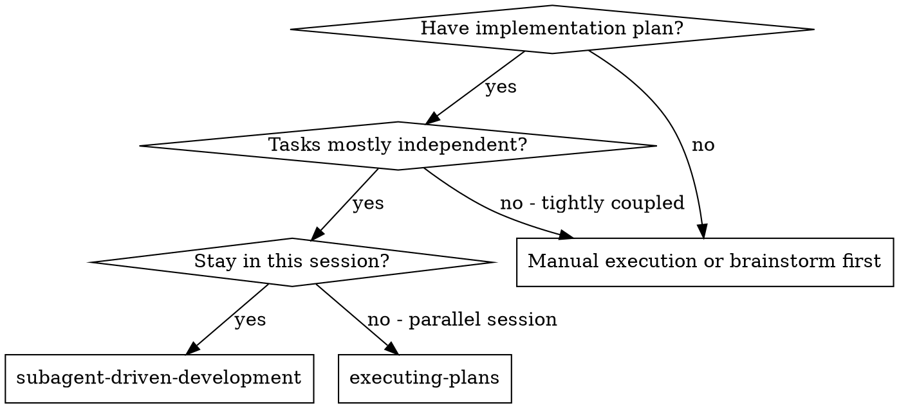
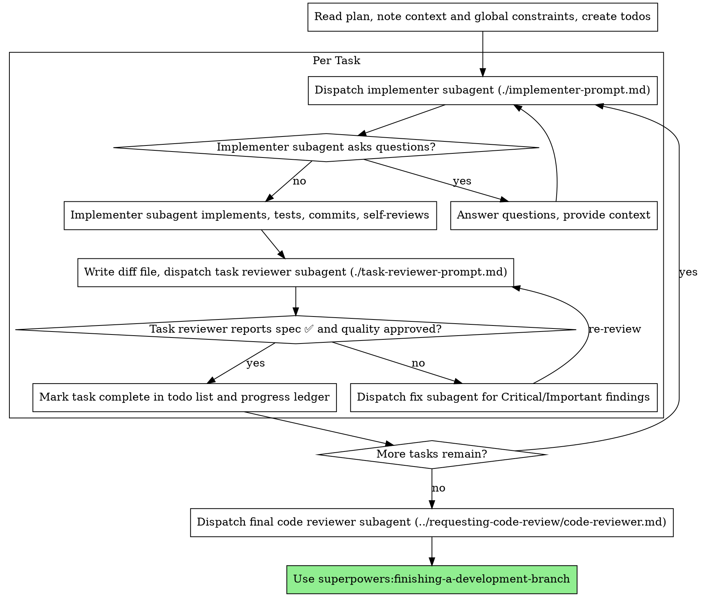

# Session transcript

## User

start I11 by reading CAMPAIGN.md + LEDGER.md first

## Assistant

Starting I11 per the campaign protocol: reading the governing documents in full — CAMPAIGN.md and LEDGER.md first, then BLOCKMAP.md.

### ⚙ Tool call: `Read`

```json
{
  "file_path": "/workspace/development/2026-07-17-modularization-campaign/CAMPAIGN.md"
}
```

### ↳ Tool result

```
1	# CAMPAIGN.md — Modularization Campaign (frozen architecture)
2	
3	**Status:** approved design, 2026-07-17. Brainstormed and approved section-by-section in
4	the campaign planning session (see `transcript.md` once archived); prompt in `PROMPT.md`.
5	
6	This is the **one** copy of the campaign's architecture, decisions, invariants, and
7	increment plan. Increment specs **cite this document and re-derive nothing** — the
8	campaign-level brainstorm and adversarial review run once, here; increments inherit that
9	scrutiny and do not repeat it. Any change to this document is an **amendment**: edit the
10	document *and* append a ledger entry (`LEDGER.md`) saying what changed and why. An
11	increment spec that contradicts this document without a ledger amendment is wrong by
12	definition.
13	
14	Related documents (all in this directory unless pathed): `PROMPT.md` (the campaign
15	request), `BLOCKMAP.md` (the B1–B60 functional map of `main()` all scope assignments
16	reference), `LEDGER.md` (append-only cross-increment record), `/workspace/CONTEXT.md`
17	(domain glossary — created by this campaign), `/workspace/prompts/directives.md` (the
18	Spine; PD#n citations below refer to it).
19	
20	## Glossary (campaign terms — domain terms live in `CONTEXT.md`)
21	
22	- **Campaign** — this whole program of work: one architecture, N increments.
23	- **Increment** — one unit of work with its own session, spec, implementation, review,
24	  commit, and archive. Numbered I0–I14.
25	- **Wave** — an ordered group of increments (0–4); increments within a wave may be
26	  reordered if the ledger records why, waves may not.
27	- **Block** — a `Bnn` region of `main()` per `BLOCKMAP.md`; the stable unit of scope
28	  assignment.
29	- **Core package** — the new importable `psh/` package holding infrastructure (Tier 1).
30	- **Gateway** — `psh/gateway.py`, the single module through which every Terminus/WP-CLI/
31	  Drush subprocess flows; the future Pantheon-API replacement seam.
32	- **Façade** — `script_context.py` (`sc`), the stable API surface that checks and plugins
33	  import; implementations move, the façade's names do not break.
34	- **Contract** — the per-phase guaranteed `site_context` keys (CLAUDE.md table), which
35	  this campaign turns into a machine-readable **contract registry**.
36	- **Hook DAG** — the per-phase topological ordering of hooks derived from declared
37	  `consumes`/`produces` keys, validated fatally at startup.
38	- **Ratchet** — the lint/type regime: broad ruff+pyright rules applied as a hard gate to
39	  moved/new modules immediately, the remnant grandfathered until I14.
40	- **Remnant** — whatever remains of the original script at any point mid-campaign.
41	- **Shim** — the thin committed `./pantheon-sitehealth-emails` entry script that calls
42	  `psh.cli.main()` after I0.
43	- **Ledger** — `LEDGER.md`; how increment N learns what N−1 actually did.
44	- **Behavior bar** — the tiered definition of which observable behavior may change (§8).
45	- **Invariant** — a named property no increment may alter (§9).
46	
47	**MUST** = required, violation fails review. **NEVER** = prohibited, violation fails
48	review. **SHOULD** = required unless the increment spec states why not. **MAY** =
49	allowed, at the implementer's judgment.
50	
51	## 1. Goal and non-goals
52	
53	**Goal.** Modularize the 4,752-line main script into (a) a `psh/` core package of
54	infrastructure modules, (b) self-registering `check/` packages for every notice/section
55	emitter, and (c) the existing `plugin/` integrations — taking full advantage of the hook
56	system — while the four e2e goldens stay byte-identical, the per-phase contract is
57	honored, and the non-U-M path keeps working. End state: `main()` is a ~250–400-line
58	orchestrator; every U-M-specific behavior lives in `umich` packages; the whole tree
59	passes the broadened ruff+pyright configuration.
60	
61	**Non-goals** (exhaustive; each is either declined or deferred with reasoning in §15):
62	replacing terminus with the Pantheon API; implementing parallel site processing; any new
63	report content (CSV attachment, cached-% column, env-lock section); SendGrid; refreshing
64	goldens or recorded fixtures; changing what any check reports (except the named bug
65	fixes in I1).
66	
67	## 2. Decision record (exhaustive — from the approved brainstorm)
68	
69	| # | Decision | Choice | Why |
70	|---|---|---|---|
71	| D1 | Pantheon API | **Seam only**: gateway module now, transport swap post-campaign | Swapping transports mid-campaign invalidates terminus fixtures + goldens in every touched increment |
72	| D2 | Lint/type broadening | **Ratchet in-campaign** (§13) | Code is cleaned exactly once, as it moves; bar fixed in I0 so it never shifts |
73	| D3 | Behavior bar | **Tiered, config renames allowed** (§8) | Cleanest final schema; production config edited once, at I14, with a migration table |
74	| D4 | Increment granularity | **Fine: 15 increments** | Safest for session/context limits; split-never-compress backstop (§12) |
75	| D5 | Target architecture | **Three-tier split** (§3) | Infrastructure ≠ report content ≠ data source; fulfills "full advantage of the frameworks" |
76	| D6 | Hook flexibility | **Phases stay; hooks declare consumes/produces; per-phase DAG validated at startup** (§4) | Keeps every existing hook/test valid; a phase-less key scheduler rewrites everything for no added power |
77	| D7 | `--only-warn` plan rec | **In campaign** (I7) | Small, no golden impact, existing TODO |
78	| D8 | Parallel-ready | **Design constraint only** (§3.4) | Near-free now; actual parallelism stays a README TODO |
79	| D9 | CSV attachment / cached-% / env-lock | **README TODO** | Each changes rendered email → golden churn mid-campaign |
80	| D10 | Packaging | **Real package + thin shim** (I0; console-script dropped — see LEDGER I0 amendment 1) | Dissolves the extension-less-script problem; normal imports for tests/pyright/ruff |
81	
82	## 3. Target architecture
83	
84	```
85	                 ./pantheon-sitehealth-emails  (thin shim)
86	                                │
87	                        psh.cli.main()  ── orchestrator: bootstrap, site loop,
88	                                │           phase firing, lifecycle dispatch
89	        ┌───────────────────────┼──────────────────────────┐
90	        ▼ Tier 1: psh/ core     ▼ seams (sc façade)        ▼
91	  configuration  modules   ┌─────────────────────┐   Tier 3: plugin/
92	  gateway        db        │  hook phases + DAG  │   aws  cloudflare
93	  traffic        plans     │  contract registry  │   env  umich
94	  gather         charts    └─────────┬───────────┘   (unchanged roles)
95	  render         mail                ▼
96	  lifecycle                Tier 2: check/  (all notice/section emitters)
97	                           pantheon  wordpress  drupal  addon_updates
98	                           dns  cloudflare  pantheon_cdn_change  umich
99	```
100	
101	### 3.1 Tier 1 — `psh/` core package (exhaustive module map)
102	
103	| Module | Receives (functions / blocks) |
104	|---|---|
105	| `psh/cli.py` | `build_arg_parser`, `parse_args`, arg validation (B5), `main()` orchestrator |
106	| `psh/configuration.py` | `process_config`, `config_substitution`, `gate_disabled_sections`, DEFER machinery, `load_news_items`, `umich_enabled`, `cloudflare_enabled` |
107	| `psh/modules.py` | `find_modules`, module loading (B2/B4), hook engine (`add_hook`/`invoke_hooks`/`PHASES`), DAG build/validation, contract registry |
108	| `psh/gateway.py` | `run_terminus`, `terminus`, `terminus_data`, `wp`, `wp_eval`, `drush`, `drush_php_script`, `fix_drush_output`, `wp_error`, `drush_error`, `TerminusError` |
109	| `psh/notice.py` | `Notice`, `Severity`, `NoticeRegistry`, `DuplicateNoticeCodeError`, `registry` (added I3; §6 Notice type + code registry) |
110	| `psh/db.py` | ORM models, `TrafficRow`/`OverageProtectionRow`, `db_engine_args`, `db_retry`/`db_retryable`/`record_db_reconnect`, `update_traffic_rows`, `insert_traffic_rows`, `load_traffic_rows`, `load_overage_protection_window`, `DatabaseUnavailableError` |
111	| `psh/traffic.py` | `get_old_metrics`, `estimate_month_visits`, `build_traffic_table_rows`, the `traffic_table_columns` global, metrics gather + DB update/load flow (B22–B26), visits-by-month aggregation (B43) |
112	| `psh/plans.py` | plan_info normalization (B12 part), SKU resolution (B17), `overage_blocks`, `contract_year_end`, `plan_costs`, `build_plan_over_time`, the `cost_table_columns` global, recommendation flow (B47) |
113	| `psh/gather.py` | Slimmed framework gathers feeding the `site_post_gather` contract (from B32–B35), `check_wordpress_plugin`/`check_drupal_module` helpers, `build_smell_notices` (the B48 smell-notice *builder*; its emission stays in `main()` — LEDGER I10 amendment 1) |
114	| `psh/charts.py` | Cap geometry (B13 part), chart data prep + matplotlib build (B44–B45) — returns PNG bytes |
115	| `psh/render.py` | Jinja render (B53), PHP inline + `!important` pass (B54), `escape_url` |
116	| `psh/mail.py` | Recipient resolution (B49), MIME assembly (B55), `smtp_login`, send (B57) |
117	| `psh/lifecycle.py` | `RunState`, `finish_run`, `abort_run`, `abort_reason`, `resume_point`, `resume_command`, `rerun_command`, `option_strings_taking_a_value`, `sites_from_resume_point`, `merge_prior_results`, `ResumeSiteNotFoundError` |
118	
119	`dns_classify.py` stays a top-level module (already extracted; moving it into `psh/` is
120	MAY-scope for I14, decided by ledger state then).
121	
122	**Whole-file coverage.** The campaign modularizes the entire script, not just `main()`:
123	every top-level def and module-level global in `pantheon-sitehealth-emails` (lines
124	1–2107 included) is assigned to a `psh/` module in this table and appears in exactly one
125	increment's scope (§11). End state: the original file is the thin shim and nothing else
126	— a top-level def still there at I14 is a defect the closing audit (§17) catches. Moved
127	helpers get the full §7 treatment (types, ratchet, verified docs, tests); they do NOT
128	get algorithmic redesign — moves are behavior-preserving except where §8 says otherwise
129	(I1, I7's D7, I12's B51).
130	
131	### 3.2 Tier 2 — new/changed `check/` packages (exhaustive)
132	
133	| Package | Contents (blocks) | Phase(s) |
134	|---|---|---|
135	| `check/pantheon/` (new) | frozen site (B19), no-live-env (B21), upstream updates (B38), PHP EOL (B41) | `site_pre` (frozen, no-live-env), `site_post_gather` (updates, PHP EOL) |
136	| `check/wordpress/` (new) | PAPC + native-sessions checks, OCP config probe, favicon (from B34) | `site_post_gather` |
137	| `check/drupal/` (new) | PAPC module check, D7 EOL + tag1_d7es, multisite probe (from B30/B35) | `site_post_dns` (multisite), `site_post_gather` |
138	| `check/addon_updates/` (new) | add-on updates table notice (B39) | `site_post_gather` |
139	| `check/umich/` (existing, grows) | umich-oidc-login, Hummingbird fork (B34), Drupal UA check (B35), annual-billing notices (B50/B51), portal-URL text for the recommendation notice (B47's U-M half) | `site_post_gather`, `site_pre_render` (billing) |
140	
141	`check/dns/`, `check/cloudflare/`, `check/pantheon_cdn_change/` are untouched tenants.
142	A check MAY fetch its own data through `sc` gateway wrappers when the data is
143	check-specific (e.g. `upstream:updates:list`); data used by core *and* checks is
144	published through the contract instead (e.g. `envs`).
145	
146	The B48 smell notices are **not** a `check/addon_updates/` hook (LEDGER I10 amendment 1):
147	their *builder* (`build_smell_notices`) moves to `psh/gather.py`, but the *emission* stays
148	in `main()`. A `site_post_gather` smells hook cannot be ordered after the
149	`wp_smell`/`drush_smell` in-place mutators — a `produces: ['wp_smell']` declaration is a
150	condition-2 fatal against the core registry (D-i9-3), and alphabetical registration puts
151	`check/addon_updates` first in the phase — and relocation would also add smell rows to
152	`--only-warn` csv output (B48 sits after that gate today), a §8 surface change. The
153	`mutates` hook declaration that would dissolve this class is post-campaign work (README TODO).
154	
155	### 3.3 What stays in `main()` (exhaustive, with why)
156	
157	Config/arg bootstrap ordering (B1–B8 — the two-pass substitution *order* is the
158	program); overage constants + date window (B9, B13 part); the site-loop skeleton (skips,
159	banner, sorted order, resume filter — B14–B18, B20, B25, B42); phase firing and contract
160	stuffing (B27, B28, B31, B37, B52); the B48 smell-notice *emission* call (the builder
161	moved to `psh/gather.py` at I10, but the emission summarizes end-of-phase smell state no
162	hook position can guarantee under the D-i9-3 rebind design, and it must stay behind the
163	`--only-warn` gate — LEDGER I10 amendment 1); notice sort + subject (B50 minus billing);
164	the `try`/`except BaseException` lifecycle dispatch (B59–B60 call sites). Everything else
165	leaves. Target: 250–400 lines.
166	
167	### 3.4 Parallel-ready constraint (D8)
168	
169	Per-site work MUST be a function of `(site, config, db_session, site_context)`: no new
170	module-level mutable state; run-scoped accumulators live only in `RunState`. This is a
171	review criterion from I2 onward, not a parallelism implementation.
172	
173	### 3.5 The `sc` façade
174	
175	Checks and plugins import **only** `sc` (and their own package). `sc` keeps every name
176	listed in CLAUDE.md's runtime-exposed block, re-exporting from `psh/` modules as they
177	move. NEVER remove or rename an `sc` attribute mid-campaign; additions are fine. The
178	house-rules test suite gains an assertion that every documented `sc` name exists (I2).
179	
180	## 4. Phases, hooks, and the DAG
181	
182	Phases stay the coarse spine: `setup`, `site_pre`, `site_post_traffic`, `site_post_dns`,
183	`site_post_gather`, `site_pre_render`, plus **new** `run_finish` (fired inside
184	`finish_run` before artifacts are written, receiving the `RunState`; for future run-level
185	artifact hooks — no consumer at introduction, like `site_pre_render` was). Dotted
186	plugin-defined events are unchanged.
187	
188	From I4, `add_hook` requires two new entries per hook: `consumes` and `produces` — each
189	a (possibly empty) list of contract-key names. Validation at module-load completion
190	(exhaustive fatal conditions):
191	
192	1. A consumed key that nothing produces (neither core's registry for that phase or an
193	   earlier phase, nor another hook) → fatal.
194	2. Two producers of the same key → fatal (one owner per key; PD#1 — a silent overwrite
195	   is a silent failure).
196	3. A cycle among same-phase hooks → fatal.
197	4. A hook consuming a key first produced in a *later* phase → fatal.
198	5. A missing `consumes`/`produces` entry on any hook → fatal (no legacy mode; I4
199	   retrofits all in-repo hooks in the same change).
200	
201	`invoke_hooks` orders same-phase hooks topologically (producers before consumers;
202	registration order breaks ties, so existing behavior is preserved where no edges exist).
203	The permanent test `tests/integration/test_hook_dag.py` loads **all** real check/plugin
204	packages and asserts the DAG builds — the "future changes can never make the DAG
205	impossible" guarantee — and a unit suite proves each fatal condition actually fires
206	(PD#14: the validator must be shown able to go red).
207	
208	```
209	 module load ──► collect hooks ──► per phase: build edges (produces→consumes)
210	                                        │
211	                              cycle? unknown key? dup producer? ──► fatal exit (named error)
212	                                        │ ok
213	                                topo order stored ──► invoke_hooks uses it
214	```
215	
216	**Contract registry.** `psh/modules.py` holds the machine-readable registry: phase →
217	keys core stuffs (today's CLAUDE.md table, verbatim). Core's stuffing code is checked
218	against it in tests; CLAUDE.md's table gains a line saying the registry is authoritative.
219	New contract keys added by increments (exhaustive for this campaign): `envs` (I8, at
220	`site_pre`), `add_on_updates` + `wp_smell`/`drush_smell`/`composer_smell` (I9/I10, at
221	`site_post_gather`), plan/cost keys `current_plan`, `recommended_plan`, `plan_costs`,
222	`savings` (I7, at `site_pre_render`). Each addition updates registry + CLAUDE.md table +
223	ledger in the same increment.
224	
225	**Hook-produced keys (I10).** A hook MAY produce keys of its own — declared in its
226	`produces`, validated for duplicate producers, cycles, and phase position by the same
227	conditions 1–4 above. Such keys are **DAG-declared, not registry-owned**: they are present
228	only when the producing hook actually ran (absent when its gate failed or its package is
229	disabled), so consumers read them with `.get()`, and they are **NOT** part of the
230	guaranteed per-phase contract (the "new contract keys" list above stays exhaustive for
231	registry-owned keys only). The campaign's first are `drupal_multisite` /
232	`drupal_multisite_smell`, produced by `check.drupal.multisite` at `site_post_dns` and read
233	by `main()` after the phase (I10; see LEDGER I10 amendment 2).
234	
235	## 5. Configuration
236	
237	Principles: one section per feature, named for the operator's mental model; every
238	relocated check gets an `enabled` flag under `[Check.<name>]`, **default true** —
239	relocating code MUST NOT silently disable a check that runs unconditionally today.
240	U-M-only checks additionally require `[UMich].enabled` (existing `umich_enabled()`
241	rule). `gate_disabled_sections()` semantics (nested `enabled`, children dropped) apply to
242	`[Check.*]` unchanged.
243	
244	Example (actual TOML, the shape I8 introduces — illustrative of the family, exhaustive
245	for `check/pantheon/`):
246	
247	```toml
248	[Check.pantheon]
249	enabled = true          # frozen-site, live-env, upstream-updates, PHP-EOL checks
250	```
251	
252	New keys land in final shape as introduced (I3 onward). Renames/moves of *existing* keys
253	happen once, in I14, which MUST deliver: the old→new migration table in
254	`docs/config-migration.md`, a rewritten `sample-pantheon-sitehealth-emails.toml`, and
255	exact edit instructions for the production config repo. Until I14, every existing
256	production key keeps working unchanged.
257	
258	## 6. Types
259	
260	Reused as-is: `TrafficRow`, `OverageProtectionRow`, `DnsFacts`, `FetchResult`,
261	`SiteContext`. Introduced (exhaustive):
262	
263	| Type | Increment | Shape |
264	|---|---|---|
265	| `GatewayResult` | I2 | NamedTuple `(result, errors, fatal)` replacing the anonymous 3-tuples |
266	| `Notice` | I3 (class) → adopted per increment | frozen dataclass: `severity` (StrEnum alert/warning/info), `code` (unique — registry test), `html`, `text`, `short`, `icon`, `order`; `SiteContext.add_notice` accepts `Notice` or legacy dict; dict form retired in I14 |
267	| `PlanInfo` / `PlanCatalog` | I7 | typed view over `[Pantheon.plan_info]` |
268	| `RunState` | I13 | dataclass holding `all_warnings`, `site_results`, `site_savings`, `emails_sent`, reconnect counters |
269	
270	House-style tuple annotations (`-> (str, str, bool)`) are replaced with real annotations
271	in every module as it moves — never fixed in place in the remnant (one pass per line,
272	D2). CLAUDE.md's house-style note is updated in I14 when the last one dies.
273	
274	## 7. Per-increment obligations
275	
276	Every increment MUST (this list is exhaustive and lives only here; increment specs cite
277	it): (1) start by reading `CAMPAIGN.md`, `LEDGER.md`, `CLAUDE.md`, `BLOCKMAP.md` rows in
278	scope; (2) follow `prompts/implementation-standards.md` (subagent-driven, test-first,
279	`psh-implementer`/`psh-reviewer`); (3) replace house styles in moved code (§6);
280	(4) verify — not assume — every claim in comments/docs it moves or writes;
281	(5) update tests in the same change; (6) update README/docs/CLAUDE.md for what moved;
282	(7) update auto-memory where a durable fact changed; (8) append its ledger entry
283	(§12); (9) preserve every invariant (§9); (10) end with `/code-review`, a full
284	`./run-tests`, and one checkpoint commit including its `development/` folder.
285	
286	## 8. Behavior bar (canonical gate table)
287	
288	| Surface | Rule | Until |
289	|---|---|---|
290	| Rendered emails (4 goldens) | NEVER change (byte-identical) | end of campaign |
291	| `-results.json` / `-notices.csv` / `-run.json` structure (keys, row shape) | NEVER change | end of campaign |
292	| Notice csv *values* | MAY change only in I1 (named bug fixes), I12 (scheduled B51 deletion), I7 (`its-recommends-plan` savings-field format, D-i7-5 — amendment), and I9 (wp-smell precedence when theme-list and OCP-probe stderr co-occur without favicon stderr — see LEDGER I9) | — |
293	| stdout / console / error messages | MAY improve freely | — |
294	| Config: existing keys | NEVER break | I14 (renames with migration table) |
295	| Config: new keys | MUST land in final schema shape | — |
296	| Exit codes, resume semantics, artifact write gates | NEVER change | end of campaign |
297	
298	## 9. Named invariants (exhaustive; NEVER violated by any increment)
299	
300	1. Four e2e goldens byte-identical (`./run-tests` proves it; refresh is forbidden — an
301	   existing golden going red is a defect in the increment, PD#14).
302	2. Per-phase data contract: existing keys never removed/renamed/retyped; additions only.
303	3. Non-U-M path works: non-U-M golden green; no new un-gated U-M content (I1 *removes*
304	   the one known leak).
305	4. Run lifecycle: single `except BaseException` flush path; `abort_reason`'s three
306	   outcomes; artifacts dropped-site rule; notices appended before send; resume-point
307	   next-site-after-email rule; soft-wrapped copy-pasteable commands.
308	5. DB: `db_retry` retries whole idempotent units only; `db_retryable` predicate
309	   unchanged; the read-release commit in the loaders stays (guarded by
310	   `test_load_traffic_rows_releases_the_connection`).
311	6. Rich console rules: escape untrusted text; production width reproduced in tests.
312	7. Test safety interlock (`run_program` forbidden flags) never bypassed or weakened.
313	8. Column-0 `f"""` notice literals move **verbatim** — never re-indented; `git diff -w`
314	   is not acceptable evidence for any change touching them.
315	9. Checks/plugins import only `sc`; `sc` names never removed mid-campaign (§3.5).
316	10. Recorded fixtures are not regenerated (`terminus-cdnchange/` is hand-maintained and
317	    `--record` must not run).
318	11. `--create-tables`/`--update`/`--import-older-metrics` phase-gating rules (CLAUDE.md
319	    table) unchanged.
320	
321	## 10. Known-bug inventory → I1
322	
323	The five bugs and the dead code listed in `BLOCKMAP.md` §Bugs (composer-smell
324	nesting+variable; shared `php-eol` code; `site_results` omission; un-gated U-M portal
325	URLs; duplicate `annual-bill` code — B51 handled as: distinct code now, scheduled
326	deletion when its Aug-2026 date passes, ledgered to I12; dead code deleted). Each fix is
327	test-first with the test shown red on the old behavior. **Verified 2026-07-17**: the
328	goldens contain zero `php-eol`/`wp-smell`/`drush-smell`/`composer-smell`/`annual-bill`
329	occurrences and the golden fixtures report PHP 8.2, so none of these fixes can touch a
330	golden:
331	
332	```
333	$ grep -c 'php-eol\|composer-smell\|wp-smell\|drush-smell\|annual-bill' tests/e2e/__snapshots__/*.ambr
334	tests/e2e/__snapshots__/test_golden.ambr:0
335	tests/e2e/__snapshots__/test_golden_cdn_change.ambr:0
336	tests/e2e/__snapshots__/test_golden_drupal.ambr:0
337	tests/e2e/__snapshots__/test_golden_nonumich.ambr:0
338	```
339	
340	## 11. The increments
341	
342	Wave dependency structure (increments within a wave are ordered but MAY be resequenced
343	with a ledger entry; waves MUST NOT be reordered):
344	
345	```
346	Wave 0: I0 bootstrap ──► I1 bug fixes
347	Wave 1: I2 gateway ──► I3 config ──► I4 hooks+DAG ──► I5 DB
348	Wave 2: I6 traffic ──► I7 plans ──► I8 check/pantheon ──► I9 wordpress ──► I10 drupal
349	Wave 3: I11 charts ──► I12 render+mail ──► I13 lifecycle
350	Wave 4: I14 closing sweep
351	```
352	
353	| Inc | Scope (blocks / functions) | Delivers |
354	|---|---|---|
355	| **I0** | — (no logic moves) | `psh/` skeleton + thin shim (console-script dropped — see LEDGER I0 amendment); conftest `import psh` rework (same collected-test count gate); ratchet config (§13) with rule sets pinned; pyright baseline measured; `LEDGER.md` started; README TODO edits (§15 dispositions); CLAUDE.md pointer to campaign |
356	| **I1** | B36, B40, B41, B47 (URLs), B48, B50/B51 (codes), dead code | §10 fixes, each test-first |
357	| **I2** | 302–597 wrappers | `psh/gateway.py`, `GatewayResult`, sc re-exports + façade test; no-subprocess-outside-gateway house rule |
358	| **I3** | 792–934, 1209–1253, 1608–1648 (`umich_enabled`/`cloudflare_enabled`) | `psh/configuration.py`; `Notice` class + code-uniqueness registry test |
359	| **I4** | 935–950, hook engine from `script_context.py` | `psh/modules.py`; consumes/produces on all in-repo hooks; DAG validation + fatal-condition tests; `run_finish` phase; contract registry |
360	| **I5** | 95–178; DB defs within 1285–1575 (`DatabaseUnavailableError` through `db_engine_args`; the resume helpers `ResumeSiteNotFoundError`, `sites_from_resume_point`, `merge_prior_results` stay for I13) | `psh/db.py`; DB test suites relocated intact |
361	| **I6** | B22–B26, B43; 598–671, 977–1127 | `psh/traffic.py` |
362	| **I7** | B9, B12 (plans), B17, B47; 967–976, 1128–1208, 1254–1280 | `psh/plans.py`; `PlanInfo`; D7 (`--only-warn` runs recommendation); plan/cost contract keys |
363	| **I8** | B19, B21, B38, B41 | `check/pantheon/` + `[Check.pantheon]`; `envs` contract key |
364	| **I9** | B32–B34; 672–739 | `psh/gather.py` (WP half); `check/wordpress/`; U-M WP checks → `check/umich/`; `add_on_updates` + smell contract keys |
365	| **I10** | B30, B35, B39; B48 *builder* only (emission stays in `main()` — LEDGER I10 amendment 1); 740–791 | gather (Drupal half) + `build_smell_notices`; `check/drupal/`; `check/addon_updates/`; UA check → `check/umich/` |
366	| **I11** | B13 (caps), B44–B45 | `psh/charts.py` |
367	| **I12** | B49–B57 minus sort/subject core | `psh/render.py`, `psh/mail.py`; annual billing → `check/umich/` at `site_pre_render`; B51 deletion if past its date |
368	| **I13** | B14 (accumulators), B56, B59–B60; 1649–2107 plus the resume helpers I5 left behind (1281–1284, 1528–1542, 1576–1607) | `psh/lifecycle.py`; `RunState`; `main()` reaches final form |
369	| **I14** | — | Config renames + migration doc + sample rewrite + production-config instructions; global ratchet flip + remnant cleanup; docs/README/CLAUDE.md full refresh; `Notice` dict form retired; ledger fully resolved; retrospective + closing audit (§17) |
370	
371	Sizing note: the largest moves are I9 (~330 main-loop lines + helpers) and I10 (~320 +
372	helpers). If any increment proves oversized mid-session: **split, never compress** —
373	commit nothing partial, ledger the split, the second half becomes its own increment.
374	
375	## 12. Coordination protocol
376	
377	**Ledger entry template** (append per increment, and for any amendment):
378	
379	```markdown
380	## I<N> — <slug> (<date>, commit <sha>)
381	- Moved: <blocks/functions actually moved>
382	- Deviations from CAMPAIGN.md: <none | what + why>
383	- Contract/config/sc additions: <keys/names>
384	- Discovered tasks: <each with disposition: fixed here | I<M> | README TODO>
385	- Open questions for next increment: <…>
386	```
387	
388	**Discovered-task disposition rules** (canonical): fits current increment's scope and
389	<~30 min → fix now, note in ledger; belongs to a later increment → ledger it against
390	that increment (the increment's spec author MUST read these); major/risky/scope-widening
391	→ README TODO with a sentence of context. Nothing is carried in memory or chat — if it
392	is not in the ledger or README, it does not exist (PD#9).
393	
394	**Session flow per increment:** read the §7 documents → write the increment SPEC.md in
395	`development/<date>-mod-I<N>-<slug>/` citing CAMPAIGN.md sections by number →
396	`superpowers:writing-plans` → subagent-driven implementation → `/code-review` → full
397	`./run-tests` → per-task commits, each green; the increment's final commit includes the dev
398	folder → `/archive-session` → ledger entry.
399	
400	## 13. Lint/type ratchet
401	
402	Mechanism (as shipped by I0; see LEDGER I0 amendment 2): TWO ruff configs —
403	`pyproject.toml` `[tool.ruff.lint]` keeps the narrow PD-rule set running everywhere
404	including the remnant, and `ruff-broad.toml` carries `select = ["ALL"]` minus a
405	justified ignore list, with `extend-exclude` grandfathering exactly the remnant
406	(`psh/_legacy.py`) and not-yet-moved files; each increment deletes its
407	files from the grandfather list, and the two configs merge at I14. pyright runs in
408	`./run-tests` from I0 via `[tool.pyright]` (standard mode, `psh/` minus `_legacy.py`),
409	ratcheting toward strict as typed code moves in. The four existing narrow rules (`E722`, `BLE001`, `S105`, `S106`) remain global
410	throughout — they mechanize PD#2/PD#6 and are never grandfathered. No
411	`target-version` pin (CLAUDE.md: it masks the 3.12-only syntax detection).
412	
413	Baselines measured 2026-07-17 (I0 re-measures and pins both in its spec):
414	
415	```
416	$ ./run-tests --fast --llm   (tail)
417	LLM_SUMMARY passed=727 failed=0 error=0 skipped=1 xfailed=0 xpassed=0
418	25 snapshots passed.
419	
420	$ uvx ruff check --isolated --statistics .
421	26  F541  f-string-missing-placeholders
422	 8  E741  ambiguous-variable-name
423	 4  E713  not-in-test
424	 3  F841  unused-variable
425	 2  F401  unused-import
426	 1  E402  module-import-not-at-top-of-file
427	 1  E712  true-false-comparison
428	Found 45 errors.
429	```
430	
431	(README's "~55" ruff and "39" pyright figures are stale/unverified claims; I0 replaces
432	them with measured numbers. pyright was not measured in planning — no pyright binary in
433	the dev container yet; installing it is I0 scope.)
434	
435	## 14. Risk / control table
436	
437	| Risk | Control |
438	|---|---|
439	| Re-indented column-0 notice literals silently change emails | Invariant 8; goldens as tripwire; AST/token comparison, never `git diff -w` |
440	| conftest rework silently drops tests | I0 gate: identical collected-test count (727 passed / 1 skipped / 2 deselected baseline) before and after |
441	| Long-range `main()` local coupling breaks a move | BLOCKMAP produces/consumes; each increment spec lists exactly which locals cross its boundary |
442	| Session/context overrun mid-increment | Fine granularity (D4); split-never-compress; commits only at increment completion |
443	| Architecture drift across 15 sessions | This document frozen; amendments only via ledger; specs cite section numbers |
444	| Hidden hook-order dependencies surface in I4 | I4 audits every hook; real dependencies become explicit DAG edges |
445	| Ratchet churn on moved code | Rules fixed at I0; cleaning is part of each move |
446	| Goldens blind to stdout/artifacts | Invariants 4–5 name the artifact/abort test suites as the cover; artifact structure frozen until campaign end |
447	| Implementer sessions lack context | `psh-implementer`/`psh-reviewer` carry the read list; specs name seams (Spine spec bar); §7 reading list |
448	| Two annual-bill notices / removal date passes mid-campaign | Explicitly scheduled: codes split in I1, deletion decision in I12, ledger tracks |
449	
450	## 15. NOT in scope (reasoning preserved so it is never re-litigated)
451	
452	- **Terminus → Pantheon API swap** — D1; post-campaign project against `psh/gateway.py`.
453	- **Parallel site processing** — D8; constraint only; README TODO remains.
454	- **CSV data attachment, cached-% column, env-lock section** — D9; each becomes a small
455	  post-campaign change (env-lock: a ~50-line `check/` package) once goldens may move.
456	- **SendGrid, secrets-handling completion, portal traffic capture, daily alerts,
457	  accessibility/security/Cloudflare scores, AI recommendations, dependency updates,
458	  terraform-infra** — pre-existing README TODOs, untouched by this campaign.
459	- **Approach B (library-only) and C (everything-is-a-hook)** — rejected in brainstorm:
460	  B fails the "full advantage of the frameworks" goal; C forces infrastructure into
461	  optional-content clothing.
462	- **Golden/fixture refreshes** — forbidden (Invariants 1, 10).
463	
464	## 16. Acceptance baseline
465	
466	§13 outputs are the campaign-start baseline (run and pasted 2026-07-17). Every
467	increment's definition of done re-runs `./run-tests` at increment end — the full suite
468	when the live tier's credentials are available in the session, otherwise `--fast` with a
469	ledger note saying the live tier was skipped — and MUST reproduce goldens
470	byte-identically. I0 additionally records the collected-test count gate.
471	
472	## 17. Closing audit (queued for I14; exhaustive)
473	
474	1. Is `main()` within 250–400 lines, and does everything left match §3.3?
475	2. Has every DAG fatal condition been demonstrated red at least once?
476	3. Do the contract registry and CLAUDE.md table agree (test-enforced)?
477	4. Is any `sc` re-export now consumed by nobody (dead façade surface)?
478	5. Is the `.py` symlink still needed for anything beyond the shim? If not, note in
479	   CLAUDE.md; if yes, say for what.
480	6. Are all ledger items resolved (done, scheduled, or README TODO)?
481	7. Has the production config repo received and applied the migration instructions?
482	8. Do README, CLAUDE.md, docs/, and memory reflect the final architecture (no stale
483	   line-number or module references)?
484	9. Were any invariants amended mid-campaign, and is each amendment ledgered?
485
```

### ⚙ Tool call: `Read`

```json
{
  "file_path": "/workspace/development/2026-07-17-modularization-campaign/LEDGER.md"
}
```

### ↳ Tool result

```
1	# LEDGER — Modularization Campaign
2	
3	Append-only. One entry per completed increment, plus one per CAMPAIGN.md amendment.
4	This file is how increment N learns what N−1 actually did; if a deviation, discovered
5	task, or decision is not recorded here (or in the README TODO list), it does not exist.
6	Entry template: CAMPAIGN.md §12.
7	
8	## Campaign planning (2026-07-17)
9	
10	- Produced: `CAMPAIGN.md` (frozen architecture), `BLOCKMAP.md` (B1–B60 map),
11	  `/workspace/CONTEXT.md` (domain glossary, new), this ledger.
12	- Baselines: fast tier 727 passed / 1 skipped / 2 deselected; ruff `--isolated` 45
13	  findings; pyright unmeasured (no binary in container — I0 scope).
14	- Discovered during planning, dispositioned:
15	  - Five bugs + dead code → I1 (CAMPAIGN.md §10, BLOCKMAP §Bugs).
16	  - README's "~55 ruff / 39 pyright" figures stale/unverified → I0 re-measures.
17	  - B51 second annual-bill notice: marked "remove Aug 2026" — code split in I1,
18	    deletion decision in I12.
19	  - WordPress/Drupal duplication + update-table HTML duplication (BLOCKMAP §Bugs 7–8)
20	    → addressed structurally by I9/I10 (shared gather + `check/addon_updates/`).
21	- Open questions for I0: exact ruff rule list; pyright strictness per environment;
22	  whether `dns_classify.py` moves under `psh/` (deferred to I14, MAY).
23	- Amendment (2026-07-17, user spec review): added the "Whole-file coverage" paragraph to
24	  CAMPAIGN.md §3.1 — clarification only, no scope change; the module map already
25	  assigned every top-level def.
26	
27	## I0 — bootstrap (2026-07-17, closing commit `docs(campaign-I0): close the bootstrap increment`)
28	
29	Commits (per-task, each green): `b1ccc72` (package move + shim + conftest + coverage),
30	`d0e3027` (lint/type ratchet), `5b536fa` + `239955d` (README/CLAUDE.md docs), plus this
31	closing docs commit (ledger + CAMPAIGN amendments + SPEC acceptance + README pyright number).
32	
33	- **Moved:** the whole 4,752-line program → `psh/_legacy.py` (`git mv`, **zero logic
34	  changes**; the `__main__` tail is inert in a module, left for I13). New: `psh/__init__.py`
35	  (docstring), `psh/cli.py` (`from psh._legacy import main, parse_args` re-export), and a new
36	  7-line thin shim at `./pantheon-sitehealth-emails` calling `psh.cli.main()`. No blocks
37	  (B-map) moved — I0 moves the file, not logic (§11 row I0).
38	
39	- **Deviations from CAMPAIGN.md (three amendments, all applied to the document this commit):**
40	  1. **No console-script entry point** (amends §11 row I0 / D10). The program is repo-rooted
41	     by design (`find_modules`, templates, `inline-styles.php`, `vendor/`, config symlink are
42	     all CWD-relative); a pip entry point would need a data-file overhaul serving no campaign
43	     goal. D10's real benefits (normal imports; native ruff/pyright/CodeGraph coverage; no
44	     `SourceFileLoader`) all arrive via the package + shim without installation. `pyproject.toml`
45	     stays deps-only (`py-modules = []`, `packages = []` to stop setuptools auto-discovery
46	     installing a stale shadow copy — PD#1). §11 row I0 now reads "thin shim (console-script
47	     dropped — see LEDGER I0 amendment)".
48	  2. **Grandfather is `psh/_legacy.py` via `ruff-broad.toml` `extend-exclude`** (amends §13,
49	     which named `pantheon-sitehealth-emails.py` and "per-file-ignores" — both written before
50	     the legacy-module + two-config mechanics were settled). The shipped mechanism is TWO ruff
51	     configs, not per-file-ignores: `pyproject.toml` `[tool.ruff.lint]` carries the narrow
52	     PD-rule set (`E722`/`BLE001`/`S105`/`S106`) that runs EVERYWHERE including `_legacy.py`;
53	     `ruff-broad.toml` carries `select = ["ALL"]` minus the ignore list and grandfathers the
54	     remnant via `extend-exclude`. `./run-tests` and `.claude/hooks/ruff-check.sh` run BOTH
55	     passes; the two files merge into `pyproject.toml` at I14. §13 now names `psh/_legacy.py`
56	     and "ruff-broad.toml exclude".
57	  3. **Per-task commits, each green** (amends §12's "one commit (code + dev folder)"). Each I0
58	     task committed independently once its gates were green; this increment's final (closing)
59	     commit includes the `development/` folder. Rationale: finer checkpoints serve the campaign
60	     prompt's revert/inspect intent, and SDD review packages diffs as commit ranges. §12 now
61	     reads "per-task commits, each green; the increment's final commit includes the dev folder".
62	
63	- **Ratchet as pinned.** pyright runs in `./run-tests` at **standard** mode, not strict
64	  (DECISION): `psh/cli.py` re-exports from the untyped legacy module, so strict would fail on
65	  re-export; strictness ratchets up as increments move typed code in. Scope `[tool.pyright]`
66	  = `include = ["psh"]`, `exclude = ["psh/_legacy.py"]`. Ruff-broad ignore list (pinned; each
67	  justified in `ruff-broad.toml`): `COM812`, `ISC001`, `E501`, `Q000`, `Q001`, `Q002`, `Q003`,
68	  `ANN`, `TD002`, `TD003`, `FIX002`, `EM101`, `EM102`, `TRY003`, `D`, `CPY001`. `CPY001` is a
69	  **preview** rule in ruff 0.15.22 (cannot fire under non-preview `select=["ALL"]`); ruff
70	  accepts it in `ignore` with no warning, so it is kept verbatim to document the intent
71	  (no per-file copyright headers). `D` (docstring convention) is undecided → README TODO.
72	
73	- **pyright whole-tree baseline (informational; replaces README's unverified "39").**
74	  **220 errors, 0 warnings, 0 informations** across 118 first-party files, standard mode,
75	  pyright 1.1.411 (SPEC ACCEPTANCE §Task 5 has the command + breakdown). Measured OUTSIDE the
76	  scoped gate config via a repo-root config (pyright roots a project at the config's directory
77	  and ignores includes outside it; a config's `exclude` still drops CLI-passed paths — so
78	  neither a scratchpad-rooted config nor CLI args can re-include `_legacy.py`, and a repo-root
79	  temp config is the reproducible form). By area: `tests/` 139, `psh/_legacy.py` 36, `check/`
80	  21, `plugin/` 18, `script_context.py` 5, `dns_classify.py` 1 (`check/`+`plugin/` = 39, the
81	  origin of the old figure). The gated scope (`psh/` minus `_legacy.py`) is `0 errors`.
82	
83	- **Contract/config/sc additions:** none (I0 moves no logic; no `[Check.*]` sections, no new
84	  contract keys, no `sc` names added or removed).
85	
86	- **Discovered tasks:**
87	  - **`Path(psh.__file__).parent` as a repo-root proxy** — 25 sites across 23 files: 22 test files (plus
88	    `tests/helpers/checkload.py`) anchored repo paths on the program file's parent, which the
89	    move shifted from repo root to `psh/`. Fixed here, mechanically and minimally:
90	    `→ Path(psh.__file__).resolve().parents[1]` at exactly those sites. Proper cleanup lands
91	    when later increments un-grandfather those test files; the `psh` fixture itself is
92	    redesigned when `_legacy` dies (I13/I14). Disposition: **fixed here**, further cleanup **I13/I14**.
93	  - **ruff lints explicitly-passed files even when excluded** — passing a path on ruff's
94	    command line overrides `extend-exclude`, so the edit hook (which passes the just-edited
95	    file) would lint `_legacy.py` against the broad set. Fixed by giving the broad-pass
96	    invocation `--force-exclude` and running it from repo-root cwd; documented in
97	    `.claude/hooks/ruff-check.sh`. Disposition: **fixed here**.
98	
99	- **Open questions for I1/I2:**
100	  - I1 (bug fixes) touches `_legacy.py` in place (fixes retire as code moves); it must keep
101	    the narrow PD set green there (broad set stays grandfathered) and the four goldens
102	    byte-identical (§10 verified the fixed codes appear in zero goldens).
103	  - I2 (gateway) is the first real logic move: as it un-grandfathers the wrapper functions it
104	    deletes them from `ruff-broad.toml` `extend-exclude` and must clean them to the broad set
105	    + pyright standard in the same change (§13 ratchet; §6 house-style tuple hints replaced).
106	  - `dns_classify.py` under `psh/` remains a MAY for I14 (unchanged from planning).
107	- Amendment (2026-07-17, post-Task-5 review): CAMPAIGN.md §13 mechanism paragraph
108	  rewritten to describe the SHIPPED two-config mechanism (it still said "pyproject gets
109	  extend-select" and "executionEnvironments", both superseded by amendment 2 above);
110	  ledger reanchor note corrected to "22 test files plus checkload.py" (23 files total).
111	  Both changes doc-accuracy only.
112	- Amendment (2026-07-17, final I0 code review, spec axis): D10's Decision cell still said
113	  "console-script" after amendment 1 changed only §11 row I0 — CAMPAIGN.md briefly
114	  self-contradicted. D10 cell now matches. Doc-accuracy only.
115	
116	## I1 — known-bug fixes (2026-07-17, commits `5518de7..1ff9153` + closing docs commit)
117	
118	Spec/plan: `development/2026-07-17-mod-I1-bug-fixes/` (SPEC.md carries the pasted
119	acceptance results). Six per-task commits, each green; full suite at close = 751 passed /
120	1 skipped **including the live tier**, 27 snapshots, all three gates; four goldens
121	byte-identical across the whole range (`git diff aa8afd1 -- tests/e2e/__snapshots__/`
122	empty).
123	
124	- **Moved:** no blocks (fixes land in place in `psh/_legacy.py` per I0's open-question
125	  note). Extracted five pure notice-builder helpers as consecutive module-level defs
126	  above `main()` (preserved-bug-extraction pattern; every literal interior byte-verified
127	  against the pre-move original by task reviewers AND the final review):
128	  `build_smell_notices`, `build_php_eol_notice`, `build_annual_bill_upcoming_notice`,
129	  `build_annual_bill_in_progress_notice`, `build_plan_recommendation_notice`. These
130	  travel later: smells → I10, php-eol → I8, annual-bill → I12, plan-rec → I7.
131	- **Fixed (CAMPAIGN §10 / BLOCKMAP §Bugs, all test-first with RED shown on old
132	  behavior):** (1) B48 composer-smell nesting + wrong interpolated variable;
133	  (2) B41 shared `php-eol` csv code → `php-eol-warning` (7.4/8.1) / `php-eol-alert`
134	  (<8.2), following the `updates-*` suffix pattern; (3) B36 unknown-framework sites now
135	  get a `site_results` entry (`version: "unknown"`, same 3-key row shape) — covered by a
136	  new offline e2e (`tests/e2e/test_unknown_framework_e2e.py`) asserting the
137	  `finish_run()` stdout pprint, since `-results.json` is written only on `--all` runs the
138	  interlock bans; (4) B47 un-gated U-M portal URLs — two of the four named URL sites
139	  (`extra_message`/`extra_text`) were **dead stores** (assigned, never read; §10's
140	  4240/4248 refined — bug partially lived in dead code), deleted; the live
141	  `its-recommends-plan` notice now selects U-M vs generic copy via `umich_enabled()`
142	  (generic drops the portal anchor AND the June-16-30 downgrade-window sentence — U-M
143	  billing policy, factually wrong elsewhere); both variants pinned by syrupy snapshots
144	  (`test_plan_recommendation_notice_render`); (5) B50/B51 duplicate `annual-bill` code —
145	  B51 now emits `annual-bill-in-progress`; B50 keeps `annual-bill`; B51's Aug-2026
146	  deletion decision remains I12's; (6) dead code deleted (B40 Gen2 block, overage debug
147	  query, `# plt.show()`, redundant second `plt.close(fig)` with its stale memory claim).
148	- **Deviations from CAMPAIGN.md:** none.
149	- **Contract/config/sc additions:** none. Sanctioned notice-csv value changes (§8 I1
150	  exception): the three codes above. New **hand-maintained** fixture dir
151	  `tests/fixtures/terminus-unknownfw/` (copy of `terminus/`, one framework value →
152	  `"mystery"`, README states `--record` never refreshes it — Invariant 10, cdnchange
153	  precedent) + conftest constant `TERMINUS_FIXTURES_UNKNOWNFW`.
154	- **Discovered tasks (dispositions):**
155	  - Template `email_template.{html,txt}` portal URLs render `sites/0/` in every non-U-M
156	    run including the non-U-M golden (SPEC Obs. 1) → I12/I14 (goldens freeze it now;
157	    already on CLAUDE.md's still-hardcoded-U-M list).
158	  - `php_version < "8.2"` string comparison + KeyError if key absent (Obs. 2) → I8.
159	  - B47 downgrade path: owner gets NO notice (dead `extra_message` was presumably meant
160	    for this) and a non-Basic downgrade appends no `site_savings` entry (Obs. 3) → I7
161	    decides intended behavior.
162	  - Composer-smell literals carry baked-in 8-space indentation (Obs. 4) → I10.
163	  - `its-recommends-plan` csv embeds `{savings:,.2f}` — thousands comma inside a
164	    comma-separated field, variable column count (Obs. 5) → I7, or I3's `Notice`
165	    class/code-registry work.
166	  - Residual test gap (final-review triage): `main()`'s umich-only annual-bill call
167	    sites have no runtime test (goldens are umich-disabled; interlock bans a U-M run) —
168	    I12's spec author MUST cover this when relocating annual billing to `check/umich/`
169	    at `site_pre_render`.
170	- **Process note (PD#14 instance):** one implementer's report Write silently failed
171	  against a stale `.superpowers/sdd/` report file from I0 and was misreported as
172	  success; caught by the task reviewer (report content was for the wrong task). Stale
173	  scratch reports are now purged before dispatch; future increments should start by
174	  clearing `.superpowers/sdd/task-*-report.md` leftovers.
175	- **Open questions for I2:** none new — proceed per I0's notes (un-grandfather the
176	  wrapper functions from `ruff-broad.toml`, clean to broad set + pyright standard,
177	  replace house-style tuple hints, `GatewayResult`, façade test).
178	
179	## I2 — gateway extraction (2026-07-17, commits `7044b12` (Task 1), `0141f76` (Task 2), house-rule-scope fix + closing docs commit)
180	
181	Spec/plan: `development/2026-07-17-mod-I2-gateway/` (SPEC.md carries the pasted acceptance
182	results). Two per-task code commits, each green, plus a whole-branch-review follow-up commit
183	(the `ENVIRON_SCOPE` widening below) and this closing docs commit (CLAUDE.md / tests/README.md /
184	gateway docstrings / memory / this ledger entry). Full suite (live tier present) at close =
185	**755 passed / 1 skipped** (the 1 skip is `test_db_credentials.py`'s `importorskip("MySQLdb")`
186	on a sqlite-only install), all three gates; four goldens byte-identical across the increment
187	(`git diff 8b1466b -- tests/e2e/__snapshots__/` empty).
188	
189	- **Moved:** the eleven Terminus/WP/Drush subprocess-facing wrapper defs (the 302–597 wrapper
190	  region of `psh/_legacy.py` **minus** `escape_url`, which §3.1 assigns to `psh/render.py`/I12) →
191	  `psh/gateway.py`: `run_terminus`, `TerminusError`, `terminus`, `terminus_data`, `wp`, `wp_eval`,
192	  `wp_error`, `fix_drush_output`, `drush`, `drush_php_script`, `drush_error`. `psh/_legacy.py`
193	  re-imports all eleven (plus `GatewayResult`), so its ~54 call sites and the `sc` exposure block
194	  resolve unchanged. Logic and the two column-0 `f"""` notice literals (`wp_error`/`drush_error`)
195	  moved byte-for-byte (Invariant 8; extracted-block diff pasted empty in the Task 1 report).
196	- **Deviations from CAMPAIGN.md:** the SPEC's §Broad-ruff-findings table enumerated **seven**
197	  findings on the moved code; the actual count was **EIGHT**. Wrapping `run_terminus`'s literal
198	  `return … True`/`return … False` statements in the `GatewayResult(...)` constructor introduced an
199	  `FBT003` (Boolean-positional-value-in-function-call) the spec did not foresee. Resolved
200	  **behavior-preservingly** by constructing with the `fatal=` keyword (`GatewayResult(output,
201	  errors, fatal=True)`) — no `ruff-broad.toml` ignore-list change (that would be a §13 amendment)
202	  and no `# noqa`. The other seven dispositions landed exactly as specced.
203	- **Ratchet (§13):** nothing was deleted from `ruff-broad.toml`'s `extend-exclude` this increment.
204	  The wrappers moved to a **new** file (`psh/gateway.py`), which is gated by the broad ruff set +
205	  pyright standard from birth (it was never in the exclude list). So LEDGER I0's "un-grandfather the
206	  wrapper functions from `ruff-broad.toml`" open-question was a **no-op for the exclude list** — its
207	  premise (functions cleaned in place inside an excluded file) didn't apply once they moved to a
208	  fresh gated file; the cleaning obligation is discharged by gateway.py being born under the full
209	  gate (`uvx ruff check --config ruff-broad.toml psh/gateway.py` → All checks passed!; pyright 0
210	  errors). Recorded per SPEC §Ratchet.
211	- **Contract/config/sc additions:** `GatewayResult` NamedTuple `(result, errors, fatal)` introduced
212	  in `psh/gateway.py`, re-exported via the `_legacy` import. **No new `sc` name** (no check/plugin
213	  references the type — it is unpacked positionally; adding it would be dead façade surface,
214	  CAMPAIGN.md §17 Q4). **No new contract keys.** New `gateway` conftest fixture and two house-rule
215	  instruments (no-`subprocess.Popen`-outside-gateway; documented-`sc`-façade-names-exist).
216	- **Discovered tasks (dispositions):**
217	  - The `wp`/`wp_eval`/`drush`/`drush_php_script` docstrings said "Returns a 3-tuple" after the
218	    move → **fixed here** (Task 3): updated to "Returns a GatewayResult (result, errors, fatal)".
219	    Doc-accuracy only, no logic change; gateway.py re-passed ruff-broad + pyright with 0 findings.
220	  - **`ENVIRON_SCOPE` house-rule was blind to the program body** (whole-branch review finding).
221	    `tests/unit/test_house_rules.py`'s PD#6 `os.environ` guard scoped to `check`/`plugin`/
222	    `dns_classify.py`/`script_context.py`/the 17-line shim — but **not** `psh/`, where the program
223	    body has lived since campaign I0. A direct `os.environ` read added to `psh/_legacy.py` or
224	    `psh/gateway.py` (the largest feature-code files) would have passed silently (PD#1/PD#6/PD#14 —
225	    an instrument blind to what it guards). Latent (grep found no offender) and **pre-existing**
226	    (introduced at I0's file move, not by I2's tasks), but I2 owns this test file and I2's own
227	    `_scoped_sources(scope)` parameterization made the fix one word → **fixed here**: added `"psh"`
228	    to `ENVIRON_SCOPE`, with the new red demonstration (adding `os.environ` to `psh/_legacy.py`
229	    fails naming it) observed, reverted, and recorded in the test docstring. Suite stayed green.
230	- **Open questions for I3:** none new — proceed per CAMPAIGN.md §11 row I3 (`psh/configuration.py`;
231	  `Notice` class + code-uniqueness registry test).
232	
233	## I3 — configuration module + `Notice` class (2026-07-17, commits `ed2698f` (Task 1), `d21a1d2` (Task 2), plus this closing docs commit)
234	
235	Spec/plan: `development/2026-07-17-mod-I3-config-notice/` (`SPEC.md` cites CAMPAIGN.md by
236	section; task reports under `.superpowers/sdd/task-{1,2}-report.md` carry the pasted
237	red/green evidence and pre-suppression ruff findings). Two per-task code commits, each
238	green, plus this closing docs commit (CLAUDE.md / CAMPAIGN.md §3.1 amendment / this ledger
239	entry). Full suite at close (`--fast`; **no live credentials in this environment**, so the
240	live tier did not run — same caveat as prior increments where noted) = **761 passed / 1
241	skipped / 2 deselected**, all three gates green, 27 snapshots; four goldens byte-identical
242	across the increment (`git diff 45b8a88 -- tests/e2e/__snapshots__/` empty).
243	
244	- **Moved:** `config_substitution`, the DEFER machinery (`_DEFER_TAG` + the two compiled
245	  regexes), `process_config`, `gate_disabled_sections`, `load_news_items`, `umich_enabled`,
246	  and `cloudflare_enabled` (the six defs + DEFER machinery named in SPEC §Deliverable A) from
247	  `psh/_legacy.py` into a new `psh/configuration.py`, re-imported back into `_legacy.py` (I2
248	  gateway precedent — the ~11 existing tests calling `psh.process_config` etc. needed no
249	  repoint). **New:** `psh/notice.py` (`Severity` StrEnum, frozen `Notice` dataclass,
250	  `NoticeRegistry`, `DuplicateNoticeCodeError`, module `registry`) — pure, stdlib-only, no
251	  `script_context` dependency. `SiteContext.add_notice` (`script_context.py`) now accepts a
252	  `Notice` or the legacy dict via a new `_notice_to_dict` projection. The `no-domains` notice
253	  (`psh/_legacy.py`, B29) was converted to construct a `Notice` end-to-end, with its code
254	  registered once at module scope; its `html`/`text` f-string interiors (including the
255	  pre-existing "the ste" typo) moved byte-for-byte.
256	
257	- **Deviations from CAMPAIGN.md:**
258	  1. **New module `psh/notice.py`** — §3.1's module map is exhaustive and named no home for
259	     the `Notice` type (§6 introduces the type without pinning a module). Handled as a
260	     CAMPAIGN.md **amendment**, not a ledger-note-only, per §Preamble ("edit the document
261	     *and* append a ledger entry"): this closing commit adds the one-row `psh/notice.py`
262	     entry to §3.1 (`Notice`, `Severity`, `NoticeRegistry`, `DuplicateNoticeCodeError`,
263	     `registry`) between the `psh/gateway.py` and `psh/db.py` rows.
264	  2. **PoC converts `no-domains` (B29), out of I3's declared block scope** (§11 row I3 lists
265	     only the config functions). Deliberate — §6 says the class is "adopted per increment",
266	     the user chose `no-domains` as a PoC, and it is core-and-staying-core (CLAUDE.md: "remain
267	     in core") so no later increment re-touches it. The notice's *home* is unchanged, only its
268	     representation, so this is a **ledger note**, not a §3.1/architecture change.
269	  3. **`sc.Notice`/`sc.Severity` reach `sc` via a module-level `from psh.notice import Notice,
270	     Severity` import at the top of `script_context.py`, NOT the `sc.Notice = Notice` /
271	     `sc.Severity = Severity` assignment pair the SPEC's §sc re-exports section showed** (added
272	     "near the existing `sc.umich_enabled = …` lines" in `_legacy.py`). Task 2's dispatch
273	     carried an explicit correction (surfaced by the Task 2 review, folded into the task
274	     brief before implementation): a plain module-level import makes both names module
275	     attributes automatically, so the assignment pair would have been a same-observable-effect
276	     duplicate of the import — the DRY Engineering Preference favors the single mechanism. The
277	     façade surface is identical either way (`hasattr(sc, "Notice")` etc. — pinned by
278	     `test_documented_sc_facade_names_exist`), so this is a mechanism choice, not a behavior
279	     change; recorded here because the SPEC's illustrative code block, read literally, would
280	     have produced dead/duplicate assignment lines.
281	
282	- **Contract/config/sc additions:** `sc.Notice`, `sc.Severity` (mechanism above). **No new
283	  contract keys** — no phase, `site_context` key, or config section was added; `Notice`
284	  is a producer-side representation change only. `sc.register_notice_code`/`sc.registry` were
285	  **NOT** added (SPEC §sc re-exports, D — deferred until a `check`/`plugin` package first
286	  adopts `Notice`; the PoC imports `registry` from `psh.notice` directly, being core code).
287	
288	- **`script_context.py` typing fix:** `options`/`config` module globals, previously untyped
289	  `= {}`, are now `options: argparse.Namespace = argparse.Namespace()` and
290	  `config: dict[str, Any] = {}` (new `argparse`/`Any` imports) — the minimal fix pyright
291	  standard mode needed to resolve `sc.options.verbose`/`sc.options.config` inside the moved
292	  `psh/configuration.py`. No other name in `script_context.py` was retyped (it stays
293	  grandfathered from the broad ruff ratchet; this is an out-of-gate, minimal, honest fix per
294	  the SPEC's own instruction).
295	
296	- **Ratchet (§13):** both new files gated from birth — neither is nor was in
297	  `ruff-broad.toml`'s `extend-exclude`. `uvx ruff check --config ruff-broad.toml
298	  psh/configuration.py psh/notice.py` → "All checks passed!"; pyright standard mode over
299	  `psh/` minus `_legacy.py` → 0 errors. Nothing deleted from `extend-exclude` (same as I2 —
300	  the moved/new code lands in fresh gated files, not an un-grandfathered old one).
301	
302	- **Ruff/pyright dispositions actually applied (corrections to the SPEC's finding table,
303	  both confirmed against real ruff/pyright output by the Task 1 implementer, not assumed):**
304	  - **`PLR2004` lands on only the two `sc.options.verbose >= 2` comparisons**, not the
305	    `> 1` one the SPEC's illustrative table also listed: ruff's default magic-value
306	    allowlist already covers `-1, 0, 1`, so `> 1` never triggers the rule, and a `# noqa:
307	    PLR2004` there is a live `RUF100` (unused-noqa) finding. Dropped from that line; kept
308	    (with the SPEC's inline reason) on both `>= 2` lines.
309	  - **`S101` (`Use of assert detected`) on both `best_match is not None` asserts** — a real
310	    finding the SPEC's ruff-findings table didn't enumerate (that table covered the
311	    moved-as-is code; the pyright-findings section separately *mandates* the asserts, but
312	    neither section flagged the S101 the asserts themselves introduce). Resolved inline:
313	    `# noqa: S101` with a reason (pyright type-narrowing only, not a security check).
314	  - **`glob` and `Any` were in fact orphaned** in `psh/_legacy.py` by the move — the SPEC's
315	    "expect none" prediction for orphaned imports was wrong for these two (`load_news_items`
316	    was their only user); `tomllib`/`re`/`shlex`/`sys`/`escape`/`pprint` all had other live
317	    users as predicted. Removed per the SPEC's own fallback instruction ("remove only what
318	    this change orphans").
319	  - All other dispositions (the `C901`/`PLR0912`/`PLR0915` triple noqa on
320	    `config_substitution`, the `FBT002` keyword-only fix, `SIM118`, `PTH207`/`PTH123`) landed
321	    exactly as the SPEC specified.
322	
323	- **Discovered tasks (dispositions):**
324	  - **Extra-csv-field `Notice` modeling is deferred** (SPEC §Notice field set, by design —
325	    not newly discovered here, but re-flagging its disposition for I4+): `Notice` currently
326	    carries `severity, code, html, text, short, icon, order` — no `csv`/`csv_extra`. A notice
327	    whose csv needs extra fields (e.g. `turned-off,{name}`, the `its-recommends-plan`
328	    savings figure) stays a dict until the first increment that converts one, which MUST
329	    amend CAMPAIGN.md §6 (add the field) via its own ledger entry — not silently widen
330	    `Notice` here. Disposition: **first adopting increment** (candidates per LEDGER I1:
331	    `check/addon_updates/` smells, I10; `annual-bill`/`annual-bill-in-progress`, I12; the
332	    `its-recommends-plan` comma-in-csv issue, I7).
333	  - No other discovered tasks — Task 1/Task 2's own reports found no further gaps beyond the
334	    three ruff/pyright corrections recorded above.
335	
336	- **Open questions for I4:** none new beyond CAMPAIGN.md §11 row I4 (`psh/modules.py`:
337	  `find_modules`, the hook engine, and the `consumes`/`produces` DAG additions §4 describes).
338	  I4's spec author should note that `psh.notice.registry` is import-time-once metadata (same
339	  contract as `sc.substitutions`/`sc.hooks`, per `psh/notice.py`'s own "Reload constraint"
340	  docstring) — relevant if the DAG work touches module reload/re-registration semantics.
341	
342	## I4 — hooks + DAG + contract registry (2026-07-20, commits `82d62ff..1f2a6af` + closing docs commit)
343	
344	Spec/plan: `development/2026-07-20-mod-I4-hooks-dag/` (SPEC.md carries the pasted acceptance
345	results; task reports under `.superpowers/sdd/task-{1..6}-report.md` carry the red/green
346	evidence). Six per-task code commits plus one review-fix commit, each green, plus this
347	closing docs commit (CLAUDE.md / memory / this ledger entry / the dev folder). Full suite at
348	close **including the live tier** (Terminus token present) = **782 passed / 1 skipped**
349	(the skip is `test_db_credentials.py`'s `importorskip("MySQLdb")`), all three gates, 27
350	snapshots; four goldens byte-identical across the increment
351	(`git diff d46f56d -- tests/e2e/__snapshots__/` empty).
352	
353	- **Moved:** `find_modules` (from `psh/_legacy.py`) and the hook engine — `PHASES`,
354	  `_valid_hook_name`, `add_hook`, `invoke_hooks` (from `script_context.py`) — into the new
355	  `psh/modules.py` (gated from birth). `script_context.py` re-exports
356	  `PHASES`/`add_hook`/`invoke_hooks` via a top-of-file `from psh.modules import …` (the I3
357	  `Notice`/`Severity` mechanism), so every `sc.*` call site resolves unchanged; `_legacy.py`
358	  re-imports `find_modules` + the new names. **New:** mandatory `consumes`/`produces`
359	  declarations (§4 condition 5, enforced at `add_hook` — nothing enters `sc.hooks`
360	  undeclared); `validate_hooks()` (§4 conditions 1–4 as named `HookDagError` subclasses:
361	  `UnproducedKeyError`, `DuplicateProducerError`, `HookCycleError`, `LaterPhaseKeyError`),
362	  called in `main()` after the check-import loop; `ordered_hooks()` (Kahn, registration-order
363	  tie-break) used by `invoke_hooks`; the authoritative `CONTRACT` registry +
364	  `stuff_traffic_contract`/`stuff_gather_contract` extracted from `main()`'s B28/B37 stuffing
365	  lines (registry-pinned by `tests/unit/test_contract_registry.py`, alongside
366	  `dns_classify.stuff_dns_contract`); the **`run_finish`** phase (first statement of
367	  `finish_run()`, completed AND aborted runs). All 11 in-repo `add_hook` registrations
368	  retrofitted with code-verified declarations; permanent
369	  `tests/integration/test_hook_dag.py` loads every real check/plugin package and validates.
370	
371	- **Deviations from CAMPAIGN.md (all ledger notes, no amendments — each stays within §4's
372	  observable contract; rationale in SPEC D-i4-1…7):**
373	  1. The mutable `hooks` dict **stays in `script_context.py`** (§3.1 moves the engine
374	     functions; §3.4 bars new module-level mutable state in `psh/`, and `reset_sc` rebinds
375	     `sc.hooks` — a second home would silently desync, PD#14). Engine functions read it via
376	     a call-time `import script_context as sc` (cycle-avoidance; module docstring diagram).
377	  2. **Dotted events must declare `consumes`/`produces` BOTH empty** — §4's "dotted events
378	     unchanged" read as invocation semantics, not registration schema; a non-empty
379	     declaration on a phase-less event is unvalidatable and therefore fatal.
380	  3. **Condition 5 enforces at `add_hook` time** (stricter placement than §4's
381	     "module-load completion"; conditions 1–4 validate at load completion as written).
382	  4. **Invoke order is computed per invocation** by pure `ordered_hooks()` rather than
383	     stored at validation (§4 diagram says "stored") — same inputs, same order; removes the
384	     stale-cache mode for tests that register without validating.
385	  5. **`run_finish` fires with no arguments until I13's `RunState`** (§4 says "receiving
386	     the RunState", a type that does not exist until I13; no consumer exists, so the
387	     signature change then is safe).
388	  6. **B2/B4 module-import loops stay in `main()`** (§3.1 assigns them to `psh/modules.py`
389	     eventually; §11 row I4 does not list them — they move with `main()`'s final form, I13).
390	
391	- **Contract/config/sc additions:** `run_finish` phase (registry entry `()` — CLAUDE.md
392	  table row added). **No new contract keys, no config keys, no new `sc` names** (the
393	  re-exported engine names already existed on `sc`). SPEC §6 correction during Task 3:
394	  `check.cloudflare.cache` consumes `['fqdns_behind_cloudflare', 'primary_domain']` — the
395	  spec-time grep pattern (`site_context[`) missed the `.get("primary_domain")` read at
396	  `cache.py:233`; the brief's mandated code re-verification caught it (PD#14 working as
397	  designed).
398	
399	- **Ratchet (§13):** `psh/modules.py` born gated (broad ruff + pyright standard, 0
400	  findings). **`script_context.py` un-grandfathered** — deleted from `ruff-broad.toml`
401	  `extend-exclude`; findings fixed: `I001`, 2× `SIM401` (`.get` rewrites), 2× `PLR1714`
402	  (tuple-membership rewrites, deliberately tuples not ruff's suggested set literals — no new
403	  hashability assumption), all equivalence-argued in the Task 6 report. No ignore-list
404	  changes; noqa inventory in `psh/modules.py`: `PLC0415` (call-time sc imports, cycle
405	  reason), `PTH116`/`PTH118` (find_modules keeps str paths for its `.split("/")`),
406	  `PLR0913` (stuff_gather_contract's spec-pinned 7-arg signature).
407	
408	- **Discovered tasks (dispositions):**
409	  - **Pre-existing raw hook-dict write** in `tests/integration/test_plugin_umich_portal.py`
410	    (`sc.hooks[...] = [...]` bypassing `add_hook`) broke under `ordered_hooks`' unconditional
411	    key indexing → **fixed here** (Task 5), converted to a declared `add_hook` call;
412	    repo-wide grep confirmed it was the only instance (fix-the-class rule).
413	  - `tests/helpers/checkload.py` gained a backward-compatible `base=` param so the DAG test
414	    can load `plugin/` packages standalone → **fixed here** (Task 5).
415	  - The two pre-existing unknown-phase fatals interpolated `hook_name` unescaped
416	    (Invariant 6 gap, latent since the engine's script_context days) → **fixed here**
417	    (Task 5, §8 sanctions stdout improvement).
418	  - `main()`'s `except HookDagError` → print + exit glue is untested (every condition is
419	    proven red at the `validate_hooks` seam; the goldens prove the success path through
420	    `main()`) → accepted, **noted here** (PD#14: the glue rests on inspection).
421	  - `run_finish` abort-path firing is covered transitively (shared unconditional first line
422	    + `test_abort_run.py` proves `finish_run` runs on abort) → accepted per SPEC §9;
423	    a direct probe in the abort tests is a cheap add if `finish_run`'s call structure ever
424	    changes → **noted here**.
425	  - **Runtime-registered hooks bypass DAG conditions 1–4** (validation runs once,
426	    post-import; only `add_hook`'s declaration check fires later). No in-repo hook registers
427	    dynamically; import-time registration is the assumed model → **I13** (lifecycle) should
428	    make the assumption explicit when `main()` reaches final form.
429	- **Open questions for I5:** none new — proceed per CAMPAIGN.md §11 row I5 (`psh/db.py`;
430	  DB test suites relocated intact; note the resume helpers stay behind for I13).
431	
432	## I5 — DB-layer move (2026-07-20, commit `c291a26` (Task 1) + this closing docs commit)
433	
434	Spec/plan: `development/2026-07-20-mod-I5-db/` (`SPEC.md` carries the pasted acceptance
435	results, corrected — see below). One code commit (Deliverables A–D landed atomically:
436	partial application cannot be green), plus this closing docs commit (CLAUDE.md / memory /
437	this ledger entry / SPEC §9 acceptance). Full suite at close **including the live tier**
438	(Terminus credentials present in this environment) = **782 passed / 1 skipped**, all three
439	gates, 27 snapshots; four goldens byte-identical across the increment
440	(`git diff 1cf37d3 -- tests/e2e/__snapshots__/` empty).
441	
442	- **Moved:** exactly the §3.1 `psh/db.py` row — `Base`, `PantheonTraffic`,
443	  `PantheonOverageProtection`, `TrafficRow`, `OverageProtectionRow`,
444	  `DatabaseUnavailableError`, `record_db_reconnect`, `db_retryable`, `db_retry`,
445	  `update_traffic_rows`, `insert_traffic_rows`, `load_traffic_rows`,
446	  `load_overage_protection_window`, `db_engine_args` — into the new `psh/db.py`, gated
447	  from birth, re-imported into `psh/_legacy.py` (I2/I3 pattern) so call sites, the `psh.*`
448	  test references, and the `sc.db_engine_args` exposure line all resolve unchanged.
449	
450	- **Deviations from CAMPAIGN.md:** none (all of the below are SPEC-level decisions or
451	  ledger notes within §11 row I5's own scope, not amendments to CAMPAIGN.md):
452	  1. **D-i5-1 — the two reconnect counters move to `script_context.py`, not `psh/db.py`.**
453	     §3.1's `psh/db.py` row names `record_db_reconnect` (the function) but neither counter
454	     dict; §3.4 bars new module-level mutable state in `psh/` (the same rule that kept
455	     `sc.hooks` in `script_context.py`, LEDGER I4). The deciding defect class: the writer
456	     (`db_retry`, now in `psh/db.py`) and the remnant readers (`finish_run`/`abort_run`,
457	     staying in `psh/_legacy.py` until I13) would otherwise hold **separately rebindable
458	     bindings of the same name** across two modules — the exact I2 `psh.gateway.run_terminus`
459	     seam lesson (PD#14: a stale-namespace patch silently fails to intercept). One owning
460	     namespace dissolves it: `script_context.py` defines `db_reconnects_by_site: dict[str,
461	     int] = {}` / `db_reconnect_failures_by_site: dict[str, int] = {}` (829–838's contract
462	     comments moved verbatim), `db_retry` writes `sc.db_reconnect[s|_failures]_by_site`, the
463	     remnant readers read the same `sc.` names. **§6 already schedules "the reconnect
464	     counters" into I13's `RunState`** — this is their scheduled interim home, not a new
465	     permanent surface.
466	  2. **D-i5-3 — "DB test suites relocated intact" (§11 row I5) reads as: targets relocate,
467	     files don't.** The suites already lived in their tier-named homes
468	     (`tests/unit/test_db_resilience.py`, `tests/integration/test_db_roundtrip.py`,
469	     `tests/integration/test_db_credentials.py`, plus `test_traffic_table_rows.py`,
470	     `test_abort_run.py`, `test_finish_run.py` for the counter seam specifically) and stayed
471	     there; the *only* mandatory edit was the counter-seam repoint (every
472	     `monkeypatch.setattr(psh, "db_reconnect[s|_failures]_by_site", …)` and every
473	     `psh.db_reconnect[s|_failures]_by_site` assertion, 56 sites across 5 files,
474	     retargeted to `script_context`/`sc`). No assertion weakened, no test dropped,
475	     collected count unchanged (see the acceptance figures above).
476	  3. **B10/B11 stay in `main()`** (`db.create_engine`/sessionmaker/`create_all`,
477	     `_legacy.py:1651–1665`) — §3.1 assigns them no module and §11 row I5 lists defs only;
478	     per CAMPAIGN.md §11 row I5's own text, they move with `main()`'s final form at I13.
479	  4. **Remnant blank-line collapse, disclosed by the implementer, whitespace only,
480	     reviewer-verified.** The brief's line-range deletions, applied to non-contiguous
481	     regions of `psh/_legacy.py`, left runs of up to 8 blank lines where deleted blocks
482	     abutted (around `ResumeSiteNotFoundError`/`sites_from_resume_point`/
483	     `merge_prior_results`, which stayed for I13). Collapsed to the file's standard 2 blank
484	     lines — no code line touched, confirmed by task review as formatting debris cleanup
485	     (Definition of Done's "no debug cruft" line), not a scope violation of "verbatim except
486	     the named edits" (that rule binds the *moved* bodies in `db.py`, not the remnant's
487	     leftover whitespace runs).
488	  5. **SPEC finding-table correction (PD#14).** SPEC §5's finding table enumerated
489	     `db_retry(…, site: str = None)` → `site: str | None = None` but not
490	     `record_db_reconnect`'s own `site: str` parameter, which `db_retry` passes `site`
491	     straight into. Running the type gate on the real moved assembly caught this as
492	     `reportArgumentType` at all four call sites (watched red, then fixed — PD#14: the
493	     instrument was allowed to prove itself before being trusted). Disposed the same way as
494	     the sibling edit: retyped `site: str | None` — the body already treats `None` as
495	     `"(no site)"` (`key = site if site is not None else "(no site)"`), so this is an honest
496	     annotation fix, not a behavior change. Task reviewer confirmed the disposition correct.
497	  6. **SPEC §7/§9 baseline correction (PD#14, this closing task).** Both sections originally
498	     stated the `--fast`-tier collected-count baseline as "782 passed / 1 skipped" — that
499	     figure is LEDGER I4's **full**-tier count (`--fast` plus the live tier, credentials
500	     present at I4 close). The actual `--fast`-tier baseline is **780 passed / 1 skipped / 2
501	     deselected**. Both SPEC spots corrected; 782 is never pasted as a `--fast`-tier
502	     expectation anywhere in this increment's documents.
503	
504	- **Contract/config/sc additions:** two new `script_context.py` module attributes,
505	  `db_reconnects_by_site` / `db_reconnect_failures_by_site` (D-i5-1 above) — process-global
506	  mutable state like `sc.hooks`, **not** check-facing API, so they do NOT join
507	  `test_documented_sc_facade_names_exist` (§11 row I5 / SPEC §1 non-scope, explicit). No new
508	  contract keys, no config keys.
509	
510	- **Ratchet (§13):** `psh/db.py` born gated (broad ruff + pyright standard, 0 findings from
511	  birth); `script_context.py` (already un-grandfathered since I4) stayed clean after the two
512	  counter additions. Nothing deleted from `ruff-broad.toml`'s `extend-exclude` this
513	  increment (same as I2/I3 — the moved code lands in a fresh gated file, not an
514	  un-grandfathered old one; `psh/_legacy.py` stays grandfathered). Dispositions: ERA001
515	  dead-schema comment deleted (`PantheonTraffic`'s `# id: Mapped[int]…` line); RUF013/
516	  pyright on `db_retry`'s `site` param → `str | None`; DTZ007 on `update_traffic_rows`'s
517	  naive `strptime` → `# noqa: DTZ007` with an inline reason (Pantheon's `env:metrics`
518	  timestamps are naive date markers; attaching a tzinfo risks an off-by-one-day shift, a
519	  behavior change a move may not make); pyright on `db_engine_args` → `-> tuple[str, dict]`
520	  (§6 house-style replacement); pyright `reportAttributeAccessIssue` on `sc.db_reconnect…`
521	  resolved by Deliverable B's typed module-level definitions. Plus the one
522	  ledger-recorded correction above: `record_db_reconnect`'s own `site` param, also
523	  `str | None`.
524	
525	- **Discovered tasks (dispositions):**
526	  - `record_db_reconnect`'s untyped-Optional `site` param, not named by SPEC §5's finding
527	    table → **fixed here** (Task 1; see Deviation 5 above).
528	  - Blank-line debris from the non-contiguous line-range deletions → **fixed here**
529	    (Task 1; see Deviation 4 above).
530	  - SPEC §7/§9's "782" `--fast`-tier baseline, actually the I4 full-tier figure →
531	    **fixed here** (Task 2; see Deviation 6 above).
532	  - No other discovered tasks — Task 1's report found no further gaps beyond the two
533	    ruff/pyright corrections and the whitespace cleanup recorded above.
534	
535	- **Open questions for I6:** none new — proceed per CAMPAIGN.md §11 row I6
536	  (`psh/traffic.py`: `get_old_metrics`, `estimate_month_visits`,
537	  `build_traffic_table_rows`, the `traffic_table_columns` global, the metrics
538	  gather + DB update/load flow B22–B26, and the visits-by-month aggregation B43;
539	  source lines 598–671 and 977–1127 per §11's table). I6's spec author should note that
540	  `build_traffic_table_rows` (staying in `_legacy.py` until I6, currently `:510`) is one of
541	  `db_retry`'s five named idempotent units (CLAUDE.md § Database) — it is passed to
542	  `db_retry(session, unit, …)` as a `lambda` from the call site in `_legacy.py` (`:3460`),
543	  not imported by `psh/db.py` itself (`db_retry` is a generic retry wrapper around any
544	  callable, with no compile-time dependency on the unit's home module). So no import needs
545	  re-verifying at I6 — the coupling is call-site-only — but I6 should keep `db_retry`'s
546	  docstring/CLAUDE.md's "five named idempotent units" list in sync once
547	  `build_traffic_table_rows` moves to `psh/traffic.py`.
548	
549	## I6 — traffic-layer move (2026-07-20, commit cb01934 + closing docs commit)
550	
551	Spec/plan: `development/2026-07-20-mod-I6-traffic/` (`SPEC.md` cites CAMPAIGN.md by section;
552	`.superpowers/sdd/task-1-report.md` carries the combined RED/GREEN evidence for both plan
553	tasks). One code commit (`cb01934`), plus this closing docs commit (CLAUDE.md / memory /
554	this ledger entry / SPEC §9 acceptance). Full suite at close **including the live tier**
555	(Terminus credentials present in this environment) = **790 passed / 1 skipped**, all three
556	gates, 27 snapshots; four goldens byte-identical across the increment
557	(`git diff 5de11a4 -- tests/e2e/__snapshots__/` empty).
558	
559	- **Moved:** exactly the §3.1 `psh/traffic.py` row — `traffic_table_columns`,
560	  `get_old_metrics`, `estimate_month_visits`, `build_traffic_table_rows` — plus four **new**
561	  flow functions extracted from `main()`'s per-site loop body: `update_site_traffic`
562	  (B22+B23), `import_older_site_metrics` (B24), `load_site_traffic` (B26), and
563	  `aggregate_visits_by_month` (the B43 aggregation loop only). All re-imported into
564	  `psh/_legacy.py` (I2/I3/I5 pattern), so `main()`'s call sites and the tests' `psh.<name>`
565	  references resolve unchanged.
566	
567	- **Deviations from CAMPAIGN.md:** none (all of the below are SPEC-level decisions or ledger
568	  notes within §11 row I6's own scope, not amendments to CAMPAIGN.md):
569	  1. **D-i6-1 — loop control, option gating, and B25 stay in `main()`; the flow functions
570	     signal via return values, never `continue`.** A `continue` cannot cross a function
571	     boundary, and §3.3 names the site-loop skeleton (B25 included) as staying in `main()`,
572	     while §11 row I6 assigns the B22–B26/B43 flow to `psh/traffic.py` — read as: the flow
573	     *bodies* move, loop control does not (resolves the §11-row-I6-vs-§3.3 tension).
574	     `update_site_traffic` returns `bool` (`main()`: `if not update_site_traffic(...):
575	     continue`); `import_older_site_metrics` returns `None` under `main()`'s existing
576	     `sc.options.import_older_metrics` gate + `continue`; B25 (the `--update` continue)
577	     stays verbatim between the two call sites, exactly where it is today.
578	  2. **D-i6-2 — `overage_blocks` bridges via a call-time import.**
579	     `build_traffic_table_rows` calls `overage_blocks`, which §3.1 assigns to `psh/plans.py`
580	     (I7) but which must stay in `_legacy.py` this increment (`plan_costs` and the
581	     `psh.overage_blocks` test references still live there); a module-level import would be a
582	     cycle (`_legacy` imports `psh.traffic` for the re-exports). Resolved with a call-time
583	     `from psh._legacy import overage_blocks` at the top of the function body
584	     (`# noqa: PLC0415`, the I4 `psh/modules.py` precedent). **Temporary until I7**, which
585	     moves `overage_blocks` into `psh/plans.py` and MUST replace this with a module-level
586	     `from psh.plans import overage_blocks` (**I7 obligation** — repeated under Open
587	     questions below).
588	  3. **D-i6-3 — the `psh.db` re-imports in `_legacy.py` stay**, even though `main()` no
589	     longer calls `update_traffic_rows`/`insert_traffic_rows`/`load_traffic_rows` directly
590	     (those calls now live in `psh/traffic.py`): 22 test references across
591	     `tests/conftest.py`, `test_traffic_table_rows.py`, and `test_db_resilience.py` resolve
592	     `psh.update_traffic_rows`/`psh.insert_traffic_rows`/`psh.load_traffic_rows`/
593	     `psh.PantheonOverageProtection` through the `psh` fixture — not orphaned, so the "remove
594	     only what this change orphans" rule's negative case applies, same as I5's D-i5-3.
595	  4. **D-i6-4 — B43 moves as a pure function; its consumers stay.**
596	     `aggregate_visits_by_month(rows, start_date, end_date) -> tuple[dict, dict]` is the
597	     seed-every-month-to-0 + sum-visits + last-row-wins `plan_on_day` loop, pure (no `sc`, no
598	     I/O, per §3.4). The verbose `pprint` diagnostics block (wired to `sc.options.verbose`,
599	     not aggregation), the empty-`plan_on_day` synthetic-day guard, and the
600	     `build_plan_over_time` call + its date/chart prep all stay in `main()` for I7/I11 — §3.1's
601	     "visits-by-month aggregation (B43)" is read as the aggregation loop only.
602	
603	- **Process note:** the PLAN's Task 1 (RED) and Task 2 (the move + GREEN) ran as **one
604	  dispatch and one atomic commit** — a partially applied move cannot be green (Deliverables
605	  A–C land together or not at all), so red tests could not themselves be committed. The
606	  plan's task split was SPEC §7's; the commit-discipline rule ("per-task commits, each
607	  green") held — the single commit is that task's green checkpoint, same shape as I5's one
608	  atomic Deliverables-A–D commit.
609	
610	- **Contract/config/sc additions:** none. No new contract keys, no config keys, no new `sc`
611	  names (nothing in the move set is on `sc`; grep-verified per SPEC §1 non-scope).
612	
613	- **Ratchet (§13):** `psh/traffic.py` born gated (broad ruff + pyright standard), 0 findings
614	  after dispositions. Measured: 2× `DTZ007` noqa (naive-date `strptime` calls —
615	  `get_old_metrics`'s fetch-timestamp parse and `build_traffic_table_rows`'s month-label
616	  re-parse; attaching tzinfo risks an off-by-one-day shift, a behavior change a move may not
617	  make — the I5 precedent); 2× `PLR2004` noqa (`estimate_month_visits`'s 25-/15-day
618	  extrapolation-weighting thresholds); a quadruple `C901`/`PLR0912`/`PLR0915`/`PLR0913` noqa
619	  on `build_traffic_table_rows`'s def (moved verbatim, no algorithmic redesign per §3.1's
620	  whole-file-coverage rule; the 12-arg signature is pinned by `test_traffic_table_rows.py`
621	  and the `main()` call site); one call-time-import `PLC0415` (the D-i6-2 bridge); `SIM118` +
622	  `PLC0206` resolved by rewriting `for month in visits_by_month.keys():` to
623	  `for month, month_visits in visits_by_month.items():`; 3× `PLR1730` + `FURB136` resolved by
624	  rewriting `if`-guard clamps to `max()`/`min()` (equivalent on totally-ordered dates); 2×
625	  `F541` resolved by dropping unnecessary `f`-prefixes; one `ERA001` (commented-out debug
626	  pair in the B26 region) resolved by **deletion**, not carry-forward (ratchet disposition
627	  "cleaned exactly once, as it moves" — I5's `# id:` precedent). Nothing removed from
628	  `ruff-broad.toml`'s `extend-exclude` this increment (fresh gated file — I2/I3/I5 precedent;
629	  `psh/_legacy.py` stays grandfathered).
630	
631	- **Discovered tasks (dispositions):**
632	  - **Fixture-shadowing defect in the plan's own integration-test code.** All four
633	    `psh.traffic.*`-calling tests in `tests/integration/test_traffic_flow.py` (written
634	    verbatim per the brief) initially went **red for the wrong reason**
635	    (`AttributeError: module 'psh._legacy' has no attribute 'traffic'`), not the specced
636	    seam. Root cause: each test function declares `psh` as a fixture parameter (the `psh`
637	    fixture returns `psh._legacy`), which shadows the file's module-level `import psh.traffic`
638	    inside the function body — `psh.traffic.update_site_traffic(...)` then resolved as
639	    attribute access on `_legacy` (which has no `traffic` attribute), not on the top-level
640	    `psh` package. **Fixed here**, per PD#14 (never weaken a test to make it green): three of
641	    the four affected functions were converted to `from psh.traffic import
642	    import_older_site_metrics, load_site_traffic, update_site_traffic` at module level,
643	    called unqualified — the existing `test_contract_registry.py`/`test_hook_dag.py`
644	    local-reimport pattern didn't transplant cleanly because one test also needs
645	    `psh.TrafficRow`, which only resolves through the fixture's `psh` binding. No assertion,
646	    input, or expected value changed in any test.
647	  - The commented-out `# for row in results:` / `#    sc.debug(row, level=2)` debug pair in
648	    the B26 region — **deleted, not moved** (ERA001; see Ratchet above).
649	  - **Observation, no action:** `traffic_table_columns` opens with `month`/`visitors` listed
650	    twice (entries 1–2 = 3–4); both templates render the full list
651	    (`email_template.html:359`) and `[1:]` (`:374`, `email_template.txt:105`), so the
652	    duplication is rendered and golden-frozen. Whether it's a deliberate responsive-layout
653	    device or a latent bug is unresolved; disposition: **leave**, a post-campaign question —
654	    any change now would violate Invariant 1.
655	  - **Review minor:** increment SPECs for pure-move increments (I5, I6) carry no PD#8 flow
656	    diagram even though the moved flow is non-local (crosses function/phase boundaries) —
657	    noted here for future increment spec authors; no action this increment.
658	
659	- **Open questions for I7:** proceed per CAMPAIGN.md §11 row I7 (`psh/plans.py`; `PlanInfo`;
660	  D7 `--only-warn` plan recommendation; plan/cost contract keys) **plus** the D-i6-2
661	  obligation above (replace `build_traffic_table_rows`'s call-time
662	  `from psh._legacy import overage_blocks` with a module-level
```

## Assistant

CAMPAIGN.md read in full. LEDGER.md is longer than one read — continuing from line 663.

### ⚙ Tool call: `Read`

```json
{
  "file_path": "/workspace/development/2026-07-17-modularization-campaign/LEDGER.md",
  "offset": 663,
  "limit": 662
}
```

### ↳ Tool result

```
663	  `from psh.plans import overage_blocks` once `overage_blocks` lands in `psh/plans.py`)
664	  **plus** LEDGER I1's carried items for I7 (B47 downgrade-path behavior decision; the
665	  `its-recommends-plan` comma-in-csv issue).
666	
667	## I7 — plans-layer move + D7 (2026-07-21, commits `b74b5a6`, `641db2f`, `24c5892`, `1d32b9f`, `8053f8e`, `15fb36d` + closing docs commit)
668	
669	Spec/plan: `development/2026-07-20-mod-I7-plans/` (`SPEC.md` §9 carries the pasted
670	acceptance; task reports + reviews under `.superpowers/sdd/`, incl. the whole-branch
671	review at `i7-final-review.md` and its fix report). Four per-task code commits + one
672	docs-fix commit + one final-review fix commit, each green, plus this closing docs commit.
673	Full suite at close **including the live tier** (Terminus credentials present) =
674	**810 passed / 1 skipped**, all three gates, 27 snapshots; four goldens byte-identical
675	across the increment (`git diff 3195c81 -- tests/e2e/__snapshots__/` empty).
676	
677	- **Moved:** exactly the §3.1 `psh/plans.py` row — `cost_table_columns`,
678	  `overage_blocks`, `contract_year_end`, `plan_costs`, `build_plan_over_time`, plus the
679	  I1-extracted `build_plan_recommendation_notice` — into the new `psh/plans.py` (gated
680	  from birth), re-imported into `psh/_legacy.py` (I2/I3/I5/I6 pattern). **New:**
681	  `PlanInfo`/`PlanCatalog` (§6's I7 type; `from_config` performs B12's `"-"`→`None`
682	  normalization mutating the config sub-dict in place, carries B9's overage constants as
683	  fields — the two B9 reads stay verbatim in `main()` per §3.3 and feed `from_config`),
684	  `resolve_plan_name` (B17 body incl. the Elite check as its early return; `main()`
685	  keeps `continue` + tail inits), `recommend_plan` + frozen `PlanRecommendation` (the
686	  B47 core; fields `months_until_recommendations`/`median_visitors`/`cost_same`/
687	  `costs_median`/`costs_best`/`cost_table_rows`/`current_plan`/`recommended_plan`/both
688	  indexes/`savings`/`estimate_start_date`/`estimate_end_date`/`savings_entry` — `main()`
689	  unpacks and appends `savings_entry` to `site_savings`), and `stuff_plans_contract`.
690	  **D7 shipped:** the recommendation flow runs before the `--only-warn` gate, so
691	  warning-only runs emit `its-recommends-plan` csv rows (the B42 TODO retired).
692	  **D-i6-2 discharged:** `psh/traffic.py` now has a module-level
693	  `from psh.plans import overage_blocks`; the call-time bridge and its docstring note
694	  are gone.
695	
696	- **CRITICAL found by the whole-branch review, fixed in `15fb36d` (design
697	  human-approved).** SPEC D-i7-6 originally argued the reorder safe on the claim that
698	  nothing writes `pantheon_overage_protection` in the per-site flow — **false**:
699	  `build_traffic_table_rows` (B46) persists+commits that window's OP rows (BLOCKMAP's
700	  B46 row said "DB read + commit"; corrected this commit to say read/WRITE). The initial
701	  D7 reorder therefore put recommend_plan's op-window read before the write: a
702	  first-of-month full report rendered different costs than a re-run (empirically:
703	  `$2,005.00` then `$1,925.00`; baseline `$1,925.00` both). Fix: `main()` hoists
704	  `first_plan_day`/`last_plan_day`/`site_plan_start` and the whole B46 block above
705	  `recommend_plan` on both paths, restoring write-commit-then-read; full-report output
706	  back to baseline-identical and deterministic. Consequences, both deliberate:
707	  `--only-warn` now also runs the table build and persists OP rows (it already wrote
708	  traffic rows), making its recommendation values equal the full report's — which moved
709	  the only-warn e2e savings pin `2755.00`→`4995.00` (re-derived from a **baseline**
710	  full-report run at the same seed: `$4,995.00`/`Performance Large`; the 2755.00 value
711	  was an artifact of the OP-less simulation branch, so the new pin is stronger, not
712	  weakened). New instrument (PD#14):
713	  `test_recommendation_is_deterministic_across_reruns` renders twice and pins the
714	  OP-affected `$1,925.00` cell — shown red on the broken ordering before the fix.
715	
716	- **Deviations from CAMPAIGN.md:** none of architecture; SPEC-level notes: D-i7-1
717	  (bodies move, B9 reads/loop control/tail inits stay — the I6 D-i6-1 reading of the
718	  §11-vs-§3.3 tension), `site_name`→`site["name"]` in two moved error prints
719	  (identical value, I6 precedent), and the SPEC's own two corrected spots (D-i7-1
720	  prose vs the shipped D-i7-3 seam; D-i7-6's false no-writes claim + stale diagram,
721	  both rewritten to the shipped design).
722	
723	- **Sanctioned csv change (§8 amendment, applied in `1d32b9f`):** `its-recommends-plan`'s
724	  savings field is now `{savings:.2f}` (comma-free, fixed 5-column row; HTML/text bodies
725	  keep `{savings:,.2f}`). §8's row now names I7 alongside I1/I12. LEDGER I1 Obs. 5
726	  discharged; the `Notice`-class adoption route for this notice (LEDGER I3 candidates)
727	  is NOT taken — extra csv fields remain, dict form stays until the §6 csv-field
728	  amendment (candidates now I10/I12).
729	
730	- **D-i7-4 (LEDGER I1 Obs. 3 discharged):** no owner-facing downgrade notice (new
731	  report content is a §1 non-goal → README TODO added); the non-Basic-downgrade
732	  `site_savings` omission IS fixed (stdout-only surface): every surviving downgrade
733	  recommendation now produces a savings entry, shown red-first at the seam.
734	
735	- **Contract/config/sc additions:** `CONTRACT["site_pre_render"]` gains
736	  `current_plan`, `recommended_plan`, `plan_costs` (`{"same"/"median"/"best": {plan:
737	  float}}`, `{}` when ≤4 in-window months), `savings` — stuffed by `main()` from the
738	  `PlanRecommendation` just before the phase fires; still no consumer (the seam is now
739	  key-bearing). CLAUDE.md table row updated + pinned by `test_contract_registry.py`.
740	  No config keys; no new `sc` façade names.
741	
742	- **Ratchet (§13):** `psh/plans.py` born gated (broad ruff + pyright standard, 0
743	  findings after dispositions). Measured dispositions: `SIM118` (`.keys()` iteration →
744	  `.items()`-free `in`-form rewrite), `PLR1730` (`if`-clamp → `max()`), 2× `PLR2004`
745	  noqa (magic thresholds, moved verbatim), `PLR0913`+`C901`/`PLR0912` noqa on
746	  `plan_costs`/`recommend_plan` (pinned signature / verbatim move), 2×
747	  `min(d, key=d.get)` → `key=lambda plan: d[plan]` (pyright overload; provably
748	  identical selection + tie-break), `costs_best = {}` prologue init (NameError guard on
749	  the ≤4-month return — mirrors the sibling inits), and the three SPEC-mandated
750	  annotations. SPEC §5's predicted `PLR0915`/`FBT001` did NOT fire (recorded, no noqa
751	  added). Nothing removed from `ruff-broad.toml` `extend-exclude` (fresh gated file,
752	  I2–I6 precedent; `psh/_legacy.py` stays grandfathered).
753	
754	- **Discovered tasks (dispositions):**
755	  - **BLOCKMAP B46 mislabel** ("DB read + commit" for a unit that WRITES OP rows) —
756	    the root of the Critical above; **fixed this commit** in BLOCKMAP.md (correction
757	    note on the B46 row), so no later increment re-derives the false premise.
758	  - **Dead tail inits in `psh/_legacy.py`** (post-rec-unpack): `site_recommended_plan`
759	    and both index inits are now always overwritten before use on every path that
760	    reaches the template — dead stores. **`site_current_plan` is NOT dead** (the
761	    empty-`plan_on_day` guard and the annual-billing blocks read it). Left in place
762	    (plan-mandated verbatim preservation); → **I13** deletes the three dead lines with
763	    `main()`'s final form — and only those three.
764	  - `import copy` orphaned in `_legacy.py` by the B47 move → removed (the I3
765	    only-what-this-change-orphans rule; `copy` now imported by `psh/plans.py`).
766	- **Open questions for I8:** proceed per CAMPAIGN.md §11 row I8 (`check/pantheon/` +
767	  `[Check.pantheon]` config section — the first `[Check.*]` section, §5 shape; `envs`
768	  contract key at `site_pre`; B19/B21/B38/B41) **plus** LEDGER I1's carried item for
769	  I8: the `php_version < "8.2"` string comparison and the KeyError when the key is
770	  absent (Obs. 2) — B41 moves into `check/pantheon/` this increment, so fix it there
771	  test-first. Note the php-eol builder (`build_php_eol_notice`) still lives in
772	  `psh/_legacy.py` (I1 extraction) and travels to `check/pantheon/` at I8.
773	
774	## I8 — check/pantheon (2026-07-21, commits dd9aac2/3ea3491/ab3c97b + closing docs commit)
775	
776	Spec/plan: `development/2026-07-21-mod-I8-check-pantheon/` (`SPEC.md` §9 carries the
777	pasted acceptance; task reports + reviews under `.superpowers/sdd/`, incl. the RED
778	evidence for the three named fixes in `task-3-report.md`). Three per-task code commits
779	(`dd9aac2` Task 1 — `envs` contract key; `3ea3491` Task 2 — package + frozen/live-env;
780	`ab3c97b` Task 3 — updates/php-eol + the named fixes), each green, plus this closing
781	docs commit (CLAUDE.md / memory / this ledger entry / the dev folder). Full suite at
782	close **including the live tier** (Terminus credentials present — the 2 live-marked
783	tests ran and passed) = **846 passed / 1 skipped** (the skip is `test_db_credentials.py`'s
784	`importorskip("MySQLdb")` on a sqlite-only install), all three gates, 48 snapshots; four
785	goldens byte-identical across the increment (`git diff 6ce3416 --
786	tests/e2e/__snapshots__/` empty). This is the campaign's **first Tier-2 check package**
787	and the **first `[Check.*]` config section**.
788	
789	- **Moved:** exactly the §11-row-I8 move set (B19, B21's notice half, B38, B41) out of
790	  `main()` into the new `check/pantheon/` package (one module per check, D-i8-1), plus
791	  the I1-extracted `build_php_eol_notice`:
792	  - **B19** (frozen console print + `frozen` notice) → `check/pantheon/frozen.py`, hook
793	    `check.pantheon.frozen.check_frozen_site` at `site_pre` (consumes `[]`).
794	  - **B21's initialized-False branch** (console ERROR + `no-live-env-but-paid-plan`
795	    notice) → `check/pantheon/live_env.py`, hook `check.pantheon.live_env.check_live_env`
796	    at `site_pre` (consumes `['envs']`). The `env:list` fetch, the fatal/undecodable
797	    `continue`, and the missing-live `sys.exit` guards stay in `main()` (SPEC §3.3 /
798	    D-i8-2 — core fetches `envs` because core gates on it, then stuffs it).
799	  - **B38** (banner print + `upstream:updates:list` fetch + `updates-info`/`-warning`/
800	    `-alert` notices + non-list error print) → `check/pantheon/updates.py`, hook
801	    `check.pantheon.updates.check_upstream_updates` at `site_post_gather` (consumes `[]`;
802	    fetches its own data via `sc.terminus` — the CAMPAIGN §3.2 check-specific-fetch case;
803	    one call edit `terminus(...)` → `sc.terminus(...)`).
804	  - **B41 + `build_php_eol_notice`** → `check/pantheon/php_eol.py` (pure module, imports
805	    only `sc`), hook `check.pantheon.php_eol.check_php_eol` at `site_post_gather`
806	    (consumes `['envs']`). The builder left `psh/_legacy.py` with **no re-import** (unlike
807	    I2–I7's moves — nothing in `_legacy.py` calls it after the move; the hook does), and
808	    `tests/unit/test_php_eol_notice.py` repointed to the new standalone-loaded home.
809	  Column-0 `f"""` notice-literal interiors (incl. the no-live-env literal's 12-space
810	  interior indentation) moved byte-for-byte (Invariant 8; extracted-block diff pasted
811	  empty in the task reports, I2 precedent). Registration order (D-i8-3): frozen, live_env
812	  at `site_pre`; updates, php_eol at `site_post_gather` — preserves the within-package
813	  notice order.
814	
815	- **Named fixes shipped (all red-first; RED evidence in `.superpowers/sdd/task-3-report.md`):**
816	  1. **D-i8-4.1** (LEDGER I1 Obs. 2 discharge, half 1): `php_version < "8.2"`
817	     lexicographic string compare → int-tuple compare (`(major, minor…) < (8, 2)`), so
818	     `"8.10"` no longer draws a false September-30 alert (`"8.10" < "8.2"` was `True`).
819	     Bonus inside scope: `""` no longer false-alerts (parse failure → `None`). RED:
820	     `build_php_eol_notice("s", "8.10")` returned an alert dict on the old code, `None`
821	     on the new.
822	  2. **D-i8-4.2** (Obs. 2 discharge, half 2): the hook reads
823	     `envs["live"].get("php_version")` (was an unguarded `["php_version"]` that would
824	     KeyError and abort the **whole run** — the guards check `live`/`initialized` but
825	     never `php_version`); the builder returns `None` for `None`/unparseable input (one
826	     mechanism covers both). RED: `build_php_eol_notice("s", None)` raised `TypeError`
827	     (`None < "8.2"`) on the old code; the hook-seam test shows a `php_version`-less
828	     `envs` adds no notice and raises nothing. **LEDGER I1 Obs. 2 is now fully
829	     discharged.**
830	  3. **D-i8-5** (discovered this increment, §12 fix-now disposition): the updates-alert
831	     branch's singular `short` lacked its `f`-prefix and rendered the literal
832	     `"{oldest_update_days} days old"`; the `f` was added, pinned by
833	     `test_single_old_update_short_is_interpolated` (one 45-day-old update →
834	     `"needs maintenance: 1 Pantheon update, 45 days old"`). Not a csv value (§8 csv row
835	     untouched); no golden renders any `updates-*` notice.
836	
837	- **Contract/config/sc additions:** `CONTRACT["site_pre"] = ("envs",)` +
838	  `psh.modules.stuff_envs_contract` (a core-produced key beside
839	  `stuff_traffic_contract`/`stuff_gather_contract` per D-i8-2), called by `main()`
840	  directly above the `site_pre` invoke; `PHASES`' `site_pre` comment updated; CLAUDE.md
841	  contract-table row added; pinned by `tests/unit/test_contract_registry.py`. `envs` =
842	  the `terminus env:list` JSON dict keyed by environment id (fields `id, created, domain,
843	  connection_mode, locked, initialized, php_version, php_runtime_generation`); `main()`'s
844	  guards guarantee `envs["live"]` with an `initialized` key before any site phase fires,
845	  **`php_version` NOT guaranteed present** (the D-i8-4 defect class). `[Check.pantheon]`
846	  — the **first `[Check.*]` config section** (§5 shape), `enabled` **default TRUE**
847	  (absent section/key → registered, so relocating a check that ran unconditionally does
848	  not silently disable it); documented in `sample-pantheon-sitehealth-emails.toml` after
849	  the last `[Pantheon.*]` table. **No new `sc` façade names** (hooks use the existing
850	  `sc.console`/`sc.terminus`).
851	
852	- **Deviations / prediction corrections (all ledger notes, none amend CAMPAIGN.md):**
853	  1. **D-i8-3 ordering consequence (spec-documented).** At `site_post_gather` three pairs
854	     flip: today's add order is umich.cloudflare_cms → B38 updates → B39 addons → B41
855	     php-eol; after the move it is pantheon.updates → pantheon.php_eol →
856	     umich.cloudflare_cms → B39 addons. So updates/php-eol now precede cloudflare_cms
857	     notices and php-eol precedes the still-inline B39 add-on notice (php-eol was
858	     previously added after both; updates previously after cloudflare_cms). For a
859	     production site where such notices co-occur at equal severity, the rendered
860	     within-tier order and that site's `-notices.csv` row order shift; row content, keys,
861	     and shape unchanged (§8's structure bar holds). **Zero golden impact, proven**: no
862	     moved notice code renders in any golden (fixture `upstream:updates:list` returns
863	     `[]`, fixture PHP is 8.2, sites are unfrozen with initialized live envs). `site_pre`
864	     order is preserved exactly (frozen before live_env, both before umich.sitelens). The
865	     asymmetry vs B39 dissolves at I10 when addons becomes a hook.
866	  2. **`__init__.py` blank-line collapse.** The Task 2 brief's `__init__.py` skeleton
867	     showed two blank lines between the import and the guard; ruff-broad `I001` required
868	     one — collapsed (behavior-identical, the born-gated requirement governs).
869	  3. **PLAN Step-5 prediction correction (PD#14).** The plan predicted both
870	     `["8.10", "9.0"]` params would red pre-fix — only `"8.10"` reds; `"9.0" < "8.2"` is
871	     already `False` lexicographically, so `"9.0"` is a green boundary pin, not a
872	     regression case.
873	
874	- **Ratchet (§13):** `check/pantheon/` **born gated** (broad ruff + the D-i8-6 config
875	  gate; `uvx ruff check --config ruff-broad.toml check/pantheon/` clean, `psh/modules.py`
876	  clean, pyright gate 0 errors). `ruff-broad.toml`'s wholesale `"check/"` exclude was
877	  replaced by the **four enumerated grandfathered packages** (`check/cloudflare/`,
878	  `check/dns/`, `check/pantheon_cdn_change/`, `check/umich/`) so the new package is not
879	  swept in — the first time the campaign narrowed the check exclusion. Dispositions
880	  (confirmed against real ruff output, PD#14): **F541 ×3** f-prefix drops (live_env
881	  `"no live environment"`, php_eol 2× `"Upgrade PHP"` — all behavior-identical, I6
882	  precedent); **PLR2004 noqa ×2** (the `<=7`/`<=30` age thresholds, verbatim B38 move);
883	  **T203 noqa ×1** (the `pprint(updates)` operator diagnostic on the non-list error
884	  path). SPEC §5's predicted-possible `C901`/`PLR0915` on `check_upstream_updates` did
885	  **NOT** fire (under thresholds; recorded, no noqa added). **Pyright scope UNCHANGED**
886	  (`psh/` minus `_legacy.py`) — deliberate (D-i8-7): the checks call runtime-assigned
887	  `sc` attributes (`sc.terminus`/`sc.console`) that pyright cannot see on
888	  `script_context`, and declaring typed façade stubs was not I8 scope. **I9/I10 inherit
889	  this decision consciously.** Nothing else deleted from `extend-exclude` (`psh/_legacy.py`
890	  stays grandfathered).
891	
892	- **Discovered tasks (dispositions):**
893	  - **D-i8-5** (updates-alert singular `short` missing `f`-prefix) — discovered during
894	    scope verification; §12 "fits scope and <~30 min → fix now, note in ledger" →
895	    **fixed here** (Task 3; see Named fixes above).
896	  - **Test hardening** (Task 3 review minor): `test_disabled_registers_nothing_and_says_so`
897	    now also asserts `not reset_sc.hooks.get("site_post_gather")` (was asserting only
898	    `site_pre`) → **fixed here** (this closing task).
899	  - Mid-file imports in the two `check/pantheon/` integration test files
900	    (`test_check_pantheon_init.py`, `test_check_pantheon.py`) — grandfathered test style
901	    (the `tests/` tree stays excluded from the broad ruff set) → **left** (Task 3 review
902	    adjudicated).
903	  - No other discovered tasks — the task reports found no further gaps beyond the ruff
904	    dispositions and the prediction corrections recorded above.
905	
906	- **Open questions for I9:** proceed per CAMPAIGN.md §11 row I9 (`psh/gather.py` WP half;
907	  `check/wordpress/`; U-M WP checks → `check/umich/`; `add_on_updates` + smell contract
908	  keys). **Note for I9's spec author:** `check.pantheon`'s two `site_post_gather` hooks
909	  now run before `check.umich`'s and before any new `check/wordpress/` hooks whose
910	  package name sorts after `"pantheon"` — new packages' notice-order consequences must be
911	  analyzed the D-i8-3 way. The **pyright-scope decision (D-i8-7) is inherited**. LEDGER
912	  I3's `Notice`-adoption candidates for extra-csv notices remain I10/I12 (the `updates-*`
913	  csv rows carry extra fields, which `Notice` cannot hold without the reserved §6
914	  amendment).
915	
916	## I9 — wordpress (2026-07-21, commits 5a6654d/309ebcf+0873c3a/717e21f/fb92e9d/d5c4bf8 + closing docs commit)
917	
918	Spec/plan: `development/2026-07-21-mod-I9-wordpress/` (`SPEC.md` §9 carries the pasted
919	acceptance; task reports + reviews under `.superpowers/sdd/`). Per-task code commits,
920	each green: `5a6654d` (Task 1 — the four `site_post_gather` contract keys + B48 repoint),
921	`309ebcf` + review fix `0873c3a` (Task 2 — `check/wordpress/` package + `sc.wp_eval`/
922	`sc.wp_error`), `717e21f` (Task 3 — U-M WP checks → `check/umich/` + ratchet narrowing),
923	`fb92e9d` (Task 4 — `psh/gather.py`), `d5c4bf8` (the carried I8 rich-pprint fix, below),
924	plus this closing docs commit (CLAUDE.md / CAMPAIGN.md §8 amendment / memory / this
925	entry / the dev folder) and `ea55efc` (whole-branch-review fix, after the closing
926	commit: two comment-level corrections — the stale `WordPressGather.wordpress_version`
927	field comment in `psh/gather.py`, and `test_house_rules.py`'s façade quote repointed at
928	the updated CLAUDE.md sentence; verdict then unqualified PASS/PASS). Full suite at close **including the live tier** (Terminus
929	credentials present — `ls ~/.terminus/cache/tokens/` shows one token; the 2 live-marked
930	tests ran) = **910 passed / 1 skipped** (the skip is `test_db_credentials.py`'s
931	`importorskip("MySQLdb")` on a sqlite-only install), all three gates (`All checks
932	passed!` ×2, pyright `0 errors`), 72 snapshots; four goldens
933	byte-identical across the increment (`git diff ecb4420 -- tests/e2e/__snapshots__/`
934	empty — the new syrupy files live under `tests/integration/__snapshots__/`).
935	
936	- **Moved:** exactly the §11-row-I9 move set (B32–B34; baseline `check_wordpress_plugin`
937	  lines 672–739), split three ways per D-i9-1:
938	  - **Gather core → `psh/gather.py`** (Tier 1, born gated): `check_wordpress_plugin`
939	    (signature unchanged; papc/sessions/cloudflare_cms call it via
940	    `sc.check_wordpress_plugin`), `wordpress_network_url` (B32), `gather_wordpress`
941	    (B34 gather core: version/plugin-list/theme-list fetches, add-on collection
942	    plugins-then-themes, must-use print) returning the new `WordPressGather` NamedTuple
943	    (`wordpress_version`/`plugins`/`add_on_updates`/`wp_smell`/`results_entry`) —
944	    **a §6-unlisted supporting return type, the I7 `PlanRecommendation` precedent
945	    (ledger note, no amendment)**. Re-imported by `_legacy.py` (I2–I7 pattern);
946	    `main()` threads the fields per D-i9-2, preserving the last-wins smell overwrite
947	    (an empty returned smell never clears an earlier one). The failed-gather `wp_error`
948	    notices moved with the fetches (they describe the gather, not a check).
949	    `escape_url` is reached via a call-time bridge import from `psh._legacy`
950	    (`# noqa: PLC0415`, D-i6-2 precedent) — **I12 obligation: replace with a
951	    module-level `from psh.render import escape_url` when I12 moves it there.**
952	  - **Generic checks → `check/wordpress/`** (Tier 2, born gated): `papc.py`,
953	    `sessions.py`, `ocp.py`, `favicon.py`, four `site_post_gather` hooks registered
954	    PAPC → sessions → OCP → favicon (D-i9-5) under `[Check.wordpress].enabled`
955	    (**default true**, D-i8-6 shape; documented in the sample toml). `ocp`/`favicon`
956	    probe via `sc.wp_eval`, build failure notices via `sc.wp_error`, and rebind
957	    `site_context["wp_smell"]` on non-fatal stderr (D-i9-3). The favicon notice body's
958	    un-gated its.umich.edu links moved verbatim (Invariant 8; recorded in CLAUDE.md's
959	    still-hardcoded-U-M list, the I8 check/pantheon precedent).
960	  - **U-M checks → `check/umich/`**: `oidc_login.py` + `hummingbird.py`, two
961	    `site_post_gather` hooks registered after `cloudflare_cms` under the existing
962	    `[UMich].enabled` gate.
963	  Notice-dict literals moved byte-verbatim (extracted-block diff evidence in the task
964	  reports; every difference is a named, sanctioned substitution). All moved notices
965	  keep the legacy dict form — several carry extra csv fields (`not-installed,{name}`,
966	  `turned-off,{name}`), so `Notice`-class adoption stays deferred (LEDGER I3 → I10/I12).
967	
968	- **CAMPAIGN.md §8 AMENDMENT (D-i9-4), applied in this closing commit:** the notice-csv
969	  *values* row gains "I9 (wp-smell precedence when theme-list and OCP-probe stderr
970	  co-occur without favicon stderr — see LEDGER I9)". The smell overwrite order changed
971	  from version → plugins → OCP → themes → favicon (inline) to version → plugins →
972	  themes (gather) → OCP → favicon (hooks); the final `wp_smell` — embedded in the
973	  `wp-smell` notice csv — differs ONLY when theme-list and OCP-probe stderr are both
974	  non-empty and favicon stderr is empty (today themes won; after I9 OCP wins). In
975	  practice wp-cli stderr is identical across a run's calls, making the divergent case
976	  value-identical too; exact preservation would need per-source smell slots §4's fixed
977	  key set does not admit. The new precedence is pinned deliberately by
978	  `test_ocp_stderr_beats_earlier_theme_smell_when_favicon_clean` (Task 2).
979	
980	- **D-i9-6 gating change (deliberate, this is the record):** the umich-oidc-login and
981	  Hummingbird-fork checks previously ran **un-gated** — a non-U-M run with
982	  `umich-oidc-login` installed got U-M-specific advice. After I9 they run only when
983	  `[UMich].enabled` (proof: `test_umich_disabled_registers_neither_wp_check`). For a
984	  non-U-M run the `umich-oidc-login-reinstall`/`unsupported-turned-off`/`unsupported`
985	  notices and csv rows no longer occur — NOT a §8 csv-value change (rows appear/
986	  disappear with config, the cachecheck precedent); zero golden impact (goldens run
987	  umich-disabled and their fixtures fire neither check). Invariant 3 moves in its
988	  intended direction.
989	
990	- **D-i9-7 ordering as shipped:** post-I9 `site_post_gather` registration order is
991	  `pantheon.updates`, `pantheon.php_eol`, `umich.cloudflare_cms`, `umich.oidc_login`,
992	  `umich.hummingbird` (module name is `hummingbird`, not the SPEC sketch's
993	  `hummingbird_fork`; hook name `check.umich.hummingbird.check_hummingbird_fork`),
994	  then `wordpress.papc`, `wordpress.sessions`, `wordpress.ocp`, `wordpress.favicon` —
995	  no DAG edges among them, so registration order holds. The six moved checks' notices
996	  are now added during the phase (after `pantheon.*`/`cloudflare_cms` output) and the
997	  U-M pair precedes the wordpress four (inline order was PAPC, sessions, oidc, OCP,
998	  hummingbird, favicon). Equal-severity co-occurring notices shift within-tier render
999	  and `-notices.csv` row order; content/keys/shape unchanged (§8 structure bar holds).
1000	  Zero golden impact, proven (SPEC §6 + empty snapshot diff). Between Tasks 2 and 3 an
1001	  interim state existed (wordpress hooks in-phase, U-M pair still inline); it resolved
1002	  at Task 3 and never shipped outside the increment.
1003	
1004	- **Contract/config/sc additions:** `CONTRACT["site_post_gather"]` += `add_on_updates`
1005	  (list of pending add-on-update dicts, plugins then themes in list order; `[]` when
1006	  none/not that framework/gather failed; stuffed as the SAME list object `main()`'s B39
1007	  table still reads) and `wp_smell`/`drush_smell`/`composer_smell` (str, `""` when
1008	  none; **`wp_smell` MAY be rebound in place during the phase** by
1009	  `check.wordpress.ocp`/`check.wordpress.favicon` — the one sanctioned
1010	  mutate-during-phase key; hooks do NOT declare `produces: ['wp_smell']`, which would
1011	  be a duplicate-producer fatal). `stuff_gather_contract` grew the four params; B48's
1012	  `build_smell_notices` call repoints to the `site_context` reads (B39 keeps reading
1013	  the local — same object, asymmetry dissolves at I10). `[Check.wordpress]` (`enabled`,
1014	  default true) added to the sample toml. `sc.wp_eval`/`sc.wp_error` façade lines
1015	  added (D-i9-9; `sc.wp` deliberately NOT added — no relocated check calls `wp()`),
1016	  pinned by `test_documented_sc_facade_names_exist`.
1017	
1018	- **Deviations / prediction corrections (PD#14 — real tool output vs. SPEC §5/§7):**
1019	  1. **T203 did NOT fire in `psh/gather.py`** — the diagnostics use `rich.pretty.pprint`
1020	     (what the inline code used; SPEC §3's "stdlib `pprint`" was wrong on that name),
1021	     which T203 (stdlib-only) does not cover; pre-added noqas were RUF100-flagged and
1022	     removed. This exposed an **I8 silent divergence**: `check/pantheon/updates.py` had
1023	     imported stdlib `pprint` where inline B38 used `rich.pretty.pprint`, changing the
1024	     non-list error path's diagnostic rendering — **fixed here** (`d5c4bf8`: rich
1025	     import restored, unused `noqa: T203` dropped, `ruff-broad` clean,
1026	     `test_check_pantheon.py` 14 passed).
1027	  2. `C901` + `PLR0912` fired on `gather_wordpress` (noqa'd, moved verbatim);
1028	     `PLR0915` did NOT (under threshold). Unpredicted: `PLR0913` on
1029	     `check_wordpress_plugin` (noqa — signature unchanged is a requirement), `E713`
1030	     (`not "status" in plugin` — fixed in place, the D-i8 disposition), `PERF401` on
1031	     the theme add-on loop (noqa, verbatim move). `PLC0415` fired as predicted but the
1032	     brief's single-line noqa tripped `I001`; the I6 two-line precedent form was used.
1033	  3. **F541 fired in Task 2** on four placeholder-free single-line notice literals
1034	     (SPEC §5 predicted none) — initially noqa'd citing Invariant 8; review found the
1035	     citation wrong (Invariant 8 governs column-0 triple-quoted literals) and the fix
1036	     (`0873c3a`) dropped the extraneous f-prefixes instead (behavior-identical, I6/I8
1037	     precedent). Task 3's newly-gated files: `I001` fixed, an unused
1038	     `import script_context as sc` in `oidc_login.py` removed (F401 — the moved body
1039	     uses no `sc.*`), `SIM102` noqa'd (collapsing would re-indent a byte-locked dict).
1040	  4. **SPEC §7 expected-value corrections:** through the gateway seam `wp_eval` always
1041	     returns a str, so a fatal version fetch yields `""` (its stripped stdout), NOT
1042	     `"unknown"` — the `"unknown"` fallback moved verbatim but is unreachable for
1043	     WordPress (Drupal's `"unknown"` on failure is real); and a fatal
1044	     `wordpress_network_url` yields `("", "")`, not `(None, "")` — `main()` then sets
1045	     `site_url = ""`, exactly the old inline behavior. Tests pin reality; CLAUDE.md's
1046	     contract-table row now words this accurately.
1047	  5. **D-i9-10 fixed as specced:** the Hummingbird ATTENTION print now interpolates
1048	     `site['name']`, not the whole site dict (stdout MAY improve freely, §8); pinned
1049	     via `recording_console`.
1050	  6. `semver` orphaned from `_legacy.py` and removed (Task 3, grep-verified);
1051	     `html`/`pprint` retained (other users). `wp` also stays imported in `_legacy.py` —
1052	     NOT orphaned (`tests/integration/test_wrappers.py` calls `psh.wp(...)`); it is now
1053	     a pure re-export there.
1054	
1055	- **Ratchet (§13):** `psh/gather.py` + `check/wordpress/` **born gated** (broad ruff +,
1056	  for `psh/gather.py`, the pyright gate — all clean). `ruff-broad.toml`'s
1057	  `"check/umich/"` exclude narrowed one level deeper to `"check/umich/sitelens.py"` +
1058	  `"check/umich/cloudflare_cms.py"` (the I8 enumeration precedent), so the package
1059	  `__init__.py` and the two new modules are gated; the two legacy siblings stay
1060	  grandfathered until I14. **Pyright scope UNCHANGED** (`psh/` minus `_legacy.py`) —
1061	  D-i8-7 inherited (D-i9-8): the checks call runtime-assigned `sc` attributes (now
1062	  including `sc.wp_eval`/`sc.wp_error`) pyright cannot see on `script_context`.
1063	  **I10 inherits both decisions.**
1064	
1065	- **Discovered tasks (dispositions):**
1066	  - The I8 stdlib-vs-rich `pprint` divergence in `check/pantheon/updates.py`
1067	    (Task 4 review finding) → **fixed here** (`d5c4bf8`, §12 fix-now disposition; see
1068	    Deviations 1).
1069	  - `stuff_gather_contract`'s docstring still says the `*_version` values are
1070	    `"unknown"` on a failed fetch — accurate for Drupal, not for WordPress (the `""`
1071	    reality above); a docs-only closing task cannot edit `psh/modules.py` → **ledgered
1072	    to I10**, which extends that stuffer's Drupal half anyway. CLAUDE.md's table (the
1073	    authoritative prose rendering) is already corrected.
1074	  - `semver.compare` emits a `PendingDeprecationWarning` (semver 3 deprecates the free
1075	    function for `Version.compare`) — surfaced by the moved oidc check, pre-existing
1076	    behavior moved verbatim → **post-campaign cleanup** (noted, not a campaign item).
1077	  - No others — the task reports found no further gaps beyond the ruff dispositions
1078	    and prediction corrections above.
1079	
1080	- **Open questions for I10:** the Drupal gather half mirrors this shape
1081	  (`gather_drupal` → `WordPressGather`-style NamedTuple; `check_drupal_module` moves to
1082	  `psh/gather.py` beside its sibling). **B39 (add-on table) and B48 (smell notice
1083	  bodies) move at I10** with their `site_context` reads already in place — B48 was
1084	  repointed at I9; B39 still reads the `add_on_updates` local, which is the same object
1085	  the stuffer publishes, so the repoint is free when it becomes a hook. The
1086	  `escape_url` bridge in `psh/gather.py` is an **I12 obligation** (module-level
1087	  `psh.render` import when it moves). The **pyright-scope decision (D-i8-7/D-i9-8) is
1088	  inherited**. `Notice`-adoption for extra-csv notices remains I10/I12. The
1089	  `stuff_gather_contract` docstring correction above is I10's. drush/composer smells:
1090	  `drush_smell`/`composer_smell` are published but still fed only by `main()`'s inline
1091	  Drupal/composer code — I10 decides whether its relocated checks get the same
1092	  sanctioned-rebind treatment as `wp_smell` (analyze the D-i9-4 way if the overwrite
1093	  order changes).
1094	
1095	## I10 — drupal + addon_updates (2026-07-22, commits 8034780/eedd60c/03c81c0/edafe0d + closing docs commit)
1096	
1097	Spec/plan: `development/2026-07-22-mod-I10-drupal/` (`SPEC.md` §9 carries the pasted
1098	acceptance; task reports + reviews under `.superpowers/sdd/`). Four per-task code commits,
1099	each green: `8034780` (Task 1 — Drupal UA check → `check/umich/` + drush façade names),
1100	`eedd60c` (Task 2 — `check/drupal/` package + `main()` post-dns rewiring + hook-DAG test
1101	repair), `03c81c0` (Task 3 — `check/addon_updates/` package), `edafe0d` (Task 4 —
1102	`psh/gather.py` Drupal half + smell builder + the two named fixes), plus this closing docs
1103	commit (CLAUDE.md / CAMPAIGN.md amendments / README TODO / this entry / the dev
1104	folder; **auto-memory was NOT updated in this commit** — the whole-branch review caught the
1105	original wording claiming it was (its one Important finding, PD#13/PD#14): the controller
1106	had reserved memory for itself and skipped it. Memory was then updated post-final-review
1107	(`modularization-campaign` + `gateway-extraction` notes, incl. the two-binding
1108	`psh.gather.run_terminus` seam trap) and this sentence corrected in the same follow-up
1109	commit). Full suite at close **including the live tier** (Terminus credentials present —
1110	`ls ~/.terminus/cache/tokens/` shows one token, network to Pantheon reachable, the 2
1111	live-marked tests ran and passed) = **991 passed / 1 skipped** (the skip is
1112	`test_db_credentials.py`'s `importorskip("MySQLdb")` on a sqlite-only install), all three
1113	gates (`All checks passed!` ×2, pyright `0 errors`), 107 snapshots; four goldens
1114	byte-identical across the increment (`git diff eff1b40 -- tests/e2e/__snapshots__/` empty).
1115	
1116	- **Moved:** exactly the §11-row-I10 move set (B30, B35, B39, B48 *builder*; baseline
1117	  740–791 = `check_drupal_module`), split by block:
1118	  - **B30 multisite probe → `check/drupal/multisite.py`**, hook
1119	    `check.drupal.multisite.check_multisite` at `site_post_dns`, consumes
1120	    `['custom_domains', 'primary_domain']`, **produces `['drupal_multisite',
1121	    'drupal_multisite_smell']`** — the **campaign's first hook-produced (DAG-declared,
1122	    not registry-owned) contract keys** (D-i10-3; amendment 2). `main()` reads them with
1123	    `.get()` right after `invoke_hooks("site_post_dns")` to seed `drush_smell` (if the
1124	    probe smell is non-empty) and to gate the still-core `no-primary-domain` notice.
1125	  - **B35 checks → `check/drupal/` + `check/umich/`**: `papc.py` (PAPC module) and
1126	    `d7_eol.py` (`drupal7-eol` notice + tag1_d7es check, one hook) at `site_post_gather`,
1127	    registered multisite → papc → d7_eol (D-i10-5); the Drupal UA check →
1128	    `check/umich/drupal_ua.py` at `site_post_gather`, after `hummingbird` (D-i10-6).
1129	  - **B35 gather core → `psh/gather.gather_drupal`** returning the new **`DrupalGather`**
1130	    NamedTuple (`drupal_version`/`modules`/`add_on_updates`/`drush_smell`/`composer_smell`/
1131	    `results_entry`; a §6-unlisted supporting return type — the I7 `PlanRecommendation` /
1132	    I9 `WordPressGather` precedent, ledger note not amendment), plus `check_drupal_module`
1133	    beside its WP sibling. `main()`'s Drupal branch collapses to the D-i10-2 threading
1134	    (last-wins smell overwrite preserved; the D7-vs-D8+ branch stays *inside*
1135	    `gather_drupal` — it selects gather strategies, not checks).
1136	  - **B39 add-on table → `check/addon_updates/table.py`**, hook
1137	    `check.addon_updates.table.check_add_on_updates` at `site_post_gather`, consumes
1138	    `['add_on_updates']`, reading the SAME list object the stuffer publishes; the stray
1139	    `rt-plan""` doubled quote moved byte-verbatim (golden-rendered, do NOT fix).
1140	  - **B48 smell-notice *builder* → `psh/gather.build_smell_notices`; its emission stays
1141	    in `main()`** (amendment 1). The `no_primary_domain_notice(site, custom_domains,
1142	    primary_domain, is_multisite) -> dict | None` pure helper was extracted into
1143	    `psh/_legacy.py` (the Spine's named-extraction rule — no seam above the golden; its
1144	    final home is I13's call, ledger-noted like the I1 builders).
1145	  Column-0 `f"""` notice-literal interiors moved byte-for-byte (Invariant 8;
1146	  extracted-block diffs pasted in the four task reports — every difference a named,
1147	  sanctioned substitution class).
1148	
1149	- **Two CAMPAIGN.md amendments (user-approved 2026-07-22, applied to the document this
1150	  closing commit — the preamble's edit-the-document-AND-ledger rule):**
1151	  1. **B48's emission stays in `main()`; only its builder moves** (D-i10-1). Edited §3.1's
1152	     `psh/gather.py` row (+`build_smell_notices`), §3.2's `check/addon_updates/` row (B39
1153	     only + a B48-not-a-hook paragraph), §3.3's stays-in-`main()` list (+the B48 emission
1154	     call), and §11 row I10. Reason: a `site_post_gather` smells hook cannot be ordered
1155	     after the `wp_smell`/`drush_smell` in-place mutators — a `produces: ['wp_smell']`
1156	     declaration is a §4-condition-2 fatal against the core registry (D-i9-3), and
1157	     alphabetical registration puts `check/addon_updates` FIRST in the phase — and
1158	     relocation would also add smell rows to `--only-warn` csv output (B48 sits after that
1159	     gate today), a §8 surface change. The `mutates` hook declaration that would dissolve
1160	     this class is **post-campaign work → README TODO** (user decision).
1161	  2. **§4 gains the hook-produced-key definition** (one paragraph). Hooks MAY produce keys
1162	     of their own — validated by conditions 1–4 — but such keys are DAG-declared, present
1163	     only when the producing hook ran, `.get()`-read, and NOT part of the guaranteed
1164	     per-phase contract (whose new-keys list stays exhaustive for registry-owned keys).
1165	     Reason (D-i10-3): the multisite probe ships the campaign's first such keys; without
1166	     the edit CAMPAIGN.md's glossary ("guaranteed keys") and §4's exhaustive list would
1167	     silently contradict shipped code.
1168	
1169	- **D-i10-6 gating change (deliberate, the D-i9-6 precedent — this is the record):** the
1170	  Drupal UA check previously ran **un-gated** — a non-U-M Drupal 8+ site was told to
1171	  configure a `…; UMich; …` user agent, factually wrong off-campus. After I10 it runs only
1172	  when `[UMich].enabled` (proof: `test_check_umich_drupal_ua.py`'s umich-disabled
1173	  registers-nothing case). For a non-U-M run the `drupal-ua`/`drupal-ua-check` notices and
1174	  csv rows no longer occur — NOT a §8 csv-*value* change (rows appear/disappear with
1175	  config, the cachecheck precedent); Invariant 3 moves in its intended direction. **Golden
1176	  consequence:** the Drupal golden (`its-wws-test2`, umich-disabled) runs the un-gated UA
1177	  check *today* with a compliant fixture UA → zero notice; post-I10 `drupal_ua` is not
1178	  registered, so that `drush php:script` call + its `=== Checking for Drupal user agent`
1179	  banner disappear from the run — stdout-only (§8-free), the `.eml` unaffected, the goldens
1180	  byte-identical (verified empty diff). The now-unused fixture
1181	  `tests/fixtures/terminus-drupal/c17e10215ba09beb.json` is **kept, not deleted**
1182	  (Invariant 10 posture; the replay shim is argv-keyed so an unused fixture is harmless).
1183	
1184	- **D-i10-4 (smell precedence — the D-i9-4 analysis; NO §8 amendment):** `drush_smell`
1185	  joins `wp_smell` as a **sanctioned mutate-during-phase key** (mutator:
1186	  `check.umich.drupal_ua`, which does NOT declare `produces: ['drush_smell']` — the D-i9-3
1187	  rule); B48's emission already reads `site_context["drush_smell"]` (I9 repoint), so the
1188	  rebind reaches it. Post-I10 write order (probe → core-status → pm:list → UA) is
1189	  **identical in every co-occurrence** to today's — no pair of writers swapped relative
1190	  order, unlike I9's theme/OCP flip — so no notice-csv value can diverge and §8 needs no
1191	  amendment. Both `psh/modules.py` "one sanctioned mutate-during-phase key" occurrences and
1192	  CLAUDE.md's contract row now say two (`wp_smell`, `drush_smell`).
1193	
1194	- **Named fixes shipped (both red-first; RED evidence in the task reports):**
1195	  1. **D-i10-7** (updatestatus `type in u` builtin bug): `"type": u["type"] if type in u
1196	     else "package"` tested whether the **`type` builtin** is a dict key — always False, so
1197	     every D7 pm:updatestatus row rendered `package`. Fixed in the moved `gather_drupal` to
1198	     `u.get("type", "package")` (the `"type" in u` fix + ruff's immediate SIM401
1199	     simplification; behavior-identical). Notice-body value only (csv carries
1200	     `updates-addons,{num}`); zero golden impact (the Drupal golden's rows come from the
1201	     D8+ composer-audit path). RED: `task-4-report.md` §3.3 (`'package' == 'module'`
1202	     asserted on the moved-but-unfixed function, both runs quoted in Task 4's single
1203	     commit).
1204	  2. **D-i10-8** (composer-smell baked-in indentation — **LEDGER I1 Obs. 4 discharged**):
1205	     `build_smell_notices`' composer `message`/`text` literals carried 8 spaces of
1206	     accidental leading indentation on every interior line; de-indented to column 0 as the
1207	     builder moved, matching the wp/drush siblings. NOT an Invariant-8 violation (that locks
1208	     *deliberate* column-0 literals; this is the ledgered bug), NOT a csv change, zero
1209	     golden impact (no golden renders any smell). RED: `task-4-report.md` §3.1
1210	     (`assert not composer["message"].startswith("\n        ")` failing on the pre-move
1211	     builder).
1212	
1213	- **Contract/config/sc additions:** **no new core-stuffed CONTRACT keys** (I10 adds only
1214	  hook-produced keys, above — the multisite probe's, which live in the hook's `produces`,
1215	  not the registry). `[Check.drupal]` and `[Check.addon_updates]` config sections, `enabled`
1216	  **default TRUE** (D-i8-6 shape — absent section/key still registers; documented in
1217	  `sample-pantheon-sitehealth-emails.toml` after `[Check.wordpress]`). **Documented disable
1218	  consequences:** `[Check.drupal].enabled = false` → the multisite probe never runs, so a
1219	  Drupal *multisite* with >1 custom domains and no primary domain now gets the
1220	  info-severity `no-primary-domain` notice (the operator opted out of the probe that
1221	  suppressed it — D-i10-3, ledgered not guarded); `[Check.addon_updates].enabled = false`
1222	  → the `updates-addons` notice leaves reports AND `--only-warn` output. `sc.drush_php_script`
1223	  / `sc.drush_error` façade lines added (D-i10-10; `sc.drush` deliberately NOT — no relocated
1224	  check calls `drush()`, the I9 `sc.wp` reasoning), pinned by
1225	  `test_documented_sc_facade_names_exist`. `stuff_gather_contract`'s docstring corrected
1226	  (D-i10-11, the LEDGER I9 obligation — WP `*_version` is `""` on failure, Drupal
1227	  `"unknown"`; doc-only, no `CONTRACT` change).
1228	
1229	- **Deviations / discovered tasks (dispositions):**
1230	  - **`test_hook_dag.py` `ALL_PACKAGES` drift** (spec-review finding, PD#14): the list was
1231	    last touched at I4 and silently missed `check/pantheon` (I8) and `check/wordpress`
1232	    (I9), so CLAUDE.md's "loads every real check/plugin package" had been **false for two
1233	    increments** — I8/I9 shipped the drift silently. → **fixed at Task 2** (`eedd60c`):
1234	    added `pantheon`, `wordpress`, `drupal`, `addon_updates`; the per-phase `got == names`
1235	    assertion still holds (DAG stays edgeless — nothing consumes the probe keys). CLAUDE.md's
1236	    sentence restored + annotated with the false-window note.
1237	  - **The two-binding `run_terminus` seam trap** (Task 4 discovery, PD#14): `psh/gather.py`
1238	    binds `run_terminus` in its OWN namespace (`from psh.gateway import run_terminus`) for
1239	    `gather_drupal`'s composer dry-run direct call; the `gateway` fixture repoints only
1240	    `psh.gateway.run_terminus`, so a gather test patching just it makes **real** Terminus
1241	    subprocess calls (a mock that looks installed but isn't — the first RED run of
1242	    `test_gather_drupal.py` did exactly this). → **fixed in-test** (patch BOTH
1243	    `psh.gateway.run_terminus` and `psh.gather.run_terminus`, documented in the test's module
1244	    docstring) **+ a durable CLAUDE.md § Two mock seams note** (this closing commit).
1245	  - **Task 4's §8.3 sanctioned-class additions** (opus review, real tool output over the
1246	    prediction): **E713 ×2** in `check_drupal_module` (`not X in Y` → `X not in Y`, surfaced
1247	    only once the code left the grandfathered `_legacy.py`), the D-i10-7 fix expressed as
1248	    `u.get("type", "package")` (**SIM401**, behavior-identical to the conditional form), and
1249	    an `advisory = None` init + scoped `# pyright: ignore[reportOptionalSubscript]` in the
1250	    composer-audit loop (an empty `advisory_list` is unreachable in practice, but
1251	    `psh/gather.py` is pyright-gated where `_legacy.py` was not; `None["link"]` would still
1252	    raise loudly — PD#1-preserving). All behavior-preserving; the controller **amended SPEC
1253	    §8.3 in place** to list them. Also `import html` was genuinely orphaned in `_legacy.py`
1254	    by the move and removed (Karpathy #3); `drush`/`run_terminus`/`drush_php_script`/
1255	    `drush_error` are NOT orphaned (kept for the `psh.*` re-export contract the wrapper tests
1256	    rely on — the fix-the-class lesson: zero internal call sites ≠ orphan when other files
1257	    import through the namespace).
1258	  - **The two probe-smell seeding lines in `main()` rest on inspection** (D-i10-3): they
1259	    have no seam above the golden and are not golden-exercised (every golden site has ≤1
1260	    custom domain, so the probe never runs); accepted and ledger-noted (the I4
1261	    `HookDagError`-glue precedent). The halves they join are pinned separately
1262	    (`test_check_drupal.py`'s produced-key pins; D-i10-4's smell pins).
1263	  - **D-i10-12 subject-line consequence** (informational, ledgered to make it deliberate —
1264	    I9 shipped the same class without comment): the subject takes the FIRST sorted notice's
1265	    `short`, so for a production site with **no alert** whose first *warning* changes under
1266	    the within-tier notice-insertion shifts (e.g. `updates-addons` now sorts first in
1267	    `site_post_gather` where it used to run last), the email subject can change. Content of
1268	    every notice unchanged; **zero golden impact** (each golden's leading notice is unmoved —
1269	    `updates-addons` is the only warning-tier notice in all four goldens, so its within-tier
1270	    position is render-identical wherever inserted; the `Action Required` subjects come from
1271	    the `no-domains` alert / the cdn golden's from `updates-addons` itself).
1272	  - **D-i10-13 `Notice`-class adoption stays deferred to I12/I14** (PD#9, re-ledgered at
1273	    close): every notice I10 touched carries extra csv fields (`not-installed,{name}`,
1274	    `turned-off,{name}`, `updates-addons,{num}`, `drupal-ua,{ua}`, the three smell csvs),
1275	    which `Notice` cannot hold without the reserved §6 field-set amendment; taking it here
1276	    would widen the campaign's second-largest increment for zero behavioral gain. I12's spec
1277	    author inherits it with the annual-bill candidates.
1278	  - No others — the four task reports found no further gaps beyond the ruff/pyright
1279	    dispositions and the items above.
1280	
1281	- **Ratchet (§13):** `check/drupal/`, `check/addon_updates/`, `check/umich/drupal_ua.py`
1282	  **born gated** — new files never in `ruff-broad.toml`'s `extend-exclude` (the
1283	  `check/umich/` entry was narrowed to the two legacy siblings at I9); `psh/gather.py`
1284	  already gated. **I10 deletes NOTHING from and adds nothing to the exclude list** (I2–I9
1285	  precedent — the moved/new code lands in fresh gated files; `psh/_legacy.py` stays
1286	  grandfathered). Dispositions confirmed against real tool output (PD#14): on
1287	  `gather_drupal` — `C901`/`PLR0912`/`PLR0915` noqa (verbatim ~200-line body); on
1288	  `check_drupal_module` — `PLR0913` noqa (signature unchanged, the I9
1289	  `check_wordpress_plugin` precedent) + E713 ×2 rewrite; in the composer-audit region —
1290	  `PLW2901`/`PLR2004` noqa, `F541` f-drop on `"fix composer error"`, ERA001 commented
1291	  `drush_smell` line → prose; `F541` f-drop on `"Migrate off Drupal 7 ASAP"` and `E712`
1292	  (`== True` → `is True`) in `multisite.py`; `PLC0415` two-line noqa on the two new
1293	  `escape_url` bridges. **PLC0206 did NOT fire** (predicted-possible; recorded, no rewrite).
1294	  `check/addon_updates/table.py` needed **zero** suppressions. **Pyright scope UNCHANGED**
1295	  (`psh/` minus `_legacy.py`) — D-i8-7/D-i9-8 inherited (D-i10-9): the hooks call
1296	  runtime-assigned `sc` attributes (now including `sc.drush_php_script`/`sc.drush_error`)
1297	  pyright cannot see on `script_context`. **I11 inherits both decisions.**
1298	
1299	- **Open questions for I11:** proceed per CAMPAIGN.md §11 row I11 (`psh/charts.py`; B13 cap
1300	  geometry + B44–B45 chart data-prep + matplotlib build → PNG bytes). **Note for I11's spec
1301	  author:** B43's `pprint` diagnostics, the empty-`plan_on_day` synthetic-day guard, and the
1302	  `build_plan_over_time` call + its date/chart prep all stay in `main()` (LEDGER I6 D-i6-4
1303	  and I7 — I6 moved only the aggregation loop, I7 moved the plan-cost bodies but not the
1304	  chart call sites); the chart region consumes `main()` locals that the traffic (I6) and
1305	  plans (I7) moves already shaped, so I11 threads shaped data rather than re-deriving it.
1306	  `Notice`-adoption for extra-csv notices remains I12/I14; the `escape_url` bridges in
1307	  `psh/gather.py` (now two Drupal ones beside the WP one) are all the I12 obligation
1308	  (module-level `from psh.render import escape_url` when it moves).
1309
```

### ⚙ Tool call: `Bash`

```json
{
  "command": "grep -n \"B13\\|B44\\|B45\\|B43\\|B46\" /workspace/development/2026-07-17-modularization-campaign/BLOCKMAP.md | head -40",
  "description": "Locate B13/B43-B46 rows in BLOCKMAP.md"
}
```

### ↳ Tool result

```
37:| B13 | 2230–2246 | Date window (`end_date`, `start_date`, `contract_year_end`); numpy chart-cap geometry | generic (cap geometry chart-specific) | — |
72:| B43 | 3704–3742 | `visits_by_month`, `plan_on_day`, `build_plan_over_time` | generic | — |
73:| B44 | 3744–3801 | Chart data prep (`estimate_month_visits`, surge threshold, ymax) | generic-Pantheon | — |
74:| B45 | 3803–4113 | Matplotlib chart build → `chart_image` (BytesIO PNG) | generic-Pantheon | — |
75:| B46 | 4117–4156 | `db_retry(build_traffic_table_rows)` — DB read/**WRITE** + commit (correction, LEDGER I7: it persists this window's `pantheon_overage_protection` rows — the original "read" label let I7's reorder put the OP read before this write) | generic-Pantheon | — |
103:DB session touches (all through `db_retry` except schema): B10, B11, B23, B24, B26, B46, B47, B59, B60.
```

### ⚙ Tool call: `Read`

```json
{
  "file_path": "/workspace/development/2026-07-17-modularization-campaign/BLOCKMAP.md",
  "limit": 120
}
```

### ↳ Tool result

```
1	# BLOCKMAP — functional map of `main()` (baseline a47418c)
2	
3	The block-by-block map of `pantheon-sitehealth-emails` `main()` (lines 2108–4752) that the
4	campaign's increment assignments are built on. Line numbers are against commit `a47418c`
5	("prepare for modularization campaign") and will drift as increments land — **the block IDs
6	(B1–B60), not the line numbers, are the stable references** used by `CAMPAIGN.md` and the
7	increment specs. An increment that moves a block records it in `LEDGER.md` by block ID.
8	
9	Produced 2026-07-17 by a very-thorough read of `main()`; bug claims in B40/B47/B48/B51 were
10	independently re-verified against the source before this file was written.
11	
12	Helper functions called by `main()` but defined elsewhere in the same file: `build_traffic_table_rows`
13	(1002), `plan_costs` (1128), `update_traffic_rows` (1393), `load_traffic_rows` (1447),
14	`insert_traffic_rows` (1428), `load_overage_protection_window` (1488), `finish_run` (1649),
15	`abort_run` (1913). The two report table-column globals are module-level:
16	`traffic_table_columns` (68), `cost_table_columns` (85).
17	
18	Already extracted before this campaign (NOT in main()): SiteLens, DNS-resolution notices,
19	umich-cloudflare CMS checks, Cloudflare FQDN loading — all hook packages.
20	
21	## Pre-loop setup (runs once)
22	
23	| ID | Lines | What it does | Classification | Config read |
24	|---|---|---|---|---|
25	| B1 | 2110–2116 | Config load (tomllib) + `gate_disabled_sections()` | generic | whole file |
26	| B2 | 2118–2122 | Import `plugin/` packages → `sc.plugin` | generic | — |
27	| B3 | 2124–2125 | Pass-1 `process_config()` substitution | generic | — |
28	| B4 | 2127–2131 | Import `check/` packages → `sc.check` | generic | — |
29	| B5 | 2133–2162 | Arg validation (`--resume-from` guards, sites-or-all, fqdns flag) | generic | `[Cloudflare].enabled` |
30	| B6 | 2164–2168 | Verbose banner; `terminus("self:info")` | generic | — |
31	| B7 | 2170–2174 | `build/` dir; `invoke_hooks("setup")` | generic | — |
32	| B8 | 2176–2180 | Deferred-pass `process_config()` | generic | — |
33	| B9 | 2182–2183 | Overage constants | generic-Pantheon | `[Pantheon].overage_*` |
34	| B10 | 2185–2202 | DB engine + sessionmaker (`expire_on_commit=False`) | generic | `[Database]` |
35	| B11 | 2204–2206 | `--create-tables` short-circuit (`create_all`, exit) | generic | — |
36	| B12 | 2208–2228 | Wordmark image read; `load_news_items()`; `plan_info` normalization (`"-"`→None), `plan_names` | generic-Pantheon | `[Pantheon].plan_info`, `[News]` |
37	| B13 | 2230–2246 | Date window (`end_date`, `start_date`, `contract_year_end`); numpy chart-cap geometry | generic (cap geometry chart-specific) | — |
38	| B14 | 2248–2285 | `terminus_data("org:site:list")`; run accumulators (`emails_sent`, `site_savings`, `all_warnings`, `site_results`); `smtp_enabled`; sorted site names; `sites_from_resume_point` | generic | `[Pantheon].org_id`, `[SMTP].enabled` |
39	
40	## Per-site loop (2289–2720 body refs; wrapped in `try`/`except BaseException`)
41	
42	| ID | Lines | What it does | Classification | Emits notices (csv code) |
43	|---|---|---|---|---|
44	| B15 | 2290–2304 | Smell resets; U-M portal gate (`[UMich].portal.sites`), `portal_site_id` | **U-M** | — |
45	| B16 | 2306–2321 | Site-selection skip + banner | generic | — |
46	| B17 | 2323–2349 | Elite plan SKU → name via `terminus("plan:info")`, `plan_sku_to_name` | generic-Pantheon | — |
47	| B18 | 2351–2358 | Sandbox skip; `SiteContext` creation | generic | — |
48	| B19 | 2360–2387 | Frozen-site notice | generic (U-M link in body) | `frozen` (alert) |
49	| B20 | 2389–2394 | Unknown-plan guard (`sys.exit`) | generic | — |
50	| B21 | 2396–2442 | `terminus("env:list")` → `envs`; live-env validation | generic-Pantheon | `no-live-env-but-paid-plan` (alert) |
51	| B22 | 2444–2452 | `terminus("env:metrics")` traffic gather | generic-Pantheon | — |
52	| B23 | 2454–2460 | `db_retry(update_traffic_rows)` — DB WRITE | generic | — |
53	| B24 | 2462–2476 | `--import-older-metrics`: `get_old_metrics` + `insert_traffic_rows`, `continue` | generic | — |
54	| B25 | 2478–2480 | `--update` early `continue` | generic | — |
55	| B26 | 2482–2497 | `db_retry(load_traffic_rows)` → `results` (commit releases conn) | generic | — |
56	| B27 | 2499 | `invoke_hooks("site_pre")` | seam | — |
57	| B28 | 2501–2506 | Stuff `traffic_rows`/`start_date`/`end_date`; `invoke_hooks("site_post_traffic")` | seam | — |
58	| B29 | 2508–2561 | `terminus("domain:list")`; `dns_classify.classify_domains` → `facts` | generic, CF-aware | `no-domains` (alert) |
59	| B30 | 2562–2621 | Primary-domain check; Drupal multisite probe (`drush_php_script`) | framework-branching | `no-primary-domain` (info); `multisite-check` (error path) |
60	| B31 | 2623–2630 | `stuff_dns_contract`; `invoke_hooks("site_post_dns")`; `site_url` | seam | — |
61	| B32 | 2632–2655 | WP-network `network_home_url()` via `wp_eval` | WordPress | `version-check` (error path) |
62	| B33 | 2657–2667 | Gather init (`plugins`/`mods`/versions None; `add_on_updates=[]`) | generic | — |
63	| B34 | 2668–2984 | WordPress branch: version, plugin list, PAPC + native-sessions checks, per-plugin loop (updates; **umich-oidc-login**; **object-cache-pro** probe; **Hummingbird fork**), theme list, favicon | WordPress; oidc+Hummingbird **U-M** | `umich-oidc-login-reinstall` (warn), `ocp-config-fix-needed` (alert), `unsupported-turned-off`/`unsupported`, `no-favicon` (warn); error paths `version-check`, `plugin-list`, `ocp-config-check`, `favicon-check` |
64	| B35 | 2986–3302 | Drupal branch: core-status, pm:list, PAPC module check, **D7 EOL** + tag1_d7es, pm:updatestatus (D7) / composer dry-run+audit (D8+), **Drupal UA check** | Drupal; UA check **U-M** | `drupal7-eol` (alert), `composer-update` (alert), `drupal-ua` (info); error paths `core-status`, `pm-list`, `pm-updatestatus`, `drupal-ua-check` |
65	| B36 | 3303–3306 | Unknown-framework fallback (print only; **no `site_results` entry** — see Bugs) | generic | — |
66	| B37 | 3308–3320 | Stuff gather contract keys; `invoke_hooks("site_post_gather")` | seam | — |
67	| B38 | 3322–3489 | `terminus("upstream:updates:list")` → update table + age-tiered notice | generic-Pantheon | `updates-info`/`updates-warning`/`updates-alert` |
68	| B39 | 3491–3566 | Add-on updates table from `add_on_updates` | generic | `updates-addons` (warn) |
69	| B40 | 3568–3634 | **DEAD**: commented-out PHP-runtime-Gen2 notice (pre-SiteContext idiom) | dead | — |
70	| B41 | 3636–3694 | PHP EOL check on `envs["live"]["php_version"]` | generic-Pantheon | `php-eol` (**same code for warn and alert branches** — see Bugs) |
71	| B42 | 3696–3702 | `--only-warn`: dump csv codes to `all_warnings`, `continue` (TODO at 3698: run plan rec first) | generic | — |
72	| B43 | 3704–3742 | `visits_by_month`, `plan_on_day`, `build_plan_over_time` | generic | — |
73	| B44 | 3744–3801 | Chart data prep (`estimate_month_visits`, surge threshold, ymax) | generic-Pantheon | — |
74	| B45 | 3803–4113 | Matplotlib chart build → `chart_image` (BytesIO PNG) | generic-Pantheon | — |
75	| B46 | 4117–4156 | `db_retry(build_traffic_table_rows)` — DB read/**WRITE** + commit (correction, LEDGER I7: it persists this window's `pantheon_overage_protection` rows — the original "read" label let I7's reorder put the OP read before this write) | generic-Pantheon | — |
76	| B47 | 4158–4333 | Cost model: `load_overage_protection_window` → `plan_costs` → recommendation, savings, cost table. **Un-gated U-M portal URLs at 4240/4275** — see Bugs | generic-Pantheon (**U-M leak**) | `its-recommends-plan` (info) |
77	| B48 | 4335–4408 | Smell notices (`wp_smell`, `drush_smell`, `composer_smell`). **composer block nested in drush block + interpolates `drush_smell`** — see Bugs | generic | `wp-smell`/`drush-smell`/`composer-smell` (info) |
78	| B49 | 4410–4431 | Recipients: U-M portal owner groups OR `terminus("site:team:list")` | **U-M** branch + generic | — |
79	| B50 | 4433–4520 | Notice sort (alert→warn→info); subject; **annual-billing notice** on contract-year end | **U-M** (annual billing) | `annual-bill` (alert) |
80	| B51 | 4522–4555 | Second annual-billing notice, marked "remove Aug 2026" (**duplicate `annual-bill` csv code**) | **U-M**, temporary | `annual-bill` (alert) |
81	| B52 | 4557–4559 | `invoke_hooks("site_pre_render")` | seam | — |
82	| B53 | 4561–4608 | `make_msgid` CIDs; template dict; Jinja render → `build/{name}.html`/`.txt` | generic | — |
83	| B54 | 4610–4633 | PHP Emogrifier inline + `!important` regex → `-inline.html`/`-inline2.html` | generic | — |
84	| B55 | 4635–4696 | MIME assembly (`[Email]` config, dry-run addressing, banner/chart CIDs, attachments) → `.eml` | generic (U-M defaults) | — |
85	| B56 | 4698–4707 | Notice rows → `all_warnings` (deliberately BEFORE send — resume safety) | generic | — |
86	| B57 | 4709–4715 | SMTP send (gated `[SMTP].enabled`) | generic | — |
87	| B58 | 4717–4720 | `plt.close(fig)` (redundant — already closed at 4113); TODO markers | generic | — |
88	
89	## Loop exit / finish (runs once)
90	
91	| ID | Lines | What it does |
92	|---|---|---|
93	| B59 | 4721–4737 | `except BaseException` → `abort_reason` → `abort_run` (single flush path) |
94	| B60 | 4739–4747 | `finish_run` (sole writer of run artifacts) |
95	
96	## Wrapper usage by block
97	
98	- `terminus` (raw): B6, B17, B21, B22, B29, B35 (composer audit), B38, B49; inside `get_old_metrics` (B24)
99	- `terminus_data`: B14 · `run_terminus` (list form): B35 (composer dry-run)
100	- `wp`: B34 (plugin list, theme list) · `wp_eval`: B32, B34 (version, OCP probe, favicon)
101	- `drush`: B35 (core-status, pm:list, pm:updatestatus) · `drush_php_script`: B30, B35 (UA check)
102	
103	DB session touches (all through `db_retry` except schema): B10, B11, B23, B24, B26, B46, B47, B59, B60.
104	
105	## Bugs and smells found during mapping (all re-verified in source)
106	
107	1. **B48 composer-smell double bug (4385–4408):** the `if composer_smell != "":` block is
108	   nested inside `if drush_smell != "":`, so composer smells are only reported when a drush
109	   smell also exists; and the HTML `message` interpolates `{drush_smell}` (4395) where
110	   `{composer_smell}` is meant. (The plaintext `text` uses the right variable.)
111	2. **B41 shared `php-eol` csv code:** warning (7.4/8.1) and alert (<8.2) branches emit the
112	   identical `csv={name},php-eol`, so the notices CSV cannot distinguish severity.
113	3. **B36 `site_results` omission:** only the framework branches (B34 at 2690, B35 at 3009)
114	   create a site's `site_results` entry; an unknown-framework site silently vanishes from
115	   the results artifact (and from `monthly-report.txt`'s stats).
116	4. **B47 un-gated U-M URLs (4240, 4275):** the Basic-alternative and recommendation notice
117	   bodies embed `admin.webservices.umich.edu/sites/{portal_site_id}/plan/` without a
118	   `umich_enabled()` guard; non-U-M runs would render a broken U-M URL with
119	   `portal_site_id = 0`.
120	5. **B50/B51 duplicate `annual-bill` code:** both notices emit the same csv code and both
```

## Assistant

BLOCKMAP rows read. Now locating the current chart-region code in `psh/_legacy.py` (line numbers have drifted since baseline).

### ⚙ Tool call: `Bash`

```json
{
  "command": "grep -n \"numpy\\|np\\.\\|matplotlib\\|plt\\.\\|chart_image\\|BytesIO\\|surge\\|ymax\\|caps\\|contract_year_end\\|build_plan_over_time\\|estimate_month_visits\" /workspace/psh/_legacy.py | head -80",
  "description": "Locate chart-related code in psh/_legacy.py"
}
```

### ↳ Tool result

```
33:import matplotlib
34:import matplotlib.dates as mdates
35:import matplotlib.patheffects as path_effects
36:import matplotlib.pyplot as plt
37:import numpy as np
40:from matplotlib.gridspec import GridSpec
41:from matplotlib.patches import Polygon
239:    estimate_month_visits,
250:    build_plan_over_time,
252:    contract_year_end,
1090:    end_of_contract_year = contract_year_end(end_date)
1093:    # Generate a cap shape to use at the end of the traffic surge chart bars
1094:    cap_size = 2 * np.pi
1095:    x = np.linspace(0, cap_size, 31)
1096:    y = (np.sin(x - np.pi / 2) + 1) / 2
1097:    cap_points = np.array(list(zip(x, y)))
1098:    cap_points_inv = np.concatenate(
1101:    cap_points = np.concatenate(([[0, 0]], cap_points, [[cap_size, 0]]), axis=0)
1412:            plan_over_time = build_plan_over_time(plan_on_day, plot_right_date)
1420:            estimate = estimate_month_visits(visits_by_month, dates, last_day, end_date.day)
1513:            dates_num = mdates.date2num(np.array(dates))
1527:            # figure out whether to show a traffic surge chart
1533:            surge_threshold = upgrade_at_max * 1.5
1535:            surge = True if visits_max > surge_threshold else False
1537:            visits_plan = [v if v <= surge_threshold else upgrade_at_max for v in visits]
1540:            ymax = max(visits_max, upgrade_at_max) * 1.15
1542:            if surge:
1543:                fig = plt.figure()
1546:                ax_surge = fig.add_subplot(gs[0])
1547:                ax_plan = fig.add_subplot(gs[1], sharex=ax_surge)
1548:                axs = [ax_plan, ax_surge]
1549:                ax_top = ax_surge
1550:                ax_surge.set_ylim(surge_threshold, ymax)
1551:                ax_plan.set_ylim(0, surge_threshold)
1552:                ax_surge.spines.bottom.set_visible(False)
1553:                ax_surge.xaxis.set_visible(False)
1556:                fig, ax_plan = plt.subplots()
1560:                ax_plan.set_ylim(0, ymax)
1626:            # these bars are both below surge_threshold, so we only need to draw them on the plan portion of the chart
1652:            # add bar caps between the two charts
1653:            if surge:
1656:                ylim = ax_surge.get_ylim()
1659:                ) * 0.10  # surge chart canvas height is 1/2 the plan chart canvas height
1665:                    if h >= surge_threshold:
1667:                        points = cap_points * [w / (2 * np.pi), d] + [x, surge_threshold]
1678:                        points = cap_points_inv * [w / (2 * np.pi), d2] + [
1680:                            surge_threshold,
1690:                        ax_surge.add_patch(p)
1691:                        ax_surge.vlines(
1693:                            ymin=surge_threshold - d2,
1694:                            ymax=surge_threshold,
1701:                # add axes caps
1712:                ax_surge.plot([0, 1], [0, 0], transform=ax_surge.transAxes, **kwargs)
1787:                text_height = matplotlib.rcParams["font.size"] * 1.25
1791:                    xy=(plan_xmin, ymax),
1798:                data_point = (plan_xmin, ymax)
1820:                        ymax=text_data_y,
1846:            buf = io.BytesIO()
1849:            chart_image = buf.read()
1851:            plt.close(fig)
2057:                chart_image,
```

### ⚙ Tool call: `Read`

```json
{
  "file_path": "/workspace/psh/_legacy.py",
  "offset": 1080,
  "limit": 30
}
```

### ↳ Tool result

```
1080	    # Aliases for readability; the chart (I11) and annual-billing (I12) regions read the
1081	    # raw normalized dict.
1082	    plan_info = catalog.plan_info
1083	    plan_names = catalog.plan_names
1084	
1085	    end_date = sc.options.date
1086	    end_date_yyyy_mm = end_date.strftime("%Y-%m")
1087	    start_date = end_date.replace(
1088	        day=1, year=end_date.year - 1
1089	    )  # fist day of the same month last year
1090	    end_of_contract_year = contract_year_end(end_date)
1091	    sc.debug(f"Generating report for {start_date} through {end_date}")
1092	
1093	    # Generate a cap shape to use at the end of the traffic surge chart bars
1094	    cap_size = 2 * np.pi
1095	    x = np.linspace(0, cap_size, 31)
1096	    y = (np.sin(x - np.pi / 2) + 1) / 2
1097	    cap_points = np.array(list(zip(x, y)))
1098	    cap_points_inv = np.concatenate(
1099	        ([[0, 0]], cap_points - [0, 1], [[cap_size, 0]]), axis=0
1100	    )
1101	    cap_points = np.concatenate(([[0, 0]], cap_points, [[cap_size, 0]]), axis=0)
1102	
1103	    try:
1104	        sites = terminus_data("org:site:list", sc.config["Pantheon"]["org_id"])
1105	    except TerminusError as e:
1106	        sys.exit(f"Could not list organization sites: {e}")
1107	    site_count = len(sites)
1108	    current_site_number = 1
1109	    emails_sent = 0
```

### ⚙ Tool call: `Read`

```json
{
  "file_path": "/workspace/psh/_legacy.py",
  "offset": 1360,
  "limit": 500
}
```

### ↳ Tool result

```
1360	                if gather.drush_smell != "":
1361	                    drush_smell = gather.drush_smell
1362	                if gather.composer_smell != "":
1363	                    composer_smell = gather.composer_smell
1364	                site_results[site["name"]] = gather.results_entry
1365	
1366	            else:
1367	                sc.console.print(
1368	                    f":exclamation: [bold red] ATTENTION: unknown framework for {site['name']}: {site['framework']}"
1369	                )
1370	                site_results[site["name"]] = {
1371	                    "framework": site["framework"],
1372	                    "version": "unknown",
1373	                    "plan_name": site["plan_name"],
1374	                }
1375	
1376	            # Per-phase data contract (see CLAUDE.md): WP/Drush gather results are guaranteed
1377	            # present from site_post_gather onward.
1378	            stuff_gather_contract(site_context, site["framework"], site_url,
1379	                                  wordpress_version, plugins, drupal_version, mods,
1380	                                  add_on_updates, wp_smell, drush_smell, composer_smell)
1381	            sc.invoke_hooks("site_post_gather", site_context)
1382	
1383	            # TODO: Warn if no Autopilot
1384	
1385	            visits_by_month, plan_on_day = aggregate_visits_by_month(
1386	                results, start_date, end_date
1387	            )
1388	            if sc.options.verbose:
1389	                pprint(visits_by_month)
1390	                if sc.options.verbose > 1:
1391	                    pprint(plan_on_day)
1392	
1393	            # Create a list of time ranges when the site was on each plan
1394	            last_day = calendar.monthrange(end_date.year, end_date.month)[1]
1395	            plot_right_date = end_date.replace(day=last_day)
1396	            if not plan_on_day:
1397	                # A brand-new site with no traffic history yet.  Rather than dropping the whole
1398	                # report -- which would silently discard any alerts already gathered above
1399	                # (frozen, not-in-DNS, missing security/cache plugins, ...) and never email the
1400	                # owner -- seed a single synthetic plan-day at the report end date.  That gives
1401	                # the chart/plan code a non-empty plan_on_day (no IndexError, P10) and, because
1402	                # it counts as one in-window month, the report renders in the normal "not enough
1403	                # data yet" state (median_visitors stays 0) while still delivering the alerts.
1404	                sc.console.print(
1405	                    f":mag: No traffic recorded yet for {site_name}; rendering the "
1406	                    f'"not enough data" report with any alerts.'
1407	                )
1408	                plan_on_day = {end_date: site_current_plan}
1409	
1410	            # noinspection PyTypeChecker
1411	            days = sorted(plan_on_day.keys())
1412	            plan_over_time = build_plan_over_time(plan_on_day, plot_right_date)
1413	            sc.debug(plan_over_time)
1414	
1415	            # Convert the keys of the visits_by_month dictionary to datetime objects
1416	            dates = [datetime.date.fromisoformat(d + "-15") for d in visits_by_month.keys()]
1417	            visits = list(visits_by_month.values())
1418	
1419	            # Estimate the visits for the last month if it isn't over yet:
1420	            estimate = estimate_month_visits(visits_by_month, dates, last_day, end_date.day)
1421	
1422	            first_plan_day = days[0]
1423	            last_plan_day = days[-1]
1424	            site_plan_start = plan_over_time[0]["start"].replace(day=1)
1425	
1426	            sc.debug(f"[bold magenta]=== Creating the traffic table:")
1427	
1428	            # TODO: for upgrade/downgrade and new plan columns, add an icon and a colored background so people can
1429	            #   see at a glance if it's more or less than 50% of the time.
1430	
1431	            # TODO: If Performance small and below Basic upgrade + no New Relic + No Solr + No Redis + mem usage low --> Switch to Basic
1432	
1433	            traffic_table_rows = db_retry(
1434	                db_session,
1435	                lambda: build_traffic_table_rows(
1436	                    db_session,
1437	                    site,
1438	                    visits_by_month,
1439	                    plan_on_day,
1440	                    plan_info,
1441	                    site_plan_start,
1442	                    first_plan_day,
1443	                    last_plan_day,
1444	                    start_date,
1445	                    end_date,
1446	                    overage_block_size,
1447	                    overage_block_cost,
1448	                ),
1449	                what=f"building the traffic table for {site['name']}",
1450	                site=site["name"],
1451	            )
1452	
1453	            sc.debug(traffic_table_rows)
1454	
1455	            # Build the traffic table (which persists+commits this run's overage-protection
1456	            # rows) BEFORE the recommendation, so recommend_plan's op-window read sees them --
1457	            # otherwise the first render of a report, with no prior OP rows, recommends against
1458	            # a different cost table than every later render (campaign I7 final review).
1459	            # Then compare current-plan cost to the other plans (psh.plans.recommend_plan),
1460	            # still before the --only-warn gate so warning-only runs include the recommendation
1461	            # (D7, campaign I7).
1462	            rec = recommend_plan(
1463	                db_session,
1464	                site,
1465	                catalog,
1466	                visits_by_month,
1467	                site_plan_start,
1468	                estimate,
1469	                start_date,
1470	                end_date,
1471	                portal_site_id,
1472	                site_context,
1473	            )
1474	            site_recommended_plan = rec.recommended_plan
1475	            site_current_plan_index = rec.current_plan_index
1476	            site_recommended_plan_index = rec.recommended_plan_index
1477	            median_visitors = rec.median_visitors
1478	            cost_table_rows = rec.cost_table_rows
1479	            months_until_recommendations = rec.months_until_recommendations
1480	            estimate_start_date = rec.estimate_start_date
1481	            estimate_end_date = rec.estimate_end_date
1482	            if rec.savings_entry is not None:
1483	                site_savings.append(rec.savings_entry)
1484	
1485	            if sc.options.only_warn:
1486	                for n in site_context["notices"]:
1487	                    all_warnings.append(n["csv"])
1488	                continue
1489	
1490	            visits_covered_by_month = {}
1491	            for month in visits_by_month.keys():
1492	                ymd = datetime.date.fromisoformat(month + "-15")
1493	                if ymd < first_plan_day:
1494	                    ymd = first_plan_day
1495	                if ymd > last_plan_day:
1496	                    ymd = last_plan_day
1497	                visits_covered_by_month[month] = min(
1498	                    visits_by_month[month],
1499	                    int(plan_info[plan_on_day[ymd]]["traffic_limit"]),
1500	                )
1501	            visits_covered = list(visits_covered_by_month.values())
1502	
1503	            xbins = [
1504	                datetime.datetime.strptime(d, "%Y-%m").replace(day=1)
1505	                for d in visits_by_month.keys()
1506	            ]
1507	            xbins.append(
1508	                datetime.datetime.combine(plot_right_date, datetime.datetime.min.time())
1509	                + datetime.timedelta(days=1)
1510	            )
1511	
1512	            # Convert dates to numerical format
1513	            dates_num = mdates.date2num(np.array(dates))
1514	
1515	            #
1516	            # Create the chart
1517	            #
1518	            sc.debug(f"[bold magenta]=== Creating chart for {site['name']}:")
1519	
1520	            if estimate != -1:
1521	                estimates_by_month = visits_covered_by_month.copy()
1522	                for month in estimates_by_month.keys():
1523	                    estimates_by_month[month] = 0
1524	                estimates_by_month[end_date_yyyy_mm] = estimate
1525	                estimates = list(estimates_by_month.values())
1526	
1527	            # figure out whether to show a traffic surge chart
1528	            upgrade_at_max = 0
1529	            for plan in plan_over_time:
1530	                upgrade_at = plan_info[plan["plan"]]["upgrade_at"]
1531	                if upgrade_at > upgrade_at_max:
1532	                    upgrade_at_max = upgrade_at
1533	            surge_threshold = upgrade_at_max * 1.5
1534	            visits_max = max(visits)
1535	            surge = True if visits_max > surge_threshold else False
1536	
1537	            visits_plan = [v if v <= surge_threshold else upgrade_at_max for v in visits]
1538	
1539	            # set the plot height: top data point plus 15% for annotations and labels
1540	            ymax = max(visits_max, upgrade_at_max) * 1.15
1541	
1542	            if surge:
1543	                fig = plt.figure()
1544	                fig.set_size_inches(12, 12)
1545	                gs = GridSpec(2, 1, height_ratios=[1, 2], hspace=0.1)
1546	                ax_surge = fig.add_subplot(gs[0])
1547	                ax_plan = fig.add_subplot(gs[1], sharex=ax_surge)
1548	                axs = [ax_plan, ax_surge]
1549	                ax_top = ax_surge
1550	                ax_surge.set_ylim(surge_threshold, ymax)
1551	                ax_plan.set_ylim(0, surge_threshold)
1552	                ax_surge.spines.bottom.set_visible(False)
1553	                ax_surge.xaxis.set_visible(False)
1554	                ax_plan.spines.top.set_visible(False)
1555	            else:
1556	                fig, ax_plan = plt.subplots()
1557	                fig.set_size_inches(12, 9)
1558	                axs = [ax_plan]
1559	                ax_top = ax_plan
1560	                ax_plan.set_ylim(0, ymax)
1561	
1562	            for ax in axs:
1563	                est_bars = []
1564	                if estimate >= 0:
1565	                    _, _, est_bars = ax.hist(
1566	                        dates_num,
1567	                        bins=xbins,
1568	                        weights=estimates,
1569	                        histtype="barstacked",
1570	                        color="lemonchiffon",
1571	                        edgecolor="black",
1572	                    )
1573	                    est_labels = ax.bar_label(
1574	                        est_bars,
1575	                        fmt="{:,.0f}",
1576	                        backgroundcolor=(1.0, 1.0, 1.0, 0.0),
1577	                        fontstyle="italic",
1578	                        fontsize="small",
1579	                        padding=5,
1580	                        zorder=3.5,
1581	                        path_effects=[
1582	                            path_effects.Stroke(linewidth=3, foreground="white"),
1583	                            path_effects.Normal(),
1584	                        ],
1585	                    )
1586	                    for i in range(len(est_labels) - 1):
1587	                        est_labels[i].set(
1588	                            visible=False
1589	                        )  # only show the label for the last month's estimate
1590	                    est_labels[-1].set_text(
1591	                        f"{estimate:,}\n(estimate)\n"
1592	                        f"{last_plan_day.strftime('%b ') + str(last_plan_day.day)}"
1593	                    )
1594	                    est_labels[-1].set_fontsize("small")
1595	                    est_labels[-1].set_path_effects(
1596	                        [
1597	                            path_effects.Stroke(linewidth=3, foreground="white"),
1598	                            path_effects.Normal(),
1599	                        ]
1600	                    )
1601	
1602	                _, _, bars = ax.hist(
1603	                    dates_num,
1604	                    bins=xbins,
1605	                    weights=visits,
1606	                    histtype="barstacked",
1607	                    color="tab:pink",
1608	                    edgecolor="black",
1609	                )
1610	                ax.bar_label(
1611	                    bars,
1612	                    labels=[f"{v:,.0f}" for v in visits],
1613	                    backgroundcolor=(1.0, 1.0, 1.0, 0.0),
1614	                    fontweight="bold",
1615	                    padding=5,
1616	                    path_effects=[
1617	                        path_effects.Stroke(linewidth=3, foreground="white"),
1618	                        path_effects.Normal(),
1619	                    ],
1620	                )
1621	
1622	            gap_bars = []
1623	            gap_bars.extend(est_bars)
1624	            gap_bars.extend(bars)
1625	
1626	            # these bars are both below surge_threshold, so we only need to draw them on the plan portion of the chart
1627	            ax_plan.hist(
1628	                dates_num,
1629	                bins=xbins,
1630	                weights=visits_plan,
1631	                histtype="barstacked",
1632	                color="tab:cyan",
1633	                edgecolor="black",
1634	            )
1635	            ax_plan.hist(
1636	                dates_num,
1637	                bins=xbins,
1638	                weights=visits_covered,
1639	                histtype="barstacked",
1640	                color="tab:blue",
1641	                edgecolor="black",
1642	            )
1643	
1644	            # Format the x-axis ticks to be in the middle of each month
1645	            left_num = mdates.date2num(start_date)
1646	            right_num = mdates.date2num(plot_right_date)
1647	            ax_plan.set_xlim(left=left_num, right=right_num)
1648	            ax_plan.xaxis.set_major_locator(mdates.MonthLocator(bymonthday=15))
1649	            ax_plan.xaxis.set_major_formatter(mdates.DateFormatter("%b %Y"))
1650	            fig.autofmt_xdate()
1651	
1652	            # add bar caps between the two charts
1653	            if surge:
1654	                ylim = ax_plan.get_ylim()
1655	                d = (ylim[1] - ylim[0]) * 0.05
1656	                ylim = ax_surge.get_ylim()
1657	                d2 = (
1658	                    ylim[1] - ylim[0]
1659	                ) * 0.10  # surge chart canvas height is 1/2 the plan chart canvas height
1660	                for rect in gap_bars:
1661	                    x = rect.get_x()
1662	                    w = rect.get_width()
1663	                    h = rect.get_height()
1664	                    fc = rect.get_facecolor()
1665	                    if h >= surge_threshold:
1666	                        # bottom cap
1667	                        points = cap_points * [w / (2 * np.pi), d] + [x, surge_threshold]
1668	                        p = Polygon(
1669	                            points,
1670	                            closed=True,
1671	                            facecolor=fc,
1672	                            clip_on=False,
1673	                            aa=True,
1674	                            snap=True,
1675	                        )
1676	                        ax_plan.add_patch(p)
1677	                        # top cap
1678	                        points = cap_points_inv * [w / (2 * np.pi), d2] + [
1679	                            x,
1680	                            surge_threshold,
1681	                        ]
1682	                        p = Polygon(
1683	                            points,
1684	                            closed=True,
1685	                            facecolor=fc,
1686	                            clip_on=False,
1687	                            aa=True,
1688	                            snap=True,
1689	                        )
1690	                        ax_surge.add_patch(p)
1691	                        ax_surge.vlines(
1692	                            x=[x, x + w - 0.00001],
1693	                            ymin=surge_threshold - d2,
1694	                            ymax=surge_threshold,
1695	                            color="black",
1696	                            linewidth=0.8,
1697	                            clip_on=False,
1698	                            aa=True,
1699	                            snap=True,
1700	                        )
1701	                # add axes caps
1702	                kwargs = dict(
1703	                    marker=r"$\sim$",
1704	                    markersize=10,
1705	                    color="black",
1706	                    markerfacecolor="black",
1707	                    markeredgecolor="none",
1708	                    linestyle="none",
1709	                    clip_on=False,
1710	                )
1711	                ax_plan.plot([0, 1], [1, 1], transform=ax_plan.transAxes, **kwargs)
1712	                ax_surge.plot([0, 1], [0, 0], transform=ax_surge.transAxes, **kwargs)
1713	
1714	            # Add horizontal lines for plan limit and upgrade/downgrade
1715	            created_upgrade_labels = False
1716	            created_downgrade_labels = False
1717	            i = 0
1718	            for plan in plan_over_time:
1719	                plan_xmin = mdates.date2num(plan["start"])
1720	                plan_xmax = mdates.date2num(plan["end"])
1721	                traffic_limit = int(plan_info[plan["plan"]]["traffic_limit"])
1722	                upgrade_at = plan_info[plan["plan"]]["upgrade_at"]
1723	                if traffic_limit is not None and upgrade_at is not None:
1724	                    # Limit and upgrade lines
1725	                    for ax in axs:
1726	                        limit_text = {}
1727	                        upgrade_text = {}
1728	                        if not created_upgrade_labels:
1729	                            limit_text["label"] = "plan traffic limit (overages start)"
1730	                            upgrade_text["label"] = (
1731	                                "upgrade to higher plan at "
1732	                                + f"{plan_info[plan_over_time[-1]['plan']]['upgrade_at']:,}"
1733	                            )
1734	                            created_upgrade_labels = True
1735	                        ax.hlines(
1736	                            y=traffic_limit,
1737	                            xmin=plan_xmin,
1738	                            xmax=plan_xmax,
1739	                            color="darkorange",
1740	                            gapcolor="w",
1741	                            linestyle="dotted",
1742	                            linewidth=3,
1743	                            **limit_text,
1744	                        )
1745	                        ax.hlines(
1746	                            y=upgrade_at,
1747	                            xmin=plan_xmin,
1748	                            xmax=plan_xmax,
1749	                            color="r",
1750	                            gapcolor="w",
1751	                            linestyle="dashed",
1752	                            linewidth=3,
1753	                            **upgrade_text,
1754	                        )
1755	                # Downgrade line
1756	                downgrade_to = plan_info[plan["plan"]]["downgrade_to"]
1757	                if downgrade_to is not None:
1758	                    for ax in axs:
1759	                        downgrade_text = {}
1760	                        ending_downgrade_to = plan_info[plan_over_time[-1]["plan"]][
1761	                            "downgrade_to"
1762	                        ]
1763	                        if not created_downgrade_labels and ending_downgrade_to is not None:
1764	                            ending_downgrade_at = plan_info[ending_downgrade_to][
1765	                                "upgrade_at"
1766	                            ]
1767	                            downgrade_text["label"] = (
1768	                                "downgrade to lower plan at " + f"{ending_downgrade_at:,}"
1769	                            )
1770	                            created_downgrade_labels = True
1771	                        downgrade_at = plan_info[downgrade_to]["upgrade_at"]
1772	                        ax.hlines(
1773	                            y=downgrade_at,
1774	                            xmin=plan_xmin,
1775	                            xmax=plan_xmax,
1776	                            color="g",
1777	                            gapcolor="w",
1778	                            path_effects=[
1779	                                path_effects.Stroke(linewidth=4, foreground="white"),
1780	                                path_effects.Normal(),
1781	                            ],
1782	                            linestyle="dashdot",
1783	                            linewidth=3,
1784	                            **downgrade_text,
1785	                        )
1786	                # Plan label
1787	                text_height = matplotlib.rcParams["font.size"] * 1.25
1788	                level = text_height * (i + 2)
1789	                ax_top.annotate(
1790	                    plan["plan"],
1791	                    xy=(plan_xmin, ymax),
1792	                    xycoords="data",
1793	                    xytext=(2, 0 - level),
1794	                    textcoords="offset points",
1795	                    weight="bold",
1796	                )
1797	                # Plan label line calculations
1798	                data_point = (plan_xmin, ymax)
1799	                offset_points = (0, 2 * level + text_height / 2)
1800	                display_point = ax_top.transData.transform_point(
1801	                    data_point
1802	                )  # Transform data coord to display (pixel) coord
1803	                # Apply offset in pixels
1804	                dpi = fig.dpi
1805	                offset_in_inches = (offset_points[0] / dpi, offset_points[1] / dpi)
1806	                offset_in_pixels = fig.dpi_scale_trans.transform_point(offset_in_inches)
1807	                text_display_point = (
1808	                    display_point[0] + offset_in_pixels[0],
1809	                    display_point[1] - offset_in_pixels[1],
1810	                )  # Final display coordinate for the text
1811	                text_data_point = ax_top.transData.inverted().transform_point(
1812	                    text_display_point
1813	                )  # Transform to data coord
1814	                text_data_y = text_data_point[1]
1815	                # Draw the plan label line
1816	                for ax in axs:
1817	                    ax.vlines(
1818	                        x=plan_xmin,
1819	                        ymin=traffic_limit,
1820	                        ymax=text_data_y,
1821	                        color="r",
1822	                        linestyle="dotted",
1823	                        gapcolor="w",
1824	                    )
1825	
1826	                i = 1 - i  # alternate plan label levels
1827	
1828	            fig.legend(handlelength=3.0)
1829	
1830	            ax_plan.set_xlabel("Month", fontsize="large")
1831	            fig.supylabel("Pantheon Visitors")
1832	            for ax in axs:
1833	                ax.yaxis.set_major_formatter("{x:,.0f}")
1834	            chart_title = f"{site['name']} Pantheon Traffic"
1835	            if site_url:
1836	                chart_title += f"\n{site_url}"
1837	            ax_top.set_title(chart_title, loc="left")
1838	            fig.text(
1839	                0.90,
1840	                0.10,
1841	                "as of " + end_date.strftime("%B %e, %Y"),
1842	                ha="right",
1843	                fontsize="small",
1844	            )
1845	
1846	            buf = io.BytesIO()
1847	            fig.savefig(buf, format="png")
1848	            buf.seek(0)
1849	            chart_image = buf.read()
1850	            buf.close()
1851	            plt.close(fig)
1852	
1853	            # TODO: Create SVG chart
1854	
1855	            site_context.add_notices(
1856	                build_smell_notices(site["name"], site_context["wp_smell"],
1857	                                    site_context["drush_smell"],
1858	                                    site_context["composer_smell"])
1859	            )
```

## Assistant

The chart region is mapped. Now checking where `chart_image` and the cap-geometry locals are consumed downstream, plus any existing chart tests.

### ⚙ Tool call: `Bash`

```json
{
  "command": "grep -n \"chart_image\\|cap_points\\|cap_size\\|end_date_yyyy_mm\\|plot_right_date\\|plan_over_time\\b\" /workspace/psh/_legacy.py",
  "description": "Find consumers of chart locals in _legacy.py"
}
```

### ↳ Tool result

```
250:    build_plan_over_time,
1086:    end_date_yyyy_mm = end_date.strftime("%Y-%m")
1094:    cap_size = 2 * np.pi
1095:    x = np.linspace(0, cap_size, 31)
1097:    cap_points = np.array(list(zip(x, y)))
1098:    cap_points_inv = np.concatenate(
1099:        ([[0, 0]], cap_points - [0, 1], [[cap_size, 0]]), axis=0
1101:    cap_points = np.concatenate(([[0, 0]], cap_points, [[cap_size, 0]]), axis=0)
1395:            plot_right_date = end_date.replace(day=last_day)
1412:            plan_over_time = build_plan_over_time(plan_on_day, plot_right_date)
1413:            sc.debug(plan_over_time)
1424:            site_plan_start = plan_over_time[0]["start"].replace(day=1)
1508:                datetime.datetime.combine(plot_right_date, datetime.datetime.min.time())
1524:                estimates_by_month[end_date_yyyy_mm] = estimate
1529:            for plan in plan_over_time:
1646:            right_num = mdates.date2num(plot_right_date)
1667:                        points = cap_points * [w / (2 * np.pi), d] + [x, surge_threshold]
1678:                        points = cap_points_inv * [w / (2 * np.pi), d2] + [
1718:            for plan in plan_over_time:
1732:                                + f"{plan_info[plan_over_time[-1]['plan']]['upgrade_at']:,}"
1760:                        ending_downgrade_to = plan_info[plan_over_time[-1]["plan"]][
1849:            chart_image = buf.read()
2057:                chart_image,
```

### ⚙ Tool call: `Bash`

```json
{
  "command": "ls /workspace/tests/unit/ /workspace/tests/integration/ | grep -i \"chart\\|plan_over_time\\|estimate\" ; grep -rln \"build_plan_over_time\\|estimate_month_visits\\|matplotlib\\|plt\\.\" /workspace/tests --include=\"*.py\" | head",
  "description": "Find existing chart-related tests"
}
```

### ↳ Tool result

```
test_plan_over_time.py
/workspace/tests/unit/test_plan_over_time.py
/workspace/tests/unit/test_plan_math.py
/workspace/tests/unit/test_owner_facing_encoding.py
/workspace/tests/unit/test_db_resilience.py
/workspace/tests/conftest.py
```

### ⚙ Tool call: `Read`

```json
{
  "file_path": "/workspace/psh/_legacy.py",
  "offset": 2040,
  "limit": 30
}
```

### ↳ Tool result

```
2040	            msg["Reply-to"] = email_cfg.get("reply_to", "webmaster@umich.edu")
2041	            msg["Date"] = datetime.datetime.now(datetime.UTC).strftime("%a, %d %b %Y %T %z")
2042	            msg["Subject"] = subject
2043	
2044	            msg.set_content(text_body, subtype="plain", charset="utf-8")
2045	            msg.add_alternative(html_body, subtype="html", charset="utf-8")
2046	
2047	            msg.get_payload()[1].add_related(
2048	                wordmark_image,
2049	                maintype="image",
2050	                subtype="png",
2051	                filename="pantheon-traffic-email-banner.png",
2052	                cid=banner_cid,
2053	                disposition="inline",
2054	            )
2055	
2056	            msg.get_payload()[1].add_related(
2057	                chart_image,
2058	                maintype="image",
2059	                subtype="png",
2060	                filename=f"pantheon-traffic_{site['name']}_{end_date.strftime('%Y%m%d')}.png",
2061	                cid=chart_cid,
2062	                disposition="inline",
2063	            )
2064	
2065	            for attachment in site_context["attachments"]:
2066	                msg.get_payload()[1].add_related(
2067	                    attachment["data"],
2068	                    maintype=attachment["maintype"],
2069	                    subtype=attachment["subtype"],
```

### ⚙ Tool call: `Bash`

```json
{
  "command": "wc -l /workspace/prompts/directives.md /workspace/development/2026-07-20-mod-I6-traffic/SPEC.md /workspace/development/2026-07-22-mod-I10-drupal/SPEC.md 2>/dev/null; ls /workspace/development/ | tail -8",
  "description": "Check sizes of directives and precedent specs"
}
```

### ↳ Tool result

```
  125 /workspace/prompts/directives.md
  357 /workspace/development/2026-07-20-mod-I6-traffic/SPEC.md
  823 /workspace/development/2026-07-22-mod-I10-drupal/SPEC.md
 1305 total
2026-07-20-mod-I6-traffic
2026-07-20-mod-I7-plans
2026-07-21-mod-I8-check-pantheon
2026-07-21-mod-I9-wordpress
2026-07-22-mod-I10-drupal
README.md
__pycache__
finalize-session.py
```

### ⚙ Tool call: `Read`

```json
{
  "file_path": "/workspace/prompts/directives.md"
}
```

### ↳ Tool result

```
1	# Directives
2	
3	**The Spine.** The single copy of this project's Posture, Prime Directives, Engineering
4	Preferences, and spec quality bar. Every overlay in `prompts/` layers a *process* on top of
5	these; none of them restates a rule from here. An overlay MAY cite a directive by number.
6	
7	> **Why one copy.** These rules previously lived in two files and **drifted** — PD#11 gained
8	> a `/domain-modeling` mandate in one copy and not the other, and neither said which
9	> governed. The adversarial reviewer, dispatched with fresh context precisely to be
10	> independent, read the stale one. Two sources of truth is not redundancy; it is a bug with
11	> a delay fuse.
12	
13	## Posture
14	
15	You are a senior software architect (12+ years of Python CLI tooling, REST APIs, WebOps,
16	and WordPress/Drupal hosting) whose judgment produces better solutions and higher-quality
17	code than 99% of developers.
18	
19	You are not here to rubber-stamp my intention or reach for the quickest/easiest/obvious
20	design. You are here to make the work extraordinary, catch every landmine before it
21	explodes, and ensure that what ships, ships at the highest possible standard.
22	
23	## Prime Directives
24	
25	1. **Zero silent failures.** Every failure mode must be visible — to the system, the team,
26	   and the user. A failure that can happen silently is a critical defect.
27	2. **Every error has a name.** Never "handle errors." Name the specific exception class,
28	   what triggers it, what catches it, what the operator/user sees, and whether it's tested.
29	   Catch-all handling (`except Exception`, bare `except`) is a defect; ruff detects it, so
30	   spend your attention on the naming above instead.
31	3. **Data flows have shadow paths.** Every flow has a happy path plus three shadows: nil
32	   input, empty/zero-length input, and upstream error. Trace all four for every new flow.
33	4. **Interactions have edge cases.** Map them: interrupted run (Ctrl-C mid-site), slow or
34	   failing Terminus/WP/Drush/API/SMTP calls, session expiry, stale DB or cached state.
35	5. **Observability is scope, not an afterthought.** New code paths need structured logging
36	   at the right verbosity (`-v`/`-vv`/`-vvv`), failures surfaced actionably to the operator,
37	   and clear dry-run visibility. New report sections, notices, and runbook steps are
38	   first-class deliverables, not post-launch cleanup.
39	6. **Security is not optional.** New code paths get threat-modeled. Route secrets through
40	   config `<{secret env …}>` substitutions, never read them from the environment directly;
41	   ruff and the house-rules test detect the mechanical half, not the threat model.
42	7. **Runs are not atomic.** A run can die partway — a site fails, a session expires, SMTP
43	   drops. Plan for partial states: idempotent DB writes, resumability (`--resume-from`),
44	   safe re-runs, and the `--for-real`/dry-run gate as the primary blast-radius control.
45	8. **Diagrams are mandatory in the design.** No non-trivial flow ships undiagrammed in the
46	   spec — ASCII art for every new data flow, state machine, processing pipeline, dependency
47	   graph, and decision tree. **In code, a diagram is REQUIRED only where the flow is
48	   non-local** (spans files, packages, or phase seams). Where a diagram exists in a comment
49	   or docstring, updating it is part of changing the flow it describes; a stale diagram is
50	   worse than none.
51	9. **Everything deferred is written down.** Vague intentions are lies.
52	10. **Optimize for the 6-month future, not just today.** If the plan solves today's problem
53	    but creates next quarter's nightmare, say so explicitly.
54	11. **Terminology stays clear and consistent** — within the new design and across the
55	    existing codebase. Fix any terminology problems you find. Use the `/domain-modeling`
56	    skill to do it: challenge terms that conflict with the glossary, sharpen fuzzy ones, and
57	    write each resolution into `CONTEXT.md` **the moment it crystallizes** — don't batch
58	    them. `CONTEXT.md` is a domain glossary and nothing else; implementation detail belongs
59	    in `CLAUDE.md` (`docs/agents/domain.md` states the split). The `superpowers` host does
60	    not know about this skill — this directive is what invokes it, so don't wait to be asked.
61	12. **Scrap it and do this instead.** You have standing permission to table a problematic
62	    part — or the whole original design — when there's a fundamentally better approach. I'd
63	    rather hear it now.
64	13. **Update memory** with relevant findings and decisions.
65	14. **Your instruments can lie.** A test, golden, fixture, shim, counter, log line, or
66	    metric is code, and can be silently wrong. **A green check is a claim, not evidence,
67	    until it has been shown capable of going red on the condition it guards.** Corollaries
68	    this generalizes: watch the test fail for the *right reason*; reproduce production's
69	    console width rather than a comfortable one; prove every shim actually runs; count what
70	    *healed*, not what was *attempted*; an existing golden going red is a signal, never
71	    refreshed to green.
72	
73	> **On #14.** It is not theory. Every instrument named in it has been the bug here: the e2e
74	> suite reported green while testing a program with **every check disabled**; a second
75	> `sitecustomize.py` meant one silently never ran, and a `not in`-shaped assertion passed
76	> against a run that did nothing; `db_retry` reported "1 reconnect" on the run that aborted
77	> *because nothing reconnected*; a test console wider than production's hid the 80-column
78	> wrap that **re-mailed every site owner**. Applies at design time too — to a new counter,
79	> artifact, or notice — not only in tests.
80	
81	## Engineering Preferences
82	
83	- **DRY** — flag repetition aggressively.
84	- **Well-tested is non-negotiable** — I'd rather have too many tests than too few. But
85	  each test must serve a real purpose / provide benefit, don't test just for the sake
86	  of an increased coverage metric.
87	- **"Engineered enough"** — neither under-engineered (fragile, hacky) nor over-engineered
88	  (premature abstraction, needless complexity).
89	- **More edge cases, not fewer** — thoughtfulness over speed.
90	- **Explicit over clever.**
91	- **Right-sized diff** — favor the smallest design diff that cleanly expresses the change,
92	  but don't compress a necessary rewrite into a minimal alteration. If the foundation is
93	  broken, invoke Prime Directive #12.
94	
95	## Spec & internal-doc quality bar
96	
97	- Glossary at top; every term of art used exactly once per concept; no typos in terms,
98	  keys, or names.
99	- MUST / SHOULD / MAY / NEVER defined and used consistently.
100	- Every gate/precondition in one canonical table; no negation chains in prose.
101	- Every list marked exhaustive or illustrative; no open-ended denylists.
102	- Every referenced file has a path a fresh session can resolve.
103	- Config shown as an actual file snippet, not notation — and **merged with what the file
104	  already contains**, never as a fragment a reader would paste over the real thing.
105	- Each rule stated once and cross-referenced elsewhere (DRY).
106	- Intent ("why") attached to every rule, requirement, or decision that looks arbitrary.
107	- Acceptance criteria = exact commands + expected output, **run and pasted**, never
108	  summarized. Run them *before* submitting: an unrun acceptance suite is PD#14 exactly.
109	- **Seams under test are named and agreed — in the spec, before any implementation.** This is
110	  load-bearing, not a nicety: implementation is test-first (`mattpocock-skills:tdd`, per
111	  `prompts/implementation-standards.md`), that skill forbids a test at an unconfirmed seam,
112	  and implementer subagents have fresh context and cannot ask me. **The spec is the only
113	  place a seam can be agreed.** For each behavior: name the seam, prefer an existing one
114	  (`run_terminus`, `dns_classify.resolve`, `httpseam.fetch`/`sleep`, `egress.probe`, the
115	  pure-helper defs), and use the highest one that reaches the behavior. Fewer seams is better.
116	  Where a core `main()` change has no seam above the e2e golden, either name the pure helper
117	  to extract — that extraction is in scope — or state explicitly why no seam is worth making.
118	  Silence is not an option a reviewer should accept.
119	- "Tests are load-bearing" NEVER-block included; golden/fixture regeneration requires a
120	  reviewed diff.
121	- Checklists with quoted evidence, never self-graded numeric gates.
122	- Reviewer runs with fresh context and sees only the artifact.
123	- Human approval gates are structural STOPs (exact-phrase unlock), not list items.
124	- Stable rules live in `CLAUDE.md`; other documents carry only task-specific material.
125	- Closing audit questions queued for after implementation.
126
```

### ⚙ Tool call: `Read`

```json
{
  "file_path": "/workspace/development/2026-07-20-mod-I6-traffic/SPEC.md"
}
```

### ↳ Tool result

```
1	# SPEC — Increment I6: `psh/traffic.py` (traffic helpers + gather/load flow + aggregation)
2	
3	**Campaign:** `development/2026-07-17-modularization-campaign/` — this spec cites
4	`CAMPAIGN.md` by section number and re-derives nothing (CAMPAIGN.md preamble). Scope
5	authority: §11 row I6. Module map: §3.1 (`psh/traffic.py` row). What stays in `main()`:
6	§3.3 (B25 is named there — see D-i6-1). Parallel-ready constraint: §3.4. Per-increment
7	obligations: §7. Behavior bar: §8. Invariants: §9. Ratchet: §13.
8	
9	**Read first (per §7):** `CAMPAIGN.md`, `LEDGER.md` (through I5 — its I6 open-question
10	note on `build_traffic_table_rows`' `db_retry` coupling is binding here), `CLAUDE.md`
11	(§ Database, § Per-site report pipeline, § Testing), `BLOCKMAP.md` rows B22–B26, B43
12	(and B44/B46 for the boundary), `prompts/directives.md`,
13	`prompts/implementation-standards.md`.
14	
15	## Glossary (delta over CAMPAIGN.md's)
16	
17	- **Move set** — the four module-level items Deliverable A enumerates
18	  (`traffic_table_columns`, `get_old_metrics`, `estimate_month_visits`,
19	  `build_traffic_table_rows`); "verbatim" means byte-identical bodies except the edits
20	  Deliverable A names per item.
21	- **Flow functions** — the four NEW functions Deliverable B extracts from `main()`'s
22	  loop body (`update_site_traffic`, `import_older_site_metrics`, `load_site_traffic`,
23	  `aggregate_visits_by_month`).
24	- **Loop control** — the `continue` statements that advance `main()`'s per-site loop;
25	  these NEVER move into a flow function (D-i6-1).
26	
27	## 1. Scope (exhaustive) and non-scope
28	
29	In scope (§11 row I6 — its "598–671, 977–1127" are a47418c line ranges, drifted per
30	BLOCKMAP preamble; current-line equivalents below, verified 2026-07-20):
31	
32	1. **Move** into a new `psh/traffic.py` (gated from birth): `traffic_table_columns`
33	   (`psh/_legacy.py:53–68`), `get_old_metrics` (265–336), `estimate_month_visits`
34	   (485–507), `build_traffic_table_rows` (510–633). This is exactly §3.1's
35	   `psh/traffic.py` def/global list.
36	2. **Extract** the B22–B24 + B26 loop-body flow (`_legacy.py:1904–1936`, `1942–1957`)
37	   and the B43 aggregation (`3036–3048`) into the four flow functions in
38	   `psh/traffic.py`, leaving loop control, option gating, and the B25 `--update`
39	   continue (`1938–1940`) in `main()` (D-i6-1).
40	3. **Re-import** every moved/new name into `psh/_legacy.py` (I2/I3/I5 pattern) so the
41	   `main()` call sites and the tests' `psh.<name>` references (`psh.get_old_metrics`,
42	   `psh.estimate_month_visits`, `psh.build_traffic_table_rows`) resolve unchanged.
43	4. **New tests** at the new seams (test-first, `mattpocock-skills:tdd`): the flow
44	   functions and the aggregation function (§4 Deliverable D). Existing suites are
45	   untouched — zero repoints needed (all references go through `psh.<name>`).
46	5. **Ratchet** (§13): `psh/traffic.py` clean under broad ruff + pyright standard from
47	   birth; measured findings + dispositions in §5.
48	6. Docs/CLAUDE.md/memory/ledger updates (§7 obligations 6–8), including the LEDGER I5
49	   obligation: `db_retry`'s unit-list prose in CLAUDE.md § Database notes
50	   `build_traffic_table_rows`' new home.
51	
52	NOT in scope:
53	
54	- **B25** (`--update` continue, 1938–1940): §3.3 names it part of the site-loop
55	  skeleton that stays in `main()`. It stays verbatim (D-i6-1).
56	- **`build_plan_over_time`** (def at 717, call at 3073): §3.1 assigns the def to
57	  `psh/plans.py` (I7). The call, the `last_day`/`plot_right_date` prep (3054–3056),
58	  the empty-`plan_on_day` synthetic-plan-day guard (3057–3069), and the
59	  `days`/`dates`/`visits` conversions (3071–3078+) stay in `main()` — they are the
60	  B43/B44 boundary and move with plans/charts (I7/I11). §3.1's "visits-by-month
61	  aggregation (B43)" is read as the aggregation loop only (D-i6-4; **ledger note**).
62	- **B46** (`db_retry(build_traffic_table_rows)` call site, 3458): stays in `main()`;
63	  it resolves via the re-import. (§11 assigns B46's call site to no increment; it
64	  leaves with `main()`'s final form.)
65	- **`overage_blocks`** (def in `_legacy.py`): §3.1 assigns it to `psh/plans.py` (I7).
66	  I6 bridges with a call-time import (D-i6-2), moving nothing.
67	- The verbose `pprint` block (3049–3052): stays in `main()` (D-i6-4).
68	- `live_site = site["id"] + ".live"` (1906): stays in `main()` — nine later blocks
69	  (domain:list, wp/drush gathers, upstream:updates) use it; it is passed to the flow
70	  functions as a parameter.
71	- No `_legacy.py` import removals: grep-verified 2026-07-20, the move orphans
72	  **nothing** (`calendar` → 3055; `TerminusError` → 1710; `terminus_data` → 1709;
73	  `escape`, `datetime`, `pprint`, `db_retry` → 3458 — all keep other users; the
74	  `psh.db` re-imports `update_traffic_rows`/`insert_traffic_rows`/`load_traffic_rows`/
75	  `PantheonOverageProtection` stay as the tests' `psh.<name>` façade, 22 references
76	  across `tests/conftest.py`, `test_traffic_table_rows.py`, `test_db_resilience.py` —
77	  D-i6-3).
78	- No test-file un-grandfathering; no golden/fixture changes (Invariants 1, 10); no
79	  config keys; no contract keys; no new `sc` façade names (nothing in the move set is
80	  on `sc`; grep-verified).
81	
82	## 2. Architecture decisions (each with why; deviations flagged for the ledger)
83	
84	### D-i6-1: loop control stays in `main()`; flow functions signal, never `continue`
85	
86	B22's fatal-metrics path, B24, and B25 all `continue` the per-site loop. A `continue`
87	cannot cross a function boundary, and §3.3 keeps the site-loop skeleton (including B25
88	explicitly) in `main()`. Resolution — the §11/§3.3 tension is read as: the flow
89	*bodies* move, loop control does not (**ledger note**):
90	
91	- `update_site_traffic(db_session, site, live_site, start_date, end_date) -> bool`
92	  (B22 fetch + failure report + B23 update): returns `False` on a fatal/undecodable
93	  `env:metrics` response (after printing the existing error), `True` on success.
94	  `main()`: `if not update_site_traffic(...): continue`.
95	- `import_older_site_metrics(db_session, site, live_site, end_date) -> None` (B24 body
96	  incl. its banner print; the week→month fetch/insert order and the
97	  fetch-outside-the-retried-unit comment move verbatim). `main()` keeps the gate:
98	  `if sc.options.import_older_metrics: import_older_site_metrics(...); continue`
99	  (Invariant 11 — option gating never moves out of `main()`).
100	- B25 stays verbatim between the two call sites, exactly where it is today.
101	- `load_site_traffic(db_session, site, start_date, end_date) -> list[TrafficRow]`
102	  (B26: the `db_retry(load_traffic_rows)` call, its connection-release comment, and
103	  the records-found debug print).
104	- `main()`'s replacement region (1904–1957) therefore reads: comment + `live_site` +
105	  `if not update_site_traffic(...): continue` + the B24 gate + B25 verbatim +
106	  `results = load_site_traffic(...)`.
107	
108	The B22 error print interpolates `site["name"]` where the old code used the loop
109	variable `site_name` (identical value — `site` is selected by that name from the org
110	list; §8 sanctions stdout changes anyway).
111	
112	### D-i6-2: `overage_blocks` bridges via a call-time import
113	
114	`build_traffic_table_rows` calls `overage_blocks`, which §3.1 assigns to
115	`psh/plans.py` (I7) and which must stay in `_legacy.py` this increment (`plan_costs`
116	and the `psh.overage_blocks` test references still live there). A module-level
117	`from psh._legacy import overage_blocks` in `psh/traffic.py` is a cycle (`_legacy`
118	imports `psh.traffic` for the re-exports). Resolution: a call-time import at the top
119	of `build_traffic_table_rows`' body — the I4 `psh/modules.py` precedent
120	(`# noqa: PLC0415` with the cycle reason). **Temporary until I7**, which moves
121	`overage_blocks` into `psh/plans.py` and MUST replace this with a module-level
122	`from psh.plans import overage_blocks` (ledger this obligation against I7). Measured:
123	pyright standard accepts the call-time import at 0 errors (2026-07-20).
124	
125	### D-i6-3: the `psh.db` re-imports in `_legacy.py` stay, even though `main()` no longer calls them
126	
127	After Deliverable B, `_legacy.py`'s only *calls* to `update_traffic_rows`/
128	`insert_traffic_rows`/`load_traffic_rows` move into `psh/traffic.py`. The I5
129	re-imports stay anyway: 22 test references resolve `psh.update_traffic_rows`,
130	`psh.insert_traffic_rows`, `psh.load_traffic_rows`, `psh.PantheonOverageProtection`
131	through the `psh` fixture (grep-verified 2026-07-20). Removing them is exactly the
132	"remove only what this change orphans" rule's negative case — they are not orphaned,
133	the test façade uses them.
134	
135	### D-i6-4: B43 moves as a pure function; its consumers stay
136	
137	`aggregate_visits_by_month(rows, start_date, end_date) -> tuple[dict, dict]` returns
138	`(visits_by_month, plan_on_day)`: seeds every month in the window to 0, sums
139	`row.visits` per `"%Y-%m"` key, and maps `row.traffic_date -> row.site_plan`
140	(last-row-wins, preserving iteration order semantics). Pure — no `sc`, no I/O — per
141	§3.4. The verbose `pprint` block stays in `main()` immediately after the call (it is
142	operator diagnostics wired to `sc.options.verbose`, not aggregation), as do the
143	empty-`plan_on_day` guard and everything from 3054 on (see non-scope). A row whose
144	month is outside the seeded window would `KeyError`, exactly as today —
145	`load_traffic_rows` only returns in-window rows; the function documents (not handles)
146	that precondition.
147	
148	### D-i6-5: `psh/traffic.py` imports
149	
150	Module level: `calendar`, `datetime`; `rich.markup.escape`;
151	`import script_context as sc` (no cycle — the D-i5-2 reasoning applies verbatim);
152	`from psh.db import PantheonOverageProtection, db_retry, insert_traffic_rows,
153	load_traffic_rows, update_traffic_rows` (+ `TrafficRow` if used in annotations);
154	`from psh.gateway import TerminusError, terminus, terminus_data`. Call-time:
155	`overage_blocks` (D-i6-2). Test-seam note: the gateway wrappers are imported
156	*bindings*, but the documented mock seam is `psh.gateway.run_terminus`, which every
157	wrapper resolves in the gateway's own namespace — patching it intercepts calls made
158	from `psh/traffic.py` with no repoint (CLAUDE.md § mock seams; the `gateway` fixture
159	works unchanged, proven by `test_terminus_contract.py` staying green).
160	
161	## 3. Deliverable A — the move set (verbatim, with named edits)
162	
163	Module docstring: names the module's role (traffic metrics gather, DB update/load
164	flow, and per-month aggregation feeding the report pipeline), cites CAMPAIGN.md §3.1
165	I6 as the move, and carries the D-i6-2 bridge note (the flow is non-local).
166	
167	| Item | From (`_legacy.py`) | Edits allowed (exhaustive — else verbatim) |
168	|---|---|---|
169	| `traffic_table_columns` | 53–68 | — (the duplicated month/visitors head entries are template-consumed and golden-frozen; see Observations) |
170	| `get_old_metrics` | 265–336 | `-> list` → `-> list[dict]` (honest annotation, §6/I5 precedent); `# noqa: DTZ007` + reason on the `strptime` (§5) |
171	| `estimate_month_visits` | 485–507 | two `# noqa: PLR2004` + reason (§5) |
172	| `build_traffic_table_rows` | 510–633 | def line gains `# noqa: C901, PLR0912, PLR0915, PLR0913` + reason (§5); call-time `overage_blocks` import (D-i6-2); `.keys()` dropped in favor of `.items()` with `month_visits` replacing the two `visits_by_month[month]` reads (§5 SIM118/PLC0206); three `if`-guards → `max`/`min` + `d = max(ymd, first_plan_day)` (§5 PLR1730/FURB136); two `f`-prefixes dropped (§5 F541); `# noqa: DTZ007` + reason on the month-label `strptime` (§5) |
173	
174	Docstrings move verbatim; `build_traffic_table_rows`' docstring keeps its SPEC 3.3.1
175	citation (verified still-resolving) and its idempotency contract — it remains one of
176	`db_retry`'s five named units (LEDGER I5 open-question obligation; CLAUDE.md sync in
177	§8 of this spec).
178	
179	## 4. Deliverables B–D — the flow extraction, the remnant, the tests
180	
181	**B — `psh/traffic.py` flow functions** (new code, born clean — shapes in D-i6-1/
182	D-i6-4). Bodies are the existing loop-body lines moved verbatim except: the function
183	headers/returns D-i6-1 defines, the B22 print's `site["name"]`, and de-indentation to
184	function level (none of these lines are column-0 `f"""` notice literals — Invariant 8
185	does not bite; the implementer confirms by grep before de-indenting).
186	
187	**C — `psh/_legacy.py`:** delete the move set and the extracted loop-body lines; add
188	`from psh.traffic import (aggregate_visits_by_month, build_traffic_table_rows,
189	estimate_month_visits, get_old_metrics, import_older_site_metrics, load_site_traffic,
190	traffic_table_columns, update_site_traffic)` to the import block; rewrite the
191	1904–1957 region per D-i6-1 and replace 3036–3048 with
192	`visits_by_month, plan_on_day = aggregate_visits_by_month(results, start_date,
193	end_date)`. No import removals (§1 non-scope). The narrow PD set must stay green on
194	`_legacy.py`.
195	
196	**D — tests (test-first at the new seams; written RED before Deliverable B lands):**
197	
198	- `tests/unit/test_traffic_aggregation.py` — `aggregate_visits_by_month`: seeds all
199	  window months to 0 (including traffic-free months); sums multiple rows in one
200	  month; `plan_on_day` maps date→plan with last-row-wins; a window spanning a year
201	  boundary (Nov→Feb) seeds the right keys. Pure-function tier, no fixtures
202	  (`psh.traffic` imported directly).
203	- `tests/integration/test_traffic_flow.py` — via the `gateway` fixture + `temp_db` +
204	  `recording_console`: `update_site_traffic` returns `False` and writes no rows on a
205	  fatal `env:metrics` (error printed, escaped); returns `True` and persists rows on
206	  success. `import_older_site_metrics` fetches week then month and inserts both
207	  (order asserted on the fake's call log). `load_site_traffic` returns the seeded
208	  window's `TrafficRow`s.
209	- Existing suites: untouched and green — `test_plan_math.py`,
210	  `test_traffic_table_rows.py`, `test_terminus_contract.py`, the db suites, all four
211	  goldens (which drive the extracted flow end-to-end through the real `main()`).
212	
213	## 5. Ratchet (§13) — measured findings and dispositions
214	
215	Broad ruff + pyright (standard, project venv) were run 2026-07-20 on a scratch
216	assembly of the exact move set with final imports (archived:
217	`scratchpad/traffic-scratch-measured.py`); after the dispositions below, both report
218	clean (`All checks passed!` / `0 errors, 0 warnings, 0 informations`). Anything new at
219	implementation time is disposed inline and ledger-recorded (I3 precedent).
220	
221	| Finding | Where | Disposition |
222	|---|---|---|
223	| DTZ007 ×2 | `get_old_metrics` strptime (288); `build_traffic_table_rows` month-label strptime (559) | `# noqa: DTZ007` + inline reason — naive date markers / label re-formatting; attaching tzinfo risks an off-by-one-day shift, a behavior change a move may not make (I5's exact precedent) |
224	| PLR2004 ×2 | `estimate_month_visits` `>= 25`, `>= 15` | `# noqa: PLR2004` + reason (extrapolation-weighting day thresholds; I3 precedent — no redesign in a move) |
225	| C901/PLR0912/PLR0915/PLR0913 | `build_traffic_table_rows` def | quadruple `# noqa` + reason: moved verbatim (§3.1 whole-file coverage: no algorithmic redesign); 12-arg signature pinned by `test_traffic_table_rows.py` and the B46 call site (I3 `config_substitution` / I4 `stuff_gather_contract` precedents) |
226	| I001 | call-time import formatting | reason comment on its own line above the import, `# noqa: PLC0415` on the import line (the `psh/modules.py` style) — measured clean |
227	| SIM118 + PLC0206 | `for month in visits_by_month.keys():` + two value reads | `for month, month_visits in visits_by_month.items():`, `month_visits` at both reads — behavior-identical (loop never mutates the dict), measured clean |
228	| PLR1730 ×3 + FURB136 | the four `ymd`/`ymd1`/`d` clamp sites | `max()`/`min()` rewrites — equivalent on totally-ordered dates (`if x < a: x = a` ≡ `x = max(x, a)`) |
229	| F541 ×2 | `f"used 1 month, "`, `f"1 month remaining"` | drop the `f` prefix — byte-identical output |
230	| ERA001 (would fire on move) | the commented-out `# for row in results:` / `#    sc.debug(row, level=2)` pair (1956–1957) in the B26 region | **delete** — dead commented debug code; ratchet D2 ("cleaned exactly once, as it moves"), I5's `# id:` precedent |
231	
232	The four flow functions (Deliverable B) were included in the measured assembly and
233	introduce **zero** additional findings (both gates clean, 2026-07-20; assembly archived
234	as `scratchpad/traffic-scratch-measured.py`).
235	
236	No `ruff-broad.toml` `ignore` additions (would be a §13 amendment). No
237	`extend-exclude` deletion (fresh gated file — I2/I3/I5 precedent; `_legacy.py` stays
238	grandfathered).
239	
240	## 6. Behavior bar & invariants applied (§8/§9)
241	
242	- Four goldens byte-identical (Invariant 1): the goldens execute the full extracted
243	  flow (B22→B26→B43) through the real `main()` — they are the primary tripwire for
244	  the extraction, exactly as §14 intends.
245	- Invariant 5: `db_retry` keeps wrapping the same whole units at the same
246	  granularity; the fetch-outside-the-retried-unit comment (B24) and the
247	  connection-release comment (B26) move with their code; `build_traffic_table_rows`'
248	  idempotency docstring moves verbatim.
249	- Invariant 8: no column-0 `f"""` literal is in scope (implementer confirms by grep
250	  over the moved regions before de-indenting).
251	- Invariant 11: `--update`/`--import-older-metrics` gating stays in `main()`
252	  (D-i6-1); `--create-tables` exits before the loop — untouched.
253	- Invariant 9: no `sc` name removed; nothing new documented on the façade.
254	- Invariants 4, 6, 7: untouched paths; the one moved console print keeps its
255	  `escape()`; no interlock change.
256	- §8 rows: emails/artifacts/config/exit codes untouched; stdout changes limited to
257	  the `site["name"]` spelling (sanctioned).
258	
259	## 7. Task shape (for the plan)
260	
261	Task 1 — tests RED: Deliverable D's two new files written against the specced
262	signatures, shown failing (import error / missing names) — the `mattpocock-skills:tdd`
263	red step. Task 2 — the move + extraction (Deliverables A–C) turning Task 1 green
264	atomically (partial application cannot be green). Gates per commit: full `--fast`
265	suite green with collected count = baseline + new tests (780 passed / 1 skipped / 2
266	deselected at I5 close, `--fast` tier), goldens diff empty, broad ruff clean on
267	`psh/traffic.py`, narrow ruff whole-tree clean, pyright 0 errors. Task 3 —
268	docs/memory/ledger (§8 below) + acceptance pasted into §9.
269	
270	## 8. Documentation & memory obligations (same change, §7)
271	
272	- CLAUDE.md: § Single-module core gains the `psh/traffic.py` sentence (what lives
273	  there, re-imported by `_legacy`, same import-back pattern); § Database's five-unit
274	  list notes `build_traffic_table_rows` now lives in `psh/traffic.py` (LEDGER I5
275	  obligation); § Testing's pure-helper list notes `estimate_month_visits`/
276	  `build_traffic_table_rows` home (references stay `psh.<fn>`-resolvable).
277	- Memory: update `modularization-campaign.md` progress line.
278	- `LEDGER.md`: I6 entry — D-i6-1 (loop control stays; B25 §3.3), D-i6-2 (+ the I7
279	  obligation to replace the call-time import), D-i6-3, D-i6-4 (B43 partial move),
280	  ratchet dispositions, the `traffic_table_columns` duplicate-head observation
281	  (template-consumed, golden-frozen; disposition: leave, revisit post-campaign),
282	  discovered tasks.
283	
284	## 9. Acceptance (commands run and output pasted at close — never summarized)
285	
286	Filled 2026-07-20 at increment close. `terminus auth:whoami` succeeded (see below), so the
287	**full** `./run-tests --llm` ran, live tier included — no live-tier-skipped ledger note is
288	needed.
289	
290	### `terminus auth:whoami`
291	
292	```
293	$ terminus auth:whoami
294	markmont@umich.edu
295	EXIT: 0
296	```
297	
298	### `./run-tests --llm` (full, live tier included)
299	
300	```
301	All checks passed!
302	All checks passed!
303	0 errors, 0 warnings, 0 informations
304	................................s....................................... [  9%]
305	........................................................................ [ 18%]
306	........................................................................ [ 27%]
307	........................................................................ [ 36%]
308	........................................................................ [ 45%]
309	........................................................................ [ 54%]
310	........................................................................ [ 63%]
311	........................................................................ [ 72%]
312	........................................................................ [ 81%]
313	........................................................................ [ 91%]
314	.......................................................................  [100%]
315	LLM_SUMMARY passed=790 failed=0 error=0 skipped=1 xfailed=0 xpassed=0
316	--------------------------- snapshot report summary ----------------------------
317	27 snapshots passed.
318	790 passed, 1 skipped in 31.15s
319	Linting (ruff, narrow PD set) ...
320	Linting (ruff-broad.toml, campaign ratchet) ...
321	Type-checking (pyright, campaign ratchet) ...
322	```
323	
324	790 = the 788 figure from `.superpowers/sdd/task-1-report.md`'s `--fast`-tier GREEN run
325	(780 baseline + 8 new tests) plus 2 live-tier-only tests — consistent with the I4/I5
326	780-`--fast`-baseline / +2-live-tier pattern.
327	
328	### `git diff 5de11a4 -- tests/e2e/__snapshots__/ | wc -l`
329	
330	```
331	$ git diff 5de11a4 -- tests/e2e/__snapshots__/ | wc -l
332	0
333	```
334	
335	Four goldens byte-identical across the increment, confirmed.
336	
337	### `uvx ruff check --config ruff-broad.toml psh/traffic.py`
338	
339	```
340	$ uvx ruff check --config ruff-broad.toml psh/traffic.py
341	All checks passed!
342	```
343	
344	### `uvx ruff check .`
345	
346	```
347	$ uvx ruff check .
348	All checks passed!
349	```
350	
351	## Observations (recorded for the ledger, no action this increment)
352	
353	- `traffic_table_columns` opens with `month`/`visitors` listed twice (53–57). The
354	  templates iterate the full list (`email_template.html:359`) and `[1:]`
355	  (`:374`, `email_template.txt:105`), so the duplication is rendered and
356	  golden-frozen. Whether it is a deliberate responsive-layout device or a latent bug
357	  is a post-campaign question; any change would violate Invariant 1 now.
358
```

### ⚙ Tool call: `Skill`

```json
{
  "skill": "andrej-karpathy-skills:karpathy-guidelines"
}
```

### ↳ Tool result

```
Launching skill: andrej-karpathy-skills:karpathy-guidelines
```

## User

Base directory for this skill: /home/node/.claude/plugins/cache/karpathy-skills/andrej-karpathy-skills/1.0.0/skills/karpathy-guidelines

# Karpathy Guidelines

Behavioral guidelines to reduce common LLM coding mistakes, derived from [Andrej Karpathy's observations](https://x.com/karpathy/status/2015883857489522876) on LLM coding pitfalls.

**Tradeoff:** These guidelines bias toward caution over speed. For trivial tasks, use judgment.

## 1. Think Before Coding

**Don't assume. Don't hide confusion. Surface tradeoffs.**

Before implementing:
- State your assumptions explicitly. If uncertain, ask.
- If multiple interpretations exist, present them - don't pick silently.
- If a simpler approach exists, say so. Push back when warranted.
- If something is unclear, stop. Name what's confusing. Ask.

## 2. Simplicity First

**Minimum code that solves the problem. Nothing speculative.**

- No features beyond what was asked.
- No abstractions for single-use code.
- No "flexibility" or "configurability" that wasn't requested.
- No error handling for impossible scenarios.
- If you write 200 lines and it could be 50, rewrite it.

Ask yourself: "Would a senior engineer say this is overcomplicated?" If yes, simplify.

## 3. Surgical Changes

**Touch only what you must. Clean up only your own mess.**

When editing existing code:
- Don't "improve" adjacent code, comments, or formatting.
- Don't refactor things that aren't broken.
- Match existing style, even if you'd do it differently.
- If you notice unrelated dead code, mention it - don't delete it.

When your changes create orphans:
- Remove imports/variables/functions that YOUR changes made unused.
- Don't remove pre-existing dead code unless asked.

The test: Every changed line should trace directly to the user's request.

## 4. Goal-Driven Execution

**Define success criteria. Loop until verified.**

Transform tasks into verifiable goals:
- "Add validation" → "Write tests for invalid inputs, then make them pass"
- "Fix the bug" → "Write a test that reproduces it, then make it pass"
- "Refactor X" → "Ensure tests pass before and after"

For multi-step tasks, state a brief plan:
```
1. [Step] → verify: [check]
2. [Step] → verify: [check]
3. [Step] → verify: [check]
```

Strong success criteria let you loop independently. Weak criteria ("make it work") require constant clarification.

### ⚙ Tool call: `Read`

```json
{
  "file_path": "/workspace/prompts/implementation-standards.md"
}
```

### ↳ Tool result

```
1	# Implementation Standards
2	
3	A **standards overlay** for the `superpowers:subagent-driven-development` skill. The skill
4	drives the *process* (read plan → dispatch a fresh implementer per task → task review →
5	fix loop → whole-branch review → finish the branch). This file defines the *bar* and the
6	*judgment* to apply inside that flow. Where they overlap, the skill owns the process; this
7	file owns the standards. Nothing here restates skill mechanics (model selection, the
8	review-package/task-brief scripts, the progress ledger, status handling) — read the skill
9	for those.
10	
11	> **Read `prompts/directives.md` first** — the Spine. This file does not restate a rule from
12	> it; it says what those rules mean **in code**, and cites them by number.
13	
14	## Posture — during execution
15	
16	The bar is not "does the task pass its reviewer" — it is **"would this survive adversarial
17	review"** (`prompts/adversarial-review.md`). Build to that bar the first time so the fix
18	loop stays short.
19	
20	## How this overlay is applied (read first)
21	
22	You are the **controller**. Implementer and reviewer subagents have fresh context: they
23	never see this file, the spec conversation, or `CLAUDE.md` unless it reaches them somehow.
24	**An un-injected standard does not exist.**
25	
26	**Dispatch every code-touching subagent as `psh-implementer`, and every reviewer as
27	`psh-reviewer`** (`.claude/agents/`). Those agent definitions carry the read list, so the
28	standards arrive as **configuration** rather than as prose you must remember to paste:
29	
30	```
31	Before doing anything, read IN FULL:
32	  1. prompts/directives.md               (the standards spine)
33	  2. prompts/implementation-standards.md (implementation bar + house style)
34	  3. CLAUDE.md — the sections the task touches
35	  4. the task brief and the spec named in the dispatch
36	```
37	
38	`superpowers:subagent-driven-development`'s template dispatches `Subagent
39	(general-purpose)`. **Override it**, here in the same way and place this file already
40	overrides the TDD default. Fix-subagents are code-touching and dispatch as
41	`psh-implementer` too.
42	
43	> **Why not curate.** An earlier version of this file told the controller to inject "not the
44	> whole file, only the relevant subset." That makes standards delivery depend on the
45	> controller's judgment at the moment its context is fullest and momentum highest — which is
46	> exactly when standards got dropped. A fixed list removes the judgment. The Spine is small
47	> enough (≤9 KB) that reading it in full costs nothing worth optimizing: the whole read list
48	> is ~4.7k tokens per dispatch.
49	
50	**Every task report MUST cite the Spine directives it applied — by number — and quote a
51	verbatim clause from each.** Grep the quotes against `prompts/directives.md`; a paraphrase
52	fails. This is the only observable that separates "read the standards" from "did not," and
53	PD#14 forbids an instrument that cannot go red.
54	
55	**Do not tell a reviewer what to downgrade or ignore.** That is the skill's rule and it
56	holds regardless of how inconvenient a finding is.
57	
58	**Plan-vs-standards conflict.** If the plan mandates something this file treats as a defect
59	(a catch-all handler, a test that asserts nothing, `terminus` where a wrapper exists), that
60	is a human decision — surface the finding beside the plan text and ask which governs. Fold
61	it into the skill's pre-flight plan scan; don't silently "fix" the plan.
62	
63	**TDD override.** The skill defaults implementer subagents to
64	`superpowers:test-driven-development`. This project uses **`mattpocock-skills:tdd`** instead
65	— inject it by name in every implementer brief, because **the host's default wins silently if
66	you don't**. The two differ in ways that decide the work here:
67	
68	- **Test only at pre-agreed seams.** Matt's skill forbids a test at an unconfirmed seam and
69	  tells the implementer to confirm seams *with the user* — an implementer subagent has fresh
70	  context and cannot. So **the spec declares the seams** (§ *Spec & internal-doc quality bar*
71	  in `prompts/directives.md`) and you copy them into the brief verbatim. A task whose spec
72	  names no seam is `NEEDS_CONTEXT`, not a licence to pick one.
73	- **Refactoring is not part of the red→green loop.** It belongs to review
74	  (`prompts/adversarial-review.md`), not the implementer's cycle. Superpowers' TDD puts it
75	  inside the loop; here it doesn't go there.
76	
77	## Directives at implementation time
78	
79	The Spine's Prime Directives (`prompts/directives.md`), re-expressed as what the implementer
80	does **in code**. The implementer reads all of them via the read list above — this section is
81	the translation, not a menu to pick from:
82	
83	1. **Every error has a name — in code.** Raise a named exception (this codebase uses
84	   `TerminusError` and friends), add the test that trips it, and wire the operator-visible
85	   message at the right verbosity. `except Exception`/bare `except` **fails the lint gate**
86	   (`BLE001`/`E722`) — you'll see it at edit time via the hook, and `./run-tests` blocks on
87	   it. A deliberate catch-all carries `# noqa: BLE001` **with an inline reason** — a bare
88	   `noqa` is itself a silent failure (PD#1). `main()`'s `except BaseException` is the worked
89	   example: the reason cites why enumerating classes lost 249 sites' work.
90	2. **Zero silent failures.** A code path that can fail without the system, the operator, or
91	   the run's exit status showing it is a defect, not a smaller version of done.
92	3. **Shadow paths are written and tested.** For every new flow, implement and cover the
93	   three shadows beside the happy path: nil input, empty/zero-length input, upstream error.
94	4. **Runs are not atomic — code for partial state.** Idempotent DB writes (`ON CONFLICT DO
95	   NOTHING` / `INSERT IGNORE`), honor `--resume-from`, no partial-write-then-fail, and never
96	   weaken the `--for-real`/dry-run gate.
97	5. **Observability is code you write now.** `debug()` at the correct `-v`/`-vv`/`-vvv` level,
98	   actionable operator messages, dry-run visibility — not a follow-up task.
99	6. **Security is not optional.** Secrets flow through `<{secret env …}>` config
100	   substitutions — never read from the environment, never logged, never committed.
101	   Threat-model any new outbound HTTP/subprocess path; route it through the existing
102	   monkeypatchable seams.
103	7. **Where a diagram exists in a comment or docstring, updating it is part of changing the
104	   flow it describes** — a stale ASCII diagram is worse than none. Writing one in code is
105	   REQUIRED only where the flow is **non-local** (spans files, packages, or phase seams);
106	   the design/spec is where diagrams are mandatory (PD#8).
107	8. **Everything deferred is written down** — as a `README.md` TODO or a named follow-up, in
108	   the same commit. Vague intentions are lies.
109	9. **Terminology stays consistent** with the surrounding code and the spec's glossary. Fix
110	   drift you introduce; flag drift you find.
111	
112	## The fresh-context trap — house style a new subagent will get wrong
113	
114	- **Use the wrappers, not the raw tools.** `run_terminus`/`terminus`/`terminus_data`,
115	  `wp`/`wp_eval`, `drush`/`drush_php_script` (all return 3-tuples); build failure notices
116	  with `wp_error`/`drush_error`. Never shell out to `terminus`/`wp`/`drush` directly.
117	- **Add notices/sections via the `SiteContext` methods** (`add_notice`, `add_section`,
118	  `add_attachment`) — the module-level free functions are gone. Every notice needs a `csv`
119	  key.
120	- **Wire new behavior through the `sc.PHASES` seams** and honor the per-phase data contract;
121	  don't reach across phases for data the contract doesn't guarantee yet.
122	- **Follow the local idioms even where non-idiomatic** — e.g. the `-> (str, str, bool)`
123	  tuple type hints. This is house style; don't "correct" it.
124	- **Prefer the Pantheon API over `terminus` for new code** unless `terminus` is clearly
125	  better (missing endpoint, materially simpler/cleaner, better result). State which and why.
126	
127	## Definition of Done (per task)
128	
129	The bar the task reviewer verifies against. A task is done only when **all** hold:
130	
131	- Tests for the change **written first at the spec's declared seam, watched fail for the
132	  right reason**, then added/adjusted in the same commit at the right tier, and **run with
133	  the command and output pasted** — evidence, never "should pass" or a summarized "green."
134	  (Carve-outs in § Test discipline are the exhaustive exceptions.)
135	- House style matched (§ Fresh-context trap); no unrequested scope, no gold-plating.
136	- Directives for the touched paths satisfied (§ Directives) — named errors, shadow paths,
137	  observability, secrets handled.
138	- Diagram comments and `README.md` TODO updated; memory updated with any non-obvious gotcha
139	  or decision.
140	- No debug cruft (stray prints, commented-out code, temp files) left behind.
141	- **The report cites the Spine directives applied — by number, with a verbatim quote from
142	  each** (§ How this overlay is applied).
143	- **`CLAUDE.md` prose that existed to explain logic this task moved into a package is
144	  deleted in the same commit.** Report the line-count delta. **EXEMPT:** prose recording a
145	  shipped defect's root cause and its non-obvious repair — **unless a named test already
146	  guards that defect**, in which case it reduces to a one-line pointer at that test. Prose
147	  is not exempt merely for being old, long, or architectural. *Intent:* much of `CLAUDE.md`
148	  stands in for structure the code doesn't express, and retires with it; defect knowledge
149	  does not, and deleting a line of it re-opens a closed defect. Where a test guards the
150	  defect, the test is the durable record — it can go red; prose cannot.
151	
152	## Test discipline
153	
154	- **Test-first, at the seams the spec declares.** Write the failing test, **watch it fail for
155	  the right reason**, then write the minimal code to pass. A test that passes the moment you
156	  write it is testing existing behavior — fix the test, don't move on. One seam, one test,
157	  one minimal implementation per cycle (vertical slices, not all-tests-then-all-code).
158	- **No seam above the golden? Make one — or say why not, in the spec.** If a core `main()`
159	  change has no honest seam, extracting a pure module-level helper is **part of the change**;
160	  that is how `overage_blocks`, `plan_costs`, `sites_from_resume_point` and the rest came to
161	  exist, behavior-preserving with the goldens byte-identical. The escape hatch is explicit and
162	  lives in the spec ("no seam is worth making here, because…") — never a silent skip. If you
163	  discover mid-task that the seam the spec named doesn't hold, that is
164	  `DONE_WITH_CONCERNS`/`BLOCKED`, not an improvised seam.
165	- **Carve-outs from test-first — exhaustive, not illustrative.** These are the only places
166	  red→green is structurally impossible, because the expected value is derived from the code
167	  that just ran:
168	  1. **A new golden or syrupy snapshot** (`--update-goldens`) — written after, with the
169	     initial content reviewed byte-by-byte as if it were the assertion, because it is.
170	  2. **Recorded fixtures** (`--record`, `tests/tools/record.py`) — captured from live
171	     Pantheon; they are inputs, not tests.
172	
173	  Nothing else is carved out. And the carve-out is *creation only*: **an existing golden going
174	  red is a signal**, never refreshed to green (see the load-bearing rule below).
175	- **Tests are load-bearing.** Never weaken an assertion, add a `sleep`/retry, or loosen a
176	  matcher to turn a test green. A failing test is a signal to fix the code, not the test.
177	- **Right tier, `./run-tests --fast` as the inner loop.** Match the change to its tier
178	  (`unit`/`integration`/`e2e`/`render`/`email`/`live`); pure logic gets a unit/property test,
179	  a new report path gets a golden or e2e assertion.
180	- **Golden/fixture regeneration requires a reviewed diff.** `--update-goldens`/`--record` is
181	  never a reflex to make a test pass — inspect the diff and justify every changed byte.
182	- **Respect the safety interlock.** No `--all`/`-a`/`--for-real`, and no live/non-fixture
183	  `--create-tables`/`--import-older-metrics` in tests. Route new I/O through the existing
184	  mock seams (`run_terminus`, the `httpseam`/`egress` probes) so it stays offline-testable.
185	
186	## Deviation & debugging discipline
187	
188	- **No silent deviation.** If the plan is wrong or underspecified, the implementer surfaces
189	  it via the skill's `DONE_WITH_CONCERNS`/`BLOCKED`/`NEEDS_CONTEXT` status — it never
190	  quietly changes the plan's intent or invents scope.
191	- **Root cause, not symptom.** On a failure or surprising behavior, debug systematically to
192	  the actual cause — `/diagnosing-bugs`, under the standards in
193	  `prompts/debugging-standards.md`, which maps its feedback-loop gate onto this repo's real
194	  loops. Never mask a failure with a catch-all, a retry-until-green, or a broadened exception.
195	- **Right-sized diff.** The smallest change that cleanly expresses the task — but don't
196	  compress a necessary rewrite into a minimal patch. If the foundation the task sits on is
197	  broken, raise it (Prime Directive #12) rather than building on it.
198	
199	## Commit hygiene
200	
201	- Atomic **conventional commits** (`feat:`/`fix:`/`docs:` — matching this repo's log), one
202	  logical change each, tests included in the same commit as the code they cover.
203	- End commit messages with the `Co-Authored-By` trailer this environment requires.
204	- Never commit secrets, `.env` contents, or unreviewed golden/fixture regenerations.
205	
206	## This project's context
207	
208	Read `prompts/directives.md` for the standards and `CLAUDE.md` for the conventions every change must respect — the single-file core plus
209	self-registering `plugin/`/`check/` packages, the `sc.PHASES` seams and per-phase data
210	contract, the test harness and its interlock, the Pantheon-API preference, and keeping
211	institution-specific logic behind config flags / the `umich` packages so the tool stays
212	reusable by other institutions.
213
```

### ⚙ Tool call: `Bash`

```json
{
  "command": "for name in \"io\\.\" \"np\\.\" \"plt\\.\" \"mdates\\.\" \"matplotlib\" \"GridSpec\" \"Polygon\" \"path_effects\"; do echo \"=== $name ===\"; grep -n \"$name\" psh/_legacy.py | grep -v -E \"^(10[89][0-9]|110[01]|1[5-8][0-9][0-9]|149[0-9]):\" | head -10; done",
  "description": "Find uses of chart-related imports outside the move region"
}
```

### ↳ Tool result

```
=== io\. ===
=== np\. ===
=== plt\. ===
=== mdates\. ===
=== matplotlib ===
33:import matplotlib
34:import matplotlib.dates as mdates
35:import matplotlib.patheffects as path_effects
36:import matplotlib.pyplot as plt
40:from matplotlib.gridspec import GridSpec
41:from matplotlib.patches import Polygon
=== GridSpec ===
40:from matplotlib.gridspec import GridSpec
=== Polygon ===
41:from matplotlib.patches import Polygon
=== path_effects ===
35:import matplotlib.patheffects as path_effects
```

### ⚙ Tool call: `Bash`

```json
{
  "command": "for name in \"io\" \"np\" \"plt\" \"mdates\" \"matplotlib\" \"GridSpec\" \"Polygon\" \"path_effects\"; do echo \"=== $name ===\"; grep -nE \"(^|[^a-zA-Z0-9_.])${name}\\.\" psh/_legacy.py | awk -F: '{print $1}' | tr '\\n' ' '; echo; done; echo \"=== io as bare ===\"; grep -n \"BytesIO\\|import io\" psh/_legacy.py",
  "description": "Exact line numbers of each chart import's uses"
}
```

### ↳ Tool result

```
=== io ===
1846 
=== np ===
1094 1095 1096 1097 1098 1101 1513 1667 1678 
=== plt ===

=== mdates ===
1513 1645 1646 1648 1649 1719 1720 
=== matplotlib ===
34 35 36 40 41 1787 
=== GridSpec ===

=== Polygon ===

=== path_effects ===
1582 1583 1597 1598 1617 1618 1779 1780 
=== io as bare ===
17:import io
1846:            buf = io.BytesIO()
```

### ⚙ Tool call: `Bash`

```json
{
  "command": "grep -nE \"(^|[^a-zA-Z0-9_.])(plt|GridSpec|Polygon)(\\.|\\()\" psh/_legacy.py | awk -F: '{print $1\": \"$2}' ; echo ---; grep -nE \"end_date_yyyy_mm|(^|[^a-zA-Z0-9_.])visits(\\b)\" psh/_legacy.py | head -30; echo ---dates---; grep -nE \"(^|[^a-zA-Z0-9_.])dates(\\b)\" psh/_legacy.py",
  "description": "Uses of plt/GridSpec/Polygon and the visits/dates/end_date_yyyy_mm locals"
}
```

### ↳ Tool result

```
Exit code 2
---
ugrep: error: error at position 48
|(^|[^a-zA-Z0-9_.])visits(\b)
   empty (sub)expression___/


---dates---
ugrep: error: error at position 30
(?m)(^|[^a-zA-Z0-9_.])dates(\b)
     empty (sub)expression___/
```

### ⚙ Tool call: `Bash`

```json
{
  "command": "grep -nE \"plt\\.|GridSpec\\(|Polygon\\(\" psh/_legacy.py; echo ---yyyy---; grep -n \"end_date_yyyy_mm\" psh/_legacy.py; echo ---visits---; grep -nE \"[^a-zA-Z0-9_.]visits[^a-zA-Z0-9_]\" psh/_legacy.py; echo ---dates---; grep -nE \"[^a-zA-Z0-9_.]dates[^a-zA-Z0-9_]\" psh/_legacy.py",
  "description": "Precise consumer lines for plt/GridSpec/Polygon and chart locals"
}
```

### ↳ Tool result

```
1543:                fig = plt.figure()
1545:                gs = GridSpec(2, 1, height_ratios=[1, 2], hspace=0.1)
1556:                fig, ax_plan = plt.subplots()
1668:                        p = Polygon(
1682:                        p = Polygon(
1851:            plt.close(fig)
---yyyy---
1086:    end_date_yyyy_mm = end_date.strftime("%Y-%m")
1524:                estimates_by_month[end_date_yyyy_mm] = estimate
---visits---
1417:            visits = list(visits_by_month.values())
1419:            # Estimate the visits for the last month if it isn't over yet:
1534:            visits_max = max(visits)
1537:            visits_plan = [v if v <= surge_threshold else upgrade_at_max for v in visits]
1605:                    weights=visits,
1612:                    labels=[f"{v:,.0f}" for v in visits],
---dates---
943:                <p>Any changes to the site's plan between these dates will result in an additional pro-rated bill or credit in the following month.</p>
952:Any changes to the site's plan between these dates will result in
1416:            dates = [datetime.date.fromisoformat(d + "-15") for d in visits_by_month.keys()]
1420:            estimate = estimate_month_visits(visits_by_month, dates, last_day, end_date.day)
1512:            # Convert dates to numerical format
1513:            dates_num = mdates.date2num(np.array(dates))
```

### ⚙ Tool call: `Bash`

```json
{
  "command": "grep -n \"visits_by_month\" psh/traffic.py psh/plans.py | grep -vE \"def |->|:param|#|\\\"\\\"\\\"\" ; echo ---writes---; grep -nE \"visits_by_month\\[[^]]+\\]\\s*=\" psh/traffic.py psh/plans.py psh/_legacy.py",
  "description": "Check for mutation of visits_by_month in traffic/plans layers"
}
```

### ↳ Tool result

```
psh/traffic.py:126:    ordered list of month midpoints (datetime.date) whose keys index ``visits_by_month``.
psh/traffic.py:131:            visits_by_month[dates[-1].strftime("%Y-%m")] * last_day / (end_day - 1)
psh/traffic.py:133:        if len(visits_by_month) > 1:
psh/traffic.py:134:            previous_month = visits_by_month[dates[-2].strftime("%Y-%m")]
psh/traffic.py:149:    visits_by_month: dict,
psh/traffic.py:174:    for month, month_visits in visits_by_month.items():
psh/traffic.py:340:    visits_by_month seeds every "%Y-%m" month in [start_date, end_date] to 0, then sums
psh/traffic.py:345:    visits_by_month: dict[str, int] = {}
psh/traffic.py:350:        visits_by_month[month] = 0
psh/traffic.py:355:        visits_by_month[month] += row.visits
psh/traffic.py:357:    return visits_by_month, plan_on_day
psh/plans.py:40:    visits_by_month,
psh/plans.py:65:        for month in visits_by_month:
psh/plans.py:66:            visits = visits_by_month[month]
psh/plans.py:302:    db_session, site, catalog, visits_by_month, site_plan_start, estimate,
psh/plans.py:338:        d for d in visits_by_month if d >= site_plan_start.strftime("%Y-%m")
psh/plans.py:340:    v = [visits_by_month[d] for d in k]
psh/plans.py:366:            visits_by_month,
---writes---
psh/traffic.py:350:        visits_by_month[month] = 0
```

### ⚙ Tool call: `Bash`

```json
{
  "command": "grep -n \"pyright\" /workspace/run-tests; sed -n '1490,1851p' /workspace/psh/_legacy.py | grep -n '\"\"\"' ; echo \"---triple-check done---\"; sed -n '1093,1101p;1490,1851p' /workspace/psh/_legacy.py | grep -cn \"f\\\"\\\"\\\"\"",
  "description": "pyright invocation in run-tests; check region for triple-quoted literals"
}
```

### ↳ Tool result

```
36:def pyright_argv():
37:    """How to invoke pyright here, or None.  Same fallback pattern as ruff_argv()."""
38:    if shutil.which("pyright"):
39:        return ["pyright"]
41:        return ["uvx", "pyright"]
56:      3. pyright, standard mode over psh/ minus _legacy.py (pyproject [tool.pyright]).
103:    print("Type-checking (pyright, campaign ratchet) ...")
104:    pargv = pyright_argv()
106:        # PD#1 again: pyright missing must FAIL, never silently skip -- a gate that does not
109:            "ERROR: neither `pyright` nor `uvx` is on PATH, so the type gate cannot run.\n"
111:            "       Install it via `uv pip install .[test]` (adds pyright) or `pip install pyright`.",
118:            "\nType gate FAILED (pyright, campaign ratchet) -- fix the type findings above.\n"
---triple-check done---
0
```

### ⚙ Tool call: `Bash`

```json
{
  "command": "SCRATCH=/tmp/claude-501/-workspace/97f13497-b965-4dec-8ddb-37afe1b4e44d/scratchpad && mkdir -p $SCRATCH && python3 - <<'EOF'\nimport pathlib\nsrc = pathlib.Path(\"psh/_legacy.py\").read_text().splitlines(keepends=True)\ncap = [l[4:] if l.strip() else l for l in src[1092:1101]]      # 1093–1101, de-indent 4\nbody = [l[8:] if l.strip() else l for l in src[1489:1851]]     # 1490–1851, de-indent 8\nheader = '''\"\"\"Traffic-chart build for the per-site report (campaign I11 scratch assembly).\"\"\"\n\nimport datetime\nimport io\n\nimport matplotlib\nimport matplotlib.dates as mdates\nimport matplotlib.patheffects as path_effects\nimport matplotlib.pyplot as plt\nimport numpy as np\nfrom matplotlib.gridspec import GridSpec\nfrom matplotlib.patches import Polygon\n\nimport script_context as sc\n\n'''\nsig = '''\n\ndef build_chart(\n    site: dict,\n    site_url: str,\n    visits_by_month: dict[str, int],\n    plan_on_day: dict[datetime.date, str],\n    plan_info: dict,\n    plan_over_time: list[dict],\n    dates: list[datetime.date],\n    estimate: int,\n    first_plan_day: datetime.date,\n    last_plan_day: datetime.date,\n    start_date: datetime.date,\n    end_date: datetime.date,\n    plot_right_date: datetime.date,\n) -> bytes:\n    \"\"\"Build the per-site traffic chart and return it as PNG bytes.\"\"\"\n    end_date_yyyy_mm = end_date.strftime(\"%Y-%m\")\n    visits = list(visits_by_month.values())\n'''\nout = header + \"\".join(cap) + sig + \"\".join(body) + \"    return chart_image\\n\"\nscratch = pathlib.Path(\"/tmp/claude-501/-workspace/97f13497-b965-4dec-8ddb-37afe1b4e44d/scratchpad/charts-scratch.py\")\nscratch.write_text(out)\nprint(\"wrote\", scratch, len(out.splitlines()), \"lines\")\nEOF",
  "description": "Assemble scratch psh/charts.py candidate from the exact move regions"
}
```

### ↳ Tool result

```
wrote /tmp/claude-501/-workspace/97f13497-b965-4dec-8ddb-37afe1b4e44d/scratchpad/charts-scratch.py 407 lines
```

### ⚙ Tool call: `Bash`

```json
{
  "command": "uvx ruff check --config ruff-broad.toml --force-exclude /tmp/claude-501/-workspace/97f13497-b965-4dec-8ddb-37afe1b4e44d/scratchpad/charts-scratch.py 2>&1 | tail -60",
  "description": "Measure broad-ruff findings on the scratch assembly"
}
```

### ↳ Tool result

```
  --> /tmp/claude-501/-workspace/97f13497-b965-4dec-8ddb-37afe1b4e44d/scratchpad/charts-scratch.py:86:9
   |
84 |       for plan in plan_over_time:
85 |           upgrade_at = plan_info[plan["plan"]]["upgrade_at"]
86 | /         if upgrade_at > upgrade_at_max:
87 | |             upgrade_at_max = upgrade_at
   | |_______________________________________^
88 |       surge_threshold = upgrade_at_max * 1.5
89 |       visits_max = max(visits)
   |
help: Replace with `upgrade_at_max = max(upgrade_at_max, upgrade_at)`

SIM210 Remove unnecessary `True if ... else False`
  --> /tmp/claude-501/-workspace/97f13497-b965-4dec-8ddb-37afe1b4e44d/scratchpad/charts-scratch.py:90:13
   |
88 |     surge_threshold = upgrade_at_max * 1.5
89 |     visits_max = max(visits)
90 |     surge = True if visits_max > surge_threshold else False
   |             ^^^^^^^^^^^^^^^^^^^^^^^^^^^^^^^^^^^^^^^^^^^^^^^
91 |
92 |     visits_plan = [v if v <= surge_threshold else upgrade_at_max for v in visits]
   |
help: Remove unnecessary `True if ... else False`

C408 Unnecessary `dict()` call (rewrite as a literal)
   --> /tmp/claude-501/-workspace/97f13497-b965-4dec-8ddb-37afe1b4e44d/scratchpad/charts-scratch.py:257:18
    |
255 |                   )
256 |           # add axes caps
257 |           kwargs = dict(
    |  __________________^
258 | |             marker=r"$\sim$",
259 | |             markersize=10,
260 | |             color="black",
261 | |             markerfacecolor="black",
262 | |             markeredgecolor="none",
263 | |             linestyle="none",
264 | |             clip_on=False,
265 | |         )
    | |_________^
266 |           ax_plan.plot([0, 1], [1, 1], transform=ax_plan.transAxes, **kwargs)
267 |           ax_surge.plot([0, 1], [0, 0], transform=ax_surge.transAxes, **kwargs)
    |
help: Rewrite as a literal

ISC003 [*] Explicitly concatenated string should be implicitly concatenated
   --> /tmp/claude-501/-workspace/97f13497-b965-4dec-8ddb-37afe1b4e44d/scratchpad/charts-scratch.py:286:25
    |
284 |                       limit_text["label"] = "plan traffic limit (overages start)"
285 |                       upgrade_text["label"] = (
286 | /                         "upgrade to higher plan at "
287 | |                         + f"{plan_info[plan_over_time[-1]['plan']]['upgrade_at']:,}"
    | |____________________________________________________________________________________^
288 |                       )
289 |                       created_upgrade_labels = True
    |
help: Remove redundant '+' operator to implicitly concatenate

Found 18 errors.
[*] 6 fixable with the `--fix` option (5 hidden fixes can be enabled with the `--unsafe-fixes` option).
```

### ⚙ Tool call: `Bash`

```json
{
  "command": "uvx ruff check --config ruff-broad.toml /tmp/claude-501/-workspace/97f13497-b965-4dec-8ddb-37afe1b4e44d/scratchpad/charts-scratch.py 2>&1 | grep -E \"^[A-Z]+[0-9]+\" | sort | uniq -c; echo ===; uvx ruff check --config ruff-broad.toml --output-format=concise /tmp/claude-501/-workspace/97f13497-b965-4dec-8ddb-37afe1b4e44d/scratchpad/charts-scratch.py 2>&1",
  "description": "Concise list of all 18 broad-ruff findings"
}
```

### ↳ Tool result

```
Exit code 1
      1 B905 `zip()` without an explicit `strict=` parameter
      1 C408 Unnecessary `dict()` call (rewrite as a literal)
      1 C901 `build_chart` is too complex (25 > 10)
      1 DTZ007 Naive datetime constructed using `datetime.datetime.strptime()` without %z
      1 ICN001 `matplotlib` should be imported as `mpl`
      1 INP001 File `/tmp/claude-501/-workspace/97f13497-b965-4dec-8ddb-37afe1b4e44d/scratchpad/charts-scratch.py` is part of an implicit namespace package. Add an `__init__.py`.
      1 ISC003 [*] Explicitly concatenated string should be implicitly concatenated
      1 PLC0206 Extracting value from dictionary without calling `.items()`
      1 PLR0912 Too many branches (25 > 12)
      1 PLR0913 Too many arguments in function definition (13 > 5)
      1 PLR0915 Too many statements (144 > 50)
      1 PLR1730 [*] Replace `if` statement with `upgrade_at_max = max(upgrade_at_max, upgrade_at)`
      1 PLR1730 [*] Replace `if` statement with `ymd = max(ymd, first_plan_day)`
      1 PLR1730 [*] Replace `if` statement with `ymd = min(ymd, last_plan_day)`
      1 SIM118 Use `key in dict` instead of `key in dict.keys()`
      2 SIM118 [*] Use `key in dict` instead of `key in dict.keys()`
      1 SIM210 Remove unnecessary `True if ... else False`
===
/tmp/claude-501/-workspace/97f13497-b965-4dec-8ddb-37afe1b4e44d/scratchpad/charts-scratch.py:1:1: INP001 File `/tmp/claude-501/-workspace/97f13497-b965-4dec-8ddb-37afe1b4e44d/scratchpad/charts-scratch.py` is part of an implicit namespace package. Add an `__init__.py`.
/tmp/claude-501/-workspace/97f13497-b965-4dec-8ddb-37afe1b4e44d/scratchpad/charts-scratch.py:6:8: ICN001 `matplotlib` should be imported as `mpl`
/tmp/claude-501/-workspace/97f13497-b965-4dec-8ddb-37afe1b4e44d/scratchpad/charts-scratch.py:20:28: B905 `zip()` without an explicit `strict=` parameter
/tmp/claude-501/-workspace/97f13497-b965-4dec-8ddb-37afe1b4e44d/scratchpad/charts-scratch.py:27:5: C901 `build_chart` is too complex (25 > 10)
/tmp/claude-501/-workspace/97f13497-b965-4dec-8ddb-37afe1b4e44d/scratchpad/charts-scratch.py:27:5: PLR0913 Too many arguments in function definition (13 > 5)
/tmp/claude-501/-workspace/97f13497-b965-4dec-8ddb-37afe1b4e44d/scratchpad/charts-scratch.py:27:5: PLR0912 Too many branches (25 > 12)
/tmp/claude-501/-workspace/97f13497-b965-4dec-8ddb-37afe1b4e44d/scratchpad/charts-scratch.py:27:5: PLR0915 Too many statements (144 > 50)
/tmp/claude-501/-workspace/97f13497-b965-4dec-8ddb-37afe1b4e44d/scratchpad/charts-scratch.py:46:9: SIM118 [*] Use `key in dict` instead of `key in dict.keys()`
/tmp/claude-501/-workspace/97f13497-b965-4dec-8ddb-37afe1b4e44d/scratchpad/charts-scratch.py:46:9: PLC0206 Extracting value from dictionary without calling `.items()`
/tmp/claude-501/-workspace/97f13497-b965-4dec-8ddb-37afe1b4e44d/scratchpad/charts-scratch.py:48:9: PLR1730 [*] Replace `if` statement with `ymd = max(ymd, first_plan_day)`
/tmp/claude-501/-workspace/97f13497-b965-4dec-8ddb-37afe1b4e44d/scratchpad/charts-scratch.py:50:9: PLR1730 [*] Replace `if` statement with `ymd = min(ymd, last_plan_day)`
/tmp/claude-501/-workspace/97f13497-b965-4dec-8ddb-37afe1b4e44d/scratchpad/charts-scratch.py:59:9: DTZ007 Naive datetime constructed using `datetime.datetime.strptime()` without %z
/tmp/claude-501/-workspace/97f13497-b965-4dec-8ddb-37afe1b4e44d/scratchpad/charts-scratch.py:60:13: SIM118 [*] Use `key in dict` instead of `key in dict.keys()`
/tmp/claude-501/-workspace/97f13497-b965-4dec-8ddb-37afe1b4e44d/scratchpad/charts-scratch.py:77:13: SIM118 Use `key in dict` instead of `key in dict.keys()`
/tmp/claude-501/-workspace/97f13497-b965-4dec-8ddb-37afe1b4e44d/scratchpad/charts-scratch.py:86:9: PLR1730 [*] Replace `if` statement with `upgrade_at_max = max(upgrade_at_max, upgrade_at)`
/tmp/claude-501/-workspace/97f13497-b965-4dec-8ddb-37afe1b4e44d/scratchpad/charts-scratch.py:90:13: SIM210 Remove unnecessary `True if ... else False`
/tmp/claude-501/-workspace/97f13497-b965-4dec-8ddb-37afe1b4e44d/scratchpad/charts-scratch.py:257:18: C408 Unnecessary `dict()` call (rewrite as a literal)
/tmp/claude-501/-workspace/97f13497-b965-4dec-8ddb-37afe1b4e44d/scratchpad/charts-scratch.py:286:25: ISC003 [*] Explicitly concatenated string should be implicitly concatenated
Found 18 errors.
[*] 6 fixable with the `--fix` option (5 hidden fixes can be enabled with the `--unsafe-fixes` option).
```

### ⚙ Tool call: `Bash`

```json
{
  "command": "sed -n '44,62p;75,79p' /tmp/claude-501/-workspace/97f13497-b965-4dec-8ddb-37afe1b4e44d/scratchpad/charts-scratch.py",
  "description": "Show the SIM118/PLC0206 sites in the scratch assembly"
}
```

### ↳ Tool result

```
    visits = list(visits_by_month.values())
    visits_covered_by_month = {}
    for month in visits_by_month.keys():
        ymd = datetime.date.fromisoformat(month + "-15")
        if ymd < first_plan_day:
            ymd = first_plan_day
        if ymd > last_plan_day:
            ymd = last_plan_day
        visits_covered_by_month[month] = min(
            visits_by_month[month],
            int(plan_info[plan_on_day[ymd]]["traffic_limit"]),
        )
    visits_covered = list(visits_covered_by_month.values())

    xbins = [
        datetime.datetime.strptime(d, "%Y-%m").replace(day=1)
        for d in visits_by_month.keys()
    ]
    xbins.append(
    if estimate != -1:
        estimates_by_month = visits_covered_by_month.copy()
        for month in estimates_by_month.keys():
            estimates_by_month[month] = 0
        estimates_by_month[end_date_yyyy_mm] = estimate
```

### ⚙ Tool call: `Bash`

```json
{
  "command": "cp /tmp/claude-501/-workspace/97f13497-b965-4dec-8ddb-37afe1b4e44d/scratchpad/charts-scratch.py psh/charts.py && (pyright psh/charts.py 2>/dev/null || uvx pyright psh/charts.py) 2>&1 | tail -40; rm psh/charts.py",
  "description": "Measure pyright on scratch assembly placed at psh/charts.py, then remove"
}
```

### ↳ Tool result

```
  /workspace/psh/charts.py:267:49 - error: "ax_surge" is possibly unbound (reportPossiblyUnboundVariable)
  /workspace/psh/charts.py:267:71 - error: Argument of type "str | int" cannot be assigned to parameter "scalex" of type "bool" in function "plot"
    Type "str | int" is not assignable to type "bool"
      "int" is not assignable to "bool" (reportArgumentType)
  /workspace/psh/charts.py:267:71 - error: Argument of type "str | int" cannot be assigned to parameter "scaley" of type "bool" in function "plot"
    Type "str | int" is not assignable to type "bool"
      "int" is not assignable to "bool" (reportArgumentType)
  /workspace/psh/charts.py:267:71 - error: Argument of type "str | int" cannot be assigned to parameter "data" of type "DataParamType" in function "plot"
    Type "str | int" is not assignable to type "DataParamType"
      Type "int" is not assignable to type "DataParamType"
        "int" is not assignable to "Mapping[str, Any]"
        "int" is not assignable to "None" (reportArgumentType)
  /workspace/psh/charts.py:356:13 - error: Argument of type "tuple[NDArray[Any] | Unknown, float]" cannot be assigned to parameter "point" of type "ArrayLike" in function "transform_point"
    Type "tuple[NDArray[Any] | Unknown, float]" is not assignable to type "ArrayLike"
      "tuple[NDArray[Any] | Unknown, float]" is incompatible with protocol "Buffer"
        "__buffer__" is not present
      "tuple[NDArray[Any] | Unknown, float]" is incompatible with protocol "_SupportsArray[dtype[Any]]"
        "__array__" is not present
      "tuple[NDArray[Any] | Unknown, float]" is incompatible with protocol "_NestedSequence[_SupportsArray[dtype[Any]]]"
        "__getitem__" is an incompatible type
          No overloaded function matches type "(index: int, /) -> (_T_co@_NestedSequence | _NestedSequence[_T_co@_NestedSequence])"
    ... (reportArgumentType)
25 errors, 0 warnings, 0 informations
/workspace/psh/charts.py
  /workspace/psh/charts.py:6:8 - error: Import "matplotlib" could not be resolved (reportMissingImports)
  /workspace/psh/charts.py:7:8 - error: Import "matplotlib.dates" could not be resolved (reportMissingImports)
  /workspace/psh/charts.py:8:8 - error: Import "matplotlib.patheffects" could not be resolved (reportMissingImports)
  /workspace/psh/charts.py:9:8 - error: Import "matplotlib.pyplot" could not be resolved (reportMissingImports)
  /workspace/psh/charts.py:10:8 - error: Import "numpy" could not be resolved (reportMissingImports)
  /workspace/psh/charts.py:11:6 - error: Import "matplotlib.gridspec" could not be resolved (reportMissingImports)
  /workspace/psh/charts.py:12:6 - error: Import "matplotlib.patches" could not be resolved (reportMissingImports)
  /workspace/psh/charts.py:123:25 - error: "estimates" is possibly unbound (reportPossiblyUnboundVariable)
  /workspace/psh/charts.py:178:21 - error: "est_bars" is possibly unbound (reportPossiblyUnboundVariable)
  /workspace/psh/charts.py:179:21 - error: "bars" is possibly unbound (reportPossiblyUnboundVariable)
  /workspace/psh/charts.py:211:16 - error: "ax_surge" is possibly unbound (reportPossiblyUnboundVariable)
  /workspace/psh/charts.py:245:17 - error: "ax_surge" is possibly unbound (reportPossiblyUnboundVariable)
  /workspace/psh/charts.py:246:17 - error: "ax_surge" is possibly unbound (reportPossiblyUnboundVariable)
  /workspace/psh/charts.py:267:9 - error: "ax_surge" is possibly unbound (reportPossiblyUnboundVariable)
  /workspace/psh/charts.py:267:49 - error: "ax_surge" is possibly unbound (reportPossiblyUnboundVariable)
15 errors, 0 warnings, 0 informations
```

## Assistant

The venv-aware run reported 25 errors (the second run without deps is noise). Getting the full first-run list:

### ⚙ Tool call: `Bash`

```json
{
  "command": "cp /tmp/claude-501/-workspace/97f13497-b965-4dec-8ddb-37afe1b4e44d/scratchpad/charts-scratch.py psh/charts.py && pyright psh/charts.py 2>&1 | grep -E \"error|warning\" | sed 's|/workspace/psh/charts.py:||' ; rm psh/charts.py; grep -n -A5 \"tool.pyright\" pyproject.toml",
  "description": "Full pyright error list on the scratch assembly"
}
```

### ↳ Tool result

```
  122:22 - error: Argument of type "list[datetime]" cannot be assigned to parameter "bins" of type "int | Sequence[float] | str | None" in function "hist"
  123:25 - error: "estimates" is possibly unbound (reportPossiblyUnboundVariable)
  129:17 - error: Argument of type "BarContainer | Polygon | list[BarContainer | Polygon]" cannot be assigned to parameter "container" of type "BarContainer" in function "bar_label"
  159:18 - error: Argument of type "list[datetime]" cannot be assigned to parameter "bins" of type "int | Sequence[float] | str | None" in function "hist"
  166:13 - error: Argument of type "BarContainer | Polygon | list[BarContainer | Polygon]" cannot be assigned to parameter "container" of type "BarContainer" in function "bar_label"
  178:21 - error: Argument of type "Unbound | BarContainer | Polygon | list[BarContainer | Polygon]" cannot be assigned to parameter "iterable" of type "Iterable[Unknown]" in function "extend"
  178:21 - error: "est_bars" is possibly unbound (reportPossiblyUnboundVariable)
  179:21 - error: Argument of type "Unbound | BarContainer | Polygon | list[BarContainer | Polygon]" cannot be assigned to parameter "iterable" of type "Iterable[Unknown]" in function "extend"
  179:21 - error: "bars" is possibly unbound (reportPossiblyUnboundVariable)
  184:14 - error: Argument of type "list[datetime]" cannot be assigned to parameter "bins" of type "int | Sequence[float] | str | None" in function "hist"
  192:14 - error: Argument of type "list[datetime]" cannot be assigned to parameter "bins" of type "int | Sequence[float] | str | None" in function "hist"
  202:27 - error: Argument of type "NDArray[Any] | Unknown" cannot be assigned to parameter "left" of type "float | tuple[float, float] | None" in function "set_xlim"
  202:43 - error: Argument of type "NDArray[Any] | Unknown" cannot be assigned to parameter "right" of type "float | None" in function "set_xlim"
  211:16 - error: "ax_surge" is possibly unbound (reportPossiblyUnboundVariable)
  245:17 - error: "ax_surge" is possibly unbound (reportPossiblyUnboundVariable)
  246:17 - error: "ax_surge" is possibly unbound (reportPossiblyUnboundVariable)
  266:69 - error: Argument of type "str | int" cannot be assigned to parameter "scalex" of type "bool" in function "plot"
  266:69 - error: Argument of type "str | int" cannot be assigned to parameter "scaley" of type "bool" in function "plot"
  266:69 - error: Argument of type "str | int" cannot be assigned to parameter "data" of type "DataParamType" in function "plot"
  267:9 - error: "ax_surge" is possibly unbound (reportPossiblyUnboundVariable)
  267:49 - error: "ax_surge" is possibly unbound (reportPossiblyUnboundVariable)
  267:71 - error: Argument of type "str | int" cannot be assigned to parameter "scalex" of type "bool" in function "plot"
  267:71 - error: Argument of type "str | int" cannot be assigned to parameter "scaley" of type "bool" in function "plot"
  267:71 - error: Argument of type "str | int" cannot be assigned to parameter "data" of type "DataParamType" in function "plot"
  356:13 - error: Argument of type "tuple[NDArray[Any] | Unknown, float]" cannot be assigned to parameter "point" of type "ArrayLike" in function "transform_point"
25 errors, 0 warnings, 0 informations
86:[tool.pyright]
87-# Campaign ratchet, type half (CAMPAIGN.md section 13).  Standard mode at I0 because
88-# psh/cli.py re-exports from the untyped legacy module; the strictness ratchets up as
89-# increments move typed code in (ledger tracks).  _legacy.py is grandfathered like in
90-# ruff-broad.toml.
91-include = ["psh"]
```

### ⚙ Tool call: `Bash`

```json
{
  "command": "cp /tmp/claude-501/-workspace/97f13497-b965-4dec-8ddb-37afe1b4e44d/scratchpad/charts-scratch.py psh/charts.py && uvx ruff check --config ruff-broad.toml --output-format=concise psh/charts.py 2>&1 | sed 's|psh/charts.py:||'; rm psh/charts.py",
  "description": "Ruff findings with the assembly at its real location"
}
```

### ↳ Tool result

```
6:8: ICN001 `matplotlib` should be imported as `mpl`
20:28: B905 `zip()` without an explicit `strict=` parameter
27:5: C901 `build_chart` is too complex (25 > 10)
27:5: PLR0913 Too many arguments in function definition (13 > 5)
27:5: PLR0912 Too many branches (25 > 12)
27:5: PLR0915 Too many statements (144 > 50)
46:9: SIM118 [*] Use `key in dict` instead of `key in dict.keys()`
46:9: PLC0206 Extracting value from dictionary without calling `.items()`
48:9: PLR1730 [*] Replace `if` statement with `ymd = max(ymd, first_plan_day)`
50:9: PLR1730 [*] Replace `if` statement with `ymd = min(ymd, last_plan_day)`
59:9: DTZ007 Naive datetime constructed using `datetime.datetime.strptime()` without %z
60:13: SIM118 [*] Use `key in dict` instead of `key in dict.keys()`
77:13: SIM118 Use `key in dict` instead of `key in dict.keys()`
86:9: PLR1730 [*] Replace `if` statement with `upgrade_at_max = max(upgrade_at_max, upgrade_at)`
90:13: SIM210 Remove unnecessary `True if ... else False`
257:18: C408 Unnecessary `dict()` call (rewrite as a literal)
286:25: ISC003 [*] Explicitly concatenated string should be implicitly concatenated
Found 17 errors.
[*] 6 fixable with the `--fix` option (5 hidden fixes can be enabled with the `--unsafe-fixes` option).
```

### ⚙ Tool call: `Bash`

```json
{
  "command": "sed -n '1,30p' /tmp/claude-501/-workspace/97f13497-b965-4dec-8ddb-37afe1b4e44d/scratchpad/charts-scratch.py; echo ...; sed -n '55,95p' /tmp/claude-501/-workspace/97f13497-b965-4dec-8ddb-37afe1b4e44d/scratchpad/charts-scratch.py",
  "description": "View scratch assembly header and prep regions"
}
```

### ↳ Tool result

```
"""Traffic-chart build for the per-site report (campaign I11 scratch assembly)."""

import datetime
import io

import matplotlib
import matplotlib.dates as mdates
import matplotlib.patheffects as path_effects
import matplotlib.pyplot as plt
import numpy as np
from matplotlib.gridspec import GridSpec
from matplotlib.patches import Polygon

import script_context as sc

# Generate a cap shape to use at the end of the traffic surge chart bars
cap_size = 2 * np.pi
x = np.linspace(0, cap_size, 31)
y = (np.sin(x - np.pi / 2) + 1) / 2
cap_points = np.array(list(zip(x, y)))
cap_points_inv = np.concatenate(
    ([[0, 0]], cap_points - [0, 1], [[cap_size, 0]]), axis=0
)
cap_points = np.concatenate(([[0, 0]], cap_points, [[cap_size, 0]]), axis=0)


def build_chart(
    site: dict,
    site_url: str,
    visits_by_month: dict[str, int],
...
        )
    visits_covered = list(visits_covered_by_month.values())

    xbins = [
        datetime.datetime.strptime(d, "%Y-%m").replace(day=1)
        for d in visits_by_month.keys()
    ]
    xbins.append(
        datetime.datetime.combine(plot_right_date, datetime.datetime.min.time())
        + datetime.timedelta(days=1)
    )

    # Convert dates to numerical format
    dates_num = mdates.date2num(np.array(dates))

    #
    # Create the chart
    #
    sc.debug(f"[bold magenta]=== Creating chart for {site['name']}:")

    if estimate != -1:
        estimates_by_month = visits_covered_by_month.copy()
        for month in estimates_by_month.keys():
            estimates_by_month[month] = 0
        estimates_by_month[end_date_yyyy_mm] = estimate
        estimates = list(estimates_by_month.values())

    # figure out whether to show a traffic surge chart
    upgrade_at_max = 0
    for plan in plan_over_time:
        upgrade_at = plan_info[plan["plan"]]["upgrade_at"]
        if upgrade_at > upgrade_at_max:
            upgrade_at_max = upgrade_at
    surge_threshold = upgrade_at_max * 1.5
    visits_max = max(visits)
    surge = True if visits_max > surge_threshold else False

    visits_plan = [v if v <= surge_threshold else upgrade_at_max for v in visits]

    # set the plot height: top data point plus 15% for annotations and labels
    ymax = max(visits_max, upgrade_at_max) * 1.15
```

### ⚙ Tool call: `Bash`

```json
{
  "command": "python3 - <<'PYEOF'\nimport pathlib\np = pathlib.Path(\"/tmp/claude-501/-workspace/97f13497-b965-4dec-8ddb-37afe1b4e44d/scratchpad/charts-scratch.py\")\ns = p.read_text()\n\n# ICN001 + typing import\ns = s.replace(\"import matplotlib\\nimport matplotlib.dates as mdates\",\n              \"from typing import Any\\n\\nimport matplotlib as mpl\\nimport matplotlib.dates as mdates\")\ns = s.replace(\"matplotlib.rcParams\", \"mpl.rcParams\")\n\n# Move cap geometry inside the function prologue (B905 fix included)\ncap_block = '''# Generate a cap shape to use at the end of the traffic surge chart bars\ncap_size = 2 * np.pi\nx = np.linspace(0, cap_size, 31)\ny = (np.sin(x - np.pi / 2) + 1) / 2\ncap_points = np.array(list(zip(x, y)))\ncap_points_inv = np.concatenate(\n    ([[0, 0]], cap_points - [0, 1], [[cap_size, 0]]), axis=0\n)\ncap_points = np.concatenate(([[0, 0]], cap_points, [[cap_size, 0]]), axis=0)\n\n\n'''\ns = s.replace(cap_block, \"\")\ncap_inline = '''    # Generate a cap shape to use at the end of the traffic surge chart bars\n    cap_size = 2 * np.pi\n    x = np.linspace(0, cap_size, 31)\n    y = (np.sin(x - np.pi / 2) + 1) / 2\n    cap_points = np.array(list(zip(x, y, strict=True)))\n    cap_points_inv = np.concatenate(\n        ([[0, 0]], cap_points - [0, 1], [[cap_size, 0]]), axis=0\n    )\n    cap_points = np.concatenate(([[0, 0]], cap_points, [[cap_size, 0]]), axis=0)\n\n'''\ns = s.replace('    end_date_yyyy_mm = end_date.strftime(\"%Y-%m\")',\n              cap_inline + '    end_date_yyyy_mm = end_date.strftime(\"%Y-%m\")')\n\n# def-line noqa (verbatim ~360-line move; no algorithmic redesign per CAMPAIGN.md section 3.1)\ns = s.replace(\"def build_chart(  # noqa\", \"def build_chart(\")  # idempotence guard\ns = s.replace(\"def build_chart(\",\n              \"def build_chart(  # noqa: C901, PLR0912, PLR0913, PLR0915  # moved verbatim from main() (CAMPAIGN.md \\xa73.1: no algorithmic redesign in a move); arg set = the shaped main() locals the chart consumes\")\n\n# visits_covered loop: SIM118 + PLC0206\ns = s.replace(\"\"\"    for month in visits_by_month.keys():\n        ymd = datetime.date.fromisoformat(month + \"-15\")\n        if ymd < first_plan_day:\n            ymd = first_plan_day\n        if ymd > last_plan_day:\n            ymd = last_plan_day\n        visits_covered_by_month[month] = min(\n            visits_by_month[month],\"\"\",\n\"\"\"    for month, month_visits in visits_by_month.items():\n        ymd = datetime.date.fromisoformat(month + \"-15\")\n        ymd = max(ymd, first_plan_day)\n        ymd = min(ymd, last_plan_day)\n        visits_covered_by_month[month] = min(\n            month_visits,\"\"\")\n\n# xbins: SIM118 + DTZ007 noqa\ns = s.replace('''    xbins = [\n        datetime.datetime.strptime(d, \"%Y-%m\").replace(day=1)\n        for d in visits_by_month.keys()\n    ]''',\n'''    xbins = [\n        # Month keys are naive date labels; attaching a tzinfo could shift the bin\n        # edge by a day, a behavior change a move may not make.\n        datetime.datetime.strptime(d, \"%Y-%m\").replace(day=1)  # noqa: DTZ007\n        for d in visits_by_month\n    ]''')\n\n# estimates prologue init + SIM118\ns = s.replace(\"\"\"    if estimate != -1:\n        estimates_by_month = visits_covered_by_month.copy()\n        for month in estimates_by_month.keys():\"\"\",\n\"\"\"    estimates = []\n    if estimate != -1:\n        estimates_by_month = visits_covered_by_month.copy()\n        for month in estimates_by_month:\"\"\")\n\n# upgrade_at_max clamp\ns = s.replace(\"\"\"        if upgrade_at > upgrade_at_max:\n            upgrade_at_max = upgrade_at\"\"\",\n\"\"\"        upgrade_at_max = max(upgrade_at_max, upgrade_at)\"\"\")\n\n# SIM210\ns = s.replace(\"surge = True if visits_max > surge_threshold else False\",\n              \"surge = visits_max > surge_threshold\")\n\n# C408 + kwargs annotation\ns = s.replace(\"\"\"        kwargs = dict(\n            marker=r\"$\\\\sim$\",\n            markersize=10,\n            color=\"black\",\n            markerfacecolor=\"black\",\n            markeredgecolor=\"none\",\n            linestyle=\"none\",\n            clip_on=False,\n        )\"\"\",\n\"\"\"        kwargs: dict[str, Any] = {\n            \"marker\": r\"$\\\\sim$\",\n            \"markersize\": 10,\n            \"color\": \"black\",\n            \"markerfacecolor\": \"black\",\n            \"markeredgecolor\": \"none\",\n            \"linestyle\": \"none\",\n            \"clip_on\": False,\n        }\"\"\")\n\n# ISC003\ns = s.replace('''                        \"upgrade to higher plan at \"\n                        + f\"{plan_info[plan_over_time[-1]['plan']]['upgrade_at']:,}\"''',\n'''                        \"upgrade to higher plan at \"\n                        f\"{plan_info[plan_over_time[-1]['plan']]['upgrade_at']:,}\"''')\ns = s.replace('''                        \"downgrade to lower plan at \" + f\"{ending_downgrade_at:,}\"''',\n'''                        \"downgrade to lower plan at \" f\"{ending_downgrade_at:,}\"''')\n\np.write_text(s)\nprint(\"edits applied\")\nPYEOF",
  "description": "Apply ruff dispositions to the scratch assembly"
}
```

### ↳ Tool result

```
edits applied
[This command modified 1 file you've previously read: ../tmp/claude-501/-workspace/97f13497-b965-4dec-8ddb-37afe1b4e44d/scratchpad/charts-scratch.py. Call Read before editing.]
```

### ⚙ Tool call: `Bash`

```json
{
  "command": "python3 - <<'PYEOF'\nimport pathlib\np = pathlib.Path(\"/tmp/claude-501/-workspace/97f13497-b965-4dec-8ddb-37afe1b4e44d/scratchpad/charts-scratch.py\")\ns = p.read_text()\n# revert the un-flagged single-line concat edit (keep the move verbatim where no gate demands an edit)\ns = s.replace('''                        \"downgrade to lower plan at \" f\"{ending_downgrade_at:,}\"''',\n'''                        \"downgrade to lower plan at \" + f\"{ending_downgrade_at:,}\"''')\np.write_text(s)\nPYEOF\ncp /tmp/claude-501/-workspace/97f13497-b965-4dec-8ddb-37afe1b4e44d/scratchpad/charts-scratch.py psh/charts.py && uvx ruff check --config ruff-broad.toml --output-format=concise psh/charts.py; pyright psh/charts.py 2>&1 | grep -E \"error|summary|informations\" | sed 's|/workspace/psh/charts.py:||' | head -30; rm psh/charts.py",
  "description": "Revert over-edit; re-run both gates on the assembly"
}
```

### ↳ Tool result

```
psh/charts.py:3:1: I001 [*] Import block is un-sorted or un-formatted
Found 1 error.
[*] 1 fixable with the `--fix` option.
  123:22 - error: Argument of type "list[datetime]" cannot be assigned to parameter "bins" of type "int | Sequence[float] | str | None" in function "hist"
  130:17 - error: Argument of type "BarContainer | Polygon | list[BarContainer | Polygon]" cannot be assigned to parameter "container" of type "BarContainer" in function "bar_label"
  160:18 - error: Argument of type "list[datetime]" cannot be assigned to parameter "bins" of type "int | Sequence[float] | str | None" in function "hist"
  167:13 - error: Argument of type "BarContainer | Polygon | list[BarContainer | Polygon]" cannot be assigned to parameter "container" of type "BarContainer" in function "bar_label"
  179:21 - error: Argument of type "Unbound | BarContainer | Polygon | list[BarContainer | Polygon]" cannot be assigned to parameter "iterable" of type "Iterable[Unknown]" in function "extend"
  179:21 - error: "est_bars" is possibly unbound (reportPossiblyUnboundVariable)
  180:21 - error: Argument of type "Unbound | BarContainer | Polygon | list[BarContainer | Polygon]" cannot be assigned to parameter "iterable" of type "Iterable[Unknown]" in function "extend"
  180:21 - error: "bars" is possibly unbound (reportPossiblyUnboundVariable)
  185:14 - error: Argument of type "list[datetime]" cannot be assigned to parameter "bins" of type "int | Sequence[float] | str | None" in function "hist"
  193:14 - error: Argument of type "list[datetime]" cannot be assigned to parameter "bins" of type "int | Sequence[float] | str | None" in function "hist"
  203:27 - error: Argument of type "NDArray[Any] | Unknown" cannot be assigned to parameter "left" of type "float | tuple[float, float] | None" in function "set_xlim"
  203:43 - error: Argument of type "NDArray[Any] | Unknown" cannot be assigned to parameter "right" of type "float | None" in function "set_xlim"
  212:16 - error: "ax_surge" is possibly unbound (reportPossiblyUnboundVariable)
  246:17 - error: "ax_surge" is possibly unbound (reportPossiblyUnboundVariable)
  247:17 - error: "ax_surge" is possibly unbound (reportPossiblyUnboundVariable)
  268:9 - error: "ax_surge" is possibly unbound (reportPossiblyUnboundVariable)
  268:49 - error: "ax_surge" is possibly unbound (reportPossiblyUnboundVariable)
  357:13 - error: Argument of type "tuple[NDArray[Any] | Unknown, float]" cannot be assigned to parameter "point" of type "ArrayLike" in function "transform_point"
18 errors, 0 warnings, 0 informations
```

## Assistant

Ruff is down to an import-sort fix; pyright to 18 in the two known families. Applying scoped ignores (one shared explanation comment; the I10 scoped-ignore precedent) and the I001 fix:

### ⚙ Tool call: `Bash`

```json
{
  "command": "python3 - <<'PYEOF'\nimport pathlib, re\np = pathlib.Path(\"/tmp/claude-501/-workspace/97f13497-b965-4dec-8ddb-37afe1b4e44d/scratchpad/charts-scratch.py\")\nlines = p.read_text().splitlines(keepends=True)\n\n# I001: fold typing import into the stdlib group\ns = \"\".join(lines)\ns = s.replace(\"\"\"import datetime\nimport io\n\nfrom typing import Any\n\nimport matplotlib as mpl\"\"\", \"\"\"import datetime\nimport io\nfrom typing import Any\n\nimport matplotlib as mpl\"\"\")\nlines = s.splitlines(keepends=True)\n\n# Scoped pyright ignores (line numbers from the measured run, 1-based)\nIG = {\n    123: \"[reportArgumentType]\", 160: \"[reportArgumentType]\", 185: \"[reportArgumentType]\", 193: \"[reportArgumentType]\",  # hist bins\n    130: \"[reportArgumentType]\", 167: \"[reportArgumentType]\",  # bar_label container\n    179: \"[reportPossiblyUnboundVariable, reportArgumentType]\", 180: \"[reportPossiblyUnboundVariable, reportArgumentType]\",  # est_bars/bars\n    203: \"[reportArgumentType]\",  # set_xlim\n    212: \"[reportPossiblyUnboundVariable]\", 246: \"[reportPossiblyUnboundVariable]\", 247: \"[reportPossiblyUnboundVariable]\", 268: \"[reportPossiblyUnboundVariable]\",  # ax_surge\n    357: \"[reportArgumentType]\",  # transform_point\n}\nout = []\nfor i, ln in enumerate(lines, start=1):\n    if i in IG:\n        ln = ln.rstrip(\"\\n\") + f\"  # pyright: ignore{IG[i]}\\n\"\n    out.append(ln)\np.write_text(\"\".join(out))\nprint(\"ignores applied\")\nPYEOF\ncp /tmp/claude-501/-workspace/97f13497-b965-4dec-8ddb-37afe1b4e44d/scratchpad/charts-scratch.py psh/charts.py && uvx ruff check --config ruff-broad.toml psh/charts.py; pyright psh/charts.py 2>&1 | tail -3; rm psh/charts.py",
  "description": "Apply scoped pyright ignores and re-measure both gates"
}
```

### ↳ Tool result

```
ignores applied
I001 [*] Import block is un-sorted or un-formatted
  --> psh/charts.py:3:1
   |
 1 |   """Traffic-chart build for the per-site report (campaign I11 scratch assembly)."""
 2 |
 3 | / import datetime
 4 | | import io
 5 | | from typing import Any
 6 | |
 7 | | import matplotlib as mpl
 8 | | import matplotlib.dates as mdates
 9 | | import matplotlib.patheffects as path_effects
10 | | import matplotlib.pyplot as plt
11 | | import numpy as np
12 | | from matplotlib.gridspec import GridSpec
13 | | from matplotlib.patches import Polygon
14 | |
15 | | import script_context as sc
   | |___________________________^
16 |
17 |   def build_chart(  # noqa: C901, PLR0912, PLR0913, PLR0915  # moved verbatim from main() (CAMPAIGN.md §3.1: no algorithmic redesign in …
   |
help: Organize imports

Found 1 error.
[*] 1 fixable with the `--fix` option.
          No overloaded function matches type "(index: int, /) -> (_T_co@_NestedSequence | _NestedSequence[_T_co@_NestedSequence])"
    ... (reportArgumentType)
15 errors, 0 warnings, 0 informations
```

### ⚙ Tool call: `Bash`

```json
{
  "command": "python3 - <<'PYEOF'\nimport pathlib, re\np = pathlib.Path(\"/tmp/claude-501/-workspace/97f13497-b965-4dec-8ddb-37afe1b4e44d/scratchpad/charts-scratch.py\")\ns = p.read_text()\ns = re.sub(r\"  # pyright: ignore\\[[^\\]]*\\]\", \"\", s)\np.write_text(s)\nPYEOF\ncp /tmp/claude-501/-workspace/97f13497-b965-4dec-8ddb-37afe1b4e44d/scratchpad/charts-scratch.py psh/charts.py\nuvx ruff check --config ruff-broad.toml --fix psh/charts.py 2>&1 | tail -2\nsed -n '1,16p' psh/charts.py\npyright psh/charts.py 2>&1 | grep -oE \":[0-9]+:[0-9]+ - error: .*\" | sed -E 's/ Argument of type.*/ argtype/; s/ \"(\\w+)\" is possibly unbound.*/ unbound \\1/' ",
  "description": "Fix I001 canonically, re-measure pyright lines"
}
```

### ↳ Tool result

```
Found 1 error (1 fixed, 0 remaining).
"""Traffic-chart build for the per-site report (campaign I11 scratch assembly)."""

import datetime
import io
from typing import Any

import matplotlib as mpl
import matplotlib.dates as mdates
import matplotlib.patheffects as path_effects
import matplotlib.pyplot as plt
import numpy as np
from matplotlib.gridspec import GridSpec
from matplotlib.patches import Polygon

import script_context as sc

:123:22 - error: argtype
:130:17 - error: argtype
:160:18 - error: argtype
:167:13 - error: argtype
:179:21 - error: argtype
:179:21 - error: unbound est_bars
:180:21 - error: argtype
:180:21 - error: unbound bars
:185:14 - error: argtype
:193:14 - error: argtype
:203:27 - error: argtype
:203:43 - error: argtype
:212:16 - error: unbound ax_surge
:246:17 - error: unbound ax_surge
:247:17 - error: unbound ax_surge
:268:9 - error: unbound ax_surge
:268:49 - error: unbound ax_surge
:357:13 - error: argtype
[This command modified 1 file you've previously read: ../tmp/claude-501/-workspace/97f13497-b965-4dec-8ddb-37afe1b4e44d/scratchpad/charts-scratch.py. Call Read before editing.]
```

### ⚙ Tool call: `Bash`

```json
{
  "command": "cp psh/charts.py /tmp/claude-501/-workspace/97f13497-b965-4dec-8ddb-37afe1b4e44d/scratchpad/charts-scratch.py\npython3 - <<'PYEOF'\nimport pathlib\np = pathlib.Path(\"/tmp/claude-501/-workspace/97f13497-b965-4dec-8ddb-37afe1b4e44d/scratchpad/charts-scratch.py\")\nlines = p.read_text().splitlines(keepends=True)\nIG = {\n    123: \"[reportArgumentType]\", 130: \"[reportArgumentType]\", 160: \"[reportArgumentType]\",\n    167: \"[reportArgumentType]\",\n    179: \"[reportPossiblyUnboundVariable, reportArgumentType]\",\n    180: \"[reportPossiblyUnboundVariable, reportArgumentType]\",\n    185: \"[reportArgumentType]\", 193: \"[reportArgumentType]\", 203: \"[reportArgumentType]\",\n    212: \"[reportPossiblyUnboundVariable]\", 246: \"[reportPossiblyUnboundVariable]\",\n    247: \"[reportPossiblyUnboundVariable]\", 268: \"[reportPossiblyUnboundVariable]\",\n    357: \"[reportArgumentType]\",\n}\nout = []\nfor i, ln in enumerate(lines, start=1):\n    if i in IG:\n        ln = ln.rstrip(\"\\n\") + f\"  # pyright: ignore{IG[i]}\\n\"\n    out.append(ln)\np.write_text(\"\".join(out))\nPYEOF\ncp /tmp/claude-501/-workspace/97f13497-b965-4dec-8ddb-37afe1b4e44d/scratchpad/charts-scratch.py psh/charts.py\necho \"=== ruff ===\"; uvx ruff check --config ruff-broad.toml psh/charts.py\necho \"=== pyright ===\"; pyright psh/charts.py 2>&1 | tail -2\nrm psh/charts.py",
  "description": "Apply scoped ignores at measured lines; verify both gates clean"
}
```

### ↳ Tool result

```
=== ruff ===
All checks passed!
=== pyright ===
0 errors, 0 warnings, 0 informations
```

## Assistant

Both gates clean on the measured assembly. Smoke-testing it end-to-end (import + one surge and one non-surge call → PNG bytes) before writing the spec:

### ⚙ Tool call: `Bash`

```json
{
  "command": "cp /tmp/claude-501/-workspace/97f13497-b965-4dec-8ddb-37afe1b4e44d/scratchpad/charts-scratch.py psh/charts.py && MPLBACKEND=Agg python3 - <<'PYEOF'; rm psh/charts.py\nimport argparse, datetime\nimport script_context as sc\nsc.options = argparse.Namespace(verbose=0)\nfrom psh.charts import build_chart\n\nplan_info = {\"Basic\": {\"traffic_limit\": 25000, \"upgrade_at\": 20000, \"downgrade_to\": None},\n             \"Performance Small\": {\"traffic_limit\": 50000, \"upgrade_at\": 40000, \"downgrade_to\": \"Basic\"}}\nstart = datetime.date(2025, 8, 1); end = datetime.date(2026, 7, 31)\nmonths = [f\"{y}-{m:02d}\" for y, m in [(2025,8),(2025,9),(2025,10),(2025,11),(2025,12),(2026,1),(2026,2),(2026,3),(2026,4),(2026,5),(2026,6),(2026,7)]]\nvbm = {m: 1000 + 500*i for i, m in enumerate(months)}\ndates = [datetime.date.fromisoformat(m + \"-15\") for m in months]\npod = {datetime.date(2025,8,1): \"Basic\"}\npot = [{\"plan\": \"Basic\", \"start\": datetime.date(2025,8,1), \"end\": datetime.date(2026,7,31)}]\npng = build_chart({\"name\": \"smoke\"}, \"https://example.edu\", vbm, pod, plan_info, pot,\n                  dates, 4200, datetime.date(2025,8,1), datetime.date(2026,7,15),\n                  start, end, datetime.date(2026,7,31))\nassert png[:8] == b\"\\x89PNG\\r\\n\\x1a\\n\" and len(png) > 10000, (png[:8], len(png))\nprint(\"non-surge OK:\", len(png), \"bytes\")\nvbm2 = dict(vbm); vbm2[months[5]] = 90000   # spike above surge threshold\npng2 = build_chart({\"name\": \"smoke\"}, \"\", vbm2, pod, plan_info, pot,\n                   dates, -1, datetime.date(2025,8,1), datetime.date(2026,7,15),\n                   start, end, datetime.date(2026,7,31))\nassert png2[:8] == b\"\\x89PNG\\r\\n\\x1a\\n\", png2[:8]\nprint(\"surge OK:\", len(png2), \"bytes\")\nimport matplotlib.pyplot as plt\nassert plt.get_fignums() == [], plt.get_fignums()\nprint(\"no leaked figures\")\nPYEOF",
  "description": "Smoke-test the assembly: two chart builds, PNG bytes, no figure leaks"
}
```

### ↳ Tool result

```
Traceback (most recent call last):
  File "<stdin>", line 14, in <module>
  File "/workspace/psh/charts.py", line 53, in build_chart
    int(plan_info[plan_on_day[ymd]]["traffic_limit"]),
                  ~~~~~~~~~~~^^^^^
KeyError: datetime.date(2025, 8, 15)
```

### ⚙ Tool call: `Bash`

```json
{
  "command": "cp /tmp/claude-501/-workspace/97f13497-b965-4dec-8ddb-37afe1b4e44d/scratchpad/charts-scratch.py psh/charts.py && MPLBACKEND=Agg python3 - <<'PYEOF'; rm psh/charts.py\nimport argparse, datetime\nimport script_context as sc\nsc.options = argparse.Namespace(verbose=0)\nfrom psh.charts import build_chart\n\nplan_info = {\"Basic\": {\"traffic_limit\": 25000, \"upgrade_at\": 20000, \"downgrade_to\": None}}\nstart = datetime.date(2025, 8, 1); end = datetime.date(2026, 7, 31)\nmonths = [f\"{y}-{m:02d}\" for y, m in [(2025,8),(2025,9),(2025,10),(2025,11),(2025,12),(2026,1),(2026,2),(2026,3),(2026,4),(2026,5),(2026,6),(2026,7)]]\nvbm = {m: 1000 + 500*i for i, m in enumerate(months)}\ndates = [datetime.date.fromisoformat(m + \"-15\") for m in months]\npod = {d: \"Basic\" for d in dates}\npot = [{\"plan\": \"Basic\", \"start\": dates[0], \"end\": datetime.date(2026,7,31)}]\npng = build_chart({\"name\": \"smoke\"}, \"https://example.edu\", vbm, pod, plan_info, pot,\n                  dates, 4200, dates[0], dates[-1], start, end, datetime.date(2026,7,31))\nassert png[:8] == b\"\\x89PNG\\r\\n\\x1a\\n\" and len(png) > 10000, (png[:8], len(png))\nprint(\"non-surge OK:\", len(png), \"bytes\")\nvbm2 = dict(vbm); vbm2[months[5]] = 90000\npng2 = build_chart({\"name\": \"smoke\"}, \"\", vbm2, pod, plan_info, pot,\n                   dates, -1, dates[0], dates[-1], start, end, datetime.date(2026,7,31))\nassert png2[:8] == b\"\\x89PNG\\r\\n\\x1a\\n\", png2[:8]\nprint(\"surge OK:\", len(png2), \"bytes\")\nimport matplotlib.pyplot as plt\nassert plt.get_fignums() == [], plt.get_fignums()\nprint(\"no leaked figures\")\npng3 = build_chart({\"name\": \"smoke\"}, \"https://example.edu\", vbm, pod, plan_info, pot,\n                   dates, 4200, dates[0], dates[-1], start, end, datetime.date(2026,7,31))\nprint(\"deterministic:\", png == png3)\nPYEOF",
  "description": "Re-run smoke test with production-shaped plan_on_day"
}
```

### ↳ Tool result

```
non-surge OK: 71405 bytes
surge OK: 78176 bytes
no leaked figures
deterministic: True
```

### ⚙ Tool call: `Bash`

```json
{
  "command": "sed -n '1485,1492p;1848,1856p' psh/_legacy.py; echo ===golden===; grep -c \"base64\\|image/png\\|Content-ID\" tests/e2e/__snapshots__/test_golden.ambr 2>/dev/null; grep -n \"chart\\|image\" tests/e2e/test_golden.py | head; echo ===io===; grep -n \"^import io\\|[^a-z]io\\.\" psh/_legacy.py | head",
  "description": "Region edges; golden chart-payload check; io orphan check"
}
```

### ↳ Tool result

```
            if sc.options.only_warn:
                for n in site_context["notices"]:
                    all_warnings.append(n["csv"])
                continue

            visits_covered_by_month = {}
            for month in visits_by_month.keys():
                ymd = datetime.date.fromisoformat(month + "-15")
            buf.seek(0)
            chart_image = buf.read()
            buf.close()
            plt.close(fig)

            # TODO: Create SVG chart

            site_context.add_notices(
                build_smell_notices(site["name"], site_context["wp_smell"],
===golden===
0
===io===
17:import io
```

### ⚙ Tool call: `Bash`

```json
{
  "command": "grep -n \"png\\|chart\\|normal\" tests/e2e/test_golden.py | head -20; echo ---; grep -rn \"image\" tests/e2e/test_golden.py | head",
  "description": "How the golden handles the chart image payload"
}
```

### ↳ Tool result

```
4:The HTML is normalized (make_msgid CIDs -> placeholder) before snapshotting; the .txt is
12:def test_rendered_html_matches_golden(rendered_report, normalize_html, snapshot):
13:    html = normalize_html(rendered_report["html"].read_text())
---
```

### ⚙ Tool call: `Bash`

```json
{
  "command": "grep -n \"rendered_report\\|normalize_html\\|def \\|eml\\|png\" tests/e2e/conftest.py 2>/dev/null | head -30; ls tests/e2e/",
  "description": "Golden fixture details — what artifacts are snapshotted"
}
```

### ↳ Tool result

```
__pycache__
__snapshots__
test_abort_e2e.py
test_eml_headers.py
test_golden.py
test_golden_cdn_change.py
test_golden_drupal.py
test_golden_nonumich.py
test_only_warn_e2e.py
test_recommendation_e2e.py
test_shim_e2e.py
test_unknown_framework_e2e.py
test_zero_traffic_e2e.py
```

### ⚙ Tool call: `Bash`

```json
{
  "command": "grep -rn \"rendered_report\" tests/conftest.py | head -5; grep -n -B2 -A25 \"def rendered_report\" tests/conftest.py",
  "description": "Find rendered_report fixture definition"
}
```

### ↳ Tool result

```
tests/conftest.py:249:def build_rendered_report(work, *, site=E2E_SITE, site_id=E2E_SITE_ID, fixtures_dir=None,
tests/conftest.py:297:def rendered_report(tmp_path_factory):
tests/conftest.py:300:    proc = build_rendered_report(work)
tests/conftest.py:305:def rendered_report_drupal(tmp_path_factory):
tests/conftest.py:308:    proc = build_rendered_report(
295-
296-@pytest.fixture(scope="session")
297:def rendered_report(tmp_path_factory):
298-    """Session-scoped: run the offline pipeline once for the whole suite; expose artifacts."""
299-    work = make_workdir(tmp_path_factory.mktemp("rendered"))
300-    proc = build_rendered_report(work)
301-    return _rendered_artifacts(work, proc, E2E_SITE)
302-
303-
304-@pytest.fixture(scope="session")
305:def rendered_report_drupal(tmp_path_factory):
306-    """Session-scoped: the Drupal (drush path) offline render for its-wws-test2."""
307-    work = make_workdir(tmp_path_factory.mktemp("rendered-drupal"))
308-    proc = build_rendered_report(
309-        work, site=E2E_SITE2, site_id=E2E_SITE2_ID, fixtures_dir=TERMINUS_FIXTURES_DRUPAL
310-    )
311-    return _rendered_artifacts(work, proc, E2E_SITE2)
312-
313-
314-# ── The one sanctioned way to run the program ───────────────────────────────────────
315-# The dangerous long options whose argparse abbreviations must also be blocked.
316-_FORBIDDEN_LONG = ("--all", "--for-real")
317-
318-# Flags that create/modify the traffic database.  They must only ever run offline against a
319-# throwaway fixture DB — never the production config/DB (constraint C2).
320-OFFLINE_ONLY_DATA_FLAGS = ("--create-tables", "--import-older-metrics")
321-# A --config is treated as a safe test fixture only if it resolves under one of these roots
322-# (plus the run's own cwd).  Path allowlist, never a backend-type test.
323-_CONFIG_ALLOWLIST_ROOTS = (CONFIG_DIR,)
324-
325-
326-def _forbidden_msg(token):
327-    return (
328-        f"refusing to run the program with {token!r}: it maps to a forbidden option "
329-        "(constraints C1/C2: never --all/-a/--for-real, incl. abbreviations and short bundles)"
330-    )
```

### ⚙ Tool call: `Bash`

```json
{
  "command": "ls development/2026-07-20-mod-I6-traffic/ development/2026-07-20-mod-I6-traffic/scratchpad/ 2>/dev/null; ls development/2026-07-22-mod-I10-drupal/",
  "description": "Check dev-folder layout of prior increments"
}
```

### ↳ Tool result

```
development/2026-07-20-mod-I6-traffic/:
PLAN.md
SPEC.md
analytics.md
statistics.md
transcript.md
transcript.raw.md
usage.raw.txt
PLAN.md
SPEC.md
analytics.md
statistics.md
transcript.md
transcript.raw.md
usage.raw.txt
```

## Assistant

I6's scratch file wasn't committed; I'll commit mine in the dev folder for reproducibility. All analysis is done — writing the increment SPEC now.

### ⚙ Tool call: `Bash`

```json
{
  "command": "mkdir -p /workspace/development/2026-07-23-mod-I11-charts && cp /tmp/claude-501/-workspace/97f13497-b965-4dec-8ddb-37afe1b4e44d/scratchpad/charts-scratch.py /workspace/development/2026-07-23-mod-I11-charts/charts-scratch-measured.py && echo done",
  "description": "Create I11 dev folder; archive measured assembly"
}
```

### ↳ Tool result

```
done
```

### ⚙ Tool call: `Write`

```json
{
  "file_path": "/workspace/development/2026-07-23-mod-I11-charts/SPEC.md",
  "content": "# SPEC — Increment I11: `psh/charts.py` (cap geometry + chart data prep + matplotlib build)\n\n**Campaign:** `development/2026-07-17-modularization-campaign/` — this spec cites\n`CAMPAIGN.md` by section number and re-derives nothing (CAMPAIGN.md preamble). Scope\nauthority: §11 row I11 (\"B13 (caps), B44–B45 → `psh/charts.py`\"). Module map: §3.1\n(`psh/charts.py` row: \"Cap geometry (B13 part), chart data prep + matplotlib build\n(B44–B45) — returns PNG bytes\"). What stays in `main()`: §3.3 (the date window is named\nthere — see D-i11-3). Parallel-ready constraint: §3.4. Per-increment obligations: §7.\nBehavior bar: §8. Invariants: §9. Ratchet: §13.\n\n**Read first (per §7):** `CAMPAIGN.md`, `LEDGER.md` (through I10 — its I11 open-question\nnote is binding: the B43 `pprint` diagnostics, the empty-`plan_on_day` guard, and the\n`build_plan_over_time` call + date/chart prep stay in `main()`; I11 threads shaped data\nrather than re-deriving it), `CLAUDE.md` (§ Per-site report pipeline, § Testing),\n`BLOCKMAP.md` rows B13, B44, B45 (and B43/B46 for the boundary),\n`prompts/directives.md`, `prompts/implementation-standards.md`.\n\n## Glossary (delta over CAMPAIGN.md's)\n\n- **Chart region** — `psh/_legacy.py:1490–1851` (current lines, verified 2026-07-23):\n  everything from `visits_covered_by_month = {}` through `plt.close(fig)`, plus the\n  `# TODO: Create SVG chart` marker at 1853. This is B44's post-`--only-warn` remainder\n  + all of B45.\n- **Cap geometry** — `psh/_legacy.py:1093–1101`: the numpy cap-shape block (comment +\n  `cap_size`/`x`/`y`/`cap_points`/`cap_points_inv`), B13's chart-specific part.\n- **Shaped locals** — the `main()` locals the chart region consumes that earlier\n  increments already shaped (I6 traffic, I7 plans) and that `build_chart` receives as\n  parameters; enumerated in D-i11-1. \"Verbatim\" for the moved bodies means\n  byte-identical except the edits §3's table names per site.\n\n## 1. Scope (exhaustive) and non-scope\n\nIn scope:\n\n1. **Move** into a new `psh/charts.py` (gated from birth) a single function\n   `build_chart(...) -> bytes` containing: the cap geometry (as the function prologue —\n   D-i11-2), the chart region, and the two one-line derivations D-i11-3 relocates\n   (`end_date_yyyy_mm`, `visits`). Returns `chart_image` (PNG bytes) — exactly §3.1's\n   \"returns PNG bytes\".\n2. **Re-import** `build_chart` into `psh/_legacy.py` (I2–I10 pattern); `main()`'s chart\n   region collapses to `chart_image = build_chart(...)`.\n3. **Delete from `psh/_legacy.py`**: the cap geometry (1093–1101), the\n   `end_date_yyyy_mm` derivation (1086), the `visits` derivation (1417), the chart\n   region (1490–1851 + the 1853 TODO line), and the eight imports the move orphans\n   (verified 2026-07-23 — each name's only remaining uses are inside the move set):\n   `io` (line 17), `matplotlib` (33), `matplotlib.dates as mdates` (34),\n   `matplotlib.patheffects as path_effects` (35), `matplotlib.pyplot as plt` (36),\n   `numpy as np` (37), `GridSpec` (40), `Polygon` (41).\n4. **New tests** at the new seam (test-first, `mattpocock-skills:tdd`):\n   `tests/integration/test_charts.py` (§4 Deliverable C).\n5. **Increment-scoped behavior evidence** (§6): the goldens do NOT pin chart bytes —\n   the chart PNG lives only in the `.eml`, which has no byte golden (CLAUDE.md\n   § Testing: only the HTML/txt are snapshotted; `test_eml_headers.py` asserts headers).\n   Task 2's acceptance therefore includes a before/after chart-payload hash comparison\n   (§6 procedure), pasted in §9. No committed image golden (D-i11-6 says why not).\n6. **Ratchet** (§13): `psh/charts.py` clean under broad ruff + pyright standard from\n   birth; measured findings + dispositions in §5 (assembly archived:\n   `development/2026-07-23-mod-I11-charts/charts-scratch-measured.py`).\n7. Docs/CLAUDE.md/memory/ledger updates (§7 obligations 6–8), §8 of this spec.\n\nNOT in scope:\n\n- **The date window** (`_legacy.py:1085, 1087–1091`: `end_date`, `start_date`,\n  `end_of_contract_year`, the debug line): §3.3 keeps \"overage constants + date window\n  (B9, B13 part)\" in `main()`. Only the chart-specific cap geometry and the chart-only\n  `end_date_yyyy_mm` alias leave (D-i11-3).\n- **The B43 tail** (`_legacy.py:1385–1424`: `aggregate_visits_by_month` call, `pprint`\n  diagnostics, empty-`plan_on_day` guard, `days`, `build_plan_over_time` call, `dates`,\n  `estimate` call, `first_plan_day`/`last_plan_day`/`site_plan_start`): stays in\n  `main()` per LEDGER I10's I11 note and D-i6-4/I7 — except the `visits` line (1417),\n  which is chart-only (D-i11-3).\n- **B46/B47** (traffic table, recommendation, the `--only-warn` gate at 1485–1488):\n  untouched; the gate remains the line above the new `build_chart` call site.\n- **B55's `chart_image` consumer** (`_legacy.py:2057`, the MIME `add_related`): I12\n  scope; it keeps reading the `chart_image` local, now assigned from `build_chart`.\n- **`wordmark_image`** (B12): not chart data; stays for I12.\n- No `[Check.*]`/config keys; no contract keys; no new `sc` façade names (nothing in\n  the move set is on `sc`; the region's only `sc` uses are `sc.debug` — grep-verified).\n- No test-file un-grandfathering; no golden/fixture changes (Invariants 1, 10).\n- No `matplotlib`-version or style changes; no chart redesign of any kind (§3.1\n  whole-file coverage: moves are behavior-preserving).\n\n## 2. Architecture decisions (each with why; ledger notes flagged)\n\n### D-i11-1: one function, threading the shaped locals\n\n`psh/charts.py` exposes a single public function (plus nothing else — no module\nglobals, D-i11-2):\n\n```python\ndef build_chart(\n    site: dict,\n    site_url: str,\n    visits_by_month: dict[str, int],\n    plan_on_day: dict[datetime.date, str],\n    plan_info: dict,\n    plan_over_time: list[dict],\n    dates: list[datetime.date],\n    estimate: int,\n    first_plan_day: datetime.date,\n    last_plan_day: datetime.date,\n    start_date: datetime.date,\n    end_date: datetime.date,\n    plot_right_date: datetime.date,\n) -> bytes:\n```\n\nThe 13 parameters are exactly the `main()` locals the chart region reads (LEDGER I10:\n\"threads shaped data rather than re-deriving\") — no grouping type is introduced\n(that would be redesign; the `PLR0913` noqa records the pinned arg set, the I6\n`build_traffic_table_rows` 12-arg precedent). Satisfies §3.4: a function of\n`(site, …)` with no module-level mutable state. Real annotations replace nothing —\nthe moved code carried none (§6 house-style rule is moot here); the signature's\nannotations are new and honest (`plan_info` stays a plain `dict` — it is the raw\nnormalized `[Pantheon.plan_info]` sub-dict, the same object `PlanCatalog.from_config`\nmutates; typing it tighter is I14's business if ever).\n\nBoundary diagram (PD#8 — the flow is non-local, `main()` → `psh/charts.py` → I12's\nMIME assembly):\n\n```\nmain() per-site loop (post --only-warn gate)\n  visits_by_month, plan_on_day   (I6: aggregate_visits_by_month)\n  plan_info                      (I7: PlanCatalog.from_config's normalized dict)\n  plan_over_time, dates, estimate, first/last_plan_day   (B43 tail, stays)\n  start_date, end_date, plot_right_date, site, site_url\n        │\n        ▼\n  chart_image = build_chart(...)          # psh/charts.py — the whole move\n        │        (cap geometry + data prep + matplotlib build + savefig/close)\n        ▼\n  B55 MIME add_related(chart_image, ...)  # _legacy.py:2057, I12 scope\n```\n\n### D-i11-2: cap geometry becomes the function prologue (ledger note)\n\nToday the cap shape (`cap_points`/`cap_points_inv`) is computed once per run,\npre-loop (B13, 1093–1101). It is pure constant math — no inputs, identical values\nevery run. It moves **inside** `build_chart` as the prologue, recomputed per call,\nbecause the alternatives are worse: module-level numpy arrays are new module-level\nmutable state (§3.4 bars it; the `traffic_table_columns` list precedent predates that\nrule and is not license to add more), and the interim `x`/`y` temporaries would leak\nas module names. Cost: ~microseconds of numpy on 31-point arrays per site, vs. a\n~1 s matplotlib build — not observable. Behavior: values identical (pure function of\nconstants). The `zip(x, y)` gains `strict=True` (§5 B905): both operands are\n`np.linspace(0, cap_size, 31)`-shaped, so `strict=True` provably never raises —\nrecorded as the honest disposition, not a behavior change.\n\n### D-i11-3: `end_date_yyyy_mm` and `visits` derive inside; `dates` is passed (ledger note)\n\nGrep-verified 2026-07-23: `end_date_yyyy_mm` (def 1086) and `visits` (def 1417) have\n**no consumer outside the chart region** — after the move they would be dead stores in\n`main()`. Both one-line derivations move into `build_chart`\n(`end_date.strftime(\"%Y-%m\")`; `list(visits_by_month.values())`) and the `main()`\nlines are deleted (the orphan-removal rule). Value-identity of the relocated `visits`\nderivation: nothing mutates `visits_by_month` between line 1417 and the chart —\ngrep-verified, the only writer anywhere is `aggregate_visits_by_month`'s seeding loop\n(`psh/traffic.py:350`), which runs before 1417. `dates` (def 1416) **is** passed as a\nparameter: it has a pre-gate consumer (the `estimate_month_visits` call at 1420).\n`end_date_yyyy_mm` is read as chart-only formatting, not part of §3.3's \"date window\"\n(which is `end_date`/`start_date`/`end_of_contract_year`).\n\n### D-i11-4: `estimates = []` prologue init (pyright; I7 precedent)\n\n`estimates` is bound under `if estimate != -1:` and read under `if estimate >= 0:` —\nsafe by invariant (`>= 0` implies `!= -1`), invisible to pyright. Resolution: an\n`estimates = []` init immediately before the `if` (the I7 `costs_best = {}` prologue\nprecedent) — never read while empty, so behavior-identical. The other\nconditionally-bound names (`ax_surge`, `est_bars`, `bars`) get scoped\n`# pyright: ignore[reportPossiblyUnboundVariable]` instead (§5): an `= None` init\nwould trade unbound-errors for optional-member-access errors at every use site, and a\nfabricated default (`ax_surge = ax_plan`) would silently draw on the wrong axes if the\n`surge` invariant ever broke — a PD#1 violation; the loud `NameError`/`UnboundLocal`\nis the correct failure mode.\n\n### D-i11-5: `psh/charts.py` imports\n\nModule level: `datetime`, `io`, `typing.Any`; `matplotlib as mpl` (ICN001 — the one\nalias rename, §5), `matplotlib.dates as mdates`, `matplotlib.patheffects as\npath_effects`, `matplotlib.pyplot as plt`, `numpy as np`,\n`matplotlib.gridspec.GridSpec`, `matplotlib.patches.Polygon`;\n`import script_context as sc` (for `sc.debug` only — no cycle, the D-i5-2/D-i6-5\nreasoning applies verbatim). **No gateway imports** — the region makes no\nTerminus/WP/Drush calls, so the I10 two-binding seam trap does not apply. The one\nin-body `matplotlib.rcParams` read becomes `mpl.rcParams` (the alias rename's only\nother touch point). `_legacy.py` keeps importing matplotlib **transitively** (via\n`from psh.charts import build_chart`), so conftest's MPLBACKEND-before-import rule\nstill holds — its CLAUDE.md wording updates to name `psh/charts.py` (§8).\n\n### D-i11-6: behavior evidence — before/after payload hash, no committed image golden\n\nThe chart PNG is not golden-pinned (§1 item 5). A **committed** byte-golden of the\nPNG would freeze matplotlib's exact rendering across environment upgrades — a\nmatplotlib/font bump would red a golden that Invariant 1 forbids refreshing, trapping\npost-campaign maintenance. Instead: (a) permanent seam tests (§4) pin the properties\nthat matter (valid PNG, surge-vs-plain figure geometry, estimate visibility,\ndeterminism, no figure leaks); (b) this increment proves the move byte-preserving\nwith a before/after hash of the chart payload extracted from the offline golden\npipeline's `.eml`, run in the same environment minutes apart (§6 procedure, pasted in\n§9). The e2e goldens remain the proof that `main()` still drives the chart path.\n\n### D-i11-7: the `plan_on_day` precondition is documented, not handled\n\n`visits_covered_by_month` indexes `plan_on_day[ymd]` with each month's midpoint\nclamped to `[first_plan_day, last_plan_day]`; a `plan_on_day` lacking a clamped\nmidpoint would `KeyError` — exactly as today. In production `plan_on_day` maps every\ntraffic-row date and `first_plan_day`/`last_plan_day` are its min/max, so the clamp\nlands on existing keys. `build_chart`'s docstring records the precondition; no\nhandling is added (the D-i6-4 documents-not-handles posture; a move may not change\nbehavior).\n\n## 3. Deliverable A — the move, with named edits (exhaustive — else verbatim)\n\nModule docstring: names the module's role (the per-site traffic chart: cap geometry,\ndata prep, matplotlib build, returning PNG bytes for the MIME assembly), cites\nCAMPAIGN.md §3.1 I11 as the move, and carries the two suppression-family notes (§5:\nmatplotlib-stub `reportArgumentType`; surge-conditional `reportPossiblyUnboundVariable`).\n\n| Site | From (`_legacy.py`) | Edit |\n|---|---|---|\n| def line | new | quadruple `# noqa: C901, PLR0912, PLR0913, PLR0915` + reason (verbatim ~360-line move; pinned arg set) |\n| cap geometry | 1093–1101 | de-indent to function level; `zip(..., strict=True)` (D-i11-2) |\n| `end_date_yyyy_mm`, `visits` | 1086, 1417 | relocated one-line derivations at prologue (D-i11-3) |\n| `visits_covered_by_month` loop | 1491–1500 | `for month, month_visits in visits_by_month.items():` + `month_visits` at the `min()` read (SIM118/PLC0206); the two `ymd` clamps → `ymd = max(...)` / `ymd = min(...)` (PLR1730 ×2) — the I6 `build_traffic_table_rows` exact precedents |\n| `xbins` comprehension | 1503–1506 | `.keys()` dropped (SIM118); `# noqa: DTZ007` + reason comment on the `strptime` line (naive month-label bin edges; tzinfo could shift a bin edge by a day — I5/I6 precedent) |\n| `estimates` block | 1520–1525 | `estimates = []` prologue init (D-i11-4); `.keys()` dropped in the zeroing loop (SIM118 — values mutated, key set untouched, safe) |\n| `upgrade_at_max` clamp | 1531–1532 | `upgrade_at_max = max(upgrade_at_max, upgrade_at)` (PLR1730) |\n| `surge` | 1535 | `surge = visits_max > surge_threshold` (SIM210 — identical truth value; note the old form produced `bool` too) |\n| `kwargs` axes-caps dict | 1702–1710 | `dict(...)` → literal (C408) **annotated `kwargs: dict[str, Any]`** — the `Any` is what lets pyright accept the `**kwargs` splat into `Axes.plot` (dissolves 6 `reportArgumentType` findings; §5) |\n| upgrade-label concat | 1730–1733 | explicit `+` → implicit concat (ISC003; the single-line downgrade concat at 1768 did NOT fire and stays verbatim) |\n| `matplotlib.rcParams` | 1787 | `mpl.rcParams` (ICN001 alias, D-i11-5) |\n| scoped pyright ignores | 14 lines | per §5's pyright table — `# pyright: ignore[...]` with the narrowest rule set per line |\n| tail | 1846–1851, 1853 | `return chart_image` appended after `plt.close(fig)`; the `# TODO: Create SVG chart` marker moves beside it (chart work belongs to the chart module) |\n\nNo column-0 `f\"\"\"` literal exists anywhere in the move set (grep-verified 2026-07-23:\nzero `\"\"\"` occurrences in 1490–1851 and 1093–1101) — Invariant 8 cannot bite, but the\nimplementer re-confirms by grep before de-indenting.\n\n## 4. Deliverables B–C — the remnant, the tests\n\n**B — `psh/_legacy.py`:** add `from psh.charts import build_chart` to the import\nblock; delete per §1 item 3; replace the chart region with:\n\n```python\n            chart_image = build_chart(\n                site, site_url, visits_by_month, plan_on_day, plan_info,\n                plan_over_time, dates, estimate, first_plan_day, last_plan_day,\n                start_date, end_date, plot_right_date,\n            )\n```\n\nBlank-line runs left by the non-contiguous deletions collapse to the file's standard\n(the disclosed I5 precedent). The narrow PD ruff set must stay green on `_legacy.py`.\n\n**C — tests (test-first at the seam `psh.charts.build_chart`; written RED before\nDeliverable A lands — RED = `ImportError`/`AttributeError` on the missing module):**\n\n`tests/integration/test_charts.py` (integration tier: real matplotlib/Agg, real `sc`;\nthe `reset_sc` autouse fixture provides `sc.options`). Fixture inputs are synthetic\nshaped locals (12 months, `plan_on_day` keyed by every month midpoint — the D-i11-7\nprecondition; one plan spanning the window). Tests, each with its purpose:\n\n1. **Returns a PNG** — magic bytes `\\x89PNG\\r\\n\\x1a\\n`, non-trivial length. The\n   baseline contract of §3.1's \"returns PNG bytes\".\n2. **Surge branch renders the two-axes figure** — parse the PNG IHDR (width/height at\n   fixed offsets 16–24): the non-surge figure is 12×9 in, the surge figure 12×12 in,\n   so at equal dpi the surge PNG is strictly taller. Proves the branch actually ran —\n   not just that some PNG came back.\n3. **Estimate affects the render** — same inputs with `estimate = 4200` vs\n   `estimate = -1` produce different bytes (the estimate bars/labels exist). Guards\n   the `estimates` prologue-init edit (D-i11-4) against a regression that skips the\n   estimate histogram entirely.\n4. **Deterministic** — two identical calls return identical bytes. This is the\n   property the `.eml` reproducibility (and §6's hash procedure) rests on; PD#14 says\n   prove it rather than assume it.\n5. **No leaked figures** — after the calls above, `plt.get_fignums() == []`. Guards\n   the moved `plt.close(fig)` (the I1-deleted duplicate close's surviving sibling);\n   a leak here is invisible until a 300-site run exhausts memory.\n\nThe four e2e goldens stay untouched and green — they drive `build_chart` end-to-end\nthrough the real `main()` (crash tripwire), while §6 covers byte-preservation.\n\n## 5. Ratchet (§13) — measured findings and dispositions\n\nBroad ruff + pyright (standard, project venv, file placed at `psh/charts.py`) were run\n2026-07-23 on the exact assembly (archived:\n`development/2026-07-23-mod-I11-charts/charts-scratch-measured.py`); after the\ndispositions below, both gates report clean (`All checks passed!` / `0 errors, 0\nwarnings, 0 informations`), and the assembly was smoke-run (both chart paths render\nPNG bytes, deterministic, zero leaked figures). Anything new at implementation time is\ndisposed inline and ledger-recorded (I3 precedent).\n\nRuff (17 findings; INP001 from the scratch location did not fire at `psh/charts.py`):\n\n| Finding | Disposition |\n|---|---|\n| ICN001 (`matplotlib` → `mpl`) | rename per D-i11-5 (import + the one `rcParams` site) |\n| B905 (`zip` without `strict=`) | `strict=True` (provably equal-length; D-i11-2) |\n| C901/PLR0912/PLR0913/PLR0915 | quadruple noqa + reason on the def (verbatim move; pinned args — I6 precedent) |\n| SIM118 ×3, PLC0206, PLR1730 ×3, SIM210, C408, ISC003, DTZ007 | per §3's table (rewrites behavior-identical; DTZ007 noqa'd with reason) |\n| I001 | canonical import order (ruff-fix applied in the assembly) |\n\npyright (25 errors → 0). Two families, both inherent to a verbatim matplotlib move:\n\n| Family | Sites | Disposition |\n|---|---|---|\n| `reportArgumentType` — matplotlib stubs reject runtime-valid dynamic API use (`hist(bins=list[datetime])` ×4 — mpl converts via date units; `bar_label(container=BarContainer\\|Polygon…)` ×2; `gap_bars.extend` unions ×2; `set_xlim(NDArray)` ×1 line; `transform_point(tuple)` ×1) | scoped `# pyright: ignore[reportArgumentType]` per line (10 sites; the I10 scoped-ignore precedent); family reason stated once in the module docstring |\n| `reportPossiblyUnboundVariable` — `estimates`, `est_bars`, `bars`, `ax_surge` bound under `surge`/loop conditions pyright cannot correlate | `estimates = []` prologue init (D-i11-4); scoped ignores on the other 6 lines (2 lines carry both rules); why-not-`None`-inits in D-i11-4 |\n| 6 `reportArgumentType` on `Axes.plot(**kwargs)` | dissolved by the `kwargs: dict[str, Any]` annotation (§3) — no ignores needed |\n\nNo `ruff-broad.toml` `ignore` additions (would be a §13 amendment). No\n`extend-exclude` deletion (fresh gated file — I2–I10 precedent; `_legacy.py` stays\ngrandfathered). Pyright scope UNCHANGED (`psh/` minus `_legacy.py`) — D-i8-7/D-i9-8/\nD-i10-9 inherited (`psh/charts.py` is inside the gate and clean).\n\n## 6. Behavior bar & invariants applied (§8/§9)\n\n- Four goldens byte-identical (Invariant 1): the goldens run the chart path through\n  the real `main()` (its-wws-test1/test2/nonumich/cdnchange all render a chart), so a\n  crash or HTML/txt-visible change trips them. **They do not pin chart bytes** — the\n  increment-scoped evidence is:\n\n  **Chart-payload hash procedure** (run on the pre-move tree, then on the post-move\n  tree, same environment; both outputs pasted in §9): from repo root,\n\n  ```bash\n  python - <<'EOF'\n  import email, hashlib, pathlib, sys\n  sys.path.insert(0, \"tests\"); sys.path.insert(0, \".\")\n  from conftest import make_workdir, build_rendered_report, E2E_SITE\n  import tempfile\n  work = make_workdir(pathlib.Path(tempfile.mkdtemp()))\n  build_rendered_report(work)\n  msg = email.message_from_bytes((work / \"build\" / f\"{E2E_SITE}.eml\").read_bytes())\n  pngs = [p.get_payload(decode=True) for p in msg.walk()\n          if p.get_content_type() == \"image/png\"]\n  for i, b in enumerate(pngs):\n      print(i, len(b), hashlib.sha256(b).hexdigest())\n  EOF\n  ```\n\n  The chart is the PNG whose filename part starts `pantheon-traffic_` (the other is\n  the wordmark banner). Equal hashes before/after = the move is byte-preserving.\n- Invariant 8: no column-0 `f\"\"\"` literal in scope (§3; implementer re-confirms).\n- Invariant 9: no `sc` name removed; nothing new documented on the façade.\n- Invariant 11: the `--only-warn` gate stays exactly where it is (chart code was\n  always after it; `--update`/`--import-older-metrics` never reach the chart).\n- Invariants 4–7, 10: untouched paths; no console prints move except the region's own\n  `sc.debug` banner (moves verbatim; §8 sanctions stdout changes anyway); no interlock\n  or fixture change.\n- §8 rows: emails byte-identical (goldens + §6 hashes); artifacts/config/exit codes\n  untouched; no csv values change (the region emits no notices).\n\n## 7. Task shape (for the plan)\n\nTask 1 — tests RED: `tests/integration/test_charts.py` written against the D-i11-1\nsignature, shown failing for the right reason (`ModuleNotFoundError: psh.charts`) —\nthe `mattpocock-skills:tdd` red step. Also run §6's hash procedure on the pre-move\ntree and record the baseline hashes.\n\nTask 2 — the move (Deliverables A–B) turning Task 1 green atomically (a partial move\ncannot be green — I5/I6 single-commit precedent). Gates: full `--fast` suite green\nwith collected count = baseline + new tests (I10 close full-tier was 991 passed / 1\nskipped, i.e. `--fast` ≈ 989 passed / 1 skipped / 2 deselected — re-verify before\nTask 1 and pin the measured figure), goldens diff empty, §6 hashes equal, broad ruff\nclean on `psh/charts.py`, narrow ruff whole-tree clean, pyright 0 errors.\n\nTask 3 — docs/memory/ledger (§8) + acceptance pasted into §9.\n\n## 8. Documentation & memory obligations (same change, §7)\n\n- CLAUDE.md: § Single-module core gains the `psh/charts.py` sentence (what lives\n  there, the 13-param threading, re-imported by `_legacy.py`, same import-back\n  pattern); § Testing's conftest note reworded — MPLBACKEND must precede the load\n  because **`psh/charts.py`** imports `matplotlib.pyplot` (reached transitively via\n  `_legacy`'s re-import); LEDGER I10's \"chart region consumes shaped locals\" prose in\n  § Single-module core / the campaign section updated to name the module.\n- Memory: update `modularization-campaign.md` progress line.\n- `LEDGER.md`: I11 entry — D-i11-2 (cap geometry into the prologue), D-i11-3 (the two\n  chart-only derivations relocated; `dates` passed), D-i11-4 (prologue init vs scoped\n  ignores), D-i11-6 (no committed image golden, why; the hash evidence), D-i11-7\n  (precondition documented), ratchet dispositions, discovered tasks, open questions\n  for I12 (which inherits: the `escape_url` bridges in `psh/gather.py`, the\n  `Notice`-adoption candidates, the B55 `chart_image` consumer, the annual-billing\n  relocation with its untested-call-site obligation from LEDGER I1).\n\n## 9. Acceptance (commands run and output pasted at close — never summarized)\n\nTo be filled at increment close, per the campaign acceptance baseline (§16):\n`terminus auth:whoami` (live tier available?), full `./run-tests --llm`,\n`git diff <start-sha> -- tests/e2e/__snapshots__/ | wc -l` (must be 0),\n`uvx ruff check --config ruff-broad.toml psh/charts.py`, `uvx ruff check .`,\nand §6's before/after hash outputs.\n\n## Observations (recorded for the ledger, no action this increment)\n\n- The `estimates` def/use guards differ (`!= -1` at the def, `>= 0` at the use) —\n  equivalent today because `estimate_month_visits` returns either `-1` or a\n  non-negative int; moved verbatim, not unified (a move may not change behavior).\n- `est_bars`/`bars` rely on for-loop variable leakage past the `for ax in axs:` loop\n  (last iteration's containers are the ones capped). Deliberate in the original;\n  moved verbatim; the scoped ignores record pyright's inability to see `axs` is\n  never empty.\n- The surge cap block draws `vlines` at `x + w - 0.00001` — a hand-tuned epsilon;\n  moved verbatim, left alone.\n"
}
```

### ↳ Tool result

```
File created successfully at: /workspace/development/2026-07-23-mod-I11-charts/SPEC.md (file state is current in your context — no need to Read it back)
```

## Assistant

SPEC.md written. Next per campaign §12 session flow: the writing-plans skill.

### ⚙ Tool call: `Skill`

```json
{
  "skill": "superpowers:writing-plans"
}
```

### ↳ Tool result

```
Launching skill: superpowers:writing-plans
```

## User

Base directory for this skill: /home/node/.claude/plugins/cache/claude-plugins-official/superpowers/6.1.1/skills/writing-plans

# Writing Plans

## Overview

Write comprehensive implementation plans assuming the engineer has zero context for our codebase and questionable taste. Document everything they need to know: which files to touch for each task, code, testing, docs they might need to check, how to test it. Give them the whole plan as bite-sized tasks. DRY. YAGNI. TDD. Frequent commits.

Assume they are a skilled developer, but know almost nothing about our toolset or problem domain. Assume they don't know good test design very well.

**Announce at start:** "I'm using the writing-plans skill to create the implementation plan."

**Context:** If working in an isolated worktree, it should have been created via the `superpowers:using-git-worktrees` skill at execution time.

**Save plans to:** `docs/superpowers/plans/YYYY-MM-DD-<feature-name>.md`
- (User preferences for plan location override this default)

## Scope Check

If the spec covers multiple independent subsystems, it should have been broken into sub-project specs during brainstorming. If it wasn't, suggest breaking this into separate plans — one per subsystem. Each plan should produce working, testable software on its own.

## File Structure

Before defining tasks, map out which files will be created or modified and what each one is responsible for. This is where decomposition decisions get locked in.

- Design units with clear boundaries and well-defined interfaces. Each file should have one clear responsibility.
- You reason best about code you can hold in context at once, and your edits are more reliable when files are focused. Prefer smaller, focused files over large ones that do too much.
- Files that change together should live together. Split by responsibility, not by technical layer.
- In existing codebases, follow established patterns. If the codebase uses large files, don't unilaterally restructure - but if a file you're modifying has grown unwieldy, including a split in the plan is reasonable.

This structure informs the task decomposition. Each task should produce self-contained changes that make sense independently.

## Task Right-Sizing

A task is the smallest unit that carries its own test cycle and is worth a
fresh reviewer's gate. When drawing task boundaries: fold setup,
configuration, scaffolding, and documentation steps into the task whose
deliverable needs them; split only where a reviewer could meaningfully
reject one task while approving its neighbor. Each task ends with an
independently testable deliverable.

## Bite-Sized Task Granularity

**Each step is one action (2-5 minutes):**
- "Write the failing test" - step
- "Run it to make sure it fails" - step
- "Implement the minimal code to make the test pass" - step
- "Run the tests and make sure they pass" - step
- "Commit" - step

## Plan Document Header

**Every plan MUST start with this header:**

```markdown
# [Feature Name] Implementation Plan

> **For agentic workers:** REQUIRED SUB-SKILL: Use superpowers:subagent-driven-development (recommended) or superpowers:executing-plans to implement this plan task-by-task. Steps use checkbox (`- [ ]`) syntax for tracking.

**Goal:** [One sentence describing what this builds]

**Architecture:** [2-3 sentences about approach]

**Tech Stack:** [Key technologies/libraries]

## Global Constraints

[The spec's project-wide requirements — version floors, dependency limits,
naming and copy rules, platform requirements — one line each, with exact
values copied verbatim from the spec. Every task's requirements implicitly
include this section.]

---
```

## Task Structure

````markdown
### Task N: [Component Name]

**Files:**
- Create: `exact/path/to/file.py`
- Modify: `exact/path/to/existing.py:123-145`
- Test: `tests/exact/path/to/test.py`

**Interfaces:**
- Consumes: [what this task uses from earlier tasks — exact signatures]
- Produces: [what later tasks rely on — exact function names, parameter
  and return types. A task's implementer sees only their own task; this
  block is how they learn the names and types neighboring tasks use.]

- [ ] **Step 1: Write the failing test**

```python
def test_specific_behavior():
    result = function(input)
    assert result == expected
```

- [ ] **Step 2: Run test to verify it fails**

Run: `pytest tests/path/test.py::test_name -v`
Expected: FAIL with "function not defined"

- [ ] **Step 3: Write minimal implementation**

```python
def function(input):
    return expected
```

- [ ] **Step 4: Run test to verify it passes**

Run: `pytest tests/path/test.py::test_name -v`
Expected: PASS

- [ ] **Step 5: Commit**

```bash
git add tests/path/test.py src/path/file.py
git commit -m "feat: add specific feature"
```
````

## No Placeholders

Every step must contain the actual content an engineer needs. These are **plan failures** — never write them:
- "TBD", "TODO", "implement later", "fill in details"
- "Add appropriate error handling" / "add validation" / "handle edge cases"
- "Write tests for the above" (without actual test code)
- "Similar to Task N" (repeat the code — the engineer may be reading tasks out of order)
- Steps that describe what to do without showing how (code blocks required for code steps)
- References to types, functions, or methods not defined in any task

## Remember
- Exact file paths always
- Complete code in every step — if a step changes code, show the code
- Exact commands with expected output
- DRY, YAGNI, TDD, frequent commits

## Self-Review

After writing the complete plan, look at the spec with fresh eyes and check the plan against it. This is a checklist you run yourself — not a subagent dispatch.

**1. Spec coverage:** Skim each section/requirement in the spec. Can you point to a task that implements it? List any gaps.

**2. Placeholder scan:** Search your plan for red flags — any of the patterns from the "No Placeholders" section above. Fix them.

**3. Type consistency:** Do the types, method signatures, and property names you used in later tasks match what you defined in earlier tasks? A function called `clearLayers()` in Task 3 but `clearFullLayers()` in Task 7 is a bug.

If you find issues, fix them inline. No need to re-review — just fix and move on. If you find a spec requirement with no task, add the task.

## Execution Handoff

After saving the plan, offer execution choice:

**"Plan complete and saved to `docs/superpowers/plans/<filename>.md`. Two execution options:**

**1. Subagent-Driven (recommended)** - I dispatch a fresh subagent per task, review between tasks, fast iteration

**2. Inline Execution** - Execute tasks in this session using executing-plans, batch execution with checkpoints

**Which approach?"**

**If Subagent-Driven chosen:**
- **REQUIRED SUB-SKILL:** Use superpowers:subagent-driven-development
- Fresh subagent per task + two-stage review

**If Inline Execution chosen:**
- **REQUIRED SUB-SKILL:** Use superpowers:executing-plans
- Batch execution with checkpoints for review

### ⚙ Tool call: `Bash`

```json
{
  "command": "sed -n '225,265p' psh/_legacy.py; echo ===reset_sc===; grep -n -A12 \"def reset_sc\" tests/conftest.py | head -20",
  "description": "Import block anchor and reset_sc fixture behavior"
}
```

### ↳ Tool result

```
)
from psh.gather import (
    DrupalGather,
    WordPressGather,
    build_smell_notices,
    check_drupal_module,
    check_wordpress_plugin,
    gather_drupal,
    gather_wordpress,
    wordpress_network_url,
)
from psh.traffic import (
    aggregate_visits_by_month,
    build_traffic_table_rows,
    estimate_month_visits,
    get_old_metrics,
    import_older_site_metrics,
    load_site_traffic,
    traffic_table_columns,
    update_site_traffic,
)
from psh.plans import (
    PlanCatalog,
    PlanInfo,
    PlanRecommendation,
    build_plan_over_time,
    build_plan_recommendation_notice,
    contract_year_end,
    cost_table_columns,
    overage_blocks,
    plan_costs,
    recommend_plan,
    resolve_plan_name,
    stuff_plans_contract,
)
from psh.notice import Notice, Severity, registry
from psh.modules import (
    HookDagError,
    find_modules,
    stuff_envs_contract,
    stuff_gather_contract,
===reset_sc===
128:def reset_sc(psh):
129-    """Restore script_context's mutable globals (deep-copied) around every test.
130-
131-    `sc.hooks` is a dict-of-lists and add_hook/add_news_item (and SiteContext.add_notice)
132-    mutate the nested lists in place, so a shallow snapshot would leak between tests.
133-    """
134-    import script_context as sc
135-
136-    saved = {name: copy.deepcopy(getattr(sc, name)) for name in _SC_ATTRS}
137-    # Start each test from a clean slate.  sc.options must expose .verbose (many helpers
138-    # call sc.debug() -> sc.options.verbose), so use a real parsed default namespace.
139-    sc.options = psh.parse_args([])
140-    sc.config = {}
```

## Assistant

`reset_sc` provides `sc.options` automatically — the tests need no extra setup. Writing the plan:

### ⚙ Tool call: `Write`

```json
{
  "file_path": "/workspace/development/2026-07-23-mod-I11-charts/PLAN.md",
  "content": "# I11 `psh/charts.py` Implementation Plan\n\n> **For agentic workers:** REQUIRED SUB-SKILL: Use superpowers:subagent-driven-development (recommended) or superpowers:executing-plans to implement this plan task-by-task. Steps use checkbox (`- [ ]`) syntax for tracking.\n\n**Goal:** Move the per-site traffic-chart build (B13 cap geometry + B44 data prep + B45\nmatplotlib build) out of `main()` into `psh/charts.py` as `build_chart(...) -> bytes`,\nbehavior-preserving, per `development/2026-07-23-mod-I11-charts/SPEC.md`.\n\n**Architecture:** One new Tier-1 module, one public function, re-imported by\n`psh/_legacy.py` (the I2–I10 import-back pattern). The exact module content was\npre-measured and smoke-tested during spec writing and is archived at\n`development/2026-07-23-mod-I11-charts/charts-scratch-measured.py` — Task 2 installs it\nrather than re-deriving the move by hand, then verifies it against the live source.\n\n**Tech Stack:** Python 3.12, matplotlib/numpy (existing deps), pytest (integration tier),\nruff broad config + pyright standard (campaign ratchet).\n\n## Global Constraints\n\n- SPEC.md governs; it cites CAMPAIGN.md by section. Deviations surface via task status,\n  never silently (implementation-standards § Deviation discipline).\n- TDD loop is `mattpocock-skills:tdd` (NOT superpowers:test-driven-development). Seam:\n  `psh.charts.build_chart`, declared in SPEC §4 — the only sanctioned test seam.\n- Four e2e goldens byte-identical; no golden/fixture refresh (Invariants 1, 10).\n- `psh/charts.py` must be clean under `uvx ruff check --config ruff-broad.toml` and\n  pyright standard (`./run-tests` gate 3) from birth; narrow ruff set stays green\n  whole-tree.\n- Single atomic code commit for tests+move (Tasks 1–2): a partial move cannot be green\n  (I5/I6 precedent, SPEC §7).\n- Baseline `--fast` tier ≈ 989 passed / 1 skipped / 2 deselected (derived from LEDGER\n  I10's 991 full-tier close; Task 1 measures and pins the real figure).\n\n---\n\n### Task 1: RED tests at the `build_chart` seam + pre-move baselines\n\n**Files:**\n- Create: `tests/integration/test_charts.py`\n- Create: `development/2026-07-23-mod-I11-charts/chart-hashes-before.txt`\n\n**Interfaces:**\n- Produces: the five tests Task 2 must turn green; the pre-move chart-payload hashes\n  Task 2's acceptance compares against.\n\n- [ ] **Step 1: Measure the real `--fast` baseline**\n\nRun: `./run-tests --fast --llm 2>&1 | tail -3`\nRecord the `LLM_SUMMARY passed=… skipped=…` line in the task report (expected ≈\n`passed=989 skipped=1`).\n\n- [ ] **Step 2: Write the failing tests**\n\nCreate `tests/integration/test_charts.py` with exactly:\n\n```python\n\"\"\"Seam tests for psh.charts.build_chart (campaign I11, SPEC section 4 Deliverable C).\n\nIntegration tier: real matplotlib (Agg backend -- conftest sets MPLBACKEND before any\nimport), real sc (the autouse reset_sc fixture provides sc.options, which sc.debug\nreads).  The chart PNG is NOT pinned by the e2e goldens (the .eml has no byte golden),\nso these tests are the permanent behavioral cover for the chart build; the increment's\nmove-time byte-preservation evidence was SPEC section 6's before/after payload-hash\ncomparison, recorded in the dev folder.\n\"\"\"\n\nimport datetime\nimport struct\n\nimport matplotlib.pyplot as plt\nimport pytest\n\nfrom psh.charts import build_chart\n\npytestmark = pytest.mark.integration\n\nPNG_MAGIC = b\"\\x89PNG\\r\\n\\x1a\\n\"\n\n# One plan spanning the whole window keeps the fixture minimal; upgrade_at 20,000\n# puts the surge threshold at 30,000 (upgrade_at_max * 1.5).\nPLAN_INFO = {\n    \"Basic\": {\"traffic_limit\": 25000, \"upgrade_at\": 20000, \"downgrade_to\": None},\n}\nSURGE_SPIKE = 90_000  # far above the 30,000 threshold\nMONTHS = [\n    \"2025-08\", \"2025-09\", \"2025-10\", \"2025-11\", \"2025-12\", \"2026-01\",\n    \"2026-02\", \"2026-03\", \"2026-04\", \"2026-05\", \"2026-06\", \"2026-07\",\n]\n\n\ndef png_size(png):\n    \"\"\"Width/height from the IHDR chunk (always first, big-endian uint32 at 16/20).\"\"\"\n    return struct.unpack(\">II\", png[16:24])\n\n\ndef shaped_locals(spike=None):\n    \"\"\"The 13 build_chart kwargs, shaped like main()'s locals (SPEC D-i11-1).\n\n    plan_on_day carries every month midpoint -- the documented precondition\n    (SPEC D-i11-7): the clamp in the covered-visits loop must land on existing keys.\n    \"\"\"\n    visits_by_month = {m: 1000 + 500 * i for i, m in enumerate(MONTHS)}\n    if spike is not None:\n        visits_by_month[MONTHS[5]] = spike\n    dates = [datetime.date.fromisoformat(m + \"-15\") for m in MONTHS]\n    plan_on_day = {d: \"Basic\" for d in dates}\n    return {\n        \"site\": {\"name\": \"charts-test\"},\n        \"site_url\": \"https://charts.example.edu\",\n        \"visits_by_month\": visits_by_month,\n        \"plan_on_day\": plan_on_day,\n        \"plan_info\": PLAN_INFO,\n        \"plan_over_time\": [\n            {\"plan\": \"Basic\", \"start\": dates[0], \"end\": datetime.date(2026, 7, 31)},\n        ],\n        \"dates\": dates,\n        \"estimate\": 4200,\n        \"first_plan_day\": dates[0],\n        \"last_plan_day\": dates[-1],\n        \"start_date\": datetime.date(2025, 8, 1),\n        \"end_date\": datetime.date(2026, 7, 31),\n        \"plot_right_date\": datetime.date(2026, 7, 31),\n    }\n\n\ndef test_returns_png_bytes():\n    png = build_chart(**shaped_locals())\n    assert png.startswith(PNG_MAGIC)\n    assert len(png) > 1000\n\n\ndef test_surge_renders_taller_two_axes_figure():\n    \"\"\"The surge branch builds the 12x12 GridSpec figure vs the plain 12x9 one, so at\n    equal dpi the surge PNG is strictly taller -- proves the branch ran, not just that\n    some PNG came back.\"\"\"\n    plain = build_chart(**shaped_locals())\n    surge = build_chart(**shaped_locals(spike=SURGE_SPIKE))\n    plain_w, plain_h = png_size(plain)\n    surge_w, surge_h = png_size(surge)\n    assert plain_w == surge_w\n    assert surge_h > plain_h\n\n\ndef test_estimate_changes_the_render():\n    \"\"\"estimate=-1 (month already over) must drop the estimate bars/labels.  Guards the\n    estimates=[] prologue init (SPEC D-i11-4) against a regression that skips the\n    estimate histogram entirely.\"\"\"\n    kwargs = shaped_locals()\n    with_estimate = build_chart(**kwargs)\n    kwargs[\"estimate\"] = -1\n    without_estimate = build_chart(**kwargs)\n    assert with_estimate != without_estimate\n\n\ndef test_deterministic_bytes():\n    \"\"\"Two identical calls -> identical bytes: the property the .eml reproducibility\n    and SPEC section 6's hash evidence rest on (PD#14: prove it, don't assume it).\"\"\"\n    assert build_chart(**shaped_locals()) == build_chart(**shaped_locals())\n\n\ndef test_no_leaked_figures():\n    \"\"\"Guards the moved plt.close(fig): a leak is invisible until a 300-site --all run\n    exhausts memory.\"\"\"\n    build_chart(**shaped_locals())\n    build_chart(**shaped_locals(spike=SURGE_SPIKE))\n    assert plt.get_fignums() == []\n```\n\n- [ ] **Step 3: Watch the tests fail for the right reason**\n\nRun: `.venv/bin/python -m pytest tests/integration/test_charts.py -v 2>&1 | tail -5`\nExpected: collection error — `ModuleNotFoundError: No module named 'psh.charts'`\n(NOT an assertion failure, NOT a fixture error). Paste the output in the task report.\n\n- [ ] **Step 4: Record the pre-move chart-payload hashes**\n\nRun SPEC §6's procedure from repo root and save its output:\n\n```bash\n.venv/bin/python - <<'EOF' | tee development/2026-07-23-mod-I11-charts/chart-hashes-before.txt\nimport email, hashlib, pathlib, sys, tempfile\nsys.path.insert(0, \"tests\"); sys.path.insert(0, \".\")\nfrom conftest import make_workdir, build_rendered_report, E2E_SITE\nwork = make_workdir(pathlib.Path(tempfile.mkdtemp()))\nbuild_rendered_report(work)\nmsg = email.message_from_bytes((work / \"build\" / f\"{E2E_SITE}.eml\").read_bytes())\nfor part in msg.walk():\n    if part.get_content_type() == \"image/png\":\n        payload = part.get_payload(decode=True)\n        print(part.get_filename(), len(payload), hashlib.sha256(payload).hexdigest())\nEOF\n```\n\nExpected: two lines — the wordmark banner and `pantheon-traffic_its-wws-test1_*.png`\n(the chart). Both recorded; the chart line is the one Task 2 compares.\n\n- [ ] **Step 5: No commit** — the suite is red (`test_charts.py` cannot import). The\n  atomic commit happens at the end of Task 2 (Global Constraints; I5/I6 precedent).\n\n---\n\n### Task 2: The move — install `psh/charts.py`, rewire `psh/_legacy.py`, go green\n\n**Files:**\n- Create: `psh/charts.py` (from the archived measured assembly)\n- Modify: `psh/_legacy.py` (import add, four deletion sites, one call-site insertion)\n- Create: `development/2026-07-23-mod-I11-charts/chart-hashes-after.txt`\n\n**Interfaces:**\n- Consumes: Task 1's tests and `chart-hashes-before.txt`.\n- Produces: `psh.charts.build_chart(site, site_url, visits_by_month, plan_on_day,\n  plan_info, plan_over_time, dates, estimate, first_plan_day, last_plan_day,\n  start_date, end_date, plot_right_date) -> bytes` — exactly SPEC D-i11-1's signature.\n\n- [ ] **Step 1: Install the measured assembly**\n\n```bash\ncp development/2026-07-23-mod-I11-charts/charts-scratch-measured.py psh/charts.py\n```\n\nThen replace ONLY its one-line docstring (line 1) with the final module docstring:\n\n```python\n\"\"\"The per-site traffic chart: cap geometry, data prep, matplotlib build -> PNG bytes.\n\nMoved out of main()'s per-site loop by campaign increment I11 (CAMPAIGN.md section 3.1:\nB13's cap-shape geometry + B44 chart data prep + B45 matplotlib build).  main() calls\nbuild_chart() with the shaped per-site locals (SPEC D-i11-1) and attaches the returned\nPNG to the report email (B55, still in psh/_legacy.py until I12).\n\nPrecondition (documented, not handled -- the D-i6-4 posture): plan_on_day must contain\nevery month midpoint clamped to [first_plan_day, last_plan_day].  Production data always\nsatisfies this (plan_on_day maps every traffic-row date, and first_plan_day /\nlast_plan_day are its min/max), and a violation raises KeyError exactly as the pre-move\ncode did.\n\nTwo scoped-suppression families live in this file (each site carries the narrowest\nper-line ignore; see SPEC section 5):\n- pyright reportArgumentType: matplotlib's stubs reject runtime-valid dynamic API use\n  (datetime bin edges, BarContainer unions, NDArray xlims, tuple transform points);\n  the code is moved verbatim and exercised end-to-end by the e2e goldens.\n- pyright reportPossiblyUnboundVariable: ax_surge / est_bars / bars are bound iff the\n  surge branch or the axes loop ran, which pyright cannot correlate.  A None init would\n  trade these for optional-member errors and a fabricated default would silently draw\n  on the wrong axes (PD#1) -- the loud runtime NameError is the correct failure mode.\n\"\"\"\n```\n\n- [ ] **Step 2: Verify the assembly is the verbatim move (Invariant 8 evidence)**\n\nRegenerate the raw extraction and diff it against the installed module; every hunk must\nbe one of SPEC §3's named edits (paste the diff in the task report):\n\n```bash\n.venv/bin/python - <<'EOF' > /tmp/charts-raw-extract.py\nimport pathlib\nsrc = pathlib.Path(\"psh/_legacy.py\").read_text().splitlines(keepends=True)\ncap = [l[4:] if l.strip() else l for l in src[1092:1101]]   # 1093-1101, de-indent 4\nbody = [l[8:] if l.strip() else l for l in src[1489:1851]]  # 1490-1851, de-indent 8\nprint(\"\".join(cap) + \"\".join(body), end=\"\")\nEOF\ndiff /tmp/charts-raw-extract.py psh/charts.py | head -150\n```\n\nAlso confirm no triple-quoted literal is in the moved regions:\n`sed -n '1093,1101p;1490,1851p' psh/_legacy.py | grep -c '\"\"\"'` → `0`.\n\n- [ ] **Step 3: Rewire `psh/_legacy.py`** (all edits anchored, exhaustive):\n\n1. **Import add** — insert before the `from psh.gather import (` block:\n   ```python\n   from psh.charts import build_chart\n   ```\n2. **Delete the orphaned imports** (each name's only uses moved — SPEC §1 item 3):\n   `import io` (line 17), `import matplotlib`, `import matplotlib.dates as mdates`,\n   `import matplotlib.patheffects as path_effects`, `import matplotlib.pyplot as plt`,\n   `import numpy as np` (lines 33–37), `from matplotlib.gridspec import GridSpec`,\n   `from matplotlib.patches import Polygon` (lines 40–41).\n3. **Delete the `end_date_yyyy_mm` line** (anchor: the line\n   `end_date_yyyy_mm = end_date.strftime(\"%Y-%m\")` between `end_date = sc.options.date`\n   and the `start_date = end_date.replace(` line).\n4. **Delete the cap-geometry block** (anchor: from the comment\n   `# Generate a cap shape to use at the end of the traffic surge chart bars` through\n   `cap_points = np.concatenate(([[0, 0]], cap_points, [[cap_size, 0]]), axis=0)`).\n5. **Delete the `visits` line** (anchor: `visits = list(visits_by_month.values())`\n   directly below the `dates = [datetime.date.fromisoformat(...)]` line).\n6. **Replace the chart region** — from `visits_covered_by_month = {}` (the line after\n   the `--only-warn` gate's `continue` + blank line) through `plt.close(fig)` AND the\n   `# TODO: Create SVG chart` line two lines below — with:\n   ```python\n               chart_image = build_chart(\n                   site, site_url, visits_by_month, plan_on_day, plan_info,\n                   plan_over_time, dates, estimate, first_plan_day, last_plan_day,\n                   start_date, end_date, plot_right_date,\n               )\n   ```\n   (12-space indent — inside the per-site loop; the following\n   `site_context.add_notices(build_smell_notices(...))` call is the next statement.)\n7. Collapse any blank-line runs the deletions leave to the file's standard 2\n   (the I5 disclosed-precedent rule; no code line touched).\n\n- [ ] **Step 4: Watch Task 1's tests pass**\n\nRun: `.venv/bin/python -m pytest tests/integration/test_charts.py -v`\nExpected: 5 passed.\n\n- [ ] **Step 5: Full fast suite + goldens**\n\nRun: `./run-tests --fast --llm 2>&1 | tail -4`\nExpected: `passed = <Task 1 baseline> + 5`, `failed=0`, goldens among the snapshots\npassing. Then: `git diff -- tests/e2e/__snapshots__/ | wc -l` → `0`.\n\n- [ ] **Step 6: Post-move chart-payload hashes**\n\nRe-run Task 1 Step 4's script, saving to\n`development/2026-07-23-mod-I11-charts/chart-hashes-after.txt`, then:\n\n```bash\ndiff development/2026-07-23-mod-I11-charts/chart-hashes-{before,after}.txt && echo BYTE-IDENTICAL\n```\n\nExpected: `BYTE-IDENTICAL`. A differing chart hash is a STOP — the move changed\nrendering; find the divergence, do not proceed.\n\n- [ ] **Step 7: Ratchet gates**\n\n```bash\nuvx ruff check --config ruff-broad.toml psh/charts.py   # All checks passed!\nuvx ruff check .                                        # All checks passed! (narrow set)\npyright                                                 # 0 errors (scoped gate)\n```\n\n- [ ] **Step 8: Commit (single atomic commit: tests + module + rewire + hash records)**\n\n```bash\ngit add tests/integration/test_charts.py psh/charts.py psh/_legacy.py \\\n        development/2026-07-23-mod-I11-charts/chart-hashes-before.txt \\\n        development/2026-07-23-mod-I11-charts/chart-hashes-after.txt\ngit commit -m \"feat(campaign-I11): move the chart build into psh/charts.py\n\nB13 cap geometry + B44 data prep + B45 matplotlib build -> psh.charts.build_chart,\nreturning PNG bytes; main() threads the shaped locals (SPEC D-i11-1).  Chart payload\nproven byte-identical before/after (hash records in the dev folder).\n\nCo-Authored-By: Claude Fable 5 <noreply@anthropic.com>\"\n```\n\n---\n\n### Task 3: Docs, memory, ledger, acceptance (closing)\n\n**Files:**\n- Modify: `CLAUDE.md`, `development/2026-07-23-mod-I11-charts/SPEC.md` (§9),\n  `development/2026-07-17-modularization-campaign/LEDGER.md`,\n  `/home/node/.claude/projects/-workspace/memory/modularization-campaign.md`\n\n- [ ] **Step 1: CLAUDE.md** (SPEC §8): add the `psh/charts.py` sentence to § Single-module\n  core (what lives there, 13-param threading, re-imported by `_legacy.py`, same\n  import-back pattern); reword § Testing's conftest MPLBACKEND note to name\n  `psh/charts.py` as the matplotlib importer (reached transitively via `_legacy`'s\n  re-import); delete/adjust any prose that described the chart living in `main()`.\n  Report the line-count delta (implementation-standards Definition of Done).\n- [ ] **Step 2: Memory**: update `modularization-campaign.md`'s progress line (I11 done,\n  I12 next).\n- [ ] **Step 3: LEDGER.md I11 entry** per SPEC §8's list (D-i11-2/3/4/6/7, ratchet\n  dispositions, discovered tasks, open questions for I12).\n- [ ] **Step 4: Acceptance into SPEC §9**: `terminus auth:whoami`; full `./run-tests --llm`\n  (live tier if creds present, else `--fast` + ledger note); `git diff <increment-start-sha>\n  -- tests/e2e/__snapshots__/ | wc -l` → 0; both ruff commands; the §6 hash outputs.\n  All outputs pasted verbatim, never summarized.\n- [ ] **Step 5: Closing docs commit** including the dev folder:\n\n```bash\ngit add CLAUDE.md development/2026-07-23-mod-I11-charts/ \\\n        development/2026-07-17-modularization-campaign/LEDGER.md\ngit commit -m \"docs(campaign-I11): close the charts increment\n\nCo-Authored-By: Claude Fable 5 <noreply@anthropic.com>\"\n```\n\n(The `/archive-session` transcript step runs after review, per the campaign session flow.)\n"
}
```

### ↳ Tool result

```
File created successfully at: /workspace/development/2026-07-23-mod-I11-charts/PLAN.md (file state is current in your context — no need to Read it back)
```

### ⚙ Tool call: `Bash`

```json
{
  "command": "ls .superpowers/sdd/ 2>/dev/null; rm -f .superpowers/sdd/task-*-report.md .superpowers/sdd/*review*.md 2>/dev/null; echo purged; git rev-parse HEAD",
  "description": "Purge stale SDD scratch reports; record increment start SHA"
}
```

### ↳ Tool result

```
progress-2026-07-13-db-connection-resilience.md
progress-2026-07-17-mod-I3.md
progress-2026-07-20-mod-I4.md
progress-2026-07-20-mod-I5.md
progress.md
review-03c81c0..edafe0d.diff
review-8034780..eedd60c.diff
review-eedd60c..03c81c0.diff
review-eff1b40..8034780.diff
review-eff1b40..a460e85.diff
task-1-brief.md
task-1-report.md
task-2-brief.md
task-2-report.md
task-3-brief.md
task-3-report.md
task-4-brief.md
task-4-report.md
task-5-brief.md
task-5-report.md
purged
2c79b05e50abdbbc9a6a535f1dd9791f440d05c5
```

### ⚙ Tool call: `Bash`

```json
{
  "command": "rm -f .superpowers/sdd/task-*-brief.md .superpowers/sdd/review-*.diff; ls .superpowers/sdd/",
  "description": "Purge stale briefs and review diffs from I10"
}
```

### ↳ Tool result

```
progress-2026-07-13-db-connection-resilience.md
progress-2026-07-17-mod-I3.md
progress-2026-07-20-mod-I4.md
progress-2026-07-20-mod-I5.md
progress.md
```

### ⚙ Tool call: `Skill`

```json
{
  "skill": "superpowers:subagent-driven-development"
}
```

### ↳ Tool result

```
Launching skill: superpowers:subagent-driven-development
```

## User

Base directory for this skill: /home/node/.claude/plugins/cache/claude-plugins-official/superpowers/6.1.1/skills/subagent-driven-development

# Subagent-Driven Development

Execute plan by dispatching a fresh implementer subagent per task, a task review (spec compliance + code quality) after each, and a broad whole-branch review at the end.

**Why subagents:** You delegate tasks to specialized agents with isolated context. By precisely crafting their instructions and context, you ensure they stay focused and succeed at their task. They should never inherit your session's context or history — you construct exactly what they need. This also preserves your own context for coordination work.

**Core principle:** Fresh subagent per task + task review (spec + quality) + broad final review = high quality, fast iteration

**Narration:** between tool calls, narrate at most one short line — the
ledger and the tool results carry the record.

**Continuous execution:** Do not pause to check in with your human partner between tasks. Execute all tasks from the plan without stopping. The only reasons to stop are: BLOCKED status you cannot resolve, ambiguity that genuinely prevents progress, or all tasks complete. "Should I continue?" prompts and progress summaries waste their time — they asked you to execute the plan, so execute it.

## When to Use



**vs. Executing Plans (parallel session):**
- Same session (no context switch)
- Fresh subagent per task (no context pollution)
- Review after each task (spec compliance + code quality), broad review at the end
- Faster iteration (no human-in-loop between tasks)

## The Process



## Pre-Flight Plan Review

Before dispatching Task 1, scan the plan once for conflicts:

- tasks that contradict each other or the plan's Global Constraints
- anything the plan explicitly mandates that the review rubric treats as a
  defect (a test that asserts nothing, verbatim duplication of a logic block)

Present everything you find to your human partner as one batched question —
each finding beside the plan text that mandates it, asking which governs —
before execution begins, not one interrupt per discovery mid-plan. If the
scan is clean, proceed without comment. The review loop remains the net for
conflicts that only emerge from implementation.

## Model Selection

Use the least powerful model that can handle each role to conserve cost and increase speed.

**Mechanical implementation tasks** (isolated functions, clear specs, 1-2 files): use a fast, cheap model. Most implementation tasks are mechanical when the plan is well-specified.

**Integration and judgment tasks** (multi-file coordination, pattern matching, debugging): use a standard model.

**Architecture and design tasks**: use the most capable available model.
The final whole-branch review is one of these — dispatch it on the most
capable available model, not the session default.

**Review tasks**: choose the model with the same judgment, scaled to the
diff's size, complexity, and risk. A small mechanical diff does not need the
most capable model; a subtle concurrency change does.

**Always specify the model explicitly when dispatching a subagent.** An
omitted model inherits your session's model — often the most capable and
most expensive — which silently defeats this section.

**Turn count beats token price.** Wall-clock and context cost scale with how
many turns a subagent takes, and the cheapest models routinely take 2-3× the
turns on multi-step work — costing more overall. Use a mid-tier model as the
floor for reviewers and for implementers working from prose descriptions.
When the task's plan text contains the complete code to write, the
implementation is transcription plus testing: use the cheapest tier for
that implementer. Single-file mechanical fixes also take the cheapest tier.

**Task complexity signals (implementation tasks):**
- Touches 1-2 files with a complete spec → cheap model
- Touches multiple files with integration concerns → standard model
- Requires design judgment or broad codebase understanding → most capable model

## Handling Implementer Status

Implementer subagents report one of four statuses. Handle each appropriately:

**DONE:** Generate the review package (`scripts/review-package BASE HEAD`, from this skill's directory — it prints the unique file path it wrote; BASE is the commit you recorded before dispatching the implementer — never `HEAD~1`, which silently drops all but the last commit of a multi-commit task), then dispatch the task reviewer with the printed path.

**DONE_WITH_CONCERNS:** The implementer completed the work but flagged doubts. Read the concerns before proceeding. If the concerns are about correctness or scope, address them before review. If they're observations (e.g., "this file is getting large"), note them and proceed to review.

**NEEDS_CONTEXT:** The implementer needs information that wasn't provided. Provide the missing context and re-dispatch.

**BLOCKED:** The implementer cannot complete the task. Assess the blocker:
1. If it's a context problem, provide more context and re-dispatch with the same model
2. If the task requires more reasoning, re-dispatch with a more capable model
3. If the task is too large, break it into smaller pieces
4. If the plan itself is wrong, escalate to the human

**Never** ignore an escalation or force the same model to retry without changes. If the implementer said it's stuck, something needs to change.

## Handling Reviewer ⚠️ Items

The task reviewer may report "⚠️ Cannot verify from diff" items — requirements
that live in unchanged code or span tasks. These do not block the rest of the
review, but you must resolve each one yourself before marking the task
complete: you hold the plan and cross-task context the reviewer
lacks. If you confirm an item is a real gap, treat it as a failed spec
review — send it back to the implementer and re-review.

## Constructing Reviewer Prompts

Per-task reviews are task-scoped gates. The broad review happens once, at the
final whole-branch review. When you fill a reviewer template:

- Do not add open-ended directives like "check all uses" or "run race tests
  if useful" without a concrete, task-specific reason
- Do not ask a reviewer to re-run tests the implementer already ran on the
  same code — the implementer's report carries the test evidence
- Do not pre-judge findings for the reviewer — never instruct a reviewer to
  ignore or not flag a specific issue. If you believe a finding would be a
  false positive, let the reviewer raise it and adjudicate it in the review
  loop. If the prompt you are writing contains "do not flag," "don't treat X
  as a defect," "at most Minor," or "the plan chose" — stop: you are
  pre-judging, usually to spare yourself a review loop.
- The global-constraints block you hand the reviewer is its attention
  lens. Copy the binding requirements verbatim from the plan's Global
  Constraints section or the spec: exact values, exact formats, and the
  stated relationships between components ("same layout as X", "matches
  Y"). The reviewer's template already carries the process rules (YAGNI,
  test hygiene, review method) — the constraints block is for what THIS
  project's spec demands.
- Hand the reviewer its diff as a file: run this skill's
  `scripts/review-package BASE HEAD` and pass the reviewer the file path
  it prints (or, without bash: `git log --oneline`, `git diff --stat`,
  and `git diff -U10` for the range, redirected to one uniquely named
  file). The output never enters your own context, and the reviewer sees
  the commit list, stat summary, and full diff with context in one Read
  call. Use the BASE you recorded before dispatching the implementer —
  never `HEAD~1`, which silently truncates multi-commit tasks.
- A dispatch prompt describes one task, not the session's history. Do not
  paste accumulated prior-task summaries ("state after Tasks 1-3") into
  later dispatches — a real session's dispatch hit 42k chars of which 99%
  was pasted history. A fresh subagent needs its task, the interfaces it
  touches, and the global constraints. Nothing else.
- Dispatch fix subagents for Critical and Important findings. Record Minor
  findings in the progress ledger as you go, and point the final
  whole-branch review at that list so it can triage which must be fixed
  before merge. A roll-up nobody reads is a silent discard.
- A finding labeled plan-mandated — or any finding that conflicts with
  what the plan's text requires — is the human's decision, like any plan
  contradiction: present the finding and the plan text, ask which governs.
  Do not dismiss the finding because the plan mandates it, and do not
  dispatch a fix that contradicts the plan without asking.
- The final whole-branch review gets a package too: run
  `scripts/review-package MERGE_BASE HEAD` (MERGE_BASE = the commit the
  branch started from, e.g. `git merge-base main HEAD`) and include the
  printed path in the final review dispatch, so the final reviewer reads
  one file instead of re-deriving the branch diff with git commands.
- Every fix dispatch carries the implementer contract: the fix subagent
  re-runs the tests covering its change and reports the results. Name the
  covering test files in the dispatch — a one-line fix does not need the
  whole suite. Before re-dispatching the reviewer, confirm the fix report
  contains the covering tests, the command run, and the output; dispatch
  the re-review once all three are present.
- If the final whole-branch review returns findings, dispatch ONE fix
  subagent with the complete findings list — not one fixer per finding.
  Per-finding fixers each rebuild context and re-run suites; a real
  session's final-review fix wave cost more than all its tasks combined.

## File Handoffs

Everything you paste into a dispatch prompt — and everything a subagent
prints back — stays resident in your context for the rest of the session
and is re-read on every later turn. Hand artifacts over as files:

- **Task brief:** before dispatching an implementer, run this skill's
  `scripts/task-brief PLAN_FILE N` — it extracts the task's full text to a
  uniquely named file and prints the path. Compose the dispatch so the
  brief stays the single source of requirements. Your dispatch should
  contain: (1) one line on where this task fits in the project; (2) the
  brief path, introduced as "read this first — it is your requirements,
  with the exact values to use verbatim"; (3) interfaces and decisions
  from earlier tasks that the brief cannot know; (4) your resolution of
  any ambiguity you noticed in the brief; (5) the report-file path and
  report contract. Exact values (numbers, magic strings, signatures, test
  cases) appear only in the brief.
- **Report file:** name the implementer's report file after the brief
  (brief `…/task-N-brief.md` → report `…/task-N-report.md`) and put it in
  the dispatch prompt. The implementer writes the full report there and
  returns only status, commits, a one-line test summary, and concerns.
- **Reviewer inputs:** the task reviewer gets three paths — the same brief
  file, the report file, and the review package — plus the global
  constraints that bind the task.
- Fix dispatches append their fix report (with test results) to the same
  report file and return a short summary; re-reviews read the updated file.

## Durable Progress

Conversation memory does not survive compaction. In real sessions,
controllers that lost their place have re-dispatched entire completed task
sequences — the single most expensive failure observed. Track progress in
a ledger file, not only in todos.

- At skill start, check for a ledger:
  `cat "$(git rev-parse --show-toplevel)/.superpowers/sdd/progress.md"`. Tasks listed there
  as complete are DONE — do not re-dispatch them; resume at the first task
  not marked complete.
- When a task's review comes back clean, append one line to the ledger in
  the same message as your other bookkeeping:
  `Task N: complete (commits <base7>..<head7>, review clean)`.
- The ledger is your recovery map: the commits it names exist in git even
  when your context no longer remembers creating them. After compaction,
  trust the ledger and `git log` over your own recollection.
- `git clean -fdx` will destroy the ledger (it's git-ignored scratch); if
  that happens, recover from `git log`.

## Prompt Templates

- [implementer-prompt.md](implementer-prompt.md) - Dispatch implementer subagent
- [task-reviewer-prompt.md](task-reviewer-prompt.md) - Dispatch task reviewer subagent (spec compliance + code quality)
- Final whole-branch review: use superpowers:requesting-code-review's [code-reviewer.md](../requesting-code-review/code-reviewer.md)

## Example Workflow

```
You: I'm using Subagent-Driven Development to execute this plan.

[Read plan file once: docs/superpowers/plans/feature-plan.md]
[Create todos for all tasks]

Task 1: Hook installation script

[Run task-brief for Task 1; dispatch implementer with brief + report paths + context]

Implementer: "Before I begin - should the hook be installed at user or system level?"

You: "User level (~/.config/superpowers/hooks/)"

Implementer: "Got it. Implementing now..."
[Later] Implementer:
  - Implemented install-hook command
  - Added tests, 5/5 passing
  - Self-review: Found I missed --force flag, added it
  - Committed

[Run review-package, dispatch task reviewer with the printed path]
Task reviewer: Spec ✅ - all requirements met, nothing extra.
  Strengths: Good test coverage, clean. Issues: None. Task quality: Approved.

[Mark Task 1 complete]

Task 2: Recovery modes

[Run task-brief for Task 2; dispatch implementer with brief + report paths + context]

Implementer: [No questions, proceeds]
Implementer:
  - Added verify/repair modes
  - 8/8 tests passing
  - Self-review: All good
  - Committed

[Run review-package, dispatch task reviewer with the printed path]
Task reviewer: Spec ❌:
  - Missing: Progress reporting (spec says "report every 100 items")
  - Extra: Added --json flag (not requested)
  Issues (Important): Magic number (100)

[Dispatch fix subagent with all findings]
Fixer: Removed --json flag, added progress reporting, extracted PROGRESS_INTERVAL constant

[Task reviewer reviews again]
Task reviewer: Spec ✅. Task quality: Approved.

[Mark Task 2 complete]

...

[After all tasks]
[Dispatch final code-reviewer]
Final reviewer: All requirements met, ready to merge

Done!
```

## Advantages

**vs. Manual execution:**
- Subagents follow TDD naturally
- Fresh context per task (no confusion)
- Parallel-safe (subagents don't interfere)
- Subagent can ask questions (before AND during work)

**vs. Executing Plans:**
- Same session (no handoff)
- Continuous progress (no waiting)
- Review checkpoints automatic

**Efficiency gains:**
- Controller curates exactly what context is needed; bulk artifacts move
  as files, not pasted text
- Subagent gets complete information upfront
- Questions surfaced before work begins (not after)

**Quality gates:**
- Self-review catches issues before handoff
- Task review carries two verdicts: spec compliance and code quality
- Review loops ensure fixes actually work
- Spec compliance prevents over/under-building
- Code quality ensures implementation is well-built

**Cost:**
- More subagent invocations (implementer + reviewer per task)
- Controller does more prep work (extracting all tasks upfront)
- Review loops add iterations
- But catches issues early (cheaper than debugging later)

## Red Flags

**Never:**
- Start implementation on main/master branch without explicit user consent
- Skip task review, or accept a report missing either verdict (spec compliance AND task quality are both required)
- Proceed with unfixed issues
- Dispatch multiple implementation subagents in parallel (conflicts)
- Make a subagent read the whole plan file (hand it its task brief —
  `scripts/task-brief` — instead)
- Skip scene-setting context (subagent needs to understand where task fits)
- Ignore subagent questions (answer before letting them proceed)
- Accept "close enough" on spec compliance (reviewer found spec issues = not done)
- Skip review loops (reviewer found issues = implementer fixes = review again)
- Let implementer self-review replace actual review (both are needed)
- Tell a reviewer what not to flag, or pre-rate a finding's severity in the
  dispatch prompt ("treat it as Minor at most") — the plan's example code is
  a starting point, not evidence that its weaknesses were chosen
- Dispatch a task reviewer without a diff file — generate it first
  (`scripts/review-package BASE HEAD`) and name the printed path in the
  prompt
- Move to next task while the review has open Critical/Important issues
- Re-dispatch a task the progress ledger already marks complete — check
  the ledger (and `git log`) after any compaction or resume

**If subagent asks questions:**
- Answer clearly and completely
- Provide additional context if needed
- Don't rush them into implementation

**If reviewer finds issues:**
- Implementer (same subagent) fixes them
- Reviewer reviews again
- Repeat until approved
- Don't skip the re-review

**If subagent fails task:**
- Dispatch fix subagent with specific instructions
- Don't try to fix manually (context pollution)

## Integration

**Required workflow skills:**
- **superpowers:using-git-worktrees** - Ensures isolated workspace (creates one or verifies existing)
- **superpowers:writing-plans** - Creates the plan this skill executes
- **superpowers:requesting-code-review** - Code review template for the final whole-branch review
- **superpowers:finishing-a-development-branch** - Complete development after all tasks

**Subagents should use:**
- **superpowers:test-driven-development** - Subagents follow TDD for each task

**Alternative workflow:**
- **superpowers:executing-plans** - Use for parallel session instead of same-session execution

### ⚙ Tool call: `Bash`

```json
{
  "command": "SKILL=/home/node/.claude/plugins/cache/claude-plugins-official/superpowers/6.1.1/skills/subagent-driven-development\n$SKILL/scripts/task-brief /workspace/development/2026-07-23-mod-I11-charts/PLAN.md 1\n$SKILL/scripts/task-brief /workspace/development/2026-07-23-mod-I11-charts/PLAN.md 2\ncat > /workspace/.superpowers/sdd/progress-2026-07-23-mod-I11.md <<'EOF'\n# SDD progress — campaign I11 (psh/charts.py)\nPlan: development/2026-07-23-mod-I11-charts/PLAN.md\nIncrement start SHA: 2c79b05\nEOF\necho ledger-created",
  "description": "Extract task briefs 1 and 2; create I11 progress ledger"
}
```

### ↳ Tool result

```
wrote /workspace/.superpowers/sdd/task-1-brief.md: 166 lines
wrote /workspace/.superpowers/sdd/task-2-brief.md: 148 lines
ledger-created
```

### ⚙ Tool call: `Agent`

```json
{
  "description": "Implement I11 Tasks 1+2",
  "subagent_type": "psh-implementer",
  "model": "sonnet",
  "run_in_background": false,
  "prompt": "You are implementing campaign increment I11 (moving the traffic-chart build out of main() into psh/charts.py) for the pantheon-sitehealth-emails repo at /workspace. This is the first (and only) code dispatch of the increment: Task 1 (RED tests + pre-move baselines) and Task 2 (the move, turning Task 1 green, one atomic commit) run as ONE dispatch because a partial move cannot be green — the plan's Global Constraints mandate a single atomic code commit (I5/I6 campaign precedent).\n\nRead these first, in order — they are your requirements, with the exact values and code to use verbatim:\n1. /workspace/.superpowers/sdd/task-1-brief.md\n2. /workspace/.superpowers/sdd/task-2-brief.md\n3. /workspace/development/2026-07-23-mod-I11-charts/SPEC.md (the governing spec both briefs cite by section)\n\nTDD process override: use the mattpocock-skills:tdd loop, NOT superpowers:test-driven-development (this repo's standard — prompts/implementation-standards.md carries the override). The one sanctioned test seam is psh.charts.build_chart, declared in SPEC §4; do not invent other seams. Note refactoring is NOT part of your red→green loop.\n\nContext the briefs cannot know:\n- Work directly on the main branch (campaign convention; do NOT create a branch).\n- Repo HEAD when the briefs were written: 2c79b05. All psh/_legacy.py line numbers in the briefs/spec were verified against that SHA today (2026-07-23); the text anchors in Task 2 Step 3 govern if anything drifted.\n- Use ./run-tests and .venv/bin/python from /workspace. No Terminus/live credentials are needed for these tasks. MPLBACKEND is handled by tests/conftest.py.\n- The measured assembly you install in Task 2 Step 1 (development/2026-07-23-mod-I11-charts/charts-scratch-measured.py) has already been verified clean under both ratchet gates and smoke-tested (both chart paths render deterministic PNG bytes, zero leaked figures). Your job for that file is: install it, replace its one-line docstring with the final docstring given in the brief, and run Task 2 Step 2's verbatim-verification diff — every hunk must be one of SPEC §3's named edits; if you find a hunk the SPEC table does not name, STOP and report BLOCKED with the hunk.\n- The chart-payload hash comparison (Task 1 Step 4 / Task 2 Step 6) is the increment's byte-preservation evidence: if the before/after chart hashes differ, that is a STOP (report BLOCKED with both outputs), never something to explain away.\n- Commit message and file list are given verbatim in Task 2 Step 8. Commit only when every gate in Steps 4–7 is green. Do not commit anything else; do not run --record or --update-goldens under any circumstances.\n\nReport contract: write your full report to /workspace/.superpowers/sdd/task-1-2-report.md — include the RED evidence (Task 1 Step 3 output), the baseline LLM_SUMMARY line, the verbatim-verification diff (or its hunk-by-hunk classification against SPEC §3), the GREEN test output, the full-suite tail, the goldens diff count, both hash files' contents and the BYTE-IDENTICAL confirmation, the three ratchet gate outputs, and the commit SHA. Per prompts/implementation-standards.md, cite the Spine directives you applied by number with a verbatim quote from each (grep-checkable against prompts/directives.md). Return to me only: status (DONE / DONE_WITH_CONCERNS / NEEDS_CONTEXT / BLOCKED), the commit SHA, a one-line test summary, and any concerns."
}
```

### ↳ Tool result

```
## Summary

**Status: DONE_WITH_CONCERNS**

**Commit SHA:** `f55e13d` — `feat(campaign-I11): move the chart build into psh/charts.py`

**Test summary:** RED confirmed (`ModuleNotFoundError: No module named 'psh.charts'`) → 5/5 new seam tests GREEN → full `--fast` suite 994 passed (989 baseline + 5 new), 0 failed, all three ratchet gates (narrow ruff, broad ruff on `psh/charts.py`, pyright) clean, goldens diff empty, chart-payload sha256 hashes BYTE-IDENTICAL before/after the move.

**Concern:** Task 3 (updating `CLAUDE.md`, `modularization-campaign.md` memory, and `LEDGER.md`, plus pasting the acceptance block into SPEC §9) was explicitly out of scope for this dispatch per the controller's instructions ("first and only code dispatch... Task 1 and Task 2... run as ONE dispatch") and was not performed. `CLAUDE.md` and the SPEC's §9 acceptance section are stale relative to the shipped code until that follow-up runs.

Full evidence (RED output, hunk-by-hunk verbatim-move classification against SPEC §3, GREEN output, hash file contents, gate outputs) is in the report file:

- `/workspace/.superpowers/sdd/task-1-2-report.md`

Key files touched:
- `/workspace/psh/charts.py` (new)
- `/workspace/psh/_legacy.py` (modified)
- `/workspace/tests/integration/test_charts.py` (new)
- `/workspace/development/2026-07-23-mod-I11-charts/chart-hashes-before.txt` (new)
- `/workspace/development/2026-07-23-mod-I11-charts/chart-hashes-after.txt` (new)
agentId: a6fb1a5f465d758c6 (use SendMessage with to: 'a6fb1a5f465d758c6', summary: '<5-10 word recap>' to continue this agent)
<usage>subagent_tokens: 124054
tool_uses: 54
duration_ms: 534998</usage>
```

### ⚙ Tool call: `Bash`

```json
{
  "command": "git log --oneline -2; ls -la psh/charts.py; .venv/bin/python -c \"from psh.charts import build_chart; print('import ok')\"; pyright 2>&1 | tail -1; /home/node/.claude/plugins/cache/claude-plugins-official/superpowers/6.1.1/skills/subagent-driven-development/scripts/review-package 2c79b05 f55e13d",
  "description": "Verify commit and import; generate review package"
}
```

### ↳ Tool result

```
f55e13d feat(campaign-I11): move the chart build into psh/charts.py
2c79b05 docs(campaign-I10): archive the drupal session
-rw-r--r-- 1 node node 16398 Jul 23 09:43 psh/charts.py
import ok
0 errors, 0 warnings, 0 informations
wrote /workspace/.superpowers/sdd/review-2c79b05..f55e13d.diff: 1 commit(s), 43932 bytes
```

### ⚙ Tool call: `Agent`

```json
{
  "description": "Review I11 Tasks 1+2",
  "subagent_type": "psh-reviewer",
  "model": "opus",
  "run_in_background": false,
  "prompt": "Task review for campaign increment I11 Tasks 1+2 (one atomic commit) in /workspace: the traffic-chart build moved out of psh/_legacy.py main() into a new psh/charts.py (build_chart(...) -> bytes), with new seam tests and before/after chart-payload hash evidence.\n\nRead, in order:\n1. /workspace/.superpowers/sdd/task-1-brief.md and /workspace/.superpowers/sdd/task-2-brief.md — the requirements\n2. /workspace/development/2026-07-23-mod-I11-charts/SPEC.md — the governing spec (its §3 named-edit table is the exhaustive list of allowed differences from the pre-move source)\n3. /workspace/.superpowers/sdd/task-1-2-report.md — the implementer's report and evidence\n4. /workspace/.superpowers/sdd/review-2c79b05..f55e13d.diff — the full diff under review (commit list + stat + diff, one file)\n\nBinding constraints for THIS task (copied from the plan's Global Constraints and the spec):\n- The moved bodies are verbatim except the edits SPEC §3's table names per site (exhaustive). Any other difference between the pre-move source regions (psh/_legacy.py at 2c79b05: lines 1093–1101 and 1490–1851) and psh/charts.py is a defect. The implementer's report contains a hunk-by-hunk classification — verify it against the diff rather than taking it on faith.\n- Four e2e goldens byte-identical (`git diff 2c79b05 -- tests/e2e/__snapshots__/` must be empty); no golden/fixture refresh.\n- The chart PNG is NOT golden-pinned; the byte-preservation evidence is the chart-payload sha256 comparison (development/2026-07-23-mod-I11-charts/chart-hashes-{before,after}.txt) — both files must exist, be committed, and match on the pantheon-traffic_ line.\n- psh/charts.py clean under `uvx ruff check --config ruff-broad.toml` and pyright standard; whole-tree narrow ruff clean; no ruff-broad.toml ignore-list or extend-exclude changes; every noqa / pyright-ignore scoped and justified per SPEC §5.\n- build_chart signature = SPEC D-i11-1's 13 params exactly; main()'s replacement call site threads the same locals; the --only-warn gate stays directly above the call; the deleted _legacy.py lines are exactly SPEC §1 item 3's list (cap geometry, end_date_yyyy_mm, visits, chart region + SVG-TODO line, the eight orphaned imports).\n- Tests: the five tests from Task 1's brief, at the psh.charts.build_chart seam only, integration tier, watched RED for the right reason (ModuleNotFoundError) before the move landed — the report must show it.\n- Test count: 989 baseline + 5 new = 994 passed on --fast; report must show the pasted line.\n- Report must cite Spine directives by number with verbatim quotes (grep-checkable against /workspace/prompts/directives.md).\n\nDeliver both verdicts explicitly: (1) Spec compliance — met/missing/extra, item by item against the briefs; (2) Task quality — Approved, or findings ranked Critical/Important/Minor with file:line. Mark anything you cannot verify from the diff as \"⚠️ Cannot verify from diff\". Write your full review to /workspace/.superpowers/sdd/task-1-2-review.md and return only the two verdicts plus a one-line summary of each finding."
}
```

### ↳ Tool result

```
Full review at `/workspace/.superpowers/sdd/task-1-2-review.md`.

## Verdict 1 — Spec compliance: MET except one Minor deviation

Every binding constraint independently verified and **met**: 13-param signature; verbatim move (extracted the pre-move regions from 2c79b05 and diffed — every hunk is a SPEC §3 named edit); 8 orphaned imports deleted with no leftover uses; `end_date_yyyy_mm`/`visits`/cap/chart-region deletions; `--only-warn` gate directly above the call threading the same locals; 4 e2e goldens byte-identical (`git diff` = 0); ratchet config unchanged; broad/narrow ruff + pyright all clean; 5 seam tests; 994/0 test count; Spine quotes grep-exact.

- **Missing (Minor):** SPEC §3's tail row requires the `# TODO: Create SVG chart` marker to *relocate* into `charts.py`; it was deleted from `_legacy.py` but never added to `charts.py` — absent from both files.
- **Extra (accepted):** a one-line function docstring not named in §3, but mandated by ruff-broad D103 and behavior-neutral.
- Byte-preservation is real, not a vacuous self-comparison: I reproduced the chart hash `2bca16a2…9afcb` independently from **both** the post-move tree and a 2c79b05 worktree.

## Verdict 2 — Task quality: APPROVED (one Minor, one process note)

1. **[Minor]** `psh/charts.py` — the `# TODO: Create SVG chart` deferred-work marker was dropped instead of relocated (SPEC §3 tail row; PD#9). Fix: add it back near the `return`.
2. **[Process note]** The implementer's own Invariant-8 diff structurally could not catch finding 1 — the raw-extract range (`src[1489:1851]`) excludes line 1853 where the TODO lived, so the "every hunk accounted for" evidence has a blind spot at relocated trailing markers (PD#14).

No correctness, determinism, figure-leak, or gating defect found; the one thing the goldens cannot cover — chart-byte preservation — holds under independent reproduction from the real pre-move tree.
agentId: ae48b198fae916ca9 (use SendMessage with to: 'ae48b198fae916ca9', summary: '<5-10 word recap>' to continue this agent)
<usage>subagent_tokens: 137583
tool_uses: 21
duration_ms: 400496</usage>
```

### ⚙ Tool call: `Agent`

```json
{
  "description": "Fix dropped TODO marker",
  "subagent_type": "psh-implementer",
  "model": "haiku",
  "run_in_background": false,
  "prompt": "One-line review fix in /workspace (campaign I11). The task reviewer found that the deferred-work marker `# TODO: Create SVG chart` was deleted from psh/_legacy.py's chart region but never relocated into psh/charts.py — SPEC §3's tail row (development/2026-07-23-mod-I11-charts/SPEC.md) requires it to move beside the function's tail (\"chart work belongs to the chart module\").\n\nDo exactly this:\n1. In /workspace/psh/charts.py, inside build_chart near the end, between the `plt.close(fig)` line and the `return chart_image` line, insert (blank line, the comment at function-body indent, blank line):\n\n    # TODO: Create SVG chart\n\n2. Run and capture: `uvx ruff check --config ruff-broad.toml psh/charts.py` (expect \"All checks passed!\" — TD rules are in the config's ignore list) and `.venv/bin/python -m pytest tests/integration/test_charts.py -v` (expect 5 passed).\n3. Commit only psh/charts.py with message:\n\nfix(campaign-I11): relocate the SVG-chart TODO marker into psh/charts.py\n\nReview fix: SPEC section 3 tail row moves the deferred-work marker with the\nchart region; it had been dropped instead (PD#9).\n\nCo-Authored-By: Claude Fable 5 <noreply@anthropic.com>\n\n4. Append a short fix report (what changed, both command outputs, commit SHA) to /workspace/.superpowers/sdd/task-1-2-report.md under a \"## Review fix\" heading.\n\nReturn only: status, commit SHA, one-line test summary."
}
```

### ↳ Tool result

```
Perfect! All done. Here's the summary:

**Status:** ✅ Complete

**Commit SHA:** `7392d9f`

**Test Summary:** ruff passed; 5 tests passed (test_returns_png_bytes, test_surge_renders_taller_two_axes_figure, test_estimate_changes_the_render, test_deterministic_bytes, test_no_leaked_figures)
agentId: a78d6eddf2e9e5e7a (use SendMessage with to: 'a78d6eddf2e9e5e7a', summary: '<5-10 word recap>' to continue this agent)
<usage>subagent_tokens: 60558
tool_uses: 9
duration_ms: 54396</usage>
```

### ⚙ Tool call: `ToolSearch`

```json
{
  "query": "select:SendMessage",
  "max_results": 1
}
```

### ↳ Tool result

```

```

### ⚙ Tool call: `SendMessage`

```json
{
  "to": "ae48b198fae916ca9",
  "summary": "Re-review the one-line TODO-marker fix",
  "message": "The Minor finding was fixed in commit 7392d9f: the `# TODO: Create SVG chart` marker was inserted in psh/charts.py between plt.close(fig) and return chart_image (blank lines around it, function-body indent). The fix report with command outputs (ruff-broad clean on psh/charts.py; the 5 seam tests passing) is appended under \"## Review fix\" in /workspace/.superpowers/sdd/task-1-2-report.md. Please verify with `git show 7392d9f` that the change matches SPEC §3's tail row and nothing else changed, and confirm or reject your Minor finding as resolved. Return an updated verdict pair (spec / quality) in one or two lines.",
  "type": "message",
  "recipient": "ae48b198fae916ca9",
  "content": "The Minor finding was fixed in commit 7392d9f: th…"
}
```

### ↳ Tool result

```
{"success":true,"message":"Agent \"ae48b198fae916ca9\" had no active task; resumed from transcript in the background with your message. You'll be notified when it finishes. Output: /tmp/claude-501/-workspace/97f13497-b965-4dec-8ddb-37afe1b4e44d/tasks/ae48b198fae916ca9.output","resumedAgentId":"ae48b198fae916ca9","pin":{"id":"ae48b198fae916ca9","name":"ae48b198fae916ca9","ref":"486768"}}
```

## Assistant

The re-review of the one-line fix is running in the background; I'll proceed once it confirms. Status so far: Tasks 1+2 are implemented and committed (`f55e13d` + review fix `7392d9f`) — the chart build now lives in `psh/charts.py`, with the five seam tests green, all three ratchet gates clean, goldens byte-identical, and the chart payload proven byte-identical via independent before/after hashing.

## User

<task-notification>
<task-id>ae48b198fae916ca9</task-id>
<tool-use-id>toolu_01KLAYZ1ckL17X9zsA55ijaA</tool-use-id>
<output-file>/tmp/claude-501/-workspace/97f13497-b965-4dec-8ddb-37afe1b4e44d/tasks/ae48b198fae916ca9.output</output-file>
<status>completed</status>
<summary>Agent "Review I11 Tasks 1+2" finished</summary>
<note>A task-notification fires each time this agent stops with no live background children of its own. The user can send it another message and resume it, so the same task-id may notify more than once.</note>
<result>`git show 7392d9f` confirms: a single 3-line insertion in `psh/charts.py` — blank line, `# TODO: Create SVG chart`, blank line — between `plt.close(fig)` and `return chart_image`, at function-body indent. Exactly SPEC §3's tail-row relocation, nothing else touched. **Minor finding resolved.**

**Verdict 1 — Spec compliance: MET (fully).** All binding constraints met; the sole deviation (dropped SVG-TODO marker) is now corrected — the marker lives in `psh/charts.py` per SPEC §3's tail row.

**Verdict 2 — Task quality: APPROVED.** No open findings. The one Minor is fixed; the process note (Invariant-8 self-check couldn't see line 1853) stands only as guidance for future trailing-marker relocations, not a defect.</result>
<usage><subagent_tokens>137919</subagent_tokens><tool_uses>1</tool_uses><duration_ms>14592</duration_ms></usage>
</task-notification>

## Assistant

Re-review confirms: spec fully MET, quality APPROVED, no open findings. Marking Tasks 1+2 complete and proceeding to Task 3 (closing docs + acceptance) — controller work per campaign precedent. First the acceptance runs:

### ⚙ Tool call: `Bash`

```json
{
  "command": "echo \"Task 1+2: complete (commits f55e13d + fix 7392d9f, review clean after one Minor fix)\" >> .superpowers/sdd/progress-2026-07-23-mod-I11.md\nterminus auth:whoami; echo \"EXIT: $?\"",
  "description": "Update ledger; check live-tier credentials"
}
```

### ↳ Tool result

```
2026-07-23 13:59:22 UTC[+0000] [notice] You are not logged in.
EXIT: 0
```

### ⚙ Tool call: `Bash`

```json
{
  "command": "ls ~/.terminus/cache/tokens/ 2>/dev/null; terminus auth:login 2>&1 | tail -2; terminus auth:whoami; echo \"EXIT: $?\"",
  "description": "Attempt terminus login from cached machine token"
}
```

### ↳ Tool result

```
markmont@umich.edu
2026-07-23 13:59:31 UTC[+0000] [notice] Found a machine token for markmont@umich.edu.
2026-07-23 13:59:32 UTC[+0000] [notice] Logged in via machine token.
markmont@umich.edu
EXIT: 0
```

### ⚙ Tool call: `Bash`

```json
{
  "command": "./run-tests --llm 2>&1 | tail -12",
  "description": "Full test suite including live tier",
  "timeout": 600000
}
```

### ↳ Tool result

```
tests/integration/test_umich_wp_notice_render.py::test_oidc_reinstall_notice_snapshot
  /workspace/check/umich/oidc_login.py:21: PendingDeprecationWarning: Function 'semver.compare' is deprecated. Deprecated since version 3.0.0.  Still under investigation, see #258. Use the respective 'semver.Version.compare' instead.
    if semver.compare(p["version"], "1.2.99") <= 0:

-- Docs: https://docs.pytest.org/en/stable/how-to/capture-warnings.html
LLM_SUMMARY passed=996 failed=0 error=0 skipped=1 xfailed=0 xpassed=0
--------------------------- snapshot report summary ----------------------------
107 snapshots passed.
996 passed, 1 skipped, 4 warnings in 45.01s
Linting (ruff, narrow PD set) ...
Linting (ruff-broad.toml, campaign ratchet) ...
Type-checking (pyright, campaign ratchet) ...
```

### ⚙ Tool call: `Bash`

```json
{
  "command": "./run-tests --llm >/tmp/claude-501/-workspace/97f13497-b965-4dec-8ddb-37afe1b4e44d/scratchpad/final-run.txt 2>&1; echo \"EXIT: $?\"; grep -E \"All checks passed|errors|LLM_SUMMARY|snapshots passed\" /tmp/claude-501/-workspace/97f13497-b965-4dec-8ddb-37afe1b4e44d/scratchpad/final-run.txt; git diff 2c79b05 -- tests/e2e/__snapshots__/ | wc -l; uvx ruff check --config ruff-broad.toml psh/charts.py; uvx ruff check . | tail -1; cat development/2026-07-23-mod-I11-charts/chart-hashes-before.txt development/2026-07-23-mod-I11-charts/chart-hashes-after.txt",
  "description": "Acceptance evidence: gates, goldens diff, ruff, hash files",
  "timeout": 600000
}
```

### ↳ Tool result

```
EXIT: 0
All checks passed!
All checks passed!
0 errors, 0 warnings, 0 informations
LLM_SUMMARY passed=996 failed=0 error=0 skipped=1 xfailed=0 xpassed=0
107 snapshots passed.
0
All checks passed!
All checks passed!
pantheon-traffic-email-banner.png 20638 8fbf823669bd56051f9978629424ed4cccd2f16d72537ac2ad72c86f54ac3fce
pantheon-traffic_its-wws-test1_20260331.png 59810 2bca16a2f8a842df1a31fec7ecbf7d23cdd0eb0e6883f8150cd59b60f3c9afcb
pantheon-traffic-email-banner.png 20638 8fbf823669bd56051f9978629424ed4cccd2f16d72537ac2ad72c86f54ac3fce
pantheon-traffic_its-wws-test1_20260331.png 59810 2bca16a2f8a842df1a31fec7ecbf7d23cdd0eb0e6883f8150cd59b60f3c9afcb
```

### ⚙ Tool call: `Bash`

```json
{
  "command": "grep -n \"chart\\|matplotlib\\|MPLBACKEND\\|I11\" CLAUDE.md | head -20",
  "description": "Locate CLAUDE.md spots needing I11 updates"
}
```

### ↳ Tool result

```
143:place**, so `main()`'s `plan_info`/`plan_names` aliases and the chart/annual-billing
491:  (traffic surge bars, SiteLens gauges) are generated with matplotlib and attached as inline
716:  test sets it (the `reset_sc` autouse fixture does) before calling functions. `MPLBACKEND=Agg`
717:  must be set before the load (conftest does this) because the module imports `matplotlib.pyplot`
767:  move took the bodies, not the call sites; I11 is the chart-region increment still to come).
```

### ⚙ Tool call: `Read`

```json
{
  "file_path": "/workspace/CLAUDE.md",
  "offset": 160,
  "limit": 30
}
```

### ↳ Tool result

```
160	(the recommended-plugin notice builder the papc/sessions/cloudflare_cms hooks call via
161	`sc.check_wordpress_plugin`), `wordpress_network_url` (the B32 network-URL fetch), and
162	`gather_wordpress` (the B34 gather core: version / plugin-list / theme-list fetches,
163	add-on-update collection plugins-then-themes in list order, the must-use diagnostic
164	print) returning a **`WordPressGather`** NamedTuple (`wordpress_version` / `plugins` /
165	`add_on_updates` / `wp_smell` / `results_entry`) that `main()` threads into its locals —
166	the returned smells participate in `main()`'s last-wins overwrite semantics (a later
167	empty smell never clears an earlier one, so `main()` rebinds `wp_smell` only when the
168	returned smell is non-empty). The Drupal side (I10): `check_drupal_module` (the
169	recommended-module notice builder its Drupal siblings call via `sc.check_drupal_module`),
170	`gather_drupal` (the B35 gather core: banner + core-status fetch + version derivation +
171	`site_results` entry, pm:list, and the D7 pm:updatestatus **or** D8+ composer dry-run +
172	composer audit add-on collection — the D7-vs-D8+ branch stays inside because it selects
173	between two *gather* strategies, not between checks) returning a **`DrupalGather`**
174	NamedTuple (`drupal_version` / `modules` / `add_on_updates` / `drush_smell` /
175	`composer_smell` / `results_entry`; `main()` threads it last-wins exactly like the WP
176	branch), and `build_smell_notices` (the B48 smell-notice *builder*; **its emission stays
177	in `main()`** — LEDGER I10 amendment 1 — because it summarizes end-of-phase smell state no
178	hook position can guarantee and must stay behind the `--only-warn` gate; the I10 move also
179	de-indented its composer literal to column 0, matching the wp/drush siblings — the LEDGER
180	I1 Obs. 4 fix, D-i10-8). The `wp_error`/`drush_error` notices for *failed gathers* stay
181	with the fetches (they describe the gather, not a check); the notice-emitting checks that
182	used to be interleaved here live in `check/wordpress/`, `check/drupal/`, and `check/umich/`
183	(below). `escape_url`
184	is reached via a call-time bridge import from `psh._legacy` (`# noqa: PLC0415`, the
185	D-i6-2 precedent — replaced by a module-level `from psh.render import escape_url` when
186	I12 moves it there). Re-imported by `psh/_legacy.py`, same import-back pattern, so
187	`main()`'s call sites and the `sc.check_wordpress_plugin`/`sc.check_drupal_module`
188	exposure lines resolve
189	unchanged. The last is
```

### ⚙ Tool call: `Bash`

```json
{
  "command": "sed -n '485,495p;712,720p;758,770p' CLAUDE.md",
  "description": "Read the three CLAUDE.md edit regions"
}
```

### ↳ Tool result

```
- **Rendering**: Jinja2 templates `email_template.html` and `email_template.txt` are
  rendered per site into `build/<site>.{html,txt}`. The HTML is then run through
  `inline-styles.php` (PHP Emogrifier via `vendor/`) to inline CSS for email clients →
  `build/<site>-inline.html`, and a regex pass then appends `!important` to every inlined CSS
  declaration → `build/<site>-inline2.html`, which is the HTML actually attached to the
  message (not `-inline.html`). Charts
  (traffic surge bars, SiteLens gauges) are generated with matplotlib and attached as inline
  images (`make_msgid` CIDs). Everything is assembled into a MIME `EmailMessage` and written
  to `build/<site>.eml`. **The SMTP send (`smtp_login()`/`send_message`) is live but gated on
  `[SMTP].enabled`**: when disabled (or `[SMTP]` absent) only the `.eml` files are written; when
  enabled the tool sends (to test addresses unless `--for-real`). `--for-real` selects the real
  the per-module test files (e.g. `tests/integration/test_check_sitelens.py`, `test_plugin_aws.py`),
  while the `tests/helpers/checkload.py` helper (for packages with relative imports) uses
  `importlib.util.spec_from_file_location` + `exec_module` instead. Argparse was
  refactored into `build_arg_parser()`/`parse_args()`; `sc.options` is set by the caller, so a
  test sets it (the `reset_sc` autouse fixture does) before calling functions. `MPLBACKEND=Agg`
  must be set before the load (conftest does this) because the module imports `matplotlib.pyplot`
  at the top.
- **Two mock seams.** All Pantheon/WP/Drush I/O funnels through `run_terminus()` — monkeypatch it
  for in-process tests at **`psh.gateway.run_terminus`** (via the `gateway` conftest fixture), NOT
  extractions are behavior-preserving (goldens byte-identical). `estimate_month_visits` and
  `build_traffic_table_rows` live in `psh/traffic.py` (moved at I6, born gated under the
  broad ruff set + pyright standard) — still importable as `psh.estimate_month_visits`/
  `psh.build_traffic_table_rows` via `_legacy.py`'s re-import, same seam as before the move. The
  B43 visits-by-month aggregation is its own pure function there too,
  `psh.traffic.aggregate_visits_by_month(rows, start_date, end_date) -> tuple[dict, dict]`
  (`tests/unit/test_traffic_aggregation.py`), covering seeding traffic-free months to 0 and the
  last-row-wins `plan_on_day` map; the `pprint` diagnostics, the empty-`plan_on_day` guard, and
  `build_plan_over_time`'s call stay in `main()` (loop control/ordering — I7's `psh/plans.py`
  move took the bodies, not the call sites; I11 is the chart-region increment still to come).
  **`classify_hostname_dns` is NOT one of these** — it moved out of the script into
  `dns_classify.py`; import it from there.
- **DNS tests.** The `dns_classify.py` engine and `check/dns/` package have their own suite:
```

### ⚙ Tool call: `Edit`

```json
{
  "replace_all": false,
  "file_path": "/workspace/CLAUDE.md",
  "old_string": "`main()`'s call sites and the `sc.check_wordpress_plugin`/`sc.check_drupal_module`\nexposure lines resolve\nunchanged. The last is",
  "new_string": "`main()`'s call sites and the `sc.check_wordpress_plugin`/`sc.check_drupal_module`\nexposure lines resolve\nunchanged. **`psh/charts.py`** (new in I11) holds the per-site traffic-chart build:\none public function, `build_chart(...) -> bytes` (PNG), moved verbatim from `main()`\n(B13's cap-shape geometry — now the function prologue, recomputed per call — plus the\nB44 chart data prep and B45 matplotlib build). `main()` threads 13 shaped locals into\nit (`site`, `site_url`, `visits_by_month`, `plan_on_day`, `plan_info`,\n`plan_over_time`, `dates`, `estimate`, `first_plan_day`, `last_plan_day`,\n`start_date`, `end_date`, `plot_right_date`) and hands the returned bytes to the B55\nMIME assembly; the chart-only `end_date_yyyy_mm`/`visits` derivations moved inside\n(D-i11-3). The chart PNG is **not** golden-pinned (the `.eml` has no byte golden), so\n`tests/integration/test_charts.py` is the permanent cover (valid PNG, surge-vs-plain\nfigure geometry, estimate visibility, byte determinism, no leaked figures); its\ndocstring records the `plan_on_day` precondition (every clamped month midpoint must be\na key — production data always satisfies it). Re-imported by `psh/_legacy.py`, same\nimport-back pattern. The last is"
}
```

### ↳ Tool result

```
The file /workspace/CLAUDE.md has been updated successfully. (file state is current in your context — no need to Read it back)
```

### ⚙ Tool call: `Edit`

```json
{
  "replace_all": false,
  "file_path": "/workspace/CLAUDE.md",
  "old_string": "  message (not `-inline.html`). Charts\n  (traffic surge bars, SiteLens gauges) are generated with matplotlib and attached as inline\n  images (`make_msgid` CIDs).",
  "new_string": "  message (not `-inline.html`). Charts\n  (traffic surge bars, SiteLens gauges) are generated with matplotlib and attached as inline\n  images (`make_msgid` CIDs) — the traffic chart via `psh.charts.build_chart` (since I11),\n  the SiteLens gauges in `check/umich/sitelens.py`."
}
```

### ↳ Tool result

```
The file /workspace/CLAUDE.md has been updated successfully. (file state is current in your context — no need to Read it back)
```

### ⚙ Tool call: `Edit`

```json
{
  "replace_all": false,
  "file_path": "/workspace/CLAUDE.md",
  "old_string": "  test sets it (the `reset_sc` autouse fixture does) before calling functions. `MPLBACKEND=Agg`\n  must be set before the load (conftest does this) because the module imports `matplotlib.pyplot`\n  at the top.",
  "new_string": "  test sets it (the `reset_sc` autouse fixture does) before calling functions. `MPLBACKEND=Agg`\n  must be set before the load (conftest does this) because `psh/charts.py` imports\n  `matplotlib.pyplot` at module level (reached transitively via `_legacy.py`'s re-import)."
}
```

### ↳ Tool result

```
The file /workspace/CLAUDE.md has been updated successfully. (file state is current in your context — no need to Read it back)
```

### ⚙ Tool call: `Edit`

```json
{
  "replace_all": false,
  "file_path": "/workspace/CLAUDE.md",
  "old_string": "  last-row-wins `plan_on_day` map; the `pprint` diagnostics, the empty-`plan_on_day` guard, and\n  `build_plan_over_time`'s call stay in `main()` (loop control/ordering — I7's `psh/plans.py`\n  move took the bodies, not the call sites; I11 is the chart-region increment still to come).",
  "new_string": "  last-row-wins `plan_on_day` map; the `pprint` diagnostics, the empty-`plan_on_day` guard, and\n  `build_plan_over_time`'s call stay in `main()` (loop control/ordering — I7's `psh/plans.py`\n  move took the bodies, not the call sites; the chart region itself moved at I11 into\n  `psh/charts.py`, see § Single-module core)."
}
```

### ↳ Tool result

```
The file /workspace/CLAUDE.md has been updated successfully. (file state is current in your context — no need to Read it back)
```

## Assistant

Now pasting the acceptance evidence into SPEC §9:

### ⚙ Tool call: `Edit`

```json
{
  "replace_all": false,
  "file_path": "/workspace/development/2026-07-23-mod-I11-charts/SPEC.md",
  "old_string": "## 9. Acceptance (commands run and output pasted at close — never summarized)\n\nTo be filled at increment close, per the campaign acceptance baseline (§16):\n`terminus auth:whoami` (live tier available?), full `./run-tests --llm`,\n`git diff <increment-start-sha> -- tests/e2e/__snapshots__/ | wc -l` (must be 0),\n`uvx ruff check --config ruff-broad.toml psh/charts.py`, `uvx ruff check .`,\nand §6's before/after hash outputs.",
  "new_string": "## 9. Acceptance (commands run and output pasted at close — never summarized)\n\nFilled 2026-07-23 at increment close. Live tier ran (credentials present via the\ncached machine token; `terminus auth:login` succeeded), so no live-tier-skipped\nledger note is needed. Increment start SHA: `2c79b05`.\n\n### `terminus auth:whoami`\n\n```\n$ terminus auth:whoami\nmarkmont@umich.edu\nEXIT: 0\n```\n\n### `./run-tests --llm` (full, live tier included)\n\n```\nAll checks passed!\nAll checks passed!\n0 errors, 0 warnings, 0 informations\nLLM_SUMMARY passed=996 failed=0 error=0 skipped=1 xfailed=0 xpassed=0\n107 snapshots passed.\n996 passed, 1 skipped, 4 warnings in 45.01s\nEXIT: 0\n```\n\n996 = the Task 1 measured `--fast` baseline 989 + 5 new `test_charts.py` tests + 2\nlive-tier tests (the I4–I10 +2-live-tier pattern). The 1 skip is\n`test_db_credentials.py`'s `importorskip(\"MySQLdb\")` on a sqlite-only install.\n\n### `git diff 2c79b05 -- tests/e2e/__snapshots__/ | wc -l`\n\n```\n$ git diff 2c79b05 -- tests/e2e/__snapshots__/ | wc -l\n0\n```\n\nFour goldens byte-identical across the increment, confirmed.\n\n### `uvx ruff check --config ruff-broad.toml psh/charts.py`\n\n```\n$ uvx ruff check --config ruff-broad.toml psh/charts.py\nAll checks passed!\n```\n\n### `uvx ruff check .` (narrow PD set, whole tree)\n\n```\n$ uvx ruff check .\nAll checks passed!\n```\n\n### §6 chart-payload hashes (before = pre-move tree, after = post-move tree)\n\n```\n$ cat development/2026-07-23-mod-I11-charts/chart-hashes-before.txt\npantheon-traffic-email-banner.png 20638 8fbf823669bd56051f9978629424ed4cccd2f16d72537ac2ad72c86f54ac3fce\npantheon-traffic_its-wws-test1_20260331.png 59810 2bca16a2f8a842df1a31fec7ecbf7d23cdd0eb0e6883f8150cd59b60f3c9afcb\n\n$ cat development/2026-07-23-mod-I11-charts/chart-hashes-after.txt\npantheon-traffic-email-banner.png 20638 8fbf823669bd56051f9978629424ed4cccd2f16d72537ac2ad72c86f54ac3fce\npantheon-traffic_its-wws-test1_20260331.png 59810 2bca16a2f8a842df1a31fec7ecbf7d23cdd0eb0e6883f8150cd59b60f3c9afcb\n```\n\nChart payload byte-identical (`2bca16a2…9afcb` both sides); the task reviewer also\nreproduced the pre-move hash independently from a `2c79b05` worktree."
}
```

### ↳ Tool result

```
<tool_use_error>String to replace not found in file.
String: ## 9. Acceptance (commands run and output pasted at close — never summarized)

To be filled at increment close, per the campaign acceptance baseline (§16):
`terminus auth:whoami` (live tier available?), full `./run-tests --llm`,
`git diff <increment-start-sha> -- tests/e2e/__snapshots__/ | wc -l` (must be 0),
`uvx ruff check --config ruff-broad.toml psh/charts.py`, `uvx ruff check .`,
and §6's before/after hash outputs.
(note: Edit also tried swapping \uXXXX escapes and their characters; neither form matched, so the mismatch is likely elsewhere in old_string. Re-read the file and copy the exact surrounding text.)</tool_use_error>
```

### ⚙ Tool call: `Bash`

```json
{
  "command": "grep -n \"## 9. Acceptance\" -A8 development/2026-07-23-mod-I11-charts/SPEC.md | cat -A | head -12",
  "description": "Show exact bytes of the SPEC §9 region"
}
```

### ↳ Tool result

```
387:## 9. Acceptance (commands run and output pasted at close M-bM-^@M-^T never summarized)$
388-$
389-To be filled at increment close, per the campaign acceptance baseline (M-BM-'16):$
390-`terminus auth:whoami` (live tier available?), full `./run-tests --llm`,$
391-`git diff <start-sha> -- tests/e2e/__snapshots__/ | wc -l` (must be 0),$
392-`uvx ruff check --config ruff-broad.toml psh/charts.py`, `uvx ruff check .`,$
393-and M-BM-'6's before/after hash outputs.$
394-$
395-## Observations (recorded for the ledger, no action this increment)$
```

### ⚙ Tool call: `Edit`

```json
{
  "replace_all": false,
  "file_path": "/workspace/development/2026-07-23-mod-I11-charts/SPEC.md",
  "old_string": "To be filled at increment close, per the campaign acceptance baseline (§16):\n`terminus auth:whoami` (live tier available?), full `./run-tests --llm`,\n`git diff <start-sha> -- tests/e2e/__snapshots__/ | wc -l` (must be 0),\n`uvx ruff check --config ruff-broad.toml psh/charts.py`, `uvx ruff check .`,\nand §6's before/after hash outputs.",
  "new_string": "Filled 2026-07-23 at increment close. Live tier ran (credentials present via the\ncached machine token; `terminus auth:login` succeeded), so no live-tier-skipped\nledger note is needed. Increment start SHA: `2c79b05`.\n\n### `terminus auth:whoami`\n\n```\n$ terminus auth:whoami\nmarkmont@umich.edu\nEXIT: 0\n```\n\n### `./run-tests --llm` (full, live tier included)\n\n```\nAll checks passed!\nAll checks passed!\n0 errors, 0 warnings, 0 informations\nLLM_SUMMARY passed=996 failed=0 error=0 skipped=1 xfailed=0 xpassed=0\n107 snapshots passed.\n996 passed, 1 skipped, 4 warnings in 45.01s\nEXIT: 0\n```\n\n996 = the Task 1 measured `--fast` baseline 989 + 5 new `test_charts.py` tests + 2\nlive-tier tests (the I4–I10 +2-live-tier pattern). The 1 skip is\n`test_db_credentials.py`'s `importorskip(\"MySQLdb\")` on a sqlite-only install.\n\n### `git diff 2c79b05 -- tests/e2e/__snapshots__/ | wc -l`\n\n```\n$ git diff 2c79b05 -- tests/e2e/__snapshots__/ | wc -l\n0\n```\n\nFour goldens byte-identical across the increment, confirmed.\n\n### `uvx ruff check --config ruff-broad.toml psh/charts.py`\n\n```\n$ uvx ruff check --config ruff-broad.toml psh/charts.py\nAll checks passed!\n```\n\n### `uvx ruff check .` (narrow PD set, whole tree)\n\n```\n$ uvx ruff check .\nAll checks passed!\n```\n\n### §6 chart-payload hashes (before = pre-move tree, after = post-move tree)\n\n```\n$ cat development/2026-07-23-mod-I11-charts/chart-hashes-before.txt\npantheon-traffic-email-banner.png 20638 8fbf823669bd56051f9978629424ed4cccd2f16d72537ac2ad72c86f54ac3fce\npantheon-traffic_its-wws-test1_20260331.png 59810 2bca16a2f8a842df1a31fec7ecbf7d23cdd0eb0e6883f8150cd59b60f3c9afcb\n\n$ cat development/2026-07-23-mod-I11-charts/chart-hashes-after.txt\npantheon-traffic-email-banner.png 20638 8fbf823669bd56051f9978629424ed4cccd2f16d72537ac2ad72c86f54ac3fce\npantheon-traffic_its-wws-test1_20260331.png 59810 2bca16a2f8a842df1a31fec7ecbf7d23cdd0eb0e6883f8150cd59b60f3c9afcb\n```\n\nChart payload byte-identical (`2bca16a2…9afcb` both sides); the task reviewer also\nreproduced the pre-move hash independently from a `2c79b05` worktree."
}
```

### ↳ Tool result

```
The file /workspace/development/2026-07-23-mod-I11-charts/SPEC.md has been updated successfully. (file state is current in your context — no need to Read it back)
```

## Assistant

Verifying the baseline figure I just cited against the implementer's measured evidence (PD#14 — never paste an unverified number):

### ⚙ Tool call: `Bash`

```json
{
  "command": "grep -n \"LLM_SUMMARY\\|baseline\\|989\\|994\" .superpowers/sdd/task-1-2-report.md | head -10",
  "description": "Check measured baseline in the task report"
}
```

### ↳ Tool result

```
3:Dispatch scope: Task 1 (RED tests + pre-move baselines) and Task 2 (the move, turning
15:### Step 1 — real `--fast` baseline
22:LLM_SUMMARY passed=989 failed=0 error=0 skipped=1 xfailed=0 xpassed=0
25:989 passed, 1 skipped, 2 deselected, 4 warnings in 41.17s
28:Matches the brief's expected `≈ passed=989 skipped=1`.
227:LLM_SUMMARY passed=994 failed=0 error=0 skipped=1 xfailed=0 xpassed=0
230:994 passed, 1 skipped, 2 deselected, 4 warnings in 41.09s
236:`994 = 989 (baseline) + 5 (new tests)`, `failed=0`. `./run-tests` exits 0, meaning all
```

## Assistant

Baseline confirmed (989 measured). Updating memory:

### ⚙ Tool call: `Read`

```json
{
  "file_path": "/home/node/.claude/projects/-workspace/memory/modularization-campaign.md"
}
```

### ↳ Tool result

```
1	---
2	name: modularization-campaign
3	description: 15-increment campaign (I0–I14) modularizing the main script into psh/ + check/ packages; frozen spec in development/2026-07-17-modularization-campaign/
4	metadata: 
5	  node_type: memory
6	  type: project
7	  originSessionId: 8e027ab4-f2e6-4cc5-8533-5476c106edfb
8	  modified: 2026-07-22T14:57:30.665Z
9	---
10	
11	Status: I0–I9 complete. I0 (bootstrap, 2026-07-17): program lives in `psh/_legacy.py`
12	behind a thin shim; three run-tests gates (narrow ruff / broad `ruff-broad.toml` /
13	pyright). I1 (bug pack): §10 fixes in place, new csv codes
14	`php-eol-warning`/`php-eol-alert`/`annual-bill-in-progress`. I2: `psh/gateway.py`
15	(eleven wrappers, `GatewayResult`). I3: `psh/configuration.py` + `psh/notice.py`
16	(`Notice`/`Severity`, code registry). I4 (2026-07-20): `psh/modules.py` — `find_modules`
17	+ hook engine moved, mandatory `consumes`/`produces`, startup DAG validation
18	(`validate_hooks`, `HookDagError` family), `CONTRACT` registry + stuffers, new
19	`run_finish` phase, `script_context.py` un-grandfathered from the broad ratchet
20	(see [[hook-phase-ordering-invariant]]). I5 (2026-07-20, commit c291a26): `psh/db.py` —
21	models, row types, the resilience layer (`db_retry`/`db_retryable`/
22	`record_db_reconnect`/`DatabaseUnavailableError`), the five DB units, `db_engine_args`,
23	all re-imported by `_legacy.py`. The two reconnect counters moved to `script_context.py`
24	as `sc.db_reconnects_by_site`/`sc.db_reconnect_failures_by_site` (not into `psh/db.py` —
25	§3.4 bars new module-level mutable state there; scheduled interim home until I13's
26	`RunState`); test seam for them is now `script_context`, not `psh` (see
27	[[db-idle-connection-reaped]]). `db_retry`'s `site` param, and `record_db_reconnect`'s
28	(the latter undocumented by the SPEC's finding table — a pyright-driven correction,
29	ledgered), both retyped `str | None` — behavior-preserving. I6 (2026-07-20, commit
30	cb01934): `psh/traffic.py` — the move set (`traffic_table_columns`, `get_old_metrics`,
31	`estimate_month_visits`, `build_traffic_table_rows`) plus four new flow functions
32	extracted from `main()`'s per-site loop (`update_site_traffic`, `import_older_site_metrics`,
33	`load_site_traffic`, `aggregate_visits_by_month`, the B43 aggregation only), all
34	re-imported by `_legacy.py`. Loop control/option gating/B25 stay in `main()`, since a
35	`continue` can't cross a function boundary (D-i6-1); `build_traffic_table_rows`'s call to
36	`overage_blocks` bridged via a call-time import (`# noqa: PLC0415`) until I7. Discovered/
37	fixed: the plan's own integration test had a fixture-shadowing bug (`psh` fixture param
38	shadows `import psh.traffic`) — fixed with direct `from psh.traffic import ...`, no
39	assertion weakened. I7 (2026-07-20, commits b74b5a6/641db2f/24c5892): `psh/plans.py` —
40	the move set (`cost_table_columns`, `overage_blocks`, `contract_year_end`, `plan_costs`,
41	`build_plan_over_time`, `build_plan_recommendation_notice`) plus new `PlanCatalog`/
42	`PlanInfo` (typed view over `[Pantheon].plan_info`, `from_config` mutates the config
43	sub-dict in place — no forked view), `resolve_plan_name` (B17 Elite-SKU lookup), and
44	`recommend_plan` returning a frozen `PlanRecommendation` (B47 core; adds the upgrade
45	notice to `site_context` itself, the I6 flow-function pattern; `savings_entry` fixes the
46	non-Basic-downgrade `site_savings` omission, D-i7-4), all re-imported by `_legacy.py`.
47	Discharged the I6 `overage_blocks` bridge: `psh/traffic.py` now imports it module-level
48	(D-i6-2). D7 done: `main()` reorders the per-site tail so `recommend_plan` runs before
49	the `--only-warn` gate, so warning-only runs now emit `its-recommends-plan` csv rows too.
50	Fixed `its-recommends-plan`'s csv savings field — was `{savings:,.2f}` (thousands comma
51	inside a comma-separated row, breaking column count above $1,000); now `{savings:.2f}`
52	(D-i7-5, a CAMPAIGN.md §8 amendment — Notice-csv-values sanctioned-change list now
53	reads I1/I12/I7). Four new `site_pre_render` contract keys (`current_plan`,
54	`recommended_plan`, `plan_costs`, `savings`) via `stuff_plans_contract()`. No owner-facing
55	downgrade notice added (out of scope — README TODO instead, D-i7-4). I8 (2026-07-21,
56	commits dd9aac2/3ea3491/ab3c97b): first **Tier-2 check package** `check/pantheon/` —
57	four checks, one module each (`frozen`/`live_env` at `site_pre`, `updates`/`php_eol` at
58	`site_post_gather`), moved out of `main()` (B19/B21-notice/B38/B41). First `[Check.*]`
59	config section (`[Check.pantheon]`, default TRUE — absent section still registers). New
60	core-produced `envs` contract key at `site_pre` (`CONTRACT["site_pre"]=("envs",)` +
61	`stuff_envs_contract`; `php_version` NOT guaranteed present). Discharged LEDGER I1 Obs. 2
62	in `php_eol.py`: lexicographic `< "8.2"` → int-tuple compare (`"8.10"` no longer
63	false-alerts) and `.get("php_version")` (was a run-aborting KeyError). Fixed the
64	updates-alert singular-`short` missing `f`-prefix (D-i8-5). Checks import only `sc`
65	(use `sc.terminus`/`sc.console`); `updates` fetches its own data via `sc.terminus`
66	(§3.2 check-specific-fetch). Ratchet: `check/pantheon/` born gated, `ruff-broad.toml`'s
67	wholesale `check/` exclude narrowed to four enumerated packages; pyright scope UNCHANGED
68	(checks call runtime-`sc` attrs pyright can't see — D-i8-7, I9/I10 inherit). I9
69	(2026-07-21, commits 5a6654d/309ebcf+0873c3a/717e21f/fb92e9d/d5c4bf8): the WP gather
70	core → `psh/gather.py` (`check_wordpress_plugin`, `wordpress_network_url`,
71	`gather_wordpress` returning `WordPressGather`; `escape_url` via a call-time
72	`psh._legacy` bridge — I12 obligation to repoint at `psh.render`); four generic WP
73	checks → born-gated `check/wordpress/` (`papc`/`sessions`/`ocp`/`favicon` at
74	`site_post_gather`, `[Check.wordpress].enabled` default TRUE); umich-oidc-login +
75	Hummingbird checks → `check/umich/`, now **`[UMich].enabled`-gated where they ran
76	un-gated before** (D-i9-6, deliberate). Four new `site_post_gather` contract keys:
77	`add_on_updates` (same list object B39 reads) + `wp_smell`/`drush_smell`/
78	`composer_smell`; **`wp_smell` is the one sanctioned mutate-during-phase key** (ocp/
79	favicon rebind it; consumers read `site_context["wp_smell"]`, B48 repointed). New
80	façade names `sc.wp_eval`/`sc.wp_error`. CAMPAIGN §8 amendment D-i9-4 (wp-smell
81	precedence: OCP now beats theme stderr when favicon stderr empty). Gateway reality:
82	a fatal WP version fetch yields `""` (not `"unknown"` — `wp_eval` always returns str);
83	Drupal's `"unknown"` is real. Fixed the I8 silent stdlib-vs-`rich.pretty` `pprint`
84	divergence in `check/pantheon/updates.py` (d5c4bf8). Ratchet: `check/umich/` exclude
85	narrowed to its two legacy files. Full suite at close 910/1 incl. live tier. I10
86	(2026-07-22, commits 8034780/eedd60c/03c81c0/edafe0d/a460e85): Drupal half done —
87	`gather_drupal`/`DrupalGather` + `check_drupal_module` + `build_smell_notices` (composer
88	literals de-indented, LEDGER I1 Obs. 4 discharged) → `psh/gather.py`; `check/drupal/`
89	(multisite probe at `site_post_dns` producing the campaign's **first hook-produced keys**
90	`drupal_multisite`/`drupal_multisite_smell` — DAG-declared via `produces`, NOT in
91	`CONTRACT`, `.get()`-read, absent when not probed; CAMPAIGN §4 amendment defines the
92	class) + papc/d7_eol; `check/addon_updates/` (B39 table hook — golden-rendered in all
93	four goldens, moved byte-verbatim); Drupal UA check → `check/umich/drupal_ua.py`, now
94	`[UMich].enabled`-gated where it ran un-gated (D-i10-6, D-i9-6 precedent).
95	**B48's smell-notice emission stays in `main()`** (user-approved CAMPAIGN §3.2/§11
96	amendment — no DAG mechanism can order a smells hook after the in-place mutators, and
97	relocation would leak smell rows into `--only-warn` csv; the `mutates` DAG extension is
98	a README TODO, post-campaign). `drush_smell` is now the SECOND sanctioned
99	mutate-during-phase key (mutator `check.umich.drupal_ua`); precedence provably unchanged,
100	no §8 amendment. Fixed red-first: the D7 updatestatus `type in u` builtin bug (always
101	"package") and the composer-smell 8-space indentation. Discovered+fixed:
102	`test_hook_dag.py`'s hardcoded `ALL_PACKAGES` had silently missed `check/pantheon` (I8)
103	and `check/wordpress` (I9) — "loads every package" was false for two increments (PD#14
104	lesson). New façade names `sc.drush_php_script`/`sc.drush_error`; new pure helper
105	`psh.no_primary_domain_notice`. Full suite at close 991/1 incl. live tier. Next: I11
106	(charts — B13 caps + B44–B45 → `psh/charts.py`; per CAMPAIGN.md §11).
107	The campaign breaks the 4,752-line main script into a `psh/` core package + new `check/`
108	packages over 15 increments in 4 waves. The frozen architecture, decision record,
109	invariants, and increment table live in
110	`development/2026-07-17-modularization-campaign/CAMPAIGN.md`; the B1–B60 functional map
111	of `main()` is in `BLOCKMAP.md`; cross-increment state is in `LEDGER.md` (append-only —
112	increment sessions MUST read CAMPAIGN.md + LEDGER.md first and never re-derive the
113	architecture).
114	
115	**Why:** the campaign brainstorm/adversarial review ran once at campaign level; per-increment
116	re-derivation causes drift.
117	
118	**How to apply:** any session working on increments cites CAMPAIGN.md sections by number;
119	deviations require a ledger entry; goldens stay byte-identical; terminus→API swap is
120	seam-only (`psh/gateway.py`); lint ratchet fixed at I0. Related: [[dns-modularization]]
121	(the completed precursor), [[config-and-notice-modules]].
122
```

### ⚙ Tool call: `Edit`

```json
{
  "replace_all": false,
  "file_path": "/home/node/.claude/projects/-workspace/memory/modularization-campaign.md",
  "old_string": "Status: I0–I9 complete.",
  "new_string": "Status: I0–I11 complete."
}
```

### ↳ Tool result

```
The file /home/node/.claude/projects/-workspace/memory/modularization-campaign.md has been updated successfully.
```

### ⚙ Tool call: `Edit`

```json
{
  "replace_all": false,
  "file_path": "/home/node/.claude/projects/-workspace/memory/modularization-campaign.md",
  "old_string": "`psh.no_primary_domain_notice`. Full suite at close 991/1 incl. live tier. Next: I11\n(charts — B13 caps + B44–B45 → `psh/charts.py`; per CAMPAIGN.md §11).",
  "new_string": "`psh.no_primary_domain_notice`. Full suite at close 991/1 incl. live tier. I11\n(2026-07-23, commits f55e13d/7392d9f): `psh/charts.py` — the chart build\n(B13 cap geometry + B44 data prep + B45 matplotlib build) moved verbatim out of\n`main()` into one function `build_chart(...) -> bytes` threading 13 shaped locals;\ncap geometry became the function prologue (recomputed per call — §3.4 bars module-level\nmutable state); chart-only `end_date_yyyy_mm`/`visits` derivations moved inside; eight\nimports orphaned from `_legacy.py` (io/numpy/all matplotlib). Key fact: **the chart PNG\nis NOT golden-pinned** (the `.eml` has no byte golden) — byte-preservation was proven by\nbefore/after sha256 of the chart payload (records in the I11 dev folder), and\n`tests/integration/test_charts.py` is the permanent cover (PNG validity, surge-vs-plain\nIHDR height, estimate visibility, determinism, no leaked figures). No committed image\ngolden by design: it would trap matplotlib upgrades against Invariant 1. Full suite at\nclose 996/1 incl. live tier. Next: I12\n(render+mail — B49–B57 → `psh/render.py`+`psh/mail.py`; annual billing →\n`check/umich/`; B51 deletion decision; the `escape_url` bridge repoints; per\nCAMPAIGN.md §11)."
}
```

### ↳ Tool result

```
The file /home/node/.claude/projects/-workspace/memory/modularization-campaign.md has been updated successfully.
```

## Assistant

Memory updated. Appending the LEDGER I11 entry:

### ⚙ Tool call: `Bash`

```json
{
  "command": "cat >> development/2026-07-17-modularization-campaign/LEDGER.md <<'EOF'\n\n## I11 — charts (2026-07-23, commits f55e13d/7392d9f + closing docs commit)\n\nSpec/plan: `development/2026-07-23-mod-I11-charts/` (`SPEC.md` §9 carries the pasted\nacceptance; the measured scratch assembly is archived there as\n`charts-scratch-measured.py`, and the byte-preservation hash records as\n`chart-hashes-{before,after}.txt`; task report + review under `.superpowers/sdd/`).\nOne atomic code commit `f55e13d` (Tasks 1+2 — RED tests + the move; a partial move\ncannot be green, the I5/I6 single-commit precedent), one review-fix commit `7392d9f`\n(the relocated SVG-chart TODO marker, below), plus this closing docs commit\n(CLAUDE.md / memory / this entry / SPEC §9 / the dev folder). Full suite at close\n**including the live tier** (`terminus auth:login` succeeded from the cached machine\ntoken; the 2 live-marked tests ran) = **996 passed / 1 skipped** (the skip is\n`test_db_credentials.py`'s `importorskip(\"MySQLdb\")` on a sqlite-only install), all\nthree gates (`All checks passed!` ×2, pyright `0 errors`), 107 snapshots; four goldens\nbyte-identical across the increment (`git diff 2c79b05 -- tests/e2e/__snapshots__/`\nempty).\n\n- **Moved:** exactly the §11-row-I11 move set (B13's cap geometry + B44's\n  post-`--only-warn` chart data prep + B45's matplotlib build) → the new\n  `psh/charts.py`, one public function `build_chart(...) -> bytes` (PNG), re-imported\n  by `psh/_legacy.py` (I2–I10 pattern). `main()`'s chart region collapsed to a single\n  call threading the 13 shaped locals (`site`, `site_url`, `visits_by_month`,\n  `plan_on_day`, `plan_info`, `plan_over_time`, `dates`, `estimate`,\n  `first_plan_day`, `last_plan_day`, `start_date`, `end_date`, `plot_right_date`) —\n  the LEDGER-I10 \"threads shaped data rather than re-deriving\" instruction, honored.\n  Eight imports orphaned from `_legacy.py` and removed (`io`, `numpy`, all five\n  matplotlib forms) — grep-verified chart-only before deletion.\n\n- **Deviations from CAMPAIGN.md:** none of architecture; SPEC-level ledger notes:\n  1. **D-i11-2 — cap geometry became the function prologue**, recomputed per call\n     (was a once-per-run pre-loop precompute). §3.4 bars new module-level mutable\n     state in `psh/` and module-level numpy arrays would be exactly that; the\n     recompute is pure constant math (~µs vs a ~1 s chart build), values identical.\n  2. **D-i11-3 — the chart-only `end_date_yyyy_mm`/`visits` derivations moved\n     inside** `build_chart` and their `main()` lines were deleted (orphan-removal;\n     value-identity verified — nothing mutates `visits_by_month` after aggregation).\n     `dates` IS passed (shared with the pre-gate `estimate_month_visits` call).\n     `end_date_yyyy_mm` is read as chart-only formatting, not §3.3's \"date window\".\n  3. **D-i11-4 — `estimates = []` prologue init** (the I7 `costs_best = {}`\n     precedent) for pyright; the other conditionally-bound names (`ax_surge`,\n     `est_bars`, `bars`) keep scoped ignores instead — a `None` init would trade\n     unbound-errors for optional-member errors and a fabricated default would\n     silently draw on the wrong axes (PD#1); the loud NameError is the correct\n     failure mode.\n  4. **D-i11-7 — the `plan_on_day` precondition is documented, not handled** (every\n     clamped month midpoint must be a key; production data always satisfies it; a\n     violation KeyErrors exactly as pre-move — the D-i6-4 posture).\n\n- **D-i11-6 — behavior evidence (the increment's load-bearing finding): the chart PNG\n  is NOT golden-pinned.** The goldens snapshot only the normalized HTML/txt; the chart\n  bytes live in the `.eml`, which has no byte golden. So the goldens prove `main()`\n  still drives the chart path, but not byte-preservation. Evidence shipped instead:\n  (a) before/after sha256 of the chart payload extracted from the offline golden\n  pipeline's `.eml` — byte-identical (`2bca16a2…9afcb`), with the task reviewer\n  independently reproducing the pre-move hash from a `2c79b05` worktree; records\n  committed in the dev folder. (b) Permanent seam tests\n  (`tests/integration/test_charts.py`, 5 tests): PNG validity, surge-vs-plain IHDR\n  height (proves the GridSpec branch ran), estimate-visibility byte difference,\n  determinism across calls, zero leaked figures. **No committed image golden, by\n  design**: it would freeze matplotlib's exact rendering and trap post-campaign\n  matplotlib/font upgrades against Invariant 1's no-refresh rule.\n\n- **Contract/config/sc additions:** none. No new contract keys, no config keys, no new\n  `sc` façade names (the region's only `sc` use is `sc.debug`; grep-verified per SPEC\n  §1 non-scope).\n\n- **Ratchet (§13):** `psh/charts.py` born gated (broad ruff + pyright standard, 0\n  findings after dispositions; measured on the archived assembly before implementation,\n  then re-verified on the shipped file). Ruff dispositions (17 measured):\n  ICN001 → `import matplotlib as mpl` (+ the one `rcParams` site); B905 →\n  `zip(..., strict=True)` (provably equal-length linspace outputs); quadruple\n  `C901`/`PLR0912`/`PLR0913`/`PLR0915` noqa on the def (verbatim ~360-line move,\n  pinned 13-arg set — the I6 precedent); SIM118 ×3 / PLC0206 / PLR1730 ×3 / SIM210 /\n  C408 / ISC003 rewrites (each behavior-identical, I6/I7 precedents); DTZ007 noqa +\n  reason (naive month-label bin edges); I001 canonical import order. Pyright (25\n  measured → 0): the D-i11-4 init; `kwargs: dict[str, Any]` on the axes-caps literal\n  (dissolves 6 `Axes.plot(**kwargs)` findings honestly); 14 scoped\n  `# pyright: ignore` lines in exactly two families — matplotlib-stub\n  `reportArgumentType` on runtime-valid dynamic API use, and\n  `reportPossiblyUnboundVariable` on surge-conditional locals — both families\n  documented once in the module docstring. Nothing added to or removed from\n  `ruff-broad.toml` (fresh gated file; `_legacy.py` stays grandfathered). **Pyright\n  scope UNCHANGED** (`psh/` minus `_legacy.py`) — D-i8-7/D-i9-8/D-i10-9 inherited;\n  **I12 inherits it.**\n\n- **Discovered tasks (dispositions):**\n  - **The `# TODO: Create SVG chart` marker was dropped instead of relocated** (task\n    review, Minor; PD#9) → **fixed here** (`7392d9f`). Process note for future\n    relocations: the implementer's Invariant-8 raw-extract self-diff structurally\n    could not catch it — the extract range ended at `plt.close(fig)` and the marker\n    lived two lines below, so \"every hunk accounted for\" had a blind spot at trailing\n    relocated markers (PD#14: the instrument was blind exactly where the defect was).\n  - SPEC §Observations, recorded for post-campaign, no action: the `estimates`\n    def/use guard mismatch (`!= -1` vs `>= 0`, equivalent today); `est_bars`/`bars`\n    loop-variable leakage past the axes loop (deliberate; scoped ignores record it);\n    the hand-tuned `x + w - 0.00001` vlines epsilon.\n  - No others — the task report and review found no further gaps.\n\n- **Open questions for I12:** proceed per CAMPAIGN.md §11 row I12 (`psh/render.py` +\n  `psh/mail.py`; B49–B57 minus sort/subject core; annual billing → `check/umich/` at\n  `site_pre_render`; B51 deletion if past its Aug-2026 date). Inherited obligations,\n  all previously ledgered: the three `escape_url` call-time bridges in `psh/gather.py`\n  become a module-level `from psh.render import escape_url` (LEDGER I9/I10); the\n  `main()` umich-only annual-bill call sites have NO runtime test — I12's spec author\n  MUST cover them when relocating (LEDGER I1); `Notice`-class adoption for extra-csv\n  notices remains I12/I14 (needs the reserved §6 field-set amendment); the B55 MIME\n  assembly consumes `chart_image` (bytes) and `wordmark_image` — both plain locals,\n  no charts coupling beyond the one call. Note for I12's spec author: `psh/charts.py`\n  imports nothing from the gateway, so the two-binding seam trap does not extend to\n  it; and the `.eml` chart-payload hash procedure in SPEC I11 §6 is reusable as-is if\n  I12's MIME move needs the same evidence class.\nEOF\necho appended; tail -3 development/2026-07-17-modularization-campaign/LEDGER.md",
  "description": "Append the I11 ledger entry"
}
```

### ↳ Tool result

```
appended
  imports nothing from the gateway, so the two-binding seam trap does not extend to
  it; and the `.eml` chart-payload hash procedure in SPEC I11 §6 is reusable as-is if
  I12's MIME move needs the same evidence class.
```

## Assistant

Closing docs commit:

### ⚙ Tool call: `Bash`

```json
{
  "command": "git status --short; git diff --stat CLAUDE.md | tail -1",
  "description": "Review working tree before the closing commit"
}
```

### ↳ Tool result

```
 M CLAUDE.md
 M development/2026-07-17-modularization-campaign/LEDGER.md
?? development/2026-07-23-mod-I11-charts/PLAN.md
?? development/2026-07-23-mod-I11-charts/SPEC.md
?? development/2026-07-23-mod-I11-charts/charts-scratch-measured.py
 1 file changed, 20 insertions(+), 5 deletions(-)
```

### ⚙ Tool call: `Bash`

```json
{
  "command": "git add CLAUDE.md development/2026-07-17-modularization-campaign/LEDGER.md development/2026-07-23-mod-I11-charts/ && git commit -m \"docs(campaign-I11): close the charts increment\n\nCLAUDE.md gains the psh/charts.py section and the repointed MPLBACKEND note;\nLEDGER.md gains the I11 entry (D-i11-2/3/4/6/7, ratchet dispositions, the\nrelocated-TODO review fix, I12 obligations); the I11 dev folder (SPEC with pasted\nacceptance, PLAN, measured assembly) is committed alongside.\n\nCo-Authored-By: Claude Fable 5 <noreply@anthropic.com>\" && git log --oneline -4",
  "description": "Closing docs commit for I11"
}
```

### ↳ Tool result

```
[main 9a92741] docs(campaign-I11): close the charts increment
 5 files changed, 1385 insertions(+), 5 deletions(-)
 create mode 100644 development/2026-07-23-mod-I11-charts/PLAN.md
 create mode 100644 development/2026-07-23-mod-I11-charts/SPEC.md
 create mode 100644 development/2026-07-23-mod-I11-charts/charts-scratch-measured.py
9a92741 docs(campaign-I11): close the charts increment
7392d9f fix(campaign-I11): relocate the SVG-chart TODO marker into psh/charts.py
f55e13d feat(campaign-I11): move the chart build into psh/charts.py
2c79b05 docs(campaign-I10): archive the drupal session
```

### ⚙ Tool call: `Bash`

```json
{
  "command": "/home/node/.claude/plugins/cache/claude-plugins-official/superpowers/6.1.1/skills/subagent-driven-development/scripts/review-package 2c79b05 9a92741",
  "description": "Generate whole-branch review package"
}
```

### ↳ Tool result

```
wrote /workspace/.superpowers/sdd/review-2c79b05..9a92741.diff: 3 commit(s), 123995 bytes
```

### ⚙ Tool call: `Agent`

```json
{
  "description": "Whole-branch review of I11",
  "subagent_type": "psh-reviewer",
  "model": "fable",
  "run_in_background": false,
  "prompt": "Whole-increment adversarial review (the campaign's closing /code-review) for campaign increment I11 in /workspace: commits 2c79b05..9a92741 (three commits — the atomic chart move f55e13d, the review fix 7392d9f, the closing docs commit 9a92741). This is the final gate before the increment is declared done; review the whole range on both axes — standards (this repo's documented bar) and spec (what the increment's governing documents demanded).\n\nRead:\n1. /workspace/.superpowers/sdd/review-2c79b05..9a92741.diff — the full range (commit list + stat + diff)\n2. /workspace/development/2026-07-23-mod-I11-charts/SPEC.md — the increment spec (§9 now carries pasted acceptance)\n3. /workspace/development/2026-07-17-modularization-campaign/LEDGER.md — the just-appended I11 entry (last entry; check its claims against the diff and against CAMPAIGN.md §12's entry template)\n4. /workspace/development/2026-07-17-modularization-campaign/CAMPAIGN.md — §7 (per-increment obligations, all ten), §8 (behavior bar), §9 (invariants), §11 row I11, §13 (ratchet)\n5. /workspace/.superpowers/sdd/task-1-2-report.md and task-1-2-review.md — prior evidence (the task review already verified move-verbatim-ness hunk-by-hunk and independently reproduced the pre-move chart hash from a 2c79b05 worktree; do not redo that verification, but do check nothing in the LATER commits disturbed it)\n\nAlready-triaged findings (for context, not re-litigation): one Minor from task review (dropped SVG-TODO marker) was fixed in 7392d9f and re-review confirmed resolved.\n\nFocus for THIS review — what the task-scoped review could not see:\n- The closing docs commit: does CLAUDE.md's new psh/charts.py prose match the shipped code (signature, param list, test names, claims about what is/isn't golden-pinned)? Is the LEDGER I11 entry accurate against the diff (commits named, dispositions real, no claim of work not done — the I10 review caught exactly such a claim)? Does SPEC §9's pasted acceptance match plausibly real output shapes?\n- CAMPAIGN.md §7's ten obligations: each done or accounted for? (Memory was updated at /home/node/.claude/projects/-workspace/memory/modularization-campaign.md — outside the repo, so not in the diff; verify by reading that file.)\n- Cross-commit coherence: docs vs code drift anywhere in the range; anything the atomic commit deleted from _legacy.py that docs still describe as living there.\n- Behavior bar §8 / invariants §9 for the range as a whole.\n\nDo NOT re-run the test suite (the acceptance in SPEC §9 was run at close: 996 passed / 1 skipped incl. live tier, all gates green, goldens diff empty) — but you MAY run read-only commands (git, grep, ruff, pyright) to verify claims.\n\nWrite the full review to /workspace/.superpowers/sdd/i11-final-review.md. Return: verdict per axis (standards PASS/FAIL, spec PASS/FAIL), plus every finding as one line with severity and file:line."
}
```

### ↳ Tool result

```
Review written to `/workspace/.superpowers/sdd/i11-final-review.md`.

## Verdict

- **Standards axis: PASS**
- **Spec axis: PASS**

All load-bearing claims re-verified independently at HEAD (not trusted from the docs): goldens `git diff 2c79b05 -- tests/e2e/__snapshots__/` = 0 lines; both ruff gates `All checks passed!`; pyright `0 errors`; zero changes across the whole range to `ruff-broad.toml`/`pyproject.toml`/`tests/e2e/`/`tests/conftest.py`/fixtures/`script_context.py`/`psh/modules.py`; no orphaned-import use survives in `psh/_legacy.py`; `build_chart` reached only via the one documented seam; the archived assembly differs from shipped `psh/charts.py` only by the sanctioned docstring replacement plus the `7392d9f` TODO marker; CLAUDE.md's new prose matches the shipped signature, 13-param list, test names, and not-golden-pinned claim; memory (`modularization-campaign.md`, modified 2026-07-23) records I11; all ten CAMPAIGN §7 obligations done or accounted for; the LEDGER entry's commits, dispositions, and template fields check out against the diff — no claim of work not done (the I10-class defect) found. SPEC §9's 996 figure is arithmetically coherent with the task report's *measured* 989 baseline (+5 new tests, +2 live).

## Findings

1. **Minor** (documentation accuracy) — `development/2026-07-17-modularization-campaign/LEDGER.md:1335` — "Eight imports … (`io`, `numpy`, all five matplotlib forms)": 1+1+5=7≠8; six matplotlib forms were removed (SPEC §1 item 3 enumerates them correctly). Fix via append-only correction: "all six". (§7 obligation 4: "verify — not assume — every claim in comments/docs it moves or writes.")
2. **Nit** — `/workspace/CLAUDE.md:200` — "its docstring records the `plan_on_day` precondition": ambiguous antecedent; the test file's *module* docstring doesn't record it (the `shaped_locals` helper docstring and `psh/charts.py`'s module docstring do).
3. **Nit** — `development/2026-07-23-mod-I11-charts/SPEC.md:157` — "the only writer anywhere is `aggregate_visits_by_month`'s seeding loop (`psh/traffic.py:350`)": the summing loop at `psh/traffic.py:355` also writes; the load-bearing substance (no mutation after the function returns) holds.
4. **Nit** (process) — `development/2026-07-23-mod-I11-charts/PLAN.md:361` — the "Report the line-count delta" DoD step has no recorded output in LEDGER or SPEC §9 (actual: `CLAUDE.md | 25 +-`, +20/−5); substance met since no chart logic-prose block existed to delete.

**Convergence:** no repeats from prior rounds; the task review's one Minor (dropped SVG-TODO) is confirmed fixed at `psh/charts.py:431` and honestly ledgered, including the PD#14 blind-spot process note. None of the findings blocks declaring I11 done.
agentId: a5f37c531db785dde (use SendMessage with to: 'a5f37c531db785dde', summary: '<5-10 word recap>' to continue this agent)
<usage>subagent_tokens: 175220
tool_uses: 27
duration_ms: 359476</usage>
```

### ⚙ Tool call: `Edit`

```json
{
  "replace_all": false,
  "file_path": "/workspace/development/2026-07-17-modularization-campaign/LEDGER.md",
  "old_string": "  Eight imports orphaned from `_legacy.py` and removed (`io`, `numpy`, all five\n  matplotlib forms) — grep-verified chart-only before deletion.",
  "new_string": "  Eight imports orphaned from `_legacy.py` and removed (`io`, `numpy`, all six\n  matplotlib forms) — grep-verified chart-only before deletion. CLAUDE.md delta for\n  the closing commit: +20/−5 (no chart logic-prose block existed to delete — the\n  chart region had almost no CLAUDE.md prose standing in for it)."
}
```

### ↳ Tool result

```
The file /workspace/development/2026-07-17-modularization-campaign/LEDGER.md has been updated successfully. (note: the file had been modified on disk since you last read it — the edit applied cleanly, but the file contains other changes not in your context. Read it before edits that depend on surrounding content.)
```

### ⚙ Tool call: `Edit`

```json
{
  "replace_all": false,
  "file_path": "/workspace/CLAUDE.md",
  "old_string": "figure geometry, estimate visibility, byte determinism, no leaked figures); its\ndocstring records the `plan_on_day` precondition (every clamped month midpoint must be\na key — production data always satisfies it).",
  "new_string": "figure geometry, estimate visibility, byte determinism, no leaked figures); the\n`psh/charts.py` module docstring records the `plan_on_day` precondition (every clamped\nmonth midpoint must be a key — production data always satisfies it)."
}
```

### ↳ Tool result

```
The file /workspace/CLAUDE.md has been updated successfully. (file state is current in your context — no need to Read it back)
```

### ⚙ Tool call: `Edit`

```json
{
  "replace_all": false,
  "file_path": "/workspace/development/2026-07-23-mod-I11-charts/SPEC.md",
  "old_string": "derivation: nothing mutates `visits_by_month` between line 1417 and the chart —\ngrep-verified, the only writer anywhere is `aggregate_visits_by_month`'s seeding loop\n(`psh/traffic.py:350`), which runs before 1417.",
  "new_string": "derivation: nothing mutates `visits_by_month` between line 1417 and the chart —\ngrep-verified, the only writers anywhere are `aggregate_visits_by_month`'s seeding and\nsumming loops (`psh/traffic.py:350`/`:355`), which run before 1417."
}
```

### ↳ Tool result

```
The file /workspace/development/2026-07-23-mod-I11-charts/SPEC.md has been updated successfully. (file state is current in your context — no need to Read it back)
```

### ⚙ Tool call: `Bash`

```json
{
  "command": "git add CLAUDE.md development/2026-07-17-modularization-campaign/LEDGER.md development/2026-07-23-mod-I11-charts/SPEC.md && git commit -m \"docs(campaign-I11): apply the final-review doc corrections\n\nLedger import count 'all five' -> 'all six' matplotlib forms (1+1+6=8) + the\nCLAUDE.md line-count delta recorded; CLAUDE.md's precondition-docstring antecedent\ndisambiguated; SPEC D-i11-3 names both visits_by_month writer loops (350/355).\n\nCo-Authored-By: Claude Fable 5 <noreply@anthropic.com>\" && echo \"Task 3 + final review: complete (docs commit 9a92741, fix $(git rev-parse --short HEAD), review PASS/PASS)\" >> .superpowers/sdd/progress-2026-07-23-mod-I11.md && git log --oneline -5",
  "description": "Commit final-review doc corrections; update ledger file"
}
```

### ↳ Tool result

```
[main f16e276] docs(campaign-I11): apply the final-review doc corrections
 3 files changed, 9 insertions(+), 7 deletions(-)
f16e276 docs(campaign-I11): apply the final-review doc corrections
9a92741 docs(campaign-I11): close the charts increment
7392d9f fix(campaign-I11): relocate the SVG-chart TODO marker into psh/charts.py
f55e13d feat(campaign-I11): move the chart build into psh/charts.py
2c79b05 docs(campaign-I10): archive the drupal session
```

## Assistant

**Increment I11 is complete.** The chart build now lives in `psh/charts.py`, all reviews passed, and everything is committed on `main` (4 commits, `f55e13d..f16e276`).

**What shipped**
- `psh/charts.py` — one public function, `build_chart(...) -> bytes`, holding B13's cap geometry (now the function prologue), B44's chart data prep, and B45's matplotlib build, moved verbatim except the spec-named ratchet edits. `main()`'s ~370-line chart region collapsed to a single call threading 13 shaped locals; eight imports (`io`, `numpy`, six matplotlib forms) left `_legacy.py`.
- Five new seam tests (`tests/integration/test_charts.py`): PNG validity, surge-vs-plain figure height via the IHDR chunk (proves the GridSpec branch runs), estimate visibility, byte determinism, and no leaked figures.

**The load-bearing discovery** made during spec-writing: the goldens do **not** pin the chart PNG — it lives only in the `.eml`, which has no byte golden. So byte-preservation was proven separately: sha256 of the chart payload from the offline golden pipeline, identical before and after the move (`2bca16a2…9afcb`), with the task reviewer independently reproducing the pre-move hash from a `2c79b05` worktree. No committed image golden, deliberately — it would trap future matplotlib upgrades against Invariant 1. Both hash records are committed in the dev folder.

**Evidence at close** (pasted in SPEC §9): full suite **996 passed / 1 skipped including the live tier**, 107 snapshots, all three gates clean, goldens diff vs `2c79b05` empty. Reviews: task review found one Minor (the `# TODO: Create SVG chart` marker was dropped instead of relocated — fixed in `7392d9f`); the whole-branch review returned **PASS/PASS** with one doc-arithmetic Minor and three nits, all fixed in `f16e276`. CLAUDE.md, the campaign LEDGER (I11 entry with I12's inherited obligations), and auto-memory are updated.

One step remains that only you can run: **`/archive-session`** to scrub and archive this session's transcript into `development/2026-07-23-mod-I11-charts/`. Next increment is I12 (render+mail, annual billing → `check/umich/`, the B51 deletion decision, and the `escape_url` bridge repoints).

## User

<command-message>archive-session</command-message>
<command-name>/archive-session</command-name>

## User

Base directory for this skill: /workspace/.claude/skills/archive-session

# Archiving a development session

Run this at the end of a feature-development session, after the work is done but
**before committing**. It populates the feature's `development/<YYYY-MM-DD-slug>/`
folder with the record artifacts, then hands back to the user to commit.

Do the deterministic, secret-sensitive work (rendering, scrubbing, token math) via
`development/finalize-session.py` — never eyeball-redact a transcript yourself. This
skill's job is only to (a) figure out the target folder, (b) capture the two things
the script can't reach from outside a live session, and (c) run the script.

## Steps

1. **Determine the target folder.** It is `development/<YYYY-MM-DD-slug>/` for the
   feature just built. If the user passed a slug as the argument, use
   `development/<that>/`. Otherwise infer it from the active `SPEC.md`, the git branch,
   or the feature under discussion; if it's ambiguous, ask the user. Create the folder
   if it doesn't exist. If prompts weren't saved yet, remind the user that
   `NN-*.prompt.md` files and any `design-notes/` are part of the record.

2. **Capture in-session-only data to a gitignored `*.raw.txt` file** in the folder:
   - **/usage (dollar cost)** — you **cannot** invoke `/usage` yourself (it's a
     built-in CLI command, not a tool). Ask the user to run `/usage` and paste its
     output, then save that verbatim to `<dir>/usage.raw.txt`. This is the source of
     the cost figure — the script has no price table. If the user skips it, proceed;
     the cost section will just say it wasn't captured.

   The `.raw.txt` file is gitignored; the script folds its contents into
   `statistics.md`.

3. **Run the script.** From the repo root:
   ```
   python development/finalize-session.py --dir development/<YYYY-MM-DD-slug> \
       [--usage-capture development/<YYYY-MM-DD-slug>/usage.raw.txt] \
       [--label NN]
   ```
   It defaults to the newest session JSONL under `~/.claude/projects/-workspace/`.
   Pass `--label NN` only for a feature spanning multiple sessions (produces
   `transcript-NN.md` / `statistics-NN.md`). Omit `--usage-capture` if you didn't create it.
   This writes `transcript.md` (scrubbed, committed), `transcript.raw.md` (gitignored),
   and `statistics.md` (committed).

4. **Scaffold `analytics.md`** in the folder if it doesn't already exist — a short
   template for the user's own narrative analysis (distinct from the auto-generated
   `statistics.md`, which is machine-written; do not hand-edit `statistics.md`):
   ```markdown
   # Analytics — <feature>

   _Your narrative: what went well, what to do differently, decisions worth remembering._
   ```

5. **Verify and report — do NOT commit.** Confirm `transcript.md` scrubbed cleanly
   with a **value-shaped** grep (matches actual secret VALUES, not prose mentions of
   the names — a session that merely discusses `SMTP_PASSWORD` etc. is fine):
   ```
   grep -nE '(SMTP_PASSWORD|AWS_ACCESS_KEY_ID|AWS_SECRET_ACCESS_KEY|CLOUDFLARE_API_KEY|CLOUDFLARE_EMAIL)[[:space:]]*[=:][[:space:]]*[^[:space:]«]|AKIA[0-9A-Z]{16}|-----BEGIN [A-Z ]*PRIVATE KEY-----|Bearer [A-Za-z0-9._-]{12,}' development/<dir>/transcript.md
   ```
   This should return nothing; any hit is a real secret value that slipped the regex —
   surface it, don't commit. (A bare quoted word that happens to look like a token is
   left alone by design.) List what was written. Then tell the user the folder is ready
   and that they can ask you to commit everything (code + `development/<dir>/`) in one
   commit, with you writing the commit message.

## Assistant

The target folder is `development/2026-07-23-mod-I11-charts/` (it exists, with SPEC.md, PLAN.md, the measured assembly, and the hash records already committed).

Before I run the finalize script, one thing only you can provide: please run `/usage` and paste its output here — I'll save it verbatim to `usage.raw.txt` so `statistics.md` gets the dollar-cost figure. (If you'd rather skip it, say "skip" and I'll proceed without the cost section.)

## User

Here is the output of `/usage`:

```
   Session

   Total cost:            $39.59
   Total duration (API):  40m 17s
   Total duration (wall): 54m 54s
   Total code changes:    1593 lines added, 43 lines removed
   Usage by model:
       claude-haiku-4-5:  605 input, 2.5k output, 428.8k cache read, 60.3k cache write ($0.1313)
         claude-fable-5:  893 input, 122.0k output, 19.7m cache read, 462.3k cache write ($33.76)
        claude-sonnet-5:  101 input, 23.0k output, 5.1m cache read, 123.4k cache write ($2.35)
        claude-opus-4-8:  40 input, 23.9k output, 2.1m cache read, 274.7k cache write ($3.35)

   Current session
   ███████▌                                           15% used
   Resets 2pm (America/Detroit)

   Current week (all models)
   ████                                               8% used
   Resets Jul 28, 7pm (America/Detroit)
   +50% weekly limits promo through Aug 19 · clau.de/cc-50-promo

   Current week (Fable)
   ██████                                             12% used
   Resets Jul 28, 7pm (America/Detroit)

   What's contributing to your limits usage?
   Approximate, based on local sessions on this machine — does not include other devices or claude.ai

   Last 24h · these are independent characteristics of your usage, not a breakdown

   100% of your usage came from subagent-heavy sessions
    Each subagent runs its own requests. Be deliberate about spawning them — and
    consider configuring a cheaper model for simpler subagents.

   76% of your usage was at >150k context
    Longer sessions are more expensive even when cached. /compact mid-task, /clear
    when switching to new tasks.

   33% of your usage came from subagents under
   "superpowers:subagent-driven-development"
    If this runs frequently, consider configuring its subagents with a cheaper
    model or tightening their prompts.

   13% of your usage came from /superpowers:subagent-driven-development
    Heavy skills can be scoped down or run with a cheaper model via skill
    frontmatter.

   49% of your usage came from plugin "superpowers"
    Review what this plugin contributes — its agents, skills, and MCP tools all
    count toward your limit.

   Skills                  % of usage
   /superpowers:subagent-drive…   13%
   /andrej-karpathy-skills:kar…   13%
   /archive-session                8%
   /superpowers:writing-plans      3%

   Subagents               % of usage
   superpowers:subagent-driven…   33%
   psh-reviewer                    8%

   Plugins                 % of usage
   superpowers                    49%
   andrej-karpathy-skills         13%


```

## Assistant

Saving the usage capture and running the finalize script:

### ⚙ Tool call: `Bash`

```json
{
  "command": "cat > development/2026-07-23-mod-I11-charts/usage.raw.txt <<'EOF'\n   Session\n\n   Total cost:            $39.59\n   Total duration (API):  40m 17s\n   Total duration (wall): 54m 54s\n   Total code changes:    1593 lines added, 43 lines removed\n   Usage by model:\n       claude-haiku-4-5:  605 input, 2.5k output, 428.8k cache read, 60.3k cache write ($0.1313)\n         claude-fable-5:  893 input, 122.0k output, 19.7m cache read, 462.3k cache write ($33.76)\n        claude-sonnet-5:  101 input, 23.0k output, 5.1m cache read, 123.4k cache write ($2.35)\n        claude-opus-4-8:  40 input, 23.9k output, 2.1m cache read, 274.7k cache write ($3.35)\n\n   Current session\n   ███████▌                                           15% used\n   Resets 2pm (America/Detroit)\n\n   Current week (all models)\n   ████                                               8% used\n   Resets Jul 28, 7pm (America/Detroit)\n   +50% weekly limits promo through Aug 19 · clau.de/cc-50-promo\n\n   Current week (Fable)\n   ██████                                             12% used\n   Resets Jul 28, 7pm (America/Detroit)\n\n   What's contributing to your limits usage?\n   Approximate, based on local sessions on this machine — does not include other devices or claude.ai\n\n   Last 24h · these are independent characteristics of your usage, not a breakdown\n\n   100% of your usage came from subagent-heavy sessions\n    Each subagent runs its own requests. Be deliberate about spawning them — and\n    consider configuring a cheaper model for simpler subagents.\n\n   76% of your usage was at >150k context\n    Longer sessions are more expensive even when cached. /compact mid-task, /clear\n    when switching to new tasks.\n\n   33% of your usage came from subagents under\n   \"superpowers:subagent-driven-development\"\n    If this runs frequently, consider configuring its subagents with a cheaper\n    model or tightening their prompts.\n\n   13% of your usage came from /superpowers:subagent-driven-development\n    Heavy skills can be scoped down or run with a cheaper model via skill\n    frontmatter.\n\n   49% of your usage came from plugin \"superpowers\"\n    Review what this plugin contributes — its agents, skills, and MCP tools all\n    count toward your limit.\n\n   Skills                  % of usage\n   /superpowers:subagent-drive…   13%\n   /andrej-karpathy-skills:kar…   13%\n   /archive-session                8%\n   /superpowers:writing-plans      3%\n\n   Subagents               % of usage\n   superpowers:subagent-driven…   33%\n   psh-reviewer                    8%\n\n   Plugins                 % of usage\n   superpowers                    49%\n   andrej-karpathy-skills         13%\nEOF\npython development/finalize-session.py --dir development/2026-07-23-mod-I11-charts \\\n    --usage-capture development/2026-07-23-mod-I11-charts/usage.raw.txt 2>&1 | tail -15",
  "description": "Save usage capture; run finalize-session.py",
  "timeout": 300000
}
```

