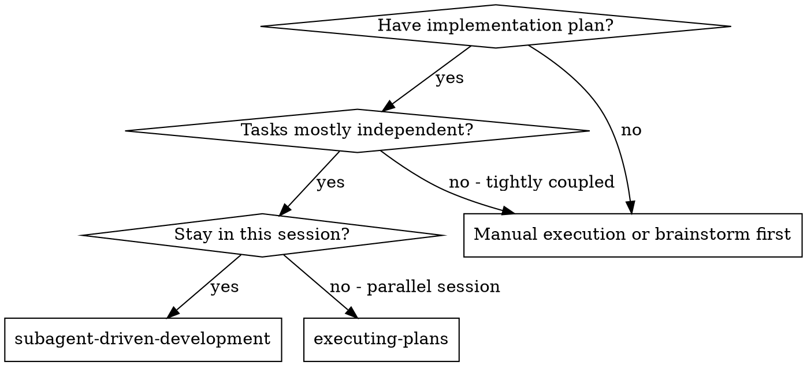
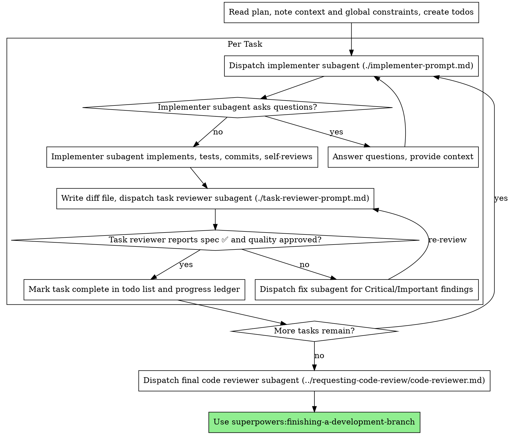

# Session transcript

## User

start I13 by reading CAMPAIGN.md + LEDGER.md first

## Assistant

Starting I13 per the campaign convention: I'll read the governing documents in full — CAMPAIGN.md and LEDGER.md first, then BLOCKMAP.md.

### ⚙ Tool call: `Bash`

```json
{
  "command": "ls -la /workspace/development/2026-07-17-modularization-campaign/ && wc -l /workspace/development/2026-07-17-modularization-campaign/*.md",
  "description": "List campaign directory and line counts"
}
```

### ↳ Tool result

```
total 1012
drwxr-xr-x 11 node node    352 Jul 23 12:06 .
drwxr-xr-x 33 node node   1056 Jul 23 10:29 ..
-rw-r--r--  1 node node  12237 Jul 22 08:50 BLOCKMAP.md
-rw-r--r--  1 node node  32843 Jul 22 10:36 CAMPAIGN.md
-rw-r--r--  1 node node 121955 Jul 23 12:06 LEDGER.md
-rw-r--r--  1 node node   6773 Jul 22 08:50 PROMPT.md
-rw-r--r--  1 node node    274 Jul 22 08:50 analytics.md
-rw-r--r--  1 node node   3857 Jul 22 08:50 statistics.md
-rw-r--r--  1 node node 420305 Jul 22 08:50 transcript.md
-rw-r--r--  1 node node 420221 Jul 17 12:45 transcript.raw.md
-rw-r--r--  1 node node   2658 Jul 17 12:45 usage.raw.txt
    136 /workspace/development/2026-07-17-modularization-campaign/BLOCKMAP.md
    484 /workspace/development/2026-07-17-modularization-campaign/CAMPAIGN.md
   1594 /workspace/development/2026-07-17-modularization-campaign/LEDGER.md
     59 /workspace/development/2026-07-17-modularization-campaign/PROMPT.md
      5 /workspace/development/2026-07-17-modularization-campaign/analytics.md
    100 /workspace/development/2026-07-17-modularization-campaign/statistics.md
   6043 /workspace/development/2026-07-17-modularization-campaign/transcript.md
   6043 /workspace/development/2026-07-17-modularization-campaign/transcript.raw.md
  14464 total
```

### ⚙ Tool call: `Read`

```json
{
  "file_path": "/workspace/development/2026-07-17-modularization-campaign/CAMPAIGN.md"
}
```

### ↳ Tool result

```
1	# CAMPAIGN.md — Modularization Campaign (frozen architecture)
2	
3	**Status:** approved design, 2026-07-17. Brainstormed and approved section-by-section in
4	the campaign planning session (see `transcript.md` once archived); prompt in `PROMPT.md`.
5	
6	This is the **one** copy of the campaign's architecture, decisions, invariants, and
7	increment plan. Increment specs **cite this document and re-derive nothing** — the
8	campaign-level brainstorm and adversarial review run once, here; increments inherit that
9	scrutiny and do not repeat it. Any change to this document is an **amendment**: edit the
10	document *and* append a ledger entry (`LEDGER.md`) saying what changed and why. An
11	increment spec that contradicts this document without a ledger amendment is wrong by
12	definition.
13	
14	Related documents (all in this directory unless pathed): `PROMPT.md` (the campaign
15	request), `BLOCKMAP.md` (the B1–B60 functional map of `main()` all scope assignments
16	reference), `LEDGER.md` (append-only cross-increment record), `/workspace/CONTEXT.md`
17	(domain glossary — created by this campaign), `/workspace/prompts/directives.md` (the
18	Spine; PD#n citations below refer to it).
19	
20	## Glossary (campaign terms — domain terms live in `CONTEXT.md`)
21	
22	- **Campaign** — this whole program of work: one architecture, N increments.
23	- **Increment** — one unit of work with its own session, spec, implementation, review,
24	  commit, and archive. Numbered I0–I14.
25	- **Wave** — an ordered group of increments (0–4); increments within a wave may be
26	  reordered if the ledger records why, waves may not.
27	- **Block** — a `Bnn` region of `main()` per `BLOCKMAP.md`; the stable unit of scope
28	  assignment.
29	- **Core package** — the new importable `psh/` package holding infrastructure (Tier 1).
30	- **Gateway** — `psh/gateway.py`, the single module through which every Terminus/WP-CLI/
31	  Drush subprocess flows; the future Pantheon-API replacement seam.
32	- **Façade** — `script_context.py` (`sc`), the stable API surface that checks and plugins
33	  import; implementations move, the façade's names do not break.
34	- **Contract** — the per-phase guaranteed `site_context` keys (CLAUDE.md table), which
35	  this campaign turns into a machine-readable **contract registry**.
36	- **Hook DAG** — the per-phase topological ordering of hooks derived from declared
37	  `consumes`/`produces` keys, validated fatally at startup.
38	- **Ratchet** — the lint/type regime: broad ruff+pyright rules applied as a hard gate to
39	  moved/new modules immediately, the remnant grandfathered until I14.
40	- **Remnant** — whatever remains of the original script at any point mid-campaign.
41	- **Shim** — the thin committed `./pantheon-sitehealth-emails` entry script that calls
42	  `psh.cli.main()` after I0.
43	- **Ledger** — `LEDGER.md`; how increment N learns what N−1 actually did.
44	- **Behavior bar** — the tiered definition of which observable behavior may change (§8).
45	- **Invariant** — a named property no increment may alter (§9).
46	
47	**MUST** = required, violation fails review. **NEVER** = prohibited, violation fails
48	review. **SHOULD** = required unless the increment spec states why not. **MAY** =
49	allowed, at the implementer's judgment.
50	
51	## 1. Goal and non-goals
52	
53	**Goal.** Modularize the 4,752-line main script into (a) a `psh/` core package of
54	infrastructure modules, (b) self-registering `check/` packages for every notice/section
55	emitter, and (c) the existing `plugin/` integrations — taking full advantage of the hook
56	system — while the four e2e goldens stay byte-identical, the per-phase contract is
57	honored, and the non-U-M path keeps working. End state: `main()` is a ~250–400-line
58	orchestrator; every U-M-specific behavior lives in `umich` packages; the whole tree
59	passes the broadened ruff+pyright configuration.
60	
61	**Non-goals** (exhaustive; each is either declined or deferred with reasoning in §15):
62	replacing terminus with the Pantheon API; implementing parallel site processing; any new
63	report content (CSV attachment, cached-% column, env-lock section); SendGrid; refreshing
64	goldens or recorded fixtures; changing what any check reports (except the named bug
65	fixes in I1).
66	
67	## 2. Decision record (exhaustive — from the approved brainstorm)
68	
69	| # | Decision | Choice | Why |
70	|---|---|---|---|
71	| D1 | Pantheon API | **Seam only**: gateway module now, transport swap post-campaign | Swapping transports mid-campaign invalidates terminus fixtures + goldens in every touched increment |
72	| D2 | Lint/type broadening | **Ratchet in-campaign** (§13) | Code is cleaned exactly once, as it moves; bar fixed in I0 so it never shifts |
73	| D3 | Behavior bar | **Tiered, config renames allowed** (§8) | Cleanest final schema; production config edited once, at I14, with a migration table |
74	| D4 | Increment granularity | **Fine: 15 increments** | Safest for session/context limits; split-never-compress backstop (§12) |
75	| D5 | Target architecture | **Three-tier split** (§3) | Infrastructure ≠ report content ≠ data source; fulfills "full advantage of the frameworks" |
76	| D6 | Hook flexibility | **Phases stay; hooks declare consumes/produces; per-phase DAG validated at startup** (§4) | Keeps every existing hook/test valid; a phase-less key scheduler rewrites everything for no added power |
77	| D7 | `--only-warn` plan rec | **In campaign** (I7) | Small, no golden impact, existing TODO |
78	| D8 | Parallel-ready | **Design constraint only** (§3.4) | Near-free now; actual parallelism stays a README TODO |
79	| D9 | CSV attachment / cached-% / env-lock | **README TODO** | Each changes rendered email → golden churn mid-campaign |
80	| D10 | Packaging | **Real package + thin shim** (I0; console-script dropped — see LEDGER I0 amendment 1) | Dissolves the extension-less-script problem; normal imports for tests/pyright/ruff |
81	
82	## 3. Target architecture
83	
84	```
85	                 ./pantheon-sitehealth-emails  (thin shim)
86	                                │
87	                        psh.cli.main()  ── orchestrator: bootstrap, site loop,
88	                                │           phase firing, lifecycle dispatch
89	        ┌───────────────────────┼──────────────────────────┐
90	        ▼ Tier 1: psh/ core     ▼ seams (sc façade)        ▼
91	  configuration  modules   ┌─────────────────────┐   Tier 3: plugin/
92	  gateway        db        │  hook phases + DAG  │   aws  cloudflare
93	  traffic        plans     │  contract registry  │   env  umich
94	  gather         charts    └─────────┬───────────┘   (unchanged roles)
95	  render         mail                ▼
96	  lifecycle                Tier 2: check/  (all notice/section emitters)
97	                           pantheon  wordpress  drupal  addon_updates
98	                           dns  cloudflare  pantheon_cdn_change  umich
99	```
100	
101	### 3.1 Tier 1 — `psh/` core package (exhaustive module map)
102	
103	| Module | Receives (functions / blocks) |
104	|---|---|
105	| `psh/cli.py` | `build_arg_parser`, `parse_args`, arg validation (B5), `main()` orchestrator |
106	| `psh/configuration.py` | `process_config`, `config_substitution`, `gate_disabled_sections`, DEFER machinery, `load_news_items`, `umich_enabled`, `cloudflare_enabled` |
107	| `psh/modules.py` | `find_modules`, module loading (B2/B4), hook engine (`add_hook`/`invoke_hooks`/`PHASES`), DAG build/validation, contract registry |
108	| `psh/gateway.py` | `run_terminus`, `terminus`, `terminus_data`, `wp`, `wp_eval`, `drush`, `drush_php_script`, `fix_drush_output`, `wp_error`, `drush_error`, `TerminusError` |
109	| `psh/notice.py` | `Notice`, `Severity`, `NoticeRegistry`, `DuplicateNoticeCodeError`, `registry` (added I3; §6 Notice type + code registry) |
110	| `psh/db.py` | ORM models, `TrafficRow`/`OverageProtectionRow`, `db_engine_args`, `db_retry`/`db_retryable`/`record_db_reconnect`, `update_traffic_rows`, `insert_traffic_rows`, `load_traffic_rows`, `load_overage_protection_window`, `DatabaseUnavailableError` |
111	| `psh/traffic.py` | `get_old_metrics`, `estimate_month_visits`, `build_traffic_table_rows`, the `traffic_table_columns` global, metrics gather + DB update/load flow (B22–B26), visits-by-month aggregation (B43) |
112	| `psh/plans.py` | plan_info normalization (B12 part), SKU resolution (B17), `overage_blocks`, `contract_year_end`, `plan_costs`, `build_plan_over_time`, the `cost_table_columns` global, recommendation flow (B47) |
113	| `psh/gather.py` | Slimmed framework gathers feeding the `site_post_gather` contract (from B32–B35), `check_wordpress_plugin`/`check_drupal_module` helpers, `build_smell_notices` (the B48 smell-notice *builder*; its emission stays in `main()` — LEDGER I10 amendment 1) |
114	| `psh/charts.py` | Cap geometry (B13 part), chart data prep + matplotlib build (B44–B45) — returns PNG bytes |
115	| `psh/render.py` | Jinja render (B53), PHP inline + `!important` pass (B54), `escape_url` |
116	| `psh/mail.py` | Recipient resolution (B49), MIME assembly (B55), `smtp_login`, send (B57) |
117	| `psh/lifecycle.py` | `RunState`, `finish_run`, `abort_run`, `abort_reason`, `resume_point`, `resume_command`, `rerun_command`, `option_strings_taking_a_value`, `sites_from_resume_point`, `merge_prior_results`, `ResumeSiteNotFoundError` |
118	
119	`dns_classify.py` stays a top-level module (already extracted; moving it into `psh/` is
120	MAY-scope for I14, decided by ledger state then).
121	
122	**Whole-file coverage.** The campaign modularizes the entire script, not just `main()`:
123	every top-level def and module-level global in `pantheon-sitehealth-emails` (lines
124	1–2107 included) is assigned to a `psh/` module in this table and appears in exactly one
125	increment's scope (§11). End state: the original file is the thin shim and nothing else
126	— a top-level def still there at I14 is a defect the closing audit (§17) catches. Moved
127	helpers get the full §7 treatment (types, ratchet, verified docs, tests); they do NOT
128	get algorithmic redesign — moves are behavior-preserving except where §8 says otherwise
129	(I1, I7's D7, I12's B51).
130	
131	### 3.2 Tier 2 — new/changed `check/` packages (exhaustive)
132	
133	| Package | Contents (blocks) | Phase(s) |
134	|---|---|---|
135	| `check/pantheon/` (new) | frozen site (B19), no-live-env (B21), upstream updates (B38), PHP EOL (B41) | `site_pre` (frozen, no-live-env), `site_post_gather` (updates, PHP EOL) |
136	| `check/wordpress/` (new) | PAPC + native-sessions checks, OCP config probe, favicon (from B34) | `site_post_gather` |
137	| `check/drupal/` (new) | PAPC module check, D7 EOL + tag1_d7es, multisite probe (from B30/B35) | `site_post_dns` (multisite), `site_post_gather` |
138	| `check/addon_updates/` (new) | add-on updates table notice (B39) | `site_post_gather` |
139	| `check/umich/` (existing, grows) | umich-oidc-login, Hummingbird fork (B34), Drupal UA check (B35), annual-billing notices (B50/B51), portal-URL text for the recommendation notice (B47's U-M half) | `site_post_gather`, `site_pre_render` (billing) |
140	
141	`check/dns/`, `check/cloudflare/`, `check/pantheon_cdn_change/` are untouched tenants.
142	A check MAY fetch its own data through `sc` gateway wrappers when the data is
143	check-specific (e.g. `upstream:updates:list`); data used by core *and* checks is
144	published through the contract instead (e.g. `envs`).
145	
146	The B48 smell notices are **not** a `check/addon_updates/` hook (LEDGER I10 amendment 1):
147	their *builder* (`build_smell_notices`) moves to `psh/gather.py`, but the *emission* stays
148	in `main()`. A `site_post_gather` smells hook cannot be ordered after the
149	`wp_smell`/`drush_smell` in-place mutators — a `produces: ['wp_smell']` declaration is a
150	condition-2 fatal against the core registry (D-i9-3), and alphabetical registration puts
151	`check/addon_updates` first in the phase — and relocation would also add smell rows to
152	`--only-warn` csv output (B48 sits after that gate today), a §8 surface change. The
153	`mutates` hook declaration that would dissolve this class is post-campaign work (README TODO).
154	
155	### 3.3 What stays in `main()` (exhaustive, with why)
156	
157	Config/arg bootstrap ordering (B1–B8 — the two-pass substitution *order* is the
158	program); overage constants + date window (B9, B13 part); the site-loop skeleton (skips,
159	banner, sorted order, resume filter — B14–B18, B20, B25, B42); phase firing and contract
160	stuffing (B27, B28, B31, B37, B52); the B48 smell-notice *emission* call (the builder
161	moved to `psh/gather.py` at I10, but the emission summarizes end-of-phase smell state no
162	hook position can guarantee under the D-i9-3 rebind design, and it must stay behind the
163	`--only-warn` gate — LEDGER I10 amendment 1); notice sort + subject (B50 minus billing);
164	the `try`/`except BaseException` lifecycle dispatch (B59–B60 call sites). Everything else
165	leaves. Target: 250–400 lines.
166	
167	### 3.4 Parallel-ready constraint (D8)
168	
169	Per-site work MUST be a function of `(site, config, db_session, site_context)`: no new
170	module-level mutable state; run-scoped accumulators live only in `RunState`. This is a
171	review criterion from I2 onward, not a parallelism implementation.
172	
173	### 3.5 The `sc` façade
174	
175	Checks and plugins import **only** `sc` (and their own package). `sc` keeps every name
176	listed in CLAUDE.md's runtime-exposed block, re-exporting from `psh/` modules as they
177	move. NEVER remove or rename an `sc` attribute mid-campaign; additions are fine. The
178	house-rules test suite gains an assertion that every documented `sc` name exists (I2).
179	
180	## 4. Phases, hooks, and the DAG
181	
182	Phases stay the coarse spine: `setup`, `site_pre`, `site_post_traffic`, `site_post_dns`,
183	`site_post_gather`, `site_pre_render`, plus **new** `run_finish` (fired inside
184	`finish_run` before artifacts are written, receiving the `RunState`; for future run-level
185	artifact hooks — no consumer at introduction, like `site_pre_render` was). Dotted
186	plugin-defined events are unchanged.
187	
188	From I4, `add_hook` requires two new entries per hook: `consumes` and `produces` — each
189	a (possibly empty) list of contract-key names. Validation at module-load completion
190	(exhaustive fatal conditions):
191	
192	1. A consumed key that nothing produces (neither core's registry for that phase or an
193	   earlier phase, nor another hook) → fatal.
194	2. Two producers of the same key → fatal (one owner per key; PD#1 — a silent overwrite
195	   is a silent failure).
196	3. A cycle among same-phase hooks → fatal.
197	4. A hook consuming a key first produced in a *later* phase → fatal.
198	5. A missing `consumes`/`produces` entry on any hook → fatal (no legacy mode; I4
199	   retrofits all in-repo hooks in the same change).
200	
201	`invoke_hooks` orders same-phase hooks topologically (producers before consumers;
202	registration order breaks ties, so existing behavior is preserved where no edges exist).
203	The permanent test `tests/integration/test_hook_dag.py` loads **all** real check/plugin
204	packages and asserts the DAG builds — the "future changes can never make the DAG
205	impossible" guarantee — and a unit suite proves each fatal condition actually fires
206	(PD#14: the validator must be shown able to go red).
207	
208	```
209	 module load ──► collect hooks ──► per phase: build edges (produces→consumes)
210	                                        │
211	                              cycle? unknown key? dup producer? ──► fatal exit (named error)
212	                                        │ ok
213	                                topo order stored ──► invoke_hooks uses it
214	```
215	
216	**Contract registry.** `psh/modules.py` holds the machine-readable registry: phase →
217	keys core stuffs (today's CLAUDE.md table, verbatim). Core's stuffing code is checked
218	against it in tests; CLAUDE.md's table gains a line saying the registry is authoritative.
219	New contract keys added by increments (exhaustive for this campaign): `envs` (I8, at
220	`site_pre`), `add_on_updates` + `wp_smell`/`drush_smell`/`composer_smell` (I9/I10, at
221	`site_post_gather`), plan/cost keys `current_plan`, `recommended_plan`, `plan_costs`,
222	`savings` (I7, at `site_pre_render`). Each addition updates registry + CLAUDE.md table +
223	ledger in the same increment.
224	
225	**Hook-produced keys (I10).** A hook MAY produce keys of its own — declared in its
226	`produces`, validated for duplicate producers, cycles, and phase position by the same
227	conditions 1–4 above. Such keys are **DAG-declared, not registry-owned**: they are present
228	only when the producing hook actually ran (absent when its gate failed or its package is
229	disabled), so consumers read them with `.get()`, and they are **NOT** part of the
230	guaranteed per-phase contract (the "new contract keys" list above stays exhaustive for
231	registry-owned keys only). The campaign's first are `drupal_multisite` /
232	`drupal_multisite_smell`, produced by `check.drupal.multisite` at `site_post_dns` and read
233	by `main()` after the phase (I10; see LEDGER I10 amendment 2).
234	
235	## 5. Configuration
236	
237	Principles: one section per feature, named for the operator's mental model; every
238	relocated check gets an `enabled` flag under `[Check.<name>]`, **default true** —
239	relocating code MUST NOT silently disable a check that runs unconditionally today.
240	U-M-only checks additionally require `[UMich].enabled` (existing `umich_enabled()`
241	rule). `gate_disabled_sections()` semantics (nested `enabled`, children dropped) apply to
242	`[Check.*]` unchanged.
243	
244	Example (actual TOML, the shape I8 introduces — illustrative of the family, exhaustive
245	for `check/pantheon/`):
246	
247	```toml
248	[Check.pantheon]
249	enabled = true          # frozen-site, live-env, upstream-updates, PHP-EOL checks
250	```
251	
252	New keys land in final shape as introduced (I3 onward). Renames/moves of *existing* keys
253	happen once, in I14, which MUST deliver: the old→new migration table in
254	`docs/config-migration.md`, a rewritten `sample-pantheon-sitehealth-emails.toml`, and
255	exact edit instructions for the production config repo. Until I14, every existing
256	production key keeps working unchanged.
257	
258	## 6. Types
259	
260	Reused as-is: `TrafficRow`, `OverageProtectionRow`, `DnsFacts`, `FetchResult`,
261	`SiteContext`. Introduced (exhaustive):
262	
263	| Type | Increment | Shape |
264	|---|---|---|
265	| `GatewayResult` | I2 | NamedTuple `(result, errors, fatal)` replacing the anonymous 3-tuples |
266	| `Notice` | I3 (class) → adopted per increment | frozen dataclass: `severity` (StrEnum alert/warning/info), `code` (unique — registry test), `html`, `text`, `short`, `icon`, `order`; `SiteContext.add_notice` accepts `Notice` or legacy dict; dict form retired in I14 |
267	| `PlanInfo` / `PlanCatalog` | I7 | typed view over `[Pantheon.plan_info]` |
268	| `RunState` | I13 | dataclass holding `all_warnings`, `site_results`, `site_savings`, `emails_sent`, reconnect counters |
269	
270	House-style tuple annotations (`-> (str, str, bool)`) are replaced with real annotations
271	in every module as it moves — never fixed in place in the remnant (one pass per line,
272	D2). CLAUDE.md's house-style note is updated in I14 when the last one dies.
273	
274	## 7. Per-increment obligations
275	
276	Every increment MUST (this list is exhaustive and lives only here; increment specs cite
277	it): (1) start by reading `CAMPAIGN.md`, `LEDGER.md`, `CLAUDE.md`, `BLOCKMAP.md` rows in
278	scope; (2) follow `prompts/implementation-standards.md` (subagent-driven, test-first,
279	`psh-implementer`/`psh-reviewer`); (3) replace house styles in moved code (§6);
280	(4) verify — not assume — every claim in comments/docs it moves or writes;
281	(5) update tests in the same change; (6) update README/docs/CLAUDE.md for what moved;
282	(7) update auto-memory where a durable fact changed; (8) append its ledger entry
283	(§12); (9) preserve every invariant (§9); (10) end with `/code-review`, a full
284	`./run-tests`, and one checkpoint commit including its `development/` folder.
285	
286	## 8. Behavior bar (canonical gate table)
287	
288	| Surface | Rule | Until |
289	|---|---|---|
290	| Rendered emails (4 goldens) | NEVER change (byte-identical) | end of campaign |
291	| `-results.json` / `-notices.csv` / `-run.json` structure (keys, row shape) | NEVER change | end of campaign |
292	| Notice csv *values* | MAY change only in I1 (named bug fixes), I12 (scheduled B51 deletion), I7 (`its-recommends-plan` savings-field format, D-i7-5 — amendment), and I9 (wp-smell precedence when theme-list and OCP-probe stderr co-occur without favicon stderr — see LEDGER I9) | — |
293	| stdout / console / error messages | MAY improve freely | — |
294	| Config: existing keys | NEVER break | I14 (renames with migration table) |
295	| Config: new keys | MUST land in final schema shape | — |
296	| Exit codes, resume semantics, artifact write gates | NEVER change | end of campaign |
297	
298	## 9. Named invariants (exhaustive; NEVER violated by any increment)
299	
300	1. Four e2e goldens byte-identical (`./run-tests` proves it; refresh is forbidden — an
301	   existing golden going red is a defect in the increment, PD#14).
302	2. Per-phase data contract: existing keys never removed/renamed/retyped; additions only.
303	3. Non-U-M path works: non-U-M golden green; no new un-gated U-M content (I1 *removes*
304	   the one known leak).
305	4. Run lifecycle: single `except BaseException` flush path; `abort_reason`'s three
306	   outcomes; artifacts dropped-site rule; notices appended before send; resume-point
307	   next-site-after-email rule; soft-wrapped copy-pasteable commands.
308	5. DB: `db_retry` retries whole idempotent units only; `db_retryable` predicate
309	   unchanged; the read-release commit in the loaders stays (guarded by
310	   `test_load_traffic_rows_releases_the_connection`).
311	6. Rich console rules: escape untrusted text; production width reproduced in tests.
312	7. Test safety interlock (`run_program` forbidden flags) never bypassed or weakened.
313	8. Column-0 `f"""` notice literals move **verbatim** — never re-indented; `git diff -w`
314	   is not acceptable evidence for any change touching them.
315	9. Checks/plugins import only `sc`; `sc` names never removed mid-campaign (§3.5).
316	10. Recorded fixtures are not regenerated (`terminus-cdnchange/` is hand-maintained and
317	    `--record` must not run).
318	11. `--create-tables`/`--update`/`--import-older-metrics` phase-gating rules (CLAUDE.md
319	    table) unchanged.
320	
321	## 10. Known-bug inventory → I1
322	
323	The five bugs and the dead code listed in `BLOCKMAP.md` §Bugs (composer-smell
324	nesting+variable; shared `php-eol` code; `site_results` omission; un-gated U-M portal
325	URLs; duplicate `annual-bill` code — B51 handled as: distinct code now, scheduled
326	deletion when its Aug-2026 date passes, ledgered to I12; dead code deleted). Each fix is
327	test-first with the test shown red on the old behavior. **Verified 2026-07-17**: the
328	goldens contain zero `php-eol`/`wp-smell`/`drush-smell`/`composer-smell`/`annual-bill`
329	occurrences and the golden fixtures report PHP 8.2, so none of these fixes can touch a
330	golden:
331	
332	```
333	$ grep -c 'php-eol\|composer-smell\|wp-smell\|drush-smell\|annual-bill' tests/e2e/__snapshots__/*.ambr
334	tests/e2e/__snapshots__/test_golden.ambr:0
335	tests/e2e/__snapshots__/test_golden_cdn_change.ambr:0
336	tests/e2e/__snapshots__/test_golden_drupal.ambr:0
337	tests/e2e/__snapshots__/test_golden_nonumich.ambr:0
338	```
339	
340	## 11. The increments
341	
342	Wave dependency structure (increments within a wave are ordered but MAY be resequenced
343	with a ledger entry; waves MUST NOT be reordered):
344	
345	```
346	Wave 0: I0 bootstrap ──► I1 bug fixes
347	Wave 1: I2 gateway ──► I3 config ──► I4 hooks+DAG ──► I5 DB
348	Wave 2: I6 traffic ──► I7 plans ──► I8 check/pantheon ──► I9 wordpress ──► I10 drupal
349	Wave 3: I11 charts ──► I12 render+mail ──► I13 lifecycle
350	Wave 4: I14 closing sweep
351	```
352	
353	| Inc | Scope (blocks / functions) | Delivers |
354	|---|---|---|
355	| **I0** | — (no logic moves) | `psh/` skeleton + thin shim (console-script dropped — see LEDGER I0 amendment); conftest `import psh` rework (same collected-test count gate); ratchet config (§13) with rule sets pinned; pyright baseline measured; `LEDGER.md` started; README TODO edits (§15 dispositions); CLAUDE.md pointer to campaign |
356	| **I1** | B36, B40, B41, B47 (URLs), B48, B50/B51 (codes), dead code | §10 fixes, each test-first |
357	| **I2** | 302–597 wrappers | `psh/gateway.py`, `GatewayResult`, sc re-exports + façade test; no-subprocess-outside-gateway house rule |
358	| **I3** | 792–934, 1209–1253, 1608–1648 (`umich_enabled`/`cloudflare_enabled`) | `psh/configuration.py`; `Notice` class + code-uniqueness registry test |
359	| **I4** | 935–950, hook engine from `script_context.py` | `psh/modules.py`; consumes/produces on all in-repo hooks; DAG validation + fatal-condition tests; `run_finish` phase; contract registry |
360	| **I5** | 95–178; DB defs within 1285–1575 (`DatabaseUnavailableError` through `db_engine_args`; the resume helpers `ResumeSiteNotFoundError`, `sites_from_resume_point`, `merge_prior_results` stay for I13) | `psh/db.py`; DB test suites relocated intact |
361	| **I6** | B22–B26, B43; 598–671, 977–1127 | `psh/traffic.py` |
362	| **I7** | B9, B12 (plans), B17, B47; 967–976, 1128–1208, 1254–1280 | `psh/plans.py`; `PlanInfo`; D7 (`--only-warn` runs recommendation); plan/cost contract keys |
363	| **I8** | B19, B21, B38, B41 | `check/pantheon/` + `[Check.pantheon]`; `envs` contract key |
364	| **I9** | B32–B34; 672–739 | `psh/gather.py` (WP half); `check/wordpress/`; U-M WP checks → `check/umich/`; `add_on_updates` + smell contract keys |
365	| **I10** | B30, B35, B39; B48 *builder* only (emission stays in `main()` — LEDGER I10 amendment 1); 740–791 | gather (Drupal half) + `build_smell_notices`; `check/drupal/`; `check/addon_updates/`; UA check → `check/umich/` |
366	| **I11** | B13 (caps), B44–B45 | `psh/charts.py` |
367	| **I12** | B49–B57 minus sort/subject core | `psh/render.py`, `psh/mail.py`; annual billing → `check/umich/` at `site_pre_render`; B51 deletion if past its date |
368	| **I13** | B14 (accumulators), B56, B59–B60; 1649–2107 plus the resume helpers I5 left behind (1281–1284, 1528–1542, 1576–1607) | `psh/lifecycle.py`; `RunState`; `main()` reaches final form |
369	| **I14** | — | Config renames + migration doc + sample rewrite + production-config instructions; global ratchet flip + remnant cleanup; docs/README/CLAUDE.md full refresh; `Notice` dict form retired; ledger fully resolved; retrospective + closing audit (§17) |
370	
371	Sizing note: the largest moves are I9 (~330 main-loop lines + helpers) and I10 (~320 +
372	helpers). If any increment proves oversized mid-session: **split, never compress** —
373	commit nothing partial, ledger the split, the second half becomes its own increment.
374	
375	## 12. Coordination protocol
376	
377	**Ledger entry template** (append per increment, and for any amendment):
378	
379	```markdown
380	## I<N> — <slug> (<date>, commit <sha>)
381	- Moved: <blocks/functions actually moved>
382	- Deviations from CAMPAIGN.md: <none | what + why>
383	- Contract/config/sc additions: <keys/names>
384	- Discovered tasks: <each with disposition: fixed here | I<M> | README TODO>
385	- Open questions for next increment: <…>
386	```
387	
388	**Discovered-task disposition rules** (canonical): fits current increment's scope and
389	<~30 min → fix now, note in ledger; belongs to a later increment → ledger it against
390	that increment (the increment's spec author MUST read these); major/risky/scope-widening
391	→ README TODO with a sentence of context. Nothing is carried in memory or chat — if it
392	is not in the ledger or README, it does not exist (PD#9).
393	
394	**Session flow per increment:** read the §7 documents → write the increment SPEC.md in
395	`development/<date>-mod-I<N>-<slug>/` citing CAMPAIGN.md sections by number →
396	`superpowers:writing-plans` → subagent-driven implementation → `/code-review` → full
397	`./run-tests` → per-task commits, each green; the increment's final commit includes the dev
398	folder → `/archive-session` → ledger entry.
399	
400	## 13. Lint/type ratchet
401	
402	Mechanism (as shipped by I0; see LEDGER I0 amendment 2): TWO ruff configs —
403	`pyproject.toml` `[tool.ruff.lint]` keeps the narrow PD-rule set running everywhere
404	including the remnant, and `ruff-broad.toml` carries `select = ["ALL"]` minus a
405	justified ignore list, with `extend-exclude` grandfathering exactly the remnant
406	(`psh/_legacy.py`) and not-yet-moved files; each increment deletes its
407	files from the grandfather list, and the two configs merge at I14. pyright runs in
408	`./run-tests` from I0 via `[tool.pyright]` (standard mode, `psh/` minus `_legacy.py`),
409	ratcheting toward strict as typed code moves in. The four existing narrow rules (`E722`, `BLE001`, `S105`, `S106`) remain global
410	throughout — they mechanize PD#2/PD#6 and are never grandfathered. No
411	`target-version` pin (CLAUDE.md: it masks the 3.12-only syntax detection).
412	
413	Baselines measured 2026-07-17 (I0 re-measures and pins both in its spec):
414	
415	```
416	$ ./run-tests --fast --llm   (tail)
417	LLM_SUMMARY passed=727 failed=0 error=0 skipped=1 xfailed=0 xpassed=0
418	25 snapshots passed.
419	
420	$ uvx ruff check --isolated --statistics .
421	26  F541  f-string-missing-placeholders
422	 8  E741  ambiguous-variable-name
423	 4  E713  not-in-test
424	 3  F841  unused-variable
425	 2  F401  unused-import
426	 1  E402  module-import-not-at-top-of-file
427	 1  E712  true-false-comparison
428	Found 45 errors.
429	```
430	
431	(README's "~55" ruff and "39" pyright figures are stale/unverified claims; I0 replaces
432	them with measured numbers. pyright was not measured in planning — no pyright binary in
433	the dev container yet; installing it is I0 scope.)
434	
435	## 14. Risk / control table
436	
437	| Risk | Control |
438	|---|---|
439	| Re-indented column-0 notice literals silently change emails | Invariant 8; goldens as tripwire; AST/token comparison, never `git diff -w` |
440	| conftest rework silently drops tests | I0 gate: identical collected-test count (727 passed / 1 skipped / 2 deselected baseline) before and after |
441	| Long-range `main()` local coupling breaks a move | BLOCKMAP produces/consumes; each increment spec lists exactly which locals cross its boundary |
442	| Session/context overrun mid-increment | Fine granularity (D4); split-never-compress; commits only at increment completion |
443	| Architecture drift across 15 sessions | This document frozen; amendments only via ledger; specs cite section numbers |
444	| Hidden hook-order dependencies surface in I4 | I4 audits every hook; real dependencies become explicit DAG edges |
445	| Ratchet churn on moved code | Rules fixed at I0; cleaning is part of each move |
446	| Goldens blind to stdout/artifacts | Invariants 4–5 name the artifact/abort test suites as the cover; artifact structure frozen until campaign end |
447	| Implementer sessions lack context | `psh-implementer`/`psh-reviewer` carry the read list; specs name seams (Spine spec bar); §7 reading list |
448	| Two annual-bill notices / removal date passes mid-campaign | Explicitly scheduled: codes split in I1, deletion decision in I12, ledger tracks |
449	
450	## 15. NOT in scope (reasoning preserved so it is never re-litigated)
451	
452	- **Terminus → Pantheon API swap** — D1; post-campaign project against `psh/gateway.py`.
453	- **Parallel site processing** — D8; constraint only; README TODO remains.
454	- **CSV data attachment, cached-% column, env-lock section** — D9; each becomes a small
455	  post-campaign change (env-lock: a ~50-line `check/` package) once goldens may move.
456	- **SendGrid, secrets-handling completion, portal traffic capture, daily alerts,
457	  accessibility/security/Cloudflare scores, AI recommendations, dependency updates,
458	  terraform-infra** — pre-existing README TODOs, untouched by this campaign.
459	- **Approach B (library-only) and C (everything-is-a-hook)** — rejected in brainstorm:
460	  B fails the "full advantage of the frameworks" goal; C forces infrastructure into
461	  optional-content clothing.
462	- **Golden/fixture refreshes** — forbidden (Invariants 1, 10).
463	
464	## 16. Acceptance baseline
465	
466	§13 outputs are the campaign-start baseline (run and pasted 2026-07-17). Every
467	increment's definition of done re-runs `./run-tests` at increment end — the full suite
468	when the live tier's credentials are available in the session, otherwise `--fast` with a
469	ledger note saying the live tier was skipped — and MUST reproduce goldens
470	byte-identically. I0 additionally records the collected-test count gate.
471	
472	## 17. Closing audit (queued for I14; exhaustive)
473	
474	1. Is `main()` within 250–400 lines, and does everything left match §3.3?
475	2. Has every DAG fatal condition been demonstrated red at least once?
476	3. Do the contract registry and CLAUDE.md table agree (test-enforced)?
477	4. Is any `sc` re-export now consumed by nobody (dead façade surface)?
478	5. Is the `.py` symlink still needed for anything beyond the shim? If not, note in
479	   CLAUDE.md; if yes, say for what.
480	6. Are all ledger items resolved (done, scheduled, or README TODO)?
481	7. Has the production config repo received and applied the migration instructions?
482	8. Do README, CLAUDE.md, docs/, and memory reflect the final architecture (no stale
483	   line-number or module references)?
484	9. Were any invariants amended mid-campaign, and is each amendment ledgered?
485
```

## Assistant

CAMPAIGN.md read. Now the LEDGER — it's ~1600 lines; reading it in full as required.

### ⚙ Tool call: `Read`

```json
{
  "file_path": "/workspace/development/2026-07-17-modularization-campaign/LEDGER.md"
}
```

### ↳ Tool result

```
1	# LEDGER — Modularization Campaign
2	
3	Append-only. One entry per completed increment, plus one per CAMPAIGN.md amendment.
4	This file is how increment N learns what N−1 actually did; if a deviation, discovered
5	task, or decision is not recorded here (or in the README TODO list), it does not exist.
6	Entry template: CAMPAIGN.md §12.
7	
8	## Campaign planning (2026-07-17)
9	
10	- Produced: `CAMPAIGN.md` (frozen architecture), `BLOCKMAP.md` (B1–B60 map),
11	  `/workspace/CONTEXT.md` (domain glossary, new), this ledger.
12	- Baselines: fast tier 727 passed / 1 skipped / 2 deselected; ruff `--isolated` 45
13	  findings; pyright unmeasured (no binary in container — I0 scope).
14	- Discovered during planning, dispositioned:
15	  - Five bugs + dead code → I1 (CAMPAIGN.md §10, BLOCKMAP §Bugs).
16	  - README's "~55 ruff / 39 pyright" figures stale/unverified → I0 re-measures.
17	  - B51 second annual-bill notice: marked "remove Aug 2026" — code split in I1,
18	    deletion decision in I12.
19	  - WordPress/Drupal duplication + update-table HTML duplication (BLOCKMAP §Bugs 7–8)
20	    → addressed structurally by I9/I10 (shared gather + `check/addon_updates/`).
21	- Open questions for I0: exact ruff rule list; pyright strictness per environment;
22	  whether `dns_classify.py` moves under `psh/` (deferred to I14, MAY).
23	- Amendment (2026-07-17, user spec review): added the "Whole-file coverage" paragraph to
24	  CAMPAIGN.md §3.1 — clarification only, no scope change; the module map already
25	  assigned every top-level def.
26	
27	## I0 — bootstrap (2026-07-17, closing commit `docs(campaign-I0): close the bootstrap increment`)
28	
29	Commits (per-task, each green): `b1ccc72` (package move + shim + conftest + coverage),
30	`d0e3027` (lint/type ratchet), `5b536fa` + `239955d` (README/CLAUDE.md docs), plus this
31	closing docs commit (ledger + CAMPAIGN amendments + SPEC acceptance + README pyright number).
32	
33	- **Moved:** the whole 4,752-line program → `psh/_legacy.py` (`git mv`, **zero logic
34	  changes**; the `__main__` tail is inert in a module, left for I13). New: `psh/__init__.py`
35	  (docstring), `psh/cli.py` (`from psh._legacy import main, parse_args` re-export), and a new
36	  7-line thin shim at `./pantheon-sitehealth-emails` calling `psh.cli.main()`. No blocks
37	  (B-map) moved — I0 moves the file, not logic (§11 row I0).
38	
39	- **Deviations from CAMPAIGN.md (three amendments, all applied to the document this commit):**
40	  1. **No console-script entry point** (amends §11 row I0 / D10). The program is repo-rooted
41	     by design (`find_modules`, templates, `inline-styles.php`, `vendor/`, config symlink are
42	     all CWD-relative); a pip entry point would need a data-file overhaul serving no campaign
43	     goal. D10's real benefits (normal imports; native ruff/pyright/CodeGraph coverage; no
44	     `SourceFileLoader`) all arrive via the package + shim without installation. `pyproject.toml`
45	     stays deps-only (`py-modules = []`, `packages = []` to stop setuptools auto-discovery
46	     installing a stale shadow copy — PD#1). §11 row I0 now reads "thin shim (console-script
47	     dropped — see LEDGER I0 amendment)".
48	  2. **Grandfather is `psh/_legacy.py` via `ruff-broad.toml` `extend-exclude`** (amends §13,
49	     which named `pantheon-sitehealth-emails.py` and "per-file-ignores" — both written before
50	     the legacy-module + two-config mechanics were settled). The shipped mechanism is TWO ruff
51	     configs, not per-file-ignores: `pyproject.toml` `[tool.ruff.lint]` carries the narrow
52	     PD-rule set (`E722`/`BLE001`/`S105`/`S106`) that runs EVERYWHERE including `_legacy.py`;
53	     `ruff-broad.toml` carries `select = ["ALL"]` minus the ignore list and grandfathers the
54	     remnant via `extend-exclude`. `./run-tests` and `.claude/hooks/ruff-check.sh` run BOTH
55	     passes; the two files merge into `pyproject.toml` at I14. §13 now names `psh/_legacy.py`
56	     and "ruff-broad.toml exclude".
57	  3. **Per-task commits, each green** (amends §12's "one commit (code + dev folder)"). Each I0
58	     task committed independently once its gates were green; this increment's final (closing)
59	     commit includes the `development/` folder. Rationale: finer checkpoints serve the campaign
60	     prompt's revert/inspect intent, and SDD review packages diffs as commit ranges. §12 now
61	     reads "per-task commits, each green; the increment's final commit includes the dev folder".
62	
63	- **Ratchet as pinned.** pyright runs in `./run-tests` at **standard** mode, not strict
64	  (DECISION): `psh/cli.py` re-exports from the untyped legacy module, so strict would fail on
65	  re-export; strictness ratchets up as increments move typed code in. Scope `[tool.pyright]`
66	  = `include = ["psh"]`, `exclude = ["psh/_legacy.py"]`. Ruff-broad ignore list (pinned; each
67	  justified in `ruff-broad.toml`): `COM812`, `ISC001`, `E501`, `Q000`, `Q001`, `Q002`, `Q003`,
68	  `ANN`, `TD002`, `TD003`, `FIX002`, `EM101`, `EM102`, `TRY003`, `D`, `CPY001`. `CPY001` is a
69	  **preview** rule in ruff 0.15.22 (cannot fire under non-preview `select=["ALL"]`); ruff
70	  accepts it in `ignore` with no warning, so it is kept verbatim to document the intent
71	  (no per-file copyright headers). `D` (docstring convention) is undecided → README TODO.
72	
73	- **pyright whole-tree baseline (informational; replaces README's unverified "39").**
74	  **220 errors, 0 warnings, 0 informations** across 118 first-party files, standard mode,
75	  pyright 1.1.411 (SPEC ACCEPTANCE §Task 5 has the command + breakdown). Measured OUTSIDE the
76	  scoped gate config via a repo-root config (pyright roots a project at the config's directory
77	  and ignores includes outside it; a config's `exclude` still drops CLI-passed paths — so
78	  neither a scratchpad-rooted config nor CLI args can re-include `_legacy.py`, and a repo-root
79	  temp config is the reproducible form). By area: `tests/` 139, `psh/_legacy.py` 36, `check/`
80	  21, `plugin/` 18, `script_context.py` 5, `dns_classify.py` 1 (`check/`+`plugin/` = 39, the
81	  origin of the old figure). The gated scope (`psh/` minus `_legacy.py`) is `0 errors`.
82	
83	- **Contract/config/sc additions:** none (I0 moves no logic; no `[Check.*]` sections, no new
84	  contract keys, no `sc` names added or removed).
85	
86	- **Discovered tasks:**
87	  - **`Path(psh.__file__).parent` as a repo-root proxy** — 25 sites across 23 files: 22 test files (plus
88	    `tests/helpers/checkload.py`) anchored repo paths on the program file's parent, which the
89	    move shifted from repo root to `psh/`. Fixed here, mechanically and minimally:
90	    `→ Path(psh.__file__).resolve().parents[1]` at exactly those sites. Proper cleanup lands
91	    when later increments un-grandfather those test files; the `psh` fixture itself is
92	    redesigned when `_legacy` dies (I13/I14). Disposition: **fixed here**, further cleanup **I13/I14**.
93	  - **ruff lints explicitly-passed files even when excluded** — passing a path on ruff's
94	    command line overrides `extend-exclude`, so the edit hook (which passes the just-edited
95	    file) would lint `_legacy.py` against the broad set. Fixed by giving the broad-pass
96	    invocation `--force-exclude` and running it from repo-root cwd; documented in
97	    `.claude/hooks/ruff-check.sh`. Disposition: **fixed here**.
98	
99	- **Open questions for I1/I2:**
100	  - I1 (bug fixes) touches `_legacy.py` in place (fixes retire as code moves); it must keep
101	    the narrow PD set green there (broad set stays grandfathered) and the four goldens
102	    byte-identical (§10 verified the fixed codes appear in zero goldens).
103	  - I2 (gateway) is the first real logic move: as it un-grandfathers the wrapper functions it
104	    deletes them from `ruff-broad.toml` `extend-exclude` and must clean them to the broad set
105	    + pyright standard in the same change (§13 ratchet; §6 house-style tuple hints replaced).
106	  - `dns_classify.py` under `psh/` remains a MAY for I14 (unchanged from planning).
107	- Amendment (2026-07-17, post-Task-5 review): CAMPAIGN.md §13 mechanism paragraph
108	  rewritten to describe the SHIPPED two-config mechanism (it still said "pyproject gets
109	  extend-select" and "executionEnvironments", both superseded by amendment 2 above);
110	  ledger reanchor note corrected to "22 test files plus checkload.py" (23 files total).
111	  Both changes doc-accuracy only.
112	- Amendment (2026-07-17, final I0 code review, spec axis): D10's Decision cell still said
113	  "console-script" after amendment 1 changed only §11 row I0 — CAMPAIGN.md briefly
114	  self-contradicted. D10 cell now matches. Doc-accuracy only.
115	
116	## I1 — known-bug fixes (2026-07-17, commits `5518de7..1ff9153` + closing docs commit)
117	
118	Spec/plan: `development/2026-07-17-mod-I1-bug-fixes/` (SPEC.md carries the pasted
119	acceptance results). Six per-task commits, each green; full suite at close = 751 passed /
120	1 skipped **including the live tier**, 27 snapshots, all three gates; four goldens
121	byte-identical across the whole range (`git diff aa8afd1 -- tests/e2e/__snapshots__/`
122	empty).
123	
124	- **Moved:** no blocks (fixes land in place in `psh/_legacy.py` per I0's open-question
125	  note). Extracted five pure notice-builder helpers as consecutive module-level defs
126	  above `main()` (preserved-bug-extraction pattern; every literal interior byte-verified
127	  against the pre-move original by task reviewers AND the final review):
128	  `build_smell_notices`, `build_php_eol_notice`, `build_annual_bill_upcoming_notice`,
129	  `build_annual_bill_in_progress_notice`, `build_plan_recommendation_notice`. These
130	  travel later: smells → I10, php-eol → I8, annual-bill → I12, plan-rec → I7.
131	- **Fixed (CAMPAIGN §10 / BLOCKMAP §Bugs, all test-first with RED shown on old
132	  behavior):** (1) B48 composer-smell nesting + wrong interpolated variable;
133	  (2) B41 shared `php-eol` csv code → `php-eol-warning` (7.4/8.1) / `php-eol-alert`
134	  (<8.2), following the `updates-*` suffix pattern; (3) B36 unknown-framework sites now
135	  get a `site_results` entry (`version: "unknown"`, same 3-key row shape) — covered by a
136	  new offline e2e (`tests/e2e/test_unknown_framework_e2e.py`) asserting the
137	  `finish_run()` stdout pprint, since `-results.json` is written only on `--all` runs the
138	  interlock bans; (4) B47 un-gated U-M portal URLs — two of the four named URL sites
139	  (`extra_message`/`extra_text`) were **dead stores** (assigned, never read; §10's
140	  4240/4248 refined — bug partially lived in dead code), deleted; the live
141	  `its-recommends-plan` notice now selects U-M vs generic copy via `umich_enabled()`
142	  (generic drops the portal anchor AND the June-16-30 downgrade-window sentence — U-M
143	  billing policy, factually wrong elsewhere); both variants pinned by syrupy snapshots
144	  (`test_plan_recommendation_notice_render`); (5) B50/B51 duplicate `annual-bill` code —
145	  B51 now emits `annual-bill-in-progress`; B50 keeps `annual-bill`; B51's Aug-2026
146	  deletion decision remains I12's; (6) dead code deleted (B40 Gen2 block, overage debug
147	  query, `# plt.show()`, redundant second `plt.close(fig)` with its stale memory claim).
148	- **Deviations from CAMPAIGN.md:** none.
149	- **Contract/config/sc additions:** none. Sanctioned notice-csv value changes (§8 I1
150	  exception): the three codes above. New **hand-maintained** fixture dir
151	  `tests/fixtures/terminus-unknownfw/` (copy of `terminus/`, one framework value →
152	  `"mystery"`, README states `--record` never refreshes it — Invariant 10, cdnchange
153	  precedent) + conftest constant `TERMINUS_FIXTURES_UNKNOWNFW`.
154	- **Discovered tasks (dispositions):**
155	  - Template `email_template.{html,txt}` portal URLs render `sites/0/` in every non-U-M
156	    run including the non-U-M golden (SPEC Obs. 1) → I12/I14 (goldens freeze it now;
157	    already on CLAUDE.md's still-hardcoded-U-M list).
158	  - `php_version < "8.2"` string comparison + KeyError if key absent (Obs. 2) → I8.
159	  - B47 downgrade path: owner gets NO notice (dead `extra_message` was presumably meant
160	    for this) and a non-Basic downgrade appends no `site_savings` entry (Obs. 3) → I7
161	    decides intended behavior.
162	  - Composer-smell literals carry baked-in 8-space indentation (Obs. 4) → I10.
163	  - `its-recommends-plan` csv embeds `{savings:,.2f}` — thousands comma inside a
164	    comma-separated field, variable column count (Obs. 5) → I7, or I3's `Notice`
165	    class/code-registry work.
166	  - Residual test gap (final-review triage): `main()`'s umich-only annual-bill call
167	    sites have no runtime test (goldens are umich-disabled; interlock bans a U-M run) —
168	    I12's spec author MUST cover this when relocating annual billing to `check/umich/`
169	    at `site_pre_render`.
170	- **Process note (PD#14 instance):** one implementer's report Write silently failed
171	  against a stale `.superpowers/sdd/` report file from I0 and was misreported as
172	  success; caught by the task reviewer (report content was for the wrong task). Stale
173	  scratch reports are now purged before dispatch; future increments should start by
174	  clearing `.superpowers/sdd/task-*-report.md` leftovers.
175	- **Open questions for I2:** none new — proceed per I0's notes (un-grandfather the
176	  wrapper functions from `ruff-broad.toml`, clean to broad set + pyright standard,
177	  replace house-style tuple hints, `GatewayResult`, façade test).
178	
179	## I2 — gateway extraction (2026-07-17, commits `7044b12` (Task 1), `0141f76` (Task 2), house-rule-scope fix + closing docs commit)
180	
181	Spec/plan: `development/2026-07-17-mod-I2-gateway/` (SPEC.md carries the pasted acceptance
182	results). Two per-task code commits, each green, plus a whole-branch-review follow-up commit
183	(the `ENVIRON_SCOPE` widening below) and this closing docs commit (CLAUDE.md / tests/README.md /
184	gateway docstrings / memory / this ledger entry). Full suite (live tier present) at close =
185	**755 passed / 1 skipped** (the 1 skip is `test_db_credentials.py`'s `importorskip("MySQLdb")`
186	on a sqlite-only install), all three gates; four goldens byte-identical across the increment
187	(`git diff 8b1466b -- tests/e2e/__snapshots__/` empty).
188	
189	- **Moved:** the eleven Terminus/WP/Drush subprocess-facing wrapper defs (the 302–597 wrapper
190	  region of `psh/_legacy.py` **minus** `escape_url`, which §3.1 assigns to `psh/render.py`/I12) →
191	  `psh/gateway.py`: `run_terminus`, `TerminusError`, `terminus`, `terminus_data`, `wp`, `wp_eval`,
192	  `wp_error`, `fix_drush_output`, `drush`, `drush_php_script`, `drush_error`. `psh/_legacy.py`
193	  re-imports all eleven (plus `GatewayResult`), so its ~54 call sites and the `sc` exposure block
194	  resolve unchanged. Logic and the two column-0 `f"""` notice literals (`wp_error`/`drush_error`)
195	  moved byte-for-byte (Invariant 8; extracted-block diff pasted empty in the Task 1 report).
196	- **Deviations from CAMPAIGN.md:** the SPEC's §Broad-ruff-findings table enumerated **seven**
197	  findings on the moved code; the actual count was **EIGHT**. Wrapping `run_terminus`'s literal
198	  `return … True`/`return … False` statements in the `GatewayResult(...)` constructor introduced an
199	  `FBT003` (Boolean-positional-value-in-function-call) the spec did not foresee. Resolved
200	  **behavior-preservingly** by constructing with the `fatal=` keyword (`GatewayResult(output,
201	  errors, fatal=True)`) — no `ruff-broad.toml` ignore-list change (that would be a §13 amendment)
202	  and no `# noqa`. The other seven dispositions landed exactly as specced.
203	- **Ratchet (§13):** nothing was deleted from `ruff-broad.toml`'s `extend-exclude` this increment.
204	  The wrappers moved to a **new** file (`psh/gateway.py`), which is gated by the broad ruff set +
205	  pyright standard from birth (it was never in the exclude list). So LEDGER I0's "un-grandfather the
206	  wrapper functions from `ruff-broad.toml`" open-question was a **no-op for the exclude list** — its
207	  premise (functions cleaned in place inside an excluded file) didn't apply once they moved to a
208	  fresh gated file; the cleaning obligation is discharged by gateway.py being born under the full
209	  gate (`uvx ruff check --config ruff-broad.toml psh/gateway.py` → All checks passed!; pyright 0
210	  errors). Recorded per SPEC §Ratchet.
211	- **Contract/config/sc additions:** `GatewayResult` NamedTuple `(result, errors, fatal)` introduced
212	  in `psh/gateway.py`, re-exported via the `_legacy` import. **No new `sc` name** (no check/plugin
213	  references the type — it is unpacked positionally; adding it would be dead façade surface,
214	  CAMPAIGN.md §17 Q4). **No new contract keys.** New `gateway` conftest fixture and two house-rule
215	  instruments (no-`subprocess.Popen`-outside-gateway; documented-`sc`-façade-names-exist).
216	- **Discovered tasks (dispositions):**
217	  - The `wp`/`wp_eval`/`drush`/`drush_php_script` docstrings said "Returns a 3-tuple" after the
218	    move → **fixed here** (Task 3): updated to "Returns a GatewayResult (result, errors, fatal)".
219	    Doc-accuracy only, no logic change; gateway.py re-passed ruff-broad + pyright with 0 findings.
220	  - **`ENVIRON_SCOPE` house-rule was blind to the program body** (whole-branch review finding).
221	    `tests/unit/test_house_rules.py`'s PD#6 `os.environ` guard scoped to `check`/`plugin`/
222	    `dns_classify.py`/`script_context.py`/the 17-line shim — but **not** `psh/`, where the program
223	    body has lived since campaign I0. A direct `os.environ` read added to `psh/_legacy.py` or
224	    `psh/gateway.py` (the largest feature-code files) would have passed silently (PD#1/PD#6/PD#14 —
225	    an instrument blind to what it guards). Latent (grep found no offender) and **pre-existing**
226	    (introduced at I0's file move, not by I2's tasks), but I2 owns this test file and I2's own
227	    `_scoped_sources(scope)` parameterization made the fix one word → **fixed here**: added `"psh"`
228	    to `ENVIRON_SCOPE`, with the new red demonstration (adding `os.environ` to `psh/_legacy.py`
229	    fails naming it) observed, reverted, and recorded in the test docstring. Suite stayed green.
230	- **Open questions for I3:** none new — proceed per CAMPAIGN.md §11 row I3 (`psh/configuration.py`;
231	  `Notice` class + code-uniqueness registry test).
232	
233	## I3 — configuration module + `Notice` class (2026-07-17, commits `ed2698f` (Task 1), `d21a1d2` (Task 2), plus this closing docs commit)
234	
235	Spec/plan: `development/2026-07-17-mod-I3-config-notice/` (`SPEC.md` cites CAMPAIGN.md by
236	section; task reports under `.superpowers/sdd/task-{1,2}-report.md` carry the pasted
237	red/green evidence and pre-suppression ruff findings). Two per-task code commits, each
238	green, plus this closing docs commit (CLAUDE.md / CAMPAIGN.md §3.1 amendment / this ledger
239	entry). Full suite at close (`--fast`; **no live credentials in this environment**, so the
240	live tier did not run — same caveat as prior increments where noted) = **761 passed / 1
241	skipped / 2 deselected**, all three gates green, 27 snapshots; four goldens byte-identical
242	across the increment (`git diff 45b8a88 -- tests/e2e/__snapshots__/` empty).
243	
244	- **Moved:** `config_substitution`, the DEFER machinery (`_DEFER_TAG` + the two compiled
245	  regexes), `process_config`, `gate_disabled_sections`, `load_news_items`, `umich_enabled`,
246	  and `cloudflare_enabled` (the six defs + DEFER machinery named in SPEC §Deliverable A) from
247	  `psh/_legacy.py` into a new `psh/configuration.py`, re-imported back into `_legacy.py` (I2
248	  gateway precedent — the ~11 existing tests calling `psh.process_config` etc. needed no
249	  repoint). **New:** `psh/notice.py` (`Severity` StrEnum, frozen `Notice` dataclass,
250	  `NoticeRegistry`, `DuplicateNoticeCodeError`, module `registry`) — pure, stdlib-only, no
251	  `script_context` dependency. `SiteContext.add_notice` (`script_context.py`) now accepts a
252	  `Notice` or the legacy dict via a new `_notice_to_dict` projection. The `no-domains` notice
253	  (`psh/_legacy.py`, B29) was converted to construct a `Notice` end-to-end, with its code
254	  registered once at module scope; its `html`/`text` f-string interiors (including the
255	  pre-existing "the ste" typo) moved byte-for-byte.
256	
257	- **Deviations from CAMPAIGN.md:**
258	  1. **New module `psh/notice.py`** — §3.1's module map is exhaustive and named no home for
259	     the `Notice` type (§6 introduces the type without pinning a module). Handled as a
260	     CAMPAIGN.md **amendment**, not a ledger-note-only, per §Preamble ("edit the document
261	     *and* append a ledger entry"): this closing commit adds the one-row `psh/notice.py`
262	     entry to §3.1 (`Notice`, `Severity`, `NoticeRegistry`, `DuplicateNoticeCodeError`,
263	     `registry`) between the `psh/gateway.py` and `psh/db.py` rows.
264	  2. **PoC converts `no-domains` (B29), out of I3's declared block scope** (§11 row I3 lists
265	     only the config functions). Deliberate — §6 says the class is "adopted per increment",
266	     the user chose `no-domains` as a PoC, and it is core-and-staying-core (CLAUDE.md: "remain
267	     in core") so no later increment re-touches it. The notice's *home* is unchanged, only its
268	     representation, so this is a **ledger note**, not a §3.1/architecture change.
269	  3. **`sc.Notice`/`sc.Severity` reach `sc` via a module-level `from psh.notice import Notice,
270	     Severity` import at the top of `script_context.py`, NOT the `sc.Notice = Notice` /
271	     `sc.Severity = Severity` assignment pair the SPEC's §sc re-exports section showed** (added
272	     "near the existing `sc.umich_enabled = …` lines" in `_legacy.py`). Task 2's dispatch
273	     carried an explicit correction (surfaced by the Task 2 review, folded into the task
274	     brief before implementation): a plain module-level import makes both names module
275	     attributes automatically, so the assignment pair would have been a same-observable-effect
276	     duplicate of the import — the DRY Engineering Preference favors the single mechanism. The
277	     façade surface is identical either way (`hasattr(sc, "Notice")` etc. — pinned by
278	     `test_documented_sc_facade_names_exist`), so this is a mechanism choice, not a behavior
279	     change; recorded here because the SPEC's illustrative code block, read literally, would
280	     have produced dead/duplicate assignment lines.
281	
282	- **Contract/config/sc additions:** `sc.Notice`, `sc.Severity` (mechanism above). **No new
283	  contract keys** — no phase, `site_context` key, or config section was added; `Notice`
284	  is a producer-side representation change only. `sc.register_notice_code`/`sc.registry` were
285	  **NOT** added (SPEC §sc re-exports, D — deferred until a `check`/`plugin` package first
286	  adopts `Notice`; the PoC imports `registry` from `psh.notice` directly, being core code).
287	
288	- **`script_context.py` typing fix:** `options`/`config` module globals, previously untyped
289	  `= {}`, are now `options: argparse.Namespace = argparse.Namespace()` and
290	  `config: dict[str, Any] = {}` (new `argparse`/`Any` imports) — the minimal fix pyright
291	  standard mode needed to resolve `sc.options.verbose`/`sc.options.config` inside the moved
292	  `psh/configuration.py`. No other name in `script_context.py` was retyped (it stays
293	  grandfathered from the broad ruff ratchet; this is an out-of-gate, minimal, honest fix per
294	  the SPEC's own instruction).
295	
296	- **Ratchet (§13):** both new files gated from birth — neither is nor was in
297	  `ruff-broad.toml`'s `extend-exclude`. `uvx ruff check --config ruff-broad.toml
298	  psh/configuration.py psh/notice.py` → "All checks passed!"; pyright standard mode over
299	  `psh/` minus `_legacy.py` → 0 errors. Nothing deleted from `extend-exclude` (same as I2 —
300	  the moved/new code lands in fresh gated files, not an un-grandfathered old one).
301	
302	- **Ruff/pyright dispositions actually applied (corrections to the SPEC's finding table,
303	  both confirmed against real ruff/pyright output by the Task 1 implementer, not assumed):**
304	  - **`PLR2004` lands on only the two `sc.options.verbose >= 2` comparisons**, not the
305	    `> 1` one the SPEC's illustrative table also listed: ruff's default magic-value
306	    allowlist already covers `-1, 0, 1`, so `> 1` never triggers the rule, and a `# noqa:
307	    PLR2004` there is a live `RUF100` (unused-noqa) finding. Dropped from that line; kept
308	    (with the SPEC's inline reason) on both `>= 2` lines.
309	  - **`S101` (`Use of assert detected`) on both `best_match is not None` asserts** — a real
310	    finding the SPEC's ruff-findings table didn't enumerate (that table covered the
311	    moved-as-is code; the pyright-findings section separately *mandates* the asserts, but
312	    neither section flagged the S101 the asserts themselves introduce). Resolved inline:
313	    `# noqa: S101` with a reason (pyright type-narrowing only, not a security check).
314	  - **`glob` and `Any` were in fact orphaned** in `psh/_legacy.py` by the move — the SPEC's
315	    "expect none" prediction for orphaned imports was wrong for these two (`load_news_items`
316	    was their only user); `tomllib`/`re`/`shlex`/`sys`/`escape`/`pprint` all had other live
317	    users as predicted. Removed per the SPEC's own fallback instruction ("remove only what
318	    this change orphans").
319	  - All other dispositions (the `C901`/`PLR0912`/`PLR0915` triple noqa on
320	    `config_substitution`, the `FBT002` keyword-only fix, `SIM118`, `PTH207`/`PTH123`) landed
321	    exactly as the SPEC specified.
322	
323	- **Discovered tasks (dispositions):**
324	  - **Extra-csv-field `Notice` modeling is deferred** (SPEC §Notice field set, by design —
325	    not newly discovered here, but re-flagging its disposition for I4+): `Notice` currently
326	    carries `severity, code, html, text, short, icon, order` — no `csv`/`csv_extra`. A notice
327	    whose csv needs extra fields (e.g. `turned-off,{name}`, the `its-recommends-plan`
328	    savings figure) stays a dict until the first increment that converts one, which MUST
329	    amend CAMPAIGN.md §6 (add the field) via its own ledger entry — not silently widen
330	    `Notice` here. Disposition: **first adopting increment** (candidates per LEDGER I1:
331	    `check/addon_updates/` smells, I10; `annual-bill`/`annual-bill-in-progress`, I12; the
332	    `its-recommends-plan` comma-in-csv issue, I7).
333	  - No other discovered tasks — Task 1/Task 2's own reports found no further gaps beyond the
334	    three ruff/pyright corrections recorded above.
335	
336	- **Open questions for I4:** none new beyond CAMPAIGN.md §11 row I4 (`psh/modules.py`:
337	  `find_modules`, the hook engine, and the `consumes`/`produces` DAG additions §4 describes).
338	  I4's spec author should note that `psh.notice.registry` is import-time-once metadata (same
339	  contract as `sc.substitutions`/`sc.hooks`, per `psh/notice.py`'s own "Reload constraint"
340	  docstring) — relevant if the DAG work touches module reload/re-registration semantics.
341	
342	## I4 — hooks + DAG + contract registry (2026-07-20, commits `82d62ff..1f2a6af` + closing docs commit)
343	
344	Spec/plan: `development/2026-07-20-mod-I4-hooks-dag/` (SPEC.md carries the pasted acceptance
345	results; task reports under `.superpowers/sdd/task-{1..6}-report.md` carry the red/green
346	evidence). Six per-task code commits plus one review-fix commit, each green, plus this
347	closing docs commit (CLAUDE.md / memory / this ledger entry / the dev folder). Full suite at
348	close **including the live tier** (Terminus token present) = **782 passed / 1 skipped**
349	(the skip is `test_db_credentials.py`'s `importorskip("MySQLdb")`), all three gates, 27
350	snapshots; four goldens byte-identical across the increment
351	(`git diff d46f56d -- tests/e2e/__snapshots__/` empty).
352	
353	- **Moved:** `find_modules` (from `psh/_legacy.py`) and the hook engine — `PHASES`,
354	  `_valid_hook_name`, `add_hook`, `invoke_hooks` (from `script_context.py`) — into the new
355	  `psh/modules.py` (gated from birth). `script_context.py` re-exports
356	  `PHASES`/`add_hook`/`invoke_hooks` via a top-of-file `from psh.modules import …` (the I3
357	  `Notice`/`Severity` mechanism), so every `sc.*` call site resolves unchanged; `_legacy.py`
358	  re-imports `find_modules` + the new names. **New:** mandatory `consumes`/`produces`
359	  declarations (§4 condition 5, enforced at `add_hook` — nothing enters `sc.hooks`
360	  undeclared); `validate_hooks()` (§4 conditions 1–4 as named `HookDagError` subclasses:
361	  `UnproducedKeyError`, `DuplicateProducerError`, `HookCycleError`, `LaterPhaseKeyError`),
362	  called in `main()` after the check-import loop; `ordered_hooks()` (Kahn, registration-order
363	  tie-break) used by `invoke_hooks`; the authoritative `CONTRACT` registry +
364	  `stuff_traffic_contract`/`stuff_gather_contract` extracted from `main()`'s B28/B37 stuffing
365	  lines (registry-pinned by `tests/unit/test_contract_registry.py`, alongside
366	  `dns_classify.stuff_dns_contract`); the **`run_finish`** phase (first statement of
367	  `finish_run()`, completed AND aborted runs). All 11 in-repo `add_hook` registrations
368	  retrofitted with code-verified declarations; permanent
369	  `tests/integration/test_hook_dag.py` loads every real check/plugin package and validates.
370	
371	- **Deviations from CAMPAIGN.md (all ledger notes, no amendments — each stays within §4's
372	  observable contract; rationale in SPEC D-i4-1…7):**
373	  1. The mutable `hooks` dict **stays in `script_context.py`** (§3.1 moves the engine
374	     functions; §3.4 bars new module-level mutable state in `psh/`, and `reset_sc` rebinds
375	     `sc.hooks` — a second home would silently desync, PD#14). Engine functions read it via
376	     a call-time `import script_context as sc` (cycle-avoidance; module docstring diagram).
377	  2. **Dotted events must declare `consumes`/`produces` BOTH empty** — §4's "dotted events
378	     unchanged" read as invocation semantics, not registration schema; a non-empty
379	     declaration on a phase-less event is unvalidatable and therefore fatal.
380	  3. **Condition 5 enforces at `add_hook` time** (stricter placement than §4's
381	     "module-load completion"; conditions 1–4 validate at load completion as written).
382	  4. **Invoke order is computed per invocation** by pure `ordered_hooks()` rather than
383	     stored at validation (§4 diagram says "stored") — same inputs, same order; removes the
384	     stale-cache mode for tests that register without validating.
385	  5. **`run_finish` fires with no arguments until I13's `RunState`** (§4 says "receiving
386	     the RunState", a type that does not exist until I13; no consumer exists, so the
387	     signature change then is safe).
388	  6. **B2/B4 module-import loops stay in `main()`** (§3.1 assigns them to `psh/modules.py`
389	     eventually; §11 row I4 does not list them — they move with `main()`'s final form, I13).
390	
391	- **Contract/config/sc additions:** `run_finish` phase (registry entry `()` — CLAUDE.md
392	  table row added). **No new contract keys, no config keys, no new `sc` names** (the
393	  re-exported engine names already existed on `sc`). SPEC §6 correction during Task 3:
394	  `check.cloudflare.cache` consumes `['fqdns_behind_cloudflare', 'primary_domain']` — the
395	  spec-time grep pattern (`site_context[`) missed the `.get("primary_domain")` read at
396	  `cache.py:233`; the brief's mandated code re-verification caught it (PD#14 working as
397	  designed).
398	
399	- **Ratchet (§13):** `psh/modules.py` born gated (broad ruff + pyright standard, 0
400	  findings). **`script_context.py` un-grandfathered** — deleted from `ruff-broad.toml`
401	  `extend-exclude`; findings fixed: `I001`, 2× `SIM401` (`.get` rewrites), 2× `PLR1714`
402	  (tuple-membership rewrites, deliberately tuples not ruff's suggested set literals — no new
403	  hashability assumption), all equivalence-argued in the Task 6 report. No ignore-list
404	  changes; noqa inventory in `psh/modules.py`: `PLC0415` (call-time sc imports, cycle
405	  reason), `PTH116`/`PTH118` (find_modules keeps str paths for its `.split("/")`),
406	  `PLR0913` (stuff_gather_contract's spec-pinned 7-arg signature).
407	
408	- **Discovered tasks (dispositions):**
409	  - **Pre-existing raw hook-dict write** in `tests/integration/test_plugin_umich_portal.py`
410	    (`sc.hooks[...] = [...]` bypassing `add_hook`) broke under `ordered_hooks`' unconditional
411	    key indexing → **fixed here** (Task 5), converted to a declared `add_hook` call;
412	    repo-wide grep confirmed it was the only instance (fix-the-class rule).
413	  - `tests/helpers/checkload.py` gained a backward-compatible `base=` param so the DAG test
414	    can load `plugin/` packages standalone → **fixed here** (Task 5).
415	  - The two pre-existing unknown-phase fatals interpolated `hook_name` unescaped
416	    (Invariant 6 gap, latent since the engine's script_context days) → **fixed here**
417	    (Task 5, §8 sanctions stdout improvement).
418	  - `main()`'s `except HookDagError` → print + exit glue is untested (every condition is
419	    proven red at the `validate_hooks` seam; the goldens prove the success path through
420	    `main()`) → accepted, **noted here** (PD#14: the glue rests on inspection).
421	  - `run_finish` abort-path firing is covered transitively (shared unconditional first line
422	    + `test_abort_run.py` proves `finish_run` runs on abort) → accepted per SPEC §9;
423	    a direct probe in the abort tests is a cheap add if `finish_run`'s call structure ever
424	    changes → **noted here**.
425	  - **Runtime-registered hooks bypass DAG conditions 1–4** (validation runs once,
426	    post-import; only `add_hook`'s declaration check fires later). No in-repo hook registers
427	    dynamically; import-time registration is the assumed model → **I13** (lifecycle) should
428	    make the assumption explicit when `main()` reaches final form.
429	- **Open questions for I5:** none new — proceed per CAMPAIGN.md §11 row I5 (`psh/db.py`;
430	  DB test suites relocated intact; note the resume helpers stay behind for I13).
431	
432	## I5 — DB-layer move (2026-07-20, commit `c291a26` (Task 1) + this closing docs commit)
433	
434	Spec/plan: `development/2026-07-20-mod-I5-db/` (`SPEC.md` carries the pasted acceptance
435	results, corrected — see below). One code commit (Deliverables A–D landed atomically:
436	partial application cannot be green), plus this closing docs commit (CLAUDE.md / memory /
437	this ledger entry / SPEC §9 acceptance). Full suite at close **including the live tier**
438	(Terminus credentials present in this environment) = **782 passed / 1 skipped**, all three
439	gates, 27 snapshots; four goldens byte-identical across the increment
440	(`git diff 1cf37d3 -- tests/e2e/__snapshots__/` empty).
441	
442	- **Moved:** exactly the §3.1 `psh/db.py` row — `Base`, `PantheonTraffic`,
443	  `PantheonOverageProtection`, `TrafficRow`, `OverageProtectionRow`,
444	  `DatabaseUnavailableError`, `record_db_reconnect`, `db_retryable`, `db_retry`,
445	  `update_traffic_rows`, `insert_traffic_rows`, `load_traffic_rows`,
446	  `load_overage_protection_window`, `db_engine_args` — into the new `psh/db.py`, gated
447	  from birth, re-imported into `psh/_legacy.py` (I2/I3 pattern) so call sites, the `psh.*`
448	  test references, and the `sc.db_engine_args` exposure line all resolve unchanged.
449	
450	- **Deviations from CAMPAIGN.md:** none (all of the below are SPEC-level decisions or
451	  ledger notes within §11 row I5's own scope, not amendments to CAMPAIGN.md):
452	  1. **D-i5-1 — the two reconnect counters move to `script_context.py`, not `psh/db.py`.**
453	     §3.1's `psh/db.py` row names `record_db_reconnect` (the function) but neither counter
454	     dict; §3.4 bars new module-level mutable state in `psh/` (the same rule that kept
455	     `sc.hooks` in `script_context.py`, LEDGER I4). The deciding defect class: the writer
456	     (`db_retry`, now in `psh/db.py`) and the remnant readers (`finish_run`/`abort_run`,
457	     staying in `psh/_legacy.py` until I13) would otherwise hold **separately rebindable
458	     bindings of the same name** across two modules — the exact I2 `psh.gateway.run_terminus`
459	     seam lesson (PD#14: a stale-namespace patch silently fails to intercept). One owning
460	     namespace dissolves it: `script_context.py` defines `db_reconnects_by_site: dict[str,
461	     int] = {}` / `db_reconnect_failures_by_site: dict[str, int] = {}` (829–838's contract
462	     comments moved verbatim), `db_retry` writes `sc.db_reconnect[s|_failures]_by_site`, the
463	     remnant readers read the same `sc.` names. **§6 already schedules "the reconnect
464	     counters" into I13's `RunState`** — this is their scheduled interim home, not a new
465	     permanent surface.
466	  2. **D-i5-3 — "DB test suites relocated intact" (§11 row I5) reads as: targets relocate,
467	     files don't.** The suites already lived in their tier-named homes
468	     (`tests/unit/test_db_resilience.py`, `tests/integration/test_db_roundtrip.py`,
469	     `tests/integration/test_db_credentials.py`, plus `test_traffic_table_rows.py`,
470	     `test_abort_run.py`, `test_finish_run.py` for the counter seam specifically) and stayed
471	     there; the *only* mandatory edit was the counter-seam repoint (every
472	     `monkeypatch.setattr(psh, "db_reconnect[s|_failures]_by_site", …)` and every
473	     `psh.db_reconnect[s|_failures]_by_site` assertion, 56 sites across 5 files,
474	     retargeted to `script_context`/`sc`). No assertion weakened, no test dropped,
475	     collected count unchanged (see the acceptance figures above).
476	  3. **B10/B11 stay in `main()`** (`db.create_engine`/sessionmaker/`create_all`,
477	     `_legacy.py:1651–1665`) — §3.1 assigns them no module and §11 row I5 lists defs only;
478	     per CAMPAIGN.md §11 row I5's own text, they move with `main()`'s final form at I13.
479	  4. **Remnant blank-line collapse, disclosed by the implementer, whitespace only,
480	     reviewer-verified.** The brief's line-range deletions, applied to non-contiguous
481	     regions of `psh/_legacy.py`, left runs of up to 8 blank lines where deleted blocks
482	     abutted (around `ResumeSiteNotFoundError`/`sites_from_resume_point`/
483	     `merge_prior_results`, which stayed for I13). Collapsed to the file's standard 2 blank
484	     lines — no code line touched, confirmed by task review as formatting debris cleanup
485	     (Definition of Done's "no debug cruft" line), not a scope violation of "verbatim except
486	     the named edits" (that rule binds the *moved* bodies in `db.py`, not the remnant's
487	     leftover whitespace runs).
488	  5. **SPEC finding-table correction (PD#14).** SPEC §5's finding table enumerated
489	     `db_retry(…, site: str = None)` → `site: str | None = None` but not
490	     `record_db_reconnect`'s own `site: str` parameter, which `db_retry` passes `site`
491	     straight into. Running the type gate on the real moved assembly caught this as
492	     `reportArgumentType` at all four call sites (watched red, then fixed — PD#14: the
493	     instrument was allowed to prove itself before being trusted). Disposed the same way as
494	     the sibling edit: retyped `site: str | None` — the body already treats `None` as
495	     `"(no site)"` (`key = site if site is not None else "(no site)"`), so this is an honest
496	     annotation fix, not a behavior change. Task reviewer confirmed the disposition correct.
497	  6. **SPEC §7/§9 baseline correction (PD#14, this closing task).** Both sections originally
498	     stated the `--fast`-tier collected-count baseline as "782 passed / 1 skipped" — that
499	     figure is LEDGER I4's **full**-tier count (`--fast` plus the live tier, credentials
500	     present at I4 close). The actual `--fast`-tier baseline is **780 passed / 1 skipped / 2
501	     deselected**. Both SPEC spots corrected; 782 is never pasted as a `--fast`-tier
502	     expectation anywhere in this increment's documents.
503	
504	- **Contract/config/sc additions:** two new `script_context.py` module attributes,
505	  `db_reconnects_by_site` / `db_reconnect_failures_by_site` (D-i5-1 above) — process-global
506	  mutable state like `sc.hooks`, **not** check-facing API, so they do NOT join
507	  `test_documented_sc_facade_names_exist` (§11 row I5 / SPEC §1 non-scope, explicit). No new
508	  contract keys, no config keys.
509	
510	- **Ratchet (§13):** `psh/db.py` born gated (broad ruff + pyright standard, 0 findings from
511	  birth); `script_context.py` (already un-grandfathered since I4) stayed clean after the two
512	  counter additions. Nothing deleted from `ruff-broad.toml`'s `extend-exclude` this
513	  increment (same as I2/I3 — the moved code lands in a fresh gated file, not an
514	  un-grandfathered old one; `psh/_legacy.py` stays grandfathered). Dispositions: ERA001
515	  dead-schema comment deleted (`PantheonTraffic`'s `# id: Mapped[int]…` line); RUF013/
516	  pyright on `db_retry`'s `site` param → `str | None`; DTZ007 on `update_traffic_rows`'s
517	  naive `strptime` → `# noqa: DTZ007` with an inline reason (Pantheon's `env:metrics`
518	  timestamps are naive date markers; attaching a tzinfo risks an off-by-one-day shift, a
519	  behavior change a move may not make); pyright on `db_engine_args` → `-> tuple[str, dict]`
520	  (§6 house-style replacement); pyright `reportAttributeAccessIssue` on `sc.db_reconnect…`
521	  resolved by Deliverable B's typed module-level definitions. Plus the one
522	  ledger-recorded correction above: `record_db_reconnect`'s own `site` param, also
523	  `str | None`.
524	
525	- **Discovered tasks (dispositions):**
526	  - `record_db_reconnect`'s untyped-Optional `site` param, not named by SPEC §5's finding
527	    table → **fixed here** (Task 1; see Deviation 5 above).
528	  - Blank-line debris from the non-contiguous line-range deletions → **fixed here**
529	    (Task 1; see Deviation 4 above).
530	  - SPEC §7/§9's "782" `--fast`-tier baseline, actually the I4 full-tier figure →
531	    **fixed here** (Task 2; see Deviation 6 above).
532	  - No other discovered tasks — Task 1's report found no further gaps beyond the two
533	    ruff/pyright corrections and the whitespace cleanup recorded above.
534	
535	- **Open questions for I6:** none new — proceed per CAMPAIGN.md §11 row I6
536	  (`psh/traffic.py`: `get_old_metrics`, `estimate_month_visits`,
537	  `build_traffic_table_rows`, the `traffic_table_columns` global, the metrics
538	  gather + DB update/load flow B22–B26, and the visits-by-month aggregation B43;
539	  source lines 598–671 and 977–1127 per §11's table). I6's spec author should note that
540	  `build_traffic_table_rows` (staying in `_legacy.py` until I6, currently `:510`) is one of
541	  `db_retry`'s five named idempotent units (CLAUDE.md § Database) — it is passed to
542	  `db_retry(session, unit, …)` as a `lambda` from the call site in `_legacy.py` (`:3460`),
543	  not imported by `psh/db.py` itself (`db_retry` is a generic retry wrapper around any
544	  callable, with no compile-time dependency on the unit's home module). So no import needs
545	  re-verifying at I6 — the coupling is call-site-only — but I6 should keep `db_retry`'s
546	  docstring/CLAUDE.md's "five named idempotent units" list in sync once
547	  `build_traffic_table_rows` moves to `psh/traffic.py`.
548	
549	## I6 — traffic-layer move (2026-07-20, commit cb01934 + closing docs commit)
550	
551	Spec/plan: `development/2026-07-20-mod-I6-traffic/` (`SPEC.md` cites CAMPAIGN.md by section;
552	`.superpowers/sdd/task-1-report.md` carries the combined RED/GREEN evidence for both plan
553	tasks). One code commit (`cb01934`), plus this closing docs commit (CLAUDE.md / memory /
554	this ledger entry / SPEC §9 acceptance). Full suite at close **including the live tier**
555	(Terminus credentials present in this environment) = **790 passed / 1 skipped**, all three
556	gates, 27 snapshots; four goldens byte-identical across the increment
557	(`git diff 5de11a4 -- tests/e2e/__snapshots__/` empty).
558	
559	- **Moved:** exactly the §3.1 `psh/traffic.py` row — `traffic_table_columns`,
560	  `get_old_metrics`, `estimate_month_visits`, `build_traffic_table_rows` — plus four **new**
561	  flow functions extracted from `main()`'s per-site loop body: `update_site_traffic`
562	  (B22+B23), `import_older_site_metrics` (B24), `load_site_traffic` (B26), and
563	  `aggregate_visits_by_month` (the B43 aggregation loop only). All re-imported into
564	  `psh/_legacy.py` (I2/I3/I5 pattern), so `main()`'s call sites and the tests' `psh.<name>`
565	  references resolve unchanged.
566	
567	- **Deviations from CAMPAIGN.md:** none (all of the below are SPEC-level decisions or ledger
568	  notes within §11 row I6's own scope, not amendments to CAMPAIGN.md):
569	  1. **D-i6-1 — loop control, option gating, and B25 stay in `main()`; the flow functions
570	     signal via return values, never `continue`.** A `continue` cannot cross a function
571	     boundary, and §3.3 names the site-loop skeleton (B25 included) as staying in `main()`,
572	     while §11 row I6 assigns the B22–B26/B43 flow to `psh/traffic.py` — read as: the flow
573	     *bodies* move, loop control does not (resolves the §11-row-I6-vs-§3.3 tension).
574	     `update_site_traffic` returns `bool` (`main()`: `if not update_site_traffic(...):
575	     continue`); `import_older_site_metrics` returns `None` under `main()`'s existing
576	     `sc.options.import_older_metrics` gate + `continue`; B25 (the `--update` continue)
577	     stays verbatim between the two call sites, exactly where it is today.
578	  2. **D-i6-2 — `overage_blocks` bridges via a call-time import.**
579	     `build_traffic_table_rows` calls `overage_blocks`, which §3.1 assigns to `psh/plans.py`
580	     (I7) but which must stay in `_legacy.py` this increment (`plan_costs` and the
581	     `psh.overage_blocks` test references still live there); a module-level import would be a
582	     cycle (`_legacy` imports `psh.traffic` for the re-exports). Resolved with a call-time
583	     `from psh._legacy import overage_blocks` at the top of the function body
584	     (`# noqa: PLC0415`, the I4 `psh/modules.py` precedent). **Temporary until I7**, which
585	     moves `overage_blocks` into `psh/plans.py` and MUST replace this with a module-level
586	     `from psh.plans import overage_blocks` (**I7 obligation** — repeated under Open
587	     questions below).
588	  3. **D-i6-3 — the `psh.db` re-imports in `_legacy.py` stay**, even though `main()` no
589	     longer calls `update_traffic_rows`/`insert_traffic_rows`/`load_traffic_rows` directly
590	     (those calls now live in `psh/traffic.py`): 22 test references across
591	     `tests/conftest.py`, `test_traffic_table_rows.py`, and `test_db_resilience.py` resolve
592	     `psh.update_traffic_rows`/`psh.insert_traffic_rows`/`psh.load_traffic_rows`/
593	     `psh.PantheonOverageProtection` through the `psh` fixture — not orphaned, so the "remove
594	     only what this change orphans" rule's negative case applies, same as I5's D-i5-3.
595	  4. **D-i6-4 — B43 moves as a pure function; its consumers stay.**
596	     `aggregate_visits_by_month(rows, start_date, end_date) -> tuple[dict, dict]` is the
597	     seed-every-month-to-0 + sum-visits + last-row-wins `plan_on_day` loop, pure (no `sc`, no
598	     I/O, per §3.4). The verbose `pprint` diagnostics block (wired to `sc.options.verbose`,
599	     not aggregation), the empty-`plan_on_day` synthetic-day guard, and the
600	     `build_plan_over_time` call + its date/chart prep all stay in `main()` for I7/I11 — §3.1's
601	     "visits-by-month aggregation (B43)" is read as the aggregation loop only.
602	
603	- **Process note:** the PLAN's Task 1 (RED) and Task 2 (the move + GREEN) ran as **one
604	  dispatch and one atomic commit** — a partially applied move cannot be green (Deliverables
605	  A–C land together or not at all), so red tests could not themselves be committed. The
606	  plan's task split was SPEC §7's; the commit-discipline rule ("per-task commits, each
607	  green") held — the single commit is that task's green checkpoint, same shape as I5's one
608	  atomic Deliverables-A–D commit.
609	
610	- **Contract/config/sc additions:** none. No new contract keys, no config keys, no new `sc`
611	  names (nothing in the move set is on `sc`; grep-verified per SPEC §1 non-scope).
612	
613	- **Ratchet (§13):** `psh/traffic.py` born gated (broad ruff + pyright standard), 0 findings
614	  after dispositions. Measured: 2× `DTZ007` noqa (naive-date `strptime` calls —
615	  `get_old_metrics`'s fetch-timestamp parse and `build_traffic_table_rows`'s month-label
616	  re-parse; attaching tzinfo risks an off-by-one-day shift, a behavior change a move may not
617	  make — the I5 precedent); 2× `PLR2004` noqa (`estimate_month_visits`'s 25-/15-day
618	  extrapolation-weighting thresholds); a quadruple `C901`/`PLR0912`/`PLR0915`/`PLR0913` noqa
619	  on `build_traffic_table_rows`'s def (moved verbatim, no algorithmic redesign per §3.1's
620	  whole-file-coverage rule; the 12-arg signature is pinned by `test_traffic_table_rows.py`
621	  and the `main()` call site); one call-time-import `PLC0415` (the D-i6-2 bridge); `SIM118` +
622	  `PLC0206` resolved by rewriting `for month in visits_by_month.keys():` to
623	  `for month, month_visits in visits_by_month.items():`; 3× `PLR1730` + `FURB136` resolved by
624	  rewriting `if`-guard clamps to `max()`/`min()` (equivalent on totally-ordered dates); 2×
625	  `F541` resolved by dropping unnecessary `f`-prefixes; one `ERA001` (commented-out debug
626	  pair in the B26 region) resolved by **deletion**, not carry-forward (ratchet disposition
627	  "cleaned exactly once, as it moves" — I5's `# id:` precedent). Nothing removed from
628	  `ruff-broad.toml`'s `extend-exclude` this increment (fresh gated file — I2/I3/I5 precedent;
629	  `psh/_legacy.py` stays grandfathered).
630	
631	- **Discovered tasks (dispositions):**
632	  - **Fixture-shadowing defect in the plan's own integration-test code.** All four
633	    `psh.traffic.*`-calling tests in `tests/integration/test_traffic_flow.py` (written
634	    verbatim per the brief) initially went **red for the wrong reason**
635	    (`AttributeError: module 'psh._legacy' has no attribute 'traffic'`), not the specced
636	    seam. Root cause: each test function declares `psh` as a fixture parameter (the `psh`
637	    fixture returns `psh._legacy`), which shadows the file's module-level `import psh.traffic`
638	    inside the function body — `psh.traffic.update_site_traffic(...)` then resolved as
639	    attribute access on `_legacy` (which has no `traffic` attribute), not on the top-level
640	    `psh` package. **Fixed here**, per PD#14 (never weaken a test to make it green): three of
641	    the four affected functions were converted to `from psh.traffic import
642	    import_older_site_metrics, load_site_traffic, update_site_traffic` at module level,
643	    called unqualified — the existing `test_contract_registry.py`/`test_hook_dag.py`
644	    local-reimport pattern didn't transplant cleanly because one test also needs
645	    `psh.TrafficRow`, which only resolves through the fixture's `psh` binding. No assertion,
646	    input, or expected value changed in any test.
647	  - The commented-out `# for row in results:` / `#    sc.debug(row, level=2)` debug pair in
648	    the B26 region — **deleted, not moved** (ERA001; see Ratchet above).
649	  - **Observation, no action:** `traffic_table_columns` opens with `month`/`visitors` listed
650	    twice (entries 1–2 = 3–4); both templates render the full list
651	    (`email_template.html:359`) and `[1:]` (`:374`, `email_template.txt:105`), so the
652	    duplication is rendered and golden-frozen. Whether it's a deliberate responsive-layout
653	    device or a latent bug is unresolved; disposition: **leave**, a post-campaign question —
654	    any change now would violate Invariant 1.
655	  - **Review minor:** increment SPECs for pure-move increments (I5, I6) carry no PD#8 flow
656	    diagram even though the moved flow is non-local (crosses function/phase boundaries) —
657	    noted here for future increment spec authors; no action this increment.
658	
659	- **Open questions for I7:** proceed per CAMPAIGN.md §11 row I7 (`psh/plans.py`; `PlanInfo`;
660	  D7 `--only-warn` plan recommendation; plan/cost contract keys) **plus** the D-i6-2
661	  obligation above (replace `build_traffic_table_rows`'s call-time
662	  `from psh._legacy import overage_blocks` with a module-level
663	  `from psh.plans import overage_blocks` once `overage_blocks` lands in `psh/plans.py`)
664	  **plus** LEDGER I1's carried items for I7 (B47 downgrade-path behavior decision; the
```

### ⚙ Tool call: `Read`

```json
{
  "file_path": "/workspace/development/2026-07-17-modularization-campaign/LEDGER.md",
  "offset": 665,
  "limit": 500
}
```

### ↳ Tool result

```
665	  `its-recommends-plan` comma-in-csv issue).
666	
667	## I7 — plans-layer move + D7 (2026-07-21, commits `b74b5a6`, `641db2f`, `24c5892`, `1d32b9f`, `8053f8e`, `15fb36d` + closing docs commit)
668	
669	Spec/plan: `development/2026-07-20-mod-I7-plans/` (`SPEC.md` §9 carries the pasted
670	acceptance; task reports + reviews under `.superpowers/sdd/`, incl. the whole-branch
671	review at `i7-final-review.md` and its fix report). Four per-task code commits + one
672	docs-fix commit + one final-review fix commit, each green, plus this closing docs commit.
673	Full suite at close **including the live tier** (Terminus credentials present) =
674	**810 passed / 1 skipped**, all three gates, 27 snapshots; four goldens byte-identical
675	across the increment (`git diff 3195c81 -- tests/e2e/__snapshots__/` empty).
676	
677	- **Moved:** exactly the §3.1 `psh/plans.py` row — `cost_table_columns`,
678	  `overage_blocks`, `contract_year_end`, `plan_costs`, `build_plan_over_time`, plus the
679	  I1-extracted `build_plan_recommendation_notice` — into the new `psh/plans.py` (gated
680	  from birth), re-imported into `psh/_legacy.py` (I2/I3/I5/I6 pattern). **New:**
681	  `PlanInfo`/`PlanCatalog` (§6's I7 type; `from_config` performs B12's `"-"`→`None`
682	  normalization mutating the config sub-dict in place, carries B9's overage constants as
683	  fields — the two B9 reads stay verbatim in `main()` per §3.3 and feed `from_config`),
684	  `resolve_plan_name` (B17 body incl. the Elite check as its early return; `main()`
685	  keeps `continue` + tail inits), `recommend_plan` + frozen `PlanRecommendation` (the
686	  B47 core; fields `months_until_recommendations`/`median_visitors`/`cost_same`/
687	  `costs_median`/`costs_best`/`cost_table_rows`/`current_plan`/`recommended_plan`/both
688	  indexes/`savings`/`estimate_start_date`/`estimate_end_date`/`savings_entry` — `main()`
689	  unpacks and appends `savings_entry` to `site_savings`), and `stuff_plans_contract`.
690	  **D7 shipped:** the recommendation flow runs before the `--only-warn` gate, so
691	  warning-only runs emit `its-recommends-plan` csv rows (the B42 TODO retired).
692	  **D-i6-2 discharged:** `psh/traffic.py` now has a module-level
693	  `from psh.plans import overage_blocks`; the call-time bridge and its docstring note
694	  are gone.
695	
696	- **CRITICAL found by the whole-branch review, fixed in `15fb36d` (design
697	  human-approved).** SPEC D-i7-6 originally argued the reorder safe on the claim that
698	  nothing writes `pantheon_overage_protection` in the per-site flow — **false**:
699	  `build_traffic_table_rows` (B46) persists+commits that window's OP rows (BLOCKMAP's
700	  B46 row said "DB read + commit"; corrected this commit to say read/WRITE). The initial
701	  D7 reorder therefore put recommend_plan's op-window read before the write: a
702	  first-of-month full report rendered different costs than a re-run (empirically:
703	  `$2,005.00` then `$1,925.00`; baseline `$1,925.00` both). Fix: `main()` hoists
704	  `first_plan_day`/`last_plan_day`/`site_plan_start` and the whole B46 block above
705	  `recommend_plan` on both paths, restoring write-commit-then-read; full-report output
706	  back to baseline-identical and deterministic. Consequences, both deliberate:
707	  `--only-warn` now also runs the table build and persists OP rows (it already wrote
708	  traffic rows), making its recommendation values equal the full report's — which moved
709	  the only-warn e2e savings pin `2755.00`→`4995.00` (re-derived from a **baseline**
710	  full-report run at the same seed: `$4,995.00`/`Performance Large`; the 2755.00 value
711	  was an artifact of the OP-less simulation branch, so the new pin is stronger, not
712	  weakened). New instrument (PD#14):
713	  `test_recommendation_is_deterministic_across_reruns` renders twice and pins the
714	  OP-affected `$1,925.00` cell — shown red on the broken ordering before the fix.
715	
716	- **Deviations from CAMPAIGN.md:** none of architecture; SPEC-level notes: D-i7-1
717	  (bodies move, B9 reads/loop control/tail inits stay — the I6 D-i6-1 reading of the
718	  §11-vs-§3.3 tension), `site_name`→`site["name"]` in two moved error prints
719	  (identical value, I6 precedent), and the SPEC's own two corrected spots (D-i7-1
720	  prose vs the shipped D-i7-3 seam; D-i7-6's false no-writes claim + stale diagram,
721	  both rewritten to the shipped design).
722	
723	- **Sanctioned csv change (§8 amendment, applied in `1d32b9f`):** `its-recommends-plan`'s
724	  savings field is now `{savings:.2f}` (comma-free, fixed 5-column row; HTML/text bodies
725	  keep `{savings:,.2f}`). §8's row now names I7 alongside I1/I12. LEDGER I1 Obs. 5
726	  discharged; the `Notice`-class adoption route for this notice (LEDGER I3 candidates)
727	  is NOT taken — extra csv fields remain, dict form stays until the §6 csv-field
728	  amendment (candidates now I10/I12).
729	
730	- **D-i7-4 (LEDGER I1 Obs. 3 discharged):** no owner-facing downgrade notice (new
731	  report content is a §1 non-goal → README TODO added); the non-Basic-downgrade
732	  `site_savings` omission IS fixed (stdout-only surface): every surviving downgrade
733	  recommendation now produces a savings entry, shown red-first at the seam.
734	
735	- **Contract/config/sc additions:** `CONTRACT["site_pre_render"]` gains
736	  `current_plan`, `recommended_plan`, `plan_costs` (`{"same"/"median"/"best": {plan:
737	  float}}`, `{}` when ≤4 in-window months), `savings` — stuffed by `main()` from the
738	  `PlanRecommendation` just before the phase fires; still no consumer (the seam is now
739	  key-bearing). CLAUDE.md table row updated + pinned by `test_contract_registry.py`.
740	  No config keys; no new `sc` façade names.
741	
742	- **Ratchet (§13):** `psh/plans.py` born gated (broad ruff + pyright standard, 0
743	  findings after dispositions). Measured dispositions: `SIM118` (`.keys()` iteration →
744	  `.items()`-free `in`-form rewrite), `PLR1730` (`if`-clamp → `max()`), 2× `PLR2004`
745	  noqa (magic thresholds, moved verbatim), `PLR0913`+`C901`/`PLR0912` noqa on
746	  `plan_costs`/`recommend_plan` (pinned signature / verbatim move), 2×
747	  `min(d, key=d.get)` → `key=lambda plan: d[plan]` (pyright overload; provably
748	  identical selection + tie-break), `costs_best = {}` prologue init (NameError guard on
749	  the ≤4-month return — mirrors the sibling inits), and the three SPEC-mandated
750	  annotations. SPEC §5's predicted `PLR0915`/`FBT001` did NOT fire (recorded, no noqa
751	  added). Nothing removed from `ruff-broad.toml` `extend-exclude` (fresh gated file,
752	  I2–I6 precedent; `psh/_legacy.py` stays grandfathered).
753	
754	- **Discovered tasks (dispositions):**
755	  - **BLOCKMAP B46 mislabel** ("DB read + commit" for a unit that WRITES OP rows) —
756	    the root of the Critical above; **fixed this commit** in BLOCKMAP.md (correction
757	    note on the B46 row), so no later increment re-derives the false premise.
758	  - **Dead tail inits in `psh/_legacy.py`** (post-rec-unpack): `site_recommended_plan`
759	    and both index inits are now always overwritten before use on every path that
760	    reaches the template — dead stores. **`site_current_plan` is NOT dead** (the
761	    empty-`plan_on_day` guard and the annual-billing blocks read it). Left in place
762	    (plan-mandated verbatim preservation); → **I13** deletes the three dead lines with
763	    `main()`'s final form — and only those three.
764	  - `import copy` orphaned in `_legacy.py` by the B47 move → removed (the I3
765	    only-what-this-change-orphans rule; `copy` now imported by `psh/plans.py`).
766	- **Open questions for I8:** proceed per CAMPAIGN.md §11 row I8 (`check/pantheon/` +
767	  `[Check.pantheon]` config section — the first `[Check.*]` section, §5 shape; `envs`
768	  contract key at `site_pre`; B19/B21/B38/B41) **plus** LEDGER I1's carried item for
769	  I8: the `php_version < "8.2"` string comparison and the KeyError when the key is
770	  absent (Obs. 2) — B41 moves into `check/pantheon/` this increment, so fix it there
771	  test-first. Note the php-eol builder (`build_php_eol_notice`) still lives in
772	  `psh/_legacy.py` (I1 extraction) and travels to `check/pantheon/` at I8.
773	
774	## I8 — check/pantheon (2026-07-21, commits dd9aac2/3ea3491/ab3c97b + closing docs commit)
775	
776	Spec/plan: `development/2026-07-21-mod-I8-check-pantheon/` (`SPEC.md` §9 carries the
777	pasted acceptance; task reports + reviews under `.superpowers/sdd/`, incl. the RED
778	evidence for the three named fixes in `task-3-report.md`). Three per-task code commits
779	(`dd9aac2` Task 1 — `envs` contract key; `3ea3491` Task 2 — package + frozen/live-env;
780	`ab3c97b` Task 3 — updates/php-eol + the named fixes), each green, plus this closing
781	docs commit (CLAUDE.md / memory / this ledger entry / the dev folder). Full suite at
782	close **including the live tier** (Terminus credentials present — the 2 live-marked
783	tests ran and passed) = **846 passed / 1 skipped** (the skip is `test_db_credentials.py`'s
784	`importorskip("MySQLdb")` on a sqlite-only install), all three gates, 48 snapshots; four
785	goldens byte-identical across the increment (`git diff 6ce3416 --
786	tests/e2e/__snapshots__/` empty). This is the campaign's **first Tier-2 check package**
787	and the **first `[Check.*]` config section**.
788	
789	- **Moved:** exactly the §11-row-I8 move set (B19, B21's notice half, B38, B41) out of
790	  `main()` into the new `check/pantheon/` package (one module per check, D-i8-1), plus
791	  the I1-extracted `build_php_eol_notice`:
792	  - **B19** (frozen console print + `frozen` notice) → `check/pantheon/frozen.py`, hook
793	    `check.pantheon.frozen.check_frozen_site` at `site_pre` (consumes `[]`).
794	  - **B21's initialized-False branch** (console ERROR + `no-live-env-but-paid-plan`
795	    notice) → `check/pantheon/live_env.py`, hook `check.pantheon.live_env.check_live_env`
796	    at `site_pre` (consumes `['envs']`). The `env:list` fetch, the fatal/undecodable
797	    `continue`, and the missing-live `sys.exit` guards stay in `main()` (SPEC §3.3 /
798	    D-i8-2 — core fetches `envs` because core gates on it, then stuffs it).
799	  - **B38** (banner print + `upstream:updates:list` fetch + `updates-info`/`-warning`/
800	    `-alert` notices + non-list error print) → `check/pantheon/updates.py`, hook
801	    `check.pantheon.updates.check_upstream_updates` at `site_post_gather` (consumes `[]`;
802	    fetches its own data via `sc.terminus` — the CAMPAIGN §3.2 check-specific-fetch case;
803	    one call edit `terminus(...)` → `sc.terminus(...)`).
804	  - **B41 + `build_php_eol_notice`** → `check/pantheon/php_eol.py` (pure module, imports
805	    only `sc`), hook `check.pantheon.php_eol.check_php_eol` at `site_post_gather`
806	    (consumes `['envs']`). The builder left `psh/_legacy.py` with **no re-import** (unlike
807	    I2–I7's moves — nothing in `_legacy.py` calls it after the move; the hook does), and
808	    `tests/unit/test_php_eol_notice.py` repointed to the new standalone-loaded home.
809	  Column-0 `f"""` notice-literal interiors (incl. the no-live-env literal's 12-space
810	  interior indentation) moved byte-for-byte (Invariant 8; extracted-block diff pasted
811	  empty in the task reports, I2 precedent). Registration order (D-i8-3): frozen, live_env
812	  at `site_pre`; updates, php_eol at `site_post_gather` — preserves the within-package
813	  notice order.
814	
815	- **Named fixes shipped (all red-first; RED evidence in `.superpowers/sdd/task-3-report.md`):**
816	  1. **D-i8-4.1** (LEDGER I1 Obs. 2 discharge, half 1): `php_version < "8.2"`
817	     lexicographic string compare → int-tuple compare (`(major, minor…) < (8, 2)`), so
818	     `"8.10"` no longer draws a false September-30 alert (`"8.10" < "8.2"` was `True`).
819	     Bonus inside scope: `""` no longer false-alerts (parse failure → `None`). RED:
820	     `build_php_eol_notice("s", "8.10")` returned an alert dict on the old code, `None`
821	     on the new.
822	  2. **D-i8-4.2** (Obs. 2 discharge, half 2): the hook reads
823	     `envs["live"].get("php_version")` (was an unguarded `["php_version"]` that would
824	     KeyError and abort the **whole run** — the guards check `live`/`initialized` but
825	     never `php_version`); the builder returns `None` for `None`/unparseable input (one
826	     mechanism covers both). RED: `build_php_eol_notice("s", None)` raised `TypeError`
827	     (`None < "8.2"`) on the old code; the hook-seam test shows a `php_version`-less
828	     `envs` adds no notice and raises nothing. **LEDGER I1 Obs. 2 is now fully
829	     discharged.**
830	  3. **D-i8-5** (discovered this increment, §12 fix-now disposition): the updates-alert
831	     branch's singular `short` lacked its `f`-prefix and rendered the literal
832	     `"{oldest_update_days} days old"`; the `f` was added, pinned by
833	     `test_single_old_update_short_is_interpolated` (one 45-day-old update →
834	     `"needs maintenance: 1 Pantheon update, 45 days old"`). Not a csv value (§8 csv row
835	     untouched); no golden renders any `updates-*` notice.
836	
837	- **Contract/config/sc additions:** `CONTRACT["site_pre"] = ("envs",)` +
838	  `psh.modules.stuff_envs_contract` (a core-produced key beside
839	  `stuff_traffic_contract`/`stuff_gather_contract` per D-i8-2), called by `main()`
840	  directly above the `site_pre` invoke; `PHASES`' `site_pre` comment updated; CLAUDE.md
841	  contract-table row added; pinned by `tests/unit/test_contract_registry.py`. `envs` =
842	  the `terminus env:list` JSON dict keyed by environment id (fields `id, created, domain,
843	  connection_mode, locked, initialized, php_version, php_runtime_generation`); `main()`'s
844	  guards guarantee `envs["live"]` with an `initialized` key before any site phase fires,
845	  **`php_version` NOT guaranteed present** (the D-i8-4 defect class). `[Check.pantheon]`
846	  — the **first `[Check.*]` config section** (§5 shape), `enabled` **default TRUE**
847	  (absent section/key → registered, so relocating a check that ran unconditionally does
848	  not silently disable it); documented in `sample-pantheon-sitehealth-emails.toml` after
849	  the last `[Pantheon.*]` table. **No new `sc` façade names** (hooks use the existing
850	  `sc.console`/`sc.terminus`).
851	
852	- **Deviations / prediction corrections (all ledger notes, none amend CAMPAIGN.md):**
853	  1. **D-i8-3 ordering consequence (spec-documented).** At `site_post_gather` three pairs
854	     flip: today's add order is umich.cloudflare_cms → B38 updates → B39 addons → B41
855	     php-eol; after the move it is pantheon.updates → pantheon.php_eol →
856	     umich.cloudflare_cms → B39 addons. So updates/php-eol now precede cloudflare_cms
857	     notices and php-eol precedes the still-inline B39 add-on notice (php-eol was
858	     previously added after both; updates previously after cloudflare_cms). For a
859	     production site where such notices co-occur at equal severity, the rendered
860	     within-tier order and that site's `-notices.csv` row order shift; row content, keys,
861	     and shape unchanged (§8's structure bar holds). **Zero golden impact, proven**: no
862	     moved notice code renders in any golden (fixture `upstream:updates:list` returns
863	     `[]`, fixture PHP is 8.2, sites are unfrozen with initialized live envs). `site_pre`
864	     order is preserved exactly (frozen before live_env, both before umich.sitelens). The
865	     asymmetry vs B39 dissolves at I10 when addons becomes a hook.
866	  2. **`__init__.py` blank-line collapse.** The Task 2 brief's `__init__.py` skeleton
867	     showed two blank lines between the import and the guard; ruff-broad `I001` required
868	     one — collapsed (behavior-identical, the born-gated requirement governs).
869	  3. **PLAN Step-5 prediction correction (PD#14).** The plan predicted both
870	     `["8.10", "9.0"]` params would red pre-fix — only `"8.10"` reds; `"9.0" < "8.2"` is
871	     already `False` lexicographically, so `"9.0"` is a green boundary pin, not a
872	     regression case.
873	
874	- **Ratchet (§13):** `check/pantheon/` **born gated** (broad ruff + the D-i8-6 config
875	  gate; `uvx ruff check --config ruff-broad.toml check/pantheon/` clean, `psh/modules.py`
876	  clean, pyright gate 0 errors). `ruff-broad.toml`'s wholesale `"check/"` exclude was
877	  replaced by the **four enumerated grandfathered packages** (`check/cloudflare/`,
878	  `check/dns/`, `check/pantheon_cdn_change/`, `check/umich/`) so the new package is not
879	  swept in — the first time the campaign narrowed the check exclusion. Dispositions
880	  (confirmed against real ruff output, PD#14): **F541 ×3** f-prefix drops (live_env
881	  `"no live environment"`, php_eol 2× `"Upgrade PHP"` — all behavior-identical, I6
882	  precedent); **PLR2004 noqa ×2** (the `<=7`/`<=30` age thresholds, verbatim B38 move);
883	  **T203 noqa ×1** (the `pprint(updates)` operator diagnostic on the non-list error
884	  path). SPEC §5's predicted-possible `C901`/`PLR0915` on `check_upstream_updates` did
885	  **NOT** fire (under thresholds; recorded, no noqa added). **Pyright scope UNCHANGED**
886	  (`psh/` minus `_legacy.py`) — deliberate (D-i8-7): the checks call runtime-assigned
887	  `sc` attributes (`sc.terminus`/`sc.console`) that pyright cannot see on
888	  `script_context`, and declaring typed façade stubs was not I8 scope. **I9/I10 inherit
889	  this decision consciously.** Nothing else deleted from `extend-exclude` (`psh/_legacy.py`
890	  stays grandfathered).
891	
892	- **Discovered tasks (dispositions):**
893	  - **D-i8-5** (updates-alert singular `short` missing `f`-prefix) — discovered during
894	    scope verification; §12 "fits scope and <~30 min → fix now, note in ledger" →
895	    **fixed here** (Task 3; see Named fixes above).
896	  - **Test hardening** (Task 3 review minor): `test_disabled_registers_nothing_and_says_so`
897	    now also asserts `not reset_sc.hooks.get("site_post_gather")` (was asserting only
898	    `site_pre`) → **fixed here** (this closing task).
899	  - Mid-file imports in the two `check/pantheon/` integration test files
900	    (`test_check_pantheon_init.py`, `test_check_pantheon.py`) — grandfathered test style
901	    (the `tests/` tree stays excluded from the broad ruff set) → **left** (Task 3 review
902	    adjudicated).
903	  - No other discovered tasks — the task reports found no further gaps beyond the ruff
904	    dispositions and the prediction corrections recorded above.
905	
906	- **Open questions for I9:** proceed per CAMPAIGN.md §11 row I9 (`psh/gather.py` WP half;
907	  `check/wordpress/`; U-M WP checks → `check/umich/`; `add_on_updates` + smell contract
908	  keys). **Note for I9's spec author:** `check.pantheon`'s two `site_post_gather` hooks
909	  now run before `check.umich`'s and before any new `check/wordpress/` hooks whose
910	  package name sorts after `"pantheon"` — new packages' notice-order consequences must be
911	  analyzed the D-i8-3 way. The **pyright-scope decision (D-i8-7) is inherited**. LEDGER
912	  I3's `Notice`-adoption candidates for extra-csv notices remain I10/I12 (the `updates-*`
913	  csv rows carry extra fields, which `Notice` cannot hold without the reserved §6
914	  amendment).
915	
916	## I9 — wordpress (2026-07-21, commits 5a6654d/309ebcf+0873c3a/717e21f/fb92e9d/d5c4bf8 + closing docs commit)
917	
918	Spec/plan: `development/2026-07-21-mod-I9-wordpress/` (`SPEC.md` §9 carries the pasted
919	acceptance; task reports + reviews under `.superpowers/sdd/`). Per-task code commits,
920	each green: `5a6654d` (Task 1 — the four `site_post_gather` contract keys + B48 repoint),
921	`309ebcf` + review fix `0873c3a` (Task 2 — `check/wordpress/` package + `sc.wp_eval`/
922	`sc.wp_error`), `717e21f` (Task 3 — U-M WP checks → `check/umich/` + ratchet narrowing),
923	`fb92e9d` (Task 4 — `psh/gather.py`), `d5c4bf8` (the carried I8 rich-pprint fix, below),
924	plus this closing docs commit (CLAUDE.md / CAMPAIGN.md §8 amendment / memory / this
925	entry / the dev folder) and `ea55efc` (whole-branch-review fix, after the closing
926	commit: two comment-level corrections — the stale `WordPressGather.wordpress_version`
927	field comment in `psh/gather.py`, and `test_house_rules.py`'s façade quote repointed at
928	the updated CLAUDE.md sentence; verdict then unqualified PASS/PASS). Full suite at close **including the live tier** (Terminus
929	credentials present — `ls ~/.terminus/cache/tokens/` shows one token; the 2 live-marked
930	tests ran) = **910 passed / 1 skipped** (the skip is `test_db_credentials.py`'s
931	`importorskip("MySQLdb")` on a sqlite-only install), all three gates (`All checks
932	passed!` ×2, pyright `0 errors`), 72 snapshots; four goldens
933	byte-identical across the increment (`git diff ecb4420 -- tests/e2e/__snapshots__/`
934	empty — the new syrupy files live under `tests/integration/__snapshots__/`).
935	
936	- **Moved:** exactly the §11-row-I9 move set (B32–B34; baseline `check_wordpress_plugin`
937	  lines 672–739), split three ways per D-i9-1:
938	  - **Gather core → `psh/gather.py`** (Tier 1, born gated): `check_wordpress_plugin`
939	    (signature unchanged; papc/sessions/cloudflare_cms call it via
940	    `sc.check_wordpress_plugin`), `wordpress_network_url` (B32), `gather_wordpress`
941	    (B34 gather core: version/plugin-list/theme-list fetches, add-on collection
942	    plugins-then-themes, must-use print) returning the new `WordPressGather` NamedTuple
943	    (`wordpress_version`/`plugins`/`add_on_updates`/`wp_smell`/`results_entry`) —
944	    **a §6-unlisted supporting return type, the I7 `PlanRecommendation` precedent
945	    (ledger note, no amendment)**. Re-imported by `_legacy.py` (I2–I7 pattern);
946	    `main()` threads the fields per D-i9-2, preserving the last-wins smell overwrite
947	    (an empty returned smell never clears an earlier one). The failed-gather `wp_error`
948	    notices moved with the fetches (they describe the gather, not a check).
949	    `escape_url` is reached via a call-time bridge import from `psh._legacy`
950	    (`# noqa: PLC0415`, D-i6-2 precedent) — **I12 obligation: replace with a
951	    module-level `from psh.render import escape_url` when I12 moves it there.**
952	  - **Generic checks → `check/wordpress/`** (Tier 2, born gated): `papc.py`,
953	    `sessions.py`, `ocp.py`, `favicon.py`, four `site_post_gather` hooks registered
954	    PAPC → sessions → OCP → favicon (D-i9-5) under `[Check.wordpress].enabled`
955	    (**default true**, D-i8-6 shape; documented in the sample toml). `ocp`/`favicon`
956	    probe via `sc.wp_eval`, build failure notices via `sc.wp_error`, and rebind
957	    `site_context["wp_smell"]` on non-fatal stderr (D-i9-3). The favicon notice body's
958	    un-gated its.umich.edu links moved verbatim (Invariant 8; recorded in CLAUDE.md's
959	    still-hardcoded-U-M list, the I8 check/pantheon precedent).
960	  - **U-M checks → `check/umich/`**: `oidc_login.py` + `hummingbird.py`, two
961	    `site_post_gather` hooks registered after `cloudflare_cms` under the existing
962	    `[UMich].enabled` gate.
963	  Notice-dict literals moved byte-verbatim (extracted-block diff evidence in the task
964	  reports; every difference is a named, sanctioned substitution). All moved notices
965	  keep the legacy dict form — several carry extra csv fields (`not-installed,{name}`,
966	  `turned-off,{name}`), so `Notice`-class adoption stays deferred (LEDGER I3 → I10/I12).
967	
968	- **CAMPAIGN.md §8 AMENDMENT (D-i9-4), applied in this closing commit:** the notice-csv
969	  *values* row gains "I9 (wp-smell precedence when theme-list and OCP-probe stderr
970	  co-occur without favicon stderr — see LEDGER I9)". The smell overwrite order changed
971	  from version → plugins → OCP → themes → favicon (inline) to version → plugins →
972	  themes (gather) → OCP → favicon (hooks); the final `wp_smell` — embedded in the
973	  `wp-smell` notice csv — differs ONLY when theme-list and OCP-probe stderr are both
974	  non-empty and favicon stderr is empty (today themes won; after I9 OCP wins). In
975	  practice wp-cli stderr is identical across a run's calls, making the divergent case
976	  value-identical too; exact preservation would need per-source smell slots §4's fixed
977	  key set does not admit. The new precedence is pinned deliberately by
978	  `test_ocp_stderr_beats_earlier_theme_smell_when_favicon_clean` (Task 2).
979	
980	- **D-i9-6 gating change (deliberate, this is the record):** the umich-oidc-login and
981	  Hummingbird-fork checks previously ran **un-gated** — a non-U-M run with
982	  `umich-oidc-login` installed got U-M-specific advice. After I9 they run only when
983	  `[UMich].enabled` (proof: `test_umich_disabled_registers_neither_wp_check`). For a
984	  non-U-M run the `umich-oidc-login-reinstall`/`unsupported-turned-off`/`unsupported`
985	  notices and csv rows no longer occur — NOT a §8 csv-value change (rows appear/
986	  disappear with config, the cachecheck precedent); zero golden impact (goldens run
987	  umich-disabled and their fixtures fire neither check). Invariant 3 moves in its
988	  intended direction.
989	
990	- **D-i9-7 ordering as shipped:** post-I9 `site_post_gather` registration order is
991	  `pantheon.updates`, `pantheon.php_eol`, `umich.cloudflare_cms`, `umich.oidc_login`,
992	  `umich.hummingbird` (module name is `hummingbird`, not the SPEC sketch's
993	  `hummingbird_fork`; hook name `check.umich.hummingbird.check_hummingbird_fork`),
994	  then `wordpress.papc`, `wordpress.sessions`, `wordpress.ocp`, `wordpress.favicon` —
995	  no DAG edges among them, so registration order holds. The six moved checks' notices
996	  are now added during the phase (after `pantheon.*`/`cloudflare_cms` output) and the
997	  U-M pair precedes the wordpress four (inline order was PAPC, sessions, oidc, OCP,
998	  hummingbird, favicon). Equal-severity co-occurring notices shift within-tier render
999	  and `-notices.csv` row order; content/keys/shape unchanged (§8 structure bar holds).
1000	  Zero golden impact, proven (SPEC §6 + empty snapshot diff). Between Tasks 2 and 3 an
1001	  interim state existed (wordpress hooks in-phase, U-M pair still inline); it resolved
1002	  at Task 3 and never shipped outside the increment.
1003	
1004	- **Contract/config/sc additions:** `CONTRACT["site_post_gather"]` += `add_on_updates`
1005	  (list of pending add-on-update dicts, plugins then themes in list order; `[]` when
1006	  none/not that framework/gather failed; stuffed as the SAME list object `main()`'s B39
1007	  table still reads) and `wp_smell`/`drush_smell`/`composer_smell` (str, `""` when
1008	  none; **`wp_smell` MAY be rebound in place during the phase** by
1009	  `check.wordpress.ocp`/`check.wordpress.favicon` — the one sanctioned
1010	  mutate-during-phase key; hooks do NOT declare `produces: ['wp_smell']`, which would
1011	  be a duplicate-producer fatal). `stuff_gather_contract` grew the four params; B48's
1012	  `build_smell_notices` call repoints to the `site_context` reads (B39 keeps reading
1013	  the local — same object, asymmetry dissolves at I10). `[Check.wordpress]` (`enabled`,
1014	  default true) added to the sample toml. `sc.wp_eval`/`sc.wp_error` façade lines
1015	  added (D-i9-9; `sc.wp` deliberately NOT added — no relocated check calls `wp()`),
1016	  pinned by `test_documented_sc_facade_names_exist`.
1017	
1018	- **Deviations / prediction corrections (PD#14 — real tool output vs. SPEC §5/§7):**
1019	  1. **T203 did NOT fire in `psh/gather.py`** — the diagnostics use `rich.pretty.pprint`
1020	     (what the inline code used; SPEC §3's "stdlib `pprint`" was wrong on that name),
1021	     which T203 (stdlib-only) does not cover; pre-added noqas were RUF100-flagged and
1022	     removed. This exposed an **I8 silent divergence**: `check/pantheon/updates.py` had
1023	     imported stdlib `pprint` where inline B38 used `rich.pretty.pprint`, changing the
1024	     non-list error path's diagnostic rendering — **fixed here** (`d5c4bf8`: rich
1025	     import restored, unused `noqa: T203` dropped, `ruff-broad` clean,
1026	     `test_check_pantheon.py` 14 passed).
1027	  2. `C901` + `PLR0912` fired on `gather_wordpress` (noqa'd, moved verbatim);
1028	     `PLR0915` did NOT (under threshold). Unpredicted: `PLR0913` on
1029	     `check_wordpress_plugin` (noqa — signature unchanged is a requirement), `E713`
1030	     (`not "status" in plugin` — fixed in place, the D-i8 disposition), `PERF401` on
1031	     the theme add-on loop (noqa, verbatim move). `PLC0415` fired as predicted but the
1032	     brief's single-line noqa tripped `I001`; the I6 two-line precedent form was used.
1033	  3. **F541 fired in Task 2** on four placeholder-free single-line notice literals
1034	     (SPEC §5 predicted none) — initially noqa'd citing Invariant 8; review found the
1035	     citation wrong (Invariant 8 governs column-0 triple-quoted literals) and the fix
1036	     (`0873c3a`) dropped the extraneous f-prefixes instead (behavior-identical, I6/I8
1037	     precedent). Task 3's newly-gated files: `I001` fixed, an unused
1038	     `import script_context as sc` in `oidc_login.py` removed (F401 — the moved body
1039	     uses no `sc.*`), `SIM102` noqa'd (collapsing would re-indent a byte-locked dict).
1040	  4. **SPEC §7 expected-value corrections:** through the gateway seam `wp_eval` always
1041	     returns a str, so a fatal version fetch yields `""` (its stripped stdout), NOT
1042	     `"unknown"` — the `"unknown"` fallback moved verbatim but is unreachable for
1043	     WordPress (Drupal's `"unknown"` on failure is real); and a fatal
1044	     `wordpress_network_url` yields `("", "")`, not `(None, "")` — `main()` then sets
1045	     `site_url = ""`, exactly the old inline behavior. Tests pin reality; CLAUDE.md's
1046	     contract-table row now words this accurately.
1047	  5. **D-i9-10 fixed as specced:** the Hummingbird ATTENTION print now interpolates
1048	     `site['name']`, not the whole site dict (stdout MAY improve freely, §8); pinned
1049	     via `recording_console`.
1050	  6. `semver` orphaned from `_legacy.py` and removed (Task 3, grep-verified);
1051	     `html`/`pprint` retained (other users). `wp` also stays imported in `_legacy.py` —
1052	     NOT orphaned (`tests/integration/test_wrappers.py` calls `psh.wp(...)`); it is now
1053	     a pure re-export there.
1054	
1055	- **Ratchet (§13):** `psh/gather.py` + `check/wordpress/` **born gated** (broad ruff +,
1056	  for `psh/gather.py`, the pyright gate — all clean). `ruff-broad.toml`'s
1057	  `"check/umich/"` exclude narrowed one level deeper to `"check/umich/sitelens.py"` +
1058	  `"check/umich/cloudflare_cms.py"` (the I8 enumeration precedent), so the package
1059	  `__init__.py` and the two new modules are gated; the two legacy siblings stay
1060	  grandfathered until I14. **Pyright scope UNCHANGED** (`psh/` minus `_legacy.py`) —
1061	  D-i8-7 inherited (D-i9-8): the checks call runtime-assigned `sc` attributes (now
1062	  including `sc.wp_eval`/`sc.wp_error`) pyright cannot see on `script_context`.
1063	  **I10 inherits both decisions.**
1064	
1065	- **Discovered tasks (dispositions):**
1066	  - The I8 stdlib-vs-rich `pprint` divergence in `check/pantheon/updates.py`
1067	    (Task 4 review finding) → **fixed here** (`d5c4bf8`, §12 fix-now disposition; see
1068	    Deviations 1).
1069	  - `stuff_gather_contract`'s docstring still says the `*_version` values are
1070	    `"unknown"` on a failed fetch — accurate for Drupal, not for WordPress (the `""`
1071	    reality above); a docs-only closing task cannot edit `psh/modules.py` → **ledgered
1072	    to I10**, which extends that stuffer's Drupal half anyway. CLAUDE.md's table (the
1073	    authoritative prose rendering) is already corrected.
1074	  - `semver.compare` emits a `PendingDeprecationWarning` (semver 3 deprecates the free
1075	    function for `Version.compare`) — surfaced by the moved oidc check, pre-existing
1076	    behavior moved verbatim → **post-campaign cleanup** (noted, not a campaign item).
1077	  - No others — the task reports found no further gaps beyond the ruff dispositions
1078	    and prediction corrections above.
1079	
1080	- **Open questions for I10:** the Drupal gather half mirrors this shape
1081	  (`gather_drupal` → `WordPressGather`-style NamedTuple; `check_drupal_module` moves to
1082	  `psh/gather.py` beside its sibling). **B39 (add-on table) and B48 (smell notice
1083	  bodies) move at I10** with their `site_context` reads already in place — B48 was
1084	  repointed at I9; B39 still reads the `add_on_updates` local, which is the same object
1085	  the stuffer publishes, so the repoint is free when it becomes a hook. The
1086	  `escape_url` bridge in `psh/gather.py` is an **I12 obligation** (module-level
1087	  `psh.render` import when it moves). The **pyright-scope decision (D-i8-7/D-i9-8) is
1088	  inherited**. `Notice`-adoption for extra-csv notices remains I10/I12. The
1089	  `stuff_gather_contract` docstring correction above is I10's. drush/composer smells:
1090	  `drush_smell`/`composer_smell` are published but still fed only by `main()`'s inline
1091	  Drupal/composer code — I10 decides whether its relocated checks get the same
1092	  sanctioned-rebind treatment as `wp_smell` (analyze the D-i9-4 way if the overwrite
1093	  order changes).
1094	
1095	## I10 — drupal + addon_updates (2026-07-22, commits 8034780/eedd60c/03c81c0/edafe0d + closing docs commit)
1096	
1097	Spec/plan: `development/2026-07-22-mod-I10-drupal/` (`SPEC.md` §9 carries the pasted
1098	acceptance; task reports + reviews under `.superpowers/sdd/`). Four per-task code commits,
1099	each green: `8034780` (Task 1 — Drupal UA check → `check/umich/` + drush façade names),
1100	`eedd60c` (Task 2 — `check/drupal/` package + `main()` post-dns rewiring + hook-DAG test
1101	repair), `03c81c0` (Task 3 — `check/addon_updates/` package), `edafe0d` (Task 4 —
1102	`psh/gather.py` Drupal half + smell builder + the two named fixes), plus this closing docs
1103	commit (CLAUDE.md / CAMPAIGN.md amendments / README TODO / this entry / the dev
1104	folder; **auto-memory was NOT updated in this commit** — the whole-branch review caught the
1105	original wording claiming it was (its one Important finding, PD#13/PD#14): the controller
1106	had reserved memory for itself and skipped it. Memory was then updated post-final-review
1107	(`modularization-campaign` + `gateway-extraction` notes, incl. the two-binding
1108	`psh.gather.run_terminus` seam trap) and this sentence corrected in the same follow-up
1109	commit). Full suite at close **including the live tier** (Terminus credentials present —
1110	`ls ~/.terminus/cache/tokens/` shows one token, network to Pantheon reachable, the 2
1111	live-marked tests ran and passed) = **991 passed / 1 skipped** (the skip is
1112	`test_db_credentials.py`'s `importorskip("MySQLdb")` on a sqlite-only install), all three
1113	gates (`All checks passed!` ×2, pyright `0 errors`), 107 snapshots; four goldens
1114	byte-identical across the increment (`git diff eff1b40 -- tests/e2e/__snapshots__/` empty).
1115	
1116	- **Moved:** exactly the §11-row-I10 move set (B30, B35, B39, B48 *builder*; baseline
1117	  740–791 = `check_drupal_module`), split by block:
1118	  - **B30 multisite probe → `check/drupal/multisite.py`**, hook
1119	    `check.drupal.multisite.check_multisite` at `site_post_dns`, consumes
1120	    `['custom_domains', 'primary_domain']`, **produces `['drupal_multisite',
1121	    'drupal_multisite_smell']`** — the **campaign's first hook-produced (DAG-declared,
1122	    not registry-owned) contract keys** (D-i10-3; amendment 2). `main()` reads them with
1123	    `.get()` right after `invoke_hooks("site_post_dns")` to seed `drush_smell` (if the
1124	    probe smell is non-empty) and to gate the still-core `no-primary-domain` notice.
1125	  - **B35 checks → `check/drupal/` + `check/umich/`**: `papc.py` (PAPC module) and
1126	    `d7_eol.py` (`drupal7-eol` notice + tag1_d7es check, one hook) at `site_post_gather`,
1127	    registered multisite → papc → d7_eol (D-i10-5); the Drupal UA check →
1128	    `check/umich/drupal_ua.py` at `site_post_gather`, after `hummingbird` (D-i10-6).
1129	  - **B35 gather core → `psh/gather.gather_drupal`** returning the new **`DrupalGather`**
1130	    NamedTuple (`drupal_version`/`modules`/`add_on_updates`/`drush_smell`/`composer_smell`/
1131	    `results_entry`; a §6-unlisted supporting return type — the I7 `PlanRecommendation` /
1132	    I9 `WordPressGather` precedent, ledger note not amendment), plus `check_drupal_module`
1133	    beside its WP sibling. `main()`'s Drupal branch collapses to the D-i10-2 threading
1134	    (last-wins smell overwrite preserved; the D7-vs-D8+ branch stays *inside*
1135	    `gather_drupal` — it selects gather strategies, not checks).
1136	  - **B39 add-on table → `check/addon_updates/table.py`**, hook
1137	    `check.addon_updates.table.check_add_on_updates` at `site_post_gather`, consumes
1138	    `['add_on_updates']`, reading the SAME list object the stuffer publishes; the stray
1139	    `rt-plan""` doubled quote moved byte-verbatim (golden-rendered, do NOT fix).
1140	  - **B48 smell-notice *builder* → `psh/gather.build_smell_notices`; its emission stays
1141	    in `main()`** (amendment 1). The `no_primary_domain_notice(site, custom_domains,
1142	    primary_domain, is_multisite) -> dict | None` pure helper was extracted into
1143	    `psh/_legacy.py` (the Spine's named-extraction rule — no seam above the golden; its
1144	    final home is I13's call, ledger-noted like the I1 builders).
1145	  Column-0 `f"""` notice-literal interiors moved byte-for-byte (Invariant 8;
1146	  extracted-block diffs pasted in the four task reports — every difference a named,
1147	  sanctioned substitution class).
1148	
1149	- **Two CAMPAIGN.md amendments (user-approved 2026-07-22, applied to the document this
1150	  closing commit — the preamble's edit-the-document-AND-ledger rule):**
1151	  1. **B48's emission stays in `main()`; only its builder moves** (D-i10-1). Edited §3.1's
1152	     `psh/gather.py` row (+`build_smell_notices`), §3.2's `check/addon_updates/` row (B39
1153	     only + a B48-not-a-hook paragraph), §3.3's stays-in-`main()` list (+the B48 emission
1154	     call), and §11 row I10. Reason: a `site_post_gather` smells hook cannot be ordered
1155	     after the `wp_smell`/`drush_smell` in-place mutators — a `produces: ['wp_smell']`
1156	     declaration is a §4-condition-2 fatal against the core registry (D-i9-3), and
1157	     alphabetical registration puts `check/addon_updates` FIRST in the phase — and
1158	     relocation would also add smell rows to `--only-warn` csv output (B48 sits after that
1159	     gate today), a §8 surface change. The `mutates` hook declaration that would dissolve
1160	     this class is **post-campaign work → README TODO** (user decision).
1161	  2. **§4 gains the hook-produced-key definition** (one paragraph). Hooks MAY produce keys
1162	     of their own — validated by conditions 1–4 — but such keys are DAG-declared, present
1163	     only when the producing hook ran, `.get()`-read, and NOT part of the guaranteed
1164	     per-phase contract (whose new-keys list stays exhaustive for registry-owned keys).
```

### ⚙ Tool call: `Read`

```json
{
  "file_path": "/workspace/development/2026-07-17-modularization-campaign/LEDGER.md",
  "offset": 1165,
  "limit": 430
}
```

### ↳ Tool result

```
1165	     Reason (D-i10-3): the multisite probe ships the campaign's first such keys; without
1166	     the edit CAMPAIGN.md's glossary ("guaranteed keys") and §4's exhaustive list would
1167	     silently contradict shipped code.
1168	
1169	- **D-i10-6 gating change (deliberate, the D-i9-6 precedent — this is the record):** the
1170	  Drupal UA check previously ran **un-gated** — a non-U-M Drupal 8+ site was told to
1171	  configure a `…; UMich; …` user agent, factually wrong off-campus. After I10 it runs only
1172	  when `[UMich].enabled` (proof: `test_check_umich_drupal_ua.py`'s umich-disabled
1173	  registers-nothing case). For a non-U-M run the `drupal-ua`/`drupal-ua-check` notices and
1174	  csv rows no longer occur — NOT a §8 csv-*value* change (rows appear/disappear with
1175	  config, the cachecheck precedent); Invariant 3 moves in its intended direction. **Golden
1176	  consequence:** the Drupal golden (`its-wws-test2`, umich-disabled) runs the un-gated UA
1177	  check *today* with a compliant fixture UA → zero notice; post-I10 `drupal_ua` is not
1178	  registered, so that `drush php:script` call + its `=== Checking for Drupal user agent`
1179	  banner disappear from the run — stdout-only (§8-free), the `.eml` unaffected, the goldens
1180	  byte-identical (verified empty diff). The now-unused fixture
1181	  `tests/fixtures/terminus-drupal/c17e10215ba09beb.json` is **kept, not deleted**
1182	  (Invariant 10 posture; the replay shim is argv-keyed so an unused fixture is harmless).
1183	
1184	- **D-i10-4 (smell precedence — the D-i9-4 analysis; NO §8 amendment):** `drush_smell`
1185	  joins `wp_smell` as a **sanctioned mutate-during-phase key** (mutator:
1186	  `check.umich.drupal_ua`, which does NOT declare `produces: ['drush_smell']` — the D-i9-3
1187	  rule); B48's emission already reads `site_context["drush_smell"]` (I9 repoint), so the
1188	  rebind reaches it. Post-I10 write order (probe → core-status → pm:list → UA) is
1189	  **identical in every co-occurrence** to today's — no pair of writers swapped relative
1190	  order, unlike I9's theme/OCP flip — so no notice-csv value can diverge and §8 needs no
1191	  amendment. Both `psh/modules.py` "one sanctioned mutate-during-phase key" occurrences and
1192	  CLAUDE.md's contract row now say two (`wp_smell`, `drush_smell`).
1193	
1194	- **Named fixes shipped (both red-first; RED evidence in the task reports):**
1195	  1. **D-i10-7** (updatestatus `type in u` builtin bug): `"type": u["type"] if type in u
1196	     else "package"` tested whether the **`type` builtin** is a dict key — always False, so
1197	     every D7 pm:updatestatus row rendered `package`. Fixed in the moved `gather_drupal` to
1198	     `u.get("type", "package")` (the `"type" in u` fix + ruff's immediate SIM401
1199	     simplification; behavior-identical). Notice-body value only (csv carries
1200	     `updates-addons,{num}`); zero golden impact (the Drupal golden's rows come from the
1201	     D8+ composer-audit path). RED: `task-4-report.md` §3.3 (`'package' == 'module'`
1202	     asserted on the moved-but-unfixed function, both runs quoted in Task 4's single
1203	     commit).
1204	  2. **D-i10-8** (composer-smell baked-in indentation — **LEDGER I1 Obs. 4 discharged**):
1205	     `build_smell_notices`' composer `message`/`text` literals carried 8 spaces of
1206	     accidental leading indentation on every interior line; de-indented to column 0 as the
1207	     builder moved, matching the wp/drush siblings. NOT an Invariant-8 violation (that locks
1208	     *deliberate* column-0 literals; this is the ledgered bug), NOT a csv change, zero
1209	     golden impact (no golden renders any smell). RED: `task-4-report.md` §3.1
1210	     (`assert not composer["message"].startswith("\n        ")` failing on the pre-move
1211	     builder).
1212	
1213	- **Contract/config/sc additions:** **no new core-stuffed CONTRACT keys** (I10 adds only
1214	  hook-produced keys, above — the multisite probe's, which live in the hook's `produces`,
1215	  not the registry). `[Check.drupal]` and `[Check.addon_updates]` config sections, `enabled`
1216	  **default TRUE** (D-i8-6 shape — absent section/key still registers; documented in
1217	  `sample-pantheon-sitehealth-emails.toml` after `[Check.wordpress]`). **Documented disable
1218	  consequences:** `[Check.drupal].enabled = false` → the multisite probe never runs, so a
1219	  Drupal *multisite* with >1 custom domains and no primary domain now gets the
1220	  info-severity `no-primary-domain` notice (the operator opted out of the probe that
1221	  suppressed it — D-i10-3, ledgered not guarded); `[Check.addon_updates].enabled = false`
1222	  → the `updates-addons` notice leaves reports AND `--only-warn` output. `sc.drush_php_script`
1223	  / `sc.drush_error` façade lines added (D-i10-10; `sc.drush` deliberately NOT — no relocated
1224	  check calls `drush()`, the I9 `sc.wp` reasoning), pinned by
1225	  `test_documented_sc_facade_names_exist`. `stuff_gather_contract`'s docstring corrected
1226	  (D-i10-11, the LEDGER I9 obligation — WP `*_version` is `""` on failure, Drupal
1227	  `"unknown"`; doc-only, no `CONTRACT` change).
1228	
1229	- **Deviations / discovered tasks (dispositions):**
1230	  - **`test_hook_dag.py` `ALL_PACKAGES` drift** (spec-review finding, PD#14): the list was
1231	    last touched at I4 and silently missed `check/pantheon` (I8) and `check/wordpress`
1232	    (I9), so CLAUDE.md's "loads every real check/plugin package" had been **false for two
1233	    increments** — I8/I9 shipped the drift silently. → **fixed at Task 2** (`eedd60c`):
1234	    added `pantheon`, `wordpress`, `drupal`, `addon_updates`; the per-phase `got == names`
1235	    assertion still holds (DAG stays edgeless — nothing consumes the probe keys). CLAUDE.md's
1236	    sentence restored + annotated with the false-window note.
1237	  - **The two-binding `run_terminus` seam trap** (Task 4 discovery, PD#14): `psh/gather.py`
1238	    binds `run_terminus` in its OWN namespace (`from psh.gateway import run_terminus`) for
1239	    `gather_drupal`'s composer dry-run direct call; the `gateway` fixture repoints only
1240	    `psh.gateway.run_terminus`, so a gather test patching just it makes **real** Terminus
1241	    subprocess calls (a mock that looks installed but isn't — the first RED run of
1242	    `test_gather_drupal.py` did exactly this). → **fixed in-test** (patch BOTH
1243	    `psh.gateway.run_terminus` and `psh.gather.run_terminus`, documented in the test's module
1244	    docstring) **+ a durable CLAUDE.md § Two mock seams note** (this closing commit).
1245	  - **Task 4's §8.3 sanctioned-class additions** (opus review, real tool output over the
1246	    prediction): **E713 ×2** in `check_drupal_module` (`not X in Y` → `X not in Y`, surfaced
1247	    only once the code left the grandfathered `_legacy.py`), the D-i10-7 fix expressed as
1248	    `u.get("type", "package")` (**SIM401**, behavior-identical to the conditional form), and
1249	    an `advisory = None` init + scoped `# pyright: ignore[reportOptionalSubscript]` in the
1250	    composer-audit loop (an empty `advisory_list` is unreachable in practice, but
1251	    `psh/gather.py` is pyright-gated where `_legacy.py` was not; `None["link"]` would still
1252	    raise loudly — PD#1-preserving). All behavior-preserving; the controller **amended SPEC
1253	    §8.3 in place** to list them. Also `import html` was genuinely orphaned in `_legacy.py`
1254	    by the move and removed (Karpathy #3); `drush`/`run_terminus`/`drush_php_script`/
1255	    `drush_error` are NOT orphaned (kept for the `psh.*` re-export contract the wrapper tests
1256	    rely on — the fix-the-class lesson: zero internal call sites ≠ orphan when other files
1257	    import through the namespace).
1258	  - **The two probe-smell seeding lines in `main()` rest on inspection** (D-i10-3): they
1259	    have no seam above the golden and are not golden-exercised (every golden site has ≤1
1260	    custom domain, so the probe never runs); accepted and ledger-noted (the I4
1261	    `HookDagError`-glue precedent). The halves they join are pinned separately
1262	    (`test_check_drupal.py`'s produced-key pins; D-i10-4's smell pins).
1263	  - **D-i10-12 subject-line consequence** (informational, ledgered to make it deliberate —
1264	    I9 shipped the same class without comment): the subject takes the FIRST sorted notice's
1265	    `short`, so for a production site with **no alert** whose first *warning* changes under
1266	    the within-tier notice-insertion shifts (e.g. `updates-addons` now sorts first in
1267	    `site_post_gather` where it used to run last), the email subject can change. Content of
1268	    every notice unchanged; **zero golden impact** (each golden's leading notice is unmoved —
1269	    `updates-addons` is the only warning-tier notice in all four goldens, so its within-tier
1270	    position is render-identical wherever inserted; the `Action Required` subjects come from
1271	    the `no-domains` alert / the cdn golden's from `updates-addons` itself).
1272	  - **D-i10-13 `Notice`-class adoption stays deferred to I12/I14** (PD#9, re-ledgered at
1273	    close): every notice I10 touched carries extra csv fields (`not-installed,{name}`,
1274	    `turned-off,{name}`, `updates-addons,{num}`, `drupal-ua,{ua}`, the three smell csvs),
1275	    which `Notice` cannot hold without the reserved §6 field-set amendment; taking it here
1276	    would widen the campaign's second-largest increment for zero behavioral gain. I12's spec
1277	    author inherits it with the annual-bill candidates.
1278	  - No others — the four task reports found no further gaps beyond the ruff/pyright
1279	    dispositions and the items above.
1280	
1281	- **Ratchet (§13):** `check/drupal/`, `check/addon_updates/`, `check/umich/drupal_ua.py`
1282	  **born gated** — new files never in `ruff-broad.toml`'s `extend-exclude` (the
1283	  `check/umich/` entry was narrowed to the two legacy siblings at I9); `psh/gather.py`
1284	  already gated. **I10 deletes NOTHING from and adds nothing to the exclude list** (I2–I9
1285	  precedent — the moved/new code lands in fresh gated files; `psh/_legacy.py` stays
1286	  grandfathered). Dispositions confirmed against real tool output (PD#14): on
1287	  `gather_drupal` — `C901`/`PLR0912`/`PLR0915` noqa (verbatim ~200-line body); on
1288	  `check_drupal_module` — `PLR0913` noqa (signature unchanged, the I9
1289	  `check_wordpress_plugin` precedent) + E713 ×2 rewrite; in the composer-audit region —
1290	  `PLW2901`/`PLR2004` noqa, `F541` f-drop on `"fix composer error"`, ERA001 commented
1291	  `drush_smell` line → prose; `F541` f-drop on `"Migrate off Drupal 7 ASAP"` and `E712`
1292	  (`== True` → `is True`) in `multisite.py`; `PLC0415` two-line noqa on the two new
1293	  `escape_url` bridges. **PLC0206 did NOT fire** (predicted-possible; recorded, no rewrite).
1294	  `check/addon_updates/table.py` needed **zero** suppressions. **Pyright scope UNCHANGED**
1295	  (`psh/` minus `_legacy.py`) — D-i8-7/D-i9-8 inherited (D-i10-9): the hooks call
1296	  runtime-assigned `sc` attributes (now including `sc.drush_php_script`/`sc.drush_error`)
1297	  pyright cannot see on `script_context`. **I11 inherits both decisions.**
1298	
1299	- **Open questions for I11:** proceed per CAMPAIGN.md §11 row I11 (`psh/charts.py`; B13 cap
1300	  geometry + B44–B45 chart data-prep + matplotlib build → PNG bytes). **Note for I11's spec
1301	  author:** B43's `pprint` diagnostics, the empty-`plan_on_day` synthetic-day guard, and the
1302	  `build_plan_over_time` call + its date/chart prep all stay in `main()` (LEDGER I6 D-i6-4
1303	  and I7 — I6 moved only the aggregation loop, I7 moved the plan-cost bodies but not the
1304	  chart call sites); the chart region consumes `main()` locals that the traffic (I6) and
1305	  plans (I7) moves already shaped, so I11 threads shaped data rather than re-deriving it.
1306	  `Notice`-adoption for extra-csv notices remains I12/I14; the `escape_url` bridges in
1307	  `psh/gather.py` (now two Drupal ones beside the WP one) are all the I12 obligation
1308	  (module-level `from psh.render import escape_url` when it moves).
1309	
1310	## I11 — charts (2026-07-23, commits f55e13d/7392d9f + closing docs commit)
1311	
1312	Spec/plan: `development/2026-07-23-mod-I11-charts/` (`SPEC.md` §9 carries the pasted
1313	acceptance; the measured scratch assembly is archived there as
1314	`charts-scratch-measured.py`, and the byte-preservation hash records as
1315	`chart-hashes-{before,after}.txt`; task report + review under `.superpowers/sdd/`).
1316	One atomic code commit `f55e13d` (Tasks 1+2 — RED tests + the move; a partial move
1317	cannot be green, the I5/I6 single-commit precedent), one review-fix commit `7392d9f`
1318	(the relocated SVG-chart TODO marker, below), plus this closing docs commit
1319	(CLAUDE.md / memory / this entry / SPEC §9 / the dev folder). Full suite at close
1320	**including the live tier** (`terminus auth:login` succeeded from the cached machine
1321	token; the 2 live-marked tests ran) = **996 passed / 1 skipped** (the skip is
1322	`test_db_credentials.py`'s `importorskip("MySQLdb")` on a sqlite-only install), all
1323	three gates (`All checks passed!` ×2, pyright `0 errors`), 107 snapshots; four goldens
1324	byte-identical across the increment (`git diff 2c79b05 -- tests/e2e/__snapshots__/`
1325	empty).
1326	
1327	- **Moved:** exactly the §11-row-I11 move set (B13's cap geometry + B44's
1328	  post-`--only-warn` chart data prep + B45's matplotlib build) → the new
1329	  `psh/charts.py`, one public function `build_chart(...) -> bytes` (PNG), re-imported
1330	  by `psh/_legacy.py` (I2–I10 pattern). `main()`'s chart region collapsed to a single
1331	  call threading the 13 shaped locals (`site`, `site_url`, `visits_by_month`,
1332	  `plan_on_day`, `plan_info`, `plan_over_time`, `dates`, `estimate`,
1333	  `first_plan_day`, `last_plan_day`, `start_date`, `end_date`, `plot_right_date`) —
1334	  the LEDGER-I10 "threads shaped data rather than re-deriving" instruction, honored.
1335	  Eight imports orphaned from `_legacy.py` and removed (`io`, `numpy`, all six
1336	  matplotlib forms) — grep-verified chart-only before deletion. CLAUDE.md delta for
1337	  the closing commit: +20/−5 (no chart logic-prose block existed to delete — the
1338	  chart region had almost no CLAUDE.md prose standing in for it).
1339	
1340	- **Deviations from CAMPAIGN.md:** none of architecture; SPEC-level ledger notes:
1341	  1. **D-i11-2 — cap geometry became the function prologue**, recomputed per call
1342	     (was a once-per-run pre-loop precompute). §3.4 bars new module-level mutable
1343	     state in `psh/` and module-level numpy arrays would be exactly that; the
1344	     recompute is pure constant math (~µs vs a ~1 s chart build), values identical.
1345	  2. **D-i11-3 — the chart-only `end_date_yyyy_mm`/`visits` derivations moved
1346	     inside** `build_chart` and their `main()` lines were deleted (orphan-removal;
1347	     value-identity verified — nothing mutates `visits_by_month` after aggregation).
1348	     `dates` IS passed (shared with the pre-gate `estimate_month_visits` call).
1349	     `end_date_yyyy_mm` is read as chart-only formatting, not §3.3's "date window".
1350	  3. **D-i11-4 — `estimates = []` prologue init** (the I7 `costs_best = {}`
1351	     precedent) for pyright; the other conditionally-bound names (`ax_surge`,
1352	     `est_bars`, `bars`) keep scoped ignores instead — a `None` init would trade
1353	     unbound-errors for optional-member errors and a fabricated default would
1354	     silently draw on the wrong axes (PD#1); the loud NameError is the correct
1355	     failure mode.
1356	  4. **D-i11-7 — the `plan_on_day` precondition is documented, not handled** (every
1357	     clamped month midpoint must be a key; production data always satisfies it; a
1358	     violation KeyErrors exactly as pre-move — the D-i6-4 posture).
1359	
1360	- **D-i11-6 — behavior evidence (the increment's load-bearing finding): the chart PNG
1361	  is NOT golden-pinned.** The goldens snapshot only the normalized HTML/txt; the chart
1362	  bytes live in the `.eml`, which has no byte golden. So the goldens prove `main()`
1363	  still drives the chart path, but not byte-preservation. Evidence shipped instead:
1364	  (a) before/after sha256 of the chart payload extracted from the offline golden
1365	  pipeline's `.eml` — byte-identical (`2bca16a2…9afcb`), with the task reviewer
1366	  independently reproducing the pre-move hash from a `2c79b05` worktree; records
1367	  committed in the dev folder. (b) Permanent seam tests
1368	  (`tests/integration/test_charts.py`, 5 tests): PNG validity, surge-vs-plain IHDR
1369	  height (proves the GridSpec branch ran), estimate-visibility byte difference,
1370	  determinism across calls, zero leaked figures. **No committed image golden, by
1371	  design**: it would freeze matplotlib's exact rendering and trap post-campaign
1372	  matplotlib/font upgrades against Invariant 1's no-refresh rule.
1373	
1374	- **Contract/config/sc additions:** none. No new contract keys, no config keys, no new
1375	  `sc` façade names (the region's only `sc` use is `sc.debug`; grep-verified per SPEC
1376	  §1 non-scope).
1377	
1378	- **Ratchet (§13):** `psh/charts.py` born gated (broad ruff + pyright standard, 0
1379	  findings after dispositions; measured on the archived assembly before implementation,
1380	  then re-verified on the shipped file). Ruff dispositions (17 measured):
1381	  ICN001 → `import matplotlib as mpl` (+ the one `rcParams` site); B905 →
1382	  `zip(..., strict=True)` (provably equal-length linspace outputs); quadruple
1383	  `C901`/`PLR0912`/`PLR0913`/`PLR0915` noqa on the def (verbatim ~360-line move,
1384	  pinned 13-arg set — the I6 precedent); SIM118 ×3 / PLC0206 / PLR1730 ×3 / SIM210 /
1385	  C408 / ISC003 rewrites (each behavior-identical, I6/I7 precedents); DTZ007 noqa +
1386	  reason (naive month-label bin edges); I001 canonical import order. Pyright (25
1387	  measured → 0): the D-i11-4 init; `kwargs: dict[str, Any]` on the axes-caps literal
1388	  (dissolves 6 `Axes.plot(**kwargs)` findings honestly); 14 scoped
1389	  `# pyright: ignore` lines in exactly two families — matplotlib-stub
1390	  `reportArgumentType` on runtime-valid dynamic API use, and
1391	  `reportPossiblyUnboundVariable` on surge-conditional locals — both families
1392	  documented once in the module docstring. Nothing added to or removed from
1393	  `ruff-broad.toml` (fresh gated file; `_legacy.py` stays grandfathered). **Pyright
1394	  scope UNCHANGED** (`psh/` minus `_legacy.py`) — D-i8-7/D-i9-8/D-i10-9 inherited;
1395	  **I12 inherits it.**
1396	
1397	- **Discovered tasks (dispositions):**
1398	  - **The `# TODO: Create SVG chart` marker was dropped instead of relocated** (task
1399	    review, Minor; PD#9) → **fixed here** (`7392d9f`). Process note for future
1400	    relocations: the implementer's Invariant-8 raw-extract self-diff structurally
1401	    could not catch it — the extract range ended at `plt.close(fig)` and the marker
1402	    lived two lines below, so "every hunk accounted for" had a blind spot at trailing
1403	    relocated markers (PD#14: the instrument was blind exactly where the defect was).
1404	  - SPEC §Observations, recorded for post-campaign, no action: the `estimates`
1405	    def/use guard mismatch (`!= -1` vs `>= 0`, equivalent today); `est_bars`/`bars`
1406	    loop-variable leakage past the axes loop (deliberate; scoped ignores record it);
1407	    the hand-tuned `x + w - 0.00001` vlines epsilon.
1408	  - No others — the task report and review found no further gaps.
1409	
1410	- **Open questions for I12:** proceed per CAMPAIGN.md §11 row I12 (`psh/render.py` +
1411	  `psh/mail.py`; B49–B57 minus sort/subject core; annual billing → `check/umich/` at
1412	  `site_pre_render`; B51 deletion if past its Aug-2026 date). Inherited obligations,
1413	  all previously ledgered: the three `escape_url` call-time bridges in `psh/gather.py`
1414	  become a module-level `from psh.render import escape_url` (LEDGER I9/I10); the
1415	  `main()` umich-only annual-bill call sites have NO runtime test — I12's spec author
1416	  MUST cover them when relocating (LEDGER I1); `Notice`-class adoption for extra-csv
1417	  notices remains I12/I14 (needs the reserved §6 field-set amendment); the B55 MIME
1418	  assembly consumes `chart_image` (bytes) and `wordmark_image` — both plain locals,
1419	  no charts coupling beyond the one call. Note for I12's spec author: `psh/charts.py`
1420	  imports nothing from the gateway, so the two-binding seam trap does not extend to
1421	  it; and the `.eml` chart-payload hash procedure in SPEC I11 §6 is reusable as-is if
1422	  I12's MIME move needs the same evidence class.
1423	
1424	## I12 — render + mail + annual billing (2026-07-23, commits abd4763/8dbaf75/b972192/f0bab1c/79eee7a + closing docs commit)
1425	
1426	Spec/plan: `development/2026-07-23-mod-I12-render-mail/` (`SPEC.md` §9 carries the pasted
1427	acceptance; task reports + reviews under `.superpowers/sdd/`). Five code commits, each
1428	green: `abd4763` (Task 1 — `psh/render.py`: `escape_url` + `render_report`, gather bridge
1429	consolidation, house-rule comment), `8dbaf75` (Task 1 review-fix — the non-vacuous
1430	`!important`-pass assertion via an `@media` block, a PD#14 instance below), `b972192`
1431	(Task 2 — `psh/mail.py`: `smtp_login` + `resolve_recipients` + `assemble_message`,
1432	`test_email_config` seam repoint), `f0bab1c` (Task 3 — `check/umich/annual_billing.py` +
1433	the `sort_notices_and_subject` helper + `sc.contract_year_end` façade), `79eee7a` (Task 3
1434	review-fix — the `_billing_inputs` return annotation, a Minor below), plus this closing
1435	docs commit (CLAUDE.md / memory / this entry / SPEC §9 correction + §5 correction / the
1436	dev folder). Full suite at close **including the live tier** (`ls ~/.terminus/cache/tokens/`
1437	→ `markmont@umich.edu`; `tests/live/test_live_smoke.py ..` ran and passed) = **1021 passed
1438	/ 1 skipped** (the skip is `test_db_credentials.py`'s `importorskip("MySQLdb")` on a
1439	sqlite-only install), all three gates (`All checks passed!` ×2, pyright `0 errors`), 107
1440	snapshots; four goldens byte-identical across the increment (`git diff 786822b --
1441	tests/e2e/__snapshots__/` empty).
1442	
1443	- **Moved:** exactly the §11-row-I12 move set (B49, B50/B51 billing, B53, B54,
1444	  B55-assembly, `smtp_login`, `escape_url`), split by destination:
1445	  - **B53 Jinja render + B54 PHP inline → `psh/render.py` `render_report(site_name,
1446	    template_dict) -> tuple[str, str]`** (verbatim bodies; returns the `-inline2` HTML
1447	    actually attached + the rendered text). `escape_url` moved here too — the one-line
1448	    `urllib.parse.quote` wrapper — which **discharges the I9/I10 bridge obligation**: the
1449	    three call-time `from psh._legacy import escape_url` bridges in `psh/gather.py` became
1450	    one module-level `from psh.render import escape_url` (no cycle; render imports only
1451	    stdlib + jinja2 + `sc`).
1452	  - **B49 recipient resolution + `smtp_login` + B55 MIME assembly → `psh/mail.py`**:
1453	    `resolve_recipients(site, site_id) -> tuple[str, str] | None` (`None` on a fatal team
1454	    fetch, D-i6-1 `continue` pattern; the U-M `lsa-disko-project`/`umma-inside-wp` special
1455	    case rides along inside the `umich_enabled()` branch), `smtp_login() -> SMTP_SSL`
1456	    (verbatim, `sys.exit` on missing creds), `assemble_message(...) -> EmailMessage` (the
1457	    B55 build **and** the `build/{site}.eml` write). `main()`'s per-site tail collapses to
1458	    three calls.
1459	  - **B50 billing branch + B51 + both builders → `check/umich/annual_billing.py`**, two
1460	    `site_pre_render` hooks (`check_annual_bill_upcoming`, `check_annual_bill_in_progress`)
1461	    + a shared `_billing_inputs` derivation helper (DRY, deletion-friendly for B51). The
1462	    B50-minus-billing **sort/subject core → the pure `sort_notices_and_subject(site_context,
1463	    report)` helper in `psh/_legacy.py`** (I13 absorbs into final `main()`; the I10
1464	    `no_primary_domain_notice` extraction precedent). Column-0 `f"""` billing-notice
1465	    interiors byte-for-byte (Invariant 8, verified); B49/B53/B54/B55 bodies verbatim
1466	    modulo the disclosed PTH123/UP015 behavior-identical rewrites and the
1467	    noqa/pyright-ignore trailers (extracted-block diffs pasted in the task reports).
1468	  Both `psh/render.py` and `psh/mail.py` re-imported by `psh/_legacy.py` (I2–I11 pattern).
1469	
1470	- **Produced-keys mechanism (the increment's one non-move design, I10 `drupal_multisite`
1471	  precedent):** the billing hooks do **NOT** call `add_notice`. Each **produces** a
1472	  DAG-declared contract key — `annual_bill_upcoming` (iff `sc.contract_year_end(end_date)`)
1473	  and `annual_bill_in_progress` (unconditionally when it runs) — read with `.get()` by
1474	  `sort_notices_and_subject` after the phase. These are the increment's **two new
1475	  hook-produced keys, NOT registry-owned** (not in `CONTRACT`, not in
1476	  `test_contract_registry.py`; present only when `[UMich].enabled` registered the hooks and
1477	  the window condition held). This preserves load-bearing history: the billing rows never
1478	  enter `site_context["notices"]`, so they never reach `all_warnings`/`-notices.csv`, and
1479	  the in-progress notice (inserted last so it renders first) still never influences the
1480	  subject. An `add_notice` hook would have broken both — rejected in SPEC §2.2.
1481	
1482	- **Deviations from CAMPAIGN.md:** none of architecture; SPEC-level ledger notes (the
1483	  D-i6-1 "bodies move, glue stays" family, verbatim SPEC §2.6):
1484	  1. **D-i12-1 — loop control** stays in `main()`: the `resolve_recipients` `None` →
1485	     `continue`.
1486	  2. **D-i12-2 — the `make_msgid` CID pair and the `template_dict` literal stay in
1487	     `main()`.** Moving the dict build would create a ~25-parameter function strictly worse
1488	     than the dict literal (I11 threaded 13 and was already the campaign's widest); the
1489	     dict is `main()`-local data-shaping, I13 material.
1490	  3. **D-i12-3 — the `report`/`subject` strings and the `sort_notices_and_subject` call
1491	     stay in `main()`** (the helper lives in `_legacy.py` as a module-level def — the I10
1492	     `no_primary_domain_notice` precedent).
1493	  4. **D-i12-4 — the send block (B57) does NOT move.** Its five statements interleave the
1494	     B14 accumulator writes (`emails_sent += 1`, `site_emailed = True`) between
1495	     `send_message()` and `quit()`; hoisting them into `psh/mail.py` would put the counter
1496	     updates after `quit()` returns, reopening the documented Ctrl-C-during-`quit()`
1497	     duplicate-email window (Invariant 4: resume-point next-site-after-email; CLAUDE.md §
1498	     Database, notices-before-send paragraph). The accumulators are §11-row-I13 scope;
1499	     B57's residue moves with them. `psh/mail.py` ships `smtp_login` and `main()` keeps
1500	     calling it.
1501	
1502	- **Seam improvement, ledgered (SPEC §3, §8 last row):** the sort/subject region moved
1503	  **below** `invoke_hooks("site_pre_render")` (nothing between its old position and the
1504	  phase read `sorted_notices`/`subject`). So a FUTURE `site_pre_render` hook's `add_notice`
1505	  would now render — the deliberate improvement the I1 MUST flagged. **No in-repo consumer
1506	  exists today** (I7: "still no consumer"), so no observable change now; the billing hooks
1507	  use produced keys, not `add_notice`, precisely to keep the artifacts unchanged. The
1508	  `invoke_hooks("site_pre_render")` "No consumer yet" comment was rewritten (Task 3, the
1509	  Directives-#7 stale-diagram rule).
1510	
1511	- **B51 KEPT, not deleted (SPEC §1 NOT-in-scope):** the "annual bill in progress" section's
1512	  marker says "remove at the beginning of August 2026"; today is 2026-07-23, the date has
1513	  **not** passed, so per §11 ("B51 deletion if past its date") B51 relocated intact, TODO
1514	  comment included. **I14 re-evaluates** (its Aug-2026 date will have passed). Consequently
1515	  the **§8-sanctioned I12 csv change goes UNUSED** (SPEC §3 behavior bar: `-notices.csv`
1516	  NONE — the only sanctioned change was B51's deletion, which did not happen).
1517	
1518	- **`Notice`-class adoption re-deferred to I14** (PD#9, re-ledgered — the I3/I10/I11
1519	  candidate list): every notice I12 touched (the two billing notices) carries extra csv
1520	  fields, which `psh/notice.py`'s `Notice` cannot hold without the reserved §6 field-set
1521	  amendment. Taking it here would widen the increment for zero behavioral gain. I14
1522	  inherits it with the accumulated candidates.
1523	
1524	- **Contract/config/sc additions:** **no new core-stuffed CONTRACT keys** (I12 adds only
1525	  the two hook-produced billing keys, above — DAG-declared, not registry-owned). No new
1526	  config keys (billing stays under existing `[UMich]`). One new façade line
1527	  **`sc.contract_year_end`** (`SC_FACADE_NAMES` += it; needed by the relocated billing
1528	  hooks, which cannot import `psh.plans.contract_year_end` directly, Invariant 9), pinned
1529	  by `test_documented_sc_facade_names_exist` (RED demonstration in the Task 3 report).
1530	
1531	- **Ratchet (§13):** `psh/render.py`, `psh/mail.py`, `check/umich/annual_billing.py`
1532	  **born gated** — new files never in `ruff-broad.toml`'s `extend-exclude`. **I12 deletes
1533	  NOTHING from and adds nothing to the exclude list** (I2–I11 precedent — moved/new code
1534	  lands in fresh gated files; `psh/_legacy.py` stays grandfathered until I14). Dispositions
1535	  confirmed against real tool output (PD#14), from the three task reports: on
1536	  `psh/render.py` — S603/S607 noqa + reasons on the `subprocess.run(["php", …])` call
1537	  (fixed argv, no shell, the sanctioned non-gateway subprocess; the
1538	  `test_house_rules.py:114` inliner-home comment repointed `psh/_legacy.py` →
1539	  `psh/render.py`), PTH123 ×6 + UP015 ×3 behavior-identical rewrites; `C901`/`PLR0915`/
1540	  `PLR0913` did NOT fire (predicted-possible, recorded absent). On `psh/mail.py` — PLR0913
1541	  noqa on `assemble_message` (11 args, pinned signature, I6/I11 precedent) + PTH123 noqa on
1542	  the verbatim `.eml` write (both proven load-bearing — RUF100 passed clean), and **3
1543	  `add_related` pyright ignores** (`get_payload()[1].add_related(...)`: the `[1]` index +
1544	  `add_related` attr — a real ratchet consequence, the inline `_legacy` original was
1545	  pyright-exempt; the one unpredicted-but-real finding). On `annual_billing.py` — **zero
1546	  `noqa`** (only an I001 autofix on `__init__.py`); `_billing_inputs` uses a real
1547	  annotation. **Pyright scope UNCHANGED** (`psh/` minus `_legacy.py`) — D-i8-7/D-i9-8/
1548	  D-i10-9/I11 inherited; **I13 inherits it.**
1549	
1550	- **Discovered tasks (dispositions):**
1551	  - **`subprocess` is NOT orphaned in `_legacy.py`** (Task 1, PD#14 grep-verify): SPEC §5's
1552	    orphan-prediction list named it, but `psh.subprocess.Popen` is a documented monkeypatch
1553	    seam (`test_terminus_contract.py`, `test_run_terminus_markup.py` — the shared-module-
1554	    object seam). The grep-verify rule (which SPEC §5 itself mandated) kept it, with a
1555	    `# noqa: F401` + inline reason. The five other named imports (`urllib.parse`,
1556	    `jinja2.Template`, `EmailMessage`, `email.policy.SMTP`, `SMTP_SSL`) were genuinely
1557	    orphaned and removed. → **SPEC §5 corrected in place** (this closing commit, "correction
1558	    (Task 1)").
1559	  - **jinja2 `keep_trailing_newline` test-literal correction** (Task 1): a brief-provided
1560	    test literal `"report for testsite\n"` was wrong — Jinja2's default
1561	    `keep_trailing_newline=False` strips the trailing newline, and `render_report`
1562	    reproduces the original bare `Template(f.read())` verbatim. The authoritative oracle for
1563	    a verbatim move is the original code + the empty golden diff, not a hand-written literal
1564	    (PD#14). → **fixed in the test** (`abd4763`), annotated inline; `render_report` was NOT
1565	    changed to satisfy the wrong literal.
1566	  - **Vacuous `!important`-pass assertion** (Task 1 review, Important, PD#14): the test's
1567	    `<style>p { color: red; }</style>` is fully inlinable, so Emogrifier deletes the
1568	    `<style>` block and the guarded `assert "color: red !important;"` line never executed —
1569	    a green run proved nothing. → **fixed** (`8dbaf75`): a retained `@media` block gives the
1570	    B54 regex pass a real target, the assertion is unconditional, plus a guard-of-the-guard
1571	    and a before/after contrast assertion; red-capability demonstrated.
1572	  - **`_billing_inputs` return annotation** (Task 3 review, Minor): `-> tuple[dict, str,
1573	    float]` — the middle element `portal_site` is a **dict**, not `str` (both call sites
1574	    subscript it). → **fixed** (`79eee7a`, this task's Step 0).
1575	  - **`resolve_recipients` empty-team → silent `""` recipients** (Task 2, a PD#3
1576	    empty/zero-length shadow): when the U-M team list resolves empty, the recipients string
1577	    is `""` and the report addresses nobody without an error — **pre-existing behavior moved
1578	    byte-verbatim**, not introduced here. Recorded for post-campaign consideration (no §8
1579	    surface change, no scope in this increment); I14/post-campaign may add an explicit
1580	    empty-team guard.
1581	  - **`check/umich/__init__.py`'s disabled-branch message is stale** (final-review find):
1582	    it still prints `'Skipping check.umich.sitelens because UMich plugin is not enabled'`,
1583	    but the guard it lives in now skips eight modules, including the two I12 billing hooks —
1584	    **pre-existing**, not introduced here. Ledgered to **I14's sweep**. Disposition: I14.
1585	  - No others beyond the item above — the three task reports found no further gaps beyond
1586	    the ruff/pyright dispositions and the items above.
1587	
1588	- **Open questions for I13:** proceed per CAMPAIGN.md §11 row I13. Inherited obligations,
1589	  all ledgered (SPEC §8): **absorb `sort_notices_and_subject` into the final `main()`**;
1590	  **move the B56 csv append + the B57 send block's residue with the B14 accumulators** (the
1591	  D-i12-4 coupling — the accumulators land in I13's `RunState`); the **three I7 dead tail
1592	  inits**. Note for I13's spec author: `psh/mail.py` binds `SMTP_SSL` in its own namespace,
1593	  so a test exercising `smtp_login()` patches `psh.mail.SMTP_SSL` (not `psh.SMTP_SSL`) — the
1594	  same two-binding seam trap as `run_terminus`/`psh.gather.run_terminus`.
```

### ⚙ Tool call: `Read`

```json
{
  "file_path": "/workspace/development/2026-07-17-modularization-campaign/BLOCKMAP.md"
}
```

### ↳ Tool result

```
1	# BLOCKMAP — functional map of `main()` (baseline a47418c)
2	
3	The block-by-block map of `pantheon-sitehealth-emails` `main()` (lines 2108–4752) that the
4	campaign's increment assignments are built on. Line numbers are against commit `a47418c`
5	("prepare for modularization campaign") and will drift as increments land — **the block IDs
6	(B1–B60), not the line numbers, are the stable references** used by `CAMPAIGN.md` and the
7	increment specs. An increment that moves a block records it in `LEDGER.md` by block ID.
8	
9	Produced 2026-07-17 by a very-thorough read of `main()`; bug claims in B40/B47/B48/B51 were
10	independently re-verified against the source before this file was written.
11	
12	Helper functions called by `main()` but defined elsewhere in the same file: `build_traffic_table_rows`
13	(1002), `plan_costs` (1128), `update_traffic_rows` (1393), `load_traffic_rows` (1447),
14	`insert_traffic_rows` (1428), `load_overage_protection_window` (1488), `finish_run` (1649),
15	`abort_run` (1913). The two report table-column globals are module-level:
16	`traffic_table_columns` (68), `cost_table_columns` (85).
17	
18	Already extracted before this campaign (NOT in main()): SiteLens, DNS-resolution notices,
19	umich-cloudflare CMS checks, Cloudflare FQDN loading — all hook packages.
20	
21	## Pre-loop setup (runs once)
22	
23	| ID | Lines | What it does | Classification | Config read |
24	|---|---|---|---|---|
25	| B1 | 2110–2116 | Config load (tomllib) + `gate_disabled_sections()` | generic | whole file |
26	| B2 | 2118–2122 | Import `plugin/` packages → `sc.plugin` | generic | — |
27	| B3 | 2124–2125 | Pass-1 `process_config()` substitution | generic | — |
28	| B4 | 2127–2131 | Import `check/` packages → `sc.check` | generic | — |
29	| B5 | 2133–2162 | Arg validation (`--resume-from` guards, sites-or-all, fqdns flag) | generic | `[Cloudflare].enabled` |
30	| B6 | 2164–2168 | Verbose banner; `terminus("self:info")` | generic | — |
31	| B7 | 2170–2174 | `build/` dir; `invoke_hooks("setup")` | generic | — |
32	| B8 | 2176–2180 | Deferred-pass `process_config()` | generic | — |
33	| B9 | 2182–2183 | Overage constants | generic-Pantheon | `[Pantheon].overage_*` |
34	| B10 | 2185–2202 | DB engine + sessionmaker (`expire_on_commit=False`) | generic | `[Database]` |
35	| B11 | 2204–2206 | `--create-tables` short-circuit (`create_all`, exit) | generic | — |
36	| B12 | 2208–2228 | Wordmark image read; `load_news_items()`; `plan_info` normalization (`"-"`→None), `plan_names` | generic-Pantheon | `[Pantheon].plan_info`, `[News]` |
37	| B13 | 2230–2246 | Date window (`end_date`, `start_date`, `contract_year_end`); numpy chart-cap geometry | generic (cap geometry chart-specific) | — |
38	| B14 | 2248–2285 | `terminus_data("org:site:list")`; run accumulators (`emails_sent`, `site_savings`, `all_warnings`, `site_results`); `smtp_enabled`; sorted site names; `sites_from_resume_point` | generic | `[Pantheon].org_id`, `[SMTP].enabled` |
39	
40	## Per-site loop (2289–2720 body refs; wrapped in `try`/`except BaseException`)
41	
42	| ID | Lines | What it does | Classification | Emits notices (csv code) |
43	|---|---|---|---|---|
44	| B15 | 2290–2304 | Smell resets; U-M portal gate (`[UMich].portal.sites`), `portal_site_id` | **U-M** | — |
45	| B16 | 2306–2321 | Site-selection skip + banner | generic | — |
46	| B17 | 2323–2349 | Elite plan SKU → name via `terminus("plan:info")`, `plan_sku_to_name` | generic-Pantheon | — |
47	| B18 | 2351–2358 | Sandbox skip; `SiteContext` creation | generic | — |
48	| B19 | 2360–2387 | Frozen-site notice | generic (U-M link in body) | `frozen` (alert) |
49	| B20 | 2389–2394 | Unknown-plan guard (`sys.exit`) | generic | — |
50	| B21 | 2396–2442 | `terminus("env:list")` → `envs`; live-env validation | generic-Pantheon | `no-live-env-but-paid-plan` (alert) |
51	| B22 | 2444–2452 | `terminus("env:metrics")` traffic gather | generic-Pantheon | — |
52	| B23 | 2454–2460 | `db_retry(update_traffic_rows)` — DB WRITE | generic | — |
53	| B24 | 2462–2476 | `--import-older-metrics`: `get_old_metrics` + `insert_traffic_rows`, `continue` | generic | — |
54	| B25 | 2478–2480 | `--update` early `continue` | generic | — |
55	| B26 | 2482–2497 | `db_retry(load_traffic_rows)` → `results` (commit releases conn) | generic | — |
56	| B27 | 2499 | `invoke_hooks("site_pre")` | seam | — |
57	| B28 | 2501–2506 | Stuff `traffic_rows`/`start_date`/`end_date`; `invoke_hooks("site_post_traffic")` | seam | — |
58	| B29 | 2508–2561 | `terminus("domain:list")`; `dns_classify.classify_domains` → `facts` | generic, CF-aware | `no-domains` (alert) |
59	| B30 | 2562–2621 | Primary-domain check; Drupal multisite probe (`drush_php_script`) | framework-branching | `no-primary-domain` (info); `multisite-check` (error path) |
60	| B31 | 2623–2630 | `stuff_dns_contract`; `invoke_hooks("site_post_dns")`; `site_url` | seam | — |
61	| B32 | 2632–2655 | WP-network `network_home_url()` via `wp_eval` | WordPress | `version-check` (error path) |
62	| B33 | 2657–2667 | Gather init (`plugins`/`mods`/versions None; `add_on_updates=[]`) | generic | — |
63	| B34 | 2668–2984 | WordPress branch: version, plugin list, PAPC + native-sessions checks, per-plugin loop (updates; **umich-oidc-login**; **object-cache-pro** probe; **Hummingbird fork**), theme list, favicon | WordPress; oidc+Hummingbird **U-M** | `umich-oidc-login-reinstall` (warn), `ocp-config-fix-needed` (alert), `unsupported-turned-off`/`unsupported`, `no-favicon` (warn); error paths `version-check`, `plugin-list`, `ocp-config-check`, `favicon-check` |
64	| B35 | 2986–3302 | Drupal branch: core-status, pm:list, PAPC module check, **D7 EOL** + tag1_d7es, pm:updatestatus (D7) / composer dry-run+audit (D8+), **Drupal UA check** | Drupal; UA check **U-M** | `drupal7-eol` (alert), `composer-update` (alert), `drupal-ua` (info); error paths `core-status`, `pm-list`, `pm-updatestatus`, `drupal-ua-check` |
65	| B36 | 3303–3306 | Unknown-framework fallback (print only; **no `site_results` entry** — see Bugs) | generic | — |
66	| B37 | 3308–3320 | Stuff gather contract keys; `invoke_hooks("site_post_gather")` | seam | — |
67	| B38 | 3322–3489 | `terminus("upstream:updates:list")` → update table + age-tiered notice | generic-Pantheon | `updates-info`/`updates-warning`/`updates-alert` |
68	| B39 | 3491–3566 | Add-on updates table from `add_on_updates` | generic | `updates-addons` (warn) |
69	| B40 | 3568–3634 | **DEAD**: commented-out PHP-runtime-Gen2 notice (pre-SiteContext idiom) | dead | — |
70	| B41 | 3636–3694 | PHP EOL check on `envs["live"]["php_version"]` | generic-Pantheon | `php-eol` (**same code for warn and alert branches** — see Bugs) |
71	| B42 | 3696–3702 | `--only-warn`: dump csv codes to `all_warnings`, `continue` (TODO at 3698: run plan rec first) | generic | — |
72	| B43 | 3704–3742 | `visits_by_month`, `plan_on_day`, `build_plan_over_time` | generic | — |
73	| B44 | 3744–3801 | Chart data prep (`estimate_month_visits`, surge threshold, ymax) | generic-Pantheon | — |
74	| B45 | 3803–4113 | Matplotlib chart build → `chart_image` (BytesIO PNG) | generic-Pantheon | — |
75	| B46 | 4117–4156 | `db_retry(build_traffic_table_rows)` — DB read/**WRITE** + commit (correction, LEDGER I7: it persists this window's `pantheon_overage_protection` rows — the original "read" label let I7's reorder put the OP read before this write) | generic-Pantheon | — |
76	| B47 | 4158–4333 | Cost model: `load_overage_protection_window` → `plan_costs` → recommendation, savings, cost table. **Un-gated U-M portal URLs at 4240/4275** — see Bugs | generic-Pantheon (**U-M leak**) | `its-recommends-plan` (info) |
77	| B48 | 4335–4408 | Smell notices (`wp_smell`, `drush_smell`, `composer_smell`). **composer block nested in drush block + interpolates `drush_smell`** — see Bugs | generic | `wp-smell`/`drush-smell`/`composer-smell` (info) |
78	| B49 | 4410–4431 | Recipients: U-M portal owner groups OR `terminus("site:team:list")` | **U-M** branch + generic | — |
79	| B50 | 4433–4520 | Notice sort (alert→warn→info); subject; **annual-billing notice** on contract-year end | **U-M** (annual billing) | `annual-bill` (alert) |
80	| B51 | 4522–4555 | Second annual-billing notice, marked "remove Aug 2026" (**duplicate `annual-bill` csv code**) | **U-M**, temporary | `annual-bill` (alert) |
81	| B52 | 4557–4559 | `invoke_hooks("site_pre_render")` | seam | — |
82	| B53 | 4561–4608 | `make_msgid` CIDs; template dict; Jinja render → `build/{name}.html`/`.txt` | generic | — |
83	| B54 | 4610–4633 | PHP Emogrifier inline + `!important` regex → `-inline.html`/`-inline2.html` | generic | — |
84	| B55 | 4635–4696 | MIME assembly (`[Email]` config, dry-run addressing, banner/chart CIDs, attachments) → `.eml` | generic (U-M defaults) | — |
85	| B56 | 4698–4707 | Notice rows → `all_warnings` (deliberately BEFORE send — resume safety) | generic | — |
86	| B57 | 4709–4715 | SMTP send (gated `[SMTP].enabled`) | generic | — |
87	| B58 | 4717–4720 | `plt.close(fig)` (redundant — already closed at 4113); TODO markers | generic | — |
88	
89	## Loop exit / finish (runs once)
90	
91	| ID | Lines | What it does |
92	|---|---|---|
93	| B59 | 4721–4737 | `except BaseException` → `abort_reason` → `abort_run` (single flush path) |
94	| B60 | 4739–4747 | `finish_run` (sole writer of run artifacts) |
95	
96	## Wrapper usage by block
97	
98	- `terminus` (raw): B6, B17, B21, B22, B29, B35 (composer audit), B38, B49; inside `get_old_metrics` (B24)
99	- `terminus_data`: B14 · `run_terminus` (list form): B35 (composer dry-run)
100	- `wp`: B34 (plugin list, theme list) · `wp_eval`: B32, B34 (version, OCP probe, favicon)
101	- `drush`: B35 (core-status, pm:list, pm:updatestatus) · `drush_php_script`: B30, B35 (UA check)
102	
103	DB session touches (all through `db_retry` except schema): B10, B11, B23, B24, B26, B46, B47, B59, B60.
104	
105	## Bugs and smells found during mapping (all re-verified in source)
106	
107	1. **B48 composer-smell double bug (4385–4408):** the `if composer_smell != "":` block is
108	   nested inside `if drush_smell != "":`, so composer smells are only reported when a drush
109	   smell also exists; and the HTML `message` interpolates `{drush_smell}` (4395) where
110	   `{composer_smell}` is meant. (The plaintext `text` uses the right variable.)
111	2. **B41 shared `php-eol` csv code:** warning (7.4/8.1) and alert (<8.2) branches emit the
112	   identical `csv={name},php-eol`, so the notices CSV cannot distinguish severity.
113	3. **B36 `site_results` omission:** only the framework branches (B34 at 2690, B35 at 3009)
114	   create a site's `site_results` entry; an unknown-framework site silently vanishes from
115	   the results artifact (and from `monthly-report.txt`'s stats).
116	4. **B47 un-gated U-M URLs (4240, 4275):** the Basic-alternative and recommendation notice
117	   bodies embed `admin.webservices.umich.edu/sites/{portal_site_id}/plan/` without a
118	   `umich_enabled()` guard; non-U-M runs would render a broken U-M URL with
119	   `portal_site_id = 0`.
120	5. **B50/B51 duplicate `annual-bill` code:** both notices emit the same csv code and both
121	   `insert(0, …)`; on a contract-year U-M run a site gets two `annual-bill` rows that the
122	   CSV cannot tell apart. B51 is marked for removal August 2026.
123	6. **Dead code:** B40 (3568–3634) entire commented-out Gen2 notice (uses the removed
124	   `site_notices.append` idiom, cannot be revived as-is); commented overage debug query
125	   (4124–4133); redundant second `plt.close(fig)` (4717, already closed at 4113);
126	   commented `plt.show()` (4107).
127	7. **WordPress/Drupal duplication:** version-fetch→`site_results`, add-on-update
128	   collection, and the `*_error`/`*_smell` pattern are re-implemented per framework; the
129	   PAPC recommended-add-on check exists as both `check_wordpress_plugin(…)` and
130	   `check_drupal_module(…)` calls.
131	8. **Update-table HTML duplication:** B38 and B39 each build near-identical responsive
132	   update tables; B38's three severity bodies largely overlap.
133	9. **In-code TODO markers** (seams for extracted modules, not dead code): no-Autopilot
134	   warning (3696), plan-rec before `--only-warn` (3698), SVG chart (4115), traffic-table
135	   icons/coloring (4119–4122), Basic-plan performance-feature detection (4220–4221),
136	   %-pages-cached + CSV attachment (4719–4720).
137
```

### ⚙ Tool call: `Bash`

```json
{
  "command": "wc -l /workspace/psh/_legacy.py && grep -n '^def \\|^class \\|^if __name__' /workspace/psh/_legacy.py",
  "description": "Survey remaining defs in psh/_legacy.py"
}
```

### ↳ Tool result

```
1528 /workspace/psh/_legacy.py
49:def build_arg_parser() -> argparse.ArgumentParser:
167:def parse_args(argv=None):
259:class ResumeSiteNotFoundError(Exception):
266:def sites_from_resume_point(sorted_site_names: list, resume_from: str) -> list:
281:def merge_prior_results(path: str, new_results: dict, *, what: str = "results") -> dict:
333:def finish_run(
502:def resume_point(site_names: list, site_name: str, emailed: bool) -> str:
516:def option_strings_taking_a_value() -> set:
531:def resume_command(argv: list, site_name: str) -> str:
555:def rerun_command(argv: list, original_sites: list, remaining_sites: list) -> str:
578:def abort_reason(error: BaseException) -> str:
600:def abort_run(
795:def no_primary_domain_notice(site, custom_domains, primary_domain, is_multisite):
833:def sort_notices_and_subject(site_context, report):
874:def main() -> None:
1526:if __name__ == "__main__":
```

### ⚙ Tool call: `Read`

```json
{
  "file_path": "/workspace/psh/_legacy.py",
  "offset": 259,
  "limit": 615
}
```

### ↳ Tool result

```
259	class ResumeSiteNotFoundError(Exception):
260	    """--resume-from named a site not present in the org site list."""
261	
262	
263	
264	
265	
266	def sites_from_resume_point(sorted_site_names: list, resume_from: str) -> list:
267	    """
268	    Return the suffix of sorted_site_names starting at resume_from (inclusive).
269	
270	    sorted_site_names is the already-sorted list of org site names; resume_from is the
271	    --resume-from value.  Raises ResumeSiteNotFoundError if resume_from is absent, so that a
272	    typo becomes a fatal error rather than degrading into "silently skip every site".
273	    """
274	    try:
275	        i = sorted_site_names.index(resume_from)
276	    except ValueError:
277	        raise ResumeSiteNotFoundError(resume_from)
278	    return sorted_site_names[i:]
279	
280	
281	def merge_prior_results(path: str, new_results: dict, *, what: str = "results") -> dict:
282	    """
283	    Return the JSON dict already at path merged with new_results, which wins on key collision
284	    (a site processed by the resumed run supersedes any earlier entry for it).
285	
286	    A missing file yields new_results alone.  A malformed existing file warns loudly and yields
287	    new_results alone, rather than crashing at the very end of an otherwise-complete run.
288	    "Malformed" covers valid JSON that is not an object (a hand-edited `[]` or `null`) as well as
289	    unparseable or unreadable content: both would otherwise blow up on merged.update() below.
290	
291	    `what` names, in the warning, the kind of content being merged/read -- this helper reads
292	    both {ymd}-results.json ("results") and {ymd}-run.json ("run metadata"; see finish_run()),
293	    and the warning must name whichever file actually failed to read.
294	    """
295	    merged = {}
296	    if os.path.exists(path):
297	        try:
298	            with open(path, encoding="utf-8") as f:
299	                merged = json.load(f)
300	            if not isinstance(merged, dict):
301	                raise ValueError(f"expected a JSON object, found {type(merged).__name__}")
302	        # json.JSONDecodeError is a ValueError, so this catches an unparseable file too.
303	        except (ValueError, OSError) as e:
304	            sc.console.print(
305	                f":warning: [bold yellow]could not read existing {path} "
306	                f"({escape(str(e))}); writing only this run's {what}."
307	            )
308	            merged = {}
309	    merged.update(new_results)
310	    return merged
311	
312	
313	# Expose helpers for check/ packages, which cannot import this dash-named script.
314	# Same convention as sc.plugin_context['plugin.cloudflare']['get_client']: shared state /
315	# callables travel via the sc module.  Tests monkeypatch these sc attributes when loading
316	# check modules standalone.
317	sc.escape_url = escape_url
318	sc.check_wordpress_plugin = check_wordpress_plugin
319	sc.check_drupal_module = check_drupal_module
320	sc.umich_enabled = umich_enabled
321	sc.cloudflare_enabled = cloudflare_enabled
322	sc.terminus = terminus      # check packages: Pantheon calls (e.g. domain:dns) go through this
323	sc.wp_eval = wp_eval        # check packages: WP-CLI eval probes (check/wordpress ocp, favicon)
324	sc.wp_error = wp_error      # check packages: WP command-failure notices
325	sc.drush_php_script = drush_php_script  # check packages: drush php probes (check/drupal multisite, check/umich drupal_ua)
326	sc.drush_error = drush_error            # check packages: drush command-failure notices
327	sc.contract_year_end = contract_year_end  # check packages: U-M billing-window test (check/umich annual_billing)
328	sc.fqdn_re = fqdn_re        # check packages: validate remote domain ids with the SAME regex
329	sc.db_engine_args = db_engine_args  # plugin/umich/portal.py: ONE URL builder, ONE set of pool
330	                                    # settings for every database this program connects to
331	
332	
333	def finish_run(
334	    db_session,
335	    db_engine,
336	    site_count: int,
337	    emails_sent: int,
338	    all_warnings: list,
339	    site_results: dict,
340	    site_savings: list,
341	    *,
342	    aborted_at: str = None,
343	    reason: str = None,
344	) -> None:
345	    """Close out a run: release the DB, print the totals, write the summary artifacts.
346	
347	    Called from two places -- normal completion, and abort_run() (SPEC 3.5).  One epilogue with
348	    two callers is what makes an aborted run's artifacts identical in shape to a completed run's.
349	
350	    `aborted_at` / `reason` are None on a normal run.  When set, the totals say so instead of
351	    claiming success, and both are recorded in {ymd}-run.json so the outcome outlives the terminal
352	    (SPEC 3.6).
353	
354	    The run metadata gets its OWN artifact rather than a `_run` key inside {ymd}-results.json:
355	    results.json is consumed (monthly-report.txt) with `jq to_entries`, which enumerates every key
356	    as a site -- a metadata key there silently becomes a bogus site row in the operator's monthly
357	    stats.  {ymd}-results.json is site-keyed and nothing else.
358	    """
359	    # Run-level seam (CAMPAIGN.md section 4): fire before ANY teardown or artifact write so
360	    # future hooks see the run intact.  No arguments until I13's RunState.
361	    sc.invoke_hooks("run_finish")
362	    # Two separate try blocks, deliberately: a failing close() must not skip dispose().  The
363	    # catches are narrow -- (SQLAlchemyError, OSError), not Exception -- so a TypeError from a
364	    # future edit still crashes loudly.  Neither failure may cost the operator the artifacts:
365	    # finish_run() is called from the abort path, on a session whose database is already sick
366	    # (SPEC 3.3.3).
367	    # escape() on every interpolated exception, here and everywhere else this file prints one:
368	    # rich parses `[parameters: (...)]` -- a lowercase-initial bracket, exactly what SQLAlchemy
369	    # appends to a DBAPIError -- as a style tag and DELETES it, and an unmatched `[/x]` raises
370	    # MarkupError from inside the very handler that exists so nothing is lost.
371	    try:
372	        db_session.close()
373	    except (SQLAlchemyError, OSError) as e:
374	        sc.console.print(
375	            f":warning: [yellow]Could not close the database session: {escape(str(e))}"
376	        )
377	    try:
378	        db_engine.dispose()
379	    except (SQLAlchemyError, OSError) as e:
380	        sc.console.print(
381	            f":warning: [yellow]Could not dispose the database engine: {escape(str(e))}"
382	        )
383	
384	    reconnects = sum(sc.db_reconnects_by_site.values())
385	    reconnect_failures = sum(sc.db_reconnect_failures_by_site.values())
386	
387	    # --update and --import-older-metrics `continue` before a report is ever built, so they have no
388	    # notices and no results to write.  Writing anyway would open {ymd}-notices.csv in "w" mode with
389	    # an empty list and overwrite {ymd}-results.json with an empty object -- DESTROYING the
390	    # artifacts of a report run made earlier the same day.  Print the totals, write nothing.
391	    write_artifacts = not (sc.options.update or sc.options.import_older_metrics)
392	
393	    if sc.options.all:
394	        # On a resumed run these two on-disk summaries accumulate across the original and the
395	        # resumed run instead of being truncated to just the resumed subset.  (The console-only
396	        # totals printed here and below still cover only this run's sites.)
397	        resuming = sc.options.resume_from is not None
398	        # An ABORTED run accumulates too, for the same reason it flushes at all: the artifacts on
399	        # disk may belong to an earlier, COMPLETED run of the same day (the monthly --all --for-real
400	        # run in the morning, a Ctrl-C'd dry run in the afternoon).  Truncating them would destroy
401	        # a good run's record to make room for a partial one's.  Only a run that reaches the end
402	        # legitimately truncates; the worst case here is duplicate rows on a re-run, which
403	        # docs/resuming-interrupted-runs.md already documents as tolerable.
404	        accumulating = resuming or reason is not None
405	        if reason is None:
406	            sc.console.print(
407	                f"\n[bold green]Email sent for {emails_sent} of {site_count} sites"
408	                + (f" (resumed from {sc.options.resume_from}).\n" if resuming else ".\n")
409	            )
410	        elif aborted_at is None:
411	            # An interrupt landing before the first site's body ran passes aborted_at=None --
412	            # there is no "at X" to report (SPEC 3.5.4).
413	            sc.console.print(
414	                f"\n[bold yellow]Email sent for {emails_sent} sites before aborting.\n"
415	            )
416	        else:
417	            sc.console.print(
418	                f"\n[bold yellow]Email sent for {emails_sent} sites before aborting at "
419	                f"{aborted_at}.\n"
420	            )
421	        if write_artifacts:
422	            ymd = datetime.datetime.today().strftime("%Y%m%d")
423	            with open(
424	                f"{ymd}-notices.csv", "a" if accumulating else "w", encoding="utf-8"
425	            ) as f:
426	                for n in all_warnings:
427	                    f.write(n + "\n")
428	
429	            results_path = f"{ymd}-results.json"
430	            # merge_prior_results() rather than a hand-rolled {**prior, **site_results}: it owns
431	            # the "new wins" rule AND the malformed-prior-file handling, and that logic must live
432	            # in one place.
433	            payload = (
434	                merge_prior_results(results_path, site_results)
435	                if accumulating
436	                else site_results
437	            )
438	            # A results.json written by an older version carries a "_run" metadata key, which is
439	            # exactly the bogus-site-row bug this split exists to remove.  Drop it on the way
440	            # through; nothing writes it any more -- but keep it: if this run is the FIRST since
441	            # the upgrade (no {ymd}-run.json yet), this legacy key is the ONLY copy of the prior
442	            # run's reconnect evidence, and dropping it here would silently lose the exact thing
443	            # "previous" exists to preserve.  Migrated into run_meta["previous"] below.
444	            legacy_run = payload.pop("_run", None)
445	            with open(results_path, "w", encoding="utf-8") as f:
446	                json.dump(payload, f, indent=4)
447	
448	            run_path = f"{ymd}-run.json"
449	            run_json_existed = os.path.exists(run_path)
450	            # Read the prior metadata first so this run's block can NEST the earlier run's under
451	            # "previous" -- an aborted run's block carries the reconnect evidence that prompted
452	            # the resume in the first place.  merge_prior_results() is just the reader here (with
453	            # its malformed-file handling); the file is then overwritten, not merged, because the
454	            # nesting IS the accumulation.
455	            prior_run = (
456	                merge_prior_results(run_path, {}, what="run metadata") if accumulating else {}
457	            )
458	            # "this_run" in the names, not "processed": the artifacts on disk describe the original
459	            # run plus this one, while these numbers describe only this one.  (An --only-warn run
460	            # emails nobody, so this counts sites processed, not sites emailed.)
461	            run_meta = {
462	                "aborted_at": aborted_at,
463	                "reason": reason,
464	                "sites_completed_this_run": len(site_results),
465	                # Healed vs. failed, never one ambiguous "reconnects" number: a run that aborted
466	                # on the database healed NOTHING, and saying otherwise misleads the operator about
467	                # the one thing this counter exists to answer.
468	                "db_reconnects_healed_this_run": reconnects,
469	                "db_reconnect_failures_this_run": reconnect_failures,
470	                "reconnects_by_site": dict(sc.db_reconnects_by_site),
471	                "reconnect_failures_by_site": dict(sc.db_reconnect_failures_by_site),
472	            }
473	            if prior_run:
474	                run_meta["previous"] = prior_run
475	            elif legacy_run is not None and not run_json_existed:
476	                # First run since the upgrade: {ymd}-run.json didn't exist yet, so the only
477	                # record of the prior run's reconnect evidence was the "_run" key we just popped
478	                # out of results.json above.  Carry it forward instead of discarding it.
479	                run_meta["previous"] = legacy_run
480	            with open(run_path, "w", encoding="utf-8") as f:
481	                json.dump(run_meta, f, indent=4)
482	    else:
483	        for n in all_warnings:
484	            sc.console.print(n)
485	        pprint(site_results)
486	
487	    sc.console.print(f"\n[bold green]Site savings:\n")
488	    pprint(site_savings)
489	    sc.console.print(f"Sites with savings: {len(site_savings)}")
490	    sc.console.print(
491	        f"Total savings: ${sum([s['savings'] for s in site_savings]):,.2f}"
492	    )
493	    # Both numbers, always: "Database reconnects: 1" used to mean "one retry was attempted",
494	    # printed identically whether the connection came back or the run died of it.
495	    sc.console.print(
496	        f"Database reconnects: {reconnects} healed, {reconnect_failures} failed"
497	    )
498	
499	    sc.debug("Done!")
500	
501	
502	def resume_point(site_names: list, site_name: str, emailed: bool) -> str:
503	    """Where a resumed run must start.
504	
505	    Normally the aborting site itself: --resume-from is inclusive, so it is redone from the top.
506	    But if the interrupt landed AFTER that site's report was emailed, restarting there would send
507	    its owner a SECOND copy of the same monthly report, so the resume point is the next site.
508	    Returns None when the emailed site was the last one (nothing remains).  See SPEC 3.5.3.
509	    """
510	    if not emailed:
511	        return site_name
512	    i = site_names.index(site_name)
513	    return site_names[i + 1] if i + 1 < len(site_names) else None
514	
515	
516	def option_strings_taking_a_value() -> set:
517	    """Every option string that consumes a following argument, derived from the parser itself.
518	
519	    Derived rather than hardcoded: a hardcoded list rots the first time an option is added, and
520	    rerun_command() would then mistake that option's VALUE for a site name and delete it.  Same
521	    denylist-by-omission failure that SPEC 3.5.1 exists to prevent.
522	    """
523	    return {
524	        opt
525	        for action in build_arg_parser()._actions
526	        if action.option_strings and action.nargs != 0
527	        for opt in action.option_strings
528	    }
529	
530	
531	def resume_command(argv: list, site_name: str) -> str:
532	    """Rebuild an --all invocation with --resume-from <site_name>.
533	
534	    Built from argv rather than from sc.options on purpose.  Re-enumerating flags would be a
535	    denylist by omission -- the first flag added next year would silently vanish from the hint, and
536	    an operator pasting the command would get a run that does something DIFFERENT from the one that
537	    died (e.g. a full report-and-send instead of an --import-older-metrics backfill).
538	    allow_abbrev=False guarantees only these two spellings exist.  See SPEC 3.5.1.
539	    """
540	    args = []
541	    skip_next = False
542	    for arg in argv:
543	        if skip_next:
544	            skip_next = False
545	            continue
546	        if arg == "--resume-from":
547	            skip_next = True  # drop its value too
548	            continue
549	        if arg.startswith("--resume-from="):
550	            continue
551	        args.append(arg)
552	    return shlex.join(args + ["--resume-from", site_name])
553	
554	
555	def rerun_command(argv: list, original_sites: list, remaining_sites: list) -> str:
556	    """Rebuild an explicit-SITE invocation with only the sites that were not processed.
557	
558	    NOT --resume-from: that flag requires --all (main() exits otherwise), so printing it here would
559	    hand the operator a command that fails the moment they paste it.
560	
561	    Only POSITIONAL site names are dropped.  A site name sitting in an option's value slot
562	    (`-c its-wws-test1`) must survive, or `-c` swallows the next token and the command is mangled.
563	    See SPEC 3.5.1.
564	    """
565	    value_opts = option_strings_taking_a_value()
566	    args = []
567	    previous = None
568	    for arg in argv:
569	        is_option_value = previous in value_opts
570	        if not is_option_value and arg in original_sites:
571	            previous = arg
572	            continue  # a site positional: dropped here, re-appended below if still pending
573	        args.append(arg)
574	        previous = arg
575	    return shlex.join(args + list(remaining_sites))
576	
577	
578	def abort_reason(error: BaseException) -> str:
579	    """Classify an exception escaping the site loop into an abort reason.
580	
581	    "database" -> exit 1;  "interrupted" -> exit 130;  "fatal" -> re-raise the original error.
582	
583	    A DBAPIError is a database abort only when it is one db_retry() would have retried
584	    (db_retryable() is the single source of truth for that -- SPEC 2.2); an IntegrityError or
585	    other non-retryable DBAPIError is a data bug and belongs on the fatal path, with its
586	    traceback.
587	    """
588	    if isinstance(error, DatabaseUnavailableError) or (
589	        isinstance(error, DBAPIError) and db_retryable(error)
590	    ):
591	        # A database failure raised OUTSIDE a unit of work (a future code path, an expired-row
592	        # lazy load) must still land on the named abort path (SPEC 3.3.3).
593	        return "database"
594	    elif isinstance(error, KeyboardInterrupt):
595	        return "interrupted"
596	    else:
597	        return "fatal"
598	
599	
600	def abort_run(
601	    db_session,
602	    db_engine,
603	    site_name: str,
604	    reason: str,
605	    error: BaseException,
606	    *,
607	    emailed: bool,
608	    site_names: list,
609	    site_count: int,
610	    emails_sent: int,
611	    all_warnings: list,
612	    site_results: dict,
613	    site_savings: list,
614	) -> None:
615	    """Report an aborted run, flush its artifacts, print how to finish it, and exit.  Never returns.
616	
617	    `reason` is "database" (exit 1), "interrupted" (exit 130, the conventional SIGINT code), or
618	    "fatal" -- anything else that escaped the site loop (a SystemExit("Bailing out."), an SMTP
619	    hiccup on site 250 of 300, a KeyError from changed terminus JSON).  A fatal RE-RAISES the
620	    original exception after the flush, so its traceback -- or a SystemExit's own code and message
621	    -- reaches the operator unchanged.  Nothing is swallowed.
622	
623	    This is the ONE flush path, so every exit has the same invariants: the aborting site is popped
624	    from the results unless its report was already emailed, and a runnable continuation command is
625	    printed.  `emailed` says whether that report went out; every caller passes the real value,
626	    because a report that has gone out must never be re-sent by the resumed run.
627	
628	    This function runs when things are ALREADY broken, so it must not be able to crash: every input
629	    it slices on is guarded (SPEC 3.5.4).
630	    """
631	    # A second Ctrl-C must not truncate the flush -- losing the artifacts is exactly the failure
632	    # this function exists to prevent.  The flush is sub-second (SPEC 3.5).
633	    signal.signal(signal.SIGINT, signal.SIG_IGN)
634	
635	    try:
636	        db_session.rollback()
637	    except (SQLAlchemyError, OSError) as e:  # the database is already sick; see finish_run()
638	        sc.console.print(
639	            f":warning: [yellow]Could not roll back the database session: {escape(str(e))}"
640	        )
641	
642	    if not emailed:
643	        # site_results[site] is written DURING the gather, ~1400 lines before the failure point --
644	        # so the aborting site is already in there, while its notices (appended at the END of a
645	        # successful site) are not.  Drop it, so the artifacts contain exactly the sites that
646	        # completed end-to-end.  --resume-from is inclusive, so the resumed run redoes this site
647	        # and rewrites the entry.  See SPEC 3.5.2.
648	        site_results.pop(site_name, None)
649	        # site_savings is appended to just as early, so the same rule applies to it: leaving the
650	        # aborting site in would make the epilogue's "Sites with savings" / "Total savings" count
651	        # the very site it is telling the operator to redo -- and the resumed run would count it
652	        # again.  A list of dicts, not a dict, hence the filter rather than a pop.
653	        site_savings[:] = [s for s in site_savings if s.get("site") != site_name]
654	
655	    # escape() every interpolated exception.  A SQLAlchemy DBAPIError's message ends with
656	    # `[SQL: ...]` and `[parameters: (...)]`; rich's markup parser reads the lowercase-initial
657	    # `[parameters: ...]` as a style tag and DELETES it from the output -- silently dropping the
658	    # bound values from the very message the operator has to debug.  An unmatched `[/...]` in an
659	    # error is worse: it raises MarkupError HERE, after SIGINT was ignored and BEFORE finish_run(),
660	    # losing every artifact this function exists to save.  The [bold] markup around the site name
661	    # is ours and stays live.
662	    if reason == "database":
663	        if site_name is None:
664	            # Reached before any site's body ran -- there is no "processing X" to name, and
665	            # interpolating site_name here would render the literal word "None" (SPEC 3.5.4).
666	            sc.console.print(
667	                f"\n:exclamation: [bold red]FATAL: a database operation failed and could not "
668	                f"be retried before any site was processed:\n{escape(str(error))}"
669	            )
670	        else:
671	            sc.console.print(
672	                f"\n:exclamation: [bold red]FATAL: a database operation failed and could not be "
673	                f"retried.  Aborting while processing [bold]{escape(site_name)}[/bold]:\n"
674	                f"{escape(str(error))}"
675	            )
676	    elif reason == "fatal":
677	        # The traceback (or the SystemExit message) follows when we re-raise below; this line is
678	        # what ties it to the site that was in flight and tells the operator the artifacts are safe.
679	        detail = escape(f"{type(error).__name__}: {error}")
680	        if site_name is None:
681	            sc.console.print(
682	                f"\n:exclamation: [bold red]FATAL: the run failed before any site was "
683	                f"processed:\n{detail}"
684	            )
685	        else:
686	            sc.console.print(
687	                f"\n:exclamation: [bold red]FATAL: aborting while processing "
688	                f"[bold]{escape(site_name)}[/bold]:\n{detail}"
689	            )
690	    elif site_name is None:
691	        sc.console.print("\n:hand: [bold yellow]Interrupted before any site was processed.")
692	    else:
693	        sc.console.print(
694	            f"\n:hand: [bold yellow]Interrupted while processing [bold]{escape(site_name)}[/bold]."
695	            + (
696	                "  Its report had already been sent, so resuming will start at the next site."
697	                if emailed
698	                else ""
699	            )
700	        )
701	
702	    finish_run(
703	        db_session,
704	        db_engine,
705	        site_count,
706	        emails_sent,
707	        all_warnings,
708	        site_results,
709	        site_savings,
710	        aborted_at=site_name,
711	        reason=reason,
712	    )
713	
714	    # Everything below is guarded: an interrupt can land before the first site's body runs
715	    # (site_name is None), or -- on a non---all run, which iterates every org site and `continue`s
716	    # the ones it was not asked for -- on a site the operator never requested.  Slicing on either
717	    # would raise INSIDE this handler, after SIGINT was ignored and the artifacts were written, and
718	    # the operator would get a traceback instead of a command.  See SPEC 3.5.4.
719	    resume_site = (
720	        resume_point(site_names, site_name, emailed)
721	        if site_name in site_names
722	        else None
723	    )
724	
725	    if resume_site is None and emailed:
726	        sc.console.print("\n[bold]Every site was processed; nothing remains to resume.\n")
727	    elif sc.options.all:
728	        if site_name is None:
729	            # The interrupt landed before any site was processed -- there is no "sites before X"
730	            # to report, and {resume_site or site_name} would render as the literal word "None".
731	            # soft_wrap=True on EVERY print that emits a copy-pasteable command.  sc.console is a
732	            # bare Console(), so on a non-tty -- cron, nohup, a redirect, i.e. exactly how a
733	            # multi-hour --all run is launched -- rich falls back to width 80 and puts a REAL
734	            # newline in the output.  These commands are longer than that, and bash treats the
735	            # newline as a command separator: the operator pastes it and the first line re-parses
736	            # as a complete `--all --for-real` run with no --resume-from, re-mailing every owner
737	            # who already got their report.
738	            sc.console.print(
739	                "\n[bold]No sites were processed.  Continue this run with:\n\n"
740	                f"    {shlex.join(sys.argv)}\n",
741	                soft_wrap=True,
742	            )
743	        else:
744	            # resume_site is necessarily set here: an --all run only ever aborts on a site the
745	            # loop is iterating, so site_name is in site_names and resume_point() returned None
746	            # only if the emailed site was the last one -- which the "nothing remains" branch
747	            # above already consumed.  There is deliberately NO shlex.join(sys.argv) fallback: a
748	            # command without --resume-from would re-process and, on --for-real, re-mail every
749	            # owner who already has their report.
750	            sc.console.print(
751	                f"\n[bold]The sites before {resume_site} were processed and their "
752	                "results written.  Continue this run with:\n\n"
753	                f"    {resume_command(sys.argv, resume_site)}\n",
754	                soft_wrap=True,  # never wrap a command; see above
755	            )
756	    else:
757	        # --resume-from requires --all, so an explicit-SITE run gets a re-run command listing the
758	        # sites it never reached.  The site loop iterates every ORG site (site_names) and `continue`s
759	        # the ones not requested, so slicing the requested list at resume_site (an org site name) is
760	        # wrong -- it is frequently not even a member of the requested list.  Instead, compute what
761	        # the loop actually walked past in ORG order and drop that from the requested list: this is
762	        # correct whether or not the aborting site was requested, and whether or not it was emailed.
763	        if site_name in site_names:
764	            i = site_names.index(site_name) + (1 if emailed else 0)
765	            done = set(site_names[:i])  # every org site the loop already walked past
766	            remaining = [s for s in sorted(sc.options.sites) if s not in done]
767	        else:
768	            # site_name is not a known org site -- in practice this means None (the interrupt
769	            # landed before any site was processed).  Kept general, not assumed-None-only: this
770	            # handler must not crash on any input (SPEC 3.5.4), and the guard above this whole
771	            # if/elif/else already treats "not in site_names" as the general case, not a
772	            # None-only one.
773	            remaining = sorted(sc.options.sites)
774	
775	        # The org list being exhausted (resume_site is None and emailed, above) is the --all
776	        # check for "nothing remains"; here the equivalent signal is an empty explicit-SITE
777	        # remaining list -- e.g. the requested SITE was the last one processed before the abort.
778	        if not remaining:
779	            sc.console.print("\n[bold]Every site was processed; nothing remains to resume.\n")
780	        else:
781	            sc.console.print(
782	                "\n[bold]Continue this run with:\n\n"
783	                f"    {rerun_command(sys.argv, sc.options.sites, remaining)}\n",
784	                soft_wrap=True,  # never wrap a command; see above
785	            )
786	
787	    if reason == "fatal":
788	        # Re-raise, do not exit: a SystemExit keeps its own code and message, and anything else
789	        # keeps its traceback.  The flush above is all this path adds.
790	        raise error
791	
792	    sys.exit(1 if reason == "database" else 130)
793	
794	
795	def no_primary_domain_notice(site, custom_domains, primary_domain, is_multisite):
796	    """Return the no-primary-domain info notice dict, or None when it does not apply
797	    (BLOCKMAP B30; extracted at campaign I10 -- SPEC D-i10-3)."""
798	    if (
799	        len(custom_domains) > 1
800	        and len(primary_domain) == 0
801	        and site["framework"] != "wordpress_network"
802	        and not is_multisite
803	    ):
804	        return {
805	            "type": "info",
806	            "icon": "&#x1F50E;",  # magnifying glass
807	            "csv": f"{site['name']},no-primary-domain,",
808	            "short": f"set a primary domain",
809	            "message": f"""
810	                    <p><strong>{site["name"]}</strong>
811	                    <a href="https://dashboard.pantheon.io/sites/{site["id"]}#live/DomainsHTTPS/list">
812	                    does not have a primary domain set</a> in the Pantheon dashboard. Setting a
813	                    <a href="https://docs.pantheon.io/guides/redirect/primary-domain">primary domain</a> will improve SEO.
814	                    It will also increase the Cloudflare cache hit ratio, lowering Pantheon visitor numbers.</p>
815	                    <p><i>Do not set a primary domain if </i><strong>{site["name"]}</strong><i> is a multisite.</i></p>
816	                    """,
817	            "text": f"""
818	                    {site["name"]} does not have a primary domain set
819	                    in the Pantheon dashboard.
820	                    <https://dashboard.pantheon.io/sites/{site["id"]}#live/DomainsHTTPS/list>
821	                    Setting a primary domain
822	                    <https://docs.pantheon.io/guides/redirect/primary-domain>
823	                    will improve SEO. It will also increase the Cloudflare
824	                    cache hit ratio, lowering Pantheon visitor numbers.
825	
826	                    DO NOT set a primary domain if {site["name"]} is a
827	                    multisite.
828	                    """,
829	        }
830	    return None
831	
832	
833	def sort_notices_and_subject(site_context, report):
834	    """B50 sort/subject core + billing-key wiring (pure; final home I13's main()).
835	
836	    Returns ``(sorted_notices, subject)``.  Reads the two hook-produced billing keys
837	    (`annual_bill_upcoming` / `annual_bill_in_progress`, from check/umich/annual_billing)
838	    with ``.get()`` and inserts them into the render-only `sorted_notices` list -- they
839	    never enter ``site_context["notices"]``, so no -notices.csv rows (SPEC I12 §2.2).
840	    Preserved quirks: `annual_bill_upcoming` overrides the subject and is inserted at
841	    subject-computation time; `annual_bill_in_progress` is inserted LAST (so it renders
842	    first) but AFTER the subject is fixed, so it never influences the subject.
843	    """
844	    site_name = site_context["site"]["name"]
845	    sorted_notices = (
846	        [n for n in site_context["notices"] if n["type"] == "alert"]
847	        + [n for n in site_context["notices"] if n["type"] == "warning"]
848	        + [n for n in site_context["notices"] if n["type"] == "info"]
849	    )
850	    subject = f"{site_name}: {report}"
851	    # U-M-specific annual-billing subject + notice: the `annual_bill_upcoming` key exists iff
852	    # the upcoming hook was registered ([UMich].enabled) AND its window condition held
853	    # (end_of_contract_year) -- equivalent by construction to the old inline guard.
854	    if (upcoming := site_context.get("annual_bill_upcoming")) is not None:
855	        subject = f"Time Sensitive: {site_name} annual billing"
856	        sorted_notices.insert(0, upcoming)
857	    elif len(sorted_notices) > 0:
858	        if sorted_notices[0]["type"] == "alert":
859	            subject = f"Action Required: {site_name}: {sorted_notices[0]['short']} | {report}"
860	        elif sorted_notices[0]["type"] == "warning":
861	            subject = f"Action Recommended: {site_name}: {sorted_notices[0]['short']} | {report}"
862	        # no subject prefix for info notices
863	
864	    # TODO: remove this section at the beginning of August 2026:
865	    # the `annual_bill_in_progress` key, produced by check/umich/annual_billing's in-progress
866	    # hook.  Inserted last so it renders first, but AFTER the subject computation so it never
867	    # influences the subject (preserved quirk).
868	    if (in_progress := site_context.get("annual_bill_in_progress")) is not None:
869	        sorted_notices.insert(0, in_progress)
870	
871	    return sorted_notices, subject
872	
873
```

### ⚙ Tool call: `Read`

```json
{
  "file_path": "/workspace/prompts/directives.md"
}
```

### ↳ Tool result

```
1	# Directives
2	
3	**The Spine.** The single copy of this project's Posture, Prime Directives, Engineering
4	Preferences, and spec quality bar. Every overlay in `prompts/` layers a *process* on top of
5	these; none of them restates a rule from here. An overlay MAY cite a directive by number.
6	
7	> **Why one copy.** These rules previously lived in two files and **drifted** — PD#11 gained
8	> a `/domain-modeling` mandate in one copy and not the other, and neither said which
9	> governed. The adversarial reviewer, dispatched with fresh context precisely to be
10	> independent, read the stale one. Two sources of truth is not redundancy; it is a bug with
11	> a delay fuse.
12	
13	## Posture
14	
15	You are a senior software architect (12+ years of Python CLI tooling, REST APIs, WebOps,
16	and WordPress/Drupal hosting) whose judgment produces better solutions and higher-quality
17	code than 99% of developers.
18	
19	You are not here to rubber-stamp my intention or reach for the quickest/easiest/obvious
20	design. You are here to make the work extraordinary, catch every landmine before it
21	explodes, and ensure that what ships, ships at the highest possible standard.
22	
23	## Prime Directives
24	
25	1. **Zero silent failures.** Every failure mode must be visible — to the system, the team,
26	   and the user. A failure that can happen silently is a critical defect.
27	2. **Every error has a name.** Never "handle errors." Name the specific exception class,
28	   what triggers it, what catches it, what the operator/user sees, and whether it's tested.
29	   Catch-all handling (`except Exception`, bare `except`) is a defect; ruff detects it, so
30	   spend your attention on the naming above instead.
31	3. **Data flows have shadow paths.** Every flow has a happy path plus three shadows: nil
32	   input, empty/zero-length input, and upstream error. Trace all four for every new flow.
33	4. **Interactions have edge cases.** Map them: interrupted run (Ctrl-C mid-site), slow or
34	   failing Terminus/WP/Drush/API/SMTP calls, session expiry, stale DB or cached state.
35	5. **Observability is scope, not an afterthought.** New code paths need structured logging
36	   at the right verbosity (`-v`/`-vv`/`-vvv`), failures surfaced actionably to the operator,
37	   and clear dry-run visibility. New report sections, notices, and runbook steps are
38	   first-class deliverables, not post-launch cleanup.
39	6. **Security is not optional.** New code paths get threat-modeled. Route secrets through
40	   config `<{secret env …}>` substitutions, never read them from the environment directly;
41	   ruff and the house-rules test detect the mechanical half, not the threat model.
42	7. **Runs are not atomic.** A run can die partway — a site fails, a session expires, SMTP
43	   drops. Plan for partial states: idempotent DB writes, resumability (`--resume-from`),
44	   safe re-runs, and the `--for-real`/dry-run gate as the primary blast-radius control.
45	8. **Diagrams are mandatory in the design.** No non-trivial flow ships undiagrammed in the
46	   spec — ASCII art for every new data flow, state machine, processing pipeline, dependency
47	   graph, and decision tree. **In code, a diagram is REQUIRED only where the flow is
48	   non-local** (spans files, packages, or phase seams). Where a diagram exists in a comment
49	   or docstring, updating it is part of changing the flow it describes; a stale diagram is
50	   worse than none.
51	9. **Everything deferred is written down.** Vague intentions are lies.
52	10. **Optimize for the 6-month future, not just today.** If the plan solves today's problem
53	    but creates next quarter's nightmare, say so explicitly.
54	11. **Terminology stays clear and consistent** — within the new design and across the
55	    existing codebase. Fix any terminology problems you find. Use the `/domain-modeling`
56	    skill to do it: challenge terms that conflict with the glossary, sharpen fuzzy ones, and
57	    write each resolution into `CONTEXT.md` **the moment it crystallizes** — don't batch
58	    them. `CONTEXT.md` is a domain glossary and nothing else; implementation detail belongs
59	    in `CLAUDE.md` (`docs/agents/domain.md` states the split). The `superpowers` host does
60	    not know about this skill — this directive is what invokes it, so don't wait to be asked.
61	12. **Scrap it and do this instead.** You have standing permission to table a problematic
62	    part — or the whole original design — when there's a fundamentally better approach. I'd
63	    rather hear it now.
64	13. **Update memory** with relevant findings and decisions.
65	14. **Your instruments can lie.** A test, golden, fixture, shim, counter, log line, or
66	    metric is code, and can be silently wrong. **A green check is a claim, not evidence,
67	    until it has been shown capable of going red on the condition it guards.** Corollaries
68	    this generalizes: watch the test fail for the *right reason*; reproduce production's
69	    console width rather than a comfortable one; prove every shim actually runs; count what
70	    *healed*, not what was *attempted*; an existing golden going red is a signal, never
71	    refreshed to green.
72	
73	> **On #14.** It is not theory. Every instrument named in it has been the bug here: the e2e
74	> suite reported green while testing a program with **every check disabled**; a second
75	> `sitecustomize.py` meant one silently never ran, and a `not in`-shaped assertion passed
76	> against a run that did nothing; `db_retry` reported "1 reconnect" on the run that aborted
77	> *because nothing reconnected*; a test console wider than production's hid the 80-column
78	> wrap that **re-mailed every site owner**. Applies at design time too — to a new counter,
79	> artifact, or notice — not only in tests.
80	
81	## Engineering Preferences
82	
83	- **DRY** — flag repetition aggressively.
84	- **Well-tested is non-negotiable** — I'd rather have too many tests than too few. But
85	  each test must serve a real purpose / provide benefit, don't test just for the sake
86	  of an increased coverage metric.
87	- **"Engineered enough"** — neither under-engineered (fragile, hacky) nor over-engineered
88	  (premature abstraction, needless complexity).
89	- **More edge cases, not fewer** — thoughtfulness over speed.
90	- **Explicit over clever.**
91	- **Right-sized diff** — favor the smallest design diff that cleanly expresses the change,
92	  but don't compress a necessary rewrite into a minimal alteration. If the foundation is
93	  broken, invoke Prime Directive #12.
94	
95	## Spec & internal-doc quality bar
96	
97	- Glossary at top; every term of art used exactly once per concept; no typos in terms,
98	  keys, or names.
99	- MUST / SHOULD / MAY / NEVER defined and used consistently.
100	- Every gate/precondition in one canonical table; no negation chains in prose.
101	- Every list marked exhaustive or illustrative; no open-ended denylists.
102	- Every referenced file has a path a fresh session can resolve.
103	- Config shown as an actual file snippet, not notation — and **merged with what the file
104	  already contains**, never as a fragment a reader would paste over the real thing.
105	- Each rule stated once and cross-referenced elsewhere (DRY).
106	- Intent ("why") attached to every rule, requirement, or decision that looks arbitrary.
107	- Acceptance criteria = exact commands + expected output, **run and pasted**, never
108	  summarized. Run them *before* submitting: an unrun acceptance suite is PD#14 exactly.
109	- **Seams under test are named and agreed — in the spec, before any implementation.** This is
110	  load-bearing, not a nicety: implementation is test-first (`mattpocock-skills:tdd`, per
111	  `prompts/implementation-standards.md`), that skill forbids a test at an unconfirmed seam,
112	  and implementer subagents have fresh context and cannot ask me. **The spec is the only
113	  place a seam can be agreed.** For each behavior: name the seam, prefer an existing one
114	  (`run_terminus`, `dns_classify.resolve`, `httpseam.fetch`/`sleep`, `egress.probe`, the
115	  pure-helper defs), and use the highest one that reaches the behavior. Fewer seams is better.
116	  Where a core `main()` change has no seam above the e2e golden, either name the pure helper
117	  to extract — that extraction is in scope — or state explicitly why no seam is worth making.
118	  Silence is not an option a reviewer should accept.
119	- "Tests are load-bearing" NEVER-block included; golden/fixture regeneration requires a
120	  reviewed diff.
121	- Checklists with quoted evidence, never self-graded numeric gates.
122	- Reviewer runs with fresh context and sees only the artifact.
123	- Human approval gates are structural STOPs (exact-phrase unlock), not list items.
124	- Stable rules live in `CLAUDE.md`; other documents carry only task-specific material.
125	- Closing audit questions queued for after implementation.
126
```

## Assistant

Now `main()` itself — the 651 lines that must reach final form.

### ⚙ Tool call: `Read`

```json
{
  "file_path": "/workspace/psh/_legacy.py",
  "offset": 874,
  "limit": 655
}
```

### ↳ Tool result

```
874	def main() -> None:
875	
876	    sc.debug(f"Loading configuration from {sc.options.config}")
877	    with open(sc.options.config, "rb") as f:
878	        sc.config = tomllib.load(f)
879	
880	    # Drop the non-`enabled` settings of any disabled section BEFORE substitution resolution,
881	    # so a disabled feature's <{secret env ...}> values are never required to exist.
882	    sc.config = gate_disabled_sections(sc.config)
883	
884	    sc.debug(f"[bold magenta]=== Loading plugins:")
885	    for plugin_name in find_modules("plugin"):
886	        sc.debug(f"Loading plugin: {plugin_name}")
887	        module = importlib.import_module(plugin_name)
888	        sc.plugin[plugin_name] = module
889	
890	    sc.debug(f"Doing pre-setup configuration substitutions")
891	    sc.config = process_config(sc.config)
892	
893	    sc.debug(f"[bold magenta]=== Loading checks:")
894	    for check_name in find_modules("check"):
895	        sc.debug(f"Loading check: {check_name}")
896	        module = importlib.import_module(check_name)
897	        sc.check[check_name] = module
898	
899	    # All modules are loaded; every hook is registered.  Validate the consumes/produces
900	    # DAG before anything runs (CAMPAIGN.md section 4) -- a bad declaration is a startup
901	    # fatal, not a mid-run surprise.
902	    try:
903	        validate_hooks()
904	    except HookDagError as e:
905	        sc.console.print(f"[bold red]ERROR: hook validation failed: {escape(str(e))}")
906	        sys.exit(1)
907	
908	    # Validate and process arguments.  The --resume-from guards come first: the create-tables and
909	    # sites-or-all checks below both exit before they would be reached, shadowing these more
910	    # precise messages.  --create-tables never runs the site loop, so a --resume-from on it would
911	    # be silently dropped; reject it instead.
912	    if sc.options.resume_from is not None:
913	        if sc.options.create_tables:
914	            sys.exit(
915	                "The --resume-from and --create-tables options are mutually exclusive."
916	            )
917	        if not sc.options.all:
918	            sys.exit("--resume-from can only be used together with --all.")
919	
920	    if sc.options.create_tables:
921	        if sc.options.import_older_metrics:
922	            sys.exit(
923	                "The --import-older-metrics and --create-tables options are mutually exclusive."
924	            )
925	        sc.options.verbose = 3  # force verbose output
926	    elif (sc.options.all and len(sc.options.sites) != 0) or (
927	        not sc.options.all and len(sc.options.sites) == 0
928	    ):
929	        sys.exit("You must specify either at least one site or the --all option.")
930	
931	    # --update-cloudflare-fqdns only does anything with the Cloudflare plugin enabled; refuse it
932	    # otherwise rather than silently doing nothing.  (Gate on config, not `"plugin.cloudflare" in
933	    # sc.plugin`: every plugin package is imported regardless of `enabled`.)
934	    if sc.options.update_cloudflare_fqdns and not sc.config.get("Cloudflare", {}).get("enabled"):
935	        sys.exit(
936	            "--update-cloudflare-fqdns requires the [Cloudflare] section to be enabled in the config."
937	        )
938	
939	    if sc.options.verbose:
940	        sc.debug("Arguments:")
941	        pprint(sc.options)
942	        self_info, _errors, _fatal = terminus("self:info")
943	        pprint(self_info)
944	
945	    # Create a directory named "build" if it doesn't exist:
946	    if not os.path.exists("build"):
947	        os.makedirs("build")
948	
949	    sc.invoke_hooks("setup")
950	
951	    sc.debug(f"Doing post-setup configuration substitutions")
952	    sc.config = process_config(sc.config, deferred_pass=True)
953	    if sc.options.verbose:
954	        sc.debug("Configuration after substitutions:")
955	        pprint(sc.config)
956	
957	    overage_block_size = sc.config["Pantheon"]["overage_block_size"]
958	    overage_block_cost = sc.config["Pantheon"]["overage_block_cost"]
959	
960	    sc.debug(
961	        "[bold magenta]=== Connecting to the [green]pantheon-sitehealth-emails[/green] traffic database:"
962	    )
963	
964	    traffic_db_conn_str, traffic_db_conn_kwargs = db_engine_args(sc.config["Database"])
965	
966	    db_engine = db.create_engine(
967	        traffic_db_conn_str,
968	        echo=True if sc.options.verbose >= 2 else False,
969	        **traffic_db_conn_kwargs,
970	    )
971	    # expire_on_commit=False is REQUIRED, not a tuning knob: load_traffic_rows() commits to
972	    # release the connection before the gather (SPEC 3.1), and the report reads those rows
973	    # afterwards.  With expiry on, that commit would silently re-SELECT every row.  Safe here
974	    # because both models use composite natural primary keys with no server defaults, so nothing
975	    # depends on a post-commit refresh.
976	    db_session_factory = db.orm.sessionmaker(bind=db_engine, expire_on_commit=False)
977	    db_session = db_session_factory()
978	
979	    if sc.options.create_tables:
980	        Base.metadata.create_all(db_engine)
981	        sys.exit("Tables created.")
982	
983	    with open("header-image.png", "rb") as img:
984	        wordmark_image = img.read()
985	
986	    load_news_items()
987	    if sc.options.verbose:
988	        sc.debug("[bold magenta]=== News:")
989	        pprint(sc.news)
990	
991	    catalog = PlanCatalog.from_config(
992	        sc.config["Pantheon"],
993	        overage_block_size=overage_block_size,
994	        overage_block_cost=overage_block_cost,
995	    )
996	    # Aliases for readability; the chart (I11) and annual-billing (I12) regions read the
997	    # raw normalized dict.
998	    plan_info = catalog.plan_info
999	    plan_names = catalog.plan_names
1000	
1001	    end_date = sc.options.date
1002	    start_date = end_date.replace(
1003	        day=1, year=end_date.year - 1
1004	    )  # fist day of the same month last year
1005	    end_of_contract_year = contract_year_end(end_date)
1006	    sc.debug(f"Generating report for {start_date} through {end_date}")
1007	
1008	    try:
1009	        sites = terminus_data("org:site:list", sc.config["Pantheon"]["org_id"])
1010	    except TerminusError as e:
1011	        sys.exit(f"Could not list organization sites: {e}")
1012	    site_count = len(sites)
1013	    current_site_number = 1
1014	    emails_sent = 0
1015	    site_savings = []
1016	    all_warnings = []
1017	    site_results = {}
1018	    sc.debug(
1019	        "Cloudflare is "
1020	        + ("[bold green]enabled" if cloudflare_enabled() else "[bold red]DISABLED")
1021	    )
1022	    smtp_enabled = bool(sc.config.get("SMTP", {}).get("enabled"))
1023	    sc.debug(
1024	        "SMTP sending is "
1025	        + ("[bold green]enabled" if smtp_enabled else "[bold red]DISABLED")
1026	    )
1027	    site_name_to_id = {site["name"]: site_id for (site_id, site) in sites.items()}
1028	    sc.debug(site_name_to_id)
1029	
1030	    # Sites are processed in sorted order, so --resume-from can drop the prefix of sites that
1031	    # an interrupted run already handled.  Filtering here (rather than `continue`ing inside the
1032	    # loop) means a skipped-over site does no work at all: no banner, no plan:info, no context.
1033	    site_names = sorted(site_name_to_id.keys())
1034	    if sc.options.resume_from is not None:
1035	        try:
1036	            site_names = sites_from_resume_point(site_names, sc.options.resume_from)
1037	        except ResumeSiteNotFoundError:
1038	            sys.exit(
1039	                f"--resume-from: site '{sc.options.resume_from}' was not found among the "
1040	                f"{len(site_names)} sites for org {sc.config['Pantheon']['org_id']}."
1041	            )
1042	        sc.console.print(
1043	            f"[bold magenta]=== Resuming from [bold]{sc.options.resume_from}[/bold] "
1044	            f"({len(site_names)} of {site_count} sites remaining)"
1045	        )
1046	
1047	    site_name = None
1048	    site_emailed = False
1049	    try:
1050	        for site_name in site_names:
1051	            site_emailed = False
1052	            site_id = site_name_to_id[site_name]
1053	            site = sites[site_id]
1054	            wp_smell = ""
1055	            drush_smell = ""
1056	            composer_smell = ""
1057	            portal_site_id = 0
1058	            if umich_enabled():
1059	                if site["name"] not in sc.config["UMich"]["portal"]["sites"]:
1060	                    sc.console.print(
1061	                        f":exclamation: [bold red] ATTENTION: {site['name']} is not in the WWS portal!"
1062	                    )
1063	                    continue
1064	                portal_site_id = sc.config["UMich"]["portal"]["sites"][site["name"]]["id"]
1065	
1066	            if not sc.options.all and site["name"] not in sc.options.sites:
1067	                sc.debug(
1068	                    f"[bold magenta]=== Skipping site {site['name']} (not in list of sites to process)",
1069	                    level=2,
1070	                )
1071	                continue
1072	            sc.console.print(
1073	                "\n",
1074	                Padding(
1075	                    f"Pantheon site {current_site_number} of {site_count}: [bold]{site['name']}[/bold]",
1076	                    1,
1077	                    style="white on blue",
1078	                ),
1079	                "\n",
1080	            )
1081	            current_site_number += 1
1082	
1083	            plan_name = resolve_plan_name(site)
1084	            if plan_name is None:
1085	                continue
1086	            site["plan_name"] = plan_name
1087	            site_current_plan = site["plan_name"]
1088	            site_recommended_plan = site["plan_name"]
1089	            site_current_plan_index = 0
1090	            site_recommended_plan_index = 0
1091	
1092	            if site["plan_name"] == "Sandbox":
1093	                sc.console.print(f"{site['name']} is on the Sandbox plan, skipping it.")
1094	                continue
1095	
1096	            # This site will be processed: build its context as far up as possible (past the
1097	            # portal / not-requested / Sandbox skips above).  notices/sections/attachments
1098	            # accumulate into it through the pipeline below.
1099	            site_context = sc.SiteContext(site)
1100	
1101	            if site["plan_name"] not in plan_names:
1102	                sc.console.print(
1103	                    f":exclamation: [bold red] ATTENTION: {site['name']} "
1104	                    f"is on an unknown plan: {site['plan_name']}"
1105	                )
1106	                sys.exit("Bailing out.")
1107	
1108	            # From https://docs.pantheon.io/guides/account-mgmt/traffic/overages
1109	            # FAQ 1 as of April 25, 2024:
1110	            # "Only traffic for the Live environment is counted towards a site plan's traffic limit."
1111	
1112	            # The live environment will always exist, but may not be initialized.
1113	            envs, errors, fatal = terminus(
1114	                "env:list",
1115	                site["id"],
1116	                "--fields=id,created,domain,connection_mode,locked,initialized,php_version,php_runtime_generation",
1117	            )
1118	            if fatal or envs is None:
1119	                # Transient/undecodable failure: skip this site, don't abort the whole run.
1120	                sc.console.print(
1121	                    f":exclamation: [bold red] ERROR: could not fetch environments for {site_name}: {escape(errors)}"
1122	                )
1123	                continue
1124	            if "live" not in envs or "initialized" not in envs["live"]:
1125	                sc.console.print(
1126	                    f":exclamation: [bold red] ERROR: {site['name']} does not have a live environment, "
1127	                    "this should never happen"
1128	                )
1129	                sys.exit("Bailing out.")
1130	
1131	            # Metrics for an uninitialized live environment will be all zeroes; this is OK.
1132	
1133	            live_site = site["id"] + ".live"
1134	            if not update_site_traffic(db_session, site, live_site, start_date, end_date):
1135	                continue
1136	
1137	            if sc.options.import_older_metrics:
1138	                import_older_site_metrics(db_session, site, live_site, end_date)
1139	                continue  # skip the rest of the processing for the sites
1140	
1141	            if sc.options.update:
1142	                sc.console.print("site visitors updated, skipping report")
1143	                continue
1144	
1145	            results = load_site_traffic(db_session, site, start_date, end_date)
1146	
1147	            stuff_envs_contract(site_context, envs)
1148	            sc.invoke_hooks("site_pre", site_context)
1149	
1150	            # Per-phase data contract (see CLAUDE.md "Per-site report pipeline"): the traffic
1151	            # window is guaranteed populated from site_post_traffic onward.
1152	            stuff_traffic_contract(site_context, results, start_date, end_date)
1153	            sc.invoke_hooks("site_post_traffic", site_context)
1154	
1155	            # The set of Cloudflare-proxied FQDNs (fqdns.json) is fetched-or-loaded once, before this
1156	            # loop, by the cloudflare plugin's update_and_load_proxied_fqdns setup hook; read it from
1157	            # plugin_context here.  Only consulted below under `if cloudflare_enabled` (which is where
1158	            # the plugin_context bag exists).
1159	
1160	            # Query Pantheon for the site's domains
1161	            domains, errors, fatal = terminus("domain:list", live_site)
1162	            if fatal or domains is None:
1163	                sc.console.print(
1164	                    f":exclamation: [bold red] ERROR: could not fetch domains for {site_name}: {escape(errors)}"
1165	                )
1166	                continue
1167	            if sc.options.verbose:
1168	                sc.debug(f"=== Domains for {site['name']}:")
1169	                pprint(domains)
1170	            site_url = ""
1171	            # Resolve the Cloudflare gate and its plugin_context bag once (the bag's net/proxied
1172	            # keys exist only when [Cloudflare] is enabled).
1173	            cf_on = cloudflare_enabled()
1174	            cf_ctx = sc.plugin_context["plugin.cloudflare"] if cf_on else {}
1175	            facts = dns_classify.classify_domains(
1176	                domains,
1177	                cf_on,
1178	                cf_ctx["cloudflare_ipv4_nets"] if cf_on else [],
1179	                cf_ctx["cloudflare_ipv6_nets"] if cf_on else [],
1180	                cf_ctx["proxied_fqdns"] if cf_on else {},
1181	                cf_ctx.get("fqdn_zone_conflicts", {}) if cf_on else {},
1182	                fqdn_re,
1183	            )
1184	            main_fqdn = facts.main_fqdn
1185	            custom_domains = facts.custom_domains
1186	            primary_domain = facts.primary_domain
1187	            if isinstance(domains, dict):
1188	                if len(custom_domains) == 0:
1189	                    site_context.add_notice(
1190	                        Notice(
1191	                            severity=Severity.ALERT,
1192	                            code="no-domains",
1193	                            short="no domains connected",
1194	                            html=f"""
1195	                <p>{site["name"]} is on a paid plan but does not have any custom domains connected.  Either connect
1196	                a domain through which people will access the site or downgrade the site's plan to Sandbox to save
1197	                money.</p>
1198	                """,
1199	                            text=f"""
1200	                {site["name"]} is on a paid plan but does not have
1201	                any custom domains connected. Either connect a domain through
1202	                which people will access the ste or downgrade the site's plan
1203	                to Sandbox to save money.
1204	                """,
1205	                        )
1206	                    )
1207	
1208	            # Per-phase data contract (see CLAUDE.md): publish the DnsFacts via the pure helper
1209	            # (unit-tested against value-swaps in test_dns_classify.py), then fire the phase. The
1210	            # check.dns hook consumes these keys to emit the DNS-resolution notices.
1211	            dns_classify.stuff_dns_contract(site_context, domains, facts)
1212	            sc.invoke_hooks("site_post_dns", site_context)
1213	
1214	            # The Drupal multisite probe (was B30, inline here) moved to
1215	            # check/drupal/multisite.py, a site_post_dns hook -- its produced keys are
1216	            # DAG-declared, not contract-guaranteed (CLAUDE.md, CAMPAIGN.md section 4
1217	            # amendment 2), so read with .get() (campaign I10, SPEC D-i10-3).
1218	            probe_smell = site_context.get("drupal_multisite_smell", "")
1219	            if probe_smell != "":
1220	                drush_smell = probe_smell
1221	            notice = no_primary_domain_notice(
1222	                site, custom_domains, primary_domain, site_context.get("drupal_multisite", False)
1223	            )
1224	            if notice is not None:
1225	                site_context.add_notice(notice)
1226	
1227	            if main_fqdn != "":
1228	                site_url = f"https://{main_fqdn}/"
1229	
1230	            if site["framework"] == "wordpress_network":
1231	                network_url, network_smell = wordpress_network_url(site, live_site, site_context)
1232	                if network_smell != "":
1233	                    wp_smell = network_smell
1234	                if network_url is not None:
1235	                    site_url = network_url
1236	
1237	            sc.debug(f"Main domain for {site['name']}: {main_fqdn}")
1238	            sc.debug(f"Site URL for {site['name']}:    {site_url}")
1239	
1240	            # Check the site's plugins/modules
1241	
1242	            # Initialized before the framework branch so the site_post_gather data-contract
1243	            # stuffing below the chain is unconditional (None = not that framework, or the
1244	            # gather failed):
1245	            plugins = None
1246	            mods = None
1247	            wordpress_version = None
1248	            drupal_version = None
1249	
1250	            add_on_updates = []
1251	            if site["framework"].startswith("wordpress"):
1252	                gather = gather_wordpress(site, live_site, site_context)
1253	                wordpress_version = gather.wordpress_version
1254	                plugins = gather.plugins
1255	                add_on_updates = gather.add_on_updates
1256	                if gather.wp_smell != "":
1257	                    wp_smell = gather.wp_smell
1258	                site_results[site["name"]] = gather.results_entry
1259	
1260	            elif site["framework"].startswith("drupal"):
1261	                gather = gather_drupal(site, live_site, site_context)
1262	                drupal_version = gather.drupal_version
1263	                mods = gather.modules
1264	                add_on_updates = gather.add_on_updates
1265	                if gather.drush_smell != "":
1266	                    drush_smell = gather.drush_smell
1267	                if gather.composer_smell != "":
1268	                    composer_smell = gather.composer_smell
1269	                site_results[site["name"]] = gather.results_entry
1270	
1271	            else:
1272	                sc.console.print(
1273	                    f":exclamation: [bold red] ATTENTION: unknown framework for {site['name']}: {site['framework']}"
1274	                )
1275	                site_results[site["name"]] = {
1276	                    "framework": site["framework"],
1277	                    "version": "unknown",
1278	                    "plan_name": site["plan_name"],
1279	                }
1280	
1281	            # Per-phase data contract (see CLAUDE.md): WP/Drush gather results are guaranteed
1282	            # present from site_post_gather onward.
1283	            stuff_gather_contract(site_context, site["framework"], site_url,
1284	                                  wordpress_version, plugins, drupal_version, mods,
1285	                                  add_on_updates, wp_smell, drush_smell, composer_smell)
1286	            sc.invoke_hooks("site_post_gather", site_context)
1287	
1288	            # TODO: Warn if no Autopilot
1289	
1290	            visits_by_month, plan_on_day = aggregate_visits_by_month(
1291	                results, start_date, end_date
1292	            )
1293	            if sc.options.verbose:
1294	                pprint(visits_by_month)
1295	                if sc.options.verbose > 1:
1296	                    pprint(plan_on_day)
1297	
1298	            # Create a list of time ranges when the site was on each plan
1299	            last_day = calendar.monthrange(end_date.year, end_date.month)[1]
1300	            plot_right_date = end_date.replace(day=last_day)
1301	            if not plan_on_day:
1302	                # A brand-new site with no traffic history yet.  Rather than dropping the whole
1303	                # report -- which would silently discard any alerts already gathered above
1304	                # (frozen, not-in-DNS, missing security/cache plugins, ...) and never email the
1305	                # owner -- seed a single synthetic plan-day at the report end date.  That gives
1306	                # the chart/plan code a non-empty plan_on_day (no IndexError, P10) and, because
1307	                # it counts as one in-window month, the report renders in the normal "not enough
1308	                # data yet" state (median_visitors stays 0) while still delivering the alerts.
1309	                sc.console.print(
1310	                    f":mag: No traffic recorded yet for {site_name}; rendering the "
1311	                    f'"not enough data" report with any alerts.'
1312	                )
1313	                plan_on_day = {end_date: site_current_plan}
1314	
1315	            # noinspection PyTypeChecker
1316	            days = sorted(plan_on_day.keys())
1317	            plan_over_time = build_plan_over_time(plan_on_day, plot_right_date)
1318	            sc.debug(plan_over_time)
1319	
1320	            # Convert the keys of the visits_by_month dictionary to datetime objects
1321	            dates = [datetime.date.fromisoformat(d + "-15") for d in visits_by_month.keys()]
1322	
1323	            # Estimate the visits for the last month if it isn't over yet:
1324	            estimate = estimate_month_visits(visits_by_month, dates, last_day, end_date.day)
1325	
1326	            first_plan_day = days[0]
1327	            last_plan_day = days[-1]
1328	            site_plan_start = plan_over_time[0]["start"].replace(day=1)
1329	
1330	            sc.debug(f"[bold magenta]=== Creating the traffic table:")
1331	
1332	            # TODO: for upgrade/downgrade and new plan columns, add an icon and a colored background so people can
1333	            #   see at a glance if it's more or less than 50% of the time.
1334	
1335	            # TODO: If Performance small and below Basic upgrade + no New Relic + No Solr + No Redis + mem usage low --> Switch to Basic
1336	
1337	            traffic_table_rows = db_retry(
1338	                db_session,
1339	                lambda: build_traffic_table_rows(
1340	                    db_session,
1341	                    site,
1342	                    visits_by_month,
1343	                    plan_on_day,
1344	                    plan_info,
1345	                    site_plan_start,
1346	                    first_plan_day,
1347	                    last_plan_day,
1348	                    start_date,
1349	                    end_date,
1350	                    overage_block_size,
1351	                    overage_block_cost,
1352	                ),
1353	                what=f"building the traffic table for {site['name']}",
1354	                site=site["name"],
1355	            )
1356	
1357	            sc.debug(traffic_table_rows)
1358	
1359	            # Build the traffic table (which persists+commits this run's overage-protection
1360	            # rows) BEFORE the recommendation, so recommend_plan's op-window read sees them --
1361	            # otherwise the first render of a report, with no prior OP rows, recommends against
1362	            # a different cost table than every later render (campaign I7 final review).
1363	            # Then compare current-plan cost to the other plans (psh.plans.recommend_plan),
1364	            # still before the --only-warn gate so warning-only runs include the recommendation
1365	            # (D7, campaign I7).
1366	            rec = recommend_plan(
1367	                db_session,
1368	                site,
1369	                catalog,
1370	                visits_by_month,
1371	                site_plan_start,
1372	                estimate,
1373	                start_date,
1374	                end_date,
1375	                portal_site_id,
1376	                site_context,
1377	            )
1378	            site_recommended_plan = rec.recommended_plan
1379	            site_current_plan_index = rec.current_plan_index
1380	            site_recommended_plan_index = rec.recommended_plan_index
1381	            median_visitors = rec.median_visitors
1382	            cost_table_rows = rec.cost_table_rows
1383	            months_until_recommendations = rec.months_until_recommendations
1384	            estimate_start_date = rec.estimate_start_date
1385	            estimate_end_date = rec.estimate_end_date
1386	            if rec.savings_entry is not None:
1387	                site_savings.append(rec.savings_entry)
1388	
1389	            if sc.options.only_warn:
1390	                for n in site_context["notices"]:
1391	                    all_warnings.append(n["csv"])
1392	                continue
1393	
1394	            chart_image = build_chart(
1395	                site, site_url, visits_by_month, plan_on_day, plan_info,
1396	                plan_over_time, dates, estimate, first_plan_day, last_plan_day,
1397	                start_date, end_date, plot_right_date,
1398	            )
1399	
1400	            site_context.add_notices(
1401	                build_smell_notices(site["name"], site_context["wp_smell"],
1402	                                    site_context["drush_smell"],
1403	                                    site_context["composer_smell"])
1404	            )
1405	
1406	            sc.debug("===== Notices:\n", site_context["notices"])
1407	            sc.debug("===== Sections:\n", site_context["sections"])
1408	
1409	            resolved = resolve_recipients(site, site_id)
1410	            if resolved is None:
1411	                continue
1412	            recipients, contacts = resolved
1413	
1414	            stuff_plans_contract(
1415	                site_context,
1416	                site_current_plan,
1417	                site_recommended_plan,
1418	                {"same": rec.cost_same, "median": rec.costs_median,
1419	                 "best": rec.costs_best}
1420	                if rec.cost_same
1421	                else {},
1422	                rec.savings,
1423	            )
1424	
1425	            # Last per-site seam before rendering (full-report path only; --only-warn continued
1426	            # above).  check.umich.annual_billing's two hooks run here, producing the billing
1427	            # keys the sort/subject helper wires in below; other future hooks may add notices.
1428	            sc.invoke_hooks("site_pre_render", site_context)
1429	
1430	            # Sort + subject AFTER the phase (campaign I12): hooks that add notices now
1431	            # render, and the billing hooks' produced keys are wired in by the helper.
1432	            report = f"Pantheon Traffic Report, {end_date.strftime('%b %e, %Y')}"
1433	            sorted_notices, subject = sort_notices_and_subject(site_context, report)
1434	
1435	            banner_cid = make_msgid(domain=sc.msgid_domain())
1436	            chart_cid = make_msgid(domain=sc.msgid_domain())
1437	
1438	            template_dict = dict(
1439	                dry_run_recipient="" if sc.options.for_real else recipients,
1440	                subject=subject,
1441	                site_name=site["name"],
1442	                site_url=site_url,
1443	                portal_site_id=portal_site_id,
1444	                current_plan=site_current_plan,
1445	                recommended_plan=site_recommended_plan,
1446	                current_plan_index=site_current_plan_index,
1447	                recommended_plan_index=site_recommended_plan_index,
1448	                traffic_table_columns=traffic_table_columns,
1449	                traffic_table_rows=traffic_table_rows,
1450	                cost_table_columns=cost_table_columns,
1451	                cost_table_rows=cost_table_rows,
1452	                traffic_date=end_date.strftime("%B %e, %Y"),
1453	                current_month_estimate=f"Estimate for Pantheon visitors at the end of {end_date.strftime('%B %Y')}: "
1454	                f"{estimate:,.0f}"
1455	                if estimate >= 0
1456	                else "",
1457	                median_monthly_visitors=f"{median_visitors:,.0f}",
1458	                months_until_recommendations=months_until_recommendations,
1459	                estimate_start_date=estimate_start_date.strftime("%B %e, %Y"),
1460	                estimate_end_date=estimate_end_date.strftime("%B %e, %Y"),
1461	                notices=sorted_notices,
1462	                news=sc.news,
1463	                sections=site_context["sections"],
1464	                end_of_contract_year=end_of_contract_year,
1465	                banner_cid=banner_cid[1:-1],
1466	                chart_cid=chart_cid[1:-1],
1467	            )
1468	
1469	            html_body, text_body = render_report(site["name"], template_dict)
1470	
1471	            msg = assemble_message(
1472	                subject, recipients, text_body, html_body, wordmark_image, chart_image,
1473	                banner_cid, chart_cid, site_context["attachments"], site["name"], end_date,
1474	            )
1475	
1476	            # BEFORE the send, not after: a Ctrl-C between send_message() and this loop -- a window
1477	            # that includes smtp_connection.quit(), a network round-trip -- used to set
1478	            # site_emailed=True and so advance the resume point PAST this site, and its notices
1479	            # then never reached {ymd}-notices.csv on any run, even though its owner had the email
1480	            # describing them.  Appending first downgrades that to at worst a duplicate CSV row on
1481	            # a re-run, which docs/resuming-interrupted-runs.md already documents as tolerable.
1482	            for n in site_context["notices"]:
1483	                fields = n["csv"].split(",")
1484	                fields.insert(1, contacts)
1485	                all_warnings.append(",".join(fields))
1486	
1487	            # The send is gated on [SMTP].enabled; when disabled we still write the .eml above.
1488	            if smtp_enabled:
1489	                smtp_connection = smtp_login()
1490	                smtp_connection.send_message(msg)
1491	                emails_sent += 1
1492	                site_emailed = True
1493	                smtp_connection.quit()
1494	
1495	            # TODO: % Pages Cached -- should be Cloudflare
1496	            # TODO: CSV attachment
1497	    except BaseException as e:  # noqa: BLE001 -- DELIBERATE; see the comment below and CLAUDE.md § Database
1498	        # ONE flush path for every way out of the site loop, because finish_run() is the only
1499	        # writer of the run's artifacts and main() has no `finally`.  Enumerating exception classes
1500	        # is what let an SMTP hiccup on site 250 of 300, a php inliner failure, a SystemExit
1501	        # ("Bailing out.") or a KeyError from changed terminus JSON discard 249 sites' work.
1502	        #
1503	        # Only the OUTCOME differs by class, and that is what `reason` selects: a database failure
1504	        # exits 1, an interrupt exits 130, and everything else is re-raised by abort_run() with its
1505	        # traceback (or its SystemExit code and message) intact.  Nothing is swallowed.
1506	        #
1507	        reason = abort_reason(e)
1508	        abort_run(
1509	            db_session, db_engine, site_name, reason, e,
1510	            emailed=site_emailed,
1511	            site_names=site_names, site_count=site_count, emails_sent=emails_sent,
1512	            all_warnings=all_warnings, site_results=site_results, site_savings=site_savings,
1513	        )
1514	
1515	    finish_run(
1516	        db_session,
1517	        db_engine,
1518	        site_count,
1519	        emails_sent,
1520	        all_warnings,
1521	        site_results,
1522	        site_savings,
1523	    )
1524	
1525	
1526	if __name__ == "__main__":
1527	    sc.options = parse_args()
1528	    main()
```

### ⚙ Tool call: `Read`

```json
{
  "file_path": "/workspace/prompts/new-feature-standards.md"
}
```

### ↳ Tool result

```
1	# New-Feature Standards
2	
3	A **standards overlay** for the `superpowers:brainstorming` skill. The skill drives the
4	*process* (explore context → ask one question at a time → propose 2–3 approaches → present
5	the design in sections → write & review the spec → hand off to `writing-plans`). This file
6	defines the *bar* and the *judgment* to apply inside that flow. Where they overlap, the
7	skill owns the process; this file owns the standards.
8	
9	> **Read `prompts/directives.md` first.** It is the Spine: the Posture, the 14 Prime
10	> Directives, the Engineering Preferences, and the spec quality bar — the single copy.
11	> This file adds only what is specific to designing a feature; it does not restate a rule
12	> from there. Directives are cited here **by number**.
13	
14	## Two things the skill does not tell you to do
15	
16	1. **Verify load-bearing claims.** Independently confirm the facts a design rests on —
17	   from the prompt, documentation, code, and anything I assert in this session — rather
18	   than trusting them. Confirm them against the **authority**, not against an artifact's
19	   appearance: a directory listing is not a plugin manifest, a tool's shape is not its
20	   documented contract, and a number you recall is not a number you measured. This is where
21	   designs here fail most often.
22	2. **Surface expansion opportunities, one at a time.** Hold my feature description as the
23	   baseline and make it bulletproof. *Separately*, present each expansion you see as its
24	   own `AskUserQuestion` so I can cherry-pick. Neutral posture: state the opportunity, its
25	   effort, and its risk, then let me decide. Accepted expansions join the plan's scope;
26	   rejected ones go to an explicit **"NOT in scope"** list, with the reasoning preserved so
27	   a later session doesn't re-litigate them. Keep the *picker* cheap — one question per
28	   expansion. Once I accept one whose shape isn't settled, that's when to go deep with the
29	   `/grilling` skill.
30	
31	## Selecting a solution
32	
33	The skill already generates 2–3 approaches; this is the rubric for judging them. Evaluate
34	each option against the factors below using a **checklist backed by quoted evidence** —
35	from the Spine's standards *and* from industry best practice — **not** a self-graded number.
36	For each factor, note how important it is relative to the others. Refine any option that
37	fails a factor and re-evaluate (up to three passes). Select on the weight of evidence across
38	factors; use professional judgment to break ties and secure the best outcome.
39	
40	Factors: **Correctness · Completeness · Ability to implement · Maintainability ·
41	Robustness/fragility · Clarity · Security · Testing · Observability.**
42	
43	## Where the spec goes
44	
45	Create the spec/plan and other documents produced under `development/`, in the same
46	subdirectory as the prompt if the prompt came from a file, or in a new subdirectory named
47	with a proper date and slug if it did not. This is instead of putting the files under
48	`docs/superpowers`.
49	
50	**Commit the spec before implementation begins.** Without a committed baseline there is no
51	diff, and "did this section shrink?" or "what changed since review?" become unanswerable —
52	which is PD#14 (§ Spine) applied to the document itself.
53	
54	## This project's context
55	
56	Read `CLAUDE.md` for the conventions a design must respect here:
57	
58	- Self-registering `plugin/` (data sources/integrations) and `check/` (report sections)
59	  packages, wired through the ordered `sc.PHASES` seams and their per-phase data contract.
60	  New integrations go in a package, not the core.
61	- **Tests**: add/adjust the right tier under `tests/`; run with `./run-tests`
62	  (`--fast` for the offline loop). Respect the safety interlock — no
63	  `--all`/`--for-real`/live `--create-tables` in tests.
64	- **Prefer the Pantheon API over `terminus`** for new code unless `terminus` is clearly
65	  better (missing endpoints, materially simpler/cleaner, better results).
66	- Keep institution-specific logic behind config flags / the `umich` plugin+check packages
67	  so the tool stays reusable by other institutions.
68
```

### ⚙ Tool call: `Bash`

```json
{
  "command": "grep -n \"db_reconnect\" /workspace/psh/db.py | head -20; echo ---; grep -n \"def invoke_hooks\" -A 30 /workspace/psh/modules.py | head -45",
  "description": "Inspect db_retry counter writes and invoke_hooks signature"
}
```

### ↳ Tool result

```
5:record_db_reconnect / db_retryable / db_retry), the idempotent units of work it protects
15:The run-scoped reconnect counters (db_reconnects_by_site / db_reconnect_failures_by_site)
127:def record_db_reconnect(counter: dict, site: str | None) -> None:
187:            record_db_reconnect(sc.db_reconnect_failures_by_site, site)
203:                record_db_reconnect(sc.db_reconnect_failures_by_site, site)
205:            record_db_reconnect(sc.db_reconnect_failures_by_site, site)
211:        record_db_reconnect(sc.db_reconnects_by_site, site)
---
106:def invoke_hooks(hook_name: str, *args, **kwargs) -> None:
107-    import script_context as sc  # noqa: PLC0415 -- call-time import; see the module docstring
108-
109-    if not _valid_hook_name(hook_name):
110-        sc.console.print(f'[bold red]ERROR: invoke_hooks: unknown phase "{escape(hook_name)}"')
111-        sys.exit(1)
112-    sc.debug(f'[bold magenta]=== Calling hooks for {hook_name}:')
113-    for hook in ordered_hooks(sc.hooks.get(hook_name, [])):
114-        sc.debug(f'Invoking {hook_name} hook target {hook["name"]}')
115-        hook['func'](*args, **kwargs)
116-
117-
118-class HookDagError(Exception):
119-    """Base for the fatal hook-DAG validation conditions (CAMPAIGN.md section 4).
120-    main() catches this, prints the message, and exits 1."""
121-
122-
123-class UnproducedKeyError(HookDagError):
124-    """Condition 1: a hook consumes a contract key that neither the core registry
125-    (CONTRACT) nor any hook produces."""
126-
127-
128-class DuplicateProducerError(HookDagError):
129-    """Condition 2: two producers of one key (hook+hook, or a hook claiming a key the
130-    core registry already owns) -- one owner per key, a silent overwrite is a silent
131-    failure (PD#1)."""
132-
133-
134-class HookCycleError(HookDagError):
135-    """Condition 3: a consumes/produces cycle among same-phase hooks."""
136-
```

### ⚙ Tool call: `AskUserQuestion`

```json
{
  "questions": [
    {
      "question": "Does I13 kill psh/_legacy.py (moving main() + build_arg_parser/parse_args into psh/cli.py and redesigning the psh test fixture), or does that final relocation wait for I14's remnant cleanup?",
      "header": "I13 scope",
      "multiSelect": false,
      "options": [
        {
          "label": "Wait for I14 (Recommended)",
          "description": "I13 delivers psh/lifecycle.py + RunState + final-form main() content, still hosted in _legacy.py. I14's 'remnant cleanup' does the verbatim main()/argparse relocation to cli.py, deletes _legacy.py, and redesigns the psh fixture (an I0-style zero-logic file move). Keeps I13 — already the riskiest increment (RunState threading through db_retry and the abort/flush paths) — within session limits per D4's split-never-compress rule. Ledgered as an explicit deferral."
        },
        {
          "label": "Kill _legacy at I13",
          "description": "I13 also moves main() + argparse to psh/cli.py, deletes _legacy.py, redesigns the psh conftest fixture, and repoints every psh.<name> re-import reference (hundreds of test references resolve through the fixture today). Makes I14 pure config/docs/ratchet work, but roughly doubles I13's blast radius in one session."
        }
      ]
    }
  ]
}
```

### ↳ Tool result

```
Your questions have been answered: "Does I13 kill psh/_legacy.py (moving main() + build_arg_parser/parse_args into psh/cli.py and redesigning the psh test fixture), or does that final relocation wait for I14's remnant cleanup?"="Wait for I14 (Recommended)". You can now continue with these answers in mind.
```

### ⚙ Tool call: `Skill`

```json
{
  "skill": "andrej-karpathy-skills:karpathy-guidelines"
}
```

### ↳ Tool result

```
Launching skill: andrej-karpathy-skills:karpathy-guidelines
```

## User

Base directory for this skill: /home/node/.claude/plugins/cache/karpathy-skills/andrej-karpathy-skills/1.0.0/skills/karpathy-guidelines

# Karpathy Guidelines

Behavioral guidelines to reduce common LLM coding mistakes, derived from [Andrej Karpathy's observations](https://x.com/karpathy/status/2015883857489522876) on LLM coding pitfalls.

**Tradeoff:** These guidelines bias toward caution over speed. For trivial tasks, use judgment.

## 1. Think Before Coding

**Don't assume. Don't hide confusion. Surface tradeoffs.**

Before implementing:
- State your assumptions explicitly. If uncertain, ask.
- If multiple interpretations exist, present them - don't pick silently.
- If a simpler approach exists, say so. Push back when warranted.
- If something is unclear, stop. Name what's confusing. Ask.

## 2. Simplicity First

**Minimum code that solves the problem. Nothing speculative.**

- No features beyond what was asked.
- No abstractions for single-use code.
- No "flexibility" or "configurability" that wasn't requested.
- No error handling for impossible scenarios.
- If you write 200 lines and it could be 50, rewrite it.

Ask yourself: "Would a senior engineer say this is overcomplicated?" If yes, simplify.

## 3. Surgical Changes

**Touch only what you must. Clean up only your own mess.**

When editing existing code:
- Don't "improve" adjacent code, comments, or formatting.
- Don't refactor things that aren't broken.
- Match existing style, even if you'd do it differently.
- If you notice unrelated dead code, mention it - don't delete it.

When your changes create orphans:
- Remove imports/variables/functions that YOUR changes made unused.
- Don't remove pre-existing dead code unless asked.

The test: Every changed line should trace directly to the user's request.

## 4. Goal-Driven Execution

**Define success criteria. Loop until verified.**

Transform tasks into verifiable goals:
- "Add validation" → "Write tests for invalid inputs, then make them pass"
- "Fix the bug" → "Write a test that reproduces it, then make it pass"
- "Refactor X" → "Ensure tests pass before and after"

For multi-step tasks, state a brief plan:
```
1. [Step] → verify: [check]
2. [Step] → verify: [check]
3. [Step] → verify: [check]
```

Strong success criteria let you loop independently. Weak criteria ("make it work") require constant clarification.

## Assistant

Guidelines loaded. Now the fact-verification pass for the spec:

### ⚙ Tool call: `Bash`

```json
{
  "command": "echo \"=== db_retry call sites:\" && grep -rn \"db_retry(\" --include=\"*.py\" psh/ check/ plugin/ script_context.py dns_classify.py | grep -v \"def db_retry\\|db_retryable\" && echo && echo \"=== run_finish hook registrations (repo-wide):\" && grep -rn \"run_finish\" --include=\"*.py\" . | grep -v \"\\.venv\\|finish_run\" | head -30",
  "description": "Find db_retry call sites and run_finish hook consumers"
}
```

### ↳ Tool result

```
=== db_retry call sites:
psh/db.py:90:    Plain data on purpose: a db_retry() rollback expires every live ORM object, so a row held
psh/db.py:109:    db_retry() units may have rolled back (which expires every live ORM object).  The attribute
psh/db.py:122:    Raised by db_retry().  Caught once, around the site loop in main(), which flushes the
psh/db.py:134:    """Is this DBAPI error one db_retry() may roll back and re-run?
psh/db.py:218:    Idempotent (session.merge() is upsert-by-primary-key), so db_retry() may re-run it.
psh/db.py:253:    Idempotent (ON CONFLICT DO NOTHING / INSERT IGNORE), so db_retry() may re-run it.
psh/db.py:279:    Returns plain TrafficRow data rather than ORM rows, so that a later db_retry() rollback --
psh/db.py:320:    on every single call.  Each of those was its own db_retry() unit against a remote RDS over the
psh/traffic.py:7:B43 visits-by-month aggregation.  build_traffic_table_rows remains one of db_retry()'s
psh/traffic.py:162:    Idempotent, so db_retry() may re-run it after a rollback: every local (traffic_table_rows,
psh/traffic.py:285:    db_retry(
psh/traffic.py:305:        db_retry(
psh/traffic.py:321:    results = db_retry(
psh/_legacy.py:583:    A DBAPIError is a database abort only when it is one db_retry() would have retried
psh/_legacy.py:1337:            traffic_table_rows = db_retry(
psh/plans.py:349:        overage_protection = db_retry(
script_context.py:48:# Reconnects HEALED by db_retry() -- the retry ran and succeeded -- attributed to the site that
script_context.py:53:# Connection losses db_retry() could NOT heal, attributed the same way: the retry failed, or the

=== run_finish hook registrations (repo-wide):
tests/unit/test_contract_registry.py:26:    for phase in ("setup", "run_finish"):
tests/integration/test_hooks_phases.py:19:    "run_finish",
psh/modules.py:197:    "run_finish": (),
psh/_legacy.py:361:    sc.invoke_hooks("run_finish")
```

### ⚙ Tool call: `Bash`

```json
{
  "command": "echo \"=== finish_run/abort_run/resume/merge test references:\" && grep -rln \"finish_run\\|abort_run\\|resume_point\\|resume_command\\|rerun_command\\|merge_prior_results\\|sites_from_resume_point\\|option_strings_taking_a_value\" tests/ && echo && echo \"=== sc.db_reconnect seam references in tests:\" && grep -rn \"db_reconnect\" tests/ | wc -l && echo && echo \"=== main() logic-line count (non-blank, non-comment-only):\" && sed -n '874,1525p' psh/_legacy.py | grep -vc '^\\s*$\\|^\\s*#'",
  "description": "Find lifecycle test seams and count main() logic lines"
}
```

### ↳ Tool result

```
=== finish_run/abort_run/resume/merge test references:
tests/unit/test_resume_from.py
tests/unit/test_db_resilience.py
tests/integration/test_abort_run.py
tests/integration/test_regressions.py
tests/integration/test_finish_run.py
tests/e2e/test_unknown_framework_e2e.py
tests/e2e/test_abort_e2e.py

=== sc.db_reconnect seam references in tests:
66

=== main() logic-line count (non-blank, non-comment-only):
470
```

### ⚙ Tool call: `Bash`

```json
{
  "command": "grep -n '^#\\|^## \\|^### ' /workspace/development/2026-07-23-mod-I12-render-mail/SPEC.md | head -40; echo ---; grep -n \"reset_sc\\b\" -A 30 /workspace/tests/conftest.py | sed -n '1,45p'",
  "description": "I12 spec headings and reset_sc fixture body"
}
```

### ↳ Tool result

```
1:# SPEC — Campaign increment I12: `psh/render.py` + `psh/mail.py` + annual billing → `check/umich/`
11:## Glossary (this spec only; campaign terms in CAMPAIGN.md, domain terms in CONTEXT.md)
25:## 1. Scope
63:## 2. Design
65:### 2.1 Flow after I12 (PD#8)
99:### 2.2 The annual-billing relocation (the increment's one non-move design)
144:### 2.3 The sort/subject helper (the seam discharging LEDGER I1's MUST)
170:### 2.4 `psh/render.py`
186:### 2.5 `psh/mail.py`
200:### 2.6 What stays in `main()` (D-i12 ledger notes, the D-i6-1 "bodies move, glue stays" family)
218:## 3. Behavior bar (§8) analysis
231:## 4. Seams under test (exhaustive; agreed here per the Spine spec bar)
251:## 5. Ratchet (§13) predictions
277:## 6. Task decomposition (for the plan; each test-first per `mattpocock-skills:tdd`)
298:## 7. Acceptance (§16; run and pasted at close — placeholders until then)
304:# → All checks passed!
311:## 8. Open questions carried to I13/I14 (written down per PD#9)
318:## 9. Acceptance results (pasted at close)
324:### `./run-tests` (all three gates + full suite, EXIT=0)
356:### `git diff 786822b -- tests/e2e/__snapshots__/` (MUST be empty — Invariant 1)
362:### `uvx ruff check --config ruff-broad.toml psh/render.py psh/mail.py check/umich/annual_billing.py`
---
10:  * script_context (`sc`) holds process-global mutable state; the reset_sc autouse
11-    fixture restores it (deep-copied) between tests.
12-  * run_program() is the ONLY sanctioned way to invoke the program in a subprocess; it
13-    raises ForbiddenFlagError before exec if --all/-a/--for-real appear (constraints C1/C2).
14-"""
15-import copy
16-import datetime
17-import importlib.util
18-import os
19-import re
20-import sqlite3
21-import subprocess
22-import sys
23-from pathlib import Path
24-
25-import pytest
26-
27-# ── Determinism: pin the matplotlib backend before the target module (which imports
28-# matplotlib.pyplot at its top) is ever loaded. ──────────────────────────────────────
29-os.environ.setdefault("MPLBACKEND", "Agg")
30-
31-REPO_ROOT = Path(__file__).resolve().parent.parent
32-PROGRAM = REPO_ROOT / "pantheon-sitehealth-emails"
33-TESTS_DIR = REPO_ROOT / "tests"
34-SHIM_DIR = TESTS_DIR / "shims"          # on PATH: the fake `terminus`
35-PYSHIM_DIR = SHIM_DIR / "pyshim"        # on PYTHONPATH: the ONE sitecustomize (DNS + DB shims)
36-FIXTURES = TESTS_DIR / "fixtures"
37-CONFIG_DIR = FIXTURES / "config"
38-TERMINUS_FIXTURES = FIXTURES / "terminus"
39-REAL_TERMINUS = os.environ.get("TERMINUS_SHIM_REAL", "/usr/local/bin/terminus")
40-
--
128:def reset_sc(psh):
129-    """Restore script_context's mutable globals (deep-copied) around every test.
130-
131-    `sc.hooks` is a dict-of-lists and add_hook/add_news_item (and SiteContext.add_notice)
132-    mutate the nested lists in place, so a shallow snapshot would leak between tests.
133-    """
134-    import script_context as sc
135-
136-    saved = {name: copy.deepcopy(getattr(sc, name)) for name in _SC_ATTRS}
137-    # Start each test from a clean slate.  sc.options must expose .verbose (many helpers
138-    # call sc.debug() -> sc.options.verbose), so use a real parsed default namespace.
139-    sc.options = psh.parse_args([])
140-    sc.config = {}
```

### ⚙ Tool call: `Bash`

```json
{
  "command": "grep -n \"_SC_ATTRS\" -B2 -A8 /workspace/tests/conftest.py | head -30; echo ---; sed -n '140,165p' /workspace/tests/conftest.py; echo ---; grep -n \"db_reconnect\\|run_state\" /workspace/script_context.py",
  "description": "reset_sc attribute list and script_context counter definitions"
}
```

### ↳ Tool result

```
111-
112-# ── Global-state isolation ──────────────────────────────────────────────────────────
113:_SC_ATTRS = (
114-    "options",
115-    "config",
116-    "news",
117-    "hooks",
118-    "substitutions",
119-    "plugin",
120-    "check",
121-    "plugin_context",
--
134-    import script_context as sc
135-
136:    saved = {name: copy.deepcopy(getattr(sc, name)) for name in _SC_ATTRS}
137-    # Start each test from a clean slate.  sc.options must expose .verbose (many helpers
138-    # call sc.debug() -> sc.options.verbose), so use a real parsed default namespace.
139-    sc.options = psh.parse_args([])
140-    sc.config = {}
141-    sc.news = []
142-    sc.hooks = {phase: [] for phase in sc.PHASES}
143-    sc.substitutions = []
144-    sc.plugin = {}
---
    sc.config = {}
    sc.news = []
    sc.hooks = {phase: [] for phase in sc.PHASES}
    sc.substitutions = []
    sc.plugin = {}
    sc.check = {}
    sc.plugin_context = {}
    sc.db_reconnects_by_site = {}
    sc.db_reconnect_failures_by_site = {}
    try:
        yield sc
    finally:
        for name, value in saved.items():
            setattr(sc, name, value)


# ── In-process DB (temp sqlite) ─────────────────────────────────────────────────────
class TempDB:
    def __init__(self, psh, path):
        self.path = path
        self.engine = psh.db.create_engine(f"sqlite:///{path}")
        psh.Base.metadata.create_all(self.engine)
        self.Session = psh.db.orm.sessionmaker(bind=self.engine)
        self.PantheonTraffic = psh.PantheonTraffic
        self.PantheonOverageProtection = psh.PantheonOverageProtection

---
51:db_reconnects_by_site: dict[str, int] = {}
59:db_reconnect_failures_by_site: dict[str, int] = {}
```

### ⚙ Tool call: `Bash`

```json
{
  "command": "mkdir -p /workspace/development/2026-07-23-mod-I13-lifecycle",
  "description": "Create I13 dev folder"
}
```

### ↳ Tool result

```
(Bash completed with no output)
```

### ⚙ Tool call: `Write`

```json
{
  "file_path": "/workspace/development/2026-07-23-mod-I13-lifecycle/SPEC.md",
  "content": "# SPEC — Campaign increment I13: `psh/lifecycle.py` + `RunState` + `main()` final form\n\n**Campaign:** `development/2026-07-17-modularization-campaign/` (CAMPAIGN.md §11 row I13,\nWave 3). This spec cites CAMPAIGN.md by section and re-derives nothing (§Preamble).\nGoverning documents read in full this session: CAMPAIGN.md, LEDGER.md (all entries),\nBLOCKMAP.md, CLAUDE.md, `prompts/directives.md` (the Spine), `prompts/new-feature-standards.md`.\n\n**MUST/SHOULD/MAY/NEVER** per CAMPAIGN.md §Glossary.\n\n## Glossary (this spec only; campaign terms in CAMPAIGN.md, domain terms in CONTEXT.md)\n\n- **Accumulators** — the four B14 run-scoped locals of `main()` (`emails_sent`,\n  `site_savings`, `all_warnings`, `site_results`) plus the two reconnect counter dicts\n  currently living as `script_context.py` module attributes (D-i5-1's scheduled interim\n  home).\n- **`RunState`** — the §6 dataclass introduced this increment: the one home for the\n  accumulators.\n- **`sc.run_state`** — the `script_context` module attribute holding the current\n  `RunState` instance (the one shared, `reset_sc`-isolated namespace joining the\n  cross-module writer `psh/db.py` and readers `psh/lifecycle.py` — the D-i5-1 rule).\n- **Lifecycle defs** — the ten moved defs listed in §1 Deliverable A.\n\n## 1. Scope (§11 row I13: B14 accumulators, B56, B59–B60; baseline 1649–2107 + the resume helpers I5 left behind)\n\n### Deliverable A — `psh/lifecycle.py` (new module, §3.1 row)\n\nMove, verbatim except the sanctioned §5/§6 edits, from `psh/_legacy.py` (current lines in\nparentheses):\n\n| Def | Current lines | Notes |\n|---|---|---|\n| `ResumeSiteNotFoundError` | 259–264 | |\n| `sites_from_resume_point` | 266–279 | |\n| `merge_prior_results` | 281–310 | |\n| `finish_run` | 333–499 | signature change, §2.2 |\n| `resume_point` | 502–513 | annotation fix, §5 (returns `None` at end-of-list) |\n| `option_strings_taking_a_value` | 516–528 | `build_arg_parser` bridge, §2.4 |\n| `resume_command` | 531–552 | |\n| `rerun_command` | 555–575 | |\n| `abort_reason` | 578–597 | call-time `psh.db` import, §2.4 |\n| `abort_run` | 600–792 | signature change, §2.2 |\n\n**New in the module:** the `RunState` dataclass (§2.1) and its `record_site_notices`\nmethod (the B56 move, §2.3).\n\n`psh/_legacy.py` re-imports all ten defs plus `RunState` (the I2–I12 import-back pattern),\nso the `psh.<name>` test references and `main()`'s call sites resolve unchanged.\n\n### Deliverable B — `RunState` threading (B14 accumulators + B57 residue + counters)\n\n`main()` constructs the run's `RunState`, binds it to `sc.run_state`, and every\naccumulator read/write in `main()`, `psh/db.py` (`db_retry`), and the moved\n`finish_run`/`abort_run` targets it (§2.1–§2.2). The two `script_context.py` counter\nattributes are **deleted**. `invoke_hooks(\"run_finish\", run_state)` — the I4 deviation-5\ndischarge (§2.2).\n\n### Deliverable C — `main()` final form (still hosted in `psh/_legacy.py` — D-i13-1)\n\n- B2/B4 module-import loops → `psh.modules.import_packages` (§2.5; the I4 deviation-6\n  discharge).\n- B10 engine+sessionmaker → `psh.db.open_database` (§2.6; the D-i5-3 disposition).\n- The three I7 dead tail inits deleted (§2.7).\n- B56 loop replaced by the `RunState.record_site_notices` call; B57's accumulator writes\n  retarget `run_state` (§2.3; the D-i12-4 discharge).\n- The import-time-registration assumption made explicit (§2.8; the I4 discovered-task\n  discharge).\n- Docstring notes on `no_primary_domain_notice` / `sort_notices_and_subject` updated\n  (§2.9).\n\n### Deliverable D — tests + docs in the same change (§7 obligations 5–6)\n\nCounter-seam repoint (66 references), `reset_sc` rework, new seam tests (§4), CLAUDE.md /\nmemory / ledger updates.\n\n### NOT in scope (exhaustive; reasoning preserved per PD#9)\n\n- **Killing `psh/_legacy.py` / moving `main()`+`build_arg_parser`/`parse_args` to\n  `psh/cli.py` / redesigning the `psh` conftest fixture** — **D-i13-1, user-approved\n  2026-07-23 in this session**: §11 row I13's line scope (baseline 1649–2107) excludes\n  `main()`'s own body and the argparse pair; \"main() reaches final form\" is read as\n  *content*-final, not *address*-final. The verbatim relocation, `_legacy.py` deletion,\n  and fixture redesign are an I0-style zero-logic file move and land in **I14's remnant\n  cleanup** (LEDGER I0 left the timing open as \"I13/I14\"). Keeps I13 — the increment that\n  rewires `db_retry`, the abort flush path, and Invariant 4 — within session limits (D4,\n  split-never-compress).\n- Parallel site processing (D8 — `RunState` is the design constraint's payoff, not its\n  implementation).\n- `Notice`-class adoption (re-deferred to I14 at I12; no notice is touched here).\n- Any artifact/csv/golden change (§8: I13 has **no** sanctioned surface changes).\n- `check/umich/__init__.py`'s stale disabled-branch message (ledgered to I14 at I12).\n- The B51 Aug-2026 deletion decision (I14 re-evaluates).\n\n## 2. Design\n\n### 2.1 `RunState` and its one shared home (D-i13-2)\n\n`psh/lifecycle.py` (§6's exhaustive field set — six fields, nothing more; widening needs\na CAMPAIGN §6 amendment):\n\n```python\n@dataclasses.dataclass\nclass RunState:\n    \"\"\"Run-scoped accumulators (CAMPAIGN.md section 6, introduced at I13). ...\"\"\"\n    emails_sent: int = 0\n    site_savings: list = dataclasses.field(default_factory=list)\n    all_warnings: list = dataclasses.field(default_factory=list)\n    site_results: dict = dataclasses.field(default_factory=dict)\n    db_reconnects_by_site: dict = dataclasses.field(default_factory=dict)\n    db_reconnect_failures_by_site: dict = dataclasses.field(default_factory=dict)\n```\n\n(Real element-type annotations — `list[str]`, `dict[str, int]`, etc. — per §6\nhouse-style replacement; the sketch above shows fields, not final annotations. The two\ncounter-dict contract comments at `script_context.py:48–59` move onto the fields\nverbatim.)\n\n**The one shared home is `sc.run_state`.** Why not parameter threading: `db_retry` (the\ncounter writer, `psh/db.py`) is reached from `psh/traffic.py` (3 call sites inside\n`update_site_traffic`/`import_older_site_metrics`/`load_site_traffic`), `psh/plans.py`\n(1, inside `recommend_plan` → `load_overage_protection_window`), and `main()`'s\n`build_traffic_table_rows` lambda — threading a `RunState` parameter would widen five\nalready-pinned signatures for no observable gain. D-i5-1 already named the rule: a writer\nand readers in different modules need ONE shared, `reset_sc`-isolated namespace, and that\nnamespace is `script_context`. §3.4 is honored: the accumulators *live in* `RunState`\n(one dataclass instance); `sc` holds the pointer, exactly as it holds `hooks`.\n\nWiring (the I3 `Notice` / I4 `PHASES` mechanism, plus its cycle rule):\n\n```\nscript_context.py:  from psh.lifecycle import RunState     # top of file\n                    run_state: RunState = RunState()        # module attr, reset_sc-rebound\npsh/lifecycle.py:   NEVER imports script_context / psh.db / psh._legacy at module level\n                    (call-time imports inside functions, the psh/modules.py precedent) —\n                    module-level imports are stdlib + sqlalchemy.exc + rich only.\npsh/db.py:          db_retry writes sc.run_state.db_reconnects_by_site /\n                    sc.run_state.db_reconnect_failures_by_site\n                    (sc reached exactly as it reaches the counters today).\nmain():             sc.run_state = RunState()   # fresh per run, right where the four\n                    run_state = sc.run_state    # B14 locals initialize today\n```\n\nCycle proof (why lifecycle's module-level import set MUST stay as stated):\n`script_context → psh.lifecycle` is the new top-level edge; `psh.db → script_context`\nalready exists (module-level). If `psh.lifecycle` imported `psh.db` at module level the\nchain `script_context → psh.lifecycle → psh.db → script_context` would re-enter a\npartially-initialized `script_context`. Call-time imports (documented in the module\ndocstring with a diagram, PD#8) dissolve every edge. `psh/lifecycle.py`'s docstring MUST\ncarry this diagram.\n\nThe `script_context.py` attributes `db_reconnects_by_site` / `db_reconnect_failures_by_site`\nare **deleted**. A stale test patch or read fails loudly (`monkeypatch.setattr` raises on\na missing attribute; so does a read) — the same loud-failure property the I5 move\nestablished, one level up.\n\n### 2.2 `finish_run` / `abort_run` / `run_finish` (B59–B60 + the I4 deviation-5 discharge)\n\nSignatures change (a §8-free surface: both are internal defs; stdout and artifacts stay\nbyte-identical — the bodies read the same values from new names):\n\n```python\ndef finish_run(db_session, db_engine, site_count: int, run_state: RunState,\n               *, aborted_at: str | None = None, reason: str | None = None) -> None\ndef abort_run(db_session, db_engine, site_name: str | None, reason: str,\n              error: BaseException, *, emailed: bool, site_names: list[str],\n              site_count: int, run_state: RunState) -> None\n```\n\nBody edits are mechanical renames only: `emails_sent` → `run_state.emails_sent`,\n`all_warnings` → `run_state.all_warnings`, `site_results` → `run_state.site_results`,\n`site_savings` → `run_state.site_savings`, `sc.db_reconnects_by_site` →\n`run_state.db_reconnects_by_site`, `sc.db_reconnect_failures_by_site` →\n`run_state.db_reconnect_failures_by_site`. Every other line — the SIGINT ignore, the\nrollback, the pop/filter drop rules, the escape() discipline, the soft_wrap prints, the\nartifact write gates, `{ymd}-run.json` nesting, exit codes, the fatal re-raise — moves\n**verbatim** (Invariant 4; §8 rows \"artifacts\", \"exit codes, resume semantics\" NEVER\nchange). `finish_run` reads the counters from its `run_state` parameter, not from `sc`\n(one source; `main()` passes `sc.run_state`, so production sees the same object\n`db_retry` wrote).\n\n**`run_finish` fires with the `RunState`:** `finish_run`'s first statement becomes\n`sc.invoke_hooks(\"run_finish\", run_state)` — CAMPAIGN §4's \"receiving the RunState\",\ndeferred at I4 (deviation 5) because the type did not exist. Zero registered consumers\nexist (grep-verified this session: only the phase-list pins in\n`tests/unit/test_contract_registry.py` and `tests/integration/test_hooks_phases.py`), so\nno hook signature breaks. `CONTRACT[\"run_finish\"]` stays `()` — the `RunState` is the\nhook *argument*, not a contract key. The stale \"No arguments until I13's RunState\"\ncomments (at the invoke site and in `psh/modules.py`'s `PHASES` comment, if present) are\nrewritten (Directives #7-adjacent stale-diagram rule; grep for the phrase).\n\n### 2.3 B56 + B57 residue (the D-i12-4 discharge)\n\nThe B56 append loop (current `_legacy.py:1476–1485`, including its load-bearing\n\"BEFORE the send\" comment) becomes a `RunState` method, moved with comment intact:\n\n```python\ndef record_site_notices(self, notices: list[dict], contacts: str) -> None:\n    \"\"\"Append a completed site's notice csv rows (with contacts inserted at field 2)\n    to all_warnings.  Called BEFORE the SMTP send, never after: ...(comment verbatim)...\"\"\"\n```\n\n`main()` calls `run_state.record_site_notices(site_context[\"notices\"], contacts)` at the\nexact same position (before the `smtp_enabled` block — Invariant 4's\nnotices-before-send rule; the position is what the comment guards, so the call site keeps\na one-line pointer comment). The B42 `--only-warn` append\n(`run_state.all_warnings.append(n[\"csv\"])`) is a **different row shape** (no contacts\nfield) and B42 stays in `main()` per §3.3 — it is NOT routed through the method\n(PD#1: silently inserting an empty contacts field would change `-notices.csv` rows, a §8\nNEVER).\n\nB57 residue: `emails_sent += 1` → `run_state.emails_sent += 1`; `site_emailed = True`\nunchanged (a loop-local feeding `abort_run(emailed=…)`, not a §6 field). The B57 block\nitself stays in `main()` — D-i12-4's reasoning (the accumulator write sits between\n`send_message()` and `quit()`) applies at the new spelling identically.\n\n### 2.4 The two call-time bridges in `psh/lifecycle.py` (D-i13-3)\n\n- `abort_reason` needs `DatabaseUnavailableError` / `db_retryable` / (sqlalchemy's\n  `DBAPIError` is module-level-safe): `from psh.db import DatabaseUnavailableError,\n  db_retryable` at **call time** (§2.1 cycle rule; `# noqa: PLC0415` two-line form, the\n  I6 precedent).\n- `option_strings_taking_a_value` needs `build_arg_parser`, which stays in\n  `psh/_legacy.py` until I14 (D-i13-1): call-time `from psh._legacy import\n  build_arg_parser` (`# noqa: PLC0415`), the D-i6-2/I9 `escape_url` bridge pattern.\n  **I14 obligation:** replace with a module-level `from psh.cli import build_arg_parser`\n  when the argparse pair moves — recorded in the ledger entry's open questions AND as a\n  comment at the bridge.\n\n### 2.5 B2/B4 → `psh.modules.import_packages` (the I4 deviation-6 discharge)\n\nNew in `psh/modules.py` (§3.1 assigns \"module loading (B2/B4)\" there):\n\n```python\ndef import_packages(kind: str) -> dict:\n    \"\"\"Import every kind ('plugin' or 'check') package find_modules discovers;\n    returns {dotted_name: module} in discovery order.\"\"\"\n```\n\n`main()` becomes `sc.plugin = import_packages(\"plugin\")` … pass-1 `process_config` …\n`sc.check = import_packages(\"check\")` — the B2→B3→B4 *ordering* (the two-pass\nsubstitution order, §3.3) stays visible in `main()`; only the loop mechanics move. The\nbanner/per-module `sc.debug` prints move inside, byte-identical. **Precondition to\nverify at implementation (grep, PD#14):** no `plugin/`/`check/` package reads\n`sc.plugin`/`sc.check` at import time (else the wholesale-assign timing would differ from\ntoday's incremental fill; if any does, fall back to mutating the registry in place and\nnote it in the task report).\n\n### 2.6 B10 → `psh.db.open_database` (D-i13-4; the D-i5-3 disposition)\n\n```python\ndef open_database(db_config: dict, *, echo: bool = False) -> tuple[Engine, Session]\n```\n\nMoves `db_engine_args(...)` call + `create_engine` + `sessionmaker(expire_on_commit=False)`\n+ session construction, with the load-bearing `expire_on_commit` comment, into\n`psh/db.py` (making CLAUDE.md's \"psh/db.py holds every DB touch this program makes\"\nfinally true — today `create_engine` lives in `main()`). `main()`:\n`db_engine, db_session = open_database(sc.config[\"Database\"], echo=sc.options.verbose >= 2)`.\nThe B11 `--create-tables` short-circuit (`Base.metadata.create_all` + `sys.exit`) stays\nin `main()` — option gating, §3.3's skeleton. The `sc.debug(\"=== Connecting …\")` banner\nstays in `main()` (orchestration narration).\n\n### 2.7 The three I7 dead tail inits (LEDGER I7 discharge)\n\nDelete `_legacy.py:1088–1090` (`site_recommended_plan = site[\"plan_name\"]`,\n`site_current_plan_index = 0`, `site_recommended_plan_index = 0`) — always overwritten by\nthe `rec` unpack on every path that reads them. **`site_current_plan` (1087) stays** —\nread by the empty-`plan_on_day` guard and `stuff_plans_contract` (LEDGER I7: \"only those\nthree\").\n\n### 2.8 Import-time registration made explicit (the I4 discovered-task discharge)\n\nA short comment at `main()`'s `validate_hooks()` call site + one sentence in\n`psh/modules.py`'s docstring: hooks register at package import time; `validate_hooks()`\nruns once after the import loops, so a hook registered later (no in-repo case exists)\nbypasses DAG conditions 1–4 and only `add_hook`'s declaration check fires. Doc-only.\n\n### 2.9 Helper docstring notes\n\n`no_primary_domain_notice` (\"final home I13's call\") and `sort_notices_and_subject`\n(\"final home I13's main()\") stay in `psh/_legacy.py` beside `main()` (D-i13-1) — their\nnotes are rewritten to \"rides to `psh/cli.py` with `main()` at I14 (D-i13-1)\". Doc-only.\n\n### 2.10 Flow after I13 (PD#8)\n\n```\nmain()                                   psh/lifecycle.py         psh/db.py\n──────                                   ────────────────         ─────────\nsc.run_state = RunState() ──────────────► RunState ◄───────────── db_retry writes\nrun_state = sc.run_state                  (the one instance)      sc.run_state.db_reconnects…\n  │ per-site loop:\n  │   run_state.site_results[…] = …\n  │   run_state.site_savings.append(…)\n  │   --only-warn: run_state.all_warnings.append(n[\"csv\"])\n  │   run_state.record_site_notices(notices, contacts)   # B56, before send\n  │   smtp: run_state.emails_sent += 1                   # B57 residue\n  ▼\nexcept BaseException ─► abort_reason(e) ─► abort_run(…, run_state=run_state) ─┐\nfinish_run(db_session, db_engine, site_count, run_state) ◄────────────────────┘\n  └─► sc.invoke_hooks(\"run_finish\", run_state)   # first statement, both paths\n```\n\n## 3. Behavior bar (§8) analysis\n\n| Surface | This increment |\n|---|---|\n| 4 goldens | byte-identical (nothing rendering-side changes; Invariant 1) |\n| `-results.json` / `-notices.csv` / `-run.json` | byte-identical structure AND values (renames only; same dict objects reach the writers) |\n| notice csv values | NONE (I13 has no §8 sanction and needs none) |\n| stdout | identical (MAY improve; this spec changes none) |\n| config keys | none added, none touched |\n| exit codes / resume semantics / write gates | unchanged verbatim (Invariant 4) |\n\n## 4. Seams under test (exhaustive; agreed here per the Spine spec bar)\n\nExisting seams that keep working unchanged via the `_legacy` re-imports:\n`psh.finish_run` / `psh.abort_run` / `psh.abort_reason` / `psh.resume_point` /\n`psh.resume_command` / `psh.rerun_command` / `psh.option_strings_taking_a_value` /\n`psh.sites_from_resume_point` / `psh.merge_prior_results` / `psh.ResumeSiteNotFoundError`\n(files: `tests/unit/test_resume_from.py`, `tests/unit/test_db_resilience.py`,\n`tests/integration/test_abort_run.py`, `test_finish_run.py`, `test_regressions.py`,\n`tests/e2e/test_unknown_framework_e2e.py`, `test_abort_e2e.py`).\n\nMandatory repoints/reworks (mechanical; no assertion weakened — PD#14):\n\n1. **Counter seam** (66 references across tests): `sc.db_reconnects_by_site` →\n   `sc.run_state.db_reconnects_by_site` (and failures likewise). Tests MAY instead\n   construct a fresh `RunState` and pass it directly — the preferred new idiom for\n   `finish_run`/`abort_run` tests.\n2. **`reset_sc`** (`tests/conftest.py`): `_SC_ATTRS` gains `\"run_state\"`, drops the two\n   counter names; the body sets `sc.run_state = RunState()` (import via the `psh`\n   fixture's module or `from psh.lifecycle import RunState`).\n3. **`finish_run`/`abort_run` call updates** in tests: accumulator args collapse into a\n   constructed `RunState`.\n\nNew tests (each red-first per `mattpocock-skills:tdd`):\n\n4. **`run_finish` receives the `RunState`** — register a probe hook (declared\n   `consumes=[]/produces=[]`), call `finish_run(...)`, assert the hook got the exact\n   instance. (Red on the old zero-arg invoke.)\n5. **`RunState.record_site_notices`** — unit: csv field-2 insertion + append order;\n   red-first against a hand-rolled expected list.\n6. **Deleted counter attrs fail loudly** — `hasattr(sc, \"db_reconnects_by_site\") is False`\n   (guards the one-owning-namespace rule; red today).\n7. **`import_packages`** — integration: returns discovery-ordered dict, `sc.debug` banner\n   emitted (via `recording_console`); grep-precondition from §2.5 verified in-code where\n   cheap.\n8. **`open_database`** — integration: sqlite tmp path, engine echo flag wiring,\n   `expire_on_commit=False` on the session (assert `session.expire_on_commit is False`).\n\nNotes for implementers (two-binding traps, CLAUDE.md § Two mock seams): `abort_run`'s\nSIGINT guard — in-process tests keep patching the **shared `signal` module object**\n(`monkeypatch.setattr(psh.signal, \"signal\", …)` still works: `psh/lifecycle.py` imports\nthe same module singleton). `psh.mail.SMTP_SSL` and `psh.gateway.run_terminus`/\n`psh.gather.run_terminus` traps unchanged by this increment.\n\nThe `main()`-final-form glue (RunState construction, the retargeted writes) has no seam\nabove the e2e goldens; it is covered by the four goldens + `test_abort_e2e.py` +\n`test_unknown_framework_e2e.py` end-to-end (the artifacts and stdout those pin are\nproduced entirely from `RunState` fields after this change — a mis-thread goes red\nthere).残 no further pure-helper extraction is warranted (the writes are one-line\nstatements; the Spine's named-extraction rule applies to logic, not assignments).\n\n## 5. Ratchet (§13) predictions\n\n`psh/lifecycle.py` born gated (broad ruff + pyright standard; never in `extend-exclude`;\nnothing deleted from the exclude list — I2–I12 precedent, `_legacy.py` stays\ngrandfathered until I14). Predicted findings on the moved bodies (implementer confirms\nagainst real tool output, PD#14; unpredicted findings dispositioned per precedent and\nrecorded):\n\n- House-style annotations (§6): `resume_point -> str` is WRONG (returns `None` at\n  end-of-list) → `-> str | None`; `option_strings_taking_a_value() -> set` →\n  `set[str]`; `sites_from_resume_point(... ) -> list` → `list[str]`; `finish_run`'s\n  `aborted_at: str = None` / `reason: str = None` → `str | None` (RUF013).\n- `SLF001` on `build_arg_parser()._actions` (private member; moved verbatim) → noqa +\n  reason.\n- `DTZ002` on `datetime.datetime.today()` in `finish_run` → noqa + reason (naive local\n  date names the artifact files; tz-attaching risks a date shift at midnight UTC — the\n  I5/I6 DTZ posture).\n- `PTH110`/`PTH123` (`os.path.exists`/`open`) → rewrite or noqa per I12's disposition\n  pattern (artifact writes moved verbatim: noqa where rewriting alters bytes-on-disk\n  risk surface, rewrite where provably identical).\n- `PLC0415` ×2 (the §2.4 call-time bridges) → two-line noqa, I6 form.\n- `C901`/`PLR0912`/`PLR0915`/`PLR0913` on `finish_run`/`abort_run` (verbatim large\n  bodies; `abort_run` keyword-heavy signature) → noqa on the defs, I6/I11 precedent.\n- `B008`? No. `EM101`/`TRY003` ignored repo-wide. `S603`? No subprocess here.\n- pyright: `run_state` field annotations resolve; `sc.*` access is call-time (D-i8-7\n  posture inherited — pyright scope UNCHANGED, `psh/` minus `_legacy.py`; **I14 inherits**).\n\n`psh/db.py`, `psh/modules.py`, `script_context.py` edits: all already gated; MUST stay\n0-findings. `tests/` stays excluded from the broad set (grandfathered tree).\n\n## 6. `main()` final-form measurement (§3.3 / §17 Q1 honesty clause)\n\nToday: 651 raw / 470 logic lines (measured this session: `sed -n '874,1525p' | grep -vc\n'^\\s*$\\|^\\s*#'`). This increment removes from `main()`: the B2/B4 loop bodies (~10), B10\n(~15), the three dead inits, B56's loop (~8) — landing (estimate) at **~615 raw / ~440\nlogic**. That is **above** §3.3's 250–400 target. Position: §3.3's stays-list plus the\nledgered call-site decisions (D-i6-1, D-i8-2, D-i12-2/3/4 kept fetch guards, threading,\nand `template_dict` in `main()`) IS what `main()` now contains — the 250–400 figure was\na planning estimate that did not price those ledgered stays or the file's comment\ndensity. **The closing task MUST paste the measured numbers into the ledger entry** and\nflag the delta for I14's §17 Q1 audit; this spec does NOT invent extra extractions to\ngame the number (each §3.3 \"stays\" line would be the thing extracted, contradicting the\nfrozen architecture — PD#14: measure, don't massage).\n\n## 7. Task decomposition (for the plan; each test-first per `mattpocock-skills:tdd`)\n\n1. **Task 1 — the lifecycle move + RunState + counter rewire** (atomic; a partial move\n   cannot be green — I5/I6/I11 single-commit precedent): Deliverables A+B, `psh/db.py`\n   write retarget, `script_context.py` attr swap, `reset_sc` rework, the 66-reference\n   repoint, seam tests §4.1–§4.6.\n2. **Task 2 — `main()` final form**: Deliverable C (`import_packages`, `open_database`,\n   dead inits, B56/B57 retarget in `main()`, §2.8/§2.9 doc edits), seam tests §4.7–§4.8.\n3. **Task 3 — closing docs**: CLAUDE.md rewrite of the moved regions (+ the run_finish\n   table row's \"no arguments\" note), memory updates, LEDGER entry, SPEC §9 acceptance\n   paste, measurement per §6.\n\nDispatch per `prompts/implementation-standards.md`: implementers as `psh-implementer`,\nreviewers as `psh-reviewer`; reports cite directives by number with verbatim quotes.\n\n## 8. Open questions carried forward (PD#9)\n\n- **I14**: the §2.4 `build_arg_parser` bridge → `psh.cli` module-level import; the\n  `main()`/argparse relocation + `_legacy.py` deletion + `psh` fixture redesign\n  (D-i13-1); the §6 line-count delta adjudication; plus every item I12 already carried\n  (Notice dict retirement, `check/umich/__init__.py` message, B51, config renames).\n\n## 9. Acceptance (§16; run and pasted at close — placeholders until then)\n\n```\n./run-tests            # all three gates + full suite (live tier if credentials present)\ngit diff <start-sha> -- tests/e2e/__snapshots__/   # MUST be empty (Invariant 1)\nuvx ruff check --config ruff-broad.toml psh/lifecycle.py psh/db.py psh/modules.py script_context.py\n# → All checks passed!\n```\n"
}
```

### ↳ Tool result

```
File created successfully at: /workspace/development/2026-07-23-mod-I13-lifecycle/SPEC.md (file state is current in your context — no need to Read it back)
```

## Assistant

Fixing a stray character that slipped into §4:

### ⚙ Tool call: `Edit`

```json
{
  "replace_all": false,
  "file_path": "/workspace/development/2026-07-23-mod-I13-lifecycle/SPEC.md",
  "old_string": "produced entirely from `RunState` fields after this change — a mis-thread goes red\nthere).残 no further pure-helper extraction is warranted (the writes are one-line\nstatements; the Spine's named-extraction rule applies to logic, not assignments).",
  "new_string": "produced entirely from `RunState` fields after this change — a mis-thread goes red\nthere). No further pure-helper extraction is warranted (the writes are one-line\nstatements; the Spine's named-extraction rule applies to logic, not assignments)."
}
```

### ↳ Tool result

```
The file /workspace/development/2026-07-23-mod-I13-lifecycle/SPEC.md has been updated successfully. (file state is current in your context — no need to Read it back)
```

### ⚙ Tool call: `Agent`

```json
{
  "subagent_type": "psh-reviewer",
  "description": "Adversarial review of I13 spec",
  "run_in_background": false,
  "prompt": "Adversarially review the campaign-increment spec at\n/workspace/development/2026-07-23-mod-I13-lifecycle/SPEC.md (spec axis: is it correct, complete, implementable, and consistent with its governing documents — per prompts/adversarial-review.md).\n\nContext: this is increment I13 of the modularization campaign. The governing documents are:\n- /workspace/development/2026-07-17-modularization-campaign/CAMPAIGN.md (frozen architecture; §11 row I13, §3.1 psh/lifecycle.py row, §3.3, §3.4, §4, §6, §8, §9, §13)\n- /workspace/development/2026-07-17-modularization-campaign/LEDGER.md (especially the I4 deviations 5–6, I5 D-i5-1/D-i5-3, I7 dead-tail-inits item, I10 no_primary_domain_notice note, I12 entry incl. D-i12-4 and \"Open questions for I13\")\n- /workspace/development/2026-07-17-modularization-campaign/BLOCKMAP.md (B14, B56, B57, B59, B60)\n- /workspace/CLAUDE.md\n\nOne decision is already user-approved and NOT reviewable: D-i13-1 (I13 does NOT kill psh/_legacy.py; main()+argparse relocation, _legacy deletion, and psh fixture redesign wait for I14). Review its *consequences* for consistency, not the decision itself.\n\nVerify claims against the ACTUAL code, not the spec's assertions (PD#14). Specifically check at minimum:\n1. The move-set line numbers in §1 Deliverable A against /workspace/psh/_legacy.py as it exists now.\n2. The cycle analysis in §2.1: how psh/db.py actually reaches sc today (module-level vs call-time import), whether script_context importing psh.lifecycle at top is actually safe given psh.lifecycle's proposed module-level import set, and whether the psh package __init__ imports anything that would change the analysis. Also whether `from psh.lifecycle import RunState` at the top of script_context.py plus `psh/_legacy.py` re-importing from psh.lifecycle creates any import-order hazard through psh/cli.py or the shim.\n3. The claim that db_retry is reached from exactly psh/traffic.py (3 sites), psh/plans.py (1 site), and main()'s lambda.\n4. The claim that run_finish has zero registered hook consumers, and what tests/unit/test_contract_registry.py and tests/integration/test_hooks_phases.py would do with the new invoke_hooks(\"run_finish\", run_state) argument.\n5. The counter-seam repoint scope: count and locate the actual test references to sc.db_reconnects_by_site / sc.db_reconnect_failures_by_site (the spec says 66 across tests) and check whether any NON-test code besides psh/db.py and finish_run reads them.\n6. The B56 method design in §2.3 against the actual code at psh/_legacy.py around lines 1476–1493, including whether the --only-warn append shape claim is right.\n7. §2.5's import_packages precondition: grep whether any plugin/ or check/ __init__ reads sc.plugin or sc.check at import time.\n8. §2.6 open_database: whether plugin/umich/portal.py or anything else builds engines and would be affected; whether the create-tables short-circuit ordering (B10 before B11) is preserved by the proposed split.\n9. §2.7: verify the three inits at _legacy.py:1088–1090 are truly dead and site_current_plan is truly live.\n10. The seam list in §4: do the named test files actually reference those psh.<name> seams; is anything missed (e.g. tests referencing finish_run/abort_run signatures positionally that the signature change breaks in ways the spec understates)?\n11. §5 ratchet predictions: sanity-check the obvious ones against the moved bodies (e.g. resume_point's return annotation, datetime.today usage, os.path/open usage).\n12. §6's line-count measurement and honesty position vs CAMPAIGN §3.3/§17 Q1.\n13. Behavior-bar analysis (§3): anything the RunState rewire could observably change that the spec missed (artifact values, stdout ordering, exit codes, reset_sc leakage between tests).\n\nAlso check the spec against the Spine's spec quality bar (prompts/directives.md § Spec & internal-doc quality bar): seams named, lists marked exhaustive, no negation chains, config as real snippets (N/A here — no config changes), acceptance commands present.\n\nReport format: numbered findings, each with severity (Critical / Important / Minor / Note), the exact spec section, the evidence (file:line quotes from the real code), and a concrete recommended fix. End with an overall verdict: APPROVE / APPROVE-WITH-FIXES / REJECT. Cite the directives you applied by number with a verbatim quote (grep-checkable against prompts/directives.md)."
}
```

### ↳ Tool result

```
All verification complete. Here is the review.

---

# Adversarial review — I13 spec (`development/2026-07-23-mod-I13-lifecycle/SPEC.md`)

**Verified against the real code, not the spec's assertions.** What checked out (so the findings below are the residue, not the whole story): the §1 move-set line table is exact (all ten defs match `grep -n "^def \|^class " psh/_legacy.py`: 259/266/281/333/502/516/531/555/578/600); the db_retry reach claim is exact (3 sites in `psh/traffic.py:285,305,321`, 1 in `psh/plans.py:349`, main's lambda at `_legacy.py:1337`, nothing else); `psh/db.py` reaches `sc` by module-level `import script_context as sc` (`psh/db.py:41`) with call-time attribute access, as §2.1 states; `psh/__init__.py` is docstring-only and `psh/cli.py` only re-exports from `_legacy`, so the proposed `script_context → psh.lifecycle` edge is cycle-free under the stated import rules; the §2.5 precondition holds today (grep of `plugin/`/`check/` finds zero import-time reads of `sc.plugin`/`sc.check`); `plugin/umich/portal.py` builds its own engine via `sc.db_engine_args` (`portal.py:21–22`) and is untouched by `open_database`; B10 (964–977) precedes B11 (979–981) and the split preserves that order; the §2.7 dead-init claim verifies (lines 1088–1090 are overwritten by the `rec` unpack at 1378–1380 before every read at 1416–1417/1445–1447, while `site_current_plan` at 1087 is live at 1313/1416/1444); the B56 claim verifies (comment+loop at 1476–1485, `fields.insert(1, contacts)`; the B42 `--only-warn` append at 1390–1391 is indeed the contacts-less shape); B57's counter writes sit between `send_message()` (1490) and `quit()` (1493) exactly as D-i12-4 says; the §5 ratchet predictions verify (`resume_point` returns `None` at 513 against `-> str` at 502; `datetime.datetime.today()` at 422; `os.path.exists`/`open` at 296–298/423/445/449/480; `_actions` at 525; `EM101`/`TRY003` confirmed ignored in `ruff-broad.toml:38–39`); and the logic-line figure 470 reproduces.

## Findings

**1. Important — §2.2 (Correctness / Testing). The "zero registered consumers … so no hook signature breaks" claim is false: a run_finish hook is registered in the test suite and its lambda breaks.**
Spec: *"Zero registered consumers exist (grep-verified this session: only the phase-list pins in `tests/unit/test_contract_registry.py` and `tests/integration/test_hooks_phases.py`), so no hook signature breaks."*
Evidence — `tests/integration/test_finish_run.py:59–62`:
```python
reset_sc.add_hook("run_finish", {
    "name": "probe", "consumes": [], "produces": [],
    "func": lambda: seen.append(os.path.exists(f"{ymd}-notices.csv")),
})
```
and `psh/modules.py:115`: `hook['func'](*args, **kwargs)` — so `invoke_hooks("run_finish", run_state)` calls this zero-arg lambda with one argument → `TypeError`. The two files the spec's grep did find are indeed unaffected (verified: `test_contract_registry.py:26` only pins `CONTRACT[...] == ()`; `test_hooks_phases.py` only pins the phase tuple), but the grep missed the one real consumer. The failure at implementation time would be loud, so this is not Critical — but a spec load-bearing "grep-verified" claim that did not verify is PD#14 exactly ("**A green check is a claim, not evidence, until it has been shown capable of going red**"), and §4's repoint list (items 1–3) does not cover this test.
**Fix:** correct §2.2's claim; add to §4 the arity update of `test_run_finish_phase_fires_before_artifacts_are_written`'s probe lambda (or state that §4 item 4's new test subsumes/extends it).

**2. Important — §4 (Completeness / Testing). The move creates a new `finish_run` two-binding trap that the spec's own two-binding notes omit, and §4's "keep working unchanged" claim is wrong for it.**
Spec §4: *"Existing seams that keep working unchanged via the `_legacy` re-imports: `psh.finish_run` / `psh.abort_run` / …"* and the implementer notes cover only `signal`, `SMTP_SSL`, and `run_terminus`.
Evidence — `tests/integration/test_abort_run.py:58–60`:
```python
monkeypatch.setattr(psh, "finish_run", fake_finish_run)
with pytest.raises(expect) as excinfo:
    psh.abort_run(...)
```
This patch works today because `abort_run` and `finish_run` share `_legacy`'s namespace. After the move, `abort_run` in `psh/lifecycle.py` resolves `finish_run` as a lifecycle module global, so the `psh`-targeted patch no longer intercepts the internal call — the exact I2 lesson CLAUDE.md § Two mock seams documents ("patching the remnant's imported binding would not intercept them — a silent test defect, PD#14"), and the exact defect class D-i5-1 was designed around. The `abort()` helper is the spine of every test in that file. (Its fake's positional signature `(_session, _engine, _site_count, _emails_sent, _warnings, results, savings, *_a, **kw)` also breaks against the new signature; §4 item 3 arguably covers that half, but not the patch-target half.)
**Fix:** name **`psh.lifecycle.finish_run`** as the patch target for intercepting `abort_run`'s flush, add it to the §4 two-binding notes, and qualify the "keep working unchanged" sentence (unchanged for *callers*, not for *patchers of the internal call*).

**3. Minor — §1 Deliverable D / §4 item 1 (Correctness). "66 references" over-counts; the excess is artifact-key assertions that MUST NOT be renamed.**
Actual count of `sc.db_reconnects_by_site` / `sc.db_reconnect_failures_by_site` references in `tests/` is **59** across 6 files (conftest 4, test_finish_run 24, test_db_resilience 27, test_abort_run 2, test_db_credentials 1, test_traffic_table_rows 1). 66 is the count of the looser pattern `db_reconnect`, whose extra 7 hits are the `-run.json` **artifact keys** (`db_reconnects_healed_this_run` / `db_reconnect_failures_this_run` at `test_finish_run.py:92–93,134–135,282,295` and a comment at `test_db_resilience.py:115`) — assertions guarding a §8 NEVER surface ("`-results.json` / `-notices.csv` / `-run.json` structure … NEVER change"). A mechanical "repoint all 66" instruction points the implementer at 7 lines that must not move.
**Fix:** state 59, and add one sentence excluding the artifact-key assertions from the repoint.

**4. Minor — §2.6 (Consistency with CAMPAIGN §3.3). B11's stay in `main()` is outside §3.3's exhaustive stays-list and is not ledgered as a deviation.**
CAMPAIGN §3.3 is exhaustive ("Everything else leaves") and names B1–B8, B9/B13-part, B14–B18/B20/B25/B42, phase firing, B48 emission, sort+subject, and B59–B60 call sites — B11 appears nowhere. LEDGER D-i5-3 recorded the interim: *"B10/B11 stay in `main()` … they move with `main()`'s final form at I13."* The spec moves B10 but keeps B11 with only the parenthetical "option gating, §3.3's skeleton" — a stretch, since §3.3's skeleton names specific blocks. CAMPAIGN's preamble: "An increment spec that contradicts this document without a ledger amendment is wrong by definition." Keeping B11 in `main()` is probably the right call (`sys.exit("Tables created.")` is orchestration), but the campaign's own protocol requires the divergence to be named.
**Fix:** give the B11 stay a D-number with its one-sentence why, and list it for the ledger entry (the D-i5-3 precedent).

**5. Minor — §6 (Correctness). The "651 raw" measurement does not reproduce from its own command.**
`sed -n '874,1525p' psh/_legacy.py | wc -l` → **652** (the 470 logic figure reproduces exactly). Trivial, but this section stakes out an explicit "measure, don't massage" honesty position, so its one pasted number should survive a re-run.
**Fix:** re-measure (main()'s last statement is line 1523; state the range accordingly).

**6. Minor — §4 (Completeness). The seam-file list omits `tests/unit/test_abort_reason.py`.**
The seam list names `psh.abort_reason`, and the file list reads as exhaustive ("(files: …)"), but the grep for these seams matches exactly the seven listed files **plus** `tests/unit/test_abort_reason.py` (9 `psh.abort_reason` call sites, e.g. line 21). It keeps working unchanged via the re-import — but per the Spine, "**Every list marked exhaustive or illustrative**"; an exhaustive-looking list with a known omission trains readers to distrust it.
**Fix:** add the file.

**7. Note — §2.5 / §3 (stdout claim precision).** The banner/per-module `sc.debug` prints cannot move "byte-identical": `sc.debug` → `console.log(..., _stack_offset=2)` stamps the caller's `file:line` in the output, so relocating the loops into `psh/modules.py` (and `finish_run`'s `sc.debug("Done!")` into `psh/lifecycle.py`) changes the stamp at `-v`. §8 sanctions this ("stdout … MAY improve freely") and I2/I6 set precedent, so no behavior-bar issue — but §3's "stdout identical … this spec changes none" is technically overstated. Suggest "identical modulo `console.log` location stamps (§8-sanctioned)".

**8. Note — §2.1 (RunState construction point).** `sc.run_state = RunState()` lands "right where the four B14 locals initialize today" — i.e. at ~`_legacy.py:1014`, **after** `invoke_hooks("setup")` (949) and the deferred config pass. No current setup-phase code reaches `db_retry` (verified: the three traffic sites, one plans site, and the lambda are all inside the site loop), so nothing is lost today — but a future setup hook using `db_retry` would write into the module-default `RunState` that `main()` then silently discards, a latent PD#1 shape ("**Zero silent failures**"). Cheap insurance: construct `sc.run_state` before `invoke_hooks("setup")`, or record the constraint on the field docstrings.

**9. Note — §2.1 (cycle-proof precision).** The stated hazard ("would re-enter a partially-initialized `script_context`") is the weaker half. `psh/db.py` reads no `sc` attributes at module level, so that direction survives; the sharp failure is the other import order — `import psh.db` first → `script_context` → `psh.lifecycle` → `from psh.db import DatabaseUnavailableError` against a `psh/db.py` paused at line 41, before the class exists → `ImportError`. The conclusion (call-time imports, mandatory) is correct either way; the docstring diagram the spec mandates should carry the accurate failure mode. Relatedly, §5 doesn't predict `B904` (`raise ResumeSiteNotFoundError(resume_from)` inside `except ValueError:` at `_legacy.py:274–277`, and B904 is absent from `ruff-broad.toml`'s ignore list) — covered by the "unpredicted findings dispositioned per precedent" clause, so process handles it.

## Dispatch items with no finding

Q3, Q5 (reader set), Q7, Q8, Q9, Q11, Q12 all verified clean (details in the opening paragraph). On Q12 specifically: the spec's refusal to invent extractions to hit §3.3's 250–400, with mandatory measured-number paste and an I14 §17-Q1 flag, is the honest posture the Spine demands and is consistent with the audit being queued at I14. On Q13: artifact values, stdout ordering, exit codes, and `reset_sc` isolation all survive the rewire (same dict objects reach the writers; deepcopy save/restore works on a builtins-only dataclass); the only unlisted observables are findings 7–8 above. The `sort_notices_and_subject` "absorb into final `main()`" ledger obligation is adequately discharged by §2.9 as a consequence of D-i13-1 (address-final at I14). Spec quality bar: glossary present, seams named per the Spine's seam rule, PD#8 diagrams present (§2.10 plus the mandated lifecycle docstring diagram), no negation chains, config N/A, acceptance commands present with an explicit run-at-close obligation matching CAMPAIGN §16.

## Verdict

**APPROVE-WITH-FIXES.** Findings 1–2 must be fixed before dispatch (both are understated test-impact claims an implementer will hit mid-task with fresh context); 3–6 are cheap spec edits; 7–9 are at the author's discretion.

Directives applied: **PD#14** ("A green check is a claim, not evidence, until it has been shown capable of going red on the condition it guards") — findings 1, 2, 5; **PD#1** ("Zero silent failures.") — finding 8; **PD#9** ("Everything deferred is written down. Vague intentions are lies.") — finding 4; Spine spec bar ("Every list marked exhaustive or illustrative; no open-ended denylists") — findings 3, 6; ("Seams under test are named and agreed — in the spec, before any implementation") — finding 2.

Key files: `/workspace/development/2026-07-23-mod-I13-lifecycle/SPEC.md`, `/workspace/psh/_legacy.py`, `/workspace/psh/modules.py`, `/workspace/tests/integration/test_finish_run.py`, `/workspace/tests/integration/test_abort_run.py`, `/workspace/development/2026-07-17-modularization-campaign/CAMPAIGN.md`.
agentId: a1f15b12298c3b9f5 (use SendMessage with to: 'a1f15b12298c3b9f5', summary: '<5-10 word recap>' to continue this agent)
<usage>subagent_tokens: 190033
tool_uses: 29
duration_ms: 545481</usage>
```

### ⚙ Tool call: `Edit`

```json
{
  "replace_all": false,
  "file_path": "/workspace/development/2026-07-23-mod-I13-lifecycle/SPEC.md",
  "old_string": "**`run_finish` fires with the `RunState`:** `finish_run`'s first statement becomes\n`sc.invoke_hooks(\"run_finish\", run_state)` — CAMPAIGN §4's \"receiving the RunState\",\ndeferred at I4 (deviation 5) because the type did not exist. Zero registered consumers\nexist (grep-verified this session: only the phase-list pins in\n`tests/unit/test_contract_registry.py` and `tests/integration/test_hooks_phases.py`), so\nno hook signature breaks. `CONTRACT[\"run_finish\"]` stays `()` — the `RunState` is the\nhook *argument*, not a contract key.",
  "new_string": "**`run_finish` fires with the `RunState`:** `finish_run`'s first statement becomes\n`sc.invoke_hooks(\"run_finish\", run_state)` — CAMPAIGN §4's \"receiving the RunState\",\ndeferred at I4 (deviation 5) because the type did not exist. **No in-repo check/plugin\nregisters a `run_finish` hook**, but ONE test does (spec-review finding 1, corrected):\n`tests/integration/test_finish_run.py:59–62` registers a zero-arg probe lambda whose\narity the new invoke breaks (`TypeError`) — its lambda gains the `run_state` parameter\nin the same change (§4 item 4 extends that very test). The phase-list pins\n(`tests/unit/test_contract_registry.py:26`, `tests/integration/test_hooks_phases.py`)\nare unaffected. `CONTRACT[\"run_finish\"]` stays `()` — the `RunState` is the\nhook *argument*, not a contract key."
}
```

### ↳ Tool result

```
The file /workspace/development/2026-07-23-mod-I13-lifecycle/SPEC.md has been updated successfully. (file state is current in your context — no need to Read it back)
```

### ⚙ Tool call: `Edit`

```json
{
  "replace_all": false,
  "file_path": "/workspace/development/2026-07-23-mod-I13-lifecycle/SPEC.md",
  "old_string": "Wiring (the I3 `Notice` / I4 `PHASES` mechanism, plus its cycle rule):\n\n```\nscript_context.py:  from psh.lifecycle import RunState     # top of file\n                    run_state: RunState = RunState()        # module attr, reset_sc-rebound\npsh/lifecycle.py:   NEVER imports script_context / psh.db / psh._legacy at module level\n                    (call-time imports inside functions, the psh/modules.py precedent) —\n                    module-level imports are stdlib + sqlalchemy.exc + rich only.\npsh/db.py:          db_retry writes sc.run_state.db_reconnects_by_site /\n                    sc.run_state.db_reconnect_failures_by_site\n                    (sc reached exactly as it reaches the counters today).\nmain():             sc.run_state = RunState()   # fresh per run, right where the four\n                    run_state = sc.run_state    # B14 locals initialize today\n```\n\nCycle proof (why lifecycle's module-level import set MUST stay as stated):\n`script_context → psh.lifecycle` is the new top-level edge; `psh.db → script_context`\nalready exists (module-level). If `psh.lifecycle` imported `psh.db` at module level the\nchain `script_context → psh.lifecycle → psh.db → script_context` would re-enter a\npartially-initialized `script_context`. Call-time imports (documented in the module\ndocstring with a diagram, PD#8) dissolve every edge. `psh/lifecycle.py`'s docstring MUST\ncarry this diagram.",
  "new_string": "Wiring (the I3 `Notice` / I4 `PHASES` mechanism, plus its cycle rule):\n\n```\nscript_context.py:  from psh.lifecycle import RunState     # top of file\n                    run_state: RunState = RunState()        # module attr, reset_sc-rebound\npsh/lifecycle.py:   NEVER imports script_context / psh.db / psh._legacy at module level\n                    (call-time imports inside functions, the psh/modules.py precedent) —\n                    module-level imports are stdlib + sqlalchemy.exc + rich only.\npsh/db.py:          db_retry writes sc.run_state.db_reconnects_by_site /\n                    sc.run_state.db_reconnect_failures_by_site\n                    (sc reached exactly as it reaches the counters today).\nmain():             sc.run_state = RunState()   # fresh per run, BEFORE\n                    run_state = sc.run_state    # invoke_hooks(\"setup\") — see below\n```\n\n**Construction point (spec-review finding 8):** `sc.run_state = RunState()` is placed\n**before `invoke_hooks(\"setup\")`**, not at B14 where the four locals initialize today.\nNo current setup-phase code reaches `db_retry` (verified: all five reach sites are\ninside the site loop), but a future setup hook using it would otherwise write into the\nmodule-default `RunState` that `main()` then silently discards — a latent PD#1 shape.\nPlacing the rebind first makes the whole run one `RunState`, observably identical today.\n\nCycle proof (why lifecycle's module-level import set MUST stay as stated):\n`script_context → psh.lifecycle` is the new top-level edge; `psh.db → script_context`\nalready exists (module-level, `psh/db.py:41`, attribute access at call time). If\n`psh.lifecycle` imported `psh.db` at module level, the sharp failure is the\n`import psh.db`-first order: `psh.db` line 41 → `script_context` → `psh.lifecycle` →\n`from psh.db import DatabaseUnavailableError` against a `psh/db.py` paused at line 41,\nbefore the class exists → `ImportError` at startup (spec-review finding 9's precise\nmode). Call-time imports (documented in the module docstring with a diagram, PD#8)\ndissolve every edge. `psh/lifecycle.py`'s docstring MUST carry this diagram."
}
```

### ↳ Tool result

```
The file /workspace/development/2026-07-23-mod-I13-lifecycle/SPEC.md has been updated successfully. (file state is current in your context — no need to Read it back)
```

### ⚙ Tool call: `Edit`

```json
{
  "replace_all": false,
  "file_path": "/workspace/development/2026-07-23-mod-I13-lifecycle/SPEC.md",
  "old_string": "The B11 `--create-tables` short-circuit (`Base.metadata.create_all` + `sys.exit`) stays\nin `main()` — option gating, §3.3's skeleton. The `sc.debug(\"=== Connecting …\")` banner\nstays in `main()` (orchestration narration).",
  "new_string": "**D-i13-5 — the B11 `--create-tables` short-circuit (`Base.metadata.create_all` +\n`sys.exit`) stays in `main()`.** §3.3's exhaustive stays-list names neither B10 nor B11;\nthis spec moves B10 (above) and keeps B11 because it is option gating on the\norchestrator's control flow (`sys.exit` cannot cross a function boundary usefully — the\nD-i6-1 loop-control reading), preserving today's B10→B11 order. A ledger note, not an\namendment (the D-i5-3 precedent already recorded the interim; the ledger entry MUST name\nthis disposition — spec-review finding 4). The `sc.debug(\"=== Connecting …\")` banner\nstays in `main()` (orchestration narration)."
}
```

### ↳ Tool result

```
The file /workspace/development/2026-07-23-mod-I13-lifecycle/SPEC.md has been updated successfully. (file state is current in your context — no need to Read it back)
```

### ⚙ Tool call: `Edit`

```json
{
  "replace_all": false,
  "file_path": "/workspace/development/2026-07-23-mod-I13-lifecycle/SPEC.md",
  "old_string": "Existing seams that keep working unchanged via the `_legacy` re-imports:\n`psh.finish_run` / `psh.abort_run` / `psh.abort_reason` / `psh.resume_point` /\n`psh.resume_command` / `psh.rerun_command` / `psh.option_strings_taking_a_value` /\n`psh.sites_from_resume_point` / `psh.merge_prior_results` / `psh.ResumeSiteNotFoundError`\n(files: `tests/unit/test_resume_from.py`, `tests/unit/test_db_resilience.py`,\n`tests/integration/test_abort_run.py`, `test_finish_run.py`, `test_regressions.py`,\n`tests/e2e/test_unknown_framework_e2e.py`, `test_abort_e2e.py`).\n\nMandatory repoints/reworks (mechanical; no assertion weakened — PD#14):\n\n1. **Counter seam** (66 references across tests): `sc.db_reconnects_by_site` →\n   `sc.run_state.db_reconnects_by_site` (and failures likewise). Tests MAY instead\n   construct a fresh `RunState` and pass it directly — the preferred new idiom for\n   `finish_run`/`abort_run` tests.\n2. **`reset_sc`** (`tests/conftest.py`): `_SC_ATTRS` gains `\"run_state\"`, drops the two\n   counter names; the body sets `sc.run_state = RunState()` (import via the `psh`\n   fixture's module or `from psh.lifecycle import RunState`).\n3. **`finish_run`/`abort_run` call updates** in tests: accumulator args collapse into a\n   constructed `RunState`.",
  "new_string": "Existing seams that keep working unchanged **for callers** via the `_legacy` re-imports:\n`psh.finish_run` / `psh.abort_run` / `psh.abort_reason` / `psh.resume_point` /\n`psh.resume_command` / `psh.rerun_command` / `psh.option_strings_taking_a_value` /\n`psh.sites_from_resume_point` / `psh.merge_prior_results` / `psh.ResumeSiteNotFoundError`\n(files, exhaustive: `tests/unit/test_resume_from.py`, `tests/unit/test_abort_reason.py`,\n`tests/unit/test_db_resilience.py`, `tests/integration/test_abort_run.py`,\n`test_finish_run.py`, `test_regressions.py`,\n`tests/e2e/test_unknown_framework_e2e.py`, `test_abort_e2e.py`).\n\n**NEW two-binding trap (spec-review finding 2 — the I2 `run_terminus` lesson applies to\nthis very move):** `abort_run` calls `finish_run` internally; after the move that call\nresolves in **`psh.lifecycle`'s** namespace, so `test_abort_run.py:58`'s\n`monkeypatch.setattr(psh, \"finish_run\", …)` no longer intercepts it. The patch target\nbecomes **`psh.lifecycle.finish_run`** (and the fake's positional signature updates to\nthe new `run_state` shape). This joins the documented two-binding trap family\n(CLAUDE.md § Two mock seams gains the entry at Task 3).\n\nMandatory repoints/reworks (mechanical; no assertion weakened — PD#14):\n\n1. **Counter seam** (**59** references across 6 test files — conftest 4,\n   test_finish_run 24, test_db_resilience 27, test_abort_run 2, test_db_credentials 1,\n   test_traffic_table_rows 1): `sc.db_reconnects_by_site` →\n   `sc.run_state.db_reconnects_by_site` (and failures likewise). Tests MAY instead\n   construct a fresh `RunState` and pass it directly — the preferred new idiom for\n   `finish_run`/`abort_run` tests. **Excluded from the repoint (spec-review finding 3):**\n   the 7 hits on the `-run.json` artifact keys\n   (`db_reconnects_healed_this_run`/`db_reconnect_failures_this_run` assertions in\n   `test_finish_run.py` and a `test_db_resilience.py` comment) — those guard a §8 NEVER\n   surface and MUST NOT be renamed.\n2. **`reset_sc`** (`tests/conftest.py`): `_SC_ATTRS` gains `\"run_state\"`, drops the two\n   counter names; the body sets `sc.run_state = RunState()` (import via the `psh`\n   fixture's module or `from psh.lifecycle import RunState`).\n3. **`finish_run`/`abort_run` call updates** in tests: accumulator args collapse into a\n   constructed `RunState`; `test_abort_run.py`'s `fake_finish_run` signature likewise.\n4. **`test_finish_run.py`'s existing `run_finish` probe** (lines 59–62): its zero-arg\n   lambda gains the `run_state` parameter (§2.2; finding 1)."
}
```

### ↳ Tool result

```
The file /workspace/development/2026-07-23-mod-I13-lifecycle/SPEC.md has been updated successfully. (file state is current in your context — no need to Read it back)
```

### ⚙ Tool call: `Edit`

```json
{
  "replace_all": false,
  "file_path": "/workspace/development/2026-07-23-mod-I13-lifecycle/SPEC.md",
  "old_string": "New tests (each red-first per `mattpocock-skills:tdd`):\n\n4. **`run_finish` receives the `RunState`** — register a probe hook (declared\n   `consumes=[]/produces=[]`), call `finish_run(...)`, assert the hook got the exact\n   instance. (Red on the old zero-arg invoke.)\n5. **`RunState.record_site_notices`** — unit: csv field-2 insertion + append order;\n   red-first against a hand-rolled expected list.\n6. **Deleted counter attrs fail loudly** — `hasattr(sc, \"db_reconnects_by_site\") is False`\n   (guards the one-owning-namespace rule; red today).\n7. **`import_packages`** — integration: returns discovery-ordered dict, `sc.debug` banner\n   emitted (via `recording_console`); grep-precondition from §2.5 verified in-code where\n   cheap.\n8. **`open_database`** — integration: sqlite tmp path, engine echo flag wiring,\n   `expire_on_commit=False` on the session (assert `session.expire_on_commit is False`).",
  "new_string": "New tests (each red-first per `mattpocock-skills:tdd`):\n\n5. **`run_finish` receives the `RunState`** — register a probe hook (declared\n   `consumes=[]/produces=[]`), call `finish_run(...)`, assert the hook got the exact\n   instance (extends the existing probe test per §2.2). (Red on the old zero-arg invoke.)\n6. **`RunState.record_site_notices`** — unit: csv field-2 insertion + append order;\n   red-first against a hand-rolled expected list.\n7. **Deleted counter attrs fail loudly** — `hasattr(sc, \"db_reconnects_by_site\") is False`\n   (guards the one-owning-namespace rule; red today).\n8. **`import_packages`** — integration: returns discovery-ordered dict, `sc.debug` banner\n   emitted (via `recording_console`); grep-precondition from §2.5 verified in-code where\n   cheap.\n9. **`open_database`** — integration: sqlite tmp path, engine echo flag wiring,\n   `expire_on_commit=False` on the session (assert `session.expire_on_commit is False`)."
}
```

### ↳ Tool result

```
The file /workspace/development/2026-07-23-mod-I13-lifecycle/SPEC.md has been updated successfully. (file state is current in your context — no need to Read it back)
```

### ⚙ Tool call: `Edit`

```json
{
  "replace_all": false,
  "file_path": "/workspace/development/2026-07-23-mod-I13-lifecycle/SPEC.md",
  "old_string": "| notice csv values | NONE (I13 has no §8 sanction and needs none) |\n| stdout | identical (MAY improve; this spec changes none) |",
  "new_string": "| notice csv values | NONE (I13 has no §8 sanction and needs none) |\n| stdout | identical modulo `console.log` location stamps at `-v` (`sc.debug` stamps the caller's `file:line`, which the B2/B4 and lifecycle relocations shift — §8-sanctioned, the I2/I6 precedent; spec-review finding 7) |"
}
```

### ↳ Tool result

```
The file /workspace/development/2026-07-23-mod-I13-lifecycle/SPEC.md has been updated successfully. (file state is current in your context — no need to Read it back)
```

### ⚙ Tool call: `Edit`

```json
{
  "replace_all": false,
  "file_path": "/workspace/development/2026-07-23-mod-I13-lifecycle/SPEC.md",
  "old_string": "- `PLC0415` ×2 (the §2.4 call-time bridges) → two-line noqa, I6 form.",
  "new_string": "- `PLC0415` ×2 (the §2.4 call-time bridges) → two-line noqa, I6 form.\n- `B904` on `sites_from_resume_point`'s `raise ResumeSiteNotFoundError(resume_from)`\n  inside `except ValueError:` (B904 is NOT in `ruff-broad.toml`'s ignore list;\n  spec-review finding 9) → `from None` (the original `ValueError` is an implementation\n  detail of `.index()`, not context worth chaining) — behavior-identical for every\n  caller that catches the named error."
}
```

### ↳ Tool result

```
The file /workspace/development/2026-07-23-mod-I13-lifecycle/SPEC.md has been updated successfully. (file state is current in your context — no need to Read it back)
```

### ⚙ Tool call: `Edit`

```json
{
  "replace_all": false,
  "file_path": "/workspace/development/2026-07-23-mod-I13-lifecycle/SPEC.md",
  "old_string": "Today: 651 raw / 470 logic lines (measured this session: `sed -n '874,1525p' | grep -vc\n'^\\s*$\\|^\\s*#'`). This increment removes from `main()`: the B2/B4 loop bodies (~10), B10\n(~15), the three dead inits, B56's loop (~8) — landing (estimate) at **~615 raw / ~440\nlogic**.",
  "new_string": "Today: 652 raw (874–1525 inclusive; `main()`'s last statement is 1523) / 470 logic lines\n(measured this session: `sed -n '874,1525p' psh/_legacy.py | wc -l` → 652; `… | grep -vc\n'^\\s*$\\|^\\s*#'` → 470; spec-review finding 5 corrected the raw figure). This increment\nremoves from `main()`: the B2/B4 loop bodies (~10), B10 (~15), the three dead inits,\nB56's loop (~8) — landing (estimate) at **~615 raw / ~440 logic**."
}
```

### ↳ Tool result

```
The file /workspace/development/2026-07-23-mod-I13-lifecycle/SPEC.md has been updated successfully. (file state is current in your context — no need to Read it back)
```

### ⚙ Tool call: `Bash`

```json
{
  "command": "git add development/2026-07-23-mod-I13-lifecycle/SPEC.md && git commit -m \"docs(campaign-I13): add the lifecycle increment spec (adversarially reviewed)\n\nI13 per CAMPAIGN.md §11: psh/lifecycle.py + RunState + main() final form.\nD-i13-1 (user-approved): _legacy.py hosts main() until I14's remnant cleanup.\nSpec review verdict APPROVE-WITH-FIXES; all 9 findings applied.\n\nCo-Authored-By: Claude Fable 5 <noreply@anthropic.com>\" && git log --oneline -2",
  "description": "Commit the I13 spec baseline"
}
```

### ↳ Tool result

```
Exit code 128
fatal: Unable to create '/workspace/.git/index.lock': File exists.

Another git process seems to be running in this repository, e.g.
an editor opened by 'git commit'. Please make sure all processes
are terminated then try again. If it still fails, a git process
may have crashed in this repository earlier:
remove the file manually to continue.
```

### ⚙ Tool call: `Bash`

```json
{
  "command": "ps aux | grep -c '[g]it ' ; ls -la /workspace/.git/index.lock",
  "description": "Check for running git processes before touching the lock"
}
```

### ↳ Tool result

```
2
-rw-r--r-- 1 node node 0 Jul 23 12:49 /workspace/.git/index.lock
```

### ⚙ Tool call: `Bash`

```json
{
  "command": "ps aux | grep '[g]it '",
  "description": "Identify the running git processes"
}
```

### ↳ Tool result

```
node     33888 30.7  0.0  12500  4824 ?        R    12:49   0:00 /usr/bin/git -c core.fsmonitor=false -c log.showSignature=false --no-optional-locks --no-pager status --porcelain=v1 --untracked-files=all --no-renames -z -- .
node     33889 30.7  0.0  13644  6156 ?        R    12:49   0:00 /usr/bin/git -c core.fsmonitor=false -c log.showSignature=false --no-optional-locks --no-pager diff --numstat --no-renames HEAD
node     33895  0.0  0.0 1328212 5164 ?        Rl   12:49   0:00 ugrep -G --ignore-files --hidden -I --exclude-dir=.git --exclude-dir=.svn --exclude-dir=.hg --exclude-dir=.bzr --exclude-dir=.jj --exclude-dir=.sl [g]it
```

### ⚙ Tool call: `Bash`

```json
{
  "command": "sleep 2; ps aux | grep '[g]it ' | grep -v 'no-optional-locks' ; ls -la /workspace/.git/index.lock 2>/dev/null && rm /workspace/.git/index.lock && echo \"stale lock removed\"; git add development/2026-07-23-mod-I13-lifecycle/SPEC.md && git commit -m \"docs(campaign-I13): add the lifecycle increment spec (adversarially reviewed)\n\nI13 per CAMPAIGN.md §11: psh/lifecycle.py + RunState + main() final form.\nD-i13-1 (user-approved): _legacy.py hosts main() until I14's remnant cleanup.\nSpec review verdict APPROVE-WITH-FIXES; all 9 findings applied.\n\nCo-Authored-By: Claude Fable 5 <noreply@anthropic.com>\" && git log --oneline -2",
  "description": "Remove stale git lock if still present, commit the spec"
}
```

### ↳ Tool result

```
node     34241  0.0  0.0 1328212 5500 ?        Rl   12:49   0:00 ugrep -G --ignore-files --hidden -I --exclude-dir=.git --exclude-dir=.svn --exclude-dir=.hg --exclude-dir=.bzr --exclude-dir=.jj --exclude-dir=.sl [g]it 
[main 4c1ad88] docs(campaign-I13): add the lifecycle increment spec (adversarially reviewed)
 1 file changed, 476 insertions(+)
 create mode 100644 development/2026-07-23-mod-I13-lifecycle/SPEC.md
4c1ad88 docs(campaign-I13): add the lifecycle increment spec (adversarially reviewed)
268696c docs(campaign-I12): archive the render+mail session
```

## Assistant

Spec committed (`4c1ad88`). Next per the campaign flow: the implementation plan via `superpowers:writing-plans`.

### ⚙ Tool call: `Skill`

```json
{
  "skill": "superpowers:writing-plans"
}
```

### ↳ Tool result

```
Launching skill: superpowers:writing-plans
```

## User

Base directory for this skill: /home/node/.claude/plugins/cache/claude-plugins-official/superpowers/6.1.1/skills/writing-plans

# Writing Plans

## Overview

Write comprehensive implementation plans assuming the engineer has zero context for our codebase and questionable taste. Document everything they need to know: which files to touch for each task, code, testing, docs they might need to check, how to test it. Give them the whole plan as bite-sized tasks. DRY. YAGNI. TDD. Frequent commits.

Assume they are a skilled developer, but know almost nothing about our toolset or problem domain. Assume they don't know good test design very well.

**Announce at start:** "I'm using the writing-plans skill to create the implementation plan."

**Context:** If working in an isolated worktree, it should have been created via the `superpowers:using-git-worktrees` skill at execution time.

**Save plans to:** `docs/superpowers/plans/YYYY-MM-DD-<feature-name>.md`
- (User preferences for plan location override this default)

## Scope Check

If the spec covers multiple independent subsystems, it should have been broken into sub-project specs during brainstorming. If it wasn't, suggest breaking this into separate plans — one per subsystem. Each plan should produce working, testable software on its own.

## File Structure

Before defining tasks, map out which files will be created or modified and what each one is responsible for. This is where decomposition decisions get locked in.

- Design units with clear boundaries and well-defined interfaces. Each file should have one clear responsibility.
- You reason best about code you can hold in context at once, and your edits are more reliable when files are focused. Prefer smaller, focused files over large ones that do too much.
- Files that change together should live together. Split by responsibility, not by technical layer.
- In existing codebases, follow established patterns. If the codebase uses large files, don't unilaterally restructure - but if a file you're modifying has grown unwieldy, including a split in the plan is reasonable.

This structure informs the task decomposition. Each task should produce self-contained changes that make sense independently.

## Task Right-Sizing

A task is the smallest unit that carries its own test cycle and is worth a
fresh reviewer's gate. When drawing task boundaries: fold setup,
configuration, scaffolding, and documentation steps into the task whose
deliverable needs them; split only where a reviewer could meaningfully
reject one task while approving its neighbor. Each task ends with an
independently testable deliverable.

## Bite-Sized Task Granularity

**Each step is one action (2-5 minutes):**
- "Write the failing test" - step
- "Run it to make sure it fails" - step
- "Implement the minimal code to make the test pass" - step
- "Run the tests and make sure they pass" - step
- "Commit" - step

## Plan Document Header

**Every plan MUST start with this header:**

```markdown
# [Feature Name] Implementation Plan

> **For agentic workers:** REQUIRED SUB-SKILL: Use superpowers:subagent-driven-development (recommended) or superpowers:executing-plans to implement this plan task-by-task. Steps use checkbox (`- [ ]`) syntax for tracking.

**Goal:** [One sentence describing what this builds]

**Architecture:** [2-3 sentences about approach]

**Tech Stack:** [Key technologies/libraries]

## Global Constraints

[The spec's project-wide requirements — version floors, dependency limits,
naming and copy rules, platform requirements — one line each, with exact
values copied verbatim from the spec. Every task's requirements implicitly
include this section.]

---
```

## Task Structure

````markdown
### Task N: [Component Name]

**Files:**
- Create: `exact/path/to/file.py`
- Modify: `exact/path/to/existing.py:123-145`
- Test: `tests/exact/path/to/test.py`

**Interfaces:**
- Consumes: [what this task uses from earlier tasks — exact signatures]
- Produces: [what later tasks rely on — exact function names, parameter
  and return types. A task's implementer sees only their own task; this
  block is how they learn the names and types neighboring tasks use.]

- [ ] **Step 1: Write the failing test**

```python
def test_specific_behavior():
    result = function(input)
    assert result == expected
```

- [ ] **Step 2: Run test to verify it fails**

Run: `pytest tests/path/test.py::test_name -v`
Expected: FAIL with "function not defined"

- [ ] **Step 3: Write minimal implementation**

```python
def function(input):
    return expected
```

- [ ] **Step 4: Run test to verify it passes**

Run: `pytest tests/path/test.py::test_name -v`
Expected: PASS

- [ ] **Step 5: Commit**

```bash
git add tests/path/test.py src/path/file.py
git commit -m "feat: add specific feature"
```
````

## No Placeholders

Every step must contain the actual content an engineer needs. These are **plan failures** — never write them:
- "TBD", "TODO", "implement later", "fill in details"
- "Add appropriate error handling" / "add validation" / "handle edge cases"
- "Write tests for the above" (without actual test code)
- "Similar to Task N" (repeat the code — the engineer may be reading tasks out of order)
- Steps that describe what to do without showing how (code blocks required for code steps)
- References to types, functions, or methods not defined in any task

## Remember
- Exact file paths always
- Complete code in every step — if a step changes code, show the code
- Exact commands with expected output
- DRY, YAGNI, TDD, frequent commits

## Self-Review

After writing the complete plan, look at the spec with fresh eyes and check the plan against it. This is a checklist you run yourself — not a subagent dispatch.

**1. Spec coverage:** Skim each section/requirement in the spec. Can you point to a task that implements it? List any gaps.

**2. Placeholder scan:** Search your plan for red flags — any of the patterns from the "No Placeholders" section above. Fix them.

**3. Type consistency:** Do the types, method signatures, and property names you used in later tasks match what you defined in earlier tasks? A function called `clearLayers()` in Task 3 but `clearFullLayers()` in Task 7 is a bug.

If you find issues, fix them inline. No need to re-review — just fix and move on. If you find a spec requirement with no task, add the task.

## Execution Handoff

After saving the plan, offer execution choice:

**"Plan complete and saved to `docs/superpowers/plans/<filename>.md`. Two execution options:**

**1. Subagent-Driven (recommended)** - I dispatch a fresh subagent per task, review between tasks, fast iteration

**2. Inline Execution** - Execute tasks in this session using executing-plans, batch execution with checkpoints

**Which approach?"**

**If Subagent-Driven chosen:**
- **REQUIRED SUB-SKILL:** Use superpowers:subagent-driven-development
- Fresh subagent per task + two-stage review

**If Inline Execution chosen:**
- **REQUIRED SUB-SKILL:** Use superpowers:executing-plans
- Batch execution with checkpoints for review

### ⚙ Tool call: `Bash`

```json
{
  "command": "ls /workspace/development/2026-07-23-mod-I12-render-mail/ && grep -n '^#\\|^## \\|^### ' /workspace/development/2026-07-23-mod-I12-render-mail/PLAN.md 2>/dev/null | head -30; echo ---; sed -n '180,215p' /workspace/psh/db.py",
  "description": "I12 plan structure and db_retry counter-write region"
}
```

### ↳ Tool result

```
PLAN.md
SPEC.md
analytics.md
statistics.md
transcript.md
transcript.raw.md
usage.raw.txt
1:# Campaign I12 Implementation Plan — `psh/render.py` + `psh/mail.py` + annual billing → `check/umich/`
20:## Global Constraints
40:### Task 1: `psh/render.py` — `escape_url` + `render_report`, gather bridge consolidation
76:# A style block whose declaration lacks !important, so the B54 regex pass must add it,
77:# plus one Jinja placeholder per body so rendering is proven.
214:### Task 2: `psh/mail.py` — `smtp_login`, `resolve_recipients`, `assemble_message`
357:### Task 3: annual billing → `check/umich/annual_billing.py` + `sort_notices_and_subject`
425:# --- registration ------------------------------------------------------------------
454:# --- upcoming (B50 window) ---------------------------------------------------------
477:# --- in progress (B51) -------------------------------------------------------------
604:# TODO: remove this check at the beginning of August 2026 (BLOCKMAP B51; I14 re-evaluates).
681:### Task 4: Closing — docs, ledger, memory, acceptance
714:## Self-review (run against SPEC)
---
            if not db_retryable(rollback_error):
                raise  # a real bug surfacing on the rollback: still not ours to rename
            # The rollback hit the wire and died too (the connection was not invalidated, so
            # SQLAlchemy really emitted a ROLLBACK).  Name it rather than let a raw
            # DBAPIError escape past main()'s handler -- SPEC 3.3.3.  It is also the run's most
            # definite connection loss, so it is COUNTED (as a failure): reporting zero here would
            # tell the operator nothing went wrong on the very run that died of it.
            record_db_reconnect(sc.db_reconnect_failures_by_site, site)
            raise DatabaseUnavailableError(
                f"{what}: rollback failed after {first_error}"
            ) from rollback_error
        sc.console.print(
            f":warning: [bold yellow]Lost the database connection during {escape(what)}; "
            "reconnecting and retrying."
        )
        time.sleep(1)
        try:
            result = unit()
        except DBAPIError as retry_error:
            if not db_retryable(retry_error):
                # Not a connection issue itself, but first_error's connection loss never got
                # healed -- record it as a failure so it lands in a dict, not neither (the
                # comment above promises every lost connection lands in exactly one).
                record_db_reconnect(sc.db_reconnect_failures_by_site, site)
                raise  # a real bug surfacing on the retry: still not ours to rename
            record_db_reconnect(sc.db_reconnect_failures_by_site, site)
            raise DatabaseUnavailableError(f"{what}: {retry_error}") from retry_error
        # Counted HERE, not before the retry: a reconnect is a connection that came BACK.  An
        # abort that reported "1 reconnect" alongside "reason: database" was claiming a heal that
        # never happened -- and the operator reads this number to judge whether the connection
        # fix is working.
        record_db_reconnect(sc.db_reconnects_by_site, site)
        return result


def update_traffic_rows(session, site: dict, metrics: dict, start_date, end_date) -> None:
```

### ⚙ Tool call: `Bash`

```json
{
  "command": "sed -n '30,75p' /workspace/tests/integration/test_finish_run.py; echo ====; sed -n '30,75p' /workspace/tests/integration/test_abort_run.py",
  "description": "Exact call shapes in finish_run/abort_run tests"
}
```

### ↳ Tool result

```
        self.disposed = True


def run(psh, monkeypatch, reset_sc, argv, engine=None, session=None, **kwargs):
    console = recording_console(monkeypatch, reset_sc)
    reset_sc.options = psh.parse_args(argv)
    psh.finish_run(
        session or FakeSession(),
        engine or FakeEngine(),
        2,                                              # site_count
        2,                                              # emails_sent
        ["its-wws-test1,some-notice,detail"],           # all_warnings
        {"its-wws-test1": {"plan": "Basic"}},           # site_results
        [],                                             # site_savings
        **kwargs,
    )
    return console


@pytest.mark.integration
def test_run_finish_phase_fires_before_artifacts_are_written(psh, tmp_path, monkeypatch, reset_sc):
    # run_finish is the seam for future run-level artifact hooks (CAMPAIGN.md section 4): it must
    # fire before {ymd}-notices.csv / {ymd}-results.json / {ymd}-run.json exist, so a future
    # consumer sees the run intact and can still influence what gets written.
    monkeypatch.chdir(tmp_path)
    monkeypatch.setattr(sc, "db_reconnects_by_site", {})
    monkeypatch.setattr(sc, "db_reconnect_failures_by_site", {})
    seen = []
    ymd = datetime.datetime.today().strftime("%Y%m%d")
    reset_sc.add_hook("run_finish", {
        "name": "probe", "consumes": [], "produces": [],
        "func": lambda: seen.append(os.path.exists(f"{ymd}-notices.csv")),
    })

    run(psh, monkeypatch, reset_sc, ["--date", "2026-03-31", "--all"])

    assert seen == [False]   # fired exactly once, before any artifact existed


@pytest.mark.integration
def test_finish_run_all_writes_the_artifacts(psh, tmp_path, monkeypatch, reset_sc):
    monkeypatch.chdir(tmp_path)
    monkeypatch.setattr(sc, "db_reconnects_by_site", {})
    monkeypatch.setattr(sc, "db_reconnect_failures_by_site", {})
    run(psh, monkeypatch, reset_sc, ["--date", "2026-03-31", "--all"])

====

def abort(
    psh, monkeypatch, reset_sc, argv, reason, error, *,
    emailed=False, site_results=None, site_savings=None, site_name="its-wws-test2",
    expect=SystemExit, width=200,
):
    console = recording_console(monkeypatch, reset_sc, width=width)
    reset_sc.options = psh.parse_args(argv[1:])
    monkeypatch.setattr(psh.sys, "argv", argv)
    monkeypatch.setattr(sc, "db_reconnects_by_site", {})
    monkeypatch.setattr(sc, "db_reconnect_failures_by_site", {})

    # abort_run() sets SIGINT to SIG_IGN, which is PROCESS-GLOBAL and restored by no fixture:
    # without this patch, the rest of the pytest session would silently ignore Ctrl-C
    # (SPEC 5, harness rule 2).
    signals_set = []
    monkeypatch.setattr(psh.signal, "signal", lambda sig, handler: signals_set.append((sig, handler)))

    captured = {}

    def fake_finish_run(
        _session, _engine, _site_count, _emails_sent, _warnings, results, savings, *_a, **kw
    ):
        captured.update(kw)
        captured["site_results"] = results
        captured["site_savings"] = savings
        captured["ran"] = True

    monkeypatch.setattr(psh, "finish_run", fake_finish_run)
    with pytest.raises(expect) as excinfo:
        psh.abort_run(
            FakeSession(), FakeEngine(), site_name, reason, error,
            emailed=emailed, site_names=SITE_NAMES,
            site_count=10, emails_sent=4, all_warnings=[],
            site_results=site_results if site_results is not None else {},
            site_savings=site_savings if site_savings is not None else [],
        )
    assert (signal.SIGINT, signal.SIG_IGN) in signals_set  # the flush is protected
    captured["raised"] = excinfo.value          # the fatal path re-raises rather than exiting
    return console, captured, getattr(excinfo.value, "code", None)


@pytest.mark.integration
def test_database_abort_flushes_and_prints_a_resume_command(psh, monkeypatch, reset_sc):
    argv = ["./pantheon-sitehealth-emails", "--date", "2026-03-31", "--all", "--only-warn"]
    console, captured, code = abort(
```

## Assistant

Both call shapes captured. Writing the plan:

### ⚙ Tool call: `Write`

```json
{
  "file_path": "/workspace/development/2026-07-23-mod-I13-lifecycle/PLAN.md",
  "content": "# Campaign I13 Implementation Plan — `psh/lifecycle.py` + `RunState` + `main()` final form\n\n> **For agentic workers:** REQUIRED SUB-SKILL: Use superpowers:subagent-driven-development\n> to implement this plan task-by-task. Steps use checkbox (`- [ ]`) syntax for tracking.\n> Dispatch implementers as `psh-implementer` and reviewers as `psh-reviewer`\n> (`prompts/implementation-standards.md` overrides the skill's `general-purpose` default).\n> The TDD loop is `mattpocock-skills:tdd`, NOT `superpowers:test-driven-development`.\n\n**Goal:** Move the run-lifecycle layer (finish/abort/resume, ten defs) into a new\n`psh/lifecycle.py`, introduce the `RunState` dataclass as the one home for the run\naccumulators and reconnect counters, and bring `main()` to its final I13 form — with the\nfour e2e goldens byte-identical and every artifact/exit-code surface unchanged.\n\n**Architecture:** SPEC.md in this directory (adversarially reviewed, committed `4c1ad88`);\nit cites CAMPAIGN.md by section. The one shared mutable home is `sc.run_state`\n(SPEC §2.1); `psh/lifecycle.py` keeps `script_context`/`psh.db`/`psh._legacy` imports\ncall-time only (cycle rule). `main()` stays hosted in `psh/_legacy.py` until I14\n(D-i13-1, user-approved — NOT reviewable).\n\n**Tech Stack:** Python 3.12, dataclasses, SQLAlchemy (exception types only here), rich,\npytest (`./run-tests`), ruff two-config ratchet + pyright standard.\n\n## Global Constraints (CAMPAIGN.md; every task implicitly includes these)\n\n- **Invariant 1:** the four e2e goldens are byte-identical; `--update-goldens` is FORBIDDEN.\n- **Invariant 4:** abort/flush semantics verbatim — exit 1 database / 130 interrupt /\n  re-raise fatal; notices-before-send; resume-point next-site-after-email; soft_wrap on\n  every copy-pasteable command.\n- **Invariant 8:** column-0 `f\"\"\"` literals move byte-for-byte (none are in this\n  increment's move set, but `main()` edits are adjacent to several — do not re-indent).\n- **§8:** artifacts (`-notices.csv`/`-results.json`/`-run.json`) NEVER change in structure\n  OR values this increment; stdout may shift only in `console.log` file:line stamps.\n- **§13 ratchet:** `psh/lifecycle.py` born gated (broad ruff + pyright standard, 0\n  findings); `psh/db.py`/`psh/modules.py`/`script_context.py`/`tests/conftest.py` edits keep\n  their existing gates green. Nothing added to or removed from `ruff-broad.toml`.\n- **§3.4:** no new module-level mutable state in `psh/`; `sc.run_state` lives in\n  `script_context.py`.\n- Safety interlock: tests never run `--all`/`--for-real`; only `run_program()` launches\n  the program.\n- Every task report cites directives by number with a verbatim quote.\n- Full file paths in this plan are repo-root-relative (`/workspace`).\n\n---\n\n### Task 1: `psh/lifecycle.py` — the move, `RunState`, and the counter rewire\n\nAtomic (a partial move cannot be green — I5/I6/I11 precedent): one commit at the end.\n\n**Files:**\n- Create: `psh/lifecycle.py`\n- Create: `tests/unit/test_run_state.py`\n- Modify: `psh/_legacy.py` (delete moved defs at 259–310 and 333–792; add re-imports)\n- Modify: `script_context.py` (RunState import + `run_state` attr; delete the two counter attrs at ~48–59)\n- Modify: `psh/db.py` (4 counter-write sites in `db_retry`)\n- Modify: `tests/conftest.py` (`_SC_ATTRS` + `reset_sc` body)\n- Modify: `tests/integration/test_finish_run.py`, `tests/integration/test_abort_run.py`,\n  `tests/unit/test_db_resilience.py`, `tests/integration/test_db_credentials.py`,\n  `tests/integration/test_traffic_table_rows.py` (counter-seam repoints + signature updates)\n\n**Interfaces (Produces — Task 2 and the tests rely on these exact names):**\n- `psh.lifecycle.RunState` — dataclass, fields exactly:\n  `emails_sent: int = 0`, `site_savings: list[dict]`, `all_warnings: list[str]`,\n  `site_results: dict[str, dict]`, `db_reconnects_by_site: dict[str, int]`,\n  `db_reconnect_failures_by_site: dict[str, int]` (all mutable ones\n  `field(default_factory=…)`), plus method\n  `record_site_notices(self, notices: list[dict], contacts: str) -> None`.\n- `psh.lifecycle.finish_run(db_session, db_engine, site_count: int, run_state: RunState, *, aborted_at: str | None = None, reason: str | None = None) -> None`\n- `psh.lifecycle.abort_run(db_session, db_engine, site_name: str | None, reason: str, error: BaseException, *, emailed: bool, site_names: list[str], site_count: int, run_state: RunState) -> None`\n- The other eight defs keep their exact current signatures (modulo §5 annotation fixes).\n- `sc.run_state: RunState` (module attribute of `script_context`).\n- `psh/_legacy.py` re-imports ALL of: `RunState, ResumeSiteNotFoundError,\n  sites_from_resume_point, merge_prior_results, finish_run, resume_point,\n  option_strings_taking_a_value, resume_command, rerun_command, abort_reason, abort_run`\n  — so `psh.<name>` keeps resolving for every existing test.\n\n- [ ] **Step 1: Write the failing seam tests** (`tests/unit/test_run_state.py`, new file):\n\n```python\n\"\"\"RunState seam tests (campaign I13, SPEC section 4 items 5-7).\n\nRunState is the one home for the run accumulators (CAMPAIGN.md section 6); the two\nreconnect-counter attributes it absorbs are DELETED from script_context, so a stale\npatch/read fails loudly (the I5 loud-failure property, one level up).\n\"\"\"\nimport pytest\n\nimport script_context as sc\nfrom psh.lifecycle import RunState\n\n\n@pytest.mark.unit\ndef test_run_state_defaults_are_fresh_per_instance():\n    a, b = RunState(), RunState()\n    a.all_warnings.append(\"x\")\n    a.db_reconnects_by_site[\"s\"] = 1\n    assert b.all_warnings == [] and b.db_reconnects_by_site == {}  # no shared mutable defaults\n    assert (b.emails_sent, b.site_savings, b.site_results,\n            b.db_reconnect_failures_by_site) == (0, [], {}, {})\n\n\n@pytest.mark.unit\ndef test_record_site_notices_inserts_contacts_at_field_two():\n    rs = RunState()\n    rs.all_warnings.append(\"pre-existing,row\")\n    rs.record_site_notices(\n        [{\"csv\": \"its-wws-test1,no-domains,\"}, {\"csv\": \"its-wws-test1,frozen,extra\"}],\n        \"owner@example.edu\",\n    )\n    assert rs.all_warnings == [\n        \"pre-existing,row\",\n        \"its-wws-test1,owner@example.edu,no-domains,\",\n        \"its-wws-test1,owner@example.edu,frozen,extra\",\n    ]\n\n\n@pytest.mark.unit\ndef test_stale_counter_attributes_are_gone_from_script_context():\n    # Guards the one-owning-namespace rule (SPEC 2.1): a test still patching the old\n    # sc attributes must fail loudly, not silently miss the counters.\n    assert not hasattr(sc, \"db_reconnects_by_site\")\n    assert not hasattr(sc, \"db_reconnect_failures_by_site\")\n\n\n@pytest.mark.unit\ndef test_reset_sc_provides_a_fresh_run_state(reset_sc):\n    assert isinstance(sc.run_state, RunState)\n    assert sc.run_state.all_warnings == [] and sc.run_state.emails_sent == 0\n```\n\n- [ ] **Step 2: Run them to verify they fail for the right reason**\n\nRun: `.venv/bin/python -m pytest tests/unit/test_run_state.py -v`\nExpected: collection ERROR — `ModuleNotFoundError: No module named 'psh.lifecycle'`.\n(That IS the right reason at this stage; the per-test reds are re-verified in Step 5.)\n\n- [ ] **Step 3: Extend the existing `run_finish` probe test red-first**\n  (`tests/integration/test_finish_run.py` — SPEC §4 item 5 / finding 1). Change the\n  probe registration in `test_run_finish_phase_fires_before_artifacts_are_written` to:\n\n```python\n    seen = []\n    received = []\n    ymd = datetime.datetime.today().strftime(\"%Y%m%d\")\n    reset_sc.add_hook(\"run_finish\", {\n        \"name\": \"probe\", \"consumes\": [], \"produces\": [],\n        # CAMPAIGN.md section 4: run_finish hooks receive the RunState (since I13).\n        \"func\": lambda run_state: (seen.append(os.path.exists(f\"{ymd}-notices.csv\")),\n                                   received.append(run_state)),\n    })\n```\n\nand after the `run(...)` call add:\n\n```python\n    assert received == [sc.run_state]   # the hook got THE run's RunState instance\n```\n\nDo NOT yet touch the `run(...)` helper: on the current code this test fails with\n`TypeError: <lambda>() missing 1 required positional argument: 'run_state'` — record\nthat RED (it proves the arity change is observable).\n\n- [ ] **Step 4: The move.** All bodies verbatim except the edits named here (extracted-block\n  self-diff evidence in the task report, I2 precedent):\n\n  4a. Create `psh/lifecycle.py`: module docstring (MUST carry the cycle diagram —\n  SPEC §2.1 quotes the accurate ImportError mode), then module-level imports\n  **exactly** stdlib (`dataclasses`, `datetime`, `json`, `os`, `shlex`, `signal`,\n  `sys`) + `from sqlalchemy.exc import SQLAlchemyError, DBAPIError` + `from rich.markup\n  import escape` + `from rich.pretty import pprint`. NEVER `script_context`, `psh.db`,\n  or `psh._legacy` at module level. Then, in order: `RunState` (code below),\n  `ResumeSiteNotFoundError`, `sites_from_resume_point`, `merge_prior_results`,\n  `finish_run`, `resume_point`, `option_strings_taking_a_value`, `resume_command`,\n  `rerun_command`, `abort_reason`, `abort_run` — moved from `psh/_legacy.py:259–310,\n  333–792`.\n\n```python\n@dataclasses.dataclass\nclass RunState:\n    \"\"\"Run-scoped accumulators (CAMPAIGN.md section 6, introduced at campaign I13).\n\n    ONE instance per run, created by main() BEFORE invoke_hooks(\"setup\") and bound to\n    sc.run_state -- the shared, reset_sc-isolated namespace joining the cross-module\n    writer (psh/db.py's db_retry, which reaches it via sc) and the readers\n    (finish_run/abort_run, which take it as a parameter).  Widening this field set\n    requires a CAMPAIGN.md section 6 amendment.\n    \"\"\"\n\n    emails_sent: int = 0\n    site_savings: list[dict] = dataclasses.field(default_factory=list)\n    all_warnings: list[str] = dataclasses.field(default_factory=list)\n    site_results: dict[str, dict] = dataclasses.field(default_factory=dict)\n    # <the two counter contract comments from script_context.py:48-59, moved verbatim,\n    #  one block above each field>\n    db_reconnects_by_site: dict[str, int] = dataclasses.field(default_factory=dict)\n    db_reconnect_failures_by_site: dict[str, int] = dataclasses.field(default_factory=dict)\n\n    def record_site_notices(self, notices: list[dict], contacts: str) -> None:\n        \"\"\"Append a completed site's notice csv rows, contacts inserted at field 2.\n\n        <the B56 \"BEFORE the send, not after\" comment block from _legacy.py:1476-1481,\n         moved verbatim as the rest of this docstring>\n        \"\"\"\n        for n in notices:\n            fields = n[\"csv\"].split(\",\")\n            fields.insert(1, contacts)\n            self.all_warnings.append(\",\".join(fields))\n```\n\n  4b. Named edits to the moved bodies (exhaustive; everything else byte-verbatim):\n  - `finish_run`/`abort_run` signatures per **Interfaces** above; body renames ONLY:\n    `emails_sent`→`run_state.emails_sent`, `all_warnings`→`run_state.all_warnings`,\n    `site_results`→`run_state.site_results`, `site_savings`→`run_state.site_savings`,\n    `sc.db_reconnects_by_site`→`run_state.db_reconnects_by_site`,\n    `sc.db_reconnect_failures_by_site`→`run_state.db_reconnect_failures_by_site`;\n    `abort_run`'s internal `finish_run(...)` call collapses its seven accumulator args\n    to `run_state` accordingly.\n  - `finish_run` first statement: `sc.invoke_hooks(\"run_finish\")` →\n    `sc.invoke_hooks(\"run_finish\", run_state)`; rewrite the stale \"No arguments until\n    I13's RunState\" comment (grep the phrase repo-wide — also in `psh/modules.py`).\n  - Every function body that touches `sc.*` gets the call-time\n    `import script_context as sc  # noqa: PLC0415` (two-line noqa, I6 form; one per\n    function, the `psh/modules.py` precedent).\n  - `abort_reason`: call-time `from psh.db import DatabaseUnavailableError, db_retryable\n    # noqa: PLC0415`; `DBAPIError` from the module-level sqlalchemy import.\n  - `option_strings_taking_a_value`: call-time `from psh._legacy import build_arg_parser\n    # noqa: PLC0415` with the I14-obligation comment (SPEC §2.4).\n  - §5 ratchet fixes: `resume_point -> str | None`; `option_strings_taking_a_value ->\n    set[str]`; `sites_from_resume_point(sorted_site_names: list[str], resume_from: str)\n    -> list[str]`; `finish_run` keyword types `str | None`; `raise\n    ResumeSiteNotFoundError(resume_from) from None` (B904); `SLF001` noqa on\n    `._actions`; `DTZ002` noqa + reason on `datetime.datetime.today()`; PTH/other\n    findings per SPEC §5 dispositions — confirm every one against real ruff/pyright\n    output, record unpredicted ones (PD#14).\n\n  4c. `script_context.py`: add `from psh.lifecycle import RunState` beside the existing\n  `from psh.notice import Notice, Severity`; replace the two counter definitions\n  (and move their comments into `RunState`, 4a) with:\n\n```python\n# The current run's accumulators (psh/lifecycle.py RunState; campaign I13).  ONE shared\n# home for the cross-module writer psh/db.py (db_retry) and the lifecycle readers;\n# main() rebinds it fresh per run, reset_sc rebinds it around every test (D-i5-1 rule).\nrun_state: RunState = RunState()\n```\n\n  4d. `psh/db.py`: the four `record_db_reconnect(sc.db_reconnect…_by_site, site)` calls\n  (lines ~187, ~203, ~205, ~211) → `record_db_reconnect(sc.run_state.db_reconnect…_by_site,\n  site)`; update the module docstring's counter-home sentence (lines ~15–16).\n\n  4e. `psh/_legacy.py`: delete the moved defs; add to the re-import block:\n\n```python\nfrom psh.lifecycle import (\n    RunState,\n    ResumeSiteNotFoundError,\n    abort_reason,\n    abort_run,\n    finish_run,\n    merge_prior_results,\n    option_strings_taking_a_value,\n    rerun_command,\n    resume_command,\n    resume_point,\n    sites_from_resume_point,\n)\n```\n\n  Then update `main()`'s two call sites minimally so the file still runs (full final-form\n  rework is Task 2 — this task changes ONLY what the new signatures force):\n  `sc.run_state = RunState()` + `run_state = sc.run_state` inserted immediately before\n  `sc.invoke_hooks(\"setup\")` (SPEC §2.1 construction point); the four B14 accumulator\n  locals deleted and every read/write in `main()` retargeted to `run_state.<field>`\n  (`emails_sent`, `site_savings`, `all_warnings`, `site_results` — grep each name within\n  874–1523); the `abort_run(...)`/`finish_run(...)` call-site args collapse to\n  `run_state=run_state` / `run_state`. Orphan check: remove only imports this change\n  orphans (grep-verify each candidate — `signal`, `shlex` etc. may still be used by\n  remaining code; `json`/`os` are).\n\n- [ ] **Step 5: Test repoints** (mechanical; NO assertion weakened — PD#14):\n\n  5a. `tests/conftest.py`: in `_SC_ATTRS` replace `\"db_reconnects_by_site\",\n  \"db_reconnect_failures_by_site\"` with `\"run_state\"`; in `reset_sc`'s body replace the\n  two dict resets with:\n\n```python\n    sc.run_state = psh.RunState()\n```\n\n  5b. Counter-seam repoint, 59 references (SPEC §4 item 1 lists the per-file counts;\n  locate with `grep -rn \"sc\\.db_reconnect\" tests/ ; grep -rn 'sc, \"db_reconnect' tests/`).\n  Two transformation shapes, applied everywhere:\n\n```python\n# BEFORE                                                   # AFTER\nmonkeypatch.setattr(sc, \"db_reconnects_by_site\", {})       monkeypatch.setattr(sc, \"run_state\", psh.RunState())\nmonkeypatch.setattr(sc, \"db_reconnect_failures_by_site\", {})   # (the one setattr covers BOTH dicts; drop the second line)\nassert sc.db_reconnects_by_site == {\"s1\": 1}               assert sc.run_state.db_reconnects_by_site == {\"s1\": 1}\n```\n\n  **EXCLUDED (SPEC §4 item 1):** the 7 hits on the artifact keys\n  `db_reconnects_healed_this_run`/`db_reconnect_failures_this_run` in\n  `test_finish_run.py` (+ the `test_db_resilience.py` comment) — those pin `-run.json`\n  structure, a §8 NEVER surface. Leave byte-identical.\n\n  5c. `tests/integration/test_finish_run.py` `run(...)` helper — collapse to the new\n  signature:\n\n```python\ndef run(psh, monkeypatch, reset_sc, argv, engine=None, session=None, run_state=None, **kwargs):\n    console = recording_console(monkeypatch, reset_sc)\n    reset_sc.options = psh.parse_args(argv)\n    rs = run_state or psh.RunState(\n        emails_sent=2,\n        all_warnings=[\"its-wws-test1,some-notice,detail\"],\n        site_results={\"its-wws-test1\": {\"plan\": \"Basic\"}},\n    )\n    monkeypatch.setattr(sc, \"run_state\", rs)   # what db_retry/the probe hook see\n    psh.finish_run(session or FakeSession(), engine or FakeEngine(), 2, rs, **kwargs)\n    return console\n```\n\n  Tests that seeded counters via `monkeypatch.setattr(sc, \"db_reconnects_by_site\",\n  {...})` now build `psh.RunState(db_reconnects_by_site={...}, ...)` and pass it as\n  `run_state=` — value-identical inputs, same expected artifacts (do not change any\n  expected JSON/CSV content).\n\n  5d. `tests/integration/test_abort_run.py` `abort(...)` helper: patch target and fake\n  signature (SPEC §4, finding 2):\n\n```python\n    import psh.lifecycle as psh_lifecycle\n\n    def fake_finish_run(_session, _engine, _site_count, run_state, *_a, **kw):\n        captured.update(kw)\n        captured[\"site_results\"] = run_state.site_results\n        captured[\"site_savings\"] = run_state.site_savings\n        captured[\"ran\"] = True\n\n    # abort_run calls finish_run in psh.lifecycle's namespace now -- patching psh.finish_run\n    # would silently not intercept (the I2 two-binding lesson; CLAUDE.md § Two mock seams).\n    monkeypatch.setattr(psh_lifecycle, \"finish_run\", fake_finish_run)\n    with pytest.raises(expect) as excinfo:\n        psh.abort_run(\n            FakeSession(), FakeEngine(), site_name, reason, error,\n            emailed=emailed, site_names=SITE_NAMES, site_count=10,\n            run_state=psh.RunState(\n                emails_sent=4,\n                site_results=site_results if site_results is not None else {},\n                site_savings=site_savings if site_savings is not None else [],\n            ),\n        )\n```\n\n  (The two counter `monkeypatch.setattr(sc, …)` lines in this helper follow shape 5b.)\n  Keep `monkeypatch.setattr(psh.signal, \"signal\", …)` — the shared-module-object seam\n  still intercepts (`psh/lifecycle.py` imports the same `signal` singleton).\n\n  5e. `tests/unit/test_db_resilience.py` / `test_db_credentials.py` /\n  `test_traffic_table_rows.py`: shape-5b repoints only.\n\n- [ ] **Step 6: Run the moved-seam suites**\n\nRun: `.venv/bin/python -m pytest tests/unit/test_run_state.py tests/unit/test_resume_from.py tests/unit/test_abort_reason.py tests/unit/test_db_resilience.py tests/integration/test_finish_run.py tests/integration/test_abort_run.py tests/integration/test_regressions.py tests/integration/test_traffic_table_rows.py -v`\nExpected: ALL PASS (incl. the Step-1 and Step-3 tests now green).\n\n- [ ] **Step 7: Gates + full fast tier**\n\nRun: `uvx ruff check --config ruff-broad.toml psh/lifecycle.py psh/db.py script_context.py`\nExpected: `All checks passed!`\nRun: `./run-tests --fast --llm`\nExpected: 0 failed / 0 error; goldens untouched (`git diff -- tests/e2e/__snapshots__/` empty).\n\n- [ ] **Step 8: Commit**\n\n```bash\ngit add psh/lifecycle.py psh/_legacy.py psh/db.py script_context.py tests/\ngit commit -m \"feat(campaign-I13): move the run lifecycle into psh/lifecycle.py with RunState\"\n```\n\n---\n\n### Task 2: `main()` final form — `import_packages`, `open_database`, dead inits, B56/B57\n\n**Files:**\n- Modify: `psh/modules.py` (add `import_packages`)\n- Modify: `psh/db.py` (add `open_database`)\n- Modify: `psh/_legacy.py` (`main()` edits; §2.8/§2.9 doc edits)\n- Test: `tests/integration/test_import_packages.py` (create),\n  `tests/integration/test_open_database.py` (create)\n\n**Interfaces:**\n- Consumes: `RunState` wiring from Task 1 (`run_state` local already in `main()`).\n- Produces: `psh.modules.import_packages(kind: str) -> dict[str, ModuleType]`;\n  `psh.db.open_database(db_config: dict, *, echo: bool = False) -> tuple[Engine, Session]`.\n\n- [ ] **Step 1: Failing tests** (`tests/integration/test_import_packages.py`):\n\n```python\n\"\"\"import_packages seam (campaign I13, SPEC 2.5 -- the I4 deviation-6 discharge).\"\"\"\nimport pytest\n\nimport script_context as sc\nfrom psh.modules import find_modules, import_packages\nfrom tests.helpers.dnsfake import recording_console  # existing helper, width-defaulted\n\n\n@pytest.mark.integration\ndef test_import_packages_returns_discovery_ordered_modules(psh, monkeypatch, reset_sc):\n    console = recording_console(monkeypatch, reset_sc)\n    loaded = import_packages(\"plugin\")\n    assert list(loaded) == find_modules(\"plugin\")          # discovery order preserved\n    assert all(m.__name__ == name for name, m in loaded.items())\n    # The banner + per-module lines moved inside (byte-identical text, SPEC 2.5) --\n    # visible only at -v; reset_sc's default namespace has verbose=0, so force it:\n    sc.options.verbose = 1\n    console2 = recording_console(monkeypatch, reset_sc)\n    import_packages(\"plugin\")\n    out = console2.export_text()\n    assert \"=== Loading plugins:\" in out and \"Loading plugin: plugin.env\" in out\n```\n\n(`tests/integration/test_open_database.py`):\n\n```python\n\"\"\"open_database seam (campaign I13, SPEC 2.6 -- every DB touch now in psh/db.py).\"\"\"\nimport pytest\n\nfrom psh.db import open_database\n\n\n@pytest.mark.integration\ndef test_open_database_builds_engine_and_session(tmp_path):\n    engine, session = open_database({\"type\": \"sqlite\", \"name\": str(tmp_path / \"t.db\")})\n    try:\n        assert engine.echo is not True\n        # REQUIRED, not tuning (SPEC 2.6): load_traffic_rows commits to release the\n        # connection; with expiry on, that commit would silently re-SELECT every row.\n        assert session.expire_on_commit is False\n        assert session.get_bind() is engine\n    finally:\n        session.close()\n        engine.dispose()\n\n\n@pytest.mark.integration\ndef test_open_database_echo_flag(tmp_path):\n    engine, session = open_database({\"type\": \"sqlite\", \"name\": str(tmp_path / \"t.db\")}, echo=True)\n    try:\n        assert engine.echo is True\n    finally:\n        session.close()\n        engine.dispose()\n```\n\n- [ ] **Step 2: Verify both fail**\n\nRun: `.venv/bin/python -m pytest tests/integration/test_import_packages.py tests/integration/test_open_database.py -v`\nExpected: `ImportError: cannot import name 'import_packages'` / `'open_database'`.\n\n- [ ] **Step 3: Implement.**\n\n  3a. `psh/modules.py` (beside `find_modules`; PRECONDITION first — grep\n  `plugin/ check/` for import-time reads of `sc.plugin`/`sc.check`; expected none\n  (verified at spec time); if any exist, STOP and mutate-in-place per SPEC §2.5,\n  recording it in the task report):\n\n```python\ndef import_packages(kind: str) -> dict:\n    \"\"\"Import every `kind` ('plugin' or 'check') package find_modules() discovers.\n\n    Returns {dotted_name: module} in discovery order; main() assigns the result to\n    sc.plugin / sc.check between the two substitution passes (B2/B3/B4 order, CAMPAIGN.md\n    section 3.3 -- the loop mechanics live here, the ordering stays visible in main()).\n    \"\"\"\n    import script_context as sc  # noqa: PLC0415 -- call-time import; see the module docstring\n\n    label = \"plugins\" if kind == \"plugin\" else \"checks\"\n    sc.debug(f\"[bold magenta]=== Loading {label}:\")\n    loaded = {}\n    for name in find_modules(kind):\n        sc.debug(f\"Loading {kind}: {name}\")\n        loaded[name] = importlib.import_module(name)\n    return loaded\n```\n\n  (`import importlib` joins `psh/modules.py`'s module-level imports. The two debug\n  strings are byte-identical to `_legacy.py:884/886/893/895` — \"Loading plugins:\" /\n  \"Loading plugin: {name}\" / \"Loading checks:\" / \"Loading check: {name}\".)\n\n  3b. `psh/db.py` (below `db_engine_args`), moving the `expire_on_commit` comment from\n  `_legacy.py:971–975` verbatim:\n\n```python\ndef open_database(db_config: dict, *, echo: bool = False) -> tuple:\n    \"\"\"Build the traffic-DB engine + session (B10; every DB touch lives in this module).\n\n    db_engine_args() supplies the URL and the pool settings (pre-ping/recycle on MySQL);\n    echo wires -vv SQL logging.\n    \"\"\"\n    conn_str, conn_kwargs = db_engine_args(db_config)\n    engine = db.create_engine(conn_str, echo=echo, **conn_kwargs)\n    # <the expire_on_commit=False REQUIRED comment, verbatim>\n    session = db.orm.sessionmaker(bind=engine, expire_on_commit=False)()\n    return engine, session\n```\n\n  (Match the actual import spelling in `psh/db.py` — it may import `create_engine`/\n  `sessionmaker` directly rather than `db.*`; use whatever is already there. Annotate the\n  return `tuple[Engine, Session]` with the types `psh/db.py` already imports, per §6\n  house-style replacement.)\n\n  3c. `psh/_legacy.py` `main()` edits (each hunk minimal, adjacent lines untouched):\n  - B2/B4 loops (884–888, 893–897) → `sc.plugin = import_packages(\"plugin\")` /\n    `sc.check = import_packages(\"check\")` (pass-1 `process_config` stays between them).\n  - B10 (960–977) → the banner `sc.debug` line stays, then\n    `db_engine, db_session = open_database(sc.config[\"Database\"], echo=sc.options.verbose >= 2)`.\n    B11 (979–981) stays verbatim (D-i13-5).\n  - Delete dead inits 1088–1090 (`site_recommended_plan = …`, `site_current_plan_index = 0`,\n    `site_recommended_plan_index = 0`); KEEP `site_current_plan` (1087).\n  - B56 loop (1482–1485) → `run_state.record_site_notices(site_context[\"notices\"], contacts)`\n    with a one-line pointer comment replacing the moved block comment\n    (\"# BEFORE the send -- see RunState.record_site_notices (Invariant 4).\").\n  - Add the §2.8 import-time-registration comment at the `validate_hooks()` call; one\n    matching sentence in `psh/modules.py`'s docstring.\n  - §2.9: update the two helper docstring notes (`no_primary_domain_notice`,\n    `sort_notices_and_subject`) to \"rides to psh/cli.py with main() at I14 (D-i13-1)\".\n  - Orphan check: `importlib` in `_legacy.py` (B2/B4 were likely its only users;\n    grep before removing).\n  - Re-import additions to `_legacy.py`: `from psh.modules import import_packages` /\n    `from psh.db import open_database` only if tests/`main()` reference them via `psh.` —\n    otherwise plain module-qualified calls; follow the existing re-import block style.\n\n- [ ] **Step 4: Verify green + goldens**\n\nRun: `.venv/bin/python -m pytest tests/integration/test_import_packages.py tests/integration/test_open_database.py -v`\nExpected: PASS.\nRun: `./run-tests --fast --llm`\nExpected: 0 failed; `git diff -- tests/e2e/__snapshots__/` empty.\n\n- [ ] **Step 5: Measure `main()` (SPEC §6 — paste into the task report for the ledger)**\n\nRun: `grep -n \"^def main\" psh/_legacy.py` then with its range `sed -n '<start>,<end>p' psh/_legacy.py | wc -l` and `… | grep -vc '^\\s*$\\|^\\s*#'`\nExpected: ~615 raw / ~440 logic (record the ACTUAL numbers).\n\n- [ ] **Step 6: Commit**\n\n```bash\ngit add psh/modules.py psh/db.py psh/_legacy.py tests/integration/test_import_packages.py tests/integration/test_open_database.py\ngit commit -m \"feat(campaign-I13): bring main() to final form (import_packages, open_database, B56/B57 residue)\"\n```\n\n---\n\n### Task 3: Closing — docs, ledger, memory, acceptance\n\n**Files:**\n- Modify: `CLAUDE.md` (the moved-region prose: new `psh/lifecycle.py` paragraph in\n  § Single-module core; § Database counter-seam note → `sc.run_state`; § Two mock seams\n  gains the `psh.lifecycle.finish_run` patch-target entry; the contract table's\n  `run_finish` row drops \"no arguments until I13\" for \"receives the RunState\")\n- Modify: `development/2026-07-17-modularization-campaign/LEDGER.md` (append the I13\n  entry per §12 template: moved set, D-i13-1…5 + review findings, contract/config/sc\n  additions (`sc.run_state`; no new contract keys/config), the §6 measured line count,\n  discovered tasks, open questions for I14 incl. the `build_arg_parser` bridge)\n- Modify: `/home/node/.claude/projects/-workspace/memory/` (update\n  `modularization-campaign.md`; the counter-seam location in any note that names it)\n- Modify: `development/2026-07-23-mod-I13-lifecycle/SPEC.md` §9 (paste real acceptance\n  output)\n\n- [ ] **Step 1:** Apply the doc edits above (verify every claim against the shipped code\n  — Directive #7's stale-diagram rule applies to CLAUDE.md's prose).\n- [ ] **Step 2:** Full acceptance: `./run-tests` (all three gates; live tier if\n  `ls ~/.terminus/cache/tokens/` shows a token, else `--fast` + ledger note), plus\n  `git diff <increment-start-sha> -- tests/e2e/__snapshots__/` (must be empty). Paste\n  into SPEC §9.\n- [ ] **Step 3:** Commit:\n\n```bash\ngit add CLAUDE.md development/ \ngit commit -m \"docs(campaign-I13): close the lifecycle increment\"\n```\n\n(Memory files live outside the repo — write them, don't `git add` them.)\n\n---\n\n## Self-review (run against SPEC)\n\n- **Coverage:** §1 Deliverables A (Task 1 Step 4a), B (Steps 4b–4e), C (Task 2 Step 3),\n  D (Task 1 Steps 1/3/5, Task 2 Step 1, Task 3). §2.1–§2.10 each land in a named step;\n  §4 items 1–9 all present (1→5b, 2→5a, 3→5c/5d, 4→Step 3, 5→Step 3, 6/7→Step 1,\n  8/9→Task 2 Step 1). §5 in Task 1 Step 4b. §6 in Task 2 Step 5. §8 carried to Task 3\n  ledger step.\n- **No placeholders:** the verbatim-move bodies are named by exact source line ranges\n  (the campaign's established brief form — the source IS the content); all new code is\n  shown in full.\n- **Type consistency:** `RunState` field names match SPEC §2.1 and are used identically\n  in Steps 4b/5c/5d and Task 2's B56 call; `import_packages`/`open_database` signatures\n  match between Interfaces and Step 3.\n"
}
```

### ↳ Tool result

```
File created successfully at: /workspace/development/2026-07-23-mod-I13-lifecycle/PLAN.md (file state is current in your context — no need to Read it back)
```

### ⚙ Tool call: `Bash`

```json
{
  "command": "git add development/2026-07-23-mod-I13-lifecycle/PLAN.md && git commit -m \"docs(campaign-I13): add the implementation plan\n\nCo-Authored-By: Claude Fable 5 <noreply@anthropic.com>\" -q && git log --oneline -1; ls .superpowers/sdd/ 2>/dev/null",
  "description": "Commit plan; check for stale SDD reports"
}
```

### ⚙ Tool call: `Read`

```json
{
  "file_path": "/workspace/prompts/implementation-standards.md"
}
```

### ↳ Tool result

```
9d93c67 docs(campaign-I13): add the implementation plan
progress-2026-07-13-db-connection-resilience.md
progress-2026-07-17-mod-I3.md
progress-2026-07-20-mod-I4.md
progress-2026-07-20-mod-I5.md
progress-2026-07-23-mod-I11.md
progress-archive-note.md
progress.md
review-28c2976..6b87d71.diff
review-8dbaf75..b972192.diff
review-b972192..f0bab1c.diff
review-d868703..abd4763.diff
task-1-brief.md
task-1-report.md
task-2-brief.md
task-2-report.md
task-3-brief.md
task-3-report.md
task-4-brief.md
task-4-report.md
```

### ↳ Tool result

```
1	# Implementation Standards
2	
3	A **standards overlay** for the `superpowers:subagent-driven-development` skill. The skill
4	drives the *process* (read plan → dispatch a fresh implementer per task → task review →
5	fix loop → whole-branch review → finish the branch). This file defines the *bar* and the
6	*judgment* to apply inside that flow. Where they overlap, the skill owns the process; this
7	file owns the standards. Nothing here restates skill mechanics (model selection, the
8	review-package/task-brief scripts, the progress ledger, status handling) — read the skill
9	for those.
10	
11	> **Read `prompts/directives.md` first** — the Spine. This file does not restate a rule from
12	> it; it says what those rules mean **in code**, and cites them by number.
13	
14	## Posture — during execution
15	
16	The bar is not "does the task pass its reviewer" — it is **"would this survive adversarial
17	review"** (`prompts/adversarial-review.md`). Build to that bar the first time so the fix
18	loop stays short.
19	
20	## How this overlay is applied (read first)
21	
22	You are the **controller**. Implementer and reviewer subagents have fresh context: they
23	never see this file, the spec conversation, or `CLAUDE.md` unless it reaches them somehow.
24	**An un-injected standard does not exist.**
25	
26	**Dispatch every code-touching subagent as `psh-implementer`, and every reviewer as
27	`psh-reviewer`** (`.claude/agents/`). Those agent definitions carry the read list, so the
28	standards arrive as **configuration** rather than as prose you must remember to paste:
29	
30	```
31	Before doing anything, read IN FULL:
32	  1. prompts/directives.md               (the standards spine)
33	  2. prompts/implementation-standards.md (implementation bar + house style)
34	  3. CLAUDE.md — the sections the task touches
35	  4. the task brief and the spec named in the dispatch
36	```
37	
38	`superpowers:subagent-driven-development`'s template dispatches `Subagent
39	(general-purpose)`. **Override it**, here in the same way and place this file already
40	overrides the TDD default. Fix-subagents are code-touching and dispatch as
41	`psh-implementer` too.
42	
43	> **Why not curate.** An earlier version of this file told the controller to inject "not the
44	> whole file, only the relevant subset." That makes standards delivery depend on the
45	> controller's judgment at the moment its context is fullest and momentum highest — which is
46	> exactly when standards got dropped. A fixed list removes the judgment. The Spine is small
47	> enough (≤9 KB) that reading it in full costs nothing worth optimizing: the whole read list
48	> is ~4.7k tokens per dispatch.
49	
50	**Every task report MUST cite the Spine directives it applied — by number — and quote a
51	verbatim clause from each.** Grep the quotes against `prompts/directives.md`; a paraphrase
52	fails. This is the only observable that separates "read the standards" from "did not," and
53	PD#14 forbids an instrument that cannot go red.
54	
55	**Do not tell a reviewer what to downgrade or ignore.** That is the skill's rule and it
56	holds regardless of how inconvenient a finding is.
57	
58	**Plan-vs-standards conflict.** If the plan mandates something this file treats as a defect
59	(a catch-all handler, a test that asserts nothing, `terminus` where a wrapper exists), that
60	is a human decision — surface the finding beside the plan text and ask which governs. Fold
61	it into the skill's pre-flight plan scan; don't silently "fix" the plan.
62	
63	**TDD override.** The skill defaults implementer subagents to
64	`superpowers:test-driven-development`. This project uses **`mattpocock-skills:tdd`** instead
65	— inject it by name in every implementer brief, because **the host's default wins silently if
66	you don't**. The two differ in ways that decide the work here:
67	
68	- **Test only at pre-agreed seams.** Matt's skill forbids a test at an unconfirmed seam and
69	  tells the implementer to confirm seams *with the user* — an implementer subagent has fresh
70	  context and cannot. So **the spec declares the seams** (§ *Spec & internal-doc quality bar*
71	  in `prompts/directives.md`) and you copy them into the brief verbatim. A task whose spec
72	  names no seam is `NEEDS_CONTEXT`, not a licence to pick one.
73	- **Refactoring is not part of the red→green loop.** It belongs to review
74	  (`prompts/adversarial-review.md`), not the implementer's cycle. Superpowers' TDD puts it
75	  inside the loop; here it doesn't go there.
76	
77	## Directives at implementation time
78	
79	The Spine's Prime Directives (`prompts/directives.md`), re-expressed as what the implementer
80	does **in code**. The implementer reads all of them via the read list above — this section is
81	the translation, not a menu to pick from:
82	
83	1. **Every error has a name — in code.** Raise a named exception (this codebase uses
84	   `TerminusError` and friends), add the test that trips it, and wire the operator-visible
85	   message at the right verbosity. `except Exception`/bare `except` **fails the lint gate**
86	   (`BLE001`/`E722`) — you'll see it at edit time via the hook, and `./run-tests` blocks on
87	   it. A deliberate catch-all carries `# noqa: BLE001` **with an inline reason** — a bare
88	   `noqa` is itself a silent failure (PD#1). `main()`'s `except BaseException` is the worked
89	   example: the reason cites why enumerating classes lost 249 sites' work.
90	2. **Zero silent failures.** A code path that can fail without the system, the operator, or
91	   the run's exit status showing it is a defect, not a smaller version of done.
92	3. **Shadow paths are written and tested.** For every new flow, implement and cover the
93	   three shadows beside the happy path: nil input, empty/zero-length input, upstream error.
94	4. **Runs are not atomic — code for partial state.** Idempotent DB writes (`ON CONFLICT DO
95	   NOTHING` / `INSERT IGNORE`), honor `--resume-from`, no partial-write-then-fail, and never
96	   weaken the `--for-real`/dry-run gate.
97	5. **Observability is code you write now.** `debug()` at the correct `-v`/`-vv`/`-vvv` level,
98	   actionable operator messages, dry-run visibility — not a follow-up task.
99	6. **Security is not optional.** Secrets flow through `<{secret env …}>` config
100	   substitutions — never read from the environment, never logged, never committed.
101	   Threat-model any new outbound HTTP/subprocess path; route it through the existing
102	   monkeypatchable seams.
103	7. **Where a diagram exists in a comment or docstring, updating it is part of changing the
104	   flow it describes** — a stale ASCII diagram is worse than none. Writing one in code is
105	   REQUIRED only where the flow is **non-local** (spans files, packages, or phase seams);
106	   the design/spec is where diagrams are mandatory (PD#8).
107	8. **Everything deferred is written down** — as a `README.md` TODO or a named follow-up, in
108	   the same commit. Vague intentions are lies.
109	9. **Terminology stays consistent** with the surrounding code and the spec's glossary. Fix
110	   drift you introduce; flag drift you find.
111	
112	## The fresh-context trap — house style a new subagent will get wrong
113	
114	- **Use the wrappers, not the raw tools.** `run_terminus`/`terminus`/`terminus_data`,
115	  `wp`/`wp_eval`, `drush`/`drush_php_script` (all return 3-tuples); build failure notices
116	  with `wp_error`/`drush_error`. Never shell out to `terminus`/`wp`/`drush` directly.
117	- **Add notices/sections via the `SiteContext` methods** (`add_notice`, `add_section`,
118	  `add_attachment`) — the module-level free functions are gone. Every notice needs a `csv`
119	  key.
120	- **Wire new behavior through the `sc.PHASES` seams** and honor the per-phase data contract;
121	  don't reach across phases for data the contract doesn't guarantee yet.
122	- **Follow the local idioms even where non-idiomatic** — e.g. the `-> (str, str, bool)`
123	  tuple type hints. This is house style; don't "correct" it.
124	- **Prefer the Pantheon API over `terminus` for new code** unless `terminus` is clearly
125	  better (missing endpoint, materially simpler/cleaner, better result). State which and why.
126	
127	## Definition of Done (per task)
128	
129	The bar the task reviewer verifies against. A task is done only when **all** hold:
130	
131	- Tests for the change **written first at the spec's declared seam, watched fail for the
132	  right reason**, then added/adjusted in the same commit at the right tier, and **run with
133	  the command and output pasted** — evidence, never "should pass" or a summarized "green."
134	  (Carve-outs in § Test discipline are the exhaustive exceptions.)
135	- House style matched (§ Fresh-context trap); no unrequested scope, no gold-plating.
136	- Directives for the touched paths satisfied (§ Directives) — named errors, shadow paths,
137	  observability, secrets handled.
138	- Diagram comments and `README.md` TODO updated; memory updated with any non-obvious gotcha
139	  or decision.
140	- No debug cruft (stray prints, commented-out code, temp files) left behind.
141	- **The report cites the Spine directives applied — by number, with a verbatim quote from
142	  each** (§ How this overlay is applied).
143	- **`CLAUDE.md` prose that existed to explain logic this task moved into a package is
144	  deleted in the same commit.** Report the line-count delta. **EXEMPT:** prose recording a
145	  shipped defect's root cause and its non-obvious repair — **unless a named test already
146	  guards that defect**, in which case it reduces to a one-line pointer at that test. Prose
147	  is not exempt merely for being old, long, or architectural. *Intent:* much of `CLAUDE.md`
148	  stands in for structure the code doesn't express, and retires with it; defect knowledge
149	  does not, and deleting a line of it re-opens a closed defect. Where a test guards the
150	  defect, the test is the durable record — it can go red; prose cannot.
151	
152	## Test discipline
153	
154	- **Test-first, at the seams the spec declares.** Write the failing test, **watch it fail for
155	  the right reason**, then write the minimal code to pass. A test that passes the moment you
156	  write it is testing existing behavior — fix the test, don't move on. One seam, one test,
157	  one minimal implementation per cycle (vertical slices, not all-tests-then-all-code).
158	- **No seam above the golden? Make one — or say why not, in the spec.** If a core `main()`
159	  change has no honest seam, extracting a pure module-level helper is **part of the change**;
160	  that is how `overage_blocks`, `plan_costs`, `sites_from_resume_point` and the rest came to
161	  exist, behavior-preserving with the goldens byte-identical. The escape hatch is explicit and
162	  lives in the spec ("no seam is worth making here, because…") — never a silent skip. If you
163	  discover mid-task that the seam the spec named doesn't hold, that is
164	  `DONE_WITH_CONCERNS`/`BLOCKED`, not an improvised seam.
165	- **Carve-outs from test-first — exhaustive, not illustrative.** These are the only places
166	  red→green is structurally impossible, because the expected value is derived from the code
167	  that just ran:
168	  1. **A new golden or syrupy snapshot** (`--update-goldens`) — written after, with the
169	     initial content reviewed byte-by-byte as if it were the assertion, because it is.
170	  2. **Recorded fixtures** (`--record`, `tests/tools/record.py`) — captured from live
171	     Pantheon; they are inputs, not tests.
172	
173	  Nothing else is carved out. And the carve-out is *creation only*: **an existing golden going
174	  red is a signal**, never refreshed to green (see the load-bearing rule below).
175	- **Tests are load-bearing.** Never weaken an assertion, add a `sleep`/retry, or loosen a
176	  matcher to turn a test green. A failing test is a signal to fix the code, not the test.
177	- **Right tier, `./run-tests --fast` as the inner loop.** Match the change to its tier
178	  (`unit`/`integration`/`e2e`/`render`/`email`/`live`); pure logic gets a unit/property test,
179	  a new report path gets a golden or e2e assertion.
180	- **Golden/fixture regeneration requires a reviewed diff.** `--update-goldens`/`--record` is
181	  never a reflex to make a test pass — inspect the diff and justify every changed byte.
182	- **Respect the safety interlock.** No `--all`/`-a`/`--for-real`, and no live/non-fixture
183	  `--create-tables`/`--import-older-metrics` in tests. Route new I/O through the existing
184	  mock seams (`run_terminus`, the `httpseam`/`egress` probes) so it stays offline-testable.
185	
186	## Deviation & debugging discipline
187	
188	- **No silent deviation.** If the plan is wrong or underspecified, the implementer surfaces
189	  it via the skill's `DONE_WITH_CONCERNS`/`BLOCKED`/`NEEDS_CONTEXT` status — it never
190	  quietly changes the plan's intent or invents scope.
191	- **Root cause, not symptom.** On a failure or surprising behavior, debug systematically to
192	  the actual cause — `/diagnosing-bugs`, under the standards in
193	  `prompts/debugging-standards.md`, which maps its feedback-loop gate onto this repo's real
194	  loops. Never mask a failure with a catch-all, a retry-until-green, or a broadened exception.
195	- **Right-sized diff.** The smallest change that cleanly expresses the task — but don't
196	  compress a necessary rewrite into a minimal patch. If the foundation the task sits on is
197	  broken, raise it (Prime Directive #12) rather than building on it.
198	
199	## Commit hygiene
200	
201	- Atomic **conventional commits** (`feat:`/`fix:`/`docs:` — matching this repo's log), one
202	  logical change each, tests included in the same commit as the code they cover.
203	- End commit messages with the `Co-Authored-By` trailer this environment requires.
204	- Never commit secrets, `.env` contents, or unreviewed golden/fixture regenerations.
205	
206	## This project's context
207	
208	Read `prompts/directives.md` for the standards and `CLAUDE.md` for the conventions every change must respect — the single-file core plus
209	self-registering `plugin/`/`check/` packages, the `sc.PHASES` seams and per-phase data
210	contract, the test harness and its interlock, the Pantheon-API preference, and keeping
211	institution-specific logic behind config flags / the `umich` packages so the tool stays
212	reusable by other institutions.
213
```

## Assistant

Standards loaded. Purging stale SDD task reports (the I1 process lesson), then invoking the required orchestration skill:

### ⚙ Tool call: `Bash`

```json
{
  "command": "rm /workspace/.superpowers/sdd/task-*-brief.md /workspace/.superpowers/sdd/task-*-report.md /workspace/.superpowers/sdd/review-*.diff && ls /workspace/.superpowers/sdd/",
  "description": "Purge stale SDD task briefs/reports from prior increments"
}
```

### ⚙ Tool call: `Skill`

```json
{
  "skill": "superpowers:subagent-driven-development"
}
```

### ↳ Tool result

```
progress-2026-07-13-db-connection-resilience.md
progress-2026-07-17-mod-I3.md
progress-2026-07-20-mod-I4.md
progress-2026-07-20-mod-I5.md
progress-2026-07-23-mod-I11.md
progress-archive-note.md
progress.md
```

### ↳ Tool result

```
Launching skill: superpowers:subagent-driven-development
```

## User

Base directory for this skill: /home/node/.claude/plugins/cache/claude-plugins-official/superpowers/6.1.1/skills/subagent-driven-development

# Subagent-Driven Development

Execute plan by dispatching a fresh implementer subagent per task, a task review (spec compliance + code quality) after each, and a broad whole-branch review at the end.

**Why subagents:** You delegate tasks to specialized agents with isolated context. By precisely crafting their instructions and context, you ensure they stay focused and succeed at their task. They should never inherit your session's context or history — you construct exactly what they need. This also preserves your own context for coordination work.

**Core principle:** Fresh subagent per task + task review (spec + quality) + broad final review = high quality, fast iteration

**Narration:** between tool calls, narrate at most one short line — the
ledger and the tool results carry the record.

**Continuous execution:** Do not pause to check in with your human partner between tasks. Execute all tasks from the plan without stopping. The only reasons to stop are: BLOCKED status you cannot resolve, ambiguity that genuinely prevents progress, or all tasks complete. "Should I continue?" prompts and progress summaries waste their time — they asked you to execute the plan, so execute it.

## When to Use



**vs. Executing Plans (parallel session):**
- Same session (no context switch)
- Fresh subagent per task (no context pollution)
- Review after each task (spec compliance + code quality), broad review at the end
- Faster iteration (no human-in-loop between tasks)

## The Process



## Pre-Flight Plan Review

Before dispatching Task 1, scan the plan once for conflicts:

- tasks that contradict each other or the plan's Global Constraints
- anything the plan explicitly mandates that the review rubric treats as a
  defect (a test that asserts nothing, verbatim duplication of a logic block)

Present everything you find to your human partner as one batched question —
each finding beside the plan text that mandates it, asking which governs —
before execution begins, not one interrupt per discovery mid-plan. If the
scan is clean, proceed without comment. The review loop remains the net for
conflicts that only emerge from implementation.

## Model Selection

Use the least powerful model that can handle each role to conserve cost and increase speed.

**Mechanical implementation tasks** (isolated functions, clear specs, 1-2 files): use a fast, cheap model. Most implementation tasks are mechanical when the plan is well-specified.

**Integration and judgment tasks** (multi-file coordination, pattern matching, debugging): use a standard model.

**Architecture and design tasks**: use the most capable available model.
The final whole-branch review is one of these — dispatch it on the most
capable available model, not the session default.

**Review tasks**: choose the model with the same judgment, scaled to the
diff's size, complexity, and risk. A small mechanical diff does not need the
most capable model; a subtle concurrency change does.

**Always specify the model explicitly when dispatching a subagent.** An
omitted model inherits your session's model — often the most capable and
most expensive — which silently defeats this section.

**Turn count beats token price.** Wall-clock and context cost scale with how
many turns a subagent takes, and the cheapest models routinely take 2-3× the
turns on multi-step work — costing more overall. Use a mid-tier model as the
floor for reviewers and for implementers working from prose descriptions.
When the task's plan text contains the complete code to write, the
implementation is transcription plus testing: use the cheapest tier for
that implementer. Single-file mechanical fixes also take the cheapest tier.

**Task complexity signals (implementation tasks):**
- Touches 1-2 files with a complete spec → cheap model
- Touches multiple files with integration concerns → standard model
- Requires design judgment or broad codebase understanding → most capable model

## Handling Implementer Status

Implementer subagents report one of four statuses. Handle each appropriately:

**DONE:** Generate the review package (`scripts/review-package BASE HEAD`, from this skill's directory — it prints the unique file path it wrote; BASE is the commit you recorded before dispatching the implementer — never `HEAD~1`, which silently drops all but the last commit of a multi-commit task), then dispatch the task reviewer with the printed path.

**DONE_WITH_CONCERNS:** The implementer completed the work but flagged doubts. Read the concerns before proceeding. If the concerns are about correctness or scope, address them before review. If they're observations (e.g., "this file is getting large"), note them and proceed to review.

**NEEDS_CONTEXT:** The implementer needs information that wasn't provided. Provide the missing context and re-dispatch.

**BLOCKED:** The implementer cannot complete the task. Assess the blocker:
1. If it's a context problem, provide more context and re-dispatch with the same model
2. If the task requires more reasoning, re-dispatch with a more capable model
3. If the task is too large, break it into smaller pieces
4. If the plan itself is wrong, escalate to the human

**Never** ignore an escalation or force the same model to retry without changes. If the implementer said it's stuck, something needs to change.

## Handling Reviewer ⚠️ Items

The task reviewer may report "⚠️ Cannot verify from diff" items — requirements
that live in unchanged code or span tasks. These do not block the rest of the
review, but you must resolve each one yourself before marking the task
complete: you hold the plan and cross-task context the reviewer
lacks. If you confirm an item is a real gap, treat it as a failed spec
review — send it back to the implementer and re-review.

## Constructing Reviewer Prompts

Per-task reviews are task-scoped gates. The broad review happens once, at the
final whole-branch review. When you fill a reviewer template:

- Do not add open-ended directives like "check all uses" or "run race tests
  if useful" without a concrete, task-specific reason
- Do not ask a reviewer to re-run tests the implementer already ran on the
  same code — the implementer's report carries the test evidence
- Do not pre-judge findings for the reviewer — never instruct a reviewer to
  ignore or not flag a specific issue. If you believe a finding would be a
  false positive, let the reviewer raise it and adjudicate it in the review
  loop. If the prompt you are writing contains "do not flag," "don't treat X
  as a defect," "at most Minor," or "the plan chose" — stop: you are
  pre-judging, usually to spare yourself a review loop.
- The global-constraints block you hand the reviewer is its attention
  lens. Copy the binding requirements verbatim from the plan's Global
  Constraints section or the spec: exact values, exact formats, and the
  stated relationships between components ("same layout as X", "matches
  Y"). The reviewer's template already carries the process rules (YAGNI,
  test hygiene, review method) — the constraints block is for what THIS
  project's spec demands.
- Hand the reviewer its diff as a file: run this skill's
  `scripts/review-package BASE HEAD` and pass the reviewer the file path
  it prints (or, without bash: `git log --oneline`, `git diff --stat`,
  and `git diff -U10` for the range, redirected to one uniquely named
  file). The output never enters your own context, and the reviewer sees
  the commit list, stat summary, and full diff with context in one Read
  call. Use the BASE you recorded before dispatching the implementer —
  never `HEAD~1`, which silently truncates multi-commit tasks.
- A dispatch prompt describes one task, not the session's history. Do not
  paste accumulated prior-task summaries ("state after Tasks 1-3") into
  later dispatches — a real session's dispatch hit 42k chars of which 99%
  was pasted history. A fresh subagent needs its task, the interfaces it
  touches, and the global constraints. Nothing else.
- Dispatch fix subagents for Critical and Important findings. Record Minor
  findings in the progress ledger as you go, and point the final
  whole-branch review at that list so it can triage which must be fixed
  before merge. A roll-up nobody reads is a silent discard.
- A finding labeled plan-mandated — or any finding that conflicts with
  what the plan's text requires — is the human's decision, like any plan
  contradiction: present the finding and the plan text, ask which governs.
  Do not dismiss the finding because the plan mandates it, and do not
  dispatch a fix that contradicts the plan without asking.
- The final whole-branch review gets a package too: run
  `scripts/review-package MERGE_BASE HEAD` (MERGE_BASE = the commit the
  branch started from, e.g. `git merge-base main HEAD`) and include the
  printed path in the final review dispatch, so the final reviewer reads
  one file instead of re-deriving the branch diff with git commands.
- Every fix dispatch carries the implementer contract: the fix subagent
  re-runs the tests covering its change and reports the results. Name the
  covering test files in the dispatch — a one-line fix does not need the
  whole suite. Before re-dispatching the reviewer, confirm the fix report
  contains the covering tests, the command run, and the output; dispatch
  the re-review once all three are present.
- If the final whole-branch review returns findings, dispatch ONE fix
  subagent with the complete findings list — not one fixer per finding.
  Per-finding fixers each rebuild context and re-run suites; a real
  session's final-review fix wave cost more than all its tasks combined.

## File Handoffs

Everything you paste into a dispatch prompt — and everything a subagent
prints back — stays resident in your context for the rest of the session
and is re-read on every later turn. Hand artifacts over as files:

- **Task brief:** before dispatching an implementer, run this skill's
  `scripts/task-brief PLAN_FILE N` — it extracts the task's full text to a
  uniquely named file and prints the path. Compose the dispatch so the
  brief stays the single source of requirements. Your dispatch should
  contain: (1) one line on where this task fits in the project; (2) the
  brief path, introduced as "read this first — it is your requirements,
  with the exact values to use verbatim"; (3) interfaces and decisions
  from earlier tasks that the brief cannot know; (4) your resolution of
  any ambiguity you noticed in the brief; (5) the report-file path and
  report contract. Exact values (numbers, magic strings, signatures, test
  cases) appear only in the brief.
- **Report file:** name the implementer's report file after the brief
  (brief `…/task-N-brief.md` → report `…/task-N-report.md`) and put it in
  the dispatch prompt. The implementer writes the full report there and
  returns only status, commits, a one-line test summary, and concerns.
- **Reviewer inputs:** the task reviewer gets three paths — the same brief
  file, the report file, and the review package — plus the global
  constraints that bind the task.
- Fix dispatches append their fix report (with test results) to the same
  report file and return a short summary; re-reviews read the updated file.

## Durable Progress

Conversation memory does not survive compaction. In real sessions,
controllers that lost their place have re-dispatched entire completed task
sequences — the single most expensive failure observed. Track progress in
a ledger file, not only in todos.

- At skill start, check for a ledger:
  `cat "$(git rev-parse --show-toplevel)/.superpowers/sdd/progress.md"`. Tasks listed there
  as complete are DONE — do not re-dispatch them; resume at the first task
  not marked complete.
- When a task's review comes back clean, append one line to the ledger in
  the same message as your other bookkeeping:
  `Task N: complete (commits <base7>..<head7>, review clean)`.
- The ledger is your recovery map: the commits it names exist in git even
  when your context no longer remembers creating them. After compaction,
  trust the ledger and `git log` over your own recollection.
- `git clean -fdx` will destroy the ledger (it's git-ignored scratch); if
  that happens, recover from `git log`.

## Prompt Templates

- [implementer-prompt.md](implementer-prompt.md) - Dispatch implementer subagent
- [task-reviewer-prompt.md](task-reviewer-prompt.md) - Dispatch task reviewer subagent (spec compliance + code quality)
- Final whole-branch review: use superpowers:requesting-code-review's [code-reviewer.md](../requesting-code-review/code-reviewer.md)

## Example Workflow

```
You: I'm using Subagent-Driven Development to execute this plan.

[Read plan file once: docs/superpowers/plans/feature-plan.md]
[Create todos for all tasks]

Task 1: Hook installation script

[Run task-brief for Task 1; dispatch implementer with brief + report paths + context]

Implementer: "Before I begin - should the hook be installed at user or system level?"

You: "User level (~/.config/superpowers/hooks/)"

Implementer: "Got it. Implementing now..."
[Later] Implementer:
  - Implemented install-hook command
  - Added tests, 5/5 passing
  - Self-review: Found I missed --force flag, added it
  - Committed

[Run review-package, dispatch task reviewer with the printed path]
Task reviewer: Spec ✅ - all requirements met, nothing extra.
  Strengths: Good test coverage, clean. Issues: None. Task quality: Approved.

[Mark Task 1 complete]

Task 2: Recovery modes

[Run task-brief for Task 2; dispatch implementer with brief + report paths + context]

Implementer: [No questions, proceeds]
Implementer:
  - Added verify/repair modes
  - 8/8 tests passing
  - Self-review: All good
  - Committed

[Run review-package, dispatch task reviewer with the printed path]
Task reviewer: Spec ❌:
  - Missing: Progress reporting (spec says "report every 100 items")
  - Extra: Added --json flag (not requested)
  Issues (Important): Magic number (100)

[Dispatch fix subagent with all findings]
Fixer: Removed --json flag, added progress reporting, extracted PROGRESS_INTERVAL constant

[Task reviewer reviews again]
Task reviewer: Spec ✅. Task quality: Approved.

[Mark Task 2 complete]

...

[After all tasks]
[Dispatch final code-reviewer]
Final reviewer: All requirements met, ready to merge

Done!
```

## Advantages

**vs. Manual execution:**
- Subagents follow TDD naturally
- Fresh context per task (no confusion)
- Parallel-safe (subagents don't interfere)
- Subagent can ask questions (before AND during work)

**vs. Executing Plans:**
- Same session (no handoff)
- Continuous progress (no waiting)
- Review checkpoints automatic

**Efficiency gains:**
- Controller curates exactly what context is needed; bulk artifacts move
  as files, not pasted text
- Subagent gets complete information upfront
- Questions surfaced before work begins (not after)

**Quality gates:**
- Self-review catches issues before handoff
- Task review carries two verdicts: spec compliance and code quality
- Review loops ensure fixes actually work
- Spec compliance prevents over/under-building
- Code quality ensures implementation is well-built

**Cost:**
- More subagent invocations (implementer + reviewer per task)
- Controller does more prep work (extracting all tasks upfront)
- Review loops add iterations
- But catches issues early (cheaper than debugging later)

## Red Flags

**Never:**
- Start implementation on main/master branch without explicit user consent
- Skip task review, or accept a report missing either verdict (spec compliance AND task quality are both required)
- Proceed with unfixed issues
- Dispatch multiple implementation subagents in parallel (conflicts)
- Make a subagent read the whole plan file (hand it its task brief —
  `scripts/task-brief` — instead)
- Skip scene-setting context (subagent needs to understand where task fits)
- Ignore subagent questions (answer before letting them proceed)
- Accept "close enough" on spec compliance (reviewer found spec issues = not done)
- Skip review loops (reviewer found issues = implementer fixes = review again)
- Let implementer self-review replace actual review (both are needed)
- Tell a reviewer what not to flag, or pre-rate a finding's severity in the
  dispatch prompt ("treat it as Minor at most") — the plan's example code is
  a starting point, not evidence that its weaknesses were chosen
- Dispatch a task reviewer without a diff file — generate it first
  (`scripts/review-package BASE HEAD`) and name the printed path in the
  prompt
- Move to next task while the review has open Critical/Important issues
- Re-dispatch a task the progress ledger already marks complete — check
  the ledger (and `git log`) after any compaction or resume

**If subagent asks questions:**
- Answer clearly and completely
- Provide additional context if needed
- Don't rush them into implementation

**If reviewer finds issues:**
- Implementer (same subagent) fixes them
- Reviewer reviews again
- Repeat until approved
- Don't skip the re-review

**If subagent fails task:**
- Dispatch fix subagent with specific instructions
- Don't try to fix manually (context pollution)

## Integration

**Required workflow skills:**
- **superpowers:using-git-worktrees** - Ensures isolated workspace (creates one or verifies existing)
- **superpowers:writing-plans** - Creates the plan this skill executes
- **superpowers:requesting-code-review** - Code review template for the final whole-branch review
- **superpowers:finishing-a-development-branch** - Complete development after all tasks

**Subagents should use:**
- **superpowers:test-driven-development** - Subagents follow TDD for each task

**Alternative workflow:**
- **superpowers:executing-plans** - Use for parallel session instead of same-session execution

### ⚙ Tool call: `Bash`

```json
{
  "command": "head -20 /workspace/.superpowers/sdd/progress.md; echo ====; head -15 /workspace/.claude/agents/psh-implementer.md; echo ====; head -8 /workspace/.claude/agents/psh-reviewer.md",
  "description": "Check progress ledger state and agent definitions"
}
```

### ↳ Tool result

```
# I12 progress ledger (development/2026-07-23-mod-I12-render-mail/PLAN.md)
Base (I12 start): 786822b (spec commit; plan commit d868703)
I12 Task 1: complete (commits abd4763 + test-fix 8dbaf75, re-review clean — spec PASS, quality Approved. Carried to Task 4/close: SPEC §5 orphan-list correction — `import subprocess` is NOT orphaned in _legacy.py, psh.subprocess.Popen is a documented monkeypatch seam (test_terminus_contract.py, test_run_terminus_markup.py); kept with noqa F401 + reason. Plan's test literal "report for testsite\n" corrected — jinja2 keep_trailing_newline=False.)
I12 Task 2: complete (commit b972192, review clean — spec PASS, quality Approved, zero blocking. Reviewer notes: seam repoint used `import psh.mail as psh_mail` alias (psh fixture shadows the package name) — adjudicated correct-and-necessary; latent pre-existing gap noted for ledger: resolve_recipients empty-team (non-fatal `{}`) yields "" recipients silently — moved-verbatim behavior, PD#3 shadow for a future increment, NOT this campaign.)
I12 Task 3: complete (commit f0bab1c, review clean — spec PASS, quality Approved. One Minor carried to Task 4 as a fix commit: check/umich/annual_billing.py `_billing_inputs -> tuple[dict, str, float]` must be `tuple[dict, dict, float]` (portal_site is a dict; check/ outside the pyright gate; task-3-report's own defense of the annotation is wrong and needs the same correction). Reviewer proved helper behavior-equivalence for all four key cases, byte-verified both builders, reproduced all gates: 1019/1/2-deselected, 107 snapshots, goldens empty diff.)
I12 Task 4: complete (commits 79eee7a [carried annotation fix] + 6b87d71 [CLAUDE.md +82/-16, LEDGER I12 entry, SPEC §5 correction + §9 acceptance, memory]; FULL suite incl. live tier: 1021 passed / 1 skipped, 107 snapshots, goldens empty diff vs 786822b)
I12 whole-branch review (fable): STANDARDS PASS + SPEC PASS. Four Minor doc-accuracy findings, all fixed in 9e9fc59 (SPEC §9 +25 decomposition incl. the auto-parametrized owner-facing-encoding row; LEDGER byte-for-byte over-claim amended; CLAUDE.md stale "Seven modules/~3900 lines" replaced with non-numeric framing; check/umich __init__ stale skip message ledgered to I14). Controller re-verified first-hand: EXIT=0, three gates green, 1019/1/2-deselected fast tier (full tier 1021/1 incl. live in Task 4), 107 snapshots, goldens 0-line diff vs 28c2976.
I12 CLOSED: 9 commits 786822b..9e9fc59. Remaining: /archive-session (user-typed) at session end.
====
---
name: psh-implementer
description: Implementer for pantheon-sitehealth-emails. Carries this repo's standards and house style. Use for any task that writes or changes code in this repo, including fix-subagents applying review findings.
---

You are implementing a task in `pantheon-sitehealth-emails`, a Python CLI that emails
Pantheon site owners a monthly health report.

## Before doing anything else, read IN FULL

1. **`prompts/directives.md`** — the standards spine: Posture, the 14 Prime Directives,
   Engineering Preferences, the quality bar.
2. **`prompts/implementation-standards.md`** — the implementation bar, the house style a
   fresh context gets wrong, the Definition of Done, and test discipline.
3. **`CLAUDE.md`** — the architecture and the gotchas. Read the sections your task touches.
====
---
name: psh-reviewer
description: Adversarial reviewer for pantheon-sitehealth-emails. Carries this repo's standards. Use for adversarial review of specs/plans, task review, and whole-branch review.
---

You are reviewing work in `pantheon-sitehealth-emails`, a Python CLI that emails Pantheon
site owners a monthly health report.
```

### ⚙ Tool call: `Bash`

```json
{
  "command": "mv .superpowers/sdd/progress.md .superpowers/sdd/progress-2026-07-23-mod-I12.md && cat > .superpowers/sdd/progress.md <<'EOF'\n# I13 progress ledger (development/2026-07-23-mod-I13-lifecycle/PLAN.md)\nBase (I13 start): 268696c (pre-spec HEAD; spec commit 4c1ad88, plan commit 9d93c67)\nGolden-diff reference for acceptance: git diff 268696c -- tests/e2e/__snapshots__/\nD-i13-1 (user-approved): _legacy.py hosts main() until I14; no cli.py move this increment.\nEOF\n/home/node/.claude/plugins/cache/claude-plugins-official/superpowers/6.1.1/skills/subagent-driven-development/scripts/task-brief development/2026-07-23-mod-I13-lifecycle/PLAN.md 1",
  "description": "Archive I12 ledger, start I13 ledger, extract Task 1 brief"
}
```

### ↳ Tool result

```
wrote /workspace/.superpowers/sdd/task-1-brief.md: 337 lines
```

## Assistant

Ledger initialized, brief extracted. Dispatching the Task 1 implementer (`psh-implementer`, opus — multi-file integration with a complete plan), base recorded as `9d93c67`:

### ⚙ Tool call: `Agent`

```json
{
  "subagent_type": "psh-implementer",
  "description": "I13 Task 1: lifecycle move",
  "model": "opus",
  "run_in_background": false,
  "prompt": "You are implementing Task 1 of campaign increment I13 (the run-lifecycle move) in /workspace.\n\nWhere this fits: the modularization campaign is carving psh/_legacy.py into psh/ modules; I13 creates psh/lifecycle.py with the RunState dataclass and rewires the run accumulators/reconnect counters. Task 1 is the move itself; Task 2 (later, not yours) finishes main()'s final form.\n\nRead this first — it is your requirements, with the exact values to use verbatim:\n  /workspace/.superpowers/sdd/task-1-brief.md\nAlso read (the brief cites them by section): \n  /workspace/development/2026-07-23-mod-I13-lifecycle/SPEC.md  (especially §2.1–§2.4, §4, §5)\nand the governing-doc sections your agent definition's read list names.\n\nTDD loop override: use mattpocock-skills:tdd (NOT superpowers:test-driven-development) — test-first at the seams the brief/SPEC declare, watch each fail for the right reason, no refactoring inside the red→green loop.\n\nResolutions of ambiguities you might hit (controller decisions, do not re-litigate):\n- Work directly on the main branch; per-step commits are fine but ONE atomic commit at the end of the task is the expected shape (a partial move cannot be green — the brief says so).\n- The source line numbers in the brief refer to psh/_legacy.py at commit 9d93c67 (current HEAD); verify with grep before cutting, don't trust them blindly.\n- \"Verbatim move\" evidence: produce an extracted-block self-diff (old region vs new region, normalized for the named edits) and summarize it in your report — the I2 precedent.\n- The `run(...)`/`abort(...)` helper rewrites in brief Steps 5c/5d are the required shape; adjust surrounding tests minimally to keep every existing assertion's expected values byte-identical (PD#14: never weaken).\n- If psh/db.py's actual import spellings differ from the brief's sketches, match the real file (the brief says so too).\n- Inner test loop: `.venv/bin/python -m pytest <files>` is fine; the full gate is `./run-tests --fast --llm` and both ruff passes must be green (the edit hook shows broad-ruff findings as you edit).\n\nReport contract: write your full report to /workspace/.superpowers/sdd/task-1-report.md (RED/GREEN evidence with commands+output pasted, the self-diff summary, ruff/pyright dispositions vs SPEC §5's predictions, orphan-import grep results, and the Spine directives you applied BY NUMBER with a verbatim quote each). Return to me ONLY: status (DONE / DONE_WITH_CONCERNS / NEEDS_CONTEXT / BLOCKED), commit sha(s), a one-line test summary, and concerns if any."
}
```

### ↳ Tool result

```
Done. Working tree clean (the report deliverable lives under gitignored `.superpowers/`).

---

**Status:** DONE_WITH_CONCERNS

**Commit:** `6f5c282` (single atomic commit on `main`)

**Tests:** `./run-tests --fast` EXIT=0 — 1023 passed / 0 failed / 0 error / 1 skipped; all three gates green (ruff narrow, ruff-broad, pyright 0 errors); e2e goldens byte-identical; live `test_db_credentials.py` + `test_abort_e2e.py`/`test_unknown_framework_e2e.py` pass. Both new tests were watched RED for the right reason (ModuleNotFoundError; `TypeError` arity break) first.

**Concerns (all defensible + recorded in the report; flagging for reviewer verification):**
1. **Two unpredicted pyright suppressions** in `psh/lifecycle.py` — `# pyright: ignore[...]` on `site_results.pop(site_name, None)` and `resume_command(sys.argv, resume_site)`. Both are runtime-guarded and are a direct consequence of the SPEC-mandated `site_name: str | None` / `resume_point -> str | None` widenings; SPEC §5 predicted "pyright scope unchanged" and did not foresee them. Dispositioned per the `psh/gather.py:540` "unreachable in practice" precedent.
2. **Unpredicted ruff findings noqa'd verbatim** (TRY004/TRY301, FURB122, F541, FBT001, RUF005, RET505) rather than code-fixed — I chose to keep the moved bodies byte-verbatim (CAMPAIGN §3.1 "moves get no algorithmic redesign") and guard each with a reasoned noqa, consistent with the C901/PLR/PTH precedent; these sweep at I14 de-grandfathering. A reviewer preferring some fixed-in-place would be a reasonable alternate call.
3. **Brief Step 8's `git add` list omitted `psh/modules.py`**, which Step 4b required editing (the stale `run_finish` comment). I added it to the commit.
agentId: adff27f9fc2956ee3 (use SendMessage with to: 'adff27f9fc2956ee3', summary: '<5-10 word recap>' to continue this agent)
<usage>subagent_tokens: 296022
tool_uses: 130
duration_ms: 1857290</usage>
```

### ⚙ Tool call: `Bash`

```json
{
  "command": "ls -la psh/lifecycle.py && .venv/bin/python -c \"from psh.lifecycle import RunState; print(RunState())\" && npx --yes pyright --version 2>/dev/null | head -1; .venv/bin/python -m pyright --outputjson 2>/dev/null | tail -3 || (command -v pyright && pyright | tail -3)",
  "description": "Verify psh/lifecycle.py exists and imports; run pyright gate"
}
```

### ↳ Tool result

```
-rw-r--r-- 1 node node 33775 Jul 23 13:20 psh/lifecycle.py
RunState(emails_sent=0, site_savings=[], all_warnings=[], site_results={}, db_reconnects_by_site={}, db_reconnect_failures_by_site={})
pyright 1.1.411
    }
}
```

### ⚙ Tool call: `Bash`

```json
{
  "command": "npx --yes pyright 2>/dev/null | tail -2; uvx ruff check --config ruff-broad.toml psh/lifecycle.py psh/db.py script_context.py 2>&1 | tail -2; git log --oneline 9d93c67..HEAD",
  "description": "Pyright gate summary, broad ruff on touched gated files, task commits"
}
```

### ↳ Tool result

```
0 errors, 0 warnings, 0 informations
All checks passed!
6f5c282 feat(campaign-I13): move the run lifecycle into psh/lifecycle.py with RunState
```

### ⚙ Tool call: `Bash`

```json
{
  "command": "/home/node/.claude/plugins/cache/claude-plugins-official/superpowers/6.1.1/skills/subagent-driven-development/scripts/review-package 9d93c67 HEAD",
  "description": "Generate Task 1 review package"
}
```

### ↳ Tool result

```
wrote /workspace/.superpowers/sdd/review-9d93c67..6f5c282.diff: 1 commit(s), 119525 bytes
```

### ⚙ Tool call: `Agent`

```json
{
  "subagent_type": "psh-reviewer",
  "description": "Review I13 Task 1",
  "model": "opus",
  "run_in_background": false,
  "prompt": "Task review for campaign increment I13, Task 1 (the run-lifecycle move into psh/lifecycle.py + RunState + counter rewire) in /workspace.\n\nInputs (read all three):\n- Task brief (the requirements): /workspace/.superpowers/sdd/task-1-brief.md\n- Implementer report: /workspace/.superpowers/sdd/task-1-report.md\n- Review package (commit list + stat + full diff, one commit 6f5c282): /workspace/.superpowers/sdd/review-9d93c67..6f5c282.diff\nThe brief cites the spec: /workspace/development/2026-07-23-mod-I13-lifecycle/SPEC.md.\n\nGlobal constraints that bind this task (verbatim from the plan):\n- Invariant 1: the four e2e goldens are byte-identical; --update-goldens is FORBIDDEN.\n- Invariant 4: abort/flush semantics verbatim — exit 1 database / 130 interrupt / re-raise fatal; notices-before-send; resume-point next-site-after-email; soft_wrap on every copy-pasteable command.\n- §8: artifacts (-notices.csv/-results.json/-run.json) NEVER change in structure OR values this increment.\n- §13 ratchet: psh/lifecycle.py born gated (broad ruff + pyright standard, 0 findings); psh/db.py/psh/modules.py/script_context.py/tests/conftest.py edits keep their existing gates green. Nothing added to or removed from ruff-broad.toml.\n- §3.4: no new module-level mutable state in psh/; sc.run_state lives in script_context.py.\n- Moved bodies verbatim except the named edits (brief Step 4b's exhaustive list); no assertion weakened in any test repoint (the brief's Step 5 lists the excluded artifact-key assertions that MUST NOT have been renamed).\n- SPEC §2.1 cycle rule: psh/lifecycle.py has NO module-level import of script_context / psh.db / psh._legacy.\n\nReview on both axes and give BOTH verdicts:\n1. Spec compliance — every brief requirement present, nothing extra (name any missing/extra).\n2. Code quality — per the repo standards your agent definition has you read.\n\nVerify, don't trust: the implementer's report makes claims (verbatim-move self-diff, RED evidence, ruff/pyright dispositions, orphan grep). Spot-check the load-bearing ones against the diff and the working tree — in particular: (a) the moved finish_run/abort_run bodies against the pre-move originals (git show 9d93c67:psh/_legacy.py) for anything beyond the named renames; (b) that the excluded artifact-key assertions in test_finish_run.py are untouched; (c) that no test assertion/expected value was weakened; (d) the implementer's three self-flagged concerns (two unpredicted pyright ignores; the unpredicted-noqa-verbatim disposition family TRY004/TRY301/FURB122/F541/FBT001/RUF005/RET505; the psh/modules.py addition to the commit) — adjudicate each; (e) the SPEC §2.1 module-level import rule on psh/lifecycle.py as shipped.\n\nReport: numbered findings with severity (Critical/Important/Minor/Note), file:line evidence, and a fix for each; ⚠️ items you cannot verify from the diff listed separately; then the two verdicts (Spec: PASS/FAIL, Quality: Approved/Not approved). Cite the directives you applied by number with a verbatim quote each."
}
```

### ↳ Tool result

```
I have completed my independent verification. Every load-bearing claim checks out.

---

## Review — Campaign I13, Task 1 (`psh/lifecycle.py` + `RunState` + counter rewire)

### What I verified (not trusted)

| Claim | Method | Result |
|---|---|---|
| Bodies moved verbatim except named edits | Normalized diff of `git show 9d93c67:psh/_legacy.py` blocks 259–310+333–792 vs shipped `psh/lifecycle.py` (stripped inline suppressions) | **Confirmed** — every residual hunk is a sanctioned §5/§6/§2 edit (annotation fixes, `from None`, call-time `import script_context as sc`, the `run_finish` arg + comment, the accumulator/counter renames, the `finish_run` internal-call collapse, blank-line normalization). No behavior-bearing line changed. |
| SPEC §2.1 module-level import rule | `grep`/head of `psh/lifecycle.py` imports + live `import psh._legacy; import psh.lifecycle; import script_context` | **Confirmed** — module-level imports are stdlib + `rich` + `sqlalchemy.exc` only; no `script_context`/`psh.db`/`psh._legacy`. Imports clean, no startup cycle. |
| Excluded artifact-key assertions untouched (Step 5 §8 NEVER) | `grep` in `test_finish_run.py` | **Confirmed** — `db_reconnects_healed_this_run`/`db_reconnect_failures_this_run`/`reconnects_by_site` preserved; the whole-dict `run_meta ==` structure assertion (lines 84–92) intact. |
| No assertion weakened | Read every repointed assertion | **Confirmed** — seeds are value-identical (`emails_sent=2`, same `all_warnings`/`site_results`, counters `{"its-wws-test2":3}`/`{…:1}`); only the access path `sc.X` → `sc.run_state.X` changed; expected values unchanged. |
| Goldens byte-identical (Invariant 1) | `git diff 9d93c67..HEAD -- tests/e2e/__snapshots__/` | **Confirmed** empty; e2e tier `35 passed / 8 snapshots`. |
| Gates | full broad ruff on the 4 gated files, pyright standard, `./run-tests --fast` | **Confirmed** — `All checks passed!`; `0 errors`; `1023 passed, 1 skipped, 0 failed`. |
| No decorative noqa | RUF100 confirmed active (not in `ruff-broad.toml` ignore) + full config clean | **Confirmed** — every noqa code is a genuinely-triggered suppression (exact list, no over/under-suppression). |
| Orphan removals leave no undefined name | `grep` `json.`/`shlex.`/`DBAPIError`/`SQLAlchemyError` in `_legacy.py` | **Confirmed** — none residual; `import signal` correctly retained as the `psh.signal` seam alias. |
| No Task-2 scope creep | Read `main()` diff | **Confirmed** — no `import_packages`/`open_database`/dead-init deletion; only the RunState construction + accumulator retargets + call-site collapses. |

### Adjudication of the three implementer-flagged concerns

1. **Two pyright ignores** (`site_results.pop(site_name, None)`, `resume_command(sys.argv, resume_site)`): both are direct consequences of the sanctioned §5 widenings (`site_name: str | None`, `resume_point -> str | None`). Each is runtime-guarded (`pop(None,None)` is a harmless miss; `resume_site` is provably `str` in the else-branch the first `if resume_site is None and emailed` already consumed), carries an inline reason, and preserves the verbatim body per CAMPAIGN §3.1. **Correct disposition — not masking a bug.**
2. **Unpredicted-noqa family** (TRY004/TRY301/FURB122/F541/FBT001/RUF005/RET505): each anchors a verbatim-moved line; RUF100 being enforced proves none is decorative. **Consistent with the campaign's verbatim-move discipline — acceptable.**
3. **`psh/modules.py` in the commit**: **sanctioned by the brief** — Step 4b instructs "rewrite the stale 'No arguments until I13's RunState' comment (grep the phrase repo-wide — also in `psh/modules.py`)." In-scope. The comment rewrite is correct (PD#7 stale-diagram rule).

### Findings

All items below are **Notes** — nothing rises to Minor or above.

1. **[Note — PD#14] Two of the four new `test_run_state.py` tests were only shown red via the module-absent collection ERROR.** `test_run_state_defaults_are_fresh_per_instance` and `test_record_site_notices_inserts_contacts_at_field_two` guard real conditions (shared-mutable-defaults; contacts-at-field-2 insertion) but their guarded condition was never individually demonstrated red — the only red evidence pasted is `ModuleNotFoundError`. (Tests 3 and 4 *do* have genuine "red today" states — the deleted `sc` attrs and the absent `sc.run_state` — and were correctly claimed so.) PD#14: *"A green check is a claim, not evidence, until it has been shown capable of going red on the condition it guards."* Structurally hard to avoid for a brand-new module's unit tests; and note the freshness test is partly belt-and-suspenders (a dataclass `= []` default raises at class-definition time, so that regression can't even reach the assertion). No fix required; recording for the convergence trail.

2. **[Note] Transient DRY duplication of the B56 loop** — the notice-append logic now exists both inline in `main()` (`psh/_legacy.py:979–982`) and as `RunState.record_site_notices` (`psh/lifecycle.py:70`). This is **by design**: SPEC §2.3/§7 place the `main()` call-site swap in Task 2, and the new method is unit-tested (`test_record_site_notices_inserts_contacts_at_field_two`). Not a defect; flagging so the Task-2 reviewer confirms the swap lands.

3. **[Note] Brief file-list header omits `psh/modules.py`** though Step 4b names it; the edit is legitimately in-scope. A brief-authoring nit, not an implementation issue.

### Items I could not verify from the diff alone
None — every load-bearing claim was verifiable against the working tree and was checked.

---

### Verdicts

- **Spec compliance: PASS.** Every brief requirement is present (RunState with the exact six-field set and `record_site_notices`; the two signature changes; the eleven re-imports; the `psh/db.py` four-site rewrite; the `script_context` attr swap; `reset_sc`/`_SC_ATTRS` rework; the counter-seam repoints with the artifact keys correctly excluded; the two call-time bridges with the I14 obligation comment; `run_finish` firing with `RunState`). Nothing extra beyond scope; no Task-2 work leaked in.
- **Code quality: Approved.** Verbatim-move confirmed, cycle rule honored, no assertion weakened, all three gates green, goldens byte-identical, noqa/pyright dispositions each backed by a real (RUF100-proven) finding with inline reasons.

### Directives applied (verbatim quotes, grep-checkable against `prompts/directives.md`)

- **PD#14** — *"A green check is a claim, not evidence, until it has been shown capable of going red on the condition it guards."* Applied to Finding 1 and to re-running every gate/suite independently rather than trusting the report.
- **PD#1** — *"A failure that can happen silently is a critical defect."* Verified the counter-attribute deletion makes a stale `monkeypatch.setattr(sc, "db_reconnects_by_site", …)` raise loudly (guarded by `test_stale_counter_attributes_are_gone_from_script_context`), and that no orphan-import removal left a silent `NameError`.
- **PD#7** — *"Runs are not atomic."* Confirmed the abort/flush path (Invariant 4) moved byte-verbatim — SIGINT ignore, rollback, pop/filter drop rules, soft_wrap prints, write gates, exit codes, fatal re-raise — with `test_abort_e2e.py` still green.
- **Engineering Preference — DRY** — *"flag repetition aggressively."* Applied to Finding 2 (the transient B56 duplication, confirmed Task-2-scoped and tested).

Relevant paths: `/workspace/psh/lifecycle.py`, `/workspace/psh/_legacy.py`, `/workspace/psh/db.py`, `/workspace/psh/modules.py`, `/workspace/script_context.py`, `/workspace/tests/unit/test_run_state.py`, `/workspace/tests/integration/test_finish_run.py`, `/workspace/tests/integration/test_abort_run.py`.
agentId: a926b482094c7d4c2 (use SendMessage with to: 'a926b482094c7d4c2', summary: '<5-10 word recap>' to continue this agent)
<usage>subagent_tokens: 180116
tool_uses: 27
duration_ms: 484044</usage>
```

### ⚙ Tool call: `Bash`

```json
{
  "command": "cat >> .superpowers/sdd/progress.md <<'EOF'\nTask 1: complete (commit 6f5c282, review clean — spec PASS, quality Approved, 3 Notes: (1) two new unit tests red only via collection-error, structural, no action; (2) transient B56 dup by design — Task-2 reviewer MUST confirm the main() call-site swap; (3) brief file-list omitted psh/modules.py, edit was in-scope. Implementer concerns all adjudicated correct: 2 pyright ignores from §5 widenings; unpredicted-noqa-verbatim family TRY004/TRY301/FURB122/F541/FBT001/RUF005/RET505 sweeps at I14. fast tier 1023/1.)\nEOF\n/home/node/.claude/plugins/cache/claude-plugins-official/superpowers/6.1.1/skills/subagent-driven-development/scripts/task-brief development/2026-07-23-mod-I13-lifecycle/PLAN.md 2",
  "description": "Ledger Task 1; extract Task 2 brief"
}
```

### ↳ Tool result

```
wrote /workspace/.superpowers/sdd/task-2-brief.md: 172 lines
```

### ⚙ Tool call: `Agent`

```json
{
  "subagent_type": "psh-implementer",
  "description": "I13 Task 2: main() final form",
  "model": "opus",
  "run_in_background": false,
  "prompt": "You are implementing Task 2 of campaign increment I13 (main()'s final form) in /workspace.\n\nWhere this fits: Task 1 (commit 6f5c282, reviewed clean) moved the run lifecycle into psh/lifecycle.py with RunState; your task finishes main()'s I13 shape — import_packages, open_database, dead-init deletion, the B56 call-site swap, and the §2.8/§2.9 doc edits.\n\nRead this first — it is your requirements, with the exact values to use verbatim:\n  /workspace/.superpowers/sdd/task-2-brief.md\nAlso read the spec sections it cites: /workspace/development/2026-07-23-mod-I13-lifecycle/SPEC.md §2.5–§2.9, §6.\n\nInterfaces from Task 1 you consume (already shipped): main() has a `run_state` local (= sc.run_state, a psh.lifecycle.RunState) constructed just before invoke_hooks(\"setup\"); RunState has the method record_site_notices(notices: list[dict], contacts: str) -> None. The B56 inline loop is still in main() — replacing it with the run_state.record_site_notices call is YOURS (the Task-1 reviewer explicitly flagged confirming this swap).\n\nTDD loop override: use mattpocock-skills:tdd (NOT superpowers:test-driven-development) — test-first at the declared seams, watch each fail for the right reason.\n\nController resolutions (do not re-litigate):\n- Work on main; one atomic commit at the end is the expected shape.\n- Brief line numbers refer to psh/_legacy.py BEFORE Task 1's edits shifted things — grep for the anchors, don't trust absolute numbers.\n- The brief's §2.5 precondition (no plugin/check reads sc.plugin/sc.check at import time) was verified at spec time; re-run the grep and record it.\n- Match psh/db.py's real import spellings for open_database (the brief says so).\n- Step 5's main() measurement: paste the actual numbers in your report — they go to the ledger.\n- Full gate: ./run-tests --fast --llm plus both ruff configs green.\n\nReport contract: write your full report to /workspace/.superpowers/sdd/task-2-report.md (RED/GREEN evidence pasted, the §2.5 precondition grep, orphan-import grep for importlib in _legacy.py, the main() measurement, ruff/pyright dispositions, directives cited BY NUMBER with verbatim quotes). Return ONLY: status, commit sha(s), one-line test summary, concerns."
}
```

### ↳ Tool result

```
Committed as `3681100`. The working tree is clean (the report at `/workspace/.superpowers/sdd/task-2-report.md` is an untracked workflow artifact, correctly outside the code commit).

---

**Status:** DONE

**Commit:** `3681100` — `feat(campaign-I13): bring main() to final form (import_packages, open_database, B56/B57 residue)` (on `main`)

**Test summary:** `./run-tests --fast --llm` → 1026 passed, 0 failed, 1 skipped; both ruff passes + pyright green (EXIT=0); e2e goldens diff empty. New seams (`test_import_packages.py`, `test_open_database.py`) written RED-first (`ImportError` for the right names) then green; the `test_regressions.py` B56 order guard retargeted and proven still red-capable.

**Key facts for the ledger:**
- `main()` measurement: **622 raw / 445 logic** (lines 370–991) — matches spec §6's ~615/~440 estimate, above §3.3's 250–400 target (§6 flags this for I14's §17 Q1 audit).
- §2.5 precondition re-verified: no `plugin/`/`check/` package reads `sc.plugin`/`sc.check` at import time (only `sc.plugin_context` and the exposed helper functions) — wholesale reassignment safe.
- `importlib` orphan removed from `_legacy.py` (post-removal grep: no hits).

**Concerns (two, both surfaced not absorbed):**
1. **`import sqlalchemy as db` became a pure-external test seam.** Removing B10's in-file `db.create_engine`/`db.orm.sessionmaker` left it with zero in-file uses, but `conftest.py`'s `TempDB` reaches it as `psh.db.create_engine` (where `psh` is `_legacy`, so `psh.db` = this alias, not the `psh/db.py` package). I kept it and documented it with a `# noqa: F401` reason in the house style of the adjacent `signal`/`subprocess` seam imports. Outside the brief's `importlib`-only orphan list — worth the reviewer's eyes.
2. **Spec §2.9 doc discrepancy.** §2.9 lists a "final home I13's call" note on `no_primary_domain_notice` to rewrite; that note never existed there (confirmed at `6f5c282^`) — only `sort_notices_and_subject` had one. I rewrote `sort_notices_and_subject`'s note and appended the same "rides to psh/cli.py with main() at I14 (D-i13-1)" note to `no_primary_domain_notice` to honor §2.9's intent. Doc-only.

**Directives applied** (verbatim, grep-checkable against `prompts/directives.md`):
- **PD#14** — "A green check is a claim, not evidence, until it has been shown capable of going red on the condition it guards"; "watch the test fail for the *right reason*". (RED-first seams; proved the order guard goes red at `assert 27201 < 27079`; re-ran the §2.5 grep; measured `main()` rather than reported the estimate.)
- **PD#1** — "Every failure mode must be visible — to the system, the team, and the user. A failure that can happen silently is a critical defect." (documented the now-invisible `db` seam; kept `validate_hooks()` fatal and made the import-time-registration precondition explicit.)
- **PD#11** — "Terminology stays clear and consistent — within the new design and across the existing codebase." (byte-identical `sc.debug` banner strings; `open_database` uses `psh/db.py`'s own direct-name import spelling.)

Full evidence (RED/GREEN pastes, both greps, measurement, ruff/pyright dispositions) is in `/workspace/.superpowers/sdd/task-2-report.md`.
agentId: aa95ea292e2389ecd (use SendMessage with to: 'aa95ea292e2389ecd', summary: '<5-10 word recap>' to continue this agent)
<usage>subagent_tokens: 167718
tool_uses: 73
duration_ms: 854911</usage>
```

## Assistant

Same out-of-gate IDE noise pattern; quick first-hand verification, then Task 2 review:

### ⚙ Tool call: `Bash`

```json
{
  "command": ".venv/bin/python -c \"from psh.modules import import_packages; from psh.db import open_database; print('imports ok')\" && npx --yes pyright 2>/dev/null | tail -1 && /home/node/.claude/plugins/cache/claude-plugins-official/superpowers/6.1.1/skills/subagent-driven-development/scripts/review-package 6f5c282 HEAD",
  "description": "Verify new seams import; pyright gate; Task 2 review package"
}
```

### ↳ Tool result

```
imports ok
0 errors, 0 warnings, 0 informations
wrote /workspace/.superpowers/sdd/review-6f5c282..3681100.diff: 1 commit(s), 24512 bytes
```

### ⚙ Tool call: `Agent`

```json
{
  "subagent_type": "psh-reviewer",
  "description": "Review I13 Task 2",
  "model": "opus",
  "run_in_background": false,
  "prompt": "Task review for campaign increment I13, Task 2 (main()'s final form) in /workspace.\n\nInputs (read all three):\n- Task brief: /workspace/.superpowers/sdd/task-2-brief.md\n- Implementer report: /workspace/.superpowers/sdd/task-2-report.md\n- Review package (one commit 3681100): /workspace/.superpowers/sdd/review-6f5c282..3681100.diff\nSpec sections the brief cites: /workspace/development/2026-07-23-mod-I13-lifecycle/SPEC.md §2.5–§2.9, §6.\n\nGlobal constraints binding this task (verbatim from the plan):\n- Invariant 1: the four e2e goldens are byte-identical; --update-goldens is FORBIDDEN.\n- Invariant 8: column-0 f-triple-quoted literals — main() edits are adjacent to several; nothing may be re-indented.\n- §8: artifacts NEVER change in structure OR values; stdout may shift only in console.log file:line stamps.\n- §13: psh/modules.py and psh/db.py edits keep their gates green (broad ruff + pyright standard); nothing added/removed in ruff-broad.toml.\n- B2→B3→B4 ordering (plugins import, pass-1 process_config, checks import) must stay visible in main(); B11 create-tables short-circuit stays verbatim (D-i13-5); dead inits deleted are EXACTLY the three (site_recommended_plan / site_current_plan_index / site_recommended_plan_index) — site_current_plan MUST survive.\n- Carried from Task 1's review (Note 2): confirm the B56 inline loop in main() is now the run_state.record_site_notices call (the transient duplication resolved).\n\nReview on both axes, verify-don't-trust. Spot-check at minimum:\n(a) import_packages/open_database against the pre-move originals (git show 6f5c282:psh/_legacy.py) — banner strings byte-identical, expire_on_commit comment moved verbatim, echo wiring equivalent (`echo=True if verbose >= 2 else False` vs the new spelling);\n(b) the B56 swap + that the --only-warn bare-csv append was NOT routed through record_site_notices (different row shape — a silently inserted empty contacts field would corrupt -notices.csv);\n(c) the three dead-init deletions and site_current_plan's survival;\n(d) the implementer's two concerns: (1) `import sqlalchemy as db` kept as a pure test seam with noqa F401 — is the reasoning right (conftest TempDB reaches psh.db.create_engine through the _legacy alias)? (2) the §2.9 discrepancy resolution (added the note to no_primary_domain_notice rather than rewriting a nonexistent one);\n(e) the §2.8 import-time-registration comment and the psh/modules.py docstring sentence;\n(f) test quality of the two new test files (assert something real, right tier, red-capable).\n\nReport: numbered findings with severity + file:line evidence + fix; ⚠️ unverifiable-from-diff items separately; verdicts (Spec: PASS/FAIL, Quality: Approved/Not approved); directives cited by number with verbatim quotes."
}
```

### ↳ Tool result

```
All load-bearing claims verified. Here is my review.

---

## Adversarial review — I13 Task 2 (`main()` final form)

**Verdicts: Spec PASS · Quality Approved.** Nothing survived scrutiny as a defect. Every load-bearing claim in the report was independently re-derived from the repo, not trusted.

### What I verified (verify-don't-trust, PD#14 — *"A green check is a claim, not evidence, until it has been shown capable of going red on the condition it guards."*)

**(a) `import_packages`/`open_database` vs. the pre-move originals (`git show 6f5c282:psh/_legacy.py`):**
- Banner strings byte-identical. Original `f"[bold magenta]=== Loading plugins:"` / `f"Loading plugin: {plugin_name}"` → `f"=== Loading {label}:"` (label=`"plugins"`) / `f"Loading {kind}: {name}"` (kind=`"plugin"`) produce identical bytes; same for the check side.
- `expire_on_commit` comment moved **verbatim** (5 lines, diffed char-for-char against `_legacy.py:472–476` in 6f5c282).
- Echo wiring equivalent: original `echo=True if sc.options.verbose >= 2 else False` → `open_database(..., echo=sc.options.verbose >= 2)` + `create_engine(..., echo=echo, ...)`. `>=` already yields `bool`, so identical.

**(b) B56 swap + `--only-warn` shape preservation:** `RunState.record_site_notices` (`psh/lifecycle.py:70`) is the original B56 loop verbatim (`fields.insert(1, contacts)`). The `--only-warn` append (`_legacy.py:871`, `run_state.all_warnings.append(n["csv"])`) is untouched — the different, contacts-less row shape is preserved; it was **not** routed through `record_site_notices`, which would have silently inserted an empty contacts field and corrupted `-notices.csv`. Concern (b) satisfied.

**(c) Three dead inits:** Traced every read of `site_recommended_plan` / `site_current_plan_index` / `site_recommended_plan_index` (`_legacy.py:897,925–927`). All are dominated by the **unconditional** `rec` unpack at `858–860` (no branch between the `recommend_plan()` call at 846 and 860). The early inits were always overwritten before any read — genuinely dead. `site_current_plan` (set at 570, read at 793/896/924, never reassigned from `rec`) correctly survives.

**(d1) `import sqlalchemy as db` seam:** Confirmed load-bearing. `tests/conftest.py:158,160` does `psh.db.create_engine` / `psh.db.orm.sessionmaker` where `psh` is `psh._legacy`, so `psh.db` resolves to the `db` **attribute** of `_legacy` (the sqlalchemy alias), not the `psh/db.py` package. Removing the import breaks `temp_db`. The `# noqa: F401` with an inline reason is the right call and matches the adjacent `signal`/`subprocess` seam style (PD#1).
**(d2) §2.9 discrepancy:** Confirmed the SPEC is wrong, not the code. In 6f5c282 only `sort_notices_and_subject` carried the "final home I13's main()" note; `no_primary_domain_notice`'s docstring was `(BLOCKMAP B30; ... SPEC D-i10-3)` with no such note. The implementer surfaced this (PD#9, *"the implementer surfaces it ... it never quietly changes the plan's intent"*) and honored §2.9's intent for both. Doc-only, behavior-neutral.

**(e) §2.8:** The `validate_hooks()`-site comment and the matching `psh/modules.py` docstring sentence are both present and accurate (hooks register at import time; `validate_hooks()` runs once after both loops; a later-registered hook would bypass DAG conditions 1–4).

**(f) Test quality:** Both new tests assert real behavior and are red-capable — the imports `from psh.modules import ... import_packages` / `from psh.db import open_database` are a genuine `ImportError` RED (report evidence matches). I confirmed the import_packages test is **not** a silent no-op: `reset_sc` yields the `script_context` module and `recording_console` patches `sc.console` on it, so the banner-substring assertion at verbose=1 genuinely exercises the moved `sc.debug` output.

**Global constraints:**
- **Invariant 1** — e2e goldens byte-identical: ran `pytest tests/e2e`, 35 passed / 8 snapshots passed with no `--update-goldens`; no snapshot files in the commit.
- **§13 gates** — `ruff --config ruff-broad.toml psh/modules.py psh/db.py` and narrow set both "All checks passed!"; `pyright psh/modules.py psh/db.py` → 0 errors. `ruff-broad.toml` untouched.
- **§2.5 precondition (the safety pivot)** — the wholesale `sc.plugin = import_packages(...)` fills a *local* dict and assigns only after the loop, a real timing change from the original incremental fill. Independently grepped `plugin/ check/`: no package reads the `sc.plugin`/`sc.check` registries (only `sc.plugin_context` and the `sc.check_*` helper attrs). Timing difference is benign.
- **Task 1 Note 2 carryover** — the transient duplication is resolved: `record_site_notices` exists once in `lifecycle.py`, and `main()`'s inline loop is fully replaced by the call at `_legacy.py:957`.
- **main() measurement** — reproduced 622 raw / 445 logic exactly (def at line 370).

### Non-blocking observations (not findings)
- `test_open_database_builds_engine_and_session` uses `assert engine.echo is not True` (passes for `False` and `None`) rather than `is False`. Adequate only because the `echo=True` test covers the other branch; `is False` would be marginally sharper. Not worth a change.
- `test_import_packages` binds a first `console` that is never asserted against (the verbose=0 call emits nothing). It is brief-verbatim and `tests/` is grandfathered from the broad ruff set, so no gate cares.

### ⚠️ Unverifiable-from-diff
- None material. The RED evidence for the two new tests is structurally guaranteed by the missing symbols and I confirmed the assertion paths have teeth, so I did not need to trust the pasted RED transcript.

**Directives applied:** PD#14 (quoted above) — re-derived banners, comment, echo, dead-init liveness, and the §2.5 grep from source rather than the report. PD#1 — *"A failure that can happen silently is a critical defect"* — confirmed the `--only-warn`/full-path CSV shapes stay distinct and the `db` seam can't be silently pruned. PD#9 / no-silent-deviation — *"the implementer surfaces it via the skill's ... status — it never quietly changes the plan's intent"* — the §2.9 SPEC error was surfaced, not absorbed.

Relevant paths: `/workspace/psh/_legacy.py`, `/workspace/psh/db.py`, `/workspace/psh/modules.py`, `/workspace/psh/lifecycle.py`, `/workspace/tests/integration/test_import_packages.py`, `/workspace/tests/integration/test_open_database.py`, `/workspace/tests/integration/test_regressions.py`, `/workspace/tests/conftest.py`, `/workspace/development/2026-07-23-mod-I13-lifecycle/SPEC.md`.
agentId: aade0c176d4e0eb37 (use SendMessage with to: 'aade0c176d4e0eb37', summary: '<5-10 word recap>' to continue this agent)
<usage>subagent_tokens: 116206
tool_uses: 27
duration_ms: 357665</usage>
```

## Assistant

Task 2 complete — Spec PASS, Quality Approved. One SPEC correction (§2.9's nonexistent note) carries to the closing task. Dispatching Task 3:

### ⚙ Tool call: `Bash`

```json
{
  "command": "cat >> .superpowers/sdd/progress.md <<'EOF'\nTask 2: complete (commit 3681100, review clean — spec PASS, quality Approved, zero findings. main() measured 622 raw / 445 logic (def at :370) — above §3.3's 250-400, per SPEC §6 goes to ledger + I14 §17 Q1. Discovered: (1) `import sqlalchemy as db` in _legacy.py is now a pure test seam (conftest TempDB reaches psh.db.create_engine through the _legacy alias) — kept, noqa F401 + reason; (2) SPEC §2.9 wrong: no_primary_domain_notice never had a \"final home\" note — implementer added the D-i13-1 note to honor intent; Task 3 corrects SPEC §2.9 in place (I12 precedent). B56 swap confirmed; --only-warn shape preserved.)\nEOF\n/home/node/.claude/plugins/cache/claude-plugins-official/superpowers/6.1.1/skills/subagent-driven-development/scripts/task-brief development/2026-07-23-mod-I13-lifecycle/PLAN.md 3",
  "description": "Ledger Task 2; extract Task 3 brief"
}
```

### ↳ Tool result

```
wrote /workspace/.superpowers/sdd/task-3-brief.md: 46 lines
```

### ⚙ Tool call: `Agent`

```json
{
  "subagent_type": "psh-implementer",
  "description": "I13 Task 3: closing docs",
  "model": "opus",
  "run_in_background": false,
  "prompt": "You are implementing Task 3 (closing docs) of campaign increment I13 in /workspace.\n\nWhere this fits: Tasks 1–2 shipped (commits 6f5c282, 3681100, both reviewed clean): psh/lifecycle.py + RunState + counter rewire, and main()'s final form. Your task closes the increment's documentation.\n\nRead this first — it is your requirements:\n  /workspace/.superpowers/sdd/task-3-brief.md\nPlus the spec: /workspace/development/2026-07-23-mod-I13-lifecycle/SPEC.md (all sections; §9 is yours to fill).\n\nFacts from Tasks 1–2 the brief cannot know (use these; verify each against the shipped code before writing it into a doc — Directive #7):\n- Task 1: RunState (6 fields + record_site_notices) in psh/lifecycle.py; sc.run_state in script_context.py via top-of-file `from psh.lifecycle import RunState`; the two old counter attrs DELETED (stale patches fail loudly, pinned by tests/unit/test_run_state.py); db_retry writes sc.run_state.*; finish_run/abort_run take run_state: RunState; invoke_hooks(\"run_finish\", run_state) — hooks now receive the RunState; the abort_run→finish_run internal call means tests patch psh.lifecycle.finish_run, NOT psh.finish_run (new two-binding trap, goes in CLAUDE.md § Two mock seams); two call-time bridges in lifecycle (psh.db in abort_reason; psh._legacy build_arg_parser in option_strings_taking_a_value — the latter is an I14 obligation).\n- Task 2: psh.modules.import_packages(kind); psh.db.open_database(db_config, *, echo=False); three dead inits deleted; B56 → run_state.record_site_notices; B11 stays in main() (D-i13-5); main() measured 622 raw / 445 logic lines (def at psh/_legacy.py:370) — ABOVE §3.3's 250–400 target; per SPEC §6 the ledger entry MUST carry these numbers + the I14 §17-Q1 flag. `import sqlalchemy as db` in _legacy.py is now a pure test seam (conftest TempDB reaches psh.db.create_engine through the _legacy alias; noqa F401 + reason).\n- SPEC correction to make in place (I12 \"corrected in place\" precedent, marked \"correction (Task 3)\"): §2.9 claims no_primary_domain_notice had a \"final home I13's call\" docstring note — it never did (verified at 6f5c282^); only sort_notices_and_subject had one. The implementer added the D-i13-1 note to both to honor intent.\n- Ledger-entry content beyond the brief: D-i13-1 (user-approved 2026-07-23: _legacy hosts main() until I14) … D-i13-5 (B11 stays), the spec-review findings 1–9 summary (APPROVE-WITH-FIXES, all applied pre-implementation), Task-1 review Notes (collection-error reds; the unpredicted-noqa family TRY004/TRY301/FURB122/F541/FBT001/RUF005/RET505 sweeping at I14; two pyright ignores from the §5 widenings), Task-2 discovered items above, open questions for I14 (build_arg_parser bridge → psh.cli; main()/argparse relocation + _legacy deletion + psh fixture redesign; the 622-line delta adjudication; plus everything I12 already carried).\n- LEDGER.md entry format: follow the I12 entry's shape (CAMPAIGN.md §12 template). Full suite acceptance: run `ls ~/.terminus/cache/tokens/` — if a token exists run `./run-tests` (full, live tier) else `./run-tests --fast` and note the skip in the ledger entry. Golden diff reference: `git diff 268696c -- tests/e2e/__snapshots__/` must be empty.\n- Memory dir: /home/node/.claude/projects/-workspace/memory/ — update modularization-campaign.md (I13 done, what landed); check any note naming the counter seam (grep db_reconnect there) and repoint it. Memory files are outside the repo — do NOT git add them.\n- CLAUDE.md discipline (Definition of Done): prose that stood in for moved structure is deleted/rewritten, report the +/- line delta; the § Database counter-seam paragraph and the run_finish \"no arguments until I13\" table row are now stale and must be rewritten; add the psh/lifecycle.py paragraph to § Single-module core; § Two mock seams gains the psh.lifecycle.finish_run entry.\n\nCommit shape: one closing docs commit (CLAUDE.md + development/ incl. SPEC §9 paste + LEDGER entry), message style `docs(campaign-I13): close the lifecycle increment` with the Co-Authored-By trailer the repo uses.\n\nReport contract: full report to /workspace/.superpowers/sdd/task-3-report.md (acceptance output pasted, CLAUDE.md delta, every doc claim you verified, directives BY NUMBER with verbatim quotes). Return ONLY: status, commit sha, one-line acceptance summary, concerns."
}
```

### ↳ Tool result

```
Task 3 complete.

**Status:** DONE

**Commit:** `728ef0f` — `docs(campaign-I13): close the lifecycle increment` (CLAUDE.md + development/; 3 files, +267/−24). Memory files updated outside the repo, not git-added.

**Acceptance:** Full suite incl. live tier — 1028 passed / 1 skipped, all three gates green (EXIT=0), 107 snapshots; live smoke 2 passed; goldens byte-identical (`git diff 268696c -- tests/e2e/__snapshots__/` empty); `ruff-broad` on the four gated files → All checks passed!

**Concerns:** None blocking. Carried (already ledgered, not new): `main()` measures 622 raw / 445 logic — above §3.3's 250–400 target — flagged for I14's §17-Q1 audit per SPEC §6; expected, not an I13 defect.

Relevant paths (all absolute):
- `/workspace/CLAUDE.md` — +57/−19 (new `psh/lifecycle.py` paragraph; counter-seam and run_finish prose repointed to `sc.run_state`/RunState; `psh.lifecycle.finish_run` two-binding entry)
- `/workspace/development/2026-07-17-modularization-campaign/LEDGER.md` — I13 entry appended (+164)
- `/workspace/development/2026-07-23-mod-I13-lifecycle/SPEC.md` — §9 acceptance pasted + §2.9 in-place correction
- `/workspace/.superpowers/sdd/task-3-report.md` — full report
- Memory (outside repo): `modularization-campaign.md`, `db-idle-connection-reaped.md`, `gateway-extraction.md`
agentId: aae6ae2da5a35c3c8 (use SendMessage with to: 'aae6ae2da5a35c3c8', summary: '<5-10 word recap>' to continue this agent)
<usage>subagent_tokens: 181621
tool_uses: 61
duration_ms: 601460</usage>
```

### ⚙ Tool call: `Bash`

```json
{
  "command": "cat >> .superpowers/sdd/progress.md <<'EOF'\nTask 3: complete (commit 728ef0f — CLAUDE.md +57/-19, LEDGER I13 entry +164, SPEC §9 acceptance + §2.9 in-place correction; memory updated outside repo. FULL suite incl. live tier: 1028 passed / 1 skipped, 107 snapshots, three gates green, goldens empty diff vs 268696c.)\nEOF\n/home/node/.claude/plugins/cache/claude-plugins-official/superpowers/6.1.1/skills/subagent-driven-development/scripts/review-package 268696c HEAD",
  "description": "Ledger Task 3; whole-increment review package"
}
```

### ↳ Tool result

```
wrote /workspace/.superpowers/sdd/review-268696c..728ef0f.diff: 5 commit(s), 238647 bytes
```

### ⚙ Tool call: `Agent`

```json
{
  "subagent_type": "psh-reviewer",
  "description": "I13 whole-branch review",
  "model": "fable",
  "run_in_background": false,
  "prompt": "Whole-branch (whole-increment) adversarial review of campaign increment I13 in /workspace — the final gate before the increment closes.\n\nRange: 268696c..728ef0f (5 commits: spec 4c1ad88, plan 9d93c67, Task 1 6f5c282 lifecycle move + RunState, Task 2 3681100 main() final form, Task 3 728ef0f closing docs).\nReview package (commit list + stat + full diff): /workspace/.superpowers/sdd/review-268696c..728ef0f.diff\nSpec: /workspace/development/2026-07-23-mod-I13-lifecycle/SPEC.md · Plan: same dir PLAN.md\nTask reports: /workspace/.superpowers/sdd/task-{1,2,3}-report.md · Progress ledger: /workspace/.superpowers/sdd/progress.md\nGoverning docs: development/2026-07-17-modularization-campaign/{CAMPAIGN.md,LEDGER.md,BLOCKMAP.md}, CLAUDE.md.\n\nReview BOTH axes:\n1. **Standards** — the repo's documented standards (your agent definition's read list).\n2. **Spec** — does the shipped increment match SPEC.md (as corrected in place) and CAMPAIGN.md §11 row I13, with every deviation ledgered?\n\nThis is the broad review: cross-task and cross-file concerns the task-scoped reviews could not see. Task-level facts already verified twice (verbatim moves, gate greens, golden byte-identity, dead-init liveness) need only spot-checks; spend your depth on:\n- Cross-cutting consistency: CLAUDE.md's rewritten prose vs the shipped code (every claim must be true — file names, seam names, signatures, the sc.run_state story, the two-binding trap entries); the LEDGER I13 entry vs what actually shipped (its Moved/Deviations/additions lists vs the diff; the §12 template shape); SPEC §9's pasted acceptance vs re-run reality.\n- The campaign frame: does anything in the increment contradict CAMPAIGN.md §3.3/§3.4/§4/§6/§8/§9 (the invariants) without a ledger note? Is every D-i13-N decision recorded once and consistently across SPEC/LEDGER/CLAUDE.md?\n- Fresh eyes on the seams: sc.run_state's reset_sc isolation (could state leak between tests?); the run_finish hook contract change (CONTRACT registry still (), CLAUDE.md table row accurate); the deleted counter attrs (anything left reading them anywhere — grep the whole tree including plugin/, docs/, development/ prompts?); the two call-time bridges' I14 obligations recorded.\n- Minor-findings triage: the progress ledger lists each task's carried Notes — confirm each was resolved or is properly recorded for I14.\n- Re-run the acceptance yourself: ./run-tests --fast --llm (the live tier was already run and pasted in Task 3 — do not re-run live), both ruff configs on the gated files, pyright, and git diff 268696c -- tests/e2e/__snapshots__/ (must be empty).\n\nReport: numbered findings with severity (Critical/Important/Minor/Note) + file:line evidence + concrete fix; then TWO verdicts: STANDARDS PASS/FAIL and SPEC PASS/FAIL. Cite directives by number with verbatim quotes."
}
```

### ↳ Tool result

```
# Adversarial review — campaign increment I13 (268696c..728ef0f)

## Independently verified (PD#14: "A green check is a claim, not evidence, until it has been shown capable of going red on the condition it guards")

- **Acceptance re-run:** `./run-tests --fast --llm` → `LLM_SUMMARY passed=1026 failed=0 error=0 skipped=1`, `107 snapshots passed`, all three gates ran, **EXIT=0** (run-tests aborts on first failing gate, so this covers both ruff configs + pyright). 1026 fast + 2 live = the 1028 SPEC §9 pastes; the 1 skip is the documented `importorskip("MySQLdb")`.
- **Goldens:** `git diff 268696c -- tests/e2e/__snapshots__/ | wc -c` → `0`. Invariant 1 holds.
- **Ratchet:** `uvx ruff check` (narrow, incl. `psh/_legacy.py`) and `--config ruff-broad.toml` on `psh/lifecycle.py psh/db.py psh/modules.py script_context.py` → `All checks passed!` both.
- **Measurement:** `def main()` at `/workspace/psh/_legacy.py:370`; `sed -n '370,991p' | wc -l` → **622**, logic filter → **445** — the LEDGER/CLAUDE.md figures are real, not copied estimates.
- **Deleted counter attrs:** tree-wide grep (code, docs, prompts, plugin/, check/, memory) finds **zero live readers/patchers** of `sc.db_reconnect*_by_site`; every remaining hit is a historical transcript/spec archive, the rewritten CLAUDE.md passage, or the legitimate `RunState` fields/kwargs. `tests/unit/test_run_state.py:34-38` pins the loud failure.
- **`CONTRACT["run_finish"]` stays `()`** (`/workspace/psh/modules.py:221`); the `PHASES` comment and both CLAUDE.md rows now say "receives the run's RunState"; no stale "no arguments until I13" text survives outside historical archives.
- **§2.5 precondition re-grepped myself:** no `plugin/`/`check/` package reads `sc.plugin`/`sc.check` at import time — the wholesale reassignment in `import_packages` is safe.
- **Two-binding repoint:** `test_abort_run.py:59` patches `psh.lifecycle.finish_run`; no test anywhere still *patches* `psh.finish_run`/`psh.merge_prior_results`/etc. (remaining `psh.<name>` hits are direct calls through the sanctioned re-import).
- **Memory:** `modularization-campaign.md`, `db-idle-connection-reaped.md`, `gateway-extraction.md` all updated 2026-07-23 with the I13 facts (checked on disk).
- **Progress-ledger Notes triage:** Task-1 Notes (collection-error red, transient B56 duplication, brief file-list omission) and Task-2 discoveries (`import sqlalchemy as db` seam, SPEC §2.9 correction) are all in the LEDGER I13 "Discovered tasks" block or corrected in place; the unpredicted-noqa family is recorded in the Ratchet paragraph as riding to I14.

## Findings

1. **Minor — governance/consistency.** I13 deletes two `sc` attributes, and the LEDGER entry never reconciles that with CAMPAIGN.md §3.5 / Invariant 9. §3.5 says verbatim: "NEVER remove or rename an `sc` attribute mid-campaign; additions are fine," and Invariant 9 repeats "sc names never removed mid-campaign (§3.5)" — yet `script_context.py` had `db_reconnects_by_site`/`db_reconnect_failures_by_site` deleted (diff: `script_context.py` hunk, `-db_reconnects_by_site: dict[str, int] = {}`). The removal is *substantively* pre-authorized — CAMPAIGN §6's RunState row schedules the "reconnect counters," LEDGER I5 D-i5-1 says "this is their scheduled interim home," the names were never in CLAUDE.md's runtime-exposed façade block or `test_documented_sc_facade_names_exist`, and my grep shows no check/plugin ever read them — but the LEDGER I13 entry claims "Deviations from CAMPAIGN.md: none of architecture" without stating why the flat §3.5 NEVER is not tripped. The dispatch's own question ("does anything contradict the invariants without a ledger note?") lands exactly here. **Fix:** one sentence under D-i13-2 in `/workspace/development/2026-07-17-modularization-campaign/LEDGER.md`: the §3.5 NEVER is scoped to the check-facing façade names ("sc keeps every name listed in CLAUDE.md's runtime-exposed block"); the counters were never façade names, their removal was scheduled at I5/§6, and the loud-failure pin is `tests/unit/test_run_state.py`.

2. **Minor — LEDGER accuracy.** The I13 entry's SPEC §4 item citations are off by one: it says Task 1 shipped "seam tests §4.1–§4.6" and Task 2 "seam tests §4.7–§4.8" (LEDGER lines ~1593–1596). SPEC §4's numbered items put the new tests at **5–7** (run_finish probe / `record_site_notices` / deleted-attrs-fail-loudly — all shipped in Task 1's `tests/unit/test_run_state.py` + `test_finish_run.py`) and **8–9** (`import_packages` / `open_database` — Task 2). A future increment author resolving "§4.7" against the SPEC lands on the deleted-attrs test, not `import_packages`. The LEDGER is the cross-increment coordination record ("if it is not in the ledger … it does not exist (PD#9)"), so citation precision matters. **Fix:** correct to "§4.1–§4.7" / "§4.8–§4.9" in the LEDGER entry (the same strings also appear in `.superpowers/sdd/progress.md`, which is ephemeral).

3. **Minor — PD#8 diagram precision.** PD#8: "Where a diagram exists in a comment or docstring, updating it is part of changing the flow it describes; a stale diagram is worse than none." The SPEC-mandated cycle diagram in `/workspace/psh/lifecycle.py:19-23` labels the left-column `psh/db.py ▲ script_context.py` edge "`(call time)`", but the prose two lines above it says the opposite: "`psh.db -> script_context` already exists (**module-level**)." Meanwhile the edge that actually dissolves the cycle — `psh/lifecycle.py`'s own call-time `import script_context as sc` inside `merge_prior_results`/`finish_run`/`abort_run` — is not drawn at all (the lifecycle down-edges shown go only to `psh/db.py` and `psh/_legacy.py`). The prose is correct and the ImportError mode is accurately stated, so this is a labeling defect, not a design one — but this diagram is the §2.1 cycle proof the SPEC said "MUST carry," so it should not contradict its own caption. **Fix:** relabel the `psh/db.py → script_context` edge "module-level (attr access at call time)" and add the `psh/lifecycle.py → script_context` call-time edge.

4. **Note — trap-family breadth (no current exposure).** The new CLAUDE.md § Two mock seams entry documents only `finish_run`, but the whole moved family now resolves internally in `psh.lifecycle`'s namespace: `finish_run → merge_prior_results` (`psh/lifecycle.py:239,261`), `abort_run → resume_point/resume_command/rerun_command` (`:533,566,596`), `rerun_command → option_strings_taking_a_value` (`:377`). A future test patching `psh.merge_prior_results` to fake the prior-results read would silently not intercept. Nothing patches any of them today (grep verified), and the entry does teach the general lesson ("the same two-binding lesson as `run_terminus`/`SMTP_SSL`"), so no action required — recording it here so the next person who *does* patch one finds this precedent.

Nothing Critical or Important survived scrutiny: the move bodies match the sanctioned edit list (spot-checked `finish_run`/`abort_run` line-by-line against the deleted `_legacy` text in the diff — every divergence is a §5 annotation, a §2.2/§2.4 rename/bridge, or a noqa'd verbatim-move disposition with inline reason); Invariant 4's load-bearing lines (SIGINT ignore, escape() discipline, `soft_wrap=True`, pop/filter drop rules, accumulate-vs-truncate, exit codes, fatal re-raise) are byte-present in `psh/lifecycle.py`; the B57 residue stayed in `main()` per D-i12-4 with the counter write still between `send_message()` and `quit()`; the `test_regressions.py` order guard was retargeted, not weakened, and its red-capability was re-proven (`assert 27201 < 27079` in the Task 2 report); `reset_sc` isolation is sound (autouse, deep-copied save/restore, fresh `RunState` per test, and the `run(...)` helper keeps `sc.run_state` and the parameter aliased so `db_retry` and the probe see one object, matching production).

## Verdicts

- **STANDARDS: PASS** — findings 1–3 are documentation-precision defects (fix before archiving the session; none blocks the increment), and every directive-relevant instrument was shown able to go red.
- **SPEC: PASS** — the shipped increment matches SPEC.md as corrected in place (§2.9 correction properly recorded, not silently absorbed) and CAMPAIGN.md §11 row I13; D-i13-1…5 are each recorded once and consistently across SPEC/LEDGER/CLAUDE.md; the §6 line-count overage is measured, honest, and flagged for I14's §17 Q1 exactly as the honesty clause requires.

Key files: `/workspace/psh/lifecycle.py`, `/workspace/psh/_legacy.py`, `/workspace/development/2026-07-17-modularization-campaign/LEDGER.md` (I13 entry, findings 1–2), `/workspace/development/2026-07-23-mod-I13-lifecycle/SPEC.md`, `/workspace/CLAUDE.md`.
agentId: a51ae73c5130443cc (use SendMessage with to: 'a51ae73c5130443cc', summary: '<5-10 word recap>' to continue this agent)
<usage>subagent_tokens: 259860
tool_uses: 33
duration_ms: 535802</usage>
```

### ⚙ Tool call: `Agent`

```json
{
  "subagent_type": "psh-implementer",
  "description": "I13 final-review fixes",
  "model": "sonnet",
  "run_in_background": false,
  "prompt": "You are the fix subagent for campaign increment I13's whole-branch review in /workspace. Apply exactly these four findings (complete list; the reviewer's wording is authoritative — no other changes):\n\n1. /workspace/development/2026-07-17-modularization-campaign/LEDGER.md, I13 entry, under the D-i13-2 item: add one sentence reconciling the deletion of the two script_context counter attributes with CAMPAIGN.md §3.5 / Invariant 9 — the §3.5 NEVER (\"NEVER remove or rename an `sc` attribute mid-campaign\") is scoped to the check-facing façade names (\"sc keeps every name listed in CLAUDE.md's runtime-exposed block\"); the counters were never façade names (not in the runtime-exposed block nor test_documented_sc_facade_names_exist), their removal was scheduled at I5 (D-i5-1 \"scheduled interim home\") and CAMPAIGN §6's RunState row, and the loud-failure pin is tests/unit/test_run_state.py.\n\n2. Same LEDGER I13 entry: the SPEC §4 item citations are off by one — change \"seam tests §4.1–§4.6\" (Task 1) to \"seam tests §4.1–§4.7\" and \"seam tests §4.7–§4.8\" (Task 2) to \"seam tests §4.8–§4.9\". Grep the entry for both strings to catch every occurrence.\n\n3. /workspace/psh/lifecycle.py module docstring cycle diagram (lines ~19–23): the diagram labels the psh/db.py → script_context edge \"(call time)\" but the prose above correctly says that import is module-level. Relabel that edge \"module-level (attr access at call time)\" and ADD the missing edge that actually dissolves the cycle: psh/lifecycle.py → script_context, labeled call-time (the per-function `import script_context as sc`). Keep the diagram consistent with the prose; do not change any code.\n\n4. Record the reviewer's Note in the LEDGER I13 entry's discovered-tasks/notes block (PD#9 — not in the ledger = does not exist), one line: the whole moved family now resolves internally in psh.lifecycle's namespace (finish_run→merge_prior_results; abort_run→resume_point/resume_command/rerun_command; rerun_command→option_strings_taking_a_value), so a future test faking any of them must patch psh.lifecycle.<name>, not psh.<name>; nothing patches them today (grep-verified by the whole-branch review); CLAUDE.md documents the finish_run case and the general lesson.\n\nAfter editing: run `uvx ruff check --config ruff-broad.toml psh/lifecycle.py` (expect \"All checks passed!\"), `npx --yes pyright | tail -1` (expect 0 errors), and `.venv/bin/python -m pytest tests/unit/test_run_state.py tests/integration/test_finish_run.py -q` (expect all pass — proves the docstring edit broke nothing). Commit everything as ONE commit: `docs(campaign-I13): apply the whole-branch-review doc corrections` with the repo's Co-Authored-By trailer (Claude Fable 5 <noreply@anthropic.com>).\n\nAppend a short fix report (what changed, the three command outputs pasted) to /workspace/.superpowers/sdd/task-3-report.md under a \"## Whole-branch-review fixes\" heading. Return ONLY: status, commit sha, one-line verification summary."
}
```

### ↳ Tool result

```
status: DONE
commit sha: c28f328
verification: ruff-broad on psh/lifecycle.py → "All checks passed!"; pyright → "0 errors, 0 warnings, 0 informations"; pytest tests/unit/test_run_state.py tests/integration/test_finish_run.py → "16 passed"

Files touched: /workspace/development/2026-07-17-modularization-campaign/LEDGER.md, /workspace/psh/lifecycle.py. Fix report appended to /workspace/.superpowers/sdd/task-3-report.md (git-ignored, not part of the commit).
agentId: acf062e91ccaa278e (use SendMessage with to: 'acf062e91ccaa278e', summary: '<5-10 word recap>' to continue this agent)
<usage>subagent_tokens: 91701
tool_uses: 31
duration_ms: 180907</usage>
```

### ⚙ Tool call: `Bash`

```json
{
  "command": "sed -n '10,30p' psh/lifecycle.py; echo ====; grep -n \"§4.1–§4.7\\|§4.8–§4.9\\|§3.5\\|psh.lifecycle.<name>\\|facade\\|façade\" development/2026-07-17-modularization-campaign/LEDGER.md | sed -n '/159[0-9]\\|16[0-9][0-9]/p' | head; echo ====; git log --oneline 268696c..HEAD; git diff 268696c --stat -- tests/e2e/__snapshots__/ | wc -l; git status --porcelain | head -5",
  "description": "Spot-check fix edits, final commit list, golden diff, tree state"
}
```

### ↳ Tool result

```
path is development/2026-07-13-db-connection-resilience/SPEC.md, which the docstrings below
cite by bare section number.

Import direction (CAMPAIGN.md section 3.4; SPEC section 2.1 cycle proof).  The new top-level
edge is `script_context -> psh.lifecycle` (script_context.py imports RunState at the top of
the file).  `psh.db -> script_context` already exists (module-level).  So this module MUST
NOT import script_context, psh.db, or psh._legacy at MODULE level:

    script_context.py  ──(module-level: imports RunState)──►  psh/lifecycle.py

    psh/db.py  ──module-level (attr access at call time)──►  script_context.py

    psh/lifecycle.py  ──call-time──►  psh/db.py
    psh/lifecycle.py  ──call-time (import script_context as sc, per function)──►  script_context.py
    psh/lifecycle.py  ──call-time──►  psh/_legacy.py

If psh.lifecycle imported psh.db at module level, the `import psh.db`-first order fails
sharply: psh.db (module level) -> script_context -> psh.lifecycle -> `from psh.db import
DatabaseUnavailableError` against a psh/db.py paused before the class exists -> ImportError at
startup.  Call-time imports (below, `# noqa: PLC0415`) dissolve every edge.  Module-level
imports here are stdlib + sqlalchemy.exc + rich only.
====
1602:attr swap, `reset_sc` rework, the counter-seam repoint, seam tests §4.1–§4.7), `3681100`
1604:B56/B57 retarget, the §2.8/§2.9 doc edits, seam tests §4.8–§4.9), plus this closing docs
1668:     level up — pinned by `tests/unit/test_run_state.py`). This does not conflict with §3.5's
1670:     the check-facing façade names ("`sc` keeps every name listed in CLAUDE.md's runtime-exposed
1671:     block"), and the two counters were never façade names (absent from both that block and
1672:     `test_documented_sc_facade_names_exist`) — their removal was scheduled at I5 (D-i5-1,
1699:  `setup` — **not** check-facing API, so it does NOT join `test_documented_sc_facade_names_exist`,
====
c28f328 docs(campaign-I13): apply the whole-branch-review doc corrections
728ef0f docs(campaign-I13): close the lifecycle increment
3681100 feat(campaign-I13): bring main() to final form (import_packages, open_database, B56/B57 residue)
6f5c282 feat(campaign-I13): move the run lifecycle into psh/lifecycle.py with RunState
9d93c67 docs(campaign-I13): add the implementation plan
4c1ad88 docs(campaign-I13): add the lifecycle increment spec (adversarially reviewed)
0
```

### ⚙ Tool call: `Bash`

```json
{
  "command": "cat >> .superpowers/sdd/progress.md <<'EOF'\nWhole-branch review (fable): STANDARDS PASS + SPEC PASS. 3 Minor doc-precision findings + 1 Note, all fixed/recorded in c28f328 (LEDGER §3.5-NEVER reconciliation under D-i13-2; §4 citation off-by-one; lifecycle.py cycle-diagram labels + missing edge; the moved-family two-binding Note ledgered). Controller re-verified: edits in place, goldens 0-line diff vs 268696c, tree clean.\nI13 CLOSED: 7 commits 268696c..c28f328. Remaining: /archive-session (user-typed) at session end.\nEOF\necho done",
  "description": "Final I13 ledger entry"
}
```

### ↳ Tool result

```
done
```

## Assistant

**I13 is closed: the run lifecycle now lives in `psh/lifecycle.py` with `RunState`, and `main()` has reached its final I13 form** — 7 commits (`268696c..c28f328`), full suite including the live tier at 1028 passed / 1 skipped, all three gates green, and the four e2e goldens byte-identical across the increment.

What shipped, following the full campaign protocol (governing docs read in full → spec → adversarial spec review → plan → subagent-driven implementation with per-task reviews → whole-branch review → fixes → ledger):

- **`psh/lifecycle.py`** — the ten lifecycle/resume defs moved verbatim (`finish_run`, `abort_run`, `abort_reason`, the resume/rerun command builders, `merge_prior_results`, etc.), plus the new **`RunState`** dataclass (§6's six fields exactly: the four B14 accumulators + the two reconnect counters, with `record_site_notices` as the B56 move). Invariant 4's abort/flush semantics were byte-verified twice.
- **`sc.run_state`** is the one shared home (the D-i5-1 rule generalized): `db_retry` writes it, `finish_run`/`abort_run` take it as a parameter, `main()` constructs it before the setup phase. The old `sc.db_reconnect*_by_site` attributes are deleted — a stale patch now fails loudly, pinned by `tests/unit/test_run_state.py`.
- **`invoke_hooks("run_finish", run_state)`** — the I4-deferred signature change landed; `CONTRACT["run_finish"]` stays `()`.
- **`main()` final form**: B2/B4 loops → `psh.modules.import_packages`, B10 → `psh.db.open_database` (every DB touch now genuinely in `psh/db.py`), the three I7 dead inits deleted, B56/B57 residue retargeted. Measured **622 raw / 445 logic lines** — above §3.3's 250–400 estimate; per the spec's honesty clause this is measured and ledgered for I14's §17 Q1 audit rather than gamed with unsanctioned extractions.
- **New two-binding trap documented**: tests intercepting `abort_run`'s flush must patch `psh.lifecycle.finish_run`, not `psh.finish_run` (CLAUDE.md § Two mock seams updated).

Decisions of note: **D-i13-1** (your call this session) — `_legacy.py` hosts `main()`/argparse until I14's remnant cleanup, which now carries the cli.py relocation, `_legacy` deletion, `psh` fixture redesign, the `build_arg_parser` bridge, and the line-count adjudication. The whole-branch review's one governance catch — reconciling the counter-attribute deletion with §3.5's "never remove an `sc` name" invariant (they were never façade names; removal was scheduled at I5) — is recorded in the LEDGER under D-i13-2.

One thing left that only you can do: type **`/archive-session`** when you're done with this session, so the transcript is scrubbed and archived into `development/2026-07-23-mod-I13-lifecycle/` (the I12 convention).

## User

## Context Usage

**Model:** claude-fable-5  
**Tokens:** 323.9k / 1m (32%)

### Estimated usage by category

| Category | Tokens | Percentage |
|----------|--------|------------|
| System prompt | 4.2k | 0.4% |
| System tools | 16.3k | 1.6% |
| MCP tools (deferred) | 9.6k | 1.0% |
| System tools (deferred) | 15k | 1.5% |
| Custom agents | 147 | 0.0% |
| Memory files | 41.2k | 4.1% |
| Skills | 3.8k | 0.4% |
| Messages | 259.1k | 25.9% |
| Free space | 675.2k | 67.5% |

### MCP Tools

| Tool | Server | Tokens |
|------|--------|--------|
| mcp__chrome-devtools__click | chrome-devtools | 215 |
| mcp__chrome-devtools__close_page | chrome-devtools | 148 |
| mcp__chrome-devtools__drag | chrome-devtools | 204 |
| mcp__chrome-devtools__emulate | chrome-devtools | 620 |
| mcp__chrome-devtools__evaluate_script | chrome-devtools | 458 |
| mcp__chrome-devtools__fill | chrome-devtools | 254 |
| mcp__chrome-devtools__fill_form | chrome-devtools | 407 |
| mcp__chrome-devtools__get_console_message | chrome-devtools | 167 |
| mcp__chrome-devtools__get_network_request | chrome-devtools | 327 |
| mcp__chrome-devtools__handle_dialog | chrome-devtools | 187 |
| mcp__chrome-devtools__hover | chrome-devtools | 178 |
| mcp__chrome-devtools__lighthouse_audit | chrome-devtools | 293 |
| mcp__chrome-devtools__list_console_messages | chrome-devtools | 472 |
| mcp__chrome-devtools__list_network_requests | chrome-devtools | 429 |
| mcp__chrome-devtools__list_pages | chrome-devtools | 89 |
| mcp__chrome-devtools__navigate_page | chrome-devtools | 402 |
| mcp__chrome-devtools__new_page | chrome-devtools | 344 |
| mcp__chrome-devtools__performance_analyze_insight | chrome-devtools | 271 |
| mcp__chrome-devtools__performance_start_trace | chrome-devtools | 388 |
| mcp__chrome-devtools__performance_stop_trace | chrome-devtools | 192 |
| mcp__chrome-devtools__press_key | chrome-devtools | 257 |
| mcp__chrome-devtools__resize_page | chrome-devtools | 157 |
| mcp__chrome-devtools__select_page | chrome-devtools | 185 |
| mcp__chrome-devtools__take_heapsnapshot | chrome-devtools | 181 |
| mcp__chrome-devtools__take_screenshot | chrome-devtools | 421 |
| mcp__chrome-devtools__take_snapshot | chrome-devtools | 323 |
| mcp__chrome-devtools__type_text | chrome-devtools | 171 |
| mcp__chrome-devtools__upload_file | chrome-devtools | 242 |
| mcp__chrome-devtools__wait_for | chrome-devtools | 210 |
| mcp__cloudflare-api__authenticate | cloudflare-api | 161 |
| mcp__cloudflare-api__complete_authentication | cloudflare-api | 217 |
| mcp__cloudflare-docs__migrate_pages_to_workers_guide | cloudflare-docs | 97 |
| mcp__cloudflare-docs__search_cloudflare_documentation | cloudflare-docs | 307 |
| mcp__codegraph__codegraph_explore | codegraph | 623 |

### Custom Agents

| Agent Type | Source | Tokens |
|------------|--------|--------|
| psh-implementer | Project | 74 |
| psh-reviewer | Project | 73 |

### Memory Files

| Type | Path | Tokens |
|------|------|--------|
| Project | /workspace/CLAUDE.md | 39.5k |
| Project | /workspace/.claude/CLAUDE.md | 263 |
| AutoMem | /home/node/.claude/projects/-workspace/memory/MEMORY.md | 1.4k |

### Skills

| Skill | Source | Tokens |
|-------|--------|--------|
| claude-md-management:revise-claude-md | Plugin (claude-md-management) | ~30 |
| andrej-karpathy-skills:karpathy-guidelines | Plugin (andrej-karpathy-skills) | ~90 |
| superpowers:brainstorming | Plugin (superpowers) | ~80 |
| superpowers:dispatching-parallel-agents | Plugin (superpowers) | ~50 |
| superpowers:executing-plans | Plugin (superpowers) | ~50 |
| superpowers:finishing-a-development-branch | Plugin (superpowers) | ~80 |
| superpowers:receiving-code-review | Plugin (superpowers) | ~90 |
| superpowers:requesting-code-review | Plugin (superpowers) | ~50 |
| superpowers:subagent-driven-development | Plugin (superpowers) | ~40 |
| superpowers:systematic-debugging | Plugin (superpowers) | ~40 |
| superpowers:test-driven-development | Plugin (superpowers) | ~40 |
| superpowers:using-git-worktrees | Plugin (superpowers) | ~80 |
| superpowers:using-superpowers | Plugin (superpowers) | ~60 |
| superpowers:verification-before-completion | Plugin (superpowers) | ~90 |
| superpowers:writing-plans | Plugin (superpowers) | ~40 |
| superpowers:writing-skills | Plugin (superpowers) | ~40 |
| claude-md-management:claude-md-improver | Plugin (claude-md-management) | ~130 |
| mattpocock-skills:diagnosing-bugs | Plugin (mattpocock-skills) | ~60 |
| mattpocock-skills:tdd | Plugin (mattpocock-skills) | ~60 |
| mattpocock-skills:prototype | Plugin (mattpocock-skills) | ~70 |
| mattpocock-skills:research | Plugin (mattpocock-skills) | ~90 |
| mattpocock-skills:domain-modeling | Plugin (mattpocock-skills) | ~80 |
| mattpocock-skills:codebase-design | Plugin (mattpocock-skills) | ~100 |
| mattpocock-skills:code-review | Plugin (mattpocock-skills) | ~150 |
| mattpocock-skills:resolving-merge-conflicts | Plugin (mattpocock-skills) | ~40 |
| mattpocock-skills:grilling | Plugin (mattpocock-skills) | ~60 |
| dataviz | Built-in | ~380 |
| artifact-design | Built-in | ~20 |
| artifact-capabilities | Built-in | ~140 |
| update-config | Built-in | ~240 |
| keybindings-help | Built-in | ~80 |
| simplify | Built-in | ~60 |
| fewer-permission-prompts | Built-in | ~60 |
| loop | Built-in | ~120 |
| schedule | Built-in | ~130 |
| claude-api | Built-in | ~360 |
| claude-in-chrome | Built-in | ~180 |
| run | Built-in | ~120 |
| init | Built-in | ~20 |
| review | Built-in | ~30 |
| security-review | Built-in | ~30 |

## User

<command-message>archive-session</command-message>
<command-name>/archive-session</command-name>

## User

Base directory for this skill: /workspace/.claude/skills/archive-session

# Archiving a development session

Run this at the end of a feature-development session, after the work is done but
**before committing**. It populates the feature's `development/<YYYY-MM-DD-slug>/`
folder with the record artifacts, then hands back to the user to commit.

Do the deterministic, secret-sensitive work (rendering, scrubbing, token math) via
`development/finalize-session.py` — never eyeball-redact a transcript yourself. This
skill's job is only to (a) figure out the target folder, (b) capture the two things
the script can't reach from outside a live session, and (c) run the script.

## Steps

1. **Determine the target folder.** It is `development/<YYYY-MM-DD-slug>/` for the
   feature just built. If the user passed a slug as the argument, use
   `development/<that>/`. Otherwise infer it from the active `SPEC.md`, the git branch,
   or the feature under discussion; if it's ambiguous, ask the user. Create the folder
   if it doesn't exist. If prompts weren't saved yet, remind the user that
   `NN-*.prompt.md` files and any `design-notes/` are part of the record.

2. **Capture in-session-only data to a gitignored `*.raw.txt` file** in the folder:
   - **/usage (dollar cost)** — you **cannot** invoke `/usage` yourself (it's a
     built-in CLI command, not a tool). Ask the user to run `/usage` and paste its
     output, then save that verbatim to `<dir>/usage.raw.txt`. This is the source of
     the cost figure — the script has no price table. If the user skips it, proceed;
     the cost section will just say it wasn't captured.

   The `.raw.txt` file is gitignored; the script folds its contents into
   `statistics.md`.

3. **Run the script.** From the repo root:
   ```
   python development/finalize-session.py --dir development/<YYYY-MM-DD-slug> \
       [--usage-capture development/<YYYY-MM-DD-slug>/usage.raw.txt] \
       [--label NN]
   ```
   It defaults to the newest session JSONL under `~/.claude/projects/-workspace/`.
   Pass `--label NN` only for a feature spanning multiple sessions (produces
   `transcript-NN.md` / `statistics-NN.md`). Omit `--usage-capture` if you didn't create it.
   This writes `transcript.md` (scrubbed, committed), `transcript.raw.md` (gitignored),
   and `statistics.md` (committed).

4. **Scaffold `analytics.md`** in the folder if it doesn't already exist — a short
   template for the user's own narrative analysis (distinct from the auto-generated
   `statistics.md`, which is machine-written; do not hand-edit `statistics.md`):
   ```markdown
   # Analytics — <feature>

   _Your narrative: what went well, what to do differently, decisions worth remembering._
   ```

5. **Verify and report — do NOT commit.** Confirm `transcript.md` scrubbed cleanly
   with a **value-shaped** grep (matches actual secret VALUES, not prose mentions of
   the names — a session that merely discusses `SMTP_PASSWORD` etc. is fine):
   ```
   grep -nE '(SMTP_PASSWORD|AWS_ACCESS_KEY_ID|AWS_SECRET_ACCESS_KEY|CLOUDFLARE_API_KEY|CLOUDFLARE_EMAIL)[[:space:]]*[=:][[:space:]]*[^[:space:]«]|AKIA[0-9A-Z]{16}|-----BEGIN [A-Z ]*PRIVATE KEY-----|Bearer [A-Za-z0-9._-]{12,}' development/<dir>/transcript.md
   ```
   This should return nothing; any hit is a real secret value that slipped the regex —
   surface it, don't commit. (A bare quoted word that happens to look like a token is
   left alone by design.) List what was written. Then tell the user the folder is ready
   and that they can ask you to commit everything (code + `development/<dir>/`) in one
   commit, with you writing the commit message.

## Assistant

The target folder is `development/2026-07-23-mod-I13-lifecycle/` (unambiguous — this session's increment). Before I run the finalize script, I need the one thing I can't reach from inside the session: the dollar cost.

Please run `/usage` and paste its output here — I'll save it verbatim to `usage.raw.txt` (gitignored) so `statistics.md` gets the cost figure. If you'd rather skip it, say so and I'll proceed without (the cost section will just note it wasn't captured).

## User

Here is the output of `/usage`:
```
   Session

   Total cost:            $77.28
   Total duration (API):  1h 39m 18s
   Total duration (wall): 2h 6m 24s
   Total code changes:    2874 lines added, 262 lines removed
   Usage by model:
       claude-haiku-4-5:  531 input, 19 output, 0 cache read, 0 cache write ($0.0006)
         claude-fable-5:  303 input, 161.8k output, 20.5m cache read, 750.7k cache write ($40.27)
        claude-opus-4-8:  588 input, 254.4k output, 47.7m cache read, 897.3k cache write ($35.84)
        claude-sonnet-5:  54 input, 14.8k output, 2.0m cache read, 91.5k cache write ($1.17)

   Current session
   ██                                                 4% used
   Resets 7pm (America/Detroit)

   Current week (all models)
   ███████▌                                           15% used
   Resets Jul 28, 7pm (America/Detroit)
   +50% weekly limits promo through Aug 19 · clau.de/cc-50-promo

   Current week (Fable)
   ██████████                                         20% used
   Resets Jul 28, 7pm (America/Detroit)

   What's contributing to your limits usage?
   Approximate, based on local sessions on this machine — does not include other devices or claude.ai

   Last 24h · these are independent characteristics of your usage, not a breakdown

   100% of your usage came from subagent-heavy sessions
    Each subagent runs its own requests. Be deliberate about spawning them — and
    consider configuring a cheaper model for simpler subagents.

   63% of your usage was at >150k context
    Longer sessions are more expensive even when cached. /compact mid-task, /clear
    when switching to new tasks.

   47% of your usage came from subagents under
   "superpowers:subagent-driven-development"
    If this runs frequently, consider configuring its subagents with a cheaper
    model or tightening their prompts.

   13% of your usage came from /andrej-karpathy-skills:karpathy-guidelines
    Heavy skills can be scoped down or run with a cheaper model via skill
    frontmatter.

   64% of your usage came from plugin "superpowers"
    Review what this plugin contributes — its agents, skills, and MCP tools all
    count toward your limit.

   Skills                  % of usage
   /andrej-karpathy-skills:kar…   13%
   /superpowers:subagent-drive…   12%
   /superpowers:writing-plans      5%
   /archive-session                1%

   Subagents               % of usage
   superpowers:subagent-driven…   47%
   psh-reviewer                    4%
   andrej-karpathy-skills:karp…    3%

   Plugins                 % of usage
   superpowers                    64%
   andrej-karpathy-skills         16%


```

### ⚙ Tool call: `Bash`

```json
{
  "command": "cat > development/2026-07-23-mod-I13-lifecycle/usage.raw.txt <<'USAGE_EOF'\n   Session\n\n   Total cost:            $77.28\n   Total duration (API):  1h 39m 18s\n   Total duration (wall): 2h 6m 24s\n   Total code changes:    2874 lines added, 262 lines removed\n   Usage by model:\n       claude-haiku-4-5:  531 input, 19 output, 0 cache read, 0 cache write ($0.0006)\n         claude-fable-5:  303 input, 161.8k output, 20.5m cache read, 750.7k cache write ($40.27)\n        claude-opus-4-8:  588 input, 254.4k output, 47.7m cache read, 897.3k cache write ($35.84)\n        claude-sonnet-5:  54 input, 14.8k output, 2.0m cache read, 91.5k cache write ($1.17)\n\n   Current session\n   ██                                                 4% used\n   Resets 7pm (America/Detroit)\n\n   Current week (all models)\n   ███████▌                                           15% used\n   Resets Jul 28, 7pm (America/Detroit)\n   +50% weekly limits promo through Aug 19 · clau.de/cc-50-promo\n\n   Current week (Fable)\n   ██████████                                         20% used\n   Resets Jul 28, 7pm (America/Detroit)\n\n   What's contributing to your limits usage?\n   Approximate, based on local sessions on this machine — does not include other devices or claude.ai\n\n   Last 24h · these are independent characteristics of your usage, not a breakdown\n\n   100% of your usage came from subagent-heavy sessions\n    Each subagent runs its own requests. Be deliberate about spawning them — and\n    consider configuring a cheaper model for simpler subagents.\n\n   63% of your usage was at >150k context\n    Longer sessions are more expensive even when cached. /compact mid-task, /clear\n    when switching to new tasks.\n\n   47% of your usage came from subagents under\n   \"superpowers:subagent-driven-development\"\n    If this runs frequently, consider configuring its subagents with a cheaper\n    model or tightening their prompts.\n\n   13% of your usage came from /andrej-karpathy-skills:karpathy-guidelines\n    Heavy skills can be scoped down or run with a cheaper model via skill\n    frontmatter.\n\n   64% of your usage came from plugin \"superpowers\"\n    Review what this plugin contributes — its agents, skills, and MCP tools all\n    count toward your limit.\n\n   Skills                  % of usage\n   /andrej-karpathy-skills:kar…   13%\n   /superpowers:subagent-drive…   12%\n   /superpowers:writing-plans      5%\n   /archive-session                1%\n\n   Subagents               % of usage\n   superpowers:subagent-driven…   47%\n   psh-reviewer                    4%\n\n   Plugins                 % of usage\n   superpowers                    64%\n   andrej-karpathy-skills         16%\nUSAGE_EOF\npython development/finalize-session.py --dir development/2026-07-23-mod-I13-lifecycle --usage-capture development/2026-07-23-mod-I13-lifecycle/usage.raw.txt",
  "description": "Save usage capture and run the session finalize script"
}
```

### ↳ Tool result

```
source JSONL: /home/node/.claude/projects/-workspace/528de6a6-f6c0-4699-9bf1-d40adab744fd.jsonl
wrote development/2026-07-23-mod-I13-lifecycle/transcript.md (scrubbed) and development/2026-07-23-mod-I13-lifecycle/transcript.raw.md (raw, gitignored)
wrote development/2026-07-23-mod-I13-lifecycle/statistics.md
```

## Assistant

I dropped one line from the paste (the `andrej-karpathy-skills` subagent row) — the capture must be verbatim. Fixing and re-running:

### ⚙ Tool call: `Edit`

```json
{
  "replace_all": false,
  "file_path": "/workspace/development/2026-07-23-mod-I13-lifecycle/usage.raw.txt",
  "old_string": "   superpowers:subagent-driven…   47%\n   psh-reviewer                    4%\n\n   Plugins                 % of usage",
  "new_string": "   superpowers:subagent-driven…   47%\n   psh-reviewer                    4%\n   andrej-karpathy-skills:karp…    3%\n\n   Plugins                 % of usage"
}
```

### ↳ Tool result

```
The file /workspace/development/2026-07-23-mod-I13-lifecycle/usage.raw.txt has been updated successfully. (file state is current in your context — no need to Read it back)
```

