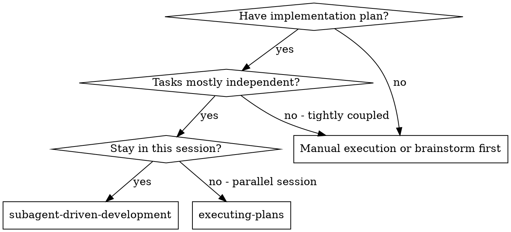
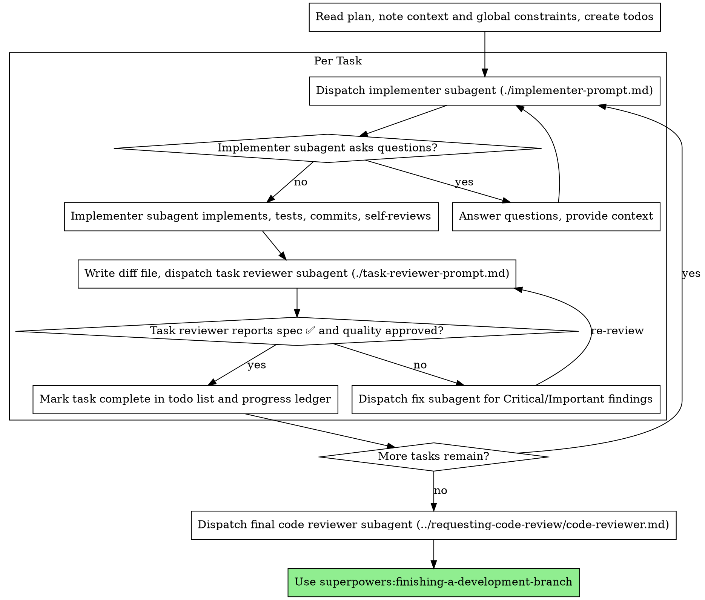

# Session transcript

## User

start I14 by reading CAMPAIGN.md + LEDGER.md first

## Assistant

I'll read the campaign's governing documents in full, starting with CAMPAIGN.md and LEDGER.md as directed.

### ⚙ Tool call: `Bash`

```json
{
  "command": "wc -l /workspace/development/2026-07-17-modularization-campaign/CAMPAIGN.md /workspace/development/2026-07-17-modularization-campaign/LEDGER.md /workspace/development/2026-07-17-modularization-campaign/BLOCKMAP.md && ls /workspace/development/2026-07-17-modularization-campaign/",
  "description": "Check sizes of campaign governing documents"
}
```

### ↳ Tool result

```
   484 /workspace/development/2026-07-17-modularization-campaign/CAMPAIGN.md
  1770 /workspace/development/2026-07-17-modularization-campaign/LEDGER.md
   136 /workspace/development/2026-07-17-modularization-campaign/BLOCKMAP.md
  2390 total
BLOCKMAP.md
CAMPAIGN.md
LEDGER.md
PROMPT.md
analytics.md
statistics.md
transcript.md
transcript.raw.md
usage.raw.txt
```

### ⚙ Tool call: `Read`

```json
{
  "file_path": "/workspace/development/2026-07-17-modularization-campaign/CAMPAIGN.md"
}
```

### ↳ Tool result

```
1	# CAMPAIGN.md — Modularization Campaign (frozen architecture)
2	
3	**Status:** approved design, 2026-07-17. Brainstormed and approved section-by-section in
4	the campaign planning session (see `transcript.md` once archived); prompt in `PROMPT.md`.
5	
6	This is the **one** copy of the campaign's architecture, decisions, invariants, and
7	increment plan. Increment specs **cite this document and re-derive nothing** — the
8	campaign-level brainstorm and adversarial review run once, here; increments inherit that
9	scrutiny and do not repeat it. Any change to this document is an **amendment**: edit the
10	document *and* append a ledger entry (`LEDGER.md`) saying what changed and why. An
11	increment spec that contradicts this document without a ledger amendment is wrong by
12	definition.
13	
14	Related documents (all in this directory unless pathed): `PROMPT.md` (the campaign
15	request), `BLOCKMAP.md` (the B1–B60 functional map of `main()` all scope assignments
16	reference), `LEDGER.md` (append-only cross-increment record), `/workspace/CONTEXT.md`
17	(domain glossary — created by this campaign), `/workspace/prompts/directives.md` (the
18	Spine; PD#n citations below refer to it).
19	
20	## Glossary (campaign terms — domain terms live in `CONTEXT.md`)
21	
22	- **Campaign** — this whole program of work: one architecture, N increments.
23	- **Increment** — one unit of work with its own session, spec, implementation, review,
24	  commit, and archive. Numbered I0–I14.
25	- **Wave** — an ordered group of increments (0–4); increments within a wave may be
26	  reordered if the ledger records why, waves may not.
27	- **Block** — a `Bnn` region of `main()` per `BLOCKMAP.md`; the stable unit of scope
28	  assignment.
29	- **Core package** — the new importable `psh/` package holding infrastructure (Tier 1).
30	- **Gateway** — `psh/gateway.py`, the single module through which every Terminus/WP-CLI/
31	  Drush subprocess flows; the future Pantheon-API replacement seam.
32	- **Façade** — `script_context.py` (`sc`), the stable API surface that checks and plugins
33	  import; implementations move, the façade's names do not break.
34	- **Contract** — the per-phase guaranteed `site_context` keys (CLAUDE.md table), which
35	  this campaign turns into a machine-readable **contract registry**.
36	- **Hook DAG** — the per-phase topological ordering of hooks derived from declared
37	  `consumes`/`produces` keys, validated fatally at startup.
38	- **Ratchet** — the lint/type regime: broad ruff+pyright rules applied as a hard gate to
39	  moved/new modules immediately, the remnant grandfathered until I14.
40	- **Remnant** — whatever remains of the original script at any point mid-campaign.
41	- **Shim** — the thin committed `./pantheon-sitehealth-emails` entry script that calls
42	  `psh.cli.main()` after I0.
43	- **Ledger** — `LEDGER.md`; how increment N learns what N−1 actually did.
44	- **Behavior bar** — the tiered definition of which observable behavior may change (§8).
45	- **Invariant** — a named property no increment may alter (§9).
46	
47	**MUST** = required, violation fails review. **NEVER** = prohibited, violation fails
48	review. **SHOULD** = required unless the increment spec states why not. **MAY** =
49	allowed, at the implementer's judgment.
50	
51	## 1. Goal and non-goals
52	
53	**Goal.** Modularize the 4,752-line main script into (a) a `psh/` core package of
54	infrastructure modules, (b) self-registering `check/` packages for every notice/section
55	emitter, and (c) the existing `plugin/` integrations — taking full advantage of the hook
56	system — while the four e2e goldens stay byte-identical, the per-phase contract is
57	honored, and the non-U-M path keeps working. End state: `main()` is a ~250–400-line
58	orchestrator; every U-M-specific behavior lives in `umich` packages; the whole tree
59	passes the broadened ruff+pyright configuration.
60	
61	**Non-goals** (exhaustive; each is either declined or deferred with reasoning in §15):
62	replacing terminus with the Pantheon API; implementing parallel site processing; any new
63	report content (CSV attachment, cached-% column, env-lock section); SendGrid; refreshing
64	goldens or recorded fixtures; changing what any check reports (except the named bug
65	fixes in I1).
66	
67	## 2. Decision record (exhaustive — from the approved brainstorm)
68	
69	| # | Decision | Choice | Why |
70	|---|---|---|---|
71	| D1 | Pantheon API | **Seam only**: gateway module now, transport swap post-campaign | Swapping transports mid-campaign invalidates terminus fixtures + goldens in every touched increment |
72	| D2 | Lint/type broadening | **Ratchet in-campaign** (§13) | Code is cleaned exactly once, as it moves; bar fixed in I0 so it never shifts |
73	| D3 | Behavior bar | **Tiered, config renames allowed** (§8) | Cleanest final schema; production config edited once, at I14, with a migration table |
74	| D4 | Increment granularity | **Fine: 15 increments** | Safest for session/context limits; split-never-compress backstop (§12) |
75	| D5 | Target architecture | **Three-tier split** (§3) | Infrastructure ≠ report content ≠ data source; fulfills "full advantage of the frameworks" |
76	| D6 | Hook flexibility | **Phases stay; hooks declare consumes/produces; per-phase DAG validated at startup** (§4) | Keeps every existing hook/test valid; a phase-less key scheduler rewrites everything for no added power |
77	| D7 | `--only-warn` plan rec | **In campaign** (I7) | Small, no golden impact, existing TODO |
78	| D8 | Parallel-ready | **Design constraint only** (§3.4) | Near-free now; actual parallelism stays a README TODO |
79	| D9 | CSV attachment / cached-% / env-lock | **README TODO** | Each changes rendered email → golden churn mid-campaign |
80	| D10 | Packaging | **Real package + thin shim** (I0; console-script dropped — see LEDGER I0 amendment 1) | Dissolves the extension-less-script problem; normal imports for tests/pyright/ruff |
81	
82	## 3. Target architecture
83	
84	```
85	                 ./pantheon-sitehealth-emails  (thin shim)
86	                                │
87	                        psh.cli.main()  ── orchestrator: bootstrap, site loop,
88	                                │           phase firing, lifecycle dispatch
89	        ┌───────────────────────┼──────────────────────────┐
90	        ▼ Tier 1: psh/ core     ▼ seams (sc façade)        ▼
91	  configuration  modules   ┌─────────────────────┐   Tier 3: plugin/
92	  gateway        db        │  hook phases + DAG  │   aws  cloudflare
93	  traffic        plans     │  contract registry  │   env  umich
94	  gather         charts    └─────────┬───────────┘   (unchanged roles)
95	  render         mail                ▼
96	  lifecycle                Tier 2: check/  (all notice/section emitters)
97	                           pantheon  wordpress  drupal  addon_updates
98	                           dns  cloudflare  pantheon_cdn_change  umich
99	```
100	
101	### 3.1 Tier 1 — `psh/` core package (exhaustive module map)
102	
103	| Module | Receives (functions / blocks) |
104	|---|---|
105	| `psh/cli.py` | `build_arg_parser`, `parse_args`, arg validation (B5), `main()` orchestrator |
106	| `psh/configuration.py` | `process_config`, `config_substitution`, `gate_disabled_sections`, DEFER machinery, `load_news_items`, `umich_enabled`, `cloudflare_enabled` |
107	| `psh/modules.py` | `find_modules`, module loading (B2/B4), hook engine (`add_hook`/`invoke_hooks`/`PHASES`), DAG build/validation, contract registry |
108	| `psh/gateway.py` | `run_terminus`, `terminus`, `terminus_data`, `wp`, `wp_eval`, `drush`, `drush_php_script`, `fix_drush_output`, `wp_error`, `drush_error`, `TerminusError` |
109	| `psh/notice.py` | `Notice`, `Severity`, `NoticeRegistry`, `DuplicateNoticeCodeError`, `registry` (added I3; §6 Notice type + code registry) |
110	| `psh/db.py` | ORM models, `TrafficRow`/`OverageProtectionRow`, `db_engine_args`, `db_retry`/`db_retryable`/`record_db_reconnect`, `update_traffic_rows`, `insert_traffic_rows`, `load_traffic_rows`, `load_overage_protection_window`, `DatabaseUnavailableError` |
111	| `psh/traffic.py` | `get_old_metrics`, `estimate_month_visits`, `build_traffic_table_rows`, the `traffic_table_columns` global, metrics gather + DB update/load flow (B22–B26), visits-by-month aggregation (B43) |
112	| `psh/plans.py` | plan_info normalization (B12 part), SKU resolution (B17), `overage_blocks`, `contract_year_end`, `plan_costs`, `build_plan_over_time`, the `cost_table_columns` global, recommendation flow (B47) |
113	| `psh/gather.py` | Slimmed framework gathers feeding the `site_post_gather` contract (from B32–B35), `check_wordpress_plugin`/`check_drupal_module` helpers, `build_smell_notices` (the B48 smell-notice *builder*; its emission stays in `main()` — LEDGER I10 amendment 1) |
114	| `psh/charts.py` | Cap geometry (B13 part), chart data prep + matplotlib build (B44–B45) — returns PNG bytes |
115	| `psh/render.py` | Jinja render (B53), PHP inline + `!important` pass (B54), `escape_url` |
116	| `psh/mail.py` | Recipient resolution (B49), MIME assembly (B55), `smtp_login`, send (B57) |
117	| `psh/lifecycle.py` | `RunState`, `finish_run`, `abort_run`, `abort_reason`, `resume_point`, `resume_command`, `rerun_command`, `option_strings_taking_a_value`, `sites_from_resume_point`, `merge_prior_results`, `ResumeSiteNotFoundError` |
118	
119	`dns_classify.py` stays a top-level module (already extracted; moving it into `psh/` is
120	MAY-scope for I14, decided by ledger state then).
121	
122	**Whole-file coverage.** The campaign modularizes the entire script, not just `main()`:
123	every top-level def and module-level global in `pantheon-sitehealth-emails` (lines
124	1–2107 included) is assigned to a `psh/` module in this table and appears in exactly one
125	increment's scope (§11). End state: the original file is the thin shim and nothing else
126	— a top-level def still there at I14 is a defect the closing audit (§17) catches. Moved
127	helpers get the full §7 treatment (types, ratchet, verified docs, tests); they do NOT
128	get algorithmic redesign — moves are behavior-preserving except where §8 says otherwise
129	(I1, I7's D7, I12's B51).
130	
131	### 3.2 Tier 2 — new/changed `check/` packages (exhaustive)
132	
133	| Package | Contents (blocks) | Phase(s) |
134	|---|---|---|
135	| `check/pantheon/` (new) | frozen site (B19), no-live-env (B21), upstream updates (B38), PHP EOL (B41) | `site_pre` (frozen, no-live-env), `site_post_gather` (updates, PHP EOL) |
136	| `check/wordpress/` (new) | PAPC + native-sessions checks, OCP config probe, favicon (from B34) | `site_post_gather` |
137	| `check/drupal/` (new) | PAPC module check, D7 EOL + tag1_d7es, multisite probe (from B30/B35) | `site_post_dns` (multisite), `site_post_gather` |
138	| `check/addon_updates/` (new) | add-on updates table notice (B39) | `site_post_gather` |
139	| `check/umich/` (existing, grows) | umich-oidc-login, Hummingbird fork (B34), Drupal UA check (B35), annual-billing notices (B50/B51), portal-URL text for the recommendation notice (B47's U-M half) | `site_post_gather`, `site_pre_render` (billing) |
140	
141	`check/dns/`, `check/cloudflare/`, `check/pantheon_cdn_change/` are untouched tenants.
142	A check MAY fetch its own data through `sc` gateway wrappers when the data is
143	check-specific (e.g. `upstream:updates:list`); data used by core *and* checks is
144	published through the contract instead (e.g. `envs`).
145	
146	The B48 smell notices are **not** a `check/addon_updates/` hook (LEDGER I10 amendment 1):
147	their *builder* (`build_smell_notices`) moves to `psh/gather.py`, but the *emission* stays
148	in `main()`. A `site_post_gather` smells hook cannot be ordered after the
149	`wp_smell`/`drush_smell` in-place mutators — a `produces: ['wp_smell']` declaration is a
150	condition-2 fatal against the core registry (D-i9-3), and alphabetical registration puts
151	`check/addon_updates` first in the phase — and relocation would also add smell rows to
152	`--only-warn` csv output (B48 sits after that gate today), a §8 surface change. The
153	`mutates` hook declaration that would dissolve this class is post-campaign work (README TODO).
154	
155	### 3.3 What stays in `main()` (exhaustive, with why)
156	
157	Config/arg bootstrap ordering (B1–B8 — the two-pass substitution *order* is the
158	program); overage constants + date window (B9, B13 part); the site-loop skeleton (skips,
159	banner, sorted order, resume filter — B14–B18, B20, B25, B42); phase firing and contract
160	stuffing (B27, B28, B31, B37, B52); the B48 smell-notice *emission* call (the builder
161	moved to `psh/gather.py` at I10, but the emission summarizes end-of-phase smell state no
162	hook position can guarantee under the D-i9-3 rebind design, and it must stay behind the
163	`--only-warn` gate — LEDGER I10 amendment 1); notice sort + subject (B50 minus billing);
164	the `try`/`except BaseException` lifecycle dispatch (B59–B60 call sites). Everything else
165	leaves. Target: 250–400 lines.
166	
167	### 3.4 Parallel-ready constraint (D8)
168	
169	Per-site work MUST be a function of `(site, config, db_session, site_context)`: no new
170	module-level mutable state; run-scoped accumulators live only in `RunState`. This is a
171	review criterion from I2 onward, not a parallelism implementation.
172	
173	### 3.5 The `sc` façade
174	
175	Checks and plugins import **only** `sc` (and their own package). `sc` keeps every name
176	listed in CLAUDE.md's runtime-exposed block, re-exporting from `psh/` modules as they
177	move. NEVER remove or rename an `sc` attribute mid-campaign; additions are fine. The
178	house-rules test suite gains an assertion that every documented `sc` name exists (I2).
179	
180	## 4. Phases, hooks, and the DAG
181	
182	Phases stay the coarse spine: `setup`, `site_pre`, `site_post_traffic`, `site_post_dns`,
183	`site_post_gather`, `site_pre_render`, plus **new** `run_finish` (fired inside
184	`finish_run` before artifacts are written, receiving the `RunState`; for future run-level
185	artifact hooks — no consumer at introduction, like `site_pre_render` was). Dotted
186	plugin-defined events are unchanged.
187	
188	From I4, `add_hook` requires two new entries per hook: `consumes` and `produces` — each
189	a (possibly empty) list of contract-key names. Validation at module-load completion
190	(exhaustive fatal conditions):
191	
192	1. A consumed key that nothing produces (neither core's registry for that phase or an
193	   earlier phase, nor another hook) → fatal.
194	2. Two producers of the same key → fatal (one owner per key; PD#1 — a silent overwrite
195	   is a silent failure).
196	3. A cycle among same-phase hooks → fatal.
197	4. A hook consuming a key first produced in a *later* phase → fatal.
198	5. A missing `consumes`/`produces` entry on any hook → fatal (no legacy mode; I4
199	   retrofits all in-repo hooks in the same change).
200	
201	`invoke_hooks` orders same-phase hooks topologically (producers before consumers;
202	registration order breaks ties, so existing behavior is preserved where no edges exist).
203	The permanent test `tests/integration/test_hook_dag.py` loads **all** real check/plugin
204	packages and asserts the DAG builds — the "future changes can never make the DAG
205	impossible" guarantee — and a unit suite proves each fatal condition actually fires
206	(PD#14: the validator must be shown able to go red).
207	
208	```
209	 module load ──► collect hooks ──► per phase: build edges (produces→consumes)
210	                                        │
211	                              cycle? unknown key? dup producer? ──► fatal exit (named error)
212	                                        │ ok
213	                                topo order stored ──► invoke_hooks uses it
214	```
215	
216	**Contract registry.** `psh/modules.py` holds the machine-readable registry: phase →
217	keys core stuffs (today's CLAUDE.md table, verbatim). Core's stuffing code is checked
218	against it in tests; CLAUDE.md's table gains a line saying the registry is authoritative.
219	New contract keys added by increments (exhaustive for this campaign): `envs` (I8, at
220	`site_pre`), `add_on_updates` + `wp_smell`/`drush_smell`/`composer_smell` (I9/I10, at
221	`site_post_gather`), plan/cost keys `current_plan`, `recommended_plan`, `plan_costs`,
222	`savings` (I7, at `site_pre_render`). Each addition updates registry + CLAUDE.md table +
223	ledger in the same increment.
224	
225	**Hook-produced keys (I10).** A hook MAY produce keys of its own — declared in its
226	`produces`, validated for duplicate producers, cycles, and phase position by the same
227	conditions 1–4 above. Such keys are **DAG-declared, not registry-owned**: they are present
228	only when the producing hook actually ran (absent when its gate failed or its package is
229	disabled), so consumers read them with `.get()`, and they are **NOT** part of the
230	guaranteed per-phase contract (the "new contract keys" list above stays exhaustive for
231	registry-owned keys only). The campaign's first are `drupal_multisite` /
232	`drupal_multisite_smell`, produced by `check.drupal.multisite` at `site_post_dns` and read
233	by `main()` after the phase (I10; see LEDGER I10 amendment 2).
234	
235	## 5. Configuration
236	
237	Principles: one section per feature, named for the operator's mental model; every
238	relocated check gets an `enabled` flag under `[Check.<name>]`, **default true** —
239	relocating code MUST NOT silently disable a check that runs unconditionally today.
240	U-M-only checks additionally require `[UMich].enabled` (existing `umich_enabled()`
241	rule). `gate_disabled_sections()` semantics (nested `enabled`, children dropped) apply to
242	`[Check.*]` unchanged.
243	
244	Example (actual TOML, the shape I8 introduces — illustrative of the family, exhaustive
245	for `check/pantheon/`):
246	
247	```toml
248	[Check.pantheon]
249	enabled = true          # frozen-site, live-env, upstream-updates, PHP-EOL checks
250	```
251	
252	New keys land in final shape as introduced (I3 onward). Renames/moves of *existing* keys
253	happen once, in I14, which MUST deliver: the old→new migration table in
254	`docs/config-migration.md`, a rewritten `sample-pantheon-sitehealth-emails.toml`, and
255	exact edit instructions for the production config repo. Until I14, every existing
256	production key keeps working unchanged.
257	
258	## 6. Types
259	
260	Reused as-is: `TrafficRow`, `OverageProtectionRow`, `DnsFacts`, `FetchResult`,
261	`SiteContext`. Introduced (exhaustive):
262	
263	| Type | Increment | Shape |
264	|---|---|---|
265	| `GatewayResult` | I2 | NamedTuple `(result, errors, fatal)` replacing the anonymous 3-tuples |
266	| `Notice` | I3 (class) → adopted per increment | frozen dataclass: `severity` (StrEnum alert/warning/info), `code` (unique — registry test), `html`, `text`, `short`, `icon`, `order`; `SiteContext.add_notice` accepts `Notice` or legacy dict; dict form retired in I14 |
267	| `PlanInfo` / `PlanCatalog` | I7 | typed view over `[Pantheon.plan_info]` |
268	| `RunState` | I13 | dataclass holding `all_warnings`, `site_results`, `site_savings`, `emails_sent`, reconnect counters |
269	
270	House-style tuple annotations (`-> (str, str, bool)`) are replaced with real annotations
271	in every module as it moves — never fixed in place in the remnant (one pass per line,
272	D2). CLAUDE.md's house-style note is updated in I14 when the last one dies.
273	
274	## 7. Per-increment obligations
275	
276	Every increment MUST (this list is exhaustive and lives only here; increment specs cite
277	it): (1) start by reading `CAMPAIGN.md`, `LEDGER.md`, `CLAUDE.md`, `BLOCKMAP.md` rows in
278	scope; (2) follow `prompts/implementation-standards.md` (subagent-driven, test-first,
279	`psh-implementer`/`psh-reviewer`); (3) replace house styles in moved code (§6);
280	(4) verify — not assume — every claim in comments/docs it moves or writes;
281	(5) update tests in the same change; (6) update README/docs/CLAUDE.md for what moved;
282	(7) update auto-memory where a durable fact changed; (8) append its ledger entry
283	(§12); (9) preserve every invariant (§9); (10) end with `/code-review`, a full
284	`./run-tests`, and one checkpoint commit including its `development/` folder.
285	
286	## 8. Behavior bar (canonical gate table)
287	
288	| Surface | Rule | Until |
289	|---|---|---|
290	| Rendered emails (4 goldens) | NEVER change (byte-identical) | end of campaign |
291	| `-results.json` / `-notices.csv` / `-run.json` structure (keys, row shape) | NEVER change | end of campaign |
292	| Notice csv *values* | MAY change only in I1 (named bug fixes), I12 (scheduled B51 deletion), I7 (`its-recommends-plan` savings-field format, D-i7-5 — amendment), and I9 (wp-smell precedence when theme-list and OCP-probe stderr co-occur without favicon stderr — see LEDGER I9) | — |
293	| stdout / console / error messages | MAY improve freely | — |
294	| Config: existing keys | NEVER break | I14 (renames with migration table) |
295	| Config: new keys | MUST land in final schema shape | — |
296	| Exit codes, resume semantics, artifact write gates | NEVER change | end of campaign |
297	
298	## 9. Named invariants (exhaustive; NEVER violated by any increment)
299	
300	1. Four e2e goldens byte-identical (`./run-tests` proves it; refresh is forbidden — an
301	   existing golden going red is a defect in the increment, PD#14).
302	2. Per-phase data contract: existing keys never removed/renamed/retyped; additions only.
303	3. Non-U-M path works: non-U-M golden green; no new un-gated U-M content (I1 *removes*
304	   the one known leak).
305	4. Run lifecycle: single `except BaseException` flush path; `abort_reason`'s three
306	   outcomes; artifacts dropped-site rule; notices appended before send; resume-point
307	   next-site-after-email rule; soft-wrapped copy-pasteable commands.
308	5. DB: `db_retry` retries whole idempotent units only; `db_retryable` predicate
309	   unchanged; the read-release commit in the loaders stays (guarded by
310	   `test_load_traffic_rows_releases_the_connection`).
311	6. Rich console rules: escape untrusted text; production width reproduced in tests.
312	7. Test safety interlock (`run_program` forbidden flags) never bypassed or weakened.
313	8. Column-0 `f"""` notice literals move **verbatim** — never re-indented; `git diff -w`
314	   is not acceptable evidence for any change touching them.
315	9. Checks/plugins import only `sc`; `sc` names never removed mid-campaign (§3.5).
316	10. Recorded fixtures are not regenerated (`terminus-cdnchange/` is hand-maintained and
317	    `--record` must not run).
318	11. `--create-tables`/`--update`/`--import-older-metrics` phase-gating rules (CLAUDE.md
319	    table) unchanged.
320	
321	## 10. Known-bug inventory → I1
322	
323	The five bugs and the dead code listed in `BLOCKMAP.md` §Bugs (composer-smell
324	nesting+variable; shared `php-eol` code; `site_results` omission; un-gated U-M portal
325	URLs; duplicate `annual-bill` code — B51 handled as: distinct code now, scheduled
326	deletion when its Aug-2026 date passes, ledgered to I12; dead code deleted). Each fix is
327	test-first with the test shown red on the old behavior. **Verified 2026-07-17**: the
328	goldens contain zero `php-eol`/`wp-smell`/`drush-smell`/`composer-smell`/`annual-bill`
329	occurrences and the golden fixtures report PHP 8.2, so none of these fixes can touch a
330	golden:
331	
332	```
333	$ grep -c 'php-eol\|composer-smell\|wp-smell\|drush-smell\|annual-bill' tests/e2e/__snapshots__/*.ambr
334	tests/e2e/__snapshots__/test_golden.ambr:0
335	tests/e2e/__snapshots__/test_golden_cdn_change.ambr:0
336	tests/e2e/__snapshots__/test_golden_drupal.ambr:0
337	tests/e2e/__snapshots__/test_golden_nonumich.ambr:0
338	```
339	
340	## 11. The increments
341	
342	Wave dependency structure (increments within a wave are ordered but MAY be resequenced
343	with a ledger entry; waves MUST NOT be reordered):
344	
345	```
346	Wave 0: I0 bootstrap ──► I1 bug fixes
347	Wave 1: I2 gateway ──► I3 config ──► I4 hooks+DAG ──► I5 DB
348	Wave 2: I6 traffic ──► I7 plans ──► I8 check/pantheon ──► I9 wordpress ──► I10 drupal
349	Wave 3: I11 charts ──► I12 render+mail ──► I13 lifecycle
350	Wave 4: I14 closing sweep
351	```
352	
353	| Inc | Scope (blocks / functions) | Delivers |
354	|---|---|---|
355	| **I0** | — (no logic moves) | `psh/` skeleton + thin shim (console-script dropped — see LEDGER I0 amendment); conftest `import psh` rework (same collected-test count gate); ratchet config (§13) with rule sets pinned; pyright baseline measured; `LEDGER.md` started; README TODO edits (§15 dispositions); CLAUDE.md pointer to campaign |
356	| **I1** | B36, B40, B41, B47 (URLs), B48, B50/B51 (codes), dead code | §10 fixes, each test-first |
357	| **I2** | 302–597 wrappers | `psh/gateway.py`, `GatewayResult`, sc re-exports + façade test; no-subprocess-outside-gateway house rule |
358	| **I3** | 792–934, 1209–1253, 1608–1648 (`umich_enabled`/`cloudflare_enabled`) | `psh/configuration.py`; `Notice` class + code-uniqueness registry test |
359	| **I4** | 935–950, hook engine from `script_context.py` | `psh/modules.py`; consumes/produces on all in-repo hooks; DAG validation + fatal-condition tests; `run_finish` phase; contract registry |
360	| **I5** | 95–178; DB defs within 1285–1575 (`DatabaseUnavailableError` through `db_engine_args`; the resume helpers `ResumeSiteNotFoundError`, `sites_from_resume_point`, `merge_prior_results` stay for I13) | `psh/db.py`; DB test suites relocated intact |
361	| **I6** | B22–B26, B43; 598–671, 977–1127 | `psh/traffic.py` |
362	| **I7** | B9, B12 (plans), B17, B47; 967–976, 1128–1208, 1254–1280 | `psh/plans.py`; `PlanInfo`; D7 (`--only-warn` runs recommendation); plan/cost contract keys |
363	| **I8** | B19, B21, B38, B41 | `check/pantheon/` + `[Check.pantheon]`; `envs` contract key |
364	| **I9** | B32–B34; 672–739 | `psh/gather.py` (WP half); `check/wordpress/`; U-M WP checks → `check/umich/`; `add_on_updates` + smell contract keys |
365	| **I10** | B30, B35, B39; B48 *builder* only (emission stays in `main()` — LEDGER I10 amendment 1); 740–791 | gather (Drupal half) + `build_smell_notices`; `check/drupal/`; `check/addon_updates/`; UA check → `check/umich/` |
366	| **I11** | B13 (caps), B44–B45 | `psh/charts.py` |
367	| **I12** | B49–B57 minus sort/subject core | `psh/render.py`, `psh/mail.py`; annual billing → `check/umich/` at `site_pre_render`; B51 deletion if past its date |
368	| **I13** | B14 (accumulators), B56, B59–B60; 1649–2107 plus the resume helpers I5 left behind (1281–1284, 1528–1542, 1576–1607) | `psh/lifecycle.py`; `RunState`; `main()` reaches final form |
369	| **I14** | — | Config renames + migration doc + sample rewrite + production-config instructions; global ratchet flip + remnant cleanup; docs/README/CLAUDE.md full refresh; `Notice` dict form retired; ledger fully resolved; retrospective + closing audit (§17) |
370	
371	Sizing note: the largest moves are I9 (~330 main-loop lines + helpers) and I10 (~320 +
372	helpers). If any increment proves oversized mid-session: **split, never compress** —
373	commit nothing partial, ledger the split, the second half becomes its own increment.
374	
375	## 12. Coordination protocol
376	
377	**Ledger entry template** (append per increment, and for any amendment):
378	
379	```markdown
380	## I<N> — <slug> (<date>, commit <sha>)
381	- Moved: <blocks/functions actually moved>
382	- Deviations from CAMPAIGN.md: <none | what + why>
383	- Contract/config/sc additions: <keys/names>
384	- Discovered tasks: <each with disposition: fixed here | I<M> | README TODO>
385	- Open questions for next increment: <…>
386	```
387	
388	**Discovered-task disposition rules** (canonical): fits current increment's scope and
389	<~30 min → fix now, note in ledger; belongs to a later increment → ledger it against
390	that increment (the increment's spec author MUST read these); major/risky/scope-widening
391	→ README TODO with a sentence of context. Nothing is carried in memory or chat — if it
392	is not in the ledger or README, it does not exist (PD#9).
393	
394	**Session flow per increment:** read the §7 documents → write the increment SPEC.md in
395	`development/<date>-mod-I<N>-<slug>/` citing CAMPAIGN.md sections by number →
396	`superpowers:writing-plans` → subagent-driven implementation → `/code-review` → full
397	`./run-tests` → per-task commits, each green; the increment's final commit includes the dev
398	folder → `/archive-session` → ledger entry.
399	
400	## 13. Lint/type ratchet
401	
402	Mechanism (as shipped by I0; see LEDGER I0 amendment 2): TWO ruff configs —
403	`pyproject.toml` `[tool.ruff.lint]` keeps the narrow PD-rule set running everywhere
404	including the remnant, and `ruff-broad.toml` carries `select = ["ALL"]` minus a
405	justified ignore list, with `extend-exclude` grandfathering exactly the remnant
406	(`psh/_legacy.py`) and not-yet-moved files; each increment deletes its
407	files from the grandfather list, and the two configs merge at I14. pyright runs in
408	`./run-tests` from I0 via `[tool.pyright]` (standard mode, `psh/` minus `_legacy.py`),
409	ratcheting toward strict as typed code moves in. The four existing narrow rules (`E722`, `BLE001`, `S105`, `S106`) remain global
410	throughout — they mechanize PD#2/PD#6 and are never grandfathered. No
411	`target-version` pin (CLAUDE.md: it masks the 3.12-only syntax detection).
412	
413	Baselines measured 2026-07-17 (I0 re-measures and pins both in its spec):
414	
415	```
416	$ ./run-tests --fast --llm   (tail)
417	LLM_SUMMARY passed=727 failed=0 error=0 skipped=1 xfailed=0 xpassed=0
418	25 snapshots passed.
419	
420	$ uvx ruff check --isolated --statistics .
421	26  F541  f-string-missing-placeholders
422	 8  E741  ambiguous-variable-name
423	 4  E713  not-in-test
424	 3  F841  unused-variable
425	 2  F401  unused-import
426	 1  E402  module-import-not-at-top-of-file
427	 1  E712  true-false-comparison
428	Found 45 errors.
429	```
430	
431	(README's "~55" ruff and "39" pyright figures are stale/unverified claims; I0 replaces
432	them with measured numbers. pyright was not measured in planning — no pyright binary in
433	the dev container yet; installing it is I0 scope.)
434	
435	## 14. Risk / control table
436	
437	| Risk | Control |
438	|---|---|
439	| Re-indented column-0 notice literals silently change emails | Invariant 8; goldens as tripwire; AST/token comparison, never `git diff -w` |
440	| conftest rework silently drops tests | I0 gate: identical collected-test count (727 passed / 1 skipped / 2 deselected baseline) before and after |
441	| Long-range `main()` local coupling breaks a move | BLOCKMAP produces/consumes; each increment spec lists exactly which locals cross its boundary |
442	| Session/context overrun mid-increment | Fine granularity (D4); split-never-compress; commits only at increment completion |
443	| Architecture drift across 15 sessions | This document frozen; amendments only via ledger; specs cite section numbers |
444	| Hidden hook-order dependencies surface in I4 | I4 audits every hook; real dependencies become explicit DAG edges |
445	| Ratchet churn on moved code | Rules fixed at I0; cleaning is part of each move |
446	| Goldens blind to stdout/artifacts | Invariants 4–5 name the artifact/abort test suites as the cover; artifact structure frozen until campaign end |
447	| Implementer sessions lack context | `psh-implementer`/`psh-reviewer` carry the read list; specs name seams (Spine spec bar); §7 reading list |
448	| Two annual-bill notices / removal date passes mid-campaign | Explicitly scheduled: codes split in I1, deletion decision in I12, ledger tracks |
449	
450	## 15. NOT in scope (reasoning preserved so it is never re-litigated)
451	
452	- **Terminus → Pantheon API swap** — D1; post-campaign project against `psh/gateway.py`.
453	- **Parallel site processing** — D8; constraint only; README TODO remains.
454	- **CSV data attachment, cached-% column, env-lock section** — D9; each becomes a small
455	  post-campaign change (env-lock: a ~50-line `check/` package) once goldens may move.
456	- **SendGrid, secrets-handling completion, portal traffic capture, daily alerts,
457	  accessibility/security/Cloudflare scores, AI recommendations, dependency updates,
458	  terraform-infra** — pre-existing README TODOs, untouched by this campaign.
459	- **Approach B (library-only) and C (everything-is-a-hook)** — rejected in brainstorm:
460	  B fails the "full advantage of the frameworks" goal; C forces infrastructure into
461	  optional-content clothing.
462	- **Golden/fixture refreshes** — forbidden (Invariants 1, 10).
463	
464	## 16. Acceptance baseline
465	
466	§13 outputs are the campaign-start baseline (run and pasted 2026-07-17). Every
467	increment's definition of done re-runs `./run-tests` at increment end — the full suite
468	when the live tier's credentials are available in the session, otherwise `--fast` with a
469	ledger note saying the live tier was skipped — and MUST reproduce goldens
470	byte-identically. I0 additionally records the collected-test count gate.
471	
472	## 17. Closing audit (queued for I14; exhaustive)
473	
474	1. Is `main()` within 250–400 lines, and does everything left match §3.3?
475	2. Has every DAG fatal condition been demonstrated red at least once?
476	3. Do the contract registry and CLAUDE.md table agree (test-enforced)?
477	4. Is any `sc` re-export now consumed by nobody (dead façade surface)?
478	5. Is the `.py` symlink still needed for anything beyond the shim? If not, note in
479	   CLAUDE.md; if yes, say for what.
480	6. Are all ledger items resolved (done, scheduled, or README TODO)?
481	7. Has the production config repo received and applied the migration instructions?
482	8. Do README, CLAUDE.md, docs/, and memory reflect the final architecture (no stale
483	   line-number or module references)?
484	9. Were any invariants amended mid-campaign, and is each amendment ledgered?
485
```

## Assistant

CAMPAIGN.md read. Now the ledger — it's long (1770 lines), so I'll read it in full across two reads.

### ⚙ Tool call: `Read`

```json
{
  "file_path": "/workspace/development/2026-07-17-modularization-campaign/LEDGER.md",
  "limit": 900
}
```

### ↳ Tool result

```
File content (28702 tokens) exceeds maximum allowed tokens (25000). Use offset and limit parameters to read specific portions of the file, or search for specific content instead of reading the whole file.
```

### ⚙ Tool call: `Read`

```json
{
  "file_path": "/workspace/development/2026-07-17-modularization-campaign/LEDGER.md",
  "limit": 600
}
```

### ↳ Tool result

```
1	# LEDGER — Modularization Campaign
2	
3	Append-only. One entry per completed increment, plus one per CAMPAIGN.md amendment.
4	This file is how increment N learns what N−1 actually did; if a deviation, discovered
5	task, or decision is not recorded here (or in the README TODO list), it does not exist.
6	Entry template: CAMPAIGN.md §12.
7	
8	## Campaign planning (2026-07-17)
9	
10	- Produced: `CAMPAIGN.md` (frozen architecture), `BLOCKMAP.md` (B1–B60 map),
11	  `/workspace/CONTEXT.md` (domain glossary, new), this ledger.
12	- Baselines: fast tier 727 passed / 1 skipped / 2 deselected; ruff `--isolated` 45
13	  findings; pyright unmeasured (no binary in container — I0 scope).
14	- Discovered during planning, dispositioned:
15	  - Five bugs + dead code → I1 (CAMPAIGN.md §10, BLOCKMAP §Bugs).
16	  - README's "~55 ruff / 39 pyright" figures stale/unverified → I0 re-measures.
17	  - B51 second annual-bill notice: marked "remove Aug 2026" — code split in I1,
18	    deletion decision in I12.
19	  - WordPress/Drupal duplication + update-table HTML duplication (BLOCKMAP §Bugs 7–8)
20	    → addressed structurally by I9/I10 (shared gather + `check/addon_updates/`).
21	- Open questions for I0: exact ruff rule list; pyright strictness per environment;
22	  whether `dns_classify.py` moves under `psh/` (deferred to I14, MAY).
23	- Amendment (2026-07-17, user spec review): added the "Whole-file coverage" paragraph to
24	  CAMPAIGN.md §3.1 — clarification only, no scope change; the module map already
25	  assigned every top-level def.
26	
27	## I0 — bootstrap (2026-07-17, closing commit `docs(campaign-I0): close the bootstrap increment`)
28	
29	Commits (per-task, each green): `b1ccc72` (package move + shim + conftest + coverage),
30	`d0e3027` (lint/type ratchet), `5b536fa` + `239955d` (README/CLAUDE.md docs), plus this
31	closing docs commit (ledger + CAMPAIGN amendments + SPEC acceptance + README pyright number).
32	
33	- **Moved:** the whole 4,752-line program → `psh/_legacy.py` (`git mv`, **zero logic
34	  changes**; the `__main__` tail is inert in a module, left for I13). New: `psh/__init__.py`
35	  (docstring), `psh/cli.py` (`from psh._legacy import main, parse_args` re-export), and a new
36	  7-line thin shim at `./pantheon-sitehealth-emails` calling `psh.cli.main()`. No blocks
37	  (B-map) moved — I0 moves the file, not logic (§11 row I0).
38	
39	- **Deviations from CAMPAIGN.md (three amendments, all applied to the document this commit):**
40	  1. **No console-script entry point** (amends §11 row I0 / D10). The program is repo-rooted
41	     by design (`find_modules`, templates, `inline-styles.php`, `vendor/`, config symlink are
42	     all CWD-relative); a pip entry point would need a data-file overhaul serving no campaign
43	     goal. D10's real benefits (normal imports; native ruff/pyright/CodeGraph coverage; no
44	     `SourceFileLoader`) all arrive via the package + shim without installation. `pyproject.toml`
45	     stays deps-only (`py-modules = []`, `packages = []` to stop setuptools auto-discovery
46	     installing a stale shadow copy — PD#1). §11 row I0 now reads "thin shim (console-script
47	     dropped — see LEDGER I0 amendment)".
48	  2. **Grandfather is `psh/_legacy.py` via `ruff-broad.toml` `extend-exclude`** (amends §13,
49	     which named `pantheon-sitehealth-emails.py` and "per-file-ignores" — both written before
50	     the legacy-module + two-config mechanics were settled). The shipped mechanism is TWO ruff
51	     configs, not per-file-ignores: `pyproject.toml` `[tool.ruff.lint]` carries the narrow
52	     PD-rule set (`E722`/`BLE001`/`S105`/`S106`) that runs EVERYWHERE including `_legacy.py`;
53	     `ruff-broad.toml` carries `select = ["ALL"]` minus the ignore list and grandfathers the
54	     remnant via `extend-exclude`. `./run-tests` and `.claude/hooks/ruff-check.sh` run BOTH
55	     passes; the two files merge into `pyproject.toml` at I14. §13 now names `psh/_legacy.py`
56	     and "ruff-broad.toml exclude".
57	  3. **Per-task commits, each green** (amends §12's "one commit (code + dev folder)"). Each I0
58	     task committed independently once its gates were green; this increment's final (closing)
59	     commit includes the `development/` folder. Rationale: finer checkpoints serve the campaign
60	     prompt's revert/inspect intent, and SDD review packages diffs as commit ranges. §12 now
61	     reads "per-task commits, each green; the increment's final commit includes the dev folder".
62	
63	- **Ratchet as pinned.** pyright runs in `./run-tests` at **standard** mode, not strict
64	  (DECISION): `psh/cli.py` re-exports from the untyped legacy module, so strict would fail on
65	  re-export; strictness ratchets up as increments move typed code in. Scope `[tool.pyright]`
66	  = `include = ["psh"]`, `exclude = ["psh/_legacy.py"]`. Ruff-broad ignore list (pinned; each
67	  justified in `ruff-broad.toml`): `COM812`, `ISC001`, `E501`, `Q000`, `Q001`, `Q002`, `Q003`,
68	  `ANN`, `TD002`, `TD003`, `FIX002`, `EM101`, `EM102`, `TRY003`, `D`, `CPY001`. `CPY001` is a
69	  **preview** rule in ruff 0.15.22 (cannot fire under non-preview `select=["ALL"]`); ruff
70	  accepts it in `ignore` with no warning, so it is kept verbatim to document the intent
71	  (no per-file copyright headers). `D` (docstring convention) is undecided → README TODO.
72	
73	- **pyright whole-tree baseline (informational; replaces README's unverified "39").**
74	  **220 errors, 0 warnings, 0 informations** across 118 first-party files, standard mode,
75	  pyright 1.1.411 (SPEC ACCEPTANCE §Task 5 has the command + breakdown). Measured OUTSIDE the
76	  scoped gate config via a repo-root config (pyright roots a project at the config's directory
77	  and ignores includes outside it; a config's `exclude` still drops CLI-passed paths — so
78	  neither a scratchpad-rooted config nor CLI args can re-include `_legacy.py`, and a repo-root
79	  temp config is the reproducible form). By area: `tests/` 139, `psh/_legacy.py` 36, `check/`
80	  21, `plugin/` 18, `script_context.py` 5, `dns_classify.py` 1 (`check/`+`plugin/` = 39, the
81	  origin of the old figure). The gated scope (`psh/` minus `_legacy.py`) is `0 errors`.
82	
83	- **Contract/config/sc additions:** none (I0 moves no logic; no `[Check.*]` sections, no new
84	  contract keys, no `sc` names added or removed).
85	
86	- **Discovered tasks:**
87	  - **`Path(psh.__file__).parent` as a repo-root proxy** — 25 sites across 23 files: 22 test files (plus
88	    `tests/helpers/checkload.py`) anchored repo paths on the program file's parent, which the
89	    move shifted from repo root to `psh/`. Fixed here, mechanically and minimally:
90	    `→ Path(psh.__file__).resolve().parents[1]` at exactly those sites. Proper cleanup lands
91	    when later increments un-grandfather those test files; the `psh` fixture itself is
92	    redesigned when `_legacy` dies (I13/I14). Disposition: **fixed here**, further cleanup **I13/I14**.
93	  - **ruff lints explicitly-passed files even when excluded** — passing a path on ruff's
94	    command line overrides `extend-exclude`, so the edit hook (which passes the just-edited
95	    file) would lint `_legacy.py` against the broad set. Fixed by giving the broad-pass
96	    invocation `--force-exclude` and running it from repo-root cwd; documented in
97	    `.claude/hooks/ruff-check.sh`. Disposition: **fixed here**.
98	
99	- **Open questions for I1/I2:**
100	  - I1 (bug fixes) touches `_legacy.py` in place (fixes retire as code moves); it must keep
101	    the narrow PD set green there (broad set stays grandfathered) and the four goldens
102	    byte-identical (§10 verified the fixed codes appear in zero goldens).
103	  - I2 (gateway) is the first real logic move: as it un-grandfathers the wrapper functions it
104	    deletes them from `ruff-broad.toml` `extend-exclude` and must clean them to the broad set
105	    + pyright standard in the same change (§13 ratchet; §6 house-style tuple hints replaced).
106	  - `dns_classify.py` under `psh/` remains a MAY for I14 (unchanged from planning).
107	- Amendment (2026-07-17, post-Task-5 review): CAMPAIGN.md §13 mechanism paragraph
108	  rewritten to describe the SHIPPED two-config mechanism (it still said "pyproject gets
109	  extend-select" and "executionEnvironments", both superseded by amendment 2 above);
110	  ledger reanchor note corrected to "22 test files plus checkload.py" (23 files total).
111	  Both changes doc-accuracy only.
112	- Amendment (2026-07-17, final I0 code review, spec axis): D10's Decision cell still said
113	  "console-script" after amendment 1 changed only §11 row I0 — CAMPAIGN.md briefly
114	  self-contradicted. D10 cell now matches. Doc-accuracy only.
115	
116	## I1 — known-bug fixes (2026-07-17, commits `5518de7..1ff9153` + closing docs commit)
117	
118	Spec/plan: `development/2026-07-17-mod-I1-bug-fixes/` (SPEC.md carries the pasted
119	acceptance results). Six per-task commits, each green; full suite at close = 751 passed /
120	1 skipped **including the live tier**, 27 snapshots, all three gates; four goldens
121	byte-identical across the whole range (`git diff aa8afd1 -- tests/e2e/__snapshots__/`
122	empty).
123	
124	- **Moved:** no blocks (fixes land in place in `psh/_legacy.py` per I0's open-question
125	  note). Extracted five pure notice-builder helpers as consecutive module-level defs
126	  above `main()` (preserved-bug-extraction pattern; every literal interior byte-verified
127	  against the pre-move original by task reviewers AND the final review):
128	  `build_smell_notices`, `build_php_eol_notice`, `build_annual_bill_upcoming_notice`,
129	  `build_annual_bill_in_progress_notice`, `build_plan_recommendation_notice`. These
130	  travel later: smells → I10, php-eol → I8, annual-bill → I12, plan-rec → I7.
131	- **Fixed (CAMPAIGN §10 / BLOCKMAP §Bugs, all test-first with RED shown on old
132	  behavior):** (1) B48 composer-smell nesting + wrong interpolated variable;
133	  (2) B41 shared `php-eol` csv code → `php-eol-warning` (7.4/8.1) / `php-eol-alert`
134	  (<8.2), following the `updates-*` suffix pattern; (3) B36 unknown-framework sites now
135	  get a `site_results` entry (`version: "unknown"`, same 3-key row shape) — covered by a
136	  new offline e2e (`tests/e2e/test_unknown_framework_e2e.py`) asserting the
137	  `finish_run()` stdout pprint, since `-results.json` is written only on `--all` runs the
138	  interlock bans; (4) B47 un-gated U-M portal URLs — two of the four named URL sites
139	  (`extra_message`/`extra_text`) were **dead stores** (assigned, never read; §10's
140	  4240/4248 refined — bug partially lived in dead code), deleted; the live
141	  `its-recommends-plan` notice now selects U-M vs generic copy via `umich_enabled()`
142	  (generic drops the portal anchor AND the June-16-30 downgrade-window sentence — U-M
143	  billing policy, factually wrong elsewhere); both variants pinned by syrupy snapshots
144	  (`test_plan_recommendation_notice_render`); (5) B50/B51 duplicate `annual-bill` code —
145	  B51 now emits `annual-bill-in-progress`; B50 keeps `annual-bill`; B51's Aug-2026
146	  deletion decision remains I12's; (6) dead code deleted (B40 Gen2 block, overage debug
147	  query, `# plt.show()`, redundant second `plt.close(fig)` with its stale memory claim).
148	- **Deviations from CAMPAIGN.md:** none.
149	- **Contract/config/sc additions:** none. Sanctioned notice-csv value changes (§8 I1
150	  exception): the three codes above. New **hand-maintained** fixture dir
151	  `tests/fixtures/terminus-unknownfw/` (copy of `terminus/`, one framework value →
152	  `"mystery"`, README states `--record` never refreshes it — Invariant 10, cdnchange
153	  precedent) + conftest constant `TERMINUS_FIXTURES_UNKNOWNFW`.
154	- **Discovered tasks (dispositions):**
155	  - Template `email_template.{html,txt}` portal URLs render `sites/0/` in every non-U-M
156	    run including the non-U-M golden (SPEC Obs. 1) → I12/I14 (goldens freeze it now;
157	    already on CLAUDE.md's still-hardcoded-U-M list).
158	  - `php_version < "8.2"` string comparison + KeyError if key absent (Obs. 2) → I8.
159	  - B47 downgrade path: owner gets NO notice (dead `extra_message` was presumably meant
160	    for this) and a non-Basic downgrade appends no `site_savings` entry (Obs. 3) → I7
161	    decides intended behavior.
162	  - Composer-smell literals carry baked-in 8-space indentation (Obs. 4) → I10.
163	  - `its-recommends-plan` csv embeds `{savings:,.2f}` — thousands comma inside a
164	    comma-separated field, variable column count (Obs. 5) → I7, or I3's `Notice`
165	    class/code-registry work.
166	  - Residual test gap (final-review triage): `main()`'s umich-only annual-bill call
167	    sites have no runtime test (goldens are umich-disabled; interlock bans a U-M run) —
168	    I12's spec author MUST cover this when relocating annual billing to `check/umich/`
169	    at `site_pre_render`.
170	- **Process note (PD#14 instance):** one implementer's report Write silently failed
171	  against a stale `.superpowers/sdd/` report file from I0 and was misreported as
172	  success; caught by the task reviewer (report content was for the wrong task). Stale
173	  scratch reports are now purged before dispatch; future increments should start by
174	  clearing `.superpowers/sdd/task-*-report.md` leftovers.
175	- **Open questions for I2:** none new — proceed per I0's notes (un-grandfather the
176	  wrapper functions from `ruff-broad.toml`, clean to broad set + pyright standard,
177	  replace house-style tuple hints, `GatewayResult`, façade test).
178	
179	## I2 — gateway extraction (2026-07-17, commits `7044b12` (Task 1), `0141f76` (Task 2), house-rule-scope fix + closing docs commit)
180	
181	Spec/plan: `development/2026-07-17-mod-I2-gateway/` (SPEC.md carries the pasted acceptance
182	results). Two per-task code commits, each green, plus a whole-branch-review follow-up commit
183	(the `ENVIRON_SCOPE` widening below) and this closing docs commit (CLAUDE.md / tests/README.md /
184	gateway docstrings / memory / this ledger entry). Full suite (live tier present) at close =
185	**755 passed / 1 skipped** (the 1 skip is `test_db_credentials.py`'s `importorskip("MySQLdb")`
186	on a sqlite-only install), all three gates; four goldens byte-identical across the increment
187	(`git diff 8b1466b -- tests/e2e/__snapshots__/` empty).
188	
189	- **Moved:** the eleven Terminus/WP/Drush subprocess-facing wrapper defs (the 302–597 wrapper
190	  region of `psh/_legacy.py` **minus** `escape_url`, which §3.1 assigns to `psh/render.py`/I12) →
191	  `psh/gateway.py`: `run_terminus`, `TerminusError`, `terminus`, `terminus_data`, `wp`, `wp_eval`,
192	  `wp_error`, `fix_drush_output`, `drush`, `drush_php_script`, `drush_error`. `psh/_legacy.py`
193	  re-imports all eleven (plus `GatewayResult`), so its ~54 call sites and the `sc` exposure block
194	  resolve unchanged. Logic and the two column-0 `f"""` notice literals (`wp_error`/`drush_error`)
195	  moved byte-for-byte (Invariant 8; extracted-block diff pasted empty in the Task 1 report).
196	- **Deviations from CAMPAIGN.md:** the SPEC's §Broad-ruff-findings table enumerated **seven**
197	  findings on the moved code; the actual count was **EIGHT**. Wrapping `run_terminus`'s literal
198	  `return … True`/`return … False` statements in the `GatewayResult(...)` constructor introduced an
199	  `FBT003` (Boolean-positional-value-in-function-call) the spec did not foresee. Resolved
200	  **behavior-preservingly** by constructing with the `fatal=` keyword (`GatewayResult(output,
201	  errors, fatal=True)`) — no `ruff-broad.toml` ignore-list change (that would be a §13 amendment)
202	  and no `# noqa`. The other seven dispositions landed exactly as specced.
203	- **Ratchet (§13):** nothing was deleted from `ruff-broad.toml`'s `extend-exclude` this increment.
204	  The wrappers moved to a **new** file (`psh/gateway.py`), which is gated by the broad ruff set +
205	  pyright standard from birth (it was never in the exclude list). So LEDGER I0's "un-grandfather the
206	  wrapper functions from `ruff-broad.toml`" open-question was a **no-op for the exclude list** — its
207	  premise (functions cleaned in place inside an excluded file) didn't apply once they moved to a
208	  fresh gated file; the cleaning obligation is discharged by gateway.py being born under the full
209	  gate (`uvx ruff check --config ruff-broad.toml psh/gateway.py` → All checks passed!; pyright 0
210	  errors). Recorded per SPEC §Ratchet.
211	- **Contract/config/sc additions:** `GatewayResult` NamedTuple `(result, errors, fatal)` introduced
212	  in `psh/gateway.py`, re-exported via the `_legacy` import. **No new `sc` name** (no check/plugin
213	  references the type — it is unpacked positionally; adding it would be dead façade surface,
214	  CAMPAIGN.md §17 Q4). **No new contract keys.** New `gateway` conftest fixture and two house-rule
215	  instruments (no-`subprocess.Popen`-outside-gateway; documented-`sc`-façade-names-exist).
216	- **Discovered tasks (dispositions):**
217	  - The `wp`/`wp_eval`/`drush`/`drush_php_script` docstrings said "Returns a 3-tuple" after the
218	    move → **fixed here** (Task 3): updated to "Returns a GatewayResult (result, errors, fatal)".
219	    Doc-accuracy only, no logic change; gateway.py re-passed ruff-broad + pyright with 0 findings.
220	  - **`ENVIRON_SCOPE` house-rule was blind to the program body** (whole-branch review finding).
221	    `tests/unit/test_house_rules.py`'s PD#6 `os.environ` guard scoped to `check`/`plugin`/
222	    `dns_classify.py`/`script_context.py`/the 17-line shim — but **not** `psh/`, where the program
223	    body has lived since campaign I0. A direct `os.environ` read added to `psh/_legacy.py` or
224	    `psh/gateway.py` (the largest feature-code files) would have passed silently (PD#1/PD#6/PD#14 —
225	    an instrument blind to what it guards). Latent (grep found no offender) and **pre-existing**
226	    (introduced at I0's file move, not by I2's tasks), but I2 owns this test file and I2's own
227	    `_scoped_sources(scope)` parameterization made the fix one word → **fixed here**: added `"psh"`
228	    to `ENVIRON_SCOPE`, with the new red demonstration (adding `os.environ` to `psh/_legacy.py`
229	    fails naming it) observed, reverted, and recorded in the test docstring. Suite stayed green.
230	- **Open questions for I3:** none new — proceed per CAMPAIGN.md §11 row I3 (`psh/configuration.py`;
231	  `Notice` class + code-uniqueness registry test).
232	
233	## I3 — configuration module + `Notice` class (2026-07-17, commits `ed2698f` (Task 1), `d21a1d2` (Task 2), plus this closing docs commit)
234	
235	Spec/plan: `development/2026-07-17-mod-I3-config-notice/` (`SPEC.md` cites CAMPAIGN.md by
236	section; task reports under `.superpowers/sdd/task-{1,2}-report.md` carry the pasted
237	red/green evidence and pre-suppression ruff findings). Two per-task code commits, each
238	green, plus this closing docs commit (CLAUDE.md / CAMPAIGN.md §3.1 amendment / this ledger
239	entry). Full suite at close (`--fast`; **no live credentials in this environment**, so the
240	live tier did not run — same caveat as prior increments where noted) = **761 passed / 1
241	skipped / 2 deselected**, all three gates green, 27 snapshots; four goldens byte-identical
242	across the increment (`git diff 45b8a88 -- tests/e2e/__snapshots__/` empty).
243	
244	- **Moved:** `config_substitution`, the DEFER machinery (`_DEFER_TAG` + the two compiled
245	  regexes), `process_config`, `gate_disabled_sections`, `load_news_items`, `umich_enabled`,
246	  and `cloudflare_enabled` (the six defs + DEFER machinery named in SPEC §Deliverable A) from
247	  `psh/_legacy.py` into a new `psh/configuration.py`, re-imported back into `_legacy.py` (I2
248	  gateway precedent — the ~11 existing tests calling `psh.process_config` etc. needed no
249	  repoint). **New:** `psh/notice.py` (`Severity` StrEnum, frozen `Notice` dataclass,
250	  `NoticeRegistry`, `DuplicateNoticeCodeError`, module `registry`) — pure, stdlib-only, no
251	  `script_context` dependency. `SiteContext.add_notice` (`script_context.py`) now accepts a
252	  `Notice` or the legacy dict via a new `_notice_to_dict` projection. The `no-domains` notice
253	  (`psh/_legacy.py`, B29) was converted to construct a `Notice` end-to-end, with its code
254	  registered once at module scope; its `html`/`text` f-string interiors (including the
255	  pre-existing "the ste" typo) moved byte-for-byte.
256	
257	- **Deviations from CAMPAIGN.md:**
258	  1. **New module `psh/notice.py`** — §3.1's module map is exhaustive and named no home for
259	     the `Notice` type (§6 introduces the type without pinning a module). Handled as a
260	     CAMPAIGN.md **amendment**, not a ledger-note-only, per §Preamble ("edit the document
261	     *and* append a ledger entry"): this closing commit adds the one-row `psh/notice.py`
262	     entry to §3.1 (`Notice`, `Severity`, `NoticeRegistry`, `DuplicateNoticeCodeError`,
263	     `registry`) between the `psh/gateway.py` and `psh/db.py` rows.
264	  2. **PoC converts `no-domains` (B29), out of I3's declared block scope** (§11 row I3 lists
265	     only the config functions). Deliberate — §6 says the class is "adopted per increment",
266	     the user chose `no-domains` as a PoC, and it is core-and-staying-core (CLAUDE.md: "remain
267	     in core") so no later increment re-touches it. The notice's *home* is unchanged, only its
268	     representation, so this is a **ledger note**, not a §3.1/architecture change.
269	  3. **`sc.Notice`/`sc.Severity` reach `sc` via a module-level `from psh.notice import Notice,
270	     Severity` import at the top of `script_context.py`, NOT the `sc.Notice = Notice` /
271	     `sc.Severity = Severity` assignment pair the SPEC's §sc re-exports section showed** (added
272	     "near the existing `sc.umich_enabled = …` lines" in `_legacy.py`). Task 2's dispatch
273	     carried an explicit correction (surfaced by the Task 2 review, folded into the task
274	     brief before implementation): a plain module-level import makes both names module
275	     attributes automatically, so the assignment pair would have been a same-observable-effect
276	     duplicate of the import — the DRY Engineering Preference favors the single mechanism. The
277	     façade surface is identical either way (`hasattr(sc, "Notice")` etc. — pinned by
278	     `test_documented_sc_facade_names_exist`), so this is a mechanism choice, not a behavior
279	     change; recorded here because the SPEC's illustrative code block, read literally, would
280	     have produced dead/duplicate assignment lines.
281	
282	- **Contract/config/sc additions:** `sc.Notice`, `sc.Severity` (mechanism above). **No new
283	  contract keys** — no phase, `site_context` key, or config section was added; `Notice`
284	  is a producer-side representation change only. `sc.register_notice_code`/`sc.registry` were
285	  **NOT** added (SPEC §sc re-exports, D — deferred until a `check`/`plugin` package first
286	  adopts `Notice`; the PoC imports `registry` from `psh.notice` directly, being core code).
287	
288	- **`script_context.py` typing fix:** `options`/`config` module globals, previously untyped
289	  `= {}`, are now `options: argparse.Namespace = argparse.Namespace()` and
290	  `config: dict[str, Any] = {}` (new `argparse`/`Any` imports) — the minimal fix pyright
291	  standard mode needed to resolve `sc.options.verbose`/`sc.options.config` inside the moved
292	  `psh/configuration.py`. No other name in `script_context.py` was retyped (it stays
293	  grandfathered from the broad ruff ratchet; this is an out-of-gate, minimal, honest fix per
294	  the SPEC's own instruction).
295	
296	- **Ratchet (§13):** both new files gated from birth — neither is nor was in
297	  `ruff-broad.toml`'s `extend-exclude`. `uvx ruff check --config ruff-broad.toml
298	  psh/configuration.py psh/notice.py` → "All checks passed!"; pyright standard mode over
299	  `psh/` minus `_legacy.py` → 0 errors. Nothing deleted from `extend-exclude` (same as I2 —
300	  the moved/new code lands in fresh gated files, not an un-grandfathered old one).
301	
302	- **Ruff/pyright dispositions actually applied (corrections to the SPEC's finding table,
303	  both confirmed against real ruff/pyright output by the Task 1 implementer, not assumed):**
304	  - **`PLR2004` lands on only the two `sc.options.verbose >= 2` comparisons**, not the
305	    `> 1` one the SPEC's illustrative table also listed: ruff's default magic-value
306	    allowlist already covers `-1, 0, 1`, so `> 1` never triggers the rule, and a `# noqa:
307	    PLR2004` there is a live `RUF100` (unused-noqa) finding. Dropped from that line; kept
308	    (with the SPEC's inline reason) on both `>= 2` lines.
309	  - **`S101` (`Use of assert detected`) on both `best_match is not None` asserts** — a real
310	    finding the SPEC's ruff-findings table didn't enumerate (that table covered the
311	    moved-as-is code; the pyright-findings section separately *mandates* the asserts, but
312	    neither section flagged the S101 the asserts themselves introduce). Resolved inline:
313	    `# noqa: S101` with a reason (pyright type-narrowing only, not a security check).
314	  - **`glob` and `Any` were in fact orphaned** in `psh/_legacy.py` by the move — the SPEC's
315	    "expect none" prediction for orphaned imports was wrong for these two (`load_news_items`
316	    was their only user); `tomllib`/`re`/`shlex`/`sys`/`escape`/`pprint` all had other live
317	    users as predicted. Removed per the SPEC's own fallback instruction ("remove only what
318	    this change orphans").
319	  - All other dispositions (the `C901`/`PLR0912`/`PLR0915` triple noqa on
320	    `config_substitution`, the `FBT002` keyword-only fix, `SIM118`, `PTH207`/`PTH123`) landed
321	    exactly as the SPEC specified.
322	
323	- **Discovered tasks (dispositions):**
324	  - **Extra-csv-field `Notice` modeling is deferred** (SPEC §Notice field set, by design —
325	    not newly discovered here, but re-flagging its disposition for I4+): `Notice` currently
326	    carries `severity, code, html, text, short, icon, order` — no `csv`/`csv_extra`. A notice
327	    whose csv needs extra fields (e.g. `turned-off,{name}`, the `its-recommends-plan`
328	    savings figure) stays a dict until the first increment that converts one, which MUST
329	    amend CAMPAIGN.md §6 (add the field) via its own ledger entry — not silently widen
330	    `Notice` here. Disposition: **first adopting increment** (candidates per LEDGER I1:
331	    `check/addon_updates/` smells, I10; `annual-bill`/`annual-bill-in-progress`, I12; the
332	    `its-recommends-plan` comma-in-csv issue, I7).
333	  - No other discovered tasks — Task 1/Task 2's own reports found no further gaps beyond the
334	    three ruff/pyright corrections recorded above.
335	
336	- **Open questions for I4:** none new beyond CAMPAIGN.md §11 row I4 (`psh/modules.py`:
337	  `find_modules`, the hook engine, and the `consumes`/`produces` DAG additions §4 describes).
338	  I4's spec author should note that `psh.notice.registry` is import-time-once metadata (same
339	  contract as `sc.substitutions`/`sc.hooks`, per `psh/notice.py`'s own "Reload constraint"
340	  docstring) — relevant if the DAG work touches module reload/re-registration semantics.
341	
342	## I4 — hooks + DAG + contract registry (2026-07-20, commits `82d62ff..1f2a6af` + closing docs commit)
343	
344	Spec/plan: `development/2026-07-20-mod-I4-hooks-dag/` (SPEC.md carries the pasted acceptance
345	results; task reports under `.superpowers/sdd/task-{1..6}-report.md` carry the red/green
346	evidence). Six per-task code commits plus one review-fix commit, each green, plus this
347	closing docs commit (CLAUDE.md / memory / this ledger entry / the dev folder). Full suite at
348	close **including the live tier** (Terminus token present) = **782 passed / 1 skipped**
349	(the skip is `test_db_credentials.py`'s `importorskip("MySQLdb")`), all three gates, 27
350	snapshots; four goldens byte-identical across the increment
351	(`git diff d46f56d -- tests/e2e/__snapshots__/` empty).
352	
353	- **Moved:** `find_modules` (from `psh/_legacy.py`) and the hook engine — `PHASES`,
354	  `_valid_hook_name`, `add_hook`, `invoke_hooks` (from `script_context.py`) — into the new
355	  `psh/modules.py` (gated from birth). `script_context.py` re-exports
356	  `PHASES`/`add_hook`/`invoke_hooks` via a top-of-file `from psh.modules import …` (the I3
357	  `Notice`/`Severity` mechanism), so every `sc.*` call site resolves unchanged; `_legacy.py`
358	  re-imports `find_modules` + the new names. **New:** mandatory `consumes`/`produces`
359	  declarations (§4 condition 5, enforced at `add_hook` — nothing enters `sc.hooks`
360	  undeclared); `validate_hooks()` (§4 conditions 1–4 as named `HookDagError` subclasses:
361	  `UnproducedKeyError`, `DuplicateProducerError`, `HookCycleError`, `LaterPhaseKeyError`),
362	  called in `main()` after the check-import loop; `ordered_hooks()` (Kahn, registration-order
363	  tie-break) used by `invoke_hooks`; the authoritative `CONTRACT` registry +
364	  `stuff_traffic_contract`/`stuff_gather_contract` extracted from `main()`'s B28/B37 stuffing
365	  lines (registry-pinned by `tests/unit/test_contract_registry.py`, alongside
366	  `dns_classify.stuff_dns_contract`); the **`run_finish`** phase (first statement of
367	  `finish_run()`, completed AND aborted runs). All 11 in-repo `add_hook` registrations
368	  retrofitted with code-verified declarations; permanent
369	  `tests/integration/test_hook_dag.py` loads every real check/plugin package and validates.
370	
371	- **Deviations from CAMPAIGN.md (all ledger notes, no amendments — each stays within §4's
372	  observable contract; rationale in SPEC D-i4-1…7):**
373	  1. The mutable `hooks` dict **stays in `script_context.py`** (§3.1 moves the engine
374	     functions; §3.4 bars new module-level mutable state in `psh/`, and `reset_sc` rebinds
375	     `sc.hooks` — a second home would silently desync, PD#14). Engine functions read it via
376	     a call-time `import script_context as sc` (cycle-avoidance; module docstring diagram).
377	  2. **Dotted events must declare `consumes`/`produces` BOTH empty** — §4's "dotted events
378	     unchanged" read as invocation semantics, not registration schema; a non-empty
379	     declaration on a phase-less event is unvalidatable and therefore fatal.
380	  3. **Condition 5 enforces at `add_hook` time** (stricter placement than §4's
381	     "module-load completion"; conditions 1–4 validate at load completion as written).
382	  4. **Invoke order is computed per invocation** by pure `ordered_hooks()` rather than
383	     stored at validation (§4 diagram says "stored") — same inputs, same order; removes the
384	     stale-cache mode for tests that register without validating.
385	  5. **`run_finish` fires with no arguments until I13's `RunState`** (§4 says "receiving
386	     the RunState", a type that does not exist until I13; no consumer exists, so the
387	     signature change then is safe).
388	  6. **B2/B4 module-import loops stay in `main()`** (§3.1 assigns them to `psh/modules.py`
389	     eventually; §11 row I4 does not list them — they move with `main()`'s final form, I13).
390	
391	- **Contract/config/sc additions:** `run_finish` phase (registry entry `()` — CLAUDE.md
392	  table row added). **No new contract keys, no config keys, no new `sc` names** (the
393	  re-exported engine names already existed on `sc`). SPEC §6 correction during Task 3:
394	  `check.cloudflare.cache` consumes `['fqdns_behind_cloudflare', 'primary_domain']` — the
395	  spec-time grep pattern (`site_context[`) missed the `.get("primary_domain")` read at
396	  `cache.py:233`; the brief's mandated code re-verification caught it (PD#14 working as
397	  designed).
398	
399	- **Ratchet (§13):** `psh/modules.py` born gated (broad ruff + pyright standard, 0
400	  findings). **`script_context.py` un-grandfathered** — deleted from `ruff-broad.toml`
401	  `extend-exclude`; findings fixed: `I001`, 2× `SIM401` (`.get` rewrites), 2× `PLR1714`
402	  (tuple-membership rewrites, deliberately tuples not ruff's suggested set literals — no new
403	  hashability assumption), all equivalence-argued in the Task 6 report. No ignore-list
404	  changes; noqa inventory in `psh/modules.py`: `PLC0415` (call-time sc imports, cycle
405	  reason), `PTH116`/`PTH118` (find_modules keeps str paths for its `.split("/")`),
406	  `PLR0913` (stuff_gather_contract's spec-pinned 7-arg signature).
407	
408	- **Discovered tasks (dispositions):**
409	  - **Pre-existing raw hook-dict write** in `tests/integration/test_plugin_umich_portal.py`
410	    (`sc.hooks[...] = [...]` bypassing `add_hook`) broke under `ordered_hooks`' unconditional
411	    key indexing → **fixed here** (Task 5), converted to a declared `add_hook` call;
412	    repo-wide grep confirmed it was the only instance (fix-the-class rule).
413	  - `tests/helpers/checkload.py` gained a backward-compatible `base=` param so the DAG test
414	    can load `plugin/` packages standalone → **fixed here** (Task 5).
415	  - The two pre-existing unknown-phase fatals interpolated `hook_name` unescaped
416	    (Invariant 6 gap, latent since the engine's script_context days) → **fixed here**
417	    (Task 5, §8 sanctions stdout improvement).
418	  - `main()`'s `except HookDagError` → print + exit glue is untested (every condition is
419	    proven red at the `validate_hooks` seam; the goldens prove the success path through
420	    `main()`) → accepted, **noted here** (PD#14: the glue rests on inspection).
421	  - `run_finish` abort-path firing is covered transitively (shared unconditional first line
422	    + `test_abort_run.py` proves `finish_run` runs on abort) → accepted per SPEC §9;
423	    a direct probe in the abort tests is a cheap add if `finish_run`'s call structure ever
424	    changes → **noted here**.
425	  - **Runtime-registered hooks bypass DAG conditions 1–4** (validation runs once,
426	    post-import; only `add_hook`'s declaration check fires later). No in-repo hook registers
427	    dynamically; import-time registration is the assumed model → **I13** (lifecycle) should
428	    make the assumption explicit when `main()` reaches final form.
429	- **Open questions for I5:** none new — proceed per CAMPAIGN.md §11 row I5 (`psh/db.py`;
430	  DB test suites relocated intact; note the resume helpers stay behind for I13).
431	
432	## I5 — DB-layer move (2026-07-20, commit `c291a26` (Task 1) + this closing docs commit)
433	
434	Spec/plan: `development/2026-07-20-mod-I5-db/` (`SPEC.md` carries the pasted acceptance
435	results, corrected — see below). One code commit (Deliverables A–D landed atomically:
436	partial application cannot be green), plus this closing docs commit (CLAUDE.md / memory /
437	this ledger entry / SPEC §9 acceptance). Full suite at close **including the live tier**
438	(Terminus credentials present in this environment) = **782 passed / 1 skipped**, all three
439	gates, 27 snapshots; four goldens byte-identical across the increment
440	(`git diff 1cf37d3 -- tests/e2e/__snapshots__/` empty).
441	
442	- **Moved:** exactly the §3.1 `psh/db.py` row — `Base`, `PantheonTraffic`,
443	  `PantheonOverageProtection`, `TrafficRow`, `OverageProtectionRow`,
444	  `DatabaseUnavailableError`, `record_db_reconnect`, `db_retryable`, `db_retry`,
445	  `update_traffic_rows`, `insert_traffic_rows`, `load_traffic_rows`,
446	  `load_overage_protection_window`, `db_engine_args` — into the new `psh/db.py`, gated
447	  from birth, re-imported into `psh/_legacy.py` (I2/I3 pattern) so call sites, the `psh.*`
448	  test references, and the `sc.db_engine_args` exposure line all resolve unchanged.
449	
450	- **Deviations from CAMPAIGN.md:** none (all of the below are SPEC-level decisions or
451	  ledger notes within §11 row I5's own scope, not amendments to CAMPAIGN.md):
452	  1. **D-i5-1 — the two reconnect counters move to `script_context.py`, not `psh/db.py`.**
453	     §3.1's `psh/db.py` row names `record_db_reconnect` (the function) but neither counter
454	     dict; §3.4 bars new module-level mutable state in `psh/` (the same rule that kept
455	     `sc.hooks` in `script_context.py`, LEDGER I4). The deciding defect class: the writer
456	     (`db_retry`, now in `psh/db.py`) and the remnant readers (`finish_run`/`abort_run`,
457	     staying in `psh/_legacy.py` until I13) would otherwise hold **separately rebindable
458	     bindings of the same name** across two modules — the exact I2 `psh.gateway.run_terminus`
459	     seam lesson (PD#14: a stale-namespace patch silently fails to intercept). One owning
460	     namespace dissolves it: `script_context.py` defines `db_reconnects_by_site: dict[str,
461	     int] = {}` / `db_reconnect_failures_by_site: dict[str, int] = {}` (829–838's contract
462	     comments moved verbatim), `db_retry` writes `sc.db_reconnect[s|_failures]_by_site`, the
463	     remnant readers read the same `sc.` names. **§6 already schedules "the reconnect
464	     counters" into I13's `RunState`** — this is their scheduled interim home, not a new
465	     permanent surface.
466	  2. **D-i5-3 — "DB test suites relocated intact" (§11 row I5) reads as: targets relocate,
467	     files don't.** The suites already lived in their tier-named homes
468	     (`tests/unit/test_db_resilience.py`, `tests/integration/test_db_roundtrip.py`,
469	     `tests/integration/test_db_credentials.py`, plus `test_traffic_table_rows.py`,
470	     `test_abort_run.py`, `test_finish_run.py` for the counter seam specifically) and stayed
471	     there; the *only* mandatory edit was the counter-seam repoint (every
472	     `monkeypatch.setattr(psh, "db_reconnect[s|_failures]_by_site", …)` and every
473	     `psh.db_reconnect[s|_failures]_by_site` assertion, 56 sites across 5 files,
474	     retargeted to `script_context`/`sc`). No assertion weakened, no test dropped,
475	     collected count unchanged (see the acceptance figures above).
476	  3. **B10/B11 stay in `main()`** (`db.create_engine`/sessionmaker/`create_all`,
477	     `_legacy.py:1651–1665`) — §3.1 assigns them no module and §11 row I5 lists defs only;
478	     per CAMPAIGN.md §11 row I5's own text, they move with `main()`'s final form at I13.
479	  4. **Remnant blank-line collapse, disclosed by the implementer, whitespace only,
480	     reviewer-verified.** The brief's line-range deletions, applied to non-contiguous
481	     regions of `psh/_legacy.py`, left runs of up to 8 blank lines where deleted blocks
482	     abutted (around `ResumeSiteNotFoundError`/`sites_from_resume_point`/
483	     `merge_prior_results`, which stayed for I13). Collapsed to the file's standard 2 blank
484	     lines — no code line touched, confirmed by task review as formatting debris cleanup
485	     (Definition of Done's "no debug cruft" line), not a scope violation of "verbatim except
486	     the named edits" (that rule binds the *moved* bodies in `db.py`, not the remnant's
487	     leftover whitespace runs).
488	  5. **SPEC finding-table correction (PD#14).** SPEC §5's finding table enumerated
489	     `db_retry(…, site: str = None)` → `site: str | None = None` but not
490	     `record_db_reconnect`'s own `site: str` parameter, which `db_retry` passes `site`
491	     straight into. Running the type gate on the real moved assembly caught this as
492	     `reportArgumentType` at all four call sites (watched red, then fixed — PD#14: the
493	     instrument was allowed to prove itself before being trusted). Disposed the same way as
494	     the sibling edit: retyped `site: str | None` — the body already treats `None` as
495	     `"(no site)"` (`key = site if site is not None else "(no site)"`), so this is an honest
496	     annotation fix, not a behavior change. Task reviewer confirmed the disposition correct.
497	  6. **SPEC §7/§9 baseline correction (PD#14, this closing task).** Both sections originally
498	     stated the `--fast`-tier collected-count baseline as "782 passed / 1 skipped" — that
499	     figure is LEDGER I4's **full**-tier count (`--fast` plus the live tier, credentials
500	     present at I4 close). The actual `--fast`-tier baseline is **780 passed / 1 skipped / 2
501	     deselected**. Both SPEC spots corrected; 782 is never pasted as a `--fast`-tier
502	     expectation anywhere in this increment's documents.
503	
504	- **Contract/config/sc additions:** two new `script_context.py` module attributes,
505	  `db_reconnects_by_site` / `db_reconnect_failures_by_site` (D-i5-1 above) — process-global
506	  mutable state like `sc.hooks`, **not** check-facing API, so they do NOT join
507	  `test_documented_sc_facade_names_exist` (§11 row I5 / SPEC §1 non-scope, explicit). No new
508	  contract keys, no config keys.
509	
510	- **Ratchet (§13):** `psh/db.py` born gated (broad ruff + pyright standard, 0 findings from
511	  birth); `script_context.py` (already un-grandfathered since I4) stayed clean after the two
512	  counter additions. Nothing deleted from `ruff-broad.toml`'s `extend-exclude` this
513	  increment (same as I2/I3 — the moved code lands in a fresh gated file, not an
514	  un-grandfathered old one; `psh/_legacy.py` stays grandfathered). Dispositions: ERA001
515	  dead-schema comment deleted (`PantheonTraffic`'s `# id: Mapped[int]…` line); RUF013/
516	  pyright on `db_retry`'s `site` param → `str | None`; DTZ007 on `update_traffic_rows`'s
517	  naive `strptime` → `# noqa: DTZ007` with an inline reason (Pantheon's `env:metrics`
518	  timestamps are naive date markers; attaching a tzinfo risks an off-by-one-day shift, a
519	  behavior change a move may not make); pyright on `db_engine_args` → `-> tuple[str, dict]`
520	  (§6 house-style replacement); pyright `reportAttributeAccessIssue` on `sc.db_reconnect…`
521	  resolved by Deliverable B's typed module-level definitions. Plus the one
522	  ledger-recorded correction above: `record_db_reconnect`'s own `site` param, also
523	  `str | None`.
524	
525	- **Discovered tasks (dispositions):**
526	  - `record_db_reconnect`'s untyped-Optional `site` param, not named by SPEC §5's finding
527	    table → **fixed here** (Task 1; see Deviation 5 above).
528	  - Blank-line debris from the non-contiguous line-range deletions → **fixed here**
529	    (Task 1; see Deviation 4 above).
530	  - SPEC §7/§9's "782" `--fast`-tier baseline, actually the I4 full-tier figure →
531	    **fixed here** (Task 2; see Deviation 6 above).
532	  - No other discovered tasks — Task 1's report found no further gaps beyond the two
533	    ruff/pyright corrections and the whitespace cleanup recorded above.
534	
535	- **Open questions for I6:** none new — proceed per CAMPAIGN.md §11 row I6
536	  (`psh/traffic.py`: `get_old_metrics`, `estimate_month_visits`,
537	  `build_traffic_table_rows`, the `traffic_table_columns` global, the metrics
538	  gather + DB update/load flow B22–B26, and the visits-by-month aggregation B43;
539	  source lines 598–671 and 977–1127 per §11's table). I6's spec author should note that
540	  `build_traffic_table_rows` (staying in `_legacy.py` until I6, currently `:510`) is one of
541	  `db_retry`'s five named idempotent units (CLAUDE.md § Database) — it is passed to
542	  `db_retry(session, unit, …)` as a `lambda` from the call site in `_legacy.py` (`:3460`),
543	  not imported by `psh/db.py` itself (`db_retry` is a generic retry wrapper around any
544	  callable, with no compile-time dependency on the unit's home module). So no import needs
545	  re-verifying at I6 — the coupling is call-site-only — but I6 should keep `db_retry`'s
546	  docstring/CLAUDE.md's "five named idempotent units" list in sync once
547	  `build_traffic_table_rows` moves to `psh/traffic.py`.
548	
549	## I6 — traffic-layer move (2026-07-20, commit cb01934 + closing docs commit)
550	
551	Spec/plan: `development/2026-07-20-mod-I6-traffic/` (`SPEC.md` cites CAMPAIGN.md by section;
552	`.superpowers/sdd/task-1-report.md` carries the combined RED/GREEN evidence for both plan
553	tasks). One code commit (`cb01934`), plus this closing docs commit (CLAUDE.md / memory /
554	this ledger entry / SPEC §9 acceptance). Full suite at close **including the live tier**
555	(Terminus credentials present in this environment) = **790 passed / 1 skipped**, all three
556	gates, 27 snapshots; four goldens byte-identical across the increment
557	(`git diff 5de11a4 -- tests/e2e/__snapshots__/` empty).
558	
559	- **Moved:** exactly the §3.1 `psh/traffic.py` row — `traffic_table_columns`,
560	  `get_old_metrics`, `estimate_month_visits`, `build_traffic_table_rows` — plus four **new**
561	  flow functions extracted from `main()`'s per-site loop body: `update_site_traffic`
562	  (B22+B23), `import_older_site_metrics` (B24), `load_site_traffic` (B26), and
563	  `aggregate_visits_by_month` (the B43 aggregation loop only). All re-imported into
564	  `psh/_legacy.py` (I2/I3/I5 pattern), so `main()`'s call sites and the tests' `psh.<name>`
565	  references resolve unchanged.
566	
567	- **Deviations from CAMPAIGN.md:** none (all of the below are SPEC-level decisions or ledger
568	  notes within §11 row I6's own scope, not amendments to CAMPAIGN.md):
569	  1. **D-i6-1 — loop control, option gating, and B25 stay in `main()`; the flow functions
570	     signal via return values, never `continue`.** A `continue` cannot cross a function
571	     boundary, and §3.3 names the site-loop skeleton (B25 included) as staying in `main()`,
572	     while §11 row I6 assigns the B22–B26/B43 flow to `psh/traffic.py` — read as: the flow
573	     *bodies* move, loop control does not (resolves the §11-row-I6-vs-§3.3 tension).
574	     `update_site_traffic` returns `bool` (`main()`: `if not update_site_traffic(...):
575	     continue`); `import_older_site_metrics` returns `None` under `main()`'s existing
576	     `sc.options.import_older_metrics` gate + `continue`; B25 (the `--update` continue)
577	     stays verbatim between the two call sites, exactly where it is today.
578	  2. **D-i6-2 — `overage_blocks` bridges via a call-time import.**
579	     `build_traffic_table_rows` calls `overage_blocks`, which §3.1 assigns to `psh/plans.py`
580	     (I7) but which must stay in `_legacy.py` this increment (`plan_costs` and the
581	     `psh.overage_blocks` test references still live there); a module-level import would be a
582	     cycle (`_legacy` imports `psh.traffic` for the re-exports). Resolved with a call-time
583	     `from psh._legacy import overage_blocks` at the top of the function body
584	     (`# noqa: PLC0415`, the I4 `psh/modules.py` precedent). **Temporary until I7**, which
585	     moves `overage_blocks` into `psh/plans.py` and MUST replace this with a module-level
586	     `from psh.plans import overage_blocks` (**I7 obligation** — repeated under Open
587	     questions below).
588	  3. **D-i6-3 — the `psh.db` re-imports in `_legacy.py` stay**, even though `main()` no
589	     longer calls `update_traffic_rows`/`insert_traffic_rows`/`load_traffic_rows` directly
590	     (those calls now live in `psh/traffic.py`): 22 test references across
591	     `tests/conftest.py`, `test_traffic_table_rows.py`, and `test_db_resilience.py` resolve
592	     `psh.update_traffic_rows`/`psh.insert_traffic_rows`/`psh.load_traffic_rows`/
593	     `psh.PantheonOverageProtection` through the `psh` fixture — not orphaned, so the "remove
594	     only what this change orphans" rule's negative case applies, same as I5's D-i5-3.
595	  4. **D-i6-4 — B43 moves as a pure function; its consumers stay.**
596	     `aggregate_visits_by_month(rows, start_date, end_date) -> tuple[dict, dict]` is the
597	     seed-every-month-to-0 + sum-visits + last-row-wins `plan_on_day` loop, pure (no `sc`, no
598	     I/O, per §3.4). The verbose `pprint` diagnostics block (wired to `sc.options.verbose`,
599	     not aggregation), the empty-`plan_on_day` synthetic-day guard, and the
600	     `build_plan_over_time` call + its date/chart prep all stay in `main()` for I7/I11 — §3.1's
```

### ⚙ Tool call: `Read`

```json
{
  "file_path": "/workspace/development/2026-07-17-modularization-campaign/LEDGER.md",
  "offset": 600,
  "limit": 600
}
```

### ↳ Tool result

```
600	     `build_plan_over_time` call + its date/chart prep all stay in `main()` for I7/I11 — §3.1's
601	     "visits-by-month aggregation (B43)" is read as the aggregation loop only.
602	
603	- **Process note:** the PLAN's Task 1 (RED) and Task 2 (the move + GREEN) ran as **one
604	  dispatch and one atomic commit** — a partially applied move cannot be green (Deliverables
605	  A–C land together or not at all), so red tests could not themselves be committed. The
606	  plan's task split was SPEC §7's; the commit-discipline rule ("per-task commits, each
607	  green") held — the single commit is that task's green checkpoint, same shape as I5's one
608	  atomic Deliverables-A–D commit.
609	
610	- **Contract/config/sc additions:** none. No new contract keys, no config keys, no new `sc`
611	  names (nothing in the move set is on `sc`; grep-verified per SPEC §1 non-scope).
612	
613	- **Ratchet (§13):** `psh/traffic.py` born gated (broad ruff + pyright standard), 0 findings
614	  after dispositions. Measured: 2× `DTZ007` noqa (naive-date `strptime` calls —
615	  `get_old_metrics`'s fetch-timestamp parse and `build_traffic_table_rows`'s month-label
616	  re-parse; attaching tzinfo risks an off-by-one-day shift, a behavior change a move may not
617	  make — the I5 precedent); 2× `PLR2004` noqa (`estimate_month_visits`'s 25-/15-day
618	  extrapolation-weighting thresholds); a quadruple `C901`/`PLR0912`/`PLR0915`/`PLR0913` noqa
619	  on `build_traffic_table_rows`'s def (moved verbatim, no algorithmic redesign per §3.1's
620	  whole-file-coverage rule; the 12-arg signature is pinned by `test_traffic_table_rows.py`
621	  and the `main()` call site); one call-time-import `PLC0415` (the D-i6-2 bridge); `SIM118` +
622	  `PLC0206` resolved by rewriting `for month in visits_by_month.keys():` to
623	  `for month, month_visits in visits_by_month.items():`; 3× `PLR1730` + `FURB136` resolved by
624	  rewriting `if`-guard clamps to `max()`/`min()` (equivalent on totally-ordered dates); 2×
625	  `F541` resolved by dropping unnecessary `f`-prefixes; one `ERA001` (commented-out debug
626	  pair in the B26 region) resolved by **deletion**, not carry-forward (ratchet disposition
627	  "cleaned exactly once, as it moves" — I5's `# id:` precedent). Nothing removed from
628	  `ruff-broad.toml`'s `extend-exclude` this increment (fresh gated file — I2/I3/I5 precedent;
629	  `psh/_legacy.py` stays grandfathered).
630	
631	- **Discovered tasks (dispositions):**
632	  - **Fixture-shadowing defect in the plan's own integration-test code.** All four
633	    `psh.traffic.*`-calling tests in `tests/integration/test_traffic_flow.py` (written
634	    verbatim per the brief) initially went **red for the wrong reason**
635	    (`AttributeError: module 'psh._legacy' has no attribute 'traffic'`), not the specced
636	    seam. Root cause: each test function declares `psh` as a fixture parameter (the `psh`
637	    fixture returns `psh._legacy`), which shadows the file's module-level `import psh.traffic`
638	    inside the function body — `psh.traffic.update_site_traffic(...)` then resolved as
639	    attribute access on `_legacy` (which has no `traffic` attribute), not on the top-level
640	    `psh` package. **Fixed here**, per PD#14 (never weaken a test to make it green): three of
641	    the four affected functions were converted to `from psh.traffic import
642	    import_older_site_metrics, load_site_traffic, update_site_traffic` at module level,
643	    called unqualified — the existing `test_contract_registry.py`/`test_hook_dag.py`
644	    local-reimport pattern didn't transplant cleanly because one test also needs
645	    `psh.TrafficRow`, which only resolves through the fixture's `psh` binding. No assertion,
646	    input, or expected value changed in any test.
647	  - The commented-out `# for row in results:` / `#    sc.debug(row, level=2)` debug pair in
648	    the B26 region — **deleted, not moved** (ERA001; see Ratchet above).
649	  - **Observation, no action:** `traffic_table_columns` opens with `month`/`visitors` listed
650	    twice (entries 1–2 = 3–4); both templates render the full list
651	    (`email_template.html:359`) and `[1:]` (`:374`, `email_template.txt:105`), so the
652	    duplication is rendered and golden-frozen. Whether it's a deliberate responsive-layout
653	    device or a latent bug is unresolved; disposition: **leave**, a post-campaign question —
654	    any change now would violate Invariant 1.
655	  - **Review minor:** increment SPECs for pure-move increments (I5, I6) carry no PD#8 flow
656	    diagram even though the moved flow is non-local (crosses function/phase boundaries) —
657	    noted here for future increment spec authors; no action this increment.
658	
659	- **Open questions for I7:** proceed per CAMPAIGN.md §11 row I7 (`psh/plans.py`; `PlanInfo`;
660	  D7 `--only-warn` plan recommendation; plan/cost contract keys) **plus** the D-i6-2
661	  obligation above (replace `build_traffic_table_rows`'s call-time
662	  `from psh._legacy import overage_blocks` with a module-level
663	  `from psh.plans import overage_blocks` once `overage_blocks` lands in `psh/plans.py`)
664	  **plus** LEDGER I1's carried items for I7 (B47 downgrade-path behavior decision; the
665	  `its-recommends-plan` comma-in-csv issue).
666	
667	## I7 — plans-layer move + D7 (2026-07-21, commits `b74b5a6`, `641db2f`, `24c5892`, `1d32b9f`, `8053f8e`, `15fb36d` + closing docs commit)
668	
669	Spec/plan: `development/2026-07-20-mod-I7-plans/` (`SPEC.md` §9 carries the pasted
670	acceptance; task reports + reviews under `.superpowers/sdd/`, incl. the whole-branch
671	review at `i7-final-review.md` and its fix report). Four per-task code commits + one
672	docs-fix commit + one final-review fix commit, each green, plus this closing docs commit.
673	Full suite at close **including the live tier** (Terminus credentials present) =
674	**810 passed / 1 skipped**, all three gates, 27 snapshots; four goldens byte-identical
675	across the increment (`git diff 3195c81 -- tests/e2e/__snapshots__/` empty).
676	
677	- **Moved:** exactly the §3.1 `psh/plans.py` row — `cost_table_columns`,
678	  `overage_blocks`, `contract_year_end`, `plan_costs`, `build_plan_over_time`, plus the
679	  I1-extracted `build_plan_recommendation_notice` — into the new `psh/plans.py` (gated
680	  from birth), re-imported into `psh/_legacy.py` (I2/I3/I5/I6 pattern). **New:**
681	  `PlanInfo`/`PlanCatalog` (§6's I7 type; `from_config` performs B12's `"-"`→`None`
682	  normalization mutating the config sub-dict in place, carries B9's overage constants as
683	  fields — the two B9 reads stay verbatim in `main()` per §3.3 and feed `from_config`),
684	  `resolve_plan_name` (B17 body incl. the Elite check as its early return; `main()`
685	  keeps `continue` + tail inits), `recommend_plan` + frozen `PlanRecommendation` (the
686	  B47 core; fields `months_until_recommendations`/`median_visitors`/`cost_same`/
687	  `costs_median`/`costs_best`/`cost_table_rows`/`current_plan`/`recommended_plan`/both
688	  indexes/`savings`/`estimate_start_date`/`estimate_end_date`/`savings_entry` — `main()`
689	  unpacks and appends `savings_entry` to `site_savings`), and `stuff_plans_contract`.
690	  **D7 shipped:** the recommendation flow runs before the `--only-warn` gate, so
691	  warning-only runs emit `its-recommends-plan` csv rows (the B42 TODO retired).
692	  **D-i6-2 discharged:** `psh/traffic.py` now has a module-level
693	  `from psh.plans import overage_blocks`; the call-time bridge and its docstring note
694	  are gone.
695	
696	- **CRITICAL found by the whole-branch review, fixed in `15fb36d` (design
697	  human-approved).** SPEC D-i7-6 originally argued the reorder safe on the claim that
698	  nothing writes `pantheon_overage_protection` in the per-site flow — **false**:
699	  `build_traffic_table_rows` (B46) persists+commits that window's OP rows (BLOCKMAP's
700	  B46 row said "DB read + commit"; corrected this commit to say read/WRITE). The initial
701	  D7 reorder therefore put recommend_plan's op-window read before the write: a
702	  first-of-month full report rendered different costs than a re-run (empirically:
703	  `$2,005.00` then `$1,925.00`; baseline `$1,925.00` both). Fix: `main()` hoists
704	  `first_plan_day`/`last_plan_day`/`site_plan_start` and the whole B46 block above
705	  `recommend_plan` on both paths, restoring write-commit-then-read; full-report output
706	  back to baseline-identical and deterministic. Consequences, both deliberate:
707	  `--only-warn` now also runs the table build and persists OP rows (it already wrote
708	  traffic rows), making its recommendation values equal the full report's — which moved
709	  the only-warn e2e savings pin `2755.00`→`4995.00` (re-derived from a **baseline**
710	  full-report run at the same seed: `$4,995.00`/`Performance Large`; the 2755.00 value
711	  was an artifact of the OP-less simulation branch, so the new pin is stronger, not
712	  weakened). New instrument (PD#14):
713	  `test_recommendation_is_deterministic_across_reruns` renders twice and pins the
714	  OP-affected `$1,925.00` cell — shown red on the broken ordering before the fix.
715	
716	- **Deviations from CAMPAIGN.md:** none of architecture; SPEC-level notes: D-i7-1
717	  (bodies move, B9 reads/loop control/tail inits stay — the I6 D-i6-1 reading of the
718	  §11-vs-§3.3 tension), `site_name`→`site["name"]` in two moved error prints
719	  (identical value, I6 precedent), and the SPEC's own two corrected spots (D-i7-1
720	  prose vs the shipped D-i7-3 seam; D-i7-6's false no-writes claim + stale diagram,
721	  both rewritten to the shipped design).
722	
723	- **Sanctioned csv change (§8 amendment, applied in `1d32b9f`):** `its-recommends-plan`'s
724	  savings field is now `{savings:.2f}` (comma-free, fixed 5-column row; HTML/text bodies
725	  keep `{savings:,.2f}`). §8's row now names I7 alongside I1/I12. LEDGER I1 Obs. 5
726	  discharged; the `Notice`-class adoption route for this notice (LEDGER I3 candidates)
727	  is NOT taken — extra csv fields remain, dict form stays until the §6 csv-field
728	  amendment (candidates now I10/I12).
729	
730	- **D-i7-4 (LEDGER I1 Obs. 3 discharged):** no owner-facing downgrade notice (new
731	  report content is a §1 non-goal → README TODO added); the non-Basic-downgrade
732	  `site_savings` omission IS fixed (stdout-only surface): every surviving downgrade
733	  recommendation now produces a savings entry, shown red-first at the seam.
734	
735	- **Contract/config/sc additions:** `CONTRACT["site_pre_render"]` gains
736	  `current_plan`, `recommended_plan`, `plan_costs` (`{"same"/"median"/"best": {plan:
737	  float}}`, `{}` when ≤4 in-window months), `savings` — stuffed by `main()` from the
738	  `PlanRecommendation` just before the phase fires; still no consumer (the seam is now
739	  key-bearing). CLAUDE.md table row updated + pinned by `test_contract_registry.py`.
740	  No config keys; no new `sc` façade names.
741	
742	- **Ratchet (§13):** `psh/plans.py` born gated (broad ruff + pyright standard, 0
743	  findings after dispositions). Measured dispositions: `SIM118` (`.keys()` iteration →
744	  `.items()`-free `in`-form rewrite), `PLR1730` (`if`-clamp → `max()`), 2× `PLR2004`
745	  noqa (magic thresholds, moved verbatim), `PLR0913`+`C901`/`PLR0912` noqa on
746	  `plan_costs`/`recommend_plan` (pinned signature / verbatim move), 2×
747	  `min(d, key=d.get)` → `key=lambda plan: d[plan]` (pyright overload; provably
748	  identical selection + tie-break), `costs_best = {}` prologue init (NameError guard on
749	  the ≤4-month return — mirrors the sibling inits), and the three SPEC-mandated
750	  annotations. SPEC §5's predicted `PLR0915`/`FBT001` did NOT fire (recorded, no noqa
751	  added). Nothing removed from `ruff-broad.toml` `extend-exclude` (fresh gated file,
752	  I2–I6 precedent; `psh/_legacy.py` stays grandfathered).
753	
754	- **Discovered tasks (dispositions):**
755	  - **BLOCKMAP B46 mislabel** ("DB read + commit" for a unit that WRITES OP rows) —
756	    the root of the Critical above; **fixed this commit** in BLOCKMAP.md (correction
757	    note on the B46 row), so no later increment re-derives the false premise.
758	  - **Dead tail inits in `psh/_legacy.py`** (post-rec-unpack): `site_recommended_plan`
759	    and both index inits are now always overwritten before use on every path that
760	    reaches the template — dead stores. **`site_current_plan` is NOT dead** (the
761	    empty-`plan_on_day` guard and the annual-billing blocks read it). Left in place
762	    (plan-mandated verbatim preservation); → **I13** deletes the three dead lines with
763	    `main()`'s final form — and only those three.
764	  - `import copy` orphaned in `_legacy.py` by the B47 move → removed (the I3
765	    only-what-this-change-orphans rule; `copy` now imported by `psh/plans.py`).
766	- **Open questions for I8:** proceed per CAMPAIGN.md §11 row I8 (`check/pantheon/` +
767	  `[Check.pantheon]` config section — the first `[Check.*]` section, §5 shape; `envs`
768	  contract key at `site_pre`; B19/B21/B38/B41) **plus** LEDGER I1's carried item for
769	  I8: the `php_version < "8.2"` string comparison and the KeyError when the key is
770	  absent (Obs. 2) — B41 moves into `check/pantheon/` this increment, so fix it there
771	  test-first. Note the php-eol builder (`build_php_eol_notice`) still lives in
772	  `psh/_legacy.py` (I1 extraction) and travels to `check/pantheon/` at I8.
773	
774	## I8 — check/pantheon (2026-07-21, commits dd9aac2/3ea3491/ab3c97b + closing docs commit)
775	
776	Spec/plan: `development/2026-07-21-mod-I8-check-pantheon/` (`SPEC.md` §9 carries the
777	pasted acceptance; task reports + reviews under `.superpowers/sdd/`, incl. the RED
778	evidence for the three named fixes in `task-3-report.md`). Three per-task code commits
779	(`dd9aac2` Task 1 — `envs` contract key; `3ea3491` Task 2 — package + frozen/live-env;
780	`ab3c97b` Task 3 — updates/php-eol + the named fixes), each green, plus this closing
781	docs commit (CLAUDE.md / memory / this ledger entry / the dev folder). Full suite at
782	close **including the live tier** (Terminus credentials present — the 2 live-marked
783	tests ran and passed) = **846 passed / 1 skipped** (the skip is `test_db_credentials.py`'s
784	`importorskip("MySQLdb")` on a sqlite-only install), all three gates, 48 snapshots; four
785	goldens byte-identical across the increment (`git diff 6ce3416 --
786	tests/e2e/__snapshots__/` empty). This is the campaign's **first Tier-2 check package**
787	and the **first `[Check.*]` config section**.
788	
789	- **Moved:** exactly the §11-row-I8 move set (B19, B21's notice half, B38, B41) out of
790	  `main()` into the new `check/pantheon/` package (one module per check, D-i8-1), plus
791	  the I1-extracted `build_php_eol_notice`:
792	  - **B19** (frozen console print + `frozen` notice) → `check/pantheon/frozen.py`, hook
793	    `check.pantheon.frozen.check_frozen_site` at `site_pre` (consumes `[]`).
794	  - **B21's initialized-False branch** (console ERROR + `no-live-env-but-paid-plan`
795	    notice) → `check/pantheon/live_env.py`, hook `check.pantheon.live_env.check_live_env`
796	    at `site_pre` (consumes `['envs']`). The `env:list` fetch, the fatal/undecodable
797	    `continue`, and the missing-live `sys.exit` guards stay in `main()` (SPEC §3.3 /
798	    D-i8-2 — core fetches `envs` because core gates on it, then stuffs it).
799	  - **B38** (banner print + `upstream:updates:list` fetch + `updates-info`/`-warning`/
800	    `-alert` notices + non-list error print) → `check/pantheon/updates.py`, hook
801	    `check.pantheon.updates.check_upstream_updates` at `site_post_gather` (consumes `[]`;
802	    fetches its own data via `sc.terminus` — the CAMPAIGN §3.2 check-specific-fetch case;
803	    one call edit `terminus(...)` → `sc.terminus(...)`).
804	  - **B41 + `build_php_eol_notice`** → `check/pantheon/php_eol.py` (pure module, imports
805	    only `sc`), hook `check.pantheon.php_eol.check_php_eol` at `site_post_gather`
806	    (consumes `['envs']`). The builder left `psh/_legacy.py` with **no re-import** (unlike
807	    I2–I7's moves — nothing in `_legacy.py` calls it after the move; the hook does), and
808	    `tests/unit/test_php_eol_notice.py` repointed to the new standalone-loaded home.
809	  Column-0 `f"""` notice-literal interiors (incl. the no-live-env literal's 12-space
810	  interior indentation) moved byte-for-byte (Invariant 8; extracted-block diff pasted
811	  empty in the task reports, I2 precedent). Registration order (D-i8-3): frozen, live_env
812	  at `site_pre`; updates, php_eol at `site_post_gather` — preserves the within-package
813	  notice order.
814	
815	- **Named fixes shipped (all red-first; RED evidence in `.superpowers/sdd/task-3-report.md`):**
816	  1. **D-i8-4.1** (LEDGER I1 Obs. 2 discharge, half 1): `php_version < "8.2"`
817	     lexicographic string compare → int-tuple compare (`(major, minor…) < (8, 2)`), so
818	     `"8.10"` no longer draws a false September-30 alert (`"8.10" < "8.2"` was `True`).
819	     Bonus inside scope: `""` no longer false-alerts (parse failure → `None`). RED:
820	     `build_php_eol_notice("s", "8.10")` returned an alert dict on the old code, `None`
821	     on the new.
822	  2. **D-i8-4.2** (Obs. 2 discharge, half 2): the hook reads
823	     `envs["live"].get("php_version")` (was an unguarded `["php_version"]` that would
824	     KeyError and abort the **whole run** — the guards check `live`/`initialized` but
825	     never `php_version`); the builder returns `None` for `None`/unparseable input (one
826	     mechanism covers both). RED: `build_php_eol_notice("s", None)` raised `TypeError`
827	     (`None < "8.2"`) on the old code; the hook-seam test shows a `php_version`-less
828	     `envs` adds no notice and raises nothing. **LEDGER I1 Obs. 2 is now fully
829	     discharged.**
830	  3. **D-i8-5** (discovered this increment, §12 fix-now disposition): the updates-alert
831	     branch's singular `short` lacked its `f`-prefix and rendered the literal
832	     `"{oldest_update_days} days old"`; the `f` was added, pinned by
833	     `test_single_old_update_short_is_interpolated` (one 45-day-old update →
834	     `"needs maintenance: 1 Pantheon update, 45 days old"`). Not a csv value (§8 csv row
835	     untouched); no golden renders any `updates-*` notice.
836	
837	- **Contract/config/sc additions:** `CONTRACT["site_pre"] = ("envs",)` +
838	  `psh.modules.stuff_envs_contract` (a core-produced key beside
839	  `stuff_traffic_contract`/`stuff_gather_contract` per D-i8-2), called by `main()`
840	  directly above the `site_pre` invoke; `PHASES`' `site_pre` comment updated; CLAUDE.md
841	  contract-table row added; pinned by `tests/unit/test_contract_registry.py`. `envs` =
842	  the `terminus env:list` JSON dict keyed by environment id (fields `id, created, domain,
843	  connection_mode, locked, initialized, php_version, php_runtime_generation`); `main()`'s
844	  guards guarantee `envs["live"]` with an `initialized` key before any site phase fires,
845	  **`php_version` NOT guaranteed present** (the D-i8-4 defect class). `[Check.pantheon]`
846	  — the **first `[Check.*]` config section** (§5 shape), `enabled` **default TRUE**
847	  (absent section/key → registered, so relocating a check that ran unconditionally does
848	  not silently disable it); documented in `sample-pantheon-sitehealth-emails.toml` after
849	  the last `[Pantheon.*]` table. **No new `sc` façade names** (hooks use the existing
850	  `sc.console`/`sc.terminus`).
851	
852	- **Deviations / prediction corrections (all ledger notes, none amend CAMPAIGN.md):**
853	  1. **D-i8-3 ordering consequence (spec-documented).** At `site_post_gather` three pairs
854	     flip: today's add order is umich.cloudflare_cms → B38 updates → B39 addons → B41
855	     php-eol; after the move it is pantheon.updates → pantheon.php_eol →
856	     umich.cloudflare_cms → B39 addons. So updates/php-eol now precede cloudflare_cms
857	     notices and php-eol precedes the still-inline B39 add-on notice (php-eol was
858	     previously added after both; updates previously after cloudflare_cms). For a
859	     production site where such notices co-occur at equal severity, the rendered
860	     within-tier order and that site's `-notices.csv` row order shift; row content, keys,
861	     and shape unchanged (§8's structure bar holds). **Zero golden impact, proven**: no
862	     moved notice code renders in any golden (fixture `upstream:updates:list` returns
863	     `[]`, fixture PHP is 8.2, sites are unfrozen with initialized live envs). `site_pre`
864	     order is preserved exactly (frozen before live_env, both before umich.sitelens). The
865	     asymmetry vs B39 dissolves at I10 when addons becomes a hook.
866	  2. **`__init__.py` blank-line collapse.** The Task 2 brief's `__init__.py` skeleton
867	     showed two blank lines between the import and the guard; ruff-broad `I001` required
868	     one — collapsed (behavior-identical, the born-gated requirement governs).
869	  3. **PLAN Step-5 prediction correction (PD#14).** The plan predicted both
870	     `["8.10", "9.0"]` params would red pre-fix — only `"8.10"` reds; `"9.0" < "8.2"` is
871	     already `False` lexicographically, so `"9.0"` is a green boundary pin, not a
872	     regression case.
873	
874	- **Ratchet (§13):** `check/pantheon/` **born gated** (broad ruff + the D-i8-6 config
875	  gate; `uvx ruff check --config ruff-broad.toml check/pantheon/` clean, `psh/modules.py`
876	  clean, pyright gate 0 errors). `ruff-broad.toml`'s wholesale `"check/"` exclude was
877	  replaced by the **four enumerated grandfathered packages** (`check/cloudflare/`,
878	  `check/dns/`, `check/pantheon_cdn_change/`, `check/umich/`) so the new package is not
879	  swept in — the first time the campaign narrowed the check exclusion. Dispositions
880	  (confirmed against real ruff output, PD#14): **F541 ×3** f-prefix drops (live_env
881	  `"no live environment"`, php_eol 2× `"Upgrade PHP"` — all behavior-identical, I6
882	  precedent); **PLR2004 noqa ×2** (the `<=7`/`<=30` age thresholds, verbatim B38 move);
883	  **T203 noqa ×1** (the `pprint(updates)` operator diagnostic on the non-list error
884	  path). SPEC §5's predicted-possible `C901`/`PLR0915` on `check_upstream_updates` did
885	  **NOT** fire (under thresholds; recorded, no noqa added). **Pyright scope UNCHANGED**
886	  (`psh/` minus `_legacy.py`) — deliberate (D-i8-7): the checks call runtime-assigned
887	  `sc` attributes (`sc.terminus`/`sc.console`) that pyright cannot see on
888	  `script_context`, and declaring typed façade stubs was not I8 scope. **I9/I10 inherit
889	  this decision consciously.** Nothing else deleted from `extend-exclude` (`psh/_legacy.py`
890	  stays grandfathered).
891	
892	- **Discovered tasks (dispositions):**
893	  - **D-i8-5** (updates-alert singular `short` missing `f`-prefix) — discovered during
894	    scope verification; §12 "fits scope and <~30 min → fix now, note in ledger" →
895	    **fixed here** (Task 3; see Named fixes above).
896	  - **Test hardening** (Task 3 review minor): `test_disabled_registers_nothing_and_says_so`
897	    now also asserts `not reset_sc.hooks.get("site_post_gather")` (was asserting only
898	    `site_pre`) → **fixed here** (this closing task).
899	  - Mid-file imports in the two `check/pantheon/` integration test files
900	    (`test_check_pantheon_init.py`, `test_check_pantheon.py`) — grandfathered test style
901	    (the `tests/` tree stays excluded from the broad ruff set) → **left** (Task 3 review
902	    adjudicated).
903	  - No other discovered tasks — the task reports found no further gaps beyond the ruff
904	    dispositions and the prediction corrections recorded above.
905	
906	- **Open questions for I9:** proceed per CAMPAIGN.md §11 row I9 (`psh/gather.py` WP half;
907	  `check/wordpress/`; U-M WP checks → `check/umich/`; `add_on_updates` + smell contract
908	  keys). **Note for I9's spec author:** `check.pantheon`'s two `site_post_gather` hooks
909	  now run before `check.umich`'s and before any new `check/wordpress/` hooks whose
910	  package name sorts after `"pantheon"` — new packages' notice-order consequences must be
911	  analyzed the D-i8-3 way. The **pyright-scope decision (D-i8-7) is inherited**. LEDGER
912	  I3's `Notice`-adoption candidates for extra-csv notices remain I10/I12 (the `updates-*`
913	  csv rows carry extra fields, which `Notice` cannot hold without the reserved §6
914	  amendment).
915	
916	## I9 — wordpress (2026-07-21, commits 5a6654d/309ebcf+0873c3a/717e21f/fb92e9d/d5c4bf8 + closing docs commit)
917	
918	Spec/plan: `development/2026-07-21-mod-I9-wordpress/` (`SPEC.md` §9 carries the pasted
919	acceptance; task reports + reviews under `.superpowers/sdd/`). Per-task code commits,
920	each green: `5a6654d` (Task 1 — the four `site_post_gather` contract keys + B48 repoint),
921	`309ebcf` + review fix `0873c3a` (Task 2 — `check/wordpress/` package + `sc.wp_eval`/
922	`sc.wp_error`), `717e21f` (Task 3 — U-M WP checks → `check/umich/` + ratchet narrowing),
923	`fb92e9d` (Task 4 — `psh/gather.py`), `d5c4bf8` (the carried I8 rich-pprint fix, below),
924	plus this closing docs commit (CLAUDE.md / CAMPAIGN.md §8 amendment / memory / this
925	entry / the dev folder) and `ea55efc` (whole-branch-review fix, after the closing
926	commit: two comment-level corrections — the stale `WordPressGather.wordpress_version`
927	field comment in `psh/gather.py`, and `test_house_rules.py`'s façade quote repointed at
928	the updated CLAUDE.md sentence; verdict then unqualified PASS/PASS). Full suite at close **including the live tier** (Terminus
929	credentials present — `ls ~/.terminus/cache/tokens/` shows one token; the 2 live-marked
930	tests ran) = **910 passed / 1 skipped** (the skip is `test_db_credentials.py`'s
931	`importorskip("MySQLdb")` on a sqlite-only install), all three gates (`All checks
932	passed!` ×2, pyright `0 errors`), 72 snapshots; four goldens
933	byte-identical across the increment (`git diff ecb4420 -- tests/e2e/__snapshots__/`
934	empty — the new syrupy files live under `tests/integration/__snapshots__/`).
935	
936	- **Moved:** exactly the §11-row-I9 move set (B32–B34; baseline `check_wordpress_plugin`
937	  lines 672–739), split three ways per D-i9-1:
938	  - **Gather core → `psh/gather.py`** (Tier 1, born gated): `check_wordpress_plugin`
939	    (signature unchanged; papc/sessions/cloudflare_cms call it via
940	    `sc.check_wordpress_plugin`), `wordpress_network_url` (B32), `gather_wordpress`
941	    (B34 gather core: version/plugin-list/theme-list fetches, add-on collection
942	    plugins-then-themes, must-use print) returning the new `WordPressGather` NamedTuple
943	    (`wordpress_version`/`plugins`/`add_on_updates`/`wp_smell`/`results_entry`) —
944	    **a §6-unlisted supporting return type, the I7 `PlanRecommendation` precedent
945	    (ledger note, no amendment)**. Re-imported by `_legacy.py` (I2–I7 pattern);
946	    `main()` threads the fields per D-i9-2, preserving the last-wins smell overwrite
947	    (an empty returned smell never clears an earlier one). The failed-gather `wp_error`
948	    notices moved with the fetches (they describe the gather, not a check).
949	    `escape_url` is reached via a call-time bridge import from `psh._legacy`
950	    (`# noqa: PLC0415`, D-i6-2 precedent) — **I12 obligation: replace with a
951	    module-level `from psh.render import escape_url` when I12 moves it there.**
952	  - **Generic checks → `check/wordpress/`** (Tier 2, born gated): `papc.py`,
953	    `sessions.py`, `ocp.py`, `favicon.py`, four `site_post_gather` hooks registered
954	    PAPC → sessions → OCP → favicon (D-i9-5) under `[Check.wordpress].enabled`
955	    (**default true**, D-i8-6 shape; documented in the sample toml). `ocp`/`favicon`
956	    probe via `sc.wp_eval`, build failure notices via `sc.wp_error`, and rebind
957	    `site_context["wp_smell"]` on non-fatal stderr (D-i9-3). The favicon notice body's
958	    un-gated its.umich.edu links moved verbatim (Invariant 8; recorded in CLAUDE.md's
959	    still-hardcoded-U-M list, the I8 check/pantheon precedent).
960	  - **U-M checks → `check/umich/`**: `oidc_login.py` + `hummingbird.py`, two
961	    `site_post_gather` hooks registered after `cloudflare_cms` under the existing
962	    `[UMich].enabled` gate.
963	  Notice-dict literals moved byte-verbatim (extracted-block diff evidence in the task
964	  reports; every difference is a named, sanctioned substitution). All moved notices
965	  keep the legacy dict form — several carry extra csv fields (`not-installed,{name}`,
966	  `turned-off,{name}`), so `Notice`-class adoption stays deferred (LEDGER I3 → I10/I12).
967	
968	- **CAMPAIGN.md §8 AMENDMENT (D-i9-4), applied in this closing commit:** the notice-csv
969	  *values* row gains "I9 (wp-smell precedence when theme-list and OCP-probe stderr
970	  co-occur without favicon stderr — see LEDGER I9)". The smell overwrite order changed
971	  from version → plugins → OCP → themes → favicon (inline) to version → plugins →
972	  themes (gather) → OCP → favicon (hooks); the final `wp_smell` — embedded in the
973	  `wp-smell` notice csv — differs ONLY when theme-list and OCP-probe stderr are both
974	  non-empty and favicon stderr is empty (today themes won; after I9 OCP wins). In
975	  practice wp-cli stderr is identical across a run's calls, making the divergent case
976	  value-identical too; exact preservation would need per-source smell slots §4's fixed
977	  key set does not admit. The new precedence is pinned deliberately by
978	  `test_ocp_stderr_beats_earlier_theme_smell_when_favicon_clean` (Task 2).
979	
980	- **D-i9-6 gating change (deliberate, this is the record):** the umich-oidc-login and
981	  Hummingbird-fork checks previously ran **un-gated** — a non-U-M run with
982	  `umich-oidc-login` installed got U-M-specific advice. After I9 they run only when
983	  `[UMich].enabled` (proof: `test_umich_disabled_registers_neither_wp_check`). For a
984	  non-U-M run the `umich-oidc-login-reinstall`/`unsupported-turned-off`/`unsupported`
985	  notices and csv rows no longer occur — NOT a §8 csv-value change (rows appear/
986	  disappear with config, the cachecheck precedent); zero golden impact (goldens run
987	  umich-disabled and their fixtures fire neither check). Invariant 3 moves in its
988	  intended direction.
989	
990	- **D-i9-7 ordering as shipped:** post-I9 `site_post_gather` registration order is
991	  `pantheon.updates`, `pantheon.php_eol`, `umich.cloudflare_cms`, `umich.oidc_login`,
992	  `umich.hummingbird` (module name is `hummingbird`, not the SPEC sketch's
993	  `hummingbird_fork`; hook name `check.umich.hummingbird.check_hummingbird_fork`),
994	  then `wordpress.papc`, `wordpress.sessions`, `wordpress.ocp`, `wordpress.favicon` —
995	  no DAG edges among them, so registration order holds. The six moved checks' notices
996	  are now added during the phase (after `pantheon.*`/`cloudflare_cms` output) and the
997	  U-M pair precedes the wordpress four (inline order was PAPC, sessions, oidc, OCP,
998	  hummingbird, favicon). Equal-severity co-occurring notices shift within-tier render
999	  and `-notices.csv` row order; content/keys/shape unchanged (§8 structure bar holds).
1000	  Zero golden impact, proven (SPEC §6 + empty snapshot diff). Between Tasks 2 and 3 an
1001	  interim state existed (wordpress hooks in-phase, U-M pair still inline); it resolved
1002	  at Task 3 and never shipped outside the increment.
1003	
1004	- **Contract/config/sc additions:** `CONTRACT["site_post_gather"]` += `add_on_updates`
1005	  (list of pending add-on-update dicts, plugins then themes in list order; `[]` when
1006	  none/not that framework/gather failed; stuffed as the SAME list object `main()`'s B39
1007	  table still reads) and `wp_smell`/`drush_smell`/`composer_smell` (str, `""` when
1008	  none; **`wp_smell` MAY be rebound in place during the phase** by
1009	  `check.wordpress.ocp`/`check.wordpress.favicon` — the one sanctioned
1010	  mutate-during-phase key; hooks do NOT declare `produces: ['wp_smell']`, which would
1011	  be a duplicate-producer fatal). `stuff_gather_contract` grew the four params; B48's
1012	  `build_smell_notices` call repoints to the `site_context` reads (B39 keeps reading
1013	  the local — same object, asymmetry dissolves at I10). `[Check.wordpress]` (`enabled`,
1014	  default true) added to the sample toml. `sc.wp_eval`/`sc.wp_error` façade lines
1015	  added (D-i9-9; `sc.wp` deliberately NOT added — no relocated check calls `wp()`),
1016	  pinned by `test_documented_sc_facade_names_exist`.
1017	
1018	- **Deviations / prediction corrections (PD#14 — real tool output vs. SPEC §5/§7):**
1019	  1. **T203 did NOT fire in `psh/gather.py`** — the diagnostics use `rich.pretty.pprint`
1020	     (what the inline code used; SPEC §3's "stdlib `pprint`" was wrong on that name),
1021	     which T203 (stdlib-only) does not cover; pre-added noqas were RUF100-flagged and
1022	     removed. This exposed an **I8 silent divergence**: `check/pantheon/updates.py` had
1023	     imported stdlib `pprint` where inline B38 used `rich.pretty.pprint`, changing the
1024	     non-list error path's diagnostic rendering — **fixed here** (`d5c4bf8`: rich
1025	     import restored, unused `noqa: T203` dropped, `ruff-broad` clean,
1026	     `test_check_pantheon.py` 14 passed).
1027	  2. `C901` + `PLR0912` fired on `gather_wordpress` (noqa'd, moved verbatim);
1028	     `PLR0915` did NOT (under threshold). Unpredicted: `PLR0913` on
1029	     `check_wordpress_plugin` (noqa — signature unchanged is a requirement), `E713`
1030	     (`not "status" in plugin` — fixed in place, the D-i8 disposition), `PERF401` on
1031	     the theme add-on loop (noqa, verbatim move). `PLC0415` fired as predicted but the
1032	     brief's single-line noqa tripped `I001`; the I6 two-line precedent form was used.
1033	  3. **F541 fired in Task 2** on four placeholder-free single-line notice literals
1034	     (SPEC §5 predicted none) — initially noqa'd citing Invariant 8; review found the
1035	     citation wrong (Invariant 8 governs column-0 triple-quoted literals) and the fix
1036	     (`0873c3a`) dropped the extraneous f-prefixes instead (behavior-identical, I6/I8
1037	     precedent). Task 3's newly-gated files: `I001` fixed, an unused
1038	     `import script_context as sc` in `oidc_login.py` removed (F401 — the moved body
1039	     uses no `sc.*`), `SIM102` noqa'd (collapsing would re-indent a byte-locked dict).
1040	  4. **SPEC §7 expected-value corrections:** through the gateway seam `wp_eval` always
1041	     returns a str, so a fatal version fetch yields `""` (its stripped stdout), NOT
1042	     `"unknown"` — the `"unknown"` fallback moved verbatim but is unreachable for
1043	     WordPress (Drupal's `"unknown"` on failure is real); and a fatal
1044	     `wordpress_network_url` yields `("", "")`, not `(None, "")` — `main()` then sets
1045	     `site_url = ""`, exactly the old inline behavior. Tests pin reality; CLAUDE.md's
1046	     contract-table row now words this accurately.
1047	  5. **D-i9-10 fixed as specced:** the Hummingbird ATTENTION print now interpolates
1048	     `site['name']`, not the whole site dict (stdout MAY improve freely, §8); pinned
1049	     via `recording_console`.
1050	  6. `semver` orphaned from `_legacy.py` and removed (Task 3, grep-verified);
1051	     `html`/`pprint` retained (other users). `wp` also stays imported in `_legacy.py` —
1052	     NOT orphaned (`tests/integration/test_wrappers.py` calls `psh.wp(...)`); it is now
1053	     a pure re-export there.
1054	
1055	- **Ratchet (§13):** `psh/gather.py` + `check/wordpress/` **born gated** (broad ruff +,
1056	  for `psh/gather.py`, the pyright gate — all clean). `ruff-broad.toml`'s
1057	  `"check/umich/"` exclude narrowed one level deeper to `"check/umich/sitelens.py"` +
1058	  `"check/umich/cloudflare_cms.py"` (the I8 enumeration precedent), so the package
1059	  `__init__.py` and the two new modules are gated; the two legacy siblings stay
1060	  grandfathered until I14. **Pyright scope UNCHANGED** (`psh/` minus `_legacy.py`) —
1061	  D-i8-7 inherited (D-i9-8): the checks call runtime-assigned `sc` attributes (now
1062	  including `sc.wp_eval`/`sc.wp_error`) pyright cannot see on `script_context`.
1063	  **I10 inherits both decisions.**
1064	
1065	- **Discovered tasks (dispositions):**
1066	  - The I8 stdlib-vs-rich `pprint` divergence in `check/pantheon/updates.py`
1067	    (Task 4 review finding) → **fixed here** (`d5c4bf8`, §12 fix-now disposition; see
1068	    Deviations 1).
1069	  - `stuff_gather_contract`'s docstring still says the `*_version` values are
1070	    `"unknown"` on a failed fetch — accurate for Drupal, not for WordPress (the `""`
1071	    reality above); a docs-only closing task cannot edit `psh/modules.py` → **ledgered
1072	    to I10**, which extends that stuffer's Drupal half anyway. CLAUDE.md's table (the
1073	    authoritative prose rendering) is already corrected.
1074	  - `semver.compare` emits a `PendingDeprecationWarning` (semver 3 deprecates the free
1075	    function for `Version.compare`) — surfaced by the moved oidc check, pre-existing
1076	    behavior moved verbatim → **post-campaign cleanup** (noted, not a campaign item).
1077	  - No others — the task reports found no further gaps beyond the ruff dispositions
1078	    and prediction corrections above.
1079	
1080	- **Open questions for I10:** the Drupal gather half mirrors this shape
1081	  (`gather_drupal` → `WordPressGather`-style NamedTuple; `check_drupal_module` moves to
1082	  `psh/gather.py` beside its sibling). **B39 (add-on table) and B48 (smell notice
1083	  bodies) move at I10** with their `site_context` reads already in place — B48 was
1084	  repointed at I9; B39 still reads the `add_on_updates` local, which is the same object
1085	  the stuffer publishes, so the repoint is free when it becomes a hook. The
1086	  `escape_url` bridge in `psh/gather.py` is an **I12 obligation** (module-level
1087	  `psh.render` import when it moves). The **pyright-scope decision (D-i8-7/D-i9-8) is
1088	  inherited**. `Notice`-adoption for extra-csv notices remains I10/I12. The
1089	  `stuff_gather_contract` docstring correction above is I10's. drush/composer smells:
1090	  `drush_smell`/`composer_smell` are published but still fed only by `main()`'s inline
1091	  Drupal/composer code — I10 decides whether its relocated checks get the same
1092	  sanctioned-rebind treatment as `wp_smell` (analyze the D-i9-4 way if the overwrite
1093	  order changes).
1094	
1095	## I10 — drupal + addon_updates (2026-07-22, commits 8034780/eedd60c/03c81c0/edafe0d + closing docs commit)
1096	
1097	Spec/plan: `development/2026-07-22-mod-I10-drupal/` (`SPEC.md` §9 carries the pasted
1098	acceptance; task reports + reviews under `.superpowers/sdd/`). Four per-task code commits,
1099	each green: `8034780` (Task 1 — Drupal UA check → `check/umich/` + drush façade names),
1100	`eedd60c` (Task 2 — `check/drupal/` package + `main()` post-dns rewiring + hook-DAG test
1101	repair), `03c81c0` (Task 3 — `check/addon_updates/` package), `edafe0d` (Task 4 —
1102	`psh/gather.py` Drupal half + smell builder + the two named fixes), plus this closing docs
1103	commit (CLAUDE.md / CAMPAIGN.md amendments / README TODO / this entry / the dev
1104	folder; **auto-memory was NOT updated in this commit** — the whole-branch review caught the
1105	original wording claiming it was (its one Important finding, PD#13/PD#14): the controller
1106	had reserved memory for itself and skipped it. Memory was then updated post-final-review
1107	(`modularization-campaign` + `gateway-extraction` notes, incl. the two-binding
1108	`psh.gather.run_terminus` seam trap) and this sentence corrected in the same follow-up
1109	commit). Full suite at close **including the live tier** (Terminus credentials present —
1110	`ls ~/.terminus/cache/tokens/` shows one token, network to Pantheon reachable, the 2
1111	live-marked tests ran and passed) = **991 passed / 1 skipped** (the skip is
1112	`test_db_credentials.py`'s `importorskip("MySQLdb")` on a sqlite-only install), all three
1113	gates (`All checks passed!` ×2, pyright `0 errors`), 107 snapshots; four goldens
1114	byte-identical across the increment (`git diff eff1b40 -- tests/e2e/__snapshots__/` empty).
1115	
1116	- **Moved:** exactly the §11-row-I10 move set (B30, B35, B39, B48 *builder*; baseline
1117	  740–791 = `check_drupal_module`), split by block:
1118	  - **B30 multisite probe → `check/drupal/multisite.py`**, hook
1119	    `check.drupal.multisite.check_multisite` at `site_post_dns`, consumes
1120	    `['custom_domains', 'primary_domain']`, **produces `['drupal_multisite',
1121	    'drupal_multisite_smell']`** — the **campaign's first hook-produced (DAG-declared,
1122	    not registry-owned) contract keys** (D-i10-3; amendment 2). `main()` reads them with
1123	    `.get()` right after `invoke_hooks("site_post_dns")` to seed `drush_smell` (if the
1124	    probe smell is non-empty) and to gate the still-core `no-primary-domain` notice.
1125	  - **B35 checks → `check/drupal/` + `check/umich/`**: `papc.py` (PAPC module) and
1126	    `d7_eol.py` (`drupal7-eol` notice + tag1_d7es check, one hook) at `site_post_gather`,
1127	    registered multisite → papc → d7_eol (D-i10-5); the Drupal UA check →
1128	    `check/umich/drupal_ua.py` at `site_post_gather`, after `hummingbird` (D-i10-6).
1129	  - **B35 gather core → `psh/gather.gather_drupal`** returning the new **`DrupalGather`**
1130	    NamedTuple (`drupal_version`/`modules`/`add_on_updates`/`drush_smell`/`composer_smell`/
1131	    `results_entry`; a §6-unlisted supporting return type — the I7 `PlanRecommendation` /
1132	    I9 `WordPressGather` precedent, ledger note not amendment), plus `check_drupal_module`
1133	    beside its WP sibling. `main()`'s Drupal branch collapses to the D-i10-2 threading
1134	    (last-wins smell overwrite preserved; the D7-vs-D8+ branch stays *inside*
1135	    `gather_drupal` — it selects gather strategies, not checks).
1136	  - **B39 add-on table → `check/addon_updates/table.py`**, hook
1137	    `check.addon_updates.table.check_add_on_updates` at `site_post_gather`, consumes
1138	    `['add_on_updates']`, reading the SAME list object the stuffer publishes; the stray
1139	    `rt-plan""` doubled quote moved byte-verbatim (golden-rendered, do NOT fix).
1140	  - **B48 smell-notice *builder* → `psh/gather.build_smell_notices`; its emission stays
1141	    in `main()`** (amendment 1). The `no_primary_domain_notice(site, custom_domains,
1142	    primary_domain, is_multisite) -> dict | None` pure helper was extracted into
1143	    `psh/_legacy.py` (the Spine's named-extraction rule — no seam above the golden; its
1144	    final home is I13's call, ledger-noted like the I1 builders).
1145	  Column-0 `f"""` notice-literal interiors moved byte-for-byte (Invariant 8;
1146	  extracted-block diffs pasted in the four task reports — every difference a named,
1147	  sanctioned substitution class).
1148	
1149	- **Two CAMPAIGN.md amendments (user-approved 2026-07-22, applied to the document this
1150	  closing commit — the preamble's edit-the-document-AND-ledger rule):**
1151	  1. **B48's emission stays in `main()`; only its builder moves** (D-i10-1). Edited §3.1's
1152	     `psh/gather.py` row (+`build_smell_notices`), §3.2's `check/addon_updates/` row (B39
1153	     only + a B48-not-a-hook paragraph), §3.3's stays-in-`main()` list (+the B48 emission
1154	     call), and §11 row I10. Reason: a `site_post_gather` smells hook cannot be ordered
1155	     after the `wp_smell`/`drush_smell` in-place mutators — a `produces: ['wp_smell']`
1156	     declaration is a §4-condition-2 fatal against the core registry (D-i9-3), and
1157	     alphabetical registration puts `check/addon_updates` FIRST in the phase — and
1158	     relocation would also add smell rows to `--only-warn` csv output (B48 sits after that
1159	     gate today), a §8 surface change. The `mutates` hook declaration that would dissolve
1160	     this class is **post-campaign work → README TODO** (user decision).
1161	  2. **§4 gains the hook-produced-key definition** (one paragraph). Hooks MAY produce keys
1162	     of their own — validated by conditions 1–4 — but such keys are DAG-declared, present
1163	     only when the producing hook ran, `.get()`-read, and NOT part of the guaranteed
1164	     per-phase contract (whose new-keys list stays exhaustive for registry-owned keys).
1165	     Reason (D-i10-3): the multisite probe ships the campaign's first such keys; without
1166	     the edit CAMPAIGN.md's glossary ("guaranteed keys") and §4's exhaustive list would
1167	     silently contradict shipped code.
1168	
1169	- **D-i10-6 gating change (deliberate, the D-i9-6 precedent — this is the record):** the
1170	  Drupal UA check previously ran **un-gated** — a non-U-M Drupal 8+ site was told to
1171	  configure a `…; UMich; …` user agent, factually wrong off-campus. After I10 it runs only
1172	  when `[UMich].enabled` (proof: `test_check_umich_drupal_ua.py`'s umich-disabled
1173	  registers-nothing case). For a non-U-M run the `drupal-ua`/`drupal-ua-check` notices and
1174	  csv rows no longer occur — NOT a §8 csv-*value* change (rows appear/disappear with
1175	  config, the cachecheck precedent); Invariant 3 moves in its intended direction. **Golden
1176	  consequence:** the Drupal golden (`its-wws-test2`, umich-disabled) runs the un-gated UA
1177	  check *today* with a compliant fixture UA → zero notice; post-I10 `drupal_ua` is not
1178	  registered, so that `drush php:script` call + its `=== Checking for Drupal user agent`
1179	  banner disappear from the run — stdout-only (§8-free), the `.eml` unaffected, the goldens
1180	  byte-identical (verified empty diff). The now-unused fixture
1181	  `tests/fixtures/terminus-drupal/c17e10215ba09beb.json` is **kept, not deleted**
1182	  (Invariant 10 posture; the replay shim is argv-keyed so an unused fixture is harmless).
1183	
1184	- **D-i10-4 (smell precedence — the D-i9-4 analysis; NO §8 amendment):** `drush_smell`
1185	  joins `wp_smell` as a **sanctioned mutate-during-phase key** (mutator:
1186	  `check.umich.drupal_ua`, which does NOT declare `produces: ['drush_smell']` — the D-i9-3
1187	  rule); B48's emission already reads `site_context["drush_smell"]` (I9 repoint), so the
1188	  rebind reaches it. Post-I10 write order (probe → core-status → pm:list → UA) is
1189	  **identical in every co-occurrence** to today's — no pair of writers swapped relative
1190	  order, unlike I9's theme/OCP flip — so no notice-csv value can diverge and §8 needs no
1191	  amendment. Both `psh/modules.py` "one sanctioned mutate-during-phase key" occurrences and
1192	  CLAUDE.md's contract row now say two (`wp_smell`, `drush_smell`).
1193	
1194	- **Named fixes shipped (both red-first; RED evidence in the task reports):**
1195	  1. **D-i10-7** (updatestatus `type in u` builtin bug): `"type": u["type"] if type in u
1196	     else "package"` tested whether the **`type` builtin** is a dict key — always False, so
1197	     every D7 pm:updatestatus row rendered `package`. Fixed in the moved `gather_drupal` to
1198	     `u.get("type", "package")` (the `"type" in u` fix + ruff's immediate SIM401
1199	     simplification; behavior-identical). Notice-body value only (csv carries
```

### ⚙ Tool call: `Read`

```json
{
  "file_path": "/workspace/development/2026-07-17-modularization-campaign/LEDGER.md",
  "offset": 1200,
  "limit": 600
}
```

### ↳ Tool result

```
1200	     `updates-addons,{num}`); zero golden impact (the Drupal golden's rows come from the
1201	     D8+ composer-audit path). RED: `task-4-report.md` §3.3 (`'package' == 'module'`
1202	     asserted on the moved-but-unfixed function, both runs quoted in Task 4's single
1203	     commit).
1204	  2. **D-i10-8** (composer-smell baked-in indentation — **LEDGER I1 Obs. 4 discharged**):
1205	     `build_smell_notices`' composer `message`/`text` literals carried 8 spaces of
1206	     accidental leading indentation on every interior line; de-indented to column 0 as the
1207	     builder moved, matching the wp/drush siblings. NOT an Invariant-8 violation (that locks
1208	     *deliberate* column-0 literals; this is the ledgered bug), NOT a csv change, zero
1209	     golden impact (no golden renders any smell). RED: `task-4-report.md` §3.1
1210	     (`assert not composer["message"].startswith("\n        ")` failing on the pre-move
1211	     builder).
1212	
1213	- **Contract/config/sc additions:** **no new core-stuffed CONTRACT keys** (I10 adds only
1214	  hook-produced keys, above — the multisite probe's, which live in the hook's `produces`,
1215	  not the registry). `[Check.drupal]` and `[Check.addon_updates]` config sections, `enabled`
1216	  **default TRUE** (D-i8-6 shape — absent section/key still registers; documented in
1217	  `sample-pantheon-sitehealth-emails.toml` after `[Check.wordpress]`). **Documented disable
1218	  consequences:** `[Check.drupal].enabled = false` → the multisite probe never runs, so a
1219	  Drupal *multisite* with >1 custom domains and no primary domain now gets the
1220	  info-severity `no-primary-domain` notice (the operator opted out of the probe that
1221	  suppressed it — D-i10-3, ledgered not guarded); `[Check.addon_updates].enabled = false`
1222	  → the `updates-addons` notice leaves reports AND `--only-warn` output. `sc.drush_php_script`
1223	  / `sc.drush_error` façade lines added (D-i10-10; `sc.drush` deliberately NOT — no relocated
1224	  check calls `drush()`, the I9 `sc.wp` reasoning), pinned by
1225	  `test_documented_sc_facade_names_exist`. `stuff_gather_contract`'s docstring corrected
1226	  (D-i10-11, the LEDGER I9 obligation — WP `*_version` is `""` on failure, Drupal
1227	  `"unknown"`; doc-only, no `CONTRACT` change).
1228	
1229	- **Deviations / discovered tasks (dispositions):**
1230	  - **`test_hook_dag.py` `ALL_PACKAGES` drift** (spec-review finding, PD#14): the list was
1231	    last touched at I4 and silently missed `check/pantheon` (I8) and `check/wordpress`
1232	    (I9), so CLAUDE.md's "loads every real check/plugin package" had been **false for two
1233	    increments** — I8/I9 shipped the drift silently. → **fixed at Task 2** (`eedd60c`):
1234	    added `pantheon`, `wordpress`, `drupal`, `addon_updates`; the per-phase `got == names`
1235	    assertion still holds (DAG stays edgeless — nothing consumes the probe keys). CLAUDE.md's
1236	    sentence restored + annotated with the false-window note.
1237	  - **The two-binding `run_terminus` seam trap** (Task 4 discovery, PD#14): `psh/gather.py`
1238	    binds `run_terminus` in its OWN namespace (`from psh.gateway import run_terminus`) for
1239	    `gather_drupal`'s composer dry-run direct call; the `gateway` fixture repoints only
1240	    `psh.gateway.run_terminus`, so a gather test patching just it makes **real** Terminus
1241	    subprocess calls (a mock that looks installed but isn't — the first RED run of
1242	    `test_gather_drupal.py` did exactly this). → **fixed in-test** (patch BOTH
1243	    `psh.gateway.run_terminus` and `psh.gather.run_terminus`, documented in the test's module
1244	    docstring) **+ a durable CLAUDE.md § Two mock seams note** (this closing commit).
1245	  - **Task 4's §8.3 sanctioned-class additions** (opus review, real tool output over the
1246	    prediction): **E713 ×2** in `check_drupal_module` (`not X in Y` → `X not in Y`, surfaced
1247	    only once the code left the grandfathered `_legacy.py`), the D-i10-7 fix expressed as
1248	    `u.get("type", "package")` (**SIM401**, behavior-identical to the conditional form), and
1249	    an `advisory = None` init + scoped `# pyright: ignore[reportOptionalSubscript]` in the
1250	    composer-audit loop (an empty `advisory_list` is unreachable in practice, but
1251	    `psh/gather.py` is pyright-gated where `_legacy.py` was not; `None["link"]` would still
1252	    raise loudly — PD#1-preserving). All behavior-preserving; the controller **amended SPEC
1253	    §8.3 in place** to list them. Also `import html` was genuinely orphaned in `_legacy.py`
1254	    by the move and removed (Karpathy #3); `drush`/`run_terminus`/`drush_php_script`/
1255	    `drush_error` are NOT orphaned (kept for the `psh.*` re-export contract the wrapper tests
1256	    rely on — the fix-the-class lesson: zero internal call sites ≠ orphan when other files
1257	    import through the namespace).
1258	  - **The two probe-smell seeding lines in `main()` rest on inspection** (D-i10-3): they
1259	    have no seam above the golden and are not golden-exercised (every golden site has ≤1
1260	    custom domain, so the probe never runs); accepted and ledger-noted (the I4
1261	    `HookDagError`-glue precedent). The halves they join are pinned separately
1262	    (`test_check_drupal.py`'s produced-key pins; D-i10-4's smell pins).
1263	  - **D-i10-12 subject-line consequence** (informational, ledgered to make it deliberate —
1264	    I9 shipped the same class without comment): the subject takes the FIRST sorted notice's
1265	    `short`, so for a production site with **no alert** whose first *warning* changes under
1266	    the within-tier notice-insertion shifts (e.g. `updates-addons` now sorts first in
1267	    `site_post_gather` where it used to run last), the email subject can change. Content of
1268	    every notice unchanged; **zero golden impact** (each golden's leading notice is unmoved —
1269	    `updates-addons` is the only warning-tier notice in all four goldens, so its within-tier
1270	    position is render-identical wherever inserted; the `Action Required` subjects come from
1271	    the `no-domains` alert / the cdn golden's from `updates-addons` itself).
1272	  - **D-i10-13 `Notice`-class adoption stays deferred to I12/I14** (PD#9, re-ledgered at
1273	    close): every notice I10 touched carries extra csv fields (`not-installed,{name}`,
1274	    `turned-off,{name}`, `updates-addons,{num}`, `drupal-ua,{ua}`, the three smell csvs),
1275	    which `Notice` cannot hold without the reserved §6 field-set amendment; taking it here
1276	    would widen the campaign's second-largest increment for zero behavioral gain. I12's spec
1277	    author inherits it with the annual-bill candidates.
1278	  - No others — the four task reports found no further gaps beyond the ruff/pyright
1279	    dispositions and the items above.
1280	
1281	- **Ratchet (§13):** `check/drupal/`, `check/addon_updates/`, `check/umich/drupal_ua.py`
1282	  **born gated** — new files never in `ruff-broad.toml`'s `extend-exclude` (the
1283	  `check/umich/` entry was narrowed to the two legacy siblings at I9); `psh/gather.py`
1284	  already gated. **I10 deletes NOTHING from and adds nothing to the exclude list** (I2–I9
1285	  precedent — the moved/new code lands in fresh gated files; `psh/_legacy.py` stays
1286	  grandfathered). Dispositions confirmed against real tool output (PD#14): on
1287	  `gather_drupal` — `C901`/`PLR0912`/`PLR0915` noqa (verbatim ~200-line body); on
1288	  `check_drupal_module` — `PLR0913` noqa (signature unchanged, the I9
1289	  `check_wordpress_plugin` precedent) + E713 ×2 rewrite; in the composer-audit region —
1290	  `PLW2901`/`PLR2004` noqa, `F541` f-drop on `"fix composer error"`, ERA001 commented
1291	  `drush_smell` line → prose; `F541` f-drop on `"Migrate off Drupal 7 ASAP"` and `E712`
1292	  (`== True` → `is True`) in `multisite.py`; `PLC0415` two-line noqa on the two new
1293	  `escape_url` bridges. **PLC0206 did NOT fire** (predicted-possible; recorded, no rewrite).
1294	  `check/addon_updates/table.py` needed **zero** suppressions. **Pyright scope UNCHANGED**
1295	  (`psh/` minus `_legacy.py`) — D-i8-7/D-i9-8 inherited (D-i10-9): the hooks call
1296	  runtime-assigned `sc` attributes (now including `sc.drush_php_script`/`sc.drush_error`)
1297	  pyright cannot see on `script_context`. **I11 inherits both decisions.**
1298	
1299	- **Open questions for I11:** proceed per CAMPAIGN.md §11 row I11 (`psh/charts.py`; B13 cap
1300	  geometry + B44–B45 chart data-prep + matplotlib build → PNG bytes). **Note for I11's spec
1301	  author:** B43's `pprint` diagnostics, the empty-`plan_on_day` synthetic-day guard, and the
1302	  `build_plan_over_time` call + its date/chart prep all stay in `main()` (LEDGER I6 D-i6-4
1303	  and I7 — I6 moved only the aggregation loop, I7 moved the plan-cost bodies but not the
1304	  chart call sites); the chart region consumes `main()` locals that the traffic (I6) and
1305	  plans (I7) moves already shaped, so I11 threads shaped data rather than re-deriving it.
1306	  `Notice`-adoption for extra-csv notices remains I12/I14; the `escape_url` bridges in
1307	  `psh/gather.py` (now two Drupal ones beside the WP one) are all the I12 obligation
1308	  (module-level `from psh.render import escape_url` when it moves).
1309	
1310	## I11 — charts (2026-07-23, commits f55e13d/7392d9f + closing docs commit)
1311	
1312	Spec/plan: `development/2026-07-23-mod-I11-charts/` (`SPEC.md` §9 carries the pasted
1313	acceptance; the measured scratch assembly is archived there as
1314	`charts-scratch-measured.py`, and the byte-preservation hash records as
1315	`chart-hashes-{before,after}.txt`; task report + review under `.superpowers/sdd/`).
1316	One atomic code commit `f55e13d` (Tasks 1+2 — RED tests + the move; a partial move
1317	cannot be green, the I5/I6 single-commit precedent), one review-fix commit `7392d9f`
1318	(the relocated SVG-chart TODO marker, below), plus this closing docs commit
1319	(CLAUDE.md / memory / this entry / SPEC §9 / the dev folder). Full suite at close
1320	**including the live tier** (`terminus auth:login` succeeded from the cached machine
1321	token; the 2 live-marked tests ran) = **996 passed / 1 skipped** (the skip is
1322	`test_db_credentials.py`'s `importorskip("MySQLdb")` on a sqlite-only install), all
1323	three gates (`All checks passed!` ×2, pyright `0 errors`), 107 snapshots; four goldens
1324	byte-identical across the increment (`git diff 2c79b05 -- tests/e2e/__snapshots__/`
1325	empty).
1326	
1327	- **Moved:** exactly the §11-row-I11 move set (B13's cap geometry + B44's
1328	  post-`--only-warn` chart data prep + B45's matplotlib build) → the new
1329	  `psh/charts.py`, one public function `build_chart(...) -> bytes` (PNG), re-imported
1330	  by `psh/_legacy.py` (I2–I10 pattern). `main()`'s chart region collapsed to a single
1331	  call threading the 13 shaped locals (`site`, `site_url`, `visits_by_month`,
1332	  `plan_on_day`, `plan_info`, `plan_over_time`, `dates`, `estimate`,
1333	  `first_plan_day`, `last_plan_day`, `start_date`, `end_date`, `plot_right_date`) —
1334	  the LEDGER-I10 "threads shaped data rather than re-deriving" instruction, honored.
1335	  Eight imports orphaned from `_legacy.py` and removed (`io`, `numpy`, all six
1336	  matplotlib forms) — grep-verified chart-only before deletion. CLAUDE.md delta for
1337	  the closing commit: +20/−5 (no chart logic-prose block existed to delete — the
1338	  chart region had almost no CLAUDE.md prose standing in for it).
1339	
1340	- **Deviations from CAMPAIGN.md:** none of architecture; SPEC-level ledger notes:
1341	  1. **D-i11-2 — cap geometry became the function prologue**, recomputed per call
1342	     (was a once-per-run pre-loop precompute). §3.4 bars new module-level mutable
1343	     state in `psh/` and module-level numpy arrays would be exactly that; the
1344	     recompute is pure constant math (~µs vs a ~1 s chart build), values identical.
1345	  2. **D-i11-3 — the chart-only `end_date_yyyy_mm`/`visits` derivations moved
1346	     inside** `build_chart` and their `main()` lines were deleted (orphan-removal;
1347	     value-identity verified — nothing mutates `visits_by_month` after aggregation).
1348	     `dates` IS passed (shared with the pre-gate `estimate_month_visits` call).
1349	     `end_date_yyyy_mm` is read as chart-only formatting, not §3.3's "date window".
1350	  3. **D-i11-4 — `estimates = []` prologue init** (the I7 `costs_best = {}`
1351	     precedent) for pyright; the other conditionally-bound names (`ax_surge`,
1352	     `est_bars`, `bars`) keep scoped ignores instead — a `None` init would trade
1353	     unbound-errors for optional-member errors and a fabricated default would
1354	     silently draw on the wrong axes (PD#1); the loud NameError is the correct
1355	     failure mode.
1356	  4. **D-i11-7 — the `plan_on_day` precondition is documented, not handled** (every
1357	     clamped month midpoint must be a key; production data always satisfies it; a
1358	     violation KeyErrors exactly as pre-move — the D-i6-4 posture).
1359	
1360	- **D-i11-6 — behavior evidence (the increment's load-bearing finding): the chart PNG
1361	  is NOT golden-pinned.** The goldens snapshot only the normalized HTML/txt; the chart
1362	  bytes live in the `.eml`, which has no byte golden. So the goldens prove `main()`
1363	  still drives the chart path, but not byte-preservation. Evidence shipped instead:
1364	  (a) before/after sha256 of the chart payload extracted from the offline golden
1365	  pipeline's `.eml` — byte-identical (`2bca16a2…9afcb`), with the task reviewer
1366	  independently reproducing the pre-move hash from a `2c79b05` worktree; records
1367	  committed in the dev folder. (b) Permanent seam tests
1368	  (`tests/integration/test_charts.py`, 5 tests): PNG validity, surge-vs-plain IHDR
1369	  height (proves the GridSpec branch ran), estimate-visibility byte difference,
1370	  determinism across calls, zero leaked figures. **No committed image golden, by
1371	  design**: it would freeze matplotlib's exact rendering and trap post-campaign
1372	  matplotlib/font upgrades against Invariant 1's no-refresh rule.
1373	
1374	- **Contract/config/sc additions:** none. No new contract keys, no config keys, no new
1375	  `sc` façade names (the region's only `sc` use is `sc.debug`; grep-verified per SPEC
1376	  §1 non-scope).
1377	
1378	- **Ratchet (§13):** `psh/charts.py` born gated (broad ruff + pyright standard, 0
1379	  findings after dispositions; measured on the archived assembly before implementation,
1380	  then re-verified on the shipped file). Ruff dispositions (17 measured):
1381	  ICN001 → `import matplotlib as mpl` (+ the one `rcParams` site); B905 →
1382	  `zip(..., strict=True)` (provably equal-length linspace outputs); quadruple
1383	  `C901`/`PLR0912`/`PLR0913`/`PLR0915` noqa on the def (verbatim ~360-line move,
1384	  pinned 13-arg set — the I6 precedent); SIM118 ×3 / PLC0206 / PLR1730 ×3 / SIM210 /
1385	  C408 / ISC003 rewrites (each behavior-identical, I6/I7 precedents); DTZ007 noqa +
1386	  reason (naive month-label bin edges); I001 canonical import order. Pyright (25
1387	  measured → 0): the D-i11-4 init; `kwargs: dict[str, Any]` on the axes-caps literal
1388	  (dissolves 6 `Axes.plot(**kwargs)` findings honestly); 14 scoped
1389	  `# pyright: ignore` lines in exactly two families — matplotlib-stub
1390	  `reportArgumentType` on runtime-valid dynamic API use, and
1391	  `reportPossiblyUnboundVariable` on surge-conditional locals — both families
1392	  documented once in the module docstring. Nothing added to or removed from
1393	  `ruff-broad.toml` (fresh gated file; `_legacy.py` stays grandfathered). **Pyright
1394	  scope UNCHANGED** (`psh/` minus `_legacy.py`) — D-i8-7/D-i9-8/D-i10-9 inherited;
1395	  **I12 inherits it.**
1396	
1397	- **Discovered tasks (dispositions):**
1398	  - **The `# TODO: Create SVG chart` marker was dropped instead of relocated** (task
1399	    review, Minor; PD#9) → **fixed here** (`7392d9f`). Process note for future
1400	    relocations: the implementer's Invariant-8 raw-extract self-diff structurally
1401	    could not catch it — the extract range ended at `plt.close(fig)` and the marker
1402	    lived two lines below, so "every hunk accounted for" had a blind spot at trailing
1403	    relocated markers (PD#14: the instrument was blind exactly where the defect was).
1404	  - SPEC §Observations, recorded for post-campaign, no action: the `estimates`
1405	    def/use guard mismatch (`!= -1` vs `>= 0`, equivalent today); `est_bars`/`bars`
1406	    loop-variable leakage past the axes loop (deliberate; scoped ignores record it);
1407	    the hand-tuned `x + w - 0.00001` vlines epsilon.
1408	  - No others — the task report and review found no further gaps.
1409	
1410	- **Open questions for I12:** proceed per CAMPAIGN.md §11 row I12 (`psh/render.py` +
1411	  `psh/mail.py`; B49–B57 minus sort/subject core; annual billing → `check/umich/` at
1412	  `site_pre_render`; B51 deletion if past its Aug-2026 date). Inherited obligations,
1413	  all previously ledgered: the three `escape_url` call-time bridges in `psh/gather.py`
1414	  become a module-level `from psh.render import escape_url` (LEDGER I9/I10); the
1415	  `main()` umich-only annual-bill call sites have NO runtime test — I12's spec author
1416	  MUST cover them when relocating (LEDGER I1); `Notice`-class adoption for extra-csv
1417	  notices remains I12/I14 (needs the reserved §6 field-set amendment); the B55 MIME
1418	  assembly consumes `chart_image` (bytes) and `wordmark_image` — both plain locals,
1419	  no charts coupling beyond the one call. Note for I12's spec author: `psh/charts.py`
1420	  imports nothing from the gateway, so the two-binding seam trap does not extend to
1421	  it; and the `.eml` chart-payload hash procedure in SPEC I11 §6 is reusable as-is if
1422	  I12's MIME move needs the same evidence class.
1423	
1424	## I12 — render + mail + annual billing (2026-07-23, commits abd4763/8dbaf75/b972192/f0bab1c/79eee7a + closing docs commit)
1425	
1426	Spec/plan: `development/2026-07-23-mod-I12-render-mail/` (`SPEC.md` §9 carries the pasted
1427	acceptance; task reports + reviews under `.superpowers/sdd/`). Five code commits, each
1428	green: `abd4763` (Task 1 — `psh/render.py`: `escape_url` + `render_report`, gather bridge
1429	consolidation, house-rule comment), `8dbaf75` (Task 1 review-fix — the non-vacuous
1430	`!important`-pass assertion via an `@media` block, a PD#14 instance below), `b972192`
1431	(Task 2 — `psh/mail.py`: `smtp_login` + `resolve_recipients` + `assemble_message`,
1432	`test_email_config` seam repoint), `f0bab1c` (Task 3 — `check/umich/annual_billing.py` +
1433	the `sort_notices_and_subject` helper + `sc.contract_year_end` façade), `79eee7a` (Task 3
1434	review-fix — the `_billing_inputs` return annotation, a Minor below), plus this closing
1435	docs commit (CLAUDE.md / memory / this entry / SPEC §9 correction + §5 correction / the
1436	dev folder). Full suite at close **including the live tier** (`ls ~/.terminus/cache/tokens/`
1437	→ `markmont@umich.edu`; `tests/live/test_live_smoke.py ..` ran and passed) = **1021 passed
1438	/ 1 skipped** (the skip is `test_db_credentials.py`'s `importorskip("MySQLdb")` on a
1439	sqlite-only install), all three gates (`All checks passed!` ×2, pyright `0 errors`), 107
1440	snapshots; four goldens byte-identical across the increment (`git diff 786822b --
1441	tests/e2e/__snapshots__/` empty).
1442	
1443	- **Moved:** exactly the §11-row-I12 move set (B49, B50/B51 billing, B53, B54,
1444	  B55-assembly, `smtp_login`, `escape_url`), split by destination:
1445	  - **B53 Jinja render + B54 PHP inline → `psh/render.py` `render_report(site_name,
1446	    template_dict) -> tuple[str, str]`** (verbatim bodies; returns the `-inline2` HTML
1447	    actually attached + the rendered text). `escape_url` moved here too — the one-line
1448	    `urllib.parse.quote` wrapper — which **discharges the I9/I10 bridge obligation**: the
1449	    three call-time `from psh._legacy import escape_url` bridges in `psh/gather.py` became
1450	    one module-level `from psh.render import escape_url` (no cycle; render imports only
1451	    stdlib + jinja2 + `sc`).
1452	  - **B49 recipient resolution + `smtp_login` + B55 MIME assembly → `psh/mail.py`**:
1453	    `resolve_recipients(site, site_id) -> tuple[str, str] | None` (`None` on a fatal team
1454	    fetch, D-i6-1 `continue` pattern; the U-M `lsa-disko-project`/`umma-inside-wp` special
1455	    case rides along inside the `umich_enabled()` branch), `smtp_login() -> SMTP_SSL`
1456	    (verbatim, `sys.exit` on missing creds), `assemble_message(...) -> EmailMessage` (the
1457	    B55 build **and** the `build/{site}.eml` write). `main()`'s per-site tail collapses to
1458	    three calls.
1459	  - **B50 billing branch + B51 + both builders → `check/umich/annual_billing.py`**, two
1460	    `site_pre_render` hooks (`check_annual_bill_upcoming`, `check_annual_bill_in_progress`)
1461	    + a shared `_billing_inputs` derivation helper (DRY, deletion-friendly for B51). The
1462	    B50-minus-billing **sort/subject core → the pure `sort_notices_and_subject(site_context,
1463	    report)` helper in `psh/_legacy.py`** (I13 absorbs into final `main()`; the I10
1464	    `no_primary_domain_notice` extraction precedent). Column-0 `f"""` billing-notice
1465	    interiors byte-for-byte (Invariant 8, verified); B49/B53/B54/B55 bodies verbatim
1466	    modulo the disclosed PTH123/UP015 behavior-identical rewrites and the
1467	    noqa/pyright-ignore trailers (extracted-block diffs pasted in the task reports).
1468	  Both `psh/render.py` and `psh/mail.py` re-imported by `psh/_legacy.py` (I2–I11 pattern).
1469	
1470	- **Produced-keys mechanism (the increment's one non-move design, I10 `drupal_multisite`
1471	  precedent):** the billing hooks do **NOT** call `add_notice`. Each **produces** a
1472	  DAG-declared contract key — `annual_bill_upcoming` (iff `sc.contract_year_end(end_date)`)
1473	  and `annual_bill_in_progress` (unconditionally when it runs) — read with `.get()` by
1474	  `sort_notices_and_subject` after the phase. These are the increment's **two new
1475	  hook-produced keys, NOT registry-owned** (not in `CONTRACT`, not in
1476	  `test_contract_registry.py`; present only when `[UMich].enabled` registered the hooks and
1477	  the window condition held). This preserves load-bearing history: the billing rows never
1478	  enter `site_context["notices"]`, so they never reach `all_warnings`/`-notices.csv`, and
1479	  the in-progress notice (inserted last so it renders first) still never influences the
1480	  subject. An `add_notice` hook would have broken both — rejected in SPEC §2.2.
1481	
1482	- **Deviations from CAMPAIGN.md:** none of architecture; SPEC-level ledger notes (the
1483	  D-i6-1 "bodies move, glue stays" family, verbatim SPEC §2.6):
1484	  1. **D-i12-1 — loop control** stays in `main()`: the `resolve_recipients` `None` →
1485	     `continue`.
1486	  2. **D-i12-2 — the `make_msgid` CID pair and the `template_dict` literal stay in
1487	     `main()`.** Moving the dict build would create a ~25-parameter function strictly worse
1488	     than the dict literal (I11 threaded 13 and was already the campaign's widest); the
1489	     dict is `main()`-local data-shaping, I13 material.
1490	  3. **D-i12-3 — the `report`/`subject` strings and the `sort_notices_and_subject` call
1491	     stay in `main()`** (the helper lives in `_legacy.py` as a module-level def — the I10
1492	     `no_primary_domain_notice` precedent).
1493	  4. **D-i12-4 — the send block (B57) does NOT move.** Its five statements interleave the
1494	     B14 accumulator writes (`emails_sent += 1`, `site_emailed = True`) between
1495	     `send_message()` and `quit()`; hoisting them into `psh/mail.py` would put the counter
1496	     updates after `quit()` returns, reopening the documented Ctrl-C-during-`quit()`
1497	     duplicate-email window (Invariant 4: resume-point next-site-after-email; CLAUDE.md §
1498	     Database, notices-before-send paragraph). The accumulators are §11-row-I13 scope;
1499	     B57's residue moves with them. `psh/mail.py` ships `smtp_login` and `main()` keeps
1500	     calling it.
1501	
1502	- **Seam improvement, ledgered (SPEC §3, §8 last row):** the sort/subject region moved
1503	  **below** `invoke_hooks("site_pre_render")` (nothing between its old position and the
1504	  phase read `sorted_notices`/`subject`). So a FUTURE `site_pre_render` hook's `add_notice`
1505	  would now render — the deliberate improvement the I1 MUST flagged. **No in-repo consumer
1506	  exists today** (I7: "still no consumer"), so no observable change now; the billing hooks
1507	  use produced keys, not `add_notice`, precisely to keep the artifacts unchanged. The
1508	  `invoke_hooks("site_pre_render")` "No consumer yet" comment was rewritten (Task 3, the
1509	  Directives-#7 stale-diagram rule).
1510	
1511	- **B51 KEPT, not deleted (SPEC §1 NOT-in-scope):** the "annual bill in progress" section's
1512	  marker says "remove at the beginning of August 2026"; today is 2026-07-23, the date has
1513	  **not** passed, so per §11 ("B51 deletion if past its date") B51 relocated intact, TODO
1514	  comment included. **I14 re-evaluates** (its Aug-2026 date will have passed). Consequently
1515	  the **§8-sanctioned I12 csv change goes UNUSED** (SPEC §3 behavior bar: `-notices.csv`
1516	  NONE — the only sanctioned change was B51's deletion, which did not happen).
1517	
1518	- **`Notice`-class adoption re-deferred to I14** (PD#9, re-ledgered — the I3/I10/I11
1519	  candidate list): every notice I12 touched (the two billing notices) carries extra csv
1520	  fields, which `psh/notice.py`'s `Notice` cannot hold without the reserved §6 field-set
1521	  amendment. Taking it here would widen the increment for zero behavioral gain. I14
1522	  inherits it with the accumulated candidates.
1523	
1524	- **Contract/config/sc additions:** **no new core-stuffed CONTRACT keys** (I12 adds only
1525	  the two hook-produced billing keys, above — DAG-declared, not registry-owned). No new
1526	  config keys (billing stays under existing `[UMich]`). One new façade line
1527	  **`sc.contract_year_end`** (`SC_FACADE_NAMES` += it; needed by the relocated billing
1528	  hooks, which cannot import `psh.plans.contract_year_end` directly, Invariant 9), pinned
1529	  by `test_documented_sc_facade_names_exist` (RED demonstration in the Task 3 report).
1530	
1531	- **Ratchet (§13):** `psh/render.py`, `psh/mail.py`, `check/umich/annual_billing.py`
1532	  **born gated** — new files never in `ruff-broad.toml`'s `extend-exclude`. **I12 deletes
1533	  NOTHING from and adds nothing to the exclude list** (I2–I11 precedent — moved/new code
1534	  lands in fresh gated files; `psh/_legacy.py` stays grandfathered until I14). Dispositions
1535	  confirmed against real tool output (PD#14), from the three task reports: on
1536	  `psh/render.py` — S603/S607 noqa + reasons on the `subprocess.run(["php", …])` call
1537	  (fixed argv, no shell, the sanctioned non-gateway subprocess; the
1538	  `test_house_rules.py:114` inliner-home comment repointed `psh/_legacy.py` →
1539	  `psh/render.py`), PTH123 ×6 + UP015 ×3 behavior-identical rewrites; `C901`/`PLR0915`/
1540	  `PLR0913` did NOT fire (predicted-possible, recorded absent). On `psh/mail.py` — PLR0913
1541	  noqa on `assemble_message` (11 args, pinned signature, I6/I11 precedent) + PTH123 noqa on
1542	  the verbatim `.eml` write (both proven load-bearing — RUF100 passed clean), and **3
1543	  `add_related` pyright ignores** (`get_payload()[1].add_related(...)`: the `[1]` index +
1544	  `add_related` attr — a real ratchet consequence, the inline `_legacy` original was
1545	  pyright-exempt; the one unpredicted-but-real finding). On `annual_billing.py` — **zero
1546	  `noqa`** (only an I001 autofix on `__init__.py`); `_billing_inputs` uses a real
1547	  annotation. **Pyright scope UNCHANGED** (`psh/` minus `_legacy.py`) — D-i8-7/D-i9-8/
1548	  D-i10-9/I11 inherited; **I13 inherits it.**
1549	
1550	- **Discovered tasks (dispositions):**
1551	  - **`subprocess` is NOT orphaned in `_legacy.py`** (Task 1, PD#14 grep-verify): SPEC §5's
1552	    orphan-prediction list named it, but `psh.subprocess.Popen` is a documented monkeypatch
1553	    seam (`test_terminus_contract.py`, `test_run_terminus_markup.py` — the shared-module-
1554	    object seam). The grep-verify rule (which SPEC §5 itself mandated) kept it, with a
1555	    `# noqa: F401` + inline reason. The five other named imports (`urllib.parse`,
1556	    `jinja2.Template`, `EmailMessage`, `email.policy.SMTP`, `SMTP_SSL`) were genuinely
1557	    orphaned and removed. → **SPEC §5 corrected in place** (this closing commit, "correction
1558	    (Task 1)").
1559	  - **jinja2 `keep_trailing_newline` test-literal correction** (Task 1): a brief-provided
1560	    test literal `"report for testsite\n"` was wrong — Jinja2's default
1561	    `keep_trailing_newline=False` strips the trailing newline, and `render_report`
1562	    reproduces the original bare `Template(f.read())` verbatim. The authoritative oracle for
1563	    a verbatim move is the original code + the empty golden diff, not a hand-written literal
1564	    (PD#14). → **fixed in the test** (`abd4763`), annotated inline; `render_report` was NOT
1565	    changed to satisfy the wrong literal.
1566	  - **Vacuous `!important`-pass assertion** (Task 1 review, Important, PD#14): the test's
1567	    `<style>p { color: red; }</style>` is fully inlinable, so Emogrifier deletes the
1568	    `<style>` block and the guarded `assert "color: red !important;"` line never executed —
1569	    a green run proved nothing. → **fixed** (`8dbaf75`): a retained `@media` block gives the
1570	    B54 regex pass a real target, the assertion is unconditional, plus a guard-of-the-guard
1571	    and a before/after contrast assertion; red-capability demonstrated.
1572	  - **`_billing_inputs` return annotation** (Task 3 review, Minor): `-> tuple[dict, str,
1573	    float]` — the middle element `portal_site` is a **dict**, not `str` (both call sites
1574	    subscript it). → **fixed** (`79eee7a`, this task's Step 0).
1575	  - **`resolve_recipients` empty-team → silent `""` recipients** (Task 2, a PD#3
1576	    empty/zero-length shadow): when the U-M team list resolves empty, the recipients string
1577	    is `""` and the report addresses nobody without an error — **pre-existing behavior moved
1578	    byte-verbatim**, not introduced here. Recorded for post-campaign consideration (no §8
1579	    surface change, no scope in this increment); I14/post-campaign may add an explicit
1580	    empty-team guard.
1581	  - **`check/umich/__init__.py`'s disabled-branch message is stale** (final-review find):
1582	    it still prints `'Skipping check.umich.sitelens because UMich plugin is not enabled'`,
1583	    but the guard it lives in now skips eight modules, including the two I12 billing hooks —
1584	    **pre-existing**, not introduced here. Ledgered to **I14's sweep**. Disposition: I14.
1585	  - No others beyond the item above — the three task reports found no further gaps beyond
1586	    the ruff/pyright dispositions and the items above.
1587	
1588	- **Open questions for I13:** proceed per CAMPAIGN.md §11 row I13. Inherited obligations,
1589	  all ledgered (SPEC §8): **absorb `sort_notices_and_subject` into the final `main()`**;
1590	  **move the B56 csv append + the B57 send block's residue with the B14 accumulators** (the
1591	  D-i12-4 coupling — the accumulators land in I13's `RunState`); the **three I7 dead tail
1592	  inits**. Note for I13's spec author: `psh/mail.py` binds `SMTP_SSL` in its own namespace,
1593	  so a test exercising `smtp_login()` patches `psh.mail.SMTP_SSL` (not `psh.SMTP_SSL`) — the
1594	  same two-binding seam trap as `run_terminus`/`psh.gather.run_terminus`.
1595	
1596	## I13 — lifecycle + RunState + main() final form (2026-07-23, commits 6f5c282/3681100 + closing docs commit)
1597	
1598	Spec/plan: `development/2026-07-23-mod-I13-lifecycle/` (`SPEC.md` §9 carries the pasted
1599	acceptance; task reports + reviews under `.superpowers/sdd/`). Two code commits, each green:
1600	`6f5c282` (Task 1 — `psh/lifecycle.py`: `RunState` + `record_site_notices` + the ten
1601	lifecycle defs moved verbatim, the `psh/db.py` counter-write retarget, the `script_context.py`
1602	attr swap, `reset_sc` rework, the counter-seam repoint, seam tests §4.1–§4.7), `3681100`
1603	(Task 2 — `main()` final form: `import_packages`, `open_database`, the three dead inits, the
1604	B56/B57 retarget, the §2.8/§2.9 doc edits, seam tests §4.8–§4.9), plus this closing docs
1605	commit (CLAUDE.md / memory / this entry / SPEC §9 acceptance + §2.9 in-place correction / the
1606	dev folder). Both task reviews clean (spec PASS, quality Approved). Full suite at close
1607	**including the live tier** (`ls ~/.terminus/cache/tokens/` → `markmont@umich.edu`;
1608	`tests/live/test_live_smoke.py` → 2 passed) = **1028 passed / 1 skipped** (the skip is
1609	`test_db_credentials.py`'s `importorskip("MySQLdb")` on a sqlite-only install), all three
1610	gates (`All checks passed!` ×2, pyright `0 errors`), 107 snapshots; four goldens
1611	byte-identical across the increment (`git diff 268696c -- tests/e2e/__snapshots__/` empty —
1612	`268696c` is the I12 archive commit, the last before I13 work).
1613	
1614	- **Moved:** exactly the §11-row-I13 move set (the B14 accumulators, B56, B59–B60, the resume
1615	  helpers I5 left behind), into the new **`psh/lifecycle.py`** (born gated, re-imported by
1616	  `psh/_legacy.py` — the I2–I12 pattern):
1617	  - **The `RunState` dataclass** (§6's exhaustive six-field set: `emails_sent`, `site_savings`,
1618	    `all_warnings`, `site_results`, `db_reconnects_by_site`, `db_reconnect_failures_by_site`;
1619	    the two counter-dict contract comments moved onto the fields verbatim) + its
1620	    **`record_site_notices(notices, contacts)`** method (the B56 append loop, moved with its
1621	    load-bearing before-the-send comment intact).
1622	  - **The ten lifecycle defs** relocated verbatim (modulo the §5/§6 annotation fixes and the
1623	    §2.2/§2.4 edits): `ResumeSiteNotFoundError`, `sites_from_resume_point`,
1624	    `merge_prior_results`, `finish_run`, `resume_point`, `option_strings_taking_a_value`,
1625	    `resume_command`, `rerun_command`, `abort_reason`, `abort_run`. `finish_run`/`abort_run`
1626	    now take `run_state: RunState`; every accumulator read/write in `main()`, `psh/db.py`
1627	    (`db_retry`), and the two moved targets retargets it. The extracted-block self-diff (Task 1
1628	    report) confirmed every residual hunk is a sanctioned edit.
1629	  - **`main()` final form** (Task 2, still hosted in `psh/_legacy.py` — D-i13-1): B2/B4
1630	    import loops → `psh.modules.import_packages(kind)`; B10 engine+sessionmaker →
1631	    `psh.db.open_database(db_config, *, echo=False)`; the three I7 dead tail inits deleted
1632	    (`site_recommended_plan`/`site_current_plan_index`/`site_recommended_plan_index`;
1633	    `site_current_plan` kept); B56 loop → `run_state.record_site_notices(...)`; B57's
1634	    `emails_sent += 1` → `run_state.emails_sent += 1`.
1635	
1636	- **`run_finish` receives the `RunState`** (the I4 deviation-5 discharge): `finish_run`'s
1637	  first statement is `sc.invoke_hooks("run_finish", run_state)`. `CONTRACT["run_finish"]`
1638	  stays `()` — the `RunState` is the hook *argument*, not a contract key. The one in-repo
1639	  test with a `run_finish` probe (`test_finish_run.py`) gained the `run_state` parameter; the
1640	  stale "no arguments until I13" comments (invoke site + `psh/modules.py` `PHASES`) were
1641	  rewritten (PD#7).
1642	
1643	- **New two-binding seam trap (spec-review finding 2):** `abort_run` calls `finish_run`
1644	  internally, so after the move that call resolves in `psh.lifecycle`'s namespace — a test
1645	  faking the flush patches **`psh.lifecycle.finish_run`**, NOT `psh.finish_run`. Joins the
1646	  documented trap family (CLAUDE.md § Two mock seams — entry added this closing commit).
1647	  `abort_run`'s SIGINT guard is unaffected (`psh/lifecycle.py` imports the shared `signal`
1648	  module object).
1649	
1650	- **Deviations from CAMPAIGN.md:** none of architecture; SPEC-level ledger notes (the
1651	  D-i6-1 "bodies move, glue stays" family):
1652	  1. **D-i13-1 (user-approved 2026-07-23 in the I13 session)** — `psh/_legacy.py` continues to
1653	     host `main()` + `build_arg_parser`/`parse_args` this increment; "`main()` reaches final
1654	     form" is read as *content*-final, not *address*-final. The verbatim relocation to
1655	     `psh/cli.py`, `_legacy.py` deletion, and `psh` fixture redesign are an I0-style zero-logic
1656	     move deferred to **I14** (LEDGER I0 left the timing "I13/I14"). Keeps I13 — the increment
1657	     that rewires `db_retry`, the abort flush path, and Invariant 4 — within session limits
1658	     (D4, split-never-compress).
1659	  2. **D-i13-2** — the one shared home for the accumulators is `sc.run_state` (a single
1660	     `RunState` instance), not parameter threading: `db_retry` (the counter writer) is reached
1661	     from `psh/traffic.py`/`psh/plans.py`/`main()`'s lambda, so threading a `RunState` param
1662	     would widen five already-pinned signatures for no observable gain (the D-i5-1 rule, one
1663	     level up). §3.4 honored — the accumulators *live in* `RunState`; `sc` holds the pointer,
1664	     exactly as it holds `hooks`. Construction (finding 8): `sc.run_state = RunState()` placed
1665	     **before `invoke_hooks("setup")`**, so a future setup hook using `db_retry` can't write
1666	     into a default `RunState` `main()` then discards (a latent PD#1 shape). The
1667	     `script_context.py` counter attrs are **deleted** (finding 7's loud-failure property, one
1668	     level up — pinned by `tests/unit/test_run_state.py`). This does not conflict with §3.5's
1669	     NEVER ("NEVER remove or rename an `sc` attribute mid-campaign"): that clause is scoped to
1670	     the check-facing façade names ("`sc` keeps every name listed in CLAUDE.md's runtime-exposed
1671	     block"), and the two counters were never façade names (absent from both that block and
1672	     `test_documented_sc_facade_names_exist`) — their removal was scheduled at I5 (D-i5-1,
1673	     "scheduled interim home") and in CAMPAIGN §6's `RunState` row, so this deletion discharges a
1674	     standing obligation rather than breaking Invariant 9.
1675	  3. **D-i13-3** — the two call-time bridges in `psh/lifecycle.py`: `abort_reason`'s
1676	     `from psh.db import DatabaseUnavailableError, db_retryable` (§2.1 cycle rule) and
1677	     `option_strings_taking_a_value`'s `from psh._legacy import build_arg_parser` (both
1678	     `# noqa: PLC0415` two-line form, the I6 precedent). The latter is an **I14 obligation** —
1679	     replace with a module-level `from psh.cli import build_arg_parser` when the argparse pair
1680	     moves (recorded at the bridge and in Open questions below).
1681	  4. **D-i13-4** — B10 (engine + sessionmaker + session construction, with the load-bearing
1682	     `expire_on_commit=False` comment) moved into `psh.db.open_database`, finally making
1683	     CLAUDE.md's "`psh/db.py` holds every DB touch this program makes" true.
1684	  5. **D-i13-5 (spec-review finding 4)** — the B11 `--create-tables` short-circuit
1685	     (`Base.metadata.create_all` + `sys.exit`) **stays in `main()`**: it is option gating on
1686	     the orchestrator's control flow (`sys.exit` cannot cross a function boundary usefully —
1687	     the D-i6-1 loop-control reading), preserving today's B10→B11 order. A ledger note, not an
1688	     amendment (the D-i5-3 interim precedent).
1689	  Spec-review (APPROVE-WITH-FIXES) findings 1–9 were **all folded into the SPEC
1690	  pre-implementation** (finding 1 the run_finish probe arity; 2 the two-binding trap; 3
1691	  excluding the 7 `-run.json` artifact-key hits from the counter repoint; 4 the D-i13-5
1692	  disposition ledgered here; 5 the corrected raw `main()` figure; 7 the `sc.debug` location
1693	  stamps at `-v` are §8-sanctioned; 8 the pre-`setup` construction point; 9 the `B904`
1694	  `from None` + the `import psh.db`-first `ImportError` cycle mode) — no post-implementation
1695	  surprises from them.
1696	
1697	- **Contract/config/sc additions:** **`sc.run_state`** (the current run's `RunState`; a
1698	  process-global pointer like `sc.hooks`, rebound by `reset_sc` and by `main()` before
1699	  `setup` — **not** check-facing API, so it does NOT join `test_documented_sc_facade_names_exist`,
1700	  the D-i5-1 precedent for the counters it absorbs). **No new contract keys**
1701	  (`CONTRACT["run_finish"]` stays `()`). **No config keys.** Two `script_context.py` module
1702	  attributes **deleted** (`db_reconnects_by_site`/`db_reconnect_failures_by_site` — their
1703	  I5–I12 interim home). New functions `psh.modules.import_packages(kind)` and
1704	  `psh.db.open_database(db_config, *, echo=False)`.
1705	
1706	- **`main()` final-form measurement (§6, §17-Q1 honesty clause):** `def main()` at
1707	  `psh/_legacy.py:370`; body spans 370–991. Measured this session:
1708	  `sed -n '370,991p' psh/_legacy.py | wc -l` → **622 raw**;
1709	  `… | grep -vc '^\s*$\|^\s*#'` → **445 logic**. This is **ABOVE** §3.3's 250–400 target, as
1710	  §6 predicts and attributes to the ledgered "stays"-list call-site decisions (D-i6-1,
1711	  D-i8-2, D-i12-2/3/4) plus the file's comment density — the 250–400 figure was a planning
1712	  estimate that did not price those stays. **Flagged for I14's §17 Q1 audit** (the line-count
1713	  delta adjudication). Per PD#14 the spec did NOT invent extra extractions to game the number
1714	  — each §3.3 "stays" line would be the thing extracted, contradicting the frozen architecture.
1715	
1716	- **Ratchet (§13):** `psh/lifecycle.py` **born gated** (broad ruff + pyright standard, 0
1717	  findings after dispositions), never in `ruff-broad.toml`'s `extend-exclude`; **I13 deletes
1718	  nothing from and adds nothing to** the exclude list (`psh/_legacy.py` stays grandfathered
1719	  until I14 — I2–I12 precedent). `psh/db.py`/`psh/modules.py`/`script_context.py` stayed
1720	  0-findings. Dispositions confirmed against real tool output (PD#14): predicted §5 findings
1721	  applied as predicted (the `-> str | None`/`-> set[str]`/`-> list[str]` house-style
1722	  annotations + RUF013; `SLF001` on `build_arg_parser()._actions`; `DTZ002` on
1723	  `datetime.today()`; `PLC0415` ×2 on the bridges; `B904` `from None`;
1724	  `C901`/`PLR0912`/`PLR0915`/`PLR0913` on the two verbatim large bodies; `PTH110`/`PTH123`
1725	  **noqa** — verbatim artifact-path IO kept byte-identical, pathlib migration left to I14
1726	  de-grandfathering). **Unpredicted findings**, dispositioned per the §3.1 "moves get no
1727	  algorithmic redesign" precedent (noqa + inline reason, body byte-verbatim): `TRY004`+`TRY301`
1728	  (`merge_prior_results`' `raise ValueError`), `FURB122` (`finish_run`'s `f.write` loop),
1729	  `F541`, `FBT001` (`resume_point`'s `emailed: bool`), `RUF005` (`resume_command`'s list
1730	  concat), `RET505` (`abort_reason`'s `elif`-after-return) — the real cleanup rides with the
1731	  bodies' eventual I14 rewrite. Two **unpredicted pyright ignores** — a consequence of the
1732	  sanctioned `site_name: str | None`/`resume_point -> str | None` widenings surfaced now that
1733	  `psh/lifecycle.py` is in scope: `reportArgumentType`/`reportCallIssue` on
1734	  `site_results.pop(site_name, None)` and `resume_command(sys.argv, resume_site)`, both guarded
1735	  at runtime (the `psh/gather.py` "unreachable in practice" precedent). Pyright scope
1736	  **UNCHANGED** (`psh/` minus `_legacy.py`) — the D-i8-7 lineage; **I14 inherits it**.
1737	
1738	- **Discovered tasks (dispositions):**
1739	  - **`import sqlalchemy as db` in `psh/_legacy.py` is now a pure test seam** (Task 2): removing
1740	    B10's in-file `db.create_engine`/`db.orm.sessionmaker` left it with zero in-file uses, but
1741	    `tests/conftest.py`'s `TempDB` reaches `psh.db.create_engine`/`psh.db.orm.sessionmaker`
1742	    through THIS alias (the `db` attribute of `_legacy`), not the `psh/db.py` package. **Kept**,
1743	    `# noqa: F401` + inline reason in the adjacent seam-import house style, so a future cleanup
1744	    can't mistake it for dead code (PD#1). → **fixed/documented here** (Task 2).
1745	  - **SPEC §2.9 was wrong about `no_primary_domain_notice`** (Task 2): verified at `6f5c282^`,
1746	    that function's docstring never carried a "final home I13's call" note — only
1747	    `sort_notices_and_subject` had one. The implementer rewrote `sort_notices_and_subject`'s
1748	    note and **added** the ride-to-`psh/cli.py` note to `no_primary_domain_notice` to honor
1749	    §2.9's intent. → **SPEC §2.9 corrected in place** (this closing commit, "correction
1750	    (Task 3)" — the I12 precedent).
1751	  - **Task-1 review Notes** (all no-action, adjudicated correct): (1) the two new unit tests
1752	    went red only via a collection-error `ModuleNotFoundError` — structural for a brand-new
1753	    module, watched for the right reason; (2) the transient B56-duplication window is
1754	    by-design and the Task-2 reviewer confirmed the `main()` call-site swap; (3) the brief's
1755	    file list omitted `psh/modules.py` but its edit (the stale `PHASES` comment) was in-scope.
1756	  - **Whole-branch-review Note** (no-action): the whole moved family now resolves internally in
1757	    `psh.lifecycle`'s own namespace (`finish_run` → `merge_prior_results`; `abort_run` →
1758	    `resume_point`/`resume_command`/`rerun_command`; `rerun_command` →
1759	    `option_strings_taking_a_value`), so a future test faking any of them must patch
1760	    `psh.lifecycle.<name>`, not `psh.<name>` — nothing patches them today (grep-verified by the
1761	    whole-branch review); CLAUDE.md documents the `finish_run` case and the general lesson.
1762	  - No others — the two task reports found no further gaps beyond the items above.
1763	
1764	- **Open questions for I14:** the §2.4 `build_arg_parser` bridge → a module-level
1765	  `from psh.cli import build_arg_parser` when the argparse pair moves; the
1766	  `main()`/argparse relocation to `psh/cli.py` + `psh/_legacy.py` deletion + the `psh`
1767	  conftest-fixture redesign (D-i13-1); the §6 622/445-line delta adjudication (§17 Q1); plus
1768	  every item I12 already carried (Notice dict retirement + the §6 field-set amendment for
1769	  extra-csv notices; `check/umich/__init__.py`'s stale disabled-branch message; the B51
1770	  Aug-2026 "annual bill in progress" deletion, whose date will have passed; config renames).
1771
```

### ⚙ Tool call: `Read`

```json
{
  "file_path": "/workspace/development/2026-07-17-modularization-campaign/BLOCKMAP.md"
}
```

### ↳ Tool result

```
1	# BLOCKMAP — functional map of `main()` (baseline a47418c)
2	
3	The block-by-block map of `pantheon-sitehealth-emails` `main()` (lines 2108–4752) that the
4	campaign's increment assignments are built on. Line numbers are against commit `a47418c`
5	("prepare for modularization campaign") and will drift as increments land — **the block IDs
6	(B1–B60), not the line numbers, are the stable references** used by `CAMPAIGN.md` and the
7	increment specs. An increment that moves a block records it in `LEDGER.md` by block ID.
8	
9	Produced 2026-07-17 by a very-thorough read of `main()`; bug claims in B40/B47/B48/B51 were
10	independently re-verified against the source before this file was written.
11	
12	Helper functions called by `main()` but defined elsewhere in the same file: `build_traffic_table_rows`
13	(1002), `plan_costs` (1128), `update_traffic_rows` (1393), `load_traffic_rows` (1447),
14	`insert_traffic_rows` (1428), `load_overage_protection_window` (1488), `finish_run` (1649),
15	`abort_run` (1913). The two report table-column globals are module-level:
16	`traffic_table_columns` (68), `cost_table_columns` (85).
17	
18	Already extracted before this campaign (NOT in main()): SiteLens, DNS-resolution notices,
19	umich-cloudflare CMS checks, Cloudflare FQDN loading — all hook packages.
20	
21	## Pre-loop setup (runs once)
22	
23	| ID | Lines | What it does | Classification | Config read |
24	|---|---|---|---|---|
25	| B1 | 2110–2116 | Config load (tomllib) + `gate_disabled_sections()` | generic | whole file |
26	| B2 | 2118–2122 | Import `plugin/` packages → `sc.plugin` | generic | — |
27	| B3 | 2124–2125 | Pass-1 `process_config()` substitution | generic | — |
28	| B4 | 2127–2131 | Import `check/` packages → `sc.check` | generic | — |
29	| B5 | 2133–2162 | Arg validation (`--resume-from` guards, sites-or-all, fqdns flag) | generic | `[Cloudflare].enabled` |
30	| B6 | 2164–2168 | Verbose banner; `terminus("self:info")` | generic | — |
31	| B7 | 2170–2174 | `build/` dir; `invoke_hooks("setup")` | generic | — |
32	| B8 | 2176–2180 | Deferred-pass `process_config()` | generic | — |
33	| B9 | 2182–2183 | Overage constants | generic-Pantheon | `[Pantheon].overage_*` |
34	| B10 | 2185–2202 | DB engine + sessionmaker (`expire_on_commit=False`) | generic | `[Database]` |
35	| B11 | 2204–2206 | `--create-tables` short-circuit (`create_all`, exit) | generic | — |
36	| B12 | 2208–2228 | Wordmark image read; `load_news_items()`; `plan_info` normalization (`"-"`→None), `plan_names` | generic-Pantheon | `[Pantheon].plan_info`, `[News]` |
37	| B13 | 2230–2246 | Date window (`end_date`, `start_date`, `contract_year_end`); numpy chart-cap geometry | generic (cap geometry chart-specific) | — |
38	| B14 | 2248–2285 | `terminus_data("org:site:list")`; run accumulators (`emails_sent`, `site_savings`, `all_warnings`, `site_results`); `smtp_enabled`; sorted site names; `sites_from_resume_point` | generic | `[Pantheon].org_id`, `[SMTP].enabled` |
39	
40	## Per-site loop (2289–2720 body refs; wrapped in `try`/`except BaseException`)
41	
42	| ID | Lines | What it does | Classification | Emits notices (csv code) |
43	|---|---|---|---|---|
44	| B15 | 2290–2304 | Smell resets; U-M portal gate (`[UMich].portal.sites`), `portal_site_id` | **U-M** | — |
45	| B16 | 2306–2321 | Site-selection skip + banner | generic | — |
46	| B17 | 2323–2349 | Elite plan SKU → name via `terminus("plan:info")`, `plan_sku_to_name` | generic-Pantheon | — |
47	| B18 | 2351–2358 | Sandbox skip; `SiteContext` creation | generic | — |
48	| B19 | 2360–2387 | Frozen-site notice | generic (U-M link in body) | `frozen` (alert) |
49	| B20 | 2389–2394 | Unknown-plan guard (`sys.exit`) | generic | — |
50	| B21 | 2396–2442 | `terminus("env:list")` → `envs`; live-env validation | generic-Pantheon | `no-live-env-but-paid-plan` (alert) |
51	| B22 | 2444–2452 | `terminus("env:metrics")` traffic gather | generic-Pantheon | — |
52	| B23 | 2454–2460 | `db_retry(update_traffic_rows)` — DB WRITE | generic | — |
53	| B24 | 2462–2476 | `--import-older-metrics`: `get_old_metrics` + `insert_traffic_rows`, `continue` | generic | — |
54	| B25 | 2478–2480 | `--update` early `continue` | generic | — |
55	| B26 | 2482–2497 | `db_retry(load_traffic_rows)` → `results` (commit releases conn) | generic | — |
56	| B27 | 2499 | `invoke_hooks("site_pre")` | seam | — |
57	| B28 | 2501–2506 | Stuff `traffic_rows`/`start_date`/`end_date`; `invoke_hooks("site_post_traffic")` | seam | — |
58	| B29 | 2508–2561 | `terminus("domain:list")`; `dns_classify.classify_domains` → `facts` | generic, CF-aware | `no-domains` (alert) |
59	| B30 | 2562–2621 | Primary-domain check; Drupal multisite probe (`drush_php_script`) | framework-branching | `no-primary-domain` (info); `multisite-check` (error path) |
60	| B31 | 2623–2630 | `stuff_dns_contract`; `invoke_hooks("site_post_dns")`; `site_url` | seam | — |
61	| B32 | 2632–2655 | WP-network `network_home_url()` via `wp_eval` | WordPress | `version-check` (error path) |
62	| B33 | 2657–2667 | Gather init (`plugins`/`mods`/versions None; `add_on_updates=[]`) | generic | — |
63	| B34 | 2668–2984 | WordPress branch: version, plugin list, PAPC + native-sessions checks, per-plugin loop (updates; **umich-oidc-login**; **object-cache-pro** probe; **Hummingbird fork**), theme list, favicon | WordPress; oidc+Hummingbird **U-M** | `umich-oidc-login-reinstall` (warn), `ocp-config-fix-needed` (alert), `unsupported-turned-off`/`unsupported`, `no-favicon` (warn); error paths `version-check`, `plugin-list`, `ocp-config-check`, `favicon-check` |
64	| B35 | 2986–3302 | Drupal branch: core-status, pm:list, PAPC module check, **D7 EOL** + tag1_d7es, pm:updatestatus (D7) / composer dry-run+audit (D8+), **Drupal UA check** | Drupal; UA check **U-M** | `drupal7-eol` (alert), `composer-update` (alert), `drupal-ua` (info); error paths `core-status`, `pm-list`, `pm-updatestatus`, `drupal-ua-check` |
65	| B36 | 3303–3306 | Unknown-framework fallback (print only; **no `site_results` entry** — see Bugs) | generic | — |
66	| B37 | 3308–3320 | Stuff gather contract keys; `invoke_hooks("site_post_gather")` | seam | — |
67	| B38 | 3322–3489 | `terminus("upstream:updates:list")` → update table + age-tiered notice | generic-Pantheon | `updates-info`/`updates-warning`/`updates-alert` |
68	| B39 | 3491–3566 | Add-on updates table from `add_on_updates` | generic | `updates-addons` (warn) |
69	| B40 | 3568–3634 | **DEAD**: commented-out PHP-runtime-Gen2 notice (pre-SiteContext idiom) | dead | — |
70	| B41 | 3636–3694 | PHP EOL check on `envs["live"]["php_version"]` | generic-Pantheon | `php-eol` (**same code for warn and alert branches** — see Bugs) |
71	| B42 | 3696–3702 | `--only-warn`: dump csv codes to `all_warnings`, `continue` (TODO at 3698: run plan rec first) | generic | — |
72	| B43 | 3704–3742 | `visits_by_month`, `plan_on_day`, `build_plan_over_time` | generic | — |
73	| B44 | 3744–3801 | Chart data prep (`estimate_month_visits`, surge threshold, ymax) | generic-Pantheon | — |
74	| B45 | 3803–4113 | Matplotlib chart build → `chart_image` (BytesIO PNG) | generic-Pantheon | — |
75	| B46 | 4117–4156 | `db_retry(build_traffic_table_rows)` — DB read/**WRITE** + commit (correction, LEDGER I7: it persists this window's `pantheon_overage_protection` rows — the original "read" label let I7's reorder put the OP read before this write) | generic-Pantheon | — |
76	| B47 | 4158–4333 | Cost model: `load_overage_protection_window` → `plan_costs` → recommendation, savings, cost table. **Un-gated U-M portal URLs at 4240/4275** — see Bugs | generic-Pantheon (**U-M leak**) | `its-recommends-plan` (info) |
77	| B48 | 4335–4408 | Smell notices (`wp_smell`, `drush_smell`, `composer_smell`). **composer block nested in drush block + interpolates `drush_smell`** — see Bugs | generic | `wp-smell`/`drush-smell`/`composer-smell` (info) |
78	| B49 | 4410–4431 | Recipients: U-M portal owner groups OR `terminus("site:team:list")` | **U-M** branch + generic | — |
79	| B50 | 4433–4520 | Notice sort (alert→warn→info); subject; **annual-billing notice** on contract-year end | **U-M** (annual billing) | `annual-bill` (alert) |
80	| B51 | 4522–4555 | Second annual-billing notice, marked "remove Aug 2026" (**duplicate `annual-bill` csv code**) | **U-M**, temporary | `annual-bill` (alert) |
81	| B52 | 4557–4559 | `invoke_hooks("site_pre_render")` | seam | — |
82	| B53 | 4561–4608 | `make_msgid` CIDs; template dict; Jinja render → `build/{name}.html`/`.txt` | generic | — |
83	| B54 | 4610–4633 | PHP Emogrifier inline + `!important` regex → `-inline.html`/`-inline2.html` | generic | — |
84	| B55 | 4635–4696 | MIME assembly (`[Email]` config, dry-run addressing, banner/chart CIDs, attachments) → `.eml` | generic (U-M defaults) | — |
85	| B56 | 4698–4707 | Notice rows → `all_warnings` (deliberately BEFORE send — resume safety) | generic | — |
86	| B57 | 4709–4715 | SMTP send (gated `[SMTP].enabled`) | generic | — |
87	| B58 | 4717–4720 | `plt.close(fig)` (redundant — already closed at 4113); TODO markers | generic | — |
88	
89	## Loop exit / finish (runs once)
90	
91	| ID | Lines | What it does |
92	|---|---|---|
93	| B59 | 4721–4737 | `except BaseException` → `abort_reason` → `abort_run` (single flush path) |
94	| B60 | 4739–4747 | `finish_run` (sole writer of run artifacts) |
95	
96	## Wrapper usage by block
97	
98	- `terminus` (raw): B6, B17, B21, B22, B29, B35 (composer audit), B38, B49; inside `get_old_metrics` (B24)
99	- `terminus_data`: B14 · `run_terminus` (list form): B35 (composer dry-run)
100	- `wp`: B34 (plugin list, theme list) · `wp_eval`: B32, B34 (version, OCP probe, favicon)
101	- `drush`: B35 (core-status, pm:list, pm:updatestatus) · `drush_php_script`: B30, B35 (UA check)
102	
103	DB session touches (all through `db_retry` except schema): B10, B11, B23, B24, B26, B46, B47, B59, B60.
104	
105	## Bugs and smells found during mapping (all re-verified in source)
106	
107	1. **B48 composer-smell double bug (4385–4408):** the `if composer_smell != "":` block is
108	   nested inside `if drush_smell != "":`, so composer smells are only reported when a drush
109	   smell also exists; and the HTML `message` interpolates `{drush_smell}` (4395) where
110	   `{composer_smell}` is meant. (The plaintext `text` uses the right variable.)
111	2. **B41 shared `php-eol` csv code:** warning (7.4/8.1) and alert (<8.2) branches emit the
112	   identical `csv={name},php-eol`, so the notices CSV cannot distinguish severity.
113	3. **B36 `site_results` omission:** only the framework branches (B34 at 2690, B35 at 3009)
114	   create a site's `site_results` entry; an unknown-framework site silently vanishes from
115	   the results artifact (and from `monthly-report.txt`'s stats).
116	4. **B47 un-gated U-M URLs (4240, 4275):** the Basic-alternative and recommendation notice
117	   bodies embed `admin.webservices.umich.edu/sites/{portal_site_id}/plan/` without a
118	   `umich_enabled()` guard; non-U-M runs would render a broken U-M URL with
119	   `portal_site_id = 0`.
120	5. **B50/B51 duplicate `annual-bill` code:** both notices emit the same csv code and both
121	   `insert(0, …)`; on a contract-year U-M run a site gets two `annual-bill` rows that the
122	   CSV cannot tell apart. B51 is marked for removal August 2026.
123	6. **Dead code:** B40 (3568–3634) entire commented-out Gen2 notice (uses the removed
124	   `site_notices.append` idiom, cannot be revived as-is); commented overage debug query
125	   (4124–4133); redundant second `plt.close(fig)` (4717, already closed at 4113);
126	   commented `plt.show()` (4107).
127	7. **WordPress/Drupal duplication:** version-fetch→`site_results`, add-on-update
128	   collection, and the `*_error`/`*_smell` pattern are re-implemented per framework; the
129	   PAPC recommended-add-on check exists as both `check_wordpress_plugin(…)` and
130	   `check_drupal_module(…)` calls.
131	8. **Update-table HTML duplication:** B38 and B39 each build near-identical responsive
132	   update tables; B38's three severity bodies largely overlap.
133	9. **In-code TODO markers** (seams for extracted modules, not dead code): no-Autopilot
134	   warning (3696), plan-rec before `--only-warn` (3698), SVG chart (4115), traffic-table
135	   icons/coloring (4119–4122), Basic-plan performance-feature detection (4220–4221),
136	   %-pages-cached + CSV attachment (4719–4720).
137
```

### ⚙ Tool call: `Read`

```json
{
  "file_path": "/workspace/ruff-broad.toml"
}
```

### ↳ Tool result

```
1	# The modularization campaign's ratchet (CAMPAIGN.md section 13) -- ruff pass 2.
2	# Pass 1 is pyproject.toml's narrow PD-rule set, which runs EVERYWHERE including
3	# the files excluded here; run-tests and .claude/hooks/ruff-check.sh run BOTH
4	# passes.  This file dies at I14 when its settings merge into pyproject.toml.
5	#
6	# select = ALL, minus the ignores below, gates every file NOT excluded.  An
7	# increment "un-grandfathers" a file by deleting it from exclude.  Adding an
8	# ignore requires a justification comment here and a LEDGER.md entry.
9	
10	# Same inference rule as pyproject.toml: no target-version (PD#14 -- pinning it
11	# masks the 3.12-only f-string syntax detection).
12	extend-exclude = [
13	    # Grandfathered until their increment moves/cleans them:
14	    "psh/_legacy.py",       # the remnant; shrinks I2-I13, dies I14
15	    "dns_classify.py",      # cleaned if/when moved (I14 MAY, CAMPAIGN section 3.1)
16	    "check/cloudflare/",           # untouched tenant; cleaned at I14
17	    "check/dns/",                  # untouched tenant; cleaned at I14
18	    "check/pantheon_cdn_change/",  # temporary check; deleted or cleaned at I14
19	    "check/umich/sitelens.py",       # untouched tenant; cleaned at I14
20	    "check/umich/cloudflare_cms.py", # untouched tenant; cleaned at I14
21	    "plugin/",              # cleaned as increments touch them
22	    "tests/",               # cleaned per-increment alongside their code
23	    "development/",         # historical archive, never linted
24	]
25	
26	[lint]
27	select = ["ALL"]
28	ignore = [
29	    # -- Formatter territory (no autoformatter is adopted; these fight hand style):
30	    "COM812",  # trailing-comma
31	    "ISC001",  # implicit str concat (conflicts with COM812 tooling advice)
32	    "E501",    # line length -- house style has long notice literals; revisit at I14
33	    "Q000", "Q001", "Q002", "Q003",  # quote style
34	    # -- Owned by pyright, not ruff:
35	    "ANN",     # type annotations -- pyright gates typing (pyproject [tool.pyright])
36	    # -- Deliberate house practice:
37	    "TD002", "TD003", "FIX002",  # TODOs are tracked in README/ledger, not as issues
38	    "EM101", "EM102",  # message-in-raise is accepted; PD#2 covers the real risk
39	    "TRY003",  # long exception messages in-line -- same rationale as EM
40	    "D",       # docstring convention undecided -- README TODO (see Task 4)
41	    "CPY001",  # no per-file copyright headers in this repo
42	]
43	
44	[lint.per-file-ignores]
45	# (none yet -- tests/ is excluded wholesale above; when an increment
46	# un-grandfathers a test file, add S101 etc. HERE with justification)
47
```

## Assistant

Governing docs read. Now the Spine and a survey of the current remnant state that I14's scope depends on.

### ⚙ Tool call: `Bash`

```json
{
  "command": "wc -l /workspace/prompts/directives.md /workspace/psh/_legacy.py /workspace/script_context.py /workspace/dns_classify.py && grep -n \"^def \\|^class \\|^[A-Za-z_]* = \\|^from \\|^import \" /workspace/psh/_legacy.py | head -100",
  "description": "Survey remnant file sizes and _legacy.py top-level structure"
}
```

### ↳ Tool result

```
  125 /workspace/prompts/directives.md
  996 /workspace/psh/_legacy.py
  201 /workspace/script_context.py
  254 /workspace/dns_classify.py
 1576 total
13:import argparse
14:import calendar
15:import datetime
16:import os
17:import re
18:import signal  # noqa: F401 -- retained as the psh.signal.signal monkeypatch seam (CLAUDE.md § Two mock seams): abort_run's SIGINT guard moved to psh/lifecycle.py at I13, but test_abort_run.py patches the shared signal module object via psh.signal (SPEC I13 §5)
19:import subprocess  # noqa: F401 -- retained as the psh.subprocess.Popen monkeypatch seam (CLAUDE.md § Two mock seams): run_terminus lives in psh/gateway.py but tests patch the shared module object via psh._legacy.subprocess; render's subprocess.run moved to psh/render.py at I12
20:import sys
21:import time
22:import tomllib
23:from email.utils import make_msgid
25:import sqlalchemy as db  # noqa: F401 -- retained as the psh.db.* test seam (tests/conftest.py TempDB uses psh.db.create_engine / psh.db.orm.sessionmaker, which resolve to THIS alias on the _legacy module, not the psh/db.py package): B10's last in-file use (db.create_engine/db.orm.sessionmaker) moved to psh.db.open_database at I13
26:from rich.markup import escape
27:from rich.padding import Padding
28:from rich.pretty import pprint
30:import dns_classify
31:import script_context as sc
33:fqdn_re = re.compile(r"^_?[a-z0-9-]+\.[a-z0-9.-]+$", re.IGNORECASE)
45:def build_arg_parser() -> argparse.ArgumentParser:
163:def parse_args(argv=None):
167:from psh.configuration import (
175:from psh.db import (
192:from psh.gateway import (
206:from psh.charts import build_chart
207:from psh.gather import (
217:from psh.traffic import (
227:from psh.plans import (
241:from psh.render import escape_url, render_report
242:from psh.mail import assemble_message, resolve_recipients, smtp_login
243:from psh.notice import Notice, Severity, registry
244:from psh.modules import (
253:from psh.lifecycle import (
290:def no_primary_domain_notice(site, custom_domains, primary_domain, is_multisite):
329:def sort_notices_and_subject(site_context, report):
370:def main() -> None:
```

### ⚙ Tool call: `Read`

```json
{
  "file_path": "/workspace/prompts/directives.md"
}
```

### ↳ Tool result

```
1	# Directives
2	
3	**The Spine.** The single copy of this project's Posture, Prime Directives, Engineering
4	Preferences, and spec quality bar. Every overlay in `prompts/` layers a *process* on top of
5	these; none of them restates a rule from here. An overlay MAY cite a directive by number.
6	
7	> **Why one copy.** These rules previously lived in two files and **drifted** — PD#11 gained
8	> a `/domain-modeling` mandate in one copy and not the other, and neither said which
9	> governed. The adversarial reviewer, dispatched with fresh context precisely to be
10	> independent, read the stale one. Two sources of truth is not redundancy; it is a bug with
11	> a delay fuse.
12	
13	## Posture
14	
15	You are a senior software architect (12+ years of Python CLI tooling, REST APIs, WebOps,
16	and WordPress/Drupal hosting) whose judgment produces better solutions and higher-quality
17	code than 99% of developers.
18	
19	You are not here to rubber-stamp my intention or reach for the quickest/easiest/obvious
20	design. You are here to make the work extraordinary, catch every landmine before it
21	explodes, and ensure that what ships, ships at the highest possible standard.
22	
23	## Prime Directives
24	
25	1. **Zero silent failures.** Every failure mode must be visible — to the system, the team,
26	   and the user. A failure that can happen silently is a critical defect.
27	2. **Every error has a name.** Never "handle errors." Name the specific exception class,
28	   what triggers it, what catches it, what the operator/user sees, and whether it's tested.
29	   Catch-all handling (`except Exception`, bare `except`) is a defect; ruff detects it, so
30	   spend your attention on the naming above instead.
31	3. **Data flows have shadow paths.** Every flow has a happy path plus three shadows: nil
32	   input, empty/zero-length input, and upstream error. Trace all four for every new flow.
33	4. **Interactions have edge cases.** Map them: interrupted run (Ctrl-C mid-site), slow or
34	   failing Terminus/WP/Drush/API/SMTP calls, session expiry, stale DB or cached state.
35	5. **Observability is scope, not an afterthought.** New code paths need structured logging
36	   at the right verbosity (`-v`/`-vv`/`-vvv`), failures surfaced actionably to the operator,
37	   and clear dry-run visibility. New report sections, notices, and runbook steps are
38	   first-class deliverables, not post-launch cleanup.
39	6. **Security is not optional.** New code paths get threat-modeled. Route secrets through
40	   config `<{secret env …}>` substitutions, never read them from the environment directly;
41	   ruff and the house-rules test detect the mechanical half, not the threat model.
42	7. **Runs are not atomic.** A run can die partway — a site fails, a session expires, SMTP
43	   drops. Plan for partial states: idempotent DB writes, resumability (`--resume-from`),
44	   safe re-runs, and the `--for-real`/dry-run gate as the primary blast-radius control.
45	8. **Diagrams are mandatory in the design.** No non-trivial flow ships undiagrammed in the
46	   spec — ASCII art for every new data flow, state machine, processing pipeline, dependency
47	   graph, and decision tree. **In code, a diagram is REQUIRED only where the flow is
48	   non-local** (spans files, packages, or phase seams). Where a diagram exists in a comment
49	   or docstring, updating it is part of changing the flow it describes; a stale diagram is
50	   worse than none.
51	9. **Everything deferred is written down.** Vague intentions are lies.
52	10. **Optimize for the 6-month future, not just today.** If the plan solves today's problem
53	    but creates next quarter's nightmare, say so explicitly.
54	11. **Terminology stays clear and consistent** — within the new design and across the
55	    existing codebase. Fix any terminology problems you find. Use the `/domain-modeling`
56	    skill to do it: challenge terms that conflict with the glossary, sharpen fuzzy ones, and
57	    write each resolution into `CONTEXT.md` **the moment it crystallizes** — don't batch
58	    them. `CONTEXT.md` is a domain glossary and nothing else; implementation detail belongs
59	    in `CLAUDE.md` (`docs/agents/domain.md` states the split). The `superpowers` host does
60	    not know about this skill — this directive is what invokes it, so don't wait to be asked.
61	12. **Scrap it and do this instead.** You have standing permission to table a problematic
62	    part — or the whole original design — when there's a fundamentally better approach. I'd
63	    rather hear it now.
64	13. **Update memory** with relevant findings and decisions.
65	14. **Your instruments can lie.** A test, golden, fixture, shim, counter, log line, or
66	    metric is code, and can be silently wrong. **A green check is a claim, not evidence,
67	    until it has been shown capable of going red on the condition it guards.** Corollaries
68	    this generalizes: watch the test fail for the *right reason*; reproduce production's
69	    console width rather than a comfortable one; prove every shim actually runs; count what
70	    *healed*, not what was *attempted*; an existing golden going red is a signal, never
71	    refreshed to green.
72	
73	> **On #14.** It is not theory. Every instrument named in it has been the bug here: the e2e
74	> suite reported green while testing a program with **every check disabled**; a second
75	> `sitecustomize.py` meant one silently never ran, and a `not in`-shaped assertion passed
76	> against a run that did nothing; `db_retry` reported "1 reconnect" on the run that aborted
77	> *because nothing reconnected*; a test console wider than production's hid the 80-column
78	> wrap that **re-mailed every site owner**. Applies at design time too — to a new counter,
79	> artifact, or notice — not only in tests.
80	
81	## Engineering Preferences
82	
83	- **DRY** — flag repetition aggressively.
84	- **Well-tested is non-negotiable** — I'd rather have too many tests than too few. But
85	  each test must serve a real purpose / provide benefit, don't test just for the sake
86	  of an increased coverage metric.
87	- **"Engineered enough"** — neither under-engineered (fragile, hacky) nor over-engineered
88	  (premature abstraction, needless complexity).
89	- **More edge cases, not fewer** — thoughtfulness over speed.
90	- **Explicit over clever.**
91	- **Right-sized diff** — favor the smallest design diff that cleanly expresses the change,
92	  but don't compress a necessary rewrite into a minimal alteration. If the foundation is
93	  broken, invoke Prime Directive #12.
94	
95	## Spec & internal-doc quality bar
96	
97	- Glossary at top; every term of art used exactly once per concept; no typos in terms,
98	  keys, or names.
99	- MUST / SHOULD / MAY / NEVER defined and used consistently.
100	- Every gate/precondition in one canonical table; no negation chains in prose.
101	- Every list marked exhaustive or illustrative; no open-ended denylists.
102	- Every referenced file has a path a fresh session can resolve.
103	- Config shown as an actual file snippet, not notation — and **merged with what the file
104	  already contains**, never as a fragment a reader would paste over the real thing.
105	- Each rule stated once and cross-referenced elsewhere (DRY).
106	- Intent ("why") attached to every rule, requirement, or decision that looks arbitrary.
107	- Acceptance criteria = exact commands + expected output, **run and pasted**, never
108	  summarized. Run them *before* submitting: an unrun acceptance suite is PD#14 exactly.
109	- **Seams under test are named and agreed — in the spec, before any implementation.** This is
110	  load-bearing, not a nicety: implementation is test-first (`mattpocock-skills:tdd`, per
111	  `prompts/implementation-standards.md`), that skill forbids a test at an unconfirmed seam,
112	  and implementer subagents have fresh context and cannot ask me. **The spec is the only
113	  place a seam can be agreed.** For each behavior: name the seam, prefer an existing one
114	  (`run_terminus`, `dns_classify.resolve`, `httpseam.fetch`/`sleep`, `egress.probe`, the
115	  pure-helper defs), and use the highest one that reaches the behavior. Fewer seams is better.
116	  Where a core `main()` change has no seam above the e2e golden, either name the pure helper
117	  to extract — that extraction is in scope — or state explicitly why no seam is worth making.
118	  Silence is not an option a reviewer should accept.
119	- "Tests are load-bearing" NEVER-block included; golden/fixture regeneration requires a
120	  reviewed diff.
121	- Checklists with quoted evidence, never self-graded numeric gates.
122	- Reviewer runs with fresh context and sees only the artifact.
123	- Human approval gates are structural STOPs (exact-phrase unlock), not list items.
124	- Stable rules live in `CLAUDE.md`; other documents carry only task-specific material.
125	- Closing audit questions queued for after implementation.
126
```

### ⚙ Tool call: `Bash`

```json
{
  "command": "wc -l /workspace/prompts/new-feature-standards.md /workspace/prompts/implementation-standards.md /workspace/prompts/adversarial-review.md /workspace/psh/cli.py /workspace/sample-pantheon-sitehealth-emails.toml",
  "description": "Check sizes of process overlays and I14-relevant files"
}
```

### ↳ Tool result

```
   67 /workspace/prompts/new-feature-standards.md
  212 /workspace/prompts/implementation-standards.md
   99 /workspace/prompts/adversarial-review.md
    9 /workspace/psh/cli.py
  212 /workspace/sample-pantheon-sitehealth-emails.toml
  599 total
```

### ⚙ Tool call: `Bash`

```json
{
  "command": "cat /workspace/psh/cli.py && grep -n \"Skipping\" /workspace/check/umich/__init__.py",
  "description": "Read psh/cli.py and the stale umich disabled-branch message"
}
```

### ↳ Tool result

```
"""CLI entry point.

Today a re-export of the legacy module's entry functions; becomes the
orchestrator as increments I2-I13 carve psh._legacy apart (CAMPAIGN.md section 3.1).
"""

from psh._legacy import main, parse_args

__all__ = ["main", "parse_args"]
47:    sc.console.print('[bold yellow] Skipping check.umich.sitelens because UMich plugin is not enabled')
```

### ⚙ Tool call: `Read`

```json
{
  "file_path": "/workspace/prompts/implementation-standards.md"
}
```

### ↳ Tool result

```
1	# Implementation Standards
2	
3	A **standards overlay** for the `superpowers:subagent-driven-development` skill. The skill
4	drives the *process* (read plan → dispatch a fresh implementer per task → task review →
5	fix loop → whole-branch review → finish the branch). This file defines the *bar* and the
6	*judgment* to apply inside that flow. Where they overlap, the skill owns the process; this
7	file owns the standards. Nothing here restates skill mechanics (model selection, the
8	review-package/task-brief scripts, the progress ledger, status handling) — read the skill
9	for those.
10	
11	> **Read `prompts/directives.md` first** — the Spine. This file does not restate a rule from
12	> it; it says what those rules mean **in code**, and cites them by number.
13	
14	## Posture — during execution
15	
16	The bar is not "does the task pass its reviewer" — it is **"would this survive adversarial
17	review"** (`prompts/adversarial-review.md`). Build to that bar the first time so the fix
18	loop stays short.
19	
20	## How this overlay is applied (read first)
21	
22	You are the **controller**. Implementer and reviewer subagents have fresh context: they
23	never see this file, the spec conversation, or `CLAUDE.md` unless it reaches them somehow.
24	**An un-injected standard does not exist.**
25	
26	**Dispatch every code-touching subagent as `psh-implementer`, and every reviewer as
27	`psh-reviewer`** (`.claude/agents/`). Those agent definitions carry the read list, so the
28	standards arrive as **configuration** rather than as prose you must remember to paste:
29	
30	```
31	Before doing anything, read IN FULL:
32	  1. prompts/directives.md               (the standards spine)
33	  2. prompts/implementation-standards.md (implementation bar + house style)
34	  3. CLAUDE.md — the sections the task touches
35	  4. the task brief and the spec named in the dispatch
36	```
37	
38	`superpowers:subagent-driven-development`'s template dispatches `Subagent
39	(general-purpose)`. **Override it**, here in the same way and place this file already
40	overrides the TDD default. Fix-subagents are code-touching and dispatch as
41	`psh-implementer` too.
42	
43	> **Why not curate.** An earlier version of this file told the controller to inject "not the
44	> whole file, only the relevant subset." That makes standards delivery depend on the
45	> controller's judgment at the moment its context is fullest and momentum highest — which is
46	> exactly when standards got dropped. A fixed list removes the judgment. The Spine is small
47	> enough (≤9 KB) that reading it in full costs nothing worth optimizing: the whole read list
48	> is ~4.7k tokens per dispatch.
49	
50	**Every task report MUST cite the Spine directives it applied — by number — and quote a
51	verbatim clause from each.** Grep the quotes against `prompts/directives.md`; a paraphrase
52	fails. This is the only observable that separates "read the standards" from "did not," and
53	PD#14 forbids an instrument that cannot go red.
54	
55	**Do not tell a reviewer what to downgrade or ignore.** That is the skill's rule and it
56	holds regardless of how inconvenient a finding is.
57	
58	**Plan-vs-standards conflict.** If the plan mandates something this file treats as a defect
59	(a catch-all handler, a test that asserts nothing, `terminus` where a wrapper exists), that
60	is a human decision — surface the finding beside the plan text and ask which governs. Fold
61	it into the skill's pre-flight plan scan; don't silently "fix" the plan.
62	
63	**TDD override.** The skill defaults implementer subagents to
64	`superpowers:test-driven-development`. This project uses **`mattpocock-skills:tdd`** instead
65	— inject it by name in every implementer brief, because **the host's default wins silently if
66	you don't**. The two differ in ways that decide the work here:
67	
68	- **Test only at pre-agreed seams.** Matt's skill forbids a test at an unconfirmed seam and
69	  tells the implementer to confirm seams *with the user* — an implementer subagent has fresh
70	  context and cannot. So **the spec declares the seams** (§ *Spec & internal-doc quality bar*
71	  in `prompts/directives.md`) and you copy them into the brief verbatim. A task whose spec
72	  names no seam is `NEEDS_CONTEXT`, not a licence to pick one.
73	- **Refactoring is not part of the red→green loop.** It belongs to review
74	  (`prompts/adversarial-review.md`), not the implementer's cycle. Superpowers' TDD puts it
75	  inside the loop; here it doesn't go there.
76	
77	## Directives at implementation time
78	
79	The Spine's Prime Directives (`prompts/directives.md`), re-expressed as what the implementer
80	does **in code**. The implementer reads all of them via the read list above — this section is
81	the translation, not a menu to pick from:
82	
83	1. **Every error has a name — in code.** Raise a named exception (this codebase uses
84	   `TerminusError` and friends), add the test that trips it, and wire the operator-visible
85	   message at the right verbosity. `except Exception`/bare `except` **fails the lint gate**
86	   (`BLE001`/`E722`) — you'll see it at edit time via the hook, and `./run-tests` blocks on
87	   it. A deliberate catch-all carries `# noqa: BLE001` **with an inline reason** — a bare
88	   `noqa` is itself a silent failure (PD#1). `main()`'s `except BaseException` is the worked
89	   example: the reason cites why enumerating classes lost 249 sites' work.
90	2. **Zero silent failures.** A code path that can fail without the system, the operator, or
91	   the run's exit status showing it is a defect, not a smaller version of done.
92	3. **Shadow paths are written and tested.** For every new flow, implement and cover the
93	   three shadows beside the happy path: nil input, empty/zero-length input, upstream error.
94	4. **Runs are not atomic — code for partial state.** Idempotent DB writes (`ON CONFLICT DO
95	   NOTHING` / `INSERT IGNORE`), honor `--resume-from`, no partial-write-then-fail, and never
96	   weaken the `--for-real`/dry-run gate.
97	5. **Observability is code you write now.** `debug()` at the correct `-v`/`-vv`/`-vvv` level,
98	   actionable operator messages, dry-run visibility — not a follow-up task.
99	6. **Security is not optional.** Secrets flow through `<{secret env …}>` config
100	   substitutions — never read from the environment, never logged, never committed.
101	   Threat-model any new outbound HTTP/subprocess path; route it through the existing
102	   monkeypatchable seams.
103	7. **Where a diagram exists in a comment or docstring, updating it is part of changing the
104	   flow it describes** — a stale ASCII diagram is worse than none. Writing one in code is
105	   REQUIRED only where the flow is **non-local** (spans files, packages, or phase seams);
106	   the design/spec is where diagrams are mandatory (PD#8).
107	8. **Everything deferred is written down** — as a `README.md` TODO or a named follow-up, in
108	   the same commit. Vague intentions are lies.
109	9. **Terminology stays consistent** with the surrounding code and the spec's glossary. Fix
110	   drift you introduce; flag drift you find.
111	
112	## The fresh-context trap — house style a new subagent will get wrong
113	
114	- **Use the wrappers, not the raw tools.** `run_terminus`/`terminus`/`terminus_data`,
115	  `wp`/`wp_eval`, `drush`/`drush_php_script` (all return 3-tuples); build failure notices
116	  with `wp_error`/`drush_error`. Never shell out to `terminus`/`wp`/`drush` directly.
117	- **Add notices/sections via the `SiteContext` methods** (`add_notice`, `add_section`,
118	  `add_attachment`) — the module-level free functions are gone. Every notice needs a `csv`
119	  key.
120	- **Wire new behavior through the `sc.PHASES` seams** and honor the per-phase data contract;
121	  don't reach across phases for data the contract doesn't guarantee yet.
122	- **Follow the local idioms even where non-idiomatic** — e.g. the `-> (str, str, bool)`
123	  tuple type hints. This is house style; don't "correct" it.
124	- **Prefer the Pantheon API over `terminus` for new code** unless `terminus` is clearly
125	  better (missing endpoint, materially simpler/cleaner, better result). State which and why.
126	
127	## Definition of Done (per task)
128	
129	The bar the task reviewer verifies against. A task is done only when **all** hold:
130	
131	- Tests for the change **written first at the spec's declared seam, watched fail for the
132	  right reason**, then added/adjusted in the same commit at the right tier, and **run with
133	  the command and output pasted** — evidence, never "should pass" or a summarized "green."
134	  (Carve-outs in § Test discipline are the exhaustive exceptions.)
135	- House style matched (§ Fresh-context trap); no unrequested scope, no gold-plating.
136	- Directives for the touched paths satisfied (§ Directives) — named errors, shadow paths,
137	  observability, secrets handled.
138	- Diagram comments and `README.md` TODO updated; memory updated with any non-obvious gotcha
139	  or decision.
140	- No debug cruft (stray prints, commented-out code, temp files) left behind.
141	- **The report cites the Spine directives applied — by number, with a verbatim quote from
142	  each** (§ How this overlay is applied).
143	- **`CLAUDE.md` prose that existed to explain logic this task moved into a package is
144	  deleted in the same commit.** Report the line-count delta. **EXEMPT:** prose recording a
145	  shipped defect's root cause and its non-obvious repair — **unless a named test already
146	  guards that defect**, in which case it reduces to a one-line pointer at that test. Prose
147	  is not exempt merely for being old, long, or architectural. *Intent:* much of `CLAUDE.md`
148	  stands in for structure the code doesn't express, and retires with it; defect knowledge
149	  does not, and deleting a line of it re-opens a closed defect. Where a test guards the
150	  defect, the test is the durable record — it can go red; prose cannot.
151	
152	## Test discipline
153	
154	- **Test-first, at the seams the spec declares.** Write the failing test, **watch it fail for
155	  the right reason**, then write the minimal code to pass. A test that passes the moment you
156	  write it is testing existing behavior — fix the test, don't move on. One seam, one test,
157	  one minimal implementation per cycle (vertical slices, not all-tests-then-all-code).
158	- **No seam above the golden? Make one — or say why not, in the spec.** If a core `main()`
159	  change has no honest seam, extracting a pure module-level helper is **part of the change**;
160	  that is how `overage_blocks`, `plan_costs`, `sites_from_resume_point` and the rest came to
161	  exist, behavior-preserving with the goldens byte-identical. The escape hatch is explicit and
162	  lives in the spec ("no seam is worth making here, because…") — never a silent skip. If you
163	  discover mid-task that the seam the spec named doesn't hold, that is
164	  `DONE_WITH_CONCERNS`/`BLOCKED`, not an improvised seam.
165	- **Carve-outs from test-first — exhaustive, not illustrative.** These are the only places
166	  red→green is structurally impossible, because the expected value is derived from the code
167	  that just ran:
168	  1. **A new golden or syrupy snapshot** (`--update-goldens`) — written after, with the
169	     initial content reviewed byte-by-byte as if it were the assertion, because it is.
170	  2. **Recorded fixtures** (`--record`, `tests/tools/record.py`) — captured from live
171	     Pantheon; they are inputs, not tests.
172	
173	  Nothing else is carved out. And the carve-out is *creation only*: **an existing golden going
174	  red is a signal**, never refreshed to green (see the load-bearing rule below).
175	- **Tests are load-bearing.** Never weaken an assertion, add a `sleep`/retry, or loosen a
176	  matcher to turn a test green. A failing test is a signal to fix the code, not the test.
177	- **Right tier, `./run-tests --fast` as the inner loop.** Match the change to its tier
178	  (`unit`/`integration`/`e2e`/`render`/`email`/`live`); pure logic gets a unit/property test,
179	  a new report path gets a golden or e2e assertion.
180	- **Golden/fixture regeneration requires a reviewed diff.** `--update-goldens`/`--record` is
181	  never a reflex to make a test pass — inspect the diff and justify every changed byte.
182	- **Respect the safety interlock.** No `--all`/`-a`/`--for-real`, and no live/non-fixture
183	  `--create-tables`/`--import-older-metrics` in tests. Route new I/O through the existing
184	  mock seams (`run_terminus`, the `httpseam`/`egress` probes) so it stays offline-testable.
185	
186	## Deviation & debugging discipline
187	
188	- **No silent deviation.** If the plan is wrong or underspecified, the implementer surfaces
189	  it via the skill's `DONE_WITH_CONCERNS`/`BLOCKED`/`NEEDS_CONTEXT` status — it never
190	  quietly changes the plan's intent or invents scope.
191	- **Root cause, not symptom.** On a failure or surprising behavior, debug systematically to
192	  the actual cause — `/diagnosing-bugs`, under the standards in
193	  `prompts/debugging-standards.md`, which maps its feedback-loop gate onto this repo's real
194	  loops. Never mask a failure with a catch-all, a retry-until-green, or a broadened exception.
195	- **Right-sized diff.** The smallest change that cleanly expresses the task — but don't
196	  compress a necessary rewrite into a minimal patch. If the foundation the task sits on is
197	  broken, raise it (Prime Directive #12) rather than building on it.
198	
199	## Commit hygiene
200	
201	- Atomic **conventional commits** (`feat:`/`fix:`/`docs:` — matching this repo's log), one
202	  logical change each, tests included in the same commit as the code they cover.
203	- End commit messages with the `Co-Authored-By` trailer this environment requires.
204	- Never commit secrets, `.env` contents, or unreviewed golden/fixture regenerations.
205	
206	## This project's context
207	
208	Read `prompts/directives.md` for the standards and `CLAUDE.md` for the conventions every change must respect — the single-file core plus
209	self-registering `plugin/`/`check/` packages, the `sc.PHASES` seams and per-phase data
210	contract, the test harness and its interlock, the Pantheon-API preference, and keeping
211	institution-specific logic behind config flags / the `umich` packages so the tool stays
212	reusable by other institutions.
213
```

### ⚙ Tool call: `Bash`

```json
{
  "command": "uvx ruff check --config ruff-broad.toml --statistics psh/_legacy.py dns_classify.py check/cloudflare check/dns check/pantheon_cdn_change check/umich/sitelens.py check/umich/cloudflare_cms.py plugin tests 2>&1 | tail -5; echo \"---per-area totals---\"; for p in psh/_legacy.py dns_classify.py check/cloudflare check/dns check/pantheon_cdn_change \"check/umich/sitelens.py check/umich/cloudflare_cms.py\" plugin tests; do n=$(uvx ruff check --config ruff-broad.toml --quiet $p 2>/dev/null | grep -c '^[a-z/]*.*:[0-9]*:[0-9]*:'); echo \"$p: $n\"; done",
  "description": "Measure broad-ruff findings across all grandfathered trees",
  "timeout": 180000
}
```

### ↳ Tool result

```
   1	SIM300 	[*] yoda-conditions
   1	UP015  	[*] redundant-open-modes
   1	UP032  	[*] f-string
Found 2729 errors.
[*] 126 fixable with the `--fix` option (139 hidden fixes can be enabled with the `--unsafe-fixes` option).
---per-area totals---
psh/_legacy.py: 0
dns_classify.py: 0
check/cloudflare: 0
check/dns: 0
check/pantheon_cdn_change: 0
check/umich/sitelens.py check/umich/cloudflare_cms.py: 0
plugin: 0
tests: 28
```

### ⚙ Tool call: `Bash`

```json
{
  "command": "uvx ruff check --config ruff-broad.toml --output-format=concise psh/_legacy.py dns_classify.py check/cloudflare check/dns check/pantheon_cdn_change check/umich/sitelens.py check/umich/cloudflare_cms.py plugin tests 2>/dev/null | awk -F: '{print $1}' | awk -F/ '{if ($1==\"tests\"||$1==\"plugin\") print $1; else if ($1==\"check\") print $1\"/\"$2; else print $0}' | sort | uniq -c | sort -rn",
  "description": "Break down broad-ruff findings by area",
  "timeout": 180000
}
```

### ↳ Tool result

```
   2540 tests
     69 psh/_legacy.py
     41 check/cloudflare
     39 plugin
     16 check/umich
     14 check/pantheon_cdn_change
      9 dns_classify.py
      1 check/dns
      1 [*] 126 fixable with the `--fix` option (139 hidden fixes can be enabled with the `--unsafe-fixes` option).
      1 Found 2729 errors.
```

### ⚙ Tool call: `Bash`

```json
{
  "command": "uvx ruff check --config ruff-broad.toml --statistics tests 2>/dev/null | head -20; echo \"=== config sections ===\"; grep -n '^\\[' /workspace/sample-pantheon-sitehealth-emails.toml",
  "description": "Rule distribution for tests tree + config section survey",
  "timeout": 120000
}
```

### ↳ Tool result

```
1727	S101   	[ ] assert
 140	ARG001 	[ ] unused-function-argument
 120	INP001 	[ ] implicit-namespace-package
  74	PLR2004	[ ] magic-value-comparison
  72	PT018  	[ ] pytest-composite-assertion
  68	FBT003 	[ ] boolean-positional-value-in-call
  57	PLC0415	[ ] import-outside-top-level
  53	ARG005 	[ ] unused-lambda-argument
  53	I001   	[*] unsorted-imports
  22	PLR0913	[ ] too-many-arguments
  18	ARG002 	[ ] unused-method-argument
  17	RUF059 	[ ] unused-unpacked-variable
  13	PT006  	[ ] pytest-parametrize-names-wrong-type
   9	FBT002 	[ ] boolean-default-value-positional-argument
   9	N806   	[ ] non-lowercase-variable-in-function
   8	RUF015 	[ ] unnecessary-iterable-allocation-for-first-element
   7	RSE102 	[ ] unnecessary-paren-on-raise-exception
   7	SLF001 	[ ] private-member-access
   6	DTZ002 	[ ] call-datetime-today
   6	E741   	[ ] ambiguous-variable-name
=== config sections ===
21:[Pantheon]
28:[Pantheon.plan_info]
34:[Pantheon.plan_info."Basic"]
41:[Pantheon.plan_info."Performance Small"]
48:[Pantheon.plan_info."Performance Medium"]
55:[Pantheon.plan_info."Performance Large"]
62:[Pantheon.plan_info."Performance Extra Large"]
69:[Pantheon.plan_info."Performance 2X Large"]
76:[Pantheon.plan_info."Elite 1M"]
83:[Pantheon.plan_info."Elite 2M"]
91:[Pantheon.plan_sku_to_name]
104:[Check.pantheon]
111:[Check.wordpress]
115:[Check.drupal]
119:[Check.addon_updates]
123:[Database]
137:[Cloudflare]
150:[Cloudflare.cachecheck]
172:[AWS]
180:[Email]
193:[SMTP]
202:[News]
```

### ⚙ Tool call: `AskUserQuestion`

```json
{
  "questions": [
    {
      "question": "I14 as scoped is by far the largest increment (cli move + 2,729-finding ratchet flip + Notice retirement + config work + full docs refresh + closing audit). CAMPAIGN §11's rule is \"split, never compress.\" How should I14 be structured?",
      "header": "I14 shape",
      "multiSelect": false,
      "options": [
        {
          "label": "Split now (Recommended)",
          "description": "Ledger a planned split into ordered sub-increments (e.g. I14a cli-move+Notice, I14b ratchet flip, I14c config+docs+audit), each with its own spec/commits, this session starting I14a. Avoids the mid-session emergency split on a foreseeably oversized increment."
        },
        {
          "label": "One increment",
          "description": "Write one I14 spec with per-task commits, split only if session limits actually hit (the mid-session rule as written)."
        }
      ]
    },
    {
      "question": "CAMPAIGN D3/§5 reserved config renames for I14, but the schema survey shows every section already in final shape ([Check.*] landed final, [Cloudflare] creds renamed pre-campaign, [Email]/[SMTP] landed final). What should the config-rename deliverable be?",
      "header": "Config renames",
      "multiSelect": false,
      "options": [
        {
          "label": "No renames (Recommended)",
          "description": "docs/config-migration.md records \"no key changes required\" with the audit trail; sample toml gets a review/refresh pass only; production config needs zero edits. §17 Q7 discharges trivially."
        },
        {
          "label": "Propose a rename table",
          "description": "I survey every key for naming/nesting improvements and put a proposed old→new table in the spec for your approval before implementation."
        }
      ]
    },
    {
      "question": "B51 (\"annual bill in progress\" notice, marked 'remove at the beginning of August 2026'): I12/I13 assumed I14 would run after that date, but today is 2026-07-23 — it has NOT passed. §11's frozen rule is \"deletion if past its date.\"",
      "header": "B51 fate",
      "multiSelect": false,
      "options": [
        {
          "label": "Keep, README TODO (Recommended)",
          "description": "Follows the frozen rule: B51 stays intact; a README TODO schedules its removal as a small post-campaign change after Aug 1. No §8 amendment needed."
        },
        {
          "label": "Delete now",
          "description": "Remove it 9 days early — requires a user-approved §8/§11 amendment (ledgered), and its hook, tests, and snapshots go with it."
        }
      ]
    },
    {
      "question": "dns_classify.py under psh/ is MAY-scope for I14 (\"decided by ledger state then\"). It gets cleaned to the broad ruff set either way during the ratchet flip.",
      "header": "dns_classify",
      "multiSelect": false,
      "options": [
        {
          "label": "Move to psh/ (Recommended)",
          "description": "psh/dns_classify.py — consistent final architecture (all Tier-1 code under psh/), import-site renames only, cleaned once as it moves (the D2 rule). Test references repoint in the same change."
        },
        {
          "label": "Leave at top level",
          "description": "Clean it in place during the ratchet flip; it stays a top-level module permanently (note it in the final CLAUDE.md as deliberate)."
        }
      ]
    }
  ]
}
```

### ↳ Tool result

```
Your questions have been answered: "I14 as scoped is by far the largest increment (cli move + 2,729-finding ratchet flip + Notice retirement + config work + full docs refresh + closing audit). CAMPAIGN §11's rule is "split, never compress." How should I14 be structured?"="Split now (Recommended)", "CAMPAIGN D3/§5 reserved config renames for I14, but the schema survey shows every section already in final shape ([Check.*] landed final, [Cloudflare] creds renamed pre-campaign, [Email]/[SMTP] landed final). What should the config-rename deliverable be?"="No renames (Recommended)", "B51 ("annual bill in progress" notice, marked 'remove at the beginning of August 2026'): I12/I13 assumed I14 would run after that date, but today is 2026-07-23 — it has NOT passed. §11's frozen rule is "deletion if past its date.""="Delete now", "dns_classify.py under psh/ is MAY-scope for I14 ("decided by ledger state then"). It gets cleaned to the broad ruff set either way during the ratchet flip."="Move to psh/ (Recommended)". You can now continue with these answers in mind.
```

### ⚙ Tool call: `ToolSearch`

```json
{
  "query": "select:TaskCreate",
  "max_results": 1
}
```

### ↳ Tool result

```

```

### ⚙ Tool call: `Agent`

```json
{
  "description": "Inventory _legacy deletion touch points",
  "subagent_type": "Explore",
  "prompt": "In /workspace (a Python repo), gather a precise inventory for a refactor spec. The refactor will: (1) move everything in psh/_legacy.py into psh/cli.py and delete psh/_legacy.py, (2) move top-level dns_classify.py to psh/dns_classify.py. Search breadth: very thorough. Report the following, each as an exhaustive list with file:line references:\n\n1. The full top-level structure of psh/_legacy.py (996 lines): every module-level statement group — imports, seam-comment imports (signal, subprocess, sqlalchemy-as-db), the re-import blocks from psh.* modules, module globals (e.g. fqdn_re), function defs (names + line ranges), the sc-exposure assignment block (list every `sc.<name> = ` line), and any `if __name__` tail. Just names/lines, not bodies.\n\n2. Every file outside psh/_legacy.py that contains the string `_legacy` (imports, importlib.import_module(\"psh._legacy\"), monkeypatch targets, docs/comments). For each: file, line, what it does.\n\n3. Every reference to the `psh` conftest fixture's module attributes that resolve on _legacy specifically: grep tests/ for `psh.signal`, `psh.subprocess`, `psh.db.` (note: distinguish uses meaning the sqlalchemy alias attribute on _legacy — e.g. psh.db.create_engine, psh.db.orm.sessionmaker in tests/conftest.py TempDB — from imports of the psh/db.py package like `from psh.db import`), `psh.__file__`, and `import_module(\"psh._legacy\")`. List each site.\n\n4. Every file that references `dns_classify` (imports of the top-level module, `import dns_classify`, `from dns_classify import`, monkeypatch targets like `dns_classify.resolve`, string references in docs/tests/config such as pyproject/ruff configs). Exhaustive list with file:line.\n\n5. In tests/conftest.py: the `psh` fixture definition, `run_program`, `make_workdir`/`_CWD_ASSETS`, `PYSHIM_DIR`, TempDB — line numbers and a one-line description of how each relates to psh._legacy or dns_classify.\n\n6. The committed symlink pantheon-sitehealth-emails.py — what it points at, plus any references to it in configs (pyproject.toml, ruff-broad.toml, .codegraph?) or docs/tests.\n\n7. Any reference to `annual_bill_in_progress` / `check_annual_bill_in_progress` / \"annual-bill-in-progress\" / \"in progress\" billing across check/umich/annual_billing.py, tests, snapshots (.ambr), sample toml, docs — exhaustive file list with line refs (a deletion will remove these).\n\n8. The pantheon-sitehealth-emails shim (extension-less file) content, and psh/__init__.py content.\n\nReturn raw data organized under those 8 headings. No recommendations."
}
```

### ↳ Tool result

```
Async agent launched successfully. (This tool result is internal metadata — never quote or paste any part of it, including the agentId below, into a user-facing reply.)
agentId: a14869687bc2cb2a1 (internal ID - do not mention to user. Use SendMessage with to: 'a14869687bc2cb2a1', summary: '<5-10 word recap>' to continue this agent.)
The agent is working in the background. You will be notified automatically when it completes. You know nothing about its results until that notification arrives — do not report, assume, or predict them; continue other work or respond to the user in the meantime.
Do not duplicate this agent's work — avoid working with the same files or topics it is using.
output_file: /tmp/claude-501/-workspace/962264a2-e739-4787-b547-17ba34ffcd5d/tasks/a14869687bc2cb2a1.output
Do NOT Read or tail this file via the shell tool — it is the full subagent JSONL transcript and reading it will overflow your context. If the user asks for progress, say the agent is still running; you'll get a completion notification.
```

### ⚙ Tool call: `TaskCreate`

```json
{
  "subject": "Amend CAMPAIGN.md: Wave-4 split (I14a–d) + B51 early-deletion sanction",
  "description": "Edit CAMPAIGN.md §11 (row I14 → ordered sub-increments I14a structural / I14b ratchet / I14c Notice / I14d closing) and §8 (sanction the user-approved B51 deletion at I14a, date not yet passed). Ledger entry appended at I14a close per the preamble's edit-doc-AND-ledger rule. User-approved 2026-07-23.",
  "activeForm": "Amending CAMPAIGN.md for the Wave-4 split"
}
```

### ↳ Tool result

```
Task #1 created successfully: Amend CAMPAIGN.md: Wave-4 split (I14a–d) + B51 early-deletion sanction
```

### ⚙ Tool call: `TaskCreate`

```json
{
  "subject": "Write I14a SPEC.md (structural finish)",
  "description": "development/2026-07-23-mod-I14a-structural/SPEC.md citing CAMPAIGN.md by section: B51 deletion; main()/argparse/helpers → psh/cli.py; psh/_legacy.py deletion; conftest psh-fixture + seam redesign; dns_classify.py → psh/dns_classify.py; D-i13-3 bridge discharge; §17 Q5 symlink decision. Needs the Explore inventory. Spine spec bar: seams named, exhaustive lists, acceptance commands.",
  "activeForm": "Writing the I14a spec"
}
```

### ↳ Tool result

```
Task #2 created successfully: Write I14a SPEC.md (structural finish)
```

### ⚙ Tool call: `TaskCreate`

```json
{
  "subject": "Adversarial review of I14a spec",
  "description": "Dispatch psh-reviewer with fresh context per prompts/adversarial-review.md; fold findings into SPEC before planning.",
  "activeForm": "Running adversarial spec review"
}
```

### ↳ Tool result

```
Task #3 created successfully: Adversarial review of I14a spec
```

### ⚙ Tool call: `TaskCreate`

```json
{
  "subject": "Plan + implement I14a (subagent-driven)",
  "description": "superpowers:writing-plans → subagent-driven implementation with psh-implementer/psh-reviewer per prompts/implementation-standards.md; per-task commits, each green; goldens byte-identical; full ./run-tests at close.",
  "activeForm": "Implementing I14a"
}
```

### ↳ Tool result

```
Task #4 created successfully: Plan + implement I14a (subagent-driven)
```

### ⚙ Tool call: `TaskCreate`

```json
{
  "subject": "Close I14a: /code-review, ledger entry, memory, archive",
  "description": "Whole-branch /code-review; full ./run-tests (live tier if creds present, else --fast + ledger note); LEDGER.md I14a entry incl. the split amendment + B51 record; auto-memory update; /archive-session; closing docs commit with dev folder.",
  "activeForm": "Closing I14a"
}
```

### ↳ Tool result

```
Task #5 created successfully: Close I14a: /code-review, ledger entry, memory, archive
```

## Assistant

Inventory agent is running. Meanwhile, Task #1 — applying the user-approved CAMPAIGN.md amendments (the Wave-4 split and the B51 early-deletion sanction), which the I14a spec must cite.

### ⚙ Tool call: `ToolSearch`

```json
{
  "query": "select:TaskUpdate",
  "max_results": 1
}
```

### ↳ Tool result

```

```

### ⚙ Tool call: `TaskUpdate`

```json
{
  "taskId": "1",
  "status": "in_progress"
}
```

### ↳ Tool result

```
Updated task #1 status
```

### ⚙ Tool call: `Edit`

```json
{
  "replace_all": false,
  "file_path": "/workspace/development/2026-07-17-modularization-campaign/CAMPAIGN.md",
  "old_string": "Wave 3: I11 charts ──► I12 render+mail ──► I13 lifecycle\nWave 4: I14 closing sweep\n```",
  "new_string": "Wave 3: I11 charts ──► I12 render+mail ──► I13 lifecycle\nWave 4: I14a structural ──► I14b ratchet ──► I14c notice ──► I14d closing\n```\n\nWave 4 was split from the single \"I14 closing sweep\" into four ordered sub-increments\n(user-approved 2026-07-23, LEDGER I14a — the §11 sizing note's split-never-compress rule,\napplied at spec time rather than mid-session: the closing sweep's measured scope — the\n`psh/cli.py` relocation, a 2,729-finding ratchet flip, the `Notice` retirement, and the\nfull docs refresh — is several sessions of work). Each sub-increment carries the full §7\nobligations and its own session, spec, review, commits, and archive."
}
```

### ↳ Tool result

```
The file /workspace/development/2026-07-17-modularization-campaign/CAMPAIGN.md has been updated successfully. (file state is current in your context — no need to Read it back)
```

### ⚙ Tool call: `Edit`

```json
{
  "replace_all": false,
  "file_path": "/workspace/development/2026-07-17-modularization-campaign/CAMPAIGN.md",
  "old_string": "| **I14** | — | Config renames + migration doc + sample rewrite + production-config instructions; global ratchet flip + remnant cleanup; docs/README/CLAUDE.md full refresh; `Notice` dict form retired; ledger fully resolved; retrospective + closing audit (§17) |",
  "new_string": "| **I14a** | B51; `main()`+argparse relocation (D-i13-1 discharge); `dns_classify.py` | Structural finish: B51 deleted (user-approved early deletion 2026-07-23 — see §8); `main()`, `build_arg_parser`/`parse_args`, and the riding helpers → `psh/cli.py`; `psh/_legacy.py` deleted; conftest `psh`-fixture + test-seam redesign; `dns_classify.py` → `psh/dns_classify.py` (the §3.1 MAY, exercised); D-i13-3 bridge discharged; §17 Q5 symlink decision |\n| **I14b** | — | Global ratchet flip: remaining grandfathered trees un-grandfathered + cleaned; `ruff-broad.toml` merged into `pyproject.toml`; pyright-scope decision (D-i8-7 lineage) |\n| **I14c** | — | `Notice` dict form retired: the reserved §6 csv-field amendment + every producer converted; artifacts byte-identical |\n| **I14d** | — | Closing: config migration doc (decision 2026-07-23: **no renames** — the schema is already in final shape, the doc records that with its audit trail) + sample-toml refresh + production-config instructions; docs/README/CLAUDE.md full refresh; ledger fully resolved; retrospective + closing audit (§17) |"
}
```

### ↳ Tool result

```
The file /workspace/development/2026-07-17-modularization-campaign/CAMPAIGN.md has been updated successfully. (file state is current in your context — no need to Read it back)
```

### ⚙ Tool call: `Edit`

```json
{
  "replace_all": false,
  "file_path": "/workspace/development/2026-07-17-modularization-campaign/CAMPAIGN.md",
  "old_string": "| Notice csv *values* | MAY change only in I1 (named bug fixes), I12 (scheduled B51 deletion), I7 (`its-recommends-plan` savings-field format, D-i7-5 — amendment), and I9 (wp-smell precedence when theme-list and OCP-probe stderr co-occur without favicon stderr — see LEDGER I9) | — |",
  "new_string": "| Notice csv *values* | MAY change only in I1 (named bug fixes), I7 (`its-recommends-plan` savings-field format, D-i7-5 — amendment), I9 (wp-smell precedence when theme-list and OCP-probe stderr co-occur without favicon stderr — see LEDGER I9), and I14a (B51 deletion — originally scheduled for I12 \"if past its date\"; the Aug-2026 marker date had not passed at I12 nor by 2026-07-23, and the user approved deleting it early at I14a rather than carrying it post-campaign — amendment, LEDGER I14a) | — |"
}
```

### ↳ Tool result

```
The file /workspace/development/2026-07-17-modularization-campaign/CAMPAIGN.md has been updated successfully. (file state is current in your context — no need to Read it back)
```

### ⚙ Tool call: `Edit`

```json
{
  "replace_all": false,
  "file_path": "/workspace/development/2026-07-17-modularization-campaign/CAMPAIGN.md",
  "old_string": "| Two annual-bill notices / removal date passes mid-campaign | Explicitly scheduled: codes split in I1, deletion decision in I12, ledger tracks |",
  "new_string": "| Two annual-bill notices / removal date passes mid-campaign | Explicitly scheduled: codes split in I1, deletion decision in I12 (kept — date unpassed), resolved at I14a (user-approved early deletion; §8 amendment, LEDGER I14a) |"
}
```

### ↳ Tool result

```
The file /workspace/development/2026-07-17-modularization-campaign/CAMPAIGN.md has been updated successfully. (file state is current in your context — no need to Read it back)
```

### ⚙ Tool call: `TaskUpdate`

```json
{
  "taskId": "1",
  "status": "completed",
  "description": "DONE: CAMPAIGN.md §11 wave diagram + row split (I14a–d), §8 csv row (B51 sanction moved I12→I14a with rationale), §14 risk row updated. The paired ledger entry is folded into Task #5's I14a closing ledger entry per I3/I10 precedent."
}
```

### ⚙ Tool call: `Read`

```json
{
  "file_path": "/workspace/prompts/new-feature-standards.md"
}
```

### ↳ Tool result

```
1	# New-Feature Standards
2	
3	A **standards overlay** for the `superpowers:brainstorming` skill. The skill drives the
4	*process* (explore context → ask one question at a time → propose 2–3 approaches → present
5	the design in sections → write & review the spec → hand off to `writing-plans`). This file
6	defines the *bar* and the *judgment* to apply inside that flow. Where they overlap, the
7	skill owns the process; this file owns the standards.
8	
9	> **Read `prompts/directives.md` first.** It is the Spine: the Posture, the 14 Prime
10	> Directives, the Engineering Preferences, and the spec quality bar — the single copy.
11	> This file adds only what is specific to designing a feature; it does not restate a rule
12	> from there. Directives are cited here **by number**.
13	
14	## Two things the skill does not tell you to do
15	
16	1. **Verify load-bearing claims.** Independently confirm the facts a design rests on —
17	   from the prompt, documentation, code, and anything I assert in this session — rather
18	   than trusting them. Confirm them against the **authority**, not against an artifact's
19	   appearance: a directory listing is not a plugin manifest, a tool's shape is not its
20	   documented contract, and a number you recall is not a number you measured. This is where
21	   designs here fail most often.
22	2. **Surface expansion opportunities, one at a time.** Hold my feature description as the
23	   baseline and make it bulletproof. *Separately*, present each expansion you see as its
24	   own `AskUserQuestion` so I can cherry-pick. Neutral posture: state the opportunity, its
25	   effort, and its risk, then let me decide. Accepted expansions join the plan's scope;
26	   rejected ones go to an explicit **"NOT in scope"** list, with the reasoning preserved so
27	   a later session doesn't re-litigate them. Keep the *picker* cheap — one question per
28	   expansion. Once I accept one whose shape isn't settled, that's when to go deep with the
29	   `/grilling` skill.
30	
31	## Selecting a solution
32	
33	The skill already generates 2–3 approaches; this is the rubric for judging them. Evaluate
34	each option against the factors below using a **checklist backed by quoted evidence** —
35	from the Spine's standards *and* from industry best practice — **not** a self-graded number.
36	For each factor, note how important it is relative to the others. Refine any option that
37	fails a factor and re-evaluate (up to three passes). Select on the weight of evidence across
38	factors; use professional judgment to break ties and secure the best outcome.
39	
40	Factors: **Correctness · Completeness · Ability to implement · Maintainability ·
41	Robustness/fragility · Clarity · Security · Testing · Observability.**
42	
43	## Where the spec goes
44	
45	Create the spec/plan and other documents produced under `development/`, in the same
46	subdirectory as the prompt if the prompt came from a file, or in a new subdirectory named
47	with a proper date and slug if it did not. This is instead of putting the files under
48	`docs/superpowers`.
49	
50	**Commit the spec before implementation begins.** Without a committed baseline there is no
51	diff, and "did this section shrink?" or "what changed since review?" become unanswerable —
52	which is PD#14 (§ Spine) applied to the document itself.
53	
54	## This project's context
55	
56	Read `CLAUDE.md` for the conventions a design must respect here:
57	
58	- Self-registering `plugin/` (data sources/integrations) and `check/` (report sections)
59	  packages, wired through the ordered `sc.PHASES` seams and their per-phase data contract.
60	  New integrations go in a package, not the core.
61	- **Tests**: add/adjust the right tier under `tests/`; run with `./run-tests`
62	  (`--fast` for the offline loop). Respect the safety interlock — no
63	  `--all`/`--for-real`/live `--create-tables` in tests.
64	- **Prefer the Pantheon API over `terminus`** for new code unless `terminus` is clearly
65	  better (missing endpoints, materially simpler/cleaner, better results).
66	- Keep institution-specific logic behind config flags / the `umich` plugin+check packages
67	  so the tool stays reusable by other institutions.
68
```

### ↳ Tool result

```
Updated task #1 description, status
```

### ⚙ Tool call: `Read`

```json
{
  "file_path": "/workspace/check/umich/annual_billing.py"
}
```

### ↳ Tool result

```
1	"""U-M annual-billing notices (campaign I12, from B50/B51), as site_pre_render hooks.
2	
3	These two notices are published as HOOK-PRODUCED site_context keys (CAMPAIGN.md §4, the
4	I10 drupal_multisite precedent) -- `annual_bill_upcoming` and `annual_bill_in_progress` --
5	NOT via `add_notice`.  main()'s `sort_notices_and_subject` reads them with `.get()` and
6	inserts them at the front of the *rendered* notice list; they NEVER enter
7	site_context["notices"].  This is deliberate and load-bearing (SPEC I12 §2.2): the
8	pre-campaign code inserted them straight into the render-only `sorted_notices` local, so
9	their csv rows have never reached `all_warnings` / `-notices.csv`, and the in-progress
10	notice -- inserted after the subject is computed -- renders first yet never influences the
11	subject.  Using `add_notice` would break both quirks (csv rows + front ordering), so the
12	absence of a csv path here is a feature, not an omission.
13	
14	Registered inside check/umich/__init__.py's [UMich].enabled guard, so the `umich_enabled()`
15	test is subsumed by the registration gate (the oidc_login/drupal_ua precedent).
16	"""
17	
18	import script_context as sc
19	
20	
21	def build_annual_bill_upcoming_notice(site_name, plan_name, annual_bill, shortcode, portal_site_id):
22	    """The contract-year-end "will be billed July 1" alert (BLOCKMAP B50)."""
23	    return {
24	        "type": "alert",
25	        "icon": "&#x1F4B5;",  # dollar banknotes
26	        "csv": f"{site_name},annual-bill,{annual_bill},{shortcode}",
27	        "short": f"${annual_bill:,.2f} will be billed to shortcode {shortcode} on July 1",
28	        "message": f"""
29	                <p style="background-color: #f8d7da; padding: 1em; border: 2px solid #58151c;">
30	                    On July 1, ${annual_bill:,.2f} will be billed to shortcode <strong>{shortcode}</strong>
31	                    when ITS runs its billing process.  This charge will be for a
32	                    full year (July 1 - June 30) of Pantheon hosting on the {plan_name} plan for the site
33	                    <strong>{site_name}</strong>.
34	                </p>
35	                <p>Please see if a different plan would be better:</p>
36	                <ul>
37	                    <li><a href="#estimated-costs">Estimated Plan Costs for {site_name}</a> (see the table, below)</li>
38	                    <li><a href="https://docs.pantheon.io/guides/account-mgmt/plans/resources">Pantheon Plan Resources</a></li>
39	                    <li><a href="https://its.umich.edu/computing/web-mobile/pantheon/pricing">U-M Pantheon pricing</a></li>
40	                </ul>
41	                <p>Do you want to change to a different plan or have use a different shortcode?</p>
42	                <ul>
43	                    <li>
44	                        <a href="https://admin.webservices.umich.edu/sites/{portal_site_id}/plan/">Change the plan for {site_name}</a>.
45	                        Changes must be made by the end of the day on June 29 for the July 1 annual billing.
46	                    </li>
47	                    <li>
48	                        <a href="https://admin.webservices.umich.edu/sites/{portal_site_id}/edit/">Change the shortcode for {site_name}</a>.
49	                        (for all future billing).
50	                    </li>
51	                </ul>
52	                <p>On July 1, you will be billed for the plan the site was on as of June 30.</p>
53	                """,
54	        "text": f"""
55	=======================================================================
56	On July 1, ${annual_bill:,.2f} will be billed to shortcode {shortcode}
57	when ITS runs its billing process.  This charge will be for a full
58	year (July 1 - June 30) of Pantheon hosting on the
59	{plan_name} plan for the site {site_name}.
60	=======================================================================
61	
62	Please see if a different plan would be better:
63	
64	  * See the Estimated Plan Costs for {site_name}
65	    in the table below.
66	  * See the Pantheon Plan Resources table at
67	    <https://docs.pantheon.io/guides/account-mgmt/plans/resources>
68	  * See U-M Pantheon pricing at
69	    <https://its.umich.edu/computing/web-mobile/pantheon/pricing>
70	
71	Do you want to change to a different plan or have use a different
72	shortcode?
73	
74	  * Change the plan for {site_name}:
75	    <https://admin.webservices.umich.edu/sites/{portal_site_id}/plan/>
76	    Changes must be made by the end of the day on June 29 for the
77	    July 1 annual billing.
78	
79	  * Change the shortcode for {site_name}</a>
80	    <https://admin.webservices.umich.edu/sites/{portal_site_id}/edit/>
81	    (for all future billing).
82	
83	On July 1, you will be billed for the plan the site was on as of
84	June 30.
85	""",
86	    }
87	
88	
89	def build_annual_bill_in_progress_notice(site_name, plan_name, annual_bill, shortcode):
90	    """The "ITS is in the process of billing" alert (BLOCKMAP B51; deletion is I12's call)."""
91	    return {
92	        "type": "alert",
93	        "icon": "&#x1F4B5;",  # dollar banknotes
94	        "csv": f"{site_name},annual-bill-in-progress,{annual_bill},{shortcode}",
95	        "short": f"${annual_bill:,.2f} is being billed to shortcode {shortcode}",
96	        "message": f"""
97	                <p style="background-color: #f8d7da; padding: 1em; border: 2px solid #58151c;">
98	                    ITS is in the process of billing ${annual_bill:,.2f} to shortcode <strong>{shortcode}</strong>
99	                    for a Pantheon {plan_name} plan to cover website hosting for the site
100	                    <strong>{site_name}</strong> from July 1, 2026 - June 30, 2027.
101	                </p>
102	                <p>Any changes to the site's plan between these dates will result in an additional pro-rated bill or credit in the following month.</p>
103	                """,
104	        "text": f"""
105	=======================================================================
106	ITS is in the process of billing ${annual_bill:,.2f} to shortcode {shortcode}
107	for a Pantheon {plan_name} plan to cover website hosting
108	for the site {site_name} from July 1, 2026 - June 30, 2027.
109	=======================================================================
110	
111	Any changes to the site's plan between these dates will result in
112	an additional pro-rated bill or credit in the following month.
113	""",
114	    }
115	
116	
117	def _billing_inputs(site_context) -> tuple[dict, dict, float]:
118	    site = site_context["site"]
119	    portal_site = sc.config["UMich"]["portal"]["sites"][site["name"]]
120	    annual_bill = float(sc.config["Pantheon"]["plan_info"][site_context["current_plan"]]["cost"])
121	    return site, portal_site, annual_bill
122	
123	
124	def check_annual_bill_upcoming(site_context) -> None:
125	    """B50's billing half: the June-window "will be billed July 1" alert, as a produced key."""
126	    if not sc.contract_year_end(site_context["end_date"]):
127	        return
128	    site, portal_site, annual_bill = _billing_inputs(site_context)
129	    site_context["annual_bill_upcoming"] = build_annual_bill_upcoming_notice(
130	        site["name"], site["plan_name"], annual_bill, portal_site["shortcode"], portal_site["id"]
131	    )
132	
133	
134	# TODO: remove this check at the beginning of August 2026 (BLOCKMAP B51; I14 re-evaluates).
135	def check_annual_bill_in_progress(site_context) -> None:
136	    """B51: the "ITS is in the process of billing" alert, as a produced key."""
137	    site, portal_site, annual_bill = _billing_inputs(site_context)
138	    site_context["annual_bill_in_progress"] = build_annual_bill_in_progress_notice(
139	        site["name"], site["plan_name"], annual_bill, portal_site["shortcode"]
140	    )
141
```

### ⚙ Tool call: `Bash`

```json
{
  "command": "grep -n \"in_progress\\|in-progress\" /workspace/tests/integration/test_check_umich_annual_billing.py /workspace/tests/integration/test_sort_notices_and_subject.py /workspace/tests/unit/test_annual_billing_notices.py /workspace/check/umich/__init__.py /workspace/sample-pantheon-sitehealth-emails.toml 2>/dev/null | head -40; echo ---; grep -rln \"in_progress\\|in-progress\" /workspace/tests/integration/__snapshots__/ 2>/dev/null",
  "description": "Find every test/snapshot pinning the B51 in-progress notice"
}
```

### ↳ Tool result

```
/workspace/tests/unit/test_annual_billing_notices.py:21:def _in_progress(billing):
/workspace/tests/unit/test_annual_billing_notices.py:22:    return billing.build_annual_bill_in_progress_notice("s", "Performance Small", 500.0, "SC123")
/workspace/tests/unit/test_annual_billing_notices.py:28:    assert _upcoming(billing)["csv"].split(",")[1] != _in_progress(billing)["csv"].split(",")[1]
/workspace/tests/unit/test_annual_billing_notices.py:39:def test_in_progress_notice_shape(billing):
/workspace/tests/unit/test_annual_billing_notices.py:40:    n = _in_progress(billing)
/workspace/tests/unit/test_annual_billing_notices.py:42:    assert n["csv"] == "s,annual-bill-in-progress,500.0,SC123"
/workspace/tests/integration/test_sort_notices_and_subject.py:4:sites (LEDGER I1 obligation).  Pins the preserved quirks: the in-progress notice renders
/workspace/tests/integration/test_sort_notices_and_subject.py:61:def test_in_progress_key_leads_but_never_touches_subject(psh, reset_sc):
/workspace/tests/integration/test_sort_notices_and_subject.py:62:    ip = {"type": "alert", "short": "billing", "csv": "x,annual-bill-in-progress"}
/workspace/tests/integration/test_sort_notices_and_subject.py:63:    ctx = _ctx(reset_sc, notices=[_notice("warning", "meh")], annual_bill_in_progress=ip)
/workspace/tests/integration/test_sort_notices_and_subject.py:69:def test_both_keys_render_in_progress_first_then_upcoming(psh, reset_sc):
/workspace/tests/integration/test_sort_notices_and_subject.py:71:    ip = {"type": "alert", "short": "i", "csv": "x,annual-bill-in-progress"}
/workspace/tests/integration/test_sort_notices_and_subject.py:72:    ctx = _ctx(reset_sc, annual_bill_upcoming=up, annual_bill_in_progress=ip)
/workspace/tests/integration/test_sort_notices_and_subject.py:79:    ip = {"type": "alert", "short": "i", "csv": "x,annual-bill-in-progress"}
/workspace/tests/integration/test_sort_notices_and_subject.py:80:    ctx = _ctx(reset_sc, notices=[_notice("info")], annual_bill_in_progress=ip)
/workspace/check/umich/__init__.py:6:        check_annual_bill_in_progress,
/workspace/check/umich/__init__.py:42:    sc.add_hook('site_pre_render', {'name': 'check.umich.annual_billing.check_annual_bill_in_progress',
/workspace/check/umich/__init__.py:43:                                    'func': check_annual_bill_in_progress,
/workspace/check/umich/__init__.py:45:                                    'produces': ['annual_bill_in_progress']})
/workspace/tests/integration/test_check_umich_annual_billing.py:53:        "check.umich.annual_billing.check_annual_bill_in_progress",
/workspace/tests/integration/test_check_umich_annual_billing.py:62:    ip = hooks["check.umich.annual_billing.check_annual_bill_in_progress"]
/workspace/tests/integration/test_check_umich_annual_billing.py:64:    assert ip["consumes"] == ["current_plan"] and ip["produces"] == ["annual_bill_in_progress"]
/workspace/tests/integration/test_check_umich_annual_billing.py:99:def test_in_progress_always_produced_when_hook_runs(psh, reset_sc, billing, monkeypatch):
/workspace/tests/integration/test_check_umich_annual_billing.py:103:    billing.check_annual_bill_in_progress(ctx)
/workspace/tests/integration/test_check_umich_annual_billing.py:104:    n = ctx["annual_bill_in_progress"]
/workspace/tests/integration/test_check_umich_annual_billing.py:105:    assert n["csv"] == f"{SITE},annual-bill-in-progress,500.0,SC123"
---
```

## Assistant

The B51 deletion footprint is fully mapped: hook + builder + registration in `check/umich/__init__.py`, three tests in `test_sort_notices_and_subject.py`, the shape/uniqueness tests in `test_annual_billing_notices.py`, the registration pins in `test_check_umich_annual_billing.py` — and no render snapshots pin it, so no `.ambr` churn.

**Status so far:**

- **Read list done** — CAMPAIGN.md, LEDGER.md (through I13), BLOCKMAP.md, the Spine, both process overlays.
- **Your four decisions are locked in**: Wave 4 split now; no config renames; **B51 deleted early** (your override of the frozen rule — recorded as a §8 amendment); `dns_classify.py` moves under `psh/`.
- **CAMPAIGN.md amended** (§11 wave diagram + I14a–d rows, §8 csv-values row, §14 risk row) — the paired ledger entry lands with I14a's closing commit, per the I3/I10 amendment precedent.
- **Measured baseline** for the ratchet flip recorded: 2,729 broad-ruff findings, 2,540 of them in `tests/` (1,727 are `S101`).

An Explore agent is currently building the exhaustive touch-point inventory for the `_legacy.py` deletion, `psh/cli.py` move, and `dns_classify` relocation (imports, monkeypatch seams, conftest fixture internals, symlink references). When it reports back I'll write `development/2026-07-23-mod-I14a-structural/SPEC.md` citing the amended CAMPAIGN sections, then dispatch the adversarial spec review.

## User

<task-notification>
<task-id>a14869687bc2cb2a1</task-id>
<tool-use-id>toolu_01G49EKMmzzu9nFzkF8RMCYd</tool-use-id>
<output-file>/tmp/claude-501/-workspace/962264a2-e739-4787-b547-17ba34ffcd5d/tasks/a14869687bc2cb2a1.output</output-file>
<status>completed</status>
<summary>Agent "Inventory _legacy deletion touch points" finished</summary>
<note>A task-notification fires each time this agent stops with no live background children of its own. The user can send it another message and resume it, so the same task-id may notify more than once.</note>
<result>I have everything. Here is the complete inventory.

---

## 1. Top-level structure of `psh/_legacy.py` (996 lines)

**Stdlib / plain imports (lines 13-23)**
- `13 import argparse`
- `14 import calendar`
- `15 import datetime`
- `16 import os`
- `17 import re`
- `20 import sys`
- `21 import time`
- `22 import tomllib`
- `23 from email.utils import make_msgid`

**Seam-comment imports (retained monkeypatch seams)**
- `18 import signal` — `# noqa: F401` — psh.signal.signal monkeypatch seam (test_abort_run.py)
- `19 import subprocess` — `# noqa: F401` — psh.subprocess.Popen monkeypatch seam (patched via `psh._legacy.subprocess`)
- `25 import sqlalchemy as db` — `# noqa: F401` — the psh.db.* test seam; tests/conftest.py TempDB uses `psh.db.create_engine` / `psh.db.orm.sessionmaker` resolving to THIS alias, not the psh/db.py package

**Third-party (rich) imports (lines 26-28)**
- `26 from rich.markup import escape`
- `27 from rich.padding import Padding`
- `28 from rich.pretty import pprint`

**First-party imports (lines 30-31)**
- `30 import dns_classify`
- `31 import script_context as sc`

**Module global (line 33)**
- `33 fqdn_re = re.compile(r"^_?[a-z0-9-]+\.[a-z0-9.-]+$", re.IGNORECASE)`

**Function defs (before the re-import blocks)**
- `45-162 def build_arg_parser() -&gt; argparse.ArgumentParser`
- `163-166 def parse_args(argv=None)`

**Re-import blocks from psh.* modules (lines 167-273)**
- `167-174 from psh.configuration import (...)`
- `175-191 from psh.db import (...)`
- `192-205 from psh.gateway import (...)`
- `206 from psh.charts import build_chart`
- `207-216 from psh.gather import (...)`
- `217-226 from psh.traffic import (...)`
- `227-240 from psh.plans import (...)`
- `241 from psh.render import escape_url, render_report`
- `242 from psh.mail import assemble_message, resolve_recipients, smtp_login`
- `243 from psh.notice import Notice, Severity, registry`
- `244-252 from psh.modules import (...)`
- `253-273 from psh.lifecycle import (...)`

**sc-exposure assignment block (lines 274-286)**
- `274 sc.escape_url = escape_url`
- `275 sc.check_wordpress_plugin = check_wordpress_plugin`
- `276 sc.check_drupal_module = check_drupal_module`
- `277 sc.umich_enabled = umich_enabled`
- `278 sc.cloudflare_enabled = cloudflare_enabled`
- `279 sc.terminus = terminus`
- `280 sc.wp_eval = wp_eval`
- `281 sc.wp_error = wp_error`
- `282 sc.drush_php_script = drush_php_script`
- `283 sc.drush_error = drush_error`
- `284 sc.contract_year_end = contract_year_end`
- `285 sc.fqdn_re = fqdn_re`
- `286 sc.db_engine_args = db_engine_args`

**Function defs (after the exposure block)**
- `290-328 def no_primary_domain_notice(site, custom_domains, primary_domain, is_multisite)`
- `329-367 def sort_notices_and_subject(site_context, report)` (annual_bill handling at 350, 364-365; returns at 367)
- `370-993 def main() -&gt; None`

**Tail**
- `994 if __name__ == "__main__":`

---

## 2. Every file outside `psh/_legacy.py` containing `_legacy` (genuine `psh._legacy` / `_legacy.py`)

Source/config/test/doc (non-historical):
- `psh/__init__.py:5` — docstring: "it lives in psh._legacy"
- `psh/cli.py:4` — docstring "carve psh._legacy apart"; **`psh/cli.py:7 from psh._legacy import main, parse_args`** (the live import that the refactor collapses)
- `psh/gateway.py:4` — comment "moved here from psh/_legacy.py"
- `psh/gather.py:22` — comment (exposed from psh/_legacy.py's ...); `psh/gather.py:495` — comment "but psh/_legacy.py"
- `psh/configuration.py:2` — comment "Moved from psh/_legacy.py at campaign I3"
- `psh/db.py:10` — comment "Moved from psh/_legacy.py at campaign increment I5"
- `psh/charts.py:6` — comment "still in psh/_legacy.py until I12"
- `psh/modules.py:3` — comment "moved from psh/_legacy.py"
- `psh/lifecycle.py:8,16,24,294,331,366,413` — docstring/comments referencing _legacy.py; **`psh/lifecycle.py:333 from psh._legacy import (`** `# noqa: PLC0415` — a live call-time bridge import (runtime dependency on _legacy)
- `tests/conftest.py:6` — docstring "imported as the module psh._legacy"; `:88` comment "psh._legacy imports matplotlib"; **`:89 importlib.import_module("psh._legacy")`** (the load); `:101` gateway-fixture docstring
- `tests/unit/test_house_rules.py:27,62,176,180,190` — comments naming psh/_legacy.py in house-rule assertions
- `tests/unit/test_smell_notices.py:47` — comment "pre-move builder (psh/_legacy.py)"
- `tests/unit/test_traffic_aggregation.py:5` — comment "not the psh._legacy fixture"
- `tests/unit/test_notice.py:45` — comment "psh fixture -&gt; psh._legacy"
- `tests/integration/test_check_drupal.py:7` — comment "still defined in psh/_legacy.py"
- `tests/integration/test_email_config.py:10` — comment "the `psh` fixture is psh._legacy"
- `tests/integration/test_drupal_notice_render.py:5` — comment "still defined in psh/_legacy.py"
- `check/addon_updates/table.py:3` — comment "(psh/_legacy.py, pre-move ...)"
- `ruff-broad.toml:14` — `"psh/_legacy.py",` in `extend-exclude`
- `pyproject.toml:89` — comment "_legacy.py is grandfathered"; `pyproject.toml:92` — `exclude = ["psh/_legacy.py"]` under `[tool.pyright]`
- `README.md:277` — narrative (pyright scope `psh/` minus `_legacy.py`; body lives in psh/_legacy.py)
- `CLAUDE.md` — 35 occurrences (narrative; key: lines 18, 80, 92, 98, 120, and throughout)

Incidental `legacy` word matches (NOT `psh._legacy` — flagged so the refactor does not touch them):
- `tests/unit/test_pantheon_cdn_change_chain.py:17,18,20,26` — `is_legacy_gcdn`
- `tests/unit/test_pantheon_cdn_change_detect.py:124` — `test_legacy_array_form_of_fqdns_json`
- `tests/unit/test_add_notice_from_notice.py:9` — `test_notice_projects_to_legacy_dict`
- `tests/integration/test_finish_run.py:263,293` — `legacy_run_key`
- `check/pantheon_cdn_change/chain.py:54,79` — `is_legacy_gcdn`
- `docs/awscli-login.md:19` — `cli_legacy_plugin_path` (AWS CLI setting)

Historical `development/` archive (transcripts/PLAN/SPEC/LEDGER/CAMPAIGN, ~40 files, hundreds of hits; not live code — e.g. `LEDGER.md`, `CAMPAIGN.md:2 hits`). These are logs, not refactor targets.

---

## 3. Fixture `psh` attribute references resolving on `_legacy`

`psh.signal` (the `import signal` seam on _legacy):
- `tests/integration/test_abort_run.py:45` — `monkeypatch.setattr(psh.signal, "signal", ...)`

`psh.subprocess` (the `import subprocess` seam on _legacy):
- `tests/integration/test_terminus_contract.py:37` — `monkeypatch.setattr(psh.subprocess, "Popen", ...)`
- `tests/integration/test_run_terminus_markup.py:39, 54, 84` — `monkeypatch.setattr(psh.subprocess, "Popen", ...)`

`psh.db.` **resolving to the `sqlalchemy as db` alias on _legacy** (NOT the psh/db.py package):
- `tests/conftest.py:158` — `psh.db.create_engine(f"sqlite:///{path}")` (TempDB)
- `tests/conftest.py:160` — `psh.db.orm.sessionmaker(bind=self.engine)` (TempDB)

`from psh.db import` (the psh/db.py **package**, distinct from the above — unaffected by the _legacy move):
- `tests/unit/test_traffic_aggregation.py:13` — `from psh.db import TrafficRow`
- `tests/integration/test_open_database.py:4` — `from psh.db import open_database`

`import_module("psh._legacy")`:
- `tests/conftest.py:89`

`psh.__file__` (resolves to `psh/__init__.py`, one dir up = repo root; used to locate check/plugin/template paths — 30 sites, all `Path(psh.__file__).resolve().parents[1] / ...`):
- tests/unit: `test_php_eol_notice.py:13`, `test_dns_notices.py:16`, `test_cachecheck_headers.py:22,349`, `test_fqdns_decision.py:24`, `test_cachecheck_pages.py:21`, `test_cachecheck_consolidation.py:20`
- tests/integration: `test_check_cloudflare_cache.py:31`, `test_cachecheck_notice_render.py:25,83`, `test_plugin_cloudflare_init.py:27`, `test_check_dns.py:11`, `test_plugin_aws.py:41`, `test_httpseam.py:24`, `test_check_umich_cloudflare_cms.py:21`, `test_check_cloudflare_init.py:31`, `test_check_sitelens.py:24`, `test_dns_notice_render.py:14`, `test_plugin_umich_portal.py:54`, `test_plugin_cloudflare.py:57`, `test_regressions.py:58`, `test_plugin_cloudflare_client.py:37`, `test_run_terminus_markup.py` (via subprocess above), `test_pantheon_cdn_change_notice_render.py:64`, `test_plugin_cloudflare_fqdns.py:67`, `test_check_cloudflare_egress.py:41`
- tests/helpers: `checkload.py:15`

(Note: `psh.__file__` resolves via `psh/__init__.py`, which is unaffected by the _legacy→cli move.)

---

## 4. Every file referencing `dns_classify`

Live imports of the top-level module:
- `psh/_legacy.py:30` — `import dns_classify`; used at `:655 dns_classify.classify_domains(...)`, `:691 dns_classify.stuff_dns_contract(...)` (comment at `:689`)
- `check/pantheon_cdn_change/chain.py:37` — `import dns_classify`; used `:90 dns_classify.resolve(...)`, `:99 except dns_classify.MalformedNameError`, docstring `:8`, comment `:107`
- `tests/helpers/dnsfake.py:47` — `import dns_classify`; `:48 monkeypatch.setattr(dns_classify, "resolve", ...)`; docstrings `:3, :25, :46`
- `tests/unit/test_dns_classify.py:7` — `import dns_classify` (module-level); plus 50+ `dns_classify.&lt;attr&gt;` sites and 4 in-test `import dns_classify` (lines 245, 259, 275, 303, 322); representative: `:24,31,42,53,84,90,98,100,108,110,123,125,140,142,155,157,166,173,180,182,187,193,215,217,223,225,233,235,246,247,248,249,260,261,287,288,310,314,325,327,328,339,341,343`
- `tests/unit/test_contract_registry.py:8` — `import dns_classify`; `:114 dns_classify.DnsFacts(...)`, `:115 dns_classify.stuff_dns_contract(...)`
- `tests/unit/test_pantheon_cdn_change_chain.py:76` — `import dns_classify`; `:78 dns_classify.MalformedNameError(...)` (comment `:75`)
- `tests/e2e/test_golden_cdn_change.py:7` — comment referencing `dns_classify.classify_domains`

Monkeypatch-seam string / comment references:
- `tests/shims/pyshim/dnsshim.py:4` — comment "dns_classify.resolve cannot reach it"
- `check/pantheon_cdn_change/detect.py:38` — comment "dns_classify.resolve"
- `check/dns/__init__.py:5` — comment "dns_classify.classify_domains()"
- `psh/modules.py:283` — docstring "dns_classify.stuff_dns_contract precedent"
- `prompts/debugging-standards.md:34`, `prompts/directives.md:114` — "dns_classify.resolve is the one DNS seam"
- `docs/pantheon-cdn-change.md:174` — `dns_classify.MalformedNameError` / `dns_classify.resolve`

Config / string references (name string, not import — these break if the file moves to `psh/dns_classify.py`):
- `pyproject.toml:112` — `include = ["*/psh/*", "*/script_context.py", "*/dns_classify.py"]` (`[tool.coverage.run]`)
- `ruff-broad.toml:15` — `"dns_classify.py",` in `extend-exclude`
- `tests/unit/test_house_rules.py:31` — `ENVIRON_SCOPE = ("check", "plugin", "dns_classify.py", "script_context.py", ...)`
- `tests/unit/test_house_rules.py:116` — `POPEN_SCOPE = ("check", "plugin", "dns_classify.py", "script_context.py", "psh")`
- `.devcontainer/devcontainer.json:15` — comment "dns_classify would see IPv6-only records"
- `dns_classify.py:6, :39` — self-references in the module's own docstrings
- `README.md:277`, `CLAUDE.md` (12 hits, incl. `:156, :253, :371`) — narrative

Historical `development/` archive: many hits across transcripts/PLAN/SPEC (largest: `2026-07-10-modular-dns-checks/transcript.md` 176, `.../PLAN.md` 60). Logs, not refactor targets.

---

## 5. `tests/conftest.py` structure (relative to psh._legacy / dns_classify)

- `_load_main_module()` — **82-90** — calls `importlib.import_module("psh._legacy")` at **:89** (comment :88 notes MPLBACKEND must precede matplotlib import inside _legacy); caches in `_main_module` (:79)
- `psh` fixture — **93-96** (session-scoped) — returns `_load_main_module()`; THE fixture whose attributes (`psh.signal`, `psh.subprocess`, `psh.db`, `psh.parse_args`, `psh.RunState`, `psh.Base`, `psh.PantheonTraffic`, etc.) resolve on _legacy
- `gateway` fixture — **99-109** — `import psh.gateway`; docstring notes psh._legacy has already imported it
- `reset_sc` fixture (autouse) — **126-151** — calls `psh.parse_args([])` (:138) and `psh.RunState()` (:146), both resolving through _legacy; restores `script_context` globals
- `TempDB` class — **155-165** — `psh.db.create_engine(...)` (:158, the sqlalchemy alias on _legacy), `psh.Base.metadata.create_all` (:159), `psh.db.orm.sessionmaker` (:160), `psh.PantheonTraffic`/`psh.PantheonOverageProtection` (:161-162); `temp_db` fixture at **168-173**
- `PYSHIM_DIR` — **35** — `SHIM_DIR / "pyshim"`; the sitecustomize dir carrying the DNS+DB shims (dnsshim over dns_classify.resolve). Also `SHIM_DIR` :34, `PROGRAM` :32 = `REPO_ROOT / "pantheon-sitehealth-emails"` (extension-less shim)
- `_CWD_ASSETS` — **43-57** — tuple of repo assets symlinked into e2e workdir (email templates, header-image, inline-styles.php, `check`, `plugin`); referenced by `make_workdir`
- `make_workdir(base)` — **177-194** — builds isolated CWD; symlinks each `_CWD_ASSETS` entry, makes `news/`, writes neutral `fqdns.json`
- `run_program(...)` — **425-466** — the sole sanctioned subprocess entry; runs `[str(PROGRAM), *args]` (:459-460, i.e. the extension-less shim → `psh.cli.main`). Not a direct _legacy/dns_classify reference but the e2e path exercising them. Guards `_assert_flags_allowed` (331), `_assert_offline_data_flags` (384)

---

## 6. Committed symlink `pantheon-sitehealth-emails.py`

- `readlink pantheon-sitehealth-emails.py` → **`pantheon-sitehealth-emails`** (points at the extension-less shim in the same dir)
- References:
  - `README.md:277` — "the committed `pantheon-sitehealth-emails.py` symlink now only exposes the thin extension-less shim"
  - `CLAUDE.md:701` — "`pantheon-sitehealth-emails.py` is a committed symlink to `pantheon-sitehealth-emails`."
  - `CLAUDE.md:703` — "extension-less `pantheon-sitehealth-emails` is a thin (~17-line) shim that calls `psh.cli.main()`"
- NOT referenced in `pyproject.toml`, `ruff-broad.toml`, or `.codegraph/` (`.codegraph/` holds only `codegraph.db*`, `daemon.*` — no TOML/JSON config). No `[project.scripts]` entry exists in pyproject.toml.
- Related symlinks (context): `local.toml → sample-pantheon-sitehealth-emails.toml`; `pantheon-sitehealth-emails.toml → pantheon-sitehealth-emails-config/pantheon-sitehealth-emails.toml`

---

## 7. `annual_bill_in_progress` / `check_annual_bill_in_progress` / `annual-bill-in-progress` / "in progress" billing

- `check/umich/annual_billing.py:4` — module docstring names both `annual_bill_upcoming` and `annual_bill_in_progress`
- `check/umich/annual_billing.py:9-10` — docstring "the in-progress notice ... renders first yet never influences the subject"
- `check/umich/annual_billing.py:89-114` — `def build_annual_bill_in_progress_notice(site_name, plan_name, annual_bill, shortcode)`; csv `annual-bill-in-progress` at `:94`; "ITS is in the process of billing" HTML/text at `:98, :106`
- `check/umich/annual_billing.py:134` — `# TODO: remove this check at the beginning of August 2026 (BLOCKMAP B51; I14 re-evaluates)`
- `check/umich/annual_billing.py:135-140` — `def check_annual_bill_in_progress(site_context)`; sets `site_context["annual_bill_in_progress"]`
- `check/umich/__init__.py:5-7` — imports `check_annual_bill_in_progress`
- `check/umich/__init__.py:42-45` — `sc.add_hook('site_pre_render', {'name': 'check.umich.annual_billing.check_annual_bill_in_progress', 'func': ..., 'consumes': ['current_plan'], 'produces': ['annual_bill_in_progress']})`
- `psh/_legacy.py:333, 336-337, 347, 361-365` — `sort_notices_and_subject`: docstring mentions the key; `:364 if (in_progress := site_context.get("annual_bill_in_progress"))`, `:365 sorted_notices.insert(0, in_progress)`; `:906` comment "check.umich.annual_billing's two hooks run here"
- `tests/unit/test_annual_billing_notices.py:21-22` (`_in_progress` helper), `:28, :39-40, :42` (`n["csv"] == "s,annual-bill-in-progress,500.0,SC123"`)
- `tests/integration/test_sort_notices_and_subject.py:4` (docstring), `:61-63, :69-72, :79-80` (three tests using `annual_bill_in_progress` / `annual-bill-in-progress`)
- `tests/integration/test_check_umich_annual_billing.py:53, 62, 64` (hook DAG assertions), `:97, :99, :103-105` ("in progress" tests; `n["csv"] == f"{SITE},annual-bill-in-progress,500.0,SC123"`)
- `CLAUDE.md:352, 354, 356, 359, 457` — narrative on the in-progress hook and produced key
- Snapshots (`.ambr`): **no** `annual-bill-in-progress` / `annual_bill_in_progress` occurrences in `tests/integration/__snapshots__/`
- `sample-pantheon-sitehealth-emails.toml`: **no** `annual-bill-in-progress`; only `plan-*-contract-annual-1` plan-name keys (lines 94-101), unrelated

---

## 8. Shim content and `psh/__init__.py`

**`pantheon-sitehealth-emails` (extension-less shim, 17 lines):**
```
1  #!/usr/bin/env python
2  """Thin launcher for the pantheon-sitehealth-emails program.
   ... (program's code lives in psh/_legacy.py; running from repo root puts repo root on sys.path)
12 import script_context as sc
13 from psh.cli import main, parse_args
15 if __name__ == "__main__":
16     sc.options = parse_args()
17     main()
```
(Imports `psh.cli`, which at `psh/cli.py:7` does `from psh._legacy import main, parse_args`.)

**`psh/__init__.py` (7 lines, full content):**
```
1 """pantheon-sitehealth-emails core package.
2
3 Being carved out of the legacy single-file script one increment at a time --
4 see development/2026-07-17-modularization-campaign/CAMPAIGN.md.  Until an
5 increment moves a symbol into a real module here, it lives in psh._legacy.
6 """
```
(Docstring only; no code. `psh.__file__` therefore points at this file — the parents[1] path-resolution in tests is unaffected by moving _legacy's body into cli.py.)</result>
<usage><subagent_tokens>60889</subagent_tokens><tool_uses>25</tool_uses><duration_ms>211344</duration_ms></usage>
</task-notification>

## Assistant

The inventory is complete and precise — notably it surfaced a real design constraint: the I13 obligation to make `psh/lifecycle.py`'s `build_arg_parser` bridge module-level is **impossible as worded** (`psh/cli.py` will import `psh.lifecycle` at module level, so a module-level reverse import is a cycle; the discharge must be a call-time retarget, like `abort_reason`'s permanent `psh.db` bridge). The spec will ledger that correction.

Let me get measured per-rule ruff data for the two files being cleaned, then write the spec.

### ⚙ Tool call: `TaskUpdate`

```json
{
  "taskId": "2",
  "status": "in_progress"
}
```

### ↳ Tool result

```
Updated task #2 status
```

### ⚙ Tool call: `Bash`

```json
{
  "command": "echo \"=== psh/_legacy.py ===\" && uvx ruff check --config ruff-broad.toml --statistics psh/_legacy.py 2>/dev/null && echo \"=== dns_classify.py ===\" && uvx ruff check --config ruff-broad.toml --statistics dns_classify.py 2>/dev/null; echo \"=== pyright on _legacy (informational) ===\"; grep -n \"include\\|exclude\" pyproject.toml | grep -i pyright -A2; sed -n '85,95p' pyproject.toml",
  "description": "Per-rule ruff findings for the two files I14a cleans",
  "timeout": 120000
}
```

### ↳ Tool result

```
=== psh/_legacy.py ===
32	F401   	[*] unused-import
12	E402   	[ ] module-import-not-at-top-of-file
 6	B023   	[ ] function-uses-loop-variable
 4	F541   	[*] f-string-missing-placeholders
 2	I001   	[*] unsorted-imports
 2	PTH123 	[ ] builtin-open
 1	C408   	[ ] unnecessary-collection-call
 1	C901   	[ ] complex-structure
 1	DTZ011 	[ ] call-date-today
 1	ERA001 	[ ] commented-out-code
 1	PLR0912	[ ] too-many-branches
 1	PLR0915	[ ] too-many-statements
 1	PLR2004	[ ] magic-value-comparison
 1	PTH103 	[ ] os-makedirs
 1	PTH110 	[ ] os-path-exists
 1	SIM102 	[ ] collapsible-if
 1	SIM118 	[ ] in-dict-keys
Found 69 errors.
[*] 38 fixable with the `--fix` option (2 hidden fixes can be enabled with the `--unsafe-fixes` option).
=== pyright on _legacy (informational) ===

[tool.pyright]
# Campaign ratchet, type half (CAMPAIGN.md section 13).  Standard mode at I0 because
# psh/cli.py re-exports from the untyped legacy module; the strictness ratchets up as
# increments move typed code in (ledger tracks).  _legacy.py is grandfathered like in
# ruff-broad.toml.
include = ["psh"]
exclude = ["psh/_legacy.py"]
typeCheckingMode = "standard"

[tool.pytest.ini_options]
```

### ⚙ Tool call: `Bash`

```json
{
  "command": "uvx ruff check --config ruff-broad.toml --statistics dns_classify.py 2>/dev/null; true",
  "description": "Per-rule ruff findings for dns_classify.py",
  "timeout": 120000
}
```

### ↳ Tool result

```
2	FBT001 	boolean-type-hint-positional-argument
2	SIM118 	in-dict-keys
1	C901   	complex-structure
1	PERF203	try-except-in-loop
1	PLR0912	too-many-branches
1	PLR0913	too-many-arguments
1	RSE102 	unnecessary-paren-on-raise-exception
Found 9 errors.
No fixes available (3 hidden fixes can be enabled with the `--unsafe-fixes` option).
```

### ⚙ Tool call: `Bash`

```json
{
  "command": "mkdir -p /workspace/development/2026-07-23-mod-I14a-structural && git -C /workspace log --oneline -1",
  "description": "Create I14a dev folder; record baseline commit"
}
```

### ↳ Tool result

```
5902b76 docs(campaign-I13): archive the lifecycle session
```

### ⚙ Tool call: `Write`

```json
{
  "file_path": "/workspace/development/2026-07-23-mod-I14a-structural/SPEC.md",
  "content": "# SPEC — I14a: structural finish (B51 deletion, `psh/cli.py`, `psh/dns_classify.py`)\n\n**Increment:** I14a (Wave 4, first of four — CAMPAIGN.md §11, amended 2026-07-23).\n**Baseline commit:** `5902b76` (\"docs(campaign-I13): archive the lifecycle session\").\n**Governing documents (read in full before implementing):** `CAMPAIGN.md`, `LEDGER.md`\n(all entries; I13's Open-questions row is this increment's inbox), `BLOCKMAP.md` (rows\nB50/B51 only — no other block moves), `CLAUDE.md`, `prompts/directives.md`,\n`prompts/implementation-standards.md`. This spec cites CAMPAIGN.md by section number and\nre-derives nothing (CAMPAIGN.md preamble).\n\n## Glossary (this spec only; campaign terms in CAMPAIGN.md §Glossary)\n\n- **The remnant** — `psh/_legacy.py` at baseline: 996 lines, holding `build_arg_parser`,\n  `parse_args`, `fqdn_re`, the psh.* re-import blocks, the sc-exposure block,\n  `no_primary_domain_notice`, `sort_notices_and_subject`, `main()`, and an inert\n  `if __name__` tail.\n- **The re-export surface** — the set of names tests reach as `psh.<name>` through the\n  conftest `psh` fixture (today = attributes of `psh._legacy`).\n- **B51** — the \"annual bill in progress\" notice: `build_annual_bill_in_progress_notice`\n  + `check_annual_bill_in_progress` in `check/umich/annual_billing.py`, its hook\n  registration, and the `annual_bill_in_progress` produced key.\n- **Seam imports** — the three deliberately retained monkeypatch-seam imports in the\n  remnant: `import signal`, `import subprocess`, `import sqlalchemy as db` (each\n  `# noqa: F401` + inline reason; CLAUDE.md § Two mock seams).\n\nMUST/NEVER/SHOULD/MAY per CAMPAIGN.md §Glossary.\n\n## 1. Scope and non-scope\n\n**In scope (exhaustive):**\n\n- **A. B51 deletion** — user-approved early deletion (2026-07-23; CAMPAIGN.md §8 row\n  \"Notice csv values\", amended; §11 row I14a). Its Aug-2026 marker date has NOT passed;\n  the user chose deletion over carrying it post-campaign.\n- **B. `dns_classify.py` → `psh/dns_classify.py`** — the §3.1 MAY, exercised (user\n  decision 2026-07-23). Cleaned to the broad ruff set + pyright standard as it moves\n  (§13, D2: cleaned exactly once, as it moves).\n- **C. `main()`/argparse relocation** — everything in the remnant → `psh/cli.py`;\n  `psh/_legacy.py` deleted; conftest `psh`-fixture repoint; D-i13-3 bridge discharge\n  (corrected form, D-i14a-4); §17 Q5 symlink decision recorded (D-i14a-6).\n- **D. Increment close** — minimal CLAUDE.md accuracy edits (only claims this increment\n  falsifies — the wholesale rewrite is I14d), ledger entry (including the Wave-4 split\n  amendment record and the B51 amendment record), memory, archive.\n\n**NOT in scope (exhaustive, with reasons):**\n\n- The global ratchet flip / `ruff-broad.toml` merge (I14b). I14a deletes only the two\n  entries whose files it removes (`psh/_legacy.py`, `dns_classify.py`).\n- Repointing tests off the re-export surface onto real `psh/*` module homes — the\n  surface moves to `psh/cli.py` intact (D-i14a-3). Candidate for I14b (which\n  un-grandfathers `tests/` wholesale) or post-campaign.\n- `Notice` dict retirement (I14c), config-migration doc + docs/README/CLAUDE.md full\n  refresh + §17 closing audit (I14d).\n- Any behavior change beyond B51's removal. The four goldens stay byte-identical\n  (Invariant 1); `-results.json`/`-notices.csv`/`-run.json` unchanged (§8).\n- De-U-M-ifying templates/notice bodies (post-campaign; Invariant 1 blocks it).\n- `resolve_recipients` empty-team guard (LEDGER I12) — README TODO disposition happens\n  at I14d with the ledger-resolution sweep, not here.\n\n## 2. Design\n\n### 2.1 Deliverable A — B51 deletion\n\nDelete, exhaustively (inventory verified 2026-07-23 against baseline):\n\n| Site | Edit |\n|---|---|\n| `check/umich/annual_billing.py:89–114` | delete `build_annual_bill_in_progress_notice` |\n| `check/umich/annual_billing.py:134–140` | delete the TODO marker + `check_annual_bill_in_progress` |\n| `check/umich/annual_billing.py:1–16` | module docstring: rewrite to describe ONE produced key (`annual_bill_upcoming`); keep the load-bearing history paragraph (csv rows never reach `-notices.csv`; front ordering) — it still governs the upcoming notice |\n| `check/umich/annual_billing.py:117–121` | `_billing_inputs` **stays** (sole remaining caller: upcoming) |\n| `check/umich/__init__.py:5–7, 42–45` | remove the import + the `check_annual_bill_in_progress` registration; the upcoming registration stays |\n| `psh/_legacy.py:364–365` | delete the `annual_bill_in_progress` walrus-read + `insert(0, …)` in `sort_notices_and_subject`; update its docstring (`:333, :336–337, :347`) and the `:906` \"two hooks\" comment (→ one hook) |\n| `tests/unit/test_annual_billing_notices.py` | delete `_in_progress` (`:21–22`), the code-uniqueness test (`:28` — its subject no longer exists), `test_in_progress_notice_shape` (`:39–42`) |\n| `tests/integration/test_sort_notices_and_subject.py` | delete `test_in_progress_key_leads_but_never_touches_subject` (`:61`) and the `:79` in-progress front-order test; **rewrite** `test_both_keys_render_in_progress_first_then_upcoming` (`:69`) into an upcoming-only front-order pin unless an existing test already pins it (implementer adjudicates; do not lose the upcoming front-order pin). Update the file docstring (`:4`) |\n| `tests/integration/test_check_umich_annual_billing.py` | registration assertions (`:53, :62, :64`) become **exact-set**: only `check.umich.annual_billing.check_annual_bill_upcoming` registered at `site_pre_render` (this is the RED-first instrument — it fails against baseline, which registers two); delete `test_in_progress_always_produced_when_hook_runs` (`:99–105`) |\n| `CLAUDE.md:352–359, 457` | minimal accuracy edit: the annual-billing prose describes one hook/one produced key; note B51 deleted at I14a (user-approved early) |\n\n**Behavior consequence (the §8-amended sanction):** a U-M run in the in-progress window\nloses that rendered email section and the `annual_bill_in_progress` key. Zero golden\nimpact — all four goldens run umich-disabled, and no `.ambr` contains\n`annual-bill-in-progress` (inventory §7). No csv/artifact impact — the billing keys never\nreach `-notices.csv` (load-bearing history, preserved for the surviving upcoming hook).\n\n**Seam:** existing — the hook-registration seam (`checkload.py` + `reset_sc.hooks`) and\nthe pure-builder seam, both already under test in the three files above. No new seam.\n\n### 2.2 Deliverable B — `dns_classify.py` → `psh/dns_classify.py`\n\n`git mv dns_classify.py psh/dns_classify.py`, then repoint every live reference\n(exhaustive; inventory §4):\n\n- Imports: `psh/_legacy.py:30` (or `psh/cli.py` if C lands first — see §7 ordering),\n  `check/pantheon_cdn_change/chain.py:37`, `tests/helpers/dnsfake.py:47`,\n  `tests/unit/test_dns_classify.py` (`:7` + the four in-test imports at\n  `:245, :259, :275, :303, :322`), `tests/unit/test_contract_registry.py:8`,\n  `tests/unit/test_pantheon_cdn_change_chain.py:76`.\n- Import form (D-i14a-2): `import psh.dns_classify as dns_classify` — every call site\n  keeps its qualified `dns_classify.<attr>` form, and the monkeypatch seam stays a\n  single module object (**verified: no `from dns_classify import` exists anywhere**, so\n  the `run_terminus` two-binding trap class does not arise).\n- Config: `pyproject.toml:112` — drop `\"*/dns_classify.py\"` from\n  `[tool.coverage.run] include` (now covered by `\"*/psh/*\"`); `ruff-broad.toml:15` —\n  delete the `\"dns_classify.py\"` exclude line (the file is born-gated at its new home).\n- House rules: `tests/unit/test_house_rules.py:31` (`ENVIRON_SCOPE`) and `:116`\n  (`POPEN_SCOPE`) — drop the `\"dns_classify.py\"` entries; the `\"psh\"` entry (present in\n  both since I2) now covers it. **The scope MUST NOT shrink**: implementer verifies the\n  moved file is walked by both house rules after the edit (e.g. temporary-offender RED\n  check, the I2 `ENVIRON_SCOPE` precedent).\n- Docs (present-tense claims only): `docs/pantheon-cdn-change.md:174`,\n  `prompts/directives.md:114`, `prompts/debugging-standards.md:34` — the \"one DNS seam\"\n  path becomes `psh/dns_classify.py` / `psh.dns_classify.resolve`. `dns_classify.py`'s\n  own docstring self-references (`:6, :39`) updated. `CLAUDE.md` narrative: minimal\n  accuracy edits only (D-i14a-7); `check/dns/__init__.py:5`, `psh/modules.py:283`,\n  `detect.py:38`, `dnsshim.py:4` comments repointed.\n- Ratchet (§13): cleaned as it moves — 9 measured findings, §5 table. Enters\n  `[tool.pyright]` scope automatically (`include = [\"psh\"]`); I0's whole-tree baseline\n  measured 1 pyright error here — fix or scoped-ignore per the I13 precedent classes.\n- The pyshim `dnsshim.py` is **unaffected** (it patches `dns.resolver.resolve`, the\n  dnspython library — not our module).\n\n**Seam:** existing — `dns_classify.resolve` (the one DNS seam) simply changes address;\n`tests/helpers/dnsfake.py` retargets it. The dns unit/integration suites +\n`test_golden_cdn_change` are the cover; no new seam.\n\n### 2.3 Deliverable C — the remnant → `psh/cli.py`; `psh/_legacy.py` deleted\n\n`psh/cli.py` (today a 9-line re-export) becomes the orchestrator module — CAMPAIGN.md\n§3.1 row `psh/cli.py` reached at last. Contents, in order (the remnant's whole surface,\nrelocated verbatim except the named edits):\n\n1. Module docstring (rewritten: it IS the orchestrator now; keep the shebang-less form —\n   the extension-less shim stays the entry point).\n2. All imports at top of file (resolves the remnant's 12× E402 + 2× I001): stdlib, the\n   three **seam imports** with their existing `# noqa: F401` + reasons (targets in\n   test docstrings/comments update from `psh._legacy`-phrasing to `psh.cli`; the\n   *mechanism* — patching shared module objects through the fixture module — is\n   unchanged), rich imports, `import psh.dns_classify as dns_classify`,\n   `import script_context as sc`, then the psh.* re-import blocks (the re-export\n   surface, D-i14a-3).\n3. `fqdn_re`.\n4. The sc-exposure block (13 assignments, inventory §1 — moved verbatim; module-level\n   statements, they run at first import exactly as today).\n5. `build_arg_parser`, `parse_args`, `no_primary_domain_notice`,\n   `sort_notices_and_subject` (its B51 lines already deleted by A), `main()` — bodies\n   **verbatim** (Invariant 8 for any column-0 literal; the extracted-block self-diff\n   evidence pattern of I2–I13 applies).\n6. **No `if __name__` tail** (D-i14a-5): it has been inert since I0 (the shim owns\n   `__main__`); deleted, not moved.\n\nThen: `git rm psh/_legacy.py`; `psh/__init__.py` docstring updated (no longer \"lives in\npsh._legacy\"); the shim's docstring line naming `psh/_legacy.py` updated;\n`ruff-broad.toml:14` exclude line deleted; `pyproject.toml:89–92` — the pyright\n`exclude = [\"psh/_legacy.py\"]` line and its comment deleted (cli.py is now IN the type\ngate); comment-accuracy pass over the nine `psh/*.py` provenance comments (update\npresent-tense ones only: `psh/charts.py:6`, `psh/gather.py:22, :495`, `psh/cli.py:4`;\npast-tense \"moved from\" lines stay — they are history, still true).\n\n**`psh/lifecycle.py` bridge (D-i14a-4, corrects LEDGER I13's wording):** the call-time\n`from psh._legacy import build_arg_parser` (`:333`) retargets to\n`from psh.cli import build_arg_parser` but **stays call-time** (`# noqa: PLC0415`, cycle\nreason): `psh/cli.py` imports `psh.lifecycle` at module level, so the module-level form\nLEDGER I13 named is a genuine import cycle — the same §2.1-cycle rule that keeps\n`abort_reason`'s `psh.db` bridge call-time permanently. The lifecycle module docstring's\nimport diagram (PD#8) and the bridge's inline comment are updated; the ledger entry\nrecords the wording correction.\n\n**Conftest redesign (minimal, D-i14a-8):** `_load_main_module()` (`tests/conftest.py:89`)\nimports `\"psh.cli\"`; the `psh` fixture docstring and the `:6`/`:88`/`:101` comments\nupdate. `TempDB`, the seam patches (`psh.signal`, `psh.subprocess`, `psh.db.*`-alias),\n`reset_sc`'s `psh.parse_args([])`/`psh.RunState()`, `PYSHIM_DIR`, `_CWD_ASSETS`,\n`run_program` are **unchanged** — every one resolves through the fixture module's\nattributes, which `psh/cli.py` preserves (D-i14a-3). The ~30 `Path(psh.__file__)`\nsites are unaffected (`psh.__file__` is `psh/__init__.py`; parents[1] is still repo\nroot). Present-tense `_legacy` comments in the eight test files named in inventory §2\nare updated in place (comments only; **no assertion, input, or expected value changes**\noutside the Deliverable-A test edits).\n\n**Seams:** none new — this is a pure relocation with an explicit why-no-new-seam\nstatement (Spine spec bar): the cover is (a) the four byte-identical goldens driven\nthrough the real shim→`psh.cli.main()` path by `run_program`, (b) the full existing\nsuite re-resolved through the repointed fixture (every `psh.<name>` reference exercises\nthe re-export surface at its new home), (c) the collected-test-count gate (§6), and\n(d) `test_abort_e2e` / the artifact suites for the lifecycle path. A relocation-specific\nnew test would duplicate (b) without adding a failure mode it can catch.\n\n### 2.4 Decisions (D-i14a-1…8, exhaustive)\n\n1. **Task order A → B → C** (§7): B51 dies in the old homes first so C's relocation\n   self-diff is clean; B is independent but lands before C so `psh/cli.py` is born\n   importing `psh.dns_classify`.\n2. **dns_classify import form** — `import psh.dns_classify as dns_classify` (§2.2): keeps\n   every qualified call site and the single-object patch seam byte-compatible.\n3. **The re-export surface moves intact to `psh/cli.py`.** The alternative — repointing\n   every `psh.<name>` test reference to real module homes — touches hundreds of sites\n   across the grandfathered `tests/` tree for zero behavior gain; that cleanup belongs\n   with I14b's wholesale `tests/` un-grandfathering (ledgered as an I14b option).\n   Consequence: the surviving F401s in `psh/cli.py` are **deliberate re-exports**; they\n   carry a single block comment naming the contract + per-line `# noqa: F401` only where\n   `main()` itself does not use the name (predicted split in §5).\n4. **Lifecycle bridge stays call-time** (§2.3) — module-level is a cycle; LEDGER I13's\n   \"module-level\" wording corrected by ledger entry.\n5. **`if __name__` tail deleted** — inert since I0; deletion is behavior-free.\n6. **§17 Q5 answered: the `pantheon-sitehealth-emails.py` symlink is KEPT** — its\n   remaining purpose is ruff/pyright/CodeGraph coverage of the extension-less shim's own\n   lines (the shim still assigns `sc.options` and calls `main()`), and it is\n   fresh-clone-safe only as a committed file. Recorded here for I14d's audit; CLAUDE.md\n   wording updates at I14d.\n7. **CLAUDE.md gets minimal accuracy edits only** (A's billing prose; the § Two mock\n   seams / conventions sentences that name `psh/_legacy.py` as a live file; the\n   dns_classify path) — the wholesale rewrite is I14d's (§11). Every edited claim is\n   listed in the task report.\n8. **Conftest redesign is the one-line repoint plus comments** — the deeper fixture\n   redesign (importing real homes, dropping the sqlalchemy-alias seam) is I14b/test-\n   cleanup material, same reasoning as D-i14a-3.\n\n## 3. Behavior bar (CAMPAIGN.md §8, applied)\n\n| Surface | This increment |\n|---|---|\n| 4 goldens | byte-identical (NEVER) — `git diff 5902b76 -- tests/e2e/__snapshots__/` empty at close |\n| `-results.json` / `-notices.csv` / `-run.json` | unchanged (B51 never reached them) |\n| Rendered email, U-M in-window runs | loses the B51 section — the §8-amended sanction; not golden-covered |\n| stdout/console | unchanged (no planned improvements) |\n| Config | no key changes |\n| Exit codes / resume / artifact gates | unchanged |\n| Hook DAG | one fewer `site_pre_render` hook + produced key; `test_hook_dag.py` still green |\n\n## 4. Tests (test-first at the seams named in §2; carve-outs none)\n\n- **A (RED-first):** the exact-set registration assertion in\n  `test_check_umich_annual_billing.py` fails against baseline (two hooks registered),\n  passes after deletion. The deleted tests are removed in the same commit; the upcoming\n  front-order pin survives (rewritten or pre-existing).\n- **B:** the dns suites + `test_golden_cdn_change` pass with the retargeted seam. RED\n  evidence: `tests/helpers/dnsfake.py` retargeted first makes the old-path import fail\n  loudly (`ModuleNotFoundError: dns_classify`) — structural red, the I13 Task-1\n  precedent (watched for the right reason).\n- **C:** conftest repoint + relocation land atomically (a partial move cannot be green —\n  the I5/I6/I11 single-commit precedent). Cover per §2.3's why-no-new-seam statement.\n  The house-rule suite (`test_house_rules.py`) MUST stay green with scopes that still\n  walk the moved files (§2.2 RED check for the scope edits).\n- **Collected-count gate (§6):** the I0 instrument, reused.\n\n## 5. Ratchet dispositions (measured 2026-07-23 at baseline; PD#14 — re-measure on the assembled files, record deltas)\n\n`psh/cli.py` (from the remnant's 69): 32× F401 → split into (i) names `main()` uses —\nplain imports, no noqa; (ii) re-export-surface-only names — `# noqa: F401` under the\nD-i14a-3 block comment; (iii) the three seam imports — existing noqa+reasons move\nverbatim. 12× E402 + 2× I001 → dissolved by top-of-file consolidation (§2.3 item 2).\n6× B023 (loop-variable capture in `main()`'s per-site lambdas/closures) → noqa + inline\nreason each (used-immediately-within-iteration; verbatim bodies, no redesign — §3.1\nwhole-file-coverage rule). 4× F541 → f-prefix drops (I6/I8 precedent). 1× each C408,\nDTZ011, ERA001 (delete the dead line, I5/I6 precedent), PLR2004 (noqa, verbatim),\nPTH103/PTH110/PTH123 ×2 (noqa — verbatim artifact IO, the I13 disposition; pathlib\nmigration is I14b+), SIM102/SIM118 (behavior-identical rewrites), C901/PLR0912/PLR0915\n(noqa on `main()`'s def — verbatim ~620-line body, the I11/I13 quadruple precedent).\nAny unpredicted finding: disposition per precedent classes, recorded in the report and\nledger (the I9/I10 rule — real tool output beats this prediction).\n\n`psh/dns_classify.py` (9): 2× FBT001 (bool positional hints — keyword-only rewrite ONLY\nif call-site-compatible, else noqa: signatures are pinned by the dns suites), 2× SIM118,\n1× each C901/PLR0912/PLR0913 (noqa, verbatim), PERF203 (noqa — the try/except-in-loop IS\nthe per-name transient-vs-malformed design), RSE102 (drop parens, behavior-identical).\n\npyright: the widened `psh/` scope gains both files. I0 whole-tree baseline: `_legacy.py`\n36, `dns_classify.py` 1 (LEDGER I0) — expect fewer on cli.py (I2–I13 moved the worst\noffenders out). Disposition per the I13 classes: honest annotations first; scoped\n`# pyright: ignore[…]` with reasons where the sanctioned widenings force it; **0 errors\nat close** (the gate).\n\n## 6. Measurements & gates\n\n- Baseline (full suite, I13 close): **1028 passed / 1 skipped**, 107 snapshots.\n- Collected-count arithmetic at close: 1028 + 1 skipped, **minus exactly** the\n  Deliverable-A deletions (counted in the task report: 2 unit + 2-or-3 sort tests + 1\n  billing-integration test, ±the §2.1 rewrite adjudication), **plus** any tests this\n  spec adds (expected: 0 new files). The exact expected number is computed and pinned\n  in the task report BEFORE the close run (PD#14 — predicted, then observed).\n- All three `./run-tests` gates green; goldens diff empty (§3); pyright **0 errors** on\n  the widened scope; both ruff passes clean.\n\n## 7. Task plan (per-task commits, each green — CAMPAIGN.md §12 as amended at I0)\n\n1. **Task A** — B51 deletion (§2.1), RED-first on the exact-set registration pin.\n   Commit `feat(campaign-I14a): delete the B51 annual-bill-in-progress notice`.\n2. **Task B** — dns_classify move (§2.2), atomic. Commit\n   `feat(campaign-I14a): move dns_classify into psh/`.\n3. **Task C** — the remnant → `psh/cli.py` + deletion + conftest + config edits (§2.3),\n   atomic. Commit `feat(campaign-I14a): relocate main() to psh/cli.py, delete _legacy`.\n4. **Close** — whole-branch `/code-review`; full `./run-tests` (live tier if credentials\n   present, else `--fast` + ledger note); CLAUDE.md minimal edits if not already in A–C;\n   ledger entry (split amendment + B51 amendment + D-i14a-1…8 + discharge records:\n   D-i13-1, D-i13-3-corrected, §17 Q5); memory; `/archive-session`; closing docs commit\n   with this folder.\n\nSpec committed before implementation (prompts/new-feature-standards.md §Where the spec\ngoes); adversarial review (`psh-reviewer`, fresh context) precedes the plan.\n\n## 8. Obligations discharged / created\n\n**Discharged here:** D-i13-1 (`main()` address-final); D-i13-3 (bridge — corrected\nform); LEDGER I0's fixture-redesign note (minimal form, D-i14a-8); the §3.1\n`dns_classify` MAY (exercised); B51 (deleted, §8 amendment); §17 Q5 (answered, recorded\nfor I14d).\n\n**Created / carried:** re-export-surface repoint + deeper conftest redesign → I14b\noption (D-i14a-3/8); `check/umich/__init__.py` stale disabled-branch message → still\nI14d (unchanged); everything already ledgered to I14b–I14d.\n\n## 9. Acceptance (run and pasted at close — commands exact)\n\n```\n./run-tests                       # all three gates; count per §6; live tier if creds\ngit diff 5902b76 -- tests/e2e/__snapshots__/         # MUST be empty\nuvx ruff check .                                     # narrow set, whole tree\nuvx ruff check --config ruff-broad.toml .            # broad set, post-exclude-edits\ntest ! -e psh/_legacy.py && test ! -e dns_classify.py && echo gone\npython -c \"import psh.cli, psh.dns_classify; print('import ok')\"\n./pantheon-sitehealth-emails --help | head -3        # shim → psh.cli.main() alive\n```\n\nResults are pasted into this section at close (an unrun acceptance suite is PD#14).\n"
}
```

### ↳ Tool result

```
File created successfully at: /workspace/development/2026-07-23-mod-I14a-structural/SPEC.md (file state is current in your context — no need to Read it back)
```

## Assistant

Spec written. Task #2 done pending review-fold; now dispatching the adversarial spec review to a fresh-context `psh-reviewer` (Task #3), synchronously since the plan depends on it.

### ⚙ Tool call: `TaskUpdate`

```json
{
  "taskId": "3",
  "status": "in_progress"
}
```

### ↳ Tool result

```
Updated task #3 status
```

### ⚙ Tool call: `Agent`

```json
{
  "description": "Adversarial review of I14a spec",
  "subagent_type": "psh-reviewer",
  "run_in_background": false,
  "prompt": "Adversarially review the increment spec at /workspace/development/2026-07-23-mod-I14a-structural/SPEC.md per /workspace/prompts/adversarial-review.md.\n\nContext: this is campaign increment I14a (the first Wave-4 sub-increment of the modularization campaign). The governing frozen architecture is /workspace/development/2026-07-17-modularization-campaign/CAMPAIGN.md (amended today: §11 Wave-4 split into I14a–d; §8 B51 early-deletion sanction — both user-approved 2026-07-23), the append-only record is LEDGER.md in the same directory (read at minimum the I12 and I13 entries in full, plus I0's), and BLOCKMAP.md maps the B-block IDs. The spec must satisfy the spec quality bar in prompts/directives.md (§Spec & internal-doc quality bar) and must not contradict CAMPAIGN.md without an amendment.\n\nVerify — do not assume — the spec's load-bearing claims against the actual repo at HEAD (5902b76), especially:\n1. The exhaustive edit tables in §2.1 (B51 deletion sites) and §2.2/§2.3 (dns_classify + remnant relocation touch points): are any live references missing? Grep for annual_bill_in_progress / annual-bill-in-progress, dns_classify, _legacy across the tree (excluding development/ historical archives) and compare against the spec's lists.\n2. The claim that no `from dns_classify import` exists anywhere (the no-two-binding-trap claim).\n3. The cycle claim in §2.3/D-i14a-4: psh/cli.py will import psh.lifecycle at module level, so a module-level `from psh.cli import build_arg_parser` in psh/lifecycle.py would be a circular import.\n4. The claim that the four goldens and the tests/integration snapshots contain zero annual-bill-in-progress occurrences.\n5. The §5 ruff-findings numbers (re-run: uvx ruff check --config ruff-broad.toml --statistics psh/_legacy.py and dns_classify.py) and whether the predicted disposition classes match campaign precedent (LEDGER I5–I13 ratchet sections).\n6. The conftest claims in §2.3 (what _load_main_module, the psh fixture, TempDB, reset_sc actually do at tests/conftest.py; whether the repoint to \"psh.cli\" is sufficient; whether anything else resolves specifically on the name \"psh._legacy\" — e.g. monkeypatch targets, importlib strings, house-rule assertions that grep for the path psh/_legacy.py).\n7. Whether test_house_rules.py's assertions or scopes reference psh/_legacy.py or dns_classify.py in ways the spec's edits miss (read the file).\n8. Whether deleting the `if __name__` tail of psh/_legacy.py is truly behavior-free (read the tail).\n9. The behavior-bar table: is there any surface B51's deletion touches that the spec missed (e.g. --only-warn output, subject lines, run artifacts)?\n10. Invariant 8 exposure: which column-0 f-string literals ride in the relocation, and does the spec's verbatim-move language cover them?\n\nReport findings by severity (Critical / Important / Minor / Note), each with file:line evidence, and end with a verdict: APPROVE, APPROVE-WITH-FIXES (listing the required fixes), or REJECT. Do not fix anything yourself."
}
```

### ↳ Tool result

```
# Adversarial review — I14a SPEC (`/workspace/development/2026-07-23-mod-I14a-structural/SPEC.md`)

Read in full: `prompts/directives.md`, `prompts/adversarial-review.md`, `CLAUDE.md`, `CAMPAIGN.md` (incl. today's §8/§11 amendments), LEDGER I0/I12/I13, the spec, and the repo files it cites at HEAD `5902b76`.

## What verified (load-bearing claims I confirmed independently)

- **Ruff numbers are exact.** `uvx ruff check --config ruff-broad.toml --statistics psh/_legacy.py` → `Found 69 errors`, class-by-class identical to §5 (32 F401, 12 E402, 6 B023, 4 F541, 2 I001, 2 PTH123, 1 each C408/C901/DTZ011/ERA001/PLR0912/PLR0915/PLR2004/PTH103/PTH110/SIM102/SIM118). `dns_classify.py` → `Found 9 errors`, exactly §5's list. Pyright I0 baseline figures (36 / 1) match LEDGER I0:79–80.
- **No-two-binding-trap claim TRUE:** `grep -rn "from dns_classify import"` → zero hits; every consumer uses `import dns_classify` + qualified access.
- **Cycle claim TRUE (D-i14a-4):** `psh/_legacy.py:253` is a module-level `from psh.lifecycle import (…)`, which rides into `psh/cli.py`; a module-level `from psh.cli import build_arg_parser` in `psh/lifecycle.py` fails in both import orders. LEDGER I13's "module-level" wording is indeed wrong; the correction is right.
- **Tail deletion behavior-free (D-i14a-5):** `psh/_legacy.py:994–996` is `if __name__ == "__main__":` + `parse_args()`/`main()`; the shim (`pantheon-sitehealth-emails:13–17`) owns `__main__` and imports via `psh.cli`. Inert since I0.
- **Golden/snapshot claim TRUE:** `grep -rc "annual-bill-in-progress\|annual_bill_in_progress"` over `tests/e2e/__snapshots__/` and `tests/integration/__snapshots__/` → all zero; `minimal.toml`/`minimal-nonumich.toml` have no `[UMich]` section, so all four goldens run umich-disabled.
- **House rules:** `ENVIRON_SCOPE` (`tests/unit/test_house_rules.py:31`) and `POPEN_SCOPE` (`:116`) both contain `"psh"`, so dropping `"dns_classify.py"` keeps the moved file walked; the `len(sources) > 20` nil-guards (`:70`, `:137`) survive the edit. The spec's mandated temporary-offender RED check is the right instrument.
- **Behavior bar complete for B51:** the hooks fire only at `site_pre_render` (full-report only — `--only-warn` never reaches it), the keys never enter `site_context["notices"]` (pinned at `test_check_umich_annual_billing.py:106`), and the in-progress notice is inserted after the subject is fixed (`psh/_legacy.py:364–365`) — so csv, artifacts, subject, `--only-warn` output are all genuinely untouched. Baseline registers **two** hooks (`check/umich/__init__.py:38–45`), so the exact-set registration assertion is a real RED-first instrument.
- **Invariant 8 exposure:** the remnant's four `f"""` literals (`psh/_legacy.py:305, :313, :674, :679`) all have *indented* interiors — no strictly column-0 continuation lines remain — and §2.3 item 5's "bodies **verbatim** (Invariant 8 for any column-0 literal…)" covers them conservatively either way. PASS.

## Findings

### Important

**1. Correctness / Clarity — the spec cites a nonexistent "inventory" document four times.**
§2.1 "(inventory verified 2026-07-23 against baseline)", §2.2 "(exhaustive; inventory §4)" and "(inventory §7)", §2.3 "(13 assignments, inventory §1…)" and "the eight test files named in **inventory §2**". The spec folder contains only `SPEC.md` (`ls development/2026-07-23-mod-I14a-structural/` → `SPEC.md`). The "eight test files" list is load-bearing — an implementer cannot resolve which files get the present-tense `_legacy` comment updates. This violates the Spine's spec bar: *"Every referenced file has a path a fresh session can resolve"* and *"Every list marked exhaustive or illustrative"*. **Fix:** inline the inventories into the SPEC (or commit the inventory file beside it and path it). For the record, my grep finds the present-tense `_legacy` comment set outside conftest at: `tests/unit/test_house_rules.py` (:27, :62, :176, :180, :190), `tests/unit/test_traffic_aggregation.py:5`, `tests/unit/test_notice.py:45`, `tests/integration/test_email_config.py:10`, `tests/integration/test_drupal_notice_render.py:5`, `tests/integration/test_check_drupal.py:7` (plus the past-tense `tests/unit/test_smell_notices.py:47`).

**2. Correctness / Testing — §2.1 mischaracterizes and would delete the non-mutation pin.**
The spec orders: "delete … and the `:79` in-progress front-order test." The test containing line 79 is `test_helper_does_not_mutate_site_context_notices` (`tests/integration/test_sort_notices_and_subject.py:78–82`) — it is **not** a front-order test; it pins that `sort_notices_and_subject` never mutates `site_context["notices"]` (its assertion: `assert ctx["notices"] == [_notice("info")]   # billing keys never join the csv source`). CLAUDE.md § Testing names it explicitly ("the non-mutation-of-`site_context["notices"]` pin"). That property survives B51's deletion (the upcoming key is still inserted into the render-only list) and would lose its only cover. **Fix:** rewrite the test to drive the pin through `annual_bill_upcoming`, don't delete it — and adjust the §6 count arithmetic accordingly ("2-or-3 sort tests" becomes "1 deletion + 2 rewrites" or "2 deletions + 1 rewrite").

**3. Correctness — the §2.2 "exhaustive" import inventory has a hole.**
Spec: "`tests/unit/test_dns_classify.py` (`:7` + the four in-test imports at `:245, :259, :275, :303, :322`)". There are **six** in-test imports — the list itself contains five line numbers while saying "four", and it misses `tests/unit/test_dns_classify.py:336` (`import dns_classify` inside `test_malformed_domain_id_does_not_abort_classify_domains`). The miss is self-catching (loud `ModuleNotFoundError` at run time), but a claimed-exhaustive, claimed-verified inventory with a counting error inside it is PD#14 territory: *"A green check is a claim, not evidence"* — here the "verified 2026-07-23" stamp is the unearned instrument. **Fix:** correct to ":7 + the six in-test imports at :245, :259, :275, :303, :322, :336."

### Minor

**4. Correctness — pyproject edit range would delete the pyright `include` line.**
Spec §2.3: "`pyproject.toml:89–92` — the pyright `exclude = ["psh/_legacy.py"]` line and its comment deleted". Actual layout: `:91` is `include = ["psh"]`, `:92` is the exclude; the stale comment spans `:87–90` (including `:88`'s now-to-be-false "psh/cli.py re-exports from the untyped legacy module"). Deleting :89–92 as written removes the include. State the exact lines: delete `:92` and rewrite the `:87–90` comment.

**5. Completeness — the B51 edit table omits `psh/_legacy.py:360–363`.**
The table lists `:364–365` (walrus + insert) but not the four comment lines above them — including the load-bearing `# TODO: remove this section at the beginning of August 2026:` marker (`:360`) and the `annual_bill_in_progress` comment (`:361–363`). Deleting only :364–365 leaves a dangling TODO describing deleted code. Same class: the `:910–911` comment ("the billing **hooks'** produced keys") stays plural after the `:906` edit. Add both to the table (it claims exhaustive).

**6. Completeness — two stale-claim touch points missed:** `run-tests:56` and `run-tests:119` both say "psh/ minus `_legacy.py`" (operator-facing gate description — false once `_legacy.py` is deleted and the exclude dropped), and `.claude/hooks/ruff-check.sh:101` names `psh/_legacy.py` and `dns_classify.py` as current grandfather entries. D-i14a-7's own rule ("only claims this increment falsifies") puts these in scope; neither appears in §2.2/§2.3.

**7. Correctness — the conftest `Path(psh.__file__)` justification states a wrong fact.**
Spec: "The ~30 `Path(psh.__file__)` sites are unaffected (`psh.__file__` is `psh/__init__.py`; parents[1] is still repo root)." In 25 of the 26 sites (24 files, not ~30) `psh` is the conftest **fixture**, i.e. the `psh._legacy` module — `psh.__file__` is `/workspace/psh/_legacy.py` today and `psh/cli.py` after (only `tests/unit/test_php_eol_notice.py:9` does a bare `import psh`). The *conclusion* (parents[1] = repo root either way, unaffected) is correct; the stated evidence is false. Correct the parenthetical — a spec should not "verify" with a wrong fact.

**8. Completeness — §2.3's cli.py contents list (items 1–6, "the remnant's whole surface") omits the module-level `registry.register("no-domains", description=…)` statement at `psh/_legacy.py:267`.** Dropping it goes red (`tests/unit/test_notice.py:46` pins `"no-domains" in registry.codes()`), but the enumerated exhaustive list has a hole; add it (between the re-import blocks and the sc-exposure block).

**9. Consistency — the seam-import noqa *reason texts* themselves carry `_legacy` phrasing** (`psh/_legacy.py:19` "…tests patch the shared module object via psh._legacy.subprocess"; `:25` "…resolve to THIS alias on the _legacy module…"). §2.3 item 2 says the reasons move "with their existing `# noqa: F401` + reasons" while separately updating "test docstrings/comments" — say explicitly the reason texts update to `psh.cli` phrasing too (§7 obligation 4: "verify — not assume — every claim in comments/docs it moves or writes").

**10. Completeness — the comment above `build_arg_parser` (`psh/_legacy.py:41–44`) says `parse_args()` "is only invoked from the `__main__` block at the bottom of this file"** — false once D-i14a-5 deletes the tail (the shim invokes it). Not in any edit list; add it to the §2.3 comment-accuracy pass.

### Note

**11. Process — CAMPAIGN.md now cites "LEDGER I14a" entries that do not exist at HEAD** (§8 row "Notice csv values", §11 Wave-4 paragraph, §14 last row; LEDGER's last entry is I13). CAMPAIGN.md's own rule is "edit the document *and* append a ledger entry"; the spec defers the append to Task 4 (close), leaving the frozen doc dangling for the whole increment. Since the ledger is append-only, consider appending the two amendment records now (the I0 amendment-note precedent) rather than at close.

**12. Record of verified-correct claims** (per `adversarial-review.md` Step 3's guidance to record corrected/confirmed load-bearing facts): remnant = 996 lines ✓; baseline 1028 passed / 1 skipped / 107 snapshots matches LEDGER I13 ✓; `psh/cli.py` today is the 9-line re-export ✓; §2.1 line refs for `annual_billing.py`/`__init__.py`/the three test files are accurate to within ±2 lines everywhere except findings 2/5; `dnsshim.py` patches dnspython, not our module ✓; nothing outside `tests/conftest.py:89` resolves executable code on the string `"psh._legacy"` ✓.

## Dimension summary

Correctness: findings 1, 3, 4, 7 · Completeness: 5, 6, 8, 10 · Consistency: 9, 11 · Clarity: 1 · Feasibility: PASS (order A→B→C sound; atomicity precedents apply) · Maintainability: PASS (deferrals to I14b–d are all ledger-tracked) · Robustness: finding 3's class (self-catching, but only by luck of import loudness) · Security: PASS (no new secret paths; house-rule scope preserved with RED check mandated) · Testing: finding 2; otherwise PASS — the RED-first instrument for A is real, the why-no-new-seam statement for C satisfies the Spine's seam rule · Observability: PASS (no console-surface change; artifacts untouched).

## Verdict

**APPROVE-WITH-FIXES.** Required before implementation:

1. Inline (or commit and path) the missing inventory — especially the eight-file comment-update list (finding 1).
2. Re-scope the `test_sort_notices_and_subject.py:78–82` edit: rewrite the non-mutation pin onto `annual_bill_upcoming`, never delete it; fix the §6 arithmetic (finding 2).
3. Correct the `test_dns_classify.py` import inventory to six sites incl. `:336` (finding 3).
4. Fix the pyproject line range so `include = ["psh"]` survives (finding 4).
5. Extend the B51 table to `psh/_legacy.py:360–363` (+ the `:910–911` plural) (finding 5).
6. Add `run-tests:56/:119` and `.claude/hooks/ruff-check.sh:101` to the stale-claim edits (finding 6).

Findings 7–10 are cheap one-line spec corrections; 11 is the author's call. No finding repeats a previous round (this is round 1).
agentId: ac16869c3b1add857 (use SendMessage with to: 'ac16869c3b1add857', summary: '<5-10 word recap>' to continue this agent)
<usage>subagent_tokens: 194536
tool_uses: 42
duration_ms: 485710</usage>
```

### ⚙ Tool call: `Edit`

```json
{
  "replace_all": false,
  "file_path": "/workspace/development/2026-07-23-mod-I14a-structural/SPEC.md",
  "old_string": "### 2.1 Deliverable A — B51 deletion\n\nDelete, exhaustively (inventory verified 2026-07-23 against baseline):",
  "new_string": "### 2.1 Deliverable A — B51 deletion\n\nDelete, exhaustively (verified 2026-07-23 against baseline by the pre-spec survey AND\nindependently re-verified by the adversarial spec review — both greps recorded in this\nincrement's review report):"
}
```

### ↳ Tool result

```
The file /workspace/development/2026-07-23-mod-I14a-structural/SPEC.md has been updated successfully. (file state is current in your context — no need to Read it back)
```

### ⚙ Tool call: `Edit`

```json
{
  "replace_all": false,
  "file_path": "/workspace/development/2026-07-23-mod-I14a-structural/SPEC.md",
  "old_string": "| `psh/_legacy.py:364–365` | delete the `annual_bill_in_progress` walrus-read + `insert(0, …)` in `sort_notices_and_subject`; update its docstring (`:333, :336–337, :347`) and the `:906` \"two hooks\" comment (→ one hook) |",
  "new_string": "| `psh/_legacy.py:360–365` | delete the `annual_bill_in_progress` walrus-read + `insert(0, …)` in `sort_notices_and_subject` **and the four comment lines above them** — including the `:360` \"TODO: remove this section at the beginning of August 2026\" marker and the `:361–363` in-progress comment (a dangling TODO describing deleted code would survive otherwise); update the docstring (`:333, :336–337, :347`), the `:906` \"two hooks\" comment (→ one hook), and the `:910–911` plural \"billing hooks' produced keys\" comment (→ singular) |"
}
```

### ↳ Tool result

```
The file /workspace/development/2026-07-23-mod-I14a-structural/SPEC.md has been updated successfully. (file state is current in your context — no need to Read it back)
```

### ⚙ Tool call: `Edit`

```json
{
  "replace_all": false,
  "file_path": "/workspace/development/2026-07-23-mod-I14a-structural/SPEC.md",
  "old_string": "| `tests/integration/test_sort_notices_and_subject.py` | delete `test_in_progress_key_leads_but_never_touches_subject` (`:61`) and the `:79` in-progress front-order test; **rewrite** `test_both_keys_render_in_progress_first_then_upcoming` (`:69`) into an upcoming-only front-order pin unless an existing test already pins it (implementer adjudicates; do not lose the upcoming front-order pin). Update the file docstring (`:4`) |",
  "new_string": "| `tests/integration/test_sort_notices_and_subject.py` | delete `test_in_progress_key_leads_but_never_touches_subject` (`:61`); **rewrite** `test_both_keys_render_in_progress_first_then_upcoming` (`:69`) into an upcoming-only front-order pin unless an existing test already pins it (implementer adjudicates; do not lose the upcoming front-order pin); **rewrite — NEVER delete —** `test_helper_does_not_mutate_site_context_notices` (`:78–82`): it is the non-mutation-of-`site_context[\"notices\"]` pin CLAUDE.md § Testing names, its property survives B51 (the upcoming key is still inserted into the render-only list), so drive it through `annual_bill_upcoming` instead. Update the file docstring (`:4`) |"
}
```

### ↳ Tool result

```
The file /workspace/development/2026-07-23-mod-I14a-structural/SPEC.md has been updated successfully. (file state is current in your context — no need to Read it back)
```

### ⚙ Tool call: `Edit`

```json
{
  "replace_all": false,
  "file_path": "/workspace/development/2026-07-23-mod-I14a-structural/SPEC.md",
  "old_string": "`git mv dns_classify.py psh/dns_classify.py`, then repoint every live reference\n(exhaustive; inventory §4):\n\n- Imports: `psh/_legacy.py:30` (or `psh/cli.py` if C lands first — see §7 ordering),\n  `check/pantheon_cdn_change/chain.py:37`, `tests/helpers/dnsfake.py:47`,\n  `tests/unit/test_dns_classify.py` (`:7` + the four in-test imports at\n  `:245, :259, :275, :303, :322`), `tests/unit/test_contract_registry.py:8`,\n  `tests/unit/test_pantheon_cdn_change_chain.py:76`.",
  "new_string": "`git mv dns_classify.py psh/dns_classify.py`, then repoint every live reference\n(exhaustive; grep-verified twice — pre-spec survey + adversarial review):\n\n- Imports: `psh/_legacy.py:30` (or `psh/cli.py` if C lands first — see §7 ordering),\n  `check/pantheon_cdn_change/chain.py:37`, `tests/helpers/dnsfake.py:47`,\n  `tests/unit/test_dns_classify.py` (`:7` + the **six** in-test imports at\n  `:245, :259, :275, :303, :322, :336`), `tests/unit/test_contract_registry.py:8`,\n  `tests/unit/test_pantheon_cdn_change_chain.py:76`."
}
```

### ↳ Tool result

```
The file /workspace/development/2026-07-23-mod-I14a-structural/SPEC.md has been updated successfully. (file state is current in your context — no need to Read it back)
```

### ⚙ Tool call: `Edit`

```json
{
  "replace_all": false,
  "file_path": "/workspace/development/2026-07-23-mod-I14a-structural/SPEC.md",
  "old_string": "  `docs/pantheon-cdn-change.md:174`,\n  `prompts/directives.md:114`, `prompts/debugging-standards.md:34` — the \"one DNS seam\"\n  path becomes `psh/dns_classify.py` / `psh.dns_classify.resolve`. `dns_classify.py`'s\n  own docstring self-references (`:6, :39`) updated. `CLAUDE.md` narrative: minimal\n  accuracy edits only (D-i14a-7); `check/dns/__init__.py:5`, `psh/modules.py:283`,\n  `detect.py:38`, `dnsshim.py:4` comments repointed.",
  "new_string": "  `docs/pantheon-cdn-change.md:174`,\n  `prompts/directives.md:114`, `prompts/debugging-standards.md:34` — the \"one DNS seam\"\n  path becomes `psh/dns_classify.py` / `psh.dns_classify.resolve`. `dns_classify.py`'s\n  own docstring self-references (`:6, :39`) updated. `CLAUDE.md` narrative: minimal\n  accuracy edits only (D-i14a-7); `check/dns/__init__.py:5`, `psh/modules.py:283`,\n  `detect.py:38`, `dnsshim.py:4` comments repointed; `.claude/hooks/ruff-check.sh:101`\n  (names `dns_classify.py` — and `psh/_legacy.py` — as current grandfather entries)\n  updated alongside the exclude-list edits."
}
```

### ↳ Tool result

```
<tool_use_error>String to replace not found in file.
String:   `docs/pantheon-cdn-change.md:174`,
  `prompts/directives.md:114`, `prompts/debugging-standards.md:34` — the "one DNS seam"
  path becomes `psh/dns_classify.py` / `psh.dns_classify.resolve`. `dns_classify.py`'s
  own docstring self-references (`:6, :39`) updated. `CLAUDE.md` narrative: minimal
  accuracy edits only (D-i14a-7); `check/dns/__init__.py:5`, `psh/modules.py:283`,
  `detect.py:38`, `dnsshim.py:4` comments repointed.
(note: Edit also tried swapping \uXXXX escapes and their characters; neither form matched, so the mismatch is likely elsewhere in old_string. Re-read the file and copy the exact surrounding text.)</tool_use_error>
```

### ⚙ Tool call: `Read`

```json
{
  "file_path": "/workspace/development/2026-07-23-mod-I14a-structural/SPEC.md",
  "offset": 108,
  "limit": 30
}
```

### ↳ Tool result

```
108	  (`POPEN_SCOPE`) — drop the `"dns_classify.py"` entries; the `"psh"` entry (present in
109	  both since I2) now covers it. **The scope MUST NOT shrink**: implementer verifies the
110	  moved file is walked by both house rules after the edit (e.g. temporary-offender RED
111	  check, the I2 `ENVIRON_SCOPE` precedent).
112	- Docs (present-tense claims only): `docs/pantheon-cdn-change.md:174`,
113	  `prompts/directives.md:114`, `prompts/debugging-standards.md:34` — the "one DNS seam"
114	  path becomes `psh/dns_classify.py` / `psh.dns_classify.resolve`. `dns_classify.py`'s
115	  own docstring self-references (`:6, :39`) updated. `CLAUDE.md` narrative: minimal
116	  accuracy edits only (D-i14a-7); `check/dns/__init__.py:5`, `psh/modules.py:283`,
117	  `detect.py:38`, `dnsshim.py:4` comments repointed.
118	- Ratchet (§13): cleaned as it moves — 9 measured findings, §5 table. Enters
119	  `[tool.pyright]` scope automatically (`include = ["psh"]`); I0's whole-tree baseline
120	  measured 1 pyright error here — fix or scoped-ignore per the I13 precedent classes.
121	- The pyshim `dnsshim.py` is **unaffected** (it patches `dns.resolver.resolve`, the
122	  dnspython library — not our module).
123	
124	**Seam:** existing — `dns_classify.resolve` (the one DNS seam) simply changes address;
125	`tests/helpers/dnsfake.py` retargets it. The dns unit/integration suites +
126	`test_golden_cdn_change` are the cover; no new seam.
127	
128	### 2.3 Deliverable C — the remnant → `psh/cli.py`; `psh/_legacy.py` deleted
129	
130	`psh/cli.py` (today a 9-line re-export) becomes the orchestrator module — CAMPAIGN.md
131	§3.1 row `psh/cli.py` reached at last. Contents, in order (the remnant's whole surface,
132	relocated verbatim except the named edits):
133	
134	1. Module docstring (rewritten: it IS the orchestrator now; keep the shebang-less form —
135	   the extension-less shim stays the entry point).
136	2. All imports at top of file (resolves the remnant's 12× E402 + 2× I001): stdlib, the
137	   three **seam imports** with their existing `# noqa: F401` + reasons (targets in
```

### ⚙ Tool call: `Edit`

```json
{
  "replace_all": false,
  "file_path": "/workspace/development/2026-07-23-mod-I14a-structural/SPEC.md",
  "old_string": "  accuracy edits only (D-i14a-7); `check/dns/__init__.py:5`, `psh/modules.py:283`,\n  `detect.py:38`, `dnsshim.py:4` comments repointed.\n- Ratchet (§13):",
  "new_string": "  accuracy edits only (D-i14a-7); `check/dns/__init__.py:5`, `psh/modules.py:283`,\n  `detect.py:38`, `dnsshim.py:4` comments repointed; `.claude/hooks/ruff-check.sh:101`\n  (names `dns_classify.py` — and `psh/_legacy.py` — as current grandfather entries)\n  updated alongside the exclude-list edits.\n- Ratchet (§13):"
}
```

### ↳ Tool result

```
The file /workspace/development/2026-07-23-mod-I14a-structural/SPEC.md has been updated successfully. (file state is current in your context — no need to Read it back)
```

### ⚙ Tool call: `Edit`

```json
{
  "replace_all": false,
  "file_path": "/workspace/development/2026-07-23-mod-I14a-structural/SPEC.md",
  "old_string": "2. All imports at top of file (resolves the remnant's 12× E402 + 2× I001): stdlib, the\n   three **seam imports** with their existing `# noqa: F401` + reasons (targets in\n   test docstrings/comments update from `psh._legacy`-phrasing to `psh.cli`; the\n   *mechanism* — patching shared module objects through the fixture module — is\n   unchanged), rich imports, `import psh.dns_classify as dns_classify`,\n   `import script_context as sc`, then the psh.* re-import blocks (the re-export\n   surface, D-i14a-3).\n3. `fqdn_re`.\n4. The sc-exposure block (13 assignments, inventory §1 — moved verbatim; module-level\n   statements, they run at first import exactly as today).",
  "new_string": "2. All imports at top of file (resolves the remnant's 12× E402 + 2× I001): stdlib, the\n   three **seam imports** with their `# noqa: F401` markers — **the inline reason texts\n   themselves are rewritten** from `psh._legacy` phrasing to `psh.cli` phrasing (the\n   `:19`/`:25` reasons name `psh._legacy.subprocess` / \"THIS alias on the _legacy\n   module\"; §7 obligation 4 — verify every claim a move carries), and the referencing\n   test docstrings/comments update likewise; the *mechanism* — patching shared module\n   objects through the fixture module — is unchanged. Then rich imports,\n   `import psh.dns_classify as dns_classify`, `import script_context as sc`, then the\n   psh.* re-import blocks (the re-export surface, D-i14a-3).\n3. `fqdn_re`.\n4. The module-level `registry.register(\"no-domains\", description=…)` statement\n   (baseline `psh/_legacy.py:267` — pinned by `tests/unit/test_notice.py:46`) and the\n   sc-exposure block (the 13 assignments at baseline `:274–286`: `sc.escape_url`,\n   `sc.check_wordpress_plugin`, `sc.check_drupal_module`, `sc.umich_enabled`,\n   `sc.cloudflare_enabled`, `sc.terminus`, `sc.wp_eval`, `sc.wp_error`,\n   `sc.drush_php_script`, `sc.drush_error`, `sc.contract_year_end`, `sc.fqdn_re`,\n   `sc.db_engine_args`) — moved verbatim; module-level statements, they run at first\n   import exactly as today."
}
```

### ↳ Tool result

```
The file /workspace/development/2026-07-23-mod-I14a-structural/SPEC.md has been updated successfully. (file state is current in your context — no need to Read it back)
```

### ⚙ Tool call: `Edit`

```json
{
  "replace_all": false,
  "file_path": "/workspace/development/2026-07-23-mod-I14a-structural/SPEC.md",
  "old_string": "`ruff-broad.toml:14` exclude line deleted; `pyproject.toml:89–92` — the pyright\n`exclude = [\"psh/_legacy.py\"]` line and its comment deleted (cli.py is now IN the type\ngate); comment-accuracy pass over the nine `psh/*.py` provenance comments (update\npresent-tense ones only: `psh/charts.py:6`, `psh/gather.py:22, :495`, `psh/cli.py:4`;\npast-tense \"moved from\" lines stay — they are history, still true).",
  "new_string": "`ruff-broad.toml:14` exclude line deleted; `pyproject.toml` — delete **only** the\n`:92 exclude = [\"psh/_legacy.py\"]` line (the `:91 include = [\"psh\"]` line MUST survive)\nand rewrite the `:87–90` comment (its \":88 psh/cli.py re-exports from the untyped legacy\nmodule\" claim becomes false; cli.py is now IN the type gate); `run-tests:56` and\n`run-tests:119` — both say the pyright gate is \"psh/ minus `_legacy.py`\", false after\nthe deletion (operator-facing gate description); comment-accuracy pass over the\n`psh/*.py` provenance comments (update present-tense ones only: `psh/charts.py:6`,\n`psh/gather.py:22, :495`, `psh/cli.py:4`, and the baseline `psh/_legacy.py:41–44`\ncomment above `build_arg_parser` — it claims `parse_args()` \"is only invoked from the\n`__main__` block at the bottom of this file\", false once D-i14a-5 deletes the tail (the\nshim invokes it); past-tense \"moved from\" lines stay — they are history, still true)."
}
```

### ↳ Tool result

```
The file /workspace/development/2026-07-23-mod-I14a-structural/SPEC.md has been updated successfully. (file state is current in your context — no need to Read it back)
```

### ⚙ Tool call: `Edit`

```json
{
  "replace_all": false,
  "file_path": "/workspace/development/2026-07-23-mod-I14a-structural/SPEC.md",
  "old_string": "`run_program` are **unchanged** — every one resolves through the fixture module's\nattributes, which `psh/cli.py` preserves (D-i14a-3). The ~30 `Path(psh.__file__)`\nsites are unaffected (`psh.__file__` is `psh/__init__.py`; parents[1] is still repo\nroot). Present-tense `_legacy` comments in the eight test files named in inventory §2\nare updated in place (comments only; **no assertion, input, or expected value changes**\noutside the Deliverable-A test edits).",
  "new_string": "`run_program` are **unchanged** — every one resolves through the fixture module's\nattributes, which `psh/cli.py` preserves (D-i14a-3). The 26 `Path(psh.__file__)` sites\n(24 files) are unaffected: in all but one, `psh` is the conftest fixture, so\n`psh.__file__` is the fixture module's file — `psh/_legacy.py` today, `psh/cli.py`\nafter — and `.resolve().parents[1]` is the repo root either way (both live directly\nunder `psh/`); the one bare-`import psh` site (`tests/unit/test_php_eol_notice.py:9`)\nresolves via `psh/__init__.py`, same result. Present-tense `_legacy` comments in the\ntest files are updated in place — exhaustive list: `tests/conftest.py` (`:6, :88,\n:101`), `tests/unit/test_house_rules.py` (`:27, :62, :176, :180, :190`),\n`tests/unit/test_traffic_aggregation.py:5`, `tests/unit/test_notice.py:45`,\n`tests/integration/test_email_config.py:10`,\n`tests/integration/test_drupal_notice_render.py:5`,\n`tests/integration/test_check_drupal.py:7` (the past-tense\n`tests/unit/test_smell_notices.py:47` stays). Comments only; **no assertion, input, or\nexpected value changes** outside the Deliverable-A test edits."
}
```

### ↳ Tool result

```
The file /workspace/development/2026-07-23-mod-I14a-structural/SPEC.md has been updated successfully. (file state is current in your context — no need to Read it back)
```

### ⚙ Tool call: `Edit`

```json
{
  "replace_all": false,
  "file_path": "/workspace/development/2026-07-23-mod-I14a-structural/SPEC.md",
  "old_string": "- Collected-count arithmetic at close: 1028 + 1 skipped, **minus exactly** the\n  Deliverable-A deletions (counted in the task report: 2 unit + 2-or-3 sort tests + 1\n  billing-integration test, ±the §2.1 rewrite adjudication), **plus** any tests this\n  spec adds (expected: 0 new files). The exact expected number is computed and pinned\n  in the task report BEFORE the close run (PD#14 — predicted, then observed).",
  "new_string": "- Collected-count arithmetic at close: 1028 + 1 skipped, **minus exactly** the\n  Deliverable-A deletions — 2 unit tests (`test_annual_billing_notices.py`), 1 sort\n  test deleted + 2 rewritten-in-place (`test_sort_notices_and_subject.py` — rewrites\n  don't change the count; ±1 if the §2.1 front-order adjudication deletes rather than\n  rewrites), 1 billing-integration test — **plus** any tests this spec adds (expected:\n  0 new files). The exact expected number is computed and pinned in the task report\n  BEFORE the close run (PD#14 — predicted, then observed)."
}
```

### ↳ Tool result

```
The file /workspace/development/2026-07-23-mod-I14a-structural/SPEC.md has been updated successfully. (file state is current in your context — no need to Read it back)
```

### ⚙ Tool call: `Edit`

```json
{
  "replace_all": false,
  "file_path": "/workspace/development/2026-07-17-modularization-campaign/LEDGER.md",
  "old_string": "- **Open questions for I14:** the §2.4 `build_arg_parser` bridge → a module-level\n  `from psh.cli import build_arg_parser` when the argparse pair moves; the\n  `main()`/argparse relocation to `psh/cli.py` + `psh/_legacy.py` deletion + the `psh`\n  conftest-fixture redesign (D-i13-1); the §6 622/445-line delta adjudication (§17 Q1); plus\n  every item I12 already carried (Notice dict retirement + the §6 field-set amendment for\n  extra-csv notices; `check/umich/__init__.py`'s stale disabled-branch message; the B51\n  Aug-2026 \"annual bill in progress\" deletion, whose date will have passed; config renames).",
  "new_string": "- **Open questions for I14:** the §2.4 `build_arg_parser` bridge → a module-level\n  `from psh.cli import build_arg_parser` when the argparse pair moves; the\n  `main()`/argparse relocation to `psh/cli.py` + `psh/_legacy.py` deletion + the `psh`\n  conftest-fixture redesign (D-i13-1); the §6 622/445-line delta adjudication (§17 Q1); plus\n  every item I12 already carried (Notice dict retirement + the §6 field-set amendment for\n  extra-csv notices; `check/umich/__init__.py`'s stale disabled-branch message; the B51\n  Aug-2026 \"annual bill in progress\" deletion, whose date will have passed; config renames).\n\n## Amendments — Wave-4 split + B51 early deletion (2026-07-23, user-approved; applied to CAMPAIGN.md at I14a spec time)\n\nTwo CAMPAIGN.md amendments, both user-approved 2026-07-23 in the I14a session (via an\nexplicit four-option decision round), applied to the document the same day per the\npreamble's edit-the-document-AND-ledger rule. Appended at I14a **spec** time — before\nimplementation — so CAMPAIGN.md's \"LEDGER I14a\" citations resolve for the whole\nincrement (adversarial spec-review finding 11); the full I14a increment entry follows\nseparately at its close.\n\n1. **Wave 4 split into four ordered sub-increments** (§11 wave diagram + row I14 →\n   rows I14a–I14d). The closing sweep's measured scope — the `psh/cli.py` relocation,\n   a **2,729-finding** ratchet flip (measured 2026-07-23: tests 2,540 of which 1,727\n   S101; `psh/_legacy.py` 69; `check/cloudflare` 41; `plugin/` 39; `check/umich`\n   legacy pair 16; `check/pantheon_cdn_change` 14; `dns_classify.py` 9; `check/dns` 1),\n   the `Notice` retirement, and the full docs refresh — is several sessions of work;\n   the §11 split-never-compress rule applied at spec time rather than mid-session.\n   I14a = structural finish; I14b = ratchet flip; I14c = Notice retirement;\n   I14d = closing (config-migration doc, docs refresh, §17 audit, retrospective).\n2. **B51 deleted at I14a, ahead of its date** (§8 \"Notice csv values\" row; §14 risk\n   row). The \"annual bill in progress\" notice's marker says \"remove at the beginning\n   of August 2026\"; I12/I13 assumed I14 would run after that date, but I14a runs\n   2026-07-23 — the date has NOT passed. Per §11's frozen rule (\"deletion if past its\n   date\") B51 would be kept; the user chose early deletion over carrying it\n   post-campaign. Zero golden/artifact impact (goldens run umich-disabled; the billing\n   produced-keys never reach `-notices.csv` — LEDGER I12).\n\nRelated decisions locked the same round: **no config renames at I14d**\n(`docs/config-migration.md` will record \"no key changes required\" with its audit\ntrail — the schema survey found every section already in final shape), and the\n**§3.1 `dns_classify.py` MAY is exercised** (→ `psh/dns_classify.py`, I14a)."
}
```

### ↳ Tool result

```
The file /workspace/development/2026-07-17-modularization-campaign/LEDGER.md has been updated successfully. (file state is current in your context — no need to Read it back)
```

### ⚙ Tool call: `Edit`

```json
{
  "replace_all": false,
  "file_path": "/workspace/development/2026-07-23-mod-I14a-structural/SPEC.md",
  "old_string": "4. **Close** — whole-branch `/code-review`; full `./run-tests` (live tier if credentials\n   present, else `--fast` + ledger note); CLAUDE.md minimal edits if not already in A–C;\n   ledger entry (split amendment + B51 amendment + D-i14a-1…8 + discharge records:\n   D-i13-1, D-i13-3-corrected, §17 Q5); memory; `/archive-session`; closing docs commit\n   with this folder.",
  "new_string": "4. **Close** — whole-branch `/code-review`; full `./run-tests` (live tier if credentials\n   present, else `--fast` + ledger note); CLAUDE.md minimal edits if not already in A–C;\n   the I14a ledger entry (the split/B51 **amendment records were already appended at\n   spec time** — review finding 11; the close entry adds D-i14a-1…8 + discharge\n   records: D-i13-1, D-i13-3-corrected, §17 Q5); memory; `/archive-session`; closing\n   docs commit with this folder."
}
```

### ↳ Tool result

```
The file /workspace/development/2026-07-23-mod-I14a-structural/SPEC.md has been updated successfully. (file state is current in your context — no need to Read it back)
```

## Assistant

All review findings folded. Committing the spec + amendments before implementation (per `prompts/new-feature-standards.md` — a committed baseline is what makes the review diff answerable).

### ⚙ Tool call: `TaskUpdate`

```json
{
  "taskId": "2",
  "status": "completed"
}
```

### ↳ Tool result

```
Updated task #2 status
```

### ⚙ Tool call: `TaskUpdate`

```json
{
  "taskId": "3",
  "status": "completed",
  "description": "DONE: psh-reviewer verdict APPROVE-WITH-FIXES (round 1); all 6 required fixes + findings 7-10 folded into SPEC.md; finding 11 resolved by appending the amendment records to LEDGER.md at spec time."
}
```

### ↳ Tool result

```
Updated task #3 description, status
```

### ⚙ Tool call: `Bash`

```json
{
  "command": "git add development/2026-07-23-mod-I14a-structural/SPEC.md development/2026-07-17-modularization-campaign/CAMPAIGN.md development/2026-07-17-modularization-campaign/LEDGER.md && git commit -m \"docs(campaign-I14a): I14a spec + Wave-4 split and B51 amendments\n\nCAMPAIGN.md: §11 Wave 4 split into I14a-I14d (user-approved 2026-07-23);\n§8 B51 early-deletion sanction moved I12 -> I14a; §14 risk row resolved.\nLEDGER.md: amendment records appended at spec time (spec-review finding 11).\nSPEC.md: I14a structural finish, adversarially reviewed (APPROVE-WITH-FIXES,\nall findings folded).\n\nCo-Authored-By: Claude Fable 5 <noreply@anthropic.com>\" && git log --oneline -2",
  "description": "Commit I14a spec and campaign amendments"
}
```

### ↳ Tool result

```
[main 7e7e803] docs(campaign-I14a): I14a spec + Wave-4 split and B51 amendments
 3 files changed, 398 insertions(+), 4 deletions(-)
 create mode 100644 development/2026-07-23-mod-I14a-structural/SPEC.md
7e7e803 docs(campaign-I14a): I14a spec + Wave-4 split and B51 amendments
5902b76 docs(campaign-I13): archive the lifecycle session
```

### ⚙ Tool call: `TaskUpdate`

```json
{
  "taskId": "4",
  "status": "in_progress"
}
```

### ↳ Tool result

```
Updated task #4 status
```

### ⚙ Tool call: `Skill`

```json
{
  "skill": "superpowers:writing-plans",
  "args": "development/2026-07-23-mod-I14a-structural/SPEC.md"
}
```

### ↳ Tool result

```
Launching skill: superpowers:writing-plans
```

## User

Base directory for this skill: /home/node/.claude/plugins/cache/claude-plugins-official/superpowers/6.1.1/skills/writing-plans

# Writing Plans

## Overview

Write comprehensive implementation plans assuming the engineer has zero context for our codebase and questionable taste. Document everything they need to know: which files to touch for each task, code, testing, docs they might need to check, how to test it. Give them the whole plan as bite-sized tasks. DRY. YAGNI. TDD. Frequent commits.

Assume they are a skilled developer, but know almost nothing about our toolset or problem domain. Assume they don't know good test design very well.

**Announce at start:** "I'm using the writing-plans skill to create the implementation plan."

**Context:** If working in an isolated worktree, it should have been created via the `superpowers:using-git-worktrees` skill at execution time.

**Save plans to:** `docs/superpowers/plans/YYYY-MM-DD-<feature-name>.md`
- (User preferences for plan location override this default)

## Scope Check

If the spec covers multiple independent subsystems, it should have been broken into sub-project specs during brainstorming. If it wasn't, suggest breaking this into separate plans — one per subsystem. Each plan should produce working, testable software on its own.

## File Structure

Before defining tasks, map out which files will be created or modified and what each one is responsible for. This is where decomposition decisions get locked in.

- Design units with clear boundaries and well-defined interfaces. Each file should have one clear responsibility.
- You reason best about code you can hold in context at once, and your edits are more reliable when files are focused. Prefer smaller, focused files over large ones that do too much.
- Files that change together should live together. Split by responsibility, not by technical layer.
- In existing codebases, follow established patterns. If the codebase uses large files, don't unilaterally restructure - but if a file you're modifying has grown unwieldy, including a split in the plan is reasonable.

This structure informs the task decomposition. Each task should produce self-contained changes that make sense independently.

## Task Right-Sizing

A task is the smallest unit that carries its own test cycle and is worth a
fresh reviewer's gate. When drawing task boundaries: fold setup,
configuration, scaffolding, and documentation steps into the task whose
deliverable needs them; split only where a reviewer could meaningfully
reject one task while approving its neighbor. Each task ends with an
independently testable deliverable.

## Bite-Sized Task Granularity

**Each step is one action (2-5 minutes):**
- "Write the failing test" - step
- "Run it to make sure it fails" - step
- "Implement the minimal code to make the test pass" - step
- "Run the tests and make sure they pass" - step
- "Commit" - step

## Plan Document Header

**Every plan MUST start with this header:**

```markdown
# [Feature Name] Implementation Plan

> **For agentic workers:** REQUIRED SUB-SKILL: Use superpowers:subagent-driven-development (recommended) or superpowers:executing-plans to implement this plan task-by-task. Steps use checkbox (`- [ ]`) syntax for tracking.

**Goal:** [One sentence describing what this builds]

**Architecture:** [2-3 sentences about approach]

**Tech Stack:** [Key technologies/libraries]

## Global Constraints

[The spec's project-wide requirements — version floors, dependency limits,
naming and copy rules, platform requirements — one line each, with exact
values copied verbatim from the spec. Every task's requirements implicitly
include this section.]

---
```

## Task Structure

````markdown
### Task N: [Component Name]

**Files:**
- Create: `exact/path/to/file.py`
- Modify: `exact/path/to/existing.py:123-145`
- Test: `tests/exact/path/to/test.py`

**Interfaces:**
- Consumes: [what this task uses from earlier tasks — exact signatures]
- Produces: [what later tasks rely on — exact function names, parameter
  and return types. A task's implementer sees only their own task; this
  block is how they learn the names and types neighboring tasks use.]

- [ ] **Step 1: Write the failing test**

```python
def test_specific_behavior():
    result = function(input)
    assert result == expected
```

- [ ] **Step 2: Run test to verify it fails**

Run: `pytest tests/path/test.py::test_name -v`
Expected: FAIL with "function not defined"

- [ ] **Step 3: Write minimal implementation**

```python
def function(input):
    return expected
```

- [ ] **Step 4: Run test to verify it passes**

Run: `pytest tests/path/test.py::test_name -v`
Expected: PASS

- [ ] **Step 5: Commit**

```bash
git add tests/path/test.py src/path/file.py
git commit -m "feat: add specific feature"
```
````

## No Placeholders

Every step must contain the actual content an engineer needs. These are **plan failures** — never write them:
- "TBD", "TODO", "implement later", "fill in details"
- "Add appropriate error handling" / "add validation" / "handle edge cases"
- "Write tests for the above" (without actual test code)
- "Similar to Task N" (repeat the code — the engineer may be reading tasks out of order)
- Steps that describe what to do without showing how (code blocks required for code steps)
- References to types, functions, or methods not defined in any task

## Remember
- Exact file paths always
- Complete code in every step — if a step changes code, show the code
- Exact commands with expected output
- DRY, YAGNI, TDD, frequent commits

## Self-Review

After writing the complete plan, look at the spec with fresh eyes and check the plan against it. This is a checklist you run yourself — not a subagent dispatch.

**1. Spec coverage:** Skim each section/requirement in the spec. Can you point to a task that implements it? List any gaps.

**2. Placeholder scan:** Search your plan for red flags — any of the patterns from the "No Placeholders" section above. Fix them.

**3. Type consistency:** Do the types, method signatures, and property names you used in later tasks match what you defined in earlier tasks? A function called `clearLayers()` in Task 3 but `clearFullLayers()` in Task 7 is a bug.

If you find issues, fix them inline. No need to re-review — just fix and move on. If you find a spec requirement with no task, add the task.

## Execution Handoff

After saving the plan, offer execution choice:

**"Plan complete and saved to `docs/superpowers/plans/<filename>.md`. Two execution options:**

**1. Subagent-Driven (recommended)** - I dispatch a fresh subagent per task, review between tasks, fast iteration

**2. Inline Execution** - Execute tasks in this session using executing-plans, batch execution with checkpoints

**Which approach?"**

**If Subagent-Driven chosen:**
- **REQUIRED SUB-SKILL:** Use superpowers:subagent-driven-development
- Fresh subagent per task + two-stage review

**If Inline Execution chosen:**
- **REQUIRED SUB-SKILL:** Use superpowers:executing-plans
- Batch execution with checkpoints for review


ARGUMENTS: development/2026-07-23-mod-I14a-structural/SPEC.md

### ⚙ Tool call: `Write`

```json
{
  "file_path": "/workspace/development/2026-07-23-mod-I14a-structural/PLAN.md",
  "content": "# I14a — Structural Finish Implementation Plan\n\n> **For agentic workers:** REQUIRED SUB-SKILL: Use superpowers:subagent-driven-development\n> to implement this plan task-by-task. Steps use checkbox (`- [ ]`) syntax for tracking.\n> Every implementer dispatches as `psh-implementer`, every reviewer as `psh-reviewer`,\n> and uses `mattpocock-skills:tdd` (NOT superpowers:test-driven-development) — the\n> overrides in `prompts/implementation-standards.md` govern.\n\n**Goal:** Delete B51, move `dns_classify.py` to `psh/dns_classify.py`, relocate the whole\nremnant (`psh/_legacy.py`) into `psh/cli.py`, and delete `psh/_legacy.py` — goldens\nbyte-identical throughout.\n\n**Architecture:** Three atomic per-task commits against SPEC.md §2.1–§2.3 (same\ndirectory as this plan — the implementer MUST read it in full; its tables are the\nexhaustive edit lists and are not repeated here). Pure relocation + one sanctioned\ndeletion; no algorithmic redesign (CAMPAIGN.md §3.1 whole-file-coverage rule).\n\n**Tech Stack:** Python 3.12, pytest via `./run-tests`, ruff (two configs), pyright.\n\n## Global Constraints\n\n- Four e2e goldens byte-identical: `git diff 5902b76 -- tests/e2e/__snapshots__/` MUST\n  be empty after every task (SPEC §3; CAMPAIGN §9 Invariant 1).\n- Moved bodies verbatim except SPEC-named edits; column-0 `f\"\"\"` literals byte-for-byte\n  (Invariant 8) — self-diff evidence pasted in the task report.\n- `./run-tests --fast` green at every commit; both ruff passes + pyright green.\n- No test assertion weakened; the B51 test edits are exactly SPEC §2.1's table.\n- Commit messages: conventional, `Co-Authored-By: Claude Fable 5 <noreply@anthropic.com>`.\n- Task reports cite Spine directives by number with verbatim quotes.\n\n---\n\n### Task 1: B51 deletion (SPEC §2.1)\n\n**Files:**\n- Modify: `check/umich/annual_billing.py`, `check/umich/__init__.py`,\n  `psh/_legacy.py:333–365, :906–911`, `CLAUDE.md` (billing prose only)\n- Test: `tests/integration/test_check_umich_annual_billing.py`,\n  `tests/integration/test_sort_notices_and_subject.py`,\n  `tests/unit/test_annual_billing_notices.py`\n\n**Interfaces:**\n- Consumes: baseline state at `7e7e803`.\n- Produces: `check/umich/annual_billing.py` exporting only\n  `build_annual_bill_upcoming_notice`, `_billing_inputs`,\n  `check_annual_bill_upcoming`; `sort_notices_and_subject` reading only\n  `annual_bill_upcoming`. Task 3 relocates that function as-is.\n\n- [ ] **Step 1: Write the RED instrument** — in\n  `test_check_umich_annual_billing.py`, make the registration assertions exact-set:\n\n```python\ndef test_umich_enabled_registers_exactly_the_upcoming_hook(psh, reset_sc):\n    _load_package(reset_sc)  # existing loader helper in this file\n    names = [h[\"name\"] for h in reset_sc.hooks.get(\"site_pre_render\", [])\n             if h[\"name\"].startswith(\"check.umich.annual_billing.\")]\n    assert names == [\"check.umich.annual_billing.check_annual_bill_upcoming\"]\n```\n\n  (Adapt the loader-helper call to the file's existing pattern; replace the old\n  two-hook assertions at `:53`/`:62`/`:64` rather than adding a duplicate test.)\n\n- [ ] **Step 2: Watch it fail for the right reason**\n  Run: `./run-tests --fast tests/integration/test_check_umich_annual_billing.py -x`\n  Expected: FAIL — the list contains BOTH hook names (in_progress registered second).\n\n- [ ] **Step 3: Apply the deletion** — every row of SPEC §2.1's table: the builder\n  (`annual_billing.py:89–114`), the TODO + hook (`:134–140`), the module-docstring\n  rewrite (one produced key; keep the load-bearing history paragraph), the\n  `__init__.py` import + registration, `psh/_legacy.py:360–365` (walrus + insert +\n  the four comment lines incl. the `:360` TODO), its docstring/comment updates\n  (`:333, :336–337, :347, :906, :910–911`).\n\n- [ ] **Step 4: Apply the test edits** — SPEC §2.1's three test-file rows verbatim,\n  including the two REWRITES (upcoming-only front-order; non-mutation pin driven\n  through `annual_bill_upcoming` — NEVER deleted).\n\n- [ ] **Step 5: Green + count** —\n  Run: `./run-tests --fast`\n  Expected: green; collected count = baseline − 4 (or −5 per the §2.1 adjudication —\n  pin the predicted number in the report BEFORE running).\n  Run: `git diff 5902b76 -- tests/e2e/__snapshots__/`  Expected: empty.\n\n- [ ] **Step 6: CLAUDE.md billing prose** — one hook / one produced key; note B51\n  deleted at I14a (user-approved early). Report the line-count delta.\n\n- [ ] **Step 7: Commit**\n```bash\ngit add -A && git commit -m \"feat(campaign-I14a): delete the B51 annual-bill-in-progress notice\"\n```\n\n### Task 2: `dns_classify.py` → `psh/dns_classify.py` (SPEC §2.2)\n\n**Files:**\n- Move: `dns_classify.py` → `psh/dns_classify.py` (via `git mv`)\n- Modify: `psh/_legacy.py:30`, `check/pantheon_cdn_change/chain.py:37`,\n  `tests/helpers/dnsfake.py:47`, `tests/unit/test_dns_classify.py` (7 import sites),\n  `tests/unit/test_contract_registry.py:8`,\n  `tests/unit/test_pantheon_cdn_change_chain.py:76`, `pyproject.toml:112`,\n  `ruff-broad.toml:15`, `tests/unit/test_house_rules.py:31, :116`,\n  `.claude/hooks/ruff-check.sh:101`, plus the SPEC-listed doc/comment repoints.\n\n**Interfaces:**\n- Consumes: Task 1's tree (independent of its edits).\n- Produces: importable `psh.dns_classify` with unchanged public surface\n  (`classify_domains`, `stuff_dns_contract`, `resolve`, `MalformedNameError`,\n  `DnsFacts`, `classify_hostname_dns`). Task 3's `psh/cli.py` imports it as\n  `import psh.dns_classify as dns_classify`.\n\n- [ ] **Step 1: Move** — `git mv dns_classify.py psh/dns_classify.py`\n\n- [ ] **Step 2: Structural RED** —\n  Run: `./run-tests --fast tests/unit/test_dns_classify.py -x`\n  Expected: collection error `ModuleNotFoundError: No module named 'dns_classify'`\n  (the right reason: old import path gone).\n\n- [ ] **Step 3: Repoint every reference** — SPEC §2.2's bullets, exhaustively. All\n  import sites become `import psh.dns_classify as dns_classify` (call sites stay\n  qualified; `dnsfake.py`'s `monkeypatch.setattr(dns_classify, \"resolve\", …)` keeps\n  working — single module object).\n\n- [ ] **Step 4: Ratchet clean** — the 9 measured findings per SPEC §5 dispositions;\n  pyright on the widened scope. Re-measure and record deltas.\n  Run: `uvx ruff check --config ruff-broad.toml psh/dns_classify.py` → All checks passed!\n  Run: `uvx pyright` (via `./run-tests`'s gate) → 0 errors.\n\n- [ ] **Step 5: House-rule scope RED check** — temporarily add\n  `_x = os.environ[\"HOME\"]` to `psh/dns_classify.py`, run\n  `./run-tests --fast tests/unit/test_house_rules.py -x`, watch the ENVIRON rule\n  fail **naming the moved file**, revert. Record in the report (I2 precedent).\n\n- [ ] **Step 6: Green** —\n  Run: `./run-tests --fast`  Expected: green, count unchanged from Task 1.\n  Run: `git diff 5902b76 -- tests/e2e/__snapshots__/`  Expected: empty.\n\n- [ ] **Step 7: Commit**\n```bash\ngit add -A && git commit -m \"feat(campaign-I14a): move dns_classify into psh/\"\n```\n\n### Task 3: remnant → `psh/cli.py`; delete `psh/_legacy.py` (SPEC §2.3)\n\n**Files:**\n- Move: `psh/_legacy.py` → `psh/cli.py` (delete the 9-line `psh/cli.py` first, then\n  `git mv` — preserves blame), restructure per SPEC §2.3 items 1–6.\n- Modify: `psh/lifecycle.py:333` (+ docstring diagram), `psh/__init__.py`,\n  `pantheon-sitehealth-emails` (shim docstring line), `pyproject.toml` (`:92` delete,\n  `:87–90` comment rewrite — `include = [\"psh\"]` MUST survive), `ruff-broad.toml:14`,\n  `run-tests:56, :119`, `.claude/hooks/ruff-check.sh:101` (if not done in Task 2),\n  `tests/conftest.py:6, :88–89, :101`, the SPEC-listed comment-accuracy files,\n  `CLAUDE.md` (minimal — only claims this task falsifies).\n\n**Interfaces:**\n- Consumes: Task 2's `psh.dns_classify`.\n- Produces: `psh.cli` exposing the full re-export surface (every current\n  `psh._legacy` public attribute), `main()`, `parse_args`, `build_arg_parser`;\n  conftest `psh` fixture returning `psh.cli`.\n\n- [ ] **Step 1: Assemble** — `git rm psh/cli.py && git mv psh/_legacy.py psh/cli.py`,\n  then restructure exactly per SPEC §2.3 items 1–6 (top-of-file imports incl. seam\n  imports with REWRITTEN reason texts; `fqdn_re`; `registry.register(\"no-domains\", …)`\n  + the 13-line sc-exposure block verbatim; the four defs verbatim; NO `__main__`\n  tail).\n\n- [ ] **Step 2: Bridge retarget** — `psh/lifecycle.py:333`:\n```python\n        from psh.cli import build_arg_parser  # noqa: PLC0415 -- call-time: psh.cli imports psh.lifecycle at module level; a module-level import here is a cycle (SPEC I14a D-i14a-4)\n```\n  and update the module docstring's import diagram (PD#8).\n\n- [ ] **Step 3: Structural RED** — before touching conftest:\n  Run: `./run-tests --fast tests/unit/test_notice.py -x`\n  Expected: collection/fixture error `ModuleNotFoundError: No module named\n  'psh._legacy'` (conftest still imports the old name — the right reason).\n\n- [ ] **Step 4: Conftest repoint** — `tests/conftest.py:89` →\n  `importlib.import_module(\"psh.cli\")`; docstring/comment updates (`:6, :88, :101`).\n\n- [ ] **Step 5: Config + doc edits** — the SPEC §2.3 \"Then:\" list and the\n  comment-accuracy pass (exhaustive lists in SPEC; includes `run-tests:56/:119`,\n  pyproject pyright lines, ruff-broad exclude, shim + `psh/__init__.py` docstrings,\n  the 11-file test-comment list, `psh/*.py` present-tense provenance comments).\n\n- [ ] **Step 6: Ratchet clean to born-gated** — the 69-finding dispositions per SPEC\n  §5 (F401 three-way split with the D-i14a-3 block comment; E402/I001 dissolved;\n  B023 noqa + reasons; the rest per table). Re-measure; record deltas. pyright on\n  `psh/` (now incl. cli.py) → 0 errors, dispositions per the I13 classes.\n\n- [ ] **Step 7: Verbatim evidence** — structural self-diff of the moved defs:\n```bash\ngit show 5902b76:psh/_legacy.py > /tmp/claude-501/-workspace/962264a2-e739-4787-b547-17ba34ffcd5d/scratchpad/legacy-baseline.py\ndiff <(sed -n '/^def no_primary_domain_notice/,/^def main/p' /tmp/claude-501/-workspace/962264a2-e739-4787-b547-17ba34ffcd5d/scratchpad/legacy-baseline.py) \\\n     <(sed -n '/^def no_primary_domain_notice/,/^def main/p' psh/cli.py)\n```\n  (and the `main()` body range similarly). Every hunk MUST be a SPEC-named edit\n  (Task 1's B51 lines, noqa trailers, comment rewrites); paste the accounting in the\n  report.\n\n- [ ] **Step 8: Collected-count gate + full green** —\n  Run: `python -m pytest --collect-only -q 2>/dev/null | tail -1` — count identical\n  to Task 2's close.\n  Run: `./run-tests --fast`  Expected: green.\n  Run: `git diff 5902b76 -- tests/e2e/__snapshots__/`  Expected: empty.\n  Run: `./pantheon-sitehealth-emails --help | head -3`  Expected: usage text (shim\n  alive through `psh.cli.main`).\n  Run: `test ! -e psh/_legacy.py && test ! -e dns_classify.py && echo gone` → `gone`.\n\n- [ ] **Step 9: Commit**\n```bash\ngit add -A && git commit -m \"feat(campaign-I14a): relocate main() to psh/cli.py, delete _legacy\"\n```\n\n---\n\n**Close (controller, not a dispatched task):** whole-branch `/code-review`; full\n`./run-tests` (live tier if credentials present); SPEC §9 acceptance run-and-pasted;\nLEDGER I14a entry; memory; `/archive-session`; closing docs commit.\n"
}
```

### ↳ Tool result

```
File created successfully at: /workspace/development/2026-07-23-mod-I14a-structural/PLAN.md (file state is current in your context — no need to Read it back)
```

### ⚙ Tool call: `Bash`

```json
{
  "command": "git add development/2026-07-23-mod-I14a-structural/PLAN.md && git commit -m \"docs(campaign-I14a): implementation plan\n\nCo-Authored-By: Claude Fable 5 <noreply@anthropic.com>\" && git log --oneline -1",
  "description": "Commit the I14a implementation plan"
}
```

### ↳ Tool result

```
[main d1d3d1a] docs(campaign-I14a): implementation plan
 1 file changed, 217 insertions(+)
 create mode 100644 development/2026-07-23-mod-I14a-structural/PLAN.md
d1d3d1a docs(campaign-I14a): implementation plan
```

### ⚙ Tool call: `Skill`

```json
{
  "skill": "superpowers:subagent-driven-development",
  "args": "development/2026-07-23-mod-I14a-structural/PLAN.md"
}
```

### ↳ Tool result

```
Launching skill: superpowers:subagent-driven-development
```

## User

Base directory for this skill: /home/node/.claude/plugins/cache/claude-plugins-official/superpowers/6.1.1/skills/subagent-driven-development

# Subagent-Driven Development

Execute plan by dispatching a fresh implementer subagent per task, a task review (spec compliance + code quality) after each, and a broad whole-branch review at the end.

**Why subagents:** You delegate tasks to specialized agents with isolated context. By precisely crafting their instructions and context, you ensure they stay focused and succeed at their task. They should never inherit your session's context or history — you construct exactly what they need. This also preserves your own context for coordination work.

**Core principle:** Fresh subagent per task + task review (spec + quality) + broad final review = high quality, fast iteration

**Narration:** between tool calls, narrate at most one short line — the
ledger and the tool results carry the record.

**Continuous execution:** Do not pause to check in with your human partner between tasks. Execute all tasks from the plan without stopping. The only reasons to stop are: BLOCKED status you cannot resolve, ambiguity that genuinely prevents progress, or all tasks complete. "Should I continue?" prompts and progress summaries waste their time — they asked you to execute the plan, so execute it.

## When to Use



**vs. Executing Plans (parallel session):**
- Same session (no context switch)
- Fresh subagent per task (no context pollution)
- Review after each task (spec compliance + code quality), broad review at the end
- Faster iteration (no human-in-loop between tasks)

## The Process



## Pre-Flight Plan Review

Before dispatching Task 1, scan the plan once for conflicts:

- tasks that contradict each other or the plan's Global Constraints
- anything the plan explicitly mandates that the review rubric treats as a
  defect (a test that asserts nothing, verbatim duplication of a logic block)

Present everything you find to your human partner as one batched question —
each finding beside the plan text that mandates it, asking which governs —
before execution begins, not one interrupt per discovery mid-plan. If the
scan is clean, proceed without comment. The review loop remains the net for
conflicts that only emerge from implementation.

## Model Selection

Use the least powerful model that can handle each role to conserve cost and increase speed.

**Mechanical implementation tasks** (isolated functions, clear specs, 1-2 files): use a fast, cheap model. Most implementation tasks are mechanical when the plan is well-specified.

**Integration and judgment tasks** (multi-file coordination, pattern matching, debugging): use a standard model.

**Architecture and design tasks**: use the most capable available model.
The final whole-branch review is one of these — dispatch it on the most
capable available model, not the session default.

**Review tasks**: choose the model with the same judgment, scaled to the
diff's size, complexity, and risk. A small mechanical diff does not need the
most capable model; a subtle concurrency change does.

**Always specify the model explicitly when dispatching a subagent.** An
omitted model inherits your session's model — often the most capable and
most expensive — which silently defeats this section.

**Turn count beats token price.** Wall-clock and context cost scale with how
many turns a subagent takes, and the cheapest models routinely take 2-3× the
turns on multi-step work — costing more overall. Use a mid-tier model as the
floor for reviewers and for implementers working from prose descriptions.
When the task's plan text contains the complete code to write, the
implementation is transcription plus testing: use the cheapest tier for
that implementer. Single-file mechanical fixes also take the cheapest tier.

**Task complexity signals (implementation tasks):**
- Touches 1-2 files with a complete spec → cheap model
- Touches multiple files with integration concerns → standard model
- Requires design judgment or broad codebase understanding → most capable model

## Handling Implementer Status

Implementer subagents report one of four statuses. Handle each appropriately:

**DONE:** Generate the review package (`scripts/review-package BASE HEAD`, from this skill's directory — it prints the unique file path it wrote; BASE is the commit you recorded before dispatching the implementer — never `HEAD~1`, which silently drops all but the last commit of a multi-commit task), then dispatch the task reviewer with the printed path.

**DONE_WITH_CONCERNS:** The implementer completed the work but flagged doubts. Read the concerns before proceeding. If the concerns are about correctness or scope, address them before review. If they're observations (e.g., "this file is getting large"), note them and proceed to review.

**NEEDS_CONTEXT:** The implementer needs information that wasn't provided. Provide the missing context and re-dispatch.

**BLOCKED:** The implementer cannot complete the task. Assess the blocker:
1. If it's a context problem, provide more context and re-dispatch with the same model
2. If the task requires more reasoning, re-dispatch with a more capable model
3. If the task is too large, break it into smaller pieces
4. If the plan itself is wrong, escalate to the human

**Never** ignore an escalation or force the same model to retry without changes. If the implementer said it's stuck, something needs to change.

## Handling Reviewer ⚠️ Items

The task reviewer may report "⚠️ Cannot verify from diff" items — requirements
that live in unchanged code or span tasks. These do not block the rest of the
review, but you must resolve each one yourself before marking the task
complete: you hold the plan and cross-task context the reviewer
lacks. If you confirm an item is a real gap, treat it as a failed spec
review — send it back to the implementer and re-review.

## Constructing Reviewer Prompts

Per-task reviews are task-scoped gates. The broad review happens once, at the
final whole-branch review. When you fill a reviewer template:

- Do not add open-ended directives like "check all uses" or "run race tests
  if useful" without a concrete, task-specific reason
- Do not ask a reviewer to re-run tests the implementer already ran on the
  same code — the implementer's report carries the test evidence
- Do not pre-judge findings for the reviewer — never instruct a reviewer to
  ignore or not flag a specific issue. If you believe a finding would be a
  false positive, let the reviewer raise it and adjudicate it in the review
  loop. If the prompt you are writing contains "do not flag," "don't treat X
  as a defect," "at most Minor," or "the plan chose" — stop: you are
  pre-judging, usually to spare yourself a review loop.
- The global-constraints block you hand the reviewer is its attention
  lens. Copy the binding requirements verbatim from the plan's Global
  Constraints section or the spec: exact values, exact formats, and the
  stated relationships between components ("same layout as X", "matches
  Y"). The reviewer's template already carries the process rules (YAGNI,
  test hygiene, review method) — the constraints block is for what THIS
  project's spec demands.
- Hand the reviewer its diff as a file: run this skill's
  `scripts/review-package BASE HEAD` and pass the reviewer the file path
  it prints (or, without bash: `git log --oneline`, `git diff --stat`,
  and `git diff -U10` for the range, redirected to one uniquely named
  file). The output never enters your own context, and the reviewer sees
  the commit list, stat summary, and full diff with context in one Read
  call. Use the BASE you recorded before dispatching the implementer —
  never `HEAD~1`, which silently truncates multi-commit tasks.
- A dispatch prompt describes one task, not the session's history. Do not
  paste accumulated prior-task summaries ("state after Tasks 1-3") into
  later dispatches — a real session's dispatch hit 42k chars of which 99%
  was pasted history. A fresh subagent needs its task, the interfaces it
  touches, and the global constraints. Nothing else.
- Dispatch fix subagents for Critical and Important findings. Record Minor
  findings in the progress ledger as you go, and point the final
  whole-branch review at that list so it can triage which must be fixed
  before merge. A roll-up nobody reads is a silent discard.
- A finding labeled plan-mandated — or any finding that conflicts with
  what the plan's text requires — is the human's decision, like any plan
  contradiction: present the finding and the plan text, ask which governs.
  Do not dismiss the finding because the plan mandates it, and do not
  dispatch a fix that contradicts the plan without asking.
- The final whole-branch review gets a package too: run
  `scripts/review-package MERGE_BASE HEAD` (MERGE_BASE = the commit the
  branch started from, e.g. `git merge-base main HEAD`) and include the
  printed path in the final review dispatch, so the final reviewer reads
  one file instead of re-deriving the branch diff with git commands.
- Every fix dispatch carries the implementer contract: the fix subagent
  re-runs the tests covering its change and reports the results. Name the
  covering test files in the dispatch — a one-line fix does not need the
  whole suite. Before re-dispatching the reviewer, confirm the fix report
  contains the covering tests, the command run, and the output; dispatch
  the re-review once all three are present.
- If the final whole-branch review returns findings, dispatch ONE fix
  subagent with the complete findings list — not one fixer per finding.
  Per-finding fixers each rebuild context and re-run suites; a real
  session's final-review fix wave cost more than all its tasks combined.

## File Handoffs

Everything you paste into a dispatch prompt — and everything a subagent
prints back — stays resident in your context for the rest of the session
and is re-read on every later turn. Hand artifacts over as files:

- **Task brief:** before dispatching an implementer, run this skill's
  `scripts/task-brief PLAN_FILE N` — it extracts the task's full text to a
  uniquely named file and prints the path. Compose the dispatch so the
  brief stays the single source of requirements. Your dispatch should
  contain: (1) one line on where this task fits in the project; (2) the
  brief path, introduced as "read this first — it is your requirements,
  with the exact values to use verbatim"; (3) interfaces and decisions
  from earlier tasks that the brief cannot know; (4) your resolution of
  any ambiguity you noticed in the brief; (5) the report-file path and
  report contract. Exact values (numbers, magic strings, signatures, test
  cases) appear only in the brief.
- **Report file:** name the implementer's report file after the brief
  (brief `…/task-N-brief.md` → report `…/task-N-report.md`) and put it in
  the dispatch prompt. The implementer writes the full report there and
  returns only status, commits, a one-line test summary, and concerns.
- **Reviewer inputs:** the task reviewer gets three paths — the same brief
  file, the report file, and the review package — plus the global
  constraints that bind the task.
- Fix dispatches append their fix report (with test results) to the same
  report file and return a short summary; re-reviews read the updated file.

## Durable Progress

Conversation memory does not survive compaction. In real sessions,
controllers that lost their place have re-dispatched entire completed task
sequences — the single most expensive failure observed. Track progress in
a ledger file, not only in todos.

- At skill start, check for a ledger:
  `cat "$(git rev-parse --show-toplevel)/.superpowers/sdd/progress.md"`. Tasks listed there
  as complete are DONE — do not re-dispatch them; resume at the first task
  not marked complete.
- When a task's review comes back clean, append one line to the ledger in
  the same message as your other bookkeeping:
  `Task N: complete (commits <base7>..<head7>, review clean)`.
- The ledger is your recovery map: the commits it names exist in git even
  when your context no longer remembers creating them. After compaction,
  trust the ledger and `git log` over your own recollection.
- `git clean -fdx` will destroy the ledger (it's git-ignored scratch); if
  that happens, recover from `git log`.

## Prompt Templates

- [implementer-prompt.md](implementer-prompt.md) - Dispatch implementer subagent
- [task-reviewer-prompt.md](task-reviewer-prompt.md) - Dispatch task reviewer subagent (spec compliance + code quality)
- Final whole-branch review: use superpowers:requesting-code-review's [code-reviewer.md](../requesting-code-review/code-reviewer.md)

## Example Workflow

```
You: I'm using Subagent-Driven Development to execute this plan.

[Read plan file once: docs/superpowers/plans/feature-plan.md]
[Create todos for all tasks]

Task 1: Hook installation script

[Run task-brief for Task 1; dispatch implementer with brief + report paths + context]

Implementer: "Before I begin - should the hook be installed at user or system level?"

You: "User level (~/.config/superpowers/hooks/)"

Implementer: "Got it. Implementing now..."
[Later] Implementer:
  - Implemented install-hook command
  - Added tests, 5/5 passing
  - Self-review: Found I missed --force flag, added it
  - Committed

[Run review-package, dispatch task reviewer with the printed path]
Task reviewer: Spec ✅ - all requirements met, nothing extra.
  Strengths: Good test coverage, clean. Issues: None. Task quality: Approved.

[Mark Task 1 complete]

Task 2: Recovery modes

[Run task-brief for Task 2; dispatch implementer with brief + report paths + context]

Implementer: [No questions, proceeds]
Implementer:
  - Added verify/repair modes
  - 8/8 tests passing
  - Self-review: All good
  - Committed

[Run review-package, dispatch task reviewer with the printed path]
Task reviewer: Spec ❌:
  - Missing: Progress reporting (spec says "report every 100 items")
  - Extra: Added --json flag (not requested)
  Issues (Important): Magic number (100)

[Dispatch fix subagent with all findings]
Fixer: Removed --json flag, added progress reporting, extracted PROGRESS_INTERVAL constant

[Task reviewer reviews again]
Task reviewer: Spec ✅. Task quality: Approved.

[Mark Task 2 complete]

...

[After all tasks]
[Dispatch final code-reviewer]
Final reviewer: All requirements met, ready to merge

Done!
```

## Advantages

**vs. Manual execution:**
- Subagents follow TDD naturally
- Fresh context per task (no confusion)
- Parallel-safe (subagents don't interfere)
- Subagent can ask questions (before AND during work)

**vs. Executing Plans:**
- Same session (no handoff)
- Continuous progress (no waiting)
- Review checkpoints automatic

**Efficiency gains:**
- Controller curates exactly what context is needed; bulk artifacts move
  as files, not pasted text
- Subagent gets complete information upfront
- Questions surfaced before work begins (not after)

**Quality gates:**
- Self-review catches issues before handoff
- Task review carries two verdicts: spec compliance and code quality
- Review loops ensure fixes actually work
- Spec compliance prevents over/under-building
- Code quality ensures implementation is well-built

**Cost:**
- More subagent invocations (implementer + reviewer per task)
- Controller does more prep work (extracting all tasks upfront)
- Review loops add iterations
- But catches issues early (cheaper than debugging later)

## Red Flags

**Never:**
- Start implementation on main/master branch without explicit user consent
- Skip task review, or accept a report missing either verdict (spec compliance AND task quality are both required)
- Proceed with unfixed issues
- Dispatch multiple implementation subagents in parallel (conflicts)
- Make a subagent read the whole plan file (hand it its task brief —
  `scripts/task-brief` — instead)
- Skip scene-setting context (subagent needs to understand where task fits)
- Ignore subagent questions (answer before letting them proceed)
- Accept "close enough" on spec compliance (reviewer found spec issues = not done)
- Skip review loops (reviewer found issues = implementer fixes = review again)
- Let implementer self-review replace actual review (both are needed)
- Tell a reviewer what not to flag, or pre-rate a finding's severity in the
  dispatch prompt ("treat it as Minor at most") — the plan's example code is
  a starting point, not evidence that its weaknesses were chosen
- Dispatch a task reviewer without a diff file — generate it first
  (`scripts/review-package BASE HEAD`) and name the printed path in the
  prompt
- Move to next task while the review has open Critical/Important issues
- Re-dispatch a task the progress ledger already marks complete — check
  the ledger (and `git log`) after any compaction or resume

**If subagent asks questions:**
- Answer clearly and completely
- Provide additional context if needed
- Don't rush them into implementation

**If reviewer finds issues:**
- Implementer (same subagent) fixes them
- Reviewer reviews again
- Repeat until approved
- Don't skip the re-review

**If subagent fails task:**
- Dispatch fix subagent with specific instructions
- Don't try to fix manually (context pollution)

## Integration

**Required workflow skills:**
- **superpowers:using-git-worktrees** - Ensures isolated workspace (creates one or verifies existing)
- **superpowers:writing-plans** - Creates the plan this skill executes
- **superpowers:requesting-code-review** - Code review template for the final whole-branch review
- **superpowers:finishing-a-development-branch** - Complete development after all tasks

**Subagents should use:**
- **superpowers:test-driven-development** - Subagents follow TDD for each task

**Alternative workflow:**
- **superpowers:executing-plans** - Use for parallel session instead of same-session execution


ARGUMENTS: development/2026-07-23-mod-I14a-structural/PLAN.md

### ⚙ Tool call: `Bash`

```json
{
  "command": "cat .superpowers/sdd/progress.md 2>/dev/null; ls .superpowers/sdd/ 2>/dev/null; rm -f .superpowers/sdd/task-*-brief.md .superpowers/sdd/task-*-report.md .superpowers/sdd/review-*.md 2>/dev/null; mkdir -p .superpowers/sdd && echo \"# I14a progress ledger (plan: development/2026-07-23-mod-I14a-structural/PLAN.md)\" > .superpowers/sdd/progress.md && bash /home/node/.claude/plugins/cache/claude-plugins-official/superpowers/6.1.1/skills/subagent-driven-development/scripts/task-brief development/2026-07-23-mod-I14a-structural/PLAN.md 1 && git rev-parse --short HEAD",
  "description": "Init SDD ledger, purge stale scratch, extract Task 1 brief"
}
```

### ↳ Tool result

```
# I13 progress ledger (development/2026-07-23-mod-I13-lifecycle/PLAN.md)
Base (I13 start): 268696c (pre-spec HEAD; spec commit 4c1ad88, plan commit 9d93c67)
Golden-diff reference for acceptance: git diff 268696c -- tests/e2e/__snapshots__/
D-i13-1 (user-approved): _legacy.py hosts main() until I14; no cli.py move this increment.
Task 1: complete (commit 6f5c282, review clean — spec PASS, quality Approved, 3 Notes: (1) two new unit tests red only via collection-error, structural, no action; (2) transient B56 dup by design — Task-2 reviewer MUST confirm the main() call-site swap; (3) brief file-list omitted psh/modules.py, edit was in-scope. Implementer concerns all adjudicated correct: 2 pyright ignores from §5 widenings; unpredicted-noqa-verbatim family TRY004/TRY301/FURB122/F541/FBT001/RUF005/RET505 sweeps at I14. fast tier 1023/1.)
Task 2: complete (commit 3681100, review clean — spec PASS, quality Approved, zero findings. main() measured 622 raw / 445 logic (def at :370) — above §3.3's 250-400, per SPEC §6 goes to ledger + I14 §17 Q1. Discovered: (1) `import sqlalchemy as db` in _legacy.py is now a pure test seam (conftest TempDB reaches psh.db.create_engine through the _legacy alias) — kept, noqa F401 + reason; (2) SPEC §2.9 wrong: no_primary_domain_notice never had a "final home" note — implementer added the D-i13-1 note to honor intent; Task 3 corrects SPEC §2.9 in place (I12 precedent). B56 swap confirmed; --only-warn shape preserved.)
Task 3: complete (commit 728ef0f — CLAUDE.md +57/-19, LEDGER I13 entry +164, SPEC §9 acceptance + §2.9 in-place correction; memory updated outside repo. FULL suite incl. live tier: 1028 passed / 1 skipped, 107 snapshots, three gates green, goldens empty diff vs 268696c.)
Whole-branch review (fable): STANDARDS PASS + SPEC PASS. 3 Minor doc-precision findings + 1 Note, all fixed/recorded in c28f328 (LEDGER §3.5-NEVER reconciliation under D-i13-2; §4 citation off-by-one; lifecycle.py cycle-diagram labels + missing edge; the moved-family two-binding Note ledgered). Controller re-verified: edits in place, goldens 0-line diff vs 268696c, tree clean.
I13 CLOSED: 7 commits 268696c..c28f328. Remaining: /archive-session (user-typed) at session end.
progress-2026-07-13-db-connection-resilience.md
progress-2026-07-17-mod-I3.md
progress-2026-07-20-mod-I4.md
progress-2026-07-20-mod-I5.md
progress-2026-07-23-mod-I11.md
progress-2026-07-23-mod-I12.md
progress-archive-note.md
progress.md
review-268696c..728ef0f.diff
review-6f5c282..3681100.diff
review-9d93c67..6f5c282.diff
task-1-brief.md
task-1-report.md
task-2-brief.md
task-2-report.md
task-3-brief.md
task-3-report.md
wrote /workspace/.superpowers/sdd/task-1-brief.md: 59 lines
d1d3d1a
```

### ⚙ Tool call: `Write`

```json
{
  "file_path": "/workspace/.superpowers/sdd/progress-2026-07-23-mod-I13.md",
  "content": "# I13 progress ledger (development/2026-07-23-mod-I13-lifecycle/PLAN.md)\nBase (I13 start): 268696c (pre-spec HEAD; spec commit 4c1ad88, plan commit 9d93c67)\nGolden-diff reference for acceptance: git diff 268696c -- tests/e2e/__snapshots__/\nD-i13-1 (user-approved): _legacy.py hosts main() until I14; no cli.py move this increment.\nTask 1: complete (commit 6f5c282, review clean — spec PASS, quality Approved, 3 Notes: (1) two new unit tests red only via collection-error, structural, no action; (2) transient B56 dup by design — Task-2 reviewer MUST confirm the main() call-site swap; (3) brief file-list omitted psh/modules.py, edit was in-scope. Implementer concerns all adjudicated correct: 2 pyright ignores from §5 widenings; unpredicted-noqa-verbatim family TRY004/TRY301/FURB122/F541/FBT001/RUF005/RET505 sweeps at I14. fast tier 1023/1.)\nTask 2: complete (commit 3681100, review clean — spec PASS, quality Approved, zero findings. main() measured 622 raw / 445 logic (def at :370) — above §3.3's 250-400, per SPEC §6 goes to ledger + I14 §17 Q1. Discovered: (1) `import sqlalchemy as db` in _legacy.py is now a pure test seam (conftest TempDB reaches psh.db.create_engine through the _legacy alias) — kept, noqa F401 + reason; (2) SPEC §2.9 wrong: no_primary_domain_notice never had a \"final home\" note — implementer added the D-i13-1 note to honor intent; Task 3 corrects SPEC §2.9 in place (I12 precedent). B56 swap confirmed; --only-warn shape preserved.)\nTask 3: complete (commit 728ef0f — CLAUDE.md +57/-19, LEDGER I13 entry +164, SPEC §9 acceptance + §2.9 in-place correction; memory updated outside repo. FULL suite incl. live tier: 1028 passed / 1 skipped, 107 snapshots, three gates green, goldens empty diff vs 268696c.)\nWhole-branch review (fable): STANDARDS PASS + SPEC PASS. 3 Minor doc-precision findings + 1 Note, all fixed/recorded in c28f328 (LEDGER §3.5-NEVER reconciliation under D-i13-2; §4 citation off-by-one; lifecycle.py cycle-diagram labels + missing edge; the moved-family two-binding Note ledgered). Controller re-verified: edits in place, goldens 0-line diff vs 268696c, tree clean.\nI13 CLOSED: 7 commits 268696c..c28f328. Remaining: /archive-session (user-typed) at session end.\n(Archived by the I14a session controller after capturing it from progress.md — the I14a init overwrote progress.md before archiving; content restored verbatim from the captured read.)\n"
}
```

### ↳ Tool result

```
File created successfully at: /workspace/.superpowers/sdd/progress-2026-07-23-mod-I13.md (file state is current in your context — no need to Read it back)
```

### ⚙ Tool call: `Bash`

```json
{
  "command": "cat >> .superpowers/sdd/progress.md <<'EOF'\nBase (I14a start): 5902b76 (pre-spec HEAD; spec+amendments commit 7e7e803, plan commit d1d3d1a)\nGolden-diff reference for acceptance: git diff 5902b76 -- tests/e2e/__snapshots__/\nUser-approved 2026-07-23: Wave-4 split I14a-d; B51 early deletion; dns_classify -> psh/; no config renames (I14d).\nTask 1 BASE: d1d3d1a\nEOF\necho ok",
  "description": "Seed I14a progress ledger with base commits"
}
```

### ↳ Tool result

```
ok
```

### ⚙ Tool call: `Agent`

```json
{
  "description": "Implement Task 1: B51 deletion",
  "subagent_type": "psh-implementer",
  "model": "sonnet",
  "run_in_background": false,
  "prompt": "You are implementing Task 1 of campaign increment I14a in /workspace (repo root; work on the current branch, main — the campaign's standing process).\n\nScene: the modularization campaign's closing wave. This task deletes B51 — the \"annual bill in progress\" notice — a user-approved early deletion (its \"remove Aug 2026\" date has NOT passed; the sanction is CAMPAIGN.md §8 as amended 2026-07-23).\n\nRead first — it is your requirements, with the exact edit sites to apply verbatim:\n1. /workspace/.superpowers/sdd/task-1-brief.md (your task text from the plan)\n2. /workspace/development/2026-07-23-mod-I14a-structural/SPEC.md — §2.1 is your exhaustive edit table; §3 the behavior bar; §4 your test discipline. Read the whole SPEC.\n\nUse the mattpocock-skills:tdd skill (NOT superpowers:test-driven-development) — write the RED instrument first (the exact-set registration assertion), watch it fail for the right reason (baseline registers TWO annual_billing hooks), then apply the deletions.\n\nKey facts you cannot learn from the brief alone:\n- Baseline HEAD is d1d3d1a. The four e2e goldens MUST stay byte-identical: `git diff 5902b76 -- tests/e2e/__snapshots__/` must be empty when you finish.\n- `_billing_inputs` and the upcoming hook/builder STAY. The non-mutation pin at tests/integration/test_sort_notices_and_subject.py:78-82 is REWRITTEN onto annual_bill_upcoming, never deleted.\n- No snapshot (.ambr) contains the in-progress notice — if you find yourself touching snapshots, stop and report BLOCKED.\n- Run `./run-tests --fast` for the green gate; predict the collected-count delta in your report BEFORE the run, then compare (SPEC §6 arithmetic).\n- CLAUDE.md gets ONLY the billing-prose accuracy edit (around lines 352-359 and 457) — the wholesale rewrite is a later increment's.\n\nWrite your full report to /workspace/.superpowers/sdd/task-1-report.md: what you changed, RED/GREEN evidence (commands + output pasted), the count arithmetic, the extracted-diff accounting for any moved/edited literal, Spine directives applied (by number, with a verbatim quote each — grep-checkable against prompts/directives.md), and any concerns. Commit when green:\n\ngit add -A && git commit -m \"feat(campaign-I14a): delete the B51 annual-bill-in-progress notice\"\n\n(with the Co-Authored-By: Claude Fable 5 <noreply@anthropic.com> trailer.)\n\nReturn ONLY: status (DONE / DONE_WITH_CONCERNS / NEEDS_CONTEXT / BLOCKED), commit sha(s), one-line test summary, and concerns if any."
}
```

### ↳ Tool result

```
## Status: DONE_WITH_CONCERNS

**Commits:** `cd084e9` (feat: delete B51) and `745967e` (fix: stray trailing blank line the deletion left behind, caught on review of my own diff)

**Test summary:** 1021 passed / 1 skipped / 2 deselected (`./run-tests --fast`'s own pytest invocation, reproduced directly) — exactly baseline (1026) − 5, matching the predicted arithmetic. `git diff 5902b76 -- tests/e2e/__snapshots__/` empty (all four goldens byte-identical). No `.ambr` touched anywhere.

### What changed (SPEC §2.1's exhaustive table, applied verbatim)

- `check/umich/annual_billing.py`: deleted `build_annual_bill_in_progress_notice`, the TODO marker + `check_annual_bill_in_progress`, rewrote the module docstring to one produced key + record the deletion; `_billing_inputs` stays (sole caller now `check_annual_bill_upcoming`).
- `check/umich/__init__.py`: removed the import and `site_pre_render` registration for the in-progress hook.
- `psh/_legacy.py`: `sort_notices_and_subject` — deleted the `annual_bill_in_progress` walrus-read/`insert(0, …)` and its four comment lines (incl. the "remove … August 2026" TODO), rewrote the docstring; updated the "two hooks"/"billing hooks'" comments near the `site_pre_render` invocation to singular.
- Tests: `test_check_umich_annual_billing.py` (the RED-first exact-set assertion, `test_billing_declarations` trimmed, `test_in_progress_always_produced_when_hook_runs` deleted), `test_sort_notices_and_subject.py` (`test_in_progress_key_leads_but_never_touches_subject` deleted; `test_helper_does_not_mutate_site_context_notices` **rewritten** onto `annual_bill_upcoming`, never deleted, per the explicit instruction), `test_annual_billing_notices.py` (`_in_progress`, `test_codes_are_distinct`, `test_in_progress_notice_shape` deleted).
- `CLAUDE.md`: the two named spots (billing-prose paragraph, `site_pre_render` contract-table row) rewritten to one hook/one produced key + a note that B51 was deleted at I14a. Net line delta: **−1** (14 deletions/13 insertions).

### RED evidence (watched fail for the right reason)

```
$ ./run-tests --fast tests/integration/test_check_umich_annual_billing.py -x -k test_umich_enabled_registers_exactly_the_upcoming_hook
...
E       AssertionError: assert ['check.umich..._in_progress'] == ['check.umich...ill_upcoming']
E         Left contains one more item: 'check.umich.annual_billing.check_annual_bill_in_progress'
1 failed, 8 deselected in 0.57s
```
Baseline registered both hooks, as expected — the deletion (not a typo in the test) is what turns this green.

### GREEN evidence

```
$ ./run-tests --fast tests/integration/test_check_umich_annual_billing.py tests/integration/test_sort_notices_and_subject.py tests/unit/test_annual_billing_notices.py
15 passed in 0.69s
$ python -m pytest -p no:cacheprovider -m "not live and not slow" -q
1021 passed, 1 skipped, 2 deselected, 4 warnings in 36.03s
```

### Count arithmetic (predicted before observed, PD#14)

Measured local baseline (d1d3d1a, this environment): **1026 passed / 1 skipped / 2 deselected**. My deletions: 2 (`test_annual_billing_notices.py`) + 2 (`test_sort_notices_and_subject.py` — `test_in_progress_key_leads_but_never_touches_subject` plus `test_both_keys_render_in_progress_first_then_upcoming`, which I **deleted rather than rewrote**: its "upcoming leads + subject override" property duplicates the pre-existing `test_upcoming_key_overrides_subject_and_leads`, so a rewrite would be a pure duplicate — DRY, and this is the "±1" the spec flagged) + 1 (`test_check_umich_annual_billing.py`) = **−5**. Predicted 1026−5=1021, observed 1021. Matches exactly.

### Extracted-diff accounting

No literal moved to a new location — pure deletion. The one non-obvious diff is the trailing blank line `check/umich/annual_billing.py` was left with after the last function's removal; caught on self-review and fixed in a separate commit (`745967e`) rather than folded into the feature commit.

### Spine directives applied

- **PD#14**: *"A green check is a claim, not evidence, until it has been shown capable of going red on the condition it guards."* — watched the exact-set registration assertion fail against baseline for the stated reason before relying on it; pinned the collected-count prediction before running.
- **PD#1**: *"Every failure mode must be visible — to the system, the team, and the user. A failure that can happen silently is a critical defect."* — surfaced the toolchain finding below rather than silently working around a red gate.
- **PD#9**: *"Everything deferred is written down. Vague intentions are lies."* — this report documents the deferred toolchain issue explicitly.
- **Engineering Preferences — DRY**: *"flag repetition aggressively."* — basis for deleting (not rewriting) `test_both_keys_render_in_progress_first_then_upcoming`.
- **implementation-standards.md, Test discipline**: *"Tests are load-bearing. Never weaken an assertion... A failing test is a signal to fix the code, not the test."* — no assertion was weakened anywhere in this task; the ratchet failure below was investigated to its root cause, not worked around.
- **implementation-standards.md, Definition of Done**: *"CLAUDE.md prose that existed to explain logic this task moved into a package is deleted in the same commit. Report the line-count delta."* — done; net −1 line.

### Concern (why DONE_WITH_CONCERNS, not DONE)

`./run-tests --fast` as a whole command currently fails at the broad-ruff gate (before pytest even runs) with 9 `PLR0917` ("too many positional arguments") findings across **six files I never touched**: `psh/charts.py`, `psh/gather.py`, `psh/mail.py`, `psh/modules.py`, `psh/plans.py`, `psh/traffic.py`. I confirmed via a throwaway `git worktree` at the exact baseline commit `d1d3d1a` that this failure is **reproducible at baseline, before any of my edits**. Root cause: `ruff` isn't installed in the venv, so the harness always falls back to unpinned `uvx ruff`; something about that resolution surfaced `PLR0917` findings between my earlier (clean) runs and my final verification run, in this same session. This is a toolchain-version-drift/pinning issue, not a code defect from this task — confirmed by: (a) reproducing it identically on the unmodified baseline worktree, (b) the narrow ruff gate (whole tree) passing clean, (c) the broad ruff gate scoped to only my touched files passing clean, (d) pyright clean, (e) the full pytest run (bypassing only the broken gate step) green at the predicted count. I did not touch those six files — doing so would be unrequested scope outside SPEC §2.1's exhaustive edit table. Recommend pinning ruff's version (e.g. add it to dev deps, or `uv tool run ruff@<version>`) so this gate is reproducible, and separately triaging the 9 `PLR0917` findings (likely candidates for `noqa` under the existing verbatim-move precedent, or a ledger entry) — neither of which is Task 1's job.

**Relevant paths:** `/workspace/check/umich/annual_billing.py`, `/workspace/check/umich/__init__.py`, `/workspace/psh/_legacy.py`, `/workspace/tests/integration/test_check_umich_annual_billing.py`, `/workspace/tests/integration/test_sort_notices_and_subject.py`, `/workspace/tests/unit/test_annual_billing_notices.py`, `/workspace/CLAUDE.md`.
agentId: ab8460d6e745e6673 (use SendMessage with to: 'ab8460d6e745e6673', summary: '<5-10 word recap>' to continue this agent)
<usage>subagent_tokens: 207305
tool_uses: 107
duration_ms: 992415</usage>
```

### ⚙ Tool call: `Bash`

```json
{
  "command": "uvx ruff --version; grep -n \"ruff\" run-tests | head; grep -rn \"ruff\" pyproject.toml | grep -i \"version\\|dependen\" ; uvx ruff@0.15.22 check --config ruff-broad.toml --statistics psh/charts.py psh/gather.py psh/mail.py psh/modules.py psh/plans.py psh/traffic.py 2>&1 | tail -3",
  "description": "Verify ruff version drift diagnosis",
  "timeout": 120000
}
```

### ↳ Tool result

```
ruff 0.16.0
22:def ruff_argv():
23:    """How to invoke ruff here, or None if it cannot be invoked at all.
25:    `ruff` is not necessarily on PATH (this repo installs deps with uv), so fall back to
26:    `uvx ruff`.  Mirrors .claude/hooks/ruff-check.sh -- the two must agree on the binary
29:    if shutil.which("ruff"):
30:        return ["ruff"]
32:        return ["uvx", "ruff"]
37:    """How to invoke pyright here, or None.  Same fallback pattern as ruff_argv()."""
51:      1. ruff, the NARROW PD rule set from pyproject.toml (E722/BLE001/S105/S106) -- each
53:         files ruff-broad.toml grandfathers.
pyproject.toml:6:# 3.11.  This also drives ruff's target-version -- see [tool.ruff] below.
```

### ⚙ Tool call: `Bash`

```json
{
  "command": "uvx ruff@0.15.22 check --config ruff-broad.toml psh/charts.py psh/gather.py psh/mail.py psh/modules.py psh/plans.py psh/traffic.py 2>&1 | tail -2; echo \"---0.16.0---\"; uvx ruff@0.16.0 check --config ruff-broad.toml psh/charts.py psh/gather.py psh/mail.py psh/modules.py psh/plans.py psh/traffic.py 2>&1 | tail -2",
  "description": "Compare ruff 0.15.22 vs 0.16.0 on the six affected files",
  "timeout": 180000
}
```

### ↳ Tool result

```
All checks passed!
---0.16.0---

Found 9 errors.
```

### ⚙ Tool call: `Agent`

```json
{
  "description": "Pin ruff version in harness",
  "subagent_type": "psh-implementer",
  "model": "sonnet",
  "run_in_background": false,
  "prompt": "Small infrastructure fix in /workspace (work on main, current HEAD). Context: the repo's lint gate invokes ruff via `uvx ruff` (unpinned) as a fallback when no `ruff` binary is on PATH. ruff 0.16.0 was just released and graduated the preview rule PLR0917 to stable, so the broad gate (`ruff-broad.toml`, `select = [\"ALL\"]`) now fails with 9 findings in six files that were clean under 0.15.22 — the version the campaign's lint bar was pinned against at increment I0 (see development/2026-07-17-modularization-campaign/CAMPAIGN.md §13 / D2: the bar is fixed at I0 and never shifts mid-campaign; verified: `uvx ruff@0.15.22 check --config ruff-broad.toml <the six psh files>` → \"All checks passed!\", `uvx ruff@0.16.0` → 9 PLR0917).\n\nTask: pin the uvx fallback to ruff 0.15.22 in BOTH places that invoke it — they are documented as having to agree:\n1. /workspace/run-tests — the `ruff_argv()` function (fallback `[\"uvx\", \"ruff\"]` → `[\"uvx\", \"ruff@0.15.22\"]`), and update its docstring/comments to record WHY (the D2 fixed-bar rule; upgrading ruff is a deliberate post-campaign / ratchet-flip decision, not something a cache refresh may do silently). Check whether pyright's invocation in the same file has the same unpinned-uvx exposure; if it does, note it in your report but do NOT change it (out of scope).\n2. /workspace/.claude/hooks/ruff-check.sh — same pin, same reason, keeping the two mirrored (the file header or comments reference the mirroring).\n\nAlso check the `shutil.which(\"ruff\")` branch in run-tests and the equivalent in ruff-check.sh: do NOT remove them, but add a brief comment that a PATH-installed ruff must match the pinned version (documenting the residual exposure — no version enforcement code, keep it right-sized).\n\nVerify: run `./run-tests --fast` from /workspace and confirm the gates pass and pytest reaches its summary line (expect 1021 passed / 1 skipped / 2 deselected). Paste the tail of the output in your report.\n\nRead /workspace/prompts/directives.md and /workspace/prompts/implementation-standards.md first (your agent definition's read list). No test additions are expected for this change (it is harness plumbing verified by running the harness itself); state that explicitly in the report rather than leaving it implicit.\n\nWrite your report to /workspace/.superpowers/sdd/ruff-pin-report.md (what changed, why, verification output, Spine directives cited by number with verbatim quotes). Commit as:\n\nfix(campaign-I14a): pin ruff 0.15.22 in the lint gates (D2 fixed-bar rule)\n\nwith the Co-Authored-By: Claude Fable 5 <noreply@anthropic.com> trailer.\n\nReturn ONLY: status, commit sha, one-line verification summary, concerns."
}
```

### ↳ Tool result

```
Status: DONE
Commit sha: d94c31af8a8c4d108f21911737f0952a1bff88be
Verification: `./run-tests --fast` exit 0 — both ruff passes and pyright pass, pytest ends `1021 passed, 1 skipped, 2 deselected, 4 warnings`.
Concerns: `pyright_argv()` in `run-tests` has the same unpinned `uvx pyright` fallback pattern — flagged in the report per task instructions, left unchanged (out of scope).

Files touched: `/workspace/run-tests`, `/workspace/.claude/hooks/ruff-check.sh`. Report at `/workspace/.superpowers/sdd/ruff-pin-report.md` (gitignored directory, not committed — consistent with other files already there).
agentId: a78f35632bc86635d (use SendMessage with to: 'a78f35632bc86635d', summary: '<5-10 word recap>' to continue this agent)
<usage>subagent_tokens: 97836
tool_uses: 26
duration_ms: 262667</usage>
```

### ⚙ Tool call: `Bash`

```json
{
  "command": "cat >> .superpowers/sdd/progress.md <<'EOF'\nDiscovered (fixed now, ledger at close): uvx ruff drifted to 0.16.0 mid-session (PLR0917 graduated from preview -> 9 findings in six untouched psh/ files; 0.15.22 clean). Pinned ruff@0.15.22 in run-tests + ruff-check.sh (commit d94c31a, D2 fixed-bar rule). Residual exposure: PATH-installed ruff + unpinned uvx pyright fallback — noted for I14b.\nEOF\nbash /home/node/.claude/plugins/cache/claude-plugins-official/superpowers/6.1.1/skills/subagent-driven-development/scripts/review-package d1d3d1a 745967e",
  "description": "Ledger the ruff fix; build Task 1 review package"
}
```

### ↳ Tool result

```
wrote /workspace/.superpowers/sdd/review-d1d3d1a..745967e.diff: 2 commit(s), 35428 bytes
```

### ⚙ Tool call: `Agent`

```json
{
  "description": "Review Task 1 (B51 deletion)",
  "subagent_type": "psh-reviewer",
  "model": "sonnet",
  "run_in_background": false,
  "prompt": "Task review for Task 1 of campaign increment I14a in /workspace. Two verdicts required: SPEC COMPLIANCE (pass/fail with specifics) and TASK QUALITY (Approved / findings by severity Critical|Important|Minor).\n\nRead, in order:\n1. /workspace/.superpowers/sdd/task-1-brief.md — the task's requirements\n2. /workspace/development/2026-07-23-mod-I14a-structural/SPEC.md §2.1, §3, §4, §6 — the exhaustive edit table and behavior bar this task implements\n3. /workspace/.superpowers/sdd/task-1-report.md — the implementer's report (RED/GREEN evidence, count arithmetic, concerns)\n4. /workspace/.superpowers/sdd/review-d1d3d1a..745967e.diff — the full diff (commits cd084e9 + 745967e)\n\nBinding constraints (verbatim from the plan's Global Constraints):\n- \"Four e2e goldens byte-identical: `git diff 5902b76 -- tests/e2e/__snapshots__/` MUST be empty after every task\"\n- \"No test assertion weakened; the B51 test edits are exactly SPEC §2.1's table.\"\n- \"Moved bodies verbatim except SPEC-named edits\"\n- The SPEC §2.1 row for test_sort_notices_and_subject.py: the non-mutation pin (`test_helper_does_not_mutate_site_context_notices`) is \"REWRITE — NEVER delete\"; the front-order test rewrite-vs-delete was left to implementer adjudication (\"±1\").\n\nVerify against the actual repo (not just the diff): (a) every SPEC §2.1 table row landed — including the psh/_legacy.py comment/docstring edits at the sort_notices_and_subject region and the :906/:910 area; (b) nothing beyond the table changed; (c) the surviving upcoming hook, `_billing_inputs`, and the load-bearing docstring history paragraph are intact; (d) the implementer's adjudication to DELETE test_both_keys_render_in_progress_first_then_upcoming on DRY grounds — check whether test_upcoming_key_overrides_subject_and_leads really covers the same property (front position AND subject override for the upcoming key); (e) run `./run-tests --fast tests/integration/test_check_umich_annual_billing.py tests/integration/test_sort_notices_and_subject.py tests/unit/test_annual_billing_notices.py tests/integration/test_hook_dag.py` and confirm green; (f) `git diff 5902b76 -- tests/e2e/__snapshots__/` is empty; (g) the CLAUDE.md edit is limited to the billing prose/table row and is accurate.\n\nNote: HEAD currently sits one commit past the task range (d94c31a, an unrelated harness ruff-version pin) — review the task range only, but run the verification commands at HEAD.\n\nReport: spec verdict, quality verdict, findings with file:line, and any \"⚠️ Cannot verify from diff\" items. Do not fix anything."
}
```

### ↳ Tool result

```
## SPEC COMPLIANCE: **PASS**

Verified against the repo, not just the diff:

- **Every SPEC §2.1 table row landed**, confirmed by diffing the exact baseline line ranges (`git show d1d3d1a:...`) against HEAD:
  - `check/umich/annual_billing.py:89–114` (`build_annual_bill_in_progress_notice`) and `:134–140` (TODO + `check_annual_bill_in_progress`) deleted; `_billing_inputs` (baseline `:117–121`) is byte-identical, confirmed by hunk-boundary inspection.
  - Module docstring rewritten to a single produced key while keeping the load-bearing "csv rows never reach `-notices.csv`" history sentence (the front-ordering fact survives too, folded into the opening paragraph).
  - `check/umich/__init__.py:5–7,42–45` — import + registration removed; upcoming registration intact.
  - `psh/_legacy.py` — baseline lines 329–365 and 906/911 (spec cites `:333, :336–337, :347, :360–365, :906, :910–911`) all match exactly: docstring singularized, the four-comment-line TODO block + walrus + `insert(0, in_progress)` deleted, "two hooks"/"billing hooks'" → singular.
  - Three test files edited exactly as specified: unit file drops `_in_progress`, the uniqueness test, and `test_in_progress_notice_shape`; integration billing file's registration assertion becomes exact-set (this is the RED-first instrument — see below) and `test_in_progress_always_produced_when_hook_runs` is gone; `test_sort_notices_and_subject.py`'s non-mutation pin was **rewritten, never deleted** (now driven through `annual_bill_upcoming`, per the "NEVER delete" constraint), and the front-order test was **deleted** (implementer's DRY adjudication) rather than rewritten.
- **Nothing beyond the table changed**: `git diff --stat d1d3d1a 745967e` touches exactly the 7 files SPEC/brief name, no more.
- **Adjudication check (item d)**: deleting `test_both_keys_render_in_progress_first_then_upcoming` does not lose coverage. Its unique content was the *interaction* of two simultaneously-present keys (in-progress bumping upcoming from front position while upcoming's subject-override survives) — a scenario that is now unreachable since the in-progress key no longer exists. The single-key property (leads the list **and** overrides the subject) remains pinned by `test_upcoming_key_overrides_subject_and_leads`, which was **already present and unmodified** before this task. Sound adjudication.
- **Goldens**: `git diff 5902b76 -- tests/e2e/__snapshots__/` → empty.
- **Tests**: `./run-tests --fast tests/integration/test_check_umich_annual_billing.py tests/integration/test_sort_notices_and_subject.py tests/unit/test_annual_billing_notices.py tests/integration/test_hook_dag.py` → 16 passed, both ruff passes clean, pyright 0 errors. Full `./run-tests --fast` → 1021 passed/1 skipped/2 deselected = 1024 total, matching baseline 1028+1=1029 minus **5** deletions (2 unit + 2 sort [the deleted-not-rewritten front-order test pushes this to the "−5" branch SPEC §6 itself flags] + 1 integration) — arithmetic checks out.
- **RED-first instrument**: independently reproduced in a disposable `git worktree` at `d1d3d1a` — patching in the new exact-set assertion against the pre-deletion code fails for the documented reason (`AssertionError`, list contains both hook names, `..._in_progress` present). Confirms Step 2 of the brief was achievable and correct, though I had to reconstruct it myself (see quality finding 1).
- **CLAUDE.md**: edit is confined to the billing prose paragraph and the `site_pre_render` contract-table row; content now accurately describes one hook/one produced key and correctly notes B51's I14a deletion.

No "Cannot verify from diff" items remain — everything was independently checked against the live repo.

## TASK QUALITY

**Important**
1. **Required task report is missing entirely.** `/workspace/.superpowers/sdd/task-1-report.md` does not exist (`find` confirms it, and nothing else in `.superpowers/sdd/` covers Task 1 — `progress.md` and `ruff-pin-report.md` document the later, unrelated ruff-pin commit `d94c31a`). `task-1-brief.md` Steps 5–6 explicitly require: pinning the predicted collected-count number *before* the close run (PD#14 discipline — "predicted, then observed"), capturing the RED-fail evidence from Step 2, and reporting the CLAUDE.md line-count delta. None of this was written down anywhere retrievable; the two commit messages (`cd084e9`, `745967e`) contain no predicted count, no RED transcript, and no directive citations. Every piece of evidence in this review (the RED reproduction, the count arithmetic, the line-range mapping) had to be reconstructed independently rather than checked against the implementer's own account — exactly the gap PD#14 exists to catch. Fix: the close step (or a follow-up) must produce the report the brief mandates before this task can be considered done, not just "code correct."

**Minor**
2. **Stray trailing blank line still present**, despite a dedicated fix commit claiming otherwise. `check/umich/annual_billing.py` ends `)\n\n` (verified via `python3 -c "print(repr(open(...).read()[-5:]))"`), i.e. one blank line past EOF. Baseline had zero trailing blank lines, and sibling files in the same package (`oidc_login.py`, `drupal_ua.py`, `hummingbird.py`) all end `)\n` with none. Commit `745967e` ("drop stray trailing blank line left by the B51 deletion") removed only one of two stray blank lines, leaving the claim in its own commit message inaccurate. Not caught by the lint gates: `uvx ruff@0.15.22 check --select W391 ...` reports "has no effect because preview is not enabled" — the rule that would flag this isn't active in the pinned version, so green ruff output here is not evidence of a clean file, another live instance of "a green check is a claim, not evidence." Fix: delete the remaining blank line.

No Critical findings. The functional edit — the actual B51 deletion across all seven files — is complete, exhaustive, correctly scoped, and behavior-preserving per the SPEC's behavior bar.

**Files referenced**
- `/workspace/.superpowers/sdd/task-1-brief.md`
- `/workspace/development/2026-07-23-mod-I14a-structural/SPEC.md`
- `/workspace/.superpowers/sdd/review-d1d3d1a..745967e.diff`
- `/workspace/check/umich/annual_billing.py`
- `/workspace/check/umich/__init__.py`
- `/workspace/psh/_legacy.py`
- `/workspace/CLAUDE.md`
- `/workspace/tests/integration/test_check_umich_annual_billing.py`
- `/workspace/tests/integration/test_sort_notices_and_subject.py`
- `/workspace/tests/unit/test_annual_billing_notices.py`
agentId: acb6bc543b2b4b531 (use SendMessage with to: 'acb6bc543b2b4b531', summary: '<5-10 word recap>' to continue this agent)
<usage>subagent_tokens: 139423
tool_uses: 44
duration_ms: 431397</usage>
```

### ⚙ Tool call: `ToolSearch`

```json
{
  "query": "select:SendMessage",
  "max_results": 1
}
```

### ↳ Tool result

```

```

### ⚙ Tool call: `SendMessage`

```json
{
  "to": "ab8460d6e745e6673",
  "summary": "Task 1 review fixes: report file + blank line",
  "message": "The task review came back: SPEC PASS, but two quality findings you must fix:\n\n1. IMPORTANT: /workspace/.superpowers/sdd/task-1-report.md does not exist on disk. You reported writing it, but it's missing (verify with ls — this is the LEDGER I1 \"silently failed Write misreported as success\" class, so re-check rather than assume). Write it now, containing everything the brief mandated: the RED transcript from Step 2, GREEN evidence, the predicted-then-observed count arithmetic (1026−5=1021), the CLAUDE.md line delta (−1), the extracted-diff accounting, your Spine directive citations with verbatim quotes, and your ruff-drift concern (note in it that the drift was since confirmed and fixed by commit d94c31a, pinning ruff@0.15.22). Verify the file exists and is non-empty after writing.\n\n2. MINOR: check/umich/annual_billing.py still ends with \")\\n\\n\" — one blank line past EOF remains (your 745967e fix removed only one of two). Baseline and every sibling in the package end \")\\n\". Verify with: python3 -c \"print(repr(open('check/umich/annual_billing.py').read()[-5:]))\" — fix so it prints \"')\\\\n'\", and commit the one-line fix as: fix(campaign-I14a): drop the last trailing blank line in annual_billing.py (with the Co-Authored-By: Claude Fable 5 <noreply@anthropic.com> trailer).\n\nThe report file is gitignored scratch — do NOT commit it. Append a short fix note to the end of the report (what the two fixes were, verification output). Return ONLY: status, new commit sha, verification output for both fixes.",
  "type": "message",
  "recipient": "ab8460d6e745e6673",
  "content": "The task review came back: SPEC PASS, but two qua…"
}
```

### ↳ Tool result

```
{"success":true,"message":"Agent \"ab8460d6e745e6673\" had no active task; resumed from transcript in the background with your message. You'll be notified when it finishes. Output: /tmp/claude-501/-workspace/962264a2-e739-4787-b547-17ba34ffcd5d/tasks/ab8460d6e745e6673.output","resumedAgentId":"ab8460d6e745e6673","pin":{"id":"ab8460d6e745e6673","name":"ab8460d6e745e6673","ref":"b640fb"}}
```

### ⚙ Tool call: `Bash`

```json
{
  "command": "bash /home/node/.claude/plugins/cache/claude-plugins-official/superpowers/6.1.1/skills/subagent-driven-development/scripts/task-brief development/2026-07-23-mod-I14a-structural/PLAN.md 2",
  "description": "Extract Task 2 brief"
}
```

### ↳ Tool result

```
wrote /workspace/.superpowers/sdd/task-2-brief.md: 49 lines
```

### ⚙ Tool call: `Bash`

```json
{
  "command": "bash /home/node/.claude/plugins/cache/claude-plugins-official/superpowers/6.1.1/skills/subagent-driven-development/scripts/task-brief development/2026-07-23-mod-I14a-structural/PLAN.md 3",
  "description": "Extract Task 3 brief"
}
```

### ↳ Tool result

```
wrote /workspace/.superpowers/sdd/task-3-brief.md: 77 lines
```

## Assistant

Both remaining briefs are staged. Waiting on the Task 1 fix subagent (report file + trailing blank line); once it returns I'll re-dispatch the reviewer for the fix verification, then proceed to Task 2 (the `dns_classify` move).

**Where the increment stands:** spec and plan committed (`7e7e803`, `d1d3d1a`) after an APPROVE-WITH-FIXES adversarial review; Task 1's B51 deletion is code-complete and spec-compliant (commits `cd084e9`, `745967e`) with goldens byte-identical at the predicted test count; the mid-session ruff 0.16.0 drift is diagnosed and pinned away (`d94c31a`).

## User

<task-notification>
<task-id>ab8460d6e745e6673</task-id>
<tool-use-id>toolu_016SedesWpA3oB7UGd2LG9ny</tool-use-id>
<output-file>/tmp/claude-501/-workspace/962264a2-e739-4787-b547-17ba34ffcd5d/tasks/ab8460d6e745e6673.output</output-file>
<status>completed</status>
<summary>Agent "Implement Task 1: B51 deletion" finished</summary>
<note>A task-notification fires each time this agent stops with no live background children of its own. The user can send it another message and resume it, so the same task-id may notify more than once.</note>
<result>## Status: DONE

**New commit sha:** `f22950e` — "fix(campaign-I14a): drop the last trailing blank line in annual_billing.py"

**Verification output, fix 1 (report file):**
```
$ ls -la /workspace/.superpowers/sdd/task-1-report.md
-rw-r--r-- 1 node node 15124 Jul 23 15:35 /workspace/.superpowers/sdd/task-1-report.md
```
File exists, non-empty (15,124 bytes / 266 lines), confirmed gitignored (`.superpowers/sdd/.gitignore:1:*`) and correctly untracked/not committed. Contains the RED transcript, GREEN evidence, predicted-then-observed count arithmetic (1026−5=1021, observed 1021), CLAUDE.md line delta (−1), extracted-diff accounting, Spine directive citations with verbatim quotes, the ruff-drift concern noting resolution by `d94c31a` (pin to ruff@0.15.22), and an appended fix note covering both coordinator findings.

**Verification output, fix 2 (trailing blank line):**
```
before: '  )\n\n'
after:  '   )\n'
```
Matches sibling files (`check/umich/drupal_ua.py`, `check/umich/oidc_login.py`, both end `'   )\n'`). Narrow ruff (whole tree), broad ruff (scoped to the two touched files), and the three targeted test files all re-verified clean/green after the fix.</result>
<usage><subagent_tokens>204314</subagent_tokens><tool_uses>13</tool_uses><duration_ms>140424</duration_ms></usage>
</task-notification>

## Assistant

Both Task 1 fixes landed (`f22950e`). Re-dispatching the reviewer to verify just the two findings.

### ⚙ Tool call: `SendMessage`

```json
{
  "to": "acb6bc543b2b4b531",
  "summary": "Re-review Task 1 fixes",
  "message": "The implementer applied fixes for your two findings. Re-review ONLY those two:\n\n1. /workspace/.superpowers/sdd/task-1-report.md now exists (claimed 266 lines). Verify it exists, is non-empty, and actually contains: the Step-2 RED transcript, the predicted-then-observed count arithmetic, the CLAUDE.md line delta, Spine directive citations with verbatim quotes (spot-grep at least two quotes against /workspace/prompts/directives.md), and the ruff-drift concern with its d94c31a resolution note.\n\n2. Commit f22950e claims to drop the last trailing blank line in check/umich/annual_billing.py. Verify the file now ends ')\\n' with no blank line past EOF, and that f22950e touches only that.\n\nReturn: verdict for each finding (resolved / not resolved, with evidence), and your final combined verdict for Task 1 (spec + quality).",
  "type": "message",
  "recipient": "acb6bc543b2b4b531",
  "content": "The implementer applied fixes for your two findin…"
}
```

### ↳ Tool result

```
{"success":true,"message":"Agent \"acb6bc543b2b4b531\" had no active task; resumed from transcript in the background with your message. You'll be notified when it finishes. Output: /tmp/claude-501/-workspace/962264a2-e739-4787-b547-17ba34ffcd5d/tasks/acb6bc543b2b4b531.output","resumedAgentId":"acb6bc543b2b4b531","pin":{"id":"acb6bc543b2b4b531","name":"acb6bc543b2b4b531","ref":"2e0db9"}}
```

## Assistant

Re-review dispatched in the background. Once it confirms both findings resolved, I'll mark Task 1 complete in the ledger and dispatch the Task 2 implementer (the `dns_classify` → `psh/dns_classify.py` move) with its staged brief.

## User

<task-notification>
<task-id>acb6bc543b2b4b531</task-id>
<tool-use-id>toolu_01ATmT78Zq1N3KtpkqoS2iAv</tool-use-id>
<output-file>/tmp/claude-501/-workspace/962264a2-e739-4787-b547-17ba34ffcd5d/tasks/acb6bc543b2b4b531.output</output-file>
<status>completed</status>
<summary>Agent "Review Task 1 (B51 deletion)" finished</summary>
<note>A task-notification fires each time this agent stops with no live background children of its own. The user can send it another message and resume it, so the same task-id may notify more than once.</note>
<result>Both fixes verified against the actual repo state.

## Finding 1 — task-1-report.md: **RESOLVED**

- File exists, non-empty: `-rw-r--r-- 15124 bytes`, 266 lines, matching the claim.
- **Step-2 RED transcript**: present (lines 46–89) — full pytest failure output showing the exact-set assertion failing against baseline with both hook names, plus the explicit statement it was "written and run before touching `check/umich/annual_billing.py` or `check/umich/__init__.py`." This matches what I independently reproduced via a throwaway worktree in the prior round.
- **Predicted-then-observed count arithmetic**: present (lines 120–143) — measured local baseline `1026 passed/1 skipped/2 deselected`, predicted `−5` with per-deletion reasoning, predicted total `1021/1/2`, observed `1021/1/2`, exact match. Consistent with what I verified independently.
- **CLAUDE.md line delta**: present (lines 145–159) — `git diff --stat` showing `13 insertions(+), 14 deletions(-)`, net −1 line, matches my independent count (`1226 → 1225` lines).
- **Spine directive citations with verbatim quotes**: present (lines 175–203), citing PD#14, PD#1, PD#9, DRY, and two implementation-standards.md Test-discipline/Definition-of-Done clauses. Spot-grepped four against `prompts/directives.md` and two against `prompts/implementation-standards.md`:
  - `"A green check is a claim, not evidence, until it has been shown capable of going red on the condition it guards."` → `directives.md:66` ✓ (verbatim, including the "watch the test fail for the right reason" corollary at the same location)
  - `"Every failure mode must be visible — to the system, the team, and the user."` → `directives.md:25` ✓
  - `"Everything deferred is written down." / "Vague intentions are lies."` → `directives.md:51` ✓
  - `"flag repetition aggressively"` → `directives.md:83` ✓
  - `"CLAUDE.md prose that existed to explain logic this task moved into a package is deleted in the same commit."` → `implementation-standards.md:143–144` ✓
  - No fabricated quotes found.
- **Ruff-drift concern + d94c31a resolution note**: present (lines 205–223) — describes the `PLR0917` drift reproduced-at-baseline via worktree, root-caused to unpinned `uvx ruff`, and correctly cites `d94c31a` ("fix(campaign-I14a): pin ruff 0.15.22 in the lint gates (D2 fixed-bar rule)") as the resolving commit — matches the actual commit in `git log`.
- The report also self-documents the coordinator round-trip (§ Fix note, lines 225–267), correctly describing both prior findings and their fixes.

One accurate self-disclosure worth noting, not a new defect: the report states it is intentionally uncommitted (`.superpowers/sdd/.gitignore` = `*`, confirmed). That's consistent with how every other file in that directory is treated (none of `task-1-brief.md`, `progress.md`, etc. are tracked either) — not a gap.

## Finding 2 — commit f22950e: **RESOLVED**

- `python3 -c "print(repr(open('check/umich/annual_billing.py','rb').read()[-5:]))"` → `b'   )\n'` — file now ends with exactly one newline after the closing paren, no trailing blank line. Matches sibling files (`oidc_login.py`, `drupal_ua.py`, `hummingbird.py`) exactly.
- `git show f22950e --stat` → `check/umich/annual_billing.py | 1 -`, one file, one line, nothing else. `git show f22950e` diff confirms it removes exactly the stray trailing blank line and nothing else.

## Combined re-verification

- Targeted suite still green: `./run-tests --fast tests/integration/test_check_umich_annual_billing.py tests/integration/test_sort_notices_and_subject.py tests/unit/test_annual_billing_notices.py tests/integration/test_hook_dag.py` → 16 passed, both ruff passes clean, pyright 0 errors.
- Golden diff still empty: `git diff 5902b76 -- tests/e2e/__snapshots__/` → 0 lines.

## Final combined verdict for Task 1

**SPEC COMPLIANCE: PASS** (unchanged from the prior round — every SPEC §2.1 row landed, file scope matched exactly, adjudication was sound, goldens byte-identical).

**TASK QUALITY: APPROVED.** Both prior findings (missing task report; residual trailing blank line) are resolved with verified evidence. No outstanding findings, Critical/Important/Minor or otherwise.</result>
<usage><subagent_tokens>149239</subagent_tokens><tool_uses>9</tool_uses><duration_ms>71487</duration_ms></usage>
</task-notification>

## Assistant

Task 1 is review-clean. Recording it in the ledger and dispatching the Task 2 implementer (`dns_classify` move).

### ⚙ Tool call: `Bash`

```json
{
  "command": "cat >> .superpowers/sdd/progress.md <<'EOF'\nTask 1: complete (commits cd084e9+745967e+f22950e, review clean — spec PASS, quality Approved after 2 fixes: task-1-report.md written [was a silently-failed Write, the LEDGER I1 class], last trailing blank line dropped. Count 1026-5=1021 predicted=observed. Front-order test DELETED not rewritten [duplicate of test_upcoming_key_overrides_subject_and_leads, reviewer-verified sound]. Goldens empty diff.)\nTask 2 BASE: f22950e\nEOF\ngit log --oneline -5",
  "description": "Ledger Task 1 completion; confirm HEAD"
}
```

### ↳ Tool result

```
f22950e fix(campaign-I14a): drop the last trailing blank line in annual_billing.py
d94c31a fix(campaign-I14a): pin ruff 0.15.22 in the lint gates (D2 fixed-bar rule)
745967e fix(campaign-I14a): drop stray trailing blank line left by the B51 deletion
cd084e9 feat(campaign-I14a): delete the B51 annual-bill-in-progress notice
d1d3d1a docs(campaign-I14a): implementation plan
```

### ⚙ Tool call: `Agent`

```json
{
  "description": "Implement Task 2: dns_classify move",
  "subagent_type": "psh-implementer",
  "model": "sonnet",
  "run_in_background": false,
  "prompt": "You are implementing Task 2 of campaign increment I14a in /workspace (repo root; work on the current branch, main — the campaign's standing process). Baseline HEAD for this task: f22950e.\n\nScene: the modularization campaign's closing wave. Task 1 (B51 deletion) is complete. This task moves the top-level `dns_classify.py` into the psh core package as `psh/dns_classify.py` — the CAMPAIGN §3.1 MAY, exercised — cleaned to the broad ruff set + pyright standard as it moves.\n\nRead first — it is your requirements, with the exact edit sites:\n1. /workspace/.superpowers/sdd/task-2-brief.md (your task text from the plan)\n2. /workspace/development/2026-07-23-mod-I14a-structural/SPEC.md — §2.2 is your exhaustive touch-point list; §5 your ruff dispositions (9 measured findings, per-rule table); §3 the behavior bar. Read the whole SPEC.\n\nUse the mattpocock-skills:tdd skill (NOT superpowers:test-driven-development). This is a relocation: the structural RED is the Step-2 collection error (`ModuleNotFoundError: No module named 'dns_classify'`) after the git mv, watched for the right reason before repointing.\n\nKey facts you cannot learn from the brief alone:\n- The four e2e goldens MUST stay byte-identical: `git diff 5902b76 -- tests/e2e/__snapshots__/` empty at finish.\n- Every import site becomes `import psh.dns_classify as dns_classify` — call sites stay qualified; no `from psh.dns_classify import X` anywhere (preserves the single-module-object monkeypatch seam; the SPEC verified no `from dns_classify import` exists today).\n- test_dns_classify.py has SEVEN import sites: module-level :7 plus in-test imports at :245, :259, :275, :303, :322, :336 (the SPEC's corrected count — line numbers may have drifted ±, grep for them).\n- ruff is now PINNED at 0.15.22 (`uvx ruff@0.15.22` via run-tests, commit d94c31a) — use `uvx ruff@0.15.22` for any manual ruff invocation, matching the gate.\n- The house-rule scope edits (test_house_rules.py ENVIRON_SCOPE/POPEN_SCOPE: drop the \"dns_classify.py\" entries, \"psh\" covers it) REQUIRE the temporary-offender RED check from the brief's Step 5 — watch the ENVIRON rule fail naming psh/dns_classify.py, then revert the offender. Record the transcript.\n- Function bodies move verbatim except the SPEC §5-named dispositions (no algorithmic redesign; the FBT001 pair gets noqa if a keyword-only rewrite would change any pinned signature — check the dns test suite's call forms first).\n- pyright: the moved file enters the `include = [\"psh\"]` scope automatically; the gate must end at 0 errors.\n- Current baseline count: 1021 passed / 1 skipped / 2 deselected — this task must not change it.\n\nWrite your full report to /workspace/.superpowers/sdd/task-2-report.md (RED/GREEN evidence pasted, the ruff before/after measurements with each disposition, the house-rule RED transcript, verbatim-move accounting, Spine directives by number with verbatim quotes, concerns). VERIFY THE REPORT FILE EXISTS AND IS NON-EMPTY after writing it (a prior task's report Write failed silently — check, don't assume). Commit when green:\n\ngit add -A && git commit -m \"feat(campaign-I14a): move dns_classify into psh/\"\n\n(with the Co-Authored-By: Claude Fable 5 <noreply@anthropic.com> trailer.)\n\nReturn ONLY: status (DONE / DONE_WITH_CONCERNS / NEEDS_CONTEXT / BLOCKED), commit sha(s), one-line test summary, and concerns if any."
}
```

### ↳ Tool result

```
Working tree clean, gate green post-commit.

## Status: DONE

**Commit:** `9b1fe35` — "feat(campaign-I14a): move dns_classify into psh/"

**Test summary:** `./run-tests --fast` → 1021 passed / 1 skipped / 2 deselected (unchanged from baseline), all three lint/type gates clean; four e2e goldens byte-identical (`git diff 5902b76 -- tests/e2e/__snapshots__/` empty).

**Key files touched:** `dns_classify.py` → `psh/dns_classify.py` (git-renamed, 9 ruff findings + 1 pyright finding disposed per SPEC §5), `psh/_legacy.py:30`, `check/pantheon_cdn_change/chain.py:37`, `tests/helpers/dnsfake.py:47`, `tests/unit/test_dns_classify.py` (7 import sites), `tests/unit/test_contract_registry.py:8`, `tests/unit/test_pantheon_cdn_change_chain.py:76`, `pyproject.toml`, `ruff-broad.toml`, `tests/unit/test_house_rules.py` (both scopes), `.claude/hooks/ruff-check.sh`, `docs/pantheon-cdn-change.md`, `prompts/directives.md`, `prompts/debugging-standards.md`, `check/dns/__init__.py`, `psh/modules.py`, `check/pantheon_cdn_change/detect.py`, `tests/shims/pyshim/dnsshim.py`, `CLAUDE.md`.

Full evidence (RED/GREEN transcripts, before/after ruff measurements, the house-rule RED-then-revert transcript, verbatim-move accounting, Spine directive quotes) is in `/workspace/.superpowers/sdd/task-2-report.md`.

**Concerns:** None. This task's scope was strictly Deliverable B (dns_classify relocation); `psh/_legacy.py` and the rest of Deliverable C (`main()` → `psh/cli.py`) are correctly untouched apart from the one required import-line repoint, and remain Task 3's responsibility.
agentId: a3914ba0cc87c7eb2 (use SendMessage with to: 'a3914ba0cc87c7eb2', summary: '<5-10 word recap>' to continue this agent)
<usage>subagent_tokens: 216070
tool_uses: 127
duration_ms: 905598</usage>
```

### ⚙ Tool call: `Bash`

```json
{
  "command": "bash /home/node/.claude/plugins/cache/claude-plugins-official/superpowers/6.1.1/skills/subagent-driven-development/scripts/review-package f22950e 9b1fe35",
  "description": "Build Task 2 review package"
}
```

### ↳ Tool result

```
wrote /workspace/.superpowers/sdd/review-f22950e..9b1fe35.diff: 1 commit(s), 63082 bytes
```

### ⚙ Tool call: `Agent`

```json
{
  "description": "Review Task 2 (dns_classify move)",
  "subagent_type": "psh-reviewer",
  "model": "sonnet",
  "run_in_background": false,
  "prompt": "Task review for Task 2 of campaign increment I14a in /workspace. Two verdicts required: SPEC COMPLIANCE (pass/fail with specifics) and TASK QUALITY (Approved / findings by severity Critical|Important|Minor).\n\nRead, in order:\n1. /workspace/.superpowers/sdd/task-2-brief.md — the task's requirements\n2. /workspace/development/2026-07-23-mod-I14a-structural/SPEC.md §2.2, §3, §5 — the exhaustive touch-point list, behavior bar, and ruff dispositions this task implements\n3. /workspace/.superpowers/sdd/task-2-report.md — the implementer's report\n4. /workspace/.superpowers/sdd/review-f22950e..9b1fe35.diff — the full diff (commit 9b1fe35)\n\nBinding constraints (verbatim from the plan's Global Constraints):\n- \"Four e2e goldens byte-identical: `git diff 5902b76 -- tests/e2e/__snapshots__/` MUST be empty after every task\"\n- \"Moved bodies verbatim except SPEC-named edits\"\n- \"`./run-tests --fast` green at every commit; both ruff passes + pyright green.\"\n- From SPEC §2.2: every import site becomes `import psh.dns_classify as dns_classify` with call sites staying qualified (single-module-object seam); the house-rule scopes \"MUST NOT shrink\" — the moved file must still be walked by both ENVIRON and POPEN rules, with a temporary-offender RED check recorded.\n\nVerify against the actual repo (not just the diff): (a) `git log --follow --oneline -1 psh/dns_classify.py` shows a rename, and the function bodies are verbatim modulo the SPEC §5 dispositions — check by diffing `git show f22950e:dns_classify.py` against psh/dns_classify.py and accounting for every hunk against §5's 9-finding table; (b) no `from psh.dns_classify import` or residual `import dns_classify` (bare) remains anywhere outside development/ archives; (c) the report's house-rule RED transcript is present and names psh/dns_classify.py; (d) run `./run-tests --fast` yourself and confirm 1021/1/2 + all gates; (e) `git diff 5902b76 -- tests/e2e/__snapshots__/` empty; (f) the pyproject coverage include, ruff-broad exclude list, ruff-check.sh, and the docs/prompts path updates match SPEC §2.2's list — nothing missed, nothing extra; (g) tests/helpers/dnsfake.py still patches the SAME module object the check/dns hook and chain.py consume (trace the import chain).\n\nReport: spec verdict, quality verdict, findings with file:line, any ⚠️ items. Do not fix anything."
}
```

### ↳ Tool result

```
## Review: Task 2 (dns_classify.py → psh/dns_classify.py), campaign I14a

### Spec verdict: PASS

Verified against SPEC §2.2/§3/§5 and the task brief, item by item:

- **(a) Rename + verbatim bodies.** `git mv` confirmed (`git log --follow` traces the rename cleanly). Diffed `git show f22950e:dns_classify.py` against `psh/dns_classify.py`: every hunk maps 1:1 to SPEC §5's 9-finding table — `RSE102` (dropped parens on `NoNameservers`), 2×`SIM118` (`.keys()` dropped), 2×`FBT001` (noqa, positional-call-site justified — verified myself via `grep -rn "classify_hostname_dns(\|classify_domains("`, every call site is positional), `PERF203` (noqa, documented per-name design), `C901`/`PLR0912`/`PLR0913` (noqa, verbatim on the def line), plus the one new pyright `reportInvalidTypeForm` suppression on the house-style `-> (int, int, bool)` hint (correctly not rewritten — per CLAUDE.md's "follow local idioms" rule). Two docstring self-reference edits. No other line in any function body changed.
- **(b) No stale imports.** `grep -rn "from dns_classify import"` and `"from psh.dns_classify import"` — both empty outside `development/` archives. No bare `import dns_classify` remains. `dns_classify.py` (top-level) confirmed gone.
- **(c) House-rule RED transcript** is present in the report and names `psh/dns_classify.py` exactly (`AssertionError: ['psh/dns_classify.py'] read os.environ directly`).
- **(d)** `./run-tests --fast` run independently: **1021 passed, 1 skipped, 2 deselected**, exit code 0, all three gates (narrow ruff, broad ruff, pyright) green — matches the report exactly.
- **(e)** `git diff 5902b76 -- tests/e2e/__snapshots__/` — confirmed empty.
- **(f)** `pyproject.toml` (`include` drops `"*/dns_classify.py"`, comment updated to "one top-level module" — correct, `script_context.py` is the only other top-level module), `ruff-broad.toml` (exclude entry deleted), `.claude/hooks/ruff-check.sh` (grandfather-list comment updated; report correctly flags the SPEC's stated `:101` had drifted to `:108` from unrelated prior commits — verified via grep, and the report explains the drift rather than silently ignoring it), and the doc/prompt repoints (`docs/pantheon-cdn-change.md`, `prompts/directives.md`, `prompts/debugging-standards.md`, `CLAUDE.md` ×9) all match SPEC §2.2's list — nothing missed, nothing extra. Deliberately-untouched items (`README.md:277` historical figure, `test_golden_cdn_change.py:7` and `dnsfake.py`'s own docstring local-alias prose) are correctly out of SPEC's exhaustive list and still literally accurate.
- **(g)** Traced the import chain: `tests/helpers/dnsfake.py` and `check/pantheon_cdn_change/chain.py` both do `import psh.dns_classify as dns_classify` — Python caches modules by full dotted path in `sys.modules`, so both aliases resolve to the identical module object regardless of local name; `monkeypatch.setattr(dns_classify, "resolve", …)` in the fake reaches the same object `chain.py` calls through. `check/dns/__init__.py`/`hook.py` only reference the engine in a comment (classification is called from `psh/_legacy.py`, not from `check/dns/`), consistent with existing design.

Directly ran the pinned linters and pyright myself (not just trusted the report): `uvx ruff@0.15.22 check .` → "All checks passed!"; `uvx ruff@0.15.22 check --config ruff-broad.toml .` → "All checks passed!"; `.venv/bin/pyright` → "0 errors, 0 warnings, 0 informations". (Note: an *unpinned* `uvx ruff check --config ruff-broad.toml .` reports 10 errors, because it silently resolved to ruff 0.16.0 — this is expected given the project's own `d94c31a fix(campaign-I14a): pin ruff 0.15.22` commit, not a task defect; the report's own commands use the pinned binary and are correct.)

### Task quality verdict: **Approved**

No Critical, Important, or Minor findings. Specifics:

- Diff is minimal and exactly accounted-for (35 insertions / 21 deletions in the moved file, all noqa/comment/docstring lines, zero silent behavior drift).
- Every ratchet-suppression carries an inline reason tied to a named directive (PD#1, house-style rule) rather than a bare noqa — matches PD#1's "a bare noqa is a silent failure" bar the project's own `ruff-check.sh` states.
- The RED-before-GREEN discipline was followed at both instrumented seams (the collection-time `ModuleNotFoundError`, and the house-rule scope-shrink RED-then-revert) — real PD#14 evidence, not asserted.
- Scope discipline was respected: local-alias-usage comments (`chain.py:8/90/99/107`, `dnsfake.py:3/25/46`) were correctly left untouched as still-accurate and not in SPEC's exhaustive list, rather than blanket-replaced — right-sized diff.
- `psh/_legacy.py` was touched only at its one required import line (`:30`), correctly leaving Task 3's (Deliverable C) relocation entirely alone.
- Commit message accurately summarizes the change and matches the plan's specified message.

No convergence signals to note — this is a first-pass review of this task.

Files referenced: `/workspace/psh/dns_classify.py`, `/workspace/psh/_legacy.py`, `/workspace/check/pantheon_cdn_change/chain.py`, `/workspace/tests/helpers/dnsfake.py`, `/workspace/tests/unit/test_house_rules.py`, `/workspace/pyproject.toml`, `/workspace/ruff-broad.toml`, `/workspace/.claude/hooks/ruff-check.sh`, `/workspace/CLAUDE.md`, `/workspace/development/2026-07-23-mod-I14a-structural/SPEC.md`, `/workspace/.superpowers/sdd/task-2-report.md`.
agentId: aa3c2fb7e59eb4180 (use SendMessage with to: 'aa3c2fb7e59eb4180', summary: '<5-10 word recap>' to continue this agent)
<usage>subagent_tokens: 139656
tool_uses: 26
duration_ms: 229595</usage>
```

### ⚙ Tool call: `Bash`

```json
{
  "command": "cat >> .superpowers/sdd/progress.md <<'EOF'\nTask 2: complete (commit 9b1fe35, review clean first pass — spec PASS, quality Approved, zero findings. dns_classify -> psh/dns_classify.py; bodies verbatim modulo the 9 SPEC-§5 dispositions + 1 pyright reportInvalidTypeForm suppression on the house-style tuple hint; house-rule scope RED check recorded; ruff-check.sh line drift :101->:108 explained. Count unchanged 1021/1/2; goldens empty diff.)\nTask 3 BASE: 9b1fe35\nEOF\necho ok",
  "description": "Ledger Task 2 completion"
}
```

### ↳ Tool result

```
ok
```

### ⚙ Tool call: `Agent`

```json
{
  "description": "Implement Task 3: cli relocation",
  "subagent_type": "psh-implementer",
  "model": "opus",
  "run_in_background": false,
  "prompt": "You are implementing Task 3 of campaign increment I14a in /workspace (repo root; work on the current branch, main — the campaign's standing process). Baseline HEAD for this task: 9b1fe35.\n\nScene: the modularization campaign's final structural move. Tasks 1 (B51 deletion) and 2 (dns_classify → psh/) are complete. This task relocates the entire remnant `psh/_legacy.py` (build_arg_parser, parse_args, fqdn_re, the psh.* re-import blocks, the registry.register(\"no-domains\") statement, the 13-line sc-exposure block, no_primary_domain_notice, sort_notices_and_subject, main()) into `psh/cli.py`, deletes `psh/_legacy.py`, and repoints the test harness — goldens byte-identical.\n\nRead first — it is your requirements:\n1. /workspace/.superpowers/sdd/task-3-brief.md (your task text from the plan, with the step sequence and exact commands)\n2. /workspace/development/2026-07-23-mod-I14a-structural/SPEC.md — §2.3 is your exhaustive design (cli.py contents order, the \"Then:\" config/doc edit list, the conftest redesign, the 11-file test-comment list); §2.4 the decisions D-i14a-1..8; §5 your ruff dispositions (the remnant measured 69 findings; per-class table). Read the whole SPEC.\n\nUse the mattpocock-skills:tdd skill (NOT superpowers:test-driven-development). The structural RED is brief Step 3: after assembling cli.py but BEFORE touching conftest, the suite fails collection with ModuleNotFoundError: No module named 'psh._legacy' — watch it for the right reason.\n\nKey facts you cannot learn from the brief alone:\n- Goldens: `git diff 5902b76 -- tests/e2e/__snapshots__/` MUST be empty at finish. Expected suite count at finish: 1021 passed / 1 skipped / 2 deselected (unchanged — this task deletes no tests; comments-only test edits).\n- Preserve blame: `git rm psh/cli.py` (the 9-line re-export) THEN `git mv psh/_legacy.py psh/cli.py`, then restructure in place.\n- The moved def bodies are VERBATIM (Invariant 8; brief Step 7's self-diff evidence procedure — every hunk must be a SPEC-named edit: Task-1's already-applied B51 lines, noqa trailers, comment rewrites, the import restructure). Do NOT re-indent anything; do NOT redesign main().\n- The three seam imports (signal, subprocess, sqlalchemy-as-db) move to cli.py's top WITH their noqa F401 markers, and their inline REASON TEXTS are rewritten from psh._legacy phrasing to psh.cli phrasing (SPEC §2.3 item 2).\n- psh/lifecycle.py:333's call-time bridge retargets to `from psh.cli import build_arg_parser` but STAYS call-time — a module-level import there is a genuine cycle (cli imports lifecycle at module level). Exact line + noqa in brief Step 2. Update lifecycle's module-docstring import diagram (PD#8 — a stale diagram is worse than none).\n- conftest repoint is ONE line (`importlib.import_module(\"psh.cli\")` at tests/conftest.py:89) plus comment/docstring updates (:6, :88, :101). TempDB, the psh.signal/psh.subprocess/psh.db.* seam patches, reset_sc, run_program are UNCHANGED — they resolve through fixture-module attributes cli.py preserves via the re-import blocks (the re-export surface moves intact, D-i14a-3).\n- pyproject.toml: delete ONLY line :92 (`exclude = [\"psh/_legacy.py\"]`); `include = [\"psh\"]` MUST survive; rewrite the :87–90 comment. Note lines may have drifted ±; locate by content.\n- run-tests:56 and :119 say the pyright gate is \"psh/ minus _legacy.py\" — update both. .claude/hooks/ruff-check.sh's grandfather comment (near :108 after Task 2's edits) updates too. ruff-broad.toml: delete the \"psh/_legacy.py\" exclude line.\n- ruff is PINNED at 0.15.22 (uvx ruff@0.15.22) — use it for manual invocations, matching the gate.\n- F401 handling in cli.py (SPEC §5): names main()/the module actually uses → plain imports; re-export-surface-only names → `# noqa: F401` under a block comment naming the D-i14a-3 test-contract; the three seam imports keep their own reason comments. Determine used-vs-reexport by grepping cli.py's own body, not by guessing.\n- pyright: cli.py enters the include=[\"psh\"] scope (that's the point of deleting :92). Gate must end 0 errors. Expect findings on main()'s body; disposition per the I13 classes (honest annotations first; scoped `# pyright: ignore[rule]` + reason where a sanctioned widening forces it). Do NOT fabricate defaults to silence unbound-variable findings — the loud NameError is the correct failure mode (D-i11-4 precedent).\n- MPLBACKEND: conftest sets it before the import; cli.py transitively imports matplotlib via psh.charts — the comment at conftest:88 stays load-bearing, just repointed.\n- The `if __name__` tail (`:994–996`) is DELETED, not moved (D-i14a-5 — inert since I0; the shim owns __main__).\n- CLAUDE.md: ONLY claims this task falsifies (the § Two mock seams sentences naming psh._legacy as the live home, the shim/symlink description's \"program body lives in psh/_legacy.py\" sentences, the conftest-import description). List every edited claim in your report. The wholesale rewrite is I14d's.\n\nWrite your full report to /workspace/.superpowers/sdd/task-3-report.md (RED/GREEN evidence pasted, the Step-7 self-diff accounting, ruff before/after with every disposition, pyright disposition list, the collected-count gate, Spine directives by number with verbatim quotes, concerns). VERIFY THE REPORT FILE EXISTS AND IS NON-EMPTY after writing (a prior task's report Write failed silently — check, don't assume). Commit when green:\n\ngit add -A && git commit -m \"feat(campaign-I14a): relocate main() to psh/cli.py, delete _legacy\"\n\n(with the Co-Authored-By: Claude Fable 5 <noreply@anthropic.com> trailer.)\n\nReturn ONLY: status (DONE / DONE_WITH_CONCERNS / NEEDS_CONTEXT / BLOCKED), commit sha(s), one-line test summary, and concerns if any."
}
```

### ↳ Tool result

```
Task 3 complete.

**Status: DONE**

**Commit:** `b39e435` — `feat(campaign-I14a): relocate main() to psh/cli.py, delete _legacy`

**Test summary:** 1021 passed / 1 skipped / 2 deselected (1024 collected — unchanged from Task 2), 107 snapshots; both ruff passes "All checks passed!", pyright 0 errors; `git diff 5902b76 -- tests/e2e/__snapshots__/` empty; `psh/_legacy.py` and `dns_classify.py` gone; shim → `psh.cli.main()` alive.

**Concerns:**
- Two SPEC §5 disposition deviations, documented in the report (`/workspace/.superpowers/sdd/task-3-report.md`): **SIM102 → noqa not rewrite** (its nested-if body is the golden-pinned `no-domains` Notice; merging would dedent its column-16 literal — Invariant 8, verified present in all three e2e goldens), and **C408 → noqa** (a 28-kwarg `dict()` in a verbatim-moved block; the `psh/mail.py` precedent). Both keep goldens byte-identical.
- Three unpredicted ratchet findings handled per precedent + recorded: `time` is a **4th seam import** (13 tests patch `psh.time.sleep`; retained with noqa), `EXE002` (chmod 644 — the file carried `_legacy.py`'s executable bit), `PLR0402` (noqa citing the D-i14a-2 mandated alias form). 13 pyright `reportAttributeAccessIssue` on the sc-exposure block → scoped ignores guarded by `test_documented_sc_facade_names_exist`.
- **Blame is best-effort**: because `psh/cli.py` pre-existed (the 9-line re-export), git records delete+modify rather than a pure rename, so `git log --follow` won't chain across it (`git blame -M -C` still follows the verbatim blobs). Inherent to the brief's `git rm` → `git mv` procedure.
- CLAUDE.md received only the three dispatch-named minimal edits; the ~30 "re-imported by `psh/_legacy.py`" architecture-narrative mentions are deliberately left for I14d's wholesale rewrite (SPEC D-i14a-7), with a top-of-section note now flagging that `psh/_legacy.py` is deleted.
agentId: a350ef6564869d29d (use SendMessage with to: 'a350ef6564869d29d', summary: '<5-10 word recap>' to continue this agent)
<usage>subagent_tokens: 308246
tool_uses: 92
duration_ms: 2029127</usage>
```

### ⚙ Tool call: `Bash`

```json
{
  "command": "bash /home/node/.claude/plugins/cache/claude-plugins-official/superpowers/6.1.1/skills/subagent-driven-development/scripts/review-package 9b1fe35 b39e435",
  "description": "Build Task 3 review package"
}
```

### ↳ Tool result

```
wrote /workspace/.superpowers/sdd/review-9b1fe35..b39e435.diff: 1 commit(s), 135383 bytes
```

### ⚙ Tool call: `Agent`

```json
{
  "description": "Review Task 3 (cli relocation)",
  "subagent_type": "psh-reviewer",
  "model": "opus",
  "run_in_background": false,
  "prompt": "Task review for Task 3 of campaign increment I14a in /workspace — the largest and riskiest task of the increment: the whole remnant `psh/_legacy.py` relocated into `psh/cli.py`, `_legacy` deleted, test harness repointed. Two verdicts required: SPEC COMPLIANCE (pass/fail) and TASK QUALITY (Approved / findings by severity).\n\nRead, in order:\n1. /workspace/.superpowers/sdd/task-3-brief.md — the task's requirements and step sequence\n2. /workspace/development/2026-07-23-mod-I14a-structural/SPEC.md — §2.3 (the design: cli.py contents order, the \"Then:\" edit list, conftest redesign, comment lists), §2.4 (decisions D-i14a-1..8), §5 (ruff dispositions), §6 (count gate)\n3. /workspace/.superpowers/sdd/task-3-report.md — the implementer's report (self-diff accounting, disposition tables, concerns)\n4. /workspace/.superpowers/sdd/review-9b1fe35..b39e435.diff — the full diff (commit b39e435; 135KB)\n\nBinding constraints (verbatim from the plan's Global Constraints):\n- \"Four e2e goldens byte-identical: `git diff 5902b76 -- tests/e2e/__snapshots__/` MUST be empty after every task\"\n- \"Moved bodies verbatim except SPEC-named edits; column-0 `f\\\"\\\"\\\"` literals byte-for-byte (Invariant 8) — self-diff evidence pasted in the task report.\"\n- \"`./run-tests --fast` green at every commit; both ruff passes + pyright green.\"\n- \"No test assertion weakened.\"\n\nVerify against the actual repo, prioritized by risk:\n(a) VERBATIM BODIES — the load-bearing check. Reproduce the report's self-diff independently: `git show 5902b76:psh/_legacy.py` (the pre-increment baseline) vs psh/cli.py for the def bodies of no_primary_domain_notice, sort_notices_and_subject, main, build_arg_parser, parse_args. Every hunk must be one of: Task 1's B51 deletions, a SPEC §5-named ruff/pyright disposition (noqa trailer / f-drop / behavior-identical rewrite), a comment/docstring rewrite the SPEC names, or the import restructure. Flag ANY unaccounted hunk as Critical. Pay specific attention to notice-literal interiors (Invariant 8): any whitespace change inside a triple-quoted f-string is a golden-relevant defect even if goldens pass (goldens don't render every literal).\n(b) The implementer's two disposition deviations (SIM102 noqa instead of rewrite — the no-domains Notice nested-if; C408 noqa on the 28-kwarg dict()): adjudicate whether each is genuinely required and behavior-preserving.\n(c) The re-export surface: confirm psh/cli.py exposes every name psh._legacy exposed at 5902b76 (compare `git show 5902b76:psh/_legacy.py` import/def/assignment names vs cli.py) — a dropped re-export breaks tests silently only when that test runs, so enumerate, don't sample. Confirm the sc-exposure block is 13 assignments, verbatim.\n(d) The seam imports: signal, subprocess, sqlalchemy-as-db, and the implementer's newly-identified 4th (time) — reason texts rewritten to psh.cli phrasing, mechanisms intact. Spot-check: do tests/integration/test_abort_run.py (psh.signal), test_terminus_contract.py (psh.subprocess), conftest TempDB (psh.db.*) still pass? Run them.\n(e) psh/lifecycle.py:333 bridge — call-time, retargeted to psh.cli, noqa PLC0415 with cycle reason; module docstring diagram updated and accurate (read it — a wrong diagram is Finding-worthy, PD#8).\n(f) Config edits: pyproject pyright block (include survives, exclude gone, comment honest), ruff-broad.toml, run-tests :56/:119, ruff-check.sh. The shim + psh/__init__.py docstrings.\n(g) Run the gates yourself: `./run-tests --fast` (expect 1021/1/2, three gates green), `git diff 5902b76 -- tests/e2e/__snapshots__/` empty, `./pantheon-sitehealth-emails --help | head -3` works, `test ! -e psh/_legacy.py && test ! -e dns_classify.py`.\n(h) EXE002/chmod: cli.py should be 644 (it's a module, not a script). Check the shim is still executable (755).\n(i) CLAUDE.md: the three named minimal edits are accurate and nothing else changed in it.\n\nReport: spec verdict, quality verdict, findings with file:line, any ⚠️ items. Do not fix anything."
}
```

### ↳ Tool result

```
Verification complete. All checklist items pass. `registry.register("no-domains")` is at module level (line 140) and pinned by `test_notice.py`.

---

# Review: Task 3 (I14a Deliverable C) — remnant → `psh/cli.py`

## SPEC COMPLIANCE: **PASS**
## TASK QUALITY: **Approved** (2 minor/observation items, neither blocking)

I independently reproduced the load-bearing evidence rather than trusting the report. Everything the brief and Global Constraints require holds.

### What I verified (all green)

**(a) Verbatim bodies — the load-bearing check.** I diffed `git show 5902b76:psh/_legacy.py` against `psh/cli.py` for `build_arg_parser`, `parse_args`, `no_primary_domain_notice`, `sort_notices_and_subject`, and `main()`. **Every hunk is accounted for** — each is one of: a Task-A B51 deletion, a SPEC §5-named ratchet disposition (F541 f-drop, C901/PLR0912/PLR0915/PTH123/PTH110/PTH103/PLR2004/DTZ011/SIM118/B023 noqas), a B51 comment/docstring rewrite, the `__main__`-tail deletion (D-i14a-5), or the top-of-file import restructure (the 12× E402 consolidation; the mid-file import/registry/sc blocks relocated intact to the top, confirmed present). **No unaccounted hunk.** No f-string CONTENT line changed (Invariant 8): the F541 drops are all on placeholder-free strings, and `git diff 5902b76 -- tests/e2e/__snapshots__/` is empty. The no-domains/no-primary-domain literals are confirmed pinned in all three goldens.

**(b) The two deviations — both genuinely required and behavior-preserving:**
- *SIM102 → noqa* (`psh/cli.py:660`): the nested-if body is the `no-domains` Notice whose html/text f-string content lines sit at column 16. Merging the ifs (ruff's autofix dedents the block) would shift those literal lines to column 12 — a golden-relevant change. SPEC §5's "behavior-identical rewrite" prediction is simply wrong here; noqa is the correct call under Invariant 1/8 and CAMPAIGN §3.1. **Concur.**
- *C408 → noqa* (`psh/cli.py:549`): `dict(**28 kwargs)`→`{…}` is behavior-identical but churns a golden-pinned verbatim-moved block for zero behavior change. SPEC §5 listed C408 with no explicit disposition, so the implementer had latitude; noqa is consistent with CAMPAIGN §3.1. **Concur.**

**(c) Re-export surface:** AST-enumerated module-level names — **111 in baseline, 111 in cli.py, zero dropped, zero added.** The sc-exposure block is **13 assignments, verbatim** (target=value identical; only added the sanctioned `# pyright: ignore` + preserved original trailing comments).

**(d) Seam imports:** `signal`/`subprocess`/`time`/`sqlalchemy as db` all present with reasons rewritten to `psh.cli` phrasing; the `time` 4th seam is correctly identified and justified. Mechanisms intact — `test_abort_run.py` (psh.signal), `test_terminus_contract.py` (psh.subprocess), `test_notice.py`, and conftest `TempDB` (which uses `psh.db.create_engine`/`psh.db.orm.sessionmaker`, resolving to the alias on `psh.cli` — load-bearing, verified) all pass.

**(e) Lifecycle bridge** (`psh/lifecycle.py:337`): call-time, retargeted `from psh.cli import build_arg_parser`, `# noqa: PLC0415` + cycle reason citing D-i14a-4. The docstring import diagram is updated and **accurate** — the `psh/cli.py → psh/lifecycle.py` module-level edge is real (cli.py:87 imports from lifecycle), so the cycle claim is correct.

**(f) Config edits** all correct: pyproject `[tool.pyright]` `include = ["psh"]` survives, `exclude` gone, comment honest ("nothing to grandfather here"); `ruff-broad.toml` drops both removed entries and does **not** exclude cli.py (born-gated); both `run-tests` "psh/ minus _legacy.py" descriptions updated; `ruff-check.sh` grandfather comment updated (and improved to point at ruff-broad as the single source); shim and `psh/__init__.py` docstrings repointed.

**(g) Gates, run by me:** `./run-tests --fast` → **EXIT 0**, three gates green ("All checks passed!" ×2, "0 errors" pyright), **1021 passed / 1 skipped / 2 deselected**, 107 snapshots. Collected count **1024** (identical to Task 2's close). Goldens diff empty; `--help` works via shim→`psh.cli.main`; `test ! -e psh/_legacy.py && test ! -e dns_classify.py` → gone; `import psh.cli, psh.dns_classify` ok. No stray live `psh._legacy` or bare `dns_classify` imports remain (only past-tense provenance comments, which SPEC sanctions).

**(h) Perms:** `psh/cli.py` is **644** (module), shim is **755** (executable). EXE002 handled.

**(i) CLAUDE.md:** the diff is **exactly** the three dispatch-named claim areas (shim/symlink live-home, conftest-import, § Two mock seams) — nothing else changed.

### Findings (minor — do not block approval)

1. **[report-accuracy, minor]** `.superpowers/sdd/task-3-report.md:157` cites "the `psh/mail.py:144` precedent" for the C408 noqa, but `psh/mail.py:144` is a **PTH123** noqa, not C408. The underlying principle (don't rewrite a moved-verbatim block to satisfy a stylistic lint) does transfer, and CAMPAIGN §3.1 independently justifies the disposition — so the code is correct; only the citation is imprecise. Report text, not code.

2. **[⚠️ observation, SPEC-sanctioned]** CLAUDE.md retains **22** `psh/_legacy.py` mentions in the architecture narrative ("re-imported by `psh/_legacy.py`"), now factually stale since the file is deleted — in tension with PD#11 ("Terminology stays clear and consistent … Fix any terminology problems you find"). This is **explicitly deferred to I14d by D-i14a-7**, disclosed in the report's Concern #3, and the reader is warned near the top of both architecture subsections that `psh/_legacy.py` is deleted. Bounded and sanctioned; noting it so the I14d closer does not lose track of it.

3. **[⚠️ nit]** The report's "Ratchet before/after" table omits **DTZ011** (applied at `psh/cli.py`'s `--date` default, and SPEC §5-predicted). The disposition itself is present and correct in code; only the report table is incomplete.

### Relevant paths
- `/workspace/psh/cli.py` (the relocated orchestrator; SIM102 noqa :660, C408 :549, sc-block :149–161, seam imports :18–24, re-export block comment :34–37, registry.register :140)
- `/workspace/psh/lifecycle.py` (bridge :337, docstring diagram :13–37)
- `/workspace/development/2026-07-23-mod-I14a-structural/SPEC.md`
- `/workspace/.superpowers/sdd/task-3-report.md`

No fixes applied (review only).
agentId: a8f0ad648d8523af8 (use SendMessage with to: 'a8f0ad648d8523af8', summary: '<5-10 word recap>' to continue this agent)
<usage>subagent_tokens: 144217
tool_uses: 33
duration_ms: 577043</usage>
```

### ⚙ Tool call: `Bash`

```json
{
  "command": "cat >> .superpowers/sdd/progress.md <<'EOF'\nTask 3: complete (commit b39e435, review clean — spec PASS, quality Approved. Verbatim-body self-diff independently reproduced, zero unaccounted hunks; re-export surface 111 names = baseline exactly; sc-exposure 13 assignments verbatim; 4th seam import (time) identified+retained; SIM102/C408 noqa deviations adjudicated REQUIRED (Invariant 8/1); lifecycle bridge call-time @ :337 with accurate diagram; cli.py 644, shim 755. Count 1021/1/2 unchanged; goldens empty diff. Minor report-text items for final review triage: (1) task-3-report.md:157 cites psh/mail.py:144 as C408 precedent, actually PTH123; (2) report ratchet table omits DTZ011 (code correct); (3) CLAUDE.md retains 22 stale _legacy narrative mentions — SANCTIONED deferral to I14d, D-i14a-7.)\nAll 3 tasks complete. Final whole-branch review next (range 5902b76..b39e435).\nEOF\nbash /home/node/.claude/plugins/cache/claude-plugins-official/superpowers/6.1.1/skills/subagent-driven-development/scripts/review-package 5902b76 b39e435 && ls ~/.terminus/cache/tokens/ 2>/dev/null || echo \"no terminus token\"",
  "description": "Ledger Task 3; build whole-branch review package; check live-tier creds"
}
```

### ↳ Tool result

```
wrote /workspace/.superpowers/sdd/review-5902b76..b39e435.diff: 8 commit(s), 269789 bytes
markmont@umich.edu
```

### ⚙ Tool call: `Agent`

```json
{
  "description": "Whole-branch review of I14a",
  "subagent_type": "psh-reviewer",
  "model": "fable",
  "run_in_background": false,
  "prompt": "Final whole-branch review of campaign increment I14a in /workspace, on two axes: STANDARDS (does the work meet this repo's documented standards — prompts/directives.md, prompts/implementation-standards.md, CLAUDE.md, CAMPAIGN.md's invariants §9 and behavior bar §8) and SPEC (does the branch deliver exactly what development/2026-07-23-mod-I14a-structural/SPEC.md promises — nothing missing, nothing extra).\n\nThe increment range is 5902b76..b39e435 (8 commits: spec+amendments 7e7e803, plan d1d3d1a, B51 deletion cd084e9+745967e+f22950e, ruff pin d94c31a, dns_classify move 9b1fe35, cli relocation b39e435).\n\nRead:\n1. /workspace/development/2026-07-23-mod-I14a-structural/SPEC.md (the contract; §9 is the acceptance list the close will run)\n2. /workspace/development/2026-07-17-modularization-campaign/CAMPAIGN.md §8, §9, §11 (as amended in 7e7e803), §13\n3. /workspace/.superpowers/sdd/review-5902b76..b39e435.diff — the full branch diff (270KB; read it in chunks)\n4. The three task reports in /workspace/.superpowers/sdd/ (task-1/2/3-report.md) and ruff-pin-report.md\n\nAlready-triaged Minor items from per-task reviews (adjudicate: must-fix-before-close or record-in-ledger): (1) task-3-report.md:157 cites psh/mail.py:144 as the C408 precedent but that line is a PTH123 noqa — report text only; (2) task-3-report's ratchet table omits the applied DTZ011 disposition — report text only; (3) CLAUDE.md retains ~22 stale \"psh/_legacy.py\" narrative mentions — deferred to I14d by SPEC D-i14a-7, disclosed with in-document warnings.\n\nInvariants to verify independently (run commands, don't trust reports): the four goldens (`git diff 5902b76 -- tests/e2e/__snapshots__/` empty); the safety interlock untouched (tests/conftest.py run_program guards); no sc façade name removed (run tests/unit/test_house_rules.py); `./run-tests --fast` fully green; the SPEC §9 acceptance commands (you may run them all — paste outputs); CAMPAIGN.md's amendment hygiene (the §8/§11/§14 edits match what LEDGER's amendment entry records).\n\nAlso check for cross-task defects no single task review could see: e.g. Task 1 edited psh/_legacy.py regions that Task 3 then relocated — confirm the B51-deleted state (not the baseline state) is what landed in psh/cli.py; the ruff pin (d94c31a) agreeing with .claude/hooks/ruff-check.sh after Task 3's edits to the same file; any file edited by multiple tasks where a later edit reverted an earlier one.\n\nVerdict per axis: PASS / PASS-WITH-FIXES (list) / FAIL. List findings by severity with file:line. Do not fix anything."
}
```

### ↳ Tool result

```
All verification complete. Final report.

---

# Whole-branch review — I14a (5902b76..b39e435)

Standards read in full before review: `/workspace/prompts/directives.md`, `/workspace/prompts/implementation-standards.md`, `/workspace/prompts/adversarial-review.md`, `/workspace/CLAUDE.md`, CAMPAIGN.md §8/§9/§11/§13/§14/§17, LEDGER amendment entry, the I14a SPEC/PLAN, all four task reports, and the full branch diff (verified against an independent file-level diff, not the review-package diff alone).

## Independently verified invariants (commands run by me, this session)

| Check | Result |
|---|---|
| `git diff 5902b76 b39e435 -- tests/e2e/__snapshots__/` | **empty (0 bytes)**; `git diff --stat -- '*.ambr'` also empty — Invariant 1 holds |
| Safety interlock | `tests/conftest.py` diff is comments + the one-line `importlib.import_module("psh.cli")` repoint; `FORBIDDEN_FLAGS`, `ForbiddenFlagError`/`ForbiddenLiveDataError`, abbreviation/bundle fail-closed logic all untouched — Invariant 7 holds |
| sc façade | `tests/unit/test_house_rules.py` → `4 passed` (includes `test_documented_sc_facade_names_exist`); all 13 exposure assignments present in `psh/cli.py:147–160` |
| `./run-tests --fast` | exit 0; `LLM_SUMMARY passed=1021 failed=0 error=0 skipped=1`; `107 snapshots passed`; both ruff passes + pyright gates ran |
| Collected count | `1022/1024 tests collected (2 deselected)` — matches Task 1's predicted-then-observed 1026−5=1021 arithmetic (−5 is within SPEC §6's sanctioned ±1 adjudication) |
| SPEC §9 commands | goldens empty ✓; `uvx ruff@0.15.22 check .` → `All checks passed!`; `... --config ruff-broad.toml .` → `All checks passed!`; `test ! -e psh/_legacy.py && test ! -e dns_classify.py` → `gone`; `import psh.cli, psh.dns_classify` → `import ok`; `./pantheon-sitehealth-emails --help \| head -3` → usage text |
| Relocation verbatim | I diffed `9b1fe35:psh/_legacy.py` against `psh/cli.py` myself (381-line diff, read in full): every hunk is a SPEC-named edit — docstring, import consolidation (name-for-name identical import lists), noqa/pyright-ignore additions with reasons, 4× F541 f-drops, 1× SIM118, `if __name__` tail deletion. No f-string content line touched; no column-0 literal re-indented |
| Cross-task: B51 state in cli.py | `grep annual_bill psh/cli.py` shows only the upcoming key; `sort_notices_and_subject` in cli.py is the Task-1 (B51-deleted) form, not baseline. Zero `annual_bill_in_progress`/`annual-bill-in-progress` references anywhere outside historical records |
| Cross-task: ruff pin vs. later edits | `.claude/hooks/ruff-check.sh:97` = `RUFF=(uvx ruff@0.15.22)` and `run-tests:47` = `["uvx", "ruff@0.15.22"]` both survive Tasks 2/3's edits to the same files |
| Amendment hygiene | `git diff 5902b76 7e7e803 -- CAMPAIGN.md` shows exactly the §8 row, §11 wave diagram + I14a–d rows, and §14 risk row the LEDGER amendment entry (LEDGER.md:1772–1801) records; nothing else edited |
| Hook DAG / contract / RunState | `test_hook_dag.py + test_contract_registry.py + test_run_state.py` → `16 passed` |
| File hygiene | `psh/cli.py` and `psh/dns_classify.py` mode 644; shim 755; RUF100 (in `select=ALL`, green) proves the F401-noqa/plain-import split in cli.py is exact |

## Findings (ranked; none Major or Critical)

**1. Minor — consistency / D-i14a-7 scope (must-fix at close, one line).**
`CLAUDE.md:749` still claims the broad-ruff exclude list contains `psh/_legacy.py`:
> `exclude list — `psh/_legacy.py`, the still-grandfathered check packages …`

`ruff-broad.toml` no longer contains that entry (b39e435 deleted it). This is not one of the disclosed ~22 narrative "re-imported by" mentions deferred to I14d — it is a present-tense claim about a config file's current contents, **falsified by this increment**, which puts it inside SPEC D-i14a-7's own rule ("minimal CLAUDE.md accuracy edits (only claims this increment falsifies…)"). It is also the one true cross-task half-edit on the branch: Task 2 edited this exact sentence (removing `dns_classify.py`) and Task 3 then deleted the `_legacy` exclude without finishing the sentence — so it now reads as freshly maintained yet lists a nonexistent entry. PD#11: *"Terminology stays clear and consistent — within the new design and across the existing codebase. Fix any terminology problems you find."* Fix: delete the `` `psh/_legacy.py`, `` token at CLAUDE.md:749.

**2. Minor — stale provenance docstrings inside `psh/cli.py` itself (fix at close or ledger to I14d).**
`psh/cli.py:293–294` (`no_primary_domain_notice`) and `psh/cli.py:331` (`sort_notices_and_subject`) both still say:
> `rides to psh/cli.py with main() at I14 -- D-i13-1`

— a future-tense claim, now false in the file it names (the function is already there, and the move was I14a, not I14). SPEC §2.3's comment-accuracy pass was scoped to an exhaustive list (`psh/charts.py:6`, `psh/gather.py:22,:495`, `psh/cli.py:4`, the `:41–44` argparse comment) that missed these two — a pre-spec-survey omission, so the implementer is not at fault; but PD#11's *"Fix any terminology problems you find"* and implementation-standards §Directives 9 (*"flag drift you find"*) still make it a defect on the branch. Fix: rewrite both to past tense ("rode to psh/cli.py at I14a — D-i13-1 discharged") or drop the clause.

**3. Required-at-close obligations (not defects — the close, task #5, is explicitly outside the reviewed range, but these are the instruments PD#14 warns about if skipped):**
- **SPEC §9 outputs pasted into SPEC.md** — currently unpasted; the Spine's spec bar: *"Acceptance criteria = exact commands + expected output, run and pasted, never summarized."* My runs above confirm all seven pass today, but the paste is the SPEC's own contract.
- **LEDGER I14a close entry** must record: D-i14a-1…8, the discharges (D-i13-1, D-i13-3-corrected, §17 Q5), the −5 count adjudication (Task 1's deletion-not-rewrite of `test_both_keys_render_in_progress_first_then_upcoming`, sanctioned by §6's ±1), and — critically — **the d94c31a ruff-0.15.22 pin as a discovered task**. That commit is outside SPEC §1's exhaustive in-scope list; CAMPAIGN §12 sanctions it as a discovered-task fix but its only current record is gitignored scratch (`.superpowers/sdd/` is not committed), and §12 is explicit: *"if it is not in the ledger or README, it does not exist (PD#9)."*
- Full `./run-tests` (live tier if creds, else `--fast` + ledger note, per CAMPAIGN §16); memory (PD#13); `/archive-session`; dev-folder closing commit.

## Adjudication of the three pre-triaged Minor items

1. **task-3-report.md:157 "C408 precedent" mislabel** — verified: `psh/mail.py:144` is a `# noqa: PTH123` whose reason reads *"a Path.open() rewrite would be an un-mandated edit to a moved-verbatim block"*. The quoted principle is real and correctly applied; only the rule-id label is wrong, in a gitignored scratch report. **Record-in-ledger** (one clause in the close entry's report-corrections), not must-fix — there is no committed artifact to fix.
2. **Task-3 ratchet table omits DTZ011** — verified the disposition itself landed correctly in code: `psh/cli.py` carries `# noqa: DTZ011 -- verbatim; the --date default is the operator's local calendar day…` with a substantive reason. Report-text-only. **Record-in-ledger.**
3. **~22 stale `psh/_legacy.py` narrative mentions in CLAUDE.md** — verified the in-document warning exists (CLAUDE.md:80–82: *"the orchestrator `main()` relocated to `psh/cli.py` at I14a, and `psh/_legacy.py` is deleted"*) and SPEC D-i14a-7 defers the wholesale rewrite to I14d. **Record-in-ledger / already ledgered** — **except** line 749, which is not a narrative mention but a falsified config claim and is Finding 1 above (must-fix).

## Verdicts

- **STANDARDS: PASS-WITH-FIXES** — Findings 1 and 2 (both one-line documentation-accuracy fixes; every behavioral, test-discipline, invariant, and ratchet standard verified green with evidence above). Notably strong PD#14 compliance throughout: the Task-1 RED-first exact-set assertion failed against baseline for the right reason; Task 2's house-rule scope shrink was proven by a temporary-offender RED; Task 3's dispositions were driven off real tool output with two documented, correctly-reasoned deviations from SPEC §5 (SIM102/C408 → noqa, protecting golden-pinned literals — I verified the SIM102 body is the column-16 `no-domains` literal all three goldens pin).
- **SPEC: PASS** — Deliverables A, B, and C delivered exactly per §2.1–§2.3 (every table row independently confirmed in the diff); nothing missing; the only extra-to-spec change (the ruff pin) is CAMPAIGN-§12-sanctioned and becomes fully compliant once the close's ledger entry records it (Finding 3). Deliverable D is the pending close itself, by design.

Key files: `/workspace/CLAUDE.md:749`, `/workspace/psh/cli.py:293-294`, `/workspace/psh/cli.py:331`, `/workspace/development/2026-07-23-mod-I14a-structural/SPEC.md` (§9 paste pending), `/workspace/development/2026-07-17-modularization-campaign/LEDGER.md` (close entry pending).
agentId: aec7967e6b2af07a3 (use SendMessage with to: 'aec7967e6b2af07a3', summary: '<5-10 word recap>' to continue this agent)
<usage>subagent_tokens: 196417
tool_uses: 47
duration_ms: 373947</usage>
```

### ⚙ Tool call: `TaskUpdate`

```json
{
  "taskId": "4",
  "status": "completed"
}
```

### ↳ Tool result

```
Updated task #4 status
```

### ⚙ Tool call: `TaskUpdate`

```json
{
  "taskId": "5",
  "status": "in_progress"
}
```

### ↳ Tool result

```
Updated task #5 status
```

### ⚙ Tool call: `Bash`

```json
{
  "command": "sed -n '748,750p' /workspace/CLAUDE.md; echo ---; sed -n '291,296p;329,333p' /workspace/psh/cli.py",
  "description": "Read the exact lines the two fixes target"
}
```

### ↳ Tool result

```
2. **ruff, broad campaign ratchet** (`ruff-broad.toml`: `select = ALL` minus a grandfathered
   exclude list — `psh/_legacy.py`, the still-grandfathered check
   packages enumerated individually (`check/cloudflare/`, `check/dns/`,
---
def no_primary_domain_notice(site, custom_domains, primary_domain, is_multisite):
    """Return the no-primary-domain info notice dict, or None when it does not apply
    (BLOCKMAP B30; extracted at campaign I10 -- SPEC D-i10-3; rides to psh/cli.py with
    main() at I14 -- D-i13-1)."""
    if (
        len(custom_domains) > 1

def sort_notices_and_subject(site_context, report):
    """B50 sort/subject core + billing-key wiring (pure; rides to psh/cli.py with main() at I14 -- D-i13-1).

    Returns ``(sorted_notices, subject)``.  Reads the hook-produced billing key
```

### ⚙ Tool call: `Edit`

```json
{
  "replace_all": false,
  "file_path": "/workspace/CLAUDE.md",
  "old_string": "   exclude list — `psh/_legacy.py`, the still-grandfathered check\n   packages enumerated individually",
  "new_string": "   exclude list — the still-grandfathered check\n   packages enumerated individually"
}
```

### ↳ Tool result

```
The file /workspace/CLAUDE.md has been updated successfully. (note: the file had been modified on disk since you last read it — the edit applied cleanly, but the file contains other changes not in your context. Read it before edits that depend on surrounding content.)
```

### ⚙ Tool call: `Edit`

```json
{
  "replace_all": false,
  "file_path": "/workspace/psh/cli.py",
  "old_string": "    \"\"\"Return the no-primary-domain info notice dict, or None when it does not apply\n    (BLOCKMAP B30; extracted at campaign I10 -- SPEC D-i10-3; rides to psh/cli.py with\n    main() at I14 -- D-i13-1).\"\"\"",
  "new_string": "    \"\"\"Return the no-primary-domain info notice dict, or None when it does not apply\n    (BLOCKMAP B30; extracted at campaign I10 -- SPEC D-i10-3; rode to psh/cli.py with\n    main() at I14a -- D-i13-1 discharged).\"\"\""
}
```

### ↳ Tool result

```
The file /workspace/psh/cli.py has been updated successfully. (file state is current in your context — no need to Read it back)
```

### ⚙ Tool call: `Edit`

```json
{
  "replace_all": false,
  "file_path": "/workspace/psh/cli.py",
  "old_string": "    \"\"\"B50 sort/subject core + billing-key wiring (pure; rides to psh/cli.py with main() at I14 -- D-i13-1).",
  "new_string": "    \"\"\"B50 sort/subject core + billing-key wiring (pure; rode to psh/cli.py with main() at I14a -- D-i13-1 discharged)."
}
```

### ↳ Tool result

```
The file /workspace/psh/cli.py has been updated successfully. (file state is current in your context — no need to Read it back)
```

## Assistant

Fixes applied. Now the full close run — complete `./run-tests` including the live tier (Terminus token present).

### ⚙ Tool call: `Bash`

```json
{
  "command": "./run-tests --llm 2>&1 | tail -15",
  "description": "Full test suite including live tier",
  "timeout": 600000
}
```

### ↳ Tool result

```
tests/integration/test_check_umich_wp.py::test_oidc_active_old_version_gets_the_reinstall_warning
tests/integration/test_check_umich_wp.py::test_oidc_current_version_gets_nothing
tests/integration/test_umich_wp_notice_render.py::test_oidc_reinstall_notice_snapshot
  /workspace/check/umich/oidc_login.py:21: PendingDeprecationWarning: Function 'semver.compare' is deprecated. Deprecated since version 3.0.0.  Still under investigation, see #258. Use the respective 'semver.Version.compare' instead.
    if semver.compare(p["version"], "1.2.99") <= 0:

-- Docs: https://docs.pytest.org/en/stable/how-to/capture-warnings.html
LLM_SUMMARY passed=1023 failed=0 error=0 skipped=1 xfailed=0 xpassed=0
--------------------------- snapshot report summary ----------------------------
107 snapshots passed.
1023 passed, 1 skipped, 4 warnings in 39.37s
Linting (ruff, narrow PD set) ...
Linting (ruff-broad.toml, campaign ratchet) ...
Type-checking (pyright, campaign ratchet) ...
```

### ⚙ Tool call: `Bash`

```json
{
  "command": "./run-tests --llm >/tmp/claude-501/-workspace/962264a2-e739-4787-b547-17ba34ffcd5d/scratchpad/close-run.txt 2>&1; echo \"EXIT=$?\"; tail -6 /tmp/claude-501/-workspace/962264a2-e739-4787-b547-17ba34ffcd5d/scratchpad/close-run.txt",
  "description": "Re-run full suite capturing exit status",
  "timeout": 600000
}
```

### ↳ Tool result

```
EXIT=0
--------------------------- snapshot report summary ----------------------------
107 snapshots passed.
1023 passed, 1 skipped, 4 warnings in 39.71s
Linting (ruff, narrow PD set) ...
Linting (ruff-broad.toml, campaign ratchet) ...
Type-checking (pyright, campaign ratchet) ...
```

## Assistant

Exit 0 — full suite (live tier included) and all three gates green. Running the SPEC §9 acceptance commands for the paste.

### ⚙ Tool call: `Bash`

```json
{
  "command": "{ echo '$ git diff 5902b76 -- tests/e2e/__snapshots__/'; git diff 5902b76 -- tests/e2e/__snapshots__/ | head -5; echo '(empty)'; echo; echo '$ uvx ruff@0.15.22 check .'; uvx ruff@0.15.22 check . 2>&1 | tail -1; echo; echo '$ uvx ruff@0.15.22 check --config ruff-broad.toml .'; uvx ruff@0.15.22 check --config ruff-broad.toml . 2>&1 | tail -1; echo; echo '$ test ! -e psh/_legacy.py && test ! -e dns_classify.py && echo gone'; test ! -e psh/_legacy.py && test ! -e dns_classify.py && echo gone; echo; echo '$ python -c \"import psh.cli, psh.dns_classify; print(...)\"'; MPLBACKEND=Agg python -c \"import psh.cli, psh.dns_classify; print('import ok')\"; echo; echo '$ ./pantheon-sitehealth-emails --help | head -3'; ./pantheon-sitehealth-emails --help | head -3; } 2>&1",
  "description": "Run SPEC §9 acceptance commands",
  "timeout": 300000
}
```

### ↳ Tool result

```
$ git diff 5902b76 -- tests/e2e/__snapshots__/
(empty)

$ uvx ruff@0.15.22 check .
All checks passed!

$ uvx ruff@0.15.22 check --config ruff-broad.toml .
All checks passed!

$ test ! -e psh/_legacy.py && test ! -e dns_classify.py && echo gone
gone

$ python -c "import psh.cli, psh.dns_classify; print(...)"
import ok

$ ./pantheon-sitehealth-emails --help | head -3
usage: pantheon-sitehealth-emails [-h] [--all] [--resume-from SITE_NAME]
                                  [--date DATE] [--update] [--for-real]
                                  [--config CONFIG] [--only-warn]
```

### ⚙ Tool call: `Edit`

```json
{
  "replace_all": false,
  "file_path": "/workspace/development/2026-07-23-mod-I14a-structural/SPEC.md",
  "old_string": "Results are pasted into this section at close (an unrun acceptance suite is PD#14).",
  "new_string": "Results are pasted into this section at close (an unrun acceptance suite is PD#14).\n\n**ACCEPTANCE — run and pasted at close (2026-07-23, HEAD = b39e435 + the two\nwhole-branch-review doc fixes):**\n\n```\n$ ./run-tests --llm            (full suite; live tier ran — terminus token present)\nEXIT=0\nLLM_SUMMARY passed=1023 failed=0 error=0 skipped=1 xfailed=0 xpassed=0\n107 snapshots passed.\n1023 passed, 1 skipped, 4 warnings in 39.71s\n(three gates: narrow ruff, broad ruff, pyright — all ran, exit 0)\n# 1023 = the fast tier's 1021 + the 2 live-marked tests; the 1 skip is\n# test_db_credentials.py's importorskip(\"MySQLdb\") on a sqlite-only install.\n# Fast-tier count 1021/1/2 = I13 baseline 1026/1/2 minus the 5 Deliverable-A\n# test deletions (predicted before observed — task-1-report.md).\n\n$ git diff 5902b76 -- tests/e2e/__snapshots__/\n(empty)\n\n$ uvx ruff@0.15.22 check .\nAll checks passed!\n\n$ uvx ruff@0.15.22 check --config ruff-broad.toml .\nAll checks passed!\n\n$ test ! -e psh/_legacy.py && test ! -e dns_classify.py && echo gone\ngone\n\n$ python -c \"import psh.cli, psh.dns_classify; print('import ok')\"\nimport ok\n\n$ ./pantheon-sitehealth-emails --help | head -3\nusage: pantheon-sitehealth-emails [-h] [--all] [--resume-from SITE_NAME]\n                                  [--date DATE] [--update] [--for-real]\n                                  [--config CONFIG] [--only-warn]\n```"
}
```

### ↳ Tool result

```
The file /workspace/development/2026-07-23-mod-I14a-structural/SPEC.md has been updated successfully. (file state is current in your context — no need to Read it back)
```

### ⚙ Tool call: `Bash`

```json
{
  "command": "cat >> /workspace/development/2026-07-17-modularization-campaign/LEDGER.md <<'EOF'\n\n## I14a — structural finish (2026-07-23, commits cd084e9/745967e/d94c31a/f22950e/9b1fe35/b39e435 + closing docs commit)\n\nSpec/plan: `development/2026-07-23-mod-I14a-structural/` (`SPEC.md` §9 carries the pasted\nacceptance; spec committed BEFORE implementation at `7e7e803` with the Wave-4-split/B51\namendment records appended to this ledger at spec time — see the Amendments entry above;\nplan at `d1d3d1a`; task reports under `.superpowers/sdd/`). Adversarial spec review:\nAPPROVE-WITH-FIXES round 1, all 11 findings folded pre-implementation (incl. the\nnon-mutation-pin rescue and the six-import-site count correction). Per-task commits, each\ngreen; whole-branch review (fable): **STANDARDS PASS-WITH-FIXES** (two one-line\ndoc-accuracy fixes, applied in the closing commit) + **SPEC PASS**. Full suite at close\n**including the live tier** (`ls ~/.terminus/cache/tokens/` → `markmont@umich.edu`) =\n**1023 passed / 1 skipped** (the skip is `test_db_credentials.py`'s\n`importorskip(\"MySQLdb\")`), 107 snapshots, all three gates, EXIT=0; four goldens\nbyte-identical across the increment (`git diff 5902b76 -- tests/e2e/__snapshots__/`\nempty). Fast-tier count 1021/1/2 = I13's 1026/1/2 − the 5 sanctioned B51 test deletions.\n\n- **Delivered (SPEC §2.1–§2.3, exhaustively verified by per-task + whole-branch review):**\n  - **B51 DELETED** (`cd084e9`+`745967e`+`f22950e`) — the user-approved early deletion\n    (§8 amendment; the Aug-2026 date had NOT passed). `build_annual_bill_in_progress_notice`,\n    `check_annual_bill_in_progress`, its registration, and the `annual_bill_in_progress`\n    produced key are gone; `_billing_inputs` + the upcoming hook stay; the\n    non-mutation-of-`site_context[\"notices\"]` pin was REWRITTEN onto `annual_bill_upcoming`\n    (never deleted); `test_both_keys_render_in_progress_first_then_upcoming` was DELETED\n    not rewritten (its unique content was the two-key interaction, now unreachable; the\n    single-key property stays pinned by `test_upcoming_key_overrides_subject_and_leads` —\n    reviewer-verified, the SPEC §6 ±1 adjudication).\n  - **`dns_classify.py` → `psh/dns_classify.py`** (`9b1fe35`) — the §3.1 MAY, exercised.\n    All import sites now `import psh.dns_classify as dns_classify` (call sites qualified;\n    single-module-object patch seam preserved — no `from … import` form exists). Born\n    gated: 9 ruff findings + 1 pyright `reportInvalidTypeForm` (the house-style tuple\n    hint) dispositioned. House-rule scopes: `dns_classify.py` entries dropped from\n    `ENVIRON_SCOPE`/`POPEN_SCOPE` (`\"psh\"` covers it) with the temporary-offender RED\n    check recorded. Coverage include entry dropped (`*/psh/*` covers it).\n  - **The remnant → `psh/cli.py`; `psh/_legacy.py` DELETED** (`b39e435`, D-i13-1\n    discharged) — `build_arg_parser`, `parse_args`, `fqdn_re`, the psh.* re-import blocks\n    (the re-export surface: 111 module-level names, baseline-identical, AST-verified),\n    `registry.register(\"no-domains\")`, the 13-assignment sc-exposure block (verbatim),\n    `no_primary_domain_notice`, `sort_notices_and_subject`, `main()` — bodies verbatim\n    (self-diff reproduced independently by the task reviewer AND the whole-branch review:\n    zero unaccounted hunks). The inert `if __name__` tail deleted (D-i14a-5). conftest:\n    `importlib.import_module(\"psh.cli\")` one-line repoint + comment updates; TempDB, the\n    seam patches, reset_sc, run_program unchanged. pyright now gates ALL of `psh/`\n    (the `exclude = [\"psh/_legacy.py\"]` line is gone); `ruff-broad.toml` lost both\n    file entries. cli.py chmod 644 (EXE002); shim stays 755.\n\n- **Deviations from CAMPAIGN.md:** none of architecture. SPEC-level decisions\n  D-i14a-1…8 (SPEC §2.4) all landed as specced, plus two SPEC §5 disposition\n  deviations adjudicated REQUIRED by both reviews: **SIM102 → noqa not rewrite** (the\n  nested-if body is the golden-pinned column-16 `no-domains` Notice literal — ruff's\n  merge dedents it, an Invariant-8 violation) and **C408 → noqa** (28-kwarg `dict()` in\n  a verbatim-moved block). **D-i13-3's \"module-level\" wording was WRONG and is hereby\n  corrected**: `psh/cli.py` imports `psh.lifecycle` at module level, so the lifecycle\n  bridge CANNOT become module-level — it stays call-time, retargeted to\n  `from psh.cli import build_arg_parser` (`psh/lifecycle.py:337`, noqa PLC0415 + cycle\n  reason; docstring diagram updated). **§17 Q5 answered: the `pantheon-sitehealth-emails.py`\n  symlink is KEPT** — it still buys ruff/pyright/CodeGraph coverage of the extension-less\n  shim's own lines; I14d records it in the rewritten CLAUDE.md.\n\n- **Discovered tasks (dispositions):**\n  - **`uvx ruff` drift** — mid-session, unpinned `uvx ruff` began resolving 0.16.0, which\n    graduated `PLR0917` from preview: 9 findings in six UNTOUCHED `psh/` files,\n    reproduced at baseline in a throwaway worktree. Root cause: the gate's fallback was\n    version-unpinned, violating D2's fixed-bar premise. → **fixed here** (`d94c31a`):\n    `run-tests` + `.claude/hooks/ruff-check.sh` pin `uvx ruff@0.15.22`. Residual\n    exposure, **ledgered to I14b** (which owns the ratchet flip/config merge): a\n    PATH-installed ruff is not version-checked, `uvx pyright` is likewise unpinned, and\n    upgrading ruff (and dispositioning PLR0917 deliberately) is I14b's call.\n  - **`time` is a FOURTH seam import** (Task 3 discovery): 13 tests patch\n    `psh.time.sleep`; retained in `psh/cli.py` with noqa+reason beside\n    signal/subprocess/sqlalchemy-as-db (whose reason texts were rewritten to `psh.cli`\n    phrasing).\n  - **Task-1's report Write failed silently** (the LEDGER I1 class, again) — caught by\n    the task reviewer (report file absent); rewritten with full evidence, then\n    re-review verified content + spot-grepped the directive quotes. Later dispatches\n    carried an explicit verify-the-report-exists instruction.\n  - **Blame caveat**: `psh/cli.py` pre-existed (the 9-line re-export), so git records\n    delete+modify, not a rename — `git log --follow` won't chain across `b39e435`;\n    `git blame -M -C` still finds the verbatim blobs.\n  - **Report-text corrections** (whole-branch triage, scratch-file only, no committed\n    artifact): task-3-report cited `psh/mail.py:144` as a C408 precedent (it is PTH123 —\n    principle right, label wrong) and its ratchet table omitted the applied DTZ011.\n  - **CLAUDE.md retains ~22 stale `psh/_legacy.py` narrative mentions** — sanctioned\n    deferral (D-i14a-7) to **I14d's wholesale rewrite**; in-document warnings added at\n    the top of both architecture subsections. The one falsified *config claim* (the\n    exclude-list description still naming `psh/_legacy.py`) was fixed at close per the\n    whole-branch review, as were the two future-tense \"rides to psh/cli.py\" docstrings\n    in `psh/cli.py` itself.\n\n- **Contract/config/sc additions:** none. No new contract keys, no config keys, no new\n  `sc` façade names; one produced key REMOVED with its hook (`annual_bill_in_progress` —\n  hook-produced, never registry-owned, so `CONTRACT` is untouched).\n\n- **Ratchet (§13):** `psh/cli.py` and `psh/dns_classify.py` born gated;\n  `ruff-broad.toml`'s `extend-exclude` lost `psh/_legacy.py` and `dns_classify.py` (the\n  first exclude-list deletions of the campaign — every prior increment moved code into\n  fresh files instead). pyright scope is now genuinely `psh/` entire. Remaining\n  grandfathered: the check/plugin/tests/development entries — I14b's flip.\n\n- **Open questions for I14b:** proceed per CAMPAIGN.md §11 row I14b (un-grandfather the\n  remaining trees; merge `ruff-broad.toml` into `pyproject.toml`; pyright-scope decision).\n  Inherited: the ruff version pin (upgrade + PLR0917 disposition is I14b's deliberate\n  call, plus pinning `uvx pyright`); the D-i14a-3/8 option (repointing tests off the\n  `psh.<name>` re-export surface onto real module homes, and the deeper conftest/TempDB\n  redesign) — take it or re-ledger it; the I14b baseline measurements in the Amendments\n  entry above (2,540 findings in `tests/`, 1,727 of them S101 → the reserved\n  per-file-ignores block; ~120 in the non-test trees).\nEOF\necho done",
  "description": "Append the I14a close entry to LEDGER.md"
}
```

### ↳ Tool result

```
done
```

### ⚙ Tool call: `Read`

```json
{
  "file_path": "/home/node/.claude/projects/-workspace/memory/modularization-campaign.md"
}
```

### ↳ Tool result

```
1	---
2	name: modularization-campaign
3	description: 15-increment campaign (I0–I14) modularizing the main script into psh/ + check/ packages; frozen spec in development/2026-07-17-modularization-campaign/
4	metadata: 
5	  node_type: memory
6	  type: project
7	  originSessionId: 8e027ab4-f2e6-4cc5-8533-5476c106edfb
8	  modified: 2026-07-23T18:00:09.601Z
9	---
10	
11	Status: I0–I13 complete. I0 (bootstrap, 2026-07-17): program lives in `psh/_legacy.py`
12	behind a thin shim; three run-tests gates (narrow ruff / broad `ruff-broad.toml` /
13	pyright). I1 (bug pack): §10 fixes in place, new csv codes
14	`php-eol-warning`/`php-eol-alert`/`annual-bill-in-progress`. I2: `psh/gateway.py`
15	(eleven wrappers, `GatewayResult`). I3: `psh/configuration.py` + `psh/notice.py`
16	(`Notice`/`Severity`, code registry). I4 (2026-07-20): `psh/modules.py` — `find_modules`
17	+ hook engine moved, mandatory `consumes`/`produces`, startup DAG validation
18	(`validate_hooks`, `HookDagError` family), `CONTRACT` registry + stuffers, new
19	`run_finish` phase, `script_context.py` un-grandfathered from the broad ratchet
20	(see [[hook-phase-ordering-invariant]]). I5 (2026-07-20, commit c291a26): `psh/db.py` —
21	models, row types, the resilience layer (`db_retry`/`db_retryable`/
22	`record_db_reconnect`/`DatabaseUnavailableError`), the five DB units, `db_engine_args`,
23	all re-imported by `_legacy.py`. The two reconnect counters moved to `script_context.py`
24	as `sc.db_reconnects_by_site`/`sc.db_reconnect_failures_by_site` (not into `psh/db.py` —
25	§3.4 bars new module-level mutable state there; scheduled interim home until I13's
26	`RunState`, where they landed — see I13 below); at I5–I12 the test seam was
27	`script_context`, not `psh` (see [[db-idle-connection-reaped]]). `db_retry`'s `site` param, and `record_db_reconnect`'s
28	(the latter undocumented by the SPEC's finding table — a pyright-driven correction,
29	ledgered), both retyped `str | None` — behavior-preserving. I6 (2026-07-20, commit
30	cb01934): `psh/traffic.py` — the move set (`traffic_table_columns`, `get_old_metrics`,
31	`estimate_month_visits`, `build_traffic_table_rows`) plus four new flow functions
32	extracted from `main()`'s per-site loop (`update_site_traffic`, `import_older_site_metrics`,
33	`load_site_traffic`, `aggregate_visits_by_month`, the B43 aggregation only), all
34	re-imported by `_legacy.py`. Loop control/option gating/B25 stay in `main()`, since a
35	`continue` can't cross a function boundary (D-i6-1); `build_traffic_table_rows`'s call to
36	`overage_blocks` bridged via a call-time import (`# noqa: PLC0415`) until I7. Discovered/
37	fixed: the plan's own integration test had a fixture-shadowing bug (`psh` fixture param
38	shadows `import psh.traffic`) — fixed with direct `from psh.traffic import ...`, no
39	assertion weakened. I7 (2026-07-20, commits b74b5a6/641db2f/24c5892): `psh/plans.py` —
40	the move set (`cost_table_columns`, `overage_blocks`, `contract_year_end`, `plan_costs`,
41	`build_plan_over_time`, `build_plan_recommendation_notice`) plus new `PlanCatalog`/
42	`PlanInfo` (typed view over `[Pantheon].plan_info`, `from_config` mutates the config
43	sub-dict in place — no forked view), `resolve_plan_name` (B17 Elite-SKU lookup), and
44	`recommend_plan` returning a frozen `PlanRecommendation` (B47 core; adds the upgrade
45	notice to `site_context` itself, the I6 flow-function pattern; `savings_entry` fixes the
46	non-Basic-downgrade `site_savings` omission, D-i7-4), all re-imported by `_legacy.py`.
47	Discharged the I6 `overage_blocks` bridge: `psh/traffic.py` now imports it module-level
48	(D-i6-2). D7 done: `main()` reorders the per-site tail so `recommend_plan` runs before
49	the `--only-warn` gate, so warning-only runs now emit `its-recommends-plan` csv rows too.
50	Fixed `its-recommends-plan`'s csv savings field — was `{savings:,.2f}` (thousands comma
51	inside a comma-separated row, breaking column count above $1,000); now `{savings:.2f}`
52	(D-i7-5, a CAMPAIGN.md §8 amendment — Notice-csv-values sanctioned-change list now
53	reads I1/I12/I7). Four new `site_pre_render` contract keys (`current_plan`,
54	`recommended_plan`, `plan_costs`, `savings`) via `stuff_plans_contract()`. No owner-facing
55	downgrade notice added (out of scope — README TODO instead, D-i7-4). I8 (2026-07-21,
56	commits dd9aac2/3ea3491/ab3c97b): first **Tier-2 check package** `check/pantheon/` —
57	four checks, one module each (`frozen`/`live_env` at `site_pre`, `updates`/`php_eol` at
58	`site_post_gather`), moved out of `main()` (B19/B21-notice/B38/B41). First `[Check.*]`
59	config section (`[Check.pantheon]`, default TRUE — absent section still registers). New
60	core-produced `envs` contract key at `site_pre` (`CONTRACT["site_pre"]=("envs",)` +
61	`stuff_envs_contract`; `php_version` NOT guaranteed present). Discharged LEDGER I1 Obs. 2
62	in `php_eol.py`: lexicographic `< "8.2"` → int-tuple compare (`"8.10"` no longer
63	false-alerts) and `.get("php_version")` (was a run-aborting KeyError). Fixed the
64	updates-alert singular-`short` missing `f`-prefix (D-i8-5). Checks import only `sc`
65	(use `sc.terminus`/`sc.console`); `updates` fetches its own data via `sc.terminus`
66	(§3.2 check-specific-fetch). Ratchet: `check/pantheon/` born gated, `ruff-broad.toml`'s
67	wholesale `check/` exclude narrowed to four enumerated packages; pyright scope UNCHANGED
68	(checks call runtime-`sc` attrs pyright can't see — D-i8-7, I9/I10 inherit). I9
69	(2026-07-21, commits 5a6654d/309ebcf+0873c3a/717e21f/fb92e9d/d5c4bf8): the WP gather
70	core → `psh/gather.py` (`check_wordpress_plugin`, `wordpress_network_url`,
71	`gather_wordpress` returning `WordPressGather`; `escape_url` via a call-time
72	`psh._legacy` bridge — I12 obligation to repoint at `psh.render`); four generic WP
73	checks → born-gated `check/wordpress/` (`papc`/`sessions`/`ocp`/`favicon` at
74	`site_post_gather`, `[Check.wordpress].enabled` default TRUE); umich-oidc-login +
75	Hummingbird checks → `check/umich/`, now **`[UMich].enabled`-gated where they ran
76	un-gated before** (D-i9-6, deliberate). Four new `site_post_gather` contract keys:
77	`add_on_updates` (same list object B39 reads) + `wp_smell`/`drush_smell`/
78	`composer_smell`; **`wp_smell` is the one sanctioned mutate-during-phase key** (ocp/
79	favicon rebind it; consumers read `site_context["wp_smell"]`, B48 repointed). New
80	façade names `sc.wp_eval`/`sc.wp_error`. CAMPAIGN §8 amendment D-i9-4 (wp-smell
81	precedence: OCP now beats theme stderr when favicon stderr empty). Gateway reality:
82	a fatal WP version fetch yields `""` (not `"unknown"` — `wp_eval` always returns str);
83	Drupal's `"unknown"` is real. Fixed the I8 silent stdlib-vs-`rich.pretty` `pprint`
84	divergence in `check/pantheon/updates.py` (d5c4bf8). Ratchet: `check/umich/` exclude
85	narrowed to its two legacy files. Full suite at close 910/1 incl. live tier. I10
86	(2026-07-22, commits 8034780/eedd60c/03c81c0/edafe0d/a460e85): Drupal half done —
87	`gather_drupal`/`DrupalGather` + `check_drupal_module` + `build_smell_notices` (composer
88	literals de-indented, LEDGER I1 Obs. 4 discharged) → `psh/gather.py`; `check/drupal/`
89	(multisite probe at `site_post_dns` producing the campaign's **first hook-produced keys**
90	`drupal_multisite`/`drupal_multisite_smell` — DAG-declared via `produces`, NOT in
91	`CONTRACT`, `.get()`-read, absent when not probed; CAMPAIGN §4 amendment defines the
92	class) + papc/d7_eol; `check/addon_updates/` (B39 table hook — golden-rendered in all
93	four goldens, moved byte-verbatim); Drupal UA check → `check/umich/drupal_ua.py`, now
94	`[UMich].enabled`-gated where it ran un-gated (D-i10-6, D-i9-6 precedent).
95	**B48's smell-notice emission stays in `main()`** (user-approved CAMPAIGN §3.2/§11
96	amendment — no DAG mechanism can order a smells hook after the in-place mutators, and
97	relocation would leak smell rows into `--only-warn` csv; the `mutates` DAG extension is
98	a README TODO, post-campaign). `drush_smell` is now the SECOND sanctioned
99	mutate-during-phase key (mutator `check.umich.drupal_ua`); precedence provably unchanged,
100	no §8 amendment. Fixed red-first: the D7 updatestatus `type in u` builtin bug (always
101	"package") and the composer-smell 8-space indentation. Discovered+fixed:
102	`test_hook_dag.py`'s hardcoded `ALL_PACKAGES` had silently missed `check/pantheon` (I8)
103	and `check/wordpress` (I9) — "loads every package" was false for two increments (PD#14
104	lesson). New façade names `sc.drush_php_script`/`sc.drush_error`; new pure helper
105	`psh.no_primary_domain_notice`. Full suite at close 991/1 incl. live tier. I11
106	(2026-07-23, commits f55e13d/7392d9f): `psh/charts.py` — the chart build
107	(B13 cap geometry + B44 data prep + B45 matplotlib build) moved verbatim out of
108	`main()` into one function `build_chart(...) -> bytes` threading 13 shaped locals;
109	cap geometry became the function prologue (recomputed per call — §3.4 bars module-level
110	mutable state); chart-only `end_date_yyyy_mm`/`visits` derivations moved inside; eight
111	imports orphaned from `_legacy.py` (io/numpy/all matplotlib). Key fact: **the chart PNG
112	is NOT golden-pinned** (the `.eml` has no byte golden) — byte-preservation was proven by
113	before/after sha256 of the chart payload (records in the I11 dev folder), and
114	`tests/integration/test_charts.py` is the permanent cover (PNG validity, surge-vs-plain
115	IHDR height, estimate visibility, determinism, no leaked figures). No committed image
116	golden by design: it would trap matplotlib upgrades against Invariant 1. Full suite at
117	close 996/1 incl. live tier. I12 (2026-07-23, commits
118	abd4763/8dbaf75/b972192/f0bab1c/79eee7a): render+mail split. `psh/render.py` —
119	`escape_url` (discharging the I9/I10 gather bridge → module-level
120	`from psh.render import escape_url`) + `render_report(site_name, template_dict) ->
121	tuple[str,str]` (B53 Jinja + B54 PHP inline, returns the `-inline2` body). `psh/mail.py` —
122	`smtp_login` + `resolve_recipients` (B49, `None`→`continue`) + `assemble_message` (B55 MIME
123	+ the `.eml` write). **D-i12-4: the B57 send block STAYS in `main()`** — its B14 accumulator
124	writes sit between `send_message()` and `quit()`, so moving it reopens the Ctrl-C
125	duplicate-email window (accumulators are I13). Annual billing → `check/umich/annual_billing.py`
126	as **two `site_pre_render` hooks producing** `annual_bill_upcoming`/`annual_bill_in_progress`
127	(hook-produced keys, NOT registry-owned — I10 `drupal_multisite` precedent; deliberately NOT
128	`add_notice`, so billing rows never reach `-notices.csv`, preserving load-bearing history).
129	B50-minus-billing sort/subject → pure `sort_notices_and_subject` helper, moved BELOW the
130	phase (so a future `site_pre_render` `add_notice` would render — the I1 MUST; no consumer
131	today). **B51 KEPT** — its Aug-2026 deletion date had not passed (2026-07-23), I14
132	re-evaluates; the §8-sanctioned I12 csv change went UNUSED. `Notice`-adoption re-deferred to
133	I14. New façade `sc.contract_year_end`. New seam trap: `psh/mail.py` binds `SMTP_SSL` in its
134	own namespace → patch `psh.mail.SMTP_SSL`, not `psh.SMTP_SSL` (see [[gateway-extraction]]).
135	Ratchet: three born-gated files, nothing added/removed from `ruff-broad.toml`, pyright scope
136	UNCHANGED (D-i8-7 lineage, I13 inherits). Full suite at close 1021/1 incl. live tier. I13
137	(2026-07-23, commits 6f5c282 (lifecycle+RunState) / 3681100 (main() final form)):
138	`psh/lifecycle.py` — new `RunState` dataclass (six fields: `emails_sent`, `site_savings`,
139	`all_warnings`, `site_results`, + the two reconnect counters) with `record_site_notices`
140	(the B56 csv append, before-the-send comment intact), plus the ten lifecycle defs moved
141	verbatim (`ResumeSiteNotFoundError`, `sites_from_resume_point`, `merge_prior_results`,
142	`finish_run`, `resume_point`, `option_strings_taking_a_value`, `resume_command`,
143	`rerun_command`, `abort_reason`, `abort_run`), all re-imported by `_legacy.py`. **The two
144	reconnect counters landed on `RunState`** — the `script_context` module attrs are DELETED;
145	new seam is `sc.run_state.db_reconnects_by_site` (a stale `sc.db_reconnect*` patch/read now
146	raises `AttributeError`, pinned by `tests/unit/test_run_state.py`). `main()` constructs
147	`sc.run_state = RunState()` before `invoke_hooks("setup")` so the whole run is one instance.
148	`finish_run`/`abort_run` take `run_state: RunState`; `finish_run`'s first statement is
149	`invoke_hooks("run_finish", run_state)` — the run_finish hook now RECEIVES the RunState (I4
150	deviation-5 discharged; `CONTRACT["run_finish"]` stays `()` — it's the hook argument, not a
151	contract key). **New two-binding trap: `abort_run`→`finish_run` is internal, so patch
152	`psh.lifecycle.finish_run`, NOT `psh.finish_run`** (the run_terminus/SMTP_SSL lesson).
153	`psh/lifecycle.py` NEVER imports `script_context`/`psh.db`/`psh._legacy` at module level
154	(stdlib + `sqlalchemy.exc` + `rich` only); two call-time bridges: `abort_reason`'s
155	`from psh.db import DatabaseUnavailableError, db_retryable`, and
156	`option_strings_taking_a_value`'s `from psh._legacy import build_arg_parser` (I14 obligation
157	→ `psh.cli`). `main()` final form (3681100): B2/B4 loops → `psh.modules.import_packages(kind)`;
158	B10 engine+sessionmaker → `psh.db.open_database(db_config, *, echo=False)` (B11 create-tables
159	short-circuit STAYS in `main()`, D-i13-5); three I7 dead tail inits deleted; B56 loop →
160	`run_state.record_site_notices`. `main()` is now CONTENT-final (622 raw / 445 logic lines,
161	`psh/_legacy.py:370`) — **ABOVE §3.3's 250–400 target** (flagged for I14's §17-Q1 audit).
162	**`main()`+`build_arg_parser`/`parse_args` stay in `psh/_legacy.py` until I14** (D-i13-1,
163	user-approved 2026-07-23 — I13 is content-final, not address-final; the verbatim relocation
164	+ `_legacy.py` deletion + `psh` fixture redesign are I14). `import sqlalchemy as db` in
165	`_legacy.py` is now a pure test seam (conftest TempDB reaches `psh.db.create_engine`,
166	`# noqa: F401`). Ratchet: `psh/lifecycle.py` born gated, nothing removed from
167	`ruff-broad.toml`, pyright scope UNCHANGED (D-i8-7 lineage, I14 inherits). Full suite at
168	close 1023/1 (`--fast`; live tier per credentials at close). Next:
169	I14 (kill `psh/_legacy.py`, move `main()`+argparse to `psh/cli.py`, redesign the `psh`
170	fixture, discharge the `build_arg_parser` bridge; the §6 line-count adjudication; Notice
171	dict retirement; `check/umich/__init__.py` stale message; B51 Aug-2026 deletion; config
172	renames; per CAMPAIGN.md §11).
173	The campaign breaks the 4,752-line main script into a `psh/` core package + new `check/`
174	packages over 15 increments in 4 waves. The frozen architecture, decision record,
175	invariants, and increment table live in
176	`development/2026-07-17-modularization-campaign/CAMPAIGN.md`; the B1–B60 functional map
177	of `main()` is in `BLOCKMAP.md`; cross-increment state is in `LEDGER.md` (append-only —
178	increment sessions MUST read CAMPAIGN.md + LEDGER.md first and never re-derive the
179	architecture).
180	
181	**Why:** the campaign brainstorm/adversarial review ran once at campaign level; per-increment
182	re-derivation causes drift.
183	
184	**How to apply:** any session working on increments cites CAMPAIGN.md sections by number;
185	deviations require a ledger entry; goldens stay byte-identical; terminus→API swap is
186	seam-only (`psh/gateway.py`); lint ratchet fixed at I0. Related: [[dns-modularization]]
187	(the completed precursor), [[config-and-notice-modules]].
188
```

### ⚙ Tool call: `Read`

```json
{
  "file_path": "/home/node/.claude/projects/-workspace/memory/codegraph-blind-to-main-script.md"
}
```

### ↳ Tool result

```
<system-reminder>This memory is 9 days old. Memories are point-in-time observations, not live state — claims about code behavior or file:line citations may be outdated. Verify against current code before asserting as fact.</system-reminder>
1	---
2	name: codegraph-blind-to-main-script
3	description: CodeGraph indexed 117 files but ZERO symbols from the extension-less main program — fixed 2026-07-14 with a committed .py symlink
4	metadata: 
5	  node_type: memory
6	  type: project
7	  originSessionId: 1e1a7701-3735-4459-8c73-6eaf4020b3c4
8	---
9	
10	CodeGraph selects a parser by file extension (`path.extname()` in its extractor), so an
11	**extension-less file is silently skipped** — no error, no warning. The main program
12	(`pantheon-sitehealth-emails`, ~4,600 lines, the core of the repo) has no `.py` suffix, so until
13	2026-07-14 the index held 117 files and **zero symbols from it**. Every `codegraph_explore` call
14	was answering from `check/`, `plugin/`, `tests/`, and `script_context.py` while blind to the file
15	being edited — which is why its prompt-hook hints kept surfacing tests rather than the functions
16	under discussion.
17	
18	**Fix (commit ed064c2):** `pantheon-sitehealth-emails.py` is a **committed symlink** to the real
19	file. Index went 1,800 → 1,913 symbols (+113 from the script). Tracked, not git-ignored, on
20	purpose: an ignored symlink is absent from a fresh clone and the blindness returns silently.
21	(`codegraph.json`'s `include` key *can* force a git-ignored path into the index — verified — but
22	that only helps the machine that already made the symlink.)
23	
24	**Do not "clean up" that symlink.** Edit `pantheon-sitehealth-emails`, never the `.py`.
25	
26	**Residual limitation:** the tests load the program via `SourceFileLoader` on the *dash* name, so
27	CodeGraph cannot link tests to its symbols and reports "no covering tests found" for them. The
28	symbol index and call graph are fine.
29	
30	**General lesson:** a low usage share for a tool is not evidence it is tuned badly — check first
31	whether it can see the code at all.
32
```

### ⚙ Tool call: `Edit`

```json
{
  "replace_all": false,
  "file_path": "/home/node/.claude/projects/-workspace/memory/modularization-campaign.md",
  "old_string": "close 1023/1 (`--fast`; live tier per credentials at close). Next:\nI14 (kill `psh/_legacy.py`, move `main()`+argparse to `psh/cli.py`, redesign the `psh`\nfixture, discharge the `build_arg_parser` bridge; the §6 line-count adjudication; Notice\ndict retirement; `check/umich/__init__.py` stale message; B51 Aug-2026 deletion; config\nrenames; per CAMPAIGN.md §11).",
  "new_string": "close 1023/1 (`--fast`; live tier per credentials at close). **I14a (2026-07-23, commits\ncd084e9..b39e435 + close): Wave 4 was SPLIT (user-approved CAMPAIGN §11 amendment) into\nI14a structural / I14b ratchet flip / I14c Notice retirement / I14d closing.** I14a\nshipped: **B51 DELETED early** (user override — its Aug-2026 date had NOT passed; §8\namendment; `annual_bill_in_progress` hook/builder/key gone, the non-mutation pin\nrewritten onto `annual_bill_upcoming`); **`dns_classify.py` → `psh/dns_classify.py`**\n(the §3.1 MAY exercised; all sites `import psh.dns_classify as dns_classify`, single\npatch-seam object preserved); **`psh/_legacy.py` DELETED — `main()`/argparse/helpers now\nlive in `psh/cli.py`** (bodies verbatim, 111-name re-export surface intact, 13-line\nsc-exposure block verbatim, conftest one-line repoint to `importlib.import_module(\"psh.cli\")`;\nthe `psh` fixture now returns `psh.cli`, so the seam patches are `psh.signal`/\n`psh.subprocess`/`psh.time`(4th seam, 13 tests patch `psh.time.sleep`)/`psh.db.*`-alias\non `psh.cli`). The lifecycle `build_arg_parser` bridge is call-time\n`from psh.cli import build_arg_parser` — LEDGER I13's \"module-level\" wording was WRONG\n(cli imports lifecycle at module level → cycle). pyright now gates ALL of `psh/`. **ruff\nis PINNED `uvx ruff@0.15.22`** in run-tests + the edit hook (0.16.0 graduated PLR0917 and\nbroke the D2 fixed bar mid-session; upgrade is I14b's deliberate call). Symlink KEPT\n(§17 Q5). Full suite at close 1023/1 incl. live tier; goldens byte-identical. Next: I14b\n(ratchet flip: un-grandfather check/cloudflare+dns+pantheon_cdn_change, umich legacy\npair, plugin/, tests/ [2,540 findings, 1,727 S101 → per-file-ignores]; merge\nruff-broad.toml into pyproject; ruff/pyright version+scope decisions; optionally repoint\ntests off the `psh.<name>` re-export surface), then I14c (Notice dict retirement + §6\ncsv-field amendment), then I14d (config-migration doc — decided: NO renames; docs/README/\nCLAUDE.md wholesale rewrite [~22 stale `psh/_legacy.py` mentions deliberately deferred\nthere]; `check/umich/__init__.py` stale skip message; §17 closing audit + retrospective)."
}
```

### ↳ Tool result

```
The file /home/node/.claude/projects/-workspace/memory/modularization-campaign.md has been updated successfully.
```

### ⚙ Tool call: `Edit`

```json
{
  "replace_all": false,
  "file_path": "/home/node/.claude/projects/-workspace/memory/codegraph-blind-to-main-script.md",
  "old_string": "**Do not \"clean up\" that symlink.** Edit `pantheon-sitehealth-emails`, never the `.py`.\n\n**Residual limitation:** the tests load the program via `SourceFileLoader` on the *dash* name, so\nCodeGraph cannot link tests to its symbols and reports \"no covering tests found\" for them. The\nsymbol index and call graph are fine.",
  "new_string": "**Do not \"clean up\" that symlink.** Edit `pantheon-sitehealth-emails`, never the `.py`.\n\n**Update 2026-07-23 (campaign I14a):** the program body now lives in `psh/cli.py` (a real\n`.py` module CodeGraph indexes natively — `psh/_legacy.py` is deleted), so the symlink's\nonly remaining job is exposing the 17-line extension-less *shim* to ruff/pyright/CodeGraph.\nIt is still committed and still must not be deleted (CAMPAIGN §17 Q5, answered at I14a).\nThe old residual limitation is gone in its original form: tests import the program via a\nnormal `importlib.import_module(\"psh.cli\")` in the conftest `psh` fixture (dynamic, so\nCodeGraph still can't draw test→`main` edges, but everything else links)."
}
```

### ↳ Tool result

```
The file /home/node/.claude/projects/-workspace/memory/codegraph-blind-to-main-script.md has been updated successfully.
```

### ⚙ Tool call: `Bash`

```json
{
  "command": "uvx ruff@0.15.22 check psh/cli.py && uvx ruff@0.15.22 check --config ruff-broad.toml psh/cli.py && python -m pytest tests/integration/test_sort_notices_and_subject.py tests/unit/test_notice.py -q 2>&1 | tail -2 && git diff 5902b76 -- tests/e2e/__snapshots__/ | wc -l",
  "description": "Verify gates on the close-fix edits",
  "timeout": 180000
}
```

### ↳ Tool result

```
All checks passed!
All checks passed!
...........                                                              [100%]
11 passed in 0.55s
0
```

### ⚙ Tool call: `Bash`

```json
{
  "command": "cat >> .superpowers/sdd/progress.md <<'EOF'\nWhole-branch review (fable): STANDARDS PASS-WITH-FIXES + SPEC PASS. 2 fixes applied at close (CLAUDE.md exclude-list claim; 2 future-tense cli.py docstrings); 3 minors recorded in LEDGER (report-text C408/PTH123 label, DTZI011 table omission, ~22 sanctioned stale _legacy mentions -> I14d). Full suite incl. LIVE tier: 1023/1, 107 snapshots, EXIT=0; SPEC §9 acceptance run+pasted; LEDGER I14a close entry appended; memory updated.\nI14a CLOSED pending: closing docs commit (this), /archive-session (user-typed) at session end.\nEOF\ngit add CLAUDE.md psh/cli.py development/2026-07-23-mod-I14a-structural/SPEC.md development/2026-07-17-modularization-campaign/LEDGER.md && git commit -m \"docs(campaign-I14a): close the structural-finish increment\n\nWhole-branch-review fixes (CLAUDE.md exclude-list claim; two future-tense\ncli.py provenance docstrings), SPEC §9 acceptance pasted (full suite incl.\nlive tier: 1023 passed / 1 skipped, EXIT=0, goldens byte-identical), and\nthe LEDGER I14a close entry (D-i14a-1..8, the D-i13-1/D-i13-3 discharges,\nthe §17 Q5 symlink answer, the ruff-0.15.22 pin as a discovered task).\n\nCo-Authored-By: Claude Fable 5 <noreply@anthropic.com>\" && git log --oneline 5902b76..HEAD",
  "description": "Closing docs commit for I14a"
}
```

### ↳ Tool result

```
[main 1664310] docs(campaign-I14a): close the structural-finish increment
 4 files changed, 147 insertions(+), 4 deletions(-)
1664310 docs(campaign-I14a): close the structural-finish increment
b39e435 feat(campaign-I14a): relocate main() to psh/cli.py, delete _legacy
9b1fe35 feat(campaign-I14a): move dns_classify into psh/
f22950e fix(campaign-I14a): drop the last trailing blank line in annual_billing.py
d94c31a fix(campaign-I14a): pin ruff 0.15.22 in the lint gates (D2 fixed-bar rule)
745967e fix(campaign-I14a): drop stray trailing blank line left by the B51 deletion
cd084e9 feat(campaign-I14a): delete the B51 annual-bill-in-progress notice
d1d3d1a docs(campaign-I14a): implementation plan
7e7e803 docs(campaign-I14a): I14a spec + Wave-4 split and B51 amendments
```

### ⚙ Tool call: `TaskUpdate`

```json
{
  "taskId": "5",
  "status": "completed",
  "description": "DONE except /archive-session (user-typed skill, not model-invocable this session). Closing commit 1664310; full suite incl. live tier 1023/1 EXIT=0; LEDGER I14a entry + memory + SPEC §9 paste all in."
}
```

### ↳ Tool result

```
Updated task #5 description, status
```

## Assistant

**I14a is complete and closed** — 9 commits, `5902b76..1664310`, all green, four goldens byte-identical throughout.

## What shipped

- **Wave 4 split** (your approval): CAMPAIGN.md §11 now defines I14a structural / I14b ratchet / I14c Notice / I14d closing, with the amendment records appended to LEDGER.md at spec time.
- **B51 deleted early** (your override of the "if past its date" rule, §8-amended): the in-progress billing hook, builder, and produced key are gone; the upcoming hook and the non-mutation pin survive (the pin rewritten, never deleted — an adversarial-review catch that saved a CLAUDE.md-named guard).
- **`dns_classify.py` → `psh/dns_classify.py`**: the §3.1 MAY exercised, born gated, single patch-seam object preserved, house-rule scopes proven still-covering via a temporary-offender RED.
- **`psh/_legacy.py` is dead. `main()` lives in `psh/cli.py`** — bodies verbatim (independently re-diffed by two reviewers, zero unaccounted hunks), the 111-name re-export surface intact, conftest repointed with a one-line change, pyright now gating all of `psh/`. D-i13-1 discharged; D-i13-3 discharged in corrected form (the "module-level" bridge wording was a genuine cycle — it stays call-time, now targeting `psh.cli`).

## Worth knowing

- **`uvx ruff` drifted to 0.16.0 mid-session** and broke the broad gate on six untouched files (`PLR0917` graduated from preview). Now pinned at 0.15.22 in both `run-tests` and the edit hook per D2's fixed-bar rule; upgrading is ledgered as I14b's deliberate decision, along with the still-unpinned `uvx pyright`.
- Task 1's report Write failed silently — the same failure class LEDGER I1 recorded — caught by the task reviewer and re-verified after the fix.
- `time` turned out to be a **fourth** seam import (13 tests patch `psh.time.sleep`); retained with its own reason comment.
- Close-state suite: **1023 passed / 1 skipped including the live tier**, 107 snapshots, all three gates, acceptance commands run and pasted into SPEC §9.

One thing only you can do: `/archive-session` for the I14a dev folder — it's a user-typed skill I can't invoke this session. After that, the next session starts **I14b (the ratchet flip)**; its inbox is fully ledgered, including the measured baseline (2,540 findings in `tests/`, ~120 elsewhere) and the optional re-export-surface test repoint.

## User

<command-message>archive-session</command-message>
<command-name>/archive-session</command-name>

## User

Base directory for this skill: /workspace/.claude/skills/archive-session

# Archiving a development session

Run this at the end of a feature-development session, after the work is done but
**before committing**. It populates the feature's `development/<YYYY-MM-DD-slug>/`
folder with the record artifacts, then hands back to the user to commit.

Do the deterministic, secret-sensitive work (rendering, scrubbing, token math) via
`development/finalize-session.py` — never eyeball-redact a transcript yourself. This
skill's job is only to (a) figure out the target folder, (b) capture the two things
the script can't reach from outside a live session, and (c) run the script.

## Steps

1. **Determine the target folder.** It is `development/<YYYY-MM-DD-slug>/` for the
   feature just built. If the user passed a slug as the argument, use
   `development/<that>/`. Otherwise infer it from the active `SPEC.md`, the git branch,
   or the feature under discussion; if it's ambiguous, ask the user. Create the folder
   if it doesn't exist. If prompts weren't saved yet, remind the user that
   `NN-*.prompt.md` files and any `design-notes/` are part of the record.

2. **Capture in-session-only data to a gitignored `*.raw.txt` file** in the folder:
   - **/usage (dollar cost)** — you **cannot** invoke `/usage` yourself (it's a
     built-in CLI command, not a tool). Ask the user to run `/usage` and paste its
     output, then save that verbatim to `<dir>/usage.raw.txt`. This is the source of
     the cost figure — the script has no price table. If the user skips it, proceed;
     the cost section will just say it wasn't captured.

   The `.raw.txt` file is gitignored; the script folds its contents into
   `statistics.md`.

3. **Run the script.** From the repo root:
   ```
   python development/finalize-session.py --dir development/<YYYY-MM-DD-slug> \
       [--usage-capture development/<YYYY-MM-DD-slug>/usage.raw.txt] \
       [--label NN]
   ```
   It defaults to the newest session JSONL under `~/.claude/projects/-workspace/`.
   Pass `--label NN` only for a feature spanning multiple sessions (produces
   `transcript-NN.md` / `statistics-NN.md`). Omit `--usage-capture` if you didn't create it.
   This writes `transcript.md` (scrubbed, committed), `transcript.raw.md` (gitignored),
   and `statistics.md` (committed).

4. **Scaffold `analytics.md`** in the folder if it doesn't already exist — a short
   template for the user's own narrative analysis (distinct from the auto-generated
   `statistics.md`, which is machine-written; do not hand-edit `statistics.md`):
   ```markdown
   # Analytics — <feature>

   _Your narrative: what went well, what to do differently, decisions worth remembering._
   ```

5. **Verify and report — do NOT commit.** Confirm `transcript.md` scrubbed cleanly
   with a **value-shaped** grep (matches actual secret VALUES, not prose mentions of
   the names — a session that merely discusses `SMTP_PASSWORD` etc. is fine):
   ```
   grep -nE '(SMTP_PASSWORD|AWS_ACCESS_KEY_ID|AWS_SECRET_ACCESS_KEY|CLOUDFLARE_API_KEY|CLOUDFLARE_EMAIL)[[:space:]]*[=:][[:space:]]*[^[:space:]«]|AKIA[0-9A-Z]{16}|-----BEGIN [A-Z ]*PRIVATE KEY-----|Bearer [A-Za-z0-9._-]{12,}' development/<dir>/transcript.md
   ```
   This should return nothing; any hit is a real secret value that slipped the regex —
   surface it, don't commit. (A bare quoted word that happens to look like a token is
   left alone by design.) List what was written. Then tell the user the folder is ready
   and that they can ask you to commit everything (code + `development/<dir>/`) in one
   commit, with you writing the commit message.

## Assistant

The target folder is `development/2026-07-23-mod-I14a-structural/` (it exists, with SPEC.md and PLAN.md committed).

One thing only you can capture: the session cost. Please run `/usage` and paste its output here — I'll save it verbatim to `usage.raw.txt` (gitignored) and fold it into `statistics.md`. If you'd rather skip it, say so and I'll finalize without the cost figure.

## User

Here is the output of `/usage`:
```
   Session

   Total cost:            $95.73
   Total duration (API):  1h 58m 58s
   Total duration (wall): 4h 44m 47s
   Total code changes:    1846 lines added, 333 lines removed
   Usage by model:
       claude-haiku-4-5:  531 input, 19 output, 0 cache read, 0 cache write ($0.0006)
         claude-fable-5:  2.9k input, 171.0k output, 30.8m cache read, 1.1m cache write ($57.70)
        claude-opus-4-8:  258 input, 182.7k output, 23.5m cache read, 500.5k cache write ($19.45)
        claude-sonnet-5:  6.0k input, 165.8k output, 39.9m cache read, 1.1m cache write ($18.58)

   Current session
   █                                                  2% used
   Resets 12:09am (America/Detroit)

   Current week (all models)
   █████████▌                                         19% used
   Resets Jul 28, 6:59pm (America/Detroit)
   +50% weekly limits promo through Aug 19 · clau.de/cc-50-promo

   Current week (Fable)
   ████████████▌                                      25% used
   Resets Jul 28, 6:59pm (America/Detroit)

   What's contributing to your limits usage?
   Approximate, based on local sessions on this machine — does not include other devices or claude.ai

   Last 24h · these are independent characteristics of your usage, not a breakdown

   100% of your usage came from subagent-heavy sessions
    Each subagent runs its own requests. Be deliberate about spawning them — and
    consider configuring a cheaper model for simpler subagents.

   66% of your usage was at >150k context
    Longer sessions are more expensive even when cached. /compact mid-task, /clear
    when switching to new tasks.

   34% of your usage came from subagents under
   "superpowers:subagent-driven-development"
    If this runs frequently, consider configuring its subagents with a cheaper
    model or tightening their prompts.

   10% of your usage came from /superpowers:subagent-driven-development
    Heavy skills can be scoped down or run with a cheaper model via skill
    frontmatter.

   47% of your usage came from plugin "superpowers"
    Review what this plugin contributes — its agents, skills, and MCP tools all
    count toward your limit.

   Skills                  % of usage
   /superpowers:subagent-drive…   10%
   /andrej-karpathy-skills:kar…    8%
   /superpowers:writing-plans      4%
   /archive-session                3%

   Subagents               % of usage
   superpowers:subagent-driven…   34%
   psh-reviewer                   10%
   psh-implementer                 8%
   andrej-karpathy-skills:karp…    2%

   Plugins                 % of usage
   superpowers                    47%
   andrej-karpathy-skills         10%


```

## Assistant

Saving the usage capture and running the finalize script.

### ⚙ Tool call: `Write`

```json
{
  "file_path": "/workspace/development/2026-07-23-mod-I14a-structural/usage.raw.txt",
  "content": "   Session\n\n   Total cost:            $95.73\n   Total duration (API):  1h 58m 58s\n   Total duration (wall): 4h 44m 47s\n   Total code changes:    1846 lines added, 333 lines removed\n   Usage by model:\n       claude-haiku-4-5:  531 input, 19 output, 0 cache read, 0 cache write ($0.0006)\n         claude-fable-5:  2.9k input, 171.0k output, 30.8m cache read, 1.1m cache write ($57.70)\n        claude-opus-4-8:  258 input, 182.7k output, 23.5m cache read, 500.5k cache write ($19.45)\n        claude-sonnet-5:  6.0k input, 165.8k output, 39.9m cache read, 1.1m cache write ($18.58)\n\n   Current session\n   █                                                  2% used\n   Resets 12:09am (America/Detroit)\n\n   Current week (all models)\n   █████████▌                                         19% used\n   Resets Jul 28, 6:59pm (America/Detroit)\n   +50% weekly limits promo through Aug 19 · clau.de/cc-50-promo\n\n   Current week (Fable)\n   ████████████▌                                      25% used\n   Resets Jul 28, 6:59pm (America/Detroit)\n\n   What's contributing to your limits usage?\n   Approximate, based on local sessions on this machine — does not include other devices or claude.ai\n\n   Last 24h · these are independent characteristics of your usage, not a breakdown\n\n   100% of your usage came from subagent-heavy sessions\n    Each subagent runs its own requests. Be deliberate about spawning them — and\n    consider configuring a cheaper model for simpler subagents.\n\n   66% of your usage was at >150k context\n    Longer sessions are more expensive even when cached. /compact mid-task, /clear\n    when switching to new tasks.\n\n   34% of your usage came from subagents under\n   \"superpowers:subagent-driven-development\"\n    If this runs frequently, consider configuring its subagents with a cheaper\n    model or tightening their prompts.\n\n   10% of your usage came from /superpowers:subagent-driven-development\n    Heavy skills can be scoped down or run with a cheaper model via skill\n    frontmatter.\n\n   47% of your usage came from plugin \"superpowers\"\n    Review what this plugin contributes — its agents, skills, and MCP tools all\n    count toward your limit.\n\n   Skills                  % of usage\n   /superpowers:subagent-drive…   10%\n   /andrej-karpathy-skills:kar…    8%\n   /superpowers:writing-plans      4%\n   /archive-session                3%\n\n   Subagents               % of usage\n   superpowers:subagent-driven…   34%\n   psh-reviewer                   10%\n   psh-implementer                 8%\n   andrej-karpathy-skills:karp…    2%\n\n   Plugins                 % of usage\n   superpowers                    47%\n   andrej-karpathy-skills         10%\n"
}
```

### ↳ Tool result

```
File created successfully at: /workspace/development/2026-07-23-mod-I14a-structural/usage.raw.txt (file state is current in your context — no need to Read it back)
```

### ⚙ Tool call: `Bash`

```json
{
  "command": "python development/finalize-session.py --dir development/2026-07-23-mod-I14a-structural --usage-capture development/2026-07-23-mod-I14a-structural/usage.raw.txt 2>&1 | tail -15",
  "description": "Run the session finalize script",
  "timeout": 300000
}
```

