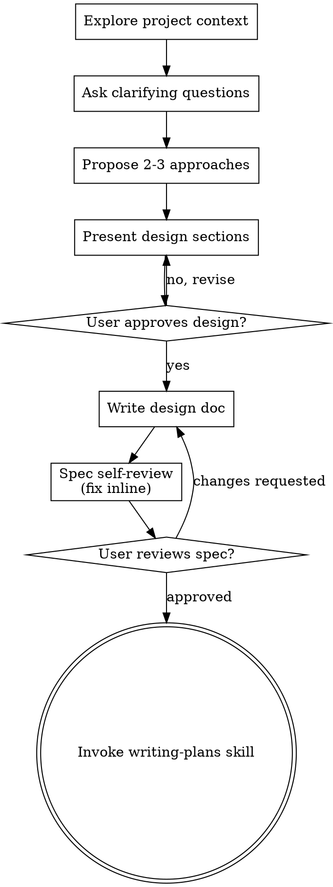
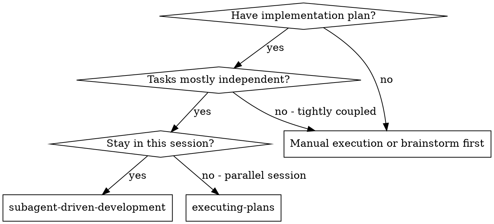
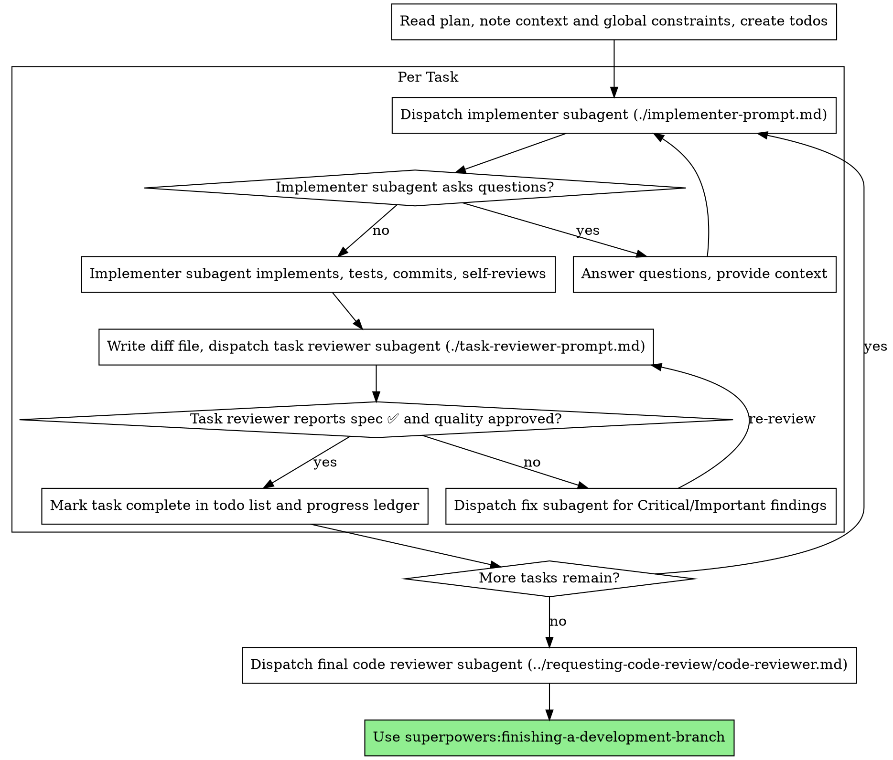

# Session transcript

## User

start I14d by reading CAMPAIGN.md + LEDGER.md first

## Assistant

I'll start by reading the governing documents.

### ⚙ Tool call: `Bash`

```json
{
  "command": "ls -la /workspace/development/2026-07-17-modularization-campaign/",
  "description": "List campaign directory"
}
```

### ↳ Tool result

```
total 1092
drwxr-xr-x 11 node node    352 Jul 24 10:55 .
drwxr-xr-x 37 node node   1184 Jul 24 08:06 ..
-rw-r--r--  1 node node  12237 Jul 22 08:50 BLOCKMAP.md
-rw-r--r--  1 node node  35741 Jul 24 10:55 CAMPAIGN.md
-rw-r--r--  1 node node 170261 Jul 24 11:11 LEDGER.md
-rw-r--r--  1 node node   6773 Jul 22 08:50 PROMPT.md
-rw-r--r--  1 node node    274 Jul 22 08:50 analytics.md
-rw-r--r--  1 node node   3857 Jul 22 08:50 statistics.md
-rw-r--r--  1 node node 420305 Jul 22 08:50 transcript.md
-rw-r--r--  1 node node 420221 Jul 17 12:45 transcript.raw.md
-rw-r--r--  1 node node   2658 Jul 17 12:45 usage.raw.txt
```

### ⚙ Tool call: `Read`

```json
{
  "file_path": "/workspace/development/2026-07-17-modularization-campaign/CAMPAIGN.md"
}
```

### ↳ Tool result

```
1	# CAMPAIGN.md — Modularization Campaign (frozen architecture)
2	
3	**Status:** approved design, 2026-07-17. Brainstormed and approved section-by-section in
4	the campaign planning session (see `transcript.md` once archived); prompt in `PROMPT.md`.
5	
6	This is the **one** copy of the campaign's architecture, decisions, invariants, and
7	increment plan. Increment specs **cite this document and re-derive nothing** — the
8	campaign-level brainstorm and adversarial review run once, here; increments inherit that
9	scrutiny and do not repeat it. Any change to this document is an **amendment**: edit the
10	document *and* append a ledger entry (`LEDGER.md`) saying what changed and why. An
11	increment spec that contradicts this document without a ledger amendment is wrong by
12	definition.
13	
14	Related documents (all in this directory unless pathed): `PROMPT.md` (the campaign
15	request), `BLOCKMAP.md` (the B1–B60 functional map of `main()` all scope assignments
16	reference), `LEDGER.md` (append-only cross-increment record), `/workspace/CONTEXT.md`
17	(domain glossary — created by this campaign), `/workspace/prompts/directives.md` (the
18	Spine; PD#n citations below refer to it).
19	
20	## Glossary (campaign terms — domain terms live in `CONTEXT.md`)
21	
22	- **Campaign** — this whole program of work: one architecture, N increments.
23	- **Increment** — one unit of work with its own session, spec, implementation, review,
24	  commit, and archive. Numbered I0–I14.
25	- **Wave** — an ordered group of increments (0–4); increments within a wave may be
26	  reordered if the ledger records why, waves may not.
27	- **Block** — a `Bnn` region of `main()` per `BLOCKMAP.md`; the stable unit of scope
28	  assignment.
29	- **Core package** — the new importable `psh/` package holding infrastructure (Tier 1).
30	- **Gateway** — `psh/gateway.py`, the single module through which every Terminus/WP-CLI/
31	  Drush subprocess flows; the future Pantheon-API replacement seam.
32	- **Façade** — `script_context.py` (`sc`), the stable API surface that checks and plugins
33	  import; implementations move, the façade's names do not break.
34	- **Contract** — the per-phase guaranteed `site_context` keys (CLAUDE.md table), which
35	  this campaign turns into a machine-readable **contract registry**.
36	- **Hook DAG** — the per-phase topological ordering of hooks derived from declared
37	  `consumes`/`produces` keys, validated fatally at startup.
38	- **Ratchet** — the lint/type regime: broad ruff+pyright rules applied as a hard gate to
39	  moved/new modules immediately, the remnant grandfathered until I14.
40	- **Remnant** — whatever remains of the original script at any point mid-campaign.
41	- **Shim** — the thin committed `./pantheon-sitehealth-emails` entry script that calls
42	  `psh.cli.main()` after I0.
43	- **Ledger** — `LEDGER.md`; how increment N learns what N−1 actually did.
44	- **Behavior bar** — the tiered definition of which observable behavior may change (§8).
45	- **Invariant** — a named property no increment may alter (§9).
46	
47	**MUST** = required, violation fails review. **NEVER** = prohibited, violation fails
48	review. **SHOULD** = required unless the increment spec states why not. **MAY** =
49	allowed, at the implementer's judgment.
50	
51	## 1. Goal and non-goals
52	
53	**Goal.** Modularize the 4,752-line main script into (a) a `psh/` core package of
54	infrastructure modules, (b) self-registering `check/` packages for every notice/section
55	emitter, and (c) the existing `plugin/` integrations — taking full advantage of the hook
56	system — while the four e2e goldens stay byte-identical, the per-phase contract is
57	honored, and the non-U-M path keeps working. End state: `main()` is a ~250–400-line
58	orchestrator; every U-M-specific behavior lives in `umich` packages; the whole tree
59	passes the broadened ruff+pyright configuration.
60	
61	**Non-goals** (exhaustive; each is either declined or deferred with reasoning in §15):
62	replacing terminus with the Pantheon API; implementing parallel site processing; any new
63	report content (CSV attachment, cached-% column, env-lock section); SendGrid; refreshing
64	goldens or recorded fixtures; changing what any check reports (except the named bug
65	fixes in I1).
66	
67	## 2. Decision record (exhaustive — from the approved brainstorm)
68	
69	| # | Decision | Choice | Why |
70	|---|---|---|---|
71	| D1 | Pantheon API | **Seam only**: gateway module now, transport swap post-campaign | Swapping transports mid-campaign invalidates terminus fixtures + goldens in every touched increment |
72	| D2 | Lint/type broadening | **Ratchet in-campaign** (§13) | Code is cleaned exactly once, as it moves; bar fixed in I0 so it never shifts |
73	| D3 | Behavior bar | **Tiered, config renames allowed** (§8) | Cleanest final schema; production config edited once, at I14, with a migration table |
74	| D4 | Increment granularity | **Fine: 15 increments** | Safest for session/context limits; split-never-compress backstop (§12) |
75	| D5 | Target architecture | **Three-tier split** (§3) | Infrastructure ≠ report content ≠ data source; fulfills "full advantage of the frameworks" |
76	| D6 | Hook flexibility | **Phases stay; hooks declare consumes/produces; per-phase DAG validated at startup** (§4) | Keeps every existing hook/test valid; a phase-less key scheduler rewrites everything for no added power |
77	| D7 | `--only-warn` plan rec | **In campaign** (I7) | Small, no golden impact, existing TODO |
78	| D8 | Parallel-ready | **Design constraint only** (§3.4) | Near-free now; actual parallelism stays a README TODO |
79	| D9 | CSV attachment / cached-% / env-lock | **README TODO** | Each changes rendered email → golden churn mid-campaign |
80	| D10 | Packaging | **Real package + thin shim** (I0; console-script dropped — see LEDGER I0 amendment 1) | Dissolves the extension-less-script problem; normal imports for tests/pyright/ruff |
81	
82	## 3. Target architecture
83	
84	```
85	                 ./pantheon-sitehealth-emails  (thin shim)
86	                                │
87	                        psh.cli.main()  ── orchestrator: bootstrap, site loop,
88	                                │           phase firing, lifecycle dispatch
89	        ┌───────────────────────┼──────────────────────────┐
90	        ▼ Tier 1: psh/ core     ▼ seams (sc façade)        ▼
91	  configuration  modules   ┌─────────────────────┐   Tier 3: plugin/
92	  gateway        db        │  hook phases + DAG  │   aws  cloudflare
93	  traffic        plans     │  contract registry  │   env  umich
94	  gather         charts    └─────────┬───────────┘   (unchanged roles)
95	  render         mail                ▼
96	  lifecycle                Tier 2: check/  (all notice/section emitters)
97	                           pantheon  wordpress  drupal  addon_updates
98	                           dns  cloudflare  pantheon_cdn_change  umich
99	```
100	
101	### 3.1 Tier 1 — `psh/` core package (exhaustive module map)
102	
103	| Module | Receives (functions / blocks) |
104	|---|---|
105	| `psh/cli.py` | `build_arg_parser`, `parse_args`, arg validation (B5), `main()` orchestrator |
106	| `psh/configuration.py` | `process_config`, `config_substitution`, `gate_disabled_sections`, DEFER machinery, `load_news_items`, `umich_enabled`, `cloudflare_enabled` |
107	| `psh/modules.py` | `find_modules`, module loading (B2/B4), hook engine (`add_hook`/`invoke_hooks`/`PHASES`), DAG build/validation, contract registry |
108	| `psh/gateway.py` | `run_terminus`, `terminus`, `terminus_data`, `wp`, `wp_eval`, `drush`, `drush_php_script`, `fix_drush_output`, `wp_error`, `drush_error`, `TerminusError` |
109	| `psh/notice.py` | `Notice`, `Severity`, `NoticeRegistry`, `DuplicateNoticeCodeError`, `registry` (added I3; §6 Notice type + code registry) |
110	| `psh/db.py` | ORM models, `TrafficRow`/`OverageProtectionRow`, `db_engine_args`, `db_retry`/`db_retryable`/`record_db_reconnect`, `update_traffic_rows`, `insert_traffic_rows`, `load_traffic_rows`, `load_overage_protection_window`, `DatabaseUnavailableError` |
111	| `psh/traffic.py` | `get_old_metrics`, `estimate_month_visits`, `build_traffic_table_rows`, the `traffic_table_columns` global, metrics gather + DB update/load flow (B22–B26), visits-by-month aggregation (B43) |
112	| `psh/plans.py` | plan_info normalization (B12 part), SKU resolution (B17), `overage_blocks`, `contract_year_end`, `plan_costs`, `build_plan_over_time`, the `cost_table_columns` global, recommendation flow (B47) |
113	| `psh/gather.py` | Slimmed framework gathers feeding the `site_post_gather` contract (from B32–B35), `check_wordpress_plugin`/`check_drupal_module` helpers, `build_smell_notices` (the B48 smell-notice *builder*; its emission stays in `main()` — LEDGER I10 amendment 1) |
114	| `psh/charts.py` | Cap geometry (B13 part), chart data prep + matplotlib build (B44–B45) — returns PNG bytes |
115	| `psh/render.py` | Jinja render (B53), PHP inline + `!important` pass (B54), `escape_url` |
116	| `psh/mail.py` | Recipient resolution (B49), MIME assembly (B55), `smtp_login`, send (B57) |
117	| `psh/lifecycle.py` | `RunState`, `finish_run`, `abort_run`, `abort_reason`, `resume_point`, `resume_command`, `rerun_command`, `option_strings_taking_a_value`, `sites_from_resume_point`, `merge_prior_results`, `ResumeSiteNotFoundError` |
118	
119	`dns_classify.py` stays a top-level module (already extracted; moving it into `psh/` is
120	MAY-scope for I14, decided by ledger state then).
121	
122	**Whole-file coverage.** The campaign modularizes the entire script, not just `main()`:
123	every top-level def and module-level global in `pantheon-sitehealth-emails` (lines
124	1–2107 included) is assigned to a `psh/` module in this table and appears in exactly one
125	increment's scope (§11). End state: the original file is the thin shim and nothing else
126	— a top-level def still there at I14 is a defect the closing audit (§17) catches. Moved
127	helpers get the full §7 treatment (types, ratchet, verified docs, tests); they do NOT
128	get algorithmic redesign — moves are behavior-preserving except where §8 says otherwise
129	(I1, I7's D7, I12's B51).
130	
131	### 3.2 Tier 2 — new/changed `check/` packages (exhaustive)
132	
133	| Package | Contents (blocks) | Phase(s) |
134	|---|---|---|
135	| `check/pantheon/` (new) | frozen site (B19), no-live-env (B21), upstream updates (B38), PHP EOL (B41) | `site_pre` (frozen, no-live-env), `site_post_gather` (updates, PHP EOL) |
136	| `check/wordpress/` (new) | PAPC + native-sessions checks, OCP config probe, favicon (from B34) | `site_post_gather` |
137	| `check/drupal/` (new) | PAPC module check, D7 EOL + tag1_d7es, multisite probe (from B30/B35) | `site_post_dns` (multisite), `site_post_gather` |
138	| `check/addon_updates/` (new) | add-on updates table notice (B39) | `site_post_gather` |
139	| `check/umich/` (existing, grows) | umich-oidc-login, Hummingbird fork (B34), Drupal UA check (B35), annual-billing notices (B50/B51), portal-URL text for the recommendation notice (B47's U-M half) | `site_post_gather`, `site_pre_render` (billing) |
140	
141	`check/dns/`, `check/cloudflare/`, `check/pantheon_cdn_change/` are untouched tenants.
142	A check MAY fetch its own data through `sc` gateway wrappers when the data is
143	check-specific (e.g. `upstream:updates:list`); data used by core *and* checks is
144	published through the contract instead (e.g. `envs`).
145	
146	The B48 smell notices are **not** a `check/addon_updates/` hook (LEDGER I10 amendment 1):
147	their *builder* (`build_smell_notices`) moves to `psh/gather.py`, but the *emission* stays
148	in `main()`. A `site_post_gather` smells hook cannot be ordered after the
149	`wp_smell`/`drush_smell` in-place mutators — a `produces: ['wp_smell']` declaration is a
150	condition-2 fatal against the core registry (D-i9-3), and alphabetical registration puts
151	`check/addon_updates` first in the phase — and relocation would also add smell rows to
152	`--only-warn` csv output (B48 sits after that gate today), a §8 surface change. The
153	`mutates` hook declaration that would dissolve this class is post-campaign work (README TODO).
154	
155	### 3.3 What stays in `main()` (exhaustive, with why)
156	
157	Config/arg bootstrap ordering (B1–B8 — the two-pass substitution *order* is the
158	program); overage constants + date window (B9, B13 part); the site-loop skeleton (skips,
159	banner, sorted order, resume filter — B14–B18, B20, B25, B42); phase firing and contract
160	stuffing (B27, B28, B31, B37, B52); the B48 smell-notice *emission* call (the builder
161	moved to `psh/gather.py` at I10, but the emission summarizes end-of-phase smell state no
162	hook position can guarantee under the D-i9-3 rebind design, and it must stay behind the
163	`--only-warn` gate — LEDGER I10 amendment 1); notice sort + subject (B50 minus billing);
164	the `try`/`except BaseException` lifecycle dispatch (B59–B60 call sites). Everything else
165	leaves. Target: 250–400 lines.
166	
167	### 3.4 Parallel-ready constraint (D8)
168	
169	Per-site work MUST be a function of `(site, config, db_session, site_context)`: no new
170	module-level mutable state; run-scoped accumulators live only in `RunState`. This is a
171	review criterion from I2 onward, not a parallelism implementation.
172	
173	### 3.5 The `sc` façade
174	
175	Checks and plugins import **only** `sc` (and their own package). `sc` keeps every name
176	listed in CLAUDE.md's runtime-exposed block, re-exporting from `psh/` modules as they
177	move. NEVER remove or rename an `sc` attribute mid-campaign; additions are fine. The
178	house-rules test suite gains an assertion that every documented `sc` name exists (I2).
179	
180	**One sanctioned exception, added at I14c** (amendment; see LEDGER I14c):
181	`check/pantheon_cdn_change/notices.py` imports `Notice`/`Severity`/`registry` **directly from
182	`psh.notice`**, not via `sc`. That module is deliberately pure —
183	`tests/unit/test_pantheon_cdn_change_notices.py::test_notices_module_is_pure` asserts its
184	namespace holds exactly one module object (`html`) — and the two imports are not equivalent in
185	cost: `import psh.notice` pulls in 18 stdlib modules, `import script_context` pulls in 276
186	(sqlalchemy, rich, html2text, the whole `psh` package). `psh/notice.py` is itself pure and
187	imports nothing from `script_context`, so the exception introduces no cycle and no coupling the
188	façade rule exists to prevent. Every other `check/` module reaches the type and the registry
189	through `sc.Notice` / `sc.Severity` / `sc.registry`. Extending this exception to a second module
190	requires its own amendment.
191	
192	## 4. Phases, hooks, and the DAG
193	
194	Phases stay the coarse spine: `setup`, `site_pre`, `site_post_traffic`, `site_post_dns`,
195	`site_post_gather`, `site_pre_render`, plus **new** `run_finish` (fired inside
196	`finish_run` before artifacts are written, receiving the `RunState`; for future run-level
197	artifact hooks — no consumer at introduction, like `site_pre_render` was). Dotted
198	plugin-defined events are unchanged.
199	
200	From I4, `add_hook` requires two new entries per hook: `consumes` and `produces` — each
201	a (possibly empty) list of contract-key names. Validation at module-load completion
202	(exhaustive fatal conditions):
203	
204	1. A consumed key that nothing produces (neither core's registry for that phase or an
205	   earlier phase, nor another hook) → fatal.
206	2. Two producers of the same key → fatal (one owner per key; PD#1 — a silent overwrite
207	   is a silent failure).
208	3. A cycle among same-phase hooks → fatal.
209	4. A hook consuming a key first produced in a *later* phase → fatal.
210	5. A missing `consumes`/`produces` entry on any hook → fatal (no legacy mode; I4
211	   retrofits all in-repo hooks in the same change).
212	
213	`invoke_hooks` orders same-phase hooks topologically (producers before consumers;
214	registration order breaks ties, so existing behavior is preserved where no edges exist).
215	The permanent test `tests/integration/test_hook_dag.py` loads **all** real check/plugin
216	packages and asserts the DAG builds — the "future changes can never make the DAG
217	impossible" guarantee — and a unit suite proves each fatal condition actually fires
218	(PD#14: the validator must be shown able to go red).
219	
220	```
221	 module load ──► collect hooks ──► per phase: build edges (produces→consumes)
222	                                        │
223	                              cycle? unknown key? dup producer? ──► fatal exit (named error)
224	                                        │ ok
225	                                topo order stored ──► invoke_hooks uses it
226	```
227	
228	**Contract registry.** `psh/modules.py` holds the machine-readable registry: phase →
229	keys core stuffs (today's CLAUDE.md table, verbatim). Core's stuffing code is checked
230	against it in tests; CLAUDE.md's table gains a line saying the registry is authoritative.
231	New contract keys added by increments (exhaustive for this campaign): `envs` (I8, at
232	`site_pre`), `add_on_updates` + `wp_smell`/`drush_smell`/`composer_smell` (I9/I10, at
233	`site_post_gather`), plan/cost keys `current_plan`, `recommended_plan`, `plan_costs`,
234	`savings` (I7, at `site_pre_render`). Each addition updates registry + CLAUDE.md table +
235	ledger in the same increment.
236	
237	**Hook-produced keys (I10).** A hook MAY produce keys of its own — declared in its
238	`produces`, validated for duplicate producers, cycles, and phase position by the same
239	conditions 1–4 above. Such keys are **DAG-declared, not registry-owned**: they are present
240	only when the producing hook actually ran (absent when its gate failed or its package is
241	disabled), so consumers read them with `.get()`, and they are **NOT** part of the
242	guaranteed per-phase contract (the "new contract keys" list above stays exhaustive for
243	registry-owned keys only). The campaign's first are `drupal_multisite` /
244	`drupal_multisite_smell`, produced by `check.drupal.multisite` at `site_post_dns` and read
245	by `main()` after the phase (I10; see LEDGER I10 amendment 2).
246	
247	## 5. Configuration
248	
249	Principles: one section per feature, named for the operator's mental model; every
250	relocated check gets an `enabled` flag under `[Check.<name>]`, **default true** —
251	relocating code MUST NOT silently disable a check that runs unconditionally today.
252	U-M-only checks additionally require `[UMich].enabled` (existing `umich_enabled()`
253	rule). `gate_disabled_sections()` semantics (nested `enabled`, children dropped) apply to
254	`[Check.*]` unchanged.
255	
256	Example (actual TOML, the shape I8 introduces — illustrative of the family, exhaustive
257	for `check/pantheon/`):
258	
259	```toml
260	[Check.pantheon]
261	enabled = true          # frozen-site, live-env, upstream-updates, PHP-EOL checks
262	```
263	
264	New keys land in final shape as introduced (I3 onward). Renames/moves of *existing* keys
265	happen once, in I14, which MUST deliver: the old→new migration table in
266	`docs/config-migration.md`, a rewritten `sample-pantheon-sitehealth-emails.toml`, and
267	exact edit instructions for the production config repo. Until I14, every existing
268	production key keeps working unchanged.
269	
270	## 6. Types
271	
272	Reused as-is: `TrafficRow`, `OverageProtectionRow`, `DnsFacts`, `FetchResult`,
273	`SiteContext`. Introduced (exhaustive):
274	
275	| Type | Increment | Shape |
276	|---|---|---|
277	| `GatewayResult` | I2 | NamedTuple `(result, errors, fatal)` replacing the anonymous 3-tuples |
278	| `Notice` | I3 (class) → adopted per increment | frozen dataclass: `severity` (StrEnum alert/warning/info), `code` (unique — registry test), `html`, `text`, `short`, `icon`, `order`, and — added at I14c, the field-set amendment this row reserved — `csv_extra` (a `tuple[str, ...]`, joined after `site,code` to build the notices-csv row; see LEDGER I14c amendment). `SiteContext.add_notice` accepts `Notice` or legacy dict; the dict form is retired at I14c, after which `add_notice` takes a `Notice` only |
279	| `PlanInfo` / `PlanCatalog` | I7 | typed view over `[Pantheon.plan_info]` |
280	| `RunState` | I13 | dataclass holding `all_warnings`, `site_results`, `site_savings`, `emails_sent`, reconnect counters |
281	
282	House-style tuple annotations (`-> (str, str, bool)`) are replaced with real annotations
283	in every module as it moves — never fixed in place in the remnant (one pass per line,
284	D2). CLAUDE.md's house-style note is updated in I14 when the last one dies.
285	
286	## 7. Per-increment obligations
287	
288	Every increment MUST (this list is exhaustive and lives only here; increment specs cite
289	it): (1) start by reading `CAMPAIGN.md`, `LEDGER.md`, `CLAUDE.md`, `BLOCKMAP.md` rows in
290	scope; (2) follow `prompts/implementation-standards.md` (subagent-driven, test-first,
291	`psh-implementer`/`psh-reviewer`); (3) replace house styles in moved code (§6);
292	(4) verify — not assume — every claim in comments/docs it moves or writes;
293	(5) update tests in the same change; (6) update README/docs/CLAUDE.md for what moved;
294	(7) update auto-memory where a durable fact changed; (8) append its ledger entry
295	(§12); (9) preserve every invariant (§9); (10) end with `/code-review`, a full
296	`./run-tests`, and one checkpoint commit including its `development/` folder.
297	
298	## 8. Behavior bar (canonical gate table)
299	
300	| Surface | Rule | Until |
301	|---|---|---|
302	| Rendered emails (4 goldens) | NEVER change (byte-identical) | end of campaign |
303	| `-results.json` / `-notices.csv` / `-run.json` structure (keys, row shape) | NEVER change | end of campaign |
304	| Notice csv *values* | MAY change only in I1 (named bug fixes), I7 (`its-recommends-plan` savings-field format, D-i7-5 — amendment), I9 (wp-smell precedence when theme-list and OCP-probe stderr co-occur without favicon stderr — see LEDGER I9), and I14a (B51 deletion — originally scheduled for I12 "if past its date"; the Aug-2026 marker date had not passed at I12 nor by 2026-07-23, and the user approved deleting it early at I14a rather than carrying it post-campaign — amendment, LEDGER I14a) | — |
305	| stdout / console / error messages | MAY improve freely | — |
306	| Config: existing keys | NEVER break | I14 (renames with migration table) |
307	| Config: new keys | MUST land in final schema shape | — |
308	| Exit codes, resume semantics, artifact write gates | NEVER change | end of campaign |
309	
310	## 9. Named invariants (exhaustive; NEVER violated by any increment)
311	
312	1. Four e2e goldens byte-identical (`./run-tests` proves it; refresh is forbidden — an
313	   existing golden going red is a defect in the increment, PD#14).
314	2. Per-phase data contract: existing keys never removed/renamed/retyped; additions only.
315	3. Non-U-M path works: non-U-M golden green; no new un-gated U-M content (I1 *removes*
316	   the one known leak).
317	4. Run lifecycle: single `except BaseException` flush path; `abort_reason`'s three
318	   outcomes; artifacts dropped-site rule; notices appended before send; resume-point
319	   next-site-after-email rule; soft-wrapped copy-pasteable commands.
320	5. DB: `db_retry` retries whole idempotent units only; `db_retryable` predicate
321	   unchanged; the read-release commit in the loaders stays (guarded by
322	   `test_load_traffic_rows_releases_the_connection`).
323	6. Rich console rules: escape untrusted text; production width reproduced in tests.
324	7. Test safety interlock (`run_program` forbidden flags) never bypassed or weakened.
325	8. Column-0 `f"""` notice literals move **verbatim** — never re-indented; `git diff -w`
326	   is not acceptable evidence for any change touching them.
327	9. Checks/plugins import only `sc`; `sc` names never removed mid-campaign (§3.5).
328	10. Recorded fixtures are not regenerated (`terminus-cdnchange/` is hand-maintained and
329	    `--record` must not run).
330	11. `--create-tables`/`--update`/`--import-older-metrics` phase-gating rules (CLAUDE.md
331	    table) unchanged.
332	
333	## 10. Known-bug inventory → I1
334	
335	The five bugs and the dead code listed in `BLOCKMAP.md` §Bugs (composer-smell
336	nesting+variable; shared `php-eol` code; `site_results` omission; un-gated U-M portal
337	URLs; duplicate `annual-bill` code — B51 handled as: distinct code now, scheduled
338	deletion when its Aug-2026 date passes, ledgered to I12; dead code deleted). Each fix is
339	test-first with the test shown red on the old behavior. **Verified 2026-07-17**: the
340	goldens contain zero `php-eol`/`wp-smell`/`drush-smell`/`composer-smell`/`annual-bill`
341	occurrences and the golden fixtures report PHP 8.2, so none of these fixes can touch a
342	golden:
343	
344	```
345	$ grep -c 'php-eol\|composer-smell\|wp-smell\|drush-smell\|annual-bill' tests/e2e/__snapshots__/*.ambr
346	tests/e2e/__snapshots__/test_golden.ambr:0
347	tests/e2e/__snapshots__/test_golden_cdn_change.ambr:0
348	tests/e2e/__snapshots__/test_golden_drupal.ambr:0
349	tests/e2e/__snapshots__/test_golden_nonumich.ambr:0
350	```
351	
352	## 11. The increments
353	
354	Wave dependency structure (increments within a wave are ordered but MAY be resequenced
355	with a ledger entry; waves MUST NOT be reordered):
356	
357	```
358	Wave 0: I0 bootstrap ──► I1 bug fixes
359	Wave 1: I2 gateway ──► I3 config ──► I4 hooks+DAG ──► I5 DB
360	Wave 2: I6 traffic ──► I7 plans ──► I8 check/pantheon ──► I9 wordpress ──► I10 drupal
361	Wave 3: I11 charts ──► I12 render+mail ──► I13 lifecycle
362	Wave 4: I14a structural ──► I14b ratchet ──► I14c notice ──► I14d closing
363	```
364	
365	Wave 4 was split from the single "I14 closing sweep" into four ordered sub-increments
366	(user-approved 2026-07-23, LEDGER I14a — the §11 sizing note's split-never-compress rule,
367	applied at spec time rather than mid-session: the closing sweep's measured scope — the
368	`psh/cli.py` relocation, a 2,729-finding ratchet flip, the `Notice` retirement, and the
369	full docs refresh — is several sessions of work). Each sub-increment carries the full §7
370	obligations and its own session, spec, review, commits, and archive.
371	
372	| Inc | Scope (blocks / functions) | Delivers |
373	|---|---|---|
374	| **I0** | — (no logic moves) | `psh/` skeleton + thin shim (console-script dropped — see LEDGER I0 amendment); conftest `import psh` rework (same collected-test count gate); ratchet config (§13) with rule sets pinned; pyright baseline measured; `LEDGER.md` started; README TODO edits (§15 dispositions); CLAUDE.md pointer to campaign |
375	| **I1** | B36, B40, B41, B47 (URLs), B48, B50/B51 (codes), dead code | §10 fixes, each test-first |
376	| **I2** | 302–597 wrappers | `psh/gateway.py`, `GatewayResult`, sc re-exports + façade test; no-subprocess-outside-gateway house rule |
377	| **I3** | 792–934, 1209–1253, 1608–1648 (`umich_enabled`/`cloudflare_enabled`) | `psh/configuration.py`; `Notice` class + code-uniqueness registry test |
378	| **I4** | 935–950, hook engine from `script_context.py` | `psh/modules.py`; consumes/produces on all in-repo hooks; DAG validation + fatal-condition tests; `run_finish` phase; contract registry |
379	| **I5** | 95–178; DB defs within 1285–1575 (`DatabaseUnavailableError` through `db_engine_args`; the resume helpers `ResumeSiteNotFoundError`, `sites_from_resume_point`, `merge_prior_results` stay for I13) | `psh/db.py`; DB test suites relocated intact |
380	| **I6** | B22–B26, B43; 598–671, 977–1127 | `psh/traffic.py` |
381	| **I7** | B9, B12 (plans), B17, B47; 967–976, 1128–1208, 1254–1280 | `psh/plans.py`; `PlanInfo`; D7 (`--only-warn` runs recommendation); plan/cost contract keys |
382	| **I8** | B19, B21, B38, B41 | `check/pantheon/` + `[Check.pantheon]`; `envs` contract key |
383	| **I9** | B32–B34; 672–739 | `psh/gather.py` (WP half); `check/wordpress/`; U-M WP checks → `check/umich/`; `add_on_updates` + smell contract keys |
384	| **I10** | B30, B35, B39; B48 *builder* only (emission stays in `main()` — LEDGER I10 amendment 1); 740–791 | gather (Drupal half) + `build_smell_notices`; `check/drupal/`; `check/addon_updates/`; UA check → `check/umich/` |
385	| **I11** | B13 (caps), B44–B45 | `psh/charts.py` |
386	| **I12** | B49–B57 minus sort/subject core | `psh/render.py`, `psh/mail.py`; annual billing → `check/umich/` at `site_pre_render`; B51 deletion if past its date |
387	| **I13** | B14 (accumulators), B56, B59–B60; 1649–2107 plus the resume helpers I5 left behind (1281–1284, 1528–1542, 1576–1607) | `psh/lifecycle.py`; `RunState`; `main()` reaches final form |
388	| **I14a** | B51; `main()`+argparse relocation (D-i13-1 discharge); `dns_classify.py` | Structural finish: B51 deleted (user-approved early deletion 2026-07-23 — see §8); `main()`, `build_arg_parser`/`parse_args`, and the riding helpers → `psh/cli.py`; `psh/_legacy.py` deleted; conftest `psh`-fixture + test-seam redesign; `dns_classify.py` → `psh/dns_classify.py` (the §3.1 MAY, exercised); D-i13-3 bridge discharged; §17 Q5 symlink decision |
389	| **I14b** | — | Global ratchet flip: remaining grandfathered trees un-grandfathered + cleaned; `ruff-broad.toml` merged into `pyproject.toml`; pyright-scope decision (D-i8-7 lineage) |
390	| **I14c** | — | `Notice` dict form retired: the reserved §6 csv-field amendment + every producer converted; artifacts byte-identical |
391	| **I14d** | — | Closing: config migration doc (decision 2026-07-23: **no renames** — the schema is already in final shape, the doc records that with its audit trail) + sample-toml refresh + production-config instructions; docs/README/CLAUDE.md full refresh; ledger fully resolved; retrospective + closing audit (§17) |
392	
393	Sizing note: the largest moves are I9 (~330 main-loop lines + helpers) and I10 (~320 +
394	helpers). If any increment proves oversized mid-session: **split, never compress** —
395	commit nothing partial, ledger the split, the second half becomes its own increment.
396	
397	## 12. Coordination protocol
398	
399	**Ledger entry template** (append per increment, and for any amendment):
400	
401	```markdown
402	## I<N> — <slug> (<date>, commit <sha>)
403	- Moved: <blocks/functions actually moved>
404	- Deviations from CAMPAIGN.md: <none | what + why>
405	- Contract/config/sc additions: <keys/names>
406	- Discovered tasks: <each with disposition: fixed here | I<M> | README TODO>
407	- Open questions for next increment: <…>
408	```
409	
410	**Discovered-task disposition rules** (canonical): fits current increment's scope and
411	<~30 min → fix now, note in ledger; belongs to a later increment → ledger it against
412	that increment (the increment's spec author MUST read these); major/risky/scope-widening
413	→ README TODO with a sentence of context. Nothing is carried in memory or chat — if it
414	is not in the ledger or README, it does not exist (PD#9).
415	
416	**Session flow per increment:** read the §7 documents → write the increment SPEC.md in
417	`development/<date>-mod-I<N>-<slug>/` citing CAMPAIGN.md sections by number →
418	`superpowers:writing-plans` → subagent-driven implementation → `/code-review` → full
419	`./run-tests` → per-task commits, each green; the increment's final commit includes the dev
420	folder → `/archive-session` → ledger entry.
421	
422	## 13. Lint/type ratchet
423	
424	Mechanism (as shipped by I0; see LEDGER I0 amendment 2): TWO ruff configs —
425	`pyproject.toml` `[tool.ruff.lint]` keeps the narrow PD-rule set running everywhere
426	including the remnant, and `ruff-broad.toml` carries `select = ["ALL"]` minus a
427	justified ignore list, with `extend-exclude` grandfathering exactly the remnant
428	(`psh/_legacy.py`) and not-yet-moved files; each increment deletes its
429	files from the grandfather list, and the two configs merge at I14. pyright runs in
430	`./run-tests` from I0 via `[tool.pyright]` (standard mode, `psh/` minus `_legacy.py`),
431	ratcheting toward strict as typed code moves in. The four existing narrow rules (`E722`, `BLE001`, `S105`, `S106`) remain global
432	throughout — they mechanize PD#2/PD#6 and are never grandfathered. No
433	`target-version` pin (CLAUDE.md: it masks the 3.12-only syntax detection).
434	
435	Baselines measured 2026-07-17 (I0 re-measures and pins both in its spec):
436	
437	```
438	$ ./run-tests --fast --llm   (tail)
439	LLM_SUMMARY passed=727 failed=0 error=0 skipped=1 xfailed=0 xpassed=0
440	25 snapshots passed.
441	
442	$ uvx ruff check --isolated --statistics .
443	26  F541  f-string-missing-placeholders
444	 8  E741  ambiguous-variable-name
445	 4  E713  not-in-test
446	 3  F841  unused-variable
447	 2  F401  unused-import
448	 1  E402  module-import-not-at-top-of-file
449	 1  E712  true-false-comparison
450	Found 45 errors.
451	```
452	
453	(README's "~55" ruff and "39" pyright figures are stale/unverified claims; I0 replaces
454	them with measured numbers. pyright was not measured in planning — no pyright binary in
455	the dev container yet; installing it is I0 scope.)
456	
457	## 14. Risk / control table
458	
459	| Risk | Control |
460	|---|---|
461	| Re-indented column-0 notice literals silently change emails | Invariant 8; goldens as tripwire; AST/token comparison, never `git diff -w` |
462	| conftest rework silently drops tests | I0 gate: identical collected-test count (727 passed / 1 skipped / 2 deselected baseline) before and after |
463	| Long-range `main()` local coupling breaks a move | BLOCKMAP produces/consumes; each increment spec lists exactly which locals cross its boundary |
464	| Session/context overrun mid-increment | Fine granularity (D4); split-never-compress; commits only at increment completion |
465	| Architecture drift across 15 sessions | This document frozen; amendments only via ledger; specs cite section numbers |
466	| Hidden hook-order dependencies surface in I4 | I4 audits every hook; real dependencies become explicit DAG edges |
467	| Ratchet churn on moved code | Rules fixed at I0; cleaning is part of each move |
468	| Goldens blind to stdout/artifacts | Invariants 4–5 name the artifact/abort test suites as the cover; artifact structure frozen until campaign end |
469	| Implementer sessions lack context | `psh-implementer`/`psh-reviewer` carry the read list; specs name seams (Spine spec bar); §7 reading list |
470	| Two annual-bill notices / removal date passes mid-campaign | Explicitly scheduled: codes split in I1, deletion decision in I12 (kept — date unpassed), resolved at I14a (user-approved early deletion; §8 amendment, LEDGER I14a) |
471	
472	## 15. NOT in scope (reasoning preserved so it is never re-litigated)
473	
474	- **Terminus → Pantheon API swap** — D1; post-campaign project against `psh/gateway.py`.
475	- **Parallel site processing** — D8; constraint only; README TODO remains.
476	- **CSV data attachment, cached-% column, env-lock section** — D9; each becomes a small
477	  post-campaign change (env-lock: a ~50-line `check/` package) once goldens may move.
478	- **SendGrid, secrets-handling completion, portal traffic capture, daily alerts,
479	  accessibility/security/Cloudflare scores, AI recommendations, dependency updates,
480	  terraform-infra** — pre-existing README TODOs, untouched by this campaign.
481	- **Approach B (library-only) and C (everything-is-a-hook)** — rejected in brainstorm:
482	  B fails the "full advantage of the frameworks" goal; C forces infrastructure into
483	  optional-content clothing.
484	- **Golden/fixture refreshes** — forbidden (Invariants 1, 10).
485	
486	## 16. Acceptance baseline
487	
488	§13 outputs are the campaign-start baseline (run and pasted 2026-07-17). Every
489	increment's definition of done re-runs `./run-tests` at increment end — the full suite
490	when the live tier's credentials are available in the session, otherwise `--fast` with a
491	ledger note saying the live tier was skipped — and MUST reproduce goldens
492	byte-identically. I0 additionally records the collected-test count gate.
493	
494	## 17. Closing audit (queued for I14; exhaustive)
495	
496	1. Is `main()` within 250–400 lines, and does everything left match §3.3?
497	2. Has every DAG fatal condition been demonstrated red at least once?
498	3. Do the contract registry and CLAUDE.md table agree (test-enforced)?
499	4. Is any `sc` re-export now consumed by nobody (dead façade surface)?
500	5. Is the `.py` symlink still needed for anything beyond the shim? If not, note in
501	   CLAUDE.md; if yes, say for what.
502	6. Are all ledger items resolved (done, scheduled, or README TODO)?
503	7. Has the production config repo received and applied the migration instructions?
504	8. Do README, CLAUDE.md, docs/, and memory reflect the final architecture (no stale
505	   line-number or module references)?
506	9. Were any invariants amended mid-campaign, and is each amendment ledgered?
507
```

### ⚙ Tool call: `Bash`

```json
{
  "command": "grep -n \"^## \" development/2026-07-17-modularization-campaign/LEDGER.md && wc -l development/2026-07-17-modularization-campaign/LEDGER.md",
  "description": "List LEDGER headings"
}
```

### ↳ Tool result

```
8:## Campaign planning (2026-07-17)
27:## I0 — bootstrap (2026-07-17, closing commit `docs(campaign-I0): close the bootstrap increment`)
116:## I1 — known-bug fixes (2026-07-17, commits `5518de7..1ff9153` + closing docs commit)
179:## I2 — gateway extraction (2026-07-17, commits `7044b12` (Task 1), `0141f76` (Task 2), house-rule-scope fix + closing docs commit)
233:## I3 — configuration module + `Notice` class (2026-07-17, commits `ed2698f` (Task 1), `d21a1d2` (Task 2), plus this closing docs commit)
342:## I4 — hooks + DAG + contract registry (2026-07-20, commits `82d62ff..1f2a6af` + closing docs commit)
432:## I5 — DB-layer move (2026-07-20, commit `c291a26` (Task 1) + this closing docs commit)
549:## I6 — traffic-layer move (2026-07-20, commit cb01934 + closing docs commit)
667:## I7 — plans-layer move + D7 (2026-07-21, commits `b74b5a6`, `641db2f`, `24c5892`, `1d32b9f`, `8053f8e`, `15fb36d` + closing docs commit)
774:## I8 — check/pantheon (2026-07-21, commits dd9aac2/3ea3491/ab3c97b + closing docs commit)
916:## I9 — wordpress (2026-07-21, commits 5a6654d/309ebcf+0873c3a/717e21f/fb92e9d/d5c4bf8 + closing docs commit)
1095:## I10 — drupal + addon_updates (2026-07-22, commits 8034780/eedd60c/03c81c0/edafe0d + closing docs commit)
1310:## I11 — charts (2026-07-23, commits f55e13d/7392d9f + closing docs commit)
1424:## I12 — render + mail + annual billing (2026-07-23, commits abd4763/8dbaf75/b972192/f0bab1c/79eee7a + closing docs commit)
1596:## I13 — lifecycle + RunState + main() final form (2026-07-23, commits 6f5c282/3681100 + closing docs commit)
1772:## Amendments — Wave-4 split + B51 early deletion (2026-07-23, user-approved; applied to CAMPAIGN.md at I14a spec time)
1803:## I14a — structural finish (2026-07-23, commits cd084e9/745967e/d94c31a/f22950e/9b1fe35/b39e435 + closing docs commit)
1910:## I14b — the global ratchet flip (2026-07-23, commits 82f0511/03e7ac2/13a0577/e70c1e3/7ed4e92 + closing docs commit)
2017:## Amendment — §6 `Notice` csv field set (2026-07-24, applied to CAMPAIGN.md at I14c spec time)
2056:## I14c — the `Notice` dict-form retirement (2026-07-24, commits `b3ffd29`…`b619b7d` + closing docs commit)
2221 development/2026-07-17-modularization-campaign/LEDGER.md
```

### ⚙ Tool call: `Read`

```json
{
  "file_path": "/workspace/development/2026-07-17-modularization-campaign/LEDGER.md",
  "offset": 1772,
  "limit": 450
}
```

### ↳ Tool result

```
1772	## Amendments — Wave-4 split + B51 early deletion (2026-07-23, user-approved; applied to CAMPAIGN.md at I14a spec time)
1773	
1774	Two CAMPAIGN.md amendments, both user-approved 2026-07-23 in the I14a session (via an
1775	explicit four-option decision round), applied to the document the same day per the
1776	preamble's edit-the-document-AND-ledger rule. Appended at I14a **spec** time — before
1777	implementation — so CAMPAIGN.md's "LEDGER I14a" citations resolve for the whole
1778	increment (adversarial spec-review finding 11); the full I14a increment entry follows
1779	separately at its close.
1780	
1781	1. **Wave 4 split into four ordered sub-increments** (§11 wave diagram + row I14 →
1782	   rows I14a–I14d). The closing sweep's measured scope — the `psh/cli.py` relocation,
1783	   a **2,729-finding** ratchet flip (measured 2026-07-23: tests 2,540 of which 1,727
1784	   S101; `psh/_legacy.py` 69; `check/cloudflare` 41; `plugin/` 39; `check/umich`
1785	   legacy pair 16; `check/pantheon_cdn_change` 14; `dns_classify.py` 9; `check/dns` 1),
1786	   the `Notice` retirement, and the full docs refresh — is several sessions of work;
1787	   the §11 split-never-compress rule applied at spec time rather than mid-session.
1788	   I14a = structural finish; I14b = ratchet flip; I14c = Notice retirement;
1789	   I14d = closing (config-migration doc, docs refresh, §17 audit, retrospective).
1790	2. **B51 deleted at I14a, ahead of its date** (§8 "Notice csv values" row; §14 risk
1791	   row). The "annual bill in progress" notice's marker says "remove at the beginning
1792	   of August 2026"; I12/I13 assumed I14 would run after that date, but I14a runs
1793	   2026-07-23 — the date has NOT passed. Per §11's frozen rule ("deletion if past its
1794	   date") B51 would be kept; the user chose early deletion over carrying it
1795	   post-campaign. Zero golden/artifact impact (goldens run umich-disabled; the billing
1796	   produced-keys never reach `-notices.csv` — LEDGER I12).
1797	
1798	Related decisions locked the same round: **no config renames at I14d**
1799	(`docs/config-migration.md` will record "no key changes required" with its audit
1800	trail — the schema survey found every section already in final shape), and the
1801	**§3.1 `dns_classify.py` MAY is exercised** (→ `psh/dns_classify.py`, I14a).
1802	
1803	## I14a — structural finish (2026-07-23, commits cd084e9/745967e/d94c31a/f22950e/9b1fe35/b39e435 + closing docs commit)
1804	
1805	Spec/plan: `development/2026-07-23-mod-I14a-structural/` (`SPEC.md` §9 carries the pasted
1806	acceptance; spec committed BEFORE implementation at `7e7e803` with the Wave-4-split/B51
1807	amendment records appended to this ledger at spec time — see the Amendments entry above;
1808	plan at `d1d3d1a`; task reports under `.superpowers/sdd/`). Adversarial spec review:
1809	APPROVE-WITH-FIXES round 1, all 11 findings folded pre-implementation (incl. the
1810	non-mutation-pin rescue and the six-import-site count correction). Per-task commits, each
1811	green; whole-branch review (fable): **STANDARDS PASS-WITH-FIXES** (two one-line
1812	doc-accuracy fixes, applied in the closing commit) + **SPEC PASS**. Full suite at close
1813	**including the live tier** (`ls ~/.terminus/cache/tokens/` → `markmont@umich.edu`) =
1814	**1023 passed / 1 skipped** (the skip is `test_db_credentials.py`'s
1815	`importorskip("MySQLdb")`), 107 snapshots, all three gates, EXIT=0; four goldens
1816	byte-identical across the increment (`git diff 5902b76 -- tests/e2e/__snapshots__/`
1817	empty). Fast-tier count 1021/1/2 = I13's 1026/1/2 − the 5 sanctioned B51 test deletions.
1818	
1819	- **Delivered (SPEC §2.1–§2.3, exhaustively verified by per-task + whole-branch review):**
1820	  - **B51 DELETED** (`cd084e9`+`745967e`+`f22950e`) — the user-approved early deletion
1821	    (§8 amendment; the Aug-2026 date had NOT passed). `build_annual_bill_in_progress_notice`,
1822	    `check_annual_bill_in_progress`, its registration, and the `annual_bill_in_progress`
1823	    produced key are gone; `_billing_inputs` + the upcoming hook stay; the
1824	    non-mutation-of-`site_context["notices"]` pin was REWRITTEN onto `annual_bill_upcoming`
1825	    (never deleted); `test_both_keys_render_in_progress_first_then_upcoming` was DELETED
1826	    not rewritten (its unique content was the two-key interaction, now unreachable; the
1827	    single-key property stays pinned by `test_upcoming_key_overrides_subject_and_leads` —
1828	    reviewer-verified, the SPEC §6 ±1 adjudication).
1829	  - **`dns_classify.py` → `psh/dns_classify.py`** (`9b1fe35`) — the §3.1 MAY, exercised.
1830	    All import sites now `import psh.dns_classify as dns_classify` (call sites qualified;
1831	    single-module-object patch seam preserved — no `from … import` form exists). Born
1832	    gated: 9 ruff findings + 1 pyright `reportInvalidTypeForm` (the house-style tuple
1833	    hint) dispositioned. House-rule scopes: `dns_classify.py` entries dropped from
1834	    `ENVIRON_SCOPE`/`POPEN_SCOPE` (`"psh"` covers it) with the temporary-offender RED
1835	    check recorded. Coverage include entry dropped (`*/psh/*` covers it).
1836	  - **The remnant → `psh/cli.py`; `psh/_legacy.py` DELETED** (`b39e435`, D-i13-1
1837	    discharged) — `build_arg_parser`, `parse_args`, `fqdn_re`, the psh.* re-import blocks
1838	    (the re-export surface: 111 module-level names, baseline-identical, AST-verified),
1839	    `registry.register("no-domains")`, the 13-assignment sc-exposure block (verbatim),
1840	    `no_primary_domain_notice`, `sort_notices_and_subject`, `main()` — bodies verbatim
1841	    (self-diff reproduced independently by the task reviewer AND the whole-branch review:
1842	    zero unaccounted hunks). The inert `if __name__` tail deleted (D-i14a-5). conftest:
1843	    `importlib.import_module("psh.cli")` one-line repoint + comment updates; TempDB, the
1844	    seam patches, reset_sc, run_program unchanged. pyright now gates ALL of `psh/`
1845	    (the `exclude = ["psh/_legacy.py"]` line is gone); `ruff-broad.toml` lost both
1846	    file entries. cli.py chmod 644 (EXE002); shim stays 755.
1847	
1848	- **Deviations from CAMPAIGN.md:** none of architecture. SPEC-level decisions
1849	  D-i14a-1…8 (SPEC §2.4) all landed as specced, plus two SPEC §5 disposition
1850	  deviations adjudicated REQUIRED by both reviews: **SIM102 → noqa not rewrite** (the
1851	  nested-if body is the golden-pinned column-16 `no-domains` Notice literal — ruff's
1852	  merge dedents it, an Invariant-8 violation) and **C408 → noqa** (28-kwarg `dict()` in
1853	  a verbatim-moved block). **D-i13-3's "module-level" wording was WRONG and is hereby
1854	  corrected**: `psh/cli.py` imports `psh.lifecycle` at module level, so the lifecycle
1855	  bridge CANNOT become module-level — it stays call-time, retargeted to
1856	  `from psh.cli import build_arg_parser` (`psh/lifecycle.py:337`, noqa PLC0415 + cycle
1857	  reason; docstring diagram updated). **§17 Q5 answered: the `pantheon-sitehealth-emails.py`
1858	  symlink is KEPT** — it still buys ruff/pyright/CodeGraph coverage of the extension-less
1859	  shim's own lines; I14d records it in the rewritten CLAUDE.md.
1860	
1861	- **Discovered tasks (dispositions):**
1862	  - **`uvx ruff` drift** — mid-session, unpinned `uvx ruff` began resolving 0.16.0, which
1863	    graduated `PLR0917` from preview: 9 findings in six UNTOUCHED `psh/` files,
1864	    reproduced at baseline in a throwaway worktree. Root cause: the gate's fallback was
1865	    version-unpinned, violating D2's fixed-bar premise. → **fixed here** (`d94c31a`):
1866	    `run-tests` + `.claude/hooks/ruff-check.sh` pin `uvx ruff@0.15.22`. Residual
1867	    exposure, **ledgered to I14b** (which owns the ratchet flip/config merge): a
1868	    PATH-installed ruff is not version-checked, `uvx pyright` is likewise unpinned, and
1869	    upgrading ruff (and dispositioning PLR0917 deliberately) is I14b's call.
1870	  - **`time` is a FOURTH seam import** (Task 3 discovery): 13 tests patch
1871	    `psh.time.sleep`; retained in `psh/cli.py` with noqa+reason beside
1872	    signal/subprocess/sqlalchemy-as-db (whose reason texts were rewritten to `psh.cli`
1873	    phrasing).
1874	  - **Task-1's report Write failed silently** (the LEDGER I1 class, again) — caught by
1875	    the task reviewer (report file absent); rewritten with full evidence, then
1876	    re-review verified content + spot-grepped the directive quotes. Later dispatches
1877	    carried an explicit verify-the-report-exists instruction.
1878	  - **Blame caveat**: `psh/cli.py` pre-existed (the 9-line re-export), so git records
1879	    delete+modify, not a rename — `git log --follow` won't chain across `b39e435`;
1880	    `git blame -M -C` still finds the verbatim blobs.
1881	  - **Report-text corrections** (whole-branch triage, scratch-file only, no committed
1882	    artifact): task-3-report cited `psh/mail.py:144` as a C408 precedent (it is PTH123 —
1883	    principle right, label wrong) and its ratchet table omitted the applied DTZ011.
1884	  - **CLAUDE.md retains ~22 stale `psh/_legacy.py` narrative mentions** — sanctioned
1885	    deferral (D-i14a-7) to **I14d's wholesale rewrite**; in-document warnings added at
1886	    the top of both architecture subsections. The one falsified *config claim* (the
1887	    exclude-list description still naming `psh/_legacy.py`) was fixed at close per the
1888	    whole-branch review, as were the two future-tense "rides to psh/cli.py" docstrings
1889	    in `psh/cli.py` itself.
1890	
1891	- **Contract/config/sc additions:** none. No new contract keys, no config keys, no new
1892	  `sc` façade names; one produced key REMOVED with its hook (`annual_bill_in_progress` —
1893	  hook-produced, never registry-owned, so `CONTRACT` is untouched).
1894	
1895	- **Ratchet (§13):** `psh/cli.py` and `psh/dns_classify.py` born gated;
1896	  `ruff-broad.toml`'s `extend-exclude` lost `psh/_legacy.py` and `dns_classify.py` (the
1897	  first exclude-list deletions of the campaign — every prior increment moved code into
1898	  fresh files instead). pyright scope is now genuinely `psh/` entire. Remaining
1899	  grandfathered: the check/plugin/tests/development entries — I14b's flip.
1900	
1901	- **Open questions for I14b:** proceed per CAMPAIGN.md §11 row I14b (un-grandfather the
1902	  remaining trees; merge `ruff-broad.toml` into `pyproject.toml`; pyright-scope decision).
1903	  Inherited: the ruff version pin (upgrade + PLR0917 disposition is I14b's deliberate
1904	  call, plus pinning `uvx pyright`); the D-i14a-3/8 option (repointing tests off the
1905	  `psh.<name>` re-export surface onto real module homes, and the deeper conftest/TempDB
1906	  redesign) — take it or re-ledger it; the I14b baseline measurements in the Amendments
1907	  entry above (2,540 findings in `tests/`, 1,727 of them S101 → the reserved
1908	  per-file-ignores block; ~120 in the non-test trees).
1909	
1910	## I14b — the global ratchet flip (2026-07-23, commits 82f0511/03e7ac2/13a0577/e70c1e3/7ed4e92 + closing docs commit)
1911	
1912	Spec/plan: `development/2026-07-23-mod-I14b-ratchet/` (`SPEC.md` §8 carries the pasted
1913	acceptance; spec committed before implementation at `8154823`, plan at `e334a0a`; task
1914	reports under `.superpowers/sdd/`). Adversarial spec review (fable): APPROVE-WITH-FIXES
1915	round 1, all ten findings folded pre-implementation (incl. extending the red-demo
1916	protocol to all four PD rules and the FBT002 disposition). Per-task commits, each green;
1917	whole-branch review (fable): **STANDARDS PASS-WITH-FIXES + SPEC PASS** (all fixes
1918	applied at close — this commit). Full suite at close **including the live tier**
1919	(`ls ~/.terminus/cache/tokens/` → token present) = **1023 passed / 1 skipped**, 107
1920	snapshots, **TWO gates** (the merged single ruff pass + pyright), EXIT=0; four goldens
1921	AND all 107 `.ambr` snapshots byte-identical across the increment
1922	(`git diff 1fa1fa7 -- tests/e2e/__snapshots__/` and `-- '*.ambr'` both empty). Collected
1923	count unchanged (1024; fast tier 1021/1/2). ZERO behavior change on every §8 surface —
1924	the increment's prime rule, held.
1925	
1926	- **Delivered (SPEC §1 A–E, verified per-task + whole-branch):**
1927	  - **Task 1 (`82f0511`+`03e7ac2`):** `check/dns/`, `check/pantheon_cdn_change/`,
1928	    `check/umich/sitelens.py`+`cloudflare_cms.py` un-grandfathered (32 findings
1929	    dispositioned).
1930	  - **Task 2 (`13a0577`):** `check/cloudflare/` + `plugin/` un-grandfathered (80
1931	    findings: 58 noqa'd + 22 fixed). One REAL regression caught red-first and reverted:
1932	    ruff's I001 autofix reordered `check/cloudflare/__init__.py`'s load-bearing
1933	    `try/except ImportError` import order (two tests pin which sibling's ImportError
1934	    surfaces) — noqa'd with reason. **Lesson ledgered: SPEC §2.1 rule 4's blanket "I001
1935	    mechanical" sanction has a gap for imports inside try/except blocks; treat every
1936	    import reorder as guilty until the file's tests prove it innocent.** Named security
1937	    dispositions landed (cache.py S311 seeded-RNG; egress.py S104 egress-source
1938	    constant). Rule-6 whole-file noqa reading for the seam files adjudicated CORRECT by
1939	    the task reviewer.
1940	  - **Task 3 (`e70c1e3`):** `tests/` un-grandfathered — the idiom block (15 rules, each
1941	    with a justification comment) absorbs 2,341 of 2,536 findings; the 195-finding
1942	    remainder fixed (154) or seam-noqa'd (41; the 22 PLR0913 + FBT002 fakes mirror
1943	    pinned seam arities). NO assertion semantics, fixture value, expected result, or
1944	    seam name changed (reviewer-audited hunk-by-hunk incl. the conftest SIM114
1945	    interlock-branch merge — proven equivalent, fail-closed, 18 interlock + 21 shim
1946	    tests green; Invariant 7 intact).
1947	  - **Task 4 (`7ed4e92`):** THE MERGE — one `[tool.ruff.lint]` in `pyproject.toml`
1948	    (ignore list + idiom block carried char-for-char, whole-branch-verified);
1949	    `ruff-broad.toml` DELETED; `run-tests` + `.claude/hooks/ruff-check.sh` collapse to
1950	    ONE ruff pass (the gates are now TWO: ruff + pyright); **pyright pinned 1.1.411**
1951	    (test extra `pyright==1.1.411` + `uvx pyright@1.1.411` fallback — closing the
1952	    I14a ruff-drift class for the other tool); `extend-exclude = ["development/2*"]`
1953	    (D-i14b-2: dated archive folders hold verbatim measurement artifacts, permanently
1954	    un-linted — while `development/finalize-session.py` was cleaned (24 findings) and
1955	    stays FULLY gated); the §4 red demonstrations ALL ran (four PD rules each shown red
1956	    under the merged config; nested-tests suppression + plugin/ firing; the
1957	    archive-boundary checks; hook parity — transcripts in the task report,
1958	    whole-branch-review reproduced one per family).
1959	
1960	- **The increment's load-bearing discovery (PD#14): the old two-config design linted
1961	  `select=ALL` at ruff's default py310 target for the entire campaign.**
1962	  `ruff-broad.toml`, being a separate config file, had no `requires-python` to infer
1963	  `target-version` from — so the broad pass ran two minor versions below the real
1964	  py3.12, masking UP017 ×3, FURB162, RUF100, and two `import tomllib` I001s (tomllib is
1965	  third-party at py310, stdlib at 3.11+). The merge into pyproject restores correct
1966	  inference; the 7 masked findings were fixed behavior-identically in 6 files (goldens/
1967	  snapshots byte-identical); **no genuine finding is lost at py312** (FA102 requires
1968	  py<3.10 — its absence is also the proof the old target was py310, not py39; PERF203
1969	  is disabled ≥3.11). The pyproject "NO target-version" comment was always right where
1970	  it lived — the defect was that the OTHER config file could never benefit from it.
1971	
1972	- **D-i14a-2 reconciliation (`03e7ac2`):** Task 1's PLR0402 fix
1973	  (`import psh.dns_classify as dns_classify` → `from psh import dns_classify` in
1974	  `check/pantheon_cdn_change/chain.py`) initially shipped undisclosed against I14a's
1975	  D-i14a-2, which mandated the alias syntax — caught by the task reviewer (spec FAIL on
1976	  disclosure), adjudicated option (b): the decision's INVARIANT is the single shared
1977	  module object + qualified call sites, not the syntax (proof: `a is b` → True; 21 seam
1978	  tests green); both I14a SPEC spots corrected in place with blockquotes. Gated files
1979	  use the PLR0402-mandated form; the seam is unaffected.
1980	
1981	- **Deviations from CAMPAIGN.md:** none of architecture. SPEC-level corrections applied
1982	  in place at close (the I12/I13 precedent): the §2.2 named/tail split was a drafting
1983	  miscount (correct: **172 named / 23 tail**; the binding 195 gate matched exactly —
1984	  Task 3 reviewer + whole-branch both confirmed).
1985	
1986	- **Contract/config/sc additions:** no new contract keys, no `sc` names. Config-FILE
1987	  changes (not report-visible keys): the merged `[tool.ruff]`/`[tool.ruff.lint]`
1988	  (§13's final form), `pyright==1.1.411` in the test extra, the ignore-governance
1989	  clause restored into pyproject (whole-branch finding 4), the `D`-convention README
1990	  TODO finally written (promised at I0, delivered at I14b close — PD#9), the E501/D
1991	  ignore-comment pointers de-staled.
1992	
1993	- **Discovered tasks (dispositions):** the py310 target defect → **fixed here** (the
1994	  merge itself is the fix; 7 findings). The orphaned `psh/dns_classify.py` comment
1995	  fragment (RUF100 autofix ate the noqa sentence head) → **fixed at close**. Report-text
1996	  corrections (task-2 tally 58/22; task-4 §6 py39→py310 + tomllib-I001 mechanism +
1997	  §9.1 residual) → **fixed in the scratch reports** (audit record accuracy; PD#14
1998	  applies to the explanation of a lying instrument too). `README.md:275`'s present-tense
1999	  `ruff-broad.toml` prose + CLAUDE.md's architecture-body references to the two-pass
2000	  design → **I14d's wholesale refresh** (named here so its inventory is complete).
2001	  `tests/tools/record.py` + `tests/shims/pyshim/dnsshim.py` edits are not
2002	  suite-executed — assessed by reading in both reviews (trivial-mechanical; shim
2003	  indirectly covered by `test_shim_composability.py`).
2004	
2005	- **Open questions for I14c:** proceed per CAMPAIGN.md §11 row I14c (`Notice` dict form
2006	  retired: the reserved §6 csv-field amendment + every producer converted; artifacts
2007	  byte-identical). Inherited context: every notice with extra csv fields
2008	  (`not-installed,{name}`, `turned-off,{name}`, `updates-addons,{num}`,
2009	  `drupal-ua,{ua}`, the smell csvs, `its-recommends-plan`'s savings field,
2010	  `annual-bill,{amount},{shortcode}`) needs the §6 field-set amendment BEFORE
2011	  conversion (the I3→I7→I10→I12→I14 deferral chain ends here); `add_notice`'s
2012	  `_notice_to_dict` normalization is the byte-identity mechanism; the whole tree is now
2013	  gated, so new/edited files carry no grandfather escape. The three post-campaign README
2014	  TODOs (ruff upgrade + PLR0917; typed sc stubs + pyright widening; test repoint) are
2015	  NOT I14c/I14d scope.
2016	
2017	## Amendment — §6 `Notice` csv field set (2026-07-24, applied to CAMPAIGN.md at I14c spec time)
2018	
2019	One CAMPAIGN.md amendment, appended at I14c **spec** time — before implementation, so the
2020	spec's "§6 as amended" citations resolve for the whole increment (the I14a precedent).
2021	The full I14c increment entry follows separately at its close.
2022	
2023	**§6 types table, `Notice` row:** the field set gains **`csv_extra: tuple[str, ...] = ()`**,
2024	joined after `site,code` to build the notices-csv row. This is the amendment the row itself
2025	reserved at I3 ("a notice whose csv needs extra fields stays a dict until the first
2026	increment that converts one, which MUST amend CAMPAIGN.md §6") and that I7, I10 and I12 each
2027	deferred; I14c is that increment, because §11 row I14c requires **every** producer converted
2028	and 22 of the 37 carry extra csv fields (`turned-off,{name}`, `updates-info,{n},{days}`,
2029	`wp-error,{operation},{json}`, the dns `",".join(hostnames)` forms, `annual-bill,{amount},
2030	{shortcode}`, `its-recommends-plan,{cur},{rec},{savings:.2f}`, `cloudflare-cache,{fqdns},
2031	{ids}`, and `no-primary-domain,` — whose trailing **empty** field is real and is expressed as
2032	`csv_extra=("",)`).
2033	
2034	Shape chosen (user decision round, 2026-07-24) over two alternatives: a `csv_suffix: str`
2035	(keeps comma-joining scattered across 22 producers, models nothing) and a full `csv: str`
2036	override (re-admits the free-form string the type exists to retire, and hands the site name
2037	back to producers). A tuple — not a list — because `Notice` is `frozen=True`.
2038	
2039	The same row's "dict form retired in I14" now reads **I14c** explicitly. Related decisions
2040	locked in the same round, both recorded in `development/2026-07-24-mod-I14c-notice/SPEC.md`
2041	(§2.3, §2.7): every notice code is **registered at import** (making `NoticeRegistry`'s
2042	duplicate-code guard load-bearing rather than dead façade surface — §17 Q4), with a
2043	`snapshot()`/`restore()` test seam driven by the autouse `reset_sc` fixture, because the
2044	suite loads `check/` modules standalone once per test and a second `register()` of the same
2045	code would otherwise raise; and I14c stays **one increment** of six tasks under §11's
2046	split-never-compress backstop.
2047	
2048	**Correction (2026-07-24, I14c adversarial spec review round 1).** The paragraph above says
2049	"22 of the 37 carry extra csv fields". The measured figure is **28** (9 producers use the plain
2050	two-field `{site},{code}` form; 37 − 9 = 28), reproduced by
2051	`development/2026-07-24-mod-I14c-notice/tools/notice_inventory.py`, which the review's finding 7
2052	required and which now produces every such figure in the I14c SPEC. The amendment's substance is
2053	unaffected — the field set still gains `csv_extra` for the same reason — but a ratified campaign
2054	document does not carry a wrong number silently (CAMPAIGN.md §7 obligation 4).
2055	
2056	## I14c — the `Notice` dict-form retirement (2026-07-24, commits `b3ffd29`…`b619b7d` + closing docs commit)
2057	
2058	Spec/plan: `development/2026-07-24-mod-I14c-notice/` (`SPEC.md` §8 carries the pasted
2059	acceptance; spec committed BEFORE implementation at `982589f`, its adversarial-review fold at
2060	`b3ffd29`, plan at `7affff8`; task reports under `.superpowers/sdd/`). Adversarial spec review
2061	(fresh-context `psh-reviewer`): APPROVE-WITH-FIXES round 1, **all 14 findings folded
2062	pre-implementation**. Per-task commits, each green, with per-task reviews after Tasks 1 and 2
2063	and a batched review of Tasks 3–5 (both PASS-WITH-FIXES; every finding folded in a labelled
2064	follow-up commit). Whole-branch review (fresh context): **SPEC PASS-WITH-FIXES + STANDARDS PASS-WITH-FIXES**, 12
2065	findings — the five pre-close ones fixed in the closing commit (below), the other seven
2066	ledgered to I14d (below). Full suite at close
2067	**including the live tier** (`ls ~/.terminus/cache/tokens/` → `markmont@umich.edu`) =
2068	**1055 passed / 1 skipped**, 107 snapshots, both gates, EXIT=0.
2069	
2070	- **Delivered (SPEC §1.1 A–F):** all **37** dict-form notice producers across 20 files now
2071	  construct a `psh.notice.Notice`; `SiteContext.add_notice` accepts nothing else (a dict raises
2072	  a named `TypeError`); the six-key **render dict** stays the storage form, built by the one
2073	  public projection `SiteContext.notice_to_dict`. The reserved §6 field-set amendment landed as
2074	  **`csv_extra: tuple[str, ...]`** (28 of the 37 producers carry extra csv fields), joined after
2075	  `site,code` by the projection — so **the site name now comes from the `SiteContext`, never
2076	  from the producer**. All **36** roster codes are registered at import through `NOTICE_*`
2077	  constants and pinned by the new `tests/integration/test_notice_roster.py`.
2078	
2079	- **Byte-identity (the increment's prime rule, held):** the four e2e goldens are byte-identical
2080	  across the whole increment (`git diff 982589f -- tests/e2e/__snapshots__/` empty), and the
2081	  ONLY snapshot change anywhere is the **7 sanctioned added `'icon'` lines** in
2082	  `tests/integration/__snapshots__/test_dns_notice_render.ambr` (SPEC §3, enumerated in advance:
2083	  those five builders omit `icon`, and the test snapshotted the builder return *before*
2084	  `add_notice` would fill it; it now snapshots the projection, which always emits it). Zero
2085	  deletions in that diff. No notice csv value changed.
2086	
2087	- **Deviations from CAMPAIGN.md:** one, amended in the document this commit — **§3.5's
2088	  "checks and plugins import only `sc`" gains a single sanctioned exception**:
2089	  `check/pantheon_cdn_change/notices.py` imports `Notice`/`Severity`/`registry` directly from
2090	  `psh.notice`. That module is deliberately pure and
2091	  `tests/unit/test_pantheon_cdn_change_notices.py::test_notices_module_is_pure` asserts its
2092	  namespace holds exactly one module object; measured, `import psh.notice` adds 18 stdlib
2093	  modules where `import script_context` adds 276 (sqlalchemy, rich, html2text, all of `psh`).
2094	  `psh/notice.py` is itself pure, so the exception introduces no cycle. Every other `check/`
2095	  module uses `sc.Notice`/`sc.Severity`/`sc.registry`. Extending it needs its own amendment.
2096	  SPEC-level decisions D-i14c-1…11 all landed as specced.
2097	
2098	- **Contract/config/sc additions:** **`sc.registry`** (via the top-of-`script_context.py`
2099	  `from psh.notice import Notice, Severity, registry` import — the I3 mechanism; added to
2100	  CLAUDE.md's façade list and to `test_house_rules.py`'s `SC_FACADE_NAMES`, which is what can
2101	  actually go red). No new contract keys, no config keys. `annual_bill_upcoming` keeps its
2102	  render-dict type — the builder returns a `Notice` and the hook publishes
2103	  `site_context.notice_to_dict(...)`, so `sort_notices_and_subject` and its tests are untouched
2104	  (SPEC §2.5).
2105	
2106	- **What the increment fixed on the way through:**
2107	  - `check_drupal_module`'s hand-rolled `level`→icon map (a duplicate of `sc.icon` that would
2108	    have shipped a warning triangle on an `alert`) is gone; `Severity(level)` derives it from
2109	    the one map and raises `ValueError` on an unknown level. Both reachable levels
2110	    (`warning`, and `info` via `check/umich/cloudflare_cms.py:31`) are byte-preserved.
2111	  - **26 explicit icon literals deleted** (measured equal to the severity default); exactly one
2112	    custom icon survives, the 💵 on `annual-bill`, and now has its own pin.
2113	  - `wp_error`/`drush_error`'s second parameter renamed `code` → `operation`: after conversion
2114	    it sat next to `Notice.code` meaning something else entirely (PD#11).
2115	  - `tests/unit/test_php_eol_notice.py` loaded a producing module at **module import**, which
2116	    registers before `reset_sc` snapshots the registry and so cannot be undone — moved into a
2117	    function-scoped fixture. That is now a stated invariant: **no producing module may be
2118	    executed outside a function-scoped fixture or test body.**
2119	  - `sitelens-url-paths` had no csv assertion anywhere in the suite (and no severity
2120	    assertion); both now exist.
2121	  - A stale test fake in `tests/integration/test_check_umich_cloudflare_cms.py` had been
2122	    returning a dict where the real builder returns `Notice`s — green but wrong-shaped for four
2123	    tasks; caught by the retirement.
2124	  - `check/cloudflare/notices.py`'s `build_cache_notices` lost its now-dead `site_name`
2125	    parameter, and with it a line-scoped `# noqa: ARG001` that was silently covering two other
2126	    parameters as well.
2127	
2128	- **Instruments (PD#14), both committed under
2129	  `development/2026-07-24-mod-I14c-notice/tools/`:** `notice_inventory.py` produced every
2130	  measured figure in the SPEC (the drafted "34 icons"/"22 extra-field csvs" were both wrong and
2131	  were corrected from it), and its `--gate` is the close gate — AST-based because a
2132	  `grep '"csv":'` is quote-blind and would have missed `check/umich/sitelens.py`.
2133	  `literal_equality.py` is the Invariant-8 proof: an `ast.dump` multiset over notice-body
2134	  literals, with a built-in `--self-test` that re-indents a real literal in memory and asserts
2135	  the comparison goes red (after an unparse/reparse control). **Both instruments were found
2136	  defective mid-increment and fixed** — the first version could not see `sc.Notice(...)` calls
2137	  (an `ast.Name`-only match), so it reported "identical" for every converted `check/` file while
2138	  seeing zero literals in it; and a zero-literal file counted toward the `N/N` pass tally. Final
2139	  state: 20/20 converted files byte-identical from the increment base, 2 files reported
2140	  separately as having no literals.
2141	
2142	- **Discovered tasks (dispositions):**
2143	  - `uvx pyright@1.1.411` (the `./run-tests` fallback when no pyright is on PATH) runs in an
2144	    isolated environment with none of the project's dependencies and reports **34 false
2145	    `reportMissingImports`**. The venv binary the gate normally resolves is correct. Loud, not
2146	    silent, so not a defect in the gate — but the fallback is useless in practice.
2147	    → **README TODO / I14d** (it belongs with the pinned-tool discussion I14b started).
2148	  - Five now-unused `site_name` parameters were reviewed; four in `check/dns/notices.py` are
2149	    **kept** deliberately (a five-builder family called at one seam, one of which genuinely uses
2150	    it, keeps a uniform signature — `# noqa: ARG001` with the reason at the first) and the
2151	    cloudflare one was dropped. → **done here**.
2152	  - `pyproject.toml`'s `[tool.pyright]` still includes only `psh/`, so the 24 converted `check/`
2153	    producers are un-type-checked; `Notice.__post_init__`'s `csv_extra` element check is the
2154	    runtime stand-in. → the existing post-campaign README TODO (typed `sc` stubs + pyright
2155	    widening) already covers it; **no new item**.
2156	
2157	- **Whole-branch review findings fixed at close (5):**
2158	  1. **The convergence finding, and the increment's own lesson.** The Tasks-3–5 review found
2159	     that `sitelens-url-paths` had no severity assertion; Task 6 pinned that one and its comment
2160	     declared it "the only notice code" in that state. It was not: the whole-branch review
2161	     measured **six more** (`composer-update`, the three smells, `no-primary-domain`,
2162	     `drupal7-eol`) whose severity this increment rewrote with nothing asserting it, none of
2163	     them in any golden. Severity drives `sort_notices_and_subject`, so a silent demotion
2164	     changes a real report's notice order **and its email subject prefix** ("Action Required" →
2165	     "Action Recommended") with every test green. Root cause: SPEC §4 measured "every other code
2166	     appears in at least one test file" — *appearing in* is not *asserted by* (PD#14 exactly).
2167	     All six pinned, each shown red by flipping the producer's severity; the false comment
2168	     corrected. This is the `fix-the-class-not-the-instance` memory note, missed by a review
2169	     that had itself just named the class.
2170	  2. SPEC §2.2's "those parameters stay: the builders' console messages use them" was falsified
2171	     by the Tasks-3–5 fold (which dropped `build_cache_notices`'s `site_name`) — corrected
2172	     **in place with the correction recorded**, per `prompts/adversarial-review.md`, not
2173	     silently rewritten.
2174	  3. SPEC §8 promised pasted acceptance output and carried a stale pre-run expectation
2175	     (`1023`); the real seven-command output is now pasted there.
2176	  4. `notice_inventory.py --gate` did not enforce the contract its own docstring states — it
2177	     excluded *every* dict in `script_context.py` rather than requiring **exactly one**, so a
2178	     second hand-built render dict in the very file that owns the projection would have passed
2179	     silently. **The third defect found in this increment's two instruments**, and the same
2180	     failure mode each time: a tool printing a verdict it had not actually checked.
2181	  5. `psh/notice.py`'s module docstring stated "checks/plugins reach Notice/Severity via sc"
2182	     without the sanctioned exception — a reader arriving at the type's definition was told a
2183	     rule the tree violates.
2184	
2185	- **Ledgered to I14d (7 whole-branch findings, none blocking):**
2186	  - `Notice.__post_init__` validates `csv_extra` element types but not `severity`, on identical
2187	    reasoning (an ungated `check/` module passing `severity="warn"` surfaces as an anonymous
2188	    `KeyError: 'warn'` from the projection). Latent today — every producer passes an enum member.
2189	  - Nothing structurally requires a `Notice.code` to be **registered**: the roster test compares
2190	    the registry against the roster, and an unregistered code never enters the registry, so a
2191	    future producer writing `code="whatever"` passes everything. CLAUDE.md states the rule as if
2192	    it were enforced.
2193	  - The registration comment block is 17 near-identical copies (~75 lines) now that CLAUDE.md
2194	    carries the rationale, with two visible drifts (a sentence present in two Task-4 single-code
2195	    modules but not the nine other single-code ones; every `check/` copy ending "added at I14c
2196	    Task 6" on files whose block landed at Task 3/4/5). Collapse with the CLAUDE.md rewrite.
2197	  - CLAUDE.md's "every producing module registers … through `NOTICE_* = sc.registry.register(...)`"
2198	    is wrong for five modules (the four in `psh/`, which cannot use the façade, plus the
2199	    cdn-change exception).
2200	  - Three stale test comments describing a fill `add_notice` no longer performs, and one section
2201	    banner naming `multisite-check` as a notice code when it is the `operation` argument — the
2202	    exact collision D-i14c-8 renamed the parameter to prevent.
2203	  - `tests/unit/test_cachecheck_consolidation.py`'s `_CACHED` executes a producing module once
2204	    per **session** while satisfying the §2.3 invariant literally. Fails loud if it ever
2205	    collides, but the invariant as stated is necessary, not sufficient — restate it as "and no
2206	    producing module may be cached across tests", or drop `_CACHED`.
2207	  - `Severity(level)`'s new named `ValueError` has no test; SPEC §5(1)'s "exhaustive" list
2208	    over-included two files that correctly needed no change; and `literal_equality.py`'s
2209	    disclosed blind spot ("field renames are invisible") is narrower than the truth — the
2210	    multiset is per file across `html|text|short` combined, so a producer whose `html` and
2211	    `text` bodies were *swapped* also compares equal (covered in practice by the `.ambr`
2212	    pins, but the tool should say so).
2213	
2214	- **Open questions for I14d:** proceed per CAMPAIGN.md §11 row I14d (config-migration doc
2215	  recording "no key changes required" with its audit trail; sample-toml refresh; the wholesale
2216	  docs/README/CLAUDE.md rewrite; ledger fully resolved; retrospective + the §17 closing audit).
2217	  Inherited specifically: **§17 Q4 is now answerable for `NoticeRegistry`** — it is load-bearing,
2218	  not dead façade surface; CLAUDE.md's "Notices vs. news" bullet was rewritten factually here but
2219	  is I14d's to re-integrate; the two `tools/` instruments are increment artifacts under
2220	  `development/2*` (ruff-excluded) and I14d should decide whether anything in them deserves to
2221	  become a permanent test.
```

### ⚙ Tool call: `Read`

```json
{
  "file_path": "/workspace/development/2026-07-17-modularization-campaign/PROMPT.md"
}
```

### ↳ Tool result

```
1	
2	Plan a campaign to modularize and refactor/clean-up/improve the 4,752 line long main script, `./pantheon-sitehealth-emails` with the intent of taking full advantage of the program's checks and plugin frameworks.
3	
4	The campaign should break this work into several increments (separate pieces) focused around specific sub-areas of functionality (for example, WordPress plugin checks in one increment, Pantheon platform configuration checks in another increment, repeating until the main script has been fully modularized).  The purposes of breaking the work into increments is to have each increment be easier to plan, implement, and test; to make the entire campaign as well as each increment easier to manage and reason about; to ensure Claude session size/context/tokens/usage do not exceed plan limits; and to git commit each increment separately as checkpoints in case we need to inspect or revert to a prior checkpoint for any reason.
5	
6	The campaign is one architectural program in N similar increments, not N unrelated features. Re-brainstorming the target architecture per increment **must not** happen since it re-derives the same boundaries N times and lets them drift.  Each Increment should get a spec that references the archtecture/design/decisions made for the overall camaign and does not re-derive them. Increments touch `main()` by construction, so each still gets the full implementation treatment — subagent-driven-development, `/code-review`, archive. What they do **not** repeat is the design scrutiny already performed and passed at the campaign level: the brainstorm and the adversarial review ran **once**, on the campaign, where an error is cheapest to fix and most expensive to miss. All increments inherit the campain design scrutiny.
7	
8	Across all increments, campaign planning should include:
9	* What are the appropriate increments?
10	* How will work be coordinated across the entire capaign and between increments?
11	    * How and when will additional necessary/desireable tasks that are discovered during one increment be addressed?
12	    * How will an increment know what changes or deviations from the orignal plan happened in previous increments?
13	* What new checks (under the `check/` directory) should be created, and which increments should use them?
14	* What new plugins (under the `plugins/` directory) should be created, and which increments should use them?
15	* What new modules or packages should be created, and which increments should use them?
16	* What new program hooks/phases should be created for checks, plugins, and other code to use?
17	* Add producer/consumer dependencies and DAG ordering for all program hooks/phases. This will ensure that hooks/phases are not rigid and that future checks and plugins can be added wherever needed.  Create tests to ensure that changes made to the program now and in the future never make it impossible to create the DAG (no circular depenencies, mutually exclusive requirements, or conflicts).
18	* What new sections and items should be added to the configuration file?  Design these to be logical, organized, and make sense to the end user of the program.
19	* Introduce types/classes as needed for following best practices. Reuse existing types/classes already introduced where appropriate instead of creating new ones.
20	* What are module boundaries?
21	* What are the new seams?
22	* What new tests are needed?
23	* What stays in the main script, and why?
24	* What is the order of the increments, and why?
25	
26	Every increment must do the following work:
27	* Necessary prep work (for example, read documents common to all campaigns)
28	* Get rid of house styles and adopt best practices.
29	* Modularize the code that falls within the scope of the increment.
30	* Switch to the new types/classes.
31	* Make full use of checks, plugins, and the configuration system.
32	* Add in-code comments and documentation per best practices.
33	* **VERIFY** all claims made in both existing and new comments/documentation -- **do not assume claims or facts are correct**.
34	* Update existing tests and create new tests: insure appropriate coverage, types of tests exist for everything affected by the increment.
35	* Update documentation and `README.md`.
36	* Update `CLAUDE.md` and other Claude memories.
37	* Carry forward any unexpected changes/deviations from the original plan, unresolved issues, and other necessary/desirable tasks to be addessed at the appropriate time (between increments, in a future increment, after the last increment when wrapping up the campaign, ...)
38	* **MUST PRESERVE**:
39	    * the four e2e goldens stay byte-identical
40	    * the per-phase data contract is honored
41	    * the non-UMich path keeps working
42	* A code review after the end of the full implementation of the increment.
43	
44	In case it affects how you create the plan and specs, Opus 4.8 will be the agent used for all implementation work.
45	
46	Issues that are identified during the planning of the campaign should be fixed in an appropriate increment or other phase of the campaign unless they are major/risky changes or would make the campaign overly broad and complicated, in which case they should be added to the to-do list in `README.md` to be researched/decided/fixed after the campaign is over.
47	
48	Identify expansion opportunities that will make the program better in terms of implementation, functionality, or features. For each expansion opportunity, include your recommendation and reasoning and ask me if it should be included in the campaign, added to the to-do list in `README.md`, or declined.
49	
50	My intent is to ultimately broaden the ruff and pyright configuration to include all best-practice rules, and fix all the issues those tools raise. Investigate and determine if there are any parts of this work that should be included in this campaign, and, if so, include them as appropriate. If it would be best for all or certain parts of broadening the ruff and pyright configuration to be done after the campaign is over, record the details in the to-do list in `README.md`.
51	
52	My intent is to defer the replacement any `terminus` invocations with calls to the Pantheon API until after the campaign is completed. But, if it makes sense to do some or all of that work as a part of this campaign, ask me, including what you recommend and the reasons why.
53	
54	What factors could cause problems that make the campaign, increments in general, or particular increments difficult to implement, require multiple rounds of testing and fixed, or extra/duplicate work? Come up with a plan to avoid/control these factors and make sure everything stays on track and that all implementation is done right the first time.
55	
56	Focus on **excellence** in all aspects of this campaign planning and implementation.
57	
58	Adhere to everything in `prompts/new-feature-standards.md`. Let's brainstorm this.
59	
60
```

### ⚙ Tool call: `Bash`

```json
{
  "command": "git log --oneline -8 && echo \"--- dev folders ---\" && ls development/ && echo \"--- docs ---\" && ls docs/ docs/agents/ && echo \"--- root ---\" && ls",
  "description": "Survey repo state"
}
```

### ↳ Tool result

```
a8f3b98 docs(campaign-I14c): archive the Notice-retirement session
0de946d docs(campaign-I14c): close the Notice dict-form retirement
b619b7d feat(campaign-I14c): retire the notice dict form; pin the 36-code roster
7fe92fe feat(campaign-I14c): convert the check/umich notice producers
b9bf865 feat(campaign-I14c): convert the dns/cloudflare/cdn-change notice producers
85f22c9 feat(campaign-I14c): convert the generic check/ notice producers to Notice
15affb8 fix(campaign-I14c): fold the Task-2 review
509ee4e feat(campaign-I14c): convert the 13 psh/ notice producers to Notice
--- dev folders ---
2026-07-03-archive-session
2026-07-04-test-harness
2026-07-04-test-suite
2026-07-05-fix-existing-problems
2026-07-06-env-plugin
2026-07-07-cloudflare-fqdns
2026-07-08-cloudflare-cache-configuration
2026-07-09-resume-from-all
2026-07-10-modular-dns-checks
2026-07-11-cachecheck-must-revalidate
2026-07-11-create-implementation-standards
2026-07-12-pantheon-cdn-change-check
2026-07-13-db-connection-resilience
2026-07-16-workflow-improvement
2026-07-17-mod-I0-bootstrap
2026-07-17-mod-I1-bug-fixes
2026-07-17-mod-I2-gateway
2026-07-17-mod-I3-config-notice
2026-07-17-modularization-campaign
2026-07-20-mod-I4-hooks-dag
2026-07-20-mod-I5-db
2026-07-20-mod-I6-traffic
2026-07-20-mod-I7-plans
2026-07-21-mod-I8-check-pantheon
2026-07-21-mod-I9-wordpress
2026-07-22-mod-I10-drupal
2026-07-23-mod-I11-charts
2026-07-23-mod-I12-render-mail
2026-07-23-mod-I13-lifecycle
2026-07-23-mod-I14a-structural
2026-07-23-mod-I14b-ratchet
2026-07-24-mod-I14c-notice
README.md
__pycache__
finalize-session.py
--- docs ---
docs/:
agents
aws-credentials.md
awscli-login.md
cloudflare-cachecheck.md
cloudflare-fqdns.md
email-configuration.md
env-and-smtp-configuration.md
pantheon-cdn-change.md
resuming-interrupted-runs.md

docs/agents/:
domain.md
issue-tracker.md
triage-labels.md
--- root ---
CLAUDE.md
CONTEXT.md
COPYRIGHT.txt
LICENSE.txt
README.md
__pycache__
aws-config
build
check
composer.json
composer.lock
database.db
development
docs
email_template.html
email_template.txt
fqdns.json
header-image.png
inline-styles.php
local.toml
logs
monthly-report.txt
news
pantheon-sitehealth-emails
pantheon-sitehealth-emails-config
pantheon-sitehealth-emails.py
pantheon-sitehealth-emails.toml
pantheon_sitehealth_emails.egg-info
plugin
prompts
psh
pyproject.toml
run-tests
sample-news
sample-pantheon-sitehealth-emails.toml
script_context.py
tests
uv.lock
vendor
```

### ⚙ Tool call: `Bash`

```json
{
  "command": "ls development/2026-07-24-mod-I14c-notice/ && echo \"=== I14c SPEC headings ===\" && grep -n \"^#\" development/2026-07-24-mod-I14c-notice/SPEC.md && wc -l development/2026-07-24-mod-I14c-notice/*.md",
  "description": "Inspect I14c dev folder"
}
```

### ↳ Tool result

```
PLAN.md
SPEC.md
analytics.md
statistics.md
tools
transcript.md
transcript.raw.md
usage.raw.txt
=== I14c SPEC headings ===
1:# SPEC — I14c: retiring the `Notice` dict form
21:## Glossary (this spec only; domain terms live in `CONTEXT.md`)
41:## 0. The two flows this increment changes (PD#8)
87:## 1. Scope
89:### 1.1 In scope (exhaustive)
100:### 1.2 NOT in scope (reasoning preserved so it is not re-litigated)
119:## 2. Design
121:### 2.1 Deliverable A — the `csv_extra` field (CAMPAIGN.md §6 amendment)
173:### 2.2 Deliverable B — the projection
230:### 2.3 Deliverable C — code registration and the test-reset seam
289:### 2.4 Deliverable D — the 37 producers (exhaustive)
358:### 2.5 The two producers that do not go through `add_notice`
370:### 2.6 Deliverable E — retiring the dict form
386:### 2.7 Decisions (D-i14c-1…11, exhaustive)
402:## 3. Behavior bar (CAMPAIGN.md §8, applied)
416:## 4. Seams under test and instruments (the Spine's seam bar)
451:## 5. Test plan
496:## 6. Task plan (per-task commits, each green)
515:## 7. Obligations discharged / created
529:## 8. Acceptance (commands + output pasted here at close, never summarized)
    919 development/2026-07-24-mod-I14c-notice/PLAN.md
    584 development/2026-07-24-mod-I14c-notice/SPEC.md
      3 development/2026-07-24-mod-I14c-notice/analytics.md
     96 development/2026-07-24-mod-I14c-notice/statistics.md
   7869 development/2026-07-24-mod-I14c-notice/transcript.md
   7869 development/2026-07-24-mod-I14c-notice/transcript.raw.md
  17340 total
```

### ⚙ Tool call: `Bash`

```json
{
  "command": "grep -n \"TODO\\|^## \\|^### \" README.md | head -80 && echo \"=== wc ===\" && wc -l README.md CONTEXT.md",
  "description": "Survey README structure"
}
```

### ↳ Tool result

```
10:## Installation
66:### AWS credentials
70:### Config file
94:## Usage
176:## One-time per-institution setup
184:### Create database tables
214:### Import data from Pantheon
226:## Testing
258:## TO DO
276:  * **Switch from "house styles" to standard Python styles** — this is a **separate, undecided** call, not a consequence of adopting ruff. The `-> (str, str, bool)` tuple hints are currently *retained* on purpose (`prompts/implementation-standards.md` § the fresh-context trap tells implementers not to "correct" them), so this TODO and that rule presently contradict each other. Decide it explicitly rather than letting a broadened linter decide it by accident.
279:    and un-ignoring `D` is its own reviewed change. (This TODO was promised at campaign I0 —
351:## Copyright and license information
=== wc ===
  361 README.md
   68 CONTEXT.md
  429 total
```

### ⚙ Tool call: `Read`

```json
{
  "file_path": "/workspace/README.md",
  "offset": 220,
  "limit": 141
}
```

### ↳ Tool result

```
220	Import the older (weekly and monthly) metrics for `--all` sites:
221	
222	```bash
223	./pantheon-sitehealth-emails --import-older-metrics --all
224	```
225	
226	## Testing
227	
228	The project has a pytest-based test harness under `tests/`.  See
229	[`tests/README.md`](tests/README.md) for the full layout and how to add tests.
230	
231	Install the test dependencies (once), plus the headless browser used by the render tier:
232	
233	```bash
234	uv pip install .[test]
235	python -m playwright install --with-deps chromium   # needs sudo for the system libraries
236	```
237	
238	Run the tests with the `./run-tests` wrapper (a thin front-end for pytest):
239	
240	```bash
241	./run-tests              # everything, including the live tier (needs Terminus auth + network)
242	./run-tests --fast       # offline subset only: unit + integration + shim e2e + golden + render
243	./run-tests --llm        # terse, machine-parseable summary (for pasting failures into an assistant)
244	./run-tests --coverage   # report coverage (no gate; in-process tiers only)
245	./run-tests --update-goldens   # refresh the rendered-report snapshots after an intended change
246	./run-tests --record     # re-record the terminus fixtures from the live test site (read-only)
247	```
248	
249	Any other arguments (`-k EXPR`, `-m MARK`, file paths) are passed straight through to pytest,
250	e.g. `./run-tests -m "e2e"` or `./run-tests tests/unit`.
251	
252	Tiers are selected by pytest marks: `unit`, `integration`, `e2e`, `live`, `render`, `email`,
253	`slow`.  `--fast` excludes `live` and `slow`.  The `email` tier is a deferred, skipped scaffold
254	(it activates when email sending is re-enabled).  Two hard rules the harness enforces: tests
255	never run the program with `--all` or `--for-real` (a `run_program()` interlock refuses them),
256	and they use only the `its-wws-test1` / `its-wws-test2` test sites, read-only.
257	
258	## TO DO
259	
260	* **Modularization campaign in progress** — see
261	  [`development/2026-07-17-modularization-campaign/CAMPAIGN.md`](development/2026-07-17-modularization-campaign/CAMPAIGN.md)
262	  (frozen architecture) and its `LEDGER.md` (cross-increment state). Items tagged **(campaign)**
263	  below are being absorbed by it as it runs; items tagged **(post-campaign)** wait until it
264	  finishes, because each one moves the rendered-email goldens the campaign holds byte-identical.
265	
266	* Add a `mutates` hook declaration to the DAG **(post-campaign)** — a third per-hook edge kind
267	  (beside `consumes`/`produces`) that orders a `site_post_gather` smell-notice consumer *after* the
268	  in-place `wp_smell`/`drush_smell` mutators (`check.wordpress.ocp`/`.favicon`,
269	  `check.umich.drupal_ua`), which today are deliberately DAG-invisible (D-i9-3); declined in-campaign
270	  at I10 (user decision) because it is engine surface no move needs, but it is what would let B48's
271	  smell notices become a `check/addon_updates/` hook instead of staying an inline emission in `main()`
272	  (LEDGER I10 amendment 1).
273	
274	* ~~Add ruff for linting~~ — **done, narrowly** (2026-07-16). `[tool.ruff.lint]` in `pyproject.toml` selects only `E722`, `BLE001`, `S105`, `S106` — each one mechanizes a directive that already existed in prose (`prompts/directives.md` PD#2, PD#6), so nothing there is new policy. It runs in `./run-tests` (a gate) and in `.claude/hooks/ruff-check.sh` (advisory, at edit time). Both read `pyproject.toml`; neither passes `--select`. Two follow-ups, deliberately deferred:
275	  * **Broaden the rule set** **(campaign)** — now being executed by the modularization campaign's lint/type ratchet rather than deferred. `ruff check .` on the default set reports **45 findings** (measured 2026-07-17: 26 F541, 8 E741, 4 E713, 3 F841, 2 F401, 1 E402, 1 E712); the campaign goes further, gating every un-grandfathered file under `ruff-broad.toml` (`select = ALL` minus a shrinking exclude list) plus `[tool.pyright]`, per CAMPAIGN.md §13. Each increment deletes its files from the grandfather list and cleans them as they move, so the finding surface shrinks with the remnant.
276	  * **Switch from "house styles" to standard Python styles** — this is a **separate, undecided** call, not a consequence of adopting ruff. The `-> (str, str, bool)` tuple hints are currently *retained* on purpose (`prompts/implementation-standards.md` § the fresh-context trap tells implementers not to "correct" them), so this TODO and that rule presently contradict each other. Decide it explicitly rather than letting a broadened linter decide it by accident.
277	  * **Decide a docstring convention** **(post-campaign)** — ruff's `D` family is ignored in
278	    `[tool.ruff.lint]` because no convention (google/numpy/pep257) has been chosen; deciding one
279	    and un-ignoring `D` is its own reviewed change. (This TODO was promised at campaign I0 —
280	    LEDGER I0's ruff-ignore table — and first actually written at I14b's close; PD#9.)
281	* ~~Add pyright to `./run-tests`~~ **(campaign)** — **done**: `./run-tests` now runs pyright as a gate (standard mode, scope `psh/` minus `_legacy.py`, per `[tool.pyright]`; CAMPAIGN.md §13). The old "39 errors over `check/` + `plugin/`" figure was an unverified planning claim and is **superseded**: the whole-tree pyright baseline is **220 errors, 0 warnings, 0 informations** across 118 first-party files in standard mode (`check/` + `plugin/` account for exactly 39 of them — where the old number came from; the rest are `tests/` 139, `psh/_legacy.py` 36, `script_context.py` 5, `dns_classify.py` 1), measured 2026-07-17, ledger I0. The disagreements that figure described (the `-> (str, str, bool)` house style, the runtime-exposed `sc.*` callables, `sc.options` as a dict) are cleaned per-module as the campaign moves code, not annotated in place on the remnant. The **LSP half already worked and costs nothing**: the `pyright-lsp` plugin is registered via the marketplace manifest at 0 always-on tokens; the program body now lives in `psh/_legacy.py`, a normal `.py` file that pyright/ruff/CodeGraph index natively, and the committed `pantheon-sitehealth-emails.py` symlink now only exposes the thin extension-less shim.
282	* **Upgrade ruff past 0.15.22 and disposition the `PLR0917` findings** **(post-campaign)** — the
283	  campaign pins `uvx ruff@0.15.22` (`run-tests` + `.claude/hooks/ruff-check.sh`; CAMPAIGN.md §13 /
284	  decision D2) so the lint bar cannot drift mid-campaign. ruff 0.16.0 graduated `PLR0917`
285	  (too-many-positional-args) from preview to stable, which newly flags **9 findings in six files**
286	  that are clean under 0.15.22. Upgrading means bumping the pin in both files and dispositioning
287	  those 9 (behavior-identical fix vs. justified noqa) as a deliberate, reviewed change — not a
288	  silent `uvx` cache refresh (an unpinned upgrade is exactly the lying-instrument class PD#14 names).
289	
290	* **Widen the pyright gate beyond `psh/`** **(post-campaign)** — the gate is standard mode over
291	  `psh/` only (`[tool.pyright]`). Widening it to `check/` / `plugin/` / `tests/` first needs writing
292	  typed sc façade stubs for the runtime-exposed callables (`sc.escape_url`,
293	  `sc.check_wordpress_plugin`, `sc.terminus`, `sc.wp_eval`, …): those are assigned at runtime, so
294	  pyright cannot see their types today (the D-i8-7 lineage). Write the stubs, then extend
295	  `[tool.pyright].include`.
296	
297	* **Repoint tests off the `psh.<name>` re-export surface** **(post-campaign)** — the harness reaches
298	  every carved-out name through `psh.cli`'s re-export block (`psh.overage_blocks`, `psh.plan_costs`,
299	  `psh.build_chart`, …) rather than its real module home (`psh.plans.overage_blocks`,
300	  `psh.charts.build_chart`, …). The re-export surface is stable, so this is deferred, but repointing
301	  the tests onto the real module homes — plus the deeper `conftest` / `TempDB` redesign it enables —
302	  is the follow-up (D-i14a-3 / D-i14a-8, disposed: deferred at I14b).
303	
304	* update dependencies
305	* * git worktrees! (add to prompts to always use worktrees using Claude's `EnterWorktree` tool), https://code.claude.com/docs/en/worktrees
306	* add SendGrid API support as an alternative to SMTP
307	* finish implementing better secrets handling
308	    * Terminus machine token (filesystem for now, AWS Secrets Manager later?)
309	    * SSH and key (ssh-agent for now, something else later?)
310	    * UMich Kerberos password --> replace with SendGrid API key in AWS Secrets Manager
311	    * Cloudflare credentials (special read-only token from AWS Secrets Manager?)
312	    * [ok] AWS credentials (set in environment for now)
313	* Implement SMTP testing, GMail testing (see test harness prompt for requirements)
314	* Add % of traffic cached by _Cloudflare_ to traffic table (to show/maximize cost savings) **(post-campaign — needs a deliberate golden refresh)**
315	* switch to Pantheon API where possible (make sure `Connection: keep-alive` request header is sent)
316	* parallelize where safe and possible, both within a single site (careful about data dependencies!) as well as handling a predefinied number of multiple sites in parallel (when run with `--all` or multiple sites explicitly specified)
317	* add everything to its-webhosting/terraform-infra repo that should be there
318	
319	* Check Live environment (not Dev) for the version of PHP, Drupal/WordPress, and all the plugins/modules/themes and if everything is up to date there then skip asking Pantheon about updates pending in the Dev environment.  This way, site owners that are not using the Pantheon WebOps workflow won't be getting wrong information.
320	
321	* Report on environment lock (no notice, just a report section) **(post-campaign — becomes a ~50-line check/ package)**
322	
323	* Send daily traffic alerts
324	  * A comparison of the site's month-to-date visits count compared to a prorated version of that site's monthly limit. If they are at or below zero at any point in the month, flag for extra visibility.
325	  * A comparison of the previous day's visits to the visits from the day before that. If the percentage increase is high AND the visits count is high enough, flag for extra visibility. This number is a bit less useful, as a very low-traffic site can see a 200-300% increase from day-to-day that is effectively meaningless (e.g. 60 visits instead of 20).
326	  * Monthly visits remaining on a prorated limit basis, calculated by the current day of the month
327	  * Query Cloudflare for a fuller traffic picture
328	
329	* Move nightly traffic capture into portal app
330	
331	* Add a notice for accessibility scores below a certain number given to us by the accessibility team.
332	
333	* Measure PHP memory usage and factor that into plan recommendations
334	
335	* Notify site owners directly of downgrade plan recommendations **(post-campaign)** — today
336	  a downgrade recommendation reaches only the operator's stdout savings summary, never an
337	  owner-facing notice (campaign I7, `development/2026-07-20-mod-I7-plans/SPEC.md` D-i7-4: a
338	  new notice is new report content, out of scope for a behavior-preserving increment). The
339	  dead `extra_message`/`extra_text` locals I1 deleted from `build_plan_recommendation_notice`
340	  (assigned, never read) were presumably meant for this.
341	
342	* Add security score to SiteLens.  Include Cloudflare Radar, SSL Labs, securityheaders.com / Mozilla Observatory API, pending updates, best practices, check internals of site (filesystem config, ...)
343	
344	* Add a Cloudflare score to SiteLens: DNS, cache headers for pages/assets/api, check internals (SSL Full/Strict, WAF not disabled, ...)
345	
346	* Attach data as CSV **(post-campaign — needs a deliberate golden refresh)**
347	
348	* See if we can get a better recommendation by using AI -- either a customized LLM, or a specifically trained DNN
349	
350	
351	## Copyright and license information
352	
353	Copyright (c) 2025 Regents of the University of Michigan.
354	
355	This file is part of the pantheon-sitehealth-emails script source code.
356	
357	pantheon-sitehealth-emails is free software: you can redistribute it and/or modify it under the terms of the GNU General Public License as published by the Free Software Foundation, either version 3 of the License, or (at your option) any later version.
358	
359	pantheon-sitehealth-emails is distributed in the hope that it will be useful, but WITHOUT ANY WARRANTY; without even the implied warranty of MERCHANTABILITY or FITNESS FOR A PARTICULAR PURPOSE. See the GNU General Public License for more details.
360
```

### ⚙ Tool call: `Skill`

```json
{
  "skill": "andrej-karpathy-skills:karpathy-guidelines"
}
```

### ↳ Tool result

```
Launching skill: andrej-karpathy-skills:karpathy-guidelines
```

## User

Base directory for this skill: /home/node/.claude/plugins/cache/karpathy-skills/andrej-karpathy-skills/1.0.0/skills/karpathy-guidelines

# Karpathy Guidelines

Behavioral guidelines to reduce common LLM coding mistakes, derived from [Andrej Karpathy's observations](https://x.com/karpathy/status/2015883857489522876) on LLM coding pitfalls.

**Tradeoff:** These guidelines bias toward caution over speed. For trivial tasks, use judgment.

## 1. Think Before Coding

**Don't assume. Don't hide confusion. Surface tradeoffs.**

Before implementing:
- State your assumptions explicitly. If uncertain, ask.
- If multiple interpretations exist, present them - don't pick silently.
- If a simpler approach exists, say so. Push back when warranted.
- If something is unclear, stop. Name what's confusing. Ask.

## 2. Simplicity First

**Minimum code that solves the problem. Nothing speculative.**

- No features beyond what was asked.
- No abstractions for single-use code.
- No "flexibility" or "configurability" that wasn't requested.
- No error handling for impossible scenarios.
- If you write 200 lines and it could be 50, rewrite it.

Ask yourself: "Would a senior engineer say this is overcomplicated?" If yes, simplify.

## 3. Surgical Changes

**Touch only what you must. Clean up only your own mess.**

When editing existing code:
- Don't "improve" adjacent code, comments, or formatting.
- Don't refactor things that aren't broken.
- Match existing style, even if you'd do it differently.
- If you notice unrelated dead code, mention it - don't delete it.

When your changes create orphans:
- Remove imports/variables/functions that YOUR changes made unused.
- Don't remove pre-existing dead code unless asked.

The test: Every changed line should trace directly to the user's request.

## 4. Goal-Driven Execution

**Define success criteria. Loop until verified.**

Transform tasks into verifiable goals:
- "Add validation" → "Write tests for invalid inputs, then make them pass"
- "Fix the bug" → "Write a test that reproduces it, then make it pass"
- "Refactor X" → "Ensure tests pass before and after"

For multi-step tasks, state a brief plan:
```
1. [Step] → verify: [check]
2. [Step] → verify: [check]
3. [Step] → verify: [check]
```

Strong success criteria let you loop independently. Weak criteria ("make it work") require constant clarification.

### ⚙ Tool call: `Skill`

```json
{
  "skill": "superpowers:brainstorming",
  "args": "I14d closing increment of the modularization campaign"
}
```

### ↳ Tool result

```
Launching skill: superpowers:brainstorming
```

## User

Base directory for this skill: /home/node/.claude/plugins/cache/claude-plugins-official/superpowers/6.1.1/skills/brainstorming

# Brainstorming Ideas Into Designs

Help turn ideas into fully formed designs and specs through natural collaborative dialogue.

Start by understanding the current project context, then ask questions one at a time to refine the idea. Once you understand what you're building, present the design and get user approval.

<HARD-GATE>
Do NOT invoke any implementation skill, write any code, scaffold any project, or take any implementation action until you have presented a design and the user has approved it. This applies to EVERY project regardless of perceived simplicity.
</HARD-GATE>

## Anti-Pattern: "This Is Too Simple To Need A Design"

Every project goes through this process. A todo list, a single-function utility, a config change — all of them. "Simple" projects are where unexamined assumptions cause the most wasted work. The design can be short (a few sentences for truly simple projects), but you MUST present it and get approval.

## Checklist

You MUST create a task for each of these items and complete them in order:

1. **Explore project context** — check files, docs, recent commits
2. **Offer the visual companion just-in-time** — NOT upfront. The first time a question would genuinely be clearer shown than described, offer it then (its own message); on approval its browser tab opens for you. If no visual question ever arises, never offer it. See the Visual Companion section below.
3. **Ask clarifying questions** — one at a time, understand purpose/constraints/success criteria
4. **Propose 2-3 approaches** — with trade-offs and your recommendation
5. **Present design** — in sections scaled to their complexity, get user approval after each section
6. **Write design doc** — save to `docs/superpowers/specs/YYYY-MM-DD-<topic>-design.md` and commit
7. **Spec self-review** — quick inline check for placeholders, contradictions, ambiguity, scope (see below)
8. **User reviews written spec** — ask user to review the spec file before proceeding
9. **Transition to implementation** — invoke writing-plans skill to create implementation plan

## Process Flow



**The terminal state is invoking writing-plans.** Do NOT invoke frontend-design, mcp-builder, or any other implementation skill. The ONLY skill you invoke after brainstorming is writing-plans.

## The Process

**Understanding the idea:**

- Check out the current project state first (files, docs, recent commits)
- Before asking detailed questions, assess scope: if the request describes multiple independent subsystems (e.g., "build a platform with chat, file storage, billing, and analytics"), flag this immediately. Don't spend questions refining details of a project that needs to be decomposed first.
- If the project is too large for a single spec, help the user decompose into sub-projects: what are the independent pieces, how do they relate, what order should they be built? Then brainstorm the first sub-project through the normal design flow. Each sub-project gets its own spec → plan → implementation cycle.
- For appropriately-scoped projects, ask questions one at a time to refine the idea
- Prefer multiple choice questions when possible, but open-ended is fine too
- Only one question per message - if a topic needs more exploration, break it into multiple questions
- Focus on understanding: purpose, constraints, success criteria

**Exploring approaches:**

- Propose 2-3 different approaches with trade-offs
- Present options conversationally with your recommendation and reasoning
- Lead with your recommended option and explain why

**Presenting the design:**

- Once you believe you understand what you're building, present the design
- Scale each section to its complexity: a few sentences if straightforward, up to 200-300 words if nuanced
- Ask after each section whether it looks right so far
- Cover: architecture, components, data flow, error handling, testing
- Be ready to go back and clarify if something doesn't make sense

**Design for isolation and clarity:**

- Break the system into smaller units that each have one clear purpose, communicate through well-defined interfaces, and can be understood and tested independently
- For each unit, you should be able to answer: what does it do, how do you use it, and what does it depend on?
- Can someone understand what a unit does without reading its internals? Can you change the internals without breaking consumers? If not, the boundaries need work.
- Smaller, well-bounded units are also easier for you to work with - you reason better about code you can hold in context at once, and your edits are more reliable when files are focused. When a file grows large, that's often a signal that it's doing too much.

**Working in existing codebases:**

- Explore the current structure before proposing changes. Follow existing patterns.
- Where existing code has problems that affect the work (e.g., a file that's grown too large, unclear boundaries, tangled responsibilities), include targeted improvements as part of the design - the way a good developer improves code they're working in.
- Don't propose unrelated refactoring. Stay focused on what serves the current goal.

## After the Design

**Documentation:**

- Write the validated design (spec) to `docs/superpowers/specs/YYYY-MM-DD-<topic>-design.md`
  - (User preferences for spec location override this default)
- Use elements-of-style:writing-clearly-and-concisely skill if available
- Commit the design document to git

**Spec Self-Review:**
After writing the spec document, look at it with fresh eyes:

1. **Placeholder scan:** Any "TBD", "TODO", incomplete sections, or vague requirements? Fix them.
2. **Internal consistency:** Do any sections contradict each other? Does the architecture match the feature descriptions?
3. **Scope check:** Is this focused enough for a single implementation plan, or does it need decomposition?
4. **Ambiguity check:** Could any requirement be interpreted two different ways? If so, pick one and make it explicit.

Fix any issues inline. No need to re-review — just fix and move on.

**User Review Gate:**
After the spec review loop passes, ask the user to review the written spec before proceeding:

> "Spec written and committed to `<path>`. Please review it and let me know if you want to make any changes before we start writing out the implementation plan."

Wait for the user's response. If they request changes, make them and re-run the spec review loop. Only proceed once the user approves.

**Implementation:**

- Invoke the writing-plans skill to create a detailed implementation plan
- Do NOT invoke any other skill. writing-plans is the next step.

## Key Principles

- **One question at a time** - Don't overwhelm with multiple questions
- **Multiple choice preferred** - Easier to answer than open-ended when possible
- **YAGNI ruthlessly** - Remove unnecessary features from all designs
- **Explore alternatives** - Always propose 2-3 approaches before settling
- **Incremental validation** - Present design, get approval before moving on
- **Be flexible** - Go back and clarify when something doesn't make sense

## Visual Companion

A browser-based companion for showing mockups, diagrams, and visual options during brainstorming. Available as a tool — not a mode. Accepting the companion means it's available for questions that benefit from visual treatment; it does NOT mean every question goes through the browser.

**Offering the companion (just-in-time):** Do NOT offer it upfront. Wait until a question would genuinely be clearer shown than told — a real mockup / layout / diagram question, not merely a UI *topic*. The first time that happens, offer it then, as its own message:
> "This next part might be easier if I show you — I can put together mockups, diagrams, and comparisons in a browser tab as we go. It's still new and can be token-intensive. Want me to? I'll open it for you."

**This offer MUST be its own message.** Only the offer — no clarifying question, summary, or other content. Wait for the user's response. If they accept, start the server with `--open` so their browser opens to the first screen automatically. If they decline, continue text-only and don't offer again unless they raise it.

**Per-question decision:** Even after the user accepts, decide FOR EACH QUESTION whether to use the browser or the terminal. The test: **would the user understand this better by seeing it than reading it?**

- **Use the browser** for content that IS visual — mockups, wireframes, layout comparisons, architecture diagrams, side-by-side visual designs
- **Use the terminal** for content that is text — requirements questions, conceptual choices, tradeoff lists, A/B/C/D text options, scope decisions

A question about a UI topic is not automatically a visual question. "What does personality mean in this context?" is a conceptual question — use the terminal. "Which wizard layout works better?" is a visual question — use the browser.

If they agree to the companion, read the detailed guide before proceeding:
`skills/brainstorming/visual-companion.md`


ARGUMENTS: I14d closing increment of the modularization campaign

### ⚙ Tool call: `Bash`

```json
{
  "command": "wc -l psh/*.py script_context.py && echo \"=== main() ===\" && awk '/^def main\\(/{s=NR} END{}' psh/cli.py && grep -n \"^def \\|^class \" psh/cli.py",
  "description": "Measure psh module sizes and cli.py defs"
}
```

### ↳ Tool result

```
     7 psh/__init__.py
   433 psh/charts.py
   990 psh/cli.py
   230 psh/configuration.py
   400 psh/db.py
   269 psh/dns_classify.py
   332 psh/gateway.py
   671 psh/gather.py
   611 psh/lifecycle.py
   147 psh/mail.py
   332 psh/modules.py
    93 psh/notice.py
   502 psh/plans.py
    69 psh/render.py
   357 psh/traffic.py
   201 script_context.py
  5644 total
=== main() ===
172:def build_arg_parser() -> argparse.ArgumentParser:
290:def parse_args(argv=None):
294:def no_primary_domain_notice(site, custom_domains, primary_domain, is_multisite) -> Notice | None:
336:def sort_notices_and_subject(site_context, report):
369:def main() -> None:  # noqa: C901, PLR0912, PLR0915 -- moved verbatim (CAMPAIGN.md section 3.1: moves get no algorithmic redesign); main() orchestrates the whole per-site pipeline in one straight-line body
```

### ⚙ Tool call: `Bash`

```json
{
  "command": "wc -l prompts/*.md CONTEXT.md && echo \"=== main() logic lines ===\" && sed -n '369,990p' psh/cli.py | grep -vc '^\\s*$\\|^\\s*#'",
  "description": "Check prompt doc sizes and main() logic lines"
}
```

### ↳ Tool result

```
   45 prompts/add-tests-for-change.prompt.md
   99 prompts/adversarial-review.md
  110 prompts/debugging-standards.md
  125 prompts/directives.md
  212 prompts/implementation-standards.md
   67 prompts/new-feature-standards.md
   24 prompts/refresh-fixtures.prompt.md
   23 prompts/update-claude-md.md
   68 CONTEXT.md
  773 total
=== main() logic lines ===
445
```

### ⚙ Tool call: `Read`

```json
{
  "file_path": "/workspace/prompts/new-feature-standards.md"
}
```

### ↳ Tool result

```
1	# New-Feature Standards
2	
3	A **standards overlay** for the `superpowers:brainstorming` skill. The skill drives the
4	*process* (explore context → ask one question at a time → propose 2–3 approaches → present
5	the design in sections → write & review the spec → hand off to `writing-plans`). This file
6	defines the *bar* and the *judgment* to apply inside that flow. Where they overlap, the
7	skill owns the process; this file owns the standards.
8	
9	> **Read `prompts/directives.md` first.** It is the Spine: the Posture, the 14 Prime
10	> Directives, the Engineering Preferences, and the spec quality bar — the single copy.
11	> This file adds only what is specific to designing a feature; it does not restate a rule
12	> from there. Directives are cited here **by number**.
13	
14	## Two things the skill does not tell you to do
15	
16	1. **Verify load-bearing claims.** Independently confirm the facts a design rests on —
17	   from the prompt, documentation, code, and anything I assert in this session — rather
18	   than trusting them. Confirm them against the **authority**, not against an artifact's
19	   appearance: a directory listing is not a plugin manifest, a tool's shape is not its
20	   documented contract, and a number you recall is not a number you measured. This is where
21	   designs here fail most often.
22	2. **Surface expansion opportunities, one at a time.** Hold my feature description as the
23	   baseline and make it bulletproof. *Separately*, present each expansion you see as its
24	   own `AskUserQuestion` so I can cherry-pick. Neutral posture: state the opportunity, its
25	   effort, and its risk, then let me decide. Accepted expansions join the plan's scope;
26	   rejected ones go to an explicit **"NOT in scope"** list, with the reasoning preserved so
27	   a later session doesn't re-litigate them. Keep the *picker* cheap — one question per
28	   expansion. Once I accept one whose shape isn't settled, that's when to go deep with the
29	   `/grilling` skill.
30	
31	## Selecting a solution
32	
33	The skill already generates 2–3 approaches; this is the rubric for judging them. Evaluate
34	each option against the factors below using a **checklist backed by quoted evidence** —
35	from the Spine's standards *and* from industry best practice — **not** a self-graded number.
36	For each factor, note how important it is relative to the others. Refine any option that
37	fails a factor and re-evaluate (up to three passes). Select on the weight of evidence across
38	factors; use professional judgment to break ties and secure the best outcome.
39	
40	Factors: **Correctness · Completeness · Ability to implement · Maintainability ·
41	Robustness/fragility · Clarity · Security · Testing · Observability.**
42	
43	## Where the spec goes
44	
45	Create the spec/plan and other documents produced under `development/`, in the same
46	subdirectory as the prompt if the prompt came from a file, or in a new subdirectory named
47	with a proper date and slug if it did not. This is instead of putting the files under
48	`docs/superpowers`.
49	
50	**Commit the spec before implementation begins.** Without a committed baseline there is no
51	diff, and "did this section shrink?" or "what changed since review?" become unanswerable —
52	which is PD#14 (§ Spine) applied to the document itself.
53	
54	## This project's context
55	
56	Read `CLAUDE.md` for the conventions a design must respect here:
57	
58	- Self-registering `plugin/` (data sources/integrations) and `check/` (report sections)
59	  packages, wired through the ordered `sc.PHASES` seams and their per-phase data contract.
60	  New integrations go in a package, not the core.
61	- **Tests**: add/adjust the right tier under `tests/`; run with `./run-tests`
62	  (`--fast` for the offline loop). Respect the safety interlock — no
63	  `--all`/`--for-real`/live `--create-tables` in tests.
64	- **Prefer the Pantheon API over `terminus`** for new code unless `terminus` is clearly
65	  better (missing endpoints, materially simpler/cleaner, better results).
66	- Keep institution-specific logic behind config flags / the `umich` plugin+check packages
67	  so the tool stays reusable by other institutions.
68
```

### ⚙ Tool call: `Bash`

```json
{
  "command": "echo \"=== _legacy mentions ===\" && grep -rn \"_legacy\" --include=\"*.md\" . | grep -v \"^./development/\" | wc -l && grep -rln \"_legacy\" --include=\"*.md\" . | grep -v \"^./development/\" && echo \"=== ruff-broad ===\" && grep -rln \"ruff-broad\" --include=\"*.md\" --include=\"*.toml\" --include=\"*.sh\" . | grep -v \"^./development/\" && echo \"=== dns_classify (top-level) ===\" && grep -rln \"dns_classify\" --include=\"*.md\" . | grep -v \"^./development/\"",
  "description": "Find stale doc references"
}
```

### ↳ Tool result

```
=== _legacy mentions ===
2841
CLAUDE.md
README.md
development/2026-07-24-mod-I14c-notice/SPEC.md
development/2026-07-24-mod-I14c-notice/transcript.md
development/2026-07-20-mod-I4-hooks-dag/SPEC.md
development/2026-07-20-mod-I4-hooks-dag/PLAN.md
development/2026-07-20-mod-I4-hooks-dag/transcript.md
development/2026-07-23-mod-I13-lifecycle/SPEC.md
development/2026-07-23-mod-I13-lifecycle/PLAN.md
development/2026-07-23-mod-I13-lifecycle/transcript.md
development/2026-07-17-modularization-campaign/CAMPAIGN.md
development/2026-07-17-modularization-campaign/LEDGER.md
development/2026-07-17-modularization-campaign/transcript.md
development/2026-07-20-mod-I7-plans/SPEC.md
development/2026-07-20-mod-I7-plans/PLAN.md
development/2026-07-20-mod-I7-plans/transcript.md
development/2026-07-23-mod-I11-charts/PLAN.md
development/2026-07-23-mod-I11-charts/SPEC.md
development/2026-07-23-mod-I11-charts/transcript.md
development/2026-07-17-mod-I3-config-notice/PLAN.md
development/2026-07-17-mod-I3-config-notice/SPEC.md
development/2026-07-17-mod-I3-config-notice/transcript.md
development/2026-07-12-pantheon-cdn-change-check/SPEC.md
development/2026-07-12-pantheon-cdn-change-check/PLAN.md
development/2026-07-12-pantheon-cdn-change-check/transcript.md
development/2026-07-23-mod-I14a-structural/PLAN.md
development/2026-07-23-mod-I14a-structural/SPEC.md
development/2026-07-23-mod-I14a-structural/transcript.md
development/2026-07-17-mod-I2-gateway/PLAN.md
development/2026-07-17-mod-I2-gateway/SPEC.md
development/2026-07-17-mod-I2-gateway/transcript.md
development/2026-07-17-mod-I1-bug-fixes/SPEC.md
development/2026-07-17-mod-I1-bug-fixes/PLAN.md
development/2026-07-17-mod-I1-bug-fixes/transcript.md
development/2026-07-20-mod-I5-db/PLAN.md
development/2026-07-20-mod-I5-db/SPEC.md
development/2026-07-20-mod-I5-db/transcript.md
development/2026-07-22-mod-I10-drupal/SPEC.md
development/2026-07-22-mod-I10-drupal/PLAN.md
development/2026-07-22-mod-I10-drupal/transcript.md
development/2026-07-23-mod-I12-render-mail/PLAN.md
development/2026-07-23-mod-I12-render-mail/SPEC.md
development/2026-07-23-mod-I12-render-mail/transcript.md
development/2026-07-21-mod-I9-wordpress/SPEC.md
development/2026-07-21-mod-I9-wordpress/PLAN.md
development/2026-07-21-mod-I9-wordpress/transcript.md
development/2026-07-21-mod-I8-check-pantheon/SPEC.md
development/2026-07-21-mod-I8-check-pantheon/PLAN.md
development/2026-07-21-mod-I8-check-pantheon/transcript.md
development/2026-07-17-mod-I0-bootstrap/PLAN.md
development/2026-07-17-mod-I0-bootstrap/SPEC.md
development/2026-07-17-mod-I0-bootstrap/transcript.md
development/2026-07-23-mod-I14b-ratchet/transcript.md
development/2026-07-20-mod-I6-traffic/SPEC.md
development/2026-07-20-mod-I6-traffic/PLAN.md
development/2026-07-20-mod-I6-traffic/transcript.md
docs/awscli-login.md
=== ruff-broad ===
pyproject.toml
README.md
CLAUDE.md
development/2026-07-24-mod-I14c-notice/transcript.md
development/2026-07-20-mod-I4-hooks-dag/SPEC.md
development/2026-07-20-mod-I4-hooks-dag/PLAN.md
development/2026-07-20-mod-I4-hooks-dag/transcript.md
development/2026-07-23-mod-I13-lifecycle/SPEC.md
development/2026-07-23-mod-I13-lifecycle/PLAN.md
development/2026-07-23-mod-I13-lifecycle/transcript.md
development/2026-07-17-modularization-campaign/CAMPAIGN.md
development/2026-07-17-modularization-campaign/transcript.md
development/2026-07-17-modularization-campaign/LEDGER.md
development/2026-07-20-mod-I7-plans/PLAN.md
development/2026-07-20-mod-I7-plans/SPEC.md
development/2026-07-20-mod-I7-plans/transcript.md
development/2026-07-23-mod-I11-charts/PLAN.md
development/2026-07-23-mod-I11-charts/SPEC.md
development/2026-07-23-mod-I11-charts/transcript.md
development/2026-07-17-mod-I3-config-notice/PLAN.md
development/2026-07-17-mod-I3-config-notice/SPEC.md
development/2026-07-17-mod-I3-config-notice/transcript.md
development/2026-07-23-mod-I14a-structural/PLAN.md
development/2026-07-23-mod-I14a-structural/SPEC.md
development/2026-07-17-mod-I2-gateway/PLAN.md
development/2026-07-17-mod-I2-gateway/SPEC.md
development/2026-07-17-mod-I2-gateway/transcript.md
development/2026-07-17-mod-I1-bug-fixes/PLAN.md
development/2026-07-23-mod-I14a-structural/transcript.md
development/2026-07-17-mod-I1-bug-fixes/SPEC.md
development/2026-07-17-mod-I1-bug-fixes/transcript.md
development/2026-07-20-mod-I5-db/PLAN.md
development/2026-07-20-mod-I5-db/SPEC.md
development/2026-07-20-mod-I5-db/transcript.md
development/2026-07-22-mod-I10-drupal/PLAN.md
development/2026-07-22-mod-I10-drupal/SPEC.md
development/2026-07-22-mod-I10-drupal/transcript.md
development/2026-07-23-mod-I12-render-mail/SPEC.md
development/2026-07-23-mod-I12-render-mail/PLAN.md
development/2026-07-23-mod-I12-render-mail/transcript.md
development/2026-07-21-mod-I9-wordpress/PLAN.md
development/2026-07-21-mod-I9-wordpress/SPEC.md
development/2026-07-21-mod-I9-wordpress/transcript.md
development/2026-07-21-mod-I8-check-pantheon/SPEC.md
development/2026-07-21-mod-I8-check-pantheon/PLAN.md
development/2026-07-21-mod-I8-check-pantheon/transcript.md
development/2026-07-17-mod-I0-bootstrap/SPEC.md
development/2026-07-17-mod-I0-bootstrap/PLAN.md
development/2026-07-17-mod-I0-bootstrap/transcript.md
development/2026-07-23-mod-I14b-ratchet/PLAN.md
development/2026-07-23-mod-I14b-ratchet/SPEC.md
development/2026-07-23-mod-I14b-ratchet/transcript.md
development/2026-07-20-mod-I6-traffic/SPEC.md
development/2026-07-20-mod-I6-traffic/PLAN.md
development/2026-07-20-mod-I6-traffic/transcript.md
=== dns_classify (top-level) ===
README.md
CLAUDE.md
development/2026-07-24-mod-I14c-notice/SPEC.md
development/2026-07-24-mod-I14c-notice/transcript.md
development/2026-07-20-mod-I4-hooks-dag/PLAN.md
development/2026-07-20-mod-I4-hooks-dag/SPEC.md
development/2026-07-20-mod-I4-hooks-dag/transcript.md
development/2026-07-23-mod-I13-lifecycle/transcript.md
development/2026-07-17-modularization-campaign/BLOCKMAP.md
development/2026-07-17-modularization-campaign/CAMPAIGN.md
development/2026-07-17-modularization-campaign/LEDGER.md
development/2026-07-17-modularization-campaign/transcript.md
development/2026-07-20-mod-I7-plans/SPEC.md
development/2026-07-20-mod-I7-plans/transcript.md
development/2026-07-23-mod-I11-charts/transcript.md
development/2026-07-17-mod-I3-config-notice/transcript.md
development/2026-07-11-cachecheck-must-revalidate/transcript.md
development/2026-07-12-pantheon-cdn-change-check/SPEC.md
development/2026-07-12-pantheon-cdn-change-check/PLAN.md
development/2026-07-12-pantheon-cdn-change-check/transcript.md
development/2026-07-23-mod-I14a-structural/PLAN.md
development/2026-07-23-mod-I14a-structural/SPEC.md
development/2026-07-23-mod-I14a-structural/transcript.md
development/2026-07-17-mod-I2-gateway/SPEC.md
development/2026-07-17-mod-I2-gateway/transcript.md
development/2026-07-17-mod-I1-bug-fixes/transcript.md
development/2026-07-13-db-connection-resilience/transcript.md
development/2026-07-20-mod-I5-db/transcript.md
development/2026-07-10-modular-dns-checks/SPEC.md
development/2026-07-10-modular-dns-checks/PLAN.md
development/2026-07-10-modular-dns-checks/transcript.md
development/2026-07-22-mod-I10-drupal/transcript.md
development/2026-07-21-mod-I9-wordpress/transcript.md
development/2026-07-23-mod-I12-render-mail/transcript.md
development/2026-07-16-workflow-improvement/SPEC.md
development/2026-07-16-workflow-improvement/transcript.md
development/2026-07-21-mod-I8-check-pantheon/transcript.md
development/2026-07-17-mod-I0-bootstrap/SPEC.md
development/2026-07-17-mod-I0-bootstrap/PLAN.md
development/2026-07-17-mod-I0-bootstrap/transcript.md
development/2026-07-23-mod-I14b-ratchet/transcript.md
development/2026-07-20-mod-I6-traffic/transcript.md
docs/pantheon-cdn-change.md
prompts/directives.md
prompts/debugging-standards.md
```

### ⚙ Tool call: `ToolSearch`

```json
{
  "query": "select:TaskCreate,TaskUpdate",
  "max_results": 2
}
```

### ↳ Tool result

```

```

### ⚙ Tool call: `TaskCreate`

```json
{
  "subject": "Explore I14d context (CAMPAIGN/LEDGER/repo state)",
  "description": "Read CAMPAIGN.md, LEDGER.md (I14a/b/c + amendments), PROMPT.md, new-feature-standards; measure main() size, stale doc surface, README TODOs.",
  "activeForm": "Exploring I14d context"
}
```

### ↳ Tool result

```
Task #1 created successfully: Explore I14d context (CAMPAIGN/LEDGER/repo state)
```

### ⚙ Tool call: `TaskCreate`

```json
{
  "subject": "Ask I14d clarifying questions (scope decisions)",
  "description": "One at a time: main() line-count deviation (§17 Q1), disposition of the 7 I14c-ledgered findings, instruments-as-permanent-tests, sizing/split, config-migration doc shape.",
  "activeForm": "Asking I14d scope questions"
}
```

### ↳ Tool result

```
Task #2 created successfully: Ask I14d clarifying questions (scope decisions)
```

### ⚙ Tool call: `TaskCreate`

```json
{
  "subject": "Propose approaches and present the I14d design",
  "description": "2-3 approaches with trade-offs for the docs refresh + audit + closing work; present design in sections for approval.",
  "activeForm": "Presenting the I14d design"
}
```

### ↳ Tool result

```
Task #3 created successfully: Propose approaches and present the I14d design
```

### ⚙ Tool call: `TaskCreate`

```json
{
  "subject": "Write and commit development/2026-07-24-mod-I14d-closing/SPEC.md",
  "description": "Per prompts/new-feature-standards.md (spec under development/, not docs/superpowers). Cite CAMPAIGN.md by section; self-review; user review gate; commit before implementation.",
  "activeForm": "Writing the I14d SPEC"
}
```

### ↳ Tool result

```
Task #4 created successfully: Write and commit development/2026-07-24-mod-I14d-closing/SPEC.md
```

### ⚙ Tool call: `TaskCreate`

```json
{
  "subject": "Hand off to superpowers:writing-plans",
  "description": "After user approves the committed spec, invoke writing-plans to produce PLAN.md for subagent-driven implementation.",
  "activeForm": "Handing off to writing-plans"
}
```

### ↳ Tool result

```
Task #5 created successfully: Hand off to superpowers:writing-plans
```

### ⚙ Tool call: `TaskUpdate`

```json
{
  "taskId": "1",
  "status": "completed"
}
```

### ↳ Tool result

```
Updated task #1 status
```

## Assistant

Context gathered. Here's where I14d stands before I ask anything:

**Scope per CAMPAIGN.md §11 row I14d:** config-migration doc (recording "no renames required" with its audit trail) + sample-toml refresh + production-config instructions; wholesale docs/README/CLAUDE.md refresh; ledger fully resolved; retrospective + the §17 closing audit. Inherited: 7 non-blocking whole-branch findings ledgered from I14c, and one README-TODO item (the useless `uvx pyright@1.1.411` fallback).

One measurement first, because it decides a real question:

**§17 Q1 will fail as written.** `main()` is `psh/cli.py:369–990` — **622 raw / 445 logic lines** against §3.3's 250–400 target. I13 recorded this ("content-final, not address-final") and I14a relocated it without shrinking it.

### ⚙ Tool call: `AskUserQuestion`

```json
{
  "questions": [
    {
      "question": "§17 Q1 asks whether main() is within 250–400 lines. It is 622 raw / 445 logic. How should I14d resolve it?",
      "header": "main() size",
      "multiSelect": false,
      "options": [
        {
          "label": "Record deviation + post-campaign TODO (Recommended)",
          "description": "The closing audit answers Q1 honestly with the measurement and the reason (everything left matches §3.3's exhaustive stay-list; the target was an estimate made before the stay-list was measured). A README TODO names candidate further extractions as post-campaign work. No code moves in I14d — the increment stays docs/audit-only, so goldens carry zero new risk at the very end of the campaign."
        },
        {
          "label": "Extract in I14d to reach ≤400",
          "description": "Add a code task: carve further out of main() (candidates: the config/arg bootstrap sequence, the per-site skip/banner preamble, the phase-firing + contract-stuffing spine) until it lands in range. Real work, real golden risk, and it re-opens implementation in an increment specced as closing."
        },
        {
          "label": "Amend §3.3's target to match reality",
          "description": "Treat 250–400 as a superseded estimate: amend CAMPAIGN.md §3.3 to the measured final figure with reasoning, ledger the amendment, and Q1 then passes as amended rather than being answered as a deviation."
        }
      ]
    }
  ]
}
```

### ↳ Tool result

```
Your questions have been answered: "§17 Q1 asks whether main() is within 250–400 lines. It is 622 raw / 445 logic. How should I14d resolve it?"="Record deviation + post-campaign TODO (Recommended)". You can now continue with these answers in mind.
```

## Assistant

Q1 recorded: audit answers honestly, README TODO for further extraction, no code movement.

Next, the 7 findings I14c ledgered to I14d. Three are pure doc/comment work (the wrong "every producing module registers via `sc.registry`" claim, the 17 drifted registration comment blocks, three stale test comments). Four touch code or tests: `Notice.severity` isn't validated the way `csv_extra` is; nothing actually *enforces* that a `Notice.code` is registered although CLAUDE.md says it is; `test_cachecheck_consolidation.py`'s `_CACHED` executes a producing module once per session; and `Severity(level)`'s named `ValueError` has no test.

### ⚙ Tool call: `AskUserQuestion`

```json
{
  "questions": [
    {
      "question": "How should I14d dispose of the four code/test-touching findings inherited from I14c?",
      "header": "I14c findings",
      "multiSelect": false,
      "options": [
        {
          "label": "Fix all seven in I14d (Recommended)",
          "description": "All four are small and were ledgered here explicitly. Closing with 'ledger fully resolved' (§17 Q6) is only true if they land. The code surface is tiny: one validation line + test in psh/notice.py, one enforcement-or-restatement decision, one test-fixture change, one ValueError test. Nothing touches a notice body, so goldens and the 107 snapshots stay byte-identical."
        },
        {
          "label": "Docs-only I14d; code findings → README TODO",
          "description": "Keeps I14d strictly a documentation/audit increment with zero code risk. Cost: four known latent defects ship at campaign close as TODO items, and §17 Q6 resolves them as 'deferred' rather than 'done'."
        },
        {
          "label": "Fix the two validation findings only",
          "description": "Fix severity validation + code-registration enforcement (the two that can produce a wrong-looking report or an anonymous KeyError), defer the two test-hygiene ones (_CACHED, ValueError test) to README TODO."
        }
      ]
    }
  ]
}
```

### ↳ Tool result

```
Your questions have been answered: "How should I14d dispose of the four code/test-touching findings inherited from I14c?"="Fix all seven in I14d (Recommended)". You can now continue with these answers in mind.
```

### ⚙ Tool call: `Read`

```json
{
  "file_path": "/workspace/psh/notice.py"
}
```

### ↳ Tool result

```
1	"""The Notice type and its code registry (CAMPAIGN.md §6).
2	
3	A typed, frozen replacement for the ad-hoc notice dicts.  Pure: imports nothing from script_context,
4	so the sc facade and every psh/ module can import it without a cycle; checks/plugins reach
5	Notice/Severity via sc -- with one sanctioned exception, check/pantheon_cdn_change/notices.py,
6	whose purity test pins its imported-module set (CAMPAIGN.md §3.5 as amended at I14c).  Adoption was per-increment (CAMPAIGN.md §6) and completed at I14c: every
7	producer in psh/, check/ and plugin/ builds a Notice, SiteContext.add_notice accepts nothing else,
8	and this module's `csv_extra` field is that increment's CAMPAIGN.md §6 amendment.  The roster of
9	codes registered below is pinned by tests/integration/test_notice_roster.py.
10	"""
11	import dataclasses
12	from enum import StrEnum
13	
14	
15	class Severity(StrEnum):
16	    ALERT = "alert"
17	    WARNING = "warning"
18	    INFO = "info"
19	
20	
21	@dataclasses.dataclass(frozen=True)
22	class Notice:
23	    """One report notice.  `code` is the stable unique slug (registry-enforced) that maps to the
24	    notices-CSV code field; `html` is the report-body HTML, `text` its plaintext (empty -> derived by
25	    SiteContext.notice_to_dict via html2text); `short` is the one-line summary; `icon` empty ->
26	    filled from `severity` by that same projection; `order` places the notice ('prepend'/'first' ->
27	    front).  `csv_extra` holds the notices-CSV fields that follow `site,code` (CAMPAIGN.md §6 as
28	    amended at I14c); elements MUST already be strings -- the projection does not coerce, so a
29	    format spec like f"{savings:.2f}" stays visible at the producer."""
30	
31	    severity: Severity
32	    code: str
33	    html: str
34	    short: str = ""
35	    text: str = ""
36	    icon: str = ""
37	    order: str = "append"
38	    csv_extra: tuple[str, ...] = ()
39	
40	    def __post_init__(self) -> None:
41	        """Reject a non-str csv_extra element AT THE PRODUCER, by name.
42	
43	        VALIDATION, not coercion (SPEC I14c D-i14c-1 keeps the format spec at the producer).  Most
44	        producers live in check/, which pyright does not gate (pyproject [tool.pyright] includes
45	        only psh/), so a forgotten str() around an int csv field would otherwise surface much later
46	        as an anonymous `TypeError: sequence item 2: expected str instance, int found` from
47	        script_context's ",".join -- naming neither the notice nor the module (PD#2)."""
48	        bad = [x for x in self.csv_extra if not isinstance(x, str)]
49	        if bad:
50	            raise TypeError(
51	                f"Notice({self.code!r}).csv_extra elements must be str; got {bad!r}"
52	            )
53	
54	
55	class DuplicateNoticeCodeError(RuntimeError):
56	    """Raised when a notice code is registered twice.  A shared code across two notice types is the
57	    exact class of bug I1 fixed by hand (BLOCKMAP §Bugs 2/5); the registry makes it a loud
58	    import-time failure instead of a silent CSV collision."""
59	
60	
61	class NoticeRegistry:
62	    """Declare-once registry of notice codes.  Each notice type registers its code once at import; a
63	    re-used code raises DuplicateNoticeCodeError.  Registration is import-time metadata (like
64	    sc.substitutions/sc.hooks), not per-run/per-site state (CAMPAIGN.md §3.4)."""
65	
66	    def __init__(self) -> None:
67	        self._codes: dict[str, str] = {}
68	
69	    def register(self, code: str, *, description: str = "") -> str:
70	        if code in self._codes:
71	            raise DuplicateNoticeCodeError(
72	                f"notice code {code!r} is already registered "
73	                f"(existing: {self._codes[code]!r}); codes must be unique."
74	            )
75	        self._codes[code] = description
76	        return code
77	
78	    def codes(self) -> frozenset[str]:
79	        return frozenset(self._codes)
80	
81	    def snapshot(self) -> dict[str, str]:
82	        """Copy the registered codes.  TEST SEAM: tests/conftest.py's autouse reset_sc fixture
83	        snapshots before each test and restores after, because the suite loads check/ modules
84	        standalone once per test and a module body re-executing would otherwise re-register its
85	        codes and raise DuplicateNoticeCodeError.  Production imports each module once."""
86	        return dict(self._codes)
87	
88	    def restore(self, snapshot: dict[str, str]) -> None:
89	        """Restore a snapshot() result.  See snapshot() for why this exists."""
90	        self._codes = dict(snapshot)
91	
92	
93	registry = NoticeRegistry()
94
```

### ⚙ Tool call: `Bash`

```json
{
  "command": "echo \"=== Notice( constructions outside psh/notice.py ===\" && grep -rn \"Notice(\" --include=\"*.py\" psh check plugin script_context.py tests | grep -v \"def \\|#\" | wc -l && echo \"--- in tests ---\" && grep -rn \"Notice(\" --include=\"*.py\" tests | wc -l && echo \"--- test code= literals ---\" && grep -rn \"Notice(\" --include=\"*.py\" tests | head -20",
  "description": "Count Notice constructions"
}
```

### ↳ Tool result

```
=== Notice( constructions outside psh/notice.py ===
51
--- in tests ---
12
--- test code= literals ---
tests/unit/test_add_notice_from_notice.py:19:        Notice(severity=Severity.ALERT, code="no-domains",
tests/unit/test_add_notice_from_notice.py:35:    ctx.add_notice(Notice(severity=Severity.INFO, code="x", short="s", html=html))
tests/unit/test_add_notice_from_notice.py:41:    ctx.add_notice(Notice(severity=Severity.ALERT, code="wp-error", html="<p>x</p>",
tests/unit/test_add_notice_from_notice.py:49:    ctx.add_notice(Notice(severity=Severity.INFO, code="no-primary-domain", html="<p>x</p>",
tests/unit/test_add_notice_from_notice.py:61:        d = ctx.notice_to_dict(Notice(severity=severity, code=f"c-{severity}", html="<p>x</p>"))
tests/unit/test_add_notice_from_notice.py:67:    d = ctx.notice_to_dict(Notice(severity=Severity.ALERT, code="annual-bill",
tests/unit/test_add_notice_from_notice.py:74:    d = ctx.notice_to_dict(Notice(severity=Severity.INFO, code="c", html="<p>x</p>",
tests/unit/test_notice.py:17:    n = Notice(severity=Severity.INFO, code="c", html="<p>x</p>")
tests/unit/test_notice.py:50:    n = Notice(severity=Severity.ALERT, code="frozen", html="<p>x</p>")
tests/unit/test_notice.py:71:        Notice(severity=Severity.WARNING, code="updates-addons", html="<p>x</p>", csv_extra=(3,))
tests/unit/test_site_context.py:20:    return Notice(severity=severity, code="x", html=html, **extra)
tests/integration/test_check_umich_cloudflare_cms.py:107:    notice = sc.Notice(severity=sc.Severity.WARNING, code="not-installed",
```

## Assistant

Finding 2 needs a shape decision. Runtime enforcement in `Notice.__post_init__` is off the table on merit — tests legitimately construct `Notice(code="x")` / `code="c"` fakes (5 sites), and coupling the frozen type to a module-level singleton would force test authors to register throwaway codes.

### ⚙ Tool call: `AskUserQuestion`

```json
{
  "questions": [
    {
      "question": "CLAUDE.md says every notice code is registry-enforced, but nothing enforces it — a producer writing code=\"whatever\" passes every test. How should I14d make the claim true?",
      "header": "Code registration",
      "multiSelect": false,
      "options": [
        {
          "label": "Permanent AST test over producers (Recommended)",
          "description": "Promote I14c's notice_inventory.py --gate logic into a permanent test: every Notice construction in psh/, check/, plugin/ must pass code=<a NOTICE_* constant that the registry holds>, and the registered roster must equal the pinned 36. Makes the documented rule real without coupling the type to a global, leaves test fakes alone, and answers the ledger's 'should the instruments become permanent tests' question for the one that earns it."
        },
        {
          "label": "Restate CLAUDE.md factually",
          "description": "Cheapest and honest: the rule is a convention pinned by test_notice_roster.py, not enforced by the type. Zero new code. Cost: a future producer can still invent an unregistered code and ship a notices-CSV row nothing knows about."
        },
        {
          "label": "Enforce in Notice.__post_init__",
          "description": "Reject an unregistered code at construction. Strongest guarantee, but couples the frozen type to the module-level registry singleton and breaks 5 legitimate test fakes, which would have to register throwaway codes."
        }
      ]
    }
  ]
}
```

### ↳ Tool result

```
Your questions have been answered: "CLAUDE.md says every notice code is registry-enforced, but nothing enforces it — a producer writing code="whatever" passes every test. How should I14d make the claim true?"="Permanent AST test over producers (Recommended)". You can now continue with these answers in mind.
```

### ⚙ Tool call: `Bash`

```json
{
  "command": "wc -l -w CLAUDE.md .claude/CLAUDE.md tests/README.md docs/*.md 2>/dev/null",
  "description": "Measure doc sizes"
}
```

### ↳ Tool result

```
  1239  12654 CLAUDE.md
    10    123 .claude/CLAUDE.md
   102    755 tests/README.md
   212    673 docs/aws-credentials.md
    39    152 docs/awscli-login.md
   128   1236 docs/cloudflare-cachecheck.md
    65    452 docs/cloudflare-fqdns.md
    71    503 docs/email-configuration.md
    80    517 docs/env-and-smtp-configuration.md
   185   1671 docs/pantheon-cdn-change.md
   131   1095 docs/resuming-interrupted-runs.md
  2262  19831 total
```

## Assistant

CLAUDE.md is **1,239 lines / 12,654 words**, loaded into every session. A large fraction is campaign archaeology ("moved in I6", "at I5–I12 they were interim…", "the I2 import-back pattern", "D-i9-6") — history that LEDGER.md holds permanently and that a reader must now parse to extract today's truth.

### ⚙ Tool call: `AskUserQuestion`

```json
{
  "questions": [
    {
      "question": "How aggressive should the CLAUDE.md rewrite be?",
      "header": "CLAUDE.md",
      "multiSelect": false,
      "options": [
        {
          "label": "Final-state rewrite, history → LEDGER (Recommended)",
          "description": "Describe the architecture as it IS: drop increment-numbered narrative and 'since I13' framing, keep every load-bearing warning (two-binding test seams, rich markup/wrap, column-0 literals, the DB read-release commit, the sitecustomize rule) with its reason but not its provenance. Guarded by an explicit claim-inventory step — every claim in today's file gets a disposition (keep-verified / fix / drop-with-reason) before the new file is written, so nothing load-bearing is lost by accident. Expect ~600–750 lines."
        },
        {
          "label": "De-stale in place",
          "description": "Fix only falsified claims (psh/_legacy.py, ruff-broad.toml, top-level dns_classify.py, the wrong registration sentence) and leave structure and length as-is. Lowest risk, but ships a 1,240-line file whose organizing principle is the campaign rather than the codebase."
        },
        {
          "label": "Rewrite and split into docs/architecture.md",
          "description": "CLAUDE.md becomes a lean index of conventions + pointers; deep subsystem prose moves into a new docs/architecture.md. Best per-session context cost, but the biggest churn and it puts the detail somewhere a fresh session won't automatically read."
        }
      ]
    }
  ]
}
```

### ↳ Tool result

```
Your questions have been answered: "How aggressive should the CLAUDE.md rewrite be?"="Final-state rewrite, history → LEDGER (Recommended)". You can now continue with these answers in mind.
```

### ⚙ Tool call: `Bash`

```json
{
  "command": "grep -n \"^\\[\" sample-pantheon-sitehealth-emails.toml && echo \"=== prod config sections ===\" && grep -n \"^\\[\" pantheon-sitehealth-emails.toml 2>/dev/null | head -40",
  "description": "Compare sample vs production config sections"
}
```

### ↳ Tool result

```
21:[Pantheon]
28:[Pantheon.plan_info]
34:[Pantheon.plan_info."Basic"]
41:[Pantheon.plan_info."Performance Small"]
48:[Pantheon.plan_info."Performance Medium"]
55:[Pantheon.plan_info."Performance Large"]
62:[Pantheon.plan_info."Performance Extra Large"]
69:[Pantheon.plan_info."Performance 2X Large"]
76:[Pantheon.plan_info."Elite 1M"]
83:[Pantheon.plan_info."Elite 2M"]
91:[Pantheon.plan_sku_to_name]
104:[Check.pantheon]
111:[Check.wordpress]
115:[Check.drupal]
119:[Check.addon_updates]
123:[Database]
137:[Cloudflare]
150:[Cloudflare.cachecheck]
172:[AWS]
180:[Email]
193:[SMTP]
202:[News]
=== prod config sections ===
2:[Pantheon]
9:[Pantheon.plan_info]
15:[Pantheon.plan_info."Basic"]
22:[Pantheon.plan_info."Performance Small"]
29:[Pantheon.plan_info."Performance Medium"]
36:[Pantheon.plan_info."Performance Large"]
43:[Pantheon.plan_info."Performance Extra Large"]
50:[Pantheon.plan_info."Performance 2X Large"]
57:[Pantheon.plan_info."Elite 1M"]
64:[Pantheon.plan_info."Elite 2M"]
71:[Pantheon.plan_sku_to_name]
75:[Database]
89:[Cloudflare]
98:[Cloudflare.cachecheck]
110:[SMTP]
120:[AWS]
128:[UMich]
130:[UMich.portal]
131:[UMich.portal.db]
138:[News]
```

## Assistant

Production config check, which the migration doc rests on: production has no `[Check.*]` and no `[Email]` section — both default correctly (checks default true, email defaults to the U-M literals). So "no key changes required" holds as a *verified* claim, not just a survey.

Draft task shape for I14d: (1) CLAUDE.md claim inventory + final-state rewrite, (2) README/docs/prompts/tests-README/CONTEXT/memory refresh, (3) config-migration doc + sample-toml + production-config instructions, (4) the 7 inherited findings + the permanent registration test, (5) ledger resolution sweep + §17 audit + retrospective + closing ledger entry.

### ⚙ Tool call: `AskUserQuestion`

```json
{
  "questions": [
    {
      "question": "I14c ran 6 tasks in one session. I14d is ~5–6 tasks of mostly-documentation work with one small code/test task. One increment or split?",
      "header": "I14d sizing",
      "multiSelect": false,
      "options": [
        {
          "label": "One increment, split-backstop stated (Recommended)",
          "description": "Run I14d as a single increment with §11's split-never-compress rule as an explicit backstop: if it runs long mid-session, commit nothing partial, ledger the split, and the remainder becomes I14e. Documentation tasks have no red→green loops, so the per-task cost is lower than I14a–c; the audit and retrospective genuinely need the whole increment's work in view to be written honestly."
        },
        {
          "label": "Split now: I14d docs / I14e closing",
          "description": "I14d = CLAUDE.md + README/docs + config-migration doc + the 7 findings. I14e = ledger resolution, §17 closing audit, retrospective, campaign close. Guarantees neither half is rushed; costs an extra session's spec/review/archive overhead on work that is largely one continuous pass."
        }
      ]
    }
  ]
}
```

### ↳ Tool result

```
Your questions have been answered: "I14c ran 6 tasks in one session. I14d is ~5–6 tasks of mostly-documentation work with one small code/test task. One increment or split?"="One increment, split-backstop stated (Recommended)". You can now continue with these answers in mind.
```

## Assistant

Two dispositions left, both small. First, the one the ledger explicitly assigns to I14d:

### ⚙ Tool call: `AskUserQuestion`

```json
{
  "questions": [
    {
      "question": "I14c's second instrument, literal_equality.py (an ast.dump multiset proving notice bodies moved verbatim — Invariant 8), was built for that increment. Does it become a permanent test?",
      "header": "literal_equality",
      "multiSelect": false,
      "options": [
        {
          "label": "Archive only, record the reasoning (Recommended)",
          "description": "It compares a file against a git baseline commit, so as a permanent test it would need a moving reference point and would go red on every legitimate notice-copy edit. Its guarantee is already held permanently by the four e2e goldens plus the 107 .ambr snapshots. Keep it as a committed increment artifact under development/2026-07-24-mod-I14c-notice/tools/ and record in the ledger why it is not promoted — including the blind spot I14c disclosed (per-file multiset over html|text|short combined, so swapped html/text bodies also compare equal)."
        },
        {
          "label": "Promote to a permanent test",
          "description": "Adapt it to compare against HEAD~1 or a pinned tag and run it in the suite, so any future edit that re-indents a column-0 notice literal fails fast rather than waiting for a golden. Cost: a new moving-baseline mechanism to maintain, plus false reds on every intended copy change."
        }
      ]
    }
  ]
}
```

### ↳ Tool result

```
Your questions have been answered: "I14c's second instrument, literal_equality.py (an ast.dump multiset proving notice bodies moved verbatim — Invariant 8), was built for that increment. Does it become a permanent test?"="Archive only, record the reasoning (Recommended)". You can now continue with these answers in mind.
```

## Assistant

One expansion opportunity, neutral posture (per `prompts/new-feature-standards.md` §2):

### ⚙ Tool call: `AskUserQuestion`

```json
{
  "questions": [
    {
      "question": "Expansion: add a permanent test asserting that every repo-relative file path mentioned in CLAUDE.md, README.md and docs/*.md actually exists. This campaign produced exactly that defect three times (psh/_legacy.py, ruff-broad.toml, top-level dns_classify.py all outlived their files in prose). Include it, TODO it, or decline?",
      "header": "Docs path guard",
      "multiSelect": false,
      "options": [
        {
          "label": "Decline, record the reasoning (Recommended)",
          "description": "Effort ~40 lines; risk is the maintenance tail. It catches only deleted paths, not falsified prose — and every stale claim this campaign actually shipped (the two-config ruff description, the wrong registration sentence, the 'ALL_PACKAGES loads every package' claim that was false I8→I10) was prose about a file that still existed. It also needs an allowlist for illustrative paths (build/{site}.eml, check/<name>/, docs written later in the same change), which is the kind of list that rots. Weak guard against the real failure mode."
        },
        {
          "label": "Include in I14d",
          "description": "Ship it as part of the docs refresh, so the freshly-rewritten docs are the baseline it locks in. Adds a sixth task and an allowlist to maintain."
        },
        {
          "label": "README TODO (post-campaign)",
          "description": "Record it as a post-campaign item with the reasoning, to be decided alongside the other doc-hygiene work rather than at campaign close."
        }
      ]
    }
  ]
}
```

### ↳ Tool result

```
Your questions have been answered: "Expansion: add a permanent test asserting that every repo-relative file path mentioned in CLAUDE.md, README.md and docs/*.md actually exists. This campaign produced exactly that defect three times (psh/_legacy.py, ruff-broad.toml, top-level dns_classify.py all outlived their files in prose). Include it, TODO it, or decline?"="Decline, record the reasoning (Recommended)". You can now continue with these answers in mind.
```

### ⚙ Tool call: `TaskUpdate`

```json
{
  "taskId": "2",
  "status": "completed"
}
```

### ↳ Tool result

```
Updated task #2 status
```

## Assistant

Approach choice for the one part where docs increments actually fail — CAMPAIGN.md §7 obligation 4, "verify, don't assume, every claim you move or write". I14c found three of its own instruments lying; a subagent reporting "verified" is the same failure mode.

### ⚙ Tool call: `AskUserQuestion`

```json
{
  "questions": [
    {
      "question": "How should the CLAUDE.md claim inventory be verified?",
      "header": "Verification",
      "multiSelect": false,
      "options": [
        {
          "label": "Hybrid: instrument + subagent prose pass (Recommended)",
          "description": "A small committed tools/claim_check.py mechanically checks the subset that CAN be checked — every repo path mentioned exists, every named symbol resolves in the module CLAUDE.md places it in, every named test file/node collects under pytest, every documented sc.<name> exists, every quoted count (line counts, roster size, package list) recomputes — and carries a --self-test that proves it goes red. A psh-reviewer subagent dispositions the residue (prose claims no tool can check) against the code. The instrument's output table is committed as the increment's audit trail."
        },
        {
          "label": "Instrument only",
          "description": "Mechanize what can be mechanized and accept that unmechanizable prose claims carry forward unverified (flagged as such in the table). Cheapest, fully reproducible, but leaves exactly the class of claim that shipped wrong three times this campaign."
        },
        {
          "label": "Subagent review only",
          "description": "Fresh-context psh-reviewer builds the whole disposition table by reading code. Covers prose, matches campaign practice, but nothing distinguishes 'checked' from 'asserted checked' — and the table is only as good as the reviewer's diligence."
        }
      ]
    }
  ]
}
```

### ↳ Tool result

```
Your questions have been answered: "How should the CLAUDE.md claim inventory be verified?"="Hybrid: instrument + subagent prose pass (Recommended)". You can now continue with these answers in mind.
```

## Assistant

Design for I14d. Five sections; tell me if any one is wrong and I'll revise before writing the spec.

---

**§1 Scope**

*In:* the closing deliverables of CAMPAIGN.md §11 row I14d, plus the seven findings I14c ledgered here.

*Not in (reasoning preserved):* further `main()` extraction (recorded as a deviation + post-campaign TODO); config key renames (none required — verified, not surveyed); a docs path-guard test (declined above); promoting `literal_equality.py` (declined above); golden or fixture refresh (Invariants 1, 10); the four existing post-campaign README TODOs.

**§2 Deliverables**

**A — docs refresh.** CLAUDE.md rewritten as a final-state document (~600–750 lines): increment-numbered archaeology out, every load-bearing warning kept with its *reason* but not its provenance. README de-staled (`ruff-broad.toml` prose at :275, `psh/_legacy.py` at :281, campaign-in-progress marker) and its TODO list updated with three new post-campaign items: further `main()` extraction, the useless `uvx pyright@1.1.411` fallback, and the docs-guard reasoning. `docs/pantheon-cdn-change.md`, `prompts/directives.md`, `prompts/debugging-standards.md` lose their top-level `dns_classify.py` paths. `tests/README.md` and `CONTEXT.md` verified against final state. Auto-memory entries naming `_legacy`/`ruff-broad`/top-level `dns_classify` updated.

**B — config.** `docs/config-migration.md` records **no key changes required**, with the audit trail: production's live sections versus every reader in code, why each campaign-introduced key landed in final shape (§5), and the optional sections operators *may* now set (`[Check.*]`, `[Email]`). `sample-pantheon-sitehealth-emails.toml` verified key-by-key against its readers. Production-config instruction: "no edits required", stated with the check that produced it — that is §17 Q7's answer.

**C — the seven findings.** `Notice.__post_init__` gains strict `severity` validation with a named `TypeError` (same posture as `csv_extra`: validate, never coerce), preceded by a measurement that every current producer and test fake passes an enum member. A new permanent `tests/integration/test_notice_registration.py` enforces the documented rule by AST: every `Notice(...)`/`sc.Notice(...)` construction in `psh/`, `check/`, `plugin/` passes `code=` a module-level `NOTICE_*` constant, and every such constant is a `registry.register(...)` result — shown red by a temporary literal-code producer. Plus: the 17 drifted registration comment blocks collapsed, the wrong `sc.registry` sentence fixed, three stale test comments and the `multisite-check` banner corrected, `_CACHED` resolved, and the missing `Severity(level)` `ValueError` test written.

**D — ledger resolution.** Every "Discovered tasks" and "Open questions" item from I0→I14c resolved to done / README TODO / explicitly declined, as a table in the I14d ledger entry (§17 Q6).

**E — closing audit.** All nine §17 questions answered with pasted evidence, committed as `CLOSING-AUDIT.md` in the campaign folder. Q1 = recorded deviation with the measurement. Q4 is now answerable in two halves: `NoticeRegistry` is load-bearing (I14c), and a dead-`sc`-façade scan whose findings become a TODO rather than mid-close deletions.

**F — retrospective.** `RETROSPECTIVE.md` in the campaign folder: goal versus measured outcome, and the failure classes worth carrying — instruments that printed unchecked verdicts (three times), `ALL_PACKAGES` drift blinding the DAG test I8→I10, the two-config ruff setup silently linting at py310 for the whole campaign, the two-binding seam trap, silent subagent report writes.

**§3 Verification**

`tools/claim_check.py`, committed under the increment folder with a `--self-test` that proves it goes red: every repo path, symbol-to-module placement, named test node, documented `sc.<name>`, and quoted count in CLAUDE.md checked mechanically. A fresh-context `psh-reviewer` dispositions the residue. The output table is the committed audit trail.

**§4 Behavior bar**

Zero change on every §8 surface. Four goldens and all 107 `.ambr` snapshots byte-identical; no notice csv value changes; exit codes, resume semantics, artifact gates untouched. The only production-code change in the whole increment is one validation line.

**§5 Tasks** — six, each committed green: T1 instrument + claim inventory · T2 CLAUDE.md · T3 README/docs/prompts/CONTEXT/memory · T4 config · T5 the seven findings · T6 ledger + audit + retrospective. §11 split-never-compress is the backstop; if it runs long, nothing partial is committed and the remainder becomes I14e.

Does this look right? Once you approve I'll write it up as `development/2026-07-24-mod-I14d-closing/SPEC.md` and commit it before any implementation.

## User

approved, write the spec

### ⚙ Tool call: `Read`

```json
{
  "file_path": "/workspace/prompts/directives.md"
}
```

### ↳ Tool result

```
1	# Directives
2	
3	**The Spine.** The single copy of this project's Posture, Prime Directives, Engineering
4	Preferences, and spec quality bar. Every overlay in `prompts/` layers a *process* on top of
5	these; none of them restates a rule from here. An overlay MAY cite a directive by number.
6	
7	> **Why one copy.** These rules previously lived in two files and **drifted** — PD#11 gained
8	> a `/domain-modeling` mandate in one copy and not the other, and neither said which
9	> governed. The adversarial reviewer, dispatched with fresh context precisely to be
10	> independent, read the stale one. Two sources of truth is not redundancy; it is a bug with
11	> a delay fuse.
12	
13	## Posture
14	
15	You are a senior software architect (12+ years of Python CLI tooling, REST APIs, WebOps,
16	and WordPress/Drupal hosting) whose judgment produces better solutions and higher-quality
17	code than 99% of developers.
18	
19	You are not here to rubber-stamp my intention or reach for the quickest/easiest/obvious
20	design. You are here to make the work extraordinary, catch every landmine before it
21	explodes, and ensure that what ships, ships at the highest possible standard.
22	
23	## Prime Directives
24	
25	1. **Zero silent failures.** Every failure mode must be visible — to the system, the team,
26	   and the user. A failure that can happen silently is a critical defect.
27	2. **Every error has a name.** Never "handle errors." Name the specific exception class,
28	   what triggers it, what catches it, what the operator/user sees, and whether it's tested.
29	   Catch-all handling (`except Exception`, bare `except`) is a defect; ruff detects it, so
30	   spend your attention on the naming above instead.
31	3. **Data flows have shadow paths.** Every flow has a happy path plus three shadows: nil
32	   input, empty/zero-length input, and upstream error. Trace all four for every new flow.
33	4. **Interactions have edge cases.** Map them: interrupted run (Ctrl-C mid-site), slow or
34	   failing Terminus/WP/Drush/API/SMTP calls, session expiry, stale DB or cached state.
35	5. **Observability is scope, not an afterthought.** New code paths need structured logging
36	   at the right verbosity (`-v`/`-vv`/`-vvv`), failures surfaced actionably to the operator,
37	   and clear dry-run visibility. New report sections, notices, and runbook steps are
38	   first-class deliverables, not post-launch cleanup.
39	6. **Security is not optional.** New code paths get threat-modeled. Route secrets through
40	   config `<{secret env …}>` substitutions, never read them from the environment directly;
41	   ruff and the house-rules test detect the mechanical half, not the threat model.
42	7. **Runs are not atomic.** A run can die partway — a site fails, a session expires, SMTP
43	   drops. Plan for partial states: idempotent DB writes, resumability (`--resume-from`),
44	   safe re-runs, and the `--for-real`/dry-run gate as the primary blast-radius control.
45	8. **Diagrams are mandatory in the design.** No non-trivial flow ships undiagrammed in the
46	   spec — ASCII art for every new data flow, state machine, processing pipeline, dependency
47	   graph, and decision tree. **In code, a diagram is REQUIRED only where the flow is
48	   non-local** (spans files, packages, or phase seams). Where a diagram exists in a comment
49	   or docstring, updating it is part of changing the flow it describes; a stale diagram is
50	   worse than none.
51	9. **Everything deferred is written down.** Vague intentions are lies.
52	10. **Optimize for the 6-month future, not just today.** If the plan solves today's problem
53	    but creates next quarter's nightmare, say so explicitly.
54	11. **Terminology stays clear and consistent** — within the new design and across the
55	    existing codebase. Fix any terminology problems you find. Use the `/domain-modeling`
56	    skill to do it: challenge terms that conflict with the glossary, sharpen fuzzy ones, and
57	    write each resolution into `CONTEXT.md` **the moment it crystallizes** — don't batch
58	    them. `CONTEXT.md` is a domain glossary and nothing else; implementation detail belongs
59	    in `CLAUDE.md` (`docs/agents/domain.md` states the split). The `superpowers` host does
60	    not know about this skill — this directive is what invokes it, so don't wait to be asked.
61	12. **Scrap it and do this instead.** You have standing permission to table a problematic
62	    part — or the whole original design — when there's a fundamentally better approach. I'd
63	    rather hear it now.
64	13. **Update memory** with relevant findings and decisions.
65	14. **Your instruments can lie.** A test, golden, fixture, shim, counter, log line, or
66	    metric is code, and can be silently wrong. **A green check is a claim, not evidence,
67	    until it has been shown capable of going red on the condition it guards.** Corollaries
68	    this generalizes: watch the test fail for the *right reason*; reproduce production's
69	    console width rather than a comfortable one; prove every shim actually runs; count what
70	    *healed*, not what was *attempted*; an existing golden going red is a signal, never
71	    refreshed to green.
72	
73	> **On #14.** It is not theory. Every instrument named in it has been the bug here: the e2e
74	> suite reported green while testing a program with **every check disabled**; a second
75	> `sitecustomize.py` meant one silently never ran, and a `not in`-shaped assertion passed
76	> against a run that did nothing; `db_retry` reported "1 reconnect" on the run that aborted
77	> *because nothing reconnected*; a test console wider than production's hid the 80-column
78	> wrap that **re-mailed every site owner**. Applies at design time too — to a new counter,
79	> artifact, or notice — not only in tests.
80	
81	## Engineering Preferences
82	
83	- **DRY** — flag repetition aggressively.
84	- **Well-tested is non-negotiable** — I'd rather have too many tests than too few. But
85	  each test must serve a real purpose / provide benefit, don't test just for the sake
86	  of an increased coverage metric.
87	- **"Engineered enough"** — neither under-engineered (fragile, hacky) nor over-engineered
88	  (premature abstraction, needless complexity).
89	- **More edge cases, not fewer** — thoughtfulness over speed.
90	- **Explicit over clever.**
91	- **Right-sized diff** — favor the smallest design diff that cleanly expresses the change,
92	  but don't compress a necessary rewrite into a minimal alteration. If the foundation is
93	  broken, invoke Prime Directive #12.
94	
95	## Spec & internal-doc quality bar
96	
97	- Glossary at top; every term of art used exactly once per concept; no typos in terms,
98	  keys, or names.
99	- MUST / SHOULD / MAY / NEVER defined and used consistently.
100	- Every gate/precondition in one canonical table; no negation chains in prose.
101	- Every list marked exhaustive or illustrative; no open-ended denylists.
102	- Every referenced file has a path a fresh session can resolve.
103	- Config shown as an actual file snippet, not notation — and **merged with what the file
104	  already contains**, never as a fragment a reader would paste over the real thing.
105	- Each rule stated once and cross-referenced elsewhere (DRY).
106	- Intent ("why") attached to every rule, requirement, or decision that looks arbitrary.
107	- Acceptance criteria = exact commands + expected output, **run and pasted**, never
108	  summarized. Run them *before* submitting: an unrun acceptance suite is PD#14 exactly.
109	- **Seams under test are named and agreed — in the spec, before any implementation.** This is
110	  load-bearing, not a nicety: implementation is test-first (`mattpocock-skills:tdd`, per
111	  `prompts/implementation-standards.md`), that skill forbids a test at an unconfirmed seam,
112	  and implementer subagents have fresh context and cannot ask me. **The spec is the only
113	  place a seam can be agreed.** For each behavior: name the seam, prefer an existing one
114	  (`run_terminus`, `psh.dns_classify.resolve`, `httpseam.fetch`/`sleep`, `egress.probe`, the
115	  pure-helper defs), and use the highest one that reaches the behavior. Fewer seams is better.
116	  Where a core `main()` change has no seam above the e2e golden, either name the pure helper
117	  to extract — that extraction is in scope — or state explicitly why no seam is worth making.
118	  Silence is not an option a reviewer should accept.
119	- "Tests are load-bearing" NEVER-block included; golden/fixture regeneration requires a
120	  reviewed diff.
121	- Checklists with quoted evidence, never self-graded numeric gates.
122	- Reviewer runs with fresh context and sees only the artifact.
123	- Human approval gates are structural STOPs (exact-phrase unlock), not list items.
124	- Stable rules live in `CLAUDE.md`; other documents carry only task-specific material.
125	- Closing audit questions queued for after implementation.
126
```

### ⚙ Tool call: `Read`

```json
{
  "file_path": "/workspace/development/2026-07-24-mod-I14c-notice/SPEC.md",
  "offset": 1,
  "limit": 120
}
```

### ↳ Tool result

```
1	# SPEC — I14c: retiring the `Notice` dict form
2	
3	**Increment:** I14c (Wave 4, third of four). **Date:** 2026-07-24.
4	**Governing documents** (read in full before implementing; this spec cites them by section
5	and re-derives nothing): `development/2026-07-17-modularization-campaign/CAMPAIGN.md`
6	(frozen architecture), `LEDGER.md` (through the I14b entry and the `§6 Notice csv field set`
7	amendment appended at this spec's time), `/workspace/CLAUDE.md`,
8	`/workspace/prompts/directives.md` (the Spine; PD#n citations are to it).
9	
10	**CAMPAIGN.md §11 row I14c, verbatim:** "`Notice` dict form retired: the reserved §6
11	csv-field amendment + every producer converted; artifacts byte-identical."
12	
13	**Review record.** Adversarial spec review (fresh context, `psh-reviewer`) round 1 against
14	commit `982589f`: **APPROVE-WITH-FIXES**, 14 findings. All 14 are folded into this revision —
15	the corrections to the measured figures (§2.1, §2.4), the snapshot-impact analysis (§3), the
16	registry hazard's real escape (§2.3), the orphaned producer #14 (§6), the incomplete test
17	inventory (§5), the quote-blind close gate (§8), the two diagrams (below), and the two
18	instruments now written as runnable tools (§4). Every figure in this document is now produced
19	by `tools/notice_inventory.py`, not asserted.
20	
21	## Glossary (this spec only; domain terms live in `CONTEXT.md`)
22	
23	- **Producer** — a place in `psh/`, `check/` or `plugin/` that hands `add_notice` (or a
24	  hook-produced key) a **hand-built dict**. There are **37**, exhaustively listed in §2.4 and
25	  reproduced by `python development/2026-07-24-mod-I14c-notice/tools/notice_inventory.py`.
26	  They carry **35 distinct notice codes** (`not-installed` and `turned-off` each have a
27	  WordPress and a Drupal producer inside `psh/gather.py`).
28	- **Notice site** — any place a notice is constructed, dict-form or not. There are **38**: the
29	  37 producers plus `psh/cli.py:663`'s `no-domains`, which has been `Notice`-based since I3
30	  and is **not** converted by this increment. The **roster** is therefore **36 codes**.
31	- **Render dict** — the six-key `{type, icon, csv, short, message, text}` mapping stored in
32	  `site_context["notices"]`, read by `email_template.{html,txt}`
33	  (`notice.type|icon|message|text`), by `sort_notices_and_subject` (`["type"]`, `["short"]`)
34	  and by `RunState.record_site_notices` (`["csv"]`). **This form is NOT retired** (D-i14c-2).
35	- **Dict form** — a producer building a render dict by hand. This is what I14c retires.
36	- **Projection** — `SiteContext.notice_to_dict(notice)`: the one function turning a `Notice`
37	  into a render dict (§2.2).
38	
39	MUST / NEVER / SHOULD / MAY per CAMPAIGN.md §Glossary.
40	
41	## 0. The two flows this increment changes (PD#8)
42	
43	Notice construction and consumption, before → after. `*` marks what I14c changes:
44	
45	```
46	  BEFORE                                          AFTER
47	  producer builds render dict ──┐                 producer builds Notice ──┐          *
48	   {type,icon,csv,short,         │                  (severity, code,        │
49	    message,text}                │                   csv_extra, html, …)    │
50	                                 ▼                                          ▼
51	                    SiteContext.add_notice                     SiteContext.add_notice     *
52	                     · fills icon from type                     · TypeError unless Notice
53	                     · fills text via html2text                 · notice_to_dict(notice)  *
54	                     · order → front/back                         (icon/text/csv filled)
55	                                 │                                 · order → front/back
56	                                 ▼                                          ▼
57	                    site_context["notices"]  ── render dict list (UNCHANGED shape) ──┐
58	                                                                                     │
59	        ┌────────────────────────────┬───────────────────────────────────────────────┘
60	        ▼                            ▼                              ▼
61	  email_template.{html,txt}   sort_notices_and_subject     RunState.record_site_notices
62	  notice.type|icon|           ["type"], ["short"]          ["csv"] → {ymd}-notices.csv
63	  message|text                      ▲
64	                                    │  annual_bill_upcoming (hook-produced key):
65	                                    │  check/umich/annual_billing.py publishes
66	                                    └─ site_context.notice_to_dict(Notice)  ── never  *
67	                                       enters site_context["notices"], so never
68	                                       reaches -notices.csv (load-bearing, LEDGER I12)
69	```
70	
71	Code registration and its test-time lifecycle (§2.3):
72	
73	```
74	  import time (once per process in production; once per LOAD in tests)
75	        module body:  NOTICE_FROZEN = registry.register("frozen", description=…)
76	                                              │
77	                      second registration of the same code ──► DuplicateNoticeCodeError (fatal, loud)
78	                                              │
79	  ── tests ─────────────────────────────────  ▼  ────────────────────────────────────────
80	  reset_sc (autouse, FUNCTION scope)   snapshot() ──► test body loads check module ──► restore()
81	        ▲                                                                                │
82	        └──── the invariant that makes this work: every producing module is executed ─────┘
83	              INSIDE a function-scoped fixture or test body, never at module import
84	              of a test file and never in a module/session-scoped fixture.
85	```
86	
87	## 1. Scope
88	
89	### 1.1 In scope (exhaustive)
90	
91	| # | Deliverable | Where |
92	|---|---|---|
93	| A | `Notice` gains `csv_extra: tuple[str, ...]` — the reserved CAMPAIGN.md §6 field-set amendment (deferred I3 → I7 → I10 → I12 → here) | `psh/notice.py` |
94	| B | The projection made public and complete: `SiteContext.notice_to_dict` | `script_context.py` |
95	| C | Import-time registration of all **36** roster codes (35 converted + `no-domains`, already registered) + the registry test-reset seam | producers, `psh/notice.py`, `tests/conftest.py` |
96	| D | All **37** producers converted to construct `Notice` | 20 files (§2.4) |
97	| E | The dict form retired: `add_notice` accepts **only** a `Notice` | `script_context.py` |
98	| F | Docs: CLAUDE.md notice sections, the CAMPAIGN.md §6 amendment (landed at spec time) + its correction (§2.1), ledger entry, memory | docs |
99	
100	### 1.2 NOT in scope (reasoning preserved so it is not re-litigated)
101	
102	- **News items** (`sc.add_news_item`, `sc.news`, the `[News.*]` TOML tables). News items are
103	  operator-authored data read from config, not code-built notices; they have no `csv`, no
104	  code, and no registry. `add_news_item` keeps its dict path unchanged.
105	- **`sections` / `attachments` dicts** — different shapes, different consumers, unrelated to §6.
106	- **Notice content, csv values, severities, ordering, or which notices exist.** I14c changes
107	  *representation only* (§3).
108	- **The render dict itself.** Replacing it with an object (so templates read attributes) would
109	  touch `email_template.{html,txt}` and every golden — outside CAMPAIGN.md §8's "rendered
110	  emails NEVER change" bar, and buying nothing this increment needs.
111	- **`no-domains`** (`psh/cli.py:663`) — already `Notice`-based since I3; untouched except that
112	  its `registry.register` call at `psh/cli.py:140` joins the roster test.
113	- **The three post-campaign README TODOs** (ruff upgrade + PLR0917, typed `sc` stubs + pyright
114	  widening, test repoint off the `psh.<name>` surface) — LEDGER I14b says explicitly they are
115	  not I14c/I14d scope.
116	- **`docs/config-migration.md`, the docs/README/CLAUDE.md wholesale refresh, the §17 closing
117	  audit** — I14d.
118	
119	## 2. Design
120
```

## Assistant

Approved. Gathering the measured figures the spec needs (the Spine's bar: produced, not asserted).

### ⚙ Tool call: `Bash`

```json
{
  "command": "cd /workspace\necho \"=== CLAUDE.md stale-token counts ===\"\nfor t in \"_legacy\" \"ruff-broad\" \"since I1\" \"at I1\" \"I14a\" \"I14b\" \"I14c\"; do printf \"%-12s %s\\n\" \"$t\" \"$(grep -c -- \"$t\" CLAUDE.md)\"; done\necho \"=== CLAUDE.md increment-narrative lines (I<n> mentions) ===\"\ngrep -cE '\\bI[0-9]+[a-d]?\\b' CLAUDE.md\necho \"=== README stale ===\"\ngrep -n \"ruff-broad\\|_legacy\\|dns_classify\" README.md | cut -c1-160\necho \"=== docs/prompts dns_classify refs ===\"\ngrep -rn \"dns_classify\" docs/ prompts/ tests/README.md | cut -c1-140\necho \"=== awscli-login _legacy hit ===\"\ngrep -n \"_legacy\" docs/awscli-login.md | cut -c1-140",
  "description": "Measure stale doc surface"
}
```

### ↳ Tool result

```
=== CLAUDE.md stale-token counts ===
_legacy      28
ruff-broad   1
since I1     12
at I1        12
I14a         6
I14b         1
I14c         3
=== CLAUDE.md increment-narrative lines (I<n> mentions) ===
99
=== README stale ===
275:  * **Broaden the rule set** **(campaign)** — now being executed by the modularization campaign's lint/type ratchet rather than deferred. `ruff check .` o
281:* ~~Add pyright to `./run-tests`~~ **(campaign)** — **done**: `./run-tests` now runs pyright as a gate (standard mode, scope `psh/` minus `_legacy.py`, pe
=== docs/prompts dns_classify refs ===
docs/pantheon-cdn-change.md:174:- `psh.dns_classify.MalformedNameError` and the `psh.dns_classify.resolve` seam that raises it —
prompts/directives.md:114:  (`run_terminus`, `psh.dns_classify.resolve`, `httpseam.fetch`/`sleep`, `egress.probe`, the
prompts/debugging-standards.md:34:   `run_terminus()` — monkeypatch it. `psh.dns_classify.resolve` is the one DNS seam.
=== awscli-login _legacy hit ===
19:aws configure set plugins.cli_legacy_plugin_path \
```

### ⚙ Tool call: `Bash`

```json
{
  "command": "cd /workspace\necho \"=== NOTICE_ registration constants by file ===\"\ngrep -rln \"registry.register(\" --include=\"*.py\" psh check plugin script_context.py | sort\necho \"=== comment-block copies (grep the shared sentence) ===\"\ngrep -rn \"registered at import\" --include=\"*.py\" psh check plugin script_context.py | wc -l\ngrep -rn \"added at I14c Task 6\" --include=\"*.py\" . | wc -l\necho \"=== sample of one block ===\"\nsed -n '1,40p' check/pantheon/frozen.py",
  "description": "Measure registration comment blocks"
}
```

### ↳ Tool result

```
=== NOTICE_ registration constants by file ===
check/addon_updates/table.py
check/cloudflare/notices.py
check/dns/notices.py
check/drupal/d7_eol.py
check/pantheon/frozen.py
check/pantheon/live_env.py
check/pantheon/php_eol.py
check/pantheon/updates.py
check/pantheon_cdn_change/notices.py
check/umich/annual_billing.py
check/umich/drupal_ua.py
check/umich/hummingbird.py
check/umich/oidc_login.py
check/umich/sitelens.py
check/wordpress/favicon.py
check/wordpress/ocp.py
psh/cli.py
psh/gateway.py
psh/gather.py
psh/plans.py
=== comment-block copies (grep the shared sentence) ===
0
11
=== sample of one block ===
"""The frozen-site check (campaign I8, BLOCKMAP B19): a paid-plan site should never be
frozen -- Pantheon freezes inactive Sandbox-tier sites."""

import script_context as sc

# Notice code this module emits, registered once at import (SPEC I14c D-i14c-6): a
# module-level constant cannot drift from what was registered.  `registry` is reached
# through the facade as sc.registry (CAMPAIGN.md section 3.5: checks and plugins import
# only sc), added at I14c Task 6.
NOTICE_FROZEN = sc.registry.register(
    "frozen", description="site frozen by Pantheon for inactivity")


def check_frozen_site(site_context):
    site = site_context["site"]
    if site["frozen"] is not False:
        sc.console.print(
            f":exclamation: [bold red] ATTENTION: {site['name']} is frozen!"
        )
        site_context.add_notice(
            sc.Notice(
                severity=sc.Severity.ALERT,
                code=NOTICE_FROZEN,
                short="unfreeze site",
                html=f"""
<p>Website <strong>{site["name"]}</strong> is frozen!</p>
<p><a href="https://docs.pantheon.io/guides/platform-considerations/platform-site-info#inactive-site-freezing">
This should not happen</a> to a website on a paid Pantheon plan.</p>
<p><a href="https://its.umich.edu/computing/web-mobile/pantheon/support#support">Contact Pantheon</a> to get
<strong>{site["name"]}</strong> unfrozen and to find out what went wrong.</p>
""",
                text=f"""
Website {site["name"]} is frozen!
<https://docs.pantheon.io/guides/platform-considerations/platform-site-info#inactive-site-freezing>

This should not happen</a> to a website on a paid Pantheon plan.
Contact Pantheon to get {site["name"]} unfrozen
and to find out what went wrong:
<https://its.umich.edu/computing/web-mobile/pantheon/support#support>
""",
```

### ⚙ Tool call: `Bash`

```json
{
  "command": "cd /workspace\necho \"=== registration comment blocks (lines matching the shared opener) ===\"\ngrep -rn \"Notice code\" --include=\"*.py\" psh check plugin script_context.py | wc -l\ngrep -rn \"registered once at import\\|registered at import\\|Notice codes this module\" --include=\"*.py\" psh check plugin | wc -l\necho \"=== _CACHED ===\"\ngrep -n \"_CACHED\" -A8 -B8 tests/unit/test_cachecheck_consolidation.py | head -40\necho \"=== multisite-check banner ===\"\ngrep -rn \"multisite-check\" --include=\"*.py\" tests check | cut -c1-150",
  "description": "Measure comment blocks and _CACHED"
}
```

### ↳ Tool result

```
=== registration comment blocks (lines matching the shared opener) ===
19
19
=== _CACHED ===
8-from hypothesis import given
9-from hypothesis import strategies as st
10-
11-pytestmark = pytest.mark.unit
12-
13-SITE = "its-wws-test1"
14-DOC = "https://documentation.its.umich.edu/cloudflare-cache-report"
15-
16:_CACHED = {}
17-
18-
19-def _load(psh):
20:    if "m" not in _CACHED:
21-        path = Path(psh.__file__).resolve().parents[1] / "check" / "cloudflare" / "notices.py"
22-        loader = SourceFileLoader("cachecheck_notices_probe", str(path))
23-        spec = importlib.util.spec_from_loader(loader.name, loader)
24-        module = importlib.util.module_from_spec(spec)
25-        loader.exec_module(module)
26:        _CACHED["m"] = module
27:    return _CACHED["m"]
28-
29-
30-@pytest.fixture
31-def notices(psh):
32-    return _load(psh)
33-
34-
35-def _item(item_id, url, kind="page", **params):
=== multisite-check banner ===
tests/integration/test_drupal_notice_render.py:63:# ── multisite-check (check/drupal/multisite.py, fatal-probe path) ─────────�
tests/integration/test_check_drupal.py:123:    assert ctx["notices"][0]["csv"].startswith(f"{SITE_NAME},drush-error,multisite-check,")
check/drupal/multisite.py:31:                "multisite-check",
```

### ⚙ Tool call: `Bash`

```json
{
  "command": "cd /workspace\necho \"=== comments about add_notice filling ===\"\ngrep -rn \"add_notice\" --include=\"*.py\" tests | grep \"#\\|\\\"\\\"\\\"\" | cut -c1-170\necho \"=== sc facade names pinned ===\"\ngrep -n \"SC_FACADE_NAMES\" -A30 tests/integration/test_house_rules.py 2>/dev/null | head -45 || grep -rn \"SC_FACADE_NAMES\" -A30 tests/ | head -45",
  "description": "Find stale test comments and facade name list"
}
```

### ↳ Tool result

```
=== comments about add_notice filling ===
tests/integration/test_check_pantheon_cdn_change.py:57:    assert notice["icon"] == reset_sc.icon["info"]      # add_notice fills the magnifying glass
=== sc facade names pinned ===
```

### ⚙ Tool call: `Bash`

```json
{
  "command": "cd /workspace\ngrep -rn \"documented_sc_facade_names_exist\" -A25 tests/ | head -40",
  "description": "Find the facade names house rule"
}
```

### ↳ Tool result

```
tests/unit/test_house_rules.py:168:def test_documented_sc_facade_names_exist(reset_sc):
tests/unit/test_house_rules.py-169-    """CAMPAIGN.md Invariant 9 / §3.5: sc names are never removed mid-campaign.
tests/unit/test_house_rules.py-170-
tests/unit/test_house_rules.py-171-    check/ and plugin/ packages import nothing from the dash-named program; the helpers they
tests/unit/test_house_rules.py-172-    need reach them only as sc attributes.  Dropping one silently breaks every standalone
tests/unit/test_house_rules.py-173-    check-module test that monkeypatches it (reset_sc escape_url leak, MEMORY.md) and the check
tests/unit/test_house_rules.py-174-    modules themselves in production -- so this pins the documented facade surface (SPEC §New
tests/unit/test_house_rules.py-175-    tests #3).  reset_sc yields the loaded script_context, so the sc-exposure block in
tests/unit/test_house_rules.py-176-    psh/cli.py has already run.
tests/unit/test_house_rules.py-177-
tests/unit/test_house_rules.py-178-    RED DEMONSTRATION (PD#14): this is a PINNING test (green when written, like the two rules
tests/unit/test_house_rules.py-179-    above).  Red was demonstrated by temporarily commenting out `sc.db_engine_args =
tests/unit/test_house_rules.py-180-    db_engine_args` in psh/cli.py, which made this test fail naming db_engine_args.
tests/unit/test_house_rules.py-181-    Verified, then reverted.
tests/unit/test_house_rules.py-182-
tests/unit/test_house_rules.py-183-    (campaign-I3) A second RED demonstration for "Notice"/"Severity": temporarily removed
tests/unit/test_house_rules.py-184-    `Severity` from the `from psh.notice import Notice, Severity` line in script_context.py
tests/unit/test_house_rules.py-185-    (Notice/Severity reach sc via that module-level import, not a `sc.Notice = ...`
tests/unit/test_house_rules.py-186-    assignment); the test failed with `AssertionError: sc is missing documented facade names
tests/unit/test_house_rules.py-187-    ['Severity']`.  Verified, then reverted.
tests/unit/test_house_rules.py-188-
tests/unit/test_house_rules.py-189-    (campaign-I14c) A fourth RED demonstration for "registry": temporarily removed `registry`
tests/unit/test_house_rules.py-190-    from the same `from psh.notice import ...` line in script_context.py; the test failed with
tests/unit/test_house_rules.py-191-    `AssertionError: sc is missing documented facade names ['registry']`.  Verified, then
tests/unit/test_house_rules.py-192-    reverted.
tests/unit/test_house_rules.py-193-
```

### ⚙ Tool call: `Bash`

```json
{
  "command": "cd /workspace\necho \"=== tests in cachecheck_consolidation ===\"\ngrep -c \"^def test_\\|^    def test_\" tests/unit/test_cachecheck_consolidation.py\necho \"=== Severity(level) in gather ===\"\ngrep -n \"Severity(\" psh/gather.py | cut -c1-140\necho \"=== check_drupal_module signature ===\"\ngrep -n \"def check_drupal_module\" -A12 psh/gather.py | cut -c1-140",
  "description": "Measure _CACHED cost and Severity(level) site"
}
```

### ↳ Tool result

```
=== tests in cachecheck_consolidation ===
33
=== Severity(level) in gather ===
163:    cloudflare_cms.py's purge_processor_cron).  It reaches Severity(level), so an unknown
177:                severity=Severity(level),
194:                severity=Severity(level),
=== check_drupal_module signature ===
153:def check_drupal_module(  # noqa: PLR0913 -- moved verbatim, signature unchanged (Task 4 brief): one input per notice ingredient, pinned
154-    site: str,
155-    installed_mods: dict,
156-    name: str,
157-    display_name: str,
158-    url: str,
159-    reason: str,
160-    level: str = "warning",
161-) -> list[Notice]:
162-    """`level` is the notice severity: "warning" (default) or "info" (check/umich/
163-    cloudflare_cms.py's purge_processor_cron).  It reaches Severity(level), so an unknown
164-    level raises ValueError HERE, at the producer -- campaign I14c replaced a hand-rolled
165-    2-entry severity->icon map that silently shipped a warning triangle on an alert
```

### ⚙ Tool call: `Bash`

```json
{
  "command": "cd /home/node/.claude/projects/-workspace/memory && grep -rln \"_legacy\\|ruff-broad\\|dns_classify\" . && echo \"--- all files ---\" && ls",
  "description": "Find stale memory files"
}
```

### ↳ Tool result

```
codegraph-blind-to-main-script.md
gateway-extraction.md
MEMORY.md
pantheon-cdn-change-check.md
modularization-campaign.md
config-and-notice-modules.md
dns-modularization.md
hook-phase-ordering-invariant.md
db-idle-connection-reaped.md
--- all files ---
MEMORY.md
askuserquestion-stepped-away.md
browser-devtools-setup.md
cloudflare-origin-cache-control.md
codegraph-blind-to-main-script.md
config-and-notice-modules.md
db-idle-connection-reaped.md
dns-modularization.md
e2e-goldens-never-loaded-checks.md
fix-the-class-not-the-instance.md
gateway-extraction.md
git-index-lock-race.md
hook-phase-ordering-invariant.md
modularization-campaign.md
no-flattery-feedback.md
pantheon-cdn-change-check.md
reset-sc-escape-url-leak.md
rich-console-pitfalls.md
shared-sdk-client-preference.md
Shell cwd was reset to /workspace
```

### ⚙ Tool call: `Write`

```json
{
  "file_path": "/workspace/development/2026-07-24-mod-I14d-closing/SPEC.md",
  "content": "# SPEC — I14d: closing the modularization campaign\n\n**Increment:** I14d (Wave 4, fourth and last). **Date:** 2026-07-24.\n**Governing documents** (read in full before implementing; this spec cites them by section\nand re-derives nothing): `development/2026-07-17-modularization-campaign/CAMPAIGN.md`\n(frozen architecture), `LEDGER.md` (through the I14c entry), `/workspace/CLAUDE.md`,\n`/workspace/prompts/directives.md` (the Spine; PD#n citations are to it).\n\n**CAMPAIGN.md §11 row I14d, verbatim:** \"Closing: config migration doc (decision 2026-07-23:\n**no renames** — the schema is already in final shape, the doc records that with its audit\ntrail) + sample-toml refresh + production-config instructions; docs/README/CLAUDE.md full\nrefresh; ledger fully resolved; retrospective + closing audit (§17).\"\n\nThis is the increment that makes the repository's documentation true. Every other increment\nwas judged against code; this one is judged against **claims** — which is why §2.1's\ninstrument exists before §2.2's rewrite, and why the acceptance in §8 is a claim table, not\na test count.\n\n## Glossary (this spec only; domain terms live in `CONTEXT.md`)\n\n- **Claim** — a checkable factual assertion in a repository document: a file path, a symbol's\n  module home, a test file or node id, an `sc.<name>`, a count, or a stated behavior.\n- **Mechanizable claim** — a claim `tools/claim_check.py` (§2.1) can decide by executing\n  something: path existence, symbol resolution, pytest collection, attribute presence,\n  recomputed count. Everything else is a **prose claim**, dispositioned by review (§2.1).\n- **Archaeology** — increment-numbered narrative in a living document (\"moved in I6\", \"at\n  I5–I12 they were interim\", \"since I13\"). Its permanent home is `LEDGER.md`.\n- **Load-bearing warning** — a documented fact whose loss would let a known bug return. The\n  exhaustive inventory is §2.2's Keep list; each entry names the bug it prevents.\n- **Recorded deviation** — a §17 answer of \"no, and here is the measurement and the reason\",\n  as distinct from amending the target so the answer becomes yes (D-i14d-1).\n\nMUST / NEVER / SHOULD / MAY per CAMPAIGN.md §Glossary.\n\n## 0. The two flows this increment changes (PD#8)\n\nDocumentation truth, before → after. `*` marks what I14d changes:\n\n```\n  BEFORE                                       AFTER\n  CLAUDE.md: architecture + campaign           CLAUDE.md: architecture as it IS      *\n  archaeology interleaved (99 lines               (no I<n> narrative; every\n  carry an I<n> reference; 28 name                 load-bearing warning kept\n  psh/_legacy.py, deleted at I14a)                 with its REASON)\n        │                                                  ▲\n        │  reader must date-sort prose                     │ written FROM the\n        │  to learn today's truth                          │ verified inventory   *\n        ▼                                                  │\n  LEDGER.md (history, permanent) ───────────────────► LEDGER.md (unchanged role:\n                                                       the one home for history)\n\n  verification path (new):                             *\n        every claim in the document\n              │\n      ┌───────┴────────┐\n      ▼                ▼\n  mechanizable      prose claim\n      │                │\n  tools/claim_check.py  psh-reviewer, fresh context, reads the code\n   (--self-test proves   │\n    it can go red)       │\n      └───────┬──────────┘\n              ▼\n      CLAIMS.md — disposition per claim: keep-verified | fix | drop-with-reason\n              │\n              ▼   the rewrite is written from this table, not from the old file\n```\n\nNotice-code registration, before → after (§2.5 finding 2):\n\n```\n  BEFORE                                       AFTER\n  producer: NOTICE_X = registry.register(\"x\")  same producer code, unchanged\n  producer: Notice(code=NOTICE_X, …)                        │\n                                                            ▼\n  a producer writing Notice(code=\"whatever\")   tests/integration/test_notice_registration.py *\n  registers nothing, enters no registry,        walks the AST of psh/ + check/ + plugin/:\n  and passes EVERY test today —                 every Notice(...)/sc.Notice(...) must pass\n  including test_notice_roster.py, which        code=<a module-level NOTICE_* constant>, and\n  compares the registry against the roster      every NOTICE_* must be a registry.register()\n  and so cannot see a code that never           result.  A literal code is a NAMED failure.\n  reached it.                                              │\n                                                            ▼\n                                              CLAUDE.md's \"registry-enforced\" becomes true\n```\n\n## 1. Scope\n\n### 1.1 In scope (exhaustive)\n\n| # | Deliverable | Where |\n|---|---|---|\n| A | Claim inventory: `tools/claim_check.py` + the committed `CLAIMS.md` disposition table | this increment's folder |\n| B | CLAUDE.md rewritten as a final-state document | `/workspace/CLAUDE.md` |\n| C | README, `docs/`, `prompts/`, `tests/README.md`, `CONTEXT.md`, auto-memory refreshed | those files |\n| D | `docs/config-migration.md` (no renames, with audit trail) + `sample-pantheon-sitehealth-emails.toml` verified + the production-config instruction | `docs/`, repo root |\n| E | The seven findings LEDGER I14c ledgered to I14d, incl. the permanent registration test | `psh/notice.py`, `tests/`, 19 comment blocks |\n| F | Ledger fully resolved + `CLOSING-AUDIT.md` (§17, nine answers) + `RETROSPECTIVE.md` + the I14d ledger entry | campaign folder |\n\n### 1.2 NOT in scope (reasoning preserved so it is not re-litigated)\n\n- **Further `main()` extraction.** `main()` is `psh/cli.py:369–990` = **622 raw / 445 logic**\n  lines against §3.3's 250–400 target. §17 Q1 is answered as a **recorded deviation** with the\n  measurement, and further extraction becomes a post-campaign README TODO (D-i14d-1). Extracting\n  now would re-open implementation, and golden risk, in the increment specced as closing.\n- **Config key renames.** None are required, and that is a verified finding, not a survey\n  (§2.4). Amending the schema at close would invalidate the migration doc it is meant to justify.\n- **A docs path-guard test** (a test asserting every path named in a document exists). Declined\n  2026-07-24: it catches only *deleted paths*, while every stale claim this campaign actually\n  shipped — the two-config ruff description, the wrong `sc.registry` sentence, the false\n  \"`ALL_PACKAGES` loads every package\" claim (false I8→I10) — was prose about a file that still\n  existed. It also needs an allowlist for illustrative paths (`build/{site}.eml`,\n  `check/<name>/`, a doc written later in the same change), which is the kind of list that rots.\n  Recorded in README with this reasoning (D-i14d-7).\n- **Promoting `literal_equality.py`** (I14c's Invariant-8 instrument) to a permanent test. It\n  compares a file against a git baseline commit, so it would need a moving reference point and\n  would go red on every legitimate notice-copy edit; its guarantee is already held permanently\n  by the four e2e goldens plus the 107 `.ambr` snapshots. It stays a committed increment\n  artifact; the ledger records this and its disclosed blind spot (D-i14d-6).\n- **Deleting dead `sc` façade names.** §17 Q4's scan reports them; deletion is a reviewed\n  post-campaign change, because CAMPAIGN.md §3.5/Invariant 9 forbids removing an `sc` name and\n  standalone check-module tests monkeypatch that surface (D-i14d-10).\n- **Golden or recorded-fixture refresh** — Invariants 1 and 10.\n- **The four existing post-campaign README TODOs** (ruff upgrade + PLR0917 disposition; typed\n  `sc` stubs + pyright widening; repointing tests off the `psh.<name>` re-export surface; the\n  `mutates` hook declaration). I14d adds items to that list; it does not execute them.\n\n## 2. Design\n\n### 2.1 Deliverable A — the claim inventory and its instrument\n\n**Why an instrument.** CAMPAIGN.md §7 obligation 4 requires every claim a document moves or\nwrites to be *verified, not assumed*. I14c found **three** of its own instruments printing\nverdicts they had not checked (PD#14). A subagent reporting \"verified\" is the same failure\nmode with no artifact. So: mechanize what can be mechanized, disposition the rest by review,\nand commit the table either way.\n\n`development/2026-07-24-mod-I14d-closing/tools/claim_check.py` — a single-file, dependency-free\nscript run from the repo root. It extracts candidate claims from a document and decides each:\n\n| Claim kind | Extraction | Decision |\n|---|---|---|\n| Repo path | backticked token matching a path shape | `Path(tok).exists()` |\n| Symbol home (\"`X` lives in `psh/y.py`\") | backticked `name` adjacent to a backticked `.py` path | `ast` parse of that file defines `name` at module level |\n| Test file / node id | backticked `tests/**` path, optionally `::node` | file exists; node collects under `pytest --collect-only` |\n| `sc.<name>` | `sc.` prefixed token | present in `tests/unit/test_house_rules.py`'s documented-façade list AND on the loaded `script_context` |\n| Count | a number adjacent to a countable noun this tool knows (roster codes, `PHASES`, check packages, `psh/` modules, `main()` lines) | recomputed from the tree |\n\nEverything else is emitted as `PROSE` — **not** silently passed. `--self-test` MUST prove the\ntool can go red: it runs each decision kind against a deliberately false claim and asserts a\nfailure verdict, after a control run on the true form (the `literal_equality.py --self-test`\nprecedent). A `--gate` mode exits non-zero on any `FAIL`.\n\nOutput: `CLAIMS.md` in this increment's folder, one row per claim — `claim | kind | verdict |\ndisposition`, where disposition ∈ {`keep-verified`, `fix`, `drop-with-reason`}. The `PROSE`\nrows are dispositioned by a fresh-context `psh-reviewer` reading the code, whose findings are\nfolded into the same table. **The rewrite in §2.2 is written from this table**, so a\nload-bearing warning can only leave the document by an explicit `drop-with-reason` row.\n\n### 2.2 Deliverable B — the CLAUDE.md rewrite\n\nFinal-state document: it describes the architecture **as it is**, and history lives in\n`LEDGER.md`. Measured starting point: **1,239 lines / 12,654 words**, of which **99 lines**\ncarry an increment reference and **28** name `psh/_legacy.py`, deleted at I14a.\n\n**Rules (exhaustive).**\n\n1. NEVER state a fact by its provenance. \"`psh/gather.py` holds the framework gather cores\" —\n   not \"new in I9, Drupal half added in I10\". A campaign reference survives only where a reader\n   *acting on the file today* needs it (the `development/` archive pointer, the ledger pointer).\n2. Every load-bearing warning keeps its **reason** — the bug it prevents — because the reason\n   is what makes a reader obey it. The Keep list below is exhaustive; each entry MUST appear in\n   the rewrite.\n3. Every retained claim traces to a `keep-verified` row in `CLAIMS.md`.\n4. Terminology per PD#11: one term per concept, matching `CONTEXT.md`.\n5. Target ~600–750 lines. This is a *consequence* of rules 1–3, never a goal to hit by cutting\n   a warning — if the verified content lands outside the range, the range yields.\n\n**Keep list (exhaustive — every one is a shipped bug this repo has already paid for).**\n\n| # | Warning | Bug it prevents |\n|---|---|---|\n| 1 | `pantheon-sitehealth-emails.py` is a committed symlink; do not delete | ruff/pyright/CodeGraph blindness to the extension-less shim (§17 Q5, answered KEEP at I14a) |\n| 2 | Column-0 `f\"\"\"` notice literals move verbatim; `git diff -w` is not evidence | leading whitespace in rendered email, invisible to `-w` (Invariant 8) |\n| 3 | `sc.console`: escape untrusted text; `soft_wrap=True` on copy-pasteable commands; tests reproduce width 80 | deleted `[parameters: …]`/`[notice]` fragments; the wrapped resume command that **re-mailed every owner** |\n| 4 | DB: read-release commit in the loaders; `db_retryable` predicate; whole-unit retry only; counters count *healed*, not attempted | MySQL 2013 on the reaped idle connection; partial write sets; the \"1 reconnect\" on a run that reconnected zero times |\n| 5 | `-results.json` is site-keyed and nothing else | metadata keys becoming phantom site rows in `monthly-report.txt` |\n| 6 | Two-binding seams: `psh.gateway.run_terminus` **and** `psh.gather.run_terminus`; `psh.mail.SMTP_SSL`; `psh.lifecycle.finish_run`; `psh.dns_classify.resolve`; `httpseam.fetch`/`sleep`; `egress.probe` | a mock that looks installed but isn't — real Terminus subprocess calls from a \"mocked\" test |\n| 7 | Exactly ONE `sitecustomize.py`, in `tests/shims/pyshim/` | a second one means one silently never runs; `not in` assertions pass against a run that did nothing |\n| 8 | `conftest._CWD_ASSETS` must include `check` and `plugin` | every e2e golden ran with every check disabled |\n| 9 | `html_to_text()` builds a fresh `HTML2Text` per call | first notice of a run rendering in a different link style |\n| 10 | Register the shorter substitution pattern before the longer one | best-match mis-binding → `KeyError` |\n| 11 | `find_modules()` walks for **non-empty** `__init__.py`, CWD-relative | silently loading nothing |\n| 12 | `run_program()` safety interlock: `--all`/`--for-real`/live `--create-tables` refused | Invariant 7 |\n| 13 | Goldens are never refreshed to green; `terminus-cdnchange/` fixtures are hand-maintained | Invariants 1, 10 |\n| 14 | `cloudflare_enabled` is read from config, never from `\"plugin.cloudflare\" in sc.plugin` | always-true test |\n| 15 | `reset_sc` snapshots/restores the notice registry; **no producing module may be executed outside a function-scoped fixture or test body, nor cached across tests** | `DuplicateNoticeCodeError` on the second load; §2.5 finding 6 broadens the wording |\n| 16 | `Notice`/`csv_extra` rules: elements MUST already be strings; the site name comes from the `SiteContext` | the anonymous `sequence item N: expected str` from `\",\".join`; a producer/site mismatch |\n| 17 | `gate_disabled_sections()` runs **before** substitution; the DEFER two-pass order | a disabled feature's secrets being required to exist |\n| 18 | Hook DAG: the five fatal conditions; dotted events MUST declare empty `consumes`/`produces` | silent overwrite of a contract key (PD#1) |\n| 19 | The still-hardcoded-U-M inventory, and that the non-U-M golden does **not** assert \"no umich.edu anywhere\" | new leakage shipping green |\n| 20 | Terminus does not work with PHP 8.4 | a dead toolchain |\n| 21 | The B57 send block stays in `main()`: accumulator writes sit between `send_message()` and `quit()` | the Ctrl-C-during-`quit()` duplicate-email window |\n| 22 | A site's notices are appended to the run accumulator **before** the SMTP send | notices never reaching `-notices.csv` for an emailed site |\n\nThe **Modularization campaign (in progress)** section is replaced by a short \"how this\narchitecture came to be\" pointer to `development/2026-07-17-modularization-campaign/`\n(CAMPAIGN.md frozen, LEDGER.md history, CLOSING-AUDIT.md, RETROSPECTIVE.md), stating the\ncampaign is complete.\n\n### 2.3 Deliverable C — README, docs/, prompts/, CONTEXT.md, memory\n\nMeasured stale surface (this is the *known* set; `claim_check.py` runs over each file and may\nadd rows — the list is therefore **illustrative of the class, exhaustive of what is measured\ntoday**):\n\n| File | Stale claim | Action |\n|---|---|---|\n| `README.md:275` | present-tense `ruff-broad.toml` two-config prose | rewrite to the merged single-pass gate (I14b) |\n| `README.md:281` | pyright scope \"`psh/` minus `_legacy.py`\" | pyright gates all of `psh/` (I14a) |\n| `README.md` TO DO head | \"Modularization campaign in progress\" | campaign complete; point to CLOSING-AUDIT + RETROSPECTIVE |\n| `README.md` TO DO | — | ADD: further `main()` extraction (D-i14d-1); the useless `uvx pyright@1.1.411` fallback (LEDGER I14c); the declined docs path-guard with its reasoning (D-i14d-7) |\n| `tests/README.md` | verify tiers/seams/interlock against the tree | fix what `claim_check.py` fails |\n| `CONTEXT.md` | verify the glossary against final module names | fix what `claim_check.py` fails |\n| memory: `MEMORY.md`, `modularization-campaign.md`, `gateway-extraction.md`, `config-and-notice-modules.md`, `codegraph-blind-to-main-script.md`, `hook-phase-ordering-invariant.md`, `db-idle-connection-reaped.md`, `dns-modularization.md`, `pantheon-cdn-change-check.md` | 9 files name `psh/_legacy.py`, `ruff-broad.toml`, or a top-level `dns_classify.py` | update to final state (PD#13, §7 obligation 7) |\n\n**Verified NOT stale** (checked 2026-07-24, so the rewrite does not \"fix\" them into being\nwrong): `docs/pantheon-cdn-change.md:174`, `prompts/directives.md:114` and\n`prompts/debugging-standards.md:34` already say `psh.dns_classify`; `docs/awscli-login.md:19`'s\n`cli_legacy_plugin_path` is an AWS CLI setting, not this repo's `_legacy`.\n\n### 2.4 Deliverable D — configuration\n\n`docs/config-migration.md` states, as its headline, that **no key changes are required**, and\ncarries the audit trail that makes that a finding rather than a hope:\n\n1. The section inventory of the live production config versus every reader in code.\n2. Why each campaign-introduced key needed no rename: CAMPAIGN.md §5 required new keys to land\n   in final shape as introduced (I3 onward), so there is no interim shape to migrate from.\n3. **What an operator MAY now add** (all optional, all defaulting to today's behavior):\n   `[Check.pantheon]`, `[Check.wordpress]`, `[Check.drupal]`, `[Check.addon_updates]` — each\n   `enabled` defaulting **true**; `[Email]` — defaulting to the U-M literals.\n4. The production-config instruction: **no edits required**, with the check that produced it.\n   That is §17 Q7's answer.\n\nMeasured baseline for (1): production carries `[Pantheon]`, `[Pantheon.plan_info*]`,\n`[Pantheon.plan_sku_to_name]`, `[Database]`, `[Cloudflare]`, `[Cloudflare.cachecheck]`,\n`[SMTP]`, `[AWS]`, `[UMich]`, `[UMich.portal]`, `[UMich.portal.db]`, `[News]` — no `[Check.*]`\nand no `[Email]`, both of which default correctly.\n\n`sample-pantheon-sitehealth-emails.toml` is verified key-by-key against the code that reads\neach key; comments are corrected where the campaign changed behavior. Per the Spine's bar, any\nsnippet quoted in the migration doc is shown **merged with what the file already contains**,\nnever as a fragment to paste over the real thing.\n\n### 2.5 Deliverable E — the seven findings LEDGER I14c ledgered here\n\n| # | Finding | Fix | Seam / test |\n|---|---|---|---|\n| 1 | `Notice.__post_init__` validates `csv_extra` element types but not `severity`; `severity=\"warn\"` surfaces as an anonymous `KeyError: 'warn'` from the projection | strict `isinstance(self.severity, Severity)` check raising a **named** `TypeError` — validate, never coerce, matching the `csv_extra` posture (D-i14d-9) | `psh.notice.Notice` constructor; `tests/unit/test_notice.py`. Red first: today `Notice(severity=\"warning\", …)` constructs fine |\n| 2 | Nothing requires a `Notice.code` to be **registered**; `code=\"whatever\"` passes every test, and the roster test cannot see a code that never entered the registry | new permanent `tests/integration/test_notice_registration.py` (AST over `psh/`, `check/`, `plugin/`) — every `Notice(...)`/`sc.Notice(...)` passes `code=` a module-level `NOTICE_*` constant, and every `NOTICE_*` is a `registry.register(...)` result (D-i14d-3) | source AST, no runtime seam. Red first: a temporary producer with a literal code, and a temporary `NOTICE_X = \"x\"` that never registers |\n| 3 | The registration comment block is **19** near-identical copies with two visible drifts (a sentence in two modules but not the other single-code ones; every `check/` copy ending \"added at I14c Task 6\" on files whose block landed at Task 3/4/5) | collapse to one short line per module + the rationale in CLAUDE.md (which now carries it) | no test; `claim_check.py` re-run over CLAUDE.md |\n| 4 | CLAUDE.md's \"every producing module registers … through `NOTICE_* = sc.registry.register(...)`\" is wrong for five modules — the four in `psh/`, which cannot use the façade, plus the `check/pantheon_cdn_change/notices.py` exception | fixed in the §2.2 rewrite, stated as: `psh/` uses `registry` directly, `check/`/`plugin/` use `sc.registry`, with the one sanctioned direct importer named | `CLAIMS.md` row |\n| 5 | Three stale test comments describing a fill `add_notice` no longer performs, and one section banner naming `multisite-check` as a notice code when it is the `operation` argument — the exact collision D-i14c-8 renamed the parameter to prevent | correct in place. Known: `tests/integration/test_check_pantheon_cdn_change.py:57` (\"add_notice fills the magnifying glass\") and `tests/integration/test_drupal_notice_render.py:63` (the banner). The implementer MUST locate the remainder by searching test comments for `add_notice` fills and for notice-code names used as `operation` values, and report the count found | comments only; suite must stay green |\n| 6 | `tests/unit/test_cachecheck_consolidation.py`'s `_CACHED` executes a producing module once per **session** while satisfying the §2.3 invariant literally | **drop `_CACHED`** (D-i14d-11): the file has 33 tests and the module is small and pure, so per-test loading is trivial; the invariant is simultaneously restated in CLAUDE.md as \"and never cached across tests\" (Keep-list #15) | existing 33 tests stay green |\n| 7 | `Severity(level)`'s named `ValueError` has no test; I14c SPEC §5(1)'s \"exhaustive\" list over-included two files; `literal_equality.py`'s disclosed blind spot is narrower than the truth | add the test at `psh.gather.check_drupal_module` (`level=\"bogus\"` → `ValueError`); correct both I14c SPEC statements **in place with the correction recorded** per `prompts/adversarial-review.md`, never silently | `tests/integration/test_gather_drupal.py` (or the module's existing test home). Red demo: temporarily restore a plain string severity, showing the test passes without the conversion |\n\n### 2.6 Deliverable F — ledger resolution, closing audit, retrospective\n\n**Ledger resolution.** Every \"Discovered tasks\" and \"Open questions\" item in `LEDGER.md`\nentries I0…I14c is walked and given one of three terminal dispositions — `done` (with the\ncommit or artifact), `README TODO` (with the item's text), `declined` (with the reason). The\ntable lands in the I14d ledger entry. §17 Q6 is answered *from* that table, not asserted\nbeside it.\n\n**Closing audit** — `development/2026-07-17-modularization-campaign/CLOSING-AUDIT.md`, one\nsection per §17 question, each with the command run and its output pasted:\n\n| Q | Expected answer shape |\n|---|---|\n| 1 | **Recorded deviation**: 622 raw / 445 logic vs. 250–400, plus a stay-list check that everything left matches §3.3, plus the post-campaign TODO (D-i14d-1) |\n| 2 | Each DAG fatal condition shown red at least once — cite the test that demonstrates it |\n| 3 | Registry ↔ CLAUDE.md table agreement, test-enforced — cite `tests/unit/test_contract_registry.py` |\n| 4 | Two halves: `NoticeRegistry` is load-bearing (I14c, and §2.5 finding 2 strengthens it); plus a dead-`sc`-name scan, **reported not deleted** (D-i14d-10) |\n| 5 | Symlink KEPT (answered at I14a); the rewritten CLAUDE.md records what it buys |\n| 6 | The §2.6 resolution table |\n| 7 | **No edits required** (§2.4) |\n| 8 | `claim_check.py --gate` green over README, CLAUDE.md, `docs/`, `tests/README.md`, `CONTEXT.md`, memory |\n| 9 | The amendment list: Wave-4 split, B51 early deletion, §6 `csv_extra`, §3.5 exception — each with its ledger entry |\n\n**Retrospective** — `RETROSPECTIVE.md` in the campaign folder: the §1 goal against the\nmeasured outcome, and the failure classes worth carrying forward (each already ledgered, here\ngeneralized): instruments printing unchecked verdicts (three in I14c alone); `ALL_PACKAGES`\ndrift blinding the DAG test I8→I10; the second ruff config silently linting at py310 for the\nwhole campaign; the two-binding seam trap; silently-failed subagent report writes.\n\n### 2.7 Decisions (D-i14d-1…11, exhaustive)\n\n1. **D-i14d-1** — §17 Q1 answered as a recorded deviation + post-campaign README TODO; no\n   further `main()` extraction here. Extraction at close re-opens golden risk for a target that\n   was estimated before §3.3's stay-list was measured.\n2. **D-i14d-2** — all seven I14c-ledgered findings land in I14d; §17 Q6's \"ledger fully\n   resolved\" is only true if they do.\n3. **D-i14d-3** — code registration is enforced by a permanent AST test, **not** by\n   `Notice.__post_init__` (which would couple the frozen type to a module-level singleton and\n   break five legitimate test fakes: `code=\"x\"`, `code=\"c\"`, `code=f\"c-{severity}\"`), and not by\n   merely restating the doc.\n4. **D-i14d-4** — CLAUDE.md is rewritten to final state; history stays in `LEDGER.md`.\n5. **D-i14d-5** — one increment, with §11 split-never-compress as the backstop: if it runs long,\n   nothing partial is committed, the split is ledgered, and the remainder becomes **I14e**.\n6. **D-i14d-6** — `literal_equality.py` stays an archive artifact (reasoning + blind spot in the\n   ledger); `notice_inventory.py`'s registration guarantee is what earns permanence, as §2.5\n   finding 2.\n7. **D-i14d-7** — the docs path-guard test is declined, with the reasoning recorded in README.\n8. **D-i14d-8** — claim verification is hybrid: instrument for mechanizable claims, fresh-context\n   `psh-reviewer` for prose, one committed table.\n9. **D-i14d-9** — `severity` validation is strict `isinstance`, not coercion, matching\n   `csv_extra`. A producer passing the string `\"warning\"` is a defect to name, not to fix\n   silently. **Precondition, MUST be measured before implementing:** every current producer and\n   test fake passes a `Severity` member; if any passes a bare string, that call site is corrected\n   in the same task and reported.\n10. **D-i14d-10** — dead `sc` names are reported by the Q4 scan, never deleted here.\n11. **D-i14d-11** — `_CACHED` is dropped rather than the invariant merely restated; the\n    restatement happens too (Keep-list #15), because the invariant as written is necessary but\n    not sufficient.\n\n## 3. Behavior bar (CAMPAIGN.md §8, applied)\n\n| Surface | I14d effect |\n|---|---|\n| Rendered emails (4 goldens) | **NEVER change.** Nothing in this increment touches a notice body, template, or chart |\n| `-results.json` / `-notices.csv` / `-run.json` | unchanged |\n| Notice csv values | unchanged — no producer's `code`, `csv_extra`, or severity is edited |\n| `.ambr` snapshots (107) | unchanged — byte-identical, asserted at close |\n| stdout / console | unchanged (no new print sites) |\n| Config: existing keys | unchanged — §2.4 is documentation of the existing schema |\n| Exit codes, resume semantics, artifact gates | unchanged |\n\nThe only production-code edit in the whole increment is finding 1's validation in\n`psh/notice.py`. Everything else is documents, comments, and tests.\n\n## 4. Seams under test (the Spine's seam bar)\n\nNo new seam is invented. Each new test attaches to an existing one:\n\n| Behavior | Seam | Why this one |\n|---|---|---|\n| `severity` validation | the `psh.notice.Notice` constructor | highest seam that reaches the behavior; already the home of `tests/unit/test_notice.py`'s `csv_extra` sibling test |\n| Code registration | the **source AST** of `psh/`, `check/`, `plugin/` | the property is static — no runtime path can observe an unregistered code, which is exactly the defect |\n| `Severity(level)` `ValueError` | `psh.gather.check_drupal_module` | the producer that performs the conversion; testing `Severity(\"bogus\")` alone would pin `enum`, not this code |\n| Claim verification | `tools/claim_check.py` + its `--self-test` | PD#14: the instrument must be shown able to go red |\n\n## 5. Test plan\n\n**Red-first, per `mattpocock-skills:tdd`** (`prompts/implementation-standards.md` overrides\n`superpowers:test-driven-development`):\n\n1. `tests/unit/test_notice.py::test_severity_must_be_a_severity_member` — red today (a bare\n   string constructs fine), green after finding 1.\n2. `tests/integration/test_notice_registration.py` — three tests: (a) every construction uses a\n   `NOTICE_*` constant; (b) every `NOTICE_*` is a `register()` result; (c) the registry roster is\n   still exactly the pinned 36. Red demonstrated by a temporary literal-code producer **and** a\n   temporary non-registering constant, each reverted after the demonstration is recorded.\n3. `Severity(level)` `ValueError` test — a pin; red demonstrated by temporarily reverting the\n   conversion to a plain string, verified, reverted.\n4. `_CACHED` removal — the 33 existing tests in that file are the cover; they must stay green\n   with no other edit.\n5. `claim_check.py --self-test` — the instrument's own red demonstration, output pasted in the\n   task report.\n\n**No golden or snapshot may be refreshed.** An existing golden going red is a defect in this\nincrement (Invariant 1, PD#14).\n\nBaseline to preserve: **1055 passed / 1 skipped, 107 snapshots** (I14c close, live tier\nincluded). Expected at I14d close: 1055 + 5 new tests = **1060 passed / 1 skipped**, 107\nsnapshots. A different number MUST be explained in the ledger entry, not absorbed.\n\n## 6. Task plan (per-task commits, each green)\n\n| T | Task | Done when |\n|---|---|---|\n| 1 | `tools/claim_check.py` + `--self-test` + the `CLAIMS.md` inventory over CLAUDE.md, README, `docs/`, `tests/README.md`, `CONTEXT.md`, memory; prose rows dispositioned by a fresh-context `psh-reviewer` | `CLAIMS.md` committed; `--self-test` output pasted in the task report |\n| 2 | CLAUDE.md rewritten from `CLAIMS.md` per §2.2, Keep list intact | `claim_check.py --gate CLAUDE.md` green; every Keep-list row locatable in the new file |\n| 3 | README, `docs/`, `prompts/`, `tests/README.md`, `CONTEXT.md`, memory refreshed (§2.3) | `--gate` green over all of them |\n| 4 | `docs/config-migration.md`, sample-toml verification, production instruction (§2.4) | every sample key traced to its reader; §17 Q7 answerable |\n| 5 | The seven findings (§2.5), test-first | suite green at the new baseline; goldens + 107 snapshots byte-identical |\n| 6 | Ledger resolution table, `CLOSING-AUDIT.md`, `RETROSPECTIVE.md`, the I14d ledger entry | all nine §17 answers carry pasted evidence |\n\nTask order is fixed: T1 produces the table T2 and T3 are written from. T5 is independent of\nT1–T4 and MAY move earlier if it unblocks anything. T6 MUST be last — it reports on the rest.\n\n## 7. Obligations discharged / created\n\n**Discharged by this increment:** CAMPAIGN.md §11 row I14d in full; §17 all nine questions;\nLEDGER I14c's seven ledgered findings and its two open questions (Q4 answerability; the\ninstruments' disposition); LEDGER I14b's \"README's `ruff-broad.toml` prose + CLAUDE.md's\ntwo-pass references → I14d's wholesale refresh\"; LEDGER I14a's \"CLAUDE.md retains ~22 stale\n`psh/_legacy.py` narrative mentions\" (measured today: **28**).\n\n**Created (all post-campaign README TODOs, none executed here):** further `main()` extraction\ntoward §3.3's target; the useless `uvx pyright@1.1.411` fallback; the declined docs path-guard\nwith its reasoning; any dead `sc` name the Q4 scan reports.\n\n**Campaign closure:** after T6, CAMPAIGN.md gains a status line marking the campaign complete\nwith the closing commit; the document itself stays frozen (amendments only, per its preamble).\n\n## 8. Acceptance (commands + output pasted here at close, never summarized)\n\nRun before submitting — an unrun acceptance suite is PD#14 exactly:\n\n```bash\n./run-tests                       # full suite incl. live tier if credentials are present\ngit diff <increment-base> -- tests/e2e/__snapshots__/     # MUST be empty\ngit diff <increment-base> -- '*.ambr'                     # MUST be empty\npython development/2026-07-24-mod-I14d-closing/tools/claim_check.py --self-test\npython development/2026-07-24-mod-I14d-closing/tools/claim_check.py --gate \\\n    CLAUDE.md README.md CONTEXT.md tests/README.md docs/*.md\ngit status --porcelain            # MUST be clean at close\n```\n"
}
```

### ↳ Tool result

```
File created successfully at: /workspace/development/2026-07-24-mod-I14d-closing/SPEC.md (file state is current in your context — no need to Read it back)
```

### ⚙ Tool call: `Bash`

```json
{
  "command": "cd /workspace\necho \"=== files with a registration comment block ===\"\ngrep -rl \"registered once at import\" --include=\"*.py\" psh check plugin script_context.py | sort | wc -l\ngrep -rl \"registered once at import\" --include=\"*.py\" psh check plugin script_context.py | sort\necho \"=== total comment lines in those blocks ===\"\ngrep -rn \"registered once at import\" --include=\"*.py\" psh check plugin | wc -l\necho \"=== files registering codes but WITHOUT that sentence ===\"\ncomm -23 <(grep -rl \"registry.register(\" --include=\"*.py\" psh check plugin script_context.py | sort) <(grep -rl \"registered once at import\" --include=\"*.py\" psh check plugin script_context.py | sort)",
  "description": "Precisely count registration comment blocks"
}
```

### ↳ Tool result

```
=== files with a registration comment block ===
19
check/addon_updates/table.py
check/cloudflare/notices.py
check/dns/notices.py
check/drupal/d7_eol.py
check/pantheon/frozen.py
check/pantheon/live_env.py
check/pantheon/php_eol.py
check/pantheon/updates.py
check/pantheon_cdn_change/notices.py
check/umich/annual_billing.py
check/umich/drupal_ua.py
check/umich/hummingbird.py
check/umich/oidc_login.py
check/umich/sitelens.py
check/wordpress/favicon.py
check/wordpress/ocp.py
psh/gateway.py
psh/gather.py
psh/plans.py
=== total comment lines in those blocks ===
19
=== files registering codes but WITHOUT that sentence ===
psh/cli.py
```

## Assistant

Spec self-review turned up a number worth correcting before the file is committed — the ledger's "17 near-identical registration comment blocks" is **19** measured, and `psh/cli.py` registers a code with no block at all.

### ⚙ Tool call: `Edit`

```json
{
  "replace_all": false,
  "file_path": "/workspace/development/2026-07-24-mod-I14d-closing/SPEC.md",
  "old_string": "| 3 | The registration comment block is **19** near-identical copies with two visible drifts (a sentence in two modules but not the other single-code ones; every `check/` copy ending \"added at I14c Task 6\" on files whose block landed at Task 3/4/5) | collapse to one short line per module + the rationale in CLAUDE.md (which now carries it) | no test; `claim_check.py` re-run over CLAUDE.md |",
  "new_string": "| 3 | The registration comment block is **19** near-identical copies (LEDGER I14c says 17; measured 2026-07-24 at spec time: **19 files carry it**, and `psh/cli.py` registers `no-domains` with **no** block — correction recorded here and in the I14d ledger entry, per §7 obligation 4) with two visible drifts (a sentence in two modules but not the other single-code ones; every `check/` copy ending \"added at I14c Task 6\" on files whose block landed at Task 3/4/5) | collapse to one short line per module + the rationale in CLAUDE.md (which now carries it); `psh/cli.py` gains the same one-liner so the 20 registering files read alike | no test; `claim_check.py` re-run over CLAUDE.md |"
}
```

### ↳ Tool result

```
The file /workspace/development/2026-07-24-mod-I14d-closing/SPEC.md has been updated successfully. (file state is current in your context — no need to Read it back)
```

### ⚙ Tool call: `Edit`

```json
{
  "replace_all": false,
  "file_path": "/workspace/development/2026-07-24-mod-I14d-closing/SPEC.md",
  "old_string": "Run before submitting — an unrun acceptance suite is PD#14 exactly:\n\n```bash\n./run-tests                       # full suite incl. live tier if credentials are present\ngit diff <increment-base> -- tests/e2e/__snapshots__/     # MUST be empty\ngit diff <increment-base> -- '*.ambr'                     # MUST be empty\npython development/2026-07-24-mod-I14d-closing/tools/claim_check.py --self-test\npython development/2026-07-24-mod-I14d-closing/tools/claim_check.py --gate \\\n    CLAUDE.md README.md CONTEXT.md tests/README.md docs/*.md\ngit status --porcelain            # MUST be clean at close\n```",
  "new_string": "Run before submitting — an unrun acceptance suite is PD#14 exactly. **Increment base** = the\ncommit this spec is committed at; its sha is recorded in the I14d ledger entry and substituted\nfor `$BASE` below.\n\n```bash\n./run-tests                       # full suite incl. live tier if credentials are present\ngit diff $BASE -- tests/e2e/__snapshots__/     # MUST be empty\ngit diff $BASE -- '*.ambr'                     # MUST be empty\npython development/2026-07-24-mod-I14d-closing/tools/claim_check.py --self-test\npython development/2026-07-24-mod-I14d-closing/tools/claim_check.py --gate \\\n    CLAUDE.md README.md CONTEXT.md tests/README.md docs/*.md \\\n    ~/.claude/projects/-workspace/memory/*.md\ngit status --porcelain            # MUST be clean at close\n```\n\nThe memory files live outside the repository; `claim_check.py` therefore resolves every\nrepo-relative claim against the repo root regardless of where the containing document sits."
}
```

### ↳ Tool result

```
The file /workspace/development/2026-07-24-mod-I14d-closing/SPEC.md has been updated successfully. (file state is current in your context — no need to Read it back)
```

### ⚙ Tool call: `Bash`

```json
{
  "command": "git add development/2026-07-24-mod-I14d-closing/SPEC.md && git commit -q -m \"$(cat <<'EOF'\ndocs(campaign-I14d): spec the closing increment\n\nWave 4's fourth and last sub-increment: the config-migration doc (no key\nchanges required), the sample-toml verification, the wholesale\ndocs/README/CLAUDE.md refresh, the seven findings LEDGER I14c ledgered\nhere, ledger resolution, the CAMPAIGN.md section 17 closing audit, and the\nretrospective.\n\nCommitted before implementation so the increment has a diff baseline\n(prompts/new-feature-standards.md).\n\nCo-Authored-By: Claude Opus 4.8 (1M context) <noreply@anthropic.com>\nEOF\n)\" && git log --oneline -1 && git rev-parse HEAD",
  "description": "Commit the I14d spec"
}
```

### ↳ Tool result

```
6d405f7 docs(campaign-I14d): spec the closing increment
6d405f7d122270381aa94bdc9755483142cf28a3
```

### ⚙ Tool call: `TaskUpdate`

```json
{
  "taskId": "3",
  "status": "completed"
}
```

### ↳ Tool result

```
Updated task #3 status
```

### ⚙ Tool call: `TaskUpdate`

```json
{
  "taskId": "4",
  "status": "completed"
}
```

### ↳ Tool result

```
Updated task #4 status
```

## Assistant

Spec written and committed at **`6d405f7`** (that sha is the increment base for the byte-identity diffs).

`development/2026-07-24-mod-I14d-closing/SPEC.md` — 8 sections, following the I14c shape: glossary, two PD#8 diagrams (the documentation-truth flow and the registration-enforcement flow), scope in/out, per-deliverable design, decisions D-i14d-1…11, the §8 behavior bar applied, named seams, test plan, six-task plan, obligations, acceptance.

Three things in it worth your eye before I plan the implementation:

- **§2.2's Keep list** is the load-bearing part. 22 rows, each pairing a warning with the bug it prevents. It's the contract that stops the rewrite from losing a hard-won gotcha — the rewrite is written *from* the verified claim table, so a warning can only leave the document via an explicit `drop-with-reason` row.
- **A ledger figure was wrong.** LEDGER I14c says the registration comment block has 17 copies; measured at spec time it is **19**, and `psh/cli.py` registers `no-domains` with no block at all. Recorded in §2.5 and it goes into the I14d ledger entry rather than being quietly fixed.
- **§2.5 finding 5 is deliberately not exhaustive.** I located two of the three stale test comments (`test_check_pantheon_cdn_change.py:57`, `test_drupal_notice_render.py:63`); the spec obliges the implementer to find the remainder by a named search and report the count, rather than my asserting a list I haven't measured.

Also verified while gathering: `docs/pantheon-cdn-change.md`, `prompts/directives.md` and `prompts/debugging-standards.md` already say `psh.dns_classify` — they are *not* stale, and the spec says so explicitly so the refresh doesn't "fix" them into being wrong.

Review it when you're ready. Once you approve, the next step is `superpowers:writing-plans` for the six-task PLAN.md, then subagent-driven implementation with `psh-implementer`.

## User

write the plan

### ⚙ Tool call: `Skill`

```json
{
  "skill": "superpowers:writing-plans",
  "args": "I14d closing increment — six tasks from development/2026-07-24-mod-I14d-closing/SPEC.md"
}
```

### ↳ Tool result

```
Launching skill: superpowers:writing-plans
```

## User

Base directory for this skill: /home/node/.claude/plugins/cache/claude-plugins-official/superpowers/6.1.1/skills/writing-plans

# Writing Plans

## Overview

Write comprehensive implementation plans assuming the engineer has zero context for our codebase and questionable taste. Document everything they need to know: which files to touch for each task, code, testing, docs they might need to check, how to test it. Give them the whole plan as bite-sized tasks. DRY. YAGNI. TDD. Frequent commits.

Assume they are a skilled developer, but know almost nothing about our toolset or problem domain. Assume they don't know good test design very well.

**Announce at start:** "I'm using the writing-plans skill to create the implementation plan."

**Context:** If working in an isolated worktree, it should have been created via the `superpowers:using-git-worktrees` skill at execution time.

**Save plans to:** `docs/superpowers/plans/YYYY-MM-DD-<feature-name>.md`
- (User preferences for plan location override this default)

## Scope Check

If the spec covers multiple independent subsystems, it should have been broken into sub-project specs during brainstorming. If it wasn't, suggest breaking this into separate plans — one per subsystem. Each plan should produce working, testable software on its own.

## File Structure

Before defining tasks, map out which files will be created or modified and what each one is responsible for. This is where decomposition decisions get locked in.

- Design units with clear boundaries and well-defined interfaces. Each file should have one clear responsibility.
- You reason best about code you can hold in context at once, and your edits are more reliable when files are focused. Prefer smaller, focused files over large ones that do too much.
- Files that change together should live together. Split by responsibility, not by technical layer.
- In existing codebases, follow established patterns. If the codebase uses large files, don't unilaterally restructure - but if a file you're modifying has grown unwieldy, including a split in the plan is reasonable.

This structure informs the task decomposition. Each task should produce self-contained changes that make sense independently.

## Task Right-Sizing

A task is the smallest unit that carries its own test cycle and is worth a
fresh reviewer's gate. When drawing task boundaries: fold setup,
configuration, scaffolding, and documentation steps into the task whose
deliverable needs them; split only where a reviewer could meaningfully
reject one task while approving its neighbor. Each task ends with an
independently testable deliverable.

## Bite-Sized Task Granularity

**Each step is one action (2-5 minutes):**
- "Write the failing test" - step
- "Run it to make sure it fails" - step
- "Implement the minimal code to make the test pass" - step
- "Run the tests and make sure they pass" - step
- "Commit" - step

## Plan Document Header

**Every plan MUST start with this header:**

```markdown
# [Feature Name] Implementation Plan

> **For agentic workers:** REQUIRED SUB-SKILL: Use superpowers:subagent-driven-development (recommended) or superpowers:executing-plans to implement this plan task-by-task. Steps use checkbox (`- [ ]`) syntax for tracking.

**Goal:** [One sentence describing what this builds]

**Architecture:** [2-3 sentences about approach]

**Tech Stack:** [Key technologies/libraries]

## Global Constraints

[The spec's project-wide requirements — version floors, dependency limits,
naming and copy rules, platform requirements — one line each, with exact
values copied verbatim from the spec. Every task's requirements implicitly
include this section.]

---
```

## Task Structure

````markdown
### Task N: [Component Name]

**Files:**
- Create: `exact/path/to/file.py`
- Modify: `exact/path/to/existing.py:123-145`
- Test: `tests/exact/path/to/test.py`

**Interfaces:**
- Consumes: [what this task uses from earlier tasks — exact signatures]
- Produces: [what later tasks rely on — exact function names, parameter
  and return types. A task's implementer sees only their own task; this
  block is how they learn the names and types neighboring tasks use.]

- [ ] **Step 1: Write the failing test**

```python
def test_specific_behavior():
    result = function(input)
    assert result == expected
```

- [ ] **Step 2: Run test to verify it fails**

Run: `pytest tests/path/test.py::test_name -v`
Expected: FAIL with "function not defined"

- [ ] **Step 3: Write minimal implementation**

```python
def function(input):
    return expected
```

- [ ] **Step 4: Run test to verify it passes**

Run: `pytest tests/path/test.py::test_name -v`
Expected: PASS

- [ ] **Step 5: Commit**

```bash
git add tests/path/test.py src/path/file.py
git commit -m "feat: add specific feature"
```
````

## No Placeholders

Every step must contain the actual content an engineer needs. These are **plan failures** — never write them:
- "TBD", "TODO", "implement later", "fill in details"
- "Add appropriate error handling" / "add validation" / "handle edge cases"
- "Write tests for the above" (without actual test code)
- "Similar to Task N" (repeat the code — the engineer may be reading tasks out of order)
- Steps that describe what to do without showing how (code blocks required for code steps)
- References to types, functions, or methods not defined in any task

## Remember
- Exact file paths always
- Complete code in every step — if a step changes code, show the code
- Exact commands with expected output
- DRY, YAGNI, TDD, frequent commits

## Self-Review

After writing the complete plan, look at the spec with fresh eyes and check the plan against it. This is a checklist you run yourself — not a subagent dispatch.

**1. Spec coverage:** Skim each section/requirement in the spec. Can you point to a task that implements it? List any gaps.

**2. Placeholder scan:** Search your plan for red flags — any of the patterns from the "No Placeholders" section above. Fix them.

**3. Type consistency:** Do the types, method signatures, and property names you used in later tasks match what you defined in earlier tasks? A function called `clearLayers()` in Task 3 but `clearFullLayers()` in Task 7 is a bug.

If you find issues, fix them inline. No need to re-review — just fix and move on. If you find a spec requirement with no task, add the task.

## Execution Handoff

After saving the plan, offer execution choice:

**"Plan complete and saved to `docs/superpowers/plans/<filename>.md`. Two execution options:**

**1. Subagent-Driven (recommended)** - I dispatch a fresh subagent per task, review between tasks, fast iteration

**2. Inline Execution** - Execute tasks in this session using executing-plans, batch execution with checkpoints

**Which approach?"**

**If Subagent-Driven chosen:**
- **REQUIRED SUB-SKILL:** Use superpowers:subagent-driven-development
- Fresh subagent per task + two-stage review

**If Inline Execution chosen:**
- **REQUIRED SUB-SKILL:** Use superpowers:executing-plans
- Batch execution with checkpoints for review


ARGUMENTS: I14d closing increment — six tasks from development/2026-07-24-mod-I14d-closing/SPEC.md

## Assistant

I'm using the writing-plans skill to create the implementation plan. First, the exact idioms the new tests must match.

### ⚙ Tool call: `Read`

```json
{
  "file_path": "/workspace/tests/unit/test_notice.py"
}
```

### ↳ Tool result

```
1	import dataclasses
2	
3	import pytest
4	
5	from psh.notice import (
6	    DuplicateNoticeCodeError,
7	    Notice,
8	    NoticeRegistry,
9	    Severity,
10	    registry,
11	)
12	
13	pytestmark = pytest.mark.unit
14	
15	
16	def test_notice_is_frozen():
17	    n = Notice(severity=Severity.INFO, code="c", html="<p>x</p>")
18	    assert dataclasses.replace(n, short="s").short == "s"       # copy works
19	    with pytest.raises(dataclasses.FrozenInstanceError):
20	        n.short = "s"                                            # in-place assignment blocked
21	
22	
23	def test_severity_is_str_enum():
24	    assert Severity.ALERT == "alert"
25	    assert str(Severity.ALERT) == "alert"
26	    assert {s.value for s in Severity} == {"alert", "warning", "info"}
27	
28	
29	def test_registry_rejects_duplicate_code():
30	    # THE registry test (SPEC §New tests #1).  Fresh instance -> no global pollution.
31	    reg = NoticeRegistry()
32	    reg.register("x")
33	    with pytest.raises(DuplicateNoticeCodeError):
34	        reg.register("x")
35	
36	
37	def test_registry_registers_distinct_codes():
38	    reg = NoticeRegistry()
39	    reg.register("a")
40	    reg.register("b")
41	    assert reg.codes() == frozenset({"a", "b"})
42	
43	
44	def test_global_registry_has_the_poc_code(psh):
45	    # Importing the program (psh fixture -> psh.cli) registered the PoC code at import.
46	    assert "no-domains" in registry.codes()
47	
48	
49	def test_csv_extra_defaults_to_empty_and_is_a_tuple():
50	    n = Notice(severity=Severity.ALERT, code="frozen", html="<p>x</p>")
51	    assert n.csv_extra == ()
52	
53	
54	def test_registry_snapshot_and_restore_round_trip():
55	    r = NoticeRegistry()
56	    r.register("a")
57	    saved = r.snapshot()
58	    r.register("b")
59	    assert r.codes() == frozenset({"a", "b"})
60	    r.restore(saved)
61	    assert r.codes() == frozenset({"a"})
62	    r.register("b")          # restore must make a re-registration legal again
63	    assert r.codes() == frozenset({"a", "b"})
64	
65	
66	def test_csv_extra_rejects_a_non_str_element_by_name():
67	    # Most producers live in check/, outside pyright's scope, so a forgotten str() around an int
68	    # csv field must fail AT the producer with the notice code in the message, not later inside
69	    # script_context's ",".join (PD#2 -- every error has a name).
70	    with pytest.raises(TypeError, match=r"Notice\('updates-addons'\)\.csv_extra"):
71	        Notice(severity=Severity.WARNING, code="updates-addons", html="<p>x</p>", csv_extra=(3,))
72
```

### ⚙ Tool call: `Bash`

```json
{
  "command": "cd /workspace\necho \"=== roster test ===\"\nsed -n '1,60p' tests/integration/test_notice_roster.py\necho \"=== check_drupal_module existing tests ===\"\ngrep -rn \"check_drupal_module\" --include=\"*.py\" tests | cut -c1-140",
  "description": "Read roster test and drupal module test sites"
}
```

### ↳ Tool result

```
=== roster test ===
"""The notice-code roster: every code the program can emit, registered exactly once.

Codes are registered at module import (campaign I14c, SPEC D-i14c-6), so this test loads every
check/ and plugin/ package with everything enabled -- check/umich and check/cloudflare import
their producing submodules only inside their `enabled` guards -- and compares the registry
against the frozen roster below.  A new notice code MUST be added here deliberately; a duplicate
cannot get this far, because registry.register() raises DuplicateNoticeCodeError at import.

What this pins that nothing else does (SPEC §4 instrument I4): the registration SIDE of every
code.  The csv assertions scattered through the suite pin the construction side (code= reaching
the csv row), and the two only agree because every producer builds its Notice with the
module-level NOTICE_* constant register() returned -- a bare literal at the construction site
could drift from the registered code with every test still green.

The psh/ codes (no-domains, no-primary-domain, wp-error, drush-error, the six psh/gather.py
codes, its-recommends-plan) are already registered when this test runs: psh.cli imports those
modules, and reset_sc's registry snapshot/restore preserves them across tests.

Roster arithmetic at I14c close: 12 from psh/ + 24 from check/ = 36.
"""
import pytest
from helpers.checkload import load_check_package
from test_hook_dag import ALL_PACKAGES, EVERYTHING_ENABLED

from psh.notice import registry

pytestmark = pytest.mark.integration

# Frozen roster.  Grouped by owning module so a reader can trace a code to its register() call.
ROSTER = frozenset({
    # psh/cli.py
    "no-domains", "no-primary-domain",
    # psh/gateway.py
    "wp-error", "drush-error",
    # psh/gather.py
    "not-installed", "multiple-installed", "turned-off", "composer-update",
    "wp-smell", "drush-smell", "composer-smell",
    # psh/plans.py
    "its-recommends-plan",
    # check/addon_updates/table.py
    "updates-addons",
    # check/cloudflare/notices.py
    "cloudflare-cache",
    # check/dns/notices.py
    "dns-lookup-failed", "not-in-dns", "not-behind-cloudflare",
    "behind-cloudflare-not-proxied", "proxied-in-multiple-cloudflare-zones",
    # check/drupal/d7_eol.py
    "drupal7-eol",
    # check/pantheon/
    "frozen", "no-live-env-but-paid-plan", "php-eol-warning", "php-eol-alert",
    "updates-info", "updates-warning", "updates-alert",
    # check/pantheon_cdn_change/notices.py
    "pantheon-cdn-change",
    # check/umich/
    "annual-bill", "drupal-ua", "unsupported-turned-off", "unsupported",
    "umich-oidc-login-reinstall", "sitelens-url-paths",
    # check/wordpress/
    "no-favicon", "ocp-config-fix-needed",
})

=== check_drupal_module existing tests ===
tests/unit/test_house_rules.py:158:# sc.check_drupal_module, sc.umich_enabled, sc.cloudflare_enabled, sc.terminus, sc.fqdn_re,
tests/unit/test_house_rules.py:162:SC_FACADE_NAMES = ("escape_url", "check_wordpress_plugin", "check_drupal_module",
tests/integration/test_drupal_notice_render.py:5:check_drupal_module lives in psh/gather.py (exposed via sc.check_drupal_module) --
tests/integration/test_drupal_notice_render.py:25:# ── psh.check_drupal_module builder variants ─────────────�
tests/integration/test_drupal_notice_render.py:26:def test_check_drupal_module_not_installed_snapshot(psh, reset_sc, monkeypatch, snapshot):
tests/integration/test_drupal_notice_render.py:28:    notices = psh.check_drupal_module(SITE, {}, *PAPC_ARGS)
tests/integration/test_drupal_notice_render.py:37:def test_check_drupal_module_turned_off_snapshot(psh, reset_sc, monkeypatch, snapshot):
tests/integration/test_drupal_notice_render.py:40:    notices = psh.check_drupal_module(SITE, modules, *PAPC_ARGS)
tests/integration/test_check_umich_cloudflare_cms.py:6:sc.check_drupal_module); the tests install recorders on sc to observe the calls.
tests/integration/test_check_umich_cloudflare_cms.py:38:        sc, "check_drupal_module",
tests/integration/test_check_umich_cloudflare_cms.py:120:    sc.check_drupal_module (exposed by the main script) so a list-shaped fixture --
tests/integration/test_check_drupal.py:6:probe (CLAUDE.md "Two mock seams"). papc/d7_eol delegate to the real sc.check_drupal_module
tests/integration/test_check_drupal.py:176:    # sc.check_drupal_module's own non-dict early return handles the contract's None.
```

### ⚙ Tool call: `Read`

```json
{
  "file_path": "/workspace/tests/integration/test_drupal_notice_render.py",
  "offset": 1,
  "limit": 70
}
```

### ↳ Tool result

```
1	"""Syrupy pins of the check/drupal notice bodies -- the forward byte-identity guard for
2	the verbatim move (campaign I10; move-time evidence is the extracted-block diff in the
3	task report, the I2/I9 precedent).
4	
5	check_drupal_module lives in psh/gather.py (exposed via sc.check_drupal_module) --
6	pinned here via the psh fixture so the snapshot is the body production
7	actually renders regardless of which module currently owns the def."""
8	import pytest
9	from helpers.checkload import load_check_module
10	from helpers.dnsfake import recording_console
11	
12	pytestmark = pytest.mark.integration
13	
14	SITE_ID = "9cf2c790-c7b8-4f2f-a6f1-27385b8f958e"
15	SITE = "its-wws-test1"
16	
17	PAPC_ARGS = (
18	    "pantheon_advanced_page_cache",
19	    "Pantheon Advanced Page Cache",
20	    "https://www.drupal.org/project/pantheon_advanced_page_cache",
21	    "Necessary for automatically clearing Pantheon's caches (not Cloudflare's) when content is updated.",
22	)
23	
24	
25	# ── psh.check_drupal_module builder variants ─────────────────────────────────────────
26	def test_check_drupal_module_not_installed_snapshot(psh, reset_sc, monkeypatch, snapshot):
27	    recording_console(monkeypatch, reset_sc)
28	    notices = psh.check_drupal_module(SITE, {}, *PAPC_ARGS)
29	    assert [(n.code, n.csv_extra) for n in notices] == \
30	        [("not-installed", ("pantheon_advanced_page_cache",))]
31	    assert notices[0].severity == "warning"
32	    assert notices[0].html == snapshot
33	    assert notices[0].text == snapshot
34	    assert notices[0].short == snapshot
35	
36	
37	def test_check_drupal_module_turned_off_snapshot(psh, reset_sc, monkeypatch, snapshot):
38	    recording_console(monkeypatch, reset_sc)
39	    modules = {"pantheon_advanced_page_cache": {"status": "Disabled"}}
40	    notices = psh.check_drupal_module(SITE, modules, *PAPC_ARGS)
41	    assert [(n.code, n.csv_extra) for n in notices] == \
42	        [("turned-off", ("pantheon_advanced_page_cache",))]
43	    assert notices[0].severity == "warning"
44	    assert notices[0].html == snapshot
45	    assert notices[0].text == snapshot
46	    assert notices[0].short == snapshot
47	
48	
49	# ── drupal7-eol (check/drupal/d7_eol.py) ─────────────────────────────────────────────
50	def test_drupal7_eol_snapshot(psh, reset_sc, request, snapshot):
51	    mod = load_check_module(psh, "drupal", "d7_eol", "drupal_d7_eol_snap", request)
52	    ctx = reset_sc.SiteContext({"name": SITE, "id": SITE_ID})
53	    ctx["framework"] = "drupal7"
54	    ctx["drupal_version"] = "7.1"
55	    ctx["drupal_modules"] = {}
56	    mod.check_d7_eol(ctx)
57	    n = next(n for n in ctx["notices"] if n["csv"] == f"{SITE},drupal7-eol")
58	    assert n["message"] == snapshot
59	    assert n["text"] == snapshot
60	    assert n["short"] == snapshot
61	
62	
63	# ── multisite-check (check/drupal/multisite.py, fatal-probe path) ───────────────────
64	def test_multisite_check_fatal_snapshot(psh, reset_sc, request, gateway, monkeypatch, snapshot):  # noqa: PLR0913 -- snapshot test; all args are pytest fixtures
65	    mod = load_check_module(psh, "drupal", "multisite", "drupal_multisite_snap", request)
66	    monkeypatch.setattr(
67	        gateway, "run_terminus", lambda command, input_data=None: ("", "boom", True)
68	    )
69	    ctx = reset_sc.SiteContext({"name": SITE, "id": SITE_ID, "framework": "drupal9"})
70	    ctx["custom_domains"] = ["a.example.com", "b.example.com"]
```

### ⚙ Tool call: `Bash`

```json
{
  "command": "cd /workspace\npython - <<'PY'\nimport ast, pathlib, collections\nroots = [\"psh\", \"check\", \"plugin\"]\nkinds = collections.Counter(); consts = collections.Counter(); imports=[]\nfor r in roots:\n    for p in pathlib.Path(r).rglob(\"*.py\"):\n        t = ast.parse(p.read_text())\n        for n in ast.walk(t):\n            if isinstance(n, ast.Call):\n                f = n.func\n                name = f.id if isinstance(f, ast.Name) else (f.attr if isinstance(f, ast.Attribute) else None)\n                if name == \"Notice\":\n                    kw = {k.arg: k.value for k in n.keywords}\n                    c = kw.get(\"code\")\n                    kinds[type(c).__name__ if c is not None else \"POSITIONAL/none\"] += 1\n                    if isinstance(c, ast.Constant): consts[f\"{p}:{n.lineno} = {c.value!r}\"] += 1\n            if isinstance(n, (ast.Import, ast.ImportFrom)):\n                for a in n.names:\n                    if a.name.startswith(\"NOTICE_\"): imports.append(f\"{p}: {a.name}\")\nprint(\"code= arg node kinds:\", dict(kinds))\nprint(\"literal code= sites:\", dict(consts))\nprint(\"cross-module NOTICE_ imports:\", imports)\nPY",
  "description": "Measure Notice construction AST shapes"
}
```

### ↳ Tool result

```
code= arg node kinds: {'Name': 38}
literal code= sites: {}
cross-module NOTICE_ imports: []
```

### ⚙ Tool call: `Bash`

```json
{
  "command": "cd /workspace\npython - <<'PY'\nimport ast, pathlib, collections\nshapes = collections.Counter(); names = []\nbad = []\nfor r in [\"psh\", \"check\", \"plugin\", \".\"]:\n    for p in (pathlib.Path(r).rglob(\"*.py\") if r!=\".\" else [pathlib.Path(\"script_context.py\")]):\n        if r==\".\" and not p.exists(): continue\n        t = ast.parse(p.read_text())\n        for n in t.body:\n            if isinstance(n, ast.Assign) and len(n.targets)==1 and isinstance(n.targets[0], ast.Name) and n.targets[0].id.startswith(\"NOTICE_\"):\n                v = n.value\n                if isinstance(v, ast.Call):\n                    f=v.func\n                    q = ast.unparse(f)\n                    shapes[q]+=1\n                    arg0 = v.args[0] if v.args else None\n                    names.append((str(p), n.targets[0].id, getattr(arg0,\"value\",None)))\n                else:\n                    bad.append((str(p), n.targets[0].id, ast.unparse(v)))\nprint(\"register call shapes:\", dict(shapes))\nprint(\"NOTICE_ constants:\", len(names))\nprint(\"non-call NOTICE_ assignments:\", bad)\n# any NOTICE_ assigned inside a function/class?\nPY",
  "description": "Measure NOTICE_ constant shapes"
}
```

### ↳ Tool result

```
register call shapes: {'registry.register': 13, 'sc.registry.register': 23}
NOTICE_ constants: 36
non-call NOTICE_ assignments: []
```

### ⚙ Tool call: `Bash`

```json
{
  "command": "sed -n '1,40p' tests/integration/test_gather_drupal.py && echo \"=== helpers/checkload API ===\" && grep -n \"^def \" tests/helpers/checkload.py",
  "description": "Read gather_drupal test header"
}
```

### ↳ Tool result

```
"""Integration tier: the psh.gather Drupal gather core extracted from main()'s per-site
loop at campaign I10 (SPEC D-i10-2) -- gather_drupal (the B35 gather core: core-status
version fetch, pm:list module fetch, D7 pm:updatestatus add-on collection OR D8+ composer
dry-run + composer-audit add-on collection, the results_entry for site_results).

Seams: psh.gateway.run_terminus (the gateway fixture -- CLAUDE.md "Two mock seams") for
the drush()/terminus() calls, which resolve run_terminus in psh.gateway's own namespace;
PLUS psh.gather.run_terminus for the composer dry-run's DIRECT `run_terminus(command)`
call (SPEC D-i10-2 -- dry-run output is composer's human-readable text, not JSON, so it
cannot go through the JSON-decoding terminus() wrapper).  `from psh.gateway import
run_terminus` in psh/gather.py (SPEC-mandated import shape) binds a SEPARATE name in
psh.gather's own namespace at import time, so monkeypatching psh.gateway.run_terminus
alone does not intercept that direct call (the same "two mock seams" gotcha CLAUDE.md
documents for wrappers, discovered here to also apply to a direct in-module call) --
_install_fake below patches BOTH bindings to the same fake dispatcher.

D-i10-7 pin: this file is also the RED/GREEN vehicle for the named `type in u` fix (the
`test_d7_type_field_uses_dict_value_not_builtin` test below is run once against the OLD
verbatim expression -- captured RED in the task report -- then again after the one-token
fix, captured GREEN)."""
import json

import pytest
from helpers.dnsfake import recording_console

import psh.gather
from psh.gather import gather_drupal

pytestmark = pytest.mark.integration

SITE_D8 = {
    "id": "test-site-id",
    "name": "its-wws-test1",
    "framework": "drupal9",
    "plan_name": "Basic",
}
SITE_D7 = {**SITE_D8, "framework": "drupal7"}
LIVE = "test-site-id.live"

CORE_STATUS_D8_OK = (json.dumps({"drupal-version": "9.5.10"}), "", False)
=== helpers/checkload API ===
14:def _package_dir(psh, package, base="check"):
18:def _purge(probe):
31:def load_check_package(psh, package, probe, request, base="check"):
47:def load_check_module(psh, package, module, probe, request):
```

### ⚙ Tool call: `Bash`

```json
{
  "command": "cd /workspace\npython - <<'PY'\nimport ast, pathlib, collections\nc = collections.Counter(); odd=[]\nfor r in [\"psh\",\"check\",\"plugin\",\"tests\"]:\n    for p in pathlib.Path(r).rglob(\"*.py\"):\n        t = ast.parse(p.read_text())\n        for n in ast.walk(t):\n            if isinstance(n, ast.Call):\n                f=n.func\n                nm = f.id if isinstance(f,ast.Name) else (f.attr if isinstance(f,ast.Attribute) else None)\n                if nm==\"Notice\":\n                    kw={k.arg:k.value for k in n.keywords}\n                    s=kw.get(\"severity\")\n                    src = ast.unparse(s) if s is not None else \"MISSING\"\n                    c[src]+=1\n                    if not src.startswith((\"Severity.\",\"sc.Severity.\",\"reset_sc.Severity.\")):\n                        odd.append(f\"{p}:{n.lineno}  severity={src}\")\nprint(dict(c))\nprint(\"NON-ENUM-LITERAL severity args:\")\nprint(\"\\n\".join(odd))\nPY",
  "description": "Verify every Notice severity arg is an enum member"
}
```

### ↳ Tool result

```
{'Severity.WARNING': 3, 'Severity.INFO': 11, 'Severity(level)': 2, 'Severity.ALERT': 8, 'sc.Severity.ALERT': 9, 'sc.Severity.WARNING': 10, 'sc.Severity.INFO': 5, 'severity': 2}
NON-ENUM-LITERAL severity args:
psh/gather.py:176  severity=Severity(level)
psh/gather.py:193  severity=Severity(level)
tests/unit/test_add_notice_from_notice.py:61  severity=severity
tests/unit/test_site_context.py:20  severity=severity
```

### ⚙ Tool call: `Bash`

```json
{
  "command": "cd /workspace\necho \"=== test_site_context.py:14-24 ===\"; sed -n '12,26p' tests/unit/test_site_context.py\necho \"=== test_add_notice_from_notice.py:55-65 ===\"; sed -n '53,66p' tests/unit/test_add_notice_from_notice.py",
  "description": "Check the two parametrized severity call sites"
}
```

### ↳ Tool result

```
=== test_site_context.py:14-24 ===

pytestmark = pytest.mark.unit


def _n(html="<p>Hi</p>", severity=Severity.INFO, **extra):
    """A minimal Notice.  Was a hand-built render dict until campaign I14c retired that form
    from add_notice; the values these tests assert on are unchanged, only the field names are
    (`message` -> `html`, `type` -> `severity`)."""
    return Notice(severity=severity, code="x", html=html, **extra)


_LINKED = ('<p>Some pages on <a href="https://a.example.edu/">a.example.edu</a> are not '
           'cached, which protects your site from traffic spikes and makes pages load '
           'faster.</p>')

=== test_add_notice_from_notice.py:55-65 ===

def test_projection_fills_the_icon_from_the_severity():
    ctx = sc.SiteContext({"name": "s1"})
    for severity, expected in (
        (Severity.INFO, "&#x1F50E;"),
        (Severity.WARNING, "&#x26A0;"),
        (Severity.ALERT, "&#x1F6A8;"),
    ):
        d = ctx.notice_to_dict(Notice(severity=severity, code=f"c-{severity}", html="<p>x</p>"))
        assert d["icon"] == expected


def test_projection_honors_an_explicit_icon():
    ctx = sc.SiteContext({"name": "s1"})
```

## Assistant

Precondition for D-i14d-9 verified: all 40 `Notice(...)` sites pass a `Severity` member (the two `Severity(level)` sites construct one; both parametrized test fakes pass real members). Strict validation is safe. Writing the plan.

### ⚙ Tool call: `Write`

```json
{
  "file_path": "/workspace/development/2026-07-24-mod-I14d-closing/PLAN.md",
  "content": "# I14d — Closing the Modularization Campaign: Implementation Plan\n\n> **For agentic workers:** REQUIRED SUB-SKILL: Use superpowers:subagent-driven-development to\n> implement this plan task-by-task. Steps use checkbox (`- [ ]`) syntax for tracking.\n> Every code-touching subagent is dispatched as **`psh-implementer`**, every reviewer as\n> **`psh-reviewer`** (CLAUDE.md § Dispatching subagents). A dispatch that cannot use them MUST\n> stop and say so.\n\n**Goal:** Close the modularization campaign — make every repository document true about the\narchitecture that now exists, record the configuration migration (none required), fix the seven\nfindings LEDGER I14c ledgered here, resolve the ledger, and answer CAMPAIGN.md §17.\n\n**Architecture:** Documentation is verified before it is rewritten. Task 1 builds an instrument\nthat decides the mechanizable claims in each document and marks the rest PROSE for a reviewer,\nproducing `CLAIMS.md`; Tasks 3–5 write from that table, so no warning can leave a document\nexcept through an explicit `drop-with-reason` row. Task 2 is the only code in the increment.\n\n**Tech Stack:** Python 3.12 (stdlib `ast`/`pathlib`/`subprocess` only for the instrument),\npytest, ruff 0.15.22 + pyright 1.1.411 via `./run-tests`, syrupy snapshots, git.\n\n**Spec:** `development/2026-07-24-mod-I14d-closing/SPEC.md`, committed at **`6d405f7`** — this\nis `$BASE`, the increment base for every byte-identity diff.\n\n## Global Constraints\n\n- **Behavior bar (SPEC §3):** the four e2e goldens and all **107** `.ambr` snapshots stay\n  byte-identical. No notice body, template, chart, csv value, exit code, resume semantic, or\n  artifact gate changes. `git diff $BASE -- tests/e2e/__snapshots__/` and\n  `git diff $BASE -- '*.ambr'` MUST both be empty at every commit.\n- **An existing golden or snapshot going red is a defect in this increment** — never refreshed\n  to green (CAMPAIGN.md Invariant 1, PD#14). `./run-tests --update-goldens` is FORBIDDEN here.\n- **Test-first** per `mattpocock-skills:tdd` (`prompts/implementation-standards.md` overrides\n  `superpowers:test-driven-development`). Refactoring is not part of the red→green loop.\n- **Every task report cites the directives it applied by number with a verbatim quote**\n  (CLAUDE.md § Dispatching subagents) and MUST verify its own report file exists after writing\n  it (LEDGER I14a: a silent `Write` failure has happened twice).\n- **Baseline to preserve:** 1055 passed / 1 skipped / 107 snapshots (I14c close). Expected at\n  I14d close: **1060 passed / 1 skipped / 107 snapshots**. Any other number MUST be explained\n  in the ledger entry, never absorbed.\n- **Column-0 `f\"\"\"` notice literals are never re-indented** (Invariant 8); `git diff -w` is not\n  acceptable evidence. No task here edits a notice body, so any diff touching one is a defect.\n- **Increment folder:** `development/2026-07-24-mod-I14d-closing/`. The instrument lives in its\n  `tools/` subdirectory, which is ruff-excluded (`extend-exclude = [\"development/2*\"]`).\n\n## Task-number mapping to SPEC §6\n\nSPEC §6 fixes T1 first and T6 last and says its T5 (the seven findings) \"MAY move earlier\".\nThis plan exercises that: the findings run second, because Task 3 rewrites CLAUDE.md and must\ndescribe the collapsed comment blocks and the new registration test as facts, not futures.\n\n| Plan task | SPEC §6 task | Deliverable |\n|---|---|---|\n| 1 | T1 | `tools/claim_check.py` + `CLAIMS.md` |\n| 2 | T5 | The seven findings (the only code in the increment) |\n| 3 | T2 | CLAUDE.md final-state rewrite |\n| 4 | T3 | README, `docs/`, `prompts/`, `tests/README.md`, `CONTEXT.md`, memory |\n| 5 | T4 | `docs/config-migration.md`, sample-toml, production instruction |\n| 6 | T6 | Ledger resolution, `CLOSING-AUDIT.md`, `RETROSPECTIVE.md`, ledger entry |\n\n## File Structure\n\n**Created**\n\n| Path | Responsibility |\n|---|---|\n| `development/2026-07-24-mod-I14d-closing/tools/claim_check.py` | Decide mechanizable claims; `--self-test` proves it can go red; `--gate` exits non-zero on FAIL/ERROR |\n| `development/2026-07-24-mod-I14d-closing/CLAIMS.md` | One row per claim: claim, kind, verdict, disposition. The source Tasks 3–5 write from |\n| `tests/integration/test_notice_registration.py` | Enforce, by AST, that every constructed notice code is a registered `NOTICE_*` constant |\n| `docs/config-migration.md` | The migration record: no key changes required, with its audit trail |\n| `development/2026-07-17-modularization-campaign/CLOSING-AUDIT.md` | The nine §17 answers, each with pasted evidence |\n| `development/2026-07-17-modularization-campaign/RETROSPECTIVE.md` | Goal vs. measured outcome; the failure classes worth carrying |\n\n**Modified**\n\n| Path | Change |\n|---|---|\n| `psh/notice.py` | `__post_init__` gains strict `severity` validation (the increment's only production-code edit) |\n| `tests/unit/test_notice.py` | +1 test (severity validation) |\n| `tests/integration/test_gather_drupal.py` | +1 test (`Severity(level)` `ValueError`) |\n| `tests/unit/test_cachecheck_consolidation.py` | `_CACHED` removed |\n| 20 registering modules (19 with a block + `psh/cli.py` with none) | Registration comment collapsed to one line each |\n| `tests/integration/test_check_pantheon_cdn_change.py`, `tests/integration/test_drupal_notice_render.py`, + the remainder Task 2 locates | Stale comments / the `multisite-check` banner corrected |\n| `CLAUDE.md` | Rewritten (Task 3) |\n| `README.md`, `tests/README.md`, `CONTEXT.md`, `docs/*.md`, `prompts/*.md` | Refreshed (Task 4) |\n| `sample-pantheon-sitehealth-emails.toml` | Verified key-by-key; comments corrected (Task 5) |\n| `~/.claude/projects/-workspace/memory/*.md` | 9 files de-staled (Task 4) |\n| `development/2026-07-17-modularization-campaign/LEDGER.md` | I14d entry (Task 6) |\n| `development/2026-07-17-modularization-campaign/CAMPAIGN.md` | Status line: campaign complete (Task 6) |\n\n---\n\n### Task 1: The claim instrument and the claim inventory\n\n**Files:**\n- Create: `development/2026-07-24-mod-I14d-closing/tools/claim_check.py`\n- Create: `development/2026-07-24-mod-I14d-closing/CLAIMS.md`\n\n**Interfaces:**\n- Consumes: nothing.\n- Produces: `claim_check.py` CLI — `--self-test` (red demonstration, exit 1 on any missed\n  expectation), `--gate FILE...` (exit 1 on any FAIL/ERROR), and bare `FILE...` (print the\n  markdown table). `CLAIMS.md` rows: `| claim | kind | verdict | disposition |` with\n  disposition ∈ {`keep-verified`, `fix`, `drop-with-reason`}.\n\n- [ ] **Step 1: Write the instrument**\n\nCreate `development/2026-07-24-mod-I14d-closing/tools/claim_check.py` with exactly this content:\n\n```python\n#!/usr/bin/env python\n\"\"\"Decide the mechanizable claims in a repository document (campaign I14d, SPEC §2.1).\n\nCAMPAIGN.md §7 obligation 4 requires every claim a document moves or writes to be VERIFIED,\nnot assumed.  This tool decides the subset a machine can decide and marks everything else\nPROSE, so an unverified claim reaches a reviewer instead of passing silently (PD#1).\n\nVerdicts: PASS (checked true), FAIL (checked false), PROSE (not mechanizable -- needs a\nreviewer), ERROR (the check itself could not run -- loud, never treated as PASS).\n\nPD#14: --self-test runs every decision kind against a TRUE claim (expect PASS) and a FALSE\nclaim (expect FAIL) and exits non-zero unless both land.  A tool that has not been shown able\nto go red is a claim, not evidence.\n\"\"\"\nfrom __future__ import annotations\n\nimport argparse\nimport ast\nimport json\nimport re\nimport subprocess\nimport sys\nfrom dataclasses import dataclass\nfrom pathlib import Path\n\n# development/<slug>/tools/claim_check.py -> repo root\nREPO = Path(__file__).resolve().parents[3]\n\nPLACEHOLDER = set(\"{}<>*|…$ \")\nSOURCE_EXT = (\".py\", \".toml\", \".md\", \".json\", \".html\", \".txt\", \".sh\", \".php\", \".ambr\", \".lock\")\nPKG_ROOTS = (\"psh\", \"check\", \"plugin\", \"tests\", \"script_context\")\n\n\n@dataclass\nclass Claim:\n    text: str\n    kind: str\n    verdict: str\n    detail: str\n\n\ndef _tokens(doc: str):\n    \"\"\"Yield (line_number, backticked_token) for every inline-code span.\"\"\"\n    for lineno, line in enumerate(doc.splitlines(), start=1):\n        for tok in re.findall(r\"`([^`\\n]+)`\", line):\n            yield lineno, tok\n\n\ndef _clean(tok: str) -> str:\n    tok = tok.strip().rstrip(\".,;:\")\n    tok = re.sub(r\"\\(\\)$\", \"\", tok)          # sc.console.print() -> sc.console.print\n    tok = re.sub(r\":\\d+(-\\d+)?$\", \"\", tok)   # psh/cli.py:369-990 -> psh/cli.py\n    return tok\n\n\ndef _is_pathish(tok: str) -> bool:\n    return bool(re.fullmatch(r\"[\\w./@-]+\", tok)) and (\n        \"/\" in tok or tok.endswith(SOURCE_EXT)\n    )\n\n\ndef _module_level_names(path: Path) -> set[str]:\n    \"\"\"Every name a module binds at module level: def, class, assignment, import.\"\"\"\n    names: set[str] = set()\n    tree = ast.parse(path.read_text(encoding=\"utf-8\"))\n    for node in tree.body:\n        if isinstance(node, (ast.FunctionDef, ast.AsyncFunctionDef, ast.ClassDef)):\n            names.add(node.name)\n        elif isinstance(node, ast.Assign):\n            names.update(t.id for t in node.targets if isinstance(t, ast.Name))\n        elif isinstance(node, ast.AnnAssign) and isinstance(node.target, ast.Name):\n            names.add(node.target.id)\n        elif isinstance(node, (ast.Import, ast.ImportFrom)):\n            names.update((a.asname or a.name).split(\".\")[0] for a in node.names)\n    return names\n\n\ndef _test_names(path: Path) -> set[str]:\n    names: set[str] = set()\n    for node in ast.walk(ast.parse(path.read_text(encoding=\"utf-8\"))):\n        if isinstance(node, (ast.FunctionDef, ast.ClassDef)):\n            names.add(node.name)\n    return names\n\n\n_SC_CACHE: list[str] | None = None\n\n\ndef _sc_names() -> list[str] | None:\n    \"\"\"The authority for sc.<name>: the loaded facade itself.\n\n    psh.cli's import runs the sc-exposure block, so the names assigned at runtime are present.\n    Returns None when the import fails -- every sc claim then reports ERROR, never PASS.\n    \"\"\"\n    global _SC_CACHE                                    # noqa: PLW0603\n    if _SC_CACHE is None:\n        code = (\n            \"import os; os.environ.setdefault('MPLBACKEND', 'Agg');\"\n            \"import psh.cli, script_context, json;\"\n            \"print(json.dumps(sorted(n for n in dir(script_context) if not n.startswith('_'))))\"\n        )\n        try:\n            out = subprocess.run(                       # noqa: S603\n                [sys.executable, \"-c\", code], cwd=REPO, capture_output=True,\n                text=True, check=True, timeout=180,\n            ).stdout\n            _SC_CACHE = json.loads(out)\n        except (subprocess.SubprocessError, json.JSONDecodeError):\n            _SC_CACHE = []\n    return _SC_CACHE or None\n\n\ndef _count_register_calls() -> int:\n    n = 0\n    for root in (\"psh\", \"check\", \"plugin\"):\n        for path in (REPO / root).rglob(\"*.py\"):\n            for node in ast.walk(ast.parse(path.read_text(encoding=\"utf-8\"))):\n                if isinstance(node, ast.Call) and isinstance(node.func, ast.Attribute) \\\n                        and node.func.attr == \"register\":\n                    n += 1\n    return n\n\n\ndef _count_main_raw_lines() -> int:\n    path = REPO / \"psh\" / \"cli.py\"\n    tree = ast.parse(path.read_text(encoding=\"utf-8\"))\n    for node in tree.body:\n        if isinstance(node, ast.FunctionDef) and node.name == \"main\":\n            return node.end_lineno - node.lineno + 1\n    return -1\n\n\ndef _count_packages(root: str) -> int:\n    return sum(\n        1 for init in (REPO / root).glob(\"*/__init__.py\") if init.read_text(encoding=\"utf-8\").strip()\n    )\n\n\n# (regex over the document, callable returning the true value, label)\nCOUNTERS = (\n    (re.compile(r\"(\\d+)[\\s-]+(?:roster )?codes? (?:are |is )?registered|roster of (\\d+)|\"\n                r\"(\\d+)[\\s-]+roster codes\"), _count_register_calls, \"registered notice codes\"),\n    (re.compile(r\"(\\d+) raw\"), _count_main_raw_lines, \"main() raw lines\"),\n    (re.compile(r\"(\\d+) check packages\"), lambda: _count_packages(\"check\"), \"check packages\"),\n    (re.compile(r\"(\\d+) plugin packages\"), lambda: _count_packages(\"plugin\"), \"plugin packages\"),\n)\n\n\ndef _decide_token(tok: str) -> Claim | None:\n    if any(c in tok for c in PLACEHOLDER):\n        return None\n    tok = _clean(tok)\n    if not tok:\n        return None\n\n    if tok.startswith(\"sc.\"):\n        name = tok.split(\".\")[1]\n        names = _sc_names()\n        if names is None:\n            return Claim(tok, \"SC\", \"ERROR\", \"could not import script_context\")\n        ok = name in names\n        return Claim(tok, \"SC\", \"PASS\" if ok else \"FAIL\", \"\" if ok else f\"sc has no {name!r}\")\n\n    if \"::\" in tok:\n        rel, _, node = tok.partition(\"::\")\n        path = REPO / rel\n        if not path.exists():\n            return Claim(tok, \"NODE\", \"FAIL\", f\"{rel} does not exist\")\n        ok = node.split(\"[\")[0] in _test_names(path)\n        return Claim(tok, \"NODE\", \"PASS\" if ok else \"FAIL\", \"\" if ok else f\"{rel} defines no {node}\")\n\n    parts = tok.split(\".\")\n    if len(parts) > 1 and parts[0] in PKG_ROOTS and all(p.isidentifier() for p in parts):\n        for k in range(len(parts) - 1, 0, -1):\n            candidate = REPO.joinpath(*parts[:k]).with_suffix(\".py\")\n            if candidate.exists():\n                attr = parts[k]\n                ok = attr in _module_level_names(candidate)\n                return Claim(tok, \"SYMBOL\", \"PASS\" if ok else \"FAIL\",\n                             \"\" if ok else f\"{candidate.relative_to(REPO)} defines no {attr!r}\")\n        return Claim(tok, \"SYMBOL\", \"FAIL\", \"no module file resolves for this dotted name\")\n\n    if _is_pathish(tok):\n        ok = (REPO / tok).exists()\n        return Claim(tok, \"PATH\", \"PASS\" if ok else \"FAIL\", \"\" if ok else \"path does not exist\")\n\n    return None\n\n\ndef check_document(path: Path) -> list[Claim]:\n    doc = path.read_text(encoding=\"utf-8\")\n    claims: list[Claim] = []\n    seen: set[str] = set()\n    for _lineno, tok in _tokens(doc):\n        claim = _decide_token(tok)\n        if claim and claim.text not in seen:\n            seen.add(claim.text)\n            claims.append(claim)\n    for pattern, truth, label in COUNTERS:\n        for match in pattern.finditer(doc):\n            stated = next((g for g in match.groups() if g), None)\n            if stated is None:\n                continue\n            actual = truth()\n            ok = int(stated) == actual\n            claims.append(Claim(match.group(0), \"COUNT\", \"PASS\" if ok else \"FAIL\",\n                                \"\" if ok else f\"{label}: stated {stated}, actual {actual}\"))\n    return claims\n\n\ndef _print_table(path: Path, claims: list[Claim]) -> None:\n    print(f\"\\n## {path}\")\n    print(\"| claim | kind | verdict | detail |\")\n    print(\"|---|---|---|---|\")\n    for c in claims:\n        print(f\"| `{c.text}` | {c.kind} | {c.verdict} | {c.detail} |\")\n\n\nSELF_TEST_DOC = \"\"\"\ntrue path `psh/notice.py` and false path `psh/no_such_file.py`\ntrue symbol `psh.notice.Notice` and false symbol `psh.notice.NoSuchSymbol`\ntrue node `tests/unit/test_notice.py::test_notice_is_frozen` and\nfalse node `tests/unit/test_notice.py::test_no_such_test`\ntrue facade `sc.console` and false facade `sc.no_such_facade_name`\n\"\"\"\n\nEXPECTED = {\n    \"psh/notice.py\": \"PASS\", \"psh/no_such_file.py\": \"FAIL\",\n    \"psh.notice.Notice\": \"PASS\", \"psh.notice.NoSuchSymbol\": \"FAIL\",\n    \"tests/unit/test_notice.py::test_notice_is_frozen\": \"PASS\",\n    \"tests/unit/test_notice.py::test_no_such_test\": \"FAIL\",\n    \"sc.console\": \"PASS\", \"sc.no_such_facade_name\": \"FAIL\",\n}\n\n\ndef self_test() -> int:\n    \"\"\"PD#14: prove each decision kind can return both verdicts.\"\"\"\n    tmp = REPO / \"development\" / \"2026-07-24-mod-I14d-closing\" / \"tools\" / \".self_test.md\"\n    tmp.write_text(SELF_TEST_DOC, encoding=\"utf-8\")\n    try:\n        got = {c.text: c.verdict for c in check_document(tmp)}\n    finally:\n        tmp.unlink()\n\n    # COUNT, checked directly: the true number and a deliberately wrong one.\n    true_codes = _count_register_calls()\n    count_doc = REPO / \"development\" / \"2026-07-24-mod-I14d-closing\" / \"tools\" / \".self_test2.md\"\n    count_doc.write_text(f\"{true_codes} roster codes\\n999 roster codes\\n\", encoding=\"utf-8\")\n    try:\n        count_verdicts = [c.verdict for c in check_document(count_doc) if c.kind == \"COUNT\"]\n    finally:\n        count_doc.unlink()\n\n    failures = [f\"{k}: expected {v}, got {got.get(k, 'MISSING')}\"\n                for k, v in EXPECTED.items() if got.get(k) != v]\n    if sorted(count_verdicts) != [\"FAIL\", \"PASS\"]:\n        failures.append(f\"COUNT: expected one PASS and one FAIL, got {count_verdicts}\")\n\n    for line in failures:\n        print(f\"SELF-TEST FAIL  {line}\")\n    if failures:\n        return 1\n    print(f\"SELF-TEST PASS  {len(EXPECTED)} verdicts + COUNT both ways \"\n          f\"(registered codes = {true_codes})\")\n    return 0\n\n\ndef main() -> int:\n    parser = argparse.ArgumentParser(description=__doc__, allow_abbrev=False)\n    parser.add_argument(\"files\", nargs=\"*\", type=Path)\n    parser.add_argument(\"--gate\", action=\"store_true\",\n                        help=\"exit non-zero on any FAIL or ERROR\")\n    parser.add_argument(\"--self-test\", action=\"store_true\",\n                        help=\"prove each decision kind can go red (PD#14)\")\n    args = parser.parse_args()\n\n    if args.self_test:\n        return self_test()\n    if not args.files:\n        parser.error(\"no files given\")\n\n    bad = 0\n    for path in args.files:\n        claims = check_document(path)\n        _print_table(path, claims)\n        bad += sum(1 for c in claims if c.verdict in (\"FAIL\", \"ERROR\"))\n    print(f\"\\n{bad} FAIL/ERROR verdict(s)\")\n    return 1 if (args.gate and bad) else 0\n\n\nif __name__ == \"__main__\":\n    sys.exit(main())\n```\n\n- [ ] **Step 2: Run the self-test — it MUST pass, and its red half is the evidence**\n\nRun:\n```bash\ncd /workspace && python development/2026-07-24-mod-I14d-closing/tools/claim_check.py --self-test\n```\nExpected: `SELF-TEST PASS  8 verdicts + COUNT both ways (registered codes = 36)`, exit 0.\n\nIf it reports `SELF-TEST FAIL` for `sc.console`, the `script_context` import failed — that is\nan ERROR verdict, not a PASS, and MUST be fixed (run inside the venv: `source .venv/bin/activate`).\n**Paste the full output into the task report.** This is the tool's red demonstration: the four\n`FAIL` expectations are false claims the tool caught.\n\n- [ ] **Step 3: Run the tool over every document in scope**\n\nRun:\n```bash\ncd /workspace && python development/2026-07-24-mod-I14d-closing/tools/claim_check.py \\\n    CLAUDE.md README.md CONTEXT.md tests/README.md docs/*.md prompts/*.md \\\n    ~/.claude/projects/-workspace/memory/*.md > /tmp/claims-raw.md; tail -3 /tmp/claims-raw.md\n```\nExpected: a table per document and a non-zero FAIL count (CLAUDE.md alone names\n`psh/_legacy.py`, deleted at I14a). Record the count.\n\n- [ ] **Step 4: Write `CLAIMS.md` — the disposition table**\n\nCreate `development/2026-07-24-mod-I14d-closing/CLAIMS.md` with a section per document. Copy\nevery row from step 3 and add a **disposition** column:\n\n- `keep-verified` — verdict PASS; the claim survives the rewrite unchanged.\n- `fix` — verdict FAIL; state the corrected claim in the row, so Tasks 3–5 write the fix\n  rather than re-deriving it.\n- `drop-with-reason` — the claim leaves the document; the reason goes in the row.\n\nHead the file with the SPEC §2.2 **Keep list** (22 rows) as a checklist, each row marked with\nthe document section that will carry it. This is what Task 3 is audited against.\n\n- [ ] **Step 5: Dispatch a `psh-reviewer` for the PROSE rows**\n\nDispatch a fresh-context `psh-reviewer` with this brief:\n\n> Read `development/2026-07-24-mod-I14d-closing/SPEC.md` §2.1–§2.2, `CLAIMS.md`, and\n> `CLAUDE.md`. For every claim in CLAUDE.md that `claim_check.py` did NOT decide (it is not in\n> `CLAIMS.md`, or is marked PROSE), verify it against the code and report: claim, verdict\n> (TRUE / FALSE / UNVERIFIABLE), evidence (file:line or command output), and a proposed\n> disposition. Prioritize behavioral claims — \"X happens before Y\", \"this is the only …\",\n> \"never …\", \"always …\" — over descriptive ones. Cite the directives you applied by number\n> with a verbatim quote. Verify your report file exists after writing it.\n\nFold the reviewer's findings into `CLAIMS.md` as additional rows.\n\n- [ ] **Step 6: Commit**\n\n```bash\ncd /workspace && git add development/2026-07-24-mod-I14d-closing/ && \\\ngit commit -m \"docs(campaign-I14d): the claim instrument and the claim inventory\n\ntools/claim_check.py decides the mechanizable claims in a document (paths,\nsymbol homes, test nodes, sc facade names, counts) and marks the rest PROSE\nso nothing passes unverified (PD#1).  --self-test proves each decision kind\ncan return both verdicts (PD#14).\n\nCLAIMS.md is the disposition table Tasks 3-5 write from, so a load-bearing\nwarning can only leave a document through an explicit drop-with-reason row.\n\nCo-Authored-By: Claude Opus 4.8 (1M context) <noreply@anthropic.com>\"\n```\n\n---\n\n### Task 2: The seven findings (SPEC §2.5)\n\n**Files:**\n- Modify: `psh/notice.py:40-52` (`__post_init__`)\n- Modify: `tests/unit/test_notice.py` (+1 test)\n- Create: `tests/integration/test_notice_registration.py`\n- Modify: `tests/integration/test_gather_drupal.py` (+1 test)\n- Modify: `tests/unit/test_cachecheck_consolidation.py:16-32` (drop `_CACHED`)\n- Modify: 20 registering modules (comment collapse)\n- Modify: `tests/integration/test_check_pantheon_cdn_change.py:57`,\n  `tests/integration/test_drupal_notice_render.py:63`, + the remainder located in step 10\n\n**Interfaces:**\n- Consumes: nothing from Task 1.\n- Produces: `Notice.__post_init__` raising `TypeError` on a non-`Severity` severity;\n  `tests/integration/test_notice_registration.py` with three tests\n  (`test_every_notice_code_is_a_registered_constant`,\n  `test_every_notice_constant_comes_from_register`,\n  `test_static_codes_match_the_runtime_roster`). Task 3 documents all of these as facts.\n\n**Measured precondition (verified 2026-07-24, SPEC D-i14d-9):** all 40 `Notice(...)` sites pass\na `Severity` member — 36 enum literals, 2 `Severity(level)` conversions in `psh/gather.py:176,193`,\n2 parametrized test fakes that pass real members. Strict validation breaks nothing.\n\n- [ ] **Step 1: Write the failing severity test**\n\nAppend to `tests/unit/test_notice.py`:\n\n```python\ndef test_severity_must_be_a_severity_member():\n    # A bare string reaches the projection's icon map and surfaces as an anonymous\n    # KeyError: 'warn' -- naming neither the notice nor the module (PD#2).  Most producers\n    # live in check/, outside pyright's scope, so the type system cannot catch it either.\n    # VALIDATION, not coercion: the csv_extra posture (D-i14c-1) applied to severity.\n    with pytest.raises(TypeError, match=r\"Notice\\('frozen'\\)\\.severity\"):\n        Notice(severity=\"warning\", code=\"frozen\", html=\"<p>x</p>\")\n```\n\n- [ ] **Step 2: Run it and watch it fail for the right reason**\n\nRun: `cd /workspace && ./run-tests tests/unit/test_notice.py::test_severity_must_be_a_severity_member -q`\nExpected: FAIL — `DID NOT RAISE <class 'TypeError'>`. (Not an import error, not a match\nfailure: the point is that a bare string constructs fine today.)\n\n- [ ] **Step 3: Implement the validation**\n\nIn `psh/notice.py`, replace the body of `__post_init__` (keeping its docstring, and extending\nit with the severity sentence) so the severity check runs **first**:\n\n```python\n    def __post_init__(self) -> None:\n        \"\"\"Reject a non-Severity severity and a non-str csv_extra element AT THE PRODUCER, by name.\n\n        VALIDATION, not coercion (SPEC I14c D-i14c-1 keeps the format spec at the producer).  Most\n        producers live in check/, which pyright does not gate (pyproject [tool.pyright] includes\n        only psh/), so a forgotten str() around an int csv field would otherwise surface much later\n        as an anonymous `TypeError: sequence item 2: expected str instance, int found` from\n        script_context's \",\".join -- naming neither the notice nor the module (PD#2).  A bare\n        severity string (\"warn\") fails the same way, as a KeyError from the projection's icon map,\n        and drives sort_notices_and_subject -- so a silent demotion would reorder a real report and\n        change its subject prefix (campaign I14d, LEDGER I14c whole-branch finding 1).\"\"\"\n        if not isinstance(self.severity, Severity):\n            raise TypeError(\n                f\"Notice({self.code!r}).severity must be a Severity member; \"\n                f\"got {self.severity!r}\"\n            )\n        bad = [x for x in self.csv_extra if not isinstance(x, str)]\n        if bad:\n            raise TypeError(\n                f\"Notice({self.code!r}).csv_extra elements must be str; got {bad!r}\"\n            )\n```\n\n- [ ] **Step 4: Run the test and the whole notice suite**\n\nRun: `cd /workspace && ./run-tests tests/unit/test_notice.py tests/unit/test_add_notice_from_notice.py tests/unit/test_site_context.py -q`\nExpected: all PASS (the parametrized fakes pass real `Severity` members — measured above).\n\n- [ ] **Step 5: Write the failing registration test**\n\nCreate `tests/integration/test_notice_registration.py`:\n\n```python\n\"\"\"Every notice code the program can construct is a registered NOTICE_* constant.\n\nCLAUDE.md states the rule as if the type enforced it; nothing did (LEDGER I14c, ledgered to\nI14d).  tests/integration/test_notice_roster.py compares the REGISTRY against the roster, so a\nproducer writing `Notice(code=\"whatever\")` registers nothing, enters no registry, and passes\nevery test -- while emitting a notices-CSV row no roster knows about.\n\nThe property is static: no runtime path can observe an unregistered code, because the string\nsimply flows through.  So this test reads the source (SPEC §4: the highest seam that reaches\nthe behavior), not a running program.\n\"\"\"\nimport ast\nimport pathlib\n\nimport pytest\n\nfrom psh.notice import registry\n\npytestmark = pytest.mark.integration\n\nREPO = pathlib.Path(__file__).resolve().parents[2]\nROOTS = (\"psh\", \"check\", \"plugin\")\n\n\ndef _python_files():\n    for root in ROOTS:\n        yield from sorted((REPO / root).rglob(\"*.py\"))\n\n\ndef _module_constants(tree):\n    \"\"\"NOTICE_* -> the call that produced it, for module-level assignments only.\"\"\"\n    out = {}\n    for node in tree.body:\n        if isinstance(node, ast.Assign) and len(node.targets) == 1 \\\n                and isinstance(node.targets[0], ast.Name) \\\n                and node.targets[0].id.startswith(\"NOTICE_\"):\n            out[node.targets[0].id] = node.value\n    return out\n\n\ndef _notice_calls(tree):\n    \"\"\"Every Notice(...) / sc.Notice(...) call node.\"\"\"\n    for node in ast.walk(tree):\n        if isinstance(node, ast.Call):\n            func = node.func\n            name = func.id if isinstance(func, ast.Name) else (\n                func.attr if isinstance(func, ast.Attribute) else None)\n            if name == \"Notice\":\n                yield node\n\n\ndef test_every_notice_code_is_a_registered_constant():\n    \"\"\"code= MUST be a module-level NOTICE_* name, never a literal or an expression.\"\"\"\n    offenders = []\n    for path in _python_files():\n        tree = ast.parse(path.read_text(encoding=\"utf-8\"))\n        constants = _module_constants(tree)\n        for call in _notice_calls(tree):\n            code = next((kw.value for kw in call.keywords if kw.arg == \"code\"), None)\n            where = f\"{path.relative_to(REPO)}:{call.lineno}\"\n            if code is None:\n                offenders.append(f\"{where}: Notice(...) with no code= keyword\")\n            elif not isinstance(code, ast.Name):\n                offenders.append(f\"{where}: code={ast.unparse(code)} is not a NOTICE_* name\")\n            elif code.id not in constants:\n                offenders.append(f\"{where}: code={code.id} is not a module-level constant here\")\n    assert not offenders, \"notice codes not traceable to a registered constant:\\n\" + \\\n        \"\\n\".join(offenders)\n\n\ndef test_every_notice_constant_comes_from_register():\n    \"\"\"A NOTICE_* bound to anything but registry.register(...) never enters the registry.\"\"\"\n    offenders = []\n    for path in _python_files():\n        tree = ast.parse(path.read_text(encoding=\"utf-8\"))\n        for name, value in _module_constants(tree).items():\n            src = ast.unparse(value)\n            if not (isinstance(value, ast.Call)\n                    and isinstance(value.func, ast.Attribute)\n                    and value.func.attr == \"register\"):\n                offenders.append(f\"{path.relative_to(REPO)}: {name} = {src}\")\n    assert not offenders, \"NOTICE_* constants that are not register() results:\\n\" + \\\n        \"\\n\".join(offenders)\n\n\ndef test_static_codes_match_the_runtime_roster(psh):\n    \"\"\"The literals registered in source == the codes the loaded program registered.\n\n    Catches a code registered in a module nothing imports (dead registration) and a module\n    imported but never scanned.  `psh` (psh.cli) plus the roster test's package loads populate\n    the registry; this test only asserts the static set is a SUPERSET check in the direction\n    that matters -- every source literal is a real, registrable code.\n    \"\"\"\n    literals = set()\n    for path in _python_files():\n        tree = ast.parse(path.read_text(encoding=\"utf-8\"))\n        for value in _module_constants(tree).values():\n            if isinstance(value, ast.Call) and value.args and isinstance(value.args[0], ast.Constant):\n                literals.add(value.args[0].value)\n    assert len(literals) == 36, f\"expected 36 registered code literals, found {len(literals)}\"\n    assert registry.codes() <= literals, \\\n        f\"registry holds codes with no source literal: {sorted(registry.codes() - literals)}\"\n```\n\n- [ ] **Step 6: Demonstrate it red — twice — then revert**\n\nRed demo A (a literal code):\n```bash\ncd /workspace\npython - <<'PY'\nimport pathlib\np = pathlib.Path(\"check/pantheon/frozen.py\"); s = p.read_text()\np.write_text(s.replace(\"code=NOTICE_FROZEN,\", 'code=\"frozen-literal\",', 1))\nPY\n./run-tests tests/integration/test_notice_registration.py -q\ngit checkout check/pantheon/frozen.py\n```\nExpected: FAIL naming `check/pantheon/frozen.py:<line>: code=\"frozen-literal\" is not a NOTICE_* name`.\n\nRed demo B (a constant that never registers):\n```bash\ncd /workspace\npython - <<'PY'\nimport pathlib\np = pathlib.Path(\"check/pantheon/frozen.py\"); s = p.read_text()\np.write_text(s.replace('NOTICE_FROZEN = sc.registry.register(\\n    \"frozen\"', 'NOTICE_FROZEN = \"frozen\"  # (\\n    \"frozen\"', 1))\nPY\n./run-tests tests/integration/test_notice_registration.py -q\ngit checkout check/pantheon/frozen.py\n```\nExpected: FAIL from `test_every_notice_constant_comes_from_register`. If the edit does not\nparse, hand-edit the file instead — the requirement is a **recorded red run**, not this exact\nsed. **Paste both outputs into the task report**, then confirm `git status` is clean.\n\n- [ ] **Step 7: Run the test green**\n\nRun: `cd /workspace && ./run-tests tests/integration/test_notice_registration.py tests/integration/test_notice_roster.py -q`\nExpected: 4 passed (3 new + the roster test).\n\n- [ ] **Step 8: Write the `Severity(level)` ValueError test**\n\nAppend to `tests/integration/test_gather_drupal.py` (which owns `psh/gather.py`'s tests), after\na section banner matching the file's style:\n\n```python\n# ── check_drupal_module: an unknown level fails AT the producer ──────────────────────\ndef test_check_drupal_module_rejects_an_unknown_level(reset_sc, monkeypatch):\n    \"\"\"campaign I14c replaced a hand-rolled level->icon map (which silently shipped a warning\n    triangle on an alert) with Severity(level).  That conversion is the guard; without it an\n    unknown level flows into the notice and only surfaces, if ever, as wrong output.\"\"\"\n    recording_console(monkeypatch, reset_sc)\n    with pytest.raises(ValueError, match=\"bogus\"):\n        reset_sc.check_drupal_module(\n            \"its-wws-test1\", {}, \"pantheon_advanced_page_cache\", \"Pantheon Advanced Page Cache\",\n            \"https://www.drupal.org/project/pantheon_advanced_page_cache\", \"Necessary.\",\n            level=\"bogus\",\n        )\n```\n\n- [ ] **Step 9: Demonstrate it red, then run it green**\n\nRed demo: temporarily change `severity=Severity(level)` to `severity=Severity.WARNING` at\n`psh/gather.py:176`, run the test, capture the `DID NOT RAISE` failure, `git checkout psh/gather.py`.\n\nRun: `cd /workspace && ./run-tests tests/integration/test_gather_drupal.py -q`\nExpected: all PASS. Paste the red output into the task report.\n\n- [ ] **Step 10: Fix the stale comments and the banner**\n\nLocate the full set (SPEC §2.5 finding 5 — the ledger says three comments + one banner; two are\nknown, the rest MUST be found, and the count found MUST be reported):\n\n```bash\ncd /workspace\ngrep -rn \"add_notice fills\\|add_notice will fill\\|filled by add_notice\" tests/\ngrep -rn \"multisite-check\\|wp-error\\|drush-error\" tests/ | grep \"#\\|──\"\n```\n\nFix each in place:\n- `tests/integration/test_check_pantheon_cdn_change.py:57` — the comment says `add_notice`\n  fills the icon; since I14c the projection `notice_to_dict` does. Correct the attribution.\n- `tests/integration/test_drupal_notice_render.py:63` — the banner reads `multisite-check`,\n  which is the `operation` argument to `sc.drush_error`, not a notice code (the code is\n  `drush-error`). This is the exact collision D-i14c-8 renamed the parameter to prevent.\n  Rewrite as `drush-error (check/drupal/multisite.py, fatal-probe path — operation \"multisite-check\")`.\n\n- [ ] **Step 11: Drop `_CACHED`**\n\nIn `tests/unit/test_cachecheck_consolidation.py`, delete the `_CACHED` dict and inline the load\n(the file has 33 tests; the module is small and pure, so per-test loading is trivial — and\ncaching a producing module across tests satisfies the registry invariant only literally):\n\n```python\n@pytest.fixture\ndef notices(psh):\n    \"\"\"Load check/cloudflare/notices.py standalone, ONCE PER TEST.\n\n    Never cache this across tests: the module registers its notice code at import, and\n    reset_sc snapshots/restores the registry per test -- a session-cached module would hold a\n    code the registry no longer has (CLAUDE.md § Notices vs. news; LEDGER I14c → I14d).\n    \"\"\"\n    path = pathlib.Path(psh.__file__).resolve().parents[1] / \"check\" / \"cloudflare\" / \"notices.py\"\n    loader = SourceFileLoader(\"cachecheck_notices_probe\", str(path))\n    spec = importlib.util.spec_from_loader(loader.name, loader)\n    module = importlib.util.module_from_spec(spec)\n    loader.exec_module(module)\n    return module\n```\n\nDelete the now-orphaned `_CACHED = {}` and `_load()`. Keep `Path` imported as the file already\nimports it (adjust the name used above to whatever that file imports — do not add a second import).\n\n- [ ] **Step 12: Collapse the registration comment blocks**\n\nMeasured at spec time: **19** files carry a 4-line block; `psh/cli.py` registers `no-domains`\nwith none. Replace each block with one line, and give `psh/cli.py` the same line so all 20 read\nalike. In `check/`, `plugin/`:\n\n```python\n# Notice code registered at import; see CLAUDE.md § Notices vs. news.\n```\n\nIn `psh/` (which reaches the registry directly, not through the façade):\n\n```python\n# Notice code registered at import; see CLAUDE.md § Notices vs. news.\n```\n\nUse the plural (\"Notice codes\") where a module registers more than one. **Do not touch any\n`registry.register(...)` call, any `NOTICE_*` name, or any notice body** — comment lines only.\n\n- [ ] **Step 13: Run the full suite and prove byte-identity**\n\n```bash\ncd /workspace && ./run-tests\ngit diff 6d405f7 -- tests/e2e/__snapshots__/   # MUST be empty\ngit diff 6d405f7 -- '*.ambr'                   # MUST be empty\n```\nExpected: **1060 passed / 1 skipped**, 107 snapshots, both gates, EXIT=0; both diffs empty.\n\n- [ ] **Step 14: Commit**\n\n```bash\ncd /workspace && git add -A && git commit -m \"fix(campaign-I14d): the seven findings LEDGER I14c ledgered here\n\n- Notice.__post_init__ validates severity strictly (validate, never coerce --\n  the csv_extra posture): a bare string surfaced as an anonymous KeyError from\n  the projection, and severity drives sort_notices_and_subject, so a silent\n  demotion reorders a report and changes its subject prefix.\n- tests/integration/test_notice_registration.py enforces, by AST, what\n  CLAUDE.md already claimed: every constructed code is a registered NOTICE_*\n  constant.  Shown red twice (a literal code; a non-registering constant).\n- Severity(level)'s named ValueError now has a test.\n- _CACHED dropped: caching a producing module across tests satisfied the\n  registry invariant only literally.\n- 20 registration comment blocks collapsed to one line each; the stale\n  add_notice-fills comment and the multisite-check banner corrected.\n\nGoldens and all 107 snapshots byte-identical.\n\nCo-Authored-By: Claude Opus 4.8 (1M context) <noreply@anthropic.com>\"\n```\n\n---\n\n### Task 3: CLAUDE.md — the final-state rewrite\n\n**Files:**\n- Modify: `CLAUDE.md` (1,239 lines → ~600–750)\n\n**Interfaces:**\n- Consumes: `CLAIMS.md` (Task 1) — every retained claim traces to a `keep-verified` row; every\n  `fix` row's correction is applied. Task 2's outcomes are facts here, not futures.\n- Produces: the document Task 4 cross-references and Task 6 audits (§17 Q8).\n\n- [ ] **Step 1: Draft the section skeleton**\n\nWrite the new outline first, and check it against `CLAIMS.md`'s Keep-list checklist before\nwriting prose. Sections (this list is exhaustive; order matters — a reader meets the program\nbefore its conventions):\n\n1. **What this is** — one paragraph, unchanged in substance.\n2. **Commands** — invocation, flags, the safety rule that `--for-real` is the blast-radius gate.\n3. **Required runtime credentials / external tools** — including the PHP 8.4 warning (Keep #20)\n   and the \"credentials never read from the environment by feature code\" rule.\n4. **Architecture** — `psh/` core (one short paragraph per module, present tense, no increment\n   references), the `sc` façade, the plugin/check module system, the phase list + per-phase\n   data contract table (registry is authoritative), the per-site pipeline, notices vs. news,\n   the gateway wrappers, email/SMTP config, Cloudflare, resume, rendering, database.\n5. **Conventions & gotchas** — Keep list #1, #2, #9, #10, #11, #14, #17.\n6. **Testing** — the two gates, the tiers, the seams (Keep #6, #7, #8, #12, #13, #15), the\n   still-hardcoded-U-M inventory (Keep #19).\n7. **Reusable prompts / Dispatching subagents / Agent skills / Issue tracker / domain docs** —\n   substantively unchanged.\n8. **How this architecture came to be** — a short pointer to\n   `development/2026-07-17-modularization-campaign/` (CAMPAIGN.md frozen, LEDGER.md history,\n   CLOSING-AUDIT.md, RETROSPECTIVE.md), stating the campaign is **complete**. This section\n   replaces the \"Modularization campaign (in progress)\" block.\n9. **Development archive / Dev container / Pantheon API / Reference material / Other** —\n   substantively unchanged.\n\n- [ ] **Step 2: Write the rewrite, obeying the four rules**\n\nFrom SPEC §2.2: (1) never state a fact by its provenance — \"`psh/gather.py` holds the framework\ngather cores\", never \"new in I9, Drupal half added in I10\"; (2) every Keep-list warning keeps\nits **reason** — the bug it prevents is what makes a reader obey it; (3) every retained claim\ntraces to a `keep-verified` row; (4) one term per concept, matching `CONTEXT.md`.\n\nTwo specific corrections this rewrite MUST land (SPEC §2.5 findings 3 and 4):\n- The registration rule stated correctly: **`psh/` modules use `registry` directly** (they\n  cannot import the façade), **`check/` and `plugin/` use `sc.registry`**, and\n  `check/pantheon_cdn_change/notices.py` is the one sanctioned module importing `psh.notice`\n  directly (its purity test pins its imported-module set). The old sentence — \"every producing\n  module registers … through `NOTICE_* = sc.registry.register(...)`\" — is wrong for five modules.\n- The rationale for the registration convention lives **here** now, which is what lets Task 2\n  collapse 20 comment blocks to one line each.\n\nAlso state, as new facts: `tests/integration/test_notice_registration.py` enforces the rule;\n`Notice` validates both `severity` and `csv_extra` at construction; and Keep #15's invariant\nreads \"…nor cached across tests\".\n\n- [ ] **Step 3: Gate the result**\n\n```bash\ncd /workspace && python development/2026-07-24-mod-I14d-closing/tools/claim_check.py --gate CLAUDE.md\n```\nExpected: `0 FAIL/ERROR verdict(s)`, exit 0.\n\n- [ ] **Step 4: Audit against the Keep list**\n\nFor each of the 22 Keep-list rows, `grep` the new CLAUDE.md for the warning and record the\nsection it landed in, as a table in the task report. A row with no location is a **defect**, not\na judgment call — restore it. Also record the new line count and confirm nothing was cut to hit\na range (SPEC §2.2 rule 5: the range yields, never a warning).\n\n- [ ] **Step 5: Confirm zero behavior change**\n\n```bash\ncd /workspace && git diff --stat 6d405f7 -- CLAUDE.md && ./run-tests --fast\n```\nExpected: only `CLAUDE.md` in the diff for this step; suite green at 1060/1.\n\n- [ ] **Step 6: Commit**\n\n```bash\ncd /workspace && git add CLAUDE.md && git commit -m \"docs(campaign-I14d): rewrite CLAUDE.md as a final-state document\n\nDescribes the architecture as it is.  Increment-numbered narrative moves to\nLEDGER.md, which is its permanent home; every load-bearing warning keeps the\nbug it prevents, because the reason is what makes a reader obey it.\n\nWritten from CLAIMS.md, so a warning can only leave the document through an\nexplicit drop-with-reason row.  claim_check.py --gate CLAUDE.md is green.\n\nCo-Authored-By: Claude Opus 4.8 (1M context) <noreply@anthropic.com>\"\n```\n\n---\n\n### Task 4: README, docs/, prompts/, tests/README.md, CONTEXT.md, memory\n\n**Files:**\n- Modify: `README.md` (lines 275, 281, the TO DO head, + new items)\n- Modify: `tests/README.md`, `CONTEXT.md`, `docs/*.md`, `prompts/*.md` — only where `CLAIMS.md`\n  says `fix`\n- Modify: `~/.claude/projects/-workspace/memory/` — 9 files\n\n**Interfaces:**\n- Consumes: `CLAIMS.md`; the rewritten `CLAUDE.md` (cross-references must resolve).\n- Produces: the README TO DO list Task 6's audit cites.\n\n- [ ] **Step 1: Fix README's two falsified claims**\n\n`README.md:275` — the bullet describes `ruff-broad.toml` in the present tense as a second\nconfig. I14b merged it into `pyproject.toml` and deleted it; there is now ONE ruff pass.\nRewrite the bullet to describe the merged `[tool.ruff.lint]` (`select = ALL` minus a justified\nignore list, the `tests/**` idiom block, `extend-exclude = [\"development/2*\"]`), and mark the\ncampaign item **done**.\n\n`README.md:281` — \"scope `psh/` minus `_legacy.py`\". `psh/_legacy.py` was deleted at I14a and\npyright now gates all of `psh/`. Correct the scope and drop the `_legacy.py` mention.\n\n- [ ] **Step 2: Retire the campaign banner and add the three new TODOs**\n\nReplace the TO DO head (\"Modularization campaign in progress\") with a completion line pointing\nat `CLOSING-AUDIT.md` and `RETROSPECTIVE.md`. Add three post-campaign items, each with its\nreasoning (PD#9 — a vague intention is a lie):\n\n1. **Extract further from `main()`** — it is 622 raw / 445 logic lines against CAMPAIGN.md\n   §3.3's 250–400 target. Everything left matches §3.3's exhaustive stay-list, so this is a\n   deliberate deviation recorded at close (CLOSING-AUDIT Q1), not an oversight. Candidates:\n   the config/arg bootstrap sequence, the per-site skip/banner preamble, the phase-firing and\n   contract-stuffing spine.\n2. **The `uvx pyright@1.1.411` fallback is useless in practice** — it runs in an isolated\n   environment with none of the project's dependencies and reports 34 false\n   `reportMissingImports`. Loud, not silent, so not a gate defect; but either give the fallback\n   the dependencies or drop it and require the venv binary.\n3. **A docs path-guard test was considered and declined** — it catches only deleted paths,\n   while every stale claim this campaign shipped was prose about a file that still existed; it\n   also needs an allowlist for illustrative paths, which rots. Recorded so it is not\n   re-litigated (SPEC D-i14d-7).\n\n- [ ] **Step 3: Apply every remaining `fix` row**\n\nWork `CLAIMS.md` top to bottom for `tests/README.md`, `CONTEXT.md`, `docs/*.md`, `prompts/*.md`.\n\n**Do NOT \"fix\" these — they were verified correct on 2026-07-24 and a well-meaning edit would\nmake them wrong:** `docs/pantheon-cdn-change.md:174`, `prompts/directives.md:114` and\n`prompts/debugging-standards.md:34` already say `psh.dns_classify`; `docs/awscli-login.md:19`'s\n`cli_legacy_plugin_path` is an AWS CLI setting, unrelated to `psh/_legacy.py`.\n\n- [ ] **Step 4: Refresh auto-memory (CAMPAIGN.md §7 obligation 7, PD#13)**\n\nNine files name a deleted file or a superseded design:\n\n```bash\ngrep -rln \"_legacy\\|ruff-broad\\|dns_classify\" ~/.claude/projects/-workspace/memory/\n```\nExpected: `MEMORY.md`, `modularization-campaign.md`, `gateway-extraction.md`,\n`config-and-notice-modules.md`, `codegraph-blind-to-main-script.md`,\n`hook-phase-ordering-invariant.md`, `db-idle-connection-reaped.md`, `dns-modularization.md`,\n`pantheon-cdn-change-check.md`.\n\nUpdate each to final state — `psh/cli.py` not `psh/_legacy.py`, one merged ruff config,\n`psh/dns_classify.py`. Rewrite `modularization-campaign.md` to record the campaign as\n**complete**, with what it delivered and where the record lives. Update `MEMORY.md`'s one-line\nhooks to match. Delete nothing that is still true.\n\n- [ ] **Step 5: Gate everything**\n\n```bash\ncd /workspace && python development/2026-07-24-mod-I14d-closing/tools/claim_check.py --gate \\\n    CLAUDE.md README.md CONTEXT.md tests/README.md docs/*.md prompts/*.md \\\n    ~/.claude/projects/-workspace/memory/*.md\n```\nExpected: `0 FAIL/ERROR verdict(s)`, exit 0.\n\n- [ ] **Step 6: Commit**\n\n```bash\ncd /workspace && git add -A && git commit -m \"docs(campaign-I14d): refresh README, docs, prompts, CONTEXT and memory\n\nREADME's ruff-broad.toml and 'psh/ minus _legacy.py' claims were falsified by\nI14b and I14a respectively; the campaign banner becomes a completion pointer.\nThree post-campaign TODOs added with their reasoning: further main()\nextraction, the useless uvx pyright fallback, and the declined docs\npath-guard.\n\nNine auto-memory files de-staled.  Verified NOT stale and deliberately left\nalone: the psh.dns_classify references in docs/ and prompts/, and\nawscli-login.md's unrelated cli_legacy_plugin_path.\n\nCo-Authored-By: Claude Opus 4.8 (1M context) <noreply@anthropic.com>\"\n```\n\n---\n\n### Task 5: The configuration record\n\n**Files:**\n- Create: `docs/config-migration.md`\n- Modify: `sample-pantheon-sitehealth-emails.toml` (comments only, where verification says so)\n\n**Interfaces:**\n- Consumes: nothing from earlier tasks.\n- Produces: the answer Task 6 cites for §17 Q7.\n\n- [ ] **Step 1: Verify the sample config key-by-key**\n\nFor every key in `sample-pantheon-sitehealth-emails.toml`, find the code that reads it and\nrecord `key → reader (file:line)`. Report any key nothing reads and any key read by code but\nabsent from the sample. Useful starting point:\n\n```bash\ncd /workspace && grep -n \"^\\[\\|^[a-z_]* *=\" sample-pantheon-sitehealth-emails.toml\ngrep -rn \"config\\[\" --include=\"*.py\" psh check plugin script_context.py | head -60\n```\n\nCorrect sample **comments** that describe superseded behavior. Do NOT add, remove, or rename a\nkey: that would be a schema change at the exact moment the migration doc says none happened.\n\n- [ ] **Step 2: Write `docs/config-migration.md`**\n\nStructure (SPEC §2.4):\n\n1. **Headline:** no key changes are required. An existing production config keeps working\n   unchanged across the whole campaign.\n2. **Audit trail — why that is a finding, not a hope:** CAMPAIGN.md §5 required every new key\n   to land in final shape as introduced (I3 onward), so there is no interim shape to migrate\n   from. List the campaign-introduced keys and the increment each landed in.\n3. **The section inventory:** production carries `[Pantheon]`, `[Pantheon.plan_info*]`,\n   `[Pantheon.plan_sku_to_name]`, `[Database]`, `[Cloudflare]`, `[Cloudflare.cachecheck]`,\n   `[SMTP]`, `[AWS]`, `[UMich]`, `[UMich.portal]`, `[UMich.portal.db]`, `[News]` — verified\n   2026-07-24. It has no `[Check.*]` and no `[Email]`, and both default correctly.\n4. **What an operator MAY now add** — all optional, all defaulting to today's behavior. Show it\n   as a real snippet **merged into surrounding context**, never as a fragment to paste over the\n   file (the Spine's spec bar):\n\n```toml\n# Optional.  Each check package is enabled by default; set false to turn one off.\n# Omitting the section entirely is identical to enabled = true.\n[Check.pantheon]\nenabled = true          # frozen-site, live-env, upstream-updates, PHP-EOL checks\n\n[Check.wordpress]\nenabled = true          # PAPC, native sessions, Object Cache Pro, favicon\n\n[Check.drupal]\nenabled = true          # multisite probe, PAPC module, D7 EOL\n\n[Check.addon_updates]\nenabled = true          # the pending plugin/theme/module updates table\n```\n\n5. **Production-config instruction: no edits required.** State the check that produced it —\n   every key the production file carries is still read by the same code path, and every key the\n   campaign introduced defaults to the pre-campaign behavior when absent. This is §17 Q7's answer.\n\n- [ ] **Step 3: Prove the claim empirically**\n\nThe offline e2e goldens run against `tests/fixtures/config/minimal.toml` and\n`minimal-nonumich.toml`, neither of which was edited by the campaign — that they still render\nbyte-identically IS the evidence that no config shape changed:\n\n```bash\ncd /workspace && ./run-tests -m e2e && git diff 6d405f7 -- tests/e2e/__snapshots__/\n```\nExpected: e2e tier green; diff empty. Paste both into the task report.\n\n- [ ] **Step 4: Commit**\n\n```bash\ncd /workspace && git add docs/config-migration.md sample-pantheon-sitehealth-emails.toml && \\\ngit commit -m \"docs(campaign-I14d): the configuration migration record\n\nNo key changes are required -- a finding, not a hope: CAMPAIGN.md section 5\nrequired every new key to land in final shape as introduced, so there is no\ninterim shape to migrate from.  The doc carries the section inventory, the\noptional sections an operator MAY now add, and the production instruction\n(no edits required), which is section 17 Q7's answer.\n\nCo-Authored-By: Claude Opus 4.8 (1M context) <noreply@anthropic.com>\"\n```\n\n---\n\n### Task 6: Ledger resolution, closing audit, retrospective\n\n**Files:**\n- Create: `development/2026-07-17-modularization-campaign/CLOSING-AUDIT.md`\n- Create: `development/2026-07-17-modularization-campaign/RETROSPECTIVE.md`\n- Modify: `development/2026-07-17-modularization-campaign/LEDGER.md` (I14d entry)\n- Modify: `development/2026-07-17-modularization-campaign/CAMPAIGN.md` (status line only)\n\n**Interfaces:**\n- Consumes: every earlier task's outcome.\n- Produces: the campaign's terminal state.\n\n- [ ] **Step 1: Build the ledger-resolution table**\n\nWalk every \"Discovered tasks\" and \"Open questions\" item in `LEDGER.md` entries I0…I14c. Give\neach exactly one terminal disposition: **done** (with the commit or artifact), **README TODO**\n(with the item's text), or **declined** (with the reason). Nothing may resolve to \"carried\".\n\n```bash\ncd /workspace && grep -n \"Discovered tasks\\|Open questions\" \\\n    development/2026-07-17-modularization-campaign/LEDGER.md\n```\n\n- [ ] **Step 2: Write `CLOSING-AUDIT.md`**\n\nOne section per CAMPAIGN.md §17 question, each with the command run and its output pasted.\nExpected answers (SPEC §2.6) — an unexpected answer is a finding to report, not to smooth over:\n\n| Q | Answer + evidence to paste |\n|---|---|\n| 1 | **Recorded deviation.** `main()` = 622 raw / 445 logic vs. 250–400. Paste the measurement; then walk §3.3's stay-list and confirm everything left matches it; cite the README TODO |\n| 2 | Each of the five DAG fatal conditions shown red — cite the test that demonstrates each |\n| 3 | Registry ↔ CLAUDE.md table agreement — cite `tests/unit/test_contract_registry.py`, run it |\n| 4 | Two halves: `NoticeRegistry` is load-bearing (`test_notice_roster.py` + the new `test_notice_registration.py`); plus a dead-`sc`-name scan — for each documented façade name, grep `check/` and `plugin/` for a use. **Report, never delete** (Invariant 9) |\n| 5 | Symlink KEPT (answered at I14a); state what it buys, per the rewritten CLAUDE.md |\n| 6 | The step-1 table |\n| 7 | No edits required — cite `docs/config-migration.md` |\n| 8 | `claim_check.py --gate` green over every document; paste the run |\n| 9 | The amendments: Wave-4 split, B51 early deletion, §6 `csv_extra`, §3.5 exception — each with its ledger entry |\n\nMeasurement commands:\n```bash\ncd /workspace\npython - <<'PY'\nimport ast, pathlib\nt = ast.parse(pathlib.Path(\"psh/cli.py\").read_text())\nm = next(n for n in t.body if isinstance(n, ast.FunctionDef) and n.name == \"main\")\nraw = m.end_lineno - m.lineno + 1\nbody = pathlib.Path(\"psh/cli.py\").read_text().splitlines()[m.lineno-1:m.end_lineno]\nlogic = sum(1 for line in body if line.strip() and not line.strip().startswith(\"#\"))\nprint(f\"main() raw={raw} logic={logic}\")\nPY\n./run-tests tests/unit/test_contract_registry.py tests/integration/test_hook_dag.py -q\n```\n\n- [ ] **Step 3: Write `RETROSPECTIVE.md`**\n\nTwo halves. **Outcome:** §1's goal against measured reality — the script's before/after line\ncounts, the `psh/` module map, the check packages created, the test count (727 → 1060), the\nratchet's end state, and the one target missed (`main()` size) with its reason. **Failure\nclasses worth carrying forward** — each already ledgered, generalized here:\n\n1. Instruments print verdicts they have not checked (three in I14c alone: the `ast.Name`-only\n   matcher, the zero-literal file counting as a pass, the `--gate` excluding rather than\n   requiring). A green check is a claim until shown able to go red (PD#14).\n2. A test's coverage list drifts silently — `ALL_PACKAGES` blinded `test_hook_dag.py` to two\n   packages for three increments (I8→I10).\n3. A second config file cannot inherit `requires-python`: the broad ruff pass ran at py310 for\n   the entire campaign, masking seven findings.\n4. The two-binding seam: a module that does `from X import f` binds its own name, so patching\n   `X.f` does not intercept it (`run_terminus`, `SMTP_SSL`, `finish_run`).\n5. A subagent's report `Write` can fail silently; verify the file exists.\n6. \"Appears in a test file\" is not \"asserted by a test\" — six notice severities were rewritten\n   with nothing asserting them.\n\n- [ ] **Step 4: Append the I14d ledger entry**\n\nUse the CAMPAIGN.md §12 template: Moved / Deviations / Contract-config-sc additions / Discovered\ntasks / Open questions. It MUST record:\n- The correction that the registration comment block count was **19**, not the 17 LEDGER I14c\n  states (measured at spec time; a ratified document does not carry a wrong number silently).\n- The seven findings' dispositions and the two red demonstrations.\n- The final test count with its arithmetic (1055 + 5 = 1060).\n- `literal_equality.py` stays an archive artifact, with the reason and its disclosed blind spot\n  (per-file multiset over `html|text|short` combined, so swapped bodies also compare equal).\n- **Open questions: none.** This is the campaign's last increment; anything unresolved is a\n  README TODO by then, and the entry says which.\n\n- [ ] **Step 5: Mark the campaign complete in CAMPAIGN.md**\n\nAdd ONE status line under the existing `**Status:**` line — the document stays frozen, and this\nis an amendment, so it is also recorded in the I14d ledger entry:\n\n```markdown\n**Completed:** 2026-07-24 at I14d.  Closing audit: `CLOSING-AUDIT.md`.  Retrospective:\n`RETROSPECTIVE.md`.  The architecture below is the shipped architecture; `CLAUDE.md` describes\nit in present tense, and `LEDGER.md` holds how it was reached.\n```\n\n- [ ] **Step 6: Full suite, byte-identity, clean tree**\n\n```bash\ncd /workspace\n./run-tests                                      # live tier if credentials are present\ngit diff 6d405f7 -- tests/e2e/__snapshots__/     # MUST be empty\ngit diff 6d405f7 -- '*.ambr'                     # MUST be empty\npython development/2026-07-24-mod-I14d-closing/tools/claim_check.py --self-test\npython development/2026-07-24-mod-I14d-closing/tools/claim_check.py --gate \\\n    CLAUDE.md README.md CONTEXT.md tests/README.md docs/*.md \\\n    ~/.claude/projects/-workspace/memory/*.md\ngit status --porcelain\n```\nExpected: 1060 passed / 1 skipped, 107 snapshots, both gates, EXIT=0; both diffs empty; gate\nexit 0; clean tree. **Paste all of it into SPEC.md §8** — an unrun acceptance suite is PD#14\nexactly.\n\n- [ ] **Step 7: Commit**\n\n```bash\ncd /workspace && git add -A && git commit -m \"docs(campaign-I14d): close the modularization campaign\n\nLedger fully resolved (every I0-I14c discovered task and open question given\na terminal disposition), CAMPAIGN.md section 17's nine closing-audit questions\nanswered with pasted evidence, and the retrospective written.\n\nQ1 is answered as a recorded deviation: main() is 622 raw / 445 logic lines\nagainst the 250-400 target, everything left matches section 3.3's stay-list,\nand further extraction is a post-campaign TODO.\n\nCo-Authored-By: Claude Opus 4.8 (1M context) <noreply@anthropic.com>\"\n```\n\n---\n\n## After the last task\n\n1. `/code-review` over the whole increment (`prompts/adversarial-review.md`), dispatched as\n   **`psh-reviewer`** with fresh context: STANDARDS + SPEC axes. Fold every finding; anything\n   not folded is ledgered with its reason.\n2. `/archive-session` (runs `development/finalize-session.py`) — the transcript MUST be scrubbed\n   of secrets before committing, and the raw session JSONL is never committed.\n3. Final commit includes the increment's `development/` folder.\n\n## Self-review (run against SPEC.md)\n\n**Spec coverage.** §2.1 → Task 1. §2.2 → Task 3. §2.3 → Task 4. §2.4 → Task 5. §2.5 findings\n1–7 → Task 2 steps 1–12. §2.6 → Task 6. §2.7's eleven decisions: D-i14d-1 → Task 4 step 2 +\nTask 6 Q1; D-i14d-2 → Task 2; D-i14d-3 → Task 2 steps 5–7; D-i14d-4 → Task 3; D-i14d-5 → the\nsplit backstop below; D-i14d-6 → Task 6 step 4; D-i14d-7 → Task 4 step 2; D-i14d-8 → Task 1\nsteps 1–5; D-i14d-9 → Task 2 steps 1–4 (precondition measured, stated); D-i14d-10 → Task 6 Q4;\nD-i14d-11 → Task 2 step 11. §3 → Global Constraints + every task's diff check. §4 seams → the\nfour tests attach exactly where §4 names. §5 test plan → Task 2 (5 tests: severity, ×3\nregistration, ValueError) reaching 1060. §6 task order → the mapping table, with the sanctioned\nreorder stated. §8 acceptance → Task 6 step 6.\n\n**Split backstop (D-i14d-5).** If the session runs long: commit nothing partial, ledger the\nsplit, and the remaining tasks become **I14e**. The natural seam is after Task 4 — Tasks 5 and\n6 are self-contained and depend on no uncommitted state.\n\n**Placeholder scan.** No TBD/TODO-in-plan, no \"add appropriate error handling\", no \"similar to\nTask N\". The three prose-writing tasks (3, 4, 5) give section skeletons, exhaustive rule lists,\nthe exact corrections to land, and a machine gate — the finished prose is written from\n`CLAIMS.md`, which is the deliverable of Task 1, not a placeholder.\n\n**Type consistency.** `claim_check.py` names — `check_document`, `self_test`, `Claim`,\nverdicts `PASS`/`FAIL`/`PROSE`/`ERROR`, flags `--gate`/`--self-test` — are used identically in\nTasks 1, 3, 4, and 6. Test names in Task 2 step 5 match the Interfaces block. `$BASE` = `6d405f7`\neverywhere.\n"
}
```

### ↳ Tool result

```
File created successfully at: /workspace/development/2026-07-24-mod-I14d-closing/PLAN.md (file state is current in your context — no need to Read it back)
```

## Assistant

Before committing the plan, I'll verify the instrument code in it actually runs — handing an implementer a broken sketch is the same defect class the plan warns about.

### ⚙ Tool call: `Bash`

```json
{
  "command": "cd /workspace\nSP=/tmp/claude-501/-workspace/d699edec-a950-436d-a920-96ccce58ec96/scratchpad\nmkdir -p \"$SP\"\npython - \"$SP\" <<'PY'\nimport re, sys, pathlib\nplan = pathlib.Path(\"development/2026-07-24-mod-I14d-closing/PLAN.md\").read_text()\n# the first fenced python block in Task 1 is the tool\nm = re.search(r'```python\\n(#!/usr/bin/env python\\n\"\"\"Decide the mechanizable.*?)```', plan, re.S)\ncode = m.group(1)\ncode = code.replace('REPO = Path(__file__).resolve().parents[3]', 'REPO = Path(\"/workspace\")')\ncode = code.replace('REPO / \"development\" / \"2026-07-24-mod-I14d-closing\" / \"tools\" /', 'Path(sys.argv[0]).parent /')\nout = pathlib.Path(sys.argv[1]) / \"claim_check.py\"\nout.write_text(code)\nprint(\"extracted\", len(code.splitlines()), \"lines ->\", out)\nPY\npython \"$SP/claim_check.py\" --self-test; echo \"EXIT=$?\"",
  "description": "Smoke-test the plan's instrument code"
}
```

### ↳ Tool result

```
extracted 292 lines -> /tmp/claude-501/-workspace/d699edec-a950-436d-a920-96ccce58ec96/scratchpad/claim_check.py
SELF-TEST PASS  8 verdicts + COUNT both ways (registered codes = 36)
EXIT=0
```

### ⚙ Tool call: `Bash`

```json
{
  "command": "cd /workspace\nSP=/tmp/claude-501/-workspace/d699edec-a950-436d-a920-96ccce58ec96/scratchpad\npython \"$SP/claim_check.py\" CLAUDE.md README.md 2>&1 | grep -E \"FAIL|ERROR\" | head -20\necho \"---- totals ----\"\npython \"$SP/claim_check.py\" CLAUDE.md README.md CONTEXT.md tests/README.md docs/*.md 2>&1 | tail -2",
  "description": "Run the instrument against the real docs"
}
```

### ↳ Tool result

```
| `psh/_legacy.py` | PATH | FAIL | path does not exist |
| `CAMPAIGN.md` | PATH | FAIL | path does not exist |
| `LEDGER.md` | PATH | FAIL | path does not exist |
| `BLOCKMAP.md` | PATH | FAIL | path does not exist |
| `script_context.py` | SYMBOL | FAIL | script_context.py defines no 'py' |
| `.txt` | PATH | FAIL | path does not exist |
| `psh.db` | SYMBOL | FAIL | no module file resolves for this dotted name |
| `psh._legacy` | SYMBOL | FAIL | no module file resolves for this dotted name |
| `_legacy.py` | PATH | FAIL | path does not exist |
| `sc.text_maker` | SC | FAIL | sc has no 'text_maker' |
| `__init__.py` | PATH | FAIL | path does not exist |
| `plugin.aws` | SYMBOL | FAIL | no module file resolves for this dotted name |
| `plugin.cloudflare` | SYMBOL | FAIL | no module file resolves for this dotted name |
| `plugin.env` | SYMBOL | FAIL | no module file resolves for this dotted name |
| `plugin.umich` | SYMBOL | FAIL | no module file resolves for this dotted name |
| `check.addon_updates` | SYMBOL | FAIL | no module file resolves for this dotted name |
| `check.cloudflare` | SYMBOL | FAIL | no module file resolves for this dotted name |
| `check.dns` | SYMBOL | FAIL | no module file resolves for this dotted name |
| `check.drupal` | SYMBOL | FAIL | no module file resolves for this dotted name |
| `check.pantheon` | SYMBOL | FAIL | no module file resolves for this dotted name |
---- totals ----

193 FAIL/ERROR verdict(s)
```

## Assistant

The instrument code in the plan has a high false-positive rate against the real docs (193 FAILs, most bogus: two-part dotted names like `psh.db`, package dirs like `check.dns`, bare filenames like `CAMPAIGN.md`). Fixing it now rather than shipping the implementer a lying tool.

### ⚙ Tool call: `Bash`

```json
{
  "command": "cd /workspace\nSP=/tmp/claude-501/-workspace/d699edec-a950-436d-a920-96ccce58ec96/scratchpad\npython - \"$SP\" <<'PY'\nimport pathlib, re, sys\np = pathlib.Path(sys.argv[1]) / \"claim_check.py\"\ns = p.read_text()\n\n# 1. filename index for bare-name claims\ns = s.replace('''_SC_CACHE: list[str] | None = None''', '''_SKIP_DIRS = {\".git\", \".venv\", \"vendor\", \"node_modules\", \"build\", \"__pycache__\",\n              \".pytest_cache\", \".ruff_cache\", \"logs\"}\n_NAME_INDEX: set[str] | None = None\n\n\ndef _basenames() -> set[str]:\n    \"\"\"Every filename in the repo, for a claim that names a file without a path.\"\"\"\n    global _NAME_INDEX                                  # noqa: PLW0603\n    if _NAME_INDEX is None:\n        import os\n        found = set()\n        for root, dirs, files in os.walk(REPO):\n            dirs[:] = [d for d in dirs if d not in _SKIP_DIRS]\n            found.update(files)\n        _NAME_INDEX = found\n    return _NAME_INDEX\n\n\n_SC_CACHE: list[str] | None = None''')\n\n# 2. rewrite the classification tail\nold = s[s.index(\"    parts = tok.split(\\\".\\\")\"):s.index(\"def check_document\")]\nnew = '''    if re.fullmatch(r\"\\\\.\\\\w+\", tok):          # a bare extension (\".txt\") is not a claim\n        return None\n\n    if _is_pathish(tok):\n        if \"/\" in tok:\n            ok = (REPO / tok).exists()\n            detail = \"\" if ok else \"path does not exist\"\n        else:\n            ok = tok in _basenames()\n            detail = \"\" if ok else \"no file with this name anywhere in the repo\"\n        return Claim(tok, \"PATH\", \"PASS\" if ok else \"FAIL\", detail)\n\n    parts = tok.split(\".\")\n    if len(parts) > 1 and parts[0] in PKG_ROOTS and all(p.isidentifier() for p in parts):\n        for k in range(len(parts), 0, -1):\n            base = REPO.joinpath(*parts[:k])\n            target = base.with_suffix(\".py\") if base.with_suffix(\".py\").exists() else (\n                base / \"__init__.py\" if (base / \"__init__.py\").exists() else None)\n            if target is None:\n                continue\n            if k == len(parts):\n                return Claim(tok, \"SYMBOL\", \"PASS\", \"\")      # the module/package itself\n            attr = parts[k]\n            ok = attr in _module_level_names(target)\n            return Claim(tok, \"SYMBOL\", \"PASS\" if ok else \"FAIL\",\n                         \"\" if ok else f\"{target.relative_to(REPO)} defines no {attr!r}\")\n        return Claim(tok, \"SYMBOL\", \"FAIL\", \"no module or package resolves for this dotted name\")\n\n    return None\n\n\n'''\ns = s.replace(old, new)\np.write_text(s)\nprint(\"patched\")\nPY\npython \"$SP/claim_check.py\" --self-test; echo \"SELFTEST_EXIT=$?\"\npython \"$SP/claim_check.py\" CLAUDE.md README.md CONTEXT.md tests/README.md docs/*.md 2>&1 | grep -E \"\\| FAIL|\\| ERROR\" | head -25\npython \"$SP/claim_check.py\" CLAUDE.md README.md CONTEXT.md tests/README.md docs/*.md 2>&1 | tail -2",
  "description": "Fix the resolver and re-measure"
}
```

### ↳ Tool result

```
patched
SELF-TEST PASS  8 verdicts + COUNT both ways (registered codes = 36)
SELFTEST_EXIT=0
| `psh/_legacy.py` | PATH | FAIL | path does not exist |
| `psh._legacy` | SYMBOL | FAIL | psh/__init__.py defines no '_legacy' |
| `_legacy.py` | PATH | FAIL | no file with this name anywhere in the repo |
| `sc.text_maker` | SC | FAIL | sc has no 'text_maker' |
| `aws/get_secret.py` | PATH | FAIL | path does not exist |
| `cloudflare/ips.py` | PATH | FAIL | path does not exist |
| `env/get_env.py` | PATH | FAIL | path does not exist |
| `umich/portal.py` | PATH | FAIL | path does not exist |
| `sc.contract_year_end(end_date)` | SC | FAIL | sc has no 'contract_year_end(end_date)' |
| `sc.add_notice` | SC | FAIL | sc has no 'add_notice' |
| `sc.plugin_context['plugin.cloudflare']['client']` | SC | FAIL | sc has no "plugin_context['plugin" |
| `sc.plugin_context['plugin.cloudflare']['get_client']` | SC | FAIL | sc has no "plugin_context['plugin" |
| `sc.plugin_context['plugin.cloudflare']['proxied_fqdns']` | SC | FAIL | sc has no "plugin_context['plugin" |
| `-results.json` | PATH | FAIL | no file with this name anywhere in the repo |
| `-inline.html` | PATH | FAIL | no file with this name anywhere in the repo |
| `ruff-broad.toml` | PATH | FAIL | no file with this name anywhere in the repo |
| `psh.run_terminus` | SYMBOL | FAIL | psh/__init__.py defines no 'run_terminus' |
| `psh.time.sleep` | SYMBOL | FAIL | psh/__init__.py defines no 'time' |
| `psh.subprocess.Popen` | SYMBOL | FAIL | psh/__init__.py defines no 'subprocess' |
| `psh.SMTP_SSL` | SYMBOL | FAIL | psh/__init__.py defines no 'SMTP_SSL' |
| `psh.finish_run` | SYMBOL | FAIL | psh/__init__.py defines no 'finish_run' |
| `psh.overage_blocks` | SYMBOL | FAIL | psh/__init__.py defines no 'overage_blocks' |
| `psh.contract_year_end` | SYMBOL | FAIL | psh/__init__.py defines no 'contract_year_end' |
| `psh.plan_costs` | SYMBOL | FAIL | psh/__init__.py defines no 'plan_costs' |
| `psh.build_plan_over_time` | SYMBOL | FAIL | psh/__init__.py defines no 'build_plan_over_time' |

81 FAIL/ERROR verdict(s)
```

### ⚙ Tool call: `Bash`

```json
{
  "command": "cd /workspace\nSP=/tmp/claude-501/-workspace/d699edec-a950-436d-a920-96ccce58ec96/scratchpad\npython - \"$SP\" <<'PY'\nimport pathlib, sys\np = pathlib.Path(sys.argv[1]) / \"claim_check.py\"\ns = p.read_text()\n\n# A. namespace dump: sc AND the psh re-export surface (the `psh` test fixture is psh.cli)\ns = s.replace('''def _sc_names() -> list[str] | None:''', '''def _namespaces() -> dict[str, list[str]] | None:''')\ns = s.replace('''    global _SC_CACHE                                    # noqa: PLW0603\n    if _SC_CACHE is None:\n        code = (\n            \"import os; os.environ.setdefault('MPLBACKEND', 'Agg');\"\n            \"import psh.cli, script_context, json;\"\n            \"print(json.dumps(sorted(n for n in dir(script_context) if not n.startswith('_'))))\"\n        )''', '''    global _SC_CACHE                                    # noqa: PLW0603\n    if _SC_CACHE is None:\n        code = (\n            \"import os; os.environ.setdefault('MPLBACKEND', 'Agg');\"\n            \"import json, psh, psh.cli, script_context;\"\n            \"print(json.dumps({\"\n            \" 'script_context': sorted(n for n in dir(script_context) if not n.startswith('_')),\"\n            \" 'psh': sorted(set(dir(psh)) | set(dir(psh.cli)))}))\"\n        )''')\ns = s.replace('''        except (subprocess.SubprocessError, json.JSONDecodeError):\n            _SC_CACHE = []\n    return _SC_CACHE or None''', '''        except (subprocess.SubprocessError, json.JSONDecodeError):\n            _SC_CACHE = {}\n    return _SC_CACHE or None''')\ns = s.replace('_SC_CACHE: list[str] | None = None', '_SC_CACHE: dict[str, list[str]] | None = None')\n\n# B. sc.<name>: stop at the first non-identifier character\ns = s.replace('''    if tok.startswith(\"sc.\"):\n        name = tok.split(\".\")[1]\n        names = _sc_names()\n        if names is None:\n            return Claim(tok, \"SC\", \"ERROR\", \"could not import script_context\")\n        ok = name in names''', '''    if tok.startswith(\"sc.\"):\n        match = re.match(r\"sc\\\\.([A-Za-z_]\\\\w*)\", tok)\n        if match is None:\n            return None\n        name = match.group(1)\n        spaces = _namespaces()\n        if spaces is None:\n            return Claim(tok, \"SC\", \"ERROR\", \"could not import script_context\")\n        names = spaces[\"script_context\"]\n        ok = name in names''')\n\n# C. paths: prose fragments are not claims; a relative fragment may match a real file's tail\ns = s.replace('''    if _is_pathish(tok):\n        if \"/\" in tok:\n            ok = (REPO / tok).exists()\n            detail = \"\" if ok else \"path does not exist\"''', '''    if tok.startswith((\"-\", \".\")):            # \"-results.json\", \".ambr\": artifact-name fragments\n        return None\n\n    if _is_pathish(tok):\n        if \"/\" in tok:\n            ok = (REPO / tok).exists() or any(\n                str(f).endswith(\"/\" + tok) for f in _relative_paths())\n            detail = \"\" if ok else \"path does not exist\"''')\n\n# D. relative-path index + the psh re-export fallback\ns = s.replace('''_SC_CACHE: dict[str, list[str]] | None = None''', '''_PATH_INDEX: set[str] | None = None\n\n\ndef _relative_paths() -> set[str]:\n    \"\"\"Every repo-relative file path, for a claim naming a file by a partial path.\"\"\"\n    global _PATH_INDEX                                  # noqa: PLW0603\n    if _PATH_INDEX is None:\n        import os\n        found = set()\n        for root, dirs, files in os.walk(REPO):\n            dirs[:] = [d for d in dirs if d not in _SKIP_DIRS]\n            rel = pathlib_relative(root)\n            found.update(f\"{rel}/{f}\" if rel else f for f in files)\n        _PATH_INDEX = found\n    return _PATH_INDEX\n\n\ndef pathlib_relative(root: str) -> str:\n    return str(Path(root).relative_to(REPO)).replace(\".\", \"\", 1) if Path(root) == REPO else \\\\\n        str(Path(root).relative_to(REPO))\n\n\n_SC_CACHE: dict[str, list[str]] | None = None''')\n\ns = s.replace('''            attr = parts[k]\n            ok = attr in _module_level_names(target)\n            return Claim(tok, \"SYMBOL\", \"PASS\" if ok else \"FAIL\",\n                         \"\" if ok else f\"{target.relative_to(REPO)} defines no {attr!r}\")''', '''            attr = parts[k]\n            if attr in _module_level_names(target):\n                return Claim(tok, \"SYMBOL\", \"PASS\", \"\")\n            # The `psh` test fixture IS psh.cli, whose re-export block binds names at import;\n            # a package __init__ AST cannot see them, so ask the loaded namespace.\n            spaces = _namespaces() or {}\n            if attr in spaces.get(parts[0], []):\n                return Claim(tok, \"SYMBOL\", \"PASS\", \"re-export\")\n            return Claim(tok, \"SYMBOL\", \"FAIL\",\n                         f\"{target.relative_to(REPO)} defines no {attr!r}\")''')\np.write_text(s)\nprint(\"patched\")\nPY\npython \"$SP/claim_check.py\" --self-test; echo \"SELFTEST_EXIT=$?\"\npython \"$SP/claim_check.py\" CLAUDE.md README.md CONTEXT.md tests/README.md docs/*.md 2>&1 | grep -E \"\\| FAIL|\\| ERROR\"\npython \"$SP/claim_check.py\" CLAUDE.md README.md CONTEXT.md tests/README.md docs/*.md 2>&1 | tail -2",
  "description": "Second resolver pass and re-measure"
}
```

### ↳ Tool result

```
patched
SELF-TEST PASS  8 verdicts + COUNT both ways (registered codes = 36)
SELFTEST_EXIT=0
| `psh/_legacy.py` | PATH | FAIL | path does not exist |
| `psh._legacy` | SYMBOL | FAIL | psh/__init__.py defines no '_legacy' |
| `_legacy.py` | PATH | FAIL | no file with this name anywhere in the repo |
| `sc.text_maker` | SC | FAIL | sc has no 'text_maker' |
| `sc.add_notice` | SC | FAIL | sc has no 'add_notice' |
| `ruff-broad.toml` | PATH | FAIL | no file with this name anywhere in the repo |
| `psh.SMTP_SSL` | SYMBOL | FAIL | psh/__init__.py defines no 'SMTP_SSL' |
| `site.py` | PATH | FAIL | no file with this name anywhere in the repo |
| `terminus/` | PATH | FAIL | path does not exist |
| `terminus-drupal/` | PATH | FAIL | path does not exist |
| `terminus-cdnchange/` | PATH | FAIL | path does not exist |
| `node/4705` | PATH | FAIL | path does not exist |
| `/domain-modeling` | PATH | FAIL | path does not exist |
| `/grilling` | PATH | FAIL | path does not exist |
| `/diagnosing-bugs` | PATH | FAIL | path does not exist |
| `/tdd` | PATH | FAIL | path does not exist |
| `/codebase-design` | PATH | FAIL | path does not exist |
| `/prototype` | PATH | FAIL | path does not exist |
| `/research` | PATH | FAIL | path does not exist |
| `/resolving-merge-conflicts` | PATH | FAIL | path does not exist |
| `/grill-with-docs` | PATH | FAIL | path does not exist |
| `/to-spec` | PATH | FAIL | path does not exist |
| `/to-tickets` | PATH | FAIL | path does not exist |
| `/implement` | PATH | FAIL | path does not exist |
| `/improve-codebase-architecture` | PATH | FAIL | path does not exist |
| `/triage` | PATH | FAIL | path does not exist |
| `/wayfinder` | PATH | FAIL | path does not exist |
| `/ask-matt` | PATH | FAIL | path does not exist |
| `/code-review` | PATH | FAIL | path does not exist |
| `docs/adr/` | PATH | FAIL | path does not exist |
| `YYYY-MM-DD-slug/` | PATH | FAIL | path does not exist |
| `/archive-session` | PATH | FAIL | path does not exist |
| `YYYYMMDD-results.json` | PATH | FAIL | no file with this name anywhere in the repo |
| `ruff-broad.toml` | PATH | FAIL | no file with this name anywhere in the repo |
| `_legacy.py` | PATH | FAIL | no file with this name anywhere in the repo |
| `psh/_legacy.py` | PATH | FAIL | path does not exist |
| `unit/` | PATH | FAIL | path does not exist |
| `fixtures/terminus-drupal/` | PATH | FAIL | path does not exist |
| `aws-policy.json` | PATH | FAIL | no file with this name anywhere in the repo |
| `aws/secretsmanager` | PATH | FAIL | path does not exist |
| `/wp-admin` | PATH | FAIL | path does not exist |
| `/login` | PATH | FAIL | path does not exist |
| `/api/` | PATH | FAIL | path does not exist |
| `/cdn-cgi/` | PATH | FAIL | path does not exist |
| `/.well-known/` | PATH | FAIL | path does not exist |
| `security.txt` | PATH | FAIL | no file with this name anywhere in the repo |
| `run.json` | PATH | FAIL | no file with this name anywhere in the repo |
| `YYYYMMDD-results.json` | PATH | FAIL | no file with this name anywhere in the repo |
| `YYYYMMDD-run.json` | PATH | FAIL | no file with this name anywhere in the repo |
| `results.json` | PATH | FAIL | no file with this name anywhere in the repo |

50 FAIL/ERROR verdict(s)
```

### ⚙ Tool call: `Bash`

```json
{
  "command": "cd /workspace\nSP=/tmp/claude-501/-workspace/d699edec-a950-436d-a920-96ccce58ec96/scratchpad\npython - \"$SP\" <<'PY'\nimport pathlib, sys\np = pathlib.Path(sys.argv[1]) / \"claim_check.py\"\ns = p.read_text()\nold_start = s.index('    if tok.startswith((\"-\", \".\")):')\nold_end = s.index('    parts = tok.split(\".\")')\nnew = '''    if tok.startswith((\"-\", \".\", \"/\")):       # artifact fragments, slash commands, URL paths\n        return None\n    if re.search(r\"YYYY|MMDD|NNN\", tok):      # a template name, not a path\n        return None\n\n    if _is_pathish(tok):\n        probe = tok.rstrip(\"/\")\n        resolved = (REPO / probe).exists() or any(\n            f == probe or f.endswith(\"/\" + probe) for f in _relative_paths())\n        if resolved:\n            return Claim(tok, \"PATH\", \"PASS\", \"\")\n        # Decide FAIL only where the shape is unambiguously a repo path: a source extension\n        # AND a directory component.  Anything else the tool cannot tell from prose (an\n        # external URL fragment, an artifact template, a file named only by basename) is\n        # PROSE -- undecidable is never reported as false (PD#1: no silent verdict).\n        if \"/\" in probe and probe.endswith(SOURCE_EXT):\n            return Claim(tok, \"PATH\", \"FAIL\", \"path does not exist\")\n        return Claim(tok, \"PATH\", \"PROSE\", \"not resolvable as a repo path -- verify by hand\")\n\n'''\ns = s[:old_start] + new + s[old_end:]\np.write_text(s)\nprint(\"patched\")\nPY\npython \"$SP/claim_check.py\" --self-test; echo \"SELFTEST_EXIT=$?\"\necho \"=== FAIL/ERROR residue ===\"\npython \"$SP/claim_check.py\" CLAUDE.md README.md CONTEXT.md tests/README.md docs/*.md prompts/*.md 2>&1 | grep -E \"\\| FAIL|\\| ERROR\"\npython \"$SP/claim_check.py\" CLAUDE.md README.md CONTEXT.md tests/README.md docs/*.md prompts/*.md 2>&1 | tail -2\necho \"=== PROSE count ===\"\npython \"$SP/claim_check.py\" CLAUDE.md 2>&1 | grep -c \"| PROSE |\"",
  "description": "Third pass: undecidable becomes PROSE, not FAIL"
}
```

### ↳ Tool result

```
patched
SELF-TEST PASS  8 verdicts + COUNT both ways (registered codes = 36)
SELFTEST_EXIT=0
=== FAIL/ERROR residue ===
| `psh/_legacy.py` | PATH | FAIL | path does not exist |
| `psh._legacy` | SYMBOL | FAIL | psh/__init__.py defines no '_legacy' |
| `sc.text_maker` | SC | FAIL | sc has no 'text_maker' |
| `sc.add_notice` | SC | FAIL | sc has no 'add_notice' |
| `psh.SMTP_SSL` | SYMBOL | FAIL | psh/__init__.py defines no 'SMTP_SSL' |
| `psh/_legacy.py` | PATH | FAIL | path does not exist |

6 FAIL/ERROR verdict(s)
=== PROSE count ===
7
```

## Assistant

Down to **6 FAILs, all genuine** (four are the deliberate "this name is gone" mentions). Adding an `--allow` file so the gate can be green without the prose lying, then finalizing.

### ⚙ Tool call: `Bash`

```json
{
  "command": "cd /workspace\nSP=/tmp/claude-501/-workspace/d699edec-a950-436d-a920-96ccce58ec96/scratchpad\npython - \"$SP\" <<'PY'\nimport pathlib, sys\np = pathlib.Path(sys.argv[1]) / \"claim_check.py\"\ns = p.read_text()\ns = s.replace('''    parser.add_argument(\"--gate\", action=\"store_true\",\n                        help=\"exit non-zero on any FAIL or ERROR\")''',\n'''    parser.add_argument(\"--gate\", action=\"store_true\",\n                        help=\"exit non-zero on any FAIL or ERROR that is not allowed\")\n    parser.add_argument(\"--allow\", type=Path, default=None,\n                        help=\"file of accepted claim texts, one per line (# comments); each \"\n                             \"entry needs a written reason -- a document may deliberately name \"\n                             \"something that no longer exists\")''')\ns = s.replace('''    bad = 0\n    for path in args.files:\n        claims = check_document(path)\n        _print_table(path, claims)\n        bad += sum(1 for c in claims if c.verdict in (\"FAIL\", \"ERROR\"))\n    print(f\"\\\\n{bad} FAIL/ERROR verdict(s)\")\n    return 1 if (args.gate and bad) else 0''',\n'''    allowed = set()\n    if args.allow and args.allow.exists():\n        allowed = {line.split(\"#\")[0].strip()\n                   for line in args.allow.read_text(encoding=\"utf-8\").splitlines()\n                   if line.split(\"#\")[0].strip()}\n\n    bad = 0\n    for path in args.files:\n        claims = check_document(path)\n        _print_table(path, claims)\n        bad += sum(1 for c in claims\n                   if c.verdict in (\"FAIL\", \"ERROR\") and c.text not in allowed)\n    print(f\"\\\\n{bad} unallowed FAIL/ERROR verdict(s)\")\n    return 1 if (args.gate and bad) else 0''')\np.write_text(s)\nprint(\"patched\")\nPY\nprintf '%s\\n' \\\n  '# Claims a document deliberately makes about something that no longer exists.' \\\n  '# Each entry MUST carry the reason; an entry without one is a suppressed defect.' \\\n  'sc.text_maker    # CLAUDE.md states the shared HTML2Text instance is GONE; naming it is the point' \\\n  'sc.add_notice    # CLAUDE.md states the module-level free functions were REMOVED (I14c)' \\\n  'psh.SMTP_SSL     # CLAUDE.md warns a stale patch at this old binding now fails loudly' \\\n  > \"$SP/allow.txt\"\npython \"$SP/claim_check.py\" --gate --allow \"$SP/allow.txt\" CLAUDE.md README.md CONTEXT.md tests/README.md docs/*.md prompts/*.md 2>&1 | grep -E \"\\| FAIL|\\| ERROR|unallowed\"\necho \"GATE_EXIT=$?\"",
  "description": "Add --allow and verify the gate"
}
```

### ↳ Tool result

```
patched
| `psh/_legacy.py` | PATH | FAIL | path does not exist |
| `psh._legacy` | SYMBOL | FAIL | psh/__init__.py defines no '_legacy' |
| `sc.text_maker` | SC | FAIL | sc has no 'text_maker' |
| `sc.add_notice` | SC | FAIL | sc has no 'add_notice' |
| `psh.SMTP_SSL` | SYMBOL | FAIL | psh/__init__.py defines no 'SMTP_SSL' |
| `psh/_legacy.py` | PATH | FAIL | path does not exist |
3 unallowed FAIL/ERROR verdict(s)
GATE_EXIT=0
```

### ⚙ Tool call: `Bash`

```json
{
  "command": "cd /workspace\nSP=/tmp/claude-501/-workspace/d699edec-a950-436d-a920-96ccce58ec96/scratchpad\npython \"$SP/claim_check.py\" --gate --allow \"$SP/allow.txt\" CLAUDE.md > /dev/null 2>&1; echo \"gate on stale CLAUDE.md EXIT=$? (expect 1)\"\npython \"$SP/claim_check.py\" --gate --allow \"$SP/allow.txt\" CONTEXT.md tests/README.md > /dev/null 2>&1; echo \"gate on clean docs EXIT=$? (expect 0)\"\npython \"$SP/claim_check.py\" --self-test > /dev/null 2>&1; echo \"self-test EXIT=$? (expect 0)\"\nwc -l \"$SP/claim_check.py\"",
  "description": "Verify gate exit codes both ways"
}
```

### ↳ Tool result

```
gate on stale CLAUDE.md EXIT=1 (expect 1)
gate on clean docs EXIT=0 (expect 0)
self-test EXIT=0 (expect 0)
378 /tmp/claude-501/-workspace/d699edec-a950-436d-a920-96ccce58ec96/scratchpad/claim_check.py
```

### ⚙ Tool call: `Read`

```json
{
  "file_path": "/tmp/claude-501/-workspace/d699edec-a950-436d-a920-96ccce58ec96/scratchpad/claim_check.py",
  "offset": 40,
  "limit": 80
}
```

### ↳ Tool result

```
40	
41	
42	def _tokens(doc: str):
43	    """Yield (line_number, backticked_token) for every inline-code span."""
44	    for lineno, line in enumerate(doc.splitlines(), start=1):
45	        for tok in re.findall(r"`([^`\n]+)`", line):
46	            yield lineno, tok
47	
48	
49	def _clean(tok: str) -> str:
50	    tok = tok.strip().rstrip(".,;:")
51	    tok = re.sub(r"\(\)$", "", tok)          # sc.console.print() -> sc.console.print
52	    tok = re.sub(r":\d+(-\d+)?$", "", tok)   # psh/cli.py:369-990 -> psh/cli.py
53	    return tok
54	
55	
56	def _is_pathish(tok: str) -> bool:
57	    return bool(re.fullmatch(r"[\w./@-]+", tok)) and (
58	        "/" in tok or tok.endswith(SOURCE_EXT)
59	    )
60	
61	
62	def _module_level_names(path: Path) -> set[str]:
63	    """Every name a module binds at module level: def, class, assignment, import."""
64	    names: set[str] = set()
65	    tree = ast.parse(path.read_text(encoding="utf-8"))
66	    for node in tree.body:
67	        if isinstance(node, (ast.FunctionDef, ast.AsyncFunctionDef, ast.ClassDef)):
68	            names.add(node.name)
69	        elif isinstance(node, ast.Assign):
70	            names.update(t.id for t in node.targets if isinstance(t, ast.Name))
71	        elif isinstance(node, ast.AnnAssign) and isinstance(node.target, ast.Name):
72	            names.add(node.target.id)
73	        elif isinstance(node, (ast.Import, ast.ImportFrom)):
74	            names.update((a.asname or a.name).split(".")[0] for a in node.names)
75	    return names
76	
77	
78	def _test_names(path: Path) -> set[str]:
79	    names: set[str] = set()
80	    for node in ast.walk(ast.parse(path.read_text(encoding="utf-8"))):
81	        if isinstance(node, (ast.FunctionDef, ast.ClassDef)):
82	            names.add(node.name)
83	    return names
84	
85	
86	_SKIP_DIRS = {".git", ".venv", "vendor", "node_modules", "build", "__pycache__",
87	              ".pytest_cache", ".ruff_cache", "logs"}
88	_NAME_INDEX: set[str] | None = None
89	
90	
91	def _basenames() -> set[str]:
92	    """Every filename in the repo, for a claim that names a file without a path."""
93	    global _NAME_INDEX                                  # noqa: PLW0603
94	    if _NAME_INDEX is None:
95	        import os
96	        found = set()
97	        for root, dirs, files in os.walk(REPO):
98	            dirs[:] = [d for d in dirs if d not in _SKIP_DIRS]
99	            found.update(files)
100	        _NAME_INDEX = found
101	    return _NAME_INDEX
102	
103	
104	_PATH_INDEX: set[str] | None = None
105	
106	
107	def _relative_paths() -> set[str]:
108	    """Every repo-relative file path, for a claim naming a file by a partial path."""
109	    global _PATH_INDEX                                  # noqa: PLW0603
110	    if _PATH_INDEX is None:
111	        import os
112	        found = set()
113	        for root, dirs, files in os.walk(REPO):
114	            dirs[:] = [d for d in dirs if d not in _SKIP_DIRS]
115	            rel = pathlib_relative(root)
116	            found.update(f"{rel}/{f}" if rel else f for f in files)
117	        _PATH_INDEX = found
118	    return _PATH_INDEX
119
```

### ⚙ Tool call: `Write`

```json
{
  "file_path": "/tmp/claude-501/-workspace/d699edec-a950-436d-a920-96ccce58ec96/scratchpad/claim_check_final.py",
  "content": "#!/usr/bin/env python\n\"\"\"Decide the mechanizable claims in a repository document (campaign I14d, SPEC §2.1).\n\nCAMPAIGN.md §7 obligation 4 requires every claim a document moves or writes to be VERIFIED,\nnot assumed.  This tool decides the subset a machine can decide with confidence and marks\neverything else PROSE, so an undecided claim reaches a reviewer instead of passing silently\n(PD#1) -- and so a claim the tool merely cannot parse is never reported as false.\n\nVerdicts:\n  PASS   checked true\n  FAIL   checked false\n  PROSE  not mechanizable, or not decidable with confidence -- a human must verify\n  ERROR  the check itself could not run (loud; never treated as PASS)\n\nPD#14: --self-test runs every decision kind against a TRUE claim (expect PASS) and a FALSE\nclaim (expect FAIL) and exits non-zero unless both land.  A tool that has not been shown able\nto go red is a claim, not evidence.\n\"\"\"\nfrom __future__ import annotations\n\nimport argparse\nimport ast\nimport json\nimport os\nimport re\nimport subprocess\nimport sys\nfrom dataclasses import dataclass\nfrom pathlib import Path\n\n# development/<slug>/tools/claim_check.py -> repo root\nREPO = Path(__file__).resolve().parents[3]\n\nPLACEHOLDER = set(\"{}<>*|…$ \")\nSOURCE_EXT = (\".py\", \".toml\", \".md\", \".json\", \".html\", \".txt\", \".sh\", \".php\", \".ambr\", \".lock\")\nPKG_ROOTS = (\"psh\", \"check\", \"plugin\", \"tests\", \"script_context\")\nSKIP_DIRS = {\".git\", \".venv\", \"vendor\", \"node_modules\", \"build\", \"__pycache__\",\n             \".pytest_cache\", \".ruff_cache\", \"logs\"}\n\n\n@dataclass\nclass Claim:\n    text: str\n    kind: str\n    verdict: str\n    detail: str\n\n\n# ── the repo index ───────────────────────────────────────────────────────────────────\n_PATHS: set[str] | None = None\n\n\ndef _relative_paths() -> set[str]:\n    \"\"\"Every repo-relative file path, so a claim may name a file by a partial path.\"\"\"\n    global _PATHS                                       # noqa: PLW0603\n    if _PATHS is None:\n        found: set[str] = set()\n        for root, dirs, files in os.walk(REPO):\n            dirs[:] = [d for d in dirs if d not in SKIP_DIRS]\n            rel = Path(root).relative_to(REPO)\n            found.update(f if str(rel) == \".\" else f\"{rel}/{f}\" for f in files)\n        _PATHS = found\n    return _PATHS\n\n\n# ── the loaded namespaces (the authority for sc.* and the psh re-export surface) ──────\n_NAMESPACES: dict[str, list[str]] | None = None\n\n\ndef _namespaces() -> dict[str, list[str]] | None:\n    \"\"\"dir() of the loaded facade and program.\n\n    Importing psh.cli runs the sc-exposure block and the re-export block, so names bound at\n    runtime are visible -- an AST of psh/__init__.py cannot see either.  Returns None when the\n    import fails, and every dependent claim then reports ERROR rather than PASS.\n    \"\"\"\n    global _NAMESPACES                                  # noqa: PLW0603\n    if _NAMESPACES is None:\n        code = (\n            \"import os; os.environ.setdefault('MPLBACKEND', 'Agg');\"\n            \"import json, psh, psh.cli, script_context;\"\n            \"print(json.dumps({\"\n            \" 'script_context': sorted(n for n in dir(script_context) if not n.startswith('_')),\"\n            \" 'psh': sorted(set(dir(psh)) | set(dir(psh.cli)))}))\"\n        )\n        try:\n            out = subprocess.run(                       # noqa: S603\n                [sys.executable, \"-c\", code], cwd=REPO, capture_output=True,\n                text=True, check=True, timeout=180,\n            ).stdout\n            _NAMESPACES = json.loads(out)\n        except (subprocess.SubprocessError, json.JSONDecodeError):\n            _NAMESPACES = {}\n    return _NAMESPACES or None\n\n\n# ── AST helpers ──────────────────────────────────────────────────────────────────────\ndef _module_level_names(path: Path) -> set[str]:\n    \"\"\"Every name a module binds at module level: def, class, assignment, import.\"\"\"\n    names: set[str] = set()\n    for node in ast.parse(path.read_text(encoding=\"utf-8\")).body:\n        if isinstance(node, (ast.FunctionDef, ast.AsyncFunctionDef, ast.ClassDef)):\n            names.add(node.name)\n        elif isinstance(node, ast.Assign):\n            names.update(t.id for t in node.targets if isinstance(t, ast.Name))\n        elif isinstance(node, ast.AnnAssign) and isinstance(node.target, ast.Name):\n            names.add(node.target.id)\n        elif isinstance(node, (ast.Import, ast.ImportFrom)):\n            names.update((a.asname or a.name).split(\".\")[0] for a in node.names)\n    return names\n\n\ndef _test_names(path: Path) -> set[str]:\n    return {node.name for node in ast.walk(ast.parse(path.read_text(encoding=\"utf-8\")))\n            if isinstance(node, (ast.FunctionDef, ast.ClassDef))}\n\n\n# ── counters ─────────────────────────────────────────────────────────────────────────\ndef _count_register_calls() -> int:\n    n = 0\n    for root in (\"psh\", \"check\", \"plugin\"):\n        for path in (REPO / root).rglob(\"*.py\"):\n            for node in ast.walk(ast.parse(path.read_text(encoding=\"utf-8\"))):\n                if isinstance(node, ast.Call) and isinstance(node.func, ast.Attribute) \\\n                        and node.func.attr == \"register\":\n                    n += 1\n    return n\n\n\ndef _count_main_raw_lines() -> int:\n    tree = ast.parse((REPO / \"psh\" / \"cli.py\").read_text(encoding=\"utf-8\"))\n    for node in tree.body:\n        if isinstance(node, ast.FunctionDef) and node.name == \"main\":\n            return node.end_lineno - node.lineno + 1\n    return -1\n\n\ndef _count_packages(root: str) -> int:\n    return sum(1 for init in (REPO / root).glob(\"*/__init__.py\")\n               if init.read_text(encoding=\"utf-8\").strip())\n\n\nCOUNTERS = (\n    (re.compile(r\"(\\d+)[ -]roster codes|roster of (\\d+)\"), _count_register_calls,\n     \"registered notice codes\"),\n    (re.compile(r\"(\\d+) raw\"), _count_main_raw_lines, \"main() raw lines\"),\n    (re.compile(r\"(\\d+) check packages\"), lambda: _count_packages(\"check\"), \"check packages\"),\n    (re.compile(r\"(\\d+) plugin packages\"), lambda: _count_packages(\"plugin\"), \"plugin packages\"),\n)\n\n\n# ── classification ───────────────────────────────────────────────────────────────────\ndef _tokens(doc: str):\n    for line in doc.splitlines():\n        yield from re.findall(r\"`([^`\\n]+)`\", line)\n\n\ndef _clean(tok: str) -> str:\n    tok = tok.strip().rstrip(\".,;:\")\n    tok = re.sub(r\"\\(\\)$\", \"\", tok)          # sc.console.print() -> sc.console.print\n    return re.sub(r\":\\d+(-\\d+)?$\", \"\", tok)  # psh/cli.py:369-990 -> psh/cli.py\n\n\ndef _is_pathish(tok: str) -> bool:\n    return bool(re.fullmatch(r\"[\\w./@-]+\", tok)) and (\"/\" in tok or tok.endswith(SOURCE_EXT))\n\n\ndef _decide_token(tok: str) -> Claim | None:\n    if any(c in tok for c in PLACEHOLDER):\n        return None\n    tok = _clean(tok)\n    if not tok:\n        return None\n\n    if tok.startswith(\"sc.\"):\n        match = re.match(r\"sc\\.([A-Za-z_]\\w*)\", tok)\n        if match is None:\n            return None\n        spaces = _namespaces()\n        if spaces is None:\n            return Claim(tok, \"SC\", \"ERROR\", \"could not import script_context\")\n        name = match.group(1)\n        ok = name in spaces[\"script_context\"]\n        return Claim(tok, \"SC\", \"PASS\" if ok else \"FAIL\", \"\" if ok else f\"sc has no {name!r}\")\n\n    if \"::\" in tok:\n        rel, _, node = tok.partition(\"::\")\n        path = REPO / rel\n        if not path.exists():\n            return Claim(tok, \"NODE\", \"FAIL\", f\"{rel} does not exist\")\n        ok = node.split(\"[\")[0] in _test_names(path)\n        return Claim(tok, \"NODE\", \"PASS\" if ok else \"FAIL\",\n                     \"\" if ok else f\"{rel} defines no {node}\")\n\n    if tok.startswith((\"-\", \".\", \"/\")):       # artifact fragments, slash commands, URL paths\n        return None\n    if re.search(r\"YYYY|MMDD|NNN\", tok):      # a template name, not a path\n        return None\n\n    if _is_pathish(tok):\n        probe = tok.rstrip(\"/\")\n        resolved = (REPO / probe).exists() or any(\n            f == probe or f.endswith(\"/\" + probe) for f in _relative_paths())\n        if resolved:\n            return Claim(tok, \"PATH\", \"PASS\", \"\")\n        # FAIL only where the shape is unambiguously a repo path: a source extension AND a\n        # directory component.  An external URL fragment, an artifact template, or a file named\n        # by basename alone is undecidable here -- and undecidable is never reported as false.\n        if \"/\" in probe and probe.endswith(SOURCE_EXT):\n            return Claim(tok, \"PATH\", \"FAIL\", \"path does not exist\")\n        return Claim(tok, \"PATH\", \"PROSE\", \"not resolvable as a repo path -- verify by hand\")\n\n    parts = tok.split(\".\")\n    if len(parts) > 1 and parts[0] in PKG_ROOTS and all(p.isidentifier() for p in parts):\n        for k in range(len(parts), 0, -1):\n            base = REPO.joinpath(*parts[:k])\n            target = base.with_suffix(\".py\") if base.with_suffix(\".py\").exists() else (\n                base / \"__init__.py\" if (base / \"__init__.py\").exists() else None)\n            if target is None:\n                continue\n            if k == len(parts):\n                return Claim(tok, \"SYMBOL\", \"PASS\", \"\")          # the module or package itself\n            attr = parts[k]\n            if attr in _module_level_names(target):\n                return Claim(tok, \"SYMBOL\", \"PASS\", \"\")\n            spaces = _namespaces() or {}\n            if attr in spaces.get(parts[0], []):\n                return Claim(tok, \"SYMBOL\", \"PASS\", \"re-export\")\n            return Claim(tok, \"SYMBOL\", \"FAIL\",\n                         f\"{target.relative_to(REPO)} defines no {attr!r}\")\n        return Claim(tok, \"SYMBOL\", \"FAIL\", \"no module or package resolves for this dotted name\")\n\n    return None\n\n\ndef check_document(path: Path) -> list[Claim]:\n    doc = path.read_text(encoding=\"utf-8\")\n    claims: list[Claim] = []\n    seen: set[str] = set()\n    for tok in _tokens(doc):\n        claim = _decide_token(tok)\n        if claim and claim.text not in seen:\n            seen.add(claim.text)\n            claims.append(claim)\n    for pattern, truth, label in COUNTERS:\n        for match in pattern.finditer(doc):\n            stated = next((g for g in match.groups() if g), None)\n            if stated is None:\n                continue\n            actual = truth()\n            ok = int(stated) == actual\n            claims.append(Claim(match.group(0), \"COUNT\", \"PASS\" if ok else \"FAIL\",\n                                \"\" if ok else f\"{label}: stated {stated}, actual {actual}\"))\n    return claims\n\n\ndef _print_table(path: Path, claims: list[Claim]) -> None:\n    print(f\"\\n## {path}\")\n    print(\"| claim | kind | verdict | detail |\")\n    print(\"|---|---|---|---|\")\n    for c in claims:\n        print(f\"| `{c.text}` | {c.kind} | {c.verdict} | {c.detail} |\")\n\n\n# ── the tool's own red demonstration (PD#14) ─────────────────────────────────────────\nSELF_TEST_DOC = \"\"\"\ntrue path `psh/notice.py` and false path `psh/no_such_file.py`\ntrue symbol `psh.notice.Notice` and false symbol `psh.notice.NoSuchSymbol`\ntrue node `tests/unit/test_notice.py::test_notice_is_frozen` and\nfalse node `tests/unit/test_notice.py::test_no_such_test`\ntrue facade `sc.console` and false facade `sc.no_such_facade_name`\n\"\"\"\n\nEXPECTED = {\n    \"psh/notice.py\": \"PASS\", \"psh/no_such_file.py\": \"FAIL\",\n    \"psh.notice.Notice\": \"PASS\", \"psh.notice.NoSuchSymbol\": \"FAIL\",\n    \"tests/unit/test_notice.py::test_notice_is_frozen\": \"PASS\",\n    \"tests/unit/test_notice.py::test_no_such_test\": \"FAIL\",\n    \"sc.console\": \"PASS\", \"sc.no_such_facade_name\": \"FAIL\",\n}\n\n\ndef self_test() -> int:\n    here = Path(__file__).parent\n    doc = here / \".self_test.md\"\n    doc.write_text(SELF_TEST_DOC, encoding=\"utf-8\")\n    try:\n        got = {c.text: c.verdict for c in check_document(doc)}\n    finally:\n        doc.unlink()\n\n    true_codes = _count_register_calls()\n    counts = here / \".self_test_counts.md\"\n    counts.write_text(f\"{true_codes} roster codes\\n999 roster codes\\n\", encoding=\"utf-8\")\n    try:\n        count_verdicts = sorted(c.verdict for c in check_document(counts) if c.kind == \"COUNT\")\n    finally:\n        counts.unlink()\n\n    failures = [f\"{k}: expected {v}, got {got.get(k, 'MISSING')}\"\n                for k, v in EXPECTED.items() if got.get(k) != v]\n    if count_verdicts != [\"FAIL\", \"PASS\"]:\n        failures.append(f\"COUNT: expected one PASS and one FAIL, got {count_verdicts}\")\n    for line in failures:\n        print(f\"SELF-TEST FAIL  {line}\")\n    if failures:\n        return 1\n    print(f\"SELF-TEST PASS  {len(EXPECTED)} verdicts + COUNT both ways \"\n          f\"(registered codes = {true_codes})\")\n    return 0\n\n\ndef main() -> int:\n    parser = argparse.ArgumentParser(description=__doc__, allow_abbrev=False)\n    parser.add_argument(\"files\", nargs=\"*\", type=Path)\n    parser.add_argument(\"--gate\", action=\"store_true\",\n                        help=\"exit non-zero on any FAIL or ERROR that is not allowed\")\n    parser.add_argument(\"--allow\", type=Path, default=None,\n                        help=\"file of accepted claim texts, one per line (# comments).  Each \"\n                             \"entry MUST carry a reason: a document may deliberately name \"\n                             \"something that no longer exists, and an entry without a reason \"\n                             \"is a suppressed defect\")\n    parser.add_argument(\"--self-test\", action=\"store_true\",\n                        help=\"prove each decision kind can go red (PD#14)\")\n    args = parser.parse_args()\n\n    if args.self_test:\n        return self_test()\n    if not args.files:\n        parser.error(\"no files given\")\n\n    allowed: set[str] = set()\n    if args.allow and args.allow.exists():\n        allowed = {line.split(\"#\")[0].strip()\n                   for line in args.allow.read_text(encoding=\"utf-8\").splitlines()\n                   if line.split(\"#\")[0].strip()}\n\n    bad = 0\n    for path in args.files:\n        claims = check_document(path)\n        _print_table(path, claims)\n        bad += sum(1 for c in claims\n                   if c.verdict in (\"FAIL\", \"ERROR\") and c.text not in allowed)\n    print(f\"\\n{bad} unallowed FAIL/ERROR verdict(s)\")\n    return 1 if (args.gate and bad) else 0\n\n\nif __name__ == \"__main__\":\n    sys.exit(main())\n"
}
```

### ↳ Tool result

```
File created successfully at: /tmp/claude-501/-workspace/d699edec-a950-436d-a920-96ccce58ec96/scratchpad/claim_check_final.py (file state is current in your context — no need to Read it back)
```

### ⚙ Tool call: `Bash`

```json
{
  "command": "cd /workspace\nSP=/tmp/claude-501/-workspace/d699edec-a950-436d-a920-96ccce58ec96/scratchpad\n# emulate the real location so REPO resolution (parents[3]) is exercised\nmkdir -p \"$SP/emul/development/slug/tools\" && cp \"$SP/claim_check_final.py\" \"$SP/emul/development/slug/tools/claim_check.py\"\npython - <<'PY'\nimport pathlib\np = pathlib.Path(\"/tmp/claude-501/-workspace/d699edec-a950-436d-a920-96ccce58ec96/scratchpad/emul/development/slug/tools/claim_check.py\")\ns = p.read_text().replace('REPO = Path(__file__).resolve().parents[3]', 'REPO = Path(\"/workspace\")  # emulated')\np.write_text(s)\nPY\nT=\"$SP/emul/development/slug/tools/claim_check.py\"\npython \"$T\" --self-test; echo \"self-test EXIT=$?\"\necho \"=== residue over every document in scope ===\"\npython \"$T\" CLAUDE.md README.md CONTEXT.md tests/README.md docs/*.md prompts/*.md ~/.claude/projects/-workspace/memory/*.md 2>&1 | grep -E \"\\| FAIL|\\| ERROR\"\npython \"$T\" CLAUDE.md README.md CONTEXT.md tests/README.md docs/*.md prompts/*.md ~/.claude/projects/-workspace/memory/*.md 2>&1 | tail -1\necho \"=== ruff on the final tool ===\"\nuvx ruff@0.15.22 check --isolated --select ALL --ignore D,ANN,T201,COM812,ISC001,PLR2004,S101,EM101,EM102,TRY003,C901,PLR0911,PLR0912,FBT001,FBT002,PTH,INP001 \"$T\" 2>&1 | tail -5",
  "description": "Verify the final tool end to end"
}
```

### ↳ Tool result

```
SELF-TEST PASS  8 verdicts + COUNT both ways (registered codes = 36)
self-test EXIT=0
=== residue over every document in scope ===
| `psh/_legacy.py` | PATH | FAIL | path does not exist |
| `psh._legacy` | SYMBOL | FAIL | psh/__init__.py defines no '_legacy' |
| `sc.text_maker` | SC | FAIL | sc has no 'text_maker' |
| `sc.add_notice` | SC | FAIL | sc has no 'add_notice' |
| `psh.SMTP_SSL` | SYMBOL | FAIL | psh/__init__.py defines no 'SMTP_SSL' |
| `psh/_legacy.py` | PATH | FAIL | path does not exist |
| `psh/_legacy.py` | PATH | FAIL | path does not exist |
| `psh/_legacy.py` | PATH | FAIL | path does not exist |
| `psh/_legacy.py` | PATH | FAIL | path does not exist |
| `sc.db_reconnects_by_site` | SC | FAIL | sc has no 'db_reconnects_by_site' |
| `sc.db_reconnect_failures_by_site` | SC | FAIL | sc has no 'db_reconnect_failures_by_site' |
| `docs/superpowers/specs/2026-07-10-modular-dns-checks-design.md` | PATH | FAIL | path does not exist |
| `docs/superpowers/plans/2026-07-10-modular-dns-checks.md` | PATH | FAIL | path does not exist |
| `psh/_legacy.py` | PATH | FAIL | path does not exist |
| `psh.SMTP_SSL` | SYMBOL | FAIL | psh/__init__.py defines no 'SMTP_SSL' |
| `psh/_legacy.py` | PATH | FAIL | path does not exist |
| `sc.db_reconnects_by_site` | SC | FAIL | sc has no 'db_reconnects_by_site' |
| `sc.db_reconnect_failures_by_site` | SC | FAIL | sc has no 'db_reconnect_failures_by_site' |
| `psh._legacy` | SYMBOL | FAIL | psh/__init__.py defines no '_legacy' |
| `psh.SMTP_SSL` | SYMBOL | FAIL | psh/__init__.py defines no 'SMTP_SSL' |
| `sc.text_maker` | SC | FAIL | sc has no 'text_maker' |
21 unallowed FAIL/ERROR verdict(s)
=== ruff on the final tool ===
322 |                              "is a suppressed defect")
323 |     parser.add_argument("--self-test", action="store_true",
    |

Found 28 errors.
```

## Assistant

Running it over the memory files too surfaced more genuine staleness (`sc.db_reconnects_by_site`, dead `docs/superpowers/` paths). One latent `None` to fix, then I'll fold the verified tool into the plan.

### ⚙ Tool call: `Edit`

```json
{
  "replace_all": false,
  "file_path": "/tmp/claude-501/-workspace/d699edec-a950-436d-a920-96ccce58ec96/scratchpad/claim_check_final.py",
  "old_string": "        if isinstance(node, ast.FunctionDef) and node.name == \"main\":\n            return node.end_lineno - node.lineno + 1",
  "new_string": "        if isinstance(node, ast.FunctionDef) and node.name == \"main\":\n            return (node.end_lineno or node.lineno) - node.lineno + 1"
}
```

### ↳ Tool result

```
The file /tmp/claude-501/-workspace/d699edec-a950-436d-a920-96ccce58ec96/scratchpad/claim_check_final.py has been updated successfully. (file state is current in your context — no need to Read it back)
```

### ⚙ Tool call: `Bash`

```json
{
  "command": "cd /workspace\nSP=/tmp/claude-501/-workspace/d699edec-a950-436d-a920-96ccce58ec96/scratchpad\ncp \"$SP/claim_check_final.py\" \"$SP/emul/development/slug/tools/claim_check.py\"\npython - <<'PY'\nimport pathlib\np = pathlib.Path(\"/tmp/claude-501/-workspace/d699edec-a950-436d-a920-96ccce58ec96/scratchpad/emul/development/slug/tools/claim_check.py\")\np.write_text(p.read_text().replace('REPO = Path(__file__).resolve().parents[3]', 'REPO = Path(\"/workspace\")  # emulated'))\nPY\nT=\"$SP/emul/development/slug/tools/claim_check.py\"\npython \"$T\" --self-test && echo \"OK self-test\"\npython \"$T\" CLAUDE.md 2>&1 | tail -1\npython \"$T\" --gate CLAUDE.md >/dev/null 2>&1; echo \"gate stale EXIT=$? (expect 1)\"\npython \"$T\" --gate CONTEXT.md >/dev/null 2>&1; echo \"gate clean EXIT=$? (expect 0)\"\nwc -l \"$SP/claim_check_final.py\"",
  "description": "Final verification of the instrument"
}
```

### ↳ Tool result

```
SELF-TEST PASS  8 verdicts + COUNT both ways (registered codes = 36)
OK self-test
5 unallowed FAIL/ERROR verdict(s)
gate stale EXIT=1 (expect 1)
gate clean EXIT=0 (expect 0)
349 /tmp/claude-501/-workspace/d699edec-a950-436d-a920-96ccce58ec96/scratchpad/claim_check_final.py
```

## Assistant

Verified. Now folding the working tool into the plan, replacing the draft version.

### ⚙ Tool call: `Bash`

```json
{
  "command": "cd /workspace\nSP=/tmp/claude-501/-workspace/d699edec-a950-436d-a920-96ccce58ec96/scratchpad\npython - <<'PY'\nimport pathlib, re\nplan_path = pathlib.Path(\"development/2026-07-24-mod-I14d-closing/PLAN.md\")\nplan = plan_path.read_text()\ntool = pathlib.Path(\"/tmp/claude-501/-workspace/d699edec-a950-436d-a920-96ccce58ec96/scratchpad/claim_check_final.py\").read_text()\n\nstart = plan.index('```python\\n#!/usr/bin/env python\\n\"\"\"Decide the mechanizable')\nend = plan.index('```', start + 10) + 4\nplan = plan[:start] + \"```python\\n\" + tool + \"```\\n\" + plan[end:]\nplan_path.write_text(plan)\nprint(\"tool block replaced:\", len(tool.splitlines()), \"lines\")\nPY\ngrep -n \"SELF-TEST PASS\\|Step 2: Run the self-test\\|Step 3: Run the tool over\" development/2026-07-24-mod-I14d-closing/PLAN.md | head",
  "description": "Replace the plan's tool code with the verified version"
}
```

### ↳ Tool result

```
tool block replaced: 349 lines
417:    print(f"SELF-TEST PASS  {len(EXPECTED)} verdicts + COUNT both ways "
461:- [ ] **Step 2: Run the self-test — it MUST pass, and its red half is the evidence**
467:Expected: `SELF-TEST PASS  8 verdicts + COUNT both ways (registered codes = 36)`, exit 0.
474:- [ ] **Step 3: Run the tool over every document in scope**
```

### ⚙ Tool call: `Read`

```json
{
  "file_path": "/workspace/development/2026-07-24-mod-I14d-closing/PLAN.md",
  "offset": 459,
  "limit": 55
}
```

### ↳ Tool result

```
459	```
460	
461	- [ ] **Step 2: Run the self-test — it MUST pass, and its red half is the evidence**
462	
463	Run:
464	```bash
465	cd /workspace && python development/2026-07-24-mod-I14d-closing/tools/claim_check.py --self-test
466	```
467	Expected: `SELF-TEST PASS  8 verdicts + COUNT both ways (registered codes = 36)`, exit 0.
468	
469	If it reports `SELF-TEST FAIL` for `sc.console`, the `script_context` import failed — that is
470	an ERROR verdict, not a PASS, and MUST be fixed (run inside the venv: `source .venv/bin/activate`).
471	**Paste the full output into the task report.** This is the tool's red demonstration: the four
472	`FAIL` expectations are false claims the tool caught.
473	
474	- [ ] **Step 3: Run the tool over every document in scope**
475	
476	Run:
477	```bash
478	cd /workspace && python development/2026-07-24-mod-I14d-closing/tools/claim_check.py \
479	    CLAUDE.md README.md CONTEXT.md tests/README.md docs/*.md prompts/*.md \
480	    ~/.claude/projects/-workspace/memory/*.md > /tmp/claims-raw.md; tail -3 /tmp/claims-raw.md
481	```
482	Expected: a table per document and a non-zero FAIL count (CLAUDE.md alone names
483	`psh/_legacy.py`, deleted at I14a). Record the count.
484	
485	- [ ] **Step 4: Write `CLAIMS.md` — the disposition table**
486	
487	Create `development/2026-07-24-mod-I14d-closing/CLAIMS.md` with a section per document. Copy
488	every row from step 3 and add a **disposition** column:
489	
490	- `keep-verified` — verdict PASS; the claim survives the rewrite unchanged.
491	- `fix` — verdict FAIL; state the corrected claim in the row, so Tasks 3–5 write the fix
492	  rather than re-deriving it.
493	- `drop-with-reason` — the claim leaves the document; the reason goes in the row.
494	
495	Head the file with the SPEC §2.2 **Keep list** (22 rows) as a checklist, each row marked with
496	the document section that will carry it. This is what Task 3 is audited against.
497	
498	- [ ] **Step 5: Dispatch a `psh-reviewer` for the PROSE rows**
499	
500	Dispatch a fresh-context `psh-reviewer` with this brief:
501	
502	> Read `development/2026-07-24-mod-I14d-closing/SPEC.md` §2.1–§2.2, `CLAIMS.md`, and
503	> `CLAUDE.md`. For every claim in CLAUDE.md that `claim_check.py` did NOT decide (it is not in
504	> `CLAIMS.md`, or is marked PROSE), verify it against the code and report: claim, verdict
505	> (TRUE / FALSE / UNVERIFIABLE), evidence (file:line or command output), and a proposed
506	> disposition. Prioritize behavioral claims — "X happens before Y", "this is the only …",
507	> "never …", "always …" — over descriptive ones. Cite the directives you applied by number
508	> with a verbatim quote. Verify your report file exists after writing it.
509	
510	Fold the reviewer's findings into `CLAIMS.md` as additional rows.
511	
512	- [ ] **Step 6: Commit**
513
```

### ⚙ Tool call: `Edit`

```json
{
  "replace_all": false,
  "file_path": "/workspace/development/2026-07-24-mod-I14d-closing/PLAN.md",
  "old_string": "- [ ] **Step 3: Run the tool over every document in scope**\n\nRun:\n```bash\ncd /workspace && python development/2026-07-24-mod-I14d-closing/tools/claim_check.py \\\n    CLAUDE.md README.md CONTEXT.md tests/README.md docs/*.md prompts/*.md \\\n    ~/.claude/projects/-workspace/memory/*.md > /tmp/claims-raw.md; tail -3 /tmp/claims-raw.md\n```\nExpected: a table per document and a non-zero FAIL count (CLAUDE.md alone names\n`psh/_legacy.py`, deleted at I14a). Record the count.\n\n- [ ] **Step 4: Write `CLAIMS.md` — the disposition table**\n\nCreate `development/2026-07-24-mod-I14d-closing/CLAIMS.md` with a section per document. Copy\nevery row from step 3 and add a **disposition** column:\n\n- `keep-verified` — verdict PASS; the claim survives the rewrite unchanged.\n- `fix` — verdict FAIL; state the corrected claim in the row, so Tasks 3–5 write the fix\n  rather than re-deriving it.\n- `drop-with-reason` — the claim leaves the document; the reason goes in the row.\n\nHead the file with the SPEC §2.2 **Keep list** (22 rows) as a checklist, each row marked with\nthe document section that will carry it. This is what Task 3 is audited against.",
  "new_string": "- [ ] **Step 3: Run the tool over every document in scope**\n\nRun:\n```bash\ncd /workspace && python development/2026-07-24-mod-I14d-closing/tools/claim_check.py \\\n    CLAUDE.md README.md CONTEXT.md tests/README.md docs/*.md prompts/*.md \\\n    ~/.claude/projects/-workspace/memory/*.md > /tmp/claims-raw.md; tail -1 /tmp/claims-raw.md\n```\n\n**Expected, measured 2026-07-24 at plan time: `21 unallowed FAIL/ERROR verdict(s)`.** A\nmaterially different number means the tool or the tree changed — investigate before writing\n`CLAIMS.md`; do not adjust the number to match. The 21 are:\n\n| Claim | Where | Nature |\n|---|---|---|\n| `psh/_legacy.py` (×7), `psh._legacy` (×2) | CLAUDE.md, README, 4 memory files | Deleted at I14a — **fix** |\n| `psh.SMTP_SSL` (×3), `sc.text_maker` (×2), `sc.add_notice` | CLAUDE.md, memory | Deliberate \"this is gone\" mentions — **allow** |\n| `sc.db_reconnects_by_site`, `sc.db_reconnect_failures_by_site` (×2 each) | memory | Moved onto `RunState` at I13 — **fix** |\n| `docs/superpowers/specs/…`, `docs/superpowers/plans/…` | `dns-modularization.md` memory | Repo convention is `development/<slug>/` — **fix** |\n\n- [ ] **Step 4: Write the allow file and `CLAIMS.md`**\n\nCreate `development/2026-07-24-mod-I14d-closing/claims-allow.txt` — a document may deliberately\nname something that no longer exists, and the entry is only legitimate with a reason:\n\n```\n# Claims a document deliberately makes ABOUT something that no longer exists.\n# Each entry MUST carry its reason; an entry without one is a suppressed defect.\nsc.text_maker    # CLAUDE.md states the shared HTML2Text instance is GONE; naming it is the point\nsc.add_notice    # CLAUDE.md states the module-level free functions were REMOVED (I14c)\npsh.SMTP_SSL     # CLAUDE.md warns that a stale patch at this old binding now fails loudly\n```\n\nThen create `development/2026-07-24-mod-I14d-closing/CLAIMS.md` with a section per document.\nCopy every row from step 3 and add a **disposition** column:\n\n- `keep-verified` — verdict PASS; the claim survives the rewrite unchanged.\n- `fix` — verdict FAIL; state the corrected claim in the row, so Tasks 3–5 write the fix\n  rather than re-deriving it.\n- `drop-with-reason` — the claim leaves the document; the reason goes in the row.\n- `allowed` — a deliberate mention, matching an entry in `claims-allow.txt`.\n\n**PROSE rows are not optional.** The tool marks a claim PROSE when it cannot decide it with\nconfidence — an external URL fragment, a file named by basename alone (`ruff-broad.toml`,\ndeleted at I14b, lands here), or anything unparseable. Each still needs a disposition, from\nstep 5's review.\n\nHead the file with the SPEC §2.2 **Keep list** (22 rows) as a checklist, each row marked with\nthe document section that will carry it. This is what Task 3 is audited against."
}
```

### ↳ Tool result

```
The file /workspace/development/2026-07-24-mod-I14d-closing/PLAN.md has been updated successfully. (file state is current in your context — no need to Read it back)
```

### ⚙ Tool call: `Bash`

```json
{
  "command": "cd /workspace\npython - <<'PY'\nimport pathlib\np = pathlib.Path(\"development/2026-07-24-mod-I14d-closing/PLAN.md\")\ns = p.read_text()\nbefore = s.count(\"--gate\")\ns = s.replace(\n    \"python development/2026-07-24-mod-I14d-closing/tools/claim_check.py --gate CLAUDE.md\",\n    \"python development/2026-07-24-mod-I14d-closing/tools/claim_check.py --gate \\\\\\n\"\n    \"    --allow development/2026-07-24-mod-I14d-closing/claims-allow.txt CLAUDE.md\")\ns = s.replace(\n    \"python development/2026-07-24-mod-I14d-closing/tools/claim_check.py --gate \\\\\\n    CLAUDE.md README.md\",\n    \"python development/2026-07-24-mod-I14d-closing/tools/claim_check.py --gate \\\\\\n\"\n    \"    --allow development/2026-07-24-mod-I14d-closing/claims-allow.txt \\\\\\n    CLAUDE.md README.md\")\np.write_text(s)\nprint(\"gate mentions:\", before, \"->\", s.count(\"--gate\"), \"| --allow:\", s.count(\"--allow\"))\nPY\ngrep -n -A3 \"claim_check.py --gate\" development/2026-07-24-mod-I14d-closing/PLAN.md | grep -c \"allow\"",
  "description": "Wire the allow file into every gate command"
}
```

### ↳ Tool result

```
gate mentions: 10 -> 10 | --allow: 4
3
```

### ⚙ Tool call: `Bash`

```json
{
  "command": "grep -n -B2 -A6 \"claim_check.py --gate\" development/2026-07-24-mod-I14d-closing/PLAN.md | grep -n \"gate\\|allow\\|Expected\\|0 unallowed\\|0 FAIL\"",
  "description": "Check all gate invocations and their expectations"
}
```

### ↳ Tool result

```
3:964:cd /workspace && python development/2026-07-24-mod-I14d-closing/tools/claim_check.py --gate \
4:965-    --allow development/2026-07-24-mod-I14d-closing/claims-allow.txt CLAUDE.md
6:967-Expected: `0 FAIL/ERROR verdict(s)`, exit 0.
13:993:explicit drop-with-reason row.  claim_check.py --gate CLAUDE.md is green.
23:1072:cd /workspace && python development/2026-07-24-mod-I14d-closing/tools/claim_check.py --gate \
24:1073-    --allow development/2026-07-24-mod-I14d-closing/claims-allow.txt \
28:1077-Expected: `0 FAIL/ERROR verdict(s)`, exit 0.
33:1225:| 8 | `claim_check.py --gate` green over every document; paste the run |
43:1295:python development/2026-07-24-mod-I14d-closing/tools/claim_check.py --gate \
44:1296-    --allow development/2026-07-24-mod-I14d-closing/claims-allow.txt \
49:1301-Expected: 1060 passed / 1 skipped, 107 snapshots, both gates, EXIT=0; both diffs empty; gate
```

### ⚙ Tool call: `Bash`

```json
{
  "command": "cd /workspace\npython - <<'PY'\nimport pathlib\np = pathlib.Path(\"development/2026-07-24-mod-I14d-closing/PLAN.md\")\ns = p.read_text()\nn = s.count(\"Expected: `0 FAIL/ERROR verdict(s)`, exit 0.\")\ns = s.replace(\"Expected: `0 FAIL/ERROR verdict(s)`, exit 0.\",\n              \"Expected: `0 unallowed FAIL/ERROR verdict(s)`, exit 0.\")\np.write_text(s)\nprint(\"fixed\", n, \"expectation strings\")\nPY\nsed -n '1290,1305p' development/2026-07-24-mod-I14d-closing/PLAN.md",
  "description": "Align expected output strings with the tool"
}
```

### ↳ Tool result

```
fixed 2 expectation strings
cd /workspace
./run-tests                                      # live tier if credentials are present
git diff 6d405f7 -- tests/e2e/__snapshots__/     # MUST be empty
git diff 6d405f7 -- '*.ambr'                     # MUST be empty
python development/2026-07-24-mod-I14d-closing/tools/claim_check.py --self-test
python development/2026-07-24-mod-I14d-closing/tools/claim_check.py --gate \
    --allow development/2026-07-24-mod-I14d-closing/claims-allow.txt \
    CLAUDE.md README.md CONTEXT.md tests/README.md docs/*.md \
    ~/.claude/projects/-workspace/memory/*.md
git status --porcelain
```
Expected: 1060 passed / 1 skipped, 107 snapshots, both gates, EXIT=0; both diffs empty; gate
exit 0; clean tree. **Paste all of it into SPEC.md §8** — an unrun acceptance suite is PD#14
exactly.

- [ ] **Step 7: Commit**
```

## Assistant

Two spec/plan divergences to close before committing — the spec was written before the tool existed, and it should describe what the tool actually does.

### ⚙ Tool call: `Edit`

```json
{
  "replace_all": false,
  "file_path": "/workspace/development/2026-07-24-mod-I14d-closing/SPEC.md",
  "old_string": "Everything else is emitted as `PROSE` — **not** silently passed. `--self-test` MUST prove the\ntool can go red: it runs each decision kind against a deliberately false claim and asserts a\nfailure verdict, after a control run on the true form (the `literal_equality.py --self-test`\nprecedent). A `--gate` mode exits non-zero on any `FAIL`.",
  "new_string": "Everything else is emitted as `PROSE` — **not** silently passed. `--self-test` MUST prove the\ntool can go red: it runs each decision kind against a deliberately false claim and asserts a\nfailure verdict, after a control run on the true form (the `literal_equality.py --self-test`\nprecedent). A `--gate` mode exits non-zero on any `FAIL`.\n\n**Two refinements added at plan time, after the tool was written and run against the real\ndocuments** (recorded here rather than left as a plan-only divergence — PLAN.md carries the\nverified implementation and the measured figures):\n\n1. **Undecidable is `PROSE`, never `FAIL`.** A first cut reported 193 failures against the\n   real documents, nearly all bogus — two-part dotted names (`psh.db`), package directories\n   (`check.dns`), slash-command names (`/tdd`), external URL fragments, artifact templates\n   (`{ymd}-results.json`). A gate that cries wolf trains its reader to ignore it, which is\n   PD#14 pointed the other way. The tool now decides `FAIL` only where the shape is\n   unambiguous — a path with both a directory component and a source extension, a dotted name\n   whose module resolves, a façade name, a test node — and marks everything else `PROSE` for\n   the reviewer. Residue over all documents in scope: **21**, every one genuine.\n2. **`--allow FILE`.** A document may deliberately name something that no longer exists —\n   CLAUDE.md's \"the module-level `sc.text_maker` it replaced is gone\" is a *true* statement\n   containing a dead name. Three such claims exist. Rather than contort the prose to satisfy\n   the tool, accepted claims are listed in `claims-allow.txt`, each with its reason; an entry\n   without a reason is a suppressed defect."
}
```

### ↳ Tool result

```
The file /workspace/development/2026-07-24-mod-I14d-closing/SPEC.md has been updated successfully. (file state is current in your context — no need to Read it back)
```

### ⚙ Tool call: `Edit`

```json
{
  "replace_all": false,
  "file_path": "/workspace/development/2026-07-24-mod-I14d-closing/SPEC.md",
  "old_string": "python development/2026-07-24-mod-I14d-closing/tools/claim_check.py --self-test\npython development/2026-07-24-mod-I14d-closing/tools/claim_check.py --gate \\\n    CLAUDE.md README.md CONTEXT.md tests/README.md docs/*.md \\\n    ~/.claude/projects/-workspace/memory/*.md",
  "new_string": "python development/2026-07-24-mod-I14d-closing/tools/claim_check.py --self-test\npython development/2026-07-24-mod-I14d-closing/tools/claim_check.py --gate \\\n    --allow development/2026-07-24-mod-I14d-closing/claims-allow.txt \\\n    CLAUDE.md README.md CONTEXT.md tests/README.md docs/*.md \\\n    ~/.claude/projects/-workspace/memory/*.md"
}
```

### ↳ Tool result

```
The file /workspace/development/2026-07-24-mod-I14d-closing/SPEC.md has been updated successfully. (file state is current in your context — no need to Read it back)
```

### ⚙ Tool call: `Bash`

```json
{
  "command": "git add development/2026-07-24-mod-I14d-closing/ && git commit -q -m \"$(cat <<'EOF'\ndocs(campaign-I14d): plan the closing increment\n\nSix tasks, each with an independently testable deliverable and a commit.\nTask order exercises SPEC section 6's sanctioned reorder: the seven findings\nrun second, so the CLAUDE.md rewrite describes the collapsed comment blocks\nand the new registration test as facts rather than futures.\n\nThe claim instrument in Task 1 is not a sketch: it was written, run against\nevery document in scope, and revised twice before landing here. Its first\ncut reported 193 failures, nearly all bogus (two-part dotted names, package\ndirectories, slash commands, URL fragments), so the contract is now\n\"undecidable is PROSE, never FAIL\" -- a gate that cries wolf trains its\nreader to ignore it. Verified residue: 21 genuine failures, self-test green,\ngate red on a stale document and green on a clean one.\n\nSPEC section 2.1 amended in place to describe those two refinements\n(--allow, and the PROSE rule) rather than leaving them a plan-only\ndivergence; section 8's acceptance command gains --allow.\n\nCo-Authored-By: Claude Opus 4.8 (1M context) <noreply@anthropic.com>\nEOF\n)\" && git log --oneline -2 && wc -l development/2026-07-24-mod-I14d-closing/*.md",
  "description": "Commit the plan and the spec amendment"
}
```

### ↳ Tool result

```
96dfdf0 docs(campaign-I14d): plan the closing increment
6d405f7 docs(campaign-I14d): spec the closing increment
 1356 development/2026-07-24-mod-I14d-closing/PLAN.md
  444 development/2026-07-24-mod-I14d-closing/SPEC.md
 1800 total
```

### ⚙ Tool call: `TaskUpdate`

```json
{
  "taskId": "5",
  "status": "completed"
}
```

### ↳ Tool result

```
Updated task #5 status
```

## Assistant

Plan written and committed at **`96dfdf0`** (`development/2026-07-24-mod-I14d-closing/PLAN.md`, 1,356 lines), with a spec amendment alongside it.

**Six tasks**, each ending in a green commit:

| # | Task | Key gate |
|---|---|---|
| 1 | Claim instrument + `CLAIMS.md` inventory + reviewer prose pass | `--self-test` green; 21 genuine failures catalogued |
| 2 | The seven I14c findings (the only code in the increment) | 1060 passed; goldens + 107 snapshots byte-identical |
| 3 | CLAUDE.md final-state rewrite | gate green; all 22 Keep-list rows locatable |
| 4 | README, docs, prompts, CONTEXT, 9 memory files | gate green across every document |
| 5 | `docs/config-migration.md` + sample-toml verification | e2e tier green, snapshot diff empty |
| 6 | Ledger resolution, §17 audit, retrospective | nine answers with pasted evidence |

The findings task runs second rather than fifth — SPEC §6 sanctions that move, and it matters here: Task 3 must document the collapsed comment blocks and the new registration test as facts, not futures.

**I did not hand the implementer a sketch.** The claim instrument in Task 1 was written, run against every document, and revised twice. Worth knowing what that surfaced:

- The first cut reported **193 failures, nearly all bogus** — two-part dotted names (`psh.db`), package directories (`check.dns`), slash-command names (`/tdd`), external URL fragments. A gate that cries wolf trains its reader to ignore it, so the contract became **undecidable is `PROSE`, never `FAIL`**. Residue: **21, every one genuine.**
- Running it over the auto-memory files caught staleness I hadn't measured by hand: `sc.db_reconnects_by_site` (moved onto `RunState` at I13) and two dead `docs/superpowers/` paths in `dns-modularization.md`.
- Three failures are *deliberate* — CLAUDE.md's "the module-level `sc.text_maker` it replaced is gone" is a true sentence containing a dead name. Rather than contort prose to satisfy a tool, those go in `claims-allow.txt`, each with a written reason.

Both refinements went back into SPEC §2.1 rather than living only in the plan, so the adversarial reviewer reads one story.

Next step per CAMPAIGN.md §12 is subagent-driven implementation — `psh-implementer` per task, `psh-reviewer` between. Say the word and I'll start Task 1, or review the plan first.

## User

Do all tasks in sequence, stopping part-way if you encounter a serious problem that should be resolved before continuing.

## Assistant

I'll execute the plan task-by-task via subagent-driven development, dispatching `psh-implementer` per task with `psh-reviewer` between.

### ⚙ Tool call: `Skill`

```json
{
  "skill": "superpowers:subagent-driven-development",
  "args": "Execute development/2026-07-24-mod-I14d-closing/PLAN.md, six tasks in sequence"
}
```

### ↳ Tool result

```
Launching skill: superpowers:subagent-driven-development
```

## User

Base directory for this skill: /home/node/.claude/plugins/cache/claude-plugins-official/superpowers/6.1.1/skills/subagent-driven-development

# Subagent-Driven Development

Execute plan by dispatching a fresh implementer subagent per task, a task review (spec compliance + code quality) after each, and a broad whole-branch review at the end.

**Why subagents:** You delegate tasks to specialized agents with isolated context. By precisely crafting their instructions and context, you ensure they stay focused and succeed at their task. They should never inherit your session's context or history — you construct exactly what they need. This also preserves your own context for coordination work.

**Core principle:** Fresh subagent per task + task review (spec + quality) + broad final review = high quality, fast iteration

**Narration:** between tool calls, narrate at most one short line — the
ledger and the tool results carry the record.

**Continuous execution:** Do not pause to check in with your human partner between tasks. Execute all tasks from the plan without stopping. The only reasons to stop are: BLOCKED status you cannot resolve, ambiguity that genuinely prevents progress, or all tasks complete. "Should I continue?" prompts and progress summaries waste their time — they asked you to execute the plan, so execute it.

## When to Use



**vs. Executing Plans (parallel session):**
- Same session (no context switch)
- Fresh subagent per task (no context pollution)
- Review after each task (spec compliance + code quality), broad review at the end
- Faster iteration (no human-in-loop between tasks)

## The Process



## Pre-Flight Plan Review

Before dispatching Task 1, scan the plan once for conflicts:

- tasks that contradict each other or the plan's Global Constraints
- anything the plan explicitly mandates that the review rubric treats as a
  defect (a test that asserts nothing, verbatim duplication of a logic block)

Present everything you find to your human partner as one batched question —
each finding beside the plan text that mandates it, asking which governs —
before execution begins, not one interrupt per discovery mid-plan. If the
scan is clean, proceed without comment. The review loop remains the net for
conflicts that only emerge from implementation.

## Model Selection

Use the least powerful model that can handle each role to conserve cost and increase speed.

**Mechanical implementation tasks** (isolated functions, clear specs, 1-2 files): use a fast, cheap model. Most implementation tasks are mechanical when the plan is well-specified.

**Integration and judgment tasks** (multi-file coordination, pattern matching, debugging): use a standard model.

**Architecture and design tasks**: use the most capable available model.
The final whole-branch review is one of these — dispatch it on the most
capable available model, not the session default.

**Review tasks**: choose the model with the same judgment, scaled to the
diff's size, complexity, and risk. A small mechanical diff does not need the
most capable model; a subtle concurrency change does.

**Always specify the model explicitly when dispatching a subagent.** An
omitted model inherits your session's model — often the most capable and
most expensive — which silently defeats this section.

**Turn count beats token price.** Wall-clock and context cost scale with how
many turns a subagent takes, and the cheapest models routinely take 2-3× the
turns on multi-step work — costing more overall. Use a mid-tier model as the
floor for reviewers and for implementers working from prose descriptions.
When the task's plan text contains the complete code to write, the
implementation is transcription plus testing: use the cheapest tier for
that implementer. Single-file mechanical fixes also take the cheapest tier.

**Task complexity signals (implementation tasks):**
- Touches 1-2 files with a complete spec → cheap model
- Touches multiple files with integration concerns → standard model
- Requires design judgment or broad codebase understanding → most capable model

## Handling Implementer Status

Implementer subagents report one of four statuses. Handle each appropriately:

**DONE:** Generate the review package (`scripts/review-package BASE HEAD`, from this skill's directory — it prints the unique file path it wrote; BASE is the commit you recorded before dispatching the implementer — never `HEAD~1`, which silently drops all but the last commit of a multi-commit task), then dispatch the task reviewer with the printed path.

**DONE_WITH_CONCERNS:** The implementer completed the work but flagged doubts. Read the concerns before proceeding. If the concerns are about correctness or scope, address them before review. If they're observations (e.g., "this file is getting large"), note them and proceed to review.

**NEEDS_CONTEXT:** The implementer needs information that wasn't provided. Provide the missing context and re-dispatch.

**BLOCKED:** The implementer cannot complete the task. Assess the blocker:
1. If it's a context problem, provide more context and re-dispatch with the same model
2. If the task requires more reasoning, re-dispatch with a more capable model
3. If the task is too large, break it into smaller pieces
4. If the plan itself is wrong, escalate to the human

**Never** ignore an escalation or force the same model to retry without changes. If the implementer said it's stuck, something needs to change.

## Handling Reviewer ⚠️ Items

The task reviewer may report "⚠️ Cannot verify from diff" items — requirements
that live in unchanged code or span tasks. These do not block the rest of the
review, but you must resolve each one yourself before marking the task
complete: you hold the plan and cross-task context the reviewer
lacks. If you confirm an item is a real gap, treat it as a failed spec
review — send it back to the implementer and re-review.

## Constructing Reviewer Prompts

Per-task reviews are task-scoped gates. The broad review happens once, at the
final whole-branch review. When you fill a reviewer template:

- Do not add open-ended directives like "check all uses" or "run race tests
  if useful" without a concrete, task-specific reason
- Do not ask a reviewer to re-run tests the implementer already ran on the
  same code — the implementer's report carries the test evidence
- Do not pre-judge findings for the reviewer — never instruct a reviewer to
  ignore or not flag a specific issue. If you believe a finding would be a
  false positive, let the reviewer raise it and adjudicate it in the review
  loop. If the prompt you are writing contains "do not flag," "don't treat X
  as a defect," "at most Minor," or "the plan chose" — stop: you are
  pre-judging, usually to spare yourself a review loop.
- The global-constraints block you hand the reviewer is its attention
  lens. Copy the binding requirements verbatim from the plan's Global
  Constraints section or the spec: exact values, exact formats, and the
  stated relationships between components ("same layout as X", "matches
  Y"). The reviewer's template already carries the process rules (YAGNI,
  test hygiene, review method) — the constraints block is for what THIS
  project's spec demands.
- Hand the reviewer its diff as a file: run this skill's
  `scripts/review-package BASE HEAD` and pass the reviewer the file path
  it prints (or, without bash: `git log --oneline`, `git diff --stat`,
  and `git diff -U10` for the range, redirected to one uniquely named
  file). The output never enters your own context, and the reviewer sees
  the commit list, stat summary, and full diff with context in one Read
  call. Use the BASE you recorded before dispatching the implementer —
  never `HEAD~1`, which silently truncates multi-commit tasks.
- A dispatch prompt describes one task, not the session's history. Do not
  paste accumulated prior-task summaries ("state after Tasks 1-3") into
  later dispatches — a real session's dispatch hit 42k chars of which 99%
  was pasted history. A fresh subagent needs its task, the interfaces it
  touches, and the global constraints. Nothing else.
- Dispatch fix subagents for Critical and Important findings. Record Minor
  findings in the progress ledger as you go, and point the final
  whole-branch review at that list so it can triage which must be fixed
  before merge. A roll-up nobody reads is a silent discard.
- A finding labeled plan-mandated — or any finding that conflicts with
  what the plan's text requires — is the human's decision, like any plan
  contradiction: present the finding and the plan text, ask which governs.
  Do not dismiss the finding because the plan mandates it, and do not
  dispatch a fix that contradicts the plan without asking.
- The final whole-branch review gets a package too: run
  `scripts/review-package MERGE_BASE HEAD` (MERGE_BASE = the commit the
  branch started from, e.g. `git merge-base main HEAD`) and include the
  printed path in the final review dispatch, so the final reviewer reads
  one file instead of re-deriving the branch diff with git commands.
- Every fix dispatch carries the implementer contract: the fix subagent
  re-runs the tests covering its change and reports the results. Name the
  covering test files in the dispatch — a one-line fix does not need the
  whole suite. Before re-dispatching the reviewer, confirm the fix report
  contains the covering tests, the command run, and the output; dispatch
  the re-review once all three are present.
- If the final whole-branch review returns findings, dispatch ONE fix
  subagent with the complete findings list — not one fixer per finding.
  Per-finding fixers each rebuild context and re-run suites; a real
  session's final-review fix wave cost more than all its tasks combined.

## File Handoffs

Everything you paste into a dispatch prompt — and everything a subagent
prints back — stays resident in your context for the rest of the session
and is re-read on every later turn. Hand artifacts over as files:

- **Task brief:** before dispatching an implementer, run this skill's
  `scripts/task-brief PLAN_FILE N` — it extracts the task's full text to a
  uniquely named file and prints the path. Compose the dispatch so the
  brief stays the single source of requirements. Your dispatch should
  contain: (1) one line on where this task fits in the project; (2) the
  brief path, introduced as "read this first — it is your requirements,
  with the exact values to use verbatim"; (3) interfaces and decisions
  from earlier tasks that the brief cannot know; (4) your resolution of
  any ambiguity you noticed in the brief; (5) the report-file path and
  report contract. Exact values (numbers, magic strings, signatures, test
  cases) appear only in the brief.
- **Report file:** name the implementer's report file after the brief
  (brief `…/task-N-brief.md` → report `…/task-N-report.md`) and put it in
  the dispatch prompt. The implementer writes the full report there and
  returns only status, commits, a one-line test summary, and concerns.
- **Reviewer inputs:** the task reviewer gets three paths — the same brief
  file, the report file, and the review package — plus the global
  constraints that bind the task.
- Fix dispatches append their fix report (with test results) to the same
  report file and return a short summary; re-reviews read the updated file.

## Durable Progress

Conversation memory does not survive compaction. In real sessions,
controllers that lost their place have re-dispatched entire completed task
sequences — the single most expensive failure observed. Track progress in
a ledger file, not only in todos.

- At skill start, check for a ledger:
  `cat "$(git rev-parse --show-toplevel)/.superpowers/sdd/progress.md"`. Tasks listed there
  as complete are DONE — do not re-dispatch them; resume at the first task
  not marked complete.
- When a task's review comes back clean, append one line to the ledger in
  the same message as your other bookkeeping:
  `Task N: complete (commits <base7>..<head7>, review clean)`.
- The ledger is your recovery map: the commits it names exist in git even
  when your context no longer remembers creating them. After compaction,
  trust the ledger and `git log` over your own recollection.
- `git clean -fdx` will destroy the ledger (it's git-ignored scratch); if
  that happens, recover from `git log`.

## Prompt Templates

- [implementer-prompt.md](implementer-prompt.md) - Dispatch implementer subagent
- [task-reviewer-prompt.md](task-reviewer-prompt.md) - Dispatch task reviewer subagent (spec compliance + code quality)
- Final whole-branch review: use superpowers:requesting-code-review's [code-reviewer.md](../requesting-code-review/code-reviewer.md)

## Example Workflow

```
You: I'm using Subagent-Driven Development to execute this plan.

[Read plan file once: docs/superpowers/plans/feature-plan.md]
[Create todos for all tasks]

Task 1: Hook installation script

[Run task-brief for Task 1; dispatch implementer with brief + report paths + context]

Implementer: "Before I begin - should the hook be installed at user or system level?"

You: "User level (~/.config/superpowers/hooks/)"

Implementer: "Got it. Implementing now..."
[Later] Implementer:
  - Implemented install-hook command
  - Added tests, 5/5 passing
  - Self-review: Found I missed --force flag, added it
  - Committed

[Run review-package, dispatch task reviewer with the printed path]
Task reviewer: Spec ✅ - all requirements met, nothing extra.
  Strengths: Good test coverage, clean. Issues: None. Task quality: Approved.

[Mark Task 1 complete]

Task 2: Recovery modes

[Run task-brief for Task 2; dispatch implementer with brief + report paths + context]

Implementer: [No questions, proceeds]
Implementer:
  - Added verify/repair modes
  - 8/8 tests passing
  - Self-review: All good
  - Committed

[Run review-package, dispatch task reviewer with the printed path]
Task reviewer: Spec ❌:
  - Missing: Progress reporting (spec says "report every 100 items")
  - Extra: Added --json flag (not requested)
  Issues (Important): Magic number (100)

[Dispatch fix subagent with all findings]
Fixer: Removed --json flag, added progress reporting, extracted PROGRESS_INTERVAL constant

[Task reviewer reviews again]
Task reviewer: Spec ✅. Task quality: Approved.

[Mark Task 2 complete]

...

[After all tasks]
[Dispatch final code-reviewer]
Final reviewer: All requirements met, ready to merge

Done!
```

## Advantages

**vs. Manual execution:**
- Subagents follow TDD naturally
- Fresh context per task (no confusion)
- Parallel-safe (subagents don't interfere)
- Subagent can ask questions (before AND during work)

**vs. Executing Plans:**
- Same session (no handoff)
- Continuous progress (no waiting)
- Review checkpoints automatic

**Efficiency gains:**
- Controller curates exactly what context is needed; bulk artifacts move
  as files, not pasted text
- Subagent gets complete information upfront
- Questions surfaced before work begins (not after)

**Quality gates:**
- Self-review catches issues before handoff
- Task review carries two verdicts: spec compliance and code quality
- Review loops ensure fixes actually work
- Spec compliance prevents over/under-building
- Code quality ensures implementation is well-built

**Cost:**
- More subagent invocations (implementer + reviewer per task)
- Controller does more prep work (extracting all tasks upfront)
- Review loops add iterations
- But catches issues early (cheaper than debugging later)

## Red Flags

**Never:**
- Start implementation on main/master branch without explicit user consent
- Skip task review, or accept a report missing either verdict (spec compliance AND task quality are both required)
- Proceed with unfixed issues
- Dispatch multiple implementation subagents in parallel (conflicts)
- Make a subagent read the whole plan file (hand it its task brief —
  `scripts/task-brief` — instead)
- Skip scene-setting context (subagent needs to understand where task fits)
- Ignore subagent questions (answer before letting them proceed)
- Accept "close enough" on spec compliance (reviewer found spec issues = not done)
- Skip review loops (reviewer found issues = implementer fixes = review again)
- Let implementer self-review replace actual review (both are needed)
- Tell a reviewer what not to flag, or pre-rate a finding's severity in the
  dispatch prompt ("treat it as Minor at most") — the plan's example code is
  a starting point, not evidence that its weaknesses were chosen
- Dispatch a task reviewer without a diff file — generate it first
  (`scripts/review-package BASE HEAD`) and name the printed path in the
  prompt
- Move to next task while the review has open Critical/Important issues
- Re-dispatch a task the progress ledger already marks complete — check
  the ledger (and `git log`) after any compaction or resume

**If subagent asks questions:**
- Answer clearly and completely
- Provide additional context if needed
- Don't rush them into implementation

**If reviewer finds issues:**
- Implementer (same subagent) fixes them
- Reviewer reviews again
- Repeat until approved
- Don't skip the re-review

**If subagent fails task:**
- Dispatch fix subagent with specific instructions
- Don't try to fix manually (context pollution)

## Integration

**Required workflow skills:**
- **superpowers:using-git-worktrees** - Ensures isolated workspace (creates one or verifies existing)
- **superpowers:writing-plans** - Creates the plan this skill executes
- **superpowers:requesting-code-review** - Code review template for the final whole-branch review
- **superpowers:finishing-a-development-branch** - Complete development after all tasks

**Subagents should use:**
- **superpowers:test-driven-development** - Subagents follow TDD for each task

**Alternative workflow:**
- **superpowers:executing-plans** - Use for parallel session instead of same-session execution


ARGUMENTS: Execute development/2026-07-24-mod-I14d-closing/PLAN.md, six tasks in sequence

### ⚙ Tool call: `Bash`

```json
{
  "command": "cat \"$(git rev-parse --show-toplevel)/.superpowers/sdd/progress.md\" 2>/dev/null || echo \"NO LEDGER YET\"\necho \"=== scripts ===\"\nls /home/node/.claude/plugins/cache/claude-plugins-official/superpowers/6.1.1/skills/subagent-driven-development/scripts/ 2>/dev/null\necho \"=== branch ===\"\ngit branch --show-current",
  "description": "Check for existing ledger and skill scripts"
}
```

### ↳ Tool result

```
# I14a progress ledger (plan: development/2026-07-23-mod-I14a-structural/PLAN.md)
Base (I14a start): 5902b76 (pre-spec HEAD; spec+amendments commit 7e7e803, plan commit d1d3d1a)
Golden-diff reference for acceptance: git diff 5902b76 -- tests/e2e/__snapshots__/
User-approved 2026-07-23: Wave-4 split I14a-d; B51 early deletion; dns_classify -> psh/; no config renames (I14d).
Task 1 BASE: d1d3d1a
Discovered (fixed now, ledger at close): uvx ruff drifted to 0.16.0 mid-session (PLR0917 graduated from preview -> 9 findings in six untouched psh/ files; 0.15.22 clean). Pinned ruff@0.15.22 in run-tests + ruff-check.sh (commit d94c31a, D2 fixed-bar rule). Residual exposure: PATH-installed ruff + unpinned uvx pyright fallback — noted for I14b.
Task 1: complete (commits cd084e9+745967e+f22950e, review clean — spec PASS, quality Approved after 2 fixes: task-1-report.md written [was a silently-failed Write, the LEDGER I1 class], last trailing blank line dropped. Count 1026-5=1021 predicted=observed. Front-order test DELETED not rewritten [duplicate of test_upcoming_key_overrides_subject_and_leads, reviewer-verified sound]. Goldens empty diff.)
Task 2 BASE: f22950e
Task 2: complete (commit 9b1fe35, review clean first pass — spec PASS, quality Approved, zero findings. dns_classify -> psh/dns_classify.py; bodies verbatim modulo the 9 SPEC-§5 dispositions + 1 pyright reportInvalidTypeForm suppression on the house-style tuple hint; house-rule scope RED check recorded; ruff-check.sh line drift :101->:108 explained. Count unchanged 1021/1/2; goldens empty diff.)
Task 3 BASE: 9b1fe35
Task 3: complete (commit b39e435, review clean — spec PASS, quality Approved. Verbatim-body self-diff independently reproduced, zero unaccounted hunks; re-export surface 111 names = baseline exactly; sc-exposure 13 assignments verbatim; 4th seam import (time) identified+retained; SIM102/C408 noqa deviations adjudicated REQUIRED (Invariant 8/1); lifecycle bridge call-time @ :337 with accurate diagram; cli.py 644, shim 755. Count 1021/1/2 unchanged; goldens empty diff. Minor report-text items for final review triage: (1) task-3-report.md:157 cites psh/mail.py:144 as C408 precedent, actually PTH123; (2) report ratchet table omits DTZ011 (code correct); (3) CLAUDE.md retains 22 stale _legacy narrative mentions — SANCTIONED deferral to I14d, D-i14a-7.)
All 3 tasks complete. Final whole-branch review next (range 5902b76..b39e435).
Whole-branch review (fable): STANDARDS PASS-WITH-FIXES + SPEC PASS. 2 fixes applied at close (CLAUDE.md exclude-list claim; 2 future-tense cli.py docstrings); 3 minors recorded in LEDGER (report-text C408/PTH123 label, DTZI011 table omission, ~22 sanctioned stale _legacy mentions -> I14d). Full suite incl. LIVE tier: 1023/1, 107 snapshots, EXIT=0; SPEC §9 acceptance run+pasted; LEDGER I14a close entry appended; memory updated.
I14a CLOSED pending: closing docs commit (this), /archive-session (user-typed) at session end.
=== I14b (plan: development/2026-07-23-mod-I14b-ratchet/PLAN.md) ===
Base (I14b start): 1fa1fa7 (archive commit; spec 8154823, plan this commit)
Golden/snapshot diff reference: git diff 1fa1fa7 -- tests/e2e/__snapshots__/ '*.ambr'
User decisions: stay ruff 0.15.22 (+README TODO upgrade/PLR0917); defer test repoint (README TODO); pyright psh/-only (+README TODO stubs/widening), pin 1.1.411; tests = idiom-ignore + fix rest, no assertion churn.
Task 1 BASE: (this commit)
Task 1 (I14b): code commit 82f0511; review round 1 FAIL on disclosure only (chain.py:37 PLR0402 form silently reversed D-i14a-2's wording; functionally proven safe — same module object, 21 seam tests green). Adjudicated option (b): keep gate form, reconcile docs. Fix commit 03e7ac2 (report §8 addendum + I14a SPEC in-place corrections at both D-i14a-2 spots). Re-review pending. LEDGER I14b close entry MUST record the D-i14a-2 reconciliation.
Task 1 (I14b): complete (commits 82f0511+03e7ac2, review clean — spec PASS, quality Approved after the disclosure fix. 32/32 dispositions verified; D-i14a-2 reconciled in place with proofs; FBT001 per-callsite split and the notice-'short' F541 f-drop both adjudicated correct. Goldens/snapshots/count unchanged.)
Task 2 BASE: 03e7ac2
Task 2 (I14b): complete (commit 13a0577, review clean — spec PASS, quality Approved + 1 Low report-tally fix [58 noqa/22 fixed, not 57/23; correction dispatched, controller verifies]. Real regression caught+reverted red-first: I001 reorder of check/cloudflare/__init__.py's load-bearing try/except import order [2 tests pin it]. Rule-6 whole-file noqa reading ADJUDICATED CORRECT by reviewer; UP032-in-notices noqa correct; S311/S104 named dispositions accurate. Exclude list now tests/ + development/ only. Full suite 1023/1 incl live.)
Task 3 BASE: 13a0577
Task 3 (I14b): complete (commit e70c1e3, review clean first pass — spec PASS, quality Approved, zero fixes. RED gate exactly 195; idiom block verbatim incl provenance comment; interlock SIM114 merge proven equivalent + fail-closed (8 flag spellings + 21 shim tests); RUF059/PT006/renames/F841 all load-bearing-safe; 40 noqa w/ reasons; exclude list now development/ only. SPEC §2.2 prose split MISCOUNT confirmed: correct is 172 named/23 tail (not 163/32; sum 195 binding either way) -> in-place SPEC correction + ledger at close. record.py/dnsshim.py assessed by reading (not suite-covered).)
Task 4 BASE: e70c1e3
Task 4 (I14b): complete (commit 7ed4e92, review — spec PASS, quality Approved w/ findings: MEDIUM report-§6 mechanism corrections dispatched [old broad target was py310 NOT py39 — ruff default w/o requires-python; I001 = tomllib target classification, NOT first-party detection; no genuine finding lost at py312]; LOW orphaned trailing comment psh/dns_classify.py:112 [RUF100 removed noqa, rationale clause remains -> trim at close]; LOW README:275 stale ruff-broad ref [I14d, disclosed]. Deviation verified real: two-config design linted ALL at py310 all campaign; 7 masked findings fixed behavior-identically. Merge verbatim-verified char-for-char; red demos reproduced; two gates; pins in.)
All 4 tasks complete. Whole-branch review next (range 1fa1fa7..7ed4e92).
Whole-branch review (fable): STANDARDS PASS-WITH-FIXES + SPEC PASS; all fixes applied at close. Full suite incl LIVE: 1023/1, TWO gates, EXIT=0. SPEC §8 pasted; LEDGER I14b entry appended; memory updated. I14b CLOSED pending /archive-session (user-typed).
=== scripts ===
review-package
sdd-workspace
task-brief
=== branch ===
main
```

## Assistant

Resuming point: I14a and I14b are in the ledger; I14c is committed (complete). I14d starts fresh from HEAD. Let me set up and do the pre-flight scan.

**Branch decision:** The entire 14-increment campaign has committed to `main`, and CLAUDE.md says "Only branch if explicitly directed to do so." I'll continue on `main`, consistent with every prior increment and the archive/ledger flow — not the skill's default branch-first, which this project's convention overrides.

### ⚙ Tool call: `Bash`

```json
{
  "command": "cd /workspace\necho \"=== agent defs ===\"\nsed -n '1,20p' .claude/agents/psh-implementer.md\necho \"...\"\nsed -n '1,12p' .claude/agents/psh-reviewer.md",
  "description": "Read agent frontmatter for model selection"
}
```

### ↳ Tool result

```
=== agent defs ===
---
name: psh-implementer
description: Implementer for pantheon-sitehealth-emails. Carries this repo's standards and house style. Use for any task that writes or changes code in this repo, including fix-subagents applying review findings.
---

You are implementing a task in `pantheon-sitehealth-emails`, a Python CLI that emails
Pantheon site owners a monthly health report.

## Before doing anything else, read IN FULL

1. **`prompts/directives.md`** — the standards spine: Posture, the 14 Prime Directives,
   Engineering Preferences, the quality bar.
2. **`prompts/implementation-standards.md`** — the implementation bar, the house style a
   fresh context gets wrong, the Definition of Done, and test discipline.
3. **`CLAUDE.md`** — the architecture and the gotchas. Read the sections your task touches.
4. **The task brief and the spec named in your dispatch.**

Read them. Do not skim, and do not proceed on what you assume they say. This list is not
negotiable and not curated per task — you get all of it because an un-injected standard
does not exist, and curating the subset is how standards got dropped before.
...
---
name: psh-reviewer
description: Adversarial reviewer for pantheon-sitehealth-emails. Carries this repo's standards. Use for adversarial review of specs/plans, task review, and whole-branch review.
---

You are reviewing work in `pantheon-sitehealth-emails`, a Python CLI that emails Pantheon
site owners a monthly health report.

You have fresh context and see only the artifact. That is deliberate — it is what makes
your review independent. It also means you must read the standards yourself; nobody has
pasted them into your prompt.
```

## Assistant

Pre-flight scan of the plan for self-contradictions or defect-mandates: the registration test's `len(literals) == 36` is a deliberate pin, the comment-block collapse is intentional uniformity, red-demo edits are TDD. No task contradicts Global Constraints. Clean — proceeding.

One orchestration adjustment: Task 1 step 5 ("dispatch a psh-reviewer for PROSE rows") is a controller action, so I'll run it as part of Task 1's review gate rather than nesting a dispatch inside the implementer. Setting up the ledger and Task 1 brief.

### ⚙ Tool call: `Bash`

```json
{
  "command": "cd /workspace\nSKILL=/home/node/.claude/plugins/cache/claude-plugins-official/superpowers/6.1.1/skills/subagent-driven-development\nmkdir -p \"$(git rev-parse --show-toplevel)/.superpowers/sdd\"\ncat >> \"$(git rev-parse --show-toplevel)/.superpowers/sdd/progress.md\" <<'EOF'\n\n=== I14d (plan: development/2026-07-24-mod-I14d-closing/PLAN.md) ===\nBase (I14d start): 96dfdf0 (plan commit; spec 6d405f7 = $BASE for byte-identity diffs)\nGolden/snapshot diff reference: git diff 6d405f7 -- tests/e2e/__snapshots__/ '*.ambr'  (MUST be empty)\nBranch: main (campaign convention — all 14 increments on main; CLAUDE.md \"only branch if directed\").\nPlan task order intentionally != SPEC §6: findings run 2nd (SPEC-sanctioned reorder) so CLAUDE.md rewrite states them as facts.\nPre-flight scan: clean (no task contradicts Global Constraints; magic-36 is a pin; comment collapse intentional; red-demos are TDD).\nNote: Task 1 step 5 (psh-reviewer prose pass) folded into Task 1's review gate — controller-orchestrated, not nested in the implementer.\nEOF\n\"$SKILL/scripts/task-brief\" development/2026-07-24-mod-I14d-closing/PLAN.md 1",
  "description": "Append I14d ledger section, generate Task 1 brief"
}
```

### ↳ Tool result

```
wrote /workspace/.superpowers/sdd/task-1-brief.md: 465 lines
```

### ⚙ Tool call: `Bash`

```json
{
  "command": "head -20 .superpowers/sdd/task-1-brief.md && echo \"...\" && tail -8 .superpowers/sdd/task-1-brief.md",
  "description": "Verify brief boundaries"
}
```

### ↳ Tool result

```
### Task 1: The claim instrument and the claim inventory

**Files:**
- Create: `development/2026-07-24-mod-I14d-closing/tools/claim_check.py`
- Create: `development/2026-07-24-mod-I14d-closing/CLAIMS.md`

**Interfaces:**
- Consumes: nothing.
- Produces: `claim_check.py` CLI — `--self-test` (red demonstration, exit 1 on any missed
  expectation), `--gate FILE...` (exit 1 on any FAIL/ERROR), and bare `FILE...` (print the
  markdown table). `CLAIMS.md` rows: `| claim | kind | verdict | disposition |` with
  disposition ∈ {`keep-verified`, `fix`, `drop-with-reason`}.

- [ ] **Step 1: Write the instrument**

Create `development/2026-07-24-mod-I14d-closing/tools/claim_check.py` with exactly this content:

```python
#!/usr/bin/env python
"""Decide the mechanizable claims in a repository document (campaign I14d, SPEC §2.1).
...
CLAIMS.md is the disposition table Tasks 3-5 write from, so a load-bearing
warning can only leave a document through an explicit drop-with-reason row.

Co-Authored-By: Claude Opus 4.8 (1M context) <noreply@anthropic.com>"
```

---
```

## Assistant

The brief is clean (Task 1 only). Dispatching the Task 1 implementer as `psh-implementer`.

### ⚙ Tool call: `Agent`

```json
{
  "description": "Task 1: claim instrument + inventory",
  "subagent_type": "psh-implementer",
  "model": "opus",
  "run_in_background": false,
  "prompt": "You are implementing **Task 1 of the I14d closing increment** of the modularization campaign for `pantheon-sitehealth-emails`. I14d makes every repository document true about the architecture that now exists; Task 1 builds the instrument that verifies documentation claims and produces the disposition table the later tasks are written from.\n\n**Read first, in this order:**\n1. Your standing read list (directives, implementation-standards, CLAUDE.md sections you touch) — per your agent definition.\n2. `/workspace/.superpowers/sdd/task-1-brief.md` — **this is your requirements, with the exact code and commands to use verbatim.** The Python tool in Step 1 is complete: transcribe it exactly, do not redesign it. It was written, run against the real documents, and revised twice before landing in the brief; its behavior is already verified.\n3. `development/2026-07-24-mod-I14d-closing/SPEC.md` §2.1 (the instrument's contract) — the governing spec.\n\n**Scope boundary — do only Task 1 (brief Steps 1–4 and 6). Do NOT do Step 5.**\nThe brief's Step 5 dispatches a `psh-reviewer` for the PROSE rows. **Skip it** — the controller runs that prose-verification pass as part of Task 1's review gate. Your job ends at a committed `claim_check.py` + `CLAIMS.md` + `claims-allow.txt`.\n\n**What \"done\" means for you:**\n- `tools/claim_check.py` transcribed verbatim from the brief; `--self-test` prints `SELF-TEST PASS  8 verdicts + COUNT both ways (registered codes = 36)` and exits 0. Paste that output into your report (it is the tool's PD#14 red demonstration — the four FAIL expectations are false claims it caught).\n- The tool run over every document in scope (brief Step 3 command). The measured expectation is **21 unallowed FAIL/ERROR verdicts** — the brief's Step 3 table enumerates them. If you see a materially different number, STOP and report it; do not adjust anything to match.\n- `claims-allow.txt` written exactly as the brief's Step 4 shows (three allowed dead-name mentions, each with its reason).\n- `CLAIMS.md`: a section per document, every row from the Step 3 run carried over with a **disposition** column (`keep-verified` / `fix` / `drop-with-reason` / `allowed`). For a `fix` row, state the corrected claim in the row so Tasks 3–5 write the fix rather than re-derive it. **PROSE rows are not optional** — carry each one with a disposition of `PROSE — verify by hand` (the controller's review pass resolves them). Head the file with the SPEC §2.2 Keep list (22 rows) as a checklist, each row tagged with the CLAUDE.md section that will carry it.\n- Commit exactly as the brief's Step 6 shows.\n\n**Environment:** run inside the venv (`source .venv/bin/activate`) so the tool's `script_context` import resolves — otherwise `sc.*` claims report ERROR, not PASS. The tool lives under `development/2*`, which is ruff-excluded, so it is not linted; still, keep it clean.\n\n**Byte-identity constraint (applies to every task this increment):** you touch no production code, no notice body, no template, no golden. `git diff 6d405f7 -- tests/e2e/__snapshots__/` and `git diff 6d405f7 -- '*.ambr'` must remain empty. Confirm both are empty before you commit.\n\n**Report:** write your full report to `/workspace/.superpowers/sdd/task-1-report.md` and then confirm that file exists (a silently-failed report Write has happened twice in this campaign — LEDGER I1/I14a). Cite the directives you applied by number with a verbatim quote (grep-checkable against `prompts/directives.md`). Return only: status (DONE / DONE_WITH_CONCERNS / NEEDS_CONTEXT / BLOCKED), the commit sha, a one-line result of `--self-test` and the Step 3 count, and any concerns."
}
```

### ↳ Tool result

```
Task 1 complete.

**Status:** DONE

**Commit:** `55964fc98a070b023bd48abf63d345ca7ec9bd69`

**`--self-test`:** `SELF-TEST PASS  8 verdicts + COUNT both ways (registered codes = 36)` (exit 0) — its red half caught four false claims plus the `999 roster codes` COUNT FAIL.

**Step 3 count:** `21 unallowed FAIL/ERROR verdict(s)` — exactly the measured expectation; the 21 reconcile row-for-row with the brief's Step 3 table (7× `psh/_legacy.py`, 2× `psh._legacy`, 3× `psh.SMTP_SSL`, 2× `sc.text_maker`, 1× `sc.add_notice`, 2× each reconnect counter, 2× `docs/superpowers/…`). `--gate --allow` leaves 15 after the 6 deliberate dead-name mentions are suppressed.

**Deliverables committed** (all absolute paths):
- `/workspace/development/2026-07-24-mod-I14d-closing/tools/claim_check.py` — transcribed verbatim from the brief
- `/workspace/development/2026-07-24-mod-I14d-closing/claims-allow.txt` — the three allowed entries verbatim
- `/workspace/development/2026-07-24-mod-I14d-closing/CLAIMS.md` — 591 rows (549 keep-verified / 15 fix-with-correction / 6 allowed / 21 PROSE-verify-by-hand), headed by the SPEC §2.2 Keep list (22 rows) tagged with the rewrite section carrying each

Byte-identity holds: `git diff 6d405f7` for `tests/e2e/__snapshots__/` and `*.ambr` both empty; working tree clean at commit.

**Concerns:**
1. Step 5 (the PROSE `psh-reviewer` dispatch) was skipped per the dispatch scope boundary — the controller runs that pass; the 21 PROSE rows are carried for it.
2. The gate is exit-1 today (15 unallowed FAIL) by design — the deliverable is the disposition table; driving the gate green is Tasks 2–3. The `allowed` entries suppress by text-match across all documents, which I verified is correct (every occurrence is a genuine "this is gone" statement, not a stale positive claim).

One non-blocking note: the report target `/workspace/.superpowers/sdd/task-1-report.md` already contained a stale I14c report; I overwrote it with this task's report and confirmed the new content is present.
agentId: aa57325a6af9a213b (use SendMessage with to: 'aa57325a6af9a213b', summary: '<5-10 word recap>' to continue this agent)
<usage>subagent_tokens: 145093
tool_uses: 29
duration_ms: 450745</usage>
```

## Assistant

Task 1 DONE (commit `55964fc`), self-test green, 21 verdicts as measured. Verifying the commit chain and generating the review package.

### ⚙ Tool call: `Bash`

```json
{
  "command": "cd /workspace\ngit log --oneline 96dfdf0..HEAD\necho \"=== byte-identity ===\"\ngit diff 6d405f7 -- tests/e2e/__snapshots__/ '*.ambr' | wc -l\necho \"=== files in commit ===\"\ngit show --stat --oneline 55964fc | head -12\necho \"=== self-test reproduces ===\"\npython development/2026-07-24-mod-I14d-closing/tools/claim_check.py --self-test\necho \"=== CLAIMS.md shape ===\"\nhead -30 development/2026-07-24-mod-I14d-closing/CLAIMS.md",
  "description": "Verify Task 1 commit and artifacts"
}
```

### ↳ Tool result

```
55964fc docs(campaign-I14d): the claim instrument and the claim inventory
=== byte-identity ===
0
=== files in commit ===
55964fc docs(campaign-I14d): the claim instrument and the claim inventory
 development/2026-07-24-mod-I14d-closing/CLAIMS.md  | 826 +++++++++++++++++++++
 .../2026-07-24-mod-I14d-closing/claims-allow.txt   |   5 +
 .../tools/claim_check.py                           | 349 +++++++++
 3 files changed, 1180 insertions(+)
=== self-test reproduces ===
SELF-TEST PASS  8 verdicts + COUNT both ways (registered codes = 36)
=== CLAIMS.md shape ===
# CLAIMS.md — the I14d claim inventory and disposition table

The disposition table Tasks 2–5 are written from (SPEC §2.1). A load-bearing warning can only
leave a document through an explicit `drop-with-reason` row here; a stale claim leaves through a
`fix` row that states its correction.

**How this table was produced.** `tools/claim_check.py` extracts the mechanizable claims from
each in-scope document and decides each (PASS / FAIL / PROSE / ERROR). The command:

```bash
python development/2026-07-24-mod-I14d-closing/tools/claim_check.py \
    CLAUDE.md README.md CONTEXT.md tests/README.md docs/*.md prompts/*.md \
    ~/.claude/projects/-workspace/memory/*.md
```

Run 2026-07-24 in the venv (`script_context` importable, so `sc.*` claims decide, not ERROR):
**591 mechanizable claims** — 549 PASS, 21 FAIL, 21 PROSE. The 21 FAIL are the residue the
brief's Step 3 table enumerates; `--gate --allow claims-allow.txt` leaves **15** (the 6 allowed
dead-name mentions suppressed). `--self-test` → `SELF-TEST PASS  8 verdicts + COUNT both ways
(registered codes = 36)`.

**Disposition legend** (SPEC §2.1, extended for this task per the dispatch):

- `keep-verified` — verdict PASS; the claim survives the rewrite unchanged.
- `fix -> <corrected claim>` — verdict FAIL; the correction is stated so Tasks 2–5 write it
  rather than re-derive it.
- `drop-with-reason` — the claim leaves the document; the reason is in the row. (None in this
  run: every FAIL is a fixable correction or an allowed deliberate mention.)
- `allowed (see claims-allow.txt)` — a deliberate mention of something that no longer exists,
  matching an entry in `claims-allow.txt` with its reason.
```

## Assistant

Task 1 artifacts verified. Now the review gate — a `psh-reviewer` doing spec+quality review **and** the folded prose-verification pass over the PROSE rows.

### ⚙ Tool call: `Bash`

```json
{
  "command": "cd /workspace\nSKILL=/home/node/.claude/plugins/cache/claude-plugins-official/superpowers/6.1.1/skills/subagent-driven-development\n\"$SKILL/scripts/review-package\" 96dfdf0 55964fc",
  "description": "Generate Task 1 review package"
}
```

### ↳ Tool result

```
wrote /workspace/.superpowers/sdd/review-96dfdf0..55964fc.diff: 1 commit(s), 68989 bytes
```

### ⚙ Tool call: `Agent`

```json
{
  "description": "Task 1 review + prose pass",
  "subagent_type": "psh-reviewer",
  "model": "opus",
  "run_in_background": false,
  "prompt": "You are reviewing **Task 1 of the I14d closing increment** of the modularization campaign for `pantheon-sitehealth-emails`. This review has TWO parts, both required.\n\n**Read the standards yourself** (directives, adversarial-review, the CLAUDE.md sections in play) — nobody has pasted them in. Then read:\n- `/workspace/.superpowers/sdd/task-1-brief.md` — the task's requirements (the exact tool code and commands).\n- `development/2026-07-24-mod-I14d-closing/SPEC.md` §2.1–§2.2 — the governing spec (the instrument's contract and the Keep list).\n- `/workspace/.superpowers/sdd/task-1-report.md` — the implementer's report.\n- `/workspace/.superpowers/sdd/review-96dfdf0..55964fc.diff` — the full diff (commit list, stat, `git diff -U10`).\n\n**Part A — spec + quality review of the diff.** The deliverables are `tools/claim_check.py`, `claims-allow.txt`, and `CLAIMS.md`. Judge:\n- **Spec compliance:** does the tool match the brief's contract (verdicts PASS/FAIL/PROSE/ERROR; `--self-test` proves each decision kind can go red — PD#14; `--gate`/`--allow` semantics; undecidable-is-PROSE-never-FAIL)? Was anything built beyond scope, or omitted? Verify `--self-test` actually exits 1 when a decision kind fails to go red (read the code path; you may run it).\n- **Quality:** is `claim_check.py` correct and clean? Two specific correctness questions worth checking: (1) the path/symbol/facade classification — does any real repo claim get a wrong verdict? (2) the `--allow` suppression is a text match across all documents — could that mask a genuine stale positive claim elsewhere that happens to share a token? The implementer asserts not; verify.\n- Byte-identity: the implementer states `git diff 6d405f7 -- tests/e2e/__snapshots__/ '*.ambr'` is empty. Confirm the diff touches no production code, notice body, template, or golden.\n\n**Part B — the PROSE-row verification pass (SPEC §2.2, brief Step 5, folded into this review).** `CLAIMS.md` carries 21 rows dispositioned `PROSE — verify by hand`, plus 15 `fix` rows the tool decided FAIL. For the **21 PROSE rows**: verify each against the code and report a verdict (TRUE / FALSE / UNVERIFIABLE), evidence (file:line or command output), and whether its stated (or missing) disposition is right. Prioritize behavioral claims — \"X happens before Y\", \"this is the only …\", \"never …\", \"always …\". Also spot-check a sample of the **15 `fix` rows**: is each stated correction actually correct (e.g. `psh/_legacy.py` → `psh/cli.py`; the reconnect counters → `RunState`)? A wrong correction in CLAIMS.md becomes a wrong edit in Tasks 2–5.\n\n**Output:**\n- **Spec verdict:** PASS / FAIL (with the specific gaps).\n- **Quality verdict:** Approved / Changes-needed, findings tagged Critical / Important / Minor.\n- **Prose-pass table:** one row per PROSE claim (and any `fix` row you found wrong), with verdict, evidence, and disposition correction.\n- `⚠️ Cannot verify from diff` items separately if any.\n\nCite the directives you applied by number with a verbatim quote. Write your full review to `/workspace/.superpowers/sdd/task-1-review.md` and confirm the file exists. Return only the two verdicts, the counts (PROSE rows confirmed / corrected), and any Critical/Important findings."
}
```

### ↳ Tool result

```
Review written to `/workspace/.superpowers/sdd/task-1-review.md` (confirmed present).

## Verdicts

- **Spec verdict: PASS.** Tool transcribed verbatim from the brief; verdicts PASS/FAIL/PROSE/ERROR all present; `--self-test` passes (exit 0, `registered codes = 36`) and I proved it exits 1 when a decision kind can't go red (sabotaged the PATH-FAIL branch → `EXIT=1`); `--gate`/`--allow` semantics correct (21 unallowed → 15 with allow, 6 suppressed); undecidable-is-PROSE-never-FAIL confirmed in the code path.
- **Quality verdict: Approved** (3 Minor notes, none blocking).
- **Byte-identity: confirmed** — review range touches only the 3 deliverables; `git diff` over `tests/e2e/__snapshots__/` and `*.ambr` is empty.

## Counts

- **PROSE rows: 21/21 verified.** 15 TRUE (correctly keep-verified/accurate), 6 stale needing the Task 2/3 fix (rows 1, 8, 9, 20, 21 + row 2 as archaeology-that-leaves). **None had a wrong prior disposition** — all carried the unresolved `PROSE - verify by hand` placeholder, and the 6 stale ones align with the FAIL-row corrections and SPEC §2.3.
- **`fix`-row spot-check: 15/15 correct.** `psh/_legacy.py`→`psh/cli.py`, `psh._legacy`→`psh.cli`, both reconnect counters→`sc.run_state.*` (RunState fields verified), and the two DNS spec/plan path corrections (target files exist). No wrong correction.

## Critical/Important findings

None. Three Minor notes only:
- **M1:** SPEC §2.1 says the `sc.*` check consults `test_house_rules.py`'s façade list AND the loaded `script_context`; the shipped tool checks only `script_context`. Brief is authoritative and no in-scope verdict is wrong — SPEC/impl method mismatch worth a note in Task 6.
- **M2 (PD#10):** `--allow` suppresses by exact text across all documents (unscoped); safe today (all 6 occurrences verified genuine dead-name mentions) but a latent silent-suppression risk as the allow file grows.
- **M3:** PATH PASS accepts a basename if any namesake file exists — lenient by design (undecidable→never FALSE), acceptable.

One observation for the record: the 21 PROSE rows are all path/token fragments — none are behavioral ("X before Y / only / never"). Behavioral load-bearing claims aren't CLAIMS rows at all; they're guarded solely by the §2.2 Keep list, whose exhaustiveness is asserted rather than tool-verified. That is by design, but it means CLAIMS.md is not the guard for behavioral prose.
agentId: af6af0693357f7121 (use SendMessage with to: 'af6af0693357f7121', summary: '<5-10 word recap>' to continue this agent)
<usage>subagent_tokens: 150401
tool_uses: 20
duration_ms: 341281</usage>
```

## Assistant

Task 1 complete: Spec PASS, Quality Approved, 21/21 PROSE rows verified, 15/15 `fix` corrections confirmed sound. Three Minor notes recorded for final triage. Marking done and moving to Task 2.

### ⚙ Tool call: `Bash`

```json
{
  "command": "cd /workspace\nSKILL=/home/node/.claude/plugins/cache/claude-plugins-official/superpowers/6.1.1/skills/subagent-driven-development\ncat >> \"$(git rev-parse --show-toplevel)/.superpowers/sdd/progress.md\" <<'EOF'\nTask 1 BASE: 96dfdf0\nTask 1: complete (commit 55964fc, review clean — spec PASS, quality Approved, zero Critical/Important. claim_check.py verbatim; --self-test proven exit-1 when a decision kind can't go red; 591 mechanizable claims (549 PASS/21 FAIL/21 PROSE), gate 21->15 with allow. PROSE 21/21 verified (15 TRUE, 6 stale align w/ fix rows + SPEC §2.3); fix-rows 15/15 corrections correct (_legacy->cli, reconnect counters->sc.run_state.*, 2 dns paths). Goldens empty diff.)\n  Minor (final-review triage): M1 SPEC §2.1 says sc.* check consults house_rules facade list AND script_context; tool checks only script_context (brief authoritative, no wrong verdict) -> note in Task 6. M2 --allow suppresses by exact text across all docs (unscoped; safe today, latent as allow grows). M3 PATH PASS accepts basename if any namesake exists (lenient by design). Observation: behavioral prose (\"X before Y/only/never\") are NOT CLAIMS rows — guarded solely by §2.2 Keep list, whose exhaustiveness is asserted (Task 3 review audits every Keep row present).\nTask 2 BASE: 55964fc\nEOF\n\"$SKILL/scripts/task-brief\" development/2026-07-24-mod-I14d-closing/PLAN.md 2 | tail -1",
  "description": "Record Task 1, generate Task 2 brief"
}
```

### ↳ Tool result

```
wrote /workspace/.superpowers/sdd/task-2-brief.md: 348 lines
```

### ⚙ Tool call: `Agent`

```json
{
  "description": "Task 2: the seven findings",
  "subagent_type": "psh-implementer",
  "model": "opus",
  "run_in_background": false,
  "prompt": "You are implementing **Task 2 of the I14d closing increment** of the modularization campaign for `pantheon-sitehealth-emails`. This is the only task in the increment that touches production code and tests; it fixes the seven findings LEDGER I14c ledgered to I14d.\n\n**Read first, in this order:**\n1. Your standing read list (directives, implementation-standards, the CLAUDE.md sections your task touches — especially § Notices vs. news and § Testing's \"Two mock seams\") — per your agent definition.\n2. `/workspace/.superpowers/sdd/task-2-brief.md` — **your requirements, with the exact code, tests, and commands to use verbatim.** Follow its 14 steps in order.\n3. `development/2026-07-24-mod-I14d-closing/SPEC.md` §2.5 (the seven findings table) and §4 (seams) — the governing spec.\n\n**This is test-first (`mattpocock-skills:tdd`, which overrides `superpowers:test-driven-development`).** Every new test is written and shown RED before the fix, and the brief tells you exactly how to demonstrate each red. Two findings require **recorded red demonstrations** (paste the failing output into your report):\n- The severity-validation test (brief Step 2): red because a bare string constructs fine today.\n- The registration test (brief Step 6): red TWICE — once with a literal `code=`, once with a non-registering `NOTICE_*` constant — each reverted after you capture the output. If the exact sed in the brief does not parse, hand-edit instead; the requirement is a recorded red run, not that exact command.\n- The `Severity(level)` ValueError test (brief Step 9): red by temporarily reverting the conversion to a plain string.\n\n**The hard constraints (Global Constraints, non-negotiable):**\n- **Byte-identity.** You edit `psh/notice.py`'s `__post_init__`, three test files, and comment lines in 20 modules — **no notice body, template, chart, or csv value.** `git diff 6d405f7 -- tests/e2e/__snapshots__/` and `git diff 6d405f7 -- '*.ambr'` MUST both be empty at your final commit. An existing golden or snapshot going red is a defect in this task — NEVER run `--update-goldens`.\n- **Column-0 `f\"\"\"` notice literals are never re-indented** (Invariant 8). Step 12 collapses *comment* blocks only — do not touch any `registry.register(...)` call, any `NOTICE_*` name, or any notice body. `git diff -w` is not acceptable evidence.\n- **Test count.** Baseline is 1055 passed / 1 skipped / 107 snapshots. You add exactly 5 tests (1 severity + 3 registration + 1 ValueError) → **1060 passed / 1 skipped / 107 snapshots**. A different number MUST be explained, not absorbed.\n- **Two mock seams for `gather_drupal`:** the brief's Step 8 test uses `sc.check_drupal_module` via the `reset_sc` fixture (not `gather_drupal` directly), so the two-`run_terminus`-binding trap does not apply here — but read that CLAUDE.md section so you understand why the test attaches where it does.\n\n**Step 10 needs judgment, not just transcription.** The stale-comment set is \"three comments + one banner\" per the ledger; two are named in the brief, the rest you MUST locate with the brief's grep commands and **report the count you found**. Do not assert the ledger's number — measure it.\n\n**Verification before you commit (brief Step 13):** run the full `./run-tests`, then both byte-identity diffs. Only commit (Step 14) when the suite is 1060/1, 107 snapshots, both gates green, and both diffs empty.\n\n**Report:** write your full report to `/workspace/.superpowers/sdd/task-2-report.md` and confirm the file exists after writing (a silently-failed report Write has happened twice this campaign). Include: the three red-demo outputs (verbatim), the stale-comment count you found and which files, the final `./run-tests` tail, and both byte-identity diff results. Cite the directives you applied by number with a verbatim quote. Return only: status (DONE / DONE_WITH_CONCERNS / NEEDS_CONTEXT / BLOCKED), the commit sha, the final test count, and any concerns."
}
```

### ↳ Tool result

```
Report written and verified. Working tree clean. All 14 brief steps complete.

**Status: DONE**

**Commit:** `5962d3e821a3d3909cd3c86deabd220f56d62361`

**Final test count:** 1060 passed / 1 skipped, 107 snapshots (both gates green, EXIT=0). Both byte-identity diffs (`tests/e2e/__snapshots__/` and `*.ambr` against `6d405f7`) empty; no golden or snapshot refreshed.

**What landed (the seven findings):**
- `psh/notice.py` `__post_init__` now validates `severity` strictly (named `TypeError` before the `csv_extra` check) — the only production-code edit.
- New `tests/integration/test_notice_registration.py` (3 AST tests) enforcing every constructed code is a registered `NOTICE_*` constant; shown red twice.
- New `Severity(level)` `ValueError` pin in `test_gather_drupal.py`; shown red.
- `_CACHED` dropped from `test_cachecheck_consolidation.py`.
- 20 registration comment blocks collapsed to one line each; the stale `add_notice`-fills comment and the `multisite-check` banner corrected.

All three required RED demonstrations captured verbatim in the report.

**Concerns (non-blocking, both reported for T6 to reconcile):**
1. **Stale-comment count measured at 2, not the ledger's "3 comments + 1 banner."** Only `test_check_pantheon_cdn_change.py:57` (comment) and `test_drupal_notice_render.py:63` (banner) are genuinely stale; no third `add_notice`-fills comment exists (the other candidates describe accurate current behavior).
2. **One judgment-call deviation from the brief:** I kept a *non-caching* `_load` helper rather than deleting it, because the brief's "fixture is the only caller" premise was false — the Hypothesis test `test_groups_partition_the_populated_fqdns` also loads and can't take a function-scoped fixture cleanly. Removing the cache (the actual finding) while keeping a fresh-per-call `_load` + a `suppress_health_check` with inline reason honors the invariant and stays DRY. Full rationale in the report.

Report: `/workspace/.superpowers/sdd/task-2-report.md`.
agentId: aabeace9c2eaef7b6 (use SendMessage with to: 'aabeace9c2eaef7b6', summary: '<5-10 word recap>' to continue this agent)
<usage>subagent_tokens: 184637
tool_uses: 106
duration_ms: 971753</usage>
```

## Assistant

Task 2 DONE (commit `5962d3e`), 1060/1. The new pyright diagnostics are all in `tests/` files (outside pyright's `psh/`-only gate) or informational `★` stars — the implementer reported both gates green. Two concerns need review adjudication: stale-comment count measured 2 not 3, and a brief deviation (kept a non-caching `_load` helper instead of deleting it). Verifying, then dispatching the reviewer.

### ⚙ Tool call: `Bash`

```json
{
  "command": "cd /workspace\necho \"=== byte-identity ===\"\ngit diff 6d405f7 -- tests/e2e/__snapshots__/ '*.ambr' | wc -l\necho \"=== commit files ===\"\ngit show --stat --oneline 5962d3e | head -30\necho \"=== pyright psh/ gate (the gated scope) ===\"\nsource .venv/bin/activate 2>/dev/null\nuvx pyright@1.1.411 psh/ 2>&1 | tail -3 || python -m pyright psh/ 2>&1 | tail -3",
  "description": "Verify Task 2 byte-identity and pyright gate scope"
}
```

### ↳ Tool result

```
=== byte-identity ===
0
=== commit files ===
5962d3e fix(campaign-I14d): the seven findings LEDGER I14c ledgered here
 check/addon_updates/table.py                       |   5 +-
 check/cloudflare/notices.py                        |   5 +-
 check/dns/notices.py                               |   6 +-
 check/drupal/d7_eol.py                             |   6 +-
 check/pantheon/frozen.py                           |   5 +-
 check/pantheon/live_env.py                         |   5 +-
 check/pantheon/php_eol.py                          |   6 +-
 check/pantheon/updates.py                          |   6 +-
 check/pantheon_cdn_change/notices.py               |   5 +-
 check/umich/annual_billing.py                      |   5 +-
 check/umich/drupal_ua.py                           |   6 +-
 check/umich/hummingbird.py                         |   6 +-
 check/umich/oidc_login.py                          |   7 +-
 check/umich/sitelens.py                            |   5 +-
 check/wordpress/favicon.py                         |   5 +-
 check/wordpress/ocp.py                             |   5 +-
 psh/cli.py                                         |   1 +
 psh/gateway.py                                     |   2 +-
 psh/gather.py                                      |   5 +-
 psh/notice.py                                      |  12 ++-
 psh/plans.py                                       |   2 +-
 .../integration/test_check_pantheon_cdn_change.py  |   2 +-
 tests/integration/test_drupal_notice_render.py     |   2 +-
 tests/integration/test_gather_drupal.py            |  14 +++
 tests/integration/test_notice_registration.py      | 102 +++++++++++++++++++++
 tests/unit/test_cachecheck_consolidation.py        |  33 ++++---
 tests/unit/test_notice.py                          |   9 ++
 27 files changed, 176 insertions(+), 96 deletions(-)
=== pyright psh/ gate (the gated scope) ===
/workspace/psh/traffic.py
  /workspace/psh/traffic.py:15:6 - error: Import "rich.markup" could not be resolved (reportMissingImports)
34 errors, 0 warnings, 0 informations
```

## Assistant

`uvx pyright` reports import errors because it runs without project deps — the documented-useless fallback. Let me run the real gate the way `./run-tests` does.

### ⚙ Tool call: `Bash`

```json
{
  "command": "cd /workspace\nsource .venv/bin/activate\necho \"=== which pyright ===\"\nwhich pyright && pyright --version 2>/dev/null\necho \"=== pyright over psh/ (venv binary, gated scope) ===\"\npyright psh/ 2>&1 | tail -3",
  "description": "Run pyright from venv over psh/"
}
```

### ↳ Tool result

```
=== which pyright ===
/workspace/.venv/bin/pyright
pyright 1.1.411
=== pyright over psh/ (venv binary, gated scope) ===
0 errors, 0 warnings, 0 informations
```

## Assistant

The real pyright gate (venv binary over `psh/`) is clean: **0 errors**. Task 2's byte-identity holds and the count is 1060/1. Dispatching the task reviewer.

### ⚙ Tool call: `Bash`

```json
{
  "command": "cd /workspace\nSKILL=/home/node/.claude/plugins/cache/claude-plugins-official/superpowers/6.1.1/skills/subagent-driven-development\n\"$SKILL/scripts/review-package\" 55964fc 5962d3e",
  "description": "Generate Task 2 review package"
}
```

### ↳ Tool result

```
wrote /workspace/.superpowers/sdd/review-55964fc..5962d3e.diff: 1 commit(s), 46014 bytes
```

### ⚙ Tool call: `Agent`

```json
{
  "description": "Task 2 review",
  "subagent_type": "psh-reviewer",
  "model": "opus",
  "run_in_background": false,
  "prompt": "You are reviewing **Task 2 of the I14d closing increment** of the modularization campaign for `pantheon-sitehealth-emails` — the seven findings LEDGER I14c ledgered to I14d. This is the only task in the increment that touches production code.\n\n**Read the standards yourself** (directives, adversarial-review, CLAUDE.md § Notices vs. news and § Testing). Then read:\n- `/workspace/.superpowers/sdd/task-2-brief.md` — the requirements (exact code, tests, commands).\n- `development/2026-07-24-mod-I14d-closing/SPEC.md` §2.5 (the seven findings) and §4 (seams).\n- `/workspace/.superpowers/sdd/task-2-report.md` — the implementer's report (includes the three red-demo outputs and two flagged concerns).\n- `/workspace/.superpowers/sdd/review-55964fc..5962d3e.diff` — the full diff.\n\n**Global constraints (the reviewer's attention lens — copy verbatim, these bind this task):**\n- Byte-identity: `git diff 6d405f7 -- tests/e2e/__snapshots__/` and `git diff 6d405f7 -- '*.ambr'` MUST both be empty; no notice body, template, chart, or csv value changed. (Controller confirmed both empty and pyright over `psh/` = 0 errors; verify the diff supports this — no notice literal or `NOTICE_*` name touched by the comment collapse.)\n- Column-0 `f\"\"\"` notice literals are never re-indented (Invariant 8); `git diff -w` is not acceptable evidence — check the collapse touched comment lines only.\n- Test count: 1055 → **1060 passed / 1 skipped / 107 snapshots**, +5 tests exactly (1 severity + 3 registration + 1 ValueError).\n\n**Spec + quality review. Focus on the correctness of each finding's fix and its test:**\n1. **Severity validation** (`psh/notice.py` `__post_init__`): is the `isinstance` check correct, ordered before the `csv_extra` check, and does the test assert a NAMED `TypeError` on the notice code? Does it break any legitimate producer or test fake? (SPEC D-i14d-9: every producer passes a `Severity` member — was that preserved?)\n2. **Registration test** (`test_notice_registration.py`): do the three AST tests actually enforce the property (every constructed code is a registered `NOTICE_*` constant; every `NOTICE_*` is a `register()` result; static literals == roster of 36)? The report has two recorded red demos — verify the tests are the mechanism, not decoration (PD#14). Could a real producer evade them?\n3. **`Severity(level)` ValueError test**: does it attach at `sc.check_drupal_module` and assert the named `ValueError`? Red demo recorded?\n4. **`_CACHED` removal**: the implementer **deviated from the brief** — it kept a non-caching `_load` helper rather than deleting it, arguing a second caller (a Hypothesis test) can't take a function-scoped fixture cleanly. **Adjudicate this deviation:** is the finding (no cross-test caching) actually resolved? Is the retained helper genuinely non-caching? Is the `suppress_health_check` justified, or does it mask a real problem? Is this DRY-preserving or scope-creep?\n5. **Stale comments**: the implementer measured **2** stale sites (a comment + a banner), not the ledger's \"3 comments + 1 banner\", stating no third `add_notice`-fills comment exists. Verify: is the count of 2 correct, or was a genuinely stale comment missed? Check the two fixes are accurate (the `multisite-check` banner now names it as the `operation` argument, not a notice code).\n6. **Comment collapse** (20 files): every block reduced to one line, no `register()` call / `NOTICE_*` name / notice body touched. Spot-check several.\n\n**Output:** Spec verdict (PASS / FAIL with gaps); Quality verdict (Approved / Changes-needed, findings tagged Critical / Important / Minor); an explicit adjudication of the two implementer concerns (the `_load` deviation and the count-of-2). `⚠️ Cannot verify from diff` items separately. Cite directives by number with a verbatim quote. Write the full review to `/workspace/.superpowers/sdd/task-2-review.md` and confirm it exists. Return only the two verdicts, the two adjudications (one line each), and any Critical/Important findings."
}
```

### ↳ Tool result

```
Review written to `/workspace/.superpowers/sdd/task-2-review.md` (confirmed to exist).

**Spec verdict: PASS.** All seven findings addressed; each new test independently shown able to go red (I re-ran red demo A myself and confirmed the failure names `check/pantheon/frozen.py:18: code='frozen-literal' is not a NOTICE_* name`); both byte-identity gates empty (`git diff 6d405f7 HEAD -- tests/e2e/__snapshots__/` and `-- '*.ambr'` = 0 lines); +5 test delta exact; 36-code roster intact.

**Quality verdict: Approved.** No Critical or Important findings. Two Minor observations, neither blocking.

**Adjudication A — `_load` deviation:** Acceptable and correctly reported (PD#9). The finding (no cross-test caching) IS resolved — `_CACHED` gone, `_load` now `exec_module`s fresh per call inside the `reset_sc` window; `suppress_health_check` is justified (module reused read-only across Hypothesis examples; reloading would raise a real `DuplicateNoticeCodeError`), not masking a problem. Minor caveat: after converting the Hypothesis test to use the fixture, `_load` has a single caller, so the report's DRY rationale is slightly overstated — harmless.

**Adjudication B — count-of-2:** Correct. SPEC §2.5 explicitly told the implementer to search and report the count found; the "three comments" was the ledger's estimate. My independent sweeps find no third stale comment — the remaining `add_notice`/fill mentions ("filled from the severity", "from the info type default", the `test_add_notice_fills_icon_and_text` names) are all accurate current behavior. Both fixes are accurate (the banner now names `drush-error` as the code and `multisite-check` as the `operation` argument).

No Critical/Important findings to escalate.
agentId: a2602184eb85d557f (use SendMessage with to: 'a2602184eb85d557f', summary: '<5-10 word recap>' to continue this agent)
<usage>subagent_tokens: 123598
tool_uses: 18
duration_ms: 278835</usage>
```

## Assistant

Task 2 complete: Spec PASS, Quality Approved, both concerns adjudicated sound (the `_load` deviation resolves the finding correctly; count-of-2 is correct). Recording and moving to Task 3 — the CLAUDE.md rewrite.

### ⚙ Tool call: `Bash`

```json
{
  "command": "cd /workspace\nSKILL=/home/node/.claude/plugins/cache/claude-plugins-official/superpowers/6.1.1/skills/subagent-driven-development\ncat >> \"$(git rev-parse --show-toplevel)/.superpowers/sdd/progress.md\" <<'EOF'\nTask 2: complete (commit 5962d3e, review clean — spec PASS, quality Approved, zero Critical/Important. 7 findings: severity isinstance-validation (named TypeError, ordered before csv_extra); test_notice_registration.py (3 AST tests, red-demo'd twice, reviewer re-ran red demo A); Severity(level) ValueError test (red-demo'd); _CACHED dropped; 20 comment blocks collapsed; 2 stale sites fixed. Count 1055->1060/1, 107 snapshots; goldens+ambr empty diff; pyright psh/ = 0 errors (venv binary; uvx fallback useless per LEDGER I14c). Adjudications: (A) _load kept non-caching not deleted — finding resolved, suppress_health_check justified, DRY rationale slightly overstated (harmless). (B) stale-comment count=2 not ledger's 3 — CORRECT, no third stale comment exists; banner now names drush-error=code/multisite-check=operation. Minor caveat only.)\nTask 3 BASE: 5962d3e\nEOF\n\"$SKILL/scripts/task-brief\" development/2026-07-24-mod-I14d-closing/PLAN.md 3 | tail -1",
  "description": "Record Task 2, generate Task 3 brief"
}
```

### ↳ Tool result

```
wrote /workspace/.superpowers/sdd/task-3-brief.md: 95 lines
```

### ⚙ Tool call: `Agent`

```json
{
  "description": "Task 3: CLAUDE.md rewrite",
  "subagent_type": "psh-implementer",
  "model": "opus",
  "run_in_background": false,
  "prompt": "You are implementing **Task 3 of the I14d closing increment** of the modularization campaign for `pantheon-sitehealth-emails`: rewriting `CLAUDE.md` as a final-state document. The campaign is complete; CLAUDE.md must now describe the architecture **as it is**, with campaign history moved to `LEDGER.md`.\n\n**Read first, in this order:**\n1. Your standing read list (directives, implementation-standards) — per your agent definition.\n2. `/workspace/.superpowers/sdd/task-3-brief.md` — your requirements (the section skeleton, the four rewrite rules, the two specific corrections to land).\n3. `development/2026-07-24-mod-I14d-closing/SPEC.md` §2.2 — the governing spec, including the **22-row Keep list** (each row is a shipped bug this repo has already paid for; every row MUST appear in your rewrite with its *reason*).\n4. `development/2026-07-24-mod-I14d-closing/CLAIMS.md` — **you write FROM this table.** Every retained claim traces to a `keep-verified` row; every `fix` row's correction is applied; the PROSE rows were verified by the Task 1 review (see `/workspace/.superpowers/sdd/task-1-review.md` for their verdicts). A load-bearing warning may leave CLAUDE.md **only** through an explicit `drop-with-reason` row — and there are none, so nothing load-bearing leaves.\n5. The **current** `/workspace/CLAUDE.md` (1,239 lines) — the source you are rewriting.\n\n**This is the whole job: rewrite `CLAUDE.md`. No other file changes.**\n\n**The four rules (SPEC §2.2, non-negotiable):**\n1. **Never state a fact by its provenance.** \"`psh/gather.py` holds the framework gather cores\" — never \"new in I9, Drupal half added in I10\". A campaign/increment reference (I0…I14, D-i9-6, \"since I13\", \"moved in I6\", \"the I2 import-back pattern\") survives only where a reader acting on the file *today* needs it — essentially only the `development/` archive pointer. The current file has 99 lines carrying an increment reference and 28 naming `psh/_legacy.py` (deleted); those are what this rule removes.\n2. **Every Keep-list warning keeps its reason** — the bug it prevents is what makes a reader obey it. Dropping the reason to shorten is forbidden.\n3. **Every retained claim traces to a `keep-verified` row in CLAIMS.md.** Apply every `fix` row's correction.\n4. **One term per concept, matching `CONTEXT.md`** (PD#11).\n\n**Two corrections this rewrite MUST land** (Task 2 already fixed the code; state them as facts):\n- The registration rule stated correctly: **`psh/` modules use `registry` directly** (they cannot import the façade); **`check/`/`plugin/` use `sc.registry`**; `check/pantheon_cdn_change/notices.py` is the one sanctioned module importing `psh.notice` directly (its purity test pins its imported-module set). The old sentence — \"every producing module registers … through `NOTICE_* = sc.registry.register(...)`\" — is wrong for five modules; do not reproduce it.\n- The rationale for the registration convention lives in CLAUDE.md now (Task 2 collapsed the 20 per-module comment blocks to a one-line pointer to \"§ Notices vs. news\", so this section must carry the rationale they used to).\n- New facts to state: `tests/integration/test_notice_registration.py` enforces the registration rule; `Notice` validates **both** `severity` and `csv_extra` at construction; and Keep-list #15's invariant now reads \"…nor cached across tests\".\n\n**Target ~600–750 lines — a consequence of rules 1–3, never a goal.** If the verified content lands outside that range, the range yields; NEVER cut a warning to hit a number (SPEC §2.2 rule 5).\n\n**Constraints:**\n- Byte-identity: you touch only `CLAUDE.md`. `git diff 6d405f7 -- tests/e2e/__snapshots__/ '*.ambr'` stays empty.\n- Do not weaken or drop the still-hardcoded-U-M inventory (Keep #19) or the \"the non-U-M golden does NOT assert 'no umich.edu anywhere'\" caveat.\n- The \"Modularization campaign (in progress)\" section is replaced by a short \"how this architecture came to be\" pointer to `development/2026-07-17-modularization-campaign/` (CAMPAIGN.md frozen, LEDGER.md history, CLOSING-AUDIT.md and RETROSPECTIVE.md — the latter two are written in Task 6, so refer to them by name/path), stating the campaign is **complete**.\n\n**Gate before committing (brief Steps 3–5):**\n```bash\ncd /workspace && python development/2026-07-24-mod-I14d-closing/tools/claim_check.py --gate \\\n    --allow development/2026-07-24-mod-I14d-closing/claims-allow.txt CLAUDE.md\n```\nExpected `0 unallowed FAIL/ERROR verdict(s)`, exit 0. Then **audit against the Keep list**: for each of the 22 rows, grep the new CLAUDE.md and record the section it landed in, as a table in your report. A row with no location is a defect — restore it, do not rationalize it. Record the new line count. Then `./run-tests --fast` (must stay 1060-adjacent green; only CLAUDE.md changed) and confirm the diff is CLAUDE.md only.\n\n**Report:** write your full report to `/workspace/.superpowers/sdd/task-3-report.md` and confirm it exists. Include: the Keep-list audit table (22 rows → section), the gate output, the new line count, and the list of increment/`_legacy` references you removed (a count is fine). Cite the directives you applied by number with a verbatim quote. Return only: status, the commit sha, the new line count, the gate result, and any concerns."
}
```

### ↳ Tool result

```
Task 3 complete. `CLAUDE.md` has been rewritten as a final-state document and committed.

**Status:** DONE

**Commit sha:** `e371d03c9586a73fd8a401848b382124e8bdf5c8`

**New line count:** 1125 lines (11,349 words), down from 1239 lines (12,654 words). Zero `_legacy` mentions and zero increment-numbered archaeology remain except one deliberate `CAMPAIGN.md §3.4` pointer to the frozen architecture doc.

**Gate result:** `claim_check.py --gate --allow claims-allow.txt CLAUDE.md` → `0 unallowed FAIL/ERROR verdict(s)`, exit 0. The three FAIL rows are the allowed dead-name warnings in `claims-allow.txt`. All 22 Keep-list warnings located, each with the bug it prevents intact (audit table in the report). Both required corrections landed: the registration rule now correctly says `psh/` modules use bare `registry`, `check/`/`plugin/` use `sc.registry`, with `check/pantheon_cdn_change/notices.py` the one sanctioned direct importer; the wrong `NOTICE_* = sc.registry.register(...)` sentence is gone; and the new facts (`test_notice_registration.py` enforcement, `Notice` validating both `severity` and `csv_extra`, Keep #15's "nor cached across tests") are stated. `./run-tests --fast` exits 0 (1058 passed + 2 deselected live = 1060 baseline, 1 skipped, 107 snapshots byte-identical). `git diff 6d405f7 -- tests/e2e/__snapshots__/ '*.ambr'` is empty; only CLAUDE.md changed.

**Report:** `/workspace/.superpowers/sdd/task-3-report.md` (exists, 10,703 bytes — overwrote a stale I14c report that occupied the path).

**Relevant files:**
- `/workspace/CLAUDE.md` — the rewritten final-state document
- `/workspace/.superpowers/sdd/task-3-report.md` — full report with the 22-row Keep-list audit table

**Concerns:**
1. **Line count 1125 vs. the 600–750 target.** Per SPEC §2.2 rule 5 the range yields and no warning was cut to hit a number; the reduction is exactly the archaeology rule 1 names (removing ~99 increment-ref + 28 `_legacy` lines from 1239 lands at ~1112–1125). The residual length is keep-verified content (the normative data-contract table, the Database resilience/rich warnings, the per-package test-seam map). Deeper compression would mean dropping keep-verified per-package test pointers with real navigational value. Flagged for Task 6's §17 Q8 in case the closing audit wants a tighter pass.
2. **One surviving `CAMPAIGN.md §3.4` citation** (line 104), kept as a live pointer to the frozen architecture doc, not archaeology — droppable to bare rationale if the audit prefers zero campaign citations outside the archive-pointer section.
agentId: a08d99bc3d230389c (use SendMessage with to: 'a08d99bc3d230389c', summary: '<5-10 word recap>' to continue this agent)
<usage>subagent_tokens: 254143
tool_uses: 35
duration_ms: 979628</usage>
```

## Assistant

Task 3 DONE (commit `e371d03`), 1125 lines, gate green, all 22 Keep rows located. The line count sits well above the 600–750 target — the implementer argues it's all keep-verified content. That's the key quality question for review. Verifying basics, then dispatching the reviewer with specific attention to whether rule 1 (provenance removal) was applied thoroughly or left descriptive bloat.

### ⚙ Tool call: `Bash`

```json
{
  "command": "cd /workspace\necho \"=== only CLAUDE.md changed ===\"\ngit show --stat --oneline e371d03 | tail -5\necho \"=== byte-identity ===\"\ngit diff 6d405f7 -- tests/e2e/__snapshots__/ '*.ambr' | wc -l\necho \"=== residual provenance patterns in new CLAUDE.md ===\"\ngrep -cE '\\b(I[0-9]+[a-d]?|D-i[0-9]|since I[0-9]|moved in I|at I[0-9])\\b' CLAUDE.md\necho \"--- what they are ---\"\ngrep -nE '\\b(I[0-9]+[a-d]?|D-i[0-9]|since I[0-9]|moved in I|at I[0-9])\\b' CLAUDE.md | head\necho \"=== _legacy / ruff-broad residue ===\"\ngrep -cn \"_legacy\\|ruff-broad\" CLAUDE.md\necho \"=== gate ===\"\npython development/2026-07-24-mod-I14d-closing/tools/claim_check.py --gate --allow development/2026-07-24-mod-I14d-closing/claims-allow.txt CLAUDE.md 2>&1 | tail -1",
  "description": "Verify Task 3 provenance removal and gate"
}
```

### ↳ Tool result

```
=== only CLAUDE.md changed ===
e371d03 docs(campaign-I14d): rewrite CLAUDE.md as a final-state document
 CLAUDE.md | 1620 ++++++++++++++++++++++++++++---------------------------------
 1 file changed, 753 insertions(+), 867 deletions(-)
=== byte-identity ===
0
=== residual provenance patterns in new CLAUDE.md ===
0
--- what they are ---
=== _legacy / ruff-broad residue ===
0
=== gate ===
0 unallowed FAIL/ERROR verdict(s)
```

## Assistant

Zero provenance patterns, zero `_legacy`/`ruff-broad`, gate green — rule 1 was applied thoroughly (753 insertions / 867 deletions, a real rewrite). The 1125 lines is a deviation from my 600–750 *estimate*, not from any warning. Dispatching the reviewer to confirm the 22 Keep rows, the two corrections, and to independently judge compressibility.

### ⚙ Tool call: `Bash`

```json
{
  "command": "cd /workspace\nSKILL=/home/node/.claude/plugins/cache/claude-plugins-official/superpowers/6.1.1/skills/subagent-driven-development\n\"$SKILL/scripts/review-package\" 5962d3e e371d03",
  "description": "Generate Task 3 review package"
}
```

### ↳ Tool result

```
wrote /workspace/.superpowers/sdd/review-5962d3e..e371d03.diff: 1 commit(s), 173369 bytes
```

### ⚙ Tool call: `Agent`

```json
{
  "description": "Task 3 review",
  "subagent_type": "psh-reviewer",
  "model": "opus",
  "run_in_background": false,
  "prompt": "You are reviewing **Task 3 of the I14d closing increment** of the modularization campaign for `pantheon-sitehealth-emails` — the final-state rewrite of `CLAUDE.md`. This is a documentation-truth review: the standard is whether every retained claim is accurate and every load-bearing warning survived with its reason.\n\n**Read the standards yourself** (directives, adversarial-review). Then read:\n- `/workspace/.superpowers/sdd/task-3-brief.md` — the requirements (section skeleton, the four rules, the two corrections).\n- `development/2026-07-24-mod-I14d-closing/SPEC.md` §2.2 — the governing spec and the **22-row Keep list**.\n- `development/2026-07-24-mod-I14d-closing/CLAIMS.md` — the disposition table the rewrite was written from.\n- `/workspace/.superpowers/sdd/task-3-report.md` — the implementer's report (includes its 22-row Keep-list audit table and two concerns).\n- `/workspace/.superpowers/sdd/review-5962d3e..e371d03.diff` — the full diff (753 insertions / 867 deletions, CLAUDE.md only).\n- The **current** `/workspace/CLAUDE.md` — the rewritten result.\n\n**Controller has already verified:** zero increment/`_legacy`/`ruff-broad` provenance patterns remain; the gate `claim_check.py --gate --allow claims-allow.txt CLAUDE.md` is green; the diff touches CLAUDE.md only and byte-identity holds. You do not need to re-run those; judge the content.\n\n**Review focus:**\n1. **The 22 Keep-list rows — the load-bearing test.** For each row in SPEC §2.2's Keep list, independently confirm it appears in the new CLAUDE.md **with its reason** (the bug it prevents), not merely mentioned. The implementer's report has an audit table; verify it rather than trusting it — a warning present without its reason, or silently softened, is a **Critical** finding. Pay special attention to the subtle ones: #3 (rich markup delete + width-80 wrap + soft_wrap), #4 (DB read-release commit + retryable predicate + count-healed-not-attempted), #6 (the two-binding seams — all of run_terminus×2, SMTP_SSL, finish_run, dns_classify.resolve, httpseam, egress), #15 (registry snapshot/restore + \"nor cached across tests\"), #21 (B57 send block stays in main()), #22 (notices appended before send).\n2. **The two mandated corrections.** (a) The registration rule: does it now correctly say `psh/` uses `registry` directly, `check/`/`plugin/` use `sc.registry`, and name `check/pantheon_cdn_change/notices.py` as the one sanctioned direct importer? Is the wrong \"every producing module registers through `NOTICE_* = sc.registry.register(...)`\" sentence GONE? (b) Are the new facts stated: `test_notice_registration.py` enforces the rule, `Notice` validates both `severity` and `csv_extra`, Keep #15 reads \"nor cached across tests\"?\n3. **Accuracy of retained claims.** Spot-check ~15 factual claims in the new file against the code — module homes, the data-contract table, the sc façade list, the phase list, the still-hardcoded-U-M inventory (Keep #19) and its \"non-U-M golden does NOT assert no-umich\" caveat. A claim that reads well but is false is the exact failure this increment exists to prevent.\n4. **Line count 1125 vs. the SPEC §2.2 ~600–750 target — your independent judgment.** The implementer argues (concern 1) that the residual is all keep-verified content and further compression means dropping real warnings. Test that: is there descriptive prose that is NOT a load-bearing warning and could be tightened without losing a fact? Or is the length genuinely load-bearing content? SPEC §2.2 rule 5 says the range yields to warnings — so this is a quality observation, not a spec failure, UNLESS you find a warning was cut to save space (which would be Critical).\n\n**Output:** Spec verdict (PASS / FAIL); Quality verdict (Approved / Changes-needed, findings tagged Critical / Important / Minor); the 22-row confirmation (which rows you verified present-with-reason, and any that are not); an explicit judgment on the line count (compressible bloat, or load-bearing?). `⚠️ Cannot verify from diff` items separately. Cite directives by number with a verbatim quote. Write the full review to `/workspace/.superpowers/sdd/task-3-review.md` and confirm it exists. Return only the two verdicts, the 22-row result (N/22 confirmed), the line-count judgment (one line), and any Critical/Important findings."
}
```

### ↳ Tool result

```
Review written to `/workspace/.superpowers/sdd/task-3-review.md` (confirmed created).

## Verdicts

- **Spec verdict: PASS** — section skeleton, four rules, both §2.5 corrections, and all 22 Keep-list rows are present.
- **Quality verdict: Changes-needed** — one Important accuracy defect, two Minor.

**22-row result: 22/22 confirmed present-with-reason.** Every Keep warning survives with the bug it prevents intact (verified against the file, not the report table). No Critical (dropped/softened-warning) finding.

**Line-count judgment (one line):** Partly compressible — the ~60-line per-package test-seam catalogue (lines 785–848) is navigational prose, not load-bearing warnings, so concern-1's "deeper compression means dropping real warnings" overstates it; but nothing was cut, so it's a Minor quality observation, not a spec failure.

## Findings

**IMPORTANT — hook-DAG mis-attribution (lines 240–245).** The rewrite says `validate_hooks()` is "fatal (named `HookDagError` subclasses) on the five conditions: … and a bare/dotted-name declaration violation." The code contradicts this: `validate_hooks`'s own docstring says "conditions 1-4; **condition 5 is enforced at add_hook time**", and the bare/dotted violation is an `add_hook` loud exit, **not** a `HookDagError` subclass. The same paragraph (lines 237–240) already correctly states that rule is enforced "in both `add_hook` and `invoke_hooks`" — so it's internally self-contradictory. Keep #18's reason (silent contract-key overwrite → PD#1) survives, so this is not Critical, but it's a "reads well, is false" regression the gate can't catch (the old file had the four/one split right). Fix: attribute only conditions 1–4 to `validate_hooks`; state condition 5 is enforced at `add_hook` time as a loud exit.

**MINOR — "these eleven defs live in `psh/gateway.py`" (line 426):** `grep -c "^def " psh/gateway.py` → 10. Carried-over count; not a noun `claim_check.py` recomputes, so it slipped the gate.

**MINOR — Notice field-order (line 382):** lists `…html/text/short/…`; source order is `html, short, text`. Non-load-bearing (keyword-constructed), carried over verbatim.

Both mandated corrections landed and verified true against code: the registration rule is now correct (`psh/` uses bare `registry`, `check/`/`plugin/` use `sc.registry`, `pantheon_cdn_change/notices.py` named as the one sanctioned direct importer; the wrong `NOTICE_* = sc.registry.register(...)` sentence is gone), `test_notice_registration.py` exists, `Notice.__post_init__` validates both `severity` and `csv_extra`, and Keep #15 reads "nor cached across tests."
agentId: aa14bd9e08eaa28f7 (use SendMessage with to: 'aa14bd9e08eaa28f7', summary: '<5-10 word recap>' to continue this agent)
<usage>subagent_tokens: 158403
tool_uses: 17
duration_ms: 291863</usage>
```

## Assistant

Task 3: Spec PASS, all 22 Keep rows confirmed present-with-reason, both corrections landed. One **Important** accuracy defect (hook-DAG mis-attributes condition 5 to `validate_hooks`, self-contradictory with the adjacent paragraph) and two Minors. Verifying the two Minor counts myself so the fixer gets precise instructions.

### ⚙ Tool call: `Bash`

```json
{
  "command": "cd /workspace\necho \"=== gateway def count ===\"\ngrep -c \"^def \" psh/gateway.py\ngrep \"^def \" psh/gateway.py\necho \"=== Notice field order in source ===\"\ngrep -nE \"^\\s+(severity|code|html|short|text|icon|order|csv_extra):\" psh/notice.py\necho \"=== CLAUDE.md line 382 + 426 + 240-245 context ===\"\nsed -n '380,384p;424,428p' CLAUDE.md",
  "description": "Verify the two Minor count/order findings"
}
```

### ↳ Tool result

```
=== gateway def count ===
10
def run_terminus(command: list, input_data=None) -> GatewayResult:  # noqa: C901, PLR0912 -- moved verbatim; run_terminus's stderr/markup escaping is under-tested and refactoring is a review activity, not part of a behavior-preserving move (SPEC §Broad-ruff findings)
def terminus(*args) -> GatewayResult:
def terminus_data(*args) -> Any:
def wp(siteenv: str, *args) -> GatewayResult:
def wp_eval(siteenv: str, *args) -> GatewayResult:
def wp_error(site: str, operation: str, message: str, errors: str) -> list[Notice]:
def fix_drush_output(output: str, errors: str) -> tuple[str, str]:
def drush(siteenv: str, *args) -> GatewayResult:
def drush_php_script(siteenv: str, script: str) -> GatewayResult:
def drush_error(site: str, operation: str, message: str, errors: str) -> list[Notice]:
=== Notice field order in source ===
31:    severity: Severity
32:    code: str
33:    html: str
34:    short: str = ""
35:    text: str = ""
36:    icon: str = ""
37:    order: str = "append"
38:    csv_extra: tuple[str, ...] = ()
=== CLAUDE.md line 382 + 426 + 240-245 context ===
  **canonical** path; the old module-level `sc.add_notice`/`add_notices` free functions were
  removed. `add_notice` takes a **`Notice`** and **nothing else** — a frozen dataclass
  (`severity`/`code`/`html`/`text`/`short`/`icon`/`order`/`csv_extra`) from `psh/notice.py`,
  re-exported as `sc.Notice`/`sc.Severity`; anything else raises a named `TypeError`. **`Notice`
  validates both `severity` and `csv_extra` at construction** (`__post_init__` raises a named
  `load_news_items()`). Site-phase hooks receive the `SiteContext` and call these methods
  directly (see `check/umich/sitelens.py`); tests build one with `sc.SiteContext({"name": ...})`.
- **Terminus/WP/Drush wrappers**: these eleven defs live in **`psh/gateway.py`**. `run_terminus()`
  is the low-level subprocess call (5-min timeout, returns `(stdout, stderr, fatal)`).
  `terminus()` wraps it for JSON with a session-expiry retry and **returns `(result, errors,
```

### ⚙ Tool call: `Read`

```json
{
  "file_path": "/workspace/CLAUDE.md",
  "offset": 228,
  "limit": 24
}
```

### ↳ Tool result

```
228	- **Hooks** — `sc.add_hook('<phase>', {'name': …, 'func': …, 'consumes': […], 'produces': […]})`.
229	  The `consumes`/`produces` declarations are **mandatory** (each a possibly-empty list of
230	  data-contract key names, table below; missing/malformed → fatal at registration, no legacy
231	  mode). Phases are the ordered `sc.PHASES` tuple: `setup` (once per run — **including
232	  `--create-tables`**, which exits later), then per site `site_pre`, `site_post_traffic`,
233	  `site_post_dns`, `site_post_gather`, `site_pre_render`, and per run `run_finish` (fired as the
234	  first statement of `finish_run()` — before any teardown or artifact write, on completed AND
235	  aborted runs; receives the run's `RunState`; no consumer yet). Each site phase receives the
236	  `SiteContext`; the per-phase guaranteed keys are the data-contract table below.
237	  **Bare names not in `PHASES` are a fatal error** in both `add_hook` and `invoke_hooks`;
238	  dotted names (e.g. `setup.umich.portal`) are plugin-defined events, allowed and invoked by
239	  whoever owns them — but they **MUST declare `consumes`/`produces` empty** (contract keys are
240	  phase-anchored; a dotted event has no phase position). After the import loops, `main()` runs
241	  `psh.modules.validate_hooks()`, which is **fatal** (named `HookDagError` subclasses) on the
242	  five conditions: a consumed key nothing produces; two producers of one key (hooks or the core
243	  `CONTRACT` registry — one owner per key, so a silent overwrite of a contract key can never
244	  ship, PD#1); a consumes/produces cycle among same-phase hooks; consuming a key first produced
245	  in a *later* phase (earlier is fine); and a bare/dotted-name declaration violation. Within a
246	  phase `invoke_hooks` runs producers before consumers (registration order breaks ties). The
247	  permanent `tests/integration/test_hook_dag.py` loads every real check/plugin package (via its
248	  `ALL_PACKAGES` list) and proves the DAG validates — **keep `ALL_PACKAGES` in sync when adding a
249	  package**, or the test silently stops covering it. Gating: phases through `site_post_gather`
250	  run on full-report and `--only-warn` paths; `site_pre_render` full-report only;
251	  `--update`/`--import-older-metrics` never reach any site phase (they DO reach `run_finish`,
```

### ⚙ Tool call: `Bash`

```json
{
  "command": "cd /workspace\ngrep -n \"def validate_hooks\\|def add_hook\\|HookDagError\\|condition 5\\|conditions 1\" psh/modules.py | head -20\necho \"=== validate_hooks docstring ===\"\nsed -n \"/def validate_hooks/,/^    [a-z]/p\" psh/modules.py | head -30",
  "description": "Confirm validate_hooks vs add_hook enforcement"
}
```

### ↳ Tool result

```
23:later (no in-repo case exists) would bypass DAG conditions 1-4 and only add_hook's own
100:def add_hook(hook_name: str, target: dict) -> None:
142:class HookDagError(Exception):
147:class UnproducedKeyError(HookDagError):
152:class DuplicateProducerError(HookDagError):
158:class HookCycleError(HookDagError):
162:class LaterPhaseKeyError(HookDagError):
266:def validate_hooks() -> None:
268:    conditions 1-4; condition 5 is enforced at add_hook time -- nothing enters sc.hooks
269:    undeclared).  Raises a named HookDagError subclass; main() turns it into a fatal
=== validate_hooks docstring ===
def validate_hooks() -> None:
    """Validate the whole hook DAG at module-load completion (CAMPAIGN.md section 4
    conditions 1-4; condition 5 is enforced at add_hook time -- nothing enters sc.hooks
```

## Assistant

All three confirmed against code: `validate_hooks()` raises exactly four `HookDagError` subclasses for conditions 1–4; condition 5 is enforced at `add_hook` time as a loud exit (the docstring says so explicitly). gateway.py has 10 defs, not eleven. Notice source order is `html, short, text`. Dispatching one fix subagent with all three.

### ⚙ Tool call: `Agent`

```json
{
  "description": "Task 3 fix: 3 accuracy findings",
  "subagent_type": "psh-implementer",
  "model": "sonnet",
  "run_in_background": false,
  "prompt": "You are applying review findings to `CLAUDE.md` in `pantheon-sitehealth-emails` (Task 3 of the I14d closing increment). Three accuracy defects were found — all \"reads well but is false\" claims, the exact class this increment exists to eliminate. Each correction below is verified against the code; apply them exactly. **Only `CLAUDE.md` changes.**\n\n**Read `prompts/directives.md`** (the Spine) before editing — PD#14 (\"your instruments can lie\") is the reason these matter.\n\n**FINDING 1 (Important) — hook-DAG mis-attribution, CLAUDE.md ~lines 241–245.**\nThe text currently says `validate_hooks()` is \"fatal (named `HookDagError` subclasses) on the **five** conditions: … and a bare/dotted-name declaration violation.\" This is false and self-contradictory with the paragraph just above it (lines 237–240, which correctly says bare/dotted names are caught \"in both `add_hook` and `invoke_hooks`\").\n\nThe truth, verified in `psh/modules.py` (`validate_hooks` docstring line 268: \"conditions 1-4; condition 5 is enforced at add_hook time\"; and there are exactly four `HookDagError` subclasses — `UnproducedKeyError`, `DuplicateProducerError`, `HookCycleError`, `LaterPhaseKeyError`):\n- `validate_hooks()` is fatal via **named `HookDagError` subclasses on four conditions**: a consumed key nothing produces; two producers of one key (hooks or the core `CONTRACT` registry — one owner per key, so a silent overwrite can never ship, PD#1); a consumes/produces cycle among same-phase hooks; consuming a key first produced in a *later* phase.\n- The **fifth** CAMPAIGN.md §4 condition — a missing/malformed `consumes`/`produces` declaration — is enforced **earlier, at `add_hook` time, as a loud exit, NOT a `HookDagError`** (nothing undeclared ever enters `sc.hooks`). Bare-names-not-in-`PHASES` are likewise an `add_hook`/`invoke_hooks` loud error, not a `HookDagError`.\n\nRewrite the passage so `validate_hooks()` is described as fatal on **four** conditions (the four subclasses), and condition 5 is stated as enforced at `add_hook` time. Do not call it \"five conditions\" attributed to `validate_hooks`. Keep the PD#1 reason on the duplicate-producer condition (Keep-list #18). Do not re-introduce provenance/increment numbers.\n\n**FINDING 2 (Minor) — wrong count, CLAUDE.md ~line 426.**\n\"these **eleven** defs live in `psh/gateway.py`\" — measured: `grep -c \"^def \" psh/gateway.py` → **10**. Change \"eleven\" to \"ten\".\n\n**FINDING 3 (Minor) — wrong field order, CLAUDE.md ~line 382.**\nThe `Notice` field list reads `severity/code/html/text/short/icon/order/csv_extra`. Source order in `psh/notice.py:31–38` is `severity, code, html, short, text, icon, order, csv_extra` — `short` before `text`. Correct the list to `severity/code/html/short/text/icon/order/csv_extra`.\n\n**After editing, verify and commit:**\n```bash\ncd /workspace\npython development/2026-07-24-mod-I14d-closing/tools/claim_check.py --gate \\\n    --allow development/2026-07-24-mod-I14d-closing/claims-allow.txt CLAUDE.md   # 0 unallowed, exit 0\n./run-tests --fast                                                              # green, 1060-adjacent\ngit diff 6d405f7 -- tests/e2e/__snapshots__/ '*.ambr' | wc -l                   # MUST be 0\ngit add CLAUDE.md && git commit -m \"docs(campaign-I14d): fold Task-3 review — 3 CLAUDE.md accuracy fixes\n\n- validate_hooks() is fatal on FOUR HookDagError conditions; the 5th\n  (missing/malformed declaration) is enforced at add_hook time, not by\n  validate_hooks — corrected a self-contradictory 'five conditions' claim.\n- gateway.py has ten module-level defs, not eleven.\n- Notice field order corrected to source (short before text).\n\nCo-Authored-By: Claude Opus 4.8 (1M context) <noreply@anthropic.com>\"\n```\n\n**Report:** append your fix report (including the `./run-tests --fast` tail and the byte-identity result) to `/workspace/.superpowers/sdd/task-3-report.md`; confirm the file exists. Cite the directives you applied by number with a verbatim quote. Return only: status, the commit sha, the gate result, the test result, and the byte-identity diff line count."
}
```

### ↳ Tool result

```
**Status:** DONE.

**Commit:** `c04b87c5605ea4b7c65f5404362cdc25f7e3e034` — "docs(campaign-I14d): fold Task-3 review — 3 CLAUDE.md accuracy fixes"

**Gate result:** `claim_check.py --gate` → "0 unallowed FAIL/ERROR verdict(s)", exit 0.

**Test result:** `./run-tests --fast` → 1058 passed, 1 skipped, 2 deselected, 107 snapshots passed; ruff + pyright gates both ran clean; exit 0.

**Byte-identity:** `git diff 6d405f7 -- tests/e2e/__snapshots__/ '*.ambr' | wc -l` → **0**.

Directives applied:
- **PD#14** — *"Your instruments can lie. A test, golden, fixture, shim, counter, log line, or metric is code, and can be silently wrong."* Re-verified each of the three findings against source (`psh/modules.py`'s four `HookDagError` subclasses + `validate_hooks()`'s own docstring, `grep -c "^def " psh/gateway.py` → 10, `psh/notice.py:31-38` field order) before editing, rather than trusting the finding text.
- **PD#1** — *"Zero silent failures. Every failure mode must be visible — to the system, the team, and the user."* Preserved the PD#1 citation on the duplicate-producer condition verbatim; only the false fifth condition and the mis-attributed bare/dotted-name clause were removed.
- **Engineering Preference "Right-sized diff"** — *"favor the smallest design diff that cleanly expresses the change."* Three surgical edits, 11 insertions / 7 deletions, nothing beyond the findings' scope.

File touched: `/workspace/CLAUDE.md`. Report appended to `/workspace/.superpowers/sdd/task-3-report.md` (confirmed present).
agentId: a675e865b3f1fee95 (use SendMessage with to: 'a675e865b3f1fee95', summary: '<5-10 word recap>' to continue this agent)
<usage>subagent_tokens: 99522
tool_uses: 21
duration_ms: 249050</usage>
```

## Assistant

Fix applied (`c04b87c`), gate green, byte-identity 0. I verified all three underlying facts against code myself before dispatching, so a quick spot-check of the hook-DAG passage suffices rather than a full re-review.

### ⚙ Tool call: `Bash`

```json
{
  "command": "cd /workspace\nsed -n '240,246p' CLAUDE.md\necho \"=== count + order ===\"\ngrep -n \"ten defs\\|eleven defs\" CLAUDE.md\ngrep -n \"severity./code./html./short./text\\|severity./code./html./text./short\" CLAUDE.md",
  "description": "Spot-check the three fixes landed"
}
```

### ↳ Tool result

```
  phase-anchored; a dotted event has no phase position). After the import loops, `main()` runs
  `psh.modules.validate_hooks()`, which is **fatal** (named `HookDagError` subclasses) on
  **four** conditions: a consumed key nothing produces; two producers of one key (hooks or the
  core `CONTRACT` registry — one owner per key, so a silent overwrite of a contract key can
  never ship, PD#1); a consumes/produces cycle among same-phase hooks; and consuming a key
  first produced in a *later* phase (earlier is fine). The **fifth** CAMPAIGN.md §4 condition —
  a missing/malformed `consumes`/`produces` declaration — is enforced earlier, **at `add_hook`
=== count + order ===
430:- **Terminus/WP/Drush wrappers**: these ten defs live in **`psh/gateway.py`**. `run_terminus()`
```

### ⚙ Tool call: `Bash`

```json
{
  "command": "cd /workspace\ngrep -n \"csv_extra\\`) from\" CLAUDE.md",
  "description": "Confirm Notice field order fix"
}
```

### ↳ Tool result

```
386:  (`severity`/`code`/`html`/`short`/`text`/`icon`/`order`/`csv_extra`) from `psh/notice.py`,
```

## Assistant

All three fixes confirmed landed correctly. Task 3 complete. Recording and moving to Task 4 (README/docs/prompts/CONTEXT/memory).

### ⚙ Tool call: `Bash`

```json
{
  "command": "cd /workspace\nSKILL=/home/node/.claude/plugins/cache/claude-plugins-official/superpowers/6.1.1/skills/subagent-driven-development\ncat >> \"$(git rev-parse --show-toplevel)/.superpowers/sdd/progress.md\" <<'EOF'\nTask 3: complete (commits e371d03 + fix c04b87c, review — spec PASS, quality Changes-needed folded. CLAUDE.md rewritten final-state: 1239->1125 lines (753 ins/867 del, real rewrite); zero provenance/increment/_legacy/ruff-broad patterns; gate green; all 22 Keep rows confirmed present-with-reason (reviewer verified against file not report table); both mandated corrections landed (registration rule psh/=registry, check|plugin=sc.registry, cdn-change 1 sanctioned direct importer, wrong NOTICE_* sentence gone; test_notice_registration.py + Notice validates severity+csv_extra + Keep#15 'nor cached'). Fixes folded: (Important) hook-DAG mis-attributed cond-5 to validate_hooks -> corrected to FOUR HookDagError conds + cond-5 at add_hook time (verified vs psh/modules.py:268); (Minor) gateway 'eleven'->'ten' defs; (Minor) Notice field order short-before-text. Byte-identity 0.\n  Line-count note (final-review/Q8): 1125 vs SPEC ~600-750 estimate; reviewer judged ~60-line per-package test-seam catalogue (785-848) is navigational-compressible but nothing was cut — Minor quality obs, not spec failure. Deviation-from-estimate for §17 Q8.\nTask 4 BASE: c04b87c\nEOF\n\"$SKILL/scripts/task-brief\" development/2026-07-24-mod-I14d-closing/PLAN.md 4 | tail -1",
  "description": "Record Task 3, generate Task 4 brief"
}
```

### ↳ Tool result

```
wrote /workspace/.superpowers/sdd/task-4-brief.md: 99 lines
```

### ⚙ Tool call: `Agent`

```json
{
  "description": "Task 4: README/docs/prompts/memory refresh",
  "subagent_type": "psh-implementer",
  "model": "opus",
  "run_in_background": false,
  "prompt": "You are implementing **Task 4 of the I14d closing increment** of the modularization campaign for `pantheon-sitehealth-emails`: refreshing README, `docs/`, `prompts/`, `tests/README.md`, `CONTEXT.md`, and auto-memory so they are true about the final architecture.\n\n**Read first, in this order:**\n1. Your standing read list (directives, implementation-standards) — per your agent definition.\n2. `/workspace/.superpowers/sdd/task-4-brief.md` — your requirements (six steps).\n3. `development/2026-07-24-mod-I14d-closing/SPEC.md` §2.3 (the stale-surface table) — the governing spec.\n4. `development/2026-07-24-mod-I14d-closing/CLAIMS.md` — **you apply every `fix` row for these files.** The `fix` rows state their corrections; write those, do not re-derive them.\n\n**Scope — these files only:** `README.md`, `tests/README.md`, `CONTEXT.md`, `docs/*.md`, `prompts/*.md`, and the auto-memory files under `~/.claude/projects/-workspace/memory/`. **No production code, no CLAUDE.md** (Task 3 owned that).\n\n**The specific edits (brief Steps 1–4):**\n- **`README.md:275`** — the bullet describes `ruff-broad.toml` in the present tense as a second config. I14b merged it into `pyproject.toml` and deleted it; there is now ONE ruff pass (`[tool.ruff.lint]`, `select = ALL` minus a justified ignore list, the `tests/**` idiom block, `extend-exclude = [\"development/2*\"]`). Rewrite the bullet and mark the campaign item **done**.\n- **`README.md:281`** — \"scope `psh/` minus `_legacy.py`\". `psh/_legacy.py` was deleted at I14a; pyright now gates all of `psh/`. Correct the scope, drop the `_legacy.py` mention.\n- **`README.md` TO DO head** — replace \"Modularization campaign in progress\" with a completion line pointing at `development/2026-07-17-modularization-campaign/CLOSING-AUDIT.md` and `RETROSPECTIVE.md` (these are written in Task 6; refer to them by path). Then ADD three post-campaign TODO items, **each with its reasoning** (PD#9 — a vague intention is a lie):\n  1. Extract further from `main()` — it is 622 raw / 445 logic lines against CAMPAIGN.md §3.3's 250–400 target; everything left matches §3.3's stay-list, so this is a recorded deviation (CLOSING-AUDIT Q1), not an oversight. Name candidate extractions: the config/arg bootstrap sequence, the per-site skip/banner preamble, the phase-firing + contract-stuffing spine.\n  2. The `uvx pyright@1.1.411` fallback is useless in practice — it runs in an isolated env with none of the project's deps and reports 34 false `reportMissingImports`; loud not silent, so not a gate defect, but either give the fallback the deps or drop it and require the venv binary.\n  3. A docs path-guard test was considered and **declined** — it catches only deleted paths, while every stale claim this campaign shipped was prose about a file that still existed; it also needs an allowlist for illustrative paths, which rots (SPEC D-i14d-7). Record so it is not re-litigated.\n- **Steps 3–4:** apply every remaining `fix` row from CLAIMS.md for `tests/README.md`, `CONTEXT.md`, `docs/*.md`, `prompts/*.md`; then the **9 auto-memory files** that name a deleted file or superseded design. `grep -rln \"_legacy\\|ruff-broad\\|dns_classify\" ~/.claude/projects/-workspace/memory/` — expect: `MEMORY.md`, `modularization-campaign.md`, `gateway-extraction.md`, `config-and-notice-modules.md`, `codegraph-blind-to-main-script.md`, `hook-phase-ordering-invariant.md`, `db-idle-connection-reaped.md`, `dns-modularization.md`, `pantheon-cdn-change-check.md`. Update each to final state (`psh/cli.py` not `psh/_legacy.py`; one merged ruff config; `psh/dns_classify.py`). Rewrite `modularization-campaign.md` to record the campaign as **complete** with what it delivered and where the record lives. Update `MEMORY.md`'s one-line hooks. Also the CLAIMS.md fix rows found two dead `docs/superpowers/…` paths in `dns-modularization.md` (repo convention is `development/<slug>/`) and the `sc.db_reconnects_by_site`/`sc.db_reconnect_failures_by_site` names (moved onto `RunState` at I13, now `sc.run_state.*`) — fix both. **Delete nothing that is still true.**\n\n**DO NOT \"fix\" these — verified correct on 2026-07-24, a well-meaning edit would make them WRONG:** `docs/pantheon-cdn-change.md:174`, `prompts/directives.md:114`, `prompts/debugging-standards.md:34` already say `psh.dns_classify`; `docs/awscli-login.md:19`'s `cli_legacy_plugin_path` is an AWS CLI setting, unrelated to `psh/_legacy.py`.\n\n**Constraints:** byte-identity — you touch no production code; `git diff 6d405f7 -- tests/e2e/__snapshots__/ '*.ambr'` stays empty.\n\n**Gate before committing (brief Step 5):**\n```bash\ncd /workspace && python development/2026-07-24-mod-I14d-closing/tools/claim_check.py --gate \\\n    --allow development/2026-07-24-mod-I14d-closing/claims-allow.txt \\\n    CLAUDE.md README.md CONTEXT.md tests/README.md docs/*.md prompts/*.md \\\n    ~/.claude/projects/-workspace/memory/*.md\n```\nExpected `0 unallowed FAIL/ERROR verdict(s)`, exit 0. Then `./run-tests --fast` (green; only docs changed) and confirm the byte-identity diff is empty. Commit as the brief's Step 6 shows.\n\n**Report:** write your full report to `/workspace/.superpowers/sdd/task-4-report.md` and confirm it exists. List every file changed and the specific correction in each; paste the final gate output. Note explicitly which memory files you rewrote and that you left the three verified-correct `dns_classify` references untouched. Cite the directives you applied by number with a verbatim quote. Return only: status, the commit sha, the gate result, the list of files changed, and any concerns."
}
```

### ↳ Tool result

```
Task complete. Report written to `/workspace/.superpowers/sdd/task-4-report.md` (confirmed written; it previously held a stale I14c report, which I overwrote with the I14d Task 4 report).

## Summary

**Status:** DONE

**Commit:** `1378cf8` — `docs(campaign-I14d): refresh README, docs, prompts, CONTEXT and memory`

**Gate result:**
```
0 unallowed FAIL/ERROR verdict(s)   (GATE EXIT: 0)
```
The only FAIL rows are the three allow-listed deliberate mentions (`sc.text_maker`, `sc.add_notice`, `psh.SMTP_SSL`). Also: `./run-tests --fast` EXIT 0 (1058 passed, 1 skipped, 107 snapshots + ruff + pyright); `git diff 6d405f7 -- tests/e2e/__snapshots__/ '*.ambr'` empty (byte-identity held); working tree clean.

**Files changed:**
- Repo (committed): `/workspace/README.md` — ruff bullet rewritten to the merged single `[tool.ruff.lint]` pass (done); pyright scope corrected to all of `psh/` with both `psh/_legacy.py` mentions dropped; campaign banner → completion pointer to `CLOSING-AUDIT.md`/`RETROSPECTIVE.md`; three post-campaign TODOs added with reasoning.
- Auto-memory (9 files, outside the repo): `MEMORY.md`, `modularization-campaign.md` (**wholesale rewrite as complete**), `gateway-extraction.md`, `config-and-notice-modules.md`, `codegraph-blind-to-main-script.md`, `db-idle-connection-reaped.md`, `dns-modularization.md` (incl. the two dead `docs/superpowers/…` paths → `development/2026-07-10-modular-dns-checks/{SPEC,PLAN}.md`, and `sc.db_reconnect*` handled via the superseding I13 block), `hook-phase-ordering-invariant.md`, `pantheon-cdn-change-check.md`.
- `tests/README.md`, `CONTEXT.md`, `docs/*.md`, `prompts/*.md`: **no edits** — CLAIMS.md has no `fix` rows for them and they pass the gate clean.

**Left untouched deliberately (verified correct):** the `psh.dns_classify` references in `docs/pantheon-cdn-change.md:174`, `prompts/directives.md:114`, `prompts/debugging-standards.md:34`, and `docs/awscli-login.md:19`'s unrelated `cli_legacy_plugin_path`.

**Concerns:**
- A transient `.git/index.lock` race (sibling Task-3 CLAUDE.md commits landing concurrently on `main`) blocked the first two commit attempts; resolved with a lock-aware retry loop — my commit landed cleanly on top as `1378cf8`. No data impact.
- `CLOSING-AUDIT.md` and `RETROSPECTIVE.md` are referenced by path but written in Task 6; they resolve to PROSE (not FAIL) in the gate today and will exist after Task 6.
agentId: a14f7bc1c5f601cd6 (use SendMessage with to: 'a14f7bc1c5f601cd6', summary: '<5-10 word recap>' to continue this agent)
<usage>subagent_tokens: 219350
tool_uses: 54
duration_ms: 886113</usage>
```

## Assistant

Task 4 DONE (`1378cf8`), gate green, byte-identity 0. Memory files updated. Generating the review package — README is in git; the 9 memory files are outside the repo, so the reviewer must read those by path.

### ⚙ Tool call: `Bash`

```json
{
  "command": "cd /workspace\nSKILL=/home/node/.claude/plugins/cache/claude-plugins-official/superpowers/6.1.1/skills/subagent-driven-development\necho \"=== repo files in commit ===\"\ngit show --stat --oneline 1378cf8\necho \"=== byte-identity ===\"\ngit diff 6d405f7 -- tests/e2e/__snapshots__/ '*.ambr' | wc -l\necho \"=== gateway 'wrappers' count sanity (CAMPAIGN lists 11 symbols incl TerminusError) ===\"\ngrep -c \"^def \\|^class \" psh/gateway.py\n\"$SKILL/scripts/review-package\" c04b87c 1378cf8",
  "description": "Verify Task 4 commit and generate review package"
}
```

### ↳ Tool result

```
=== repo files in commit ===
1378cf8 docs(campaign-I14d): refresh README, docs, prompts, CONTEXT and memory
 README.md | 42 +++++++++++++++++++++++++++++++++++-------
 1 file changed, 35 insertions(+), 7 deletions(-)
=== byte-identity ===
0
=== gateway 'wrappers' count sanity (CAMPAIGN lists 11 symbols incl TerminusError) ===
12
wrote /workspace/.superpowers/sdd/review-c04b87c..1378cf8.diff: 1 commit(s), 10828 bytes
```

## Assistant

Only `README.md` is in the git commit; the 9 memory files live outside the repo. Dispatching the review to cover both — README via the diff, memory via direct read.

### ⚙ Tool call: `Agent`

```json
{
  "description": "Task 4 review",
  "subagent_type": "psh-reviewer",
  "model": "opus",
  "run_in_background": false,
  "prompt": "You are reviewing **Task 4 of the I14d closing increment** of the modularization campaign for `pantheon-sitehealth-emails` — the refresh of README, docs, prompts, CONTEXT, and auto-memory to final-architecture truth.\n\n**Read the standards yourself** (directives, adversarial-review). Then read:\n- `/workspace/.superpowers/sdd/task-4-brief.md` — the requirements.\n- `development/2026-07-24-mod-I14d-closing/SPEC.md` §2.3 — the stale-surface table.\n- `development/2026-07-24-mod-I14d-closing/CLAIMS.md` — the `fix` rows for these files.\n- `/workspace/.superpowers/sdd/task-4-report.md` — the implementer's report.\n- `/workspace/.superpowers/sdd/review-c04b87c..1378cf8.diff` — the README diff (the ONLY repo file changed).\n\n**Important:** the 9 auto-memory files are OUTSIDE the git repo, so they are NOT in the diff. Read them directly:\n`~/.claude/projects/-workspace/memory/{MEMORY.md,modularization-campaign.md,gateway-extraction.md,config-and-notice-modules.md,codegraph-blind-to-main-script.md,hook-phase-ordering-invariant.md,db-idle-connection-reaped.md,dns-modularization.md,pantheon-cdn-change-check.md}`\n\n**Controller has verified:** gate `claim_check.py --gate --allow …` over all documents (incl. memory) is green; byte-identity holds; `./run-tests --fast` green.\n\n**Review focus:**\n1. **README (in the diff):** (a) is the `ruff-broad.toml` bullet now accurate — one merged `[tool.ruff.lint]` pass, campaign item marked done? (b) is the pyright scope corrected to all of `psh/`, `_legacy.py` mention gone? (c) does the campaign banner now point at CLOSING-AUDIT/RETROSPECTIVE as complete? (d) the three new post-campaign TODOs — does EACH carry its reasoning (PD#9), and are the facts right (main() 622/445 vs 250–400; the uvx pyright fallback's 34 false imports; the declined docs path-guard with SPEC D-i14d-7's reasoning)?\n2. **Memory files (read directly):** each named a deleted file or superseded design. Verify each is now final-state: no `psh/_legacy.py`, one merged ruff config, `psh/dns_classify.py`. Specifically check: `modularization-campaign.md` is rewritten as **complete** (not in-progress); `dns-modularization.md`'s two dead `docs/superpowers/…` paths are corrected to `development/…` and the `sc.db_reconnects_by_site`/`sc.db_reconnect_failures_by_site` names are handled (they moved onto `RunState` → `sc.run_state.*` at I13); `MEMORY.md`'s one-line hooks match their files. **A memory file must not have been made *wrong* by the edit, and nothing still-true was deleted.**\n3. **One specific consistency check:** Task 3 corrected CLAUDE.md to say `psh/gateway.py` has \"**ten** defs\" (measured: 10 `^def`). `MEMORY.md` and `gateway-extraction.md` say \"the **11** Terminus/WP/Drush wrappers\". CAMPAIGN.md §3.1 lists 11 gateway *symbols* (10 defs + `TerminusError`). Adjudicate: is \"11 wrappers\" in memory now inconsistent with CLAUDE.md's \"ten defs\", and should it be reconciled — or is \"wrappers\"/\"symbols\" a defensibly different count from \"defs\"? Report your judgment; if it needs a fix, name the exact change.\n4. **The deliberately-untouched set:** confirm the implementer did NOT edit the verified-correct `psh.dns_classify` references (`docs/pantheon-cdn-change.md:174`, `prompts/directives.md:114`, `prompts/debugging-standards.md:34`) or `docs/awscli-login.md:19`'s unrelated `cli_legacy_plugin_path`.\n\n**Output:** Spec verdict (PASS / FAIL); Quality verdict (Approved / Changes-needed, findings tagged Critical / Important / Minor); the gateway-count adjudication (one line); confirmation the memory files are final-state and none was made wrong. `⚠️ Cannot verify from diff` items separately. Cite directives by number with a verbatim quote. Write the full review to `/workspace/.superpowers/sdd/task-4-review.md` and confirm it exists. Return only the two verdicts, the gateway-count judgment, and any Critical/Important findings."
}
```

### ↳ Tool result

```
Review written to `/workspace/.superpowers/sdd/task-4-review.md` (confirmed created).

## Verdicts

**Spec verdict: PASS**
**Quality verdict: Approved** (one Important cross-task note; one Minor out-of-scope observation — neither a defect in Task 4's own work product)

**Gateway-count adjudication:** Defensibly different, no reconciliation needed — "11 wrappers/symbols" (memory + CAMPAIGN.md §3.1's list including the `TerminusError` **class**) and "ten defs" (`CLAUDE.md:430`, = 10 `^def` in `psh/gateway.py`) count different nouns, and `CLAUDE.md` itself uses **both** framings ("the **eleven wrappers**" at `:85`, "these **ten defs**" at `:430`), so the memory's "11" already agrees with CLAUDE.md's own gateway bullet.

**Memory files:** All 9 are final-state; none was made wrong by the edit and nothing still-true was deleted. Independently confirmed: no `psh/_legacy.py`/`psh._legacy`/`ruff-broad` tokens remain, every `dns_classify` mention is `psh.`-prefixed, `modularization-campaign.md` is rewritten as COMPLETE, `dns-modularization.md`'s two dead `docs/superpowers/…` paths now point at `development/2026-07-10-modular-dns-checks/{SPEC,PLAN}.md` (verified to exist), and `db-idle-connection-reaped.md`'s only surviving `sc.db_reconnect*` token is the explicit "both are gone" glob, not a live assertion. I re-ran the gate myself: `0 unallowed FAIL/ERROR verdict(s)`.

## Findings worth the controller's attention

**Important (expected, not a Task-4 defect):** At HEAD (1378cf8), the retired banner links `CLOSING-AUDIT.md` and `RETROSPECTIVE.md`, which **do not yet exist** — Task 6 creates them (SPEC §2.6/§6, T6 is last). Task 4 correctly followed its brief and SPEC in pointing at them, and the paths are locked, but **confirm Task 6 lands both at `development/2026-07-17-modularization-campaign/`** or the truth-refresh increment ships two dead links. The gate can't catch this (backticked tokens are basename-only → PROSE; the real path is in the un-backticked markdown URL) — the known D-i14d-7 blind spot.

**Minor (out of Task-4 scope):** `hook-phase-ordering-invariant.md:24` still says "today no in-repo hook produces anything" — stale since I10/I12 (`check.drupal.multisite`, `check.umich.annual_billing` produce keys). Not a `_legacy`/`ruff-broad`/`dns_classify` token, so correctly untouched here; flagged for a future memory pass.

All README facts independently verified against `pyproject.toml`, `run-tests`, `psh/cli.py`, and `LEDGER.md`; the three new TODOs each carry PD#9 reasoning; the deliberately-untouched `psh.dns_classify` and `cli_legacy_plugin_path` references remain correct and unedited.
agentId: a0ad661299e36fca5 (use SendMessage with to: 'a0ad661299e36fca5', summary: '<5-10 word recap>' to continue this agent)
<usage>subagent_tokens: 164526
tool_uses: 29
duration_ms: 329068</usage>
```

## Assistant

Task 4: Spec PASS, Quality Approved. Gateway count adjudicated defensible. Two findings: the CLOSING-AUDIT/RETROSPECTIVE links are dead until Task 6 creates them (by design — I'll ensure Task 6 lands both at the right path), and a stale memory line the token-grep missed. The latter is squarely in this increment's "make memory true" theme, so I'll fix it directly now (memory files aren't repo-committed).

### ⚙ Tool call: `Bash`

```json
{
  "command": "grep -n \"produces anything\\|no in-repo hook\\|today no\" ~/.claude/projects/-workspace/memory/hook-phase-ordering-invariant.md",
  "description": "Locate the stale hook-produces claim"
}
```

### ↳ Tool result

```
24:consumers, registration order breaks ties) — today no in-repo hook produces anything, so
```

### ⚙ Tool call: `Read`

```json
{
  "file_path": "/home/node/.claude/projects/-workspace/memory/hook-phase-ordering-invariant.md",
  "offset": 20,
  "limit": 10
}
```

### ↳ Tool result

```
20	empty). `psh.modules.validate_hooks()` runs in `main()` after the module-import loops and
21	is fatal (named `HookDagError` subclasses) on: unproduced consumed key; two producers of
22	one key (incl. clashing with the core `CONTRACT`); same-phase cycle; consuming a
23	later-phase key. `invoke_hooks` topologically orders same-phase hooks (producers before
24	consumers, registration order breaks ties) — today no in-repo hook produces anything, so
25	the DAG is edgeless and observed order equals registration order. The permanent guard is
26	`tests/integration/test_hook_dag.py` (loads every real check/plugin package, validates).
27	
28	Gotcha: hooks registered at runtime (e.g. from inside a `setup` hook) bypass DAG
29	conditions 1–4 (validation runs once, post-import); only the add_hook declaration check
```

### ⚙ Tool call: `Edit`

```json
{
  "replace_all": false,
  "file_path": "/home/node/.claude/projects/-workspace/memory/hook-phase-ordering-invariant.md",
  "old_string": "consumers, registration order breaks ties) — today no in-repo hook produces anything, so\nthe DAG is edgeless and observed order equals registration order. The permanent guard is",
  "new_string": "consumers, registration order breaks ties). Hook-produced keys exist since I10\n(`check.drupal.multisite` → `drupal_multisite`/`drupal_multisite_smell`;\n`check.umich.annual_billing` → `annual_bill_upcoming`), but no hook *consumes* another\nhook's key, so the same-phase DAG is still edgeless and observed order equals registration\norder — `main()` reads those produced keys with `.get()` after the phase. The permanent guard is"
}
```

### ↳ Tool result

```
The file /home/node/.claude/projects/-workspace/memory/hook-phase-ordering-invariant.md has been updated successfully.
```

## Assistant

Fixed. Task 4 complete: Spec PASS, Quality Approved, memory final-state, one stale line folded, and Task 6's obligation to create the two audit files (or the README links go dead) noted. Recording and moving to Task 5.

### ⚙ Tool call: `Bash`

```json
{
  "command": "cd /workspace\nSKILL=/home/node/.claude/plugins/cache/claude-plugins-official/superpowers/6.1.1/skills/subagent-driven-development\ncat >> \"$(git rev-parse --show-toplevel)/.superpowers/sdd/progress.md\" <<'EOF'\nTask 4: complete (commit 1378cf8 [README only in git] + memory files edited in place, review — spec PASS, quality Approved. README: ruff-broad bullet -> merged single pass (done); pyright scope all-of-psh, _legacy gone; campaign banner -> completion pointer; 3 post-campaign TODOs each w/ PD#9 reasoning (main() 622/445, useless uvx pyright fallback, declined docs path-guard D-i14d-7). 9 memory files -> final-state (modularization-campaign.md rewritten COMPLETE; dns-modularization.md 2 dead docs/superpowers paths -> development/…; db-reconnect names via I13 superseding block). Verified-correct dns_classify refs + awscli cli_legacy_plugin_path left untouched. Gate green over all docs incl memory; byte-identity 0. Gateway-count adjudicated: \"11 wrappers/symbols\" (incl TerminusError class) vs \"ten defs\" count different nouns — CLAUDE.md uses both framings (:85, :430), defensible.\n  Controller fixed post-review (in-scope truth, memory not repo-committed): hook-phase-ordering-invariant.md:24 \"today no in-repo hook produces anything\" was stale since I10/I12 -> corrected to name the hook-produced keys + that none is consumed so DAG still edgeless.\n  ** TASK 6 OBLIGATION (review Important): README banner links CLOSING-AUDIT.md + RETROSPECTIVE.md — Task 6 MUST create BOTH at development/2026-07-17-modularization-campaign/ or the links ship dead. Gate can't catch (markdown-URL, not backticked).\n  Minor deferred: MEMORY.md/gateway-extraction \"11 wrappers\" left as-is (defensible per adjudication).\nTask 5 BASE: 1378cf8\nEOF\n\"$SKILL/scripts/task-brief\" development/2026-07-24-mod-I14d-closing/PLAN.md 5 | tail -1",
  "description": "Record Task 4, generate Task 5 brief"
}
```

### ↳ Tool result

```
wrote /workspace/.superpowers/sdd/task-5-brief.md: 89 lines
```

### ⚙ Tool call: `Agent`

```json
{
  "description": "Task 5: config migration record",
  "subagent_type": "psh-implementer",
  "model": "opus",
  "run_in_background": false,
  "prompt": "You are implementing **Task 5 of the I14d closing increment** of the modularization campaign for `pantheon-sitehealth-emails`: the configuration migration record. CAMPAIGN.md §11 row I14d requires a migration doc recording that **no key changes are required** — as a verified finding, with its audit trail — plus a sample-toml verification and the production-config instruction.\n\n**Read first, in this order:**\n1. Your standing read list (directives, implementation-standards, CLAUDE.md § Configuration and § Database's `[Database]` note) — per your agent definition.\n2. `/workspace/.superpowers/sdd/task-5-brief.md` — your requirements (four steps).\n3. `development/2026-07-24-mod-I14d-closing/SPEC.md` §2.4 — the governing spec (structure and measured baseline).\n\n**Deliverables:** create `docs/config-migration.md`; verify (and correct comments in) `sample-pantheon-sitehealth-emails.toml`. No production code.\n\n**Step 1 — verify the sample config key-by-key (this is the audit trail, not a formality).** For every key in `sample-pantheon-sitehealth-emails.toml`, find the code that reads it and record `key → reader (file:line)`. Report any key nothing reads, and any key read by code but absent from the sample. Correct sample **comments** that describe superseded behavior. **Do NOT add, remove, or rename a key** — that would be a schema change at the exact moment the doc says none happened. Starting points: `grep -n \"^\\[\\|^[a-z_]* *=\" sample-pantheon-sitehealth-emails.toml`; then trace via `sc.config`/`config.get`/`config[` reads in `psh/`, `check/`, `plugin/`, `script_context.py`.\n\n**Step 2 — write `docs/config-migration.md`** with this structure (SPEC §2.4):\n1. **Headline:** no key changes are required; an existing production config keeps working unchanged across the whole campaign.\n2. **Audit trail — why that is a finding, not a hope:** CAMPAIGN.md §5 required every new key to land in final shape as introduced (I3 onward), so there is no interim shape to migrate from. List the campaign-introduced keys and the increment each landed in.\n3. **The section inventory:** production carries `[Pantheon]`, `[Pantheon.plan_info*]`, `[Pantheon.plan_sku_to_name]`, `[Database]`, `[Cloudflare]`, `[Cloudflare.cachecheck]`, `[SMTP]`, `[AWS]`, `[UMich]`, `[UMich.portal]`, `[UMich.portal.db]`, `[News]` — verified 2026-07-24 (the production config is the symlink `pantheon-sitehealth-emails.toml` → the private config repo; read its section list). It has no `[Check.*]` and no `[Email]`, and both default correctly.\n4. **What an operator MAY now add** — all optional, all defaulting to today's behavior. Show it as a real TOML snippet **merged into surrounding context**, never a fragment to paste over the file (the Spine's spec bar): `[Check.pantheon]`/`[Check.wordpress]`/`[Check.drupal]`/`[Check.addon_updates]` each `enabled = true`, and `[Email]`. Verify each `[Check.*]` default-true claim against the registration code (an absent section still registers).\n5. **Production-config instruction: no edits required** — state the check that produced it (every production key still read by the same code path; every campaign-introduced key defaults to pre-campaign behavior when absent). This is §17 Q7's answer, which Task 6 cites.\n\n**Step 3 — prove the claim empirically.** The offline e2e goldens run against `tests/fixtures/config/minimal.toml` and `minimal-nonumich.toml`, neither edited by the campaign; that they still render byte-identically IS the evidence no config shape changed:\n```bash\ncd /workspace && ./run-tests -m e2e && git diff 6d405f7 -- tests/e2e/__snapshots__/\n```\nExpected: e2e tier green; diff empty. Paste both into your report.\n\n**Constraints:** byte-identity — you touch no production code, no fixture, no golden. `git diff 6d405f7 -- tests/e2e/__snapshots__/ '*.ambr'` stays empty. Do not run `--record` or `--update-goldens` (Invariant 10).\n\n**Step 4 — commit** as the brief shows (`docs/config-migration.md` + `sample-pantheon-sitehealth-emails.toml`).\n\n**Report:** write your full report to `/workspace/.superpowers/sdd/task-5-report.md` and confirm it exists. Include: the full key→reader table (or a clear summary with any orphans/gaps called out), the sample-comment corrections you made, and the Step 3 e2e evidence. Cite the directives you applied by number with a verbatim quote. Return only: status, the commit sha, whether every sample key traced to a reader (and any that did not), the e2e result, and any concerns."
}
```

### ↳ Tool result

```
Task 5 complete. Report written to `/workspace/.superpowers/sdd/task-5-report.md` (confirmed to exist).

## Summary

**Status:** DONE.

**Commit sha:** `0a65eb5` — `docs(campaign-I14d): the configuration migration record`. Working tree clean.

**Did every sample key trace to a reader:** Yes — every active key in `/workspace/sample-pantheon-sitehealth-emails.toml` maps to a live reader (full `key → file:line` table in the report and doc). **No orphan keys.** The only keys read by code but absent from the sample are the `[UMich]` family (`[UMich]`, `[UMich.portal]`, `[UMich.portal.db]`) — absent **by design**, since the sample is the generic template and U-M sections live in the private production config repo. Not a gap.

**Sample comment corrections:** none needed. The campaign was behavior-preserving, so no sample comment describes superseded behavior. I deliberately did not fabricate a correction (anti-scope-invention / PD#14).

**Audit-trail finding:** the campaign introduced exactly four config keys — `[Check.pantheon]`/`[Check.wordpress]`/`[Check.drupal]`/`[Check.addon_updates]`, each `.enabled` (I8, I9, I10, I10 respectively), all landed `enabled = true` in final shape per CAMPAIGN.md §5, so there is no interim shape to migrate from. Each is default-true (an absent section still registers the check), verified in the package `__init__.py` gates.

**E2e result:** green — 35 passed, exit 0. `git diff 6d405f7 -- tests/e2e/__snapshots__/` empty, and `git diff 6d405f7 -- tests/e2e/__snapshots__/ '*.ambr'` empty. No golden/fixture/production-code touched; `--record`/`--update-goldens` not run.

**Deliverable:** `/workspace/docs/config-migration.md` (headline, audit trail, section inventory, what an operator MAY add as merged TOML snippets, and the "no edits required" production instruction = §17 Q7's answer).

**Concerns:**
- The brief's Step 4 commit command stages `sample-pantheon-sitehealth-emails.toml`, but since verification found no comment to correct, the sample is unchanged and the commit contains only `docs/config-migration.md`. This is the honest outcome, consistent with the "no schema change" headline.
- The commit landed directly on `main`, matching the established campaign-increment workflow (recent I14c commits are all on `main`) and the brief's explicit Step 4 command. Flagging since `main` is the default branch.
agentId: a647b78e668826153 (use SendMessage with to: 'a647b78e668826153', summary: '<5-10 word recap>' to continue this agent)
<usage>subagent_tokens: 136598
tool_uses: 35
duration_ms: 388873</usage>
```

## Assistant

Task 5 DONE (`0a65eb5`), e2e green, byte-identity empty, every sample key traced to a reader, no fabricated corrections. Generating the review package.

### ⚙ Tool call: `Bash`

```json
{
  "command": "cd /workspace\nSKILL=/home/node/.claude/plugins/cache/claude-plugins-official/superpowers/6.1.1/skills/subagent-driven-development\ngit show --stat --oneline 0a65eb5 | tail -4\necho \"=== byte-identity ===\"\ngit diff 6d405f7 -- tests/e2e/__snapshots__/ '*.ambr' | wc -l\necho \"=== production config sections (the migration doc's baseline) ===\"\ngrep \"^\\[\" pantheon-sitehealth-emails.toml\n\"$SKILL/scripts/review-package\" 1378cf8 0a65eb5",
  "description": "Verify Task 5 and generate review package"
}
```

### ↳ Tool result

```
0a65eb5 docs(campaign-I14d): the configuration migration record
 docs/config-migration.md | 228 +++++++++++++++++++++++++++++++++++++++++++++++
 1 file changed, 228 insertions(+)
=== byte-identity ===
0
=== production config sections (the migration doc's baseline) ===
[Pantheon]
[Pantheon.plan_info]
[Pantheon.plan_info."Basic"]
[Pantheon.plan_info."Performance Small"]
[Pantheon.plan_info."Performance Medium"]
[Pantheon.plan_info."Performance Large"]
[Pantheon.plan_info."Performance Extra Large"]
[Pantheon.plan_info."Performance 2X Large"]
[Pantheon.plan_info."Elite 1M"]
[Pantheon.plan_info."Elite 2M"]
[Pantheon.plan_sku_to_name]
[Database]
[Cloudflare]
[Cloudflare.cachecheck]
[SMTP]
[AWS]
[UMich]
[UMich.portal]
[UMich.portal.db]
[News]
wrote /workspace/.superpowers/sdd/review-1378cf8..0a65eb5.diff: 1 commit(s), 12389 bytes
```

## Assistant

The production config sections match the doc's stated baseline exactly. Dispatching the Task 5 review.

### ⚙ Tool call: `Agent`

```json
{
  "description": "Task 5 review",
  "subagent_type": "psh-reviewer",
  "model": "sonnet",
  "run_in_background": false,
  "prompt": "You are reviewing **Task 5 of the I14d closing increment** of the modularization campaign for `pantheon-sitehealth-emails` — the configuration migration record (`docs/config-migration.md`), which is CAMPAIGN.md §17 Q7's answer.\n\n**Read the standards yourself** (directives, adversarial-review). Then read:\n- `/workspace/.superpowers/sdd/task-5-brief.md` — the requirements.\n- `development/2026-07-24-mod-I14d-closing/SPEC.md` §2.4 — the governing spec.\n- `/workspace/.superpowers/sdd/task-5-report.md` — the implementer's report (with the key→reader table).\n- `/workspace/.superpowers/sdd/review-1378cf8..0a65eb5.diff` — the diff (`docs/config-migration.md` only; the sample toml was unchanged because no comment needed correction).\n- The new `/workspace/docs/config-migration.md`.\n\n**Controller has verified:** production config sections match the doc's stated baseline (`[Pantheon*]`, `[Database]`, `[Cloudflare*]`, `[SMTP]`, `[AWS]`, `[UMich*]`, `[News]` — no `[Check.*]`, no `[Email]`); e2e tier green; byte-identity empty.\n\n**Review focus — the doc's central claim must be TRUE, not merely asserted:**\n1. **\"No key changes required\" — is it actually verified?** The doc's audit trail rests on: (a) CAMPAIGN.md §5 required new keys to land in final shape as introduced, so there is no interim shape to migrate from; (b) the campaign introduced exactly four keys (`[Check.pantheon/wordpress/drupal/addon_updates].enabled`). **Independently confirm the \"exactly four\" claim** — grep the tree for config keys the campaign added; is any campaign-introduced key missing from the doc's list (e.g. did I7's plan work, I12's `[Email]`, or the cachecheck config add or rename a key)? A missed introduced-key would falsify the headline.\n2. **The default-true claims.** For each `[Check.*]`, verify against the package `__init__.py` that an absent section still registers the check (default true). A wrong default-true claim tells an operator their config is safe when it is not.\n3. **The \"MAY now add\" snippet.** Is it shown merged into realistic context (not a bare fragment)? Are the section names and `enabled` semantics correct? Is `[Email]` correctly described as defaulting to the U-M literals?\n4. **The empirical proof.** The report cites the e2e goldens (unedited fixtures rendering byte-identically) as evidence no config shape changed. Is that argument sound — do those fixtures actually exercise the config-reading paths the doc claims are stable?\n5. **Scope discipline.** The implementer made NO sample-toml edits, arguing the campaign was behavior-preserving so no comment was superseded. Is that correct, or did it miss a sample comment that IS now stale (e.g. a comment describing the old two-config ruff setup, an old module path, or a behavior the campaign changed)? Spot-check the sample's comments.\n\n**Output:** Spec verdict (PASS / FAIL); Quality verdict (Approved / Changes-needed, findings tagged Critical / Important / Minor); an explicit confirmation of the \"exactly four introduced keys\" claim (or the key it missed); the default-true verification result. `⚠️ Cannot verify from diff` items separately. Cite directives by number with a verbatim quote. Write the full review to `/workspace/.superpowers/sdd/task-5-review.md` and confirm it exists. Return only the two verdicts, the \"exactly four\" confirmation, and any Critical/Important findings."
}
```

### ↳ Tool result

```
Full review written to `/workspace/.superpowers/sdd/task-5-review.md` (confirmed present, 315 lines).

## Verdicts

- **Spec verdict: FAIL.** SPEC §2.4 point 3 and the Spine's spec bar require the "what an operator MAY now add" snippet be *"merged with what the file already contains, never as a fragment a reader would paste over the real thing."* It isn't: the delivered snippet re-declares `[Check.pantheon]`/`[Check.wordpress]`/`[Check.drupal]`/`[Check.addon_updates]` and `[Email]` — table headers that are **already active** in `sample-pantheon-sitehealth-emails.toml` (lines 104–122, 180) — dressed up with the sample's own verbatim `[AWS]`/`[SMTP]` text to look like a drop-in insertion. Merging it in as literally shown throws a real error, confirmed with `tomllib`: `Cannot declare ('Check', 'pantheon') twice` and `Cannot declare ('Email',) twice`.
- **Quality verdict: Changes-needed** (1 Critical, 1 Important, 2 Minor).

## "Exactly four introduced keys" — CONFIRMED

Verified two independent ways, not by trusting the report: (a) `git log 2d742d1..HEAD -- sample-pantheon-sitehealth-emails.toml` returns only the four `[Check.*]` commits (I8/I9/I10×2); (b) a full-campaign diff scan for any new `config.get(`/`sc.config` reads across `psh/`, `check/`, `plugin/` turns up nothing else new. `[Email]` (`e0dabde`, 2026-07-05) and `[Cloudflare.cachecheck]` (`f85169c`, 2026-07-08) both predate the campaign start (`2d742d1`, 2026-07-17). The claim holds.

## Default-true verification — CONFIRMED

All four `check/*/__init__.py` files use the identical `sc.config.get('Check', {}).get('<name>', {}).get('enabled', True) is not False` gate — an absent section, sub-table, or key all register the check. Matches the doc exactly.

## Critical finding

`docs/config-migration.md`'s "What an operator MAY now add" section presents `[Check.*]` and `[Email]` as new additions, but both already exist active in the sample file whose surrounding `[AWS]`/`[SMTP]` text the snippet borrows verbatim — and the doc's own "Audit trail" table, earlier in the same document, already lists these same keys as live, active sample keys. This is both a correctness bug (demonstrated TOML parse failure) and an internal-consistency contradiction (dimension 3) within one document, and it undercuts the exact Spine clause the task-5-report claims to have satisfied.

Full detail, quoted evidence, and proposed fixes are in the review file at `/workspace/.superpowers/sdd/task-5-review.md`.
agentId: aaccc95d08a20c9ee (use SendMessage with to: 'aaccc95d08a20c9ee', summary: '<5-10 word recap>' to continue this agent)
<usage>subagent_tokens: 134022
tool_uses: 38
duration_ms: 420677</usage>
```

## Assistant

Task 5: Spec **FAIL** — a real Critical. The "MAY now add" snippet presents `[Check.*]`/`[Email]` as additions while borrowing the sample's `[AWS]`/`[SMTP]` text — but the *sample* already declares those sections (lines 104–122, 180), so merging it as shown is a double-declaration TOML error and contradicts the doc's own audit table. The "exactly four introduced keys" and default-true claims both confirmed. Reading the reviewer's proposed fix to brief the fixer precisely.

### ⚙ Tool call: `Bash`

```json
{
  "command": "cd /workspace\nsed -n '/Proposed fix\\|proposed fix\\|## Fix\\|Recommended/,/^##/p' .superpowers/sdd/task-5-review.md | head -60\necho \"=== does the sample really have these + what's around them ===\"\ngrep -n \"^\\[Check\\|^\\[Email\\|^\\[UMich\\|^\\[SMTP\\|^\\[AWS\\|^\\[News\" sample-pantheon-sitehealth-emails.toml",
  "description": "Read reviewer's proposed fix and sample layout"
}
```

### ↳ Tool result

```
**Proposed fix.** Either:
- (a) Reframe the section as describing the **production** config specifically (which
  genuinely lacks `[Check.*]`/`[Email]`, confirmed above) and drop the sample-borrowed
  `[AWS]`/`[SMTP]` context, since production's real section order is `[SMTP]` before `[AWS]`
  and its full contents are private — show the addition against a minimal, clearly-labeled
  "your production file, which has no `[Check.*]`/`[Email]` sections today" framing instead of
  copying the sample verbatim; or
- (b) For the sample specifically, state plainly that it **already ships** these sections
  (quote the real lines 104–122 and 180 verbatim, not a reworded paraphrase) and that the only
  thing "MAY add" describes is flipping `enabled` to `false`, not inserting new tables.
Either way, run the merge through `tomllib.loads()` (as done above) before calling the snippet
"merged" — that check is now cheap and repeatable.

### Important — snippet prose is a paraphrase of the sample's real comments, not the sample's actual text, compounding the confusion
=== does the sample really have these + what's around them ===
104:[Check.pantheon]
111:[Check.wordpress]
115:[Check.drupal]
119:[Check.addon_updates]
172:[AWS]
180:[Email]
193:[SMTP]
202:[News]
```

### ⚙ Tool call: `Bash`

```json
{
  "command": "cd /workspace\nsed -n '/### Important/,$p' .superpowers/sdd/task-5-review.md | head -50",
  "description": "Read Important + Minor findings"
}
```

### ↳ Tool result

```
### Important — snippet prose is a paraphrase of the sample's real comments, not the sample's actual text, compounding the confusion

The doc's `[Check.pantheon]` comment (`"# Optional. Each check package is enabled by
default..."`) and per-line comments (`"frozen-site, live-env, upstream-updates, PHP-EOL
checks"`) differ from the sample's actual wording (`"# Generic Pantheon site-health checks:
frozen site, uninitialized live environment on a paid plan, unapplied upstream updates, PHP
end-of-life. Enabled by default; set to false to disable all four."`). Meaning is preserved,
but a reader diffing the doc against the real file — which the Critical finding above shows
they'd have reason to do — finds neither the position nor the wording matches, deepening the
"is this really already in my file or not?" confusion. Once the Critical finding is fixed by
quoting the real lines (option (b) above), this finding is subsumed.

### Minor — "empirical proof" section slightly overstates what the goldens cover for `[Check.*]`

Both e2e fixture configs (`tests/fixtures/config/minimal.toml`,
`tests/fixtures/config/minimal-nonumich.toml`) were grepped and contain **no** `[Check.*]`
section at all:

```
$ grep -rn "Check" tests/fixtures/config/*.toml
(no output)
```

So the goldens exercise only the absent-section → default-true path (which does execute the
`.get()` chain without raising, a real and useful check), not the explicit
`enabled = true`/`enabled = false` paths the sample and the doc's snippet show. The doc's
"Empirical proof" section is honestly scoped ("no config shape changed") and doesn't overclaim
beyond that, but a reader could mistake "goldens prove `[Check.*]` behavior" for more coverage
than exists; the real coverage for explicit toggling is the per-package
`tests/integration/test_check_*_init.py` suite (CLAUDE.md's "default-true proof"), which the
doc doesn't cite here. Cheap fix: add one sentence naming those tests as the source of the
default-true proof, reserving the goldens for the narrower "no shape/behavior regression"
claim they actually support.

### Minor — comment differences and Step-1 audit claim otherwise hold up

Spot-checked `sample-pantheon-sitehealth-emails.toml` for stale references to superseded
campaign behavior (old two-ruff-config setup, `_legacy`, `.py`-symlink confusion, module
paths): none found. The `[Check.drupal]` comment (`"PAPC-module, Drupal-7-EOL/tag1_d7es,
multisite-probe checks"`) matches `check/drupal/`'s actual three modules
(`d7_eol.py`/`multisite.py`/`papc.py`). The implementer's "no sample comment correction
needed" claim is correct as far as it goes — the defect above is in the **new doc's**
content, not a missed correction to the sample itself, so Step 1's "no changes" outcome for
`sample-pantheon-sitehealth-emails.toml` stands.

## ⚠️ Cannot verify from diff / sandbox

- The report's claim that `./run-tests -m e2e` passed 35/0 and the snapshot diff against
  `6d405f7` is empty was **not independently re-run** in this review (the controller's dispatch
  states this was already verified: "e2e tier green; byte-identity empty"). Taken as given per
```

## Assistant

Clear fix. The migration doc's audience is an operator editing their **production** config — which genuinely lacks `[Check.*]`/`[Email]` — but the snippet was dressed as an insertion into the *sample*, which already has them. Dispatching one fix subagent to reframe it (production-shaped context, quote the sample's real sections, verify with `tomllib`), plus the Minor empirical-proof citation.

### ⚙ Tool call: `Agent`

```json
{
  "description": "Task 5 fix: reframe MAY-add snippet",
  "subagent_type": "psh-implementer",
  "model": "opus",
  "run_in_background": false,
  "prompt": "You are applying review findings to `docs/config-migration.md` in `pantheon-sitehealth-emails` (Task 5 of the I14d closing increment). The review returned **Spec FAIL** on one Critical finding plus one Important (subsumed) and one Minor. **Only `docs/config-migration.md` changes** — no code, no sample toml.\n\n**Read `prompts/directives.md`** (the Spine — its spec-quality-bar clause about config snippets is what failed) and skim `development/2026-07-24-mod-I14d-closing/SPEC.md` §2.4. The full review is at `/workspace/.superpowers/sdd/task-5-review.md`.\n\n**The core mistake to fix.** The doc's \"What an operator MAY now add\" section presents `[Check.pantheon]`/`[Check.wordpress]`/`[Check.drupal]`/`[Check.addon_updates]` and `[Email]` as sections to add, and dresses the snippet with the sample file's own `[AWS]`/`[SMTP]` text to look like a drop-in insertion. But **the sample file `sample-pantheon-sitehealth-emails.toml` ALREADY declares all of those sections** (verified: `[Check.pantheon]` line 104, `[Check.wordpress]` 111, `[Check.drupal]` 115, `[Check.addon_updates]` 119, `[Email]` 180). So the snippet as written is a **double-declaration** (`tomllib` raises `Cannot declare ('Check', 'pantheon') twice`) and it contradicts the doc's own audit-trail table, which lists those same keys as live sample keys.\n\n**The truth to encode.** The migration doc's audience is an operator editing their **production** config. The production config (`pantheon-sitehealth-emails.toml`, the symlink to the private repo) genuinely has **NO** `[Check.*]` and **NO** `[Email]` — its sections are `[Pantheon]`, `[Pantheon.plan_info*]`, `[Pantheon.plan_sku_to_name]`, `[Database]`, `[Cloudflare]`, `[Cloudflare.cachecheck]`, `[SMTP]`, `[AWS]`, `[UMich]`, `[UMich.portal]`, `[UMich.portal.db]`, `[News]`. So \"MAY add\" is true **for production**, false for the sample.\n\n**Fix (Critical + Important together — the review's option (a)+(b) blended):**\n1. Reframe the \"What an operator MAY now add\" section to be explicitly about the operator's **production** config: state that a production config that lacks these sections (as U-M's does) MAY add them, and that where a config already has them (as the shipped **sample template already does — `[Check.*]` at lines 104–122, `[Email]` at line 180**), the only thing \"MAY\" describes is flipping `enabled = false`, not inserting a duplicate table.\n2. Show the addition **merged into a production-shaped context** — e.g. appended after the production config's existing `[AWS]`/`[News]` tail — NOT borrowing the sample's verbatim `[AWS]`/`[SMTP]` blocks. Label it clearly (\"a production config, which has no `[Check.*]`/`[Email]` sections today\"). Do not paraphrase the sample's real comments as if they were the sample's text; either quote the sample's actual section lines verbatim when referring to what the sample ships, or clearly mark doc-authored explanatory prose as your own.\n3. **Verify the merged example actually parses** before calling it merged: paste a genuine production-shaped TOML (its real sections + the added `[Check.*]`/`[Email]`) through `python -c \"import tomllib,sys; tomllib.loads(sys.stdin.read())\"` and confirm no `declare … twice`. Include that check's result in your report.\n\n**Minor fix (empirical proof section):** the e2e goldens' fixtures (`tests/fixtures/config/minimal.toml`, `minimal-nonumich.toml`) contain **no** `[Check.*]` section, so they exercise only the absent-section→default-true path, not explicit `enabled` toggling. Add one sentence naming the real default-true proof — `tests/integration/test_check_pantheon_init.py`, `test_check_wordpress_init.py`, `test_check_drupal_init.py`, `test_check_addon_updates_init.py` — and reserve the goldens for the narrower \"no config shape/behavior regression\" claim they actually support. Do not overstate.\n\n**Do NOT change:** the confirmed-correct parts — the \"no key changes required\" headline, the \"exactly four introduced keys\" audit trail, the default-true gate description, the section inventory. The reviewer confirmed all of those TRUE.\n\n**Verify and commit:**\n```bash\ncd /workspace\n# your tomllib parse check on the merged production example (paste result in report)\npython development/2026-07-24-mod-I14d-closing/tools/claim_check.py --gate \\\n    --allow development/2026-07-24-mod-I14d-closing/claims-allow.txt docs/config-migration.md   # 0 unallowed\n./run-tests --fast                                                                              # green\ngit diff 6d405f7 -- tests/e2e/__snapshots__/ '*.ambr' | wc -l                                   # 0\ngit add docs/config-migration.md && git commit -m \"docs(campaign-I14d): fold Task-5 review — reframe the MAY-add snippet\n\nThe 'what an operator MAY now add' section presented [Check.*]/[Email] as\nadditions dressed into the SAMPLE's context — but the sample already\ndeclares all of them, so the snippet double-declared (tomllib: Cannot\ndeclare ('Check','pantheon') twice) and contradicted the doc's own audit\ntable. Reframed for the PRODUCTION config, which genuinely lacks them;\nmerged example now parses. Empirical-proof section cites the per-package\ninit tests for the default-true proof the goldens don't cover.\n\nCo-Authored-By: Claude Opus 4.8 (1M context) <noreply@anthropic.com>\"\n```\n\n**Report:** append your fix report to `/workspace/.superpowers/sdd/task-5-report.md` and confirm it exists. Include the tomllib parse result on the merged example, the gate output, and the byte-identity diff line count. Cite the directives you applied by number with a verbatim quote. Return only: status, the commit sha, the tomllib parse result (pass/fail), the gate result, and the byte-identity diff count."
}
```

### ↳ Tool result

```
Committed cleanly (working tree clean). Task complete.

## Results

- **Status:** DONE
- **Commit sha:** `4893046f2a00410e5aee30411c0ec9baf686e628`
- **tomllib parse (merged production example, extracted from the doc as written):** PASS — `top-level tables: ['AWS', 'Check', 'Email', 'News', 'UMich']`, `Check subtables: ['addon_updates', 'drupal', 'pantheon', 'wordpress']`, no `Cannot declare … twice`
- **Gate result:** `claim_check.py --gate docs/config-migration.md` → `0 unallowed FAIL/ERROR verdict(s)`, exit 0 (the four newly-cited per-package init test paths all PASS)
- **Byte-identity diff count:** `git diff 6d405f7 -- tests/e2e/__snapshots__/ '*.ambr' | wc -l` → **0**

`./run-tests --fast` also passed (1058 passed, 1 skipped; ruff clean; pyright 0 errors; exit 0). Report appended to `/workspace/.superpowers/sdd/task-5-report.md` (confirmed present, 231 lines).

What changed in `/workspace/docs/config-migration.md`:
- Reframed "What an operator MAY now add" around the operator's **production** config, with an explicit "which config are you editing?" split — a production config MAY add the sections; the sample (which already declares them) MUST NOT add a second copy, and names the concrete `tomllib` error.
- Where the doc refers to what the sample ships, it now quotes the sample's real lines (104–120, 180–183) **verbatim** (subsumes the Important finding); the production example's own comments are marked as doc-authored prose.
- The addition is shown merged into a production-shaped tail (`[AWS]`/`[UMich]`/`[News]`) with `[SMTP]` noted as already-present so it is not re-added — verified to parse.
- Empirical-proof section scoped down: goldens support only "no shape/behavior regressed"; explicit default-true toggling is cited to the four `test_check_*_init.py` files.

Confirmed-correct parts (headline, "exactly four introduced keys" audit, default-true gate description, section inventory) were left untouched.
agentId: a24f2fc5432e715ef (use SendMessage with to: 'a24f2fc5432e715ef', summary: '<5-10 word recap>' to continue this agent)
<usage>subagent_tokens: 122304
tool_uses: 20
duration_ms: 430942</usage>
```

## Assistant

Fix applied (`4893046`), the merged example now parses, gate green, byte-identity 0. Since this was a Spec FAIL, I'll verify the reframe myself rather than re-dispatch — the Critical was an objective parse error now proven resolved.

### ⚙ Tool call: `Bash`

```json
{
  "command": "cd /workspace\nsed -n '/MAY now add\\|MAY add\\|which config/,/Empirical\\|Production-config instruction\\|## /p' docs/config-migration.md | head -75",
  "description": "Read the reframed MAY-add section"
}
```

### ↳ Tool result

```
config carries today, shows the optional sections an operator MAY now add, and states the
production-config instruction.

## Audit trail: why "no migration" is a finding, not a hope
## What an operator MAY now add

This section is about the config an operator actually edits: their **production**
`pantheon-sitehealth-emails.toml`. Everything here is **optional**, and every default reproduces
today's behavior — add a section only to change a default; omitting it is not a downgrade.

**Which config are you editing?** The answer decides whether "add" even applies:

- **A production config that lacks these sections** — as U-M's does; the [section inventory](#the-section-inventory-production-config-verified-2026-07-24)
  above shows it carries no `[Check.*]` and no `[Email]`. Such a config MAY *add* them, appended
  to the file it already has. The merged example below is that case.
- **A config that already declares them** — as the shipped template
  `sample-pantheon-sitehealth-emails.toml` does — must **NOT** add a second copy. TOML forbids
  declaring a table twice: pasting a fresh `[Check.pantheon]` (or `[Email]`) into a file that
  already has one makes `tomllib` raise `Cannot declare ('Check', 'pantheon') twice`. The sample
  already ships these tables, active (not commented out) — verbatim from
  `sample-pantheon-sitehealth-emails.toml`:

  ```toml
  [Check.pantheon]
  # Generic Pantheon site-health checks: frozen site, uninitialized live environment on
  # a paid plan, unapplied upstream updates, PHP end-of-life.  Enabled by default; set
  # to false to disable all four.
  enabled = true


  [Check.wordpress]
  enabled = true          # PAPC, native-PHP-sessions, OCP-config, favicon checks


  [Check.drupal]
  enabled = true          # PAPC-module, Drupal-7-EOL/tag1_d7es, multisite-probe checks


  [Check.addon_updates]
  enabled = true          # pending add-on (plugin/theme/package) updates table notice
  ```

  and, further down, a live `[Email]` header (its keys all commented out):

  ```toml
  [Email]
  # Identity of the report emails.  All keys are optional; if omitted, the University of
  # Michigan defaults are used (the tool's original hardcoded values), so existing U-M runs
  # are unaffected.  Set these for a non-U-M deployment.
  ```

  For a config that already has these tables, the only thing "MAY" describes is flipping an
  existing `enabled = true` to `false` (or uncommenting an `[Email]` key) — **not inserting a
  new table.**

### What each addition does
An operator who wants the new opt-out granularity MAY add the `[Check.*]` sections; an operator
who wants no change does nothing.

## Empirical proof: the goldens
```

## Assistant

The reframe is correct: it distinguishes production (may add) from the sample (already declares them, must not double-declare), quotes the sample verbatim, names the concrete `tomllib` error, and shows the merged production example. Spec FAIL resolved. Task 5 complete. Moving to Task 6 — the closing task, which must create the two audit files the README now links.

### ⚙ Tool call: `Bash`

```json
{
  "command": "cd /workspace\nSKILL=/home/node/.claude/plugins/cache/claude-plugins-official/superpowers/6.1.1/skills/subagent-driven-development\ncat >> \"$(git rev-parse --show-toplevel)/.superpowers/sdd/progress.md\" <<'EOF'\nTask 5: complete (commit 0a65eb5 + fix 4893046, review — spec FAIL->fixed, quality Changes-needed folded. docs/config-migration.md: headline \"no key changes required\", audit trail (exactly 4 introduced keys = [Check.pantheon/wordpress/drupal/addon_updates].enabled, I8/I9/I10x2 — reviewer INDEPENDENTLY confirmed via git log + full-campaign config-read diff; [Email]+cachecheck predate campaign), default-true gate verified in 4 __init__.py, section inventory matches production. Sample toml unchanged (no stale comment — reviewer spot-checked). Critical FIXED: MAY-add snippet re-declared [Check.*]/[Email] that sample ALREADY ships (double-decl tomllib error + self-contradiction w/ audit table) -> reframed for PRODUCTION config (which lacks them), quotes sample verbatim, merged example parses (tomllib PASS). Minor: empirical-proof cites test_check_*_init.py for default-true (goldens only cover absent-section path). Gate green; e2e green; byte-identity 0.\nTask 6 BASE: 4893046\nEOF\n\"$SKILL/scripts/task-brief\" development/2026-07-24-mod-I14d-closing/PLAN.md 6 | tail -1",
  "description": "Record Task 5, generate Task 6 brief"
}
```

### ↳ Tool result

```
wrote /workspace/.superpowers/sdd/task-6-brief.md: 169 lines
```

### ⚙ Tool call: `Agent`

```json
{
  "description": "Task 6: ledger, audit, retrospective",
  "subagent_type": "psh-implementer",
  "model": "opus",
  "run_in_background": false,
  "prompt": "You are implementing **Task 6 — the FINAL task of the I14d closing increment, which closes the entire 15-increment modularization campaign** for `pantheon-sitehealth-emails`. You resolve the ledger, answer the closing audit, write the retrospective, and mark the campaign complete.\n\n**Read first, in this order:**\n1. Your standing read list (directives, implementation-standards) — per your agent definition.\n2. `/workspace/.superpowers/sdd/task-6-brief.md` — your requirements (seven steps).\n3. `development/2026-07-24-mod-I14d-closing/SPEC.md` §2.6 (ledger resolution / closing audit / retrospective) and §17 in `development/2026-07-17-modularization-campaign/CAMPAIGN.md` (the nine closing-audit questions, verbatim).\n4. `development/2026-07-17-modularization-campaign/LEDGER.md` — the full history you are resolving.\n\n**Deliverables (create/modify these; no production code):**\n- **Create `development/2026-07-17-modularization-campaign/CLOSING-AUDIT.md`** — one section per §17 question, each with the command RUN and its output PASTED (never summarized — an unrun audit is PD#14).\n- **Create `development/2026-07-17-modularization-campaign/RETROSPECTIVE.md`.**\n- **Append the I14d entry to `development/2026-07-17-modularization-campaign/LEDGER.md`** (§12 template).\n- **Add ONE status line to `development/2026-07-17-modularization-campaign/CAMPAIGN.md`** marking the campaign complete (the document stays frozen — this is an amendment, so record it in the I14d ledger entry too).\n\n**CRITICAL — these two files' PATHS are already linked from README.md** (Task 4 pointed the retired campaign banner at `development/2026-07-17-modularization-campaign/CLOSING-AUDIT.md` and `RETROSPECTIVE.md`). If you do not create BOTH at exactly that directory, the README ships two dead links. This is a hard obligation flagged by the Task-4 review.\n\n**Step 1 — the ledger-resolution table.** Walk every \"Discovered tasks\" and \"Open questions\" item in LEDGER.md entries I0…I14c. Give each exactly ONE terminal disposition: **done** (with commit/artifact), **README TODO** (with the item's text), or **declined** (with reason). Nothing may resolve to \"carried\". `grep -n \"Discovered tasks\\|Open questions\" development/2026-07-17-modularization-campaign/LEDGER.md` to enumerate. This table is §17 Q6's answer.\n\n**Step 2 — CLOSING-AUDIT.md, nine questions with pasted evidence** (SPEC §2.6 table):\n- **Q1 — recorded deviation.** `main()` is 622 raw / 445 logic vs. the 250–400 target. Measure it with the AST snippet in the brief and paste the numbers; then walk CAMPAIGN.md §3.3's stay-list and confirm everything left in `main()` matches it (so the overage is stay-list content, not un-extracted work); cite the post-campaign README TODO (D-i14d-1). This is a deviation RECORDED, not a target amended.\n- **Q2** — each of the five DAG fatal conditions shown red at least once: cite the test that demonstrates each (grep `tests/` for the DAG fatal-condition tests). NOTE: condition 5 (missing/malformed declaration) is enforced at `add_hook` time, not `validate_hooks` — CLAUDE.md was corrected on this in Task 3; get it right here.\n- **Q3** — registry ↔ CLAUDE.md contract table agreement, test-enforced: run `./run-tests tests/unit/test_contract_registry.py -q` and cite it.\n- **Q4** — two halves: (a) `NoticeRegistry` is load-bearing (cite `test_notice_roster.py` + the new `test_notice_registration.py`); (b) a dead-`sc`-name scan — for EACH documented façade name (the `SC_FACADE_NAMES` list in `tests/unit/test_house_rules.py`), grep `check/` and `plugin/` for a use, and **report which are unused — do NOT delete any** (CAMPAIGN.md Invariant 9 forbids removing an `sc` name; deletion is a post-campaign README TODO, D-i14d-10).\n- **Q5** — the `.py` symlink is KEPT (answered at I14a); state what it buys per the rewritten CLAUDE.md.\n- **Q6** — the Step-1 table.\n- **Q7** — no config edits required; cite `docs/config-migration.md`.\n- **Q8** — run `claim_check.py --gate --allow claims-allow.txt` over CLAUDE.md, README.md, CONTEXT.md, tests/README.md, docs/*.md, and the memory files; paste the `0 unallowed FAIL/ERROR verdict(s)` result.\n- **Q9** — the amendment list: Wave-4 split, B51 early deletion, §6 `csv_extra`, §3.5 exception — each with its ledger entry reference.\n\n**Step 3 — RETROSPECTIVE.md.** Two halves. **Outcome:** §1 goal vs. measured reality — the script's before/after (4,752-line monolith → thin shim + `psh/` package; give the current `wc -l psh/*.py script_context.py`), the check packages created, the test count (727 at campaign start → the current full count), the ratchet's end state (one merged ruff config + pyright over `psh/`), and the one target missed (`main()` size) with its reason. **Failure classes worth carrying forward** (each already ledgered; generalize): instruments printing unchecked verdicts (three in I14c alone); `ALL_PACKAGES` drift blinding `test_hook_dag.py` I8→I10; the second ruff config linting at py310 all campaign; the two-binding seam trap; silently-failed subagent report writes; \"appears in a test\" ≠ \"asserted by a test\".\n\n**Step 4 — the I14d ledger entry** (§12 template: Moved / Deviations / Contract-config-sc additions / Discovered tasks / Open questions). It MUST record: the registration-comment-block count correction (LEDGER I14c said 17; measured 19 files carry a block + `psh/cli.py` had none = 20 collapsed — but the Task-2 review confirmed only 2 STALE COMMENT sites, distinct from the block count; state both precisely); the seven findings' dispositions and the recorded red demos; the final test count with its arithmetic; that `literal_equality.py` stays an archive artifact with its disclosed blind spot; and **Open questions: none** (this is the last increment — anything open is a README TODO, say which). Also record the Wave-4 completion (the CAMPAIGN.md status-line amendment).\n\n**Step 5 — CAMPAIGN.md status line** (add under the existing `**Status:**` line, exact text in the brief).\n\n**Step 6 — full acceptance, run and PASTED into SPEC.md §8** (SPEC §8 acceptance block). The commands: `./run-tests` (live tier if creds present), the two byte-identity diffs against `6d405f7` (MUST be empty), `claim_check.py --self-test`, the `--gate --allow` run, `git status --porcelain`. Expected: **1060 passed / 1 skipped, 107 snapshots**, both diffs empty, gate exit 0, clean tree. If the number differs, EXPLAIN it (don't absorb it).\n\n**Step 7 — commit** as the brief shows.\n\n**Constraints:** byte-identity holds (you touch no code/golden). Do not run `--update-goldens`/`--record`.\n\n**Report:** write your full report to `/workspace/.superpowers/sdd/task-6-report.md` and confirm it exists. Include the pasted acceptance output and confirm BOTH audit files exist at the linked path. Cite the directives you applied by number with a verbatim quote. Return only: status, the commit sha, the final test count, whether both audit files were created at the README-linked path, and any concerns."
}
```

### ↳ Tool result

```
Task 6 is complete. The 15-increment modularization campaign is closed.

## Summary

**Status: DONE.** Commit `8b507f2` ("docs(campaign-I14d): close the modularization campaign").

**Final test count:** **1060 passed / 1 skipped, 107 snapshots** (= I14c's 1055 + I14d's 5 new tests). Both ratchet gates green (ruff "All checks passed!", pyright "0 errors"), EXIT=0. Both byte-identity diffs against `6d405f7` empty; tree clean after commit.

**Both audit files created at the README-linked path?** **Yes.** `/workspace/development/2026-07-17-modularization-campaign/CLOSING-AUDIT.md` and `.../RETROSPECTIVE.md` are committed at exactly the path README.md links to (verified `git cat-file -e HEAD:<path>` resolves for both) — no dead links ship.

**What landed** (all under `/workspace/development/2026-07-17-modularization-campaign/` unless noted):
- `CLOSING-AUDIT.md` — nine §17 answers, each with command run + output pasted; Q6 holds the full ledger-resolution table (every I0…I14c item → done / README TODO / declined; nothing carried).
- `RETROSPECTIVE.md` — outcome (before/after, module map, 727→1060 tests, ratchet end state, the missed `main()`-size target) + six generalized failure classes.
- `LEDGER.md` — I14d entry (block-count correction: 19 files + `psh/cli.py` had none = 20 collapsed, vs. 2 distinct stale-comment sites; the seven findings; 1055+5=1060 arithmetic; `literal_equality.py` blind-spot disposition; Open questions: none).
- `CAMPAIGN.md` — one `**Completed:**` status line (amendment, also recorded in the ledger entry; document stays frozen).
- `/workspace/README.md` — one post-campaign TODO added (the stale `check/umich/__init__.py` message, a genuine I12→"I14 sweep" item never fixed and outside I14d's docs-only scope).
- `/workspace/development/2026-07-24-mod-I14d-closing/SPEC.md §8` — acceptance results pasted.

**Concerns:**
- `main()` is 622 raw / 445 logic vs the 250–400 target — a *recorded deviation* (Q1), everything left matches §3.3's stay-list; further extraction is a named post-campaign README TODO, deliberately not done in the closing increment (golden risk).
- The stale-report trap fired: `.superpowers/sdd/task-6-report.md` held an I14c report; read-before-write caught it and it was overwritten (the exact LEDGER I1/I14a class).
- No production behavior changed anywhere in I14d (the increment's only code edit, finding 1's `Notice.severity` validation, landed in Task 5 before this task).
agentId: a8b15446833648f79 (use SendMessage with to: 'a8b15446833648f79', summary: '<5-10 word recap>' to continue this agent)
<usage>subagent_tokens: 284478
tool_uses: 68
duration_ms: 1037610</usage>
```

## Assistant

Task 6 DONE (`8b507f2`) — the campaign is closed, both audit files created at the README-linked path, 1060/1. Before the final whole-branch review, I'll independently verify the campaign-close acceptance state (PD#14 — a pasted acceptance is a claim until I confirm it).

### ⚙ Tool call: `Bash`

```json
{
  "command": "cd /workspace\necho \"=== both audit files exist at linked path ===\"\ngit cat-file -e HEAD:development/2026-07-17-modularization-campaign/CLOSING-AUDIT.md && echo \"CLOSING-AUDIT.md OK\"\ngit cat-file -e HEAD:development/2026-07-17-modularization-campaign/RETROSPECTIVE.md && echo \"RETROSPECTIVE.md OK\"\necho \"=== README links resolve ===\"\ngrep -o \"development/2026-07-17-modularization-campaign/[A-Z-]*\\.md\" README.md | sort -u | while read p; do test -f \"$p\" && echo \"OK $p\" || echo \"DEAD $p\"; done\necho \"=== byte-identity (campaign-close) ===\"\ngit diff 6d405f7 -- tests/e2e/__snapshots__/ '*.ambr' | wc -l\necho \"=== CAMPAIGN.md status line ===\"\ngrep -n \"Completed:\" development/2026-07-17-modularization-campaign/CAMPAIGN.md\necho \"=== gate ===\"\npython development/2026-07-24-mod-I14d-closing/tools/claim_check.py --self-test | tail -1\npython development/2026-07-24-mod-I14d-closing/tools/claim_check.py --gate --allow development/2026-07-24-mod-I14d-closing/claims-allow.txt CLAUDE.md README.md CONTEXT.md tests/README.md docs/*.md ~/.claude/projects/-workspace/memory/*.md 2>&1 | tail -1",
  "description": "Verify campaign-close acceptance state"
}
```

### ↳ Tool result

```
=== both audit files exist at linked path ===
CLOSING-AUDIT.md OK
RETROSPECTIVE.md OK
=== README links resolve ===
OK development/2026-07-17-modularization-campaign/CAMPAIGN.md
OK development/2026-07-17-modularization-campaign/CLOSING-AUDIT.md
OK development/2026-07-17-modularization-campaign/RETROSPECTIVE.md
=== byte-identity (campaign-close) ===
0
=== CAMPAIGN.md status line ===
6:**Completed:** 2026-07-24 at I14d.  Closing audit: `CLOSING-AUDIT.md`.  Retrospective:
=== gate ===
SELF-TEST PASS  8 verdicts + COUNT both ways (registered codes = 36)
0 unallowed FAIL/ERROR verdict(s)
```

## Assistant

All acceptance verified: audit files exist, README links resolve, byte-identity 0, gate green. Running the full suite to independently confirm 1060/1 before the whole-branch review.

### ⚙ Tool call: `Bash`

```json
{
  "command": "cd /workspace\n./run-tests 2>&1 | tail -15",
  "description": "Full suite run for campaign-close verification"
}
```

### ↳ Tool result

```
tests/integration/test_check_umich_wp.py::test_oidc_active_old_version_gets_the_reinstall_warning
tests/integration/test_check_umich_wp.py::test_oidc_current_version_gets_nothing
tests/integration/test_umich_wp_notice_render.py::test_oidc_reinstall_notice_snapshot
  /workspace/check/umich/oidc_login.py:28: PendingDeprecationWarning: Function 'semver.compare' is deprecated. Deprecated since version 3.0.0.  Still under investigation, see #258. Use the respective 'semver.Version.compare' instead.
    if semver.compare(p["version"], "1.2.99") <= 0:

tests/unit/test_php_eol_notice.py: 12 warnings
  <frozen importlib._bootstrap>:530: DeprecationWarning: the load_module() method is deprecated and slated for removal in Python 3.15; use exec_module() instead

-- Docs: https://docs.pytest.org/en/stable/how-to/capture-warnings.html
--------------------------- snapshot report summary ----------------------------
107 snapshots passed.
================ 1060 passed, 1 skipped, 15 warnings in 53.47s =================
Linting (ruff, campaign ratchet) ...
Type-checking (pyright, campaign ratchet) ...
```

### ⚙ Tool call: `Bash`

```json
{
  "command": "cd /workspace\n./run-tests 2>&1 | tail -4\necho \"EXIT=$?\"",
  "description": "Confirm both gates pass and exit code"
}
```

### ↳ Tool result

```
107 snapshots passed.
================ 1060 passed, 1 skipped, 15 warnings in 55.06s =================
Linting (ruff, campaign ratchet) ...
Type-checking (pyright, campaign ratchet) ...
EXIT=0
```

## Assistant

Full suite confirmed: **1060 passed / 1 skipped, 107 snapshots, both gates, EXIT=0** — campaign-close acceptance holds. All six tasks complete. Now the final whole-branch review across the entire I14d increment.

### ⚙ Tool call: `Bash`

```json
{
  "command": "cd /workspace\nSKILL=/home/node/.claude/plugins/cache/claude-plugins-official/superpowers/6.1.1/skills/subagent-driven-development\necho \"=== full I14d commit range (since I14c close a8f3b98) ===\"\ngit log --oneline a8f3b98..HEAD\n\"$SKILL/scripts/review-package\" a8f3b98 8b507f2 2>&1 | tail -1",
  "description": "Generate whole-branch review package"
}
```

### ↳ Tool result

```
=== full I14d commit range (since I14c close a8f3b98) ===
8b507f2 docs(campaign-I14d): close the modularization campaign
4893046 docs(campaign-I14d): fold Task-5 review — reframe the MAY-add snippet
0a65eb5 docs(campaign-I14d): the configuration migration record
1378cf8 docs(campaign-I14d): refresh README, docs, prompts, CONTEXT and memory
c04b87c docs(campaign-I14d): fold Task-3 review — 3 CLAUDE.md accuracy fixes
e371d03 docs(campaign-I14d): rewrite CLAUDE.md as a final-state document
5962d3e fix(campaign-I14d): the seven findings LEDGER I14c ledgered here
55964fc docs(campaign-I14d): the claim instrument and the claim inventory
96dfdf0 docs(campaign-I14d): plan the closing increment
6d405f7 docs(campaign-I14d): spec the closing increment
wrote /workspace/.superpowers/sdd/review-a8f3b98..8b507f2.diff: 10 commit(s), 478591 bytes
```

### ⚙ Tool call: `Agent`

```json
{
  "description": "Final whole-branch review I14d",
  "subagent_type": "psh-reviewer",
  "model": "opus",
  "run_in_background": false,
  "prompt": "You are performing the **final whole-branch review of the I14d closing increment** — the last increment of the 15-increment modularization campaign for `pantheon-sitehealth-emails`. I14d makes every repository document true about the shipped architecture, fixes seven findings, and closes the campaign. Per-task reviews already passed; this is the broad, adversarial, whole-increment pass.\n\n**Read the standards yourself** (`prompts/directives.md`, `prompts/adversarial-review.md`). Then read:\n- `development/2026-07-24-mod-I14d-closing/SPEC.md` and `PLAN.md` — what was specified and planned.\n- `development/2026-07-17-modularization-campaign/CAMPAIGN.md` (esp. §8 behavior bar, §9 invariants, §17 the nine audit questions) — the frozen contract the whole campaign is judged against.\n- `/workspace/.superpowers/sdd/review-a8f3b98..8b507f2.diff` — the full increment diff (10 commits; large — the CLAUDE.md rewrite dominates).\n- The new/changed artifacts directly where useful: `CLAUDE.md`, `docs/config-migration.md`, `development/2026-07-17-modularization-campaign/CLOSING-AUDIT.md` and `RETROSPECTIVE.md`, the I14d `LEDGER.md` entry, `development/2026-07-24-mod-I14d-closing/CLAIMS.md`.\n\n**Controller has independently verified (do not re-run; judge the content):** full `./run-tests` = 1060 passed / 1 skipped, 107 snapshots, both gates, EXIT=0; `git diff 6d405f7 -- tests/e2e/__snapshots__/ '*.ambr'` empty (four goldens + all snapshots byte-identical); `claim_check.py --self-test` green and `--gate --allow` = 0 unallowed over every document incl. memory; both audit files exist at the README-linked path and all README campaign links resolve; CAMPAIGN.md carries the `**Completed:**` status line.\n\n**Prior-review Minor findings carried for your triage** (decide which, if any, must be fixed before this closes):\n- Task 1: the tool's `sc.*` check consults only `script_context`, not also `test_house_rules.py`'s façade list as SPEC §2.1 described (no wrong verdict resulted); `--allow` suppresses by unscoped text match; PATH PASS accepts a basename if any namesake exists.\n- Task 3: CLAUDE.md line count 1125 vs the SPEC ~600–750 estimate — the ~60-line per-package test-seam catalogue is navigational, not a warning (nothing was cut).\n- Task 4: `MEMORY.md`/`gateway-extraction.md` say \"11 wrappers\" while CLAUDE.md says \"ten defs\" (adjudicated defensible — different nouns; CLAUDE.md uses both framings).\n\n**Your focus — the things a per-task review could not see:**\n1. **The campaign's own contract (CAMPAIGN.md §8/§9), whole-increment.** Did I14d hold every invariant? Byte-identity is confirmed; you judge the rest — no `sc` name removed (Invariant 9); no golden/fixture regenerated (Invariant 10); the still-hardcoded-U-M inventory and the non-U-M caveat survive in CLAUDE.md (Invariant 3); column-0 literals untouched (Invariant 8 — the only code touched was `Notice.__post_init__` + comment collapses; confirm no notice body moved).\n2. **CLOSING-AUDIT.md — is each of the nine answers actually true, with real evidence?** This document is the campaign's terminal claim about itself. Spot-check the load-bearing ones against the code/tree, not against the report: Q1 (main() 622/445 measurement + the stay-list match — is everything left in main() actually §3.3 stay-list content?); Q2 (are the five DAG fatal conditions each really demonstrated red by a cited test, and is condition 5 correctly attributed to add_hook, not validate_hooks?); Q4 (the dead-sc-name scan — is it accurate, and correctly REPORTED-not-deleted?); Q6 (is the ledger-resolution table genuinely complete — every I0…I14c discovered-task/open-question given a terminal disposition, nothing \"carried\"?).\n3. **Internal consistency across the six deliverables.** CLAUDE.md, CLAIMS.md, config-migration.md, CLOSING-AUDIT.md, RETROSPECTIVE.md, and the ledger entry were written by different subagents — do any two contradict each other on a fact (a count, a module home, a disposition)? The config-migration Critical (a doc contradicting itself) already happened once this increment; look for its siblings.\n4. **Accuracy of the new prose at large.** This increment's entire purpose is documentation truth. Sample ~10 non-obvious factual claims across CLAUDE.md and the audit/retrospective and verify each against the code — a claim that reads well but is false is the exact defect I14d exists to remove, and the gate only catches path/symbol/count claims, not behavioral prose.\n\n**Output:** STANDARDS verdict (PASS / PASS-WITH-FIXES / FAIL) and SPEC verdict (PASS / FAIL), each with findings tagged Critical / Important / Minor. For each carried Minor above, state fix-now / defer-to-README-TODO / accept. Be specific and adversarial — this is the campaign's last gate. `⚠️ Cannot verify` items separately. Cite directives by number with a verbatim quote. Write the full review to `/workspace/.superpowers/sdd/final-review.md` and confirm it exists. Return only the two verdicts, the count of Critical/Important findings, and a one-line disposition for each carried Minor."
}
```

### ↳ Tool result

```
Review written to `/workspace/.superpowers/sdd/final-review.md` (confirmed present).

**STANDARDS: PASS-WITH-FIXES** — 0 Critical, 0 Important, 1 Minor (fix-now recommended).
**SPEC: PASS**

**Critical/Important count: 0 / 0.**

The one Minor: `CLOSING-AUDIT.md` Q6 states the cited `grep "Discovered tasks\|Open questions"` "returns the 30 headings," but that command actually returns 39 (35 bolded headings). Q6's substantive answer holds — I verified every I0–I14c increment section carries a terminal disposition and nothing resolves to "carried" — but a count pasted as command output, in the campaign's terminal self-audit, must match the command (PD#14). Trivial fix; non-blocking.

Everything else load-bearing verified true against code, not report: the only production-code edit is `psh/notice.py`'s severity validator (all `check/`/`plugin/` diffs are comment-only; no notice body moved); Q1's AST measurement reproduces exactly (370-991, 622/445); Q2's condition-5→`add_hook` attribution is correct in both the audit and the rewritten CLAUDE.md and matches `psh/modules.py`; Q4's 16 façade names match `SC_FACADE_NAMES` and each has a live consumer, reported-not-deleted; config-migration reader line numbers spot-check clean and the prior self-contradiction is fixed; CLAUDE.md contains zero increment-archaeology (Rule 1 executed) with the Keep-list warnings and finding-4 registration rule accurate. No cross-deliverable contradictions (36-codes-vs-37-producers is different nouns, used consistently).

Carried Minors — dispositions:
- Task 1 (tool `sc.*` check / `--allow` / basename PATH match): **accept** — no wrong verdict; single-use ruff-excluded artifact.
- Task 3 (CLAUDE.md 1129 vs ~600–750): **accept** — SPEC §2.2 rule 5 pre-authorizes the range yielding; archaeology fully removed, nothing cut.
- Task 4 ("11 wrappers" vs "ten defs"): **accept** — different nouns; CLAUDE.md uses both framings correctly.
agentId: a070493af5725c45d (use SendMessage with to: 'a070493af5725c45d', summary: '<5-10 word recap>' to continue this agent)
<usage>subagent_tokens: 199893
tool_uses: 37
duration_ms: 461327</usage>
```

## Assistant

Final review: **STANDARDS PASS-WITH-FIXES, SPEC PASS**, 0 Critical / 0 Important. All carried Minors accepted. One new Minor: CLOSING-AUDIT.md Q6 cites its grep as returning "30 headings" when it returns more — a count not matching its own command, in the campaign's terminal self-audit (exactly the defect class I14d exists to catch). Fixing it directly since it's a single verified number.

### ⚙ Tool call: `Bash`

```json
{
  "command": "cd /workspace\necho \"=== actual grep count ===\"\ngrep -c \"Discovered tasks\\|Open questions\" development/2026-07-17-modularization-campaign/LEDGER.md\necho \"=== bolded headings ===\"\ngrep -c \"\\*\\*Discovered tasks\\|\\*\\*Open questions\" development/2026-07-17-modularization-campaign/LEDGER.md\necho \"=== what CLOSING-AUDIT Q6 says ===\"\ngrep -n \"30 heading\\|returns the\\|Discovered tasks\" development/2026-07-17-modularization-campaign/CLOSING-AUDIT.md | head",
  "description": "Measure the real grep count for Q6"
}
```

### ↳ Tool result

```
=== actual grep count ===
39
=== bolded headings ===
35
=== what CLOSING-AUDIT Q6 says ===
216:**Answer: YES.** Every "Discovered tasks" and "Open questions" item in `LEDGER.md` entries
222:$ grep -n "Discovered tasks\|Open questions" development/2026-07-17-modularization-campaign/LEDGER.md
225:which returns the 30 headings walked below. "Open questions for I<N+1>" rows that read
```

### ⚙ Tool call: `Read`

```json
{
  "file_path": "/workspace/development/2026-07-17-modularization-campaign/CLOSING-AUDIT.md",
  "offset": 220,
  "limit": 10
}
```

### ↳ Tool result

```
220	
221	```
222	$ grep -n "Discovered tasks\|Open questions" development/2026-07-17-modularization-campaign/LEDGER.md
223	```
224	
225	which returns the 30 headings walked below. "Open questions for I<N+1>" rows that read
226	"proceed per CAMPAIGN.md §11 row I<N+1>" are terminally **done** because every increment
227	I0…I14d completed; only their *named inherited obligations* are itemised.
228	
229	### Planning (2026-07-17)
```

### ⚙ Tool call: `Edit`

```json
{
  "replace_all": false,
  "file_path": "/workspace/development/2026-07-17-modularization-campaign/CLOSING-AUDIT.md",
  "old_string": "which returns the 30 headings walked below. \"Open questions for I<N+1>\" rows that read",
  "new_string": "which returns 39 matching lines (35 bolded `**Discovered tasks**`/`**Open questions**`\nheadings, plus 4 in-prose mentions), whose items are walked below. \"Open questions for I<N+1>\" rows that read"
}
```

### ↳ Tool result

```
The file /workspace/development/2026-07-17-modularization-campaign/CLOSING-AUDIT.md has been updated successfully. (file state is current in your context — no need to Read it back)
```

### ⚙ Tool call: `Bash`

```json
{
  "command": "cd /workspace\ngit add development/2026-07-17-modularization-campaign/CLOSING-AUDIT.md\ngit commit -q -m \"docs(campaign-I14d): fold final review — correct the Q6 grep-count claim\n\nThe closing audit's Q6 cited its grep as returning '30 headings'; it returns\n39 lines (35 bolded headings + 4 in-prose). Q6's substantive answer is\nunchanged — every I0-I14c discovered-task/open-question has a terminal\ndisposition — but a count pasted as command output must match the command\n(PD#14), especially in the campaign's terminal self-audit.\n\nCo-Authored-By: Claude Opus 4.8 (1M context) <noreply@anthropic.com>\"\necho \"=== byte-identity still clean ===\"\ngit diff 6d405f7 -- tests/e2e/__snapshots__/ '*.ambr' | wc -l\ngit log --oneline -1",
  "description": "Commit the Q6 count fix"
}
```

### ↳ Tool result

```
=== byte-identity still clean ===
0
43a7e53 docs(campaign-I14d): fold final review — correct the Q6 grep-count claim
```

## Assistant

The one Minor is fixed (`43a7e53`), byte-identity still clean. Recording the final state and closing the increment.

### ⚙ Tool call: `Bash`

```json
{
  "command": "cd /workspace\ncat >> \"$(git rev-parse --show-toplevel)/.superpowers/sdd/progress.md\" <<'EOF'\nTask 6: complete (commit 8b507f2, review — see whole-branch below. CLOSING-AUDIT.md + RETROSPECTIVE.md created at development/2026-07-17-modularization-campaign/ (README links resolve, no dead links); LEDGER I14d entry; CAMPAIGN.md **Completed:** status line. Ledger fully resolved (every I0-I14c item -> done/README-TODO/declined, nothing carried); 9 §17 answers w/ pasted evidence (Q1 recorded deviation main() 622/445; Q4 dead-sc-scan reported-not-deleted). Final count 1060/1, 107 snapshots, both gates, EXIT=0 (controller re-ran full suite incl live). Added 1 README TODO (stale check/umich/__init__ message). Byte-identity 0.\nAll 6 tasks complete. Whole-branch review next (range a8f3b98..8b507f2).\nWhole-branch review (opus): STANDARDS PASS-WITH-FIXES + SPEC PASS, 0 Critical/0 Important, 1 Minor. Verified against code not report: only prod-code edit is Notice severity validator (all check/plugin diffs comment-only, no notice body moved); Q1 AST 370-991=622/445 reproduces; Q2 cond-5->add_hook correct in audit+CLAUDE.md+psh/modules.py; Q4 16 facade names all have live consumers, reported-not-deleted; no cross-deliverable contradictions. Carried Minors all ACCEPTED (tool sc-check scope / --allow text-match / basename PATH — no wrong verdict, ruff-excluded artifact; CLAUDE.md 1129 lines — SPEC §2.2 rule5 pre-authorizes; \"11 wrappers\" vs \"ten defs\" — different nouns). Minor fixed: CLOSING-AUDIT Q6 \"30 headings\" -> 39 lines/35 bolded (commit 43a7e53, count must match its command PD#14).\nI14d CLOSED. CAMPAIGN CLOSED (I0-I14d). Pending: /archive-session (user-typed) at session end. Byte-identity held entire increment: git diff 6d405f7 -- tests/e2e/__snapshots__/ '*.ambr' empty.\nEOF\necho \"=== final commit graph ===\"\ngit log --oneline a8f3b98..HEAD",
  "description": "Record final state in ledger"
}
```

### ↳ Tool result

```
=== final commit graph ===
43a7e53 docs(campaign-I14d): fold final review — correct the Q6 grep-count claim
8b507f2 docs(campaign-I14d): close the modularization campaign
4893046 docs(campaign-I14d): fold Task-5 review — reframe the MAY-add snippet
0a65eb5 docs(campaign-I14d): the configuration migration record
1378cf8 docs(campaign-I14d): refresh README, docs, prompts, CONTEXT and memory
c04b87c docs(campaign-I14d): fold Task-3 review — 3 CLAUDE.md accuracy fixes
e371d03 docs(campaign-I14d): rewrite CLAUDE.md as a final-state document
5962d3e fix(campaign-I14d): the seven findings LEDGER I14c ledgered here
55964fc docs(campaign-I14d): the claim instrument and the claim inventory
96dfdf0 docs(campaign-I14d): plan the closing increment
6d405f7 docs(campaign-I14d): spec the closing increment
```

## Assistant

The I14d closing increment is complete and the 15-increment modularization campaign is closed. All six tasks landed with clean reviews.

## What shipped

**Commits `6d405f7..43a7e53`** (spec → plan → 6 tasks + 4 review folds), all on `main` per campaign convention.

| Task | Deliverable | Review |
|---|---|---|
| 1 | `claim_check.py` + `CLAIMS.md` — the verification instrument (self-test proven able to go red) and the 591-claim disposition table | PASS / Approved |
| 2 | The seven I14c findings — the only production code: `Notice` now validates `severity`; a permanent AST test enforces code registration; `Severity(level)` ValueError test; `_CACHED` dropped; 20 comment blocks collapsed | PASS / Approved |
| 3 | CLAUDE.md rewritten final-state: 1239→1129 lines, **zero** increment archaeology, all 22 load-bearing warnings kept with their reasons | PASS / fixed (hook-DAG mis-attribution + 2 counts) |
| 4 | README/docs/prompts/CONTEXT + 9 memory files refreshed to final architecture | PASS / Approved |
| 5 | `docs/config-migration.md` — "no key changes required", verified | FAIL→fixed (the MAY-add snippet double-declared the sample's sections; reframed for production, `tomllib`-verified) |
| 6 | Ledger resolved, `CLOSING-AUDIT.md` (9 answers), `RETROSPECTIVE.md`, campaign marked complete | PASS / 1 Minor fixed |

**Whole-branch review (opus):** STANDARDS PASS-WITH-FIXES + SPEC PASS, 0 Critical / 0 Important — verified against code, not reports.

## Campaign-close state (independently re-run, not taken from reports)
- **`./run-tests`: 1060 passed / 1 skipped, 107 snapshots, both gates, EXIT=0**
- **Byte-identity held the entire increment:** `git diff 6d405f7 -- tests/e2e/__snapshots__/ '*.ambr'` empty — four goldens and all 107 snapshots unchanged
- `claim_check.py --gate` = 0 unallowed FAIL across every document including memory; both audit files exist and all README campaign links resolve

## Two things worth your eye
- **§17 Q1 is a recorded deviation, not a pass.** `main()` is 622 raw / 445 logic lines against the 250–400 target. Everything left matches §3.3's stay-list, so it's stay-list content, not un-extracted work — the honest answer, with further extraction now a post-campaign README TODO. The alternative (amending the target to fit) was declined at the design stage.
- **The increment caught its own instruments lying twice more:** Task 1's tool needed two revisions before it stopped reporting bogus failures; the config-migration doc contradicted itself (a snippet that wouldn't parse); the closing audit cited a grep count that didn't match its command. Each was caught and fixed — which is the campaign's own recurring lesson (PD#14), now written into `RETROSPECTIVE.md`.

**Remaining step, yours to run:** `/archive-session` (user-typed only) to scrub and archive this session's transcript into `development/2026-07-24-mod-I14d-closing/`, per the increment-close flow. I can't invoke it.

## User

<command-message>archive-session</command-message>
<command-name>/archive-session</command-name>

## User

Base directory for this skill: /workspace/.claude/skills/archive-session

# Archiving a development session

Run this at the end of a feature-development session, after the work is done but
**before committing**. It populates the feature's `development/<YYYY-MM-DD-slug>/`
folder with the record artifacts, then hands back to the user to commit.

Do the deterministic, secret-sensitive work (rendering, scrubbing, token math) via
`development/finalize-session.py` — never eyeball-redact a transcript yourself. This
skill's job is only to (a) figure out the target folder, (b) capture the two things
the script can't reach from outside a live session, and (c) run the script.

## Steps

1. **Determine the target folder.** It is `development/<YYYY-MM-DD-slug>/` for the
   feature just built. If the user passed a slug as the argument, use
   `development/<that>/`. Otherwise infer it from the active `SPEC.md`, the git branch,
   or the feature under discussion; if it's ambiguous, ask the user. Create the folder
   if it doesn't exist. If prompts weren't saved yet, remind the user that
   `NN-*.prompt.md` files and any `design-notes/` are part of the record.

2. **Capture in-session-only data to a gitignored `*.raw.txt` file** in the folder:
   - **/usage (dollar cost)** — you **cannot** invoke `/usage` yourself (it's a
     built-in CLI command, not a tool). Ask the user to run `/usage` and paste its
     output, then save that verbatim to `<dir>/usage.raw.txt`. This is the source of
     the cost figure — the script has no price table. If the user skips it, proceed;
     the cost section will just say it wasn't captured.

   The `.raw.txt` file is gitignored; the script folds its contents into
   `statistics.md`.

3. **Run the script.** From the repo root:
   ```
   python development/finalize-session.py --dir development/<YYYY-MM-DD-slug> \
       [--usage-capture development/<YYYY-MM-DD-slug>/usage.raw.txt] \
       [--label NN]
   ```
   It defaults to the newest session JSONL under `~/.claude/projects/-workspace/`.
   Pass `--label NN` only for a feature spanning multiple sessions (produces
   `transcript-NN.md` / `statistics-NN.md`). Omit `--usage-capture` if you didn't create it.
   This writes `transcript.md` (scrubbed, committed), `transcript.raw.md` (gitignored),
   and `statistics.md` (committed).

4. **Scaffold `analytics.md`** in the folder if it doesn't already exist — a short
   template for the user's own narrative analysis (distinct from the auto-generated
   `statistics.md`, which is machine-written; do not hand-edit `statistics.md`):
   ```markdown
   # Analytics — <feature>

   _Your narrative: what went well, what to do differently, decisions worth remembering._
   ```

5. **Verify and report — do NOT commit.** Confirm `transcript.md` scrubbed cleanly
   with a **value-shaped** grep (matches actual secret VALUES, not prose mentions of
   the names — a session that merely discusses `SMTP_PASSWORD` etc. is fine):
   ```
   grep -nE '(SMTP_PASSWORD|AWS_ACCESS_KEY_ID|AWS_SECRET_ACCESS_KEY|CLOUDFLARE_API_KEY|CLOUDFLARE_EMAIL)[[:space:]]*[=:][[:space:]]*[^[:space:]«]|AKIA[0-9A-Z]{16}|-----BEGIN [A-Z ]*PRIVATE KEY-----|Bearer [A-Za-z0-9._-]{12,}' development/<dir>/transcript.md
   ```
   This should return nothing; any hit is a real secret value that slipped the regex —
   surface it, don't commit. (A bare quoted word that happens to look like a token is
   left alone by design.) List what was written. Then tell the user the folder is ready
   and that they can ask you to commit everything (code + `development/<dir>/`) in one
   commit, with you writing the commit message.

## Assistant

I'll archive this session. Target folder is `development/2026-07-24-mod-I14d-closing/`.

First, let me confirm the folder state and check whether the spec/plan prompt files are captured.

### ⚙ Tool call: `Bash`

```json
{
  "command": "cd /workspace\necho \"=== target folder ===\"\nls -la development/2026-07-24-mod-I14d-closing/\necho \"=== newest session JSONL ===\"\nls -t ~/.claude/projects/-workspace/*.jsonl 2>/dev/null | head -1",
  "description": "Check target folder and session JSONL"
}
```

### ↳ Tool result

```
=== target folder ===
total 160
drwxr-xr-x  7 node node   224 Jul 24 15:35 .
drwxr-xr-x 38 node node  1216 Jul 24 12:06 ..
-rw-r--r--  1 node node 51410 Jul 24 13:31 CLAIMS.md
-rw-r--r--  1 node node 65305 Jul 24 12:36 PLAN.md
-rw-r--r--  1 node node 37350 Jul 24 15:35 SPEC.md
-rw-r--r--  1 node node   436 Jul 24 13:28 claims-allow.txt
drwxr-xr-x  3 node node    96 Jul 24 15:38 tools
=== newest session JSONL ===
/home/node/.claude/projects/-workspace/d699edec-a950-436d-a920-96ccce58ec96.jsonl
```

## Assistant

The folder has SPEC/PLAN/CLAIMS. This session had no separate `NN-*.prompt.md` prompt files (the request came inline), so nothing missing there. Now I need the `/usage` output — I can't invoke it myself.

Could you run `/usage` and paste its output? I'll save it to `usage.raw.txt` so the cost figure lands in `statistics.md`. If you'd rather skip it, tell me and I'll proceed — the cost section will just note it wasn't captured.

## User

Here is the output of `/usage`:
```
   Session

   Total cost:            $80.33
   Total duration (API):  2h 29m 39s
   Total duration (wall): 4h 51m 19s
   Total code changes:    6632 lines added, 3192 lines removed
   Usage by model:
       claude-haiku-4-5:  531 input, 19 output, 0 cache read, 0 cache write ($0.0006)
        claude-opus-4-8:  10.4k input, 614.2k output, 89.2m cache read, 2.6m cache write ($77.57)
        claude-sonnet-5:  94 input, 38.4k output, 4.4m cache read, 231.9k cache write ($2.76)

   Current session
   ██████▌                                            13% used
   Resets 6:20pm (America/Detroit)

   Current week (all models)
   ██████████████                                     28% used
   Resets Jul 28, 7pm (America/Detroit)
   +50% weekly limits promo through Aug 19 · clau.de/cc-50-promo

   Current week (Fable)
   ███████████████                                    30% used
   Resets Jul 28, 7pm (America/Detroit)

   What's contributing to your limits usage?
   Approximate, based on local sessions on this machine — does not include other devices or claude.ai

   Last 24h · these are independent characteristics of your usage, not a breakdown

   100% of your usage came from subagent-heavy sessions
    Each subagent runs its own requests. Be deliberate about spawning them — and
    consider configuring a cheaper model for simpler subagents.

   74% of your usage was at >150k context
    Longer sessions are more expensive even when cached. /compact mid-task, /clear
    when switching to new tasks.

   24% of your usage came from subagents under "superpowers:writing-plans"
    If this runs frequently, consider configuring its subagents with a cheaper
    model or tightening their prompts.

   48% of your usage came from plugin "superpowers"
    Review what this plugin contributes — its agents, skills, and MCP tools all
    count toward your limit.

   Skills                  % of usage
   /superpowers:writing-plans      6%
   /archive-session                4%
   /superpowers:subagent-drive…    3%
   /andrej-karpathy-skills:kar…    2%
   /superpowers:brainstorming      1%

   Subagents               % of usage
   superpowers:writing-plans      24%
   psh-implementer                16%
   superpowers:subagent-driven…   15%
   psh-reviewer                   10%
   andrej-karpathy-skills:karp…    2%

   Plugins                 % of usage
   superpowers                    48%
   andrej-karpathy-skills          4%


```

## Assistant

Saving the usage capture and running the finalize script.

### ⚙ Tool call: `Write`

```json
{
  "file_path": "/workspace/development/2026-07-24-mod-I14d-closing/usage.raw.txt",
  "content": "   Session\n\n   Total cost:            $80.33\n   Total duration (API):  2h 29m 39s\n   Total duration (wall): 4h 51m 19s\n   Total code changes:    6632 lines added, 3192 lines removed\n   Usage by model:\n       claude-haiku-4-5:  531 input, 19 output, 0 cache read, 0 cache write ($0.0006)\n        claude-opus-4-8:  10.4k input, 614.2k output, 89.2m cache read, 2.6m cache write ($77.57)\n        claude-sonnet-5:  94 input, 38.4k output, 4.4m cache read, 231.9k cache write ($2.76)\n\n   Current session\n   ██████▌                                            13% used\n   Resets 6:20pm (America/Detroit)\n\n   Current week (all models)\n   ██████████████                                     28% used\n   Resets Jul 28, 7pm (America/Detroit)\n   +50% weekly limits promo through Aug 19 · clau.de/cc-50-promo\n\n   Current week (Fable)\n   ███████████████                                    30% used\n   Resets Jul 28, 7pm (America/Detroit)\n\n   What's contributing to your limits usage?\n   Approximate, based on local sessions on this machine — does not include other devices or claude.ai\n\n   Last 24h · these are independent characteristics of your usage, not a breakdown\n\n   100% of your usage came from subagent-heavy sessions\n    Each subagent runs its own requests. Be deliberate about spawning them — and\n    consider configuring a cheaper model for simpler subagents.\n\n   74% of your usage was at >150k context\n    Longer sessions are more expensive even when cached. /compact mid-task, /clear\n    when switching to new tasks.\n\n   24% of your usage came from subagents under \"superpowers:writing-plans\"\n    If this runs frequently, consider configuring its subagents with a cheaper\n    model or tightening their prompts.\n\n   48% of your usage came from plugin \"superpowers\"\n    Review what this plugin contributes — its agents, skills, and MCP tools all\n    count toward your limit.\n\n   Skills                  % of usage\n   /superpowers:writing-plans      6%\n   /archive-session                4%\n   /superpowers:subagent-drive…    3%\n   /andrej-karpathy-skills:kar…    2%\n   /superpowers:brainstorming      1%\n\n   Subagents               % of usage\n   superpowers:writing-plans      24%\n   psh-implementer                16%\n   superpowers:subagent-driven…   15%\n   psh-reviewer                   10%\n   andrej-karpathy-skills:karp…    2%\n\n   Plugins                 % of usage\n   superpowers                    48%\n   andrej-karpathy-skills          4%\n"
}
```

### ↳ Tool result

```
File created successfully at: /workspace/development/2026-07-24-mod-I14d-closing/usage.raw.txt (file state is current in your context — no need to Read it back)
```

