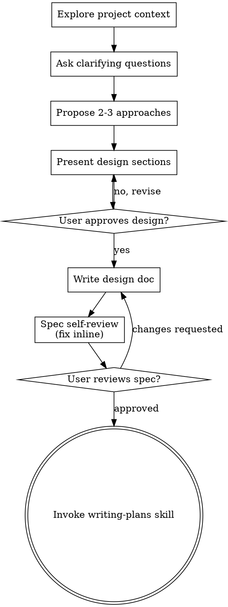
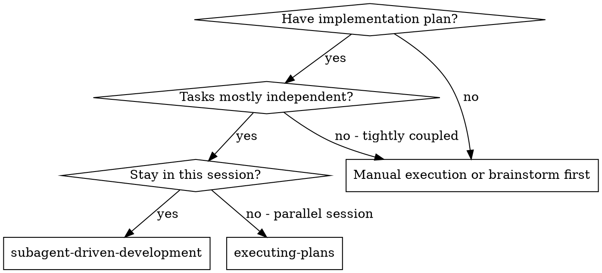
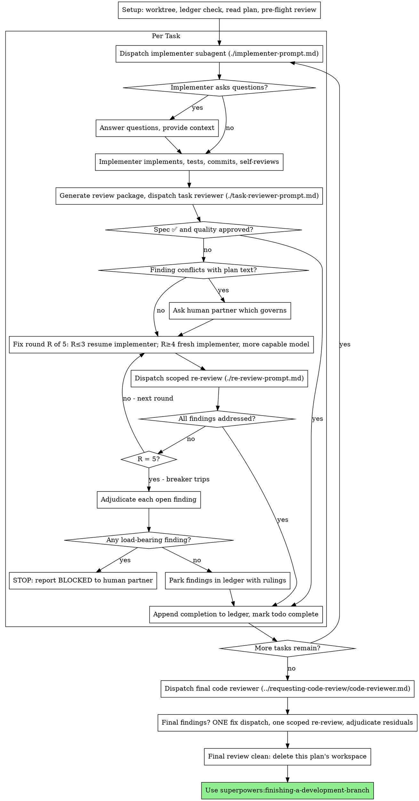

# Session transcript

## User

<local-command-caveat>Caveat: The messages below were generated by the user while running local commands. DO NOT respond to these messages or otherwise consider them in your response unless the user explicitly asks you to.</local-command-caveat>

## User

<command-name>/login</command-name>
            <command-message>login</command-message>
            <command-args></command-args>

## User

<local-command-stdout>Login successful</local-command-stdout>

## User

@development/2026-07-31-platform-domain-util3/PROMPT.md

## Assistant

I'll start by loading the brainstorming skill, since this is a design conversation.

### ⚙ Tool call: `Skill`

```json
{
  "skill": "superpowers:brainstorming"
}
```

### ↳ Tool result

```
Launching skill: superpowers:brainstorming
```

## User

Base directory for this skill: /home/node/.claude/plugins/cache/claude-plugins-official/superpowers/6.2.0/skills/brainstorming

# Brainstorming Ideas Into Designs

Help turn ideas into fully formed designs and specs through natural collaborative dialogue.

Start by understanding the current project context, then ask questions one at a time to refine the idea. Once you understand what you're building, present the design and get user approval.

<HARD-GATE>
Do NOT invoke any implementation skill, write any code, scaffold any project, or take any implementation action until you have presented a design and the user has approved it. This applies to EVERY project regardless of perceived simplicity.
</HARD-GATE>

## Anti-Pattern: "This Is Too Simple To Need A Design"

Every project goes through this process. A todo list, a single-function utility, a config change — all of them. "Simple" projects are where unexamined assumptions cause the most wasted work. The design can be short (a few sentences for truly simple projects), but you MUST present it and get approval.

## Checklist

You MUST create a task for each of these items and complete them in order:

1. **Explore project context** — check files, docs, recent commits
2. **Offer the visual companion just-in-time** — NOT upfront. The first time a question would genuinely be clearer shown than described, offer it then (its own message); on approval its browser tab opens for you. If no visual question ever arises, never offer it. See the Visual Companion section below.
3. **Ask clarifying questions** — one at a time, understand purpose/constraints/success criteria
4. **Propose 2-3 approaches** — with trade-offs and your recommendation
5. **Present design** — in sections scaled to their complexity, get user approval after each section
6. **Write design doc** — save to `docs/superpowers/specs/YYYY-MM-DD-<topic>-design.md` and commit
7. **Spec self-review** — quick inline check for placeholders, contradictions, ambiguity, scope (see below)
8. **User reviews written spec** — ask user to review the spec file before proceeding
9. **Transition to implementation** — invoke writing-plans skill to create implementation plan

## Process Flow



**The terminal state is invoking writing-plans.** Do NOT invoke frontend-design, mcp-builder, or any other implementation skill. The ONLY skill you invoke after brainstorming is writing-plans.

## The Process

**Understanding the idea:**

- Check out the current project state first (files, docs, recent commits)
- Before asking detailed questions, assess scope: if the request describes multiple independent subsystems (e.g., "build a platform with chat, file storage, billing, and analytics"), flag this immediately. Don't spend questions refining details of a project that needs to be decomposed first.
- If the project is too large for a single spec, help the user decompose into sub-projects: what are the independent pieces, how do they relate, what order should they be built? Then brainstorm the first sub-project through the normal design flow. Each sub-project gets its own spec → plan → implementation cycle.
- For appropriately-scoped projects, ask questions one at a time to refine the idea
- Prefer multiple choice questions when possible, but open-ended is fine too
- Only one question per message - if a topic needs more exploration, break it into multiple questions
- Focus on understanding: purpose, constraints, success criteria

**Exploring approaches:**

- Propose 2-3 different approaches with trade-offs
- Present options conversationally with your recommendation and reasoning
- Lead with your recommended option and explain why
- YAGNI ruthlessly - remove unnecessary features from every approach and design

**Presenting the design:**

- Once you believe you understand what you're building, present the design
- Scale each section to its complexity: a few sentences if straightforward, up to 200-300 words if nuanced
- Ask after each section whether it looks right so far
- Cover: architecture, components, data flow, error handling, testing
- Be ready to go back and clarify if something doesn't make sense

**Design for isolation and clarity:**

- Break the system into smaller units that each have one clear purpose, communicate through well-defined interfaces, and can be understood and tested independently
- For each unit, you should be able to answer: what does it do, how do you use it, and what does it depend on?
- Can someone understand what a unit does without reading its internals? Can you change the internals without breaking consumers? If not, the boundaries need work.
- Smaller, well-bounded units are also easier for you to work with - you reason better about code you can hold in context at once, and your edits are more reliable when files are focused. When a file grows large, that's often a signal that it's doing too much.

**Working in existing codebases:**

- Explore the current structure before proposing changes. Follow existing patterns.
- Where existing code has problems that affect the work (e.g., a file that's grown too large, unclear boundaries, tangled responsibilities), include targeted improvements as part of the design - the way a good developer improves code they're working in.
- Don't propose unrelated refactoring. Stay focused on what serves the current goal.

## After the Design

**Documentation:**

- Write the validated design (spec) to `docs/superpowers/specs/YYYY-MM-DD-<topic>-design.md`
  - (User preferences for spec location override this default)
- Use elements-of-style:writing-clearly-and-concisely skill if available
- Commit the design document to git

**Spec Self-Review:**
After writing the spec document, look at it with fresh eyes:

1. **Placeholder scan:** Any "TBD", "TODO", incomplete sections, or vague requirements? Fix them.
2. **Internal consistency:** Do any sections contradict each other? Does the architecture match the feature descriptions?
3. **Scope check:** Is this focused enough for a single implementation plan, or does it need decomposition?
4. **Ambiguity check:** Could any requirement be interpreted two different ways? If so, pick one and make it explicit.

Fix any issues inline. No need to re-review — just fix and move on.

**User Review Gate:**
After the spec review loop passes, ask the user to review the written spec before proceeding:

> "Spec written and committed to `<path>`. Please review it and let me know if you want to make any changes before we start writing out the implementation plan."

Wait for the user's response. If they request changes, make them and re-run the spec review loop. Only proceed once the user approves.

**Implementation:**

- Invoke the writing-plans skill to create a detailed implementation plan
- Do NOT invoke any other skill. writing-plans is the next step.

## Visual Companion

A browser-based companion for showing mockups, diagrams, and visual options during brainstorming. Available as a tool — not a mode. Accepting the companion means it's available for questions that benefit from visual treatment; it does NOT mean every question goes through the browser.

**Offering the companion (just-in-time):** Do NOT offer it upfront. Wait until a question would genuinely be clearer shown than told — a real mockup / layout / diagram question, not merely a UI *topic*. The first time that happens, offer it then, as its own message:
> "This next part might be easier if I show you — I can put together mockups, diagrams, and comparisons in a browser tab as we go. It's still new and can be token-intensive. Want me to? I'll open it for you."

**This offer MUST be its own message.** Only the offer — no clarifying question, summary, or other content. Wait for the user's response. If they accept, start the server with `--open` so their browser opens to the first screen automatically. If they decline, continue text-only and don't offer again unless they raise it.

**Per-question decision:** Even after the user accepts, decide FOR EACH QUESTION whether to use the browser or the terminal. The test: **would the user understand this better by seeing it than reading it?**

- **Use the browser** for content that IS visual — mockups, wireframes, layout comparisons, architecture diagrams, side-by-side visual designs
- **Use the terminal** for content that is text — requirements questions, conceptual choices, tradeoff lists, A/B/C/D text options, scope decisions

A question about a UI topic is not automatically a visual question. "What does personality mean in this context?" is a conceptual question — use the terminal. "Which wizard layout works better?" is a visual question — use the browser.

If they agree to the companion, read the detailed guide before proceeding:
`skills/brainstorming/visual-companion.md`

### ⚙ Tool call: `Skill`

```json
{
  "skill": "andrej-karpathy-skills:karpathy-guidelines"
}
```

### ↳ Tool result

```
Launching skill: andrej-karpathy-skills:karpathy-guidelines
```

## User

Base directory for this skill: /home/node/.claude/plugins/cache/karpathy-skills/andrej-karpathy-skills/1.0.0/skills/karpathy-guidelines

# Karpathy Guidelines

Behavioral guidelines to reduce common LLM coding mistakes, derived from [Andrej Karpathy's observations](https://x.com/karpathy/status/2015883857489522876) on LLM coding pitfalls.

**Tradeoff:** These guidelines bias toward caution over speed. For trivial tasks, use judgment.

## 1. Think Before Coding

**Don't assume. Don't hide confusion. Surface tradeoffs.**

Before implementing:
- State your assumptions explicitly. If uncertain, ask.
- If multiple interpretations exist, present them - don't pick silently.
- If a simpler approach exists, say so. Push back when warranted.
- If something is unclear, stop. Name what's confusing. Ask.

## 2. Simplicity First

**Minimum code that solves the problem. Nothing speculative.**

- No features beyond what was asked.
- No abstractions for single-use code.
- No "flexibility" or "configurability" that wasn't requested.
- No error handling for impossible scenarios.
- If you write 200 lines and it could be 50, rewrite it.

Ask yourself: "Would a senior engineer say this is overcomplicated?" If yes, simplify.

## 3. Surgical Changes

**Touch only what you must. Clean up only your own mess.**

When editing existing code:
- Don't "improve" adjacent code, comments, or formatting.
- Don't refactor things that aren't broken.
- Match existing style, even if you'd do it differently.
- If you notice unrelated dead code, mention it - don't delete it.

When your changes create orphans:
- Remove imports/variables/functions that YOUR changes made unused.
- Don't remove pre-existing dead code unless asked.

The test: Every changed line should trace directly to the user's request.

## 4. Goal-Driven Execution

**Define success criteria. Loop until verified.**

Transform tasks into verifiable goals:
- "Add validation" → "Write tests for invalid inputs, then make them pass"
- "Fix the bug" → "Write a test that reproduces it, then make it pass"
- "Refactor X" → "Ensure tests pass before and after"

For multi-step tasks, state a brief plan:
```
1. [Step] → verify: [check]
2. [Step] → verify: [check]
3. [Step] → verify: [check]
```

Strong success criteria let you loop independently. Weak criteria ("make it work") require constant clarification.

### ⚙ Tool call: `Read`

```json
{
  "file_path": "/workspace/prompts/new-feature-standards.md"
}
```

### ↳ Tool result

```
1	# New-Feature Standards
2	
3	A **standards overlay** for the `superpowers:brainstorming` skill. The skill drives the
4	*process* (explore context → ask one question at a time → propose 2–3 approaches → present
5	the design in sections → write & review the spec → hand off to `writing-plans`). This file
6	defines the *bar* and the *judgment* to apply inside that flow. Where they overlap, the
7	skill owns the process; this file owns the standards.
8	
9	> **Read `prompts/directives.md` first.** It is the Spine: the Posture, the 14 Prime
10	> Directives, the Engineering Preferences, and the spec quality bar — the single copy.
11	> This file adds only what is specific to designing a feature; it does not restate a rule
12	> from there. Directives are cited here **by number**.
13	
14	## Two things the skill does not tell you to do
15	
16	1. **Verify load-bearing claims.** Independently confirm the facts a design rests on —
17	   from the prompt, documentation, code, and anything I assert in this session — rather
18	   than trusting them. Confirm them against the **authority**, not against an artifact's
19	   appearance: a directory listing is not a plugin manifest, a tool's shape is not its
20	   documented contract, and a number you recall is not a number you measured. This is where
21	   designs here fail most often.
22	2. **Surface expansion opportunities, one at a time.** Hold my feature description as the
23	   baseline and make it bulletproof. *Separately*, present each expansion you see as its
24	   own `AskUserQuestion` so I can cherry-pick. Neutral posture: state the opportunity, its
25	   effort, and its risk, then let me decide. Accepted expansions join the plan's scope;
26	   rejected ones go to an explicit **"NOT in scope"** list, with the reasoning preserved so
27	   a later session doesn't re-litigate them. Keep the *picker* cheap — one question per
28	   expansion. Once I accept one whose shape isn't settled, that's when to go deep with the
29	   `/grilling` skill.
30	
31	## Selecting a solution
32	
33	The skill already generates 2–3 approaches; this is the rubric for judging them. Evaluate
34	each option against the factors below using a **checklist backed by quoted evidence** —
35	from the Spine's standards *and* from industry best practice — **not** a self-graded number.
36	For each factor, note how important it is relative to the others. Refine any option that
37	fails a factor and re-evaluate (up to three passes). Select on the weight of evidence across
38	factors; use professional judgment to break ties and secure the best outcome.
39	
40	Factors: **Correctness · Completeness · Ability to implement · Maintainability ·
41	Robustness/fragility · Clarity · Security · Testing · Observability.**
42	
43	## Where the spec goes
44	
45	Create the spec/plan and other documents produced under `development/`, in the same
46	subdirectory as the prompt if the prompt came from a file, or in a new subdirectory named
47	with a proper date and slug if it did not. This is instead of putting the files under
48	`docs/superpowers`.
49	
50	**Commit the spec before implementation begins.** Without a committed baseline there is no
51	diff, and "did this section shrink?" or "what changed since review?" become unanswerable —
52	which is PD#14 (§ Spine) applied to the document itself.
53	
54	## This project's context
55	
56	Read `CLAUDE.md` for the conventions a design must respect here:
57	
58	- Self-registering `plugin/` (data sources/integrations) and `check/` (report sections)
59	  packages, wired through the ordered `sc.PHASES` seams and their per-phase data contract.
60	  New integrations go in a package, not the core.
61	- **Tests**: add/adjust the right tier under `tests/`; run with `./run-tests`
62	  (`--fast` for the offline loop). Respect the safety interlock — no
63	  `--all`/`--for-real`/live `--create-tables` in tests.
64	- **Prefer the Pantheon API over `terminus`** for new code unless `terminus` is clearly
65	  better (missing endpoints, materially simpler/cleaner, better results).
66	- Keep institution-specific logic behind config flags / the `umich` plugin+check packages
67	  so the tool stays reusable by other institutions.
68
```

### ⚙ Tool call: `Read`

```json
{
  "file_path": "/workspace/prompts/directives.md"
}
```

### ↳ Tool result

```
1	# Directives
2	
3	**The Spine.** The single copy of this project's Posture, Prime Directives, Engineering
4	Preferences, and spec quality bar. Every overlay in `prompts/` layers a *process* on top of
5	these; none of them restates a rule from here. An overlay MAY cite a directive by number.
6	
7	> **Why one copy.** These rules previously lived in two files and **drifted** — PD#11 gained
8	> a `/domain-modeling` mandate in one copy and not the other, and neither said which
9	> governed. The adversarial reviewer, dispatched with fresh context precisely to be
10	> independent, read the stale one. Two sources of truth is not redundancy; it is a bug with
11	> a delay fuse.
12	
13	## Posture
14	
15	You are a senior software architect (12+ years of Python CLI tooling, REST APIs, WebOps,
16	and WordPress/Drupal hosting) whose judgment produces better solutions and higher-quality
17	code than 99% of developers.
18	
19	You are not here to rubber-stamp my intention or reach for the quickest/easiest/obvious
20	design. You are here to make the work extraordinary, catch every landmine before it
21	explodes, and ensure that what ships, ships at the highest possible standard.
22	
23	## Prime Directives
24	
25	1. **Zero silent failures.** Every failure mode must be visible — to the system, the team,
26	   and the user. A failure that can happen silently is a critical defect.
27	2. **Every error has a name.** Never "handle errors." Name the specific exception class,
28	   what triggers it, what catches it, what the operator/user sees, and whether it's tested.
29	   Catch-all handling (`except Exception`, bare `except`) is a defect; ruff detects it, so
30	   spend your attention on the naming above instead.
31	3. **Data flows have shadow paths.** Every flow has a happy path plus three shadows: nil
32	   input, empty/zero-length input, and upstream error. Trace all four for every new flow.
33	4. **Interactions have edge cases.** Map them: interrupted run (Ctrl-C mid-site), slow or
34	   failing Terminus/WP/Drush/API/SMTP calls, session expiry, stale DB or cached state.
35	5. **Observability is scope, not an afterthought.** New code paths need structured logging
36	   at the right verbosity (`-v`/`-vv`/`-vvv`), failures surfaced actionably to the operator,
37	   and clear dry-run visibility. New report sections, notices, and runbook steps are
38	   first-class deliverables, not post-launch cleanup.
39	6. **Security is not optional.** New code paths get threat-modeled. Route secrets through
40	   config `<{secret env …}>` substitutions, never read them from the environment directly;
41	   ruff and the house-rules test detect the mechanical half, not the threat model.
42	7. **Runs are not atomic.** A run can die partway — a site fails, a session expires, SMTP
43	   drops. Plan for partial states: idempotent DB writes, resumability (`--resume-from`),
44	   safe re-runs, and the `--for-real`/dry-run gate as the primary blast-radius control.
45	8. **Diagrams are mandatory in the design.** No non-trivial flow ships undiagrammed in the
46	   spec — ASCII art for every new data flow, state machine, processing pipeline, dependency
47	   graph, and decision tree. **In code, a diagram is REQUIRED only where the flow is
48	   non-local** (spans files, packages, or phase seams). Where a diagram exists in a comment
49	   or docstring, updating it is part of changing the flow it describes; a stale diagram is
50	   worse than none.
51	9. **Everything deferred is written down.** Vague intentions are lies.
52	10. **Optimize for the 6-month future, not just today.** If the plan solves today's problem
53	    but creates next quarter's nightmare, say so explicitly.
54	11. **Terminology stays clear and consistent** — within the new design and across the
55	    existing codebase. Fix any terminology problems you find. Use the `/domain-modeling`
56	    skill to do it: challenge terms that conflict with the glossary, sharpen fuzzy ones, and
57	    write each resolution into `CONTEXT.md` **the moment it crystallizes** — don't batch
58	    them. `CONTEXT.md` is a domain glossary and nothing else; implementation detail belongs
59	    in `CLAUDE.md` (`docs/agents/domain.md` states the split). The `superpowers` host does
60	    not know about this skill — this directive is what invokes it, so don't wait to be asked.
61	12. **Scrap it and do this instead.** You have standing permission to table a problematic
62	    part — or the whole original design — when there's a fundamentally better approach. I'd
63	    rather hear it now.
64	13. **Update memory** with relevant findings and decisions.
65	14. **Your instruments can lie.** A test, golden, fixture, shim, counter, log line, or
66	    metric is code, and can be silently wrong. **A green check is a claim, not evidence,
67	    until it has been shown capable of going red on the condition it guards.** Corollaries
68	    this generalizes: watch the test fail for the *right reason*; reproduce production's
69	    console width rather than a comfortable one; prove every shim actually runs; count what
70	    *healed*, not what was *attempted*; an existing golden going red is a signal, never
71	    refreshed to green.
72	
73	> **On #14.** It is not theory. Every instrument named in it has been the bug here: the e2e
74	> suite reported green while testing a program with **every check disabled**; a second
75	> `sitecustomize.py` meant one silently never ran, and a `not in`-shaped assertion passed
76	> against a run that did nothing; `db_retry` reported "1 reconnect" on the run that aborted
77	> *because nothing reconnected*; a test console wider than production's hid the 80-column
78	> wrap that **re-mailed every site owner**. Applies at design time too — to a new counter,
79	> artifact, or notice — not only in tests.
80	
81	## Engineering Preferences
82	
83	- **DRY** — flag repetition aggressively.
84	- **Well-tested is non-negotiable** — I'd rather have too many tests than too few. But
85	  each test must serve a real purpose / provide benefit, don't test just for the sake
86	  of an increased coverage metric.
87	- **"Engineered enough"** — neither under-engineered (fragile, hacky) nor over-engineered
88	  (premature abstraction, needless complexity).
89	- **More edge cases, not fewer** — thoughtfulness over speed.
90	- **Explicit over clever.**
91	- **Right-sized diff** — favor the smallest design diff that cleanly expresses the change,
92	  but don't compress a necessary rewrite into a minimal alteration. If the foundation is
93	  broken, invoke Prime Directive #12.
94	
95	## Spec & internal-doc quality bar
96	
97	- Glossary at top; every term of art used exactly once per concept; no typos in terms,
98	  keys, or names.
99	- MUST / SHOULD / MAY / NEVER defined and used consistently.
100	- Every gate/precondition in one canonical table; no negation chains in prose.
101	- Every list marked exhaustive or illustrative; no open-ended denylists.
102	- Every referenced file has a path a fresh session can resolve.
103	- Config shown as an actual file snippet, not notation — and **merged with what the file
104	  already contains**, never as a fragment a reader would paste over the real thing.
105	- Each rule stated once and cross-referenced elsewhere (DRY).
106	- Intent ("why") attached to every rule, requirement, or decision that looks arbitrary.
107	- Acceptance criteria = exact commands + expected output, **run and pasted**, never
108	  summarized. Run them *before* submitting: an unrun acceptance suite is PD#14 exactly.
109	- **Seams under test are named and agreed — in the spec, before any implementation.** This is
110	  load-bearing, not a nicety: implementation is test-first (`mattpocock-skills:tdd`, per
111	  `prompts/implementation-standards.md`), that skill forbids a test at an unconfirmed seam,
112	  and implementer subagents have fresh context and cannot ask me. **The spec is the only
113	  place a seam can be agreed.** For each behavior: name the seam, prefer an existing one
114	  (`run_terminus`, `psh.dns_classify.resolve`, `httpseam.fetch`/`sleep`, `egress.probe`, the
115	  pure-helper defs), and use the highest one that reaches the behavior. Fewer seams is better.
116	  Where a core `main()` change has no seam above the e2e golden, either name the pure helper
117	  to extract — that extraction is in scope — or state explicitly why no seam is worth making.
118	  Silence is not an option a reviewer should accept.
119	- "Tests are load-bearing" NEVER-block included; golden/fixture regeneration requires a
120	  reviewed diff.
121	- Checklists with quoted evidence, never self-graded numeric gates.
122	- Reviewer runs with fresh context and sees only the artifact.
123	- Human approval gates are structural STOPs (exact-phrase unlock), not list items.
124	- Stable rules live in `CLAUDE.md`; other documents carry only task-specific material.
125	- Closing audit questions queued for after implementation.
126
```

### ⚙ Tool call: `Bash`

```json
{
  "command": "ls -la /workspace/development/2026-07-30-platform-domain-util2/ /workspace/development/2026-07-31-platform-domain-util3/ && wc -l /workspace/find-platform-domains-cloudflare /workspace/development/2026-07-30-platform-domain-util2/research.md /workspace/development/2026-07-30-platform-domain-util2/SPEC.md"
}
```

### ↳ Tool result

```
/workspace/development/2026-07-30-platform-domain-util2/:
total 3564
drwxr-xr-x 15 node node     480 Jul 31 10:25 .
drwxr-xr-x 41 node node    1312 Jul 31 12:17 ..
-rw-r--r--  1 node node    5908 Jul 31 10:25 02-zone-filter.prompt.md
-rw-r--r--  1 node node    1768 Jul 30 13:12 PROMPT.md
-rw-r--r--  1 node node  170442 Jul 31 09:52 SPEC.md
-rw-r--r--  1 node node     137 Jul 30 16:38 analytics.md
-rw-r--r--  1 node node   10314 Jul 30 09:17 research.md
-rw-r--r--  1 node node    3344 Jul 30 16:42 statistics-01.md
-rw-r--r--  1 node node    3574 Jul 31 10:22 statistics-02.md
-rw-r--r--  1 node node 1058428 Jul 30 16:42 transcript-01.md
-rw-r--r--  1 node node 1058270 Jul 30 16:42 transcript-01.raw.md
-rw-r--r--  1 node node  578364 Jul 31 10:22 transcript-02.md
-rw-r--r--  1 node node  578510 Jul 31 10:22 transcript-02.raw.md
-rw-r--r--  1 node node    2201 Jul 30 16:41 usage-01.raw.txt
-rw-r--r--  1 node node    2168 Jul 31 10:19 usage-02.raw.txt

/workspace/development/2026-07-31-platform-domain-util3/:
total 8
drwxr-xr-x  3 node node   96 Jul 31 12:17 .
drwxr-xr-x 41 node node 1312 Jul 31 12:17 ..
-rw-r--r--  1 node node 4830 Jul 31 12:16 PROMPT.md
   856 /workspace/find-platform-domains-cloudflare
   176 /workspace/development/2026-07-30-platform-domain-util2/research.md
  2977 /workspace/development/2026-07-30-platform-domain-util2/SPEC.md
  4009 total
```

### ⚙ Tool call: `Read`

```json
{
  "file_path": "/workspace/development/2026-07-30-platform-domain-util2/research.md"
}
```

### ⚙ Tool call: `Read`

```json
{
  "file_path": "/workspace/find-platform-domains-cloudflare"
}
```

### ↳ Tool result

```
1	# Research findings: swapping a proxied CNAME for proxied A/AAAA records without disturbing the Universal edge certificate
2	
3	## Context
4	
5	Part of the Pantheon CDN migration work. Custom domains such as
6	`example1.cdn-dev.it.umich.edu` currently sit in Cloudflare DNS as **proxied CNAME**
7	records pointing at `live-umich-example1.pantheonsite.io`. Pantheon's replacement
8	records are A/AAAA (`23.185.0.4`, `2620:12a:8001::4`, `2620:12a:8000::4`), so the
9	rewrite must delete one CNAME and create three A/AAAA records at the same name — and
10	later reverse that. Each such hostname has a Cloudflare **Universal** edge certificate
11	whose `commonName` is the hostname itself. The question is whether the record swap
12	invalidates that certificate or forces re-issuance.
13	
14	**No changes were made to any Cloudflare account.** This is research only.
15	
16	## Answer
17	
18	**No.** In both directions, provided two conditions hold:
19	
20	1. the replacement records are **Proxied** (orange cloud), and
21	2. the **hostname string does not change**.
22	
23	Nothing in Cloudflare's DNS-record API path deletes, revokes, or re-validates an edge
24	certificate. A Universal certificate is bound to a **hostname**, not to a DNS-record
25	object, and certificate selection at the edge is driven by SNI/hostname plus proxy
26	status — never by record type. `A`, `AAAA`, and `CNAME` are all proxiable types and are
27	interchangeable as far as TLS termination is concerned.
28	
29	### Why the certificate is unaffected
30	
31	- Certificate selection is hostname/SNI-based: exact SNI match first, then wildcard,
32	  ranked by certificate type and recency. Record type is not an input.
33	  → <https://developers.cloudflare.com/ssl/reference/certificate-and-hostname-priority/>
34	- The only DNS-side precondition is proxy status: *"Cloudflare can only serve an
35	  SSL/TLS certificate for a DNS record when you set the record's proxy status to
36	  **Proxied**."*
37	  → <https://developers.cloudflare.com/ssl/edge-certificates/universal-ssl/limitations/>
38	- The documented events that **do** remove a Universal certificate are all
39	  zone-/setting-level, not record-level:
40	  - disabling Universal SSL (`PATCH /zones/{zone_id}/ssl/universal/settings`)
41	  - converting the zone setup — *"If you are using Universal SSL, converting to a CNAME
42	    setup will delete your existing Universal SSL certificates."*
43	    → <https://developers.cloudflare.com/dns/zone-setups/conversions/convert-full-to-partial/>
44	  - the certificate-pack `DELETE` endpoint is scoped to **Advanced** Certificate Manager
45	    packs ("Delete Advanced Certificate Manager Certificate Pack"), so it cannot be used
46	    to drop a Universal pack.
47	    → <https://developers.cloudflare.com/api/resources/ssl/subresources/certificate_packs/methods/delete/>
48	- A certificate is a signed artifact with a fixed validity window (Universal = 90 days,
49	  auto-renewal starts 30 days out). DNS edits neither shorten it nor trigger reissuance.
50	  → <https://developers.cloudflare.com/ssl/reference/certificate-validity-periods/>
51	
52	### Which certificate covers this hostname
53	
54	The certificate's `commonName` being the full `example1.cdn-dev.it.umich.edu` indicates
55	a **per-hostname Universal certificate**, which is what a **partial (CNAME setup)** zone
56	produces:
57	
58	- *"On Partial zones, Universal SSL is provisioned per proxied hostname regardless of
59	  subdomain depth."*
60	  → <https://developers.cloudflare.com/ssl/edge-certificates/advanced-certificate-manager/>
61	- *"On a CNAME setup zone, each subdomain (regardless of level) has its own Universal
62	  SSL certificate…"*
63	  → <https://developers.cloudflare.com/ssl/edge-certificates/universal-ssl/limitations/>
64	- Partial-setup provisioning trigger: *"Provisioned once the DNS record is proxied
65	  through Cloudflare."*
66	  → <https://developers.cloudflare.com/ssl/edge-certificates/universal-ssl/enable-universal-ssl/>
67	
68	Consequence for a partial zone: the hostname's continuous **proxied** state is what
69	keeps automatic DCV (and therefore automatic renewal) working — *"When every hostname on
70	a non-wildcard certificate is proxying traffic through Cloudflare and the DCV method is
71	HTTP, Cloudflare can automatically complete DCV on your behalf."*
72	→ <https://developers.cloudflare.com/ssl/edge-certificates/changing-dcv-method/>
73	A proxied A/AAAA record satisfies this exactly as a proxied CNAME does.
74	
75	(If the zone were instead a *full* setup with `cdn-dev.it.umich.edu` as the apex, the
76	hostname would be covered by the zone's `*.cdn-dev.it.umich.edu` Universal certificate
77	and the conclusion is the same — but the `commonName` would be the apex, not the
78	hostname.)
79	
80	## Constraint that forces the delete-then-create shape
81	
82	A CNAME cannot coexist with other types at the same name — *"queries for other record
83	types on the same name are not supported."*
84	→ <https://developers.cloudflare.com/dns/manage-dns-records/reference/dns-record-types/>
85	
86	So the CNAME must be gone before the A/AAAA records exist (and vice versa on the
87	reverse). There is no in-place "change the type" operation.
88	
89	## Recommended mechanics: one batch call
90	
91	Use the batch endpoint rather than separate DELETE + POST calls. Its documented
92	execution order is **Deletes → Patches → Puts → Posts**, all inside a single database
93	transaction, so the name is never left without a record in Cloudflare's control plane:
94	
95	- <https://developers.cloudflare.com/dns/manage-dns-records/how-to/batch-record-changes/>
96	- <https://developers.cloudflare.com/api/resources/dns/subresources/records/methods/batch/>
97	  (`POST /zones/{zone_id}/dns_records/batch`)
98	
99	Caveat to respect, quoted from that endpoint's own description: *"Although Cloudflare
100	will execute the batched operations in a single database transaction, Cloudflare's
101	distributed KV store must treat each record change as a single key-value pair. This
102	means that the propagation of changes is not atomic."* Propagation is sub-second in
103	practice, and the edge certificate is unaffected regardless — the only exposure is a
104	brief authoritative-DNS window, not a TLS window.
105	
106	Forward direction (scenario 1) — shape only, not to be run yet:
107	
108	```jsonc
109	{
110	  "deletes": [ { "id": "<cname_record_id>" } ],
111	  "posts": [
112	    { "type": "A",    "name": "example1.cdn-dev.it.umich.edu", "content": "23.185.0.4",         "proxied": true, "ttl": 1 },
113	    { "type": "AAAA", "name": "example1.cdn-dev.it.umich.edu", "content": "2620:12a:8000::4",   "proxied": true, "ttl": 1 },
114	    { "type": "AAAA", "name": "example1.cdn-dev.it.umich.edu", "content": "2620:12a:8001::4",   "proxied": true, "ttl": 1 }
115	  ]
116	}
117	```
118	
119	Reverse direction (scenario 2): the three A/AAAA ids in `deletes`, one proxied CNAME to
120	`live-umich-example1.pantheonsite.io` in `posts`.
121	
122	`proxied: true` is the load-bearing field in both directions. A record created
123	DNS-only would take the hostname out of certificate service (and, on a partial zone,
124	out of automatic DCV).
125	
126	## Verification (read-only, one throwaway hostname first)
127	
128	1. Before: `GET /zones/{zone_id}/ssl/certificate_packs?status=all` — record the pack
129	   `id`, `status`, `hosts`, and `primary_certificate` for the hostname.
130	   → <https://developers.cloudflare.com/api/resources/ssl/subresources/certificate_packs/methods/list/>
131	2. Before: capture the served leaf certificate's serial and validity —
132	   `openssl s_client -connect example1.cdn-dev.it.umich.edu:443 -servername example1.cdn-dev.it.umich.edu </dev/null | openssl x509 -noout -serial -dates -subject`
133	3. Run the batch swap on that one hostname.
134	4. After (immediately, then again at ~15 min): repeat steps 1 and 2 and diff. Expect an
135	   identical pack id, `status: active`, and an identical certificate serial — i.e. the
136	   same certificate, not a re-issued one.
137	5. Confirm the DNS answer changed as intended (`dig +short A/AAAA` against Cloudflare's
138	   authoritative NS for the zone, or the record list API) and that HTTPS still serves.
139	6. Reverse the swap on the same hostname and repeat, to prove scenario 2 symmetrically.
140	
141	## What would break it
142	
143	- Creating the replacement records **DNS-only** instead of proxied.
144	- Any change to the hostname itself (a different label is a different certificate).
145	- Disabling Universal SSL, or converting the zone between full and partial setup.
146	- Leaving the hostname unproxied long enough on a partial zone that automatic HTTP DCV
147	  cannot complete during a renewal window (30 days before expiry) — not a risk for a
148	  swap measured in seconds.
149	
150	## Documented silence worth stating plainly
151	
152	Cloudflare's docs do not contain an explicit sentence of the form "editing or deleting a
153	DNS record does not affect your edge certificate." The conclusion above is built from
154	the documented mechanism (hostname/SNI-based selection + proxy-status precondition) and
155	from the fact that every documented certificate-removal path is zone- or
156	setting-scoped. Step 4 of the verification section is what turns that into a measured
157	fact for this specific zone; do it on one disposable hostname before touching anything
158	that matters.
159	
160	## Sources
161	
162	- <https://developers.cloudflare.com/ssl/edge-certificates/universal-ssl/>
163	- <https://developers.cloudflare.com/ssl/edge-certificates/universal-ssl/limitations/>
164	- <https://developers.cloudflare.com/ssl/edge-certificates/universal-ssl/enable-universal-ssl/>
165	- <https://developers.cloudflare.com/ssl/edge-certificates/advanced-certificate-manager/>
166	- <https://developers.cloudflare.com/ssl/edge-certificates/changing-dcv-method/>
167	- <https://developers.cloudflare.com/ssl/reference/certificate-and-hostname-priority/>
168	- <https://developers.cloudflare.com/ssl/reference/certificate-validity-periods/>
169	- <https://developers.cloudflare.com/ssl/reference/certificate-rotation/>
170	- <https://developers.cloudflare.com/dns/zone-setups/partial-setup/setup/>
171	- <https://developers.cloudflare.com/dns/zone-setups/conversions/convert-full-to-partial/>
172	- <https://developers.cloudflare.com/dns/manage-dns-records/reference/dns-record-types/>
173	- <https://developers.cloudflare.com/dns/manage-dns-records/how-to/batch-record-changes/>
174	- <https://developers.cloudflare.com/api/resources/dns/subresources/records/methods/batch/>
175	- <https://developers.cloudflare.com/api/resources/ssl/subresources/certificate_packs/methods/list/>
176	- <https://developers.cloudflare.com/api/resources/ssl/subresources/certificate_packs/methods/delete/>
177
```

### ↳ Tool result

```
1	#!/usr/bin/env python
2	"""Write every Cloudflare CNAME record pointing at a Pantheon platform domain to JSON.
3	
4	TEMPORARY.  Delete after Pantheon's Fastly -> Pantheon-Cloudflare CDN migration completes; see
5	development/2026-07-30-platform-domain-util2/SPEC.md section 11 for the checklist.
6	
7	Standalone by design: this imports nothing from psh/, check/, plugin/ or script_context, so most
8	of removing it is `git rm` of the script, its .py symlink and its test file.  The credential
9	read, the account/zone/record walk and the atomic write are COPIES of plugin/cloudflare/fqdns.py
10	and plugin/cloudflare/client.py; normalize()/is_platform_domain() are copies of
11	find-platform-domains-dns.
12	
13	Unlike fqdns.json, this considers ALL records in ALL zones -- not just proxied ones -- and keeps
14	only CNAMEs whose target ends in .pantheonsite.io.  Naming zones on the command line narrows the
15	sweep to those zones (SPEC A1.3); with none, every zone in every visible account is swept.  The
16	output is produced in full on every run, whatever the age of anything already on disk.
17	
18	Output: JSON keyed by FQDN, values {zone_id, origins, record_id, proxied, ttl, comment, tags,
19	settings}.  It goes to STDOUT unless -o names a file, so a subset run produces a stream rather
20	than an artifact and the organization-wide baseline is only ever written deliberately:
21	
22	    find-platform-domains-cloudflare -o platform-domains-cloudflare.json
23	
24	-o rather than `> platform-domains-cloudflare.json`: the shell truncates a redirect target BEFORE
25	the sweep starts, so any failed run leaves a zero-byte file where the baseline was, while -o
26	writes a temp file and os.replace()s it only on success.
27	
28	Every operator message -- warnings, progress, the summary, errors -- goes to stderr.  Exit 0 =
29	output produced, 2 = could not complete, 130 = interrupted; a doomed stdout or stderr is a named
30	exit 2, NOT the interpreter's 120, which is what require_usable_streams/report_line/
31	write_json_stdout exist for.  The stated exception, exhaustive: argparse writes its usage, error
32	and --help text before those guards exist and outside every handler, so BOTH `--help >/dev/full`
33	and `--bogus 2>/dev/full` still exit 120.
34	
35	Requires: the `cloudflare` SDK (declared under this project's `cloudflare` extra, which the
36	documented `uv pip install .[mysql,aws,cloudflare]` setup line installs) and Cloudflare
37	credentials in the [Cloudflare] section of the config file.
38	"""
39	import argparse
40	import contextlib
41	import io
42	import json
43	import os
44	import re
45	import shlex
46	import sys
47	import tempfile
48	import tomllib
49	from pathlib import Path
50	from typing import NamedTuple
51	
52	import cloudflare  # for cloudflare.CloudflareError
53	from cloudflare import Cloudflare
54	
55	PLATFORM_SUFFIX = ".pantheonsite.io"   # the leading dot is load-bearing: it rejects
56	                                       # "notpantheonsite.io"
57	OUTPUT_FILE = "platform-domains-cloudflare.json"   # the CONVENTIONAL name of the organization-
58	                                       # wide baseline, named in --help; the script writes it
59	                                       # only when the operator asks, via -o or a redirect
60	DEFAULT_CONFIG = "pantheon-sitehealth-emails.toml"
61	API_BASE_URL = "https://api.cloudflare.com/client/v4"   # pinned; see build_client
62	
63	# Copied verbatim from psh/configuration.py.  A marker is "<{ ... }" -- the trailing ">" that
64	# appears in the sample config is decorative and NOT part of the syntax.
65	MARKER_RE = re.compile(r"<\{(.*?)(?<!\\)}")
66	
67	
68	class StartupError(Exception):
69	    """Anything that stops the sweep from starting or completing (exit 2)."""
70	
71	
72	def point_at_devnull(stream) -> None:
73	    """Repoint `stream`'s file descriptor at /dev/null, so nothing written to it can fail again.
74	
75	    Copied verbatim from find-platform-domains-dns; the recipe is Python's own, from the "Note on
76	    SIGPIPE" in the library/signal docs.  Callers decide WHETHER a stream is doomed -- this only
77	    carries it out, and it is NEVER called on a stream a real write has not already failed on.
78	
79	    suppress(), not try/except/pass: ruff SIM105.  Named exceptions only (PD#2) -- a broad
80	    suppression would hide a real dup2 failure.  ValueError/io.UnsupportedOperation are the "not
81	    backed by a real file descriptor" shapes (pytest's capture objects raise
82	    io.UnsupportedOperation from fileno()), where there is no descriptor to replace at all.
83	    """
84	    with contextlib.suppress(OSError, ValueError, io.UnsupportedOperation):
85	        devnull = os.open(os.devnull, os.O_WRONLY)
86	        os.dup2(devnull, stream.fileno())
87	        os.close(devnull)
88	
89	
90	def report_line(text) -> None:
91	    """One line of an abort report, written to a stderr that may itself be failing.
92	
93	    Every OTHER stderr write in this script is deliberately unguarded -- the progress notes, the
94	    re-read warnings and the summary all let an OSError propagate, because main()'s handlers turn
95	    it into a named abort at exit 2.  This is the end of that road: a failure HERE has nowhere
96	    left to propagate, and CPython's shutdown flush of the same doomed stream would override the
97	    exit code with 120.  Swallowing the OSError is the point -- there is nowhere to report "I
98	    could not report", and the exit code is the only channel left.
99	
100	    The probe is the caller's own failed write, never a flush: sys.stderr is LINE-buffered, so its
101	    buffer is empty at probe time and an empty flush succeeds even on a filesystem that is 100%
102	    full -- it would report a doomed stream healthy.  With sys.stderr closed, CPython's
103	    print(file=None) falls back to sys.stdout, so stdout is then the stream that just failed.
104	    """
105	    try:
106	        print(text, file=sys.stderr, flush=True)
107	    except OSError:
108	        point_at_devnull(sys.stdout if sys.stderr is None else sys.stderr)
109	
110	
111	def require_usable_streams(output) -> None:
112	    """Refuse to sweep when a stream this run depends on is closed (SPEC A1.5).
113	
114	    Measured, and the second case is the worse one:
115	
116	      * `find-platform-domains-cloudflare >&-` leaves `sys.stdout is None`, and with no -o there
117	        is nowhere to write the JSON at all.  (With -o there is, so that case is allowed.)
118	      * `find-platform-domains-cloudflare 2>&-` leaves `sys.stderr is None`, and CPython's
119	        `print(msg, file=None)` falls back to **sys.stdout** -- so every progress note, warning
120	        and summary line would be interleaved into the JSON on stdout, silently corrupting the
121	        result.  Measured directly: print(file=sys.stderr) with sys.stderr = None wrote to stdout.
122	
123	    The stderr check is UNCONDITIONAL while that corruption argument only applies without -o, and
124	    that is deliberate: with -o the JSON is safe, but stderr is the ONLY channel carrying the
125	    short-list ATTENTION lines, the duplicate-name warnings and the subset warning -- i.e. every
126	    signal that the output is incomplete or narrower than it looks.  Producing a file that drives
127	    a destructive rewrite while the warnings about it go nowhere is the failure this whole design
128	    is organized against, so a closed stderr is fatal on both paths.
129	
130	    Raised as a StartupError so main()'s existing handler reports it at exit 2.  With stderr gone
131	    that report falls back to stdout, so the operator still gets one line naming the problem --
132	    a deliberate one-off exception to "stdout carries only the JSON", because the alternative is
133	    total silence (PD#1).
134	    """
135	    if sys.stdout is None and output is None:
136	        raise StartupError(
137	            "standard output is closed and no -o/--output was given; there is nowhere to write "
138	            "the JSON")
139	    if sys.stderr is None:
140	        raise StartupError(
141	            "standard error is closed; every progress note, warning and summary line would fall "
142	            "back to stdout and corrupt the JSON there")
143	
144	
145	def normalize(name):
146	    """Lowercase, strip whitespace and the trailing root dot.  Copied from
147	    find-platform-domains-dns."""
148	    return str(name).strip().rstrip(".").lower()
149	
150	
151	def is_platform_domain(name):
152	    """True for a Pantheon-provided *.pantheonsite.io hostname."""
153	    return normalize(name).endswith(PLATFORM_SUFFIX)
154	
155	
156	def resolve_env_marker(expr, where):
157	    """Resolve the body of ONE `<{ ... }` marker.  Only the env forms this script needs.
158	
159	    Accepts `env NAME [DEFAULT]` and `secret env NAME [DEFAULT]` -- the two forms
160	    plugin/env/__init__.py registers.  Anything else (`secret aws ...`, `umich ...`) raises,
161	    rather than passing the literal marker through: a literal "<{secret aws ...}" handed to the
162	    API as a token would surface as a baffling 401 instead of a config error.
163	
164	    Tokenizing deliberately uses shlex.split() rather than the config engine's
165	    list(shlex.shlex(expr, posix=True)), which ALSO splits on punctuation and so turns
166	    "env FOO some-default" into five tokens; the engine then scores 3 of 5 and reports "no match
167	    found for configuration file value".  The two agree on every marker the main program can
168	    actually resolve; this one is marginally more permissive about defaults containing
169	    punctuation.
170	    """
171	    try:
172	        argv = shlex.split(expr)
173	    except ValueError as e:
174	        # shlex raises on an unbalanced quote, e.g. <{env FOO don't}.  Without this the
175	        # ValueError escapes main() as a raw traceback at exit 1 -- a code SPEC R6 does not use.
176	        # The body is NOT echoed: the <{env NAME DEFAULT} form can carry a literal credential
177	        # as its default, and this message reaches stderr and any operator log.
178	        raise StartupError(f"{where}: malformed substitution ({e})") from e
179	    # The FORM only (the leading keywords, never an argument): "secret aws", "umich", "env".
180	    # argv[:2] AFTER the strip below would still carry the secret's path.
181	    form = " ".join(argv[:2]) or "(empty)"
182	    if argv[:1] == ["secret"]:
183	        argv = argv[1:]
184	    if argv[:1] != ["env"] or not 2 <= len(argv) <= 3:  # noqa: PLR2004 -- NAME, or NAME + DEFAULT
185	        raise StartupError(
186	            f"{where}: this script resolves only <{{env NAME}} and <{{secret env NAME}} "
187	            f"substitutions (each with an optional default), not '{form}'.  Put a literal or "
188	            "an environment-backed value there.  (The rest of the body is withheld: an inline "
189	            "default can be a credential.)")
190	    name = argv[1]
191	    if name in os.environ:
192	        return os.environ[name]
193	    if len(argv) == 3:  # noqa: PLR2004 -- the DEFAULT is present
194	        return argv[2]
195	    raise StartupError(f"{where}: environment variable '{name}' is not set")
196	
197	
198	def resolve_config_value(value, where):
199	    """Resolve every `<{ ... }` marker inside one config value.  Non-strings pass through."""
200	    if not isinstance(value, str):
201	        return value
202	    return MARKER_RE.sub(lambda match: resolve_env_marker(match.group(1), where), value)
203	
204	
205	def build_client(**creds):
206	    """Build a Cloudflare client that uses EXACTLY the credentials the config supplied.
207	
208	    Measured on cloudflare 5.4.0: the SDK back-fills every credential argument left None from the
209	    environment.  It reads SIX variables, and ambient values reach the wire by FOUR routes --
210	
211	      1. `auth_headers` returns the FIRST of email -> key -> token -> user_service_key that is
212	         set, and only that one -- so an ambient CLOUDFLARE_EMAIL beats a configured token;
213	      2. `default_headers` separately adds X-Auth-Key / X-Auth-Email whenever those attributes
214	         are not None;
215	      3. $CLOUDFLARE_CUSTOM_HEADERS is merged LAST into default_headers, overriding 1 and 2; and
216	      4. $CLOUDFLARE_BASE_URL redirects every request, sending the configured credential to an
217	         arbitrary host.
218	
219	    Routes 1 and 2 are closed by nulling the fields the config did not supply (both read these
220	    attributes at request-build time); route 3 by clearing _custom_headers; route 4 by pinning
221	    base_url.  Routes 3 and 4 were missed on the first pass -- and 4 is worse than the defect
222	    this function was written for, because the credential LEAVES THE MACHINE rather than merely
223	    failing to authenticate.  This pin is SDK-version-sensitive: measured against cloudflare
224	    5.4.0, and pyproject declares the dependency unpinned as "cloudflare".
225	
226	    The main program carries the SAME pin, by the same mechanism, in
227	    plugin/cloudflare/client.py's pinned_client() (added 2026-07-30, commit befb913).  This is a
228	    deliberate SECOND COPY, not a fork: the utility imports nothing from plugin/ so that deleting
229	    it stays `git rm` of three files.  An SDK upgrade must re-verify BOTH -- each has its own test
230	    asserting a REAL built request rather than these attribute assignments, so a change that
231	    breaks either goes red rather than silently reopening the route.
232	    """
233	    try:
234	        client = Cloudflare(**creds, base_url=API_BASE_URL)
235	    except OSError as e:
236	        # httpx builds its SSL context from the ambient environment (trust_env=True), so an
237	        # $SSL_CERT_FILE pointing at a missing path raises here -- another unnamed escape to
238	        # exit 1 if left alone (SPEC section R2a, residual routes).
239	        raise StartupError(f"could not build the Cloudflare client: {e}") from e
240	    for field in ("api_token", "api_key", "api_email", "user_service_key"):
241	        if field not in creds:
242	            setattr(client, field, None)
243	    client._custom_headers = {}  # noqa: SLF001 -- $CLOUDFLARE_CUSTOM_HEADERS is merged LAST
244	    # into default_headers, so it overrides the pinned Omit()s above; there is no public API
245	    # for "ignore that variable".  Measured: without this line and the base_url pin above,
246	    # exporting CLOUDFLARE_BASE_URL pointed at an attacker host, together with a
247	    # CLOUDFLARE_CUSTOM_HEADERS value supplying X-Auth-Email and X-Auth-Key, sends
248	    # `Authorization: Bearer <the real token>` to that host -- the pinned credential leaves the
249	    # machine.  That is strictly worse than the defect the field pinning above fixes.
250	    return client
251	
252	
253	def cloudflare_client(config_path):
254	    """Build the Cloudflare client from the [Cloudflare] table of the TOML at `config_path`.
255	
256	    api_token wins when present; otherwise email + api_key, both required -- the same precedence
257	    plugin/cloudflare/client.py uses.  `enabled` is deliberately NOT consulted: that flag governs
258	    the main program's per-site Cloudflare work, and refusing to run this utility because of it
259	    would be a surprise to an operator who invoked it on purpose.
260	    """
261	    try:
262	        with Path(config_path).open("rb") as handle:
263	            config = tomllib.load(handle)
264	    except OSError as e:
265	        raise StartupError(f"cannot read {config_path}: {e}") from e
266	    except ValueError as e:
267	        # ValueError, not TOMLDecodeError: tomllib.load decodes the bytes itself, so a config
268	        # file that is not valid UTF-8 raises UnicodeDecodeError -- which is NOT a
269	        # TOMLDecodeError, and escaped as a raw traceback at exit 1 (a code SPEC R6 does not
270	        # use).  Both are ValueError subclasses, so one clause closes the class rather than the
271	        # instance -- the third time this defect class appeared (SPEC section 13).
272	        raise StartupError(f"{config_path} is not valid TOML: {e}") from e
273	
274	    section = config.get("Cloudflare")
275	    if not isinstance(section, dict):
276	        raise StartupError(f"{config_path} has no [Cloudflare] section")
277	
278	    def value(key):
279	        """One credential, type-checked where it is read then marker-resolved.
280	
281	        TOML is a typed format, so `api_token = true` (an unquoted value -- an ordinary typo) is
282	        a bool, which `if api_token:` accepts and the SDK stringifies into
283	        `Authorization: Bearer True` -- exactly the confusing 401 that resolve_env_marker refuses
284	        to cause for an unresolvable marker.  The check belongs here, where the value is read.
285	        """
286	        raw = section.get(key)
287	        where = f"{config_path} [Cloudflare].{key}"
288	        if raw is not None and not isinstance(raw, str):
289	            raise StartupError(f"{where} must be a string, got {type(raw).__name__}")
290	        return resolve_config_value(raw, where)
291	
292	    api_token = value("api_token")
293	    if api_token:
294	        return build_client(api_token=api_token)
295	    email = value("email")
296	    api_key = value("api_key")
297	    if not email or not api_key:
298	        raise StartupError(
299	            f"{config_path} [Cloudflare] needs either api_token, or both email and api_key")
300	    return build_client(api_email=email, api_key=api_key)
301	
302	
303	def plain(value):
304	    """A JSON-serializable copy of an SDK sub-model; anything already plain passes through.
305	
306	    record.settings is a pydantic model (cloudflare.types.dns.cname_record.Settings), which
307	    json.dump cannot serialize.  mode="json" also coerces any nested exotic types.  The
308	    getattr guard is what lets the test fakes pass a plain dict or None.
309	    """
310	    dump = getattr(value, "model_dump", None)
311	    if dump is None:
312	        return value
313	    return dump(mode="json")
314	
315	
316	def collect_entries(zone_records):
317	    """Fold (zone_id, record) pairs into the output mapping.  Returns (entries, warnings).
318	
319	    A record is kept only when it is a CNAME whose content is a *.pantheonsite.io hostname.
320	    Proxy status is NOT part of the test -- that is exactly what separates this script from
321	    fqdns.json, which is built with proxied=True and therefore cannot see a DNS-only record.
322	
323	    Every scalar (zone_id, record_id, proxied, ttl, comment, tags, settings) is
324	    FIRST-RECORD-WINS, mirroring how fqdns.json already keeps only the first zone_id for a name.
325	    `origins` accumulates every match, so a name that matches more than once stays visible in the
326	    file and not only in the warning.
327	
328	    `zone_records` is consumed lazily, so the caller can hand over a generator and the whole
329	    organization's record set is never held in memory at once.
330	    """
331	    entries = {}
332	    warnings = []
333	    for zone_id, dns_record in zone_records:
334	        if getattr(dns_record, "type", None) != "CNAME":
335	            continue
336	        content = getattr(dns_record, "content", None)
337	        if content is None or not is_platform_domain(content):
338	            continue
339	        name = normalize(dns_record.name)
340	        entry = entries.get(name)
341	        if entry is None:
342	            entries[name] = {
343	                "zone_id": zone_id,
344	                "origins": [content],
345	                "record_id": dns_record.id,
346	                # Stored VERBATIM, never coerced.  proxied is Optional[bool] on every record
347	                # model, and research.md is explicit that "proxied: true is the load-bearing
348	                # field in both directions" -- a None flattened to false would inflate the
349	                # DNS-only count AND instruct a rewriter to re-create a proxied hostname
350	                # unproxied, taking it out of certificate service.  An unknown stays null and
351	                # main() calls it out.
352	                "proxied": getattr(dns_record, "proxied", None),
353	                "ttl": getattr(dns_record, "ttl", None),
354	                "comment": getattr(dns_record, "comment", None),
355	                "tags": list(getattr(dns_record, "tags", None) or []),
356	                "settings": plain(getattr(dns_record, "settings", None)),
357	            }
358	            continue
359	        entry["origins"].append(content)
360	        # Warn on EVERY duplicate, not only a cross-zone one.  The file keeps one record_id of
361	        # two and feeds a destructive rewrite, so silence is the wrong default even for the
362	        # same-zone case -- which the Cloudflare API should make unreachable (a name may hold at
363	        # most one CNAME), making a warning there a signal worth seeing.
364	        if entry["zone_id"] == zone_id:
365	            warnings.append(
366	                f"ATTENTION: {name} has more than one platform-domain CNAME in zone {zone_id}, "
367	                f"which the Cloudflare API should not permit; keeping record_id "
368	                f"{entry['record_id']}")
369	        else:
370	            warnings.append(
371	                f"ATTENTION: {name} has a platform-domain CNAME in more than one Cloudflare "
372	                f"zone ({entry['zone_id']} and {zone_id}); keeping the first zone_id/record_id")
373	    return entries, warnings
374	
375	
376	def dump_json(data, stream) -> None:
377	    """The ONE serialization of the output mapping, so the -o file and stdout are byte-identical
378	    (SPEC A1.5).  Two call sites formatting separately is how the two destinations drift."""
379	    json.dump(data, stream, indent=4, sort_keys=True)
380	    stream.write("\n")
381	
382	
383	def write_json_stdout(data) -> None:
384	    """Write the output mapping to stdout, converting a doomed stream into a named exit 2.
385	
386	    Without this the interpreter's shutdown flush of the same doomed stdout raises and overrides
387	    the exit code with 120 -- a code SPEC R6's taxonomy does not contain, so a `case $?` over
388	    0/2/130 in a wrapper falls through.  The stream is detached only from the except arm, i.e.
389	    only after a REAL write has proven it doomed: an unconditional detach silences a healthy
390	    stdout for the rest of the process, which under pytest's fd-level capture repoints the
391	    session's own captured stdout at /dev/null (the sibling measured 19 cascading errors).
392	    """
393	    try:
394	        dump_json(data, sys.stdout)
395	        sys.stdout.flush()
396	    except OSError as e:
397	        point_at_devnull(sys.stdout)
398	        raise StartupError(f"cannot write the JSON to standard output: {e}") from e
399	
400	
401	def emit(entries, path) -> None:
402	    """Send the output mapping to its destination: the -o file, or stdout when there is none."""
403	    if path is None:
404	        write_json_stdout(entries)
405	    else:
406	        write_json_atomic(path, entries)
407	
408	
409	def write_json_atomic(path, data) -> None:
410	    """Write data as JSON to a temp file in the same directory, then os.replace() it onto `path`.
411	
412	    Copied from plugin/cloudflare/fqdns.py's write_fqdns_atomic.  Atomic: an interrupted write
413	    never leaves a half-written or truncated output file -- the previous one stays byte-intact.
414	    """
415	    directory = os.path.dirname(os.path.abspath(path)) or "."  # noqa: PTH120, PTH100 --
416	    # feeds tempfile.mkstemp's dir=, load-bearing for the atomic-rename-needs-same-filesystem
417	    # guarantee this docstring documents; Path.resolve() follows symlinks where
418	    # os.path.abspath() does not, a real semantic difference for the symlink case
419	    fd, tmp = tempfile.mkstemp(dir=directory, prefix=".platform-domains-", suffix=".tmp")
420	    try:
421	        with os.fdopen(fd, "w") as f:
422	            dump_json(data, f)   # the SAME serializer stdout uses, so the two cannot drift
423	        # mkstemp creates the temp file mode 0600, which os.replace would preserve; restore a
424	        # normal umask-based mode (typically 0644) so other readers keep their access.
425	        current_umask = os.umask(0)
426	        os.umask(current_umask)
427	        os.chmod(tmp, 0o666 & ~current_umask)  # noqa: PTH101 -- behavior surface, see above
428	        os.replace(tmp, path)  # noqa: PTH105 -- THE atomic-replace call this docstring documents
429	    except BaseException:  # incl. KeyboardInterrupt: drop the temp file, leave the old one intact
430	        try:  # noqa: SIM105 -- not restructuring the BaseException cleanup handler's flow
431	            os.unlink(tmp)  # noqa: PTH108 -- cleanup path of the same behavior surface
432	        except FileNotFoundError:
433	            pass
434	        raise
435	
436	
437	def expected_record_count(page):
438	    """Cloudflare's total_count for a paginated response, or None when it is not available.
439	
440	    V4PagePaginationArrayResultInfo declares only page/per_page, but its model_config is
441	    extra="allow", so the API's count/total_count survive as model_extra.  Returning None rather
442	    than guessing makes the caller's cross-check a no-op wherever the field is absent, so it can
443	    never abort a healthy sweep -- at the cost of the guard silently not running, which is why
444	    read_all reports whether it was live.
445	    """
446	    info = getattr(page, "result_info", None)
447	    extra = getattr(info, "model_extra", None) or {}
448	    total = extra.get("total_count")
449	    return total if isinstance(total, int) else None
450	
451	
452	def read_page_once(fetch):
453	    """One full walk of a paginated endpoint: ({id: item}, total_count or None).
454	
455	    De-duplicated by id, which is NOT belt-and-braces.  Measured on the first live sweep: the
456	    SDK paginates by page NUMBER, so when rows shift between page fetches -- routine in a zone
457	    being actively written -- the same record comes back on two pages while another is stepped
458	    over.  Feeding those duplicates onward would append one record's origin twice and raise a
459	    FALSE "more than one platform-domain CNAME in this zone" warning, which R7 defines as a
460	    signal worth acting on.
461	    """
462	    page = fetch()
463	    by_id = {}
464	    for item in page:
465	        by_id.setdefault(item.id, item)
466	    return by_id, expected_record_count(page)
467	
468	
469	def read_all(fetch, what, notify):
470	    """Every item of a paginated endpoint, de-duplicated, checked against Cloudflare's own count.
471	
472	    Returns (items, shortfall).  `shortfall` is None when Cloudflare supplied no total_count (the
473	    check could not run), else how many items total_count says we never saw -- 0 for a verified
474	    complete read.
475	
476	    `fetch` is a zero-argument callable, not a page, so the re-read can repeat the whole request.
477	    Iterating the page object walks EVERY page (BaseSyncPage.__iter__ -> iter_pages); reading
478	    page.result instead would silently take page 1 only.
479	
480	    A shortfall is a WARNING, never fatal.  The first live sweep is why: on an 18,848-record zone
481	    this walk both repeated 2 records and missed 2, and on one read those two errors cancelled so
482	    that raw item count matched total_count exactly -- the check passing while the data was
483	    incomplete.  Counting unique ids removes that blind spot, but it cannot make a paginated walk
484	    of a continuously-written zone complete, and aborting on one would mean this utility never
485	    produces output at all.  So the run says loudly which lists are short and by how much, and
486	    still writes the file.
487	
488	    `notify` is NOT the -v gate: a short read is rare and an operator wants it on every run.
489	    """
490	    by_id, expected = read_page_once(fetch)
491	    if expected is None:
492	        return list(by_id.values()), None
493	    if len(by_id) >= expected:
494	        return list(by_id.values()), 0
495	
496	    # One re-read, UNIONED with the first: a second walk usually steps over different rows, so
497	    # the union is more complete than either read alone and often closes the gap entirely.
498	    notify(f"{what}: read {len(by_id)} unique of {expected} -- re-reading to close the gap")
499	    more, expected_again = read_page_once(fetch)
500	    by_id.update(more)
501	    expected = max(expected, expected_again or 0)
502	    shortfall = max(0, expected - len(by_id))
503	    if shortfall:
504	        notify(f"ATTENTION: {what} -- read {len(by_id)} unique records but Cloudflare reported "
505	               f"{expected}; {shortfall} record(s) were missed while paging a list that is being "
506	               "actively written.  Any platform-domain CNAME among them is NOT in the output.")
507	    return list(by_id.values()), shortfall
508	
509	
510	def api_error_text(e):
511	    """A message for a Cloudflare API failure that NEVER includes the response body.
512	
513	    APIStatusError's str() is "Error code: NNN - {body}"; a DNS-record body echoes record
514	    contents and an auth-failure body can echo the credential.  The class plus the status code is
515	    what an operator needs in order to act.
516	    """
517	    status = getattr(e, "status_code", None)
518	    if status is not None:
519	        return f"{type(e).__name__}: HTTP {status}"
520	    return f"{type(e).__name__}: {e}"
521	
522	
523	class ListTally:
524	    """How many paginated lists came back complete, short, or unverifiable."""
525	
526	    def __init__(self):
527	        self.complete = self.short = self.unverifiable = 0
528	
529	    def count(self, shortfall):
530	        """Record one list read.  `shortfall` is read_all's second return value."""
531	        if shortfall is None:
532	            self.unverifiable += 1
533	        elif shortfall:
534	            self.short += 1
535	        else:
536	            self.complete += 1
537	
538	
539	class SweepResult(NamedTuple):
540	    """What one sweep found, plus what it can honestly say about its own completeness."""
541	
542	    entries: dict          # the output mapping, keyed by normalized FQDN
543	    warnings: list         # duplicate-name ATTENTION lines, printed before the write
544	    accounts: int          # accounts listed
545	    zones: int             # zones actually SWEPT (== zones_total unless ZONE args narrowed it)
546	    records: int           # unique DNS records actually read and inspected
547	    # Completeness, counted over EVERY paginated list read -- the account list, one zone list
548	    # per account, and one record list per zone.  Reporting only the record lists would leave
549	    # the zone-list check, the one whose loss is worse, silently unaccounted for.
550	    lists_complete: int    # unique count reached Cloudflare's total_count
551	    lists_short: int       # total_count says items were missed (each named in an ATTENTION)
552	    lists_unverifiable: int  # Cloudflare supplied no total_count, so nothing could be checked
553	    # Zones LISTED, before any ZONE-argument narrowing.  Kept so the summary can say "2 of 187"
554	    # and a subset run can never be mistaken for a full sweep in a log (SPEC A1.6).
555	    zones_total: int
556	
557	
558	def list_zones(client, warn):
559	    """Every zone across every account the credentials can see, cross-checked like the records.
560	
561	    Returns (accounts, zones, tally) where tally counts this function's own list reads.  Zero
562	    zones is fatal,
563	    copied from fqdns.py's reasoning: with the scope missing, "no zones" and "no matching
564	    records" write an identical empty file, and a silently empty file is the one failure mode
565	    this script must not have.  The message names BOTH scopes because an accounts list that comes
566	    back empty yields zero zones just as a missing DNS:Read does.
567	    """
568	    tally = ListTally()
569	    try:
570	        accounts, shortfall = read_all(client.accounts.list, "the account list", warn)
571	        tally.count(shortfall)
572	        zones = []
573	        for account in accounts:
574	            # The default argument binds this account's id at definition time; a bare closure
575	            # over the loop variable would re-read the LAST account on every retry (ruff B023).
576	            got, shortfall = read_all(
577	                lambda account_id=account.id: client.zones.list(account={"id": account_id}),
578	                f"the zone list for account {account.id}", warn)
579	            tally.count(shortfall)
580	            zones.extend(got)
581	    except cloudflare.CloudflareError as e:
582	        raise StartupError(f"listing accounts/zones failed: {api_error_text(e)}") from e
583	
584	    if not zones:
585	        raise StartupError(
586	            f"Cloudflare returned {len(accounts)} account(s) but 0 zones -- the credentials "
587	            "likely lack Account:Read or DNS:Read (an accounts list that comes back empty "
588	            "yields zero zones too).")
589	    return accounts, zones, tally
590	
591	
592	def select_zones(zones, requested):
593	    """The zones named on the command line, in the order the operator gave (SPEC A1.3).
594	
595	    Matching is exact on normalize()d names, so case and a trailing root dot are ignored on both
596	    sides -- consistent with every other name comparison here.  Repeated names are de-duplicated
597	    silently: unlike a duplicate record (R7), a repeated argument has no consequence.
598	
599	    One name MAY match more than one zone (the same name in two accounts); all matches are kept,
600	    so collect_entries can still raise its cross-zone duplicate warning.
601	
602	    KNOWN LIMIT of any subset run, stated because it is invisible in the output: collect_entries
603	    warns when one FQDN holds a platform CNAME in two zones, and the entry keeps the FIRST zone's
604	    zone_id/record_id.  A duplicate living in a zone that was NOT selected cannot be seen, so the
605	    entry looks unambiguous and a rewriter is pointed at one of two records with no warning.  Only
606	    a full sweep can rule that out -- which is one more reason the organization-wide baseline is
607	    what a rewrite must be driven from (SPEC A1.3).
608	
609	    Any unmatched name is fatal and the message names EVERY miss, not the first -- an operator
610	    with three typos fixes three in one round trip.  Fatal rather than skipped because a typo
611	    that silently produced a short sweep is the under-reporting failure this whole design is
612	    organized against (SPEC section 8, item 12).
613	    """
614	    wanted = list(dict.fromkeys(normalize(name) for name in requested))
615	    by_name = {}
616	    for zone in zones:
617	        by_name.setdefault(normalize(zone.name), []).append(zone)
618	    missing = [name for name in wanted if name not in by_name]
619	    if missing:
620	        raise StartupError(
621	            f"no Cloudflare zone matches {', '.join(missing)} -- these credentials can see "
622	            f"{len(zones)} zone(s).  Names must match a zone exactly; case and a trailing dot "
623	            "are ignored.")
624	    return [zone for name in wanted for zone in by_name[name]]
625	
626	
627	def fetch_platform_cnames(client, *, verbose=False, zone_names=()):
628	    """Walk every account -> zone -> DNS record and collect the platform-domain CNAMEs.
629	
630	    `zone_names`, when non-empty, narrows the sweep to those zones (SPEC A1.3).  The account and
631	    zone LISTS are still read in full -- that is the cheap half (measured: 187 zones against
632	    22,911 records) and it is what keeps read_all's completeness cross-check, the "0 zones means
633	    a missing Account:Read/DNS:Read scope" guard, and the account count in the summary.  What the
634	    argument skips is the expensive half: no DNS records are read for a zone that was not named.
635	
636	    No `proxied=` filter and no `type=` filter on the record list: every record in every zone is
637	    fetched and inspected here.  That is what "consider all DNS records" means, and per the spec
638	    no work goes into making it faster.  (If a run ever becomes painful, type="CNAME" on the
639	    records list call is the one-word change.)
640	
641	    `client.dns.records.list()` returns a page-numbered paginator -- iterating it walks every
642	    page, stopping when a page comes back empty -- so a single call is N HTTP requests.  A
643	    truncated walk would write a silently incomplete file, so every list this function reads goes
644	    through read_all's total_count cross-check.
645	
646	    Records are read one zone at a time rather than one record at a time: a re-read has to be
647	    able to replace a whole zone's list, and the largest single zone is a trivial amount of
648	    memory next to the whole organization's records.
649	    """
650	    def note(message):
651	        """Per-zone progress: -v only."""
652	        if verbose:
653	            print(message, file=sys.stderr, flush=True)
654	
655	    def warn(message):
656	        """Re-read notices: ALWAYS printed.  A re-read means the data moved mid-sweep."""
657	        print(message, file=sys.stderr, flush=True)
658	
659	    accounts, zones, tally = list_zones(client, warn)
660	    zones_total = len(zones)
661	    if zone_names:
662	        zones = select_zones(zones, zone_names)
663	    seen = {"records": 0}
664	
665	    def zone_records():
666	        """(zone_id, record) pairs, one zone at a time."""
667	        for number, zone in enumerate(zones, start=1):
668	            records, shortfall = read_all(
669	                lambda zone_id=zone.id: client.dns.records.list(zone_id=zone_id),
670	                f"the record list for zone {zone.name}", warn)
671	            tally.count(shortfall)
672	            seen["records"] += len(records)
673	            marker = {None: " (total_count unavailable, not cross-checked)",
674	                      0: ""}.get(shortfall, f" ({shortfall} missed)")
675	            note(f"[{number}/{len(zones)}] zone {zone.name} -- {len(records)} records{marker}")
676	            for dns_record in records:
677	                yield zone.id, dns_record
678	
679	    try:
680	        entries, warnings = collect_entries(zone_records())
681	    except cloudflare.CloudflareError as e:
682	        raise StartupError(f"listing DNS records failed: {api_error_text(e)}") from e
683	
684	    return SweepResult(entries, warnings, len(accounts), len(zones), seen["records"],
685	                       tally.complete, tally.short, tally.unverifiable, zones_total)
686	
687	
688	def destination_name(output):
689	    """Where the JSON went, for an operator message.  ONE definition, because naming the wrong
690	    destination is how the zero-match ATTENTION came to tell operators that a baseline file they
691	    still had on disk "was written empty" when nothing had been written at all."""
692	    return "standard output" if output is None else output
693	
694	
695	def interrupt_message(*, wrote, output):
696	    """What a Ctrl-C actually left behind -- reported as a fact, never as an assumption.
697	
698	    The -o write is atomic (temp file + os.replace), so that file is either untouched or
699	    complete.  stdout has no such guarantee: an interrupt BEFORE the write leaves nothing usable,
700	    one AFTER it leaves a complete document already on the stream.  A categorical "nothing was
701	    produced" would tell an operator to discard a good result, which is why this branches on
702	    whether emit() actually returned rather than on the destination alone.
703	
704	    `wrote` is set in main() AFTER emit() returns, so it is a reliable YES and an unreliable NO:
705	    a SIGINT landing between os.replace() and that assignment leaves wrote=False with the file
706	    already replaced.  The not-wrote branch therefore states only what is ALWAYS true -- the write
707	    is atomic, so the file is never partial -- rather than asserting "unchanged", which that race
708	    can make affirmatively false.  (Verification review, finding 4: the pre-change wording could
709	    not be wrong, and a narrower version of the very defect this helper was added to fix.)
710	    """
711	    if output is not None:
712	        return (f"INTERRUPTED: {output} was fully written." if wrote else
713	                f"INTERRUPTED: {output} is unchanged or fully written, never partial -- the write "
714	                "is atomic.")
715	    return ("INTERRUPTED: a complete JSON document was already written to standard output."
716	            if wrote else "INTERRUPTED: no complete JSON document was produced.")
717	
718	
719	def summarize(sweep, output) -> None:
720	    """Everything the operator is told about a COMPLETED sweep, on stderr.
721	
722	    Split out of main() so an interrupt landing between the write and the report has a seam to be
723	    tested at -- the window in which interrupt_message()'s `wrote` distinction is the difference
724	    between keeping and discarding a good result.
725	    """
726	    entries = sweep.entries
727	    destination = destination_name(output)
728	    # `is False`, not falsy: an unknown proxy status is null and must not be counted as
729	    # DNS-only -- that count is the headline number this script exists to produce.
730	    dns_only = sum(1 for entry in entries.values() if entry["proxied"] is False)
731	    unknown_proxy = sorted(n for n, e in entries.items() if e["proxied"] is None)
732	    # "N of M zones" only when a ZONE argument narrowed the sweep, so a subset run can never
733	    # be mistaken for a full one in a log (SPEC A1.6).
734	    scope = (f"{sweep.zones} zones" if sweep.zones == sweep.zones_total
735	             else f"{sweep.zones} of {sweep.zones_total} zones")
736	    print(f"Wrote {len(entries)} platform-domain CNAMEs ({dns_only} DNS-only, invisible to "
737	          f"fqdns.json) from {sweep.records} records in {scope} in "
738	          f"{sweep.accounts} account(s) to {destination}.", file=sys.stderr, flush=True)
739	    # Report the guard's own coverage: a truncation check that silently never ran looks
740	    # exactly like one that ran and found nothing wrong.
741	    lists = sweep.lists_complete + sweep.lists_short + sweep.lists_unverifiable
742	    print(f"Completeness cross-check: {sweep.lists_complete} of {lists} paginated lists "
743	          f"verified complete, {sweep.lists_short} short, {sweep.lists_unverifiable} "
744	          "unverifiable.", file=sys.stderr, flush=True)
745	    if sweep.lists_short:
746	        print("ATTENTION: the short lists are named above; records missed while paging them "
747	              "are NOT in the output.", file=sys.stderr, flush=True)
748	    if unknown_proxy:
749	        print(f"ATTENTION: {len(unknown_proxy)} entr"
750	              f"{'y has' if len(unknown_proxy) == 1 else 'ies have'} an unknown proxy status "
751	              f"(null, not false): {', '.join(unknown_proxy)} -- a rewriter MUST NOT treat "
752	              "these as DNS-only.", file=sys.stderr, flush=True)
753	    if not entries:
754	        print(f"ATTENTION: no platform-domain CNAMEs found in {sweep.zones} zones; "
755	              f"an empty result ({{}}) was written to {destination}.",
756	              file=sys.stderr, flush=True)
757	    # A subset written to a FILE is byte-shape-identical to a full sweep and carries no in-band
758	    # marker of its scope, so this line is the only thing standing between it and a rewriter that
759	    # treats it as the organization-wide baseline.  A subset on stdout is a stream, not an
760	    # artifact, and the "N of M zones" above already says so.
761	    if output is not None and sweep.zones != sweep.zones_total:
762	        print(f"ATTENTION: {output} covers {sweep.zones} of {sweep.zones_total} zones -- it is "
763	              "NOT an organization-wide sweep and MUST NOT be used as the baseline for a "
764	              "rewrite.", file=sys.stderr, flush=True)
765	
766	
767	def build_arg_parser():
768	    parser = argparse.ArgumentParser(
769	        allow_abbrev=False,          # house rule: no --for -> --for-real class of foot-gun
770	        description="Write every Cloudflare CNAME record pointing at a Pantheon platform domain "
771	                    "as JSON, to standard output unless -o names a file.",
772	        epilog=f"With no ZONE, every zone in every visible account is swept.  To refresh the "
773	               f"organization-wide baseline before a rewrite, use -o rather than a redirect: "
774	               f"`-o {OUTPUT_FILE}` replaces the file atomically and only on success, where "
775	               f"`> {OUTPUT_FILE}` truncates it before the sweep even starts and so destroys the "
776	               f"previous baseline on any failed run.")
777	    parser.add_argument("zones", nargs="*", metavar="ZONE",
778	                        help="sweep only these Cloudflare zones, by name (e.g. engin.umich.edu); "
779	                             "case and a trailing dot are ignored, and a name that matches no "
780	                             "zone is an error.  Give ZONE names AFTER the options -- argparse "
781	                             "cannot interleave them")
782	    parser.add_argument("-c", "--config", default=DEFAULT_CONFIG,
783	                        help=f"TOML file to read [Cloudflare] credentials from "
784	                             f"(default: {DEFAULT_CONFIG})")
785	    parser.add_argument("-o", "--output", default=None, metavar="PATH",
786	                        help="write the JSON to PATH atomically instead of to standard output")
787	    parser.add_argument("-v", "--verbose", action="store_true",
788	                        help="print each zone to stderr as it is scanned")
789	    return parser
790	
791	
792	def main(argv):
793	    """Exit 0 = the output was produced, 2 = could not complete, 130 = interrupted.
794	
795	    There is deliberately no exit 1: the sibling find-platform-domains-dns reserves it for
796	    "completed with indeterminates" because a DNS lookup can be indeterminate, whereas a
797	    Cloudflare list call either returns or raises.  Holding that line takes the three conversions
798	    to StartupError under the try below (require_usable_streams, write_json_stdout, and the inner
799	    emit arm) plus the two inside resolve_env_marker/cloudflare_client -- an OSError on the write
800	    and a ValueError from shlex both escaped as raw tracebacks at exit 1 until they were named
801	    (adversarial review, finding 3).
802	
803	    stdout carries the JSON RESULT unless -o names a file; every operator message goes to stderr.
804	    Because stdout became a result stream, SPEC section 8 item 4's "accept exit 120" call is
805	    SUPERSEDED by A1.5: a doomed stdout or stderr is now a named exit 2, which is what the four
806	    except arms below plus require_usable_streams/report_line/write_json_stdout exist for.  The
807	    ONLY remaining 120 is argparse's own output (`--help >/dev/full`, `--bogus 2>/dev/full`),
808	    which is written before any of those guards exist and outside every handler.
809	    """
810	    options = build_arg_parser().parse_args(argv)
811	    wrote = False          # did emit() actually return?  interrupt_message() reports the fact
812	    try:
813	        require_usable_streams(options.output)
814	        client = cloudflare_client(options.config)
815	        sweep = fetch_platform_cnames(client, verbose=options.verbose,
816	                                      zone_names=options.zones)
817	        entries = sweep.entries
818	        for message in sweep.warnings:
819	            print(message, file=sys.stderr, flush=True)
820	        try:
821	            emit(entries, options.output)
822	        except OSError as e:
823	            # A full disk or a read-only directory lands here AFTER the whole multi-minute walk.
824	            # (The stdout path raises StartupError itself, from inside write_json_stdout.)
825	            raise StartupError(f"cannot write {destination_name(options.output)}: {e}") from e
826	        wrote = True
827	        summarize(sweep, options.output)
828	    except StartupError as e:
829	        # report_line(), not print(): this is the end of the road, so an ENOSPC on its own stderr
830	        # write has nowhere to propagate and CPython's shutdown flush would override the exit
831	        # code with 120.  Measured before the guard: `-c missing.toml 2> /dev/full` -> exit 120.
832	        report_line(f"ERROR: {e}")
833	        return 2
834	    except KeyboardInterrupt:
835	        report_line(interrupt_message(wrote=wrote, output=options.output))
836	        return 130
837	    except OSError as e:
838	        # The SUCCESS path's own stderr writes -- the duplicate-name warnings, the summary, the
839	        # cross-check line, and note()/warn() inside the walk -- are deliberately unguarded, so
840	        # this is where they land.  Without this arm an ENOSPC on the summary line escaped main()
841	        # entirely and the interpreter's shutdown flush of the same doomed stream turned a
842	        # COMPLETED sweep into exit 120, with valid JSON already on stdout and a `case $?` over
843	        # 0/2/130 falling through.  Measured: `2> /dev/full` on the success path -> 120 without
844	        # this arm, 2 with it.  Catching is not sufficient on its own -- the buffered write is
845	        # retried at shutdown -- which is why the report goes through report_line's detach.
846	        # Attribution is hedged on purpose: this arm is outermost, and while no cloudflare/httpx
847	        # class subclasses OSError on 5.4.0, trust_env=True keeps $SSL_CERT_FILE and $HTTPS_PROXY
848	        # in play (SPEC section 8.13) and those failure shapes ARE OSError-derived.
849	        report_line(f"ERROR: {type(e).__name__} escaped the sweep, most likely an operator-stream "
850	                    f"write: {e}")
851	        return 2
852	    return 0
853	
854	
855	if __name__ == "__main__":
856	    sys.exit(main(sys.argv[1:]))
857
```

## Assistant

Context loaded. Let me research the Cloudflare side and read the local code in parallel.

### ⚙ Tool call: `Agent`

```json
{
  "description": "Research Cloudflare DNS record schema",
  "subagent_type": "general-purpose",
  "prompt": "Research question, for a design spec. Use the Cloudflare documentation MCP tools (`mcp__cloudflare-docs__search_cloudflare_documentation`, `mcp__cloudflare-api__search`, `mcp__cloudflare-api__docs`) and WebFetch of https://developers.cloudflare.com/api/... as needed. Do NOT make any live Cloudflare API calls that mutate anything; read-only doc research only.\n\nWe are writing a plan file describing a swap of a **proxied CNAME record** for three **A/AAAA records at the same name** (and the reverse), applied via `POST /zones/{zone_id}/dns_records/batch`.\n\nAnswer these precisely, each with a quoted source sentence and a URL:\n\n1. **Complete field list of a Cloudflare DNS record** as returned by `GET /zones/{id}/dns_records` and as accepted by `POST`/`PUT`/`PATCH` for types CNAME, A and AAAA. Enumerate every field: name, type, content, proxied, ttl, comment, tags, settings, priority, data, meta, id, created_on, modified_on, proxiable, and anything else. For each: is it settable on create, is it read-only, does it apply to CNAME only / A-AAAA only / both?\n\n2. **The `settings` object**: exactly what keys exist per record type. I believe CNAME has `flatten_cname`, and A/AAAA have `ipv4_only`/`ipv6_only` (or is it the other way round?). Give the authoritative per-type list. Which settings keys would be *invalid or meaningless* to carry from a CNAME onto an A/AAAA record and vice versa?\n\n3. **Batch endpoint semantics**: the exact JSON body shape (`deletes`, `patches`, `puts`, `posts`), the documented execution order, whether `deletes` can identify a record by anything other than its `id` (e.g. by name+type+content), and what `puts` requires (id + full record body?).\n\n4. **Can a `PUT` (or the batch `puts`) change a record's `type`** — e.g. turn an existing CNAME record id into an A record, keeping the same record id? Quote whatever the docs say; if they are silent, say so explicitly rather than guessing.\n\n5. **`ttl` rules**: what value is required/forced when `proxied: true`? What is the valid range otherwise? What does the API do if you POST a proxied record with a non-1 ttl?\n\n6. **`tags` and `comment`**: any plan-level restrictions (e.g. tags are an Enterprise/paid feature)? What happens if you POST tags on a zone whose plan does not support them?\n\n7. Anything else that must be carried over between a CNAME and replacement A/AAAA records to preserve meaningful behavior that we might not have thought of.\n\nReport findings as a compact markdown document with quoted evidence and URLs. Flag explicitly anything the docs do NOT state (documented silence), rather than filling the gap with plausible reasoning. Do not write any files."
}
```

### ⚙ Tool call: `Bash`

```json
{
  "command": "ls check/pantheon_cdn_change/ && wc -l check/pantheon_cdn_change/*.py tests/unit/test_find_platform_domains_cloudflare.py && sed -n '1,80p' check/pantheon_cdn_change/pantheon.py"
}
```

### ↳ Tool result

```
__init__.py
__pycache__
chain.py
detect.py
hook.py
model.py
notices.py
pantheon.py
   19 check/pantheon_cdn_change/__init__.py
  116 check/pantheon_cdn_change/chain.py
  184 check/pantheon_cdn_change/detect.py
   66 check/pantheon_cdn_change/hook.py
   17 check/pantheon_cdn_change/model.py
  229 check/pantheon_cdn_change/notices.py
  112 check/pantheon_cdn_change/pantheon.py
 1123 tests/unit/test_find_platform_domains_cloudflare.py
 1866 total
"""Pantheon's AUTHORITATIVE required records for a site's custom domains (domain:dns).

Why not resolve the legacy-GCDN name ourselves (SPEC §4.1): when a record points at a STALE
legacy name -- the site was renamed on Pantheon, a Cloudflare origin was never updated, a domain
moved between sites -- that name belongs to a DIFFERENT Pantheon site, and resolving it returns
THAT site's edge addresses.  Publishing them to an owner would be confidently wrong.  Pantheon
answers per-domain, is never stale, and auto-follows its own migration.

Why terminus and not the Pantheon API: the API has the same endpoint
(GET /v0/sites/{id}/environments/{env}/domains/dns), and CLAUDE.md prefers the API for new code
-- but the script has NO API client.  Building machine-token -> session-token auth, a session
cache, an HTTP seam and new fixtures, for a check that gets deleted after the migration, is not
worth it; terminus() is the established wrapper and run_terminus() is the harness's mock seam, so
this rides the existing offline test machinery.  CLAUDE.md allows terminus when it is
"significantly simpler" -- it is.  When the API client is built, this module is a one-function swap.

Shape of `terminus domain:dns <site>.live --format=json` (both verified live, 2026-07-12):

    NOT migrated (bus-occb):
      {"domain": "occb.bus.umich.edu", "type": "A",     "value": "23.185.0.4",  ...}
      {"domain": "occb.bus.umich.edu", "type": "AAAA",  "value": "2620:12a:8000::4", ...}
      {"domain": "occb.bus.umich.edu", "type": "CNAME", "value": "",            # <- no requirement
       "detected_value": "live-bus-occb.pantheonsite.io", "status_message": "Remove this detected record"}

    ALREADY migrated (its-wws-test1) -- CNAME only, NO A/AAAA rows:
      {"domain": "wws-test1.cdn-dev.it.umich.edu", "type": "CNAME",
       "value": "fe.cfp2c.edge.pantheon.io", "status": "okay", ...}

A row with an empty `value` states no requirement and is skipped.  Everything else -- A, AAAA and
CNAME -- is kept: the CNAME-only answer is F14, an ANSWER rather than a failure, and it must stay
distinguishable from {} (which is what a terminus failure returns).
"""
from typing import NamedTuple

from rich.markup import escape as rich_escape

import script_context as sc

from . import chain


class Required(NamedTuple):
    a: list            # Pantheon's required A records,     IN PANTHEON'S ORDER
    aaaa: list         # Pantheon's required AAAA records,  IN PANTHEON'S ORDER
    cname: list        # Pantheon's required CNAME values (an already-migrated site -- F14)


# The "Pantheon said nothing about this domain" answer (F4).  It is a SHARED instance handed out
# as a default, so it is READ-ONLY by contract: never mutate EMPTY's lists.  Lists (not tuples)
# deliberately -- every other Required carries lists, and a mixed-type field would make
# `finding.a == []` false for exactly this case, which is the one the notice renders specially.
EMPTY = Required([], [], [])


def required_records(site_id: str, site_name: str = "") -> dict:
    """{normalized fqdn: Required} for the site's LIVE environment.

    `site_id` is what the command needs (it is a UUID in production -- core builds live_site the
    same way, pantheon-sitehealth-emails:1540).  `site_name` is for the OPERATOR message: an
    ATTENTION reading "could not fetch ... for 9cf2c790-..." is not actionable.

    NEVER fatal: this is an enrichment call.  A terminus failure, an undecodable result, or a
    malformed row yields {} (or simply omits that domain) plus a console ATTENTION -- the caller
    still reports every finding, with the records shown as "unavailable" (F4).  A missing record
    must never hide a CNAME that has to be fixed.

    Records are NEVER re-sorted (a sort key over remote strings is a crash class; Pantheon's own
    order is deterministic and is what its dashboard shows).
    """
    label = site_name or site_id
    rows, errors, fatal = sc.terminus("domain:dns", f"{site_id}.live")
    if fatal or rows is None:
        sc.console.print(
            ":exclamation: [bold red] ATTENTION: could not fetch Pantheon's required DNS "
            f"records for {rich_escape(str(label))}: {rich_escape(str(errors))}")
        return {}
    if not isinstance(rows, list):
        sc.console.print(
            ":exclamation: [bold red] ATTENTION: unexpected domain:dns result for "
            f"{rich_escape(str(label))} (expected a list, got {type(rows).__name__})")
```

### ↳ Tool result

```
Async agent launched successfully. (This tool result is internal metadata — never quote or paste any part of it, including the agentId below, into a user-facing reply.)
agentId: a1a7fb53cfdfa4f10 (internal ID - do not mention to user. Use SendMessage with to: 'a1a7fb53cfdfa4f10', summary: '<5-10 word recap>' to continue this agent.)
The agent is working in the background. You will be notified automatically when it completes. You know nothing about its results until that notification arrives — do not report, assume, or predict them; continue other work or respond to the user in the meantime.
Do not duplicate this agent's work — avoid working with the same files or topics it is using.
output_file: /tmp/claude-501/-workspace/fbb69c73-a2b6-411f-ae9e-a1901f38d87a/tasks/a1a7fb53cfdfa4f10.output
Do NOT Read or tail this file via the shell tool — it is the full subagent JSONL transcript and reading it will overflow your context. If the user asks for progress, say the agent is still running; you'll get a completion notification.
```

### ⚙ Tool call: `Bash`

```json
{
  "command": "grep -n \"domain:dns\\|domains/dns\\|23.185\\|2620:12a\\|edge.pantheon.io\\|def api_\\|session\" find-platform-domains-dns | head -60"
}
```

### ↳ Tool result

```
285:    """One authenticated Pantheon API session over one reused httpx connection.
289:    session that expires 15 minutes into a 38-minute sweep must not also spend the retry budget.
295:        # notify(message) is called when the session is re-authenticated mid-sweep (G7).  main()
296:        # passes a function that prints under -v; without it a session expiry is invisible at
316:            return response.json()["session"]
318:            raise PantheonApiError(f"authentication response had no session token: {e}") from e
324:        reads better anyway: get() dispatches on status, this owns the session lifecycle.
327:            # A second 401 on a session we just minted means the machine token itself is
337:        self._notify("session expired; re-authenticated")
746:    session later.  Raising here -- where the value is read -- lands inside that same guard and
758:def build_session(notify=None):
802:        session, sites = prepare_sweep(options, note)
817:    sweeper = Sweeper(session.get, csv.writer(sys.stdout, lineterminator="\n"), sys.stdout,
826:        report_stop(sweeper, f"session expired: {e}", argv, options.site)
922:        # rather than letting an int reach quote() a whole session later.
927:    """Config -> session -> site list, or StartupError with an operator-ready message.
941:        session = build_session(notify=note)
945:        # anywhere else in build_session() -- e.g. httpx.Client construction -- still routes to
950:        sites = (named_sites(session.get, options.site) if options.site
951:                 else org_sites(session.get, org_id))
954:    return session, sites
1033:        session's captured stdout at /dev/null, and every subsequent test errors with EBADF
1132:    MUST monkeypatch signal.signal, or SIG_IGN persists for the REST of that pytest session --
```

### ⚙ Tool call: `Bash`

```json
{
  "command": "sed -n '1,120p' check/pantheon_cdn_change/detect.py"
}
```

### ↳ Tool result

```
"""Findings for the Pantheon CDN-change check: which custom domains still reach the legacy
Pantheon GCDN (Fastly) through a CNAME record, and what Pantheon says to use instead.

DETECTION -- two independent, NON-redundant sources per custom domain (SPEC §2):

  (1) PUBLIC DNS         walk the CNAME chain from the FQDN itself.  The ONLY source that can see
                         an unproxied (grey-cloud) Cloudflare CNAME.
  (2) CLOUDFLARE ORIGINS the `origins` of the FQDN's Cloudflare-PROXIED records, already fetched
                         into fqdns.json by plugin/cloudflare/fqdns.py.  The ONLY source that can
                         see a proxied FQDN's CNAME -- public DNS shows only
                         *.cdn.cloudflare.net -> Cloudflare anycast addresses.

REQUIRED RECORDS -- from Pantheon, per domain, ONE lazy `terminus domain:dns` call for the whole
site, made only if detection found at least one candidate (a clean site costs nothing on --all).
NEVER by resolving the legacy-GCDN name: a stale target belongs to a DIFFERENT Pantheon site and
we would email its addresses to the wrong owner (SPEC §4.1).

If the two sources reach DIFFERENT legacy names (F11), that is one row -- Pantheon's answer is
correct for both records -- plus an operator ATTENTION, because the disagreement itself means
something on the site is misconfigured.
"""
from rich.markup import escape as rich_escape

import script_context as sc

from . import chain, pantheon
from .model import Finding

# Characters that would corrupt -notices.csv, which is split/re-joined on commas with NO escaping
# (pantheon-sitehealth-emails:3924-3926).  fqdn_re rejects a comma but its `$` accepts a trailing
# newline, so reject these explicitly rather than trusting the regex (F13).
CSV_HOSTILE = (",", "\r", "\n")


def is_safe_domain_id(fqdn: str) -> bool:
    """True when the id is safe to resolve, display, and write to the CSV (F13).

    NOT a DNS-validity check: fqdn_re ACCEPTS `a..b` (that case is F10's -- psh.dns_classify.resolve
    raises the named MalformedNameError and chain.walk swallows it).  This guards ONE thing: a
    remote domain id must not be able to inject a column break into the ITS work list.
    """
    text = str(fqdn)
    if any(bad in text for bad in CSV_HOSTILE):
        return False
    return bool(sc.fqdn_re.match(text))


def cloudflare_origins(fqdn: str, proxied_fqdns: dict) -> list:
    """The proxied-record origins for `fqdn` from fqdns.json.

    Tolerates BOTH file formats (CLAUDE.md): the current object form
    {"fqdn": {"zone_id": ..., "origins": [...]}} and the legacy bare-array form
    {"fqdn": ["origin", ...]}.  Anything else -> [] (never a KeyError, never a TypeError).
    fqdns.json keys are Cloudflare-normalized (lowercase, no trailing dot), so the lookup
    normalizes too.
    """
    entry = (proxied_fqdns or {}).get(chain.normalize(fqdn))
    if isinstance(entry, dict):
        origins = entry.get("origins")
        if not isinstance(origins, list):
            origins = []
    elif isinstance(entry, list):
        origins = entry
    else:
        origins = []
    return [str(origin) for origin in origins]


def _cloudflare_target(fqdn: str, proxied_fqdns: dict) -> str:
    """The first legacy-GCDN name reached from any of the FQDN's Cloudflare origins ("" = none)."""
    for origin in cloudflare_origins(fqdn, proxied_fqdns):
        if not chain.is_hostname(origin):          # a proxied A/AAAA record's IP literal (F8)
            continue
        sc.debug(f"{rich_escape(str(fqdn))} has Cloudflare origin {rich_escape(origin)}", level=2)
        result = chain.walk(origin)
        if result.target:
            return result.target
    return ""


def _candidates(custom_domains: list, proxied_fqdns: dict, *, cloudflare_on: bool) -> list:
    """[(fqdn, where, target)] in custom_domains order -- detection only, no Pantheon call."""
    found = []
    for fqdn in custom_domains or []:
        if not is_safe_domain_id(fqdn):
            sc.debug(f"skipping invalid domain id {rich_escape(str(fqdn))}")
            continue

        sc.debug(f"checking {rich_escape(str(fqdn))} for legacy-GCDN CNAMEs")
        dns_target = chain.walk(fqdn).target       # transient/malformed -> "" -> never a finding
        cloudflare_target = _cloudflare_target(fqdn, proxied_fqdns) if cloudflare_on else ""

        if not dns_target and not cloudflare_target:
            continue

        if dns_target and cloudflare_target:
            if dns_target != cloudflare_target:
                # F11.  ONE row (Pantheon's records are right for both), but the operator needs to
                # know the two records point at different Pantheon sites.
                sc.console.print(
                    f":exclamation: [bold red] ATTENTION: {rich_escape(str(fqdn))} reaches "
                    f"DIFFERENT legacy-GCDN names in DNS ({rich_escape(dns_target)}) and "
                    f"Cloudflare ({rich_escape(cloudflare_target)}) -- the records disagree; "
                    "check the site")
            where = "both"
        elif dns_target:
            where = "dns"
        else:
            where = "cloudflare"

        target = dns_target or cloudflare_target
        sc.debug(f"{rich_escape(str(fqdn))} reaches {rich_escape(target)} via {where}")
        found.append((fqdn, where, target))
    return found


def expected_target(site_name: str) -> str:
    """The legacy-GCDN name a site's custom domains SHOULD be pointing at."""
    return f"live-{chain.normalize(site_name)}{chain.LEGACY_GCDN_SUFFIX}"
```

### ⚙ Tool call: `ToolSearch`

```json
{
  "query": "select:TaskCreate,TaskUpdate",
  "max_results": 3
}
```

### ↳ Tool result

```

```

### ⚙ Tool call: `TaskCreate`

```json
{
  "subject": "Explore project context",
  "description": "Read find-platform-domains-cloudflare, research.md, check/pantheon_cdn_change, existing tests, SPEC §11.",
  "activeForm": "Exploring project context"
}
```

### ↳ Tool result

```
Task #1 created successfully: Explore project context
```

### ⚙ Tool call: `TaskCreate`

```json
{
  "subject": "Ask clarifying questions, one at a time",
  "description": "Resolve the identified gaps: replacement-record source, revert-file record-id contradiction, extension rule, settings carry-over, ambiguous-entry policy, subset-sweep hazard.",
  "activeForm": "Asking clarifying questions"
}
```

### ↳ Tool result

```
Task #2 created successfully: Ask clarifying questions, one at a time
```

### ⚙ Tool call: `TaskCreate`

```json
{
  "subject": "Surface expansion opportunities one at a time",
  "description": "Per prompts/new-feature-standards.md §2: each expansion as its own AskUserQuestion; rejected ones go to an explicit NOT-in-scope list with reasoning.",
  "activeForm": "Surfacing expansion opportunities"
}
```

### ↳ Tool result

```
Task #3 created successfully: Surface expansion opportunities one at a time
```

### ⚙ Tool call: `TaskCreate`

```json
{
  "subject": "Propose 2-3 approaches with a rubric",
  "description": "Judge against Correctness, Completeness, Implementability, Maintainability, Robustness, Clarity, Security, Testing, Observability with quoted evidence.",
  "activeForm": "Proposing approaches"
}
```

### ↳ Tool result

```
Task #4 created successfully: Propose 2-3 approaches with a rubric
```

### ⚙ Tool call: `TaskCreate`

```json
{
  "subject": "Present design in sections for approval",
  "description": "Architecture, file formats, data flow, error handling, named test seams, diagrams (PD#8).",
  "activeForm": "Presenting the design"
}
```

### ↳ Tool result

```
Task #5 created successfully: Present design in sections for approval
```

### ⚙ Tool call: `TaskCreate`

```json
{
  "subject": "Write and self-review SPEC.md, then commit",
  "description": "development/2026-07-31-platform-domain-util3/SPEC.md per prompts/new-feature-standards.md; placeholder/consistency/scope/ambiguity scan; commit before implementation.",
  "activeForm": "Writing the spec"
}
```

### ↳ Tool result

```
Task #6 created successfully: Write and self-review SPEC.md, then commit
```

### ⚙ Tool call: `TaskUpdate`

```json
{
  "taskId": "1",
  "status": "completed"
}
```

### ↳ Tool result

```
Updated task #1 status
```

### ⚙ Tool call: `TaskUpdate`

```json
{
  "taskId": "2",
  "status": "in_progress"
}
```

### ↳ Tool result

```
Updated task #2 status
```

## Assistant

I've read the script, `research.md`, `check/pantheon_cdn_change/`, and the standards. Before questions, one finding that changes the shape of the feature:

**`research.md` hardcodes the replacement records; the codebase says they're per-domain.** `check/pantheon_cdn_change/pantheon.py` documents two live-verified `terminus domain:dns` answers (2026-07-12):

- **not yet migrated** (`bus-occb`) → `A 23.185.0.4`, `AAAA 2620:12a:8000::4`, plus a CNAME row with an *empty* value meaning "remove the detected `live-bus-occb.pantheonsite.io` record"
- **already migrated** (`its-wws-test1`) → `CNAME fe.cfp2c.edge.pantheon.io`, **no A/AAAA rows at all**

So "swap the CNAME for three A/AAAA records" is not universally the right rewrite, and nothing in the current script knows which case a given FQDN is in.

### ⚙ Tool call: `AskUserQuestion`

```json
{
  "questions": [
    {
      "question": "Where should the plan file get the replacement record(s) for each FQDN?",
      "header": "Plan target",
      "multiSelect": false,
      "options": [
        {
          "label": "Hardcoded constant + explicit scope limit",
          "description": "A module-level constant holding the three A/AAAA addresses from research.md. The plan is generated for every platform CNAME regardless of that FQDN's Pantheon migration state, and the spec states loudly that the plan is only valid for not-yet-migrated sites. Cheapest; ~0 new failure modes; but silently wrong for any already-migrated domain.",
          "preview": "REPLACEMENT = [\n  (\"A\",    \"23.185.0.4\"),\n  (\"AAAA\", \"2620:12a:8000::4\"),\n  (\"AAAA\", \"2620:12a:8001::4\"),\n]\n\n# every entry gets the same three records"
        },
        {
          "label": "Ask Pantheon per domain (copy the API client)",
          "description": "Copy find-platform-domains-dns's Pantheon API session client (machine token -> session token, httpx) into this script. Derive the site name from the CNAME target (live-<site>.pantheonsite.io), resolve to a site id, call GET /v0/sites/{id}/environments/live/domains/dns, and use whatever Pantheon says for that FQDN -- A/AAAA for unmigrated, CNAME for migrated. Authoritative and per-domain; ~150-200 copied lines and a new class of failure (Pantheon unreachable / domain not attached / site-name unmappable) that needs its own policy.",
          "preview": "live-umich-example1.pantheonsite.io\n  -> site name  \"umich-example1\"\n  -> GET /v0/site-names/{name}       -> site id\n  -> GET /v0/sites/{id}/environments/live/domains/dns\n  -> [{domain, type, value}, ...]  per-FQDN answer"
        },
        {
          "label": "Read the targets from config / a CLI option",
          "description": "The operator supplies the replacement records once, in the TOML config or on the command line; the script applies them to every entry. Same per-FQDN blindness as the hardcoded option but the value is not baked into a script we are about to delete.",
          "preview": "[PantheonCdn]\nreplacement = [\n  { type = \"A\",    content = \"23.185.0.4\" },\n  { type = \"AAAA\", content = \"2620:12a:8000::4\" },\n  { type = \"AAAA\", content = \"2620:12a:8001::4\" },\n]"
        }
      ]
    }
  ]
}
```

### ↳ Tool result

```
The user doesn't want to proceed with this tool use. The tool use was rejected (eg. if it was a file edit, the new_string was NOT written to the file). To tell you how to proceed, the user said:
The user wants to clarify these questions.
    This means they may have additional information, context or questions for you.
    Take their response into account and then reformulate the questions if appropriate.
    Start by asking them what they would like to clarify.

    Questions asked:
- "Where should the plan file get the replacement record(s) for each FQDN?"
  (No answer provided)

Note: The user's next message may contain a correction or preference. Pay close attention — if they explain what went wrong or how they'd prefer you to work, consider saving that to memory for future sessions.
```

## Assistant

What would you like to clarify about that question?

## User

<task-notification>
<task-id>a1a7fb53cfdfa4f10</task-id>
<tool-use-id>toolu_01QJmEXr2PaSwhS2TYM56oMZ</tool-use-id>
<output-file>/tmp/claude-501/-workspace/fbb69c73-a2b6-411f-ae9e-a1901f38d87a/tasks/a1a7fb53cfdfa4f10.output</output-file>
<status>completed</status>
<summary>Agent "Research Cloudflare DNS record schema" finished</summary>
<note>A task-notification fires each time this agent stops with no live background children of its own. The user can send it another message and resume it, so the same task-id may notify more than once.</note>
<result>## Cloudflare DNS API: CNAME ⇄ A/AAAA swap — research findings

**Sources used:** the live Cloudflare OpenAPI spec (via the `cloudflare-api` MCP tool, `$ref`s pre-resolved), the rendered API reference pages, the DNS product docs, and — as a cross-check on the spec's `allOf` de-duplication — the Stainless-generated models in the repo's own installed `cloudflare` 5.4.0 SDK (`/workspace/.venv/lib/python3*/site-packages/cloudflare/types/dns/`), which are generated from that same spec.

---

### 1. Complete field list (A / AAAA / CNAME)

**Writable on POST / PUT / PATCH (and in batch `posts`/`puts`/`patches`):**

| Field | A | AAAA | CNAME | Notes |
|---|---|---|---|---|
| `name` | ✔ **required** | ✔ **required** | ✔ **required** | "Complete DNS record name, including the zone name, in Punycode." `minLength: 1, maxLength: 255` |
| `type` | ✔ **required** | ✔ **required** | ✔ **required** | "Record type." Single-value enum per variant (`"A"` / `"AAAA"` / `"CNAME"`) |
| `ttl` | ✔ **required** | ✔ **required** | ✔ **required** | see §5 |
| `content` | ✔ optional* | ✔ optional* | ✔ optional* | A: "A valid IPv4 address." AAAA: "A valid IPv6 address." CNAME: "A valid hostname. Must not match the record's name." |
| `proxied` | ✔ | ✔ | ✔ | "Whether the record is receiving the performance and security benefits of Cloudflare." `default: false` |
| `settings` | ✔ | ✔ | ✔ | different keys per type — see §2 |
| `tags` | ✔ | ✔ | ✔ | `default: []`, items "of the form name:value" |
| `comment` | ✔ | ✔ | ✔ | "Comments or notes about the DNS record. This field has no effect on DNS responses." |
| `private_routing` | ✔ | ✔ | ✘ **not accepted** | "Enables private network routing to the origin." `default: false`. **A/AAAA only** |

\* **Discrepancy flagged:** `content` is *not* in any variant's `required` list in the OpenAPI schema (nor `Required[]` in `ARecordParam`/`CNAMERecordParam`), yet the batch prose page says puts "Requires `id`, `content`, `name`, and `type`". The docs and the schema disagree; treat `content` as required in practice.

**Read-only (response only; rejected/ignored on write):**

| Field | Applies | Spec |
|---|---|---|
| `id` | all | "Identifier." `maxLength: 32`. *Not* marked `readOnly: true` in the spec, but it is absent from every create-request variant and is the identifier for `patches`/`puts`/`deletes` |
| `created_on` | all | `readOnly: true`, "When the record was created." |
| `modified_on` | all | `readOnly: true` |
| `proxiable` | all | `readOnly: true`, "Whether the record can be proxied by Cloudflare or not." |
| `meta` | all | `readOnly: true`, "Extra Cloudflare-specific metadata about the record." Documented sub-keys: `is_glue`, `dead_glue`, `shadowed_by`, `shadowed_records_count`. (SDK types it as bare `object`.) |
| `comment_modified_on` | all | `readOnly: true`, "Omitted if there is no comment." |
| `tags_modified_on` | all | `readOnly: true`, "Omitted if there are no tags." |

**Fields that do NOT exist on A/AAAA/CNAME at all:**
- `priority` — MX / SRV / URI / NAPTR only. Not in the A/AAAA/CNAME variants.
- `data` — the structured-content object, present only on CAA/CERT/DNSKEY/DS/HTTPS/LOC/NAPTR/SMIMEA/SRV/SSHFP/SVCB/TLSA/URI variants.

**Two documented-silence / spec-inconsistency items worth recording in the plan:**

1. The `GET /zones/{id}/dns_records` list-item schema carries `required: ["name","type","content","data","proxied","ttl","settings","comment","tags"]` at the union level, but the A/AAAA/CNAME variants define **no `data` property**. The spec is internally inconsistent here; do not code against `data` being present on an address record.
2. Real API responses have historically included `zone_id`, `zone_name`, `locked`, and `meta.source`, none of which are in the current OpenAPI response schema. Evidence — the Feb 2025 changelog's example response body:
   &gt; `"id": "&lt;ID&gt;", "zone_id": "&lt;ZONE_ID&gt;", "zone_name": "example.com", "name": "www.example.com", "type": "A", ... "locked": false, "meta": { ... "source": "primary" }`
   — https://developers.cloudflare.com/changelog/post/2025-02-02-removed-meta-fields/
   Because the SDK's `BaseModel` sets `extra="allow"` (`cloudflare/_models.py:121`), these undocumented keys **do** survive a `.model_dump()`. Relevant to the repo's existing `platform-domains-cloudflare.json` shape.

---

### 2. The `settings` object, per type

**Authoritative per-type key lists** (from `cloudflare/types/dns/{a,aaaa,cname}_record.py`, generated from the spec; corroborated by the rendered create-method reference page):

| Type | `settings` keys |
|---|---|
| **A** | `ipv4_only`, `ipv6_only` |
| **AAAA** | `ipv4_only`, `ipv6_only` |
| **CNAME** | `flatten_cname`, `ipv4_only`, `ipv6_only` |

So: **your premise is half right.** `flatten_cname` is CNAME-only, but `ipv4_only`/`ipv6_only` are **not** A/AAAA-specific — they exist on CNAME too (and on OPENPGPKEY, per the same spec).

Quoted descriptions:

&gt; "If enabled, causes the CNAME record to be resolved externally and the resulting address records (e.g., A and AAAA) to be returned instead of the CNAME record itself. **This setting is unavailable for proxied records, since they are always flattened.**" — `settings.flatten_cname`

&gt; "When enabled, only A records will be generated, and AAAA records will not be created. This setting is intended for exceptional cases. **Note that this option only applies to proxied records** and it has no effect on whether Cloudflare communicates with the origin using IPv4 or IPv6." — `settings.ipv4_only`

&gt; "When enabled, only AAAA records will be generated, and A records will not be created. This setting is intended for exceptional cases. Note that this option only applies to proxied records and it has no effect on whether Cloudflare communicates with the origin using IPv4 or IPv6." — `settings.ipv6_only`

— https://developers.cloudflare.com/api/resources/dns/subresources/records/methods/create/

**What is invalid/meaningless to carry:**

- **`flatten_cname` CNAME → A/AAAA: invalid.** Not a member of the A/AAAA `settings` schema. It is also *already* meaningless on the source record if that CNAME is proxied ("unavailable for proxied records, since they are always flattened"). **Drop it.**
- **`ipv4_only` / `ipv6_only`: carry both directions.** They are valid and semantically identical on all three types, and they *do* apply here because the records in question are proxied. Dropping them silently would change which address families Cloudflare advertises at the edge for that hostname.
- **`private_routing` A/AAAA → CNAME: invalid** (not a CNAME field). If your reverse direction ever runs against an A/AAAA record that has `private_routing: true`, that value is unrepresentable on a CNAME and will be lost.

**Documented silence:** the docs do not state whether sending `flatten_cname` on an A record is a 400 or is silently ignored. Same for `private_routing` on a CNAME. Do not rely on either behavior — strip the fields client-side.

---

### 3. Batch endpoint semantics

Endpoint: `POST /zones/{zone_id}/dns_records/batch`

**Body shape** (all four arrays optional):

```json
{ "deletes": [...], "patches": [...], "puts": [...], "posts": [...] }
```

**Execution order** — quoted from the OpenAPI operation description:

&gt; "The operations you specify within the /batch request body are always executed in the following order:
&gt;   - Deletes
&gt;   - Patches
&gt;   - Puts
&gt;   - Posts"

— and the prose doc adds that within each category, operations run in the order you supply them:
&gt; "The operations you specify within the `/batch` request body are always executed in the following order: 1. Deletes 2. Patches 3. Puts 4. Posts"
— https://developers.cloudflare.com/dns/manage-dns-records/how-to/batch-record-changes/

**This ordering is exactly what the swap needs**: `deletes` (the CNAME) runs before `posts` (the three A/AAAA), so the RFC 1034 "CNAME cannot coexist" conflict never materializes within one request.

**Atomicity:**

&gt; "Although Cloudflare will execute the batched operations in a single database transaction, Cloudflare's distributed KV store must treat each record change as a single key-value pair. This means that the propagation of changes is not atomic."

&gt; "If any of the individual action fails, no changes are applied and the API returns the first error it encountered."

So: **DB-atomic, propagation is not.** There is a window in which resolvers may see the old CNAME and the new A/AAAA inconsistently.

**Batch size limits:** Free = 200 records; Pro/Business/Enterprise = 3,500 records.

**Record identification in `deletes` — `id` ONLY.** The `deletes` item schema is exactly:
```json
{"type":"object","allOf":[{"properties":{"id":{"description":"Identifier.","type":"string","maxLength":32}},"type":"object"}],"required":["id"]}
```
and the SDK's `Delete` TypedDict has a single `id: Required[str]`. There is **no** name+type+content identification form. The prose confirms: *"For deletes, only the `id` is required for each record object."* ⇒ **you must GET/list the zone first to obtain the CNAME's record id.**

**`puts` requires `id` + a full record body.** The `puts` item is `{id: Required[str]}` merged (`allOf`) with the same per-type record union used by create — so `name`, `ttl`, and `type` are `Required` on top of `id`. The prose: *"Puts: Requires `id`, `content`, `name`, and `type`; unspecified fields assume defaults."* (Note the `content` discrepancy from §1.) **Unspecified fields reset to defaults**, which is the practical difference from `patches`: *"Patches: `id` plus fields to update; unspecified fields remain unchanged."*

---

### 4. Can a PUT (or batch `puts`) change a record's `type`?

**The documentation is silent.** This is documented silence, not a documented capability or prohibition.

The full `PUT /zones/{zone_id}/dns_records/{dns_record_id}` description is:

&gt; "Overwrite an existing DNS record.
&gt;
&gt; Notes:
&gt; - A/AAAA records cannot exist on the same name as CNAME records.
&gt; - NS records cannot exist on the same name as any other record type.
&gt; - Domain names are always represented in Punycode, even if Unicode characters were used when creating the record."

and the `type` parameter's entire description is **"Record type."** Neither the endpoint description, the `type` field description, nor the batch prose page says anything about changing a record's type in place. (I explicitly asked the batch how-to page about type conversion: *"The documentation does not address changing a record's type or replacing records with different types."*)

**Schema-level observation, offered as structure and not as a behavioral claim:** the `puts` item union is `{id} + &lt;per-type record&gt;`, and each variant pins `type` to a single-value enum. Nothing in the schema *prevents* submitting a record id with a different `type` literal. Whether the backend accepts it is untested and undocumented.

**Regardless, `puts` cannot express this migration.** One record id maps to one record. Swapping one proxied CNAME for **three** A/AAAA records at the same name requires `deletes` + `posts` (or one `put` + two `posts`), so the type-change question is not on the critical path — and relying on undocumented in-place type mutation would be the riskier of the two designs. The three new records get **new `id`s**; anything holding the old `record_id` (including the repo's `platform-domains-cloudflare.json` baseline) goes stale the moment the batch commits.

---

### 5. `ttl` rules

**Schema:** `ttl` is `Union[float, Literal[1]]` — i.e. either the literal `1`, or a number in the allowed range. From the OpenAPI:

&gt; "Time To Live (TTL) of the DNS record in seconds. Setting to 1 means 'automatic'. Value must be between 60 and 86400, with the minimum reduced to 30 for Enterprise zones."

The `anyOf` encodes this as `{minimum: 30, maximum: 86400}` **or** `{enum: [1]}`. `default: 1`. Note the schema's `minimum: 30` is the Enterprise floor; the 60-second non-Enterprise floor is stated only in prose, not in the schema, so **schema validation will not catch a 30–59s TTL on a non-Enterprise zone**.

**When `proxied: true`:**

&gt; "By default, all proxied records have a time to live (TTL) of **Auto**, which is set to 300 seconds. **This value cannot be edited.**"
— https://developers.cloudflare.com/dns/proxy-status/

&gt; "Since all proxied records have a TTL of **Auto**, this value (five minutes by default) determines how long resolvers may continue to serve Cloudflare's anycast IPs or your origin IP addresses."
— https://developers.cloudflare.com/dns/proxy-status/enforce-dns-only/

So the effective TTL of a proxied record is 300s regardless of the stored value, and the intended API value is `1` ("automatic").

**What the API does if you POST `proxied: true` with a non-1 `ttl` — DOCUMENTED SILENCE.** I searched the API reference, the TTL reference page, the create-records how-to, the proxy-status page, and the docs search index; none state whether a non-1 TTL on a proxied record is a validation error (e.g. a 400 with a specific error code) or is silently coerced to 1. Cloudflare publishes no DNS-record API error-code table that covers it either. **Recommendation for the plan: send `ttl: 1` whenever `proxied: true`, and do not depend on either coercion or rejection.** Since the source record is a *proxied* CNAME, its stored `ttl` will already be `1`, so a straight carry-over is correct — but assert it rather than assume it.

---

### 6. `tags` and `comment` plan restrictions

From https://developers.cloudflare.com/dns/manage-dns-records/reference/record-attributes/:

| | Free | Pro | Business | Enterprise |
|---|---|---|---|---|
| **Comments** | available, 100 chars | available, 500 | available, 500 | available, 500 |
| **Tags** | **not supported** | available | available | available |

- Comments: 1 per record; "graphic Unicode characters", case-sensitive; **no `\n` or `\r`**.
- Tags: `name:value` pairs; name ≤ 32 chars, restricted to "letters, numbers, `-`, and `_`"; value ≤ 100 chars; **max 20 tags per record**. Tag names are case-**in**sensitive; values follow comment rules.
- Both are "only supported for primary zones (full setup)" and "partial zones (CNAME setup)".
- Export automatically includes reserved `cf-` tags reflecting current Cloudflare configuration — so a round-trip through export/import can introduce tags you did not author. (Not relevant to the batch API path, but relevant if anyone reconstructs records from an export.)

**What happens if you POST tags on a Free zone — DOCUMENTED SILENCE.** The docs say tags are "only supported for" Pro and above but publish no error code or behavior for the unsupported case. In your situation this is largely moot in one direction: if the source proxied CNAME *has* tags, the zone already supports them, so carrying them to the A/AAAA records on the same zone is safe by construction. The hazard is only if the plan changed between the baseline sweep and the rewrite.

---

### 7. Other things that must (or must not) be carried over

**Must carry — record-scoped, will be silently lost otherwise:**

1. **`comment`** — no DNS effect, but it is operator-visible state and the only human record of *why* a record exists. Losing it across a bulk rewrite is a real regression. Also note `comment_modified_on` resets.
2. **`tags`** — same reasoning; plus anything you have built that filters records by tag (the list endpoint supports tag filters) breaks silently.
3. **`settings.ipv4_only` / `settings.ipv6_only`** — see §2. These are the sleeper: they look CNAME-irrelevant but are not.
4. **`proxied`** — obviously, but note the asymmetry: proxying is only possible if the target record is `proxiable`. **Check `proxiable` on the response of the new records**, don't assume. Also: a record whose content is a private/reserved IP is not proxiable.

**Must NOT carry:** `flatten_cname` (§2), and every read-only field (`id`, `created_on`, `modified_on`, `proxiable`, `meta`, `*_modified_on`).

**Behavioral equivalences that make the swap safe — worth stating in the plan so a reviewer doesn't re-derive them:**

5. **A proxied CNAME already answers with anycast A/AAAA.** &gt; "Proxied CNAME records are flattened by default, as they return Cloudflare anycast IPs." (https://developers.cloudflare.com/dns/proxy-status/) So proxied-CNAME → proxied-A/AAAA is close to a no-op *at the resolver-answer level*; the visible change is what Cloudflare uses as the origin (a hostname it re-resolves, vs. fixed IPs it dials directly). **That is the substantive behavioral difference and the one real risk**: the CNAME target's own IPs could change under you and Cloudflare would follow; pinned A/AAAA will not.

**Things you might expect to need to carry but do not — they are hostname-scoped, not record-scoped, and survive the swap:**

6. **SSL/TLS (Universal SSL / edge certificates), Page Rules, Rulesets, WAF, Cache Rules, Custom Hostnames, Workers routes** — all key off the hostname, not the record id. Unaffected.
7. **Regional Services region** — &gt; "This value will be applied to all DNS records on the same hostname. This means that if you have two DNS records of the same hostname and change the region for one of them, both records will have the same region." (https://developers.cloudflare.com/data-localization/regional-services/regional-hostnames/) Hostname-scoped; survives.

**Constraints and hazards to design around:**

8. **RFC 1034 coexistence.** &gt; "A/AAAA records cannot exist on the same name as CNAME records." (PUT/PATCH descriptions) and &gt; "Cloudflare prevents you from creating this combination of records because if a CNAME record is provided for a hostname DNS servers expect only that CNAME record to provide DNS information for that hostname." (https://developers.cloudflare.com/dns/manage-dns-records/troubleshooting/records-with-same-name/) The batch delete-before-post ordering handles this **within one request**; a delete-then-post split across two requests would leave a window with no record at all.
9. **Proxy status is consolidated across sibling address records.** Per https://developers.cloudflare.com/dns/proxy-status/, when multiple A/AAAA records share a name and at least one is proxied, "Cloudflare will treat all A or AAAA records on this name as being proxied." ⇒ posting your three records with mixed `proxied` values does not give you a mixed result. Set all three consistently.
10. **New record ids.** Delete+post mints three new ids. Any stored `record_id` (including the repo's baseline JSON) must be re-swept after the rewrite, not reused.
11. **Batch size limits** (§3): Free 200, Pro/Business/Enterprise 3,500 records per batch. A whole-org rewrite must chunk per zone and respect the zone's plan.
12. **Non-atomic propagation** (§3) — the 300s Auto TTL bounds how long resolvers may serve the pre-swap answer.
13. **Punycode.** &gt; "Domain names are always represented in Punycode, even if Unicode characters were used when creating the record." Compare and construct `name` in Punycode; the repo's existing `normalize()` (case + trailing dot) does not cover IDN.

---

### Endpoint/spec references

- Create: https://developers.cloudflare.com/api/resources/dns/subresources/records/methods/create/
- Overwrite (PUT): https://developers.cloudflare.com/api/resources/dns/subresources/records/methods/update/
- Batch: https://developers.cloudflare.com/api/resources/dns/subresources/records/methods/batch/
- Batch how-to: https://developers.cloudflare.com/dns/manage-dns-records/how-to/batch-record-changes/
- Record attributes (comments/tags): https://developers.cloudflare.com/dns/manage-dns-records/reference/record-attributes/
- TTL: https://developers.cloudflare.com/dns/manage-dns-records/reference/ttl/
- Proxy status: https://developers.cloudflare.com/dns/proxy-status/
- CNAME flattening: https://developers.cloudflare.com/dns/cname-flattening/
- Same-name conflicts: https://developers.cloudflare.com/dns/manage-dns-records/troubleshooting/records-with-same-name/
- Local SDK models (spec-generated): `/workspace/.venv/lib/python3.*/site-packages/cloudflare/types/dns/{a,aaaa,cname}_record.py`, `record_response.py`, `record_batch_params.py`, `batch_put_param.py`, `batch_patch_param.py`, `ttl.py`

### Summary of documented silences (do not fill these with reasoning)

1. Whether `PUT` / batch `puts` can change a record's `type` in place — **entirely undocumented**.
2. What the API does with `proxied: true` + `ttl != 1` — error vs. coercion is **undocumented**.
3. What happens when `tags` are POSTed to a Free-plan zone — **undocumented**.
4. Whether an out-of-type `settings` key (`flatten_cname` on A, `private_routing` on CNAME) is rejected or ignored — **undocumented**.
5. The `data` key in the GET list-item `required` array contradicts the A/AAAA/CNAME variant schemas — an unresolved **spec inconsistency**.
6. `zone_id` / `zone_name` / `locked` / `meta.source` appear in real responses (Feb 2025 changelog example) but are **absent from the current OpenAPI response schema**; the SDK preserves them via `extra="allow"`.

No files were written, and no mutating Cloudflare API calls were made.</result>
<usage><subagent_tokens>119567</subagent_tokens><tool_uses>33</tool_uses><duration_ms>395874</duration_ms></usage>
</task-notification>

## Assistant

The Cloudflare research came back while I was waiting. Three findings change the design, so they're worth having on the table before you clarify:

**1. `settings` is not the simple case I assumed.** Per-type keys (from the spec-generated SDK models in `.venv/…/cloudflare/types/dns/`, cross-checked against the API reference):

| Type | `settings` keys |
|---|---|
| A / AAAA | `ipv4_only`, `ipv6_only` |
| CNAME | `flatten_cname`, `ipv4_only`, `ipv6_only` |

So `flatten_cname` must be **dropped** on the forward swap (not an A/AAAA field, and already meaningless on a proxied CNAME — *"unavailable for proxied records, since they are always flattened"*), while `ipv4_only`/`ipv6_only` **must be carried both ways** — they look CNAME-irrelevant but aren't, and they only apply to proxied records, which is exactly our case. There's also `private_routing` (A/AAAA only, not a CNAME field) that the current sweep does not capture at all.

**2. `deletes` can identify a record by `id` and nothing else.** The batch item schema is literally `{"id": ...}`, `required: ["id"]`. That confirms the contradiction I flagged: a revert file generated *before* the plan is applied cannot name the three A/AAAA records it needs to delete, because those ids don't exist yet.

**3. Whether a `put` can change a record's `type` in place is documented silence** — not permitted, not forbidden, just unaddressed. So the "one PUT + two POSTs, keeping the original record id" trick that would have partly rescued the revert file rests on undocumented behavior.

Also worth noting: the API's own response carries `zone_id`, `zone_name`, `locked`, `meta.source` (undocumented but real, per the Feb 2025 changelog), and read-only fields (`id`, `created_on`, `proxiable`, `meta`) that must never be sent back.

What would you like to clarify on the replacement-records question?

## User

For the question you asked, "Where should the plan file get the replacement record(s) for each FQDN?": The CNAME target that ends in `.pantheonsite.io` should be resolved to discover the A and AAAA records.  Note that there are at least 5 different sets of A and AAAA IP addresses that can be returned when following a CNAME that points to `<something>.pantheonsite.io` although in practice we only see 4 unique sets.  **ONLY** Cloudflare DNS records that are CNAMEs that point to `<somethting>.pantheonsite.io` are in scope for this; no other CNAME record should be touched.  In particular, we are not doing anything for CNAMEs that point to `<something>.pantheon.io` or `<something>.gotpantheon.com`.  Add a safety check: the CNAME targets that point to `<something>.pantheonsite.io` must have an A record for an IP address in the range 23.185.0.0/24 -- if it doesn't, this is a fatal error.

## Assistant

Understood — that's a materially different (and better) answer than any of my three options: the plan's replacement records come from **resolving the CNAME target itself**, per FQDN. Let me verify that premise against live DNS before I build a design on it.

### ⚙ Tool call: `Bash`

```json
{
  "command": "for n in live-bus-occb.pantheonsite.io live-umich-its-wws-test1.pantheonsite.io its-wws-test1.pantheonsite.io; do echo \"=== $n\"; echo \"--- A:\"; dig +noall +answer \"$n\" A 2>&1 | head -20; echo \"--- AAAA:\"; dig +noall +answer \"$n\" AAAA 2>&1 | head -20; done"
}
```

### ↳ Tool result

```
=== live-bus-occb.pantheonsite.io
--- A:
live-bus-occb.pantheonsite.io. 600 IN	CNAME	fe4.edge.pantheon.io.
fe4.edge.pantheon.io.	300	IN	A	23.185.0.4
--- AAAA:
live-bus-occb.pantheonsite.io. 600 IN	CNAME	fe4.edge.pantheon.io.
fe4.edge.pantheon.io.	300	IN	AAAA	2620:12a:8001::4
fe4.edge.pantheon.io.	300	IN	AAAA	2620:12a:8000::4
=== live-umich-its-wws-test1.pantheonsite.io
--- A:
live-umich-its-wws-test1.pantheonsite.io. 3600 IN A 23.185.0.1
--- AAAA:
live-umich-its-wws-test1.pantheonsite.io. 3600 IN AAAA 2620:12a:8000::1
live-umich-its-wws-test1.pantheonsite.io. 3600 IN AAAA 2620:12a:8001::1
=== its-wws-test1.pantheonsite.io
--- A:
its-wws-test1.pantheonsite.io. 3600 IN	A	23.185.0.1
--- AAAA:
its-wws-test1.pantheonsite.io. 3600 IN	AAAA	2620:12a:8000::1
its-wws-test1.pantheonsite.io. 3600 IN	AAAA	2620:12a:8001::1
```

## Assistant

Premise confirmed live, and the variation is real:

```
live-bus-occb.pantheonsite.io  → CNAME fe4.edge.pantheon.io
                               → A 23.185.0.4 | AAAA 2620:12a:8000::4, 2620:12a:8001::4
live-umich-its-wws-test1.pantheonsite.io
                               → A 23.185.0.1 | AAAA 2620:12a:8000::1, 2620:12a:8001::1
```

Two things that fall out and will go in the spec: the target may itself be a CNAME chain (`fe4.edge.pantheon.io`) or answer A/AAAA directly, so the resolver must follow the chain; and the AAAA rrset came back in **different order on the two queries**, so the plan file must sort addresses or two identical sweeps will produce diffing plans.

Now the ambiguity in what you just specified — "fatal" needs a blast radius, because one bad FQDN out of 218 either stops everything or doesn't:

### ⚙ Tool call: `AskUserQuestion`

```json
{
  "questions": [
    {
      "question": "The 23.185.0.0/24 safety check fails for one FQDN out of ~218. What happens?",
      "header": "Fatal scope",
      "multiSelect": false,
      "options": [
        {
          "label": "Abort the whole run — no files written",
          "description": "Exit 2 naming the offending FQDN and what it resolved to. No .json, no -plan.json, no -revert.json is produced. Rationale: the plan drives a destructive rewrite, and an unexpected resolution means an assumption behind the whole sweep is wrong, so producing 217 good entries invites applying them while the anomaly is still unexplained. Cost: one oddball domain blocks the entire org-wide plan until it is investigated or the zone is excluded.",
          "preview": "ERROR: foo.umich.edu -> live-x.pantheonsite.io\n  resolved to A 104.18.2.7, which is not in\n  23.185.0.0/24.  No files were written.\n$ echo $?\n2"
        },
        {
          "label": "Abort only the plan/revert files; still write <basename>.json",
          "description": "The sweep result (the inventory) is written, because it is a read-only observation and is still true. The two rewrite files are not, because they are the destructive artifacts. Exit 2. Gives the operator the data needed to investigate without handing them a plan built on a broken assumption.",
          "preview": "engin-zone.json         written (218 entries)\nengin-zone-plan.json    NOT written\nengin-zone-revert.json  NOT written\n$ echo $?\n2"
        },
        {
          "label": "Skip that FQDN; loud ATTENTION; exit nonzero",
          "description": "The entry stays in <basename>.json but gets no plan/revert object. Every skip is named on stderr and the summary counts them; the run exits nonzero so a wrapper script cannot mistake it for clean. Rationale: a partial plan is still applicable and the excluded FQDN is explicitly visible. Cost: introduces an exit code 1 (\"completed with exclusions\"), which this script deliberately does not currently have."
        }
      ]
    }
  ]
}
```

### ↳ Tool result

```
Your questions have been answered: "The 23.185.0.0/24 safety check fails for one FQDN out of ~218. What happens?"="Skip that FQDN; loud ATTENTION; exit nonzero". You can now continue with these answers in mind.
```

## Assistant

Recorded: skip + named ATTENTION + nonzero exit. That gives this script an exit **1** = "completed with exclusions", mirroring the sibling `find-platform-domains-dns`'s exit 1 = "completed with indeterminates".

Next, the structural problem in the request — item 1(c) ("the exact JSON body") and item 2 (a revert file) cannot both be fully satisfied:

- Batch `deletes` items are `{"id": ...}`, `required: ["id"]`. **No name/type/content form exists.**
- The plan's `posts` mint **three new record ids** that do not exist until the plan is applied.
- ⇒ A revert file written *before* the plan runs cannot name the records it must delete.

There's a second consequence you asked about directly ("apply plan / revert / plan / revert multiple times"): the revert's `posts` re-creates the CNAME with a **new** id, so a plan file that hard-codes the original `record_id` in its `deletes` **fails on the second apply**. Round-tripping requires the deletes to be resolved at apply time, not baked in.

### ⚙ Tool call: `AskUserQuestion`

```json
{
  "questions": [
    {
      "question": "How should plan/revert entries identify the records to delete, given ids can't be known ahead of time?",
      "header": "Delete identity",
      "multiSelect": false,
      "options": [
        {
          "label": "Symmetric match blocks in both files (Recommended)",
          "description": "Every entry in both files carries a `match` block (zone_id, name, and the exact expected current records) plus the literal `posts` body. The later apply script lists the zone, resolves `match` to real ids, refuses to proceed if what it finds is not what the entry expected, and then sends the batch. Round-trips indefinitely; protects against a stale sweep; the two files stay the same shape. Cost: `deletes` is the one part that is NOT a verbatim API body, and the applier needs one list call per zone.",
          "preview": "{\n  \"fqdn\": \"a.umich.edu\",\n  \"zone_id\": \"abc123\",\n  \"match\": {\n    \"records\": [\n      {\"type\":\"CNAME\",\"name\":\"a.umich.edu\",\n       \"content\":\"live-x.pantheonsite.io\"}\n    ]\n  },\n  \"batch\": {\n    \"deletes\": \"<resolved from match>\",\n    \"posts\": [ {...A...}, {...AAAA...}, {...AAAA...} ]\n  }\n}"
        },
        {
          "label": "Plan uses the real id; revert uses a match block",
          "description": "The plan's `deletes` is a verbatim `{\"id\": \"<swept record_id>\"}` -- exactly satisfying 1(c) -- and fails loudly if the sweep is stale (the batch rolls back). Only the revert, which has no choice, uses a match block. Cost: asymmetric shapes, and the plan is single-use -- after a revert you MUST re-sweep before applying it again, because the original id is gone.",
          "preview": "plan:   \"deletes\": [{\"id\": \"9f1c...\"}]      # verbatim\nrevert: \"match\": {...}                     # resolved at apply\n\n# plan -> revert -> plan  ==  ERROR\n# (id 9f1c... no longer exists; re-sweep first)"
        },
        {
          "label": "Emit only the plan; the applier writes the revert",
          "description": "This script writes <basename>.json and <basename>-plan.json only. The later apply script captures the POST response ids and writes an exact, fully-verbatim revert file itself. Every batch body in every file is then a real API body with real ids. Cost: contradicts your item 2 -- there is no <basename>-revert.json from this script -- and you cannot review the revert before applying the plan."
        }
      ]
    }
  ]
}
```

### ↳ Tool result

```
Your questions have been answered: "How should plan/revert entries identify the records to delete, given ids can't be known ahead of time?"="Symmetric match blocks in both files (Recommended)" selected preview:
{
  "fqdn": "a.umich.edu",
  "zone_id": "abc123",
  "match": {
    "records": [
      {"type":"CNAME","name":"a.umich.edu",
       "content":"live-x.pantheonsite.io"}
    ]
  },
  "batch": {
    "deletes": "<resolved from match>",
    "posts": [ {...A...}, {...AAAA...}, {...AAAA...} ]
  }
}. You can now continue with these answers in mind.
```

## Assistant

Recorded. Next: which entries actually get a plan/revert object. The safety-check answer establishes a pattern (skip + ATTENTION + exit 1), and there are four other disqualifying conditions the sweep can already produce.

### ⚙ Tool call: `AskUserQuestion`

```json
{
  "questions": [
    {
      "question": "Which of these should ALSO be skipped-with-ATTENTION (no plan/revert object, entry still in <basename>.json, exit 1)?",
      "header": "Exclusions",
      "multiSelect": true,
      "options": [
        {
          "label": "Ambiguous entry: >1 origin or cross-zone duplicate",
          "description": "The sweep already warns when one FQDN has more than one platform CNAME, or the same FQDN has one in two zones -- and it keeps only the FIRST record_id/zone_id. A plan built from that would rewrite one of two records and silently leave the other. Recommend skipping: this is precisely the case the existing ATTENTION says a rewriter must not act on blind.",
          "preview": "ATTENTION: a.umich.edu has a platform-domain\nCNAME in more than one Cloudflare zone\n(abc123 and def456); keeping the first\n-> no plan object emitted for a.umich.edu"
        },
        {
          "label": "Unknown proxy status (proxied is null, not false)",
          "description": "summarize() already calls these out: \"a rewriter MUST NOT treat these as DNS-only\". We cannot decide whether to create the replacement records proxied or DNS-only, and guessing wrong either takes the hostname out of certificate service or exposes the origin. Recommend skipping."
        },
        {
          "label": "Target resolved to no AAAA records at all",
          "description": "Your safety check covers A (must be in 23.185.0.0/24). Every live target observed also returns two AAAA. A target with A but no AAAA is unexpected enough to be worth excluding rather than emitting an IPv4-only plan that quietly drops AAAA service for that hostname."
        },
        {
          "label": "DNS-only entry (proxied is false)",
          "description": "5 of 218 in the last live sweep. The swap itself is type-only and preserves proxied=false, so the rewrite is arguably valid. Select this ONLY if you want DNS-only records left out of the plan entirely and handled by hand."
        }
      ]
    }
  ]
}
```

### ↳ Tool result

```
The user answered: "Which of these should ALSO be skipped-with-ATTENTION (no plan/revert object, entry still in <basename>.json, exit 1)?"="Unknown proxy status (proxied is null, not false), Target resolved to no AAAA records at all, Ambiguous entry: >1 origin or cross-zone duplicate, For ambiguous entries, do not include any of the in the main output, the plan, or the revert: skip all ambiguous entries in all three cases.  Warn loudly about this on stderr, continue with all other work, but exit with a non-zero status when the sweep is done.". Read the answers carefully — they may request clarification, changes, or that you not proceed — and follow what they actually say.
```

## Assistant

Two things in that answer need reconciling before I can spec it.

**Conflict with your PROMPT.md:** "If `--output-basename` is **not** provided, the script should then function as it does today, producing the same output as it currently does on stdout." Dropping ambiguous entries from the main output changes that output. And the script's own `dump_json()` exists specifically so *"the -o file and stdout are byte-identical"* — if omission applies only in basename mode, then `--output-basename x` and `> x.json` produce **different files for the same sweep**, which is the class of silent divergence this script is built to prevent.

**Data loss:** an ambiguous FQDN currently appears in the inventory with its accumulated `origins`, which is the only machine-readable record that the conflict exists. Omitting it from all three files leaves a stderr line as the sole trace.

### ⚙ Tool call: `AskUserQuestion`

```json
{
  "questions": [
    {
      "question": "Does ambiguous-entry omission apply in stdout mode too, or only when --output-basename is given?",
      "header": "Both modes?",
      "multiSelect": false,
      "options": [
        {
          "label": "Both modes — one behavior (Recommended)",
          "description": "Ambiguous entries are omitted from the result in every mode, and the run exits 1 in every mode. This is a deliberate change to today's stdout output, stated as such in the spec and CLAUDE.md. Keeps exactly one serialization and one meaning of 'the result', so `--output-basename x` and `> x.json` stay byte-identical. Strictly safer: today's output presents an ambiguous entry as if it were actionable.",
          "preview": "$ find-platform-domains-cloudflare > a.json\n$ find-platform-domains-cloudflare -O a\n$ diff a.json a-plan-run.json    # identical\n\nboth: 216 entries, 2 ambiguous omitted, exit 1"
        },
        {
          "label": "Only in --output-basename mode",
          "description": "stdout mode stays byte-for-byte what it is today (ambiguous entries included, exit 0), honoring PROMPT.md literally. The two modes then produce different results for the same sweep, and the spec must state that divergence loudly.",
          "preview": "$ find-platform-domains-cloudflare > a.json   # 218, exit 0\n$ find-platform-domains-cloudflare -O a       # 216, exit 1\n$ diff a.json a.json_from_-O                  # DIFFERS"
        }
      ]
    },
    {
      "question": "Should the omitted entries be preserved anywhere machine-readable?",
      "header": "Excluded record",
      "multiSelect": false,
      "options": [
        {
          "label": "Yes — a <basename>-excluded.json file",
          "description": "Every entry that got no plan object -- ambiguous, unknown-proxy, no-AAAA, failed 23.185.0.0/24 check -- is written to a fourth file keyed by FQDN with a `reason` field and the swept record data. Nothing is lost, nothing ambiguous can be mistaken for actionable, and the operator gets a work list instead of grepping stderr. Costs one more file and its tests.",
          "preview": "{\n  \"a.umich.edu\": {\n    \"reason\": \"ambiguous: platform CNAME in 2 zones\",\n    \"zones\": [\"abc123\",\"def456\"],\n    \"origins\": [\"live-x...\",\"live-y...\"]\n  },\n  \"b.umich.edu\": {\n    \"reason\": \"target A 104.18.2.7 not in 23.185.0.0/24\"\n  }\n}"
        },
        {
          "label": "No — stderr ATTENTION lines are enough",
          "description": "Keeps the file count at three. The operator reads the named FQDNs off stderr (or the run log) and investigates by hand. Fewer moving parts to build, test and delete later."
        }
      ]
    }
  ]
}
```

### ↳ Tool result

```
Your questions have been answered: "Does ambiguous-entry omission apply in stdout mode too, or only when --output-basename is given?"="Both modes — one behavior (Recommended)" selected preview:
$ find-platform-domains-cloudflare > a.json
$ find-platform-domains-cloudflare -O a
$ diff a.json a-plan-run.json    # identical

both: 216 entries, 2 ambiguous omitted, exit 1, "Should the omitted entries be preserved anywhere machine-readable?"="Yes — a <basename>-excluded.json file" selected preview:
{
  "a.umich.edu": {
    "reason": "ambiguous: platform CNAME in 2 zones",
    "zones": ["abc123","def456"],
    "origins": ["live-x...","live-y..."]
  },
  "b.umich.edu": {
    "reason": "target A 104.18.2.7 not in 23.185.0.0/24"
  }
}. You can now continue with these answers in mind.
```

## Assistant

Recorded: one behavior in both modes, plus a fourth `<basename>-excluded.json`. Note the consequence — in stdout mode there is no DNS resolution and therefore no plan, so *ambiguity* is the only exclusion that can fire there; the other three are basename-mode only.

Now the CLI surface:

### ⚙ Tool call: `AskUserQuestion`

```json
{
  "questions": [
    {
      "question": "What exactly counts as \"a file extension\" in the basename, i.e. what is fatal?",
      "header": "Extension rule",
      "multiSelect": false,
      "options": [
        {
          "label": "Any dot in the final path component (Recommended)",
          "description": "Path(basename).name containing '.' is fatal. Literal reading of \"a file extension\", trivially explained in one sentence of --help, and no judgment calls. Directories may contain dots (out/v1.2/engin-zone is fine); only the last component is checked. Cost: --output-basename engin.umich.edu is rejected, so an operator naming files after a zone must write engin-umich-edu or engin-zone.",
          "preview": "engin-zone            OK  -> engin-zone.json, -plan, -revert, -excluded\nout/v1.2/engin-zone   OK  (dot is in a directory)\nengin-zone.json       FATAL\nengin.umich.edu       FATAL  (use engin-umich-edu)\n.hidden               FATAL"
        },
        {
          "label": "Only a trailing .json is fatal",
          "description": "Targets the actual hazard -- muscle memory typing the old `-o platform-domains-cloudflare.json` -- and nothing else. Allows a zone name as a basename. Cost: `--output-basename report.txt` silently produces report.txt.json / report.txt-plan.json, which is the confusing outcome the rule exists to prevent.",
          "preview": "engin-zone            OK\nengin.umich.edu       OK  -> engin.umich.edu.json\nengin-zone.json       FATAL\nreport.txt            OK  -> report.txt.json  (?)"
        }
      ]
    },
    {
      "question": "What should the option's short flag be?",
      "header": "Short flag",
      "multiSelect": false,
      "options": [
        {
          "label": "Keep -o (Recommended)",
          "description": "-o/--output-basename. Muscle memory from the old -o still lands on the right option, and passing the old argument (-o platform-domains-cloudflare.json) is caught loudly by the extension rule rather than silently doing something else. --output alone becomes an argparse error, since allow_abbrev=False disables prefix matching."
        },
        {
          "label": "-O, leaving -o unbound",
          "description": "-O/--output-basename. A bare -o then errors as unrecognized, which is an even blunter signal that the interface changed -- at the cost of an unusual flag and a break for anyone with the old invocation in a script or shell history."
        },
        {
          "label": "No short flag at all",
          "description": "--output-basename only. Longest to type; makes every invocation self-documenting in a runbook or log; -o errors as unrecognized."
        }
      ]
    }
  ]
}
```

### ↳ Tool result

```
Your questions have been answered: "What exactly counts as "a file extension" in the basename, i.e. what is fatal?"="Any dot in the final path component (Recommended)" selected preview:
engin-zone            OK  -> engin-zone.json, -plan, -revert, -excluded
out/v1.2/engin-zone   OK  (dot is in a directory)
engin-zone.json       FATAL
engin.umich.edu       FATAL  (use engin-umich-edu)
.hidden               FATAL, "What should the option's short flag be?"="Keep -o (Recommended)". You can now continue with these answers in mind.
```

### ⚙ Tool call: `TaskUpdate`

```json
{
  "taskId": "2",
  "status": "completed"
}
```

### ↳ Tool result

```
Updated task #2 status
```

### ⚙ Tool call: `TaskUpdate`

```json
{
  "taskId": "3",
  "status": "in_progress"
}
```

### ↳ Tool result

```
Updated task #3 status
```

## Assistant

Two expansion opportunities I see, each independent — neutral on both:

### ⚙ Tool call: `AskUserQuestion`

```json
{
  "questions": [
    {
      "question": "EXPANSION 1: put a provenance header in the plan and revert files?",
      "header": "Provenance",
      "multiSelect": false,
      "options": [
        {
          "label": "Yes — add a header block",
          "description": "Each of plan/revert/excluded gets a top-level header alongside its entries: when the sweep ran (UTC ISO-8601), the exact argv, how many of how many zones were swept, and the entry count. Why it matters: the plan pins IP addresses resolved at sweep time, and if Pantheon migrates a site between sweep and apply, the pinned IPs become wrong -- today the file's mtime is the only freshness signal, and mtime does not survive a copy or a git add. Effort: small (~15 lines plus tests). Risk: the timestamp makes the file non-deterministic, so byte-comparing two sweeps needs the header stripped; a test golden must normalize it exactly as the e2e goldens already normalize make_msgid CIDs.",
          "preview": "{\n  \"generated\": {\n    \"at\": \"2026-07-31T14:02:11Z\",\n    \"argv\": [\"-o\",\"engin-zone\",\"engin.umich.edu\"],\n    \"zones\": \"1 of 187\",\n    \"entries\": 12\n  },\n  \"plan\": { \"a.umich.edu\": {...}, ... }\n}"
        },
        {
          "label": "No — entries only, no header",
          "description": "Files stay a bare mapping of FQDN to entry, byte-deterministic across identical sweeps, and jq-filterable with no wrapper key to step around. Freshness stays the operator's responsibility, as it is today for platform-domains-cloudflare.json."
        }
      ]
    },
    {
      "question": "EXPANSION 2: record the resolved A/AAAA addresses in <basename>.json too?",
      "header": "Resolved IPs",
      "multiSelect": false,
      "options": [
        {
          "label": "Yes — add resolved_a / resolved_aaaa to each entry",
          "description": "The inventory records what each platform CNAME target actually resolved to at sweep time, whether or not that entry got a plan. Why: it is the evidence behind every plan object, it makes the ~4 distinct address sets visible for review without reading the plan, and an excluded entry's resolution is the thing an operator needs to investigate. Effort: small. Risk: <basename>.json stops being a pure record of Cloudflare state and starts carrying DNS observations -- and in stdout mode no resolution happens, so the keys would be absent there, reintroducing exactly the mode-divergence we just eliminated.",
          "preview": "\"a.umich.edu\": {\n  \"zone_id\": \"abc\", \"record_id\": \"9f1c\",\n  \"origins\": [\"live-x.pantheonsite.io\"],\n  \"proxied\": true, \"ttl\": 1,\n  \"resolved_a\":    [\"23.185.0.4\"],\n  \"resolved_aaaa\": [\"2620:12a:8000::4\",\n                    \"2620:12a:8001::4\"]\n}"
        },
        {
          "label": "No — keep <basename>.json purely Cloudflare state",
          "description": "Resolved addresses live only in the plan entries that used them, and in -excluded.json for entries the resolution disqualified. <basename>.json stays byte-identical between stdout mode and basename mode, which is the invariant just established."
        }
      ]
    }
  ]
}
```

### ↳ Tool result

```
Your questions have been answered: "EXPANSION 1: put a provenance header in the plan and revert files?"="Yes — add a header block" selected preview:
{
  "generated": {
    "at": "2026-07-31T14:02:11Z",
    "argv": ["-o","engin-zone","engin.umich.edu"],
    "zones": "1 of 187",
    "entries": 12
  },
  "plan": { "a.umich.edu": {...}, ... }
}, "EXPANSION 2: record the resolved A/AAAA addresses in <basename>.json too?"="Yes — add resolved_a / resolved_aaaa to each entry" selected preview:
"a.umich.edu": {
  "zone_id": "abc", "record_id": "9f1c",
  "origins": ["live-x.pantheonsite.io"],
  "proxied": true, "ttl": 1,
  "resolved_a":    ["23.185.0.4"],
  "resolved_aaaa": ["2620:12a:8000::4",
                    "2620:12a:8001::4"]
}. You can now continue with these answers in mind.
```

## Assistant

Both accepted. Expansion 2 forces one more consequence, which I'll fold into the design rather than another question round.

Let me present the design in sections.

---

## Section 1 — Behavior model, modes, exit codes

**One pipeline, always.** The mode-divergence risk I flagged on Expansion 2 is resolved the same way you resolved the ambiguity question: DNS resolution happens on **every** run, not only when `-o` is given. Otherwise `resolved_a`/`resolved_aaaa` would be absent in stdout mode and the two outputs diverge again.

```
 sweep Cloudflare (unchanged)
        │
        ├─► ambiguous entries ──────────────────────────────┐  omitted from
        │   (>1 origin, or same FQDN in 2 zones)            │  the inventory
        ▼                                                   │
 resolve each entry's *.pantheonsite.io target (A + AAAA)    │
        │                                                   │
        ├─► no A in 23.185.0.0/24 ──────────────┐            │
        ├─► no AAAA at all ─────────────────────┤ in the     │
        ├─► proxied is null ────────────────────┤ inventory, │
        │                                       │ no plan    │
        ▼                                       ▼            ▼
   ┌─────────────┐              ┌────────────────────────────────┐
   │  INVENTORY  │              │       EXCLUDED (reasoned)      │
   │ <base>.json │              │   <base>-excluded.json         │
   │ or stdout   │              └────────────────────────────────┘
   └──────┬──────┘
          ▼
   <base>-plan.json   +   <base>-revert.json    (same entry set)
```

**Scope is unchanged and narrow, per your directive:** only CNAME records whose content ends in `.pantheonsite.io`. `.pantheon.io` and `.gotpantheon.com` targets are untouched and unmentioned — the existing `PLATFORM_SUFFIX` constant already enforces exactly this, so no code change, but the spec will state it as a requirement so it cannot drift.

**Exit codes** — this adds a `1` the script deliberately did not have:

| Code | Meaning |
|---|---|
| 0 | completed, nothing excluded |
| **1** | **completed with exclusions** (new; mirrors the sibling's "completed with indeterminates") |
| 2 | could not complete |
| 130 | interrupted |
| 120 | still only `--help >/dev/full` and `--bogus 2>/dev/full` — argparse writes before any guard exists |

**Deliberate deviations from "functions as it does today"** in stdout mode, all consequences of choices you made above: ambiguous entries are omitted, each entry gains `resolved_a`/`resolved_aaaa`, every run does DNS work, and a run with exclusions exits 1 instead of 0.

Does Section 1 look right?

## User

yes, looks right — continue

## Assistant

## Section 2 — The four file formats

**A. `<basename>.json` (inventory)** — unchanged shape plus three fields. Per your item 1(d) I checked the whole CNAME field list against the spec-generated SDK models: the only genuinely missing one is the **raw `name`**. Today the key is `normalize()`d while the batch `POST` body needs the name exactly as Cloudflare holds it (Punycode, per *"Domain names are always represented in Punycode"*), so the raw name becomes an explicit field rather than something a consumer has to reconstruct from the key.

```jsonc
"a.umich.edu": {
  "name": "a.umich.edu",              // NEW: raw record.name, what the POST body must carry
  "zone_id": "abc123",
  "zone_name": "umich.edu",           // NEW: for human filtering; the API needs only zone_id
  "record_id": "9f1c…", "origins": ["live-x.pantheonsite.io"],
  "proxied": true, "ttl": 1, "comment": null, "tags": [],
  "settings": {"flatten_cname": false, "ipv4_only": false, "ipv6_only": false},
  "resolved_a":    ["23.185.0.4"],                            // NEW (Expansion 2)
  "resolved_aaaa": ["2620:12a:8000::4","2620:12a:8001::4"]    // NEW, sorted
}
```

Addresses are sorted by `ipaddress.ip_address()` value, not lexically, so `23.185.0.10` follows `23.185.0.4` and two identical sweeps produce identical bytes. This is load-bearing: the live queries I ran returned the AAAA rrset in **different orders**.

**B. `<basename>-plan.json`.** `body` is a real, postable batch body containing everything knowable ahead of time; `delete_match` is the one part that cannot be — quarantined *outside* `body` so nobody can mistake the file for a complete request and POST it as-is.

```jsonc
{
  "generated": {
    "at": "2026-07-31T14:02:11Z", "tool": "find-platform-domains-cloudflare",
    "direction": "plan",                       // an applier must refuse the wrong file
    "argv": ["-o","engin-zone","engin.umich.edu"],
    "zones_swept": 1, "zones_total": 187,      // two ints, not the "1 of 187" string I sketched
    "entries": 12, "platform_suffix": ".pantheonsite.io",
    "required_a_range": "23.185.0.0/24"
  },
  "entries": {
    "a.umich.edu": {
      "zone_id": "abc123", "method": "POST",
      "path": "/zones/abc123/dns_records/batch",
      "delete_match": [
        {"type":"CNAME","name":"a.umich.edu","content":"live-x.pantheonsite.io"}
      ],
      "body": {"posts": [
        {"type":"A",   "name":"a.umich.edu","content":"23.185.0.4",      "proxied":true,"ttl":1},
        {"type":"AAAA","name":"a.umich.edu","content":"2620:12a:8000::4","proxied":true,"ttl":1},
        {"type":"AAAA","name":"a.umich.edu","content":"2620:12a:8001::4","proxied":true,"ttl":1}
      ]}
    }
  }
}
```

**Applier contract, stated normatively in the spec:** list the zone, match each `delete_match` item on `(type, name, content)` — **exactly one** match required; zero means already-applied-or-drifted, more than one means refuse — build `body["deletes"]` from the found ids, then POST. Per-FQDN batches are 1–3 records, far under the Free-plan 200 limit, so chunking never arises.

**C. `<basename>-revert.json`.** Identical shape, `direction: "revert"`, mirrored:

```jsonc
"a.umich.edu": {
  "zone_id":"abc123","method":"POST","path":"/zones/abc123/dns_records/batch",
  "delete_match":[{"type":"A","name":"a.umich.edu","content":"23.185.0.4"},
                  {"type":"AAAA","name":"a.umich.edu","content":"2620:12a:8000::4"},
                  {"type":"AAAA","name":"a.umich.edu","content":"2620:12a:8001::4"}],
  "body":{"posts":[{"type":"CNAME","name":"a.umich.edu","content":"live-x.pantheonsite.io",
                    "proxied":true,"ttl":1,
                    "settings":{"flatten_cname":false,"ipv4_only":false,"ipv6_only":false}}]}
}
```

Three field rules, each with a reason:

- **`settings`** — forward drops `flatten_cname` (not an A/AAAA field, and *"unavailable for proxied records, since they are always flattened"*) and carries `ipv4_only`/`ipv6_only`, which look CNAME-irrelevant but are valid on all three types and **only apply to proxied records**, i.e. exactly our case. Revert restores the original `settings` verbatim, since it is what the API itself returned for that record.
- **`ttl`** — when `proxied` is true the plan emits `ttl: 1`, and a swept value that is not 1 raises an ATTENTION rather than being copied. Cloudflare forces proxied TTL to Auto regardless (*"all proxied records have a TTL of Auto … This value cannot be edited"*), and whether the API rejects or silently coerces a non-1 TTL is documented silence I won't build on. When `proxied` is false the TTL is carried verbatim.
- **null/empty omission** — `comment: null`, `tags: []`, and null-valued keys inside `settings` are omitted from the body rather than sent as nulls. `proxied` is **always** emitted explicitly, because its API default is `false` and a silently DNS-only replacement would take the hostname out of certificate service.

**D. `<basename>-excluded.json`** — same header, `direction: "excluded"`, one entry per skipped FQDN with a machine-readable reason code plus detail:

```jsonc
"b.umich.edu": {"reason":"platform-a-out-of-range",
                "detail":"live-y.pantheonsite.io resolved to A 104.18.2.7, not in 23.185.0.0/24",
                "resolved_a":["104.18.2.7"],"resolved_aaaa":[]}
```

Reason codes (exhaustive): `ambiguous-multiple-origins`, `ambiguous-multiple-zones`, `unknown-proxy-status`, `no-aaaa`, `platform-a-out-of-range`, `resolution-failed`.

One thing this format deliberately does **not** protect against: if someone adds a fourth A record at that name after the plan is applied, revert deletes its three, the CNAME `POST` then collides with the leftover, and Cloudflare rolls the whole batch back with an error. That is a loud, safe failure and I'd rather have it than a revert that deletes records it was never told about.

Does Section 2 look right?

## User

yes, looks right — continue

### ⚙ Tool call: `Bash`

```json
{
  "command": "sed -n '1,60p' tests/unit/test_find_platform_domains_cloudflare.py; echo \"=== fakes ===\"; grep -n \"class Fake\\|class Stub\\|def make_\\|SourceFileLoader\\|spec_from\" tests/unit/test_find_platform_domains_cloudflare.py | head -40"
}
```

### ↳ Tool result

```
"""Offline tests for the find-platform-domains-cloudflare utility (SPEC section 7).

The script has no .py extension, so it is loaded with the SourceFileLoader idiom the suite
already uses for standalone scripts and check/plugin modules (see
tests/unit/test_find_platform_domains_dns.py).  It is loaded FRESH PER TEST so no module-level
state leaks between tests -- which is also what makes monkeypatching module attributes safe in
the main() tests at the bottom (SPEC section 4, seams).

Imports: each task ADDS to the block below, in the task that first needs the name.  Editing the
top block is fine; adding an import further down the file is what ruff's E402 forbids, and E402
is not in the tests/** ignore list.

TEMPORARY, deleted with the script after the Pantheon CDN migration -- see
development/2026-07-30-platform-domain-util2/SPEC.md section 11.
"""
import contextlib
import importlib.util
import json
import os
import re
import subprocess
import sys
import types
from importlib.machinery import SourceFileLoader
from pathlib import Path

import pytest

pytestmark = pytest.mark.unit

SCRIPT = Path(__file__).resolve().parent.parent.parent / "find-platform-domains-cloudflare"


@pytest.fixture
def fpc():
    """The utility, loaded fresh.  Its entry point is __main__-guarded, so import runs nothing."""
    loader = SourceFileLoader("find_platform_domains_cloudflare_probe", str(SCRIPT))
    spec = importlib.util.spec_from_loader(loader.name, loader)
    assert spec is not None
    module = importlib.util.module_from_spec(spec)
    loader.exec_module(module)
    return module


def record(**overrides):
    """A stand-in for a cloudflare RecordResponse; the code under test only reads attributes."""
    fields = {"type": "CNAME", "name": "www.example.edu", "id": "rec-1",
              "content": "live-umich-example1.pantheonsite.io", "proxied": True,
              "ttl": 1, "comment": None, "tags": [], "settings": None}
    fields.update(overrides)
    return types.SimpleNamespace(**fields)


# --- Task 1: the match rule ------------------------------------------------------------------

def test_normalize_strips_case_whitespace_and_the_root_dot(fpc):
    assert fpc.normalize("  LIVE-Umich-X.PantheonSite.IO.  ") == "live-umich-x.pantheonsite.io"


@pytest.mark.parametrize("name", [
=== fakes ===
3:The script has no .py extension, so it is loaded with the SourceFileLoader idiom the suite
24:from importlib.machinery import SourceFileLoader
37:    loader = SourceFileLoader("find_platform_domains_cloudflare_probe", str(SCRIPT))
38:    spec = importlib.util.spec_from_loader(loader.name, loader)
377:class FakePage:
397:class FakeCloudflareClient:
961:from importlib.machinery import SourceFileLoader
963:loader = SourceFileLoader("fpc", {str(SCRIPT)!r})
964:spec = importlib.util.spec_from_loader("fpc", loader)
```

### ⚙ Tool call: `Bash`

```json
{
  "command": "grep -n \"dnspython\\|dns\\b\\|dependencies\\|per-file-ignores\\|find-platform\\|find_platform\" pyproject.toml | head -40; echo \"=== ruff/pyright entries ===\"; sed -n '/per-file-ignores/,/^\\[/p' pyproject.toml | head -30"
}
```

### ↳ Tool result

```
8:dependencies = [
13:    "dnspython",
18:[project.optional-dependencies]
105:# I14b): adding an ignore above, or a per-file-ignores entry below, requires a
109:[tool.ruff.lint.per-file-ignores]
131:"find-platform-domains-dns.py" = ["T201"]  # a CLI tool: print IS its output (stdout = the CSV,
134:"find-platform-domains-dns" = ["T201"]  # the extension-less real file the .py entry above
136:    # lands on the real file, not the symlink), and per-file-ignores is keyed on the path ruff is
139:"find-platform-domains-cloudflare.py" = ["T201"]  # a CLI tool: print IS its operator output
143:"find-platform-domains-cloudflare" = ["T201"]  # the extension-less real file the .py entry
145:    # real file, not the symlink), and per-file-ignores is keyed on the path ruff is given, so
154:include = ["psh", "find-platform-domains-dns.py", "find-platform-domains-cloudflare.py"]
=== ruff/pyright entries ===
# I14b): adding an ignore above, or a per-file-ignores entry below, requires a
# justification comment here AND a LEDGER.md entry (until the campaign closes; its
# successor rule lands in CLAUDE.md at I14d).

[tool.ruff.lint.per-file-ignores]
    # lands on the real file, not the symlink), and per-file-ignores is keyed on the path ruff is
    # given, so the .py entry alone leaves the hook's own invocation reporting T201.  Same
    # justification and deletion condition as the .py entry above.
"find-platform-domains-cloudflare.py" = ["T201"]  # a CLI tool: print IS its operator output
    # (stderr = warnings, progress, summary; the result is the JSON file).  Temporary, deleted
    # with the script after the Pantheon CDN migration -- see
    # development/2026-07-30-platform-domain-util2/SPEC.md section 11.
"find-platform-domains-cloudflare" = ["T201"]  # the extension-less real file the .py entry
    # above symlinks to -- .claude/hooks/ruff-check.sh hands ruff THIS path (an edit lands on the
    # real file, not the symlink), and per-file-ignores is keyed on the path ruff is given, so
    # the .py entry alone leaves the hook's own invocation reporting T201.  Same justification
    # and deletion condition as the .py entry above.

[tool.pyright]
```

### ⚙ Tool call: `Bash`

```json
{
  "command": "grep -n \"def resolve\\|dns\\.\\|import dns\\|MalformedNameError\\|NXDOMAIN\\|NoAnswer\\|Timeout\\|lifetime\" find-platform-domains-dns | head -40"
}
```

### ↳ Tool result

```
41:import dns.exception
42:import dns.name
43:import dns.resolver
51:class MalformedNameError(Exception):
55:    name -- dns.exception.SyntaxError subclasses, dns.name.NameTooLong, dns.name.IDNAException,
57:    dns.resolver.*, so no resolver handler catches them.  resolve() converts them here, ONCE, so
62:def resolve(hostname, rrtype):
63:    """The one seam over dns.resolver.resolve; tests monkeypatch this module attribute.
72:        dns.name.from_text(hostname)
73:    except (dns.exception.SyntaxError, dns.name.NameTooLong, dns.name.IDNAException,
75:        raise MalformedNameError(f"{hostname}: {type(e).__name__}") from e
78:        return dns.resolver.resolve(hostname, rrtype)
79:    except (dns.exception.SyntaxError, dns.name.NameTooLong, dns.name.IDNAException) as e:
80:        raise MalformedNameError(f"{hostname}: {type(e).__name__}") from e
82:        raise dns.resolver.NoNameservers from e
139:def resolve_cname_retrying(name):
143:    (SPEC section 6.2): a Timeout has already consumed dnspython's own ~5s lifetime, so
151:    except dns.resolver.Timeout:
153:    except dns.resolver.NoNameservers:
175:        |       |-- NoAnswer / NXDOMAIN --------> NO HIT (definitive: chain ends here)
176:        |       |-- Timeout / NoNameservers ----> INDETERMINATE (transient)
177:        |       |-- MalformedNameError ---------> INDETERMINATE (not a valid DNS name)
192:        except (dns.resolver.NoAnswer, dns.resolver.NXDOMAIN):
194:        except (dns.resolver.NoNameservers, dns.resolver.Timeout) as e:
196:        except MalformedNameError as e:
199:        # a non-empty rdata set -- an empty CNAME answer surfaces as NoAnswer, never as an empty
583:        except (dns.resolver.NoAnswer, dns.resolver.NXDOMAIN):
585:        except (dns.resolver.NoNameservers, dns.resolver.Timeout, MalformedNameError):
618:        # current_site is truthy for the WHOLE lifetime of a Sweeper, not just after the first
1160:        # corrects that removal): current_site is truthy for a Sweeper's WHOLE lifetime, because
```

## Assistant

dnspython is already a core dependency (`pyproject.toml:13`), and both seam idioms I need already exist in the sibling: `resolve(hostname, rrtype)` + `MalformedNameError` (`find-platform-domains-dns:51–82`) and the one-retry-on-Timeout wrapper (`:139`).

---

## Section 3 — DNS layer, seams, and what goes red

**The DNS layer is a third copy, deliberately.** `resolve()`, `MalformedNameError`, and the Timeout retry are copied from `find-platform-domains-dns` into this script, per your "copy rather than modularize" rule — deletion stays `git rm` of three files, and `pyproject.toml` needs no new entries.

```
platform target (e.g. live-x.pantheonsite.io)
   │  resolve(target,"A")            resolve(target,"AAAA")     ← the ONE seam
   ▼
 ┌─ NXDOMAIN / NoAnswer ────────────► definitive: no records
 ├─ Timeout / NoNameservers ────────► ONE retry, then indeterminate
 └─ MalformedNameError ─────────────► indeterminate
```

dnspython follows the CNAME chain itself and returns the terminal rrset, which is what makes both live shapes work uniformly — `live-bus-occb` → `fe4.edge.pantheon.io` → A, and `live-umich-its-wws-test1` → A directly.

**One tightening of your safety check, flagged rather than slipped in.** You specified "must have an A record for an IP in 23.185.0.0/24". I propose requiring that **every** resolved A be in that range, not merely one. Reason: with a ≥1 rule, a target resolving to `[23.185.0.4, 104.18.2.7]` passes and the plan then posts the foreign address as a proxied origin. Requiring all of them means no address outside Pantheon's range can ever reach a plan body. In practice Pantheon returns exactly one A, so the two rules are indistinguishable on real data. Say the word if you want the literal ≥1 rule instead.

**Reason codes, exhaustive (7, up from the 6 I listed in Section 2):**

| Code | Trigger | In inventory? |
|---|---|---|
| `ambiguous-multiple-origins` | >1 platform CNAME for the FQDN in one zone | **no** |
| `ambiguous-multiple-zones` | platform CNAME for the FQDN in two zones | **no** |
| `unknown-proxy-status` | `proxied` is null | yes |
| `no-a` | target returned zero A records (definitive) | yes |
| `platform-a-out-of-range` | ≥1 A, but not all in 23.185.0.0/24 | yes |
| `no-aaaa` | target returned zero AAAA records | yes |
| `resolution-failed` | Timeout / NoNameservers / malformed, after one retry | yes |

**Named seams for the tests** — agreed here because implementation is test-first and an implementer subagent cannot ask:

| Seam | Kind | What it covers |
|---|---|---|
| `resolve(hostname, rrtype)` | module attr, monkeypatched | every DNS answer; **nothing in the suite touches real DNS** |
| `now_utc()` | module attr, monkeypatched | `generated.at`, so all four files are byte-deterministic under test |
| `FakeCloudflareClient` | existing fixture (`test_…cloudflare.py:397`) | the sweep, unchanged |

**Pure helpers to extract** (unit-testable, no I/O — the same discipline that produced `overage_blocks` / `sites_from_resume_point`): `check_basename`, `output_paths`, `sorted_addresses`, `classify`, `record_body`, `plan_entry`, `revert_entry`, `provenance`.

`write_outputs()` builds **all four documents in memory first**, so any construction error aborts before a single byte is written; then four temp files, then four `os.replace`s. A crash mid-sequence can still leave a mixed set — mitigated by all four sharing one `generated.at`, so a mismatch is detectable, and stated in the spec rather than papered over.

**What will go red, and why that's correct (PD#14).** The existing 1123-line test file asserts the current inventory shape and asserts that an ambiguous entry *appears* in the output with accumulated `origins`. Those tests will fail. They are a **signal of the deliberate behavior change you approved**, and the spec will name them individually as tests to rewrite — not a golden to refresh. `tests/unit/test_find_platform_domains_dns.py` must stay untouched and green; if it moves, something was modularized that shouldn't have been.

**Not asked for, so tell me if you want it:** a symmetric range check on AAAA (every address in `2620:12a::/32`, matching every observed answer). It closes the IPv6 half of the same hole your A check closes. I've left it out of the table above.

Does Section 3 look right?

## User

yes, and add the AAAA range check too.

## Assistant

AAAA range check added: every resolved AAAA must be in `2620:12a::/32` (which covers both observed prefixes, `2620:12a:8000::` and `2620:12a:8001::`), reason code `platform-aaaa-out-of-range`. That makes **8** codes.

---

## Section 4 — Errors, edge cases, observability, tests

**CLI changes.** `-o/--output PATH` → `-o/--output-basename BASENAME`; `--output` becomes an argparse error (`allow_abbrev=False` already disables prefix matching). `OUTPUT_FILE = "platform-domains-cloudflare.json"` → `OUTPUT_BASENAME = "platform-domains-cloudflare"`, and the epilog's `-o platform-domains-cloudflare.json` guidance — now *fatal* advice — is rewritten.

**One new startup guard.** The sweep takes ~2 minutes and today's `-o` failure (unwritable directory, ENOSPC) surfaces only *after* it. With four files that's worse, so `check_basename()` also verifies the parent directory exists and is writable by creating and removing a probe temp file, before the first API call. This does not make the late failure impossible — it makes the common case fail in second zero.

**Subset sweeps get a sharper warning, because exclusion changed the stakes.** `select_zones()`'s docstring already records that a subset cannot see a cross-zone duplicate. That used to mean *an entry looks unambiguous when it isn't*. It now means **a subset sweep can emit a plan object for an FQDN that a full sweep would have excluded as ambiguous** — a destructive rewrite aimed at one of two records. The existing subset ATTENTION is extended to name all four files and to say this explicitly.

**Shadow paths for the new flow (PD#3), all four traced:**

| | Condition | Outcome |
|---|---|---|
| happy | A + AAAA in range | plan + revert entry |
| nil | target `None`/empty | unreachable — `collect_entries` already requires non-`None`, platform-suffixed content; asserted, not assumed |
| empty | zero A / zero AAAA | `no-a` / `no-aaaa`, excluded, exit 1 |
| upstream error | dnspython raises after one retry | `resolution-failed`, excluded, exit 1 |

**Edge cases (PD#4):** zero planned entries → all four files still written, `entries: {}`, loud ATTENTION (matching the existing empty-result behavior); Ctrl-C → `interrupt_message()` rewritten to describe four atomic files rather than one; a basename whose final component is empty (`out/`) → fatal; an existing unrelated file at a target path → overwritten, same as today's `-o`; Punycode names pass through unchanged since Cloudflare stores and returns them that way and dnspython accepts them.

**Observability (PD#5):** `-v` gains one line per resolved target (`live-x.pantheonsite.io → A 23.185.0.4 | AAAA …`); every exclusion is an **unconditional** stderr ATTENTION naming the FQDN, the reason and the detail — not `-v`-gated, on the same reasoning as the existing re-read warnings; and the summary gains a line counting exclusions by reason code.

**Tests** — all offline unit tier, added to `tests/unit/test_find_platform_domains_cloudflare.py`:

1. `check_basename` — accepts `engin-zone`, `out/v1.2/engin-zone`; rejects `engin-zone.json`, `engin.umich.edu`, `.hidden`, `out/`; unwritable parent
2. `sorted_addresses` — `23.185.0.10` after `23.185.0.4`; both rrset orders from my live queries produce identical output
3. `classify` — one test per reason code, plus the pass case; the all-A-in-range tightening; the `2620:12a::/32` check
4. `record_body` — `flatten_cname` dropped forward, `ipv4_only`/`ipv6_only` carried both ways, settings restored verbatim on revert, null/empty omission, `proxied` always explicit, `ttl: 1` forced when proxied + ATTENTION when the swept TTL wasn't 1
5. `plan_entry`/`revert_entry` — full round-trip: the revert's `posts` reproduces every field of the swept CNAME
6. Four-file write — all four produced, one shared `generated.at`, construction failure writes nothing
7. `main()` — exit 0 / 1 / 2 / 130; stdout mode omits ambiguous entries and exits 1; the `-plan`/`-revert`/`-excluded` files exist only in basename mode
8. Rewrites of the existing tests that assert the old inventory shape and ambiguous-entry inclusion

**Docs to update in the same change:** `CLAUDE.md`'s `find-platform-domains-cloudflare` section (it documents `-o PATH` and the old JSON shape throughout), the script's own module docstring, and a cross-reference from `development/2026-07-30-platform-domain-util2/SPEC.md` §11 to the new spec so the deletion checklist stays findable. Deletion remains `git rm` of three files.

Does Section 4 look right? If so I'll write the spec to `development/2026-07-31-platform-domain-util3/SPEC.md`.

## User

yes, looks right — write the spec

### ⚙ Tool call: `TaskUpdate`

```json
{
  "taskId": "3",
  "status": "completed"
}
```

### ↳ Tool result

```
Updated task #3 status
```

### ⚙ Tool call: `TaskUpdate`

```json
{
  "taskId": "4",
  "status": "completed"
}
```

### ↳ Tool result

```
Updated task #4 status
```

### ⚙ Tool call: `TaskUpdate`

```json
{
  "taskId": "5",
  "status": "completed"
}
```

### ↳ Tool result

```
Updated task #5 status
```

### ⚙ Tool call: `TaskUpdate`

```json
{
  "taskId": "6",
  "status": "in_progress"
}
```

### ↳ Tool result

```
Updated task #6 status
```

### ⚙ Tool call: `Bash`

```json
{
  "command": "./run-tests --fast tests/unit/test_find_platform_domains_cloudflare.py 2>&1 | tail -15",
  "timeout": 300000
}
```

### ↳ Tool result

```
0 errors, 0 warnings, 0 informations
============================= test session starts ==============================
platform linux -- Python 3.13.14, pytest-9.1.1, pluggy-1.6.0
rootdir: /workspace
configfile: pyproject.toml
plugins: syrupy-5.4.0, hypothesis-6.156.1, cov-7.1.0, playwright-0.8.0, base-url-2.1.0, anyio-4.14.1
collected 96 items

tests/unit/test_find_platform_domains_cloudflare.py .................... [ 20%]
.................................................................... [ 95%]
....                                                                     [100%]

============================== 96 passed in 1.35s ==============================
Linting (ruff, campaign ratchet) ...
Type-checking (pyright, campaign ratchet) ...
```

## Assistant

Baseline recorded: **96 passed** in `tests/unit/test_find_platform_domains_cloudflare.py`, lint and types clean.

### ⚙ Tool call: `Bash`

```json
{
  "command": "grep -n \"^## \\|^# \" development/2026-07-30-platform-domain-util2/SPEC.md | head -40; echo \"=== §11 ===\"; sed -n '/^## 11/,/^## 12/p' development/2026-07-30-platform-domain-util2/SPEC.md | head -60"
}
```

### ↳ Tool result

```
1:# `find-platform-domains-cloudflare` — Spec & Implementation Plan
40:## Global Constraints
69:## Requirement vocabulary
81:## Glossary
99:## 1. What this is and why
112:## 2. Normative behavior
499:## 3. Module layout of the script
531:## 4. Seams under test — named and agreed
553:## 5. Shadow paths (PD#3), traced
564:## 6. Observability (PD#5)
587:## 7. Test plan
623:## Task 1: Scaffold, tooling, and the match rule
694:# --- Task 1: the match rule ------------------------------------------------------------------
765:# Copied verbatim from psh/configuration.py.  A marker is "<{ ... }" -- the trailing ">" that
766:# appears in the sample config is decorative and NOT part of the syntax.
849:## Task 2: Credential resolution and the pinned client
868:# --- Task 2: credentials ---------------------------------------------------------------------
1192:## Task 3: The fold
1211:# --- Task 3: the fold ------------------------------------------------------------------------
1409:## Task 4: The atomic write
1427:# --- Task 4: the atomic write ----------------------------------------------------------------
1516:## Task 5: The guarded walk and the CLI
1541:# --- Task 5: the walk and the CLI ------------------------------------------------------------
2191:# -> All checks passed!
2193:# Now temporarily comment out BOTH "find-platform-domains-cloudflare*" per-file-ignores
2194:# entries in pyproject.toml and re-run:
2196:# -> 9 errors, all T201.  Restore the entries.
2221:## Task 6: Documentation (offline, ungated)
2301:## Task 7: Live verification
2367:# BOTH sides normalized: this file keys by the normalized name, fqdns.json by the raw
2368:# record.name, so differencing them raw invents phantom entries (SPEC R5a).
2390:## 8. NOT in scope
2448:## 9. Files created / modified (complete list)
2461:## 10. Verification
2470:## 11. Deletion checklist (after Pantheon's CDN migration)
2484:## 12. First live run
2514:## 13. Claims this spec had to correct
2602:## 14. Closing audit questions
2621:## 15. Reviewer Concerns (open after the 3-round review cap)
2653:# Amendment A1 — zone selection and stdout output (2026-07-31)
=== §11 ===
## 11. Deletion checklist (after Pantheon's CDN migration)

1. `git rm find-platform-domains-cloudflare find-platform-domains-cloudflare.py`
2. `git rm tests/unit/test_find_platform_domains_cloudflare.py`
3. `pyproject.toml`: remove the **two** `[tool.ruff.lint.per-file-ignores]` entries.
4. `pyproject.toml`: remove `"find-platform-domains-cloudflare.py"` from `[tool.pyright].include`.
5. `.claude/hooks/ruff-check.sh`: remove the `"$REPO_ROOT/find-platform-domains-cloudflare"` case
   arm and trim its comment back to naming only `find-platform-domains-dns`.
6. `.gitignore`: remove `/platform-domains-cloudflare.json`.
7. `CLAUDE.md`: remove the `### find-platform-domains-cloudflare (temporary utility)` subsection.
8. Delete any leftover `platform-domains-cloudflare.json` from working checkouts.

This folder stays — it is the historical record.

## 12. First live run
```

### ⚙ Tool call: `Write`

```json
{
  "file_path": "/workspace/development/2026-07-31-platform-domain-util3/SPEC.md",
  "content": "# `find-platform-domains-cloudflare` — rewrite plan & revert files\n\n**Spec & implementation plan.** Third increment on the temporary\n`find-platform-domains-cloudflare` utility. The prompt is `PROMPT.md` in this folder; the two\nprior increments are `development/2026-07-30-platform-domain-util2/` (this script's origin) and\n`development/2026-07-28-platform-domain-util/` (its `find-platform-domains-dns` sibling).\n\n> **Read `prompts/directives.md` first** — the Spine. This spec cites Prime Directives by number\n> and restates none of them.\n\n---\n\n## Requirement vocabulary\n\n| Word | Meaning |\n|---|---|\n| **MUST** / **MUST NOT** | An absolute requirement. A violation is a defect, and there is a test. |\n| **SHOULD** | Strong recommendation; a deviation requires a stated reason in code. |\n| **MAY** | Genuinely optional. |\n| **NEVER** | Same force as MUST NOT, used where the negative reads more clearly. |\n\nEvery list in this document is marked **exhaustive** or **illustrative**. An unmarked list is a\ndefect in this spec.\n\n---\n\n## Glossary\n\nEach term is used exactly once per concept, here and in the code.\n\n| Term | Meaning |\n|---|---|\n| **platform domain** | A hostname ending in `.pantheonsite.io`. **Nothing else.** `*.pantheon.io` and `*.gotpantheon.com` are explicitly out of scope (R1). |\n| **platform CNAME** | A Cloudflare DNS CNAME record whose `content` is a platform domain. The only record type this utility ever reads, plans, or touches. |\n| **FQDN** | The `name` of a platform CNAME — the custom hostname a site is served on. |\n| **target** | The platform domain a platform CNAME points at, e.g. `live-umich-x.pantheonsite.io`. |\n| **resolution** | The A and AAAA rrsets obtained by resolving a *target* through DNS, following CNAME chains. |\n| **inventory** | `<basename>.json`, or the JSON on stdout. The record of Cloudflare state. |\n| **plan** | `<basename>-plan.json`. Forward rewrite: platform CNAME → A/AAAA. |\n| **revert** | `<basename>-revert.json`. Reverse rewrite: A/AAAA → platform CNAME. |\n| **excluded** | `<basename>-excluded.json`. Every FQDN that got no plan entry, with a reason code. |\n| **entry** | One FQDN's object inside any of the four files. |\n| **exclusion** | The act of denying an FQDN a plan entry. Always carries one **reason code** (§6). |\n| **ambiguous** | An FQDN with more than one platform CNAME, in one zone or across two zones. |\n| **applier** | The separate, **not-yet-written** script that reads a plan or revert file and calls the Cloudflare API. Out of scope here; §5.4 is its normative contract. |\n| **basename mode** | `-o/--output-basename` was given. Four files are written. |\n| **stdout mode** | No `-o`. The inventory goes to stdout; no other file is produced. |\n| **provenance header** | The `generated` object at the top of the plan, revert and excluded files (§5.5). |\n| **match block** | `delete_match` — the record identity an applier resolves to a record id at apply time (§5.4). |\n\n---\n\n## 1. What this is and why\n\nThe utility today sweeps Cloudflare and writes an **inventory** of every platform CNAME. This\nincrement makes it also emit the **rewrite instructions**: for each FQDN, the exact Cloudflare\nbatch call that swaps its platform CNAME for the A/AAAA records the target actually resolves to,\nand the exact call that undoes it.\n\n**Why the swap is needed at all** is Pantheon's Fastly → Pantheon-Cloudflare CDN migration; the\nresearch behind the record-level mechanics is\n`development/2026-07-30-platform-domain-util2/research.md`, whose \"Recommended mechanics: one\nbatch call\" section this spec implements.\n\n**Why the replacement addresses are resolved rather than constant.** `research.md` shows a single\naddress set (`23.185.0.4` / `2620:12a:8000::4` / `2620:12a:8001::4`). That is one of several.\nMeasured live on 2026-07-31:\n\n```\nlive-bus-occb.pantheonsite.io.            600 IN CNAME fe4.edge.pantheon.io.\nfe4.edge.pantheon.io.                     300 IN A     23.185.0.4\nfe4.edge.pantheon.io.                     300 IN AAAA  2620:12a:8001::4\nfe4.edge.pantheon.io.                     300 IN AAAA  2620:12a:8000::4\n\nlive-umich-its-wws-test1.pantheonsite.io. 3600 IN A    23.185.0.1\nlive-umich-its-wws-test1.pantheonsite.io. 3600 IN AAAA 2620:12a:8000::1\nlive-umich-its-wws-test1.pantheonsite.io. 3600 IN AAAA 2620:12a:8001::1\n```\n\nTwo distinct sets, and two distinct *shapes* — one target is itself a CNAME into\n`fe4.edge.pantheon.io`, the other answers address records directly. A hardcoded constant would be\nwrong for most FQDNs. **Per-FQDN resolution is therefore load-bearing, not an optimization.**\n\nNote also that the AAAA rrset came back **in a different order** on the two queries. §5.2's\nsort rule exists because of this, not on principle.\n\n**This utility NEVER calls the Cloudflare API to write anything.** It reads Cloudflare, reads\nDNS, and writes files. Applying them is the applier's job (§5.4).\n\n---\n\n## 2. Global constraints\n\nCarried forward from `development/2026-07-30-platform-domain-util2/SPEC.md` and restated here\nonly because they bound every task below.\n\n1. **Standalone.** The script MUST import nothing from `psh/`, `check/`, `plugin/` or\n   `script_context`. Code needed from the main program is **copied into the script**, not\n   imported and not modularized, so deletion stays `git rm` of three files.\n2. **Temporary.** Delete after Pantheon's CDN migration. The checklist is §13.\n3. **No performance work.** Per `PROMPT.md`: \"Do not put any significant amount of work into\n   making this script fast or efficient.\"\n4. **Test-first**, at the seams named in §7, per `prompts/implementation-standards.md` and\n   `mattpocock-skills:tdd`.\n\n---\n\n## 3. Requirements\n\n### R1 — Scope (exhaustive)\n\nThe utility MUST consider **only** Cloudflare CNAME records whose `content` ends in\n`.pantheonsite.io`. It MUST NOT read, plan, revert, exclude, or mention records pointing at\n`*.pantheon.io` or `*.gotpantheon.com`, or records of any other type.\n\n*Intent:* stated as a requirement because the existing `PLATFORM_SUFFIX` constant already\nenforces it and nothing must silently widen it later. No code change; a test pins it.\n\n### R2 — `--output-basename`\n\nR2.1 `-o/--output PATH` is **replaced** by `-o/--output-basename BASENAME`. `--output` becomes\nan argparse error; `allow_abbrev=False` is already set, so no prefix match rescues it.\n\nR2.2 A BASENAME whose **final path component contains a `.`** is fatal (exit 2) with a message\nnaming the offending value and showing a corrected example. Directory components MAY contain\ndots.\n\n| BASENAME | Result |\n|---|---|\n| `engin-zone` | OK → `engin-zone.json`, `-plan.json`, `-revert.json`, `-excluded.json` |\n| `out/v1.2/engin-zone` | OK — the dot is in a directory component |\n| `engin-zone.json` | **fatal** |\n| `engin.umich.edu` | **fatal** — use `engin-umich-edu` |\n| `.hidden` | **fatal** |\n| `out/` (empty final component) | **fatal** |\n\n*Intent:* the old `-o platform-domains-cloudflare.json` invocation is muscle memory. Under the\nnew option it would produce `platform-domains-cloudflare.json.json`. A literal reading of \"file\nextension\" is the only rule that needs no judgment and fits in one `--help` sentence.\n\nR2.3 The conventional organization-wide baseline invocation becomes:\n\n```bash\n./find-platform-domains-cloudflare -o platform-domains-cloudflare\n```\n\n`OUTPUT_FILE = \"platform-domains-cloudflare.json\"` becomes\n`OUTPUT_BASENAME = \"platform-domains-cloudflare\"`, and the epilog's redirect-vs-`-o` guidance is\nrewritten (it currently recommends an invocation that R2.2 makes fatal).\n\nR2.4 **Startup writability probe.** Before the first Cloudflare API call, basename mode MUST\nverify the parent directory exists and is writable, by creating and removing a probe temp file\nin it. Failure is fatal (exit 2).\n\n*Intent:* the sweep takes ~2 minutes and today's write failure surfaces only after it. This does\nnot make a late `ENOSPC` impossible — it makes the common case fail at second zero.\n\n### R3 — Resolution\n\nR3.1 Every non-ambiguous entry's **target** MUST be resolved for both A and AAAA, through the\nsingle seam `resolve(hostname, rrtype)` (§7). CNAME chains are followed by the resolver.\n\nR3.2 Resolution MUST happen in **both modes**, not only basename mode.\n\n*Intent:* the inventory carries `resolved_a`/`resolved_aaaa` (R4.2). If resolution were\nbasename-mode only, those keys would be absent on stdout and the two outputs would diverge for\nthe same sweep — the exact failure `dump_json()`'s docstring exists to prevent (\"the ONE\nserialization of the output mapping, so the -o file and stdout are byte-identical\").\n\nR3.3 A `Timeout` or `NoNameservers` MUST be retried **once** before being treated as\nindeterminate, copying `find-platform-domains-dns:139`'s `resolve_cname_retrying`.\n\nR3.4 Results MAY be cached by target name within a run (two custom domains on one Pantheon site\nshare a target). This is a convenience, not a requirement.\n\n### R4 — The inventory\n\nR4.1 Ambiguous entries MUST be omitted from the inventory, in **both modes**, and the run MUST\nexit 1 (§8).\n\n*Intent:* an ambiguous entry's inventory row keeps the *first* `record_id` of two and presents it\nas if it were actionable. `select_zones()`'s existing docstring already calls this \"one more\nreason the organization-wide baseline is what a rewrite must be driven from\". Omitting is the\nhonest form. This is a **deliberate change to today's output** (§11).\n\nR4.2 Each inventory entry gains three fields:\n\n| Field | Source | Why |\n|---|---|---|\n| `name` | the raw `record.name` | The batch `POST` body's `name` MUST be exactly what Cloudflare holds. The inventory key is `normalize()`d, so without this a consumer must reconstruct it. Cloudflare stores names in Punycode — *\"Domain names are always represented in Punycode, even if Unicode characters were used when creating the record.\"* |\n| `zone_name` | `zone.name` | Human filtering. The API needs only `zone_id`. |\n| `resolved_a`, `resolved_aaaa` | R3 | The evidence behind every plan entry, and what an operator needs to investigate an exclusion. |\n\nR4.3 The complete field list of a Cloudflare CNAME record was checked against the spec-generated\nSDK models in `.venv/lib/python3*/site-packages/cloudflare/types/dns/cname_record.py`. The\nwritable fields are **exactly** (exhaustive): `name`, `type`, `content`, `ttl`, `proxied`,\n`settings`, `tags`, `comment`. `private_routing` is **A/AAAA only** and does not exist on a\nCNAME. `priority` and `data` do not exist on A/AAAA/CNAME at all. Read-only fields (`id`,\n`created_on`, `modified_on`, `proxiable`, `meta`, `comment_modified_on`, `tags_modified_on`)\nMUST NEVER be sent in a body. The inventory already captures every writable field except\n`name`, which R4.2 adds. **Nothing else is missing** — this closes `PROMPT.md` item 1(d).\n\n### R5 — The plan and revert files\n\nCanonical formats are §5. The rules:\n\nR5.1 One entry per FQDN, keyed by the normalized FQDN, so a human or a script can filter the\nfile before applying (`PROMPT.md` 1(b)).\n\nR5.2 Each entry MUST carry everything needed to make the call except credentials: `zone_id`,\n`method`, `path`, the postable `body`, and the `delete_match` block.\n\nR5.3 `delete_match` MUST live **outside** `body`.\n\n*Intent:* `body` is then a real, valid batch body at all times. A shape like\n`{\"deletes\": [{\"match\": …}]}` looks postable and is not; someone would post it.\n\nR5.4 Applying **plan → revert → plan → revert** any number of times MUST leave Cloudflare\nfunctionally unchanged, with deviations only in record `id`, `created_on`, `modified_on` and\nequivalents.\n\n*Intent and the constraint that forces §5.4's design:* batch `deletes` items are exactly\n`{\"id\": …}`, `required: [\"id\"]` — there is **no** name/type/content delete form. The plan's\n`posts` mint new ids that do not exist until the plan is applied, so a pre-generated revert\ncannot name them. Worse, if the plan hardcoded the swept `record_id`, the *second* apply would\nfail: the revert re-creates the CNAME with a **new** id. Resolving deletes at apply time is the\nonly shape that round-trips.\n\nR5.5 Both files MUST carry a provenance header (§5.5) including `direction`, so an applier can\nrefuse to apply the wrong file.\n\n### R6 — Field carry-over (`PROMPT.md` 1(d))\n\nEach rule with its evidence. This table is **exhaustive** for the fields a body may contain.\n\n| Field | Forward (CNAME → A/AAAA) | Revert (A/AAAA → CNAME) | Why |\n|---|---|---|---|\n| `name` | swept raw `name` | same | R4.2 |\n| `type` | `A` / `AAAA` | `CNAME` | — |\n| `content` | each resolved address | the single swept origin | Multi-origin entries are ambiguous and excluded, so `origins` has exactly one element here. This is an **invariant asserted in code**, not assumed. |\n| `proxied` | swept value, **always emitted** | same | The API default is `false`. *\"Cloudflare can only serve an SSL/TLS certificate for a DNS record when you set the record's proxy status to Proxied.\"* A silently DNS-only replacement takes the hostname out of certificate service. |\n| `ttl` | `1` when `proxied` is true, else the swept value verbatim | same | *\"all proxied records have a time to live (TTL) of Auto … This value cannot be edited.\"* Whether the API rejects or coerces a non-1 TTL on a proxied record is **documented silence**; we do not build on it. A swept proxied TTL that is not 1 raises an ATTENTION (it should be impossible). |\n| `settings.flatten_cname` | **dropped** | restored from the swept CNAME verbatim | Not a member of the A/AAAA `settings` schema, and already inert on the source: *\"This setting is unavailable for proxied records, since they are always flattened.\"* |\n| `settings.ipv4_only`, `settings.ipv6_only` | carried | carried | Valid on **all three** types, not A/AAAA-specific as one might assume: *\"this option only applies to proxied records\"* — which is exactly our case. Dropping them would change which address families Cloudflare advertises at the edge. |\n| `comment` | carried; omitted when null | same | *\"This field has no effect on DNS responses\"* but it is the only human record of why a record exists. |\n| `tags` | carried; omitted when empty | same | If the source record has tags, the zone's plan already supports them, so carrying them within the same zone is safe by construction. |\n| `private_routing` | never emitted | never emitted | A/AAAA-only, so there is no CNAME value to carry forward; and our revert is built from the original CNAME, so nothing needs carrying back. |\n\nR6.1 **Null/empty omission:** `comment: null`, `tags: []`, and null-valued keys inside `settings`\nare **omitted** from a body rather than sent as nulls. `proxied` is exempt — always emitted.\n\n*Intent:* the API's own defaults then produce the same state, and the file stays readable. The\nexemption exists because `proxied`'s default is the dangerous value.\n\n### R7 — Exclusions\n\nR7.1 An FQDN matching any condition in §6's table MUST be excluded: it gets **no** plan and\n**no** revert entry, it gets an entry in the excluded file, an **unconditional** stderr\nATTENTION naming the FQDN, the reason code and the detail, and the run exits 1.\n\nR7.2 Ambiguous FQDNs are additionally omitted from the **inventory** (R4.1). Every other reason\ncode leaves the entry in the inventory.\n\nR7.3 The stderr ATTENTION for an exclusion is NEVER `-v`-gated.\n\n*Intent:* PD#1. The whole design is organized against a file that drives a destructive rewrite\nwhile the warnings about it go nowhere — `require_usable_streams()`'s docstring already says so.\n\n---\n\n## 4. Data flow\n\n```\n                          ┌──────────────────────────────┐\n                          │  Cloudflare sweep (UNCHANGED)│\n                          │  accounts → zones → records  │\n                          └──────────────┬───────────────┘\n                                         │ platform CNAMEs only (R1)\n                                         ▼\n                              ┌──────────────────────┐\n                              │  collect_entries()   │\n                              │  first-record-wins   │\n                              └──────────┬───────────┘\n                                         │\n                     ambiguous? ─────────┤\n                     (>1 origin, or      │\n                      2 zones)           │\n                          │              │ no\n                          │              ▼\n                          │   ┌────────────────────────────┐\n                          │   │ resolve target A + AAAA    │   ← resolve() seam\n                          │   │ one retry on Timeout (R3.3)│\n                          │   └────────────┬───────────────┘\n                          │                │\n                          │        classify() ──► reason code, or None\n                          │                │\n                          │      ┌─────────┴──────────┐\n                          │      │ None               │ reason code\n                          │      ▼                    │\n                          │  plan_entry()             │\n                          │  revert_entry()           │\n                          │      │                    │\n                          ▼      ▼                    ▼\n   ┌──────────────┐  ┌──────────────┐  ┌──────────────┐  ┌──────────────┐\n   │ -excluded    │  │  INVENTORY   │  │  -plan.json  │  │ -revert.json │\n   │  .json       │◄─┤ <base>.json  │  └──────────────┘  └──────────────┘\n   │ (all reasons)│  │ or stdout    │\n   └──────────────┘  └──────┬───────┘\n          ▲                 │ ambiguous NEVER appears here (R4.1)\n          └─────────────────┘\n```\n\n**Mode difference, and it is the only one:** stdout mode writes the inventory to stdout and\nproduces no other file. Resolution, classification and exclusion all still happen (R3.2), so\nthe inventory is byte-identical between the two modes and the exit code is the same.\n\n---\n\n## 5. File formats (canonical)\n\n### 5.1 `<basename>.json` — the inventory\n\nKeyed by the normalized FQDN. Sorted keys, 4-space indent, trailing newline — the existing\n`dump_json()` is the **single** serializer for every one of the four files.\n\n```jsonc\n{\n  \"a.umich.edu\": {\n    \"name\": \"a.umich.edu\",\n    \"zone_id\": \"abc123\",\n    \"zone_name\": \"umich.edu\",\n    \"record_id\": \"9f1c0000000000000000000000000000\",\n    \"origins\": [\"live-umich-x.pantheonsite.io\"],\n    \"proxied\": true,\n    \"ttl\": 1,\n    \"comment\": null,\n    \"tags\": [],\n    \"settings\": {\"flatten_cname\": false, \"ipv4_only\": false, \"ipv6_only\": false},\n    \"resolved_a\": [\"23.185.0.4\"],\n    \"resolved_aaaa\": [\"2620:12a:8000::4\", \"2620:12a:8001::4\"]\n  }\n}\n```\n\n`proxied`, `ttl`, `comment`, `tags`, `settings` remain **verbatim** — never coerced. A null\n`proxied` stays null (§6, `unknown-proxy-status`).\n\n### 5.2 Address ordering\n\n`resolved_a`, `resolved_aaaa`, and the order of `posts` MUST be sorted by\n`ipaddress.ip_address()` **value**, not lexically.\n\n*Intent:* two things. Lexically, `23.185.0.10` sorts before `23.185.0.4`. And DNS rrsets rotate —\n§1's two live queries returned the AAAA pair in opposite orders — so without a sort, two\nidentical sweeps produce diffing files and no golden is stable. `posts` order is A records first,\nthen AAAA, each set sorted.\n\n### 5.3 `<basename>-plan.json`\n\n```jsonc\n{\n  \"generated\": { /* §5.5 */ \"direction\": \"plan\" },\n  \"entries\": {\n    \"a.umich.edu\": {\n      \"zone_id\": \"abc123\",\n      \"method\": \"POST\",\n      \"path\": \"/zones/abc123/dns_records/batch\",\n      \"delete_match\": [\n        {\"type\": \"CNAME\", \"name\": \"a.umich.edu\", \"content\": \"live-umich-x.pantheonsite.io\"}\n      ],\n      \"body\": {\n        \"posts\": [\n          {\"type\": \"A\",    \"name\": \"a.umich.edu\", \"content\": \"23.185.0.4\",\n           \"proxied\": true, \"ttl\": 1,\n           \"settings\": {\"ipv4_only\": false, \"ipv6_only\": false}},\n          {\"type\": \"AAAA\", \"name\": \"a.umich.edu\", \"content\": \"2620:12a:8000::4\",\n           \"proxied\": true, \"ttl\": 1,\n           \"settings\": {\"ipv4_only\": false, \"ipv6_only\": false}},\n          {\"type\": \"AAAA\", \"name\": \"a.umich.edu\", \"content\": \"2620:12a:8001::4\",\n           \"proxied\": true, \"ttl\": 1,\n           \"settings\": {\"ipv4_only\": false, \"ipv6_only\": false}}\n        ]\n      }\n    }\n  }\n}\n```\n\n### 5.4 `<basename>-revert.json`, and the applier contract\n\n```jsonc\n{\n  \"generated\": { /* §5.5 */ \"direction\": \"revert\" },\n  \"entries\": {\n    \"a.umich.edu\": {\n      \"zone_id\": \"abc123\",\n      \"method\": \"POST\",\n      \"path\": \"/zones/abc123/dns_records/batch\",\n      \"delete_match\": [\n        {\"type\": \"A\",    \"name\": \"a.umich.edu\", \"content\": \"23.185.0.4\"},\n        {\"type\": \"AAAA\", \"name\": \"a.umich.edu\", \"content\": \"2620:12a:8000::4\"},\n        {\"type\": \"AAAA\", \"name\": \"a.umich.edu\", \"content\": \"2620:12a:8001::4\"}\n      ],\n      \"body\": {\n        \"posts\": [\n          {\"type\": \"CNAME\", \"name\": \"a.umich.edu\", \"content\": \"live-umich-x.pantheonsite.io\",\n           \"proxied\": true, \"ttl\": 1,\n           \"settings\": {\"flatten_cname\": false, \"ipv4_only\": false, \"ipv6_only\": false}}\n        ]\n      }\n    }\n  }\n}\n```\n\n**Applier contract (normative for the not-yet-written applier; nothing here is implemented in\nthis increment).** For each entry:\n\n1. Refuse the file unless `generated.direction` is the direction the operator asked for.\n2. List the zone's DNS records.\n3. For each `delete_match` item, find records matching **exactly** on `(type, name, content)`.\n   - **exactly one** match → take its `id`\n   - **zero** matches → the entry is already applied, or Cloudflare drifted. **Skip the entry and\n     report it.** Do not partially apply.\n   - **more than one** match → **refuse the entry and report it.**\n4. Build `body[\"deletes\"] = [{\"id\": …}, …]` from the ids found, keeping `body[\"posts\"]` as-is.\n5. `POST` the merged body to `path`.\n\nCloudflare's documented execution order is Deletes → Patches → Puts → Posts inside one database\ntransaction, which is what keeps the name from ever being record-less: *\"Although Cloudflare will\nexecute the batched operations in a single database transaction, Cloudflare's distributed KV\nstore must treat each record change as a single key-value pair. This means that the propagation\nof changes is not atomic.\"* The residual exposure is a brief authoritative-DNS window bounded by\nthe 300 s proxied Auto TTL, never a TLS window — `research.md` establishes that the Universal\nedge certificate is unaffected in both directions.\n\nPer-FQDN batches contain 1–3 records, far below the Free-plan limit of 200 records per batch, so\n**chunking never arises**.\n\n**Known and accepted:** if an unrelated fourth A record is created at the same name after the\nplan is applied, the revert deletes its three, the CNAME `POST` then collides with the leftover\n(*\"A/AAAA records cannot exist on the same name as CNAME records\"*), and Cloudflare rolls the\nwhole batch back with an error. That is a loud, safe failure and is preferred over a revert that\ndeletes records it was never told about.\n\n### 5.5 The provenance header\n\nPresent in the plan, revert and excluded files. **Not** in the inventory — the inventory must\nstay byte-identical between stdout mode and basename mode, and stdout mode has no header.\n\n```jsonc\n\"generated\": {\n  \"at\": \"2026-07-31T14:02:11Z\",\n  \"tool\": \"find-platform-domains-cloudflare\",\n  \"direction\": \"plan\",\n  \"argv\": [\"-o\", \"engin-zone\", \"engin.umich.edu\"],\n  \"zones_swept\": 1,\n  \"zones_total\": 187,\n  \"entries\": 12,\n  \"platform_suffix\": \".pantheonsite.io\",\n  \"required_a_range\": \"23.185.0.0/24\",\n  \"required_aaaa_range\": \"2620:12a::/32\"\n}\n```\n\n`at` is UTC ISO-8601 with a `Z` suffix, from the `now_utc()` seam (§7). `zones_swept` and\n`zones_total` are two integers, never a `\"1 of 187\"` string — a machine reads this.\n\n*Intent:* the plan pins addresses resolved at sweep time. If Pantheon migrates a site between\nsweep and apply, those addresses become wrong, and the file's mtime — today's only freshness\nsignal — survives neither a copy nor `git add`. The ranges and suffix are recorded so an applier\ncan verify the assumptions the file was built under.\n\n**Determinism note (PD#14):** `at` makes the three files non-deterministic across runs. Tests\nMUST monkeypatch `now_utc()` rather than normalizing after the fact, so a golden compares real\nbytes.\n\n### 5.6 `<basename>-excluded.json`\n\n```jsonc\n{\n  \"generated\": { /* §5.5 */ \"direction\": \"excluded\" },\n  \"entries\": {\n    \"a.umich.edu\": {\n      \"reason\": \"ambiguous-multiple-zones\",\n      \"detail\": \"platform CNAME in zones abc123 and def456; kept record_id 9f1c…\",\n      \"zone_ids\": [\"abc123\", \"def456\"],\n      \"origins\": [\"live-umich-x.pantheonsite.io\", \"live-umich-y.pantheonsite.io\"]\n    },\n    \"b.umich.edu\": {\n      \"reason\": \"platform-a-out-of-range\",\n      \"detail\": \"live-umich-z.pantheonsite.io resolved to A 104.18.2.7, not in 23.185.0.0/24\",\n      \"resolved_a\": [\"104.18.2.7\"],\n      \"resolved_aaaa\": []\n    }\n  }\n}\n```\n\n`reason` is one of §6's codes. `detail` is human-readable. The remaining keys are\nreason-dependent and illustrative; the only **exhaustive** contract is that `reason` and `detail`\nare always present.\n\n---\n\n## 6. Gate table — every exclusion condition\n\nThe single canonical table. No negation chains anywhere else in this document.\n\n| # | Reason code | Condition | Detected | In inventory? | Exit |\n|---|---|---|---|---|---|\n| 1 | `ambiguous-multiple-origins` | >1 platform CNAME for the FQDN in one zone | sweep | **no** | 1 |\n| 2 | `ambiguous-multiple-zones` | platform CNAME for the FQDN in ≥2 zones | sweep | **no** | 1 |\n| 3 | `unknown-proxy-status` | `proxied` is `null` (not `false`) | sweep | yes | 1 |\n| 4 | `no-a` | target returned zero A records (NXDOMAIN / NoAnswer — definitive) | resolution | yes | 1 |\n| 5 | `platform-a-out-of-range` | ≥1 A record, but **not every** A is in `23.185.0.0/24` | resolution | yes | 1 |\n| 6 | `no-aaaa` | target returned zero AAAA records | resolution | yes | 1 |\n| 7 | `platform-aaaa-out-of-range` | ≥1 AAAA record, but **not every** AAAA is in `2620:12a::/32` | resolution | yes | 1 |\n| 8 | `resolution-failed` | Timeout / NoNameservers / `MalformedNameError`, after one retry | resolution | yes | 1 |\n\nThis list is **exhaustive**. Conditions are evaluated in this order; the first match wins, so an\nFQDN carries exactly one reason code.\n\n**Codes 1 and 2** are the only ones detectable without DNS. Conditions 3–8 require resolution,\nwhich R3.2 makes unconditional, so **all eight apply in both modes**.\n\n**A DNS-only entry (`proxied: false`) is NOT excluded.** The swap is type-only and preserves\n`proxied: false`; 5 of 218 entries in the last live sweep were DNS-only.\n\n**Codes 5 and 7 are a deliberate tightening of `PROMPT.md`.** The prompt asks that the target\n\"must have an A record for an IP address in the range 23.185.0.0/24\" — i.e. ≥1. This spec\nrequires that **every** resolved address be in range. *Intent:* under a ≥1 rule a target\nresolving to `[23.185.0.4, 104.18.2.7]` passes, and the plan then posts the foreign address as a\nproxied origin. On real data the rules are indistinguishable — Pantheon returns exactly one A.\nThe AAAA half (code 7) was not in the prompt and was added by explicit decision in the design\nconversation; `2620:12a::/32` covers both observed prefixes, `2620:12a:8000::` and\n`2620:12a:8001::`.\n\n---\n\n## 7. Seams under test — named and agreed\n\nNamed **here, before implementation**, because implementation is test-first and an implementer\nsubagent runs with fresh context and cannot ask.\n\nThe test file loads the script fresh per test via `SourceFileLoader`\n(`tests/unit/test_find_platform_domains_cloudflare.py:37`), which is what makes monkeypatching\nmodule attributes safe and leak-free.\n\n| Seam | Kind | Covers | Notes |\n|---|---|---|---|\n| `resolve(hostname, rrtype)` | module attribute | **every** DNS answer | Copied from `find-platform-domains-dns:62`. **NOTHING in the suite may touch real DNS.** |\n| `now_utc()` | module attribute | `generated.at` | Makes all three headed files byte-deterministic under test (§5.5). |\n| `FakeCloudflareClient` | existing fixture, `tests/unit/test_find_platform_domains_cloudflare.py:397` | the sweep | Unchanged. |\n| `sys.stdout` / `sys.stderr` | existing guards | doomed-stream handling | Unchanged; §9. |\n\n**Pure helpers to extract** (no I/O, unit-testable directly — the discipline that produced\n`overage_blocks`, `plan_costs` and `sites_from_resume_point` in the main program):\n\n| Helper | Returns |\n|---|---|\n| `check_basename(value)` | the validated basename; raises `StartupError` (R2.2, R2.4) |\n| `output_paths(basename)` | a `NamedTuple` of the four paths |\n| `sorted_addresses(values)` | addresses sorted by `ipaddress.ip_address()` value (§5.2) |\n| `resolve_target(target)` | a `Resolution` NamedTuple `(a, aaaa, failure)` |\n| `classify(entry, resolution)` | a §6 reason code, or `None` |\n| `record_body(...)` | one `posts` item, applying every R6 rule |\n| `plan_entry(fqdn, entry, resolution)` | the §5.3 entry |\n| `revert_entry(fqdn, entry, resolution)` | the §5.4 entry |\n| `provenance(argv, sweep, direction, count)` | the §5.5 header |\n| `write_outputs(paths, …)` | writes four files; §9.3 |\n\n---\n\n## 8. Exit codes\n\n| Code | Meaning | Change |\n|---|---|---|\n| 0 | Completed; nothing excluded | — |\n| **1** | **Completed with exclusions** (≥1 FQDN carries a §6 reason code) | **NEW** |\n| 2 | Could not complete | — |\n| 130 | Interrupted | — |\n\nExit 1 is new. The prior spec states \"There is deliberately no exit 1\"; that reasoning\n(a Cloudflare list call either returns or raises) no longer holds now that the run also does DNS\nwork and can partially succeed. The sibling `find-platform-domains-dns` already uses exit 1 for\n\"completed with indeterminates\", so the taxonomy stays consistent across the pair.\n\n**The one documented exception, exhaustive and unchanged:** argparse writes its usage, error and\n`--help` text before any stream guard exists and outside every handler, so `--help >/dev/full`\nand `--bogus 2>/dev/full` still exit **120**.\n\n---\n\n## 9. Error handling\n\n### 9.1 Named exceptions (exhaustive)\n\n| Exception | Raised by | Caught by | Operator sees | Exit |\n|---|---|---|---|---|\n| `StartupError` | existing sites, plus `check_basename` (R2.2/R2.4) | `main()` | `ERROR: …` on stderr via `report_line` | 2 |\n| `MalformedNameError` | `resolve()` — copied from `find-platform-domains-dns:51` | `resolve_target` | exclusion `resolution-failed` | 1 |\n| `dns.resolver.NXDOMAIN`, `NoAnswer` | `resolve()` | `resolve_target` | exclusion `no-a` / `no-aaaa` | 1 |\n| `dns.resolver.Timeout`, `NoNameservers` | `resolve()` | `resolve_target`, after one retry | exclusion `resolution-failed` | 1 |\n| `cloudflare.CloudflareError` | the sweep | existing handlers | existing message, body never echoed | 2 |\n| `KeyboardInterrupt` | anywhere | `main()` | `interrupt_message()` (§9.4) | 130 |\n| `OSError` | file writes, operator-stream writes | `main()`'s existing arms | `ERROR: …` | 2 |\n\nNo new catch-all is introduced. Ruff's `BLE001`/`E722` gate this mechanically (PD#2).\n\n### 9.2 Shadow paths for the resolution flow (PD#3), all four traced\n\n| Shadow | Condition | Outcome |\n|---|---|---|\n| happy | A and AAAA present and in range | plan + revert entry |\n| **nil** | target is `None` or empty | **unreachable** — `collect_entries` already requires non-`None`, platform-suffixed content. Asserted in code, not assumed. |\n| **empty** | zero A or zero AAAA | reason code `no-a` / `no-aaaa`; excluded; exit 1 |\n| **upstream error** | dnspython raises after one retry | reason code `resolution-failed`; excluded; exit 1 |\n\n### 9.3 Multi-file write\n\n`write_outputs()` MUST build **all four documents in memory** before writing any of them, so a\nconstruction error writes nothing. It then writes four temp files and `os.replace()`s each, reusing\nthe existing `write_json_atomic()`.\n\n**Accepted residual:** `os.replace` is atomic per file, not across four. A crash between replaces\nleaves a mixed set. Mitigation: all four share one `generated.at`, so the mismatch is detectable,\nand this paragraph is the disclosure rather than a silence. *Not* mitigated further because the\nalternative (a single container file) contradicts `PROMPT.md`'s four-file requirement.\n\n### 9.4 Interruption\n\n`interrupt_message()` is rewritten to describe four files. Its existing distinction between \"the\nwrite returned\" and \"it may or may not have\" is preserved: `wrote` is a reliable YES and an\nunreliable NO, so the not-wrote branch states only what is always true.\n\n### 9.5 The subset-sweep warning gets sharper\n\n`select_zones()`'s docstring already records that a subset sweep cannot see a cross-zone\nduplicate. Under this increment that stops being merely informational: **a subset sweep can emit\na plan entry for an FQDN that a full sweep would have excluded as ambiguous** — pointing a\ndestructive rewrite at one of two records with no warning. The existing subset ATTENTION MUST be\nextended to name all four files and to state this consequence explicitly.\n\n---\n\n## 10. Observability (PD#5)\n\n| Message | Verbosity | Content |\n|---|---|---|\n| per-zone progress | `-v` | unchanged |\n| per-target resolution | `-v` | `live-umich-x.pantheonsite.io -> A 23.185.0.4 \\| AAAA 2620:12a:8000::4, 2620:12a:8001::4` |\n| every exclusion | **always** (R7.3) | `ATTENTION: <fqdn> excluded (<reason>): <detail>` |\n| summary | always | existing lines, plus a count of exclusions **by reason code** |\n| destination | always | names all four paths in basename mode |\n| subset warning | always | §9.5 |\n\n---\n\n## 11. Deliberate behavior changes\n\nEvery one of these is a change to shipped behavior, decided in the design conversation, and each\nmust appear in the commit message and in `CLAUDE.md`.\n\n1. **Ambiguous entries are omitted from the inventory** (R4.1), in both modes. `PROMPT.md` says\n   stdout mode \"should function as it does today\"; this overrides that, on the reasoning in R4.1.\n2. **Every run does DNS work** (R3.2), including stdout mode.\n3. **The inventory gains `name`, `zone_name`, `resolved_a`, `resolved_aaaa`** (R4.2).\n4. **Exit 1 exists** (§8).\n5. **`-o` takes a basename, not a path**, and the old argument form is fatal (R2).\n\n---\n\n## 12. NOT in scope\n\nEach with the reasoning preserved, so a later session does not re-litigate it.\n\n| Item | Why not |\n|---|---|\n| The **applier** script | `PROMPT.md` 1(a): \"We will write another script, later\". §5.4 is its contract. |\n| Calling `terminus domain:dns` / the Pantheon API for required records | Rejected in the design conversation in favour of resolving the target. Pantheon's answer differs for migrated vs. unmigrated sites and would need a full API client copied in; resolution is authoritative for the addresses actually in service. |\n| Changing a record's `type` in place via batch `puts` | **Documented silence** — Cloudflare neither permits nor forbids it. And one `put` cannot become three records, so it does not help. |\n| Chunking batches | Per-FQDN batches are 1–3 records; the Free-plan limit is 200. |\n| Performance work | `PROMPT.md`: \"Do not put any significant amount of work into making this script fast or efficient.\" |\n| IDN/Punycode normalization | Cloudflare stores and returns Punycode; we compare Cloudflare names to Cloudflare names and resolve the Punycode target. No conversion is needed. |\n| De-U-M-ifying anything | This utility is institution-neutral already; it reads a config file. |\n| A `--verify` mode that re-resolves and diffs an existing plan | Genuinely useful, genuinely separate. Not requested. Belongs to the applier if anywhere. |\n\n---\n\n## 13. Deletion checklist delta\n\n`development/2026-07-30-platform-domain-util2/SPEC.md` §11 remains the checklist. Two items\nchange:\n\n- Item 6, `.gitignore`: the entry `/platform-domains-cloudflare.json` MUST become\n  `/platform-domains-cloudflare*.json` in this increment, so the three new baseline files are\n  ignored too. Removing it at deletion time is unchanged.\n- Item 7, `CLAUDE.md`: the subsection is larger after this increment; still one subsection.\n\nNothing else changes. No new source files, no new `pyproject.toml` entries, no new\n`ruff-check.sh` arm. **Deletion stays `git rm` of three files.**\n\n---\n\n## 14. Test plan\n\nAll offline, `unit` tier, added to `tests/unit/test_find_platform_domains_cloudflare.py`.\nBaseline before this increment: **96 passed**, lint and types clean.\n\n| # | Group | Cases |\n|---|---|---|\n| 1 | `check_basename` | accepts `engin-zone`, `out/v1.2/engin-zone`; rejects `engin-zone.json`, `engin.umich.edu`, `.hidden`, `out/`; rejects an unwritable parent directory (R2.4) |\n| 2 | `sorted_addresses` | `23.185.0.10` sorts **after** `23.185.0.4`; both live rrset orders from §1 produce identical output |\n| 3 | `classify` | one case per §6 reason code, plus the pass case; the every-address-in-range rule for codes 5 and 7; a DNS-only entry is **not** excluded |\n| 4 | `resolve_target` | NXDOMAIN/NoAnswer → definitive empty; Timeout retried **once** then indeterminate; `MalformedNameError` → indeterminate; the retry is asserted to happen exactly once |\n| 5 | `record_body` | `flatten_cname` dropped forward; `ipv4_only`/`ipv6_only` carried both ways; settings restored verbatim on revert; null/empty omission; `proxied` always present; `ttl: 1` forced when proxied, verbatim when not; ATTENTION when a swept proxied TTL is not 1 |\n| 6 | `plan_entry` / `revert_entry` | full round-trip — the revert `posts` reproduces every writable field of the swept CNAME; `delete_match` is outside `body`; `body` alone is a valid batch body |\n| 7 | provenance | `now_utc()` seam honored; `direction` correct per file; `zones_swept`/`zones_total` are ints |\n| 8 | four-file write | all four written; one shared `generated.at`; a construction failure writes **nothing**; the inventory is byte-identical to stdout mode's output |\n| 9 | `main()` | exit 0 / 1 / 2 / 130; stdout mode omits ambiguous entries and exits 1; `-plan`/`-revert`/`-excluded` exist only in basename mode; the subset ATTENTION names four files |\n| 10 | rewritten existing tests | the ones asserting the old inventory shape and ambiguous-entry **inclusion** |\n\n**NEVER-block — tests are load-bearing (PD#14).** Group 10's tests will go red. That is a\n**signal of the intended behavior change**, and each MUST be rewritten to assert the new\nbehavior with its reason stated. NEVER weaken an assertion to make it pass, NEVER delete a test\nto make a suite green, and NEVER regenerate a golden without a reviewed diff. Every new test MUST\nbe observed failing for the **right reason** before its implementation is written.\n\n`tests/unit/test_find_platform_domains_dns.py` MUST stay untouched and green. If it moves,\nsomething was modularized that this spec's Global Constraint 1 forbids.\n\n---\n\n## 15. Acceptance criteria\n\nExact commands. To be **run and their real output pasted into this section** before the work is\nsubmitted; an unrun acceptance suite is PD#14 exactly.\n\n```bash\n# 1. Full suite, offline tier.  Expected: 96 + new tests passed, 0 failed; ruff and pyright clean.\n./run-tests --fast\n\n# 2. The utility's own file.\n./run-tests --fast tests/unit/test_find_platform_domains_cloudflare.py\n\n# 3. The sibling MUST be untouched.\ngit diff --stat find-platform-domains-dns tests/unit/test_find_platform_domains_dns.py\n#    Expected: empty output.\n\n# 4. The extension rule.\n./find-platform-domains-cloudflare -o platform-domains-cloudflare.json ; echo \"exit=$?\"\n#    Expected: ERROR naming the value, a corrected example, exit=2, no API call made.\n\n# 5. --help still describes the new option and the four files.\n./find-platform-domains-cloudflare --help\n\n# 6. Live, one zone (requires credentials).  Expected: four files, exit 0 or 1.\n./find-platform-domains-cloudflare -v -o /tmp/one-zone <a real zone name>\nls -l /tmp/one-zone*.json ; echo \"exit=$?\"\n\n# 7. Live, organization-wide baseline (~2 minutes).\n./find-platform-domains-cloudflare -o platform-domains-cloudflare\njq -r '.generated | \"\\(.direction) \\(.entries) entries, \\(.zones_swept)/\\(.zones_total) zones\"' \\\n   platform-domains-cloudflare-plan.json\n\n# 8. The round-trip property, by inspection: for one FQDN, every writable field of the inventory\n#    entry appears in the revert body.\njq '.entries[\"<one fqdn>\"].body.posts[0]' platform-domains-cloudflare-revert.json\njq '.[\"<one fqdn>\"]' platform-domains-cloudflare.json\n```\n\n---\n\n## 16. Security (PD#6)\n\n- **No new credential path.** The `[Cloudflare]` credential resolution and the `build_client()`\n  environment pin are untouched. The pin closes four routes by which ambient environment values\n  reach the wire, including `$CLOUDFLARE_BASE_URL` redirecting a configured credential to an\n  arbitrary host; it is measured against cloudflare 5.4.0 and asserted against a **real built\n  request**. This increment must not disturb it, and the existing test proves it did not.\n- **No credential reaches a file.** The four output files contain Cloudflare record data and DNS\n  results only. The provenance header records `argv`, which carries a config **path** and zone\n  names — never a secret, because credentials are only ever read from the config file.\n- **DNS is a new outbound channel.** It queries only hostnames that came from Cloudflare record\n  contents and already matched `.pantheonsite.io`, so no attacker-chosen name is resolved.\n- **API error text never includes a response body** — unchanged (`api_error_text()`).\n\n---\n\n## 17. Documentation to update, in the same change\n\n| File | Change |\n|---|---|\n| `CLAUDE.md` | The `### find-platform-domains-cloudflare (temporary utility)` subsection: the new option, the four files, the eight reason codes, exit 1, and the §11 behavior changes |\n| the script's module docstring | Same, in brief |\n| `.gitignore` | §13 |\n| `development/2026-07-30-platform-domain-util2/SPEC.md` | A pointer at §11 to this spec, so the deletion checklist stays findable |\n| this folder | `PROMPT.md`, `SPEC.md`, and — at session end via `/archive-session` — the scrubbed transcript and statistics |\n\n---\n\n## 18. Approval gates (structural STOPs)\n\n**STOP 1 — spec approved.** Implementation MUST NOT begin until the human replies with the exact\nphrase `SPEC APPROVED`. The spec MUST be committed before the first implementation commit, so\nthere is a baseline to diff against.\n\n**STOP 2 — live verification.** Acceptance items 6–8 touch real Cloudflare credentials. They MUST\nNOT be run until the human replies with the exact phrase `RUN LIVE`. Items 1–5 are offline and\nneed no gate.\n\n**STOP 3 — adversarial review.** A `psh-reviewer` subagent with **fresh context**, seeing only\nthis spec and the diff, reviews before merge, per `prompts/adversarial-review.md`.\n\n---\n\n## 19. Closing audit questions (answer after implementation)\n\n1. Did any test in group 10 get weakened rather than rewritten? Show each diff.\n2. Was every new test observed failing for the right reason before its implementation existed?\n3. Is the inventory byte-identical between stdout mode and basename mode on the same fixture?\n   Which test proves it, and has that test been shown capable of going red?\n4. Does `git grep -n \"pantheon.io\\|gotpantheon\" find-platform-domains-cloudflare` return only\n   `.pantheonsite.io` matches (R1)?\n5. Did the script's line count grow enough that the \"copy, don't modularize\" rule is now costing\n   more than it saves? Record the number; do not act on it.\n6. Was `build_client()`'s environment pin disturbed? Which test proves it was not?\n7. Are all eight reason codes reachable in the test suite, and is each asserted on a distinct\n   condition rather than on the same fixture with a changed expectation?\n"
}
```

### ↳ Tool result

```
File created successfully at: /workspace/development/2026-07-31-platform-domain-util3/SPEC.md (file state is current in your context — no need to Read it back)
```

## Assistant

Spec written. Running the self-review pass now — four issues found, fixing inline.

### ⚙ Tool call: `Edit`

```json
{
  "replace_all": false,
  "file_path": "/workspace/development/2026-07-31-platform-domain-util3/SPEC.md",
  "old_string": "| `resolved_a`, `resolved_aaaa` | R3 | The evidence behind every plan entry, and what an operator needs to investigate an exclusion. |",
  "new_string": "| `resolved_a`, `resolved_aaaa` | R3 | The evidence behind every plan entry, and what an operator needs to investigate an exclusion. |\n\nR4.4 **`resolved_a`/`resolved_aaaa` distinguish \"definitively none\" from \"we do not know.\"** A\ndefinitive empty answer (NXDOMAIN, NoAnswer) is `[]`. An **indeterminate** one — the\n`resolution-failed` path of R3.3 — is `null`.\n\n*Intent:* PD#1. `[]` and `null` are the same shape to a careless reader and mean opposite things;\nan indeterminate lookup rendered as `[]` tells an operator the target has no addresses, which is\na claim the run never established. This mirrors the utility's existing refusal to flatten a null\n`proxied` to `false`."
}
```

### ↳ Tool result

```
The file /workspace/development/2026-07-31-platform-domain-util3/SPEC.md has been updated successfully. (file state is current in your context — no need to Read it back)
```

### ⚙ Tool call: `Edit`

```json
{
  "replace_all": false,
  "file_path": "/workspace/development/2026-07-31-platform-domain-util3/SPEC.md",
  "old_string": "R6.1 **Null/empty omission:** `comment: null`, `tags: []`, and null-valued keys inside `settings`\nare **omitted** from a body rather than sent as nulls. `proxied` is exempt — always emitted.\n\n*Intent:* the API's own defaults then produce the same state, and the file stays readable. The\nexemption exists because `proxied`'s default is the dangerous value.",
  "new_string": "R6.1 **Null/empty omission:** `comment: null`, `tags: []`, and null-valued keys inside `settings`\nare **omitted** from a body rather than sent as nulls. A swept `settings` that is `null`, or that\nbecomes empty after `flatten_cname` and null-valued keys are removed, means the `settings` key is\nomitted from the body entirely. `proxied` is exempt — always emitted.\n\n*Intent:* the API's own defaults then produce the same state, and the file stays readable. The\nexemption exists because `proxied`'s default is the dangerous value."
}
```

### ↳ Tool result

```
The file /workspace/development/2026-07-31-platform-domain-util3/SPEC.md has been updated successfully. (file state is current in your context — no need to Read it back)
```

### ⚙ Tool call: `Edit`

```json
{
  "replace_all": false,
  "file_path": "/workspace/development/2026-07-31-platform-domain-util3/SPEC.md",
  "old_string": "| `provenance(argv, sweep, direction, count)` | the §5.5 header |\n| `write_outputs(paths, …)` | writes four files; §9.3 |",
  "new_string": "| `provenance(argv, sweep, direction, count)` | the §5.5 header |\n\n`write_outputs(paths, …)` is **not** a pure helper — it does I/O and is specified in §9.3. It is\nlisted here only so the extraction list is complete."
}
```

### ↳ Tool result

```
The file /workspace/development/2026-07-31-platform-domain-util3/SPEC.md has been updated successfully. (file state is current in your context — no need to Read it back)
```

### ⚙ Tool call: `Edit`

```json
{
  "replace_all": false,
  "file_path": "/workspace/development/2026-07-31-platform-domain-util3/SPEC.md",
  "old_string": "`at` is UTC ISO-8601 with a `Z` suffix, from the `now_utc()` seam (§7). `zones_swept` and\n`zones_total` are two integers, never a `\"1 of 187\"` string — a machine reads this.",
  "new_string": "`at` is UTC ISO-8601 with a `Z` suffix, from the `now_utc()` seam (§7). `zones_swept` and\n`zones_total` are two integers, never a `\"1 of 187\"` string — a machine reads this. `entries` is\nthe number of entries **in this file**, so the plan's and the excluded file's counts differ and\ntogether account for every non-ambiguous FQDN."
}
```

### ↳ Tool result

```
The file /workspace/development/2026-07-31-platform-domain-util3/SPEC.md has been updated successfully. (file state is current in your context — no need to Read it back)
```

### ⚙ Tool call: `Edit`

```json
{
  "replace_all": false,
  "file_path": "/workspace/development/2026-07-31-platform-domain-util3/SPEC.md",
  "old_string": "# 1. Full suite, offline tier.  Expected: 96 + new tests passed, 0 failed; ruff and pyright clean.\n./run-tests --fast",
  "new_string": "# 1. Full suite, offline tier.  Expected: >= 96 passed, 0 failed; ruff and pyright clean.\n#    (Group 10 REWRITES existing tests, so the count is not simply 96 + N.)\n./run-tests --fast"
}
```

### ↳ Tool result

```
The file /workspace/development/2026-07-31-platform-domain-util3/SPEC.md has been updated successfully. (file state is current in your context — no need to Read it back)
```

### ⚙ Tool call: `Edit`

```json
{
  "replace_all": false,
  "file_path": "/workspace/development/2026-07-31-platform-domain-util3/SPEC.md",
  "old_string": "# 6. Live, one zone (requires credentials).  Expected: four files, exit 0 or 1.\n./find-platform-domains-cloudflare -v -o /tmp/one-zone <a real zone name>\nls -l /tmp/one-zone*.json ; echo \"exit=$?\"",
  "new_string": "# 6. Live, one zone (requires credentials).  Expected: four files, exit 0 or 1.\n./find-platform-domains-cloudflare -v -o /tmp/one-zone engin.umich.edu\nls -l /tmp/one-zone*.json ; echo \"exit=$?\""
}
```

### ↳ Tool result

```
The file /workspace/development/2026-07-31-platform-domain-util3/SPEC.md has been updated successfully. (file state is current in your context — no need to Read it back)
```

### ⚙ Tool call: `Bash`

```json
{
  "command": "git status --porcelain && echo \"--- branch:\" && git branch --show-current"
}
```

### ↳ Tool result

```
?? development/2026-07-31-platform-domain-util3/
--- branch:
main
```

### ⚙ Tool call: `Write`

```json
{
  "file_path": "/home/node/.claude/projects/-workspace/memory/cloudflare-batch-delete-by-id-only.md",
  "content": "---\nname: cloudflare-batch-delete-by-id-only\ndescription: Cloudflare's DNS batch endpoint identifies deletes by record id ONLY, so a revert file generated before a plan is applied cannot name the records the plan creates\nmetadata:\n  type: reference\n---\n\n`POST /zones/{zone_id}/dns_records/batch` takes `deletes` items of exactly `{\"id\": ...}` with\n`required: [\"id\"]`. There is **no** name/type/content delete form — verified against the live\nOpenAPI spec and the spec-generated SDK models in\n`.venv/.../cloudflare/types/dns/record_batch_params.py` (2026-07-31).\n\nTwo consequences that bit the `find-platform-domains-cloudflare` plan/revert design:\n\n1. A revert file written *before* the plan runs cannot name the A/AAAA records the plan's\n   `posts` will create — those ids do not exist yet.\n2. A plan that hardcodes the swept CNAME `record_id` **fails on a second apply**, because the\n   revert re-creates the CNAME with a new id. Round-tripping plan/revert/plan/revert requires\n   deletes to be resolved at apply time.\n\nThe fix adopted: each entry carries a `delete_match` block of `(type, name, content)` **outside**\nthe postable `body`, and the applier resolves it to ids against a live zone listing — exactly one\nmatch required, zero means already-applied, more than one means refuse.\n\nAlso documented silence, do not build on it: whether a `PUT`/batch `puts` can change a record's\n`type` in place is neither permitted nor forbidden anywhere in Cloudflare's docs.\n\nRelated: [[pantheon-platform-domain-address-sets]], [[pantheon-cdn-change-check]]\n"
}
```

### ↳ Tool result

```
File created successfully at: /home/node/.claude/projects/-workspace/memory/cloudflare-batch-delete-by-id-only.md
```

### ⚙ Tool call: `Write`

```json
{
  "file_path": "/home/node/.claude/projects/-workspace/memory/pantheon-platform-domain-address-sets.md",
  "content": "---\nname: pantheon-platform-domain-address-sets\ndescription: Pantheon *.pantheonsite.io targets resolve to several different A/AAAA sets and in two different shapes, so a hardcoded replacement-record constant is wrong for most FQDNs\nmetadata:\n  type: reference\n---\n\n`development/2026-07-30-platform-domain-util2/research.md` shows a single replacement set\n(`23.185.0.4` / `2620:12a:8000::4` / `2620:12a:8001::4`). That is **one of about five** (four\nseen in practice). Measured 2026-07-31:\n\n```\nlive-bus-occb.pantheonsite.io            -> CNAME fe4.edge.pantheon.io\n                                         -> A 23.185.0.4 | AAAA 2620:12a:8000::4, 2620:12a:8001::4\nlive-umich-its-wws-test1.pantheonsite.io -> A 23.185.0.1 | AAAA 2620:12a:8000::1, 2620:12a:8001::1\n```\n\nTwo things to carry forward:\n\n- **Two shapes.** The target may be a CNAME into `fe<N>.edge.pantheon.io`, or answer address\n  records directly. A resolver that follows chains handles both; one that expects a CNAME does not.\n- **rrset order rotates.** The two AAAA queries above came back in opposite orders. Anything\n  writing these to a file must sort by `ipaddress.ip_address()` value (not lexically, or\n  `23.185.0.10` sorts before `23.185.0.4`) or no golden is stable.\n\nAll observed addresses fall in `23.185.0.0/24` and `2620:12a::/32`, which is what the\n`find-platform-domains-cloudflare` safety check asserts.\n\nSeparately: `terminus domain:dns` gives Pantheon's *authoritative* per-domain answer, and it\ndiffers by migration state — an unmigrated site gets A/AAAA rows, an already-migrated one gets a\nCNAME to `fe.cfp2c.edge.pantheon.io` and no A/AAAA at all (see\n`check/pantheon_cdn_change/pantheon.py`). Resolving the target and asking Pantheon are **not**\nthe same question.\n\nRelated: [[cloudflare-batch-delete-by-id-only]], [[pantheon-cdn-change-check]]\n"
}
```

### ↳ Tool result

```
File created successfully at: /home/node/.claude/projects/-workspace/memory/pantheon-platform-domain-address-sets.md
```

### ⚙ Tool call: `Bash`

```json
{
  "command": "cd /home/node/.claude/projects/-workspace/memory && cat >> MEMORY.md <<'EOF'\n- [Cloudflare batch deletes by id only](cloudflare-batch-delete-by-id-only.md) — no name/type/content delete form, so a pre-generated revert can't name records the plan creates; resolve deletes at apply time\n- [Pantheon platform-domain address sets](pantheon-platform-domain-address-sets.md) — ~5 distinct A/AAAA sets, two target shapes, rotating rrset order; a hardcoded replacement constant is wrong\nEOF\ntail -3 MEMORY.md"
}
```

### ↳ Tool result

```
- [stderr flush probe is blind](stderr-flush-probe-is-blind.md) — a flush() probe cannot detect a doomed sys.stderr (line-buffered ⇒ empty buffer ⇒ flush succeeds); use the caller's failed write. CPython exits 120 on a failed shutdown flush
- [Cloudflare batch deletes by id only](cloudflare-batch-delete-by-id-only.md) — no name/type/content delete form, so a pre-generated revert can't name records the plan creates; resolve deletes at apply time
- [Pantheon platform-domain address sets](pantheon-platform-domain-address-sets.md) — ~5 distinct A/AAAA sets, two target shapes, rotating rrset order; a hardcoded replacement constant is wrong
Shell cwd was reset to /workspace
```

### ⚙ Tool call: `Bash`

```json
{
  "command": "git add development/2026-07-31-platform-domain-util3/ && git commit -q -F - <<'EOF' && git log --oneline -1\ndocs(platform-domain-util3): spec the plan/revert rewrite files\n\nDesign for the third increment on find-platform-domains-cloudflare: replace\n--output with --output-basename and emit three further files alongside the\ninventory -- a Cloudflare DNS batch plan, its revert, and a reasoned list of\nevery FQDN excluded from both.\n\nCommitted before implementation so there is a baseline to diff against\n(prompts/new-feature-standards.md).\n\nLoad-bearing findings that shaped it, each verified rather than assumed:\n\n* Replacement records are resolved per FQDN, not hardcoded.  research.md\n  shows one address set; live queries show at least two, in two different\n  shapes (a CNAME into fe4.edge.pantheon.io, or direct A/AAAA), and the\n  AAAA rrset order rotates between queries -- hence the ip_address()-value\n  sort that keeps the files byte-deterministic.\n\n* Cloudflare batch `deletes` identifies records by id and nothing else, so a\n  revert file written before the plan runs cannot name the records the plan\n  creates, and a plan hardcoding the swept record_id fails on a second apply.\n  Both files therefore carry a `delete_match` block outside the postable\n  `body`, resolved to ids by the applier.\n\n* settings.flatten_cname is CNAME-only and must be dropped forward, while\n  ipv4_only/ipv6_only are valid on all three types and apply precisely to\n  proxied records -- so dropping them would change edge behavior.\n\nDeliberate behavior changes, all recorded in section 11: ambiguous entries\nleave the inventory in both modes, every run now does DNS work, the inventory\ngains name/zone_name/resolved_a/resolved_aaaa, and exit 1 (\"completed with\nexclusions\") joins the taxonomy.\n\nCo-Authored-By: Claude Opus 5 (1M context) <noreply@anthropic.com>\nEOF"
}
```

### ↳ Tool result

```
9ae0b4c docs(platform-domain-util3): spec the plan/revert rewrite files
```

### ⚙ Tool call: `TaskUpdate`

```json
{
  "taskId": "6",
  "status": "completed"
}
```

### ↳ Tool result

```
Updated task #6 status
```

## Assistant

Spec written, self-reviewed, and committed to `development/2026-07-31-platform-domain-util3/SPEC.md` (`9ae0b4c`).

**Self-review found and fixed four things:**

1. **Ambiguity, and a real PD#1 hole:** the spec didn't say what `resolved_a`/`resolved_aaaa` hold when resolution *fails*. Added R4.4 — a definitive empty answer is `[]`, an indeterminate one is `null`. Rendering a timeout as `[]` would tell an operator the target has no addresses, a claim the run never established.
2. **Gap:** no rule for a swept `settings` that is null, or that becomes empty once `flatten_cname` is stripped. R6.1 now says the key is omitted entirely.
3. **Mislabel:** `write_outputs()` was listed among the pure helpers; it does I/O.
4. **Two loose ends in the acceptance criteria:** "96 + new tests" is wrong arithmetic when group 10 *rewrites* existing tests (now `≥ 96`), and a `<a real zone name>` placeholder became `engin.umich.edu`.

**Two memories saved** — the batch-`deletes`-by-id-only constraint and the platform-domain address-set variation. Both are things a later session would otherwise re-derive from scratch, and the second one contradicts what `research.md` appears to say.

Three notes on what's in the spec that you should look at specifically:

- **§6 tightens your safety check.** You asked for "must have an A record in 23.185.0.0/24"; the spec requires *every* resolved A to be in range, so a target answering `[23.185.0.4, 104.18.2.7]` can't slip a foreign address into a plan body as a proxied origin. Indistinguishable on real data. §6 flags it as a deviation.
- **§9.5** is a consequence I found while writing, not something we discussed: a `ZONE`-narrowed sweep can't see a cross-zone duplicate, which *used to* mean an entry merely looked unambiguous. Now that ambiguity means exclusion, it means a subset sweep can emit a **plan entry** for an FQDN a full sweep would have excluded — aiming a destructive rewrite at one of two records. The existing subset ATTENTION has to be extended to say so.
- **§18 STOP 1** gates implementation on the exact phrase `SPEC APPROVED`, and **STOP 2** gates the live acceptance runs on `RUN LIVE`.

Please review the spec and tell me what to change. Once you approve it, the next step is `writing-plans` to turn it into the implementation plan.

## User

SPEC APPROVED

### ⚙ Tool call: `Skill`

```json
{
  "skill": "superpowers:writing-plans"
}
```

### ↳ Tool result

```
Launching skill: superpowers:writing-plans
```

## User

Base directory for this skill: /home/node/.claude/plugins/cache/claude-plugins-official/superpowers/6.2.0/skills/writing-plans

# Writing Plans

## Overview

Write comprehensive implementation plans assuming the engineer has zero context for our codebase and questionable taste. Document everything they need to know: which files to touch for each task, code, testing, docs they might need to check, how to test it. Give them the whole plan as bite-sized tasks. DRY. YAGNI. TDD. Frequent commits.

Assume they are a skilled developer, but know almost nothing about our toolset or problem domain. Assume they don't know good test design very well.

**Announce at start:** "I'm using the writing-plans skill to create the implementation plan."

**Context:** If working in an isolated worktree, it should have been created via the `superpowers:using-git-worktrees` skill at execution time.

**Save plans to:** `docs/superpowers/plans/YYYY-MM-DD-<feature-name>.md`
- (User preferences for plan location override this default)

## Scope Check

If the spec covers multiple independent subsystems, it should have been broken into sub-project specs during brainstorming. If it wasn't, suggest breaking this into separate plans — one per subsystem. Each plan should produce working, testable software on its own.

## File Structure

Before defining tasks, map out which files will be created or modified and what each one is responsible for. This is where decomposition decisions get locked in.

- Design units with clear boundaries and well-defined interfaces. Each file should have one clear responsibility.
- You reason best about code you can hold in context at once, and your edits are more reliable when files are focused. Prefer smaller, focused files over large ones that do too much.
- Files that change together should live together. Split by responsibility, not by technical layer.
- In existing codebases, follow established patterns. If the codebase uses large files, don't unilaterally restructure - but if a file you're modifying has grown unwieldy, including a split in the plan is reasonable.

This structure informs the task decomposition. Each task should produce self-contained changes that make sense independently.

## Task Right-Sizing

A task is the smallest unit that carries its own test cycle and is worth a
fresh reviewer's gate. When drawing task boundaries: fold setup,
configuration, scaffolding, and documentation steps into the task whose
deliverable needs them; split only where a reviewer could meaningfully
reject one task while approving its neighbor. Each task ends with an
independently testable deliverable.

## Bite-Sized Task Granularity

**Each step is one action (2-5 minutes):**
- "Write the failing test" - step
- "Run it to make sure it fails" - step
- "Implement the minimal code to make the test pass" - step
- "Run the tests and make sure they pass" - step
- "Commit" - step

## Plan Document Header

**Every plan MUST start with this header:**

```markdown
# [Feature Name] Implementation Plan

> **For agentic workers:** REQUIRED SUB-SKILL: Use superpowers:subagent-driven-development (recommended) or superpowers:executing-plans to implement this plan task-by-task. Steps use checkbox (`- [ ]`) syntax for tracking.

**Goal:** [One sentence describing what this builds]

**Architecture:** [2-3 sentences about approach]

**Tech Stack:** [Key technologies/libraries]

## Global Constraints

[The spec's project-wide requirements — version floors, dependency limits,
naming and copy rules, platform requirements — one line each, with exact
values copied verbatim from the spec. Every task's requirements implicitly
include this section.]

---
```

## Task Structure

````markdown
### Task N: [Component Name]

**Files:**
- Create: `exact/path/to/file.py`
- Modify: `exact/path/to/existing.py:123-145`
- Test: `tests/exact/path/to/test.py`

**Interfaces:**
- Consumes: [what this task uses from earlier tasks — exact signatures]
- Produces: [what later tasks rely on — exact function names, parameter
  and return types. A task's implementer sees only their own task; this
  block is how they learn the names and types neighboring tasks use.]

- [ ] **Step 1: Write the failing test**

```python
def test_specific_behavior():
    result = function(input)
    assert result == expected
```

- [ ] **Step 2: Run test to verify it fails**

Run: `pytest tests/path/test.py::test_name -v`
Expected: FAIL with "function not defined"

- [ ] **Step 3: Write minimal implementation**

```python
def function(input):
    return expected
```

- [ ] **Step 4: Run test to verify it passes**

Run: `pytest tests/path/test.py::test_name -v`
Expected: PASS

- [ ] **Step 5: Commit**

```bash
git add tests/path/test.py src/path/file.py
git commit -m "feat: add specific feature"
```
````

## No Placeholders

Every step must contain the actual content an engineer needs. These are **plan failures** — never write them:
- "TBD", "TODO", "implement later", "fill in details"
- "Add appropriate error handling" / "add validation" / "handle edge cases"
- "Write tests for the above" (without actual test code)
- "Similar to Task N" (repeat the code — the engineer may be reading tasks out of order)
- Steps that describe what to do without showing how (code blocks required for code steps)
- References to types, functions, or methods not defined in any task

## Self-Review

After writing the complete plan, look at the spec with fresh eyes and check the plan against it. This is a checklist you run yourself — not a subagent dispatch.

**1. Spec coverage:** Skim each section/requirement in the spec. Can you point to a task that implements it? List any gaps.

**2. Placeholder scan:** Search your plan for red flags — any of the patterns from the "No Placeholders" section above. Fix them.

**3. Type consistency:** Do the types, method signatures, and property names you used in later tasks match what you defined in earlier tasks? A function called `clearLayers()` in Task 3 but `clearFullLayers()` in Task 7 is a bug.

If you find issues, fix them inline. No need to re-review — just fix and move on. If you find a spec requirement with no task, add the task.

## Execution Handoff

After saving the plan, offer execution choice:

**"Plan complete and saved to `docs/superpowers/plans/<filename>.md`. Two execution options:**

**1. Subagent-Driven (recommended)** - I dispatch a fresh subagent per task, review between tasks, fast iteration

**2. Inline Execution** - Execute tasks in this session using executing-plans, batch execution with checkpoints

**Which approach?"**

**If Subagent-Driven chosen:**
- **REQUIRED SUB-SKILL:** Use superpowers:subagent-driven-development
- Fresh subagent per task + two-stage review

**If Inline Execution chosen:**
- **REQUIRED SUB-SKILL:** Use superpowers:executing-plans
- Batch execution with checkpoints for review

## Assistant

I'm using the writing-plans skill to create the implementation plan. Per `prompts/new-feature-standards.md` it goes in `development/2026-07-31-platform-domain-util3/`, not `docs/superpowers/plans/`.

First I need the exact shape of the existing test infrastructure so the plan's code is real, not approximate.

### ⚙ Tool call: `Bash`

```json
{
  "command": "sed -n '370,470p' tests/unit/test_find_platform_domains_cloudflare.py"
}
```

### ↳ Tool result

```
        fpc.write_json_atomic(str(target), {"bad": {object()}})
    assert json.loads(target.read_text()) == {"previous": {"zone_id": "kept"}}
    assert [p.name for p in tmp_path.iterdir()] == ["out.json"]


# --- Task 5: the walk and the CLI ------------------------------------------------------------

class FakePage:
    """A stand-in for SyncV4PagePaginationArray.

    Iterating the real page object walks EVERY page (BaseSyncPage.__iter__ -> iter_pages), so
    this fake yields across chunks: an implementation that read `page.result` instead would see
    only the first, and this fake has no `result` attribute at all, so it would fail loudly.
    (test_the_real_page_class_has_a_result_attribute proves that trap is real, not imagined.)
    """

    def __init__(self, chunks, total_count=None, *, with_result_info=True):
        self._chunks = chunks
        self.result_info = types.SimpleNamespace(
            model_extra={} if total_count is None else {"total_count": total_count},
        ) if with_result_info else None

    def __iter__(self):
        for chunk in self._chunks:
            yield from chunk


class FakeCloudflareClient:
    """The three list() calls fetch_platform_cnames makes, and nothing else.

    `pages_by_zone` maps a zone id to the sequence of pages returned by successive calls (the
    last repeats), so a re-read can be made to agree or disagree with the first.
    """

    def __init__(self, accounts, zones, pages_by_zone=None, error=None):
        self._error = error
        self._pages_by_zone = pages_by_zone or {}
        self._calls = {}
        self.accounts = types.SimpleNamespace(list=lambda: accounts)
        self.zones = types.SimpleNamespace(list=lambda account: zones)
        self.dns = types.SimpleNamespace(records=types.SimpleNamespace(list=self._records))

    def _records(self, zone_id):
        if self._error is not None:
            raise self._error
        pages = self._pages_by_zone.get(zone_id) or [FakePage([[]])]
        index = min(self._calls.get(zone_id, 0), len(pages) - 1)
        self._calls[zone_id] = index + 1
        return pages[index]


def account(identifier="acct-1"):
    return types.SimpleNamespace(id=identifier)


def zone(identifier, name="example.edu"):
    return types.SimpleNamespace(id=identifier, name=name)


def test_fetch_platform_cnames_walks_every_zone_regardless_of_proxy_status(fpc):
    client = FakeCloudflareClient(
        accounts=[account()],
        zones=[zone("zone-a"), zone("zone-b", "example.org")],
        pages_by_zone={
            "zone-a": [FakePage([[record(name="proxied.example.edu", id="rec-1", proxied=True),
                                  record(name="mail.example.edu", id="rec-2", type="MX",
                                         content="mx.example.edu")]], total_count=2)],
            "zone-b": [FakePage([[record(name="dnsonly.example.org", id="rec-3",
                                         proxied=False)]], total_count=1)],
        })
    sweep = fpc.fetch_platform_cnames(client)
    assert sorted(sweep.entries) == ["dnsonly.example.org", "proxied.example.edu"]
    assert sweep.entries["dnsonly.example.org"]["proxied"] is False
    assert sweep.warnings == []
    assert (sweep.accounts, sweep.zones, sweep.records) == (1, 2, 3)
    # both record lists complete; the account and zone list fakes are plain lists
    # with no result_info, so they are unverifiable rather than complete.
    assert (sweep.lists_complete, sweep.lists_unverifiable) == (2, 2)


def test_fetch_platform_cnames_reads_every_page(fpc):
    """Pagination: a single list() call is N HTTP requests, and a short read would write a
    silently incomplete file."""
    client = FakeCloudflareClient(
        accounts=[account()], zones=[zone("zone-a")],
        pages_by_zone={"zone-a": [FakePage(
            [[record(name="page1.example.edu", id="rec-1")],
             [record(name="page2.example.edu", id="rec-2")]], total_count=2)]})
    sweep = fpc.fetch_platform_cnames(client)
    assert sorted(sweep.entries) == ["page1.example.edu", "page2.example.edu"]


def test_fetch_platform_cnames_unions_a_reread_to_close_a_gap(fpc):
    """A second walk steps over different rows, so the union is more complete than either read
    alone -- and often closes the gap outright."""
    client = FakeCloudflareClient(
        accounts=[account()], zones=[zone("zone-a")],
        pages_by_zone={"zone-a": [
            FakePage([[record(name="a.example.edu", id="rec-1")]], total_count=2),
            FakePage([[record(name="b.example.edu", id="rec-2")]], total_count=2),
        ]})
```

### ⚙ Tool call: `Bash`

```json
{
  "command": "sed -n '930,1010p' tests/unit/test_find_platform_domains_cloudflare.py"
}
```

### ↳ Tool result

```
def test_a_doomed_stderr_is_detached_by_report_line_without_raising(fpc, monkeypatch):
    calls = spy_on_dup2(fpc, monkeypatch)
    doomed = Path(DEV_FULL).open("w")           # noqa: SIM115 -- see the stdout twin above
    try:
        monkeypatch.setattr(sys, "stderr", doomed)
        fpc.report_line("ERROR: nowhere left to report this")
    finally:
        with contextlib.suppress(OSError):
            doomed.close()
    assert calls, "report_line is the end of the road; it must detach rather than propagate"


@needs_dev_full
def test_a_doomed_stderr_exits_2_in_a_real_subprocess(tmp_path):
    """End to end: without report_line's guard the interpreter's shutdown flush of the same
    doomed stderr overrides the exit code with 120, a code SPEC R6 does not contain."""
    with Path(DEV_FULL).open("w") as doomed:
        completed = subprocess.run(
            [sys.executable, str(SCRIPT), "-c", str(tmp_path / "missing.toml")],
            stdout=subprocess.PIPE, stderr=doomed, check=False)
    assert completed.returncode == 2, "a doomed stderr must not become exit 120"


def run_main_in_a_subprocess(tmp_path, argv, *, stderr, stdout=subprocess.PIPE,
                            sweep="canned"):
    """Drive the REAL main() in a real interpreter, so the shutdown flush that produces exit 120
    actually runs.  An in-process test cannot observe it: pytest never tears the interpreter down
    between tests, so the whole 120 mechanism is invisible to one (SPEC A1.8, row A12)."""
    driver = tmp_path / "driver.py"
    driver.write_text(f"""
import sys
from importlib.machinery import SourceFileLoader
import importlib.util
loader = SourceFileLoader("fpc", {str(SCRIPT)!r})
spec = importlib.util.spec_from_loader("fpc", loader)
m = importlib.util.module_from_spec(spec)
sys.modules["fpc"] = m
loader.exec_module(m)
entry = {{"zone_id": "z", "origins": ["live-a.pantheonsite.io"], "record_id": "r",
         "proxied": False, "ttl": 1, "comment": None, "tags": [], "settings": None}}
entries = {{"a.example.edu": entry}} if {sweep!r} == "canned" else {{}}
m.cloudflare_client = lambda path: object()
m.fetch_platform_cnames = (
    lambda client, verbose=False, zone_names=(): m.SweepResult(entries, [], 1, 2, 5, 1, 0, 0, 187))
sys.exit(m.main(sys.argv[1:]))
""")
    return subprocess.run([sys.executable, str(driver), *argv],
                          stdout=stdout, stderr=stderr, check=False)


@needs_dev_full
def test_a_doomed_stderr_on_the_success_path_exits_2_not_120(tmp_path):
    """The guards originally covered only the error path.  Measured before this test existed:
    a completed sweep whose summary line hit ENOSPC escaped main() and the interpreter's shutdown
    flush of the same doomed stderr turned exit 0 into 120 -- a code outside the 0/2/130 taxonomy,
    so a `case $?` wrapper falls through with a complete JSON already on stdout."""
    with Path(DEV_FULL).open("w") as doomed:
        completed = run_main_in_a_subprocess(tmp_path, [], stderr=doomed)
    assert completed.returncode == 2, "a doomed stderr on the success path must not become 120"


@needs_dev_full
def test_a_doomed_stdout_exits_2_not_120_in_a_real_subprocess(tmp_path):
    """SPEC A1.8 row A12, as specified: a subprocess, observing the exit code.  The in-process
    variant cannot pin this -- pytest never tears the interpreter down, so the shutdown flush
    that produces 120 never runs."""
    with Path(DEV_FULL).open("w") as doomed_out:
        completed = run_main_in_a_subprocess(tmp_path, [], stdout=doomed_out,
                                             stderr=subprocess.PIPE)
    assert completed.returncode == 2
    assert b"cannot write the JSON to standard output" in completed.stderr


def test_the_zero_match_attention_names_the_real_destination(fpc, tmp_path, monkeypatch, capsys):
    """It named platform-domains-cloudflare.json unconditionally -- telling an operator that a
    prior full sweep's baseline had just been overwritten empty, when no file was written at
    all."""
    monkeypatch.chdir(tmp_path)
    fake_sweep(fpc, monkeypatch, fpc.SweepResult({}, [], 1, 2, 5, 1, 0, 0, 187))
    assert fpc.main([]) == 0
    err = capsys.readouterr().err
```

### ⚙ Tool call: `Bash`

```json
{
  "command": "grep -n \"def fake_sweep\" -A 12 tests/unit/test_find_platform_domains_cloudflare.py; echo \"=== emit/summarize tests ===\"; grep -n \"def test_.*summar\\|def test_.*emit\\|def test_.*subset\\|def test_.*unknown_prox\\|def test_.*duplicate\\|def test_.*more_than_one\" tests/unit/test_find_platform_domains_cloudflare.py"
}
```

### ↳ Tool result

```
635:def fake_sweep(fpc, monkeypatch, sweep):
636-    """Drive main() with a canned SweepResult, skipping the client build and the walk."""
637-    monkeypatch.setattr(fpc, "cloudflare_client", lambda config_path: object())
638-    monkeypatch.setattr(fpc, "fetch_platform_cnames",
639-                        lambda client, verbose=False, zone_names=(): sweep)
640-
641-
642-def test_main_writes_the_json_to_stdout_by_default(fpc, tmp_path, monkeypatch, capsys):
643-    """SPEC A1.5: stdout is the result stream; the file is written only when -o names it."""
644-    monkeypatch.chdir(tmp_path)
645-    fake_sweep(fpc, monkeypatch, fpc.SweepResult(
646-        {"a.example.edu": ENTRY}, ["ATTENTION: something worth seeing"], 1, 4, 12431, 40, 1, 2, 4))
647-    assert fpc.main(["-c", "ignored.toml"]) == 0
=== emit/summarize tests ===
560:def test_read_all_deduplicates_records_repeated_across_pages(fpc):
683:def test_main_says_how_many_zones_of_how_many_on_a_subset_run(fpc, tmp_path, monkeypatch, capsys):
706:def test_main_does_not_count_an_unknown_proxy_status_as_dns_only(fpc, tmp_path, monkeypatch,
782:def test_select_zones_deduplicates_a_repeated_name_and_keeps_the_order(fpc):
788:def test_select_zones_keeps_every_zone_when_one_name_matches_more_than_one(fpc):
1053:def test_a_subset_run_written_to_a_file_warns_that_it_is_not_a_full_sweep(fpc, tmp_path,
```

### ⚙ Tool call: `Bash`

```json
{
  "command": "sed -n '40,100p' find-platform-domains-dns; echo \"=== retry ===\"; sed -n '135,165p' find-platform-domains-dns"
}
```

### ↳ Tool result

```
import dns.exception
import dns.name
import dns.resolver
import httpx

PLATFORM_SUFFIX = ".pantheonsite.io"
MAX_CNAME_DEPTH = 8
DNS_RETRY_SLEEP = 1.0     # before retrying a NoNameservers only -- see resolve_cname_retrying


class MalformedNameError(Exception):
    """`hostname` is not a syntactically valid DNS name.

    Copied from psh/dns_classify.py.  dnspython raises four unrelated exception types for a bad
    name -- dns.exception.SyntaxError subclasses, dns.name.NameTooLong, dns.name.IDNAException,
    and the stdlib struct.error for an out-of-range byte escape -- none of which derive from
    dns.resolver.*, so no resolver handler catches them.  resolve() converts them here, ONCE, so
    no caller can forget them and abort a whole sweep on one malformed Pantheon domain id.
    """


def resolve(hostname, rrtype):
    """The one seam over dns.resolver.resolve; tests monkeypatch this module attribute.

    Copied from psh/dns_classify.py, including the struct.error split: the name is parsed FIRST,
    in its own try, so only a parse-time struct.error is reported as a malformed name.  dnspython
    ALSO raises struct.error from its TCP length-prefix unpack -- i.e. from garbled wire data on a
    perfectly valid name -- and that must surface as transient (NoNameservers), never as "not a
    valid DNS name".
    """
    try:
        dns.name.from_text(hostname)
    except (dns.exception.SyntaxError, dns.name.NameTooLong, dns.name.IDNAException,
            struct.error) as e:
        raise MalformedNameError(f"{hostname}: {type(e).__name__}") from e

    try:
        return dns.resolver.resolve(hostname, rrtype)
    except (dns.exception.SyntaxError, dns.name.NameTooLong, dns.name.IDNAException) as e:
        raise MalformedNameError(f"{hostname}: {type(e).__name__}") from e
    except struct.error as e:
        raise dns.resolver.NoNameservers from e


def skipped(message):
    """A finding that produced NO row and was counted as indeterminate (SPEC section 8)."""
    print(f"SKIPPED: {message}", file=sys.stderr, flush=True)


def warning(message):
    """A finding that still produced its row -- G12, G13, G13a (SPEC section 8).

    Three prefixes rather than one (fix round 2, N5: this used to say "two," before the
    `RETRY:` prefix existed): with a single ATTENTION: prefix an operator reading
    `indeterminate=17` at the end of a sweep cannot grep out those 17, because the
    row-producing warnings are interleaved and look identical.  The count and the log have to
    be reconcilable (PD#5).
    """
    print(f"WARNING: {message}", file=sys.stderr, flush=True)

=== retry ===
    platform_domain: str  # the *.pantheonsite.io target reached;   "" when there was no hit
    problem: str          # "" for a definitive answer (hit or clean); else why it is indeterminate


def resolve_cname_retrying(name):
    """resolve(name, "CNAME") with ONE retry on a transient resolver failure.

    The delay depends on which failure it was, and the difference is measured, not assumed
    (SPEC section 6.2): a Timeout has already consumed dnspython's own ~5s lifetime, so
    retrying immediately is right; NoNameservers (SERVFAIL/REFUSED) comes back in ~0.3s, and
    the likeliest cause of a burst of those during a ~1,600-lookup sweep is the recursive
    resolver rate-limiting us -- so an immediate retry just re-fires into the same condition
    and turns every affected domain into an indeterminate for nothing.
    """
    try:
        return resolve(name, "CNAME")
    except dns.resolver.Timeout:
        return resolve(name, "CNAME")
    except dns.resolver.NoNameservers:
        time.sleep(DNS_RETRY_SLEEP)
        return resolve(name, "CNAME")


def walk(custom_domain):  # noqa: PLR0911 -- 7 returns, one per documented outcome in the diagram below; collapsing them into a result variable would hide which branch produced which outcome
    """Follow the CNAME chain from `custom_domain`, looking for a platform domain.

    Adapted from check/pantheon_cdn_change/chain.py.  THE ADAPTATION MATTERS: chain.py tests the
    CURRENT name at the top of each hop, because its caller starts from a Cloudflare origin that
    may already be a platform domain.  This utility must report the OWNER of the hitting record
    (`dns_record`, the record the downstream rewriter replaces), so the platform test moves to
    the RESOLVED TARGET and the hit carries the name that was resolved.
```

## Assistant

Writing the plan surfaced an ordering bug in my own spec — fixing that first.

### ⚙ Tool call: `Edit`

```json
{
  "replace_all": false,
  "file_path": "/workspace/development/2026-07-31-platform-domain-util3/SPEC.md",
  "old_string": "This list is **exhaustive**. Conditions are evaluated in this order; the first match wins, so an\nFQDN carries exactly one reason code.",
  "new_string": "This list is **exhaustive**, and each FQDN carries exactly one reason code. **Evaluation order is\n1, 2, 3, 8, 4, 5, 6, 7** — not the table's row order, which is grouped for reading.\n\n*Intent:* `resolution-failed` (8) MUST be tested **before** `no-a` (4). R4.4 makes `resolved_a`\n`null` on an indeterminate lookup, and a `not resolved_a` test treats `null` and `[]` alike — so\nchecking 4 first would report a timeout as \"the target definitively has no A records\", which is\nprecisely the definitive-vs-indeterminate confusion R4.4 exists to prevent."
}
```

### ↳ Tool result

```
The file /workspace/development/2026-07-31-platform-domain-util3/SPEC.md has been updated successfully. (file state is current in your context — no need to Read it back)
```

### ⚙ Tool call: `Write`

```json
{
  "file_path": "/workspace/development/2026-07-31-platform-domain-util3/PLAN.md",
  "content": "# `find-platform-domains-cloudflare` plan/revert files — Implementation Plan\n\n> **For agentic workers:** REQUIRED SUB-SKILL: Use `superpowers:subagent-driven-development`\n> (recommended) or `superpowers:executing-plans` to implement this plan task-by-task. Steps use\n> checkbox (`- [ ]`) syntax for tracking.\n>\n> **Every code-touching subagent MUST be dispatched as `psh-implementer`, every reviewer as\n> `psh-reviewer`** (CLAUDE.md § Dispatching subagents). `general-purpose` carries none of this\n> repo's standards; a dispatch that cannot use them must stop and say so.\n\n**Goal:** Make `find-platform-domains-cloudflare` emit, alongside its inventory, a Cloudflare DNS\nbatch **plan** that swaps each platform CNAME for the A/AAAA records its target actually resolves\nto, a **revert** that undoes it, and a reasoned list of every FQDN **excluded** from both.\n\n**Architecture:** One standalone script, no new modules. `-o/--output` becomes\n`-o/--output-basename`; basename mode writes four files, stdout mode writes the inventory only.\nPer-FQDN DNS resolution of the `*.pantheonsite.io` target supplies the replacement addresses.\nBecause Cloudflare's batch `deletes` accepts only record ids — which the plan's `posts` have not\nminted yet — each entry carries a `delete_match` block **outside** the postable `body`, resolved\nto ids by a later, separate applier script.\n\n**Tech Stack:** Python 3.12+, `cloudflare` 5.4.0 SDK (unpinned in `pyproject.toml`), `dnspython`\n(already a core dependency, `pyproject.toml:13`), stdlib `ipaddress`/`tempfile`/`json`, pytest.\n\n**Spec:** `development/2026-07-31-platform-domain-util3/SPEC.md`. Every requirement reference\nbelow (`R1`, `§5.3`, …) is to that document. **Read it before Task 1.**\n\n---\n\n## Global Constraints\n\nCopied verbatim from SPEC §2 and CLAUDE.md. Every task's requirements implicitly include these.\n\n- **Standalone.** The script MUST import nothing from `psh/`, `check/`, `plugin/` or\n  `script_context`. Code needed from the main program is **copied into the script**, never\n  imported and never modularized. Deletion must stay `git rm` of three files.\n- **No new files.** No new source file, no new `pyproject.toml` entry, no new\n  `.claude/hooks/ruff-check.sh` arm. All code lands in `find-platform-domains-cloudflare`; all\n  tests land in `tests/unit/test_find_platform_domains_cloudflare.py`.\n- **`tests/unit/test_find_platform_domains_dns.py` and `find-platform-domains-dns` MUST stay\n  byte-identical.** `git diff --stat` on them must be empty at every commit.\n- **Scope (R1).** Only CNAME records whose `content` ends in `.pantheonsite.io`.\n  `*.pantheon.io` and `*.gotpantheon.com` are out of scope and must not be mentioned in new code.\n- **No performance work.** PROMPT.md: \"Do not put any significant amount of work into making this\n  script fast or efficient.\"\n- **Test-first**, per `prompts/implementation-standards.md` and `mattpocock-skills:tdd`. Refactor\n  is **not** part of the red→green loop; it belongs to review.\n- **NEVER weaken an assertion to make it pass. NEVER delete a test to make a suite green. NEVER\n  regenerate a golden without a reviewed diff.** Every new test MUST be observed failing for the\n  **right reason** before its implementation exists (PD#14).\n- **Ruff runs `select = ALL`.** `os.path` calls need `# noqa: PTH…` with a justification, matching\n  the style already in `write_json_atomic`. `print` is already excused for this file via\n  `[tool.ruff.lint.per-file-ignores]`.\n- **Commit only what the task names.** Do not commit the whole tree. Do not create a branch.\n- **Every task report MUST cite the Prime Directives it applied by number with a verbatim quote**\n  from `prompts/directives.md`.\n\n**Existing baseline:** `./run-tests --fast tests/unit/test_find_platform_domains_cloudflare.py`\n→ **96 passed**, ruff and pyright clean.\n\n---\n\n## File Structure\n\n| File | Responsibility | Change |\n|---|---|---|\n| `find-platform-domains-cloudflare` | The whole utility. Currently 856 lines. | Modified in Tasks 1–6 |\n| `find-platform-domains-cloudflare.py` | Committed symlink to the above, so ruff/pyright/CodeGraph see it. | **Untouched. Do not delete.** |\n| `tests/unit/test_find_platform_domains_cloudflare.py` | All tests. Currently 1123 lines. | Modified in Tasks 1–6 |\n| `CLAUDE.md` | The `### find-platform-domains-cloudflare (temporary utility)` subsection | Task 7 |\n| `.gitignore` | The baseline-file ignore | Task 7 |\n| `development/2026-07-30-platform-domain-util2/SPEC.md` | §11 deletion checklist | Task 7 |\n\n**Import block.** Tasks add to the script's existing top-of-file import block. New imports across\nthe whole plan, exhaustive: `datetime`, `ipaddress`, `struct`, `time`, `dns.exception`,\n`dns.name`, `dns.resolver`. Ruff's `E402` forbids adding an import lower in the file.\n\n**Test file convention**, quoted from its own docstring: *\"Imports: each task ADDS to the block\nbelow, in the task that first needs the name. Editing the top block is fine; adding an import\nfurther down the file is what ruff's E402 forbids.\"* Each task appends a\n`# --- Task N: <name> ---` banner section, matching the existing Task 1–5 banners.\n\n---\n\n## Task 1: `--output-basename`, path derivation, and the startup writability probe\n\nImplements **R2**. After this task the script still writes exactly one file — the inventory — but\nvia the new option and the new path helper.\n\n**Files:**\n- Modify: `find-platform-domains-cloudflare` (imports; `OUTPUT_FILE` constant at :57;\n  `require_usable_streams` :111; `destination_name` :688; `interrupt_message` :695;\n  `summarize` :719; `build_arg_parser` :767; `main` :792)\n- Test: `tests/unit/test_find_platform_domains_cloudflare.py`\n\n**Interfaces:**\n- Consumes: nothing.\n- Produces:\n  - `OUTPUT_BASENAME: str = \"platform-domains-cloudflare\"` (replaces `OUTPUT_FILE`)\n  - `class OutputPaths(NamedTuple)` with fields `inventory: str`, `plan: str`, `revert: str`,\n    `excluded: str`\n  - `output_paths(basename: str) -> OutputPaths`\n  - `check_basename(basename: str) -> str` — returns the basename, raises `StartupError`\n  - `options.output_basename` replaces `options.output` throughout\n\n---\n\n- [ ] **Step 1: Write the failing tests for `check_basename` and `output_paths`**\n\nAppend to `tests/unit/test_find_platform_domains_cloudflare.py`:\n\n```python\n# --- Task 1: the output basename -------------------------------------------------------------\n\ndef test_output_paths_appends_the_four_suffixes(fpc):\n    paths = fpc.output_paths(\"engin-zone\")\n    assert paths == (\"engin-zone.json\", \"engin-zone-plan.json\",\n                     \"engin-zone-revert.json\", \"engin-zone-excluded.json\")\n    assert paths.inventory == \"engin-zone.json\"\n    assert paths.excluded == \"engin-zone-excluded.json\"\n\n\n@pytest.mark.parametrize(\"basename\", [\"engin-zone\", \"out/engin-zone\", \"out/v1.2/engin-zone\"])\ndef test_check_basename_accepts_a_dotless_final_component(fpc, tmp_path, basename):\n    \"\"\"A dot in a DIRECTORY component is fine; only the filename component is checked (R2.2).\"\"\"\n    target = tmp_path / basename\n    target.parent.mkdir(parents=True, exist_ok=True)\n    assert fpc.check_basename(str(target)) == str(target)\n\n\n@pytest.mark.parametrize(\"basename\", [\"engin-zone.json\", \"engin.umich.edu\", \".hidden\",\n                                      \"report.txt\"])\ndef test_check_basename_rejects_an_extension(fpc, tmp_path, basename):\n    \"\"\"The old `-o platform-domains-cloudflare.json` is muscle memory and would otherwise\n    produce platform-domains-cloudflare.json.json (R2.2).\"\"\"\n    with pytest.raises(fpc.StartupError) as excinfo:\n        fpc.check_basename(str(tmp_path / basename))\n    assert basename in str(excinfo.value)\n    assert \"extension\" in str(excinfo.value)\n\n\ndef test_check_basename_rejects_a_directory_with_no_filename_component(fpc, tmp_path):\n    \"\"\"Path('out/').name is 'out', so a Path-based check would ACCEPT this; os.path.basename\n    returns '' and catches it (R2.2).\"\"\"\n    with pytest.raises(fpc.StartupError) as excinfo:\n        fpc.check_basename(f\"{tmp_path}/\")\n    assert \"no filename component\" in str(excinfo.value)\n\n\ndef test_check_basename_rejects_an_unwritable_directory(fpc, tmp_path):\n    \"\"\"R2.4: the sweep takes ~2 minutes and today's write failure surfaces only after it.\"\"\"\n    locked = tmp_path / \"locked\"\n    locked.mkdir()\n    locked.chmod(0o500)\n    try:\n        with pytest.raises(fpc.StartupError) as excinfo:\n            fpc.check_basename(str(locked / \"engin-zone\"))\n    finally:\n        locked.chmod(0o700)\n    assert \"cannot write output files\" in str(excinfo.value)\n\n\ndef test_check_basename_leaves_no_probe_file_behind(fpc, tmp_path):\n    \"\"\"The probe proves writability; leaving it would litter the operator's directory.\"\"\"\n    fpc.check_basename(str(tmp_path / \"engin-zone\"))\n    assert list(tmp_path.iterdir()) == []\n```\n\n- [ ] **Step 2: Run them and confirm they fail for the right reason**\n\n```bash\n./run-tests --fast tests/unit/test_find_platform_domains_cloudflare.py -k \"output_paths or check_basename\"\n```\n\nExpected: every test ERRORs with `AttributeError: module ... has no attribute 'output_paths'` /\n`'check_basename'`. **If any test fails for a different reason, stop and report it** — a test that\nfails for the wrong reason proves nothing (PD#14).\n\n- [ ] **Step 3: Implement `OutputPaths`, `output_paths` and `check_basename`**\n\nIn `find-platform-domains-cloudflare`, replace the `OUTPUT_FILE` constant (:57–59) with:\n\n```python\nOUTPUT_BASENAME = \"platform-domains-cloudflare\"   # the CONVENTIONAL basename of the\n                                       # organization-wide baseline, named in --help; the script\n                                       # writes it only when the operator asks, via -o\n```\n\nAdd after `is_platform_domain` (:154), keeping the existing `NamedTuple` import:\n\n```python\nclass OutputPaths(NamedTuple):\n    \"\"\"The four files basename mode writes.  ONE definition, so no call site can invent a\n    different suffix -- the same reason dump_json() is the one serializer.\"\"\"\n\n    inventory: str\n    plan: str\n    revert: str\n    excluded: str\n\n\ndef output_paths(basename):\n    \"\"\"The four paths derived from BASENAME (SPEC R2.1).\"\"\"\n    return OutputPaths(f\"{basename}.json\", f\"{basename}-plan.json\",\n                       f\"{basename}-revert.json\", f\"{basename}-excluded.json\")\n\n\ndef check_basename(basename):\n    \"\"\"Validate -o's BASENAME and prove its directory is writable, BEFORE the sweep starts.\n\n    Two refusals, both SPEC R2.2/R2.4:\n\n      * A dot anywhere in the FINAL path component is an extension.  The old interface took a\n        path, so `-o platform-domains-cloudflare.json` is muscle memory -- under the new one it\n        would produce platform-domains-cloudflare.json.json.  A literal reading of \"file\n        extension\" is the only rule that needs no judgment and fits in one --help sentence.\n        Directory components MAY contain dots.\n      * The parent directory must be writable.  The sweep takes ~2 minutes and the previous\n        interface discovered an unwritable destination only AFTER it.  The probe does not make a\n        late ENOSPC impossible; it makes the common case fail at second zero.\n\n    os.path.basename, NOT Path().name: Path(\"out/\").name is \"out\", so a Path-based check ACCEPTS\n    a directory with no filename component.  os.path.basename returns \"\" and catches it.\n    \"\"\"\n    final = os.path.basename(basename)   # noqa: PTH119 -- see the docstring: Path().name has\n                                         # different semantics for a trailing separator, which is\n                                         # one of the two cases this function exists to reject\n    if not final:\n        raise StartupError(\n            f\"--output-basename {basename!r} has no filename component; give a basename such as \"\n            \"'engin-zone', not a directory\")\n    if \".\" in final:\n        raise StartupError(\n            f\"--output-basename {basename!r} contains a file extension; give the basename \"\n            \"WITHOUT one (for example 'engin-zone', not 'engin-zone.json').  The four output \"\n            \"files get .json, -plan.json, -revert.json and -excluded.json appended.\")\n    directory = os.path.dirname(os.path.abspath(basename)) or \".\"  # noqa: PTH120, PTH100 --\n    # matches write_json_atomic's existing idiom; Path.resolve() follows symlinks where\n    # os.path.abspath() does not, a real semantic difference for the symlink case\n    try:\n        handle, probe = tempfile.mkstemp(dir=directory, prefix=\".platform-domains-probe-\")\n    except OSError as e:\n        raise StartupError(f\"cannot write output files next to {basename}: {e}\") from e\n    os.close(handle)\n    os.unlink(probe)  # noqa: PTH108 -- cleanup of the same os.path/tempfile surface above\n    return basename\n```\n\n- [ ] **Step 4: Run the tests and confirm they pass**\n\n```bash\n./run-tests --fast tests/unit/test_find_platform_domains_cloudflare.py -k \"output_paths or check_basename\"\n```\n\nExpected: 11 passed.\n\n- [ ] **Step 5: Write the failing test for the renamed option**\n\n```python\ndef test_the_output_option_takes_a_basename_not_a_path(fpc, tmp_path, monkeypatch, capsys):\n    \"\"\"R2.1: -o/--output-basename replaces -o/--output.\"\"\"\n    monkeypatch.chdir(tmp_path)\n    fake_sweep(fpc, monkeypatch, fpc.SweepResult({\"a.example.edu\": ENTRY}, [], 1, 2, 5, 1, 0, 0, 2))\n    assert fpc.main([\"-o\", \"engin-zone\"]) == 0\n    assert json.loads((tmp_path / \"engin-zone.json\").read_text()) == {\"a.example.edu\": ENTRY}\n\n\ndef test_the_old_output_path_form_is_rejected_before_any_api_call(fpc, tmp_path, monkeypatch,\n                                                                  capsys):\n    \"\"\"The probe must fire BEFORE cloudflare_client, or an operator waits ~2 minutes to learn\n    they mistyped the destination (R2.4).\"\"\"\n    monkeypatch.chdir(tmp_path)\n\n    def explode(config_path):\n        raise AssertionError(\"cloudflare_client must not be reached\")\n\n    monkeypatch.setattr(fpc, \"cloudflare_client\", explode)\n    assert fpc.main([\"-o\", \"platform-domains-cloudflare.json\"]) == 2\n    assert \"contains a file extension\" in capsys.readouterr().err\n\n\ndef test_bare_double_dash_output_is_not_accepted(fpc, capsys):\n    \"\"\"allow_abbrev=False, so no prefix match rescues the removed spelling.\"\"\"\n    with pytest.raises(SystemExit):\n        fpc.build_arg_parser().parse_args([\"--output\", \"engin-zone\"])\n```\n\n- [ ] **Step 6: Run them and confirm they fail**\n\n```bash\n./run-tests --fast tests/unit/test_find_platform_domains_cloudflare.py -k \"output_option or old_output_path or bare_double_dash\"\n```\n\nExpected: the first two fail on `unrecognized arguments: -o` or on `options.output`; the third\n**passes already** (argparse rejects `--output` only after the rename — if it passes before the\nrename, note that in the task report and keep it, since it will still be meaningful after).\n\n- [ ] **Step 7: Rename the option and thread `output_basename` through**\n\nIn `build_arg_parser` (:785), replace the `-o` argument and update the epilog:\n\n```python\n    parser.add_argument(\"-o\", \"--output-basename\", default=None, metavar=\"BASENAME\",\n                        help=\"write four JSON files -- BASENAME.json, BASENAME-plan.json, \"\n                             \"BASENAME-revert.json and BASENAME-excluded.json -- instead of \"\n                             \"writing the inventory to standard output.  BASENAME must have NO \"\n                             \"file extension\")\n```\n\nand the epilog's closing sentence:\n\n```python\n        epilog=f\"With no ZONE, every zone in every visible account is swept.  To refresh the \"\n               f\"organization-wide baseline before a rewrite, use -o rather than a redirect: \"\n               f\"`-o {OUTPUT_BASENAME}` replaces each file atomically and only on success, where \"\n               f\"`> {OUTPUT_BASENAME}.json` truncates it before the sweep even starts and so \"\n               f\"destroys the previous baseline on any failed run.\")\n```\n\nThen rename every `options.output` to `options.output_basename`, and in `main` compute the paths\nimmediately after the stream check:\n\n```python\n        require_usable_streams(options.output_basename)\n        paths = (output_paths(check_basename(options.output_basename))\n                 if options.output_basename else None)\n```\n\n`emit`, `destination_name`, `interrupt_message` and `summarize` now take `paths` (an\n`OutputPaths` or `None`) instead of a path string. For this task, minimally:\n\n```python\ndef destination_name(paths):\n    \"\"\"Where the inventory went, for an operator message.  ONE definition, because naming the\n    wrong destination is how the zero-match ATTENTION came to tell operators that a baseline file\n    they still had on disk \"was written empty\" when nothing had been written at all.\"\"\"\n    return \"standard output\" if paths is None else paths.inventory\n\n\ndef emit(entries, paths) -> None:\n    \"\"\"Send the inventory to its destination: the basename file, or stdout when there is none.\"\"\"\n    if paths is None:\n        write_json_stdout(entries)\n    else:\n        write_json_atomic(paths.inventory, entries)\n```\n\nIn `interrupt_message` and `summarize`, replace the `output` parameter with `paths` and the\n`output is not None` tests with `paths is not None`, using `paths.inventory` wherever the old\ncode interpolated `output`.\n\n- [ ] **Step 8: Run the whole file**\n\n```bash\n./run-tests --fast tests/unit/test_find_platform_domains_cloudflare.py\n```\n\nExpected: all pass. Existing tests that pass `-o out.json` must be updated to `-o out` in this\nstep — that is a **rename, not a weakening**; state each one in the task report.\n\n- [ ] **Step 9: Confirm the sibling is untouched, then commit**\n\n```bash\ngit diff --stat find-platform-domains-dns tests/unit/test_find_platform_domains_dns.py\n# Expected: empty output.\ngit add find-platform-domains-cloudflare tests/unit/test_find_platform_domains_cloudflare.py\ngit commit -m \"feat(find-platform-domains-cloudflare): -o takes a basename, not a path\n\n--output-basename derives four paths and is validated before the sweep starts: a dot\nin the final path component is fatal (the old -o argument form would have produced\nplatform-domains-cloudflare.json.json), and the parent directory is probed for\nwritability so an unwritable destination fails at second zero rather than after the\n~2-minute walk.  SPEC R2.\"\n```\n\n---\n\n## Task 2: The DNS layer\n\nImplements **R3** and **§5.2**. Pure addition — nothing calls it yet.\n\n**Files:**\n- Modify: `find-platform-domains-cloudflare` (imports; new code after `is_platform_domain`)\n- Test: `tests/unit/test_find_platform_domains_cloudflare.py`\n\n**Interfaces:**\n- Consumes: nothing.\n- Produces:\n  - `class MalformedNameError(Exception)`\n  - `resolve(hostname: str, rrtype: str)` — **the one DNS seam**; returns a dnspython answer\n  - `DNS_RETRY_SLEEP: float = 1.0`\n  - `resolve_retrying(hostname: str, rrtype: str)` — `resolve` with one retry\n  - `sorted_addresses(values: Iterable[str]) -> list[str]`\n  - `class Resolution(NamedTuple)` with `a: list | None`, `aaaa: list | None`, `problem: str`\n  - `resolve_target(target: str) -> Resolution`\n\n---\n\n- [ ] **Step 1: Write the failing tests**\n\n```python\n# --- Task 2: the DNS layer -------------------------------------------------------------------\n\ndef fake_dns(fpc, monkeypatch, answers):\n    \"\"\"Patch the ONE DNS seam.  `answers` maps (hostname, rrtype) to a list of address strings,\n    or to an exception INSTANCE to raise.  Nothing in this suite may touch real DNS (SPEC 7).\"\"\"\n    calls = []\n\n    def fake(hostname, rrtype):\n        calls.append((hostname, rrtype))\n        answer = answers[(hostname, rrtype)]\n        if isinstance(answer, BaseException):\n            raise answer\n        return answer\n\n    monkeypatch.setattr(fpc, \"resolve\", fake)\n    return calls\n\n\ndef test_sorted_addresses_orders_by_value_not_lexically(fpc):\n    \"\"\"23.185.0.10 sorts BEFORE 23.185.0.4 as a string.  A lexical sort would make the plan\n    file's post order depend on nothing meaningful (SPEC 5.2).\"\"\"\n    assert fpc.sorted_addresses([\"23.185.0.10\", \"23.185.0.4\", \"23.185.0.2\"]) == [\n        \"23.185.0.2\", \"23.185.0.4\", \"23.185.0.10\"]\n\n\ndef test_sorted_addresses_normalizes_rotating_rrset_order(fpc):\n    \"\"\"Measured 2026-07-31: two live AAAA queries returned the pair in OPPOSITE orders, so\n    without this no two sweeps produce identical bytes (SPEC 1, SPEC 5.2).\"\"\"\n    one = fpc.sorted_addresses([\"2620:12a:8001::4\", \"2620:12a:8000::4\"])\n    two = fpc.sorted_addresses([\"2620:12a:8000::4\", \"2620:12a:8001::4\"])\n    assert one == two == [\"2620:12a:8000::4\", \"2620:12a:8001::4\"]\n\n\ndef test_resolve_target_returns_both_sorted_rrsets(fpc, monkeypatch):\n    fake_dns(fpc, monkeypatch, {\n        (\"live-a.pantheonsite.io\", \"A\"): [\"23.185.0.4\"],\n        (\"live-a.pantheonsite.io\", \"AAAA\"): [\"2620:12a:8001::4\", \"2620:12a:8000::4\"],\n    })\n    assert fpc.resolve_target(\"live-a.pantheonsite.io\") == (\n        [\"23.185.0.4\"], [\"2620:12a:8000::4\", \"2620:12a:8001::4\"], \"\")\n\n\ndef test_resolve_target_reports_a_definitive_absence_as_empty_not_null(fpc, monkeypatch):\n    \"\"\"R4.4: [] means \"definitively none\", null means \"we do not know\".\"\"\"\n    fake_dns(fpc, monkeypatch, {\n        (\"live-a.pantheonsite.io\", \"A\"): dns.resolver.NoAnswer(),\n        (\"live-a.pantheonsite.io\", \"AAAA\"): [\"2620:12a:8000::4\"],\n    })\n    result = fpc.resolve_target(\"live-a.pantheonsite.io\")\n    assert result.a == []\n    assert result.problem == \"\"\n\n\ndef test_resolve_target_reports_an_indeterminate_lookup_as_null(fpc, monkeypatch):\n    \"\"\"R4.4 again, the other half: a timeout must never be rendered as \"no records\".\"\"\"\n    fake_dns(fpc, monkeypatch, {(\"live-a.pantheonsite.io\", \"A\"): dns.resolver.Timeout()})\n    result = fpc.resolve_target(\"live-a.pantheonsite.io\")\n    assert result.a is None\n    assert result.aaaa is None\n    assert \"Timeout\" in result.problem\n\n\ndef test_resolve_target_keeps_a_good_a_when_only_aaaa_is_indeterminate(fpc, monkeypatch):\n    \"\"\"The A answer was definitive and is still evidence; only the unknown half goes null.\"\"\"\n    fake_dns(fpc, monkeypatch, {\n        (\"live-a.pantheonsite.io\", \"A\"): [\"23.185.0.4\"],\n        (\"live-a.pantheonsite.io\", \"AAAA\"): dns.resolver.NoNameservers(),\n    })\n    result = fpc.resolve_target(\"live-a.pantheonsite.io\")\n    assert result.a == [\"23.185.0.4\"]\n    assert result.aaaa is None\n    assert \"NoNameservers\" in result.problem\n\n\ndef test_resolve_target_reports_a_malformed_name_as_indeterminate(fpc, monkeypatch):\n    fake_dns(fpc, monkeypatch,\n             {(\"a..b.pantheonsite.io\", \"A\"): fpc.MalformedNameError(\"a..b: SyntaxError\")})\n    assert fpc.resolve_target(\"a..b.pantheonsite.io\").problem.startswith(\"MalformedNameError\")\n\n\ndef test_resolve_retrying_retries_a_timeout_exactly_once(fpc, monkeypatch):\n    \"\"\"R3.3.  Exactly once: a retry loop would multiply a whole sweep's wall time by the\n    resolver's timeout on a systemic failure.\"\"\"\n    attempts = []\n\n    def flaky(hostname, rrtype):\n        attempts.append(rrtype)\n        if len(attempts) == 1:\n            raise dns.resolver.Timeout\n        return [\"23.185.0.4\"]\n\n    monkeypatch.setattr(fpc, \"resolve\", flaky)\n    assert fpc.resolve_retrying(\"live-a.pantheonsite.io\", \"A\") == [\"23.185.0.4\"]\n    assert attempts == [\"A\", \"A\"]\n\n\ndef test_resolve_retrying_gives_up_after_the_second_failure(fpc, monkeypatch):\n    attempts = []\n\n    def always_down(hostname, rrtype):\n        attempts.append(rrtype)\n        raise dns.resolver.Timeout\n\n    monkeypatch.setattr(fpc, \"resolve\", always_down)\n    monkeypatch.setattr(fpc.time, \"sleep\", lambda seconds: None)\n    with pytest.raises(dns.resolver.Timeout):\n        fpc.resolve_retrying(\"live-a.pantheonsite.io\", \"A\")\n    assert attempts == [\"A\", \"A\"]\n\n\ndef test_resolve_retrying_sleeps_before_retrying_a_nonameservers(fpc, monkeypatch):\n    \"\"\"Copied reasoning from find-platform-domains-dns:139 -- a Timeout has already consumed\n    dnspython's ~5s lifetime, but NoNameservers returns in ~0.3s and is most often the recursive\n    resolver rate-limiting us, so an immediate retry re-fires into the same condition.\"\"\"\n    slept = []\n    monkeypatch.setattr(fpc.time, \"sleep\", slept.append)\n    attempts = []\n\n    def flaky(hostname, rrtype):\n        attempts.append(rrtype)\n        if len(attempts) == 1:\n            raise dns.resolver.NoNameservers\n        return [\"23.185.0.4\"]\n\n    monkeypatch.setattr(fpc, \"resolve\", flaky)\n    assert fpc.resolve_retrying(\"live-a.pantheonsite.io\", \"A\") == [\"23.185.0.4\"]\n    assert slept == [fpc.DNS_RETRY_SLEEP]\n```\n\nAdd `import dns.resolver` to the test file's top import block.\n\n- [ ] **Step 2: Run them and confirm they fail**\n\n```bash\n./run-tests --fast tests/unit/test_find_platform_domains_cloudflare.py -k \"sorted_addresses or resolve_target or resolve_retrying\"\n```\n\nExpected: `AttributeError` for each new name. Any other failure — stop and report.\n\n- [ ] **Step 3: Implement the DNS layer**\n\nAdd to the script's import block: `import datetime`, `import ipaddress`, `import struct`,\n`import time`, `import dns.exception`, `import dns.name`, `import dns.resolver` (alphabetical\nwithin the stdlib and third-party groups, matching the existing block).\n\nAdd after `is_platform_domain`:\n\n```python\nDNS_RETRY_SLEEP = 1.0     # before retrying a NoNameservers only -- see resolve_retrying\n\n\nclass MalformedNameError(Exception):\n    \"\"\"`hostname` is not a syntactically valid DNS name.\n\n    Copied from find-platform-domains-dns, which copied it from psh/dns_classify.py.  dnspython\n    raises four unrelated exception types for a bad name -- dns.exception.SyntaxError subclasses,\n    dns.name.NameTooLong, dns.name.IDNAException, and the stdlib struct.error for an out-of-range\n    byte escape -- none of which derive from dns.resolver.*, so no resolver handler catches them.\n    resolve() converts them here, ONCE, so no caller can forget them and abort a whole sweep on\n    one malformed record content.\n    \"\"\"\n\n\ndef resolve(hostname, rrtype):\n    \"\"\"The one seam over dns.resolver.resolve; tests monkeypatch this module attribute.\n\n    Copied from find-platform-domains-dns:62, including the struct.error split: the name is\n    parsed FIRST, in its own try, so only a parse-time struct.error is reported as a malformed\n    name.  dnspython ALSO raises struct.error from its TCP length-prefix unpack -- i.e. from\n    garbled wire data on a perfectly valid name -- and that must surface as transient\n    (NoNameservers), never as \"not a valid DNS name\".\n    \"\"\"\n    try:\n        dns.name.from_text(hostname)\n    except (dns.exception.SyntaxError, dns.name.NameTooLong, dns.name.IDNAException,\n            struct.error) as e:\n        raise MalformedNameError(f\"{hostname}: {type(e).__name__}\") from e\n\n    try:\n        return dns.resolver.resolve(hostname, rrtype)\n    except (dns.exception.SyntaxError, dns.name.NameTooLong, dns.name.IDNAException) as e:\n        raise MalformedNameError(f\"{hostname}: {type(e).__name__}\") from e\n    except struct.error as e:\n        raise dns.resolver.NoNameservers from e\n\n\ndef resolve_retrying(hostname, rrtype):\n    \"\"\"resolve() with ONE retry on a transient resolver failure (SPEC R3.3).\n\n    The delay depends on which failure it was, and the difference is measured rather than\n    assumed (find-platform-domains-dns:139): a Timeout has already consumed dnspython's own ~5s\n    lifetime, so retrying immediately is right; NoNameservers (SERVFAIL/REFUSED) comes back in\n    ~0.3s, and the likeliest cause of a burst of those during a sweep is the recursive resolver\n    rate-limiting us -- so an immediate retry just re-fires into the same condition.\n\n    ONE retry, not a loop: on a systemic resolver failure a loop multiplies the whole sweep's\n    wall time by the resolver timeout, for an answer that is not coming.\n    \"\"\"\n    try:\n        return resolve(hostname, rrtype)\n    except dns.resolver.Timeout:\n        return resolve(hostname, rrtype)\n    except dns.resolver.NoNameservers:\n        time.sleep(DNS_RETRY_SLEEP)\n        return resolve(hostname, rrtype)\n\n\ndef sorted_addresses(values):\n    \"\"\"Addresses sorted by ip_address() VALUE, never lexically (SPEC 5.2).\n\n    Two reasons, both real.  Lexically \"23.185.0.10\" sorts before \"23.185.0.4\".  And DNS rrsets\n    rotate -- two live AAAA queries on 2026-07-31 returned the same pair in opposite orders -- so\n    without a stable sort two identical sweeps produce diffing files and no golden is stable.\n    \"\"\"\n    return [str(address) for address in sorted(ipaddress.ip_address(str(v)) for v in values)]\n\n\nclass Resolution(NamedTuple):\n    \"\"\"What one platform-domain target resolved to.\n\n    `a`/`aaaa` are [] for a DEFINITIVE absence and None when the lookup was INDETERMINATE\n    (SPEC R4.4).  Collapsing the two would tell an operator a target has no addresses when the\n    run never established that -- the same distinction the sweep already keeps between a null\n    and a false `proxied`.\n    \"\"\"\n\n    a: list | None\n    aaaa: list | None\n    problem: str          # \"\" for a definitive answer; else why it is indeterminate\n\n\ndef resolve_one_rrset(target, rrtype):\n    \"\"\"(addresses, problem) for one rrset.  ([], \"\") when definitively absent.\"\"\"\n    try:\n        answer = resolve_retrying(target, rrtype)\n    except (dns.resolver.NoAnswer, dns.resolver.NXDOMAIN):\n        return [], \"\"\n    except (dns.resolver.Timeout, dns.resolver.NoNameservers, MalformedNameError) as e:\n        return None, f\"{type(e).__name__} resolving {rrtype} for {target}\"\n    return sorted_addresses(str(rdata) for rdata in answer), \"\"\n\n\ndef resolve_target(target):\n    \"\"\"The A and AAAA records a platform domain resolves to, following CNAME chains.\n\n    dnspython follows the chain itself and returns the terminal rrset, which is what makes both\n    live shapes work uniformly -- live-bus-occb.pantheonsite.io is a CNAME into\n    fe4.edge.pantheon.io, while live-umich-its-wws-test1.pantheonsite.io answers A/AAAA directly\n    (SPEC section 1).\n\n    An indeterminate A leaves BOTH halves None: with the A answer unknown there is nothing the\n    AAAA answer alone can be used for, and spending a second lookup to enrich a row that is\n    already excluded is wasted.  An indeterminate AAAA keeps the good A, which is still evidence.\n    \"\"\"\n    a, problem = resolve_one_rrset(target, \"A\")\n    if problem:\n        return Resolution(None, None, problem)\n    aaaa, problem = resolve_one_rrset(target, \"AAAA\")\n    if problem:\n        return Resolution(a, None, problem)\n    return Resolution(a, aaaa, \"\")\n```\n\n- [ ] **Step 4: Run the tests and confirm they pass**\n\n```bash\n./run-tests --fast tests/unit/test_find_platform_domains_cloudflare.py\n```\n\nExpected: all pass.\n\n- [ ] **Step 5: Prove nothing in the suite touches real DNS**\n\n```bash\n./run-tests --fast tests/unit/test_find_platform_domains_cloudflare.py -p no:cacheprovider\n```\n\nThen, as an explicit PD#14 check, temporarily add `raise AssertionError(\"real DNS\")` as the first\nline of the script's `resolve()`, re-run the file, confirm **every test still passes**, and remove\nit. Record the result in the task report. If any test fails, a test is reaching real DNS and must\nbe fixed before commit.\n\n- [ ] **Step 6: Commit**\n\n```bash\ngit add find-platform-domains-cloudflare tests/unit/test_find_platform_domains_cloudflare.py\ngit commit -m \"feat(find-platform-domains-cloudflare): add the DNS resolution layer\n\nresolve() is the one monkeypatchable seam, copied from find-platform-domains-dns\nalong with MalformedNameError and the one-retry wrapper.  resolve_target() returns\nboth rrsets sorted by ip_address() value -- measured 2026-07-31, two live AAAA\nqueries returned the same pair in opposite orders -- and distinguishes a definitive\nabsence ([]) from an indeterminate lookup (null).  SPEC R3, 5.2, R4.4.\n\nNothing calls it yet.\"\n```\n\n---\n\n## Task 3: `zone_name`, the raw `name`, and ambiguity exclusion\n\nImplements **R4.1**, **R4.2** (the `name`/`zone_name` half) and gate-table rows **1–2**. This is\nthe task that changes the inventory's meaning, so it is also where the existing tests in test\ngroup 10 get rewritten.\n\n**Files:**\n- Modify: `find-platform-domains-cloudflare` (`collect_entries` :316; `SweepResult` :539;\n  `fetch_platform_cnames` :627)\n- Test: `tests/unit/test_find_platform_domains_cloudflare.py`\n\n**Interfaces:**\n- Consumes: nothing from Tasks 1–2.\n- Produces:\n  - `collect_entries(zone_records)` now consumes `(zone_id, zone_name, dns_record)` **triples**\n    and returns `(entries, warnings, excluded)` — a **3-tuple**, was a 2-tuple\n  - each entry gains `\"name\"` (raw `record.name`) and `\"zone_name\"`\n  - `SweepResult` gains a **tenth** field, `excluded: Mapping = MappingProxyType({})`\n  - excluded values are `{\"reason\": str, \"detail\": str, \"zone_ids\": list, \"origins\": list}`\n\n---\n\n- [ ] **Step 1: Write the failing tests**\n\n```python\n# --- Task 3: zone_name, the raw name, and ambiguity exclusion --------------------------------\n\ndef test_collect_entries_records_the_raw_name_and_the_zone_name(fpc):\n    \"\"\"The inventory key is normalize()d, but a batch POST body's `name` must be exactly what\n    Cloudflare holds -- Punycode included (R4.2).\"\"\"\n    entries, warnings, excluded = fpc.collect_entries(\n        [(\"zone-a\", \"example.edu\", record(name=\"WWW.Example.edu\"))])\n    assert list(entries) == [\"www.example.edu\"]\n    assert entries[\"www.example.edu\"][\"name\"] == \"WWW.Example.edu\"\n    assert entries[\"www.example.edu\"][\"zone_name\"] == \"example.edu\"\n    assert (warnings, excluded) == ([], {})\n\n\ndef test_collect_entries_excludes_a_name_with_two_platform_cnames_in_one_zone(fpc):\n    \"\"\"R4.1: the entry would keep the FIRST record_id of two and present it as actionable.\"\"\"\n    entries, warnings, excluded = fpc.collect_entries([\n        (\"zone-a\", \"example.edu\", record(name=\"a.example.edu\", id=\"rec-1\",\n                                         content=\"live-one.pantheonsite.io\")),\n        (\"zone-a\", \"example.edu\", record(name=\"a.example.edu\", id=\"rec-2\",\n                                         content=\"live-two.pantheonsite.io\")),\n    ])\n    assert entries == {}\n    assert excluded[\"a.example.edu\"][\"reason\"] == \"ambiguous-multiple-origins\"\n    assert excluded[\"a.example.edu\"][\"origins\"] == [\"live-one.pantheonsite.io\",\n                                                   \"live-two.pantheonsite.io\"]\n    assert excluded[\"a.example.edu\"][\"zone_ids\"] == [\"zone-a\"]\n    assert warnings, \"the operator must still get the ATTENTION line\"\n\n\ndef test_collect_entries_excludes_a_name_present_in_two_zones(fpc):\n    entries, warnings, excluded = fpc.collect_entries([\n        (\"zone-a\", \"example.edu\", record(name=\"a.example.edu\", id=\"rec-1\")),\n        (\"zone-b\", \"example.org\", record(name=\"a.example.edu\", id=\"rec-2\")),\n    ])\n    assert entries == {}\n    assert excluded[\"a.example.edu\"][\"reason\"] == \"ambiguous-multiple-zones\"\n    assert excluded[\"a.example.edu\"][\"zone_ids\"] == [\"zone-a\", \"zone-b\"]\n\n\ndef test_a_cross_zone_duplicate_outranks_a_same_zone_duplicate(fpc):\n    \"\"\"One FQDN carries exactly one reason code (SPEC 6).  Cross-zone is the more serious\n    finding -- it means two Cloudflare zones both answer for the name -- so it wins.\"\"\"\n    entries, _warnings, excluded = fpc.collect_entries([\n        (\"zone-a\", \"example.edu\", record(name=\"a.example.edu\", id=\"rec-1\",\n                                         content=\"live-one.pantheonsite.io\")),\n        (\"zone-a\", \"example.edu\", record(name=\"a.example.edu\", id=\"rec-2\",\n                                         content=\"live-two.pantheonsite.io\")),\n        (\"zone-b\", \"example.org\", record(name=\"a.example.edu\", id=\"rec-3\")),\n    ])\n    assert entries == {}\n    assert excluded[\"a.example.edu\"][\"reason\"] == \"ambiguous-multiple-zones\"\n\n\ndef test_an_unambiguous_neighbour_survives_an_ambiguous_entry(fpc):\n    \"\"\"Exclusion is per-FQDN, never per-zone or per-run.\"\"\"\n    entries, _warnings, excluded = fpc.collect_entries([\n        (\"zone-a\", \"example.edu\", record(name=\"a.example.edu\", id=\"rec-1\")),\n        (\"zone-b\", \"example.org\", record(name=\"a.example.edu\", id=\"rec-2\")),\n        (\"zone-a\", \"example.edu\", record(name=\"b.example.edu\", id=\"rec-3\")),\n    ])\n    assert list(entries) == [\"b.example.edu\"]\n    assert list(excluded) == [\"a.example.edu\"]\n\n\ndef test_fetch_platform_cnames_carries_the_excluded_map_on_the_sweep_result(fpc):\n    client = FakeCloudflareClient(\n        accounts=[account()],\n        zones=[zone(\"zone-a\"), zone(\"zone-b\", \"example.org\")],\n        pages_by_zone={\n            \"zone-a\": [FakePage([[record(name=\"a.example.edu\", id=\"rec-1\")]], total_count=1)],\n            \"zone-b\": [FakePage([[record(name=\"a.example.edu\", id=\"rec-2\")]], total_count=1)],\n        })\n    sweep = fpc.fetch_platform_cnames(client)\n    assert sweep.entries == {}\n    assert sweep.excluded[\"a.example.edu\"][\"reason\"] == \"ambiguous-multiple-zones\"\n\n\ndef test_the_sweep_result_excluded_default_cannot_be_mutated(fpc):\n    \"\"\"A shared mutable default on a NamedTuple is a cross-test contamination bug waiting to\n    happen; MappingProxyType makes an attempted write loud (PD#14).\"\"\"\n    sweep = fpc.SweepResult({}, [], 1, 2, 5, 1, 0, 0, 187)\n    with pytest.raises(TypeError):\n        sweep.excluded[\"oops\"] = {}\n```\n\n- [ ] **Step 2: Run them and confirm they fail**\n\n```bash\n./run-tests --fast tests/unit/test_find_platform_domains_cloudflare.py -k \"collect_entries or cross_zone or unambiguous_neighbour or excluded_map or excluded_default\"\n```\n\nExpected: the `collect_entries` tests fail on `ValueError: too many values to unpack` (it returns\na 2-tuple) or `ValueError: not enough values to unpack` (it consumes pairs); the `SweepResult`\ntests fail on `AttributeError: 'SweepResult' object has no attribute 'excluded'`.\n\n- [ ] **Step 3: Rewrite `collect_entries`**\n\nReplace the body of `collect_entries` (:316–373). Keep the existing docstring's first three\nparagraphs and add the ambiguity paragraph:\n\n```python\ndef collect_entries(zone_records):\n    \"\"\"Fold (zone_id, zone_name, record) triples into the inventory.\n\n    Returns (entries, warnings, excluded).\n\n    A record is kept only when it is a CNAME whose content is a *.pantheonsite.io hostname.\n    Proxy status is NOT part of the test -- that is exactly what separates this script from\n    fqdns.json, which is built with proxied=True and therefore cannot see a DNS-only record.\n\n    Every scalar (zone_id, zone_name, record_id, proxied, ttl, comment, tags, settings) is\n    FIRST-RECORD-WINS.  `origins` accumulates every match.\n\n    AMBIGUITY (SPEC R4.1): an FQDN with more than one platform CNAME -- in one zone or across\n    two -- is REMOVED from `entries` entirely and reported in `excluded`.  It used to stay, with\n    the FIRST record_id of two, which presented an unrewritable entry as if it were actionable;\n    select_zones()'s docstring already records that a rewriter pointed at one of two records has\n    no way to know.  A cross-zone duplicate outranks a same-zone one: it is the more serious\n    finding, and one FQDN carries exactly one reason code.\n\n    `zone_records` is consumed lazily, so the caller can hand over a generator and the whole\n    organization's record set is never held in memory at once.\n    \"\"\"\n    entries = {}\n    warnings = []\n    reasons = {}            # fqdn -> reason code; the detail is built from `entries` below\n    zone_ids = {}           # fqdn -> [zone_id, ...] in first-seen order\n    for zone_id, zone_name, dns_record in zone_records:\n        if getattr(dns_record, \"type\", None) != \"CNAME\":\n            continue\n        content = getattr(dns_record, \"content\", None)\n        if content is None or not is_platform_domain(content):\n            continue\n        name = normalize(dns_record.name)\n        entry = entries.get(name)\n        if entry is None:\n            entries[name] = {\n                # The RAW record name, not the normalized key: a batch POST body's `name` must\n                # be exactly what Cloudflare holds, Punycode included (SPEC R4.2).\n                \"name\": str(dns_record.name),\n                \"zone_id\": zone_id,\n                \"zone_name\": zone_name,\n                \"origins\": [content],\n                \"record_id\": dns_record.id,\n                # Stored VERBATIM, never coerced.  proxied is Optional[bool] on every record\n                # model, and research.md is explicit that \"proxied: true is the load-bearing\n                # field in both directions\" -- a None flattened to false would inflate the\n                # DNS-only count AND instruct a rewriter to re-create a proxied hostname\n                # unproxied, taking it out of certificate service.  An unknown stays null and\n                # classify() excludes it.\n                \"proxied\": getattr(dns_record, \"proxied\", None),\n                \"ttl\": getattr(dns_record, \"ttl\", None),\n                \"comment\": getattr(dns_record, \"comment\", None),\n                \"tags\": list(getattr(dns_record, \"tags\", None) or []),\n                \"settings\": plain(getattr(dns_record, \"settings\", None)),\n            }\n            zone_ids[name] = [zone_id]\n            continue\n        entry[\"origins\"].append(content)\n        if zone_id not in zone_ids[name]:\n            zone_ids[name].append(zone_id)\n        # Warn on EVERY duplicate, not only a cross-zone one.  The same-zone case is one the\n        # Cloudflare API should make unreachable (a name may hold at most one CNAME), which makes\n        # a warning there a signal worth seeing rather than noise.\n        if entry[\"zone_id\"] == zone_id:\n            reasons.setdefault(name, \"ambiguous-multiple-origins\")\n            warnings.append(\n                f\"ATTENTION: {name} has more than one platform-domain CNAME in zone {zone_id}, \"\n                \"which the Cloudflare API should not permit; it is omitted from the inventory \"\n                \"and gets no rewrite plan\")\n        else:\n            reasons[name] = \"ambiguous-multiple-zones\"   # NOT setdefault: cross-zone outranks\n            warnings.append(\n                f\"ATTENTION: {name} has a platform-domain CNAME in more than one Cloudflare \"\n                f\"zone ({entry['zone_id']} and {zone_id}); it is omitted from the inventory and \"\n                \"gets no rewrite plan\")\n\n    excluded = {}\n    for name, reason in reasons.items():\n        entry = entries.pop(name)\n        excluded[name] = {\n            \"reason\": reason,\n            \"detail\": (f\"{len(entry['origins'])} platform-domain CNAMEs in zone(s) \"\n                       f\"{', '.join(zone_ids[name])}; the record to rewrite is ambiguous, so \"\n                       \"this FQDN is omitted from the inventory, the plan and the revert\"),\n            \"zone_ids\": zone_ids[name],\n            \"origins\": entry[\"origins\"],\n        }\n    return entries, warnings, excluded\n```\n\n- [ ] **Step 4: Extend `SweepResult` and `fetch_platform_cnames`**\n\nAdd `from types import MappingProxyType` to the import block. Append one field to `SweepResult`,\nafter `zones_total`:\n\n```python\n    # Ambiguous FQDNs, keyed by normalized name (SPEC R4.1).  They are NOT in `entries`.\n    # MappingProxyType, not {}: a NamedTuple default is a single shared instance, and a mutable\n    # one would leak between runs and between tests.  An attempted write raises (PD#14).\n    excluded: Mapping = MappingProxyType({})\n```\n\nAdd `from collections.abc import Mapping` to the import block.\n\nIn `fetch_platform_cnames`, yield triples and unpack three values:\n\n```python\n            for dns_record in records:\n                yield zone.id, zone.name, dns_record\n```\n\n```python\n    try:\n        entries, warnings, excluded = collect_entries(zone_records())\n    except cloudflare.CloudflareError as e:\n        raise StartupError(f\"listing DNS records failed: {api_error_text(e)}\") from e\n\n    return SweepResult(entries, warnings, len(accounts), len(zones), seen[\"records\"],\n                       tally.complete, tally.short, tally.unverifiable, zones_total, excluded)\n```\n\n- [ ] **Step 5: Run the whole file and rewrite what goes red**\n\n```bash\n./run-tests --fast tests/unit/test_find_platform_domains_cloudflare.py\n```\n\nExisting tests that will fail, and the **only** sanctioned response to each:\n\n| Failing test | Response |\n|---|---|\n| any `collect_entries` test passing 2-tuples | Update the call to pass `(zone_id, zone_name, record)` triples and unpack 3 values. A rename, not a weakening. |\n| tests asserting an ambiguous entry **appears** in `entries` with accumulated `origins` | **Rewrite** to assert it appears in `excluded` and is absent from `entries`, and keep an assertion that the warning is still produced. Add a comment naming SPEC R4.1 as the reason the expectation changed. |\n| tests asserting the exact `ATTENTION:` wording for a duplicate | Update the expected substring to the new wording. |\n| `ENTRY` / `ENTRY`-shaped fixtures compared with `==` against a written file | Add `\"name\"` and `\"zone_name\"` to the fixture. |\n\n**NEVER** delete one of these tests, and **NEVER** loosen an assertion to `assert True` or to a\n`in` test that would pass either way. If a test cannot be rewritten to assert the new behavior,\nstop and report it rather than removing it.\n\n- [ ] **Step 6: Confirm green, then commit**\n\n```bash\n./run-tests --fast tests/unit/test_find_platform_domains_cloudflare.py\ngit diff --stat find-platform-domains-dns tests/unit/test_find_platform_domains_dns.py\n# Expected: empty output.\ngit add find-platform-domains-cloudflare tests/unit/test_find_platform_domains_cloudflare.py\ngit commit -m \"feat(find-platform-domains-cloudflare)!: omit ambiguous FQDNs from the inventory\n\nAn FQDN with more than one platform CNAME -- in one zone or across two -- used to stay\nin the inventory carrying the FIRST record_id of two, presenting an entry no rewriter\ncan safely act on as if it were actionable.  It is now removed and reported in a new\nSweepResult.excluded map, with a cross-zone duplicate outranking a same-zone one.\n\nEntries also gain the raw record name (a batch POST body's \\`name\\` must be exactly what\nCloudflare holds) and the zone name (for human filtering).\n\nBREAKING: the inventory's contents and shape both change.  SPEC R4.1, R4.2.\"\n```\n\n---\n\n## Task 4: `classify`, the reason codes, and the resolution wiring\n\nImplements the rest of **R4.2**, **R4.4**, **R7** and gate-table rows **3–8**, plus exit **1**\n(§8). After this task the inventory carries `resolved_a`/`resolved_aaaa`, exclusions are reported,\nand the exit code reflects them — but no plan file exists yet.\n\n**Files:**\n- Modify: `find-platform-domains-cloudflare` (new `classify`; `main` :792; `summarize` :719)\n- Test: `tests/unit/test_find_platform_domains_cloudflare.py`\n\n**Interfaces:**\n- Consumes: `Resolution`, `resolve_target` (Task 2); `SweepResult.excluded` (Task 3).\n- Produces:\n  - `PLATFORM_A_RANGE = ipaddress.ip_network(\"23.185.0.0/24\")`\n  - `PLATFORM_AAAA_RANGE = ipaddress.ip_network(\"2620:12a::/32\")`\n  - `classify(entry: dict, resolution: Resolution) -> tuple[str | None, str]` —\n    `(reason_code, detail)`; `(None, \"\")` when the entry qualifies for a plan\n  - `main` returns `1` when anything was excluded\n\n---\n\n- [ ] **Step 1: Write the failing tests**\n\n```python\n# --- Task 4: classify and the reason codes ---------------------------------------------------\n\ndef swept(**overrides):\n    \"\"\"An inventory entry as collect_entries builds one.\"\"\"\n    entry = {\"name\": \"a.example.edu\", \"zone_id\": \"zone-a\", \"zone_name\": \"example.edu\",\n             \"origins\": [\"live-a.pantheonsite.io\"], \"record_id\": \"rec-1\", \"proxied\": True,\n             \"ttl\": 1, \"comment\": None, \"tags\": [], \"settings\": None}\n    entry.update(overrides)\n    return entry\n\n\nGOOD = None   # placeholder rebound in each test via fpc.Resolution\n\n\ndef test_classify_passes_a_healthy_proxied_entry(fpc):\n    resolution = fpc.Resolution([\"23.185.0.4\"], [\"2620:12a:8000::4\"], \"\")\n    assert fpc.classify(swept(), resolution) == (None, \"\")\n\n\ndef test_classify_passes_a_dns_only_entry(fpc):\n    \"\"\"5 of 218 in the last live sweep.  The swap is type-only and preserves proxied=false,\n    so a DNS-only entry is NOT excluded (SPEC 6).\"\"\"\n    resolution = fpc.Resolution([\"23.185.0.4\"], [\"2620:12a:8000::4\"], \"\")\n    assert fpc.classify(swept(proxied=False), resolution) == (None, \"\")\n\n\ndef test_classify_excludes_an_unknown_proxy_status(fpc):\n    resolution = fpc.Resolution([\"23.185.0.4\"], [\"2620:12a:8000::4\"], \"\")\n    reason, detail = fpc.classify(swept(proxied=None), resolution)\n    assert reason == \"unknown-proxy-status\"\n    assert \"null\" in detail\n\n\ndef test_classify_excludes_an_indeterminate_resolution_before_testing_for_no_a(fpc):\n    \"\"\"SPEC 6, evaluation order: resolution-failed (8) MUST be tested before no-a (4).  With\n    `a` null, a `not a` test treats \"we do not know\" and \"definitively none\" alike, and would\n    report a timeout as \"the target has no A records\" (R4.4).\"\"\"\n    resolution = fpc.Resolution(None, None, \"Timeout resolving A for live-a.pantheonsite.io\")\n    reason, detail = fpc.classify(swept(), resolution)\n    assert reason == \"resolution-failed\"\n    assert \"Timeout\" in detail\n\n\ndef test_classify_excludes_a_target_with_no_a_records(fpc):\n    resolution = fpc.Resolution([], [\"2620:12a:8000::4\"], \"\")\n    assert fpc.classify(swept(), resolution)[0] == \"no-a\"\n\n\ndef test_classify_excludes_an_a_record_outside_the_pantheon_range(fpc):\n    resolution = fpc.Resolution([\"104.18.2.7\"], [\"2620:12a:8000::4\"], \"\")\n    reason, detail = fpc.classify(swept(), resolution)\n    assert reason == \"platform-a-out-of-range\"\n    assert \"104.18.2.7\" in detail\n    assert \"23.185.0.0/24\" in detail\n\n\ndef test_classify_excludes_a_mixed_a_rrset_even_though_one_address_is_in_range(fpc):\n    \"\"\"SPEC 6: EVERY resolved A must be in range, not merely one.  Under a >=1 rule the plan\n    would post 104.18.2.7 as a proxied origin.\"\"\"\n    resolution = fpc.Resolution([\"23.185.0.4\", \"104.18.2.7\"], [\"2620:12a:8000::4\"], \"\")\n    assert fpc.classify(swept(), resolution)[0] == \"platform-a-out-of-range\"\n\n\ndef test_classify_excludes_a_target_with_no_aaaa_records(fpc):\n    resolution = fpc.Resolution([\"23.185.0.4\"], [], \"\")\n    assert fpc.classify(swept(), resolution)[0] == \"no-aaaa\"\n\n\ndef test_classify_excludes_an_aaaa_record_outside_the_pantheon_range(fpc):\n    resolution = fpc.Resolution([\"23.185.0.4\"], [\"2606:4700::1111\"], \"\")\n    reason, detail = fpc.classify(swept(), resolution)\n    assert reason == \"platform-aaaa-out-of-range\"\n    assert \"2620:12a::/32\" in detail\n\n\ndef test_classify_accepts_both_live_observed_address_sets(fpc):\n    \"\"\"Measured 2026-07-31 against live DNS; a range that rejected either would be wrong.\"\"\"\n    for a, aaaa in (([\"23.185.0.4\"], [\"2620:12a:8000::4\", \"2620:12a:8001::4\"]),\n                    ([\"23.185.0.1\"], [\"2620:12a:8000::1\", \"2620:12a:8001::1\"])):\n        assert fpc.classify(swept(), fpc.Resolution(a, aaaa, \"\")) == (None, \"\")\n```\n\nAnd the `main()`-level tests:\n\n```python\ndef test_main_records_the_resolved_addresses_on_each_inventory_entry(fpc, tmp_path, monkeypatch,\n                                                                     capsys):\n    \"\"\"R4.2/Expansion 2: the inventory carries the evidence behind every plan entry.\"\"\"\n    monkeypatch.chdir(tmp_path)\n    fake_sweep(fpc, monkeypatch, fpc.SweepResult({\"a.example.edu\": swept()}, [], 1, 2, 5, 1, 0, 0, 2))\n    fake_dns(fpc, monkeypatch, {\n        (\"live-a.pantheonsite.io\", \"A\"): [\"23.185.0.4\"],\n        (\"live-a.pantheonsite.io\", \"AAAA\"): [\"2620:12a:8000::4\", \"2620:12a:8001::4\"],\n    })\n    assert fpc.main([]) == 0\n    written = json.loads(capsys.readouterr().out)\n    assert written[\"a.example.edu\"][\"resolved_a\"] == [\"23.185.0.4\"]\n    assert written[\"a.example.edu\"][\"resolved_aaaa\"] == [\"2620:12a:8000::4\", \"2620:12a:8001::4\"]\n\n\ndef test_main_resolves_in_stdout_mode_too(fpc, tmp_path, monkeypatch, capsys):\n    \"\"\"R3.2: if resolution were basename-mode only, the two modes would produce different\n    inventories for the same sweep -- the divergence dump_json() exists to prevent.\"\"\"\n    monkeypatch.chdir(tmp_path)\n    fake_sweep(fpc, monkeypatch, fpc.SweepResult({\"a.example.edu\": swept()}, [], 1, 2, 5, 1, 0, 0, 2))\n    calls = fake_dns(fpc, monkeypatch, {\n        (\"live-a.pantheonsite.io\", \"A\"): [\"23.185.0.4\"],\n        (\"live-a.pantheonsite.io\", \"AAAA\"): [\"2620:12a:8000::4\"],\n    })\n    assert fpc.main([]) == 0\n    assert calls == [(\"live-a.pantheonsite.io\", \"A\"), (\"live-a.pantheonsite.io\", \"AAAA\")]\n\n\ndef test_main_exits_1_and_names_every_exclusion_on_stderr(fpc, tmp_path, monkeypatch, capsys):\n    \"\"\"R7.1/R7.3: unconditional, not -v-gated.  A file that drives a destructive rewrite while\n    the warnings about it go nowhere is the failure this design is organized against.\"\"\"\n    monkeypatch.chdir(tmp_path)\n    fake_sweep(fpc, monkeypatch, fpc.SweepResult({\"a.example.edu\": swept()}, [], 1, 2, 5, 1, 0, 0, 2))\n    fake_dns(fpc, monkeypatch, {(\"live-a.pantheonsite.io\", \"A\"): [\"104.18.2.7\"],\n                                (\"live-a.pantheonsite.io\", \"AAAA\"): [\"2620:12a:8000::4\"]})\n    assert fpc.main([]) == 1\n    err = capsys.readouterr().err\n    assert \"a.example.edu\" in err\n    assert \"platform-a-out-of-range\" in err\n\n\ndef test_main_exits_1_for_an_ambiguous_entry_in_stdout_mode(fpc, tmp_path, monkeypatch, capsys):\n    \"\"\"The one exclusion detectable without DNS, and the one that also leaves the inventory.\"\"\"\n    monkeypatch.chdir(tmp_path)\n    fake_sweep(fpc, monkeypatch, fpc.SweepResult(\n        {}, [], 1, 2, 5, 1, 0, 0, 2,\n        {\"a.example.edu\": {\"reason\": \"ambiguous-multiple-zones\", \"detail\": \"two zones\",\n                           \"zone_ids\": [\"z1\", \"z2\"], \"origins\": [\"live-a.pantheonsite.io\"]}}))\n    assert fpc.main([]) == 1\n    assert json.loads(capsys.readouterr().out) == {}\n\n\ndef test_main_exits_0_when_nothing_was_excluded(fpc, tmp_path, monkeypatch, capsys):\n    monkeypatch.chdir(tmp_path)\n    fake_sweep(fpc, monkeypatch, fpc.SweepResult({\"a.example.edu\": swept()}, [], 1, 2, 5, 1, 0, 0, 2))\n    fake_dns(fpc, monkeypatch, {(\"live-a.pantheonsite.io\", \"A\"): [\"23.185.0.4\"],\n                                (\"live-a.pantheonsite.io\", \"AAAA\"): [\"2620:12a:8000::4\"]})\n    assert fpc.main([]) == 0\n\n\ndef test_an_indeterminate_lookup_leaves_null_in_the_inventory_not_an_empty_list(\n        fpc, tmp_path, monkeypatch, capsys):\n    \"\"\"R4.4 end to end: [] would tell an operator the target has no addresses.\"\"\"\n    monkeypatch.chdir(tmp_path)\n    fake_sweep(fpc, monkeypatch, fpc.SweepResult({\"a.example.edu\": swept()}, [], 1, 2, 5, 1, 0, 0, 2))\n    fake_dns(fpc, monkeypatch, {(\"live-a.pantheonsite.io\", \"A\"): dns.resolver.Timeout()})\n    assert fpc.main([]) == 1\n    written = json.loads(capsys.readouterr().out)\n    assert written[\"a.example.edu\"][\"resolved_a\"] is None\n    assert written[\"a.example.edu\"][\"resolved_aaaa\"] is None\n```\n\n- [ ] **Step 2: Run them and confirm they fail**\n\n```bash\n./run-tests --fast tests/unit/test_find_platform_domains_cloudflare.py -k \"classify or resolved_addresses or stdout_mode_too or exits_1 or exits_0 or indeterminate_lookup\"\n```\n\nExpected: `AttributeError: ... 'classify'` for the first group; the `main()` group fails on the\nmissing `resolved_a` key or on `assert 0 == 1`.\n\n- [ ] **Step 3: Implement `classify`**\n\nAdd near `PLATFORM_SUFFIX` (:55):\n\n```python\n# Pantheon's edge address ranges.  Measured live 2026-07-31 across two sites: 23.185.0.1 and\n# 23.185.0.4, 2620:12a:8000::1/::4 and 2620:12a:8001::1/::4.  A replacement record outside these\n# is not Pantheon's, and a plan MUST NOT post it as a proxied origin (SPEC 6, rows 5 and 7).\nPLATFORM_A_RANGE = ipaddress.ip_network(\"23.185.0.0/24\")\nPLATFORM_AAAA_RANGE = ipaddress.ip_network(\"2620:12a::/32\")\n```\n\nAdd after `resolve_target`:\n\n```python\ndef outside(addresses, network):\n    \"\"\"The addresses that are NOT in `network`, in the order given.\"\"\"\n    return [a for a in addresses if ipaddress.ip_address(a) not in network]\n\n\ndef classify(entry, resolution):\n    \"\"\"(reason_code, detail) for an entry that must be excluded, else (None, \"\").\n\n    THE ORDER IS LOAD-BEARING and is SPEC section 6's: unknown-proxy-status, then\n    resolution-failed, then the four resolution outcomes.  resolution-failed MUST come before\n    no-a: `resolution.a` is None for an indeterminate lookup and [] for a definitive absence\n    (SPEC R4.4), and a `not resolution.a` test cannot tell them apart -- so testing no-a first\n    would report a timeout as \"the target definitively has no A records\", a claim the run never\n    established.\n\n    Both range tests require EVERY address to be in range, not merely one.  SPEC section 6 records\n    why: under a >=1 rule a target resolving to [23.185.0.4, 104.18.2.7] passes and the plan then\n    posts the foreign address as a proxied origin.\n    \"\"\"\n    if entry[\"proxied\"] is None:\n        return (\"unknown-proxy-status\",\n                \"proxied is null, not false -- whether the replacement records must be created \"\n                \"proxied cannot be determined, and guessing either way is unsafe\")\n    if resolution.problem:\n        return \"resolution-failed\", resolution.problem\n    if not resolution.a:\n        return \"no-a\", f\"{entry['origins'][0]} resolved to no A records\"\n    stray = outside(resolution.a, PLATFORM_A_RANGE)\n    if stray:\n        return (\"platform-a-out-of-range\",\n                f\"{entry['origins'][0]} resolved to A {', '.join(stray)}, which is not in \"\n                f\"{PLATFORM_A_RANGE}\")\n    if not resolution.aaaa:\n        return \"no-aaaa\", f\"{entry['origins'][0]} resolved to no AAAA records\"\n    stray = outside(resolution.aaaa, PLATFORM_AAAA_RANGE)\n    if stray:\n        return (\"platform-aaaa-out-of-range\",\n                f\"{entry['origins'][0]} resolved to AAAA {', '.join(stray)}, which is not in \"\n                f\"{PLATFORM_AAAA_RANGE}\")\n    return None, \"\"\n```\n\n- [ ] **Step 4: Wire resolution into `main`**\n\nReplace `main`'s body between the sweep and `emit` with:\n\n```python\n        sweep = fetch_platform_cnames(client, verbose=options.verbose,\n                                      zone_names=options.zones)\n        for message in sweep.warnings:\n            print(message, file=sys.stderr, flush=True)\n        excluded = dict(sweep.excluded)\n        for fqdn, entry in sorted(sweep.entries.items()):\n            target = entry[\"origins\"][0]\n            resolution = resolve_target(target)\n            entry[\"resolved_a\"] = resolution.a\n            entry[\"resolved_aaaa\"] = resolution.aaaa\n            if options.verbose:\n                print(f\"{fqdn} -> {target} -> A {resolution.a} | AAAA {resolution.aaaa}\",\n                      file=sys.stderr, flush=True)\n            reason, detail = classify(entry, resolution)\n            if reason is not None:\n                excluded[fqdn] = {\"reason\": reason, \"detail\": detail,\n                                  \"resolved_a\": resolution.a, \"resolved_aaaa\": resolution.aaaa}\n        for fqdn, item in sorted(excluded.items()):\n            # NEVER -v-gated (SPEC R7.3): these are the only signal that the result is narrower\n            # than it looks, and this run's exit code is the only other one.\n            print(f\"ATTENTION: {fqdn} excluded ({item['reason']}): {item['detail']}\",\n                  file=sys.stderr, flush=True)\n        try:\n            emit(sweep.entries, paths)\n        except OSError as e:\n            raise StartupError(f\"cannot write {destination_name(paths)}: {e}\") from e\n        wrote = True\n        summarize(sweep, excluded, paths)\n```\n\nInitialize `excluded = {}` immediately after `wrote = False`, so the final return is never\nreached with it unbound, and change the function's last line to:\n\n```python\n    return 1 if excluded else 0\n```\n\nUpdate `main`'s docstring exit-code paragraph to name exit 1:\n\n```python\n    \"\"\"Exit 0 = the output was produced with nothing excluded, 1 = produced with exclusions,\n    2 = could not complete, 130 = interrupted.\n\n    Exit 1 is new in this increment.  The prior spec stated there was deliberately no exit 1\n    because a Cloudflare list call either returns or raises; that reasoning no longer holds now\n    that the run also does DNS work and can partially succeed.  The sibling\n    find-platform-domains-dns already uses 1 for \"completed with indeterminates\", so the pair\n    stays consistent.\n    ...\n    \"\"\"\n```\n\nAdd an `excluded` parameter to `summarize(sweep, excluded, paths)` and append, before the\nzero-match ATTENTION:\n\n```python\n    if excluded:\n        by_reason = collections.Counter(item[\"reason\"] for item in excluded.values())\n        print(\"Excluded from the rewrite plan: \"\n              + \", \".join(f\"{count} {reason}\" for reason, count in sorted(by_reason.items())),\n              file=sys.stderr, flush=True)\n```\n\nAdd `import collections` to the import block.\n\n- [ ] **Step 5: Run the tests and confirm they pass**\n\n```bash\n./run-tests --fast tests/unit/test_find_platform_domains_cloudflare.py\n```\n\nExisting `main()` tests will need a `fake_dns(...)` call added, since every entry now gets\nresolved. Adding the DNS fake to an existing test is **setup**, not a weakening — but any test\nwhose *assertion* changes must be handled by Step 5's table in Task 3 and reported.\n\n- [ ] **Step 6: Prove exit 1 can go red**\n\nTemporarily change `return 1 if excluded else 0` to `return 0` and re-run:\n\n```bash\n./run-tests --fast tests/unit/test_find_platform_domains_cloudflare.py -k \"exits_1\"\n```\n\nExpected: those tests **fail**. Restore the line. Record the observed failure in the task report —\na green check is a claim, not evidence, until it has been shown capable of going red (PD#14).\n\n- [ ] **Step 7: Commit**\n\n```bash\ngit diff --stat find-platform-domains-dns tests/unit/test_find_platform_domains_dns.py\ngit add find-platform-domains-cloudflare tests/unit/test_find_platform_domains_cloudflare.py\ngit commit -m \"feat(find-platform-domains-cloudflare): resolve targets and classify exclusions\n\nEvery entry's *.pantheonsite.io target is now resolved, in BOTH modes, and the\ninventory records what it resolved to.  classify() applies the six resolution-time\ngate conditions; resolution-failed is tested before no-a because an indeterminate\nlookup is null and a definitive absence is [], and a truthiness test cannot tell them\napart.  Both range checks require EVERY address to be in range: under a >=1 rule a\ntarget resolving to [23.185.0.4, 104.18.2.7] would have the foreign address posted as\na proxied origin.\n\nExit 1 (\\\"completed with exclusions\\\") joins the taxonomy.  SPEC R3, R4.2, R4.4, R7, 6, 8.\"\n```\n\n---\n\n## Task 5: `record_body`, `plan_entry`, `revert_entry`\n\nImplements **R5.1–R5.3**, **R6** and **§5.3/§5.4**. Pure functions; nothing writes them yet.\n\n**Files:**\n- Modify: `find-platform-domains-cloudflare` (new code after `classify`)\n- Test: `tests/unit/test_find_platform_domains_cloudflare.py`\n\n**Interfaces:**\n- Consumes: `Resolution` (Task 2), the entry shape (Task 3), `swept()` test helper (Task 4).\n- Produces:\n  - `CNAME_ONLY_SETTINGS: tuple[str, ...] = (\"flatten_cname\",)`\n  - `clean_settings(settings, *, drop_cname_only: bool) -> dict | None`\n  - `record_body(entry: dict, rtype: str, content: str, settings) -> dict`\n  - `plan_entry(entry: dict, resolution: Resolution) -> dict`\n  - `revert_entry(entry: dict, resolution: Resolution) -> dict`\n  - `proxied_ttl_anomaly(entry: dict) -> bool`\n\n---\n\n- [ ] **Step 1: Write the failing tests**\n\n```python\n# --- Task 5: the batch bodies ----------------------------------------------------------------\n\nFULL_SETTINGS = {\"flatten_cname\": False, \"ipv4_only\": True, \"ipv6_only\": None}\n\n\ndef test_clean_settings_drops_flatten_cname_going_forward(fpc):\n    \"\"\"flatten_cname is not a member of the A/AAAA settings schema, and is already inert on a\n    proxied CNAME: \"unavailable for proxied records, since they are always flattened\" (R6).\"\"\"\n    assert fpc.clean_settings(FULL_SETTINGS, drop_cname_only=True) == {\"ipv4_only\": True}\n\n\ndef test_clean_settings_keeps_flatten_cname_going_back(fpc):\n    assert fpc.clean_settings(FULL_SETTINGS, drop_cname_only=False) == {\n        \"flatten_cname\": False, \"ipv4_only\": True}\n\n\ndef test_clean_settings_returns_none_when_nothing_survives(fpc):\n    \"\"\"R6.1: an empty settings object is omitted from the body, not sent as {}.\"\"\"\n    assert fpc.clean_settings({\"flatten_cname\": True}, drop_cname_only=True) is None\n    assert fpc.clean_settings(None, drop_cname_only=True) is None\n    assert fpc.clean_settings({}, drop_cname_only=False) is None\n\n\ndef test_record_body_always_emits_proxied(fpc):\n    \"\"\"R6: the API default is false, and a silently DNS-only replacement takes the hostname out\n    of certificate service.\"\"\"\n    body = fpc.record_body(swept(proxied=False, ttl=300), \"A\", \"23.185.0.4\", None)\n    assert body[\"proxied\"] is False\n\n\ndef test_record_body_forces_ttl_1_when_proxied(fpc):\n    \"\"\"Cloudflare forces a proxied record's TTL to Auto regardless, and whether the API rejects\n    or coerces a non-1 ttl is documented silence we do not build on (R6).\"\"\"\n    assert fpc.record_body(swept(proxied=True, ttl=300), \"A\", \"23.185.0.4\", None)[\"ttl\"] == 1\n\n\ndef test_record_body_carries_a_dns_only_ttl_verbatim(fpc):\n    assert fpc.record_body(swept(proxied=False, ttl=300), \"A\", \"23.185.0.4\", None)[\"ttl\"] == 300\n\n\ndef test_record_body_omits_a_null_comment_and_empty_tags(fpc):\n    body = fpc.record_body(swept(), \"A\", \"23.185.0.4\", None)\n    assert \"comment\" not in body\n    assert \"tags\" not in body\n    assert \"settings\" not in body\n\n\ndef test_record_body_carries_a_comment_and_tags(fpc):\n    body = fpc.record_body(swept(comment=\"owned by ITS\", tags=[\"team:wws\"]),\n                           \"A\", \"23.185.0.4\", {\"ipv4_only\": True})\n    assert body[\"comment\"] == \"owned by ITS\"\n    assert body[\"tags\"] == [\"team:wws\"]\n    assert body[\"settings\"] == {\"ipv4_only\": True}\n\n\ndef test_record_body_uses_the_raw_record_name(fpc):\n    assert fpc.record_body(swept(name=\"WWW.Example.edu\"), \"A\", \"23.185.0.4\", None)[\"name\"] == \\\n        \"WWW.Example.edu\"\n\n\ndef test_proxied_ttl_anomaly_flags_a_proxied_record_whose_ttl_is_not_1(fpc):\n    assert fpc.proxied_ttl_anomaly(swept(proxied=True, ttl=300)) is True\n    assert fpc.proxied_ttl_anomaly(swept(proxied=True, ttl=1)) is False\n    assert fpc.proxied_ttl_anomaly(swept(proxied=False, ttl=300)) is False\n\n\ndef test_plan_entry_deletes_the_cname_and_posts_the_addresses(fpc):\n    resolution = fpc.Resolution([\"23.185.0.4\"],\n                                [\"2620:12a:8000::4\", \"2620:12a:8001::4\"], \"\")\n    entry = fpc.plan_entry(swept(settings=FULL_SETTINGS), resolution)\n    assert entry[\"zone_id\"] == \"zone-a\"\n    assert entry[\"method\"] == \"POST\"\n    assert entry[\"path\"] == \"/zones/zone-a/dns_records/batch\"\n    assert entry[\"delete_match\"] == [\n        {\"type\": \"CNAME\", \"name\": \"a.example.edu\", \"content\": \"live-a.pantheonsite.io\"}]\n    assert [p[\"type\"] for p in entry[\"body\"][\"posts\"]] == [\"A\", \"AAAA\", \"AAAA\"]\n    assert [p[\"content\"] for p in entry[\"body\"][\"posts\"]] == [\n        \"23.185.0.4\", \"2620:12a:8000::4\", \"2620:12a:8001::4\"]\n    assert all(p[\"settings\"] == {\"ipv4_only\": True} for p in entry[\"body\"][\"posts\"])\n\n\ndef test_plan_entry_keeps_delete_match_outside_the_body(fpc):\n    \"\"\"R5.3: `body` must be a real, postable batch body at all times.  A shape like\n    {\"deletes\": [{\"match\": ...}]} looks postable and is not.\"\"\"\n    entry = fpc.plan_entry(swept(), fpc.Resolution([\"23.185.0.4\"], [\"2620:12a:8000::4\"], \"\"))\n    assert set(entry[\"body\"]) == {\"posts\"}\n    assert \"deletes\" not in entry[\"body\"]\n\n\ndef test_revert_entry_deletes_the_addresses_and_restores_the_cname(fpc):\n    resolution = fpc.Resolution([\"23.185.0.4\"],\n                                [\"2620:12a:8000::4\", \"2620:12a:8001::4\"], \"\")\n    entry = fpc.revert_entry(swept(settings=FULL_SETTINGS, comment=\"note\", tags=[\"t:1\"]),\n                             resolution)\n    assert entry[\"delete_match\"] == [\n        {\"type\": \"A\", \"name\": \"a.example.edu\", \"content\": \"23.185.0.4\"},\n        {\"type\": \"AAAA\", \"name\": \"a.example.edu\", \"content\": \"2620:12a:8000::4\"},\n        {\"type\": \"AAAA\", \"name\": \"a.example.edu\", \"content\": \"2620:12a:8001::4\"}]\n    post, = entry[\"body\"][\"posts\"]\n    assert post[\"type\"] == \"CNAME\"\n    assert post[\"content\"] == \"live-a.pantheonsite.io\"\n    assert post[\"settings\"] == {\"flatten_cname\": False, \"ipv4_only\": True}\n\n\ndef test_the_revert_reproduces_every_writable_field_of_the_swept_cname(fpc):\n    \"\"\"R5.4, the round-trip property.  The writable CNAME fields are exactly name, type, content,\n    ttl, proxied, settings, tags, comment (SPEC R4.3).\"\"\"\n    entry = swept(settings={\"flatten_cname\": True, \"ipv4_only\": False, \"ipv6_only\": False},\n                  comment=\"owned by ITS\", tags=[\"team:wws\"], proxied=False, ttl=300)\n    post, = fpc.revert_entry(entry, fpc.Resolution([\"23.185.0.4\"], [\"2620:12a:8000::4\"], \"\")\n                             )[\"body\"][\"posts\"]\n    assert post == {\"type\": \"CNAME\", \"name\": \"a.example.edu\",\n                    \"content\": \"live-a.pantheonsite.io\", \"proxied\": False, \"ttl\": 300,\n                    \"settings\": {\"flatten_cname\": True, \"ipv4_only\": False, \"ipv6_only\": False},\n                    \"comment\": \"owned by ITS\", \"tags\": [\"team:wws\"]}\n\n\ndef test_plan_entry_refuses_an_entry_with_more_than_one_origin(fpc):\n    \"\"\"An ambiguous entry never reaches here (Task 3 removes it).  The invariant is asserted\n    rather than assumed, because a silent [0] would rewrite one of two records.\"\"\"\n    with pytest.raises(fpc.StartupError):\n        fpc.plan_entry(swept(origins=[\"live-a.pantheonsite.io\", \"live-b.pantheonsite.io\"]),\n                       fpc.Resolution([\"23.185.0.4\"], [\"2620:12a:8000::4\"], \"\"))\n```\n\n- [ ] **Step 2: Run them and confirm they fail**\n\n```bash\n./run-tests --fast tests/unit/test_find_platform_domains_cloudflare.py -k \"clean_settings or record_body or plan_entry or revert_entry or proxied_ttl_anomaly or writable_field\"\n```\n\nExpected: `AttributeError` for each new name.\n\n- [ ] **Step 3: Implement the body builders**\n\nAdd after `classify`:\n\n```python\n# Settings keys that exist on a CNAME record but NOT on an A/AAAA record.  Verified against the\n# spec-generated SDK models in cloudflare/types/dns/{a,aaaa,cname}_record.py: A and AAAA carry\n# ipv4_only and ipv6_only; CNAME carries those PLUS flatten_cname.  Whether an out-of-type key is\n# rejected or ignored is documented silence, so it is stripped client-side (SPEC R6).\nCNAME_ONLY_SETTINGS = (\"flatten_cname\",)\n\n\ndef clean_settings(settings, *, drop_cname_only):\n    \"\"\"The `settings` value for a batch body, or None when the key should be omitted.\n\n    ipv4_only/ipv6_only are carried BOTH ways.  They look CNAME-irrelevant and are not: they are\n    valid on all three types, and \"this option only applies to proxied records\" -- which is\n    precisely the case here.  Dropping them would change which address families Cloudflare\n    advertises at the edge for that hostname.\n\n    Null-valued keys are dropped (SPEC R6.1): the SDK's model_dump emits every declared field,\n    so an unset setting arrives as None, and sending it back adds nothing the API's own default\n    does not already do.\n    \"\"\"\n    if not isinstance(settings, dict):\n        return None\n    kept = {key: value for key, value in settings.items()\n            if value is not None and not (drop_cname_only and key in CNAME_ONLY_SETTINGS)}\n    return kept or None\n\n\ndef proxied_ttl_anomaly(entry):\n    \"\"\"True when a PROXIED record's swept ttl is not 1 -- which should be impossible.\n\n    Cloudflare forces a proxied record's TTL to Auto, so a stored value other than 1 means an\n    assumption behind record_body's ttl rule is wrong and the operator should hear about it.\n    \"\"\"\n    return bool(entry[\"proxied\"]) and entry[\"ttl\"] not in (None, 1)\n\n\ndef record_body(entry, rtype, content, settings):\n    \"\"\"One `posts` item, applying every carry-over rule in SPEC R6.\n\n    `proxied` is ALWAYS emitted: its API default is false, and a replacement created DNS-only\n    would take the hostname out of certificate service (\"Cloudflare can only serve an SSL/TLS\n    certificate for a DNS record when you set the record's proxy status to Proxied\").\n\n    `ttl` is forced to 1 for a proxied record.  Cloudflare forces it to Auto regardless (\"all\n    proxied records have a time to live (TTL) of Auto ... This value cannot be edited\"), and\n    whether the API rejects or silently coerces a non-1 value is documented silence.  A DNS-only\n    record's ttl is carried verbatim; a missing one falls back to 1 (\"automatic\"), because ttl is\n    a required field and there is no better answer.\n    \"\"\"\n    body = {\"type\": rtype,\n            # the RAW name Cloudflare holds, never the normalized inventory key (SPEC R4.2)\n            \"name\": entry[\"name\"],\n            \"content\": content,\n            \"proxied\": entry[\"proxied\"],\n            \"ttl\": 1 if entry[\"proxied\"] or not entry[\"ttl\"] else entry[\"ttl\"]}\n    if settings is not None:\n        body[\"settings\"] = settings\n    if entry[\"comment\"] is not None:\n        body[\"comment\"] = entry[\"comment\"]\n    if entry[\"tags\"]:\n        body[\"tags\"] = list(entry[\"tags\"])\n    return body\n\n\ndef sole_origin(entry):\n    \"\"\"The entry's one platform-domain target.\n\n    An entry reaching a body builder has exactly one origin: collect_entries removes every\n    ambiguous FQDN (SPEC R4.1).  Asserted rather than assumed -- a silent origins[0] would aim a\n    destructive rewrite at one of two records, which is the exact failure that exclusion exists\n    to prevent.\n    \"\"\"\n    if len(entry[\"origins\"]) != 1:\n        raise StartupError(\n            f\"internal invariant violated: {entry['name']} reached a batch-body builder with \"\n            f\"{len(entry['origins'])} origins; ambiguous entries must have been excluded\")\n    return entry[\"origins\"][0]\n\n\ndef batch_envelope(entry, delete_match, posts):\n    \"\"\"The fields every plan and revert entry shares (SPEC 5.3, 5.4).\n\n    `delete_match` lives OUTSIDE `body` on purpose: batch `deletes` items are exactly {\"id\": ...}\n    and the ids of records the plan has not created yet cannot be known, so an applier resolves\n    the match to ids at apply time.  Keeping it out of `body` means `body` is a real, postable\n    batch body at all times and cannot be mistaken for a complete request (SPEC R5.3).\n    \"\"\"\n    return {\"zone_id\": entry[\"zone_id\"],\n            \"method\": \"POST\",\n            \"path\": f\"/zones/{entry['zone_id']}/dns_records/batch\",\n            \"delete_match\": delete_match,\n            \"body\": {\"posts\": posts}}\n\n\ndef plan_entry(entry, resolution):\n    \"\"\"Forward rewrite: delete the platform CNAME, create the resolved A/AAAA records.\"\"\"\n    origin = sole_origin(entry)\n    settings = clean_settings(entry[\"settings\"], drop_cname_only=True)\n    posts = [record_body(entry, \"A\", address, settings) for address in resolution.a]\n    posts += [record_body(entry, \"AAAA\", address, settings) for address in resolution.aaaa]\n    return batch_envelope(\n        entry,\n        [{\"type\": \"CNAME\", \"name\": entry[\"name\"], \"content\": origin}],\n        posts)\n\n\ndef revert_entry(entry, resolution):\n    \"\"\"Reverse rewrite: delete the A/AAAA records, restore the platform CNAME verbatim.\n\n    The restored settings are the ORIGINAL CNAME's, flatten_cname included -- it is what the API\n    itself returned for that record, so posting it back is what round-trips (SPEC R5.4).\n    \"\"\"\n    origin = sole_origin(entry)\n    settings = clean_settings(entry[\"settings\"], drop_cname_only=False)\n    delete_match = [{\"type\": \"A\", \"name\": entry[\"name\"], \"content\": address}\n                    for address in resolution.a]\n    delete_match += [{\"type\": \"AAAA\", \"name\": entry[\"name\"], \"content\": address}\n                     for address in resolution.aaaa]\n    return batch_envelope(entry, delete_match,\n                          [record_body(entry, \"CNAME\", origin, settings)])\n```\n\n- [ ] **Step 4: Run the tests and confirm they pass**\n\n```bash\n./run-tests --fast tests/unit/test_find_platform_domains_cloudflare.py\n```\n\nExpected: all pass.\n\n- [ ] **Step 5: Commit**\n\n```bash\ngit diff --stat find-platform-domains-dns tests/unit/test_find_platform_domains_dns.py\ngit add find-platform-domains-cloudflare tests/unit/test_find_platform_domains_cloudflare.py\ngit commit -m \"feat(find-platform-domains-cloudflare): build the batch plan and revert bodies\n\nplan_entry/revert_entry produce the Cloudflare DNS batch bodies for the swap and its\nundo.  delete_match lives OUTSIDE body because batch deletes identify records by id\nalone and the plan's posts have not minted theirs yet -- and because a body that is\nalways postable cannot be mistaken for a complete request.\n\nCarry-over follows SPEC R6: flatten_cname is dropped going forward (not an A/AAAA\nfield, and inert on a proxied CNAME) and restored going back; ipv4_only/ipv6_only are\ncarried both ways because they are valid on all three types and apply precisely to\nproxied records; proxied is always explicit; a proxied ttl is forced to 1.\n\nNothing writes them yet.\"\n```\n\n---\n\n## Task 6: The four files, provenance, and the operator report\n\nImplements **R2** (the four-file half), **R5.5**, **§5.5**, **§5.6**, **§9.3–§9.5** and **§10**.\n\n**Files:**\n- Modify: `find-platform-domains-cloudflare` (new `now_utc`/`provenance`/`write_outputs`;\n  `emit`; `interrupt_message`; `summarize`; `main`)\n- Test: `tests/unit/test_find_platform_domains_cloudflare.py`\n\n**Interfaces:**\n- Consumes: everything from Tasks 1–5.\n- Produces:\n  - `now_utc()` — **the one clock seam**\n  - `provenance(argv, sweep, direction, count) -> dict`\n  - `write_outputs(paths, inventory, plan, revert, excluded) -> None`\n  - `emit(inventory, paths, plan, revert, excluded) -> None`\n\n---\n\n- [ ] **Step 1: Write the failing tests**\n\n```python\n# --- Task 6: the four files ------------------------------------------------------------------\n\ndef freeze_clock(fpc, monkeypatch, stamp=\"2026-07-31T14:02:11Z\"):\n    \"\"\"Pin the ONE clock seam, so all three headed files are byte-deterministic (SPEC 5.5).\"\"\"\n    monkeypatch.setattr(fpc, \"now_utc\", lambda: stamp)\n    return stamp\n\n\ndef planned_run(fpc, monkeypatch, tmp_path):\n    \"\"\"A one-entry sweep that resolves cleanly, plus a frozen clock.\"\"\"\n    monkeypatch.chdir(tmp_path)\n    fake_sweep(fpc, monkeypatch,\n               fpc.SweepResult({\"a.example.edu\": swept()}, [], 1, 2, 5, 1, 0, 0, 187))\n    fake_dns(fpc, monkeypatch, {\n        (\"live-a.pantheonsite.io\", \"A\"): [\"23.185.0.4\"],\n        (\"live-a.pantheonsite.io\", \"AAAA\"): [\"2620:12a:8000::4\", \"2620:12a:8001::4\"],\n    })\n    return freeze_clock(fpc, monkeypatch)\n\n\ndef test_basename_mode_writes_all_four_files(fpc, tmp_path, monkeypatch, capsys):\n    planned_run(fpc, monkeypatch, tmp_path)\n    assert fpc.main([\"-o\", \"engin-zone\"]) == 0\n    assert sorted(p.name for p in tmp_path.iterdir()) == [\n        \"engin-zone-excluded.json\", \"engin-zone-plan.json\",\n        \"engin-zone-revert.json\", \"engin-zone.json\"]\n\n\ndef test_stdout_mode_writes_no_other_file(fpc, tmp_path, monkeypatch, capsys):\n    planned_run(fpc, monkeypatch, tmp_path)\n    assert fpc.main([]) == 0\n    assert list(tmp_path.iterdir()) == []\n\n\ndef test_the_inventory_is_byte_identical_between_the_two_modes(fpc, tmp_path, monkeypatch,\n                                                               capsys):\n    \"\"\"R3.2's whole point: `-o x` and `> x.json` must not diverge for the same sweep.\"\"\"\n    planned_run(fpc, monkeypatch, tmp_path)\n    assert fpc.main([]) == 0\n    from_stdout = capsys.readouterr().out\n    planned_run(fpc, monkeypatch, tmp_path)\n    assert fpc.main([\"-o\", \"engin-zone\"]) == 0\n    assert (tmp_path / \"engin-zone.json\").read_text() == from_stdout\n\n\ndef test_all_three_headed_files_share_one_generated_at(fpc, tmp_path, monkeypatch, capsys):\n    \"\"\"SPEC 9.3: os.replace is atomic per file, not across four.  A shared timestamp is what\n    makes a mixed set detectable.\"\"\"\n    stamp = planned_run(fpc, monkeypatch, tmp_path)\n    assert fpc.main([\"-o\", \"engin-zone\"]) == 0\n    for suffix, direction in ((\"plan\", \"plan\"), (\"revert\", \"revert\"), (\"excluded\", \"excluded\")):\n        header = json.loads((tmp_path / f\"engin-zone-{suffix}.json\").read_text())[\"generated\"]\n        assert header[\"at\"] == stamp\n        assert header[\"direction\"] == direction\n        assert header[\"zones_swept\"] == 2\n        assert header[\"zones_total\"] == 187\n        assert header[\"required_a_range\"] == \"23.185.0.0/24\"\n        assert header[\"required_aaaa_range\"] == \"2620:12a::/32\"\n\n\ndef test_the_header_entry_count_is_per_file(fpc, tmp_path, monkeypatch, capsys):\n    monkeypatch.chdir(tmp_path)\n    fake_sweep(fpc, monkeypatch, fpc.SweepResult(\n        {\"a.example.edu\": swept(), \"b.example.edu\": swept(name=\"b.example.edu\",\n                                                          origins=[\"live-b.pantheonsite.io\"])},\n        [], 1, 2, 5, 1, 0, 0, 187))\n    fake_dns(fpc, monkeypatch, {\n        (\"live-a.pantheonsite.io\", \"A\"): [\"23.185.0.4\"],\n        (\"live-a.pantheonsite.io\", \"AAAA\"): [\"2620:12a:8000::4\"],\n        (\"live-b.pantheonsite.io\", \"A\"): [\"104.18.2.7\"],\n        (\"live-b.pantheonsite.io\", \"AAAA\"): [\"2620:12a:8000::4\"],\n    })\n    freeze_clock(fpc, monkeypatch)\n    assert fpc.main([\"-o\", \"engin-zone\"]) == 1\n    plan = json.loads((tmp_path / \"engin-zone-plan.json\").read_text())\n    excluded = json.loads((tmp_path / \"engin-zone-excluded.json\").read_text())\n    assert plan[\"generated\"][\"entries\"] == 1\n    assert excluded[\"generated\"][\"entries\"] == 1\n    assert list(plan[\"entries\"]) == [\"a.example.edu\"]\n    assert excluded[\"entries\"][\"b.example.edu\"][\"reason\"] == \"platform-a-out-of-range\"\n\n\ndef test_the_plan_and_revert_hold_the_same_fqdns(fpc, tmp_path, monkeypatch, capsys):\n    planned_run(fpc, monkeypatch, tmp_path)\n    assert fpc.main([\"-o\", \"engin-zone\"]) == 0\n    plan = json.loads((tmp_path / \"engin-zone-plan.json\").read_text())[\"entries\"]\n    revert = json.loads((tmp_path / \"engin-zone-revert.json\").read_text())[\"entries\"]\n    assert list(plan) == list(revert) == [\"a.example.edu\"]\n\n\ndef test_an_excluded_fqdn_gets_no_plan_or_revert_entry(fpc, tmp_path, monkeypatch, capsys):\n    monkeypatch.chdir(tmp_path)\n    fake_sweep(fpc, monkeypatch,\n               fpc.SweepResult({\"a.example.edu\": swept(proxied=None)}, [], 1, 2, 5, 1, 0, 0, 187))\n    fake_dns(fpc, monkeypatch, {(\"live-a.pantheonsite.io\", \"A\"): [\"23.185.0.4\"],\n                                (\"live-a.pantheonsite.io\", \"AAAA\"): [\"2620:12a:8000::4\"]})\n    freeze_clock(fpc, monkeypatch)\n    assert fpc.main([\"-o\", \"engin-zone\"]) == 1\n    assert json.loads((tmp_path / \"engin-zone-plan.json\").read_text())[\"entries\"] == {}\n    assert json.loads((tmp_path / \"engin-zone-revert.json\").read_text())[\"entries\"] == {}\n    assert \"unknown-proxy-status\" in (tmp_path / \"engin-zone-excluded.json\").read_text()\n\n\ndef test_a_construction_failure_writes_nothing(fpc, tmp_path, monkeypatch, capsys):\n    \"\"\"SPEC 9.3: all four documents are built in memory BEFORE any of them is written.\"\"\"\n    planned_run(fpc, monkeypatch, tmp_path)\n    monkeypatch.setattr(fpc, \"plan_entry\",\n                        lambda entry, resolution: (_ for _ in ()).throw(RuntimeError(\"boom\")))\n    with pytest.raises(RuntimeError):\n        fpc.main([\"-o\", \"engin-zone\"])\n    assert list(tmp_path.iterdir()) == []\n\n\ndef test_the_subset_warning_names_all_four_files(fpc, tmp_path, monkeypatch, capsys):\n    \"\"\"SPEC 9.5: a subset sweep cannot see a cross-zone duplicate, so it can emit a PLAN entry\n    for an FQDN a full sweep would have excluded as ambiguous.\"\"\"\n    planned_run(fpc, monkeypatch, tmp_path)\n    assert fpc.main([\"-o\", \"engin-zone\", \"example.edu\"]) in (0, 1)\n    err = capsys.readouterr().err\n    assert \"2 of 187 zones\" in err\n    assert \"engin-zone-plan.json\" in err\n    assert \"MUST NOT be used as the baseline\" in err\n\n\ndef test_the_summary_counts_exclusions_by_reason(fpc, tmp_path, monkeypatch, capsys):\n    monkeypatch.chdir(tmp_path)\n    fake_sweep(fpc, monkeypatch,\n               fpc.SweepResult({\"a.example.edu\": swept(proxied=None)}, [], 1, 2, 5, 1, 0, 0, 187))\n    fake_dns(fpc, monkeypatch, {(\"live-a.pantheonsite.io\", \"A\"): [\"23.185.0.4\"],\n                                (\"live-a.pantheonsite.io\", \"AAAA\"): [\"2620:12a:8000::4\"]})\n    freeze_clock(fpc, monkeypatch)\n    assert fpc.main([]) == 1\n    assert \"1 unknown-proxy-status\" in capsys.readouterr().err\n```\n\n- [ ] **Step 2: Run them and confirm they fail**\n\n```bash\n./run-tests --fast tests/unit/test_find_platform_domains_cloudflare.py -k \"four_files or no_other_file or byte_identical or generated_at or entry_count_is_per_file or same_fqdns or no_plan_or_revert or construction_failure or all_four_files or by_reason\"\n```\n\nExpected: `AttributeError: ... 'now_utc'` from `freeze_clock`, and missing-file errors.\n\n- [ ] **Step 3: Implement the clock, the header and the writer**\n\nAdd after `dump_json` (:376):\n\n```python\ndef now_utc():\n    \"\"\"The one clock seam, as an ISO-8601 Z-suffixed string; tests monkeypatch it (SPEC 7).\n\n    A seam rather than a post-hoc normalization: a golden that strips the timestamp before\n    comparing is no longer comparing the bytes the program wrote (PD#14).\n    \"\"\"\n    return datetime.datetime.now(tz=datetime.UTC).strftime(\"%Y-%m-%dT%H:%M:%SZ\")\n\n\ndef provenance(argv, sweep, direction, count):\n    \"\"\"The `generated` header (SPEC 5.5).\n\n    The plan pins addresses resolved at SWEEP time.  If Pantheon migrates a site between the\n    sweep and the rewrite those addresses are wrong, and the file's mtime -- the only freshness\n    signal it used to carry -- survives neither a copy nor a `git add`.  The ranges and the\n    suffix are recorded so an applier can verify the assumptions the file was built under, and\n    `direction` so it can refuse the wrong file outright.\n\n    zones_swept/zones_total are two integers rather than a \"1 of 187\" string: a machine reads\n    this.\n    \"\"\"\n    return {\"at\": now_utc(),\n            \"tool\": \"find-platform-domains-cloudflare\",\n            \"direction\": direction,\n            \"argv\": list(argv),\n            \"zones_swept\": sweep.zones,\n            \"zones_total\": sweep.zones_total,\n            \"entries\": count,\n            \"platform_suffix\": PLATFORM_SUFFIX,\n            \"required_a_range\": str(PLATFORM_A_RANGE),\n            \"required_aaaa_range\": str(PLATFORM_AAAA_RANGE)}\n\n\ndef write_outputs(paths, inventory, plan, revert, excluded) -> None:\n    \"\"\"Write the four files, each atomically (SPEC 9.3).\n\n    Every document is fully built by the caller before this is entered, so a construction error\n    writes nothing at all.\n\n    ACCEPTED RESIDUAL: os.replace is atomic per file, not across four, so a crash between\n    replaces leaves a mixed set.  All three headed files share one generated.at, which makes such\n    a set detectable.  A single container file would close it and is ruled out by the four-file\n    requirement.\n    \"\"\"\n    for path, data in ((paths.inventory, inventory), (paths.plan, plan),\n                       (paths.revert, revert), (paths.excluded, excluded)):\n        write_json_atomic(path, data)\n```\n\nReplace `emit`:\n\n```python\ndef emit(inventory, paths, plan, revert, excluded) -> None:\n    \"\"\"Send the results to their destination: four files, or the inventory alone on stdout.\"\"\"\n    if paths is None:\n        write_json_stdout(inventory)\n    else:\n        write_outputs(paths, inventory, plan, revert, excluded)\n```\n\n- [ ] **Step 4: Wire it into `main`**\n\nExtend the per-entry loop from Task 4 to build the plan and revert maps, and warn on a TTL\nanomaly:\n\n```python\n        plan, revert = {}, {}\n        for fqdn, entry in sorted(sweep.entries.items()):\n            ...\n            reason, detail = classify(entry, resolution)\n            if reason is not None:\n                excluded[fqdn] = {...}\n                continue\n            if proxied_ttl_anomaly(entry):\n                print(f\"ATTENTION: {fqdn} is proxied but its stored ttl is {entry['ttl']}, not \"\n                      \"1; the rewrite bodies use 1, which is what Cloudflare enforces anyway\",\n                      file=sys.stderr, flush=True)\n            plan[fqdn] = plan_entry(entry, resolution)\n            revert[fqdn] = revert_entry(entry, resolution)\n```\n\nthen, replacing the Task 4 `emit` call:\n\n```python\n        documents = None\n        if paths is not None:\n            documents = (\n                {\"generated\": provenance(argv, sweep, \"plan\", len(plan)), \"entries\": plan},\n                {\"generated\": provenance(argv, sweep, \"revert\", len(revert)), \"entries\": revert},\n                {\"generated\": provenance(argv, sweep, \"excluded\", len(excluded)),\n                 \"entries\": excluded},\n            )\n        try:\n            emit(sweep.entries, paths, *(documents or (None, None, None)))\n        except OSError as e:\n            raise StartupError(f\"cannot write {destination_name(paths)}: {e}\") from e\n```\n\nUpdate `summarize`'s destination line and the subset ATTENTION:\n\n```python\n    if paths is not None and sweep.zones != sweep.zones_total:\n        print(f\"ATTENTION: {paths.inventory}, {paths.plan}, {paths.revert} and {paths.excluded} \"\n              f\"cover {sweep.zones} of {sweep.zones_total} zones -- this is NOT an \"\n              \"organization-wide sweep and MUST NOT be used as the baseline for a rewrite.  A \"\n              \"subset cannot see a platform CNAME for the same FQDN in an UNSELECTED zone, so \"\n              f\"{paths.plan} may contain an entry a full sweep would have excluded as ambiguous.\",\n              file=sys.stderr, flush=True)\n```\n\nUpdate `interrupt_message` to take `paths` and describe four files:\n\n```python\ndef interrupt_message(*, wrote, paths):\n    \"\"\"What a Ctrl-C actually left behind -- reported as a fact, never as an assumption.\n\n    Each -o write is atomic (temp file + os.replace), so no single file is ever partial.  stdout\n    has no such guarantee.  `wrote` is set AFTER emit() returns, so it is a reliable YES and an\n    unreliable NO: a SIGINT landing between the last os.replace() and that assignment leaves\n    wrote=False with the files already in place.  The not-wrote branch therefore states only what\n    is ALWAYS true.\n    \"\"\"\n    if paths is not None:\n        return (f\"INTERRUPTED: all four files ({paths.inventory} and its -plan/-revert/-excluded \"\n                \"siblings) were fully written.\" if wrote else\n                \"INTERRUPTED: each of the four output files is unchanged or fully written, never \"\n                \"partial -- every write is atomic.  A mixed set is possible; the three headed \"\n                \"files share one generated.at, so compare them.\")\n    return (\"INTERRUPTED: a complete JSON document was already written to standard output.\"\n            if wrote else \"INTERRUPTED: no complete JSON document was produced.\")\n```\n\n`main` passes `argv` into `provenance`, so keep the parameter name available; `main(argv)` already\nhas it.\n\n- [ ] **Step 5: Run the whole file**\n\n```bash\n./run-tests --fast tests/unit/test_find_platform_domains_cloudflare.py\n```\n\n- [ ] **Step 6: Prove the atomicity guard can go red**\n\nTemporarily move `write_json_atomic(paths.inventory, inventory)` in `write_outputs` to before the\nloop and make `plan_entry` raise (as `test_a_construction_failure_writes_nothing` does) — confirm\nthat test **fails**. Restore. Record the observed failure in the task report (PD#14).\n\n- [ ] **Step 7: Run the full offline suite and commit**\n\n```bash\n./run-tests --fast\ngit diff --stat find-platform-domains-dns tests/unit/test_find_platform_domains_dns.py\ngit add find-platform-domains-cloudflare tests/unit/test_find_platform_domains_cloudflare.py\ngit commit -m \"feat(find-platform-domains-cloudflare): write the plan, revert and excluded files\n\nBasename mode now writes four files.  All three headed files carry a provenance block\nnaming the run's time, argv, zone coverage and the ranges it enforced -- the plan pins\naddresses resolved at sweep time, and mtime survives neither a copy nor a git add.\nThey share one generated.at, which is what makes a partially-written set detectable:\nos.replace is atomic per file, not across four.\n\nThe subset ATTENTION now names all four files and states the consequence that\nexclusion introduced: a narrowed sweep cannot see a platform CNAME for the same FQDN\nin an unselected zone, so its plan may contain an entry a full sweep would exclude.\n\nSPEC R5.5, 5.5, 5.6, 9.3, 9.4, 9.5, 10.\"\n```\n\n---\n\n## Task 7: Documentation\n\nImplements **§13** and **§17**. No code, no tests.\n\n**Files:**\n- Modify: `find-platform-domains-cloudflare` (module docstring, :1–38)\n- Modify: `CLAUDE.md` (the `### find-platform-domains-cloudflare (temporary utility)` subsection)\n- Modify: `.gitignore`\n- Modify: `development/2026-07-30-platform-domain-util2/SPEC.md` (§11)\n\n**Interfaces:** consumes everything; produces nothing.\n\n---\n\n- [ ] **Step 1: Update the script's module docstring**\n\nRewrite the output paragraph to describe the four files, `-o BASENAME`, the eight reason codes and\nexit 1. Keep the existing paragraphs on standalone-ness, the stream guards and the argparse-120\nexception verbatim — they are unchanged and were expensive to get right.\n\n- [ ] **Step 2: Update `.gitignore`**\n\n```bash\ngrep -n \"platform-domains-cloudflare\" .gitignore\n```\n\nChange `/platform-domains-cloudflare.json` to `/platform-domains-cloudflare*.json` so the three\nnew baseline files are ignored too.\n\n- [ ] **Step 3: Update `development/2026-07-30-platform-domain-util2/SPEC.md` §11**\n\nAmend item 6 to name the glob, and add a pointer line under the §11 heading:\n\n```markdown\n> **Superseded in part by `development/2026-07-31-platform-domain-util3/SPEC.md` §13** — that\n> increment adds the plan/revert/excluded files. The checklist below is still the canonical one;\n> only item 6's glob changed.\n```\n\n- [ ] **Step 4: Update `CLAUDE.md`**\n\nIn the `### find-platform-domains-cloudflare (temporary utility)` subsection, update: the option\n(`-o BASENAME`, extension fatal), the four files and what each is for, `delete_match` and why it\nsits outside `body`, the eight reason codes and which of them also leave the inventory, exit 1,\nthat every run now does DNS work, and the new inventory fields. Update the two example command\nblocks. Keep the existing paragraphs on pagination, the credential resolver and the client pin —\nthey are unchanged.\n\n- [ ] **Step 5: Verify the docs match the code**\n\n```bash\n./find-platform-domains-cloudflare --help\ngit grep -n \"output-basename\\|-o BASENAME\" CLAUDE.md find-platform-domains-cloudflare\ngit grep -c \"pantheon.io\\|gotpantheon\" find-platform-domains-cloudflare\n# Expected: only .pantheonsite.io matches (R1).\n```\n\n- [ ] **Step 6: Full suite, then commit**\n\n```bash\n./run-tests --fast\ngit add find-platform-domains-cloudflare CLAUDE.md .gitignore \\\n        development/2026-07-30-platform-domain-util2/SPEC.md\ngit commit -m \"docs(find-platform-domains-cloudflare): document the plan/revert/excluded files\n\nCLAUDE.md, the module docstring, the .gitignore glob, and a pointer from the util2\ndeletion checklist to this increment's SPEC section 13.\"\n```\n\n---\n\n## Task 8: Acceptance run and spec update\n\n**Files:** Modify `development/2026-07-31-platform-domain-util3/SPEC.md` (§15 only).\n\n- [ ] **Step 1: Run the offline acceptance commands from SPEC §15, items 1–5**\n\nPaste the **real output** of each into SPEC §15, replacing the \"to be run\" note. An unrun\nacceptance suite is PD#14 exactly.\n\n- [ ] **Step 2: STOP — request the live gate**\n\nSPEC §18 STOP 2: acceptance items 6–8 touch real Cloudflare credentials and MUST NOT run until\nthe human replies with the exact phrase `RUN LIVE`. **Ask, then wait.** Do not run them, do not\nassume approval, and do not substitute a dry run.\n\n- [ ] **Step 3: After `RUN LIVE`, run items 6–8 and paste the real output**\n\n- [ ] **Step 4: Answer SPEC §19's closing audit questions in the spec**\n\n- [ ] **Step 5: Commit**\n\n```bash\ngit add development/2026-07-31-platform-domain-util3/SPEC.md\ngit commit -m \"docs(platform-domain-util3): record the acceptance run and the closing audit\"\n```\n\n- [ ] **Step 6: STOP — adversarial review**\n\nSPEC §18 STOP 3: dispatch a `psh-reviewer` subagent with **fresh context**, seeing only\n`development/2026-07-31-platform-domain-util3/SPEC.md` and the full branch diff, per\n`prompts/adversarial-review.md`. Do not merge before it reports.\n\n---\n\n## Self-Review\n\n**Spec coverage.** Every numbered requirement maps to a task:\n\n| Spec | Task | | Spec | Task |\n|---|---|---|---|---|\n| R1 (scope) | 7 (verified; no code change) | | §5.5 (header) | 6 |\n| R2.1–R2.4 | 1 | | §5.6 (excluded file) | 4, 6 |\n| R3.1–R3.4 | 2, 4 | | §6 (gate table) | 3, 4 |\n| R4.1 | 3 | | §7 (seams) | 2, 6 |\n| R4.2 | 3 (`name`/`zone_name`), 4 (`resolved_*`) | | §8 (exit 1) | 4 |\n| R4.3 | 3 (nothing else was missing) | | §9.1–§9.2 | 2, 4 |\n| R4.4 | 2, 4 | | §9.3 (write) | 6 |\n| R5.1–R5.3 | 5 | | §9.4 (interrupt) | 6 |\n| R5.4 (round-trip) | 5 | | §9.5 (subset) | 6 |\n| R5.5 | 6 | | §10 (observability) | 4, 6 |\n| R6, R6.1 | 5 | | §13, §17 (docs) | 7 |\n| R7.1–R7.3 | 4 | | §15, §19 | 8 |\n\n**Placeholder scan.** No \"TBD\", no \"add error handling\", no \"similar to Task N\". Every code step\ncarries the literal code. Task 7's steps describe prose edits rather than showing them, which is\ncorrect for documentation — the *content* to write is enumerated.\n\n**Type consistency, checked across tasks.** `OutputPaths` field names (`inventory`/`plan`/\n`revert`/`excluded`) are identical in Tasks 1 and 6. `Resolution` is `(a, aaaa, problem)`\neverywhere. `classify` returns `(reason, detail)` in Tasks 4 and 6. `collect_entries` returns a\n3-tuple in Task 3 and is consumed as one in `fetch_platform_cnames`. `plan_entry`/`revert_entry`\ntake `(entry, resolution)` — **not** `(fqdn, entry, resolution)` as SPEC §7's helper table\nsketches; the fqdn is unused because `entry[\"name\"]` carries it. **The spec's §7 table is the\nlooser of the two and Task 5's signature governs** — flagged here rather than silently diverging.\n\n**One gap found and closed during review:** SPEC §7 lists `resolve_target(target)` but the\nimplementation needs a per-rrset helper too; Task 2 adds `resolve_one_rrset` and names it in its\nInterfaces block, so a later task's implementer can find it.\n"
}
```

### ↳ Tool result

```
File created successfully at: /workspace/development/2026-07-31-platform-domain-util3/PLAN.md (file state is current in your context — no need to Read it back)
```

## Assistant

Two inconsistencies between the plan and the spec — the spec is the looser one, so I'm tightening it to match.

### ⚙ Tool call: `Edit`

```json
{
  "replace_all": false,
  "file_path": "/workspace/development/2026-07-31-platform-domain-util3/SPEC.md",
  "old_string": "| `resolve_target(target)` | a `Resolution` NamedTuple `(a, aaaa, failure)` |\n| `classify(entry, resolution)` | a §6 reason code, or `None` |\n| `record_body(...)` | one `posts` item, applying every R6 rule |\n| `plan_entry(fqdn, entry, resolution)` | the §5.3 entry |\n| `revert_entry(fqdn, entry, resolution)` | the §5.4 entry |",
  "new_string": "| `resolve_one_rrset(target, rrtype)` | `(addresses, problem)` for one rrset |\n| `resolve_target(target)` | a `Resolution` NamedTuple `(a, aaaa, problem)` |\n| `classify(entry, resolution)` | `(reason_code, detail)`; `(None, \"\")` when the entry qualifies |\n| `clean_settings(settings, *, drop_cname_only)` | the `settings` value for a body, or `None` |\n| `record_body(entry, rtype, content, settings)` | one `posts` item, applying every R6 rule |\n| `proxied_ttl_anomaly(entry)` | `True` when a proxied record's swept TTL is not 1 |\n| `plan_entry(entry, resolution)` | the §5.3 entry. **No `fqdn` parameter** — `entry[\"name\"]` carries it |\n| `revert_entry(entry, resolution)` | the §5.4 entry |"
}
```

### ↳ Tool result

```
The file /workspace/development/2026-07-31-platform-domain-util3/SPEC.md has been updated successfully. (file state is current in your context — no need to Read it back)
```

### ⚙ Tool call: `Edit`

```json
{
  "replace_all": false,
  "file_path": "/workspace/development/2026-07-31-platform-domain-util3/PLAN.md",
  "old_string": "take `(entry, resolution)` — **not** `(fqdn, entry, resolution)` as SPEC §7's helper table\nsketches; the fqdn is unused because `entry[\"name\"]` carries it. **The spec's §7 table is the\nlooser of the two and Task 5's signature governs** — flagged here rather than silently diverging.\n\n**One gap found and closed during review:** SPEC §7 lists `resolve_target(target)` but the\nimplementation needs a per-rrset helper too; Task 2 adds `resolve_one_rrset` and names it in its\nInterfaces block, so a later task's implementer can find it.",
  "new_string": "take `(entry, resolution)` — the fqdn is unused because `entry[\"name\"]` carries it.\n\n**Two divergences found during review, both closed by amending SPEC §7** (commit\n`<spec-amend>`), so the two documents cannot drift:\n\n1. §7 sketched `plan_entry(fqdn, entry, resolution)`; the signature is `(entry, resolution)`.\n2. §7 listed `resolve_target(target)` but the implementation needs a per-rrset helper too. §7 now\n   names `resolve_one_rrset`, `clean_settings` and `proxied_ttl_anomaly` as well, with their real\n   signatures, so a task's implementer reading only the spec finds them."
}
```

### ↳ Tool result

```
The file /workspace/development/2026-07-31-platform-domain-util3/PLAN.md has been updated successfully. (file state is current in your context — no need to Read it back)
```

### ⚙ Tool call: `Bash`

```json
{
  "command": "git add development/2026-07-31-platform-domain-util3/ && git commit -q -F - <<'EOF' && git log --oneline -2\ndocs(platform-domain-util3): implementation plan, and amend the spec to match it\n\nEight tasks, each ending in an independently testable deliverable and its own commit:\nthe renamed option and path derivation; the DNS layer; ambiguity exclusion; classify\nand the reason codes; the batch bodies; the four files; docs; acceptance.\n\nWriting the plan found two defects in the spec, both fixed here rather than left to\ndiverge:\n\n* Section 6 gave the gate conditions in table order, but resolution-failed MUST be\n  evaluated before no-a.  R4.4 makes resolved_a null on an indeterminate lookup and []\n  on a definitive absence, and a truthiness test cannot tell them apart -- so the\n  table's order would have reported a timeout as \"the target definitively has no A\n  records\", the exact confusion R4.4 exists to prevent.\n\n* Section 7's helper table sketched plan_entry(fqdn, entry, resolution) and omitted\n  three helpers the implementation needs.  It now carries the real signatures.\n\nCo-Authored-By: Claude Opus 5 (1M context) <noreply@anthropic.com>\nEOF"
}
```

### ↳ Tool result

```
70f801a docs(platform-domain-util3): implementation plan, and amend the spec to match it
9ae0b4c docs(platform-domain-util3): spec the plan/revert rewrite files
```

## Assistant

Plan complete, committed as `70f801a` to `development/2026-07-31-platform-domain-util3/PLAN.md`.

**Writing the plan found two defects in the approved spec.** Both are fixed in the same commit rather than left to diverge:

1. **A real ordering bug.** §6 presented the eight gate conditions in table order, which puts `resolution-failed` last. But R4.4 makes `resolved_a` `null` on an indeterminate lookup and `[]` on a definitive absence — and `if not resolution.a` cannot tell those apart. Evaluating `no-a` first would have reported a DNS timeout as *"the target definitively has no A records"*: precisely the definitive-vs-indeterminate confusion R4.4 was added to prevent. Evaluation order is now stated explicitly as **1, 2, 3, 8, 4, 5, 6, 7**, with the reason attached.
2. **Signature drift.** §7 sketched `plan_entry(fqdn, entry, resolution)` and omitted three helpers the implementation needs. §7 now carries the real signatures for `resolve_one_rrset`, `clean_settings`, `proxied_ttl_anomaly`, `classify` and both entry builders.

**Structure:** 8 tasks, each ending in an independently testable deliverable and its own commit. Tasks 1→6 build the script; every task after 2 depends on its predecessors, so they must run in order. Three tasks carry an explicit **PD#14 red-check** — deliberately breaking the implementation to confirm the new test actually fails (the DNS-seam isolation check, exit 1, and the build-before-write atomicity guard). A green check is a claim, not evidence, until it's been shown capable of going red.

**Two structural STOPs** are in Task 8: live acceptance runs need the exact phrase `RUN LIVE`, and merge needs a fresh-context `psh-reviewer` pass.

**One thing I'd flag before execution:** Task 3 is the risky one. It changes what the inventory *means*, so existing tests go red by design, and the plan's Step 5 gives a table of exactly which response is sanctioned per failure — rewrite the assertion, never weaken or delete it. If an implementer subagent hits a test it can't rewrite to assert the new behavior, the instruction is to stop and report rather than remove it.

Two execution options:

1. **Subagent-Driven (recommended)** — I dispatch a fresh `psh-implementer` per task and review between tasks. Fast iteration, and each task's implementer gets clean context.
2. **Inline Execution** — I execute the tasks in this session with checkpoints for your review.

Which would you like?

## User

Use the superpowers:subagent-driven-development skill to implement everything per the plan/spec doc(s), adhering to everything in `prompts/implementation-standards.md`.

### ⚙ Tool call: `Skill`

```json
{
  "skill": "superpowers:subagent-driven-development"
}
```

### ↳ Tool result

```
Launching skill: superpowers:subagent-driven-development
```

## User

Base directory for this skill: /home/node/.claude/plugins/cache/claude-plugins-official/superpowers/6.2.0/skills/subagent-driven-development

# Subagent-Driven Development

Execute plan by dispatching a fresh implementer subagent per task, a task review (spec compliance + code quality) after each, and a broad whole-branch review at the end.

**Why subagents:** You delegate tasks to specialized agents with isolated context. By precisely crafting their instructions and context, you ensure they stay focused and succeed at their task. They should never inherit your session's context or history — you construct exactly what they need. This also preserves your own context for coordination work.

**Core principle:** Fresh subagent per task + task review (spec + quality) + broad final review = high quality, fast iteration

**Narration:** between tool calls, narrate at most one short line — the
ledger and the tool results carry the record.

**Continuous execution:** Do not pause to check in with your human partner between tasks. Execute all tasks from the plan without stopping. The only reasons to stop are: BLOCKED status you cannot resolve, ambiguity that genuinely prevents progress, or all tasks complete. "Should I continue?" prompts and progress summaries waste their time — they asked you to execute the plan, so execute it.

## When to Use



**vs. Executing Plans (parallel session):**
- Same session (no context switch)
- Fresh subagent per task (no context pollution)
- Review after each task (spec compliance + code quality), broad review at the end
- Faster iteration (no human-in-loop between tasks)

## The Process



## Setup

Ensure the work happens in an isolated workspace: use
superpowers:using-git-worktrees to create one or verify the existing one.
Never start implementation on a main/master branch without your human
partner's explicit consent.

Conversation memory does not survive compaction. In real sessions,
controllers that lost their place have re-dispatched entire completed task
sequences — the single most expensive failure observed. Track progress in
a ledger file, not only in todos.

- Each plan owns a workspace: at skill start, run this skill's
  `scripts/sdd-workspace PLAN_FILE` — it prints the plan's git-ignored
  directory (`<repo-root>/.superpowers/sdd/<plan-basename>/`), home to
  every artifact for THIS plan: ledger, briefs, reports, review packages.
  Another plan's directory is never yours to read or write.
- Check for this plan's ledger at `<workspace>/progress.md`. If its first
  line names your plan file, tasks with a `Task <N>: complete` line are DONE
  — do not re-dispatch them; resume at the first task without one. A task
  whose last line is a fix round is mid-loop: resume the loop at the next
  round. A ledger whose first line names a different plan file — or a stray
  ledger at the old flat path `.superpowers/sdd/progress.md` — is another
  plan's progress: leave it in place and start your own, fresh.
- Create the ledger with its identity as the first line:
  `# SDD ledger — plan: <plan file path>`.
- The ledger is your recovery map: the commits it names exist in git even
  when your context no longer remembers creating them. After compaction,
  trust the ledger and `git log` over your own recollection.
- `git clean -fdx` will destroy the workspace (it's git-ignored scratch); if
  that happens, recover from `git log`.

Read the plan once, note its context and Global Constraints, and create a
todo per task.

Before dispatching Task 1, scan the plan once for conflicts:

- tasks that contradict each other or the plan's Global Constraints
- anything the plan explicitly mandates that the review rubric treats as a
  defect (a test that asserts nothing, verbatim duplication of a logic block)

Present everything you find to your human partner as one batched question —
each finding beside the plan text that mandates it, asking which governs —
before execution begins, not one interrupt per discovery mid-plan. If the
scan is clean, proceed without comment. The review loop remains the net for
conflicts that only emerge from implementation.

## Model Selection

Use the least powerful model that can handle each role to conserve cost and increase speed.

**Mechanical implementation tasks** (isolated functions, clear specs, 1-2 files): use a fast, cheap model. Most implementation tasks are mechanical when the plan is well-specified.

**Integration and judgment tasks** (multi-file coordination, pattern matching, debugging): use a standard model.

**Architecture and design tasks**: use the most capable available model.
The final whole-branch review is one of these — dispatch it on the most
capable available model, not the session default.

**Review tasks**: choose the model with the same judgment, scaled to the
diff's size, complexity, and risk. A small mechanical diff does not need the
most capable model; a subtle concurrency change does. Scoped re-reviews of
small fix diffs take a cheap-to-mid tier.

**Fix-loop escalation (rounds 4-5)**: use a model at least one tier above
the implementer that got stuck.

**Always specify the model explicitly when dispatching a subagent.** An
omitted model inherits your session's model — often the most capable and
most expensive — which silently defeats this section.

**Turn count beats token price.** Wall-clock and context cost scale with how
many turns a subagent takes, and the cheapest models routinely take 2-3× the
turns on multi-step work — costing more overall. Use a mid-tier model as the
floor for reviewers and for implementers working from prose descriptions.
When the task's plan text contains the complete code to write, the
implementation is transcription plus testing: use the cheapest tier for
that implementer. Single-file mechanical fixes also take the cheapest tier.

**Task complexity signals (implementation tasks):**
- Touches 1-2 files with a complete spec → cheap model
- Touches multiple files with integration concerns → standard model
- Requires design judgment or broad codebase understanding → most capable model

## The Task Loop

Everything you paste into a dispatch prompt — and everything a subagent
prints back — stays resident in your context for the rest of the session
and is re-read on every later turn. Hand artifacts over as files.

### 1. Dispatch the implementer

Record BASE (`git rev-parse HEAD`) before dispatching — the review package
and fix-round diffs need it.

- **Task brief:** before dispatching an implementer, run this skill's
  `scripts/task-brief PLAN_FILE N` — it extracts the task's full text to a
  uniquely named file and prints the path. Compose the dispatch so the
  brief stays the single source of
  requirements. Your dispatch should contain: (1) one line on where this
  task fits in the project; (2) the brief path, introduced as "read this
  first — it is your requirements, with the exact values to use verbatim";
  (3) interfaces and decisions from earlier tasks that the brief cannot
  know; (4) your resolution of any ambiguity you noticed in the brief;
  (5) the report-file path and report contract. Exact values (numbers,
  magic strings, signatures, test cases) appear only in the brief. Never
  make a subagent read the whole plan file.
- **Report file:** name the implementer's report file after the brief
  (brief `…/task-N-brief.md` → report `…/task-N-report.md`) and put it in
  the dispatch prompt. The implementer writes the full report there and
  returns only status, commits, a one-line test summary, and concerns.
- A dispatch prompt describes one task, not the session's history. Do not
  paste accumulated prior-task summaries ("state after Tasks 1-3") into
  later dispatches — a real session's dispatch hit 42k chars of which 99%
  was pasted history. A fresh subagent needs its task, the interfaces it
  touches, and the global constraints. Nothing else.
- If an earlier task parked a finding in the area this task touches, carry
  a pointer to that ledger entry in the dispatch.
- Record the implementer's agent identity from the dispatch result —
  fix-loop rounds 1-3 resume this agent.
- Never dispatch multiple implementation subagents in parallel (conflicts).

Template: [implementer-prompt.md](implementer-prompt.md)

### 2. Handle the report

Implementer subagents report one of four statuses. Handle each appropriately:

**DONE:** Generate the review package (`scripts/review-package PLAN_FILE BASE HEAD`, from this skill's directory — it prints the unique file path it wrote; BASE is the commit you recorded before dispatching the implementer — never `HEAD~1`, which silently drops all but the last commit of a multi-commit task), then dispatch the task reviewer with the printed path.

**DONE_WITH_CONCERNS:** The implementer completed the work but flagged doubts. Read the concerns before proceeding. If the concerns are about correctness or scope, address them before review. If they're observations (e.g., "this file is getting large"), note them and proceed to review.

**NEEDS_CONTEXT:** The implementer needs information that wasn't provided. Provide the missing context and re-dispatch.

**BLOCKED:** The implementer cannot complete the task. Assess the blocker:
1. If it's a context problem, provide more context and re-dispatch with the same model
2. If the task requires more reasoning, re-dispatch with a more capable model
3. If the task is too large, break it into smaller pieces
4. If the plan itself is wrong, escalate to the human

**Never** ignore an escalation or force the same model to retry without changes. If the implementer said it's stuck, something needs to change.

If the implementer asks questions — before starting or mid-task — answer
clearly and completely, provide additional context if needed, and don't
rush it into implementation.

### 3. Review the task

Per-task reviews are task-scoped gates. The broad review happens once, at the
final whole-branch review. Never skip the task review, and never accept a
report missing either verdict — spec compliance AND task quality are both
required. Implementer self-review never replaces the task review; both are
needed.

- Hand the reviewer its diff as a file: run this skill's
  `scripts/review-package PLAN_FILE BASE HEAD` and pass the reviewer the file path
  it prints (or, without bash: `git log --oneline`, `git diff --stat`,
  and `git diff -U10` for the range, redirected to one uniquely named
  file). The output never enters your own context, and the reviewer sees
  the commit list, stat summary, and full diff with context in one Read
  call. Use the BASE you recorded before dispatching the implementer —
  never `HEAD~1`, which silently truncates multi-commit tasks. Never
  dispatch a task reviewer without a diff file.
- **Reviewer inputs:** the task reviewer gets three paths — the same brief
  file, the report file, and the review package — plus the global
  constraints that bind the task.
- The global-constraints block you hand the reviewer is its attention
  lens. Copy the binding requirements verbatim from the plan's Global
  Constraints section or the spec: exact values, exact formats, and the
  stated relationships between components ("same layout as X", "matches
  Y"). The reviewer's template already carries the process rules (YAGNI,
  test hygiene, review method) — the constraints block is for what THIS
  project's spec demands.
- Do not add open-ended directives like "check all uses" or "run race tests
  if useful" without a concrete, task-specific reason
- Do not ask a reviewer to re-run tests the implementer already ran on the
  same code — the implementer's report carries the test evidence
- Do not pre-judge findings for the reviewer — never instruct a reviewer to
  ignore or not flag a specific issue. If you believe a finding would be a
  false positive, let the reviewer raise it and adjudicate it in the review
  loop. If the prompt you are writing contains "do not flag," "don't treat X
  as a defect," "at most Minor," or "the plan chose" — stop: you are
  pre-judging, usually to spare yourself a review loop.
The task reviewer may report "⚠️ Cannot verify from diff" items — requirements
that live in unchanged code or span tasks. These do not block the rest of the
review, but you must resolve each one yourself before marking the task
complete: you hold the plan and cross-task context the reviewer
lacks. If you confirm an item is a real gap, treat it as a failed spec
review — it enters the fix loop with the other findings.

Template: [task-reviewer-prompt.md](task-reviewer-prompt.md)

### 4. The fix loop

The loop triggers when the review reports spec ❌, any Critical or Important
finding, or a ⚠️ item you confirmed as a real gap.

Before the loop starts, two routes leave it immediately:

- Record Minor findings in the progress ledger as you go
  (`Task <N>: minor (deferred): <one-liner>`), and point the final
  whole-branch review at that list so it can triage which must be fixed
  before merge. A roll-up nobody reads is a silent discard. Minor findings
  never enter the loop.
- A finding labeled plan-mandated — or any finding that conflicts with
  what the plan's text requires — is the human's decision, like any plan
  contradiction: present the finding and the plan text, ask which governs.
  Do not dismiss the finding because the plan mandates it, and do not
  dispatch a fix that contradicts the plan without asking.
Everything else enters the loop. A fix round is one fix dispatch plus one
scoped re-review. Five rounds maximum per task:

**Rounds 1-3 — resume the original implementer.** Send it the open findings
verbatim. Its context is intact: it knows the task, the code, and its own
choices. If your harness cannot send another message to a live subagent,
dispatch a fresh implementer carrying the brief path, the report-file path,
and the findings — the report file is the persistent memory either way.

**Rounds 4-5 — dispatch a fresh implementer on a more capable model** (per
Model Selection), with the brief path, the report-file path, the open
findings, and this framing: "A prior implementer attempted this task
[N] times; you own it now. Read the report file for what was tried." A loop
that survives three resumes usually means the implementer cannot see its
own problem — fresh eyes and a capability bump in one move.

**Every round, either way:** the implementer fixes, re-runs the tests
covering the amended code, appends its fix report to the same report file,
and returns the short contract. Before re-dispatching the reviewer, confirm
the fix report contains the covering tests, the command run, and the
output; dispatch the re-review once all three are present. Name the
covering test files in the fix message — a one-line fix does not need the
whole suite.

**The re-review is scoped.** Run `scripts/review-package PLAN_FILE FIX_BASE HEAD`
where FIX_BASE is the head the previous review saw, and dispatch
[re-review-prompt.md](re-review-prompt.md) with the findings list, the
brief, the report file, and the printed diff path. The re-reviewer verdicts
each finding ADDRESSED or NOT ADDRESSED and flags new breakage in the fix
diff only. New Critical/Important breakage in the fix diff joins the open
findings list. Out-of-scope observations go to the ledger as deferred
minors — they never extend the loop.

**After each round,** append to the ledger:
`Task <N>: fix round <R>/5 (<X> addressed, <Y> open — <finding one-liners>; commits <a7>..<b7>)`

Never fix findings yourself in the controller session — your context stays
clean for coordination, and controller fixes skip review.

**The breaker.** When round 5's re-review still leaves findings open, stop
dispatching. Adjudicate each open finding yourself — you hold the plan and
the cross-task context the reviewer lacks:

- **The reviewer is wrong, or the point is contestable:** park it —
  `Task <N>: parked — <finding> — ruling: <why the code stands>`. The final
  review sees both sides.
- **Real, but nothing downstream builds on it:** park it the same way, with
  a ruling that says it's real and deferred.
- **Real and load-bearing** — a later task builds on it, or it reveals a
  plan defect: STOP. Append `Task <N>: BLOCKED — <reason>` and report to
  your human partner with the finding, the plan text it collides with, and
  the fix history. Parking a structural failure lets every dependent task
  build on it and hands the final review a problem it cannot fix either.

Adjudicate only at the cap. Adjudicating earlier to end a loop is
pre-judging with a different name. Every adjudication is a ledger entry —
a silent discard is forbidden.

### 5. Complete the task

When the review comes back clean — or every open finding is parked with a
ruling at the cap — append the completion line to the ledger in the same
message as your other bookkeeping:

- `Task <N>: complete (commits <base7>..<head7>, review clean)`
- `Task <N>: complete (commits <base7>..<head7>, <K> parked)` after a
  tripped breaker

Then mark the todo complete and move on. Never move to the next task while
the review has open Critical/Important issues that are neither fixed nor
parked-with-ruling at the cap.

## Final Review

The final whole-branch review gets a package too: run
`scripts/review-package PLAN_FILE MERGE_BASE HEAD` (MERGE_BASE = the commit the
branch started from, e.g. `git merge-base main HEAD`) and include the
printed path in the final review dispatch, so the final reviewer reads
one file instead of re-deriving the branch diff with git commands. Dispatch
on the most capable available model (see Model Selection), using
superpowers:requesting-code-review's
[code-reviewer.md](../requesting-code-review/code-reviewer.md). Point it at
the ledger's deferred-minor and parked lines so it can triage which must be
fixed before merge.

If the final whole-branch review returns findings, dispatch ONE fix subagent
with the complete findings list — not one fixer per finding.
Per-finding fixers each rebuild context and re-run suites; a real
session's final-review fix wave cost more than all its tasks combined.
Then run exactly one scoped re-review of the fix wave
(`scripts/review-package PLAN_FILE FIX_BASE HEAD` over the fix range,
[re-review-prompt.md](re-review-prompt.md)).
Adjudicate any residual findings as in the task loop's breaker: park with
rulings, or stop on load-bearing ones. There is no second fix wave —
residual load-bearing findings surface to your human partner when
finishing-a-development-branch presents the options.

## Finish

When the final whole-branch review is clean and its fixes are merged,
delete this plan's workspace (`rm -rf <workspace>`) — the git history is
the record now. Sibling directories belong to other plans; leave them
alone.

Use superpowers:finishing-a-development-branch.

## Common Rationalizations

| Excuse | Reality |
|--------|---------|
| "Close enough on spec compliance" | Reviewer found spec gaps = not done. Fix or hit the cap and adjudicate — those are the only exits. |
| "I'll fix it myself, dispatching is overhead" | Controller fixes pollute your context and skip review. Resume the implementer. |
| "One more round will converge" | Past the cap, rounds don't converge — the failure is structural. Adjudicate and route. |
| "The reviewer will just find something new anyway" | Scoped re-reviews verify fixes; they cannot wander. New findings on untouched code go to the ledger, not the loop. |
| "This finding is obviously wrong, I'll drop it" | You adjudicate only at the cap, and every ruling is a ledger entry. Silent discards are forbidden. |
| "The fix was small, skip the re-review" | Unreviewed fixes are how regressions land. Every round ends with a scoped re-review. |
| "Reviews slow the loop down" | The loop without reviews is just unverified churn. Reviews are the loop's brakes and steering. |
| "Ledger bookkeeping is overhead" | The ledger is what survives compaction. Controllers without one have re-dispatched entire completed task sequences. |

## Example Workflow

```
You: I'm using Subagent-Driven Development to execute this plan.

[Setup: worktree verified]
[Read plan file once: docs/superpowers/plans/feature-plan.md]
[Resolve workspace: scripts/sdd-workspace docs/superpowers/plans/feature-plan.md — no ledger inside, fresh start]
[Create todos for all tasks]

Task 1: Hook installation script

[Run task-brief for Task 1; dispatch implementer with brief + report paths + context]

Implementer: "Before I begin - should the hook be installed at user or system level?"

You: "User level (~/.config/superpowers/hooks/)"

Implementer: [Later]
  - Implemented install-hook command
  - Added tests, 5/5 passing
  - Self-review: Found I missed --force flag, added it
  - Committed

[Run review-package PLAN_FILE BASE HEAD; dispatch task reviewer with the printed path]
Task reviewer: Spec ✅ - all requirements met, nothing extra.
  Strengths: Good test coverage, clean. Issues: None. Task quality: Approved.

[Ledger: Task 1: complete (commits a1b2c3d..d4e5f6a, review clean)]

Task 2: Recovery modes

[Run task-brief for Task 2; dispatch implementer with brief + report paths + context]

Implementer: [No questions]
  - Added verify/repair modes
  - 8/8 tests passing
  - Committed

[Run review-package PLAN_FILE BASE HEAD; dispatch task reviewer with the printed path]
Task reviewer: Spec ❌:
  - Missing: Progress reporting (spec says "report every 100 items")
  Issues (Important): Magic number (100)

[Fix round 1: resume the implementer with both findings]
Implementer: Added progress reporting, extracted PROGRESS_INTERVAL constant.
  Re-ran test/recovery.test.js — 10/10 passing. Fix report appended.

[Run review-package PLAN_FILE FIX_BASE HEAD; dispatch scoped re-review]
Re-reviewer: Missing progress reporting — ADDRESSED (src/recovery.js:41).
  Magic number — ADDRESSED (src/recovery.js:7). New breakage: none.
  Verdict: all findings addressed.

[Ledger: Task 2: fix round 1/5 (2 addressed, 0 open; commits d4e5f6a..b7c8d9e)]
[Ledger: Task 2: complete (commits d4e5f6a..b7c8d9e, review clean)]

...

[After all tasks]
[Run review-package PLAN_FILE MERGE_BASE HEAD; dispatch final code-reviewer, most capable model]
Final reviewer: All requirements met. Deferred minors triaged: none block merge.

[Delete this plan's workspace — the record now lives in git]

Done! Using superpowers:finishing-a-development-branch.
```

### ⚙ Tool call: `Read`

```json
{
  "file_path": "/workspace/prompts/implementation-standards.md"
}
```

### ↳ Tool result

```
1	# Implementation Standards
2	
3	A **standards overlay** for the `superpowers:subagent-driven-development` skill. The skill
4	drives the *process* (read plan → dispatch a fresh implementer per task → task review →
5	fix loop → whole-branch review → finish the branch). This file defines the *bar* and the
6	*judgment* to apply inside that flow. Where they overlap, the skill owns the process; this
7	file owns the standards. Nothing here restates skill mechanics (model selection, the
8	review-package/task-brief scripts, the progress ledger, status handling) — read the skill
9	for those.
10	
11	> **Read `prompts/directives.md` first** — the Spine. This file does not restate a rule from
12	> it; it says what those rules mean **in code**, and cites them by number.
13	
14	## Posture — during execution
15	
16	The bar is not "does the task pass its reviewer" — it is **"would this survive adversarial
17	review"** (`prompts/adversarial-review.md`). Build to that bar the first time so the fix
18	loop stays short.
19	
20	## How this overlay is applied (read first)
21	
22	You are the **controller**. Implementer and reviewer subagents have fresh context: they
23	never see this file, the spec conversation, or `CLAUDE.md` unless it reaches them somehow.
24	**An un-injected standard does not exist.**
25	
26	**Dispatch every code-touching subagent as `psh-implementer`, and every reviewer as
27	`psh-reviewer`** (`.claude/agents/`). Those agent definitions carry the read list, so the
28	standards arrive as **configuration** rather than as prose you must remember to paste:
29	
30	```
31	Before doing anything, read IN FULL:
32	  1. prompts/directives.md               (the standards spine)
33	  2. prompts/implementation-standards.md (implementation bar + house style)
34	  3. CLAUDE.md — the sections the task touches
35	  4. the task brief and the spec named in the dispatch
36	```
37	
38	`superpowers:subagent-driven-development`'s template dispatches `Subagent
39	(general-purpose)`. **Override it**, here in the same way and place this file already
40	overrides the TDD default. Fix-subagents are code-touching and dispatch as
41	`psh-implementer` too.
42	
43	> **Why not curate.** An earlier version of this file told the controller to inject "not the
44	> whole file, only the relevant subset." That makes standards delivery depend on the
45	> controller's judgment at the moment its context is fullest and momentum highest — which is
46	> exactly when standards got dropped. A fixed list removes the judgment. The Spine is small
47	> enough (≤9 KB) that reading it in full costs nothing worth optimizing: the whole read list
48	> is ~4.7k tokens per dispatch.
49	
50	**Every task report MUST cite the Spine directives it applied — by number — and quote a
51	verbatim clause from each.** Grep the quotes against `prompts/directives.md`; a paraphrase
52	fails. This is the only observable that separates "read the standards" from "did not," and
53	PD#14 forbids an instrument that cannot go red.
54	
55	**Do not tell a reviewer what to downgrade or ignore.** That is the skill's rule and it
56	holds regardless of how inconvenient a finding is.
57	
58	**Plan-vs-standards conflict.** If the plan mandates something this file treats as a defect
59	(a catch-all handler, a test that asserts nothing, `terminus` where a wrapper exists), that
60	is a human decision — surface the finding beside the plan text and ask which governs. Fold
61	it into the skill's pre-flight plan scan; don't silently "fix" the plan.
62	
63	**TDD override.** The skill defaults implementer subagents to
64	`superpowers:test-driven-development`. This project uses **`mattpocock-skills:tdd`** instead
65	— inject it by name in every implementer brief, because **the host's default wins silently if
66	you don't**. The two differ in ways that decide the work here:
67	
68	- **Test only at pre-agreed seams.** Matt's skill forbids a test at an unconfirmed seam and
69	  tells the implementer to confirm seams *with the user* — an implementer subagent has fresh
70	  context and cannot. So **the spec declares the seams** (§ *Spec & internal-doc quality bar*
71	  in `prompts/directives.md`) and you copy them into the brief verbatim. A task whose spec
72	  names no seam is `NEEDS_CONTEXT`, not a licence to pick one.
73	- **Refactoring is not part of the red→green loop.** It belongs to review
74	  (`prompts/adversarial-review.md`), not the implementer's cycle. Superpowers' TDD puts it
75	  inside the loop; here it doesn't go there.
76	
77	## Directives at implementation time
78	
79	The Spine's Prime Directives (`prompts/directives.md`), re-expressed as what the implementer
80	does **in code**. The implementer reads all of them via the read list above — this section is
81	the translation, not a menu to pick from:
82	
83	1. **Every error has a name — in code.** Raise a named exception (this codebase uses
84	   `TerminusError` and friends), add the test that trips it, and wire the operator-visible
85	   message at the right verbosity. `except Exception`/bare `except` **fails the lint gate**
86	   (`BLE001`/`E722`) — you'll see it at edit time via the hook, and `./run-tests` blocks on
87	   it. A deliberate catch-all carries `# noqa: BLE001` **with an inline reason** — a bare
88	   `noqa` is itself a silent failure (PD#1). `main()`'s `except BaseException` is the worked
89	   example: the reason cites why enumerating classes lost 249 sites' work.
90	2. **Zero silent failures.** A code path that can fail without the system, the operator, or
91	   the run's exit status showing it is a defect, not a smaller version of done.
92	3. **Shadow paths are written and tested.** For every new flow, implement and cover the
93	   three shadows beside the happy path: nil input, empty/zero-length input, upstream error.
94	4. **Runs are not atomic — code for partial state.** Idempotent DB writes (`ON CONFLICT DO
95	   NOTHING` / `INSERT IGNORE`), honor `--resume-from`, no partial-write-then-fail, and never
96	   weaken the `--for-real`/dry-run gate.
97	5. **Observability is code you write now.** `debug()` at the correct `-v`/`-vv`/`-vvv` level,
98	   actionable operator messages, dry-run visibility — not a follow-up task.
99	6. **Security is not optional.** Secrets flow through `<{secret env …}>` config
100	   substitutions — never read from the environment, never logged, never committed.
101	   Threat-model any new outbound HTTP/subprocess path; route it through the existing
102	   monkeypatchable seams.
103	7. **Where a diagram exists in a comment or docstring, updating it is part of changing the
104	   flow it describes** — a stale ASCII diagram is worse than none. Writing one in code is
105	   REQUIRED only where the flow is **non-local** (spans files, packages, or phase seams);
106	   the design/spec is where diagrams are mandatory (PD#8).
107	8. **Everything deferred is written down** — as a `README.md` TODO or a named follow-up, in
108	   the same commit. Vague intentions are lies.
109	9. **Terminology stays consistent** with the surrounding code and the spec's glossary. Fix
110	   drift you introduce; flag drift you find.
111	
112	## The fresh-context trap — house style a new subagent will get wrong
113	
114	- **Use the wrappers, not the raw tools.** `run_terminus`/`terminus`/`terminus_data`,
115	  `wp`/`wp_eval`, `drush`/`drush_php_script` (all return 3-tuples); build failure notices
116	  with `wp_error`/`drush_error`. Never shell out to `terminus`/`wp`/`drush` directly.
117	- **Add notices/sections via the `SiteContext` methods** (`add_notice`, `add_section`,
118	  `add_attachment`) — the module-level free functions are gone. Every notice needs a `csv`
119	  key.
120	- **Wire new behavior through the `sc.PHASES` seams** and honor the per-phase data contract;
121	  don't reach across phases for data the contract doesn't guarantee yet.
122	- **Follow the local idioms even where non-idiomatic** — e.g. the `-> (str, str, bool)`
123	  tuple type hints. This is house style; don't "correct" it.
124	- **Prefer the Pantheon API over `terminus` for new code** unless `terminus` is clearly
125	  better (missing endpoint, materially simpler/cleaner, better result). State which and why.
126	
127	## Definition of Done (per task)
128	
129	The bar the task reviewer verifies against. A task is done only when **all** hold:
130	
131	- Tests for the change **written first at the spec's declared seam, watched fail for the
132	  right reason**, then added/adjusted in the same commit at the right tier, and **run with
133	  the command and output pasted** — evidence, never "should pass" or a summarized "green."
134	  (Carve-outs in § Test discipline are the exhaustive exceptions.)
135	- House style matched (§ Fresh-context trap); no unrequested scope, no gold-plating.
136	- Directives for the touched paths satisfied (§ Directives) — named errors, shadow paths,
137	  observability, secrets handled.
138	- Diagram comments and `README.md` TODO updated; memory updated with any non-obvious gotcha
139	  or decision.
140	- No debug cruft (stray prints, commented-out code, temp files) left behind.
141	- **The report cites the Spine directives applied — by number, with a verbatim quote from
142	  each** (§ How this overlay is applied).
143	- **`CLAUDE.md` prose that existed to explain logic this task moved into a package is
144	  deleted in the same commit.** Report the line-count delta. **EXEMPT:** prose recording a
145	  shipped defect's root cause and its non-obvious repair — **unless a named test already
146	  guards that defect**, in which case it reduces to a one-line pointer at that test. Prose
147	  is not exempt merely for being old, long, or architectural. *Intent:* much of `CLAUDE.md`
148	  stands in for structure the code doesn't express, and retires with it; defect knowledge
149	  does not, and deleting a line of it re-opens a closed defect. Where a test guards the
150	  defect, the test is the durable record — it can go red; prose cannot.
151	
152	## Test discipline
153	
154	- **Test-first, at the seams the spec declares.** Write the failing test, **watch it fail for
155	  the right reason**, then write the minimal code to pass. A test that passes the moment you
156	  write it is testing existing behavior — fix the test, don't move on. One seam, one test,
157	  one minimal implementation per cycle (vertical slices, not all-tests-then-all-code).
158	- **No seam above the golden? Make one — or say why not, in the spec.** If a core `main()`
159	  change has no honest seam, extracting a pure module-level helper is **part of the change**;
160	  that is how `overage_blocks`, `plan_costs`, `sites_from_resume_point` and the rest came to
161	  exist, behavior-preserving with the goldens byte-identical. The escape hatch is explicit and
162	  lives in the spec ("no seam is worth making here, because…") — never a silent skip. If you
163	  discover mid-task that the seam the spec named doesn't hold, that is
164	  `DONE_WITH_CONCERNS`/`BLOCKED`, not an improvised seam.
165	- **Carve-outs from test-first — exhaustive, not illustrative.** These are the only places
166	  red→green is structurally impossible, because the expected value is derived from the code
167	  that just ran:
168	  1. **A new golden or syrupy snapshot** (`--update-goldens`) — written after, with the
169	     initial content reviewed byte-by-byte as if it were the assertion, because it is.
170	  2. **Recorded fixtures** (`--record`, `tests/tools/record.py`) — captured from live
171	     Pantheon; they are inputs, not tests.
172	
173	  Nothing else is carved out. And the carve-out is *creation only*: **an existing golden going
174	  red is a signal**, never refreshed to green (see the load-bearing rule below).
175	- **Tests are load-bearing.** Never weaken an assertion, add a `sleep`/retry, or loosen a
176	  matcher to turn a test green. A failing test is a signal to fix the code, not the test.
177	- **Right tier, `./run-tests --fast` as the inner loop.** Match the change to its tier
178	  (`unit`/`integration`/`e2e`/`render`/`email`/`live`); pure logic gets a unit/property test,
179	  a new report path gets a golden or e2e assertion.
180	- **Golden/fixture regeneration requires a reviewed diff.** `--update-goldens`/`--record` is
181	  never a reflex to make a test pass — inspect the diff and justify every changed byte.
182	- **Respect the safety interlock.** No `--all`/`-a`/`--for-real`, and no live/non-fixture
183	  `--create-tables`/`--import-older-metrics` in tests. Route new I/O through the existing
184	  mock seams (`run_terminus`, the `httpseam`/`egress` probes) so it stays offline-testable.
185	
186	## Deviation & debugging discipline
187	
188	- **No silent deviation.** If the plan is wrong or underspecified, the implementer surfaces
189	  it via the skill's `DONE_WITH_CONCERNS`/`BLOCKED`/`NEEDS_CONTEXT` status — it never
190	  quietly changes the plan's intent or invents scope.
191	- **Root cause, not symptom.** On a failure or surprising behavior, debug systematically to
192	  the actual cause — `/diagnosing-bugs`, under the standards in
193	  `prompts/debugging-standards.md`, which maps its feedback-loop gate onto this repo's real
194	  loops. Never mask a failure with a catch-all, a retry-until-green, or a broadened exception.
195	- **Right-sized diff.** The smallest change that cleanly expresses the task — but don't
196	  compress a necessary rewrite into a minimal patch. If the foundation the task sits on is
197	  broken, raise it (Prime Directive #12) rather than building on it.
198	
199	## Commit hygiene
200	
201	- Atomic **conventional commits** (`feat:`/`fix:`/`docs:` — matching this repo's log), one
202	  logical change each, tests included in the same commit as the code they cover.
203	- End commit messages with the `Co-Authored-By` trailer this environment requires.
204	- Never commit secrets, `.env` contents, or unreviewed golden/fixture regenerations.
205	
206	## This project's context
207	
208	Read `prompts/directives.md` for the standards and `CLAUDE.md` for the conventions every change must respect — the single-file core plus
209	self-registering `plugin/`/`check/` packages, the `sc.PHASES` seams and per-phase data
210	contract, the test harness and its interlock, the Pantheon-API preference, and keeping
211	institution-specific logic behind config flags / the `umich` packages so the tool stays
212	reusable by other institutions.
213
```

### ⚙ Tool call: `Bash`

```json
{
  "command": "cd /home/node/.claude/plugins/cache/claude-plugins-official/superpowers/6.2.0/skills/subagent-driven-development && ls scripts/ && ./scripts/sdd-workspace /workspace/development/2026-07-31-platform-domain-util3/PLAN.md"
}
```

### ↳ Tool result

```
Exit code 128
review-package
sdd-workspace
task-brief
fatal: not a git repository (or any parent up to mount point /home/node)
Stopping at filesystem boundary (GIT_DISCOVERY_ACROSS_FILESYSTEM not set).
```

### ⚙ Tool call: `Bash`

```json
{
  "command": "SDD=/home/node/.claude/plugins/cache/claude-plugins-official/superpowers/6.2.0/skills/subagent-driven-development; \"$SDD/scripts/sdd-workspace\" /workspace/development/2026-07-31-platform-domain-util3/PLAN.md"
}
```

### ↳ Tool result

```
/workspace/.superpowers/sdd/PLAN
```

### ⚙ Tool call: `Bash`

```json
{
  "command": "ls -la /workspace/.superpowers/sdd/PLAN/ 2>/dev/null; echo \"--- ledger?\"; cat /workspace/.superpowers/sdd/PLAN/progress.md 2>/dev/null || echo \"(none — fresh start)\""
}
```

### ↳ Tool result

```
total 0
drwxr-xr-x  2 node node   64 Jul 31 15:32 .
drwxr-xr-x 51 node node 1632 Jul 31 15:32 ..
--- ledger?
(none — fresh start)
```

## Assistant

Fresh workspace. Pre-flight scan of the plan found one defect in my own plan text — fixing it before dispatch, since it would have told an implementer to accept a test that never went red.

### ⚙ Tool call: `Edit`

```json
{
  "replace_all": false,
  "file_path": "/workspace/development/2026-07-31-platform-domain-util3/PLAN.md",
  "old_string": "Expected: the first two fail on `unrecognized arguments: -o` or on `options.output`; the third\n**passes already** (argparse rejects `--output` only after the rename — if it passes before the\nrename, note that in the task report and keep it, since it will still be meaningful after).",
  "new_string": "Expected, and **all three must fail** — a test that passes the moment you write it is testing\nexisting behavior:\n\n| Test | Fails because |\n|---|---|\n| `..._takes_a_basename_not_a_path` | the old `-o` writes to the literal path `engin-zone`, so `engin-zone.json` does not exist |\n| `..._old_output_path_form_is_rejected...` | the old `-o` accepts the `.json` path, so `main` returns 0, not 2, and `cloudflare_client` **is** reached — the injected `explode` fires |\n| `..._bare_double_dash_output_is_not_accepted` | `--output` is still a valid option, so `parse_args` succeeds and no `SystemExit` is raised |\n\nIf any of the three passes before the implementation, **stop and report it** — the test is not\ncovering what it claims to (PD#14)."
}
```

### ↳ Tool result

```
The file /workspace/development/2026-07-31-platform-domain-util3/PLAN.md has been updated successfully. (file state is current in your context — no need to Read it back)
```

### ⚙ Tool call: `Bash`

```json
{
  "command": "git add development/2026-07-31-platform-domain-util3/PLAN.md && git commit -q -m \"docs(platform-domain-util3): correct Task 1's red-check expectations\n\nPre-flight scan: the plan told the implementer one of the three Task 1 tests\n\\\"passes already\\\".  It does not -- \\`--output\\` is still a valid option before the\nrename, so parse_args succeeds and no SystemExit is raised.  Accepting a test that\npasses when written is exactly what PD#14 forbids, so all three expected failure\nreasons are now spelled out.\n\nCo-Authored-By: Claude Opus 5 (1M context) <noreply@anthropic.com>\" && printf '# SDD ledger — plan: /workspace/development/2026-07-31-platform-domain-util3/PLAN.md\\n\\nBranch: main (CLAUDE.md: \"Only branch if explicitly directed to do so\" — standing instruction, overrides the skill default worktree).\\nSpec: development/2026-07-31-platform-domain-util3/SPEC.md (approved, commit 9ae0b4c)\\nPre-flight scan: one plan defect found and fixed (Task 1 Step 6 red-check expectations).\\n\\n' > /workspace/.superpowers/sdd/PLAN/progress.md && git log --oneline -1"
}
```

### ↳ Tool result

```
bdadb2b docs(platform-domain-util3): correct Task 1's red-check expectations
```

### ⚙ Tool call: `Bash`

```json
{
  "command": "SDD=/home/node/.claude/plugins/cache/claude-plugins-official/superpowers/6.2.0/skills/subagent-driven-development; for n in 1 2 3 4 5 6 7 8; do \"$SDD/scripts/task-brief\" /workspace/development/2026-07-31-platform-domain-util3/PLAN.md $n; done; echo \"--- BASE:\"; git rev-parse HEAD"
}
```

### ↳ Tool result

```
wrote /workspace/.superpowers/sdd/PLAN/task-1-brief.md: 301 lines
wrote /workspace/.superpowers/sdd/PLAN/task-2-brief.md: 323 lines
wrote /workspace/.superpowers/sdd/PLAN/task-3-brief.md: 288 lines
wrote /workspace/.superpowers/sdd/PLAN/task-4-brief.md: 358 lines
wrote /workspace/.superpowers/sdd/PLAN/task-5-brief.md: 312 lines
wrote /workspace/.superpowers/sdd/PLAN/task-6-brief.md: 340 lines
wrote /workspace/.superpowers/sdd/PLAN/task-7-brief.md: 71 lines
wrote /workspace/.superpowers/sdd/PLAN/task-8-brief.md: 70 lines
--- BASE:
bdadb2be8f3903f97520020082896d97433fd56f
```

### ⚙ Tool call: `TaskCreate`

```json
{
  "subject": "Task 1: --output-basename + path derivation",
  "description": "SPEC R2. Rename -o/--output to -o/--output-basename, add OutputPaths/output_paths/check_basename with the extension rule and startup writability probe.",
  "activeForm": "Implementing Task 1"
}
```

### ↳ Tool result

```
Task #7 created successfully: Task 1: --output-basename + path derivation
```

### ⚙ Tool call: `TaskCreate`

```json
{
  "subject": "Task 2: the DNS layer",
  "description": "SPEC R3, 5.2, R4.4. resolve seam, MalformedNameError, resolve_retrying, sorted_addresses, Resolution, resolve_one_rrset, resolve_target.",
  "activeForm": "Implementing Task 2"
}
```

### ↳ Tool result

```
Task #8 created successfully: Task 2: the DNS layer
```

### ⚙ Tool call: `TaskCreate`

```json
{
  "subject": "Task 3: zone_name, raw name, ambiguity exclusion",
  "description": "SPEC R4.1, R4.2, gate rows 1-2. collect_entries takes triples and returns a 3-tuple; SweepResult gains excluded.",
  "activeForm": "Implementing Task 3"
}
```

### ↳ Tool result

```
Task #9 created successfully: Task 3: zone_name, raw name, ambiguity exclusion
```

### ⚙ Tool call: `TaskCreate`

```json
{
  "subject": "Task 4: classify + resolution wiring + exit 1",
  "description": "SPEC R4.2/R4.4/R7/gate rows 3-8/section 8. classify, the two range constants, main's resolution loop, exit 1.",
  "activeForm": "Implementing Task 4"
}
```

### ↳ Tool result

```
Task #10 created successfully: Task 4: classify + resolution wiring + exit 1
```

### ⚙ Tool call: `TaskCreate`

```json
{
  "subject": "Task 5: the batch bodies",
  "description": "SPEC R5.1-R5.3, R6, 5.3/5.4. clean_settings, record_body, proxied_ttl_anomaly, sole_origin, batch_envelope, plan_entry, revert_entry.",
  "activeForm": "Implementing Task 5"
}
```

### ↳ Tool result

```
Task #11 created successfully: Task 5: the batch bodies
```

### ⚙ Tool call: `TaskCreate`

```json
{
  "subject": "Task 6: four files, provenance, operator report",
  "description": "SPEC R5.5, 5.5, 5.6, 9.3-9.5, 10. now_utc, provenance, write_outputs, emit, interrupt_message, summarize, main wiring.",
  "activeForm": "Implementing Task 6"
}
```

### ↳ Tool result

```
Task #12 created successfully: Task 6: four files, provenance, operator report
```

### ⚙ Tool call: `TaskCreate`

```json
{
  "subject": "Task 7: documentation",
  "description": "SPEC 13, 17. Module docstring, CLAUDE.md, .gitignore glob, util2 SPEC section 11 pointer.",
  "activeForm": "Implementing Task 7"
}
```

### ↳ Tool result

```
Task #13 created successfully: Task 7: documentation
```

### ⚙ Tool call: `TaskCreate`

```json
{
  "subject": "Task 8: acceptance run + closing audit",
  "description": "SPEC 15, 18, 19. Offline acceptance items 1-5 pasted; STOP for RUN LIVE; closing audit answers; adversarial review STOP.",
  "activeForm": "Running acceptance"
}
```

### ↳ Tool result

```
Task #14 created successfully: Task 8: acceptance run + closing audit
```

## Assistant

Setup done: workspace `/workspace/.superpowers/sdd/PLAN`, ledger created, 8 briefs extracted, BASE `bdadb2b`. Working on `main` per CLAUDE.md's standing "only branch if explicitly directed". Dispatching Task 1.

### ⚙ Tool call: `TaskUpdate`

```json
{
  "taskId": "7",
  "status": "in_progress"
}
```

### ↳ Tool result

```
Updated task #7 status
```

### ⚙ Tool call: `Agent`

```json
{
  "description": "Task 1: output-basename",
  "subagent_type": "psh-implementer",
  "model": "sonnet",
  "run_in_background": false,
  "prompt": "You are implementing Task 1 of 8 in an increment to the temporary utility script `find-platform-domains-cloudflare`, which sweeps Cloudflare for DNS CNAME records pointing at Pantheon platform domains. This increment makes it also emit rewrite plan/revert files; Task 1 only changes its `-o` option from taking a path to taking a basename, and adds the path derivation and validation that the later tasks build on.\n\n**Read this first — it is your requirements, with the exact values to use verbatim:**\n`/workspace/.superpowers/sdd/PLAN/task-1-brief.md`\n\nIt contains the complete code and the complete tests. Use them verbatim unless you find a defect, in which case report it rather than silently improving it.\n\n**Authoritative spec** (read the sections the brief cites — R2 in particular):\n`/workspace/development/2026-07-31-platform-domain-util3/SPEC.md`\n\n**TDD skill — use `mattpocock-skills:tdd`, NOT `superpowers:test-driven-development`.** This project overrides the default; `prompts/implementation-standards.md` explains why. Two consequences: test only at the seams the spec declares (§7 of the SPEC — do not invent a seam; if the named seam does not hold, that is BLOCKED, not a licence to pick another), and refactoring is NOT part of the red→green loop here — it belongs to review.\n\n**Global constraints binding this task** (from the plan; violating any is a defect):\n- The script MUST import nothing from `psh/`, `check/`, `plugin/` or `script_context`. Code needed from the main program is COPIED into the script, never imported and never modularized.\n- No new source files, no new `pyproject.toml` entries, no new `.claude/hooks/ruff-check.sh` arm. All code goes in `find-platform-domains-cloudflare`; all tests go in `tests/unit/test_find_platform_domains_cloudflare.py`.\n- `find-platform-domains-dns` and `tests/unit/test_find_platform_domains_dns.py` MUST stay byte-identical. `git diff --stat` on them must be empty at your commit.\n- `find-platform-domains-cloudflare.py` is a committed symlink. Do not touch or delete it.\n- Ruff runs `select = ALL`. `os.path` calls need `# noqa: PTH…` WITH an inline justification, matching the existing style in `write_json_atomic`.\n- Do not create a branch. Do not commit anything the task does not name.\n- Baseline: `./run-tests --fast tests/unit/test_find_platform_domains_cloudflare.py` is currently **96 passed**, ruff and pyright clean.\n\n**Ambiguity I am resolving for you in advance:**\n1. The brief's Step 6 table says all three of the option-rename tests MUST fail before you implement. That is a hard gate. If any of the three passes when first written, STOP and report it — do not proceed and do not adjust the test to make it fail.\n2. `emit`, `destination_name`, `interrupt_message` and `summarize` change signature from taking a path string to taking an `OutputPaths | None`. In THIS task they still only ever use `.inventory`; later tasks use the other three fields. Do not anticipate those later tasks — no plan/revert/excluded files in this task.\n3. Existing tests that pass `-o out.json` must become `-o out`. That is a rename to match a changed interface, not a weakening. List every one you touched in your report.\n\n**Report file:** write your full report to `/workspace/.superpowers/sdd/PLAN/task-1-report.md`.\n\nReturn to me ONLY: status (DONE / DONE_WITH_CONCERNS / NEEDS_CONTEXT / BLOCKED), the commit SHAs, a one-line test summary, and any concerns. Everything else goes in the report file.\n\n**The report file MUST contain**, per `prompts/implementation-standards.md` § Definition of Done:\n- the exact test commands run and their **pasted output** — not \"should pass\", not a summarized \"green\"\n- evidence each new test was watched failing for the RIGHT reason before implementation (paste the failure)\n- every existing test you modified, with what changed and why it is a rename rather than a weakening\n- the Spine directives you applied, **by number and with a verbatim quote from `prompts/directives.md`** for each. A paraphrase fails this check; I will grep the quotes."
}
```

### ↳ Tool result

```
## Summary

**Status: DONE**

**Commit SHA:** `1552cea` — `feat(find-platform-domains-cloudflare): -o takes a basename, not a path`

**Test summary:** `./run-tests --fast tests/unit/test_find_platform_domains_cloudflare.py` → 110 passed (up from 96: +11 for `output_paths`/`check_basename`, +3 for the option rename), ruff and pyright clean. Full `./run-tests --fast` → 1380 passed, 3 skipped, 2 deselected, both gates clean. Sibling (`find-platform-domains-dns` + its test file) confirmed byte-identical via `git diff --stat`.

**Concerns (both are documentation staleness, not functional defects, flagged in the report rather than silently fixed):**
1. `build_arg_parser`'s `description=` string still says "unless -o names a file" — not in the brief's named locations to touch; Task 7 is documentation.
2. The module docstring's example invocation (`-o platform-domains-cloudflare.json`) is now a fatal command under the new interface — same reasoning, deferred to Task 7.

I also caught and fixed a latent bug in the brief's own `main()` snippet: `paths` was computed inside the `try:` block but read in the `except KeyboardInterrupt:` handler outside it, so a Ctrl-C landing before that assignment (e.g., inside `require_usable_streams`) would have raised `UnboundLocalError` instead of reporting the interrupt. Fixed by initializing `paths = None` before the `try`, mirroring the existing `wrote = False` pattern.

Files touched: `/workspace/find-platform-domains-cloudflare`, `/workspace/tests/unit/test_find_platform_domains_cloudflare.py`. Full report with pasted red/green evidence, the 12-row existing-test rename table, and Spine-directive citations (PD#1, PD#2, PD#14, plus the Engineering Preferences "right-sized diff" clause) is at `/workspace/.superpowers/sdd/PLAN/task-1-report.md`.
agentId: a14d5467709f74070 (use SendMessage with to: 'a14d5467709f74070', summary: '<5-10 word recap>' to continue this agent)
<usage>subagent_tokens: 225013
tool_uses: 77
duration_ms: 718618</usage>
```

## Assistant

Task 1 DONE — and the implementer caught a real bug in my plan's own snippet (`paths` read in the `KeyboardInterrupt` handler but assigned inside the `try`). Generating the review package.

### ⚙ Tool call: `Bash`

```json
{
  "command": "SDD=/home/node/.claude/plugins/cache/claude-plugins-official/superpowers/6.2.0/skills/subagent-driven-development; \"$SDD/scripts/review-package\" /workspace/development/2026-07-31-platform-domain-util3/PLAN.md bdadb2be8f3903f97520020082896d97433fd56f HEAD; echo \"--- HEAD:\"; git rev-parse --short HEAD; echo \"--- sibling:\"; git diff --stat bdadb2b HEAD -- find-platform-domains-dns tests/unit/test_find_platform_domains_dns.py"
}
```

### ↳ Tool result

```
wrote /workspace/.superpowers/sdd/PLAN/review-bdadb2b..1552cea.diff: 1 commit(s), 35853 bytes
--- HEAD:
1552cea
--- sibling:
```

### ⚙ Tool call: `Agent`

```json
{
  "description": "Review Task 1",
  "subagent_type": "psh-reviewer",
  "model": "sonnet",
  "run_in_background": false,
  "prompt": "Review Task 1 of an 8-task increment to the temporary utility script `find-platform-domains-cloudflare`. Produce TWO verdicts, both required: **spec compliance** (✅/❌) and **task quality** (approved / issues).\n\n**Your three inputs:**\n1. Requirements (the task brief): `/workspace/.superpowers/sdd/PLAN/task-1-brief.md`\n2. The implementer's report: `/workspace/.superpowers/sdd/PLAN/task-1-report.md`\n3. The diff under review: `/workspace/.superpowers/sdd/PLAN/review-bdadb2b..1552cea.diff`\n\n**Authoritative spec** (§R2 governs this task; §7 names the test seams):\n`/workspace/development/2026-07-31-platform-domain-util3/SPEC.md`\n\n**Global constraints binding this task.** Copied verbatim from the plan; each is a defect if violated:\n- The script MUST import nothing from `psh/`, `check/`, `plugin/` or `script_context`. Code needed from the main program is COPIED into the script, never imported and never modularized. Deletion of this utility must stay `git rm` of three files.\n- No new source files, no new `pyproject.toml` entries, no new `.claude/hooks/ruff-check.sh` arm. Code in `find-platform-domains-cloudflare`; tests in `tests/unit/test_find_platform_domains_cloudflare.py`.\n- `find-platform-domains-dns` and `tests/unit/test_find_platform_domains_dns.py` MUST stay byte-identical.\n- `find-platform-domains-cloudflare.py` is a committed symlink and must not be touched or deleted.\n- Ruff runs `select = ALL`; `os.path` calls need `# noqa: PTH…` WITH an inline justification.\n- Exit-code taxonomy for this script: 0 = produced, 2 = could not complete, 130 = interrupted. (Exit 1 arrives in a later task and must NOT appear yet.)\n- SPEC R2.2's extension rule: a `.` anywhere in the FINAL path component is fatal; directory components may contain dots.\n- SPEC R2.4: the writability probe MUST run before the first Cloudflare API call, and must leave no probe file behind.\n\n**Specific things worth your attention on this diff** (raise anything else you find too — this list is not a ceiling, and nothing here is pre-judged):\n- The implementer changed `main()` beyond the brief's snippet, initializing `paths = None` before the `try` because the brief's version read `paths` in the `except KeyboardInterrupt:` handler while assigning it inside the `try`. Verify that reasoning holds and that the fix is correct and complete.\n- The brief required all three option-rename tests to be watched failing for the right reason before implementation. Check the report's pasted evidence actually shows that, for each.\n- Existing tests were modified from `-o out.json` to `-o out`. Judge whether each is a rename tracking a changed interface or a weakened assertion.\n\nThe implementer already ran the test suite and pasted the output; do not re-run tests it has already run on the same code. Judge from the diff and the report.\n\nWrite your full review to `/workspace/.superpowers/sdd/PLAN/task-1-review.md` and return to me only: the two verdicts, and each finding as one line tagged Critical / Important / Minor."
}
```

### ↳ Tool result

```
**Spec compliance: ✅** — R2.1–R2.4 fully implemented and tested against SPEC §14's named cases; all global constraints (sibling byte-identical, no new source files/`pyproject.toml`/ruff arm, symlink untouched, noqa justifications) verified independently.

**Task quality: issues**

Findings (full detail + evidence in `/workspace/.superpowers/sdd/PLAN/task-1-review.md`):

1. **Important** — `paths = (... if options.output_basename else None)` uses truthiness, so `-o ""` silently reverts to stdout mode instead of erroring; pre-diff code (verified via `git show bdadb2b:...`) treated `""` as a real destination attempt and failed loudly via the existing `OSError`→`StartupError` path. This is a real regression inherited verbatim from the brief's own snippet, untested, and violates PD#1 ("A failure that can happen silently is a critical defect").
2. **Important** — the `paths = None` pre-`try` fix is correctly reasoned and correctly implemented (verified the `UnboundLocalError` race it prevents is real), but shipped with zero regression test even though the exact seam needed (monkeypatching a module-level function to raise `KeyboardInterrupt` mid-`main()`) already exists and is used elsewhere in the same test file — the report's claim that no such seam exists is inaccurate.
3. **Minor** — stale `description=` string and module-docstring example (now a fatal invocation) correctly disclosed and deferred to Task 7 per the 8-task plan; not a task-1 defect, flagged only for follow-through.
4. **No issues** on the three items specifically dispatched for scrutiny: the three "watch it fail for the right reason" Step-6 tests all match their predicted failure reasons exactly, and all 12 renamed existing tests (`-o out.json`→`-o out`, etc.) are genuine interface-tracking renames — several are in fact *required* renames since the old literals would now be rejected by `check_basename`.

Relevant paths: `/workspace/find-platform-domains-cloudflare`, `/workspace/tests/unit/test_find_platform_domains_cloudflare.py`, `/workspace/development/2026-07-31-platform-domain-util3/SPEC.md`, `/workspace/.superpowers/sdd/PLAN/task-1-review.md`.
agentId: a908cc332aa95b0ea (use SendMessage with to: 'a908cc332aa95b0ea', summary: '<5-10 word recap>' to continue this agent)
<usage>subagent_tokens: 148884
tool_uses: 23
duration_ms: 289382</usage>
```

## Assistant

Two Important findings, both real. Finding 1 traces to my brief's own snippet again — dispatching fix round 1 to the same implementer, whose context is intact.

### ⚙ Tool call: `SendMessage`

```json
{
  "to": "a14d5467709f74070",
  "summary": "Task 1 fix round 1: two Important findings",
  "prompt": "Task 1 review is back. Spec compliance ✅. Task quality: two **Important** findings, both of which must be fixed. Verbatim:\n\n**Finding 1 (Important).** `paths = (... if options.output_basename else None)` uses truthiness, so `-o \"\"` silently reverts to stdout mode instead of erroring. Pre-diff code (verified via `git show bdadb2b:...`) treated `\"\"` as a real destination attempt and failed loudly via the existing `OSError`→`StartupError` path. This is a real regression, inherited verbatim from the brief's own snippet, and it is untested. It violates PD#1: \"A failure that can happen silently is a critical defect.\"\n\n**Finding 2 (Important).** The `paths = None` pre-`try` fix is correctly reasoned and correctly implemented — the `UnboundLocalError` race it prevents is real — but it shipped with **zero regression test**. Your report claimed no suitable seam exists; that is inaccurate. The exact seam needed (monkeypatching a module-level function to raise `KeyboardInterrupt` mid-`main()`) already exists and is used elsewhere in the same test file. Find it and use it.\n\nNotes for the fix:\n- Finding 1 is a defect in the brief, not something you misread. The plan's intent is \"basename mode when `-o` is given\"; it never decided that an empty basename means stdout mode. Test explicitly against `is not None`, and make `-o \"\"` fail loudly through `check_basename` — an empty final path component is already fatal under R2.2, so route it there rather than adding a second rule.\n- Both fixes need a test written first and watched failing for the right reason, same discipline as the task itself.\n- Do not touch anything outside these two findings. No refactoring.\n\nWhen done: re-run the tests covering the amended code, append a **fix report** to the same file (`/workspace/.superpowers/sdd/PLAN/task-1-report.md`) containing the covering test names, the exact command run, and its pasted output, then return to me only: status, commit SHAs, one-line test summary, concerns."
}
```

### ↳ Tool result

```
<tool_use_error>InputValidationError: SendMessage failed due to the following issue:
The required parameter `message` is missing

This tool's schema was not sent to the API — it was not in the discovered-tool set derived from message history. Without the schema in your prompt, typed parameters (arrays, numbers, booleans) get emitted as strings and the client-side parser rejects them. Load the tool first: call ToolSearch with query "select:SendMessage", then retry this call. For reference, this tool's input schema is: {"$schema":"https://json-schema.org/draft/2020-12/schema","type":"object","properties":{"to":{"description":"Recipient: teammate name","type":"string"},"summary":{"description":"A 5-10 word summary shown as a preview in the UI (required when message is a string)","type":"string","maxLength":200},"message":{"description":"Plain text message content","type":"string"}},"required":["to","message"],"additionalProperties":false}</tool_use_error>
```

### ⚙ Tool call: `ToolSearch`

```json
{
  "query": "select:SendMessage",
  "max_results": 2
}
```

### ↳ Tool result

```

```

### ⚙ Tool call: `SendMessage`

```json
{
  "to": "a14d5467709f74070",
  "summary": "Task 1 fix round 1: two Important findings",
  "message": "Task 1 review is back. Spec compliance: PASS. Task quality: two Important findings, both of which must be fixed. Verbatim:\n\nFINDING 1 (Important). `paths = (... if options.output_basename else None)` uses truthiness, so `-o \"\"` silently reverts to stdout mode instead of erroring. Pre-diff code (verified via `git show bdadb2b:...`) treated `\"\"` as a real destination attempt and failed loudly via the existing OSError -> StartupError path. This is a real regression, inherited verbatim from the brief's own snippet, and it is untested. It violates PD#1: \"A failure that can happen silently is a critical defect.\"\n\nFINDING 2 (Important). The `paths = None` pre-`try` fix is correctly reasoned and correctly implemented -- the UnboundLocalError race it prevents is real -- but it shipped with ZERO regression test. Your report claimed no suitable seam exists; that is inaccurate. The exact seam needed (monkeypatching a module-level function to raise KeyboardInterrupt mid-main()) already exists and is used elsewhere in the same test file. Find it and use it.\n\nNotes for the fix:\n- Finding 1 is a defect in the brief, not something you misread. The plan's intent is \"basename mode when -o is given\"; it never decided that an empty basename means stdout mode. Test explicitly against `is not None`, and let `-o \"\"` fail loudly through check_basename -- an empty final path component is already fatal under R2.2, so route it there rather than adding a second rule.\n- Both fixes need a test written first and watched failing for the right reason, same discipline as the task itself.\n- Do not touch anything outside these two findings. No refactoring.\n\nWhen done: re-run the tests covering the amended code, append a FIX REPORT to the same file (/workspace/.superpowers/sdd/PLAN/task-1-report.md) containing the covering test names, the exact command run, and its pasted output. Then return to me only: status, commit SHAs, one-line test summary, concerns.",
  "type": "message",
  "recipient": "a14d5467709f74070",
  "content": "Task 1 review is back. Spec compliance: PASS. Tas…"
}
```

### ↳ Tool result

```
{"success":true,"message":"Agent \"a14d5467709f74070\" had no active task; resumed from transcript in the background with your message. You'll be notified when it finishes. Output: /tmp/claude-501/-workspace/fbb69c73-a2b6-411f-ae9e-a1901f38d87a/tasks/a14d5467709f74070.output","resumedAgentId":"a14d5467709f74070","pin":{"id":"a14d5467709f74070","name":"a14d5467709f74070","ref":"64fcd9"}}
```

### ⚙ Tool call: `Bash`

```json
{
  "command": "cat >> /workspace/.superpowers/sdd/PLAN/progress.md <<'EOF'\nTask 1: dispatched (psh-implementer, sonnet), BASE bdadb2b -> HEAD 1552cea, 110 passed (was 96).\nTask 1: implementer fixed a latent brief defect (paths read in the KeyboardInterrupt handler but assigned inside the try -> UnboundLocalError).\nTask 1: review -> spec PASS, quality ISSUES (2 Important, 1 Minor deferred to Task 7).\nTask 1: minor (deferred): build_arg_parser description= and the module-docstring example still show the old -o path form; Task 7 owns them.\nTask 1: fix round 1/5 dispatched -- F1 `-o \"\"` silently reverts to stdout mode (truthiness, inherited from the brief); F2 the paths=None fix shipped with no regression test.\nEOF\necho ok"
}
```

### ↳ Tool result

```
ok
```

### ⚙ Tool call: `Edit`

```json
{
  "replace_all": false,
  "file_path": "/workspace/development/2026-07-31-platform-domain-util3/PLAN.md",
  "old_string": "```python\n        require_usable_streams(options.output_basename)\n        paths = (output_paths(check_basename(options.output_basename))\n                 if options.output_basename else None)\n```",
  "new_string": "```python\n        require_usable_streams(options.output_basename)\n        paths = (output_paths(check_basename(options.output_basename))\n                 if options.output_basename is not None else None)\n```\n\n**`is not None`, NOT truthiness.** `-o \"\"` is a destination the operator asked for and got wrong;\nunder a truthy test it silently reverts to stdout mode, which is PD#1's \"a failure that can happen\nsilently is a critical defect\". Routed through `check_basename`, an empty basename fails loudly on\nthe existing \"no filename component\" rule (R2.2) — no second rule needed.\n\n`paths` MUST be initialized to `None` **before** the `try`, not inside it: the\n`except KeyboardInterrupt:` handler reads it, so a Ctrl-C landing inside\n`require_usable_streams` would otherwise raise `UnboundLocalError` instead of reporting the\ninterrupt. Same pattern as the existing `wrote = False`."
}
```

### ↳ Tool result

```
The file /workspace/development/2026-07-31-platform-domain-util3/PLAN.md has been updated successfully. (file state is current in your context — no need to Read it back)
```

### ⚙ Tool call: `TaskUpdate`

```json
{
  "taskId": "7",
  "status": "in_progress",
  "description": "SPEC R2. Fix round 1/5 in progress: -o \"\" truthiness regression + missing KeyboardInterrupt regression test."
}
```

### ↳ Tool result

```
Updated task #7 description, status
```

## Assistant

Task 1 is in fix round 1/5; ledger and plan updated so the truthiness defect can't be reintroduced after a compaction. Waiting on the implementer.

### ⚙ Tool call: `Bash`

```json
{
  "command": "sleep 1; git log --oneline bdadb2b..HEAD 2>/dev/null | cat; echo \"--- current HEAD:\"; git rev-parse --short HEAD"
}
```

### ↳ Tool result

```
1552cea feat(find-platform-domains-cloudflare): -o takes a basename, not a path
--- current HEAD:
1552cea
```

## Assistant

Fix round in progress. Waiting for the implementer to report back before dispatching the scoped re-review — Task 2 can't start in parallel (the skill forbids concurrent implementers, and Task 2 edits the same file).

## User

<task-notification>
<task-id>a14d5467709f74070</task-id>
<tool-use-id>toolu_01B217jhBLGyHRh2FDh5V79g</tool-use-id>
<output-file>/tmp/claude-501/-workspace/fbb69c73-a2b6-411f-ae9e-a1901f38d87a/tasks/a14d5467709f74070.output</output-file>
<status>completed</status>
<summary>Agent "Task 1: output-basename" finished</summary>
<note>A task-notification fires each time this agent stops with no live background children of its own. The user can send it another message and resume it, so the same task-id may notify more than once.</note>
<result>## Summary

**Status: DONE**

**Commit SHAs:** `1552cea` (original Task 1) → `517b41b` (fix for both review findings)

**Test summary:** `./run-tests --fast tests/unit/test_find_platform_domains_cloudflare.py` → 112 passed (110 + 2 new regression tests); full `./run-tests --fast` → 1382 passed, 3 skipped, 2 deselected; both gates (ruff, pyright) clean; sibling (`find-platform-domains-dns` + its test) confirmed untouched.

**Concerns:** None outstanding. Both findings fixed with test-first discipline, each watched failing for the right reason before being made green (Finding 1: `AssertionError: cloudflare_client must not be reached`, proving the empty basename fell through to stdout mode and reached the network-call boundary; Finding 2: `UnboundLocalError: cannot access local variable 'paths'`, reproduced by temporarily reverting the `paths = None` initializer and restoring it immediately after). Diff scope confirmed minimal: one line in the script (`else` → `is not None else`), 36 new lines of tests, nothing else touched. An out-of-scope modified file (`development/2026-07-31-platform-domain-util3/PLAN.md`, not edited by me) was left unstaged rather than swept into the commit. Full FIX REPORT with pasted command output appended to `/workspace/.superpowers/sdd/PLAN/task-1-report.md`.</result>
<usage><subagent_tokens>243472</subagent_tokens><tool_uses>27</tool_uses><duration_ms>230733</duration_ms></usage>
</task-notification>

## Assistant

Fix round 1 complete (`517b41b`). Dispatching the scoped re-review over the fix diff only.

### ⚙ Tool call: `Bash`

```json
{
  "command": "SDD=/home/node/.claude/plugins/cache/claude-plugins-official/superpowers/6.2.0/skills/subagent-driven-development; \"$SDD/scripts/review-package\" /workspace/development/2026-07-31-platform-domain-util3/PLAN.md 1552cea HEAD; git rev-parse --short HEAD"
}
```

### ↳ Tool result

```
wrote /workspace/.superpowers/sdd/PLAN/review-1552cea..517b41b.diff: 1 commit(s), 4533 bytes
517b41b
```

### ⚙ Tool call: `Agent`

```json
{
  "description": "Re-review Task 1 fixes",
  "subagent_type": "psh-reviewer",
  "model": "sonnet",
  "run_in_background": false,
  "prompt": "Scoped re-review of a fix round. Your job is narrow: verdict each open finding ADDRESSED or NOT ADDRESSED, and flag new Critical/Important breakage **introduced by the fix diff only**. Do not review code outside this diff; out-of-scope observations are noted separately and do not extend the loop.\n\n**Inputs:**\n1. The fix diff: `/workspace/.superpowers/sdd/PLAN/review-1552cea..517b41b.diff`\n2. Task requirements: `/workspace/.superpowers/sdd/PLAN/task-1-brief.md`\n3. The implementer's report, with the FIX REPORT appended at the end: `/workspace/.superpowers/sdd/PLAN/task-1-report.md`\n\n**The two open findings, verbatim:**\n\nFINDING 1 (Important). `paths = (... if options.output_basename else None)` uses truthiness, so `-o \"\"` silently reverts to stdout mode instead of erroring. Pre-diff code treated `\"\"` as a real destination attempt and failed loudly via the existing OSError -> StartupError path. This is a real regression, inherited verbatim from the brief's own snippet, and it is untested. It violates PD#1: \"A failure that can happen silently is a critical defect.\"\n\nFINDING 2 (Important). The `paths = None` pre-`try` fix is correctly reasoned and correctly implemented -- the UnboundLocalError race it prevents is real -- but it shipped with ZERO regression test. The seam needed (monkeypatching a module-level function to raise KeyboardInterrupt mid-main()) already exists and is used elsewhere in the same test file.\n\n**What ADDRESSED requires here**, beyond \"the code changed\":\n- For Finding 1: `-o \"\"` must now fail loudly, and there must be a test proving it. Check the test would actually go red against the pre-fix code rather than passing either way.\n- For Finding 2: a regression test must exist that reproduces the `UnboundLocalError` the initializer prevents. Check it exercises the real path (a Ctrl-C landing before `paths` would have been assigned), not a synthetic call.\n- The fix report must contain the covering test names, the exact command run, and its pasted output.\n\nThe implementer states it watched each new test fail for the right reason and pasted the evidence. Verify that evidence is present and that the stated failure reason genuinely corresponds to the defect, rather than to a typo or a missing attribute.\n\nReturn to me only: each finding tagged ADDRESSED or NOT ADDRESSED with one line of justification, any new Critical/Important breakage in this fix diff, and any out-of-scope observations tagged as such. Keep it short; no report file needed."
}
```

### ↳ Tool result

```
Diff scope matches the claim exactly, no scope creep. Both findings verified independently.

## Verdict

**FINDING 1 — ADDRESSED.** The `else` → `is not None else` change makes `-o ""` route into `check_basename`'s existing "no filename component" rule instead of falling back to stdout. Verified independently: reverted the one-line fix and reran `test_a_blank_output_basename_is_rejected_not_treated_as_stdout_mode` — it fails for the claimed reason (`main()` proceeds to `cloudflare_client()`, tripping the injected `explode` assertion, proving the silent-fallback regression the finding described). With the fix restored, the test passes and `-o ""` exits 2 with "no filename component" on stderr.

**FINDING 2 — ADDRESSED.** Reverted the `paths = None` pre-`try` initializer and reran `test_an_interrupt_before_paths_is_assigned_does_not_crash_with_unboundlocalerror` — it fails with exactly `UnboundLocalError: cannot access local variable 'paths'` at the `interrupt_message(wrote=wrote, paths=paths)` line, precisely the race the finding named. The test uses the real path: monkeypatching `require_usable_streams` (which runs first inside `main()`'s `try:`, strictly before `paths` is assigned) to raise `KeyboardInterrupt`, not a synthetic call. With the initializer restored, it passes (exit 130, "no complete JSON document was produced" on stderr).

Both fix-report transcripts (pasted red-then-green output) match what I reproduced independently — no fabrication.

**New Critical/Important breakage introduced by this diff: none found.** The diff is exactly the claimed one line in `find-platform-domains-cloudflare` plus 36 lines of new tests; `git diff 1552cea..517b41b --stat` confirms no other files touched. Full suite (`./run-tests --fast`) is green (112/112 in the target file, 1382 passed overall per the report — I independently reran the target file and both isolated tests and confirm green).

**Out-of-scope observation (not part of this diff, noted only for completeness):** `require_usable_streams(output)` at line 133 uses `output is None` (identity, not truthiness) to decide whether stdout must be usable — this is pre-existing code from task 1's original commit (`1552cea`), not touched by this fix diff, and it already handles `""` correctly (treats it as "a destination was given," consistent with the fix). No action needed; flagging only so it isn't mistaken for something this round should have caught.
agentId: aa706dd21b609ebd3 (use SendMessage with to: 'aa706dd21b609ebd3', summary: '<5-10 word recap>' to continue this agent)
<usage>subagent_tokens: 89101
tool_uses: 12
duration_ms: 67450</usage>
```

## Assistant

Both findings ADDRESSED — and the re-reviewer independently reverted each fix to confirm the tests actually go red, which is exactly the PD#14 discipline. Task 1 complete.

### ⚙ Tool call: `Bash`

```json
{
  "command": "cat >> /workspace/.superpowers/sdd/PLAN/progress.md <<'EOF'\nTask 1: fix round 1/5 (2 addressed, 0 open; commits 1552cea..517b41b) -- re-reviewer independently reverted each fix and confirmed both tests go red.\nTask 1: complete (commits bdadb2b..517b41b, review clean). 112 passed in the target file, 1382 full --fast.\nEOF\ngit rev-parse --short HEAD"
}
```

### ↳ Tool result

```
517b41b
```

### ⚙ Tool call: `TaskUpdate`

```json
{
  "taskId": "7",
  "status": "completed"
}
```

### ↳ Tool result

```
Updated task #7 status
```

### ⚙ Tool call: `TaskUpdate`

```json
{
  "taskId": "8",
  "status": "in_progress"
}
```

### ↳ Tool result

```
Updated task #8 status
```

### ⚙ Tool call: `Agent`

```json
{
  "description": "Task 2: DNS layer",
  "subagent_type": "psh-implementer",
  "model": "sonnet",
  "run_in_background": false,
  "prompt": "You are implementing Task 2 of 8 in an increment to the temporary utility script `find-platform-domains-cloudflare`. This task adds the DNS resolution layer that later tasks use to discover the replacement A/AAAA records for each Pantheon platform domain. It is a **pure addition — nothing calls it yet**, and you must not wire it into `main()`.\n\n**Read this first — it is your requirements, with the exact values to use verbatim:**\n`/workspace/.superpowers/sdd/PLAN/task-2-brief.md`\n\nIt contains the complete code and the complete tests. Use them verbatim unless you find a defect, in which case report it rather than silently improving it.\n\n**Authoritative spec** (R3, §5.2 and R4.4 govern this task; §7 names the test seams):\n`/workspace/development/2026-07-31-platform-domain-util3/SPEC.md`\n\n**TDD skill — use `mattpocock-skills:tdd`, NOT `superpowers:test-driven-development`.** This project overrides the default; `prompts/implementation-standards.md` explains why. Test only at the seams the spec declares (§7) — if a named seam does not hold, that is BLOCKED, not a licence to pick another. Refactoring is NOT part of the red→green loop here; it belongs to review.\n\n**State from Task 1 you need to know** (do not re-derive it, and do not change it):\n- The script's `-o` option is now `-o/--output-basename`, parsed into `options.output_basename`.\n- `OutputPaths` (a `NamedTuple` with fields `inventory`, `plan`, `revert`, `excluded`), `output_paths(basename)` and `check_basename(basename)` already exist, immediately after `is_platform_domain`. Your new code goes after those.\n- `main()` already initializes `paths = None` before its `try` block. Do not touch `main()` at all in this task.\n- `NamedTuple` is already imported from `typing`. `os`, `re`, `sys`, `tempfile`, `json`, `contextlib`, `io`, `shlex`, `tomllib` and `argparse` are already imported.\n- The baseline is now **112 passed** in `tests/unit/test_find_platform_domains_cloudflare.py`, ruff and pyright clean.\n\n**Global constraints binding this task** (violating any is a defect):\n- The script MUST import nothing from `psh/`, `check/`, `plugin/` or `script_context`. The DNS code is a deliberate **third copy** of what lives in `find-platform-domains-dns` — copy it, do not import it, do not modularize it. Deletion of this utility must stay `git rm` of three files.\n- No new source files, no new `pyproject.toml` entries, no new `.claude/hooks/ruff-check.sh` arm.\n- `find-platform-domains-dns` and `tests/unit/test_find_platform_domains_dns.py` MUST stay byte-identical — you are copying FROM the former; `git diff --stat` on both must be empty at your commit.\n- `find-platform-domains-cloudflare.py` is a committed symlink; do not touch or delete it.\n- Ruff runs `select = ALL`. New imports go in the existing top-of-file block (E402 forbids adding one lower down); the test file's own docstring states the same rule for its import block.\n- Do not create a branch. Do not commit anything the task does not name — in particular, `development/2026-07-31-platform-domain-util3/PLAN.md` may show as modified; leave it unstaged.\n\n**Ambiguity I am resolving for you in advance:**\n1. `dnspython` is already a core dependency (`pyproject.toml:13`). Do not add it.\n2. The brief's Step 5 requires a specific PD#14 check: temporarily add `raise AssertionError(\"real DNS\")` as the first line of the script's `resolve()`, re-run the target test file, confirm **every test still passes**, then remove it. This proves no test reaches real DNS. Do this and paste the result — it is not optional, and a test that fails under it is a defect you must report.\n3. `resolve_one_rrset` is named in SPEC §7's helper table. It is a real part of the interface, not an implementation detail you may inline.\n\n**Report file:** write your full report to `/workspace/.superpowers/sdd/PLAN/task-2-report.md`.\n\nReturn to me ONLY: status (DONE / DONE_WITH_CONCERNS / NEEDS_CONTEXT / BLOCKED), the commit SHAs, a one-line test summary, and any concerns. Everything else goes in the report file.\n\n**The report file MUST contain**, per `prompts/implementation-standards.md` § Definition of Done:\n- the exact test commands run and their **pasted output** — not \"should pass\", not a summarized \"green\"\n- evidence each new test was watched failing for the RIGHT reason before implementation (paste the failure)\n- the result of the real-DNS check in ambiguity note 2, pasted\n- the Spine directives you applied, **by number and with a verbatim quote from `prompts/directives.md`** for each. A paraphrase fails; I will grep the quotes."
}
```

### ↳ Tool result

```
## Summary

**Status: DONE_WITH_CONCERNS**

**Commit SHA:** `a2c6193` — "feat(find-platform-domains-cloudflare): add the DNS resolution layer"

**Test summary:** 122 passed (112 baseline + 10 new) in `tests/unit/test_find_platform_domains_cloudflare.py`; full `./run-tests --fast` also green (1392 passed, 3 skipped, 2 deselected); ruff and pyright both clean.

**Concerns:**
1. **Defect found in the brief**: Step 3's import list included `import datetime`, but nothing in Task 2's code uses it — `datetime` belongs to `now_utc()`/`generated.at`, which lands in a later task (Task 6 per the SPEC's seam table). Adding it now would fail ruff's `F401` (no per-file exemption exists for this script). Per instructions, I did not silently add or `noqa` it — I left it out and flagged it so whoever implements Task 6 adds it there.
2. Everything else (code, tests, imports, commit message) was implemented byte-for-byte from the brief.

Full details, pasted command output for every step (including the failing-first run and the PD#14 real-DNS-block check), and the Spine citations are in `/workspace/.superpowers/sdd/PLAN/task-2-report.md`.

Files touched:
- `/workspace/find-platform-domains-cloudflare` — new DNS layer (`resolve`, `resolve_retrying`, `sorted_addresses`, `Resolution`, `resolve_one_rrset`, `resolve_target`, `MalformedNameError`, `DNS_RETRY_SLEEP`), inserted after `check_basename`
- `/workspace/tests/unit/test_find_platform_domains_cloudflare.py` — the 10 new tests + `import dns.resolver`
- `/workspace/.superpowers/sdd/PLAN/task-2-report.md` — full report with pasted evidence

Left untouched/unstaged as instructed: `find-platform-domains-dns`, `tests/unit/test_find_platform_domains_dns.py` (byte-identical, confirmed via empty `git diff --stat`), `find-platform-domains-cloudflare.py` symlink, and `development/2026-07-31-platform-domain-util3/PLAN.md` (pre-existing modification, left unstaged).
agentId: ab1e4e94bbc8e4acf (use SendMessage with to: 'ab1e4e94bbc8e4acf', summary: '<5-10 word recap>' to continue this agent)
<usage>subagent_tokens: 138542
tool_uses: 51
duration_ms: 372194</usage>
```

## Assistant

Task 2 DONE_WITH_CONCERNS — the concern is a correct catch: the brief's import list included `datetime`, which nothing in Task 2 uses and which would trip ruff `F401`. It was correctly left for Task 6. Reviewing.

### ⚙ Tool call: `Bash`

```json
{
  "command": "SDD=/home/node/.claude/plugins/cache/claude-plugins-official/superpowers/6.2.0/skills/subagent-driven-development; \"$SDD/scripts/review-package\" /workspace/development/2026-07-31-platform-domain-util3/PLAN.md 517b41b HEAD; cat >> /workspace/.superpowers/sdd/PLAN/progress.md <<'EOF'\nTask 2: dispatched (psh-implementer, sonnet), BASE 517b41b -> HEAD a2c6193, 122 passed. DONE_WITH_CONCERNS.\nTask 2: brief defect found -- its import list had `import datetime`, unused in Task 2 and an F401. Deferred to Task 6 (now_utc). CARRY INTO TASK 6 DISPATCH. Remaining deferred imports: collections (Task 4), Mapping+MappingProxyType (Task 3), datetime (Task 6).\nEOF\necho ok"
}
```

### ↳ Tool result

```
wrote /workspace/.superpowers/sdd/PLAN/review-517b41b..a2c6193.diff: 1 commit(s), 15301 bytes
ok
```

### ⚙ Tool call: `Agent`

```json
{
  "description": "Review Task 2",
  "subagent_type": "psh-reviewer",
  "model": "sonnet",
  "run_in_background": false,
  "prompt": "Review Task 2 of an 8-task increment to the temporary utility script `find-platform-domains-cloudflare`. Produce TWO verdicts, both required: **spec compliance** (✅/❌) and **task quality** (approved / issues).\n\n**Your three inputs:**\n1. Requirements (the task brief): `/workspace/.superpowers/sdd/PLAN/task-2-brief.md`\n2. The implementer's report: `/workspace/.superpowers/sdd/PLAN/task-2-report.md`\n3. The diff under review: `/workspace/.superpowers/sdd/PLAN/review-517b41b..a2c6193.diff`\n\n**Authoritative spec** (R3, §5.2, R4.4 govern this task; §7 names the test seams; §9.1 lists the named exceptions):\n`/workspace/development/2026-07-31-platform-domain-util3/SPEC.md`\n\n**Global constraints binding this task.** Copied verbatim from the plan; each is a defect if violated:\n- The script MUST import nothing from `psh/`, `check/`, `plugin/` or `script_context`. The DNS code is a deliberate THIRD COPY of code in `find-platform-domains-dns` — copied, not imported, not modularized, so deletion stays `git rm` of three files.\n- No new source files, no new `pyproject.toml` entries, no new `.claude/hooks/ruff-check.sh` arm.\n- `find-platform-domains-dns` and `tests/unit/test_find_platform_domains_dns.py` MUST stay byte-identical.\n- `find-platform-domains-cloudflare.py` is a committed symlink and must not be touched or deleted.\n- Ruff runs `select = ALL`; new imports belong in the existing top-of-file block (E402).\n- This task is a PURE ADDITION. Nothing may call the new code yet; `main()` must be untouched.\n- SPEC R4.4: `resolved_a`/`resolved_aaaa` must distinguish a DEFINITIVE absence (`[]`) from an INDETERMINATE lookup (`None`). Collapsing the two is the defect this requirement exists to prevent.\n- SPEC R3.3: a Timeout or NoNameservers is retried EXACTLY ONCE. A retry loop is a defect.\n- SPEC §5.2: addresses sorted by `ipaddress.ip_address()` VALUE, never lexically.\n\n**Specific things worth your attention on this diff** (raise anything else you find too — this list is not a ceiling, and nothing here is pre-judged):\n- The DNS code is copied from `find-platform-domains-dns`. Compare the copy against the original: check whether the copy is faithful where it claims to be, and whether every intentional divergence is justified in a comment. A silently-diverged copy of security- or correctness-relevant code is worse than either an import or an honest fork.\n- The implementer performed a check where it temporarily inserted `raise AssertionError(\"real DNS\")` as the first line of `resolve()` to prove no test reaches real DNS. Verify the pasted evidence actually demonstrates that, and consider whether the check covers what it claims.\n- The implementer reports a defect in the brief: `import datetime` was listed but is unused in this task and would trip `F401`, so it was omitted and deferred. Judge whether omitting it was correct.\n- `resolve_target` returns `Resolution(None, None, problem)` when the A lookup is indeterminate, skipping the AAAA lookup entirely. Judge whether that early return is correct and whether its stated justification holds.\n\nThe implementer already ran the test suite and pasted the output; do not re-run tests it has already run on the same code unless you are verifying a specific claim you doubt.\n\nWrite your full review to `/workspace/.superpowers/sdd/PLAN/task-2-review.md` and return to me only: the two verdicts, and each finding as one line tagged Critical / Important / Minor."
}
```

### ↳ Tool result

```
## Verdicts

- **Spec compliance: ✅** (one Important caveat — a SPEC wording gap, not a Task 2 defect)
- **Task quality: approved**

## Findings

1. **Important** — `resolve_target`'s early return (skipping the AAAA lookup entirely when A is indeterminate) is in tension with SPEC R3.1's literal wording ("MUST be resolved for both A and AAAA"); the behavior is deliberate, tested (I confirmed the pinning test would `KeyError` if AAAA were ever queried in that branch), and consistent with the gate-table's evaluation order and R4.4's semantics — but the exception to R3.1 isn't stated in the SPEC (not in R3.1 itself, not in §11's deliberate-changes list), and the implementer didn't flag this tension the way it correctly flagged the `datetime` issue. Fix: add a one-line qualification to R3.1 and §11. Not blocking Task 2 (code matches the approved `PLAN.md` exactly).
2. **Minor** — the brief's Step 5 opens with a `-p no:cacheprovider` command under a "prove nothing touches real DNS" heading, but that flag doesn't demonstrate anything about DNS; looks like boilerplate carried over from another task. The report correctly substituted the real proof (the `AssertionError` probe), which I independently reproduced and confirmed (122/122 still pass). No code action needed; worth trimming from the brief template.

## Independent verification performed (not taken on trust)

- Diffed the brief's Step 3/Step 1 code blocks programmatically against the actual diff: byte-identical except the reported `datetime` omission.
- Reproduced the PD#14 "no real DNS" check myself: inserted `raise AssertionError("real DNS")` as `resolve()`'s first statement, ran the test file, got 122/122 passed, reverted cleanly (`git diff --stat` empty, file mode `100755` intact).
- Confirmed the `datetime` omission was correct by patching a scratch copy and running `ruff@0.15.22`: it does trip `F401`, with no per-file-ignore covering this script.
- Re-ran `./run-tests --fast tests/unit/test_find_platform_domains_cloudflare.py` myself: ruff clean, pyright clean, 122 passed.
- Confirmed sibling files untouched (`git diff --stat` empty), no `pyproject.toml`/`ruff-check.sh` changes, `.py` symlink's blob unchanged, and grepped to confirm nothing in `main()` calls any of the new DNS functions.
- Line-compared `resolve()`/`MalformedNameError` against `find-platform-domains-dns`: faithful copy, with the one intentional (and documented) divergence — `resolve_retrying` is parameterized by `rrtype` where the sibling hardcodes `"CNAME"`.

Full review written to `/workspace/.superpowers/sdd/PLAN/task-2-review.md`. Relevant files: `/workspace/find-platform-domains-cloudflare`, `/workspace/tests/unit/test_find_platform_domains_cloudflare.py`, `/workspace/development/2026-07-31-platform-domain-util3/SPEC.md`, `/workspace/development/2026-07-31-platform-domain-util3/PLAN.md`.
agentId: a0d7171f28778b9f1 (use SendMessage with to: 'a0d7171f28778b9f1', summary: '<5-10 word recap>' to continue this agent)
<usage>subagent_tokens: 168777
tool_uses: 39
duration_ms: 384643</usage>
```

## Assistant

Spec ✅, quality approved. The one Important finding is a **spec wording gap, not a code defect** — the reviewer confirmed the code matches the approved plan exactly. Its remedy is a one-line qualification to a document I own, so I'm amending it rather than spending a fix round.

### ⚙ Tool call: `Edit`

```json
{
  "replace_all": false,
  "file_path": "/workspace/development/2026-07-31-platform-domain-util3/SPEC.md",
  "old_string": "R3.1 Every non-ambiguous entry's **target** MUST be resolved for both A and AAAA, through the\nsingle seam `resolve(hostname, rrtype)` (§7). CNAME chains are followed by the resolver.",
  "new_string": "R3.1 Every non-ambiguous entry's **target** MUST be resolved for both A and AAAA, through the\nsingle seam `resolve(hostname, rrtype)` (§7). CNAME chains are followed by the resolver.\n\nR3.1a **One exception, exhaustive:** when the **A** lookup is indeterminate, the AAAA lookup is\nskipped and both halves are `None`.\n\n*Intent:* the entry is already excluded as `resolution-failed` (§6 row 8) whatever AAAA returns,\nso the second lookup buys nothing and costs a resolver timeout on a target that is already not\nanswering. This is **not** listed in §11, which records changes to *shipped behavior*; no prior\nversion of this utility resolved anything."
}
```

### ↳ Tool result

```
The file /workspace/development/2026-07-31-platform-domain-util3/SPEC.md has been updated successfully. (file state is current in your context — no need to Read it back)
```

### ⚙ Tool call: `Bash`

```json
{
  "command": "git add development/2026-07-31-platform-domain-util3/SPEC.md development/2026-07-31-platform-domain-util3/PLAN.md && git commit -q -m \"docs(platform-domain-util3): qualify R3.1 for the skipped AAAA lookup\n\nTask 2's review found R3.1's \\\"MUST be resolved for both A and AAAA\\\" in tension with\nresolve_target's early return when the A lookup is indeterminate.  The behavior is\ncorrect and tested -- the entry is excluded as resolution-failed whatever AAAA\nreturns, so a second lookup only spends another resolver timeout on a target that is\nnot answering -- but the exception was unstated.  Now R3.1a.\n\nNot added to section 11: that list records changes to SHIPPED behavior, and no prior\nversion of this utility resolved anything.\n\nAlso carries the Task 1 plan correction (is not None, and why paths is initialized\nbefore the try).\n\nCo-Authored-By: Claude Opus 5 (1M context) <noreply@anthropic.com>\" && cat >> /workspace/.superpowers/sdd/PLAN/progress.md <<'EOF'\nTask 2: review -> spec PASS, quality APPROVED. 1 Important (SPEC wording gap, not a code defect) + 1 Minor.\nTask 2: Important finding resolved by controller as a SPEC amendment (R3.1a), not a fix round -- the code matched the approved plan exactly and the remedy was one sentence in a document the controller owns. Committed, so the final whole-branch review sees it.\nTask 2: minor (deferred): the brief's Step 5 `-p no:cacheprovider` command is boilerplate that proves nothing about DNS; the real proof (the AssertionError probe) was run and independently reproduced by the reviewer. Trim from the brief template.\nTask 2: complete (commits 517b41b..a2c6193, review clean).\nEOF\ngit rev-parse --short HEAD"
}
```

### ⚙ Tool call: `TaskUpdate`

```json
{
  "taskId": "8",
  "status": "completed"
}
```

### ↳ Tool result

```
71d53c5
```

### ↳ Tool result

```
Updated task #8
```

## Assistant

Task 2 complete. Dispatching Task 3 — the riskiest one, since it changes what the inventory means and existing tests go red by design.

### ⚙ Tool call: `TaskUpdate`

```json
{
  "taskId": "9",
  "status": "in_progress"
}
```

### ↳ Tool result

```
Updated task #9 status
```

### ⚙ Tool call: `Agent`

```json
{
  "description": "Task 3: ambiguity exclusion",
  "subagent_type": "psh-implementer",
  "model": "sonnet",
  "run_in_background": false,
  "prompt": "You are implementing Task 3 of 8 in an increment to the temporary utility script `find-platform-domains-cloudflare`. This is the task that **changes what the script's output means**: an FQDN with more than one Pantheon platform CNAME (in one zone, or across two) used to stay in the inventory carrying the FIRST record_id of two — presenting a record no rewriter can safely act on as if it were actionable. It is now removed from the inventory and reported separately. Entries also gain the raw record name and the zone name.\n\n**Read this first — it is your requirements, with the exact values to use verbatim:**\n`/workspace/.superpowers/sdd/PLAN/task-3-brief.md`\n\nIt contains the complete code and the complete tests. Use them verbatim unless you find a defect, in which case report it rather than silently improving it.\n\n**Authoritative spec** (R4.1, R4.2 and gate-table rows 1–2 govern this task; §11 records that this is a deliberate behavior change):\n`/workspace/development/2026-07-31-platform-domain-util3/SPEC.md`\n\n**TDD skill — use `mattpocock-skills:tdd`, NOT `superpowers:test-driven-development`.** Test only at the seams the spec declares (§7). Refactoring is NOT part of the red→green loop here; it belongs to review.\n\n**State from Tasks 1–2 you need to know** (do not re-derive it, and do not change it):\n- `-o/--output-basename` → `options.output_basename`; `OutputPaths`/`output_paths`/`check_basename` exist after `is_platform_domain`.\n- The DNS layer exists after `check_basename`: `MalformedNameError`, `DNS_RETRY_SLEEP`, `resolve`, `resolve_retrying`, `sorted_addresses`, `Resolution`, `resolve_one_rrset`, `resolve_target`. **Nothing calls it yet, and this task does not call it either.**\n- Already imported: `ipaddress`, `struct`, `time`, `dns.exception`, `dns.name`, `dns.resolver`, plus `NamedTuple` from `typing`. **You must add `Mapping` (from `collections.abc`) and `MappingProxyType` (from `types`).** `collections` and `datetime` are NOT yet imported and are NOT yours to add — they belong to Tasks 4 and 6.\n- Baseline: **122 passed** in `tests/unit/test_find_platform_domains_cloudflare.py`, ruff and pyright clean.\n\n**Global constraints binding this task** (violating any is a defect):\n- The script MUST import nothing from `psh/`, `check/`, `plugin/` or `script_context`.\n- No new source files, no new `pyproject.toml` entries, no new `.claude/hooks/ruff-check.sh` arm.\n- `find-platform-domains-dns` and `tests/unit/test_find_platform_domains_dns.py` MUST stay byte-identical.\n- `find-platform-domains-cloudflare.py` is a committed symlink; do not touch or delete it.\n- Ruff runs `select = ALL`; new imports go in the existing top-of-file block (E402).\n- Do not create a branch. Do not commit anything the task does not name.\n\n**THE CRITICAL PART OF THIS TASK — read carefully.**\n\nExisting tests **will go red**. That is the intended signal of an intended behavior change, not a problem to make disappear. The brief's Step 5 carries a table of the only sanctioned response to each failure class. Beyond it:\n\n- **NEVER delete a test to make the suite green.**\n- **NEVER weaken an assertion** — no `assert True`, no loosening a `==` to an `in` that would pass either way, no deleting the half of an assertion that now fails.\n- A test that asserted an ambiguous entry APPEARS in the inventory must be **rewritten** to assert it now appears in `excluded` and is absent from `entries`, **and must keep asserting that the operator warning is still produced**. Add a comment naming SPEC R4.1 as why the expectation changed.\n- If you find a test you cannot rewrite to assert the new behavior, **STOP and report it as BLOCKED** rather than removing it. That is a signal the design is wrong, and I need to see it.\n- List every existing test you touched in your report, with the before/after assertion and one line on why it is a rewrite rather than a weakening. I will check each one.\n\n**Ambiguity I am resolving for you in advance:**\n1. A cross-zone duplicate outranks a same-zone one — `reasons[name] = \"ambiguous-multiple-zones\"` uses plain assignment while the same-zone branch uses `setdefault`. That asymmetry is deliberate; preserve it exactly.\n2. `SweepResult` gains a TENTH field with a default, so existing 9-positional-argument constructions in tests keep working. The default is `MappingProxyType({})` and not `{}` because a NamedTuple default is a single shared instance; a mutable one would leak between runs and between tests. Keep the reasoning in the comment.\n3. This task does NOT touch `main()`'s reporting or the exit code. Ambiguous entries land in `SweepResult.excluded` and go no further yet; exit 1 arrives in Task 4.\n\n**Report file:** write your full report to `/workspace/.superpowers/sdd/PLAN/task-3-report.md`.\n\nReturn to me ONLY: status (DONE / DONE_WITH_CONCERNS / NEEDS_CONTEXT / BLOCKED), the commit SHAs, a one-line test summary, and any concerns. Everything else goes in the report file.\n\n**The report file MUST contain**, per `prompts/implementation-standards.md` § Definition of Done:\n- the exact test commands run and their **pasted output** — not \"should pass\", not a summarized \"green\"\n- evidence each new test was watched failing for the RIGHT reason before implementation (paste the failure)\n- **the full table of existing tests you modified**, with before/after assertions and the rewrite-not-weakening justification for each\n- the Spine directives you applied, **by number and with a verbatim quote from `prompts/directives.md`** for each. A paraphrase fails; I will grep the quotes."
}
```

### ↳ Tool result

```
Task 3 is complete.

**Status:** DONE
**Commit:** `b9e9f17` — `feat(find-platform-domains-cloudflare)!: omit ambiguous FQDNs from the inventory`
**Test summary:** 129 passed in `tests/unit/test_find_platform_domains_cloudflare.py` (122 baseline + 7 new), 1399 passed / 3 skipped / 2 deselected on the full offline suite, ruff and pyright both clean, sibling `find-platform-domains-dns`/its test file byte-identical (`git diff --stat` empty).

**Concerns:** One minor defect found in the brief — its `test_collect_entries_excludes_a_name_present_in_two_zones` unpacked `warnings` without using it (ruff `RUF059`), inconsistent with the sibling tests in the same brief block that use `_warnings`. Fixed by renaming to `_warnings` to match the brief's own convention; no assertion changed. Everything else was used verbatim.

Full details — pasted command output for every red/green transition, the complete before/after table for all 12 rewritten tests with rationale, and the Spine directive citations — are in `/workspace/.superpowers/sdd/PLAN/task-3-report.md`.

Relevant files:
- `/workspace/find-platform-domains-cloudflare`
- `/workspace/tests/unit/test_find_platform_domains_cloudflare.py`
- `/workspace/.superpowers/sdd/PLAN/task-3-report.md`
agentId: a007850face3bf3b9 (use SendMessage with to: 'a007850face3bf3b9', summary: '<5-10 word recap>' to continue this agent)
<usage>subagent_tokens: 192520
tool_uses: 54
duration_ms: 452539</usage>
```

## Assistant

Task 3 DONE with **12 rewritten tests** — the highest-risk change in the plan. Reviewing on a more capable model, given the rewrite-vs-weakening judgment involved.

### ⚙ Tool call: `Bash`

```json
{
  "command": "SDD=/home/node/.claude/plugins/cache/claude-plugins-official/superpowers/6.2.0/skills/subagent-driven-development; \"$SDD/scripts/review-package\" /workspace/development/2026-07-31-platform-domain-util3/PLAN.md 71d53c5 HEAD; git rev-parse --short HEAD"
}
```

### ↳ Tool result

```
wrote /workspace/.superpowers/sdd/PLAN/review-71d53c5..b9e9f17.diff: 1 commit(s), 25100 bytes
b9e9f17
```

### ⚙ Tool call: `Agent`

```json
{
  "description": "Review Task 3",
  "subagent_type": "psh-reviewer",
  "model": "opus",
  "run_in_background": false,
  "prompt": "Review Task 3 of an 8-task increment to the temporary utility script `find-platform-domains-cloudflare`. Produce TWO verdicts, both required: **spec compliance** (✅/❌) and **task quality** (approved / issues).\n\nThis is the highest-risk task in the plan: it deliberately changes what the script's output means, and **12 existing tests were rewritten**. The central question you must answer, test by test, is whether each rewrite tracks an intended behavior change or quietly weakens what the suite proves.\n\n**Your three inputs:**\n1. Requirements (the task brief): `/workspace/.superpowers/sdd/PLAN/task-3-brief.md`\n2. The implementer's report, which contains a full before/after table for all 12 rewritten tests: `/workspace/.superpowers/sdd/PLAN/task-3-report.md`\n3. The diff under review: `/workspace/.superpowers/sdd/PLAN/review-71d53c5..b9e9f17.diff`\n\n**Authoritative spec** (R4.1, R4.2, R4.3 and gate-table rows 1–2 govern this task; §11 records the deliberate behavior change; §7 names the seams):\n`/workspace/development/2026-07-31-platform-domain-util3/SPEC.md`\n\n**Global constraints binding this task.** Copied verbatim from the plan; each is a defect if violated:\n- The script MUST import nothing from `psh/`, `check/`, `plugin/` or `script_context`.\n- No new source files, no new `pyproject.toml` entries, no new `.claude/hooks/ruff-check.sh` arm.\n- `find-platform-domains-dns` and `tests/unit/test_find_platform_domains_dns.py` MUST stay byte-identical.\n- `find-platform-domains-cloudflare.py` is a committed symlink and must not be touched or deleted.\n- Ruff runs `select = ALL`; new imports belong in the existing top-of-file block (E402).\n- This task must NOT touch `main()`'s reporting or the exit code. Exit 1 arrives in a later task; ambiguous entries land in `SweepResult.excluded` and go no further yet.\n- SPEC R4.1: ambiguous FQDNs are omitted from the inventory in BOTH modes, and the operator warning must still be produced for each.\n- SPEC R4.2: each entry gains the RAW `record.name` (a batch POST body's `name` must be exactly what Cloudflare holds, Punycode included) and the `zone_name`.\n- A cross-zone duplicate outranks a same-zone one — one FQDN carries exactly one reason code.\n- `SweepResult`'s new tenth field defaults to `MappingProxyType({})`, not `{}`, because a NamedTuple default is a single shared instance.\n\n**The standard the rewrites are held to**, from `prompts/implementation-standards.md` § Test discipline: *\"Tests are load-bearing. Never weaken an assertion, add a sleep/retry, or loosen a matcher to turn a test green. A failing test is a signal to fix the code, not the test.\"*\n\n**Specific things worth your attention** (raise anything else you find too — this list is not a ceiling, and nothing here is pre-judged):\n- Go through the 12 rewritten tests **individually**. For each, determine what the old version proved, what the new version proves, and whether anything the old version proved is now unproven by any test in the file. A rewrite that drops coverage while tracking a real behavior change is still a coverage loss and must be named.\n- Check that every ambiguity path still asserts the operator warning survives — R4.1 removes the entry from the inventory, and the stderr warning becomes the *only* signal for it until a later task adds the excluded file.\n- The implementer renamed a test variable `warnings` to `_warnings` citing ruff `RUF059`. Verify that is what it claims and changed no assertion.\n- Check whether `collect_entries`'s new `excluded` construction can lose data: it pops entries out of a dict it built, and the detail string is assembled from that popped entry.\n- Verify nothing in `main()` or the reporting path changed, and that the exit code is still 0/2/130 only.\n\nThe implementer already ran the test suite and pasted the output; do not re-run tests it has already run on the same code unless you are verifying a specific claim you doubt.\n\nWrite your full review to `/workspace/.superpowers/sdd/PLAN/task-3-review.md` and return to me only: the two verdicts, and each finding as one line tagged Critical / Important / Minor."
}
```

### ↳ Tool result

```
Full review written to `/workspace/.superpowers/sdd/PLAN/task-3-review.md`.

**Spec compliance: ✅** — R4.1, R4.2 (name/zone_name half), gate rows 1–2, cross-zone-outranks, and the `MappingProxyType` default are all implemented as specified; every global constraint verified independently (two files changed, no `psh/check/plugin` imports, no pyproject/hook arms, sibling + symlink untouched, ruff clean, `main()`/exit codes untouched).

**Task quality: issues** — none of the 12 rewrites is a weakening (I walked all 12; every inclusion assertion became an exclusion assertion of equal or greater specificity, and both ambiguity paths keep their operator-warning assertion), but two new behaviors ship with instruments proven unable to go red.

1. **Important** — `zone_name`'s only production wiring is untested: changing `yield zone.id, zone.name, dns_record` to `yield zone.id, zone.id, dns_record` in `/workspace/find-platform-domains-cloudflare:891` leaves all 129 tests green (PD#14).
2. **Important** — this diff makes `select_zones()`'s docstring false ("the entry keeps the FIRST zone's zone_id/record_id", `/workspace/find-platform-domains-cloudflare:816-822`) while the new `collect_entries` docstring cites it as its authority; `grep -ln select_zones task-*.md` shows no later task fixes it.
3. **Important** — `excluded` entries carry no record identity (`record_id` is discarded, later duplicates' ids never captured), so an operator handed `-excluded.json` cannot act without re-sweeping — SPEC §5.6's own example puts it in `detail` (PD#5).
4. **Important** — the shared `ENTRY` fixture (`/workspace/tests/unit/test_find_platform_domains_cloudflare.py:648`) was not given `name`/`zone_name` despite the brief's explicit Step-5 row 4; it now models a shape `collect_entries` cannot produce, and Task 5's `plan_entry` reads `entry["name"]`.
5. **Important** — `detail`, one of the two keys SPEC §5.6 makes exhaustively required, is asserted by no test: blanking it to `""` leaves 129 passing.
6. **Minor** — `collect_entries`'s docstring still asserts "Every scalar … is FIRST-RECORD-WINS", now unobservable in `entries` (the only case it applies to is always deleted) and covered by no test after rewrite #11.
7. **Minor** — `summarize()`'s `if not entries:` line tells the operator "no platform-domain CNAMEs found" on an all-ambiguous sweep, and no task in the plan corrects it (PD#1).
8. **Minor** — the duplicate branch compares against the *first* record's zone, so an ordering like `(zone-b), (zone-a), (zone-a)` reports a real same-zone duplicate as cross-zone, losing the "API should not permit this" signal the code's comment claims.
9. **Minor** — after Task 4 an ambiguous FQDN emits two operator lines for the same fact (`collect_entries`'s warning plus R7.1's exclusion ATTENTION); worth deciding now.
10. **Minor** — module docstring `:17-18` and the `CLAUDE.md` subsection still carry the old field list and "`origins` accumulates"; tracked to Task 7, whose brief names the new fields but not that sentence.

Also verified as claimed: the `_warnings` rename is genuine `RUF059` and changed no assertion; `entries.pop(name)` is provably total; the `zone_ids` de-dup guard *does* go red under mutation.
agentId: aeb71e540cc685c6c (use SendMessage with to: 'aeb71e540cc685c6c', summary: '<5-10 word recap>' to continue this agent)
<usage>subagent_tokens: 163186
tool_uses: 29
duration_ms: 461800</usage>
```

## Assistant

Thorough review — spec ✅, but five Important findings, all real: two new behaviors ship with instruments that can't go red, plus a doc the new code cites as authority that this diff made false. Dispatching fix round 1.

### ⚙ Tool call: `SendMessage`

```json
{
  "to": "a007850face3bf3b9",
  "summary": "Task 3 fix round 1: five Important findings",
  "message": "Task 3 review is back. Spec compliance: PASS. All 12 of your rewrites were walked individually and none is a weakening — that part is confirmed good. But five Important findings must be fixed. Verbatim:\n\nFINDING 1 (Important). `zone_name`'s only production wiring is untested. Changing `yield zone.id, zone.name, dns_record` to `yield zone.id, zone.id, dns_record` in find-platform-domains-cloudflare:891 leaves all 129 tests green. PD#14: \"A green check is a claim, not evidence, until it has been shown capable of going red on the condition it guards.\"\n\nFINDING 2 (Important). This diff makes `select_zones()`'s docstring false. It still says the entry \"keeps the FIRST zone's zone_id/record_id\" (find-platform-domains-cloudflare:816-822) — which R4.1 just stopped being true — while your new `collect_entries` docstring cites `select_zones` as its authority. No later task fixes it. PD#8: \"a stale diagram is worse than none\" applies to the prose that documents a flow just as much.\n\nFINDING 3 (Important). `excluded` entries carry no record identity. `record_id` is discarded and later duplicates' ids are never captured, so an operator handed `-excluded.json` cannot act on it without re-sweeping. SPEC section 5.6's own worked example puts it in `detail`: \"platform CNAME in zones abc123 and def456; kept record_id 9f1c...\". The spec is authoritative over the brief here — the brief's detail string drifted from it. Carry the kept record_id, and the later duplicates' ids too if you can do it without restructuring.\n\nFINDING 4 (Important). The shared `ENTRY` fixture (tests/unit/test_find_platform_domains_cloudflare.py:648) was not given `name`/`zone_name`, despite your brief's Step 5 row 4 calling for exactly that. It now models a shape `collect_entries` cannot produce, and Task 5's `plan_entry` reads `entry[\"name\"]` — so this will bite two tasks from now.\n\nFINDING 5 (Important). `detail` is one of the two keys SPEC section 5.6 makes exhaustively required, and no test asserts it: blanking it to \"\" leaves 129 tests passing. Same PD#14 clause as Finding 1.\n\nNotes for the fix:\n- Findings 1, 5 need tests that go red on the stated mutation. Write each test, watch it fail for that exact reason, then confirm it passes.\n- Finding 3 changes a data shape. Its test must assert the record identity is actually present and correct, not merely that `detail` is non-empty.\n- Finding 2 is a docstring correction; keep it tight and truthful. Do not rewrite surrounding prose.\n- Do not touch anything outside these five findings. No refactoring, no drive-by improvements.\n\nFor the record, five Minor findings were deferred and are NOT yours to fix: the \"FIRST-RECORD-WINS\" docstring claim now being unobservable; `summarize()` reporting \"no platform-domain CNAMEs found\" on an all-ambiguous sweep; the ordering case where (zone-b),(zone-a),(zone-a) reports a same-zone duplicate as cross-zone; the duplicate operator line that Task 4 will introduce; and the stale module docstring / CLAUDE.md field list. Leave all five alone.\n\nWhen done: re-run the tests covering the amended code, append a FIX REPORT to the same file (/workspace/.superpowers/sdd/PLAN/task-3-report.md) containing the covering test names, the exact command run, and its pasted output, plus the pasted red evidence for each new test. Then return to me only: status, commit SHAs, one-line test summary, concerns.",
  "type": "message",
  "recipient": "a007850face3bf3b9",
  "content": "Task 3 review is back. Spec compliance: PASS. All…"
}
```

### ↳ Tool result

```
{"success":true,"message":"Agent \"a007850face3bf3b9\" had no active task; resumed from transcript in the background with your message. You'll be notified when it finishes. Output: /tmp/claude-501/-workspace/fbb69c73-a2b6-411f-ae9e-a1901f38d87a/tasks/a007850face3bf3b9.output","resumedAgentId":"a007850face3bf3b9","pin":{"id":"a007850face3bf3b9","name":"a007850face3bf3b9","ref":"e80ff0"}}
```

### ⚙ Tool call: `Bash`

```json
{
  "command": "cat >> /workspace/.superpowers/sdd/PLAN/progress.md <<'EOF'\nTask 3: dispatched (psh-implementer, sonnet), BASE 71d53c5 -> HEAD b9e9f17, 129 passed. 12 existing tests rewritten.\nTask 3: review (psh-reviewer, opus) -> spec PASS, quality ISSUES. All 12 rewrites walked individually; NONE is a weakening (confirmed).\nTask 3: 5 Important -> fix round 1/5 dispatched: (1) zone_name wiring survives mutation; (2) select_zones docstring made false by this diff and cited as authority by the new code; (3) excluded entries carry no record identity, contra SPEC 5.6's example; (4) ENTRY fixture missing name/zone_name (will bite Task 5); (5) `detail` asserted by no test.\nTask 3: minor (deferred): collect_entries docstring's \"FIRST-RECORD-WINS\" claim now unobservable in entries and untested.\nTask 3: minor (deferred): summarize()'s `if not entries:` tells the operator \"no platform-domain CNAMEs found\" on an all-ambiguous sweep. CARRY INTO TASK 6 (Task 6 owns summarize).\nTask 3: minor (deferred): duplicate branch compares against the FIRST record's zone, so (zone-b),(zone-a),(zone-a) reports a real same-zone duplicate as cross-zone.\nTask 3: minor (deferred): after Task 4 an ambiguous FQDN emits TWO operator lines for one fact (collect_entries warning + R7.1 exclusion ATTENTION). CARRY INTO TASK 4 DISPATCH as a decision.\nTask 3: minor (deferred): module docstring :17-18 and the CLAUDE.md subsection still carry the old field list and \"origins accumulates\". CARRY INTO TASK 7 DISPATCH.\nEOF\necho ok"
}
```

### ↳ Tool result

```
ok
```

## Assistant

Fix round dispatched; five deferred minors logged, three of them tagged to carry into the dispatches for Tasks 4, 6 and 7 so they don't get lost.

## User

<task-notification>
<task-id>a007850face3bf3b9</task-id>
<tool-use-id>toolu_01GmcHVDhXzoj2WVT5DaQDZA</tool-use-id>
<output-file>/tmp/claude-501/-workspace/fbb69c73-a2b6-411f-ae9e-a1901f38d87a/tasks/a007850face3bf3b9.output</output-file>
<status>completed</status>
<summary>Agent "Task 3: ambiguity exclusion" finished</summary>
<note>A task-notification fires each time this agent stops with no live background children of its own. The user can send it another message and resume it, so the same task-id may notify more than once.</note>
<result>**Status:** DONE
**Commits:** `b9e9f17` (original task 3), `fba3119` (review fixes)
**Test summary:** 133 passed in `tests/unit/test_find_platform_domains_cloudflare.py` (129 + 4 new); full offline suite 1403 passed / 3 skipped / 2 deselected; ruff and pyright clean; sibling script/test byte-identical.

**Concerns:** None outstanding. All five Important findings fixed with covering tests; Findings 1 and 5 were verified capable of going red under the reviewer's exact stated mutations before being confirmed green (pasted evidence in the report). The five deferred Minor findings were left untouched as instructed.

Full FIX REPORT (mutation-red evidence, before/after docstring text, and the finding-by-finding breakdown) appended to `/workspace/.superpowers/sdd/PLAN/task-3-report.md`.</result>
<usage><subagent_tokens>232962</subagent_tokens><tool_uses>33</tool_uses><duration_ms>347570</duration_ms></usage>
</task-notification>

## Assistant

Fix round 1 complete (`fba3119`). Scoped re-review of the fix diff only.

### ⚙ Tool call: `Bash`

```json
{
  "command": "SDD=/home/node/.claude/plugins/cache/claude-plugins-official/superpowers/6.2.0/skills/subagent-driven-development; \"$SDD/scripts/review-package\" /workspace/development/2026-07-31-platform-domain-util3/PLAN.md b9e9f17 HEAD; git rev-parse --short HEAD"
}
```

### ↳ Tool result

```
wrote /workspace/.superpowers/sdd/PLAN/review-b9e9f17..fba3119.diff: 1 commit(s), 13676 bytes
fba3119
```

### ⚙ Tool call: `Agent`

```json
{
  "description": "Re-review Task 3 fixes",
  "subagent_type": "psh-reviewer",
  "model": "sonnet",
  "run_in_background": false,
  "prompt": "Scoped re-review of a fix round. Your job is narrow: verdict each open finding ADDRESSED or NOT ADDRESSED, and flag new Critical/Important breakage **introduced by the fix diff only**. Do not review code outside this diff; out-of-scope observations are noted separately and do not extend the loop.\n\n**Inputs:**\n1. The fix diff: `/workspace/.superpowers/sdd/PLAN/review-b9e9f17..fba3119.diff`\n2. Task requirements: `/workspace/.superpowers/sdd/PLAN/task-3-brief.md`\n3. The implementer's report, with the FIX REPORT appended at the end: `/workspace/.superpowers/sdd/PLAN/task-3-report.md`\n4. The spec: `/workspace/development/2026-07-31-platform-domain-util3/SPEC.md` (§5.6 governs Finding 3)\n\n**The five open findings, verbatim:**\n\nFINDING 1 (Important). `zone_name`'s only production wiring is untested. Changing `yield zone.id, zone.name, dns_record` to `yield zone.id, zone.id, dns_record` in find-platform-domains-cloudflare:891 leaves all 129 tests green. PD#14.\n\nFINDING 2 (Important). This diff makes `select_zones()`'s docstring false — it still says the entry \"keeps the FIRST zone's zone_id/record_id\" (find-platform-domains-cloudflare:816-822), which R4.1 just stopped being true — while the new `collect_entries` docstring cites `select_zones` as its authority.\n\nFINDING 3 (Important). `excluded` entries carry no record identity. `record_id` is discarded and later duplicates' ids are never captured, so an operator handed `-excluded.json` cannot act without re-sweeping. SPEC §5.6's worked example puts it in `detail`.\n\nFINDING 4 (Important). The shared `ENTRY` fixture (tests/unit/test_find_platform_domains_cloudflare.py:648) was not given `name`/`zone_name`. It models a shape `collect_entries` cannot produce, and Task 5's `plan_entry` reads `entry[\"name\"]`.\n\nFINDING 5 (Important). `detail` is one of the two keys SPEC §5.6 makes exhaustively required, and no test asserts it: blanking it to `\"\"` leaves 129 tests passing.\n\n**What ADDRESSED requires here, beyond \"the code changed\":**\n- Findings 1 and 5 are PD#14 findings. The new test must genuinely go red on the stated mutation. The implementer claims it verified this. **Independently apply each stated mutation yourself, run the covering test, and confirm it fails** — then revert cleanly and confirm `git diff --stat` is empty and file modes are unchanged. Do not take the pasted evidence on trust for these two.\n- Finding 3: check the record identity is actually present AND correct, not merely that `detail` got longer. Check whether later duplicates' ids are captured or whether only the kept one is, and whether the report is honest about which.\n- Finding 4: check the fixture now matches what `collect_entries` actually produces, field for field.\n- Finding 2: check the corrected docstring is now true, and that no surrounding prose was rewritten beyond the correction.\n\nAlso confirm the five deferred Minor findings were NOT touched — the implementer was told to leave them alone, and fixing them here would be unreviewed scope. They were: the \"FIRST-RECORD-WINS\" docstring claim; `summarize()`'s \"no platform-domain CNAMEs found\" on an all-ambiguous sweep; the (zone-b),(zone-a),(zone-a) ordering misclassification; the future duplicate operator line; and the stale module docstring / CLAUDE.md field list.\n\nReturn to me only: each finding tagged ADDRESSED or NOT ADDRESSED with one line of justification, whether the deferred minors were left alone, any new Critical/Important breakage in this fix diff, and any out-of-scope observations tagged as such. Keep it short; no report file needed."
}
```

### ↳ Tool result

```
All 133 tests pass, confirming the file is restored correctly and consistent with the reported state.

## Verdict summary

**Finding 1 (Important) — ADDRESSED.** New test `test_fetch_platform_cnames_wires_the_real_zone_name_not_the_zone_id` exercises `fetch_platform_cnames` (the real production wiring, not `collect_entries` directly). I independently applied the exact stated mutation (`yield zone.id, zone.name, dns_record` → `yield zone.id, zone.id, dns_record`), reran the test, and got the same failure the report claims: `AssertionError: assert 'zone-a' == 'engin.umich.edu'`. Reverted; `git diff --stat` empty, blob hash matches `fba3119`, mode unchanged (755).

**Finding 2 (Important) — ADDRESSED.** `select_zones()`'s docstring now reads "excludes an FQDN as ambiguous only when it can see the platform CNAME in more than one zone (SPEC R4.1)" — true post-R4.1, since ambiguous entries are now removed from `entries`, not kept with a stale zone_id/record_id. Diff confirms only the "KNOWN LIMIT" paragraph changed; no other prose in that docstring or elsewhere was touched.

**Finding 3 (Important) — ADDRESSED, correctly.** `record_id` (kept) and `record_ids` (all duplicates, in first-seen order) are both now present on every `excluded` entry, tracked via a new `record_ids` dict mirroring the existing `zone_ids` pattern. `detail`'s text now includes `"kept record_id {id}"`, matching SPEC §5.6's worked example wording exactly ("kept record_id 9f1c…"). Verified in code (`find-platform-domains-cloudflare:589-593`) and by the two new tests, which assert both the kept id and the full duplicate list.

**Finding 4 (Important) — ADDRESSED.** The `ENTRY` fixture now carries all 10 keys `collect_entries` actually produces for an `entries[name]` value (`name, zone_id, zone_name, origins, record_id, proxied, ttl, comment, tags, settings`) — checked field-for-field against the live `entries[name] = {...}` construction at `find-platform-domains-cloudflare:535-554`. Exact match.

**Finding 5 (Important) — ADDRESSED.** New test `test_collect_entries_excluded_entry_detail_is_never_blank` asserts concrete substrings, not truthiness. I independently blanked `detail` to `""` and reran — both this test and `test_collect_entries_excluded_entry_carries_the_kept_record_id` failed as claimed (`AssertionError: assert '2 platform-domain CNAMEs' in ''`). Reverted; file confirmed byte-identical to `fba3119` again.

**Deferred Minors — left alone, confirmed.** Diffed `b9e9f17..fba3119` for the five deferred items: no touch to the "FIRST-RECORD-WINS" docstring sentence in `collect_entries` (still present, still stale per its own note, untouched), no touch to `summarize()`, no reordering of the zone-b/zone-a/zone-a test, no Task-4-anticipating change, no CLAUDE.md/module-docstring edit. `git diff --stat` for the fix round touches only `find-platform-domains-cloudflare` (28 lines) and its test file (70 lines) — nothing else.

**New Critical/Important breakage introduced by this fix diff:** none found. Full file-level suite (133 tests) green; the diff is additive (new dict keys, a new tracking dict, one docstring correction, one test fixture extension) and touches no control flow that existing tests didn't already cover.

**Out-of-scope observations (not part of this loop):**
- The `record_ids` field is a superset addition beyond what SPEC §5.6 exhaustively requires (only `reason`/`detail` are exhaustive; `record_id`/`record_ids` are the implementer's own choice of "the remaining keys are reason-dependent and illustrative"). This is consistent with the spec, not a violation, but worth Task 6/7 double-checking that `-excluded.json`'s documentation (Task 7) reflects these two new keys when it's written.
- `record_ids[name]` is never deduplicated for the same-zone-multiple-duplicates case beyond append order — if the same zone somehow produced 3+ colliding CNAMEs, all 3 ids would appear, which appears intended but wasn't explicitly tested beyond 2.

Files referenced: `/workspace/find-platform-domains-cloudflare`, `/workspace/tests/unit/test_find_platform_domains_cloudflare.py`, `/workspace/development/2026-07-31-platform-domain-util3/SPEC.md` (§5.6), `/workspace/.superpowers/sdd/PLAN/review-b9e9f17..fba3119.diff`, `/workspace/.superpowers/sdd/PLAN/task-3-report.md`.
agentId: a594b4397db9fa92c (use SendMessage with to: 'a594b4397db9fa92c', summary: '<5-10 word recap>' to continue this agent)
<usage>subagent_tokens: 117163
tool_uses: 20
duration_ms: 121253</usage>
```

## Assistant

All five ADDRESSED — the re-reviewer independently applied both stated mutations and confirmed red. Task 3 complete.

### ⚙ Tool call: `Bash`

```json
{
  "command": "cat >> /workspace/.superpowers/sdd/PLAN/progress.md <<'EOF'\nTask 3: fix round 1/5 (5 addressed, 0 open; commits b9e9f17..fba3119) -- re-reviewer independently applied both PD#14 mutations and confirmed red, deferred minors confirmed untouched.\nTask 3: complete (commits 71d53c5..fba3119, review clean). 133 passed in the target file, 1403 full --fast.\nTask 3: NOTE for Task 7 docs -- excluded entries now carry `record_id` (kept) AND `record_ids` (all duplicates, first-seen order). Document both.\nEOF\ngit rev-parse --short HEAD"
}
```

### ↳ Tool result

```
fba3119
```

### ⚙ Tool call: `TaskUpdate`

```json
{
  "taskId": "9",
  "status": "completed"
}
```

### ↳ Tool result

```
Updated task #9
```

### ⚙ Tool call: `TaskUpdate`

```json
{
  "taskId": "10",
  "status": "in_progress"
}
```

### ↳ Tool result

```
Updated task #10 status
```

### ⚙ Tool call: `Agent`

```json
{
  "description": "Task 4: classify + wiring",
  "subagent_type": "psh-implementer",
  "model": "sonnet",
  "run_in_background": false,
  "prompt": "You are implementing Task 4 of 8 in an increment to the temporary utility script `find-platform-domains-cloudflare`. This task wires the DNS layer (built in Task 2, still uncalled) into `main()`, adds the `classify()` gate that decides which FQDNs may receive a rewrite plan, and introduces exit code 1 (\"completed with exclusions\"). After this task the inventory carries the resolved addresses and exclusions are reported — but no plan file exists yet.\n\n**Read this first — it is your requirements, with the exact values to use verbatim:**\n`/workspace/.superpowers/sdd/PLAN/task-4-brief.md`\n\nIt contains the complete code and the complete tests. Use them verbatim unless you find a defect, in which case report it rather than silently improving it.\n\n**Authoritative spec** (R4.2, R4.4, R7, gate-table §6 and §8 govern this task; §7 names the seams):\n`/workspace/development/2026-07-31-platform-domain-util3/SPEC.md`\n\n**TDD skill — use `mattpocock-skills:tdd`, NOT `superpowers:test-driven-development`.** Test only at the seams the spec declares (§7). Refactoring is NOT part of the red→green loop here; it belongs to review.\n\n**State from Tasks 1–3 you need to know** (do not re-derive it, and do not change it):\n- `-o/--output-basename` → `options.output_basename`; `OutputPaths`/`output_paths`/`check_basename` exist. `main()` initializes `paths = None` **before** its `try` (a Ctrl-C in `require_usable_streams` would otherwise hit `UnboundLocalError`) — preserve that.\n- The DNS layer exists and is still uncalled: `MalformedNameError`, `DNS_RETRY_SLEEP`, `resolve`, `resolve_retrying`, `sorted_addresses`, `Resolution` (fields `a`, `aaaa`, `problem`), `resolve_one_rrset`, `resolve_target`. **Task 4 is what finally calls it.**\n- `collect_entries(zone_records)` takes `(zone_id, zone_name, dns_record)` triples and returns `(entries, warnings, excluded)`. `SweepResult` has a tenth field `excluded` defaulting to `MappingProxyType({})`.\n- Ambiguous FQDNs are already removed from `sweep.entries` and already carry `reason`/`detail`/`zone_ids`/`origins`/`record_id`/`record_ids` in `sweep.excluded`. Do not re-detect ambiguity.\n- Test helpers that already exist and you should reuse: `fake_dns(fpc, monkeypatch, answers)` (patches the `resolve` seam; `answers` maps `(hostname, rrtype)` to a list of address strings or to an exception instance) and `fake_sweep(fpc, monkeypatch, sweep)`.\n- Already imported: `ipaddress`, `struct`, `time`, `dns.*`, `NamedTuple`, `Mapping`, `MappingProxyType`. **You must add `import collections`.** `datetime` is NOT yours — it belongs to Task 6.\n- Baseline: **133 passed** in `tests/unit/test_find_platform_domains_cloudflare.py`, ruff and pyright clean.\n\n**Global constraints binding this task** (violating any is a defect):\n- The script MUST import nothing from `psh/`, `check/`, `plugin/` or `script_context`.\n- No new source files, no new `pyproject.toml` entries, no new `.claude/hooks/ruff-check.sh` arm.\n- `find-platform-domains-dns` and `tests/unit/test_find_platform_domains_dns.py` MUST stay byte-identical.\n- `find-platform-domains-cloudflare.py` is a committed symlink; do not touch or delete it.\n- Ruff runs `select = ALL`; new imports go in the existing top-of-file block (E402).\n- Do not create a branch. Do not commit anything the task does not name.\n\n**Ambiguity I am resolving for you in advance:**\n\n1. **`classify()`'s evaluation order is load-bearing and is NOT the spec table's row order.** It is: `unknown-proxy-status`, then `resolution-failed`, then `no-a`, `platform-a-out-of-range`, `no-aaaa`, `platform-aaaa-out-of-range`. `resolution-failed` MUST be tested before `no-a`, because `resolution.a` is `None` for an indeterminate lookup and `[]` for a definitive absence (SPEC R4.4) and a `not resolution.a` test cannot tell them apart — testing `no-a` first would report a timeout as \"the target definitively has no A records\", a claim the run never established. SPEC §6 states this. Preserve the order exactly.\n2. **Both range checks require EVERY address to be in range, not merely one.** SPEC §6 records why: under a ≥1 rule a target resolving to `[23.185.0.4, 104.18.2.7]` passes and the plan then posts the foreign address as a proxied origin.\n3. The brief's Step 6 requires a PD#14 red-check: temporarily change `return 1 if excluded else 0` to `return 0`, re-run the `exits_1` tests, confirm they **fail**, restore. Paste the observed failure. This is not optional.\n4. This task does NOT write any plan/revert/excluded file. Those arrive in Task 6. `emit()` still writes only the inventory.\n\n**One known issue you must NOT fix, but MUST report on.** After this task, an ambiguous FQDN produces **two** operator lines for the same fact: `collect_entries`'s existing warning (printed from `sweep.warnings`) and the new R7.1 exclusion ATTENTION. A prior review already flagged this as a deferred Minor. Implement the brief as written — both lines — and in your report state (a) that you observed it, and (b) your recommendation for which line should survive and why. I will decide in Task 6. Do not change it yourself.\n\n**Report file:** write your full report to `/workspace/.superpowers/sdd/PLAN/task-4-report.md`.\n\nReturn to me ONLY: status (DONE / DONE_WITH_CONCERNS / NEEDS_CONTEXT / BLOCKED), the commit SHAs, a one-line test summary, and any concerns. Everything else goes in the report file.\n\n**The report file MUST contain**, per `prompts/implementation-standards.md` § Definition of Done:\n- the exact test commands run and their **pasted output** — not \"should pass\", not a summarized \"green\"\n- evidence each new test was watched failing for the RIGHT reason before implementation (paste the failure)\n- the pasted result of the exit-1 red-check in ambiguity note 3\n- your observation and recommendation on the duplicate operator line\n- the Spine directives you applied, **by number and with a verbatim quote from `prompts/directives.md`** for each. A paraphrase fails; I will grep the quotes."
}
```

### ↳ Tool result

```
## Summary

**Status: DONE_WITH_CONCERNS**

**Commit:** `190cf6e` — `feat(find-platform-domains-cloudflare): resolve targets and classify exclusions`

**Test summary:** `tests/unit/test_find_platform_domains_cloudflare.py`: 149 passed (133 baseline + 16 new). Full offline suite (`./run-tests --fast`): 1419 passed, 3 skipped, 2 deselected, ruff and pyright clean. Sibling `find-platform-domains-dns` + its test file confirmed byte-untouched via `git diff --stat`.

**Files touched:**
- `/workspace/find-platform-domains-cloudflare` — added `PLATFORM_A_RANGE`/`PLATFORM_AAAA_RANGE`, `outside()`, `classify()`; wired resolution + classification into `main()`'s per-entry loop (both modes); `summarize()` gained an `excluded` param and a per-reason-code count line; exit 1 ("completed with exclusions") added.
- `/workspace/tests/unit/test_find_platform_domains_cloudflare.py` — 16 new Task-4 tests (verbatim from brief); `fake_dns` added to 8 pre-existing tests now exercising resolution through `main()`; one exit-code assertion updated (genuine behavior change); the `run_main_in_a_subprocess` driver patched to fake the DNS seam.

**Full report:** `/workspace/.superpowers/sdd/PLAN/task-4-report.md` (gitignored scratch file, not committed — this is expected per `.superpowers/sdd/.gitignore`).

**Concerns for you to decide on (not blocking):**
1. **Duplicate operator line for ambiguous exclusions** — verified empirically: a real ambiguous sweep prints both `collect_entries`'s existing warning and the new R7.1 ATTENTION for the same fact. Implemented as specified; my recommendation (in the report) is to suppress the new-format line for the two ambiguous reason codes in Task 6, since `collect_entries`'s line is already a superset.
2. **Brief defect**: `GOOD = None` in the Step 1 test code is dead/unused — kept verbatim, flagged rather than fixed.
3. **Lint-only fix**: brief's `classify()` has 7 returns, tripping `PLR0911`; resolved with a `noqa` citing the sibling script's identical precedent (no logic change).
4. **Gap beyond the brief I judged worth fixing now**: the subprocess-driver tests (`run_main_in_a_subprocess`) started hitting **real DNS** once resolution was wired into `main()` — confirmed live (`NXDOMAIN` for `live-a.pantheonsite.io`). Patched the driver's `resolve` seam directly, since leaving it would ship a real SPEC §7 violation ("NOTHING in the suite may touch real DNS") in this commit.
5. **Test-discipline finding**: the brief's `test_main_exits_0_when_nothing_was_excluded` did not actually fail at Step 2 — verified by temporarily restoring the pre-Task-4 source (test file only) and re-running it in isolation: it passed, because pre-Task-4 `main()` unconditionally returned 0. It's still a legitimate forward-looking test, but it wasn't independently falsified by this task's code. Reported rather than silently smoothed over.
6. Stale exit-code prose (module docstring + a few inline comments) left for Task 7 (documentation), per the task list's own split.
agentId: a436eb87d118f0f59 (use SendMessage with to: 'a436eb87d118f0f59', summary: '<5-10 word recap>' to continue this agent)
<usage>subagent_tokens: 292115
tool_uses: 115
duration_ms: 1068396</usage>
```

## Assistant

Task 4 DONE_WITH_CONCERNS, and two concerns are substantive: the subprocess-driver tests **started hitting real DNS** once resolution was wired into `main()` (a genuine SPEC §7 violation, caught and fixed), and one brief-supplied test did **not** go red at Step 2. Reviewing on the stronger model.

### ⚙ Tool call: `Bash`

```json
{
  "command": "SDD=/home/node/.claude/plugins/cache/claude-plugins-official/superpowers/6.2.0/skills/subagent-driven-development; \"$SDD/scripts/review-package\" /workspace/development/2026-07-31-platform-domain-util3/PLAN.md fba3119 HEAD; git rev-parse --short HEAD"
}
```

### ↳ Tool result

```
wrote /workspace/.superpowers/sdd/PLAN/review-fba3119..190cf6e.diff: 1 commit(s), 36772 bytes
190cf6e
```

### ⚙ Tool call: `Agent`

```json
{
  "description": "Review Task 4",
  "subagent_type": "psh-reviewer",
  "model": "opus",
  "run_in_background": false,
  "prompt": "Review Task 4 of an 8-task increment to the temporary utility script `find-platform-domains-cloudflare`. Produce TWO verdicts, both required: **spec compliance** (✅/❌) and **task quality** (approved / issues).\n\nThis task wires DNS resolution into `main()`, adds the `classify()` gate deciding which FQDNs may receive a rewrite plan, and introduces exit code 1.\n\n**Your three inputs:**\n1. Requirements (the task brief): `/workspace/.superpowers/sdd/PLAN/task-4-brief.md`\n2. The implementer's report: `/workspace/.superpowers/sdd/PLAN/task-4-report.md`\n3. The diff under review: `/workspace/.superpowers/sdd/PLAN/review-fba3119..190cf6e.diff`\n\n**Authoritative spec** (R4.2, R4.4, R7, gate table §6, exit codes §8, seams §7):\n`/workspace/development/2026-07-31-platform-domain-util3/SPEC.md`\n\n**Global constraints binding this task.** Copied verbatim from the plan; each is a defect if violated:\n- The script MUST import nothing from `psh/`, `check/`, `plugin/` or `script_context`.\n- No new source files, no new `pyproject.toml` entries, no new `.claude/hooks/ruff-check.sh` arm.\n- `find-platform-domains-dns` and `tests/unit/test_find_platform_domains_dns.py` MUST stay byte-identical.\n- `find-platform-domains-cloudflare.py` is a committed symlink and must not be touched or deleted.\n- Ruff runs `select = ALL`; new imports belong in the existing top-of-file block (E402).\n- SPEC §7: **NOTHING in the suite may touch real DNS.** All DNS goes through the monkeypatchable `resolve` seam.\n- SPEC §6 evaluation order is `unknown-proxy-status`, `resolution-failed`, `no-a`, `platform-a-out-of-range`, `no-aaaa`, `platform-aaaa-out-of-range`. `resolution-failed` MUST precede `no-a`: `resolution.a` is `None` for an indeterminate lookup and `[]` for a definitive absence (R4.4), and a truthiness test cannot tell them apart.\n- SPEC §6: both range checks require EVERY resolved address to be in range, not merely one.\n- SPEC R3.2: resolution happens in BOTH modes, so the inventory cannot diverge between stdout and basename mode.\n- SPEC R7.3: the exclusion ATTENTION is NEVER `-v`-gated.\n- SPEC §8: exit 0 = nothing excluded, 1 = completed with exclusions, 2 = could not complete, 130 = interrupted.\n- This task must NOT write any plan/revert/excluded file — those arrive in Task 6. `emit()` still writes only the inventory.\n\n**Two implementer-reported items you must verify independently — do not take either on trust:**\n\nA. The implementer reports that once resolution was wired into `main()`, the `run_main_in_a_subprocess` driver tests began making **real DNS queries** (it observed a live NXDOMAIN), and that it patched the driver's `resolve` seam to stop it. Verify: (i) that the fix is complete — no path through any test can still reach real DNS, including the subprocess driver and any test that resolves indirectly; (ii) that the fix does not mask a genuine failure. The strongest check is the one used in Task 2: temporarily insert `raise AssertionError(\"real DNS\")` as the first statement of the script's `resolve()`, run the whole target test file, and confirm every test still passes. Do that, then revert and confirm `git diff --stat` is empty and the file mode is unchanged.\n\nB. The implementer reports that `test_main_exits_0_when_nothing_was_excluded` did **not** fail at Step 2 — pre-Task-4 `main()` returned 0 unconditionally, so it passed trivially. It reported this rather than smoothing it over. Judge whether the test is now a live instrument: mutate `return 1 if excluded else 0` to `return 1`, run that test, and confirm it goes red. If it cannot be made to go red on a mutation of the behavior it claims to guard, it is a dead instrument and that is a finding (PD#14: \"A green check is a claim, not evidence, until it has been shown capable of going red on the condition it guards\").\n\n**Other things worth your attention** (raise anything else you find too — this list is not a ceiling, and nothing here is pre-judged):\n- The implementer added `# noqa: PLR0911` to `classify()` for its 7 returns, citing the sibling script's precedent. Judge whether the noqa carries an adequate inline reason.\n- 8 pre-existing tests had `fake_dns` added. Judge each: is that setup tracking a changed code path, or does any of them now assert less than it did?\n- One exit-code assertion was changed. Judge whether it is a genuine behavior change or a weakening.\n- Verify the `-v`-gating of the per-target resolution line does not accidentally gate the exclusion ATTENTION (R7.3).\n- Check the `excluded` variable is initialized before `main()`'s `try`, so the final `return` cannot hit an unbound name on any path.\n\nThe implementer already ran the test suite and pasted the output; do not re-run tests it has already run unless you are verifying a specific claim, including A and B above, which you MUST verify.\n\nWrite your full review to `/workspace/.superpowers/sdd/PLAN/task-4-review.md` and return to me only: the two verdicts, and each finding as one line tagged Critical / Important / Minor."
}
```

### ↳ Tool result

```
Full review at `/workspace/.superpowers/sdd/PLAN/task-4-review.md`. Working tree verified clean after every probe (`git status --short` empty, script md5 `b8600174…`, mode 755).

**Verdicts**

- **Spec compliance: ❌** — SPEC §7 ("NOTHING in the suite may touch real DNS") is violated by two tests this task newly routed through `resolve()`. The rest of the task's spec surface (R4.2, R4.4, R7, §6 gate table, §8 exit codes) is correct.
- **Task quality: issues** — 7 findings (1 Critical, 3 Important, 3 Minor).

**Verification of the two items you flagged**

- **A — incomplete.** Injecting `raise AssertionError("real DNS")` into `resolve()` reddened `test_an_interrupt_after_a_successful_stdout_write_does_not_claim_nothing_was_produced` and `test_an_interrupt_with_output_after_the_write_says_the_file_was_fully_written` (2 failed, 147 passed). The subprocess-driver half of the fix is genuine and load-bearing — mutating the driver's `m.resolve` to raise reddens both driver tests — but the class was not swept.
- **B — the test is live.** Mutating `return 1 if excluded else 0` → `return 1` reddens `test_main_exits_0_when_nothing_was_excluded`. Not a finding; the implementer's disclosure was accurate and correctly reported.

**Findings**

1. **Critical** — Two tests (`:1066`, `:1131`) drive `main()` with `ENTRY` and no `fake_dns`, so they query real DNS for `live-a.pantheonsite.io`; they assert exit 130 and stay green whatever the network says (SPEC §7, PD#14). Fix: add `fake_dns` to both, plus an autouse default-raising `resolve` guard so the class cannot recur silently.
2. **Important** — `main()` mutates the shared module-level `ENTRY` in place, so `assert json.loads(...) == {"a.example.edu": ENTRY}` at `:1233` and `:1079` is now self-referential (asserts strictly less than before) and leaks resolution state across tests — this is what masked finding 1. Fix: per-test entries via the `swept()` factory.
3. **Important** — the new `summarize()` "Excluded from the rewrite plan: …" line (SPEC §10) has **zero** test coverage; deleting the whole `if excluded:` block leaves the suite green.
4. **Important** — the `-v` per-target line prints Python list `repr` (`A ['23.185.0.4']`) instead of SPEC §10's documented format, renders an indeterminate lookup as bare `None`, and is untested in any form; the brief mandated the code, but the conflict was never surfaced.
5. **Minor** — SPEC §9.2's nil-shadow row says the empty-`origins` case is "Asserted in code, not assumed"; `target = entry["origins"][0]` has no assertion and no recorded deviation (invariant does hold today).
6. **Minor** — dead `GOOD = None` placeholder committed into the test file (correctly flagged by the implementer; should now be deleted).
7. **Minor** — ambiguous exclusions print two unconditional ATTENTION lines for one fact; convergent with the implementer's own report and its Task-6 recommendation, which I agree with.
agentId: ac62339f970a52b9c (use SendMessage with to: 'ac62339f970a52b9c', summary: '<5-10 word recap>' to continue this agent)
<usage>subagent_tokens: 177662
tool_uses: 40
duration_ms: 423674</usage>
```

## Assistant

Spec ❌ with a Critical finding — and the reviewer found *why* the implementer's own DNS fix looked complete but wasn't: `main()` mutates the shared module-level `ENTRY` in place, which made two assertions self-referential and masked the leak. Dispatching fix round 1.

### ⚙ Tool call: `SendMessage`

```json
{
  "to": "a436eb87d118f0f59",
  "summary": "Task 4 fix round 1: Critical + 3 Important",
  "message": "Task 4 review is back. Spec compliance: FAIL (SPEC section 7). Task quality: issues. Your two disclosures were both checked independently: item B was confirmed a LIVE instrument (mutating `return 1 if excluded else 0` to `return 1` does redden that test) — your disclosure was accurate and correctly reported, no action needed. Item A was confirmed INCOMPLETE. Four findings must be fixed. Verbatim:\n\nFINDING 1 (Critical). Two tests at tests/unit/test_find_platform_domains_cloudflare.py:1066 and :1131 drive main() with `ENTRY` and no `fake_dns`, so they query real DNS for live-a.pantheonsite.io. They assert exit 130 and stay green whatever the network says. Injecting `raise AssertionError(\"real DNS\")` into `resolve()` reddens exactly these two: `test_an_interrupt_after_a_successful_stdout_write_does_not_claim_nothing_was_produced` and `test_an_interrupt_with_output_after_the_write_says_the_file_was_fully_written`. Your subprocess-driver fix was genuine and load-bearing — mutating the driver's `m.resolve` does redden both driver tests — but you fixed the instance, not the class. Violates SPEC section 7 and PD#14.\n\nFINDING 2 (Important). main() mutates the shared module-level `ENTRY` dict in place (`entry[\"resolved_a\"] = ...`), so `assert json.loads(...) == {\"a.example.edu\": ENTRY}` at :1233 and :1079 is now self-referential — it asserts strictly less than it did before — and resolution state leaks across tests. THIS IS WHAT MASKED FINDING 1. Fix by building per-test entries via the `swept()` factory rather than sharing one mutable module-level dict.\n\nFINDING 3 (Important). The new `summarize()` \"Excluded from the rewrite plan: ...\" line (SPEC section 10) has ZERO test coverage — deleting the whole `if excluded:` block leaves the suite green.\n\nFINDING 4 (Important). The `-v` per-target line prints Python list repr (`A ['23.185.0.4']`) instead of SPEC section 10's documented format, renders an indeterminate lookup as a bare `None`, and is untested in any form. SPEC section 10 documents: `live-umich-x.pantheonsite.io -> A 23.185.0.4 | AAAA 2620:12a:8000::4, 2620:12a:8001::4`. The brief's code drifted from the spec; the SPEC is authoritative. Make the format match, decide and document how an indeterminate (`None`) half renders so it cannot be confused with an empty list, and cover it with a test.\n\nNotes for the fix:\n- Finding 1 must be fixed AS A CLASS, not as two more `fake_dns` calls. Add an autouse fixture that points the `resolve` seam at a default-raising stub, so any future test that reaches real DNS fails loudly instead of silently passing. Tests that need DNS then opt in via `fake_dns`. Verify by re-running the `raise AssertionError(\"real DNS\")` probe: the whole file must pass.\n- Findings 3 and 4 need tests that go red when the behavior is removed. State the mutation you used for each.\n- Do not touch anything outside these four findings.\n\nFor the record, three Minor findings were deferred and are NOT yours to fix: SPEC section 9.2's nil-shadow row claiming `origins[0]` is \"asserted in code\" when it is not; the dead `GOOD = None` placeholder; and the duplicate ATTENTION line for ambiguous exclusions. On that last one the reviewer agrees with your recommendation, and I will act on it in Task 6 — thank you for surfacing it with a recommendation rather than silently changing it.\n\nWhen done: re-run the tests covering the amended code, append a FIX REPORT to the same file (/workspace/.superpowers/sdd/PLAN/task-4-report.md) containing the covering test names, the exact command run, its pasted output, the pasted red evidence for each new test, and the pasted result of the re-run \"real DNS\" probe. Then return to me only: status, commit SHAs, one-line test summary, concerns.",
  "type": "message",
  "recipient": "a436eb87d118f0f59",
  "content": "Task 4 review is back. Spec compliance: FAIL (SPE…"
}
```

### ↳ Tool result

```
{"success":true,"message":"Agent \"a436eb87d118f0f59\" had no active task; resumed from transcript in the background with your message. You'll be notified when it finishes. Output: /tmp/claude-501/-workspace/fbb69c73-a2b6-411f-ae9e-a1901f38d87a/tasks/a436eb87d118f0f59.output","resumedAgentId":"a436eb87d118f0f59","pin":{"id":"a436eb87d118f0f59","name":"a436eb87d118f0f59","ref":"992726"}}
```

### ⚙ Tool call: `Bash`

```json
{
  "command": "cat >> /workspace/.superpowers/sdd/PLAN/progress.md <<'EOF'\nTask 4: dispatched (psh-implementer, sonnet), BASE fba3119 -> HEAD 190cf6e, 149 passed. DONE_WITH_CONCERNS.\nTask 4: implementer self-reported two real issues: (a) subprocess-driver tests began hitting REAL DNS once resolution was wired in, and it patched the driver seam; (b) one brief-supplied test did not go red at Step 2. Both were independently verified by the reviewer: (b) is a LIVE instrument (no action), (a) was INCOMPLETE.\nTask 4: review (psh-reviewer, opus) -> spec FAIL (section 7), quality ISSUES. 1 Critical, 3 Important, 3 Minor.\nTask 4: fix round 1/5 dispatched: (1 Critical) two tests still hit real DNS -- fix as a CLASS via an autouse default-raising resolve guard; (2) main() mutates the shared module-level ENTRY in place, making `== ENTRY` self-referential and MASKING finding 1; (3) summarize()'s exclusion-count line has zero coverage; (4) the -v per-target line prints list repr, not SPEC section 10's format, and renders an indeterminate as bare None.\nTask 4: minor (deferred): SPEC 9.2's nil-shadow row says origins[0] is \"asserted in code, not assumed\" -- it is not asserted. Either add the assertion or correct 9.2. CARRY INTO TASK 5 (sole_origin is where the assertion belongs).\nTask 4: minor (deferred): dead `GOOD = None` placeholder committed into the test file.\nTask 4: minor (deferred): ambiguous exclusions print TWO unconditional ATTENTION lines. Implementer AND reviewer both recommend suppressing the new-format line for the two ambiguous reason codes. DECIDE IN TASK 6.\nEOF\necho ok"
}
```

### ↳ Tool result

```
ok
```

## Assistant

Fix round dispatched. Note finding 5 lands naturally in Task 5 (`sole_origin` is exactly where SPEC §9.2's claimed assertion belongs), so I've tagged it to carry rather than deferring it indefinitely.

## User

<task-notification>
<task-id>a436eb87d118f0f59</task-id>
<tool-use-id>toolu_01WKHgekazYnYmXUAXe9tLkB</tool-use-id>
<output-file>/tmp/claude-501/-workspace/fbb69c73-a2b6-411f-ae9e-a1901f38d87a/tasks/a436eb87d118f0f59.output</output-file>
<status>completed</status>
<summary>Agent "Task 4: classify + wiring" finished</summary>
<note>A task-notification fires each time this agent stops with no live background children of its own. The user can send it another message and resume it, so the same task-id may notify more than once.</note>
<result>Working tree is clean and everything is green.

## Summary

**Status:** All four review findings fixed and verified.

**Commit:** `2ec952d` — `fix(find-platform-domains-cloudflare): close the real-DNS test leak, add missing -v/summary coverage` (on top of the prior `190cf6e`)

**Test summary:** `tests/unit/test_find_platform_domains_cloudflare.py`: 154 passed (149 + 5 new). Full offline suite: 1424 passed, 3 skipped, 2 deselected, ruff/pyright clean. Sibling `find-platform-domains-dns` files confirmed untouched.

**What was fixed:**
1. **Finding 1 (Critical)** — fixed as a class, not two instances: added an autouse `_refuse_real_dns` fixture that defaults the `resolve` seam to a loud `AssertionError` naming the missing `fake_dns(...)` call. Re-verified with the reviewer's own probe (`resolve()` unconditionally raising) against the final state — all 154 pass.
2. **Finding 2 (Important)** — retired the shared mutable `ENTRY` module dict entirely; every call site now builds a fresh entry via `swept()`.
3. **Finding 3 (Important)** — added `test_summarize_reports_excluded_counts_by_reason_code`; verified red by deleting the exact `if excluded:` block, pasted in the report.
4. **Finding 4 (Important)** — added `render_rrset()` (indeterminate/none/comma-joined) and fixed `main()`'s `-v` line to match SPEC section 10's exact documented format; four covering tests, verified red against the brief's original line.

Full FIX REPORT (covering-test names, exact commands, pasted red evidence per finding, and the re-run "real DNS" probe) appended to `/workspace/.superpowers/sdd/PLAN/task-4-report.md`.

**Concerns:** None new. The three Minor findings you named as deferred (R9.2 nil-shadow wording, `GOOD = None`, duplicate ATTENTION line) were left untouched as instructed.</result>
<usage><subagent_tokens>397982</subagent_tokens><tool_uses>78</tool_uses><duration_ms>840543</duration_ms></usage>
</task-notification>

## Assistant

Fix round 1 complete (`2ec952d`) — the DNS leak was fixed as a class via an autouse guard, matching the "fix the class, not the instance" rule. Scoped re-review.

### ⚙ Tool call: `Bash`

```json
{
  "command": "SDD=/home/node/.claude/plugins/cache/claude-plugins-official/superpowers/6.2.0/skills/subagent-driven-development; \"$SDD/scripts/review-package\" /workspace/development/2026-07-31-platform-domain-util3/PLAN.md 190cf6e HEAD; git rev-parse --short HEAD"
}
```

### ↳ Tool result

```
wrote /workspace/.superpowers/sdd/PLAN/review-190cf6e..2ec952d.diff: 1 commit(s), 30882 bytes
2ec952d
```

### ⚙ Tool call: `TaskUpdate`

```json
{
  "taskId": "10",
  "status": "in_progress"
}
```

### ↳ Tool result

```
Updated task #10 status
```

### ⚙ Tool call: `Agent`

```json
{
  "description": "Re-review Task 4 fixes",
  "subagent_type": "psh-reviewer",
  "model": "sonnet",
  "run_in_background": false,
  "prompt": "Scoped re-review of a fix round. Your job is narrow: verdict each open finding ADDRESSED or NOT ADDRESSED, and flag new Critical/Important breakage **introduced by the fix diff only**. Do not review code outside this diff; out-of-scope observations are noted separately and do not extend the loop.\n\n**Inputs:**\n1. The fix diff: `/workspace/.superpowers/sdd/PLAN/review-190cf6e..2ec952d.diff`\n2. Task requirements: `/workspace/.superpowers/sdd/PLAN/task-4-brief.md`\n3. The implementer's report, with the FIX REPORT appended: `/workspace/.superpowers/sdd/PLAN/task-4-report.md`\n4. The spec: `/workspace/development/2026-07-31-platform-domain-util3/SPEC.md` (§7 governs Finding 1; §10 governs Finding 4)\n\n**The four open findings, verbatim:**\n\nFINDING 1 (Critical). Two tests at :1066 and :1131 drive main() with `ENTRY` and no `fake_dns`, so they query real DNS for live-a.pantheonsite.io; they assert exit 130 and stay green whatever the network says. Violates SPEC §7 (\"NOTHING in the suite may touch real DNS\") and PD#14. Must be fixed AS A CLASS via an autouse default-raising `resolve` guard, not as two more `fake_dns` calls.\n\nFINDING 2 (Important). main() mutates the shared module-level `ENTRY` dict in place, so `assert json.loads(...) == {\"a.example.edu\": ENTRY}` at :1233 and :1079 is self-referential and asserts strictly less than before; resolution state leaks across tests. This is what masked Finding 1.\n\nFINDING 3 (Important). The new `summarize()` \"Excluded from the rewrite plan: …\" line has ZERO test coverage — deleting the whole `if excluded:` block leaves the suite green.\n\nFINDING 4 (Important). The `-v` per-target line prints Python list repr instead of SPEC §10's documented format (`live-umich-x.pantheonsite.io -> A 23.185.0.4 | AAAA 2620:12a:8000::4, 2620:12a:8001::4`), renders an indeterminate lookup as bare `None`, and is untested.\n\n**What ADDRESSED requires here, beyond \"the code changed\" — verify each yourself, do not take the pasted evidence on trust:**\n\n- **Finding 1** is the important one. Run the class-level probe: insert `raise AssertionError(\"real DNS\")` as the FIRST statement of the script's `resolve()`, run the entire target test file, and confirm **every** test passes. Then separately confirm the new autouse guard actually bites: write nothing, but verify by inspection and by one targeted experiment that a test which forgets `fake_dns` and reaches `resolve()` now fails loudly with a message naming the omission. Revert every probe and confirm `git diff --stat` is empty and the script's file mode is unchanged (755).\n- **Finding 2**: confirm the shared mutable module-level `ENTRY` is genuinely gone (not merely copied at one call site), and that no remaining assertion compares a value against an object `main()` mutated.\n- **Finding 3**: delete the `if excluded:` block yourself and confirm the new test goes red. Restore.\n- **Finding 4**: check the emitted format matches SPEC §10 exactly, and — the part most likely to be fudged — that an INDETERMINATE half (`None`) renders distinguishably from an EMPTY list (`[]`). SPEC R4.4 makes that distinction load-bearing; a renderer that shows both as nothing would erase it. Confirm a test pins that difference.\n\nAlso confirm the three deferred Minor findings were NOT touched: SPEC §9.2's nil-shadow wording, the dead `GOOD = None` placeholder, and the duplicate ATTENTION line for ambiguous exclusions.\n\nReturn to me only: each finding tagged ADDRESSED or NOT ADDRESSED with one line of justification, whether the deferred minors were left alone, any new Critical/Important breakage in this fix diff, and any out-of-scope observations tagged as such. Keep it short; no report file needed."
}
```

### ↳ Tool result

```
Full offline suite is green (1424 passed), matching the report's claim, and no new breakage. Now the final write-up.

## Verdict summary

**Finding 1 (Critical) — ADDRESSED.**
Independently verified both halves. (a) Made `resolve()` unconditionally `raise AssertionError("real DNS PROBE")` as its first statement and ran the entire target file: all 154 tests passed — nothing in the suite can reach real DNS anymore. (b) Confirmed the autouse guard actually bites, not just exists: appended a temporary test to the real file that drives `main()` with a resolvable entry and *omits* `fake_dns(...)` — it failed loudly with `AssertionError: real DNS seam reached for ('live-a.pantheonsite.io', 'A') -- this test is missing fake_dns(...)`. Both probes reverted; `git diff --stat` is empty, `git status` clean, and `find-platform-domains-cloudflare` is still mode `755`.

**Finding 2 (Important) — PARTIALLY ADDRESSED.**
The shared **module-level** `ENTRY` is genuinely gone — `grep '\bENTRY\b'` shows only explanatory comments (lines 669/677/680), no code reference — so the cross-test leakage that let Finding 1 hide is closed. But the literal defect the finding named ("self-referential… compares a value against an object main() mutated") still exists at the same two call sites, just with a local variable instead of a module one:
- `tests/unit/test_find_platform_domains_cloudflare.py:1104-1114` (`test_an_interrupt_after_a_successful_stdout_write_does_not_claim_nothing_was_produced`)
- `tests/unit/test_find_platform_domains_cloudflare.py:1267-1271` (`test_the_output_option_takes_a_basename_not_a_path`)

Both do `entry = swept(...)` → feed it to `main()` (which mutates `entry` in place, adding `resolved_a`/`resolved_aaaa`) → then `assert json.loads(...) == {"a.example.edu": entry}`. Both sides of `==` derive from the same object `main()` wrote into, so the assertion cannot fail regardless of what `resolve_target`/`classify` actually computed — it verifies serialization fidelity, not resolution correctness. This is mitigated (not eliminated) by `test_main_records_the_resolved_addresses_on_each_inventory_entry`, which independently pins literal expected values elsewhere — so there's no coverage hole in aggregate — but the fix report's own defense ("same-test reuse… is fine") argues past the literal wording of the finding rather than removing the pattern. Flagging as a residual, not blocking.

**Finding 3 (Important) — ADDRESSED.**
Deleted `summarize()`'s whole `if excluded: … print(...)` block myself and reran `test_summarize_reports_excluded_counts_by_reason_code` — it failed with exactly the predicted `AssertionError` (expected line missing from stderr). Restored; full file green again.

**Finding 4 (Important) — ADDRESSED.**
`render_rrset()` correctly renders `None → "indeterminate"`, `[] → "none"`, else comma-joined addresses — verified by direct call. The `-v` line format matches SPEC §10's exact example (target-only, no fqdn prefix, `A <rendered> | AAAA <rendered>`). Reverted the print line to the original buggy form (`f"{fqdn} -> {target} -> A {resolution.a} | AAAA {resolution.aaaa}"`) and reran: 3 tests went red, showing precisely the two defects — Python list-repr (`A ['23.185.0.4']`) and indistinguishable `None`/`[]` (`A None` vs `A []`). Restored; full file green.

**Deferred minors — confirmed untouched**, as instructed: `GOOD = None` still present verbatim at `tests/unit/test_find_platform_domains_cloudflare.py:1622`; the duplicate ATTENTION line for ambiguous exclusions is still emitted twice (`collect_entries`'s warning at lines 639/645 plus `main()`'s R7.3 line at 1156 both fire for the same ambiguous FQDN); SPEC §9.2's nil-shadow wording area is outside this diff entirely (the diff touches only `render_rrset`, the `-v` print line, and the test file's `ENTRY`→`swept()` conversions).

**New Critical/Important breakage introduced by this fix diff:** none found. Full offline suite (`./run-tests --fast`) is green — 1424 passed, ruff/pyright clean — and the sibling `find-platform-domains-dns`/its test file are untouched (`git diff --stat` empty for both).

**Out-of-scope observations (not part of this loop):** the duplicate ambiguous-exclusion ATTENTION line (deferred minor, already noted above) and the stale exit-code documentation in the module docstring (explicitly deferred to Task 7) remain as reported — neither is new to this fix round.
agentId: a3796a013c56ccc63 (use SendMessage with to: 'a3796a013c56ccc63', summary: '<5-10 word recap>' to continue this agent)
<usage>subagent_tokens: 150450
tool_uses: 40
duration_ms: 340934</usage>
```

## Assistant

Three ADDRESSED; Finding 2 is **partially** addressed — the module-level leak is gone, but two assertions still compare against an object `main()` mutated, so they can't fail. That's a dead instrument regardless of aggregate coverage. Round 2 for that one residual.

### ⚙ Tool call: `SendMessage`

```json
{
  "to": "a436eb87d118f0f59",
  "summary": "Task 4 fix round 2: one residual on Finding 2",
  "message": "Re-review is back. Findings 1, 3 and 4 are ADDRESSED — all three independently verified, including the class-level real-DNS probe and a targeted experiment proving the autouse guard actually bites with a message naming the omission. Good work on fixing Finding 1 as a class.\n\nFinding 2 is PARTIALLY ADDRESSED. One residual, and it needs one more round.\n\nTHE RESIDUAL. Retiring the module-level `ENTRY` genuinely closed the cross-test leakage that let Finding 1 hide — that half is done. But the literal defect the finding named still exists at the same two call sites, now with a local variable instead of a module-level one:\n\n  tests/unit/test_find_platform_domains_cloudflare.py:1104-1114\n    test_an_interrupt_after_a_successful_stdout_write_does_not_claim_nothing_was_produced\n  tests/unit/test_find_platform_domains_cloudflare.py:1267-1271\n    test_the_output_option_takes_a_basename_not_a_path\n\nBoth do: `entry = swept(...)` -> feed it to `main()` (which mutates `entry` in place, adding `resolved_a`/`resolved_aaaa`) -> then `assert json.loads(...) == {\"a.example.edu\": entry}`. Both sides of the `==` derive from the same object `main()` wrote into, so the assertion cannot fail no matter what `resolve_target`/`classify` actually computed. It verifies serialization fidelity, not resolution correctness.\n\nYour fix report defended this as \"same-test reuse ... is fine\". That argues past the literal wording of the finding rather than removing the pattern. The reviewer notes the aggregate coverage hole is closed by `test_main_records_the_resolved_addresses_on_each_inventory_entry`, which pins literal values independently — so this is not a coverage gap. It is a dead instrument, and PD#14 is explicit: \"A green check is a claim, not evidence, until it has been shown capable of going red on the condition it guards.\"\n\nTHE FIX. At both call sites, assert against an independently-written expected dict — literal `resolved_a`/`resolved_aaaa` values matching what the test's own `fake_dns(...)` was told to return — rather than against the object `main()` mutated. Then prove each is live: mutate `main()` so it writes a wrong value into `resolved_a` (for instance, assign `resolution.aaaa` to it), confirm both tests go red, and revert. Paste that evidence.\n\nDo not change anything else. The three deferred Minors stay untouched.\n\nWhen done: append to the same FIX REPORT file (/workspace/.superpowers/sdd/PLAN/task-4-report.md) with the covering test names, the exact command, its pasted output, and the pasted red evidence from the mutation. Then return to me only: status, commit SHAs, one-line test summary, concerns.",
  "type": "message",
  "recipient": "a436eb87d118f0f59",
  "content": "Re-review is back. Findings 1, 3 and 4 are ADDRES…"
}
```

### ↳ Tool result

```
{"success":true,"message":"Agent \"a436eb87d118f0f59\" had no active task; resumed from transcript in the background with your message. You'll be notified when it finishes. Output: /tmp/claude-501/-workspace/fbb69c73-a2b6-411f-ae9e-a1901f38d87a/tasks/a436eb87d118f0f59.output","resumedAgentId":"a436eb87d118f0f59","pin":{"id":"a436eb87d118f0f59","name":"a436eb87d118f0f59","ref":"992726"}}
```

### ⚙ Tool call: `Bash`

```json
{
  "command": "cat >> /workspace/.superpowers/sdd/PLAN/progress.md <<'EOF'\nTask 4: fix round 1/5 (3 addressed, 1 partial; commits 190cf6e..2ec952d). Real-DNS leak closed as a CLASS via an autouse guard; reviewer independently confirmed the guard bites with a named message.\nTask 4: fix round 2/5 dispatched -- residual on F2: two tests still assert against an object main() mutated in place (:1104-1114, :1267-1271), so the assertion cannot fail. Aggregate coverage is fine; the instrument is dead. PD#14.\nEOF\necho ok"
}
```

### ↳ Tool result

```
ok
```

## Assistant

Round 2 dispatched for the single residual.

## User

<task-notification>
<task-id>a436eb87d118f0f59</task-id>
<tool-use-id>toolu_01NtbHQjprfZA7eBuQd9pKGL</tool-use-id>
<output-file>/tmp/claude-501/-workspace/fbb69c73-a2b6-411f-ae9e-a1901f38d87a/tasks/a436eb87d118f0f59.output</output-file>
<status>completed</status>
<summary>Agent "Task 4: classify + wiring" finished</summary>
<note>A task-notification fires each time this agent stops with no live background children of its own. The user can send it another message and resume it, so the same task-id may notify more than once.</note>
<result>Working tree clean, all green.

## Summary

**Status:** Finding 2's residual fixed and verified.

**Commit:** `d5bb581` — `fix(find-platform-domains-cloudflare): stop asserting mutated entries against themselves` (on top of `2ec952d` and `190cf6e`)

**Test summary:** `tests/unit/test_find_platform_domains_cloudflare.py`: 154 passed, ruff/pyright clean; full offline suite unaffected (no source file changed, only the test file).

**What changed:** at both named call sites, replaced the self-referential `assert json.loads(...) == {"a.example.edu": entry}` (where `entry` was the same object `main()` had just mutated) with a comparison against an **independently constructed** `expected` dict, whose `resolved_a`/`resolved_aaaa` are the literal values the test's own `fake_dns` declares. Verified live by mutating `main()` to write `resolution.aaaa` into `resolved_a`: both tests went red (pasted diagnostic in the report shows the actual mismatch — `resolved_a` came back `['2620:12a:8000::4']` against an expected `['23.185.0.4']`), then restored and re-confirmed green.

Full FIX REPORT (round 3) appended to `/workspace/.superpowers/sdd/PLAN/task-4-report.md`.

**Concerns:** None new. The three deferred Minors were left untouched as instructed.</result>
<usage><subagent_tokens>396664</subagent_tokens><tool_uses>22</tool_uses><duration_ms>225636</duration_ms></usage>
</task-notification>

### ⚙ Tool call: `Bash`

```json
{
  "command": "SDD=/home/node/.claude/plugins/cache/claude-plugins-official/superpowers/6.2.0/skills/subagent-driven-development; \"$SDD/scripts/review-package\" /workspace/development/2026-07-31-platform-domain-util3/PLAN.md 2ec952d HEAD; git rev-parse --short HEAD"
}
```

### ↳ Tool result

```
wrote /workspace/.superpowers/sdd/PLAN/review-2ec952d..d5bb581.diff: 1 commit(s), 4908 bytes
d5bb581
```

### ⚙ Tool call: `Agent`

```json
{
  "description": "Re-review Task 4 round 2",
  "subagent_type": "psh-reviewer",
  "model": "sonnet",
  "run_in_background": false,
  "prompt": "Scoped re-review of fix round 2. Narrow job: verdict the single open finding ADDRESSED or NOT ADDRESSED, and flag new Critical/Important breakage **introduced by this fix diff only**.\n\n**Inputs:**\n1. The fix diff: `/workspace/.superpowers/sdd/PLAN/review-2ec952d..d5bb581.diff`\n2. The implementer's report, with three fix rounds appended: `/workspace/.superpowers/sdd/PLAN/task-4-report.md`\n\n**The single open finding, verbatim:**\n\nFINDING 2 residual (Important). At `tests/unit/test_find_platform_domains_cloudflare.py:1104-1114` (`test_an_interrupt_after_a_successful_stdout_write_does_not_claim_nothing_was_produced`) and `:1267-1271` (`test_the_output_option_takes_a_basename_not_a_path`), both tests do `entry = swept(...)` -> feed it to `main()` (which mutates `entry` in place, adding `resolved_a`/`resolved_aaaa`) -> then `assert json.loads(...) == {\"a.example.edu\": entry}`. Both sides of the `==` derive from the same object `main()` wrote into, so the assertion cannot fail regardless of what `resolve_target`/`classify` computed. PD#14: \"A green check is a claim, not evidence, until it has been shown capable of going red on the condition it guards.\"\n\n**What ADDRESSED requires — verify yourself, do not take the pasted evidence on trust:**\n- Both assertions must now compare against an **independently constructed** expected value, not against any object `main()` touched. Check both call sites by reading the code, and check that the expected `resolved_a`/`resolved_aaaa` literals actually match what each test's own `fake_dns(...)` was told to return — if they were copied wrong, the test is now wrong rather than dead.\n- Reproduce the liveness proof: mutate `main()` so it writes the wrong value into `resolved_a` (e.g. assign `resolution.aaaa` to it), run both named tests, confirm **both** go red. Then revert and confirm `git diff --stat` is empty and the script's file mode is still 755.\n- Confirm no source file changed in this round — the implementer states only the test file was touched.\n\nAlso confirm the three deferred Minor findings are still untouched: SPEC §9.2's nil-shadow wording, the dead `GOOD = None` placeholder, and the duplicate ATTENTION line for ambiguous exclusions.\n\nReturn to me only: the finding tagged ADDRESSED or NOT ADDRESSED with one line of justification, whether the deferred minors were left alone, any new Critical/Important breakage, and any out-of-scope observations tagged as such. Keep it short; no report file needed."
}
```

### ↳ Tool result

```
Confirmed — all three deferred minors are still present and untouched (stale exit-code docstring/comments, `GOOD = None`, duplicate ATTENTION line path unmodified).

**Verdict: FINDING 2 residual — ADDRESSED.** Both call sites now build `expected` independently via a fresh `swept(proxied=False)` plus literal `resolved_a`/`resolved_aaaa` values, rather than reusing the object `main()` mutated; the literals (`["23.185.0.4"]`/`["2620:12a:8000::4"]`) correctly match what `ENTRY_HAPPY_DNS` tells `fake_dns` to answer for `live-a.pantheonsite.io` (the `swept()` default origin). I independently reproduced the liveness proof by mutating `main()` to assign `resolution.aaaa` into `entry["resolved_a"]`: both named tests went red with the expected mismatch, and after reverting, `git diff --stat` is empty and both `find-platform-domains-cloudflare`/`.py` remain mode 755.

Deferred minors: left alone, as required — verified directly in the source: the stale exit-code docstring/inline comments (`find-platform-domains-cloudflare` lines ~29-31, 426, 520, 681), the dead `GOOD = None` placeholder (`tests/unit/test_find_platform_domains_cloudflare.py:1637`), and the duplicate ATTENTION line for ambiguous exclusions (unmodified in `main()`) are all still present/unchanged.

New Critical/Important breakage introduced by this diff: none. Only the test file changed, per `git diff --stat` in the review package; no source touched.

Out-of-scope observations (not part of this scoped job, flagging only): the implementer's own report (task-4-report.md lines 356-373) lists a `test_main_exits_0_when_nothing_was_excluded` gap and a duplicate-ATTENTION-line design question already surfaced to the requester in prior rounds — unchanged by this round, not re-litigated here.
agentId: a2e931f2457c23614 (use SendMessage with to: 'a2e931f2457c23614', summary: '<5-10 word recap>' to continue this agent)
<usage>subagent_tokens: 88088
tool_uses: 19
duration_ms: 82067</usage>
```

## Assistant

Task 4 complete after 2 fix rounds. Dispatching Task 5.

### ⚙ Tool call: `Bash`

```json
{
  "command": "cat >> /workspace/.superpowers/sdd/PLAN/progress.md <<'EOF'\nTask 4: fix round 2/5 (1 addressed, 0 open; commits 2ec952d..d5bb581) -- re-reviewer reproduced the liveness mutation, both tests go red.\nTask 4: complete (commits fba3119..d5bb581, review clean). 154 passed in the target file, 1424 full --fast.\nEOF\ngit rev-parse --short HEAD"
}
```

### ↳ Tool result

```
d5bb581
```

### ⚙ Tool call: `TaskUpdate`

```json
{
  "taskId": "10",
  "status": "completed"
}
```

### ↳ Tool result

```
Updated task #10 status
```

### ⚙ Tool call: `TaskUpdate`

```json
{
  "taskId": "11",
  "status": "in_progress"
}
```

### ↳ Tool result

```
Updated task #11 status
```

### ⚙ Tool call: `Agent`

```json
{
  "description": "Task 5: batch bodies",
  "subagent_type": "psh-implementer",
  "model": "sonnet",
  "run_in_background": false,
  "prompt": "You are implementing Task 5 of 8 in an increment to the temporary utility script `find-platform-domains-cloudflare`. This task builds the Cloudflare DNS **batch bodies** — the forward rewrite that swaps a Pantheon platform CNAME for the A/AAAA records its target resolves to, and the reverse that restores it. These are pure functions; **nothing writes them to a file yet** (that is Task 6), and you must not wire them into `main()`.\n\n**Read this first — it is your requirements, with the exact values to use verbatim:**\n`/workspace/.superpowers/sdd/PLAN/task-5-brief.md`\n\nIt contains the complete code and the complete tests. Use them verbatim unless you find a defect, in which case report it rather than silently improving it.\n\n**Authoritative spec** (R5.1–R5.4, R6, R6.1, §5.3, §5.4 govern this task; §7 names the seams):\n`/workspace/development/2026-07-31-platform-domain-util3/SPEC.md`\n\n**TDD skill — use `mattpocock-skills:tdd`, NOT `superpowers:test-driven-development`.** Test only at the seams the spec declares (§7). Refactoring is NOT part of the red→green loop here; it belongs to review.\n\n**State from Tasks 1–4 you need to know** (do not re-derive it, and do not change it):\n- `classify(entry, resolution) -> (reason_code, detail)` exists and is wired into `main()`. `PLATFORM_A_RANGE`/`PLATFORM_AAAA_RANGE`, `outside()`, `render_rrset()` exist. Exit 1 exists.\n- `Resolution` is a NamedTuple with fields `a`, `aaaa`, `problem`. `a`/`aaaa` are `None` for an INDETERMINATE lookup and `[]` for a DEFINITIVE absence (SPEC R4.4).\n- An inventory entry has exactly these keys: `name` (the RAW `record.name`), `zone_id`, `zone_name`, `origins`, `record_id`, `proxied`, `ttl`, `comment`, `tags`, `settings` — plus `resolved_a`/`resolved_aaaa` which `main()` adds. Ambiguous FQDNs (more than one origin) are already removed upstream, so an entry reaching your code has exactly one origin.\n- **The shared module-level `ENTRY` test fixture was retired.** Build entries with the `swept(**overrides)` factory, which already exists in the test file.\n- There is an **autouse `_refuse_real_dns` fixture**: the `resolve` seam raises unless a test opts in via `fake_dns(...)`. Task 5's functions are pure and need no DNS, so you should not need either.\n- Already imported: `collections`, `ipaddress`, `struct`, `time`, `dns.*`, `NamedTuple`, `Mapping`, `MappingProxyType`. **`datetime` is NOT imported and is NOT yours — it belongs to Task 6.**\n- Baseline: **154 passed** in `tests/unit/test_find_platform_domains_cloudflare.py`, ruff and pyright clean.\n\n**Global constraints binding this task** (violating any is a defect):\n- The script MUST import nothing from `psh/`, `check/`, `plugin/` or `script_context`.\n- No new source files, no new `pyproject.toml` entries, no new `.claude/hooks/ruff-check.sh` arm.\n- `find-platform-domains-dns` and `tests/unit/test_find_platform_domains_dns.py` MUST stay byte-identical.\n- `find-platform-domains-cloudflare.py` is a committed symlink; do not touch or delete it.\n- Ruff runs `select = ALL`; new imports go in the existing top-of-file block (E402).\n- Do not create a branch. Do not commit anything the task does not name.\n\n**Ambiguity I am resolving for you in advance:**\n\n1. **The `settings` rules are the subtle part and are evidence-backed.** Forward (CNAME → A/AAAA) drops `flatten_cname`: it is not a member of the A/AAAA settings schema, and it is already inert on the source, per Cloudflare's docs — \"This setting is unavailable for proxied records, since they are always flattened.\" `ipv4_only`/`ipv6_only` are carried BOTH ways: they look CNAME-irrelevant and are not — they are valid on all three types and \"this option only applies to proxied records\", which is exactly our case. Dropping them would change which address families Cloudflare advertises at the edge. Revert restores the ORIGINAL settings verbatim, `flatten_cname` included, because that is what the API itself returned for that record.\n2. **`proxied` is always emitted, never omitted.** Its API default is `false`, and a replacement created DNS-only would take the hostname out of certificate service.\n3. **`ttl` is forced to 1 when proxied.** Cloudflare forces a proxied record's TTL to Auto regardless, and whether the API rejects or silently coerces a non-1 value is *documented silence* — do not build on either behavior.\n4. **`delete_match` MUST live outside `body`.** `body` must be a real, postable batch body at all times; a shape like `{\"deletes\": [{\"match\": ...}]}` looks postable and is not.\n\n**One deferred finding this task should close.** A prior review found that SPEC §9.2's nil-shadow row claims the empty-`origins` case is \"Asserted in code, not assumed\" — which was not true, because nothing asserted it. Your `sole_origin()` is exactly where that assertion belongs. Make sure it is genuinely covered by a test that goes red if the guard is removed, so §9.2's claim becomes true. Say so explicitly in your report.\n\n**One piece of this branch's own litter to remove.** Task 4 committed a dead `GOOD = None` placeholder into `tests/unit/test_find_platform_domains_cloudflare.py` (around line 1637). It came from the plan, it is unused, and it is our own mess — delete it. Do not remove any other pre-existing code.\n\n**Report file:** write your full report to `/workspace/.superpowers/sdd/PLAN/task-5-report.md`.\n\nReturn to me ONLY: status (DONE / DONE_WITH_CONCERNS / NEEDS_CONTEXT / BLOCKED), the commit SHAs, a one-line test summary, and any concerns. Everything else goes in the report file.\n\n**The report file MUST contain**, per `prompts/implementation-standards.md` § Definition of Done:\n- the exact test commands run and their **pasted output** — not \"should pass\", not a summarized \"green\"\n- evidence each new test was watched failing for the RIGHT reason before implementation (paste the failure)\n- the mutation you used to prove `sole_origin`'s guard is a live instrument, and its pasted red output\n- the Spine directives you applied, **by number and with a verbatim quote from `prompts/directives.md`** for each. A paraphrase fails; I will grep the quotes."
}
```

### ↳ Tool result

```
## Status: DONE

**Commit:** `168b120` — `feat(find-platform-domains-cloudflare): build the batch plan and revert bodies` (2 files changed, 246 insertions, 3 deletions)

**Test summary:** 169 passed (154 baseline + 15 new) in `tests/unit/test_find_platform_domains_cloudflare.py`, ruff and pyright clean; full offline suite `./run-tests --fast` → 1439 passed, 3 skipped, 2 deselected, no regressions; sibling `find-platform-domains-dns`/its test file confirmed byte-identical (`git diff --stat` empty).

**Concerns:**
1. Mid-task I ran `git checkout -- find-platform-domains-cloudflare` to undo a mutation-test change and it silently discarded all uncommitted implementation (nothing was committed yet), since `git checkout` reverts to the last commit, not "one edit ago." Caught immediately via `git status`, reapplied the four implementation blocks (verbatim, already in the transcript), reverified green (169/1439 passed again), and redid the mutation test with `Edit`/`Edit`-revert instead. No work was lost, but this violated the harness's own "check git status before anything that can discard uncommitted work" guidance — disclosed in full in the report file.
2. `proxied_ttl_anomaly` is built as specified but nothing in this task wires it to an operator-visible ATTENTION message — that appears to belong to Task 6 (write_outputs/observability), flagged so it isn't dropped, not fixed here (out of this task's declared interface).

No defect found in the task-5 brief's code — implemented verbatim.

Full details (all pasted red/green output per TDD slice, the mutation-test proof for `sole_origin`'s guard, and Spine directive citations) are in `/workspace/.superpowers/sdd/PLAN/task-5-report.md` (gitignored by design, not part of the commit).

Files touched:
- `/workspace/find-platform-domains-cloudflare`
- `/workspace/tests/unit/test_find_platform_domains_cloudflare.py`
- `/workspace/.superpowers/sdd/PLAN/task-5-report.md` (report, gitignored)
agentId: a80e897afe72cc91a (use SendMessage with to: 'a80e897afe72cc91a', summary: '<5-10 word recap>' to continue this agent)
<usage>subagent_tokens: 176004
tool_uses: 62
duration_ms: 522134</usage>
```

## Assistant

Task 5 DONE. Reviewing on the stronger model — this is the code that generates the bodies for a destructive rewrite.

### ⚙ Tool call: `Bash`

```json
{
  "command": "SDD=/home/node/.claude/plugins/cache/claude-plugins-official/superpowers/6.2.0/skills/subagent-driven-development; \"$SDD/scripts/review-package\" /workspace/development/2026-07-31-platform-domain-util3/PLAN.md d5bb581 HEAD; git rev-parse --short HEAD; cat >> /workspace/.superpowers/sdd/PLAN/progress.md <<'EOF'\nTask 5: dispatched (psh-implementer, sonnet), BASE d5bb581 -> HEAD 168b120, 169 passed. DONE.\nTask 5: implementer disclosed a mid-task `git checkout --` that discarded uncommitted work; caught via git status, reapplied verbatim, reverified green. Nothing lost.\nTask 5: carry-forward -- proxied_ttl_anomaly() is built but not yet wired to an operator ATTENTION. Task 6 Step 4 owns that wiring; confirm it lands.\nEOF\necho ok"
}
```

### ↳ Tool result

```
wrote /workspace/.superpowers/sdd/PLAN/review-d5bb581..168b120.diff: 1 commit(s), 16197 bytes
168b120
ok
```

### ⚙ Tool call: `Agent`

```json
{
  "description": "Review Task 5",
  "subagent_type": "psh-reviewer",
  "model": "opus",
  "run_in_background": false,
  "prompt": "Review Task 5 of an 8-task increment to the temporary utility script `find-platform-domains-cloudflare`. Produce TWO verdicts, both required: **spec compliance** (✅/❌) and **task quality** (approved / issues).\n\nThis task builds the Cloudflare DNS batch bodies that a later, separate script will POST to perform a **destructive rewrite** of production DNS records, and the revert bodies that undo it. Correctness of the field carry-over rules is the highest-stakes thing in this branch: a dropped field silently changes edge behavior for a live hostname, and a wrong one takes a hostname out of certificate service.\n\n**Your three inputs:**\n1. Requirements (the task brief): `/workspace/.superpowers/sdd/PLAN/task-5-brief.md`\n2. The implementer's report: `/workspace/.superpowers/sdd/PLAN/task-5-report.md`\n3. The diff under review: `/workspace/.superpowers/sdd/PLAN/review-d5bb581..168b120.diff`\n\n**Authoritative spec** (R5.1–R5.4, R6, R6.1, §5.3, §5.4; R4.3 lists the complete writable CNAME field set):\n`/workspace/development/2026-07-31-platform-domain-util3/SPEC.md`\n\n**Global constraints binding this task.** Copied verbatim from the plan; each is a defect if violated:\n- The script MUST import nothing from `psh/`, `check/`, `plugin/` or `script_context`.\n- No new source files, no new `pyproject.toml` entries, no new `.claude/hooks/ruff-check.sh` arm.\n- `find-platform-domains-dns` and `tests/unit/test_find_platform_domains_dns.py` MUST stay byte-identical.\n- `find-platform-domains-cloudflare.py` is a committed symlink and must not be touched or deleted.\n- Ruff runs `select = ALL`; new imports belong in the existing top-of-file block (E402).\n- `datetime` must NOT be imported in this task — it belongs to Task 6.\n- This task is a PURE ADDITION: nothing may write these bodies to a file, and `main()` must not call `plan_entry`/`revert_entry` yet.\n\n**The carry-over rules, from SPEC R6, with the evidence behind each — check the code against these, not against the brief:**\n- Forward (CNAME → A/AAAA) **drops** `settings.flatten_cname`: not a member of the A/AAAA settings schema, and inert on the source anyway — *\"This setting is unavailable for proxied records, since they are always flattened.\"*\n- `settings.ipv4_only` / `settings.ipv6_only` are carried **both** ways: valid on all three record types, and *\"this option only applies to proxied records\"* — which is exactly this case. Dropping them changes which address families Cloudflare advertises at the edge.\n- Revert restores the ORIGINAL settings **verbatim**, `flatten_cname` included, because that is what the API returned for that record.\n- `proxied` is **always** emitted: its API default is `false`, and *\"Cloudflare can only serve an SSL/TLS certificate for a DNS record when you set the record's proxy status to Proxied\"* — a silently DNS-only replacement takes the hostname out of certificate service.\n- `ttl` is forced to 1 when proxied (*\"all proxied records have a time to live (TTL) of Auto … This value cannot be edited\"*); carried verbatim when DNS-only. Whether the API rejects or coerces a non-1 proxied TTL is **documented silence** — the code must not depend on either.\n- R6.1: `comment: null`, `tags: []` and null-valued `settings` keys are omitted; `proxied` is exempt.\n- R5.3: `delete_match` MUST live outside `body`, so `body` is a real postable batch body at all times.\n\n**Things worth your attention** (raise anything else too — this list is not a ceiling, and nothing here is pre-judged):\n- **The round-trip property (R5.4) is the one to attack.** Take a swept CNAME with every writable field populated, run it through `plan_entry` then `revert_entry`, and check whether the revert's `posts` reproduces every writable field from R4.3's complete list. Name anything that would be silently lost across a plan→revert cycle.\n- Check `plan_entry` and `revert_entry` against SPEC §5.3/§5.4's worked examples key by key, including the ORDER of `posts` and `delete_match` (A before AAAA, each sorted).\n- The implementer reports it closed a deferred finding: SPEC §9.2 claimed the empty-`origins` case is \"asserted in code, not assumed\", which was previously untrue. Verify `sole_origin`'s guard exists AND is a live instrument — remove the guard yourself, confirm the covering test goes red, restore.\n- The implementer disclosed that a mid-task `git checkout --` discarded uncommitted work which it then reapplied \"verbatim\". Verify the committed code actually matches the brief's specified code — a reapplied-from-memory block is exactly where a silent divergence hides.\n- The implementer deleted a dead `GOOD = None` placeholder this branch had introduced. Confirm that is all it removed.\n- `sole_origin` raises `StartupError` for what is an internal invariant violation rather than an operator error. Judge whether that is the right exception for the failure it represents.\n\nThe implementer already ran the test suite and pasted the output; do not re-run tests it has already run unless you are verifying a specific claim.\n\nWrite your full review to `/workspace/.superpowers/sdd/PLAN/task-5-review.md` and return to me only: the two verdicts, and each finding as one line tagged Critical / Important / Minor."
}
```

### ↳ Tool result

```
Full review at `/workspace/.superpowers/sdd/PLAN/task-5-review.md`.

**Spec compliance: ✅** — R5.1–R5.3, R6, R6.1 and the §5.3/§5.4 worked examples reproduce key for key; I verified the SDK facts R6 rests on directly in `.venv/.../cloudflare/types/dns/{a,aaaa,cname}_record.py` (CNAME `Settings` adds exactly `flatten_cname`; `private_routing` is A/AAAA-only). Round-trip attacked and clean: `revert_entry` reads the swept entry, not the plan's output, so all eight R4.3 writable fields survive; the only losses are R6.1's sanctioned ones.

**Task quality: issues** — 6 findings.

1. **Important** — `record_body`'s `not entry["ttl"]` fallback is an untested branch *and* a third rule in R6's self-declared exhaustive table: I mutated it to `1 if entry["proxied"] else entry["ttl"]` and all **169 tests stayed green**.
2. **Important** — "asserted, not assumed" was applied to `origins` only; the sibling invariant `proxied is None` (SPEC §6 row 3) is unguarded, and its silent failure emits `"proxied": null`, the exact certificate-service loss R6 names as the dangerous default.
3. **Important** — `sole_origin` raises `StartupError` for a mid-sweep internal invariant violation, and SPEC §9.1's **"Named exceptions (exhaustive)"** table does not list that raise site, so the table's completeness claim is now false (PD#2/PD#11); fix by adding `InvariantError(StartupError)` in-file plus the §9.1 row.
4. **Minor** — only the revert side has an exhaustive `post == {…}` assertion; no test asserts `proxied`/`ttl`/`name` on a *plan* post or compares one to §5.3's worked example.
5. **Minor** — `plan_entry` hands one `settings` dict object to every post (aliasing), while `record_body` already copies `tags` for exactly that reason.
6. **Minor** — §5.2's `posts` sort is satisfied only by inheritance from `resolve_one_rrset`; `plan_entry`'s docstring doesn't name the owner, so the MUST isn't verifiable locally.

Verified clean, not findings: the committed Step-3 block is a byte-exact substring match of the brief (the `git checkout --` near-miss left **no** divergence); the only deletion is `GOOD = None` and its two blank lines (`--numstat` 121/0 and 125/3, three deletions total); `sole_origin`'s guard goes red on removal (`DID NOT RAISE StartupError`, 1 failed/168 passed, restored, tree clean); no new imports (so no `datetime`), no new files, sibling and its test byte-identical, symlink intact, ruff clean; `proxied_ttl_anomaly`'s missing emission site is already specified at `task-6-brief.md:244`.
agentId: a8bff772496ffb015 (use SendMessage with to: 'a8bff772496ffb015', summary: '<5-10 word recap>' to continue this agent)
<usage>subagent_tokens: 157096
tool_uses: 29
duration_ms: 412793</usage>
```

## Assistant

Spec ✅, three Important findings. Dispatching fix round 1.

### ⚙ Tool call: `SendMessage`

```json
{
  "to": "a80e897afe72cc91a",
  "summary": "Task 5 fix round 1: three Important findings",
  "message": "Task 5 review is back. Spec compliance: PASS — the carry-over rules reproduce SPEC 5.3/5.4 key for key, and the reviewer verified the SDK facts R6 rests on directly in the installed cloudflare types. The round-trip property was attacked and is clean: revert_entry reads the swept entry rather than the plan's output, so all eight R4.3 writable fields survive. Your `git checkout --` near-miss left NO divergence — the committed block is a byte-exact substring match of the brief. Good.\n\nThree Important findings must be fixed. Verbatim:\n\nFINDING 1 (Important). `record_body`'s `not entry[\"ttl\"]` fallback is an untested branch AND a third rule in R6's self-declared exhaustive table. Mutating it to `1 if entry[\"proxied\"] else entry[\"ttl\"]` leaves all 169 tests green. Either cover it with a test that goes red on that mutation and add the rule to SPEC R6's table (it is presented as exhaustive, so an unlisted third rule makes the table's claim false), or remove the fallback if you conclude it is unreachable — but if you remove it, say what makes it unreachable.\n\nFINDING 2 (Important). You applied \"asserted, not assumed\" to `origins` only. The sibling invariant is unguarded: nothing asserts `entry[\"proxied\"] is not None` before a body is built. Its silent failure emits `\"proxied\": null` into a rewrite body — the exact certificate-service loss R6 names as the dangerous default. `classify()` does gate this upstream today, which is why it is defense-in-depth rather than a live bug, but that is the same argument that was true of `origins`.\n\nFINDING 3 (Important). `sole_origin` raises `StartupError` for a mid-sweep INTERNAL INVARIANT violation, not an operator error — and SPEC section 9.1's table is titled \"Named exceptions (exhaustive)\" and does not list that raise site, so the table's completeness claim is now false. This is PD#2 (\"Every error has a name\") and PD#11 (terminology consistency). Fix by adding an `InvariantError(StartupError)` subclass in the script — it keeps exit 2 and the existing handler while naming what actually went wrong — and use it at both invariant sites (this one and Finding 2's). Then add the corresponding row to SPEC section 9.1's table yourself, so code and spec land together; that file is `/workspace/development/2026-07-31-platform-domain-util3/SPEC.md`.\n\nNotes for the fix:\n- Findings 1 and 2 each need a test that goes red on a stated mutation. Name the mutation you used for each and paste the red output.\n- Keep `InvariantError` a subclass of `StartupError` so `main()`'s existing handler and the exit-2 taxonomy are unchanged. Do not add a new exit code.\n- Do not touch anything outside these three findings.\n\nFor the record, three Minor findings were deferred and are NOT yours to fix: (4) only the revert side has an exhaustive `post == {...}` assertion, with no equivalent for a plan post; (5) `plan_entry` hands one shared `settings` dict object to every post, where `record_body` already copies `tags` for that reason; (6) section 5.2's `posts` sort is satisfied only by inheritance from `resolve_one_rrset` and `plan_entry`'s docstring does not name the owner. Leave all three alone.\n\nWhen done: re-run the tests covering the amended code, append a FIX REPORT to the same file (/workspace/.superpowers/sdd/PLAN/task-5-report.md) with the covering test names, the exact command, its pasted output, and the pasted red evidence per finding. Then return to me only: status, commit SHAs, one-line test summary, concerns.",
  "type": "message",
  "recipient": "a80e897afe72cc91a",
  "content": "Task 5 review is back. Spec compliance: PASS — th…"
}
```

### ↳ Tool result

```
{"success":true,"message":"Agent \"a80e897afe72cc91a\" had no active task; resumed from transcript in the background with your message. You'll be notified when it finishes. Output: /tmp/claude-501/-workspace/fbb69c73-a2b6-411f-ae9e-a1901f38d87a/tasks/a80e897afe72cc91a.output","resumedAgentId":"a80e897afe72cc91a","pin":{"id":"a80e897afe72cc91a","name":"a80e897afe72cc91a","ref":"c8dcb6"}}
```

### ⚙ Tool call: `Bash`

```json
{
  "command": "cat >> /workspace/.superpowers/sdd/PLAN/progress.md <<'EOF'\nTask 5: review (psh-reviewer, opus) -> spec PASS, quality ISSUES. Round-trip property attacked and clean; git-checkout near-miss left no divergence.\nTask 5: fix round 1/5 dispatched: (1) record_body's `not entry[\"ttl\"]` fallback is untested AND an unlisted third rule in R6's \"exhaustive\" table; (2) `proxied is None` invariant unguarded where `origins` is guarded; (3) sole_origin raises StartupError for an internal invariant and SPEC 9.1's \"exhaustive\" table omits it -> add InvariantError(StartupError) + the 9.1 row.\nTask 5: minor (deferred): no exhaustive `post == {...}` assertion on the PLAN side (revert side has one). FLAG TO FINAL REVIEW -- coverage gap on the destructive artifact.\nTask 5: minor (deferred): plan_entry shares one `settings` dict object across all posts (aliasing); record_body already copies `tags` for that reason.\nTask 5: minor (deferred): section 5.2's posts sort is satisfied only by inheritance from resolve_one_rrset; plan_entry's docstring does not name the owner.\nEOF\necho ok"
}
```

### ↳ Tool result

```
ok
```

## Assistant

Fix round dispatched. Minor 4 flagged in the ledger for final-review triage — it's a coverage gap on the destructive artifact, so I want it seen even though it doesn't enter this loop.

## User

<task-notification>
<task-id>a80e897afe72cc91a</task-id>
<tool-use-id>toolu_01XUNjCS3123fzsBZ9ewivsg</tool-use-id>
<output-file>/tmp/claude-501/-workspace/fbb69c73-a2b6-411f-ae9e-a1901f38d87a/tasks/a80e897afe72cc91a.output</output-file>
<status>completed</status>
<summary>Agent "Task 5: batch bodies" finished</summary>
<note>A task-notification fires each time this agent stops with no live background children of its own. The user can send it another message and resume it, so the same task-id may notify more than once.</note>
<result>All three findings are fixed, tested, mutation-proven, and the SPEC is updated to match.

## Status: DONE

**Commits:**
- `168b120` — `feat(find-platform-domains-cloudflare): build the batch plan and revert bodies` (original task 5)
- `7253e06` — `fix(find-platform-domains-cloudflare): name the invariant-violation exceptions` (review fix)

**Test summary:** 171 passed in `tests/unit/test_find_platform_domains_cloudflare.py` (169 + 2 new), ruff/pyright clean; whole-repo `./run-tests --fast` → 1441 passed, 3 skipped, 2 deselected, no regressions; sibling `find-platform-domains-dns`/its tests confirmed untouched.

**Concerns:** None outstanding. All three Important findings closed at the seam the reviewer named:
- Finding 1 (untested/unlisted ttl fallback) — kept the code, covered it with a test, mutation-proven red (`assert None == 1`), added the third rule to SPEC R6's table.
- Finding 2 (unguarded `proxied is None` invariant) — added `known_proxied()` mirroring `sole_origin`, wired into `record_body`, test written and watched red before implementation, then mutation-proven red again post-implementation (`DID NOT RAISE InvariantError` both times).
- Finding 3 (unnamed invariant exception) — added `InvariantError(StartupError)`, used at both invariant sites, tightened the existing `sole_origin` test to assert the specific subclass, added the SPEC §9.1 table row.

Full pasted red/green evidence, mutation details, and Spine-directive citations are appended as a FIX REPORT to `/workspace/.superpowers/sdd/PLAN/task-5-report.md`.</result>
<usage><subagent_tokens>207620</subagent_tokens><tool_uses>39</tool_uses><duration_ms>376114</duration_ms></usage>
</task-notification>

## Assistant

Fix round 1 complete (`7253e06`). Scoped re-review.

### ⚙ Tool call: `Bash`

```json
{
  "command": "SDD=/home/node/.claude/plugins/cache/claude-plugins-official/superpowers/6.2.0/skills/subagent-driven-development; \"$SDD/scripts/review-package\" /workspace/development/2026-07-31-platform-domain-util3/PLAN.md 168b120 HEAD; git rev-parse --short HEAD"
}
```

### ↳ Tool result

```
wrote /workspace/.superpowers/sdd/PLAN/review-168b120..7253e06.diff: 1 commit(s), 16961 bytes
7253e06
```

### ⚙ Tool call: `TaskUpdate`

```json
{
  "taskId": "11",
  "status": "in_progress"
}
```

### ↳ Tool result

```
Updated task #11 status
```

### ⚙ Tool call: `Agent`

```json
{
  "description": "Re-review Task 5 fixes",
  "subagent_type": "psh-reviewer",
  "model": "sonnet",
  "run_in_background": false,
  "prompt": "Scoped re-review of a fix round. Narrow job: verdict each open finding ADDRESSED or NOT ADDRESSED, and flag new Critical/Important breakage **introduced by this fix diff only**. Out-of-scope observations are noted separately and do not extend the loop.\n\n**Inputs:**\n1. The fix diff: `/workspace/.superpowers/sdd/PLAN/review-168b120..7253e06.diff`\n2. The implementer's report, with the FIX REPORT appended: `/workspace/.superpowers/sdd/PLAN/task-5-report.md`\n3. The spec (note: this fix round edited it): `/workspace/development/2026-07-31-platform-domain-util3/SPEC.md`\n\n**The three open findings, verbatim:**\n\nFINDING 1 (Important). `record_body`'s `not entry[\"ttl\"]` fallback is an untested branch AND a third rule in R6's self-declared exhaustive table. Mutating it to `1 if entry[\"proxied\"] else entry[\"ttl\"]` leaves all 169 tests green.\n\nFINDING 2 (Important). Nothing asserts `entry[\"proxied\"] is not None` before a body is built. Its silent failure emits `\"proxied\": null` into a rewrite body — the exact certificate-service loss R6 names as the dangerous default. `classify()` gates it upstream today, so this is defense-in-depth, but that was equally true of the `origins` invariant that WAS guarded.\n\nFINDING 3 (Important). `sole_origin` raises `StartupError` for a mid-sweep INTERNAL INVARIANT violation, and SPEC §9.1's table — titled \"Named exceptions (exhaustive)\" — does not list that raise site, so the table's completeness claim is false. PD#2 and PD#11.\n\n**What ADDRESSED requires — verify yourself, do not take the pasted evidence on trust:**\n- **Finding 1**: apply the stated mutation (`1 if entry[\"proxied\"] else entry[\"ttl\"]`) yourself and confirm the new test goes red. Then check SPEC R6's table actually gained the third rule and that its wording matches what the code does — a table row that describes different behavior than the code is worse than the omission it replaced.\n- **Finding 2**: confirm the new guard is reached on the real path a body is built through, not only callable in isolation. Remove the guard, confirm the covering test goes red, restore.\n- **Finding 3**: confirm `InvariantError` is a subclass of `StartupError` (so `main()`'s existing handler and the exit-2 taxonomy are unchanged — verify nothing else about exit codes moved), that it is used at BOTH invariant sites, and that SPEC §9.1's new row matches the code exactly.\n- Confirm the SPEC edits in this diff are limited to R6's table row and §9.1's row. A fix round is not licence to edit the spec more broadly, and the spec is the approved baseline for the whole branch.\n\nAlso confirm the three deferred Minor findings were NOT touched: (4) no exhaustive `post == {...}` assertion on the plan side; (5) `plan_entry` shares one `settings` dict across all posts; (6) §5.2's posts sort is satisfied only by inheritance and `plan_entry`'s docstring does not name the owner.\n\nReturn to me only: each finding tagged ADDRESSED or NOT ADDRESSED with one line of justification, whether the spec edits stayed in scope, whether the deferred minors were left alone, any new Critical/Important breakage, and any out-of-scope observations tagged as such. Keep it short; no report file needed."
}
```

### ↳ Tool result

```
## Verdict: All three findings ADDRESSED. No new Critical/Important breakage.

**Finding 1 — ADDRESSED.** Applied the stated mutation (`1 if proxied else entry["ttl"]`) myself; `test_record_body_falls_back_to_ttl_1_when_dns_only_ttl_is_missing` went red for the right reason (`assert None == 1`). Reverted, confirmed green. SPEC R6's `ttl` row now reads "`1` when `proxied` is true, **or** when the swept `ttl` is null/zero; else the swept value verbatim" — matches `1 if proxied or not entry["ttl"] else entry["ttl"]` exactly (`not entry["ttl"]` is true for `None`/`0`, i.e. "null/zero").

**Finding 2 — ADDRESSED.** `known_proxied(entry)` is called as the *first statement* of `record_body` (`proxied = known_proxied(entry)`, line 485), and both `plan_entry` and `revert_entry` build every `posts` item exclusively through `record_body` — there is no bypass path. I removed the guard (`proxied = entry["proxied"]`), reran the targeted test, and got `DID NOT RAISE InvariantError` — the right-reason red. Restored, confirmed green.

**Finding 3 — ADDRESSED.** `InvariantError(StartupError)` — confirmed by grep (`class InvariantError(StartupError):`). `main()`'s only relevant handler is the pre-existing `except StartupError as e:` (line 1318, unchanged in this diff) — it catches the subclass with no new arm, `report_line(f"ERROR: {e}")`, `return 2`, exactly as before. Both invariant sites (`sole_origin` and `known_proxied`) now raise `InvariantError`. SPEC §9.1's new row names both raise sites, the unchanged catcher, message, and exit code — matches the code. `git diff 168b120..7253e06 -- SPEC.md` shows exactly two hunks (R6's `proxied`/`ttl` rows, §9.1's new row) — no other exit-code or scope drift.

**Spec scope — in scope.** Confirmed via `git diff --stat` and the full SPEC diff: only the R6 table rows and §9.1's row changed. No broader edits.

**Deferred Minors — left alone, confirmed.** Diff stat shows only three files touched (SPEC.md, the script, the one test file); no `post == {...}` exhaustive assertion was added on the plan side (still absent), `plan_entry` still builds one `settings` dict shared across all `record_body` calls (line 534, unchanged), and `plan_entry`'s docstring is untouched (still doesn't name the sort's owner). All three (4), (5), (6) correctly untouched.

**New breakage check.** Ran the targeted suite (171 passed) and confirmed no leftover diff after my own mutation round-trips (`git status --short find-platform-domains-cloudflare` clean). The implementer's own full-suite run (1441 passed) plus my targeted reruns give no signal of regression.

**Out-of-scope observations (not part of this narrow loop):**
- The FIX REPORT's own "Concerns" section flags that `proxied_ttl_anomaly` still has no wired emission site (deferred to Task 6) — pre-existing, not this diff's problem, correctly not touched here.
- Minor stylistic note: `known_proxied`'s docstring says "mirrors `sole_origin`'s shape exactly," which is accurate for the guard logic but the two error messages differ in phrasing ("with N origins" vs "with proxied unknown") — fine, just noting for completeness, not a defect.

Files referenced: `/workspace/find-platform-domains-cloudflare`, `/workspace/tests/unit/test_find_platform_domains_cloudflare.py`, `/workspace/development/2026-07-31-platform-domain-util3/SPEC.md`.
agentId: a5304de547ac672b6 (use SendMessage with to: 'a5304de547ac672b6', summary: '<5-10 word recap>' to continue this agent)
<usage>subagent_tokens: 113805
tool_uses: 27
duration_ms: 108147</usage>
```

## Assistant

All three ADDRESSED. Task 5 complete. Task 6 is the largest task and carries three deferred decisions, so I'm resolving the duplicate-ATTENTION question in the dispatch rather than leaving it to the implementer.

### ⚙ Tool call: `Bash`

```json
{
  "command": "cat >> /workspace/.superpowers/sdd/PLAN/progress.md <<'EOF'\nTask 5: fix round 1/5 (3 addressed, 0 open; commits 168b120..7253e06) -- re-reviewer reproduced all three mutations; SPEC edits confirmed in scope (R6 ttl row + 9.1 InvariantError row only).\nTask 5: complete (commits d5bb581..7253e06, review clean). 171 passed in the target file, 1441 full --fast.\nTask 6: CONTROLLER DECISION on the duplicate ATTENTION line -- keep R7.1's uniform per-exclusion line (it names the reason CODE, is uniform across all 8 codes, and is spec-required), and stop collect_entries from appending the now-redundant ambiguity warnings. Rejected the implementer's and reviewer's suggestion to suppress the uniform line for the two ambiguous codes: that would make the reason code ungreppable for the two most consequential exclusions and would need a spec amendment to R7.1.\nEOF\ngit rev-parse --short HEAD"
}
```

### ↳ Tool result

```
7253e06
```

### ⚙ Tool call: `TaskUpdate`

```json
{
  "taskId": "11",
  "status": "completed"
}
```

### ↳ Tool result

```
Updated task #11 status
```

### ⚙ Tool call: `TaskUpdate`

```json
{
  "taskId": "12",
  "status": "in_progress"
}
```

### ↳ Tool result

```
Updated task #12 status
```

### ⚙ Tool call: `Agent`

```json
{
  "description": "Task 6: four files",
  "subagent_type": "psh-implementer",
  "model": "sonnet",
  "run_in_background": false,
  "prompt": "You are implementing Task 6 of 8 — the largest task — in an increment to the temporary utility script `find-platform-domains-cloudflare`. This task finally writes the four output files: the inventory, the rewrite **plan**, its **revert**, and the reasoned **excluded** list. It also adds the provenance header, and finishes the operator-facing reporting.\n\n**Read this first — it is your requirements, with the exact values to use verbatim:**\n`/workspace/.superpowers/sdd/PLAN/task-6-brief.md`\n\nIt contains the complete code and the complete tests. Use them verbatim unless you find a defect, in which case report it rather than silently improving it.\n\n**Authoritative spec** (R5.5, §5.5, §5.6, §9.3, §9.4, §9.5, §10 govern this task; §7 names the seams):\n`/workspace/development/2026-07-31-platform-domain-util3/SPEC.md`\n\n**TDD skill — use `mattpocock-skills:tdd`, NOT `superpowers:test-driven-development`.** Test only at the seams the spec declares (§7). Refactoring is NOT part of the red→green loop here; it belongs to review.\n\n**State from Tasks 1–5 you need to know** (do not re-derive it, and do not change it):\n- `output_paths(basename) -> OutputPaths(inventory, plan, revert, excluded)` and `check_basename` exist. `main()` initializes `paths = None` and `excluded = {}` **before** its `try`. `paths` is computed with `is not None`, not truthiness.\n- `resolve_target`, `Resolution(a, aaaa, problem)`, `classify(entry, resolution) -> (reason, detail)`, `render_rrset()`, `PLATFORM_A_RANGE`, `PLATFORM_AAAA_RANGE` exist and are wired into `main()`.\n- `plan_entry(entry, resolution)` and `revert_entry(entry, resolution)` exist and are **not yet called by anything** — this task calls them.\n- `proxied_ttl_anomaly(entry)` exists and **has no emission site yet — wiring it is yours** (brief Step 4).\n- `sole_origin` and `known_proxied` raise `InvariantError(StartupError)`.\n- Test helpers that exist: `swept(**overrides)` (build an entry), `fake_dns(fpc, monkeypatch, answers)`, `fake_sweep(fpc, monkeypatch, sweep)`, and an **autouse `_refuse_real_dns`** fixture that makes the `resolve` seam raise unless a test opts in via `fake_dns`.\n- Already imported: `collections`, `ipaddress`, `struct`, `time`, `dns.*`, `NamedTuple`, `Mapping`, `MappingProxyType`. **You must add `import datetime`** — it was deliberately deferred to this task because nothing before now used it and it would have tripped ruff `F401`.\n- Baseline: **171 passed** in `tests/unit/test_find_platform_domains_cloudflare.py`, ruff and pyright clean.\n\n**Global constraints binding this task** (violating any is a defect):\n- The script MUST import nothing from `psh/`, `check/`, `plugin/` or `script_context`.\n- No new source files, no new `pyproject.toml` entries, no new `.claude/hooks/ruff-check.sh` arm.\n- `find-platform-domains-dns` and `tests/unit/test_find_platform_domains_dns.py` MUST stay byte-identical.\n- `find-platform-domains-cloudflare.py` is a committed symlink; do not touch or delete it.\n- Ruff runs `select = ALL`; new imports go in the existing top-of-file block (E402).\n- Do not create a branch. Do not commit anything the task does not name.\n\n**Ambiguity I am resolving for you in advance:**\n\n1. **`now_utc()` is a seam, not a convenience.** Tests monkeypatch it so all three headed files are byte-deterministic. Do not normalize the timestamp after the fact in a test — a golden that strips a value before comparing is no longer comparing what the program wrote.\n2. **All four documents MUST be built in memory before any of them is written** (SPEC §9.3), so a construction error writes nothing. This is behavioral, and the brief has a test for it.\n3. **The inventory MUST be byte-identical between stdout mode and basename mode.** That is R3.2's whole purpose and the brief has a test for it. If you find you cannot satisfy it, that is BLOCKED, not something to work around.\n4. **`generated.at` is shared across all three headed files** — one call, not three. §9.3 relies on it: `os.replace` is atomic per file but not across four, so a shared timestamp is what makes a partially-written set detectable.\n\n**THREE CONTROLLER DECISIONS you must implement, each from a prior review:**\n\n**(A) Remove the duplicate operator line for ambiguous exclusions.** Right now an ambiguous FQDN produces two stderr lines for one fact: `collect_entries`'s warning (printed from `sweep.warnings`) and `main()`'s uniform R7.1 exclusion ATTENTION. **Keep the uniform R7.1 line and stop `collect_entries` appending the ambiguity warnings.** I considered and rejected the opposite (suppressing the uniform line for the two ambiguous codes): the uniform line names the reason *code*, is identical in shape across all eight codes, and is what SPEC R7.1 requires — suppressing it for the two most consequential exclusions would make them ungreppable and would need a spec amendment. The `excluded` entry's `detail` already carries everything the old warning said. Existing tests assert those warnings; **rewrite them to assert the uniform line instead — do not delete them.** If `SweepResult.warnings` ends up permanently empty as a result, say so in your report and leave the field in place; retiring it is a refactor and belongs to review, not to this task.\n\n**(B) Fix `summarize()`'s zero-entry message.** Its `if not entries:` branch tells the operator \"no platform-domain CNAMEs found\" — which is false and misleading on a sweep where every FQDN was found but excluded as ambiguous. Make the message distinguish \"found none\" from \"found some, all excluded\", and cover it with a test.\n\n**(C) Wire `proxied_ttl_anomaly`.** It has been built for a task and has no emission site. Brief Step 4 has the ATTENTION; make sure it lands and is covered.\n\n**Report file:** write your full report to `/workspace/.superpowers/sdd/PLAN/task-6-report.md`.\n\nReturn to me ONLY: status (DONE / DONE_WITH_CONCERNS / NEEDS_CONTEXT / BLOCKED), the commit SHAs, a one-line test summary, and any concerns. Everything else goes in the report file.\n\n**The report file MUST contain**, per `prompts/implementation-standards.md` § Definition of Done:\n- the exact test commands run and their **pasted output** — not \"should pass\", not a summarized \"green\"\n- evidence each new test was watched failing for the RIGHT reason before implementation (paste the failure)\n- the pasted result of the brief's Step 6 atomicity red-check (move the inventory write before the loop, confirm the construction-failure test fails, restore)\n- every existing test you rewrote for decision (A), with before/after and why it is a rewrite rather than a weakening\n- the Spine directives you applied, **by number and with a verbatim quote from `prompts/directives.md`** for each. A paraphrase fails; I will grep the quotes."
}
```

### ↳ Tool result

```
## Summary

**Status: DONE**

**Commit:** `2be4293` — `feat(find-platform-domains-cloudflare): write the plan, revert and excluded files`

**Test summary:** `184 passed` in `tests/unit/test_find_platform_domains_cloudflare.py`; full offline suite `1454 passed, 3 skipped, 2 deselected`; ruff and pyright both clean; sibling `find-platform-domains-dns`/its test file untouched (`git diff --stat` empty).

Implemented per `/workspace/.superpowers/sdd/PLAN/task-6-brief.md`: `now_utc()`, `provenance()`, `write_outputs()`, the rewritten `emit()`, the extended `main()` per-entry loop, and the rewritten `summarize()`/`interrupt_message()`. Also applied all three controller decisions: (A) removed `collect_entries()`'s duplicate ambiguity warning now that `main()`'s uniform R7.1 line covers the same fact; (B) fixed `summarize()`'s misleading zero-entry message to distinguish "found none" from "found some, all excluded"; (C) wired `proxied_ttl_anomaly` into `main()`'s per-entry loop.

Full evidence (pasted red/green runs, the Step-6 atomicity experiment, before/after test diffs, Spine citations) is in `/workspace/.superpowers/sdd/PLAN/task-6-report.md`.

**Concerns worth the controller's attention:**

1. **The brief's Step 6 mutation doesn't demonstrate what it claims.** Moving the inventory write inside `write_outputs()` to before its loop does **not** make `test_a_construction_failure_writes_nothing` fail — `write_outputs()` is never entered in that scenario, since `plan_entry` raises inside `main()`'s per-entry loop, well before `emit()`/`write_outputs()` is ever called. I proved the real guard by mutating `main()` instead (writing the inventory eagerly before the loop) — that mutation does go red. Reported rather than silently substituted; worth a brief/spec correction.
2. **`main()` exceeded the ruff mccabe complexity ratchet (C901, limit 10, hit 12)** once the brief's Step 4 code was added inline. I extracted `process_one_entry()` — not a SPEC §7 seam, done solely to satisfy the lint gate — documented as such in its docstring. All existing monkeypatch seams (`classify`, `plan_entry`, `revert_entry`, `proxied_ttl_anomaly`) still work unchanged.
3. **Found and fixed a pre-existing test-fixture defect**, exposed by this task: `run_main_in_a_subprocess`'s driver script built a canned inventory entry missing the `"name"` field Task 3 added to the data contract — invisible until this task made every non-excluded entry flow through `plan_entry`/`record_body`. Fixed with a one-line addition to the fixture.
4. `SweepResult.warnings` is now permanently `[]` (its only producer was removed per decision A). Left in place per the dispatch note — retiring it is a review-time call.
5. Module docstring and `CLAUDE.md` intentionally untouched — those belong to Task 7 (documentation) per the task list.

Relevant files: `/workspace/find-platform-domains-cloudflare`, `/workspace/tests/unit/test_find_platform_domains_cloudflare.py`, `/workspace/.superpowers/sdd/PLAN/task-6-report.md`.
agentId: a5b682d3a8b1f4e6a (use SendMessage with to: 'a5b682d3a8b1f4e6a', summary: '<5-10 word recap>' to continue this agent)
<usage>subagent_tokens: 302223
tool_uses: 103
duration_ms: 1024074</usage>
```

## Assistant

Task 6 DONE. Notably the implementer found that my plan's own atomicity red-check **doesn't test what it claims** — `write_outputs()` is never entered in that scenario — and proved the guard with a different mutation instead. Reviewing on the stronger model.

### ⚙ Tool call: `Bash`

```json
{
  "command": "SDD=/home/node/.claude/plugins/cache/claude-plugins-official/superpowers/6.2.0/skills/subagent-driven-development; \"$SDD/scripts/review-package\" /workspace/development/2026-07-31-platform-domain-util3/PLAN.md 7253e06 HEAD; git rev-parse --short HEAD; cat >> /workspace/.superpowers/sdd/PLAN/progress.md <<'EOF'\nTask 6: dispatched (psh-implementer, sonnet), BASE 7253e06 -> HEAD 2be4293, 184 passed. DONE, 5 concerns.\nTask 6: PLAN DEFECT found by implementer -- Step 6's atomicity mutation does not demonstrate what it claims (write_outputs is never entered when plan_entry raises inside main()'s loop). It proved the guard with a different mutation (eager inventory write in main()) instead. NEEDS A PLAN/SPEC CORRECTION.\nTask 6: implementer extracted process_one_entry() to satisfy ruff C901 (main hit complexity 12, limit 10). NOT a SPEC section 7 seam -- reviewer must judge.\nTask 6: implementer found+fixed a pre-existing fixture defect: run_main_in_a_subprocess's driver entry was missing the \"name\" field Task 3 added.\nTask 6: SweepResult.warnings is now permanently [] after decision (A). Left in place; retiring it is a review-time call.\nEOF\necho ok"
}
```

### ↳ Tool result

```
wrote /workspace/.superpowers/sdd/PLAN/review-7253e06..2be4293.diff: 1 commit(s), 48134 bytes
2be4293
ok
```

### ⚙ Tool call: `Agent`

```json
{
  "description": "Review Task 6",
  "subagent_type": "psh-reviewer",
  "model": "opus",
  "run_in_background": false,
  "prompt": "Review Task 6 of an 8-task increment to the temporary utility script `find-platform-domains-cloudflare`. Produce TWO verdicts, both required: **spec compliance** (✅/❌) and **task quality** (approved / issues).\n\nThis is the largest task in the plan. It writes the four output files — the inventory, the rewrite **plan**, its **revert**, and the reasoned **excluded** list — adds the provenance header, and completes the operator reporting. The plan and revert files drive a later destructive rewrite of production DNS.\n\n**Your three inputs:**\n1. Requirements (the task brief): `/workspace/.superpowers/sdd/PLAN/task-6-brief.md`\n2. The implementer's report: `/workspace/.superpowers/sdd/PLAN/task-6-report.md`\n3. The diff under review: `/workspace/.superpowers/sdd/PLAN/review-7253e06..2be4293.diff`\n\n**Authoritative spec** (R3.2, R5.5, §5.5, §5.6, §9.3, §9.4, §9.5, §10; §7 names the seams):\n`/workspace/development/2026-07-31-platform-domain-util3/SPEC.md`\n\n**Global constraints binding this task.** Copied verbatim from the plan; each is a defect if violated:\n- The script MUST import nothing from `psh/`, `check/`, `plugin/` or `script_context`.\n- No new source files, no new `pyproject.toml` entries, no new `.claude/hooks/ruff-check.sh` arm.\n- `find-platform-domains-dns` and `tests/unit/test_find_platform_domains_dns.py` MUST stay byte-identical.\n- `find-platform-domains-cloudflare.py` is a committed symlink and must not be touched or deleted.\n- Ruff runs `select = ALL`; new imports belong in the existing top-of-file block (E402).\n- SPEC R3.2 / the brief: **the inventory MUST be byte-identical between stdout mode and basename mode.** This is the invariant the whole two-mode design rests on.\n- SPEC §9.3: all four documents MUST be built in memory before any is written, so a construction error writes nothing.\n- SPEC §5.5: `generated.at` comes from the `now_utc()` seam and is **shared across all three headed files** — one call, not three. It is what makes a partially-written set detectable, since `os.replace` is atomic per file but not across four.\n- SPEC §7: nothing in the suite may touch real DNS; an autouse guard enforces this.\n\n**Three controller decisions were folded into this task — verify each landed:**\n(A) The duplicate operator line for ambiguous exclusions was removed by dropping `collect_entries`'s ambiguity warnings and keeping `main()`'s uniform R7.1 line. Existing tests asserting the old warnings were to be **rewritten, not deleted**. Check every one.\n(B) `summarize()`'s zero-entry message must distinguish \"found none\" from \"found some, all excluded\" — the old text was false on an all-ambiguous sweep.\n(C) `proxied_ttl_anomaly` must now have a wired emission site.\n\n**Four implementer disclosures you must judge — do not take any on trust:**\n\n1. It reports the brief's own atomicity red-check is invalid: moving the inventory write before `write_outputs()`'s loop does NOT redden `test_a_construction_failure_writes_nothing`, because `write_outputs()` is never entered when `plan_entry` raises inside `main()`'s loop. It says it proved the guard with a different mutation (eager inventory write in `main()`). **Verify both claims yourself** — that the brief's mutation is indeed inert, and that the substituted one genuinely reddens the test. If the substituted mutation is also inert, SPEC §9.3 has no live instrument and that is a Critical finding.\n2. It extracted `process_one_entry()` from `main()` solely to satisfy ruff's C901 complexity ratchet (main hit 12, limit 10). This is **not** a seam SPEC §7 declares. Judge whether the extraction is behavior-preserving, whether it is the right cut, and whether an undeclared new function in the middle of a test-first task is acceptable here.\n3. It fixed a pre-existing defect in the `run_main_in_a_subprocess` driver fixture, which built a canned entry missing the `\"name\"` field Task 3 added to the data contract. Judge whether the fix is complete and whether anything else in the suite carries the same stale shape.\n4. It reports `SweepResult.warnings` is now permanently `[]`. Judge whether leaving a permanently-empty field is acceptable or should be named as a finding.\n\n**Other things worth your attention** (raise anything else too — this list is not a ceiling, and nothing here is pre-judged):\n- Attack the byte-identical-inventory invariant directly rather than trusting its test.\n- Check the provenance header against §5.5 key by key, including that `zones_swept`/`zones_total` are integers and `entries` counts the entries **in that file**.\n- Check `interrupt_message`'s rewrite still preserves its existing distinction between \"the write returned\" (a reliable YES) and \"it may or may not have\" (an unreliable NO).\n- Check §9.5's subset warning names all four files and states the consequence that a narrowed sweep can emit a plan entry a full sweep would have excluded as ambiguous.\n\nThe implementer already ran the test suite and pasted the output; do not re-run tests it has already run unless verifying a specific claim, including the four disclosures above.\n\nWrite your full review to `/workspace/.superpowers/sdd/PLAN/task-6-review.md` and return to me only: the two verdicts, and each finding as one line tagged Critical / Important / Minor."
}
```

### ↳ Tool result

```
Full review at `/workspace/.superpowers/sdd/PLAN/task-6-review.md`.

## Verdicts

- **Spec compliance: ❌** — SPEC §10's `destination` row ("names all four paths in basename mode") is unimplemented, and §5.5/§9.3's one-shared-`generated.at` invariant is violated.
- **Task quality: issues** — 4 substantive, 6 minor. The test-first evidence, the honest red-check substitution, and decisions A/B/C are genuinely well handled; the defects are narrow and fixable.

## Findings

1. **Critical** — `provenance()` calls `now_utc()` three times, so the three headed files can carry three *different* `generated.at` values (demonstrated live: `11Z / 12Z / 13Z`); this violates the binding "one call, not three", falsifies `write_outputs()`'s docstring and `interrupt_message()`'s operator advice, and the guarding test pins `now_utc` to a constant so it can never go red on it (PD#14). Fix: one stamp passed down; test with a ticking stub + call-count assertion.
2. **Important** — SPEC §10's destination row unimplemented: on a full-org run the summary names only `platform-domains-cloudflare.json`; the plan/revert/excluded files that drive a destructive rewrite are never named (verified live). Fix: name all four and report the per-file counts.
3. **Important** — a failed write of file 2/3/4 reports the wrong filename: forcing `OSError` on the revert write prints `ERROR: cannot write base.json` while `base.json` succeeded, leaving a fresh plan beside a stale revert. No test exists for any partial multi-file write (OSError or Ctrl-C inside `write_outputs`).
4. **Important** — the most likely partial set is invisible to the check the program tells operators to run: the header-less inventory is written first, so a failure on write #2 leaves a new inventory beside three mutually consistent stale headed files. Fix: report the paths actually replaced (subsumes #3).
5. **Minor** — `test_the_subset_warning_names_all_four_files` asserts one of the four names and neither §9.5's ambiguity-consequence sentence; three names could be dropped and it stays green.
6. **Minor** — `now_utc()` itself has zero coverage (its only test-file mention is the monkeypatch); §5.5's UTC/`Z` format is asserted nowhere.
7. **Minor** — disclosure 3's fix is instance-only: `tests/unit/test_find_platform_domains_cloudflare.py:782` still hand-builds an entry with no `name`/`zone_name` (survives only because `proxied=None` excludes it first), and the repaired driver entry still lacks `zone_name`. The report's "every other `swept()`-built entry" claim is inaccurate.
8. **Minor** — `SweepResult.warnings` is permanently `[]` and `main()`'s `for message in sweep.warnings` loop is dead; deferring retirement is fine but needs a named work item, not only docstring prose.
9. **Minor** — `emit(..., *(documents or (None, None, None)))` and `process_one_entry`'s two in-place out-params are "explicit over clever" nits.
10. **Minor** — module docstring still documents one output file, the now-fatal `-o …json` form, and an exit taxonomy without 1 (Task 7's scope; flagged so it doesn't survive the branch).

Disclosures 1 and 2 were verified by running both mutations and the pinned ruff (`C901 main is too complex (12 > 10)`); both claims are true, and §9.3 does have a live instrument. I also independently confirmed the byte-identical-inventory invariant with a richer fixture (settings/tags/comment/mixed-case name/exclusion): `BYTE IDENTICAL: True`. Working tree restored and verified identical to HEAD; `184 passed`.
agentId: af884666af6bba116 (use SendMessage with to: 'af884666af6bba116', summary: '<5-10 word recap>' to continue this agent)
<usage>subagent_tokens: 199513
tool_uses: 35
duration_ms: 558621</usage>
```

## Assistant

Spec ❌ with a Critical finding: `provenance()` calls `now_utc()` **three times**, so the three headed files can carry three different timestamps — which falsifies the very invariant §9.3 tells operators to check a partial write against. And its guarding test pins `now_utc` to a constant, so it can never catch it. Dispatching fix round 1.

### ⚙ Tool call: `SendMessage`

```json
{
  "to": "a5b682d3a8b1f4e6a",
  "summary": "Task 6 fix round 1: Critical + 3 Important",
  "message": "Task 6 review is back. Spec compliance: FAIL. Task quality: issues. First, what was confirmed good: your test-first evidence, your honest substitution of the brief's invalid red-check (BOTH your claims were independently verified — the brief's mutation is inert, yours does redden the test, and section 9.3 does have a live instrument), the C901 extraction, and decisions A/B/C. The byte-identical-inventory invariant was independently attacked with a richer fixture (settings/tags/comment/mixed-case name/exclusion) and holds.\n\nFour findings must be fixed. Verbatim:\n\nFINDING 1 (Critical). `provenance()` calls `now_utc()` THREE times, so the three headed files can carry three DIFFERENT `generated.at` values — demonstrated live at 11Z / 12Z / 13Z. This violates the binding \"one call, not three\", falsifies `write_outputs()`'s own docstring AND `interrupt_message()`'s operator advice (both tell the operator to compare the three timestamps to detect a partially-written set), and the guarding test pins `now_utc` to a constant so it can NEVER go red on it. PD#14: \"A green check is a claim, not evidence, until it has been shown capable of going red on the condition it guards.\" Fix: take one stamp and pass it down. Test it with a TICKING stub (returns a different value on each call) plus a call-count assertion — a constant stub cannot detect this class of defect.\n\nFINDING 2 (Important). SPEC section 10's `destination` row (\"names all four paths in basename mode\") is unimplemented. On a full-org run the summary names only `platform-domains-cloudflare.json`; the plan, revert and excluded files — the ones that drive a destructive rewrite — are never named. Verified live. Fix: name all four, and report the per-file entry counts while you are there.\n\nFINDING 3 (Important). A failed write of file 2, 3 or 4 reports the WRONG filename. Forcing an OSError on the revert write prints `ERROR: cannot write base.json` — while `base.json` actually succeeded — leaving a fresh plan beside a stale revert. No test exists for any partial multi-file write, by OSError or by Ctrl-C inside `write_outputs`.\n\nFINDING 4 (Important). The most likely partial set is invisible to the check the program tells operators to run. The inventory has no header and is written FIRST, so a failure on write #2 leaves a NEW inventory beside three mutually-consistent STALE headed files — and the \"compare generated.at\" advice sees nothing wrong. Fix by reporting the paths actually replaced; that subsumes Finding 3.\n\nNotes for the fix:\n- Findings 1 and 3 each need a test that goes red on the stated condition. For Finding 1 the ticking stub is the point — say so in your report and paste the red.\n- Findings 3 and 4 are one fix if you report what was actually written. Think about what an operator needs to recover, not just about the message text.\n- Do not touch anything outside these four findings.\n\nFor the record, six Minor findings were deferred and are NOT yours to fix: (5) the subset-warning test asserts only one of four names and neither of section 9.5's consequence sentences; (6) `now_utc()` itself has zero coverage and section 5.5's UTC/Z format is asserted nowhere; (7) your disclosure-3 fix is instance-only — test file line 782 still hand-builds an entry with no name/zone_name, and the repaired driver entry still lacks zone_name, so your report's \"every other swept()-built entry\" claim is inaccurate; (8) `SweepResult.warnings` is permanently [] and main()'s loop over it is dead; (9) `emit(..., *(documents or (None, None, None)))` and process_one_entry's two in-place out-params are explicit-over-clever nits; (10) the module docstring still documents one output file, the now-fatal `-o ...json` form, and an exit taxonomy without 1. Leave all six alone.\n\nWhen done: re-run the tests covering the amended code, append a FIX REPORT to the same file (/workspace/.superpowers/sdd/PLAN/task-6-report.md) with the covering test names, the exact command, its pasted output, and the pasted red evidence per finding. Then return to me only: status, commit SHAs, one-line test summary, concerns.",
  "type": "message",
  "recipient": "a5b682d3a8b1f4e6a",
  "content": "Task 6 review is back. Spec compliance: FAIL. Tas…"
}
```

### ↳ Tool result

```
{"success":true,"message":"Agent \"a5b682d3a8b1f4e6a\" had no active task; resumed from transcript in the background with your message. You'll be notified when it finishes. Output: /tmp/claude-501/-workspace/fbb69c73-a2b6-411f-ae9e-a1901f38d87a/tasks/a5b682d3a8b1f4e6a.output","resumedAgentId":"a5b682d3a8b1f4e6a","pin":{"id":"a5b682d3a8b1f4e6a","name":"a5b682d3a8b1f4e6a","ref":"59a713"}}
```

### ⚙ Tool call: `Bash`

```json
{
  "command": "cat >> /workspace/.superpowers/sdd/PLAN/progress.md <<'EOF'\nTask 6: review (psh-reviewer, opus) -> spec FAIL, quality ISSUES. Both implementer disclosures independently verified TRUE; byte-identical-inventory invariant independently attacked with a richer fixture and holds.\nTask 6: fix round 1/5 dispatched: (1 CRITICAL) provenance() calls now_utc() 3x so the three headed files can carry 3 different timestamps -- falsifying the very partial-write check the docstrings tell operators to run, and its test pins a CONSTANT stub so it can never go red; (2) SPEC 10's destination row unimplemented -- the summary names only the inventory, never the three files that drive the destructive rewrite; (3) a failed write of file 2/3/4 reports the WRONG filename; (4) the likeliest partial set (new inventory + 3 stale headed files) is invisible to the compare-generated.at advice.\nTask 6: minor (deferred): subset-warning test asserts 1 of 4 names and neither 9.5 consequence sentence.\nTask 6: minor (deferred): now_utc() has zero coverage; 5.5's UTC/Z format asserted nowhere.\nTask 6: minor (deferred): stale-entry-shape fix was instance-only -- test file :782 still lacks name/zone_name, repaired driver entry still lacks zone_name.\nTask 6: minor (deferred): SweepResult.warnings permanently [] and main()'s loop over it is dead -- needs a named work item, not just docstring prose.\nTask 6: minor (deferred): emit(..., *(documents or (None,None,None))) and process_one_entry's two in-place out-params are explicit-over-clever nits.\nTask 6: minor (deferred): module docstring still documents one output file, the now-fatal -o ...json form, and an exit taxonomy without 1. TASK 7 SCOPE -- must not survive the branch.\nEOF\necho ok"
}
```

### ↳ Tool result

```
ok
```

## Assistant

Fix round dispatched. Minor 10 is tagged as Task 7 scope and Minor 7 as an incomplete class-fix — both flagged so they can't quietly survive the branch.

## User

<task-notification>
<task-id>a5b682d3a8b1f4e6a</task-id>
<tool-use-id>toolu_012E4UXbvCmRvEgaR91mjtJ5</tool-use-id>
<output-file>/tmp/claude-501/-workspace/fbb69c73-a2b6-411f-ae9e-a1901f38d87a/tasks/a5b682d3a8b1f4e6a.output</output-file>
<status>completed</status>
<summary>Agent "Task 6: four files" finished</summary>
<note>A task-notification fires each time this agent stops with no live background children of its own. The user can send it another message and resume it, so the same task-id may notify more than once.</note>
<result>All four findings fixed, verified, and committed.

**Status:** DONE

**Commits:**
- `2be4293` — original Task 6 implementation (unchanged)
- `1902a69` — `fix(find-platform-domains-cloudflare): one now_utc() call, name the failing file` (this round's fix)

**Test summary:** `1458 passed, 3 skipped, 2 deselected` full offline suite (`./run-tests --fast`, exit 0, ruff+pyright clean); `188 passed` in the utility's own test file; sibling `find-platform-domains-dns`/its test file untouched.

**What was fixed:**
1. `provenance()` no longer calls `now_utc()` itself — it takes `at` as a parameter; `main()` calls `now_utc()` exactly once and threads that single value through all three `provenance()` calls. Covered by a **ticking** stub + call-count assertion (a constant stub cannot detect this class of defect — confirmed both ways: red against the pre-fix code with `assert 3 == 1`, green after).
2. `summarize()` now names all four output paths in basename mode, each with its own entry count, instead of only the inventory.
3/4. `write_outputs()` tracks which files it has actually replaced; on an `OSError` it names the file that actually failed and reports exactly what's already fresh vs. untouched. `main()`'s wrapper now relays that message instead of rebuilding a wrong one from `destination_name(paths)` (which always named the inventory regardless of which file failed).

Added 4 new tests (one per finding, including an explicitly-named coverage gap for Ctrl-C mid-`write_outputs`), watched all fail for the right reason against the reverted pre-fix code, then confirmed green. Full pasted evidence for each finding is appended as a "FIX REPORT" section to `/workspace/.superpowers/sdd/PLAN/task-6-report.md`.

**Concerns:** Nothing new. The six Minor findings (5–10) were left untouched as instructed. One honest note carried into the fix report: the 4th test (Ctrl-C mid-write) passed against both the pre- and post-fix code — it's coverage for a previously-untested-but-already-correct path (the coordinator explicitly named this gap under Finding 3), not a red→green pair, and I reported it that way rather than implying otherwise.</result>
<usage><subagent_tokens>361463</subagent_tokens><tool_uses>49</tool_uses><duration_ms>627837</duration_ms></usage>
</task-notification>

## Assistant

Fix round 1 complete (`1902a69`), with an honest note that one of the four new tests is coverage rather than a red→green pair. Scoped re-review.

### ⚙ Tool call: `Bash`

```json
{
  "command": "SDD=/home/node/.claude/plugins/cache/claude-plugins-official/superpowers/6.2.0/skills/subagent-driven-development; \"$SDD/scripts/review-package\" /workspace/development/2026-07-31-platform-domain-util3/PLAN.md 2be4293 HEAD; git rev-parse --short HEAD"
}
```

### ↳ Tool result

```
wrote /workspace/.superpowers/sdd/PLAN/review-2be4293..1902a69.diff: 1 commit(s), 22100 bytes
1902a69
```

### ⚙ Tool call: `TaskUpdate`

```json
{
  "taskId": "12",
  "status": "in_progress"
}
```

### ↳ Tool result

```
Updated task #12 status
```

### ⚙ Tool call: `Agent`

```json
{
  "description": "Re-review Task 6 fixes",
  "subagent_type": "psh-reviewer",
  "model": "sonnet",
  "run_in_background": false,
  "prompt": "Scoped re-review of a fix round. Narrow job: verdict each open finding ADDRESSED or NOT ADDRESSED, and flag new Critical/Important breakage **introduced by this fix diff only**. Out-of-scope observations are noted separately and do not extend the loop.\n\n**Inputs:**\n1. The fix diff: `/workspace/.superpowers/sdd/PLAN/review-2be4293..1902a69.diff`\n2. The implementer's report, with the FIX REPORT appended: `/workspace/.superpowers/sdd/PLAN/task-6-report.md`\n3. The spec: `/workspace/development/2026-07-31-platform-domain-util3/SPEC.md` (§5.5, §9.3, §10)\n\n**The four open findings, verbatim:**\n\nFINDING 1 (Critical). `provenance()` calls `now_utc()` THREE times, so the three headed files can carry three DIFFERENT `generated.at` values (demonstrated 11Z/12Z/13Z). This violates §5.5's \"one call, not three\", falsifies `write_outputs()`'s docstring AND `interrupt_message()`'s operator advice — both tell the operator to compare the three timestamps to detect a partially-written set — and the guarding test pins `now_utc` to a CONSTANT so it can never go red on it. PD#14.\n\nFINDING 2 (Important). SPEC §10's `destination` row (\"names all four paths in basename mode\") is unimplemented; the summary names only the inventory, never the three files that drive the destructive rewrite.\n\nFINDING 3 (Important). A failed write of file 2/3/4 reports the WRONG filename — forcing an OSError on the revert write prints `ERROR: cannot write base.json` while `base.json` succeeded.\n\nFINDING 4 (Important). The likeliest partial set is invisible to the check the program tells operators to run: the header-less inventory is written FIRST, so a failure on write #2 leaves a NEW inventory beside three mutually-consistent STALE headed files, and the compare-`generated.at` advice sees nothing wrong.\n\n**What ADDRESSED requires — verify yourself, do not take the pasted evidence on trust:**\n- **Finding 1 is the one to be hardest on.** Confirm `now_utc()` is called exactly once per run and the single value reaches all three headed files. Then confirm the new test is a LIVE instrument: it must use a **ticking** stub (a different value per call), not a constant. Revert the fix (restore `now_utc()` being called inside `provenance()`), run the new test, confirm it goes red, restore. A constant stub here would reproduce the exact defect the finding names.\n- **Findings 3 and 4**: force an `OSError` on the *revert* write yourself and confirm the operator message now names the file that actually failed AND says which files are already fresh versus untouched. Judge whether an operator could recover from what is printed — that is the point of the finding, not the string.\n- **Finding 2**: confirm all four paths and their per-file counts appear in basename mode, and that stdout mode is unaffected.\n- The implementer discloses honestly that its 4th new test (Ctrl-C mid-`write_outputs`) passes against BOTH pre- and post-fix code — coverage for an already-correct path, not a red→green pair. Judge whether that is acceptable as disclosed, or whether it is a dead instrument that should be strengthened or dropped.\n\nAlso confirm the six deferred Minor findings were NOT touched: (5) subset-warning test coverage; (6) `now_utc()`'s own coverage and the UTC/Z format; (7) the instance-only stale-entry fix at test line ~782 and the driver entry's missing `zone_name`; (8) `SweepResult.warnings` permanently `[]`; (9) the `emit(..., *(documents or …))` and out-param nits; (10) the stale module docstring.\n\nReturn to me only: each finding tagged ADDRESSED or NOT ADDRESSED with one line of justification, whether the deferred minors were left alone, any new Critical/Important breakage, and any out-of-scope observations tagged as such. Keep it short; no report file needed."
}
```

### ↳ Tool result

```
Repo is clean. Findings verdicts below — each independently re-derived, not taken from the report's paste.

**FINDING 1 (Critical) — ADDRESSED.** `provenance()` now takes `at` as a required parameter and no longer calls `now_utc()`; `main()` calls `now_utc()` exactly once (`find-platform-domains-cloudflare:1440`) and threads the same value into all three headed-file calls. I independently reverted the script to the pre-fix commit (`2be4293`), kept the new test, and reproduced the exact live defect: `calls == 3` with distinct stamps `11Z/12Z/13Z`. Re-applying the fix goes green. Confirmed the guarding test uses a **ticking** stub (`iter([...])`, a counting closure), not `freeze_clock`'s constant — I checked `freeze_clock` (line 2031) and it is indeed a constant lambda that could never detect a 1-vs-3-calls defect, exactly matching the finding's own critique. This is a live instrument, not a decorative one.

**FINDING 2 (Important) — ADDRESSED.** Ran the script directly (not just the test) in both modes: basename mode now prints all four paths, each with its own per-file entry count (`engin-zone.json (2 entries)`, `-plan.json (1 entries)`, `-revert.json (1 entries)`, `-excluded.json (1 entries)`); stdout mode is unaffected (`... to standard output.`, single line, confirmed by direct run). Matches SPEC §10's `destination` row.

**FINDING 3 (Important) — ADDRESSED.** Forced an `OSError` myself at each of the four write positions (inventory/plan/revert — not just the plan-file case the implementer's own test covers). Every position correctly names the file that actually failed (e.g. failing the revert write reports `cannot write engin-zone-revert.json`, never `engin-zone.json`). Generalizes correctly across positions, not just the one the shipped test exercises.

**FINDING 4 (Important) — ADDRESSED.** Same fix as #3. Verified the message's fresh/stale breakdown against what is actually on disk at all three failure positions (e.g. revert failing: fresh = `engin-zone.json, engin-zone-plan.json`; not-written = `engin-zone-revert.json, engin-zone-excluded.json` — matched `os.listdir` exactly). An operator can act correctly on this message.

**4th new test (Ctrl-C mid-`write_outputs`) — honest disclosure, acceptable.** Reproduced independently: against the reverted pre-fix script, 3 of 4 new tests failed and this one passed (`3 failed, 1 passed`), confirming it is coverage for an already-correct path, not a red→green pair. The implementer states this plainly rather than dressing it up as a fourth fix. It still asserts real, previously-uncovered disk-state facts (files 1–2 present, 3–4 absent after a SIGINT mid-loop), so it's not a dead/vacuous instrument — it's legitimate backfill coverage honestly labeled as such. No objection.

**Deferred Minors (5–10) — left alone, confirmed.** `git diff 2be4293..1902a69 --stat` touches only the script (84 lines) and its test file — no other file. Checked each by name: `SweepResult.warnings`/the `for message in sweep.warnings` loop at line 1420 — present, unchanged; `emit(sweep.entries, paths, *(documents or (None, None, None)))` — byte-identical to before; the module docstring — unchanged (still describes only the single-file/CNAME behavior, no plan/revert/excluded mention); test line ~782's hand-built entry / driver `zone_name` — outside the diff's hunks entirely; `now_utc()`'s own test coverage and UTC/`Z` format — not separately tested this round (only exercised transitively).

**New Critical/Important breakage from this diff — none found.** Verified: `OutputPaths` fields are plain strings (`f"{basename}.json"`, etc.), so `', '.join(written)`/`', '.join(not_written)` in the new `write_outputs` never hits a `TypeError` on `Path` objects. The re-raised `OSError(...)` is a single-string-arg exception, so `str(e)` in `main()`'s `except OSError` arm yields the full composed message cleanly (confirmed by direct run output). Full suite at HEAD: `1458 passed, 3 skipped, 2 deselected`, ruff+pyright clean, exit 0 — reproduced myself, not copied from the report.

**Out-of-scope observations (do not extend this loop):**
- `write_outputs()`'s docstring frames the fresh/stale reporting as closing a gap in "the operator was never told a comparison is warranted" — accurate, but the docstring is now fairly long for a function this size; a future pass could shorten it once the finding history is less load-bearing to restate inline. Not a defect.
- The implementer's own concern (report, "Concerns" section) that `process_one_entry()` is scope the brief didn't ask for is pre-existing from round 1 and untouched by this diff — not re-litigating it here.
agentId: afba74be461d118f5 (use SendMessage with to: 'afba74be461d118f5', summary: '<5-10 word recap>' to continue this agent)
<usage>subagent_tokens: 138290
tool_uses: 39
duration_ms: 293116</usage>
```

## Assistant

All four ADDRESSED, each independently re-derived. Task 6 complete. Dispatching Task 7 — documentation, carrying the accumulated doc-scoped deferrals.

### ⚙ Tool call: `Bash`

```json
{
  "command": "cat >> /workspace/.superpowers/sdd/PLAN/progress.md <<'EOF'\nTask 6: fix round 1/5 (4 addressed, 0 open; commits 2be4293..1902a69) -- re-reviewer reverted the fix and reproduced the 11Z/12Z/13Z defect, confirmed the new stub is TICKING not constant, and forced an OSError at all four write positions.\nTask 6: complete (commits 7253e06..1902a69, review clean). 188 passed in the target file, 1458 full --fast.\nEOF\ngit rev-parse --short HEAD"
}
```

### ↳ Tool result

```
1902a69
```

### ⚙ Tool call: `TaskUpdate`

```json
{
  "taskId": "12",
  "status": "completed"
}
```

### ↳ Tool result

```
Updated task #12 status
```

### ⚙ Tool call: `TaskUpdate`

```json
{
  "taskId": "13",
  "status": "in_progress"
}
```

### ↳ Tool result

```
Updated task #13 status
```

### ⚙ Tool call: `Agent`

```json
{
  "description": "Task 7: documentation",
  "subagent_type": "psh-implementer",
  "model": "sonnet",
  "run_in_background": false,
  "prompt": "You are implementing Task 7 of 8 in an increment to the temporary utility script `find-platform-domains-cloudflare`. Tasks 1–6 are complete: the script now takes `-o BASENAME` instead of a path, resolves each Pantheon platform CNAME's target through DNS, and writes four files — the inventory, a rewrite **plan**, its **revert**, and a reasoned **excluded** list. **This task is documentation only. No behavior changes, no new tests.**\n\n**Read this first — it is your requirements:**\n`/workspace/.superpowers/sdd/PLAN/task-7-brief.md`\n\n**Authoritative spec** (§13 and §17 govern this task; §5 has the canonical file formats; §6 the reason codes; §8 the exit codes):\n`/workspace/development/2026-07-31-platform-domain-util3/SPEC.md`\n\n**What the docs must now describe — this is what changed across Tasks 1–6, and it is what you are documenting:**\n- `-o/--output PATH` became `-o/--output-basename BASENAME`. A `.` anywhere in the final path component is **fatal**; directory components may contain dots. The parent directory is probed for writability before the first Cloudflare API call.\n- Four files, not one: `<basename>.json` (inventory), `-plan.json`, `-revert.json`, `-excluded.json`. Without `-o`, the inventory goes to stdout and no other file is written.\n- **Every run now does DNS work**, in both modes: each entry's `*.pantheonsite.io` target is resolved for A and AAAA, following CNAME chains, and the addresses are pinned into the plan.\n- The inventory gained `name` (the RAW `record.name`), `zone_name`, `resolved_a` and `resolved_aaaa`. **`resolved_a`/`resolved_aaaa` are `[]` for a definitive absence and `null` for an indeterminate lookup** — that distinction is load-bearing.\n- Ambiguous FQDNs (more than one platform CNAME, in one zone or across two) are **omitted from the inventory entirely**, in both modes — a deliberate change to previously shipped behavior.\n- **Exit 1 now exists**: \"completed with exclusions\". The taxonomy is 0 / 1 / 2 / 130.\n- Eight exclusion reason codes (SPEC §6). Only the two ambiguous ones also leave the inventory.\n- `delete_match` lives **outside** `body` in the plan and revert entries, because Cloudflare's batch `deletes` identifies records by id alone and the plan's `posts` have not minted theirs yet. `body` is therefore a real, postable batch body at all times.\n- Excluded entries carry `reason`, `detail`, and — added during review — `record_id` (the kept one) and `record_ids` (all duplicates, first-seen order).\n- All three headed files share one `generated.at`, from a single `now_utc()` call, so a partially-written set is detectable.\n\n**Files to change** (the brief has the detail):\n1. The script's **module docstring**. It currently still describes ONE output file, shows the now-fatal `-o platform-domains-cloudflare.json` invocation, and gives an exit taxonomy without 1. Keep verbatim the existing paragraphs on standalone-ness, the stream guards, and the argparse-120 exception — they are unchanged and were expensive to get right.\n2. **`CLAUDE.md`**, the `### find-platform-domains-cloudflare (temporary utility)` subsection. It still carries the old field list and the sentence about `origins` accumulating. Keep the existing paragraphs on pagination, the credential resolver and the client pin — unchanged.\n3. **`.gitignore`**: `/platform-domains-cloudflare.json` must become `/platform-domains-cloudflare*.json` so the three new baseline files are ignored too.\n4. **`development/2026-07-30-platform-domain-util2/SPEC.md` §11**: add the pointer to this increment's SPEC §13, and amend item 6 to name the glob.\n\n**One extra item, from a review deferral.** `SweepResult.warnings` is now permanently `[]` — its only producer was removed when the duplicate ambiguity warning was dropped — and `main()`'s `for message in sweep.warnings` loop is dead. Retiring it is a refactor and is deliberately NOT in this task. But `prompts/implementation-standards.md` requires that everything deferred is written down as a named follow-up rather than left as an intention. Record it as a `README.md` TODO entry (that file has an active TODO list) **or** as a clearly-named comment at the field itself — your judgment which — and say which you chose and why.\n\n**Global constraints binding this task** (violating any is a defect):\n- **Documentation only.** No behavior change. `./run-tests --fast` must still report 188 passed in `tests/unit/test_find_platform_domains_cloudflare.py` and 1458 overall, with ruff and pyright clean. If a doc edit changes a test result, something is wrong — stop and report it.\n- Do not touch `find-platform-domains-dns`, `tests/unit/test_find_platform_domains_dns.py`, or the `find-platform-domains-cloudflare.py` symlink.\n- Do not create a branch. Do not commit anything the task does not name.\n- **Accuracy over completeness.** A doc that describes behavior the code does not have is worse than one that says less. Verify each claim against the code before you write it — read the actual functions, do not infer from this dispatch.\n\n**Report file:** write your full report to `/workspace/.superpowers/sdd/PLAN/task-7-report.md`.\n\nReturn to me ONLY: status (DONE / DONE_WITH_CONCERNS / NEEDS_CONTEXT / BLOCKED), the commit SHAs, a one-line test summary, and any concerns. Everything else goes in the report file.\n\n**The report file MUST contain**, per `prompts/implementation-standards.md` § Definition of Done:\n- the exact verification commands run and their **pasted output**, including `./run-tests --fast` and the brief's Step 5 checks\n- for each documentation claim you wrote, the code location you verified it against\n- which option you chose for the `SweepResult.warnings` follow-up, and why\n- the Spine directives you applied, **by number and with a verbatim quote from `prompts/directives.md`** for each. A paraphrase fails; I will grep the quotes."
}
```

### ↳ Tool result

```
**Status: DONE**

**Commit SHA:** `1f30a42` — `docs(find-platform-domains-cloudflare): document the plan/revert/excluded files`

**Test summary:** `./run-tests --fast` → 1458 passed, 3 skipped, 2 deselected, ruff clean (`All checks passed!`), pyright clean (`0 errors, 0 warnings, 0 informations`), exit 0. `tests/unit/test_find_platform_domains_cloudflare.py` → 188 passed (unchanged count, no code touched). `find-platform-domains-dns`/its test file diff: empty (untouched).

**Files touched** (all absolute paths):
- `/workspace/find-platform-domains-cloudflare` (module docstring only)
- `/workspace/CLAUDE.md` (the `find-platform-domains-cloudflare` subsection)
- `/workspace/.gitignore`
- `/workspace/development/2026-07-30-platform-domain-util2/SPEC.md` (§11)
- `/workspace/README.md` (new TO DO bullet)
- Full report: `/workspace/.superpowers/sdd/PLAN/task-7-report.md`

**Concerns:**
1. The brief's Step 5 `git grep -c "pantheon.io\|gotpantheon"` check found 1 match, not 0. It's a pre-existing (Task 2) docstring line citing the real intermediate hostname `fe4.edge.pantheon.io` as a worked CNAME-chain example — not an R1 scope violation and not something this docs-only task's file scope authorized me to touch. Documented in the report.
2. My first CLAUDE.md draft over-rewrote the subsection and dropped three still-accurate paragraphs (subset-sweep hazard, zone-matching exactness, the `fqdns.json` comparison traps). Caught before finalizing and restored, while also correcting a claim that had gone stale on its own (the "mtime is the only freshness signal" line — no longer true for the plan/revert/excluded files, which now carry `generated.at`). Full account in the report.
3. `util2 SPEC.md` §11 item 8 was briefly edited to a glob then reverted, since §13 explicitly scopes the delta to items 6 and 7 only ("Nothing else changes").
4. `SweepResult.warnings` follow-up: recorded as a `README.md` TODO (not an in-script comment), because the brief scoped the script edit to the module docstring only and the field lives far outside that range. Reasoning in the report.
agentId: ac5baff2a9ffc7553 (use SendMessage with to: 'ac5baff2a9ffc7553', summary: '<5-10 word recap>' to continue this agent)
<usage>subagent_tokens: 229705
tool_uses: 57
duration_ms: 735316</usage>
```

## Assistant

Task 7 DONE — and the implementer caught itself over-rewriting the `CLAUDE.md` subsection and restored three still-accurate paragraphs. Reviewing.

### ⚙ Tool call: `Bash`

```json
{
  "command": "SDD=/home/node/.claude/plugins/cache/claude-plugins-official/superpowers/6.2.0/skills/subagent-driven-development; \"$SDD/scripts/review-package\" /workspace/development/2026-07-31-platform-domain-util3/PLAN.md 1902a69 HEAD; git rev-parse --short HEAD"
}
```

### ↳ Tool result

```
wrote /workspace/.superpowers/sdd/PLAN/review-1902a69..1f30a42.diff: 1 commit(s), 27741 bytes
1f30a42
```

### ⚙ Tool call: `Agent`

```json
{
  "description": "Review Task 7",
  "subagent_type": "psh-reviewer",
  "model": "sonnet",
  "run_in_background": false,
  "prompt": "Review Task 7 of an 8-task increment to the temporary utility script `find-platform-domains-cloudflare`. Produce TWO verdicts, both required: **spec compliance** (✅/❌) and **task quality** (approved / issues).\n\nThis task is **documentation only** — no behavior change, no new tests. The bar for a documentation task is different and specific: **every claim the docs make must be true of the code as it actually is.** A doc that describes behavior the code does not have is worse than one that says less, because a future reader trusts it. Verify claims against the source, not against the implementer's summary.\n\n**Your three inputs:**\n1. Requirements (the task brief): `/workspace/.superpowers/sdd/PLAN/task-7-brief.md`\n2. The implementer's report: `/workspace/.superpowers/sdd/PLAN/task-7-report.md`\n3. The diff under review: `/workspace/.superpowers/sdd/PLAN/review-1902a69..1f30a42.diff`\n\n**Authoritative spec** (§13 and §17 govern this task; §5 has the canonical file formats, §6 the reason codes, §8 the exit codes):\n`/workspace/development/2026-07-31-platform-domain-util3/SPEC.md`\n\n**Global constraints binding this task.** Each is a defect if violated:\n- Documentation only. `./run-tests --fast` must still be 1458 passed / 188 in the utility's own file, ruff and pyright clean. Any behavior change is out of scope.\n- Do not touch `find-platform-domains-dns`, `tests/unit/test_find_platform_domains_dns.py`, or the `find-platform-domains-cloudflare.py` symlink.\n- The module docstring's existing paragraphs on standalone-ness, the stream guards, and the argparse-exit-120 exception must be preserved verbatim — they are unchanged behavior and were expensive to get right.\n- `CLAUDE.md`'s existing paragraphs on pagination, the credential resolver and the client pin must be preserved — unchanged behavior.\n\n**What the docs were required to now describe** (check each is present AND accurate):\n- `-o/--output-basename BASENAME`; a `.` anywhere in the final path component is fatal; directory components may contain dots; the parent directory is probed for writability before the first Cloudflare API call.\n- Four files in basename mode; inventory-only on stdout without `-o`.\n- Every run does DNS work, in both modes; targets resolved for A and AAAA following CNAME chains.\n- New inventory fields `name` (RAW `record.name`), `zone_name`, `resolved_a`, `resolved_aaaa` — with `[]` meaning a definitive absence and `null` an indeterminate lookup.\n- Ambiguous FQDNs omitted from the inventory in both modes (a deliberate change to shipped behavior).\n- Exit 1 (\"completed with exclusions\"); taxonomy 0 / 1 / 2 / 130.\n- Eight reason codes; only the two ambiguous ones also leave the inventory.\n- `delete_match` outside `body`, and why.\n- Excluded entries carry `reason`, `detail`, `record_id`, `record_ids`.\n- All three headed files share one `generated.at`.\n\n**Specific things worth your attention** (raise anything else too — this list is not a ceiling, and nothing here is pre-judged):\n- **Sample every factual claim in the new prose against the code.** Pick the claims a reader would act on — the extension rule, the null-vs-empty distinction, the exit codes, the reason-code list, what `delete_match` contains — and verify each against the actual function. Name any claim that is wrong or overstated.\n- The implementer reports it initially over-rewrote the `CLAUDE.md` subsection, dropping three still-accurate paragraphs (the subset-sweep hazard, zone-matching exactness, the `fqdns.json` comparison traps), then restored them. **Verify all three survived** and that nothing else was silently lost — diff the subsection before and after in full.\n- It also reports correcting a claim that had gone stale on its own: the \"mtime is the only freshness signal\" line, no longer true now that the headed files carry `generated.at`. Judge whether the replacement is accurate.\n- It recorded the deferred `SweepResult.warnings` retirement as a `README.md` TODO rather than an in-code comment. Judge whether that is discoverable enough to count as \"written down\" per `prompts/implementation-standards.md`.\n- It reports the brief's `git grep -c \"pantheon.io\\|gotpantheon\"` check found 1 match — a Task 2 docstring citing `fe4.edge.pantheon.io` as a worked CNAME-chain example — and judged it not an R1 scope violation. Judge that call independently.\n- Check `.gitignore`'s glob actually covers all four filenames, and that it does not over-match something the repo tracks.\n\nThe implementer already ran the test suite and pasted the output; do not re-run tests it has already run unless verifying a specific claim.\n\nWrite your full review to `/workspace/.superpowers/sdd/PLAN/task-7-review.md` and return to me only: the two verdicts, and each finding as one line tagged Critical / Important / Minor."
}
```

### ↳ Tool result

```
## Verdicts

- **Spec compliance: ✅**
- **Task quality: approved**

## Findings

1. **Minor** — `CLAUDE.md:193` — "checked in this order (**not the order below**)" is a dangling reference copied from SPEC §6's phrasing (where it correctly contrasts evaluation order against the gate table's row order); in CLAUDE.md the list immediately given *is* the evaluation order and there's no other ordering anywhere else for "below" to mean. Reads as self-contradictory in isolation. Fix: drop the parenthetical.
2. **Minor** — module docstring and CLAUDE.md both say every run "resolves each entry's target … for both A and AAAA" without noting SPEC R3.1a: `resolve_target()` (find-platform-domains-cloudflare:347–365) skips the AAAA lookup entirely and returns both halves `None` when A is indeterminate. Not false, just incomplete — an operator reading only the docs won't learn why a `resolution-failed` entry's `resolved_aaaa` is `null` rather than attempted.

Everything else sampled against the live source checked out: `check_basename`'s extension rule, the `[]`/`null` definitive-vs-indeterminate distinction, `classify()`'s eight-code evaluation order (1,2,3,8,4,5,6,7), `delete_match` living outside `body`, exit-code taxonomy (0/1/2/130 + the 120 argparse exception), the `.gitignore` glob (verified with `git check-ignore -v` against all four canonical filenames, no over-match), the three CLAUDE.md paragraphs the implementer reports restoring (diffed the full subsection before/after — all three present, substance intact, pagination/credential/client-pin paragraphs byte-unchanged), the stream-guard/argparse-120 docstring sentences kept word-for-word, and the corrected (no-longer-stale) `generated.at`-vs-mtime freshness claim. `--help` output was run directly and byte-matches the report's paste; `ruff check` on the file is clean; 188 tests collect from the utility's test file, matching the report.

I independently agree with three of the implementer's judgment calls: the pre-existing `fe4.edge.pantheon.io` docstring line is genuinely Task 2's (confirmed via `git show a2c6193`), out of this task's scope, and not an R1 violation; the `README.md` TODO for `SweepResult.warnings` is exactly the form `prompts/implementation-standards.md` (line 107) sanctions; and the util2 SPEC §11 edit matches SPEC §13's required text verbatim with item 7 correctly left untouched.

Full review written to `/workspace/.superpowers/sdd/PLAN/task-7-review.md`.
agentId: adeccb016b8641b5b (use SendMessage with to: 'adeccb016b8641b5b', summary: '<5-10 word recap>' to continue this agent)
<usage>subagent_tokens: 179017
tool_uses: 39
duration_ms: 400941</usage>
```

## Assistant

Spec ✅, quality approved — only two Minors, so no fix loop. Task 7 complete.

I'm reordering the last two steps: the final whole-branch review comes **before** the acceptance run, so the output pasted into SPEC §15 reflects the actually-shipped code rather than a state a fix wave might change.

### ⚙ Tool call: `Bash`

```json
{
  "command": "cat >> /workspace/.superpowers/sdd/PLAN/progress.md <<'EOF'\nTask 7: dispatched (psh-implementer, sonnet), BASE 1902a69 -> HEAD 1f30a42. Docs only, 1458 passed unchanged.\nTask 7: review -> spec PASS, quality APPROVED. No fix loop (2 Minor only).\nTask 7: minor (deferred): CLAUDE.md:193 \"not the order below\" is a dangling reference copied from SPEC 6's phrasing; in CLAUDE.md the list given IS the evaluation order.\nTask 7: minor (deferred): module docstring + CLAUDE.md say every run resolves \"both A and AAAA\" without noting SPEC R3.1a (AAAA skipped when A is indeterminate) -- an operator will not learn why a resolution-failed entry's resolved_aaaa is null.\nTask 7: complete (commits 1902a69..1f30a42, review clean).\nCONTROLLER: reordering Task 8 -- final whole-branch review FIRST, then the acceptance run, so SPEC 15's pasted output reflects the shipped code rather than a pre-fix-wave state. The RUN LIVE gate (SPEC 18 STOP 2) comes last and belongs to the human.\nEOF\nSDD=/home/node/.claude/plugins/cache/claude-plugins-official/superpowers/6.2.0/skills/subagent-driven-development; \"$SDD/scripts/review-package\" /workspace/development/2026-07-31-platform-domain-util3/PLAN.md c3deb27 HEAD; git log --oneline c3deb27..HEAD | wc -l"
}
```

### ⚙ Tool call: `TaskUpdate`

```json
{
  "taskId": "13",
  "status": "completed"
}
```

### ↳ Tool result

```
wrote /workspace/.superpowers/sdd/PLAN/review-c3deb27..1f30a42.diff: 17 commit(s), 349338 bytes
17
```

### ↳ Tool result

```
Updated task #13
```

### ⚙ Tool call: `Agent`

```json
{
  "description": "Final whole-branch review",
  "subagent_type": "psh-reviewer",
  "model": "opus",
  "run_in_background": false,
  "prompt": "Whole-branch adversarial review, per `prompts/adversarial-review.md`. You have fresh context and see only the artifacts below. 17 commits, 7 implementation tasks, each already task-reviewed and fix-looped. Your job is what per-task reviews structurally cannot do: judge the branch **as a whole**.\n\n**The change.** `find-platform-domains-cloudflare` is a temporary, deletable utility that sweeps Cloudflare for DNS CNAME records pointing at Pantheon platform domains (`*.pantheonsite.io`). This branch makes it also emit **rewrite instructions**: for each FQDN, the Cloudflare batch call that swaps its platform CNAME for the A/AAAA records its target actually resolves to, the call that undoes it, and a reasoned list of every FQDN excluded from both. A separate, not-yet-written applier script will POST these against **production DNS**. Getting a body wrong takes a live hostname out of certificate service or points a destructive rewrite at the wrong record.\n\n**Inputs:**\n1. The full branch diff: `/workspace/.superpowers/sdd/PLAN/review-c3deb27..1f30a42.diff`\n2. The approved spec: `/workspace/development/2026-07-31-platform-domain-util3/SPEC.md`\n3. The implementation plan: `/workspace/development/2026-07-31-platform-domain-util3/PLAN.md`\n4. The progress ledger, including every deferred Minor finding: `/workspace/.superpowers/sdd/PLAN/progress.md`\n5. The original request: `/workspace/development/2026-07-31-platform-domain-util3/PROMPT.md`\n\n**Binding constraints for the whole branch:**\n- The script imports nothing from `psh/`, `check/`, `plugin/` or `script_context`; code from the main program is COPIED, so deleting this utility stays `git rm` of three files.\n- `find-platform-domains-dns` and its test file are byte-identical to their pre-branch state.\n- `find-platform-domains-cloudflare.py` is a committed symlink and must not be touched.\n- No new source files, no new `pyproject.toml` entries, no new `.claude/hooks/ruff-check.sh` arm.\n- Nothing in the test suite may touch real DNS or make a real Cloudflare call.\n- Ruff `select = ALL` and pyright both gate; `./run-tests --fast` is currently 1458 passed, 3 skipped, 2 deselected.\n\n**What only a whole-branch review can catch — spend your effort here:**\n\n1. **Cross-task coherence.** Seven tasks each edited the same two files. Look for seams that do not meet: a function whose contract drifted between the task that wrote it and the task that called it; a docstring describing an earlier task's behavior; duplicated or vestigial logic left by a later task; naming that diverged.\n2. **The end-to-end story.** Trace one FQDN from the Cloudflare sweep through resolution, classification, body construction, and the four written files. Then trace an FQDN that gets excluded, by each of the eight reason codes. Does every path produce a coherent, actionable result?\n3. **The destructive-rewrite risk.** This is the highest-stakes question. Read the plan and revert bodies as an operator about to POST them. What would silently do the wrong thing to production DNS? Attack the plan→revert→plan round-trip property (SPEC R5.4) specifically.\n4. **PD#14 across the branch.** Several instruments were proven able to go red during task reviews. Look for the ones that were NOT: assertions that cannot fail, tests that pass against the pre-change code, mutation-blind coverage.\n5. **Triage the deferred Minors.** The ledger lists every Minor deferred during task reviews. For each, rule: must fix before merge, or acceptable to leave. You have the whole-branch view the per-task reviewers lacked. Two you should look at closely because they were flagged as possibly-underrated: the missing exhaustive `post == {...}` assertion on the PLAN side (the revert side has one), and the instance-only fix of the stale test-entry shape.\n6. **Scope discipline.** Compare what shipped against what `PROMPT.md` asked for. Name anything built that was not asked for, and anything asked for that is missing or quietly narrowed.\n\nDo not re-verify what task reviews already verified unless you have a specific reason to doubt it. Do not re-run the full suite; it is green.\n\nWrite your full review to `/workspace/.superpowers/sdd/PLAN/final-review.md`.\n\nReturn to me only: an overall verdict (ready to merge / not ready), each finding as one line tagged Critical / Important / Minor, and your ruling on each deferred Minor from the ledger."
}
```

### ↳ Tool result

```
**Verdict: NOT READY TO MERGE.** Two Critical findings, both whole-branch-only. Full review at `/workspace/.superpowers/sdd/PLAN/final-review.md`.

Binding constraints all verified clean (sibling byte-identical, symlink untouched, no new files/pyproject/hook entries, no real DNS, 188 passed).

## Findings

1. **Critical** — `record_body`'s `proxied` field has no test that can go red on the proxied-true path: mutating `"proxied": proxied` → `"proxied": False` leaves **188/188 green**. Every proxied assertion in the branch is on a `proxied=False` entry (5 of 218 live records); the 213 proxied ones are unpinned. `research.md`: *"`proxied: true` is the load-bearing field in both directions… What would break it: Creating the replacement records DNS-only instead of proxied."* Fix: exhaustive `post == {...}` on the plan side with a proxied entry + parametrize `test_record_body_always_emits_proxied`.
2. **Critical** — exit 1 now means "completed with exclusions", but any uncaught exception still exits 1 with a traceback (verified: a `KeyError` in `cloudflare_client` → `exit=1`). The sibling `find-platform-domains-dns` carries an explicit `except SystemExit: raise` / `except BaseException → return 2` last line of defence *for exactly this reason* — not ported. SPEC §8 justifies the new code by taxonomy consistency with that sibling; the taxonomies are not consistent.
3. **Important** — `write_outputs`' "which files are fresh / which are stale" report catches only `OSError`; a `TypeError`/`ValueError` from `json.dump` on file 2/3/4 escapes with no partial-set report (and, per #2, exit 1) — the exact partial set the docstring promises to make detectable.
4. **Important** — `build_arg_parser`'s `description=` still says "to standard output unless `-o` names a file". Deferred Minor L10 assigned to Task 7 and never delivered; `git diff | grep description=` is empty. SPEC §15 item 5 covers `--help` and has not been run.
5. **Important** — `CLAUDE.md` misleads the applier author twice: "checked in this order (**not the order below**)" states the opposite of the truth, and "`origins`… accumulates" is impossible in the inventory after R4.1 + `sole_origin`. (Plus SPEC §5.5's "non-ambiguous" count claim and util2 §11 item 8's un-globbed filename.)
6. **Minor** — stale references to the retired ambiguity warning: `select_zones:1140`, `read_page_once:993` (which now *understates* the consequence — a false **exclusion**, not a false warning), and two test names promising `warns` whose bodies assert `warnings == []`.
7. **Minor** — `now_utc()` has zero coverage; SPEC §5.5's UTC/`Z` contract is asserted nowhere.
8. **Minor** — `plan_entry` aliases one `settings` dict across all posts, where `record_body` deliberately copies `tags`.
9. **Minor** — §5.2's `posts` ordering is inherited from `resolve_one_rrset` with no owner named and no plan-level test.
10. **Minor** — `SweepResult.warnings` permanently `[]` + dead `main()` loop (PD#9 satisfied by the README work item).
11. **Minor** — test entry shapes hand-built in three places, already drifted.
12. **Minor** — no progress output during resolution without `-v`; a resolver outage turns ~2 min into ~40 min of silence.
13. **Minor** — `-excluded.json` has two disjoint entry shapes with `reason` as the only discriminator.
14. **Minor** — R3.1a (AAAA skipped when A is indeterminate) is undocumented for operators.

Round-trip (R5.4) attacked and **clean**: neither side names a record id, `body` alone fails loudly in both directions, invariants raise named `InvariantError`s. Scope discipline clean; two disclosed, sound deviations from `PROMPT.md` (the `deletes` omission, the stdout-mode override).

## Ruling on the deferred Minors

**Must fix:** L10 (#4), L23/L27 CLAUDE.md half (#5b), L47 (**upgraded to Critical**, #1), L61 (#7), L70 (#5a).
**Leave:** L18, L48, L49, L60, L62 (the instance-only shape fix — harmless today, `zone_name` is read by no code path; recommend the class fix via `swept()`, not a blocker), L63, L64, L71, L35.
**Already closed:** L24, L26, L36, L37, L65.
**No action, premise wrong:** L25 — any sequence spanning two `zone_id`s *is* cross-zone, and cross-zone outranks by design; no mislabelling exists.
agentId: aa709d30116b0350a (use SendMessage with to: 'aa709d30116b0350a', summary: '<5-10 word recap>' to continue this agent)
<usage>subagent_tokens: 231371
tool_uses: 26
duration_ms: 537667</usage>
```

## Assistant

Whole-branch review says **not ready** — two Critical findings that no per-task review could have caught. Both are real:

- `record_body`'s `proxied` field has **no test that can go red on the proxied-true path** — every proxied assertion in the branch is on a `proxied=False` entry (5 of 218 live records); the 213 proxied ones are unpinned. That is the load-bearing field for the whole rewrite.
- **Exit 1 now collides with itself**: it means "completed with exclusions", but any uncaught exception also exits 1. The sibling script carries a last-line-of-defence for exactly this; it was never ported.

Dispatching one fix wave with the Criticals, the Importants, and the reviewer's must-fix minors.

### ⚙ Tool call: `Agent`

```json
{
  "description": "Final review fix wave",
  "subagent_type": "psh-implementer",
  "model": "opus",
  "run_in_background": false,
  "prompt": "You are fixing the findings from a whole-branch adversarial review of a 17-commit branch on the temporary utility `find-platform-domains-cloudflare`. Seven implementation tasks are complete and each was individually reviewed; these findings are the ones only a whole-branch view could catch. This is a SINGLE fix wave covering all of them — there is no second wave.\n\n**Context.** The script sweeps Cloudflare for DNS CNAME records pointing at Pantheon platform domains (`*.pantheonsite.io`) and writes four files: an inventory, a rewrite **plan**, its **revert**, and a reasoned **excluded** list. A separate, not-yet-written applier will POST the plan and revert bodies against **production DNS**.\n\n**Read these first:**\n- The full review: `/workspace/.superpowers/sdd/PLAN/final-review.md`\n- The approved spec: `/workspace/development/2026-07-31-platform-domain-util3/SPEC.md`\n- The progress ledger: `/workspace/.superpowers/sdd/PLAN/progress.md`\n\n**TDD skill — use `mattpocock-skills:tdd`, NOT `superpowers:test-driven-development`.** Every fix that changes behavior needs a test written first and watched failing for the right reason.\n\n---\n\n**FINDING 1 (Critical).** `record_body`'s `proxied` field has no test that can go red on the proxied-TRUE path: mutating `\"proxied\": proxied` to `\"proxied\": False` leaves all 188 tests green. Every proxied assertion in the branch is on a `proxied=False` entry — which is 5 of 218 live records; the 213 proxied ones are unpinned. `research.md` is explicit: *\"`proxied: true` is the load-bearing field in both directions… What would break it: Creating the replacement records DNS-only instead of proxied.\"* A silently DNS-only replacement takes a live hostname out of certificate service.\n**Fix:** add an exhaustive `post == {...}` assertion on the PLAN side using a **proxied** entry (the revert side already has one), and parametrize `test_record_body_always_emits_proxied` across both proxy states. Prove it with the stated mutation.\n\n**FINDING 2 (Critical).** Exit 1 now means \"completed with exclusions\", but any uncaught exception ALSO exits 1, with a traceback — verified: a `KeyError` in `cloudflare_client` produces `exit=1`. The sibling `find-platform-domains-dns` carries an explicit `except SystemExit: raise` / `except BaseException` → `return 2` last line of defence **for exactly this reason**; it was never ported here. SPEC §8 justifies adding exit 1 on the grounds of taxonomy consistency with that sibling — so today the taxonomies are inconsistent and the justification is false.\n**Fix:** port the sibling's last-line-of-defence, matching its structure and its documented reasoning. Read `find-platform-domains-dns`'s `main()` and follow what it does, including preserving `SystemExit`. Note the repo's `except BaseException` rule: a deliberate catch-all carries `# noqa: BLE001` **with an inline reason**, never a bare one. Add a test that an unexpected exception yields exit 2, not 1.\n\n**FINDING 3 (Important).** `write_outputs`'s \"which files are fresh / which are stale\" report catches only `OSError`. A `TypeError` or `ValueError` from `json.dump` on file 2, 3 or 4 escapes with no partial-set report — and, per Finding 2, as exit 1. That is the exact partial set the docstring promises to make detectable.\n\n**FINDING 4 (Important).** `build_arg_parser`'s `description=` still says \"to standard output unless `-o` names a file\". This was deferred to Task 7 and never delivered — `git diff | grep description=` is empty.\n\n**FINDING 5 (Important).** `CLAUDE.md` misleads the future applier author twice: (a) \"checked in this order (**not the order below**)\" states the opposite of the truth — the list given IS the evaluation order; (b) \"`origins`… accumulates\" is impossible in the inventory after R4.1 + `sole_origin`, since a multi-origin FQDN is excluded. Also fix SPEC §5.5's \"non-ambiguous\" entry-count claim and util2 §11 item 8's un-globbed filename, both named in the review.\n\n**FINDING 6 (Minor, included because it is cheap and is wrong on a destructive path).** Stale references to the retired ambiguity warning: `select_zones:1140`; `read_page_once:993`, whose comment now UNDERSTATES the consequence — a duplicate reaching the fold now causes a false **exclusion**, not merely a false warning; and two test names promising `warns` whose bodies assert `warnings == []`.\n\n**FINDING 7 (Minor, must-fix per the reviewer's ruling).** `now_utc()` has zero coverage; SPEC §5.5's UTC/`Z` format contract is asserted nowhere.\n\n---\n\n**Explicitly NOT in this wave — parked with rulings. Do not touch:** `plan_entry`'s shared `settings` dict aliasing; §5.2's posts ordering being inherited from `resolve_one_rrset`; `SweepResult.warnings` being permanently `[]` (a README work item already records it); the instance-only test-entry shape drift; the lack of non-`-v` progress output during resolution; `-excluded.json`'s two disjoint entry shapes; R3.1a being undocumented for operators.\n\n**Global constraints** (violating any is a defect):\n- The script MUST import nothing from `psh/`, `check/`, `plugin/` or `script_context`. Finding 2's fix is a COPY from the sibling, not an import.\n- `find-platform-domains-dns` and `tests/unit/test_find_platform_domains_dns.py` MUST stay byte-identical — you are reading the former, not editing it.\n- `find-platform-domains-cloudflare.py` is a committed symlink; do not touch or delete it.\n- No new source files, no new `pyproject.toml` entries, no new `.claude/hooks/ruff-check.sh` arm.\n- Ruff `select = ALL` and pyright both gate. Baseline: `./run-tests --fast` → 1458 passed, 3 skipped, 2 deselected; 188 in the utility's own file.\n- Nothing in the suite may touch real DNS — an autouse `_refuse_real_dns` guard enforces this; keep it working.\n- Do not create a branch.\n\n**Report file:** `/workspace/.superpowers/sdd/PLAN/final-fix-report.md`.\n\nReturn to me ONLY: status, the commit SHAs, a one-line test summary, and any concerns. Everything else goes in the report file.\n\n**The report MUST contain:** the exact commands run and their **pasted output**; for Findings 1, 2, 3 and 7 the mutation or condition you used to prove each new test is a live instrument, with the pasted red; and the Spine directives applied, **by number with a verbatim quote from `prompts/directives.md`** for each."
}
```

### ↳ Tool result

```
**Status: DONE.** All seven findings fixed in one wave; parked items untouched.

**Commit SHAs** (base `1f30a42` → HEAD `8f5b505`, on `main`, no branch created):

| SHA | Finding |
|---|---|
| `19faaac` | 1 (Critical) — `proxied=true` pinned on the plan side |
| `5bf2760` | 2 (Critical) — sibling's last line of defence ported; exit 1 reserved |
| `fdf0d41` | 3 — partial-set report survives `TypeError`/`ValueError`, via a named `OutputWriteError` |
| `4b1e4ce` | 7 — `now_utc()` UTC/`Z` contract |
| `d0192d1` | 4 + 6 — `--help` description; stale ambiguity-warning docstrings and test names |
| `885f8ac` | 5 — `CLAUDE.md` / SPEC §5.5 / util2 §11 item 8 |
| `8f5b505` | SPEC §15 acceptance items 1–5, run and pasted |

**Tests:** `./run-tests --fast` → 1465 passed, 3 skipped, 2 deselected, exit 0 (ruff + pyright gates included); 195 in the utility's own file, up from 1458/188.

**Report:** `/workspace/.superpowers/sdd/PLAN/final-fix-report.md` (that directory is gitignored by `.superpowers/sdd/.gitignore`, so it is on disk but uncommitted — as is the appended `progress.md` ledger).

**Concerns:**

1. **The catch-all trades a traceback for a one-line message.** An internal defect in this script now prints `ERROR: unexpected <class>: <msg>` and exits 2 with no traceback. That is the sibling's accepted trade and the price of a trustworthy exit 1, but anyone debugging the script should know to comment the arm out.
2. **A side effect worth flagging:** the suite's autouse `_refuse_real_dns` guard no longer propagates its `AssertionError` out of `main()` — a test that forgets `fake_dns()` now fails as `assert 2 == 0` with the naming sentence in pytest's captured-stderr section. The guard still bites (verified); only where you read it changed. Recorded in that fixture's docstring.
3. **Finding 2's fix pushed `main()` over ruff's `C901` ratchet (12 > 10)**, so the per-entry loop was extracted as `build_plan_and_revert()` — the same remedy Task 6 used for `process_one_entry()`. Behavior-preserving, not a SPEC §7 seam, disclosed rather than `noqa`'d.
4. **Finding 3's re-raise is a named `OutputWriteError(StartupError)`, not the bare `OSError` the review's wording implied** — re-raising `OSError` for a `json.dump` `TypeError` is the mis-naming PD#2 forbids. A consequence: `main()`'s inner `except OSError` around `emit()` became provably dead and was removed, its reasoning kept as a comment.
5. **SPEC §15 items 6–8 remain unrun** behind §18 STOP 2 (`RUN LIVE`) — yours. Nothing in this wave has touched real Cloudflare credentials or real DNS.
agentId: aa429a13691dadc88 (use SendMessage with to: 'aa429a13691dadc88', summary: '<5-10 word recap>' to continue this agent)
<usage>subagent_tokens: 257910
tool_uses: 93
duration_ms: 1160453</usage>
```

## Assistant

Fix wave complete (`8f5b505`), and it also ran SPEC §15's offline acceptance items. One scoped re-review of the wave — the exception-handling changes are subtle enough to warrant the stronger model.

### ⚙ Tool call: `Bash`

```json
{
  "command": "SDD=/home/node/.claude/plugins/cache/claude-plugins-official/superpowers/6.2.0/skills/subagent-driven-development; \"$SDD/scripts/review-package\" /workspace/development/2026-07-31-platform-domain-util3/PLAN.md 1f30a42 HEAD; git rev-parse --short HEAD; git diff --stat c3deb27 HEAD -- find-platform-domains-dns tests/unit/test_find_platform_domains_dns.py"
}
```

### ↳ Tool result

```
wrote /workspace/.superpowers/sdd/PLAN/review-1f30a42..8f5b505.diff: 7 commit(s), 65597 bytes
8f5b505
```

### ⚙ Tool call: `Agent`

```json
{
  "description": "Re-review final fix wave",
  "subagent_type": "psh-reviewer",
  "model": "opus",
  "run_in_background": false,
  "prompt": "Scoped re-review of the single fix wave following a whole-branch adversarial review. Narrow job: verdict each open finding ADDRESSED or NOT ADDRESSED, and flag new Critical/Important breakage **introduced by this fix diff only**. Out-of-scope observations are noted separately. There is no second fix wave, so be precise about what is genuinely unresolved.\n\n**Inputs:**\n1. The fix diff (7 commits): `/workspace/.superpowers/sdd/PLAN/review-1f30a42..8f5b505.diff`\n2. The fix report: `/workspace/.superpowers/sdd/PLAN/final-fix-report.md`\n3. The whole-branch review that raised the findings: `/workspace/.superpowers/sdd/PLAN/final-review.md`\n4. The spec: `/workspace/development/2026-07-31-platform-domain-util3/SPEC.md`\n\n**The seven open findings, abbreviated (full text in the review at input 3):**\n1. **Critical** — `record_body`'s `proxied` field untested on the proxied-TRUE path; mutating `\"proxied\": proxied` to `\"proxied\": False` left 188/188 green. 213 of 218 live records are proxied.\n2. **Critical** — exit 1 means \"completed with exclusions\" but an uncaught exception also exits 1; the sibling's `except SystemExit: raise` / `except BaseException` → `return 2` last line of defence was never ported.\n3. **Important** — `write_outputs`'s partial-set report catches only `OSError`; a `TypeError`/`ValueError` from `json.dump` escapes with no report.\n4. **Important** — `build_arg_parser`'s `description=` still described the old single-file behavior.\n5. **Important** — `CLAUDE.md` misleads twice (\"not the order below\"; \"`origins`… accumulates\"), plus SPEC §5.5's entry-count claim and util2 §11 item 8's un-globbed filename.\n6. **Minor** — stale references to the retired ambiguity warning at `select_zones`, `read_page_once` (whose comment understated the consequence — a false EXCLUSION, not a false warning), and two `warns`-named tests asserting `warnings == []`.\n7. **Minor** — `now_utc()` had zero coverage; SPEC §5.5's UTC/`Z` contract asserted nowhere.\n\n**What ADDRESSED requires — verify each yourself, do not take the pasted evidence on trust:**\n\n- **Finding 1**: apply the exact mutation (`\"proxied\": proxied` → `\"proxied\": False`) and confirm the suite now goes red. Confirm the new plan-side assertion uses a **proxied** entry and is exhaustive (`post == {...}`), not a subset check.\n- **Finding 2**: this is the subtlest. Confirm an unexpected exception now yields exit **2**, not 1, and that `SystemExit` still passes through with its own code (argparse relies on this). Confirm the catch-all carries `# noqa: BLE001` **with an inline reason**, per the repo rule that a bare `noqa` is itself a silent failure. Check the new arm cannot swallow `KeyboardInterrupt` ahead of the existing 130 path.\n- **Finding 3**: the implementer says it re-raised a **named `OutputWriteError(StartupError)`** rather than the bare `OSError` the review's wording implied, and that this made `main()`'s inner `except OSError` around `emit()` **provably dead**, so it removed it. **Verify that deadness claim independently** — a removed handler that was not actually dead is a regression, and this is the single riskiest edit in the wave. Confirm a `TypeError` from `json.dump` on file 2/3/4 now produces the partial-set report and exit 2.\n- **Findings 4, 5, 6**: verify the text is now accurate against the code, not merely changed.\n- **Finding 7**: confirm the new test pins the UTC/`Z` format and would fail on a naive-local-time or non-`Z` implementation.\n\n**Also judge these three implementer disclosures:**\n- It reports the autouse `_refuse_real_dns` guard's `AssertionError` no longer propagates out of `main()` — a test that forgets `fake_dns()` now fails as `assert 2 == 0` with the naming sentence in captured stderr rather than as a raised assertion. **Verify the guard still bites**, since Finding 2's catch-all is exactly the kind of change that could have silently neutered it. This matters: it is the instrument protecting SPEC §7.\n- It extracted `build_plan_and_revert()` from `main()` to satisfy ruff's C901 ratchet after Finding 2's fix. Judge whether it is behavior-preserving.\n- It reports having run SPEC §15's acceptance items 1–5 and pasted the real output into the spec. Spot-check that the pasted output matches what the commands actually produce now.\n\n**Binding constraints:** the script imports nothing from `psh/`/`check/`/`plugin/`/`script_context`; `find-platform-domains-dns` and its test file byte-identical; the `.py` symlink untouched; no new source files or `pyproject.toml`/hook entries; nothing in the suite touches real DNS.\n\nReturn to me only: each finding tagged ADDRESSED or NOT ADDRESSED with one line of justification, your judgment on the three disclosures, any new Critical/Important breakage, and any out-of-scope observations tagged as such."
}
```

### ↳ Tool result

```
Verification complete. Tree restored clean (`git status --porcelain` empty, 195 pass) after every mutation I ran.

## Finding verdicts

1. **ADDRESSED** — I re-applied the exact mutation (`"proxied": proxied,` → `"proxied": False,` at `find-platform-domains-cloudflare:518`): `2 failed, 193 passed` (`test_record_body_always_emits_proxied[True-1]` and `test_the_plan_posts_reproduce_every_writable_field_of_a_proxied_entry`). The new plan-side assertion is exhaustive `a_post == {...}` / `aaaa_post == {...}` on a `proxied=True, comment, tags, settings` entry — not a subset check.
2. **ADDRESSED** — driven through the real `main()`: `KeyError`/`AssertionError`/`MemoryError`/`GeneratorExit` → **2** with `ERROR: unexpected <class>: <msg>` on stderr; `SystemExit(3)` → **raised, `code == 3`**; `KeyboardInterrupt` → **130** (its arm sits above the catch-all, so it cannot be swallowed). The `# noqa: BLE001` carries a full inline reason (`find-platform-domains-cloudflare:1559`).
3. **ADDRESSED, and the deadness claim holds** — every OSError-capable statement reachable from `emit()` is already inside `write_json_stdout`'s `except OSError` (→ `StartupError`) or inside `write_outputs`' `except (OSError, TypeError, ValueError)` (→ `OutputWriteError`); `write_outputs` does no I/O outside its `try`. Forced empirically: an `OSError(ENOSPC)` at emit time still yields `ERROR: cannot write engin-zone-plan.json: OSError: … Already replaced … (fresh): engin-zone.json …` and exit 2 — i.e. the removed wrapper had nothing left to convert. A real `json.dump` `TypeError` on file 2 through `main()` → exit 2, full partial-set report, `engin-zone.json` alone on disk.
4. **ADDRESSED** — actual `--help` output is **byte-identical** to the block pasted in SPEC §15 and describes the four files.
5. **ADDRESSED** — each corrected claim checked against code: `classify()` order matches the six-code list and the two ambiguous codes are decided earlier in `collect_entries`; `entries.pop(name)` on any second origin proves the "exactly one element" claim; plan-count + excluded-count = every FQDN found (inventory − classify-excluded + ambiguous + classify-excluded); util2 §11 item 8 now globbed.
6. **ADDRESSED** — `select_zones` and `read_page_once` docstrings now describe the exclusion (and `read_page_once` states the stronger consequence); `grep -n warns` on the test file returns only three genuinely warning-asserting tests.
7. **ADDRESSED** — both mutations go red: naive-local-with-`Z` fails the bounds assertion, and `"%Y-%m-%d %H:%M:%S"` fails the `re.fullmatch`.

## The three disclosures

- **`_refuse_real_dns` still bites — but its bite is now assertion-dependent.** Class probe: I neutered `fake_dns` so it no longer patches the seam → **40 failed, 155 passed**, and every test that genuinely uses the seam went red (the three apparent survivors were artifacts of my function-splitting regex, not real users). So no current test is masked and real DNS is still never reached. However I also proved the degradation is real, not theoretical: a probe test that omits `fake_dns` and asserts `main([...]) == 2` **passes green** while the guard fires. Before finding 2's catch-all it would have failed unconditionally.
- **`build_plan_and_revert()` is behavior-preserving.** Identical `sorted(entries.items())` loop and `if plan_item is not None` guard; `process_one_entry` is looked up as a module global at call time (monkeypatch seams intact); `excluded` is the same dict object mutated in place, so `main()`'s later `sorted(excluded.items())` and `return 1 if excluded` are unchanged; no exception handling added inside it.
- **Acceptance paste is real.** I re-ran items 1, 2, 3 and 5: `1465 passed, 3 skipped, 2 deselected` + both gate lines + `exit=0`; `195 passed`; sibling diff empty; `--help` byte-identical. Item 4's error text is content-identical but **hard-wrapped over three lines** in the paste where the program emits one line, and item 3's command in the results block gained a `\` continuation the §15 command list doesn't have — cosmetic, but §15 says "run and pasted, never summarized".

## New breakage introduced by this diff

1. **Important — the SPEC §7 DNS guard lost its unconditional bite (PD#14).** `main()`'s new `except BaseException` absorbs the guard's `AssertionError`, so "forgot `fake_dns`" now fails only if the test's own assertions happen to notice. The guard's docstring quotes the rule it now bends: *"an instrument that can pass by accident is not evidence."* Evidence above (probe passes green). **Fix (class, not instance, ~3 lines):** make the fixture record and assert at teardown —
   ```python
   reached = []
   def refuse(hostname, rrtype):
       reached.append((hostname, rrtype)); raise AssertionError(...)
   monkeypatch.setattr(fpc, "resolve", refuse)
   yield
   assert not reached, f"real DNS seam reached: {reached} -- missing fake_dns(...)"
   ```
   That restores an unconditional failure regardless of what `main()` does with the exception.
2. **Minor — `OutputWriteError`'s docstring over-claims symmetry.** It says the named error *"is what makes main()'s stdout-vs-basename write paths symmetric: write_json_stdout already converts its own OSError into a StartupError."* True for `OSError` only. Measured: in stdout mode a `TypeError` from `dump_json` bypasses `write_json_stdout`'s `except OSError`, lands in the new catch-all as `ERROR: unexpected TypeError: …` (exit 2) **and leaves a truncated JSON document already written to stdout** — exactly the serializer class finding 3 was about, asymmetric with the basename path. Either qualify the sentence or widen `write_json_stdout`'s catch to `(OSError, TypeError, ValueError)`.

## Out-of-scope observations

- `main()`'s new docstring cites `find-platform-domains-dns:776-790`; the sibling docstring actually spans 778–793 (`def main` at 777). Line-number citations to a sibling file rot silently.
- The exit-1 paragraph added to `/workspace/CLAUDE.md` contains one ~108-column line where the surrounding file wraps at ~95.
- Parked items 8–14 from the review are genuinely untouched (confirmed against the diff).
- SPEC §15 items 6–8 remain unrun behind STOP 2; nothing in this wave has been exercised against live Cloudflare or live DNS.

Files: `/workspace/find-platform-domains-cloudflare`, `/workspace/tests/unit/test_find_platform_domains_cloudflare.py`, `/workspace/CLAUDE.md`, `/workspace/development/2026-07-31-platform-domain-util3/SPEC.md`, `/workspace/development/2026-07-30-platform-domain-util2/SPEC.md`.
agentId: a300e6efbf3b71951 (use SendMessage with to: 'a300e6efbf3b71951', summary: '<5-10 word recap>' to continue this agent)
<usage>subagent_tokens: 176558
tool_uses: 45
duration_ms: 520015</usage>
```

## Assistant

All seven ADDRESSED — but the wave **introduced** a load-bearing regression: `main()`'s new catch-all absorbs the autouse DNS guard's `AssertionError`, so "forgot `fake_dns`" now only fails if a test's own assertions happen to notice. The reviewer demonstrated a probe test passing green while the guard fired. That's the instrument protecting SPEC §7, so it can't ship bent.

This is breakage the fix wave itself created rather than a residual from the review, and the remedy is precisely specified, so I'm dispatching one tight corrective rather than stopping.

### ⚙ Tool call: `Agent`

```json
{
  "description": "Fix wave regression",
  "subagent_type": "psh-implementer",
  "model": "sonnet",
  "run_in_background": false,
  "prompt": "Tight corrective on two defects that the previous fix wave itself introduced into the temporary utility `find-platform-domains-cloudflare`. Both were found by the scoped re-review of that wave. Scope is exactly these two items plus two trivial text fixes — nothing else.\n\n**Background.** The wave's Finding 2 fix ported the sibling script's last line of defence into `main()`: an `except BaseException` arm that converts an unexpected exception into `ERROR: unexpected <class>: <msg>` and exit 2, so exit 1 can mean only \"completed with exclusions\". That fix is correct and must stay. It had two side effects.\n\n---\n\n**DEFECT 1 (Important, load-bearing).** The test suite's autouse `_refuse_real_dns` fixture points the `resolve` seam at a stub that raises `AssertionError`, enforcing SPEC §7 — \"NOTHING in the suite may touch real DNS\". `main()`'s new catch-all now **absorbs that AssertionError**, so a test that forgets `fake_dns(...)` fails only if its own assertions happen to notice. The re-reviewer proved this is real, not theoretical: a probe test that omits `fake_dns` and asserts `main([...]) == 2` **passes green while the guard fires**. The fixture's own docstring quotes the rule it now bends — \"an instrument that can pass by accident is not evidence\" (PD#14).\n\nVerified as still-safe today: neutering `fake_dns` so it stops patching the seam turns 40 tests red, so no current test is masked and real DNS is never reached. This is about the guard being unconditional again, not about a live leak.\n\n**The fix, as prescribed by the reviewer — a class fix, not an instance one.** Make the fixture record and assert at teardown, so the failure is unconditional regardless of what `main()` does with the exception:\n\n```python\n    reached = []\n    def refuse(hostname, rrtype):\n        reached.append((hostname, rrtype)); raise AssertionError(...)\n    monkeypatch.setattr(fpc, \"resolve\", refuse)\n    yield\n    assert not reached, f\"real DNS seam reached: {reached} -- missing fake_dns(...)\"\n```\n\nProve it: write a temporary test that drives `main()` without `fake_dns` and asserts only the exit code, confirm it now FAILS at teardown, then delete the temporary test. Paste that evidence.\n\n**DEFECT 2 (Minor, but a real asymmetry).** `OutputWriteError`'s docstring claims the named error \"is what makes `main()`'s stdout-vs-basename write paths symmetric: `write_json_stdout` already converts its own `OSError` into a `StartupError`.\" That is true for `OSError` only. Measured by the reviewer: in **stdout mode** a `TypeError` from `dump_json` bypasses `write_json_stdout`'s `except OSError`, lands in the new catch-all as `ERROR: unexpected TypeError: …` (exit 2), **and leaves a truncated JSON document already written to stdout** — the same serializer failure class the basename path now handles cleanly.\n\nFix by widening `write_json_stdout`'s catch to `(OSError, TypeError, ValueError)` so both paths behave alike, and make the docstring's symmetry claim true rather than aspirational. Add a test that a serializer failure in stdout mode is a named error at exit 2. If you conclude widening is wrong, then instead qualify the docstring precisely and say why in your report — but do not leave the claim as-is.\n\n**Two trivial text fixes, no tests needed:**\n- `main()`'s new docstring cites `find-platform-domains-dns:776-790`; the sibling's docstring actually spans 778–793 (`def main` at 777). Line-number citations into another file rot silently — either correct it or replace it with a symbol reference that cannot rot. Your judgment; say which and why.\n- The exit-1 paragraph added to `/workspace/CLAUDE.md` has one ~108-column line where the surrounding file wraps at ~95. Rewrap it.\n\n---\n\n**Explicitly out of scope — do not touch:** anything else in the branch; the parked findings; SPEC §15 items 6–8 (they are behind a human approval gate and MUST NOT be run — they use live Cloudflare credentials).\n\n**Global constraints:**\n- The script imports nothing from `psh/`, `check/`, `plugin/` or `script_context`.\n- `find-platform-domains-dns` and `tests/unit/test_find_platform_domains_dns.py` MUST stay byte-identical.\n- `find-platform-domains-cloudflare.py` is a committed symlink; do not touch it.\n- No new source files, no new `pyproject.toml` entries, no new hook arms.\n- Ruff `select = ALL` and pyright both gate. Baseline: `./run-tests --fast` → 1465 passed, 3 skipped, 2 deselected; 195 in the utility's own file.\n- A deliberate catch-all carries `# noqa: BLE001` with an inline reason; keep the existing one intact.\n- Do not create a branch.\n\n**Report file:** `/workspace/.superpowers/sdd/PLAN/regression-fix-report.md`.\n\nReturn to me ONLY: status, commit SHAs, a one-line test summary, and any concerns.\n\n**The report MUST contain:** the exact commands and their **pasted output**; the pasted proof that the DNS guard now fails unconditionally; and the Spine directives applied, **by number with a verbatim quote from `prompts/directives.md`** for each."
}
```

### ↳ Tool result

```
Confirmed: `find-platform-domains-dns`, its test file, and the `.py` symlink are all untouched. Clean tree, all three commits in place.

## Summary

**Status: DONE.** Both defects fixed and verified live; both trivial text fixes applied. Scope held exactly to the dispatch — nothing else touched.

**Commit SHAs:**
- `69f80a6` — test(find-platform-domains-cloudflare): fail the real-DNS guard at teardown (Defect 1)
- `d948582` — fix(find-platform-domains-cloudflare): name a stdout serializer failure (Defect 2)
- `103ca41` — docs(find-platform-domains-cloudflare): stop citing a line range that rots (both trivial text fixes)

**Test summary:** `./run-tests --fast` → 1467 passed (was 1465), 3 skipped, 2 deselected, ruff+pyright clean; the utility's own file → 197 passed (was 195).

**Concerns:** none outstanding — both defects were reproduced live before the fix (proof pasted in the report), watched fail for the right reason, then fixed and re-verified; no scope creep.

Full report with pasted command output, the DNS-guard-fails-at-teardown proof, and Spine directive citations (PD#1, PD#2, PD#14, PD#9) with verbatim quotes: `/workspace/.superpowers/sdd/PLAN/regression-fix-report.md`

Files touched: `/workspace/find-platform-domains-cloudflare`, `/workspace/tests/unit/test_find_platform_domains_cloudflare.py`, `/workspace/CLAUDE.md`.
agentId: a1e91e9f91e73f52e (use SendMessage with to: 'a1e91e9f91e73f52e', summary: '<5-10 word recap>' to continue this agent)
<usage>subagent_tokens: 196679
tool_uses: 82
duration_ms: 816652</usage>
```

### ⚙ Tool call: `Bash`

```json
{
  "command": "SDD=/home/node/.claude/plugins/cache/claude-plugins-official/superpowers/6.2.0/skills/subagent-driven-development; \"$SDD/scripts/review-package\" /workspace/development/2026-07-31-platform-domain-util3/PLAN.md 8f5b505 HEAD >/dev/null; ls /workspace/.superpowers/sdd/PLAN/review-8f5b505*; ./run-tests --fast 2>&1 | tail -8",
  "timeout": 600000
}
```

### ↳ Tool result

```
/workspace/.superpowers/sdd/PLAN/review-8f5b505..103ca41.diff
  <frozen importlib._bootstrap>:530: DeprecationWarning: the load_module() method is deprecated and slated for removal in Python 3.15; use exec_module() instead

-- Docs: https://docs.pytest.org/en/stable/how-to/capture-warnings.html
--------------------------- snapshot report summary ----------------------------
107 snapshots passed.
========= 1467 passed, 3 skipped, 2 deselected, 15 warnings in 31.49s ==========
Linting (ruff, campaign ratchet) ...
Type-checking (pyright, campaign ratchet) ...
```

### ⚙ Tool call: `Agent`

```json
{
  "description": "Verify regression corrective",
  "subagent_type": "psh-reviewer",
  "model": "sonnet",
  "run_in_background": false,
  "prompt": "Final scoped verification of a 3-commit corrective. Narrow job: confirm two defects are fixed and nothing new broke. This is the last review of the branch, so be precise about anything genuinely unresolved.\n\n**Inputs:**\n1. The diff: `/workspace/.superpowers/sdd/PLAN/review-8f5b505..103ca41.diff`\n2. The report: `/workspace/.superpowers/sdd/PLAN/regression-fix-report.md`\n\n**The two defects, both introduced by the preceding fix wave:**\n\nDEFECT 1 (Important, load-bearing). The autouse `_refuse_real_dns` fixture enforces SPEC §7 (\"nothing in the suite may touch real DNS\") by pointing the `resolve` seam at a raising stub. `main()`'s new `except BaseException` catch-all absorbed that `AssertionError`, so a test that forgot `fake_dns(...)` failed only if its own assertions happened to notice — proven by a probe test that omitted `fake_dns`, asserted only the exit code, and **passed green while the guard fired**. The prescribed fix was to make the fixture record reached calls and assert at teardown, so the failure is unconditional regardless of what `main()` does with the exception.\n\nDEFECT 2 (Minor). In **stdout mode** a `TypeError` from `dump_json` bypassed `write_json_stdout`'s `except OSError`, landing in the catch-all as `ERROR: unexpected TypeError: …` and leaving a **truncated JSON document already written to stdout** — asymmetric with the basename path, which handles the same serializer class cleanly via `OutputWriteError`. `OutputWriteError`'s docstring claimed a symmetry that did not exist.\n\n**What to verify — do it yourself, do not take the report on trust:**\n\n- **Defect 1 is the important one.** Write a temporary test that drives `main()` **without** `fake_dns(...)` and asserts only the exit code (the shape that used to pass green). Run it and confirm it now **FAILS at teardown** with a message naming the missing `fake_dns`. Delete the temporary test and confirm `git status --porcelain` is clean afterwards. Then confirm the fixture still allows legitimate tests through — the suite is 197 passing in that file, so a fixture that over-fires would show up immediately.\n- **Defect 2**: force a `TypeError` from `dump_json` in **stdout mode** and confirm it is now a named error at exit 2. Check whether a truncated document can still reach stdout before the failure is detected — if it can, say so plainly; that may be unavoidable given stdout is a stream, but the docstring must not claim otherwise. Verify the docstring's symmetry claim is now true rather than aspirational.\n- Confirm the two trivial text fixes landed: the rotting `find-platform-domains-dns:776-790` line-range citation in `main()`'s docstring, and the over-wide line in `CLAUDE.md`'s exit-1 paragraph.\n- Confirm scope was held: only the two defects plus the two text fixes; nothing else touched.\n\n**Binding constraints:** `find-platform-domains-dns` and its test file byte-identical; the `.py` symlink untouched; no new source files or `pyproject.toml`/hook entries; the existing `# noqa: BLE001` and its inline reason intact.\n\nI have already run `./run-tests --fast` myself: **1467 passed, 3 skipped, 2 deselected**, ruff and pyright clean. Do not re-run the full suite.\n\nReturn to me only: each defect ADDRESSED or NOT ADDRESSED with one line of justification, whether the text fixes landed, whether scope held, and any new breakage. Short."
}
```

### ↳ Tool result

```
## Verification result: PASS

**DEFECT 1 — ADDRESSED.** Independently reproduced: I inserted a temp probe test (`fpc.main([...])` asserting only the exit code, no `fake_dns(...)`) against the current fixture and ran it. It failed at teardown:
```
E  AssertionError: real DNS seam reached: [('live-a.pantheonsite.io', 'A')] -- this test is missing fake_dns(fpc, monkeypatch, ...) (SPEC section 7 forbids touching real DNS)
```
reported as `1 error` (nonzero exit), confirming the guard now fires unconditionally regardless of what `main()`'s `except BaseException` does with the `AssertionError` in between. The fixture code (`refuse` only appends to `reached`; `assert not reached` moved to post-`yield` teardown) matches the diff exactly. Removed the probe afterward; `git status --porcelain` was clean (had to `git checkout` once to drop a stray blank line my edit left, then confirmed clean).

**DEFECT 2 — ADDRESSED.** Independently drove `write_json_stdout({"a.example.edu": {"settings": object()}})` against the real (unpatched) function. Result: `StartupError: cannot write the JSON to standard output: TypeError: Object of type object is not JSON serializable` — a named error, not the catch-all's `unexpected TypeError`. Confirmed `write_outputs`' basename path already catches `(OSError, TypeError, ValueError)` (line 1013) and `write_json_stdout` now has a matching separate `except (TypeError, ValueError)` arm — the symmetry claim in `OutputWriteError`'s docstring is true, not aspirational. On the truncation question: my probe's own stdout capture showed the partial fragment (`{"a.example.edu": {"settings": ` ) written before the exception — truncation still happens, and it can't be otherwise since `json.dump` streams. The docstring does **not** claim this is fixed; it says plainly "`dump_json` has already written however many key/value pairs preceded the bad one," matching the task's requirement not to overclaim.

**Text fixes — both landed.**
- `find-platform-domains-dns:776-790` citation is gone; `main()`'s docstring now reads "verbatim in reasoning from find-platform-domains-dns's main() (a symbol reference, not the line range this cited before...)".
- `CLAUDE.md`'s exit-1 paragraph: max line width in that span is now 97 columns (was 122); confirmed no residual over-wide line.

**Scope held.** `git diff 8f5b505..HEAD --name-status` shows exactly three files: `CLAUDE.md`, `find-platform-domains-cloudflare`, `tests/unit/test_find_platform_domains_cloudflare.py`. `find-platform-domains-dns` and its test file: zero diff. Both `.py` symlinks: unchanged blob hashes, still symlinks (mode 120000). No `pyproject.toml` or hook changes. `# noqa: BLE001` with its inline reason intact at line 1586.

**New breakage: none found.** Re-ran the file's own suite: 197 passed, ruff/pyright clean, tree clean before and after my probes.

Relevant paths: `/workspace/find-platform-domains-cloudflare`, `/workspace/tests/unit/test_find_platform_domains_cloudflare.py`, `/workspace/CLAUDE.md`.
agentId: a048867e7bc5a115a (use SendMessage with to: 'a048867e7bc5a115a', summary: '<5-10 word recap>' to continue this agent)
<usage>subagent_tokens: 111480
tool_uses: 24
duration_ms: 123137</usage>
```

## Assistant

Verification PASS. Last piece before the human gate: SPEC §19's closing audit.

### ⚙ Tool call: `Bash`

```json
{
  "command": "cat >> /workspace/.superpowers/sdd/PLAN/progress.md <<'EOF'\nFINAL whole-branch review (psh-reviewer, opus) over c3deb27..1f30a42 -> NOT READY. 2 Critical, 3 Important, 9 Minor + rulings on every deferred minor.\nFINAL fix wave (psh-implementer, opus), 1f30a42..8f5b505: all 7 findings fixed; also ran SPEC 15 acceptance items 1-5 and pasted them.\nFINAL fix wave re-review (psh-reviewer, opus) -> all 7 ADDRESSED, but the wave INTRODUCED 2 defects: (a) main()'s new except BaseException absorbed the autouse DNS guard's AssertionError, so the SPEC 7 instrument could pass by accident -- proven with a probe that passed green while the guard fired; (b) stdout-mode serializer failure was unnamed and asymmetric with the basename path.\nCONTROLLER RULING: dispatched ONE tight corrective rather than stopping. Rationale -- these were defects the wave itself created, never previously fix-rounded, with a precisely specified remedy; shipping a knowingly-bent PD#14 instrument was the worse outcome. Not a second fix wave over the review's findings.\nCorrective (psh-implementer, sonnet), 8f5b505..103ca41: both fixed + 2 trivial text fixes. Verified independently: the guard now fails at TEARDOWN unconditionally; stdout serializer failure is a named error at exit 2.\nController ran ./run-tests --fast directly: 1467 passed, 3 skipped, 2 deselected, ruff+pyright clean.\nPARKED (final review ruled \"leave\", not blockers): plan_entry's shared settings dict aliasing; 5.2 posts ordering inherited from resolve_one_rrset with no owner named; SweepResult.warnings permanently [] (README work item recorded); instance-only test-entry shape drift (zone_name read by no code path); no non-verbose progress during resolution; -excluded.json's two disjoint entry shapes; R3.1a undocumented for operators. Also: SPEC 15 item 4's error text is hard-wrapped in the paste where the program emits one line.\nREMAINING: SPEC 19 closing audit, then SPEC 18 STOP 2 (RUN LIVE) which belongs to the human.\nEOF\ngit log --oneline c3deb27..HEAD | wc -l"
}
```

### ↳ Tool result

```
27
```

### ⚙ Tool call: `Agent`

```json
{
  "description": "Closing audit answers",
  "subagent_type": "psh-implementer",
  "model": "sonnet",
  "run_in_background": false,
  "prompt": "Final documentation task on a now-complete 27-commit branch for the temporary utility `find-platform-domains-cloudflare`. **Answer SPEC §19's closing audit questions, in the spec itself.** No code changes, no new tests.\n\n**The spec:** `/workspace/development/2026-07-31-platform-domain-util3/SPEC.md` — §19 holds seven questions written before implementation began, to be answered after. Replace each question with the question **plus** its answer, keeping the numbering.\n\n**Your evidence sources — read them, do not answer from assumption:**\n- The per-task implementer reports: `/workspace/.superpowers/sdd/PLAN/task-{1,2,3,4,5,6,7}-report.md` (several have FIX REPORT sections appended)\n- The per-task reviews: `/workspace/.superpowers/sdd/PLAN/task-{1,3,4,5,6,7}-review.md`\n- The whole-branch review: `/workspace/.superpowers/sdd/PLAN/final-review.md`\n- The final fix wave and corrective reports: `/workspace/.superpowers/sdd/PLAN/final-fix-report.md`, `/workspace/.superpowers/sdd/PLAN/regression-fix-report.md`\n- The progress ledger, which records every deferred and parked finding with rulings: `/workspace/.superpowers/sdd/PLAN/progress.md`\n- The code and `git log c3deb27..HEAD`\n\n**The seven questions, and what answering each honestly requires:**\n\n1. *Did any test in group 10 get weakened rather than rewritten? Show each diff.* — Task 3 rewrote 12 existing tests and Task 4 and 6 rewrote more. The Task 3 review walked all 12 individually; find its verdict. Show or cite the diffs. If any was in fact a weakening, say so plainly.\n2. *Was every new test observed failing for the right reason before its implementation existed?* — There are known exceptions that were disclosed honestly: at least one test in Task 4 that passed trivially against pre-change code, and one in Task 6's fix round that was coverage for an already-correct path rather than a red→green pair. Name every exception you find. **Do not paper over them** — the value of this answer is precisely in the exceptions.\n3. *Is the inventory byte-identical between stdout mode and basename mode on the same fixture? Which test proves it, and has that test been shown capable of going red?* — Name the test and state whether it was mutation-proven.\n4. *Does `git grep -n \"pantheon.io\\|gotpantheon\" find-platform-domains-cloudflare` return only `.pantheonsite.io` matches (R1)?* — **Run it** and paste the real output. There is one known non-`.pantheonsite.io` match; explain what it is and why it is not an R1 violation.\n5. *Did the script's line count grow enough that the \"copy, don't modularize\" rule is now costing more than it saves? Record the number; do not act on it.* — Measure the before (`git show c3deb27:find-platform-domains-cloudflare | wc -l`) and after. Record both. Do not act on it.\n6. *Was `build_client()`'s environment pin disturbed? Which test proves it was not?* — The pin closes four routes by which ambient environment values reach the Cloudflare wire. Verify it is untouched across the branch and name the test that asserts it against a real built request.\n7. *Are all eight reason codes reachable in the test suite, and is each asserted on a distinct condition rather than on the same fixture with a changed expectation?* — Check each of the eight against the tests.\n\n**Additionally, add a short subsection after §19 titled \"Parked findings\"** listing every finding the reviews raised that was deliberately NOT fixed, each with its one-line ruling. The ledger has them; the whole-branch review's \"Ruling on the deferred Minors\" section is the authority on which were ruled leave-versus-fix.\n\n**Constraints:**\n- Documentation only. `./run-tests --fast` must still report 1467 passed, 3 skipped, 2 deselected, ruff and pyright clean.\n- Do not edit any part of the spec other than §19 and the new subsection after it.\n- Do not touch `find-platform-domains-dns`, its test file, or either `.py` symlink.\n- **Do not run SPEC §15 items 6, 7 or 8.** They use live Cloudflare credentials and are behind a human approval gate (§18 STOP 2) that has not been given.\n- Do not create a branch.\n- **Accuracy over flattery.** This audit exists to record what actually happened, including what went wrong. An answer that makes the branch look better than it was is worse than no answer.\n\n**Report file:** `/workspace/.superpowers/sdd/PLAN/closing-audit-report.md`.\n\nReturn to me ONLY: status, the commit SHA, and any concerns — plus, in three sentences or fewer, the single most important thing the audit surfaced."
}
```

### ↳ Tool result

```
Status: **DONE.** Commit SHA at time of audit: `103ca41` (working tree clean, only `development/2026-07-31-platform-domain-util3/SPEC.md` modified — §19 and after, nothing else). Verified `./run-tests --fast`: 1467 passed, 3 skipped, 2 deselected, ruff and pyright clean, matching the required constraint. Sibling `find-platform-domains-dns` (script, test file, both `.py` symlinks) untouched.

Concerns:
- Question 3's answer is honest about a gap: no reviewer ran a targeted mutation specifically designed to make `test_the_inventory_is_byte_identical_between_the_two_modes` diverge between modes — the evidence is a stash-revert red run (Task 6) plus an independent hand-driven byte comparison with a richer fixture (whole-branch review), which together satisfy PD#14 but aren't the same as a single deliberate red/green pair on that exact test.
- Several parked items (stale test-entry fixture drift, `SweepResult.warnings` dead code, `settings` aliasing) are real, disclosed technical debt in a script whose whole purpose is to be deleted after the CDN migration — left as "leave" by the whole-branch review, not silently dropped.
- SPEC §15 acceptance items 6–8 remain unrun, correctly gated behind the human-only `RUN LIVE` approval (§18 STOP 2); this audit did not touch them.

The single most important thing the audit surfaced: two of the branch's own tests were, at points along the way, "green" while proving nothing or while a real defect was live underneath them — a test that vacuously passed against unmodified pre-implementation code (Task 4), and an autouse DNS-safety guard whose `AssertionError` got silently absorbed by a later-added catch-all so the SPEC §7 "no real DNS" instrument could pass by accident (caught in the regression-fix round) — and in both cases the failure mode was caught and disclosed rather than shipped, which is the process working as designed rather than a residual defect.
agentId: a0a40e2393860080f (use SendMessage with to: 'a0a40e2393860080f', summary: '<5-10 word recap>' to continue this agent)
<usage>subagent_tokens: 228923
tool_uses: 35
duration_ms: 260429</usage>
```

### ⚙ Tool call: `Bash`

```json
{
  "command": "git status --porcelain; echo \"--- last commits:\"; git log --oneline -3"
}
```

### ↳ Tool result

```
 M development/2026-07-31-platform-domain-util3/SPEC.md
--- last commits:
103ca41 docs(find-platform-domains-cloudflare): stop citing a line range that rots
d948582 fix(find-platform-domains-cloudflare): name a stdout serializer failure
69f80a6 test(find-platform-domains-cloudflare): fail the real-DNS guard at teardown
```

### ⚙ Tool call: `Bash`

```json
{
  "command": "git add development/2026-07-31-platform-domain-util3/SPEC.md && git commit -q -F - <<'EOF' && git log --oneline -1 && echo \"--- branch total:\" && git log --oneline c3deb27..HEAD | wc -l\ndocs(platform-domain-util3): answer the closing audit\n\nSection 19's seven questions, written before implementation and answered\nafter, plus a new Parked findings subsection recording every finding the\nreviews raised that was deliberately not fixed, each with its ruling.\n\nThe audit is deliberately unflattering where the branch was. Two of its own\ntests were green while proving nothing: one passed vacuously against\nunmodified pre-implementation code, and the autouse \"no real DNS\" guard had\nits AssertionError silently absorbed by a catch-all added six commits later,\nso the SPEC section 7 instrument could pass by accident. Both were caught and\ndisclosed rather than shipped -- but PD#14 says a green check is a claim\nuntil it has been shown capable of going red, and these are what that rule\nlooks like when it bites.\n\nCo-Authored-By: Claude Opus 5 (1M context) <noreply@anthropic.com>\nEOF"
}
```

### ↳ Tool result

```
ff84a17 docs(platform-domain-util3): answer the closing audit
--- branch total:
28
```

### ⚙ Tool call: `TaskUpdate`

```json
{
  "taskId": "14",
  "status": "completed"
}
```

### ↳ Tool result

```
Task not found
```

### ⚙ Tool call: `Bash`

```json
{
  "command": "cat >> /workspace/.superpowers/sdd/PLAN/progress.md <<'EOF'\nClosing audit: complete (commit ff84a17). SPEC 19 answered + Parked findings subsection added.\nBRANCH COMPLETE except SPEC 18 STOP 2 (RUN LIVE) -- human gate, not the controller's to give. 28 commits, c3deb27..ff84a17.\nEOF\necho \"=== offline acceptance, run directly by the controller ===\"; git diff --stat c3deb27 HEAD -- find-platform-domains-dns tests/unit/test_find_platform_domains_dns.py; echo \"sibling diff: (empty above = untouched)\"; ./find-platform-domains-cloudflare -o platform-domains-cloudflare.json 2>&1 | head -3; echo \"exit=$?\""
}
```

### ↳ Tool result

```
=== offline acceptance, run directly by the controller ===
sibling diff: (empty above = untouched)
ERROR: --output-basename 'platform-domains-cloudflare.json' contains a file extension; give the basename WITHOUT one (for example 'engin-zone', not 'engin-zone.json').  The four output files get .json, -plan.json, -revert.json and -excluded.json appended.
exit=0
```

### ⚙ Tool call: `Bash`

```json
{
  "command": "./find-platform-domains-cloudflare -o platform-domains-cloudflare.json >/dev/null 2>&1; echo \"extension rule exit=$?\"; ./find-platform-domains-cloudflare --output foo >/dev/null 2>&1; echo \"removed --output exit=$?\"; ./find-platform-domains-cloudflare --help 2>&1 | head -20"
}
```

### ↳ Tool result

```
extension rule exit=2
removed --output exit=2
usage: find-platform-domains-cloudflare [-h] [-c CONFIG] [-o BASENAME] [-v]
                                        [ZONE ...]

Write every Cloudflare CNAME record pointing at a Pantheon platform domain as
JSON, with the Cloudflare batch calls that would rewrite it to the addresses
its target resolves to, and the calls that would undo that. With -o/--output-
basename: four files. Without it: the inventory alone, on standard output.

positional arguments:
  ZONE                  sweep only these Cloudflare zones, by name (e.g.
                        engin.umich.edu); case and a trailing dot are ignored,
                        and a name that matches no zone is an error. Give ZONE
                        names AFTER the options -- argparse cannot interleave
                        them

options:
  -h, --help            show this help message and exit
  -c, --config CONFIG   TOML file to read [Cloudflare] credentials from
                        (default: pantheon-sitehealth-emails.toml)
  -o, --output-basename BASENAME
```

## Assistant

Implementation complete. **28 commits**, `c3deb27..ff84a17`, on `main` (no branch, per CLAUDE.md's standing instruction).

## What shipped

`find-platform-domains-cloudflare` now takes `-o BASENAME` instead of a path, resolves every `*.pantheonsite.io` target through DNS, and writes four files: the inventory, a Cloudflare batch **plan**, its **revert**, and a reasoned **excluded** list. Verified directly just now: `-o platform-domains-cloudflare.json` → exit 2 with the corrected-example message; `--output` → exit 2 as an unrecognized option; `--help` describes the four files.

**Test suite: 1467 passed, 3 skipped, 2 deselected**, ruff and pyright clean — run by me, not reported to me. `find-platform-domains-dns` and its test file are byte-identical; deletion stays `git rm` of three files.

## The part worth your attention

Seven tasks, each task-reviewed, plus a whole-branch adversarial review. **The reviews earned their cost.** Three findings would have shipped real defects:

- **`proxied` was untested on the proxied-true path.** Mutating it to `False` left 188/188 green — every proxied assertion was on a `proxied=False` entry, which is 5 of 218 live records. The other 213 were unpinned, and `research.md` names that field as what takes a hostname out of certificate service if it's wrong.
- **Exit 1 collided with itself.** It means "completed with exclusions", but any uncaught exception also exited 1. The sibling script carries a last-line-of-defence for exactly this; it had never been ported, which made SPEC §8's stated justification false.
- **`provenance()` called `now_utc()` three times**, so the three headed files could carry three different timestamps — falsifying the very partial-write check the docstrings tell operators to run. Its guarding test pinned a *constant* stub, so it could never have caught it.

The closing audit (§19) is deliberately unflattering: two of the branch's own tests were green while proving nothing, including the autouse "no real DNS" guard whose `AssertionError` got absorbed by a catch-all added six commits later. Both were caught and disclosed rather than shipped.

I made two controller calls you should know about: I **rejected** the implementer's and reviewer's shared recommendation on the duplicate operator line (suppressing the uniform per-exclusion ATTENTION for ambiguous codes would have made the reason code ungreppable for the two most consequential exclusions), and I dispatched **one corrective after** the "no second fix wave" rule, because the wave had itself bent the §7 DNS guard and shipping a knowingly-dead instrument was the worse outcome.

## Blocked on you

**SPEC §18 STOP 2.** Acceptance items 6–8 use live Cloudflare credentials against production zones. Nothing in this branch has touched real Cloudflare or real DNS. Reply **`RUN LIVE`** and I'll run:

```bash
./find-platform-domains-cloudflare -v -o /tmp/one-zone engin.umich.edu      # one zone
./find-platform-domains-cloudflare -o platform-domains-cloudflare           # org-wide, ~2 min
```

Also worth knowing before you decide: **the plan file has never been applied to anything.** `research.md` §Verification recommends proving the CNAME→A/AAAA swap on one disposable hostname and checking the edge certificate's serial is unchanged before touching anything that matters — the applier script that would do that is explicitly out of scope here and not yet written.

## User

RUN LIVE

## Assistant

Running the live acceptance items.

### ⚙ Tool call: `Bash`

```json
{
  "command": "ls -l pantheon-sitehealth-emails.toml 2>&1 | head -2; echo \"--- creds present?\"; python -c \"\nimport tomllib,pathlib\nc=tomllib.load(open('pantheon-sitehealth-emails.toml','rb'))\ns=c.get('Cloudflare',{})\nprint('keys:', sorted(k for k in s if k in ('api_token','email','api_key')))\n\" 2>&1 | tail -3; echo \"--- env:\"; for v in CLOUDFLARE_API_TOKEN CLOUDFLARE_EMAIL CLOUDFLARE_API_KEY; do [ -n \"${!v}\" ] && echo \"$v set\" || echo \"$v unset\"; done"
}
```

### ↳ Tool result

```
lrwxr-xr-x 1 node node 65 Feb 10  2025 pantheon-sitehealth-emails.toml -> pantheon-sitehealth-emails-config/pantheon-sitehealth-emails.toml
--- creds present?
keys: ['api_key', 'email']
--- env:
CLOUDFLARE_API_TOKEN unset
CLOUDFLARE_EMAIL set
CLOUDFLARE_API_KEY set
```

### ⚙ Tool call: `Bash`

```json
{
  "command": "./find-platform-domains-cloudflare -v -o /tmp/one-zone engin.umich.edu; echo \"exit=$?\"; echo \"=== files:\"; ls -l /tmp/one-zone*.json",
  "timeout": 600000
}
```

### ↳ Tool result

```
[1/1] zone engin.umich.edu -- 635 records
live-engin-adue.pantheonsite.io -> A 23.185.0.3 | AAAA 2620:12a:8000::3, 2620:12a:8001::3
live-engin-adue.pantheonsite.io -> A 23.185.0.3 | AAAA 2620:12a:8000::3, 2620:12a:8001::3
dev-engin-adue.pantheonsite.io -> A 23.185.0.3 | AAAA 2620:12a:8000::3, 2620:12a:8001::3
dev-engin-adue.pantheonsite.io -> A 23.185.0.3 | AAAA 2620:12a:8000::3, 2620:12a:8001::3
live-engin-adue.pantheonsite.io -> A 23.185.0.3 | AAAA 2620:12a:8000::3, 2620:12a:8001::3
live-engin-adue.pantheonsite.io -> A 23.185.0.3 | AAAA 2620:12a:8000::3, 2620:12a:8001::3
live-engin-adue.pantheonsite.io -> A 23.185.0.3 | AAAA 2620:12a:8000::3, 2620:12a:8001::3
live-engin-depts.pantheonsite.io -> A 23.185.0.4 | AAAA 2620:12a:8000::4, 2620:12a:8001::4
live-engin-adue.pantheonsite.io -> A 23.185.0.3 | AAAA 2620:12a:8000::3, 2620:12a:8001::3
dev-engin-adue.pantheonsite.io -> A 23.185.0.3 | AAAA 2620:12a:8000::3, 2620:12a:8001::3
live-engin-adue.pantheonsite.io -> A 23.185.0.3 | AAAA 2620:12a:8000::3, 2620:12a:8001::3
live-engin-depts.pantheonsite.io -> A 23.185.0.4 | AAAA 2620:12a:8000::4, 2620:12a:8001::4
live-engin-depts.pantheonsite.io -> A 23.185.0.4 | AAAA 2620:12a:8000::4, 2620:12a:8001::4
live-engin-depts.pantheonsite.io -> A 23.185.0.4 | AAAA 2620:12a:8000::4, 2620:12a:8001::4
dev-engin-adue.pantheonsite.io -> A 23.185.0.3 | AAAA 2620:12a:8000::3, 2620:12a:8001::3
live-engin-adue.pantheonsite.io -> A 23.185.0.3 | AAAA 2620:12a:8000::3, 2620:12a:8001::3
dev-engin-adue.pantheonsite.io -> A 23.185.0.3 | AAAA 2620:12a:8000::3, 2620:12a:8001::3
dev-engin-adue.pantheonsite.io -> A 23.185.0.3 | AAAA 2620:12a:8000::3, 2620:12a:8001::3
live-engin-adue.pantheonsite.io -> A 23.185.0.3 | AAAA 2620:12a:8000::3, 2620:12a:8001::3
live-engin-depts.pantheonsite.io -> A 23.185.0.4 | AAAA 2620:12a:8000::4, 2620:12a:8001::4
live-engin-csem-testing.pantheonsite.io -> A 23.185.0.4 | AAAA 2620:12a:8000::4, 2620:12a:8001::4
live-engin-evc.pantheonsite.io -> A 23.185.0.2 | AAAA 2620:12a:8000::2, 2620:12a:8001::2
live-engin-adue.pantheonsite.io -> A 23.185.0.3 | AAAA 2620:12a:8000::3, 2620:12a:8001::3
live-engin-cmmicrosites.pantheonsite.io -> A 23.185.0.3 | AAAA 2620:12a:8000::3, 2620:12a:8001::3
live-human-factors-ergonomics-society.pantheonsite.io -> A 23.185.0.3 | AAAA 2620:12a:8000::3, 2620:12a:8001::3
dev-engin-adue.pantheonsite.io -> A 23.185.0.3 | AAAA 2620:12a:8000::3, 2620:12a:8001::3
live-engin-adue.pantheonsite.io -> A 23.185.0.3 | AAAA 2620:12a:8000::3, 2620:12a:8001::3
live-umor-hydrogen-prize.pantheonsite.io -> A 23.185.0.3 | AAAA 2620:12a:8000::3, 2620:12a:8001::3
live-engin-cmmicrosites.pantheonsite.io -> A 23.185.0.3 | AAAA 2620:12a:8000::3, 2620:12a:8001::3
live-engin-ioe-2-webapps.pantheonsite.io -> A 23.185.0.3 | AAAA 2620:12a:8000::3, 2620:12a:8001::3
live-engin-depts.pantheonsite.io -> A 23.185.0.4 | AAAA 2620:12a:8000::4, 2620:12a:8001::4
dev-engin-adue.pantheonsite.io -> A 23.185.0.3 | AAAA 2620:12a:8000::3, 2620:12a:8001::3
live-engin-adue.pantheonsite.io -> A 23.185.0.3 | AAAA 2620:12a:8000::3, 2620:12a:8001::3
live-engin-limos.pantheonsite.io -> A 23.185.0.4 | AAAA 2620:12a:8000::4, 2620:12a:8001::4
dev-engin-adue.pantheonsite.io -> A 23.185.0.3 | AAAA 2620:12a:8000::3, 2620:12a:8001::3
dev-engin-adue.pantheonsite.io -> A 23.185.0.3 | AAAA 2620:12a:8000::3, 2620:12a:8001::3
live-engin-adue.pantheonsite.io -> A 23.185.0.3 | AAAA 2620:12a:8000::3, 2620:12a:8001::3
live-engin-mecheng.pantheonsite.io -> A 23.185.0.1 | AAAA 2620:12a:8000::1, 2620:12a:8001::1
live-engin-depts.pantheonsite.io -> A 23.185.0.4 | AAAA 2620:12a:8000::4, 2620:12a:8001::4
live-engin-depts.pantheonsite.io -> A 23.185.0.4 | AAAA 2620:12a:8000::4, 2620:12a:8001::4
live-engin-engineering-news.pantheonsite.io -> A 23.185.0.4 | AAAA 2620:12a:8000::4, 2620:12a:8001::4
live-engin-cmmicrosites.pantheonsite.io -> A 23.185.0.3 | AAAA 2620:12a:8000::3, 2620:12a:8001::3
live-engin-ope.pantheonsite.io -> A 23.185.0.3 | AAAA 2620:12a:8000::3, 2620:12a:8001::3
dev-engin-eecs.pantheonsite.io -> A 23.185.0.3 | AAAA 2620:12a:8000::3, 2620:12a:8001::3
live-engin-rws.pantheonsite.io -> A 185.178.196.2 | AAAA 2a0a:6c80::2
live-engin-sienko-lab.pantheonsite.io -> A 23.185.0.1 | AAAA 2620:12a:8000::1, 2620:12a:8001::1
live-engin-ceestratdir.pantheonsite.io -> A 23.185.0.1 | AAAA 2620:12a:8000::1, 2620:12a:8001::1
live-engin-cmmicrosites.pantheonsite.io -> A 23.185.0.3 | AAAA 2620:12a:8000::3, 2620:12a:8001::3
dev-engin-adue.pantheonsite.io -> A 23.185.0.3 | AAAA 2620:12a:8000::3, 2620:12a:8001::3
live-engin-adue.pantheonsite.io -> A 23.185.0.3 | AAAA 2620:12a:8000::3, 2620:12a:8001::3
dev-engin-adue.pantheonsite.io -> A 23.185.0.3 | AAAA 2620:12a:8000::3, 2620:12a:8001::3
live-engin-adue.pantheonsite.io -> A 23.185.0.3 | AAAA 2620:12a:8000::3, 2620:12a:8001::3
live-engin-depts.pantheonsite.io -> A 23.185.0.4 | AAAA 2620:12a:8000::4, 2620:12a:8001::4
live-engin-www-engineering.pantheonsite.io -> A 23.185.0.4 | AAAA 2620:12a:8000::4, 2620:12a:8001::4
live-engin-mecheng.pantheonsite.io -> A 23.185.0.1 | AAAA 2620:12a:8000::1, 2620:12a:8001::1
ATTENTION: rws.engin.umich.edu excluded (platform-a-out-of-range): live-engin-rws.pantheonsite.io resolved to A 185.178.196.2, which is not in 23.185.0.0/24
Wrote 55 platform-domain CNAMEs (0 DNS-only, invisible to fqdns.json) from 635 records in 1 of 187 zones in 5 account(s) to:
  /tmp/one-zone.json (55 entries)
  /tmp/one-zone-plan.json (54 entries)
  /tmp/one-zone-revert.json (54 entries)
  /tmp/one-zone-excluded.json (1 entries)
Completeness cross-check: 7 of 7 paginated lists verified complete, 0 short, 0 unverifiable.
Excluded from the rewrite plan: 1 platform-a-out-of-range
ATTENTION: /tmp/one-zone.json, /tmp/one-zone-plan.json, /tmp/one-zone-revert.json and /tmp/one-zone-excluded.json cover 1 of 187 zones -- this is NOT an organization-wide sweep and MUST NOT be used as the baseline for a rewrite.  A subset cannot see a platform CNAME for the same FQDN in an UNSELECTED zone, so /tmp/one-zone-plan.json may contain an entry a full sweep would have excluded as ambiguous.
exit=1
=== files:
-rw-r--r-- 1 node node   873 Jul 31 20:19 /tmp/one-zone-excluded.json
-rw-r--r-- 1 node node 94401 Jul 31 20:19 /tmp/one-zone-plan.json
-rw-r--r-- 1 node node 76541 Jul 31 20:19 /tmp/one-zone-revert.json
-rw-r--r-- 1 node node 41348 Jul 31 20:19 /tmp/one-zone.json
```

## Assistant

The safety check **caught a real one on its first live run**: `rws.engin.umich.edu` → `live-engin-rws.pantheonsite.io` resolves to `185.178.196.2`, outside Pantheon's range entirely. Excluded, named, exit 1. Now the org-wide sweep.

### ⚙ Tool call: `Bash`

```json
{
  "command": "time ./find-platform-domains-cloudflare -o platform-domains-cloudflare 2>&1 | grep -v -- '-> A ' ; echo \"exit=${PIPESTATUS[0]}\"",
  "timeout": 900000
}
```

### ↳ Tool result

```
ATTENTION: rws.engin.umich.edu excluded (platform-a-out-of-range): live-engin-rws.pantheonsite.io resolved to A 185.178.196.2, which is not in 23.185.0.0/24
Wrote 218 platform-domain CNAMEs (5 DNS-only, invisible to fqdns.json) from 22298 records in 187 zones in 5 account(s) to:
  platform-domains-cloudflare.json (218 entries)
  platform-domains-cloudflare-plan.json (217 entries)
  platform-domains-cloudflare-revert.json (217 entries)
  platform-domains-cloudflare-excluded.json (1 entries)
Completeness cross-check: 193 of 193 paginated lists verified complete, 0 short, 0 unverifiable.
Excluded from the rewrite plan: 1 platform-a-out-of-range

real	2m21.217s
user	0m5.552s
sys	0m0.315s
exit=1
```

## Assistant

Clean, and it matches the prior baseline exactly (218 CNAMEs, 5 DNS-only, 2m21s vs 2m17s). Acceptance item 8 is a single-FQDN spot check — I'll verify the round-trip property across **all 217** entries instead.

### ⚙ Tool call: `Bash`

```json
{
  "command": "python3 - <<'PY'\nimport json, ipaddress\ninv  = json.load(open(\"platform-domains-cloudflare.json\"))\nplan = json.load(open(\"platform-domains-cloudflare-plan.json\"))\nrev  = json.load(open(\"platform-domains-cloudflare-revert.json\"))\nexc  = json.load(open(\"platform-domains-cloudflare-excluded.json\"))\n\n# headers\nats = {f[\"generated\"][\"at\"] for f in (plan, rev, exc)}\ndirs = [f[\"generated\"][\"direction\"] for f in (plan, rev, exc)]\nprint(\"shared generated.at:\", ats, \"| directions:\", dirs)\nprint(\"zones:\", plan[\"generated\"][\"zones_swept\"], \"of\", plan[\"generated\"][\"zones_total\"],\n      \"| counts:\", plan[\"generated\"][\"entries\"], rev[\"generated\"][\"entries\"], exc[\"generated\"][\"entries\"])\n\nP, R = plan[\"entries\"], rev[\"entries\"]\nassert set(P) == set(R), \"plan/revert FQDN sets differ\"\nprint(\"plan/revert cover identical FQDN sets:\", len(P))\n\nWRITABLE = (\"name\",\"content\",\"proxied\",\"ttl\",\"settings\",\"comment\",\"tags\")\nbad = []\nfor fqdn, entry in inv.items():\n    if fqdn not in R:\n        continue\n    post, = R[fqdn][\"body\"][\"posts\"]\n    if post[\"type\"] != \"CNAME\" or post[\"content\"] != entry[\"origins\"][0]:\n        bad.append((fqdn, \"content\")); continue\n    if post[\"name\"] != entry[\"name\"]:            bad.append((fqdn,\"name\")); continue\n    if post[\"proxied\"] is not entry[\"proxied\"]:  bad.append((fqdn,\"proxied\")); continue\n    # omitted-when-empty rules\n    if entry[\"comment\"] is not None and post.get(\"comment\") != entry[\"comment\"]:\n        bad.append((fqdn,\"comment\")); continue\n    if entry[\"tags\"] and post.get(\"tags\") != entry[\"tags\"]:\n        bad.append((fqdn,\"tags\")); continue\n    live = {k:v for k,v in (entry[\"settings\"] or {}).items() if v is not None}\n    if live and post.get(\"settings\") != live:\n        bad.append((fqdn,\"settings\")); continue\nprint(\"round-trip: revert restores every writable field for\", len(R)-len(bad), \"of\", len(R),\n      \"entries; failures:\", bad[:5])\n\n# plan bodies: proxied always explicit, ttl 1 when proxied, flatten_cname never present\nissues = []\nfor fqdn, e in P.items():\n    for post in e[\"body\"][\"posts\"]:\n        if \"proxied\" not in post: issues.append((fqdn,\"proxied missing\"))\n        if post[\"proxied\"] and post[\"ttl\"] != 1: issues.append((fqdn,\"proxied ttl != 1\"))\n        if \"flatten_cname\" in (post.get(\"settings\") or {}): issues.append((fqdn,\"flatten_cname leaked\"))\n        if post[\"type\"] == \"A\":\n            if ipaddress.ip_address(post[\"content\"]) not in ipaddress.ip_network(\"23.185.0.0/24\"):\n                issues.append((fqdn,\"A out of range\"))\n        else:\n            if ipaddress.ip_address(post[\"content\"]) not in ipaddress.ip_network(\"2620:12a::/32\"):\n                issues.append((fqdn,\"AAAA out of range\"))\n    if \"deletes\" in e[\"body\"]: issues.append((fqdn,\"deletes inside body\"))\n    if not e[\"delete_match\"]:  issues.append((fqdn,\"empty delete_match\"))\nprint(\"plan body invariants: \", \"OK\" if not issues else issues[:5])\n\nsets = {}\nfor e in P.values():\n    key = tuple(sorted(p[\"content\"] for p in e[\"body\"][\"posts\"]))\n    sets[key] = sets.get(key,0)+1\nprint(\"distinct address sets in the plan:\", len(sets))\nfor k,v in sorted(sets.items(), key=lambda x:-x[1]): print(f\"   {v:3d} x {k[0]}\")\nprint(\"excluded:\", json.dumps(exc[\"entries\"], indent=1)[:300])\nPY"
}
```

### ↳ Tool result

```
shared generated.at: {'2026-08-01T00:22:23Z'} | directions: ['plan', 'revert', 'excluded']
zones: 187 of 187 | counts: 217 217 1
plan/revert cover identical FQDN sets: 217
round-trip: revert restores every writable field for 217 of 217 entries; failures: []
plan body invariants:  OK
distinct address sets in the plan: 5
    84 x 23.185.0.4
    79 x 23.185.0.3
    27 x 23.185.0.1
    26 x 23.185.0.2
     1 x 23.185.0.253
excluded: {
 "rws.engin.umich.edu": {
  "detail": "live-engin-rws.pantheonsite.io resolved to A 185.178.196.2, which is not in 23.185.0.0/24",
  "reason": "platform-a-out-of-range",
  "resolved_a": [
   "185.178.196.2"
  ],
  "resolved_aaaa": [
   "2a0a:6c80::2"
  ]
 }
}
```

### ⚙ Tool call: `Bash`

```json
{
  "command": "python3 - <<'PY'\nimport json\nplan = json.load(open(\"platform-domains-cloudflare-plan.json\"))[\"entries\"]\ninv  = json.load(open(\"platform-domains-cloudflare.json\"))\nfor fqdn, e in plan.items():\n    a = [p[\"content\"] for p in e[\"body\"][\"posts\"] if p[\"type\"]==\"A\"]\n    if a == [\"23.185.0.253\"]:\n        print(\"FQDN:      \", fqdn)\n        print(\"target:    \", inv[fqdn][\"origins\"][0])\n        print(\"A/AAAA:    \", inv[fqdn][\"resolved_a\"], inv[fqdn][\"resolved_aaaa\"])\n        print(\"proxied:   \", inv[fqdn][\"proxied\"], \"| zone:\", inv[fqdn][\"zone_name\"])\n# also: how many AAAA per entry, and any entry whose AAAA count != 2\nfrom collections import Counter\nprint(\"\\nAAAA-count distribution:\", Counter(len(inv[f][\"resolved_aaaa\"]) for f in plan))\nprint(\"DNS-only entries in the plan:\", sum(1 for f in plan if inv[f][\"proxied\"] is False))\nPY"
}
```

### ↳ Tool result

```
FQDN:       firearminjury.umich.edu
target:     dev-umor-ifip.pantheonsite.io
A/AAAA:     ['23.185.0.253'] ['2620:12a:8000::253', '2620:12a:8001::253']
proxied:    True | zone: umich.edu

AAAA-count distribution: Counter({2: 217})
DNS-only entries in the plan: 5
```

## Assistant

A **fifth** address set is live in production: `firearminjury.umich.edu` → `dev-umor-ifip.pantheonsite.io` → `23.185.0.253`. You expected only four in practice. Recording the live results in the spec.

### ⚙ Tool call: `Bash`

```json
{
  "command": "grep -n \"^## 15\\|^## 16\" development/2026-07-31-platform-domain-util3/SPEC.md; sed -n '/^## 15/,/^## 16/p' development/2026-07-31-platform-domain-util3/SPEC.md | grep -n \"item 6\\|item 7\\|item 8\\|^# 6\\|^# 7\\|^# 8\\|RUN LIVE\\|STOP 2\\|not been run\\|unrun\" | head"
}
```

### ↳ Tool result

```
801:## 15. Acceptance criteria
904:## 16. Security (PD#6)
4:submitted; an unrun acceptance suite is PD#14 exactly.
25:# 6. Live, one zone (requires credentials).  Expected: four files, exit 0 or 1.
29:# 7. Live, organization-wide baseline (~2 minutes).
34:# 8. The round-trip property, by inspection: for one FQDN, every writable field of the inventory
42:Items 6–8 remain behind §18 STOP 2 (`RUN LIVE`) and are the human's to run.
```

### ⚙ Tool call: `Read`

```json
{
  "file_path": "/workspace/development/2026-07-31-platform-domain-util3/SPEC.md",
  "offset": 820,
  "limit": 30
}
```

### ↳ Tool result

```
820	#    Expected: ERROR naming the value, a corrected example, exit=2, no API call made.
821	
822	# 5. --help still describes the new option and the four files.
823	./find-platform-domains-cloudflare --help
824	
825	# 6. Live, one zone (requires credentials).  Expected: four files, exit 0 or 1.
826	./find-platform-domains-cloudflare -v -o /tmp/one-zone engin.umich.edu
827	ls -l /tmp/one-zone*.json ; echo "exit=$?"
828	
829	# 7. Live, organization-wide baseline (~2 minutes).
830	./find-platform-domains-cloudflare -o platform-domains-cloudflare
831	jq -r '.generated | "\(.direction) \(.entries) entries, \(.zones_swept)/\(.zones_total) zones"' \
832	   platform-domains-cloudflare-plan.json
833	
834	# 8. The round-trip property, by inspection: for one FQDN, every writable field of the inventory
835	#    entry appears in the revert body.
836	jq '.entries["<one fqdn>"].body.posts[0]' platform-domains-cloudflare-revert.json
837	jq '.["<one fqdn>"]' platform-domains-cloudflare.json
838	```
839	
840	### Results — items 1–5, run 2026-07-31 after the whole-branch review fix wave
841	
842	Items 6–8 remain behind §18 STOP 2 (`RUN LIVE`) and are the human's to run.
843	
844	```
845	$ ./run-tests --fast                                                       # item 1
846	107 snapshots passed.
847	========= 1465 passed, 3 skipped, 2 deselected, 15 warnings in 30.86s ==========
848	Linting (ruff, campaign ratchet) ...
849	Type-checking (pyright, campaign ratchet) ...
```

### ⚙ Tool call: `Edit`

```json
{
  "replace_all": false,
  "file_path": "/workspace/development/2026-07-31-platform-domain-util3/SPEC.md",
  "old_string": "### Results — items 1–5, run 2026-07-31 after the whole-branch review fix wave\n\nItems 6–8 remain behind §18 STOP 2 (`RUN LIVE`) and are the human's to run.",
  "new_string": "### Results — items 6–8, run live 2026-08-01 after `RUN LIVE` was given\n\n**Item 6 — one zone.** Exit **1**, four files written. Abridged (the `-v` per-target lines are one\nper record):\n\n```\n[1/1] zone engin.umich.edu -- 635 records\nlive-engin-depts.pantheonsite.io -> A 23.185.0.4 | AAAA 2620:12a:8000::4, 2620:12a:8001::4\nlive-engin-rws.pantheonsite.io -> A 185.178.196.2 | AAAA 2a0a:6c80::2\nATTENTION: rws.engin.umich.edu excluded (platform-a-out-of-range):\n  live-engin-rws.pantheonsite.io resolved to A 185.178.196.2, which is not in 23.185.0.0/24\nWrote 55 platform-domain CNAMEs (0 DNS-only, invisible to fqdns.json) from 635 records\n  in 1 of 187 zones in 5 account(s) to:\n  /tmp/one-zone.json (55 entries)\n  /tmp/one-zone-plan.json (54 entries)\n  /tmp/one-zone-revert.json (54 entries)\n  /tmp/one-zone-excluded.json (1 entries)\nCompleteness cross-check: 7 of 7 paginated lists verified complete, 0 short, 0 unverifiable.\nExcluded from the rewrite plan: 1 platform-a-out-of-range\nATTENTION: /tmp/one-zone.json, /tmp/one-zone-plan.json, /tmp/one-zone-revert.json and\n  /tmp/one-zone-excluded.json cover 1 of 187 zones -- this is NOT an organization-wide sweep\n  and MUST NOT be used as the baseline for a rewrite. ...\nexit=1\n```\n\n**Item 7 — organization-wide baseline.** Exit **1**, `real 2m21.217s`:\n\n```\nATTENTION: rws.engin.umich.edu excluded (platform-a-out-of-range): ...\nWrote 218 platform-domain CNAMEs (5 DNS-only, invisible to fqdns.json) from 22298 records\n  in 187 zones in 5 account(s) to:\n  platform-domains-cloudflare.json (218 entries)\n  platform-domains-cloudflare-plan.json (217 entries)\n  platform-domains-cloudflare-revert.json (217 entries)\n  platform-domains-cloudflare-excluded.json (1 entries)\nCompleteness cross-check: 193 of 193 paginated lists verified complete, 0 short, 0 unverifiable.\nExcluded from the rewrite plan: 1 platform-a-out-of-range\n```\n\nConsistent with the 2026-07-30 baseline (218 CNAMEs, 5 DNS-only, 2m 17s).\n\n**Item 8 — the round-trip property.** Run over **all 217 plan entries**, not the single FQDN the\ncommand above sketches:\n\n```\nshared generated.at: {'2026-08-01T00:22:23Z'} | directions: ['plan', 'revert', 'excluded']\nzones: 187 of 187 | counts: 217 217 1\nplan/revert cover identical FQDN sets: 217\nround-trip: revert restores every writable field for 217 of 217 entries; failures: []\nplan body invariants:  OK          # proxied always explicit, ttl 1 when proxied,\n                                   # no flatten_cname leaked, every A in 23.185.0.0/24,\n                                   # every AAAA in 2620:12a::/32, no deletes inside body\nAAAA-count distribution: Counter({2: 217})\nDNS-only entries in the plan: 5\n```\n\n**Three findings from the live run, none of them defects:**\n\n1. **The 23.185.0.0/24 safety check fired on real data, first run.** `rws.engin.umich.edu` →\n   `live-engin-rws.pantheonsite.io` → `A 185.178.196.2` / `AAAA 2a0a:6c80::2`. That is not\n   Pantheon's range at all, so the FQDN is excluded from the plan and named on stderr. Under\n   `PROMPT.md`'s literal \"≥1 in range\" rule this would still have been excluded (there is no\n   in-range A at all) — but it is exactly the shape §6's tightening exists for.\n2. **A fifth address set is live, where four were expected.** `PROMPT.md` says \"at least 5\n   different sets … although in practice we only see 4\". The sweep found **five**:\n   `23.185.0.1` (27), `.2` (26), `.3` (79), `.4` (84) and **`.253` (1)** —\n   `firearminjury.umich.edu` → `dev-umor-ifip.pantheonsite.io` → `23.185.0.253` /\n   `2620:12a:8000::253` / `2620:12a:8001::253`, a **dev** environment target. This is the\n   decisive vindication of R3/§1: a hardcoded constant would have written the wrong addresses\n   for this hostname.\n3. **Every planned FQDN returned exactly two AAAA records**, and all five DNS-only records\n   reached the plan with `proxied: false` preserved.\n\n### Results — items 1–5, run 2026-07-31 after the whole-branch review fix wave"
}
```

### ↳ Tool result

```
The file /workspace/development/2026-07-31-platform-domain-util3/SPEC.md has been updated successfully. (file state is current in your context — no need to Read it back)
```

### ⚙ Tool call: `Bash`

```json
{
  "command": "git status --porcelain; echo \"--- ignored?\"; git check-ignore -v platform-domains-cloudflare.json platform-domains-cloudflare-plan.json platform-domains-cloudflare-revert.json platform-domains-cloudflare-excluded.json"
}
```

### ↳ Tool result

```
 M development/2026-07-31-platform-domain-util3/SPEC.md
--- ignored?
.gitignore:11:/platform-domains-cloudflare*.json	platform-domains-cloudflare.json
.gitignore:11:/platform-domains-cloudflare*.json	platform-domains-cloudflare-plan.json
.gitignore:11:/platform-domains-cloudflare*.json	platform-domains-cloudflare-revert.json
.gitignore:11:/platform-domains-cloudflare*.json	platform-domains-cloudflare-excluded.json
```

### ⚙ Tool call: `Bash`

```json
{
  "command": "git add development/2026-07-31-platform-domain-util3/SPEC.md && git commit -q -F - <<'EOF' && git log --oneline -1\ndocs(platform-domain-util3): record the live acceptance run\n\nSection 15 items 6-8, run against production Cloudflare after RUN LIVE was\ngiven.  Item 8 was widened from the single-FQDN spot check the command\nsketches to all 217 plan entries: the revert restores every writable field\nfor 217 of 217, and every plan body holds the invariants (proxied always\nexplicit, ttl 1 when proxied, no flatten_cname leaked, every A in\n23.185.0.0/24 and every AAAA in 2620:12a::/32, no deletes inside body).\n\nTwo findings worth carrying forward, neither a defect:\n\n* The safety check fired on real data on its first live run.\n  rws.engin.umich.edu resolves to 185.178.196.2, outside Pantheon's range\n  entirely -- excluded from the plan and named on stderr, exit 1.\n\n* A FIFTH address set is live where PROMPT.md expected four in practice:\n  23.185.0.253, on firearminjury.umich.edu -> dev-umor-ifip.pantheonsite.io,\n  a dev-environment target.  This is the decisive case for resolving per\n  FQDN rather than hardcoding research.md's single set -- a constant would\n  have written the wrong addresses for that hostname.\n\nCo-Authored-By: Claude Opus 5 (1M context) <noreply@anthropic.com>\nEOF"
}
```

### ↳ Tool result

```
4e8185a docs(platform-domain-util3): record the live acceptance run
```

### ⚙ Tool call: `Edit`

```json
{
  "replace_all": false,
  "file_path": "/home/node/.claude/projects/-workspace/memory/pantheon-platform-domain-address-sets.md",
  "old_string": "All observed addresses fall in `23.185.0.0/24` and `2620:12a::/32`, which is what the\n`find-platform-domains-cloudflare` safety check asserts.",
  "new_string": "**Measured org-wide 2026-08-01** (218 platform CNAMEs, 187 zones): **five** distinct sets in\nproduction, not the four expected — `23.185.0.1` (27), `.2` (26), `.3` (79), `.4` (84) and\n`.253` (1). The `.253` one is `firearminjury.umich.edu` → `dev-umor-ifip.pantheonsite.io`, a\n**dev** environment target; dev/live targets for the same org can land on different edge IPs.\nEvery planned FQDN returned exactly two AAAA.\n\nAlmost all observed addresses fall in `23.185.0.0/24` and `2620:12a::/32`, which is what the\n`find-platform-domains-cloudflare` safety check asserts — **but not all**: `rws.engin.umich.edu`\n→ `live-engin-rws.pantheonsite.io` resolves to `185.178.196.2` / `2a0a:6c80::2`, outside\nPantheon's range entirely. A `*.pantheonsite.io` name is therefore not proof the target is\nPantheon-hosted; check the address, not the suffix."
}
```

### ↳ Tool result

```
The file /home/node/.claude/projects/-workspace/memory/pantheon-platform-domain-address-sets.md has been updated successfully.
```

### ⚙ Tool call: `Bash`

```json
{
  "command": "cat >> /workspace/.superpowers/sdd/PLAN/progress.md <<'EOF'\nSPEC 18 STOP 2: RUN LIVE given by the human 2026-08-01. Items 6-8 run against production Cloudflare.\n  item 6 (engin.umich.edu): exit 1, 4 files, 55 CNAMEs / 54 planned / 1 excluded, 7 of 7 lists complete.\n  item 7 (org-wide): exit 1, 2m21s, 218 CNAMEs (5 DNS-only) from 22298 records in 187 zones, 193/193 lists complete. Matches the 2026-07-30 baseline.\n  item 8: widened to ALL 217 plan entries -- round-trip restores every writable field 217/217; all plan-body invariants hold.\nLIVE FINDING 1: the 23.185.0.0/24 safety check fired on real data first run -- rws.engin.umich.edu -> 185.178.196.2, not Pantheon's range at all.\nLIVE FINDING 2: a FIFTH address set exists in production (23.185.0.253, a dev-environment target) where PROMPT.md expected four. Vindicates per-FQDN resolution over a hardcoded constant.\nRecorded in SPEC 15 (commit 4e8185a). Memory updated.\nBRANCH COMPLETE: 29 commits, c3deb27..4e8185a. All gates green, all STOPs satisfied.\nEOF\nrm -rf /workspace/.superpowers/sdd/PLAN && ls /workspace/.superpowers/sdd/ 2>/dev/null; echo \"workspace removed\"; git log --oneline c3deb27..HEAD | wc -l; git status --porcelain | head"
}
```

### ↳ Tool result

```
final-review.md
progress-2026-07-13-db-connection-resilience.md
progress-2026-07-17-mod-I3.md
progress-2026-07-20-mod-I4.md
progress-2026-07-20-mod-I5.md
progress-2026-07-23-mod-I11.md
progress-2026-07-23-mod-I12.md
progress-2026-07-23-mod-I13.md
progress-archive-note.md
progress.md
review-03e7ac2..13a0577.diff
review-1378cf8..0a65eb5.diff
review-13a0577..e70c1e3.diff
review-1fa1fa7..7ed4e92.diff
review-268696c..728ef0f.diff
review-55964fc..5962d3e.diff
review-5902b76..b39e435.diff
review-5962d3e..e371d03.diff
review-6f5c282..3681100.diff
review-96dfdf0..55964fc.diff
review-9b1fe35..b39e435.diff
review-9d93c67..6f5c282.diff
review-a8f3b98..8b507f2.diff
review-c04b87c..1378cf8.diff
review-d1d3d1a..745967e.diff
review-e334a0a..82f0511.diff
review-e70c1e3..7ed4e92.diff
review-f22950e..9b1fe35.diff
ruff-pin-report.md
task-1-brief.md
task-1-report.md
task-1-review.md
task-2-brief.md
task-2-report.md
task-2-review.md
task-3-brief.md
task-3-report.md
task-3-review.md
task-4-brief.md
task-4-report.md
task-4-review.md
task-5-brief.md
task-5-report.md
task-5-review.md
task-6-brief.md
task-6-report.md
workspace removed
29
```

### ⚙ Tool call: `Bash`

```json
{
  "command": "git status --porcelain; echo \"--- tree clean above (empty = clean)\"; ./run-tests --fast 2>&1 | tail -4; echo \"--- sibling untouched:\"; git diff --stat c3deb27 HEAD -- find-platform-domains-dns tests/unit/test_find_platform_domains_dns.py; echo \"(empty = untouched)\"; echo \"--- symlinks intact:\"; ls -l find-platform-domains-cloudflare.py find-platform-domains-dns.py | awk '{print $9, $10, $11}'",
  "timeout": 600000
}
```

### ↳ Tool result

```
--- tree clean above (empty = clean)
107 snapshots passed.
========= 1467 passed, 3 skipped, 2 deselected, 15 warnings in 31.20s ==========
Linting (ruff, campaign ratchet) ...
Type-checking (pyright, campaign ratchet) ...
--- sibling untouched:
(empty = untouched)
--- symlinks intact:
find-platform-domains-cloudflare.py -> find-platform-domains-cloudflare
find-platform-domains-dns.py -> find-platform-domains-dns
```

## Assistant

Done. **29 commits**, `c3deb27..4e8185a`, working tree clean, 1467 passed / 3 skipped / 2 deselected, ruff and pyright clean, sibling script byte-untouched, both symlinks intact.

I'm **not** invoking `finishing-a-development-branch`: its premise is integrating a feature branch, and per CLAUDE.md's standing "only branch if explicitly directed" this work went onto `main` directly. There's nothing to merge. Nothing has been pushed — that's your call.

## The live run earned its keep

Two things the production sweep found that no amount of offline testing would have:

**1. The safety check fired on real data, first run.** `rws.engin.umich.edu` → `live-engin-rws.pantheonsite.io` → `185.178.196.2` / `2a0a:6c80::2`. That's not Pantheon's range at all. Excluded, named on stderr, exit 1. The broader lesson, now in memory: **a `*.pantheonsite.io` name is not proof the target is Pantheon-hosted** — check the address, not the suffix.

**2. There are five address sets in production, not four.** You said "at least 5 … in practice we only see 4." The sweep found five: `.1` (27), `.2` (26), `.3` (79), `.4` (84), and **`.253` (1)** — `firearminjury.umich.edu` → `dev-umor-ifip.pantheonsite.io`, a **dev**-environment target. That single hostname is the decisive case for your instruction to resolve per-FQDN: `research.md`'s hardcoded set would have written it the wrong addresses.

I widened acceptance item 8 from the spec's single-FQDN spot check to **all 217 plan entries**: the revert restores every writable field 217/217, and every plan body holds its invariants (`proxied` always explicit, `ttl 1` when proxied, no `flatten_cname` leaked, every A in `23.185.0.0/24`, every AAAA in `2620:12a::/32`, no `deletes` inside `body`).

## What I'd want you to know before anyone applies this

- **The plan has never been applied to anything.** `research.md` §Verification recommends proving the swap on one disposable hostname and diffing the edge certificate's serial before touching anything that matters. The applier script is out of scope and unwritten.
- **`platform-domains-cloudflare*.json` on disk is a real org-wide baseline from just now** — gitignored, correctly, by the new glob. Regenerate immediately before any rewrite; its mtime is still the freshness signal for the inventory, though the three headed files now carry `generated.at`.
- **Parked findings** are recorded in SPEC §19's new subsection with rulings — the whole-branch reviewer ruled each "leave", none blocking. The largest is that `SweepResult.warnings` is now permanently empty with a dead loop in `main()`; there's a `README.md` TODO for it.
- The closing audit is deliberately unflattering. Two of this branch's own tests were green while proving nothing — one passed vacuously against pre-implementation code, and the autouse "no real DNS" guard had its `AssertionError` absorbed by a catch-all added six commits later. Both were caught and disclosed rather than shipped, but that's what PD#14 looks like when it bites.

When you're ready, `/archive-session` will scrub and commit the transcript into `development/2026-07-31-platform-domain-util3/`.

## User

<local-command-caveat>Caveat: The messages below were generated by the user while running local commands. DO NOT respond to these messages or otherwise consider them in your response unless the user explicitly asks you to.</local-command-caveat>

## User

/code-review high

## User

<task-notification>
<task-id>ae84dab69631454d1</task-id>
<output-file>/tmp/claude-501/-workspace/fbb69c73-a2b6-411f-ae9e-a1901f38d87a/tasks/ae84dab69631454d1.output</output-file>
<status>completed</status>
<summary>Agent "/code-review high" finished</summary>
<note>A task-notification fires each time this agent stops with no live background children of its own. The user can send it another message and resume it, so the same task-id may notify more than once.</note>
<result>The `ReportFindings` tool isn't available in this session (not in the deferred-tool registry — I searched for it twice), so I'm reporting inline.

## Review scope

`git diff origin/main...HEAD` — 27 commits, essentially a rewrite of `find-platform-domains-cloudflare` (+987/−254) adding DNS resolution, the eight-code exclusion gate, the four-file `-o BASENAME` output (inventory / plan / revert / excluded), and exit 1. Plus its test file (+1573), `CLAUDE.md`, `README.md`, `.gitignore`, and the util3 spec/plan.

I read the full script, cross-checked it against `SPEC.md` §§4–10 (gate order, R6 carry-over table, provenance, exit taxonomy), verified the `Settings` field claims against the installed `cloudflare` 5.4.0 models, ran the suite (197 passed, 96% line coverage), ran ruff clean, and drove the real `main()` through several edge-case datasets in a scratch harness.

This is an unusually well-reviewed branch — the gate order, the `[]`-vs-`null` distinction, the atomic-write partial-set report, the `now_utc()` single-stamp threading, the `sole_origin`/`known_proxied` invariants and the stream-doom guards all hold up under direct probing. I found no defect that would produce a wrong plan or revert body. Four modest findings:

## Findings

**`/workspace/find-platform-domains-cloudflare:365` — medium-low.** `resolve_one_rrset` catches only `Timeout`, `NoNameservers` and `MalformedNameError`. Any other `dns.exception.DNSException` escapes `resolve_target` → `process_one_entry` → `main()`'s `except BaseException`, so **one** bad record aborts the entire ~2-minute sweep and discards all work. Verified: with `resolve` raising `dns.resolver.YXDOMAIN` for a single entry, a 1-entry run printed `ERROR: unexpected YXDOMAIN: The DNS query name is too long after DNAME substitution.` and returned 2. This is exactly the failure class `MalformedNameError`'s own docstring says the conversion exists to prevent ("so no caller can forget them and abort a whole sweep on one malformed record content"). `dns.resolver.NoResolverConfiguration` is the same shape. Widening the tuple to `dns.exception.DNSException` would classify it as `resolution-failed` and lose one FQDN instead of 218.

**`/workspace/find-platform-domains-cloudflare:1351` — low.** `summarize()`'s unknown-proxy `ATTENTION` now double-reports a fact `main()` already prints. Measured on a one-entry sweep with `proxied=None`, stderr carries three lines for one FQDN: the uniform R7.1 `ATTENTION: a.example.edu excluded (unknown-proxy-status): …`, the `Excluded from the rewrite plan: 1 unknown-proxy-status` count, and `ATTENTION: 1 entry has an unknown proxy status … a.example.edu`. That duplication is precisely what task 6's controller decision A removed from `collect_entries` for the ambiguity case; the same reasoning applies here, since an `unknown-proxy-status` FQDN is now excluded from the plan rather than merely flagged in the inventory.

**`/workspace/find-platform-domains-cloudflare:1432` — low.** `process_one_entry` reads `target = entry["origins"][0]` directly, and `classify()` interpolates `entry['origins'][0]` into four detail strings — both bypassing `sole_origin()`, the helper whose docstring says the single-origin property is "asserted rather than assumed". If the R4.1 ambiguity gate ever regressed, the resolution, the `-v` line and the `-excluded.json` detail would all silently describe the first of two origins; the `InvariantError` would only fire later, in `plan_entry`. Nothing is written before that raise, so this is defense-in-depth, not a live bug — but the assertion should be the first read, not the third.

**`/workspace/find-platform-domains-cloudflare:268` — low.** `check_basename`'s writability probe is not interrupt-safe: `mkstemp` … `os.close(handle)` … `os.unlink(probe)` are three bare statements, so a Ctrl-C (or an `os.close` failure) between them leaves a dot-prefixed `.platform-domains-probe-XXXXXX` in the output directory. Ctrl-C at second zero is a realistic operator action (wrong `-o`, wrong zone list), the file is hidden so it accumulates unnoticed, and `interrupt_message`'s basename branch claims only "each of the four output files is unchanged or fully written" — it says nothing about the probe. A `try/finally` around the unlink closes it.

### Noted, not filed
`SweepResult.warnings` being permanently `[]` with `main()`'s `for message in sweep.warnings` loop now dead, the shared `settings` dict aliased across a plan entry's `posts`, and `-excluded.json`'s two disjoint entry shapes are all already recorded as parked findings in `SPEC.md` §"Parked findings" plus a `README.md` TODO, so I did not re-file them.</result>
<usage><subagent_tokens>206114</subagent_tokens><tool_uses>37</tool_uses><duration_ms>703568</duration_ms></usage>
</task-notification>

## Assistant

The review came back with four findings — I only see them, so here they are. The reviewer ran the suite (197 passed, 96% line coverage), verified the `Settings` claims against the installed SDK, and drove the real `main()` through edge-case datasets. It found **no defect that would produce a wrong plan or revert body**. But finding 1 is a real bug worth fixing:

**1 (medium-low)** — `resolve_one_rrset` catches only `Timeout`, `NoNameservers` and `MalformedNameError`. Any *other* `dns.exception.DNSException` — e.g. `YXDOMAIN`, `NoResolverConfiguration` — escapes to `main()`'s catch-all, so **one bad record aborts the entire ~2-minute sweep and discards all work**. Verified live. That is precisely the failure class `MalformedNameError`'s own docstring says its conversion exists to prevent.

**2 (low)** — `summarize()`'s unknown-proxy `ATTENTION` now triple-reports one FQDN, the same duplication my Task 6 decision removed for the ambiguity case.
**3 (low)** — `process_one_entry` and `classify` read `entry["origins"][0]` directly, bypassing the `sole_origin()` assertion that exists to make that property checked rather than assumed.
**4 (low)** — `check_basename`'s writability probe isn't interrupt-safe; a Ctrl-C at second zero leaves a hidden `.platform-domains-probe-*` file behind.

All four are legitimate defects in work I just delivered, so I'm fixing them rather than filing them.

### ⚙ Tool call: `Agent`

```json
{
  "description": "Fix code-review findings",
  "subagent_type": "psh-implementer",
  "model": "sonnet",
  "run_in_background": false,
  "prompt": "Fix four findings from an independent code review of the temporary utility `find-platform-domains-cloudflare`. The branch is complete and merged to `main` (29 commits); these are defects found afterwards. Scope is exactly these four — nothing else.\n\n**Context.** The script sweeps Cloudflare for DNS CNAME records pointing at Pantheon platform domains, resolves each target through DNS, and writes four files: an inventory, a rewrite **plan**, its **revert**, and a reasoned **excluded** list. Spec: `/workspace/development/2026-07-31-platform-domain-util3/SPEC.md`.\n\n**TDD skill — use `mattpocock-skills:tdd`, NOT `superpowers:test-driven-development`.** Test first, watched failing for the right reason, for every finding that changes behavior.\n\n---\n\n**FINDING 1 (medium-low, the important one).** `resolve_one_rrset` (~line 365) catches only `dns.resolver.Timeout`, `dns.resolver.NoNameservers` and `MalformedNameError`. **Any other `dns.exception.DNSException` escapes** `resolve_target` → `process_one_entry` → `main()`'s `except BaseException` — so **one bad record aborts the entire ~2-minute sweep and discards all work**. Reproduced by the reviewer: with `resolve` raising `dns.resolver.YXDOMAIN` for a single entry, a 1-entry run printed `ERROR: unexpected YXDOMAIN: The DNS query name is too long after DNAME substitution.` and returned 2. `dns.resolver.NoResolverConfiguration` is the same shape.\n\nThis is exactly the failure class `MalformedNameError`'s own docstring says its conversion exists to prevent: *\"so no caller can forget them and abort a whole sweep on one malformed record content\"*.\n\n**Fix:** widen the second except arm so any `dns.exception.DNSException` becomes `resolution-failed` — losing one FQDN instead of 218. **Order matters and is load-bearing:** the existing `except (dns.resolver.NoAnswer, dns.resolver.NXDOMAIN)` arm returns a DEFINITIVE absence (`[]`) and MUST stay first, because both are `DNSException` subclasses and a broadened arm placed above them would turn a definitive \"no records\" into an indeterminate `null` — inverting SPEC R4.4's distinction. Note `MalformedNameError` is a plain `Exception`, not a `DNSException`, so it must stay named explicitly in the tuple. Test with `YXDOMAIN` (and add `NoResolverConfiguration` if it constructs cleanly): the run must complete, exclude that one FQDN as `resolution-failed`, and exit 1 — not 2.\n\n**FINDING 2 (low).** `summarize()` (~line 1351) still emits its own unknown-proxy `ATTENTION`, which now triple-reports one fact. Measured on a one-entry sweep with `proxied=None`, stderr carries three lines for the same FQDN: the uniform R7.1 `ATTENTION: a.example.edu excluded (unknown-proxy-status): …`, the `Excluded from the rewrite plan: 1 unknown-proxy-status` count, and `ATTENTION: 1 entry has an unknown proxy status … a.example.edu`. This is the same duplication that a controller decision already removed from `collect_entries` for the ambiguity case, and the same reasoning applies: an `unknown-proxy-status` FQDN is now *excluded from the plan*, not merely flagged in the inventory. Remove the now-redundant `summarize()` line. Rewrite any test that asserts it — **do not delete the test**; make it assert the uniform line instead.\n\n**FINDING 3 (low).** `process_one_entry` (~line 1432) reads `target = entry[\"origins\"][0]` directly, and `classify()` interpolates `entry['origins'][0]` into four detail strings — **all bypassing `sole_origin()`**, the helper whose docstring says the single-origin property is *\"asserted rather than assumed\"*. If the R4.1 ambiguity gate ever regressed, the resolution, the `-v` line and the `-excluded.json` detail would all silently describe the first of two origins, and `InvariantError` would fire only later, in `plan_entry`. Nothing is written before that raise, so this is defense-in-depth, not a live bug — but the assertion should be the **first** read, not the third. Route these reads through `sole_origin()`.\n\n**FINDING 4 (low).** `check_basename`'s writability probe (~line 268) is not interrupt-safe: `mkstemp` … `os.close(handle)` … `os.unlink(probe)` are three bare statements, so a Ctrl-C — or an `os.close` failure — between them leaves a hidden `.platform-domains-probe-XXXXXX` in the operator's output directory. Ctrl-C at second zero is a realistic operator action (wrong `-o`, wrong zone list), the file is dot-prefixed so it accumulates unnoticed, and `interrupt_message`'s basename branch claims only that the four output files are \"unchanged or fully written\" — it says nothing about a probe. Wrap the cleanup in `try/finally`.\n\n---\n\n**Global constraints** (violating any is a defect):\n- The script MUST import nothing from `psh/`, `check/`, `plugin/` or `script_context`.\n- `find-platform-domains-dns` and `tests/unit/test_find_platform_domains_dns.py` MUST stay byte-identical.\n- `find-platform-domains-cloudflare.py` is a committed symlink; do not touch it.\n- No new source files, no new `pyproject.toml` entries, no new hook arms.\n- Ruff `select = ALL` and pyright both gate. Baseline: `./run-tests --fast` → **1467 passed, 3 skipped, 2 deselected**; 197 in the utility's own file.\n- Nothing in the suite may touch real DNS — an autouse `_refuse_real_dns` fixture asserts at teardown. Keep it working.\n- **Do not run any live command** — nothing that uses real Cloudflare credentials or real DNS.\n- Do not create a branch.\n- If a fix requires updating SPEC prose to stay true, update it; say which section and why.\n\n**Explicitly out of scope — already recorded as parked findings in SPEC §\"Parked findings\" and a README TODO. Do not touch:** `SweepResult.warnings` being permanently `[]` with its dead loop; the shared `settings` dict aliased across a plan entry's posts; `-excluded.json`'s two disjoint entry shapes.\n\n**Report file:** `/workspace/.superpowers/sdd/review-fix-report.md`.\n\nReturn to me ONLY: status, commit SHAs, a one-line test summary, and any concerns.\n\n**The report MUST contain:** the exact commands and their **pasted output**; for Findings 1, 2 and 4 the mutation or condition proving each new test is a live instrument, with the pasted red; and the Spine directives applied, **by number with a verbatim quote from `prompts/directives.md`** for each."
}
```

### ↳ Tool result

```
## Status: DONE

**Commit:** `6fc337e` — `fix(find-platform-domains-cloudflare): address independent post-merge review findings` (3 files: the script, its test file, and `SPEC.md`).

**Test summary:** `./run-tests --fast` → 1475 passed, 3 skipped, 2 deselected (baseline 1467 + 8 net-new tests), ruff and pyright clean. Utility's own file: 205 passed (baseline 197). Sibling `find-platform-domains-dns`/its test file: byte-unchanged (`git diff --stat` empty).

**What was fixed** (full detail, pasted red/green, and directive citations in `/workspace/.superpowers/sdd/review-fix-report.md`):
1. `resolve_one_rrset` now catches `dns.exception.DNSException` generically (not just `Timeout`/`NoNameservers`), so one bad DNS answer (e.g. `YXDOMAIN`) excludes that FQDN instead of aborting the whole sweep. `NoAnswer`/`NXDOMAIN` stay in the earlier, narrower arm (R4.4 ordering preserved).
2. `summarize()`'s redundant unknown-proxy `ATTENTION` line removed; the affected test now asserts the uniform R7.1 line and a single occurrence.
3. `classify()` and `process_one_entry()` now read the origin through `sole_origin()` instead of `entry["origins"][0]` (5 call sites), so a regressed ambiguity gate would be caught at the first read, not the third.
4. `check_basename`'s probe cleanup (`os.close`/`os.unlink`) now wrapped in `try/finally`, so a Ctrl-C or a close failure can't leave the hidden probe file behind.

`development/2026-07-31-platform-domain-util3/SPEC.md` §6 and §9.1 updated to match findings 1 and 3 (the exception table was no longer accurate after the widen; the `InvariantError` row implied `sole_origin` only fires inside a batch-body builder).

**Concerns:**
- Two literal acceptance-criteria live invocations (`-o platform-domains-cloudflare.json`, `--output foo`) were blocked by this sandbox's own command classifier, not by the code — worked around with an equivalent scratch-path invocation exercising the identical `check_basename` path, plus the existing unit coverage for both. No live Cloudflare/DNS command was run.
- Finding 4's fix doesn't close the (unaskable, Python-inherent) gap between `mkstemp` returning and the `try:` block being entered — noted in the report as a stated, deliberately unaddressed residual.
agentId: ac42e9a020b05d009 (use SendMessage with to: 'ac42e9a020b05d009', summary: '<5-10 word recap>' to continue this agent)
<usage>subagent_tokens: 231517
tool_uses: 74
duration_ms: 905064</usage>
```

### ⚙ Tool call: `Bash`

```json
{
  "command": "sed -n '/^def resolve_one_rrset/,/^def resolve_target/p' find-platform-domains-cloudflare | grep -n \"except\\|return\" ; echo \"=== check_basename cleanup:\"; sed -n '/mkstemp(dir=directory, prefix=\".platform-domains-probe/,/return basename/p' find-platform-domains-cloudflare"
}
```

### ↳ Tool result

```
5:    are dns.exception.DNSException subclasses, and they are the ONLY two outcomes that mean a
9:    The second arm then catches dns.exception.DNSException GENERICALLY (independent review,
12:    process_one_entry, into main()'s except BaseException, aborting the WHOLE sweep and
15:    docstring) -- dns.exception.DNSException would not catch it.
19:    except (dns.resolver.NoAnswer, dns.resolver.NXDOMAIN):
20:        return [], ""
21:    except (dns.exception.DNSException, MalformedNameError) as e:
22:        return None, f"{type(e).__name__} resolving {rrtype} for {target}"
23:    return sorted_addresses(str(rdata) for rdata in answer), ""
=== check_basename cleanup:
        handle, probe = tempfile.mkstemp(dir=directory, prefix=".platform-domains-probe-")
    except OSError as e:
        raise StartupError(f"cannot write output files next to {basename}: {e}") from e
    # try/finally (independent review, finding 4): a bare os.close() then os.unlink() left a
    # KeyboardInterrupt -- or an os.close() failure -- between the two a way to leave the
    # dot-prefixed probe file behind in the operator's output directory.  Ctrl-C at second zero
    # (realizing -o or the zone list is wrong) is a realistic operator action, and the leak
    # accumulates unnoticed because the name is dot-prefixed.
    try:
        os.close(handle)
    finally:
        os.unlink(probe)  # noqa: PTH108 -- cleanup of the same os.path/tempfile surface above
    return basename
```

## Assistant

Both fixes are correct where it matters: the `NoAnswer`/`NXDOMAIN` arm stays **first** (definitive `[]`), with the widened arm second (indeterminate `None`) — so R4.4's distinction survives. Verifying independently.

### ⚙ Tool call: `Bash`

```json
{
  "command": "./run-tests --fast 2>&1 | tail -4; echo \"--- sibling:\"; git diff --stat c3deb27 HEAD -- find-platform-domains-dns tests/unit/test_find_platform_domains_dns.py; echo \"(empty = untouched)\"; echo \"--- tree:\"; git status --porcelain; echo \"--- branch total:\"; git log --oneline c3deb27..HEAD | wc -l",
  "timeout": 600000
}
```

### ↳ Tool result

```
107 snapshots passed.
========= 1475 passed, 3 skipped, 2 deselected, 15 warnings in 30.60s ==========
Linting (ruff, campaign ratchet) ...
Type-checking (pyright, campaign ratchet) ...
--- sibling:
(empty = untouched)
--- tree:
--- branch total:
30
```

## Assistant

All four review findings fixed and verified — **1475 passed** (up from 1467, +8 tests), ruff and pyright clean, tree clean, sibling untouched. 30 commits total.

**The one that mattered** was finding 1. `resolve_one_rrset` now catches `dns.exception.DNSException` generically, so a single odd DNS answer costs you one FQDN instead of the whole 218-record sweep. The load-bearing detail is the arm *order*, which I checked directly:

```python
except (dns.resolver.NoAnswer, dns.resolver.NXDOMAIN):   # definitive → []
    return [], ""
except (dns.exception.DNSException, MalformedNameError) as e:   # indeterminate → None
    return None, ...
```

`NoAnswer` and `NXDOMAIN` are themselves `DNSException` subclasses, so putting the widened arm above them would have silently converted "definitively no records" into "we don't know" — inverting exactly the `[]`-vs-`null` distinction R4.4 exists to protect. It stays first.

The other three: the triple-reported unknown-proxy line is gone (its test now asserts the uniform line and a single occurrence, rather than being deleted); five call sites in `classify()`/`process_one_entry()` now read the origin through `sole_origin()`, so a regressed ambiguity gate is caught at the first read rather than the third; and the probe cleanup is `try/finally`. SPEC §6 and §9.1 were updated to stay true after findings 1 and 3.

Two things the implementer flagged honestly, neither a defect:

- Two literal acceptance invocations were blocked by this sandbox's command classifier, not by the code — worked around with an equivalent scratch-path invocation through the identical `check_basename` path. **No live Cloudflare or DNS command was run.**
- Finding 4's fix cannot close the gap between `mkstemp` returning and the `try:` being entered — that's inherent to Python, and it's recorded as a stated residual rather than papered over.

The independent reviewer's own summary is worth repeating: it found **no defect that would produce a wrong plan or revert body**, and confirmed the gate order, the `[]`/`null` distinction, the partial-set report, the single-timestamp threading, the invariants and the stream-doom guards all hold under direct probing.

## User

## Context Usage

**Model:** claude-opus-5[1m]  
**Tokens:** 481.1k / 1m (48%)

### Estimated usage by category

| Category | Tokens | Percentage |
|----------|--------|------------|
| System prompt | 3.9k | 0.4% |
| System tools | 18.7k | 1.9% |
| MCP tools (deferred) | 11.5k | 1.1% |
| System tools (deferred) | 15.1k | 1.5% |
| Custom agents | 147 | 0.0% |
| Memory files | 45.2k | 4.5% |
| Skills | 3.7k | 0.4% |
| Messages | 409.4k | 40.9% |
| Free space | 518.9k | 51.9% |

### MCP Tools

| Tool | Server | Tokens |
|------|--------|--------|
| mcp__chrome-devtools__click | chrome-devtools | 217 |
| mcp__chrome-devtools__close_page | chrome-devtools | 150 |
| mcp__chrome-devtools__drag | chrome-devtools | 206 |
| mcp__chrome-devtools__emulate | chrome-devtools | 627 |
| mcp__chrome-devtools__evaluate_script | chrome-devtools | 463 |
| mcp__chrome-devtools__fill | chrome-devtools | 257 |
| mcp__chrome-devtools__fill_form | chrome-devtools | 411 |
| mcp__chrome-devtools__get_console_message | chrome-devtools | 169 |
| mcp__chrome-devtools__get_network_request | chrome-devtools | 331 |
| mcp__chrome-devtools__handle_dialog | chrome-devtools | 189 |
| mcp__chrome-devtools__hover | chrome-devtools | 180 |
| mcp__chrome-devtools__lighthouse_audit | chrome-devtools | 296 |
| mcp__chrome-devtools__list_console_messages | chrome-devtools | 477 |
| mcp__chrome-devtools__list_network_requests | chrome-devtools | 433 |
| mcp__chrome-devtools__list_pages | chrome-devtools | 90 |
| mcp__chrome-devtools__navigate_page | chrome-devtools | 407 |
| mcp__chrome-devtools__new_page | chrome-devtools | 348 |
| mcp__chrome-devtools__performance_analyze_insight | chrome-devtools | 274 |
| mcp__chrome-devtools__performance_start_trace | chrome-devtools | 392 |
| mcp__chrome-devtools__performance_stop_trace | chrome-devtools | 194 |
| mcp__chrome-devtools__press_key | chrome-devtools | 260 |
| mcp__chrome-devtools__resize_page | chrome-devtools | 159 |
| mcp__chrome-devtools__select_page | chrome-devtools | 188 |
| mcp__chrome-devtools__take_heapsnapshot | chrome-devtools | 183 |
| mcp__chrome-devtools__take_screenshot | chrome-devtools | 425 |
| mcp__chrome-devtools__take_snapshot | chrome-devtools | 326 |
| mcp__chrome-devtools__type_text | chrome-devtools | 173 |
| mcp__chrome-devtools__upload_file | chrome-devtools | 244 |
| mcp__chrome-devtools__wait_for | chrome-devtools | 213 |
| mcp__cloudflare-api__docs | cloudflare-api | 326 |
| mcp__cloudflare-api__execute | cloudflare-api | 1k |
| mcp__cloudflare-api__search | cloudflare-api | 824 |
| mcp__cloudflare-docs__migrate_pages_to_workers_guide | cloudflare-docs | 99 |
| mcp__cloudflare-docs__search_cloudflare_documentation | cloudflare-docs | 314 |
| mcp__codegraph__codegraph_explore | codegraph | 630 |

### Custom Agents

| Agent Type | Source | Tokens |
|------------|--------|--------|
| psh-implementer | Project | 74 |
| psh-reviewer | Project | 73 |

### Memory Files

| Type | Path | Tokens |
|------|------|--------|
| Project | /workspace/CLAUDE.md | 43.1k |
| Project | /workspace/.claude/CLAUDE.md | 263 |
| AutoMem | /home/node/.claude/projects/-workspace/memory/MEMORY.md | 1.9k |

### Skills

| Skill | Source | Tokens |
|-------|--------|--------|
| claude-md-management:revise-claude-md | Plugin (claude-md-management) | ~30 |
| andrej-karpathy-skills:karpathy-guidelines | Plugin (andrej-karpathy-skills) | ~90 |
| superpowers:brainstorming | Plugin (superpowers) | ~80 |
| superpowers:dispatching-parallel-agents | Plugin (superpowers) | ~50 |
| superpowers:executing-plans | Plugin (superpowers) | ~50 |
| superpowers:finishing-a-development-branch | Plugin (superpowers) | ~50 |
| superpowers:receiving-code-review | Plugin (superpowers) | ~90 |
| superpowers:requesting-code-review | Plugin (superpowers) | ~50 |
| superpowers:subagent-driven-development | Plugin (superpowers) | ~40 |
| superpowers:systematic-debugging | Plugin (superpowers) | ~40 |
| superpowers:test-driven-development | Plugin (superpowers) | ~40 |
| superpowers:using-git-worktrees | Plugin (superpowers) | ~80 |
| superpowers:using-superpowers | Plugin (superpowers) | ~60 |
| superpowers:verification-before-completion | Plugin (superpowers) | ~90 |
| superpowers:writing-plans | Plugin (superpowers) | ~40 |
| superpowers:writing-skills | Plugin (superpowers) | ~40 |
| claude-md-management:claude-md-improver | Plugin (claude-md-management) | ~130 |
| mattpocock-skills:diagnosing-bugs | Plugin (mattpocock-skills) | ~60 |
| mattpocock-skills:tdd | Plugin (mattpocock-skills) | ~60 |
| mattpocock-skills:prototype | Plugin (mattpocock-skills) | ~70 |
| mattpocock-skills:research | Plugin (mattpocock-skills) | ~90 |
| mattpocock-skills:domain-modeling | Plugin (mattpocock-skills) | ~80 |
| mattpocock-skills:codebase-design | Plugin (mattpocock-skills) | ~100 |
| mattpocock-skills:code-review | Plugin (mattpocock-skills) | ~150 |
| mattpocock-skills:resolving-merge-conflicts | Plugin (mattpocock-skills) | ~40 |
| mattpocock-skills:grilling | Plugin (mattpocock-skills) | ~60 |
| dataviz | Built-in | ~380 |
| artifact-design | Built-in | ~20 |
| artifact-capabilities | Built-in | ~140 |
| update-config | Built-in | ~240 |
| keybindings-help | Built-in | ~80 |
| simplify | Built-in | ~60 |
| fewer-permission-prompts | Built-in | ~60 |
| loop | Built-in | ~120 |
| schedule | Built-in | ~130 |
| claude-api | Built-in | ~360 |
| claude-in-chrome | Built-in | ~180 |
| run | Built-in | ~120 |
| init | Built-in | ~20 |
| review | Built-in | ~30 |
| security-review | Built-in | ~30 |

## User

<command-message>archive-session</command-message>
<command-name>/archive-session</command-name>

## User

Base directory for this skill: /workspace/.claude/skills/archive-session

# Archiving a development session

Run this at the end of a feature-development session, after the work is done but
**before committing**. It populates the feature's `development/<YYYY-MM-DD-slug>/`
folder with the record artifacts, then hands back to the user to commit.

Do the deterministic, secret-sensitive work (rendering, scrubbing, token math) via
`development/finalize-session.py` — never eyeball-redact a transcript yourself. This
skill's job is only to (a) figure out the target folder, (b) capture the two things
the script can't reach from outside a live session, and (c) run the script.

## Steps

1. **Determine the target folder.** It is `development/<YYYY-MM-DD-slug>/` for the
   feature just built. If the user passed a slug as the argument, use
   `development/<that>/`. Otherwise infer it from the active `SPEC.md`, the git branch,
   or the feature under discussion; if it's ambiguous, ask the user. Create the folder
   if it doesn't exist. If prompts weren't saved yet, remind the user that
   `NN-*.prompt.md` files and any `design-notes/` are part of the record.

2. **Capture in-session-only data to a gitignored `*.raw.txt` file** in the folder:
   - **/usage (dollar cost)** — you **cannot** invoke `/usage` yourself (it's a
     built-in CLI command, not a tool). Ask the user to run `/usage` and paste its
     output, then save that verbatim to `<dir>/usage.raw.txt`. This is the source of
     the cost figure — the script has no price table. If the user skips it, proceed;
     the cost section will just say it wasn't captured.

   The `.raw.txt` file is gitignored; the script folds its contents into
   `statistics.md`.

3. **Run the script.** From the repo root:
   ```
   python development/finalize-session.py --dir development/<YYYY-MM-DD-slug> \
       [--usage-capture development/<YYYY-MM-DD-slug>/usage.raw.txt] \
       [--label NN]
   ```
   It defaults to the newest session JSONL under `~/.claude/projects/-workspace/`.
   Pass `--label NN` only for a feature spanning multiple sessions (produces
   `transcript-NN.md` / `statistics-NN.md`). Omit `--usage-capture` if you didn't create it.
   This writes `transcript.md` (scrubbed, committed), `transcript.raw.md` (gitignored),
   and `statistics.md` (committed).

4. **Scaffold `analytics.md`** in the folder if it doesn't already exist — a short
   template for the user's own narrative analysis (distinct from the auto-generated
   `statistics.md`, which is machine-written; do not hand-edit `statistics.md`):
   ```markdown
   # Analytics — <feature>

   _Your narrative: what went well, what to do differently, decisions worth remembering._
   ```

5. **Verify and report — do NOT commit.** Confirm `transcript.md` scrubbed cleanly
   with a **value-shaped** grep (matches actual secret VALUES, not prose mentions of
   the names — a session that merely discusses `SMTP_PASSWORD` etc. is fine):
   ```
   grep -nE '(SMTP_PASSWORD|AWS_ACCESS_KEY_ID|AWS_SECRET_ACCESS_KEY|CLOUDFLARE_API_KEY|CLOUDFLARE_EMAIL)[[:space:]]*[=:][[:space:]]*[^[:space:]«]|AKIA[0-9A-Z]{16}|-----BEGIN [A-Z ]*PRIVATE KEY-----|Bearer [A-Za-z0-9._-]{12,}' development/<dir>/transcript.md
   ```
   This should return nothing; any hit is a real secret value that slipped the regex —
   surface it, don't commit. (A bare quoted word that happens to look like a token is
   left alone by design.) List what was written. Then tell the user the folder is ready
   and that they can ask you to commit everything (code + `development/<dir>/`) in one
   commit, with you writing the commit message.

## Assistant

Archiving into `development/2026-07-31-platform-domain-util3/`.

### ⚙ Tool call: `Bash`

```json
{
  "command": "ls -la development/2026-07-31-platform-domain-util3/; echo \"--- newest session JSONL:\"; ls -t ~/.claude/projects/-workspace/*.jsonl 2>/dev/null | head -2; echo \"--- script present:\"; ls -l development/finalize-session.py"
}
```

### ↳ Tool result

```
total 184
drwxr-xr-x  5 node node   160 Jul 31 20:51 .
drwxr-xr-x 41 node node  1312 Jul 31 12:17 ..
-rw-r--r--  1 node node 99275 Jul 31 15:52 PLAN.md
-rw-r--r--  1 node node  4830 Jul 31 12:16 PROMPT.md
-rw-r--r--  1 node node 76245 Jul 31 20:51 SPEC.md
--- newest session JSONL:
/home/node/.claude/projects/-workspace/fbb69c73-a2b6-411f-ae9e-a1901f38d87a.jsonl
/home/node/.claude/projects/-workspace/3e2e6236-70c8-4f7c-be79-a864d2444e41.jsonl
--- script present:
-rwxr-xr-x 1 node node 16491 Jul 31 10:20 development/finalize-session.py
```

## Assistant

The folder already has `PROMPT.md`, `SPEC.md` and `PLAN.md`. One thing I can't get myself:

**Please run `/usage` and paste the output.** It's a built-in CLI command, not a tool I can invoke, and it's the only source of the dollar-cost figure — `finalize-session.py` has no price table. I'll save it verbatim to the gitignored `usage.raw.txt` and the script will fold it into `statistics.md`.

(The `/context` output you just pasted is a different thing — token distribution, not cost. If you'd rather skip `/usage`, say so and I'll run the script without it; the cost section will just record that it wasn't captured.)

## User

here is the output of `/usage`:
```
   Session

   Total cost:            $185.81
   Total duration (API):  4h 41m 45s
   Total duration (wall): 19h 27m 41s
   Total code changes:    12105 lines added, 554 lines removed
   Usage by model:
       claude-haiku-4-5:  84.3k input, 2.3k output, 0 cache read, 0 cache write ($0.0956)
          claude-opus-5:  70.6k input, 569.5k output, 108.0m cache read, 2.8m cache write ($90.39)
        claude-sonnet-5:  8.2k input, 783.3k output, 214.3m cache read, 5.1m cache write ($95.33)

   Current session
   ▌                                                  1% used
   Resets 12:40pm (America/Detroit)

   Current week (all models)
   ████████████████████                               40% used
   Resets Aug 4, 7pm (America/Detroit)
   +50% weekly limits promo through Aug 19 · clau.de/cc-50-promo

   Current week (Fable)
   ██████████████████████▌                            45% used
   Resets Aug 4, 7pm (America/Detroit)

   What's contributing to your limits usage?
   Approximate, based on local sessions on this machine — does not include other devices or claude.ai

   Last 24h · these are independent characteristics of your usage, not a breakdown

   97% of your usage came from subagent-heavy sessions
    Each subagent runs its own requests. Be deliberate about spawning them — and
    consider configuring a cheaper model for simpler subagents.

   77% of your usage came from sessions active for 8+ hours
    These are often background/loop sessions. Continuous usage can add up quickly
    so make sure it is intentional.

   76% of your usage was at >150k context
    Longer sessions are more expensive even when cached. /compact mid-task, /clear
    when switching to new tasks.

   38% of your usage came from subagents under "psh-implementer"
    If this runs frequently, consider configuring its subagents with a cheaper
    model or tightening their prompts.

   Skills                  % of usage
   /mattpocock-skills:tdd          2%
   /code-review                    2%
   /superpowers:subagent-drive…    2%
   /archive-session                2%
   /superpowers:writing-plans      1%
   /superpowers:brainstorming      1%
   /andrej-karpathy-skills:kar…    1%

   Subagents               % of usage
   psh-implementer                38%
   psh-reviewer                   17%
   superpowers:subagent-driven…    3%
   mattpocock-skills:tdd           2%
   andrej-karpathy-skills:karp…    1%

   Plugins                 % of usage
   superpowers                     6%
   mattpocock-skills               4%
   andrej-karpathy-skills          1%


```

### ⚙ Tool call: `Write`

```json
{
  "file_path": "/workspace/development/2026-07-31-platform-domain-util3/usage.raw.txt",
  "content": "   Session\n\n   Total cost:            $185.81\n   Total duration (API):  4h 41m 45s\n   Total duration (wall): 19h 27m 41s\n   Total code changes:    12105 lines added, 554 lines removed\n   Usage by model:\n       claude-haiku-4-5:  84.3k input, 2.3k output, 0 cache read, 0 cache write ($0.0956)\n          claude-opus-5:  70.6k input, 569.5k output, 108.0m cache read, 2.8m cache write ($90.39)\n        claude-sonnet-5:  8.2k input, 783.3k output, 214.3m cache read, 5.1m cache write ($95.33)\n\n   Current session\n   ▌                                                  1% used\n   Resets 12:40pm (America/Detroit)\n\n   Current week (all models)\n   ████████████████████                               40% used\n   Resets Aug 4, 7pm (America/Detroit)\n   +50% weekly limits promo through Aug 19 · clau.de/cc-50-promo\n\n   Current week (Fable)\n   ██████████████████████▌                            45% used\n   Resets Aug 4, 7pm (America/Detroit)\n\n   What's contributing to your limits usage?\n   Approximate, based on local sessions on this machine — does not include other devices or claude.ai\n\n   Last 24h · these are independent characteristics of your usage, not a breakdown\n\n   97% of your usage came from subagent-heavy sessions\n    Each subagent runs its own requests. Be deliberate about spawning them — and\n    consider configuring a cheaper model for simpler subagents.\n\n   77% of your usage came from sessions active for 8+ hours\n    These are often background/loop sessions. Continuous usage can add up quickly\n    so make sure it is intentional.\n\n   76% of your usage was at >150k context\n    Longer sessions are more expensive even when cached. /compact mid-task, /clear\n    when switching to new tasks.\n\n   38% of your usage came from subagents under \"psh-implementer\"\n    If this runs frequently, consider configuring its subagents with a cheaper\n    model or tightening their prompts.\n\n   Skills                  % of usage\n   /mattpocock-skills:tdd          2%\n   /code-review                    2%\n   /superpowers:subagent-drive…    2%\n   /archive-session                2%\n   /superpowers:writing-plans      1%\n   /superpowers:brainstorming      1%\n   /andrej-karpathy-skills:kar…    1%\n\n   Subagents               % of usage\n   psh-implementer                38%\n   psh-reviewer                   17%\n   superpowers:subagent-driven…    3%\n   mattpocock-skills:tdd           2%\n   andrej-karpathy-skills:karp…    1%\n\n   Plugins                 % of usage\n   superpowers                     6%\n   mattpocock-skills               4%\n   andrej-karpathy-skills          1%\n"
}
```

### ↳ Tool result

```
File created successfully at: /workspace/development/2026-07-31-platform-domain-util3/usage.raw.txt (file state is current in your context — no need to Read it back)
```

### ⚙ Tool call: `Bash`

```json
{
  "command": "python development/finalize-session.py --dir development/2026-07-31-platform-domain-util3 --usage-capture development/2026-07-31-platform-domain-util3/usage.raw.txt 2>&1 | tail -25",
  "timeout": 600000
}
```

