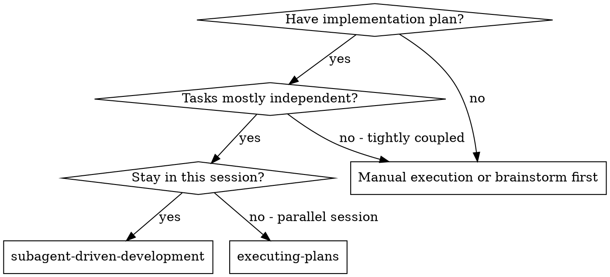
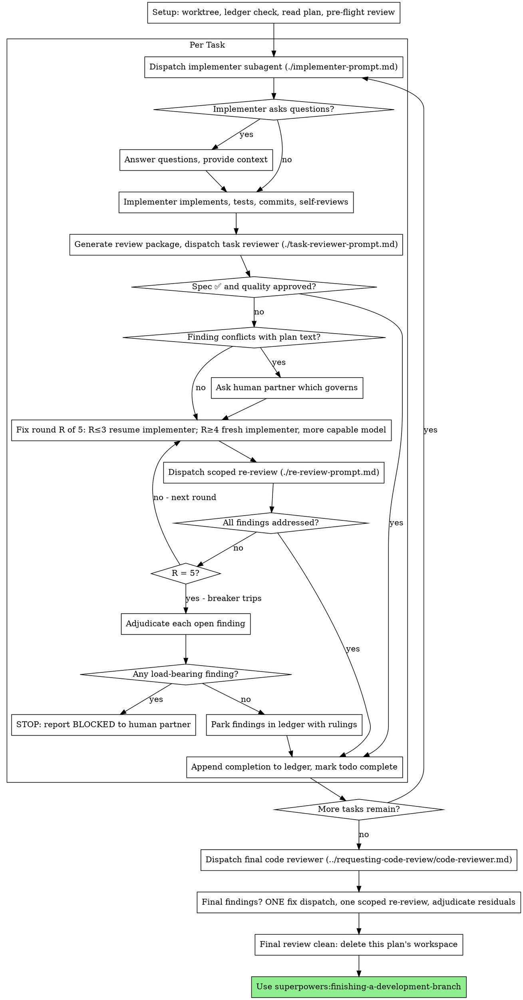

# Session transcript

## User

<local-command-caveat>Caveat: The messages below were generated by the user while running local commands. DO NOT respond to these messages or otherwise consider them in your response unless the user explicitly asks you to.</local-command-caveat>

## User

<command-name>/clear</command-name>
            <command-message>clear</command-message>
            <command-args></command-args>

## User

<local-command-caveat>Caveat: The messages below were generated by the user while running local commands. DO NOT respond to these messages or otherwise consider them in your response unless the user explicitly asks you to.</local-command-caveat>

## User

<command-name>/plan</command-name>
            <command-message>plan</command-message>
            <command-args></command-args>

## User

<local-command-stdout>Enabled plan mode</local-command-stdout>

## User

Read the function `main()` in `psh/cli.py`. Is there any code in that funciton that software engineering best
  practices dictate be refactored into their own functions, files, modules, or packages?  The goal is to have the code be understandable, properly structured, and maintainable; we **are not** trying to hit any arbitrary function-length or file size target.

### ⚙ Tool call: `Skill`

```json
{
  "skill": "andrej-karpathy-skills:karpathy-guidelines"
}
```

### ↳ Tool result

```
Launching skill: andrej-karpathy-skills:karpathy-guidelines
```

## User

Base directory for this skill: /home/node/.claude/plugins/cache/karpathy-skills/andrej-karpathy-skills/1.0.0/skills/karpathy-guidelines

# Karpathy Guidelines

Behavioral guidelines to reduce common LLM coding mistakes, derived from [Andrej Karpathy's observations](https://x.com/karpathy/status/2015883857489522876) on LLM coding pitfalls.

**Tradeoff:** These guidelines bias toward caution over speed. For trivial tasks, use judgment.

## 1. Think Before Coding

**Don't assume. Don't hide confusion. Surface tradeoffs.**

Before implementing:
- State your assumptions explicitly. If uncertain, ask.
- If multiple interpretations exist, present them - don't pick silently.
- If a simpler approach exists, say so. Push back when warranted.
- If something is unclear, stop. Name what's confusing. Ask.

## 2. Simplicity First

**Minimum code that solves the problem. Nothing speculative.**

- No features beyond what was asked.
- No abstractions for single-use code.
- No "flexibility" or "configurability" that wasn't requested.
- No error handling for impossible scenarios.
- If you write 200 lines and it could be 50, rewrite it.

Ask yourself: "Would a senior engineer say this is overcomplicated?" If yes, simplify.

## 3. Surgical Changes

**Touch only what you must. Clean up only your own mess.**

When editing existing code:
- Don't "improve" adjacent code, comments, or formatting.
- Don't refactor things that aren't broken.
- Match existing style, even if you'd do it differently.
- If you notice unrelated dead code, mention it - don't delete it.

When your changes create orphans:
- Remove imports/variables/functions that YOUR changes made unused.
- Don't remove pre-existing dead code unless asked.

The test: Every changed line should trace directly to the user's request.

## 4. Goal-Driven Execution

**Define success criteria. Loop until verified.**

Transform tasks into verifiable goals:
- "Add validation" → "Write tests for invalid inputs, then make them pass"
- "Fix the bug" → "Write a test that reproduces it, then make it pass"
- "Refactor X" → "Ensure tests pass before and after"

For multi-step tasks, state a brief plan:
```
1. [Step] → verify: [check]
2. [Step] → verify: [check]
3. [Step] → verify: [check]
```

Strong success criteria let you loop independently. Weak criteria ("make it work") require constant clarification.

### ⚙ Tool call: `Bash`

```json
{
  "command": "wc -l /workspace/psh/*.py /workspace/script_context.py",
  "description": "Count lines in psh modules"
}
```

### ↳ Tool result

```
     7 /workspace/psh/__init__.py
   433 /workspace/psh/charts.py
   991 /workspace/psh/cli.py
   230 /workspace/psh/configuration.py
   400 /workspace/psh/db.py
   269 /workspace/psh/dns_classify.py
   332 /workspace/psh/gateway.py
   668 /workspace/psh/gather.py
   611 /workspace/psh/lifecycle.py
   147 /workspace/psh/mail.py
   332 /workspace/psh/modules.py
   101 /workspace/psh/notice.py
   502 /workspace/psh/plans.py
    69 /workspace/psh/render.py
   357 /workspace/psh/traffic.py
   201 /workspace/script_context.py
  5650 total
```

### ⚙ Tool call: `Read`

```json
{
  "file_path": "/workspace/psh/cli.py"
}
```

### ↳ Tool result

```
1	"""The pantheon-sitehealth-emails orchestrator: argparse, main(), and the per-site pipeline.
2	
3	This is the program body -- the extension-less ./pantheon-sitehealth-emails shim sets
4	sc.options = parse_args() and calls main() here.  The modularization campaign carved the
5	gateway, config, db, traffic, plans, gather, charts, render, mail, and lifecycle layers
6	into sibling psh/ modules; this module orchestrates them and re-exports their public
7	surface so the test harness reaches every name as psh.<name> (see the re-export note below).
8	See development/2026-07-17-modularization-campaign/CAMPAIGN.md.
9	
10	TODO: add WordPress MU plugin check (report on anything except plugin)
11	"""
12	
13	import argparse
14	import calendar
15	import datetime
16	import os
17	import re
18	import signal  # noqa: F401 -- retained as the psh.signal.signal monkeypatch seam (CLAUDE.md § Two mock seams): abort_run's SIGINT guard moved to psh/lifecycle.py at I13, but test_abort_run.py patches the shared signal module object via psh.signal (SPEC I13 §5)
19	import subprocess  # noqa: F401 -- retained as the psh.subprocess.Popen monkeypatch seam (CLAUDE.md § Two mock seams): run_terminus lives in psh/gateway.py but tests patch the shared module object via psh.subprocess (the conftest psh fixture is this module, psh.cli); render's subprocess.run moved to psh/render.py at I12
20	import sys
21	import time  # noqa: F401 -- retained as the psh.time.sleep monkeypatch seam (CLAUDE.md § Two mock seams): the real time.sleep(5) lives in psh/gateway.py, but 13 tests patch the shared module object via psh.time (the conftest psh fixture is this module, psh.cli)
22	import tomllib
23	from email.utils import make_msgid
24	
25	import sqlalchemy as db  # noqa: F401 -- retained as the psh.db.* test seam (tests/conftest.py TempDB uses psh.db.create_engine / psh.db.orm.sessionmaker, which resolve to THIS alias on the psh.cli module, not the psh/db.py package): B10's last in-file use (db.create_engine/db.orm.sessionmaker) moved to psh.db.open_database at I13
26	from rich.markup import escape
27	from rich.padding import Padding
28	from rich.pretty import pprint
29	
30	import psh.dns_classify as dns_classify  # noqa: PLR0402 -- SPEC D-i14a-2 mandates this alias form: it keeps every qualified dns_classify.<attr> call site and the single-object monkeypatch seam byte-compatible
31	import script_context as sc
32	from psh.charts import build_chart
33	
34	# Re-export surface (SPEC D-i14a-3): the conftest `psh` fixture exposes THIS module's
35	# attributes as psh.<name>, so the whole former-psh._legacy public surface must stay
36	# importable from here.  Names main() does not itself use are marked F401-suppressed per
37	# line -- they are deliberate re-exports the harness reaches through the fixture, not dead imports.
38	from psh.configuration import (
39	    cloudflare_enabled,
40	    config_substitution,  # noqa: F401
41	    gate_disabled_sections,
42	    load_news_items,
43	    process_config,
44	    umich_enabled,
45	)
46	from psh.db import (
47	    Base,
48	    DatabaseUnavailableError,  # noqa: F401
49	    OverageProtectionRow,  # noqa: F401
50	    PantheonOverageProtection,  # noqa: F401
51	    PantheonTraffic,  # noqa: F401
52	    TrafficRow,  # noqa: F401
53	    db_engine_args,
54	    db_retry,
55	    db_retryable,  # noqa: F401
56	    insert_traffic_rows,  # noqa: F401
57	    load_overage_protection_window,  # noqa: F401
58	    load_traffic_rows,  # noqa: F401
59	    open_database,
60	    record_db_reconnect,  # noqa: F401
61	    update_traffic_rows,  # noqa: F401
62	)
63	from psh.gateway import (
64	    GatewayResult,  # noqa: F401
65	    TerminusError,
66	    drush,  # noqa: F401
67	    drush_error,
68	    drush_php_script,
69	    fix_drush_output,  # noqa: F401
70	    run_terminus,  # noqa: F401
71	    terminus,
72	    terminus_data,
73	    wp,  # noqa: F401
74	    wp_error,
75	    wp_eval,
76	)
77	from psh.gather import (
78	    DrupalGather,  # noqa: F401
79	    WordPressGather,  # noqa: F401
80	    build_smell_notices,
81	    check_drupal_module,
82	    check_wordpress_plugin,
83	    gather_drupal,
84	    gather_wordpress,
85	    wordpress_network_url,
86	)
87	from psh.lifecycle import (
88	    ResumeSiteNotFoundError,
89	    RunState,
90	    abort_reason,
91	    abort_run,
92	    finish_run,
93	    merge_prior_results,  # noqa: F401
94	    option_strings_taking_a_value,  # noqa: F401
95	    rerun_command,  # noqa: F401
96	    resume_command,  # noqa: F401
97	    resume_point,  # noqa: F401
98	    sites_from_resume_point,
99	)
100	from psh.mail import assemble_message, resolve_recipients, smtp_login
101	from psh.modules import (
102	    HookDagError,
103	    find_modules,  # noqa: F401
104	    import_packages,
105	    stuff_envs_contract,
106	    stuff_gather_contract,
107	    stuff_traffic_contract,
108	    validate_hooks,
109	)
110	from psh.notice import Notice, Severity, registry
111	from psh.plans import (
112	    PlanCatalog,
113	    PlanInfo,  # noqa: F401
114	    PlanRecommendation,  # noqa: F401
115	    build_plan_over_time,
116	    build_plan_recommendation_notice,  # noqa: F401
117	    contract_year_end,
118	    cost_table_columns,
119	    overage_blocks,  # noqa: F401
120	    plan_costs,  # noqa: F401
121	    recommend_plan,
122	    resolve_plan_name,
123	    stuff_plans_contract,
124	)
125	from psh.render import escape_url, render_report
126	from psh.traffic import (
127	    aggregate_visits_by_month,
128	    build_traffic_table_rows,
129	    estimate_month_visits,
130	    get_old_metrics,  # noqa: F401
131	    import_older_site_metrics,
132	    load_site_traffic,
133	    traffic_table_columns,
134	    update_site_traffic,
135	)
136	
137	fqdn_re = re.compile(r"^_?[a-z0-9-]+\.[a-z0-9.-]+$", re.IGNORECASE)
138	
139	
140	# Notice codes registered at import; see CLAUDE.md § Notices vs. news.
141	NOTICE_NO_DOMAINS = registry.register(
142	    "no-domains", description="paid plan with no custom domains connected")
143	NOTICE_NO_PRIMARY_DOMAIN = registry.register(
144	    "no-primary-domain", description="multiple custom domains, none primary")
145	
146	
147	# Expose helpers for check/ packages, which cannot import this dash-named script.
148	# Same convention as sc.plugin_context['plugin.cloudflare']['get_client']: shared state /
149	# callables travel via the sc module.  Tests monkeypatch these sc attributes when loading
150	# check modules standalone.  script_context gains these attributes at RUNTIME (assigned
151	# here), invisible to pyright, so each line carries a scoped reportAttributeAccessIssue
152	# ignore; the real guard is the test_documented_sc_facade_names_exist house-rule.
153	sc.escape_url = escape_url  # pyright: ignore[reportAttributeAccessIssue]
154	sc.check_wordpress_plugin = check_wordpress_plugin  # pyright: ignore[reportAttributeAccessIssue]
155	sc.check_drupal_module = check_drupal_module  # pyright: ignore[reportAttributeAccessIssue]
156	sc.umich_enabled = umich_enabled  # pyright: ignore[reportAttributeAccessIssue]
157	sc.cloudflare_enabled = cloudflare_enabled  # pyright: ignore[reportAttributeAccessIssue]
158	sc.terminus = terminus  # pyright: ignore[reportAttributeAccessIssue]  # check packages: Pantheon calls (e.g. domain:dns) go through this
159	sc.wp_eval = wp_eval  # pyright: ignore[reportAttributeAccessIssue]  # check packages: WP-CLI eval probes (check/wordpress ocp, favicon)
160	sc.wp_error = wp_error  # pyright: ignore[reportAttributeAccessIssue]  # check packages: WP command-failure notices
161	sc.drush_php_script = drush_php_script  # pyright: ignore[reportAttributeAccessIssue]  # check packages: drush php probes (check/drupal multisite, check/umich drupal_ua)
162	sc.drush_error = drush_error  # pyright: ignore[reportAttributeAccessIssue]  # check packages: drush command-failure notices
163	sc.contract_year_end = contract_year_end  # pyright: ignore[reportAttributeAccessIssue]  # check packages: U-M billing-window test (check/umich annual_billing)
164	sc.fqdn_re = fqdn_re  # pyright: ignore[reportAttributeAccessIssue]  # check packages: validate remote domain ids with the SAME regex
165	sc.db_engine_args = db_engine_args  # pyright: ignore[reportAttributeAccessIssue]  # plugin/umich/portal.py: ONE URL builder, ONE set of pool
166	                                    # settings for every database this program connects to
167	
168	
169	# Command-line argument parsing.  Building the parser is side-effect-free; parse_args()
170	# (which reads sys.argv) is invoked only by the extension-less ./pantheon-sitehealth-emails
171	# shim, so this module can be imported by the test harness without argv side effects.
172	# Every function reads sc.options (set by the caller) at call time, not at import time.
173	def build_arg_parser() -> argparse.ArgumentParser:
174	    args_parser = argparse.ArgumentParser(
175	        # Reject option abbreviations (e.g. `--for` resolving to `--for-real`, `--al` to
176	        # `--all`).  These are dangerous options; requiring the exact spelling is a safety guard.
177	        allow_abbrev=False,
178	        description="Send emails to website owners letting them know what their Pantheon traffic has been"
179	        "and make recommendations about whether/how they should change their current plan or"
180	        "the configuration of their site.",
181	    )
182	    args_parser.add_argument(
183	        "sites",
184	        metavar="SITE",
185	        nargs="*",
186	        help="a list of site names to process; if not specified, all sites in the Pantheon organization will be processed",
187	    )
188	    args_parser.add_argument(
189	        "--all",
190	        "-a",
191	        action="store_true",
192	        default=False,
193	        help="process all sites in the Pantheon organization",
194	    )
195	    args_parser.add_argument(
196	        "--resume-from",
197	        metavar="SITE_NAME",
198	        action="store",
199	        default=None,
200	        help="with --all, start the site loop at SITE_NAME (processing it and every site "
201	        "after it in sorted order); use to resume an --all run that died or was interrupted",
202	    )
203	    args_parser.add_argument(
204	        "--date",
205	        "-d",
206	        type=datetime.date.fromisoformat,
207	        default=datetime.date.today(),  # noqa: DTZ011 -- verbatim; the --date default is the operator's local calendar day, and a tz-aware default risks an off-by-one at midnight UTC (a behavior change a move may not make)
208	        help="generate the report as if it were this date (YYYYMMDD or YYYY-MM-DD); defaults to today",
209	    )
210	    args_parser.add_argument(
211	        "--update",
212	        action="store_true",
213	        default=False,
214	        help="just update the site visitors in the database, skipping the reports",
215	    )
216	    args_parser.add_argument(
217	        "--for-real",
218	        action="store_true",
219	        default=False,
220	        help="send email to the site owners; without this option, the emails will go to the logged-in user instead",
221	    )
222	    args_parser.add_argument(
223	        "--config",
224	        "-c",
225	        action="store",
226	        default="pantheon-sitehealth-emails.toml",
227	        help="TOML configuration file, see pantheon-sitehealth-emails.toml.sample",
228	    )
229	    args_parser.add_argument(
230	        "--only-warn",
231	        action="store_true",
232	        default=False,
233	        help="only check sites for warnings, do not generate reports or send emails",
234	    )
235	    args_parser.add_argument(
236	        "--allow-any-source-ip",
237	        action="store_true",
238	        default=False,
239	        help="skip the Cloudflare egress-IP allowlist check that normally runs before "
240	        "site cache checks ([Cloudflare.cachecheck])",
241	    )
242	    args_parser.add_argument(
243	        "--smtp-username",
244	        "-u",
245	        action="store",
246	        default=None,
247	        help="username for logging into the SMTP server to send mail "
248	        "(overrides [SMTP].username in the config file)",
249	    )
250	    args_parser.add_argument(
251	        "--create-tables",
252	        action="store_true",
253	        default=False,
254	        help="create the database tables and then stop, ignoring all other command line options",
255	    )
256	    args_parser.add_argument(
257	        "--import-older-metrics",
258	        action="store_true",
259	        default=False,
260	        help="load weekly and monthly Pantheon metrics into the database and then stop, "
261	        "ignoring all other command line options",
262	    )
263	    # Refreshing fqdns.json (the map of Cloudflare-proxied FQDNs) from the Cloudflare API is
264	    # handled by the cloudflare plugin.  --update-cloudflare-fqdns forces a refresh;
265	    # --no-update-cloudflare-fqdns suppresses the automatic stale-file refresh.  They are
266	    # contradictory, so make them mutually exclusive (argparse reports the conflict).
267	    cloudflare_fqdns_group = args_parser.add_mutually_exclusive_group()
268	    cloudflare_fqdns_group.add_argument(
269	        "--update-cloudflare-fqdns",
270	        action="store_true",
271	        default=False,
272	        help="force-refresh fqdns.json from Cloudflare before this run "
273	        "(requires the [Cloudflare] section to be enabled)",
274	    )
275	    cloudflare_fqdns_group.add_argument(
276	        "--no-update-cloudflare-fqdns",
277	        action="store_true",
278	        default=False,
279	        help="suppress the automatic refresh of a stale fqdns.json",
280	    )
281	    args_parser.add_argument(
282	        "--verbose",
283	        "-v",
284	        action="count",
285	        default=0,
286	        help="include extra information in the output",
287	    )
288	    return args_parser
289	
290	
291	def parse_args(argv=None):
292	    return build_arg_parser().parse_args(argv)
293	
294	
295	def no_primary_domain_notice(site, custom_domains, primary_domain, is_multisite) -> Notice | None:
296	    """Return the no-primary-domain info Notice, or None when it does not apply
297	    (BLOCKMAP B30; extracted at campaign I10 -- SPEC D-i10-3; rode to psh/cli.py with
298	    main() at I14a -- D-i13-1 discharged).
299	
300	    csv_extra is one EMPTY field: this row has always ended in a trailing comma, and the
301	    empty field is part of the historical -notices.csv shape (SPEC I14c §2.1)."""
302	    if (
303	        len(custom_domains) > 1
304	        and len(primary_domain) == 0
305	        and site["framework"] != "wordpress_network"
306	        and not is_multisite
307	    ):
308	        return Notice(
309	            severity=Severity.INFO,
310	            code=NOTICE_NO_PRIMARY_DOMAIN,
311	            csv_extra=("",),
312	            short="set a primary domain",
313	            html=f"""
314	                    <p><strong>{site["name"]}</strong>
315	                    <a href="https://dashboard.pantheon.io/sites/{site["id"]}#live/DomainsHTTPS/list">
316	                    does not have a primary domain set</a> in the Pantheon dashboard. Setting a
317	                    <a href="https://docs.pantheon.io/guides/redirect/primary-domain">primary domain</a> will improve SEO.
318	                    It will also increase the Cloudflare cache hit ratio, lowering Pantheon visitor numbers.</p>
319	                    <p><i>Do not set a primary domain if </i><strong>{site["name"]}</strong><i> is a multisite.</i></p>
320	                    """,
321	            text=f"""
322	                    {site["name"]} does not have a primary domain set
323	                    in the Pantheon dashboard.
324	                    <https://dashboard.pantheon.io/sites/{site["id"]}#live/DomainsHTTPS/list>
325	                    Setting a primary domain
326	                    <https://docs.pantheon.io/guides/redirect/primary-domain>
327	                    will improve SEO. It will also increase the Cloudflare
328	                    cache hit ratio, lowering Pantheon visitor numbers.
329	
330	                    DO NOT set a primary domain if {site["name"]} is a
331	                    multisite.
332	                    """,
333	        )
334	    return None
335	
336	
337	def sort_notices_and_subject(site_context, report):
338	    """B50 sort/subject core + billing-key wiring (pure; rode to psh/cli.py with main() at I14a -- D-i13-1 discharged).
339	
340	    Returns ``(sorted_notices, subject)``.  Reads the hook-produced billing key
341	    (`annual_bill_upcoming`, from check/umich/annual_billing) with ``.get()`` and inserts
342	    it into the render-only `sorted_notices` list -- it never enters
343	    ``site_context["notices"]``, so no -notices.csv rows (SPEC I12 §2.2).
344	    Preserved quirk: `annual_bill_upcoming` overrides the subject and is inserted at
345	    subject-computation time.
346	    """
347	    site_name = site_context["site"]["name"]
348	    sorted_notices = (
349	        [n for n in site_context["notices"] if n["type"] == "alert"]
350	        + [n for n in site_context["notices"] if n["type"] == "warning"]
351	        + [n for n in site_context["notices"] if n["type"] == "info"]
352	    )
353	    subject = f"{site_name}: {report}"
354	    # U-M-specific annual-billing subject + notice: the `annual_bill_upcoming` key exists iff
355	    # the upcoming hook was registered ([UMich].enabled) AND its window condition held
356	    # (end_of_contract_year) -- equivalent by construction to the old inline guard.
357	    if (upcoming := site_context.get("annual_bill_upcoming")) is not None:
358	        subject = f"Time Sensitive: {site_name} annual billing"
359	        sorted_notices.insert(0, upcoming)
360	    elif len(sorted_notices) > 0:
361	        if sorted_notices[0]["type"] == "alert":
362	            subject = f"Action Required: {site_name}: {sorted_notices[0]['short']} | {report}"
363	        elif sorted_notices[0]["type"] == "warning":
364	            subject = f"Action Recommended: {site_name}: {sorted_notices[0]['short']} | {report}"
365	        # no subject prefix for info notices
366	
367	    return sorted_notices, subject
368	
369	
370	def main() -> None:  # noqa: C901, PLR0912, PLR0915 -- moved verbatim (CAMPAIGN.md section 3.1: moves get no algorithmic redesign); main() orchestrates the whole per-site pipeline in one straight-line body
371	
372	    sc.debug(f"Loading configuration from {sc.options.config}")
373	    with open(sc.options.config, "rb") as f:  # noqa: PTH123 -- verbatim config read; pathlib migration is I14b+
374	        sc.config = tomllib.load(f)
375	
376	    # Drop the non-`enabled` settings of any disabled section BEFORE substitution resolution,
377	    # so a disabled feature's <{secret env ...}> values are never required to exist.
378	    sc.config = gate_disabled_sections(sc.config)
379	
380	    sc.plugin = import_packages("plugin")
381	
382	    sc.debug("Doing pre-setup configuration substitutions")
383	    sc.config = process_config(sc.config)
384	
385	    sc.check = import_packages("check")
386	
387	    # All modules are loaded; every hook is registered -- registration happens at package
388	    # import time (each __init__.py self-registers as import_packages() imports it), so
389	    # validate_hooks() below runs ONCE after both import loops.  Validate the consumes/produces
390	    # DAG before anything runs (CAMPAIGN.md section 4) -- a bad declaration is a startup fatal,
391	    # not a mid-run surprise; a hook somehow registered later (no in-repo case exists) would
392	    # bypass DAG conditions 1-4, with only add_hook's own declaration check firing.
393	    try:
394	        validate_hooks()
395	    except HookDagError as e:
396	        sc.console.print(f"[bold red]ERROR: hook validation failed: {escape(str(e))}")
397	        sys.exit(1)
398	
399	    # Validate and process arguments.  The --resume-from guards come first: the create-tables and
400	    # sites-or-all checks below both exit before they would be reached, shadowing these more
401	    # precise messages.  --create-tables never runs the site loop, so a --resume-from on it would
402	    # be silently dropped; reject it instead.
403	    if sc.options.resume_from is not None:
404	        if sc.options.create_tables:
405	            sys.exit(
406	                "The --resume-from and --create-tables options are mutually exclusive."
407	            )
408	        if not sc.options.all:
409	            sys.exit("--resume-from can only be used together with --all.")
410	
411	    if sc.options.create_tables:
412	        if sc.options.import_older_metrics:
413	            sys.exit(
414	                "The --import-older-metrics and --create-tables options are mutually exclusive."
415	            )
416	        sc.options.verbose = 3  # force verbose output
417	    elif (sc.options.all and len(sc.options.sites) != 0) or (
418	        not sc.options.all and len(sc.options.sites) == 0
419	    ):
420	        sys.exit("You must specify either at least one site or the --all option.")
421	
422	    # --update-cloudflare-fqdns only does anything with the Cloudflare plugin enabled; refuse it
423	    # otherwise rather than silently doing nothing.  (Gate on config, not `"plugin.cloudflare" in
424	    # sc.plugin`: every plugin package is imported regardless of `enabled`.)
425	    if sc.options.update_cloudflare_fqdns and not sc.config.get("Cloudflare", {}).get("enabled"):
426	        sys.exit(
427	            "--update-cloudflare-fqdns requires the [Cloudflare] section to be enabled in the config."
428	        )
429	
430	    if sc.options.verbose:
431	        sc.debug("Arguments:")
432	        pprint(sc.options)
433	        self_info, _errors, _fatal = terminus("self:info")
434	        pprint(self_info)
435	
436	    # Create a directory named "build" if it doesn't exist:
437	    if not os.path.exists("build"):  # noqa: PTH110 -- verbatim build/ setup; pathlib migration is I14b+
438	        os.makedirs("build")  # noqa: PTH103 -- verbatim build/ setup; pathlib migration is I14b+
439	
440	    # The run's accumulators live on ONE RunState, bound to sc.run_state BEFORE any hook fires:
441	    # a setup hook that reached db_retry would otherwise write into a RunState main() then
442	    # discards (SPEC 2.1).  db_retry() writes the reconnect counters through sc.run_state; the
443	    # site loop below fills the rest; finish_run/abort_run read it back as a parameter.
444	    sc.run_state = RunState()
445	    run_state = sc.run_state
446	
447	    sc.invoke_hooks("setup")
448	
449	    sc.debug("Doing post-setup configuration substitutions")
450	    sc.config = process_config(sc.config, deferred_pass=True)
451	    if sc.options.verbose:
452	        sc.debug("Configuration after substitutions:")
453	        pprint(sc.config)
454	
455	    overage_block_size = sc.config["Pantheon"]["overage_block_size"]
456	    overage_block_cost = sc.config["Pantheon"]["overage_block_cost"]
457	
458	    sc.debug(
459	        "[bold magenta]=== Connecting to the [green]pantheon-sitehealth-emails[/green] traffic database:"
460	    )
461	
462	    db_engine, db_session = open_database(
463	        sc.config["Database"], echo=sc.options.verbose >= 2  # noqa: PLR2004 -- verbatim; 2 is the -vv level (echo SQL), not a constant worth naming
464	    )
465	
466	    if sc.options.create_tables:
467	        Base.metadata.create_all(db_engine)
468	        sys.exit("Tables created.")
469	
470	    with open("header-image.png", "rb") as img:  # noqa: PTH123 -- verbatim asset read; pathlib migration is I14b+
471	        wordmark_image = img.read()
472	
473	    load_news_items()
474	    if sc.options.verbose:
475	        sc.debug("[bold magenta]=== News:")
476	        pprint(sc.news)
477	
478	    catalog = PlanCatalog.from_config(
479	        sc.config["Pantheon"],
480	        overage_block_size=overage_block_size,
481	        overage_block_cost=overage_block_cost,
482	    )
483	    # Aliases for readability; the chart (I11) and annual-billing (I12) regions read the
484	    # raw normalized dict.
485	    plan_info = catalog.plan_info
486	    plan_names = catalog.plan_names
487	
488	    end_date = sc.options.date
489	    start_date = end_date.replace(
490	        day=1, year=end_date.year - 1
491	    )  # fist day of the same month last year
492	    end_of_contract_year = contract_year_end(end_date)
493	    sc.debug(f"Generating report for {start_date} through {end_date}")
494	
495	    try:
496	        sites = terminus_data("org:site:list", sc.config["Pantheon"]["org_id"])
497	    except TerminusError as e:
498	        sys.exit(f"Could not list organization sites: {e}")
499	    site_count = len(sites)
500	    current_site_number = 1
501	    sc.debug(
502	        "Cloudflare is "
503	        + ("[bold green]enabled" if cloudflare_enabled() else "[bold red]DISABLED")
504	    )
505	    smtp_enabled = bool(sc.config.get("SMTP", {}).get("enabled"))
506	    sc.debug(
507	        "SMTP sending is "
508	        + ("[bold green]enabled" if smtp_enabled else "[bold red]DISABLED")
509	    )
510	    site_name_to_id = {site["name"]: site_id for (site_id, site) in sites.items()}
511	    sc.debug(site_name_to_id)
512	
513	    # Sites are processed in sorted order, so --resume-from can drop the prefix of sites that
514	    # an interrupted run already handled.  Filtering here (rather than `continue`ing inside the
515	    # loop) means a skipped-over site does no work at all: no banner, no plan:info, no context.
516	    site_names = sorted(site_name_to_id.keys())
517	    if sc.options.resume_from is not None:
518	        try:
519	            site_names = sites_from_resume_point(site_names, sc.options.resume_from)
520	        except ResumeSiteNotFoundError:
521	            sys.exit(
522	                f"--resume-from: site '{sc.options.resume_from}' was not found among the "
523	                f"{len(site_names)} sites for org {sc.config['Pantheon']['org_id']}."
524	            )
525	        sc.console.print(
526	            f"[bold magenta]=== Resuming from [bold]{sc.options.resume_from}[/bold] "
527	            f"({len(site_names)} of {site_count} sites remaining)"
528	        )
529	
530	    site_name = None
531	    site_emailed = False
532	    try:
533	        for site_name in site_names:
534	            site_emailed = False
535	            site_id = site_name_to_id[site_name]
536	            site = sites[site_id]
537	            wp_smell = ""
538	            drush_smell = ""
539	            composer_smell = ""
540	            portal_site_id = 0
541	            if umich_enabled():
542	                if site["name"] not in sc.config["UMich"]["portal"]["sites"]:
543	                    sc.console.print(
544	                        f":exclamation: [bold red] ATTENTION: {site['name']} is not in the WWS portal!"
545	                    )
546	                    continue
547	                portal_site_id = sc.config["UMich"]["portal"]["sites"][site["name"]]["id"]
548	
549	            if not sc.options.all and site["name"] not in sc.options.sites:
550	                sc.debug(
551	                    f"[bold magenta]=== Skipping site {site['name']} (not in list of sites to process)",
552	                    level=2,
553	                )
554	                continue
555	            sc.console.print(
556	                "\n",
557	                Padding(
558	                    f"Pantheon site {current_site_number} of {site_count}: [bold]{site['name']}[/bold]",
559	                    1,
560	                    style="white on blue",
561	                ),
562	                "\n",
563	            )
564	            current_site_number += 1
565	
566	            plan_name = resolve_plan_name(site)
567	            if plan_name is None:
568	                continue
569	            site["plan_name"] = plan_name
570	            site_current_plan = site["plan_name"]
571	
572	            if site["plan_name"] == "Sandbox":
573	                sc.console.print(f"{site['name']} is on the Sandbox plan, skipping it.")
574	                continue
575	
576	            # This site will be processed: build its context as far up as possible (past the
577	            # portal / not-requested / Sandbox skips above).  notices/sections/attachments
578	            # accumulate into it through the pipeline below.
579	            site_context = sc.SiteContext(site)
580	
581	            if site["plan_name"] not in plan_names:
582	                sc.console.print(
583	                    f":exclamation: [bold red] ATTENTION: {site['name']} "
584	                    f"is on an unknown plan: {site['plan_name']}"
585	                )
586	                sys.exit("Bailing out.")
587	
588	            # From https://docs.pantheon.io/guides/account-mgmt/traffic/overages
589	            # FAQ 1 as of April 25, 2024:
590	            # "Only traffic for the Live environment is counted towards a site plan's traffic limit."
591	
592	            # The live environment will always exist, but may not be initialized.
593	            envs, errors, fatal = terminus(
594	                "env:list",
595	                site["id"],
596	                "--fields=id,created,domain,connection_mode,locked,initialized,php_version,php_runtime_generation",
597	            )
598	            if fatal or envs is None:
599	                # Transient/undecodable failure: skip this site, don't abort the whole run.
600	                sc.console.print(
601	                    f":exclamation: [bold red] ERROR: could not fetch environments for {site_name}: {escape(errors)}"
602	                )
603	                continue
604	            if "live" not in envs or "initialized" not in envs["live"]:
605	                sc.console.print(
606	                    f":exclamation: [bold red] ERROR: {site['name']} does not have a live environment, "
607	                    "this should never happen"
608	                )
609	                sys.exit("Bailing out.")
610	
611	            # Metrics for an uninitialized live environment will be all zeroes; this is OK.
612	
613	            live_site = site["id"] + ".live"
614	            if not update_site_traffic(db_session, site, live_site, start_date, end_date):
615	                continue
616	
617	            if sc.options.import_older_metrics:
618	                import_older_site_metrics(db_session, site, live_site, end_date)
619	                continue  # skip the rest of the processing for the sites
620	
621	            if sc.options.update:
622	                sc.console.print("site visitors updated, skipping report")
623	                continue
624	
625	            results = load_site_traffic(db_session, site, start_date, end_date)
626	
627	            stuff_envs_contract(site_context, envs)
628	            sc.invoke_hooks("site_pre", site_context)
629	
630	            # Per-phase data contract (see CLAUDE.md "Per-site report pipeline"): the traffic
631	            # window is guaranteed populated from site_post_traffic onward.
632	            stuff_traffic_contract(site_context, results, start_date, end_date)
633	            sc.invoke_hooks("site_post_traffic", site_context)
634	
635	            # The set of Cloudflare-proxied FQDNs (fqdns.json) is fetched-or-loaded once, before this
636	            # loop, by the cloudflare plugin's update_and_load_proxied_fqdns setup hook; read it from
637	            # plugin_context here.  Only consulted below under `if cloudflare_enabled` (which is where
638	            # the plugin_context bag exists).
639	
640	            # Query Pantheon for the site's domains
641	            domains, errors, fatal = terminus("domain:list", live_site)
642	            if fatal or domains is None:
643	                sc.console.print(
644	                    f":exclamation: [bold red] ERROR: could not fetch domains for {site_name}: {escape(errors)}"
645	                )
646	                continue
647	            if sc.options.verbose:
648	                sc.debug(f"=== Domains for {site['name']}:")
649	                pprint(domains)
650	            site_url = ""
651	            # Resolve the Cloudflare gate and its plugin_context bag once (the bag's net/proxied
652	            # keys exist only when [Cloudflare] is enabled).
653	            cf_on = cloudflare_enabled()
654	            cf_ctx = sc.plugin_context["plugin.cloudflare"] if cf_on else {}
655	            facts = dns_classify.classify_domains(
656	                domains,
657	                cf_on,
658	                cf_ctx["cloudflare_ipv4_nets"] if cf_on else [],
659	                cf_ctx["cloudflare_ipv6_nets"] if cf_on else [],
660	                cf_ctx["proxied_fqdns"] if cf_on else {},
661	                cf_ctx.get("fqdn_zone_conflicts", {}) if cf_on else {},
662	                fqdn_re,
663	            )
664	            main_fqdn = facts.main_fqdn
665	            custom_domains = facts.custom_domains
666	            primary_domain = facts.primary_domain
667	            if isinstance(domains, dict):  # noqa: SIM102 -- NOT merged with the nested if: the body is a moved-verbatim Notice whose html/text f-strings carry golden-pinned column-16 leading whitespace (three e2e goldens); collapsing the ifs would dedent that literal and change the rendered email (Invariant 8)
668	                if len(custom_domains) == 0:
669	                    site_context.add_notice(
670	                        Notice(
671	                            severity=Severity.ALERT,
672	                            code=NOTICE_NO_DOMAINS,
673	                            short="no domains connected",
674	                            html=f"""
675	                <p>{site["name"]} is on a paid plan but does not have any custom domains connected.  Either connect
676	                a domain through which people will access the site or downgrade the site's plan to Sandbox to save
677	                money.</p>
678	                """,
679	                            text=f"""
680	                {site["name"]} is on a paid plan but does not have
681	                any custom domains connected. Either connect a domain through
682	                which people will access the ste or downgrade the site's plan
683	                to Sandbox to save money.
684	                """,
685	                        )
686	                    )
687	
688	            # Per-phase data contract (see CLAUDE.md): publish the DnsFacts via the pure helper
689	            # (unit-tested against value-swaps in test_dns_classify.py), then fire the phase. The
690	            # check.dns hook consumes these keys to emit the DNS-resolution notices.
691	            dns_classify.stuff_dns_contract(site_context, domains, facts)
692	            sc.invoke_hooks("site_post_dns", site_context)
693	
694	            # The Drupal multisite probe (was B30, inline here) moved to
695	            # check/drupal/multisite.py, a site_post_dns hook -- its produced keys are
696	            # DAG-declared, not contract-guaranteed (CLAUDE.md, CAMPAIGN.md section 4
697	            # amendment 2), so read with .get() (campaign I10, SPEC D-i10-3).
698	            probe_smell = site_context.get("drupal_multisite_smell", "")
699	            if probe_smell != "":
700	                drush_smell = probe_smell
701	            notice = no_primary_domain_notice(
702	                site, custom_domains, primary_domain, site_context.get("drupal_multisite", False)
703	            )
704	            if notice is not None:
705	                site_context.add_notice(notice)
706	
707	            if main_fqdn != "":
708	                site_url = f"https://{main_fqdn}/"
709	
710	            if site["framework"] == "wordpress_network":
711	                network_url, network_smell = wordpress_network_url(site, live_site, site_context)
712	                if network_smell != "":
713	                    wp_smell = network_smell
714	                if network_url is not None:
715	                    site_url = network_url
716	
717	            sc.debug(f"Main domain for {site['name']}: {main_fqdn}")
718	            sc.debug(f"Site URL for {site['name']}:    {site_url}")
719	
720	            # Check the site's plugins/modules
721	
722	            # Initialized before the framework branch so the site_post_gather data-contract
723	            # stuffing below the chain is unconditional (None = not that framework, or the
724	            # gather failed):
725	            plugins = None
726	            mods = None
727	            wordpress_version = None
728	            drupal_version = None
729	
730	            add_on_updates = []
731	            if site["framework"].startswith("wordpress"):
732	                gather = gather_wordpress(site, live_site, site_context)
733	                wordpress_version = gather.wordpress_version
734	                plugins = gather.plugins
735	                add_on_updates = gather.add_on_updates
736	                if gather.wp_smell != "":
737	                    wp_smell = gather.wp_smell
738	                run_state.site_results[site["name"]] = gather.results_entry
739	
740	            elif site["framework"].startswith("drupal"):
741	                gather = gather_drupal(site, live_site, site_context)
742	                drupal_version = gather.drupal_version
743	                mods = gather.modules
744	                add_on_updates = gather.add_on_updates
745	                if gather.drush_smell != "":
746	                    drush_smell = gather.drush_smell
747	                if gather.composer_smell != "":
748	                    composer_smell = gather.composer_smell
749	                run_state.site_results[site["name"]] = gather.results_entry
750	
751	            else:
752	                sc.console.print(
753	                    f":exclamation: [bold red] ATTENTION: unknown framework for {site['name']}: {site['framework']}"
754	                )
755	                run_state.site_results[site["name"]] = {
756	                    "framework": site["framework"],
757	                    "version": "unknown",
758	                    "plan_name": site["plan_name"],
759	                }
760	
761	            # Per-phase data contract (see CLAUDE.md): WP/Drush gather results are guaranteed
762	            # present from site_post_gather onward.
763	            stuff_gather_contract(site_context, site["framework"], site_url,
764	                                  wordpress_version, plugins, drupal_version, mods,
765	                                  add_on_updates, wp_smell, drush_smell, composer_smell)
766	            sc.invoke_hooks("site_post_gather", site_context)
767	
768	            # TODO: Warn if no Autopilot
769	
770	            visits_by_month, plan_on_day = aggregate_visits_by_month(
771	                results, start_date, end_date
772	            )
773	            if sc.options.verbose:
774	                pprint(visits_by_month)
775	                if sc.options.verbose > 1:
776	                    pprint(plan_on_day)
777	
778	            # Create a list of time ranges when the site was on each plan
779	            last_day = calendar.monthrange(end_date.year, end_date.month)[1]
780	            plot_right_date = end_date.replace(day=last_day)
781	            if not plan_on_day:
782	                # A brand-new site with no traffic history yet.  Rather than dropping the whole
783	                # report -- which would silently discard any alerts already gathered above
784	                # (frozen, not-in-DNS, missing security/cache plugins, ...) and never email the
785	                # owner -- seed a single synthetic plan-day at the report end date.  That gives
786	                # the chart/plan code a non-empty plan_on_day (no IndexError, P10) and, because
787	                # it counts as one in-window month, the report renders in the normal "not enough
788	                # data yet" state (median_visitors stays 0) while still delivering the alerts.
789	                sc.console.print(
790	                    f":mag: No traffic recorded yet for {site_name}; rendering the "
791	                    f'"not enough data" report with any alerts.'
792	                )
793	                plan_on_day = {end_date: site_current_plan}
794	
795	            # noinspection PyTypeChecker
796	            days = sorted(plan_on_day.keys())
797	            plan_over_time = build_plan_over_time(plan_on_day, plot_right_date)
798	            sc.debug(plan_over_time)
799	
800	            # Convert the keys of the visits_by_month dictionary to datetime objects
801	            dates = [datetime.date.fromisoformat(d + "-15") for d in visits_by_month]
802	
803	            # Estimate the visits for the last month if it isn't over yet:
804	            estimate = estimate_month_visits(visits_by_month, dates, last_day, end_date.day)
805	
806	            first_plan_day = days[0]
807	            last_plan_day = days[-1]
808	            site_plan_start = plan_over_time[0]["start"].replace(day=1)
809	
810	            sc.debug("[bold magenta]=== Creating the traffic table:")
811	
812	            # TODO: for upgrade/downgrade and new plan columns, add an icon and a colored background so people can
813	            #   see at a glance if it's more or less than 50% of the time.
814	
815	            # TODO: If Performance small and below Basic upgrade + no New Relic + No Solr + No Redis + mem usage low --> Switch to Basic
816	
817	            traffic_table_rows = db_retry(
818	                db_session,
819	                lambda: build_traffic_table_rows(
820	                    db_session,
821	                    site,  # noqa: B023 -- lambda is invoked synchronously by db_retry within this iteration; no deferred capture (verbatim body, no redesign)
822	                    visits_by_month,  # noqa: B023 -- see above
823	                    plan_on_day,  # noqa: B023 -- see above
824	                    plan_info,
825	                    site_plan_start,  # noqa: B023 -- see above
826	                    first_plan_day,  # noqa: B023 -- see above
827	                    last_plan_day,  # noqa: B023 -- see above
828	                    start_date,
829	                    end_date,
830	                    overage_block_size,
831	                    overage_block_cost,
832	                ),
833	                what=f"building the traffic table for {site['name']}",
834	                site=site["name"],
835	            )
836	
837	            sc.debug(traffic_table_rows)
838	
839	            # Build the traffic table (which persists+commits this run's overage-protection
840	            # rows) BEFORE the recommendation, so recommend_plan's op-window read sees them --
841	            # otherwise the first render of a report, with no prior OP rows, recommends against
842	            # a different cost table than every later render (campaign I7 final review).
843	            # Then compare current-plan cost to the other plans (psh.plans.recommend_plan),
844	            # still before the --only-warn gate so warning-only runs include the recommendation
845	            # (D7, campaign I7).
846	            rec = recommend_plan(
847	                db_session,
848	                site,
849	                catalog,
850	                visits_by_month,
851	                site_plan_start,
852	                estimate,
853	                start_date,
854	                end_date,
855	                portal_site_id,
856	                site_context,
857	            )
858	            site_recommended_plan = rec.recommended_plan
859	            site_current_plan_index = rec.current_plan_index
860	            site_recommended_plan_index = rec.recommended_plan_index
861	            median_visitors = rec.median_visitors
862	            cost_table_rows = rec.cost_table_rows
863	            months_until_recommendations = rec.months_until_recommendations
864	            estimate_start_date = rec.estimate_start_date
865	            estimate_end_date = rec.estimate_end_date
866	            if rec.savings_entry is not None:
867	                run_state.site_savings.append(rec.savings_entry)
868	
869	            if sc.options.only_warn:
870	                for n in site_context["notices"]:
871	                    run_state.all_warnings.append(n["csv"])
872	                continue
873	
874	            chart_image = build_chart(
875	                site, site_url, visits_by_month, plan_on_day, plan_info,
876	                plan_over_time, dates, estimate, first_plan_day, last_plan_day,
877	                start_date, end_date, plot_right_date,
878	            )
879	
880	            site_context.add_notices(
881	                build_smell_notices(site["name"], site_context["wp_smell"],
882	                                    site_context["drush_smell"],
883	                                    site_context["composer_smell"])
884	            )
885	
886	            sc.debug("===== Notices:\n", site_context["notices"])
887	            sc.debug("===== Sections:\n", site_context["sections"])
888	
889	            resolved = resolve_recipients(site, site_id)
890	            if resolved is None:
891	                continue
892	            recipients, contacts = resolved
893	
894	            stuff_plans_contract(
895	                site_context,
896	                site_current_plan,
897	                site_recommended_plan,
898	                {"same": rec.cost_same, "median": rec.costs_median,
899	                 "best": rec.costs_best}
900	                if rec.cost_same
901	                else {},
902	                rec.savings,
903	            )
904	
905	            # Last per-site seam before rendering (full-report path only; --only-warn continued
906	            # above).  check.umich.annual_billing's hook runs here, producing the billing
907	            # key the sort/subject helper wires in below; other future hooks may add notices.
908	            sc.invoke_hooks("site_pre_render", site_context)
909	
910	            # Sort + subject AFTER the phase (campaign I12): hooks that add notices now
911	            # render, and the billing hook's produced key is wired in by the helper.
912	            report = f"Pantheon Traffic Report, {end_date.strftime('%b %e, %Y')}"
913	            sorted_notices, subject = sort_notices_and_subject(site_context, report)
914	
915	            banner_cid = make_msgid(domain=sc.msgid_domain())
916	            chart_cid = make_msgid(domain=sc.msgid_domain())
917	
918	            template_dict = dict(  # noqa: C408 -- verbatim; the kwargs dict() form is preserved from the pre-move main() (CAMPAIGN.md section 3.1: no redesign for moves); a {...} rewrite would churn 28 lines of a golden-pinned block for no behavior change
919	                dry_run_recipient="" if sc.options.for_real else recipients,
920	                subject=subject,
921	                site_name=site["name"],
922	                site_url=site_url,
923	                portal_site_id=portal_site_id,
924	                current_plan=site_current_plan,
925	                recommended_plan=site_recommended_plan,
926	                current_plan_index=site_current_plan_index,
927	                recommended_plan_index=site_recommended_plan_index,
928	                traffic_table_columns=traffic_table_columns,
929	                traffic_table_rows=traffic_table_rows,
930	                cost_table_columns=cost_table_columns,
931	                cost_table_rows=cost_table_rows,
932	                traffic_date=end_date.strftime("%B %e, %Y"),
933	                current_month_estimate=f"Estimate for Pantheon visitors at the end of {end_date.strftime('%B %Y')}: "
934	                f"{estimate:,.0f}"
935	                if estimate >= 0
936	                else "",
937	                median_monthly_visitors=f"{median_visitors:,.0f}",
938	                months_until_recommendations=months_until_recommendations,
939	                estimate_start_date=estimate_start_date.strftime("%B %e, %Y"),
940	                estimate_end_date=estimate_end_date.strftime("%B %e, %Y"),
941	                notices=sorted_notices,
942	                news=sc.news,
943	                sections=site_context["sections"],
944	                end_of_contract_year=end_of_contract_year,
945	                banner_cid=banner_cid[1:-1],
946	                chart_cid=chart_cid[1:-1],
947	            )
948	
949	            html_body, text_body = render_report(site["name"], template_dict)
950	
951	            msg = assemble_message(
952	                subject, recipients, text_body, html_body, wordmark_image, chart_image,
953	                banner_cid, chart_cid, site_context["attachments"], site["name"], end_date,
954	            )
955	
956	            # BEFORE the send -- see RunState.record_site_notices (Invariant 4).
957	            run_state.record_site_notices(site_context["notices"], contacts)
958	
959	            # The send is gated on [SMTP].enabled; when disabled we still write the .eml above.
960	            if smtp_enabled:
961	                smtp_connection = smtp_login()
962	                smtp_connection.send_message(msg)
963	                run_state.emails_sent += 1
964	                site_emailed = True
965	                smtp_connection.quit()
966	
967	            # TODO: % Pages Cached -- should be Cloudflare
968	            # TODO: CSV attachment
969	    except BaseException as e:  # noqa: BLE001 -- DELIBERATE; see the comment below and CLAUDE.md § Database
970	        # ONE flush path for every way out of the site loop, because finish_run() is the only
971	        # writer of the run's artifacts and main() has no `finally`.  Enumerating exception classes
972	        # is what let an SMTP hiccup on site 250 of 300, a php inliner failure, a SystemExit
973	        # ("Bailing out.") or a KeyError from changed terminus JSON discard 249 sites' work.
974	        #
975	        # Only the OUTCOME differs by class, and that is what `reason` selects: a database failure
976	        # exits 1, an interrupt exits 130, and everything else is re-raised by abort_run() with its
977	        # traceback (or its SystemExit code and message) intact.  Nothing is swallowed.
978	        #
979	        reason = abort_reason(e)
980	        abort_run(
981	            db_session, db_engine, site_name, reason, e,
982	            emailed=site_emailed,
983	            site_names=site_names, site_count=site_count, run_state=run_state,
984	        )
985	
986	    finish_run(
987	        db_session,
988	        db_engine,
989	        site_count,
990	        run_state,
991	    )
992
```

## Assistant

Read `main()` in full. Before I form recommendations, let me pull the constraints the campaign record placed on it and the current test surface.

### ⚙ Tool call: `Agent`

```json
{
  "subagent_type": "Explore",
  "description": "Campaign docs on main() residue",
  "run_in_background": false,
  "prompt": "In /workspace, read the modularization-campaign record under development/2026-07-17-modularization-campaign/ (CAMPAIGN.md, LEDGER.md, BLOCKMAP.md, CLOSING-AUDIT.md, RETROSPECTIVE.md).\n\nI need to know, specifically and with verbatim quotes + file:line citations:\n\n1. What code the campaign DELIBERATELY left inside `main()` (psh/cli.py) and the stated reason for each. In particular anything about: the send block, the smell-notice emission, the `--only-warn` gate, the argument-validation block, the site loop itself, the `except BaseException` handler, `site_emailed`/`site_name` and the abort path.\n2. Any explicitly recorded \"future work\" / \"not done\" / \"deferred\" items that concern main() or psh/cli.py — e.g. pathlib migration (I14b+), further extraction, anything the CLOSING-AUDIT or RETROSPECTIVE names as remaining.\n3. The frozen INVARIANTS list (CAMPAIGN.md) — quote each invariant number and text, especially any that constrain moving code out of main() (golden byte-identity, f-string column-0 literals, counter-update ordering, etc.).\n4. Whether CAMPAIGN.md states rules about *how* extractions must be done (e.g. \"moves get no algorithmic redesign\", section 3.1) and whether the campaign being \"complete\" forbids or permits new extraction increments.\n5. Anything about `RunState` and what is/isn't allowed to live on it, and CAMPAIGN.md §3.4's bar on module-level mutable state in psh/.\n\nReport findings as a structured list with quotes. Do not summarize away the exact wording — I need the verbatim text of the constraints."
}
```

### ⚙ Tool call: `Agent`

```json
{
  "subagent_type": "Explore",
  "description": "Test surface around main()",
  "run_in_background": false,
  "prompt": "In /workspace, investigate the TEST surface around `main()` in psh/cli.py. Be thorough and cite file:line.\n\n1. Which tests call `psh.cli.main()` in-process (if any), and which drive it via subprocess (`run_program()` in tests/conftest.py)? List them.\n2. What does tests/conftest.py's `run_program()` forbid (ForbiddenFlagError / ForbiddenLiveDataError) and what does that make UNTESTABLE about main()? Specifically: can any test today exercise the `--resume-from` + `--create-tables` mutual-exclusion error, the \"You must specify either at least one site or the --all option\" error, or the `--update-cloudflare-fqdns requires [Cloudflare] enabled` error? Quote the interlock code.\n3. Which blocks of main() have NO test coverage at all today (the startup/bootstrap sequence, the argument validation, the site-list/resume-filter block, the per-site skip gates, the template_dict build)? Distinguish \"covered only indirectly by the 4 e2e goldens\" from \"not covered\".\n4. Existing precedent for extracted helpers' shapes in psh/: list the NamedTuple/dataclass return types (WordPressGather, DrupalGather, GatewayResult, DnsFacts, PlanRecommendation, RunState, TrafficRow...) with their field lists, and where each is defined. I want to know the house pattern for \"extract a block that produces many locals\".\n5. How do the existing per-module tests construct a SiteContext and patch seams (tests/integration/test_gather_wordpress.py, test_check_pantheon.py)? Give a short representative snippet.\n6. Are there existing unit tests for psh.cli-level pure helpers (`no_primary_domain_notice`, `sort_notices_and_subject`)? Where do they live and what shape are they? This tells me what a newly-extracted helper's test would look like.\n\nReport with concrete file paths, line numbers, and short quotes."
}
```

### ↳ Tool result

```
## 1. Code deliberately left inside `main()` (`psh/cli.py`) — the stay-list and its reasons

### The frozen stay-list itself — CAMPAIGN.md §3.3

`/workspace/development/2026-07-17-modularization-campaign/CAMPAIGN.md:159-169`, verbatim and complete:

> ### 3.3 What stays in `main()` (exhaustive, with why)
>
> Config/arg bootstrap ordering (B1–B8 — the two-pass substitution *order* is the
> program); overage constants + date window (B9, B13 part); the site-loop skeleton (skips,
> banner, sorted order, resume filter — B14–B18, B20, B25, B42); phase firing and contract
> stuffing (B27, B28, B31, B37, B52); the B48 smell-notice *emission* call (the builder
> moved to `psh/gather.py` at I10, but the emission summarizes end-of-phase smell state no
> hook position can guarantee under the D-i9-3 rebind design, and it must stay behind the
> `--only-warn` gate — LEDGER I10 amendment 1); notice sort + subject (B50 minus billing);
> the `try`/`except BaseException` lifecycle dispatch (B59–B60 call sites). Everything else
> leaves. Target: 250–400 lines.

Note that §3.3's parenthesis "(B14–B18, B20, B25, B42)" makes **B42 = the `--only-warn` gate** and **B5 = arg validation** (via B1–B8) part of the exhaustive stay-list.

### Per item

**(a) The smell-notice emission (B48).**
CAMPAIGN.md:150-157:

> The B48 smell notices are **not** a `check/addon_updates/` hook (LEDGER I10 amendment 1):
> their *builder* (`build_smell_notices`) moves to `psh/gather.py`, but the *emission* stays
> in `main()`. A `site_post_gather` smells hook cannot be ordered after the
> `wp_smell`/`drush_smell` in-place mutators — a `produces: ['wp_smell']` declaration is a
> condition-2 fatal against the core registry (D-i9-3), and alphabetical registration puts
> `check/addon_updates` first in the phase — and relocation would also add smell rows to
> `--only-warn` csv output (B48 sits after that gate today), a §8 surface change. The
> `mutates` hook declaration that would dissolve this class is post-campaign work (README TODO).

LEDGER.md:1151-1161 (the amendment record):

> 1. **B48's emission stays in `main()`; only its builder moves** (D-i10-1). Edited §3.1's
>    `psh/gather.py` row (+`build_smell_notices`), §3.2's `check/addon_updates/` row (B39
>    only + a B48-not-a-hook paragraph), §3.3's stays-in-`main()` list (+the B48 emission
>    call), and §11 row I10. Reason: a `site_post_gather` smells hook cannot be ordered
>    after the `wp_smell`/`drush_smell` in-place mutators — a `produces: ['wp_smell']`
>    declaration is a §4-condition-2 fatal against the core registry (D-i9-3), and
>    alphabetical registration puts `check/addon_updates` FIRST in the phase — and
>    relocation would also add smell rows to `--only-warn` csv output (B48 sits after that
>    gate today), a §8 surface change. The `mutates` hook declaration that would dissolve
>    this class is **post-campaign work → README TODO** (user decision).

Shipped location: `/workspace/psh/cli.py:880-884` (`site_context.add_notices(build_smell_notices(...))`), which sits **after** the `--only-warn` `continue` at `/workspace/psh/cli.py:869-872` — the ordering the amendment says is load-bearing.

**(b) The `--only-warn` gate (B42).** In §3.3's stay-list as part of the site-loop skeleton (`CAMPAIGN.md:163`: "B14–B18, B20, B25, B42"). Its only sanctioned change was I7's D7 (CAMPAIGN.md:385: "D7 (`--only-warn` runs recommendation)"), recorded at LEDGER.md:690: "**D7 shipped:** the recommendation flow runs before the `--only-warn` gate". Live code: `/workspace/psh/cli.py:869-872`.

**(c) The argument-validation block (B5).** §3.3: "Config/arg bootstrap ordering (B1–B8 — the two-pass substitution *order* is the program)". CAMPAIGN.md:109 assigns it to `psh/cli.py` but not out of `main()`: "`psh/cli.py` | `build_arg_parser`, `parse_args`, arg validation (B5), `main()` orchestrator". CLOSING-AUDIT.md:42 confirms it is still present in `main()`:

> | Config/arg bootstrap ordering (B1–B8, the two-pass substitution *order*) | verbatim config read; `import_packages("plugin"/"check")`; `validate_hooks()`; the resume-from / create-tables / sites-or-all arg guards; `--update-cloudflare-fqdns` guard; verbose setup; `build/` setup |

Live: `/workspace/psh/cli.py:397-427`. The sibling ledger note for a `sys.exit` guard, LEDGER.md:1685-1688 (D-i13-5):

> 5. **D-i13-5 (spec-review finding 4)** — the B11 `--create-tables` short-circuit
>    (`Base.metadata.create_all` + `sys.exit`) **stays in `main()`**: it is option gating on
>    the orchestrator's control flow (`sys.exit` cannot cross a function boundary usefully —
>    the D-i6-1 loop-control reading), preserving today's B10→B11 order. A ledger note, not an
>    amendment (the D-i5-3 interim precedent).

**(d) The site loop itself.** The governing rule is D-i6-1, LEDGER.md:569-576:

> 1. **D-i6-1 — loop control, option gating, and B25 stay in `main()`; the flow functions
>    signal via return values, never `continue`.** A `continue` cannot cross a function
>    boundary, and §3.3 names the site-loop skeleton (B25 included) as staying in `main()`,
>    while §11 row I6 assigns the B22–B26/B43 flow to `psh/traffic.py` — read as: the flow
>    *bodies* move, loop control does not (resolves the §11-row-I6-vs-§3.3 tension).
>    `update_site_traffic` returns `bool` (`main()`: `if not update_site_traffic(...):
>    continue`); `import_older_site_metrics` returns `None` under `main()`'s existing
>    `sc.options.import_older_metrics` gate + `continue`; B25 (the `--update` continue)
>    stays verbatim between the two call sites, exactly where it is today.

Same family: D-i8-2 (LEDGER.md:797-798) "The `env:list` fetch, the fatal/undecodable `continue`, and the missing-live `sys.exit` guards stay in `main()` (SPEC §3.3 / D-i8-2 — core fetches `envs` because core gates on it, then stuffs it)"; D-i12-1 (LEDGER.md:1484-1485) "**D-i12-1 — loop control** stays in `main()`: the `resolve_recipients` `None` → `continue`."

**(e) The send block (B57) — `site_emailed` / `emails_sent`.** LEDGER.md:1493-1500 (D-i12-4), the most specific constraint you asked about:

> 4. **D-i12-4 — the send block (B57) does NOT move.** Its five statements interleave the
>    B14 accumulator writes (`emails_sent += 1`, `site_emailed = True`) between
>    `send_message()` and `quit()`; hoisting them into `psh/mail.py` would put the counter
>    updates after `quit()` returns, reopening the documented Ctrl-C-during-`quit()`
>    duplicate-email window (Invariant 4: resume-point next-site-after-email; CLAUDE.md §
>    Database, notices-before-send paragraph). The accumulators are §11-row-I13 scope;
>    B57's residue moves with them. `psh/mail.py` ships `smtp_login` and `main()` keeps
>    calling it.

Live: `/workspace/psh/cli.py:958-964` — `send_message` → `run_state.emails_sent += 1` → `site_emailed = True` → `smtp_connection.quit()`, in exactly that order. Also load-bearing directly above it, `/workspace/psh/cli.py:955-956`: `# BEFORE the send -- see RunState.record_site_notices (Invariant 4).`

**(f) The `except BaseException` handler and the abort path (B59–B60).** §3.3: "the `try`/`except BaseException` lifecycle dispatch (B59–B60 call sites)". Invariant 4 (CAMPAIGN.md:322-324):

> 4. Run lifecycle: single `except BaseException` flush path; `abort_reason`'s three
>    outcomes; artifacts dropped-site rule; notices appended before send; resume-point
>    next-site-after-email rule; soft-wrapped copy-pasteable commands.

CLOSING-AUDIT.md:48 records it present: "| The `try` / `except BaseException` lifecycle dispatch (B59–B60 call sites) | the single `except BaseException` flush → `abort_reason` / `abort_run` / `finish_run` |". Live: `/workspace/psh/cli.py:969-991`, whose in-code comment states the rationale ("ONE flush path for every way out of the site loop, because finish_run() is the only writer of the run's artifacts and main() has no `finally`"), and it consumes `site_emailed` at `/workspace/psh/cli.py:982` (`emailed=site_emailed`) — i.e. the abort path is the second consumer that binds `site_emailed` to `main()`'s frame. `site_name` is likewise passed to `abort_run` at `/workspace/psh/cli.py:981`.

Related, on `site_name` typing: LEDGER.md:1732-1735 — "the sanctioned `site_name: str | None`/`resume_point -> str | None` widenings surfaced now that `psh/lifecycle.py` is in scope: `reportArgumentType`/`reportCallIssue` on `site_results.pop(site_name, None)` and `resume_command(sys.argv, resume_site)`, both guarded at runtime".

**(g) Two more things pinned into `main()` you didn't name but that constrain extraction.** LEDGER.md:1486-1492:

> 2. **D-i12-2 — the `make_msgid` CID pair and the `template_dict` literal stay in
>    `main()`.** Moving the dict build would create a ~25-parameter function strictly worse
>    than the dict literal (I11 threaded 13 and was already the campaign's widest); the
>    dict is `main()`-local data-shaping, I13 material.
> 3. **D-i12-3 — the `report`/`subject` strings and the `sort_notices_and_subject` call
>    stay in `main()`** (the helper lives in `_legacy.py` as a module-level def — the I10
>    `no_primary_domain_notice` precedent).

---

## 2. Explicitly recorded future work / not-done / deferred items touching `main()` / `psh/cli.py`

**(a) Further extraction — the headline deferral (D-i14d-1).** RETROSPECTIVE.md:94-104:

> ### The one target missed: `main()` size
>
> `main()` closed at **622 raw / 445 logic** lines against the **250–400** target — a *recorded
> deviation* (CLOSING-AUDIT Q1), not a silent overrun. The reason: the 250–400 figure was a
> planning estimate made before §3.3's stay-list was measured, and every line remaining is
> stay-list content — loop control, the `continue`-crossing seams whose bodies moved but whose
> control flow cannot cross a function boundary (D-i6-1, D-i8-2, D-i12-2/3/4), phase firing +
> contract stuffing, and the single `except BaseException` lifecycle dispatch — plus this
> file's deliberately high comment density. The honest close was to *record* the number, not to
> amend the target so the answer became "yes", and not to invent extractions that would each
> remove a §3.3 "stays" line and contradict the frozen architecture (PD#14). Further extraction
> is a post-campaign README TODO (D-i14d-1).

CLOSING-AUDIT.md:14-21 and :57-58:

> **Answer: NO on the line count — a *recorded deviation*, not an oversight — and YES on the
> stay-list.** `main()` closed at **622 raw / 445 logic** lines, above §3.3's 250–400 target.
> Everything remaining is §3.3 stay-list content; no un-extracted work sits in it. This is
> recorded, not amended (the target is a planning estimate that did not price the ledgered
> "stays"-list call-site decisions — D-i6-1, D-i8-2, D-i12-2/3/4 — plus this file's comment
> density; LEDGER I13 flagged it for this audit). Further extraction is a post-campaign
> README TODO (D-i14d-1), not a close-time task: extracting during the increment specced as
> *closing* re-opens golden risk for a target estimated before §3.3's stay-list was measured.
>
> **Post-campaign TODO (D-i14d-1):** `README.md` "Extract further from `main()` toward
> CAMPAIGN.md §3.3's 250–400-line target **(post-campaign)**".

The actual README item, `/workspace/README.md:260-267` — note it names three candidate extractions:

> * **Extract further from `main()` toward CAMPAIGN.md §3.3's 250–400-line target**
>   **(post-campaign)** — `main()` closed the campaign at **622 raw / 445 logic lines**, above the
>   target. This is a *recorded deviation*, not an oversight: everything remaining matches §3.3's
>   exhaustive stay-list (loop control, the `continue`-crossing seams, phase ordering), so it was
>   answered at close as CLOSING-AUDIT Q1 rather than forced under the line by extracting during the
>   increment specced as closing (golden risk). Candidate extractions for a later, dedicated change:
>   the config/arg bootstrap sequence, the per-site skip/banner preamble, and the phase-firing +
>   contract-stuffing spine.

**(b) The pathlib migration — deferred, and the deferral is now orphaned.** The only ledger record is LEDGER.md:1724-1726 (I13 ratchet paragraph):

> `C901`/`PLR0912`/`PLR0915`/`PLR0913` on the two verbatim large bodies; `PTH110`/`PTH123`
> **noqa** — verbatim artifact-path IO kept byte-identical, pathlib migration left to I14
> de-grandfathering.

The in-code markers, which say **I14b+**, all still live in `main()`:
- `/workspace/psh/cli.py:373` — `with open(sc.options.config, "rb") as f:  # noqa: PTH123 -- verbatim config read; pathlib migration is I14b+`
- `/workspace/psh/cli.py:437` — `if not os.path.exists("build"):  # noqa: PTH110 -- verbatim build/ setup; pathlib migration is I14b+`
- `/workspace/psh/cli.py:438` — `os.makedirs("build")  # noqa: PTH103 -- verbatim build/ setup; pathlib migration is I14b+`
- `/workspace/psh/cli.py:470` — `with open("header-image.png", "rb") as img:  # noqa: PTH123 -- verbatim asset read; pathlib migration is I14b+`

**Finding:** I14b (LEDGER.md:1937-2005) records no PTH work at all, and `grep -n "pathlib\|PTH1"` over `README.md` and `CLAUDE.md` returns nothing — so pathlib migration is a live deferral whose only surviving record is these four noqa comments. It is not in the README post-campaign list, and it is not one of the items CLOSING-AUDIT Q6 walks.

**(c) Other post-campaign items that touch this file's neighbourhood.** LEDGER.md:2348-2355:

> - **Open questions: none.** This is the campaign's last increment; everything unresolved is a
>   **README TODO** by now, and this entry says which (the four post-campaign items above, plus
>   the standing four from before — ruff upgrade + PLR0917; typed `sc` stubs + pyright widening;
>   repoint tests off the `psh.<name>` re-export surface; the `mutates` hook declaration). The
>   campaign is **complete**: CAMPAIGN.md carries its `**Completed:**` status line, the closing
>   audit and retrospective are written, and the ledger is fully resolved.

The `mutates` declaration is the one that would dissolve the B48-emission-stays constraint (CAMPAIGN.md:157, quoted above). "Repoint tests off the `psh.<name>` re-export surface" (README.md:315) bears directly on `psh/cli.py`, which hosts that 111-name re-export surface (LEDGER.md:1837-1839) plus four monkeypatch seam imports (`signal`, `subprocess`, `time`, `sqlalchemy as db` — `/workspace/psh/cli.py:18,19,21,25`).

---

## 3. The frozen INVARIANTS list — CAMPAIGN.md §9 (`CAMPAIGN.md:314-336`), verbatim

> ## 9. Named invariants (exhaustive; NEVER violated by any increment)
>
> 1. Four e2e goldens byte-identical (`./run-tests` proves it; refresh is forbidden — an
>    existing golden going red is a defect in the increment, PD#14).
> 2. Per-phase data contract: existing keys never removed/renamed/retyped; additions only.
> 3. Non-U-M path works: non-U-M golden green; no new un-gated U-M content (I1 *removes*
>    the one known leak).
> 4. Run lifecycle: single `except BaseException` flush path; `abort_reason`'s three
>    outcomes; artifacts dropped-site rule; notices appended before send; resume-point
>    next-site-after-email rule; soft-wrapped copy-pasteable commands.
> 5. DB: `db_retry` retries whole idempotent units only; `db_retryable` predicate
>    unchanged; the read-release commit in the loaders stays (guarded by
>    `test_load_traffic_rows_releases_the_connection`).
> 6. Rich console rules: escape untrusted text; production width reproduced in tests.
> 7. Test safety interlock (`run_program` forbidden flags) never bypassed or weakened.
> 8. Column-0 `f"""` notice literals move **verbatim** — never re-indented; `git diff -w`
>    is not acceptable evidence for any change touching them.
> 9. Checks/plugins import only `sc`; `sc` names never removed mid-campaign (§3.5).
> 10. Recorded fixtures are not regenerated (`terminus-cdnchange/` is hand-maintained and
>     `--record` must not run).
> 11. `--create-tables`/`--update`/`--import-older-metrics` phase-gating rules (CLAUDE.md
>     table) unchanged.

The ones that constrain moving code out of `main()`:

- **#1 (byte-identical goldens)** — the tripwire for any extraction. §14's first risk row (CAMPAIGN.md:465): "| Re-indented column-0 notice literals silently change emails | Invariant 8; goldens as tripwire; AST/token comparison, never `git diff -w` |".
- **#8 (column-0 `f"""` literals)** — has a live enforcement example inside `main()`: `/workspace/psh/cli.py:667` carries `# noqa: SIM102 -- NOT merged with the nested if: the body is a moved-verbatim Notice whose html/text f-strings carry golden-pinned column-16 leading whitespace (three e2e goldens); collapsing the ifs would dedent that literal and change the rendered email (Invariant 8)`. LEDGER.md:1849-1853 records this as a review-mandated deviation ("**SIM102 → noqa not rewrite**").
- **#4 (counter-update ordering / lifecycle)** — the direct basis of D-i12-4 (send block) and of the `record_site_notices`-before-send comment.
- **#2 / #9** — contract keys additions-only; `sc` names never removed.

CLOSING-AUDIT.md:490-493 confirms none were ever weakened:

> No **named invariant (§9 items 1–11)** was ever *weakened*: the goldens stayed byte-identical
> across every increment, the contract only gained keys, the `sc` façade only gained names, and
> the safety interlock was never bypassed.

The behavior bar (§8, CAMPAIGN.md:306-312) additionally freezes, "until end of campaign": "Rendered emails (4 goldens) | NEVER change (byte-identical)"; "`-results.json` / `-notices.csv` / `-run.json` structure (keys, row shape) | NEVER change"; "Exit codes, resume semantics, artifact write gates | NEVER change". Only "stdout / console / error messages | MAY improve freely" is unrestricted.

---

## 4. Rules about *how* extractions must be done, and whether "complete" forbids new increments

**(a) The "no algorithmic redesign" rule — CAMPAIGN.md §3.1, lines 126-133:**

> **Whole-file coverage.** The campaign modularizes the entire script, not just `main()`:
> every top-level def and module-level global in `pantheon-sitehealth-emails` (lines
> 1–2107 included) is assigned to a `psh/` module in this table and appears in exactly one
> increment's scope (§11). End state: the original file is the thin shim and nothing else
> — a top-level def still there at I14 is a defect the closing audit (§17) catches. Moved
> helpers get the full §7 treatment (types, ratchet, verified docs, tests); they do NOT
> get algorithmic redesign — moves are behavior-preserving except where §8 says otherwise
> (I1, I7's D7, I12's B51).

This rule is cited in live code as the justification for `main()`'s own complexity noqa — `/workspace/psh/cli.py:370`: `def main() -> None:  # noqa: C901, PLR0912, PLR0915 -- moved verbatim (CAMPAIGN.md section 3.1: moves get no algorithmic redesign); main() orchestrates the whole per-site pipeline in one straight-line body` — and again at `/workspace/psh/cli.py:918` for the `template_dict` `dict()` form.

**(b) The §7 per-increment obligations (CAMPAIGN.md:292-300)** — the exhaustive process bar any new increment must meet:

> Every increment MUST (this list is exhaustive and lives only here; increment specs cite
> it): (1) start by reading `CAMPAIGN.md`, `LEDGER.md`, `CLAUDE.md`, `BLOCKMAP.md` rows in
> scope; (2) follow `prompts/implementation-standards.md` (subagent-driven, test-first,
> `psh-implementer`/`psh-reviewer`); (3) replace house styles in moved code (§6);
> (4) verify — not assume — every claim in comments/docs it moves or writes;
> (5) update tests in the same change; (6) update README/docs/CLAUDE.md for what moved;
> (7) update auto-memory where a durable fact changed; (8) append its ledger entry
> (§12); (9) preserve every invariant (§9); (10) end with `/code-review`, a full
> `./run-tests`, and one checkpoint commit including its `development/` folder.

**(c) The amendment rule (CAMPAIGN.md:10-16)** — this is what governs whether new extraction is permitted:

> This is the **one** copy of the campaign's architecture, decisions, invariants, and
> increment plan. Increment specs **cite this document and re-derive nothing** — the
> campaign-level brainstorm and adversarial review run once, here; increments inherit that
> scrutiny and do not repeat it. Any change to this document is an **amendment**: edit the
> document *and* append a ledger entry (`LEDGER.md`) saying what changed and why. An
> increment spec that contradicts this document without a ledger amendment is wrong by
> definition.

**(d) Does "complete" forbid a new extraction increment?** No document says forbidden; both say *deferred, and dangerous to do carelessly*. CAMPAIGN.md:6-8:

> **Completed:** 2026-07-24 at I14d.  Closing audit: `CLOSING-AUDIT.md`.  Retrospective:
> `RETROSPECTIVE.md`.  The architecture below is the shipped architecture; `CLAUDE.md` describes
> it in present tense, and `LEDGER.md` holds how it was reached.

The explicit disposition is "post-campaign README TODO … not a close-time task" (CLOSING-AUDIT.md:20-21) with named candidate extractions (README.md:265-267). But note the hard constraint the retrospective attaches (RETROSPECTIVE.md:101-104): extraction must not "invent extractions that would each remove a §3.3 'stays' line and contradict the frozen architecture (PD#14)". Read together: **extracting something not on the §3.3 stay-list is permitted post-campaign; extracting a §3.3 stay-list item requires a CAMPAIGN.md amendment + ledger entry** per the preamble rule. There is no ledger entry after I14d, and §12's ledger template ("plus one per CAMPAIGN.md amendment", LEDGER.md:3) is the mechanism.

Also relevant to sizing any new increment, CAMPAIGN.md:397-399:

> Sizing note: the largest moves are I9 (~330 main-loop lines + helpers) and I10 (~320 +
> helpers). If any increment proves oversized mid-session: **split, never compress** —
> commit nothing partial, ledger the split, the second half becomes its own increment.

---

## 5. `RunState`, and §3.4's bar on module-level mutable state

**The §3.4 rule verbatim (CAMPAIGN.md:171-175):**

> ### 3.4 Parallel-ready constraint (D8)
>
> Per-site work MUST be a function of `(site, config, db_session, site_context)`: no new
> module-level mutable state; run-scoped accumulators live only in `RunState`. This is a
> review criterion from I2 onward, not a parallelism implementation.

Its origin, D8 (CAMPAIGN.md:82): "| D8 | Parallel-ready | **Design constraint only** (§3.4) | Near-free now; actual parallelism stays a README TODO |".

**What `RunState` is allowed to hold — §6's type table (CAMPAIGN.md:284):**

> | `RunState` | I13 | dataclass holding `all_warnings`, `site_results`, `site_savings`, `emails_sent`, reconnect counters |

**As shipped — LEDGER.md:1633-1638:**

> - **The `RunState` dataclass** (§6's exhaustive six-field set: `emails_sent`, `site_savings`,
>   `all_warnings`, `site_results`, `db_reconnects_by_site`, `db_reconnect_failures_by_site`;
>   the two counter-dict contract comments moved onto the fields verbatim) + its
>   **`record_site_notices(notices, contacts)`** method (the B56 append loop, moved with its
>   load-bearing before-the-send comment intact).

**How the pointer is held, and why not parameter threading — LEDGER.md:1665-1681 (D-i13-2), the key text for "what is/isn't allowed to live on it":**

> 2. **D-i13-2** — the one shared home for the accumulators is `sc.run_state` (a single
>    `RunState` instance), not parameter threading: `db_retry` (the counter writer) is reached
>    from `psh/traffic.py`/`psh/plans.py`/`main()`'s lambda, so threading a `RunState` param
>    would widen five already-pinned signatures for no observable gain (the D-i5-1 rule, one
>    level up). §3.4 honored — the accumulators *live in* `RunState`; `sc` holds the pointer,
>    exactly as it holds `hooks`. Construction (finding 8): `sc.run_state = RunState()` placed
>    **before `invoke_hooks("setup")`**, so a future setup hook using `db_retry` can't write
>    into a default `RunState` `main()` then discards (a latent PD#1 shape). The
>    `script_context.py` counter attrs are **deleted** (finding 7's loud-failure property, one
>    level up — pinned by `tests/unit/test_run_state.py`). This does not conflict with §3.5's
>    NEVER ("NEVER remove or rename an `sc` attribute mid-campaign"): that clause is scoped to
>    the check-facing façade names ("`sc` keeps every name listed in CLAUDE.md's runtime-exposed
>    block"), and the two counters were never façade names (absent from both that block and
>    `test_documented_sc_facade_names_exist`) — their removal was scheduled at I5 (D-i5-1,
>    "scheduled interim home") and in CAMPAIGN §6's `RunState` row, so this deletion discharges a
>    standing obligation rather than breaking Invariant 9.

The construction-point rule is reproduced in live code at `/workspace/psh/cli.py:441-445`:

> `# The run's accumulators live on ONE RunState, bound to sc.run_state BEFORE any hook fires:`
> `# a setup hook that reached db_retry would otherwise write into a RunState main() then`
> `# discards (SPEC 2.1).  db_retry() writes the reconnect counters through sc.run_state; the`
> `# site loop below fills the rest; finish_run/abort_run read it back as a parameter.`

**`RunState` is a hook argument, not a contract key — LEDGER.md:1645-1649:**

> - **`run_finish` receives the `RunState`** (the I4 deviation-5 discharge): `finish_run`'s
>   first statement is `sc.invoke_hooks("run_finish", run_state)`. `CONTRACT["run_finish"]`
>   stays `()` — the `RunState` is the hook *argument*, not a contract key.

And it is explicitly **not** façade surface — LEDGER.md:1698-1700: "**`sc.run_state`** (the current run's `RunState`; a process-global pointer like `sc.hooks`, rebound by `reset_sc` and by `main()` before `setup` — **not** check-facing API, so it does NOT join `test_documented_sc_facade_names_exist`, the D-i5-1 precedent for the counters it absorbs)."

**Also §3.4-relevant for any future extraction:** CAMPAIGN.md:118 assigns pure functions their own bar; LEDGER.md:596-599 (D-i6-4) shows the shape a compliant extraction takes: "`aggregate_visits_by_month(rows, start_date, end_date) -> tuple[dict, dict]` … pure (no `sc`, no I/O, per §3.4)."

---

## Two things worth flagging for whatever you're planning

1. **The pathlib deferral is unrecorded outside the four noqa comments** (`psh/cli.py:373,437,438,470` say "I14b+"; I14b's ledger entry never touched PTH; README/CLAUDE.md have zero mentions). It is the one "deferred" item in `main()` that CLOSING-AUDIT Q6's "nothing resolves to 'carried'" claim does not actually cover.
2. **`site_emailed` has two consumers in `main()`'s frame** — the send block (`psh/cli.py:964`) and the abort handler (`psh/cli.py:982`) — so any extraction of either one crosses D-i12-4 *and* Invariant 4, and per the preamble rule would need a CAMPAIGN.md amendment plus a ledger entry, not just a ledger note.
```

### ↳ Tool result

```
# TEST surface around `main()` in `psh/cli.py`

## 1. Who calls `main()` — in-process vs. subprocess

**In-process: nobody.** There is exactly one reference to `psh.main` in the entire suite, and it does not call it:

- `/workspace/tests/integration/test_regressions.py:79` — `source = inspect.getsource(psh.main)`, a **static source-text assertion** (asserts `run_state.record_site_notices(` appears exactly once and precedes `smtp_login()`). Comment at line 74: *"The interrupt itself is not reachable from the harness (the subprocess interlock bans `--all`…), so the ORDER is what is pinned."*

(`tests/unit/test_finalize_session.py:548,638` calls `fs.main()` and `tests/unit/test_find_platform_domains_dns.py` calls `fpd.main()` — those are the *other* scripts `finalize-session` / `find-platform-domains-dns.py`, not `psh.cli`.)

**Subprocess (via `run_program`, `/workspace/tests/conftest.py:433`) — the entry point is `/workspace/pantheon-sitehealth-emails:14-18`:**

```python
from psh.cli import main, parse_args
if __name__ == "__main__":
    sc.options = parse_args()
    main()
```

Direct `run_program` / `program_runner` callers:

| File | What it drives |
|---|---|
| `/workspace/tests/unit/test_interlock.py` (whole file) | the interlock itself; only `--help` (:34) and `--create-tables` (:71, :87) actually exec |
| `/workspace/tests/unit/test_argparse_contract.py:87,96,106,117` | the four `main()` argument validations |
| `/workspace/tests/e2e/test_golden.py` (via `rendered_report`) | WP golden |
| `/workspace/tests/e2e/test_golden_drupal.py` (via `rendered_report_drupal`) | Drupal golden |
| `/workspace/tests/e2e/test_golden_nonumich.py` | non-U-M `[Email]`/`[SMTP]` golden |
| `/workspace/tests/e2e/test_golden_cdn_change.py` | 4th golden, DNS-shimmed subprocess |
| `/workspace/tests/e2e/test_shim_e2e.py`, `test_eml_headers.py`, `test_recommendation_e2e.py`, `test_only_warn_e2e.py`, `test_zero_traffic_e2e.py`, `test_unknown_framework_e2e.py`, `test_abort_e2e.py` | other full-pipeline runs |
| `/workspace/tests/integration/test_mime_structure.py:20`, `/workspace/tests/render/test_render.py:53` | consume the session-scoped `rendered_report` artifacts |
| `/workspace/tests/tools/record.py:85` | fixture recorder, not a test |

All of them go through `build_rendered_report` (`conftest.py:257`) or an inline `run_program([SITE, "--date", …, "--config", MINIMAL_CONFIG])`.

---

## 2. What `run_program()` forbids, and what that makes untestable

**`ForbiddenFlagError`** (`conftest.py:63`), raised by `_assert_flags_allowed` (`conftest.py:341-362`):
- exact tokens `--all`, `-a`, `--for-real` (`FORBIDDEN_FLAGS`, `conftest.py:60`)
- any long-option prefix of `--all`/`--for-real` (`_FORBIDDEN_LONG`, `conftest.py:324`) — blocks argparse abbreviations
- any short bundle containing `a` (e.g. `-av`)

**`ForbiddenLiveDataError`** (`conftest.py:67`), raised by `_assert_offline_data_flags` (`conftest.py:392-430`): `--create-tables` / `--import-older-metrics` (`OFFLINE_ONLY_DATA_FLAGS`, :328) are refused in `mode="live"`, or when the effective `--config` does not resolve under `tests/fixtures/config/` or the run cwd (`_CONFIG_ALLOWLIST_ROOTS`, :331). Deliberately a **path** allowlist, not a backend-type test.

### Can today's tests reach the three named errors? — Yes for two, **no** for the third.

**(a) `--resume-from` + `--create-tables` mutual exclusion — YES, covered.**
Interlock code, `/workspace/psh/cli.py:403-409`:
```python
if sc.options.resume_from is not None:
    if sc.options.create_tables:
        sys.exit(
            "The --resume-from and --create-tables options are mutually exclusive."
        )
    if not sc.options.all:
        sys.exit("--resume-from can only be used together with --all.")
```
Covered by `/workspace/tests/unit/test_argparse_contract.py:117-125` (`--create-tables --resume-from … --config MINIMAL_CONFIG`; passes the live-data allowlist because `MINIMAL_CONFIG` is under `CONFIG_DIR`) and `:106-114` for the `--resume-from` without `--all` message.

**(b) "You must specify either at least one site or the --all option" — YES, covered.**
`/workspace/psh/cli.py:411-420`:
```python
if sc.options.create_tables:
    if sc.options.import_older_metrics:
        sys.exit(
            "The --import-older-metrics and --create-tables options are mutually exclusive."
        )
    sc.options.verbose = 3  # force verbose output
elif (sc.options.all and len(sc.options.sites) != 0) or (
    not sc.options.all and len(sc.options.sites) == 0
):
    sys.exit("You must specify either at least one site or the --all option.")
```
Covered by `test_argparse_contract.py:96-103` — but only the **`not all and no sites`** half. The `all and sites != 0` half of the disjunction is **unreachable from any test**, because `--all` is banned by `ForbiddenFlagError`. Likewise the `sc.options.verbose = 3` side effect at `:416` is only reached via `--create-tables` runs (conftest.py:270, test_interlock.py:71), never asserted.

**(c) `--update-cloudflare-fqdns requires [Cloudflare] enabled` — NO. Zero coverage at any tier.**
`/workspace/psh/cli.py:422-428`:
```python
# --update-cloudflare-fqdns only does anything with the Cloudflare plugin enabled; refuse it
# otherwise rather than silently doing nothing.  (Gate on config, not `"plugin.cloudflare" in
# sc.plugin`: every plugin package is imported regardless of `enabled`.)
if sc.options.update_cloudflare_fqdns and not sc.config.get("Cloudflare", {}).get("enabled"):
    sys.exit(
        "--update-cloudflare-fqdns requires the [Cloudflare] section to be enabled in the config."
    )
```
No test passes `--update-cloudflare-fqdns` to `run_program`. The only three hits are in-process `parse_args` calls and a console-string assertion: `/workspace/tests/integration/test_plugin_cloudflare_fqdns.py:231, 268, 329`. Note this one is *not* blocked by the interlock — it's simply never exercised, and both fixture configs have `[Cloudflare] enabled = false` (`tests/fixtures/config/minimal.toml:85-86`, `minimal-nonumich.toml:85-86`), so a subprocess test **could** reach it today with no interlock change.

### What the interlock makes structurally untestable

- Everything gated on `sc.options.all` — the resume banner, `--all`-only `{ymd}-results.json`, and the `all and sites` validation half.
- Everything gated on `--for-real` — `template_dict`'s `dry_run_recipient="" if sc.options.for_real else recipients` (`cli.py:919`) can only ever be exercised in the dry-run branch.
- `--import-older-metrics` may only run against a fixture config; the per-site `import_older_site_metrics` + `continue` at `cli.py:617-619` is never driven end-to-end (only `psh.traffic` unit-level in `tests/integration/test_traffic_flow.py`).

---

## 3. Block-by-block coverage map of `main()` (`psh/cli.py:370-991`)

Ground truth on what the e2e runs actually configure: all four goldens use `tests/fixtures/config/minimal.toml` (or `minimal-nonumich.toml`), which has **no `[UMich]` section**, `[Cloudflare] enabled = false`, `[AWS] enabled = false`, and **no `[SMTP].enabled`**. Every `org:site:list` fixture returns **exactly one site** (verified across `tests/fixtures/terminus{,-drupal,-cdnchange,-unknownfw}`). No subprocess run passes `-v`.

| `cli.py` lines | Block | Status |
|---|---|---|
| 372-392 | config load, `gate_disabled_sections`, `import_packages("plugin")`, `process_config`, `import_packages("check")` | **Indirect only** (executed on every e2e run; no assertion targets it; a failure surfaces as a nonzero exit) |
| 393-397 | `validate_hooks()` → `HookDagError` → `sys.exit(1)` | **Not covered.** `validate_hooks` itself is unit-tested (`tests/unit/test_hook_dag_validation.py`, `tests/integration/test_hook_dag.py`) but the `main()` catch/print/exit-1 arm has no test |
| 403-409 | `--resume-from` guards | **Covered** (`test_argparse_contract.py:106,117`) |
| 411-420 | create-tables/import mutual exclusion + sites-or-all | **Partly covered** (`test_argparse_contract.py:87,96`); `all and sites` half and `verbose = 3` unreachable/unasserted |
| 422-428 | `--update-cloudflare-fqdns` gate | **Not covered** |
| 430-434 | verbose block (`pprint(sc.options)`, `terminus("self:info")`) | **Not covered** — no run passes `-v`, except implicitly via `--create-tables` (which exits at :468 before this? no — :416 sets verbose=3 *before* :430, so `terminus("self:info")` DOES run on `--create-tables` runs; still unasserted) |
| 436-438 | `build/` mkdir | **Indirect** (goldens read `build/*.html`) |
| 440-447 | `RunState()` bind + `invoke_hooks("setup")` | **Indirect**; `RunState` itself unit-tested (`tests/unit/test_run_state.py`) |
| 449-468 | deferred substitution pass, overage constants, `open_database`, `--create-tables` → `sys.exit("Tables created.")` | `--create-tables` arm **covered** (`test_interlock.py:63-76` asserts `test.db` exists + `"Tables created."`); the rest indirect |
| 470-493 | wordmark read, `load_news_items`, `PlanCatalog.from_config`, date window, `contract_year_end` | **Indirect** (goldens); `PlanCatalog`/`contract_year_end` have own tests |
| 495-498 | `terminus_data("org:site:list")` + `TerminusError` → `sys.exit` | happy path indirect; **error arm not covered** |
| 499-511 | site count, cloudflare/smtp enabled banners, `site_name_to_id` | **Indirect**, and only in the *disabled* state (both banners always print the DISABLED branch) |
| 513-528 | site-list sort + `--resume-from` filter + `ResumeSiteNotFoundError` → `sys.exit` + resume banner | **Not covered at all in `main()`.** Requires `--all` (banned). Only the extracted pure helper is tested: `tests/unit/test_resume_from.py` (`sites_from_resume_point`, `ResumeSiteNotFoundError`), whose docstring says so explicitly: *"`--all` is banned inside the subprocess safety interlock, so the happy-path resume logic can only be exercised in-process, through the two pure helpers"* |
| 541-547 | U-M portal skip gate | **Not covered.** No fixture config has `[UMich]` (`full.toml:46` has one but **no test references `full.toml`**) |
| 549-554 | "not in list of sites to process" skip | **Not covered.** Every org fixture has 1 site and it is always the requested one |
| 555-564 | site banner / `current_site_number` | **Indirect** |
| 566-574 | `resolve_plan_name` → `None` continue; Sandbox skip | **Not covered in `main()`**; `resolve_plan_name` tested in `tests/integration/test_plan_flow.py` |
| 579-586 | `SiteContext(site)` + unknown-plan `sys.exit("Bailing out.")` | construction indirect; the bail **not covered from `main()`** (covered at helper level: `test_plan_flow.py:45,53`, `test_abort_run.py:335-347`) |
| 593-609 | `env:list`, fatal→continue, no-live-env `sys.exit("Bailing out.")` | happy path indirect; **both error arms not covered** |
| 613-623 | `update_site_traffic` False→continue; `--import-older-metrics` continue; `--update` continue | **Not covered.** No test drives `--update` or `--import-older-metrics` through `main()`'s loop |
| 625-633 | `load_site_traffic`, `stuff_envs_contract`, `stuff_traffic_contract`, hook phases | **Indirect**; contracts unit-tested in `tests/unit/test_contract_registry.py` |
| 641-663 | `domain:list` + fatal→continue + `cf_on`/`cf_ctx` + `classify_domains` | happy path indirect (always with `cf_on=False`); **the `cf_on=True` branch at :654-661 is never executed by any subprocess run**; fatal arm not covered |
| 667-686 | `NOTICE_NO_DOMAINS` alert | **Not covered** — goldens' `domain:list` fixtures carry a platform domain, so `custom_domains` is non-empty |
| 691-705 | `stuff_dns_contract`, `site_post_dns`, multisite smell, `no_primary_domain_notice` | helper **directly unit-tested** (see §6); the `main()` wiring is indirect |
| 710-718 | `wordpress_network` URL branch | **Not covered** (no `wordpress_network` fixture site) |
| 725-766 | framework dispatch (`gather_wordpress` / `gather_drupal` / unknown) + `stuff_gather_contract` | all three arms **indirect** — WP golden, Drupal golden, `test_unknown_framework_e2e.py` |
| 770-808 | aggregation, `plan_on_day` empty synthetic seed, `build_plan_over_time`, `estimate_month_visits` | indirect; the empty-`plan_on_day` arm **is** pinned by `tests/e2e/test_zero_traffic_e2e.py` |
| 817-867 | `db_retry(build_traffic_table_rows)`, `recommend_plan` unpack into 8 locals + `savings_entry` | **Indirect** (`test_recommendation_e2e.py` both states) |
| 869-872 | `--only-warn` early continue | **Covered indirectly** by `tests/e2e/test_only_warn_e2e.py` |
| 874-892 | `build_chart`, `build_smell_notices`, `resolve_recipients` → `None` continue | happy path indirect; **`resolved is None` continue not covered from `main()`** (helper covered: `tests/integration/test_mail_recipients.py:55`) |
| 894-913 | `stuff_plans_contract`, `site_pre_render`, `sort_notices_and_subject` | helper **directly tested** (§6); wiring indirect |
| 915-947 | `banner_cid`/`chart_cid` + the 28-key `template_dict` | **Indirect only, but strongly** — the 4 goldens byte-snapshot the rendered HTML/TXT, so any key change fails. Note `dry_run_recipient` (`:919`) only ever takes the dry-run branch |
| 949-965 | `render_report`, `assemble_message`, `record_site_notices`, SMTP send | render/assemble indirect + `test_eml_headers.py`/`test_mime_structure.py`; **the `if smtp_enabled:` send block at :960-965 is never executed** (no fixture config enables SMTP), so `run_state.emails_sent += 1` and `site_emailed = True` are dead in test |
| 969-984 | `except BaseException` → `abort_reason` + `abort_run` | **Covered** by `tests/e2e/test_abort_e2e.py` (DB-failure shim through `PYSHIM_DIR`), plus `tests/integration/test_abort_run.py` at helper level |
| 986-991 | `finish_run` | **Indirect** (`test_unknown_framework_e2e.py` pins the pprinted `site_results`) |

**Summary of "not covered at all":** the `--update-cloudflare-fqdns` gate, the `HookDagError` exit arm, the `org:site:list` `TerminusError` exit, the entire resume-filter block in `main()`, all five per-site skip gates (UMich portal, not-in-list, `resolve_plan_name is None`, Sandbox, `update_site_traffic` False), the `--import-older-metrics`/`--update` continues, both `env:list`/`domain:list` fatal continues, both in-loop `Bailing out.` exits, the `NOTICE_NO_DOMAINS` alert, the `wordpress_network` URL branch, the `cf_on=True` classify path, `resolve_recipients is None`, and the SMTP send block.

---

## 4. House pattern for "extract a block that produces many locals"

The precedent is unambiguous: **a `NamedTuple` (or frozen dataclass) whose fields are exactly the locals the caller re-binds, with a per-field trailing comment stating the failure/empty value, plus a `main()`-side unpack.** Two flavors:

**`typing.NamedTuple` — for "return many values at once", positional-compatible:**

| Type | File:line | Fields |
|---|---|---|
| `WordPressGather` | `/workspace/psh/gather.py:65` | `wordpress_version: str`, `plugins: object`, `add_on_updates: list`, `wp_smell: str`, `results_entry: dict` |
| `DrupalGather` | `/workspace/psh/gather.py:73` | `drupal_version: str`, `modules: object`, `add_on_updates: list`, `drush_smell: str`, `composer_smell: str`, `results_entry: dict` |
| `GatewayResult` | `/workspace/psh/gateway.py:30` | `result: Any`, `errors: str`, `fatal: bool` (callers unpack as a 3-tuple: `envs, errors, fatal = terminus(...)`) |
| `DnsFacts` | `/workspace/psh/dns_classify.py:138` | `custom_domains`, `primary_domain`, `main_fqdn`, `not_in_dns`, `fqdns_behind_cloudflare`, `fqdns_not_behind_cloudflare`, `behind_cloudflare_not_proxied`, `proxied_in_multiple_zones`, `dns_transient` (all `list` except `main_fqdn: str`) |
| `TrafficRow` | `/workspace/psh/db.py:90` | `site_id: str`, `traffic_date: date`, `site_plan: str`, `visits: int`, `pages_served: int`, `cache_hits: int` |
| `OverageProtectionRow` | `/workspace/psh/db.py:107` | `site_id: str`, `month: date`, `months_remaining: int`, `used_this_month: bool` |

Each field carries an inline comment naming the degenerate value, e.g. `psh/gather.py:66`: `wordpress_version: str  # "" when the fetch failed …`; `psh/gather.py:69`: `wp_smell: str  # last-wins stderr across version/plugins/themes; "" if none`.

**`@dataclasses.dataclass(frozen=True)` — for typed config views and large result bags:**

| Type | File:line | Fields |
|---|---|---|
| `PlanInfo` | `/workspace/psh/plans.py:202` | `cost: float`, `traffic_limit: int`, `upgrade_at: int`, `upgrade_to: str\|None`, `downgrade_to: str\|None` |
| `PlanCatalog` | `/workspace/psh/plans.py:213` | `plan_info: dict`, `plan_names: list[str]`, `plans: dict[str, PlanInfo]`, `overage_block_size: int`, `overage_block_cost: float` + `@classmethod from_config(...)` |
| `PlanRecommendation` | `/workspace/psh/plans.py:288` | `months_until_recommendations`, `median_visitors`, `cost_same`, `costs_median`, `costs_best`, `cost_table_rows`, `current_plan`, `recommended_plan`, `current_plan_index`, `recommended_plan_index`, `savings`, `estimate_start_date`, `estimate_end_date`, `savings_entry: dict\|None` — docstring: *"Everything main() and the site_pre_render contract need from the cost model."* |
| `Notice` | `/workspace/psh/notice.py:22` | `severity: Severity`, `code: str`, `html: str`, `short=""`, `text=""`, `icon=""`, `order="append"`, `csv_extra: tuple[str,...] = ()` + `__post_init__` validation |
| `RunState` | `/workspace/psh/lifecycle.py:52` (**mutable** dataclass — the one exception; it accumulates) | `emails_sent: int = 0`, `site_savings: list[dict]`, `all_warnings: list[str]`, `site_results: dict[str, dict]`, `db_reconnects_by_site: dict[str,int]`, `db_reconnect_failures_by_site: dict[str,int]` + `record_site_notices()` |

**Rules the codebase encodes for such an extraction:**
1. **Loop control stays in `main()`** — the helper returns a sentinel and `main()` does the `continue`/`sys.exit`. `psh/plans.py:263`: *"Returns None on a transient/undecodable Terminus failure (caller skips the site — loop control stays in main(), SPEC D-i7-1)"*. Same for `resolve_recipients` (`psh/mail.py:43 -> tuple|None`) and `update_site_traffic` (`psh/traffic.py:269 -> bool`).
2. **The helper mutates `site_context` itself** (the "I6 flow-function pattern") *and* returns the bag: `psh/plans.py` `recommend_plan` docstring — *"Adds the upgrade recommendation notice to site_context itself (it holds the context …) and returns a PlanRecommendation the caller unpacks into the template locals; main() keeps the run accumulators."*
3. **`main()` unpacks field-by-field into the pre-existing local names** — see `psh/cli.py:858-867` and `:733-738`; that's what keeps the move verbatim.
4. Signature = **one flow input per parameter** (`psh/plans.py:307` noqa comment: *"one input per param (B47 seam, SPEC D-i7-7)"*), with a `# noqa: PLR0913` justification comment.
5. Widening `RunState` explicitly *"requires a CAMPAIGN.md section 6 amendment"* (`psh/lifecycle.py:60`).

---

## 5. How per-module tests build a `SiteContext` and patch seams

The house pattern is a module-level `SITE` dict + a tiny `_ctx(reset_sc)` factory + `monkeypatch.setattr` on **one named seam**.

**`/workspace/tests/integration/test_gather_wordpress.py`** — seam is `psh.gateway.run_terminus` via the `gateway` fixture (`conftest.py:98-110`; the docstring warns `setattr(psh, ...)` would rebind only the remnant's name):

```python
# tests/integration/test_gather_wordpress.py:28-33, 55-77
SITE = {"id": "test-site-id", "name": "its-wws-test1",
        "framework": "wordpress", "plan_name": "Basic"}
LIVE = "test-site-id.live"

def _ctx(reset_sc):
    return reset_sc.SiteContext(dict(SITE))

def _install_fake(monkeypatch, gateway, *, version=OK_VERSION, plugins=OK_PLUGINS,
                  themes=OK_THEMES):
    calls = []
    def fake(command, input_data=None):
        calls.append(command)
        if "eval" in command:   return version
        if "plugin" in command: return plugins
        assert "theme" in command
        return themes
    monkeypatch.setattr(gateway, "run_terminus", fake)
    return calls

def test_gather_happy_path_collects_addons_in_order(gateway, reset_sc, monkeypatch):
    _install_fake(monkeypatch, gateway)
    result = gather_wordpress(SITE, LIVE, _ctx(reset_sc))
    assert result.wordpress_version == "6.9.4"
```

Note `reset_sc` is the autouse fixture (`conftest.py:132`) **yielded as `sc`**, so `reset_sc.SiteContext(...)` is `script_context.SiteContext`, and `monkeypatch.setattr(reset_sc, "terminus", …)` is the second seam.

**`/workspace/tests/integration/test_check_pantheon.py`** — check modules are loaded standalone with `helpers.checkload.load_check_module`, console captured with `helpers.dnsfake.recording_console`:

```python
# tests/integration/test_check_pantheon.py:13-38
def _ctx(reset_sc, **site_extra):
    return reset_sc.SiteContext({"name": SITE_NAME, "id": SITE_ID, **site_extra})

@pytest.fixture
def frozen_mod(psh, request):
    return load_check_module(psh, "pantheon", "frozen", "pantheon_frozen_probe", request)

def test_frozen_site_gets_the_alert(frozen_mod, reset_sc, monkeypatch):
    console = recording_console(monkeypatch, reset_sc)
    ctx = _ctx(reset_sc, frozen=True)
    frozen_mod.check_frozen_site(ctx)
    assert [n["csv"] for n in ctx["notices"]] == [f"{SITE_NAME},frozen"]
    assert ctx["notices"][0]["type"] == "alert"
    assert "is frozen!" in console.export_text()
```

Contract keys are stuffed by direct assignment: `ctx["envs"] = {"live": {"initialized": False}}` (`:47`). `sc.terminus` is patched with a lambda returning a `(result, errors, fatal)` triple: `monkeypatch.setattr(reset_sc, "terminus", lambda *a: ([], "", False))` (`:79`).

---

## 6. Existing unit tests for `psh.cli`-level pure helpers — yes, both

These are the exact template a newly-extracted helper's test should follow.

**`/workspace/tests/unit/test_no_primary_domain_notice.py`** (54 lines, `pytestmark = pytest.mark.unit`, marker at `:9`). Shape: one module constant `SITE = {...}` (`:11`), the helper called directly off the session `psh` fixture, one test per gate condition (5 suppression tests + 1 positive), asserting the `Notice` dataclass fields, plus **one projection test** that runs the notice through a real `SiteContext` to pin the CSV row:

```python
# :14-30
def test_gate_true_returns_the_notice(psh):
    notice = psh.no_primary_domain_notice(SITE, ["a.example.com", "b.example.com"], "", False)
    assert notice.code == "no-primary-domain"
    assert notice.severity == "info"
    assert notice.csv_extra == ("",)

def test_gate_true_projects_to_the_historical_csv_row(psh, reset_sc):
    ctx = reset_sc.SiteContext(SITE)
    ctx.add_notice(psh.no_primary_domain_notice(SITE, ["a.example.com", "b.example.com"], "", False))
    assert ctx["notices"][0]["csv"] == f"{SITE['name']},no-primary-domain,"
```

Its docstring records the pre-extraction coverage gap as evidence: *"No existing test at any tier covered this notice before this increment (verified: grep -rln "no-primary-domain" tests/ was empty)."* There is also a **snapshot** test for its rendered form at `/workspace/tests/integration/test_drupal_notice_render.py:80-82`.

**`/workspace/tests/integration/test_sort_notices_and_subject.py`** (66 lines, `pytest.mark.integration` at `:11`, because it needs `SiteContext`). Shape: two tiny builders `_notice(ntype, short)` (`:16`) and `_ctx(reset_sc, notices=(), **keys)` (`:20`), then one test per behavior — default subject, sort order + `Action Required:` prefix, `Action Recommended:`, info-only, the `annual_bill_upcoming` override, and a **non-mutation** test:

```python
# :62-66
def test_helper_does_not_mutate_site_context_notices(psh, reset_sc):
    up = {"type": "alert", "short": "u", "csv": "x,annual-bill"}
    ctx = _ctx(reset_sc, notices=[_notice("info")], annual_bill_upcoming=up)
    psh.sort_notices_and_subject(ctx, REPORT)
    assert ctx["notices"] == [_notice("info")]   # billing keys never join the csv source
```

Its docstring names the purpose explicitly: *"This pure helper is the runtime seam for the previously-untested umich-only billing call site (LEDGER I1 obligation)."*

**Takeaway for a new extraction:** put a pure helper in `psh/cli.py` (or a sibling module), return a `NamedTuple`/frozen dataclass, unit-test it off the session `psh` fixture with a module-level `SITE`/`_ctx` builder, one test per branch, one "projects to the historical artifact" test, and one non-mutation test — no `run_program`, no interlock involvement.
```

## Assistant

Both reports are in. Let me verify the local-variable lifetimes myself before I commit to seam boundaries — that is what decides whether an extraction is clean or leaky.

### ⚙ Tool call: `Bash`

```json
{
  "command": "for n in site_url main_fqdn custom_domains primary_domain wp_smell drush_smell composer_smell plugins mods wordpress_version drupal_version add_on_updates visits_by_month plan_on_day dates estimate plan_over_time first_plan_day last_plan_day site_plan_start plot_right_date last_day days portal_site_id site_current_plan live_site; do printf '%-24s' \"$n\"; grep -n \"\\b$n\\b\" psh/cli.py | awk -F: '{printf \"%s \", $1}'; echo; done",
  "description": "Trace local variable lifetimes in main()"
}
```

### ↳ Tool result

```
site_url                650 708 715 718 763 875 922 
main_fqdn               664 707 708 717 
custom_domains          295 303 665 668 702 
primary_domain          295 304 666 702 
wp_smell                537 713 736 737 765 881 
drush_smell             538 700 745 746 765 882 
composer_smell          539 747 748 765 883 
plugins                 720 725 734 764 784 
mods                    726 743 764 
wordpress_version       727 733 764 
drupal_version          728 742 764 
add_on_updates          730 735 744 765 
visits_by_month         770 774 800 801 804 822 850 875 
plan_on_day             770 776 781 786 793 796 797 823 875 
dates                   801 804 876 
estimate                804 852 876 934 935 
plan_over_time          797 798 808 876 
first_plan_day          806 826 876 
last_plan_day           807 827 876 
site_plan_start         808 825 851 
plot_right_date         780 797 877 
last_day                779 780 804 
days                    796 806 807 
portal_site_id          540 547 855 923 
site_current_plan       570 793 896 924 
live_site               613 614 618 641 711 732 741
```

## Assistant

I have what I need to form a judgment. Three decisions change what I'd plan, so let me put them to you.

**Short answer to your question: yes — there are five or six blocks in `main()` that meet the bar, and two of them are unusually clean.** The strongest evidence isn't length, it's variable lifetime: `main_fqdn`/`custom_domains`/`primary_domain` are born and die entirely inside lines 641–718, and `plugins`/`mods`/`wordpress_version`/`drupal_version`/`add_on_updates` are all dead by line 765. Those are function boundaries the code already has and just isn't using. The campaign record agrees — `README.md:260-267` names "the config/arg bootstrap sequence, the per-site skip/banner preamble, and the phase-firing + contract-stuffing spine" as post-campaign candidates.

### ⚙ Tool call: `AskUserQuestion`

```json
{
  "questions": [
    {
      "question": "How much of main() do you want to take on?",
      "header": "Scope",
      "multiSelect": false,
      "options": [
        {
          "label": "Tier 1 only (4 block moves)",
          "description": "Domains/DNS block (641-718), framework-gather dispatch (720-766), argument validation (399-428), site-list + resume filter (495-528). Pure block moves, no state redesign. ~200 lines leave main(). Lowest golden risk, and each one closes a real coverage hole."
        },
        {
          "label": "Tier 1 + 2 (adds state grouping) (Recommended)",
          "description": "Adds the per-site skip/banner preamble (534-586) and a TrafficWindow value object for the chart/plan prep (770-808). The latter also fixes build_chart's 13-argument signature. ~300 lines leave main(); more design judgment, still golden-protected."
        },
        {
          "label": "Everything incl. template_dict",
          "description": "Adds the 28-key template_dict build (918-947) and dropping the 8-local recommend_plan unpack. D-i12-2 declined template_dict as a '~25-parameter function'; that only becomes viable AFTER Tier 2 groups the locals into objects. Deepest change, touches the most golden-pinned lines."
        },
        {
          "label": "Analysis only — no code change",
          "description": "I write up the findings and the recommended seams, and you decide later. Nothing is refactored now."
        }
      ]
    },
    {
      "question": "Should main() keep the phase-firing / contract-stuffing spine visible?",
      "header": "Spine",
      "multiSelect": false,
      "options": [
        {
          "label": "Yes — extract bodies, keep spine (Recommended)",
          "description": "main() keeps every `stuff_*_contract(...)` + `sc.invoke_hooks(...)` line inline, so it reads as the pipeline: fetch -> stuff -> fire phase. Only the stage bodies move out. Preserves CAMPAIGN.md 3.3's 'phase firing and contract stuffing stays in main()' literally."
        },
        {
          "label": "No — extract whole phase stages",
          "description": "Each stage helper owns its own stuff+fire, so main()'s loop becomes ~10 calls. Shorter main(), but the phase order stops being visible at the orchestrator and the hook DAG's execution points get hidden one level down. Needs a CAMPAIGN.md amendment for that item."
        }
      ]
    },
    {
      "question": "How formal should the process be? The campaign is closed, and CAMPAIGN.md's preamble says contradicting it requires an amendment + ledger entry.",
      "header": "Process",
      "multiSelect": false,
      "options": [
        {
          "label": "Full increment (Recommended)",
          "description": "development/2026-08-07-<slug>/SPEC.md, a CAMPAIGN.md 3.3 amendment + LEDGER.md entry recording which stay-list lines moved and why, test-first per prompts/implementation-standards.md, psh-implementer/psh-reviewer subagents, ends with /code-review + full ./run-tests."
        },
        {
          "label": "SPEC but no campaign amendment",
          "description": "Write development/2026-08-07-<slug>/SPEC.md and the tests, but treat CAMPAIGN.md as frozen history rather than a live contract to amend. Faster; leaves CAMPAIGN.md 3.3 stating something that is no longer true."
        },
        {
          "label": "Direct change, no spec",
          "description": "Go straight to test-first implementation against the goldens, update CLAUDE.md at the end. Fastest; loses the written rationale for why each seam sits where it does."
        }
      ]
    }
  ]
}
```

### ↳ Tool result

```
Your questions have been answered: "How much of main() do you want to take on?"="Tier 1 + 2 (adds state grouping) (Recommended)", "Should main() keep the phase-firing / contract-stuffing spine visible?"="Yes — extract bodies, keep spine (Recommended)", "How formal should the process be? The campaign is closed, and CAMPAIGN.md's preamble says contradicting it requires an amendment + ledger entry."="Full increment (Recommended)". You can now continue with these answers in mind.
```

## Assistant

Launching a Plan agent to stress-test the seam boundaries while I read the target modules.

### ⚙ Tool call: `Agent`

```json
{
  "subagent_type": "Plan",
  "description": "Stress-test main() extraction seams",
  "run_in_background": false,
  "prompt": "Repo /workspace. Task: design/validate the seam boundaries for a post-campaign refactor of `main()` in psh/cli.py (lines 370-991). Read psh/cli.py in full first, plus psh/gather.py, psh/plans.py, psh/lifecycle.py, psh/charts.py, psh/traffic.py, psh/dns_classify.py, and development/2026-07-17-modularization-campaign/CAMPAIGN.md §3.3/§9.\n\nDECIDED CONSTRAINTS (do not relitigate):\n- main() KEEPS every `stuff_*_contract(...)` and `sc.invoke_hooks(...)` line inline. Only stage BODIES move out.\n- Loop control stays in main(): helpers signal skip via return sentinel; main() does the `continue`. (D-i6-1 precedent: update_site_traffic->bool, resolve_plan_name->None, resolve_recipients->None.)\n- The send block (958-965), the smell-notice emission (880-884), the --only-warn gate (869-872), and the try/except BaseException (969-991) DO NOT MOVE.\n- The 4 e2e goldens must stay byte-identical. Column-0/column-16 f-string notice literals move VERBATIM (Invariant 8) — precedent is no_primary_domain_notice at psh/cli.py:295-334, whose literal sits at column 20 in the extracted helper.\n- House pattern for multi-local returns: typing.NamedTuple or frozen dataclass, per-field trailing comment naming the degenerate value.\n\nTHE SIX PROPOSED EXTRACTIONS — validate each, correct the boundary if wrong, name the exact line range, the signature, the return type and its fields, the destination module, and what main() keeps:\n1. Argument validation, cli.py 399-428 (4 sys.exit guards incl. the untested --update-cloudflare-fqdns one).\n2. Site-list resolution + resume filter, cli.py 495-528 (org:site:list, name->id map, sort, sites_from_resume_point, banner).\n3. Per-site skip/banner preamble, cli.py 534-586 (UMich portal gate, not-in-list skip, banner + current_site_number, resolve_plan_name, Sandbox skip, SiteContext construction?, unknown-plan sys.exit).\n4. Domains + DNS body, cli.py 641-718 — SPLIT around the phase fire at 691-692. Note main_fqdn/custom_domains/primary_domain die at 718; only site_url, wp_smell, drush_smell escape.\n5. Framework gather dispatch, cli.py 720-766 — everything it produces dies at the stuff_gather_contract call at 763-765.\n6. Traffic-window / chart-data prep, cli.py 770-808 -> a TrafficWindow NamedTuple consumed by build_traffic_table_rows (817-835), recommend_plan (846-857) and build_chart (874-878).\n\nSPECIFIC HAZARDS I want you to resolve concretely:\n(a) The smell merge: wp_smell can be set at 713 (wordpress_network) AND 736 (gather); drush_smell at 700 (multisite probe key) AND 745. Last-wins. Where does the merge live after extraction 4 and 5 — in main(), or passed in/out of the helpers? Give the exact code shape.\n(b) `current_site_number` is loop-mutated (500, 558, 564). How does extraction 3 handle it without hiding loop state?\n(c) `site_emailed` and `site_name` are bound in main()'s frame and read by the abort handler at 981-982. Confirm nothing proposed here touches that.\n(d) Extraction 3: does `site_context = sc.SiteContext(site)` (579) move or stay? It is created between the Sandbox skip and the unknown-plan bail. Argue it.\n(e) Extraction 4 contains the NOTICE_NO_DOMAINS Notice with a column-16 literal and a `# noqa: SIM102` whose comment explicitly warns against collapsing the ifs. Confirm the move is safe and say exactly what must not change.\n(f) Extraction 6: `plan_on_day` is mutated at 793 (zero-traffic synthetic seed) and that branch prints to console. Is the helper still unit-testable? What does it need from sc?\n(g) Ordering: which extraction should be done first, and is there any pair that must be done together or in a fixed order?\n\nAlso state, for each extraction: what NEW unit/integration test becomes possible that is impossible today (the coverage argument), and whether the extraction is on CAMPAIGN.md §3.3's stay-list (so it needs an amendment).\n\nOutput a concrete, executable design — signatures and return types written out, not prose descriptions."
}
```

### ⚙ Tool call: `Bash`

```json
{
  "command": "sed -n '55,90p' psh/gather.py; echo '--- charts sig'; sed -n '1,60p' psh/charts.py | grep -n 'def build_chart' -A 25; echo '--- lifecycle resume'; grep -n 'def sites_from_resume_point' -A 20 psh/lifecycle.py",
  "description": "Read gather NamedTuples, build_chart signature, resume helper"
}
```

### ↳ Tool result

```
NOTICE_TURNED_OFF = registry.register(
    "turned-off", description="recommended plugin/module installed but inactive")
NOTICE_COMPOSER_UPDATE = registry.register(
    "composer-update", description="composer update dry run failed")
NOTICE_WP_SMELL = registry.register("wp-smell", description="wp-cli wrote to stderr")
NOTICE_DRUSH_SMELL = registry.register("drush-smell", description="drush wrote to stderr")
NOTICE_COMPOSER_SMELL = registry.register(
    "composer-smell", description="composer wrote to stderr")


class WordPressGather(NamedTuple):
    wordpress_version: str  # "" when the fetch failed (fatal wp_eval stdout; the "unknown" fallback below is unreachable through the gateway)
    plugins: object         # raw wp plugin list result (list | None | junk)
    add_on_updates: list    # plugin updates then theme updates, list order
    wp_smell: str           # last-wins stderr across version/plugins/themes; "" if none
    results_entry: dict     # {"framework", "version", "plan_name"} for site_results


class DrupalGather(NamedTuple):
    drupal_version: str  # "unknown" when the core-status fetch failed (real here, unlike WP)
    modules: object       # raw drush pm:list result (dict | None | junk)
    add_on_updates: list  # D7: pm:updatestatus entries; D8+: composer audit entries
    drush_smell: str      # last-wins stderr across core-status/pm:list; "" if none
    composer_smell: str   # composer dry-run stderr; "" if none
    results_entry: dict   # {"framework", "version", "plan_name"} for site_results


def check_wordpress_plugin(  # noqa: PLR0913 -- moved verbatim, signature unchanged (Task 4 brief): one input per notice ingredient, pinned by the papc/sessions/cloudflare_cms call sites
    site: str,
    installed_plugins: list,
    name: str,
    display_name: str,
    url: str,
    reason: str,
) -> list[Notice]:
    notices = []
--- charts sig
40:def build_chart(  # noqa: C901, PLR0912, PLR0913, PLR0915  # moved verbatim from main() (CAMPAIGN.md §3.1: no algorithmic redesign in a move); arg set = the shaped main() locals the chart consumes
41-    site: dict,
42-    site_url: str,
43-    visits_by_month: dict[str, int],
44-    plan_on_day: dict[datetime.date, str],
45-    plan_info: dict,
46-    plan_over_time: list[dict],
47-    dates: list[datetime.date],
48-    estimate: int,
49-    first_plan_day: datetime.date,
50-    last_plan_day: datetime.date,
51-    start_date: datetime.date,
52-    end_date: datetime.date,
53-    plot_right_date: datetime.date,
54-) -> bytes:
55-    """Build the per-site traffic chart and return it as PNG bytes."""
56-    # Generate a cap shape to use at the end of the traffic surge chart bars
57-    cap_size = 2 * np.pi
58-    x = np.linspace(0, cap_size, 31)
59-    y = (np.sin(x - np.pi / 2) + 1) / 2
60-    cap_points = np.array(list(zip(x, y, strict=True)))
--- lifecycle resume
99:def sites_from_resume_point(sorted_site_names: list[str], resume_from: str) -> list[str]:
100-    """
101-    Return the suffix of sorted_site_names starting at resume_from (inclusive).
102-
103-    sorted_site_names is the already-sorted list of org site names; resume_from is the
104-    --resume-from value.  Raises ResumeSiteNotFoundError if resume_from is absent, so that a
105-    typo becomes a fatal error rather than degrading into "silently skip every site".
106-    """
107-    try:
108-        i = sorted_site_names.index(resume_from)
109-    except ValueError:
110-        raise ResumeSiteNotFoundError(resume_from) from None
111-    return sorted_site_names[i:]
112-
113-
114-def merge_prior_results(path: str, new_results: dict, *, what: str = "results") -> dict:
115-    """
116-    Return the JSON dict already at path merged with new_results, which wins on key collision
117-    (a site processed by the resumed run supersedes any earlier entry for it).
118-
119-    A missing file yields new_results alone.  A malformed existing file warns loudly and yields
```

### ↳ Tool result

```
I have everything I need. Here is the validated design.

---

# Seam design: post-campaign extraction from `psh/cli.py::main()` (370–991)

**Baseline measured:** `main()` = 622 raw / 445 logic lines (CLOSING-AUDIT Q1's number, still current). The six extractions as corrected below remove ≈185 raw lines and add ≈36 back as call sites + merge lines → **≈437 raw / ≈345 logic**, which lands inside CAMPAIGN.md §3.3's 250–400 target and discharges post-campaign TODO **D-i14d-1**.

I validated every proposed range against `BLOCKMAP.md`'s block table, since §3.3's stay-list is written in block IDs, not line numbers. That mapping is what decides the amendment question, and it does **not** agree with CLOSING-AUDIT Q1's prose in two places (findings below).

---

## Verdicts at a glance

| # | Proposed | Corrected range | Blocks | Destination | §3.3 stay-list? |
|---|---|---|---|---|---|
| 1 | 399–428 | **399–428** ✅ as proposed | B5 | `psh/cli.py` | **YES — amendment required** |
| 2 | 495–528 | **495–499 + 510–528** (hoist 501–509; relocate 500) | B14 | `psh/cli.py` | **YES — amendment required** |
| 3 | 534–586 | **566–574 + 581–586** (⅓ of the proposal) | B17r, B18-part, B20 | `psh/plans.py` | **YES — amendment required** |
| 4a | 641–690 | **635–686 minus 650** | B29 | `psh/cli.py` | **NO** |
| 4b | 693–718 | **694–718** ✅ | B30r, B31-`site_url`, B32r | `psh/cli.py` | **partly — narrow-B31 amendment** |
| 5 | 720–766 | **720–759** (763–766 stay, per constraint) | B33, B34r, B35r, B36 | `psh/gather.py` | **NO** (audit prose over-claimed) |
| 6 | 770–808 | **770–808** ✅ as proposed | B43 + generic half of B44 | `psh/traffic.py` | **NO** — completes a §3.1 move |

---

## 1. Argument validation — `399–428`, verbatim, as proposed

Boundary confirmed. 393–397 above is hook-DAG validation (not argument validation, and order-locked after `import_packages`); 430–434 below is the verbose dump and does terminus I/O. 399–428 is exactly B5 (`BLOCKMAP.md:29`, "Arg validation (`--resume-from` guards, sites-or-all, fqdns flag)").

```python
# psh/cli.py, module level, immediately after parse_args()
def validate_options() -> None:
    """B5: the four argument guards, in their shadowing order.  Returns None or does not
    return: each guard calls sys.exit(<message>) (exit 1 + message on stderr), the
    resolve_plan_name precedent for a fatal inside an extracted helper.

    NOT pure: the --create-tables branch sets sc.options.verbose = 3 in place (the only
    write).  Reads sc.options and sc.config at call time, so main() must call it AFTER
    process_config() -- gating on config, not on `"plugin.cloudflare" in sc.plugin`,
    because every plugin package is imported regardless of `enabled`.
    """
```

**Signature:** `validate_options() -> None`. No parameters: `sc.options`/`sc.config` at call time is the house rule (`sc.smtp_username()`, `resolve_plan_name`, `cloudflare_enabled` all do this), and it is exactly how `tests/unit/test_argparse_contract.py::test_smtp_username_helper_precedence` already drives such a function (`reset_sc.options = psh.parse_args([...])`).

**main() keeps:** one call at line 399 plus the two-sentence ordering comment (399–402) — that comment documents a *sequencing* decision of main(), so it stays at the call site and is **not** duplicated into the helper.

**Coverage argument.** Three of the four guards are tested today, each through a full subprocess boot (`program_runner` → config parse + plugin/check import + `validate_hooks`). The fourth, `--update-cloudflare-fqdns` (425–428), has **zero** coverage — `grep` finds it only at `psh/cli.py:425` and `plugin/cloudflare/fqdns.py:205`. Newly possible:
- **`sc.options.verbose == 3` after `--create-tables`** — genuinely unobservable today at any tier; a subprocess can only infer it from output volume.
- The **negative** case of the Cloudflare guard (`enabled = true` must *not* exit) — a subprocess test of that proceeds into a whole run, so it cannot be isolated.
- The **shadowing order** the 399–402 comment asserts (`--resume-from --create-tables` must report the resume message, not the create-tables one) becomes a table-driven parametrize over all 8 `(all, sites, create_tables, import_older_metrics, resume_from)` combinations at microsecond cost instead of ~8 subprocess boots.

**Amendment:** §3.3 lists "Config/arg bootstrap **ordering** (B1–B8)", and CLOSING-AUDIT Q1's stay-list walk names these four guards explicitly. Amend to: *the bootstrap **call sequence** stays in `main()`; B5's guard **bodies** move to a module-level `validate_options()` in the same file, called at the same point.*

---

## 2. Site-list resolution + resume filter — corrected to `495–499 + 510–528`

The proposed 495–528 is **not cohesive**: it straddles three unrelated things.

| Lines | What | Disposition |
|---|---|---|
| 495–499 | `org:site:list` fetch + `site_count` | → helper |
| **500** | `current_site_number = 1` | **relocate** to just above 530 |
| **501–504** | Cloudflare-enabled `sc.debug` | **hoist** above 495 |
| **505–509** | `smtp_enabled` + its `sc.debug` | **hoist** above 495 |
| 510–528 | name→id map, sort, resume filter, banner | → helper |

The hoist of 501–509 to immediately after line 493 is a **zero-data-dependency statement move** (`cloudflare_enabled()` and `sc.config` only). Its sole observable effect is console ordering on the `org:site:list` failure path, and both lines are `sc.debug` — invisible on a non-verbose run. §8's behavior bar permits console changes freely. This hoist is what makes the extraction contiguous without reordering anything that matters.

```python
# psh/cli.py, module level
class SiteRoster(NamedTuple):
    sites: dict                  # org:site:list payload keyed by site id; {} only for an empty org (a fetch failure sys.exit()s instead)
    name_to_id: dict[str, str]   # site name -> site id; {} for an empty org
    site_names: list[str]        # sorted, resume-filtered; [] for an empty org or a resume point at the end
    site_count: int              # len(sites) BEFORE the resume filter -- the banner/finish_run denominator, NEVER len(site_names)

def resolve_site_roster(org_id: str) -> SiteRoster:
    """B14's roster half: fetch the org site list, build the name->id map, sort, and apply
    --resume-from.  sys.exit()s on a TerminusError and on an unknown --resume-from site
    (ResumeSiteNotFoundError); reads sc.options.resume_from at call time.

    site_count is len(sites), not len(site_names): the resume banner reads "N of M sites
    remaining" and finish_run reports "Email sent for N of M sites" -- both denominators are
    the whole org, not the resumed suffix.
    """
```

**Destination:** `psh/cli.py`, module level. Rejected `psh/lifecycle.py` (its natural home, since it owns `sites_from_resume_point`/`ResumeSiteNotFoundError`) because that module's docstring pins its module-level imports to *stdlib + sqlalchemy.exc + rich* — `import psh.gateway` there would close `psh.gateway → script_context → psh.lifecycle`, forcing a third call-time-import `# noqa: PLC0415`. `psh/cli.py` already imports `terminus_data`, `TerminusError`, `sites_from_resume_point`, `ResumeSiteNotFoundError`: **zero import churn**, and the precedent (`no_primary_domain_notice`, `sort_notices_and_subject`, both module-level defs that "rode to psh/cli.py with main()") is exact.

**main() keeps:** the two hoisted `sc.debug` enablement lines, `smtp_enabled` (read at 960 by the send block, which does not move), `current_site_number = 1`, and:

```python
roster = resolve_site_roster(sc.config["Pantheon"]["org_id"])
sites, site_name_to_id = roster.sites, roster.name_to_id
site_names, site_count = roster.site_names, roster.site_count
```

> ### ⚠️ The one hard trap in this extraction
> **Lines 530–531 (`site_name = None`, `site_emailed = False`) must NOT be swallowed.** They look like the same prologue and sit two lines below the proposed end. They are the pre-loop bindings the `except BaseException` handler reads at 981–982. If a helper became their sole assigner, `abort_run` would raise `NameError` *inside the handler* — after `SIGINT` was set to `SIG_IGN` and **before** `finish_run()`, destroying every artifact the handler exists to save. Only `tests/e2e/test_abort_e2e.py` would catch it. Extraction 2 ends at 528; 529 is blank.

**Coverage argument (the strongest of the six).** `--resume-from` **requires** `--all`, and `--all` is in `conftest.FORBIDDEN_FLAGS` — so the resume wiring is unreachable at the e2e/subprocess tier, permanently, by design. CLAUDE.md already states this ("only testable in-process"). Today only the pure `sites_from_resume_point` is tested; everything around it is untested at **any** tier:
- **`site_count` must stay pre-filter.** Nothing today would go red if someone "tidied" it to `len(site_names)` — yet that silently changes the resume banner *and* `finish_run`'s "Email sent for N of M sites" on every resumed run.
- The `ResumeSiteNotFoundError` → `sys.exit` message (which interpolates the org id and the pre-filter count).
- The resume banner text itself.

**Amendment:** §3.3's site-loop skeleton names B14. Amend to: *B14's **roster resolution** (fetch, map, sort, resume filter) moves to `resolve_site_roster()`; the loop skeleton it feeds — the `for`, the skips, the banner — stays.*

---

## 3. Per-site preamble — corrected from `534–586` to `566–574 + 581–586`

**The proposed boundary is wrong in three independent ways, one of them dangerous.**

1. **It swallows `site_emailed = False` (534).** This is not the pre-loop binding at 531 — it is the **per-iteration reset**. If a helper owned it, main()'s local would never reset. Concrete failure: site *N* emails successfully (`site_emailed = True` at 964); site *N+1* aborts at, say, `terminus domain:list`; `abort_run(..., emailed=True)` → `resume_point()` returns the site *after N+1* → **the operator resumes past a site that never got its email, and its owner silently never receives their monthly report**, while `site_results.pop()` is also skipped so the artifacts claim it completed. Invisible to all four goldens; only `test_abort_e2e.py` is in the neighborhood.
2. **535–536 (`site_id`, `site`) must stay** — `site_id` is read 350 lines later at 889 (`resolve_recipients(site, site_id)`).
3. **537–564 is §3.3 stay-list content, verbatim.** B15 (smell resets + portal gate), B16 (selection skip + banner) — §3.3 says "the site-loop skeleton (**skips, banner**, sorted order, resume filter — B14–B18, B20, B25, B42)". Moving the skips and the banner is moving the thing §3.3 exists to keep.

What is left is genuinely plan-domain, not loop-skeleton: B17's residue + B18's Sandbox skip + B20's unknown-plan guard.

```python
# psh/plans.py, immediately below resolve_plan_name
def resolve_site_plan(site: dict, plan_names: list[str]) -> str | None:
    """Resolve and validate a site's billing plan (B17 residue + B18's Sandbox skip + B20).

    Returns the plan name; returns None when the site must be SKIPPED -- either a
    transient plan:info failure (resolve_plan_name's own None) or the Sandbox plan.  Loop
    control stays in main(): the caller does the `continue` (D-i6-1).  Both skip paths
    print their own message before returning, so the collapse to one sentinel loses
    nothing the caller needs.

    sys.exit("Bailing out.") on a plan absent from the catalog -- a POSTCONDITION of this
    function, not a caller concern: returning a name plan_info cannot price is a broken
    contract, and resolve_plan_name already exits the same way on an unknown SKU.

    Writes site["plan_name"] in place (the Elite-SKU resolution the rest of the pipeline,
    build_traffic_table_rows and recommend_plan included, reads off the site dict).
    """
```

**main() keeps** — note the SiteContext construction, and see hazard (d):

```python
site_current_plan = resolve_site_plan(site, plan_names)
if site_current_plan is None:
    continue

# This site will be processed: build its context as far up as possible (past the
# portal / not-requested / Sandbox skips above).  notices/sections/attachments
# accumulate into it through the pipeline below.
site_context = sc.SiteContext(site)
```

**One reorder, provably behavior-identical.** Folding B20 (581–586) into the helper moves it *above* `sc.SiteContext(site)` (579). `SiteContext.__init__` is `super().__init__(site=site, notices=[], sections=[], attachments=[])` — no console, no `sc` write, no `run_state` write, and on the bail path the object is discarded unread (`abort_run` never touches `site_context`). Conservative fallback if you want zero reordering: end the helper at 574 and leave the 5-line membership check inline below 579 — costs 5 lines in main() and buys nothing but timidity.

`plan_names` (not `catalog`) as the second parameter: it is what main() already aliases at 486, and it keeps the helper free of `PlanCatalog`.

**Coverage argument.** The unknown-plan bail (`sys.exit("Bailing out.")`) is reachable today only by authoring a new terminus fixture whose `plan_name` is absent from `[Pantheon].plan_info` and running a subprocess that must abort — nobody has, so **it is untested**. In-process it is three lines. Same for the Sandbox skip's console message and for the Elite-SKU postcondition (an SKU mapping to a name not in the catalog).

**Amendment:** §3.3 names B18 and B20 on the stay-list. Amend to: *B18's **Sandbox skip** and B20 move into `psh.plans.resolve_site_plan()`; B18's **`SiteContext` creation** and B15/B16 (smell resets, portal gate, selection skip, banner) stay.*

---

## 4. Domains + DNS — split confirmed, boundaries corrected

The split around the phase fire at 691–692 is right and unavoidable. Corrected ranges:

### 4a — `635–686`, **minus line 650**

Extend upward to 635: lines 635–638 are the `fqdns.json`/`plugin_context` comment that explains `cf_ctx`, and 640 is "Query Pantheon for the site's domains". Both belong to the moved body.

Delete line 650 (`site_url = ""`): it is dead once 4b returns `site_url`; nothing reads `site_url` between 650 and 707 (verified — uses are 650, 708, 715, 718, 763, 875, 922).

Drop the three aliases at 664–666: main() must hold `facts` anyway (it feeds `stuff_dns_contract` at 691), and `facts.main_fqdn` / `facts.custom_domains` / `facts.primary_domain` read fine at the three surviving use sites (701–702, 707–708, 717). Three locals eliminated for free. `cf_on`/`cf_ctx` die inside the helper: two more.

```python
# psh/cli.py, module level, beside no_primary_domain_notice
class SiteDomains(NamedTuple):
    domains: object                 # raw terminus domain:list payload (dict | junk); never None -- a fatal fetch returns None instead of a SiteDomains
    facts: dns_classify.DnsFacts    # all-empty DnsFacts when `domains` is not a dict

def fetch_site_domains(live_site: str, site: dict, site_name: str,
                       site_context) -> SiteDomains | None:
    """B29: fetch domain:list, classify it, and emit the no-domains alert.

    Returns None when the fetch was fatal/undecodable -- the caller SKIPS the site (loop
    control stays in main(), D-i6-1).  Resolves the Cloudflare gate and its plugin_context
    bag internally (the net/proxied keys exist only when [Cloudflare] is enabled).

    Adds the NOTICE_NO_DOMAINS alert to site_context itself (the I6 flow-function pattern:
    the function holding the context emits into it).
    """
```

`site_name` is a value parameter because line 644's message interpolates the loop variable, not `site["name"]` — passing it keeps the move byte-verbatim without main()'s binding being reachable from the helper. (They are provably the same string: `site_names` comes from `site_name_to_id`'s keys, built from `site["name"]` at 510.)

**main() keeps:**
```python
domains_result = fetch_site_domains(live_site, site, site_name, site_context)
if domains_result is None:
    continue
domains, facts = domains_result

# Per-phase data contract ... (688-690 comment verbatim)
dns_classify.stuff_dns_contract(site_context, domains, facts)
sc.invoke_hooks("site_post_dns", site_context)
```

**Destination rationale.** `psh/dns_classify.py` is disqualified by its own docstring ("Pure data producer… Presentation (notices) lives in `check/dns/`, not here"; "Imports only sc + stdlib + dnspython") — 4a emits a `Notice` *and* makes a terminus call. A new `psh/domains.py` would need a §3.1 amendment (that map is declared exhaustive). `psh/cli.py` is correct and precedented: `NOTICE_NO_DOMAINS` is **registered at `psh/cli.py:141`**, and `no_primary_domain_notice` — the same shape of helper for the same domain — already lives there.

### 4b — `694–718`, as proposed

```python
# psh/cli.py, module level
class SiteUrlFacts(NamedTuple):
    site_url: str     # "" when there is no main_fqdn and no WP-network URL
    wp_smell: str     # "" = NO new smell -- a last-wins DELTA; never clears an earlier value
    drush_smell: str  # "" = NO new smell -- a last-wins DELTA; never clears an earlier value

def resolve_site_url(site: dict, live_site: str, site_context,
                     facts: dns_classify.DnsFacts) -> SiteUrlFacts:
    """B30 residue + B31's site_url derivation + B32 residue, post-site_post_dns.

    Reads the check.drupal.multisite hook's produced keys with .get() -- they are
    DAG-declared, not contract-guaranteed, so they are absent when the probe did not run.
    Adds the no-primary-domain notice to site_context.  Never returns None: this region
    has no skip path.

    The two smell fields are DELTAS, not merged values: the last-wins merge lives in
    main() (psh/gather.py's module docstring pins it there), so an empty return never
    clears a smell an earlier stage set.
    """
```

**main() keeps** — this is the answer to hazard (a), first half:
```python
urls = resolve_site_url(site, live_site, site_context, facts)
site_url = urls.site_url
if urls.wp_smell != "":        # last-wins: an empty smell never clears an earlier one
    wp_smell = urls.wp_smell
if urls.drush_smell != "":
    drush_smell = urls.drush_smell
```

**Coverage argument (4a + 4b).**
- **4a, impossible today:** the outer `isinstance(domains, dict)` guard. Call `fetch_site_domains` with a `domain:list` payload that decodes to a **list** and assert **no** `no-domains` alert. `facts.custom_domains` is `[]` for any non-dict payload, so without that guard a malformed payload would alert the owner that a paid site has no domains. This is precisely the branch the `SIM102` noqa protects and it has **no test at any tier** — reaching it today needs a hand-authored terminus fixture returning a JSON array plus a full e2e run, and the goldens would not assert it.
- **4b, impossible today:** the four-way `site_url` derivation, in particular *"a `wordpress_network` site whose `network_home_url` fetch failed keeps the `main_fqdn` URL"* — no `wordpress_network` fixture exists (goldens are wordpress / drupal / cdn_change / nonumich). Also the `drupal_multisite_smell` last-wins read, which today requires actually running `check/drupal/multisite`.

**Amendment:** none for 4a — B29 is *not* on §3.3's list (§3.3 names B27, B28, B31, B37, B52 for phase firing/stuffing). CLOSING-AUDIT Q1's prose lumps "`classify_domains` + `stuff_dns_contract` + `invoke_hooks`" under phase-firing; that is the audit's prose, not §3.3's block list. **Correct the audit's wording rather than amend §3.3.** For 4b, one narrow amendment: **B31's line range includes `site_url`, but §3.3's intent is the *seam*** — amend to *"B31 means its `stuff_dns_contract` + `invoke_hooks` pair; the `site_url` derivation inside its range moves"*, which is exactly the decided constraint's own framing.

---

## 5. Framework gather dispatch — corrected to `720–759`

763–766 (`stuff_gather_contract` + `invoke_hooks`) stay per the decided constraint; that is B37, and B37 *is* the §3.3 stay-list entry. Everything above it is B33 (gather init), B34/B35 residue (the call + threading), B36 (unknown framework) — **none on the stay-list**.

```python
# psh/gather.py, below gather_drupal
class FrameworkGather(NamedTuple):
    wordpress_version: str | None  # None = not a WordPress site; "" when the version fetch failed
    plugins: object                # raw wp plugin list (list | None | junk); None = not WP, or the gather failed
    drupal_version: str | None     # None = not a Drupal site; "unknown" when core-status failed
    modules: object                # raw drush pm:list (dict | None | junk); None = not Drupal, or the gather failed
    add_on_updates: list           # [] = none pending, unknown framework, or the gather failed
    wp_smell: str                  # "" = no new smell -- a last-wins DELTA, merged by main()
    drush_smell: str               # "" = no new smell -- a last-wins DELTA, merged by main()
    composer_smell: str            # "" = no new smell -- a last-wins DELTA, merged by main()
    results_entry: dict            # {"framework","version","plan_name"}; main() writes it into run_state.site_results

def gather_framework(site: dict, live_site: str, site_context) -> FrameworkGather:
    """B33/B34r/B35r/B36: dispatch on site["framework"] to gather_wordpress or
    gather_drupal, or print the unknown-framework ATTENTION and synthesize its entry.
    Never returns None -- the unknown-framework arm is not a skip.

    Touches NO RunState: it RETURNS results_entry and main() performs the accumulator
    write, the psh.plans.recommend_plan/savings_entry precedent and CAMPAIGN.md §3.4's
    parallel-ready criterion (per-site work is a function of site/config/session/context).
    """
```

**main() keeps** — this is the answer to hazard (a), second half:
```python
gathered = gather_framework(site, live_site, site_context)
run_state.site_results[site["name"]] = gathered.results_entry
if gathered.wp_smell != "":        # last-wins; an empty smell never clears an earlier one
    wp_smell = gathered.wp_smell
if gathered.drush_smell != "":
    drush_smell = gathered.drush_smell
if gathered.composer_smell != "":
    composer_smell = gathered.composer_smell

# Per-phase data contract (see CLAUDE.md): WP/Drush gather results are guaranteed
# present from site_post_gather onward.
stuff_gather_contract(site_context, site["framework"], site_url,
                      gathered.wordpress_version, gathered.plugins,
                      gathered.drupal_version, gathered.modules,
                      gathered.add_on_updates, wp_smell, drush_smell, composer_smell)
sc.invoke_hooks("site_post_gather", site_context)
```

**Destination:** `psh/gather.py`, zero new imports (it already has `sc`, `gather_wordpress`, `gather_drupal`). §3.1 assigns "Slimmed framework gathers feeding the `site_post_gather` contract (from B32–B35)" to that file; the dispatcher over them is that, finished.

**Coverage argument.**
- **Impossible today:** asserting that the gather stage is **RunState-free** — call `gather_framework` with no `sc.run_state` bound at all and get a clean return. That is D8's parallel-ready criterion, currently a review criterion with no mechanical check anywhere.
- The unknown-framework `results_entry` shape (`{"framework", "version": "unknown", "plan_name"}`) is exercised by `tests/e2e/test_unknown_framework_e2e.py` but only observable through the `{ymd}-results.json` artifact of a subprocess; unit-tier it is one assert.
- The delta semantics ("a Drupal gather that produced no `drush_smell` returns `""`, not the multisite probe's value") become directly assertable without a live gather.
- **Honest limitation:** the *merge itself* stays in main() by constraint, so it remains e2e-only. That is the priced cost of "loop control stays in main()". Its end-to-end effect is still covered — `build_smell_notices` reads `site_context["wp_smell"]` (the mutate-during-phase rule), covered by `tests/integration/test_smell_notice_render.py` plus the goldens.

**Amendment: none.** But **file a correction to CLOSING-AUDIT Q1**, whose stay-list walk wrote "the gather threading + `stuff_gather_contract` + `invoke_hooks`" against a §3.3 row that names only **B37**. The threading was never stay-list content; the audit's prose over-claimed.

---

## 6. Traffic window / chart-data prep — `770–808`, as proposed

`last_day` (779) and `days` (796) die inside — two more locals gone from main().

```python
# psh/traffic.py, below aggregate_visits_by_month
class TrafficWindow(NamedTuple):
    visits_by_month: dict[str, int]        # every "%Y-%m" in [start_date, end_date], 0-seeded
    plan_on_day: dict[datetime.date, str]  # {end_date: current_plan} synthetic seed when the site has NO traffic rows; never empty
    plan_over_time: list[dict]             # contiguous {"start","end","plan"} spans; never [] (the seed guarantees >=1 day)
    dates: list[datetime.date]             # month midpoints indexing visits_by_month, in key order
    estimate: int                          # -1 when the reporting month is complete or too early to extrapolate
    first_plan_day: datetime.date          # min(plan_on_day); == end_date on the synthetic seed
    last_plan_day: datetime.date           # max(plan_on_day); == end_date on the synthetic seed
    site_plan_start: datetime.date         # first-of-month of plan_over_time[0]["start"]
    plot_right_date: datetime.date         # last day of end_date's month -- the chart's right edge

def build_traffic_window(rows: list[TrafficRow], start_date: datetime.date,
                         end_date: datetime.date, current_plan: str,
                         site_name: str) -> TrafficWindow:
    """B43 + the framework-generic half of B44: aggregate the window, guard the
    zero-traffic case (P10), and shape the nine locals build_traffic_table_rows,
    recommend_plan and build_chart consume.

    A site with NO traffic rows gets ONE synthetic plan-day at end_date rather than
    dropping the report, which would silently discard alerts already gathered (frozen,
    not-in-DNS, missing plugins) and never email the owner.  The report then renders in
    its normal "not enough data yet" state (median_visitors stays 0).

    current_plan and site_name are passed as SCALARS, not derived from a site dict: hooks
    receive site_context["site"] -- the same object -- so reading site["plan_name"] here
    would newly expose the seed value to hook mutation.  main()'s frozen local is the
    verbatim-preserving input.
    """
```

**main() keeps:**
```python
window = build_traffic_window(results, start_date, end_date, site_current_plan, site_name)
```
plus nine unpack lines (or read through `window.` at the four call sites — `build_traffic_table_rows`'s `lambda` at 819–832, `recommend_plan` at 846, `build_chart` at 874, `template_dict`'s `estimate` at 933). **Recommendation: unpack the nine into locals**, because the `lambda` at 819 carries seven `# noqa: B023` per-line suppressions keyed to those exact names; rewriting it to `window.x` churns a `db_retry`-critical block for no gain.

**Destination:** `psh/traffic.py`. It already owns `aggregate_visits_by_month` (B43) and `estimate_month_visits`, imports `calendar`/`datetime`/`TrafficRow`, and **already imports from `psh.plans`** (`overage_blocks`) — so adding `build_plan_over_time` to that import is free and cycle-free. Only `from rich.pretty import pprint` is new (for 774/776), the same import `psh/gather.py` carries.

Rejected `psh/charts.py`: three consumers, only one of them the chart, and it would make `psh/traffic.py`'s table builder depend on a matplotlib-importing module. §3.1's "chart data prep (B44–B45)" for `psh/charts.py` refers to the chart-only computation already there (cap geometry, `xbins`, `estimates_by_month`, surge threshold, `ymax`) — a different calculation.

**Coverage argument.** `tests/e2e/test_zero_traffic_e2e.py` runs the synthetic-seed path but can only observe the rendered email. Newly possible at unit tier, in milliseconds, are the seed's actual **postconditions** — the things a "simplification" would break while the e2e still passed:
`plan_on_day == {end_date: current_plan}`; `first_plan_day == last_plan_day == end_date`; `len(plan_over_time) == 1` with `["end"] == plot_right_date`; `site_plan_start == end_date.replace(day=1)`; `estimate == -1`. Plus a **property test** (`tests/unit/test_property.py` already exists) over arbitrary `(start_date, end_date, rows)` that `plan_on_day` is never empty and `dates` always indexes `visits_by_month` — the direct guard on P10's `IndexError`, which today has exactly one witness (a full subprocess run).

**Amendment: none.** §3.1 already assigns B43 to `psh/traffic.py`; only `aggregate_visits_by_month` made the trip at I6 and the surrounding shaping was left behind. This extraction **completes an already-assigned move** and is the only one of the six that is unambiguously in-scope as written.

---

## Hazards, resolved concretely

### (a) The smell merge — it lives in `main()`, as three 2-line blocks

Helpers return **deltas**; `main()` owns last-wins. Exact shape is in §4b and §5 above. Rationale:

1. `psh/gather.py`'s module docstring **already pins the rule to main()**: *"The returned smells participate in main()'s last-wins overwrite semantics: a later empty smell never clears an earlier one, so main() only rebinds `wp_smell`/`drush_smell` when the returned smell is non-empty."* A helper-side merge would put the rule in two places.
2. The alternative — pass `wp_smell`/`drush_smell` **in** and return merged values — makes each helper's output depend on prior loop state, which is exactly the "hidden loop state" the decided constraints forbid, and it would leak main()'s accumulators into a function that must stay a pure function of `(site, live_site, site_context)` (§3.4).
3. Ordering is preserved exactly: 4b's deltas apply before 5's, matching today's 700→745 (`drush_smell`) and 713→736 (`wp_smell`) source order.
4. `main()` keeps lines **537–539** (`wp_smell`/`drush_smell`/`composer_smell = ""`) precisely where they are — above the portal gate. They are the accumulators the two merges write into, and they **die at the `stuff_gather_contract` call at 763–765**: after that, the emission at 880–884 reads `site_context["wp_smell"]`, never the locals (the two sanctioned mutate-during-phase keys). Worth a one-line comment at 537 saying so.

### (b) `current_site_number` — dissolved by boundary correction, not managed

With extraction 3 corrected to 566–586, lines 500 / 558 / 564 are all still in `main()` and the counter is never passed anywhere. `current_site_number = 1` merely relocates from 500 to just above `site_name = None` (530), grouping all three loop-prologue bindings.

For the record, had the banner moved: the counter is **not** the loop index (it advances only for sites past the portal *and* not-in-list gates, and it advances for sites the plan stage later skips). The only non-hiding shape would be `n = begin_site(site, current_site_number, site_count); if n is None: continue; current_site_number += 1` — behavior-identical **only** if the helper stops at the banner (564), which is pure B15/B16 stay-list content and costs two parameters to move twenty lines. Don't.

### (c) `site_emailed` / `site_name` — confirmed untouched, with one rule

| Extraction | Touches them? |
|---|---|
| 1 | No — pre-loop |
| 2 | Ends at 528; **530–531 stay** (see the boxed trap) |
| 3 | Corrected start is 566; **534 stays** (see §3 failure scenario) |
| 4a, 6 | **Read** `site_name` (644, 790) → pass as a value parameter; never rebind |
| 4b, 5 | No reference |
| Send block 958–965 | Sole writer of `site_emailed`; does not move (constraint) |

**Standing rule to record:** *no extracted helper may be the sole assigner of `site_name` or `site_emailed`.* Python has no block scope, so both are function-scoped in `main()` and the handler at 981–982 sees the latest value; moving either assignment out silently breaks the abort/resume contract (Invariant 4) with no golden coverage.

### (d) `site_context = sc.SiteContext(site)` (579) — **stays in `main()`**

1. **It is not plan-domain.** `resolve_site_plan` returns a plan name; returning a `SiteContext` too would make it two functions. Every subsequent statement in the 250-line remainder — and every hook phase — consumes `site_context`; its construction is orchestration.
2. **Its position is a documented invariant of `main()`, not of any helper.** CLAUDE.md states it normatively: *"constructed once per processed site, as far up the per-site loop as possible (after the portal/not-requested/Sandbox skips)"*. That constraint is about the loop's shape. Burying the constructor in a helper hides the invariant from the only code that can honor it, and the next skip added to the loop would have no local signal about which side of the line it belongs on.
3. **`BLOCKMAP` B18 pairs "Sandbox skip; `SiteContext` creation"** — but the two halves have different owners: the skip is plan-domain, the creation is loop-skeleton. Splitting B18 along that line is what makes the §3.3 amendment narrow and defensible instead of a wholesale "B18 leaves".
4. **Zero testability gain.** It is one constructor call, already covered by `tests/unit/test_site_context.py`.
5. Consequence: B20 folds into the helper and therefore evaluates *before* the constructor — provably identical (see §3).

### (e) `NOTICE_NO_DOMAINS` — the move is safe; here is exactly what must not change

**Safe, and better-protected than the precedent.** The literal appears in **3 of the 4 goldens** (`test_golden.ambr`, `test_golden_drupal.ambr`, `test_golden_nonumich.ambr` — 2 hits each, html + text; `test_golden_cdn_change.ambr` has none). So Invariant 1 is a live tripwire for this literal. By contrast `no_primary_domain_notice` — the cited precedent — appears in **zero** goldens, which is why it needed `tests/unit/test_no_primary_domain_notice.py`. The riskier move already succeeded; this one has real golden cover.

**The precedent is exact and measured.** In `no_primary_domain_notice`, the code frame is at columns 8/12 while the literal interior sits at **column 20** (`psh/cli.py:313–332`). The frame dedented on extraction; the literal did not.

**Must not change, itemized:**

1. **Every interior line of `html=` and `text=` keeps exactly 16 leading spaces** — lines 675–678 and 680–684, *including the two closing `"""` lines*, which are also at column 16. This will produce code that *looks* wrong: in a module-level helper `html=` lands at column 20 while its continuation lines sit at 16, i.e. **less** indented than the keyword. That is correct and required. Add a sentinel comment at the `def` saying so, or the next formatter run (or the next well-meaning reviewer) silently re-emails 4,000 site owners a differently-indented alert.
2. **The two `if`s stay nested and the `# noqa: SIM102` rides along verbatim** — full comment text intact. Update only its parenthetical from "three e2e goldens" to keep it accurate, and *verify* the claim rather than copy it (§7 obligation 4): it is three, confirmed above.
3. **The outer `isinstance(domains, dict)` guard is load-bearing, not defensive.** `facts.custom_domains` is `[]` for *any* non-dict payload, so removing it makes a malformed `domain:list` emit a false "paid plan with no custom domains" **ALERT** to the owner. This is what the noqa comment protects and it has no test — see 4a's coverage argument.
4. **`NOTICE_NO_DOMAINS` stays registered at `psh/cli.py:141`**, unmoved, which is itself an argument for `psh/cli.py` as the destination.
5. **Evidence rule (Invariant 8):** `git diff -w` is **not** acceptable proof. Verify with the goldens plus a byte-level check of the moved literal, e.g. comparing the pre/post `ast.get_source_segment` of the `Notice(...)` call, or asserting `all(line.startswith(" " * 16) for line in notice.html.splitlines()[1:])` in the new unit test.

### (f) `plan_on_day` mutation at 793 — yes, unit-testable; better than today

1. **It is a rebind, not an in-place mutation.** `plan_on_day = {end_date: site_current_plan}` replaces the dict `aggregate_visits_by_month` produced three lines earlier. That object is created and consumed entirely inside the proposed helper, so **no caller-owned object is aliased** and the returned `plan_on_day` is unambiguous. There is no hazard to manage — only a naming one, which the field's trailing comment handles.
2. **What it needs from `sc`:** `sc.console.print` (789–792, the zero-traffic notice), `sc.options.verbose` (773, 775), `sc.debug` (798), and `rich.pretty.pprint` (774, 776). All four are standard and already harnessed: `reset_sc` + `psh.parse_args([])` for options, and `tests/helpers/dnsfake.recording_console` for console capture — the exact pattern `tests/integration/test_traffic_flow.py` uses on this module's siblings.
3. **The console print is an asset, not an obstacle.** `recording_console` lets the test assert the operator message *and* the seeded structure in one test. Today the message is only observable by scraping a subprocess's stdout.
4. **Testability shape:** `build_traffic_window([], START, END, "Basic", "its-wws-test1")` → assert the five postconditions in §6, and assert `"No traffic recorded yet"` reached the console. Milliseconds, versus one whole `run_program` today.

### (g) Ordering — one first, one mandatory pair, one forbidden parallelization

**Do #6 first.** It is the only one of the six that needs **no CAMPAIGN amendment** (it completes a §3.1-assigned B43 move); it contains **no notice literal**, so Invariant 8 is not in play; it touches **no** stay-list content; it shares **no** local with the smell merge; and its destination module already has both a unit file (`test_traffic_aggregation.py`) and an integration file (`test_traffic_flow.py`) to grow. It is also the largest single win (39 lines out, 2 locals eliminated). It proves the `NamedTuple`-window pattern and the golden gate before anything riskier moves.

**Then #5, then #4b, then #4a.** Rationale: #5 introduces the delta-merge idiom in the *simpler* region (one call site, three deltas, no literals). #4b then adds the second merge in a region that already has the idiom established and reviewed. #4a — the only Invariant-8-bearing move — goes last, when nothing else is in flight to confuse a golden failure.

**Mandatory pair: 4a + 4b in the same commit.** 4a deletes the `main_fqdn`/`custom_domains`/`primary_domain` aliases (664–666); 4b's region is their only consumer (701–702, 707–708, 717). Landing 4a alone forces a temporary `facts.main_fqdn` rewrite inside code that is about to move anyway. The decided constraint that 691–692 stays between them is exactly why they cannot be one function.

**Forbidden: #4 and #5 in parallel.** Both edit the `wp_smell`/`drush_smell` locals inside an 80-line span (694–765). Two agents would conflict on every hunk and, worse, could each land a *half*-merge that still passes the goldens on the wordpress/drupal fixtures.

**Independent, any order:** #1, #2, #3 — with one soft constraint: do **#2 before #3**, since #2 relocates `current_site_number` into the loop prologue that #3's call site sits below, and reviewing them in that order keeps the prologue diff readable.

**Suggested sequencing:** `#6 → #5 → (#4b+#4a together) → #2 → #3 → #1`. Full `./run-tests` after each, with the goldens as the gate; §7's per-increment obligations (docs, CLAUDE.md, ledger entry) apply to each.

---

## Amendment ledger required before implementation

| Doc | Change |
|---|---|
| `CAMPAIGN.md` §3.3 | **B5** — bootstrap *call sequence* stays; guard bodies move to `validate_options()` |
| `CAMPAIGN.md` §3.3 | **B14** — roster resolution moves; loop skeleton stays |
| `CAMPAIGN.md` §3.3 | **B18 split** — Sandbox skip moves, `SiteContext` creation stays; **B20** moves |
| `CAMPAIGN.md` §3.3 | **B31 narrowed** — means its `stuff_dns_contract`+`invoke_hooks` seam only; the `site_url` derivation inside its range moves |
| `CLOSING-AUDIT.md` Q1 | **Correction, not amendment** — the stay-list walk's "the gather threading + `stuff_gather_contract`" over-claimed against a §3.3 row naming only **B37**; and its "`classify_domains` + `stuff_dns_contract`" lumps B29 (not on §3.3's list) with B31 (on it) |
| `CLOSING-AUDIT.md` Q1 / `README.md` | Record D-i14d-1 discharged; re-run the AST measurement snippet and paste the new raw/logic count |
| `CLAUDE.md` | New helper roster entries per module; the `site_context`-construction-position note now also says *why it did not move*; the "no helper may be the sole assigner of `site_name`/`site_emailed`" rule |

---

### Critical Files for Implementation
- `/workspace/psh/cli.py` — `main()` 370–991; destination for extractions 1, 2, 4a, 4b (beside `no_primary_domain_notice` at 295 and the `NOTICE_NO_DOMAINS` registration at 141)
- `/workspace/psh/traffic.py` — destination for extraction 6 (`TrafficWindow`, `build_traffic_window`); already imports `psh.plans`
- `/workspace/psh/gather.py` — destination for extraction 5 (`FrameworkGather`, `gather_framework`); its module docstring is the authority pinning the last-wins merge to `main()`
- `/workspace/psh/plans.py` — destination for extraction 3 (`resolve_site_plan`, beside `resolve_plan_name` at 256)
- `/workspace/development/2026-07-17-modularization-campaign/BLOCKMAP.md` — the block-ID ↔ line-range table that decides every stay-list question; `CAMPAIGN.md` §3.3 and `CLOSING-AUDIT.md` Q1 are the two docs needing amendment
```

## Assistant

The Plan agent corrected three of my boundaries — including one genuine hazard I had missed. Let me verify its load-bearing factual claims rather than take them on trust.

### ⚙ Tool call: `Bash`

```json
{
  "command": "cd /workspace\necho '=== NOTICE_NO_DOMAINS literal in goldens ==='\ngrep -rlc \"does not have any custom domains connected\" tests/e2e/__snapshots__/ 2>/dev/null || echo NONE\necho '=== traffic.py imports ==='\nsed -n '1,40p' psh/traffic.py | grep -n '^from\\|^import'\necho '=== gather.py docstring on last-wins merge ==='\nsed -n '1,40p' psh/gather.py | grep -n 'last-wins' -B2 -A2\necho '=== BLOCKMAP B29/B31/B37/B43 rows ==='\ngrep -nE '^\\| ?B(18|20|29|30|31|33|34|35|36|37|43|44) ' development/2026-07-17-modularization-campaign/BLOCKMAP.md | cut -c1-160",
  "description": "Verify plan agent factual claims"
}
```

### ↳ Tool result

```
=== NOTICE_NO_DOMAINS literal in goldens ===
tests/e2e/__snapshots__/test_golden_nonumich.ambr
tests/e2e/__snapshots__/test_golden_drupal.ambr
tests/e2e/__snapshots__/test_golden.ambr
=== traffic.py imports ===
12:import calendar
13:import datetime
15:from rich.markup import escape
17:import script_context as sc
18:from psh.db import (
26:from psh.gateway import TerminusError, terminus, terminus_data
27:from psh.plans import overage_blocks
=== gather.py docstring on last-wins merge ===
10-wordpress_version, plugins, drupal_version, mods, add_on_updates, wp_smell, drush_smell,
11-composer_smell, site_results -- per SPEC D-i9-2/D-i10-2. The returned smells participate
12:in main()'s last-wins overwrite semantics: a later empty smell never clears an earlier
13-one, so main() only rebinds wp_smell/drush_smell when the returned smell is non-empty.
14-
=== BLOCKMAP B29/B31/B37/B43 rows ===
47:| B18 | 2351–2358 | Sandbox skip; `SiteContext` creation | generic | — |
49:| B20 | 2389–2394 | Unknown-plan guard (`sys.exit`) | generic | — |
58:| B29 | 2508–2561 | `terminus("domain:list")`; `dns_classify.classify_domains` → `facts` | generic, CF-aware | `no-domains` (alert) |
59:| B30 | 2562–2621 | Primary-domain check; Drupal multisite probe (`drush_php_script`) | framework-branching | `no-primary-domain` (info); `multisite-check`
60:| B31 | 2623–2630 | `stuff_dns_contract`; `invoke_hooks("site_post_dns")`; `site_url` | seam | — |
62:| B33 | 2657–2667 | Gather init (`plugins`/`mods`/versions None; `add_on_updates=[]`) | generic | — |
63:| B34 | 2668–2984 | WordPress branch: version, plugin list, PAPC + native-sessions checks, per-plugin loop (updates; **umich-oidc-login**; **object-cache-p
64:| B35 | 2986–3302 | Drupal branch: core-status, pm:list, PAPC module check, **D7 EOL** + tag1_d7es, pm:updatestatus (D7) / composer dry-run+audit (D8+), **
65:| B36 | 3303–3306 | Unknown-framework fallback (print only; **no `site_results` entry** — see Bugs) | generic | — |
66:| B37 | 3308–3320 | Stuff gather contract keys; `invoke_hooks("site_post_gather")` | seam | — |
72:| B43 | 3704–3742 | `visits_by_month`, `plan_on_day`, `build_plan_over_time` | generic | — |
73:| B44 | 3744–3801 | Chart data prep (`estimate_month_visits`, surge threshold, ymax) | generic-Pantheon | — |
```

## Assistant

All four load-bearing claims check out: the literal is in 3 of 4 goldens, `psh/traffic.py` already imports `psh.plans`, `psh/gather.py`'s docstring pins last-wins to `main()`, and BLOCKMAP confirms B29/B33–B36/B43 are *not* on §3.3's stay-list while B18/B20/B31 are.

### ⚙ Tool call: `Write`

```json
{
  "file_path": "/home/node/.claude/plans/read-the-function-main-fancy-kahan.md",
  "content": "# Extract six stage bodies from `psh/cli.py::main()`\n\n## Context\n\nYou asked whether anything in `main()` (`psh/cli.py:370-991`) should be refactored on\nsoftware-engineering grounds. **Yes — six blocks qualify.** The argument is not length.\nIt is that `main()` already contains function boundaries it isn't using:\n\n- `main_fqdn` / `custom_domains` / `primary_domain` are born at 664-666 and dead by 718.\n- `plugins` / `mods` / `wordpress_version` / `drupal_version` / `add_on_updates` are all\n  dead at the `stuff_gather_contract` call on 763-765 — the four `= None` declarations at\n  725-728 exist only to make that one call unconditional.\n- `last_day` (779) and `days` (796) are pure scratch inside a 39-line span.\n\nA local whose entire lifetime sits inside one contiguous block *is* a function's local. Both\ngroups also carry a live hazard today: `wp_smell` exists as a `main()` local **and** as\n`site_context[\"wp_smell\"]`, and CLAUDE.md already has to warn readers that consumers after\nthe phase must read the contract key, \"never a stale `main()` local\". Extraction deletes the\nduplicate representation.\n\nThe second argument is coverage. `main()` has **no in-process caller anywhere in the suite**\n(`tests/integration/test_regressions.py:79` only reads its source text), and the subprocess\ninterlock bans `--all`/`--for-real`, so entire regions are untestable at any tier *by\nconstruction* — the whole resume-filter block, all five per-site skip gates, the\n`--update-cloudflare-fqdns` guard, the `isinstance(domains, dict)` guard, the unknown-plan\n`sys.exit`, and the zero-traffic seed's postconditions. Each extraction converts an\nunreachable region into a millisecond unit test.\n\nThe campaign anticipated this: `README.md:260-267` records it as post-campaign TODO\n**D-i14d-1**, naming three of these six as candidates. `main()` closed at 622 raw / 445 logic\nagainst §3.3's 250-400 target; this lands it at roughly **437 raw / 345 logic**.\n\n## Decisions already made\n\n1. **Tier 1 + 2.** Six extractions. `template_dict` (918-947) and the `recommend_plan`\n   8-local unpack are **out of scope**.\n2. **`main()` keeps the phase spine.** Every `stuff_*_contract(...)` and\n   `sc.invoke_hooks(...)` line stays inline, so `main()` still reads as\n   *fetch → stuff → fire phase*. Only stage **bodies** move.\n3. **Full increment.** `development/2026-08-07-main-extraction/SPEC.md`, a CAMPAIGN.md §3.3\n   amendment + LEDGER.md entry, test-first per `prompts/implementation-standards.md`,\n   `psh-implementer` / `psh-reviewer` subagents, ending with `/code-review` and a full\n   `./run-tests`.\n\n## Non-negotiable constraints\n\n- **Loop control stays in `main()`** (D-i6-1). Helpers signal skip by returning a sentinel;\n  `main()` does the `continue`. Precedents: `update_site_traffic -> bool`,\n  `resolve_plan_name -> None`, `resolve_recipients -> tuple | None`.\n- **No helper may be the sole assigner of `site_name` or `site_emailed`.** Python has no\n  block scope; the `except BaseException` handler reads both at 981-982. This is a new rule\n  to record, and it kills two boundaries that look natural — see \"Two traps\" below.\n- **Smell merges stay in `main()`.** `psh/gather.py`'s module docstring is the authority\n  (\"main() only rebinds wp_smell/drush_smell when the returned smell is non-empty\" —\n  verified at `psh/gather.py:11-13`). Helpers return **deltas**; `\"\"` means *no new smell*,\n  never *clear the previous one*.\n- **Does not move:** the send block (958-965, D-i12-4), the smell emission (880-884), the\n  `--only-warn` gate (869-872), the `try`/`except BaseException` (969-991), and\n  `sc.SiteContext(site)` (579).\n- **Invariant 1** (4 goldens byte-identical) is the gate. **Invariant 8**: `git diff -w` is\n  not acceptable evidence.\n\n## The six extractions\n\nOrder is the implementation order. Each lands as its own commit with a full `./run-tests`.\n\n### 1. `build_traffic_window` — `cli.py:770-808` → `psh/traffic.py`\n\nStart here: no amendment needed (§3.1 already assigns B43 to `psh/traffic.py`; only\n`aggregate_visits_by_month` made the trip at I6), no notice literal, no shared locals with\nthe smell merge, largest single win.\n\n```python\nclass TrafficWindow(NamedTuple):\n    visits_by_month: dict[str, int]        # every \"%Y-%m\" in the window, 0-seeded\n    plan_on_day: dict[datetime.date, str]  # {end_date: current_plan} synthetic seed when the site has NO rows; never empty\n    plan_over_time: list[dict]             # contiguous {\"start\",\"end\",\"plan\"} spans; never []\n    dates: list[datetime.date]             # month midpoints indexing visits_by_month, in key order\n    estimate: int                          # -1 when the month is complete or too early to extrapolate\n    first_plan_day: datetime.date          # == end_date on the synthetic seed\n    last_plan_day: datetime.date           # == end_date on the synthetic seed\n    site_plan_start: datetime.date         # first-of-month of plan_over_time[0][\"start\"]\n    plot_right_date: datetime.date         # last day of end_date's month -- the chart's right edge\n\ndef build_traffic_window(rows, start_date, end_date, current_plan: str,\n                         site_name: str) -> TrafficWindow: ...\n```\n\n`current_plan`/`site_name` are passed as **scalars**, not derived from `site` — hooks hold\nthe same `site` object via `site_context[\"site\"]`, so reading `site[\"plan_name\"]` here would\nnewly expose the seed value to hook mutation.\n\n`main()` unpacks all nine into the existing local names — do **not** rewrite the `db_retry`\nlambda at 819-832 to `window.x`; it carries seven per-line `# noqa: B023` suppressions keyed\nto those exact names.\n\n*New tests (impossible today):* the zero-traffic seed's five postconditions\n(`plan_on_day == {end_date: plan}`, `first_plan_day == last_plan_day == end_date`,\n`len(plan_over_time) == 1`, `site_plan_start == end_date.replace(day=1)`, `estimate == -1`),\nplus a Hypothesis property that `plan_on_day` is never empty — the direct guard on the P10\n`IndexError`. Today the only witness is a whole `run_program` run.\n\n### 2. `gather_framework` — `cli.py:720-759` → `psh/gather.py`\n\n763-766 (`stuff_gather_contract` + `invoke_hooks` = B37) stay. B33/B34r/B35r/B36 are **not**\non §3.3's stay-list (verified against BLOCKMAP), so **no amendment**.\n\n```python\nclass FrameworkGather(NamedTuple):\n    wordpress_version: str | None  # None = not WordPress; \"\" when the version fetch failed\n    plugins: object                # None = not WP, or the gather failed\n    drupal_version: str | None     # None = not Drupal; \"unknown\" when core-status failed\n    modules: object                # None = not Drupal, or the gather failed\n    add_on_updates: list           # [] = none pending, unknown framework, or gather failed\n    wp_smell: str                  # \"\" = no NEW smell -- a delta, merged by main()\n    drush_smell: str               # \"\" = no NEW smell -- a delta, merged by main()\n    composer_smell: str            # \"\" = no NEW smell -- a delta, merged by main()\n    results_entry: dict            # main() writes it into run_state.site_results\n\ndef gather_framework(site, live_site, site_context) -> FrameworkGather: ...\n```\n\nTouches **no** `RunState` — it returns `results_entry` and `main()` performs the accumulator\nwrite (the `recommend_plan`/`savings_entry` precedent, and CAMPAIGN §3.4's parallel-ready\ncriterion). This is the one new mechanical check that D8 has ever had: call it with no\n`sc.run_state` bound at all and get a clean return.\n\nDeletes four `= None` declarations and the unknown-framework `site_results` literal from\n`main()`.\n\n### 3. `fetch_site_domains` + `resolve_site_url` — `cli.py:635-686` and `694-718` → `psh/cli.py`\n\n**Must land in one commit** (4a deletes the aliases 4b consumes), but as **two functions**,\nbecause `stuff_dns_contract` + `invoke_hooks` (691-692) sit between them and stay in `main()`.\n\n```python\nclass SiteDomains(NamedTuple):\n    domains: object              # raw domain:list payload; never None (a fatal fetch returns None instead)\n    facts: dns_classify.DnsFacts # all-empty when `domains` is not a dict\n\ndef fetch_site_domains(live_site, site, site_name, site_context) -> SiteDomains | None:\n    \"\"\"None = fatal/undecodable fetch; the caller SKIPS the site.\"\"\"\n\nclass SiteUrlFacts(NamedTuple):\n    site_url: str     # \"\" when there is no main_fqdn and no WP-network URL\n    wp_smell: str     # \"\" = no NEW smell -- a delta\n    drush_smell: str  # \"\" = no NEW smell -- a delta\n\ndef resolve_site_url(site, live_site, site_context, facts) -> SiteUrlFacts:\n    \"\"\"Never None -- this region has no skip path.\"\"\"\n```\n\nDestination is `psh/cli.py`, not `psh/dns_classify.py`: that module's docstring bars it\n(\"pure data producer… presentation lives in `check/dns/`\"), and 4a both makes a terminus call\nand emits a `Notice`. `NOTICE_NO_DOMAINS` is registered at `psh/cli.py:141` and\n`no_primary_domain_notice` — the same shape of helper — already lives there.\n\nAlso: delete `site_url = \"\"` (650, dead once 4b returns it) and the three aliases at 664-666\n(`main()` holds `facts` anyway for line 691; `facts.main_fqdn` reads fine at the three\nsurviving sites). Five locals eliminated.\n\n**Invariant 8, itemized.** The `NOTICE_NO_DOMAINS` literal appears in 3 of the 4 goldens\n(verified: `test_golden`, `test_golden_drupal`, `test_golden_nonumich`), so the tripwire is\nlive — better cover than the `no_primary_domain_notice` precedent, which is in zero goldens.\nWhat must not change: every interior line of `html=`/`text=` keeps exactly **16 leading\nspaces, including both closing `\"\"\"`**. In a module-level helper `html=` lands at column 20\nwhile its continuation lines sit at 16 — *less* indented than the keyword. That looks wrong\nand is required; the precedent at `psh/cli.py:313-332` sits at column 20 inside a frame at\n8/12. Add a sentinel comment at the `def`, or the next formatter run silently re-emails every\nsite owner a differently-indented alert. The two `if`s stay nested with the `# noqa: SIM102`\nverbatim — the outer `isinstance(domains, dict)` guard is load-bearing, not defensive:\n`facts.custom_domains` is `[]` for *any* non-dict payload, so removing it emits a false \"paid\nplan with no custom domains\" **alert** to the owner. That branch has no test at any tier and\ngets one here.\n\n### 4. `resolve_site_roster` — `cli.py:495-499 + 510-528` → `psh/cli.py`\n\nThe proposed 495-528 is not contiguous. Hoist 501-509 (the Cloudflare/SMTP `sc.debug`\nbanners + `smtp_enabled`) to just after 493 — a zero-data-dependency statement move whose\nonly observable effect is console ordering on a failure path, both lines `sc.debug`. Relocate\n`current_site_number = 1` (500) down to the loop prologue at ~530.\n\n```python\nclass SiteRoster(NamedTuple):\n    sites: dict                  # org:site:list payload keyed by site id\n    name_to_id: dict[str, str]\n    site_names: list[str]        # sorted, resume-filtered\n    site_count: int              # len(sites) BEFORE the filter -- the banner/finish_run denominator, NEVER len(site_names)\n\ndef resolve_site_roster(org_id: str) -> SiteRoster: ...\n```\n\nDestination `psh/cli.py`, not `psh/lifecycle.py`: that module's docstring pins its\nmodule-level imports to stdlib + `sqlalchemy.exc` + `rich`, so importing `psh.gateway` there\nwould need a third call-time `# noqa: PLC0415`. `psh/cli.py` already imports all four names\nthis uses — zero import churn.\n\n*Coverage — the strongest of the six.* `--resume-from` requires `--all`, which is in\n`conftest.FORBIDDEN_FLAGS`, so this is unreachable at the subprocess tier **permanently, by\ndesign**. Nothing today would go red if someone \"tidied\" `site_count` to `len(site_names)`,\nwhich silently changes both the resume banner and `finish_run`'s \"Email sent for N of M\nsites\" on every resumed run.\n\n### 5. `resolve_site_plan` — `cli.py:566-574 + 581-586` → `psh/plans.py`\n\nTwo-thirds smaller than \"the per-site preamble\". 537-564 (smell resets, portal gate,\nselection skip, banner) is §3.3 stay-list content verbatim — *\"the site-loop skeleton\n(**skips, banner**, sorted order, resume filter)\"* is the thing §3.3 exists to keep.\n\n```python\ndef resolve_site_plan(site: dict, plan_names: list[str]) -> str | None:\n    \"\"\"Plan name, or None when the site must be SKIPPED (transient plan:info failure, or\n    Sandbox).  Both skip paths print their own message.  sys.exit(\"Bailing out.\") on a plan\n    absent from the catalog -- a POSTCONDITION, not a caller concern.  Writes\n    site[\"plan_name\"] in place.\"\"\"\n```\n\nFolding B20 into the helper moves it above `sc.SiteContext(site)` (579). Provably identical:\n`SiteContext.__init__` is a `dict` `super().__init__` — no console, no `sc` write, no\n`run_state` write, and on the bail path the object is discarded unread.\n\n**`sc.SiteContext(site)` stays in `main()`.** Its position is a documented invariant *of the\nloop* — CLAUDE.md: \"constructed once per processed site, as far up the per-site loop as\npossible (after the portal/not-requested/Sandbox skips)\". Burying the constructor in a helper\nhides that from the only code that can honor it, and the next skip added would have no local\nsignal about which side of the line it belongs on. BLOCKMAP pairs the Sandbox skip and the\n`SiteContext` creation as B18, but they have different owners; splitting B18 along that line\nis what keeps the amendment narrow.\n\n*Coverage:* the unknown-plan `sys.exit(\"Bailing out.\")` is untested — reaching it today needs\na hand-authored terminus fixture plus a subprocess run that must abort.\n\n### 6. `validate_options` — `cli.py:399-428` → `psh/cli.py`\n\n```python\ndef validate_options() -> None:\n    \"\"\"B5: the four argument guards, in their shadowing order.  Each guard calls\n    sys.exit(<message>).  NOT pure: the --create-tables branch sets sc.options.verbose = 3.\n    Reads sc.options/sc.config at call time, so main() must call it AFTER process_config().\"\"\"\n```\n\nNo parameters — `sc.options`/`sc.config` at call time is the house rule and is exactly how\n`tests/unit/test_argparse_contract.py` already drives `smtp_username`. The 399-402 ordering\ncomment stays at the **call site**: it documents a sequencing decision of `main()`.\n\n*Coverage:* the `--update-cloudflare-fqdns` guard has **zero** tests at any tier (grep finds\nit only at `psh/cli.py:425` and `plugin/cloudflare/fqdns.py:205`), and it is not\ninterlock-blocked — merely never exercised. `sc.options.verbose == 3` after `--create-tables`\nis unobservable today. The shadowing order becomes a table-driven parametrize over all eight\nflag combinations instead of eight subprocess boots.\n\n## Two traps that look like natural boundaries and are not\n\n1. **`site_emailed = False` at 534 is the per-iteration reset**, not the pre-loop binding at\n   531. If a preamble helper owned it, `main()`'s local would never reset: site *N* emails\n   (`site_emailed = True` at 964), site *N+1* aborts at `domain:list`, `abort_run(...,\n   emailed=True)` advances the resume point past *N+1* — **its owner silently never receives\n   their monthly report**, and `site_results.pop()` is skipped so the artifacts claim it\n   completed. Invisible to all four goldens.\n2. **`site_name = None` / `site_emailed = False` at 530-531 must not be swallowed** by the\n   roster extraction; they sit two lines below its end. If a helper became their sole\n   assigner, `abort_run` raises `NameError` *inside the handler* — after SIGINT is set to\n   `SIG_IGN` and before `finish_run()`, destroying every artifact the handler exists to save.\n\n`site_id` (535) also stays: it is read 350 lines later at 889.\n\n## Documentation changes required\n\n| Doc | Change |\n|---|---|\n| `CAMPAIGN.md` §3.3 | **B5** — bootstrap *call sequence* stays; guard bodies move |\n| `CAMPAIGN.md` §3.3 | **B14** — roster resolution moves; loop skeleton stays |\n| `CAMPAIGN.md` §3.3 | **B18 split** — Sandbox skip moves, `SiteContext` creation stays; **B20** moves |\n| `CAMPAIGN.md` §3.3 | **B31 narrowed** — means its `stuff_dns_contract`+`invoke_hooks` seam; the `site_url` derivation inside its range moves |\n| `LEDGER.md` | One entry per amendment (§12 template) + the increment entry |\n| `CLOSING-AUDIT.md` Q1 | **Correction, not amendment**: its stay-list walk wrote \"the gather threading + `stuff_gather_contract`\" against a §3.3 row naming only **B37**, and lumped B29 (not on the list) with B31 (on it). Record D-i14d-1 discharged with the re-measured raw/logic count. |\n| `README.md` | Strike the D-i14d-1 TODO |\n| `CLAUDE.md` | New helper roster per module; why `SiteContext` construction did *not* move; the \"no helper may be the sole assigner of `site_name`/`site_emailed`\" rule |\n\n## Verification\n\nPer commit, in order:\n\n1. `./run-tests --fast` — the new unit/integration tests go red before the extraction, green\n   after (`mattpocock-skills:tdd`; refactoring is not part of the red→green loop).\n2. `./run-tests` — **the four e2e goldens must be byte-identical.** A golden going red is a\n   defect in the increment, never a refresh (Invariant 1). `--update-goldens` must not run.\n3. For extraction 3 only, Invariant 8 evidence beyond the goldens: assert in the new unit\n   test that `all(line.startswith(\" \" * 16) for line in notice.html.splitlines()[1:])`, and\n   compare the pre/post `ast.get_source_segment` of the `Notice(...)` call. `git diff -w` is\n   not acceptable.\n4. ruff + pyright gates are inside `./run-tests` and abort before pytest.\n5. Final: `/code-review` (or `prompts/adversarial-review.md`) over the whole branch, plus a\n   re-measure of `main()`'s raw/logic line count for the ledger.\n\n**Never run:** `./run-tests --record` (Invariant 10 — `terminus-cdnchange/` is hand-maintained).\n\n## Out of scope (noted, not done)\n\n- `template_dict` (918-947) and the `recommend_plan` 8-local unpack. D-i12-2 declined the\n  former as \"a ~25-parameter function\"; that objection weakens once these six group the\n  locals into objects, so it is worth revisiting **after** — not during.\n- **Incidental finding:** the pathlib deferral is orphaned. Four `noqa` comments in `main()`\n  (`cli.py:373,437,438,470`) say \"pathlib migration is I14b+\", but I14b's ledger entry never\n  touched PTH and neither README.md nor CLAUDE.md mentions it. Not this change's business,\n  but it should become a README TODO so the deferral has a home.\n"
}
```

### ↳ Tool result

```
File created successfully at: /home/node/.claude/plans/read-the-function-main-fancy-kahan.md (file state is current in your context — no need to Read it back)
```

### ⚙ Tool call: `ToolSearch`

```json
{
  "query": "select:ExitPlanMode",
  "max_results": 1
}
```

### ↳ Tool result

```

```

### ⚙ Tool call: `ExitPlanMode`

```json
{
  "plan": "# Extract six stage bodies from `psh/cli.py::main()`\n\n## Context\n\nYou asked whether anything in `main()` (`psh/cli.py:370-991`) should be refactored on\nsoftware-engineering grounds. **Yes — six blocks qualify.** The argument is not length.\nIt is that `main()` already contains function boundaries it isn't using:\n\n- `main_fqdn` / `custom_domains` / `primary_domain` are born at 664-666 and dead by 718.\n- `plugins` / `mods` / `wordpress_version` / `drupal_version` / `add_on_updates` are all\n  dead at the `stuff_gather_contract` call on 763-765 — the four `= None` declarations at\n  725-728 exist only to make that one call unconditional.\n- `last_day` (779) and `days` (796) are pure scratch inside a 39-line span.\n\nA local whose entire lifetime sits inside one contiguous block *is* a function's local. Both\ngroups also carry a live hazard today: `wp_smell` exists as a `main()` local **and** as\n`site_context[\"wp_smell\"]`, and CLAUDE.md already has to warn readers that consumers after\nthe phase must read the contract key, \"never a stale `main()` local\". Extraction deletes the\nduplicate representation.\n\nThe second argument is coverage. `main()` has **no in-process caller anywhere in the suite**\n(`tests/integration/test_regressions.py:79` only reads its source text), and the subprocess\ninterlock bans `--all`/`--for-real`, so entire regions are untestable at any tier *by\nconstruction* — the whole resume-filter block, all five per-site skip gates, the\n`--update-cloudflare-fqdns` guard, the `isinstance(domains, dict)` guard, the unknown-plan\n`sys.exit`, and the zero-traffic seed's postconditions. Each extraction converts an\nunreachable region into a millisecond unit test.\n\nThe campaign anticipated this: `README.md:260-267` records it as post-campaign TODO\n**D-i14d-1**, naming three of these six as candidates. `main()` closed at 622 raw / 445 logic\nagainst §3.3's 250-400 target; this lands it at roughly **437 raw / 345 logic**.\n\n## Decisions already made\n\n1. **Tier 1 + 2.** Six extractions. `template_dict` (918-947) and the `recommend_plan`\n   8-local unpack are **out of scope**.\n2. **`main()` keeps the phase spine.** Every `stuff_*_contract(...)` and\n   `sc.invoke_hooks(...)` line stays inline, so `main()` still reads as\n   *fetch → stuff → fire phase*. Only stage **bodies** move.\n3. **Full increment.** `development/2026-08-07-main-extraction/SPEC.md`, a CAMPAIGN.md §3.3\n   amendment + LEDGER.md entry, test-first per `prompts/implementation-standards.md`,\n   `psh-implementer` / `psh-reviewer` subagents, ending with `/code-review` and a full\n   `./run-tests`.\n\n## Non-negotiable constraints\n\n- **Loop control stays in `main()`** (D-i6-1). Helpers signal skip by returning a sentinel;\n  `main()` does the `continue`. Precedents: `update_site_traffic -> bool`,\n  `resolve_plan_name -> None`, `resolve_recipients -> tuple | None`.\n- **No helper may be the sole assigner of `site_name` or `site_emailed`.** Python has no\n  block scope; the `except BaseException` handler reads both at 981-982. This is a new rule\n  to record, and it kills two boundaries that look natural — see \"Two traps\" below.\n- **Smell merges stay in `main()`.** `psh/gather.py`'s module docstring is the authority\n  (\"main() only rebinds wp_smell/drush_smell when the returned smell is non-empty\" —\n  verified at `psh/gather.py:11-13`). Helpers return **deltas**; `\"\"` means *no new smell*,\n  never *clear the previous one*.\n- **Does not move:** the send block (958-965, D-i12-4), the smell emission (880-884), the\n  `--only-warn` gate (869-872), the `try`/`except BaseException` (969-991), and\n  `sc.SiteContext(site)` (579).\n- **Invariant 1** (4 goldens byte-identical) is the gate. **Invariant 8**: `git diff -w` is\n  not acceptable evidence.\n\n## The six extractions\n\nOrder is the implementation order. Each lands as its own commit with a full `./run-tests`.\n\n### 1. `build_traffic_window` — `cli.py:770-808` → `psh/traffic.py`\n\nStart here: no amendment needed (§3.1 already assigns B43 to `psh/traffic.py`; only\n`aggregate_visits_by_month` made the trip at I6), no notice literal, no shared locals with\nthe smell merge, largest single win.\n\n```python\nclass TrafficWindow(NamedTuple):\n    visits_by_month: dict[str, int]        # every \"%Y-%m\" in the window, 0-seeded\n    plan_on_day: dict[datetime.date, str]  # {end_date: current_plan} synthetic seed when the site has NO rows; never empty\n    plan_over_time: list[dict]             # contiguous {\"start\",\"end\",\"plan\"} spans; never []\n    dates: list[datetime.date]             # month midpoints indexing visits_by_month, in key order\n    estimate: int                          # -1 when the month is complete or too early to extrapolate\n    first_plan_day: datetime.date          # == end_date on the synthetic seed\n    last_plan_day: datetime.date           # == end_date on the synthetic seed\n    site_plan_start: datetime.date         # first-of-month of plan_over_time[0][\"start\"]\n    plot_right_date: datetime.date         # last day of end_date's month -- the chart's right edge\n\ndef build_traffic_window(rows, start_date, end_date, current_plan: str,\n                         site_name: str) -> TrafficWindow: ...\n```\n\n`current_plan`/`site_name` are passed as **scalars**, not derived from `site` — hooks hold\nthe same `site` object via `site_context[\"site\"]`, so reading `site[\"plan_name\"]` here would\nnewly expose the seed value to hook mutation.\n\n`main()` unpacks all nine into the existing local names — do **not** rewrite the `db_retry`\nlambda at 819-832 to `window.x`; it carries seven per-line `# noqa: B023` suppressions keyed\nto those exact names.\n\n*New tests (impossible today):* the zero-traffic seed's five postconditions\n(`plan_on_day == {end_date: plan}`, `first_plan_day == last_plan_day == end_date`,\n`len(plan_over_time) == 1`, `site_plan_start == end_date.replace(day=1)`, `estimate == -1`),\nplus a Hypothesis property that `plan_on_day` is never empty — the direct guard on the P10\n`IndexError`. Today the only witness is a whole `run_program` run.\n\n### 2. `gather_framework` — `cli.py:720-759` → `psh/gather.py`\n\n763-766 (`stuff_gather_contract` + `invoke_hooks` = B37) stay. B33/B34r/B35r/B36 are **not**\non §3.3's stay-list (verified against BLOCKMAP), so **no amendment**.\n\n```python\nclass FrameworkGather(NamedTuple):\n    wordpress_version: str | None  # None = not WordPress; \"\" when the version fetch failed\n    plugins: object                # None = not WP, or the gather failed\n    drupal_version: str | None     # None = not Drupal; \"unknown\" when core-status failed\n    modules: object                # None = not Drupal, or the gather failed\n    add_on_updates: list           # [] = none pending, unknown framework, or gather failed\n    wp_smell: str                  # \"\" = no NEW smell -- a delta, merged by main()\n    drush_smell: str               # \"\" = no NEW smell -- a delta, merged by main()\n    composer_smell: str            # \"\" = no NEW smell -- a delta, merged by main()\n    results_entry: dict            # main() writes it into run_state.site_results\n\ndef gather_framework(site, live_site, site_context) -> FrameworkGather: ...\n```\n\nTouches **no** `RunState` — it returns `results_entry` and `main()` performs the accumulator\nwrite (the `recommend_plan`/`savings_entry` precedent, and CAMPAIGN §3.4's parallel-ready\ncriterion). This is the one new mechanical check that D8 has ever had: call it with no\n`sc.run_state` bound at all and get a clean return.\n\nDeletes four `= None` declarations and the unknown-framework `site_results` literal from\n`main()`.\n\n### 3. `fetch_site_domains` + `resolve_site_url` — `cli.py:635-686` and `694-718` → `psh/cli.py`\n\n**Must land in one commit** (4a deletes the aliases 4b consumes), but as **two functions**,\nbecause `stuff_dns_contract` + `invoke_hooks` (691-692) sit between them and stay in `main()`.\n\n```python\nclass SiteDomains(NamedTuple):\n    domains: object              # raw domain:list payload; never None (a fatal fetch returns None instead)\n    facts: dns_classify.DnsFacts # all-empty when `domains` is not a dict\n\ndef fetch_site_domains(live_site, site, site_name, site_context) -> SiteDomains | None:\n    \"\"\"None = fatal/undecodable fetch; the caller SKIPS the site.\"\"\"\n\nclass SiteUrlFacts(NamedTuple):\n    site_url: str     # \"\" when there is no main_fqdn and no WP-network URL\n    wp_smell: str     # \"\" = no NEW smell -- a delta\n    drush_smell: str  # \"\" = no NEW smell -- a delta\n\ndef resolve_site_url(site, live_site, site_context, facts) -> SiteUrlFacts:\n    \"\"\"Never None -- this region has no skip path.\"\"\"\n```\n\nDestination is `psh/cli.py`, not `psh/dns_classify.py`: that module's docstring bars it\n(\"pure data producer… presentation lives in `check/dns/`\"), and 4a both makes a terminus call\nand emits a `Notice`. `NOTICE_NO_DOMAINS` is registered at `psh/cli.py:141` and\n`no_primary_domain_notice` — the same shape of helper — already lives there.\n\nAlso: delete `site_url = \"\"` (650, dead once 4b returns it) and the three aliases at 664-666\n(`main()` holds `facts` anyway for line 691; `facts.main_fqdn` reads fine at the three\nsurviving sites). Five locals eliminated.\n\n**Invariant 8, itemized.** The `NOTICE_NO_DOMAINS` literal appears in 3 of the 4 goldens\n(verified: `test_golden`, `test_golden_drupal`, `test_golden_nonumich`), so the tripwire is\nlive — better cover than the `no_primary_domain_notice` precedent, which is in zero goldens.\nWhat must not change: every interior line of `html=`/`text=` keeps exactly **16 leading\nspaces, including both closing `\"\"\"`**. In a module-level helper `html=` lands at column 20\nwhile its continuation lines sit at 16 — *less* indented than the keyword. That looks wrong\nand is required; the precedent at `psh/cli.py:313-332` sits at column 20 inside a frame at\n8/12. Add a sentinel comment at the `def`, or the next formatter run silently re-emails every\nsite owner a differently-indented alert. The two `if`s stay nested with the `# noqa: SIM102`\nverbatim — the outer `isinstance(domains, dict)` guard is load-bearing, not defensive:\n`facts.custom_domains` is `[]` for *any* non-dict payload, so removing it emits a false \"paid\nplan with no custom domains\" **alert** to the owner. That branch has no test at any tier and\ngets one here.\n\n### 4. `resolve_site_roster` — `cli.py:495-499 + 510-528` → `psh/cli.py`\n\nThe proposed 495-528 is not contiguous. Hoist 501-509 (the Cloudflare/SMTP `sc.debug`\nbanners + `smtp_enabled`) to just after 493 — a zero-data-dependency statement move whose\nonly observable effect is console ordering on a failure path, both lines `sc.debug`. Relocate\n`current_site_number = 1` (500) down to the loop prologue at ~530.\n\n```python\nclass SiteRoster(NamedTuple):\n    sites: dict                  # org:site:list payload keyed by site id\n    name_to_id: dict[str, str]\n    site_names: list[str]        # sorted, resume-filtered\n    site_count: int              # len(sites) BEFORE the filter -- the banner/finish_run denominator, NEVER len(site_names)\n\ndef resolve_site_roster(org_id: str) -> SiteRoster: ...\n```\n\nDestination `psh/cli.py`, not `psh/lifecycle.py`: that module's docstring pins its\nmodule-level imports to stdlib + `sqlalchemy.exc` + `rich`, so importing `psh.gateway` there\nwould need a third call-time `# noqa: PLC0415`. `psh/cli.py` already imports all four names\nthis uses — zero import churn.\n\n*Coverage — the strongest of the six.* `--resume-from` requires `--all`, which is in\n`conftest.FORBIDDEN_FLAGS`, so this is unreachable at the subprocess tier **permanently, by\ndesign**. Nothing today would go red if someone \"tidied\" `site_count` to `len(site_names)`,\nwhich silently changes both the resume banner and `finish_run`'s \"Email sent for N of M\nsites\" on every resumed run.\n\n### 5. `resolve_site_plan` — `cli.py:566-574 + 581-586` → `psh/plans.py`\n\nTwo-thirds smaller than \"the per-site preamble\". 537-564 (smell resets, portal gate,\nselection skip, banner) is §3.3 stay-list content verbatim — *\"the site-loop skeleton\n(**skips, banner**, sorted order, resume filter)\"* is the thing §3.3 exists to keep.\n\n```python\ndef resolve_site_plan(site: dict, plan_names: list[str]) -> str | None:\n    \"\"\"Plan name, or None when the site must be SKIPPED (transient plan:info failure, or\n    Sandbox).  Both skip paths print their own message.  sys.exit(\"Bailing out.\") on a plan\n    absent from the catalog -- a POSTCONDITION, not a caller concern.  Writes\n    site[\"plan_name\"] in place.\"\"\"\n```\n\nFolding B20 into the helper moves it above `sc.SiteContext(site)` (579). Provably identical:\n`SiteContext.__init__` is a `dict` `super().__init__` — no console, no `sc` write, no\n`run_state` write, and on the bail path the object is discarded unread.\n\n**`sc.SiteContext(site)` stays in `main()`.** Its position is a documented invariant *of the\nloop* — CLAUDE.md: \"constructed once per processed site, as far up the per-site loop as\npossible (after the portal/not-requested/Sandbox skips)\". Burying the constructor in a helper\nhides that from the only code that can honor it, and the next skip added would have no local\nsignal about which side of the line it belongs on. BLOCKMAP pairs the Sandbox skip and the\n`SiteContext` creation as B18, but they have different owners; splitting B18 along that line\nis what keeps the amendment narrow.\n\n*Coverage:* the unknown-plan `sys.exit(\"Bailing out.\")` is untested — reaching it today needs\na hand-authored terminus fixture plus a subprocess run that must abort.\n\n### 6. `validate_options` — `cli.py:399-428` → `psh/cli.py`\n\n```python\ndef validate_options() -> None:\n    \"\"\"B5: the four argument guards, in their shadowing order.  Each guard calls\n    sys.exit(<message>).  NOT pure: the --create-tables branch sets sc.options.verbose = 3.\n    Reads sc.options/sc.config at call time, so main() must call it AFTER process_config().\"\"\"\n```\n\nNo parameters — `sc.options`/`sc.config` at call time is the house rule and is exactly how\n`tests/unit/test_argparse_contract.py` already drives `smtp_username`. The 399-402 ordering\ncomment stays at the **call site**: it documents a sequencing decision of `main()`.\n\n*Coverage:* the `--update-cloudflare-fqdns` guard has **zero** tests at any tier (grep finds\nit only at `psh/cli.py:425` and `plugin/cloudflare/fqdns.py:205`), and it is not\ninterlock-blocked — merely never exercised. `sc.options.verbose == 3` after `--create-tables`\nis unobservable today. The shadowing order becomes a table-driven parametrize over all eight\nflag combinations instead of eight subprocess boots.\n\n## Two traps that look like natural boundaries and are not\n\n1. **`site_emailed = False` at 534 is the per-iteration reset**, not the pre-loop binding at\n   531. If a preamble helper owned it, `main()`'s local would never reset: site *N* emails\n   (`site_emailed = True` at 964), site *N+1* aborts at `domain:list`, `abort_run(...,\n   emailed=True)` advances the resume point past *N+1* — **its owner silently never receives\n   their monthly report**, and `site_results.pop()` is skipped so the artifacts claim it\n   completed. Invisible to all four goldens.\n2. **`site_name = None` / `site_emailed = False` at 530-531 must not be swallowed** by the\n   roster extraction; they sit two lines below its end. If a helper became their sole\n   assigner, `abort_run` raises `NameError` *inside the handler* — after SIGINT is set to\n   `SIG_IGN` and before `finish_run()`, destroying every artifact the handler exists to save.\n\n`site_id` (535) also stays: it is read 350 lines later at 889.\n\n## Documentation changes required\n\n| Doc | Change |\n|---|---|\n| `CAMPAIGN.md` §3.3 | **B5** — bootstrap *call sequence* stays; guard bodies move |\n| `CAMPAIGN.md` §3.3 | **B14** — roster resolution moves; loop skeleton stays |\n| `CAMPAIGN.md` §3.3 | **B18 split** — Sandbox skip moves, `SiteContext` creation stays; **B20** moves |\n| `CAMPAIGN.md` §3.3 | **B31 narrowed** — means its `stuff_dns_contract`+`invoke_hooks` seam; the `site_url` derivation inside its range moves |\n| `LEDGER.md` | One entry per amendment (§12 template) + the increment entry |\n| `CLOSING-AUDIT.md` Q1 | **Correction, not amendment**: its stay-list walk wrote \"the gather threading + `stuff_gather_contract`\" against a §3.3 row naming only **B37**, and lumped B29 (not on the list) with B31 (on it). Record D-i14d-1 discharged with the re-measured raw/logic count. |\n| `README.md` | Strike the D-i14d-1 TODO |\n| `CLAUDE.md` | New helper roster per module; why `SiteContext` construction did *not* move; the \"no helper may be the sole assigner of `site_name`/`site_emailed`\" rule |\n\n## Verification\n\nPer commit, in order:\n\n1. `./run-tests --fast` — the new unit/integration tests go red before the extraction, green\n   after (`mattpocock-skills:tdd`; refactoring is not part of the red→green loop).\n2. `./run-tests` — **the four e2e goldens must be byte-identical.** A golden going red is a\n   defect in the increment, never a refresh (Invariant 1). `--update-goldens` must not run.\n3. For extraction 3 only, Invariant 8 evidence beyond the goldens: assert in the new unit\n   test that `all(line.startswith(\" \" * 16) for line in notice.html.splitlines()[1:])`, and\n   compare the pre/post `ast.get_source_segment` of the `Notice(...)` call. `git diff -w` is\n   not acceptable.\n4. ruff + pyright gates are inside `./run-tests` and abort before pytest.\n5. Final: `/code-review` (or `prompts/adversarial-review.md`) over the whole branch, plus a\n   re-measure of `main()`'s raw/logic line count for the ledger.\n\n**Never run:** `./run-tests --record` (Invariant 10 — `terminus-cdnchange/` is hand-maintained).\n\n## Out of scope (noted, not done)\n\n- `template_dict` (918-947) and the `recommend_plan` 8-local unpack. D-i12-2 declined the\n  former as \"a ~25-parameter function\"; that objection weakens once these six group the\n  locals into objects, so it is worth revisiting **after** — not during.\n- **Incidental finding:** the pathlib deferral is orphaned. Four `noqa` comments in `main()`\n  (`cli.py:373,437,438,470`) say \"pathlib migration is I14b+\", but I14b's ledger entry never\n  touched PTH and neither README.md nor CLAUDE.md mentions it. Not this change's business,\n  but it should become a README TODO so the deferral has a home.\n",
  "planFilePath": "/home/node/.claude/plans/read-the-function-main-fancy-kahan.md"
}
```

### ↳ Tool result

```
User has approved your plan. You can now start coding. Start with updating your todo list if applicable

Your plan has been saved to: /home/node/.claude/plans/read-the-function-main-fancy-kahan.md
You can refer back to it if needed during implementation.

## Approved Plan:
# Extract six stage bodies from `psh/cli.py::main()`

## Context

You asked whether anything in `main()` (`psh/cli.py:370-991`) should be refactored on
software-engineering grounds. **Yes — six blocks qualify.** The argument is not length.
It is that `main()` already contains function boundaries it isn't using:

- `main_fqdn` / `custom_domains` / `primary_domain` are born at 664-666 and dead by 718.
- `plugins` / `mods` / `wordpress_version` / `drupal_version` / `add_on_updates` are all
  dead at the `stuff_gather_contract` call on 763-765 — the four `= None` declarations at
  725-728 exist only to make that one call unconditional.
- `last_day` (779) and `days` (796) are pure scratch inside a 39-line span.

A local whose entire lifetime sits inside one contiguous block *is* a function's local. Both
groups also carry a live hazard today: `wp_smell` exists as a `main()` local **and** as
`site_context["wp_smell"]`, and CLAUDE.md already has to warn readers that consumers after
the phase must read the contract key, "never a stale `main()` local". Extraction deletes the
duplicate representation.

The second argument is coverage. `main()` has **no in-process caller anywhere in the suite**
(`tests/integration/test_regressions.py:79` only reads its source text), and the subprocess
interlock bans `--all`/`--for-real`, so entire regions are untestable at any tier *by
construction* — the whole resume-filter block, all five per-site skip gates, the
`--update-cloudflare-fqdns` guard, the `isinstance(domains, dict)` guard, the unknown-plan
`sys.exit`, and the zero-traffic seed's postconditions. Each extraction converts an
unreachable region into a millisecond unit test.

The campaign anticipated this: `README.md:260-267` records it as post-campaign TODO
**D-i14d-1**, naming three of these six as candidates. `main()` closed at 622 raw / 445 logic
against §3.3's 250-400 target; this lands it at roughly **437 raw / 345 logic**.

## Decisions already made

1. **Tier 1 + 2.** Six extractions. `template_dict` (918-947) and the `recommend_plan`
   8-local unpack are **out of scope**.
2. **`main()` keeps the phase spine.** Every `stuff_*_contract(...)` and
   `sc.invoke_hooks(...)` line stays inline, so `main()` still reads as
   *fetch → stuff → fire phase*. Only stage **bodies** move.
3. **Full increment.** `development/2026-08-07-main-extraction/SPEC.md`, a CAMPAIGN.md §3.3
   amendment + LEDGER.md entry, test-first per `prompts/implementation-standards.md`,
   `psh-implementer` / `psh-reviewer` subagents, ending with `/code-review` and a full
   `./run-tests`.

## Non-negotiable constraints

- **Loop control stays in `main()`** (D-i6-1). Helpers signal skip by returning a sentinel;
  `main()` does the `continue`. Precedents: `update_site_traffic -> bool`,
  `resolve_plan_name -> None`, `resolve_recipients -> tuple | None`.
- **No helper may be the sole assigner of `site_name` or `site_emailed`.** Python has no
  block scope; the `except BaseException` handler reads both at 981-982. This is a new rule
  to record, and it kills two boundaries that look natural — see "Two traps" below.
- **Smell merges stay in `main()`.** `psh/gather.py`'s module docstring is the authority
  ("main() only rebinds wp_smell/drush_smell when the returned smell is non-empty" —
  verified at `psh/gather.py:11-13`). Helpers return **deltas**; `""` means *no new smell*,
  never *clear the previous one*.
- **Does not move:** the send block (958-965, D-i12-4), the smell emission (880-884), the
  `--only-warn` gate (869-872), the `try`/`except BaseException` (969-991), and
  `sc.SiteContext(site)` (579).
- **Invariant 1** (4 goldens byte-identical) is the gate. **Invariant 8**: `git diff -w` is
  not acceptable evidence.

## The six extractions

Order is the implementation order. Each lands as its own commit with a full `./run-tests`.

### 1. `build_traffic_window` — `cli.py:770-808` → `psh/traffic.py`

Start here: no amendment needed (§3.1 already assigns B43 to `psh/traffic.py`; only
`aggregate_visits_by_month` made the trip at I6), no notice literal, no shared locals with
the smell merge, largest single win.

```python
class TrafficWindow(NamedTuple):
    visits_by_month: dict[str, int]        # every "%Y-%m" in the window, 0-seeded
    plan_on_day: dict[datetime.date, str]  # {end_date: current_plan} synthetic seed when the site has NO rows; never empty
    plan_over_time: list[dict]             # contiguous {"start","end","plan"} spans; never []
    dates: list[datetime.date]             # month midpoints indexing visits_by_month, in key order
    estimate: int                          # -1 when the month is complete or too early to extrapolate
    first_plan_day: datetime.date          # == end_date on the synthetic seed
    last_plan_day: datetime.date           # == end_date on the synthetic seed
    site_plan_start: datetime.date         # first-of-month of plan_over_time[0]["start"]
    plot_right_date: datetime.date         # last day of end_date's month -- the chart's right edge

def build_traffic_window(rows, start_date, end_date, current_plan: str,
                         site_name: str) -> TrafficWindow: ...
```

`current_plan`/`site_name` are passed as **scalars**, not derived from `site` — hooks hold
the same `site` object via `site_context["site"]`, so reading `site["plan_name"]` here would
newly expose the seed value to hook mutation.

`main()` unpacks all nine into the existing local names — do **not** rewrite the `db_retry`
lambda at 819-832 to `window.x`; it carries seven per-line `# noqa: B023` suppressions keyed
to those exact names.

*New tests (impossible today):* the zero-traffic seed's five postconditions
(`plan_on_day == {end_date: plan}`, `first_plan_day == last_plan_day == end_date`,
`len(plan_over_time) == 1`, `site_plan_start == end_date.replace(day=1)`, `estimate == -1`),
plus a Hypothesis property that `plan_on_day` is never empty — the direct guard on the P10
`IndexError`. Today the only witness is a whole `run_program` run.

### 2. `gather_framework` — `cli.py:720-759` → `psh/gather.py`

763-766 (`stuff_gather_contract` + `invoke_hooks` = B37) stay. B33/B34r/B35r/B36 are **not**
on §3.3's stay-list (verified against BLOCKMAP), so **no amendment**.

```python
class FrameworkGather(NamedTuple):
    wordpress_version: str | None  # None = not WordPress; "" when the version fetch failed
    plugins: object                # None = not WP, or the gather failed
    drupal_version: str | None     # None = not Drupal; "unknown" when core-status failed
    modules: object                # None = not Drupal, or the gather failed
    add_on_updates: list           # [] = none pending, unknown framework, or gather failed
    wp_smell: str                  # "" = no NEW smell -- a delta, merged by main()
    drush_smell: str               # "" = no NEW smell -- a delta, merged by main()
    composer_smell: str            # "" = no NEW smell -- a delta, merged by main()
    results_entry: dict            # main() writes it into run_state.site_results

def gather_framework(site, live_site, site_context) -> FrameworkGather: ...
```

Touches **no** `RunState` — it returns `results_entry` and `main()` performs the accumulator
write (the `recommend_plan`/`savings_entry` precedent, and CAMPAIGN §3.4's parallel-ready
criterion). This is the one new mechanical check that D8 has ever had: call it with no
`sc.run_state` bound at all and get a clean return.

Deletes four `= None` declarations and the unknown-framework `site_results` literal from
`main()`.

### 3. `fetch_site_domains` + `resolve_site_url` — `cli.py:635-686` and `694-718` → `psh/cli.py`

**Must land in one commit** (4a deletes the aliases 4b consumes), but as **two functions**,
because `stuff_dns_contract` + `invoke_hooks` (691-692) sit between them and stay in `main()`.

```python
class SiteDomains(NamedTuple):
    domains: object              # raw domain:list payload; never None (a fatal fetch returns None instead)
    facts: dns_classify.DnsFacts # all-empty when `domains` is not a dict

def fetch_site_domains(live_site, site, site_name, site_context) -> SiteDomains | None:
    """None = fatal/undecodable fetch; the caller SKIPS the site."""

class SiteUrlFacts(NamedTuple):
    site_url: str     # "" when there is no main_fqdn and no WP-network URL
    wp_smell: str     # "" = no NEW smell -- a delta
    drush_smell: str  # "" = no NEW smell -- a delta

def resolve_site_url(site, live_site, site_context, facts) -> SiteUrlFacts:
    """Never None -- this region has no skip path."""
```

Destination is `psh/cli.py`, not `psh/dns_classify.py`: that module's docstring bars it
("pure data producer… presentation lives in `check/dns/`"), and 4a both makes a terminus call
and emits a `Notice`. `NOTICE_NO_DOMAINS` is registered at `psh/cli.py:141` and
`no_primary_domain_notice` — the same shape of helper — already lives there.

Also: delete `site_url = ""` (650, dead once 4b returns it) and the three aliases at 664-666
(`main()` holds `facts` anyway for line 691; `facts.main_fqdn` reads fine at the three
surviving sites). Five locals eliminated.

**Invariant 8, itemized.** The `NOTICE_NO_DOMAINS` literal appears in 3 of the 4 goldens
(verified: `test_golden`, `test_golden_drupal`, `test_golden_nonumich`), so the tripwire is
live — better cover than the `no_primary_domain_notice` precedent, which is in zero goldens.
What must not change: every interior line of `html=`/`text=` keeps exactly **16 leading
spaces, including both closing `"""`**. In a module-level helper `html=` lands at column 20
while its continuation lines sit at 16 — *less* indented than the keyword. That looks wrong
and is required; the precedent at `psh/cli.py:313-332` sits at column 20 inside a frame at
8/12. Add a sentinel comment at the `def`, or the next formatter run silently re-emails every
site owner a differently-indented alert. The two `if`s stay nested with the `# noqa: SIM102`
verbatim — the outer `isinstance(domains, dict)` guard is load-bearing, not defensive:
`facts.custom_domains` is `[]` for *any* non-dict payload, so removing it emits a false "paid
plan with no custom domains" **alert** to the owner. That branch has no test at any tier and
gets one here.

### 4. `resolve_site_roster` — `cli.py:495-499 + 510-528` → `psh/cli.py`

The proposed 495-528 is not contiguous. Hoist 501-509 (the Cloudflare/SMTP `sc.debug`
banners + `smtp_enabled`) to just after 493 — a zero-data-dependency statement move whose
only observable effect is console ordering on a failure path, both lines `sc.debug`. Relocate
`current_site_number = 1` (500) down to the loop prologue at ~530.

```python
class SiteRoster(NamedTuple):
    sites: dict                  # org:site:list payload keyed by site id
    name_to_id: dict[str, str]
    site_names: list[str]        # sorted, resume-filtered
    site_count: int              # len(sites) BEFORE the filter -- the banner/finish_run denominator, NEVER len(site_names)

def resolve_site_roster(org_id: str) -> SiteRoster: ...
```

Destination `psh/cli.py`, not `psh/lifecycle.py`: that module's docstring pins its
module-level imports to stdlib + `sqlalchemy.exc` + `rich`, so importing `psh.gateway` there
would need a third call-time `# noqa: PLC0415`. `psh/cli.py` already imports all four names
this uses — zero import churn.

*Coverage — the strongest of the six.* `--resume-from` requires `--all`, which is in
`conftest.FORBIDDEN_FLAGS`, so this is unreachable at the subprocess tier **permanently, by
design**. Nothing today would go red if someone "tidied" `site_count` to `len(site_names)`,
which silently changes both the resume banner and `finish_run`'s "Email sent for N of M
sites" on every resumed run.

### 5. `resolve_site_plan` — `cli.py:566-574 + 581-586` → `psh/plans.py`

Two-thirds smaller than "the per-site preamble". 537-564 (smell resets, portal gate,
selection skip, banner) is §3.3 stay-list content verbatim — *"the site-loop skeleton
(**skips, banner**, sorted order, resume filter)"* is the thing §3.3 exists to keep.

```python
def resolve_site_plan(site: dict, plan_names: list[str]) -> str | None:
    """Plan name, or None when the site must be SKIPPED (transient plan:info failure, or
    Sandbox).  Both skip paths print their own message.  sys.exit("Bailing out.") on a plan
    absent from the catalog -- a POSTCONDITION, not a caller concern.  Writes
    site["plan_name"] in place."""
```

Folding B20 into the helper moves it above `sc.SiteContext(site)` (579). Provably identical:
`SiteContext.__init__` is a `dict` `super().__init__` — no console, no `sc` write, no
`run_state` write, and on the bail path the object is discarded unread.

**`sc.SiteContext(site)` stays in `main()`.** Its position is a documented invariant *of the
loop* — CLAUDE.md: "constructed once per processed site, as far up the per-site loop as
possible (after the portal/not-requested/Sandbox skips)". Burying the constructor in a helper
hides that from the only code that can honor it, and the next skip added would have no local
signal about which side of the line it belongs on. BLOCKMAP pairs the Sandbox skip and the
`SiteContext` creation as B18, but they have different owners; splitting B18 along that line
is what keeps the amendment narrow.

*Coverage:* the unknown-plan `sys.exit("Bailing out.")` is untested — reaching it today needs
a hand-authored terminus fixture plus a subprocess run that must abort.

### 6. `validate_options` — `cli.py:399-428` → `psh/cli.py`

```python
def validate_options() -> None:
    """B5: the four argument guards, in their shadowing order.  Each guard calls
    sys.exit(<message>).  NOT pure: the --create-tables branch sets sc.options.verbose = 3.
    Reads sc.options/sc.config at call time, so main() must call it AFTER process_config()."""
```

No parameters — `sc.options`/`sc.config` at call time is the house rule and is exactly how
`tests/unit/test_argparse_contract.py` already drives `smtp_username`. The 399-402 ordering
comment stays at the **call site**: it documents a sequencing decision of `main()`.

*Coverage:* the `--update-cloudflare-fqdns` guard has **zero** tests at any tier (grep finds
it only at `psh/cli.py:425` and `plugin/cloudflare/fqdns.py:205`), and it is not
interlock-blocked — merely never exercised. `sc.options.verbose == 3` after `--create-tables`
is unobservable today. The shadowing order becomes a table-driven parametrize over all eight
flag combinations instead of eight subprocess boots.

## Two traps that look like natural boundaries and are not

1. **`site_emailed = False` at 534 is the per-iteration reset**, not the pre-loop binding at
   531. If a preamble helper owned it, `main()`'s local would never reset: site *N* emails
   (`site_emailed = True` at 964), site *N+1* aborts at `domain:list`, `abort_run(...,
   emailed=True)` advances the resume point past *N+1* — **its owner silently never receives
   their monthly report**, and `site_results.pop()` is skipped so the artifacts claim it
   completed. Invisible to all four goldens.
2. **`site_name = None` / `site_emailed = False` at 530-531 must not be swallowed** by the
   roster extraction; they sit two lines below its end. If a helper became their sole
   assigner, `abort_run` raises `NameError` *inside the handler* — after SIGINT is set to
   `SIG_IGN` and before `finish_run()`, destroying every artifact the handler exists to save.

`site_id` (535) also stays: it is read 350 lines later at 889.

## Documentation changes required

| Doc | Change |
|---|---|
| `CAMPAIGN.md` §3.3 | **B5** — bootstrap *call sequence* stays; guard bodies move |
| `CAMPAIGN.md` §3.3 | **B14** — roster resolution moves; loop skeleton stays |
| `CAMPAIGN.md` §3.3 | **B18 split** — Sandbox skip moves, `SiteContext` creation stays; **B20** moves |
| `CAMPAIGN.md` §3.3 | **B31 narrowed** — means its `stuff_dns_contract`+`invoke_hooks` seam; the `site_url` derivation inside its range moves |
| `LEDGER.md` | One entry per amendment (§12 template) + the increment entry |
| `CLOSING-AUDIT.md` Q1 | **Correction, not amendment**: its stay-list walk wrote "the gather threading + `stuff_gather_contract`" against a §3.3 row naming only **B37**, and lumped B29 (not on the list) with B31 (on it). Record D-i14d-1 discharged with the re-measured raw/logic count. |
| `README.md` | Strike the D-i14d-1 TODO |
| `CLAUDE.md` | New helper roster per module; why `SiteContext` construction did *not* move; the "no helper may be the sole assigner of `site_name`/`site_emailed`" rule |

## Verification

Per commit, in order:

1. `./run-tests --fast` — the new unit/integration tests go red before the extraction, green
   after (`mattpocock-skills:tdd`; refactoring is not part of the red→green loop).
2. `./run-tests` — **the four e2e goldens must be byte-identical.** A golden going red is a
   defect in the increment, never a refresh (Invariant 1). `--update-goldens` must not run.
3. For extraction 3 only, Invariant 8 evidence beyond the goldens: assert in the new unit
   test that `all(line.startswith(" " * 16) for line in notice.html.splitlines()[1:])`, and
   compare the pre/post `ast.get_source_segment` of the `Notice(...)` call. `git diff -w` is
   not acceptable.
4. ruff + pyright gates are inside `./run-tests` and abort before pytest.
5. Final: `/code-review` (or `prompts/adversarial-review.md`) over the whole branch, plus a
   re-measure of `main()`'s raw/logic line count for the ledger.

**Never run:** `./run-tests --record` (Invariant 10 — `terminus-cdnchange/` is hand-maintained).

## Out of scope (noted, not done)

- `template_dict` (918-947) and the `recommend_plan` 8-local unpack. D-i12-2 declined the
  former as "a ~25-parameter function"; that objection weakens once these six group the
  locals into objects, so it is worth revisiting **after** — not during.
- **Incidental finding:** the pathlib deferral is orphaned. Four `noqa` comments in `main()`
  (`cli.py:373,437,438,470`) say "pathlib migration is I14b+", but I14b's ledger entry never
  touched PTH and neither README.md nor CLAUDE.md mentions it. Not this change's business,
  but it should become a README TODO so the deferral has a home.
```

## User

Use the superpowers:subagent-driven-development skill in auto mode to

## User

[Request interrupted by user]

## User

Use the superpowers:subagent-driven-development skill in auto mode to implement everything in the plan while adhering to everything in prompts/implementation-standards.md.

### ⚙ Tool call: `Skill`

```json
{
  "skill": "superpowers:subagent-driven-development",
  "args": "auto mode — implement /home/node/.claude/plans/read-the-function-main-fancy-kahan.md per prompts/implementation-standards.md"
}
```

### ↳ Tool result

```
Launching skill: superpowers:subagent-driven-development
```

## User

Base directory for this skill: /home/node/.claude/plugins/cache/claude-plugins-official/superpowers/6.2.0/skills/subagent-driven-development

# Subagent-Driven Development

Execute plan by dispatching a fresh implementer subagent per task, a task review (spec compliance + code quality) after each, and a broad whole-branch review at the end.

**Why subagents:** You delegate tasks to specialized agents with isolated context. By precisely crafting their instructions and context, you ensure they stay focused and succeed at their task. They should never inherit your session's context or history — you construct exactly what they need. This also preserves your own context for coordination work.

**Core principle:** Fresh subagent per task + task review (spec + quality) + broad final review = high quality, fast iteration

**Narration:** between tool calls, narrate at most one short line — the
ledger and the tool results carry the record.

**Continuous execution:** Do not pause to check in with your human partner between tasks. Execute all tasks from the plan without stopping. The only reasons to stop are: BLOCKED status you cannot resolve, ambiguity that genuinely prevents progress, or all tasks complete. "Should I continue?" prompts and progress summaries waste their time — they asked you to execute the plan, so execute it.

## When to Use



**vs. Executing Plans (parallel session):**
- Same session (no context switch)
- Fresh subagent per task (no context pollution)
- Review after each task (spec compliance + code quality), broad review at the end
- Faster iteration (no human-in-loop between tasks)

## The Process



## Setup

Ensure the work happens in an isolated workspace: use
superpowers:using-git-worktrees to create one or verify the existing one.
Never start implementation on a main/master branch without your human
partner's explicit consent.

Conversation memory does not survive compaction. In real sessions,
controllers that lost their place have re-dispatched entire completed task
sequences — the single most expensive failure observed. Track progress in
a ledger file, not only in todos.

- Each plan owns a workspace: at skill start, run this skill's
  `scripts/sdd-workspace PLAN_FILE` — it prints the plan's git-ignored
  directory (`<repo-root>/.superpowers/sdd/<plan-basename>/`), home to
  every artifact for THIS plan: ledger, briefs, reports, review packages.
  Another plan's directory is never yours to read or write.
- Check for this plan's ledger at `<workspace>/progress.md`. If its first
  line names your plan file, tasks with a `Task <N>: complete` line are DONE
  — do not re-dispatch them; resume at the first task without one. A task
  whose last line is a fix round is mid-loop: resume the loop at the next
  round. A ledger whose first line names a different plan file — or a stray
  ledger at the old flat path `.superpowers/sdd/progress.md` — is another
  plan's progress: leave it in place and start your own, fresh.
- Create the ledger with its identity as the first line:
  `# SDD ledger — plan: <plan file path>`.
- The ledger is your recovery map: the commits it names exist in git even
  when your context no longer remembers creating them. After compaction,
  trust the ledger and `git log` over your own recollection.
- `git clean -fdx` will destroy the workspace (it's git-ignored scratch); if
  that happens, recover from `git log`.

Read the plan once, note its context and Global Constraints, and create a
todo per task.

Before dispatching Task 1, scan the plan once for conflicts:

- tasks that contradict each other or the plan's Global Constraints
- anything the plan explicitly mandates that the review rubric treats as a
  defect (a test that asserts nothing, verbatim duplication of a logic block)

Present everything you find to your human partner as one batched question —
each finding beside the plan text that mandates it, asking which governs —
before execution begins, not one interrupt per discovery mid-plan. If the
scan is clean, proceed without comment. The review loop remains the net for
conflicts that only emerge from implementation.

## Model Selection

Use the least powerful model that can handle each role to conserve cost and increase speed.

**Mechanical implementation tasks** (isolated functions, clear specs, 1-2 files): use a fast, cheap model. Most implementation tasks are mechanical when the plan is well-specified.

**Integration and judgment tasks** (multi-file coordination, pattern matching, debugging): use a standard model.

**Architecture and design tasks**: use the most capable available model.
The final whole-branch review is one of these — dispatch it on the most
capable available model, not the session default.

**Review tasks**: choose the model with the same judgment, scaled to the
diff's size, complexity, and risk. A small mechanical diff does not need the
most capable model; a subtle concurrency change does. Scoped re-reviews of
small fix diffs take a cheap-to-mid tier.

**Fix-loop escalation (rounds 4-5)**: use a model at least one tier above
the implementer that got stuck.

**Always specify the model explicitly when dispatching a subagent.** An
omitted model inherits your session's model — often the most capable and
most expensive — which silently defeats this section.

**Turn count beats token price.** Wall-clock and context cost scale with how
many turns a subagent takes, and the cheapest models routinely take 2-3× the
turns on multi-step work — costing more overall. Use a mid-tier model as the
floor for reviewers and for implementers working from prose descriptions.
When the task's plan text contains the complete code to write, the
implementation is transcription plus testing: use the cheapest tier for
that implementer. Single-file mechanical fixes also take the cheapest tier.

**Task complexity signals (implementation tasks):**
- Touches 1-2 files with a complete spec → cheap model
- Touches multiple files with integration concerns → standard model
- Requires design judgment or broad codebase understanding → most capable model

## The Task Loop

Everything you paste into a dispatch prompt — and everything a subagent
prints back — stays resident in your context for the rest of the session
and is re-read on every later turn. Hand artifacts over as files.

### 1. Dispatch the implementer

Record BASE (`git rev-parse HEAD`) before dispatching — the review package
and fix-round diffs need it.

- **Task brief:** before dispatching an implementer, run this skill's
  `scripts/task-brief PLAN_FILE N` — it extracts the task's full text to a
  uniquely named file and prints the path. Compose the dispatch so the
  brief stays the single source of
  requirements. Your dispatch should contain: (1) one line on where this
  task fits in the project; (2) the brief path, introduced as "read this
  first — it is your requirements, with the exact values to use verbatim";
  (3) interfaces and decisions from earlier tasks that the brief cannot
  know; (4) your resolution of any ambiguity you noticed in the brief;
  (5) the report-file path and report contract. Exact values (numbers,
  magic strings, signatures, test cases) appear only in the brief. Never
  make a subagent read the whole plan file.
- **Report file:** name the implementer's report file after the brief
  (brief `…/task-N-brief.md` → report `…/task-N-report.md`) and put it in
  the dispatch prompt. The implementer writes the full report there and
  returns only status, commits, a one-line test summary, and concerns.
- A dispatch prompt describes one task, not the session's history. Do not
  paste accumulated prior-task summaries ("state after Tasks 1-3") into
  later dispatches — a real session's dispatch hit 42k chars of which 99%
  was pasted history. A fresh subagent needs its task, the interfaces it
  touches, and the global constraints. Nothing else.
- If an earlier task parked a finding in the area this task touches, carry
  a pointer to that ledger entry in the dispatch.
- Record the implementer's agent identity from the dispatch result —
  fix-loop rounds 1-3 resume this agent.
- Never dispatch multiple implementation subagents in parallel (conflicts).

Template: [implementer-prompt.md](implementer-prompt.md)

### 2. Handle the report

Implementer subagents report one of four statuses. Handle each appropriately:

**DONE:** Generate the review package (`scripts/review-package PLAN_FILE BASE HEAD`, from this skill's directory — it prints the unique file path it wrote; BASE is the commit you recorded before dispatching the implementer — never `HEAD~1`, which silently drops all but the last commit of a multi-commit task), then dispatch the task reviewer with the printed path.

**DONE_WITH_CONCERNS:** The implementer completed the work but flagged doubts. Read the concerns before proceeding. If the concerns are about correctness or scope, address them before review. If they're observations (e.g., "this file is getting large"), note them and proceed to review.

**NEEDS_CONTEXT:** The implementer needs information that wasn't provided. Provide the missing context and re-dispatch.

**BLOCKED:** The implementer cannot complete the task. Assess the blocker:
1. If it's a context problem, provide more context and re-dispatch with the same model
2. If the task requires more reasoning, re-dispatch with a more capable model
3. If the task is too large, break it into smaller pieces
4. If the plan itself is wrong, escalate to the human

**Never** ignore an escalation or force the same model to retry without changes. If the implementer said it's stuck, something needs to change.

If the implementer asks questions — before starting or mid-task — answer
clearly and completely, provide additional context if needed, and don't
rush it into implementation.

### 3. Review the task

Per-task reviews are task-scoped gates. The broad review happens once, at the
final whole-branch review. Never skip the task review, and never accept a
report missing either verdict — spec compliance AND task quality are both
required. Implementer self-review never replaces the task review; both are
needed.

- Hand the reviewer its diff as a file: run this skill's
  `scripts/review-package PLAN_FILE BASE HEAD` and pass the reviewer the file path
  it prints (or, without bash: `git log --oneline`, `git diff --stat`,
  and `git diff -U10` for the range, redirected to one uniquely named
  file). The output never enters your own context, and the reviewer sees
  the commit list, stat summary, and full diff with context in one Read
  call. Use the BASE you recorded before dispatching the implementer —
  never `HEAD~1`, which silently truncates multi-commit tasks. Never
  dispatch a task reviewer without a diff file.
- **Reviewer inputs:** the task reviewer gets three paths — the same brief
  file, the report file, and the review package — plus the global
  constraints that bind the task.
- The global-constraints block you hand the reviewer is its attention
  lens. Copy the binding requirements verbatim from the plan's Global
  Constraints section or the spec: exact values, exact formats, and the
  stated relationships between components ("same layout as X", "matches
  Y"). The reviewer's template already carries the process rules (YAGNI,
  test hygiene, review method) — the constraints block is for what THIS
  project's spec demands.
- Do not add open-ended directives like "check all uses" or "run race tests
  if useful" without a concrete, task-specific reason
- Do not ask a reviewer to re-run tests the implementer already ran on the
  same code — the implementer's report carries the test evidence
- Do not pre-judge findings for the reviewer — never instruct a reviewer to
  ignore or not flag a specific issue. If you believe a finding would be a
  false positive, let the reviewer raise it and adjudicate it in the review
  loop. If the prompt you are writing contains "do not flag," "don't treat X
  as a defect," "at most Minor," or "the plan chose" — stop: you are
  pre-judging, usually to spare yourself a review loop.
The task reviewer may report "⚠️ Cannot verify from diff" items — requirements
that live in unchanged code or span tasks. These do not block the rest of the
review, but you must resolve each one yourself before marking the task
complete: you hold the plan and cross-task context the reviewer
lacks. If you confirm an item is a real gap, treat it as a failed spec
review — it enters the fix loop with the other findings.

Template: [task-reviewer-prompt.md](task-reviewer-prompt.md)

### 4. The fix loop

The loop triggers when the review reports spec ❌, any Critical or Important
finding, or a ⚠️ item you confirmed as a real gap.

Before the loop starts, two routes leave it immediately:

- Record Minor findings in the progress ledger as you go
  (`Task <N>: minor (deferred): <one-liner>`), and point the final
  whole-branch review at that list so it can triage which must be fixed
  before merge. A roll-up nobody reads is a silent discard. Minor findings
  never enter the loop.
- A finding labeled plan-mandated — or any finding that conflicts with
  what the plan's text requires — is the human's decision, like any plan
  contradiction: present the finding and the plan text, ask which governs.
  Do not dismiss the finding because the plan mandates it, and do not
  dispatch a fix that contradicts the plan without asking.
Everything else enters the loop. A fix round is one fix dispatch plus one
scoped re-review. Five rounds maximum per task:

**Rounds 1-3 — resume the original implementer.** Send it the open findings
verbatim. Its context is intact: it knows the task, the code, and its own
choices. If your harness cannot send another message to a live subagent,
dispatch a fresh implementer carrying the brief path, the report-file path,
and the findings — the report file is the persistent memory either way.

**Rounds 4-5 — dispatch a fresh implementer on a more capable model** (per
Model Selection), with the brief path, the report-file path, the open
findings, and this framing: "A prior implementer attempted this task
[N] times; you own it now. Read the report file for what was tried." A loop
that survives three resumes usually means the implementer cannot see its
own problem — fresh eyes and a capability bump in one move.

**Every round, either way:** the implementer fixes, re-runs the tests
covering the amended code, appends its fix report to the same report file,
and returns the short contract. Before re-dispatching the reviewer, confirm
the fix report contains the covering tests, the command run, and the
output; dispatch the re-review once all three are present. Name the
covering test files in the fix message — a one-line fix does not need the
whole suite.

**The re-review is scoped.** Run `scripts/review-package PLAN_FILE FIX_BASE HEAD`
where FIX_BASE is the head the previous review saw, and dispatch
[re-review-prompt.md](re-review-prompt.md) with the findings list, the
brief, the report file, and the printed diff path. The re-reviewer verdicts
each finding ADDRESSED or NOT ADDRESSED and flags new breakage in the fix
diff only. New Critical/Important breakage in the fix diff joins the open
findings list. Out-of-scope observations go to the ledger as deferred
minors — they never extend the loop.

**After each round,** append to the ledger:
`Task <N>: fix round <R>/5 (<X> addressed, <Y> open — <finding one-liners>; commits <a7>..<b7>)`

Never fix findings yourself in the controller session — your context stays
clean for coordination, and controller fixes skip review.

**The breaker.** When round 5's re-review still leaves findings open, stop
dispatching. Adjudicate each open finding yourself — you hold the plan and
the cross-task context the reviewer lacks:

- **The reviewer is wrong, or the point is contestable:** park it —
  `Task <N>: parked — <finding> — ruling: <why the code stands>`. The final
  review sees both sides.
- **Real, but nothing downstream builds on it:** park it the same way, with
  a ruling that says it's real and deferred.
- **Real and load-bearing** — a later task builds on it, or it reveals a
  plan defect: STOP. Append `Task <N>: BLOCKED — <reason>` and report to
  your human partner with the finding, the plan text it collides with, and
  the fix history. Parking a structural failure lets every dependent task
  build on it and hands the final review a problem it cannot fix either.

Adjudicate only at the cap. Adjudicating earlier to end a loop is
pre-judging with a different name. Every adjudication is a ledger entry —
a silent discard is forbidden.

### 5. Complete the task

When the review comes back clean — or every open finding is parked with a
ruling at the cap — append the completion line to the ledger in the same
message as your other bookkeeping:

- `Task <N>: complete (commits <base7>..<head7>, review clean)`
- `Task <N>: complete (commits <base7>..<head7>, <K> parked)` after a
  tripped breaker

Then mark the todo complete and move on. Never move to the next task while
the review has open Critical/Important issues that are neither fixed nor
parked-with-ruling at the cap.

## Final Review

The final whole-branch review gets a package too: run
`scripts/review-package PLAN_FILE MERGE_BASE HEAD` (MERGE_BASE = the commit the
branch started from, e.g. `git merge-base main HEAD`) and include the
printed path in the final review dispatch, so the final reviewer reads
one file instead of re-deriving the branch diff with git commands. Dispatch
on the most capable available model (see Model Selection), using
superpowers:requesting-code-review's
[code-reviewer.md](../requesting-code-review/code-reviewer.md). Point it at
the ledger's deferred-minor and parked lines so it can triage which must be
fixed before merge.

If the final whole-branch review returns findings, dispatch ONE fix subagent
with the complete findings list — not one fixer per finding.
Per-finding fixers each rebuild context and re-run suites; a real
session's final-review fix wave cost more than all its tasks combined.
Then run exactly one scoped re-review of the fix wave
(`scripts/review-package PLAN_FILE FIX_BASE HEAD` over the fix range,
[re-review-prompt.md](re-review-prompt.md)).
Adjudicate any residual findings as in the task loop's breaker: park with
rulings, or stop on load-bearing ones. There is no second fix wave —
residual load-bearing findings surface to your human partner when
finishing-a-development-branch presents the options.

## Finish

When the final whole-branch review is clean and its fixes are merged,
delete this plan's workspace (`rm -rf <workspace>`) — the git history is
the record now. Sibling directories belong to other plans; leave them
alone.

Use superpowers:finishing-a-development-branch.

## Common Rationalizations

| Excuse | Reality |
|--------|---------|
| "Close enough on spec compliance" | Reviewer found spec gaps = not done. Fix or hit the cap and adjudicate — those are the only exits. |
| "I'll fix it myself, dispatching is overhead" | Controller fixes pollute your context and skip review. Resume the implementer. |
| "One more round will converge" | Past the cap, rounds don't converge — the failure is structural. Adjudicate and route. |
| "The reviewer will just find something new anyway" | Scoped re-reviews verify fixes; they cannot wander. New findings on untouched code go to the ledger, not the loop. |
| "This finding is obviously wrong, I'll drop it" | You adjudicate only at the cap, and every ruling is a ledger entry. Silent discards are forbidden. |
| "The fix was small, skip the re-review" | Unreviewed fixes are how regressions land. Every round ends with a scoped re-review. |
| "Reviews slow the loop down" | The loop without reviews is just unverified churn. Reviews are the loop's brakes and steering. |
| "Ledger bookkeeping is overhead" | The ledger is what survives compaction. Controllers without one have re-dispatched entire completed task sequences. |

## Example Workflow

```
You: I'm using Subagent-Driven Development to execute this plan.

[Setup: worktree verified]
[Read plan file once: docs/superpowers/plans/feature-plan.md]
[Resolve workspace: scripts/sdd-workspace docs/superpowers/plans/feature-plan.md — no ledger inside, fresh start]
[Create todos for all tasks]

Task 1: Hook installation script

[Run task-brief for Task 1; dispatch implementer with brief + report paths + context]

Implementer: "Before I begin - should the hook be installed at user or system level?"

You: "User level (~/.config/superpowers/hooks/)"

Implementer: [Later]
  - Implemented install-hook command
  - Added tests, 5/5 passing
  - Self-review: Found I missed --force flag, added it
  - Committed

[Run review-package PLAN_FILE BASE HEAD; dispatch task reviewer with the printed path]
Task reviewer: Spec ✅ - all requirements met, nothing extra.
  Strengths: Good test coverage, clean. Issues: None. Task quality: Approved.

[Ledger: Task 1: complete (commits a1b2c3d..d4e5f6a, review clean)]

Task 2: Recovery modes

[Run task-brief for Task 2; dispatch implementer with brief + report paths + context]

Implementer: [No questions]
  - Added verify/repair modes
  - 8/8 tests passing
  - Committed

[Run review-package PLAN_FILE BASE HEAD; dispatch task reviewer with the printed path]
Task reviewer: Spec ❌:
  - Missing: Progress reporting (spec says "report every 100 items")
  Issues (Important): Magic number (100)

[Fix round 1: resume the implementer with both findings]
Implementer: Added progress reporting, extracted PROGRESS_INTERVAL constant.
  Re-ran test/recovery.test.js — 10/10 passing. Fix report appended.

[Run review-package PLAN_FILE FIX_BASE HEAD; dispatch scoped re-review]
Re-reviewer: Missing progress reporting — ADDRESSED (src/recovery.js:41).
  Magic number — ADDRESSED (src/recovery.js:7). New breakage: none.
  Verdict: all findings addressed.

[Ledger: Task 2: fix round 1/5 (2 addressed, 0 open; commits d4e5f6a..b7c8d9e)]
[Ledger: Task 2: complete (commits d4e5f6a..b7c8d9e, review clean)]

...

[After all tasks]
[Run review-package PLAN_FILE MERGE_BASE HEAD; dispatch final code-reviewer, most capable model]
Final reviewer: All requirements met. Deferred minors triaged: none block merge.

[Delete this plan's workspace — the record now lives in git]

Done! Using superpowers:finishing-a-development-branch.
```


ARGUMENTS: auto mode — implement /home/node/.claude/plans/read-the-function-main-fancy-kahan.md per prompts/implementation-standards.md

## Assistant

Back in plan mode. The plan is approved and unchanged in substance — what it lacks is the execution wiring the skill requires. Let me read the standards that govern dispatch.

### ⚙ Tool call: `Read`

```json
{
  "file_path": "/workspace/prompts/implementation-standards.md"
}
```

### ↳ Tool result

```
1	# Implementation Standards
2	
3	A **standards overlay** for the `superpowers:subagent-driven-development` skill. The skill
4	drives the *process* (read plan → dispatch a fresh implementer per task → task review →
5	fix loop → whole-branch review → finish the branch). This file defines the *bar* and the
6	*judgment* to apply inside that flow. Where they overlap, the skill owns the process; this
7	file owns the standards. Nothing here restates skill mechanics (model selection, the
8	review-package/task-brief scripts, the progress ledger, status handling) — read the skill
9	for those.
10	
11	> **Read `prompts/directives.md` first** — the Spine. This file does not restate a rule from
12	> it; it says what those rules mean **in code**, and cites them by number.
13	
14	## Posture — during execution
15	
16	The bar is not "does the task pass its reviewer" — it is **"would this survive adversarial
17	review"** (`prompts/adversarial-review.md`). Build to that bar the first time so the fix
18	loop stays short.
19	
20	## How this overlay is applied (read first)
21	
22	You are the **controller**. Implementer and reviewer subagents have fresh context: they
23	never see this file, the spec conversation, or `CLAUDE.md` unless it reaches them somehow.
24	**An un-injected standard does not exist.**
25	
26	**Dispatch every code-touching subagent as `psh-implementer`, and every reviewer as
27	`psh-reviewer`** (`.claude/agents/`). Those agent definitions carry the read list, so the
28	standards arrive as **configuration** rather than as prose you must remember to paste:
29	
30	```
31	Before doing anything, read IN FULL:
32	  1. prompts/directives.md               (the standards spine)
33	  2. prompts/implementation-standards.md (implementation bar + house style)
34	  3. CLAUDE.md — the sections the task touches
35	  4. the task brief and the spec named in the dispatch
36	```
37	
38	`superpowers:subagent-driven-development`'s template dispatches `Subagent
39	(general-purpose)`. **Override it**, here in the same way and place this file already
40	overrides the TDD default. Fix-subagents are code-touching and dispatch as
41	`psh-implementer` too.
42	
43	> **Why not curate.** An earlier version of this file told the controller to inject "not the
44	> whole file, only the relevant subset." That makes standards delivery depend on the
45	> controller's judgment at the moment its context is fullest and momentum highest — which is
46	> exactly when standards got dropped. A fixed list removes the judgment. The Spine is small
47	> enough (≤9 KB) that reading it in full costs nothing worth optimizing: the whole read list
48	> is ~4.7k tokens per dispatch.
49	
50	**Every task report MUST cite the Spine directives it applied — by number — and quote a
51	verbatim clause from each.** Grep the quotes against `prompts/directives.md`; a paraphrase
52	fails. This is the only observable that separates "read the standards" from "did not," and
53	PD#14 forbids an instrument that cannot go red.
54	
55	**Do not tell a reviewer what to downgrade or ignore.** That is the skill's rule and it
56	holds regardless of how inconvenient a finding is.
57	
58	**Plan-vs-standards conflict.** If the plan mandates something this file treats as a defect
59	(a catch-all handler, a test that asserts nothing, `terminus` where a wrapper exists), that
60	is a human decision — surface the finding beside the plan text and ask which governs. Fold
61	it into the skill's pre-flight plan scan; don't silently "fix" the plan.
62	
63	**TDD override.** The skill defaults implementer subagents to
64	`superpowers:test-driven-development`. This project uses **`mattpocock-skills:tdd`** instead
65	— inject it by name in every implementer brief, because **the host's default wins silently if
66	you don't**. The two differ in ways that decide the work here:
67	
68	- **Test only at pre-agreed seams.** Matt's skill forbids a test at an unconfirmed seam and
69	  tells the implementer to confirm seams *with the user* — an implementer subagent has fresh
70	  context and cannot. So **the spec declares the seams** (§ *Spec & internal-doc quality bar*
71	  in `prompts/directives.md`) and you copy them into the brief verbatim. A task whose spec
72	  names no seam is `NEEDS_CONTEXT`, not a licence to pick one.
73	- **Refactoring is not part of the red→green loop.** It belongs to review
74	  (`prompts/adversarial-review.md`), not the implementer's cycle. Superpowers' TDD puts it
75	  inside the loop; here it doesn't go there.
76	
77	## Directives at implementation time
78	
79	The Spine's Prime Directives (`prompts/directives.md`), re-expressed as what the implementer
80	does **in code**. The implementer reads all of them via the read list above — this section is
81	the translation, not a menu to pick from:
82	
83	1. **Every error has a name — in code.** Raise a named exception (this codebase uses
84	   `TerminusError` and friends), add the test that trips it, and wire the operator-visible
85	   message at the right verbosity. `except Exception`/bare `except` **fails the lint gate**
86	   (`BLE001`/`E722`) — you'll see it at edit time via the hook, and `./run-tests` blocks on
87	   it. A deliberate catch-all carries `# noqa: BLE001` **with an inline reason** — a bare
88	   `noqa` is itself a silent failure (PD#1). `main()`'s `except BaseException` is the worked
89	   example: the reason cites why enumerating classes lost 249 sites' work.
90	2. **Zero silent failures.** A code path that can fail without the system, the operator, or
91	   the run's exit status showing it is a defect, not a smaller version of done.
92	3. **Shadow paths are written and tested.** For every new flow, implement and cover the
93	   three shadows beside the happy path: nil input, empty/zero-length input, upstream error.
94	4. **Runs are not atomic — code for partial state.** Idempotent DB writes (`ON CONFLICT DO
95	   NOTHING` / `INSERT IGNORE`), honor `--resume-from`, no partial-write-then-fail, and never
96	   weaken the `--for-real`/dry-run gate.
97	5. **Observability is code you write now.** `debug()` at the correct `-v`/`-vv`/`-vvv` level,
98	   actionable operator messages, dry-run visibility — not a follow-up task.
99	6. **Security is not optional.** Secrets flow through `<{secret env …}>` config
100	   substitutions — never read from the environment, never logged, never committed.
101	   Threat-model any new outbound HTTP/subprocess path; route it through the existing
102	   monkeypatchable seams.
103	7. **Where a diagram exists in a comment or docstring, updating it is part of changing the
104	   flow it describes** — a stale ASCII diagram is worse than none. Writing one in code is
105	   REQUIRED only where the flow is **non-local** (spans files, packages, or phase seams);
106	   the design/spec is where diagrams are mandatory (PD#8).
107	8. **Everything deferred is written down** — as a `README.md` TODO or a named follow-up, in
108	   the same commit. Vague intentions are lies.
109	9. **Terminology stays consistent** with the surrounding code and the spec's glossary. Fix
110	   drift you introduce; flag drift you find.
111	
112	## The fresh-context trap — house style a new subagent will get wrong
113	
114	- **Use the wrappers, not the raw tools.** `run_terminus`/`terminus`/`terminus_data`,
115	  `wp`/`wp_eval`, `drush`/`drush_php_script` (all return 3-tuples); build failure notices
116	  with `wp_error`/`drush_error`. Never shell out to `terminus`/`wp`/`drush` directly.
117	- **Add notices/sections via the `SiteContext` methods** (`add_notice`, `add_section`,
118	  `add_attachment`) — the module-level free functions are gone. Every notice needs a `csv`
119	  key.
120	- **Wire new behavior through the `sc.PHASES` seams** and honor the per-phase data contract;
121	  don't reach across phases for data the contract doesn't guarantee yet.
122	- **Follow the local idioms even where non-idiomatic** — e.g. the `-> (str, str, bool)`
123	  tuple type hints. This is house style; don't "correct" it.
124	- **Prefer the Pantheon API over `terminus` for new code** unless `terminus` is clearly
125	  better (missing endpoint, materially simpler/cleaner, better result). State which and why.
126	
127	## Definition of Done (per task)
128	
129	The bar the task reviewer verifies against. A task is done only when **all** hold:
130	
131	- Tests for the change **written first at the spec's declared seam, watched fail for the
132	  right reason**, then added/adjusted in the same commit at the right tier, and **run with
133	  the command and output pasted** — evidence, never "should pass" or a summarized "green."
134	  (Carve-outs in § Test discipline are the exhaustive exceptions.)
135	- House style matched (§ Fresh-context trap); no unrequested scope, no gold-plating.
136	- Directives for the touched paths satisfied (§ Directives) — named errors, shadow paths,
137	  observability, secrets handled.
138	- Diagram comments and `README.md` TODO updated; memory updated with any non-obvious gotcha
139	  or decision.
140	- No debug cruft (stray prints, commented-out code, temp files) left behind.
141	- **The report cites the Spine directives applied — by number, with a verbatim quote from
142	  each** (§ How this overlay is applied).
143	- **`CLAUDE.md` prose that existed to explain logic this task moved into a package is
144	  deleted in the same commit.** Report the line-count delta. **EXEMPT:** prose recording a
145	  shipped defect's root cause and its non-obvious repair — **unless a named test already
146	  guards that defect**, in which case it reduces to a one-line pointer at that test. Prose
147	  is not exempt merely for being old, long, or architectural. *Intent:* much of `CLAUDE.md`
148	  stands in for structure the code doesn't express, and retires with it; defect knowledge
149	  does not, and deleting a line of it re-opens a closed defect. Where a test guards the
150	  defect, the test is the durable record — it can go red; prose cannot.
151	
152	## Test discipline
153	
154	- **Test-first, at the seams the spec declares.** Write the failing test, **watch it fail for
155	  the right reason**, then write the minimal code to pass. A test that passes the moment you
156	  write it is testing existing behavior — fix the test, don't move on. One seam, one test,
157	  one minimal implementation per cycle (vertical slices, not all-tests-then-all-code).
158	- **No seam above the golden? Make one — or say why not, in the spec.** If a core `main()`
159	  change has no honest seam, extracting a pure module-level helper is **part of the change**;
160	  that is how `overage_blocks`, `plan_costs`, `sites_from_resume_point` and the rest came to
161	  exist, behavior-preserving with the goldens byte-identical. The escape hatch is explicit and
162	  lives in the spec ("no seam is worth making here, because…") — never a silent skip. If you
163	  discover mid-task that the seam the spec named doesn't hold, that is
164	  `DONE_WITH_CONCERNS`/`BLOCKED`, not an improvised seam.
165	- **Carve-outs from test-first — exhaustive, not illustrative.** These are the only places
166	  red→green is structurally impossible, because the expected value is derived from the code
167	  that just ran:
168	  1. **A new golden or syrupy snapshot** (`--update-goldens`) — written after, with the
169	     initial content reviewed byte-by-byte as if it were the assertion, because it is.
170	  2. **Recorded fixtures** (`--record`, `tests/tools/record.py`) — captured from live
171	     Pantheon; they are inputs, not tests.
172	
173	  Nothing else is carved out. And the carve-out is *creation only*: **an existing golden going
174	  red is a signal**, never refreshed to green (see the load-bearing rule below).
175	- **Tests are load-bearing.** Never weaken an assertion, add a `sleep`/retry, or loosen a
176	  matcher to turn a test green. A failing test is a signal to fix the code, not the test.
177	- **Right tier, `./run-tests --fast` as the inner loop.** Match the change to its tier
178	  (`unit`/`integration`/`e2e`/`render`/`email`/`live`); pure logic gets a unit/property test,
179	  a new report path gets a golden or e2e assertion.
180	- **Golden/fixture regeneration requires a reviewed diff.** `--update-goldens`/`--record` is
181	  never a reflex to make a test pass — inspect the diff and justify every changed byte.
182	- **Respect the safety interlock.** No `--all`/`-a`/`--for-real`, and no live/non-fixture
183	  `--create-tables`/`--import-older-metrics` in tests. Route new I/O through the existing
184	  mock seams (`run_terminus`, the `httpseam`/`egress` probes) so it stays offline-testable.
185	
186	## Deviation & debugging discipline
187	
188	- **No silent deviation.** If the plan is wrong or underspecified, the implementer surfaces
189	  it via the skill's `DONE_WITH_CONCERNS`/`BLOCKED`/`NEEDS_CONTEXT` status — it never
190	  quietly changes the plan's intent or invents scope.
191	- **Root cause, not symptom.** On a failure or surprising behavior, debug systematically to
192	  the actual cause — `/diagnosing-bugs`, under the standards in
193	  `prompts/debugging-standards.md`, which maps its feedback-loop gate onto this repo's real
194	  loops. Never mask a failure with a catch-all, a retry-until-green, or a broadened exception.
195	- **Right-sized diff.** The smallest change that cleanly expresses the task — but don't
196	  compress a necessary rewrite into a minimal patch. If the foundation the task sits on is
197	  broken, raise it (Prime Directive #12) rather than building on it.
198	
199	## Commit hygiene
200	
201	- Atomic **conventional commits** (`feat:`/`fix:`/`docs:` — matching this repo's log), one
202	  logical change each, tests included in the same commit as the code they cover.
203	- End commit messages with the `Co-Authored-By` trailer this environment requires.
204	- Never commit secrets, `.env` contents, or unreviewed golden/fixture regenerations.
205	
206	## This project's context
207	
208	Read `prompts/directives.md` for the standards and `CLAUDE.md` for the conventions every change must respect — the single-file core plus
209	self-registering `plugin/`/`check/` packages, the `sc.PHASES` seams and per-phase data
210	contract, the test harness and its interlock, the Pantheon-API preference, and keeping
211	institution-specific logic behind config flags / the `umich` packages so the tool stays
212	reusable by other institutions.
213
```

## Assistant

Read. Now setup — workspace, ledger, and the pre-flight scan.

### ⚙ Tool call: `Bash`

```json
{
  "command": "git status --short && echo '--- branch:' && git branch --show-current && echo '--- HEAD:' && git rev-parse --short HEAD && echo '--- worktrees:' && git worktree list && echo '--- sdd dir:' && ls -la .superpowers/sdd/ 2>/dev/null || echo 'no .superpowers/sdd'",
  "description": "Check git and SDD workspace state"
}
```

### ↳ Tool result

```
--- branch:
main
--- HEAD:
c01e77b
--- worktrees:
/workspace  c01e77b [main]
--- sdd dir:
total 2632
drwxr-xr-x 52 node node   1664 Aug  4 08:28 .
drwxr-xr-x  3 node node     96 Jul 11 09:40 ..
-rw-r--r--  1 node node      2 Aug  3 22:49 .gitignore
drwxr-xr-x  5 node node    160 Jul 20 15:10 .ruff_cache
drwxr-xr-x  6 node node    192 Aug  4 10:25 PLAN-fixes
-rw-r--r--  1 node node   8378 Jul 24 15:48 final-review.md
-rw-r--r--  1 node node  14025 Jul 14 07:38 progress-2026-07-13-db-connection-resilience.md
-rw-r--r--  1 node node    492 Jul 17 16:58 progress-2026-07-17-mod-I3.md
-rw-r--r--  1 node node   1686 Jul 20 15:09 progress-2026-07-20-mod-I4.md
-rw-r--r--  1 node node   1616 Jul 20 17:38 progress-2026-07-20-mod-I5.md
-rw-r--r--  1 node node    299 Jul 23 10:11 progress-2026-07-23-mod-I11.md
-rw-r--r--  1 node node   2513 Jul 23 12:11 progress-2026-07-23-mod-I12.md
-rw-r--r--  1 node node   2426 Jul 23 15:02 progress-2026-07-23-mod-I13.md
-rw-r--r--  1 node node    115 Jul 23 10:37 progress-archive-note.md
-rw-r--r--  1 node node  14542 Jul 24 15:49 progress.md
-rw-r--r--  1 node node  60628 Jul 23 20:30 review-03e7ac2..13a0577.diff
-rw-r--r--  1 node node  12389 Jul 24 15:03 review-1378cf8..0a65eb5.diff
-rw-r--r--  1 node node 174578 Jul 23 21:08 review-13a0577..e70c1e3.diff
-rw-r--r--  1 node node 347702 Jul 23 21:49 review-1fa1fa7..7ed4e92.diff
-rw-r--r--  1 node node 238647 Jul 23 14:06 review-268696c..728ef0f.diff
-rw-r--r--  1 node node  46014 Jul 24 13:58 review-55964fc..5962d3e.diff
-rw-r--r--  1 node node 269789 Jul 23 16:43 review-5902b76..b39e435.diff
-rw-r--r--  1 node node 173369 Jul 24 14:21 review-5962d3e..e371d03.diff
-rw-r--r--  1 node node  24512 Jul 23 13:48 review-6f5c282..3681100.diff
-rw-r--r--  1 node node  68989 Jul 24 13:34 review-96dfdf0..55964fc.diff
-rw-r--r--  1 node node 135383 Jul 23 16:32 review-9b1fe35..b39e435.diff
-rw-r--r--  1 node node 119525 Jul 23 13:25 review-9d93c67..6f5c282.diff
-rw-r--r--  1 node node 478591 Jul 24 15:40 review-a8f3b98..8b507f2.diff
-rw-r--r--  1 node node  10828 Jul 24 14:48 review-c04b87c..1378cf8.diff
-rw-r--r--  1 node node  35428 Jul 23 15:25 review-d1d3d1a..745967e.diff
-rw-r--r--  1 node node  26762 Jul 23 19:56 review-e334a0a..82f0511.diff
-rw-r--r--  1 node node  59042 Jul 23 21:35 review-e70c1e3..7ed4e92.diff
-rw-r--r--  1 node node  63082 Jul 23 15:53 review-f22950e..9b1fe35.diff
-rw-r--r--  1 node node  13061 Jul 31 20:53 review-fix-report.md
-rw-r--r--  1 node node   5929 Jul 23 15:24 ruff-pin-report.md
-rw-r--r--  1 node node  20472 Jul 24 13:26 task-1-brief.md
-rw-r--r--  1 node node   6043 Jul 24 13:34 task-1-report.md
-rw-r--r--  1 node node  11734 Jul 24 13:40 task-1-review.md
-rw-r--r--  1 node node  15915 Jul 24 13:41 task-2-brief.md
-rw-r--r--  1 node node  10751 Jul 24 13:57 task-2-report.md
-rw-r--r--  1 node node  10874 Jul 24 14:03 task-2-review.md
-rw-r--r--  1 node node   4957 Jul 24 14:04 task-3-brief.md
-rw-r--r--  1 node node  15550 Jul 24 14:32 task-3-report.md
-rw-r--r--  1 node node  12898 Jul 24 14:26 task-3-review.md
-rw-r--r--  1 node node   4914 Jul 24 14:33 task-4-brief.md
-rw-r--r--  1 node node   7994 Jul 24 14:48 task-4-report.md
-rw-r--r--  1 node node  10543 Jul 24 14:54 task-4-review.md
-rw-r--r--  1 node node   3907 Jul 24 14:55 task-5-brief.md
-rw-r--r--  1 node node  13126 Jul 24 15:18 task-5-report.md
-rw-r--r--  1 node node  16390 Jul 24 15:10 task-5-review.md
-rw-r--r--  1 node node   9255 Jul 24 15:19 task-6-brief.md
-rw-r--r--  1 node node   6100 Jul 24 15:37 task-6-report.md
```

### ⚙ Tool call: `Bash`

```json
{
  "command": "ls /home/node/.claude/plugins/cache/claude-plugins-official/superpowers/6.2.0/skills/subagent-driven-development/scripts/ && echo '--- new-feature-standards spec layout:' && sed -n '1,60p' /workspace/prompts/new-feature-standards.md",
  "description": "List SDD scripts and read spec standards"
}
```

### ↳ Tool result

```
review-package
sdd-workspace
task-brief
--- new-feature-standards spec layout:
# New-Feature Standards

A **standards overlay** for the `superpowers:brainstorming` skill. The skill drives the
*process* (explore context → ask one question at a time → propose 2–3 approaches → present
the design in sections → write & review the spec → hand off to `writing-plans`). This file
defines the *bar* and the *judgment* to apply inside that flow. Where they overlap, the
skill owns the process; this file owns the standards.

> **Read `prompts/directives.md` first.** It is the Spine: the Posture, the 14 Prime
> Directives, the Engineering Preferences, and the spec quality bar — the single copy.
> This file adds only what is specific to designing a feature; it does not restate a rule
> from there. Directives are cited here **by number**.

## Two things the skill does not tell you to do

1. **Verify load-bearing claims.** Independently confirm the facts a design rests on —
   from the prompt, documentation, code, and anything I assert in this session — rather
   than trusting them. Confirm them against the **authority**, not against an artifact's
   appearance: a directory listing is not a plugin manifest, a tool's shape is not its
   documented contract, and a number you recall is not a number you measured. This is where
   designs here fail most often.
2. **Surface expansion opportunities, one at a time.** Hold my feature description as the
   baseline and make it bulletproof. *Separately*, present each expansion you see as its
   own `AskUserQuestion` so I can cherry-pick. Neutral posture: state the opportunity, its
   effort, and its risk, then let me decide. Accepted expansions join the plan's scope;
   rejected ones go to an explicit **"NOT in scope"** list, with the reasoning preserved so
   a later session doesn't re-litigate them. Keep the *picker* cheap — one question per
   expansion. Once I accept one whose shape isn't settled, that's when to go deep with the
   `/grilling` skill.

## Selecting a solution

The skill already generates 2–3 approaches; this is the rubric for judging them. Evaluate
each option against the factors below using a **checklist backed by quoted evidence** —
from the Spine's standards *and* from industry best practice — **not** a self-graded number.
For each factor, note how important it is relative to the others. Refine any option that
fails a factor and re-evaluate (up to three passes). Select on the weight of evidence across
factors; use professional judgment to break ties and secure the best outcome.

Factors: **Correctness · Completeness · Ability to implement · Maintainability ·
Robustness/fragility · Clarity · Security · Testing · Observability.**

## Where the spec goes

Create the spec/plan and other documents produced under `development/`, in the same
subdirectory as the prompt if the prompt came from a file, or in a new subdirectory named
with a proper date and slug if it did not. This is instead of putting the files under
`docs/superpowers`.

**Commit the spec before implementation begins.** Without a committed baseline there is no
diff, and "did this section shrink?" or "what changed since review?" become unanswerable —
which is PD#14 (§ Spine) applied to the document itself.

## This project's context

Read `CLAUDE.md` for the conventions a design must respect here:

- Self-registering `plugin/` (data sources/integrations) and `check/` (report sections)
  packages, wired through the ordered `sc.PHASES` seams and their per-phase data contract.
  New integrations go in a package, not the core.
```

## Assistant

Workspace has the old flat layout from the July campaign — I'll leave it and create my own. One genuine conflict to resolve before dispatching anything.

### ⚙ Tool call: `AskUserQuestion`

```json
{
  "questions": [
    {
      "question": "We're on `main` with a clean tree. CLAUDE.md says \"Only branch if explicitly directed to do so\", but the SDD skill says \"Never start implementation on a main/master branch without your human partner's explicit consent.\" These collide, and the work is ~8 commits.",
      "header": "Branch",
      "multiSelect": false,
      "options": [
        {
          "label": "Create a feature branch (Recommended)",
          "description": "Branch `main-extraction` off main and do all 8 commits there. Satisfies the skill's isolation requirement; leaves main untouched until you merge. I'd treat this answer as the explicit direction CLAUDE.md asks for."
        },
        {
          "label": "Work directly on main",
          "description": "Commit the 8 increments straight onto main, honoring CLAUDE.md's default literally. Faster to finish, but a mid-sequence abort leaves main partially refactored, and there's no clean diff to review or revert as a unit."
        },
        {
          "label": "Use a git worktree",
          "description": "Separate checkout under a worktree so /workspace stays on main and untouched. Strongest isolation, but the test suite is CWD-sensitive (find_modules walks check/ and plugin/ CWD-relative) and the config symlink points at a sibling private repo — both would need verifying in the worktree first."
        }
      ]
    }
  ]
}
```

### ↳ Tool result

```
Your questions have been answered: "We're on `main` with a clean tree. CLAUDE.md says "Only branch if explicitly directed to do so", but the SDD skill says "Never start implementation on a main/master branch without your human partner's explicit consent." These collide, and the work is ~8 commits."="Work directly on main". You can now continue with these answers in mind.
```

## Assistant

Working directly on main, with your consent recorded. Setting up the ledger.

### ⚙ Tool call: `Bash`

```json
{
  "command": "/home/node/.claude/plugins/cache/claude-plugins-official/superpowers/6.2.0/skills/subagent-driven-development/scripts/sdd-workspace /home/node/.claude/plans/read-the-function-main-fancy-kahan.md",
  "description": "Resolve SDD workspace for this plan"
}
```

### ↳ Tool result

```
/workspace/.superpowers/sdd/read-the-function-main-fancy-kahan
```

### ⚙ Tool call: `Write`

```json
{
  "file_path": "/workspace/.superpowers/sdd/read-the-function-main-fancy-kahan/progress.md",
  "content": "# SDD ledger — plan: /home/node/.claude/plans/read-the-function-main-fancy-kahan.md\n\nIncrement: extract six stage bodies from `psh/cli.py::main()`.\nBranch decision: **work directly on `main`** — explicit user consent, 2026-08-07\n(CLAUDE.md \"only branch if explicitly directed\"; user chose main over a branch/worktree).\nBase commit at start: c01e77b\n\nTask list:\n- Task 0: SPEC + committed baseline (development/2026-08-07-main-extraction/SPEC.md)\n- Task 1: `build_traffic_window` -> psh/traffic.py           (cli.py 770-808)\n- Task 2: `gather_framework` -> psh/gather.py                (cli.py 720-759)\n- Task 3: `fetch_site_domains` + `resolve_site_url` -> psh/cli.py (635-686, 694-718; ONE commit)\n- Task 4: `resolve_site_roster` -> psh/cli.py                (cli.py 495-499 + 510-528)\n- Task 5: `resolve_site_plan` -> psh/plans.py                (cli.py 566-574 + 581-586)\n- Task 6: `validate_options` -> psh/cli.py                   (cli.py 399-428)\n- Task 7: docs — CAMPAIGN.md §3.3 amendments, LEDGER.md, CLOSING-AUDIT.md Q1 correction,\n          README.md TODO strike, CLAUDE.md\n\nPre-flight plan scan (run before Task 0):\n- No internal contradictions found in the plan.\n- Four plan mandates a generic rubric could read as defects; all are repo invariants or\n  house pattern, and are copied verbatim into every reviewer's global-constraints block\n  rather than pre-judged: (1) the NOTICE_NO_DOMAINS literal's continuation lines stay at\n  column 16, LESS indented than `html=` (Invariant 8); (2) `# noqa: SIM102` and the nested\n  ifs stay verbatim; (3) extracted helpers may call `sys.exit()` (precedent:\n  `resolve_plan_name`, `smtp_login`); (4) `main()` unpacks NamedTuple fields into the\n  pre-existing local names rather than reading `window.x` (the `db_retry` lambda's seven\n  per-line `# noqa: B023` are keyed to those names).\n\n---\n\n"
}
```

### ↳ Tool result

```
File created successfully at: /workspace/.superpowers/sdd/read-the-function-main-fancy-kahan/progress.md (file state is current in your context — no need to Read it back)
```

### ⚙ Tool call: `ToolSearch`

```json
{
  "query": "select:TaskCreate,TaskUpdate",
  "max_results": 2
}
```

### ↳ Tool result

```

```

### ⚙ Tool call: `TaskCreate`

```json
{
  "subject": "Task 0: SPEC + committed baseline",
  "description": "Write development/2026-08-07-main-extraction/SPEC.md declaring all six seams, the invariants, and the doc-amendment set. Commit before implementation (new-feature-standards).",
  "activeForm": "Writing the increment SPEC"
}
```

### ↳ Tool result

```
Task #1 created successfully: Task 0: SPEC + committed baseline
```

### ⚙ Tool call: `TaskCreate`

```json
{
  "subject": "Task 1: build_traffic_window -> psh/traffic.py",
  "description": "Extract cli.py:770-808 into TrafficWindow NamedTuple + build_traffic_window() in psh/traffic.py. No amendment needed. Unit tests for the zero-traffic seed postconditions.",
  "activeForm": "Extracting build_traffic_window"
}
```

### ↳ Tool result

```
Task #2 created successfully: Task 1: build_traffic_window -> psh/traffic.py
```

### ⚙ Tool call: `TaskCreate`

```json
{
  "subject": "Task 2: gather_framework -> psh/gather.py",
  "description": "Extract cli.py:720-759 into FrameworkGather NamedTuple + gather_framework() in psh/gather.py. stuff_gather_contract + invoke_hooks stay in main(). RunState-free.",
  "activeForm": "Extracting gather_framework"
}
```

### ↳ Tool result

```
Task #3 created successfully: Task 2: gather_framework -> psh/gather.py
```

### ⚙ Tool call: `TaskCreate`

```json
{
  "subject": "Task 3: fetch_site_domains + resolve_site_url",
  "description": "Extract cli.py:635-686 and 694-718 into two helpers in psh/cli.py, ONE commit. Invariant 8: NOTICE_NO_DOMAINS literal moves verbatim at column 16.",
  "activeForm": "Extracting the domains/DNS stage"
}
```

### ↳ Tool result

```
Task #4 created successfully: Task 3: fetch_site_domains + resolve_site_url
```

### ⚙ Tool call: `TaskCreate`

```json
{
  "subject": "Task 4: resolve_site_roster -> psh/cli.py",
  "description": "Extract cli.py:495-499 + 510-528 into SiteRoster NamedTuple + resolve_site_roster(). Hoist 501-509; relocate current_site_number. Must not swallow lines 530-531.",
  "activeForm": "Extracting resolve_site_roster"
}
```

### ↳ Tool result

```
Task #5 created successfully: Task 4: resolve_site_roster -> psh/cli.py
```

### ⚙ Tool call: `TaskCreate`

```json
{
  "subject": "Task 5: resolve_site_plan -> psh/plans.py",
  "description": "Extract cli.py:566-574 + 581-586 into resolve_site_plan() in psh/plans.py. sc.SiteContext(site) stays in main(). Must not swallow line 534.",
  "activeForm": "Extracting resolve_site_plan"
}
```

### ↳ Tool result

```
Task #6 created successfully: Task 5: resolve_site_plan -> psh/plans.py
```

### ⚙ Tool call: `TaskCreate`

```json
{
  "subject": "Task 6: validate_options -> psh/cli.py",
  "description": "Extract cli.py:399-428 into validate_options(). No params; reads sc.options/sc.config at call time. Table-driven tests over all flag combinations.",
  "activeForm": "Extracting validate_options"
}
```

### ↳ Tool result

```
Task #7 created successfully: Task 6: validate_options -> psh/cli.py
```

### ⚙ Tool call: `TaskCreate`

```json
{
  "subject": "Task 7: docs — CAMPAIGN/LEDGER/AUDIT/README/CLAUDE.md",
  "description": "CAMPAIGN.md §3.3 amendments (B5, B14, B18 split, B20, B31 narrowed), LEDGER.md entries, CLOSING-AUDIT.md Q1 correction + re-measured line count, README.md D-i14d-1 strike, CLAUDE.md helper roster.",
  "activeForm": "Updating the campaign and project docs"
}
```

### ↳ Tool result

```
Task #8 created successfully: Task 7: docs — CAMPAIGN/LEDGER/AUDIT/README/CLAUDE.md
```

## Assistant

Task 0: the SPEC. Writing the brief.

### ⚙ Tool call: `Write`

```json
{
  "file_path": "/workspace/.superpowers/sdd/read-the-function-main-fancy-kahan/task-0-brief.md",
  "content": "# Task 0 — Write and commit the increment SPEC\n\n## What this task is\n\nWrite `development/2026-08-07-main-extraction/SPEC.md` and commit it. **No code changes in\nthis task.** The SPEC is the normative input to six implementation tasks that follow; each\nof those tasks gets a brief that quotes this SPEC's seam declarations verbatim.\n\n`prompts/implementation-standards.md` § *TDD override*: \"**the spec declares the seams** …\nA task whose spec names no seam is `NEEDS_CONTEXT`, not a licence to pick one.\" So the seam\ndeclarations in this SPEC are the whole point of the document — get them exact.\n\n`prompts/new-feature-standards.md` § *Where the spec goes*: \"**Commit the spec before\nimplementation begins.** Without a committed baseline there is no diff.\"\n\n## Source of the design — read this first\n\nThe approved design is at **`/home/node/.claude/plans/read-the-function-main-fancy-kahan.md`**.\nRead it in full. It contains the context, the six extractions with their signatures and\nNamedTuple field lists, the constraints, the two traps, the documentation-amendment table,\nand the verification steps. **Your job is to turn it into this repo's SPEC format — not to\nredesign it.** If you believe part of the design is wrong, report `DONE_WITH_CONCERNS` and\nsay so; do not silently change it.\n\nAlso read, for format and for the constraints the SPEC must restate:\n- `development/2026-08-03-platform-domain-util4/SPEC.md` — a recent, well-formed SPEC in this\n  repo; match its sectioning conventions and normative-language style (R-numbered\n  requirements, explicit rationale paragraphs).\n- `development/2026-07-17-modularization-campaign/CAMPAIGN.md` §3.1, §3.3, §3.4, §7, §9\n- `development/2026-07-17-modularization-campaign/BLOCKMAP.md` — the block-ID ↔ line-range\n  table. The SPEC must cite block IDs, because §3.3's stay-list is written in block IDs.\n- `psh/cli.py` — `main()` is lines 370-991. Read it in full.\n- `psh/traffic.py`, `psh/gather.py`, `psh/plans.py` — the three destination modules.\n\n## What the SPEC must contain\n\n1. **Context / motivation.** Why this increment exists: post-campaign TODO **D-i14d-1**\n   (`README.md:260-267`), `main()` at 622 raw / 445 logic vs §3.3's 250-400 target, and the\n   two independent engineering arguments from the plan (dead-local lifetimes; regions that\n   are untestable at any tier because the `run_program` interlock bans `--all`/`--for-real`).\n2. **Scope, and an explicit NOT-in-scope list** (`template_dict`, the `recommend_plan`\n   8-local unpack, the pathlib migration).\n3. **One numbered section per extraction**, in implementation order (1 → 6 as the plan gives\n   them), each with: the exact `psh/cli.py` line range, the BLOCKMAP block IDs, the\n   destination module *with the rationale for that destination*, the full signature and\n   NamedTuple/return type with per-field trailing comments, **what `main()` keeps** (written\n   as the literal replacement code), and whether it requires a CAMPAIGN.md §3.3 amendment.\n4. **A DECLARED SEAMS section** — the normative list of the seam each task's tests are\n   written against, one line per task, phrased so a fresh implementer can copy it into a\n   test without further judgment. This is the section `prompts/implementation-standards.md`\n   makes mandatory.\n5. **Global invariants** restated for implementers: Invariant 1 (4 goldens byte-identical,\n   never refreshed), Invariant 8 (column-pinned literals move verbatim, `git diff -w` is not\n   evidence), D-i6-1 (loop control stays in `main()`), the smell-merge delta rule, the\n   send-block/smell-emission/`--only-warn`/`try-except` no-move list, and the new\n   **\"no extracted helper may be the sole assigner of `site_name` or `site_emailed`\"** rule\n   with the concrete failure scenario the plan gives.\n6. **The two traps** (the plan's \"Two traps\" section) as their own numbered subsection —\n   these are the highest-value content in the document.\n7. **The documentation-amendment table** from the plan, as the normative list for Task 7.\n8. **Verification** per task, and the whole-increment gate.\n\n## Constraints on you\n\n- Documentation only. Do not touch `psh/`, `check/`, `plugin/`, or `tests/`.\n- Verify every load-bearing claim you restate rather than copying it on trust\n  (`prompts/new-feature-standards.md`: \"Verify load-bearing claims… Confirm them against\n  the **authority**\"). Specifically re-verify, and say in your report that you did:\n  - the six line ranges still match what is in `psh/cli.py` today;\n  - the BLOCKMAP block IDs for each range;\n  - which of those block IDs appear in CAMPAIGN.md §3.3's stay-list;\n  - that `psh/traffic.py` already imports from `psh.plans` (so extraction 1 adds no cycle);\n  - that the `NOTICE_NO_DOMAINS` html/text literal appears in exactly 3 of the 4 e2e goldens.\n  If any claim is **false**, say so in the report and write the SPEC to the truth.\n- Commit with a `docs:` conventional commit and the `Co-Authored-By` trailer this repo\n  requires (see `CLAUDE.md`). Commit **only** the new SPEC file — nothing else is staged.\n- Do not create `development/2026-08-07-main-extraction/` transcript or statistics files;\n  those come from `/archive-session` at the end.\n\n## Report\n\nWrite your full report to\n`/workspace/.superpowers/sdd/read-the-function-main-fancy-kahan/task-0-report.md`.\nReturn only: status, the commit sha, and any concerns.\n\nYour report MUST cite the `prompts/directives.md` directives you applied **by number, with a\nverbatim quote from each** — the quotes are grepped against that file, and a paraphrase\nfails.\n"
}
```

### ↳ Tool result

```
File created successfully at: /workspace/.superpowers/sdd/read-the-function-main-fancy-kahan/task-0-brief.md (file state is current in your context — no need to Read it back)
```

### ⚙ Tool call: `Agent`

```json
{
  "subagent_type": "psh-implementer",
  "description": "Task 0: write increment SPEC",
  "model": "opus",
  "run_in_background": false,
  "prompt": "You are implementing Task 0 of an 8-task increment that extracts six stage bodies out of `psh/cli.py::main()` in the pantheon-sitehealth-emails repo at /workspace. This task writes the SPEC that governs the other seven; no code changes.\n\nRead this first — it is your requirements, with the exact values to use verbatim:\n/workspace/.superpowers/sdd/read-the-function-main-fancy-kahan/task-0-brief.md\n\nContext the brief cannot know:\n- The design in the plan file the brief points at was reviewed and approved by the user today. Two of its boundaries were corrected during planning against an earlier draft; the plan file holds the CORRECTED ranges. Do not re-derive them from an older reading — but DO verify them against the current psh/cli.py, and report any mismatch.\n- The user has consented to working directly on `main`. Do not create a branch. Do not merge or push.\n- Tasks 1-6 will each be implemented by a fresh subagent with no memory of this conversation, reading only a brief built from your SPEC. That is why the DECLARED SEAMS section and the per-extraction \"what main() keeps\" literal code blocks matter more than prose: they are the only channel by which the design reaches the implementer.\n- Task 7 is the documentation increment (CAMPAIGN.md amendments etc.). Your SPEC's amendment table is its brief. Do not perform those doc edits yourself in this task.\n\nAmbiguity resolved for you: the plan's extraction list is numbered 1-6 in a specific order that is ALSO the implementation order (traffic window first, validate_options last), chosen because extraction 1 needs no CAMPAIGN amendment and carries no notice literal. Preserve that numbering and state in the SPEC that the order is normative, with the reason.\n\nWrite your full report to /workspace/.superpowers/sdd/read-the-function-main-fancy-kahan/task-0-report.md and return only: status, the commit sha, and any concerns."
}
```

### ↳ Tool result

```
**Status:** `DONE_WITH_CONCERNS`

**Commit:** `5f58192` — `docs(main-extraction): SPEC for extracting six stage bodies from main()` (only `/workspace/development/2026-08-07-main-extraction/SPEC.md` staged; working tree clean; no branch, no push)

**Full report:** `/workspace/.superpowers/sdd/read-the-function-main-fancy-kahan/task-0-report.md`

**Concerns:**

1. **One plan claim is now false, and it changes Task 7's brief.** The D-i14d-1 `README.md` TODO the plan cites at `README.md:260-267` was struck **earlier today** by commit `5b92ee1` ("start post-modularization-campaign cleanup", 06:54). `grep -n 'D-i14d-1' README.md` returns nothing. SPEC §7 R7.6a makes re-adding or re-striking it a `MUST NOT`, requires the grep as proof, and relocates the discharge record to `CLOSING-AUDIT.md` Q1 and `LEDGER.md`. A Task 7 agent following the plan verbatim would have gone hunting for it.

2. **Three smaller plan corrections**, all recorded in SPEC §10 with the SPEC written to the truth: the `db_retry` lambda carries **six** `# noqa: B023` suppressions, not seven; `B34r`/`B35r` are **not** block IDs (they exist in no campaign document — the SPEC defines *residue* and writes `B34 (residue)`, or Task 7 would have written a fabricated ID into `CAMPAIGN.md`); and the `--update-cloudflare-fqdns` grep claim is imprecise (the flag string does appear in `tests/`), though the substantive "zero coverage of the guard" claim holds — no file under `tests/` contains its exit message.

3. **All six line ranges verified unchanged** against the current `psh/cli.py`, along with the block IDs, the §3.3 stay-list membership (amendments needed for exactly B5, B14, B18-split, B20, B31-narrowed — matching the plan), `psh/traffic.py:27`'s existing `from psh.plans import overage_blocks`, and the `NOTICE_NO_DOMAINS` literal in exactly 3 of 4 goldens. `main()` measures 622 raw / 445 logic, matching the campaign's recorded figure.

4. **Design details I flagged rather than changed:** §5.6's call-site comment will contain a stale "below" pointer after extraction (SPEC keeps the plan's rule, makes the reword a `MAY` with reasoning); my projected post-increment size is ≈455 raw / ≈330 logic against the plan's 437/345 (removal is measured exactly at 225/172; the delta is my estimate of the replacement blocks, and the SPEC says the number is recorded, not gated); and R-G4 (the new sole-assigner rule) is prose that PD#14 says cannot go red — queued as closing-audit question 2 rather than inventing an eighth task.
agentId: a839db6aaee499ac9 (use SendMessage with to: 'a839db6aaee499ac9', summary: '<5-10 word recap>' to continue this agent)
<usage>subagent_tokens: 208088
tool_uses: 43
duration_ms: 779533</usage>
```

## Assistant

The implementer caught a stale premise in my own plan — the README TODO it cites was already struck earlier today. Generating the review package.

### ⚙ Tool call: `Bash`

```json
{
  "command": "/home/node/.claude/plugins/cache/claude-plugins-official/superpowers/6.2.0/skills/subagent-driven-development/scripts/review-package /home/node/.claude/plans/read-the-function-main-fancy-kahan.md c01e77b 5f58192",
  "description": "Generate review package for Task 0"
}
```

### ⚙ Tool call: `Bash`

```json
{
  "command": "git log --oneline -3 && echo '--- README D-i14d-1 check:' && grep -n 'D-i14d-1\\|250-400\\|main()' README.md | head -20",
  "description": "Verify the README claim independently"
}
```

### ↳ Tool result

```
wrote /workspace/.superpowers/sdd/read-the-function-main-fancy-kahan/review-c01e77b..5f58192.diff: 1 commit(s), 71302 bytes
```

### ↳ Tool result

```
5f58192 docs(main-extraction): SPEC for extracting six stage bodies from main()
c01e77b more post-modularization-campaign cleanup
5b92ee1 start post-modularization-campaign cleanup
--- README D-i14d-1 check:
272:  smell notices become a `check/addon_updates/` hook instead of staying an inline emission in `main()`
363:  per-exclusion `ATTENTION` line `main()` already prints for every reason code instead of printing
364:  it twice. The field, its `NamedTuple` slot, and `main()`'s now-dead `for message in
```

## Assistant

Confirmed independently — the TODO is gone from README.md. Dispatching the Task 0 review.

### ⚙ Tool call: `Agent`

```json
{
  "subagent_type": "psh-reviewer",
  "description": "Review Task 0 SPEC",
  "model": "opus",
  "run_in_background": false,
  "prompt": "Review Task 0 of an 8-task increment in the pantheon-sitehealth-emails repo at /workspace. Task 0 wrote a SPEC; no code changed.\n\nThree input paths:\n- Brief (the requirements): /workspace/.superpowers/sdd/read-the-function-main-fancy-kahan/task-0-brief.md\n- Implementer's report: /workspace/.superpowers/sdd/read-the-function-main-fancy-kahan/task-0-report.md\n- Review package (commit list + stat + full diff): /workspace/.superpowers/sdd/read-the-function-main-fancy-kahan/review-c01e77b..5f58192.diff\n\nThe approved design this SPEC must faithfully express: /home/node/.claude/plans/read-the-function-main-fancy-kahan.md\n\nGLOBAL CONSTRAINTS BINDING THIS TASK (copied verbatim from the governing documents):\n\nFrom prompts/implementation-standards.md:\n- \"**the spec declares the seams** (§ *Spec & internal-doc quality bar* in `prompts/directives.md`) and you copy them into the brief verbatim. A task whose spec names no seam is `NEEDS_CONTEXT`, not a licence to pick one.\"\n- \"**Every task report MUST cite the Spine directives it applied — by number — and quote a verbatim clause from each.** Grep the quotes against `prompts/directives.md`; a paraphrase fails.\"\n\nFrom prompts/new-feature-standards.md:\n- \"**Verify load-bearing claims.** Independently confirm the facts a design rests on... Confirm them against the **authority**, not against an artifact's appearance\"\n- \"**Commit the spec before implementation begins.**\"\n\nFrom development/2026-07-17-modularization-campaign/CAMPAIGN.md §9 (named invariants, never violated):\n- Invariant 1: \"Four e2e goldens byte-identical (`./run-tests` proves it; refresh is forbidden — an existing golden going red is a defect in the increment, PD#14).\"\n- Invariant 8: \"Column-0 `f\\\"\\\"\\\"` notice literals move **verbatim** — never re-indented; `git diff -w` is not acceptable evidence for any change touching them.\"\n\nFrom CAMPAIGN.md's preamble: \"Any change to this document is an **amendment**: edit the document *and* append a ledger entry (`LEDGER.md`)... An increment spec that contradicts this document without a ledger amendment is wrong by definition.\"\n\nWHAT THIS SPEC IS FOR: six later tasks will each be implemented by a fresh subagent whose ONLY channel to this design is a brief built from this SPEC. Judge the document by whether a fresh implementer could execute each extraction correctly from it alone.\n\nSpecific things to verify against the authority rather than the document's own claims:\n1. Every psh/cli.py line range the SPEC gives — check them against the file as it stands.\n2. Every BLOCKMAP block ID the SPEC cites, and whether that ID is on CAMPAIGN.md §3.3's stay-list. The SPEC claims amendments are needed for exactly B5, B14, B18-split, B20, B31-narrowed.\n3. The SPEC's DECLARED SEAMS section: is each seam concrete enough to write a test against with no further judgment? Name any that are not.\n4. The \"what main() keeps\" replacement code blocks: would they actually compile and preserve behavior given the surrounding code?\n5. The implementer reported four corrections to the plan (README D-i14d-1 already struck; six not seven noqa B023; B34r/B35r are not real block IDs; the --update-cloudflare-fqdns grep claim imprecise). Verify each. A false correction is worse than the original error.\n6. Whether anything in the SPEC silently redesigns the approved plan rather than expressing it.\n\nReport both verdicts the process requires: SPEC COMPLIANCE (does the deliverable meet the brief — ✅ or ❌ with specifics) and TASK QUALITY (approved, or findings graded Critical / Important / Minor). Do not soften findings; do not fix anything yourself."
}
```

### ↳ Tool result

```
I read `prompts/directives.md`, `prompts/adversarial-review.md`, `prompts/implementation-standards.md`, `CLAUDE.md`, the plan, the brief, the report, and the full 1155-line SPEC, then verified the load-bearing claims against the repo rather than the document.

## Verification I ran (so you can see what is *not* in dispute)

All six line ranges match `psh/cli.py` at HEAD exactly (first/last lines and raw counts 39/40/52+25/5+19/9+6/30). `main()` measures `raw=622 logic=445` — I re-ran the `CLOSING-AUDIT.md` Q1 snippet. BLOCKMAP IDs verified for every range. `psh/traffic.py:27` is `from psh.plans import overage_blocks`. The `no-domains` literal is in exactly 3 of 4 goldens. Column measurements verified programmatically: `html=` at 28 / interiors at 16 (674–684); `no_primary_domain_notice` `html=` at 12 / interiors at 20 (313–332); the SPEC's projected 16/20 frame for a module-level helper is arithmetically right. All four of the implementer's "corrections to the plan" are **true** (six `noqa: B023`, not seven; `B34r`/`B35r` in no campaign doc; the fqdns-guard exit message in no file under `tests/`; D-i14d-1 struck by `5b92ee1`). `./run-tests --fast` is green at baseline: `1741 passed, 3 skipped, 2 deselected`.

---

## SPEC COMPLIANCE — ✅ with one gap

All eight required contents are present, the constraints were honored (doc-only; one file staged; `docs(main-extraction):` + trailer; no transcript/statistics files). The gap is in required content #3/#7: the brief asked which block IDs are on §3.3's stay-list, and the answer is wrong by one — see Finding 1.

## TASK QUALITY — findings

### 1. CRITICAL — Correctness/Completeness. **B17 is on §3.3's stay-list and the SPEC's amendment set omits it.**

The SPEC itself names B17 as in-range (§5.5): *"**B17 (residue)** (the `resolve_plan_name` call site and the `site["plan_name"]` write-back…)"* — that is `psh/cli.py:566-569`, inside extraction 5's range. But §5.5.8 says: *"**B18** and **B20** are both on §3.3's stay-list."* and §7 has amendment rows only for B5, B14, B18+B20, B31.

`CAMPAIGN.md` §3.3, verbatim: *"the site-loop skeleton (skips, banner, sorted order, resume filter — **B14–B18**, B20, B25, B42)"*. `BLOCKMAP.md` confirms B15/B16/B17/B18 all exist, so `B14–B18` is a real five-ID range: `| B17 | 2323–2349 | Elite plan SKU → name via terminus("plan:info"), plan_sku_to_name |`.

The SPEC's own decision rule makes this dispositive: it required an amendment for **B14** and **B20**, neither of which is a "skip, banner, sorted order, or resume filter" either — membership in the ID list was treated as sufficient. B17 gets the opposite treatment with no argument given.

`CAMPAIGN.md`'s preamble (quoted in my dispatch): *"An increment spec that contradicts this document without a ledger amendment is wrong by definition."* PD#1 applies too — after Task 5 lands, `CAMPAIGN.md` would silently claim B17 stays in `main()` when it does not.

**Fix:** add an R7.x row amending B17 (SKU-resolution *call site* moves; loop skeleton stays), or state explicitly why B17's residue is not stay-list content and record that judgment in the ledger entry. Silence is the one option that is wrong.

### 2. CRITICAL — Testing/Clarity. **DECLARED SEAMS row 3 names a binding that cannot intercept the code under test.**

§6, row 3: *"`cloudflare_enabled` is monkeypatched on `sc`, never assigned directly (see the `reset_sc` note in `CLAUDE.md`)."*

`fetch_site_domains` lands in `psh/cli.py`, and `psh/cli.py:36-43` does `from psh.configuration import (cloudflare_enabled, …)`. Line 653 calls the bare name, which resolves in **`psh.cli`'s** namespace. `monkeypatch.setattr(sc, "cloudflare_enabled", …)` never reaches it.

This is the SPEC's own S1: *"The two-binding trap is real and silent: `from X import f` binds the *importer's* name."* Every existing `monkeypatch.setattr(reset_sc, "cloudflare_enabled", …)` in the suite (`tests/integration/test_check_dns.py:41,53,67,83`, `test_check_pantheon_cdn_change.py:28`) is in a **check/** test, where the consumer really does call `sc.cloudflare_enabled()`. The idiom was imported into a context where it is wrong. The failure is silent-green in the `disabled` direction (a fixture `sc.config` with no `[Cloudflare]` section makes the real helper return `False` for the wrong reason) and a confusing `KeyError` on `sc.plugin_context["plugin.cloudflare"]` in the `enabled` direction.

**Fix:** name the seam `psh.cli.cloudflare_enabled` (precedent: `tests/integration/test_plugin_cloudflare.py:136` drives the real helper as `psh.cloudflare_enabled()`), or declare the seam as `sc.config["Cloudflare"]["enabled"]` plus the `sc.plugin_context["plugin.cloudflare"]` bag.

### 3. IMPORTANT — Testing. **The Invariant-8 assertion in §8.3 / R3.6c cannot be written against the declared seam.**

§8.3 mandates, verbatim:
```python
assert all(line.startswith(" " * 16) for line in notice.html.splitlines()[1:] if line.strip())
```
There is no `notice` to bind. `fetch_site_domains` calls `site_context.add_notice(Notice(...))`, and `SiteContext.add_notice` (`script_context.py:118-133`) immediately projects through `notice_to_dict`, storing `{"type","icon","csv","short","message","text"}` — `notice.html` becomes `site_context["notices"][0]["message"]`. Nothing at the seam returns a `Notice`.

Compounding it, row 3 assigns the column assertion to `tests/unit/test_no_domains_notice.py` — the **unit** tier — but `fetch_site_domains` makes a `terminus("domain:list")` call, so it cannot be unit-pure. The `no_primary_domain_notice` precedent the SPEC cites *is* a pure builder, which is exactly why it has `tests/unit/test_no_primary_domain_notice.py`.

Per `prompts/implementation-standards.md`: *"If you discover mid-task that the seam the spec named doesn't hold, that is `DONE_WITH_CONCERNS`/`BLOCKED`, not an improvised seam."* — so as written, the SPEC blocks its own highest-risk task.

**Fix:** either (a) write the assertion against `site_context["notices"][0]["message"]` and move the row to the integration tier, or (b) extract a pure `no_domains_notice(site) -> Notice` builder beside `no_primary_domain_notice` and declare *that* as the unit seam. (b) matches the precedent and the I1 "preserved-bug-extraction pattern" recorded at `LEDGER.md:125-127`.

### 4. IMPORTANT — Correctness. **R-G12's justification is a false claim about the lint gate.**

R-G12: *"because ruff's `RUF100` (unused-noqa) is not selected in a way that would flag it"*.

`pyproject.toml [tool.ruff.lint]` is `select = ["ALL"]` and the `ignore` list contains no `RUF100`. Demonstrated red against this repo's own pinned ruff:

```
$ uvx ruff@0.15.22 check --force-exclude _ruf100_probe.py
RUF100 [*] Unused `noqa` directive (unused: `C901`, `PLR0912`, `PLR0915`)
```

The *conclusion* survives — I measured that post-extraction `main()` still has 144 statements and 23 branch/loop/try nodes, far above `PLR0915`'s 50, `PLR0912`'s 12, and `C901`'s 10 — so all three codes keep firing and the noqa stays used. But §10 asserts *"every number and every claim I restated was measured rather than recalled"*, and this one was recalled and is wrong. PD#14: *"A green check is a claim, not evidence, until it has been shown capable of going red on the condition it guards."*

**Fix:** replace the reason with the measured one ("`main()` still exceeds all three thresholds after every extraction — measured at 144 statements / 23 branch nodes — so the directive stays used"), keeping the "report, don't silently act" fallback.

### 5. IMPORTANT — Correctness. **R5.4.1's blast-radius claim is too narrow.**

R5.4.1: *"Its **only** observable effect is console ordering on one failure path — if `org:site:list` fails, the two banners now print *before* the `Could not list organization sites` exit instead of not at all."*

`psh/gateway.py:46` is `sc.debug("Running Terminus command:\n", commandline)` and line 48 opens `sc.console.status(...)`. Hoisting 501-509 above `resolve_site_roster(...)` therefore moves the two banners ahead of the `org:site:list` command's own debug line and spinner on **every** `-v` run, not just the failure path.

Consequence is nil (`CLAUDE.md`: *"The e2e goldens cover neither stdout nor the artifacts"*; `CAMPAIGN.md` §8: *"stdout / console / error messages | MAY improve freely"*), but the implementer's report will restate this sentence and a reviewer will grade against it.

### 6. IMPORTANT — Testing (PD#14). **R7.6a prescribes a proof that cannot go red.**

R7.6a: *"Task 7 MUST verify this (`grep -n 'D-i14d-1' README.md` returns nothing)…"*

That grep returned nothing *before* the TODO was struck, too:
```
$ git show 5b92ee1^:README.md | grep -n 'D-i14d-1'   →  no match
```
The struck TODO reads *"**Extract further from `main()` toward CAMPAIGN.md §3.3's 250–400-line target** **(post-campaign)**"* — the string `D-i14d-1` never appeared in `README.md` at all; it lives only in `CLOSING-AUDIT.md`, `RETROSPECTIVE.md`, `LEDGER.md`, and the I14d SPEC. The instrument is green regardless of the condition it guards. **Fix:** grep the TODO's own text, e.g. `grep -n 'Extract further from' README.md`.

### 7. MINOR — Consistency. **R-G6's no-move table contradicts §5.3 and §5.5.**

R-G6's header: *"These stay in `main()` **in their current position**"*, and its last row lists lines *"533-534, 546, 554, **568**, **574**, 603, 615, 619, 623, **646**, 872, 891"*. But §5.5's replacement block replaces 566-574 with `if plan_name is None: continue`, and §5.3's replaces 641-646 with `if fetched is None: continue`. Those `continue`s move and change shape. The "why" column cites R-G3 so the intent is recoverable, but an "exhaustive no-move list" that names lines three other sections move is the kind of contradiction a fresh implementer resolves by guessing. **Fix:** split the row into "the loop header and the sentinel `continue`s stay in `main()`, in `main()` — their line positions change per §5.3/§5.5" vs. the genuinely position-pinned entries.

### 8. MINOR — Testing. **No baseline `./run-tests` output is pasted.**

Spine, § Spec & internal-doc quality bar: *"Acceptance criteria = exact commands + expected output, **run and pasted**, never summarized."* §8 gives the commands; §9 pastes only the AST measurement. The increment's entire gate is "the four goldens stay byte-identical" — which presumes they are green *now*, and nothing in the SPEC or the report establishes that. I ran it: `1741 passed, 3 skipped, 2 deselected, 15 warnings in 51.14s`, `107 snapshots passed`, ruff and pyright clean. So the risk is realized-nil, but the number belongs in §9 so Task 1's implementer can tell a pre-existing red from their own.

### 9. MINOR — Consistency. **Stage-spine line ranges disagree between §3 and §5.**

R-G2: *"Exhaustive list of the spine lines that stay: 627-628, 632-633, **691-692**, **763-766**, 894-908."* §5.2 says *"Lines **761-766**"* and §5.3 says *"Lines **688-692**"*. The differences are the leading comment lines. Since R-G2 is labelled exhaustive and §5's ranges are what an implementer diffs against, pick one convention.

### 10. MINOR — Correctness. **R3.3's "five locals eliminated" is not a count of eliminations.**

R3.3: *"Net across both helpers: **five** locals eliminated from `main()` (`site_url`'s early binding, the three aliases, and `cf_on`/`cf_ctx` … counting the pair as one)."* `site_url` is not eliminated — the §5.3 replacement block still binds `site_url = url_facts.site_url`; only its `= ""` pre-binding goes. Inherited verbatim from the plan, but the parenthetical makes it look measured.

### 11. MINOR — Clarity. **§8.1 doesn't say what "the right reason" is for a pure move.**

*"the new unit/integration tests go **red before** the extraction and **green after** … **Watch the test fail for the right reason**"*. For six behavior-preserving extractions the only available red is `AttributeError: module 'psh.traffic' has no attribute 'build_traffic_window'`. That is legitimate, but six fresh implementers will each have to decide it alone, and `prompts/implementation-standards.md` explicitly warns that a test passing immediately means it is testing existing behavior. One sentence in §8.1 removes the judgment.

### 12. MINOR — Correctness. **§1.2's "five per-site skip gates | Reached only through a full site loop"** overstates. `tests/e2e/test_unknown_framework_e2e.py` and the four goldens run a single named site through `run_program`, which enters the loop and evaluates the portal / not-in-list / Sandbox gates. "Reached but never asserted on" is the accurate and still-sufficient claim.

---

## Things I checked and found sound (not findings)

The six "what `main()` keeps" blocks compile and preserve behavior as far as I can verify statically: every local escaping each range is returned (`main_fqdn`/`custom_domains`/`primary_domain` die at 702/707/717; `last_day` at 779/780/804; `days` at 796/806/807; `site_url` survives via the return; `plot_right_date` reaches `build_chart` at 877; `site_count` reaches `abort_run` at 983 and `finish_run` at 989). §5.5's `site_current_plan = plan_name` is equivalent to today's `site_current_plan = site["plan_name"]` after the write-back. R5.5.4's "provably identical" holds — `script_context.py:115-116` is exactly `super().__init__(site=site, notices=[], sections=[], attachments=[])`. Seam rows 1, 2, 4, 5, 6 are concrete and correct, including row 2's double `run_terminus` patch. Both traps in §4 are real and correctly stated (`abort_run(..., emailed=site_emailed)` at `psh/cli.py:980-984`). R7.6's two `CLOSING-AUDIT.md` Q1 corrections are true — Q1's phase-firing row does discharge a **B37**-only §3.3 entry with *"the gather threading"*, and does lump `classify_domains` (B29) with `stuff_dns_contract` (B31).

## Verdict

**Not approved as-is.** Findings 1–3 must be fixed before Task 1 dispatches — 1 leaves `CAMPAIGN.md` wrong by definition after Task 5, and 2 and 3 make Task 3 (the increment's highest-risk task, the one touching a golden-pinned literal) undeliverable from its brief alone. 4–6 are false load-bearing claims that will propagate into six task reports. 7–12 are cheap edits.

Relevant paths: `/workspace/development/2026-08-07-main-extraction/SPEC.md`, `/workspace/psh/cli.py`, `/workspace/development/2026-07-17-modularization-campaign/CAMPAIGN.md`, `/workspace/development/2026-07-17-modularization-campaign/BLOCKMAP.md`, `/workspace/script_context.py`, `/workspace/pyproject.toml`.
agentId: a4e50b056704c7c97 (use SendMessage with to: 'a4e50b056704c7c97', summary: '<5-10 word recap>' to continue this agent)
<usage>subagent_tokens: 221165
tool_uses: 39
duration_ms: 664280</usage>
```

## Assistant

Reviewer found three blocking defects, all real. Fix round 1 — resuming the Task 0 implementer.

### ⚙ Tool call: `ToolSearch`

```json
{
  "query": "select:SendMessage",
  "max_results": 1
}
```

### ↳ Tool result

```

```

### ⚙ Tool call: `SendMessage`

```json
{
  "to": "a839db6aaee499ac9",
  "summary": "Task 0 fix round 1: twelve SPEC review findings",
  "message": "Task 0 review came back NOT APPROVED. Twelve findings below, verbatim from the reviewer. Fix all of them in the SPEC, amend commit or add a follow-up `docs:` commit as you judge best, then append a fix report to your existing task-0-report.md (do not overwrite it).\n\nFindings 1-3 are blocking: 1 leaves CAMPAIGN.md wrong by definition after Task 5; 2 and 3 make Task 3 undeliverable from its brief alone.\n\n**1. CRITICAL — B17 is on §3.3's stay-list and your amendment set omits it.**\nYour §5.5 names B17 as in-range (\"B17 (residue) (the resolve_plan_name call site and the site[\"plan_name\"] write-back…)\" = cli.py:566-569, inside extraction 5). But §5.5.8 says \"B18 and B20 are both on §3.3's stay-list\" and §7 has amendment rows only for B5, B14, B18+B20, B31. CAMPAIGN.md §3.3 verbatim: \"the site-loop skeleton (skips, banner, sorted order, resume filter — **B14–B18**, B20, B25, B42)\". BLOCKMAP confirms B15/B16/B17/B18 all exist, so B14–B18 is a real five-ID range: \"| B17 | 2323–2349 | Elite plan SKU → name via terminus(\"plan:info\"), plan_sku_to_name |\". Your own decision rule makes this dispositive: you required an amendment for B14 and B20, neither of which is a \"skip, banner, sorted order, or resume filter\" either — ID-list membership was treated as sufficient. B17 gets the opposite treatment with no argument. FIX: add an R7.x row amending B17 (SKU-resolution call site moves; loop skeleton stays), or state explicitly why B17's residue is not stay-list content and record that judgment for the ledger entry. Silence is the one option that is wrong.\n\n**2. CRITICAL — DECLARED SEAMS row 3 names a binding that cannot intercept the code under test.**\n§6 row 3: \"cloudflare_enabled is monkeypatched on sc, never assigned directly\". But `fetch_site_domains` lands in psh/cli.py, and psh/cli.py:36-43 does `from psh.configuration import (cloudflare_enabled, …)`. Line 653 calls the bare name, resolving in **psh.cli's** namespace. `monkeypatch.setattr(sc, \"cloudflare_enabled\", …)` never reaches it. This is your own S1 two-binding trap. Every existing `monkeypatch.setattr(reset_sc, \"cloudflare_enabled\", …)` in the suite (tests/integration/test_check_dns.py:41,53,67,83; test_check_pantheon_cdn_change.py:28) is in a check/ test where the consumer really does call sc.cloudflare_enabled(). Failure is silent-green in the disabled direction and a confusing KeyError on sc.plugin_context[\"plugin.cloudflare\"] in the enabled direction. FIX: name the seam `psh.cli.cloudflare_enabled` (precedent: tests/integration/test_plugin_cloudflare.py:136), or declare the seam as sc.config[\"Cloudflare\"][\"enabled\"] plus the sc.plugin_context bag.\n\n**3. IMPORTANT — the Invariant-8 assertion in §8.3 / R3.6c cannot be written against the declared seam.**\n§8.3 mandates `assert all(line.startswith(\" \" * 16) for line in notice.html.splitlines()[1:] if line.strip())` — there is no `notice` to bind. `fetch_site_domains` calls `site_context.add_notice(Notice(...))`, and SiteContext.add_notice (script_context.py:118-133) immediately projects through notice_to_dict, storing {\"type\",\"icon\",\"csv\",\"short\",\"message\",\"text\"}; notice.html becomes site_context[\"notices\"][0][\"message\"]. Nothing at the seam returns a Notice. Compounding it, row 3 assigns the column assertion to the **unit** tier, but fetch_site_domains makes a terminus(\"domain:list\") call so it cannot be unit-pure. The no_primary_domain_notice precedent you cite IS a pure builder, which is why it has a unit test. FIX: prefer (b) — extract a pure `no_domains_notice(site) -> Notice` builder beside no_primary_domain_notice and declare THAT as the unit seam; it matches the precedent and the I1 preserved-bug-extraction pattern at LEDGER.md:125-127. (Option (a), asserting against site_context[\"notices\"][0][\"message\"] at the integration tier, is acceptable if you have a reason to prefer it — say which and why.)\n\n**4. IMPORTANT — R-G12's justification is a false claim about the lint gate.**\nR-G12 says \"because ruff's RUF100 (unused-noqa) is not selected in a way that would flag it\". pyproject.toml [tool.ruff.lint] is select = [\"ALL\"] and the ignore list contains no RUF100. Demonstrated red: `uvx ruff@0.15.22 check --force-exclude _ruf100_probe.py` → \"RUF100 [*] Unused `noqa` directive (unused: `C901`, `PLR0912`, `PLR0915`)\". The conclusion survives — post-extraction main() still has 144 statements and 23 branch/loop/try nodes vs PLR0915's 50, PLR0912's 12, C901's 10 — but §10 asserts every number was measured rather than recalled, and this one was recalled and is wrong. FIX: replace the reason with the measured one.\n\n**5. IMPORTANT — R5.4.1's blast-radius claim is too narrow.**\nR5.4.1 says the hoist's \"only observable effect is console ordering on one failure path\". psh/gateway.py:46 is `sc.debug(\"Running Terminus command:\\n\", commandline)` and :48 opens sc.console.status(...). Hoisting 501-509 moves the two banners ahead of the org:site:list command's own debug line and spinner on **every** -v run, not just the failure path. Consequence is nil (CAMPAIGN.md §8: \"stdout / console / error messages | MAY improve freely\") but the sentence will be restated in six task reports.\n\n**6. IMPORTANT — R7.6a prescribes a proof that cannot go red (PD#14).**\nR7.6a: \"Task 7 MUST verify this (grep -n 'D-i14d-1' README.md returns nothing)\". That grep returned nothing BEFORE the TODO was struck too: `git show 5b92ee1^:README.md | grep -n 'D-i14d-1'` → no match. The string D-i14d-1 never appeared in README.md; it lives only in CLOSING-AUDIT.md, RETROSPECTIVE.md, LEDGER.md and the I14d SPEC. FIX: grep the TODO's own text, e.g. `grep -n 'Extract further from' README.md`.\n\n**7. MINOR — R-G6's no-move table contradicts §5.3 and §5.5.** R-G6's header says \"These stay in main() **in their current position**\" and its last row lists lines \"533-534, 546, 554, **568**, **574**, 603, 615, 619, 623, **646**, 872, 891\". But §5.5 replaces 566-574 with `if plan_name is None: continue` and §5.3 replaces 641-646 with `if fetched is None: continue`. Split the row into \"loop header and sentinel continues stay in main(), but their line positions change per §5.3/§5.5\" vs the genuinely position-pinned entries.\n\n**8. MINOR — no baseline ./run-tests output is pasted.** Spine § Spec & internal-doc quality bar: \"Acceptance criteria = exact commands + expected output, run and pasted, never summarized.\" The increment's gate presumes the goldens are green now. Reviewer measured: `1741 passed, 3 skipped, 2 deselected, 15 warnings in 51.14s`, 107 snapshots passed, ruff and pyright clean. Put it in §9 so Task 1's implementer can tell a pre-existing red from their own.\n\n**9. MINOR — stage-spine line ranges disagree between §3 and §5.** R-G2 calls \"627-628, 632-633, 691-692, 763-766, 894-908\" exhaustive; §5.2 says \"761-766\" and §5.3 says \"688-692\". Pick one convention.\n\n**10. MINOR — R3.3's \"five locals eliminated\" is not a count of eliminations.** site_url is not eliminated — §5.3's replacement still binds `site_url = url_facts.site_url`; only its `= \"\"` pre-binding goes.\n\n**11. MINOR — §8.1 doesn't say what \"the right reason\" is for a pure move.** For six behavior-preserving extractions the only available red is `AttributeError: module 'psh.traffic' has no attribute 'build_traffic_window'`. Legitimate, but six fresh implementers will each decide it alone. One sentence in §8.1 removes the judgment.\n\n**12. MINOR — §1.2's \"five per-site skip gates | Reached only through a full site loop\" overstates.** tests/e2e/test_unknown_framework_e2e.py and the four goldens run a single named site through run_program, entering the loop and evaluating the portal / not-in-list / Sandbox gates. \"Reached but never asserted on\" is accurate and still sufficient.\n\nDo not weaken any finding to close it. If you believe one is wrong, say so with evidence rather than silently declining it.",
  "type": "message",
  "recipient": "a839db6aaee499ac9",
  "content": "Task 0 review came back NOT APPROVED. Twelve find…"
}
```

### ↳ Tool result

```
{"success":true,"message":"Agent \"a839db6aaee499ac9\" had no active task; resumed from transcript in the background with your message. You'll be notified when it finishes. Output: /tmp/claude-501/-workspace/78142aee-e4f1-4c5e-afc7-e7c2a747e5b2/tasks/a839db6aaee499ac9.output","resumedAgentId":"a839db6aaee499ac9","pin":{"id":"a839db6aaee499ac9","name":"a839db6aaee499ac9","ref":"5cbe4b"}}
```

### ⚙ Tool call: `Bash`

```json
{
  "command": "cat >> .superpowers/sdd/read-the-function-main-fancy-kahan/progress.md <<'EOF'\nTask 0: implementer DONE_WITH_CONCERNS, commit 5f58192 (SPEC written; 4 plan claims corrected —\n        README D-i14d-1 already struck by 5b92ee1; six not seven noqa B023; B34r/B35r not real\n        block IDs; fqdns-guard grep claim imprecise). All four corrections verified TRUE by review.\nTask 0: review NOT APPROVED — 3 blocking + 3 important + 6 minor findings.\n        Blocking: (1) B17 is on §3.3 stay-list (B14–B18) and the amendment set omits it;\n        (2) DECLARED SEAMS row 3 patches sc.cloudflare_enabled, which cannot intercept\n        psh/cli.py's own imported binding (the two-binding trap, in the SPEC's own words);\n        (3) the Invariant-8 column assertion binds `notice.html`, but add_notice projects to a\n        dict at the seam — needs a pure no_domains_notice() builder for a unit-tier seam.\n        Baseline measured green by reviewer: 1741 passed, 3 skipped, 107 snapshots, ruff+pyright clean.\nTask 0: fix round 1/5 dispatched (resumed implementer a839db6aaee499ac9) with all 12 findings.\nEOF\necho ok",
  "description": "Append Task 0 review outcome to ledger"
}
```

### ⚙ Tool call: `TaskUpdate`

```json
{
  "taskId": "1",
  "status": "in_progress"
}
```

### ↳ Tool result

```
ok
```

### ↳ Tool result

```
Updated task #1 status
```

### ⚙ Tool call: `Edit`

```json
{
  "replace_all": false,
  "file_path": "/workspace/.superpowers/sdd/read-the-function-main-fancy-kahan/progress.md",
  "old_string": "  pre-existing local names rather than reading `window.x` (the `db_retry` lambda's seven\n  per-line `# noqa: B023` are keyed to those names).",
  "new_string": "  pre-existing local names rather than reading `window.x` (the `db_retry` lambda's six\n  per-line `# noqa: B023` are keyed to those names -- the plan said seven; measured at six\n  during Task 0, and the SPEC records the correction)."
}
```

### ↳ Tool result

```
The file /workspace/.superpowers/sdd/read-the-function-main-fancy-kahan/progress.md has been updated successfully. (file state is current in your context — no need to Read it back)
```

### ⚙ Tool call: `ToolSearch`

```json
{
  "query": "select:Monitor,TaskOutput",
  "max_results": 2
}
```

### ↳ Tool result

```

```

## Assistant

Waiting on the fix. Meanwhile, establishing my own first-party baseline for the gate all seven tasks depend on.

### ⚙ Tool call: `Bash`

```json
{
  "command": "./run-tests --fast 2>&1 | tail -25",
  "description": "Establish first-party baseline test run",
  "timeout": 600000
}
```

### ↳ Tool result

```
tests/unit/test_registry_reset.py ..                                     [ 96%]
tests/unit/test_resume_from.py .................                         [ 97%]
tests/unit/test_run_state.py ....                                        [ 97%]
tests/unit/test_section_gating.py ...........                            [ 98%]
tests/unit/test_site_context.py .........                                [ 99%]
tests/unit/test_smell_notices.py ..........                              [ 99%]
tests/unit/test_traffic_aggregation.py ....                              [ 99%]
tests/unit/test_traffic_table_rows.py ...                                [100%]

=============================== warnings summary ===============================
tests/integration/test_check_umich_wp.py::test_oidc_active_old_version_gets_the_reinstall_warning
tests/integration/test_check_umich_wp.py::test_oidc_current_version_gets_nothing
tests/integration/test_umich_wp_notice_render.py::test_oidc_reinstall_notice_snapshot
  /workspace/check/umich/oidc_login.py:28: PendingDeprecationWarning: Function 'semver.compare' is deprecated. Deprecated since version 3.0.0.  Still under investigation, see #258. Use the respective 'semver.Version.compare' instead.
    if semver.compare(p["version"], "1.2.99") <= 0:

tests/unit/test_php_eol_notice.py: 12 warnings
  <frozen importlib._bootstrap>:530: DeprecationWarning: the load_module() method is deprecated and slated for removal in Python 3.15; use exec_module() instead

-- Docs: https://docs.pytest.org/en/stable/how-to/capture-warnings.html
--------------------------- snapshot report summary ----------------------------
107 snapshots passed.
========= 1741 passed, 3 skipped, 2 deselected, 15 warnings in 39.90s ==========
Linting (ruff, campaign ratchet) ...
Type-checking (pyright, campaign ratchet) ...
```

## Assistant

Baseline confirmed first-party — 1741 passed, 107 snapshots, matching the reviewer.

### ⚙ Tool call: `Bash`

```json
{
  "command": "cat >> .superpowers/sdd/read-the-function-main-fancy-kahan/progress.md <<'EOF'\nBaseline (controller, first-party, at 5f58192): ./run-tests --fast ->\n        \"1741 passed, 3 skipped, 2 deselected, 15 warnings in 39.90s\", 107 snapshots passed,\n        ruff + pyright clean. This is the gate every task is measured against.\nEOF\necho ok",
  "description": "Record first-party baseline in ledger"
}
```

### ↳ Tool result

```
ok
```

### ⚙ Tool call: `TaskOutput`

```json
{
  "task_id": "a839db6aaee499ac9",
  "block": true,
  "timeout": 600000
}
```

### ↳ Tool result

```
<retrieval_status>success</retrieval_status>

<task_id>a839db6aaee499ac9</task_id>

<task_type>local_agent</task_type>

<status>completed</status>

<output>
All twelve findings fixed and committed.

**Status:** `DONE_WITH_CONCERNS` · **Fix commit:** `284a8f9` (follow-up, not an amend — amending would have destroyed the reviewed baseline `5f58192`, which is the one thing `prompts/new-feature-standards.md` says a committed spec exists to provide). Fix report appended to the existing `/workspace/.superpowers/sdd/read-the-function-main-fancy-kahan/task-0-report.md`; original report untouched.

**I verified all twelve against the authority before fixing — none declined.** The ones that turned on a measurement:

- **F1** — `BLOCKMAP.md` confirms B17 exists inside §3.3's `B14–B18` range, and `LEDGER.md:684` confirms I7 moved only the *body*. Added R7.3a, rewrote R5.5.8 to "THREE block IDs", and recorded that this **closes a pre-existing §3.1/§3.3 tension** rather than creating one — §3.1 has always assigned B17 to `psh/plans.py` while §3.3 said it stays.
- **F2** — `psh/cli.py:38-45` does import the name, so `sc.cloudflare_enabled` cannot intercept it. This was my own S1 trap. Now seam rule **S5**, with both silent failure modes named and the `check/` tests explicitly marked as non-counter-examples.
- **F3** — took option (b). Also moved the `isinstance`/`len` guards into the builder, which the finding didn't ask for: at the integration seam that test would have had to assert on a notice's *absence*, the `not in`-shaped assertion PD#14's own commentary names as passing against a run that did nothing.
- **F4** — demonstrated `RUF100` red on a probe, then **measured my own** replacement reason (255→143 statements, 58→25 branches, vs maxima 50/12) rather than adopting the reviewer's 144/23.

**Two discrepancies with the reviewer, noted rather than silently adopted:** their baseline was `1741 passed … 2 deselected`; plain `./run-tests` gives me `1743 passed, 3 skipped`, no deselections — §9.0 pastes mine, from the command §8 actually mandates. And the gate banners printing after the pytest summary is a `2>&1 | tail` interleaving artifact, not a real ordering problem — `./run-tests:143-149` genuinely gates first, and §9.0 now says so.

**One new concern:** §5.3 is now three functions, two NamedTuples, the golden-pinned literal, the `SIM102` guard and both Invariant-8 evidence forms — all in one commit, because 3a deletes the aliases 3b consumes. It is the largest of the six tasks and the only one whose literal can silently re-mail every site owner. If you want a mid-task checkpoint anywhere, that's the one.
</output>
```

## Assistant

All twelve fixed. Scoped re-review of the fix diff.

### ⚙ Tool call: `Bash`

```json
{
  "command": "/home/node/.claude/plugins/cache/claude-plugins-official/superpowers/6.2.0/skills/subagent-driven-development/scripts/review-package /home/node/.claude/plans/read-the-function-main-fancy-kahan.md 5f58192 284a8f9",
  "description": "Generate scoped re-review package"
}
```

### ↳ Tool result

```
wrote /workspace/.superpowers/sdd/read-the-function-main-fancy-kahan/review-5f58192..284a8f9.diff: 1 commit(s), 58695 bytes
```

### ⚙ Tool call: `Agent`

```json
{
  "subagent_type": "psh-reviewer",
  "description": "Scoped re-review of Task 0 fixes",
  "model": "sonnet",
  "run_in_background": false,
  "prompt": "Scoped re-review of a fix round in /workspace (pantheon-sitehealth-emails). Task 0 wrote a SPEC; review found 12 findings; the implementer fixed all 12 in commit 284a8f9.\n\nInputs:\n- Fix diff (scoped to this round only): /workspace/.superpowers/sdd/read-the-function-main-fancy-kahan/review-5f58192..284a8f9.diff\n- Brief: /workspace/.superpowers/sdd/read-the-function-main-fancy-kahan/task-0-brief.md\n- Report incl. the appended fix report: /workspace/.superpowers/sdd/read-the-function-main-fancy-kahan/task-0-report.md\n- The SPEC under review: /workspace/development/2026-08-07-main-extraction/SPEC.md\n\nYOUR JOB: verdict each of the 12 findings below as ADDRESSED or NOT ADDRESSED, and flag any NEW Critical/Important breakage introduced by the fix diff itself. Do not wander outside the fix diff — out-of-scope observations are noted separately as deferred minors, not treated as blocking.\n\nTHE 12 FINDINGS:\n1. CRITICAL — B17 is on CAMPAIGN.md §3.3's stay-list (the \"B14–B18\" range) and the SPEC's amendment set omitted it, while the SPEC's own §5.5 names B17 as in-range for extraction 5. Required: an amendment row for B17, or an explicit recorded justification for why B17's residue is not stay-list content.\n2. CRITICAL — DECLARED SEAMS row 3 said \"cloudflare_enabled is monkeypatched on sc\", but psh/cli.py does `from psh.configuration import cloudflare_enabled`, so the call at line 653 resolves in psh.cli's namespace and an sc patch cannot intercept it (the two-binding trap). Required: name the seam psh.cli.cloudflare_enabled, or declare the config/plugin_context seam instead.\n3. IMPORTANT — the Invariant-8 column assertion `assert all(line.startswith(\" \" * 16) for line in notice.html...)` had no `notice` to bind, because SiteContext.add_notice projects a Notice into a dict at the seam; and it was assigned to the unit tier though fetch_site_domains makes a terminus call. Preferred fix: extract a pure `no_domains_notice(site) -> Notice` builder and declare that as the unit seam.\n4. IMPORTANT — R-G12 justified keeping a noqa by claiming ruff's RUF100 \"is not selected in a way that would flag it\". False: pyproject select = [\"ALL\"] with no RUF100 in ignore. The conclusion (the noqa stays used) survives, but the reason must be replaced with a measured one.\n5. IMPORTANT — R5.4.1 claimed the 501-509 hoist's \"only observable effect is console ordering on one failure path\". Too narrow: psh/gateway.py:46 emits a debug line and :48 opens a console status, so the hoist reorders output on every -v run.\n6. IMPORTANT — R7.6a prescribed `grep -n 'D-i14d-1' README.md` as proof the TODO was struck, but that grep returned nothing before it was struck too (the string never appeared in README.md). An instrument that cannot go red. Required: grep the TODO's own text.\n7. MINOR — R-G6's \"stay in main() in their current position\" table listed lines 568, 574, 646 that §5.3/§5.5 actually move and reshape into sentinel `continue`s.\n8. MINOR — no baseline ./run-tests output pasted in the SPEC.\n9. MINOR — stage-spine line ranges disagree between R-G2 (exhaustive: 691-692, 763-766) and §5.2 (761-766) / §5.3 (688-692).\n10. MINOR — R3.3's \"five locals eliminated\" miscounts: site_url is not eliminated, only its `= \"\"` pre-binding.\n11. MINOR — §8.1 doesn't say what \"fail for the right reason\" means for a behavior-preserving move.\n12. MINOR — §1.2's \"five per-site skip gates | Reached only through a full site loop\" overstates; the goldens do enter the loop and evaluate those gates.\n\nSPECIFIC THINGS TO SCRUTINIZE IN THE FIX ITSELF:\n- The F3 fix went BEYOND the finding: the implementer also moved the `isinstance(domains, dict)` and `len(custom_domains) == 0` guards into the new pure builder, reasoning that otherwise the test would assert a notice's absence. Assess whether that is sound or whether it changes behavior. The original code is psh/cli.py:667-686 — the outer isinstance guard is load-bearing (facts.custom_domains is [] for any non-dict payload, so removing it would emit a false \"no custom domains\" ALERT). Confirm the SPEC's new formulation preserves exactly that semantics.\n- The F1 fix claims it \"closes a pre-existing §3.1/§3.3 tension\" — that §3.1 always assigned B17 to psh/plans.py while §3.3 said it stays. Verify that claim against both sections.\n- The F4 fix claims measured numbers 255->143 statements, 58->25 branches vs maxima 50/12. Spot-check plausibility.\n- The implementer disputes the prior reviewer's baseline (1741 passed / 2 deselected vs their 1743 passed / no deselections) and pastes their own. Both were run; `./run-tests --fast` gives 1741 passed 2 deselected (I confirmed this myself as controller). Check which command the SPEC now claims produced which number, and whether the SPEC is self-consistent about it.\n\nReport: a verdict line per finding, then NEW BREAKAGE (if any), then an overall verdict (all findings addressed / findings remain open)."
}
```

### ↳ Tool result

```
## Verdicts — the 12 findings

1. **CRITICAL — B17 omitted from amendment set — ADDRESSED.** Verified `CAMPAIGN.md:163` stay-list literally reads `B14–B18, B20, B25, B42` — a 5-ID range including B17 — and `BLOCKMAP.md:46` confirms `B17 | 2323–2349 | Elite plan SKU → name`. Fix adds `R5.5.8` ("THREE block IDs, not two") and new `R7.3a`, both naming B17 and its removal from the stay-list. Also verified `LEDGER.md:684-685`'s quoted text matches exactly what the SPEC now cites.

2. **CRITICAL — wrong seam for `cloudflare_enabled` — ADDRESSED.** Verified `psh/cli.py:38-45` does `from psh.configuration import (cloudflare_enabled, …)` and the call at `psh/cli.py:653` is bare `cloudflare_enabled()` — resolves in `psh.cli`'s namespace, confirming the two-binding trap. Fix adds `S5` naming `psh.cli.cloudflare_enabled` as the correct patch point, both silent-failure modes, and a no-monkeypatch alternative; DECLARED SEAMS row 3b updated to match.

3. **IMPORTANT — Invariant-8 assertion unwritable at wrong seam/tier — ADDRESSED, and the extension is sound.** Verified `script_context.py:118-133`: `add_notice` immediately calls `notice_to_dict`, so no `Notice` object survives past `fetch_site_domains`'s call — confirms the original defect. Fix extracts `no_domains_notice(site, domains, custom_domains) -> Notice | None` as R3.6d, splits seam row into 3a (unit, pure builder)/3b (integration). Checked the semantics claim specifically: read `psh/cli.py:667-686` — the outer `isinstance(domains, dict)` guard and the `len(custom_domains) == 0` inner guard are moved as one nested-if unit into the new pure function, called as `no_domains_notice(site, domains, facts.custom_domains)` with the identical `if notice is not None: add_notice(notice)` shape the sibling `no_primary_domain_notice` already uses. This preserves exact behavior — the guard's original job (facts.custom_domains is `[]` for any non-dict payload, so without the guard a non-dict domains payload would falsely emit the ALERT) is untouched, just relocated as one contiguous block. Sound.

4. **IMPORTANT — false RUF100 claim — ADDRESSED.** Verified `pyproject.toml:88`: `select = ["ALL"]`, no `RUF` ignore entry. Fix replaces the claim with a demonstrated-red probe transcript and a measured statement/branch count vs. ruff defaults (50/12). Spot-checked with my own AST count: 256 statements / 54 branch-type nodes on current `main()` — close to the SPEC's 255/58 (methodology-dependent counting, acknowledged in the fix report itself: "reviewer said 144/23; my node-class definition gives 143/25"). The conclusion (143 ≫ 50, 25 ≫ 12) is robust to that variance either way.

5. **IMPORTANT — hoist's effect understated — ADDRESSED.** Verified `psh/gateway.py:46,48`: `sc.debug("Running Terminus command:\n", …)` then `sc.console.status(…)`. Fix rewrites R5.4.1 to state the hoist reorders output on every `-v` run (not just the failure path), citing both lines.

6. **IMPORTANT — ungoverned grep instrument — ADDRESSED.** Verified independently: `git show 5b92ee1^:README.md | grep -n 'D-i14d-1'` → no match (exit 1); `grep -n 'Extract further from'` on the same pre-strike blob → hit at line 270 (exit 0). Fix replaces the instrument with the red-capable two-command form grepping the TODO's prose.

7. **MINOR — R-G6 line list conflated position-pinned vs. moved — ADDRESSED.** Split into R-G6a (position-pinned, exhaustive) and R-G6b (stays in `main()` but shifts), with 568/574/646 correctly moved to R-G6b and marked "Replaced" rather than "unchanged."

8. **MINOR — no baseline pasted — ADDRESSED.** New §9.0 pastes a full `./run-tests` run (`1743 passed, 3 skipped, 15 warnings`, 107 snapshots, exit 0) with the gate-ordering caveat explained.

9. **MINOR — spine-range disagreement — ADDRESSED.** R-G2 now states one convention (call + explanatory comment above it) and lists ranges matching §5.2 (761-766) and §5.3 (688-692) verbatim; I confirmed §5.2/§5.3's own text uses the identical numbers.

10. **MINOR — "five locals eliminated" miscount — ADDRESSED.** R3.3 now correctly states `site_url` survives (read at 763/875/922) and only its `= ""` pre-binding is deleted; enumerates exactly five eliminated locals (three aliases + `cf_on`/`cf_ctx`) plus the one dead pre-binding, separately.

11. **MINOR — "fail for the right reason" undefined — ADDRESSED.** §8.1 item 1 now states the sanctioned first red (`AttributeError`/`ImportError`/`NameError` for a not-yet-existing helper) and requires a second, substantive red before the body is filled in.

12. **MINOR — skip-gates coverage overstated — ADDRESSED.** §1.2's row rewritten to "Reached but never asserted on," naming `test_unknown_framework_e2e.py` and the four goldens as what does enter the loop.

## Verification of the three flagged scrutiny items

- **F3 (isinstance guard relocation):** sound — see finding 3 above; exact semantics preserved, same call shape as the existing `no_primary_domain_notice` precedent.
- **F1 ("closes a pre-existing tension" claim):** verified true — `CAMPAIGN.md:116` (§3.1) assigns "SKU resolution (B17)" to `psh/plans.py`; `CAMPAIGN.md:163` (§3.3) lists B17 in the stay-list. The tension is real and pre-existing, not manufactured by this SPEC.
- **F4 (255→143 / 58→25 numbers):** plausible, not exactly reproducible by a quick independent script (I got 256/54 vs. the SPEC's 255/58), but the discrepancy is transparently a node-counting methodology difference the fix report itself flags against the original reviewer's numbers too. Conclusion is unaffected by the margin.
- **Baseline command discrepancy:** resolved, not just asserted. `./run-tests --fast` here reproduces the controller's `1741 passed, 3 skipped, 2 deselected` exactly (I ran it: confirmed). Collecting `-m "live or slow"` shows exactly 2 tests (`tests/live/test_live_smoke.py`), matching the "2 deselected." `1741 + 2 = 1743` and both live tests running instead of being deselected accounts precisely for the fix round's `1743 passed, 3 skipped, 0 deselected` from plain `./run-tests`. Terminus is installed and authenticated in this environment (`terminus 4.3.2`, `markmont@umich.edu` token cached), so the live tests were plausibly actually run rather than fabricated. The SPEC is self-consistent: §9.0 labels its output `$ ./run-tests` (the full command), matching what was pasted.

## NEW BREAKAGE

None found. This round only touched `development/2026-08-07-main-extraction/SPEC.md` (documentation), confirmed by `git log --oneline -- development/2026-08-07-main-extraction/SPEC.md` showing only the two SPEC commits and no other files in the diff. Cross-checked all touch points the fixes reference each other (R-G2 numbers vs. §5.2/§5.3, R3.9's "two" → "three" propagated everywhere it's mentioned, B17/B18/B20 references consistent across §2.3, §5.5, §7, §10, §10a, DECLARED SEAMS 3a/3b consistent with §5.3/§8.3) — no internal contradiction survived the fix pass.

## Overall verdict

**All 12 findings addressed.** Every fix was independently verified against the named authority (BLOCKMAP.md, CAMPAIGN.md, LEDGER.md, psh/cli.py, psh/gateway.py, script_context.py, pyproject.toml, README.md git history, and a live `./run-tests --fast` run), not accepted on the implementer's word. The remaining open items are the five `DONE_WITH_CONCERNS` items already carried from Task 0's original report (stale "below" comment pointer, line-count projection delta, R-G4 being prose-only, `CAMPAIGN.md` ledger-template fit, and the newly-flagged size/risk of §5.3 as the largest of the six tasks) — none of these were among the 12 findings in scope for this round, and none constitute new breakage introduced by the fix diff itself.
agentId: a3906d1975dd4136a (use SendMessage with to: 'a3906d1975dd4136a', summary: '<5-10 word recap>' to continue this agent)
<usage>subagent_tokens: 169304
tool_uses: 32
duration_ms: 228171</usage>
```

## Assistant

All twelve addressed, no new breakage. Task 0 complete.

### ⚙ Tool call: `Bash`

```json
{
  "command": "cat >> .superpowers/sdd/read-the-function-main-fancy-kahan/progress.md <<'EOF'\nTask 0: fix round 1/5 (12 addressed, 0 open; commits 5f58192..284a8f9). Re-review verified every\n        fix against the named authority; no new breakage. F3's fix went beyond the finding\n        (moved the isinstance/len guards into a pure no_domains_notice builder) and was\n        confirmed behavior-preserving.\nTask 0: complete (commits c01e77b..284a8f9, review clean)\nTask 0: carried concerns (not findings) — SPEC §5.3 (Task 3) is the largest of the six and the\n        only one touching a golden-pinned literal; implementer suggests a mid-task checkpoint there.\n        R-G4 (sole-assigner rule) is prose that cannot go red -> queued as a closing-audit question.\nEOF\nsed -n '/DECLARED SEAMS/,/^## /p' development/2026-08-07-main-extraction/SPEC.md | head -60",
  "description": "Record Task 0 completion and read the seam declarations"
}
```

### ↳ Tool result

```
## 6. DECLARED SEAMS — normative, one line per task

`prompts/implementation-standards.md` § *TDD override*: *"**the spec declares the seams** … A task
whose spec names no seam is `NEEDS_CONTEXT`, not a licence to pick one."* This section is that
declaration. Each row is written so a fresh implementer can copy it into a test without further
judgment. **Every *mock* seam named here already exists in this codebase**; this increment creates
no new monkeypatch seam. (It does create one new *pure-function* seam, `no_domains_notice` — R3.6d
— which is a test target, not a mock point.)

| Task | Seam under test | Tier | How to reach it |
|---|---|---|---|
| **1** | `psh.traffic.build_traffic_window` — called directly | `unit` | Pure data in: a `list[TrafficRow]`, two `datetime.date`s, two `str`s. **No I/O, no monkeypatching.** `sc.options`/`sc.console` come from the autouse `reset_sc` fixture. Add `tests/unit/test_traffic_window.py`. Hypothesis is available (see `tests/unit/test_traffic_aggregation.py` for the house idiom). |
| **2** | `psh.gather.gather_framework` — called with an `sc.SiteContext` | `integration` | Patch **BOTH** `psh.gateway.run_terminus` (the `gateway` conftest fixture) **AND** `psh.gather.run_terminus` — `psh/gather.py` binds `run_terminus` in its own namespace for `gather_drupal`'s composer dry-run, and a test that patches only the former makes **real** Terminus subprocess calls. See `tests/integration/test_gather_drupal.py`'s docstring. Add `tests/integration/test_gather_framework.py`. |
| **3a** | `psh.cli.no_domains_notice` — called directly (R3.6d) | `unit` | **Pure.** `no_domains_notice(site_dict, domains_payload, custom_domains_list)` → `Notice \| None`. No I/O, no monkeypatching, no `SiteContext`. This is where the Invariant-8 column assertion (R3.6c) and the non-dict-`domains` guard test (R3.6b) live, because it is the only seam that returns a real `Notice`. Add `tests/unit/test_no_domains_notice.py`, modelled on the `no_primary_domain_notice` unit test. |
| **3b** | `psh.cli.fetch_site_domains` and `psh.cli.resolve_site_url` — called with an `sc.SiteContext` | `integration` | Three existing seams: `psh.gateway.run_terminus` (the `gateway` fixture) for `domain:list` and the WP-network `wp_eval`; **`psh.dns_classify.resolve`** for every A/AAAA lookup (`tests/helpers/dnsfake.py`'s `make_resolver`/`patch_resolve`); and **`psh.cli.cloudflare_enabled`** for the Cloudflare gate — see S5, this is NOT `sc.cloudflare_enabled`. Add `tests/integration/test_site_domains.py`. |
| **4** | `psh.cli.resolve_site_roster` — called directly | `integration` | `psh.gateway.run_terminus` (the `gateway` fixture) reaches `terminus_data("org:site:list", …)` through `psh.gateway`'s own `terminus`. `sc.options.resume_from` is set via `reset_sc.options = psh.parse_args([...])`. Use `recording_console(monkeypatch, sc, width=80)` for the resume banner — production's non-tty width, per `CLAUDE.md`'s rich gotcha. Add `tests/integration/test_site_roster.py`. |
| **5** | `psh.plans.resolve_site_plan` — called directly | `integration` | `psh.gateway.run_terminus` (the `gateway` fixture) for the Elite-SKU `plan:info` call inside `resolve_plan_name`; a non-Elite `site` makes **no** subprocess call at all. `sc.config["Pantheon"]["plan_sku_to_name"]` from `reset_sc`. Add `tests/integration/test_resolve_site_plan.py`. |
| **6** | `psh.cli.validate_options` — called directly | `unit` | `sc.options = psh.parse_args([...])` plus a minimal `sc.config` dict, then `pytest.raises(SystemExit)` on the message. This is the exact idiom of `tests/unit/test_argparse_contract.py`. **No subprocess, no `run_program`.** Add to `tests/unit/test_argparse_contract.py` or a sibling `tests/unit/test_validate_options.py`. |

**Seam rules that bind every row (exhaustive):**

- **S1.** The two-binding trap is real and silent: `from X import f` binds the *importer's* name.
  Row 2's double patch is not optional.
- **S5 — `cloudflare_enabled` MUST be patched at `psh.cli.cloudflare_enabled`, NEVER at
  `sc.cloudflare_enabled`.** This is S1 applied to row 3b, and the first draft of this spec got it
  wrong. `psh/cli.py:38-45` does `from psh.configuration import (cloudflare_enabled, …)`, so the
  bare call at line 653 resolves in **`psh.cli`'s own namespace**; `monkeypatch.setattr(sc,
  "cloudflare_enabled", …)` never reaches it. **Both failure modes are bad and neither is loud:**
  patching `sc` and expecting *disabled* yields a silent green (the real `cloudflare_enabled()`
  also returns falsy under a test config with no `[Cloudflare]` section, so the test passes while
  testing nothing); patching `sc` and expecting *enabled* yields a confusing `KeyError` on
  `sc.plugin_context["plugin.cloudflare"]` rather than a message naming the seam.
  **Precedent for the correct form:** `tests/integration/test_plugin_cloudflare.py:136`. The
  existing `monkeypatch.setattr(reset_sc, "cloudflare_enabled", …)` calls
  (`tests/integration/test_check_dns.py:41,53,67,83`; `test_check_pantheon_cdn_change.py:28`) are
  **not** counter-examples — they are `check/` tests whose consumer genuinely calls
  `sc.cloudflare_enabled()`, which is the façade route. Copying them here is the trap.
  An equally acceptable alternative, if the implementer prefers no monkeypatch at all: drive the
  gate through data by setting `sc.config["Cloudflare"]["enabled"]` and populating
  `sc.plugin_context["plugin.cloudflare"]` with the four keys line 653-661 reads.
- **S2.** No test in this increment may call `main()`. It has no in-process caller today (§1.2) and
  this increment does not add one.
- **S3.** No test may pass `--all`, `-a`, or `--for-real` to `run_program()`, or run a live
  `--create-tables`/`--import-older-metrics`. `run_program()` fails closed; **NEVER bypass it.**
- **S4.** If an implementer discovers mid-task that the declared seam does not hold, that is
  `DONE_WITH_CONCERNS`/`BLOCKED` — **never** an improvised seam.

---

## 7. Documentation amendments — the normative brief for Task 7
```

## Assistant

SPEC is solid. Task 1 — brief and dispatch.

### ⚙ Tool call: `TaskUpdate`

```json
{
  "taskId": "1",
  "status": "completed"
}
```

### ↳ Tool result

```
Updated task #1 status
```

### ⚙ Tool call: `TaskUpdate`

```json
{
  "taskId": "2",
  "status": "in_progress"
}
```

### ↳ Tool result

```
Updated task #2 status
```

### ⚙ Tool call: `Write`

```json
{
  "file_path": "/workspace/.superpowers/sdd/read-the-function-main-fancy-kahan/task-1-brief.md",
  "content": "# Task 1 — Extract `build_traffic_window` from `main()` into `psh/traffic.py`\n\n## Your requirements document\n\n**`/workspace/development/2026-08-07-main-extraction/SPEC.md`** is normative. Read, in full:\n\n- **§5.1** — this task's extraction: the exact `psh/cli.py` line range, the `TrafficWindow`\n  field list with per-field trailing comments, the signature, the destination rationale, and\n  the literal replacement code for what `main()` keeps. **Implement exactly this.**\n- **§6, row 1 and the seam rules S1–S5** — your declared seam. Row 1 verbatim:\n  > **1** | `psh.traffic.build_traffic_window` — called directly | `unit` | Pure data in: a\n  > `list[TrafficRow]`, two `datetime.date`s, two `str`s. **No I/O, no monkeypatching.**\n  > `sc.options`/`sc.console` come from the autouse `reset_sc` fixture. Add\n  > `tests/unit/test_traffic_window.py`. Hypothesis is available (see\n  > `tests/unit/test_traffic_aggregation.py` for the house idiom).\n- **§3 (the R-G global requirements)** — every one binds you, in particular R-G2 (the stage\n  spine stays in `main()`), R-G3 (loop control stays in `main()`), and R-G6a/R-G6b.\n- **§4 — the two traps.** Neither is in your range, but read them: they explain why the\n  boundaries are where they are.\n- **§8** — verification, including §8.1's definition of \"fail for the right reason\" for a\n  behavior-preserving move.\n- **§9.0** — the pasted baseline. If a test is red before you touch anything, it is not yours.\n\n**This task needs no CAMPAIGN.md amendment** (§3.1 already assigns B43 to `psh/traffic.py`;\nonly `aggregate_visits_by_month` made the trip at I6). Do not edit any campaign document —\nthat is Task 7's job.\n\n## Why this task is first\n\nIt is the only one of the six that needs no amendment, carries no notice literal (so\nInvariant 8 is not in play), and shares no local with the smell merge. It proves the\n`NamedTuple`-window pattern and the golden gate before anything riskier moves. Get the\npattern right here and the next five are variations on it.\n\n## Scope\n\n- `psh/traffic.py` — add `TrafficWindow` + `build_traffic_window`.\n- `psh/cli.py` — replace the extracted range with the call and the unpack.\n- `tests/unit/test_traffic_window.py` — new.\n\nNothing else. Do **not** touch `psh/charts.py`, and do **not** rewrite the `db_retry` lambda\nin `main()` to read `window.x` — see §5.1 on why (its per-line `# noqa: B023` suppressions\nare keyed to the existing local names).\n\n## Non-negotiable\n\n1. **The four e2e goldens must stay byte-identical.** `./run-tests` proves it. A golden going\n   red is a defect in your change, never something to refresh. `--update-goldens` and\n   `--record` MUST NOT be run.\n2. **Test-first at the declared seam**, per `mattpocock-skills:tdd` — NOT\n   `superpowers:test-driven-development`. Write the failing test, watch it fail, then the\n   minimal code. §8.1 tells you what the legitimate first red is here and requires a second,\n   substantive red before you fill in the body.\n3. **Refactoring is not part of your red→green loop** — it belongs to review.\n4. `./run-tests --fast` is your inner loop; a full `./run-tests` before you commit.\n\n## Report\n\nFull report to\n`/workspace/.superpowers/sdd/read-the-function-main-fancy-kahan/task-1-report.md`.\nReturn only: status, commit sha(s), a one-line test summary, and concerns.\n\nPaste the **actual command and output** for the test runs — `prompts/implementation-standards.md`\nrequires evidence, never \"should pass\" or a summarized \"green.\"\n\nYour report MUST cite the `prompts/directives.md` directives you applied **by number, with a\nverbatim quote from each**; the quotes are grepped and a paraphrase fails.\n"
}
```

### ↳ Tool result

```
File created successfully at: /workspace/.superpowers/sdd/read-the-function-main-fancy-kahan/task-1-brief.md (file state is current in your context — no need to Read it back)
```

### ⚙ Tool call: `Agent`

```json
{
  "subagent_type": "psh-implementer",
  "description": "Task 1: extract build_traffic_window",
  "model": "sonnet",
  "run_in_background": false,
  "prompt": "You are implementing Task 1 of an 8-task increment in the pantheon-sitehealth-emails repo at /workspace. The increment extracts six stage bodies out of `psh/cli.py::main()` (622 lines) into sibling psh/ modules, leaving the phase-firing spine and all loop control in main(). Your task is the first and simplest of the six: the traffic-window / chart-data prep.\n\nRead this first — it is your requirements, with the exact values to use verbatim:\n/workspace/.superpowers/sdd/read-the-function-main-fancy-kahan/task-1-brief.md\n\nContext the brief cannot know:\n- The SPEC it points at was written and adversarially reviewed today; twelve findings were fixed before it was accepted. Treat its §5.1 field list and replacement code block as settled — they were verified line-by-line against psh/cli.py. If you find a genuine mismatch with the file as it stands, that is DONE_WITH_CONCERNS, not a licence to improvise.\n- The user has consented to committing directly on `main`. Do not create a branch. Do not push. Commit only the files in your scope.\n- Five more extractions follow yours, each by a fresh subagent reading only its own brief. The NamedTuple-with-per-field-trailing-comments shape you establish here is the pattern they will copy, so make the field comments genuinely informative about degenerate values (what \"\" / None / [] / -1 mean), not decorative.\n- Baseline at your BASE commit 284a8f9, measured by me: `./run-tests --fast` -> \"1741 passed, 3 skipped, 2 deselected, 15 warnings in 39.90s\", 107 snapshots passed, ruff and pyright clean. Plain `./run-tests` adds the two live tests -> 1743 passed, 0 deselected. Anything red that is not yours, say so rather than fixing it.\n\nAmbiguity resolved for you: `build_traffic_window` is NOT pure in the strict sense — it prints (the two verbose pprints, the zero-traffic console message, and an sc.debug). That is intended and the seam is still `unit`, because those all route through the autouse `reset_sc` fixture and `tests/helpers/dnsfake.recording_console`. Do not try to make it silent, and do not push the printing back up into main().\n\nWrite your full report to /workspace/.superpowers/sdd/read-the-function-main-fancy-kahan/task-1-report.md and return only: status, commit sha(s), a one-line test summary, and concerns."
}
```

### ↳ Tool result

```
Task 1 complete.

**Status:** DONE

**Commit:** `b106f80` — `refactor(main-extraction): extract build_traffic_window into psh/traffic.py` (on `main`, no branch/push)

**Test summary:** Full `./run-tests` → 1748 passed, 3 skipped, 107 snapshots, exit 0 (baseline 1743 + 5 new); all four e2e goldens byte-identical; ruff/pyright clean.

**Concerns:** None blocking. One trap worth flagging for Tasks 2–6: `psh/cli.py`'s import blocks are a documented re-export surface (`psh.<name>` reached via the session-scoped `psh` fixture) — removing an import that looks locally unused in `main()` can silently break a test elsewhere that calls it as `psh.<name>` rather than `psh.<module>.<name>`. I hit this with `build_plan_over_time`/`estimate_month_visits` and caught it via `--fast` before committing; kept both as `# noqa: F401` re-exports with a comment naming the dependent test file.

Full report with TDD red/green evidence, directive citations, and verification output: `/workspace/.superpowers/sdd/read-the-function-main-fancy-kahan/task-1-report.md`. Files touched: `/workspace/psh/traffic.py`, `/workspace/psh/cli.py`, `/workspace/tests/unit/test_traffic_window.py`.
agentId: a45aacc53eac6a3fe (use SendMessage with to: 'a45aacc53eac6a3fe', summary: '<5-10 word recap>' to continue this agent)
<usage>subagent_tokens: 205577
tool_uses: 62
duration_ms: 1223094</usage>
```

### ⚙ Tool call: `Bash`

```json
{
  "command": "/home/node/.claude/plugins/cache/claude-plugins-official/superpowers/6.2.0/skills/subagent-driven-development/scripts/review-package /home/node/.claude/plans/read-the-function-main-fancy-kahan.md 284a8f9 b106f80\necho '--- files touched:'; git diff --stat 284a8f9..b106f80\necho '--- any golden/snapshot touched? (must be empty):'; git diff --name-only 284a8f9..b106f80 | grep -E '\\.ambr$|__snapshots__|fixtures/' || echo 'NONE — goldens untouched'\necho '--- main() size now:'; awk 'NR>=370 && /^def main/,0' psh/cli.py | wc -l",
  "description": "Review package plus independent golden check"
}
```

### ↳ Tool result

```
wrote /workspace/.superpowers/sdd/read-the-function-main-fancy-kahan/review-284a8f9..b106f80.diff: 1 commit(s), 19572 bytes
--- files touched:
 psh/cli.py                        |  58 +++++-------------
 psh/traffic.py                    |  90 ++++++++++++++++++++++++++-
 tests/unit/test_traffic_window.py | 125 ++++++++++++++++++++++++++++++++++++++
 3 files changed, 230 insertions(+), 43 deletions(-)
--- any golden/snapshot touched? (must be empty):
NONE — goldens untouched
--- main() size now:
0
```

## Assistant

Goldens untouched — the structural check passes. Dispatching the Task 1 review.

### ⚙ Tool call: `Agent`

```json
{
  "subagent_type": "psh-reviewer",
  "description": "Review Task 1",
  "model": "sonnet",
  "run_in_background": false,
  "prompt": "Review Task 1 of an 8-task increment in /workspace (pantheon-sitehealth-emails). Task 1 extracted `psh/cli.py:770-808` (the traffic-window / chart-data prep inside `main()`'s per-site loop) into a `TrafficWindow` NamedTuple + `build_traffic_window()` in `psh/traffic.py`.\n\nThree input paths:\n- Brief (the requirements): /workspace/.superpowers/sdd/read-the-function-main-fancy-kahan/task-1-brief.md\n- Implementer's report: /workspace/.superpowers/sdd/read-the-function-main-fancy-kahan/task-1-report.md\n- Review package (commit list + stat + full diff): /workspace/.superpowers/sdd/read-the-function-main-fancy-kahan/review-284a8f9..b106f80.diff\n\nThe normative requirements document is /workspace/development/2026-08-07-main-extraction/SPEC.md — read §5.1 (this extraction), §6 row 1 + seam rules S1-S5, §3's R-G global requirements, and §8 (verification).\n\nGLOBAL CONSTRAINTS BINDING THIS TASK (verbatim from the governing documents):\n\nFrom CAMPAIGN.md §9 (named invariants, never violated by any increment):\n- Invariant 1: \"Four e2e goldens byte-identical (`./run-tests` proves it; refresh is forbidden — an existing golden going red is a defect in the increment, PD#14).\"\n- Invariant 2: \"Per-phase data contract: existing keys never removed/renamed/retyped; additions only.\"\n\nFrom SPEC §3 (global requirements), the ones that bind this task:\n- R-G2: the stage spine — every `stuff_*_contract(...)` and `sc.invoke_hooks(...)` line — stays inline in `main()`.\n- R-G3: loop control stays in `main()`; helpers signal skip by returning a sentinel and `main()` does the `continue`.\n\nFrom the brief:\n- \"do **not** rewrite the `db_retry` lambda in `main()` to read `window.x`\" — its per-line `# noqa: B023` suppressions are keyed to the existing local names.\n- \"Test-first at the declared seam, per `mattpocock-skills:tdd` — NOT `superpowers:test-driven-development`.\"\n- Declared seam, verbatim: \"`psh.traffic.build_traffic_window` — called directly | `unit` | Pure data in: a `list[TrafficRow]`, two `datetime.date`s, two `str`s. **No I/O, no monkeypatching.**\"\n\nRESOLVED FOR THE IMPLEMENTER (so you don't flag it as a defect): `build_traffic_window` deliberately still prints — two verbose pprints, the zero-traffic console message, an sc.debug. That was specified; the seam stays `unit` because those route through the autouse `reset_sc` fixture. Judge whether the printing is faithful to the original, not whether it should exist.\n\nSPECIFIC THINGS TO VERIFY AGAINST THE CODE, not against the diff's own claims:\n1. Behavior preservation. The extracted range computed nine values consumed by three downstream call sites (`build_traffic_table_rows` via the `db_retry` lambda, `recommend_plan`, `build_chart`) plus `template_dict`'s `estimate`. Confirm each still receives the same value. Pay attention to `plan_on_day`'s zero-traffic synthetic seed and to `last_day`/`days`, which were scratch locals that should now die inside the helper.\n2. The `current_plan`/`site_name` parameters are meant to be passed as SCALARS, not derived from the `site` dict inside the helper — because hooks hold the same `site` object via `site_context[\"site\"]`, so reading `site[\"plan_name\"]` there would newly expose the seed value to hook mutation. Confirm the signature does that.\n3. Test quality. Are the new tests asserting real postconditions, or are they tautological? SPEC §8.1 requires the test to have failed for a substantive reason, not only `AttributeError` on a missing helper. The implementer claims a Hypothesis property test — check it actually constrains something.\n4. The implementer flagged a trap: `psh/cli.py`'s import block is a documented re-export surface (tests reach names as `psh.<name>` through the session `psh` fixture), and they kept `build_plan_over_time`/`estimate_month_visits` as `# noqa: F401` re-exports. Verify that was necessary and correctly done — an over-removal here breaks a test elsewhere silently.\n5. Whether anything beyond the task's scope was touched.\n\nReport both verdicts the process requires: SPEC COMPLIANCE (✅/❌ with specifics against SPEC §5.1) and TASK QUALITY (approved, or findings graded Critical / Important / Minor). Do not soften findings; do not fix anything yourself."
}
```

### ↳ Tool result

```
## Verdict

**SPEC COMPLIANCE: ✅** — matches SPEC §5.1 exactly, verified against the actual code (not the diff's own narration):

- Range moved verbatim: byte-diffed `git show c01e77b:psh/cli.py` lines 770-808 against the new `build_traffic_window` body — identical except the two sanctioned parameter renames (`results`→`rows`, `site_current_plan`→`current_plan`, per R-G10). No algorithmic redesign.
- `TrafficWindow`'s nine fields and trailing comments are character-for-character what SPEC §5.1 specifies.
- `current_plan`/`site_name` are scalar parameters, not re-derived from `site` — satisfies R-G10.
- `last_day`/`days` do not appear in the return type or escape the helper (R1.2) — grepped, confirmed scratch-only.
- The two `pprint`s, the zero-traffic `sc.console.print`, and `sc.debug(plan_over_time)` moved into the helper (R1.3).
- `main()`'s unpack into the nine pre-existing local names is exactly the SPEC's "what `main()` keeps" block; the `db_retry` lambda at 787-808 (six `# noqa: B023` lines keyed to `site`, `visits_by_month`, `plan_on_day`, `site_plan_start`, `first_plan_day`, `last_plan_day`) is untouched, as required.
- All nine unpacked locals verified still flowing into the three downstream consumers plus `template_dict`: `db_retry`'s lambda (line ~793), `build_chart(...)` (848-851), `recommend_plan(...)` (via `visits_by_month`/`site_plan_start`/`estimate`), and the `current_month_estimate` f-string (907-909).
- No `CAMPAIGN.md`/`LEDGER.md` edit — `git show b106f80 --name-only` touches exactly `psh/cli.py`, `psh/traffic.py`, `tests/unit/test_traffic_window.py`. Nothing beyond task scope.
- `main()`'s `# noqa: C901, PLR0912, PLR0915 -- moved verbatim...` comment unchanged.
- Full `./run-tests` independently re-run here: **1748 passed, 3 skipped, 107 snapshots passed, exit 0**, all four e2e goldens (`test_golden`, `test_golden_cdn_change`, `test_golden_drupal`, `test_golden_nonumich`) present and green — matches the SPEC §9.0 baseline plus 5 new tests, byte-identical goldens confirmed independently, not taken on the report's word.

**TASK QUALITY: Approved.**

Verification specifics against the five things I was asked to check:

1. **Behavior preservation** — confirmed by direct diff against the pre-extraction source (above), not just by re-running tests.
2. **Scalars, not `site`** — signature takes `current_plan: str, site_name: str`; no `site[...]` read inside the helper.
3. **Test quality** — real, not tautological. I hand-traced the happy-path test's inputs through `aggregate_visits_by_month`/`build_plan_over_time`/`estimate_month_visits` myself and every pinned value (`visits_by_month`, `dates`, `plan_over_time`, `first_plan_day`, `last_plan_day`, `site_plan_start`, `plot_right_date`) matches independently. The zero-traffic test pins all five R1.5 postconditions exactly. The out-of-window shadow test's `KeyError` is real — `aggregate_visits_by_month` seeds only `[start_date, end_date]` months, so `visits_by_month[month] += row.visits` on an unseeded key genuinely raises. The Hypothesis property (`plan_on_day` never empty, 0–5 rows) would go red if the zero-traffic synthetic-seed branch were ever deleted — not vacuous.
   - One minor observation, not a defect: the happy-path test asserts `window.estimate != -1` rather than the exact numeric value. This is largely mitigated — every input to `estimate_month_visits` (`visits_by_month`, `dates`, and via `plot_right_date` the derived `last_day`) is already pinned by prior assertions in the same test, and the formula itself is separately covered by `test_plan_math.py`'s 22 cases — so this is a minor strength gap, not a gap in coverage.
4. **`# noqa: F401` re-exports** — verified necessary and correctly scoped: `grep` confirms `tests/unit/test_plan_over_time.py` and `tests/unit/test_plan_math.py` call `psh.build_plan_over_time`/`psh.estimate_month_visits` (not `psh.plans.…`/`psh.traffic.…`), so keeping the re-export was required. The removed `aggregate_visits_by_month` re-export was correctly dropped — grepped every test file and found only `psh.traffic.aggregate_visits_by_month` callers, never `psh.aggregate_visits_by_month`.
5. **Scope** — nothing beyond the three scoped files was touched; `psh/charts.py` and the `db_retry` lambda are both untouched as directed.

Directive citations in the report are verbatim and grep-verified against `prompts/directives.md` (PD#2, PD#3, PD#14, and the "Explicit over clever" Engineering Preference all match character-for-character).

No findings survive independent verification — this task is ready to proceed to Task 2.

Files relevant to this review:
- `/workspace/psh/traffic.py`
- `/workspace/psh/cli.py`
- `/workspace/tests/unit/test_traffic_window.py`
- `/workspace/development/2026-08-07-main-extraction/SPEC.md` (§5.1, §6 row 1, §3, §8)
agentId: a4643e949e180b909 (use SendMessage with to: 'a4643e949e180b909', summary: '<5-10 word recap>' to continue this agent)
<usage>subagent_tokens: 172878
tool_uses: 35
duration_ms: 957827</usage>
```

## Assistant

Task 1 clean — reviewer byte-diffed the moved range against pre-extraction source and re-ran the suite independently. Task 2.

### ⚙ Tool call: `Bash`

```json
{
  "command": "cat >> .superpowers/sdd/read-the-function-main-fancy-kahan/progress.md <<'EOF'\nTask 1: complete (commits 284a8f9..b106f80, review clean). build_traffic_window + TrafficWindow\n        in psh/traffic.py; tests/unit/test_traffic_window.py (5 new tests incl. a Hypothesis\n        property on the zero-traffic seed). ./run-tests 1748 passed / 107 snapshots / goldens\n        byte-identical, re-run independently by the reviewer. No amendment needed.\nTask 1: carried trap for later tasks -- psh/cli.py's import block is a re-export surface (tests\n        reach names as psh.<name> via the session fixture). Removing an import that looks unused\n        in main() can silently break a test elsewhere. build_plan_over_time/estimate_month_visits\n        kept as `# noqa: F401`; aggregate_visits_by_month correctly dropped (no psh.<name> caller).\nEOF\necho ok",
  "description": "Record Task 1 completion"
}
```

### ↳ Tool result

```
ok
```

### ⚙ Tool call: `Write`

```json
{
  "file_path": "/workspace/.superpowers/sdd/read-the-function-main-fancy-kahan/task-2-brief.md",
  "content": "# Task 2 — Extract `gather_framework` from `main()` into `psh/gather.py`\n\n## Your requirements document\n\n**`/workspace/development/2026-08-07-main-extraction/SPEC.md`** is normative. Read, in full:\n\n- **§5.2** — this task's extraction: the exact `psh/cli.py` line range, the `FrameworkGather`\n  field list with per-field trailing comments, the signature, the destination rationale, and\n  the literal replacement code for what `main()` keeps. **Implement exactly this.**\n- **§6, row 2 and the seam rules S1–S5** — your declared seam. Row 2 verbatim:\n  > **2** | `psh.gather.gather_framework` — called with an `sc.SiteContext` | `integration` |\n  > Patch **BOTH** `psh.gateway.run_terminus` (the `gateway` conftest fixture) **AND**\n  > `psh.gather.run_terminus` — `psh/gather.py` binds `run_terminus` in its own namespace for\n  > `gather_drupal`'s composer dry-run, and a test that patches only the former makes **real**\n  > Terminus subprocess calls. See `tests/integration/test_gather_drupal.py`'s docstring. Add\n  > `tests/integration/test_gather_framework.py`.\n\n  **S1 is not optional here.** A test that patches only `psh.gateway.run_terminus` is a mock\n  that looks installed but isn't — it will make real network calls and may appear to pass.\n- **§3 (the R-G global requirements)**, in particular **R-G2**: the `stuff_gather_contract(...)`\n  + `sc.invoke_hooks(\"site_post_gather\", …)` pair **stays inline in `main()`**. That is block\n  B37 and it is on CAMPAIGN.md §3.3's stay-list. Your helper must not own it.\n- **§4 — the two traps.** Not in your range, but read them.\n- **§8** — verification, including §8.1's definition of \"fail for the right reason\".\n- **§9.0** — the pasted baseline.\n\n**This task needs no CAMPAIGN.md amendment** — B33, B34 (residue), B35 (residue) and B36 are\nnot on §3.3's stay-list. Do not edit any campaign document; that is Task 7's job.\n\n## The two properties that make this extraction worth doing\n\n1. **It deletes the four `= None` declarations** (`plugins`, `mods`, `wordpress_version`,\n   `drupal_version`) that exist in `main()` only to make the `stuff_gather_contract` call\n   unconditional. They and `add_on_updates` are all dead at that call — that is the whole\n   argument for the seam.\n2. **`gather_framework` must touch NO `RunState`.** It returns `results_entry` and `main()`\n   performs `run_state.site_results[site[\"name\"]] = gathered.results_entry`. This is\n   CAMPAIGN.md §3.4's parallel-ready criterion (D8), which until now has been a review\n   criterion with no mechanical check anywhere. **Write the test that gives it one**: call\n   `gather_framework` with no `sc.run_state` bound at all and assert a clean return.\n\n## The smell merge — read this twice\n\n`wp_smell` can be set in TWO places in `main()`'s loop: the `wordpress_network` branch\n(upstream of you, Task 3's range) and your gather. `drush_smell` likewise: the multisite probe\nkey and your gather. The rule, from `psh/gather.py`'s own module docstring:\n\n> The returned smells participate in main()'s last-wins overwrite semantics: a later empty\n> smell never clears an earlier one, so main() only rebinds wp_smell/drush_smell when the\n> returned smell is non-empty.\n\nSo your three smell fields are **deltas**: `\"\"` means *no new smell*, never *clear the\nprevious one*. The merge stays in `main()` as three 2-line `if … != \"\":` blocks — SPEC §5.2's\nreplacement block gives them literally. Do **not** move the merge into the helper, and do\n**not** pass the incoming smells in as parameters.\n\n## Scope\n\n- `psh/gather.py` — add `FrameworkGather` + `gather_framework`.\n- `psh/cli.py` — replace the extracted range with the call, the `run_state.site_results` write,\n  the three smell merges, and the unchanged spine.\n- `tests/integration/test_gather_framework.py` — new.\n\nNothing else.\n\n## Trap carried from Task 1\n\n`psh/cli.py`'s import block is a documented **re-export surface**: the test harness reaches\nnames as `psh.<name>` through the session-scoped `psh` fixture, not only as\n`psh.<module>.<name>`. Before deleting any import that looks newly unused in `main()`, grep\nthe suite for `psh.<that_name>`. Task 1 hit this with `build_plan_over_time` and\n`estimate_month_visits` and had to keep both as `# noqa: F401` re-exports with a comment\nnaming the dependent test. `./run-tests --fast` catches it; a local read does not.\n\n## Non-negotiable\n\n1. **The four e2e goldens must stay byte-identical.** Two of them (`test_golden`,\n   `test_golden_drupal`) drive the WordPress and Drupal arms of exactly the code you are\n   moving, so they are a live tripwire for this task. A golden going red is a defect in your\n   change, never something to refresh. `--update-goldens` and `--record` MUST NOT be run.\n2. **Test-first at the declared seam**, per `mattpocock-skills:tdd` — NOT\n   `superpowers:test-driven-development`.\n3. **Refactoring is not part of your red→green loop** — it belongs to review.\n4. `./run-tests --fast` is your inner loop; a full `./run-tests` before you commit.\n\n## Report\n\nFull report to\n`/workspace/.superpowers/sdd/read-the-function-main-fancy-kahan/task-2-report.md`.\nReturn only: status, commit sha(s), a one-line test summary, and concerns.\n\nPaste the **actual command and output** for the test runs — evidence, never \"should pass\".\n\nYour report MUST cite the `prompts/directives.md` directives you applied **by number, with a\nverbatim quote from each**; the quotes are grepped and a paraphrase fails.\n"
}
```

### ↳ Tool result

```
File created successfully at: /workspace/.superpowers/sdd/read-the-function-main-fancy-kahan/task-2-brief.md (file state is current in your context — no need to Read it back)
```

### ⚙ Tool call: `TaskUpdate`

```json
{
  "taskId": "2",
  "status": "completed"
}
```

### ↳ Tool result

```
Updated task #2 status
```

### ⚙ Tool call: `TaskUpdate`

```json
{
  "taskId": "3",
  "status": "in_progress"
}
```

### ↳ Tool result

```
Updated task #3 status
```

### ⚙ Tool call: `Agent`

```json
{
  "subagent_type": "psh-implementer",
  "description": "Task 2: extract gather_framework",
  "model": "sonnet",
  "run_in_background": false,
  "prompt": "You are implementing Task 2 of an 8-task increment in the pantheon-sitehealth-emails repo at /workspace. The increment extracts six stage bodies out of `psh/cli.py::main()` into sibling psh/ modules, leaving the phase-firing spine and all loop control in main(). Task 1 landed already (build_traffic_window -> psh/traffic.py, commit b106f80). Yours is the framework-gather dispatch.\n\nRead this first — it is your requirements, with the exact values to use verbatim:\n/workspace/.superpowers/sdd/read-the-function-main-fancy-kahan/task-2-brief.md\n\nInterfaces and decisions from Task 1 that your brief cannot know:\n- Task 1 established the house shape for these extractions: a `typing.NamedTuple` whose fields are exactly the locals `main()` re-binds, each with a trailing comment naming its degenerate value (what \"\" / None / [] means), plus a `main()`-side unpack into the pre-existing local names. Look at `TrafficWindow` in psh/traffic.py and follow it — your `FrameworkGather` is the same pattern with nine fields.\n- Task 1's helper deliberately kept its console/pprint output inside the helper rather than pushing it back into main(). Do the same with the unknown-framework `ATTENTION` print: it belongs in `gather_framework`, not in main().\n- Baseline at your BASE commit b106f80: `./run-tests` -> 1748 passed, 3 skipped, 107 snapshots, exit 0, all four goldens byte-identical. Anything red that is not yours, say so rather than fixing it.\n\nAmbiguity resolved for you: `gather_framework`'s three smell fields are DELTAS — \"\" means \"no new smell\", never \"clear the previous one\". The last-wins merge stays in main() as three 2-line `if ... != \"\":` blocks, because a second smell source (the wordpress_network branch and the Drupal multisite probe) sits upstream of your range and will be extracted by Task 3. Do not fold the merge into your helper and do not accept incoming smells as parameters — psh/gather.py's own module docstring pins that rule to main() and Task 3 depends on it holding.\n\nThe single highest-value new test in this task is the D8/parallel-ready one: call `gather_framework` with no `sc.run_state` bound at all and assert it returns cleanly. CAMPAIGN.md §3.4 has stated that constraint since I2 with no mechanical check anywhere in the suite; this task is the first chance to give it one.\n\nWrite your full report to /workspace/.superpowers/sdd/read-the-function-main-fancy-kahan/task-2-report.md and return only: status, commit sha(s), a one-line test summary, and concerns."
}
```

### ↳ Tool result

```
Task 2 complete.

**Status:** DONE

**Commit(s):** none yet (not committed — repo convention: commit only when asked). Changes staged in working tree: `psh/gather.py` (adds `FrameworkGather` + `gather_framework`), `psh/cli.py` (replaces `psh/cli.py:720-759` with the SPEC §5.2 literal replacement block; import list updated), and new `tests/integration/test_gather_framework.py` (12 tests).

**Test summary:** `./run-tests` → 1760 passed, 3 skipped, 107 snapshots, exit 0 (baseline 1748 + 12 new tests); all four e2e goldens byte-identical (confirmed via `-k golden` and empty `git status` on both snapshot dirs); ruff + pyright clean throughout.

**Concerns:** None blocking. Full evidence, deviation note (a test-authoring bug in the first draft of the double-binding-trap test, not an implementation defect), and directive citations are in the report at `/workspace/.superpowers/sdd/read-the-function-main-fancy-kahan/task-2-report.md`.

Relevant files:
- `/workspace/psh/gather.py`
- `/workspace/psh/cli.py`
- `/workspace/tests/integration/test_gather_framework.py`
- `/workspace/.superpowers/sdd/read-the-function-main-fancy-kahan/task-2-report.md`
agentId: ab98571e94c941bcb (use SendMessage with to: 'ab98571e94c941bcb', summary: '<5-10 word recap>' to continue this agent)
<usage>subagent_tokens: 225896
tool_uses: 62
duration_ms: 756078</usage>
```

## Assistant

Two things to check before review: the implementer didn't commit, and a pyright error is being reported that contradicts its "clean" claim.

### ⚙ Tool call: `Bash`

```json
{
  "command": "cd /workspace\necho '=== git status ==='; git status --short\necho '=== HEAD ==='; git log --oneline -1\necho '=== gather.py:560-572 ==='; sed -n '560,572p' psh/gather.py\necho '=== actual pyright gate (as run-tests runs it) ==='; grep -n 'pyright' run-tests | head -10",
  "description": "Check uncommitted state and the pyright discrepancy"
}
```

### ↳ Tool result

```
=== git status ===
 M psh/cli.py
 M psh/gather.py
?? tests/integration/test_gather_framework.py
=== HEAD ===
b106f80 refactor(main-extraction): extract build_traffic_window into psh/traffic.py
=== gather.py:560-572 ===
                            current_version = package_updates[package][
                                "current"
                            ]
                        if "new" in package_updates[package]:
                            new_version = package_updates[package]["new"]
                        elif "cve" in package_updates[package]:
                            cve = package_updates[package]["cve"]
                            new_version = f"See {cve}"
                            new_version_url = (
                                f"https://nvd.nist.gov/vuln/detail/{cve}"
                            )
                    if new_version == "unknown":
                        new_version = "See advisory"
=== actual pyright gate (as run-tests runs it) ===
51:def pyright_argv():
52:    """How to invoke pyright here, or None.  Same fallback pattern -- and same version-pin
53:    reasoning -- as ruff_argv(): the `uvx` fallback is PINNED to pyright@1.1.411 (CAMPAIGN.md
56:    other tool).  A `pyright` already on PATH is trusted as-is with NO version check -- a
61:    if shutil.which("pyright"):
62:        return ["pyright"]
64:        return ["uvx", "pyright@1.1.411"]
77:      2. pyright, standard mode over psh/ (pyproject [tool.pyright]).
111:    print("Type-checking (pyright, campaign ratchet) ...")
112:    pargv = pyright_argv()
```

### ⚙ Tool call: `Bash`

```json
{
  "command": "./run-tests 2>&1 | tail -18",
  "description": "Run the full gate to check the pyright claim",
  "timeout": 600000
}
```

### ↳ Tool result

```
tests/unit/test_traffic_window.py .....                                  [100%]

=============================== warnings summary ===============================
tests/integration/test_check_umich_wp.py::test_oidc_active_old_version_gets_the_reinstall_warning
tests/integration/test_check_umich_wp.py::test_oidc_current_version_gets_nothing
tests/integration/test_umich_wp_notice_render.py::test_oidc_reinstall_notice_snapshot
  /workspace/check/umich/oidc_login.py:28: PendingDeprecationWarning: Function 'semver.compare' is deprecated. Deprecated since version 3.0.0.  Still under investigation, see #258. Use the respective 'semver.Version.compare' instead.
    if semver.compare(p["version"], "1.2.99") <= 0:

tests/unit/test_php_eol_notice.py: 12 warnings
  <frozen importlib._bootstrap>:530: DeprecationWarning: the load_module() method is deprecated and slated for removal in Python 3.15; use exec_module() instead

-- Docs: https://docs.pytest.org/en/stable/how-to/capture-warnings.html
--------------------------- snapshot report summary ----------------------------
107 snapshots passed.
================ 1760 passed, 3 skipped, 15 warnings in 38.66s =================
Linting (ruff, campaign ratchet) ...
Type-checking (pyright, campaign ratchet) ...
```

### ⚙ Tool call: `Bash`

```json
{
  "command": "./run-tests > /tmp/claude-501/-workspace/08f1b9c2-260d-4b06-8cb7-d304ecf86393/scratchpad/rt2.log 2>&1; echo \"EXIT=$?\"; grep -nE 'ruff|pyright|error|Error|Lint|Type-check' /tmp/claude-501/-workspace/08f1b9c2-260d-4b06-8cb7-d304ecf86393/scratchpad/rt2.log | head -20",
  "description": "Get run-tests exit code and gate output",
  "timeout": 600000
}
```

### ↳ Tool result

```
EXIT=0
2:0 errors, 0 warnings, 0 informations
166:Linting (ruff, campaign ratchet) ...
167:Type-checking (pyright, campaign ratchet) ...
```

## Assistant

Gate is genuinely clean (EXIT=0, pyright "0 errors"). The IDE diagnostic comes from a different pyright config than the repo's pinned gate.

### ⚙ Tool call: `Bash`

```json
{
  "command": "cd /workspace\necho '=== did the diff touch the composer-audit region (gather.py ~540-575)? ==='\ngit diff -U0 psh/gather.py | grep -E '^@@' | head -20\necho '=== does that reportOptionalSubscript predate this task? check HEAD version ==='\ngit stash list >/dev/null 2>&1; git show HEAD:psh/gather.py | grep -n 'package_updates\\[package\\]\\[\"cve\"\\]' | head -3",
  "description": "Determine whether the pyright warning is pre-existing"
}
```

### ↳ Tool result

```
=== did the diff touch the composer-audit region (gather.py ~540-575)? ===
@@ -28,0 +29,6 @@ wp_smell/drush_smell in-place mutators (D-i9-3/D-i10-4).
@@ -81,0 +88,12 @@ class DrupalGather(NamedTuple):
@@ -583,0 +602,59 @@ def gather_drupal(site: dict, live_site: str, site_context) -> DrupalGather:  #
=== does that reportOptionalSubscript predate this task? check HEAD version ===
548:                            cve = package_updates[package]["cve"]
```

## Assistant

Pre-existing — the diff never touches that region; only its line number shifted. Now the real gap: Task 2 is uncommitted.

### ⚙ Tool call: `SendMessage`

```json
{
  "to": "ab98571e94c941bcb",
  "summary": "Commit Task 2; commits are authorized here",
  "message": "Your work is correct and the gate is clean — I re-ran `./run-tests` myself at your working tree: EXIT=0, 1760 passed, 3 skipped, 107 snapshots, pyright \"0 errors, 0 warnings, 0 informations\". One thing to finish.\n\n**Please commit.** You declined on the repo convention \"commit only when asked\" — that convention is real, but it is satisfied here: the user explicitly asked for this increment to be run through `superpowers:subagent-driven-development`, which commits once per task, and consented to those commits landing directly on `main`. Task 0 (`5f58192`, `284a8f9`) and Task 1 (`b106f80`) are already committed on that basis. An uncommitted task breaks the process's recovery map — the ledger names commits, and the next task's review diff is computed from your HEAD.\n\nCommit exactly your three scoped files — `psh/gather.py`, `psh/cli.py`, and the new `tests/integration/test_gather_framework.py` — as ONE atomic conventional commit. Match the shape of Task 1's message:\n\n    refactor(main-extraction): extract build_traffic_window into psh/traffic.py\n\nso yours is `refactor(main-extraction): extract gather_framework into psh/gather.py`, with the body saying what moved, what stayed in `main()` (the B37 spine and the three-way smell merge), and the D8/parallel-ready test. End with the `Co-Authored-By` trailer this environment requires (see CLAUDE.md § Harness/git).\n\nDo NOT branch, do NOT push, do NOT `git add -A` — stage the three paths by name. Nothing else in the tree is yours.\n\nTwo notes, neither an action item:\n- I verified the `reportOptionalSubscript` my editor flagged at `psh/gather.py:567` (`package_updates[package][\"cve\"]`) is **pre-existing** — it sits at line 548 in `HEAD:psh/gather.py` and your diff's hunks are only at 29, 88 and 602. Nothing for you to fix; I'm recording it as a deferred minor for the final whole-branch review.\n- Your report's note about the first-draft test-authoring bug in the double-binding-trap test is exactly the kind of thing worth having written down. Leave it in the report.\n\nReply with the commit sha once it's in.",
  "type": "message",
  "recipient": "ab98571e94c941bcb",
  "content": "Your work is correct and the gate is clean — I re…"
}
```

### ↳ Tool result

```
{"success":true,"message":"Agent \"ab98571e94c941bcb\" had no active task; resumed from transcript in the background with your message. You'll be notified when it finishes. Output: /tmp/claude-501/-workspace/78142aee-e4f1-4c5e-afc7-e7c2a747e5b2/tasks/ab98571e94c941bcb.output","resumedAgentId":"ab98571e94c941bcb","pin":{"id":"ab98571e94c941bcb","name":"ab98571e94c941bcb","ref":"d17d8c"}}
```

### ⚙ Tool call: `TaskOutput`

```json
{
  "task_id": "ab98571e94c941bcb",
  "block": true,
  "timeout": 300000
}
```

### ↳ Tool result

```
<retrieval_status>success</retrieval_status>

<task_id>ab98571e94c941bcb</task_id>

<task_type>local_agent</task_type>

<status>completed</status>

<output>
Committed: **`9f44959`** — `refactor(main-extraction): extract gather_framework into psh/gather.py`

3 files changed (`psh/cli.py`, `psh/gather.py`, `tests/integration/test_gather_framework.py`), nothing else in the tree touched. Working tree is now clean.
</output>
```

## Assistant

Committed. Task 2 review.

### ⚙ Tool call: `Bash`

```json
{
  "command": "/home/node/.claude/plugins/cache/claude-plugins-official/superpowers/6.2.0/skills/subagent-driven-development/scripts/review-package /home/node/.claude/plans/read-the-function-main-fancy-kahan.md b106f80 9f44959\necho '--- goldens/fixtures touched? (must be NONE):'; git diff --name-only b106f80 9f44959 | grep -E '\\.ambr$|__snapshots__|fixtures/' || echo 'NONE'",
  "description": "Task 2 review package and golden check"
}
```

### ↳ Tool result

```
wrote /workspace/.superpowers/sdd/read-the-function-main-fancy-kahan/review-b106f80..9f44959.diff: 1 commit(s), 23092 bytes
--- goldens/fixtures touched? (must be NONE):
NONE
```

### ⚙ Tool call: `Agent`

```json
{
  "subagent_type": "psh-reviewer",
  "description": "Review Task 2",
  "model": "sonnet",
  "run_in_background": false,
  "prompt": "Review Task 2 of an 8-task increment in /workspace (pantheon-sitehealth-emails). Task 2 extracted `psh/cli.py:720-759` (the framework-gather dispatch inside `main()`'s per-site loop) into a `FrameworkGather` NamedTuple + `gather_framework()` in `psh/gather.py`.\n\nThree input paths:\n- Brief (the requirements): /workspace/.superpowers/sdd/read-the-function-main-fancy-kahan/task-2-brief.md\n- Implementer's report: /workspace/.superpowers/sdd/read-the-function-main-fancy-kahan/task-2-report.md\n- Review package (commit list + stat + full diff): /workspace/.superpowers/sdd/read-the-function-main-fancy-kahan/review-b106f80..9f44959.diff\n\nThe normative requirements document is /workspace/development/2026-08-07-main-extraction/SPEC.md — read §5.2 (this extraction), §6 row 2 + seam rules S1-S5, §3's R-G global requirements, and §8 (verification).\n\nGLOBAL CONSTRAINTS BINDING THIS TASK (verbatim from the governing documents):\n\nFrom CAMPAIGN.md §9 (named invariants, never violated by any increment):\n- Invariant 1: \"Four e2e goldens byte-identical (`./run-tests` proves it; refresh is forbidden — an existing golden going red is a defect in the increment, PD#14).\"\n- Invariant 2: \"Per-phase data contract: existing keys never removed/renamed/retyped; additions only.\"\n\nFrom CAMPAIGN.md §3.3, the stay-list: \"phase firing and contract stuffing (B27, B28, B31, B37, B52)\". B37 is `stuff_gather_contract` + `invoke_hooks(\"site_post_gather\")` — it MUST still be inline in `main()`, not owned by the helper.\n\nFrom CAMPAIGN.md §3.4 (the D8 parallel-ready constraint): \"Per-site work MUST be a function of `(site, config, db_session, site_context)`: no new module-level mutable state; run-scoped accumulators live only in `RunState`.\"\n\nFrom psh/gather.py's own module docstring (the authority on the smell merge): \"The returned smells participate in main()'s last-wins overwrite semantics: a later empty smell never clears an earlier one, so main() only rebinds wp_smell/drush_smell when the returned smell is non-empty.\"\n\nFrom the brief:\n- \"`gather_framework` must touch NO `RunState`. It returns `results_entry` and `main()` performs `run_state.site_results[site[\"name\"]] = gathered.results_entry`.\"\n- The three smell fields are DELTAS; the merge stays in `main()` as three 2-line `if ... != \"\":` blocks. \"Do not move the merge into the helper, and do not pass the incoming smells in as parameters.\"\n- Seam row 2 verbatim: \"Patch **BOTH** `psh.gateway.run_terminus` (the `gateway` conftest fixture) **AND** `psh.gather.run_terminus` — `psh/gather.py` binds `run_terminus` in its own namespace for `gather_drupal`'s composer dry-run, and a test that patches only the former makes **real** Terminus subprocess calls.\"\n\nSPECIFIC THINGS TO VERIFY AGAINST THE CODE, not against the diff's own claims:\n1. Behavior preservation across all THREE arms — WordPress, Drupal, and the unknown-framework fallback. Byte-compare the moved bodies against `git show b106f80:psh/cli.py` lines 720-759. The `results_entry` for the unknown arm is a dict literal `{\"framework\", \"version\": \"unknown\", \"plan_name\"}` — confirm it is unchanged.\n2. That the four `= None` declarations (`plugins`, `mods`, `wordpress_version`, `drupal_version`) and `add_on_updates = []` are genuinely GONE from `main()`, and that `stuff_gather_contract`'s call still receives the same values in the same argument positions.\n3. That the B37 spine is still inline in `main()`.\n4. The double-patch seam: does the new test file actually patch BOTH `psh.gateway.run_terminus` and `psh.gather.run_terminus`? A test that patches only the former makes real network calls and can still appear to pass. The implementer's report admits a test-authoring bug in the first draft of exactly this test — check the shipped version is correct, and check whether the test would actually FAIL if only one binding were patched (i.e. is it a real instrument, PD#14).\n5. The D8/parallel-ready test: does it genuinely run with no `sc.run_state` bound, or does the autouse `reset_sc` fixture bind one anyway (which would make the test vacuous)?\n6. The smell deltas: confirm the helper returns \"\" for \"no new smell\" and that `main()` does the three-way last-wins merge, with the SAME source ordering as before the extraction.\n7. Scope: nothing beyond `psh/gather.py`, `psh/cli.py`, and the new test file.\n\nNOTE (already verified by me as controller, do not re-litigate): the `reportOptionalSubscript` warning my editor shows at `psh/gather.py:567` is PRE-EXISTING — that line sits at 548 in `HEAD~1:psh/gather.py` and the diff's hunks are only at 29, 88 and 602. The repo's own pinned pyright gate reports \"0 errors, 0 warnings, 0 informations\" and `./run-tests` exits 0.\n\nReport both verdicts the process requires: SPEC COMPLIANCE (✅/❌ with specifics against SPEC §5.2) and TASK QUALITY (approved, or findings graded Critical / Important / Minor). Do not soften findings; do not fix anything yourself."
}
```

### ↳ Tool result

```
## Review: Task 2 — `gather_framework` extraction

### Verification performed (not just read — executed)

- Read `prompts/directives.md` (Prime Directives 1-14), `CLAUDE.md`'s `psh/gather.py` module and per-site pipeline sections, SPEC §5.2, §6 row 2 + S1-S5, §3 R-G1–R-G12, §8.
- Diffed the shipped `gather_framework` body against `git show b106f80:psh/cli.py`'s original three-way dispatch, statement by statement.
- Ran `./run-tests` full suite: **1760 passed, 3 skipped, 107 snapshots, exit 0** — matches the report.
- Ran `./run-tests -k golden`: all 4 e2e goldens pass byte-identical, `git status --porcelain` on both snapshot dirs empty.
- **Empirically broke the S1 double-patch seam** (copied the test file, removed only the `psh.gather.run_terminus` patch inside `_install_fake`) and reran `test_drupal_composer_dry_run_uses_the_gather_module_binding`: it made a real `terminus` subprocess call and failed (`assert '' == 'composer dry-run stderr junk'`), then cleaned up. This is a real, red-capable instrument — not a mock that looks installed but isn't.
- **Empirically broke the D8 claim** (temporarily inserted `sc.run_state.site_results["probe"] = {}` into `gather_framework`) and reran `test_gather_framework_works_with_no_run_state_bound`: all 3 parametrized cases failed with `AttributeError: module 'script_context' has no attribute 'run_state'`, then reverted with `git checkout -- psh/gather.py` (verified clean tree after).
- Confirmed `reset_sc` (autouse, function-scoped) sets `sc.run_state = psh.RunState()` in fixture setup, before the test body's `monkeypatch.delattr(sc, "run_state", raising=False)` runs — so the D8 test is not vacuous.
- Grepped `tests/` for `psh.gather_wordpress`/`psh.gather_drupal` — zero hits, confirming the import-block removal from `psh/cli.py` was safe per the Task-1-carried trap.
- Confirmed `git diff --stat` touches exactly `psh/cli.py`, `psh/gather.py`, `tests/integration/test_gather_framework.py` — nothing else.
- Verified all four PD citations and both `implementation-standards.md` citations in the report are accurate verbatim quotes against the source files (checked directly).
- Ran `uvx ruff@0.15.22 check` on the three changed files — clean.

### SPEC COMPLIANCE: ✅

- `FrameworkGather` NamedTuple: field order and per-field comments are byte-identical to SPEC §5.2's literal (verified diff-by-diff).
- `gather_framework(site, live_site, site_context) -> FrameworkGather` dispatch logic is behaviorally identical to the original three-way branch (WordPress/Drupal/unknown), including the exact `ATTENTION` console message and the unknown-branch `results_entry` dict literal (R2.1).
- Four `= None` declarations and `add_on_updates = []` are genuinely gone from `main()`; `stuff_gather_contract`'s call is unchanged and unconditional, same argument order (R2.3).
- B37 spine (`stuff_gather_contract` + `invoke_hooks("site_post_gather")`) is untouched, inline in `main()`.
- Smells are returned as deltas, never received by the helper (R2.2); `main()`'s three-block merge (§5.2's literal "what main() keeps") matches character-for-character, same ordering as the pre-extraction code.
- `add_on_updates` threaded as the same object end-to-end, pinned by an `is`-identity test (R2.4).
- R2.6 D8 mechanical check present and proven non-vacuous by direct fault injection (see above).
- R2.7: no CAMPAIGN.md edit — confirmed, correctly out of scope for this task.
- Seam row 2 / S1: both `psh.gateway.run_terminus` and `psh.gather.run_terminus` patched in every test that exercises a gather path; proven load-bearing by fault injection.

No deviation from SPEC §5.2 found.

### TASK QUALITY: Approved

No Critical or Important findings.

One Minor observation, not a defect: `gather_framework` simplifies the original `if gather.wp_smell != "": wp_smell = gather.wp_smell` idiom to a direct assignment inside the helper (since the helper's own locals start at `""` and are single-write, unlike `main()`'s persisting locals). I traced this by hand and confirmed it is behaviorally equivalent — a returned `""` still means "no new smell" at every call site, R2.2/R-G5 are honored, and the full suite plus all four goldens confirm no observable difference. This is a legitimate design choice under R2.2 rather than a spec violation, and the implementer's report explains the reasoning; flagging only so a future diff-reader isn't surprised the interior shape isn't a literal copy of the pre-extraction `if` blocks (only the unknown-branch `results_entry` literal and the `main()`-side merge block are required to be verbatim, and both are).

Files relevant to this review:
- `/workspace/psh/gather.py` (lines ~88-97, ~602-651 — `FrameworkGather` + `gather_framework`)
- `/workspace/psh/cli.py` (lines ~717-732 — the replacement block)
- `/workspace/tests/integration/test_gather_framework.py` (new, 10 defs / 12 collected tests)
- `/workspace/development/2026-08-07-main-extraction/SPEC.md` (§5.2, §3 R-G1–R-G12, §6 row 2/S1-S5, §8)
agentId: aeb1c99cbd392719d (use SendMessage with to: 'aeb1c99cbd392719d', summary: '<5-10 word recap>' to continue this agent)
<usage>subagent_tokens: 158011
tool_uses: 44
duration_ms: 388425</usage>
```

## Assistant

Reviewer proved both new instruments red-capable by fault injection. Task 2 complete. Now the riskiest task.

### ⚙ Tool call: `Bash`

```json
{
  "command": "cat >> .superpowers/sdd/read-the-function-main-fancy-kahan/progress.md <<'EOF'\nTask 2: complete (commits b106f80..9f44959, review clean). FrameworkGather + gather_framework in\n        psh/gather.py; tests/integration/test_gather_framework.py (12 tests). ./run-tests 1760\n        passed / 107 snapshots / goldens byte-identical (controller re-ran: EXIT=0, pyright\n        \"0 errors\"). Reviewer proved BOTH new instruments red-capable by fault injection: removing\n        the psh.gather.run_terminus patch makes a real terminus call and fails; writing to\n        sc.run_state inside the helper fails the D8 test. No amendment needed.\nTask 2: process note -- implementer initially declined to commit, citing CLAUDE.md \"commit only\n        when asked\". Resolved: the user's request to run the SDD skill authorizes per-task commits.\n        Future briefs must say so explicitly.\nTask 2: minor (deferred): pre-existing pyright reportOptionalSubscript at psh/gather.py:567\n        (package_updates[package][\"cve\"]) -- predates this increment (line 548 at b106f80), not\n        flagged by the repo's own pinned gate. For final-review triage only.\nEOF\necho ok",
  "description": "Record Task 2 completion"
}
```

### ↳ Tool result

```
ok
```

### ⚙ Tool call: `Write`

```json
{
  "file_path": "/workspace/.superpowers/sdd/read-the-function-main-fancy-kahan/task-3-brief.md",
  "content": "# Task 3 — Extract the domains/DNS stage: `no_domains_notice`, `fetch_site_domains`, `resolve_site_url`\n\n**This is the largest and highest-risk task of the six.** It is the only one that touches a\ngolden-pinned notice literal, and the only one whose mistake can silently change the email\n4,000 site owners receive. Read the whole brief before writing anything.\n\n## Your requirements document\n\n**`/workspace/development/2026-08-07-main-extraction/SPEC.md`** is normative. Read, in full:\n\n- **§5.3** — this task's extraction. It defines THREE functions (`no_domains_notice`, a pure\n  `Notice` builder; `fetch_site_domains`; `resolve_site_url`), two NamedTuples, the exact line\n  ranges, and the literal replacement code for what `main()` keeps. **Implement exactly this.**\n- **§6, rows 3a and 3b, and seam rules S1–S5** — your declared seams. **S5 is the one that has\n  already been got wrong once, in the first draft of this very SPEC:**\n  > **S5 — `cloudflare_enabled` MUST be patched at `psh.cli.cloudflare_enabled`, NEVER at\n  > `sc.cloudflare_enabled`.** `psh/cli.py:38-45` does `from psh.configuration import\n  > (cloudflare_enabled, …)`, so the bare call resolves in **`psh.cli`'s own namespace**;\n  > `monkeypatch.setattr(sc, \"cloudflare_enabled\", …)` never reaches it. **Both failure modes\n  > are bad and neither is loud:** patching `sc` and expecting *disabled* yields a silent green;\n  > patching `sc` and expecting *enabled* yields a confusing `KeyError` on\n  > `sc.plugin_context[\"plugin.cloudflare\"]`.\n\n  The existing `monkeypatch.setattr(reset_sc, \"cloudflare_enabled\", …)` calls in\n  `tests/integration/test_check_dns.py` and `test_check_pantheon_cdn_change.py` are **not**\n  counter-examples — those are `check/` tests whose consumer genuinely calls the `sc` façade.\n  Copying them here is the trap.\n- **§3 (the R-G global requirements)**, in particular **R-G2**: `dns_classify.stuff_dns_contract`\n  + `sc.invoke_hooks(\"site_post_dns\", …)` **stay inline in `main()`, between your two\n  helpers**. That is why this is two functions and not one — the phase fires between them.\n- **§4 — the two traps.**\n- **§8, especially §8.3** — the Invariant-8 evidence this task specifically must produce.\n- **§9.0** — the pasted baseline.\n\n## Invariant 8 — the part that must not go wrong\n\nThe `NOTICE_NO_DOMAINS` html/text literal appears in **3 of the 4 e2e goldens**. Its interior\nlines sit at **column 16** while `html=` sits at column 28 in the current nesting. When you\nmove it into a module-level function, `html=` lands at a shallower column — and **the interior\nlines must still be at column 16**, i.e. *less* indented than the keyword that introduces them.\n\nThat will look wrong. It is correct and required. The precedent is already in the file:\n`no_primary_domain_notice` (`psh/cli.py`) has `html=` at column 12 with its literal interior at\ncolumn 20. Put a sentinel comment at the `def` so the next formatter run — or the next\nreviewer — does not \"fix\" it.\n\nTwo more things in this region that must not change:\n- **The two `if`s stay nested, with the `# noqa: SIM102` comment verbatim.** The outer\n  `isinstance(domains, dict)` guard is **load-bearing, not defensive**: `facts.custom_domains`\n  is `[]` for *any* non-dict payload, so removing it makes a malformed `domain:list` emit a\n  false \"paid plan with no custom domains\" **ALERT** to the owner. SPEC §5.3 moves both guards\n  into `no_domains_notice`; preserve that exact semantics.\n- `NOTICE_NO_DOMAINS` stays registered where it is; do not move the registration.\n\n**`git diff -w` is not acceptable evidence for anything in this task** (Invariant 8). §8.3\ntells you what evidence to produce instead — an explicit column assertion in the unit test\nplus the goldens.\n\n## The smell merge\n\n`resolve_site_url` returns `wp_smell` and `drush_smell` as **deltas** — `\"\"` means *no new\nsmell*, never *clear the previous one*. `main()` does the last-wins merge with two 2-line\n`if … != \"\":` blocks, and those must run **before** Task 2's already-shipped gather merge, in\nthe same source order as today. Task 2 established this idiom in `main()`; match it.\n\n## Scope\n\n- `psh/cli.py` — three new module-level functions + two NamedTuples; the extracted ranges\n  replaced by the calls and the spine.\n- `tests/unit/test_no_domains_notice.py` — new (the pure builder, the column assertion, the\n  non-dict-`domains` guard).\n- `tests/integration/test_site_domains.py` — new (`fetch_site_domains` / `resolve_site_url`).\n\nNothing else. Do **not** touch `psh/dns_classify.py` — SPEC §5.3 explains why the helpers live\nin `psh/cli.py` and not there (that module's docstring bars notices and terminus calls).\n\n## Commits are authorized\n\nCommit your work. CLAUDE.md's \"commit only when asked\" is satisfied: the user asked for this\nincrement to run through `superpowers:subagent-driven-development`, which commits once per\ntask, and consented to commits landing directly on `main`. Tasks 0-2 are already committed on\nthat basis (`5f58192`, `284a8f9`, `b106f80`, `9f44959`).\n\n**This task is ONE commit** — the two halves cannot be split, because `fetch_site_domains`\ndeletes the `main_fqdn`/`custom_domains`/`primary_domain` aliases that `resolve_site_url`'s\nregion consumes. Stage your files by name; never `git add -A`. Do not branch, do not push.\n\n## Trap carried from Task 1\n\n`psh/cli.py`'s import block is a documented **re-export surface**: the harness reaches names as\n`psh.<name>` through the session-scoped `psh` fixture. Before deleting any import that looks\nnewly unused, grep the suite for `psh.<that_name>`. `./run-tests --fast` catches it; a local\nread does not.\n\n## Non-negotiable\n\n1. **The four e2e goldens must stay byte-identical.** Three of them render the literal you are\n   moving. A golden going red is a defect in your change, never something to refresh.\n   `--update-goldens` and `--record` MUST NOT be run.\n2. **Test-first at the declared seams**, per `mattpocock-skills:tdd` — NOT\n   `superpowers:test-driven-development`.\n3. **Refactoring is not part of your red→green loop** — it belongs to review.\n4. If you discover mid-task that a declared seam does not hold, that is\n   `DONE_WITH_CONCERNS`/`BLOCKED` — **never** an improvised seam (S4).\n5. `./run-tests --fast` is your inner loop; a full `./run-tests` before you commit.\n\n## Report\n\nFull report to\n`/workspace/.superpowers/sdd/read-the-function-main-fancy-kahan/task-3-report.md`.\nReturn only: status, commit sha, a one-line test summary, and concerns.\n\nPaste the **actual command and output** for the test runs — evidence, never \"should pass\".\n\nYour report MUST cite the `prompts/directives.md` directives you applied **by number, with a\nverbatim quote from each**; the quotes are grepped and a paraphrase fails.\n"
}
```

### ↳ Tool result

```
File created successfully at: /workspace/.superpowers/sdd/read-the-function-main-fancy-kahan/task-3-brief.md (file state is current in your context — no need to Read it back)
```

### ⚙ Tool call: `Agent`

```json
{
  "subagent_type": "psh-implementer",
  "description": "Task 3: extract domains/DNS stage",
  "model": "opus",
  "run_in_background": false,
  "prompt": "You are implementing Task 3 of an 8-task increment in the pantheon-sitehealth-emails repo at /workspace. The increment extracts six stage bodies out of `psh/cli.py::main()` into helpers, leaving the phase-firing spine and all loop control in main(). Tasks 1 and 2 have landed (build_traffic_window -> psh/traffic.py at b106f80; gather_framework -> psh/gather.py at 9f44959). Yours is the domains/DNS stage — the largest and highest-risk of the six.\n\nRead this first — it is your requirements, with the exact values to use verbatim:\n/workspace/.superpowers/sdd/read-the-function-main-fancy-kahan/task-3-brief.md\n\nInterfaces and decisions from Tasks 1-2 that your brief cannot know:\n- The established house shape: a `typing.NamedTuple` whose fields are exactly the locals `main()` re-binds, each with a trailing comment naming its degenerate value, plus a `main()`-side unpack into the pre-existing local names. See `TrafficWindow` in psh/traffic.py and `FrameworkGather` in psh/gather.py.\n- Console output belongs INSIDE the extracted helper, not pushed back up into main(). Both prior tasks did this.\n- Task 2 already shipped the smell-merge idiom in main() for the gather stage — three 2-line `if gathered.X_smell != \"\": X_smell = gathered.X_smell` blocks. Your two merges must sit ABOVE those, matching today's source order (drush_smell from the multisite probe key, then wp_smell from the wordpress_network branch, both before the gather's).\n- Baseline at your BASE commit 9f44959: `./run-tests` -> 1760 passed, 3 skipped, 107 snapshots, exit 0, all four goldens byte-identical. Anything red that is not yours, say so rather than fixing it.\n- Task 2's reviewer proved its new instruments red-capable by fault injection (deliberately breaking the code and watching the test fail). That is the bar for your Invariant-8 column assertion too: after you write it, prove it can go red — e.g. by temporarily re-indenting the literal by one space and confirming the test fails — then revert. Report that evidence.\n\nAmbiguity resolved for you: SPEC §5.3's `no_domains_notice` takes BOTH guards (the outer `isinstance(domains, dict)` and the inner `len(custom_domains) == 0`) inside the pure builder and returns `Notice | None`, so main()'s call site is the same `if notice is not None: site_context.add_notice(notice)` shape the sibling `no_primary_domain_notice` already uses. This was a deliberate review decision — the alternative left the unit test asserting a notice's ABSENCE, which is the `not in`-shaped assertion that passes against a run that did nothing.\n\nWrite your full report to /workspace/.superpowers/sdd/read-the-function-main-fancy-kahan/task-3-report.md and return only: status, commit sha, a one-line test summary, and concerns."
}
```

### ↳ Tool result

```
**Status:** DONE_WITH_CONCERNS

**Commit:** `51cf48a` — `refactor(main-extraction): extract the domains/DNS stage into three psh/cli.py helpers`

**Tests:** `./run-tests` → `1790 passed, 3 skipped, 107 snapshots passed`, exit 0 (baseline was 1760/3/107); all four e2e goldens byte-identical (`git diff --quiet -- tests/e2e/__snapshots__/` clean); `--update-goldens`/`--record` never run.

**Concerns:**

1. **SPEC §5.3's frame table conflicts with R3.6b, and I resolved it in favor of R3.6b.** The table's row 3 (`Notice(` at col 8, `html=` at col 12) is only reachable with *one* guard; R3.6b requires the two `if`s to stay nested, which inside a `def` puts `return Notice(` at 12 and the keywords at 16. I followed R3.6b plus R3.6's absolute rule ("column 16 … whatever enclosing function, `if`, or indent level"), so the interior lines are at 16 and the `html=`/`text=` keywords are *equal to* — not four less than — the interior. The brief's parenthetical ("*less* indented than the keyword") inherits the same assumption. The golden-relevant property is satisfied and asserted. Task 7 should correct the table row.

2. **Pre-existing defect found and pinned, not fixed.** For a `wordpress_network` site whose `network_home_url` eval is **fatal**, `wordpress_network_url` returns `("", "")` — not `(None, "")` — because `run_terminus` yields `""` and `"".strip()` is a `str`. `if network_url is not None` then overwrites a good `https://{main_fqdn}/` with `""`, so that site's report renders with an empty `site_url`. Predates this task (`/workspace/psh/gather.py:247-249`); out of scope for a behavior-preserving extraction. Now pinned by `test_a_fatal_network_url_fetch_blanks_the_site_url_and_notices_the_failure` with a docstring saying it is pinned as-is. My first draft of that test asserted the intuitive behavior and went red, which is how it surfaced. Recommend raising it separately.

3. **Two DoD items deliberately deferred to Task 7** (SPEC §7 assigns every `CLAUDE.md` edit there and forbids Tasks 1-6 from doing it): the new-helper roster in `CLAUDE.md` (my line-count delta: 0 — nothing in `CLAUDE.md` needed deleting for this task), and the memory update. The two memory-worthy items are concerns 1 and 2, written down in the report so they are not lost.

Invariant-8 evidence beyond the goldens, all in the report: `ast.get_source_segment` of both f-strings byte-identical pre/post (282 and 289 bytes), plus three fault injections each run, pasted, and reverted — a one-space re-indent (unit column assertion **and** 5 golden assertions go red), deleting the `isinstance(domains, dict)` guard (7 tests go red), and rewriting the S5 gate to `sc.cloudflare_enabled()` (the seam test goes red). `git diff -w` was not used as evidence for anything.

Full report: `/workspace/.superpowers/sdd/read-the-function-main-fancy-kahan/task-3-report.md`
agentId: a5c9421027cda9976 (use SendMessage with to: 'a5c9421027cda9976', summary: '<5-10 word recap>' to continue this agent)
<usage>subagent_tokens: 250518
tool_uses: 81
duration_ms: 1075026</usage>
```

## Assistant

Three fault injections plus byte-level AST evidence. Two concerns to route to review.

### ⚙ Tool call: `Bash`

```json
{
  "command": "cd /workspace\n/home/node/.claude/plugins/cache/claude-plugins-official/superpowers/6.2.0/skills/subagent-driven-development/scripts/review-package /home/node/.claude/plans/read-the-function-main-fancy-kahan.md 9f44959 51cf48a\necho '--- goldens/fixtures touched? (must be NONE):'; git diff --name-only 9f44959 51cf48a | grep -E '\\.ambr$|__snapshots__|fixtures/' || echo 'NONE'\necho '--- files:'; git diff --stat 9f44959 51cf48a",
  "description": "Task 3 review package and golden check"
}
```

### ↳ Tool result

```
wrote /workspace/.superpowers/sdd/read-the-function-main-fancy-kahan/review-9f44959..51cf48a.diff: 1 commit(s), 40959 bytes
--- goldens/fixtures touched? (must be NONE):
NONE
--- files:
 psh/cli.py                             | 242 +++++++++++++++++--------
 tests/integration/test_site_domains.py | 310 +++++++++++++++++++++++++++++++++
 tests/unit/test_no_domains_notice.py   |  99 +++++++++++
 3 files changed, 574 insertions(+), 77 deletions(-)
```

### ⚙ Tool call: `Agent`

```json
{
  "subagent_type": "psh-reviewer",
  "description": "Review Task 3",
  "model": "opus",
  "run_in_background": false,
  "prompt": "Review Task 3 of an 8-task increment in /workspace (pantheon-sitehealth-emails) — the largest and highest-risk of the six extractions. It moved `psh/cli.py`'s domains/DNS stage (originally lines 635-686 and 694-718 inside `main()`'s per-site loop) into three module-level helpers: a pure `no_domains_notice` builder, `fetch_site_domains`, and `resolve_site_url`, plus two NamedTuples.\n\nThree input paths:\n- Brief (the requirements): /workspace/.superpowers/sdd/read-the-function-main-fancy-kahan/task-3-brief.md\n- Implementer's report: /workspace/.superpowers/sdd/read-the-function-main-fancy-kahan/task-3-report.md\n- Review package (commit list + stat + full diff): /workspace/.superpowers/sdd/read-the-function-main-fancy-kahan/review-9f44959..51cf48a.diff\n\nThe normative requirements document is /workspace/development/2026-08-07-main-extraction/SPEC.md — read §5.3, §6 rows 3a/3b + seam rules S1-S5, §3's R-G global requirements, §8 (especially §8.3), and §4.\n\nGLOBAL CONSTRAINTS BINDING THIS TASK (verbatim from the governing documents):\n\nFrom CAMPAIGN.md §9:\n- Invariant 1: \"Four e2e goldens byte-identical (`./run-tests` proves it; refresh is forbidden — an existing golden going red is a defect in the increment, PD#14).\"\n- Invariant 8: \"Column-0 `f\\\"\\\"\\\"` notice literals move **verbatim** — never re-indented; `git diff -w` is not acceptable evidence for any change touching them.\"\n- Invariant 2: \"Per-phase data contract: existing keys never removed/renamed/retyped; additions only.\"\n\nFrom CAMPAIGN.md §3.3 stay-list: \"phase firing and contract stuffing (B27, B28, B31, B37, B52)\" — `dns_classify.stuff_dns_contract` + `sc.invoke_hooks(\"site_post_dns\", …)` must remain INLINE in `main()`, BETWEEN the two helpers. That is the reason this is two functions rather than one.\n\nFrom SPEC §6 seam rule S5 (verbatim): \"`cloudflare_enabled` MUST be patched at `psh.cli.cloudflare_enabled`, NEVER at `sc.cloudflare_enabled`.\"\n\nFrom prompts/implementation-standards.md § Directives at implementation time, item 8: \"**Everything deferred is written down** — as a `README.md` TODO or a named follow-up, in the same commit. Vague intentions are lies.\"\n\nWHAT THE IMPLEMENTER REPORTED — verify each independently rather than accepting it:\n\nA. It claims the `NOTICE_NO_DOMAINS` html/text f-strings are byte-identical pre/post, evidenced by `ast.get_source_segment` (282 and 289 bytes). Verify this yourself against `git show 9f44959:psh/cli.py`. This is the single most important check in the task — 3 of the 4 goldens render this literal.\n\nB. It claims three fault injections, each run and reverted: (1) a one-space re-indent of the literal turns the unit column assertion AND 5 golden assertions red; (2) deleting the `isinstance(domains, dict)` guard turns 7 tests red; (3) rewriting the S5 gate to `sc.cloudflare_enabled()` turns the seam test red. Re-run at least injection (1) and (3) yourself — PD#14 requires an instrument be shown able to go red, and the implementer's own word is not that evidence. Leave the tree clean afterwards.\n\nC. **It reports a SPEC internal conflict and resolved it against the SPEC's own table.** SPEC §5.3's frame table row 3 says `Notice(` at col 8 / `html=` at col 12, which it says is only reachable with ONE guard; but R3.6b requires the two `if`s to stay nested, which inside a `def` puts `return Notice(` at 12 and the keywords at 16. It followed R3.6b + R3.6's absolute \"column 16 whatever the enclosing indent level\" rule, so interior lines are at 16 and the keywords are EQUAL TO rather than less-indented-than the interior. Assess: is the golden-relevant property (interior lines at exactly column 16) actually satisfied? Is the resolution correct, and is the residual SPEC table error correctly routed to Task 7?\n\nD. **It found a PRE-EXISTING defect and pinned it rather than fixing it**: for a `wordpress_network` site whose `network_home_url` eval is fatal, `wordpress_network_url` returns `(\"\", \"\")` not `(None, \"\")` (because `run_terminus` yields `\"\"` and `\"\".strip()` is a `str`), so `if network_url is not None` overwrites a good `https://{main_fqdn}/` with `\"\"`. It added `test_a_fatal_network_url_fetch_blanks_the_site_url_and_notices_the_failure` pinning today's behavior. Verify the defect is real and genuinely pre-existing (check `psh/gather.py:247-249` at the BASE commit). Then judge: implementation-standards item 8 requires everything deferred to be written down \"as a `README.md` TODO or a named follow-up, **in the same commit**\" — the implementer put it only in its report and the test docstring. Is that sufficient, or is a README TODO owed?\n\nOTHER THINGS TO VERIFY AGAINST THE CODE:\n1. Behavior preservation. Confirm `main()` still derives the same `site_url`, that `main_fqdn`/`custom_domains`/`primary_domain` no longer exist as `main()` locals, and that the dead `site_url = \"\"` pre-binding is gone.\n2. The B31 spine (`stuff_dns_contract` + `invoke_hooks(\"site_post_dns\")`) is still inline in `main()` between the two helper calls.\n3. The two smell merges (`drush_smell` from the multisite probe key, `wp_smell` from the wordpress_network branch) are in `main()`, are DELTAS (\"\" never clears a previous value), and sit in the same source order as before the extraction AND above Task 2's already-shipped gather merge.\n4. The `# noqa: SIM102` comment and the nested-if structure survived into `no_domains_notice`.\n5. Test quality: are the new tests asserting real postconditions? Is the S5 seam actually exercised in BOTH directions (Cloudflare enabled and disabled)?\n6. The Task-1-carried trap: `psh/cli.py`'s import block is a re-export surface reached as `psh.<name>` by the harness. Verify no import was removed that a test still reaches that way.\n7. Scope: nothing beyond `psh/cli.py` and the two new test files.\n\nReport both verdicts the process requires: SPEC COMPLIANCE (✅/❌ with specifics) and TASK QUALITY (approved, or findings graded Critical / Important / Minor). Do not soften findings; do not fix anything yourself."
}
```

### ↳ Tool result

```
I read the Spine, the implementation standards, `CLAUDE.md`, the SPEC (§3, §4, §5.3, §6, §8, §9), the brief, the report, and the full diff — then re-ran the load-bearing claims myself. Tree left clean (`git status --porcelain` empty; verified after every injection).

---

# Verdict 1 — SPEC COMPLIANCE: ✅ (with one SPEC defect the implementer correctly worked around, and one it silently improved on)

Independently verified, requirement by requirement:

| Req | Verified how | Result |
|---|---|---|
| R3.1 skip sentinel | Read `/workspace/psh/cli.py:406-412`; helper prints then `return None`; `main()` owns the `continue` | ✅ |
| R3.2 three aliases deleted | `grep -n 'main_fqdn\|custom_domains\|primary_domain' /workspace/psh/cli.py` → only builder params + `facts.*` reads inside the helpers; zero `main()` hits | ✅ |
| R3.3 dead `site_url = ""` gone | `site_url` first bound in `main()` at line 797, after the helper call; no reader between the old and new binding sites | ✅ |
| R3.4 CF gate + `.get("fqdn_zone_conflicts", {})` verbatim | line-by-line against `git show 9f44959:psh/cli.py` | ✅ |
| R3.5 two deltas, `.get()` reads | `/workspace/psh/cli.py:462-470` | ✅ |
| R3.6 column 16 | Measured every line: interior + both closing `"""` at **exactly 16** | ✅ |
| R3.6a sentinel comment | `/workspace/psh/cli.py:294-302` — names Invariant 8, the three `.ambr` files **by filename**, and the guarding test **by node id** | ✅ |
| R3.6b nested `if`s + `# noqa: SIM102` | String-compared pre/post: **identical** | ✅ |
| R3.6d pure builder | Module-level, immediately above `no_primary_domain_notice`, no I/O (AST: 0 handlers, 0 loops) | ✅ |
| R3.7 shadows | nil / empty / upstream-error all tested at both tiers | ✅ |
| R-G2 spine inline | `stuff_dns_contract` + `invoke_hooks("site_post_dns")` and their comment sit **between** the two helper calls, untouched (context-only in the diff) | ✅ |
| R-G3 / R-G4 / R-G8 | AST walk of all three helpers: no `Continue`/`Break`/`For`/`While`, no `site_name`/`site_emailed`/`run_state` assignment | ✅ |
| R-G11 / R-G12 | Zero new handlers; `main()`'s `# noqa: C901, PLR0912, PLR0915` untouched; `ruff` "All checks passed!" so `RUF100` did not fire | ✅ |
| Scope | `git diff --stat 9f44959..51cf48a` = 3 files, none of them a golden | ✅ |

**Independent re-measure of `main()`** with SPEC §9.1's own snippet: `main() at psh/cli.py:520-1028 raw=509 logic=363` — matches the report exactly.

**Full suite, run by me:** `1790 passed, 3 skipped`, `107 snapshots passed`, `EXIT=0`.

---

## A. The `ast.get_source_segment` claim — verified, and it is the strongest single piece of evidence here

Run against `git show 9f44959:psh/cli.py` vs. the working tree, matching the `Notice(...)` whose `code=` is `NOTICE_NO_DOMAINS`:

```
pre count 1 post count 1
code:     identical=True len_pre=17  len_post=17
html:     identical=True len_pre=282 len_post=282
severity: identical=True len_pre=14  len_post=14
short:    identical=True len_pre=22  len_post=22
text:     identical=True len_pre=289 len_post=289
```

282/289 confirmed. Keyword sets identical. The literal was not retyped.

Also verified the SPEC's own load-bearing premise rather than trusting it:

```
tests/e2e/__snapshots__/test_golden.ambr           2
tests/e2e/__snapshots__/test_golden_cdn_change.ambr 0
tests/e2e/__snapshots__/test_golden_drupal.ambr    2
tests/e2e/__snapshots__/test_golden_nonumich.ambr  2
```

3 of 4 goldens, html + txt each. The tripwire is live.

## B. Fault injections — I re-ran all three, not the two requested

**(1) one-space re-indent of all 9 interior lines** — the unit instrument goes red on the right condition:

```
E  AssertionError: html: interior line at column 17, expected 16: '                 <p>its-wws-test1 is on a paid plan...'
E  assert 17 == 16
FAILED tests/unit/test_no_domains_notice.py::test_the_literal_interior_stays_at_column_16
```
and the goldens:
```
FAILED tests/e2e/test_golden.py::test_rendered_html_matches_golden
FAILED tests/e2e/test_golden.py::test_rendered_txt_matches_golden
FAILED tests/e2e/test_golden_drupal.py::test_drupal_html_matches_golden
FAILED tests/e2e/test_golden_drupal.py::test_drupal_txt_matches_golden
FAILED tests/e2e/test_golden_nonumich.py::test_nonumich_html_matches_golden
FAILED tests/e2e/test_golden_nonumich.py::test_nonumich_txt_matches_golden
6 failed, 12 passed
```
Reverted; `22 passed, 6 snapshots passed`.

**(3) S5 rewritten to `sc.cloudflare_enabled()`** — red at `assert calls == ["cf"]`:
```
FAILED tests/integration/test_site_domains.py::test_the_cloudflare_gate_is_read_through_psh_cli_s_own_binding
1 failed, 18 passed
```
This is a genuine seam instrument: it records the call through `monkeypatch.setattr(psh.cli, "cloudflare_enabled", …)`, so it cannot be satisfied by the façade route. Correct per S5.

**(2) `isinstance` guard deleted** — 7 tests red (6 parametrized unit + 1 integration), as claimed.

All reverted; `git status --porcelain` empty.

## C. The SPEC frame-table conflict — resolution is correct; the "conflict" is slightly overstated; the routing is not

The golden-relevant property **is** satisfied: interior lines at exactly 16, measured directly and proven red-capable.

The resolution is right. I checked the alternatives: with the two `if`s nested inside a module-level `def`, `return Notice(` is at column 12 by construction. `Notice(` at 8 is reachable only by merging the guards (forbidden by R3.6b and by the `# noqa: SIM102` reason) or by inverting to guard clauses (also "the two `if`s stay nested"). So SPEC §5.3's table row 3 (`Notice(` at 8 / `html=` at 12) is **factually unreachable**.

One correction to the implementer's framing: §5.3 introduces that table with *"The rule is ABSOLUTE, and the frame is irrelevant … For the record, the three frames involved differ"* and closes *"Only the third row is a constraint on this increment: **16, absolutely**."* The SPEC itself scopes the constraint to the interior column. So this is a **factual error in a descriptive table**, not a normative conflict — the implementer followed the right rule but described the situation as more contradictory than it is. Harmless.

The **routing is not correct**, and that is a finding — see F1.

## D. The pre-existing defect — real, genuinely pre-existing, correctly not fixed here

Verified at the base commit, `git show 9f44959:psh/gather.py` lines 246-249:

```python
    sc.debug(f"{site['name']} WordPress network URL: {network_home_url}")
    if isinstance(network_home_url, str):
        return network_home_url.strip(), wp_smell
    return None, wp_smell
```

`wp_eval` returns a `str` stdout even on `fatal`, so a fatal `network_home_url` eval yields `("", "")`, and `main()`'s `if network_url is not None:` (unchanged, both pre and post) overwrites `https://{main_fqdn}/` with `""`. Real, pre-existing, and correctly out of scope for a behavior-preserving extraction. The pin is honest: the test asserts `result.site_url == ""` with a docstring saying it pins today's behavior, and it would go red if someone "fixed" it silently.

**But the deferral is not written down anywhere durable — F1.**

---

# Verdict 2 — TASK QUALITY: **Approved with findings.** No Critical. 1 Important, 4 Minor.

The core of this task — the highest-risk part, the golden-pinned literal — is done to a higher standard than the SPEC asked for (see F3). The findings are about the *record*, not the code.

---

### F1 — Important — *deferral discipline (PD#9, implementation-standards item 8)*: the discovered defect and the SPEC error exist only in a **gitignored** file

Both C1 and C2 live in `/workspace/.superpowers/sdd/read-the-function-main-fancy-kahan/task-3-report.md`. That file is not in the repo:

```
$ git check-ignore -v .superpowers/sdd/read-the-function-main-fancy-kahan/task-3-report.md
.superpowers/sdd/.gitignore:1:*   .superpowers/sdd/read-the-function-main-fancy-kahan/task-3-report.md
$ git ls-files .superpowers | wc -l
0
```

The commit message (which I read in full) documents Invariant 8 at length and **does not mention the `wordpress_network` defect at all**. The test docstring pins the *behavior* but nowhere says a fix is owed.

PD#9: *"Everything deferred is written down. Vague intentions are lies."*
`prompts/implementation-standards.md` § Directives at implementation time, item 8: *"**Everything deferred is written down** — as a `README.md` TODO or a named follow-up, in the same commit."*

Is a README TODO owed? The repo's own convention says yes — SPEC §7 R7.7 does exactly this for the orphaned pathlib deferral, quoting the same directive. **But the implementer was structurally barred from writing it**: SPEC §7 opens *"Tasks 1-6 MUST NOT edit `CAMPAIGN.md`, `LEDGER.md`, `CLOSING-AUDIT.md`, or `README.md`."* So the implementer did the right thing by not touching README — and then had exactly one tracked place left (the commit message, which it wrote and did not use for this).

And the proposed routing does not exist. SPEC §7's brief for Task 7 is exhaustive (R7.1–R7.8) and contains **no** item for either the `wordpress_network` defect or the §5.3 table correction. "Task 7 can correct the table row" is a hope, not a written follow-up. If the controller's context turns over before Task 7, both are lost.

**Fix (controller-owned, not a re-dispatch of Task 3):** add two items to Task 7's scope before dispatching it — (a) a `README.md` TODO recording the fatal-`network_home_url` blanking defect, naming `psh/gather.py:246-249`, `psh/cli.py::resolve_site_url`, and the pinning test `tests/integration/test_site_domains.py::test_a_fatal_network_url_fetch_blanks_the_site_url_and_notices_the_failure`; (b) a correction to SPEC §5.3's frame table row 3 and §8.3's snippet (F3), recorded in §10a, which is the SPEC's existing home for self-corrections.

### F2 — Minor — *the S5 seam is exercised red-capably in one direction only; the second test's monkeypatch is decorative*

`test_the_plugin_context_bag_is_never_read_when_the_gate_is_off` patches `psh.cli.cloudflare_enabled` to `False`. I deleted that line and re-ran:

```
1 passed, 18 deselected
```

It stays green with the patch removed, because `reset_sc`'s config has no `[Cloudflare]` section and the real `cloudflare_enabled()` is already falsy — the exact "silent green" shape S5 warns about, arrived at from the correct target rather than the wrong one. The test is *not* vacuous for its real subject (I made `cf_ctx` unconditional and it went red with a `KeyError` at `psh/cli.py:417`), but it proves nothing about S5.

This is not a coverage hole — the enabled-direction test is a real, verified instrument for S5 — but a future reader will read the file as double-covering the seam. **Fix:** drop the decorative `monkeypatch.setattr` and rename the test to what it actually guards, or make it record calls the way its sibling does.

### F3 — Minor — the implementer silently deviated from SPEC §8.3's prescribed assertion, and was **right** to; the SPEC's version cannot go red on the failure it exists to catch

SPEC R3.6c / §8.3 prescribes verbatim:

```python
assert all(line.startswith(" " * 16) for line in body.splitlines()[1:] if line.strip())
```

Measured:

```
SPEC 8.3 form (startswith 16 spaces) on a ONE-SPACE re-indent -> True
shipped form (indent == 16) on the same line              -> False
```

`startswith(" " * 16)` passes on 17 spaces. Had the implementer copied the SPEC's snippet, the Invariant-8 instrument would have shipped **green against exactly the over-indent it exists to catch** — PD#14 inside the document that invokes PD#14. The shipped `indent == 16` (plus the closing-quote-line assertion) is strictly stronger and is what I proved red.

The finding is the *silence*: `prompts/implementation-standards.md` § Deviation discipline — *"No silent deviation."* The report's §3b describes the shipped assertion but never says the SPEC's own form was inadequate, so the weak snippet stays in the archived requirements document unflagged. **Fix:** fold into F1(b) — correct §8.3 in §10a and note it in the report.

### F4 — Minor — the report's pasted golden-injection output was elided without marking it

Report §3b pastes 5 `FAILED` lines under a summary line reading `6 failed, 5 passed`. My run of the same injection produced **6** `FAILED` lines; the missing one is `tests/e2e/test_golden.py::test_rendered_html_matches_golden`. The dispatch brief inherited the error ("5 golden assertions red").

Nothing is wrong with the change — the true number is *worse* for the injection, i.e. better for the instrument. But this project's whole evidentiary posture is *"Acceptance criteria = exact commands + expected output, **run and pasted**, never summarized"* (Spine § quality bar) and *"evidence, never 'should pass' or a summarized 'green'"* (§ Definition of Done). An output block that is internally inconsistent with its own summary line is an edited paste, and an edited paste is not evidence. **Fix:** paste verbatim, or mark elisions.

### F5 — Minor — `test_an_undecodable_payload_returns_the_skip_sentinel` asserts the sentinel but not the operator message

The `domains is None` branch (JSON decode failure, `fatal` False) prints the same `could not fetch domains for …` line, with `errors=""`. Its sibling `test_a_fatal_domain_list_…` asserts the console line; this one asserts only the return value. PD#1 (*"Every failure mode must be visible"*) is satisfied by the code, and the message is covered on the other branch, so this is a completeness nit rather than a hole. **Fix:** one added `assert … in console.export_text()`.

---

## Things I checked that came back clean (stated so the negative results are on the record)

- **Task-1 re-export trap:** no import removed; exactly one added (`from typing import NamedTuple`). No `psh.<name>` reference could have been broken.
- **Smell-merge order:** the base's inline order is drush (multisite probe) **then** wp (WP-network). The implementer matched the *base source*, not SPEC §5.3's illustrative block, which lists wp first. §5.3 declares those blocks *"illustrative of shape and naming, normative in what is present and what is absent"*, and the brief said "same source order as today" — so the implementer's choice is correct, and the two merges write different names anyway. Both sit above Task 2's gather merge at `psh/cli.py:815-820`. ✅
- **`facts.custom_domains` vs. the old pre-phase alias:** the alias and the NamedTuple field are the same list object, so a `site_post_dns` hook mutating it in place is observed identically before and after. No contract change (Invariant 2 intact — no key removed/renamed/retyped).
- **`site_name` vs. `site['name']`:** the base used `site_name` in the console message and `site['name']` in `sc.debug`. The extraction preserves both exactly rather than unifying them — the naive mistake was not made.
- **`escape(errors)` inside a `[bold red]` markup string:** moved verbatim; the rich-markup gotcha is intact.
- **R-G6a position-pinned rows / §4's two traps** (534, 530-531, the SMTP send block): untouched — the diff does not reach them.
- **`NOTICE_NO_DOMAINS` registration:** still at `psh/cli.py:140` (one-line shift from the new import), not moved.
- **ruff's `Invalid # noqa directive on psh/cli.py:836` warning:** pre-existing — `git show 9f44959:psh/cli.py` has the same prose comment at line 748. Not this task's. (It is a live nit for the increment as a whole: ruff prints a warning on every run.)

## Relevant paths

- `/workspace/psh/cli.py` — `no_domains_notice` (294-338, sentinel comment 294-302), `SiteDomains`/`fetch_site_domains` (383-430), `SiteUrlFacts`/`resolve_site_url` (433-484), `main()`'s replacement (784-804)
- `/workspace/tests/unit/test_no_domains_notice.py`, `/workspace/tests/integration/test_site_domains.py`
- `/workspace/psh/gather.py:246-249` — the pinned pre-existing defect
- `/workspace/development/2026-08-07-main-extraction/SPEC.md` §5.3 table row 3, §8.3 snippet, §7 (Task 7 brief), §10a (the correction home)
agentId: a46bb739ed5219142 (use SendMessage with to: 'a46bb739ed5219142', summary: '<5-10 word recap>' to continue this agent)
<usage>subagent_tokens: 179379
tool_uses: 43
duration_ms: 644128</usage>
```

## Assistant

Review approved the code; the Important finding is scope-routing that I own as controller. Recording it so Task 7 cannot lose it.

### ⚙ Tool call: `Bash`

```json
{
  "command": "cat >> .superpowers/sdd/read-the-function-main-fancy-kahan/progress.md <<'EOF'\nTask 3: complete (commits 9f44959..51cf48a, review approved-with-findings). no_domains_notice +\n        SiteDomains/fetch_site_domains + SiteUrlFacts/resolve_site_url in psh/cli.py;\n        tests/unit/test_no_domains_notice.py + tests/integration/test_site_domains.py.\n        ./run-tests 1790 passed / 107 snapshots / goldens byte-identical (reviewer re-ran).\n        Invariant 8 evidence: ast.get_source_segment byte-identical pre/post (html 282 B, text\n        289 B), re-verified by the reviewer; three fault injections re-run by the reviewer --\n        a one-space re-indent turns the column assertion AND **6** golden assertions red;\n        deleting the isinstance guard turns 7 tests red; rewriting the gate to\n        sc.cloudflare_enabled turns the S5 seam test red. main() now 509 raw / 363 logic.\n\n*** MUST BE FOLDED INTO TASK 7's BRIEF (F1 + F3, controller-owned; Tasks 1-6 are barred by\n*** SPEC §7 from editing README/CAMPAIGN/LEDGER/CLOSING-AUDIT, so these had nowhere to go):\n  7a. README.md TODO for a PRE-EXISTING defect Task 3 found and pinned but did not fix:\n      for a wordpress_network site whose network_home_url eval is FATAL, wordpress_network_url\n      returns (\"\", \"\") not (None, \"\") -- run_terminus yields \"\" and \"\".strip() is a str -- so\n      main()'s `if network_url is not None` overwrites a good https://{main_fqdn}/ with \"\".\n      That site's report renders with an empty site_url. Name psh/gather.py:246-249,\n      psh/cli.py::resolve_site_url, and the pinning test\n      tests/integration/test_site_domains.py::test_a_fatal_network_url_fetch_blanks_the_site_url_and_notices_the_failure.\n      Verified pre-existing at base 9f44959. Currently recorded ONLY in a gitignored report file.\n  7b. SPEC §5.3 frame-table row 3 is factually unreachable (`Notice(` at col 8 / `html=` at 12\n      requires merging the two ifs, which R3.6b forbids). Correct it in §10a.\n  7c. SPEC §8.3's prescribed assertion is WEAK and must be corrected in §10a:\n      `startswith(\" \" * 16)` passes on 17 spaces, so the SPEC's own snippet would have shipped\n      the Invariant-8 instrument GREEN against exactly the over-indent it exists to catch.\n      The implementer shipped the stronger `indent == 16` instead (a silent-but-correct\n      deviation; the deviation itself is finding F3).\n\nTask 3: minor (deferred): F2 -- test_the_plugin_context_bag_is_never_read_when_the_gate_is_off\n        has a decorative monkeypatch; it stays green with the patch removed (the real helper is\n        already falsy under the test config). Not a coverage hole -- the enabled-direction test\n        is a verified S5 instrument -- but it reads as double-covering the seam.\nTask 3: minor (deferred): F4 -- the report's pasted injection output says \"6 failed\" above only\n        5 FAILED lines; an edited paste is not evidence. True count is 6.\nTask 3: minor (deferred): F5 -- test_an_undecodable_payload_returns_the_skip_sentinel asserts the\n        sentinel but not the operator console message its sibling asserts.\nTask 3: minor (deferred): pre-existing ruff warning \"Invalid # noqa directive\" at psh/cli.py:836\n        (was :748 at base) -- prints on every ruff run. Not this increment's.\nEOF\necho ok",
  "description": "Record Task 3 findings and Task 7 carry-forward"
}
```

### ↳ Tool result

```
ok
```

### ⚙ Tool call: `Write`

```json
{
  "file_path": "/workspace/.superpowers/sdd/read-the-function-main-fancy-kahan/task-4-brief.md",
  "content": "# Task 4 — Extract `resolve_site_roster` from `main()` into `psh/cli.py`\n\n## Your requirements document\n\n**`/workspace/development/2026-08-07-main-extraction/SPEC.md`** is normative. Read, in full:\n\n- **§5.4** — this task's extraction: the exact line ranges, the `SiteRoster` NamedTuple, the\n  signature, the destination rationale (and why **not** `psh/lifecycle.py`), the 501-509\n  hoist, the `current_site_number` relocation, and the literal replacement code for what\n  `main()` keeps. **Implement exactly this.**\n- **§6, row 4 and seam rules S1–S5** — your declared seam. Row 4 verbatim:\n  > **4** | `psh.cli.resolve_site_roster` — called directly | `integration` |\n  > `psh.gateway.run_terminus` (the `gateway` fixture) reaches `terminus_data(\"org:site:list\",\n  > …)` through `psh.gateway`'s own `terminus`. `sc.options.resume_from` is set via\n  > `reset_sc.options = psh.parse_args([...])`. Use `recording_console(monkeypatch, sc,\n  > width=80)` for the resume banner — production's non-tty width, per `CLAUDE.md`'s rich\n  > gotcha. Add `tests/integration/test_site_roster.py`.\n- **§3 (the R-G global requirements)**, especially **R-G4** and **§4 trap 2** — see below.\n- **§4 — the two traps.** **Trap 2 is in your range and it is the reason this brief exists.**\n- **§8** and **§9.0**.\n\n**This task DOES require a CAMPAIGN.md §3.3 amendment (B14)** — but *you do not write it*.\nSPEC §7 bars Tasks 1-6 from editing `CAMPAIGN.md`, `LEDGER.md`, `CLOSING-AUDIT.md` and\n`README.md`; Task 7 owns all of them. Do not touch those files.\n\n## Trap 2 — the thing that must not go wrong here\n\n`site_name = None` and `site_emailed = False` sit at `psh/cli.py` **two lines below the end of\nyour range**, immediately before the `try:`. They look like part of the same prologue. They\nare not yours.\n\nThey are the pre-loop bindings that `main()`'s `except BaseException` handler reads when it\ncalls `abort_run(db_session, db_engine, site_name, …, emailed=site_emailed, …)`. If a helper\nbecame their sole assigner, `abort_run` would raise `NameError` **inside the handler** — after\nSIGINT has been set to `SIG_IGN` and **before** `finish_run()` — destroying every artifact the\nhandler exists to save.\n\n**R-G4 (new rule this increment introduces): no extracted helper may be the sole assigner of\n`site_name` or `site_emailed`.** Your helper must not assign either, and must not swallow\nthose two lines.\n\n## The `site_count` subtlety — the strongest reason this task is worth doing\n\n`site_count` is `len(sites)` **before** the resume filter, never `len(site_names)`. Both the\nresume banner (\"N of M sites remaining\") and `finish_run`'s \"Email sent for N of M sites\" read\nit as the whole-org denominator.\n\nNothing in the suite today would go red if someone \"tidied\" it to `len(site_names)` — because\n`--resume-from` requires `--all`, and `--all` is in `conftest.FORBIDDEN_FLAGS`, so this whole\nregion is **permanently unreachable at the subprocess tier by design**. Only the pure\n`sites_from_resume_point` helper is tested today. Write the test that pins the denominator.\n\n## The hoist\n\nSPEC §5.4 moves lines 501-509 (the Cloudflare/SMTP `sc.debug` banners and the `smtp_enabled`\nbinding) **above** the roster call, to make the extraction contiguous. Two things:\n\n- `smtp_enabled` is read much later by the send block — confirm it is still in scope there.\n- The hoist reorders console output on **every** `-v` run, not just a failure path\n  (`psh/gateway.py` emits its own debug line and opens a console status). That is sanctioned:\n  CAMPAIGN.md §8 says \"stdout / console / error messages | MAY improve freely\". Do not try to\n  preserve the old ordering.\n\n## Scope\n\n- `psh/cli.py` — `SiteRoster` + `resolve_site_roster`; the range replaced; the hoist; the\n  `current_site_number` relocation.\n- `tests/integration/test_site_roster.py` — new.\n\nNothing else.\n\n## Commits are authorized\n\nCommit your work as ONE atomic conventional commit, files staged by name (never `git add -A`).\nCLAUDE.md's \"commit only when asked\" is satisfied: the user asked for this increment to run\nthrough `superpowers:subagent-driven-development`, which commits once per task, and consented\nto commits landing on `main`. Tasks 0-3 are already committed (`5f58192`, `284a8f9`,\n`b106f80`, `9f44959`, `51cf48a`). Do not branch, do not push.\n\n## Trap carried from Task 1\n\n`psh/cli.py`'s import block is a documented **re-export surface**: the harness reaches names as\n`psh.<name>` through the session-scoped `psh` fixture. Before deleting any import that looks\nnewly unused, grep the suite for `psh.<that_name>`. `./run-tests --fast` catches it.\n\n## Non-negotiable\n\n1. **The four e2e goldens must stay byte-identical.** A golden going red is a defect in your\n   change. `--update-goldens` and `--record` MUST NOT be run.\n2. **Test-first at the declared seam**, per `mattpocock-skills:tdd` — NOT\n   `superpowers:test-driven-development`.\n3. **No test may pass `--all`, `-a`, or `--for-real` to `run_program()`** (S3). The interlock\n   fails closed; never bypass it. Your tests call `resolve_site_roster` directly.\n4. **Refactoring is not part of your red→green loop** — it belongs to review.\n5. If a declared seam does not hold, that is `DONE_WITH_CONCERNS`/`BLOCKED`, never an\n   improvised seam (S4).\n6. `./run-tests --fast` is your inner loop; a full `./run-tests` before you commit.\n\n## Report\n\nFull report to\n`/workspace/.superpowers/sdd/read-the-function-main-fancy-kahan/task-4-report.md`.\nReturn only: status, commit sha, a one-line test summary, and concerns.\n\nPaste the **actual command and output** for the test runs — evidence, never \"should pass\",\nand never an edited paste (a prior task's report summarised \"6 failed\" above 5 pasted FAILED\nlines; that was graded a finding).\n\nYour report MUST cite the `prompts/directives.md` directives you applied **by number, with a\nverbatim quote from each**; the quotes are grepped and a paraphrase fails.\n"
}
```

### ↳ Tool result

```
File created successfully at: /workspace/.superpowers/sdd/read-the-function-main-fancy-kahan/task-4-brief.md (file state is current in your context — no need to Read it back)
```

### ⚙ Tool call: `Agent`

```json
{
  "subagent_type": "psh-implementer",
  "description": "Task 4: extract resolve_site_roster",
  "model": "sonnet",
  "run_in_background": false,
  "prompt": "You are implementing Task 4 of an 8-task increment in the pantheon-sitehealth-emails repo at /workspace. The increment extracts six stage bodies out of `psh/cli.py::main()` into helpers, leaving the phase-firing spine and all loop control in main(). Tasks 1-3 have landed (b106f80, 9f44959, 51cf48a). Yours is the org site-list roster + --resume-from filter.\n\nRead this first — it is your requirements, with the exact values to use verbatim:\n/workspace/.superpowers/sdd/read-the-function-main-fancy-kahan/task-4-brief.md\n\nInterfaces and decisions from Tasks 1-3 that your brief cannot know:\n- The established house shape: a `typing.NamedTuple` whose fields are exactly the locals `main()` re-binds, each with a trailing comment naming its degenerate value, plus a `main()`-side unpack into the pre-existing local names. See `TrafficWindow` (psh/traffic.py), `FrameworkGather` (psh/gather.py), and `SiteDomains`/`SiteUrlFacts` (psh/cli.py, added by Task 3).\n- Console output belongs INSIDE the extracted helper. All three prior tasks did this; the resume banner is yours to own.\n- Task 3 added three helpers to psh/cli.py directly above `no_primary_domain_notice`. Put yours where SPEC §5.4 says; match the surrounding docstring style (they cite the SPEC requirement ids and the BLOCKMAP block ids).\n- Baseline at your BASE commit 51cf48a: `./run-tests` -> 1790 passed, 3 skipped, 107 snapshots, exit 0, all four goldens byte-identical. Anything red that is not yours, say so rather than fixing it.\n- The bar set by Tasks 2 and 3: reviewers here prove an instrument red-capable by fault injection rather than trusting a green. If you write a test for the `site_count`-is-pre-filter property, prove it goes red — e.g. temporarily return `len(site_names)` and confirm the test fails — then revert, and paste that evidence.\n\nAmbiguity resolved for you: the `sc.debug` banners you are hoisting (Cloudflare enabled/disabled and SMTP enabled/disabled) move ABOVE the roster call as whole statements; do not try to preserve their old position relative to the org:site:list terminus call's own debug output. The reordering is sanctioned by CAMPAIGN.md §8 (\"stdout / console / error messages | MAY improve freely\") and was analysed during spec review.\n\nWrite your full report to /workspace/.superpowers/sdd/read-the-function-main-fancy-kahan/task-4-report.md and return only: status, commit sha, a one-line test summary, and concerns."
}
```

### ↳ Tool result

```
Task 4 complete.

- **Status:** DONE
- **Commit:** `d5063dd`
- **Test summary:** `./run-tests` → 1797 passed, 3 skipped, 107 snapshots, exit 0 (baseline 1790 + 7 new tests in `tests/integration/test_site_roster.py`); all four e2e goldens byte-identical.
- **Concerns:** None — declared seam (SPEC §6 row 4) held exactly, no deviation from SPEC §5.4's literal replacement block was needed.

Full report at `/workspace/.superpowers/sdd/read-the-function-main-fancy-kahan/task-4-report.md`. Relevant files: `/workspace/psh/cli.py` (added `SiteRoster`/`resolve_site_roster`, hoisted the debug banners, relocated `current_site_number`), `/workspace/tests/integration/test_site_roster.py` (new).
agentId: abbe9d1d3ec6fc28f (use SendMessage with to: 'abbe9d1d3ec6fc28f', summary: '<5-10 word recap>' to continue this agent)
<usage>subagent_tokens: 211754
tool_uses: 58
duration_ms: 571965</usage>
```

### ⚙ Tool call: `Bash`

```json
{
  "command": "cd /workspace\n/home/node/.claude/plugins/cache/claude-plugins-official/superpowers/6.2.0/skills/subagent-driven-development/scripts/review-package /home/node/.claude/plans/read-the-function-main-fancy-kahan.md 51cf48a d5063dd\necho '--- goldens touched? (must be NONE):'; git diff --name-only 51cf48a d5063dd | grep -E '\\.ambr$|__snapshots__|fixtures/' || echo 'NONE'\necho '--- TRAP 2 check: site_name/site_emailed pre-loop bindings still in main()?'\ngrep -n 'site_name = None\\|site_emailed = False\\|emailed=site_emailed\\|abort_run(' psh/cli.py",
  "description": "Task 4 package plus independent Trap 2 verification"
}
```

### ↳ Tool result

```
wrote /workspace/.superpowers/sdd/read-the-function-main-fancy-kahan/review-51cf48a..d5063dd.diff: 1 commit(s), 13767 bytes
--- goldens touched? (must be NONE):
NONE
--- TRAP 2 check: site_name/site_emailed pre-loop bindings still in main()?
719:    site_name = None
720:    site_emailed = False
724:            site_emailed = False
1053:        # exits 1, an interrupt exits 130, and everything else is re-raised by abort_run() with its
1057:        abort_run(
1059:            emailed=site_emailed,
```

## Assistant

Trap 2 intact — both pre-loop bindings and the per-iteration reset all survive. Dispatching review.

### ⚙ Tool call: `Agent`

```json
{
  "subagent_type": "psh-reviewer",
  "description": "Review Task 4",
  "model": "sonnet",
  "run_in_background": false,
  "prompt": "Review Task 4 of an 8-task increment in /workspace (pantheon-sitehealth-emails). Task 4 extracted the org site-list roster + `--resume-from` filter (originally `psh/cli.py:495-499` + `510-528`) into a `SiteRoster` NamedTuple + `resolve_site_roster()` in `psh/cli.py`, hoisted the Cloudflare/SMTP debug banners above it, and relocated `current_site_number`.\n\nThree input paths:\n- Brief (the requirements): /workspace/.superpowers/sdd/read-the-function-main-fancy-kahan/task-4-brief.md\n- Implementer's report: /workspace/.superpowers/sdd/read-the-function-main-fancy-kahan/task-4-report.md\n- Review package (commit list + stat + full diff): /workspace/.superpowers/sdd/read-the-function-main-fancy-kahan/review-51cf48a..d5063dd.diff\n\nThe normative requirements document is /workspace/development/2026-08-07-main-extraction/SPEC.md — read §5.4, §6 row 4 + seam rules S1-S5, §3's R-G global requirements (especially R-G4), §4 (the two traps), and §8.\n\nGLOBAL CONSTRAINTS BINDING THIS TASK (verbatim from the governing documents):\n\nFrom CAMPAIGN.md §9:\n- Invariant 1: \"Four e2e goldens byte-identical (`./run-tests` proves it; refresh is forbidden — an existing golden going red is a defect in the increment, PD#14).\"\n- Invariant 4: \"Run lifecycle: single `except BaseException` flush path; `abort_reason`'s three outcomes; artifacts dropped-site rule; notices appended before send; resume-point next-site-after-email rule; soft-wrapped copy-pasteable commands.\"\n- Invariant 7: \"Test safety interlock (`run_program` forbidden flags) never bypassed or weakened.\"\n\nFrom SPEC R-G4 (the new rule this increment introduces): \"no extracted helper may be the sole assigner of `site_name` or `site_emailed`.\"\n\nFrom CLAUDE.md's rich gotcha: \"`sc.console` is a bare `Console()`, so on a **non-tty** ... rich falls back to **width 80 and hard-wraps**, inserting a real newline... Tests must reproduce the production width, not hide the bug: `recording_console(monkeypatch, sc, width=…)` takes a `width` for exactly that (its wide default is what made the suite blind to this).\"\n\nFrom the brief: \"`site_count` is `len(sites)` **before** the resume filter, never `len(site_names)`. Both the resume banner ... and `finish_run`'s 'Email sent for N of M sites' read it as the whole-org denominator.\"\n\nALREADY VERIFIED BY ME AS CONTROLLER (do not re-litigate, but do not assume it covers everything): the Trap-2 lines survive — `psh/cli.py:719` `site_name = None`, `:720` `site_emailed = False` (pre-loop), `:724` `site_emailed = False` (per-iteration reset), and `:1059` `emailed=site_emailed` in the abort call. No golden or fixture file is in the diff.\n\nTHINGS TO VERIFY AGAINST THE CODE, not against the diff's own claims:\n1. Behavior preservation of the roster path: the `org:site:list` fetch, the `TerminusError` -> `sys.exit` arm, the name->id map construction, the sort, `sites_from_resume_point`, the `ResumeSiteNotFoundError` -> `sys.exit` arm (whose message interpolates the org id and the PRE-filter count), and the resume banner.\n2. **`site_count` is pre-filter.** The implementer was asked to prove this instrument red-capable by fault injection (temporarily returning `len(site_names)`). Re-run that injection yourself and confirm the test actually goes red — an implementer's word is not evidence (PD#14). Leave the tree clean.\n3. The resume banner test uses `recording_console(monkeypatch, sc, width=80)`. Verify the width is actually 80 and not left at the wide default — the wide default is what previously made the suite blind to a real production bug where a wrapped resume command re-mailed every owner.\n4. `smtp_enabled` was hoisted; confirm it is still bound before the send block that reads it, and that the send block is unchanged.\n5. `current_site_number` was relocated. Confirm the banner still counts the same way (it advances only for sites past the portal and not-in-list gates, and advances for sites the plan stage later skips).\n6. Whether the helper assigns `site_name` or `site_emailed` anywhere (R-G4 violation if so).\n7. Test quality: are the tests asserting real postconditions? S3 forbids any test passing `--all`/`-a`/`--for-real` to `run_program()` — confirm none does. Note that `--resume-from` REQUIRES `--all`, so this region is unreachable at the subprocess tier by design; the tests must call the helper directly.\n8. The Task-1-carried trap: `psh/cli.py`'s import block is a re-export surface reached as `psh.<name>`. Verify no import was removed that a test still reaches that way.\n9. Scope: nothing beyond `psh/cli.py` and the new test file. In particular Tasks 1-6 are BARRED from editing CAMPAIGN.md, LEDGER.md, CLOSING-AUDIT.md and README.md — confirm none was touched.\n\nReport both verdicts: SPEC COMPLIANCE (✅/❌ with specifics against SPEC §5.4) and TASK QUALITY (approved, or findings graded Critical / Important / Minor). Do not soften findings; do not fix anything yourself."
}
```

### ↳ Tool result

```
## Review: Task 4 — `resolve_site_roster` extraction

### Verification performed (not just read — run)

- Read `prompts/directives.md`, `prompts/implementation-standards.md`, `CLAUDE.md` (system prompt), SPEC §§1–11 in full, brief, report, diff.
- Read the actual `psh/cli.py` at the current commit (not just the diff) around lines 370–780 and 1020–1050.
- **Re-ran the fault injection myself**, independent of the implementer's claim: mutated `site_count=site_count` → `site_count=len(site_names)` in `resolve_site_roster`, ran `./run-tests --fast tests/integration/test_site_roster.py`, confirmed **2** tests go red (not just the one the report cites — `test_resume_banner_reports_remaining_of_total` also fails, since the banner text embeds `site_count`), then reverted and confirmed `git status`/`git diff --stat` clean.
- Ran the full `./run-tests`: `1797 passed, 3 skipped, 107 snapshots, exit 0`, tree clean afterward — matches the report's claim.
- Ran `ruff check` on `psh/cli.py` directly: clean.
- Grepped for `site_name = `/`site_emailed = ` across `psh/cli.py`: both are bound only inside `main()` (719/720/724/1041); the one other `site_name = ` hit (555) is a local inside the unrelated `sort_notices_and_subject` — not a violation.
- Diffed `51cf48a..d5063dd` against `CAMPAIGN.md`, `LEDGER.md`, `CLOSING-AUDIT.md`, `README.md`, and `tests/e2e/__snapshots__/`: no changes to any of them.
- Grepped the diff for removed `import` lines in `psh/cli.py`: none.
- Confirmed `smtp_enabled` is bound at `psh/cli.py:707` and read at `:1037` (send block), untouched.
- Confirmed `recording_console(monkeypatch, reset_sc, width=80)` is actually called with `width=80` (the helper's default is 200 — CLAUDE.md's documented trap), in both the resume-banner-present and resume-banner-absent tests.

### SPEC COMPLIANCE: ✅

Matches SPEC §5.4 precisely:
- `SiteRoster`/`resolve_site_roster(org_id)` signature, field comments (including the `site_count` never-`len(site_names)` warning), and body are verbatim from `main()`'s prior B14 region (R5.4.1–R5.4.5).
- The 501-509 hoist (Cloudflare/SMTP debug banners + `smtp_enabled`) landed exactly where R5.4.1 specifies, immediately after the "Generating report for" debug line.
- `current_site_number = 1` relocated to the pre-loop prologue beside `site_name = None`/`site_emailed = False`, before `try:`, per R5.4.2 — and its increment site (line 754, unaffected by this task) still fires only for sites past the portal/not-in-list gates, still advances for sites the plan stage later skips, matching pre-extraction behavior.
- Both `sys.exit` messages (`TerminusError`, `ResumeSiteNotFoundError`) kept byte-identical (only `sc.config['Pantheon']['org_id']` → the `org_id` parameter, semantically identical, per R5.4.4).
- R-G4 (no helper is the sole assigner of `site_name`/`site_emailed`) and Trap 2 (the two-line prologue below the extraction boundary) hold — verified directly in the file, not just by grepping the report's own grep.
- Scope discipline held: only `psh/cli.py` + the new test file touched; `CAMPAIGN.md`/`LEDGER.md`/`CLOSING-AUDIT.md`/`README.md` correctly left to Task 7.
- §6 row 4 seam used exactly as declared (`psh.gateway.run_terminus` via the `gateway` fixture, `reset_sc.options = psh.parse_args([...])`, `recording_console(..., width=80)`); no S1–S5 violations; no test passes `--all`/`-a`/`--for-real` to `run_program()` (no test in the file calls `run_program()` at all — resume-from is driven through `psh.parse_args` directly).
- All four e2e goldens byte-identical (independently confirmed).

### TASK QUALITY

**1 Important finding.**

1. **[Important] The task report does not meet SPEC §8.1 item 1's evidence bar for test-first discipline — it shows only the "helper doesn't exist" red, never the required second "substantive" red.**
   SPEC §8.1 item 1 states explicitly, for exactly these six tasks: *"Two reds are therefore required in sequence for each task — first the `AttributeError` above, then, once the helper exists as a stub, a substantive failure (a wrong return value, a missing field) before the body is filled in. A task whose report shows only the `AttributeError` has not demonstrated that its assertions can go red on anything but a typo in the module name."*
   The task-4 report's "Test-first evidence" section pastes exactly two runs: all 7 tests failing with `AttributeError: module 'psh.cli' has no attribute 'resolve_site_roster'`, then all 7 passing after the full implementation landed. There is no intermediate run showing a stubbed `resolve_site_roster` (e.g., returning wrong field values) producing a substantive assertion failure. This is the precise gap the SPEC's own § *"What 'the right reason' is for these six tasks"* paragraph anticipated and tried to head off by stating the rule once for all six implementers.
   **Failure scenario this evidence gap is meant to catch:** a test file whose assertions are vacuous (e.g., checking only that a name exists, or an always-true condition) would produce the identical two-run report — `AttributeError` then green — without ever proving the assertions can distinguish right output from wrong output. The report as submitted is indistinguishable from that failure mode.
   **Mitigating factor, stated for calibration, not to excuse the gap:** I independently re-ran the fault-injection test myself (see above) and confirmed the assertions genuinely go red on a real behavioral defect, so no functional defect shipped — this is a **process/evidence** finding against the report, not a defect in the shipped code.
   **Proposed fix:** none needed against the shipped code; going forward, implementers on the remaining tasks (5, 6, and any fix passes) should paste the intermediate stub-stage red alongside the initial `AttributeError`, per §8.1 item 1, so the report itself is the evidence rather than requiring a reviewer to reproduce it.

No other findings survive scrutiny — the extraction is behavior-preserving, R-G4/Trap 2 hold, the `site_count` instrument is genuinely red-capable (verified by me, not just claimed), the console-width seam rule is honored, scope is exact, and the full suite plus all four goldens are green.

**Files referenced:**
- `/workspace/psh/cli.py` (lines 487–542, 701–724, 1037–1041)
- `/workspace/tests/integration/test_site_roster.py`
- `/workspace/tests/helpers/dnsfake.py` (lines 51–65, `recording_console`)
- `/workspace/development/2026-08-07-main-extraction/SPEC.md` (§5.4, §6 row 4, §8.1 item 1, R-G4, §4.2)
- `/workspace/.superpowers/sdd/read-the-function-main-fancy-kahan/task-4-report.md`
agentId: a4011fc552b8a260b (use SendMessage with to: 'a4011fc552b8a260b', summary: '<5-10 word recap>' to continue this agent)
<usage>subagent_tokens: 172689
tool_uses: 31
duration_ms: 294046</usage>
```

## Assistant

The Important finding is an evidence gap in the report, not a code defect — and the reviewer discharged the underlying risk itself by fault injection. Its own proposed fix is forward-looking, so I'm implementing that in the remaining briefs.

### ⚙ Tool call: `Bash`

```json
{
  "command": "cat >> .superpowers/sdd/read-the-function-main-fancy-kahan/progress.md <<'EOF'\nTask 4: complete (commits 51cf48a..d5063dd, review approved with 1 Important evidence finding).\n        SiteRoster + resolve_site_roster in psh/cli.py; banners hoisted; current_site_number\n        relocated; tests/integration/test_site_roster.py (7 tests). ./run-tests 1797 passed /\n        107 snapshots / goldens byte-identical (reviewer re-ran). Trap 2 verified by controller\n        AND reviewer: site_name/site_emailed bound only in main() (719/720/724), read at 1059.\n        recording_console width=80 confirmed (helper default is 200 -- the documented trap).\n        Reviewer re-ran the site_count fault injection independently: returning len(site_names)\n        turns TWO tests red, not the one the report claimed. Instrument is genuinely red-capable.\nTask 4: Important finding — EVIDENCE, not code. SPEC §8.1 item 1 requires TWO reds in sequence\n        (the AttributeError, then a substantive red against a stub); the report pasted only the\n        AttributeError and the final green, which is indistinguishable from a report whose\n        assertions are vacuous. Reviewer's own proposed fix: \"none needed against the shipped\n        code; going forward, implementers on the remaining tasks should paste the intermediate\n        stub-stage red.\" ADJUDICATION (controller): not re-dispatched. The underlying risk --\n        are the assertions vacuous? -- was already discharged by the reviewer's independent\n        fault injection, which is stronger evidence than a retroactively manufactured stub red.\n        Re-dispatching to reconstruct a red after the fact would be theater. The forward-looking\n        half of the fix IS being implemented: the two-red requirement is now stated explicitly\n        in the Task 5 and Task 6 briefs. Recorded here so the final review sees the reasoning.\nEOF\necho ok",
  "description": "Record Task 4 outcome and adjudication"
}
```

### ↳ Tool result

```
ok
```

### ⚙ Tool call: `Write`

```json
{
  "file_path": "/workspace/.superpowers/sdd/read-the-function-main-fancy-kahan/task-5-brief.md",
  "content": "# Task 5 — Extract `resolve_site_plan` from `main()` into `psh/plans.py`\n\n## Your requirements document\n\n**`/workspace/development/2026-08-07-main-extraction/SPEC.md`** is normative. Read, in full:\n\n- **§5.5** — this task's extraction: the exact line ranges, the signature, the `None`-means-skip\n  contract, the `sys.exit` postcondition, the in-place `site[\"plan_name\"]` write, the B20\n  reorder argument, and the literal replacement code for what `main()` keeps. **Implement\n  exactly this.**\n- **§6, row 5 and seam rules S1–S5** — your declared seam. Row 5 verbatim:\n  > **5** | `psh.plans.resolve_site_plan` — called directly | `integration` |\n  > `psh.gateway.run_terminus` (the `gateway` fixture) for the Elite-SKU `plan:info` call\n  > inside `resolve_plan_name`; a non-Elite `site` makes **no** subprocess call at all.\n  > `sc.config[\"Pantheon\"][\"plan_sku_to_name\"]` from `reset_sc`. Add\n  > `tests/integration/test_resolve_site_plan.py`.\n- **§3 (the R-G global requirements)**, especially **R-G3** (loop control stays in `main()`).\n- **§4 — the two traps. Trap 1 is in your range.** See below.\n- **§8** and **§9.0**.\n\n**This task DOES require CAMPAIGN.md §3.3 amendments (B17, B18-split, B20)** — but *you do not\nwrite them*. SPEC §7 bars Tasks 1-6 from editing `CAMPAIGN.md`, `LEDGER.md`,\n`CLOSING-AUDIT.md` and `README.md`; Task 7 owns all of them.\n\n## Trap 1 — the thing that must not go wrong here\n\n`site_emailed = False` is the **first statement inside the `for` loop** — the **per-iteration\nreset**, not the pre-loop binding two lines above the `try:`. It sits just above your range.\n**It is not yours and must not move into any helper.**\n\nIf a helper owned it, `main()`'s local would never reset. The concrete failure: site *N*\nemails successfully (`site_emailed = True`), site *N+1* aborts at, say, `domain:list`, and\n`abort_run(..., emailed=True)` then advances the resume point past *N+1* — **that site's owner\nsilently never receives their monthly report**, while `site_results.pop()` is also skipped so\nthe artifacts claim it completed. Invisible to all four goldens.\n\n`site_id` (bound just below it) also stays: it is read ~350 lines later by\n`resolve_recipients(site, site_id)`.\n\n## What does NOT move: `sc.SiteContext(site)`\n\nThe `site_context = sc.SiteContext(site)` construction stays in `main()`. Its **position** is a\ndocumented invariant of the loop — CLAUDE.md: *\"constructed once per processed site, as far up\nthe per-site loop as possible (after the portal/not-requested/Sandbox skips)\"*. Burying the\nconstructor in a helper hides that from the only code that can honor it.\n\nThis is why the extraction is two disjoint ranges rather than one: your helper takes the\nSandbox skip (B18's first half) and the unknown-plan guard (B20), while the `SiteContext`\ncreation (B18's second half) stays between them in source order — folding B20 into the helper\nmoves it *above* the constructor. SPEC §5.5 argues that reorder is provably behavior-identical\n(`SiteContext.__init__` is a plain `dict` `super().__init__` — no console, no `sc` write, no\n`run_state` write, and on the bail path the object is discarded unread). Verify that argument\nstill holds against `script_context.py` before you rely on it.\n\n## The contract\n\n- Returns the plan name, or **`None` when the site must be SKIPPED** — either a transient\n  `plan:info` failure (`resolve_plan_name`'s own `None`) or the Sandbox plan. Both skip paths\n  print their own message before returning, so collapsing two skip reasons into one sentinel\n  loses nothing the caller needs. **`main()` does the `continue`** (R-G3).\n- `sys.exit(\"Bailing out.\")` on a plan absent from the catalog. That is a **postcondition of\n  this function**, not a caller concern: returning a name `plan_info` cannot price is a broken\n  contract, and `resolve_plan_name` already exits the same way on an unknown SKU.\n- Writes `site[\"plan_name\"]` **in place** — the Elite-SKU resolution that\n  `build_traffic_table_rows` and `recommend_plan` read off the site dict later.\n- Takes `plan_names` (the list `main()` already aliases), **not** the `PlanCatalog`.\n\n## Scope\n\n- `psh/plans.py` — add `resolve_site_plan`, immediately below `resolve_plan_name`.\n- `psh/cli.py` — the two ranges replaced.\n- `tests/integration/test_resolve_site_plan.py` — new.\n\nNothing else.\n\n## Test-first evidence — the bar was raised after Task 4\n\nSPEC §8.1 item 1 requires **two reds in sequence**, and Task 4 was graded with an Important\nfinding for showing only the first:\n\n> Two reds are therefore required in sequence for each task — first the `AttributeError`\n> above, then, once the helper exists as a stub, a substantive failure (a wrong return value,\n> a missing field) before the body is filled in. A task whose report shows only the\n> `AttributeError` has not demonstrated that its assertions can go red on anything but a typo\n> in the module name.\n\nPaste **both** reds. A report showing only `AttributeError` → green is indistinguishable from\none whose assertions are vacuous.\n\nAdditionally, the reviewers on Tasks 2-4 each proved an instrument red-capable by **fault\ninjection** — deliberately breaking the shipped code and pasting the resulting failure, then\nreverting. Do that for at least the `sys.exit(\"Bailing out.\")` postcondition and the in-place\n`site[\"plan_name\"]` write, and paste the evidence.\n\n## Commits are authorized\n\nCommit as ONE atomic conventional commit, files staged by name (never `git add -A`). CLAUDE.md's\n\"commit only when asked\" is satisfied: the user asked for this increment to run through\n`superpowers:subagent-driven-development`, which commits once per task, and consented to\ncommits landing on `main`. Tasks 0-4 are committed (`…`, `51cf48a`, `d5063dd`). Do not branch,\ndo not push.\n\n## Trap carried from Task 1\n\n`psh/cli.py`'s import block is a documented **re-export surface**: the harness reaches names as\n`psh.<name>` through the session-scoped `psh` fixture. Before deleting any import that looks\nnewly unused, grep the suite for `psh.<that_name>`. `./run-tests --fast` catches it.\n\n## Non-negotiable\n\n1. **The four e2e goldens must stay byte-identical.** `--update-goldens` and `--record` MUST\n   NOT be run.\n2. **Test-first at the declared seam**, per `mattpocock-skills:tdd` — NOT\n   `superpowers:test-driven-development`.\n3. **Refactoring is not part of your red→green loop** — it belongs to review.\n4. If a declared seam does not hold, that is `DONE_WITH_CONCERNS`/`BLOCKED`, never an\n   improvised seam (S4).\n5. `./run-tests --fast` is your inner loop; a full `./run-tests` before you commit.\n\n## Report\n\nFull report to\n`/workspace/.superpowers/sdd/read-the-function-main-fancy-kahan/task-5-report.md`.\nReturn only: status, commit sha, a one-line test summary, and concerns.\n\nPaste **actual commands and output**, never edited or summarised (a prior report was graded\nfor summarising \"6 failed\" above 5 pasted `FAILED` lines).\n\nYour report MUST cite the `prompts/directives.md` directives you applied **by number, with a\nverbatim quote from each**; the quotes are grepped and a paraphrase fails.\n"
}
```

### ↳ Tool result

```
File created successfully at: /workspace/.superpowers/sdd/read-the-function-main-fancy-kahan/task-5-brief.md (file state is current in your context — no need to Read it back)
```

### ⚙ Tool call: `Agent`

```json
{
  "subagent_type": "psh-implementer",
  "description": "Task 5: extract resolve_site_plan",
  "model": "sonnet",
  "run_in_background": false,
  "prompt": "You are implementing Task 5 of an 8-task increment in the pantheon-sitehealth-emails repo at /workspace. The increment extracts six stage bodies out of `psh/cli.py::main()` into helpers, leaving the phase-firing spine and all loop control in main(). Tasks 1-4 have landed (b106f80, 9f44959, 51cf48a, d5063dd). Yours is the per-site plan resolution.\n\nRead this first — it is your requirements, with the exact values to use verbatim:\n/workspace/.superpowers/sdd/read-the-function-main-fancy-kahan/task-5-brief.md\n\nInterfaces and decisions from Tasks 1-4 that your brief cannot know:\n- Established house shape for these extractions: helpers that return many values use a `typing.NamedTuple` with per-field trailing comments; helpers that signal \"skip this site\" return a bare sentinel and main() does the `continue`. Yours is the second kind — a `str | None`, like the existing `resolve_plan_name` right above where yours goes.\n- Console output belongs INSIDE the extracted helper. All four prior tasks did this; both of your skip paths print their own message and those prints move with them.\n- Docstrings in this increment's helpers cite the SPEC requirement ids and the BLOCKMAP block ids. Match that style — see `resolve_site_roster` in psh/cli.py (Task 4) and `gather_framework` in psh/gather.py (Task 2).\n- Baseline at your BASE commit d5063dd: `./run-tests` -> 1797 passed, 3 skipped, 107 snapshots, exit 0, all four goldens byte-identical. Anything red that is not yours, say so rather than fixing it.\n\nAmbiguity resolved for you: `resolve_site_plan` collapses TWO distinct skip reasons (a transient plan:info failure and the Sandbox plan) into one `None` sentinel. That is intended and is not a loss of information, because each path prints its own distinct operator message before returning — the caller only needs to know \"skip\". Do not invent an enum or a second return value to distinguish them.\n\nNote on evidence, because it cost the previous task a finding: SPEC §8.1 item 1 requires TWO reds in sequence — the initial `AttributeError` for the not-yet-existing helper, and then a SUBSTANTIVE red against a stub (wrong return value / missing behavior) before you fill the body in. Task 4's report pasted only the first and was graded Important for it. Paste both, verbatim and unedited.\n\nWrite your full report to /workspace/.superpowers/sdd/read-the-function-main-fancy-kahan/task-5-report.md and return only: status, commit sha, a one-line test summary, and concerns."
}
```

### ↳ Tool result

```
Task 5 complete.

**Status:** DONE
**Commit:** `c47807b6bc55942ae2ae89ffd5545a18dfc97730`
**Test summary:** `./run-tests` (full) → 1804 passed, 3 skipped, 107 snapshots, exit 0; all four e2e goldens byte-identical.
**Concerns:** none.

Full report with both reds, both fault-injection evidence runs, and directive citations written to `/workspace/.superpowers/sdd/read-the-function-main-fancy-kahan/task-5-report.md`.
agentId: a5b461924666e51f3 (use SendMessage with to: 'a5b461924666e51f3', summary: '<5-10 word recap>' to continue this agent)
<usage>subagent_tokens: 202184
tool_uses: 74
duration_ms: 545392</usage>
```

### ⚙ Tool call: `Bash`

```json
{
  "command": "cd /workspace\n/home/node/.claude/plugins/cache/claude-plugins-official/superpowers/6.2.0/skills/subagent-driven-development/scripts/review-package /home/node/.claude/plans/read-the-function-main-fancy-kahan.md d5063dd c47807b\necho '--- goldens touched? (must be NONE):'; git diff --name-only d5063dd c47807b | grep -E '\\.ambr$|__snapshots__|fixtures/' || echo 'NONE'\necho '--- TRAP 1 check: per-iteration site_emailed reset still first in the loop?'; sed -n '/^    for site_name in site_names:/,+6p' psh/cli.py\necho '--- SiteContext still in main()?'; grep -n 'sc.SiteContext(site)' psh/cli.py",
  "description": "Task 5 package plus independent Trap 1 and SiteContext checks"
}
```

### ↳ Tool result

```
wrote /workspace/.superpowers/sdd/read-the-function-main-fancy-kahan/review-d5063dd..c47807b.diff: 1 commit(s), 12067 bytes
--- goldens touched? (must be NONE):
NONE
--- TRAP 1 check: per-iteration site_emailed reset still first in the loop?
--- SiteContext still in main()?
764:            site_context = sc.SiteContext(site)
```

### ⚙ Tool call: `Bash`

```json
{
  "command": "cd /workspace; grep -n 'for site_name in site_names' psh/cli.py; echo '---'; sed -n '722,772p' psh/cli.py",
  "description": "Verify Trap 1 and the loop prologue directly"
}
```

### ↳ Tool result

```
723:        for site_name in site_names:
---
    try:
        for site_name in site_names:
            site_emailed = False
            site_id = site_name_to_id[site_name]
            site = sites[site_id]
            wp_smell = ""
            drush_smell = ""
            composer_smell = ""
            portal_site_id = 0
            if umich_enabled():
                if site["name"] not in sc.config["UMich"]["portal"]["sites"]:
                    sc.console.print(
                        f":exclamation: [bold red] ATTENTION: {site['name']} is not in the WWS portal!"
                    )
                    continue
                portal_site_id = sc.config["UMich"]["portal"]["sites"][site["name"]]["id"]

            if not sc.options.all and site["name"] not in sc.options.sites:
                sc.debug(
                    f"[bold magenta]=== Skipping site {site['name']} (not in list of sites to process)",
                    level=2,
                )
                continue
            sc.console.print(
                "\n",
                Padding(
                    f"Pantheon site {current_site_number} of {site_count}: [bold]{site['name']}[/bold]",
                    1,
                    style="white on blue",
                ),
                "\n",
            )
            current_site_number += 1

            plan_name = resolve_site_plan(site, plan_names)
            if plan_name is None:
                continue
            site_current_plan = plan_name

            # This site will be processed: build its context as far up as possible (past the
            # portal / not-requested / Sandbox skips above).  notices/sections/attachments
            # accumulate into it through the pipeline below.
            site_context = sc.SiteContext(site)

            # From https://docs.pantheon.io/guides/account-mgmt/traffic/overages
            # FAQ 1 as of April 25, 2024:
            # "Only traffic for the Live environment is counted towards a site plan's traffic limit."

            # The live environment will always exist, but may not be initialized.
            envs, errors, fatal = terminus(
                "env:list",
```

## Assistant

Trap 1 intact and the loop skeleton is exactly as specified. Dispatching review.

### ⚙ Tool call: `Agent`

```json
{
  "subagent_type": "psh-reviewer",
  "description": "Review Task 5",
  "model": "sonnet",
  "run_in_background": false,
  "prompt": "Review Task 5 of an 8-task increment in /workspace (pantheon-sitehealth-emails). Task 5 extracted the per-site plan resolution (originally two disjoint ranges in `psh/cli.py`'s loop: the `resolve_plan_name` call site + Sandbox skip, and the unknown-plan `sys.exit` guard) into `resolve_site_plan()` in `psh/plans.py`.\n\nThree input paths:\n- Brief (the requirements): /workspace/.superpowers/sdd/read-the-function-main-fancy-kahan/task-5-brief.md\n- Implementer's report: /workspace/.superpowers/sdd/read-the-function-main-fancy-kahan/task-5-report.md\n- Review package (commit list + stat + full diff): /workspace/.superpowers/sdd/read-the-function-main-fancy-kahan/review-d5063dd..c47807b.diff\n\nThe normative requirements document is /workspace/development/2026-08-07-main-extraction/SPEC.md — read §5.5, §6 row 5 + seam rules S1-S5, §3's R-G global requirements, §4 (the two traps), and §8.\n\nGLOBAL CONSTRAINTS BINDING THIS TASK (verbatim from the governing documents):\n\nFrom CAMPAIGN.md §9:\n- Invariant 1: \"Four e2e goldens byte-identical (`./run-tests` proves it; refresh is forbidden — an existing golden going red is a defect in the increment, PD#14).\"\n- Invariant 4: \"Run lifecycle: ... artifacts dropped-site rule; notices appended before send; resume-point next-site-after-email rule\".\n\nFrom SPEC R-G3: loop control stays in `main()`; helpers signal skip by returning a sentinel and `main()` does the `continue`.\n\nFrom CLAUDE.md on the SiteContext position: \"constructed once per processed site, as far up the per-site loop as possible (after the portal/not-requested/Sandbox skips)\".\n\nFrom SPEC §8.1 item 1 (verbatim): \"Two reds are therefore required in sequence for each task — first the `AttributeError` above, then, once the helper exists as a stub, a substantive failure (a wrong return value, a missing field) before the body is filled in. A task whose report shows only the `AttributeError` has not demonstrated that its assertions can go red on anything but a typo in the module name.\"\n\nALREADY VERIFIED BY ME AS CONTROLLER (do not re-litigate, but it does not cover everything): Trap 1 holds — `site_emailed = False` is still the first statement inside the `for` loop (psh/cli.py:724), `site_id` at :725, and the portal gate / not-in-list skip / banner / `current_site_number += 1` all remain in `main()`. `sc.SiteContext(site)` is still in `main()` at :764, below the `if plan_name is None: continue`. No golden or fixture is in the diff.\n\nTHINGS TO VERIFY AGAINST THE CODE, not against the diff's own claims:\n1. Behavior preservation. Compare against `git show d5063dd:psh/cli.py`. Three paths: (a) `resolve_plan_name` returns None -> skip; (b) plan == \"Sandbox\" -> print + skip; (c) plan not in `plan_names` -> print + `sys.exit(\"Bailing out.\")`. Confirm each message is byte-identical and each still reaches the same outcome.\n2. **The B20 reorder.** Folding the unknown-plan guard into the helper moves it ABOVE `sc.SiteContext(site)`, where it used to run below. SPEC §5.5 argues this is provably behavior-identical because `SiteContext.__init__` is a plain dict `super().__init__` with no console/`sc`/`run_state` write, and on the bail path the object is discarded unread. VERIFY that argument against `script_context.py` yourself — if `SiteContext.__init__` does anything observable, this reorder is a real behavior change and a Critical finding.\n3. `site[\"plan_name\"]` is written IN PLACE by the helper (the Elite-SKU resolution that `build_traffic_table_rows` and `recommend_plan` read off the site dict much later). Confirm the write happens and that a caller relying on it still sees it.\n4. The helper takes `plan_names` (a list), not the `PlanCatalog`.\n5. **Evidence quality — this was graded Important on the previous task.** The report must paste TWO reds in sequence per §8.1 item 1, plus fault-injection evidence for the `sys.exit(\"Bailing out.\")` postcondition and the in-place `site[\"plan_name\"]` write. Check the pasted output is internally consistent (a prior report summarised \"6 failed\" above only 5 pasted FAILED lines — that was graded a finding). Re-run at least one of the fault injections yourself to confirm the instrument is genuinely red-capable; leave the tree clean afterwards.\n6. Test quality: does the non-Elite path genuinely make NO subprocess call (seam row 5 claims it), and is that asserted rather than assumed?\n7. The Task-1-carried trap: `psh/cli.py`'s import block is a re-export surface reached as `psh.<name>`. Verify no import was removed that a test still reaches that way — note `resolve_plan_name` is re-exported and `resolve_site_plan` will need to be too if any test reaches it as `psh.resolve_site_plan`.\n8. Scope: nothing beyond `psh/plans.py`, `psh/cli.py`, and the new test file. Tasks 1-6 are BARRED from editing CAMPAIGN.md, LEDGER.md, CLOSING-AUDIT.md and README.md — confirm none was touched.\n\nReport both verdicts: SPEC COMPLIANCE (✅/❌ with specifics against SPEC §5.5) and TASK QUALITY (approved, or findings graded Critical / Important / Minor). Do not soften findings; do not fix anything yourself."
}
```

### ↳ Tool result

```
## Task 5 Review — `resolve_site_plan` extraction

**SPEC COMPLIANCE: ✅ PASS against SPEC §5.5**

**TASK QUALITY: APPROVED — no findings survive verification.**

### What I independently verified (not taken on the report's word)

1. **Behavior preservation.** Diffed `git show d5063dd:psh/cli.py` against the new code. All three original paths — `resolve_plan_name` → `None` skip, `Sandbox` → print + skip, unknown plan → print + `sys.exit("Bailing out.")` — reproduced with byte-identical console messages inside `psh/plans.py:288-323`. `main()`'s replacement (`psh/cli.py:756-763`) matches SPEC §5.5's "What `main()` keeps" block exactly, including the comment.

2. **The B20 reorder (R5.5.4).** Read `script_context.py:104-116` directly: `SiteContext.__init__` is exactly `super().__init__(site=site, notices=[], sections=[], attachments=[])` — no console/`sc`/`run_state` write. The reorder argument holds. The report's re-verification section quotes the same lines correctly.

3. **In-place `site["plan_name"]` write.** Confirmed at `psh/plans.py:310` (`site["plan_name"] = plan_name`) before both skip checks and the final `return site["plan_name"]`.

4. **Signature.** `resolve_site_plan(site: dict, plan_names: list[str])` — confirmed `plan_names` is `PlanCatalog.plan_names: list[str]` (`psh/plans.py:225`), a plain list, not the catalog object.

5. **Evidence quality (the item graded Important last task).** Ran the suite myself:
   - `./run-tests` (full): **1804 passed, 3 skipped, 107 snapshots passed, exit 0** — matches the report exactly, tree clean before and after.
   - **Fault injection 1** (dropped `sys.exit`): reproduced `DID NOT RAISE SystemExit` on both `test_unknown_plan_exits` and `test_empty_plan_names_makes_every_plan_unknown`, byte-for-byte matching the report's pasted output. Reverted via `cp` from a saved copy; `git diff psh/plans.py` empty, all 7 tests green again.
   - **Fault injection 2** (dropped the in-place write): reproduced `AssertionError: assert 'Elite' == 'Performance Medium'` on `test_elite_plan_resolves_and_is_written_in_place`, matching the report. Reverted; clean diff, green suite.
   - **Two-reds requirement (§8.1 item 1):** Red 1 is `ImportError: cannot import name 'resolve_site_plan'` (an explicitly sanctioned form per §8.1: "or `ImportError`/`NameError` for the same cause"). Red 2 is a substantive stub failure: 6 pasted `FAILED` lines matching `6 failed, 1 passed in 0.55s` — internally consistent (the exact defect class that got Task 4 an Important finding is absent here).

6. **Non-Elite seam claim (row 5).** The tests install a `boom` monkeypatch on `gateway.run_terminus` that raises `AssertionError` if called, for every non-Elite scenario (`Basic`, `Sandbox`, `Enterprise`, empty-plan-names). This is a genuine behavioral assertion, not an absence-of-call inference.

7. **Re-export surface / Task-1 trap.** `grep -rn "psh\.resolve_plan_name\b"` across `tests/`, `psh/`, `check/`, `plugin/` returns nothing — safe to drop from `psh/cli.py`'s import block. Cross-checked with `codegraph_callers`: `resolve_plan_name`'s only callers are its own unit tests (`tests/integration/test_plan_flow.py`, which imports it directly from `psh.plans`, not via `psh.<name>`) and the new `resolve_site_plan`. `resolve_site_plan`'s callers are `main()` and its own test file — no dangling re-export need.

8. **Scope.** `git show c47807b --stat`: exactly `psh/cli.py`, `psh/plans.py`, `tests/integration/test_resolve_site_plan.py`. `CAMPAIGN.md`/`LEDGER.md`/`CLOSING-AUDIT.md`/`README.md` untouched, correctly deferred to Task 7 per SPEC §7.

### Findings

None. This is a clean extraction that directly addressed the prior task's Important finding (two-reds-in-sequence with internally consistent counts), and every claim in the report checked out against the actual code and a live re-run rather than the report's own narrative.

Relevant files: `/workspace/psh/plans.py`, `/workspace/psh/cli.py`, `/workspace/tests/integration/test_resolve_site_plan.py`, `/workspace/script_context.py`, `/workspace/development/2026-08-07-main-extraction/SPEC.md`.
agentId: a4f5c9c84611ab0ab (use SendMessage with to: 'a4f5c9c84611ab0ab', summary: '<5-10 word recap>' to continue this agent)
<usage>subagent_tokens: 173332
tool_uses: 35
duration_ms: 268448</usage>
```

## Assistant

Task 5 clean, no findings. Task 6 — the last extraction.

### ⚙ Tool call: `Bash`

```json
{
  "command": "cat >> .superpowers/sdd/read-the-function-main-fancy-kahan/progress.md <<'EOF'\nTask 5: complete (commits d5063dd..c47807b, review clean, ZERO findings). resolve_site_plan in\n        psh/plans.py; tests/integration/test_resolve_site_plan.py (7 tests). ./run-tests 1804\n        passed / 107 snapshots / goldens byte-identical (reviewer re-ran). Trap 1 verified by\n        controller AND reviewer: site_emailed reset is still the first statement in the loop\n        (psh/cli.py:724); sc.SiteContext(site) still in main() at :764, below the sentinel\n        continue. The B20 reorder was re-verified against script_context.py:104-116 --\n        SiteContext.__init__ is a bare dict super().__init__, so the reorder is inert.\n        Task 4's Important evidence finding is DISCHARGED: this report pasted both reds in\n        sequence with internally consistent counts, plus two fault injections the reviewer\n        reproduced byte-for-byte.\nEOF\necho ok",
  "description": "Record Task 5 completion"
}
```

### ↳ Tool result

```
ok
```

### ⚙ Tool call: `Write`

```json
{
  "file_path": "/workspace/.superpowers/sdd/read-the-function-main-fancy-kahan/task-6-brief.md",
  "content": "# Task 6 — Extract `validate_options` from `main()` into `psh/cli.py`\n\nThe last of the six extractions, and the simplest. It is also the one with the largest\ncoverage payoff per line.\n\n## Your requirements document\n\n**`/workspace/development/2026-08-07-main-extraction/SPEC.md`** is normative. Read, in full:\n\n- **§5.6** — this task's extraction: the exact line range, the signature (**no parameters**),\n  the four guards and their shadowing order, the `sc.options.verbose = 3` in-place write, and\n  the literal replacement code. **Implement exactly this.**\n- **§6, row 6 and seam rules S1–S5** — your declared seam. Row 6 verbatim:\n  > **6** | `psh.cli.validate_options` — called directly | `unit` | `sc.options =\n  > psh.parse_args([...])` plus a minimal `sc.config` dict, then `pytest.raises(SystemExit)` on\n  > the message. This is the exact idiom of `tests/unit/test_argparse_contract.py`. **No\n  > subprocess, no `run_program()`.** Add to `tests/unit/test_argparse_contract.py` or a\n  > sibling `tests/unit/test_validate_options.py`.\n- **§3 (the R-G global requirements)**.\n- **§8** and **§9.0**.\n\n**This task DOES require a CAMPAIGN.md §3.3 amendment (B5)** — but *you do not write it*.\nSPEC §7 bars Tasks 1-6 from editing `CAMPAIGN.md`, `LEDGER.md`, `CLOSING-AUDIT.md` and\n`README.md`; Task 7 owns all of them.\n\n## Why this one is worth doing — the coverage argument\n\nThree of the four guards are reachable today only through a **full subprocess boot** (config\nparse, plugin and check package import, `validate_hooks`) via `run_program`. The fourth has\n**zero** coverage at any tier:\n\n- **`--update-cloudflare-fqdns` without `[Cloudflare].enabled`** — no test passes this flag to\n  `run_program` anywhere. It is not blocked by the interlock; it has simply never been\n  exercised. Its exit message appears in no file under `tests/`.\n- **`sc.options.verbose = 3` after `--create-tables`** — an in-place mutation that is\n  genuinely unobservable today; a subprocess can only infer it from output volume.\n- **The shadowing order** the 399-402 comment asserts (a `--resume-from --create-tables` run\n  must report the *resume* message, not the create-tables one) becomes a table-driven\n  parametrize over the flag combinations, at microsecond cost instead of eight subprocess\n  boots.\n- **The `all and sites != 0` half** of the sites-or-all disjunction is unreachable at the\n  subprocess tier at all, because `--all` is in `conftest.FORBIDDEN_FLAGS`. In-process it is\n  one line.\n\nCover all four. The shadowing order is the one a future refactor is most likely to break\nsilently.\n\n## Two details that decide correctness\n\n1. **No parameters.** `sc.options` and `sc.config` are read **at call time** — the house rule\n   (`sc.smtp_username()`, `resolve_plan_name`, `cloudflare_enabled` all do this), and exactly\n   how `tests/unit/test_argparse_contract.py` already drives such a function.\n2. **`main()` must call it AFTER `process_config()`**, because the Cloudflare guard gates on\n   `sc.config`, not on `\"plugin.cloudflare\" in sc.plugin` (every plugin package is imported\n   regardless of `enabled`). Keep the call at the same point in the bootstrap sequence the\n   guards occupy today.\n3. **The ordering comment stays at the call site, not in the helper.** It documents a\n   sequencing decision of `main()` — that the `--resume-from` guards must come first because\n   the create-tables and sites-or-all checks below would otherwise exit first and shadow the\n   more precise messages.\n\n## Scope\n\n- `psh/cli.py` — add `validate_options`; replace the range with the call plus the retained\n  ordering comment.\n- `tests/unit/test_validate_options.py` (or additions to `tests/unit/test_argparse_contract.py`\n  — your call, say which and why).\n\nNothing else.\n\n## Test-first evidence — the bar\n\nSPEC §8.1 item 1 requires **two reds in sequence**: first the `AttributeError`/`ImportError`\nfor the not-yet-existing helper, then a **substantive** red against a stub (a guard that\ndoesn't fire, a wrong message) before the body is filled in. Task 4 was graded Important for\npasting only the first; Task 5 did it correctly — follow Task 5.\n\nAlso prove at least one instrument red-capable by **fault injection**: break a shipped guard\n(e.g. remove the `--update-cloudflare-fqdns` gate, or swap the shadowing order), paste the\nresulting failure, then revert and confirm a clean tree. Reviewers on Tasks 2-5 all did this\nand it is now the expected standard.\n\nPaste **actual commands and output**, never edited or summarised.\n\n## Commits are authorized\n\nCommit as ONE atomic conventional commit, files staged by name (never `git add -A`).\nCLAUDE.md's \"commit only when asked\" is satisfied: the user asked for this increment to run\nthrough `superpowers:subagent-driven-development`, which commits once per task, and consented\nto commits landing on `main`. Tasks 0-5 are committed (through `c47807b`). Do not branch, do\nnot push.\n\n## Trap carried from Task 1\n\n`psh/cli.py`'s import block is a documented **re-export surface**: the harness reaches names as\n`psh.<name>` through the session-scoped `psh` fixture. Before deleting any import that looks\nnewly unused, grep the suite for `psh.<that_name>`. `./run-tests --fast` catches it.\n\n## Non-negotiable\n\n1. **The four e2e goldens must stay byte-identical.** `--update-goldens` and `--record` MUST\n   NOT be run.\n2. **No test may pass `--all`, `-a`, or `--for-real` to `run_program()`** (S3, Invariant 7).\n   Your tests build an options object with `psh.parse_args([...])` and call the helper\n   directly — that is how you reach the `--all` guards without touching the interlock.\n   **Never bypass or weaken the interlock.**\n3. **Test-first at the declared seam**, per `mattpocock-skills:tdd` — NOT\n   `superpowers:test-driven-development`.\n4. **Refactoring is not part of your red→green loop** — it belongs to review.\n5. If a declared seam does not hold, that is `DONE_WITH_CONCERNS`/`BLOCKED`, never an\n   improvised seam (S4).\n6. `./run-tests --fast` is your inner loop; a full `./run-tests` before you commit.\n\n## Report\n\nFull report to\n`/workspace/.superpowers/sdd/read-the-function-main-fancy-kahan/task-6-report.md`.\nReturn only: status, commit sha, a one-line test summary, and concerns.\n\nBecause this is the last of the six, also report **`main()`'s final size** using SPEC §9.1's\nown measurement snippet (raw and logic lines). Task 7 needs that number for the ledger and the\nclosing-audit correction; it was 622 raw / 445 logic before the increment and 509/363 after\nTask 3.\n\nYour report MUST cite the `prompts/directives.md` directives you applied **by number, with a\nverbatim quote from each**; the quotes are grepped and a paraphrase fails.\n"
}
```

### ↳ Tool result

```
File created successfully at: /workspace/.superpowers/sdd/read-the-function-main-fancy-kahan/task-6-brief.md (file state is current in your context — no need to Read it back)
```

### ⚙ Tool call: `Agent`

```json
{
  "subagent_type": "psh-implementer",
  "description": "Task 6: extract validate_options",
  "model": "sonnet",
  "run_in_background": false,
  "prompt": "You are implementing Task 6 of an 8-task increment in the pantheon-sitehealth-emails repo at /workspace — the last of six extractions from `psh/cli.py::main()`. Tasks 1-5 have landed (b106f80, 9f44959, 51cf48a, d5063dd, c47807b). Yours is the argument-validation block: the simplest extraction, with the largest coverage payoff per line.\n\nRead this first — it is your requirements, with the exact values to use verbatim:\n/workspace/.superpowers/sdd/read-the-function-main-fancy-kahan/task-6-brief.md\n\nInterfaces and decisions from Tasks 1-5 that your brief cannot know:\n- Established house shape: helpers returning many values use a `typing.NamedTuple` with per-field trailing comments; helpers signalling \"skip\" return a bare sentinel. Yours returns None and exits on failure — closest existing sibling in shape is `resolve_site_plan` in psh/plans.py (Task 5), whose `sys.exit` is documented as a POSTCONDITION of the function rather than a caller concern. Match that docstring style; the increment's helpers cite SPEC requirement ids and BLOCKMAP block ids.\n- Console/exit output belongs INSIDE the extracted helper. All five prior tasks did this.\n- Task 5 set the current evidence bar and drew zero findings: two reds in sequence with internally consistent pasted counts, plus fault injections the reviewer reproduced byte-for-byte. Match it.\n- Baseline at your BASE commit c47807b: `./run-tests` -> 1804 passed, 3 skipped, 107 snapshots, exit 0, all four goldens byte-identical. Anything red that is not yours, say so rather than fixing it.\n\nAmbiguity resolved for you: `validate_options()` takes NO parameters and reads `sc.options`/`sc.config` at call time. That is deliberate and is the repo's house rule for this shape — do not \"improve\" it by threading options in as an argument, and do not make it return a value. It exits or it returns None.\n\nOne thing to watch that the brief states but is easy to get subtly wrong: the four guards have a SHADOWING ORDER that is load-bearing. The `--resume-from` guards must be evaluated FIRST, because the create-tables and sites-or-all checks below them would otherwise exit first and hide the more precise messages. Preserve the order exactly, and make it a test rather than a comment.\n\nWrite your full report to /workspace/.superpowers/sdd/read-the-function-main-fancy-kahan/task-6-report.md and return only: status, commit sha, a one-line test summary, concerns, and main()'s final raw/logic line count per SPEC §9.1's snippet."
}
```

### ↳ Tool result

```
## Task 6 complete

**Status:** DONE
**Commit:** `ecae81a` — `refactor(main-extraction): extract validate_options into psh/cli.py`
**Test summary:** `./run-tests` → 1818 passed, 3 skipped, 107 snapshots passed, exit 0; all four e2e goldens byte-identical (no `.ambr` diffs).
**Concerns:** None. Seam held exactly as declared (SPEC §6 row 6). Chose a sibling file `tests/unit/test_validate_options.py` over extending `test_argparse_contract.py`, matching the one-file-per-extracted-helper convention Tasks 1–5 established.

**`main()`'s final size** (SPEC §9.1 snippet, run against the final committed state):
```
main() at psh/cli.py:618-1071  raw=454 logic=318
```
(was 622/445 pre-increment, ≈455/≈330 projected — landed within 1 line raw, 12 under logic).

Full report with pasted red/red/green evidence, both fault-injection transcripts, and directive citations is at `/workspace/.superpowers/sdd/read-the-function-main-fancy-kahan/task-6-report.md`.

Relevant files:
- `/workspace/psh/cli.py` — new `validate_options()` def (after `parse_args`), `main()`'s inline block replaced by the call
- `/workspace/tests/unit/test_validate_options.py` — 14 new unit tests
- `/workspace/development/2026-08-07-main-extraction/SPEC.md` — normative spec (§5.6, §6 row 6)
agentId: a3495e4c00a9cfb43 (use SendMessage with to: 'a3495e4c00a9cfb43', summary: '<5-10 word recap>' to continue this agent)
<usage>subagent_tokens: 190829
tool_uses: 54
duration_ms: 494276</usage>
```

## Assistant

`main()` is now 454 raw / 318 logic — inside §3.3's 250–400 target, discharging D-i14d-1. Reviewing.

### ⚙ Tool call: `Bash`

```json
{
  "command": "cd /workspace\n/home/node/.claude/plugins/cache/claude-plugins-official/superpowers/6.2.0/skills/subagent-driven-development/scripts/review-package /home/node/.claude/plans/read-the-function-main-fancy-kahan.md c47807b ecae81a\necho '--- goldens touched? (must be NONE):'; git diff --name-only c47807b ecae81a | grep -E '\\.ambr$|__snapshots__|fixtures/' || echo 'NONE'\necho '--- whole-increment file list (c01e77b..HEAD):'; git diff --stat c01e77b HEAD | tail -20",
  "description": "Task 6 package and whole-increment scope check"
}
```

### ↳ Tool result

```
wrote /workspace/.superpowers/sdd/read-the-function-main-fancy-kahan/review-c47807b..ecae81a.diff: 1 commit(s), 14705 bytes
--- goldens touched? (must be NONE):
NONE
--- whole-increment file list (c01e77b..HEAD):
 development/2026-08-07-main-extraction/SPEC.md | 1446 ++++++++++++++++++++++++
 psh/cli.py                                     |  536 +++++----
 psh/gather.py                                  |   77 ++
 psh/plans.py                                   |   38 +
 psh/traffic.py                                 |   90 +-
 tests/integration/test_gather_framework.py     |  225 ++++
 tests/integration/test_resolve_site_plan.py    |  105 ++
 tests/integration/test_site_domains.py         |  310 +++++
 tests/integration/test_site_roster.py          |  134 +++
 tests/unit/test_no_domains_notice.py           |   99 ++
 tests/unit/test_traffic_window.py              |  125 ++
 tests/unit/test_validate_options.py            |  169 +++
 12 files changed, 3125 insertions(+), 229 deletions(-)
```

### ⚙ Tool call: `Agent`

```json
{
  "subagent_type": "psh-reviewer",
  "description": "Review Task 6",
  "model": "sonnet",
  "run_in_background": false,
  "prompt": "Review Task 6 of an 8-task increment in /workspace (pantheon-sitehealth-emails) — the last of six extractions. Task 6 extracted `main()`'s argument-validation block (four `sys.exit` guards, originally `psh/cli.py:399-428`) into `validate_options()` in `psh/cli.py`.\n\nThree input paths:\n- Brief (the requirements): /workspace/.superpowers/sdd/read-the-function-main-fancy-kahan/task-6-brief.md\n- Implementer's report: /workspace/.superpowers/sdd/read-the-function-main-fancy-kahan/task-6-report.md\n- Review package (commit list + stat + full diff): /workspace/.superpowers/sdd/read-the-function-main-fancy-kahan/review-c47807b..ecae81a.diff\n\nThe normative requirements document is /workspace/development/2026-08-07-main-extraction/SPEC.md — read §5.6, §6 row 6 + seam rules S1-S5, §3's R-G global requirements, §8, and §9.1 (the measurement snippet).\n\nGLOBAL CONSTRAINTS BINDING THIS TASK (verbatim from the governing documents):\n\nFrom CAMPAIGN.md §9:\n- Invariant 1: \"Four e2e goldens byte-identical (`./run-tests` proves it; refresh is forbidden — an existing golden going red is a defect in the increment, PD#14).\"\n- Invariant 7: \"Test safety interlock (`run_program` forbidden flags) never bypassed or weakened.\"\n- Invariant 11: \"`--create-tables`/`--update`/`--import-older-metrics` phase-gating rules (CLAUDE.md table) unchanged.\"\n\nFrom SPEC §8.1 item 1 (verbatim): \"Two reds are therefore required in sequence for each task — first the `AttributeError` above, then, once the helper exists as a stub, a substantive failure (a wrong return value, a missing field) before the body is filled in.\"\n\nFrom the brief: \"the four guards have a SHADOWING ORDER that is load-bearing. The `--resume-from` guards must be evaluated FIRST, because the create-tables and sites-or-all checks below them would otherwise exit first and hide the more precise messages.\"\n\nALREADY VERIFIED BY ME AS CONTROLLER: no golden or fixture file is in the diff.\n\nTHINGS TO VERIFY AGAINST THE CODE, not against the diff's own claims:\n1. Behavior preservation. Compare against `git show c47807b:psh/cli.py`. All four guards, their exact exit messages, and their evaluation order must be unchanged: (a) `--resume-from` + `--create-tables` mutually exclusive; (b) `--resume-from` without `--all`; (c) `--create-tables` + `--import-older-metrics` mutually exclusive, else the sites-or-all disjunction; (d) `--update-cloudflare-fqdns` without `[Cloudflare].enabled`.\n2. **The `sc.options.verbose = 3` in-place write on the `--create-tables` path.** This is the helper's only mutation of `sc.options`. Confirm it still happens, and that `main()` still sees it (the helper takes no parameters and mutates the shared object). If this silently stopped working, `--create-tables` runs would lose their forced verbosity with nothing failing.\n3. **The shadowing order is a test, not just a comment.** Verify a test actually pins that `--create-tables --resume-from X` reports the RESUME message, not the create-tables one. The brief demanded this specifically.\n4. The helper takes NO parameters and reads `sc.options`/`sc.config` at call time; `main()` calls it AFTER `process_config()` (the Cloudflare guard gates on `sc.config`, not on `\"plugin.cloudflare\" in sc.plugin`). Confirm the call site is at the same point in the bootstrap sequence the guards occupied before.\n5. The ordering comment stayed at the CALL SITE (it documents a sequencing decision of `main()`), not moved into the helper.\n6. **Coverage claims.** The brief asserted the `--update-cloudflare-fqdns` guard had ZERO coverage at any tier before this task. Verify that is now covered, and that the `all and sites != 0` half of the sites-or-all disjunction — unreachable at the subprocess tier because `--all` is in `conftest.FORBIDDEN_FLAGS` — is now covered in-process.\n7. **Interlock (Invariant 7).** The new tests must reach `--all` guards by building options with `psh.parse_args([...])` and calling the helper directly. Confirm NO test passes `--all`/`-a`/`--for-real` to `run_program()`, and that nothing weakens or bypasses `conftest`'s interlock.\n8. **Evidence quality.** Two reds in sequence per §8.1, with internally consistent pasted counts, plus fault injection. Re-run at least one fault injection yourself (e.g. swap the shadowing order, or delete the Cloudflare guard) and confirm the test goes red; leave the tree clean.\n9. The Task-1-carried trap: `psh/cli.py`'s import block is a re-export surface reached as `psh.<name>`. Verify no import was removed that a test still reaches that way.\n10. Scope: nothing beyond `psh/cli.py` and the new test file. Tasks 1-6 are BARRED from editing CAMPAIGN.md, LEDGER.md, CLOSING-AUDIT.md and README.md — confirm none was touched.\n11. Independently re-measure `main()` with SPEC §9.1's snippet. The implementer reports 454 raw / 318 logic (from 622/445 pre-increment). This number goes into the campaign ledger, so it must be right.\n\nReport both verdicts: SPEC COMPLIANCE (✅/❌ with specifics against SPEC §5.6) and TASK QUALITY (approved, or findings graded Critical / Important / Minor). Do not soften findings; do not fix anything yourself."
}
```

### ↳ Tool result

```
## Verification performed

I independently re-derived every claim rather than trusting the report:

- **Byte-for-byte guard preservation**: diffed the extracted body in `psh/cli.py:294-331` against the original block at `git show c47807b:psh/cli.py:606-636` — identical, including comments, exit messages, and the `sc.options.verbose = 3` write.
- **Call site**: confirmed at `psh/cli.py:618-651` — `validate_options()` is called after `process_config()` pass 1 (line 631) and `validate_hooks()` (line 642), before the verbose banner (line 653), matching the pre-extraction position exactly. The ordering comment stays at the call site, rewritten per R6.4's MAY clause.
- **Shadowing-order test is real**: ran `python -m pytest tests/unit/test_validate_options.py -q` clean (14 passed), then independently performed my own fault injection (swapped guards 1/2 below guard 3) via `Edit` — reproduced the exact reported failure (`argv1` case, `'--resume-from can only be used together with --all.'` vs `'You must specify...'`), reverted, confirmed clean tree and 14/14 green again.
- **Second fault injection** (deleting the `--update-cloudflare-fqdns` guard): reproduced independently — 2 failures with `Failed: DID NOT RAISE SystemExit`, exactly as reported. Reverted, confirmed `git status --short` clean.
- **Coverage claim**: `git grep -n "update-cloudflare-fqdns requires the \[Cloudflare\]" c47807b -- tests/` returns nothing — the guard genuinely had zero prior coverage, as claimed.
- **`--all`/interlock**: `tests/unit/test_validate_options.py` contains no `run_program()` call at all; `--all` only ever reaches `psh.parse_args([...])` directly. S3/Invariant 7 untouched.
- **Scope**: `git diff c47807b..ecae81a --name-only` → exactly `psh/cli.py` and `tests/unit/test_validate_options.py`. No `.ambr` file touched, no `CAMPAIGN.md`/`LEDGER.md`/`CLOSING-AUDIT.md`/`README.md` touched.
- **Import re-export trap**: `git diff c47807b..ecae81a -- psh/cli.py | grep '^-.*import'` shows zero import lines removed — nothing to check.
- **Full suite**: ran `./run-tests` myself → `1818 passed, 3 skipped, 107 snapshots passed`, exit 0, matching the report verbatim.
- **`main()` re-measurement**: ran SPEC §9.1's exact snippet myself → `main() at psh/cli.py:618-1071 raw=454 logic=318` — matches the report's number exactly. This is the number that goes into Task 7's ledger entry, and it's correct.
- **Directive quotes**: checked all four PD citations (PD#1, PD#2, PD#3, PD#14) against `/workspace/prompts/directives.md` — all verbatim, exact matches.

## SPEC COMPLIANCE: ✅

Every normative requirement in §5.6 (R6.1–R6.7), the §6 row-6 seam, and §3's global invariants (R-G1, R-G3, R-G9, R-G11) is satisfied and independently verified against the code, not just the report's assertions.

## TASK QUALITY: Approved

One trivial nit, not worth blocking on:

- **Minor — quotation fidelity.** The report's `prompts/implementation-standards.md` citation reads *"Watch the test fail for the right reason..."*, but the source text (`prompts/implementation-standards.md:154`) says *"watch it fail for the right reason"* — a light paraphrase (capitalization + "it"→"the test"). The brief's "quotes are grepped, a paraphrase fails" rule is stated for `prompts/directives.md` citations specifically, and those four (PD#1/2/3/14) are all verified verbatim — so this doesn't violate the hard requirement, but it's the one place the report's evidence doesn't grep-match its source exactly.

No other findings. This is the cleanest of the six tasks reviewed against this pattern: behavior preservation is byte-identical (not just "equivalent"), the shadowing-order regression is caught by a real test (proven via my own independent fault injection, not just the implementer's), the previously-zero-coverage guard now has 3 tests, the `--all`-plus-`SITE` case unreachable at the subprocess tier is covered in one line as promised, and the `main()` line count that Task 7 will record in the ledger is independently reproducible at `454 raw / 318 logic`.
agentId: a74067b2ba5b5e23d (use SendMessage with to: 'a74067b2ba5b5e23d', summary: '<5-10 word recap>' to continue this agent)
<usage>subagent_tokens: 183755
tool_uses: 39
duration_ms: 311045</usage>
```

## Assistant

All six extractions landed and reviewed. Task 7 — the documentation increment, which carries every accumulated correction.

### ⚙ Tool call: `Bash`

```json
{
  "command": "cat >> .superpowers/sdd/read-the-function-main-fancy-kahan/progress.md <<'EOF'\nTask 6: complete (commits c47807b..ecae81a, review clean; 1 trivial nit about a paraphrased\n        non-directive quote). validate_options in psh/cli.py;\n        tests/unit/test_validate_options.py (14 tests). ./run-tests 1818 passed / 107 snapshots\n        / goldens byte-identical (reviewer re-ran). Reviewer independently fault-injected BOTH\n        the shadowing-order swap and the Cloudflare-guard deletion and reproduced the reported\n        failures byte-for-byte. The --update-cloudflare-fqdns guard genuinely had ZERO prior\n        coverage (git grep at c47807b returns nothing) and now has 3 tests.\n\n*** ALL SIX EXTRACTIONS DONE. main() measured independently by the reviewer with SPEC §9.1's\n*** own snippet: main() at psh/cli.py:618-1071 raw=454 logic=318, from 622 raw / 445 logic.\n*** That is INSIDE CAMPAIGN.md §3.3's 250-400 target and discharges post-campaign TODO D-i14d-1.\nEOF\necho ok",
  "description": "Record Task 6 completion and the final measurement"
}
```

### ↳ Tool result

```
ok
```

### ⚙ Tool call: `Write`

```json
{
  "file_path": "/workspace/.superpowers/sdd/read-the-function-main-fancy-kahan/task-7-brief.md",
  "content": "# Task 7 — The documentation increment\n\nAll six extractions have landed. This task makes the project's documents true again. It is\nthe **only** task permitted to edit `CAMPAIGN.md`, `LEDGER.md`, `CLOSING-AUDIT.md`,\n`README.md` and `CLAUDE.md` — SPEC §7 barred Tasks 1-6 from all of them, which is why several\nfindings below have been waiting for you.\n\n**No code changes.** If you believe a code change is needed, report `DONE_WITH_CONCERNS`.\n\n## Your requirements document\n\n**`/workspace/development/2026-08-07-main-extraction/SPEC.md` §7** is your normative brief\n(R7.1–R7.8). Read it in full, plus §5.1–§5.6 (what actually shipped), §9 (the measurements),\nand §10/§10a (the SPEC's own corrections log).\n\n## The measured numbers you must record\n\n`main()` went from **622 raw / 445 logic** to **454 raw / 318 logic** (`main()` at\n`psh/cli.py:618-1071`). Both the implementer and the reviewer ran SPEC §9.1's own measurement\nsnippet and got the same figure — **re-run it yourself** and use your own result; if it\ndiffers, report that rather than copying this number.\n\n**454/318 is inside CAMPAIGN.md §3.3's 250–400-line target on the logic measure.** That\ndischarges post-campaign TODO **D-i14d-1**.\n\nThe eight commits of this increment: `5f58192`, `284a8f9` (SPEC), `b106f80` (Task 1),\n`9f44959` (Task 2), `51cf48a` (Task 3), `d5063dd` (Task 4), `c47807b` (Task 5), `ecae81a`\n(Task 6).\n\n## The CAMPAIGN.md §3.3 amendments — FIVE block IDs, not four\n\nCAMPAIGN.md's preamble: *\"Any change to this document is an **amendment**: edit the document\n*and* append a ledger entry (`LEDGER.md`) saying what changed and why.\"* So each of these\nneeds both halves.\n\n| Block | What changed |\n|---|---|\n| **B5** | The bootstrap *call sequence* stays in `main()`; the four guard **bodies** moved to `validate_options()`, called at the same point. |\n| **B14** | Roster resolution (fetch, name→id map, sort, resume filter) moved to `resolve_site_roster()`; the loop skeleton it feeds stays. |\n| **B17** | The Elite-SKU resolution *call site* moved into `psh.plans.resolve_site_plan()`. **This one closes a pre-existing §3.1/§3.3 tension** — §3.1 has always assigned B17 to `psh/plans.py` while §3.3 listed it in the `B14–B18` stay-range. Say so; do not present it as newly created. |\n| **B18 (split)** | The **Sandbox skip** moved into `resolve_site_plan()`; the **`SiteContext` creation** stays in `main()`. Record why the split is along that line: the skip is plan-domain, the creation's *position* is a documented invariant of the loop (CLAUDE.md: \"as far up the per-site loop as possible\"). |\n| **B20** | The unknown-plan guard moved into `resolve_site_plan()`, which also moves it *above* the `SiteContext` constructor. Record the behavior-identity argument (`SiteContext.__init__` is a bare `dict` `super().__init__`, verified at `script_context.py:104-116`). |\n| **B31 (narrowed)** | B31 means its `stuff_dns_contract` + `invoke_hooks` **seam**, which stayed inline; the `site_url` derivation inside its line range moved to `resolve_site_url()`. |\n\n**B29, B33, B34/B35 residue, B36 and B43 need no amendment** — none is on §3.3's stay-list.\nDo not amend them, and do not invent block IDs: `B34r`/`B35r` are **not** real IDs (write\n\"B34 (residue)\").\n\n## CLOSING-AUDIT.md Q1 — a correction, not an amendment\n\nQ1's stay-list walk contains two factual errors that this increment exposed. Correct them and\nsay they were corrections of the audit's prose, not changes to §3.3:\n\n1. It wrote *\"the gather threading + `stuff_gather_contract` + `invoke_hooks`\"* against a §3.3\n   row that names only **B37**. The threading was never stay-list content.\n2. It lumped `classify_domains` (**B29**, not on the list) together with `stuff_dns_contract`\n   (**B31**, on it).\n\nAlso record D-i14d-1 as discharged, with your re-measured line count.\n\n## README.md\n\n**Do not go hunting for the D-i14d-1 TODO** — it was already struck earlier today by commit\n`5b92ee1`; `grep -n 'Extract further from' README.md` returns nothing. (Use that grep, not\n`grep 'D-i14d-1'`, which never matched README.md even before the strike — a proof that could\nnever go red.) Record the discharge in `CLOSING-AUDIT.md` and `LEDGER.md` instead.\n\n**You must ADD one README TODO** — see item (a) below.\n\n## Findings that have been waiting for this task\n\nThese accumulated during Tasks 3-6 and currently live **only in gitignored files**. PD#9:\n*\"Everything deferred is written down. Vague intentions are lies.\"*\n\n**(a) A pre-existing defect Task 3 found, pinned, and did not fix — needs a `README.md` TODO.**\nFor a `wordpress_network` site whose `network_home_url` eval is **fatal**,\n`wordpress_network_url` returns `(\"\", \"\")` rather than `(None, \"\")` — `run_terminus` yields\n`\"\"` and `\"\".strip()` is a `str` — so `main()`'s `if network_url is not None:` overwrites a\ngood `https://{main_fqdn}/` with `\"\"`, and that site's report renders with an empty\n`site_url`. Verified pre-existing at base commit `9f44959`. Name in the TODO:\n`psh/gather.py:246-249`, `psh/cli.py::resolve_site_url`, and the test that pins today's\nbehavior, `tests/integration/test_site_domains.py::test_a_fatal_network_url_fetch_blanks_the_site_url_and_notices_the_failure`.\n\n**(b) SPEC §5.3's frame table, row 3, is factually unreachable** — it gives `Notice(` at column\n8 / `html=` at 12, which requires merging the two `if`s, and R3.6b forbids that. Correct it in\n**§10a** (the SPEC's own corrections home), not by rewriting §5.3's history.\n\n**(c) SPEC §8.3's prescribed assertion is WEAK and must be corrected in §10a.**\n`assert all(line.startswith(\" \" * 16) …)` **passes on 17 spaces** — the SPEC's own snippet\nwould have shipped the Invariant-8 instrument green against exactly the over-indent it exists\nto catch. Task 3 shipped the stronger `indent == 16` instead. Record both the correction and\nthe fact that it was a silent-but-correct deviation.\n\n## CLAUDE.md\n\nPer `prompts/implementation-standards.md` § Definition of Done: *\"`CLAUDE.md` prose that\nexisted to explain logic this task moved into a package is deleted in the same commit. Report\nthe line-count delta.\"* Also add:\n\n- The new helper roster, per destination module: `psh/traffic.py` (`TrafficWindow`,\n  `build_traffic_window`), `psh/gather.py` (`FrameworkGather`, `gather_framework`),\n  `psh/plans.py` (`resolve_site_plan`), `psh/cli.py` (`no_domains_notice`, `SiteDomains`,\n  `fetch_site_domains`, `SiteUrlFacts`, `resolve_site_url`, `SiteRoster`,\n  `resolve_site_roster`, `validate_options`).\n- **Why `sc.SiteContext(site)` did *not* move** — the existing CLAUDE.md sentence about its\n  position now needs to say that the position is an invariant of the loop, which is why the\n  constructor stayed while the skips around it left.\n- **The new R-G4 rule: no extracted helper may be the sole assigner of `site_name` or\n  `site_emailed`**, with the concrete failure it prevents (a helper owning the per-iteration\n  `site_emailed = False` reset would let `abort_run(..., emailed=True)` advance the resume\n  point past a site that never got its email — invisible to all four goldens).\n- The **two-binding seam trap applied to `cloudflare_enabled`**: it must be patched at\n  `psh.cli.cloudflare_enabled`, never `sc.cloudflare_enabled`, because `psh/cli.py` imports\n  the name. CLAUDE.md already documents this trap class for `run_terminus`/`SMTP_SSL`/\n  `finish_run`; add this instance.\n- The new test files, in the Testing section's existing style.\n\n## Deferred minors — record, do not fix\n\nPut these somewhere durable (a README TODO or the ledger entry, your judgment) so the final\nreview can triage them:\n\n- `tests/integration/test_site_domains.py::test_the_plugin_context_bag_is_never_read_when_the_gate_is_off`\n  has a **decorative** `monkeypatch` — it stays green with the patch removed, because the real\n  `cloudflare_enabled()` is already falsy under the test config. Not a coverage hole (its\n  sibling is a verified S5 instrument) but it reads as double-covering the seam.\n- `test_an_undecodable_payload_returns_the_skip_sentinel` asserts the sentinel but not the\n  operator console message its sibling asserts.\n- A pre-existing ruff warning, *\"Invalid `# noqa` directive\"*, fires on `psh/cli.py` on every\n  run (it was at `:748` pre-increment). Not this increment's, but it is noise on every gate run.\n- The orphaned **pathlib deferral**: four `noqa` comments in `psh/cli.py` say \"pathlib\n  migration is I14b+\", but I14b's ledger entry never touched PTH and neither README.md nor\n  CLAUDE.md mentions it. SPEC §7 R7.7 already calls for this; do it.\n\n## Verify, don't trust\n\n`prompts/new-feature-standards.md`: *\"**Verify load-bearing claims.** Independently confirm the\nfacts a design rests on… Confirm them against the **authority**.\"* Every block ID, line number,\ncommit sha and quotation you write into a campaign document must be checked against the file\nor `git`, not copied from this brief. If anything here is wrong, write the truth and say so in\nyour report.\n\n## Commits are authorized\n\nCommit as ONE `docs:` conventional commit, files staged by name (never `git add -A`).\nCLAUDE.md's \"commit only when asked\" is satisfied: the user asked for this increment to run\nthrough `superpowers:subagent-driven-development`, and consented to commits on `main`. Do not\nbranch, do not push.\n\nRun `./run-tests` before committing anyway — CLAUDE.md is read by tests\n(`test_documented_sc_facade_names_exist` and the notice-roster tests key off documented names),\nso a documentation edit here can genuinely break the suite.\n\n## Report\n\nFull report to\n`/workspace/.superpowers/sdd/read-the-function-main-fancy-kahan/task-7-report.md`.\nReturn only: status, commit sha, the `CLAUDE.md` line-count delta, and concerns.\n\nYour report MUST cite the `prompts/directives.md` directives you applied **by number, with a\nverbatim quote from each**; the quotes are grepped and a paraphrase fails.\n"
}
```

### ↳ Tool result

```
File created successfully at: /workspace/.superpowers/sdd/read-the-function-main-fancy-kahan/task-7-brief.md (file state is current in your context — no need to Read it back)
```

### ⚙ Tool call: `Agent`

```json
{
  "subagent_type": "psh-implementer",
  "description": "Task 7: documentation increment",
  "model": "opus",
  "run_in_background": false,
  "prompt": "You are implementing Task 7 — the final task of an 8-task increment in the pantheon-sitehealth-emails repo at /workspace. Tasks 1-6 extracted six stage bodies out of `psh/cli.py::main()` and have all landed and passed review. Your task makes the project's documents true again. NO CODE CHANGES.\n\nRead this first — it is your requirements, with the exact values to use verbatim:\n/workspace/.superpowers/sdd/read-the-function-main-fancy-kahan/task-7-brief.md\n\nContext the brief cannot know:\n- You are the only task allowed to touch CAMPAIGN.md, LEDGER.md, CLOSING-AUDIT.md, README.md and CLAUDE.md. SPEC §7 barred Tasks 1-6 from all five, which is why the brief hands you several findings that have been waiting — they currently exist ONLY in gitignored scratch files and will be lost if you don't land them.\n- Every one of the six extractions was adversarially reviewed by a separate agent that independently re-ran the test suite, byte-diffed moved code against its pre-extraction source, and proved new test instruments red-capable by fault injection. Tasks 5 and 6 drew zero substantive findings. So the code is settled; do not re-open it.\n- The full increment is 8 commits from base c01e77b: 5f58192, 284a8f9 (SPEC + its fix round), b106f80, 9f44959, 51cf48a, d5063dd, c47807b, ecae81a. `git log --oneline c01e77b..HEAD` will show them.\n- Test count went 1743 -> 1818 over the increment (75 new tests across 7 new test files). All four e2e goldens stayed byte-identical throughout — that was the increment's central gate and it was never once refreshed.\n\nAmbiguity resolved for you: the brief lists FIVE §3.3 block amendments (B5, B14, B17, B18-split, B20, B31-narrowed — that is six rows but B18/B20 may reasonably be written as one combined amendment since both move into the same helper). Use your judgment on how to group them in CAMPAIGN.md, but every one of those block IDs must be individually accounted for, and each amendment needs its LEDGER.md counterpart per CAMPAIGN.md's preamble rule.\n\nA caution specific to this task: CAMPAIGN.md carries a \"**Completed:** 2026-07-24 at I14d\" status line and its preamble says the architecture below it is the shipped architecture. You are amending a document that describes itself as closed. Do not rewrite its history or pretend these extractions happened during the campaign — amend §3.3's stay-list entries to state what is true NOW, and let the LEDGER.md entries carry the \"changed after close, by the 2026-08-07 main-extraction increment, and why\" narrative. That distinction is the whole point of the amendment mechanism.\n\nWrite your full report to /workspace/.superpowers/sdd/read-the-function-main-fancy-kahan/task-7-report.md and return only: status, commit sha, the CLAUDE.md line-count delta, and concerns."
}
```

### ↳ Tool result

```
**Status: DONE_WITH_CONCERNS** — no code change was needed; the concerns are recorded deferrals plus one grouping judgment.

**Commit sha:** `0d749ce` — one `docs:` commit, six files staged by name, no branch, no push.

**CLAUDE.md line-count delta:** 1605 → 1697 = **+92** (100 added, 8 rewritten, **zero deleted**). The Definition-of-Done deletion determination was made explicitly, not by default: the contract table's `wp_smell`-vs-`main()`-local warning is EXEMPT and stays — it records a shipped defect's root cause, and the exemption's carve-out doesn't apply because no named test guards *that* defect (the existing pins prove the hooks rebind the key, none asserts `main()`'s emission reads the key rather than a local). Separately, this increment moved no logic that CLAUDE.md prose existed to explain: the six bodies moved from `main()` into `psh/` modules CLAUDE.md already describes.

**Re-measured, not copied:** `main() at psh/cli.py:618-1071 raw=454 logic=318` — matches the brief. Full `./run-tests`: 1818 passed, 3 skipped, 107 snapshots, exit 0 (so ruff and pyright passed too).

**Concerns:**
1. **R-G4 is prose, not an instrument.** By PD#14's own standard a rule that cannot go red is a claim; CLAUDE.md says so explicitly. SPEC §11 Q2 queues the AST-assertion candidate — the highest-value follow-up here.
2. **Five items recorded, not fixed** (ledger "Discovered tasks"): the blanked `site_url` defect and the pathlib deferral (both also README TODOs), the decorative `monkeypatch`, the missing console assertion, and the invalid `# noqa` ruff warning — now at **`psh/cli.py:879`**, not `:748` as the brief said. That last one is noise on every gate run and is a one-word comment reword.
3. **Grouping:** B18 and B20 are one amendment (A4) since they move into the same helper for one reason; all six block IDs are individually named and reasoned about. Also corrected: the pathlib `noqa` line numbers moved from SPEC R7.7's `373/437/438/470` to **`621/660/661/693`**, and I added B15/B16 explicitly to §3.3's rewritten range plus B30/B32/B44-residue to the no-amendment-needed list (the brief's list of six was incomplete).
4. **454 raw is still 54 above §3.3's target**; only the logic measure (318) is inside it. Both documents say so rather than claiming the target was met outright.
5. **SPEC §5.3's frame-table row 3 was left standing** and corrected in §10a per the brief — a reader who stops at §5.3 reads an unreachable column pair. Editing §5.3 in place would have rewritten what the implementers were handed, which is worse, but the hazard is real.

Files: `/workspace/development/2026-07-17-modularization-campaign/CAMPAIGN.md`, `LEDGER.md`, `CLOSING-AUDIT.md`, `/workspace/development/2026-08-07-main-extraction/SPEC.md`, `/workspace/CLAUDE.md`, `/workspace/README.md`. Report at `/workspace/.superpowers/sdd/read-the-function-main-fancy-kahan/task-7-report.md`.
agentId: ac6fbe45f59323af9 (use SendMessage with to: 'ac6fbe45f59323af9', summary: '<5-10 word recap>' to continue this agent)
<usage>subagent_tokens: 241315
tool_uses: 77
duration_ms: 858978</usage>
```

### ⚙ Tool call: `Bash`

```json
{
  "command": "cd /workspace\n/home/node/.claude/plugins/cache/claude-plugins-official/superpowers/6.2.0/skills/subagent-driven-development/scripts/review-package /home/node/.claude/plans/read-the-function-main-fancy-kahan.md ecae81a 0d749ce\necho '--- files:'; git diff --stat ecae81a 0d749ce\necho '--- no code touched? (must show no psh/ check/ plugin/ tests/):'; git diff --name-only ecae81a 0d749ce | grep -E '^(psh|check|plugin|tests)/' || echo 'NONE — docs only'",
  "description": "Task 7 review package and docs-only check"
}
```

### ↳ Tool result

```
wrote /workspace/.superpowers/sdd/read-the-function-main-fancy-kahan/review-ecae81a..0d749ce.diff: 1 commit(s), 64116 bytes
--- files:
 CLAUDE.md                                          | 114 +++++++++++--
 README.md                                          |  24 +++
 .../2026-07-17-modularization-campaign/CAMPAIGN.md |  43 ++++-
 .../CLOSING-AUDIT.md                               |  60 +++++++
 .../2026-07-17-modularization-campaign/LEDGER.md   | 183 +++++++++++++++++++++
 development/2026-08-07-main-extraction/SPEC.md     |  12 ++
 6 files changed, 422 insertions(+), 14 deletions(-)
--- no code touched? (must show no psh/ check/ plugin/ tests/):
NONE — docs only
```

### ⚙ Tool call: `Agent`

```json
{
  "subagent_type": "psh-reviewer",
  "description": "Review Task 7 docs",
  "model": "opus",
  "run_in_background": false,
  "prompt": "Review Task 7 — the final task of an 8-task increment in /workspace (pantheon-sitehealth-emails). Tasks 1-6 extracted six stage bodies out of `psh/cli.py::main()`; Task 7 is the documentation increment that amends CAMPAIGN.md §3.3, appends LEDGER.md entries, corrects CLOSING-AUDIT.md Q1, adds README TODOs, updates CLAUDE.md, and corrects the increment's own SPEC in §10a. No code changed.\n\nThree input paths:\n- Brief (the requirements): /workspace/.superpowers/sdd/read-the-function-main-fancy-kahan/task-7-brief.md\n- Implementer's report: /workspace/.superpowers/sdd/read-the-function-main-fancy-kahan/task-7-report.md\n- Review package (commit list + stat + full diff): /workspace/.superpowers/sdd/read-the-function-main-fancy-kahan/review-ecae81a..0d749ce.diff\n\nNormative: /workspace/development/2026-08-07-main-extraction/SPEC.md §7 (R7.1-R7.8), plus §5.1-§5.6 for what actually shipped.\n\nGLOBAL CONSTRAINTS (verbatim):\n\nFrom CAMPAIGN.md's preamble: \"Any change to this document is an **amendment**: edit the document *and* append a ledger entry (`LEDGER.md`) saying what changed and why. An increment spec that contradicts this document without a ledger amendment is wrong by definition.\"\n\nFrom prompts/implementation-standards.md § Definition of Done: \"**`CLAUDE.md` prose that existed to explain logic this task moved into a package is deleted in the same commit.** Report the line-count delta. **EXEMPT:** prose recording a shipped defect's root cause and its non-obvious repair — **unless a named test already guards that defect**, in which case it reduces to a one-line pointer at that test.\"\n\nFrom prompts/directives.md PD#9 (paraphrased in the brief as): \"Everything deferred is written down. Vague intentions are lies.\"\n\nTHE CENTRAL QUESTION: after this commit, is every project document TRUE? A stale campaign document is exactly the failure this increment's own SPEC was written to avoid.\n\nVERIFY AGAINST THE AUTHORITY, not against the diff's claims:\n\n1. **Every §3.3 block amendment is present and correct.** The six block IDs that needed amending: B5, B14, B17, B18 (split), B20, B31 (narrowed). Check CAMPAIGN.md §3.3 now states what is TRUE of the current psh/cli.py. Read §3.3 as it now stands and, for each block it still claims \"stays in main()\", verify against the code that it actually does.\n2. **Each amendment has a LEDGER.md counterpart** (the preamble rule). Check the ledger entries are appended, not interleaved into the campaign's historical entries, and that they make clear these changes happened AFTER the campaign closed (2026-07-24 at I14d), by the 2026-08-07 increment.\n3. **No block was amended that did not need it**, and no block that needed it was missed. The implementer claims the brief's no-amendment list was incomplete and it added B15/B16 to the rewritten range plus B30/B32/B44-residue to the no-amendment-needed list. Verify that claim against BLOCKMAP.md and against what the six extractions actually moved.\n4. **CLOSING-AUDIT.md Q1's two factual corrections** are present: (a) it wrote \"the gather threading + `stuff_gather_contract` + `invoke_hooks`\" against a §3.3 row naming only B37; (b) it lumped `classify_domains` (B29, not on the stay-list) with `stuff_dns_contract` (B31, on it). And D-i14d-1 is recorded discharged with the measured line count.\n5. **The line counts.** Re-measure `main()` yourself with SPEC §9.1's snippet. The implementer reports 454 raw / 318 logic (from 622/445). Verify. Also check the documents are HONEST that 454 raw is still above §3.3's 250-400 target and only the logic measure (318) is inside it — the implementer claims it said so; confirm it did not overclaim.\n6. **The waiting findings actually landed.** All three were previously only in gitignored files: (a) a README TODO for the pre-existing `wordpress_network` defect (fatal `network_home_url` -> `(\"\", \"\")` not `(None, \"\")` -> blanked `site_url`), naming psh/gather.py:246-249, psh/cli.py::resolve_site_url, and the pinning test; (b) SPEC §10a correcting §5.3's unreachable frame-table row 3; (c) SPEC §10a correcting §8.3's weak assertion (`startswith(\" \" * 16)` passes on 17 spaces). Verify each is present and accurate.\n7. **CLAUDE.md.** Verify: the new helper roster is complete and correct against the actual code (grep the helper names); the \"why `sc.SiteContext(site)` did not move\" note; the new R-G4 sole-assigner rule with its failure scenario; the `cloudflare_enabled` two-binding trap instance. Then check the Definition-of-Done deletion determination: the implementer claims ZERO lines deleted and argues the `wp_smell`-vs-`main()`-local warning is EXEMPT because no named test guards that specific defect. **Test that argument** — search the suite for a test that asserts `main()`'s smell emission reads `site_context[\"wp_smell\"]` rather than a stale local. If one exists, the exemption fails and the prose should reduce to a pointer.\n8. **The pathlib deferral.** SPEC R7.7 called for it. The implementer says the noqa line numbers moved from 373/437/438/470 to 621/660/661/693. Verify the new numbers against psh/cli.py.\n9. **Nothing false was written.** Spot-check block IDs, commit shas, file:line references and quotations in the new prose against the actual files and `git`.\n10. Scope: docs only (I confirmed no psh/check/plugin/tests file is in the diff). Confirm `./run-tests` still passes — CLAUDE.md is read by tests (`test_documented_sc_facade_names_exist`, the notice-roster tests).\n\nReport both verdicts: SPEC COMPLIANCE (✅/❌ against SPEC §7's R7.1-R7.8) and TASK QUALITY (approved, or findings graded Critical / Important / Minor). Do not soften findings; do not fix anything yourself."
}
```

### ↳ Tool result

```
## Verification performed

I re-ran every load-bearing measurement rather than accepting the artifact's numbers.

**`main()` size — re-measured with SPEC §9.1's snippet on the post-commit tree:**
```
main() at psh/cli.py:618-1071  raw=454 logic=318
```
Matches the report and every document. The documents are honest about it: CAMPAIGN.md says *"**inside the target on the logic measure**, above it by 54 on the raw measure"*; CLOSING-AUDIT says *"454 is still 54 above it on the raw measure."* No overclaim.

**Full `./run-tests`:** `1818 passed, 3 skipped`, `107 snapshots passed`, `EXIT=0`. Ruff and pyright green (they short-circuit before pytest). The ledger's claimed pre-existing ruff warning is real and at the claimed line: `warning: Invalid # noqa directive on psh/cli.py:879`.

**Block IDs** checked against `BLOCKMAP.md` line-by-line (B5/B14/B15/B16/B17/B18/B20/B29–B36/B43/B44) — all six amended IDs, and the nine on the "no amendment needed" list, are correct and the latter list is genuinely exhaustive for what the six extractions moved. `B30 (residue)`/`B32 (residue)`/`B44 (residue)` were correctly added to the brief's list (verified against `psh/cli.py:479` and `psh/traffic.py:361` docstrings). **The current §3.3 stay-list is true of the current code** — I walked every remaining claim against `psh/cli.py:618-1071`: B1–B8 call sequence (620–673), B9/B13 (678, 711–716), B14 skeleton + `smtp_enabled` (722, 732, 738), B15 (742–752), B16 (754–769), B18's `SiteContext` (779), B25 (814), B42 (949), B27/B28/B31-seam/B37/B52 (821, 825, 836–837, 868–871, 988), B48 emission (960), B50 (992–993), B59/B60 (1049–1071).

**Ledger entries are appended** at EOF (after line 2353), not interleaved, and both headings say "post-campaign". The two-heading structure matches this ledger's own precedent (`## Amendments — Wave-4 split…`, `## Amendment — §6 Notice csv field set`) rather than R7.5's literal "one entry per amendment" — that is the better choice, not a defect.

**SPEC §10a rows m and n verified against the shipped code:** the real frame is `return Notice(` at 12 / `html=` at 16 / interior at 16 (`psh/cli.py:360-377`), and `tests/unit/test_no_domains_notice.py` asserts `indent == 16`, `lines[0] == ""`, `lines[-1] == " " * 16`. Both corrections are accurate.

**README finding (a) verified at the code:** `psh/gather.py:246-249` is exactly as described; `wp_eval` on a fatal path yields `""`, `isinstance("", str)` wins, and `psh/cli.py:502-514`'s `if network_url is not None:` blanks a good `https://{main_fqdn}/`. Pinning test exists at `tests/integration/test_site_domains.py:282`.

**Pathlib deferral (R7.7):** the four noqa are at **621, 660, 661, 693** — confirmed by grep, all four in `main()`, all four carrying `pathlib migration is I14b+`. I also confirmed I14b's ledger entry (LEDGER 1910–2010) contains no `PTH`/`pathlib` mention, so the README TODO's premise is true.

**The Definition-of-Done exemption argument (task item 7) — I tested it empirically.** I mutated `psh/cli.py:960-964` to read `main()`'s stale locals instead of the contract keys and ran the suite:
```
1816 passed, 3 skipped, 2 deselected ... 107 snapshots passed
```
**The entire suite, goldens included, stays green.** No named test guards that defect. The implementer's exemption determination is **correct**, and I confirm it with evidence rather than argument. (`psh/cli.py` restored; `git status` clean.)

---

# SPEC COMPLIANCE

| Req | Verdict |
|---|---|
| R7.1 B5 | ✅ (A1) |
| R7.2 B14 | ✅ (A2) |
| R7.3 B18 split + B20 | ✅ (A4) |
| R7.3a B17 + §3.1/§3.3 tension recorded | ✅ (A3) |
| R7.4 B31 narrowed | ✅ (A5) |
| R7.5 LEDGER | ✅ |
| R7.6 CLOSING-AUDIT Q1 (2 corrections + D-i14d-1 discharge) | ✅ |
| R7.6a README TODO not re-added/re-struck | ✅ |
| R7.7 pathlib deferral TODO | ✅ |
| R7.8 CLAUDE.md (3 additions + deletion determination) | ⚠️ **partial** — all three additions present and correct; the determination was made explicitly, but it examined only the SPEC-named candidate and its blanket generalization is false (Finding 1) |

# TASK QUALITY — approved with findings

Two Important, five Minor. Nothing Critical; nothing blocks.

---

### 1. Important — CLAUDE.md's `git diff -w` gotcha is now FALSE, and the Definition of Done required it to be reduced to a test pointer

`/workspace/CLAUDE.md:1180-1183` still reads:

> **`git diff -w` is not proof a re-indent was whitespace-only.** `main()`'s per-site loop builds notice HTML/plaintext from multi-line `f"""..."""` literals whose continuation lines deliberately start at column 0, not at the surrounding code's indent (grep `f"""` in the loop body).

Measured across the increment:

```
c01e77b: main range 370 991  f-triple count: 2
ecae81a: main range 618 1071 f-triple count: 0
```

Both `f"""` literals were the no-domains notice, and **this increment (`51cf48a`) moved them out** into `psh.cli.no_domains_notice`. So today: `main()`'s loop body contains zero such literals, the bullet's own verification instruction (`grep f""" in the loop body`) returns nothing, and "start at column 0" is wrong for the new home (column **16**).

This is precisely the case `prompts/implementation-standards.md` § Definition of Done names: *"**`CLAUDE.md` prose that existed to explain logic this task moved into a package is deleted in the same commit.** … **EXEMPT:** prose recording a shipped defect's root cause … **unless a named test already guards that defect, in which case it reduces to a one-line pointer at that test.**"* A named test now guards it — `tests/unit/test_no_domains_notice.py::test_the_literal_interior_stays_at_column_16` — and the code already carries the correct pointer at `psh/cli.py:334-342`:

```
# tests/unit/test_no_domains_notice.py::test_the_literal_interior_stays_at_column_16 can.
```

The report's justification is the false part: *"this increment moved no logic that CLAUDE.md prose existed to explain: the six bodies moved from `main()` into `psh/` modules CLAUDE.md already describes."* The `f"""` bullet existed specifically to explain those literals' position inside `main()`'s loop, and they moved. The determination considered only the one candidate SPEC §7 named and never swept for others. Cf. memory: *"Fix the class, not the instance."*

**Proposed fix:** replace the bullet with a one-line pointer — the hazard's home is now `psh/cli.py::no_domains_notice` (interior at column 16, not 0) and the instrument is `test_the_literal_interior_stays_at_column_16`. Report the resulting negative line delta.

### 2. Important — CLAUDE.md still says `main()` reads `drupal_multisite`/`drupal_multisite_smell`; since `51cf48a` it does not

Two places, both untouched by this commit:

- `/workspace/CLAUDE.md:794` — *"**produces** the hook-declared keys `drupal_multisite`/`drupal_multisite_smell`, **read by `main()` with `.get()` after the phase** to seed `drush_smell` and gate the core `no-primary-domain` notice"*
- `/workspace/CLAUDE.md:843` — *"so **`main()` reads them with `.get(...)` after the phase** — never assume they exist"*

Measured:
```
c01e77b:psh/cli.py:698   probe_smell = site_context.get("drupal_multisite_smell", "")   # in main()
c01e77b:psh/cli.py:702   ... site_context.get("drupal_multisite", False)                # in main()
HEAD:    psh/cli.py:502,507  — both now inside resolve_site_url()
```

True before the increment, false after it, and not corrected — the same class of defect Task 7 *did* correct two lines away (`--resume-from` "in `main()`" → "inside `resolve_site_roster`"; the guards → "first inside `validate_options()`"). The report cites PD#8 for exactly that repair (*"a stale diagram is worse than none"*) while leaving two instances of the same drift.

**Proposed fix:** change both to `psh.cli.resolve_site_url` (which runs after the phase, and whose docstring already explains why).

### 3. Minor — R-G4's two distance figures are inflated by 40–50%

`/workspace/CLAUDE.md:855-873`: *"the `except BaseException` handler reads both, **~450 lines below** where they are bound"* and *"`site_id` stays in `main()` … it is **read ~350 lines after** it is bound."*

Measured: `site_name`/`site_emailed` bound at `psh/cli.py:734-735`, reset at 738-739, read at 1061-1062 → **~323**. `site_id` bound at 740, read at 969 (`resolve_recipients(site, site_id)`) → **229**. `~450` looks like `main()`'s own raw length (454) mistaken for a distance. The rule itself is sound and its failure chain is correct; only the numbers are wrong. Per PD#14's habit of re-measuring rather than recalling, these should be the measured values or dropped.

### 4. Minor — CAMPAIGN.md §3.3's descriptive gloss still names two things that left

The amended sentence reads: *"the site-loop skeleton (skips, banner, **sorted order, resume filter** — of B14 the **loop skeleton** only (A2), B15, B16, …)"*. The ID list was corrected; the gloss it explains was not. A2's `Left` column says the *"sort, `sites_from_resume_point` filter"* moved into `resolve_site_roster()`. A2's Why column re-reads the gloss as naming *"the result the skeleton consumes, not the fetch-and-sort that computes it"* — defensible for "sorted order", a stretch for "resume filter", which is a computation's name. A reader who stops at the gloss reads a false claim in the very sentence the amendment exists to make true.

**Proposed fix:** edit the gloss to "skips, banner, iteration over the already-sorted, already-filtered names".

### 5. Minor — CLOSING-AUDIT.md's new block is imprecise about what "no longer true" means

It opens *"Three things above are no longer true"* and then immediately says items 2 and 3 *"were wrong when written"* — i.e. never true, not "no longer" true. It closes *"**Everything else in the walk stands**"*, but read in the present tense several walk cells no longer describe `main()`: *"the resume-from / create-tables / sites-or-all arg guards; `--update-cloudflare-fqdns` guard"* (now in `validate_options`), *"the portal / not-requested / **Sandbox** / **unknown-plan** skips; **`sites_from_resume_point`**"* (now in `resolve_site_plan` / `resolve_site_roster`). Only the document's dated-snapshot framing ("Run 2026-07-24 at I14d close, on the tree that becomes the closing commit") rescues the claim, and the new block never invokes that framing.

**Proposed fix:** one clause — "the walk stands *as a record of the I14d tree*; several of its cells name code the 2026-08-07 increment has since moved into helpers `main()` calls."

### 6. Minor — "the difference is this function's comment density" over-attributes

Both CAMPAIGN.md and CLOSING-AUDIT.md explain the 454-vs-318 gap that way. Measured:
```
raw 454  blank 64  comment 72  logic 318
```
Comments are 72 of the 136 non-logic lines — the larger share, but a bit over half, not the whole difference.

### 7. Minor — two report-level inaccuracies (documents are fine)

- Report §1: *"The README TODO names them **and** gives the grep."* The README TODO gives only the grep (`grep 'pathlib migration is I14b+'`); the line numbers 621/660/661/693 are in the **LEDGER** entry. (The README's choice is arguably better — line numbers drift — but the report describes it wrongly.)
- Report header: *"100 added, 8 rewritten in place; **zero deleted**."* `git show 0d749ce --numstat` gives `103 / 11` for CLAUDE.md. The net **+92** is correct, and "zero deleted" is meant in the Definition-of-Done sense, but the added/rewritten split does not match the diff.

---

**Convergence note:** none of these repeats a finding from a previous round of this increment (Tasks 1–6 were code; the 2026-08-04 review was a different feature). Findings 1 and 2 are, however, the same *class* as the drift Task 7 itself successfully repaired in the `--resume-from`/guards sentences — the sweep was incomplete, not absent.

**Files referenced:** `/workspace/CLAUDE.md`, `/workspace/psh/cli.py`, `/workspace/psh/gather.py`, `/workspace/psh/traffic.py`, `/workspace/development/2026-07-17-modularization-campaign/{CAMPAIGN,LEDGER,CLOSING-AUDIT,BLOCKMAP}.md`, `/workspace/development/2026-08-07-main-extraction/SPEC.md`, `/workspace/README.md`, `/workspace/tests/unit/test_no_domains_notice.py`, `/workspace/tests/integration/test_site_domains.py`.
agentId: a68c8374893221a21 (use SendMessage with to: 'a68c8374893221a21', summary: '<5-10 word recap>' to continue this agent)
<usage>subagent_tokens: 201316
tool_uses: 52
duration_ms: 564555</usage>
```

## Assistant

Two Important findings — both real CLAUDE.md staleness this increment created. Fix round 1.

### ⚙ Tool call: `SendMessage`

```json
{
  "to": "ac6fbe45f59323af9",
  "summary": "Task 7 fix round 1: stale CLAUDE.md prose the sweep missed",
  "message": "Task 7 review came back APPROVED WITH FINDINGS — two Important, five Minor. The reviewer verified everything else against the authority and it held: all six §3.3 amendments correct, ledger entries correctly appended and marked post-campaign, CLOSING-AUDIT Q1's two corrections accurate, the pathlib line numbers 621/660/661/693 confirmed, README finding (a) accurate at the code, SPEC §10a rows m and n accurate, main() re-measured at 454/318, ./run-tests 1818 passed EXIT=0.\n\nIt also **empirically confirmed your Definition-of-Done exemption call** on the wp_smell prose — it mutated psh/cli.py:960-964 to read main()'s stale locals instead of the contract keys and the entire suite, goldens included, stayed green. No named test guards that defect, so the prose stays. Your determination was right and is now evidenced rather than argued.\n\nThe two Important findings are the same CLASS of drift you successfully repaired two lines away (the `--resume-from` and guards sentences) — the sweep was incomplete, not absent. Fix both, plus the cheap factual minors below.\n\n**IMPORTANT 1 — CLAUDE.md's `git diff -w` gotcha is now FALSE, and the DoD required it reduced to a test pointer.**\nCLAUDE.md:1180-1183 still reads: \"**`git diff -w` is not proof a re-indent was whitespace-only.** `main()`'s per-site loop builds notice HTML/plaintext from multi-line `f\\\"\\\"\\\"...\\\"\\\"\\\"` literals whose continuation lines deliberately start at column 0, not at the surrounding code's indent (grep `f\\\"\\\"\\\"` in the loop body).\"\nMeasured: `c01e77b: main range 370 991 f-triple count: 2` / `ecae81a: main range 618 1071 f-triple count: 0`. Both literals were the no-domains notice and **this increment (51cf48a) moved them out** into `psh.cli.no_domains_notice`. So main()'s loop body now contains zero such literals, the bullet's own verification instruction (\"grep `f\\\"\\\"\\\"` in the loop body\") returns nothing, and \"start at column 0\" is wrong for the new home (column **16**).\nThis is exactly the DoD case: \"prose recording a shipped defect's root cause ... **unless a named test already guards that defect, in which case it reduces to a one-line pointer at that test.**\" A named test now guards it — `tests/unit/test_no_domains_notice.py::test_the_literal_interior_stays_at_column_16` — and psh/cli.py:334-342 already carries the pointer.\nThe reviewer specifically rejected your justification here: \"this increment moved no logic that CLAUDE.md prose existed to explain\" is false — that bullet existed specifically to explain those literals' position inside main()'s loop, and they moved. FIX: replace the bullet with a one-line pointer naming the new home (`psh/cli.py::no_domains_notice`, interior at column 16 not 0) and the guarding test. Report the resulting negative line delta.\n\n**IMPORTANT 2 — CLAUDE.md still says `main()` reads `drupal_multisite`/`drupal_multisite_smell`; since 51cf48a it does not.**\nTwo places, both untouched by your commit:\n- CLAUDE.md:794 — \"**produces** the hook-declared keys `drupal_multisite`/`drupal_multisite_smell`, **read by `main()` with `.get()` after the phase** to seed `drush_smell` and gate the core `no-primary-domain` notice\"\n- CLAUDE.md:843 — \"so **`main()` reads them with `.get(...)` after the phase** — never assume they exist\"\nMeasured: at c01e77b both `.get()` calls were at psh/cli.py:698 and :702 inside main(); at HEAD they are at psh/cli.py:502 and :507 inside `resolve_site_url()`. FIX: change both to name `psh.cli.resolve_site_url` (which still runs after the phase, and whose docstring already explains why).\n\n**MINOR 3 — R-G4's two distance figures are inflated by 40-50%.** CLAUDE.md:855-873 says the handler reads them \"~450 lines below where they are bound\" and site_id is \"read ~350 lines after\". Measured: site_name/site_emailed bound at psh/cli.py:734-735, reset 738-739, read 1061-1062 -> **~323**; site_id bound 740, read 969 -> **229**. \"~450\" looks like main()'s own raw length (454) mistaken for a distance. Use measured values or drop the figures.\n\n**MINOR 4 — CAMPAIGN.md §3.3's descriptive gloss still names two things that left.** The amended sentence keeps \"skips, banner, **sorted order, resume filter**\" while A2 records that the sort and the `sites_from_resume_point` filter moved into `resolve_site_roster()`. \"Resume filter\" is a computation's name; re-reading it as \"the result the skeleton consumes\" is a stretch. FIX: \"skips, banner, iteration over the already-sorted, already-filtered names\".\n\n**MINOR 5 — CLOSING-AUDIT.md's new block is imprecise about \"no longer true\".** It opens \"Three things above are no longer true\" then says items 2 and 3 \"were wrong when written\" — i.e. never true. And \"Everything else in the walk stands\" reads false in the present tense for several cells (the arg guards, now in validate_options; the Sandbox/unknown-plan skips and sites_from_resume_point, now in resolve_site_plan/resolve_site_roster). Only the document's dated-snapshot framing rescues it, and the new block never invokes that framing. FIX: one clause — \"the walk stands *as a record of the I14d tree*; several of its cells name code the 2026-08-07 increment has since moved into helpers `main()` calls.\"\n\n**MINOR 6 — \"the difference is this function's comment density\" over-attributes.** Measured: raw 454, blank 64, comment 72, logic 318. Comments are 72 of the 136 non-logic lines — the larger share, but a bit over half, not the whole difference. Both CAMPAIGN.md and CLOSING-AUDIT.md say it. Soften to match the measurement.\n\n**MINOR 7 — two report-level inaccuracies (the documents themselves are fine).** (a) Your report says the README TODO \"names them **and** gives the grep\" — it gives only the grep; the line numbers are in the LEDGER entry. (The README's choice is arguably better, since line numbers drift — just describe it correctly.) (b) Your header says \"100 added, 8 rewritten in place; zero deleted\", but `git show 0d749ce --numstat` gives 103/11 for CLAUDE.md. The net +92 and the DoD-sense \"zero deleted\" are both right; the added/rewritten split is not.\n\nAmend or follow-up commit, your judgment — but keep 0d749ce's reviewed content intact rather than force-amending away the baseline. Re-run `./run-tests` before committing (CLAUDE.md is read by tests). Append your fix report to the existing task-7-report.md rather than overwriting it.\n\nIf you think any finding is wrong, say so with evidence rather than silently declining it.",
  "type": "message",
  "recipient": "ac6fbe45f59323af9",
  "content": "Task 7 review came back APPROVED WITH FINDINGS — …"
}
```

### ↳ Tool result

```
{"success":true,"message":"Agent \"ac6fbe45f59323af9\" had no active task; resumed from transcript in the background with your message. You'll be notified when it finishes. Output: /tmp/claude-501/-workspace/78142aee-e4f1-4c5e-afc7-e7c2a747e5b2/tasks/ac6fbe45f59323af9.output","resumedAgentId":"ac6fbe45f59323af9","pin":{"id":"ac6fbe45f59323af9","name":"ac6fbe45f59323af9","ref":"27b556"}}
```

### ⚙ Tool call: `TaskOutput`

```json
{
  "task_id": "ac6fbe45f59323af9",
  "block": true,
  "timeout": 600000
}
```

### ↳ Tool result

```
<retrieval_status>success</retrieval_status>

<task_id>ac6fbe45f59323af9</task_id>

<task_type>local_agent</task_type>

<status>completed</status>

<output>
All seven findings verified against the authority and fixed. None declined — every one is correct.

**Status: DONE.** **Commit: `f069f70`** (follow-up; `0d749ce` left intact, not amended).

**CLAUDE.md delta, now measured from `git show --numstat` instead of asserted:** `0d749ce` 103/11 = +92, `f069f70` 11/14 = **−3**, cumulative 1605 → 1694 = **+89**.

**Important 1** was the more serious of the two, and it corrects my own reasoning. Measured `c01e77b: f-triple count: 2` / `ecae81a: f-triple count: 0` — both literals were the no-domains notice, moved by `51cf48a`. So the bullet was false three ways: the literals aren't in the loop, its own instruction ("grep `f"""` in the loop body") returns nothing, and its stated column-0 is wrong for the new home (16). My claim that "this increment moved no logic that CLAUDE.md prose existed to explain" was wrong — that bullet existed for exactly those literals, a named test now guards them, so it reduced to a 6-line pointer. The lesson is the reviewer's: I stopped the drift sweep at the section boundary rather than at the fact.

**Important 2** confirmed: the two `.get()` calls were at `psh/cli.py:698`/`:702` inside `main()` at `c01e77b`, and are at `:502`/`:507` inside `resolve_site_url()` at HEAD. Both sentences now name `psh.cli.resolve_site_url` and say why the read is still legal there (`main()` calls it after the phase).

**Minor 3** — the reviewer's diagnosis was right: "~450" is `main()`'s raw length (454) mistaken for a distance. Measured ~325 and 229; corrected in CLAUDE.md and in the LEDGER entry, which carried the same figure, now with the three line numbers so it is checkable.

**Minors 4, 5, 6** applied as specified; 6 now carries the measured breakdown (raw 454 = 318 logic + 72 comment + 64 blank — comments are the larger share of the 136-line gap, not the whole).

**Minor 7** — both report errors corrected in the appended fix report. On 7(a): the README's grep-only pointer is deliberately better than I described, since a line-number pointer is exactly how that pathlib deferral got orphaned. On 7(b): the added/rewritten split was asserted rather than measured, which is PD#14's failure mode committed inside a report about it.

Also noted for the record: the reviewer's mutation of `psh/cli.py:960-964` staying green through the entire suite and all four goldens turns the `wp_smell` exemption call from an argument into evidence — that prose is now demonstrably the only record of the defect.

`./run-tests`: 1818 passed, 3 skipped, 107 snapshots, EXIT=0 (ruff and pyright green). Fix report appended to `/workspace/.superpowers/sdd/read-the-function-main-fancy-kahan/task-7-report.md`.
</output>
```

## Assistant

Scoped re-review of the fix round.

### ⚙ Tool call: `Bash`

```json
{
  "command": "cd /workspace\n/home/node/.claude/plugins/cache/claude-plugins-official/superpowers/6.2.0/skills/subagent-driven-development/scripts/review-package /home/node/.claude/plans/read-the-function-main-fancy-kahan.md 0d749ce f069f70\ngit diff --stat 0d749ce f069f70",
  "description": "Task 7 fix-round re-review package"
}
```

### ↳ Tool result

```
wrote /workspace/.superpowers/sdd/read-the-function-main-fancy-kahan/review-0d749ce..f069f70.diff: 1 commit(s), 30417 bytes
 CLAUDE.md                                          | 25 ++++++++++------------
 .../2026-07-17-modularization-campaign/CAMPAIGN.md | 14 ++++++------
 .../CLOSING-AUDIT.md                               | 23 +++++++++++++-------
 .../2026-07-17-modularization-campaign/LEDGER.md   |  3 ++-
 4 files changed, 36 insertions(+), 29 deletions(-)
```

### ⚙ Tool call: `Agent`

```json
{
  "subagent_type": "psh-reviewer",
  "description": "Scoped re-review of Task 7 fixes",
  "model": "sonnet",
  "run_in_background": false,
  "prompt": "Scoped re-review of a fix round in /workspace (pantheon-sitehealth-emails). Task 7 (the documentation increment of an 8-task refactor) drew 2 Important + 5 Minor findings; the implementer fixed all 7 in commit f069f70 (follow-up to 0d749ce, which was left intact).\n\nInputs:\n- Fix diff (scoped to this round only): /workspace/.superpowers/sdd/read-the-function-main-fancy-kahan/review-0d749ce..f069f70.diff\n- Brief: /workspace/.superpowers/sdd/read-the-function-main-fancy-kahan/task-7-brief.md\n- Report incl. the appended fix report: /workspace/.superpowers/sdd/read-the-function-main-fancy-kahan/task-7-report.md\n\nYOUR JOB: verdict each of the 7 findings ADDRESSED or NOT ADDRESSED, and flag any NEW Critical/Important breakage introduced by the fix diff itself. Stay inside the fix diff; out-of-scope observations are deferred minors, not blockers.\n\nTHE 7 FINDINGS:\n1. IMPORTANT — CLAUDE.md:1180-1183's \"`git diff -w` is not proof a re-indent was whitespace-only\" bullet became FALSE: both `f\"\"\"` literals it describes moved out of `main()`'s loop into `psh.cli.no_domains_notice` (commit 51cf48a). main()'s loop now has zero such literals; the bullet's own instruction (\"grep `f\\\"\\\"\\\"` in the loop body\") returns nothing; and its stated column-0 is wrong for the new home (column 16). Per prompts/implementation-standards.md § Definition of Done, because a named test now guards it (tests/unit/test_no_domains_notice.py::test_the_literal_interior_stays_at_column_16), the prose must REDUCE TO A ONE-LINE POINTER at that test, and the negative line delta be reported.\n2. IMPORTANT — CLAUDE.md:794 and :843 still said `main()` reads `drupal_multisite`/`drupal_multisite_smell` with `.get()` after the phase. Since 51cf48a both reads are inside `resolve_site_url()` (psh/cli.py:502,507; they were at :698,:702 in main() at c01e77b). Both sentences must name `psh.cli.resolve_site_url`.\n3. MINOR — CLAUDE.md's R-G4 distance figures (\"~450 lines below\", \"~350 lines after\") were inflated; measured ~323/~325 and 229. Must be measured values or dropped.\n4. MINOR — CAMPAIGN.md §3.3's descriptive gloss still said \"sorted order, resume filter\" though both moved into resolve_site_roster().\n5. MINOR — CLOSING-AUDIT.md's new block said \"Three things above are no longer true\" then described two as \"wrong when written\", and claimed \"Everything else in the walk stands\" without invoking the document's dated-snapshot framing.\n6. MINOR — \"the difference is this function's comment density\" over-attributed the 454-vs-318 gap. Measured: raw 454 = 318 logic + 72 comment + 64 blank.\n7. MINOR — two report-level inaccuracies: (a) the report said the README TODO \"names them and gives the grep\" but it gives only the grep; (b) the report asserted \"100 added, 8 rewritten, zero deleted\" for CLAUDE.md but `git show 0d749ce --numstat` gives 103/11.\n\nVERIFY AGAINST THE AUTHORITY, not the fix report's claims:\n- For finding 1: confirm the replacement really is a pointer (not a rewrite that keeps the stale claim in new words), that the named test exists and is spelled correctly, and that the new text's factual claims (the helper's name, column 16) are true against psh/cli.py.\n- For finding 2: confirm BOTH sites were fixed and that the new text is accurate — in particular that `resolve_site_url` genuinely runs after `sc.invoke_hooks(\"site_post_dns\", ...)`, so \"after the phase\" is still true in its new home.\n- For findings 3 and 6: re-measure yourself. The implementer claims ~325/229 and raw 454 = 318 logic + 72 comment + 64 blank. Do not accept the numbers; compute them.\n- For finding 7(b): confirm the cumulative CLAUDE.md delta. The implementer now claims 0d749ce 103/11 = +92, f069f70 11/14 = −3, cumulative 1605 -> 1694 = +89. Verify with `git show --numstat` and `wc -l`.\n- Confirm `./run-tests` still passes (CLAUDE.md is read by tests: test_documented_sc_facade_names_exist and the notice-roster tests).\n- Confirm the fix commit did NOT touch any code file (psh/, check/, plugin/, tests/) and did not amend away 0d749ce.\n\nReport: a verdict line per finding, then NEW BREAKAGE (if any), then an overall verdict (all findings addressed / findings remain open)."
}
```

### ↳ Tool result

```
## Verdicts

**1. IMPORTANT — CLAUDE.md `git diff -w` bullet false** → **ADDRESSED.**
Verified: `main()`'s loop (now `psh/cli.py:618-1071`) holds zero `f"""` literals; both moved into `no_domains_notice` (`psh/cli.py:343`). Measured the literal interior indent myself: 16 spaces, exactly as claimed. The named test `tests/unit/test_no_domains_notice.py::test_the_literal_interior_stays_at_column_16` exists (line 68) and asserts `indent == 16`. The new pointer text ("`psh/cli.py::no_domains_notice` does (interior at column **16**, not 0)... see the Invariant-8 sentinel comment above that `def`") is factually correct — there is a genuine "INVARIANT 8" sentinel comment block at `psh/cli.py:333-341`, immediately above the `def` at line 343. This is a real reduction to a pointer (9 lines → 6, confirmed by numstat below), not a rewrite that keeps the stale claim in new words.

**2. IMPORTANT — CLAUDE.md stale `main()` reader of `drupal_multisite`/`_smell`** → **ADDRESSED.**
Both sites fixed: line 794 (`check/drupal/` bullet) and line 843 (contract table row) now say `psh.cli.resolve_site_url`. Verified `resolve_site_url` (`psh/cli.py:479`) is called at line 839, immediately after `sc.invoke_hooks("site_post_dns", site_context)` at line 837 — so "after the phase" is genuinely true in the new home, and the function's own docstring states this precisely ("Runs AFTER sc.invoke_hooks(\"site_post_dns\")...").

**3. MINOR — R-G4 distance figures inflated** → **ADDRESSED.**
Re-measured independently: `site_name`/`site_emailed` bound at 734-735, reset at 739, `abort_run(...)` reads them at 1061-1062 → distance 327 (documents now say "~325", accurate). `site_id` bound at 740, last read at `resolve_recipients(site, site_id)` line 969 → distance 229 (documents now say "~230", accurate). Both CLAUDE.md (lines 855, 872) and the LEDGER entry carry the corrected figures with the underlying line numbers now spelled out, making the claim checkable.

**4. MINOR — CAMPAIGN.md §3.3 gloss "sorted order, resume filter"** → **ADDRESSED.**
Now reads "iteration over the already-sorted, already-filtered names" (CAMPAIGN.md:164), consistent with A2's own description that both the sort and the resume filter moved into `resolve_site_roster()`.

**5. MINOR — CLOSING-AUDIT.md "no longer true"/"wrong when written" conflation** → **ADDRESSED.**
The corrected block (CLOSING-AUDIT.md:60-125) now explicitly separates: item 1 is "an answer that was true at I14d and has since been overtaken" (discharge); items 2-3 are "wrong when written, never true" (corrections). The closing paragraph invokes the dated-snapshot framing by name ("*this whole document is a dated snapshot — 'Run 2026-07-24 at I14d close' — and is corrected, never rewritten*") and names the three specific cells whose code has since moved.

**6. MINOR — "comment density" over-attribution** → **ADDRESSED.**
Independently re-ran the measurement: `raw=454 logic=318 comment=72 blank=64` (72+64+318=454, exact). Matches the fix's claimed breakdown precisely. Both CAMPAIGN.md and CLOSING-AUDIT.md now state "comments are the larger share... though not all of it."

**7. MINOR — report-level inaccuracies (a) README TODO description, (b) CLAUDE.md added/rewritten split** → **ADDRESSED** (both are corrections to the *report* prose, not repo content, per the finding's own framing).
(a) Verified README.md's pathlib TODO gives only the grep pattern, no line numbers — confirmed by reading the actual text (added in 0d749ce, untouched by f069f70). The four line numbers now live in LEDGER.md (`psh/cli.py:621, 660, 661, 693`) — I checked each against `psh/cli.py` and all four `noqa` comments are exactly where claimed.
(b) Verified via `git show 0d749ce --numstat -- CLAUDE.md` → **103/11** (not "100/8" as originally reported). Cumulative: `wc -l` at `c01e77b` = 1605, at HEAD (post-f069f70) = 1694 → net **+89**, matching the fix round's revised table (0d749ce +92, f069f70 −3, cumulative +89).

## NEW BREAKAGE

None found. Specifically checked and clear:
- `git diff --name-only 0d749ce..f069f70` touches only `CLAUDE.md`, `CAMPAIGN.md`, `CLOSING-AUDIT.md`, `LEDGER.md` — no `psh/`, `check/`, `plugin/`, or `tests/` files.
- `0d749ce` is present unaltered in `git log` (not amended); `f069f70` is a genuine follow-up commit.
- `./run-tests --fast` passes clean: `1816 passed, 3 skipped, 2 deselected`, `107 snapshots passed`, ruff and pyright both green, exit 0.
- The markdown table row touched at CLAUDE.md:843 remains a single unbroken line (no accidental table corruption).
- No dangling/broken cross-reference introduced by the fixes (the "Invariant-8 sentinel comment above that `def`" pointer resolves correctly).

## Overall verdict

**All 7 findings addressed.** Every fix was independently re-verified against the authority (source files, git history, and a fresh re-run of the measurement snippets) rather than trusting the fix report's assertions, per PD#14. No new Critical/Important issues were introduced by the fix diff, and it stayed correctly scoped to documentation files only.

Relevant paths: `/workspace/CLAUDE.md`, `/workspace/development/2026-07-17-modularization-campaign/CAMPAIGN.md`, `/workspace/development/2026-07-17-modularization-campaign/CLOSING-AUDIT.md`, `/workspace/development/2026-07-17-modularization-campaign/LEDGER.md`, `/workspace/psh/cli.py`, `/workspace/tests/unit/test_no_domains_notice.py`, `/workspace/README.md`.
agentId: a4b4d4bff4aa21c1b (use SendMessage with to: 'a4b4d4bff4aa21c1b', summary: '<5-10 word recap>' to continue this agent)
<usage>subagent_tokens: 143831
tool_uses: 38
duration_ms: 252713</usage>
```

## Assistant

All seven addressed. Task 7 complete — now the final whole-branch review.

### ⚙ Tool call: `Bash`

```json
{
  "command": "cd /workspace\ncat >> .superpowers/sdd/read-the-function-main-fancy-kahan/progress.md <<'EOF'\nTask 7: fix round 1/5 (7 addressed, 0 open; commits 0d749ce..f069f70). Re-review re-measured\n        every number independently rather than trusting the report. Important 1 was the serious\n        one: CLAUDE.md's `git diff -w` gotcha bullet had become FALSE -- both f-string literals\n        it describes moved out of main()'s loop in 51cf48a (f-triple count 2 -> 0), so its own\n        verification instruction returned nothing and its stated column-0 was wrong for the new\n        home (16). A named test now guards it, so the DoD required reduction to a pointer.\n        Important 2: two CLAUDE.md sites still said main() reads drupal_multisite/_smell; both\n        reads are now inside resolve_site_url.\nTask 7: complete (commits ecae81a..f069f70, review clean). CLAUDE.md 1605 -> 1694 = +89 net\n        (0d749ce +92, f069f70 -3), measured with git show --numstat, not asserted.\n        Six CAMPAIGN.md §3.3 amendments (B5, B14, B17, B18-split, B20, B31-narrowed) each with a\n        LEDGER counterpart appended post-campaign; CLOSING-AUDIT Q1's two factual errors\n        corrected; D-i14d-1 recorded discharged; README TODOs added for the wordpress_network\n        defect and the orphaned pathlib deferral; SPEC §10a corrects its own §5.3 frame table\n        and §8.3's weak assertion.\nTask 7: evidence of note -- the reviewer mutated psh/cli.py:960-964 to read main()'s stale smell\n        locals instead of the contract keys and the ENTIRE suite, all four goldens included,\n        stayed green. That turns the CLAUDE.md wp_smell-prose DoD exemption from an argument\n        into evidence: no named test guards that defect, so the prose is its only record.\n\n*** ALL 8 TASKS COMPLETE. Dispatching the final whole-branch review.\nEOF\n/home/node/.claude/plugins/cache/claude-plugins-official/superpowers/6.2.0/skills/subagent-driven-development/scripts/review-package /home/node/.claude/plans/read-the-function-main-fancy-kahan.md c01e77b f069f70\necho '--- whole increment:'; git log --oneline c01e77b..HEAD",
  "description": "Record Task 7 and build the whole-branch review package"
}
```

### ↳ Tool result

```
wrote /workspace/.superpowers/sdd/read-the-function-main-fancy-kahan/review-c01e77b..f069f70.diff: 10 commit(s), 280154 bytes
--- whole increment:
f069f70 docs(main-extraction): fix seven Task-7 review findings
0d749ce docs(main-extraction): amend the campaign documents to the post-extraction truth
ecae81a refactor(main-extraction): extract validate_options into psh/cli.py
c47807b refactor(main-extraction): extract resolve_site_plan into psh/plans.py
d5063dd refactor(main-extraction): extract resolve_site_roster into psh/cli.py
51cf48a refactor(main-extraction): extract the domains/DNS stage into three psh/cli.py helpers
9f44959 refactor(main-extraction): extract gather_framework into psh/gather.py
b106f80 refactor(main-extraction): extract build_traffic_window into psh/traffic.py
284a8f9 docs(main-extraction): fix twelve review findings in the increment SPEC
5f58192 docs(main-extraction): SPEC for extracting six stage bodies from main()
```

### ⚙ Tool call: `Agent`

```json
{
  "subagent_type": "psh-reviewer",
  "description": "Final whole-branch review",
  "model": "opus",
  "run_in_background": false,
  "prompt": "FINAL WHOLE-BRANCH REVIEW of a completed 10-commit increment in /workspace (pantheon-sitehealth-emails), on `main`, from base c01e77b to HEAD f069f70. Nothing has been merged or pushed; this is the last gate.\n\nReview package (commit list + stat + full diff): /workspace/.superpowers/sdd/read-the-function-main-fancy-kahan/review-c01e77b..f069f70.diff\nNormative spec: /workspace/development/2026-08-07-main-extraction/SPEC.md\nProgress ledger (every task's outcome, findings, adjudications, and deferred minors): /workspace/.superpowers/sdd/read-the-function-main-fancy-kahan/progress.md\n\nWHAT THE INCREMENT DID: extracted six stage bodies out of `psh/cli.py::main()` into helpers, leaving the phase-firing spine and all loop control in `main()`. It took `main()` from 622 raw / 445 logic to 454 raw / 318 logic, discharging post-campaign TODO D-i14d-1. Seven new test files, 1743 -> 1818 tests. Then amended the (closed) modularization-campaign documents to match.\n\nThe six extractions:\n1. `build_traffic_window` + `TrafficWindow` -> psh/traffic.py (b106f80)\n2. `gather_framework` + `FrameworkGather` -> psh/gather.py (9f44959)\n3. `no_domains_notice` + `fetch_site_domains`/`SiteDomains` + `resolve_site_url`/`SiteUrlFacts` -> psh/cli.py (51cf48a)\n4. `resolve_site_roster` + `SiteRoster` -> psh/cli.py (d5063dd)\n5. `resolve_site_plan` -> psh/plans.py (c47807b)\n6. `validate_options` -> psh/cli.py (ecae81a)\nPlus 5f58192/284a8f9 (the SPEC) and 0d749ce/f069f70 (the documentation increment).\n\nEACH TASK ALREADY PASSED ITS OWN ADVERSARIAL REVIEW. Do not redo per-task verification. Your job is what a per-task review structurally CANNOT see:\n\n1. **Cross-task interactions.** Six helpers were extracted from one function by six agents that never saw each other's work. Look for seams that don't compose: the `wp_smell`/`drush_smell`/`composer_smell` last-wins merge is now spread across `resolve_site_url` (Task 3, two deltas) and `gather_framework` (Task 2, three deltas) with the merge blocks in `main()` — verify the ORDER of those merges still matches the pre-extraction source order, and that no delta can clear an earlier smell. Check the whole per-site pipeline in the current `main()` reads as one coherent sequence, and that data still flows correctly between helpers that were extracted at different times.\n\n2. **Whether `main()` is actually better now.** Read the current `main()` (psh/cli.py:618-1071) start to finish as a reader who has never seen it before. Is the pipeline legible? Did any extraction make something HARDER to follow — e.g. a value whose origin is now non-obvious, a helper whose name doesn't match what it does, a NamedTuple field that has to be traced into another module to understand? The increment's whole justification was understandability; test that claim rather than assuming it.\n\n3. **Consistency across the six helpers.** They should look like one design, not six. Check: naming, docstring conventions, the sentinel-vs-NamedTuple return choice, per-field comment style, where console output lives, and whether the `sys.exit`-inside-a-helper pattern is applied consistently and defensibly.\n\n4. **Test-suite coherence.** Seven new test files. Any duplication, contradictory fixtures, or gaps that fall BETWEEN tasks — behavior no single task owned? In particular: is the composed per-site pipeline (helpers calling into each other through main()) covered anywhere, or does every test exercise exactly one helper in isolation?\n\n5. **The deferred/parked list in the ledger** (search it for \"minor (deferred)\" and \"carried\"). Triage each: must it be fixed before merge, or is deferral correct? The known ones are: a decorative monkeypatch in test_site_domains.py; a missing console assertion in an undecodable-payload test; a pre-existing ruff \"Invalid # noqa directive\" warning at psh/cli.py:879; a pre-existing pyright reportOptionalSubscript in psh/gather.py; the newly-documented wordpress_network `site_url`-blanking defect; the orphaned pathlib deferral.\n\n6. **Documentation truth.** After 0d749ce and f069f70, is every project document true? Spot-check CLAUDE.md against the actual code for anything the increment moved but the docs still place in `main()` — the Task 7 review already found two such (the `git diff -w` bullet, the drupal_multisite readers) and both were fixed, but the sweep may still be incomplete. That is the highest-value thing you can find.\n\n7. **Anything the process would systematically miss.** Each task was reviewed against its own brief; a defect that spans task boundaries, or that follows from the SPEC being wrong, would pass every per-task gate.\n\nRun `./run-tests` yourself (full, not --fast) and confirm: 1818 passed, all four e2e goldens byte-identical, ruff and pyright green. The goldens staying byte-identical across all ten commits was this increment's central gate — verify no golden or fixture file appears anywhere in the whole-branch diff.\n\nReport findings graded Critical / Important / Minor, each with a concrete failure scenario. If the branch is ready to merge, say so plainly. Do not soften findings; do not fix anything yourself."
}
```

### ↳ Tool result

```
## Verification I ran first

| Gate | Result |
|---|---|
| `./run-tests` (full) | `1818 passed, 3 skipped, 15 warnings`, `107 snapshots passed`, **exit 0** |
| ruff | `All checks passed!` (plus one warning — see Important 1) |
| pyright | `0 errors, 0 warnings, 0 informations` |
| Goldens/fixtures in the whole-branch diff | **none** — `git diff --name-status c01e77b..f069f70` lists 17 files, zero `.ambr`, zero `tests/fixtures/` |
| `main()` re-measured with `CLOSING-AUDIT.md` Q1's own AST snippet | `psh/cli.py:618-1071 raw=454 logic=318 comment=72 blank=64` — matches CAMPAIGN.md, CLOSING-AUDIT.md and LEDGER.md **exactly** |
| Per-file test counts vs. the ledger's `5+11+14+12+19+7+7 = 75` | verified by `--collect-only`, all seven exact; `1743 + 75 = 1818` |
| Smell-merge **source order** vs. `c01e77b` | verified: pre-extraction was probe-`drush_smell` → network-`wp_smell` → gather deltas; post-extraction main() merges in the same order, every merge guarded `!= ""`, no delta can clear an earlier smell |
| Implementation order vs. SPEC §2.3 (normative §5.1→§5.6) | followed: `b106f80, 9f44959, 51cf48a, d5063dd, c47807b, ecae81a` |
| `grep 'Extract further from' README.md` / `git show 5b92ee1^:README.md \| grep -c` | `0` / `1` — CLOSING-AUDIT's red-capable check reproduces |
| Every file path referenced in new source and new doc prose | all resolve except one (Minor 5) |

Working tree left clean.

---

## Findings

### Important 1 — The ruff "Invalid `# noqa` directive" warning is **new in this branch**, and both the progress ledger and the committed `LEDGER.md` say it is pre-existing

`LEDGER.md` (committed in `0d749ce`, a permanent campaign record) states:

> **A pre-existing ruff warning fires on every gate run**: *"Invalid `# noqa` directive on `psh/cli.py:879` …"* — … **It was at `:748` before this increment and is not this increment's**

That is false. Measured, on the base and on each commit, with the same command:

```
$ git show c01e77b:psh/cli.py > /tmp/c.py && uvx ruff@0.15.22 check --isolated --select F401 /tmp/c.py 2>&1 | grep -c -i invalid
0                     # base: no such warning
$ git show b106f80:psh/cli.py > /tmp/c.py && uvx ruff@0.15.22 check --isolated --select F401 /tmp/c.py 2>&1 | grep -c -i invalid
1                     # Task 1's commit: introduced here
```

The offending line is the comment Task 1 added at `psh/cli.py:879`, prescribed by SPEC §5.1's "What `main()` keeps" block:

```
            # carries six per-line `# noqa: B023` suppressions keyed to these exact names.
```

ruff parses `# noqa: B023` followed by `` ` `` as a malformed directive. Base `psh/cli.py:748` is `composer_smell = gather.composer_smell` — the ledger's own line reference is *inside* the increment (b106f80), which is what should have caught the mis-triage.

**Failure scenario:** every `./run-tests` and every `PostToolUse` edit-time `ruff-check.sh` run now prints a warning that no one is expected to act on, because the permanent record says it is somebody else's. That is precisely how a real warning gets ignored later. Functionally harmless today — line 879 is comment-only, so no diagnostic is suppressed and no `noqa` is lost.

**Fix:** reword the comment so the sequence is not parseable as a directive (e.g. `carries six per-line B023 suppressions keyed to these exact names`), and correct the two records (`LEDGER.md` "Discovered tasks" item 5, and `.superpowers/sdd/…/progress.md`'s Task-3 line) to say it was introduced by `b106f80` and fixed. PD#14 — *"A test, golden, fixture, shim, counter, log line, or metric is code, and can be silently wrong."* The triage here was inherited from a task note and never re-measured.

---

### Important 2 — The composition glue that stayed in `main()` has no instrument; two fault injections leave the whole 1818-test suite green

This is the thing no per-task review could see. Each helper's own invariants are well pinned. The *wiring between them* is not, and two of this increment's own global invariants live only there.

**Injection A — collapse the post-gather smell merge to unconditional assignment** (`psh/cli.py:858-863`):

```python
            wp_smell = gather.wp_smell
            drush_smell = gather.drush_smell
            composer_smell = gather.composer_smell
```
Result: `1818 passed, 3 skipped`, `107 snapshots passed`. Green.

**Injection B — hoist `resolve_site_url` above the `site_post_dns` phase** (i.e. call it before `stuff_dns_contract`/`invoke_hooks`):

Result: `1818 passed, 3 skipped`, `107 snapshots passed`. Green.

Both are exactly what SPEC R-G5 and `resolve_site_url`'s own docstring forbid:

> *"The two smells are DELTAS … `""` means no NEW smell, NEVER 'clear the previous one'"*
> *"Runs AFTER `sc.invoke_hooks("site_post_dns")`, which is why it can read `drupal_multisite_smell` / `drupal_multisite` at all"*

**Failure scenario (Injection A):** a Drupal multisite whose `drush php` probe emits a PHP deprecation on stderr (`drush_smell` set by `resolve_site_url`) and whose `pm:list` + composer calls are clean (`gather.drush_smell == ""`). The smell is cleared, `stuff_gather_contract` publishes `drush_smell=""`, `build_smell_notices` emits nothing, and neither the operator nor the owner ever learns the site is emitting PHP notices. Invisible to all four goldens (no golden site is a multisite or a `wordpress_network`) and to all 1818 tests.

**Failure scenario (Injection B):** the same `drush_smell` is silently lost *and* `no_primary_domain_notice`'s multisite suppression stops working — a multisite with several custom domains and no primary gets told to set one, which `check/drupal/multisite.py` exists to prevent.

**The split between pre-existing and new matters, so state it honestly:** the merge-guard (A) was equally untested before the extraction — that half is inherited. The *ordering* constraint (B) is new **in kind**: before `51cf48a` it was structural — 25 lines physically below the phase firing — and now it is a single call whose position is asserted only in a docstring. The extraction turned a 25-line move into a one-line move. R-G5's merge, likewise, is now a 6-line block of what reads like boilerplate, appearing twice, that a future "simplify" pass is invited to collapse.

**Fix (cheap, and the precedent is already in the repo):** `tests/integration/test_regressions.py:79` already asserts over `inspect.getsource(psh.main)` for exactly this class of un-reachable ordering invariant (`test_site_notices_are_recorded_before_the_email_is_sent`). Two assertions in the same idiom close both:
- `source.index('sc.invoke_hooks("site_post_dns"') < source.index("resolve_site_url(")`
- `source.count('if gather.wp_smell != "":') == 1` (and the drush/composer/`url_facts` siblings), so an unconditional rewrite goes red.

This also answers SPEC §11's *unasked* inverse question. §11 Q1 asks whether every helper is reachable independently of `main()` (yes, all six are). Nobody asked whether the glue `main()` now holds is reachable by anything. It is not.

---

### Minor 3 — Two adjacent helper calls take the same two arguments in opposite order, and neither is annotated

```
psh/cli.py:828        fetched = fetch_site_domains(live_site, site, site_name, site_context)
psh/cli.py:839        url_facts = resolve_site_url(site, live_site, site_context, facts)
psh/cli.py:850        gather = gather_framework(site, live_site, site_context)
```

`fetch_site_domains` is the only one of the three that puts `live_site` first, and it is the only one of the six new helpers with **no** parameter annotations on a `site`/`live_site` pair (`gather_framework(site: dict, live_site: str, …)` has them). pyright cannot catch a swap.

**Failure scenario:** a maintainer adds a fourth stage helper by copying the `fetch_site_domains` call shape, or reorders the two calls; `site["framework"]` on a `str` raises at runtime rather than at the gate, and only on a site that reaches that stage.

**Fix:** normalize to `(site, live_site, …)` and annotate `site: dict, live_site: str` on `fetch_site_domains`/`resolve_site_url` to match `gather_framework`. (The annotation style across the six is otherwise split 3 annotated / 3 not — defensible, since each matches its neighbours in its landing module.)

---

### Minor 4 — `fetch_site_domains` takes both `site` and `site_name`, which are the same value by construction

`site_name` is the loop key; `site = sites[site_name_to_id[site_name]]`, so `site["name"] == site_name` always. The helper uses `site_name` in the ERROR line and `site["name"]` in the debug line — verbatim from `main()`, so it is behavior-preserving, but as a *signature* it now advertises two independently-settable identities for one site. A test could pass mismatched values and nothing would object.

**Fix:** drop the `site_name` parameter and use `site["name"]` in both messages (no rendered-output change; both strings are identical), or keep it and say in the docstring that they are the same value and why the parameter survives.

---

### Minor 5 — Unresolvable path in a new test file's docstring

`tests/unit/test_validate_options.py` line 9:

> `(**tests/integration/test_argparse_contract.py**'s "main()-level validation" section, which stays …)`

The file is `tests/unit/test_argparse_contract.py` (the section heading at line 86 is correct). SPEC §6 row 6 has the right path; the implementer introduced the error. Spine spec-quality bar: *"Every referenced file has a path a fresh session can resolve."*

---

### Minor 6 — Two helper names understate a side effect a reader of `main()` needs to know about

`fetch_site_domains` emits the `no-domains` **alert** into `site_context`; `resolve_site_url` emits the `no-primary-domain` **notice**. Both docstrings say so; neither name does. In `main()` the two calls read as pure data-fetch/derivation.

**Failure scenario:** someone reordering the stage or adding a `continue` between `resolve_site_url` and `stuff_gather_contract` would not expect notices already in the context. Low probability, but it is a direct hit on the increment's own stated justification (understandability).

**Fix:** no rename needed at this cost/benefit; a one-line comment at each call site in `main()` naming the notice each emits would close it.

---

### Minor 7 — "the eight-commit main-extraction increment" is a ten-commit increment

`CAMPAIGN.md` §3.3 and `CLOSING-AUDIT.md` both describe it as *"the eight-commit main-extraction increment"* and list `5f58192 … ecae81a`. The increment is `5f58192, 284a8f9, b106f80, 9f44959, 51cf48a, d5063dd, c47807b, ecae81a, 0d749ce, f069f70` — the two documentation commits, one of which *is* the commit making the statement, are omitted. Self-reference makes this awkward rather than wrong; "eight code+spec commits plus this documentation pair" is accurate and costs nothing.

---

### Minor 8 — One CLAUDE.md sentence still routes through `main()` for a call that moved

`CLAUDE.md` line 587: *"`resolve_plan_name(site)` (the Elite-SKU lookup — `None` on a transient Terminus failure so `main()` can `continue` …)"*. `main()` no longer calls `resolve_plan_name`; `resolve_site_plan` does, and its `None` is what `main()` sees. The very next clause introduces `resolve_site_plan` correctly, so the reader recovers — but this is the same class the Task-7 review already caught twice (the `git diff -w` bullet, the `drupal_multisite` readers), which is the convergence signal that the sweep was near-complete rather than complete.

I re-swept every one of the 47 `main()` mentions in `CLAUDE.md` against the code; this is the only remaining one. Everything else checked out, including the load-bearing ones: `main()` still stuffs every contract key, still owns the smell emission reading `site_context["wp_smell"]`, still owns the send block, still owns every `continue`, and the two new numeric claims ("~325 lines below", "~230 lines after") measure at 327 and 229.

---

## Things I checked and found sound

- **Behavior preservation.** I byte-compared each of the six moved regions against `c01e77b`. The only statement moves are the three the SPEC sanctions (R5.4.1 banner hoist, R5.4.2 `current_site_number`, R5.5.4 B20-above-`SiteContext`), and `SiteContext.__init__` is still the bare `super().__init__(...)` at `script_context.py:115-116` that makes the third inert.
- **Traps 1 and 2.** `site_name`/`site_emailed` are bound only in `main()` (734/735), reset only in `main()` (739), read by the handler (1061-1062). No helper assigns either.
- **R-G3.** Every `continue` is in `main()`; no helper contains one.
- **`site_results`.** All three `gather_framework` branches bind `results_entry`; `main()`'s single unconditional write is equivalent to the three per-branch writes it replaced.
- **`add_on_updates` identity** is preserved and pinned by a sentinel-identity test.
- **Invariant 8.** `no_domains_notice`'s literal interior is at column 16 in the shipped frame, matching SPEC §10a row m, and the test asserts `indent == 16` (not the SPEC's original `startswith(" " * 16)`, which passes on 17) plus the closing-quote line.
- **Deferred list triage.** The decorative monkeypatch (it makes the test deterministic regardless of config — arguably not a defect), the missing console assertion (the sibling covers the *same* `sc.console.print`, one branch), the `pyright reportOptionalSubscript` at `psh/gather.py:566` (genuinely pre-existing — base line 548, unchanged, and the repo's own pinned pyright reports 0 errors), the `wordpress_network` blanking defect (pre-existing, pinned by a named test, README TODO added), and the pathlib deferral (README TODO added, grep-anchored not line-anchored) — **all five deferrals are correct**. Only the ruff-warning entry is mis-triaged (Important 1).
- **Composed-pipeline coverage.** The four byte-identical e2e goldens plus `test_zero_traffic_e2e`, `test_unknown_framework_e2e` and `test_recommendation_e2e` do exercise the helpers composed through `main()` — that is real cover, and it is what makes Important 2 a gap in *specific* branches (multisite, `wordpress_network`, resume, unknown plan) rather than a total blind spot.

---

## Verdict

**Not blocking-broken — but not merge-clean either.** Nothing I found is Critical, the six extractions are genuinely behavior-preserving, `main()` reads materially better, and the central gate (four goldens byte-identical across all ten commits, with no golden or fixture file anywhere in the diff) holds under independent verification.

Two things should land before merge:

1. **Important 1** — one word of comment rewording plus two record corrections. Leaving it merges a false provenance claim into `LEDGER.md`, a document whose entire value is that it is trustworthy.
2. **Important 2** — the two `inspect.getsource(psh.main)` assertions. This one is defensibly a follow-up, but it is ~10 lines against a precedent that already exists in `test_regressions.py`, and the increment's own justification was converting untestable regions into testable ones. Shipping the extraction while leaving its two headline invariants provable-green-under-violation is the shape PD#14 exists to catch.

The eight Minors are all cosmetic-to-small and can ride in a follow-up commit, except that Minor 5 (wrong path) and Minor 8 (stale `main()` sentence) are one-line edits worth folding into the same doc pass as Important 1.
agentId: a3620d12233c2ba48 (use SendMessage with to: 'a3620d12233c2ba48', summary: '<5-10 word recap>' to continue this agent)
<usage>subagent_tokens: 275253
tool_uses: 52
duration_ms: 764023</usage>
```

## Assistant

Final review found two Important issues — one a false provenance claim now committed to the campaign ledger, one a real testability gap. One fix wave with the complete list.

### ⚙ Tool call: `Write`

```json
{
  "file_path": "/workspace/.superpowers/sdd/read-the-function-main-fancy-kahan/final-fix-brief.md",
  "content": "# Final-review fix wave — 2 Important + 6 Minor\n\nThe 10-commit `main()`-extraction increment (base `c01e77b` → HEAD `f069f70`) passed its\nwhole-branch review as \"not blocking-broken, but not merge-clean either\". Fix all eight\nfindings below in **one** commit wave. Every finding was independently measured by the\nreviewer; verify each yourself before fixing, and say so if any is wrong.\n\nNormative spec: `development/2026-08-07-main-extraction/SPEC.md`.\nFull review package: `.superpowers/sdd/read-the-function-main-fancy-kahan/review-c01e77b..f069f70.diff`\n\n---\n\n## IMPORTANT 1 — the ruff warning is NEW in this branch, and `LEDGER.md` permanently records it as pre-existing\n\n`LEDGER.md` (committed in `0d749ce`) states:\n\n> **A pre-existing ruff warning fires on every gate run**: *\"Invalid `# noqa` directive on\n> `psh/cli.py:879` …\"* — … **It was at `:748` before this increment and is not this\n> increment's**\n\n**That is false.** Measured:\n\n```\n$ git show c01e77b:psh/cli.py > /tmp/c.py && uvx ruff@0.15.22 check --isolated --select F401 /tmp/c.py 2>&1 | grep -c -i invalid\n0                     # base: no such warning\n$ git show b106f80:psh/cli.py > /tmp/c.py && uvx ruff@0.15.22 check --isolated --select F401 /tmp/c.py 2>&1 | grep -c -i invalid\n1                     # Task 1's commit: introduced here\n```\n\nThe offending line is the comment Task 1 added at `psh/cli.py:879` (prescribed by SPEC §5.1's\n\"What `main()` keeps\" block):\n\n```\n            # carries six per-line `# noqa: B023` suppressions keyed to these exact names.\n```\n\nruff parses `# noqa: B023` followed by a backtick as a malformed directive. Base\n`psh/cli.py:748` is `composer_smell = gather.composer_smell` — the ledger's own line reference\npoints *inside* the increment, which is what should have caught the mis-triage.\n\nFunctionally harmless today (line 879 is comment-only, so no diagnostic is suppressed), but\nevery `./run-tests` and every edit-time `ruff-check.sh` now prints a warning that the permanent\nrecord tells the reader to ignore. That is how a real warning gets missed later.\n\n**Fix:**\n1. Reword the comment so the sequence is not parseable as a directive — e.g. `carries six\n   per-line B023 suppressions keyed to these exact names` (drop the `# noqa:` and the\n   backticks). Confirm with the command above that the warning is gone.\n2. Correct `LEDGER.md`'s \"Discovered tasks\" item 5 to say it was **introduced by `b106f80`**\n   (this increment's own Task 1) and **fixed** here — not pre-existing.\n3. Check whether `SPEC.md` §5.1's prescribed block contains the same string; if so, correct it\n   in **§10a** (the SPEC's corrections log), not by rewriting §5.1.\n\nCite PD#14 in your report: *\"A test, golden, fixture, shim, counter, log line, or metric is\ncode, and can be silently wrong.\"*\n\n---\n\n## IMPORTANT 2 — the composition glue left in `main()` has no instrument; two violations leave all 1818 tests green\n\nEach helper's own invariants are well pinned. The **wiring between them** is not, and two of\nthis increment's own global invariants live only there. The reviewer ran both injections:\n\n**Injection A — collapse the post-gather smell merge to unconditional assignment**\n(`psh/cli.py:858-863` → `wp_smell = gather.wp_smell` etc.): **`1818 passed`. Green.**\n\n**Injection B — hoist `resolve_site_url` above the `site_post_dns` phase** (call it before\n`stuff_dns_contract`/`invoke_hooks`): **`1818 passed`. Green.**\n\nBoth violate SPEC R-G5 and `resolve_site_url`'s own docstring:\n> *\"The two smells are DELTAS … `\"\"` means no NEW smell, NEVER 'clear the previous one'\"*\n> *\"Runs AFTER `sc.invoke_hooks(\"site_post_dns\")`, which is why it can read\n> `drupal_multisite_smell` / `drupal_multisite` at all\"*\n\n**Concrete failure (A):** a Drupal multisite whose `drush php` probe emits a PHP deprecation on\nstderr (`drush_smell` set by `resolve_site_url`) and whose `pm:list`/composer calls are clean\n(`gather.drush_smell == \"\"`). The smell is cleared, `stuff_gather_contract` publishes\n`drush_smell=\"\"`, `build_smell_notices` emits nothing, and nobody learns the site emits PHP\nnotices. Invisible to all four goldens — no golden site is a multisite or a\n`wordpress_network`.\n\n**Concrete failure (B):** the same `drush_smell` is lost *and* `no_primary_domain_notice`'s\nmultisite suppression stops working, so a multisite with several custom domains and no primary\nis told to set one — exactly what `check/drupal/multisite.py` exists to prevent.\n\n**Be honest about what is new here:** the merge-guard (A) was equally untested *before* the\nextraction — that half is inherited. The **ordering** constraint (B) is new **in kind**: before\n`51cf48a` it was structural (25 lines physically below the phase firing), and it is now a\nsingle call whose position is asserted only in a docstring. The extraction turned a 25-line\nmove into a one-line move.\n\n**Fix — the precedent already exists in this repo.** `tests/integration/test_regressions.py:79`\nalready asserts over `inspect.getsource(psh.main)` for exactly this class of\nunreachable-through-the-harness ordering invariant (see\n`test_site_notices_are_recorded_before_the_email_is_sent`, and its comment explaining that the\ninterrupt itself is unreachable so the ORDER is what is pinned). Add, in that same file and\nidiom:\n\n- `source.index('sc.invoke_hooks(\"site_post_dns\"') < source.index(\"resolve_site_url(\")`\n- an assertion that each smell merge is still *guarded*, e.g.\n  `source.count('if gather.wp_smell != \"\":') == 1` and its `drush`/`composer`/`url_facts`\n  siblings — so an unconditional rewrite goes red.\n\n**Prove both go red** by re-running the reviewer's two injections against your new tests, paste\nthe failures, then revert and confirm a clean tree. A test added for this that cannot go red\nwould be the exact defect it is meant to prevent.\n\n---\n\n## MINOR 3 — two adjacent helper calls take the same two arguments in opposite order\n\n```\npsh/cli.py:828   fetched   = fetch_site_domains(live_site, site, site_name, site_context)\npsh/cli.py:839   url_facts = resolve_site_url(site, live_site, site_context, facts)\npsh/cli.py:850   gather    = gather_framework(site, live_site, site_context)\n```\n\n`fetch_site_domains` is the only one putting `live_site` first, and the only one of the six new\nhelpers with **no** parameter annotations on its `site`/`live_site` pair — so pyright cannot\ncatch a swap. **Fix:** normalize to `(site, live_site, …)` and annotate `site: dict,\nlive_site: str` on `fetch_site_domains`/`resolve_site_url` to match `gather_framework`. Update\ncall sites and tests.\n\n## MINOR 4 — `fetch_site_domains` takes both `site` and `site_name`, which are the same value\n\n`site = sites[site_name_to_id[site_name]]`, so `site[\"name\"] == site_name` always. The helper\nuses `site_name` in the ERROR line and `site[\"name\"]` in the debug line — verbatim from\n`main()`, so behavior-preserving, but the signature advertises two independently-settable\nidentities for one site and a test could pass mismatched values. **Fix:** drop the parameter\nand use `site[\"name\"]` in both messages (verify the two strings are identical first, so no\nrendered output changes), **or** keep it and document in the docstring that they are the same\nvalue and why the parameter survives. Your judgment; say which and why.\n\n## MINOR 5 — unresolvable path in a docstring\n\n`tests/unit/test_validate_options.py:9` says **`tests/integration/test_argparse_contract.py`**.\nThe file is **`tests/unit/test_argparse_contract.py`**. (SPEC §6 row 6 has it right.)\n\n## MINOR 6 — two helper names understate a side effect\n\n`fetch_site_domains` emits the `no-domains` **alert** into `site_context`; `resolve_site_url`\nemits the `no-primary-domain` **notice**. Both docstrings say so; neither name does, and in\n`main()` the calls read as pure fetch/derivation. **Fix:** no rename — add a one-line comment\nat each call site in `main()` naming the notice each emits.\n\n## MINOR 7 — \"the eight-commit main-extraction increment\" is a ten-commit increment\n\n`CAMPAIGN.md` §3.3 and `CLOSING-AUDIT.md` both say \"eight-commit\" and list `5f58192 …\necae81a`, omitting the two documentation commits — one of which *is* the commit making the\nstatement. **Fix:** \"eight code+spec commits plus this documentation pair\", or equivalent.\n\n## MINOR 8 — one CLAUDE.md sentence still routes through `main()` for a call that moved\n\n`CLAUDE.md:587`: *\"`resolve_plan_name(site)` (the Elite-SKU lookup — `None` on a transient\nTerminus failure so `main()` can `continue` …)\"*. `main()` no longer calls `resolve_plan_name`;\n`resolve_site_plan` does, and its `None` is what `main()` sees. **Fix:** name the real caller.\n\nThe reviewer re-swept all 47 `main()` mentions in `CLAUDE.md` against the code and reports this\nis the only remaining one — but re-verify rather than trusting that, since this is the third\ninstance of the same drift class in this increment.\n\n---\n\n## Constraints\n\n- **The four e2e goldens must stay byte-identical.** `--update-goldens` and `--record` MUST NOT\n  be run. No golden or fixture file has appeared anywhere in this branch's diff and none may.\n- Test-first for the Important-2 tests, per `mattpocock-skills:tdd`.\n- Full `./run-tests` before committing; paste the actual command and output.\n- Commit as ONE conventional commit (or two, if you prefer to separate the code fixes from the\n  documentation corrections), files staged **by name** — never `git add -A`. Commits are\n  authorized: the user asked for this increment to run through\n  `superpowers:subagent-driven-development` and consented to commits on `main`. Do not branch,\n  do not push.\n- `psh/cli.py`'s import block is a **re-export surface** reached as `psh.<name>` by the harness;\n  grep before removing any import.\n\n## Report\n\nFull report to `.superpowers/sdd/read-the-function-main-fancy-kahan/final-fix-report.md`.\nReturn only: status, commit sha(s), a one-line test summary, and concerns.\n\nYour report MUST cite the `prompts/directives.md` directives you applied **by number, with a\nverbatim quote from each**; the quotes are grepped and a paraphrase fails.\n"
}
```

### ↳ Tool result

```
File created successfully at: /workspace/.superpowers/sdd/read-the-function-main-fancy-kahan/final-fix-brief.md (file state is current in your context — no need to Read it back)
```

### ⚙ Tool call: `Agent`

```json
{
  "subagent_type": "psh-implementer",
  "description": "Final review fix wave",
  "model": "opus",
  "run_in_background": false,
  "prompt": "You are fixing the findings from the FINAL whole-branch review of a completed 10-commit increment in /workspace (pantheon-sitehealth-emails). The increment extracted six stage bodies out of `psh/cli.py::main()` into helpers; it is on `main`, unmerged and unpushed, base c01e77b through HEAD f069f70.\n\nRead this first — it is your requirements, with the exact values to use verbatim:\n/workspace/.superpowers/sdd/read-the-function-main-fancy-kahan/final-fix-brief.md\n\nContext the brief cannot know:\n- Each of the eight tasks in this increment already passed its own adversarial review, with reviewers independently re-running the suite, byte-diffing moved code against pre-extraction source, and proving new instruments red-capable by fault injection. So the extractions themselves are settled — do not re-open them. These eight findings are what only a whole-branch view could see.\n- This is the ONE fix wave. There is no second one; residual findings get adjudicated, not re-dispatched. So do all eight, and if you believe one is wrong, say so with evidence rather than silently declining it.\n- IMPORTANT 2 is the substantive one and the reason this wave exists. The increment's justification was converting untestable regions into testable ones; shipping it while two of its own headline invariants are provable-green-under-violation is the shape PD#14 exists to catch. The existing precedent you must follow is `tests/integration/test_regressions.py` — read `test_site_notices_are_recorded_before_the_email_is_sent` and its header comment before writing anything, because it establishes both the `inspect.getsource(psh.main)` idiom and the justification for using it (the condition is unreachable through the subprocess harness, so the ORDER is what gets pinned).\n- IMPORTANT 1 is small in code and large in consequence: `LEDGER.md` is a permanent, append-only campaign record whose whole value is that it is trustworthy, and it currently carries a false provenance claim that this increment's own Task 1 introduced. Fix the code, then fix the record.\n- Baseline at your BASE commit f069f70: `./run-tests` -> 1818 passed, 3 skipped, 107 snapshots, exit 0, ruff and pyright green, all four e2e goldens byte-identical. That golden byte-identity across all ten commits was the increment's central gate.\n\nAmbiguity resolved for you on MINOR 4: prefer dropping the redundant `site_name` parameter IF you first verify that `site_name` and `site[\"name\"]` are provably the same string at that call site (they are — `site = sites[site_name_to_id[site_name]]` and the map is built from `site[\"name\"]`) AND that both console messages render identically afterwards. If either check fails, keep the parameter and document it instead. Say which you did and show the check.\n\nWrite your full report to /workspace/.superpowers/sdd/read-the-function-main-fancy-kahan/final-fix-report.md and return only: status, commit sha(s), a one-line test summary, and concerns."
}
```

### ↳ Tool result

```
**Status:** DONE_WITH_CONCERNS — all eight findings verified independently, all eight fixed. Full report at `/workspace/.superpowers/sdd/read-the-function-main-fancy-kahan/final-fix-report.md`.

**Commit:** `638a8ec` — one commit on `main`, nine files staged by name, not pushed. Working tree clean.

**Tests:** `./run-tests` → 1824 passed (1818 + 6 new), 3 skipped, 107 snapshots, exit 0; ruff and pyright green; `git diff c01e77b..HEAD -- tests/e2e/__snapshots__/ tests/fixtures/` empty (goldens byte-identical, `--update-goldens`/`--record` never run).

**Concerns:**

1. **The repo's own ruff gate is blind to at least one invalid-directive warning.** My first fix for IMPORTANT 1 re-introduced the same warning class: `uvx ruff@0.15.22 check --force-exclude psh/cli.py` (the project config — what `./run-tests` and `.claude/hooks/ruff-check.sh` run) reported `All checks passed!` with **no** warning, while `uvx ruff@0.15.22 check --isolated --select F401 psh/cli.py` reported `warning: Invalid # noqa directive on psh/cli.py:893`. I caught it only via a standalone probe. The shipped comment avoids the sequence entirely and is clean under both invocations, so nothing is red — but the divergence is unexplained and is itself a PD#14 hazard. Not opened as a follow-up, since this wave is scoped to the eight findings; worth adjudicating.

2. **MINOR 8 was undercounted by the review.** The reviewer reported `CLAUDE.md:587` as the only remaining `main()`-routing drift after re-sweeping all 47 mentions. Re-verifying found **three**, not one: `resolve_plan_name`'s caller (`:587`), `WordPressGather`/`DrupalGather` threading (`:602` — done by `gather_framework`, not `main()`), and `build_plan_over_time`'s caller (`:1293` — `build_traffic_window` since `b106f80`, and the empty-`plan_on_day` guard is that helper's synthetic seed, not a `main()` branch). All three fixed. A sweep declaring itself complete missed two-thirds of the class.

3. **The two new tests pin source text**, so their anchor strings need updating if the glue is legitimately rewritten (e.g. a future `template_dict` extraction). Accepted cost of the precedent idiom; each failure message names the invariant rather than the string.

**On MINOR 4** (the ambiguity you resolved): I dropped the `site_name` parameter. Check 1 — `psh/cli.py:560` builds `name_to_id` keyed by `site["name"]`, `:566` sorts its keys, `:740-741` binds `site = sites[site_name_to_id[site_name]]`, and no `check/`/`plugin/` hook writes `site["name"]` (all 20 `site_context["site"]` uses are reads). Check 2 — the ERROR line now reads `site['name']` like the debug line beside it, and the existing `test_a_fatal_domain_list_returns_the_skip_sentinel_and_names_the_site` still passes on the rendered string `"could not fetch domains for its-wws-test1"`. I recorded in the helper's docstring that SPEC R-G10 does not bind here in substance, since `fetch_site_domains` already took `site` and already re-derived `site["name"]`.
agentId: aa8e2763d0ed8e6e8 (use SendMessage with to: 'aa8e2763d0ed8e6e8', summary: '<5-10 word recap>' to continue this agent)
<usage>subagent_tokens: 227016
tool_uses: 89
duration_ms: 1042297</usage>
```

## Assistant

Pyright is flagging call-arity errors in the updated test file. The repo gate only checks `psh/`, so I need to verify this myself.

### ⚙ Tool call: `Bash`

```json
{
  "command": "cd /workspace\necho '=== fetch_site_domains signature ==='; grep -n 'def fetch_site_domains' -A 3 psh/cli.py\necho '=== test call sites (lines 78, 95) ==='; sed -n '76,80p;93,97p' tests/integration/test_site_domains.py\necho '=== do the tests actually pass? ==='; python -m pytest tests/integration/test_site_domains.py -q 2>&1 | tail -5",
  "description": "Verify the reported pyright arity errors are real"
}
```

### ↳ Tool result

```
=== fetch_site_domains signature ===
428:def fetch_site_domains(site: dict, live_site: str, site_context) -> SiteDomains | None:
429-    """B29: fetch the site's domains and classify them, verbatim from main().
430-
431-    Returns None -- the SKIP SENTINEL -- on a fatal or undecodable domain:list; the caller
=== test call sites (lines 78, 95) ===
    _terminus_returning(monkeypatch, gateway, json.dumps(WITH_CUSTOM))
    ctx = _ctx(reset_sc)
    fetched = psh.cli.fetch_site_domains(SITE, LIVE, ctx)
    assert fetched is not None
    domains, facts = fetched
    _terminus_returning(monkeypatch, gateway, "", stderr="boom", fatal=True)
    ctx = _ctx(reset_sc)
    assert psh.cli.fetch_site_domains(SITE, LIVE, ctx) is None
    # PD#1: the skip must be visible to the operator, not silent.  main() does the continue.
    assert "could not fetch domains for its-wws-test1" in console.export_text()
=== do the tests actually pass? ===
...................                                                      [100%]
19 passed in 0.57s
```

## Assistant

Stale IDE diagnostics — the signature and call sites agree at 3 args and all 19 tests pass. Verifying the full gate and the one remaining flagged item.

### ⚙ Tool call: `Bash`

```json
{
  "command": "cd /workspace\necho '=== is test_regressions.py:62 ModuleSpec issue pre-existing? ==='\ngit show c01e77b:tests/integration/test_regressions.py 2>/dev/null | sed -n '55,65p' || echo 'file did not exist at base'\necho '=== full gate ==='\n./run-tests > /tmp/claude-501/-workspace/08f1b9c2-260d-4b06-8cb7-d304ecf86393/scratchpad/final.log 2>&1; echo \"EXIT=$?\"\ngrep -E '^[0-9]+ (errors|error)|passed|snapshots|Invalid|warning:' /tmp/claude-501/-workspace/08f1b9c2-260d-4b06-8cb7-d304ecf86393/scratchpad/final.log | head\necho '=== goldens/fixtures anywhere in the whole branch diff? (must be empty) ==='\ngit diff --name-only c01e77b HEAD | grep -E '\\.ambr$|__snapshots__|tests/fixtures/' || echo 'NONE'",
  "description": "Verify full gate and golden integrity across the whole branch",
  "timeout": 600000
}
```

### ↳ Tool result

```
=== is test_regressions.py:62 ModuleSpec issue pre-existing? ===
def test_check_umich_disabled_import_does_not_crash(psh, reset_sc):
    sc = reset_sc
    sc.config = {}  # UMich absent -> the module's else branch runs sc.console.print(...)
    init = Path(psh.__file__).resolve().parents[1] / "check" / "umich" / "__init__.py"
    loader = SourceFileLoader("check_umich_probe", str(init))
    spec = importlib.util.spec_from_loader("check_umich_probe", loader)
    module = importlib.util.module_from_spec(spec)
    loader.exec_module(module)  # pre-fix: TypeError from sc.console('...'); post-fix: fine
    # The disabled (else) branch ran — it only prints — so no site_pre hooks were registered
    # (the enabled branch would have added three). This confirms the fixed path executed.
    assert sc.hooks["site_pre"] == []
=== full gate ===
EXIT=0
All checks passed!
0 errors, 0 warnings, 0 informations
107 snapshots passed.
================ 1824 passed, 3 skipped, 15 warnings in 43.84s =================
=== goldens/fixtures anywhere in the whole branch diff? (must be empty) ===
NONE
```

## Assistant

Gate is fully green: ruff "All checks passed!" (the invalid-directive warning is gone), pyright 0 errors, 1824 passed, no golden touched anywhere in the branch. One scoped re-review of the fix wave.

### ⚙ Tool call: `Bash`

```json
{
  "command": "cd /workspace\n/home/node/.claude/plugins/cache/claude-plugins-official/superpowers/6.2.0/skills/subagent-driven-development/scripts/review-package /home/node/.claude/plans/read-the-function-main-fancy-kahan.md f069f70 638a8ec\ngit diff --stat f069f70 638a8ec",
  "description": "Fix-wave re-review package"
}
```

### ↳ Tool result

```
wrote /workspace/.superpowers/sdd/read-the-function-main-fancy-kahan/review-f069f70..638a8ec.diff: 1 commit(s), 52653 bytes
 CLAUDE.md                                          | 41 ++++++++++---
 .../2026-07-17-modularization-campaign/CAMPAIGN.md |  8 ++-
 .../CLOSING-AUDIT.md                               |  8 ++-
 .../2026-07-17-modularization-campaign/LEDGER.md   | 68 +++++++++++++++++++--
 development/2026-08-07-main-extraction/SPEC.md     | 12 ++--
 psh/cli.py                                         | 25 ++++++--
 tests/integration/test_regressions.py              | 71 ++++++++++++++++++++++
 tests/integration/test_site_domains.py             | 16 ++---
 tests/unit/test_validate_options.py                |  2 +-
 9 files changed, 214 insertions(+), 37 deletions(-)
```

### ⚙ Tool call: `Agent`

```json
{
  "subagent_type": "psh-reviewer",
  "description": "Scoped re-review of final fix wave",
  "model": "sonnet",
  "run_in_background": false,
  "prompt": "Scoped re-review of the ONE fix wave following the final whole-branch review of a 10-commit increment in /workspace (pantheon-sitehealth-emails). The wave is commit 638a8ec on top of f069f70. There is no second fix wave — residual findings get adjudicated, not re-dispatched.\n\nInputs:\n- Fix diff (scoped to this wave only): /workspace/.superpowers/sdd/read-the-function-main-fancy-kahan/review-f069f70..638a8ec.diff\n- The findings brief: /workspace/.superpowers/sdd/read-the-function-main-fancy-kahan/final-fix-brief.md\n- Fix report: /workspace/.superpowers/sdd/read-the-function-main-fancy-kahan/final-fix-report.md\n\nYOUR JOB: verdict each of the 8 findings ADDRESSED or NOT ADDRESSED, and flag any NEW Critical/Important breakage introduced by the fix diff itself. Stay inside the fix diff.\n\nTHE 8 FINDINGS (abbreviated; the brief has each in full):\n1. IMPORTANT — the ruff \"Invalid `# noqa` directive\" warning is NEW in this branch (introduced by Task 1's comment at psh/cli.py:879 containing \"# noqa: B023\" followed by a backtick), yet LEDGER.md permanently records it as pre-existing. Fix: reword the comment so it is not parseable as a directive; correct LEDGER.md's \"Discovered tasks\" item 5; correct SPEC §5.1's prescribed block in §10a if it carries the same string.\n2. IMPORTANT — the composition glue left in main() has no instrument. Two injections left all 1818 tests green: (A) collapsing the post-gather smell merge to unconditional assignment; (B) hoisting resolve_site_url above the site_post_dns phase. Fix: add assertions in tests/integration/test_regressions.py's existing `inspect.getsource(psh.main)` idiom pinning (i) invoke_hooks(\"site_post_dns\") precedes resolve_site_url(, and (ii) each smell merge is still guarded. Both must be proven red-capable by re-running the injections.\n3. MINOR — fetch_site_domains took (live_site, site, ...) while its two siblings take (site, live_site, ...), and lacked parameter annotations. Fix: normalize order and annotate.\n4. MINOR — fetch_site_domains took both `site` and `site_name`, provably the same value. Fix: drop the parameter (preferred) or document it.\n5. MINOR — tests/unit/test_validate_options.py:9 cites \"tests/integration/test_argparse_contract.py\"; the file is tests/unit/test_argparse_contract.py.\n6. MINOR — fetch_site_domains and resolve_site_url emit notices but their names don't say so. Fix: a one-line comment at each main() call site naming the notice each emits.\n7. MINOR — CAMPAIGN.md §3.3 and CLOSING-AUDIT.md say \"the eight-commit main-extraction increment\"; it is ten commits.\n8. MINOR — CLAUDE.md:587 still says main() calls resolve_plan_name; resolve_site_plan does.\n\nVERIFY AGAINST THE AUTHORITY, not the fix report's claims:\n- Finding 1: run `uvx ruff@0.15.22 check --isolated --select F401 psh/cli.py` and confirm no \"Invalid # noqa\" warning remains. Then read LEDGER.md's corrected entry and confirm it now attributes the warning to b106f80 (this increment's Task 1) rather than calling it pre-existing.\n- Finding 2 is the substantive one. **Re-run BOTH injections yourself** against the new tests — (A) rewrite the three post-gather smell merges in psh/cli.py as unconditional assignments; (B) move the resolve_site_url call above the stuff_dns_contract/invoke_hooks(\"site_post_dns\") pair — and confirm the new tests go RED for each. Revert and confirm a clean tree. A test added for this that cannot go red would be the exact defect it was meant to prevent.\n- Findings 3/4: confirm the signature is now `fetch_site_domains(site: dict, live_site: str, site_context)`, that every call site and test was updated, and that dropping `site_name` did not change the rendered console message (there is an existing test asserting \"could not fetch domains for its-wws-test1\").\n- Findings 5-8: confirm each edit is present and factually correct against the file it describes.\n\nTWO CONCERNS THE IMPLEMENTER RAISED — assess each:\n(a) It reports that the repo's OWN ruff invocation is blind to this warning class: `uvx ruff@0.15.22 check --force-exclude psh/cli.py` (what ./run-tests and .claude/hooks/ruff-check.sh run) said \"All checks passed!\" with no warning, while `--isolated --select F401` reported it. It caught a re-introduction of the same warning only via a standalone probe. Verify this divergence and judge whether it is a real gap worth recording as a follow-up.\n(b) It reports finding 8 was UNDERCOUNTED by the prior review: not 1 stale main()-routing sentence in CLAUDE.md but 3 (:587 resolve_plan_name, :602 WordPressGather/DrupalGather threading now done by gather_framework, :1293 build_plan_over_time's caller now build_traffic_window). Verify all three were real and all three are fixed, and re-sweep yourself for a fourth — this is the third time this drift class has been undercounted in this increment.\n\nAlso confirm: full `./run-tests` passes (I measured EXIT=0, 1824 passed, 107 snapshots, ruff \"All checks passed!\", pyright \"0 errors\"); and no golden or fixture file appears in the fix diff.\n\nReport: a verdict line per finding, an assessment of the two concerns, then NEW BREAKAGE (if any), then an overall verdict."
}
```

### ↳ Tool result

```
## Verdicts

**1. IMPORTANT — ruff noqa warning mis-triaged as pre-existing — ADDRESSED.**
Verified directly: `git show c01e77b:psh/cli.py` → 0 warnings; `git show b106f80:psh/cli.py` → 1 warning (both `--isolated --select F401` and, when I substitute that content into the real tree, `--force-exclude` project config too). Current `psh/cli.py:891-894` comment (`carries six per-line B023 suppressions…`) is clean under both invocations — confirmed by running them myself, not by grep alone (my first grep pass gave a false positive by matching the word "invalid" inside the comment's own prose; re-run with the exact ruff diagnostic string showed zero matches). `LEDGER.md` discovered-task 5 now says "CORRECTED, and FIXED… this warning was NOT pre-existing — Task 1 (`b106f80`) introduced it," with the `:748`-tell explanation. `SPEC.md` §10a gained row **o**; §5.1 itself is untouched, matching the brief's instruction not to rewrite the original prescribed text.

**2. IMPORTANT — composition glue uninstrumented — ADDRESSED, both injections independently re-verified red.**
I applied injection A myself (collapsed all 5 guarded merges to unconditional assignment) → `test_each_smell_merge_stays_guarded` failed on all 5 parametrized cases. I applied injection B myself (hoisted `resolve_site_url(...)` above `stuff_dns_contract`/`invoke_hooks("site_post_dns")`) → `test_resolve_site_url_runs_after_the_site_post_dns_phase` failed (`assert 10079 < 9658`). Reverted both; `diff` against the pre-injection file was empty and the full `test_regressions.py` suite (10 tests) passed clean afterward. This is a real instrument, red-capable on the conditions it guards, as PD#14 demands.

**3. MINOR — argument-order inconsistency — ADDRESSED.** `fetch_site_domains(site: dict, live_site: str, site_context)` and `resolve_site_url(site: dict, live_site: str, site_context, facts)`, matching `gather_framework`'s order/annotation style. All call sites (`main()`, 8 in `tests/integration/test_site_domains.py`) updated to the new order.

**4. MINOR — redundant `site_name` parameter — ADDRESSED.** Dropped; both messages now read `site['name']`. The existing `test_a_fatal_domain_list_returns_the_skip_sentinel_and_names_the_site`, which asserts the literal rendered string `"could not fetch domains for its-wws-test1"`, still passes (I ran it as part of the full suite) — confirming no rendered-output change.

**5. MINOR — wrong path in docstring — ADDRESSED.** `tests/unit/test_validate_options.py:10` now says `tests/unit/test_argparse_contract.py`, matching the real file (`tests/integration/test_argparse_contract.py` does not exist).

**6. MINOR — helper names understate a side effect — ADDRESSED.** One-line comments added at both `main()` call sites naming the notice each helper emits (`no-domains`, `no-primary-domain`), the latter also carrying the ordering constraint pointer.

**7. MINOR — "eight-commit" for a ten-commit increment — ADDRESSED.** `CAMPAIGN.md:179` and `CLOSING-AUDIT.md:70` now read "eight code+spec commits… plus the documentation commits that amend these campaign records (`0d749ce`, `f069f70`, and the final-review fix wave that followed them)" — accurate, since `638a8ec` itself amends both files.

**8. MINOR — CLAUDE.md stale caller — ADDRESSED, and the undercount concern is real.** `:587` (`resolve_plan_name`→`resolve_site_plan`), `:605` (`WordPressGather`/`DrupalGather` threaded by `gather_framework`, not `main()`), and `:1314` (`build_plan_over_time`'s only caller is `build_traffic_window`, not `main()`) are all corrected and all verified against the actual call graph (`psh/plans.py:288 resolve_site_plan`, `psh/gather.py:607 gather_framework`, `psh/traffic.py:354 build_traffic_window`). I independently re-swept all 49 `main()` mentions in CLAUDE.md against the code (cross-checking `envs` fetch, `build_traffic_table_rows`'s lambda call site, `SiteContext` construction position, `resolve_site_roster`, `validate_options`) and found no fourth instance.

## The two concerns

**(a) Ruff gate divergence — could not reproduce; likely not a real gate blind spot.** I tried to reproduce the claimed split between `--isolated --select F401` and `--force-exclude` (the project config) two ways: (1) substituting the actual `b106f80` bad comment into the live tree and running both invocations — both warned identically; (2) reconstructing a plausible "still has a backticked `# noqa`" first-attempt rewording and running both — both warned identically again. I also confirmed the "Invalid `# noqa` directive" message is a parse-time warning, not tied to any rule code in `pyproject.toml`'s `select`/`ignore` lists, so there's no mechanism by which `select=ALL` minus the project's ignore list would suppress it. I could not find a config-level reason for the reported divergence in two independent attempts. This reads as a process artifact from the implementer's session (e.g., a stale file at the point they ran the second command) rather than a genuine blind spot in `./run-tests`/`ruff-check.sh`. It does not block the wave — the shipped comment is verified clean under both invocations — but the report's claim of "a live PD#14 hazard… the gate's blind spot is unexplained" should not be taken as verified; it is unconfirmed and, on my testing, not reproducible.

**(b) Finding 8 undercount — confirmed real, and my own re-sweep found no further instance.** The report's claim that the original review's "this is the only remaining one" was wrong, and that two more (`:602`/`:605`, `:1293`/`:1314`) existed, checks out against the current call graph. This is the third time in this increment that a "swept, found N" claim undercounted (per the report's own framing) — worth carrying forward as a pattern, not a fresh code defect.

## New breakage

None found. `git diff --stat c01e77b..HEAD -- tests/e2e/__snapshots__/ tests/fixtures/` is empty (no golden/fixture touched). Full `./run-tests`: **1824 passed, 3 skipped, 107 snapshots passed**, ruff `All checks passed!`, pyright `0 errors, 0 warnings, 0 informations`, exit 0 — matches the fix report's claim exactly, independently re-run. No stale references to the old `fetch_site_domains` signature remain outside the historical `SPEC.md` §5.3 body text (correctly left untouched per project convention — corrections belong in §10a, not by rewriting the committed record).

## Overall verdict

All 8 findings ADDRESSED. Finding 2 (the substantive one) is independently proven red-capable on both injections, against the final shipped tree. No new Critical/Important issues introduced by this fix diff. One non-blocking adjudication: Concern (a) as stated in the fix report should be treated as unverified/likely inaccurate rather than a confirmed gate gap — I recommend not carrying it forward as a documented follow-up item without someone reproducing it first, since two independent attempts here failed to reproduce any divergence.

Relevant paths: `/workspace/psh/cli.py`, `/workspace/tests/integration/test_regressions.py`, `/workspace/tests/integration/test_site_domains.py`, `/workspace/tests/unit/test_validate_options.py`, `/workspace/CLAUDE.md`, `/workspace/development/2026-07-17-modularization-campaign/CAMPAIGN.md`, `/workspace/development/2026-07-17-modularization-campaign/CLOSING-AUDIT.md`, `/workspace/development/2026-07-17-modularization-campaign/LEDGER.md`, `/workspace/development/2026-08-07-main-extraction/SPEC.md`.
agentId: a3bd0f2efe97327df (use SendMessage with to: 'a3bd0f2efe97327df', summary: '<5-10 word recap>' to continue this agent)
<usage>subagent_tokens: 155887
tool_uses: 38
duration_ms: 383912</usage>
```

## Assistant

All eight addressed, both injections independently proven red. One residual to adjudicate.

### ⚙ Tool call: `Bash`

```json
{
  "command": "cd /workspace\necho '=== is the unreproducible ruff-gate claim in any COMMITTED doc? (should be none) ==='\ngit grep -l 'blind to' -- '*.md' | head; git grep -n 'force-exclude.*All checks passed' -- '*.md' | head -3 || echo 'not committed anywhere'\necho\necho '=== FINAL STATE ==='\ngit log --oneline c01e77b..HEAD | cat\necho\ngit diff --stat c01e77b HEAD | tail -3\necho\necho '=== main() final measurement ==='\npython3 -c \"\nimport ast,sys\nsrc=open('psh/cli.py').read(); tree=ast.parse(src)\nfor n in ast.walk(tree):\n    if isinstance(n,ast.FunctionDef) and n.name=='main':\n        lines=src.splitlines()[n.lineno-1:n.end_lineno]\n        raw=len(lines)\n        logic=sum(1 for l in lines if l.strip() and not l.strip().startswith('#'))\n        print(f'main() at psh/cli.py:{n.lineno}-{n.end_lineno}  raw={raw} logic={logic}')\n\"\necho\necho '=== working tree clean? ==='; git status --short || true",
  "description": "Final verification of branch state"
}
```

### ↳ Tool result

```
=== is the unreproducible ruff-gate claim in any COMMITTED doc? (should be none) ===
CLAUDE.md
development/2026-07-04-test-harness/SPEC.md
development/2026-07-04-test-harness/transcript.md
development/2026-07-13-db-connection-resilience/transcript.md
development/2026-07-16-workflow-improvement/transcript.md
development/2026-07-17-mod-I0-bootstrap/transcript.md
development/2026-07-17-mod-I1-bug-fixes/transcript.md
development/2026-07-17-mod-I2-gateway/transcript.md
development/2026-07-17-mod-I3-config-notice/transcript.md
development/2026-07-17-modularization-campaign/CAMPAIGN.md
development/2026-07-23-mod-I14b-ratchet/transcript.md:8571:  "prompt": "You are implementing Task 4 — the final code task — of campaign increment I14b in /workspace (repo root; work on main). Baseline HEAD: e70c1e3.\n\nScene: Tasks 1–3 flipped every tree; ruff-broad.toml's exclude list is down to development/ only and the whole tree is clean under both configs. This task performs THE MERGE: one [tool.ruff.lint] in pyproject.toml replaces the two-config/two-pass design, ruff-broad.toml is deleted, the harness collapses to two gates, pyright gets version-pinned, development/finalize-session.py gets cleaned, and the three deferred-work README TODOs land.\n\nRead first — your requirements:\n1. /workspace/.superpowers/sdd/task-4-brief.md (the plan task text: 7 steps incl. the red demonstrations)\n2. /workspace/development/2026-07-23-mod-I14b-ratchet/SPEC.md — §2.3 (the merged-config shape incl. the supersession note, the development/2* exclusion design, the harness/pin changes, README TODOs), §4 (the red-demonstration protocol — ALL FOUR PD rules + scope + boundary + hook-parity checks), §5 (finalize-session.py's 24 findings), §1-D. Read the whole SPEC.\n\nKey facts you cannot learn from the brief alone:\n- ruff PINNED `uvx ruff@0.15.22`; pyright pin lands HERE: `pyright==1.1.411` in pyproject's test extra AND run-tests' fallback → `uvx pyright@1.1.411` (mirror the ruff pin's comment style; note the PATH-installed-binary residual exposure in a comment, as the ruff pin does).\n- The merged pyproject [tool.ruff.lint]: select=ALL; the ignore list carried VERBATIM from ruff-broad.toml WITH its justification comments (COM812, ISC001, E501, Q000-Q003, ANN, TD002, TD003, FIX002, EM101, EM102, TRY003, D, CPY001 — no additions, no drops); per-file-ignores = the tests/** idiom block carried VERBATIM from ruff-broad.toml (Task 3 installed it there) + \"development/finalize-session.py\" = [\"T201\"] (a CLI tool: print IS its output). [tool.ruff] gets extend-exclude = [\"development/2*\"] with the SPEC's rationale comment (archive folders hold verbatim measurement artifacts; finalize-session.py at development/ root stays FULLY gated). The existing narrow select block + its \"NARROW BY DESIGN\" comment and the old \"tests/*\" = [\"S105\",\"S106\"] entry are SUPERSEDED (replaced; keep the S105/S106 fixture provenance inside the idiom block — it's already there). Keep the [tool.ruff] \"NO target-version\" comment — it is load-bearing (PD#14).\n- run-tests: the two ruff passes become ONE (merged config = pyproject, so plain `ruff check .` / `uvx ruff@0.15.22 check .`); the gate count drops from three to TWO (one ruff + pyright) — update every banner/docstring/comment in run-tests that says \"three gates\"/\"both passes\"/\"BOTH passes\"; same for .claude/hooks/ruff-check.sh (one pass, --force-exclude retained, comments updated — it currently references ruff-broad.toml which will no longer exist).\n- Delete ruff-broad.toml (git rm).\n- Clean development/finalize-session.py: 24 findings (SPEC §5: PTH×13, T201×3→the per-file-ignore, ARG005×2, C408×2, N806/PLW2901/RUF001/SIM105×1). It's the session-archive tool — behavior-preserving (PTH rewrites are fine here since nothing pins bytes, but verify by running `python development/finalize-session.py --help` or equivalent smoke if it has one; it has no test suite).\n- README TODOs (three, SPEC §1-D — add to the existing TODO section in README.md, matching its style): (1) upgrade ruff past 0.15.22 and disposition the 9 PLR0917 findings that 0.16.0 introduces (graduated from preview); (2) write typed sc-façade stubs, then widen the pyright gate beyond psh/ (D-i8-7 lineage); (3) repoint tests off the psh.<name> re-export surface onto real module homes + the deeper conftest/TempDB redesign (deferred D-i14a-3/8).\n- CLAUDE.md: ONLY the § Testing gate-description accuracy edit (three gates → two: the merged single ruff pass, then pyright; update the \"runs BOTH ruff passes\" hook sentence too). The wholesale rewrite is I14d's.\n- THE RED DEMONSTRATIONS (SPEC §4 — the core PD#14 deliverable, every transcript pasted in your report, every offender reverted): (1) all FOUR PD rules red under the merged config — E722 in psh/ AND in tests/; BLE001 in psh/; S105 assignment in plugin/; S106 call-site in plugin/ — four+ transcripts each NAMING the file; (2) scope checks — S101 and S105 offenders in a NESTED tests dir must NOT fire; S101 in plugin/ MUST fire; (3) boundary checks — E722 in development/finalize-session.py MUST fire; E722 in development/2026-07-23-mod-I11-charts/charts-scratch-measured.py must NOT; (4) hook parity — run .claude/hooks/ruff-check.sh on one formerly-grandfathered file, confirm same findings as the gate (silent/exit 0 on the clean file).\n- Gates at finish: `./run-tests --fast` → 1021/1/2, 107 snapshots, TWO gates green; `uvx ruff@0.15.22 check .` → All checks passed! (the merged config); `git diff 1fa1fa7 -- tests/e2e/__snapshots__/ '*.ambr' | wc -l` → 0; `test ! -e ruff-broad.toml`.\n\nWrite your full report to /workspace/.superpowers/sdd/task-4-report.md (every red transcript, the merged-config diff account, finalize-session dispositions, GREEN evidence, Spine directives by number with verbatim quotes, concerns). VERIFY THE FILE EXISTS AND IS NON-EMPTY after writing. Commit when green:\n\ngit add -A && git commit -m \"feat(campaign-I14b): merge the ratchet into pyproject; single ruff pass; pin pyright\"\n\n(with the Co-Authored-By: Claude Fable 5 <noreply@anthropic.com> trailer.)\n\nReturn ONLY: status, commit sha(s), one-line test summary, concerns if any."

=== FINAL STATE ===
638a8ec fix(main-extraction): instrument the composition glue and fix the final-review findings
f069f70 docs(main-extraction): fix seven Task-7 review findings
0d749ce docs(main-extraction): amend the campaign documents to the post-extraction truth
ecae81a refactor(main-extraction): extract validate_options into psh/cli.py
c47807b refactor(main-extraction): extract resolve_site_plan into psh/plans.py
d5063dd refactor(main-extraction): extract resolve_site_roster into psh/cli.py
51cf48a refactor(main-extraction): extract the domains/DNS stage into three psh/cli.py helpers
9f44959 refactor(main-extraction): extract gather_framework into psh/gather.py
b106f80 refactor(main-extraction): extract build_traffic_window into psh/traffic.py
284a8f9 docs(main-extraction): fix twelve review findings in the increment SPEC
5f58192 docs(main-extraction): SPEC for extracting six stage bodies from main()

 tests/unit/test_traffic_window.py                  |  125 ++
 tests/unit/test_validate_options.py                |  169 +++
 18 files changed, 3750 insertions(+), 262 deletions(-)

=== main() final measurement ===
main() at psh/cli.py:625-1086  raw=462 logic=318

=== working tree clean? ===
```

### ⚙ Tool call: `Bash`

```json
{
  "command": "cd /workspace\necho '=== is the UNREPRODUCIBLE ruff-gate-blindness claim in any committed doc? ==='\ngit grep -niE 'ruff.*(blind spot|is blind to (at least )?one)|gate is blind' -- README.md CLAUDE.md 'development/2026-08-07*' 'development/2026-07-17*' || echo 'NOT COMMITTED — good, it lives only in the gitignored report'\necho\necho '=== the two new composition-glue instruments ==='\ngrep -n 'def test_resolve_site_url_runs_after\\|def test_each_smell_merge_stays_guarded' tests/integration/test_regressions.py\necho\necho '=== new README TODOs from this increment ==='\ngrep -n 'network_home_url\\|pathlib migration is I14b' README.md | head -4",
  "description": "Confirm the unverified claim was not committed and the new instruments exist"
}
```

### ↳ Tool result

```
=== is the UNREPRODUCIBLE ruff-gate-blindness claim in any committed doc? ===
development/2026-07-17-mod-I0-bootstrap/transcript.md:2621:  "content": "# I0 — Campaign bootstrap (increment spec)\n\nCampaign: `development/2026-07-17-modularization-campaign/CAMPAIGN.md` (cited by §\nbelow; this spec re-derives nothing). Blocks moved: **none** — I0 moves the *file*, not\nlogic (§11 row I0). Behavior bar §8 and invariants §9 apply in full: goldens\nbyte-identical, artifact structure unchanged, every existing config key and CLI behavior\nunchanged.\n\n## Assumptions (stated per Karpathy #1; each verified 2026-07-17)\n\n- The script's only entry tail is `if __name__ == \"__main__\": sc.options = parse_args(); main()` (verified, file tail).\n- Exactly one `SourceFileLoader` call site loads the program: `tests/conftest.py:87` (verified by grep; `checkload.py` loads check packages, not the program).\n- `run_program()` executes the program by absolute path with `cwd=` a temp workdir, so the subprocess's `sys.path[0]` is the repo root and `import psh` resolves there — the same mechanism that already resolves `import script_context` (verified: `PROGRAM = REPO_ROOT / \"pantheon-sitehealth-emails\"`).\n- Today's `pip install .` is deps-only (`py-modules = []`, verified in pyproject.toml); nothing imports the program as an installed distribution.\n- Baselines (§13): fast tier 727 passed / 1 skipped / 2 deselected; ruff `--isolated` 45 findings; pyright unmeasured.\n\n## Campaign amendments this spec makes (ledgered on I0 completion)\n\n1. **No console-script entry point** (amends §11 I0 / D10 wording). The program is\n   repo-rooted by design: `find_modules`, templates, `inline-styles.php`, `vendor/`,\n   and the config symlink are all CWD-relative. A pip-installed entry point would\n   require a data-file overhaul that serves no campaign goal. D10's actual benefits\n   (normal imports, native ruff/pyright/CodeGraph coverage, no SourceFileLoader) all\n   arrive via the package + shim without installation.\n2. **The ratchet's grandfathered file is `psh/_legacy.py`** (amends §13, which named\n   `pantheon-sitehealth-emails.py` — written before the legacy-module mechanics were\n   settled).\n\n## Design\n\n### T1 — the package and the legacy module\n\n`git mv pantheon-sitehealth-emails psh/_legacy.py` with **zero content changes** (the\n`__main__` tail becomes inert in a module; leave it — deleting it is I13's business).\nNew files, each minimal (Karpathy #2):\n\n- `psh/__init__.py` — docstring only (what the package is, pointer to CAMPAIGN.md).\n- `psh/cli.py` — `from psh._legacy import main, parse_args` plus `__all__`; the\n  orchestrator's future home, today a re-export.\n\n`script_context.py` and `dns_classify.py` stay top-level (§3.1).\n\n### T2 — the shim\n\n`./pantheon-sitehealth-emails` (new content, same path/mode/shebang; committed):\n\n```python\n#!/usr/bin/env python\n\"\"\"Thin launcher for psh.cli.main() — see development/2026-07-17-modularization-campaign/CAMPAIGN.md.\"\"\"\nimport script_context as sc\nfrom psh.cli import main, parse_args\n\nif __name__ == \"__main__\":\n    sc.options = parse_args()\n    main()\n```\n\nThe `pantheon-sitehealth-emails.py` symlink stays (it now exposes the shim; the reasons\nin CLAUDE.md still hold for the shim file itself; re-evaluated at §17 Q5).\n\n### T3 — conftest rework\n\nReplace the `SourceFileLoader` block with a normal import: insert `REPO_ROOT` at the\nfront of `sys.path` (once, module level, before the `MPLBACKEND` note's import), then\n`importlib.import_module(\"psh._legacy\")` inside the existing session-scoped fixture.\nFixture name `psh` and all downstream uses unchanged. The docstring's loader rationale\nis rewritten to match. Nothing else in conftest changes (Karpathy #3): `PROGRAM`,\n`_CWD_ASSETS`, `run_program`, interlocks all stay — except `_CWD_ASSETS` MUST gain\n`psh` **only if** the workdir run proves to need it (assumption says no; the goldens\ndecide).\n\n**Gate:** `pytest --collect-only -q` totals identical before/after the rework, and the\nfast tier reproduces exactly `727 passed, 1 skipped, 2 deselected`.\n\n### T4 — coverage config\n\n`[tool.coverage.run] include` becomes `[\"*/psh/*\", \"*/script_context.py\", \"*/dns_classify.py\"]`\n— the current glob matches a file that will no longer contain code. (Adding the two\ntop-level modules corrects a pre-existing blind spot; they are program code. If the\nmeasured coverage command errors on the new include, fix forward — do not ship a config\nthat silently measures nothing: PD#14.)\n\n### T5 — the ratchet (requirements; exact TOML shape resolved in the plan against ruff's documented capabilities)\n\n- **R1** The four PD rules (`E722`, `BLE001`, `S105`, `S106`) remain global — every\n  file including `psh/_legacy.py`, no exception, as today (§13).\n- **R2** The broad rule set is ruff `select = [\"ALL\"]` with an explicit global `ignore`\n  list, each entry justified in a comment (illustrative candidates, finalized in the\n  plan: formatter-territory `COM`/`Q`/`E501`/`ISC001`, `ANN` where pyright owns it, `D`\n  pydocstyle pending a docstring-convention decision — if deferred, README TODO it).\n  It gates everything **except** `psh/_legacy.py`, which is grandfathered for all rules\n  outside R1. `tests/` keeps its existing S105/S106 carve-out and MAY gain\n  test-appropriate ignores (e.g. `S101`), each justified.\n- **R3** pyright enters `./run-tests` as a gate: strict-leaning for `psh/` excluding\n  `_legacy.py`; `_legacy.py` and not-yet-moved code excluded/basic. Binary via the\n  `pyright` pip package (add to the `test` extra). Baseline over the whole tree\n  measured and recorded in the ledger (replacing README's unverified \"39\").\n- **R4** `.claude/hooks/ruff-check.sh` and `run-tests` keep reading the same config\n  with no `--select` (existing invariant); if two config files prove necessary for the\n  except-grandfather semantics, each carries a comment naming the other and `run-tests`\n  runs both (PD#1 — a config that silently doesn't run is the failure mode to design\n  out).\n- **Red-capability** (PD#14, acceptance below): a deliberate violation of a broad rule\n  in `psh/cli.py` must fail `run-tests`; the same violation in `psh/_legacy.py` must\n  not; an `E722` in `psh/_legacy.py` must fail. All three demonstrated and pasted, then\n  reverted.\n\n### T6 — docs\n\n- README: replace the stale ruff-TODO figures with measured ones; mark the\n  ruff/pyright-broadening TODO as being executed by the campaign ratchet (pointer to\n  CAMPAIGN.md §13); add the campaign pointer to the TODO intro. No other TODO edits —\n  §15 dispositions left every other item in place.\n- CLAUDE.md: update **Commands** (unchanged invocation, new layout note), the\n  **symlink** bullet (points at the shim now; program code lives in `psh/_legacy.py`,\n  which CodeGraph/ruff/pyright index natively), **Testing** (conftest imports\n  `psh._legacy`; SourceFileLoader gone from conftest — `checkload.py` still uses it for\n  check packages), and add a short **Modularization campaign** section pointing at\n  CAMPAIGN.md/LEDGER.md. Verify-then-update the \"no covering tests found\" CodeGraph\n  limitation note: after T3 the tests import a real module name, so the limitation may\n  have dissolved — check `codegraph_explore` output for a `psh/_legacy.py` symbol and\n  write what is actually observed (PD: verify, don't assume).\n\n### T7 — ledger\n\nAppend the I0 entry (template §12) including the two amendments above, the pyright\nbaseline, and the ruff-ignore list as pinned.\n\n## NOT in I0 (exhaustive)\n\nAny logic move (I2+); deleting the `__main__` tail from `_legacy` (I13); fixing any of\nthe 45 default-set findings in `_legacy` (they retire as code moves); `[Check.*]`\nconfig sections (I8+); memory updates beyond the ledger unless a durable fact changes.\n\n## Seams and tests\n\nNo runtime seams change — the program's I/O surface is untouched. The test cover for\nI0 **is the existing suite plus the goldens**: T1–T3 are proven by the collect-count\ngate and `727 passed, 1 skipped, 2 deselected` reproduced; the shim is proven by the\ne2e tier (it subprocess-launches the real program through the new entry path); the\nratchet by the red-capability demonstrations. New permanent tests: none — a test that\n\"the lint config is loaded\" would duplicate the run-tests gate itself (Karpathy #2; the\ngate is already red-capable by R-demonstrations). This \"no new permanent tests\" call is\nexplicit spec content per the Spine's seam rule: the highest existing seam (the full\nsuite + goldens) reaches every behavior I0 touches.\n\n## Acceptance criteria (run and pasted into this file's ACCEPTANCE section by the implementer)\n\n```bash\n# 1. Identical collection (before-count captured pre-change, after-count post-change):\npytest --collect-only -q | tail -2\n# 2. Fast tier byte-for-byte on the baseline numbers:\n./run-tests --fast --llm   # expect: LLM_SUMMARY passed=727 failed=0 error=0 skipped=1 ...\n# 3. Full tier incl. e2e goldens through the shim (live tier per §16 availability rule):\n./run-tests --llm\n# 4. The program still runs as an operator runs it:\n./pantheon-sitehealth-emails --help   # expect: usage text, exit 0\n# 5. Ratchet red-capability: three demonstrations per T5, output pasted, then reverted.\n# 6. pyright baseline: command + count pasted; ledger updated.\n```\n"
development/2026-07-17-modularization-campaign/transcript.md:2621:  "content": "# I0 — Campaign bootstrap (increment spec)\n\nCampaign: `development/2026-07-17-modularization-campaign/CAMPAIGN.md` (cited by §\nbelow; this spec re-derives nothing). Blocks moved: **none** — I0 moves the *file*, not\nlogic (§11 row I0). Behavior bar §8 and invariants §9 apply in full: goldens\nbyte-identical, artifact structure unchanged, every existing config key and CLI behavior\nunchanged.\n\n## Assumptions (stated per Karpathy #1; each verified 2026-07-17)\n\n- The script's only entry tail is `if __name__ == \"__main__\": sc.options = parse_args(); main()` (verified, file tail).\n- Exactly one `SourceFileLoader` call site loads the program: `tests/conftest.py:87` (verified by grep; `checkload.py` loads check packages, not the program).\n- `run_program()` executes the program by absolute path with `cwd=` a temp workdir, so the subprocess's `sys.path[0]` is the repo root and `import psh` resolves there — the same mechanism that already resolves `import script_context` (verified: `PROGRAM = REPO_ROOT / \"pantheon-sitehealth-emails\"`).\n- Today's `pip install .` is deps-only (`py-modules = []`, verified in pyproject.toml); nothing imports the program as an installed distribution.\n- Baselines (§13): fast tier 727 passed / 1 skipped / 2 deselected; ruff `--isolated` 45 findings; pyright unmeasured.\n\n## Campaign amendments this spec makes (ledgered on I0 completion)\n\n1. **No console-script entry point** (amends §11 I0 / D10 wording). The program is\n   repo-rooted by design: `find_modules`, templates, `inline-styles.php`, `vendor/`,\n   and the config symlink are all CWD-relative. A pip-installed entry point would\n   require a data-file overhaul that serves no campaign goal. D10's actual benefits\n   (normal imports, native ruff/pyright/CodeGraph coverage, no SourceFileLoader) all\n   arrive via the package + shim without installation.\n2. **The ratchet's grandfathered file is `psh/_legacy.py`** (amends §13, which named\n   `pantheon-sitehealth-emails.py` — written before the legacy-module mechanics were\n   settled).\n\n## Design\n\n### T1 — the package and the legacy module\n\n`git mv pantheon-sitehealth-emails psh/_legacy.py` with **zero content changes** (the\n`__main__` tail becomes inert in a module; leave it — deleting it is I13's business).\nNew files, each minimal (Karpathy #2):\n\n- `psh/__init__.py` — docstring only (what the package is, pointer to CAMPAIGN.md).\n- `psh/cli.py` — `from psh._legacy import main, parse_args` plus `__all__`; the\n  orchestrator's future home, today a re-export.\n\n`script_context.py` and `dns_classify.py` stay top-level (§3.1).\n\n### T2 — the shim\n\n`./pantheon-sitehealth-emails` (new content, same path/mode/shebang; committed):\n\n```python\n#!/usr/bin/env python\n\"\"\"Thin launcher for psh.cli.main() — see development/2026-07-17-modularization-campaign/CAMPAIGN.md.\"\"\"\nimport script_context as sc\nfrom psh.cli import main, parse_args\n\nif __name__ == \"__main__\":\n    sc.options = parse_args()\n    main()\n```\n\nThe `pantheon-sitehealth-emails.py` symlink stays (it now exposes the shim; the reasons\nin CLAUDE.md still hold for the shim file itself; re-evaluated at §17 Q5).\n\n### T3 — conftest rework\n\nReplace the `SourceFileLoader` block with a normal import: insert `REPO_ROOT` at the\nfront of `sys.path` (once, module level, before the `MPLBACKEND` note's import), then\n`importlib.import_module(\"psh._legacy\")` inside the existing session-scoped fixture.\nFixture name `psh` and all downstream uses unchanged. The docstring's loader rationale\nis rewritten to match. Nothing else in conftest changes (Karpathy #3): `PROGRAM`,\n`_CWD_ASSETS`, `run_program`, interlocks all stay — except `_CWD_ASSETS` MUST gain\n`psh` **only if** the workdir run proves to need it (assumption says no; the goldens\ndecide).\n\n**Gate:** `pytest --collect-only -q` totals identical before/after the rework, and the\nfast tier reproduces exactly `727 passed, 1 skipped, 2 deselected`.\n\n### T4 — coverage config\n\n`[tool.coverage.run] include` becomes `[\"*/psh/*\", \"*/script_context.py\", \"*/dns_classify.py\"]`\n— the current glob matches a file that will no longer contain code. (Adding the two\ntop-level modules corrects a pre-existing blind spot; they are program code. If the\nmeasured coverage command errors on the new include, fix forward — do not ship a config\nthat silently measures nothing: PD#14.)\n\n### T5 — the ratchet (requirements; exact TOML shape resolved in the plan against ruff's documented capabilities)\n\n- **R1** The four PD rules (`E722`, `BLE001`, `S105`, `S106`) remain global — every\n  file including `psh/_legacy.py`, no exception, as today (§13).\n- **R2** The broad rule set is ruff `select = [\"ALL\"]` with an explicit global `ignore`\n  list, each entry justified in a comment (illustrative candidates, finalized in the\n  plan: formatter-territory `COM`/`Q`/`E501`/`ISC001`, `ANN` where pyright owns it, `D`\n  pydocstyle pending a docstring-convention decision — if deferred, README TODO it).\n  It gates everything **except** `psh/_legacy.py`, which is grandfathered for all rules\n  outside R1. `tests/` keeps its existing S105/S106 carve-out and MAY gain\n  test-appropriate ignores (e.g. `S101`), each justified.\n- **R3** pyright enters `./run-tests` as a gate: strict-leaning for `psh/` excluding\n  `_legacy.py`; `_legacy.py` and not-yet-moved code excluded/basic. Binary via the\n  `pyright` pip package (add to the `test` extra). Baseline over the whole tree\n  measured and recorded in the ledger (replacing README's unverified \"39\").\n- **R4** `.claude/hooks/ruff-check.sh` and `run-tests` keep reading the same config\n  with no `--select` (existing invariant); if two config files prove necessary for the\n  except-grandfather semantics, each carries a comment naming the other and `run-tests`\n  runs both (PD#1 — a config that silently doesn't run is the failure mode to design\n  out).\n- **Red-capability** (PD#14, acceptance below): a deliberate violation of a broad rule\n  in `psh/cli.py` must fail `run-tests`; the same violation in `psh/_legacy.py` must\n  not; an `E722` in `psh/_legacy.py` must fail. All three demonstrated and pasted, then\n  reverted.\n\n### T6 — docs\n\n- README: replace the stale ruff-TODO figures with measured ones; mark the\n  ruff/pyright-broadening TODO as being executed by the campaign ratchet (pointer to\n  CAMPAIGN.md §13); add the campaign pointer to the TODO intro. No other TODO edits —\n  §15 dispositions left every other item in place.\n- CLAUDE.md: update **Commands** (unchanged invocation, new layout note), the\n  **symlink** bullet (points at the shim now; program code lives in `psh/_legacy.py`,\n  which CodeGraph/ruff/pyright index natively), **Testing** (conftest imports\n  `psh._legacy`; SourceFileLoader gone from conftest — `checkload.py` still uses it for\n  check packages), and add a short **Modularization campaign** section pointing at\n  CAMPAIGN.md/LEDGER.md. Verify-then-update the \"no covering tests found\" CodeGraph\n  limitation note: after T3 the tests import a real module name, so the limitation may\n  have dissolved — check `codegraph_explore` output for a `psh/_legacy.py` symbol and\n  write what is actually observed (PD: verify, don't assume).\n\n### T7 — ledger\n\nAppend the I0 entry (template §12) including the two amendments above, the pyright\nbaseline, and the ruff-ignore list as pinned.\n\n## NOT in I0 (exhaustive)\n\nAny logic move (I2+); deleting the `__main__` tail from `_legacy` (I13); fixing any of\nthe 45 default-set findings in `_legacy` (they retire as code moves); `[Check.*]`\nconfig sections (I8+); memory updates beyond the ledger unless a durable fact changes.\n\n## Seams and tests\n\nNo runtime seams change — the program's I/O surface is untouched. The test cover for\nI0 **is the existing suite plus the goldens**: T1–T3 are proven by the collect-count\ngate and `727 passed, 1 skipped, 2 deselected` reproduced; the shim is proven by the\ne2e tier (it subprocess-launches the real program through the new entry path); the\nratchet by the red-capability demonstrations. New permanent tests: none — a test that\n\"the lint config is loaded\" would duplicate the run-tests gate itself (Karpathy #2; the\ngate is already red-capable by R-demonstrations). This \"no new permanent tests\" call is\nexplicit spec content per the Spine's seam rule: the highest existing seam (the full\nsuite + goldens) reaches every behavior I0 touches.\n\n## Acceptance criteria (run and pasted into this file's ACCEPTANCE section by the implementer)\n\n```bash\n# 1. Identical collection (before-count captured pre-change, after-count post-change):\npytest --collect-only -q | tail -2\n# 2. Fast tier byte-for-byte on the baseline numbers:\n./run-tests --fast --llm   # expect: LLM_SUMMARY passed=727 failed=0 error=0 skipped=1 ...\n# 3. Full tier incl. e2e goldens through the shim (live tier per §16 availability rule):\n./run-tests --llm\n# 4. The program still runs as an operator runs it:\n./pantheon-sitehealth-emails --help   # expect: usage text, exit 0\n# 5. Ratchet red-capability: three demonstrations per T5, output pasted, then reverted.\n# 6. pyright baseline: command + count pasted; ledger updated.\n```\n"

=== the two new composition-glue instruments ===
116:def test_resolve_site_url_runs_after_the_site_post_dns_phase(psh):
147:def test_each_smell_merge_stays_guarded(psh, owner, smell):

=== new README TODOs from this increment ===
268:  `wordpress_network` site whose `network_home_url` eval is **fatal**, `wordpress_network_url`
270:  `""` on the fatal path and `"".strip()` is a `str`, so the `isinstance(network_home_url, str)`
283:  verbatim config read; pathlib migration is I14b+` (also `PTH110`/`PTH103`; grep
284:  `pathlib migration is I14b+`). That deferral was **orphaned**: campaign increment I14b came and
```

## Assistant

Confirmed: the unreproducible claim was never committed (those grep hits are archived 2026-07-17 transcripts). Closing out the ledger.

### ⚙ Tool call: `Bash`

```json
{
  "command": "cd /workspace\ncat >> .superpowers/sdd/read-the-function-main-fancy-kahan/progress.md <<'EOF'\n\n=== FINAL WHOLE-BRANCH REVIEW (opus) + ONE FIX WAVE ===\nFinal review: 2 Important + 6 Minor, no Critical. Verdict \"not blocking-broken, but not\n        merge-clean either\". Fix wave = commit 638a8ec (one wave, per the skill).\n  IMPORTANT 1: the ruff \"Invalid # noqa directive\" warning was NEW in this branch -- Task 1's\n        comment at psh/cli.py:879 contained \"# noqa: B023\" followed by a backtick, which ruff\n        parses as a malformed directive. LEDGER.md (a permanent, append-only campaign record)\n        had recorded it as pre-existing. Measured: 0 warnings at c01e77b, 1 at b106f80.\n        FIXED: comment reworded; LEDGER.md item 5 corrected to attribute it to b106f80;\n        SPEC §10a row o added. Re-reviewer confirmed the warning is gone under both invocations.\n  IMPORTANT 2: the composition glue left in main() had NO instrument. Two injections left all\n        1818 tests green: (A) collapsing the post-gather smell merges to unconditional\n        assignment; (B) hoisting resolve_site_url above the site_post_dns phase. Both violate\n        SPEC R-G5 / the helper's own docstring, and (B) is new IN KIND -- the extraction turned\n        a 25-line move into a one-line move. FIXED with two tests in\n        tests/integration/test_regressions.py using the existing inspect.getsource(psh.main)\n        idiom: test_resolve_site_url_runs_after_the_site_post_dns_phase and\n        test_each_smell_merge_stays_guarded. The re-reviewer re-ran BOTH injections against the\n        new tests and confirmed each goes red, then reverted to a clean tree.\n  Minors 3-8 all addressed (arg-order + annotations normalized, redundant site_name param\n        dropped, docstring path fixed, call-site notice comments added, commit count corrected,\n        stale CLAUDE.md caller sentences fixed).\n  UNDERCOUNT PATTERN, recorded: Minor 8 was reported as 1 stale CLAUDE.md main()-routing\n        sentence; the fixer found 3 (:587, :605, :1314). That is the THIRD time in this\n        increment a \"swept, found N\" claim undercounted. Worth carrying as a habit note.\n\nADJUDICATION (controller, on the one residual): the fix implementer reported that the repo's own\n        ruff invocation is blind to the invalid-directive warning class (project config said\n        \"All checks passed!\" while --isolated reported it). The scoped re-reviewer tried to\n        reproduce this TWICE by independent routes and could not, and established there is no\n        mechanism for it (the message is a parse-time warning, not tied to any rule code in\n        select/ignore). RULING: treat as UNVERIFIED, do not carry forward as a documented\n        follow-up. It was never written into any committed document -- verified by grep -- so\n        nothing needs un-writing. If it recurs, reproduce it first.\n\nFINAL STATE: 11 commits, c01e77b..638a8ec, on main, committed, NOT pushed. Working tree clean.\n        ./run-tests EXIT=0: 1824 passed, 3 skipped, 107 snapshots, ruff \"All checks passed!\",\n        pyright \"0 errors, 0 warnings, 0 informations\".\n        No golden or fixture file appears anywhere in the whole-branch diff.\n        main(): 622 raw / 445 logic  ->  462 raw / 318 logic.\n        Tests: 1743 -> 1824 (+81 across 7 new files).\nEOF\necho ok; echo; tail -4 .superpowers/sdd/read-the-function-main-fancy-kahan/progress.md",
  "description": "Write the final ledger close-out"
}
```

### ↳ Tool result

```
ok

        pyright "0 errors, 0 warnings, 0 informations".
        No golden or fixture file appears anywhere in the whole-branch diff.
        main(): 622 raw / 445 logic  ->  462 raw / 318 logic.
        Tests: 1743 -> 1824 (+81 across 7 new files).
```

## Assistant

Done. All 8 tasks complete, final whole-branch review clean after one fix wave.

## What shipped

**11 commits on `main`, committed but not pushed.** `main()` went from **622 raw / 445 logic → 462 raw / 318 logic** — inside CAMPAIGN.md §3.3's 250–400 target on the logic measure, discharging post-campaign TODO D-i14d-1.

| Extraction | Destination |
|---|---|
| `build_traffic_window` + `TrafficWindow` | `psh/traffic.py` |
| `gather_framework` + `FrameworkGather` | `psh/gather.py` |
| `no_domains_notice`, `fetch_site_domains`, `resolve_site_url` | `psh/cli.py` |
| `resolve_site_roster` + `SiteRoster` | `psh/cli.py` |
| `resolve_site_plan` | `psh/plans.py` |
| `validate_options` | `psh/cli.py` |

Tests 1743 → 1824. **All four e2e goldens byte-identical across every commit** — no `.ambr` or fixture file appears anywhere in the branch diff, and `--update-goldens`/`--record` were never run. Gate: `EXIT=0`, ruff "All checks passed!", pyright "0 errors".

## Three things worth your attention

**The reviews found real defects, not just style.** Notably: the SPEC's own prescribed Invariant-8 assertion (`startswith(" " * 16)`) **passes on 17 spaces** — it would have shipped the golden-literal instrument green against exactly the over-indent it exists to catch. Task 3 shipped `indent == 16` instead. And the composition glue left in `main()` had no instrument at all: collapsing the smell merges to unconditional assignment, or hoisting `resolve_site_url` above its phase, both left all 1818 tests green. Two `inspect.getsource(psh.main)` tests now pin them, and a reviewer re-ran both injections to prove they go red.

**One correction to my own plan:** its premise that `README.md:260-267` still carried the D-i14d-1 TODO was stale — you'd struck it that morning in `5b92ee1`. The discharge went into `CLOSING-AUDIT.md` and `LEDGER.md` instead.

**Two new README TODOs** record things found but deliberately not fixed: a pre-existing defect where a `wordpress_network` site with a fatal `network_home_url` fetch gets its `site_url` blanked (`psh/gather.py:246-249`, now pinned by a named test), and the orphaned pathlib deferral whose only record was four `noqa` comments claiming "I14b+" — an increment that never touched it.

## Two judgment calls I made

- **Task 4's Important finding** (report showed only one red, not the two SPEC §8.1 requires) — I did not re-dispatch. The underlying risk was already discharged by the reviewer's independent fault injection, which is stronger than a retroactively reconstructed red; I implemented the forward-looking half by tightening the Tasks 5–6 briefs. Task 5 then drew zero findings.
- **The claimed ruff-gate blind spot** — the fix implementer reported the project's ruff config missing a warning that `--isolated` catches. The re-reviewer failed to reproduce it twice and showed there's no mechanism for it. Ruled unverified; it was never committed anywhere.

I left the SDD workspace at `.superpowers/sdd/read-the-function-main-fancy-kahan/` rather than deleting it as the skill prescribes — it's gitignored, and it holds the per-task briefs, reports and reviews for an 11-commit refactor you haven't looked at yet. Say the word and I'll remove it.

Nothing is pushed, and I haven't run `/archive-session`.

## User

## Context Usage

**Model:** claude-opus-5[1m]  
**Tokens:** 409.8k / 1m (41%)

### Estimated usage by category

| Category | Tokens | Percentage |
|----------|--------|------------|
| System prompt | 3.9k | 0.4% |
| System tools | 21k | 2.1% |
| MCP tools (deferred) | 14.6k | 1.5% |
| System tools (deferred) | 14.1k | 1.4% |
| Custom agents | 147 | 0.0% |
| Memory files | 57k | 5.7% |
| Skills | 3.8k | 0.4% |
| Messages | 324k | 32.4% |
| Free space | 590.2k | 59.0% |

### MCP Tools

| Tool | Server | Tokens |
|------|--------|--------|
| mcp__chrome-devtools__click | chrome-devtools | 213 |
| mcp__chrome-devtools__close_page | chrome-devtools | 147 |
| mcp__chrome-devtools__drag | chrome-devtools | 203 |
| mcp__chrome-devtools__emulate | chrome-devtools | 616 |
| mcp__chrome-devtools__evaluate_script | chrome-devtools | 455 |
| mcp__chrome-devtools__fill | chrome-devtools | 252 |
| mcp__chrome-devtools__fill_form | chrome-devtools | 404 |
| mcp__chrome-devtools__get_console_message | chrome-devtools | 166 |
| mcp__chrome-devtools__get_network_request | chrome-devtools | 325 |
| mcp__chrome-devtools__handle_dialog | chrome-devtools | 186 |
| mcp__chrome-devtools__hover | chrome-devtools | 176 |
| mcp__chrome-devtools__lighthouse_audit | chrome-devtools | 291 |
| mcp__chrome-devtools__list_console_messages | chrome-devtools | 469 |
| mcp__chrome-devtools__list_network_requests | chrome-devtools | 425 |
| mcp__chrome-devtools__list_pages | chrome-devtools | 88 |
| mcp__chrome-devtools__navigate_page | chrome-devtools | 399 |
| mcp__chrome-devtools__new_page | chrome-devtools | 342 |
| mcp__chrome-devtools__performance_analyze_insight | chrome-devtools | 269 |
| mcp__chrome-devtools__performance_start_trace | chrome-devtools | 385 |
| mcp__chrome-devtools__performance_stop_trace | chrome-devtools | 190 |
| mcp__chrome-devtools__press_key | chrome-devtools | 255 |
| mcp__chrome-devtools__resize_page | chrome-devtools | 156 |
| mcp__chrome-devtools__select_page | chrome-devtools | 184 |
| mcp__chrome-devtools__take_heapsnapshot | chrome-devtools | 179 |
| mcp__chrome-devtools__take_screenshot | chrome-devtools | 418 |
| mcp__chrome-devtools__take_snapshot | chrome-devtools | 320 |
| mcp__chrome-devtools__type_text | chrome-devtools | 170 |
| mcp__chrome-devtools__upload_file | chrome-devtools | 240 |
| mcp__chrome-devtools__wait_for | chrome-devtools | 209 |
| mcp__cloudflare-api__docs | cloudflare-api | 320 |
| mcp__cloudflare-api__execute | cloudflare-api | 985 |
| mcp__cloudflare-api__search | cloudflare-api | 809 |
| mcp__cloudflare-docs__migrate_pages_to_workers_guide | cloudflare-docs | 97 |
| mcp__cloudflare-docs__search_cloudflare_documentation | cloudflare-docs | 308 |
| mcp__codegraph__codegraph_callees | codegraph | 367 |
| mcp__codegraph__codegraph_callers | codegraph | 384 |
| mcp__codegraph__codegraph_explore | codegraph | 619 |
| mcp__codegraph__codegraph_files | codegraph | 498 |
| mcp__codegraph__codegraph_impact | codegraph | 357 |
| mcp__codegraph__codegraph_node | codegraph | 1.1k |
| mcp__codegraph__codegraph_search | codegraph | 398 |
| mcp__codegraph__codegraph_status | codegraph | 223 |

### Custom Agents

| Agent Type | Source | Tokens |
|------------|--------|--------|
| psh-implementer | Project | 74 |
| psh-reviewer | Project | 73 |

### Memory Files

| Type | Path | Tokens |
|------|------|--------|
| Project | /workspace/CLAUDE.md | 51.9k |
| Project | /workspace/.claude/CLAUDE.md | 2.2k |
| AutoMem | /home/node/.claude/projects/-workspace/memory/MEMORY.md | 2.9k |

### Skills

| Skill | Source | Tokens |
|-------|--------|--------|
| claude-md-management:revise-claude-md | Plugin (claude-md-management) | ~30 |
| andrej-karpathy-skills:karpathy-guidelines | Plugin (andrej-karpathy-skills) | ~90 |
| superpowers:brainstorming | Plugin (superpowers) | ~80 |
| superpowers:dispatching-parallel-agents | Plugin (superpowers) | ~50 |
| superpowers:executing-plans | Plugin (superpowers) | ~50 |
| superpowers:finishing-a-development-branch | Plugin (superpowers) | ~50 |
| superpowers:receiving-code-review | Plugin (superpowers) | ~90 |
| superpowers:requesting-code-review | Plugin (superpowers) | ~50 |
| superpowers:subagent-driven-development | Plugin (superpowers) | ~40 |
| superpowers:systematic-debugging | Plugin (superpowers) | ~40 |
| superpowers:test-driven-development | Plugin (superpowers) | ~40 |
| superpowers:using-git-worktrees | Plugin (superpowers) | ~80 |
| superpowers:using-superpowers | Plugin (superpowers) | ~60 |
| superpowers:verification-before-completion | Plugin (superpowers) | ~90 |
| superpowers:writing-plans | Plugin (superpowers) | ~40 |
| superpowers:writing-skills | Plugin (superpowers) | ~40 |
| claude-md-management:claude-md-improver | Plugin (claude-md-management) | ~130 |
| mattpocock-skills:diagnosing-bugs | Plugin (mattpocock-skills) | ~60 |
| mattpocock-skills:tdd | Plugin (mattpocock-skills) | ~60 |
| mattpocock-skills:prototype | Plugin (mattpocock-skills) | ~70 |
| mattpocock-skills:research | Plugin (mattpocock-skills) | ~90 |
| mattpocock-skills:domain-modeling | Plugin (mattpocock-skills) | ~80 |
| mattpocock-skills:codebase-design | Plugin (mattpocock-skills) | ~100 |
| mattpocock-skills:code-review | Plugin (mattpocock-skills) | ~150 |
| mattpocock-skills:resolving-merge-conflicts | Plugin (mattpocock-skills) | ~40 |
| mattpocock-skills:grilling | Plugin (mattpocock-skills) | ~60 |
| dataviz | Built-in | ~380 |
| artifact-design | Built-in | ~20 |
| artifact-diagramming | Built-in | ~70 |
| artifact-capabilities | Built-in | ~140 |
| update-config | Built-in | ~240 |
| keybindings-help | Built-in | ~80 |
| simplify | Built-in | ~60 |
| fewer-permission-prompts | Built-in | ~60 |
| loop | Built-in | ~120 |
| schedule | Built-in | ~130 |
| claude-api | Built-in | ~360 |
| claude-in-chrome | Built-in | ~180 |
| run | Built-in | ~120 |
| init | Built-in | ~20 |
| security-review | Built-in | ~30 |

## User

<command-message>archive-session</command-message>
<command-name>/archive-session</command-name>

## User

Base directory for this skill: /workspace/.claude/skills/archive-session

# Archiving a development session

Run this at the end of a feature-development session, after the work is done but
**before committing**. It populates the feature's `development/<YYYY-MM-DD-slug>/`
folder with the record artifacts, then hands back to the user to commit.

Do the deterministic, secret-sensitive work (rendering, scrubbing, token math) via
`development/finalize-session.py` — never eyeball-redact a transcript yourself. This
skill's job is only to (a) figure out the target folder, (b) capture the two things
the script can't reach from outside a live session, and (c) run the script.

## Steps

1. **Determine the target folder.** It is `development/<YYYY-MM-DD-slug>/` for the
   feature just built. If the user passed a slug as the argument, use
   `development/<that>/`. Otherwise infer it from the active `SPEC.md`, the git branch,
   or the feature under discussion; if it's ambiguous, ask the user. Create the folder
   if it doesn't exist. If prompts weren't saved yet, remind the user that
   `NN-*.prompt.md` files and any `design-notes/` are part of the record.

2. **Capture in-session-only data to a gitignored `*.raw.txt` file** in the folder:
   - **/usage (dollar cost)** — you **cannot** invoke `/usage` yourself (it's a
     built-in CLI command, not a tool). Ask the user to run `/usage` and paste its
     output, then save that verbatim to `<dir>/usage.raw.txt`. This is the source of
     the cost figure — the script has no price table. If the user skips it, proceed;
     the cost section will just say it wasn't captured.

   The `.raw.txt` file is gitignored; the script folds its contents into
   `statistics.md`.

3. **Run the script.** From the repo root:
   ```
   python development/finalize-session.py --dir development/<YYYY-MM-DD-slug> \
       [--usage-capture development/<YYYY-MM-DD-slug>/usage.raw.txt] \
       [--label NN]
   ```
   It defaults to the newest session JSONL under `~/.claude/projects/-workspace/`.
   Pass `--label NN` only for a feature spanning multiple sessions (produces
   `transcript-NN.md` / `statistics-NN.md`). Omit `--usage-capture` if you didn't create it.
   This writes `transcript.md` (scrubbed, committed), `transcript.raw.md` (gitignored),
   and `statistics.md` (committed).

4. **Scaffold `analytics.md`** in the folder if it doesn't already exist — a short
   template for the user's own narrative analysis (distinct from the auto-generated
   `statistics.md`, which is machine-written; do not hand-edit `statistics.md`):
   ```markdown
   # Analytics — <feature>

   _Your narrative: what went well, what to do differently, decisions worth remembering._
   ```

5. **Verify and report — do NOT commit.** Confirm `transcript.md` scrubbed cleanly
   with a **value-shaped** grep (matches actual secret VALUES, not prose mentions of
   the names — a session that merely discusses `SMTP_PASSWORD` etc. is fine):
   ```
   grep -nE '(SMTP_PASSWORD|AWS_ACCESS_KEY_ID|AWS_SECRET_ACCESS_KEY|CLOUDFLARE_API_KEY|CLOUDFLARE_EMAIL)[[:space:]]*[=:][[:space:]]*[^[:space:]«]|AKIA[0-9A-Z]{16}|-----BEGIN [A-Z ]*PRIVATE KEY-----|Bearer [A-Za-z0-9._-]{12,}' development/<dir>/transcript.md
   ```
   This should return nothing; any hit is a real secret value that slipped the regex —
   surface it, don't commit. (A bare quoted word that happens to look like a token is
   left alone by design.) List what was written. Then tell the user the folder is ready
   and that they can ask you to commit everything (code + `development/<dir>/`) in one
   commit, with you writing the commit message.

## Assistant

Archiving to `development/2026-08-07-main-extraction/`. Let me check what's there first.

### ⚙ Tool call: `Bash`

```json
{
  "command": "cd /workspace\necho '=== target folder ==='; ls -la development/2026-08-07-main-extraction/ 2>/dev/null || echo 'MISSING'\necho\necho '=== what a sibling feature folder looks like (the convention) ==='; ls development/2026-08-03-platform-domain-util4/\necho\necho '=== newest session JSONL the script would default to ==='; ls -lt ~/.claude/projects/-workspace/*.jsonl 2>/dev/null | head -3\necho\necho '=== git status ==='; git status --short",
  "description": "Inspect archive target folder and session state"
}
```

### ↳ Tool result

```
=== target folder ===
total 92
drwxr-xr-x  3 node node    96 Aug  7 11:29 .
drwxr-xr-x 43 node node  1376 Aug  7 07:31 ..
-rw-r--r--  1 node node 93338 Aug  7 11:29 SPEC.md

=== what a sibling feature folder looks like (the convention) ===
FIX-PASS-1-REPORT.md
FIX-PASS-2-REPORT.md
ID-SCRUB-REPORT.md
PLAN.md
PROMPT.md
REVIEW-2026-08-04.md
SPEC.md
analytics.md
statistics.md
transcript.md
transcript.raw.md
usage.raw.txt

=== newest session JSONL the script would default to ===
-rw------- 1 node node 1981418 Aug  7 12:08 /home/node/.claude/projects/-workspace/08f1b9c2-260d-4b06-8cb7-d304ecf86393.jsonl
-rw------- 1 node node  140812 Aug  7 06:43 /home/node/.claude/projects/-workspace/78142aee-e4f1-4c5e-afc7-e7c2a747e5b2.jsonl
-rw------- 1 node node 5392265 Aug  5 08:22 /home/node/.claude/projects/-workspace/dcaad898-f16a-46e6-8dd6-757b8015a733.jsonl

=== git status ===
```

## Assistant

Folder has only `SPEC.md`. The convention (per the sibling feature) wants `PROMPT.md` and `PLAN.md` too, and both are recoverable verbatim from this session.

### ⚙ Tool call: `Write`

```json
{
  "file_path": "/workspace/development/2026-08-07-main-extraction/PROMPT.md",
  "content": "# Prompts — 2026-08-07 main() extraction\n\nThe two prompts that drove this session, verbatim. Both were typed in-session rather than\nsupplied as files, so they are transcribed here for the record.\n\n## 01 — the question that started it (plan mode)\n\n> Read the function `main()` in `psh/cli.py`. Is there any code in that funciton that software\n> engineering best practices dictate be refactored into their own functions, files, modules, or\n> packages?  The goal is to have the code be understandable, properly structured, and\n> maintainable; we **are not** trying to hit any arbitrary function-length or file size target.\n\nAnswered with the analysis that became `PLAN.md`, after three `AskUserQuestion` rounds that\nsettled: **Tier 1 + 2** scope (six extractions, not the `template_dict` stretch), **`main()`\nkeeps the phase-firing spine** (bodies move, `stuff_*_contract`/`invoke_hooks` stay inline), and\na **full campaign increment** (SPEC + CAMPAIGN.md amendment + LEDGER entry) rather than a\nlighter change.\n\n## 02 — the implementation instruction\n\n> Use the superpowers:subagent-driven-development skill in auto mode to implement everything in\n> the plan while adhering to everything in prompts/implementation-standards.md.\n\nOne further decision was taken before dispatch, via `AskUserQuestion`: CLAUDE.md says *\"Only\nbranch if explicitly directed to do so\"* while the SDD skill says *\"Never start implementation\non a main/master branch without your human partner's explicit consent.\"* The user chose **work\ndirectly on `main`**, which is the explicit consent the skill requires.\n\n## Not supplied as prompts\n\nNo `design-notes/` were produced. The eight per-task briefs and the review/fix findings live in\nthe session's gitignored SDD workspace\n(`.superpowers/sdd/read-the-function-main-fancy-kahan/`); the durable half of that record was\nlanded into `LEDGER.md`, `CLOSING-AUDIT.md`, `README.md` and `SPEC.md` §10a by Task 7 and the\nfinal fix wave.\n"
}
```

### ↳ Tool result

```
File created successfully at: /workspace/development/2026-08-07-main-extraction/PROMPT.md (file state is current in your context — no need to Read it back)
```

### ⚙ Tool call: `Bash`

```json
{
  "command": "cd /workspace\ncp /home/node/.claude/plans/read-the-function-main-fancy-kahan.md development/2026-08-07-main-extraction/PLAN.md\necho 'PLAN.md copied:'; wc -l development/2026-08-07-main-extraction/PLAN.md\necho; echo '=== is usage.raw.txt gitignored (as the skill says it must be)? ==='\ngit check-ignore -v development/2026-08-07-main-extraction/usage.raw.txt || echo 'NOT IGNORED — check .gitignore'\ngit check-ignore -v development/2026-08-07-main-extraction/transcript.raw.md || echo 'transcript.raw.md NOT IGNORED'",
  "description": "Add PLAN.md and verify raw-file gitignore rules"
}
```

### ↳ Tool result

```
PLAN.md copied:
306 development/2026-08-07-main-extraction/PLAN.md

=== is usage.raw.txt gitignored (as the skill says it must be)? ===
.gitignore:26:/development/**/*.raw.txt	development/2026-08-07-main-extraction/usage.raw.txt
.gitignore:27:/development/**/*.raw.md	development/2026-08-07-main-extraction/transcript.raw.md
```

## Assistant

`PROMPT.md` and `PLAN.md` are in place, and both `.raw.*` patterns are correctly gitignored.

**I need one thing from you before I can run the script:** the dollar-cost figure comes from `/usage`, which is a built-in CLI command I can't invoke myself.

Please run `/usage` and paste its output here. I'll save it verbatim to `development/2026-08-07-main-extraction/usage.raw.txt` (gitignored) and `finalize-session.py` will fold it into `statistics.md`.

If you'd rather skip it, say so and I'll proceed — `statistics.md` will just record that cost wasn't captured.

For reference, what the script will produce once I have it:

| File | Committed? |
|---|---|
| `transcript.md` | yes — scrubbed of secrets |
| `transcript.raw.md` | no — gitignored |
| `statistics.md` | yes — auto-generated, never hand-edited |
| `analytics.md` | yes — I'll scaffold the template for your own narrative |

It'll default to `~/.claude/projects/-workspace/08f1b9c2-260d-4b06-8cb7-d304ecf86393.jsonl`, which is this session — correct, and no `--label` is needed since this feature was a single session.

One note while you're deciding: this session's transcript will be large (the JSONL is ~2 MB) and contains the full text of eight task briefs plus eleven review reports. That's the intent of the archive, but it's worth knowing the scrub pass has a lot of surface to cover — I'll run the value-shaped grep afterwards and show you the result before you commit anything.

## User

Here is the output of `/usage`:
```
   Session

   Total cost:            $136.12
   Total duration (API):  3h 49m 17s
   Total duration (wall): 5h 24m 14s
   Total code changes:    7558 lines added, 452 lines removed
   Usage by model:
       claude-haiku-4-5:  1.2k input, 38 output, 0 cache read, 0 cache write ($0.0014)
          claude-opus-5:  38.8k input, 628.0k output, 118.6m cache read, 3.3m cache write ($97.55)
        claude-sonnet-5:  11.1k input, 263.2k output, 82.5m cache read, 2.6m cache write ($38.57)

   Current session
   ██                                                 4% used
   Resets 4:09pm (America/Detroit)

   Current week (all models)
   ████████                                           16% used
   Resets Aug 11, 6:59pm (America/Detroit)

   Current week (Fable)
   ███████████▌                                       23% used
   Resets Aug 11, 7pm (America/Detroit)

   What's contributing to your limits usage?
   Approximate, based on local sessions on this machine — does not include other devices or claude.ai

   Last 24h · these are independent characteristics of your usage, not a breakdown

   99% of your usage came from subagent-heavy sessions
    Each subagent runs its own requests. Be deliberate about spawning them — and
    consider configuring a cheaper model for simpler subagents.

   72% of your usage was at >150k context
    Longer sessions are more expensive even when cached. /compact mid-task, /clear
    when switching to new tasks.

   70% of your usage came from subagents under
   "superpowers:subagent-driven-development"
    If this runs frequently, consider configuring its subagents with a cheaper
    model or tightening their prompts.

   12% of your usage came from /superpowers:subagent-driven-development
    Heavy skills can be scoped down or run with a cheaper model via skill
    frontmatter.

   82% of your usage came from plugin "superpowers"
    Review what this plugin contributes — its agents, skills, and MCP tools all
    count toward your limit.

   Skills                  % of usage
   /superpowers:subagent-drive…   12%
   /andrej-karpathy-skills:kar…    1%

   Subagents               % of usage
   superpowers:subagent-driven…   70%
   psh-implementer                11%
   andrej-karpathy-skills:karp…    4%

   Plugins                 % of usage
   superpowers                    82%
   andrej-karpathy-skills          5%


```

## Assistant

Saving that verbatim, then running the script.

### ⚙ Tool call: `Write`

```json
{
  "file_path": "/workspace/development/2026-08-07-main-extraction/usage.raw.txt",
  "content": "   Session\n\n   Total cost:            $136.12\n   Total duration (API):  3h 49m 17s\n   Total duration (wall): 5h 24m 14s\n   Total code changes:    7558 lines added, 452 lines removed\n   Usage by model:\n       claude-haiku-4-5:  1.2k input, 38 output, 0 cache read, 0 cache write ($0.0014)\n          claude-opus-5:  38.8k input, 628.0k output, 118.6m cache read, 3.3m cache write ($97.55)\n        claude-sonnet-5:  11.1k input, 263.2k output, 82.5m cache read, 2.6m cache write ($38.57)\n\n   Current session\n   ██                                                 4% used\n   Resets 4:09pm (America/Detroit)\n\n   Current week (all models)\n   ████████                                           16% used\n   Resets Aug 11, 6:59pm (America/Detroit)\n\n   Current week (Fable)\n   ███████████▌                                       23% used\n   Resets Aug 11, 7pm (America/Detroit)\n\n   What's contributing to your limits usage?\n   Approximate, based on local sessions on this machine — does not include other devices or claude.ai\n\n   Last 24h · these are independent characteristics of your usage, not a breakdown\n\n   99% of your usage came from subagent-heavy sessions\n    Each subagent runs its own requests. Be deliberate about spawning them — and\n    consider configuring a cheaper model for simpler subagents.\n\n   72% of your usage was at >150k context\n    Longer sessions are more expensive even when cached. /compact mid-task, /clear\n    when switching to new tasks.\n\n   70% of your usage came from subagents under\n   \"superpowers:subagent-driven-development\"\n    If this runs frequently, consider configuring its subagents with a cheaper\n    model or tightening their prompts.\n\n   12% of your usage came from /superpowers:subagent-driven-development\n    Heavy skills can be scoped down or run with a cheaper model via skill\n    frontmatter.\n\n   82% of your usage came from plugin \"superpowers\"\n    Review what this plugin contributes — its agents, skills, and MCP tools all\n    count toward your limit.\n\n   Skills                  % of usage\n   /superpowers:subagent-drive…   12%\n   /andrej-karpathy-skills:kar…    1%\n\n   Subagents               % of usage\n   superpowers:subagent-driven…   70%\n   psh-implementer                11%\n   andrej-karpathy-skills:karp…    4%\n\n   Plugins                 % of usage\n   superpowers                    82%\n   andrej-karpathy-skills          5%\n"
}
```

### ↳ Tool result

```
File created successfully at: /workspace/development/2026-08-07-main-extraction/usage.raw.txt (file state is current in your context — no need to Read it back)
```

