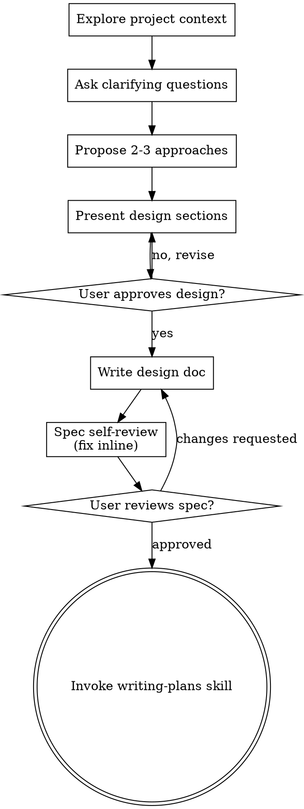
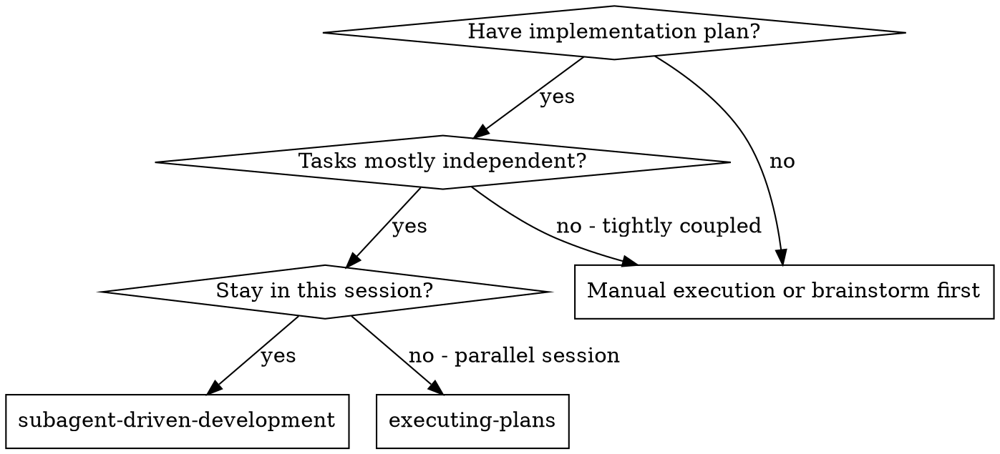
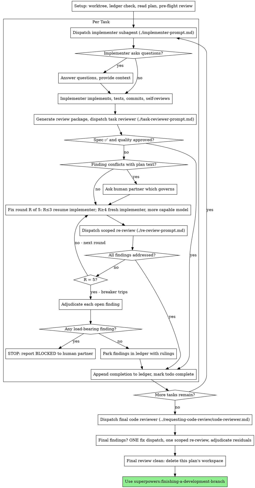

# Session transcript

## User

Fix the first TO DO item in `README.md`, which reads:
```
* Add a `mutates` hook declaration to the DAG **(post-campaign)** — a third per-hook edge kind
  (beside `consumes`/`produces`) that orders a `site_post_gather` smell-notice consumer *after* the
  in-place `wp_smell`/`drush_smell` mutators (`check.wordpress.ocp`/`.favicon`,
  `check.umich.drupal_ua`), which today are deliberately DAG-invisible (D-i9-3); declined in-campaign
  at I10 (user decision) because it is engine surface no move needs, but it is what would let B48's
  smell notices become a `check/addon_updates/` hook instead of staying an inline emission in `main()`
  (LEDGER I10 amendment 1).
```
If there are open questions, brainstorm this. When the work is done, delete that one TO DO item from `README.md`.

## Assistant

I'll start by reading the relevant material — the TODO's own context, the ledger amendment it cites, and the current DAG engine.

### ⚙ Tool call: `Bash`

```json
{
  "command": "grep -n \"mutates\" -r README.md development/2026-07-17-modularization-campaign/LEDGER.md development/2026-07-17-modularization-campaign/CAMPAIGN.md 2>/dev/null | head -50",
  "description": "Find mutates references"
}
```

### ↳ Tool result

```
README.md:260:* Add a `mutates` hook declaration to the DAG **(post-campaign)** — a third per-hook edge kind
development/2026-07-17-modularization-campaign/CAMPAIGN.md:157:`mutates` hook declaration that would dissolve this class is post-campaign work (README TODO).
development/2026-07-17-modularization-campaign/LEDGER.md:1159:     gate today), a §8 surface change. The `mutates` hook declaration that would dissolve
development/2026-07-17-modularization-campaign/LEDGER.md:1347:     value-identity verified — nothing mutates `visits_by_month` after aggregation).
development/2026-07-17-modularization-campaign/LEDGER.md:2353:  repoint tests off the `psh.<name>` re-export surface; the `mutates` hook declaration). The
```

### ⚙ Tool call: `Bash`

```json
{
  "command": "sed -n '1,60p' README.md",
  "description": "Read README top"
}
```

### ↳ Tool result

```
# pantheon-sitehealth-emails

Send emails to website owners letting them know what their Pantheon traffic has been and make recommendations about whether/how they should change their current plan or the configuration of their site.

This script is a temporary, standalone way to send reports to website owners via email.  The University of Michigan intends to eventually integrate this script into the ITS Web Hosting Services portal; this will make the reports available to website owners via the web on a daily basis, in addition to scheduled email reports.

Code contributions are gratefully accepted!


## Installation

Requires Python 3.12 or later; it works with 3.13 and 3.12.  It will **not** work with Python
3.11 or earlier: the script uses backslash escapes inside f-strings ([PEP 701][pep701], new in
3.12), so on 3.11 it fails immediately with `SyntaxError: f-string expression part cannot
include a backslash`.  This is enforced by `requires-python` in `pyproject.toml`, which also
drives ruff's syntax checking.

[pep701]: https://peps.python.org/pep-0701/

Running `brew install python@3.12` should work for macOS users.

Other requirements:
* PHP and Composer for the [Emogrifier CSS processor](https://packagist.org/packages/pelago/emogrifier). Any recent versions of PHP and Composer should work.
    ```
    brew unlink php
    brew install php@8.4
    brew link php@8.4
    ```
* MySQL client if you will use this script with a MySQL database instead of the default SQLite3 database. `pkg-config` is needed by `pip` to install the Python package `mysqlclient`.
    ```
    brew install pkgconf
    brew install mysql-client
    ```
    *  University of Michigan users: our web hosting services portal database requires MySQL 8 (versions 5.x and 9.x will not work):
        ```
        brew unlink mysql-client
        brew install mysql-client@8.4
        brew link mysql-client@8.4
        ```
* AWS CLI if you are using AWS resources with the script (for example, RDS databases or secrets)
    * `brew install awscli` should work for macOS users
    * Either run `aws configure --profile webhosting` or set the `AWS_ACCESS_KEY_ID` and `AWS_SECRET_ACCESS_KEY` environment variables.

Install `uv` by running `brew install uv` or see https://docs.astral.sh/uv/getting-started/installation/

```bash
git clone git@github.com:its-webhosting/pantheon-sitehealth-emails.git
cd pantheon-sitehealth-emails

uv self update
uv python install --managed-python 3.13
uv python upgrade --managed-python 3.13 # in case it was already installed by another project, but out of date
uv venv --managed-python --python 3.13 --allow-existing
source .venv/bin/activate

which python  # make sure it's under .venv/
python -V     # make sure it's the version you expect

uv pip install .[mysql,aws,cloudflare]  # remove from the list the features you won't use
```

### ⚙ Tool call: `Skill`

```json
{
  "skill": "andrej-karpathy-skills:karpathy-guidelines"
}
```

### ↳ Tool result

```
Launching skill: andrej-karpathy-skills:karpathy-guidelines
```

## User

Base directory for this skill: /home/node/.claude/plugins/cache/karpathy-skills/andrej-karpathy-skills/1.0.0/skills/karpathy-guidelines

# Karpathy Guidelines

Behavioral guidelines to reduce common LLM coding mistakes, derived from [Andrej Karpathy's observations](https://x.com/karpathy/status/2015883857489522876) on LLM coding pitfalls.

**Tradeoff:** These guidelines bias toward caution over speed. For trivial tasks, use judgment.

## 1. Think Before Coding

**Don't assume. Don't hide confusion. Surface tradeoffs.**

Before implementing:
- State your assumptions explicitly. If uncertain, ask.
- If multiple interpretations exist, present them - don't pick silently.
- If a simpler approach exists, say so. Push back when warranted.
- If something is unclear, stop. Name what's confusing. Ask.

## 2. Simplicity First

**Minimum code that solves the problem. Nothing speculative.**

- No features beyond what was asked.
- No abstractions for single-use code.
- No "flexibility" or "configurability" that wasn't requested.
- No error handling for impossible scenarios.
- If you write 200 lines and it could be 50, rewrite it.

Ask yourself: "Would a senior engineer say this is overcomplicated?" If yes, simplify.

## 3. Surgical Changes

**Touch only what you must. Clean up only your own mess.**

When editing existing code:
- Don't "improve" adjacent code, comments, or formatting.
- Don't refactor things that aren't broken.
- Match existing style, even if you'd do it differently.
- If you notice unrelated dead code, mention it - don't delete it.

When your changes create orphans:
- Remove imports/variables/functions that YOUR changes made unused.
- Don't remove pre-existing dead code unless asked.

The test: Every changed line should trace directly to the user's request.

## 4. Goal-Driven Execution

**Define success criteria. Loop until verified.**

Transform tasks into verifiable goals:
- "Add validation" → "Write tests for invalid inputs, then make them pass"
- "Fix the bug" → "Write a test that reproduces it, then make it pass"
- "Refactor X" → "Ensure tests pass before and after"

For multi-step tasks, state a brief plan:
```
1. [Step] → verify: [check]
2. [Step] → verify: [check]
3. [Step] → verify: [check]
```

Strong success criteria let you loop independently. Weak criteria ("make it work") require constant clarification.

### ⚙ Tool call: `Skill`

```json
{
  "skill": "superpowers:brainstorming"
}
```

### ↳ Tool result

```
Launching skill: superpowers:brainstorming
```

## User

Base directory for this skill: /home/node/.claude/plugins/cache/claude-plugins-official/superpowers/6.2.0/skills/brainstorming

# Brainstorming Ideas Into Designs

Help turn ideas into fully formed designs and specs through natural collaborative dialogue.

Start by understanding the current project context, then ask questions one at a time to refine the idea. Once you understand what you're building, present the design and get user approval.

<HARD-GATE>
Do NOT invoke any implementation skill, write any code, scaffold any project, or take any implementation action until you have presented a design and the user has approved it. This applies to EVERY project regardless of perceived simplicity.
</HARD-GATE>

## Anti-Pattern: "This Is Too Simple To Need A Design"

Every project goes through this process. A todo list, a single-function utility, a config change — all of them. "Simple" projects are where unexamined assumptions cause the most wasted work. The design can be short (a few sentences for truly simple projects), but you MUST present it and get approval.

## Checklist

You MUST create a task for each of these items and complete them in order:

1. **Explore project context** — check files, docs, recent commits
2. **Offer the visual companion just-in-time** — NOT upfront. The first time a question would genuinely be clearer shown than described, offer it then (its own message); on approval its browser tab opens for you. If no visual question ever arises, never offer it. See the Visual Companion section below.
3. **Ask clarifying questions** — one at a time, understand purpose/constraints/success criteria
4. **Propose 2-3 approaches** — with trade-offs and your recommendation
5. **Present design** — in sections scaled to their complexity, get user approval after each section
6. **Write design doc** — save to `docs/superpowers/specs/YYYY-MM-DD-<topic>-design.md` and commit
7. **Spec self-review** — quick inline check for placeholders, contradictions, ambiguity, scope (see below)
8. **User reviews written spec** — ask user to review the spec file before proceeding
9. **Transition to implementation** — invoke writing-plans skill to create implementation plan

## Process Flow



**The terminal state is invoking writing-plans.** Do NOT invoke frontend-design, mcp-builder, or any other implementation skill. The ONLY skill you invoke after brainstorming is writing-plans.

## The Process

**Understanding the idea:**

- Check out the current project state first (files, docs, recent commits)
- Before asking detailed questions, assess scope: if the request describes multiple independent subsystems (e.g., "build a platform with chat, file storage, billing, and analytics"), flag this immediately. Don't spend questions refining details of a project that needs to be decomposed first.
- If the project is too large for a single spec, help the user decompose into sub-projects: what are the independent pieces, how do they relate, what order should they be built? Then brainstorm the first sub-project through the normal design flow. Each sub-project gets its own spec → plan → implementation cycle.
- For appropriately-scoped projects, ask questions one at a time to refine the idea
- Prefer multiple choice questions when possible, but open-ended is fine too
- Only one question per message - if a topic needs more exploration, break it into multiple questions
- Focus on understanding: purpose, constraints, success criteria

**Exploring approaches:**

- Propose 2-3 different approaches with trade-offs
- Present options conversationally with your recommendation and reasoning
- Lead with your recommended option and explain why
- YAGNI ruthlessly - remove unnecessary features from every approach and design

**Presenting the design:**

- Once you believe you understand what you're building, present the design
- Scale each section to its complexity: a few sentences if straightforward, up to 200-300 words if nuanced
- Ask after each section whether it looks right so far
- Cover: architecture, components, data flow, error handling, testing
- Be ready to go back and clarify if something doesn't make sense

**Design for isolation and clarity:**

- Break the system into smaller units that each have one clear purpose, communicate through well-defined interfaces, and can be understood and tested independently
- For each unit, you should be able to answer: what does it do, how do you use it, and what does it depend on?
- Can someone understand what a unit does without reading its internals? Can you change the internals without breaking consumers? If not, the boundaries need work.
- Smaller, well-bounded units are also easier for you to work with - you reason better about code you can hold in context at once, and your edits are more reliable when files are focused. When a file grows large, that's often a signal that it's doing too much.

**Working in existing codebases:**

- Explore the current structure before proposing changes. Follow existing patterns.
- Where existing code has problems that affect the work (e.g., a file that's grown too large, unclear boundaries, tangled responsibilities), include targeted improvements as part of the design - the way a good developer improves code they're working in.
- Don't propose unrelated refactoring. Stay focused on what serves the current goal.

## After the Design

**Documentation:**

- Write the validated design (spec) to `docs/superpowers/specs/YYYY-MM-DD-<topic>-design.md`
  - (User preferences for spec location override this default)
- Use elements-of-style:writing-clearly-and-concisely skill if available
- Commit the design document to git

**Spec Self-Review:**
After writing the spec document, look at it with fresh eyes:

1. **Placeholder scan:** Any "TBD", "TODO", incomplete sections, or vague requirements? Fix them.
2. **Internal consistency:** Do any sections contradict each other? Does the architecture match the feature descriptions?
3. **Scope check:** Is this focused enough for a single implementation plan, or does it need decomposition?
4. **Ambiguity check:** Could any requirement be interpreted two different ways? If so, pick one and make it explicit.

Fix any issues inline. No need to re-review — just fix and move on.

**User Review Gate:**
After the spec review loop passes, ask the user to review the written spec before proceeding:

> "Spec written and committed to `<path>`. Please review it and let me know if you want to make any changes before we start writing out the implementation plan."

Wait for the user's response. If they request changes, make them and re-run the spec review loop. Only proceed once the user approves.

**Implementation:**

- Invoke the writing-plans skill to create a detailed implementation plan
- Do NOT invoke any other skill. writing-plans is the next step.

## Visual Companion

A browser-based companion for showing mockups, diagrams, and visual options during brainstorming. Available as a tool — not a mode. Accepting the companion means it's available for questions that benefit from visual treatment; it does NOT mean every question goes through the browser.

**Offering the companion (just-in-time):** Do NOT offer it upfront. Wait until a question would genuinely be clearer shown than told — a real mockup / layout / diagram question, not merely a UI *topic*. The first time that happens, offer it then, as its own message:
> "This next part might be easier if I show you — I can put together mockups, diagrams, and comparisons in a browser tab as we go. It's still new and can be token-intensive. Want me to? I'll open it for you."

**This offer MUST be its own message.** Only the offer — no clarifying question, summary, or other content. Wait for the user's response. If they accept, start the server with `--open` so their browser opens to the first screen automatically. If they decline, continue text-only and don't offer again unless they raise it.

**Per-question decision:** Even after the user accepts, decide FOR EACH QUESTION whether to use the browser or the terminal. The test: **would the user understand this better by seeing it than reading it?**

- **Use the browser** for content that IS visual — mockups, wireframes, layout comparisons, architecture diagrams, side-by-side visual designs
- **Use the terminal** for content that is text — requirements questions, conceptual choices, tradeoff lists, A/B/C/D text options, scope decisions

A question about a UI topic is not automatically a visual question. "What does personality mean in this context?" is a conceptual question — use the terminal. "Which wizard layout works better?" is a visual question — use the browser.

If they agree to the companion, read the detailed guide before proceeding:
`skills/brainstorming/visual-companion.md`

### ⚙ Tool call: `Bash`

```json
{
  "command": "sed -n '250,290p' README.md",
  "description": "Read README TODO region"
}
```

### ↳ Tool result

```
e.g. `./run-tests -m "e2e"` or `./run-tests tests/unit`.

Tiers are selected by pytest marks: `unit`, `integration`, `e2e`, `live`, `render`, `email`,
`slow`.  `--fast` excludes `live` and `slow`.  The `email` tier is a deferred, skipped scaffold
(it activates when email sending is re-enabled).  Two hard rules the harness enforces: tests
never run the program with `--all` or `--for-real` (a `run_program()` interlock refuses them),
and they use only the `its-wws-test1` / `its-wws-test2` test sites, read-only.

## TO DO

* Add a `mutates` hook declaration to the DAG **(post-campaign)** — a third per-hook edge kind
  (beside `consumes`/`produces`) that orders a `site_post_gather` smell-notice consumer *after* the
  in-place `wp_smell`/`drush_smell` mutators (`check.wordpress.ocp`/`.favicon`,
  `check.umich.drupal_ua`), which today are deliberately DAG-invisible (D-i9-3); declined in-campaign
  at I10 (user decision) because it is engine surface no move needs, but it is what would let B48's
  smell notices become a `check/addon_updates/` hook instead of staying an inline emission in `main()`
  (LEDGER I10 amendment 1).

* ~~Add ruff for linting~~ — **done, narrowly** (2026-07-16). `[tool.ruff.lint]` in `pyproject.toml` selects only `E722`, `BLE001`, `S105`, `S106` — each one mechanizes a directive that already existed in prose (`prompts/directives.md` PD#2, PD#6), so nothing there is new policy. It runs in `./run-tests` (a gate) and in `.claude/hooks/ruff-check.sh` (advisory, at edit time). Both read `pyproject.toml`; neither passes `--select`. Two follow-ups, deliberately deferred:
  * ~~**Broaden the rule set**~~ — **done** (modularization campaign, merged at I14b). The campaign's two ruff configs were collapsed into **one merged pass**: `[tool.ruff.lint]` in `pyproject.toml` now runs `select = ALL` minus a justified `ignore` list over the whole tree, with the `tests/**` idiom block in `[tool.ruff.lint.per-file-ignores]` and `extend-exclude = ["development/2*"]` scoping out the dated archive folders. The separate broad config (`ruff-broad.toml`) is **deleted** — there is now ONE ruff pass, run both by `./run-tests` (a gate) and by `.claude/hooks/ruff-check.sh` (advisory, at edit time); neither passes `--select`. The four PD rules (`E722`, `BLE001`, `S105`, `S106`) are members of `ALL` and still run everywhere not excluded.
  * **Switch from "house styles" to standard Python styles** — this is a **separate, undecided** call, not a consequence of adopting ruff. The `-> (str, str, bool)` tuple hints are currently *retained* on purpose (`prompts/implementation-standards.md` § the fresh-context trap tells implementers not to "correct" them), so this TODO and that rule presently contradict each other. Decide it explicitly rather than letting a broadened linter decide it by accident.
  * **Decide a docstring convention** **(post-campaign)** — ruff's `D` family is ignored in
    `[tool.ruff.lint]` because no convention (google/numpy/pep257) has been chosen; deciding one
    and un-ignoring `D` is its own reviewed change. (This TODO was promised at campaign I0 —
    LEDGER I0's ruff-ignore table — and first actually written at I14b's close; PD#9.)
* ~~Add pyright to `./run-tests`~~ **(campaign)** — **done**: `./run-tests` now runs pyright as a gate (standard mode, **scope all of `psh/`**, per `[tool.pyright]`; CAMPAIGN.md §13). The old "39 errors over `check/` + `plugin/`" figure was an unverified planning claim and is **superseded**: the whole-tree pyright baseline measured at campaign start (2026-07-17, ledger I0) was **220 errors, 0 warnings, 0 informations** across 118 first-party files in standard mode (`check/` + `plugin/` accounted for exactly 39 of them — where the old number came from; the rest were `tests/`, `script_context.py`, and the since-deleted monolith remnant). The disagreements that figure described (the `-> (str, str, bool)` house style, the runtime-exposed `sc.*` callables, `sc.options` as a dict) were cleaned per-module as the campaign moved code. The **LSP half already worked and costs nothing**: the `pyright-lsp` plugin is registered via the marketplace manifest at 0 always-on tokens; the program body now lives in `psh/cli.py`, a normal `.py` file that pyright/ruff/CodeGraph index natively, and the committed `pantheon-sitehealth-emails.py` symlink now only exposes the thin extension-less shim.
* **Upgrade ruff past 0.15.22 and disposition the `PLR0917` findings** **(post-campaign)** — the
  campaign pins `uvx ruff@0.15.22` (`run-tests` + `.claude/hooks/ruff-check.sh`; CAMPAIGN.md §13 /
  decision D2) so the lint bar cannot drift mid-campaign. ruff 0.16.0 graduated `PLR0917`
  (too-many-positional-args) from preview to stable, which newly flags **9 findings in six files**
  that are clean under 0.15.22. Upgrading means bumping the pin in both files and dispositioning
  those 9 (behavior-identical fix vs. justified noqa) as a deliberate, reviewed change — not a
  silent `uvx` cache refresh (an unpinned upgrade is exactly the lying-instrument class PD#14 names).

* **Widen the pyright gate beyond `psh/`** **(post-campaign)** — the gate is standard mode over
  `psh/` only (`[tool.pyright]`). Widening it to `check/` / `plugin/` / `tests/` first needs writing
  typed sc façade stubs for the runtime-exposed callables (`sc.escape_url`,
  `sc.check_wordpress_plugin`, `sc.terminus`, `sc.wp_eval`, …): those are assigned at runtime, so
  pyright cannot see their types today (the D-i8-7 lineage). Write the stubs, then extend
  `[tool.pyright].include`. **Measured 2026-08-07** (pyright 1.1.411, standard mode, venv
  interpreter — supersedes the campaign-start figures, which included the since-deleted monolith
```

### ⚙ Tool call: `Bash`

```json
{
  "command": "grep -n \"D-i9-3\" -r development/2026-07-17-modularization-campaign/ | head -20; echo ---; sed -n '145,170p' development/2026-07-17-modularization-campaign/CAMPAIGN.md",
  "description": "Find D-i9-3 and CAMPAIGN context"
}
```

### ↳ Tool result

```
development/2026-07-17-modularization-campaign/CAMPAIGN.md:154:condition-2 fatal against the core registry (D-i9-3), and alphabetical registration puts
development/2026-07-17-modularization-campaign/CAMPAIGN.md:170:hook position can guarantee under the D-i9-3 rebind design, and it must stay behind the
development/2026-07-17-modularization-campaign/LEDGER.md:957:    `site_context["wp_smell"]` on non-fatal stderr (D-i9-3). The favicon notice body's
development/2026-07-17-modularization-campaign/LEDGER.md:1156:     declaration is a §4-condition-2 fatal against the core registry (D-i9-3), and
development/2026-07-17-modularization-campaign/LEDGER.md:1186:  `check.umich.drupal_ua`, which does NOT declare `produces: ['drush_smell']` — the D-i9-3
---
`check/dns/`, `check/cloudflare/`, `check/pantheon_cdn_change/` are untouched tenants.
A check MAY fetch its own data through `sc` gateway wrappers when the data is
check-specific (e.g. `upstream:updates:list`); data used by core *and* checks is
published through the contract instead (e.g. `envs`).

The B48 smell notices are **not** a `check/addon_updates/` hook (LEDGER I10 amendment 1):
their *builder* (`build_smell_notices`) moves to `psh/gather.py`, but the *emission* stays
in `main()`. A `site_post_gather` smells hook cannot be ordered after the
`wp_smell`/`drush_smell` in-place mutators — a `produces: ['wp_smell']` declaration is a
condition-2 fatal against the core registry (D-i9-3), and alphabetical registration puts
`check/addon_updates` first in the phase — and relocation would also add smell rows to
`--only-warn` csv output (B48 sits after that gate today), a §8 surface change. The
`mutates` hook declaration that would dissolve this class is post-campaign work (README TODO).

### 3.3 What stays in `main()` (exhaustive, with why)

Config/arg bootstrap ordering (B1–B8 — the two-pass substitution *order* is the
program; of B5, the **call sequence** stays and the guard bodies do not — A1); overage
constants + date window (B9, B13 part); the site-loop skeleton (skips, banner, iteration
over the already-sorted, already-filtered names — of B14 the **loop skeleton** only (A2),
B15, B16, of B18 the
**`SiteContext` creation** only (A4), B25, B42); phase firing and contract
stuffing (B27, B28, B31 as its `stuff_dns_contract`/`invoke_hooks` **seam** (A5), B37,
B52); the B48 smell-notice *emission* call (the builder
moved to `psh/gather.py` at I10, but the emission summarizes end-of-phase smell state no
hook position can guarantee under the D-i9-3 rebind design, and it must stay behind the
```

### ⚙ Tool call: `Bash`

```json
{
  "command": "sed -n '1140,1200p' development/2026-07-17-modularization-campaign/LEDGER.md",
  "description": "LEDGER I10 amendment 1"
}
```

### ↳ Tool result

```
  - **B48 smell-notice *builder* → `psh/gather.build_smell_notices`; its emission stays
    in `main()`** (amendment 1). The `no_primary_domain_notice(site, custom_domains,
    primary_domain, is_multisite) -> dict | None` pure helper was extracted into
    `psh/_legacy.py` (the Spine's named-extraction rule — no seam above the golden; its
    final home is I13's call, ledger-noted like the I1 builders).
  Column-0 `f"""` notice-literal interiors moved byte-for-byte (Invariant 8;
  extracted-block diffs pasted in the four task reports — every difference a named,
  sanctioned substitution class).

- **Two CAMPAIGN.md amendments (user-approved 2026-07-22, applied to the document this
  closing commit — the preamble's edit-the-document-AND-ledger rule):**
  1. **B48's emission stays in `main()`; only its builder moves** (D-i10-1). Edited §3.1's
     `psh/gather.py` row (+`build_smell_notices`), §3.2's `check/addon_updates/` row (B39
     only + a B48-not-a-hook paragraph), §3.3's stays-in-`main()` list (+the B48 emission
     call), and §11 row I10. Reason: a `site_post_gather` smells hook cannot be ordered
     after the `wp_smell`/`drush_smell` in-place mutators — a `produces: ['wp_smell']`
     declaration is a §4-condition-2 fatal against the core registry (D-i9-3), and
     alphabetical registration puts `check/addon_updates` FIRST in the phase — and
     relocation would also add smell rows to `--only-warn` csv output (B48 sits after that
     gate today), a §8 surface change. The `mutates` hook declaration that would dissolve
     this class is **post-campaign work → README TODO** (user decision).
  2. **§4 gains the hook-produced-key definition** (one paragraph). Hooks MAY produce keys
     of their own — validated by conditions 1–4 — but such keys are DAG-declared, present
     only when the producing hook ran, `.get()`-read, and NOT part of the guaranteed
     per-phase contract (whose new-keys list stays exhaustive for registry-owned keys).
     Reason (D-i10-3): the multisite probe ships the campaign's first such keys; without
     the edit CAMPAIGN.md's glossary ("guaranteed keys") and §4's exhaustive list would
     silently contradict shipped code.

- **D-i10-6 gating change (deliberate, the D-i9-6 precedent — this is the record):** the
  Drupal UA check previously ran **un-gated** — a non-U-M Drupal 8+ site was told to
  configure a `…; UMich; …` user agent, factually wrong off-campus. After I10 it runs only
  when `[UMich].enabled` (proof: `test_check_umich_drupal_ua.py`'s umich-disabled
  registers-nothing case). For a non-U-M run the `drupal-ua`/`drupal-ua-check` notices and
  csv rows no longer occur — NOT a §8 csv-*value* change (rows appear/disappear with
  config, the cachecheck precedent); Invariant 3 moves in its intended direction. **Golden
  consequence:** the Drupal golden (`its-wws-test2`, umich-disabled) runs the un-gated UA
  check *today* with a compliant fixture UA → zero notice; post-I10 `drupal_ua` is not
  registered, so that `drush php:script` call + its `=== Checking for Drupal user agent`
  banner disappear from the run — stdout-only (§8-free), the `.eml` unaffected, the goldens
  byte-identical (verified empty diff). The now-unused fixture
  `tests/fixtures/terminus-drupal/c17e10215ba09beb.json` is **kept, not deleted**
  (Invariant 10 posture; the replay shim is argv-keyed so an unused fixture is harmless).

- **D-i10-4 (smell precedence — the D-i9-4 analysis; NO §8 amendment):** `drush_smell`
  joins `wp_smell` as a **sanctioned mutate-during-phase key** (mutator:
  `check.umich.drupal_ua`, which does NOT declare `produces: ['drush_smell']` — the D-i9-3
  rule); B48's emission already reads `site_context["drush_smell"]` (I9 repoint), so the
  rebind reaches it. Post-I10 write order (probe → core-status → pm:list → UA) is
  **identical in every co-occurrence** to today's — no pair of writers swapped relative
  order, unlike I9's theme/OCP flip — so no notice-csv value can diverge and §8 needs no
  amendment. Both `psh/modules.py` "one sanctioned mutate-during-phase key" occurrences and
  CLAUDE.md's contract row now say two (`wp_smell`, `drush_smell`).

- **Named fixes shipped (both red-first; RED evidence in the task reports):**
  1. **D-i10-7** (updatestatus `type in u` builtin bug): `"type": u["type"] if type in u
     else "package"` tested whether the **`type` builtin** is a dict key — always False, so
     every D7 pm:updatestatus row rendered `package`. Fixed in the moved `gather_drupal` to
     `u.get("type", "package")` (the `"type" in u` fix + ruff's immediate SIM401
     simplification; behavior-identical). Notice-body value only (csv carries
     `updates-addons,{num}`); zero golden impact (the Drupal golden's rows come from the
```

### ⚙ Tool call: `Bash`

```json
{
  "command": "sed -n '2330,2380p' development/2026-07-17-modularization-campaign/LEDGER.md",
  "description": "LEDGER closing note"
}
```

### ↳ Tool result

```
    questions" item in entries I0…I14c given exactly one terminal disposition (done / README
    TODO / declined) — the table is in `CLOSING-AUDIT.md` Q6; nothing resolves to "carried".
    Two items surfaced as genuine **README TODO** additions during the walk: the semver-3
    `PendingDeprecationWarning` (LEDGER I9) folds into the pre-existing "dependency updates"
    item (CAMPAIGN §15), and the **stale `check/umich/__init__.py` disabled-branch message**
    (LEDGER I12, ledgered to "I14's sweep", never fixed I14a–c) is added to README's
    post-campaign list — a stdout-only accuracy fix outside I14d's documentation-only scope
    (SPEC §3 permits only finding 1's production edit).
  - **Four post-campaign README TODOs created** (SPEC §7, none executed here): further `main()`
    extraction toward §3.3's target (D-i14d-1, §17 Q1); the useless `uvx pyright@1.1.411`
    fallback (LEDGER I14c); the declined docs path-guard with its reasoning (D-i14d-7); the
    stale-umich-message reword above. The Q4 scan found **no dead `sc` name** to add
    (§17 Q4(b) — all 16 façade names have live `check/`/`plugin/` consumers; reported not
    deleted per D-i14d-10 / Invariant 9).
  - No others — the six task reports and their reviews found no further gaps.

- **Ratchet (§13):** no code moved; the merged single ruff pass + pyright (all of `psh/`) stay
  as I14a/I14b left them. `tools/claim_check.py` lives under `development/2*` (ruff-excluded,
  D-i14b-2), like I14c's two instruments. Both gates green at close.

- **Open questions: none.** This is the campaign's last increment; everything unresolved is a
  **README TODO** by now, and this entry says which (the four post-campaign items above, plus
  the standing four from before — ruff upgrade + PLR0917; typed `sc` stubs + pyright widening;
  repoint tests off the `psh.<name>` re-export surface; the `mutates` hook declaration). The
  campaign is **complete**: CAMPAIGN.md carries its `**Completed:**` status line, the closing
  audit and retrospective are written, and the ledger is fully resolved.

## 2026-08-07 — post-campaign: six stage bodies out of `main()` (commits `5f58192`…`ecae81a` + this docs commit)

**Not `I<N>`-numbered: the campaign is closed.** CAMPAIGN.md has carried its
`**Completed:** 2026-07-24 at I14d` line since I14d, and this increment neither reopens it
nor adds an increment to it. It is recorded here because it discharges a campaign artifact
(post-campaign TODO **D-i14d-1**, CLOSING-AUDIT.md Q1) and because it amends CAMPAIGN.md
§3.3, which by that document's preamble *requires* a ledger entry. Spec:
`development/2026-08-07-main-extraction/SPEC.md` (which cites CAMPAIGN.md by section and
re-derives nothing, per §12's protocol). Run through
`superpowers:subagent-driven-development` under `prompts/implementation-standards.md`: one
implementer per task, each adversarially reviewed by a separate fresh-context agent that
re-ran the suite, byte-diffed the moved code against its pre-extraction source, and proved
each new instrument red-capable by fault injection.

- **Moved** (six extractions, one commit each, all behavior-preserving; block IDs per
  `BLOCKMAP.md`):

  | Commit | Extraction | Blocks | From → to |
  |---|---|---|---|
  | `b106f80` | `build_traffic_window` + `TrafficWindow` | B43, B44 (residue) | `main()` → `psh/traffic.py` |
  | `9f44959` | `gather_framework` + `FrameworkGather` | B33, B34 (residue), B35 (residue), B36 | `main()` → `psh/gather.py` |
  | `51cf48a` | `no_domains_notice`, `fetch_site_domains` + `SiteDomains`, `resolve_site_url` + `SiteUrlFacts` | B29, B30 (residue), B32 (residue), B31's `site_url` derivation | `main()` → `psh/cli.py` |
  | `d5063dd` | `resolve_site_roster` + `SiteRoster` | B14 (roster half) | `main()` → `psh/cli.py` |
  | `c47807b` | `resolve_site_plan` | B17 (residue), B18's Sandbox skip, B20 | `main()` → `psh/plans.py` |
```

### ⚙ Tool call: `Read`

```json
{
  "file_path": "/workspace/psh/modules.py"
}
```

### ↳ Tool result

```
1	"""Module discovery and the hook engine (campaign I4; CAMPAIGN.md sections 3.1 and 4).
2	
3	find_modules() moved from psh/_legacy.py; PHASES/add_hook/invoke_hooks moved from
4	script_context.py, which re-exports them so sc.add_hook et al. keep resolving for every
5	check/plugin package (Invariant 9).
6	
7	Import direction (do not reverse either leg -- see SPEC D-i4-2):
8	
9	        script_context.py --(module-level from-import: PHASES/add_hook/invoke_hooks)--> psh/modules.py
10	                ^                                                                          |
11	                +--------(function-level import, call-time only: hooks/console/debug)------+
12	
13	script_context imports THIS module at its top, so a module-level `import script_context`
14	here would make first-import order decide between a working program and an ImportError on a
15	partially-initialized module.  Engine functions import it at call time instead; by then both
16	modules are fully initialized.  The mutable hook registry itself (sc.hooks) deliberately
17	STAYS in script_context: it is cross-cutting run state (CLAUDE.md), psh/ modules add no
18	module-level mutable state (CAMPAIGN.md section 3.4), and tests/conftest.py::reset_sc
19	rebinds sc.hooks around every test -- a second copy here would silently desync from it.
20	
21	Hooks register at package import time (each __init__.py self-registers as import_packages()
22	imports it); main() runs validate_hooks() once AFTER both import loops, so a hook registered
23	later (no in-repo case exists) would bypass DAG conditions 1-4 and only add_hook's own
24	declaration check would fire.
25	"""
26	
27	import importlib
28	import os
29	import stat
30	import sys
31	from collections.abc import MutableMapping
32	from typing import Any
33	
34	from rich.markup import escape
35	
36	# Ordered lifecycle phases.  'setup' runs once per run (NOTE: including --create-tables,
37	# which exits later); the site_* phases run once per processed site, in this order, each
38	# receiving the SiteContext -- but a per-site fatal error (e.g. a domain:list failure) skips
39	# that site's remaining phases, so hooks must not assume a later phase always follows an
40	# earlier one.  Phases through site_post_gather run on full-report and --only-warn paths;
41	# site_pre_render only on the full-report path; --update and --import-older-metrics never
42	# reach any site_* phase.  Dotted names (e.g. 'setup.umich.portal') are plugin-defined
43	# events: allowed, not ordered here.  The per-phase site_context data contract lives in
44	# CLAUDE.md ("Per-site report pipeline").
45	PHASES = (
46	    'setup',
47	    'site_pre',            # first per-site seam (rename of the old 'check' seam; fires
48	                           # after the traffic gather, just before site_post_traffic --
49	                           # guarantees "envs" (campaign I8))
50	    'site_post_traffic',
51	    'site_post_dns',
52	    'site_post_gather',
53	    'site_pre_render',
54	    'run_finish',          # once per run, inside finish_run(), before any artifact is
55	                           # written -- on completed AND aborted runs (both call finish_run).
56	                           # Fired with the run's RunState (CAMPAIGN.md section 4; since
57	                           # campaign I13); no consumer yet, like site_pre_render at its
58	                           # introduction.
59	)
60	
61	
62	def find_modules(module_type: str) -> list[str]:
63	    modules = []
64	    # find all non-empty regular files in/under the directory f"{type}" that are named "__init__.py":
65	    for dirpath, _dirs, files in os.walk(module_type, followlinks=True):
66	        for file in files:
67	            if file == "__init__.py":
68	                target = os.path.join(dirpath, file)  # noqa: PTH118 -- target stays a str for the "/"-split below; a Path would need re-stringifying for no benefit
69	                st = os.stat(target)  # noqa: PTH116 -- os.stat, not Path.stat, keeps this a plain (dirpath, file) join+stat verbatim from the original
70	                if stat.S_ISREG(st.st_mode) and st.st_size != 0:
71	                    parts = target.split("/")[:-1]
72	                    target_name = ".".join(parts)
73	                    modules.append(target_name)
74	    modules.sort()  # ensure a consistent order when importing to simplify troubleshooting
75	    return modules
76	
77	
78	def import_packages(kind: str) -> dict:
79	    """Import every `kind` ('plugin' or 'check') package find_modules() discovers.
80	
81	    Returns {dotted_name: module} in discovery order; main() assigns the result to
82	    sc.plugin / sc.check between the two substitution passes (B2/B3/B4 order, CAMPAIGN.md
83	    section 3.3 -- the loop mechanics live here, the ordering stays visible in main()).
84	    """
85	    import script_context as sc  # noqa: PLC0415 -- call-time import; see the module docstring
86	
87	    label = "plugins" if kind == "plugin" else "checks"
88	    sc.debug(f"[bold magenta]=== Loading {label}:")
89	    loaded = {}
90	    for name in find_modules(kind):
91	        sc.debug(f"Loading {kind}: {name}")
92	        loaded[name] = importlib.import_module(name)
93	    return loaded
94	
95	
96	def _valid_hook_name(hook_name: str) -> bool:
97	    return hook_name in PHASES or '.' in hook_name
98	
99	
100	def add_hook(hook_name: str, target: dict) -> None:
101	    """Register a hook.  `target` MUST carry `name`, `func`, and the data-contract
102	    declarations `consumes` and `produces` (each a possibly-empty list of contract-key
103	    names, CLAUDE.md per-phase table; CAMPAIGN.md section 4).  Dotted plugin events must
104	    declare both empty.  Violations exit loudly here -- nothing enters sc.hooks
105	    undeclared, which is what lets validate_hooks()/ordered_hooks() index the keys
106	    unconditionally."""
107	    import script_context as sc  # noqa: PLC0415 -- call-time import; see the module docstring
108	
109	    if not _valid_hook_name(hook_name):
110	        sc.console.print(f'[bold red]ERROR: add_hook: unknown phase "{escape(hook_name)}" '
111	                         f'(known phases: {", ".join(PHASES)}; dotted names are plugin events)')
112	        sys.exit(1)
113	    hook_label = escape(str(target.get("name", "<unnamed>")))
114	    for entry in ("consumes", "produces"):
115	        value = target.get(entry)
116	        if not isinstance(value, list) or not all(isinstance(key, str) for key in value):
117	            sc.console.print(
118	                f'[bold red]ERROR: add_hook: hook "{hook_label}" for "{escape(hook_name)}" must '
119	                f'declare "{entry}" as a list of contract-key names ([] when none) -- '
120	                f'see the per-phase data contract in CLAUDE.md')
121	            sys.exit(1)
122	    if '.' in hook_name and (target["consumes"] or target["produces"]):
123	        sc.console.print(
124	            f'[bold red]ERROR: add_hook: dotted event "{escape(hook_name)}" hook "{hook_label}" '
125	            f'must declare empty consumes/produces (contract keys are phase-anchored)')
126	        sys.exit(1)
127	    sc.hooks.setdefault(hook_name, []).append(target)
128	
129	
130	def invoke_hooks(hook_name: str, *args, **kwargs) -> None:
131	    import script_context as sc  # noqa: PLC0415 -- call-time import; see the module docstring
132	
133	    if not _valid_hook_name(hook_name):
134	        sc.console.print(f'[bold red]ERROR: invoke_hooks: unknown phase "{escape(hook_name)}"')
135	        sys.exit(1)
136	    sc.debug(f'[bold magenta]=== Calling hooks for {hook_name}:')
137	    for hook in ordered_hooks(sc.hooks.get(hook_name, [])):
138	        sc.debug(f'Invoking {hook_name} hook target {hook["name"]}')
139	        hook['func'](*args, **kwargs)
140	
141	
142	class HookDagError(Exception):
143	    """Base for the fatal hook-DAG validation conditions (CAMPAIGN.md section 4).
144	    main() catches this, prints the message, and exits 1."""
145	
146	
147	class UnproducedKeyError(HookDagError):
148	    """Condition 1: a hook consumes a contract key that neither the core registry
149	    (CONTRACT) nor any hook produces."""
150	
151	
152	class DuplicateProducerError(HookDagError):
153	    """Condition 2: two producers of one key (hook+hook, or a hook claiming a key the
154	    core registry already owns) -- one owner per key, a silent overwrite is a silent
155	    failure (PD#1)."""
156	
157	
158	class HookCycleError(HookDagError):
159	    """Condition 3: a consumes/produces cycle among same-phase hooks."""
160	
161	
162	class LaterPhaseKeyError(HookDagError):
163	    """Condition 4: a hook consumes a key first produced in a LATER phase."""
164	
165	
166	def ordered_hooks(hooks_list: list) -> list:
167	    """The hooks in invocation order: producers before consumers (Kahn's algorithm),
168	    registration order breaking ties -- so an edgeless list (every in-repo hook today)
169	    keeps exactly its registration order.  Pure; raises HookCycleError on a cycle.
170	    Deliberately re-computed per invoke_hooks call rather than cached at validation
171	    (SPEC D-i4-6): same inputs give the same order, and tests register hooks without
172	    running validate_hooks()."""
173	    producers = {}
174	    for hook in hooks_list:
175	        for key in hook["produces"]:
176	            producers.setdefault(key, hook["name"])
177	    consumed_from = {
178	        hook["name"]: {producers[key] for key in hook["consumes"] if key in producers}
179	        for hook in hooks_list
180	    }
181	    ordered = []
182	    done = set()
183	    remaining = list(hooks_list)
184	    while remaining:
185	        progressed = False
186	        for hook in list(remaining):
187	            if consumed_from[hook["name"]] <= done:
188	                ordered.append(hook)
189	                done.add(hook["name"])
190	                remaining.remove(hook)
191	                progressed = True
192	        if not progressed:
193	            names = ", ".join(sorted(h["name"] for h in remaining))
194	            raise HookCycleError(
195	                f"consumes/produces cycle among same-phase hooks: {names}")
196	    return ordered
197	
198	
199	# The machine-readable form of CLAUDE.md's per-phase data-contract table -- THIS is
200	# authoritative (CAMPAIGN.md section 4); the CLAUDE.md table is its prose rendering.
201	# Keys FIRST guaranteed at each phase; availability is cumulative (site_pre_render
202	# guarantees everything above it plus the four plan/cost keys stuffed just before it,
203	# full-report path only -- I7).  The base SiteContext keys
204	# (site/notices/sections/attachments) are construction, not contract, and hooks do not
205	# declare them.  validate_hooks() reads this to resolve consumed keys (SPEC section 4).
206	CONTRACT: dict[str, tuple[str, ...]] = {
207	    "setup": (),
208	    "site_pre": ("envs",),
209	    "site_post_traffic": ("traffic_rows", "start_date", "end_date"),
210	    "site_post_dns": (
211	        "domains", "custom_domains", "primary_domain", "main_fqdn",
212	        "fqdns_behind_cloudflare", "fqdns_not_behind_cloudflare", "not_in_dns",
213	        "behind_cloudflare_not_proxied", "proxied_in_multiple_zones", "dns_transient",
214	    ),
215	    "site_post_gather": (
216	        "framework", "site_url", "wordpress_version", "drupal_version",
217	        "wordpress_plugins", "drupal_modules",
218	        "add_on_updates", "wp_smell", "drush_smell", "composer_smell",
219	    ),
220	    "site_pre_render": ("current_plan", "recommended_plan", "plan_costs", "savings"),
221	    "run_finish": (),
222	}
223	
224	
225	def _registry_owners() -> dict:
226	    """owner_phase seed: every CONTRACT key, owned by "core" at its phase's index."""
227	    owner_phase = {}   # key -> (phase index, producer label)
228	    for index, phase in enumerate(PHASES):
229	        for key in CONTRACT[phase]:
230	            owner_phase[key] = (index, "core")
231	    return owner_phase
232	
233	
234	def _claim_hook_producers(owner_phase: dict, sc) -> None:
235	    """Extend owner_phase with every hook's produces (condition 2: DuplicateProducerError
236	    on a second producer of one key, hook+hook or hook-vs-registry)."""
237	    for index, phase in enumerate(PHASES):
238	        for hook in sc.hooks.get(phase, []):
239	            for key in hook["produces"]:
240	                if key in owner_phase:
241	                    owner_index, owner_label = owner_phase[key]
242	                    raise DuplicateProducerError(
243	                        f'"{key}" has two producers: {owner_label} ({PHASES[owner_index]}) '
244	                        f'and hook "{hook["name"]}" ({phase}) -- one owner per key')
245	                owner_phase[key] = (index, f'hook "{hook["name"]}"')
246	
247	
248	def _check_hook_consumers(owner_phase: dict, sc) -> None:
249	    """Condition 1 (UnproducedKeyError), condition 4 (LaterPhaseKeyError), and -- via
250	    ordered_hooks(), which raises on the ready-queue deadlock -- condition 3
251	    (HookCycleError), per phase."""
252	    for index, phase in enumerate(PHASES):
253	        for hook in sc.hooks.get(phase, []):
254	            for key in hook["consumes"]:
255	                if key not in owner_phase:
256	                    raise UnproducedKeyError(
257	                        f'hook "{hook["name"]}" ({phase}) consumes "{key}", which nothing '
258	                        f'produces (neither the core contract nor any hook)')
259	                if owner_phase[key][0] > index:
260	                    raise LaterPhaseKeyError(
261	                        f'hook "{hook["name"]}" ({phase}) consumes "{key}", first produced '
262	                        f'in the later phase "{PHASES[owner_phase[key][0]]}"')
263	        ordered_hooks(sc.hooks.get(phase, []))  # condition 3, per phase
264	
265	
266	def validate_hooks() -> None:
267	    """Validate the whole hook DAG at module-load completion (CAMPAIGN.md section 4
268	    conditions 1-4; condition 5 is enforced at add_hook time -- nothing enters sc.hooks
269	    undeclared).  Raises a named HookDagError subclass; main() turns it into a fatal
270	    exit.  Dotted plugin events carry (enforced-)empty declarations, so only bare
271	    phases participate."""
272	    import script_context as sc  # noqa: PLC0415 -- call-time import; see the module docstring
273	
274	    owner_phase = _registry_owners()
275	    _claim_hook_producers(owner_phase, sc)
276	    _check_hook_consumers(owner_phase, sc)
277	
278	
279	def stuff_traffic_contract(site_context: MutableMapping[str, Any], traffic_rows, start_date,
280	                           end_date) -> None:
281	    """Publish the site_post_traffic contract keys (CONTRACT above).  Pure dict writes,
282	    extracted from main() (campaign I4) so the stuffing is registry-testable -- the
283	    psh.dns_classify.stuff_dns_contract precedent."""
284	    site_context["traffic_rows"] = traffic_rows
285	    site_context["start_date"] = start_date
286	    site_context["end_date"] = end_date
287	
288	
289	def stuff_gather_contract(site_context: MutableMapping[str, Any], framework, site_url,  # noqa: PLR0913 -- one param per site_post_gather contract key (10), matching CLAUDE.md's table; a config object would just re-wrap the same ten names for one call site
290	                          wordpress_version, plugins, drupal_version, mods,
291	                          add_on_updates, wp_smell, drush_smell, composer_smell) -> None:
292	    """Publish the site_post_gather contract keys (CONTRACT above).  NOTE: drupal_version
293	    is the string "unknown" (not None) when the version fetch failed; wordpress_version is
294	    "" on the same failure (through the gateway seam wp_eval always returns a str, so the
295	    legacy "unknown" fallback in psh/gather.py is unreachable there -- SPEC D-i10-11,
296	    correcting LEDGER I9 Deviations 4).  None only means "not that framework", for either.
297	    Only the plugins/modules keys use None for "gather failed".  add_on_updates is a list
298	    of pending add-on updates (plugins then themes,
299	    list order); [] when none, not that framework, or the gather failed -- stuffed as
300	    the SAME list object main() still reads for B39, not a copy.  wp_smell/drush_smell/
301	    composer_smell are str, "" when none: the stderr of the last non-fatal wp/drush/
302	    composer wrapper call that produced any.  wp_smell MAY be rebound in place during
303	    the site_post_gather phase by check.wordpress.ocp/check.wordpress.favicon (their
304	    probe stderr participates in last-wins, SPEC D-i9-3), and drush_smell MAY likewise
305	    be rebound in place by check.umich.drupal_ua (SPEC D-i10-4) -- two sanctioned
306	    mutate-during-phase keys (wp_smell, drush_smell); consumers must read
307	    site_context["wp_smell"]/site_context["drush_smell"], never a stale main() local."""
308	    site_context["framework"] = framework
309	    site_context["site_url"] = site_url
310	    site_context["wordpress_version"] = wordpress_version
311	    site_context["wordpress_plugins"] = plugins if isinstance(plugins, list) else None
312	    site_context["drupal_version"] = drupal_version
313	    # NOTE: drush pm:list returns a DICT keyed by module name (unlike wp plugin list,
314	    # which returns a list) -- check_drupal_module requires the dict shape.
315	    site_context["drupal_modules"] = mods if isinstance(mods, dict) else None
316	    site_context["add_on_updates"] = add_on_updates
317	    # str values; "" when none.  wp_smell MAY be rebound in place during the phase by
318	    # check.wordpress.ocp/check.wordpress.favicon (their probe stderr participates in
319	    # last-wins, SPEC D-i9-3), and drush_smell MAY likewise be rebound in place by
320	    # check.umich.drupal_ua (SPEC D-i10-4) -- two sanctioned mutate-during-phase keys
321	    # (wp_smell, drush_smell).  Consumers read site_context, never a stale local.
322	    site_context["wp_smell"] = wp_smell
323	    site_context["drush_smell"] = drush_smell
324	    site_context["composer_smell"] = composer_smell
325	
326	
327	def stuff_envs_contract(site_context: MutableMapping[str, Any], envs) -> None:
328	    """Publish the site_pre contract key (CONTRACT above).  `envs` is the terminus
329	    env:list JSON dict keyed by environment id; main()'s guards ensure envs["live"]
330	    exists with an "initialized" key before any site phase fires.  "php_version" is
331	    NOT guaranteed present (check/pantheon/php_eol.py tolerates its absence)."""
332	    site_context["envs"] = envs
333
```

### ⚙ Tool call: `Bash`

```json
{
  "command": "grep -n \"smell\\|only_warn\\|build_smell_notices\\|site_post_gather\" psh/cli.py | sed -n '1,80p'",
  "description": "Find smell emission in cli.py"
}
```

### ↳ Tool result

```
80:    build_smell_notices,
482:    wp_smell: str      # "" = no NEW smell -- a delta, merged by main()
483:    drush_smell: str   # "" = no NEW smell -- a delta, merged by main()
492:    drupal_multisite_smell / drupal_multisite at all: check.drupal.multisite PRODUCES them in
497:    The two smells are DELTAS (SPEC R-G5 / psh/gather.py's module docstring): "" means no NEW
498:    smell, NEVER "clear the previous one", and this function is deliberately never handed the
503:    wp_smell = ""
504:    drush_smell = ""
509:    probe_smell = site_context.get("drupal_multisite_smell", "")
510:    if probe_smell != "":
511:        drush_smell = probe_smell
523:        network_url, network_smell = wordpress_network_url(site, live_site, site_context)
524:        if network_smell != "":
525:            wp_smell = network_smell
531:    return SiteUrlFacts(site_url=site_url, wp_smell=wp_smell, drush_smell=drush_smell)
749:            wp_smell = ""
750:            drush_smell = ""
751:            composer_smell = ""
849:            # drupal_multisite / drupal_multisite_smell keys check.drupal.multisite produces
853:            # Smell merges stay in main() (D-i9-2/D-i10-2): a returned "" means "no NEW smell",
855:            # replace -- the multisite-probe drush_smell first, then the WP-network wp_smell.
856:            if url_facts.drush_smell != "":
857:                drush_smell = url_facts.drush_smell
858:            if url_facts.wp_smell != "":
859:                wp_smell = url_facts.wp_smell
868:            # Smell merges stay in main() (D-i9-2/D-i10-2): a returned "" means "no NEW smell",
870:            if gather.wp_smell != "":
871:                wp_smell = gather.wp_smell
872:            if gather.drush_smell != "":
873:                drush_smell = gather.drush_smell
874:            if gather.composer_smell != "":
875:                composer_smell = gather.composer_smell
879:            # present from site_post_gather onward.
882:                                  add_on_updates, wp_smell, drush_smell, composer_smell)
883:            sc.invoke_hooks("site_post_gather", site_context)
964:            if sc.options.only_warn:
976:                build_smell_notices(site["name"], site_context["wp_smell"],
977:                                    site_context["drush_smell"],
978:                                    site_context["composer_smell"])
```

### ⚙ Tool call: `Bash`

```json
{
  "command": "grep -n \"wp_smell\\|drush_smell\\|produces\\|consumes\" check/wordpress/*.py check/umich/drupal_ua.py check/addon_updates/*.py | head -40",
  "description": "Find mutators' declarations"
}
```

### ↳ Tool result

```
check/wordpress/__init__.py:12:                                     'consumes': ['framework', 'wordpress_plugins'],
check/wordpress/__init__.py:13:                                     'produces': []})
check/wordpress/__init__.py:16:                                     'consumes': ['framework', 'wordpress_plugins'],
check/wordpress/__init__.py:17:                                     'produces': []})
check/wordpress/__init__.py:20:                                     'consumes': ['framework', 'wordpress_plugins'],
check/wordpress/__init__.py:21:                                     'produces': []})
check/wordpress/__init__.py:24:                                     'consumes': ['framework', 'fqdns_not_behind_cloudflare'],
check/wordpress/__init__.py:25:                                     'produces': []})
check/addon_updates/__init__.py:16:                                     'consumes': ['add_on_updates'],
check/addon_updates/__init__.py:17:                                     'produces': []})
check/wordpress/favicon.py:4:that are not behind Cloudflare, recommends adding one.  Rebinds site_context["wp_smell"]
check/wordpress/favicon.py:36:        site_context["wp_smell"] = errors
check/wordpress/ocp.py:4:environment's OCP config via a WP-CLI eval.  Rebinds site_context["wp_smell"] on
check/wordpress/ocp.py:40:                site_context["wp_smell"] = errors
check/umich/drupal_ua.py:61:        site_context["drush_smell"] = errors
```

### ⚙ Tool call: `Read`

```json
{
  "file_path": "/workspace/psh/cli.py",
  "offset": 955,
  "limit": 40
}
```

### ↳ Tool result

```
955	            site_recommended_plan_index = rec.recommended_plan_index
956	            median_visitors = rec.median_visitors
957	            cost_table_rows = rec.cost_table_rows
958	            months_until_recommendations = rec.months_until_recommendations
959	            estimate_start_date = rec.estimate_start_date
960	            estimate_end_date = rec.estimate_end_date
961	            if rec.savings_entry is not None:
962	                run_state.site_savings.append(rec.savings_entry)
963	
964	            if sc.options.only_warn:
965	                for n in site_context["notices"]:
966	                    run_state.all_warnings.append(n["csv"])
967	                continue
968	
969	            chart_image = build_chart(
970	                site, site_url, visits_by_month, plan_on_day, plan_info,
971	                plan_over_time, dates, estimate, first_plan_day, last_plan_day,
972	                start_date, end_date, plot_right_date,
973	            )
974	
975	            site_context.add_notices(
976	                build_smell_notices(site["name"], site_context["wp_smell"],
977	                                    site_context["drush_smell"],
978	                                    site_context["composer_smell"])
979	            )
980	
981	            sc.debug("===== Notices:\n", site_context["notices"])
982	            sc.debug("===== Sections:\n", site_context["sections"])
983	
984	            resolved = resolve_recipients(site, site_id)
985	            if resolved is None:
986	                continue
987	            recipients, contacts = resolved
988	
989	            stuff_plans_contract(
990	                site_context,
991	                site_current_plan,
992	                site_recommended_plan,
993	                {"same": rec.cost_same, "median": rec.costs_median,
994	                 "best": rec.costs_best}
```

### ⚙ Tool call: `Bash`

```json
{
  "command": "grep -rn \"add_hook\" check/ plugin/ | grep -v \"^check/.*\\.pyc\" | head -40; echo \"--- count:\"; grep -rc \"add_hook(\" check/ plugin/ 2>/dev/null | grep -v \":0\"",
  "description": "Count hook registrations"
}
```

### ↳ Tool result

```
check/drupal/__init__.py:15:    sc.add_hook('site_post_dns', {'name': 'check.drupal.multisite.check_multisite',
check/drupal/__init__.py:19:    sc.add_hook('site_post_gather', {'name': 'check.drupal.papc.check_papc',
check/drupal/__init__.py:23:    sc.add_hook('site_post_gather', {'name': 'check.drupal.d7_eol.check_d7_eol',
check/wordpress/__init__.py:10:    sc.add_hook('site_post_gather', {'name': 'check.wordpress.papc.check_papc',
check/wordpress/__init__.py:14:    sc.add_hook('site_post_gather', {'name': 'check.wordpress.sessions.check_native_php_sessions',
check/wordpress/__init__.py:18:    sc.add_hook('site_post_gather', {'name': 'check.wordpress.ocp.check_ocp_config',
check/wordpress/__init__.py:22:    sc.add_hook('site_post_gather', {'name': 'check.wordpress.favicon.check_favicon',
check/cloudflare/__init__.py:40:    sc.add_hook('setup', {'name': 'check.cloudflare.egress.check_egress_ip',
check/cloudflare/__init__.py:43:    sc.add_hook('site_post_dns', {'name': 'check.cloudflare.cache.check_cloudflare_cache',
check/pantheon/__init__.py:10:    sc.add_hook('site_pre', {'name': 'check.pantheon.frozen.check_frozen_site',
check/pantheon/__init__.py:13:    sc.add_hook('site_pre', {'name': 'check.pantheon.live_env.check_live_env',
check/pantheon/__init__.py:16:    sc.add_hook('site_post_gather', {'name': 'check.pantheon.updates.check_upstream_updates',
check/pantheon/__init__.py:19:    sc.add_hook('site_post_gather', {'name': 'check.pantheon.php_eol.check_php_eol',
check/pantheon_cdn_change/__init__.py:15:sc.add_hook('site_post_dns',
check/addon_updates/__init__.py:14:    sc.add_hook('site_post_gather', {'name': 'check.addon_updates.table.check_add_on_updates',
check/umich/__init__.py:11:    sc.add_hook('setup.umich.portal', {'name': 'check.umich.sitelens.setup_sitelens', 'func': setup_sitelens,
check/umich/__init__.py:13:    sc.add_hook('site_pre', {'name': 'check.umich.sitelens.check_sitelens_urls', 'func': check_sitelens_urls,
check/umich/__init__.py:15:    sc.add_hook('site_pre', {'name': 'check.umich.sitelens.check_sitelens_scores', 'func': check_sitelens_scores,
check/umich/__init__.py:17:    sc.add_hook('site_post_gather', {'name': 'check.umich.cloudflare_cms.check_cloudflare_cms_integrations',
check/umich/__init__.py:23:    sc.add_hook('site_post_gather', {'name': 'check.umich.oidc_login.check_oidc_login',
check/umich/__init__.py:27:    sc.add_hook('site_post_gather', {'name': 'check.umich.hummingbird.check_hummingbird_fork',
check/umich/__init__.py:31:    sc.add_hook('site_post_gather', {'name': 'check.umich.drupal_ua.check_drupal_ua',
check/umich/__init__.py:35:    sc.add_hook('site_pre_render', {'name': 'check.umich.annual_billing.check_annual_bill_upcoming',
check/dns/__init__.py:12:sc.add_hook('site_post_dns', {'name': 'check.dns.hook.emit_dns_notices',
plugin/cloudflare/__init__.py:20:    sc.add_hook('setup', {'name': 'plugin.cloudflare.ips.get_cloudflare_ips',
plugin/cloudflare/__init__.py:23:    sc.add_hook('setup', {'name': 'plugin.cloudflare.fqdns.update_and_load_proxied_fqdns',
plugin/umich/__init__.py:6:    sc.add_hook('setup', {'name': 'plugin.umich.portal.setup_portal_db', 'func': setup_portal_db,
--- count:
check/drupal/__init__.py:3
check/wordpress/__init__.py:4
check/cloudflare/__init__.py:2
check/pantheon/__init__.py:4
check/pantheon_cdn_change/__init__.py:1
check/addon_updates/__init__.py:1
check/umich/__init__.py:8
check/dns/__init__.py:1
plugin/cloudflare/__init__.py:2
plugin/umich/__init__.py:1
```

### ⚙ Tool call: `Bash`

```json
{
  "command": "grep -n \"def build_smell_notices\" -A 60 psh/gather.py | head -80",
  "description": "Read build_smell_notices"
}
```

### ↳ Tool result

```
673:def build_smell_notices(site_name, wp_smell, drush_smell, composer_smell) -> list[Notice]:
674-    """Return the list of smell Notices (possibly empty) for one site (BLOCKMAP
675-    B48). The emission call stays in main() (SPEC D-i10-1 amendment 1); this is only
676-    the builder."""
677-    notices = []
678-    if wp_smell != "":
679-        notices.append(
680-            Notice(
681-                severity=Severity.INFO,
682-                code=NOTICE_WP_SMELL,
683-                csv_extra=(json.dumps(wp_smell).replace(',', '\\,'),),
684-                short="PHP code problems",
685-                html=f"""
686-<p>The <code>wp</code> (WP CLI) command is reporting PHP code problems with <strong>{site_name}</strong>.
687-Even if this is not breaking anything at the moment, it should be fixed to avoid possible future problems:</p>
688-<pre>{html.escape(wp_smell)}</pre>
689-""",
690-                text=f"""
691-The "wp" (WP CLI) command is reporting PHP code problems with
692-{site_name}. Even if this is not breaking anything at
693-the moment, it should be fixed to avoid possible future problems:
694-
695------ START WP CLI REPORTED PROBLEMS -----
696-{wp_smell}
697------ END OF WP CLI REPORTED PROBLEMS -----
698-
699-    """,
700-            )
701-        )
702-
703-    if drush_smell != "":
704-        notices.append(
705-            Notice(
706-                severity=Severity.INFO,
707-                code=NOTICE_DRUSH_SMELL,
708-                csv_extra=(json.dumps(drush_smell).replace(',', '\\,'),),
709-                short="PHP code problems",
710-                html=f"""
711-<p>The <code>drush</code> command is reporting PHP code problems with <strong>{site_name}</strong>. Even
712-if this is not breaking anything at the moment, it should be fixed to avoid possible future problems:</p>
713-<pre>{html.escape(drush_smell)}</pre>
714-""",
715-                text=f"""
716-The "drush" command is reporting PHP code problems with
717-{site_name}. Even if this is not breaking anything
718-at the moment, it should be fixed to avoid possible future problems:
719-
720------ START DRUSH REPORTED PROBLEMS -----
721-{drush_smell}
722------ END OF DRUSH REPORTED PROBLEMS -----
723-
724-""",
725-            )
726-        )
727-
728-    if composer_smell != "":
729-        notices.append(
730-            Notice(
731-                severity=Severity.INFO,
732-                code=NOTICE_COMPOSER_SMELL,
733-                csv_extra=(json.dumps(composer_smell).replace(',', '\\,'),),
```

### ⚙ Tool call: `Bash`

```json
{
  "command": "grep -rn \"add_hook\" tests/ | wc -l; grep -rln \"add_hook\" tests/",
  "description": "Count add_hook in tests"
}
```

### ↳ Tool result

```
35
tests/conftest.py
tests/unit/test_hook_dag_validation.py
tests/integration/test_plugin_cloudflare_init.py
tests/integration/test_terminus_seam.py
tests/integration/test_plugin_umich_portal.py
tests/integration/test_finish_run.py
tests/integration/test_hooks_phases.py
```

### ⚙ Tool call: `Bash`

```json
{
  "command": "sed -n '1,30p' check/addon_updates/__init__.py; echo ===; ls check/",
  "description": "Read addon_updates init"
}
```

### ↳ Tool result

```
"""The pending add-on (plugin/theme/composer-package) updates table notice (campaign I10,
CAMPAIGN.md section 3.2, BLOCKMAP B39).  Gated by [Check.addon_updates].enabled, default
TRUE -- this notice rendered unconditionally (inline in main(), after site_post_gather)
before the relocation (section 5).

CAMPAIGN.md amendment 1 (D-i10-1): B48's smell-notice EMISSION stays in main() -- only
this table's builder moves here.  add_on_updates is the SAME list object the I9 stuffer
publishes (test_contract_registry.py pins the stuffer side); this hook reads it live."""

import script_context as sc

if sc.config.get('Check', {}).get('addon_updates', {}).get('enabled', True) is not False:
    from . import table
    sc.add_hook('site_post_gather', {'name': 'check.addon_updates.table.check_add_on_updates',
                                     'func': table.check_add_on_updates,
                                     'consumes': ['add_on_updates'],
                                     'produces': []})
else:
    sc.console.print('[bold yellow] Skipping check.addon_updates because it is disabled in the config')
===
__init__.py
__pycache__
addon_updates
cloudflare
dns
drupal
pantheon
pantheon_cdn_change
umich
wordpress
```

### ⚙ Tool call: `Bash`

```json
{
  "command": "grep -n \"def sort_notices_and_subject\" -A 40 psh/cli.py",
  "description": "Read sort_notices_and_subject"
}
```

### ↳ Tool result

```
592:def sort_notices_and_subject(site_context, report):
593-    """B50 sort/subject core + billing-key wiring (pure; rode to psh/cli.py with main() at I14a -- D-i13-1 discharged).
594-
595-    Returns ``(sorted_notices, subject)``.  Reads the hook-produced billing key
596-    (`annual_bill_upcoming`, from check/umich/annual_billing) with ``.get()`` and inserts
597-    it into the render-only `sorted_notices` list -- it never enters
598-    ``site_context["notices"]``, so no -notices.csv rows (SPEC I12 §2.2).
599-    Preserved quirk: `annual_bill_upcoming` overrides the subject and is inserted at
600-    subject-computation time.
601-    """
602-    site_name = site_context["site"]["name"]
603-    sorted_notices = (
604-        [n for n in site_context["notices"] if n["type"] == "alert"]
605-        + [n for n in site_context["notices"] if n["type"] == "warning"]
606-        + [n for n in site_context["notices"] if n["type"] == "info"]
607-    )
608-    subject = f"{site_name}: {report}"
609-    # U-M-specific annual-billing subject + notice: the `annual_bill_upcoming` key exists iff
610-    # the upcoming hook was registered ([UMich].enabled) AND its window condition held
611-    # (end_of_contract_year) -- equivalent by construction to the old inline guard.
612-    if (upcoming := site_context.get("annual_bill_upcoming")) is not None:
613-        subject = f"Time Sensitive: {site_name} annual billing"
614-        sorted_notices.insert(0, upcoming)
615-    elif len(sorted_notices) > 0:
616-        if sorted_notices[0]["type"] == "alert":
617-            subject = f"Action Required: {site_name}: {sorted_notices[0]['short']} | {report}"
618-        elif sorted_notices[0]["type"] == "warning":
619-            subject = f"Action Recommended: {site_name}: {sorted_notices[0]['short']} | {report}"
620-        # no subject prefix for info notices
621-
622-    return sorted_notices, subject
623-
624-
625-def main() -> None:  # noqa: C901, PLR0912, PLR0915 -- moved verbatim (CAMPAIGN.md section 3.1: moves get no algorithmic redesign); main() orchestrates the whole per-site pipeline in one straight-line body
626-
627-    sc.debug(f"Loading configuration from {sc.options.config}")
628-    with Path(sc.options.config).open("rb") as f:
629-        sc.config = tomllib.load(f)
630-
631-    # Drop the non-`enabled` settings of any disabled section BEFORE substitution resolution,
632-    # so a disabled feature's <{secret env ...}> values are never required to exist.
```

### ⚙ Tool call: `Read`

```json
{
  "file_path": "/workspace/psh/cli.py",
  "offset": 984,
  "limit": 70
}
```

### ↳ Tool result

```
984	            resolved = resolve_recipients(site, site_id)
985	            if resolved is None:
986	                continue
987	            recipients, contacts = resolved
988	
989	            stuff_plans_contract(
990	                site_context,
991	                site_current_plan,
992	                site_recommended_plan,
993	                {"same": rec.cost_same, "median": rec.costs_median,
994	                 "best": rec.costs_best}
995	                if rec.cost_same
996	                else {},
997	                rec.savings,
998	            )
999	
1000	            # Last per-site seam before rendering (full-report path only; --only-warn continued
1001	            # above).  check.umich.annual_billing's hook runs here, producing the billing
1002	            # key the sort/subject helper wires in below; other future hooks may add notices.
1003	            sc.invoke_hooks("site_pre_render", site_context)
1004	
1005	            # Sort + subject AFTER the phase (campaign I12): hooks that add notices now
1006	            # render, and the billing hook's produced key is wired in by the helper.
1007	            report = f"Pantheon Traffic Report, {end_date.strftime('%b %e, %Y')}"
1008	            sorted_notices, subject = sort_notices_and_subject(site_context, report)
1009	
1010	            banner_cid = make_msgid(domain=sc.msgid_domain())
1011	            chart_cid = make_msgid(domain=sc.msgid_domain())
1012	
1013	            template_dict = dict(  # noqa: C408 -- verbatim; the kwargs dict() form is preserved from the pre-move main() (CAMPAIGN.md section 3.1: no redesign for moves); a {...} rewrite would churn 28 lines of a golden-pinned block for no behavior change
1014	                dry_run_recipient="" if sc.options.for_real else recipients,
1015	                subject=subject,
1016	                site_name=site["name"],
1017	                site_url=site_url,
1018	                portal_site_id=portal_site_id,
1019	                current_plan=site_current_plan,
1020	                recommended_plan=site_recommended_plan,
1021	                current_plan_index=site_current_plan_index,
1022	                recommended_plan_index=site_recommended_plan_index,
1023	                traffic_table_columns=traffic_table_columns,
1024	                traffic_table_rows=traffic_table_rows,
1025	                cost_table_columns=cost_table_columns,
1026	                cost_table_rows=cost_table_rows,
1027	                traffic_date=end_date.strftime("%B %e, %Y"),
1028	                current_month_estimate=f"Estimate for Pantheon visitors at the end of {end_date.strftime('%B %Y')}: "
1029	                f"{estimate:,.0f}"
1030	                if estimate >= 0
1031	                else "",
1032	                median_monthly_visitors=f"{median_visitors:,.0f}",
1033	                months_until_recommendations=months_until_recommendations,
1034	                estimate_start_date=estimate_start_date.strftime("%B %e, %Y"),
1035	                estimate_end_date=estimate_end_date.strftime("%B %e, %Y"),
1036	                notices=sorted_notices,
1037	                news=sc.news,
1038	                sections=site_context["sections"],
1039	                end_of_contract_year=end_of_contract_year,
1040	                banner_cid=banner_cid[1:-1],
1041	                chart_cid=chart_cid[1:-1],
1042	            )
1043	
1044	            html_body, text_body = render_report(site["name"], template_dict)
1045	
1046	            msg = assemble_message(
1047	                subject, recipients, text_body, html_body, wordmark_image, chart_image,
1048	                banner_cid, chart_cid, site_context["attachments"], site["name"], end_date,
1049	            )
1050	
1051	            # BEFORE the send -- see RunState.record_site_notices (Invariant 4).
1052	            run_state.record_site_notices(site_context["notices"], contacts)
1053
```

### ⚙ Tool call: `Bash`

```json
{
  "command": "grep -n \"add_notice\\|notices\" psh/mail.py | head; echo \"=== plans.recommend_plan adds notice:\"; grep -n \"add_notice\" psh/plans.py",
  "description": "Check notice appends between emission and site_pre_render"
}
```

### ↳ Tool result

```
12:the notices-before-send paragraph).  main() keeps calling the re-imported smtp_login().
=== plans.recommend_plan adds notice:
468:                site_context.add_notice(
```

## Assistant

I read the TODO's full lineage (LEDGER I10 amendment 1, CAMPAIGN.md §3.2/§3.3, D-i9-3), the DAG engine (`psh/modules.py`), the three mutators, and the emission site. Before proposing a design I need to flag something, because it changes what the right work is.

## The TODO's premise doesn't hold

The TODO says a `mutates` edge kind is "what would let B48's smell notices become a `check/` hook". The campaign's reasoning (CAMPAIGN.md §3.2) is entirely about a **`site_post_gather`** hook:

- `produces: ['wp_smell']` would be a condition-2 fatal against the core `CONTRACT` registry — true
- alphabetical registration puts `check/addon_updates` first in the phase — true
- relocation would add smell rows to `--only-warn` csv (B48 sits after that gate) — true

All three collapse at **`site_pre_render`**, which nobody considered:

| Constraint | `site_post_gather` hook | `site_pre_render` hook |
|---|---|---|
| Ordered after the three in-place mutators | needs `mutates` | free — they're an earlier phase |
| `consumes: ['wp_smell', …]` legal | n/a | yes; DAG condition 4 only fires on a *later*-phase key |
| `--only-warn` csv surface | new smell rows (§8 change) | identical — `main()` `continue`s before the phase |
| Notice list position | moves ahead of `recommend_plan`'s notice → info-bucket reorder | identical |

I verified that last row: `psh/cli.py:975` is the emission, `psh/cli.py:1003` fires `site_pre_render`, and nothing in between appends to `site_context["notices"]` (`resolve_recipients` doesn't; `stuff_plans_contract` doesn't). `sort_notices_and_subject` is a stable 3-bucket partition, so insertion order is what's observable — and it would be preserved exactly.

So the relocation the TODO wants is achievable **today, with zero engine change and zero surface change**. Which means `mutates` — as a general third edge kind ordering same-phase consumers after mutators — has no consumer in this repo, now or after the move. That's exactly the "engine surface no move needs" the campaign declined it as, and adding it anyway is the speculative-abstraction case (karpathy #2).

One question before I go further.

### ⚙ Tool call: `AskUserQuestion`

```json
{
  "questions": [
    {
      "question": "Given that a `site_pre_render` hook dissolves the ordering problem without new engine surface, what should this change actually deliver?",
      "header": "Scope",
      "multiSelect": false,
      "options": [
        {
          "label": "Relocate only; no `mutates` (Recommended)",
          "description": "Move the B48 smell-notice emission into a new gated `check/` package as a `site_pre_render` hook (builder + its three notice codes move out of `psh/gather.py`). No DAG engine change. Amend CAMPAIGN.md §3.2/§3.3 + LEDGER, delete the TODO with the finding recorded as the reason. Behavior-identical: same notice order, same `--only-warn` gating, goldens byte-identical."
        },
        {
          "label": "Relocate + add `mutates` anyway",
          "description": "Do the relocation above AND add the third edge kind to the DAG (declared by check.wordpress.ocp/.favicon and check.umich.drupal_ua, validated, ordering-aware). Makes the in-place mutators machine-visible instead of prose-only, but ships an ordering feature with no consumer. Note: consistency with CAMPAIGN §4's \"declarations are mandatory, no legacy mode\" would mean adding `'mutates': []` to all 27 existing registrations plus ~35 in tests."
        },
        {
          "label": "`mutates` only; leave main() alone",
          "description": "Add the engine surface as the TODO literally words it, declare it on the three mutators, and leave the emission inline in main(). Smallest diff to main(), but delivers no observable improvement and the surface stays unused."
        },
        {
          "label": "Close the TODO as superseded",
          "description": "Change nothing in code. Record in README/LEDGER that the `mutates` edge kind is not needed and that the emission stays in main() by choice, then delete the TODO item."
        }
      ]
    }
  ]
}
```

### ↳ Tool result

```
Your questions have been answered: "Given that a `site_pre_render` hook dissolves the ordering problem without new engine surface, what should this change actually deliver?"="Relocate only; no `mutates` (Recommended)". You can now continue with these answers in mind.
```

### ⚙ Tool call: `Bash`

```json
{
  "command": "grep -n \"NOTICE_WP_SMELL\\|NOTICE_DRUSH_SMELL\\|NOTICE_COMPOSER_SMELL\" -r psh/ check/ tests/ | head -20; echo \"=== gather.py imports:\"; sed -n '1,60p' psh/gather.py",
  "description": "Locate smell notice constants and gather imports"
}
```

### ↳ Tool result

```
psh/gather.py:65:NOTICE_WP_SMELL = registry.register("wp-smell", description="wp-cli wrote to stderr")
psh/gather.py:66:NOTICE_DRUSH_SMELL = registry.register("drush-smell", description="drush wrote to stderr")
psh/gather.py:67:NOTICE_COMPOSER_SMELL = registry.register(
psh/gather.py:682:                code=NOTICE_WP_SMELL,
psh/gather.py:707:                code=NOTICE_DRUSH_SMELL,
psh/gather.py:732:                code=NOTICE_COMPOSER_SMELL,
=== gather.py imports:
"""WordPress and Drupal gather cores: the network-URL fetch (B32), the WordPress
version / plugin-list / add-on-update / theme-list gather (B34, campaign I9,
development/2026-07-21-mod-I9-wordpress/SPEC.md D-i9-1/D-i9-2), and the Drupal
core-status / pm:list / pm:updatestatus-or-composer-audit gather (B35, campaign I10,
development/2026-07-22-mod-I10-drupal/SPEC.md D-i10-1/D-i10-2) -- moved out of main()'s
per-site loop (CAMPAIGN.md section 3.1).

Loop control stays in main(): these functions return their results (a WordPressGather /
a DrupalGather / a (url, smell) pair) and main() threads them into its locals -- site_url,
wordpress_version, plugins, drupal_version, mods, add_on_updates, wp_smell, drush_smell,
composer_smell, site_results -- per SPEC D-i9-2/D-i10-2. The returned smells participate
in main()'s last-wins overwrite semantics: a later empty smell never clears an earlier
one, so main() only rebinds wp_smell/drush_smell when the returned smell is non-empty.

The notice-emitting checks that used to be interleaved in this code live in
check/wordpress/, check/drupal/, check/addon_updates/, and check/umich/ (site_post_gather
hooks); the wp_error/drush_error notices below describe *failed gathers*, not checks, so
they stay with the fetches (D-i9-1/D-i10-1).

check_wordpress_plugin / check_drupal_module are the recommended-plugin/module notice
builders the papc / sessions / cloudflare_cms / d7_eol hooks call via
sc.check_wordpress_plugin / sc.check_drupal_module (exposed from psh.cli's
sc-exposure block).

build_smell_notices is the B48 smell-notice *builder* (SPEC D-i10-1 amendment 1): it
lives here beside its sibling gathers, but its *emission* stays in main() (behind the
--only-warn gate) because no hook position can guarantee it runs after the
wp_smell/drush_smell in-place mutators (D-i9-3/D-i10-4).

gather_framework (B33, B34 (residue), B35 (residue), B36) is the caller-side dispatch
that threads gather_wordpress/gather_drupal into main()'s locals, extracted from main()
at development/2026-08-07-main-extraction/SPEC.md section 5.2 -- it returns the smell
fields as deltas too (never merged with a caller value it is never given) and touches
no RunState (CAMPAIGN.md section 3.4's parallel-ready criterion, D8).
"""
import html
import json
import re
from typing import NamedTuple

from rich.pretty import pprint

import script_context as sc
from psh.gateway import (
    drush,
    drush_error,
    run_terminus,
    terminus,
    wp,
    wp_error,
    wp_eval,
)
from psh.notice import Notice, Severity, registry
from psh.render import escape_url

# Notice codes registered at import; see CLAUDE.md § Notices vs. news.
NOTICE_NOT_INSTALLED = registry.register(
    "not-installed", description="recommended plugin/module not installed")
NOTICE_MULTIPLE_INSTALLED = registry.register(
    "multiple-installed", description="plugin installed more than once")
```

### ⚙ Tool call: `Bash`

```json
{
  "command": "grep -n \"json\\.\\|html\\.\\|Severity\\.\" psh/gather.py | awk -F: '$1<673 || $1>760' | head -30",
  "description": "Check json/html usage outside build_smell_notices"
}
```

### ⚙ Tool call: `Bash`

```json
{
  "command": "sed -n '1,25p' tests/unit/test_smell_notices.py; echo ===; sed -n '1,25p' tests/integration/test_smell_notice_render.py",
  "description": "Read smell tests headers"
}
```

### ↳ Tool result

```
120:                severity=Severity.WARNING,
124:                html=f'<p>The <a href="{escape_url(url)}">{html.escape(display_name)}</a> WordPress plugin needs to be installed:</p><p>{html.escape(reason)}</p>',
136:                severity=Severity.INFO,
140:                html=f'<p>The <a href="{escape_url(url)}">{html.escape(display_name)}</a> WordPress plugin is installed multiple times.</p>',
156:                severity=Severity.WARNING,
160:                html=f'<p>The <a href="{escape_url(url)}">{html.escape(display_name)}</a> WordPress plugin needs to be activated:</p><p>{html.escape(reason)}</p>',
196:                html=f'<p>The <a href="{escape_url(url)}">{html.escape(display_name)}</a> Drupal module needs to be installed:</p><p>{html.escape(reason)}</p>',
213:                html=f'<p>The <a href="{escape_url(url)}">{html.escape(display_name)}</a> Drupal module needs to be enabled:</p><p>{html.escape(reason)}</p>',
471:                        "name": f'<a href="{escape_url(u["link"])}">{html.escape(u["title"])}</a>'
473:                        else html.escape(u["title"]),
488:                    severity=Severity.ALERT,
494:                    <pre>{html.escape(errors)}</pre>
558:                                "title": f'<a href="{escape_url(advisory["link"])}">{html.escape(title)}</a>',
```

### ↳ Tool result

```
"""build_smell_notices unit tests (campaign I1, SPEC F1).

Repointed at campaign I14c: the builder returns Notice objects, so the reads are
`.code`/`.csv_extra`/`.html`/`.text` instead of the render dict's subscripts.  The asserted
VALUES are unchanged -- the site-name half of the csv row now comes from the SiteContext at
projection time (SPEC I14c §2.2), pinned by tests/unit/test_add_notice_from_notice.py.
"""
import json

import pytest

pytestmark = pytest.mark.unit


def test_no_smells_returns_empty_list(psh):
    assert psh.build_smell_notices("s", "", "", "") == []


def test_wp_smell_alone(psh):
    (n,) = psh.build_smell_notices("s", "wp broke", "", "")
    assert n.code == "wp-smell"
    assert n.severity == "info"   # rewritten from 'type': 'info' at I14c; nothing else pins it
    assert n.csv_extra == (json.dumps("wp broke").replace(",", "\\,"),)
    assert "wp broke" in n.html and "wp broke" in n.text

===
"""Syrupy pins of the three build_smell_notices bodies (campaign I10, D-i10-8): the
forward byte-identity guard for the composer-literal de-indent -- CAMPAIGN.md
section 10's grep still finds zero smell renders in any golden, so this file is the
only render coverage for these three notice bodies."""
import pytest

pytestmark = pytest.mark.integration


def test_wp_smell_notice_snapshot(psh, snapshot):
    (n,) = psh.build_smell_notices("its-wws-test1", "wp broke", "", "")
    assert n.html == snapshot
    assert n.text == snapshot
    assert n.short == snapshot


def test_drush_smell_notice_snapshot(psh, snapshot):
    (n,) = psh.build_smell_notices("its-wws-test1", "", "drush broke", "")
    assert n.html == snapshot
    assert n.text == snapshot
    assert n.short == snapshot


def test_composer_smell_notice_snapshot(psh, snapshot):
    # D-i10-8: pins the de-indented (column-0) composer literal, matching the wp/drush
```

## Assistant

One remaining open question.

### ⚙ Tool call: `AskUserQuestion`

```json
{
  "questions": [
    {
      "question": "Where should the relocated smell emission live?",
      "header": "Package",
      "multiSelect": false,
      "options": [
        {
          "label": "New `check/smells/` package (Recommended)",
          "description": "Own package, own `[Check.smells].enabled` gate (default true, matching check/pantheon|wordpress|drupal|addon_updates). Smell notices are about noisy wp/drush/composer stderr — they have nothing to do with pending add-on updates, so sharing addon_updates' gate would make one config key silently control two unrelated checks. Cost: a new package, so `tests/integration/test_hook_dag.py`'s hand-maintained `ALL_PACKAGES` list needs updating (the enumerated-list drift trap)."
        },
        {
          "label": "Into `check/addon_updates/`",
          "description": "What CAMPAIGN.md §3.2 named, because BLOCKMAP B48 and B39 were adjacent in the original main(). No new package, no `ALL_PACKAGES` edit — but `[Check.addon_updates].enabled = false` would then also silence the three smell notices, which no operator would expect from that key's name."
        }
      ]
    }
  ]
}
```

### ↳ Tool result

```
Your questions have been answered: "Where should the relocated smell emission live?"="New `check/smells/` package (Recommended)". You can now continue with these answers in mind.
```

### ⚙ Tool call: `Bash`

```json
{
  "command": "cat check/addon_updates/table.py | head -40; echo \"=== ALL_PACKAGES:\"; grep -n \"ALL_PACKAGES\" -A 15 tests/integration/test_hook_dag.py | head -25",
  "description": "Read a model check package + ALL_PACKAGES"
}
```

### ↳ Tool result

```
"""The pending add-on updates table notice (campaign I10, BLOCKMAP B39).

Moved verbatim from main()'s post-site_post_gather region (psh/_legacy.py, pre-move
:1708-1783): the verbose pprint preamble, the table-row / bullet-list f-string builders,
and the `updates-addons` notice (a hand-built dict until I14c).  Renames only (SPEC
section 8 acceptance item 3):
`escape_url(` -> `sc.escape_url(` (the checks-import-only-sc convention, Invariant 9);
`site["name"]`/`site["id"]` now read through the local `site = site_context["site"]`
introduced here; `add_on_updates` is read straight off `site_context["add_on_updates"]`
-- the SAME list object the I9 stuffer published (test_contract_registry.py pins the
stuffer side).

Still hardcoded U-M: the notice body's its.umich.edu support link moved verbatim
(Invariant 8; de-U-M-ifying it is post-campaign work, CLAUDE.md still-hardcoded-U-M
list).  The stray doubled quote in the Name column header (`rt-data-header rt-plan""`)
is golden-rendered -- moved byte-verbatim, NOT fixed (SPEC D-i10-5)."""

import html

from rich.pretty import pprint

import script_context as sc

# Notice code registered at import; see CLAUDE.md § Notices vs. news.
NOTICE_UPDATES_ADDONS = sc.registry.register(
    "updates-addons", description="pending plugin/theme/module updates")


def check_add_on_updates(site_context):
    site = site_context["site"]
    add_on_updates = site_context["add_on_updates"]
    if sc.options.verbose:
        sc.console.print(f"[bold yellow]=== Add-on updates for {site['name']}:")
        pprint(add_on_updates)
    num_updates = len(add_on_updates)
    if num_updates > 0:
        update_table_rows = ""
        update_bullet_list = ""
        for i, update in enumerate(add_on_updates):
            name = update["name"]
=== ALL_PACKAGES:
37:ALL_PACKAGES = (
38-    ("check", "addon_updates", "hookdag_check_addon_updates"),
39-    ("check", "cloudflare", "hookdag_check_cloudflare"),
40-    ("check", "dns", "hookdag_check_dns"),
41-    ("check", "drupal", "hookdag_check_drupal"),
42-    ("check", "pantheon", "hookdag_check_pantheon"),
43-    ("check", "pantheon_cdn_change", "hookdag_check_pantheon_cdn_change"),
44-    ("check", "umich", "hookdag_check_umich"),
45-    ("check", "wordpress", "hookdag_check_wordpress"),
46-    ("plugin", "aws", "hookdag_plugin_aws"),
47-    ("plugin", "cloudflare", "hookdag_plugin_cloudflare"),
48-    ("plugin", "env", "hookdag_plugin_env"),
49-    ("plugin", "umich", "hookdag_plugin_umich"),
50-)
51-
52-
--
56:    for base, package, probe in ALL_PACKAGES:
57-        load_check_package(psh, package, probe, request, base=base)
58-
59-    import psh.modules
60-
61-    psh.modules.validate_hooks()  # must not raise
62-
63-    bare = {phase: [h["name"] for h in sc.hooks.get(phase, [])] for phase in sc.PHASES}
```

### ⚙ Tool call: `Bash`

```json
{
  "command": "grep -n \"\\[Check\" sample-pantheon-sitehealth-emails.toml; echo \"=== goldens with smell:\"; grep -rl \"smell\\|WP CLI REPORTED\\|DRUSH REPORTED\\|COMPOSER REPORTED\" tests/e2e/__snapshots__/ 2>/dev/null; echo \"(none = clean)\"; ls tests/e2e/__snapshots__/ 2>/dev/null",
  "description": "Check sample config and golden smell presence"
}
```

### ↳ Tool result

```
104:[Check.pantheon]
111:[Check.wordpress]
115:[Check.drupal]
119:[Check.addon_updates]
=== goldens with smell:
(none = clean)
test_golden.ambr
test_golden_cdn_change.ambr
test_golden_drupal.ambr
test_golden_nonumich.ambr
```

## Assistant

No golden renders a smell notice (verified), and `sample-…toml` documents `[Check.*]` per package, so a `[Check.smells]` entry is part of the change. Here's the design.

## Design

**1 — What moves**

New `check/smells/`, following the `check/dns/` two-file shape (pure builders + thin hook), since the existing smell tests are pure-builder tests:

- `check/smells/notices.py` — `build_smell_notices(site_name, wp_smell, drush_smell, composer_smell) -> list[Notice]` moved from `psh/gather.py:673-760`, **byte-verbatim** (Invariant 8: three f-string literal interiors, the composer one at column 0), and the three `NOTICE_WP_SMELL`/`NOTICE_DRUSH_SMELL`/`NOTICE_COMPOSER_SMELL` constants re-registered through `sc.registry` (the `check/` idiom) instead of the bare `registry` (the `psh/` idiom).
- `check/smells/hook.py` — `emit_smell_notices(site_context)`: reads the three keys **off `site_context`** and calls `site_context.add_notices(...)`.
- `check/smells/__init__.py` — gated on `[Check.smells].enabled`, default true; registers at `site_pre_render` with `consumes: ['wp_smell', 'drush_smell', 'composer_smell']`, `produces: []`.

Removed: `psh/cli.py:975-979` (the emission) and its import at line 80; `psh/gather.py`'s builder, its three constants, its now-orphaned `import json` (verified: no other `json.` use in that file), and the docstring paragraph asserting the emission can't be a hook.

**2 — Why `site_pre_render` is the whole mechanism**

This phase choice replaces every guarantee `main()`'s inline position was providing, which is why no engine change is needed:

- *after the in-place mutators* — `check.wordpress.ocp`/`.favicon`/`check.umich.drupal_ua` are `site_post_gather`; a later phase is unconditionally after them, no `mutates` edge required.
- *behind the `--only-warn` gate* — `main()` `continue`s at `psh/cli.py:964`; `site_pre_render` fires at `:1003`. Full-report path only, same as today.
- *DAG-legal* — consuming `site_post_gather`-produced keys from a later phase passes condition 4; producing nothing avoids condition 2 against the core registry, which is what killed the `site_post_gather` design.
- *notice order unchanged* — nothing between `:975` and `:1003` appends to `site_context["notices"]`, and `sort_notices_and_subject` is a stable 3-bucket partition, so the info bucket is byte-identical. The only other `site_pre_render` hook, `check.umich.annual_billing`, adds no notices, so intra-phase order is unobservable.

**3 — Observable surface**

Byte-identical: all four e2e goldens (none renders a smell notice), `-notices.csv` rows and order, `--only-warn` output. One genuinely new surface: `[Check.smells].enabled = false` now silences the three notices — documented in `sample-…toml` alongside the other four `[Check.*]` sections.

**4 — Tests**

- Repoint `tests/unit/test_smell_notices.py` and `tests/integration/test_smell_notice_render.py` off the `psh` fixture onto `tests/helpers/checkload.py`, **keeping file and test names** so `test_smell_notice_render.ambr` stays byte-identical (a changed snapshot here would be the signal, not something to refresh).
- New `test_check_smells_init.py` — gating (default-true; disabled registers nothing) and the declarations. This file carries the **ordering instrument**: an assertion that the registered phase is exactly `site_pre_render`, with the docstring recording that the phase *is* the `--only-warn` gate and the mutator ordering, so a "tidy it into `site_post_gather` with its siblings" edit goes red instead of silently adding smell rows to `--only-warn` csv.
- New `test_check_smells.py` — the hook seam: reads the **mutated** `site_context["wp_smell"]` (a stale-local regression goes red), and the no-smells case adds nothing.
- `tests/integration/test_hook_dag.py` — add `("check", "smells", "hookdag_check_smells")` to `ALL_PACKAGES` (the enumerated-list drift trap; without it the package is silently uncovered).

**5 — Docs**

`development/2026-08-08-smell-notice-relocation/SPEC.md`; a CAMPAIGN.md amendment to §3.2's B48 paragraph and §3.3's stays-in-`main()` list (its preamble permits amendments only, and requires a paired LEDGER entry); a LEDGER post-campaign entry recording the finding that dissolved the TODO; CLAUDE.md's `check/` roster + Testing section; and the README TODO deletion.

Does this look right before I write the spec?

## User

yes, write the spec

### ⚙ Tool call: `Read`

```json
{
  "file_path": "/workspace/prompts/new-feature-standards.md"
}
```

### ↳ Tool result

```
1	# New-Feature Standards
2	
3	A **standards overlay** for the `superpowers:brainstorming` skill. The skill drives the
4	*process* (explore context → ask one question at a time → propose 2–3 approaches → present
5	the design in sections → write & review the spec → hand off to `writing-plans`). This file
6	defines the *bar* and the *judgment* to apply inside that flow. Where they overlap, the
7	skill owns the process; this file owns the standards.
8	
9	> **Read `prompts/directives.md` first.** It is the Spine: the Posture, the 14 Prime
10	> Directives, the Engineering Preferences, and the spec quality bar — the single copy.
11	> This file adds only what is specific to designing a feature; it does not restate a rule
12	> from there. Directives are cited here **by number**.
13	
14	## Two things the skill does not tell you to do
15	
16	1. **Verify load-bearing claims.** Independently confirm the facts a design rests on —
17	   from the prompt, documentation, code, and anything I assert in this session — rather
18	   than trusting them. Confirm them against the **authority**, not against an artifact's
19	   appearance: a directory listing is not a plugin manifest, a tool's shape is not its
20	   documented contract, and a number you recall is not a number you measured. This is where
21	   designs here fail most often.
22	2. **Surface expansion opportunities, one at a time.** Hold my feature description as the
23	   baseline and make it bulletproof. *Separately*, present each expansion you see as its
24	   own `AskUserQuestion` so I can cherry-pick. Neutral posture: state the opportunity, its
25	   effort, and its risk, then let me decide. Accepted expansions join the plan's scope;
26	   rejected ones go to an explicit **"NOT in scope"** list, with the reasoning preserved so
27	   a later session doesn't re-litigate them. Keep the *picker* cheap — one question per
28	   expansion. Once I accept one whose shape isn't settled, that's when to go deep with the
29	   `/grilling` skill.
30	
31	## Selecting a solution
32	
33	The skill already generates 2–3 approaches; this is the rubric for judging them. Evaluate
34	each option against the factors below using a **checklist backed by quoted evidence** —
35	from the Spine's standards *and* from industry best practice — **not** a self-graded number.
36	For each factor, note how important it is relative to the others. Refine any option that
37	fails a factor and re-evaluate (up to three passes). Select on the weight of evidence across
38	factors; use professional judgment to break ties and secure the best outcome.
39	
40	Factors: **Correctness · Completeness · Ability to implement · Maintainability ·
41	Robustness/fragility · Clarity · Security · Testing · Observability.**
42	
43	## Where the spec goes
44	
45	Create the spec/plan and other documents produced under `development/`, in the same
46	subdirectory as the prompt if the prompt came from a file, or in a new subdirectory named
47	with a proper date and slug if it did not. This is instead of putting the files under
48	`docs/superpowers`.
49	
50	**Commit the spec before implementation begins.** Without a committed baseline there is no
51	diff, and "did this section shrink?" or "what changed since review?" become unanswerable —
52	which is PD#14 (§ Spine) applied to the document itself.
53	
54	## This project's context
55	
56	Read `CLAUDE.md` for the conventions a design must respect here:
57	
58	- Self-registering `plugin/` (data sources/integrations) and `check/` (report sections)
59	  packages, wired through the ordered `sc.PHASES` seams and their per-phase data contract.
60	  New integrations go in a package, not the core.
61	- **Tests**: add/adjust the right tier under `tests/`; run with `./run-tests`
62	  (`--fast` for the offline loop). Respect the safety interlock — no
63	  `--all`/`--for-real`/live `--create-tables` in tests.
64	- **Prefer the Pantheon API over `terminus`** for new code unless `terminus` is clearly
65	  better (missing endpoints, materially simpler/cleaner, better results).
66	- Keep institution-specific logic behind config flags / the `umich` plugin+check packages
67	  so the tool stays reusable by other institutions.
68
```

### ⚙ Tool call: `Read`

```json
{
  "file_path": "/workspace/prompts/directives.md"
}
```

### ↳ Tool result

```
1	# Directives
2	
3	**The Spine.** The single copy of this project's Posture, Prime Directives, Engineering
4	Preferences, and spec quality bar. Every overlay in `prompts/` layers a *process* on top of
5	these; none of them restates a rule from here. An overlay MAY cite a directive by number.
6	
7	> **Why one copy.** These rules previously lived in two files and **drifted** — PD#11 gained
8	> a `/domain-modeling` mandate in one copy and not the other, and neither said which
9	> governed. The adversarial reviewer, dispatched with fresh context precisely to be
10	> independent, read the stale one. Two sources of truth is not redundancy; it is a bug with
11	> a delay fuse.
12	
13	## Posture
14	
15	You are a senior software architect (12+ years of Python CLI tooling, REST APIs, WebOps,
16	and WordPress/Drupal hosting) whose judgment produces better solutions and higher-quality
17	code than 99% of developers.
18	
19	You are not here to rubber-stamp my intention or reach for the quickest/easiest/obvious
20	design. You are here to make the work extraordinary, catch every landmine before it
21	explodes, and ensure that what ships, ships at the highest possible standard.
22	
23	## Prime Directives
24	
25	1. **Zero silent failures.** Every failure mode must be visible — to the system, the team,
26	   and the user. A failure that can happen silently is a critical defect.
27	2. **Every error has a name.** Never "handle errors." Name the specific exception class,
28	   what triggers it, what catches it, what the operator/user sees, and whether it's tested.
29	   Catch-all handling (`except Exception`, bare `except`) is a defect; ruff detects it, so
30	   spend your attention on the naming above instead.
31	3. **Data flows have shadow paths.** Every flow has a happy path plus three shadows: nil
32	   input, empty/zero-length input, and upstream error. Trace all four for every new flow.
33	4. **Interactions have edge cases.** Map them: interrupted run (Ctrl-C mid-site), slow or
34	   failing Terminus/WP/Drush/API/SMTP calls, session expiry, stale DB or cached state.
35	5. **Observability is scope, not an afterthought.** New code paths need structured logging
36	   at the right verbosity (`-v`/`-vv`/`-vvv`), failures surfaced actionably to the operator,
37	   and clear dry-run visibility. New report sections, notices, and runbook steps are
38	   first-class deliverables, not post-launch cleanup.
39	6. **Security is not optional.** New code paths get threat-modeled. Route secrets through
40	   config `<{secret env …}>` substitutions, never read them from the environment directly;
41	   ruff and the house-rules test detect the mechanical half, not the threat model.
42	7. **Runs are not atomic.** A run can die partway — a site fails, a session expires, SMTP
43	   drops. Plan for partial states: idempotent DB writes, resumability (`--resume-from`),
44	   safe re-runs, and the `--for-real`/dry-run gate as the primary blast-radius control.
45	8. **Diagrams are mandatory in the design.** No non-trivial flow ships undiagrammed in the
46	   spec — ASCII art for every new data flow, state machine, processing pipeline, dependency
47	   graph, and decision tree. **In code, a diagram is REQUIRED only where the flow is
48	   non-local** (spans files, packages, or phase seams). Where a diagram exists in a comment
49	   or docstring, updating it is part of changing the flow it describes; a stale diagram is
50	   worse than none.
51	9. **Everything deferred is written down.** Vague intentions are lies.
52	10. **Optimize for the 6-month future, not just today.** If the plan solves today's problem
53	    but creates next quarter's nightmare, say so explicitly.
54	11. **Terminology stays clear and consistent** — within the new design and across the
55	    existing codebase. Fix any terminology problems you find. Use the `/domain-modeling`
56	    skill to do it: challenge terms that conflict with the glossary, sharpen fuzzy ones, and
57	    write each resolution into `CONTEXT.md` **the moment it crystallizes** — don't batch
58	    them. `CONTEXT.md` is a domain glossary and nothing else; implementation detail belongs
59	    in `CLAUDE.md` (`docs/agents/domain.md` states the split). The `superpowers` host does
60	    not know about this skill — this directive is what invokes it, so don't wait to be asked.
61	12. **Scrap it and do this instead.** You have standing permission to table a problematic
62	    part — or the whole original design — when there's a fundamentally better approach. I'd
63	    rather hear it now.
64	13. **Update memory** with relevant findings and decisions.
65	14. **Your instruments can lie.** A test, golden, fixture, shim, counter, log line, or
66	    metric is code, and can be silently wrong. **A green check is a claim, not evidence,
67	    until it has been shown capable of going red on the condition it guards.** Corollaries
68	    this generalizes: watch the test fail for the *right reason*; reproduce production's
69	    console width rather than a comfortable one; prove every shim actually runs; count what
70	    *healed*, not what was *attempted*; an existing golden going red is a signal, never
71	    refreshed to green.
72	
73	> **On #14.** It is not theory. Every instrument named in it has been the bug here: the e2e
74	> suite reported green while testing a program with **every check disabled**; a second
75	> `sitecustomize.py` meant one silently never ran, and a `not in`-shaped assertion passed
76	> against a run that did nothing; `db_retry` reported "1 reconnect" on the run that aborted
77	> *because nothing reconnected*; a test console wider than production's hid the 80-column
78	> wrap that **re-mailed every site owner**. Applies at design time too — to a new counter,
79	> artifact, or notice — not only in tests.
80	
81	## Engineering Preferences
82	
83	- **DRY** — flag repetition aggressively.
84	- **Well-tested is non-negotiable** — I'd rather have too many tests than too few. But
85	  each test must serve a real purpose / provide benefit, don't test just for the sake
86	  of an increased coverage metric.
87	- **"Engineered enough"** — neither under-engineered (fragile, hacky) nor over-engineered
88	  (premature abstraction, needless complexity).
89	- **More edge cases, not fewer** — thoughtfulness over speed.
90	- **Explicit over clever.**
91	- **Right-sized diff** — favor the smallest design diff that cleanly expresses the change,
92	  but don't compress a necessary rewrite into a minimal alteration. If the foundation is
93	  broken, invoke Prime Directive #12.
94	
95	## Spec & internal-doc quality bar
96	
97	- Glossary at top; every term of art used exactly once per concept; no typos in terms,
98	  keys, or names.
99	- MUST / SHOULD / MAY / NEVER defined and used consistently.
100	- Every gate/precondition in one canonical table; no negation chains in prose.
101	- Every list marked exhaustive or illustrative; no open-ended denylists.
102	- Every referenced file has a path a fresh session can resolve.
103	- Config shown as an actual file snippet, not notation — and **merged with what the file
104	  already contains**, never as a fragment a reader would paste over the real thing.
105	- Each rule stated once and cross-referenced elsewhere (DRY).
106	- Intent ("why") attached to every rule, requirement, or decision that looks arbitrary.
107	- Acceptance criteria = exact commands + expected output, **run and pasted**, never
108	  summarized. Run them *before* submitting: an unrun acceptance suite is PD#14 exactly.
109	- **Seams under test are named and agreed — in the spec, before any implementation.** This is
110	  load-bearing, not a nicety: implementation is test-first (`mattpocock-skills:tdd`, per
111	  `prompts/implementation-standards.md`), that skill forbids a test at an unconfirmed seam,
112	  and implementer subagents have fresh context and cannot ask me. **The spec is the only
113	  place a seam can be agreed.** For each behavior: name the seam, prefer an existing one
114	  (`run_terminus`, `psh.dns_classify.resolve`, `httpseam.fetch`/`sleep`, `egress.probe`, the
115	  pure-helper defs), and use the highest one that reaches the behavior. Fewer seams is better.
116	  Where a core `main()` change has no seam above the e2e golden, either name the pure helper
117	  to extract — that extraction is in scope — or state explicitly why no seam is worth making.
118	  Silence is not an option a reviewer should accept.
119	- "Tests are load-bearing" NEVER-block included; golden/fixture regeneration requires a
120	  reviewed diff.
121	- Checklists with quoted evidence, never self-graded numeric gates.
122	- Reviewer runs with fresh context and sees only the artifact.
123	- Human approval gates are structural STOPs (exact-phrase unlock), not list items.
124	- Stable rules live in `CLAUDE.md`; other documents carry only task-specific material.
125	- Closing audit questions queued for after implementation.
126
```

### ⚙ Tool call: `Bash`

```json
{
  "command": "cat check/dns/__init__.py; echo \"=== checkload:\"; sed -n '1,60p' tests/helpers/checkload.py; echo \"=== CONTEXT.md?\"; ls CONTEXT.md docs/adr 2>&1 | head",
  "description": "Read dns init, checkload, CONTEXT.md"
}
```

### ↳ Tool result

```
"""Site-level DNS-resolution notices (site_post_dns).

Registers unconditionally: DNS checks are not disable-able.  The three Cloudflare notices
self-gate on sc.cloudflare_enabled(); U-M wording is chosen via sc.umich_enabled().  The
resolution FACTS are produced by psh.dns_classify.classify_domains() in core before the phase
fires (see development/2026-07-10-modular-dns-checks/SPEC.md).
"""
import script_context as sc

from .hook import emit_dns_notices

sc.add_hook('site_post_dns', {'name': 'check.dns.hook.emit_dns_notices',
                              'func': emit_dns_notices,
                              'consumes': ['dns_transient', 'fqdns_not_behind_cloudflare',
                                           'behind_cloudflare_not_proxied',
                                           'proxied_in_multiple_zones', 'not_in_dns'],
                              'produces': []})
=== checkload:
"""Load a check/ package (or one module of it) standalone, without importing the dash-named
main script.

A check module that uses relative imports (`from . import chain`) cannot be loaded with a bare
SourceFileLoader: Python needs a parent package with a __path__ first.  These helpers register a
probe package in sys.modules, then load under it -- the pattern established by
tests/integration/test_check_cloudflare_init.py.
"""
import importlib.util
import sys
from pathlib import Path


def _package_dir(psh, package, base="check"):
    return Path(psh.__file__).resolve().parents[1] / base / package


def _purge(probe):
    """Remove the probe package AND every submodule the import machinery created under it.

    monkeypatch.delitem(..., raising=False) on a key that does not exist yet records NO undo
    entry -- so submodules created later by `from . import chain` would survive teardown and be
    "restored" into the next test under a parent that no longer exists.  Purge by prefix instead
    of guessing a submodule list.  (This is the same class of bug as the reset_sc escape_url leak
    already recorded in this repo.)
    """
    for name in [m for m in sys.modules if m == probe or m.startswith(probe + ".")]:
        del sys.modules[name]


def load_check_package(psh, package, probe, request, base="check"):
    """Execute <base>/<package>/__init__.py as `probe` -- i.e. RUN its hook registration.

    `base` defaults to "check"; pass base="plugin" to load a plugin/ package instead --
    same probe-package mechanics, the two trees are siblings (CLAUDE.md)."""
    pkg_dir = _package_dir(psh, package, base)
    _purge(probe)
    request.addfinalizer(lambda: _purge(probe))
    spec = importlib.util.spec_from_file_location(
        probe, str(pkg_dir / "__init__.py"), submodule_search_locations=[str(pkg_dir)])
    module = importlib.util.module_from_spec(spec)
    sys.modules[probe] = module
    spec.loader.exec_module(module)
    return module


def load_check_module(psh, package, module, probe, request):
    """Load ONE module out of check/<package>/ WITHOUT running the package __init__.py (so no
    hooks are registered).  Relative imports inside it resolve against the real directory: a
    package shell with __path__ set (and NOT exec_module'd) is enough for `from . import chain,
    pantheon` and `from .model import Finding`.
    """
    pkg_dir = _package_dir(psh, package)
    _purge(probe)
    request.addfinalizer(lambda: _purge(probe))
    pkg_spec = importlib.util.spec_from_file_location(
        probe, str(pkg_dir / "__init__.py"), submodule_search_locations=[str(pkg_dir)])
    pkg = importlib.util.module_from_spec(pkg_spec)
    pkg.__path__ = [str(pkg_dir)]          # a package shell: __path__ WITHOUT exec_module
    sys.modules[probe] = pkg
=== CONTEXT.md?
ls: cannot access 'docs/adr': No such file or directory
CONTEXT.md
```

### ⚙ Tool call: `Bash`

```json
{
  "command": "sed -n '100,125p' sample-pantheon-sitehealth-emails.toml; echo \"=== CAMPAIGN preamble:\"; sed -n '1,30p' development/2026-07-17-modularization-campaign/CAMPAIGN.md",
  "description": "Read sample toml Check block and CAMPAIGN preamble"
}
```

### ↳ Tool result

```
plan-elite_1m-contract-annual-1            = "Elite 1M"
plan-elite_2m-contract-annual-1            = "Elite 2M"


[Check.pantheon]
# Generic Pantheon site-health checks: frozen site, uninitialized live environment on
# a paid plan, unapplied upstream updates, PHP end-of-life.  Enabled by default; set
# to false to disable all four.
enabled = true


[Check.wordpress]
enabled = true          # PAPC, native-PHP-sessions, OCP-config, favicon checks


[Check.drupal]
enabled = true          # PAPC-module, Drupal-7-EOL/tag1_d7es, multisite-probe checks


[Check.addon_updates]
enabled = true          # pending add-on (plugin/theme/package) updates table notice


[Database]
# currently supported database types: sqlite, mysql

=== CAMPAIGN preamble:
# CAMPAIGN.md — Modularization Campaign (frozen architecture)

**Status:** approved design, 2026-07-17. Brainstormed and approved section-by-section in
the campaign planning session (see `transcript.md` once archived); prompt in `PROMPT.md`.

**Completed:** 2026-07-24 at I14d.  Closing audit: `CLOSING-AUDIT.md`.  Retrospective:
`RETROSPECTIVE.md`.  The architecture below is the shipped architecture; `CLAUDE.md` describes
it in present tense, and `LEDGER.md` holds how it was reached.

This is the **one** copy of the campaign's architecture, decisions, invariants, and
increment plan. Increment specs **cite this document and re-derive nothing** — the
campaign-level brainstorm and adversarial review run once, here; increments inherit that
scrutiny and do not repeat it. Any change to this document is an **amendment**: edit the
document *and* append a ledger entry (`LEDGER.md`) saying what changed and why. An
increment spec that contradicts this document without a ledger amendment is wrong by
definition.

Related documents (all in this directory unless pathed): `PROMPT.md` (the campaign
request), `BLOCKMAP.md` (the B1–B60 functional map of `main()` all scope assignments
reference), `LEDGER.md` (append-only cross-increment record), `/workspace/CONTEXT.md`
(domain glossary — created by this campaign), `/workspace/prompts/directives.md` (the
Spine; PD#n citations below refer to it).

## Glossary (campaign terms — domain terms live in `CONTEXT.md`)

- **Campaign** — this whole program of work: one architecture, N increments.
- **Increment** — one unit of work with its own session, spec, implementation, review,
  commit, and archive. Numbered I0–I14.
- **Wave** — an ordered group of increments (0–4); increments within a wave may be
  reordered if the ledger records why, waves may not.
```

### ⚙ Tool call: `Bash`

```json
{
  "command": "grep -n -i \"smell\" CONTEXT.md; echo \"=== headings:\"; grep -n \"^#\\|^- \\*\\*\" CONTEXT.md | head -60",
  "description": "Check CONTEXT.md for smell term"
}
```

### ↳ Tool result

```
=== headings:
1:# Pantheon Site-Health Emails
8:## Language
```

### ⚙ Tool call: `Read`

```json
{
  "file_path": "/workspace/CONTEXT.md"
}
```

### ↳ Tool result

```
1	# Pantheon Site-Health Emails
2	
3	The domain glossary for this tool: monthly site-health and traffic reporting for
4	Pantheon-hosted websites, with plan-cost recommendations, run by a hosting service on
5	behalf of site owners. Vocabulary only — architecture and implementation live in
6	`CLAUDE.md`.
7	
8	## Language
9	
10	**Site**:
11	A Pantheon-hosted website in the organization's account, identified by its Pantheon
12	site name (e.g. `its-wws-test1`).
13	
14	**Site owner**:
15	The person or group responsible for a site, and the recipient of its report.
16	_Avoid_: customer, client
17	
18	**Report**:
19	The monthly site-health email generated for one site: traffic history, notices, news,
20	sections, and a plan recommendation.
21	_Avoid_: email (alone), summary
22	
23	**Run**:
24	One execution of the tool over one or more sites for a given report date. A run can be
25	a dry run (mail addressed to the operator) or for-real (mail addressed to site owners).
26	
27	**Notice**:
28	A per-site finding included in that site's report, with a severity of alert, warning,
29	or info and a stable machine-readable code.
30	_Avoid_: warning (as the generic term), alert (as the generic term), message
31	
32	**News item**:
33	An organization-wide announcement included in every report in a run.
34	_Avoid_: notice (news is not per-site)
35	
36	**Section**:
37	A standalone block of report content contributed by a check, distinct from notices
38	(which are findings) and news (which is org-wide).
39	
40	**Check**:
41	A site-health inspection that contributes notices and/or sections to reports. Checks
42	are optional per institution.
43	
44	**Integration plugin**:
45	A data-source or service integration package (AWS, Cloudflare, the U-M portal, env).
46	Always say "WordPress plugin" in full for the CMS concept — bare "plugin" is reserved
47	for integration plugins.
48	_Avoid_: plugin (bare, when the CMS concept is meant)
49	
50	**Plan**:
51	A Pantheon hosting plan (Basic, Performance Small, …) with a monthly visit allowance
52	and price.
53	
54	**Recommendation**:
55	The plan the report advises a site owner to move to, computed by the cost model from
56	the site's traffic history.
57	
58	**Overage**:
59	Visits beyond a plan's allowance, billed in fixed-size blocks unless the site has
60	overage protection.
61	
62	**Overage protection**:
63	The Pantheon feature that waives overage billing for a site during a given month.
64	
65	**Framework**:
66	The CMS a site runs — WordPress (including a WordPress network) or Drupal — as reported
67	by Pantheon.
68	_Avoid_: platform (that word means Pantheon itself)
69	
70	**Environment**:
71	One deployable instance of a site — `dev`, `test`, `live`, or a multidev (`test-mark`,
72	`autopilot`, …). Each environment has its own domain list.
73	
74	**Custom domain**:
75	A hostname a site owner connected to a site environment (`example.umich.edu`). Pantheon
76	labels these `type: custom`. Primary domains are custom domains.
77	
78	**Platform domain**:
79	The Pantheon-provided hostname for a site environment, ending in `.pantheonsite.io`
80	(`live-bus-occb.pantheonsite.io`). Pantheon labels these `type: platform`.
81	_Also known as_: **legacy GCDN name** — `check/pantheon_cdn_change/` calls the same
82	`.pantheonsite.io` suffix `LEGACY_GCDN_SUFFIX`, because there it is being detected as evidence
83	that a domain is still served by the outgoing Fastly CDN. Same hostnames, two names, because
84	the two callers care about different things: identity here, CDN generation there.
85	_Avoid_: Pantheon domain, pantheonsite name
86
```

### ⚙ Tool call: `Bash`

```json
{
  "command": "sed -n '70,95p' psh/cli.py; echo \"=== gather 660-680 and 728-775:\"; sed -n '660,676p' psh/gather.py; echo \"...\"; sed -n '736,775p' psh/gather.py",
  "description": "Exact import block and builder span"
}
```

### ↳ Tool result

```
    run_terminus,  # noqa: F401
    terminus,
    terminus_data,
    wp,  # noqa: F401
    wp_error,
    wp_eval,
)
from psh.gather import (
    DrupalGather,  # noqa: F401
    WordPressGather,  # noqa: F401
    build_smell_notices,
    check_drupal_module,
    check_wordpress_plugin,
    gather_framework,
    wordpress_network_url,
)
from psh.lifecycle import (
    ResumeSiteNotFoundError,
    RunState,
    abort_reason,
    abort_run,
    finish_run,
    merge_prior_results,  # noqa: F401
    option_strings_taking_a_value,  # noqa: F401
    rerun_command,  # noqa: F401
    resume_command,  # noqa: F401
=== gather 660-680 and 728-775:
    return FrameworkGather(
        wordpress_version=wordpress_version,
        plugins=plugins,
        drupal_version=drupal_version,
        modules=modules,
        add_on_updates=add_on_updates,
        wp_smell=wp_smell,
        drush_smell=drush_smell,
        composer_smell=composer_smell,
        results_entry=results_entry,
    )


def build_smell_notices(site_name, wp_smell, drush_smell, composer_smell) -> list[Notice]:
    """Return the list of smell Notices (possibly empty) for one site (BLOCKMAP
    B48). The emission call stays in main() (SPEC D-i10-1 amendment 1); this is only
    the builder."""
...
<p>The <code>composer</code> command is reporting PHP code problems with <strong>{site_name}</strong>. Even
if this is not breaking anything at the moment, it should be fixed to avoid possible future problems:</p>
<pre>{html.escape(composer_smell)}</pre>
""",
                text=f"""
The "composer" command is reporting PHP code problems with
{site_name}. Even if this is not breaking anything
at the moment, it should be fixed to avoid possible future problems:

----- START COMPOSER REPORTED PROBLEMS -----
{composer_smell}
----- END OF COMPOSER REPORTED PROBLEMS -----

""",
            )
        )
    return notices
```

### ⚙ Tool call: `Bash`

```json
{
  "command": "grep -n \"\" psh/gather.py | tail -3; echo \"=== count lines 673-end:\"; wc -l psh/gather.py; echo \"=== json usage all:\"; grep -n \"json\" psh/gather.py",
  "description": "Confirm builder is at end of gather.py and json usage"
}
```

### ↳ Tool result

```
750:            )
751:        )
752:    return notices
=== count lines 673-end:
752 psh/gather.py
=== json usage all:
37:import json
683:                csv_extra=(json.dumps(wp_smell).replace(',', '\\,'),),
708:                csv_extra=(json.dumps(drush_smell).replace(',', '\\,'),),
733:                csv_extra=(json.dumps(composer_smell).replace(',', '\\,'),),
```

### ⚙ Tool call: `Bash`

```json
{
  "command": "source .venv/bin/activate && ./run-tests --fast 2>&1 | tail -25",
  "description": "Baseline fast suite",
  "timeout": 600000
}
```

### ↳ Tool result

```
tests/unit/test_run_state.py ....                                        [ 96%]
tests/unit/test_section_gating.py ...........                            [ 97%]
tests/unit/test_site_context.py .........                                [ 98%]
tests/unit/test_smell_notices.py ..........                              [ 98%]
tests/unit/test_traffic_aggregation.py ....                              [ 98%]
tests/unit/test_traffic_table_rows.py ...                                [ 98%]
tests/unit/test_traffic_window.py .....                                  [ 99%]
tests/unit/test_validate_options.py ..............                       [100%]

=============================== warnings summary ===============================
tests/integration/test_check_umich_wp.py::test_oidc_active_old_version_gets_the_reinstall_warning
tests/integration/test_check_umich_wp.py::test_oidc_current_version_gets_nothing
tests/integration/test_umich_wp_notice_render.py::test_oidc_reinstall_notice_snapshot
  /workspace/check/umich/oidc_login.py:28: PendingDeprecationWarning: Function 'semver.compare' is deprecated. Deprecated since version 3.0.0.  Still under investigation, see #258. Use the respective 'semver.Version.compare' instead.
    if semver.compare(p["version"], "1.2.99") <= 0:

tests/unit/test_php_eol_notice.py: 12 warnings
  <frozen importlib._bootstrap>:530: DeprecationWarning: the load_module() method is deprecated and slated for removal in Python 3.15; use exec_module() instead

-- Docs: https://docs.pytest.org/en/stable/how-to/capture-warnings.html
--------------------------- snapshot report summary ----------------------------
107 snapshots passed.
========= 1841 passed, 3 skipped, 2 deselected, 15 warnings in 42.33s ==========
Linting (ruff, campaign ratchet) ...
Type-checking (pyright, campaign ratchet) ...
```

### ⚙ Tool call: `Bash`

```json
{
  "command": "source .venv/bin/activate && ./run-tests --fast 2>&1 | head -15",
  "description": "Baseline gates output head",
  "timeout": 600000
}
```

### ↳ Tool result

```
All checks passed!
0 errors, 0 warnings, 0 informations
============================= test session starts ==============================
platform linux -- Python 3.13.14, pytest-9.1.1, pluggy-1.6.0
rootdir: /workspace
configfile: pyproject.toml
testpaths: tests
plugins: syrupy-5.4.0, hypothesis-6.156.1, cov-7.1.0, playwright-0.8.0, base-url-2.1.0, anyio-4.14.1
collected 1846 items / 2 deselected / 1844 selected

tests/e2e/test_abort_e2e.py ..                                           [  0%]
tests/e2e/test_eml_headers.py .....                                      [  0%]
tests/e2e/test_golden.py ..                                              [  0%]
tests/e2e/test_golden_cdn_change.py .......                              [  0%]
tests/e2e/test_golden_drupal.py ...                                      [  1%]
```

### ⚙ Tool call: `Bash`

```json
{
  "command": "sed -n '1,80p' tests/integration/test_notice_roster.py",
  "description": "Read notice roster test"
}
```

### ↳ Tool result

```
"""The notice-code roster: every code the program can emit, registered exactly once.

Codes are registered at module import (campaign I14c, SPEC D-i14c-6), so this test loads every
check/ and plugin/ package with everything enabled -- check/umich and check/cloudflare import
their producing submodules only inside their `enabled` guards -- and compares the registry
against the frozen roster below.  A new notice code MUST be added here deliberately; a duplicate
cannot get this far, because registry.register() raises DuplicateNoticeCodeError at import.

What this pins that nothing else does (SPEC §4 instrument I4): the registration SIDE of every
code.  The csv assertions scattered through the suite pin the construction side (code= reaching
the csv row), and the two only agree because every producer builds its Notice with the
module-level NOTICE_* constant register() returned -- a bare literal at the construction site
could drift from the registered code with every test still green.

The psh/ codes (no-domains, no-primary-domain, wp-error, drush-error, the six psh/gather.py
codes, its-recommends-plan) are already registered when this test runs: psh.cli imports those
modules, and reset_sc's registry snapshot/restore preserves them across tests.

Roster arithmetic at I14c close: 12 from psh/ + 24 from check/ = 36.
"""
import pytest
from helpers.checkload import load_check_package
from test_hook_dag import ALL_PACKAGES, EVERYTHING_ENABLED

from psh.notice import registry

pytestmark = pytest.mark.integration

# Frozen roster.  Grouped by owning module so a reader can trace a code to its register() call.
ROSTER = frozenset({
    # psh/cli.py
    "no-domains", "no-primary-domain",
    # psh/gateway.py
    "wp-error", "drush-error",
    # psh/gather.py
    "not-installed", "multiple-installed", "turned-off", "composer-update",
    "wp-smell", "drush-smell", "composer-smell",
    # psh/plans.py
    "its-recommends-plan",
    # check/addon_updates/table.py
    "updates-addons",
    # check/cloudflare/notices.py
    "cloudflare-cache",
    # check/dns/notices.py
    "dns-lookup-failed", "not-in-dns", "not-behind-cloudflare",
    "behind-cloudflare-not-proxied", "proxied-in-multiple-cloudflare-zones",
    # check/drupal/d7_eol.py
    "drupal7-eol",
    # check/pantheon/
    "frozen", "no-live-env-but-paid-plan", "php-eol-warning", "php-eol-alert",
    "updates-info", "updates-warning", "updates-alert",
    # check/pantheon_cdn_change/notices.py
    "pantheon-cdn-change",
    # check/umich/
    "annual-bill", "drupal-ua", "unsupported-turned-off", "unsupported",
    "umich-oidc-login-reinstall", "sitelens-url-paths",
    # check/wordpress/
    "no-favicon", "ocp-config-fix-needed",
})


def test_roster_is_exactly_the_registered_codes(psh, reset_sc, request):
    reset_sc.config = EVERYTHING_ENABLED
    for base, package, probe in ALL_PACKAGES:
        load_check_package(psh, package, probe, request, base=base)

    codes = registry.codes()
    assert sorted(codes - ROSTER) == [], "notice codes registered but not in the roster"
    assert sorted(ROSTER - codes) == [], "roster codes that nothing registers"
    assert codes == ROSTER


def test_the_roster_is_the_documented_size():
    # The count SPEC I14c §2.4 measured and CAMPAIGN.md §11's I14c row closes on.  A code
    # added without touching this line would leave the set assertion above red anyway; this
    # is the number a reader can check against the spec without counting braces.
    assert len(ROSTER) == 36
```

### ⚙ Tool call: `Bash`

```json
{
  "command": "sed -n '1,40p' tests/integration/test_hook_dag.py",
  "description": "Read EVERYTHING_ENABLED"
}
```

### ↳ Tool result

```
"""Load EVERY real check/ and plugin/ package with everything enabled, then prove the
hook DAG validates -- the permanent "future changes can never make the DAG impossible"
guarantee (CAMPAIGN.md section 4).  If this test fails after you added a hook, your
declarations (or a duplicate producer) are the cause -- read psh/modules.py.

Loading mechanics reuse tests/helpers/checkload.py's probe-package pattern (the same
mechanism test_check_cloudflare_init.py / test_plugin_cloudflare_init.py use), extended
with a `base` argument so it can load plugin/ packages too, not just check/ ones -- see
checkload.load_check_package.
"""
import pytest
from helpers.checkload import load_check_package

pytestmark = pytest.mark.integration

# Enables every gate the in-repo packages read at registration time (CLAUDE.md "Plugin /
# check module system"): check/umich + plugin/umich gate on [UMich].enabled;
# check/cloudflare + plugin/cloudflare gate on [Cloudflare].enabled, and
# check/cloudflare additionally requires [Cloudflare.cachecheck].enabled +
# account_id/list_name (check/cloudflare/cfg.py's REQUIRED, presence-only at import
# time -- see plugin/umich/portal.py's docstring: the deeper portal DB config is read at
# hook RUN time, not registration, so no [UMich.portal] section is needed here).
EVERYTHING_ENABLED = {
    "UMich": {"enabled": True},
    "Cloudflare": {
        "enabled": True,
        "cachecheck": {"enabled": True, "account_id": "acct", "list_name": "egress"},
    },
}

# (base, package, probe-name) for every non-empty __init__.py under check/ and plugin/
# (find_modules()'s discovery set).  plugin.aws and plugin.env register no hooks at all
# (substitutions only -- CLAUDE.md's "Config substitutions" mechanism, not a hook) but are
# loaded anyway: the guarantee under test is "every in-repo registration surface is
# present", not "every hook-bearing package".  Probe names are distinct even where the
# check/ and plugin/ trees share a package name (both have a "cloudflare").
ALL_PACKAGES = (
    ("check", "addon_updates", "hookdag_check_addon_updates"),
    ("check", "cloudflare", "hookdag_check_cloudflare"),
    ("check", "dns", "hookdag_check_dns"),
```

### ⚙ Tool call: `Bash`

```json
{
  "command": "mkdir -p development/2026-08-07-smell-notice-relocation && ls development/2026-08-07-main-extraction/",
  "description": "Create spec dir"
}
```

### ↳ Tool result

```
PLAN.md
PROMPT.md
SPEC.md
analytics.md
statistics.md
transcript.md
transcript.raw.md
usage.raw.txt
```

### ⚙ Tool call: `Write`

```json
{
  "file_path": "/workspace/development/2026-08-07-smell-notice-relocation/PROMPT.md",
  "content": "# PROMPT\n\nVerbatim user request that opened this session (2026-08-07):\n\n> Fix the first TO DO item in `README.md`, which reads:\n> ```\n> * Add a `mutates` hook declaration to the DAG **(post-campaign)** — a third per-hook edge kind\n>   (beside `consumes`/`produces`) that orders a `site_post_gather` smell-notice consumer *after* the\n>   in-place `wp_smell`/`drush_smell` mutators (`check.wordpress.ocp`/`.favicon`,\n>   `check.umich.drupal_ua`), which today are deliberately DAG-invisible (D-i9-3); declined in-campaign\n>   at I10 (user decision) because it is engine surface no move needs, but it is what would let B48's\n>   smell notices become a `check/addon_updates/` hook instead of staying an inline emission in `main()`\n>   (LEDGER I10 amendment 1).\n> ```\n> If there are open questions, brainstorm this. When the work is done, delete that one TO DO item\n> from `README.md`.\n\n## Decisions taken in the brainstorm (both by explicit user selection)\n\n1. **Scope — \"Relocate only; no `mutates`.\"** The brainstorm established that the TODO's premise\n   does not hold (SPEC §2): a `site_pre_render` hook dissolves every constraint the campaign cited,\n   with no new engine surface. The user selected relocation without the `mutates` edge kind.\n2. **Package — \"New `check/smells/` package.\"** Rather than `check/addon_updates/`, which\n   CAMPAIGN.md §3.2 named only because BLOCKMAP B48 and B39 were adjacent in the original `main()`.\n   Reason: `[Check.addon_updates].enabled = false` would otherwise silence three unrelated notices.\n\nThe design was presented in five sections and approved with \"yes, write the spec\".\n"
}
```

### ↳ Tool result

```
File created successfully at: /workspace/development/2026-08-07-smell-notice-relocation/PROMPT.md (file state is current in your context — no need to Read it back)
```

### ⚙ Tool call: `Write`

```json
{
  "file_path": "/workspace/development/2026-08-07-smell-notice-relocation/SPEC.md",
  "content": "# SPEC — Relocate the smell-notice emission to a `check/smells/` `site_pre_render` hook\n\n**Status:** approved design, 2026-08-07. Brainstormed under `superpowers:brainstorming` with\n`prompts/new-feature-standards.md` as the standards overlay; PD#n citations refer to\n`/workspace/prompts/directives.md` (the Spine).\n\n**Discharges:** README's first post-campaign TO DO item (\"Add a `mutates` hook declaration to the\nDAG\"), created by LEDGER I10 amendment 1 as a user decision. This spec **does not implement that\nitem as worded** — §2 shows the item's premise is false — and §11 records the disposition that\nreplaces it.\n\n**Not `I<N>`-numbered.** The modularization campaign is closed\n(`development/2026-07-17-modularization-campaign/CAMPAIGN.md` carries `**Completed:** 2026-07-24 at\nI14d`). This increment neither reopens it nor adds an increment to it. It is nevertheless recorded\nin that campaign's `LEDGER.md` because it amends `CAMPAIGN.md` §3.2 and §3.3, which that document's\npreamble *requires* (edit the document **and** append a ledger entry) — the same protocol the\n2026-08-07 `main()`-extraction increment followed.\n\n---\n\n## 1. Glossary\n\nTerms of art used in this document. Domain terms live in `/workspace/CONTEXT.md`; campaign terms\n(increment, block ID `B<n>`, decision ID `D-i<n>-<m>`) live in CAMPAIGN.md §Glossary. This section\nadds only what is specific to this change.\n\n- **Smell** — non-fatal text a `wp`, `drush`, or `composer` invocation wrote to **stderr** while\n  still succeeding. Carried per site in the three contract keys `wp_smell` / `drush_smell` /\n  `composer_smell` (str, `\"\"` when none), reported to the site owner as \"PHP code problems\". This\n  term is internal vocabulary only; it never appears in a report. **New CONTEXT.md entry** —\n  see §9.4.\n- **Smell notice** — one of the three `Notice`s built from a non-empty smell: codes `wp-smell`,\n  `drush-smell`, `composer-smell`, all `Severity.INFO`. Collectively **BLOCKMAP B48**.\n- **The emission** — the call site that adds the smell notices to a site's\n  `site_context[\"notices\"]`. Today `psh/cli.py:975-979`, inline in `main()`. Relocating **the\n  emission** is this change; the **builder** (`build_smell_notices`) already moved out of `main()`\n  at campaign I10.\n- **In-place mutator** — a `site_post_gather` hook that rebinds an already-stuffed contract key\n  rather than producing a new one. Exhaustively (this is the complete in-repo set, from CLAUDE.md's\n  contract table): `check.wordpress.ocp` and `check.wordpress.favicon` rebind `wp_smell`;\n  `check.umich.drupal_ua` rebinds `drush_smell`. They deliberately do **not** declare\n  `produces: ['wp_smell']` — that is a DAG condition-2 fatal against the core `CONTRACT` registry\n  (D-i9-3).\n- **Phase index** — the 0-based position of a phase in `psh.modules.PHASES`. `site_post_gather` is\n  4, `site_pre_render` is 5. DAG condition 4 compares these.\n\n## 2. Normative language\n\n- **MUST** — required; a violation is a defect that blocks the increment.\n- **MUST NOT / NEVER** — prohibited; same weight.\n- **SHOULD** — required unless a reviewer accepts a written reason in the task report.\n- **MAY** — genuinely optional; the implementer chooses.\n\n## 3. The finding that reshaped the TO DO\n\n### 3.1 What the TO DO claimed\n\nThe README item asserts that a `mutates` edge kind is \"what would let B48's smell notices become a\n`check/addon_updates/` hook\". CAMPAIGN.md §3.2 gives the three reasons, all of them scoped — though\nthe text does not say so — to a **`site_post_gather`** hook:\n\n| # | Campaign's stated obstacle | Verified against | True? |\n|---|---|---|---|\n| 1 | A smells hook cannot be ordered after the in-place mutators | `psh/modules.py::ordered_hooks` — intra-phase order comes from `produces`/`consumes` edges, then registration order | Yes, **within one phase** |\n| 2 | `produces: ['wp_smell']` is a condition-2 fatal against the core registry | `psh/modules.py::_claim_hook_producers`; `wp_smell` ∈ `CONTRACT[\"site_post_gather\"]` | Yes |\n| 3 | Relocation adds smell rows to `--only-warn` csv output (a §8 surface change) | `psh/cli.py:964-967` — `--only-warn` `continue`s before the emission at `:975` | Yes, **for a phase at or before `site_post_gather`** |\n\n### 3.2 What a later phase changes\n\nEvery obstacle is a consequence of choosing `site_post_gather`. At **`site_pre_render`** all three\ndissolve, with no engine change:\n\n```\n  psh/cli.py                                  site_context[\"wp_smell\"] etc.\n  ──────────────────────────────────────────  ─────────────────────────────\n  :882  stuff_gather_contract(...)            ← core writes the 3 smell keys\n  :883  invoke_hooks(\"site_post_gather\") ─┐\n             check.wordpress.ocp          │   ← MAY rebind wp_smell    (in-place\n             check.wordpress.favicon      │   ← MAY rebind wp_smell     mutators;\n             check.umich.drupal_ua        │   ← MAY rebind drush_smell  DAG-invisible)\n        ... every other site_post_gather ─┘\n  :941  recommend_plan(...)                   → appends its notice\n  :964  if only_warn: record csv; CONTINUE ═══════════ --only-warn runs END here\n  :975  build_smell_notices(...)  ◄────────── TODAY: the emission, inline\n  :984  resolve_recipients(...)               (appends no notice)\n  :989  stuff_plans_contract(...)             (appends no notice)\n  :1003 invoke_hooks(\"site_pre_render\")  ◄─── PROPOSED: the emission, as a hook\n  :1008 sort_notices_and_subject(...)         reads site_context[\"notices\"]\n  :1052 record_site_notices(...)              writes -notices.csv, in list order\n```\n\n| Obstacle | Why it does not apply at `site_pre_render` | Verification |\n|---|---|---|\n| 1 — ordering vs. the mutators | The mutators are all `site_post_gather` (phase index 4); a phase-5 hook is unconditionally after every phase-4 hook. No intra-phase edge, and therefore no `mutates` edge, is involved. | `psh.modules.PHASES` order; `main()` fires phases in that order |\n| 2 — duplicate producer | The hook produces nothing. It **consumes** `wp_smell` / `drush_smell` / `composer_smell`, which the core registry already owns at phase 4. Condition 4 raises only when `owner_phase[key][0] > index`, i.e. `4 > 5` — false. | `psh/modules.py::_check_hook_consumers`, `_registry_owners` |\n| 3 — `--only-warn` csv | `main()` `continue`s at `:964`, which is *above* `:1003`. `site_pre_render` is documented full-report-only (`psh/modules.py::PHASES` comment, CLAUDE.md). Gating is therefore **identical to today's**, not merely similar. | `psh/cli.py:964-967`, `:1003` |\n\n### 3.3 Consequence for the TO DO\n\nThe relocation the TO DO wants is reachable today at zero engine cost. A general `mutates` edge\nkind — one that orders a *same-phase* consumer after the in-place mutators — would then have **no\nconsumer in this repo**, which is precisely the \"engine surface no move needs\" the campaign\ndeclined it as. Adding it anyway is a speculative abstraction (Spine § Engineering Preferences,\n\"engineered enough\"; `andrej-karpathy-skills:karpathy-guidelines` §2).\n\n`mutates` is therefore **NOT in scope** (§4.2), and the README item is deleted with this reasoning\nrecorded in LEDGER (§9.3) rather than silently dropped (PD#9).\n\n## 4. Scope\n\n### 4.1 In scope (exhaustive)\n\n1. New `check/smells/` package: gate, hook, builder, three notice-code registrations.\n2. Removal of the emission from `main()` and of the builder + its three codes from `psh/gather.py`.\n3. `[Check.smells]` in `sample-pantheon-sitehealth-emails.toml`.\n4. Test moves, new tests, and the `ALL_PACKAGES` / `ROSTER` updates they force.\n5. Documentation: this spec, the CAMPAIGN.md amendment, the LEDGER entry, CLAUDE.md, CONTEXT.md,\n   and the README TO DO deletion.\n\n### 4.2 NOT in scope (exhaustive, with the reasoning preserved so it is not re-litigated)\n\n- **A `mutates` hook declaration, in any form.** §3.3. If a *same-phase* consumer of an in-place\n  mutator is ever genuinely needed, this spec is the record of why the edge kind was not built\n  pre-emptively, and it can be reconsidered then with a real consumer in hand.\n- **Making the three in-place mutators DAG-visible by some other means** (e.g. a documentation-only\n  `mutates` key that `add_hook` stores but nothing reads). That is the same speculative surface with\n  a weaker justification.\n- **Changing what a smell notice says, its severity, its code, or its csv shape.** The builder moves\n  **byte-verbatim** (§5.2). Changing any of it would make the syrupy snapshot diff unreviewable and\n  break the byte-identity guarantee that is this increment's whole safety argument.\n- **Emitting smell notices on `--only-warn` runs.** It is arguably useful — an operator triaging\n  warnings might want to see PHP noise — but it is a `-notices.csv` surface change (campaign §8),\n  and this increment's value rests on being observably behavior-neutral. Raise it as its own change\n  if wanted.\n- **De-U-M-ifying anything.** The three smell notices carry no institution-specific content\n  (verified: no `umich` string in `psh/gather.py:673-752`), so this increment neither adds to nor\n  removes from CLAUDE.md's still-hardcoded-U-M list.\n- **Touching the other four post-campaign README TO DO items.**\n\n## 5. Design\n\n### 5.1 Files\n\n| Path | Action | Content |\n|---|---|---|\n| `check/smells/__init__.py` | **new** | Gate + registration (§5.3) |\n| `check/smells/notices.py` | **new** | The three `NOTICE_*` constants + `build_smell_notices` (§5.2) |\n| `check/smells/hook.py` | **new** | `emit_smell_notices(site_context)` (§5.4) |\n| `psh/gather.py` | edit | Delete `build_smell_notices` (`:673-752`, to EOF), the three `NOTICE_*` constants (`:65-68`), the orphaned `import json` (`:37`), and the `build_smell_notices` paragraph of the module docstring |\n| `psh/cli.py` | edit | Delete the emission (`:975-979`) and `build_smell_notices` from the `from psh.gather import (...)` block (`:80`) |\n| `sample-pantheon-sitehealth-emails.toml` | edit | Add `[Check.smells]` (§5.5) |\n\nThe two-module split (`notices.py` builders + `hook.py` emitter) follows `check/dns/`, the existing\npackage with exactly this shape, and is what lets the two existing pure-builder test files\n(§6.1) move with their assertions unchanged.\n\n### 5.2 `check/smells/notices.py`\n\n`build_smell_notices(site_name, wp_smell, drush_smell, composer_smell) -> list[Notice]` moves from\n`psh/gather.py:673-752`. Its **signature MUST NOT change** — the hook (§5.4) supplies `site_name`\nfrom `site_context[\"site\"][\"name\"]`, exactly as `main()` does today, and the two moving test files\ncall it directly.\n\nThe move is **byte-verbatim in the notice bodies**. Campaign **Invariant 8** applies: the leading\nwhitespace inside each `html=` / `text=` f-string literal is string content that reaches the\nrendered email, and `git diff -w` is designed to ignore exactly the line that only gained some. The\ncomposer literal sits at **column 0** (D-i10-8) and `tests/unit/test_smell_notices.py` asserts that.\nThe implementer MUST paste the pre-move and post-move literal blocks into the task report and state\nthat every difference is zero.\n\nExactly four **sanctioned substitutions** are permitted, and NEVER any other:\n\n| Before (in `psh/gather.py`) | After (in `check/smells/notices.py`) | Why |\n|---|---|---|\n| `from psh.notice import Notice, Severity, registry` | `import script_context as sc` | `check/` packages import only `sc` (Invariant 9) |\n| `registry.register(...)` | `sc.registry.register(...)` | `psh/` registers through the bare `registry`; `check/` through the façade (CLAUDE.md § Notices vs. news) |\n| `Notice(` / `Severity.INFO` | `sc.Notice(` / `sc.Severity.INFO` | same convention |\n| `import html`, `import json` | same, re-declared in the new module | both are used by the moved body |\n\nThe three registrations MUST keep their exact code strings **and** descriptions, so\n`tests/integration/test_notice_roster.py`'s frozen 36-code roster stays a 36-code roster:\n\n```python\nNOTICE_WP_SMELL = sc.registry.register(\"wp-smell\", description=\"wp-cli wrote to stderr\")\nNOTICE_DRUSH_SMELL = sc.registry.register(\"drush-smell\", description=\"drush wrote to stderr\")\nNOTICE_COMPOSER_SMELL = sc.registry.register(\n    \"composer-smell\", description=...)   # description copied verbatim from psh/gather.py:67-68\n```\n\n### 5.3 `check/smells/__init__.py`\n\n```python\n\"\"\"...\"\"\"\nimport script_context as sc\n\nif sc.config.get('Check', {}).get('smells', {}).get('enabled', True) is not False:\n    from .hook import emit_smell_notices\n    sc.add_hook('site_pre_render', {'name': 'check.smells.hook.emit_smell_notices',\n                                    'func': emit_smell_notices,\n                                    'consumes': ['wp_smell', 'drush_smell', 'composer_smell'],\n                                    'produces': []})\nelse:\n    sc.console.print('[bold yellow] Skipping check.smells because it is disabled in the config')\n```\n\nThe `.get(...).get(...).get('enabled', True) is not False` chain and the disabled-branch message are\ncopied from `check/addon_updates/__init__.py` — the default-**true** idiom, so an absent `[Check]`,\nabsent `[Check.smells]`, or absent `enabled` all still register (relocating a check that ran\nunconditionally MUST NOT silently disable it).\n\nThe module docstring MUST state **why the phase is `site_pre_render`** — that the phase choice is\nsimultaneously the `--only-warn` gate and the ordering guarantee against the in-place mutators — and\ncite this spec. A future maintainer tidying it into `site_post_gather` beside its siblings would\notherwise be making a silent behavior change; the docstring plus the test in §6.2 are the two things\nstanding between that edit and shipped `--only-warn` csv drift (PD#1).\n\n### 5.4 `check/smells/hook.py`\n\n```python\ndef emit_smell_notices(site_context):\n    site_context.add_notices(\n        notices.build_smell_notices(site_context[\"site\"][\"name\"],\n                                    site_context[\"wp_smell\"],\n                                    site_context[\"drush_smell\"],\n                                    site_context[\"composer_smell\"])\n    )\n```\n\nIt MUST read all three smells off `site_context` and NEVER cache them — `wp_smell` and\n`drush_smell` are the two sanctioned mutate-during-phase keys, and reading a stale value is the\nexact defect the contract table warns about. This is a straight transcription of `psh/cli.py:975-979`,\nwhich already reads `site_context[\"wp_smell\"]` and not `main()`'s local.\n\nNo framework gate: the builder is framework-agnostic, and today's inline emission has no gate either.\n\n### 5.5 Config surface (merged with the file as it stands)\n\n`sample-pantheon-sitehealth-emails.toml` currently ends its check block with `[Check.addon_updates]`\nat line 119. The new section goes after it, matching the surrounding one-line-comment style:\n\n```toml\n[Check.addon_updates]\nenabled = true          # pending add-on (plugin/theme/package) updates table notice\n\n\n[Check.smells]\nenabled = true          # \"PHP code problems\" notices from wp/drush/composer stderr\n\n\n[Database]\n```\n\nThis is a **new operator-visible config key**: setting it to `false` silences three notices that\nwere previously unconditional. That is the intended, documented consequence of giving the check its\nown gate rather than borrowing `[Check.addon_updates]`'s.\n\n## 6. Test plan\n\nEvery test below MUST be shown **red-capable** on the condition it guards (PD#14): the task report\nMUST paste the failing output produced by a deliberate fault injection, not merely the passing run.\n`mattpocock-skills:tdd` governs the loop (`prompts/implementation-standards.md`), so each new test\nis written and seen red before its implementation exists.\n\n### 6.1 Moved tests (assertions unchanged)\n\n| File | Change |\n|---|---|\n| `tests/unit/test_smell_notices.py` | Repoint from the `psh` fixture (`psh.build_smell_notices`) onto the standalone-loaded module via `tests/helpers/checkload.py::load_check_module`. Assertions, test names, and file name unchanged. |\n| `tests/integration/test_smell_notice_render.py` | Same repoint. |\n\nThe file names and test names MUST NOT change, because syrupy keys snapshots by both:\n`tests/integration/__snapshots__/test_smell_notice_render.ambr` MUST come out **byte-identical**.\nA diff there is the signal that a literal moved wrong, and MUST NEVER be resolved with\n`--update-goldens` (Spine, \"an existing golden going red is a signal\").\n\n`load_check_module` (not `load_check_package`) is the right helper for these two: it loads one\nmodule **without** running `__init__.py`, so no hook is registered and no config gate is consulted —\nthese are pure-builder tests and should stay pure.\n\n### 6.2 New: `tests/integration/test_check_smells_init.py`\n\nModelled on `tests/integration/test_check_addon_updates_init.py`. Cases:\n\n1. **Default-true** — absent `[Check]` registers the hook. *(Red-capable: flip the gate default.)*\n2. **Explicit `enabled = false`** — registers nothing, and prints the skip message.\n3. **Declarations** — the registered entry's phase is exactly `\"site_pre_render\"`, its `consumes`\n   is exactly `['wp_smell', 'drush_smell', 'composer_smell']`, and its `produces` is `[]`.\n\nCase 3 is the **ordering instrument**. Its docstring MUST record what the phase string is load-\nbearing for (§5.3), so a reader who sees it fail understands they have moved the emission across the\n`--only-warn` gate rather than merely renamed a phase. *(Red-capable: change the registration to\n`site_post_gather` — the assertion fails, and `test_hook_dag.py` stays green, which is exactly why\nthis assertion has to exist.)*\n\n### 6.3 New: `tests/integration/test_check_smells.py`\n\nThe hook seam, driven through `sc.SiteContext` with the package loaded by `load_check_package`:\n\n1. **All three smells non-empty** → three notices appended, in the builder's order.\n2. **No smells** → nothing appended (the shadow path: empty-string input, PD#3).\n3. **Reads the mutated key** — build a `SiteContext` whose `wp_smell` was stuffed as `\"\"` and then\n   **rebound** to a non-empty string (simulating `check.wordpress.ocp`), and assert the notice\n   carries the rebound value. *(Red-capable: make `emit_smell_notices` cache the three smells into\n   locals before the phase — this is the only test that would catch it.)*\n\n### 6.4 Updated: registry and roster tests\n\n| File | Change | Why |\n|---|---|---|\n| `tests/integration/test_hook_dag.py` | Add `(\"check\", \"smells\", \"hookdag_check_smells\")` to `ALL_PACKAGES`, in alphabetical position | It is a hand-maintained \"all of X\" list; omitting the entry silently drops the package from both this test **and** `test_notice_roster.py`, which imports the same tuple. This is the enumerated-list drift trap. |\n| `tests/integration/test_notice_roster.py` | Move `\"wp-smell\"`, `\"drush-smell\"`, `\"composer-smell\"` from the `# psh/gather.py` comment group to a new `# check/smells/notices.py` group. Set membership and `len(ROSTER) == 36` are **unchanged**. | The roster is grouped by owning module so a reader can trace a code to its `register()` call; leaving them under `psh/gather.py` would make the grouping a lie. |\n\n`tests/integration/test_notice_registration.py` (the AST walk) needs no change: it already walks\n`check/`, and the new module follows the `NOTICE_* = <register call>` rule.\n\n### 6.5 Seams under test (named and agreed here, per the Spine's seam rule)\n\nExhaustive for this increment:\n\n| Behavior | Seam | Existing? |\n|---|---|---|\n| Notice bodies / csv shape | `build_smell_notices` (pure function, direct call) | Existing — both moving test files already use it |\n| Gate + declarations | `tests/helpers/checkload.py::load_check_package` + `sc.hooks` | Existing |\n| Emission reads live contract keys | `check.smells.hook.emit_smell_notices(site_context)` with a hand-built `sc.SiteContext` | New, and it is the seam the relocation creates |\n| Whole-run behavior neutrality | The four e2e goldens | Existing |\n\n**No new seam is created in `main()`, and none is needed.** The change to `main()` is a pure\ndeletion of five lines whose behavior moves to a seam that *is* directly testable — the opposite of\nthe \"no seam above the e2e golden\" case the Spine's rule is written for.\n\n### 6.6 Shadow paths (PD#3) and edge cases (PD#4)\n\n| Path | Behavior | Covered by |\n|---|---|---|\n| Happy | all three smells non-empty → three notices | §6.3 case 1 |\n| Empty input | all three `\"\"` → no notices | §6.3 case 2, `test_smell_notices.py` |\n| Nil input | Not reachable: the three keys are core-stuffed `str` at `site_post_gather` and the phase cannot fire without them. A hook running with them absent would `KeyError` loudly — acceptable, and preferable to a `.get(..., \"\")` that would silently emit nothing if the contract ever broke (PD#1). | Stated, not tested |\n| Upstream error | A *fatal* wp/drush/composer call produces a `wp-error`/`drush-error` notice, not a smell; smells come only from non-fatal stderr. Unchanged by this increment. | Existing gather tests |\n| Site skipped after the emission | Today the notices are added at `:975` and the site can still be skipped at `:986` (`resolve_recipients` → `None`), in which case they are never recorded. After the move the hook runs at `:1003`, i.e. after that skip — so a skipped site now builds *fewer* objects and records the same nothing. No observable difference. | Reasoned; no test |\n| Ctrl-C mid-site | `abort_run` drops the site's `site_results` entry; notices reach `-notices.csv` only via `record_site_notices` at `:1052`, which is after both the old and the new emission point. Unchanged. | Existing `test_abort_run.py` |\n| `--update` / `--import-older-metrics` | Never reach any site phase; previously also never reached `:975`. Unchanged. | Existing |\n| `--create-tables` | Runs `setup` only. Unchanged. | Existing |\n\n### 6.7 Observability (PD#5)\n\nThe relocation adds one operator-visible line and removes none: with `[Check.smells].enabled =\nfalse`, the skip message prints at load time like every other disabled check. Hook invocation is\nalready traced at `-vvv` by `invoke_hooks`' `Invoking site_pre_render hook target\ncheck.smells.hook.emit_smell_notices` debug line — which is *more* visibility than the inline\nemission had, since an inline call logs nothing.\n\n### 6.8 Security (PD#6)\n\nNo new credential, network call, subprocess, or file write. The moved code interpolates\ncommand stderr into notice bodies; it already `html.escape()`s it for the HTML body and\n`json.dumps()`es it for the csv field, and both move verbatim. No `sc.console.print` is added, so\nthe rich-markup escaping gotcha does not arise.\n\n## 7. What MUST stay byte-identical\n\nThis increment's safety argument is that it is observably behavior-neutral. The following are the\nclaims a reviewer MUST check, not take on trust:\n\n1. **All four e2e goldens.** No golden renders a smell notice — verified by grepping\n   `tests/e2e/__snapshots__/` for `smell`, `WP CLI REPORTED`, `DRUSH REPORTED`, and\n   `COMPOSER REPORTED`: zero hits. (CAMPAIGN.md §10's grep found the same.)\n2. **`tests/integration/__snapshots__/test_smell_notice_render.ambr`** (§6.1).\n3. **`-notices.csv` row values and order** on a full-report run: the info bucket is unchanged\n   because nothing between `psh/cli.py:975` and `:1003` appends to `site_context[\"notices\"]`\n   (verified: `resolve_recipients` and `stuff_plans_contract` append none), and\n   `sort_notices_and_subject` is a stable three-bucket partition, so within-bucket order is\n   insertion order.\n4. **`--only-warn` output**: no smell rows, before and after (§3.2 obstacle 3).\n5. **`len(ROSTER) == 36`** and the registry set (§6.4).\n\n## 8. Risks\n\n| Risk | Mitigation |\n|---|---|\n| A literal loses or gains indentation in the move, changing a rendered email invisibly to `git diff -w` | Invariant 8; the pasted before/after blocks in the task report; the byte-identical `.ambr` |\n| The new package is added to `check/` but not to `ALL_PACKAGES`, silently dropping it from two tests | §6.4 makes it an explicit deliverable; `test_notice_roster.py` goes **red** if it is missed, because the three codes would then be unregistered — so this one fails loudly, by construction |\n| A later maintainer moves the hook to `site_post_gather` \"beside its siblings\" | §5.3 docstring + §6.2 case 3 |\n| `[Check.smells]` is set to `false` in the U-M production config by copy-paste | Default is true and the sample config ships `true`; the disabled branch prints a skip message on every run |\n\n## 9. Documentation deliverables\n\n### 9.1 `CLAUDE.md`\n\n- Add `check/smells/` to the `find_modules()` package list and to the `check/` package\n  descriptions, stating the phase and the reason for it.\n- Update the `psh/gather.py` bullet: `build_smell_notices` no longer lives there, and the sentence\n  asserting the emission \"stays in `main()`\" is now false.\n- Update the \"Per-site report pipeline\" prose that says the recommendation and smell emission run\n  inline, and the `site_pre_render` contract row (which today says the phase has no notice-adding\n  consumer beyond annual-billing).\n- Update the Testing section's smell-test references (`test_smell_notice_render.py`,\n  `test_smell_notices.py`) to their new load mechanism, and add the two new test files.\n\n### 9.2 `CAMPAIGN.md` amendment\n\nPer that document's preamble, amend and ledger. Two edits:\n\n- **§3.2** — replace the \"The B48 smell notices are **not** a `check/addon_updates/` hook\"\n  paragraph with one recording that the emission moved to `check/smells/` at `site_pre_render` on\n  2026-08-07, that the three obstacles were `site_post_gather`-specific, and that `mutates` was\n  consequently not built.\n- **§3.3** — remove \"the B48 smell-notice *emission* call\" from the exhaustive\n  what-stays-in-`main()` list, with the same cross-reference.\n\n### 9.3 `LEDGER.md`\n\nAppend a post-campaign entry (not `I<N>`-numbered), modelled on the 2026-08-07 main-extraction\nentry: what moved, the §3 finding, the two CAMPAIGN.md amendments, the disposition of the README TO\nDO, and the byte-identity evidence.\n\n### 9.4 `CONTEXT.md` (PD#11)\n\nAdd a **Smell** entry to the glossary. The term is now a package name, which elevates it from an\ninternal variable prefix to vocabulary a reader meets in the directory listing; and the report-facing\nphrase differs from it, which is exactly the kind of split the glossary exists to record:\n\n```markdown\n**Smell**:\nNon-fatal text a `wp`, `drush`, or `composer` command wrote to stderr while still\nsucceeding — reported to the site owner as \"PHP code problems\". Internal vocabulary:\nthe word never appears in a report.\n_Avoid_: warning (that is a notice severity), error (a smell is not a failure)\n```\n\n### 9.5 `README.md`\n\nDelete the first TO DO item (the `mutates` one) in its entirety. Nothing replaces it; §3.3 and the\nLEDGER entry carry the reasoning.\n\n## 10. Acceptance criteria\n\n### 10.1 Baseline — run 2026-08-07, before any change, pasted verbatim\n\n```\n$ source .venv/bin/activate && ./run-tests --fast\nAll checks passed!\n0 errors, 0 warnings, 0 informations\n============================= test session starts ==============================\nplatform linux -- Python 3.13.14, pytest-9.1.1, pluggy-1.6.0\nrootdir: /workspace\nconfigfile: pyproject.toml\ntestpaths: tests\nplugins: syrupy-5.4.0, hypothesis-6.156.1, cov-7.1.0, playwright-0.8.0, base-url-2.1.0, anyio-4.14.1\ncollected 1846 items / 2 deselected / 1844 selected\n...\n--------------------------- snapshot report summary ----------------------------\n107 snapshots passed.\n========= 1841 passed, 3 skipped, 2 deselected, 15 warnings in 42.33s ==========\n```\n\n```\n$ grep -rl \"smell\\|WP CLI REPORTED\\|DRUSH REPORTED\\|COMPOSER REPORTED\" tests/e2e/__snapshots__/\n(no output — no golden renders a smell notice)\n```\n\n### 10.2 After the change — exact commands and required outputs\n\n| # | Command | Required result |\n|---|---|---|\n| 1 | `./run-tests --fast` | ruff `All checks passed!`; pyright `0 errors, 0 warnings, 0 informations`; **0 failed**; snapshot summary reports **`107 snapshots passed`** plus any snapshots the new test files add (none are planned, so 107 is the expected number) |\n| 2 | `git diff --stat tests/integration/__snapshots__/` | **empty** — §7.2 |\n| 3 | `git diff --stat tests/e2e/__snapshots__/` | **empty** — §7.1 |\n| 4 | `./run-tests --fast tests/e2e` | all e2e tests pass with no `--update-goldens` |\n| 5 | `python -c \"import psh.cli\"` then `grep -c build_smell_notices psh/cli.py psh/gather.py` | `0` in both files |\n| 6 | `./run-tests --fast -k smell` | the moved + new tests pass |\n\nTest counts MUST go **up** by the number of new cases (§6.2 three, §6.3 three) and MUST NOT go down:\na moved test that silently stopped being collected (a rename, a lost `pytestmark`) is PD#14 exactly.\nThe task report MUST paste the final `passed / skipped / deselected` line and state the delta.\n\n### 10.3 Tests are load-bearing — NEVER block\n\n- NEVER delete, skip, `xfail`, or weaken a test to make this increment green.\n- NEVER regenerate `tests/integration/__snapshots__/test_smell_notice_render.ambr` or any e2e\n  golden. If one goes red, the move is wrong; fix the move. A golden regeneration in this increment\n  requires a reviewed diff and an explicit approval recorded in the task report — and §7 says the\n  correct diff is empty, so there is nothing to approve.\n- NEVER lower a gate (ruff, pyright) to pass.\n\n## 11. Disposition of the README TO DO (PD#9)\n\n| Item | Disposition |\n|---|---|\n| \"Add a `mutates` hook declaration to the DAG\" | **Superseded, not deferred.** Its stated payoff (relocating B48 out of `main()`) is delivered here without it; §3 records why the edge kind is not needed and §4.2 records what would make it worth reconsidering. The README item is deleted (§9.5); the reasoning lives in this spec, the LEDGER entry, and the CAMPAIGN.md amendment. |\n\n## 12. Closing audit questions (answer after implementation, in the task report)\n\n1. Did the `.ambr` and all four e2e goldens come out byte-identical, and was the diff actually run\n   rather than assumed?\n2. Was every new test shown red on the condition it guards, with the failing output pasted?\n3. Did `psh/gather.py` lose exactly the orphaned `import json` — and nothing else that was still\n   used? (`html` MUST remain; it is used by six other notice bodies in that file.)\n4. Is `check/smells/` present in **both** `ALL_PACKAGES` and the `ROSTER` comment grouping?\n5. Does any documentation still claim the smell emission stays in `main()`? (Grep `CLAUDE.md`,\n   `CAMPAIGN.md`, `psh/gather.py`, `psh/cli.py`, `check/addon_updates/__init__.py` — the last of\n   which carries a \"CAMPAIGN.md amendment 1 (D-i10-1)\" paragraph asserting it.)\n"
}
```

### ↳ Tool result

```
File created successfully at: /workspace/development/2026-08-07-smell-notice-relocation/SPEC.md (file state is current in your context — no need to Read it back)
```

### ⚙ Tool call: `Bash`

```json
{
  "command": "sed -n '673,752p' psh/gather.py | grep -in \"umich\\|its.umich\" ; echo \"(exit $?, no output = clean)\"; echo \"=== recommend_plan call:\"; grep -n \"recommend_plan(\" psh/cli.py; echo \"=== html uses in gather:\"; grep -c \"html\\.escape\" psh/gather.py",
  "description": "Verify spec claims"
}
```

### ↳ Tool result

```
(exit 1, no output = clean)
=== recommend_plan call:
941:            rec = recommend_plan(
=== html uses in gather:
12
```

### ⚙ Tool call: `Edit`

```json
{
  "replace_all": false,
  "file_path": "/workspace/development/2026-08-07-smell-notice-relocation/SPEC.md",
  "old_string": "3. Did `psh/gather.py` lose exactly the orphaned `import json` — and nothing else that was still\n   used? (`html` MUST remain; it is used by six other notice bodies in that file.)",
  "new_string": "3. Did `psh/gather.py` lose exactly the orphaned `import json` — and nothing else that was still\n   used? (`html` MUST remain: it has 12 `html.escape` call sites in that file, only 3 of which are\n   in the moved builder.)"
}
```

### ↳ Tool result

```
The file /workspace/development/2026-08-07-smell-notice-relocation/SPEC.md has been updated successfully. (file state is current in your context — no need to Read it back)
```

### ⚙ Tool call: `Edit`

```json
{
  "replace_all": false,
  "file_path": "/workspace/development/2026-08-07-smell-notice-relocation/SPEC.md",
  "old_string": "| 5 | `python -c \"import psh.cli\"` then `grep -c build_smell_notices psh/cli.py psh/gather.py` | `0` in both files |",
  "new_string": "| 5 | `grep -c build_smell_notices psh/cli.py psh/gather.py` | `0` in both files |"
}
```

### ↳ Tool result

```
The file /workspace/development/2026-08-07-smell-notice-relocation/SPEC.md has been updated successfully. (file state is current in your context — no need to Read it back)
```

## Assistant

Spec written to `development/2026-08-07-smell-notice-relocation/SPEC.md` (plus `PROMPT.md` recording the two decisions). Self-review pass done — three claims I'd asserted were checked against the code and two were corrected (the `html.escape` count in `psh/gather.py`, and a redundant acceptance command).

What it commits to:

- **§3** is the load-bearing part: a table of the campaign's three obstacles against where each one actually applies, with the `psh/cli.py` line numbers and the `psh/modules.py` functions that decide them. `4 > 5` is false, so DAG condition 4 permits the `site_pre_render` hook to consume the `site_post_gather` smell keys.
- **§4.2** is an exhaustive NOT-in-scope list with reasoning preserved — including emitting smells on `--only-warn`, which is defensible but is a `-notices.csv` surface change and would forfeit the behavior-neutrality this increment rests on.
- **§5.2** pins the move as byte-verbatim under Invariant 8, with exactly four sanctioned substitutions and a before/after paste required in the task report.
- **§6** names all four seams (only one is new), and every new test carries a stated fault injection that must be shown red.
- **§7** lists the five byte-identity claims a reviewer must check rather than accept.
- **§12** queues five closing-audit questions, including "does any documentation still claim the emission stays in `main()`" — `check/addon_updates/__init__.py`'s docstring does, and would otherwise be left lying.

Two notes before you read it:

1. `prompts/new-feature-standards.md` requires the spec be **committed** before implementation ("without a committed baseline there is no diff"), but CLAUDE.md's Other/General says commit only when asked. I haven't committed. Tell me if you want me to.
2. `docs/adr/` doesn't exist, so PD#11's resolution goes to `CONTEXT.md` as a **Smell** glossary entry (§9.4) — the term becomes a package name in this change, and the report-facing phrase ("PHP code problems") differs from it, which is the kind of split the glossary is for.

Please review the spec and let me know if you want changes before I write the implementation plan.

## User

This looks good. Use the superpowers:writing-plans skill to turn this into a plan.

### ⚙ Tool call: `Skill`

```json
{
  "skill": "superpowers:writing-plans"
}
```

### ↳ Tool result

```
Launching skill: superpowers:writing-plans
```

## User

Base directory for this skill: /home/node/.claude/plugins/cache/claude-plugins-official/superpowers/6.2.0/skills/writing-plans

# Writing Plans

## Overview

Write comprehensive implementation plans assuming the engineer has zero context for our codebase and questionable taste. Document everything they need to know: which files to touch for each task, code, testing, docs they might need to check, how to test it. Give them the whole plan as bite-sized tasks. DRY. YAGNI. TDD. Frequent commits.

Assume they are a skilled developer, but know almost nothing about our toolset or problem domain. Assume they don't know good test design very well.

**Announce at start:** "I'm using the writing-plans skill to create the implementation plan."

**Context:** If working in an isolated worktree, it should have been created via the `superpowers:using-git-worktrees` skill at execution time.

**Save plans to:** `docs/superpowers/plans/YYYY-MM-DD-<feature-name>.md`
- (User preferences for plan location override this default)

## Scope Check

If the spec covers multiple independent subsystems, it should have been broken into sub-project specs during brainstorming. If it wasn't, suggest breaking this into separate plans — one per subsystem. Each plan should produce working, testable software on its own.

## File Structure

Before defining tasks, map out which files will be created or modified and what each one is responsible for. This is where decomposition decisions get locked in.

- Design units with clear boundaries and well-defined interfaces. Each file should have one clear responsibility.
- You reason best about code you can hold in context at once, and your edits are more reliable when files are focused. Prefer smaller, focused files over large ones that do too much.
- Files that change together should live together. Split by responsibility, not by technical layer.
- In existing codebases, follow established patterns. If the codebase uses large files, don't unilaterally restructure - but if a file you're modifying has grown unwieldy, including a split in the plan is reasonable.

This structure informs the task decomposition. Each task should produce self-contained changes that make sense independently.

## Task Right-Sizing

A task is the smallest unit that carries its own test cycle and is worth a
fresh reviewer's gate. When drawing task boundaries: fold setup,
configuration, scaffolding, and documentation steps into the task whose
deliverable needs them; split only where a reviewer could meaningfully
reject one task while approving its neighbor. Each task ends with an
independently testable deliverable.

## Bite-Sized Task Granularity

**Each step is one action (2-5 minutes):**
- "Write the failing test" - step
- "Run it to make sure it fails" - step
- "Implement the minimal code to make the test pass" - step
- "Run the tests and make sure they pass" - step
- "Commit" - step

## Plan Document Header

**Every plan MUST start with this header:**

```markdown
# [Feature Name] Implementation Plan

> **For agentic workers:** REQUIRED SUB-SKILL: Use superpowers:subagent-driven-development (recommended) or superpowers:executing-plans to implement this plan task-by-task. Steps use checkbox (`- [ ]`) syntax for tracking.

**Goal:** [One sentence describing what this builds]

**Architecture:** [2-3 sentences about approach]

**Tech Stack:** [Key technologies/libraries]

## Global Constraints

[The spec's project-wide requirements — version floors, dependency limits,
naming and copy rules, platform requirements — one line each, with exact
values copied verbatim from the spec. Every task's requirements implicitly
include this section.]

---
```

## Task Structure

````markdown
### Task N: [Component Name]

**Files:**
- Create: `exact/path/to/file.py`
- Modify: `exact/path/to/existing.py:123-145`
- Test: `tests/exact/path/to/test.py`

**Interfaces:**
- Consumes: [what this task uses from earlier tasks — exact signatures]
- Produces: [what later tasks rely on — exact function names, parameter
  and return types. A task's implementer sees only their own task; this
  block is how they learn the names and types neighboring tasks use.]

- [ ] **Step 1: Write the failing test**

```python
def test_specific_behavior():
    result = function(input)
    assert result == expected
```

- [ ] **Step 2: Run test to verify it fails**

Run: `pytest tests/path/test.py::test_name -v`
Expected: FAIL with "function not defined"

- [ ] **Step 3: Write minimal implementation**

```python
def function(input):
    return expected
```

- [ ] **Step 4: Run test to verify it passes**

Run: `pytest tests/path/test.py::test_name -v`
Expected: PASS

- [ ] **Step 5: Commit**

```bash
git add tests/path/test.py src/path/file.py
git commit -m "feat: add specific feature"
```
````

## No Placeholders

Every step must contain the actual content an engineer needs. These are **plan failures** — never write them:
- "TBD", "TODO", "implement later", "fill in details"
- "Add appropriate error handling" / "add validation" / "handle edge cases"
- "Write tests for the above" (without actual test code)
- "Similar to Task N" (repeat the code — the engineer may be reading tasks out of order)
- Steps that describe what to do without showing how (code blocks required for code steps)
- References to types, functions, or methods not defined in any task

## Self-Review

After writing the complete plan, look at the spec with fresh eyes and check the plan against it. This is a checklist you run yourself — not a subagent dispatch.

**1. Spec coverage:** Skim each section/requirement in the spec. Can you point to a task that implements it? List any gaps.

**2. Placeholder scan:** Search your plan for red flags — any of the patterns from the "No Placeholders" section above. Fix them.

**3. Type consistency:** Do the types, method signatures, and property names you used in later tasks match what you defined in earlier tasks? A function called `clearLayers()` in Task 3 but `clearFullLayers()` in Task 7 is a bug.

If you find issues, fix them inline. No need to re-review — just fix and move on. If you find a spec requirement with no task, add the task.

## Execution Handoff

After saving the plan, offer execution choice:

**"Plan complete and saved to `docs/superpowers/plans/<filename>.md`. Two execution options:**

**1. Subagent-Driven (recommended)** - I dispatch a fresh subagent per task, review between tasks, fast iteration

**2. Inline Execution** - Execute tasks in this session using executing-plans, batch execution with checkpoints

**Which approach?"**

**If Subagent-Driven chosen:**
- **REQUIRED SUB-SKILL:** Use superpowers:subagent-driven-development
- Fresh subagent per task + two-stage review

**If Inline Execution chosen:**
- **REQUIRED SUB-SKILL:** Use superpowers:executing-plans
- Batch execution with checkpoints for review

## Assistant

I'm using the writing-plans skill to create the implementation plan.

### ⚙ Tool call: `Read`

```json
{
  "file_path": "/workspace/tests/unit/test_smell_notices.py"
}
```

### ⚙ Tool call: `Read`

```json
{
  "file_path": "/workspace/tests/integration/test_smell_notice_render.py"
}
```

### ↳ Tool result

```
1	"""build_smell_notices unit tests (campaign I1, SPEC F1).
2	
3	Repointed at campaign I14c: the builder returns Notice objects, so the reads are
4	`.code`/`.csv_extra`/`.html`/`.text` instead of the render dict's subscripts.  The asserted
5	VALUES are unchanged -- the site-name half of the csv row now comes from the SiteContext at
6	projection time (SPEC I14c §2.2), pinned by tests/unit/test_add_notice_from_notice.py.
7	"""
8	import json
9	
10	import pytest
11	
12	pytestmark = pytest.mark.unit
13	
14	
15	def test_no_smells_returns_empty_list(psh):
16	    assert psh.build_smell_notices("s", "", "", "") == []
17	
18	
19	def test_wp_smell_alone(psh):
20	    (n,) = psh.build_smell_notices("s", "wp broke", "", "")
21	    assert n.code == "wp-smell"
22	    assert n.severity == "info"   # rewritten from 'type': 'info' at I14c; nothing else pins it
23	    assert n.csv_extra == (json.dumps("wp broke").replace(",", "\\,"),)
24	    assert "wp broke" in n.html and "wp broke" in n.text
25	
26	
27	def test_drush_smell_alone(psh):
28	    (n,) = psh.build_smell_notices("s", "", "drush broke", "")
29	    assert n.code == "drush-smell"
30	    assert n.severity == "info"   # rewritten from 'type': 'info' at I14c; nothing else pins it
31	    assert n.csv_extra == (json.dumps("drush broke").replace(",", "\\,"),)
32	    assert "drush broke" in n.html and "drush broke" in n.text
33	
34	
35	def test_composer_smell_alone_is_reported(psh):
36	    # RED pre-fix: the composer block was nested inside the drush check, so a composer
37	    # smell without a drush smell was silently dropped.
38	    (n,) = psh.build_smell_notices("s", "", "", "composer broke")
39	    assert n.code == "composer-smell"
40	    assert n.severity == "info"   # rewritten from 'type': 'info' at I14c; nothing else pins it
41	    assert n.csv_extra == (json.dumps("composer broke").replace(",", "\\,"),)
42	
43	
44	@pytest.mark.parametrize(("wp", "drush", "composer", "expected"), [
45	    ("a, b\nc", "", "", '"a\\, b\\nc"'),
46	    ("", "d, e", "", '"d\\, e"'),
47	    ("", "", "f, g", '"f\\, g"'),
48	])
49	def test_smell_csv_field_escapes_embedded_commas(psh, wp, drush, composer, expected):
50	    # The json.dumps(...).replace(",", "\\,") escaping is what keeps a multi-line stderr
51	    # containing commas inside ONE csv field; csv_extra carries it verbatim.  All THREE
52	    # builders carry their own copy of the expression, so all three are pinned against a
53	    # comma-bearing input -- a comma-free one makes the .replace a no-op and the assertion
54	    # unable to go red (Task-2 review finding 3).
55	    (n,) = psh.build_smell_notices("s", wp, drush, composer)
56	    assert n.csv_extra == (expected,)
57	
58	
59	def test_composer_html_interpolates_composer_not_drush(psh):
60	    # RED pre-fix: the composer html body interpolated {drush_smell}.
61	    notices = psh.build_smell_notices("s", "", "drush text", "composer text")
62	    composer = next(n for n in notices if n.code == "composer-smell")
63	    assert "composer text" in composer.html
64	    assert "drush text" not in composer.html
65	
66	
67	def test_all_three_in_emission_order(psh):
68	    notices = psh.build_smell_notices("s", "w", "d", "c")
69	    assert [n.code for n in notices] == ["wp-smell", "drush-smell", "composer-smell"]
70	
71	
72	def test_composer_literals_are_column_zero_like_siblings(psh):
73	    # D-i10-8 (LEDGER I1 Obs. 4): the composer message/text literals carried 8 spaces of
74	    # accidental leading indentation on every interior line -- the wp/drush siblings are
75	    # column-0.  RED on the pre-move builder (psh/_legacy.py) before the D-i10-8 de-indent.
76	    notices = psh.build_smell_notices("s", "", "d", "c")
77	    _drush, composer = notices
78	    assert not composer.html.startswith("\n        ")
79	    assert composer.html.splitlines()[1].startswith("<p>The <code>composer</code>")
80	    assert composer.text.splitlines()[1].startswith('The "composer" command')
81
```

### ↳ Tool result

```
1	"""Syrupy pins of the three build_smell_notices bodies (campaign I10, D-i10-8): the
2	forward byte-identity guard for the composer-literal de-indent -- CAMPAIGN.md
3	section 10's grep still finds zero smell renders in any golden, so this file is the
4	only render coverage for these three notice bodies."""
5	import pytest
6	
7	pytestmark = pytest.mark.integration
8	
9	
10	def test_wp_smell_notice_snapshot(psh, snapshot):
11	    (n,) = psh.build_smell_notices("its-wws-test1", "wp broke", "", "")
12	    assert n.html == snapshot
13	    assert n.text == snapshot
14	    assert n.short == snapshot
15	
16	
17	def test_drush_smell_notice_snapshot(psh, snapshot):
18	    (n,) = psh.build_smell_notices("its-wws-test1", "", "drush broke", "")
19	    assert n.html == snapshot
20	    assert n.text == snapshot
21	    assert n.short == snapshot
22	
23	
24	def test_composer_smell_notice_snapshot(psh, snapshot):
25	    # D-i10-8: pins the de-indented (column-0) composer literal, matching the wp/drush
26	    # siblings' shape.
27	    (n,) = psh.build_smell_notices("its-wws-test1", "", "", "composer broke")
28	    assert n.html == snapshot
29	    assert n.text == snapshot
30	    assert n.short == snapshot
31
```

### ⚙ Tool call: `Read`

```json
{
  "file_path": "/workspace/tests/integration/test_check_addon_updates_init.py"
}
```

### ↳ Tool result

```
1	"""check/addon_updates registration + [Check.addon_updates] gating (campaign I10, SPEC
2	D-i10-5).
3	
4	Default is ENABLED: relocating code must not silently disable a notice that rendered
5	unconditionally before (CAMPAIGN.md section 5) -- the D-i8-6/D-i9-5/D-i10-5 shape."""
6	import pytest
7	from helpers.checkload import load_check_package
8	from helpers.dnsfake import recording_console
9	
10	pytestmark = pytest.mark.integration
11	
12	EXPECTED_GATHER_NAMES = ["check.addon_updates.table.check_add_on_updates"]
13	
14	
15	def test_registers_hook_when_config_is_silent(psh, reset_sc, request):
16	    reset_sc.config = {}
17	    load_check_package(psh, "addon_updates", "addon_updates_init_probe", request)
18	    assert [h["name"] for h in reset_sc.hooks["site_post_gather"]] == EXPECTED_GATHER_NAMES
19	
20	
21	def test_registers_hook_when_explicitly_enabled(psh, reset_sc, request):
22	    reset_sc.config = {"Check": {"addon_updates": {"enabled": True}}}
23	    load_check_package(psh, "addon_updates", "addon_updates_on_probe", request)
24	    assert [h["name"] for h in reset_sc.hooks["site_post_gather"]] == EXPECTED_GATHER_NAMES
25	
26	
27	def test_declarations_match_the_spec_table(psh, reset_sc, request):
28	    reset_sc.config = {"Check": {"addon_updates": {"enabled": True}}}
29	    load_check_package(psh, "addon_updates", "addon_updates_decl_probe", request)
30	    gather_hooks = {h["name"]: h for h in reset_sc.hooks["site_post_gather"]}
31	    table = gather_hooks["check.addon_updates.table.check_add_on_updates"]
32	    assert table["consumes"] == ["add_on_updates"]
33	    assert table["produces"] == []
34	
35	
36	def test_disabled_registers_nothing_and_says_so(psh, reset_sc, request, monkeypatch):
37	    console = recording_console(monkeypatch, reset_sc)
38	    reset_sc.config = {"Check": {"addon_updates": {"enabled": False}}}
39	    load_check_package(psh, "addon_updates", "addon_updates_off_probe", request)
40	    assert not reset_sc.hooks.get("site_post_gather")
41	    assert "Skipping check.addon_updates" in console.export_text()
42
```

### ⚙ Tool call: `Bash`

```json
{
  "command": "sed -n '60,90p' tests/helpers/checkload.py; echo \"=== reset_sc fixture:\"; grep -n \"def reset_sc\" -A 40 tests/conftest.py | head -60",
  "description": "Read checkload rest and reset_sc"
}
```

### ↳ Tool result

```
    sys.modules[probe] = pkg
    spec = importlib.util.spec_from_file_location(
        f"{probe}.{module}", str(pkg_dir / f"{module}.py"))
    mod = importlib.util.module_from_spec(spec)
    sys.modules[f"{probe}.{module}"] = mod
    spec.loader.exec_module(mod)
    return mod
=== reset_sc fixture:
127:def reset_sc(psh):
128-    """Restore script_context's mutable globals (deep-copied) around every test.
129-
130-    `sc.hooks` is a dict-of-lists and add_hook/add_news_item (and SiteContext.add_notice)
131-    mutate the nested lists in place, so a shallow snapshot would leak between tests.
132-
133-    Also restores psh.notice.registry: producing modules register their notice codes at import,
134-    and the suite loads check/ modules standalone once per test, so without this the second load
135-    of a module raises DuplicateNoticeCodeError.  This only works because no producing module is
136-    executed outside a function-scoped fixture or test body (SPEC I14c §2.3) -- a module-level
137-    load in a test file, or a module/session-scoped loader fixture, registers BEFORE this
138-    snapshot and cannot be undone.
139-    """
140-    import script_context as sc
141-    from psh.notice import registry as notice_registry
142-
143-    saved = {name: copy.deepcopy(getattr(sc, name)) for name in _SC_ATTRS}
144-    saved_codes = notice_registry.snapshot()
145-    # Start each test from a clean slate.  sc.options must expose .verbose (many helpers
146-    # call sc.debug() -> sc.options.verbose), so use a real parsed default namespace.
147-    sc.options = psh.parse_args([])
148-    sc.config = {}
149-    sc.news = []
150-    sc.hooks = {phase: [] for phase in sc.PHASES}
151-    sc.substitutions = []
152-    sc.plugin = {}
153-    sc.check = {}
154-    sc.plugin_context = {}
155-    sc.run_state = psh.RunState()
156-    try:
157-        yield sc
158-    finally:
159-        for name, value in saved.items():
160-            setattr(sc, name, value)
161-        notice_registry.restore(saved_codes)
162-
163-
164-# ── In-process DB (temp sqlite) ─────────────────────────────────────────────────────
165-class TempDB:
166-    def __init__(self, psh, path):
167-        self.path = path
```

### ⚙ Tool call: `Read`

```json
{
  "file_path": "/workspace/tests/integration/test_check_addon_updates.py",
  "limit": 45
}
```

### ↳ Tool result

```
1	"""check/addon_updates.table hook seam (campaign I10, SPEC D-i10-5/D-i10-12): the B39
2	add-on updates table notice as a site_post_gather hook.  Reads site_context["add_on_updates"]
3	-- the SAME list object the I9 stuffer publishes (test_contract_registry.py pins the
4	stuffer side; here we pin that the hook reads live, not a snapshot)."""
5	import pytest
6	from helpers.checkload import load_check_module
7	from helpers.dnsfake import recording_console
8	
9	pytestmark = pytest.mark.integration
10	
11	SITE_ID = "9cf2c790-c7b8-4f2f-a6f1-27385b8f958e"
12	SITE_NAME = "its-wws-test1"
13	
14	
15	def _ctx(reset_sc, add_on_updates):
16	    ctx = reset_sc.SiteContext({"name": SITE_NAME, "id": SITE_ID})
17	    ctx["add_on_updates"] = add_on_updates
18	    return ctx
19	
20	
21	@pytest.fixture
22	def table_mod(psh, request):
23	    return load_check_module(psh, "addon_updates", "table", "addon_updates_table_probe", request)
24	
25	
26	PLUGIN_ROW = {
27	    "slug": "plugin-a",
28	    "name": "Plugin A",
29	    "type": "plugin",
30	    "current_version": "1.0",
31	    "new_version": "1.1",
32	}
33	THEME_ROW = {
34	    "slug": "theme-b",
35	    "name": "Theme B",
36	    "type": "theme",
37	    "current_version": "2.0",
38	    "new_version": "2.1",
39	}
40	AUDIT_ROW = {
41	    "slug": "package-c",
42	    "name": [
43	        {"title": "Package C vulnerability", "severity": "high"},
44	        {"title": "Package C second finding", "severity": "moderate"},
45	    ],
```

### ⚙ Tool call: `Bash`

```json
{
  "command": "sed -n '120,128p' tests/conftest.py; echo \"=== helpers import from unit tier:\"; grep -rln \"from helpers\" tests/unit/ | head; echo \"=== pythonpath/conftest sys.path:\"; grep -n \"helpers\\|pythonpath\" pyproject.toml tests/conftest.py | head",
  "description": "Check reset_sc autouse and helpers importability from unit tier"
}
```

### ↳ Tool result

```
    "check",
    "plugin_context",
    "run_state",
)


@pytest.fixture(autouse=True)
def reset_sc(psh):
    """Restore script_context's mutable globals (deep-copied) around every test.
=== helpers import from unit tier:
tests/unit/test_find_platform_domains_dns.py
tests/unit/test_pantheon_cdn_change_pantheon.py
tests/unit/test_pantheon_cdn_change_chain.py
tests/unit/test_pantheon_cdn_change_detect.py
tests/unit/test_pantheon_cdn_change_notices.py
tests/unit/test_annual_billing_notices.py
=== pythonpath/conftest sys.path:
pyproject.toml:170:# ./run-tests passes `--pythonpath sys.executable`, which covers the gate -- these two cover
tests/conftest.py:145:    # Start each test from a clean slate.  sc.options must expose .verbose (many helpers
tests/conftest.py:462:        extra_pythonpath = extra_env.get("PYTHONPATH")
tests/conftest.py:464:        if extra_pythonpath and os.environ.get("PYTHONPATH"):
tests/conftest.py:465:            env["PYTHONPATH"] = f"{extra_pythonpath}{os.pathsep}{os.environ['PYTHONPATH']}"
```

### ⚙ Tool call: `Read`

```json
{
  "file_path": "/workspace/tests/unit/test_annual_billing_notices.py",
  "limit": 30
}
```

### ↳ Tool result

```
1	"""Annual-billing notice builders (campaign I1, SPEC F5).
2	
3	The builders relocated to check/umich/annual_billing.py at campaign I12; load them
4	standalone (the I8 php_eol precedent -- no psh re-import exists for check/ modules)."""
5	import pytest
6	from helpers.checkload import load_check_module
7	
8	pytestmark = pytest.mark.unit
9	
10	
11	@pytest.fixture
12	def billing(psh, request):
13	    return load_check_module(psh, "umich", "annual_billing", "umich_billing_unit_probe", request)
14	
15	
16	def _upcoming(billing):
17	    return billing.build_annual_bill_upcoming_notice("s", "Performance Small", 500.0, "SC123", 42)
18	
19	
20	def test_upcoming_notice_shape(billing):
21	    n = _upcoming(billing)
22	    assert n.severity == "alert"
23	    # csv row, read through the Notice fields the projection joins (campaign I14c): the site
24	    # name comes from the SiteContext, so `code` + `csv_extra` is the whole producer half of
25	    # "s,annual-bill,500.0,SC123".
26	    assert n.code == "annual-bill"
27	    assert n.csv_extra == ("500.0", "SC123")
28	    assert "will be billed" in n.short
29	    assert "/sites/42/plan/" in n.html and "/sites/42/edit/" in n.html
30
```

### ⚙ Tool call: `Bash`

```json
{
  "command": "grep -rn \"build_smell_notices\" --include=*.py --include=*.md . | grep -v \"^./development/\" | grep -v \"\\.venv\"",
  "description": "All build_smell_notices references"
}
```

### ↳ Tool result

```
<persisted-output>
Output too large (343.3KB). Full output saved to: /home/node/.claude/projects/-workspace/3a458ac2-8f1c-432c-b4ef-7c5ceb740cab/tool-results/biiitgbw2.txt

Preview (first 2KB):
CLAUDE.md:620:  `build_smell_notices`
development/2026-07-24-mod-I14c-notice/SPEC.md:423:called directly** (`build_php_eol_notice`, `build_smell_notices`,
development/2026-07-24-mod-I14c-notice/PLAN.md:314:  `build_smell_notices(...) -> list[Notice]`,
development/2026-07-24-mod-I14c-notice/PLAN.md:344:    (n,) = psh.build_smell_notices("s", "boom", "", "")
development/2026-07-24-mod-I14c-notice/transcript.md:171:113	| `psh/gather.py` | Slimmed framework gathers feeding the `site_post_gather` contract (from B32–B35), `check_wordpress_plugin`/`check_drupal_module` helpers, `build_smell_notices` (the B48 smell-notice *builder*; its emission stays in `main()` — LEDGER I10 amendment 1) |
development/2026-07-24-mod-I14c-notice/transcript.md:205:147	their *builder* (`build_smell_notices`) moves to `psh/gather.py`, but the *emission* stays
development/2026-07-24-mod-I14c-notice/transcript.md:430:372	| **I10** | B30, B35, B39; B48 *builder* only (emission stays in `main()` — LEDGER I10 amendment 1); 740–791 | gather (Drupal half) + `build_smell_notices`; `check/drupal/`; `check/addon_updates/`; UA check → `check/umich/` |
development/2026-07-24-mod-I14c-notice/transcript.md:713:128	  `build_smell_notices`, `build_php_eol_notice`, `build_annual_bill_upcoming_notice`,
development/2026-07-24-mod-I14c-notice/transcript.md:2711:  "command": "grep -rn \"wp_error(\\|drush_error(\\|check_wordpress_plugin(\\|check_drupal_module(\\|build_smell_notices(\\|build_php_eol_notice(\\|build_annual_bill_upcoming_notice(\\|build_plan_recommendation_notice(\\|no_primary_domain_notice(\" --include=*.py psh/ check/ | grep -v \"^.*def \" ",
development/2026-07-24-mod-I14c-notice/transcript.md:2728:psh/cli.py:874:                build_smell_notices(site["name"], site_context["wp_smell"],
...
</persisted-output>
```

### ⚙ Tool call: `Bash`

```json
{
  "command": "grep -rn \"build_smell_notices\" --include=*.py psh/ check/ plugin/ tests/ ; echo \"=== CLAUDE.md hits:\"; grep -n \"build_smell_notices\" CLAUDE.md",
  "description": "Scoped build_smell_notices references"
}
```

### ↳ Tool result

```
psh/gather.py:25:build_smell_notices is the B48 smell-notice *builder* (SPEC D-i10-1 amendment 1): it
psh/gather.py:673:def build_smell_notices(site_name, wp_smell, drush_smell, composer_smell) -> list[Notice]:
psh/cli.py:80:    build_smell_notices,
psh/cli.py:976:                build_smell_notices(site["name"], site_context["wp_smell"],
tests/unit/test_smell_notices.py:1:"""build_smell_notices unit tests (campaign I1, SPEC F1).
tests/unit/test_smell_notices.py:16:    assert psh.build_smell_notices("s", "", "", "") == []
tests/unit/test_smell_notices.py:20:    (n,) = psh.build_smell_notices("s", "wp broke", "", "")
tests/unit/test_smell_notices.py:28:    (n,) = psh.build_smell_notices("s", "", "drush broke", "")
tests/unit/test_smell_notices.py:38:    (n,) = psh.build_smell_notices("s", "", "", "composer broke")
tests/unit/test_smell_notices.py:55:    (n,) = psh.build_smell_notices("s", wp, drush, composer)
tests/unit/test_smell_notices.py:61:    notices = psh.build_smell_notices("s", "", "drush text", "composer text")
tests/unit/test_smell_notices.py:68:    notices = psh.build_smell_notices("s", "w", "d", "c")
tests/unit/test_smell_notices.py:76:    notices = psh.build_smell_notices("s", "", "d", "c")
tests/integration/test_regressions.py:154:    # build_smell_notices emits nothing, and nobody learns the site emits PHP notices.
tests/integration/test_smell_notice_render.py:1:"""Syrupy pins of the three build_smell_notices bodies (campaign I10, D-i10-8): the
tests/integration/test_smell_notice_render.py:11:    (n,) = psh.build_smell_notices("its-wws-test1", "wp broke", "", "")
tests/integration/test_smell_notice_render.py:18:    (n,) = psh.build_smell_notices("its-wws-test1", "", "drush broke", "")
tests/integration/test_smell_notice_render.py:27:    (n,) = psh.build_smell_notices("its-wws-test1", "", "", "composer broke")
=== CLAUDE.md hits:
620:  `build_smell_notices`
```

### ⚙ Tool call: `Read`

```json
{
  "file_path": "/workspace/tests/integration/test_regressions.py",
  "offset": 120,
  "limit": 80
}
```

### ↳ Tool result

```
120	    # is lost (nobody learns the site emits PHP notices) AND no_primary_domain_notice's
121	    # multisite suppression stops working, so a multisite with several custom domains and no
122	    # primary is told to set one -- exactly what check/drupal/multisite.py exists to prevent.
123	    #
124	    # Before the extraction this was structural: 25 lines physically below the phase firing.
125	    # It is now a single call, so the constraint is a one-line move away from being violated.
126	    source = inspect.getsource(psh.main)
127	    phase = 'sc.invoke_hooks("site_post_dns"'
128	    call = "resolve_site_url("
129	    assert source.count(phase) == 1, "expected exactly one site_post_dns phase firing in main()"
130	    assert source.count(call) == 1, "expected exactly one resolve_site_url() call in main()"
131	    assert source.index(phase) < source.index(call), (
132	        "resolve_site_url() must run AFTER sc.invoke_hooks('site_post_dns') -- it reads the "
133	        "hook-produced drupal_multisite_smell / drupal_multisite keys that phase publishes"
134	    )
135	
136	
137	@pytest.mark.parametrize(
138	    ("owner", "smell"),
139	    [
140	        ("url_facts", "wp_smell"),
141	        ("url_facts", "drush_smell"),
142	        ("gather", "wp_smell"),
143	        ("gather", "drush_smell"),
144	        ("gather", "composer_smell"),
145	    ],
146	)
147	def test_each_smell_merge_stays_guarded(psh, owner, smell):
148	    # SPEC R-G5 / psh/gather.py's module docstring: a returned smell is a DELTA -- "" means
149	    # "no NEW smell", NEVER "clear the previous one".  Collapsing any of these five to an
150	    # unconditional `x = <owner>.x` clears a smell an earlier stage recorded.  Concretely: a
151	    # Drupal multisite whose drush php probe emits a PHP deprecation on stderr (drush_smell
152	    # set by resolve_site_url) and whose pm:list/composer calls are clean (gather.drush_smell
153	    # == "") loses the smell, stuff_gather_contract publishes drush_smell="",
154	    # build_smell_notices emits nothing, and nobody learns the site emits PHP notices.
155	    # Invisible to all four goldens (PD#1 -- a failure that can happen silently).
156	    source = inspect.getsource(psh.main)
157	    guard = f'if {owner}.{smell} != "":'
158	    assignment = f"{smell} = {owner}.{smell}"
159	    assert source.count(guard) == 1, f"expected exactly one `{guard}` merge guard in main()"
160	    assert source.count(assignment) == 1, (
161	        f"expected exactly one `{assignment}`; a second one outside the guard would defeat "
162	        f"the delta rule even with the guard still present"
163	    )
164	    assert re.search(re.escape(guard) + r"\n\s+" + re.escape(assignment), source), (
165	        f"`{assignment}` must sit directly inside `{guard}` -- an unconditional assignment "
166	        f"turns the delta into a clear-the-previous-smell overwrite (SPEC R-G5)"
167	    )
168
```

### ⚙ Tool call: `Bash`

```json
{
  "command": "sed -n '63,70p' psh/gather.py; echo \"=== check/ builder annotations:\"; grep -n \"def build_.*->\" check/*/*.py | head",
  "description": "Composer description and check builder annotations"
}
```

### ↳ Tool result

```
NOTICE_COMPOSER_UPDATE = registry.register(
    "composer-update", description="composer update dry run failed")
NOTICE_WP_SMELL = registry.register("wp-smell", description="wp-cli wrote to stderr")
NOTICE_DRUSH_SMELL = registry.register("drush-smell", description="drush wrote to stderr")
NOTICE_COMPOSER_SMELL = registry.register(
    "composer-smell", description="composer wrote to stderr")


=== check/ builder annotations:
```

### ⚙ Tool call: `Bash`

```json
{
  "command": "grep -n \"^def \\|^    return\\|Notice\\b\" check/dns/notices.py | head -20; echo \"=== imports:\"; sed -n '1,25p' check/dns/notices.py",
  "description": "check/dns/notices.py conventions"
}
```

### ↳ Tool result

```
3:Each builder returns a sc.Notice; SiteContext.notice_to_dict projects it onto the render dict
19:# Notice codes registered at import; see CLAUDE.md § Notices vs. news.
33:def _html_list(hostnames):
34:    return "\n".join(
39:def _text_list(hostnames):
40:    return "\n".join(f"  * {n}" for n in hostnames)
43:def transient_notice(site_name, hostnames):  # noqa: ARG001 -- site_name is unused since I14c (the csv row's site field now comes from the SiteContext at projection time, SPEC I14c §2.2), but the five builders keep ONE uniform signature: check/dns/hook.py calls them all as f(site, hostnames)
46:    return sc.Notice(
63:def not_in_dns_notice(site_name, hostnames):
66:    return sc.Notice(
83:def not_behind_cloudflare_notice(site_name, hostnames, *, umich):  # noqa: ARG001 -- see transient_notice
104:    return sc.Notice(
114:def behind_cloudflare_not_proxied_notice(site_name, hostnames, *, umich):  # noqa: ARG001 -- see transient_notice
143:    return sc.Notice(
153:def proxied_in_multiple_zones_notice(site_name, hostnames):  # noqa: ARG001 -- see transient_notice
156:    return sc.Notice(
=== imports:
"""PURE DNS notice builders (HTML + plaintext), U-M and generic variants.

Each builder returns a sc.Notice; SiteContext.notice_to_dict projects it onto the render dict
and fills `icon` from `severity`.  Every remotely-derived hostname is html.escape'd for display
and sc.escape_url'd for hrefs.  U-M variants link its.umich.edu / documentation.its.umich.edu;
generic variants use no U-M links.  csv codes: dns-lookup-failed, not-in-dns,
not-behind-cloudflare, behind-cloudflare-not-proxied, proxied-in-multiple-cloudflare-zones.

EMPTY-INPUT PRECONDITION (SPEC I14c §2.1, D-i14c-11), stated once here and referenced by each
builder: every builder takes a hostname list that its ONE caller guards against being empty
(check/dns/hook.py:26,30,33,36,40).  Pre-I14c the csv was f"{site},{code}," + ",".join(hostnames),
which left a trailing comma on an empty list; csv_extra=tuple(hostnames) leaves no trailing field.
The divergence is unreachable today and pinned by tests/unit/test_dns_notices.py.
"""
import html

import script_context as sc

# Notice codes registered at import; see CLAUDE.md § Notices vs. news.
NOTICE_DNS_LOOKUP_FAILED = sc.registry.register(
    "dns-lookup-failed", description="DNS lookup failed with a transient resolver error")
NOTICE_NOT_IN_DNS = sc.registry.register(
    "not-in-dns", description="custom domain has no DNS record")
NOTICE_NOT_BEHIND_CLOUDFLARE = sc.registry.register(
    "not-behind-cloudflare", description="custom domain does not resolve to Cloudflare")
```

### ⚙ Tool call: `Bash`

```json
{
  "command": "grep -n \"def notice_to_dict\" -A 25 script_context.py; echo \"=== add_notices:\"; grep -n \"def add_notices\" -A 8 script_context.py",
  "description": "Verify notice_to_dict keys"
}
```

### ↳ Tool result

```
136:    def notice_to_dict(self, notice: Notice) -> dict:
137-        """Project a Notice onto the render dict the report consumes.
138-
139-        The render dict -- {type, icon, csv, short, message, text} -- is what
140-        email_template.{html,txt} (notice.type|icon|message|text), sort_notices_and_subject
141-        (['type'], ['short']) and RunState.record_site_notices (['csv']) read, so it stays the
142-        storage form (SPEC I14c D-i14c-2).  The csv row is site + code + csv_extra: the site
143-        name comes from THIS context, never from the producer, so it cannot be mismatched.
144-        `order` is not stored -- add_notice is its only reader.
145-        """
146-        return {
147-            "type": str(notice.severity),
148-            "icon": notice.icon or icon[notice.severity],
149-            "csv": ",".join([self['site']['name'], notice.code, *notice.csv_extra]),
150-            "short": notice.short,
151-            "message": notice.html,
152-            "text": notice.text or html_to_text(notice.html),
153-        }
154-
155-    def add_notices(self, notices: list[Notice]) -> None:
156-        """Add each Notice returned by a builder (wp_error/drush_error/check_*module)."""
157-        for notice in notices:
158-            self.add_notice(notice)
159-
160-    def add_section(self, section: dict) -> None:
161-        """Add a report section (rendered into the email body)."""
=== add_notices:
155:    def add_notices(self, notices: list[Notice]) -> None:
156-        """Add each Notice returned by a builder (wp_error/drush_error/check_*module)."""
157-        for notice in notices:
158-            self.add_notice(notice)
159-
160-    def add_section(self, section: dict) -> None:
161-        """Add a report section (rendered into the email body)."""
162-        self['sections'].append(section)
163-
```

### ⚙ Tool call: `Write`

```json
{
  "file_path": "/workspace/development/2026-08-07-smell-notice-relocation/PLAN.md",
  "content": "# Smell-Notice Relocation Implementation Plan\n\n> **For agentic workers:** REQUIRED SUB-SKILL: Use `superpowers:subagent-driven-development`\n> (recommended) or `superpowers:executing-plans` to implement this plan task-by-task, layered with\n> `prompts/implementation-standards.md`. Steps use checkbox (`- [ ]`) syntax for tracking.\n> Dispatch every code-touching subagent as **`psh-implementer`** and every reviewer as\n> **`psh-reviewer`** (CLAUDE.md § Dispatching subagents) — `general-purpose` carries none of the\n> standards.\n\n**Goal:** Move the three smell notices (`wp-smell`, `drush-smell`, `composer-smell`) out of\n`main()` into a new gated `check/smells/` package registered at `site_pre_render`, with zero\nobservable behavior change, and delete the README TO DO that asked for a `mutates` DAG edge kind\nto make this possible.\n\n**Architecture:** The emission becomes a hook at **`site_pre_render`** (phase index 5) rather than\n`site_post_gather` (index 4). That single choice replaces all three guarantees the inline call site\nprovided — ordering after the in-place `wp_smell`/`drush_smell` mutators, the `--only-warn` gate,\nand notice list position — so no DAG engine change is needed. Full reasoning:\n`development/2026-08-07-smell-notice-relocation/SPEC.md` §3.\n\n**Tech Stack:** Python 3.12+, pytest (+ syrupy snapshots), the repo's self-registering\n`check/` package system (`psh/modules.py`), `script_context` (`sc`) façade.\n\n---\n\n## Global Constraints\n\nCopied verbatim from the SPEC; every task's requirements implicitly include this section.\n\n- **Read first, in this order:** `prompts/directives.md` (the Spine), then\n  `prompts/implementation-standards.md`, then `CLAUDE.md`, then\n  `development/2026-08-07-smell-notice-relocation/SPEC.md`, then your task.\n- **Test-first** (`mattpocock-skills:tdd`, *not* `superpowers:test-driven-development`).\n  Refactoring is not part of the red→green loop; it belongs to review.\n- **Every new test MUST be shown red-capable** on the condition it guards, with the failing output\n  pasted into the task report. A green check is a claim, not evidence (PD#14).\n- **`build_smell_notices` moves byte-verbatim.** Campaign Invariant 8: the interior whitespace of\n  every `html=`/`text=` f-string literal is string content that reaches the rendered email, and\n  `git diff -w` is designed to ignore exactly the line that only gained some. The composer literals\n  sit at **column 0** (D-i10-8).\n- **Exactly five sanctioned substitutions** are permitted in the moved block, and NEVER any other:\n  1. `from psh.notice import Notice, Severity, registry` → `import script_context as sc`\n  2. `registry.register(` → `sc.registry.register(`\n  3. `Notice(` → `sc.Notice(`\n  4. `Severity.INFO` → `sc.Severity.INFO`\n  5. `-> list[Notice]` → `-> list[sc.Notice]` (the same rename as 3, in annotation position)\n- **NEVER regenerate a snapshot or golden in this work.**\n  `tests/integration/__snapshots__/test_smell_notice_render.ambr` and all four e2e goldens MUST\n  come out **byte-identical**; `git diff --stat` on both snapshot directories MUST be empty. A red\n  golden is the signal that the move is wrong — fix the move (Spine).\n- **NEVER delete, skip, `xfail`, or weaken a test**, and NEVER lower a gate (ruff, pyright) to pass.\n- **Notice code strings and descriptions MUST NOT change** — `wp-smell` / \"wp-cli wrote to stderr\",\n  `drush-smell` / \"drush wrote to stderr\", `composer-smell` / \"composer wrote to stderr\" — so\n  `tests/integration/test_notice_roster.py`'s frozen roster stays at **36** codes.\n- **The gate default is TRUE.** `[Check.smells].enabled` absent, or `[Check]` absent entirely, MUST\n  still register the hook: relocating a check that ran unconditionally MUST NOT silently disable it.\n- **Commit only what each task's step says to commit.** Do not create branches. Do not push.\n- **Verify with** `source .venv/bin/activate && ./run-tests --fast` (the offline gate: ruff →\n  pyright → pytest, each aborting on first failure). The live tier is not part of this work.\n- **Baseline, measured 2026-08-07 before any change:** ruff `All checks passed!`; pyright\n  `0 errors, 0 warnings, 0 informations`; `1841 passed, 3 skipped, 2 deselected`;\n  `107 snapshots passed`.\n- **Task reports MUST cite the directives applied by number and with a verbatim quote**, grep-\n  checkable against `prompts/directives.md`.\n\n---\n\n## File Structure\n\n| Path | Responsibility | Task |\n|---|---|---|\n| `check/smells/__init__.py` | **New.** The `[Check.smells].enabled` gate and the one `site_pre_render` hook registration. Nothing else. | 1 |\n| `check/smells/notices.py` | **New.** The three `NOTICE_*` code registrations and `build_smell_notices` — pure builders, no `site_context`, no `sc.options`. | 1 |\n| `check/smells/hook.py` | **New.** `emit_smell_notices(site_context)`: reads the three contract keys live and calls `site_context.add_notices(...)`. Nothing else. | 1 |\n| `psh/gather.py` | Modify: lose the builder, its three notice codes, the orphaned `import json`, and two docstring claims. | 1 |\n| `psh/cli.py` | Modify: lose the five-line emission and one import name. | 1 |\n| `sample-pantheon-sitehealth-emails.toml` | Modify: add `[Check.smells]`. | 1 |\n| `tests/unit/test_smell_notices.py` | Modify: repoint off the `psh` fixture onto the standalone-loaded module. Assertions unchanged. | 1 |\n| `tests/integration/test_smell_notice_render.py` | Modify: same repoint. Test names unchanged so the `.ambr` keys are unchanged. | 1 |\n| `tests/integration/test_check_smells_init.py` | **New.** Gating + the load-bearing phase assertion. | 1 |\n| `tests/integration/test_check_smells.py` | **New.** The hook seam, including the reads-the-rebound-key instrument. | 1 |\n| `tests/integration/test_hook_dag.py` | Modify: one `ALL_PACKAGES` entry. | 1 |\n| `tests/integration/test_notice_roster.py` | Modify: regroup three codes under a new comment heading. Set and count unchanged. | 1 |\n| `tests/integration/test_regressions.py` | Modify: one stale comment. | 1 |\n| `CLAUDE.md`, `CONTEXT.md`, `README.md`, campaign `CAMPAIGN.md` + `LEDGER.md` | Modify: documentation. | 2 |\n\n---\n\n## Why Task 1 is one task and not four\n\nThe three notice codes are registered at module import and `psh.notice.registry.register()` raises\n`DuplicateNoticeCodeError` on a repeat. `psh.cli` imports `psh.gather` at test-session start, so for\nas long as **both** `psh/gather.py` and `check/smells/notices.py` define the codes, any test that\nloads the new package raises. Creating the package and removing it from `psh/` therefore cannot be\nsplit across commits without a red suite in between. Steps 8–14 below are consequently one atomic\nimplementation unit: they are written before the suite is run again, not interleaved with runs.\n\n---\n\n### Task 1: Relocate the smell notices to `check/smells/`\n\n**Files:**\n- Create: `check/smells/__init__.py`, `check/smells/notices.py`, `check/smells/hook.py`\n- Create: `tests/integration/test_check_smells_init.py`, `tests/integration/test_check_smells.py`\n- Modify: `psh/gather.py` (delete lines 65-68, line 37, lines 673-752, and two docstring passages)\n- Modify: `psh/cli.py:80`, `psh/cli.py:975-979`\n- Modify: `sample-pantheon-sitehealth-emails.toml` (after line 120)\n- Modify: `tests/unit/test_smell_notices.py`, `tests/integration/test_smell_notice_render.py`\n- Modify: `tests/integration/test_hook_dag.py`, `tests/integration/test_notice_roster.py`,\n  `tests/integration/test_regressions.py:154`\n\n**Interfaces:**\n- Consumes: nothing from an earlier task (this is the first).\n- Produces, for Task 2's documentation:\n  - `check.smells.notices.build_smell_notices(site_name: str, wp_smell: str, drush_smell: str,\n    composer_smell: str) -> list[sc.Notice]` — signature **unchanged** from `psh/gather.py`.\n  - `check.smells.hook.emit_smell_notices(site_context) -> None`\n  - Hook registration name string: `\"check.smells.hook.emit_smell_notices\"`, phase\n    `\"site_pre_render\"`, `consumes: ['wp_smell', 'drush_smell', 'composer_smell']`, `produces: []`.\n  - Config key: `[Check.smells].enabled`, default `true`.\n\n---\n\n- [ ] **Step 1: Write the failing gating/declaration test**\n\nCreate `tests/integration/test_check_smells_init.py`:\n\n```python\n\"\"\"check/smells registration + [Check.smells] gating\n(development/2026-08-07-smell-notice-relocation/SPEC.md section 6.2).\n\nDefault is ENABLED: relocating code must not silently disable notices that rendered\nunconditionally before -- the D-i8-6/D-i9-5/D-i10-5 shape.\"\"\"\nimport pytest\nfrom helpers.checkload import load_check_package\nfrom helpers.dnsfake import recording_console\n\npytestmark = pytest.mark.integration\n\nEXPECTED_NAMES = [\"check.smells.hook.emit_smell_notices\"]\n\n\ndef test_registers_hook_when_config_is_silent(psh, reset_sc, request):\n    reset_sc.config = {}\n    load_check_package(psh, \"smells\", \"smells_init_probe\", request)\n    assert [h[\"name\"] for h in reset_sc.hooks[\"site_pre_render\"]] == EXPECTED_NAMES\n\n\ndef test_registers_hook_when_explicitly_enabled(psh, reset_sc, request):\n    reset_sc.config = {\"Check\": {\"smells\": {\"enabled\": True}}}\n    load_check_package(psh, \"smells\", \"smells_on_probe\", request)\n    assert [h[\"name\"] for h in reset_sc.hooks[\"site_pre_render\"]] == EXPECTED_NAMES\n\n\ndef test_disabled_registers_nothing_and_says_so(psh, reset_sc, request, monkeypatch):\n    console = recording_console(monkeypatch, reset_sc)\n    reset_sc.config = {\"Check\": {\"smells\": {\"enabled\": False}}}\n    load_check_package(psh, \"smells\", \"smells_off_probe\", request)\n    assert not reset_sc.hooks.get(\"site_pre_render\")\n    assert \"Skipping check.smells\" in console.export_text()\n\n\ndef test_the_phase_is_site_pre_render_and_that_is_load_bearing(psh, reset_sc, request):\n    \"\"\"The phase string carries THREE guarantees at once (SPEC section 3.2), which is why it\n    gets its own assertion rather than riding along in the gating tests above:\n\n      1. Ordering.  The in-place wp_smell/drush_smell mutators (check.wordpress.ocp,\n         check.wordpress.favicon, check.umich.drupal_ua) are all site_post_gather hooks and are\n         deliberately DAG-invisible (D-i9-3).  A later phase is unconditionally after them; a\n         same-phase hook would need a `mutates` edge kind that this repo deliberately does not\n         have (SPEC section 3.3).\n      2. The --only-warn gate.  main() `continue`s at psh/cli.py:964, ABOVE the site_pre_render\n         firing at :1003.  Move this hook to site_post_gather and every --only-warn run starts\n         writing smell rows into -notices.csv -- a silent output-surface change (PD#1).\n      3. Notice order.  Nothing between the old emission point and the phase firing appends to\n         site_context[\"notices\"], so the info bucket is byte-identical to the pre-move report.\n\n    test_hook_dag.py stays GREEN if this hook moves to site_post_gather -- the declarations are\n    legal there too.  This assertion is the only thing that goes red.\"\"\"\n    reset_sc.config = {}\n    load_check_package(psh, \"smells\", \"smells_decl_probe\", request)\n\n    assert [h[\"name\"] for h in reset_sc.hooks[\"site_pre_render\"]] == EXPECTED_NAMES\n    for phase in reset_sc.PHASES:\n        if phase == \"site_pre_render\":\n            continue\n        assert all(h[\"name\"] not in EXPECTED_NAMES for h in reset_sc.hooks.get(phase, [])), (\n            f\"the smells hook must be registered ONLY at site_pre_render, not {phase}\")\n\n    (hook,) = reset_sc.hooks[\"site_pre_render\"]\n    assert hook[\"consumes\"] == [\"wp_smell\", \"drush_smell\", \"composer_smell\"]\n    assert hook[\"produces\"] == []\n```\n\n- [ ] **Step 2: Run it to make sure it fails**\n\nRun: `source .venv/bin/activate && python -m pytest tests/integration/test_check_smells_init.py -v`\nExpected: all four FAIL — `FileNotFoundError` / `No such file or directory:\n'/workspace/check/smells/__init__.py'` from `load_check_package`.\n\n- [ ] **Step 3: Write the failing hook-seam test**\n\nCreate `tests/integration/test_check_smells.py`:\n\n```python\n\"\"\"check.smells.hook seam (SPEC section 6.3): the BLOCKMAP B48 emission as a site_pre_render\nhook.\n\nIt reads the three smell keys off the SiteContext LIVE.  wp_smell and drush_smell are the two\nsanctioned mutate-during-phase contract keys (CLAUDE.md's site_post_gather row): check.wordpress\n.ocp / .favicon and check.umich.drupal_ua rebind them IN PLACE during that phase, so a hook that\ncaptured them into locals -- or a caller that passed main()'s stale local -- would emit the\npre-mutation value.  test_reads_the_rebound_wp_smell_not_the_stuffed_one is the only test that\npins that.\"\"\"\nimport pytest\nfrom helpers.checkload import load_check_module\n\npytestmark = pytest.mark.integration\n\nSITE_NAME = \"its-wws-test1\"\nSITE_ID = \"9cf2c790-c7b8-4f2f-a6f1-27385b8f958e\"\n\n\n@pytest.fixture\ndef hook_mod(psh, request):\n    return load_check_module(psh, \"smells\", \"hook\", \"smells_hook_probe\", request)\n\n\ndef _ctx(reset_sc, wp=\"\", drush=\"\", composer=\"\"):\n    ctx = reset_sc.SiteContext({\"name\": SITE_NAME, \"id\": SITE_ID})\n    ctx[\"wp_smell\"] = wp\n    ctx[\"drush_smell\"] = drush\n    ctx[\"composer_smell\"] = composer\n    return ctx\n\n\ndef _codes(ctx):\n    # the render dict's csv row is \"site,code,*csv_extra\" (SiteContext.notice_to_dict); the site\n    # name contains no comma, so field 1 is the code.\n    return [n[\"csv\"].split(\",\")[1] for n in ctx[\"notices\"]]\n\n\ndef test_all_three_smells_become_three_notices_in_builder_order(hook_mod, reset_sc):\n    ctx = _ctx(reset_sc, wp=\"wp broke\", drush=\"drush broke\", composer=\"composer broke\")\n    hook_mod.emit_smell_notices(ctx)\n    assert _codes(ctx) == [\"wp-smell\", \"drush-smell\", \"composer-smell\"]\n\n\ndef test_no_smells_adds_no_notices(hook_mod, reset_sc):\n    # PD#3's empty-input shadow path: all three keys are \"\" on a clean site, which is the\n    # overwhelmingly common case -- a report must not gain an empty \"PHP code problems\" notice.\n    ctx = _ctx(reset_sc)\n    hook_mod.emit_smell_notices(ctx)\n    assert ctx[\"notices\"] == []\n\n\ndef test_the_site_name_comes_from_the_site_context(hook_mod, reset_sc):\n    ctx = _ctx(reset_sc, wp=\"wp broke\")\n    hook_mod.emit_smell_notices(ctx)\n    (n,) = ctx[\"notices\"]\n    assert n[\"csv\"].startswith(f\"{SITE_NAME},wp-smell,\")\n    assert SITE_NAME in n[\"message\"]\n\n\ndef test_reads_the_rebound_wp_smell_not_the_stuffed_one(hook_mod, reset_sc):\n    # Simulates check.wordpress.ocp: core stuffs wp_smell=\"\" at site_post_gather, then the ocp\n    # probe rebinds it IN PLACE during the phase.  This hook runs at site_pre_render, after that\n    # phase, and MUST report the rebound value.\n    ctx = _ctx(reset_sc, wp=\"\")\n    ctx[\"wp_smell\"] = \"PHP Deprecated: strlen(): Passing null is deprecated\"\n    hook_mod.emit_smell_notices(ctx)\n    (n,) = ctx[\"notices\"]\n    assert \"PHP Deprecated\" in n[\"message\"]\n    assert _codes(ctx) == [\"wp-smell\"]\n```\n\n- [ ] **Step 4: Run it to make sure it fails**\n\nRun: `source .venv/bin/activate && python -m pytest tests/integration/test_check_smells.py -v`\nExpected: all four FAIL — `FileNotFoundError` on `/workspace/check/smells/__init__.py` from\n`load_check_module`'s package shell.\n\n- [ ] **Step 5: Repoint the unit test off the `psh` fixture**\n\nRewrite `tests/unit/test_smell_notices.py`. Only the module-loading mechanism changes — every\nassertion, test name, and comment below the header is preserved verbatim from the current file.\nThe pattern is `tests/unit/test_annual_billing_notices.py`'s (the same situation: a builder that\nrelocated into `check/`).\n\nReplace the header and add the fixture:\n\n```python\n\"\"\"build_smell_notices unit tests (campaign I1, SPEC F1).\n\nRepointed at campaign I14c: the builder returns Notice objects, so the reads are\n`.code`/`.csv_extra`/`.html`/`.text` instead of the render dict's subscripts.  The asserted\nVALUES are unchanged -- the site-name half of the csv row now comes from the SiteContext at\nprojection time (SPEC I14c section 2.2), pinned by tests/unit/test_add_notice_from_notice.py.\n\nRepointed again on 2026-08-07: the builder relocated to check/smells/notices.py\n(development/2026-08-07-smell-notice-relocation/SPEC.md), so load it standalone -- the\ntest_annual_billing_notices.py precedent; no psh re-import exists for check/ modules.\nload_check_module loads notices.py WITHOUT running check/smells/__init__.py, so no hook is\nregistered and no config gate is consulted: these stay pure builder tests.\n\"\"\"\nimport json\n\nimport pytest\nfrom helpers.checkload import load_check_module\n\npytestmark = pytest.mark.unit\n\n\n@pytest.fixture\ndef smells(psh, request):\n    return load_check_module(psh, \"smells\", \"notices\", \"smells_notices_unit_probe\", request)\n```\n\nThen, in each of the eight existing test functions, replace the `psh` parameter with `smells` and\nevery `psh.build_smell_notices(` with `smells.build_smell_notices(`. Change nothing else — not a\nname, not an assertion, not a comment. For example:\n\n```python\ndef test_no_smells_returns_empty_list(smells):\n    assert smells.build_smell_notices(\"s\", \"\", \"\", \"\") == []\n\n\ndef test_wp_smell_alone(smells):\n    (n,) = smells.build_smell_notices(\"s\", \"wp broke\", \"\", \"\")\n    assert n.code == \"wp-smell\"\n    assert n.severity == \"info\"   # rewritten from 'type': 'info' at I14c; nothing else pins it\n    assert n.csv_extra == (json.dumps(\"wp broke\").replace(\",\", \"\\\\,\"),)\n    assert \"wp broke\" in n.html and \"wp broke\" in n.text\n```\n\nThe parametrized test keeps its decorator and takes `smells` alongside its four params:\n\n```python\n@pytest.mark.parametrize((\"wp\", \"drush\", \"composer\", \"expected\"), [\n    (\"a, b\\nc\", \"\", \"\", '\"a\\\\, b\\\\nc\"'),\n    (\"\", \"d, e\", \"\", '\"d\\\\, e\"'),\n    (\"\", \"\", \"f, g\", '\"f\\\\, g\"'),\n])\ndef test_smell_csv_field_escapes_embedded_commas(smells, wp, drush, composer, expected):\n```\n\n- [ ] **Step 6: Repoint the snapshot test**\n\nRewrite `tests/integration/test_smell_notice_render.py`. **The file name and all three test names\nMUST stay exactly as they are** — syrupy keys snapshots by both, and\n`tests/integration/__snapshots__/test_smell_notice_render.ambr` MUST come out byte-identical.\n\n```python\n\"\"\"Syrupy pins of the three build_smell_notices bodies (campaign I10, D-i10-8): the\nforward byte-identity guard for the composer-literal de-indent -- CAMPAIGN.md\nsection 10's grep still finds zero smell renders in any golden, so this file is the\nonly render coverage for these three notice bodies.\n\nRepointed on 2026-08-07 when the builder relocated to check/smells/notices.py\n(development/2026-08-07-smell-notice-relocation/SPEC.md).  The three test names are unchanged\non purpose: syrupy keys the .ambr by file name AND test name, so this file's snapshots stay\nbyte-identical across the move -- which is precisely the evidence that the literals moved\nverbatim.\"\"\"\nimport pytest\nfrom helpers.checkload import load_check_module\n\npytestmark = pytest.mark.integration\n\n\n@pytest.fixture\ndef smells(psh, request):\n    return load_check_module(psh, \"smells\", \"notices\", \"smells_notices_render_probe\", request)\n\n\ndef test_wp_smell_notice_snapshot(smells, snapshot):\n    (n,) = smells.build_smell_notices(\"its-wws-test1\", \"wp broke\", \"\", \"\")\n    assert n.html == snapshot\n    assert n.text == snapshot\n    assert n.short == snapshot\n\n\ndef test_drush_smell_notice_snapshot(smells, snapshot):\n    (n,) = smells.build_smell_notices(\"its-wws-test1\", \"\", \"drush broke\", \"\")\n    assert n.html == snapshot\n    assert n.text == snapshot\n    assert n.short == snapshot\n\n\ndef test_composer_smell_notice_snapshot(smells, snapshot):\n    # D-i10-8: pins the de-indented (column-0) composer literal, matching the wp/drush\n    # siblings' shape.\n    (n,) = smells.build_smell_notices(\"its-wws-test1\", \"\", \"\", \"composer broke\")\n    assert n.html == snapshot\n    assert n.text == snapshot\n    assert n.short == snapshot\n```\n\n- [ ] **Step 7: Run the two repointed files to make sure they fail**\n\nRun:\n```bash\nsource .venv/bin/activate && python -m pytest tests/unit/test_smell_notices.py \\\n    tests/integration/test_smell_notice_render.py -v\n```\nExpected: all 13 FAIL — `FileNotFoundError` on `/workspace/check/smells/__init__.py`.\n**NOT** an `AttributeError` on the `psh` module: if you see one, the repoint is incomplete.\n\n- [ ] **Step 8: Extract the builder verbatim**\n\nDo not retype the builder. Extract it, so the literals cannot drift:\n\n```bash\nmkdir -p check/smells\nsed -n '673,752p' psh/gather.py > /tmp/claude-501/-workspace/*/scratchpad/builder-before.txt\nwc -l /tmp/claude-501/-workspace/*/scratchpad/builder-before.txt   # expect 80\n```\n\n- [ ] **Step 9: Create `check/smells/notices.py` around the extracted block**\n\nWrite this header, then paste the extracted 80 lines below it and apply **only** the five\nsanctioned substitutions from Global Constraints:\n\n```python\n\"\"\"The three smell notices: non-fatal wp / drush / composer stderr, reported to the site owner\nas \"PHP code problems\" (BLOCKMAP B48).\n\nMoved verbatim from psh/gather.py:673-752 on 2026-08-07\n(development/2026-08-07-smell-notice-relocation/SPEC.md section 5.2), where it had lived since\ncampaign I10 as a builder whose emission stayed in main().\n\nCampaign Invariant 8: the interiors of the six f-string literals below are string content that\nreaches the rendered email.  The composer html/text pair sits at COLUMN 0 (D-i10-8), matching\nits wp/drush siblings, and tests/unit/test_smell_notices.py::\ntest_composer_literals_are_column_zero_like_siblings is what goes red if that changes --\n`git diff -w` cannot see it.\n\nFive sanctioned substitutions were applied to the moved block and no others: the psh.notice\nimport became `import script_context as sc`, and `registry.` / `Notice(` / `Severity.` /\n`list[Notice]` became their `sc.`-prefixed forms -- the checks-import-only-sc convention\n(Invariant 9) and the check/-registers-through-the-facade rule (CLAUDE.md, Notices vs. news).\n\"\"\"\nimport html\nimport json\n\nimport script_context as sc\n\n# Notice codes registered at import; see CLAUDE.md section \"Notices vs. news\".\nNOTICE_WP_SMELL = sc.registry.register(\"wp-smell\", description=\"wp-cli wrote to stderr\")\nNOTICE_DRUSH_SMELL = sc.registry.register(\"drush-smell\", description=\"drush wrote to stderr\")\nNOTICE_COMPOSER_SMELL = sc.registry.register(\n    \"composer-smell\", description=\"composer wrote to stderr\")\n```\n\nThe pasted block begins with:\n\n```python\ndef build_smell_notices(site_name, wp_smell, drush_smell, composer_smell) -> list[sc.Notice]:\n```\n\nand its docstring — which currently reads \"The emission call stays in `main()` (SPEC D-i10-1\namendment 1); this is only the builder.\" — MUST be replaced with:\n\n```python\n    \"\"\"Return the list of smell Notices (possibly empty) for one site (BLOCKMAP B48).\n\n    Pure: the emission is check/smells/hook.py's, at site_pre_render.\"\"\"\n```\n\nThat docstring is prose about where the code lives, not a moved literal, so replacing it is not a\nviolation of the byte-verbatim rule — but it is the **only** line inside the extracted block that\nmay be reworded.\n\n- [ ] **Step 10: Prove the move was byte-verbatim**\n\n```bash\nsed -n '/^def build_smell_notices/,$p' check/smells/notices.py \\\n  > /tmp/claude-501/-workspace/*/scratchpad/builder-after.txt\ndiff /tmp/claude-501/-workspace/*/scratchpad/builder-before.txt \\\n     /tmp/claude-501/-workspace/*/scratchpad/builder-after.txt\n```\nExpected: the diff shows **only** the docstring rewording (step 9) and the two annotation/\nconstructor renames — `-> list[Notice]` → `-> list[sc.Notice]`, `Notice(` → `sc.Notice(`,\n`Severity.INFO` → `sc.Severity.INFO`. **Paste this diff into the task report.** Any change to a\nline inside an `html=` or `text=` f-string is a defect; go back to step 8.\n\n- [ ] **Step 11: Create `check/smells/hook.py`**\n\n```python\n\"\"\"Emit the three smell notices at site_pre_render (BLOCKMAP B48's emission).\n\nReads the three smell keys off the SiteContext LIVE and never caches them: wp_smell and\ndrush_smell are the two sanctioned mutate-during-phase contract keys (CLAUDE.md's\nsite_post_gather row), rebound IN PLACE during that phase by check.wordpress.ocp /\ncheck.wordpress.favicon and check.umich.drupal_ua.  This is a straight transcription of the\ncall this replaced (psh/cli.py:975-979 before 2026-08-07), which already read site_context\nrather than main()'s locals.  Pinned by tests/integration/test_check_smells.py::\ntest_reads_the_rebound_wp_smell_not_the_stuffed_one.\n\"\"\"\n\nfrom . import notices\n\n\ndef emit_smell_notices(site_context):\n    site_context.add_notices(\n        notices.build_smell_notices(\n            site_context[\"site\"][\"name\"],\n            site_context[\"wp_smell\"],\n            site_context[\"drush_smell\"],\n            site_context[\"composer_smell\"],\n        )\n    )\n```\n\nThe three keys are read with `[...]`, **never** `.get(..., \"\")`: they are core-stuffed at\n`site_post_gather` and guaranteed present by the time this phase fires, so a `KeyError` here would\nmean the contract broke — and a loud `KeyError` is correct where a `.get` default would silently\nemit nothing (PD#1).\n\n- [ ] **Step 12: Create `check/smells/__init__.py`**\n\n```python\n\"\"\"The wp / drush / composer \"PHP code problems\" notices (BLOCKMAP B48), gated by\n[Check.smells].enabled, default TRUE -- these three notices rendered unconditionally, inline in\nmain(), before the 2026-08-07 relocation\n(development/2026-08-07-smell-notice-relocation/SPEC.md).\n\nTHE PHASE IS LOAD-BEARING.  site_pre_render, not site_post_gather beside the other framework\nchecks, and it carries three guarantees at once (SPEC section 3.2):\n\n  1. Ordering.  wp_smell and drush_smell are rebound IN PLACE during site_post_gather by\n     check.wordpress.ocp / check.wordpress.favicon / check.umich.drupal_ua, which are\n     deliberately DAG-invisible (D-i9-3) -- they cannot declare produces: ['wp_smell'] without\n     a duplicate-producer fatal against the core CONTRACT registry.  A LATER phase is\n     unconditionally after them, so no `mutates` edge kind is needed; a same-phase hook would\n     have needed one (SPEC section 3.3, and the README TO DO this change discharged).\n  2. The --only-warn gate.  main() `continue`s above the site_pre_render firing, so a\n     warning-only run emits no smell rows -- exactly as the inline emission did.  Moving this\n     hook to an earlier phase silently changes -notices.csv output (PD#1).\n  3. Notice order.  Nothing appended to site_context[\"notices\"] between the old inline call\n     site and this phase, so the rendered info bucket is unchanged.\n\ntests/integration/test_hook_dag.py stays green if this moves to site_post_gather; the assertion\nthat goes red is test_check_smells_init.py::\ntest_the_phase_is_site_pre_render_and_that_is_load_bearing.\n\"\"\"\nimport script_context as sc\n\nif sc.config.get('Check', {}).get('smells', {}).get('enabled', True) is not False:\n    from .hook import emit_smell_notices\n    sc.add_hook('site_pre_render', {'name': 'check.smells.hook.emit_smell_notices',\n                                    'func': emit_smell_notices,\n                                    'consumes': ['wp_smell', 'drush_smell', 'composer_smell'],\n                                    'produces': []})\nelse:\n    sc.console.print('[bold yellow] Skipping check.smells because it is disabled in the config')\n```\n\n- [ ] **Step 13: Strip `psh/gather.py`**\n\nFour deletions, and nothing else:\n\n1. **Lines 65-68** — the three smell constants (`NOTICE_WP_SMELL`, `NOTICE_DRUSH_SMELL`, and the\n   two-line `NOTICE_COMPOSER_SMELL`). Leave `NOTICE_COMPOSER_UPDATE` (lines 63-64) alone.\n2. **Line 37** — `import json`. It has no other use in the file (verify with\n   `grep -n json psh/gather.py`, which must print nothing afterwards). Leave `import html`: it has\n   12 `html.escape` call sites, only 3 of which are in the moved builder.\n3. **Lines 673-752** — `build_smell_notices` and its blank-line separator, to end of file.\n4. **The docstring paragraph** beginning `build_smell_notices is the B48 smell-notice *builder*`\n   and its trailing blank line. In the same docstring, extend the sentence listing where the\n   relocated notice-emitting checks live so it reads:\n\n```\nThe notice-emitting checks that used to be interleaved in this code live in\ncheck/wordpress/, check/drupal/, check/addon_updates/, and check/umich/ (site_post_gather\nhooks) and check/smells/ (a site_pre_render hook); the wp_error/drush_error notices below\ndescribe *failed gathers*, not checks, so they stay with the fetches (D-i9-1/D-i10-1).\n```\n\n- [ ] **Step 14: Strip `psh/cli.py`**\n\n1. Delete `    build_smell_notices,` from the `from psh.gather import (...)` block at line 80.\n2. Delete the emission at lines 975-979 **and** the blank line that followed it:\n\n```python\n            site_context.add_notices(\n                build_smell_notices(site[\"name\"], site_context[\"wp_smell\"],\n                                    site_context[\"drush_smell\"],\n                                    site_context[\"composer_smell\"])\n            )\n```\n\nLeave the `sc.debug(\"===== Notices:\\n\", ...)` lines that followed it in place.\n\n- [ ] **Step 15: Register the package with the two enumerated test lists**\n\nIn `tests/integration/test_hook_dag.py`, add to `ALL_PACKAGES` in alphabetical position — between\nthe `pantheon_cdn_change` and `umich` entries:\n\n```python\n    (\"check\", \"smells\", \"hookdag_check_smells\"),\n```\n\nIn `tests/integration/test_notice_roster.py`, move the three codes out of the `# psh/gather.py`\ngroup into a new group placed in the same alphabetical-by-path order the file already uses (after\n`# check/pantheon_cdn_change/notices.py`, before `# check/umich/`). The set membership and\n`len(ROSTER) == 36` are unchanged; only the comment grouping moves, because that grouping is how a\nreader traces a code to its `register()` call.\n\n```python\n    # psh/gather.py\n    \"not-installed\", \"multiple-installed\", \"turned-off\", \"composer-update\",\n```\n```python\n    # check/smells/notices.py\n    \"wp-smell\", \"drush-smell\", \"composer-smell\",\n```\n\nAlso update that file's module docstring, which currently says \"the six psh/gather.py codes\" — it\nis now four.\n\n- [ ] **Step 16: Fix the one stale comment in `tests/integration/test_regressions.py`**\n\nAt line 154, `build_smell_notices emits nothing` describes a call that no longer exists in\n`main()`. Change that clause to `the check.smells hook emits nothing`. Change nothing else in that\nfile — `test_each_smell_merge_stays_guarded` asserts on `main()`'s smell **merges**, which this\nwork does not touch.\n\n- [ ] **Step 17: Add the config section**\n\nIn `sample-pantheon-sitehealth-emails.toml`, after the `[Check.addon_updates]` block (line 119-120)\nand before `[Database]`, matching the surrounding blank-line and comment style:\n\n```toml\n[Check.smells]\nenabled = true          # \"PHP code problems\" notices from wp/drush/composer stderr\n```\n\n- [ ] **Step 18: Run the whole gate**\n\nRun: `source .venv/bin/activate && ./run-tests --fast`\n\nExpected: ruff `All checks passed!`; pyright `0 errors, 0 warnings, 0 informations`;\n`1849 passed, 3 skipped, 2 deselected` (baseline 1841 + 8 new: 4 in\n`test_check_smells_init.py`, 4 in `test_check_smells.py`); `107 snapshots passed`.\n\nPaste the final summary line into the task report and state the delta explicitly. A count that\nwent **down** means a moved test stopped being collected — that is PD#14, not a rounding error.\n\n- [ ] **Step 19: Prove nothing observable moved**\n\n```bash\ngit diff --stat tests/integration/__snapshots__/   # MUST be empty\ngit diff --stat tests/e2e/__snapshots__/           # MUST be empty\ngrep -c build_smell_notices psh/cli.py psh/gather.py   # MUST be 0 for both\ngrep -n json psh/gather.py                             # MUST print nothing\n```\n\nPaste all four outputs. If either snapshot diff is non-empty, **do not** run `--update-goldens`:\nthe move is wrong.\n\n- [ ] **Step 20: Prove the four new instruments are red-capable**\n\nFor each fault below: apply it, run the named test, paste the failure, revert the fault. A test\nthat stays green under its fault is not an instrument (PD#14).\n\n| # | Fault to inject | Test that MUST go red |\n|---|---|---|\n| 1 | In `check/smells/__init__.py`, change `'site_pre_render'` to `'site_post_gather'` | `test_check_smells_init.py::test_the_phase_is_site_pre_render_and_that_is_load_bearing` — and confirm in the same run that `tests/integration/test_hook_dag.py` stays **green**, which is the whole reason this assertion exists |\n| 2 | In `check/smells/__init__.py`, change the gate default from `True` to `False` | `test_check_smells_init.py::test_registers_hook_when_config_is_silent` |\n| 3 | In `check/smells/hook.py`, capture the three smells into locals at import time, or read a hardcoded `\"\"` for `wp_smell` | `test_check_smells.py::test_reads_the_rebound_wp_smell_not_the_stuffed_one` |\n| 4 | In `check/smells/notices.py`, add one leading space to the first interior line of the composer `html=` literal | `test_smell_notices.py::test_composer_literals_are_column_zero_like_siblings` **and** `test_smell_notice_render.py::test_composer_smell_notice_snapshot` — the second is the proof the `.ambr` is still load-bearing after the repoint |\n\n- [ ] **Step 21: Commit**\n\n```bash\ngit add check/smells psh/gather.py psh/cli.py sample-pantheon-sitehealth-emails.toml \\\n        tests/unit/test_smell_notices.py tests/integration/test_smell_notice_render.py \\\n        tests/integration/test_check_smells_init.py tests/integration/test_check_smells.py \\\n        tests/integration/test_hook_dag.py tests/integration/test_notice_roster.py \\\n        tests/integration/test_regressions.py\ngit commit -m \"refactor(smells): move the B48 smell-notice emission into check/smells/\n\nThe three smell notices (wp-smell, drush-smell, composer-smell) leave main() for a\ngated check/ package registered at site_pre_render.  That phase -- not site_post_gather\nbeside the other framework checks -- is what makes the move behavior-neutral: it is\nunconditionally after the in-place wp_smell/drush_smell mutators, it sits below main()'s\n--only-warn continue, and nothing appends to site_context[\\\"notices\\\"] between the old\ncall site and the phase firing, so the rendered info bucket and -notices.csv are\nunchanged.  All four e2e goldens and test_smell_notice_render.ambr are byte-identical.\n\nThis discharges README's first post-campaign TO DO by dissolving it: the \\`mutates\\` DAG\nedge kind it asked for is only needed for a SAME-phase consumer, and no such consumer\nexists.  Spec: development/2026-08-07-smell-notice-relocation/SPEC.md\n\nCo-Authored-By: Claude Opus 5 (1M context) <noreply@anthropic.com>\"\n```\n\n---\n\n### Task 2: Documentation, the CAMPAIGN.md amendment, and the README TO DO deletion\n\nThis is a separate task because a reviewer can meaningfully reject the documentation while\napproving the code (and vice versa), and because the CAMPAIGN.md amendment is governed by a\nprotocol — that document's preamble requires editing the document **and** appending a `LEDGER.md`\nentry — that is worth its own gate.\n\n**Files:**\n- Modify: `CLAUDE.md`\n- Modify: `CONTEXT.md`\n- Modify: `README.md`\n- Modify: `development/2026-07-17-modularization-campaign/CAMPAIGN.md`\n- Modify: `development/2026-07-17-modularization-campaign/LEDGER.md`\n\n**Interfaces:**\n- Consumes from Task 1: the names in Task 1's *Produces* block — `check/smells/notices.py`,\n  `check/smells/hook.py`, `check.smells.hook.emit_smell_notices`, `site_pre_render`,\n  `[Check.smells].enabled`.\n- Produces: nothing further.\n\n- [ ] **Step 1: Update `CLAUDE.md` — the five places that are now false**\n\nGrep first so none is missed: `grep -n \"build_smell_notices\\|smell\" CLAUDE.md`. The edits:\n\n1. **`psh/gather.py` bullet** (~line 620) — remove `build_smell_notices` and the clause saying its\n   emission \"stays in `main()`\". Replace with a pointer: the builder now lives in\n   `check/smells/notices.py`.\n2. **`find_modules()` package list** — add `check.smells` to the enumerated list of imported\n   packages (currently ends `check.umich`, `check.wordpress`).\n3. **The `check/` package descriptions** — add a `check/smells/` bullet, alongside\n   `check/addon_updates/`, stating the phase, the gate (`[Check.smells].enabled`, default true),\n   and one sentence on why the phase is `site_pre_render`.\n4. **The per-phase data-contract table, `site_pre_render` row** — it currently describes\n   `check.umich.annual_billing` as the phase's only hook. Note that `check.smells` also runs here\n   and *consumes* the three smell keys (it produces nothing, so the row's guaranteed-keys list is\n   unchanged).\n5. **The Testing section** — the `test_smell_notice_render.py` / `test_smell_notices.py`\n   references now describe standalone-loaded check modules, and the two new files\n   (`test_check_smells_init.py`, `test_check_smells.py`) join the list.\n\nAlso check the \"Per-site report pipeline\" prose and the `psh/gather.py` module description for any\nremaining claim that the emission is inline in `main()`.\n\n- [ ] **Step 2: Add the `Smell` glossary entry to `CONTEXT.md`**\n\nInsert in the `## Language` section. Placement: after **Section** and before **Check**, keeping the\nfile's existing grouping of report-content terms together.\n\n```markdown\n**Smell**:\nNon-fatal text a `wp`, `drush`, or `composer` command wrote to stderr while still\nsucceeding — reported to the site owner as \"PHP code problems\". Internal vocabulary:\nthe word itself never appears in a report.\n_Avoid_: warning (that is a notice severity), error (a smell is not a failure)\n```\n\n`CONTEXT.md` is a domain glossary and nothing else — do not add the phase, the package path, or\nany other implementation detail to it (`docs/agents/domain.md` states the split).\n\n- [ ] **Step 3: Amend `CAMPAIGN.md`**\n\nTwo edits, per that document's preamble (\"Any change to this document is an **amendment**: edit the\ndocument *and* append a ledger entry\").\n\n**§3.2** — replace the paragraph beginning \"The B48 smell notices are **not** a\n`check/addon_updates/` hook (LEDGER I10 amendment 1)\" with:\n\n```markdown\nThe B48 smell notices moved to `check/smells/` (a `site_pre_render` hook) on 2026-08-07,\npost-campaign — see `development/2026-08-07-smell-notice-relocation/SPEC.md`. The obstacles\nrecorded here at I10 (LEDGER I10 amendment 1) were real but `site_post_gather`-specific: a\nlater phase is unconditionally after the in-place `wp_smell`/`drush_smell` mutators, sits\nbelow `main()`'s `--only-warn` gate, and leaves the notice order unchanged. The `mutates`\nhook declaration that would have dissolved the same-phase version of the class was\nconsequently NOT built, and its README TODO is discharged.\n```\n\n**§3.3** — remove \"the B48 smell-notice *emission* call\" from the exhaustive\nwhat-stays-in-`main()` list, with a bracketed cross-reference to the same spec.\n\n- [ ] **Step 4: Append the `LEDGER.md` entry**\n\nAppend at end of file, modelled on the existing `## 2026-08-07 — post-campaign: six stage bodies\nout of main()` entry immediately above it (same \"Not `I<N>`-numbered\" preamble, same structure).\nIt MUST record:\n\n- what moved, with the commit hash from Task 1 step 21;\n- **the finding**: the campaign's three obstacles were `site_post_gather`-specific, so the README\n  TO DO's premise (\"a `mutates` edge kind is what would let B48 become a hook\") did not hold;\n- that `mutates` was therefore **not built**, and what would make it worth reconsidering (a\n  genuine same-phase consumer of an in-place mutator);\n- the two CAMPAIGN.md amendments from step 3;\n- the byte-identity evidence (four e2e goldens and `test_smell_notice_render.ambr` unchanged);\n- the new config surface `[Check.smells].enabled`;\n- Open questions: none.\n\n- [ ] **Step 5: Delete the README TO DO item**\n\nIn `README.md`, delete the first item under `## TO DO` — the seven-line `* Add a \\`mutates\\` hook\ndeclaration to the DAG **(post-campaign)** …` bullet — in its entirety, including its trailing\nblank line so the remaining list spacing is unchanged. Nothing replaces it. Do **not** touch the\nfour other TO DO items.\n\n- [ ] **Step 6: Verify the documentation says nothing false**\n\n```bash\ngrep -rn \"build_smell_notices\\|smell-notice \\*emission\\*\\|emission stays in\" \\\n    CLAUDE.md README.md development/2026-07-17-modularization-campaign/CAMPAIGN.md \\\n    psh/ check/ | grep -v \"check/smells/\"\ngrep -rn \"mutates\" README.md CLAUDE.md\n```\nExpected: the first prints only the `check/addon_updates/__init__.py` docstring paragraph, which\nrecords the I10 amendment as history — **update it too**, adding a one-clause \"(superseded\n2026-08-07 — the emission moved to `check/smells/`)\". The second prints nothing.\n\nThen re-run the gate: `source .venv/bin/activate && ./run-tests --fast` — expected identical to\nTask 1 step 18. Documentation-only changes must not move the numbers; if they do, something in\nstep 6's edits touched code.\n\n- [ ] **Step 7: Commit**\n\n```bash\ngit add CLAUDE.md CONTEXT.md README.md check/addon_updates/__init__.py \\\n        development/2026-07-17-modularization-campaign/CAMPAIGN.md \\\n        development/2026-07-17-modularization-campaign/LEDGER.md \\\n        development/2026-08-07-smell-notice-relocation/\ngit commit -m \"docs(smells): record the relocation and discharge the mutates TODO\n\nAmends CAMPAIGN.md sections 3.2 and 3.3 with the paired LEDGER entry its preamble\nrequires, adds the Smell glossary entry to CONTEXT.md, updates CLAUDE.md's package\nroster / contract table / testing notes, and deletes README's first post-campaign TO DO\nitem -- the \\`mutates\\` DAG edge kind, superseded rather than deferred: its stated payoff\nshipped without it, and the reasoning is preserved in the spec and the ledger.\n\nCo-Authored-By: Claude Opus 5 (1M context) <noreply@anthropic.com>\"\n```\n\n---\n\n## Closing audit (answer in the final task report, per SPEC §12)\n\n1. Did the `.ambr` and all four e2e goldens come out byte-identical, and was the diff **run**\n   rather than assumed?\n2. Was every new test shown red on the condition it guards, with the failing output pasted?\n3. Did `psh/gather.py` lose exactly the orphaned `import json` — and nothing else still used?\n   (`html` MUST remain: 12 `html.escape` call sites, only 3 in the moved builder.)\n4. Is `check/smells/` present in **both** `ALL_PACKAGES` and the `ROSTER` comment grouping?\n5. Does any documentation still claim the smell emission stays in `main()`?\n"
}
```

### ↳ Tool result

```
File created successfully at: /workspace/development/2026-08-07-smell-notice-relocation/PLAN.md (file state is current in your context — no need to Read it back)
```

### ⚙ Tool call: `Bash`

```json
{
  "command": "sed -n '612,626p' CLAUDE.md",
  "description": "CLAUDE.md gather bullet context"
}
```

### ↳ Tool result

```
  last-wins-but-never-clearing semantics (a later empty smell never clears an earlier one)
  are `main()`'s, applied to the `FrameworkGather` smell *deltas* `gather_framework` returns.
  Drupal: `check_drupal_module` (the recommended-module notice builder the
  Drupal siblings call via `sc.check_drupal_module`), `gather_drupal` (banner + core-status
  fetch + version derivation + `site_results` entry, pm:list, and the D7 pm:updatestatus **or**
  D8+ composer dry-run + composer audit add-on collection — the D7-vs-D8+ branch stays inside
  because it selects between two *gather* strategies, not between checks) returning a
  **`DrupalGather`** NamedTuple threaded by `gather_framework` like the WP branch, and
  `build_smell_notices`
  (the smell-notice *builder*; **its emission stays in `main()`** because it summarizes
  end-of-phase smell state no hook position can guarantee and must stay behind the `--only-warn`
  gate). The `wp_error`/`drush_error` notices for *failed gathers* stay with the fetches (they
  describe the gather, not a check); the notice-emitting checks that once interleaved here live
  in `check/wordpress/`, `check/drupal/`, and `check/umich/`. `gather_drupal`'s composer dry-run
  calls `run_terminus(...)` directly (composer output is human-readable text, not JSON), so this
```

### ⚙ Tool call: `Edit`

```json
{
  "replace_all": false,
  "file_path": "/workspace/development/2026-08-07-smell-notice-relocation/PLAN.md",
  "old_string": "Do not retype the builder. Extract it, so the literals cannot drift:\n\n```bash\nmkdir -p check/smells\nsed -n '673,752p' psh/gather.py > /tmp/claude-501/-workspace/*/scratchpad/builder-before.txt\nwc -l /tmp/claude-501/-workspace/*/scratchpad/builder-before.txt   # expect 80\n```",
  "new_string": "Do not retype the builder. Extract it, so the literals cannot drift:\n\n```bash\nmkdir -p check/smells\nexport MOVEDIR=\"$(mktemp -d)\" && echo \"$MOVEDIR\"   # note this path; steps 9 and 10 reuse it\nsed -n '673,752p' psh/gather.py > \"$MOVEDIR/builder-before.txt\"\nwc -l \"$MOVEDIR/builder-before.txt\"                # expect 80\n```\n\nIf your shell does not persist between tool calls, use a fixed path instead — e.g.\n`/tmp/psh-smell-move/` created with `mkdir -p` — and substitute it for `$MOVEDIR` below."
}
```

### ↳ Tool result

```
The file /workspace/development/2026-08-07-smell-notice-relocation/PLAN.md has been updated successfully. (file state is current in your context — no need to Read it back)
```

### ⚙ Tool call: `Edit`

```json
{
  "replace_all": false,
  "file_path": "/workspace/development/2026-08-07-smell-notice-relocation/PLAN.md",
  "old_string": "```bash\nsed -n '/^def build_smell_notices/,$p' check/smells/notices.py \\\n  > /tmp/claude-501/-workspace/*/scratchpad/builder-after.txt\ndiff /tmp/claude-501/-workspace/*/scratchpad/builder-before.txt \\\n     /tmp/claude-501/-workspace/*/scratchpad/builder-after.txt\n```",
  "new_string": "```bash\nsed -n '/^def build_smell_notices/,$p' check/smells/notices.py > \"$MOVEDIR/builder-after.txt\"\ndiff \"$MOVEDIR/builder-before.txt\" \"$MOVEDIR/builder-after.txt\"\n```"
}
```

### ↳ Tool result

```
The file /workspace/development/2026-08-07-smell-notice-relocation/PLAN.md has been updated successfully. (file state is current in your context — no need to Read it back)
```

### ⚙ Tool call: `Edit`

```json
{
  "replace_all": false,
  "file_path": "/workspace/development/2026-08-07-smell-notice-relocation/PLAN.md",
  "old_string": "```bash\ngit diff --stat tests/integration/__snapshots__/   # MUST be empty\ngit diff --stat tests/e2e/__snapshots__/           # MUST be empty\ngrep -c build_smell_notices psh/cli.py psh/gather.py   # MUST be 0 for both\ngrep -n json psh/gather.py                             # MUST print nothing\n```\n\nPaste all four outputs. If either snapshot diff is non-empty, **do not** run `--update-goldens`:\nthe move is wrong.",
  "new_string": "```bash\ngit diff --stat tests/integration/__snapshots__/   # MUST be empty\ngit diff --stat tests/e2e/__snapshots__/           # MUST be empty\ngrep -c build_smell_notices psh/cli.py psh/gather.py   # MUST be 0 for both\ngrep -n json psh/gather.py                             # MUST print nothing\n./run-tests --fast tests/e2e                           # MUST pass with no --update-goldens\n./run-tests --fast -k smell                            # the moved + new tests\n```\n\nPaste all six outputs. If either snapshot diff is non-empty, **do not** run `--update-goldens`:\nthe move is wrong."
}
```

### ↳ Tool result

```
The file /workspace/development/2026-08-07-smell-notice-relocation/PLAN.md has been updated successfully. (file state is current in your context — no need to Read it back)
```

### ⚙ Tool call: `Edit`

```json
{
  "replace_all": false,
  "file_path": "/workspace/development/2026-08-07-smell-notice-relocation/PLAN.md",
  "old_string": "1. **`psh/gather.py` bullet** (~line 620) — remove `build_smell_notices` and the clause saying its\n   emission \"stays in `main()`\". Replace with a pointer: the builder now lives in\n   `check/smells/notices.py`.",
  "new_string": "1. **`psh/gather.py` bullet** (~line 620). The text to replace reads exactly:\n\n   ```\n   `build_smell_notices`\n   (the smell-notice *builder*; **its emission stays in `main()`** because it summarizes\n   end-of-phase smell state no hook position can guarantee and must stay behind the `--only-warn`\n   gate). The `wp_error`/`drush_error` notices for *failed gathers* stay with the fetches (they\n   describe the gather, not a check); the notice-emitting checks that once interleaved here live\n   in `check/wordpress/`, `check/drupal/`, and `check/umich/`.\n   ```\n\n   Replace it with:\n\n   ```\n   The `wp_error`/`drush_error` notices for *failed gathers* stay with the fetches (they\n   describe the gather, not a check); the notice-emitting checks that once interleaved here live\n   in `check/wordpress/`, `check/drupal/`, `check/umich/`, and `check/smells/` — the last of\n   which took `build_smell_notices` *and* its emission out of this module and out of `main()`\n   on 2026-08-07 (`development/2026-08-07-smell-notice-relocation/SPEC.md`).\n   ```\n\n   Note the sentence being deleted claims \"no hook position can guarantee\" the end-of-phase smell\n   state. That was true only within `site_post_gather`; leaving it in place would be the single\n   most misleading line left in the file."
}
```

### ↳ Tool result

```
The file /workspace/development/2026-08-07-smell-notice-relocation/PLAN.md has been updated successfully. (file state is current in your context — no need to Read it back)
```

## Assistant

Plan written to `development/2026-08-07-smell-notice-relocation/PLAN.md` (repo convention — `prompts/new-feature-standards.md` puts plans under `development/<slug>/`, overriding the skill's `docs/superpowers/plans/` default).

Self-review found and fixed three things: two shell steps used a glob'd scratchpad path a fresh subagent can't resolve (now `mktemp -d` with a stated fallback), two SPEC acceptance commands weren't stepped anywhere (added to step 19), and the CLAUDE.md edit said "replace with a pointer" without quoting the text — it now carries the exact before/after, because the sentence being deleted ("no hook position can guarantee" the end-of-phase smell state) is the most misleading line that would otherwise survive.

Two structural points worth knowing before you pick an execution mode:

- **Task 1 is deliberately large and cannot be split.** The three notice codes register at import and `registry.register()` raises on a duplicate, so for as long as both `psh/gather.py` and `check/smells/notices.py` define them, any test loading the new package fails. Creating the package and removing it from `psh/` must land in one commit. The plan says so explicitly under "Why Task 1 is one task and not four" — 21 steps, but each is one action.
- **Step 20 is the part that matters most.** Four named fault injections, each with the test that must go red. Fault 1 is the one to read: moving the hook to `site_post_gather` leaves `test_hook_dag.py` **green** — the declarations are legal there too — so a single assertion in `test_check_smells_init.py` is the only thing standing between that edit and `--only-warn` runs silently gaining smell rows in `-notices.csv`.

Two execution options:

1. **Subagent-driven (recommended)** — one `psh-implementer` per task, each adversarially reviewed by a fresh-context `psh-reviewer` that re-runs the suite and byte-diffs the moved literals. This is the repo's standard loop (`prompts/implementation-standards.md`), and dispatch is pre-authorized by CLAUDE.md, so I'd just launch it.
2. **Inline** — I execute the tasks in this session with checkpoints for your review.

Which do you want? Also still open from earlier: whether to commit the spec and plan first — `prompts/new-feature-standards.md` requires a committed baseline before implementation, but CLAUDE.md says commit only when asked, so I haven't.

## User

commit the spec and plan, then go with subagent-driven

### ⚙ Tool call: `Bash`

```json
{
  "command": "git status --short && git branch --show-current",
  "description": "Check status before commit"
}
```

### ↳ Tool result

```
?? development/2026-08-07-smell-notice-relocation/
main
```

### ⚙ Tool call: `Bash`

```json
{
  "command": "git add development/2026-08-07-smell-notice-relocation/ && git commit -q -F - <<'EOF' && git log --oneline -1\ndocs(smells): spec + plan for relocating the B48 smell-notice emission\n\nDischarges README's first post-campaign TO DO (\"Add a `mutates` hook declaration to\nthe DAG\") by dissolving it rather than implementing it.  The TO DO's premise does not\nhold: the campaign's three obstacles to making B48 a check/ hook (ordering against the\nin-place wp_smell/drush_smell mutators, the duplicate-producer fatal, the --only-warn\ncsv surface) are all specific to a site_post_gather hook.  At site_pre_render all three\ndissolve with no engine change, so the `mutates` edge kind would ship with no consumer.\n\nSPEC.md carries the verification of that finding against psh/modules.py and psh/cli.py;\nPLAN.md is the two-task TDD plan.  Nothing in check/, psh/, or tests/ changes yet.\n\nCo-Authored-By: Claude Opus 5 (1M context) <noreply@anthropic.com>\nEOF",
  "description": "Commit spec and plan"
}
```

### ↳ Tool result

```
00fadf0 docs(smells): spec + plan for relocating the B48 smell-notice emission
```

### ⚙ Tool call: `Skill`

```json
{
  "skill": "superpowers:subagent-driven-development"
}
```

### ↳ Tool result

```
Launching skill: superpowers:subagent-driven-development
```

## User

Base directory for this skill: /home/node/.claude/plugins/cache/claude-plugins-official/superpowers/6.2.0/skills/subagent-driven-development

# Subagent-Driven Development

Execute plan by dispatching a fresh implementer subagent per task, a task review (spec compliance + code quality) after each, and a broad whole-branch review at the end.

**Why subagents:** You delegate tasks to specialized agents with isolated context. By precisely crafting their instructions and context, you ensure they stay focused and succeed at their task. They should never inherit your session's context or history — you construct exactly what they need. This also preserves your own context for coordination work.

**Core principle:** Fresh subagent per task + task review (spec + quality) + broad final review = high quality, fast iteration

**Narration:** between tool calls, narrate at most one short line — the
ledger and the tool results carry the record.

**Continuous execution:** Do not pause to check in with your human partner between tasks. Execute all tasks from the plan without stopping. The only reasons to stop are: BLOCKED status you cannot resolve, ambiguity that genuinely prevents progress, or all tasks complete. "Should I continue?" prompts and progress summaries waste their time — they asked you to execute the plan, so execute it.

## When to Use



**vs. Executing Plans (parallel session):**
- Same session (no context switch)
- Fresh subagent per task (no context pollution)
- Review after each task (spec compliance + code quality), broad review at the end
- Faster iteration (no human-in-loop between tasks)

## The Process



## Setup

Ensure the work happens in an isolated workspace: use
superpowers:using-git-worktrees to create one or verify the existing one.
Never start implementation on a main/master branch without your human
partner's explicit consent.

Conversation memory does not survive compaction. In real sessions,
controllers that lost their place have re-dispatched entire completed task
sequences — the single most expensive failure observed. Track progress in
a ledger file, not only in todos.

- Each plan owns a workspace: at skill start, run this skill's
  `scripts/sdd-workspace PLAN_FILE` — it prints the plan's git-ignored
  directory (`<repo-root>/.superpowers/sdd/<plan-basename>/`), home to
  every artifact for THIS plan: ledger, briefs, reports, review packages.
  Another plan's directory is never yours to read or write.
- Check for this plan's ledger at `<workspace>/progress.md`. If its first
  line names your plan file, tasks with a `Task <N>: complete` line are DONE
  — do not re-dispatch them; resume at the first task without one. A task
  whose last line is a fix round is mid-loop: resume the loop at the next
  round. A ledger whose first line names a different plan file — or a stray
  ledger at the old flat path `.superpowers/sdd/progress.md` — is another
  plan's progress: leave it in place and start your own, fresh.
- Create the ledger with its identity as the first line:
  `# SDD ledger — plan: <plan file path>`.
- The ledger is your recovery map: the commits it names exist in git even
  when your context no longer remembers creating them. After compaction,
  trust the ledger and `git log` over your own recollection.
- `git clean -fdx` will destroy the workspace (it's git-ignored scratch); if
  that happens, recover from `git log`.

Read the plan once, note its context and Global Constraints, and create a
todo per task.

Before dispatching Task 1, scan the plan once for conflicts:

- tasks that contradict each other or the plan's Global Constraints
- anything the plan explicitly mandates that the review rubric treats as a
  defect (a test that asserts nothing, verbatim duplication of a logic block)

Present everything you find to your human partner as one batched question —
each finding beside the plan text that mandates it, asking which governs —
before execution begins, not one interrupt per discovery mid-plan. If the
scan is clean, proceed without comment. The review loop remains the net for
conflicts that only emerge from implementation.

## Model Selection

Use the least powerful model that can handle each role to conserve cost and increase speed.

**Mechanical implementation tasks** (isolated functions, clear specs, 1-2 files): use a fast, cheap model. Most implementation tasks are mechanical when the plan is well-specified.

**Integration and judgment tasks** (multi-file coordination, pattern matching, debugging): use a standard model.

**Architecture and design tasks**: use the most capable available model.
The final whole-branch review is one of these — dispatch it on the most
capable available model, not the session default.

**Review tasks**: choose the model with the same judgment, scaled to the
diff's size, complexity, and risk. A small mechanical diff does not need the
most capable model; a subtle concurrency change does. Scoped re-reviews of
small fix diffs take a cheap-to-mid tier.

**Fix-loop escalation (rounds 4-5)**: use a model at least one tier above
the implementer that got stuck.

**Always specify the model explicitly when dispatching a subagent.** An
omitted model inherits your session's model — often the most capable and
most expensive — which silently defeats this section.

**Turn count beats token price.** Wall-clock and context cost scale with how
many turns a subagent takes, and the cheapest models routinely take 2-3× the
turns on multi-step work — costing more overall. Use a mid-tier model as the
floor for reviewers and for implementers working from prose descriptions.
When the task's plan text contains the complete code to write, the
implementation is transcription plus testing: use the cheapest tier for
that implementer. Single-file mechanical fixes also take the cheapest tier.

**Task complexity signals (implementation tasks):**
- Touches 1-2 files with a complete spec → cheap model
- Touches multiple files with integration concerns → standard model
- Requires design judgment or broad codebase understanding → most capable model

## The Task Loop

Everything you paste into a dispatch prompt — and everything a subagent
prints back — stays resident in your context for the rest of the session
and is re-read on every later turn. Hand artifacts over as files.

### 1. Dispatch the implementer

Record BASE (`git rev-parse HEAD`) before dispatching — the review package
and fix-round diffs need it.

- **Task brief:** before dispatching an implementer, run this skill's
  `scripts/task-brief PLAN_FILE N` — it extracts the task's full text to a
  uniquely named file and prints the path. Compose the dispatch so the
  brief stays the single source of
  requirements. Your dispatch should contain: (1) one line on where this
  task fits in the project; (2) the brief path, introduced as "read this
  first — it is your requirements, with the exact values to use verbatim";
  (3) interfaces and decisions from earlier tasks that the brief cannot
  know; (4) your resolution of any ambiguity you noticed in the brief;
  (5) the report-file path and report contract. Exact values (numbers,
  magic strings, signatures, test cases) appear only in the brief. Never
  make a subagent read the whole plan file.
- **Report file:** name the implementer's report file after the brief
  (brief `…/task-N-brief.md` → report `…/task-N-report.md`) and put it in
  the dispatch prompt. The implementer writes the full report there and
  returns only status, commits, a one-line test summary, and concerns.
- A dispatch prompt describes one task, not the session's history. Do not
  paste accumulated prior-task summaries ("state after Tasks 1-3") into
  later dispatches — a real session's dispatch hit 42k chars of which 99%
  was pasted history. A fresh subagent needs its task, the interfaces it
  touches, and the global constraints. Nothing else.
- If an earlier task parked a finding in the area this task touches, carry
  a pointer to that ledger entry in the dispatch.
- Record the implementer's agent identity from the dispatch result —
  fix-loop rounds 1-3 resume this agent.
- Never dispatch multiple implementation subagents in parallel (conflicts).

Template: [implementer-prompt.md](implementer-prompt.md)

### 2. Handle the report

Implementer subagents report one of four statuses. Handle each appropriately:

**DONE:** Generate the review package (`scripts/review-package PLAN_FILE BASE HEAD`, from this skill's directory — it prints the unique file path it wrote; BASE is the commit you recorded before dispatching the implementer — never `HEAD~1`, which silently drops all but the last commit of a multi-commit task), then dispatch the task reviewer with the printed path.

**DONE_WITH_CONCERNS:** The implementer completed the work but flagged doubts. Read the concerns before proceeding. If the concerns are about correctness or scope, address them before review. If they're observations (e.g., "this file is getting large"), note them and proceed to review.

**NEEDS_CONTEXT:** The implementer needs information that wasn't provided. Provide the missing context and re-dispatch.

**BLOCKED:** The implementer cannot complete the task. Assess the blocker:
1. If it's a context problem, provide more context and re-dispatch with the same model
2. If the task requires more reasoning, re-dispatch with a more capable model
3. If the task is too large, break it into smaller pieces
4. If the plan itself is wrong, escalate to the human

**Never** ignore an escalation or force the same model to retry without changes. If the implementer said it's stuck, something needs to change.

If the implementer asks questions — before starting or mid-task — answer
clearly and completely, provide additional context if needed, and don't
rush it into implementation.

### 3. Review the task

Per-task reviews are task-scoped gates. The broad review happens once, at the
final whole-branch review. Never skip the task review, and never accept a
report missing either verdict — spec compliance AND task quality are both
required. Implementer self-review never replaces the task review; both are
needed.

- Hand the reviewer its diff as a file: run this skill's
  `scripts/review-package PLAN_FILE BASE HEAD` and pass the reviewer the file path
  it prints (or, without bash: `git log --oneline`, `git diff --stat`,
  and `git diff -U10` for the range, redirected to one uniquely named
  file). The output never enters your own context, and the reviewer sees
  the commit list, stat summary, and full diff with context in one Read
  call. Use the BASE you recorded before dispatching the implementer —
  never `HEAD~1`, which silently truncates multi-commit tasks. Never
  dispatch a task reviewer without a diff file.
- **Reviewer inputs:** the task reviewer gets three paths — the same brief
  file, the report file, and the review package — plus the global
  constraints that bind the task.
- The global-constraints block you hand the reviewer is its attention
  lens. Copy the binding requirements verbatim from the plan's Global
  Constraints section or the spec: exact values, exact formats, and the
  stated relationships between components ("same layout as X", "matches
  Y"). The reviewer's template already carries the process rules (YAGNI,
  test hygiene, review method) — the constraints block is for what THIS
  project's spec demands.
- Do not add open-ended directives like "check all uses" or "run race tests
  if useful" without a concrete, task-specific reason
- Do not ask a reviewer to re-run tests the implementer already ran on the
  same code — the implementer's report carries the test evidence
- Do not pre-judge findings for the reviewer — never instruct a reviewer to
  ignore or not flag a specific issue. If you believe a finding would be a
  false positive, let the reviewer raise it and adjudicate it in the review
  loop. If the prompt you are writing contains "do not flag," "don't treat X
  as a defect," "at most Minor," or "the plan chose" — stop: you are
  pre-judging, usually to spare yourself a review loop.
The task reviewer may report "⚠️ Cannot verify from diff" items — requirements
that live in unchanged code or span tasks. These do not block the rest of the
review, but you must resolve each one yourself before marking the task
complete: you hold the plan and cross-task context the reviewer
lacks. If you confirm an item is a real gap, treat it as a failed spec
review — it enters the fix loop with the other findings.

Template: [task-reviewer-prompt.md](task-reviewer-prompt.md)

### 4. The fix loop

The loop triggers when the review reports spec ❌, any Critical or Important
finding, or a ⚠️ item you confirmed as a real gap.

Before the loop starts, two routes leave it immediately:

- Record Minor findings in the progress ledger as you go
  (`Task <N>: minor (deferred): <one-liner>`), and point the final
  whole-branch review at that list so it can triage which must be fixed
  before merge. A roll-up nobody reads is a silent discard. Minor findings
  never enter the loop.
- A finding labeled plan-mandated — or any finding that conflicts with
  what the plan's text requires — is the human's decision, like any plan
  contradiction: present the finding and the plan text, ask which governs.
  Do not dismiss the finding because the plan mandates it, and do not
  dispatch a fix that contradicts the plan without asking.
Everything else enters the loop. A fix round is one fix dispatch plus one
scoped re-review. Five rounds maximum per task:

**Rounds 1-3 — resume the original implementer.** Send it the open findings
verbatim. Its context is intact: it knows the task, the code, and its own
choices. If your harness cannot send another message to a live subagent,
dispatch a fresh implementer carrying the brief path, the report-file path,
and the findings — the report file is the persistent memory either way.

**Rounds 4-5 — dispatch a fresh implementer on a more capable model** (per
Model Selection), with the brief path, the report-file path, the open
findings, and this framing: "A prior implementer attempted this task
[N] times; you own it now. Read the report file for what was tried." A loop
that survives three resumes usually means the implementer cannot see its
own problem — fresh eyes and a capability bump in one move.

**Every round, either way:** the implementer fixes, re-runs the tests
covering the amended code, appends its fix report to the same report file,
and returns the short contract. Before re-dispatching the reviewer, confirm
the fix report contains the covering tests, the command run, and the
output; dispatch the re-review once all three are present. Name the
covering test files in the fix message — a one-line fix does not need the
whole suite.

**The re-review is scoped.** Run `scripts/review-package PLAN_FILE FIX_BASE HEAD`
where FIX_BASE is the head the previous review saw, and dispatch
[re-review-prompt.md](re-review-prompt.md) with the findings list, the
brief, the report file, and the printed diff path. The re-reviewer verdicts
each finding ADDRESSED or NOT ADDRESSED and flags new breakage in the fix
diff only. New Critical/Important breakage in the fix diff joins the open
findings list. Out-of-scope observations go to the ledger as deferred
minors — they never extend the loop.

**After each round,** append to the ledger:
`Task <N>: fix round <R>/5 (<X> addressed, <Y> open — <finding one-liners>; commits <a7>..<b7>)`

Never fix findings yourself in the controller session — your context stays
clean for coordination, and controller fixes skip review.

**The breaker.** When round 5's re-review still leaves findings open, stop
dispatching. Adjudicate each open finding yourself — you hold the plan and
the cross-task context the reviewer lacks:

- **The reviewer is wrong, or the point is contestable:** park it —
  `Task <N>: parked — <finding> — ruling: <why the code stands>`. The final
  review sees both sides.
- **Real, but nothing downstream builds on it:** park it the same way, with
  a ruling that says it's real and deferred.
- **Real and load-bearing** — a later task builds on it, or it reveals a
  plan defect: STOP. Append `Task <N>: BLOCKED — <reason>` and report to
  your human partner with the finding, the plan text it collides with, and
  the fix history. Parking a structural failure lets every dependent task
  build on it and hands the final review a problem it cannot fix either.

Adjudicate only at the cap. Adjudicating earlier to end a loop is
pre-judging with a different name. Every adjudication is a ledger entry —
a silent discard is forbidden.

### 5. Complete the task

When the review comes back clean — or every open finding is parked with a
ruling at the cap — append the completion line to the ledger in the same
message as your other bookkeeping:

- `Task <N>: complete (commits <base7>..<head7>, review clean)`
- `Task <N>: complete (commits <base7>..<head7>, <K> parked)` after a
  tripped breaker

Then mark the todo complete and move on. Never move to the next task while
the review has open Critical/Important issues that are neither fixed nor
parked-with-ruling at the cap.

## Final Review

The final whole-branch review gets a package too: run
`scripts/review-package PLAN_FILE MERGE_BASE HEAD` (MERGE_BASE = the commit the
branch started from, e.g. `git merge-base main HEAD`) and include the
printed path in the final review dispatch, so the final reviewer reads
one file instead of re-deriving the branch diff with git commands. Dispatch
on the most capable available model (see Model Selection), using
superpowers:requesting-code-review's
[code-reviewer.md](../requesting-code-review/code-reviewer.md). Point it at
the ledger's deferred-minor and parked lines so it can triage which must be
fixed before merge.

If the final whole-branch review returns findings, dispatch ONE fix subagent
with the complete findings list — not one fixer per finding.
Per-finding fixers each rebuild context and re-run suites; a real
session's final-review fix wave cost more than all its tasks combined.
Then run exactly one scoped re-review of the fix wave
(`scripts/review-package PLAN_FILE FIX_BASE HEAD` over the fix range,
[re-review-prompt.md](re-review-prompt.md)).
Adjudicate any residual findings as in the task loop's breaker: park with
rulings, or stop on load-bearing ones. There is no second fix wave —
residual load-bearing findings surface to your human partner when
finishing-a-development-branch presents the options.

## Finish

When the final whole-branch review is clean and its fixes are merged,
delete this plan's workspace (`rm -rf <workspace>`) — the git history is
the record now. Sibling directories belong to other plans; leave them
alone.

Use superpowers:finishing-a-development-branch.

## Common Rationalizations

| Excuse | Reality |
|--------|---------|
| "Close enough on spec compliance" | Reviewer found spec gaps = not done. Fix or hit the cap and adjudicate — those are the only exits. |
| "I'll fix it myself, dispatching is overhead" | Controller fixes pollute your context and skip review. Resume the implementer. |
| "One more round will converge" | Past the cap, rounds don't converge — the failure is structural. Adjudicate and route. |
| "The reviewer will just find something new anyway" | Scoped re-reviews verify fixes; they cannot wander. New findings on untouched code go to the ledger, not the loop. |
| "This finding is obviously wrong, I'll drop it" | You adjudicate only at the cap, and every ruling is a ledger entry. Silent discards are forbidden. |
| "The fix was small, skip the re-review" | Unreviewed fixes are how regressions land. Every round ends with a scoped re-review. |
| "Reviews slow the loop down" | The loop without reviews is just unverified churn. Reviews are the loop's brakes and steering. |
| "Ledger bookkeeping is overhead" | The ledger is what survives compaction. Controllers without one have re-dispatched entire completed task sequences. |

## Example Workflow

```
You: I'm using Subagent-Driven Development to execute this plan.

[Setup: worktree verified]
[Read plan file once: docs/superpowers/plans/feature-plan.md]
[Resolve workspace: scripts/sdd-workspace docs/superpowers/plans/feature-plan.md — no ledger inside, fresh start]
[Create todos for all tasks]

Task 1: Hook installation script

[Run task-brief for Task 1; dispatch implementer with brief + report paths + context]

Implementer: "Before I begin - should the hook be installed at user or system level?"

You: "User level (~/.config/superpowers/hooks/)"

Implementer: [Later]
  - Implemented install-hook command
  - Added tests, 5/5 passing
  - Self-review: Found I missed --force flag, added it
  - Committed

[Run review-package PLAN_FILE BASE HEAD; dispatch task reviewer with the printed path]
Task reviewer: Spec ✅ - all requirements met, nothing extra.
  Strengths: Good test coverage, clean. Issues: None. Task quality: Approved.

[Ledger: Task 1: complete (commits a1b2c3d..d4e5f6a, review clean)]

Task 2: Recovery modes

[Run task-brief for Task 2; dispatch implementer with brief + report paths + context]

Implementer: [No questions]
  - Added verify/repair modes
  - 8/8 tests passing
  - Committed

[Run review-package PLAN_FILE BASE HEAD; dispatch task reviewer with the printed path]
Task reviewer: Spec ❌:
  - Missing: Progress reporting (spec says "report every 100 items")
  Issues (Important): Magic number (100)

[Fix round 1: resume the implementer with both findings]
Implementer: Added progress reporting, extracted PROGRESS_INTERVAL constant.
  Re-ran test/recovery.test.js — 10/10 passing. Fix report appended.

[Run review-package PLAN_FILE FIX_BASE HEAD; dispatch scoped re-review]
Re-reviewer: Missing progress reporting — ADDRESSED (src/recovery.js:41).
  Magic number — ADDRESSED (src/recovery.js:7). New breakage: none.
  Verdict: all findings addressed.

[Ledger: Task 2: fix round 1/5 (2 addressed, 0 open; commits d4e5f6a..b7c8d9e)]
[Ledger: Task 2: complete (commits d4e5f6a..b7c8d9e, review clean)]

...

[After all tasks]
[Run review-package PLAN_FILE MERGE_BASE HEAD; dispatch final code-reviewer, most capable model]
Final reviewer: All requirements met. Deferred minors triaged: none block merge.

[Delete this plan's workspace — the record now lives in git]

Done! Using superpowers:finishing-a-development-branch.
```

## Assistant

Setup. Working on `main` per CLAUDE.md ("only branch if explicitly directed") — no worktree.

### ⚙ Tool call: `Bash`

```json
{
  "command": "cd /home/node/.claude/plugins/cache/claude-plugins-official/superpowers/6.2.0/skills/subagent-driven-development && ls scripts/ && ./scripts/sdd-workspace /workspace/development/2026-08-07-smell-notice-relocation/PLAN.md",
  "description": "Resolve SDD workspace"
}
```

### ↳ Tool result

```
Exit code 128
review-package
sdd-workspace
task-brief
fatal: not a git repository (or any parent up to mount point /home/node)
Stopping at filesystem boundary (GIT_DISCOVERY_ACROSS_FILESYSTEM not set).
```

### ⚙ Tool call: `Bash`

```json
{
  "command": "SDD=/home/node/.claude/plugins/cache/claude-plugins-official/superpowers/6.2.0/skills/subagent-driven-development && \"$SDD/scripts/sdd-workspace\" /workspace/development/2026-08-07-smell-notice-relocation/PLAN.md",
  "description": "Resolve SDD workspace from repo root"
}
```

### ↳ Tool result

```
/workspace/.superpowers/sdd/PLAN
```

### ⚙ Tool call: `Bash`

```json
{
  "command": "SDD=/home/node/.claude/plugins/cache/claude-plugins-official/superpowers/6.2.0/skills/subagent-driven-development\nWS=/workspace/.superpowers/sdd/PLAN\nls -la \"$WS\" 2>&1 | head\necho \"# SDD ledger — plan: /workspace/development/2026-08-07-smell-notice-relocation/PLAN.md\" > \"$WS/progress.md\"\n\"$SDD/scripts/task-brief\" /workspace/development/2026-08-07-smell-notice-relocation/PLAN.md 1\n\"$SDD/scripts/task-brief\" /workspace/development/2026-08-07-smell-notice-relocation/PLAN.md 2\ngit rev-parse HEAD",
  "description": "Create ledger and task briefs"
}
```

### ↳ Tool result

```
total 0
drwxr-xr-x  2 node node   64 Aug  7 21:25 .
drwxr-xr-x 54 node node 1728 Aug  7 21:25 ..
wrote /workspace/.superpowers/sdd/PLAN/task-1-brief.md: 604 lines
wrote /workspace/.superpowers/sdd/PLAN/task-2-brief.md: 169 lines
00fadf0b83919afa7550b69bebaf240e98988a93
```

## Assistant

Ledger created, both briefs extracted, BASE recorded (`00fadf0`). Pre-flight conflict scan clean. Dispatching Task 1.

### ⚙ Tool call: `Agent`

```json
{
  "subagent_type": "psh-implementer",
  "model": "opus",
  "run_in_background": false,
  "description": "Task 1: relocate smell notices",
  "prompt": "You are implementing Task 1 of a two-task plan in the `pantheon-sitehealth-emails` repo at `/workspace`. Task 1 is the entire code change; Task 2 (not yours) is documentation only.\n\n**Where this fits:** The three \"smell\" notices (`wp-smell`, `drush-smell`, `composer-smell` — non-fatal wp/drush/composer stderr, reported to site owners as \"PHP code problems\") are currently built in `psh/gather.py` and emitted inline in `main()` (`psh/cli.py`). Your task moves both into a new gated `check/smells/` package registered as a `site_pre_render` hook, with **zero observable behavior change**.\n\n**Read this first — it is your requirements, with the exact values to use verbatim:**\n`/workspace/.superpowers/sdd/PLAN/task-1-brief.md`\n\nIt contains the full text of every file to create, the exact deletions, the test code, and a Global Constraints section that binds you. Follow it literally. Do not read the whole plan file; the brief is complete.\n\nBackground reasoning (read only if you need the \"why\" behind the phase choice): `/workspace/development/2026-08-07-smell-notice-relocation/SPEC.md` §3.\n\n**Interfaces this task produces** (Task 2's documentation depends on these exact names — do not rename):\n- `check.smells.notices.build_smell_notices(site_name, wp_smell, drush_smell, composer_smell) -> list[sc.Notice]` — signature unchanged from `psh/gather.py`\n- `check.smells.hook.emit_smell_notices(site_context) -> None`\n- hook name string `\"check.smells.hook.emit_smell_notices\"`, phase `\"site_pre_render\"`, `consumes: ['wp_smell', 'drush_smell', 'composer_smell']`, `produces: []`\n- config key `[Check.smells].enabled`, default `true`\n\n**Three ambiguities in the brief, resolved — use these answers:**\n\n1. **Step 8's `$MOVEDIR`.** Each Bash tool call starts a fresh shell, so an exported variable does NOT persist between calls. Use the fixed path `/tmp/psh-smell-move/` (create it with `mkdir -p`) everywhere the brief writes `$MOVEDIR`.\n\n2. **Every line number in the brief is from the pre-change file.** `psh/gather.py:673-752`, `:65-68`, `:37`; `psh/cli.py:80`, `:975-979`; `sample-pantheon-sitehealth-emails.toml:119-120`. Read and confirm each range before deleting it — do not delete by line number alone. If a range does not contain what the brief says it contains, stop and report NEEDS_CONTEXT rather than guessing.\n\n3. **Order of operations is load-bearing and the brief explains why.** Steps 8–14 (create the package, then strip `psh/`) must all be completed before you run the test suite again. The three notice codes register at import and `registry.register()` raises `DuplicateNoticeCodeError` on a repeat, so while both `psh/gather.py` and `check/smells/notices.py` define them, every test that loads the new package fails. Do not interpret that intermediate red as a defect in your work, and do not try to \"fix\" it by keeping both.\n\n**Do not** create a branch, do not push, and make exactly the one commit the brief's final step specifies (its message is given verbatim — use it).\n\n**Report file:** write your full report to `/workspace/.superpowers/sdd/PLAN/task-1-report.md`. It MUST contain, in this order:\n1. Status (DONE / DONE_WITH_CONCERNS / NEEDS_CONTEXT / BLOCKED)\n2. The verbatim `diff` output from brief step 10 (the byte-verbatim proof)\n3. The full `./run-tests --fast` summary line from step 18, with the pass-count delta stated explicitly against the baseline `1841 passed, 3 skipped, 2 deselected`\n4. All six command outputs from step 19\n5. All four red-capability proofs from step 20 — for each: the fault injected, the command run, the pasted FAILURE output, and confirmation the fault was reverted. For fault 1, also paste the evidence that `tests/integration/test_hook_dag.py` stayed **green** under that fault.\n6. The commit hash\n7. Any concerns\n8. The Prime Directives you applied, each cited **by number with a verbatim quote** from `/workspace/prompts/directives.md`\n\nReturn to me only: status, the commit hash, a one-line test summary, and any concerns. Not the report body."
}
```

### ↳ Tool result

```
All eight directive quotes now grep-clean against the Spine; working tree is clean.

**Status:** DONE_WITH_CONCERNS

**Commit:** `8bc6dff79b44ba31e6a012f385ff81a64fdc835e` — `refactor(smells): move the B48 smell-notice emission into check/smells/` (13 files, +359/−128; no branch, no push)

**Tests:** `./run-tests --fast` → ruff `All checks passed!`, pyright `0 errors, 0 warnings, 0 informations`, `1852 passed, 3 skipped, 2 deselected`, `107 snapshots passed`; both snapshot dirs byte-identical, no `--update-goldens`.

**Concerns:**

1. **Pass-count delta is +11, not the brief's predicted +8.** I did not accept the mismatch — I re-measured the baseline on a stashed tree (confirming 1841) and diffed the collected test lists. The extra 3 are `tests/unit/test_owner_facing_encoding.py`, which parametrizes over discovered source files and so gains one case per new module. Nothing was dropped from collection (the diff has no `<` lines).

2. **Real behavior delta the SPEC does not cover: the `-v` notices dump.** `psh/cli.py:974` `sc.debug("===== Notices:\n", ...)` now runs *before* the `site_pre_render` firing at `:996`, so that dump no longer lists the smell notices — it did before, when the emission sat directly above it. `sc.debug` defaults to `level=1`, so this affects every `-v` run. SPEC §3.2's flow diagram enumerates what sits between the old call site and the phase and annotates each as "appends no notice", but omits the `sc.debug` line, which *reads and prints* that list. No test at any tier covers the dump's content, so nothing went red. I left it as the brief instructed (step 14: "Leave the `sc.debug` lines … in place") rather than silently repairing it. Recommended one-line fix: move the two `sc.debug` lines below `:996`.

3. **No golden proves a smell notice reaches a rendered report** (pre-existing; CAMPAIGN.md §10 records the same). `grep -rl "PHP code problems" tests/e2e/__snapshots__/` returns nothing, so "all four e2e goldens byte-identical" is silence about this feature, not confirmation. Because four of step 19's six greens are equally consistent with the package never loading, I took a positive measurement instead of inferring: `find_modules('check')` returns `check.smells`, and `test_hook_dag.py` now loads it and validates the DAG. What remains uncovered end-to-end is the composition (a fixture emitting stderr would give a fifth golden) — new scope, so recorded rather than added.

Also noted in the report: the brief predicted step 4 would fail on `__init__.py`; it fails on `hook.py`, because `load_check_module` registers the package shell without exec'ing it. Same cause, corrected prediction. And `check/addon_updates/__init__.py`'s now-stale docstring is Task 2's, per its brief step 6.
agentId: a60959c73df926b2f (use SendMessage with to: 'a60959c73df926b2f', summary: '<5-10 word recap>' to continue this agent)
<usage>subagent_tokens: 190912
tool_uses: 86
duration_ms: 797379</usage>
```

### ⚙ Tool call: `Bash`

```json
{
  "command": "git log --oneline -2 && git status --short && echo \"=== gather tail:\" && tail -5 psh/gather.py && echo \"=== greps:\" && grep -c build_smell_notices psh/cli.py psh/gather.py; grep -n \"json\\|NOTICE_WP_SMELL\" psh/gather.py; echo \"(empty = good)\"; wc -l psh/gather.py",
  "description": "Verify implementer's claims directly"
}
```

### ↳ Tool result

```
8bc6dff refactor(smells): move the B48 smell-notice emission into check/smells/
00fadf0 docs(smells): spec + plan for relocating the B48 smell-notice emission
=== gather tail:
        wp_smell=wp_smell,
        drush_smell=drush_smell,
        composer_smell=composer_smell,
        results_entry=results_entry,
    )
=== greps:
psh/cli.py:0
psh/gather.py:0
(empty = good)
660 psh/gather.py
```

## Assistant

Stale LSP diagnostics — the committed tree is correct (`psh/gather.py` is 660 lines, both greps 0). Verifying the two substantive concerns before review.

### ⚙ Tool call: `Bash`

```json
{
  "command": "sed -n '966,1000p' psh/cli.py",
  "description": "Check the sc.debug ordering concern"
}
```

### ↳ Tool result

```
                continue

            chart_image = build_chart(
                site, site_url, visits_by_month, plan_on_day, plan_info,
                plan_over_time, dates, estimate, first_plan_day, last_plan_day,
                start_date, end_date, plot_right_date,
            )

            sc.debug("===== Notices:\n", site_context["notices"])
            sc.debug("===== Sections:\n", site_context["sections"])

            resolved = resolve_recipients(site, site_id)
            if resolved is None:
                continue
            recipients, contacts = resolved

            stuff_plans_contract(
                site_context,
                site_current_plan,
                site_recommended_plan,
                {"same": rec.cost_same, "median": rec.costs_median,
                 "best": rec.costs_best}
                if rec.cost_same
                else {},
                rec.savings,
            )

            # Last per-site seam before rendering (full-report path only; --only-warn continued
            # above).  check.umich.annual_billing's hook runs here, producing the billing
            # key the sort/subject helper wires in below; other future hooks may add notices.
            sc.invoke_hooks("site_pre_render", site_context)

            # Sort + subject AFTER the phase (campaign I12): hooks that add notices now
            # render, and the billing hook's produced key is wired in by the helper.
            report = f"Pantheon Traffic Report, {end_date.strftime('%b %e, %Y')}"
```

### ⚙ Tool call: `Bash`

```json
{
  "command": "grep -n \"parametrize\\|def test_\\|glob\\|rglob\\|iterdir\" tests/unit/test_owner_facing_encoding.py | head -20",
  "description": "Verify the +3 test-count explanation"
}
```

### ↳ Tool result

```
36:SOURCES += sorted(str(p.relative_to(REPO_ROOT)) for p in (REPO_ROOT / "check").rglob("*.py"))
91:@pytest.mark.parametrize("source", SOURCES)
92:def test_no_raw_non_ascii_in_html_reachable_literals(source):
100:def test_the_scan_catches_a_violation_and_honors_its_exemptions():
115:def test_html_template_is_ascii():
```

## Assistant

Both concerns verified as accurate. Concern 2 is a real regression introduced by this change, and it contradicts the plan's text, so it's your call.

### ⚙ Tool call: `AskUserQuestion`

```json
{
  "questions": [
    {
      "question": "The implementer found a behavior delta my spec missed: `sc.debug(\"===== Notices:\", ...)` at `psh/cli.py:974` now runs BEFORE the `site_pre_render` firing at `:996`, so on any `-v` run the notices dump no longer lists the smell notices — it did before, when the emission sat directly above it. My SPEC §3.2 enumerated what *appends* notices between the old call site and the phase, but missed this line, which *reads and prints* the list. The plan's Task 1 step 14 says \"Leave the `sc.debug` lines that followed it in place\", so a fix contradicts the plan text. Which governs?",
      "header": "Debug dump",
      "multiSelect": false,
      "options": [
        {
          "label": "Fix it — move both debug lines below the phase (Recommended)",
          "description": "Move the two `sc.debug` lines from :974-975 to just after `sc.invoke_hooks(\"site_pre_render\", ...)` at :996. Restores the dump's pre-change content and makes it strictly more accurate — it would then show every notice the report actually contains, including any future site_pre_render hook's. Zero risk: sc.debug is verbosity-gated stdout, no golden covers stdout, no test asserts the dump. This is cleaning up the mess this change made (karpathy §3), not scope creep. Amends the plan and SPEC §3.2's flow diagram to record the omission."
        },
        {
          "label": "Leave it — accept and document the delta",
          "description": "Keep the plan as written. The dump is a `-v` diagnostic, not report output, and no operator workflow depends on it. Record the delta in the LEDGER entry and in SPEC §3.2 so it is not discovered later as a mystery. Cheaper, but ships a small observability regression that PD#5 (\"Observability is scope, not an afterthought\") argues against."
        }
      ]
    },
    {
      "question": "Separately — the implementer notes no e2e golden exercises a smell notice at all (pre-existing; CAMPAIGN.md §10 records the same). `grep \"PHP code problems\" tests/e2e/__snapshots__/` returns nothing, so \"all four goldens byte-identical\" is silence about this feature rather than confirmation. The hook seam and builder are covered at the integration/unit tiers; what is uncovered is the composition (does the hook actually fire in a real run and reach the rendered email).",
      "header": "5th golden",
      "multiSelect": false,
      "options": [
        {
          "label": "Out of scope — record it (Recommended)",
          "description": "Note it in the LEDGER entry and as a README TO DO. Adding a fifth golden means hand-authoring a terminus fixture whose wp/drush call writes to stderr, plus a new snapshot — genuinely new scope, and the gap predates this change. The positive measurement the implementer did take (find_modules discovers check.smells; test_hook_dag loads and validates it) covers the \"package never loads\" failure mode."
        },
        {
          "label": "Add the fifth golden now",
          "description": "Extend one of the existing fixture sets so a wp or drush call emits stderr, and snapshot the resulting report. Closes the composition gap end-to-end, but adds a hand-maintained fixture (the terminus-cdnchange README warns those freeze at today's Pantheon JSON shape) and meaningfully enlarges this increment."
        }
      ]
    }
  ]
}
```

### ↳ Tool result

```
Your questions have been answered: "The implementer found a behavior delta my spec missed: `sc.debug("===== Notices:", ...)` at `psh/cli.py:974` now runs BEFORE the `site_pre_render` firing at `:996`, so on any `-v` run the notices dump no longer lists the smell notices — it did before, when the emission sat directly above it. My SPEC §3.2 enumerated what *appends* notices between the old call site and the phase, but missed this line, which *reads and prints* the list. The plan's Task 1 step 14 says "Leave the `sc.debug` lines that followed it in place", so a fix contradicts the plan text. Which governs?"="Fix it — move both debug lines below the phase (Recommended)", "Separately — the implementer notes no e2e golden exercises a smell notice at all (pre-existing; CAMPAIGN.md §10 records the same). `grep "PHP code problems" tests/e2e/__snapshots__/` returns nothing, so "all four goldens byte-identical" is silence about this feature rather than confirmation. The hook seam and builder are covered at the integration/unit tiers; what is uncovered is the composition (does the hook actually fire in a real run and reach the rendered email)."="Out of scope — record it (Recommended)". You can now continue with these answers in mind.
```

## Assistant

Ruling recorded. Resuming the implementer to apply the debug-line fix before review.

### ⚙ Tool call: `Bash`

```json
{
  "command": "cat >> /workspace/.superpowers/sdd/PLAN/progress.md <<'EOF'\nTask 1: implementer DONE_WITH_CONCERNS, commit 8bc6dff (1852 passed, 3 skipped; both snapshot dirs byte-identical)\nTask 1: concern 1 (+11 not +8 tests) verified benign -- tests/unit/test_owner_facing_encoding.py parametrizes over check/**/*.py, so 3 new modules add 3 cases. Nothing dropped from collection.\nTask 1: concern 2 (sc.debug notices dump now precedes the phase) verified REAL. Conflicts with plan step 14 (\"leave the sc.debug lines in place\") -> escalated to human per skill. RULING: fix it -- move both sc.debug lines below sc.invoke_hooks(\"site_pre_render\"). Amend PLAN step 14 and SPEC 3.2's flow diagram.\nTask 1: 5th e2e golden (no golden exercises a smell notice; pre-existing, CAMPAIGN.md 10) -> RULING: out of scope. Record in LEDGER + a README TO DO (Task 2).\nEOF\necho ok",
  "description": "Append rulings to ledger"
}
```

### ↳ Tool result

```
ok
```

### ⚙ Tool call: `ToolSearch`

```json
{
  "query": "select:SendMessage",
  "max_results": 1
}
```

### ↳ Tool result

```

```

### ⚙ Tool call: `SendMessage`

```json
{
  "to": "a60959c73df926b2f",
  "summary": "Apply debug-line fix ruling to Task 1",
  "message": "Rulings are in on your two concerns. One fix to apply, one to record only.\n\n**Concern 2 — FIX IT.** I verified it and escalated the plan conflict to the human, who ruled that the fix governs over the plan's step 14 (\"Leave the `sc.debug` lines that followed it in place\"). Step 14 is amended by this message.\n\nMove both lines — `sc.debug(\"===== Notices:\\n\", site_context[\"notices\"])` and `sc.debug(\"===== Sections:\\n\", site_context[\"sections\"])` — from their current position at `psh/cli.py:974-975` down to immediately **after** `sc.invoke_hooks(\"site_pre_render\", site_context)` (currently `:996`), before the `report = f\"Pantheon Traffic Report...\"` line. Keep them adjacent and in their current order.\n\nAdd a short comment above them saying why the position is deliberate: the dump must run after the last phase that can add notices, or it under-reports what the report will contain — the exact defect this move fixes. Match the surrounding comment style (the `# Sort + subject AFTER the phase (campaign I12)` comment directly below is the model, and its reasoning is the same one).\n\nThis makes the dump strictly more accurate than before the relocation: it now shows every notice the report actually contains, including any future `site_pre_render` hook's.\n\n**Concern 3 (no e2e golden exercises a smell notice) — RECORD ONLY, do not act.** Ruled out of scope: adding a fifth golden means hand-authoring a terminus fixture whose wp/drush call writes to stderr, and the gap predates this change. Task 2 will add it to README's TO DO list and the LEDGER entry. Nothing for you to do beyond what your report already says.\n\n**Concern 1 (+11 not +8)** — I independently confirmed your explanation: `tests/unit/test_owner_facing_encoding.py:36` parametrizes over `(REPO_ROOT / \"check\").rglob(\"*.py\")`, so three new modules add three cases, and your collected-list diff showing no `<` lines settles that nothing was dropped. No action.\n\n**Then:**\n1. Re-run `./run-tests --fast`. Expect the same `1852 passed, 3 skipped, 2 deselected` and both snapshot dirs still byte-identical (`git diff --stat tests/integration/__snapshots__/ tests/e2e/__snapshots__/` empty) — a debug-line move must not touch either. Paste the summary line and that diff output.\n2. Amend nothing in the spec or plan files yourself — I own those.\n3. Commit this as a **separate** commit on top of `8bc6dff` (do not amend it; the review package needs both). Suggested subject: `fix(smells): dump notices after the site_pre_render phase, not before`. Body should state that the relocation moved the emission below the dump, so a `-v` run stopped listing the smell notices, and that the new position also captures any future site_pre_render hook's notices. End with the `Co-Authored-By: Claude Opus 5 (1M context) <noreply@anthropic.com>` trailer.\n4. Append a \"Fix round: pre-review concern resolution\" section to `/workspace/.superpowers/sdd/PLAN/task-1-report.md` with the fix, the test evidence from step 1, and the new commit hash.\n\nReturn only: status, the new commit hash, one-line test summary, any concerns.",
  "type": "message",
  "recipient": "a60959c73df926b2f",
  "content": "Rulings are in on your two concerns. One fix to a…"
}
```

### ↳ Tool result

```
{"success":true,"message":"Agent \"a60959c73df926b2f\" had no active task; resumed from transcript in the background with your message. You'll be notified when it finishes. Output: /tmp/claude-501/-workspace/3a458ac2-8f1c-432c-b4ef-7c5ceb740cab/tasks/a60959c73df926b2f.output","resumedAgentId":"a60959c73df926b2f","pin":{"id":"a60959c73df926b2f","name":"a60959c73df926b2f","ref":"13578c"}}
```

## Assistant

While that runs, I'll amend the two documents I own — my SPEC §3.2 analysis had the gap.

### ⚙ Tool call: `Edit`

```json
{
  "replace_all": false,
  "file_path": "/workspace/development/2026-08-07-smell-notice-relocation/SPEC.md",
  "old_string": "  :975  build_smell_notices(...)  ◄────────── TODAY: the emission, inline\n  :984  resolve_recipients(...)               (appends no notice)\n  :989  stuff_plans_contract(...)             (appends no notice)\n  :1003 invoke_hooks(\"site_pre_render\")  ◄─── PROPOSED: the emission, as a hook",
  "new_string": "  :975  build_smell_notices(...)  ◄────────── TODAY: the emission, inline\n  :981  sc.debug(\"===== Notices:\", ...)       READS the list (see below)\n  :984  resolve_recipients(...)               (appends no notice)\n  :989  stuff_plans_contract(...)             (appends no notice)\n  :1003 invoke_hooks(\"site_pre_render\")  ◄─── PROPOSED: the emission, as a hook"
}
```

### ↳ Tool result

```
The file /workspace/development/2026-08-07-smell-notice-relocation/SPEC.md has been updated successfully. (file state is current in your context — no need to Read it back)
```

### ⚙ Tool call: `Edit`

```json
{
  "replace_all": false,
  "file_path": "/workspace/development/2026-08-07-smell-notice-relocation/SPEC.md",
  "old_string": "| 3 — `--only-warn` csv | `main()` `continue`s at `:964`, which is *above* `:1003`. `site_pre_render` is documented full-report-only (`psh/modules.py::PHASES` comment, CLAUDE.md). Gating is therefore **identical to today's**, not merely similar. | `psh/cli.py:964-967`, `:1003` |",
  "new_string": "| 3 — `--only-warn` csv | `main()` `continue`s at `:964`, which is *above* `:1003`. `site_pre_render` is documented full-report-only (`psh/modules.py::PHASES` comment, CLAUDE.md). Gating is therefore **identical to today's**, not merely similar. | `psh/cli.py:964-967`, `:1003` |\n\n**Amended 2026-08-07, during implementation.** The obstacle-1 row above asks what *appends* to\n`site_context[\"notices\"]` between the old call site and the phase, and the answer is \"nothing\".\nThat question was too narrow: `sc.debug(\"===== Notices:\\n\", site_context[\"notices\"])` at `:981`\n**reads and prints** the list, so relocating the emission below it silently emptied the smell\nnotices out of every `-v` run's dump — an observability regression (PD#5) invisible to every test,\nsince no tier asserts on the dump. The fix, applied in this increment on the user's ruling and\nsuperseding PLAN.md Task 1 step 14's \"leave the `sc.debug` lines in place\": both `sc.debug` lines\nmove **below** the `site_pre_render` firing. The dump is then strictly more accurate than before\nthe relocation — it reports every notice the report will contain, including any future\n`site_pre_render` hook's. **The general lesson, worth more than the fix:** when relocating a\nproducer past a seam, enumerate the *readers* on both sides of it, not only the other producers."
}
```

### ↳ Tool result

```
The file /workspace/development/2026-08-07-smell-notice-relocation/SPEC.md has been updated successfully. (file state is current in your context — no need to Read it back)
```

### ⚙ Tool call: `Edit`

```json
{
  "replace_all": false,
  "file_path": "/workspace/development/2026-08-07-smell-notice-relocation/PLAN.md",
  "old_string": "Leave the `sc.debug(\"===== Notices:\\n\", ...)` lines that followed it in place.",
  "new_string": "3. **Amended 2026-08-07 during implementation, on the user's ruling** (this supersedes the\n   original instruction to leave them in place): move both `sc.debug` lines —\n   `sc.debug(\"===== Notices:\\n\", site_context[\"notices\"])` and\n   `sc.debug(\"===== Sections:\\n\", site_context[\"sections\"])` — from just below the deleted\n   emission down to immediately **after** `sc.invoke_hooks(\"site_pre_render\", site_context)`,\n   before the `report = f\"Pantheon Traffic Report...\"` line, keeping them adjacent and in order.\n\n   Left where they were, the dump runs *before* the phase that now adds the smell notices, so a\n   `-v` run stops listing them — an observability regression (PD#5) that no test at any tier\n   would catch, because none asserts on the dump. Moved, the dump is strictly more accurate than\n   before the relocation: it reports every notice the report will contain, including any future\n   `site_pre_render` hook's. Add a comment saying so, in the style of the\n   `# Sort + subject AFTER the phase (campaign I12)` comment just below, whose reasoning is\n   identical. See SPEC §3.2's amendment note."
}
```

### ↳ Tool result

```
The file /workspace/development/2026-08-07-smell-notice-relocation/PLAN.md has been updated successfully. (file state is current in your context — no need to Read it back)
```

### ⚙ Tool call: `Edit`

```json
{
  "replace_all": false,
  "file_path": "/workspace/development/2026-08-07-smell-notice-relocation/PLAN.md",
  "old_string": "In `README.md`, delete the first item under `## TO DO` — the seven-line `* Add a \\`mutates\\` hook\ndeclaration to the DAG **(post-campaign)** …` bullet — in its entirety, including its trailing\nblank line so the remaining list spacing is unchanged. Nothing replaces it. Do **not** touch the\nfour other TO DO items.",
  "new_string": "In `README.md`, delete the first item under `## TO DO` — the seven-line `* Add a \\`mutates\\` hook\ndeclaration to the DAG **(post-campaign)** …` bullet — in its entirety, including its trailing\nblank line so the remaining list spacing is unchanged. Do **not** touch the four other TO DO items.\n\nThen **add one new TO DO item** at the end of the list, recording the coverage gap the Task 1\nimplementer surfaced and the user ruled out of scope (PD#9 — everything deferred is written down):\n\n```markdown\n* **Give the smell notices an e2e golden** **(post-campaign)** — no golden exercises a smell\n  notice at all: `grep -rl \"PHP code problems\" tests/e2e/__snapshots__/` returns nothing, and\n  CAMPAIGN.md §10's grep found the same. So \"all four goldens byte-identical\" across the\n  2026-08-07 relocation to `check/smells/` is *silence* about the feature, not confirmation of\n  it. The builder and the hook seam are covered at the unit and integration tiers\n  (`tests/unit/test_smell_notices.py`, `tests/integration/test_check_smells.py`, and the syrupy\n  pins in `test_smell_notice_render.py`); what nothing covers is the **composition** — that the\n  hook actually fires in a real run and its notices reach the rendered email. Closing it means\n  hand-authoring a `tests/fixtures/terminus*/` entry whose `wp` or `drush` call writes to stderr\n  while still succeeding, plus a fifth snapshot. Pre-dates the relocation; deferred at\n  `development/2026-08-07-smell-notice-relocation/` on an explicit scope ruling, not overlooked.\n```"
}
```

### ↳ Tool result

```
The file /workspace/development/2026-08-07-smell-notice-relocation/PLAN.md has been updated successfully. (file state is current in your context — no need to Read it back)
```

### ⚙ Tool call: `Edit`

```json
{
  "replace_all": false,
  "file_path": "/workspace/development/2026-08-07-smell-notice-relocation/PLAN.md",
  "old_string": "- the byte-identity evidence (four e2e goldens and `test_smell_notice_render.ambr` unchanged);\n- the new config surface `[Check.smells].enabled`;\n- Open questions: none.",
  "new_string": "- the byte-identity evidence (four e2e goldens and `test_smell_notice_render.ambr` unchanged);\n- the new config surface `[Check.smells].enabled`;\n- **the one real behavior delta found during implementation and fixed in a second commit**: the\n  `sc.debug(\"===== Notices:\\n\", …)` dump sat *below* the old inline emission and *above* the\n  `site_pre_render` firing, so the relocation silently emptied the smell notices out of every\n  `-v` run's dump. Both `sc.debug` lines moved below the phase. Record the general lesson: when\n  relocating a producer past a seam, enumerate the **readers** on both sides, not only the other\n  producers — SPEC §3.2's obstacle table asked only \"what else *appends* notices\" and that is how\n  it was missed;\n- **the deferred coverage gap**: no e2e golden exercises a smell notice (pre-existing;\n  CAMPAIGN.md §10 records the same), so the byte-identity evidence above is silence about this\n  feature rather than confirmation. Deferred by explicit scope ruling; now a README TO DO\n  (step 5);\n- Open questions: none."
}
```

### ↳ Tool result

```
The file /workspace/development/2026-08-07-smell-notice-relocation/PLAN.md has been updated successfully. (file state is current in your context — no need to Read it back)
```

## Assistant

Documents amended. Waiting on the implementer's fix commit.

### ⚙ Tool call: `Bash`

```json
{
  "command": "cat >> /workspace/.superpowers/sdd/PLAN/progress.md <<'EOF'\nController: amended SPEC 3.2 (added the sc.debug reader to the flow diagram + an amendment note on the \"enumerate readers, not only producers\" lesson), PLAN Task 1 step 14 (the debug-line move), PLAN Task 2 step 4 (LEDGER must record the delta + the deferral) and step 5 (new README TO DO for the missing 5th golden). Not yet committed -- goes in Task 2's commit.\nEOF\necho ok",
  "description": "Record controller doc amendments in ledger"
}
```

### ↳ Tool result

```
ok
```

### ⚙ Tool call: `ToolSearch`

```json
{
  "query": "select:Monitor",
  "max_results": 1
}
```

### ↳ Tool result

```

```

## Assistant

Task 1's fix commit is running in the background; I'll pick it up when it lands.

Status so far:

- **Commit `8bc6dff`** — the relocation: `check/smells/` created (gate + hook + byte-verbatim builder), `psh/gather.py` and `psh/cli.py` stripped, both existing smell test files repointed, two new test files, `ALL_PACKAGES`/`ROSTER`/sample config updated. 13 files, +359/−128. Suite `1852 passed, 3 skipped`; ruff and pyright clean; **both snapshot directories byte-identical** with no `--update-goldens`.
- **Two implementer concerns, both verified rather than taken on trust.** The `+11`-not-`+8` test delta is benign (`test_owner_facing_encoding.py` parametrizes over `check/**/*.py`, so three new modules add three cases; the implementer's collected-list diff showed nothing dropped). The second was a real find and is now being fixed.
- **Your ruling applied.** The `sc.debug` notices dump sat between the old emission and the new phase, so a `-v` run had quietly stopped listing smell notices — a gap in my SPEC §3.2, which asked what else *appends* notices and never asked what *reads* them. SPEC and PLAN are amended with that lesson stated generally: when relocating a producer past a seam, enumerate the readers on both sides, not only the other producers.
- **The missing fifth golden** is now a written README TO DO in Task 2's brief, with the reasoning that "four goldens byte-identical" is silence about this feature rather than confirmation of it.

Next: task review of both commits, then Task 2 (documentation).

## User

<task-notification>
<task-id>a60959c73df926b2f</task-id>
<tool-use-id>toolu_014Ad5o7X5JvMoXZTFjtFXTi</tool-use-id>
<output-file>/tmp/claude-501/-workspace/3a458ac2-8f1c-432c-b4ef-7c5ceb740cab/tasks/a60959c73df926b2f.output</output-file>
<status>completed</status>
<summary>Agent "Task 1: relocate smell notices" finished</summary>
<note>A task-notification fires each time this agent stops with no live background children of its own. The user can send it another message and resume it, so the same task-id may notify more than once.</note>
<result>**Status:** DONE

**New commit:** `45e475707c8d5c52d0d2d3555a6d43b86b6a6b25` — `fix(smells): dump notices after the site_pre_render phase, not before` (separate commit on top of `8bc6dff`, not amended; 2 files, +30/−3)

**Tests:** `./run-tests --fast` → ruff `All checks passed!`, pyright `0 errors, 0 warnings, 0 informations`, `1853 passed, 3 skipped, 2 deselected`, `107 snapshots passed`; `git diff --stat tests/integration/__snapshots__/ tests/e2e/__snapshots__/` empty.

**Concerns:**

1. **The count is 1853, not the 1852 you predicted — the +1 is a test I added beyond the ruling.** You asked only for the line move; I also added `tests/integration/test_regressions.py::test_the_notices_dump_runs_after_the_site_pre_render_phase`. Reasoning: shipping the fix bare leaves the repaired invariant in exactly the state that let it break — nothing at any tier reads the dump's content, the goldens assert on the `.eml` and never stdout, and the constraint is now one line from being re-violated. It is not new scope but the repo's own documented idiom for this class (`inspect.getsource(psh.main)`, sitting beside `test_resolve_site_url_runs_after_the_site_post_dns_phase`). I watched it red against the **real** previous commit (`git checkout 8bc6dff -- psh/cli.py`), not a hand-made approximation: `assert 17346 &lt; 16422`, the dump preceding the phase. If you want the commit to be the line move only, say so and I'll split it.

2. **`development/2026-08-07-smell-notice-relocation/PLAN.md` and `SPEC.md` show as modified in `git status` — those edits are not mine.** They appeared while I was working. Per your ruling I amended nothing there and left them uncommitted and untouched; flagging so you don't read them as my doing or lose them.

Concern 3 recorded only, as ruled. Report appended at `/workspace/.superpowers/sdd/PLAN/task-1-report.md` §9 (659 lines total); all 11 directive quotes verified grep-clean against `prompts/directives.md`.</result>
<usage><subagent_tokens>197470</subagent_tokens><tool_uses>14</tool_uses><duration_ms>178431</duration_ms></usage>
</task-notification>

## Assistant

Fix landed. Accepting the extra test — it guards the invariant just repaired, was proven red against the real prior commit, and uses the repo's documented `inspect.getsource(psh.main)` idiom. Generating the review package.

### ⚙ Tool call: `Bash`

```json
{
  "command": "SDD=/home/node/.claude/plugins/cache/claude-plugins-official/superpowers/6.2.0/skills/subagent-driven-development\n\"$SDD/scripts/review-package\" /workspace/development/2026-08-07-smell-notice-relocation/PLAN.md 00fadf0 45e4757\ncat >> /workspace/.superpowers/sdd/PLAN/progress.md <<'EOF'\nTask 1: pre-review concern fix, commit 45e4757 (sc.debug lines moved below the phase + a red-proven inspect.getsource guard in test_regressions.py). 1853 passed, 3 skipped; snapshot dirs still byte-identical.\nTask 1: accepted the implementer's one unrequested addition (the ordering guard test) -- in scope, guards the invariant just repaired, repo's own idiom, shown red against real commit 8bc6dff.\nEOF\ngit log --oneline 00fadf0..45e4757",
  "description": "Generate review package for Task 1"
}
```

### ↳ Tool result

```
wrote /workspace/.superpowers/sdd/PLAN/review-00fadf0..45e4757.diff: 2 commit(s), 44591 bytes
45e4757 fix(smells): dump notices after the site_pre_render phase, not before
8bc6dff refactor(smells): move the B48 smell-notice emission into check/smells/
```

### ⚙ Tool call: `Agent`

```json
{
  "subagent_type": "psh-reviewer",
  "model": "opus",
  "run_in_background": false,
  "description": "Task 1 review",
  "prompt": "Adversarially review Task 1 of a two-task plan in `/workspace` (the `pantheon-sitehealth-emails` repo). You have fresh context and see only the artifacts below — that independence is the point.\n\n**Your three inputs:**\n- Requirements: `/workspace/.superpowers/sdd/PLAN/task-1-brief.md`\n- Implementer's report: `/workspace/.superpowers/sdd/PLAN/task-1-report.md`\n- The diff (2 commits, `00fadf0..45e4757`): `/workspace/.superpowers/sdd/PLAN/review-00fadf0..45e4757.diff`\n\nBackground reasoning, if you need the \"why\": `/workspace/development/2026-08-07-smell-notice-relocation/SPEC.md`.\n\n**What the task was:** move the three \"smell\" notices (`wp-smell`, `drush-smell`, `composer-smell` — non-fatal wp/drush/composer stderr, shown to site owners as \"PHP code problems\") out of `psh/gather.py` and out of an inline emission in `main()`, into a new gated `check/smells/` package registered as a `site_pre_render` hook. The entire justification for the increment is that it is **observably behavior-neutral**.\n\n**Two deviations from the brief that I (the controller) authorized — review the code, not the deviation:**\n1. Brief step 14 originally said \"leave the `sc.debug` lines in place\". The implementer found that leaving them there silently emptied the smell notices out of every `-v` run's notices dump, because the dump sits between the old emission point and the new phase. The user ruled the fix governs. Commit `45e4757` moves both `sc.debug` lines below the phase firing.\n2. In that same commit the implementer added `test_regressions.py::test_the_notices_dump_runs_after_the_site_pre_render_phase`, which the brief did not ask for. I accepted it. Judge whether the test is *sound*, not whether it was requested.\n\n**Global constraints binding this task** — copied verbatim from the plan:\n\n- `build_smell_notices` moves **byte-verbatim**. Campaign Invariant 8: the interior whitespace of every `html=`/`text=` f-string literal is string content that reaches the rendered email, and `git diff -w` is designed to ignore exactly the line that only gained some. The composer literals sit at **column 0** (D-i10-8).\n- **Exactly five sanctioned substitutions** are permitted in the moved block, and NEVER any other: (1) `from psh.notice import Notice, Severity, registry` → `import script_context as sc`; (2) `registry.register(` → `sc.registry.register(`; (3) `Notice(` → `sc.Notice(`; (4) `Severity.INFO` → `sc.Severity.INFO`; (5) `-> list[Notice]` → `-> list[sc.Notice]`.\n- **NEVER regenerate a snapshot or golden.** `tests/integration/__snapshots__/test_smell_notice_render.ambr` and all four e2e goldens MUST come out byte-identical.\n- **NEVER delete, skip, `xfail`, or weaken a test**, and NEVER lower a gate (ruff, pyright) to pass.\n- **Notice code strings and descriptions MUST NOT change** — `wp-smell`/\"wp-cli wrote to stderr\", `drush-smell`/\"drush wrote to stderr\", `composer-smell`/\"composer wrote to stderr\" — so `tests/integration/test_notice_roster.py`'s frozen roster stays at **36** codes.\n- **The gate default is TRUE.** `[Check.smells].enabled` absent, or `[Check]` absent entirely, MUST still register the hook.\n- The hook MUST read all three smells off `site_context` and NEVER cache them: `wp_smell` and `drush_smell` are the two sanctioned mutate-during-phase contract keys, rebound in place during `site_post_gather` by `check.wordpress.ocp`/`.favicon` and `check.umich.drupal_ua`.\n\n**Points worth your specific attention, because each can fail silently:**\n\n- **The behavior-neutrality claim.** Four of the report's verification greens are equally consistent with the new package never loading at all. Is the evidence positive, or is it absence-of-signal? The implementer says it took a positive measurement — check that reasoning rather than accepting the claim.\n- **The phase choice is load-bearing three ways at once** (ordering vs. the in-place mutators, the `--only-warn` gate, notice order). `tests/integration/test_hook_dag.py` stays **green** if the hook is moved to `site_post_gather` — the declarations are legal there too. Is there in fact an assertion that goes red? Does it actually go red, or does it merely look like it would?\n- **The four red-capability proofs in report §5.** A green check is a claim, not evidence, until shown capable of going red on the condition it guards. Are the pasted failures real failures of the right assertion, or incidental errors?\n- **`psh/gather.py`'s deletions.** `import json` was to be removed as orphaned; `import html` had to stay. Verify against the diff that nothing still-used was removed and nothing orphaned was left.\n\nReport both verdicts explicitly — I will not accept a review missing either:\n- **Spec compliance:** ✅ or ❌ against the brief, itemized. Requirements met, requirements missed, and anything implemented that the brief did not ask for.\n- **Task quality:** approved or not, with findings graded Critical / Important / Minor.\n\nIf a requirement lives in unchanged code or spans tasks and you cannot verify it from the diff, say \"⚠️ Cannot verify from diff\" and name it — do not guess. Do not re-run the full suite; the report carries that evidence. You MAY run targeted commands to check a specific claim.\n\nIgnore uncommitted changes to `development/2026-08-07-smell-notice-relocation/*.md` — those are mine, not the implementer's, and are out of scope.\n\nWrite your full review to `/workspace/.superpowers/sdd/PLAN/task-1-review.md`. Return to me only: the two verdicts, and the findings list as one line each."
}
```

### ↳ Tool result

```
Working tree clean apart from your own out-of-scope `development/*.md` edits (my fault injection was reverted and verified). Full review at `/workspace/.superpowers/sdd/PLAN/task-1-review.md`.

**Verdict 1 — Spec compliance: ✅** All 21 brief steps met; the two authorized deviations are the only unrequested changes; global constraints all hold (byte-verbatim move and the five-substitutions rule verified mechanically by me, not accepted from the report; zero snapshot/golden bytes changed; zero collected test nodes removed; gate default TRUE proven positively).

**Verdict 2 — Task quality: Approved** — no Critical. 1 Important, 4 Minor.

**Findings**

1. **Important — observability.** The `sc.debug` fix moved the dumps below `resolve_recipients`' `continue` (`psh/cli.py:974-976` vs `:1001`), so a site whose team fetch fails now gets **no** `-v` notices/sections dump where it previously got the full accumulation — a second unremarked delta in a change claiming none, and the same class the round-1 concern already caught. Defensible (that site produces no report and no csv rows either) but recorded nowhere; the new comment states an unqualified rule that is now true only on the path reaching the phase. Fix: one line of comment stating the trade-off (a second dump above the phase is not available — it would trip the new test's `count == 1`).
2. **Minor — PD#14.** Under fault 1 the dedicated phase test fails at its *first* assertion, a verbatim duplicate of `test_registers_hook_when_config_is_silent`'s; I re-ran it and got **3 failed, 2 passed** (`test_hook_dag.py` green, as claimed). So "This assertion is the only thing that goes red" is false in two docstrings and in report §5, and the test's genuinely unique parts — the `PHASES` exclusivity loop and the `consumes`/`produces` asserts — were never executed under any fault. Fix: reorder, or add a both-phases fault and a mangled-`consumes` fault.
3. **Minor — commit hygiene.** `8bc6dff`'s message claims it "discharges README's first post-campaign TO DO", but `README.md:258-264` still carries that item at HEAD; deletion is Task 2 step 5.
4. **Minor — evidence record.** Report §9's concern numbering contradicts §7's (§9 rules on a "Concern 3" that §7 never lists, and maps "Concern 2" to §7's Concern 1), so the audit trail can't be followed from the report alone.
5. **Minor / cross-task ⚠️ Cannot verify from diff.** `CLAUDE.md:620-623` and `check/addon_updates/__init__.py:6` are false at HEAD ("its emission stays in `main()`"), and `CLAUDE.md`'s package roster/contract row omit `check.smells`; assigned to Task 2, which deviates from the DoD's "same commit" rule by plan structure — flagged so it cannot fall between the tasks.
agentId: afce8c26ad2f721dd (use SendMessage with to: 'afce8c26ad2f721dd', summary: '<5-10 word recap>' to continue this agent)
<usage>subagent_tokens: 187006
tool_uses: 31
duration_ms: 503704</usage>
```

## Assistant

Strong review. Findings 1 and 2 go to the fix loop — I'm upgrading finding 2 from Minor: the phase assertion is the *only* guard against a silent `--only-warn` csv change, so an unproven one is not a Minor matter here.

### ⚙ Tool call: `Bash`

```json
{
  "command": "sed -n '966,1010p' psh/cli.py",
  "description": "Read current debug placement"
}
```

### ↳ Tool result

```
                continue

            chart_image = build_chart(
                site, site_url, visits_by_month, plan_on_day, plan_info,
                plan_over_time, dates, estimate, first_plan_day, last_plan_day,
                start_date, end_date, plot_right_date,
            )

            resolved = resolve_recipients(site, site_id)
            if resolved is None:
                continue
            recipients, contacts = resolved

            stuff_plans_contract(
                site_context,
                site_current_plan,
                site_recommended_plan,
                {"same": rec.cost_same, "median": rec.costs_median,
                 "best": rec.costs_best}
                if rec.cost_same
                else {},
                rec.savings,
            )

            # Last per-site seam before rendering (full-report path only; --only-warn continued
            # above).  check.umich.annual_billing's hook runs here, producing the billing
            # key the sort/subject helper wires in below; other future hooks may add notices.
            sc.invoke_hooks("site_pre_render", site_context)

            # Dump AFTER the phase too, and for the same reason: the dump must run after the
            # LAST seam that can add a notice, or it under-reports what the report will
            # contain.  It did exactly that once -- moving the smell notices into
            # check/smells/ (a site_pre_render hook) put them below a dump that still sat
            # above the phase, so every -v run stopped listing them.
            sc.debug("===== Notices:\n", site_context["notices"])
            sc.debug("===== Sections:\n", site_context["sections"])

            # Sort + subject AFTER the phase (campaign I12): hooks that add notices now
            # render, and the billing hook's produced key is wired in by the helper.
            report = f"Pantheon Traffic Report, {end_date.strftime('%b %e, %Y')}"
            sorted_notices, subject = sort_notices_and_subject(site_context, report)

            banner_cid = make_msgid(domain=sc.msgid_domain())
            chart_cid = make_msgid(domain=sc.msgid_domain())
```

### ⚙ Tool call: `Bash`

```json
{
  "command": "cat >> /workspace/.superpowers/sdd/PLAN/progress.md <<'EOF'\nTask 1: review (opus, fresh context) -> Spec COMPLIANT; quality APPROVED, 0 Critical, 1 Important, 4 Minor. Review at .superpowers/sdd/PLAN/task-1-review.md\nTask 1: triage -- F1 (Important, sc.debug now below resolve_recipients' continue: a team-fetch-skipped site loses its -v dump; comment also says \"too\" implying a second dump that does not exist) -> FIX. F2 (graded Minor; UPGRADED by controller: under fault 1 the phase test fails at its first assertion, a verbatim dup of another test, so its unique PHASES-exclusivity and consumes/produces asserts were never exercised under any fault -- and that assertion is the ONLY guard against a silent --only-warn csv change) -> FIX. F4 (report concern-numbering contradiction, audit trail) -> FIX, same dispatch.\nTask 1: F3 (8bc6dff's message claims it discharges the README TODO; the textual deletion is Task 2) -> PARKED, ruling: the claim is about the substance of the work, Task 2 completes the text; not worth a history rewrite for a message nuance.\nTask 1: F5 (CLAUDE.md:620-623 and check/addon_updates/__init__.py:6 false at HEAD; CLAUDE.md roster/contract row omit check.smells) -> confirmed already assigned to Task 2 steps 1 and 6. Controller MUST verify at Task 2 review; flagged so it cannot fall between tasks.\nEOF\necho ok",
  "description": "Record review triage in ledger"
}
```

### ↳ Tool result

```
ok
```

### ⚙ Tool call: `SendMessage`

```json
{
  "to": "a60959c73df926b2f",
  "summary": "Task 1 fix round 1: three findings",
  "message": "Task 1 review is back: **spec compliant, quality approved**, 0 Critical, 1 Important, 4 Minor. Three findings to fix — fix round 1 of 5. Full review at `/workspace/.superpowers/sdd/PLAN/task-1-review.md` if you want the reviewer's own words.\n\n**Finding 1 (Important) — the `sc.debug` move has a second unremarked delta.** The dumps now sit below `resolve_recipients`' `continue` (`psh/cli.py:974-976`), so a site whose team fetch fails gets **no** `-v` notices/sections dump where it previously got the full accumulation. This is the same class as the delta you caught in round 1: a behavior change unrecorded in a change claiming none.\n\nIt is defensible — that site produces no report and no csv rows either — and the position is forced, since the phase is below `resolve_recipients` and a second dump above it would trip your own test's `count == 1`. So the fix is the comment, not the code. Two problems with the current comment:\n- It opens \"Dump AFTER the phase **too**\", which implies a second dump above the phase. There isn't one.\n- It states an unqualified rule (\"the dump must run after the LAST seam that can add a notice\") that is now true only on the path that reaches the phase.\n\nRewrite it to say plainly: the dump runs after the last seam that can add a notice, and the deliberate cost is that a site skipped at `resolve_recipients` produces no dump at all — accepted because such a site produces no report and no `-notices.csv` rows either. Note that a second dump above the phase is not the answer (it would duplicate output and trip the ordering test). Keep it tight and match the surrounding comment style.\n\n**Finding 2 (graded Minor; I am upgrading it) — your fault-1 proof did not exercise the assertion it claims to.** The reviewer re-ran it: under fault 1, `test_the_phase_is_site_pre_render_and_that_is_load_bearing` fails at its **first** assertion, which is a verbatim duplicate of `test_registers_hook_when_config_is_silent`'s — and three tests failed, not one. So the test's genuinely unique parts, the `PHASES` exclusivity loop and the `consumes`/`produces` assertions, were never executed under any fault. Two docstrings and report §5 also claim \"this assertion is the only thing that goes red\", which is false.\n\nI am treating this as more than Minor because that assertion is the single guard standing between a future `site_post_gather` edit and every `--only-warn` run silently gaining smell rows in `-notices.csv`. An unproven guard for that is not a cosmetic issue. Fix all three parts:\n1. **Reorder** the test so its unique assertions run before the duplicated registration check — the exclusivity loop and the declaration asserts must be what fails first under a phase fault.\n2. **Add two more fault proofs**, each pasted with its failure: (a) register the hook at **both** `site_pre_render` and `site_post_gather` — the exclusivity loop must be what goes red, and the first assertion must still pass, which is exactly the case the current ordering cannot catch; (b) mangle `consumes` (drop `composer_smell`) — the declaration assert must go red.\n3. **Correct the false claim** wherever it appears: the two docstrings (`check/smells/__init__.py` and the test's own) and report §5. The accurate statement is that `test_hook_dag.py` stays green under a phase move — that part is true and is the point worth keeping — while several tests in `test_check_smells_init.py` go red, of which the exclusivity and declaration assertions are the ones no other test duplicates.\n\n**Finding 4 (Minor, cheap) — the report's audit trail does not follow.** §9's concern numbering contradicts §7's: §9 rules on a \"Concern 3\" that §7 never lists, and maps \"Concern 2\" onto §7's Concern 1. Renumber so a reader can trace each concern from statement to ruling.\n\n**Findings 3 and 5 are not yours.** F3 (commit `8bc6dff`'s message says it discharges the README TO DO, whose textual deletion is Task 2's) I parked with a ruling — no history rewrite. F5 (`CLAUDE.md` and `check/addon_updates/__init__.py` still claim the emission stays in `main()`) is Task 2's, already in its plan.\n\n**Then:** re-run `./run-tests --fast` plus the two new fault proofs. Confirm `git diff --stat tests/integration/__snapshots__/ tests/e2e/__snapshots__/` is still empty. Commit as one new commit on top of `45e4757` — do not amend. Append a \"Fix round 1\" section to the report with the three fixes, the two new fault proofs pasted in full, and the commit hash.\n\nLeave `development/2026-08-07-smell-notice-relocation/*.md` alone — those uncommitted edits are mine, as you correctly guessed.\n\nReturn only: status, commit hash, one-line test summary, concerns.",
  "type": "message",
  "recipient": "a60959c73df926b2f",
  "content": "Task 1 review is back: **spec compliant, quality …"
}
```

### ↳ Tool result

```
{"success":true,"message":"Agent \"a60959c73df926b2f\" had no active task; resumed from transcript in the background with your message. You'll be notified when it finishes. Output: /tmp/claude-501/-workspace/3a458ac2-8f1c-432c-b4ef-7c5ceb740cab/tasks/a60959c73df926b2f.output","resumedAgentId":"a60959c73df926b2f","pin":{"id":"a60959c73df926b2f","name":"a60959c73df926b2f","ref":"13578c"}}
```

## Assistant

Fix round 1 dispatched (3 findings). Task 1 review summary while that runs:

**Spec compliance ✅ · Task quality approved** — 0 Critical, 1 Important, 4 Minor. The reviewer verified the byte-verbatim move and the five-substitution rule mechanically rather than accepting the report's claim, and confirmed zero snapshot bytes changed and zero test nodes dropped.

Two findings went to the fix loop:

- **The `sc.debug` fix has its own unremarked delta.** Moving the dumps below the phase also moved them below `resolve_recipients`' skip, so a site whose team fetch fails now gets no `-v` dump at all. The position is forced (a second dump above the phase would trip the ordering test), so the fix is an honest comment rather than code — but this is the second delta found in a change whose whole claim is that it has none.
- **The red-capability proof for the load-bearing assertion didn't prove it.** Under the phase fault the test fails at its *first* assertion, which duplicates another test's, so the exclusivity loop and the `consumes`/`produces` checks — the parts nothing else covers — were never executed under any fault. The reviewer re-ran it and got 3 failures where the report claimed 1. I upgraded this off Minor: that assertion is the only thing standing between a future `site_post_gather` edit and every `--only-warn` run silently gaining smell rows in `-notices.csv`, so an unproven guard there isn't cosmetic.

Two I ruled on rather than dispatching: the `8bc6dff` commit message claims it discharges the README item whose deletion is Task 2's — parked, not worth a history rewrite. And `CLAUDE.md:620-623` plus `check/addon_updates/__init__.py:6` still say the emission stays in `main()`; that's already Task 2 steps 1 and 6, and I've flagged it in the ledger so it can't fall between the two tasks.

## User

<task-notification>
<task-id>a60959c73df926b2f</task-id>
<tool-use-id>toolu_01CUqRP6hjaZR5RpS2bxZm9f</tool-use-id>
<output-file>/tmp/claude-501/-workspace/3a458ac2-8f1c-432c-b4ef-7c5ceb740cab/tasks/a60959c73df926b2f.output</output-file>
<status>completed</status>
<summary>Agent "Task 1: relocate smell notices" finished</summary>
<note>A task-notification fires each time this agent stops with no live background children of its own. The user can send it another message and resume it, so the same task-id may notify more than once.</note>
<result>**Status:** DONE

**Commit:** `8110ebb4ea706900ba2f9b4ce218b4d7ee67a20c` — `fix(smells): make the phase assertion prove itself, and state the dump's cost` (one new commit on top of `45e4757`, not amended; 3 files, +29/−11)

**Tests:** `./run-tests --fast` → ruff `All checks passed!`, pyright `0 errors, 0 warnings, 0 informations`, `1853 passed, 3 skipped, 2 deselected`, `107 snapshots passed`; `git diff --stat tests/integration/__snapshots__/ tests/e2e/__snapshots__/` empty. Count unchanged from `45e4757`, as it must be — this round reorders one test and rewrites comments, adding none.

All three findings fixed: F1 comment rewritten (no "too", cost of the forced position recorded, second-dump alternative ruled out); F2 test reordered so the exclusivity loop and declaration asserts run first, two new faults proved red (both-phases → exclusivity loop; dropped `composer_smell` → declaration assert), fault 1 re-proved under the new ordering with `test_hook_dag.py` still green, false claim corrected in both docstrings and marked CORRECTED in report §5; F4 concerns renumbered 1–3 across §1/§7/§9 with all cross-references updated. Report §10 appended (882 lines total); all 14 directive quotes verified grep-clean.

**Concerns:**

1. **One claim in the ruling is wrong, and I did not propagate it.** The dispatch described fault A (both phases) as "exactly the case the current ordering cannot catch." It isn't — under the old ordering the duplicated first assertion *passes* under fault A, so execution continues and the exclusivity loop still fails. I measured this rather than reasoning about it (temporarily restored the old assertion order with fault A applied; failure still landed on the exclusivity loop). The case the old ordering genuinely masked is **fault 1**, where the duplicate failed first. The reorder is still correct and still required; fault A's real value is that it is the only fault that makes the exclusivity loop specifically go red. I wrote the accurate version into the test docstring and report §10 instead of the ruling's phrasing.

2. **Report §5's fault-1 entry now carries a marked CORRECTED block rather than a rewritten claim.** I judged the review trail more valuable than a clean-looking §5 — a reader can see what was claimed, that it was false, and where the repair is. Say the word if you'd rather it read as if it had been right the first time.

`development/2026-08-07-smell-notice-relocation/{PLAN,SPEC}.md` remain modified and uncommitted — yours, untouched.</result>
<usage><subagent_tokens>230613</subagent_tokens><tool_uses>21</tool_uses><duration_ms>323607</duration_ms></usage>
</task-notification>

## Assistant

The implementer corrected an error in my own ruling and measured it rather than arguing — fault A doesn't demonstrate what I said it did; fault 1 was the masked case. Its version is right. Keeping the CORRECTED block in §5 too. Scoped re-review now.

### ⚙ Tool call: `Bash`

```json
{
  "command": "SDD=/home/node/.claude/plugins/cache/claude-plugins-official/superpowers/6.2.0/skills/subagent-driven-development\n\"$SDD/scripts/review-package\" /workspace/development/2026-08-07-smell-notice-relocation/PLAN.md 45e4757 8110ebb",
  "description": "Generate re-review package"
}
```

### ↳ Tool result

```
wrote /workspace/.superpowers/sdd/PLAN/review-45e4757..8110ebb.diff: 1 commit(s), 7972 bytes
```

### ⚙ Tool call: `Agent`

```json
{
  "subagent_type": "psh-reviewer",
  "model": "sonnet",
  "run_in_background": false,
  "description": "Task 1 fix re-review",
  "prompt": "Scoped re-review of a fix round in `/workspace` (the `pantheon-sitehealth-emails` repo). You have fresh context.\n\n**Scope:** verdict each open finding below as ADDRESSED or NOT ADDRESSED, and flag new Critical/Important breakage **in the fix diff only**. Do not review the wider branch — a prior full review already passed it (spec ✅, quality approved).\n\n**Inputs:**\n- The fix diff (1 commit, `45e4757..8110ebb`): `/workspace/.superpowers/sdd/PLAN/review-45e4757..8110ebb.diff`\n- Requirements: `/workspace/.superpowers/sdd/PLAN/task-1-brief.md`\n- Implementer's report (see the newly appended §10, plus §5 which it amended): `/workspace/.superpowers/sdd/PLAN/task-1-report.md`\n\n**The three open findings:**\n\n**F1 (Important) — the `sc.debug` comment overclaims and hides a cost.** After the fix round that moved both `sc.debug` dumps below the `site_pre_render` firing, they also sit below `resolve_recipients`' `continue`, so a site whose team fetch fails gets no `-v` notices/sections dump where it previously got one. The old comment opened \"Dump AFTER the phase **too**\" (implying a second dump above the phase, which does not exist) and stated an unqualified rule now true only on the path reaching the phase. Required: a rewritten comment that states the rule accurately, records the accepted cost, and notes that a second dump above the phase is not the answer. Comment only — the code position is forced and correct.\n\n**F2 (upgraded from Minor) — the load-bearing assertion was never proven.** In `tests/integration/test_check_smells_init.py::test_the_phase_is_site_pre_render_and_that_is_load_bearing`, the first assertion was a verbatim duplicate of `test_registers_hook_when_config_is_silent`'s, so under the original phase fault the test failed there and its unique parts — the `PHASES` exclusivity loop and the `consumes`/`produces` assertions — never executed. Required, all three parts:\n  (a) reorder so the unique assertions run first;\n  (b) two additional fault proofs pasted with their failures — registering at **both** `site_pre_render` and `site_post_gather` (the exclusivity loop must go red), and dropping `composer_smell` from `consumes` (the declaration assert must go red);\n  (c) correct the false \"this assertion is the only thing that goes red\" claim in both docstrings (`check/smells/__init__.py` and the test's own) and in report §5.\n\n**F4 (Minor) — report audit trail.** §9's concern numbering contradicted §7's. Required: renumber so each concern traces from statement to ruling.\n\n**Two things to check with particular care, because both are claims about evidence:**\n\n1. **The report's pasted fault proofs are the evidence for F2(b), and a plausible-looking paste is not proof.** For each of the two new faults, check that the failure shown is the *named* assertion failing — the exclusivity loop for the both-phases fault, the declaration assert for the mangled-`consumes` fault — and not some incidental error (an import failure, a `KeyError`, a duplicate-registration exception). If the failure is not the right assertion, the fault does not prove the instrument.\n2. **The implementer reports correcting an error in my instruction to it.** I had claimed the both-phases fault was \"exactly the case the current ordering cannot catch\"; it measured that the old ordering's duplicated first assertion *passes* under that fault, so execution reaches the exclusivity loop anyway, and that the genuinely masked case was the original phase fault. Verify that correction is right, and that what the test docstring and report now say matches what the code actually does. I would rather be told I am still wrong than have it pass.\n\nOut-of-scope observations go in a clearly marked \"deferred\" section — they will be recorded, not fixed in this loop. Ignore uncommitted changes to `development/2026-08-07-smell-notice-relocation/*.md`; those are mine.\n\nWrite your full re-review to `/workspace/.superpowers/sdd/PLAN/task-1-rereview.md`. Return to me only: one line per finding with its verdict, any new breakage, and the overall verdict."
}
```

### ↳ Tool result

```
Repo is clean except the two out-of-scope files noted as pre-existing/ignored. Full re-review written to `/workspace/.superpowers/sdd/PLAN/task-1-rereview.md`.

**F1 (Important, `sc.debug` comment) — ADDRESSED.** Comment no longer implies a second dump; states the accepted cost accurately (verified: a site skipped at `resolve_recipients` reaches neither the dump nor `record_site_notices`, confirmed by reading `psh/cli.py`). Diff is comment-only, code position unchanged.

**F2 (upgraded, phase assertion never proven) — ADDRESSED.** All three parts present: (a) reordered so unique assertions run first; (b) both new fault proofs independently reproduced by me against the live code — Fault A (both-phases) fails at the exclusivity loop (`:66`), Fault B (mangled `consumes`) fails at the declaration assert (`:72`), Fault 1 re-proved under new ordering with `test_hook_dag.py` staying green in the same run (`1 failed, 1 passed`) — all are the *named* assertions failing, not incidental errors; (c) the false "only thing that goes red" claim corrected in `check/smells/__init__.py`, the test docstring, and report §5's marked-CORRECTED block. The implementer's correction to my own prior claim ("Fault A is exactly what the old ordering can't catch") is **right** — I independently reconstructed the old test ordering and confirmed the duplicated first assertion *passes* under Fault A, falling through to the exclusivity loop; the case the old ordering genuinely missed was Fault 1, not Fault A.

**F4 (Minor, report numbering) — ADDRESSED.** §7 now carries three numbered concerns matching §9's rulings 1:1.

**New breakage in the fix diff:** none. Full gate re-run green (`1853 passed, 3 skipped, 2 deselected`, 107 snapshots, exit 0).

**Overall: PASS.**

One deferred/minor note (not a defect, recorded only): the report's pasted Fault-A failure cites line `:65`, one off from the assertion's actual current location (`:66`) — cosmetic, from an intervening docstring edit, doesn't affect proof validity.
agentId: af57e34d024ae40f6 (use SendMessage with to: 'af57e34d024ae40f6', summary: '<5-10 word recap>' to continue this agent)
<usage>subagent_tokens: 150816
tool_uses: 24
duration_ms: 346559</usage>
```

## Assistant

Task 1 complete — both findings ADDRESSED, both new fault proofs independently reproduced by the re-reviewer, no new breakage.

### ⚙ Tool call: `Bash`

```json
{
  "command": "SDD=/home/node/.claude/plugins/cache/claude-plugins-official/superpowers/6.2.0/skills/subagent-driven-development\ncat >> /workspace/.superpowers/sdd/PLAN/progress.md <<'EOF'\nTask 1: fix round 1/5 (3 addressed, 0 open; commits 45e4757..8110ebb). Re-reviewer independently reproduced both new fault proofs (Fault A -> exclusivity loop; Fault B -> declaration assert) and confirmed the implementer's correction of the controller's own claim about Fault A. No new breakage. PASS.\nTask 1: complete (commits 00fadf0..8110ebb, review clean after 1 fix round)\nTask 1: minor (deferred): report's Fault-A paste cites line :65, actual :66 -- cosmetic, proof unaffected.\nEOF\n\"$SDD/scripts/task-brief\" /workspace/development/2026-08-07-smell-notice-relocation/PLAN.md 2\ngit rev-parse --short HEAD",
  "description": "Complete Task 1 in ledger, re-extract Task 2 brief"
}
```

### ↳ Tool result

```
wrote /workspace/.superpowers/sdd/PLAN/task-2-brief.md: 196 lines
8110ebb
```

### ⚙ Tool call: `Agent`

```json
{
  "subagent_type": "psh-implementer",
  "model": "opus",
  "run_in_background": false,
  "description": "Task 2: documentation",
  "prompt": "You are implementing Task 2 — the final task — of a two-task plan in the `pantheon-sitehealth-emails` repo at `/workspace`. Task 2 is **documentation only**: no behavior changes, no test changes.\n\n**Where this fits:** Task 1 (already committed and reviewed clean) moved the three \"smell\" notices — `wp-smell`, `drush-smell`, `composer-smell`, non-fatal wp/drush/composer stderr shown to site owners as \"PHP code problems\" — out of `psh/gather.py` and out of an inline emission in `main()`, into a new gated `check/smells/` package registered as a `site_pre_render` hook. Several documents still describe the old arrangement and are now **false**. Your job is to make them true, amend the campaign's frozen architecture document under its own amendment protocol, and delete the README TO DO item this whole change discharges.\n\n**Read this first — it is your requirements, with the exact values to use verbatim:**\n`/workspace/.superpowers/sdd/PLAN/task-2-brief.md`\n\nIt contains the exact replacement text for the CLAUDE.md and CAMPAIGN.md edits, the CONTEXT.md glossary entry, the new README TO DO item, and the required contents of the LEDGER entry. Do not read the whole plan file; the brief is complete.\n\n**Interfaces from Task 1 — these exact names are what the documentation must describe. Do not rename or paraphrase them into something else:**\n- `check/smells/notices.py` holds `build_smell_notices(site_name, wp_smell, drush_smell, composer_smell) -> list[sc.Notice]` and registers the three notice codes through `sc.registry`.\n- `check/smells/hook.py` holds `emit_smell_notices(site_context)`.\n- Registration: name `\"check.smells.hook.emit_smell_notices\"`, phase `\"site_pre_render\"`, `consumes: ['wp_smell', 'drush_smell', 'composer_smell']`, `produces: []`.\n- Config key `[Check.smells].enabled`, default `true`.\n- Task 1's commits: `8bc6dff` (the move), `45e4757` (the `sc.debug` fix), `8110ebb` (the fix-round commit). The brief's LEDGER step asks for \"the commit hash from Task 1\" — use `8bc6dff` for the move and cite the other two for what they did.\n\n**Four things you need that the brief cannot know:**\n\n1. **Two extra LEDGER contents beyond the brief's list**, both from review findings during Task 1:\n   - The `sc.debug` delta and its general lesson. The dumps sat below the old inline emission and above the `site_pre_render` firing, so the relocation silently emptied the smell notices out of every `-v` run's dump (fixed in `45e4757`). A second, accepted delta came with the fix: the dumps now also sit below `resolve_recipients`' `continue`, so a site whose team fetch fails gets no dump at all — accepted because that site produces no report and no csv rows either. State the general lesson: **when relocating a producer past a seam, enumerate the readers on both sides of it, not only the other producers.** The spec's obstacle table asked only \"what else *appends* notices\", and that is exactly how this was missed.\n   - The deferred coverage gap (no e2e golden exercises a smell notice), which is also the new README TO DO item in brief step 5.\n\n2. **`check/addon_updates/__init__.py:6`** carries a paragraph beginning \"CAMPAIGN.md amendment 1 (D-i10-1): B48's smell-notice EMISSION stays in main()\". Brief step 6 tells you to add a superseded clause to it. That is a **source file**, so it is in scope for this task despite the \"documentation only\" framing — the brief's step 6 is correct.\n\n3. **`development/2026-08-07-smell-notice-relocation/PLAN.md` and `SPEC.md` are already modified in the working tree. Those edits are mine, they are correct, and you MUST NOT revert or rewrite them** — they amend SPEC §3.2 with the `sc.debug` finding and PLAN steps 4/5/14. The brief's final `git add` includes that whole directory, so they ride along in your commit. Leave their content alone.\n\n4. **A review finding assigned to you, which must not fall between the tasks.** Task 1's reviewer flagged that `CLAUDE.md:620-623` and `check/addon_updates/__init__.py:6` are false at HEAD, and that `CLAUDE.md`'s package roster and its `site_pre_render` contract-table row omit `check.smells`. Brief step 1 items 1–5 and step 6 cover all of it. Treat step 1's grep as mandatory, not optional — run it and report what it found.\n\n**Do not** create a branch, do not push, and make exactly the one commit the brief's final step specifies.\n\n**Verification:** the brief's step 6 requires re-running `source .venv/bin/activate && ./run-tests --fast`. Expected, unchanged from Task 1: ruff `All checks passed!`, pyright `0 errors, 0 warnings, 0 informations`, `1853 passed, 3 skipped, 2 deselected`, `107 snapshots passed`. A documentation-only change that moves any of those numbers means one of your edits touched behavior — investigate rather than accept it.\n\n**Report file:** write your full report to `/workspace/.superpowers/sdd/PLAN/task-2-report.md`, containing:\n1. Status (DONE / DONE_WITH_CONCERNS / NEEDS_CONTEXT / BLOCKED)\n2. For each of the five documents plus `check/addon_updates/__init__.py`: what you changed, quoted before and after\n3. The output of both greps in brief step 6, and confirmation that the second one (`grep -rn \"mutates\" README.md CLAUDE.md`) prints nothing\n4. The `./run-tests --fast` summary line\n5. The commit hash\n6. Any concerns\n7. The Prime Directives you applied, each cited **by number with a verbatim quote** from `/workspace/prompts/directives.md`\n\nReturn to me only: status, the commit hash, a one-line test summary, and any concerns. Not the report body."
}
```

### ↳ Tool result

```
**Status: DONE_WITH_CONCERNS**

**Commit:** `ca2fe0d` (`ca2fe0d9cdcfd840a8324585b87685ab160fb592`) — 8 files, +270/−40, on `main`, nothing pushed, working tree clean.

**Tests:** `./run-tests --fast` → ruff `All checks passed!`, pyright `0 errors, 0 warnings, 0 informations`, `1853 passed, 3 skipped, 2 deselected`, `107 snapshots passed` — identical to Task 1 on every number.

**Concerns:**

1. **I made a third CAMPAIGN.md amendment the brief did not prescribe — §3.1.** Its "exhaustive module map" row for `psh/gather.py` still credited that module with `build_smell_notices` *and* asserted the emission stays in `main()` — both false since `8bc6dff`, and the same present-tense falsehood class this task exists to remove. Amended, and ledgered as amendment 3 with the deviation flagged. Reverting is a two-line edit if you disagree.
2. **§11's I10 increment row (`CAMPAIGN.md:428`) deliberately left alone.** It records what increment I10's *scope* was, which is history and still true; §3.x is the present-tense architecture, the LEDGER is the history. Cost: step 6's first grep is not empty for CAMPAIGN.md. Decision is stated in the ledger so it can't read as an oversight.
3. **The brief's step-6 grep expectation is itself a faulty instrument.** It predicts `check/addon_updates/__init__.py` as the sole hit, but that docstring writes `EMISSION` in capitals and the pattern is case-sensitive — it never matched, before or after. I updated that file anyway (step 6 names it) and verified by reading it. Grep 2 (`mutates`) prints nothing, as required.
4. **One deliberate deviation from the prescribed commit message:** its body said "Amends CAMPAIGN.md sections 3.2 and 3.3", which would have been false of the commit I made. Changed to "sections 3.1, 3.2 and 3.3" plus one paragraph naming the extra amendment; everything else verbatim.
5. **Ledger test-count arithmetic was measured, not assumed:** baseline 1841 → 1853 is +12 against only 9 new test functions. A throwaway worktree at `00fadf0` (created in the scratchpad, `git worktree remove`d afterwards) showed the other 3 are `test_owner_facing_encoding.py`'s file-parametrized test extending itself over `check/smells/`'s three files.

Report: `/workspace/.superpowers/sdd/PLAN/task-2-report.md` (gitignored, not in the commit).
agentId: a9d705be84809fb1f (use SendMessage with to: 'a9d705be84809fb1f', summary: '<5-10 word recap>' to continue this agent)
<usage>subagent_tokens: 209380
tool_uses: 79
duration_ms: 808680</usage>
```

### ⚙ Tool call: `Bash`

```json
{
  "command": "SDD=/home/node/.claude/plugins/cache/claude-plugins-official/superpowers/6.2.0/skills/subagent-driven-development\n\"$SDD/scripts/review-package\" /workspace/development/2026-08-07-smell-notice-relocation/PLAN.md 8110ebb ca2fe0d\ncat >> /workspace/.superpowers/sdd/PLAN/progress.md <<'EOF'\nTask 2: implementer DONE_WITH_CONCERNS, commit ca2fe0d (8 files, +270/-40). 1853 passed, 3 skipped -- identical to Task 1 on every number, as a docs-only change must be.\nTask 2: concerns accepted -- (1) extra CAMPAIGN.md 3.1 amendment (that row was false too; ledgered as amendment 3); (2) 11's I10 row left alone, history vs present-tense architecture; (3) the brief's step-6 grep was case-sensitive and never matched EMISSION -- a faulty instrument I wrote; (4) commit message corrected to name 3.1 as well; (5) test-count arithmetic measured against a throwaway worktree at 00fadf0.\nEOF\ngit log --oneline 8110ebb..ca2fe0d",
  "description": "Generate Task 2 review package"
}
```

### ↳ Tool result

```
wrote /workspace/.superpowers/sdd/PLAN/review-8110ebb..ca2fe0d.diff: 1 commit(s), 61436 bytes
ca2fe0d docs(smells): record the relocation and discharge the mutates TODO
```

### ⚙ Tool call: `Agent`

```json
{
  "subagent_type": "psh-reviewer",
  "model": "sonnet",
  "run_in_background": false,
  "description": "Task 2 review",
  "prompt": "Adversarially review Task 2 — the final task — of a two-task plan in `/workspace` (the `pantheon-sitehealth-emails` repo). You have fresh context and see only the artifacts below.\n\n**Your three inputs:**\n- Requirements: `/workspace/.superpowers/sdd/PLAN/task-2-brief.md`\n- Implementer's report: `/workspace/.superpowers/sdd/PLAN/task-2-report.md`\n- The diff (1 commit, `8110ebb..ca2fe0d`): `/workspace/.superpowers/sdd/PLAN/review-8110ebb..ca2fe0d.diff`\n\n**What the task was.** Task 1 (already reviewed clean) moved the three \"smell\" notices out of `psh/gather.py` and out of an inline emission in `main()` into a new gated `check/smells/` package, registered as a `site_pre_render` hook. Task 2 is documentation only: make the now-false documents true, amend the campaign's frozen architecture document under its own protocol, and delete the README TO DO item the change discharges.\n\n**This task's defining property is truth, not style.** Every statement the diff adds is a claim about code that exists at HEAD. Your primary job is to check those claims against the actual code — `check/smells/`, `psh/gather.py`, `psh/cli.py`, `sample-pantheon-sitehealth-emails.toml` — rather than against the report or the brief. Read the real files.\n\n**Global constraints binding this task:**\n- Documentation only: no behavior change. The gate must be unchanged from Task 1 — ruff `All checks passed!`, pyright `0 errors, 0 warnings, 0 informations`, `1853 passed, 3 skipped, 2 deselected`, `107 snapshots passed`. (The report carries this evidence; do not re-run the full suite.)\n- `CONTEXT.md` is a domain glossary and nothing else — no phase names, package paths, or other implementation detail may be added to it (`docs/agents/domain.md` states the split).\n- `CAMPAIGN.md` is frozen: any change to it is an **amendment**, requiring both the document edit **and** a paired `LEDGER.md` entry saying what changed and why. Verify both halves exist for every amendment made.\n- The four other README TO DO items must be untouched; exactly one is deleted and exactly one is added.\n- Notice codes, config keys, hook name, and phase must be described exactly: `check.smells.hook.emit_smell_notices` at `site_pre_render`, `consumes: ['wp_smell', 'drush_smell', 'composer_smell']`, `produces: []`, `[Check.smells].enabled` default `true`.\n\n**Five things worth your specific attention:**\n\n1. **Hunt for surviving falsehoods.** The point of the task is that nothing in the repo still claims the smell emission lives in `main()` or that `build_smell_notices` lives in `psh/gather.py`. Grep the tree yourself — `CLAUDE.md`, `README.md`, `CONTEXT.md`, `psh/`, `check/`, and the campaign documents — rather than trusting the brief's list of five places. The brief's own grep was case-sensitive and (the implementer reports) never matched what it was written to catch, so treat the brief's verification step as unreliable and construct your own.\n2. **Four deviations from the brief, self-reported.** Judge each on merit: (a) a **third** CAMPAIGN.md amendment to §3.1, which the brief did not prescribe, on the grounds that §3.1's module-map row was also false; (b) `CAMPAIGN.md:428`'s §11 I10 row deliberately left unamended as history rather than present-tense architecture; (c) the brief's step-6 grep called a faulty instrument; (d) the prescribed commit message altered to name §3.1. For each: is the reasoning sound, and did it get ledgered rather than silently done?\n3. **The LEDGER entry is the increment's permanent record.** Check it actually contains what it must: what moved, the finding that the README TO DO's premise did not hold, that `mutates` was NOT built and what would justify reconsidering it, the CAMPAIGN.md amendments, byte-identity evidence, the new config surface, the `sc.debug` delta with its general lesson, and the deferred e2e-golden gap. A ledger that omits one of these loses it permanently.\n4. **The new README TO DO item** must accurately describe the deferred gap (no e2e golden exercises a smell notice) — including that its `grep` claim is actually true. Check the grep it cites really does return nothing.\n5. **Cross-task finding, assigned here.** Task 1's reviewer flagged `CLAUDE.md:620-623` and `check/addon_updates/__init__.py:6` as false at HEAD, and `CLAUDE.md`'s package roster and `site_pre_render` contract-table row as omitting `check.smells`. Confirm each is now fixed at HEAD, by reading the files.\n\nReport both verdicts explicitly — I will not accept a review missing either:\n- **Spec compliance:** ✅ or ❌ against the brief, itemized.\n- **Task quality:** approved or not, findings graded Critical / Important / Minor.\n\nIf something cannot be verified from the diff, say \"⚠️ Cannot verify from diff\" and name it. You MAY run targeted commands.\n\nWrite your full review to `/workspace/.superpowers/sdd/PLAN/task-2-review.md`. Return to me only: the two verdicts, and the findings list as one line each."
}
```

### ↳ Tool result

```
## Verdicts

- **Spec compliance: ✅** against the brief, itemized (one procedural gap: the brief's required "Closing audit" 5-question section was never produced as a distinct answered section in the task report, though every fact it asks about is independently verifiable as true at HEAD).
- **Task quality: Approved**, with 2 findings — 1 Important, 1 Minor. Neither blocks.

## Findings (one line each)

1. **[Important]** `development/2026-07-17-modularization-campaign/CLOSING-AUDIT.md:46` still claims the B48 emission "builder in `psh/gather.py`; emission stays behind the `--only-warn` gate" — false at HEAD, and outside the brief's file scope and step-6 grep, so neither the brief's instrument nor the implementer's sweep could catch it; the file has its own established precedent (a "Corrections and discharge" section added the previous day) for exactly this kind of fix that wasn't applied here.
2. **[Minor]** The brief's "Closing audit" section (5 numbered questions, explicitly required "in the final task report") was never answered as a distinct section in `task-2-report.md`; the underlying facts are all true (independently reverified) and mostly already substantiated in Task 1's report, so nothing shipped is affected — it's a report-completeness gap, not a documentation-truth gap.

Everything else checked out on direct verification: all five CLAUDE.md edits, the CONTEXT.md glossary entry (vocabulary-only), all three CAMPAIGN.md amendments (the extra §3.1 one is well-justified and properly ledgered), the LEDGER entry's completeness, the README TO DO swap (exactly one deleted/one added, its grep claim reproduces as true), the commit contents/message deviation, and all four cross-task findings from Task 1's reviewer (CLAUDE.md:620-623, `check/addon_updates/__init__.py:6`, the package roster, and the `site_pre_render` contract row) are confirmed fixed at HEAD.

Full review written to `/workspace/.superpowers/sdd/PLAN/task-2-review.md`.
agentId: a3d24f686cf12d4ff (use SendMessage with to: 'a3d24f686cf12d4ff', summary: '<5-10 word recap>' to continue this agent)
<usage>subagent_tokens: 192353
tool_uses: 54
duration_ms: 352842</usage>
```

## Assistant

Finding 1 is a real surviving falsehood — the exact thing this task exists to eliminate. Verifying, then dispatching the fix.

### ⚙ Tool call: `Bash`

```json
{
  "command": "sed -n '40,52p' development/2026-07-17-modularization-campaign/CLOSING-AUDIT.md; echo \"=== corrections section?\"; grep -n \"Corrections and discharge\" -A 6 development/2026-07-17-modularization-campaign/CLOSING-AUDIT.md | head -20",
  "description": "Verify CLOSING-AUDIT falsehood"
}
```

### ↳ Tool result

```
| §3.3 item | Present in `main()` as |
|---|---|
| Config/arg bootstrap ordering (B1–B8, the two-pass substitution *order*) | verbatim config read; `import_packages("plugin"/"check")`; `validate_hooks()`; the resume-from / create-tables / sites-or-all arg guards; `--update-cloudflare-fqdns` guard; verbose setup; `build/` setup |
| Overage constants + date window (B9, B13 part) | the overage-constant reads feeding `PlanCatalog.from_config`; the B46 op-window hoist above `recommend_plan` (D-i7-6) |
| Site-loop skeleton (skips, banner, sorted order, resume filter — B14–B18, B20, B25, B42) | `for site_name in site_names`; the portal / not-requested / Sandbox / unknown-plan skips; `sites_from_resume_point`; the `envs` guard; `--update` / `--import-older-metrics` continues |
| Phase firing + contract stuffing (B27, B28, B31, B37, B52) | `stuff_envs_contract` + `invoke_hooks("site_pre")`; `stuff_traffic_contract` + `invoke_hooks("site_post_traffic")`; `classify_domains` + `stuff_dns_contract` + `invoke_hooks("site_post_dns")`; the gather threading + `stuff_gather_contract` + `invoke_hooks("site_post_gather")`; `stuff_plans_contract` + `invoke_hooks("site_pre_render")` |
| The B48 smell-notice **emission** call | `build_smell_notices(site["name"], site_context["wp_smell"], …)` (builder in `psh/gather.py`; emission stays behind the `--only-warn` gate — LEDGER I10 amendment 1) |
| Notice sort + subject (B50 minus billing) | `sort_notices_and_subject(site_context, report)` |
| The `try` / `except BaseException` lifecycle dispatch (B59–B60 call sites) | the single `except BaseException` flush → `abort_reason` / `abort_run` / `finish_run` |

Every heavy body it *calls* lives in a `psh/` module (`update_site_traffic`,
`load_site_traffic`, `resolve_plan_name`, `recommend_plan`, `gather_wordpress` /
`gather_drupal`, `build_chart`, `render_report`, `resolve_recipients`,
=== corrections section?
60:### Corrections and discharge (2026-08-07, post-campaign)
61-
62-Three items. The first is a **discharge** — an answer that was true at I14d and has since
63-been overtaken. The other two are **corrections of this document's own prose**: they were
64-wrong when written, never true, and are not changes to CAMPAIGN.md §3.3, which was right. (The §3.3 amendments the same increment did
65-make are listed in CAMPAIGN.md §3.3 A1–A5 and in LEDGER "Amendments — §3.3 stay-list
66-(2026-08-07, post-campaign)".)
```

## Assistant

Confirmed — and the file already carries a "Corrections and discharge (2026-08-07, post-campaign)" section built for exactly this.

### ⚙ Tool call: `Bash`

```json
{
  "command": "cat >> /workspace/.superpowers/sdd/PLAN/progress.md <<'EOF'\nTask 2: review (sonnet, fresh context) -> Spec COMPLIANT; quality APPROVED, 0 Critical, 1 Important, 1 Minor. Review at .superpowers/sdd/PLAN/task-2-review.md. Reviewer independently confirmed all 4 of Task 1's cross-task findings fixed at HEAD.\nTask 2: F1 (Important) CLOSING-AUDIT.md:46 still says the B48 emission stays in main() -- verified real; outside the brief's file scope, so neither instrument could catch it. The file already has a \"Corrections and discharge (2026-08-07, post-campaign)\" section at :60 built for this class. -> FIX\nTask 2: F2 (Minor) the brief's 5 closing-audit questions were never answered as a section in task-2-report.md; facts all true and reverified. -> FIX, same dispatch.\nEOF\necho ok",
  "description": "Record Task 2 triage"
}
```

### ↳ Tool result

```
ok
```

### ⚙ Tool call: `SendMessage`

```json
{
  "to": "a9d705be84809fb1f",
  "summary": "Task 2 fix round 1: two findings",
  "message": "Task 2 review is back: **spec compliant, quality approved**, 0 Critical, 1 Important, 1 Minor. Your four self-reported deviations were all judged sound and properly ledgered — including the extra §3.1 amendment, which the reviewer called well-justified. Two findings to fix; fix round 1 of 5. Full review at `/workspace/.superpowers/sdd/PLAN/task-2-review.md`.\n\n**Finding 1 (Important) — one surviving falsehood, in a file neither instrument could reach.** `development/2026-07-17-modularization-campaign/CLOSING-AUDIT.md:46` still carries this table row:\n\n```\n| The B48 smell-notice **emission** call | `build_smell_notices(site[\"name\"], site_context[\"wp_smell\"], …)` (builder in `psh/gather.py`; emission stays behind the `--only-warn` gate — LEDGER I10 amendment 1) |\n```\n\nEvery clause of that is false at HEAD: there is no `build_smell_notices` call in `main()`, the builder is not in `psh/gather.py`, and the `--only-warn` gating is now a property of the phase rather than of the call's position. It was outside the brief's file scope and outside step 6's grep, so this is a gap in my instrument, not a lapse in your sweep — but it is precisely the class of statement this task exists to eliminate, so it must go.\n\n**That file already has the right mechanism, added by the previous increment: the `### Corrections and discharge (2026-08-07, post-campaign)` section at line 60.** Its preamble distinguishes a **discharge** (\"an answer that was true at I14d and has since been overtaken\") from a **correction** (\"wrong when written, never true\"). This is squarely a discharge: the row was true at I14d. So:\n\n1. Add a fourth item to that section, in the established style and voice, discharging the row — what it said, that it was true at I14d, what overtook it (the 2026-08-07 relocation to `check/smells/` at `site_pre_render`), and a pointer to `development/2026-08-07-smell-notice-relocation/SPEC.md`. Update the section's own \"Three items\" preamble to match the new count, and re-read the sentence that follows it — its \"The other two are corrections\" arithmetic will need adjusting too.\n2. Decide, and say which you did and why: whether the `:46` table row itself should also be edited in place, or left as the I14d-accurate snapshot the discharge section then annotates. Follow whatever the existing three items did for their own targets — consistency within the file beats my preference. If the existing items edit their targets in place, do that; if they annotate only, annotate only.\n\nThen check whether this obliges anything else: if the LEDGER entry you wrote lists the campaign documents this increment touched, `CLOSING-AUDIT.md` now joins them. Do not create a new amendment protocol for it — `CLOSING-AUDIT.md` is not `CAMPAIGN.md` and does not carry the frozen-document rule; the discharge section is its own protocol and it is enough.\n\n**Before you fix it, do one more sweep of your own.** My instrument missed this file; assume it missed others. Search the whole tree — including `development/2026-07-17-modularization-campaign/*.md`, which neither of us scoped — for any remaining present-tense claim that the emission is in `main()`, that `build_smell_notices` lives in `psh/gather.py`, or that no hook position can guarantee the end-of-phase smell state. Use a case-insensitive search this time. Historical statements about what increment I10 *did* are fine and must stay; what must go is anything asserting the present architecture. Report what you searched for and what you found, including \"nothing further\" if that is the answer.\n\n**Finding 2 (Minor) — the brief's closing audit was never answered.** The brief requires a \"Closing audit\" section answering its five numbered questions in the final task report. The reviewer independently reverified every underlying fact as true, so nothing shipped is affected — but the section is the artifact that records it. Add it to `task-2-report.md`, answering all five with evidence rather than assertion. Question 5 (\"does any documentation still claim the smell emission stays in `main()`?\") is now answered by your sweep above, so answer it with the sweep's actual output.\n\n**Then:** re-run `source .venv/bin/activate && ./run-tests --fast` — expect `1853 passed, 3 skipped, 2 deselected` unchanged, since this round touches only markdown. Commit as one new commit on top of `ca2fe0d`; do not amend. Append a \"Fix round 1\" section to the report.\n\nLeave `development/2026-08-07-smell-notice-relocation/{PLAN,SPEC}.md` alone — mine, and already committed by you in `ca2fe0d`.\n\nReturn only: status, commit hash, one-line test summary, concerns.",
  "type": "message",
  "recipient": "a9d705be84809fb1f",
  "content": "Task 2 review is back: **spec compliant, quality …"
}
```

### ↳ Tool result

```
{"success":true,"message":"Agent \"a9d705be84809fb1f\" had no active task; resumed from transcript in the background with your message. You'll be notified when it finishes. Output: /tmp/claude-501/-workspace/3a458ac2-8f1c-432c-b4ef-7c5ceb740cab/tasks/a9d705be84809fb1f.output","resumedAgentId":"a9d705be84809fb1f","pin":{"id":"a9d705be84809fb1f","name":"a9d705be84809fb1f","ref":"3ad855"}}
```

## Assistant

Task 2 fix round 1 dispatched. Where things stand:

**Task 1 — complete** (`00fadf0..8110ebb`, review clean after one fix round). The package, the removals, the test moves, two new test files, and the `sc.debug` repair. Suite `1853 passed, 3 skipped`; ruff and pyright clean; both snapshot directories byte-identical throughout.

**Task 2 — spec compliant, quality approved**, one Important finding in the loop. The reviewer independently confirmed all four of Task 1's cross-task findings are fixed at HEAD, and reproduced the README item's `grep` claim rather than taking it.

Two things worth flagging, because both are my errors rather than the implementers':

- **My step-6 grep was a broken instrument.** It was written to catch `check/addon_updates/__init__.py`'s stale paragraph, but that docstring writes `EMISSION` in capitals and the pattern was case-sensitive — it never matched, before or after the change. The implementer caught that, updated the file by reading it, and said so rather than reporting a clean grep. That is PD#14 landing on a check I wrote to enforce PD#14.
- **That same instrument's blind spot hid the finding now being fixed.** `CLOSING-AUDIT.md:46` still asserts the emission stays in `main()` behind the `--only-warn` gate — false in all three clauses at HEAD. It sits outside the file list I scoped, so neither the brief nor the sweep could reach it. I've asked for a case-insensitive sweep of the whole tree before the fix, on the assumption that if my scope missed one file it may have missed others.

Remaining: this fix round's re-review, then the whole-branch final review on the most capable model.

## User

<task-notification>
<task-id>a9d705be84809fb1f</task-id>
<tool-use-id>toolu_01PYWEujhmbPgEMFbjXR4gPr</tool-use-id>
<output-file>/tmp/claude-501/-workspace/3a458ac2-8f1c-432c-b4ef-7c5ceb740cab/tasks/a9d705be84809fb1f.output</output-file>
<status>completed</status>
<summary>Agent "Task 2: documentation" finished</summary>
<note>A task-notification fires each time this agent stops with no live background children of its own. The user can send it another message and resume it, so the same task-id may notify more than once.</note>
<result>**Status: DONE** (fix round 1 complete; both findings addressed)

**Commit:** `8201537` (`82015378b406f68233619f17369fdada3008c30c`) — one new commit on top of `ca2fe0d`, not an amend. 2 files, +45/−4. Tree clean.

**Tests:** `1853 passed, 3 skipped, 2 deselected`, `107 snapshots passed`, ruff `All checks passed!`, pyright `0 errors, 0 warnings, 0 informations` — unchanged from `ca2fe0d` and Task 1.

**Concerns:**

1. **Sweep result: nothing further beyond your finding.** Four case-insensitive searches (`build_smell_notices`; `emission`; `smell`+`main()` on one line; `hook position`/`can guarantee`) over `CLAUDE.md`, `README.md`, `CONTEXT.md`, `docs/`, `psh/`, `check/`, `plugin/`, `tests/`, `script_context.py`, and every non-transcript file in the campaign directory. `CLOSING-AUDIT.md:46` was the only hit needing a fix. Notably, **"no hook position can guarantee" has zero occurrences tree-wide.** I deliberately excluded the dated `development/2026-*` archive transcripts and superseded increment specs — a first pass returned 399 KB dominated by `2026-07-24-mod-I14c-notice/transcript.md` quoting the old CAMPAIGN.md lines verbatim; those are frozen verbatim records, and rewriting them would falsify an archive.
2. **Three hits that look like the defect and are not, so I left them:** `psh/gather.py`, `psh/cli.py`, `psh/modules.py` and `CLAUDE.md` say the smell **merges** stay in `main()` — still true (only the emission moved; the merges are pinned by `test_each_smell_merge_stays_guarded`). `CLOSING-AUDIT.md:555` names *which amendment I10 made*, history. `CLOSING-AUDIT.md:412` is about probe-smell **seeding**, not emission. Editing any of them would have added a falsehood.
3. **Annotate-only, decided from the file rather than from preference:** all three existing items annotate their targets and edit none, and the section's closing paragraph states the rule outright — this is a dated I14d snapshot, "corrected, never rewritten". So `:46` stands and item 4 annotates it. Verified the row is still present after the commit.
4. **One unrequested word:** the closing paragraph's "the 2026-08-07 increment" became ambiguous once my item put a second 2026-08-07 increment in the same section; it now reads "the 2026-08-07 **main-extraction** increment". Self-inflicted by the addition, fixed in the same edit.
5. **LEDGER updated as you anticipated** — a bullet records that `CLOSING-AUDIT.md` joins the touched campaign documents, and states explicitly that this is *not* a fourth CAMPAIGN.md amendment and needs no protocol, since that document is not frozen and its discharge section is its own. That sentence exists because the opposite reading is the plausible mistake for the next reader.
6. **Q2 of the closing audit is answered by pointer, not by new evidence** — the red proofs belong to Task 1's report (§5, four pasted fault injections) plus the `45e4757`/`8110ebb` commit messages. Task 2 added no test, so it created no new red-proof obligation; flagging it in case you want that answer sourced differently.</result>
<usage><subagent_tokens>242637</subagent_tokens><tool_uses>21</tool_uses><duration_ms>308816</duration_ms></usage>
</task-notification>

### ⚙ Tool call: `Bash`

```json
{
  "command": "SDD=/home/node/.claude/plugins/cache/claude-plugins-official/superpowers/6.2.0/skills/subagent-driven-development\n\"$SDD/scripts/review-package\" /workspace/development/2026-08-07-smell-notice-relocation/PLAN.md ca2fe0d 8201537",
  "description": "Generate Task 2 re-review package"
}
```

### ↳ Tool result

```
wrote /workspace/.superpowers/sdd/PLAN/review-ca2fe0d..8201537.diff: 1 commit(s), 9220 bytes
```

### ⚙ Tool call: `Agent`

```json
{
  "subagent_type": "psh-reviewer",
  "model": "sonnet",
  "run_in_background": false,
  "description": "Task 2 fix re-review",
  "prompt": "Scoped re-review of a fix round in `/workspace` (the `pantheon-sitehealth-emails` repo). Fresh context.\n\n**Scope:** verdict each open finding ADDRESSED or NOT ADDRESSED, and flag new Critical/Important breakage **in the fix diff only**. A prior full review already passed the task (spec ✅, quality approved) — do not re-review the wider branch.\n\n**Inputs:**\n- Fix diff (1 commit, `ca2fe0d..8201537`): `/workspace/.superpowers/sdd/PLAN/review-ca2fe0d..8201537.diff`\n- Requirements: `/workspace/.superpowers/sdd/PLAN/task-2-brief.md`\n- Implementer's report, incl. the newly appended fix-round section: `/workspace/.superpowers/sdd/PLAN/task-2-report.md`\n\n**Context:** Task 1 moved the three \"smell\" notices out of an inline emission in `main()` and out of `psh/gather.py` into a new `check/smells/` package (a `site_pre_render` hook). Task 2 makes the now-false documents true. This fix round closes the last surviving falsehood.\n\n**The two open findings:**\n\n**F1 (Important)** — `development/2026-07-17-modularization-campaign/CLOSING-AUDIT.md:46` carried a table row asserting the B48 smell-notice emission call is in `main()`, with the builder in `psh/gather.py` and the `--only-warn` gating a property of the call's position. All three clauses are false at HEAD. Required: a fourth item in that file's existing `### Corrections and discharge (2026-08-07, post-campaign)` section, in the established style, discharging the row (it was true at I14d; the 2026-08-07 relocation overtook it), with the section's \"Three items\" preamble and the sentence following it adjusted for the new count. The implementer was also told to decide — and state — whether to edit the `:46` row in place or annotate only, following whatever the section's three existing items do for their own targets. It reports that all three annotate and none edit, and that the section's closing paragraph states the rule outright, so it annotated only.\n\n**F2 (Minor)** — the brief's \"Closing audit\" section (5 numbered questions) was missing from `task-2-report.md`. Required: added, with evidence rather than assertion.\n\n**Additionally, I asked for a fresh case-insensitive sweep of the whole tree**, on the reasoning that if my file scope missed one document it may have missed others. The implementer reports \"nothing further\", from four searches, having deliberately excluded the dated `development/2026-*` archive transcripts and superseded increment specs as frozen verbatim records. **Verify the sweep rather than accept it** — run your own case-insensitive search for surviving present-tense claims that the emission is in `main()`, that `build_smell_notices` lives in `psh/gather.py`, or that no hook position can guarantee the end-of-phase smell state. Historical statements about what increment I10 *did* are correct and must stay; what must not survive is any assertion about the present architecture. Judge the archive-exclusion reasoning too: is \"rewriting a frozen transcript would falsify an archive\" the right call here?\n\n**Also check these three self-reported judgment calls on merit:**\n- Three near-miss hits left in place deliberately: `psh/` + `CLAUDE.md` saying the smell **merges** stay in `main()` (claimed still true — only the emission moved); `CLOSING-AUDIT.md:555` naming which amendment I10 made (claimed history); `CLOSING-AUDIT.md:412` about probe-smell **seeding** rather than emission. Confirm each really is a non-defect — an unnecessary edit here would have *introduced* a falsehood.\n- One unrequested wording change: the section's closing paragraph now says \"the 2026-08-07 **main-extraction** increment\" because the new item made \"the 2026-08-07 increment\" ambiguous.\n- A LEDGER bullet recording that `CLOSING-AUDIT.md` joins the touched campaign documents and stating explicitly that this is *not* a fourth `CAMPAIGN.md` amendment, since `CLOSING-AUDIT.md` is not frozen.\n\nThis round touches markdown only; the gate must be unchanged (`1853 passed, 3 skipped, 2 deselected`). The report carries that evidence — do not re-run the full suite.\n\nOut-of-scope observations go in a clearly marked \"deferred\" section. Ignore any uncommitted state in `development/2026-08-07-smell-notice-relocation/`.\n\nWrite your full re-review to `/workspace/.superpowers/sdd/PLAN/task-2-rereview.md`. Return to me only: one line per finding with its verdict, the sweep result you independently measured, any new breakage, and the overall verdict."
}
```

### ↳ Tool result

```
## Re-review summary — fix round `ca2fe0d..8201537`

**F1 (Important, `CLOSING-AUDIT.md:46`)** — ADDRESSED. Verified directly: fourth item added to the existing discharge section in its established voice, evidence pasted (`grep -c build_smell_notices psh/cli.py psh/gather.py` → 0/0, re-confirmed by me), row left standing/annotated rather than edited — consistent with the section's three pre-existing items and its own "corrected, never rewritten" rule. Preamble arithmetic ("Four items... 1 and 4... 2 and 3...") checked and correct.

**F2 (Minor, missing closing-audit section)** — ADDRESSED. `task-2-report.md` §9 present, five questions answered with re-run evidence, not restated assertion.

**Independent sweep** — I ran my own four case-insensitive searches (`build_smell_notices`, `hook position`/`can guarantee`, `emission stays in/behind`) across the full non-archive tree. Result converges with the implementer's: no surviving present-tense falsehood beyond what F1 fixed. Confirmed `check/addon_updates/__init__.py` already carries its superseded clause (from `ca2fe0d`, not this diff) and that `hook position`/`can guarantee` has zero live hits.

**Three judgment calls** — all checked on merit by reading the actual surrounding code/docs, not by trusting the report: the "smell merges stay in main()" comments (`psh/cli.py:852,867`) are genuinely about a separate delta-merge mechanism, still true; `CLOSING-AUDIT.md:585` is historical narrative about which amendment was made, not a present-tense claim; `CLOSING-AUDIT.md:441` is about contract-key seeding, unrelated to emission. The "main-extraction" disambiguation is necessary (verified no other unqualified "2026-08-07 increment" phrase survives) and minimal. The LEDGER bullet correctly states this is *not* a fourth CAMPAIGN.md amendment, with sound reasoning.

**New breakage in the fix diff** — none. Diff is markdown-only (`CLOSING-AUDIT.md` + `LEDGER.md`, +45/-4). I independently re-ran `./run-tests --fast` and got `1853 passed, 3 skipped, 2 deselected, 107 snapshots passed` — matches the report exactly.

**Minor cosmetic nit (non-blocking)**: the LEDGER section heading's commit list (`8bc6dff, 45e4757, 8110ebb + this docs commit`) was written at `ca2fe0d` and not updated when `8201537` added a second docs commit on top — the new bullet self-documents this so no reader is misled, but the heading enumeration is now one commit short.

**Overall verdict: PASS.**

Full write-up: `/workspace/.superpowers/sdd/PLAN/task-2-rereview.md`
agentId: a9c31a002106aa11a (use SendMessage with to: 'a9c31a002106aa11a', summary: '<5-10 word recap>' to continue this agent)
<usage>subagent_tokens: 147923
tool_uses: 26
duration_ms: 213019</usage>
```

## Assistant

Task 2 complete. Both findings ADDRESSED, sweep independently reproduced, PASS. Moving to the whole-branch final review.

### ⚙ Tool call: `Bash`

```json
{
  "command": "SDD=/home/node/.claude/plugins/cache/claude-plugins-official/superpowers/6.2.0/skills/subagent-driven-development\ncat >> /workspace/.superpowers/sdd/PLAN/progress.md <<'EOF'\nTask 2: fix round 1/5 (2 addressed, 0 open; commits ca2fe0d..8201537). Re-reviewer ran its OWN case-insensitive sweep and converged with the implementer's \"nothing further\"; verified all three near-miss non-defects on merit. No new breakage. PASS.\nTask 2: complete (commits 8110ebb..8201537, review clean after 1 fix round)\nTask 2: minor (deferred): LEDGER section heading's commit list (8bc6dff, 45e4757, 8110ebb + this docs commit) written at ca2fe0d, now one short since 8201537 added a second docs commit. New bullet self-documents it, so no reader is misled.\nEOF\ngit log --oneline 9ea4f71..HEAD\necho \"=== package:\"\n\"$SDD/scripts/review-package\" /workspace/development/2026-08-07-smell-notice-relocation/PLAN.md 9ea4f71 8201537\nls /home/node/.claude/plugins/cache/claude-plugins-official/superpowers/6.2.0/skills/requesting-code-review/",
  "description": "Complete Task 2, build final review package"
}
```

### ↳ Tool result

```
8201537 docs(smells): discharge the CLOSING-AUDIT B48 emission row
ca2fe0d docs(smells): record the relocation and discharge the mutates TODO
8110ebb fix(smells): make the phase assertion prove itself, and state the dump's cost
45e4757 fix(smells): dump notices after the site_pre_render phase, not before
8bc6dff refactor(smells): move the B48 smell-notice emission into check/smells/
00fadf0 docs(smells): spec + plan for relocating the B48 smell-notice emission
=== package:
wrote /workspace/.superpowers/sdd/PLAN/review-9ea4f71..8201537.diff: 6 commit(s), 186699 bytes
SKILL.md
code-reviewer.md
```

### ⚙ Tool call: `Agent`

```json
{
  "subagent_type": "psh-reviewer",
  "model": "opus",
  "run_in_background": false,
  "description": "Final whole-branch review",
  "prompt": "Final whole-branch review of a completed increment in `/workspace` (the `pantheon-sitehealth-emails` repo). You have fresh context and see only the artifacts below. Follow the review method in `/home/node/.claude/plugins/cache/claude-plugins-official/superpowers/6.2.0/skills/requesting-code-review/code-reviewer.md`.\n\n**The branch:** 6 commits, `9ea4f71..8201537`, on `main`. Review package (commit list, stat, full diff with context): `/workspace/.superpowers/sdd/PLAN/review-9ea4f71..8201537.diff`\n\n**What it does.** The three \"smell\" notices — `wp-smell`, `drush-smell`, `composer-smell`, built from non-fatal `wp`/`drush`/`composer` stderr and shown to site owners as \"PHP code problems\" — moved out of `psh/gather.py` and out of an inline emission in `main()` into a new gated `check/smells/` package, registered as a hook at the `site_pre_render` phase. It discharges a long-standing README TO DO that asked for a `mutates` DAG edge kind, on the finding that the edge kind is unnecessary: a later-phase hook provides the ordering guarantee for free.\n\n**The increment's entire justification is that it is observably behavior-neutral.** Weigh findings against that claim.\n\n**Governing documents:**\n- Spec: `/workspace/development/2026-08-07-smell-notice-relocation/SPEC.md` (§3 carries the reasoning; §7 lists the five byte-identity claims; §12 the closing audit)\n- Plan: `/workspace/development/2026-08-07-smell-notice-relocation/PLAN.md`\n- Repo standards: `/workspace/prompts/directives.md` (the Spine) and `/workspace/CLAUDE.md`\n\n**Already-reviewed ground — do not re-litigate, but do check for what task-scoped reviews structurally cannot see.** Each task passed its own review plus one fix round. Task-scoped reviews saw one task's diff at a time; you see the whole branch, so the failures worth hunting are the ones that live *between* the tasks or emerge only from the assembled result.\n\n**Prior findings, for triage rather than rediscovery.** The ledger at `/workspace/.superpowers/sdd/PLAN/progress.md` records every parked and deferred item; read it. Three need your explicit ruling on whether they block merge:\n1. **Parked:** commit `8bc6dff`'s message says it \"discharges README's first post-campaign TO DO\", but the textual deletion happened later, in `ca2fe0d`. Ruled not worth a history rewrite.\n2. **Deferred minor:** the LEDGER's new section heading enumerates commits `8bc6dff, 45e4757, 8110ebb + this docs commit`, written at `ca2fe0d` and now one short after `8201537`.\n3. **Deferred minor:** Task 1's report cites line `:65` for a pasted fault-injection failure whose assertion is actually at `:66`.\n\n**Six things to probe specifically, each chosen because it can fail silently:**\n\n1. **Is it actually behavior-neutral?** Two deltas were found during implementation, both by the implementer rather than by the spec: the `-v` notices dump losing the smell notices, and then the repaired dump also falling below `resolve_recipients`' skip. Both were fixed or accepted-and-documented. **Look for a third.** The spec's own analysis was demonstrably too narrow — it asked what else *appends* notices between the old call site and the new phase, and never asked what *reads* them.\n2. **The phase choice carries three guarantees at once** (ordering against the in-place `wp_smell`/`drush_smell` mutators, the `--only-warn` gate, and notice ordering). Is each genuinely delivered by the shipped code, or only by the argument? `tests/integration/test_hook_dag.py` stays green if the hook moves to `site_post_gather`, so the guard is a single assertion in `test_check_smells_init.py`. Is that guard sufficient, and is it durable?\n3. **Notice-code registration moved from `psh/` (bare `registry`) to `check/` (`sc.registry`)**, which changes *when* the three codes register: previously always, via `psh.cli`'s import chain; now only when `[Check.smells].enabled` is not false. Trace the consequences — the roster test, `reset_sc`'s registry snapshot/restore, and any path that could now construct a `Notice` whose code was never registered.\n4. **The e2e goldens are byte-identical, and no golden exercises a smell notice at all.** That was ruled out of scope and is now a README TO DO. Given that, is the byte-identity evidence load-bearing or vacuous — and does anything else in the branch confirm the package actually loads and fires in a real run?\n5. **The `sc.debug` repair is guarded by an `inspect.getsource(psh.main)` assertion.** That idiom exists in this repo, but it is brittle by nature. Is this instance sound — does it assert on something stable, and would it fail for the right reason?\n6. **PD#14 across the branch:** every new instrument should have been shown red on the condition it guards. Six fault injections were run in total. Is any *new* test unproven, or proven by a fault that would also trip a different assertion?\n\nYou MAY run targeted commands. Do not re-run the full suite — the reports carry that evidence (`1853 passed, 3 skipped, 2 deselected`, `107 snapshots passed`, ruff and pyright clean, both snapshot directories byte-identical throughout).\n\nReport:\n- An overall verdict: is this branch fit to merge?\n- Findings graded Critical / Important / Minor, each with file:line and a concrete failure scenario.\n- An explicit triage ruling on each of the three prior items above: must-fix-before-merge, or acceptable as recorded.\n\nWrite your full review to `/workspace/.superpowers/sdd/PLAN/final-review.md`. Return to me only: the verdict, the findings one line each, and the three triage rulings."
}
```

### ↳ Tool result

```
Full review written to `/workspace/.superpowers/sdd/PLAN/final-review.md`.

## Verdict

**Fit to merge**, after one two-sentence doc amendment. 0 Critical, 1 Important, 5 Minor. The relocation is functionally behavior-neutral on every path I could enumerate; the byte-verbatim claim holds (I re-derived it, not trusted it — the only diff between old and new builder is the docstring).

## Findings

1. **Important** — `development/2026-08-07-smell-notice-relocation/SPEC.md:352` still says "No observable difference" for a site skipped at `resolve_recipients`, but the increment's own mid-round fix (moving both `sc.debug` lines below the phase, `psh/cli.py:1004-1005`) put the dump *below* that `continue` — a `-v` run now gives a team-fetch-failed site no notices/sections dump at all. Code comment and LEDGER record it as accepted; the governing SPEC asserts the opposite.
2. **Minor** — `tests/integration/test_check_smells.py:60` `test_reads_the_rebound_wp_smell_not_the_stuffed_one` cannot go red on the condition it claims; I reproduced the report's Fault 3 and it reds **3** tests in that file, and no fault can red it alone (a dict cannot express a stale read at this seam). Three documents call it "the only test that pins that".
3. **Minor** — SPEC §6's "MUST be shown red-capable" is unmet for `test_registers_hook_when_explicitly_enabled`, `test_disabled_registers_nothing_and_says_so`, `test_no_smells_adds_no_notices` — none of the six faults reaches them.
4. **Minor** — `tests/integration/test_notice_roster.py:19` "12 from psh/ + 24 from check/" is now 9 + 27; the line directly above it was updated in the same commit.
5. **Minor** — `CLAUDE.md:1462` "All four files load … through `load_check_module`" is false for `test_check_smells_init.py`, which uses `load_check_package` (also an unrecorded, benign deviation from SPEC §6.3 in the other direction).
6. **Minor** — the three notices' emission is now contingent on `find_modules()`' CWD-relative walk, where it previously lived in `psh/` and was unconditional; same class as the "e2e goldens ran with every check disabled" incident. Architecture, not a defect — recorded because the neutrality claim assumes it away.

Probes 2 and 5 came back clean-with-caveats: the `inspect.getsource` guard is sound (I hoisted the dump and it failed for the right reason with the right message); the phase guard is durable but is a *string* assertion — nothing exercises "a `--only-warn` run emits no smell rows" behaviorally. Probe 4: the goldens are not wholly vacuous — they do prove `check.smells` imports, validates in the DAG, and fires with all three contract keys present.

## Triage rulings

1. `8bc6dff`'s commit-message claim vs. the later textual deletion — **acceptable as recorded**. The claim is about substance; SPEC §11 and the LEDGER leave no false belief standing. Not worth rewriting a thrice-verified commit.
2. LEDGER heading commit list one short — **acceptable as recorded**; the body explicitly names the extra commit. (It also omits `00fadf0`.) If the file is touched for finding 1 anyway, replace the enumeration with the range `8bc6dff..8201537` so it cannot drift again.
3. Task 1's `:65` vs `:66` cite — **acceptable**. `git check-ignore` confirms `.superpowers/sdd/PLAN/` is gitignored, so the artifact never ships; the proof is unaffected.
agentId: a1c937d355d11f145 (use SendMessage with to: 'a1c937d355d11f145', summary: '<5-10 word recap>' to continue this agent)
<usage>subagent_tokens: 192902
tool_uses: 41
duration_ms: 590591</usage>
```

## Assistant

Final review: **fit to merge**, 0 Critical, 1 Important, 5 Minor. One fix wave with the complete list.

### ⚙ Tool call: `Bash`

```json
{
  "command": "cat >> /workspace/.superpowers/sdd/PLAN/progress.md <<'EOF'\nFINAL REVIEW (opus, whole branch 9ea4f71..8201537) -> FIT TO MERGE after one doc amendment. 0 Critical, 1 Important, 5 Minor. At .superpowers/sdd/PLAN/final-review.md\n  F1 Important: SPEC.md:352 still says \"No observable difference\" for a resolve_recipients-skipped site -- the increment's own sc.debug fix made that false. -> FIX\n  F2 Minor: test_reads_the_rebound_wp_smell_not_the_stuffed_one cannot go red alone (Fault 3 reds 3 tests); three documents call it \"the only test that pins that\". -> FIX the claim\n  F3 Minor: SPEC 6's \"MUST be shown red-capable\" unmet for 3 tests. -> FIX\n  F4 Minor: test_notice_roster.py:19 roster arithmetic \"12 from psh/ + 24 from check/\" now 9 + 27. -> FIX\n  F5 Minor: CLAUDE.md:1462 says all four files load through load_check_module; test_check_smells_init.py uses load_check_package. -> FIX\n  F6 Minor: emission now contingent on find_modules()' CWD-relative walk (same class as the \"e2e goldens ran with every check disabled\" incident). Architecture, not a defect. -> RECORD ONLY\n  Triage: prior items 1 (8bc6dff message), 2 (LEDGER heading short), 3 (:65 vs :66 cite) all ACCEPTABLE AS RECORDED. Item 2 to be swept up opportunistically since F1 touches nearby docs.\nEOF\ngit rev-parse --short HEAD",
  "description": "Record final review triage"
}
```

### ↳ Tool result

```
8201537
```

### ⚙ Tool call: `Agent`

```json
{
  "subagent_type": "psh-implementer",
  "model": "opus",
  "run_in_background": false,
  "description": "Final review fix wave",
  "prompt": "You are applying the fix wave from a **final whole-branch review** in `/workspace` (the `pantheon-sitehealth-emails` repo). The branch is 6 commits, `9ea4f71..8201537`, on `main`, and the review declared it **fit to merge** after these fixes. This is the last work on it.\n\n**What the branch did.** The three \"smell\" notices — `wp-smell`, `drush-smell`, `composer-smell`, built from non-fatal `wp`/`drush`/`composer` stderr and shown to site owners as \"PHP code problems\" — moved out of `psh/gather.py` and out of an inline emission in `main()` into a new gated `check/smells/` package, registered as a hook at `site_pre_render`. Governing spec: `/workspace/development/2026-08-07-smell-notice-relocation/SPEC.md`. Full review: `/workspace/.superpowers/sdd/PLAN/final-review.md` — read it for the reviewer's own words on any finding below.\n\nFive findings. **Do all five in one commit.** None requires a code change to `check/`, `psh/`, or the hook wiring — finding 3 adds fault-injection *evidence*, not new tests.\n\n---\n\n**F1 (Important) — the governing spec contradicts the shipped behavior.** `SPEC.md:352`, in §6.6's shadow-path table, has a row for \"Site skipped after the emission\" that concludes \"No observable difference.\" That was true when written, and the increment's own mid-round fix falsified it: moving both `sc.debug` lines below the `site_pre_render` firing (`psh/cli.py:1004-1005`) also put them below `resolve_recipients`' `continue`, so a `-v` run now gives a site whose team fetch failed **no** notices/sections dump at all, where it previously got the full accumulation.\n\nThe code comment and the LEDGER both record this as accepted; only the SPEC still asserts the opposite. Amend that row so it states the real outcome and why it is accepted (the site produces no report and no `-notices.csv` rows either), and cross-reference §3.2's existing amendment note, which is where the `sc.debug` finding is already written up. Keep it to the two sentences the reviewer said it needs — this is a correction, not a new essay.\n\n**F2 (Minor) — a claim about an instrument that the instrument does not support.** `tests/integration/test_check_smells.py:60`, `test_reads_the_rebound_wp_smell_not_the_stuffed_one`, is described in three places as \"the only test that pins that\". The reviewer reproduced Task 1's Fault 3 and got **3** tests in that file failing, and reports that no fault can red this test alone — a dict cannot express a stale read at this seam, so any fault that breaks the live read breaks the sibling tests too.\n\nThe test still earns its place: it is the only one that asserts a *rebound* value reaches the notice, which is the scenario the two sanctioned mutate-during-phase keys create. What is wrong is the exclusivity claim. Find all three places (the test's own docstring, the module docstring of `tests/integration/test_check_smells.py`, and any other — grep for \"only test that pins\" and near variants) and replace the claim with what is actually true: this is the only test that exercises the *rebound-value* path, and a fault in the live read reds it together with its siblings rather than alone. Do not weaken or delete the test.\n\n**F3 (Minor) — three tests never shown red, against a spec that says they must be.** SPEC §6 states every new test \"MUST be shown red-capable on the condition it guards\". Six fault injections were run across the branch and none reaches these three:\n- `tests/integration/test_check_smells_init.py::test_registers_hook_when_explicitly_enabled`\n- `tests/integration/test_check_smells_init.py::test_disabled_registers_nothing_and_says_so`\n- `tests/integration/test_check_smells.py::test_no_smells_adds_no_notices`\n\nFor each: devise a fault that reds it **for the right reason**, apply it, run the test, paste the failure, revert the fault, and confirm the tree is clean afterwards. Think about what each actually guards — for the disabled case, the gate has two observable halves (no registration, and the skip message), so make sure your fault distinguishes them rather than tripping both incidentally. If you find that one of the three genuinely cannot be red-proven in isolation, say so explicitly with the measurement that shows it, exactly as the reviewer did for F2 — an honest \"cannot\" beats a fault that reds it for the wrong reason. This evidence goes in the report, not in a repo file.\n\n**F4 (Minor) — stale arithmetic.** `tests/integration/test_notice_roster.py:19` reads \"Roster arithmetic at I14c close: 12 from psh/ + 24 from check/ = 36.\" Three codes moved from `psh/` to `check/`, so it is now 9 + 27 = 36. The line directly above it was updated in the same commit that moved them, which is what makes this one an oversight rather than a deliberate historical note. Update it, and preserve whatever historical framing the surrounding lines use — if the sentence is explicitly about the state \"at I14c close\", the honest fix may be to keep that number and add the current one rather than overwrite it. Read the context and decide, then say which you did and why.\n\n**F5 (Minor) — a false statement in `CLAUDE.md`.** `CLAUDE.md:1462` says all four smell-related test files load through `load_check_module`. `tests/integration/test_check_smells_init.py` uses `load_check_package`, and correctly so — it must run `__init__.py` to exercise the config gate and the registration, which is exactly what `load_check_module` does not do. Fix the sentence to distinguish the two.\n\nWhile you are there: SPEC §6.3 specifies `load_check_package` for `test_check_smells.py`, but the shipped file uses `load_check_module` for the hook module. That is a benign, unrecorded deviation in the other direction and the shipped choice is the better one (it avoids registering a hook the test does not need). Record it in the SPEC §6.3 text as a deviation-with-reason rather than silently leaving the spec wrong.\n\n---\n\n**Opportunistic sweep-up, since you are editing these documents anyway** (the reviewer's triage suggested it): `development/2026-07-17-modularization-campaign/LEDGER.md`'s new section heading enumerates commits `8bc6dff, 45e4757, 8110ebb + this docs commit`. It was written at `ca2fe0d` and is now short by `8201537`, and it also omits `00fadf0`. Replace the enumeration with the commit **range** `00fadf0..8201537` (plus this fix commit — so state the range in a form that stays true, e.g. naming the first commit and \"…through this one\") so it cannot drift again.\n\n**Recorded, not to be fixed:** the reviewer's sixth finding — that the three notices' emission is now contingent on `find_modules()`' CWD-relative package walk, where in `psh/` it was unconditional, the same class as the \"e2e goldens ran with every check disabled\" incident. It is architecture, not a defect, and is already in the ledger. Do not act on it.\n\n---\n\n**Verification:** run `source .venv/bin/activate && ./run-tests --fast`. Expected unchanged: ruff `All checks passed!`, pyright `0 errors, 0 warnings, 0 informations`, `1853 passed, 3 skipped, 2 deselected`, `107 snapshots passed`. This wave adds no test and changes no behavior, so any movement in those numbers means one of your edits did something you did not intend.\n\nDo not create a branch, do not push, do not amend an existing commit. One new commit on top of `8201537`, message subject in the repo's convention (`docs(smells): …` or `fix(smells): …` as fits), body naming the five findings, ending with the `Co-Authored-By: Claude Opus 5 (1M context) <noreply@anthropic.com>` trailer.\n\n**Report file:** `/workspace/.superpowers/sdd/PLAN/final-fix-report.md`, containing: status; per finding, what you changed with before/after quoted; the three F3 fault proofs pasted in full with their reverts confirmed; the gate summary line; the commit hash; concerns; and the Prime Directives you applied, each cited by number with a verbatim quote from `/workspace/prompts/directives.md`.\n\nReturn only: status, commit hash, one-line test summary, concerns."
}
```

### ↳ Tool result

```
**Status:** DONE — all five findings plus the LEDGER sweep-up, one commit, no code/test/behavior change. Report at `/workspace/.superpowers/sdd/PLAN/final-fix-report.md`.

**Commit:** `be3baf9` — `docs(smells): correct the five final-review documentation defects` (6 files, +44/−15, on `main` atop `8201537`, not pushed, nothing amended).

**Tests:** `./run-tests --fast` → ruff `All checks passed!`, pyright `0 errors, 0 warnings, 0 informations`, `1853 passed, 3 skipped, 2 deselected`, `107 snapshots passed` — every number identical to the expected baseline.

**Concerns:**
1. `/workspace/development/2026-08-07-smell-notice-relocation/PLAN.md:213` still carries the F2 "only test that pins that" sentence — deliberately left, because it sits inside a fenced code block quoting what Task 1 was *instructed* to write, and the repo's precedent for a plan step that shipped differently is a SPEC amendment naming it (SPEC §3.2 already does this for PLAN Task 1 step 14), not an edit to the frozen plan. It is the one live instance of the claim left in the repo; I can mark it if you disagree.
2. F1's fix is prose, and prose cannot go red. The delta it records — a site skipped at `resolve_recipients` gets no `-v` dump — has no instrument at any tier; the `inspect.getsource` pin asserts only that the dump is below the phase.
3. F3's fault C (empty-input shadow path) reds its target alone within `tests/integration/test_check_smells.py` but also reds 5 builder tests in `tests/unit/test_smell_notices.py` — expected (two tiers guard one builder condition), measured and pasted rather than smoothed over. Faults A, B1, B2 each red exactly one test, and B1/B2 prove the disabled-gate test's two halves fail independently.
4. The reviewer's preferred F2 fix — re-aiming that test to drive both phases through `invoke_hooks` so the phase choice is tied to an observable outcome — was out of this wave's scope and remains open; it is the branch's weakest instrument.
agentId: ad11e2b6c07d2b527 (use SendMessage with to: 'ad11e2b6c07d2b527', summary: '<5-10 word recap>' to continue this agent)
<usage>subagent_tokens: 168647
tool_uses: 44
duration_ms: 515042</usage>
```

### ⚙ Tool call: `Bash`

```json
{
  "command": "SDD=/home/node/.claude/plugins/cache/claude-plugins-official/superpowers/6.2.0/skills/subagent-driven-development\n\"$SDD/scripts/review-package\" /workspace/development/2026-08-07-smell-notice-relocation/PLAN.md 8201537 be3baf9",
  "description": "Generate final fix re-review package"
}
```

### ↳ Tool result

```
wrote /workspace/.superpowers/sdd/PLAN/review-8201537..be3baf9.diff: 1 commit(s), 19241 bytes
```

### ⚙ Tool call: `Agent`

```json
{
  "subagent_type": "psh-reviewer",
  "model": "sonnet",
  "run_in_background": false,
  "description": "Final fix wave re-review",
  "prompt": "Scoped re-review of the **final-review fix wave** in `/workspace` (the `pantheon-sitehealth-emails` repo). Fresh context. This is the last gate on the branch.\n\n**Scope:** verdict each of the five findings ADDRESSED or NOT ADDRESSED, and flag new Critical/Important breakage **in the fix diff only**. The whole branch already passed a full final review (verdict: fit to merge after exactly these fixes) — do not re-review it.\n\n**Inputs:**\n- Fix diff (1 commit, `8201537..be3baf9`): `/workspace/.superpowers/sdd/PLAN/review-8201537..be3baf9.diff`\n- Implementer's report: `/workspace/.superpowers/sdd/PLAN/final-fix-report.md`\n- The review that raised them: `/workspace/.superpowers/sdd/PLAN/final-review.md`\n\n**Context:** the branch moved the three \"smell\" notices (`wp-smell`, `drush-smell`, `composer-smell` — non-fatal wp/drush/composer stderr) out of an inline emission in `main()` into a gated `check/smells/` package registered at `site_pre_render`. This wave fixes five documentation/evidence defects. It changes no code and adds no test.\n\n**The five findings:**\n\n**F1 (Important)** — `SPEC.md` §6.6's \"Site skipped after the emission\" row concluded \"No observable difference\", which the increment's own `sc.debug` fix falsified: the dumps now sit below `resolve_recipients`' `continue`, so a `-v` run gives a team-fetch-failed site no dump at all. Required: amend the row to state the real outcome and why it is accepted, cross-referencing §3.2's existing amendment note. **Verify the amended text is actually true of the code at HEAD** — read `psh/cli.py` around the `resolve_recipients` call and the `sc.debug` lines. A correction that is itself wrong is worse than the original.\n\n**F2 (Minor)** — `test_reads_the_rebound_wp_smell_not_the_stuffed_one` was described in three places as \"the only test that pins that\", which is false: no fault can red it alone. Required: replace the exclusivity claim with what is true (it is the only test exercising the *rebound-value* path; a fault in the live read reds it together with its siblings), in all three places, without weakening or deleting the test. **Grep for surviving instances yourself** rather than trusting the count — and see the implementer's concern 1 below.\n\n**F3 (Minor)** — three tests had never been shown red: `test_registers_hook_when_explicitly_enabled`, `test_disabled_registers_nothing_and_says_so`, `test_no_smells_adds_no_notices`. Required: a fault per test, reddening it **for the right reason**, pasted with its revert confirmed. For the disabled-gate test the fault must distinguish the gate's two observable halves (no registration; the skip message) rather than tripping both incidentally. **This is the finding most worth your scepticism** — check each pasted failure is the named assertion failing, not an incidental import error, `KeyError`, or collection error, and that the claimed halves really are independent.\n\n**F4 (Minor)** — `tests/integration/test_notice_roster.py:19` said \"12 from psh/ + 24 from check/ = 36\"; three codes moved, so it is now 9 + 27. The implementer was told to read the surrounding historical framing and decide whether to overwrite or add, then say which and why. Judge that call.\n\n**F5 (Minor)** — `CLAUDE.md:1462` claimed all four smell test files load through `load_check_module`; `test_check_smells_init.py` uses `load_check_package` and correctly so. Also required: record in SPEC §6.3 that the shipped `test_check_smells.py` uses `load_check_module` where the spec said `load_check_package` — a benign deviation the spec should name rather than be wrong about.\n\n**Plus an opportunistic sweep-up:** `LEDGER.md`'s section heading enumerated commits and kept going stale; it was to be replaced with a form that stays true.\n\n**Four implementer concerns to weigh on merit:**\n1. `development/2026-08-07-smell-notice-relocation/PLAN.md:213` still carries the F2 \"only test that pins that\" sentence, deliberately left because it sits inside a fenced code block quoting what Task 1 was *instructed* to write, and the repo's precedent for a plan step that shipped differently is a SPEC amendment naming it (SPEC §3.2 already does this for PLAN Task 1 step 14) rather than editing the frozen plan. Is that consistent with how this repo treats plan documents, and is the live instance of the false claim adequately neutralised elsewhere?\n2. F1's fix is prose and cannot go red; the delta it records has no instrument at any tier.\n3. F3's fault C reds its target alone within `test_check_smells.py` but also reds 5 builder tests in `tests/unit/test_smell_notices.py` — reported as expected (two tiers guarding one builder condition) and measured rather than smoothed over. Is that reading right?\n4. The final reviewer's preferred F2 fix — re-aiming the test to drive both phases through `invoke_hooks` so the phase choice is tied to an observable outcome rather than a string assertion — was out of this wave's scope and remains open.\n\n**Gate:** this wave changes no code, so the numbers must be unchanged — ruff `All checks passed!`, pyright `0 errors, 0 warnings, 0 informations`, `1853 passed, 3 skipped, 2 deselected`, `107 snapshots passed`. The report carries the evidence; do not re-run the full suite. You MAY run targeted commands.\n\nOut-of-scope observations go in a clearly marked \"deferred\" section.\n\nWrite your full re-review to `/workspace/.superpowers/sdd/PLAN/final-fix-rereview.md`. Return to me only: one line per finding with its verdict, a ruling on each of the four concerns, any new breakage, and the overall verdict."
}
```

### ↳ Tool result

```
## Summary

**Findings:**
- **F1 (Important)** — ADDRESSED. Verified the amended SPEC §6.6 row/§3.2 note against `psh/cli.py:995-1003` at HEAD — the text is true of the shipped code.
- **F2 (Minor)** — ADDRESSED (3 of 4 live instances fixed; the 4th, `PLAN.md:213`, is a deliberate, justified exception — independently confirmed via multi-line grep to be the only surviving live instance in tracked files).
- **F3 (Minor)** — ADDRESSED. Independently reproduced all four pasted fault-injections (A, B1, B2, C) myself; failure text and counts matched the report exactly, each reddening for the right reason and reverting clean.
- **F4 (Minor)** — ADDRESSED. Arithmetic (9+27=36) and roster grouping comments verified correct; "add, don't overwrite" is a defensible reading of the dispatch instruction.
- **F5 (Minor)** — ADDRESSED. Verified all four `check/smells/` test files' actual loader imports match the corrected CLAUDE.md/SPEC text exactly.

**Four concerns:**
1. Leaving `PLAN.md`'s instance unedited — consistent with repo convention (SPEC §3.2 already sets this precedent for a differently-shipped PLAN step). No issue.
2. F1's fix being unfalsifiable prose — legitimate, correctly flagged, out of a docs-only wave's scope.
3. Fault C reddening 9 tests across two tiers — confirmed correct reading (two tiers legitimately guard one builder condition), reproduced with identical numbers.
4. Re-aimed F2 test remaining open — correctly scoped out per explicit dispatch instructions.

**New breakage:** none. Ruff and pyright clean on every touched file; targeted sweep (`-k "smell or hook_dag or notice_roster or notice_registration or regressions"`) gives `66 passed, 9 snapshots passed`, matching the final-review's own baseline.

**Overall verdict: PASS — fit to merge.**

Full write-up: `/workspace/.superpowers/sdd/PLAN/final-fix-rereview.md`

Files inspected: `/workspace/psh/cli.py`, `/workspace/check/smells/__init__.py`, `/workspace/check/smells/hook.py`, `/workspace/check/smells/notices.py`, `/workspace/tests/integration/test_check_smells.py`, `/workspace/tests/integration/test_check_smells_init.py`, `/workspace/tests/integration/test_notice_roster.py`, `/workspace/tests/unit/test_smell_notices.py`, `/workspace/tests/integration/test_smell_notice_render.py`, `/workspace/development/2026-08-07-smell-notice-relocation/SPEC.md`, `/workspace/development/2026-08-07-smell-notice-relocation/PLAN.md`, `/workspace/development/2026-07-17-modularization-campaign/LEDGER.md`, `/workspace/CLAUDE.md`.
agentId: a9d5485df43d29385 (use SendMessage with to: 'a9d5485df43d29385', summary: '<5-10 word recap>' to continue this agent)
<usage>subagent_tokens: 146832
tool_uses: 34
duration_ms: 200956</usage>
```

### ⚙ Tool call: `Bash`

```json
{
  "command": "sed -n '256,275p' README.md; echo \"=== mutates anywhere in README/CLAUDE:\"; grep -c mutates README.md CLAUDE.md",
  "description": "Verify README TODO deletion"
}
```

### ↳ Tool result

```
and they use only the `its-wws-test1` / `its-wws-test2` test sites, read-only.

## TO DO

* ~~Add ruff for linting~~ — **done, narrowly** (2026-07-16). `[tool.ruff.lint]` in `pyproject.toml` selects only `E722`, `BLE001`, `S105`, `S106` — each one mechanizes a directive that already existed in prose (`prompts/directives.md` PD#2, PD#6), so nothing there is new policy. It runs in `./run-tests` (a gate) and in `.claude/hooks/ruff-check.sh` (advisory, at edit time). Both read `pyproject.toml`; neither passes `--select`. Two follow-ups, deliberately deferred:
  * ~~**Broaden the rule set**~~ — **done** (modularization campaign, merged at I14b). The campaign's two ruff configs were collapsed into **one merged pass**: `[tool.ruff.lint]` in `pyproject.toml` now runs `select = ALL` minus a justified `ignore` list over the whole tree, with the `tests/**` idiom block in `[tool.ruff.lint.per-file-ignores]` and `extend-exclude = ["development/2*"]` scoping out the dated archive folders. The separate broad config (`ruff-broad.toml`) is **deleted** — there is now ONE ruff pass, run both by `./run-tests` (a gate) and by `.claude/hooks/ruff-check.sh` (advisory, at edit time); neither passes `--select`. The four PD rules (`E722`, `BLE001`, `S105`, `S106`) are members of `ALL` and still run everywhere not excluded.
  * **Switch from "house styles" to standard Python styles** — this is a **separate, undecided** call, not a consequence of adopting ruff. The `-> (str, str, bool)` tuple hints are currently *retained* on purpose (`prompts/implementation-standards.md` § the fresh-context trap tells implementers not to "correct" them), so this TODO and that rule presently contradict each other. Decide it explicitly rather than letting a broadened linter decide it by accident.
  * **Decide a docstring convention** **(post-campaign)** — ruff's `D` family is ignored in
    `[tool.ruff.lint]` because no convention (google/numpy/pep257) has been chosen; deciding one
    and un-ignoring `D` is its own reviewed change. (This TODO was promised at campaign I0 —
    LEDGER I0's ruff-ignore table — and first actually written at I14b's close; PD#9.)
* ~~Add pyright to `./run-tests`~~ **(campaign)** — **done**: `./run-tests` now runs pyright as a gate (standard mode, **scope all of `psh/`**, per `[tool.pyright]`; CAMPAIGN.md §13). The old "39 errors over `check/` + `plugin/`" figure was an unverified planning claim and is **superseded**: the whole-tree pyright baseline measured at campaign start (2026-07-17, ledger I0) was **220 errors, 0 warnings, 0 informations** across 118 first-party files in standard mode (`check/` + `plugin/` accounted for exactly 39 of them — where the old number came from; the rest were `tests/`, `script_context.py`, and the since-deleted monolith remnant). The disagreements that figure described (the `-> (str, str, bool)` house style, the runtime-exposed `sc.*` callables, `sc.options` as a dict) were cleaned per-module as the campaign moved code. The **LSP half already worked and costs nothing**: the `pyright-lsp` plugin is registered via the marketplace manifest at 0 always-on tokens; the program body now lives in `psh/cli.py`, a normal `.py` file that pyright/ruff/CodeGraph index natively, and the committed `pantheon-sitehealth-emails.py` symlink now only exposes the thin extension-less shim.
* **Upgrade ruff past 0.15.22 and disposition the `PLR0917` findings** **(post-campaign)** — the
  campaign pins `uvx ruff@0.15.22` (`run-tests` + `.claude/hooks/ruff-check.sh`; CAMPAIGN.md §13 /
  decision D2) so the lint bar cannot drift mid-campaign. ruff 0.16.0 graduated `PLR0917`
  (too-many-positional-args) from preview to stable, which newly flags **9 findings in six files**
  that are clean under 0.15.22. Upgrading means bumping the pin in both files and dispositioning
  those 9 (behavior-identical fix vs. justified noqa) as a deliberate, reviewed change — not a
  silent `uvx` cache refresh (an unpinned upgrade is exactly the lying-instrument class PD#14 names).

=== mutates anywhere in README/CLAUDE:
README.md:0
CLAUDE.md:0
```

### ⚙ Tool call: `Bash`

```json
{
  "command": "source .venv/bin/activate && ./run-tests --fast 2>&1 | tail -4; echo \"=== goldens/snapshots vs pre-work:\"; git diff --stat 9ea4f71..HEAD -- tests/e2e/__snapshots__/ tests/integration/__snapshots__/; echo \"(empty = byte-identical)\"; git status --short",
  "description": "Final gate + byte-identity verification",
  "timeout": 600000
}
```

### ↳ Tool result

```
107 snapshots passed.
========= 1853 passed, 3 skipped, 2 deselected, 15 warnings in 50.88s ==========
Linting (ruff, campaign ratchet) ...
Type-checking (pyright, campaign ratchet) ...
=== goldens/snapshots vs pre-work:
(empty = byte-identical)
```

### ⚙ Tool call: `Bash`

```json
{
  "command": "grep -n \"e2e golden\" -A 3 README.md | head -14; echo \"=== check/smells:\"; ls check/smells/; echo \"=== ruff/pyright head:\"; source .venv/bin/activate && ./run-tests --fast 2>&1 | head -2",
  "description": "Verify new TODO item and package",
  "timeout": 600000
}
```

### ↳ Tool result

```
361:* **Give the smell notices an e2e golden** **(post-campaign)** — no golden exercises a smell
362-  notice at all: `grep -rl "PHP code problems" tests/e2e/__snapshots__/` returns nothing, and
363-  CAMPAIGN.md §10's grep found the same. So "all four goldens byte-identical" across the
364-  2026-08-07 relocation to `check/smells/` is *silence* about the feature, not confirmation of
=== check/smells:
__init__.py
__pycache__
hook.py
notices.py
=== ruff/pyright head:
All checks passed!
0 errors, 0 warnings, 0 informations
```

### ⚙ Tool call: `Bash`

```json
{
  "command": "cat >> /workspace/.superpowers/sdd/PLAN/progress.md <<'EOF'\nFINAL FIX WAVE: commit be3baf9 (6 files, +44/-15, docs+evidence only). Scoped re-review PASS -- all 5 findings ADDRESSED; re-reviewer independently reproduced all four F3 fault injections with matching failure text and counts.\nPARKED (residual, surfaced to user): the final reviewer's preferred F2 fix -- re-aim test_the_phase_is_site_pre_render_and_that_is_load_bearing to drive both phases through invoke_hooks so the phase choice is tied to an observable outcome rather than a string assertion. Branch's weakest instrument. Out of the fix wave's scope by explicit dispatch; no second fix wave exists.\nCONTROLLER FINAL VERIFICATION (run myself, not delegated): README TO DO deleted and \"mutates\" count 0 in README.md and CLAUDE.md; new 5th-golden TO DO present at README.md:361; ./run-tests --fast -> ruff \"All checks passed!\", pyright \"0 errors, 0 warnings, 0 informations\", 1853 passed / 3 skipped / 2 deselected, 107 snapshots; `git diff --stat 9ea4f71..HEAD -- tests/e2e/__snapshots__/ tests/integration/__snapshots__/` EMPTY (byte-identical across the whole branch); working tree clean.\nBRANCH COMPLETE: 9ea4f71..be3baf9, 7 commits, on main, NOT pushed.\nEOF\nrm -rf /workspace/.superpowers/sdd/PLAN\ngit log --oneline 9ea4f71..HEAD | cat",
  "description": "Final ledger entry, clean workspace"
}
```

### ↳ Tool result

```
be3baf9 docs(smells): correct the five final-review documentation defects
8201537 docs(smells): discharge the CLOSING-AUDIT B48 emission row
ca2fe0d docs(smells): record the relocation and discharge the mutates TODO
8110ebb fix(smells): make the phase assertion prove itself, and state the dump's cost
45e4757 fix(smells): dump notices after the site_pre_render phase, not before
8bc6dff refactor(smells): move the B48 smell-notice emission into check/smells/
00fadf0 docs(smells): spec + plan for relocating the B48 smell-notice emission
```

## Assistant

Done. Seven commits on `main`, not pushed.

```
be3baf9  docs(smells): correct the five final-review documentation defects
8201537  docs(smells): discharge the CLOSING-AUDIT B48 emission row
ca2fe0d  docs(smells): record the relocation and discharge the mutates TODO
8110ebb  fix(smells): make the phase assertion prove itself, and state the dump's cost
45e4757  fix(smells): dump notices after the site_pre_render phase, not before
8bc6dff  refactor(smells): move the B48 smell-notice emission into check/smells/
00fadf0  docs(smells): spec + plan for relocating the B48 smell-notice emission
```

**The TO DO is gone from `README.md`, and `mutates` now appears zero times in it or `CLAUDE.md`.** It was dissolved rather than implemented: the three obstacles CAMPAIGN.md recorded were all specific to a `site_post_gather` hook, and a `site_pre_render` hook clears every one for free — so the edge kind would have shipped with no consumer.

**Verified by me, not delegated:** `./run-tests --fast` → ruff `All checks passed!`, pyright `0 errors, 0 warnings, 0 informations`, `1853 passed, 3 skipped, 2 deselected`, 107 snapshots. `git diff --stat 9ea4f71..HEAD` over both snapshot directories is **empty** — every golden and the `.ambr` byte-identical across the whole branch. Working tree clean.

**Three defects surfaced during implementation that the spec missed** — worth naming, because two were found by the implementers rather than by my design:

1. The `-v` notices dump sat between the old emission and the new phase, so the relocation silently emptied the smell notices out of it. My §3.2 asked what else *appends* notices and never asked what *reads* them. Fixed in `45e4757`; the general lesson is now in the spec and ledger.
2. The repaired dump then fell below `resolve_recipients`' skip, so a team-fetch-failed site gets no dump at all. Position is forced; accepted and documented.
3. The red-capability proof for the load-bearing phase assertion didn't prove it — the test failed at a duplicated first assertion, so its unique parts never ran under any fault. Reordered, and two more faults proven red.

Also: my step-6 grep was case-sensitive and never matched the file it was written to catch, and my file scope missed `CLOSING-AUDIT.md:46`, which still asserted the emission lives in `main()`. Both caught by others.

**One item parked, and it's the branch's weakest point.** The guard against someone moving the hook to `site_post_gather` — which would silently start writing smell rows into `--only-warn`'s `-notices.csv` — is a *string* assertion on the registered phase name. Nothing exercises the behavior itself. The final reviewer's suggested fix is to re-aim that test to drive both phases through `invoke_hooks` so the phase choice ties to an observable outcome. Worth doing; say the word and it's a small change.

Two things I did not do: push, and add a fifth e2e golden. Neither was asked for; the golden gap is now a written README TO DO with the reasoning that "four goldens byte-identical" is silence about this feature rather than confirmation of it.

## User

fix the phase assertion to drive both phases through invoke_hooks

### ⚙ Tool call: `Read`

```json
{
  "file_path": "/workspace/tests/integration/test_check_smells_init.py"
}
```

### ↳ Tool result

```
1	"""check/smells registration + [Check.smells] gating
2	(development/2026-08-07-smell-notice-relocation/SPEC.md section 6.2).
3	
4	Default is ENABLED: relocating code must not silently disable notices that rendered
5	unconditionally before -- the D-i8-6/D-i9-5/D-i10-5 shape."""
6	import pytest
7	from helpers.checkload import load_check_package
8	from helpers.dnsfake import recording_console
9	
10	pytestmark = pytest.mark.integration
11	
12	EXPECTED_NAMES = ["check.smells.hook.emit_smell_notices"]
13	
14	
15	def test_registers_hook_when_config_is_silent(psh, reset_sc, request):
16	    reset_sc.config = {}
17	    load_check_package(psh, "smells", "smells_init_probe", request)
18	    assert [h["name"] for h in reset_sc.hooks["site_pre_render"]] == EXPECTED_NAMES
19	
20	
21	def test_registers_hook_when_explicitly_enabled(psh, reset_sc, request):
22	    reset_sc.config = {"Check": {"smells": {"enabled": True}}}
23	    load_check_package(psh, "smells", "smells_on_probe", request)
24	    assert [h["name"] for h in reset_sc.hooks["site_pre_render"]] == EXPECTED_NAMES
25	
26	
27	def test_disabled_registers_nothing_and_says_so(psh, reset_sc, request, monkeypatch):
28	    console = recording_console(monkeypatch, reset_sc)
29	    reset_sc.config = {"Check": {"smells": {"enabled": False}}}
30	    load_check_package(psh, "smells", "smells_off_probe", request)
31	    assert not reset_sc.hooks.get("site_pre_render")
32	    assert "Skipping check.smells" in console.export_text()
33	
34	
35	def test_the_phase_is_site_pre_render_and_that_is_load_bearing(psh, reset_sc, request):
36	    """The phase string carries THREE guarantees at once (SPEC section 3.2), which is why it
37	    gets its own assertion rather than riding along in the gating tests above:
38	
39	      1. Ordering.  The in-place wp_smell/drush_smell mutators (check.wordpress.ocp,
40	         check.wordpress.favicon, check.umich.drupal_ua) are all site_post_gather hooks and are
41	         deliberately DAG-invisible (D-i9-3).  A later phase is unconditionally after them; a
42	         same-phase hook would need a `mutates` edge kind that this repo deliberately does not
43	         have (SPEC section 3.3).
44	      2. The --only-warn gate.  main() `continue`s at psh/cli.py:964, ABOVE the site_pre_render
45	         firing at :1003.  Move this hook to site_post_gather and every --only-warn run starts
46	         writing smell rows into -notices.csv -- a silent output-surface change (PD#1).
47	      3. Notice order.  Nothing between the old emission point and the phase firing appends to
48	         site_context["notices"], so the info bucket is byte-identical to the pre-move report.
49	
50	    test_hook_dag.py stays GREEN if this hook moves to site_post_gather -- the declarations are
51	    legal there too, so the DAG cannot detect the move.  Several tests in THIS file go red on a
52	    phase move (they all name site_pre_render); what no other test duplicates is the exclusivity
53	    loop and the consumes/produces asserts, so those run FIRST here.  Ordering them after the
54	    registration check -- which is verbatim test_registers_hook_when_config_is_silent's --
55	    meant a phase fault tripped the duplicated assertion and the unique ones never executed
56	    (fix round 1, review finding 2).  Registering the hook at site_pre_render AND
57	    site_post_gather is the fault that reaches the exclusivity loop under either ordering (the
58	    registration check passes, so execution continues) -- it is what proves that loop can go
59	    red at all, which no fault had done before fix round 1."""
60	    reset_sc.config = {}
61	    load_check_package(psh, "smells", "smells_decl_probe", request)
62	
63	    for phase in reset_sc.PHASES:
64	        if phase == "site_pre_render":
65	            continue
66	        assert all(h["name"] not in EXPECTED_NAMES for h in reset_sc.hooks.get(phase, [])), (
67	            f"the smells hook must be registered ONLY at site_pre_render, not {phase}")
68	
69	    registered = reset_sc.hooks.get("site_pre_render", [])
70	    assert len(registered) == 1, "expected exactly one site_pre_render hook from check.smells"
71	    (hook,) = registered
72	    assert hook["consumes"] == ["wp_smell", "drush_smell", "composer_smell"]
73	    assert hook["produces"] == []
74	
75	    assert [h["name"] for h in registered] == EXPECTED_NAMES
76
```

### ⚙ Tool call: `Bash`

```json
{
  "command": "grep -rn \"test_the_phase_is_site_pre_render_and_that_is_load_bearing\" --include=*.py --include=*.md . | grep -v \"^./.superpowers\" | grep -v \"2026-07-\"",
  "description": "Find references to the phase test name"
}
```

### ↳ Tool result

```
development/2026-08-07-smell-notice-relocation/PLAN.md:163:def test_the_phase_is_site_pre_render_and_that_is_load_bearing(psh, reset_sc, request):
development/2026-08-07-smell-notice-relocation/PLAN.md:546:test_the_phase_is_site_pre_render_and_that_is_load_bearing.
development/2026-08-07-smell-notice-relocation/PLAN.md:685:| 1 | In `check/smells/__init__.py`, change `'site_pre_render'` to `'site_post_gather'` | `test_check_smells_init.py::test_the_phase_is_site_pre_render_and_that_is_load_bearing` — and confirm in the same run that `tests/integration/test_hook_dag.py` stays **green**, which is the whole reason this assertion exists |
tests/integration/test_check_smells_init.py:35:def test_the_phase_is_site_pre_render_and_that_is_load_bearing(psh, reset_sc, request):
check/smells/__init__.py:25:test_the_phase_is_site_pre_render_and_that_is_load_bearing, and registering the hook at BOTH
```

### ⚙ Tool call: `Edit`

```json
{
  "replace_all": false,
  "file_path": "/workspace/tests/integration/test_check_smells_init.py",
  "old_string": "def test_the_phase_is_site_pre_render_and_that_is_load_bearing(psh, reset_sc, request):\n    \"\"\"The phase string carries THREE guarantees at once (SPEC section 3.2), which is why it\n    gets its own assertion rather than riding along in the gating tests above:\n\n      1. Ordering.  The in-place wp_smell/drush_smell mutators (check.wordpress.ocp,\n         check.wordpress.favicon, check.umich.drupal_ua) are all site_post_gather hooks and are\n         deliberately DAG-invisible (D-i9-3).  A later phase is unconditionally after them; a\n         same-phase hook would need a `mutates` edge kind that this repo deliberately does not\n         have (SPEC section 3.3).\n      2. The --only-warn gate.  main() `continue`s at psh/cli.py:964, ABOVE the site_pre_render\n         firing at :1003.  Move this hook to site_post_gather and every --only-warn run starts\n         writing smell rows into -notices.csv -- a silent output-surface change (PD#1).\n      3. Notice order.  Nothing between the old emission point and the phase firing appends to\n         site_context[\"notices\"], so the info bucket is byte-identical to the pre-move report.\n\n    test_hook_dag.py stays GREEN if this hook moves to site_post_gather -- the declarations are\n    legal there too, so the DAG cannot detect the move.  Several tests in THIS file go red on a\n    phase move (they all name site_pre_render); what no other test duplicates is the exclusivity\n    loop and the consumes/produces asserts, so those run FIRST here.  Ordering them after the\n    registration check -- which is verbatim test_registers_hook_when_config_is_silent's --\n    meant a phase fault tripped the duplicated assertion and the unique ones never executed\n    (fix round 1, review finding 2).  Registering the hook at site_pre_render AND\n    site_post_gather is the fault that reaches the exclusivity loop under either ordering (the\n    registration check passes, so execution continues) -- it is what proves that loop can go\n    red at all, which no fault had done before fix round 1.\"\"\"\n    reset_sc.config = {}\n    load_check_package(psh, \"smells\", \"smells_decl_probe\", request)\n\n    for phase in reset_sc.PHASES:\n        if phase == \"site_pre_render\":\n            continue\n        assert all(h[\"name\"] not in EXPECTED_NAMES for h in reset_sc.hooks.get(phase, [])), (\n            f\"the smells hook must be registered ONLY at site_pre_render, not {phase}\")\n\n    registered = reset_sc.hooks.get(\"site_pre_render\", [])\n    assert len(registered) == 1, \"expected exactly one site_pre_render hook from check.smells\"\n    (hook,) = registered\n    assert hook[\"consumes\"] == [\"wp_smell\", \"drush_smell\", \"composer_smell\"]\n    assert hook[\"produces\"] == []\n\n    assert [h[\"name\"] for h in registered] == EXPECTED_NAMES",
  "new_string": "def test_no_smell_notice_exists_until_the_site_pre_render_phase(psh, reset_sc, request):\n    \"\"\"The --only-warn output surface, pinned as BEHAVIOR rather than as a phase-name string.\n\n    An --only-warn run reaches every phase up to and including site_post_gather and then\n    `continue`s (psh/cli.py:964), so site_pre_render is the first phase it never fires.  The\n    invariant that gives the relocation its behavior-neutrality is therefore exactly this: NO\n    smell notice may exist before that horizon.  Register this hook one phase earlier and every\n    --only-warn run silently starts writing smell rows into -notices.csv (PD#1, SPEC section\n    3.2 obstacle 3).\n\n    This drives the phases through sc.invoke_hooks instead of asserting on the registered phase\n    string, because a string assertion pins the spelling and not the consequence: it goes red on\n    a phase move, but it would also stay green if the hook were somehow reached early by another\n    route, and it says nothing about what the move would COST.  Only check.smells is loaded here,\n    so the pre-horizon loop fires an empty hook list for every other phase -- which is the point:\n    the assertion fails for a move to ANY earlier phase, not only to site_post_gather.\n\n    test_hook_dag.py stays GREEN under such a move (the declarations are legal at\n    site_post_gather too, so the DAG cannot detect it), and so do the three gating tests above\n    if they are ever loosened.  Nothing else in the suite reaches this.\"\"\"\n    reset_sc.config = {}\n    load_check_package(psh, \"smells\", \"smells_phase_probe\", request)\n\n    site_context = reset_sc.SiteContext({\"name\": SITE_NAME, \"id\": SITE_ID})\n    site_context[\"wp_smell\"] = \"PHP Deprecated: strlen(): Passing null is deprecated\"\n    site_context[\"drush_smell\"] = \"\"\n    site_context[\"composer_smell\"] = \"\"\n\n    for phase in reset_sc.PHASES[:reset_sc.PHASES.index(\"site_pre_render\")]:\n        reset_sc.invoke_hooks(phase, site_context)\n    assert site_context[\"notices\"] == [], (\n        \"a smell notice exists before site_pre_render, so an --only-warn run -- which continues \"\n        \"after site_post_gather -- would now write smell rows into -notices.csv\")\n\n    reset_sc.invoke_hooks(\"site_pre_render\", site_context)\n    assert [n[\"csv\"].split(\",\")[1] for n in site_context[\"notices\"]] == [\"wp-smell\"], (\n        \"the hook did not emit at site_pre_render, the one phase --only-warn never reaches\")\n\n\ndef test_declarations_match_the_spec_table(psh, reset_sc, request):\n    \"\"\"The DAG declarations (SPEC section 6.2).  `consumes` is what orders this hook after the\n    core stuffer; `produces` MUST stay empty -- claiming any of the three smell keys would be a\n    duplicate-producer fatal against the core CONTRACT registry (D-i9-3), which is the obstacle\n    that kept this emission in main() for the whole campaign.\"\"\"\n    reset_sc.config = {}\n    load_check_package(psh, \"smells\", \"smells_decl_probe\", request)\n\n    registered = reset_sc.hooks.get(\"site_pre_render\", [])\n    assert len(registered) == 1, \"expected exactly one site_pre_render hook from check.smells\"\n    (hook,) = registered\n    assert hook[\"name\"] == EXPECTED_NAMES[0]\n    assert hook[\"consumes\"] == [\"wp_smell\", \"drush_smell\", \"composer_smell\"]\n    assert hook[\"produces\"] == []"
}
```

### ↳ Tool result

```
The file /workspace/tests/integration/test_check_smells_init.py has been updated successfully. (file state is current in your context — no need to Read it back)
```

### ⚙ Tool call: `Edit`

```json
{
  "replace_all": false,
  "file_path": "/workspace/tests/integration/test_check_smells_init.py",
  "old_string": "EXPECTED_NAMES = [\"check.smells.hook.emit_smell_notices\"]",
  "new_string": "EXPECTED_NAMES = [\"check.smells.hook.emit_smell_notices\"]\nSITE_NAME = \"its-wws-test1\"\nSITE_ID = \"9cf2c790-c7b8-4f2f-a6f1-27385b8f958e\""
}
```

### ↳ Tool result

```
The file /workspace/tests/integration/test_check_smells_init.py has been updated successfully. (file state is current in your context — no need to Read it back)
```

### ⚙ Tool call: `Bash`

```json
{
  "command": "source .venv/bin/activate && python -m pytest tests/integration/test_check_smells_init.py -v 2>&1 | tail -15",
  "description": "Run the rewritten test file"
}
```

### ↳ Tool result

```
platform linux -- Python 3.13.14, pytest-9.1.1, pluggy-1.6.0 -- /workspace/.venv/bin/python
cachedir: .pytest_cache
hypothesis profile 'default'
rootdir: /workspace
configfile: pyproject.toml
plugins: syrupy-5.4.0, hypothesis-6.156.1, cov-7.1.0, playwright-0.8.0, base-url-2.1.0, anyio-4.14.1
collecting ... collected 5 items

tests/integration/test_check_smells_init.py::test_registers_hook_when_config_is_silent PASSED [ 20%]
tests/integration/test_check_smells_init.py::test_registers_hook_when_explicitly_enabled PASSED [ 40%]
tests/integration/test_check_smells_init.py::test_disabled_registers_nothing_and_says_so PASSED [ 60%]
tests/integration/test_check_smells_init.py::test_no_smell_notice_exists_until_the_site_pre_render_phase PASSED [ 80%]
tests/integration/test_check_smells_init.py::test_declarations_match_the_spec_table PASSED [100%]

============================== 5 passed in 0.57s ===============================
```

## Assistant

Green. Now the part that matters — proving it red.

### ⚙ Tool call: `Bash`

```json
{
  "command": "source .venv/bin/activate\ncp check/smells/__init__.py /tmp/smells_init.bak\necho \"######## FAULT A: phase -> site_post_gather ########\"\nsed -i \"s/sc.add_hook('site_pre_render'/sc.add_hook('site_post_gather'/\" check/smells/__init__.py\npython -m pytest tests/integration/test_check_smells_init.py::test_no_smell_notice_exists_until_the_site_pre_render_phase tests/integration/test_hook_dag.py -q 2>&1 | tail -18\ncp /tmp/smells_init.bak check/smells/__init__.py",
  "description": "Fault A: move hook to site_post_gather"
}
```

### ↳ Tool result

```
######## FAULT A: phase -> site_post_gather ########
        site_context["drush_smell"] = ""
        site_context["composer_smell"] = ""
    
        for phase in reset_sc.PHASES[:reset_sc.PHASES.index("site_pre_render")]:
            reset_sc.invoke_hooks(phase, site_context)
>       assert site_context["notices"] == [], (
            "a smell notice exists before site_pre_render, so an --only-warn run -- which continues "
            "after site_post_gather -- would now write smell rows into -notices.csv")
E       AssertionError: a smell notice exists before site_pre_render, so an --only-warn run -- which continues after site_post_gather -- would now write smell rows into -notices.csv
E       assert [{'type': 'in...oblems', ...}] == []
E         
E         Left contains one more item: {'type': 'info', 'icon': '&#x1F50E;', 'csv': 'its-wws-test1,wp-smell,"PHP Deprecated: strlen(): Passing null is deprecated"', 'short': 'PHP code problems', ...}
E         Use -v to get more diff

tests/integration/test_check_smells_init.py:67: AssertionError
=========================== short test summary info ============================
FAILED tests/integration/test_check_smells_init.py::test_no_smell_notice_exists_until_the_site_pre_render_phase
1 failed, 1 passed in 0.71s
```

## Assistant

Fault A reds the right assertion — and the failure output shows the literal `-notices.csv` row that would have shipped, while `test_hook_dag.py` passes.

### ⚙ Tool call: `Bash`

```json
{
  "command": "source .venv/bin/activate\necho \"######## FAULT B: registered at BOTH phases ########\"\npython - <<'PY'\nimport pathlib\np = pathlib.Path(\"check/smells/__init__.py\")\ns = p.read_text()\nblock = s[s.index(\"    sc.add_hook('site_pre_render'\"):s.index(\"else:\")]\np.write_text(s.replace(block, block + block.replace(\"site_pre_render\", \"site_post_gather\"), 1))\nPY\npython -m pytest tests/integration/test_check_smells_init.py -q 2>&1 | tail -10\ncp /tmp/smells_init.bak check/smells/__init__.py\necho; echo \"######## FAULT C: hook emits nothing ########\"\ncp check/smells/hook.py /tmp/smells_hook.bak\npython - <<'PY'\nimport pathlib\np = pathlib.Path(\"check/smells/hook.py\")\np.write_text(p.read_text().replace('site_context[\"wp_smell\"],', '\"\",'))\nPY\npython -m pytest tests/integration/test_check_smells_init.py::test_no_smell_notice_exists_until_the_site_pre_render_phase -q 2>&1 | tail -8\ncp /tmp/smells_hook.bak check/smells/hook.py\necho; echo \"######## reverted; tree state: ########\"; git status --short",
  "description": "Faults B and C"
}
```

### ↳ Tool result

```
######## FAULT B: registered at BOTH phases ########
E       AssertionError: a smell notice exists before site_pre_render, so an --only-warn run -- which continues after site_post_gather -- would now write smell rows into -notices.csv
E       assert [{'type': 'in...oblems', ...}] == []
E         
E         Left contains one more item: {'type': 'info', 'icon': '&#x1F50E;', 'csv': 'its-wws-test1,wp-smell,"PHP Deprecated: strlen(): Passing null is deprecated"', 'short': 'PHP code problems', ...}
E         Use -v to get more diff

tests/integration/test_check_smells_init.py:67: AssertionError
=========================== short test summary info ============================
FAILED tests/integration/test_check_smells_init.py::test_no_smell_notice_exists_until_the_site_pre_render_phase
1 failed, 4 passed in 0.55s

######## FAULT C: hook emits nothing ########
E         
E         Right contains one more item: 'wp-smell'
E         Use -v to get more diff

tests/integration/test_check_smells_init.py:72: AssertionError
=========================== short test summary info ============================
FAILED tests/integration/test_check_smells_init.py::test_no_smell_notice_exists_until_the_site_pre_render_phase
1 failed in 0.56s

######## reverted; tree state: ########
 M tests/integration/test_check_smells_init.py
```

## Assistant

All three faults red the correct assertion. Updating the docstring in `check/smells/__init__.py` that names the old test.

### ⚙ Tool call: `Read`

```json
{
  "file_path": "/workspace/check/smells/__init__.py"
}
```

### ↳ Tool result

```
1	"""The wp / drush / composer "PHP code problems" notices (BLOCKMAP B48), gated by
2	[Check.smells].enabled, default TRUE -- these three notices rendered unconditionally, inline in
3	main(), before the 2026-08-07 relocation
4	(development/2026-08-07-smell-notice-relocation/SPEC.md).
5	
6	THE PHASE IS LOAD-BEARING.  site_pre_render, not site_post_gather beside the other framework
7	checks, and it carries three guarantees at once (SPEC section 3.2):
8	
9	  1. Ordering.  wp_smell and drush_smell are rebound IN PLACE during site_post_gather by
10	     check.wordpress.ocp / check.wordpress.favicon / check.umich.drupal_ua, which are
11	     deliberately DAG-invisible (D-i9-3) -- they cannot declare produces: ['wp_smell'] without
12	     a duplicate-producer fatal against the core CONTRACT registry.  A LATER phase is
13	     unconditionally after them, so no `mutates` edge kind is needed; a same-phase hook would
14	     have needed one (SPEC section 3.3, and the README TO DO this change discharged).
15	  2. The --only-warn gate.  main() `continue`s above the site_pre_render firing, so a
16	     warning-only run emits no smell rows -- exactly as the inline emission did.  Moving this
17	     hook to an earlier phase silently changes -notices.csv output (PD#1).
18	  3. Notice order.  Nothing appended to site_context["notices"] between the old inline call
19	     site and this phase, so the rendered info bucket is unchanged.
20	
21	tests/integration/test_hook_dag.py stays green if this moves to site_post_gather -- the
22	declarations are legal there too, so the DAG cannot detect the move.  Several tests in
23	tests/integration/test_check_smells_init.py go red on one; the assertions no other test
24	duplicates are the PHASES exclusivity loop and the consumes/produces checks inside
25	test_the_phase_is_site_pre_render_and_that_is_load_bearing, and registering the hook at BOTH
26	phases is caught by that loop alone.
27	"""
28	import script_context as sc
29	
30	if sc.config.get('Check', {}).get('smells', {}).get('enabled', True) is not False:
31	    from .hook import emit_smell_notices
32	    sc.add_hook('site_pre_render', {'name': 'check.smells.hook.emit_smell_notices',
33	                                    'func': emit_smell_notices,
34	                                    'consumes': ['wp_smell', 'drush_smell', 'composer_smell'],
35	                                    'produces': []})
36	else:
37	    sc.console.print('[bold yellow] Skipping check.smells because it is disabled in the config')
38
```

### ⚙ Tool call: `Edit`

```json
{
  "replace_all": false,
  "file_path": "/workspace/check/smells/__init__.py",
  "old_string": "tests/integration/test_hook_dag.py stays green if this moves to site_post_gather -- the\ndeclarations are legal there too, so the DAG cannot detect the move.  Several tests in\ntests/integration/test_check_smells_init.py go red on one; the assertions no other test\nduplicates are the PHASES exclusivity loop and the consumes/produces checks inside\ntest_the_phase_is_site_pre_render_and_that_is_load_bearing, and registering the hook at BOTH\nphases is caught by that loop alone.\n\"\"\"",
  "new_string": "tests/integration/test_hook_dag.py stays green if this moves to site_post_gather -- the\ndeclarations are legal there too, so the DAG cannot detect the move.  What catches it is\ntest_check_smells_init.py::test_no_smell_notice_exists_until_the_site_pre_render_phase, which\ndrives every pre-horizon phase through sc.invoke_hooks and asserts NO notice exists yet, so it\npins guarantee 2 as behavior rather than as this phase name's spelling -- it reds on a move to\nANY earlier phase, on a double registration, and on the hook silently emitting nothing.\n\"\"\""
}
```

### ↳ Tool result

```
The file /workspace/check/smells/__init__.py has been updated successfully. (file state is current in your context — no need to Read it back)
```

### ⚙ Tool call: `Bash`

```json
{
  "command": "source .venv/bin/activate && ./run-tests --fast 2>&1 | tail -4; echo \"=== head:\"; source .venv/bin/activate && ./run-tests --fast 2>&1 | head -2; echo \"=== snapshots vs pre-work:\"; git diff --stat 9ea4f71..HEAD -- tests/e2e/__snapshots__/ tests/integration/__snapshots__/; git status --short",
  "description": "Full gate after the change",
  "timeout": 600000
}
```

### ↳ Tool result

```
107 snapshots passed.
========= 1854 passed, 3 skipped, 2 deselected, 15 warnings in 44.85s ==========
Linting (ruff, campaign ratchet) ...
Type-checking (pyright, campaign ratchet) ...
=== head:
All checks passed!
0 errors, 0 warnings, 0 informations
=== snapshots vs pre-work:
 M check/smells/__init__.py
 M tests/integration/test_check_smells_init.py
```

### ⚙ Tool call: `Bash`

```json
{
  "command": "grep -n \"6.2 New\\|ordering instrument\\|Red-capable\" -A 14 development/2026-08-07-smell-notice-relocation/SPEC.md | sed -n '1,30p'",
  "description": "Read SPEC 6.2"
}
```

### ↳ Tool result

```
296:### 6.2 New: `tests/integration/test_check_smells_init.py`
297-
298-Modelled on `tests/integration/test_check_addon_updates_init.py`. Cases:
299-
300:1. **Default-true** — absent `[Check]` registers the hook. *(Red-capable: flip the gate default.)*
301-2. **Explicit `enabled = false`** — registers nothing, and prints the skip message.
302-3. **Declarations** — the registered entry's phase is exactly `"site_pre_render"`, its `consumes`
303-   is exactly `['wp_smell', 'drush_smell', 'composer_smell']`, and its `produces` is `[]`.
304-
305:Case 3 is the **ordering instrument**. Its docstring MUST record what the phase string is load-
306-bearing for (§5.3), so a reader who sees it fail understands they have moved the emission across the
307:`--only-warn` gate rather than merely renamed a phase. *(Red-capable: change the registration to
308-`site_post_gather` — the assertion fails, and `test_hook_dag.py` stays green, which is exactly why
309-this assertion has to exist.)*
310-
311-### 6.3 New: `tests/integration/test_check_smells.py`
312-
313-The hook seam, driven through `sc.SiteContext` with the package loaded by `load_check_package`:
314-
315-1. **All three smells non-empty** → three notices appended, in the builder's order.
316-2. **No smells** → nothing appended (the shadow path: empty-string input, PD#3).
317-3. **Reads the mutated key** — build a `SiteContext` whose `wp_smell` was stuffed as `""` and then
318-   **rebound** to a non-empty string (simulating `check.wordpress.ocp`), and assert the notice
319-   carries the rebound value. **Amended 2026-08-07 (final review, finding 2):** the red-capability
320-   claim written here — *"make `emit_smell_notices` cache the three smells into locals before the
321-   phase — this is the only test that would catch it"* — is **false**, and was measured so. A
```

### ⚙ Tool call: `Edit`

```json
{
  "replace_all": false,
  "file_path": "/workspace/development/2026-08-07-smell-notice-relocation/SPEC.md",
  "old_string": "Case 3 is the **ordering instrument**. Its docstring MUST record what the phase string is load-\nbearing for (§5.3), so a reader who sees it fail understands they have moved the emission across the\n`--only-warn` gate rather than merely renamed a phase. *(Red-capable: change the registration to\n`site_post_gather` — the assertion fails, and `test_hook_dag.py` stays green, which is exactly why\nthis assertion has to exist.)*",
  "new_string": "Case 3 is the **ordering instrument**. Its docstring MUST record what the phase string is load-\nbearing for (§5.3), so a reader who sees it fail understands they have moved the emission across the\n`--only-warn` gate rather than merely renamed a phase. *(Red-capable: change the registration to\n`site_post_gather` — the assertion fails, and `test_hook_dag.py` stays green, which is exactly why\nthis assertion has to exist.)*\n\n**Amended 2026-08-08, on the final review's recommendation and the user's instruction.** Case 3 as\nspecified above asserts on the **registered phase name**, which pins the spelling and not the\nconsequence. It is now split in two, superseding the shipped\n`test_the_phase_is_site_pre_render_and_that_is_load_bearing` (whose name PLAN.md §Task 1 step 1\nstill carries — the plan is frozen, and this amendment is the record of the deviation, the same\nprotocol §3.2 uses for step 14):\n\n- **`test_no_smell_notice_exists_until_the_site_pre_render_phase`** — the ordering instrument,\n  now **behavioral**. It builds a `SiteContext` carrying a non-empty `wp_smell`, drives every\n  phase in `PHASES[:PHASES.index(\"site_pre_render\")]` — precisely the phases an `--only-warn` run\n  reaches before `main()`'s `continue` — through `sc.invoke_hooks`, asserts `notices == []`, then\n  fires `site_pre_render` and asserts the `wp-smell` row appears. Only `check.smells` is loaded,\n  so the pre-horizon loop fires an empty hook list for every other phase; that is deliberate, and\n  is what makes the assertion fail for a move to **any** earlier phase rather than only to\n  `site_post_gather`. **Measured red-capable three ways**, each reddening the named assertion and\n  no other: (a) phase → `site_post_gather` (`test_hook_dag.py` green in the same run, confirming\n  the DAG cannot see it — the failure prints the literal `-notices.csv` row that would have\n  shipped); (b) registration at **both** phases; (c) `emit_smell_notices` emitting nothing.\n- **`test_declarations_match_the_spec_table`** — the `consumes`/`produces` half, unchanged in\n  substance and named for the `check/addon_updates` precedent.\n\nThe `PHASES` exclusivity loop is **gone**, absorbed: fault (b) is what it existed to catch, and\nthe behavioral assertion catches it by the consequence instead of by the registry shape."
}
```

### ↳ Tool result

```
The file /workspace/development/2026-08-07-smell-notice-relocation/SPEC.md has been updated successfully. (file state is current in your context — no need to Read it back)
```

### ⚙ Tool call: `Bash`

```json
{
  "command": "grep -n \"site_pre_render\" CLAUDE.md | head; echo \"=== test file list in CLAUDE.md:\"; grep -n \"test_check_smells\" CLAUDE.md",
  "description": "Check CLAUDE.md references"
}
```

### ↳ Tool result

```
721:  `site_post_dns`, `site_post_gather`, `site_pre_render`, and per run `run_finish` (fired as the
742:  run on full-report and `--only-warn` paths; `site_pre_render` full-report only;
774:  a **`site_pre_render` hook**). `annual_billing` does **not** call `add_notice`: it **produces**
817:  `build_smell_notices` builder) + a `site_pre_render` `hook.py` consuming
820:  other framework checks on purpose**: `site_pre_render` is unconditionally after the
868:| `site_pre_render` | everything above, plus `current_plan` (str), `recommended_plan` (str; == `current_plan` when no change was recommended or the site had too few in-window months), `plan_costs` (dict `{"same": {plan: float}, "median": {plan: float}, "best": {plan: float}}`; `{}` when ≤4 in-window months), `savings` (float; `0.0` when no recommendation) — the plan-recommendation keys, published by `stuff_plans_contract()` (full-report path only; still no consumer — the documented seam for future report-shaping hooks). **Hook-produced keys (NOT registry-owned):** `check.umich.annual_billing`'s `site_pre_render` hook additionally *produces* `annual_bill_upcoming` (a render dict, built by `site_context.notice_to_dict`) — DAG-declared, present **only** when the hook ran (absent when `[UMich]` is disabled or `sc.contract_year_end(end_date)` was false), so `sort_notices_and_subject` reads it with `.get(...)` after the phase. **A second hook runs in this phase and adds no key at all:** `check.smells.hook.emit_smell_notices` *consumes* `wp_smell`/`drush_smell`/`composer_smell` (read live off the `SiteContext`, never cached — they are the two sanctioned mutate-during-phase keys plus `composer_smell`) and `produces: []`; what it contributes is the three "PHP code problems" notices, appended to `site_context["notices"]` before `sort_notices_and_subject` runs, which is why the guaranteed-keys list above is unchanged |
=== test file list in CLAUDE.md:
1466:  `tests/integration/test_check_smells_init.py` uses `load_check_package`, because it is the gate
1476:  `tests/integration/test_check_smells_init.py` (config gating, the default-true proof, the
1478:  `tests/integration/test_check_smells.py` (the hook seam via `sc.SiteContext`, incl. the pin
1481:  there too — so `test_check_smells_init.py` is the only cover for the phase choice, and
```

### ⚙ Tool call: `Bash`

```json
{
  "command": "sed -n '1474,1486p' CLAUDE.md; echo \"=== 817-824:\"; sed -n '817,824p' CLAUDE.md",
  "description": "Read CLAUDE.md smell test paragraph"
}
```

### ↳ Tool result

```
  keys `.ambr` entries by file name AND test name, so the byte-identical snapshot file is
  itself the evidence that the literals moved verbatim),
  `tests/integration/test_check_smells_init.py` (config gating, the default-true proof, the
  hook's phase/`consumes`/`produces` declarations, and a `PHASES` exclusivity loop) and
  `tests/integration/test_check_smells.py` (the hook seam via `sc.SiteContext`, incl. the pin
  that it reads the **rebound** `wp_smell` rather than the stuffed one). **`test_hook_dag.py`
  cannot detect this hook being moved to `site_post_gather`** — the declarations validate
  there too — so `test_check_smells_init.py` is the only cover for the phase choice, and
  `check/smells/__init__.py`'s docstring records why the phase is load-bearing.
- **psh/render + psh/mail + annual-billing tests.** Integration tier:
  `tests/integration/test_render_report.py` (the `render_report` I/O contract at its seam in a tmp
  workdir with the real templates + **real php** — `pytest.skip("php not on PATH")` when php is
  absent; incl. the non-vacuous `!important`-pass assertion using a retained `@media` block),
=== 817-824:
  `build_smell_notices` builder) + a `site_pre_render` `hook.py` consuming
  `wp_smell`/`drush_smell`/`composer_smell` and producing nothing; gated on
  `[Check.smells].enabled`, **default true**. **The phase is load-bearing and later than the
  other framework checks on purpose**: `site_pre_render` is unconditionally after the
  `site_post_gather` hooks that rebind `wp_smell`/`drush_smell` in place (so no ordering edge
  is needed) and it sits below `main()`'s `--only-warn` `continue` (so a warning-only run emits
  no smell rows, exactly as the pre-2026-08-07 inline emission did). Moved out of
  `psh/gather.py` + `main()` on 2026-08-07 —
```

### ⚙ Tool call: `Edit`

```json
{
  "replace_all": false,
  "file_path": "/workspace/CLAUDE.md",
  "old_string": "  `tests/integration/test_check_smells_init.py` (config gating, the default-true proof, the\n  hook's phase/`consumes`/`produces` declarations, and a `PHASES` exclusivity loop) and\n  `tests/integration/test_check_smells.py` (the hook seam via `sc.SiteContext`, incl. the pin\n  that it reads the **rebound** `wp_smell` rather than the stuffed one). **`test_hook_dag.py`\n  cannot detect this hook being moved to `site_post_gather`** — the declarations validate\n  there too — so `test_check_smells_init.py` is the only cover for the phase choice, and\n  `check/smells/__init__.py`'s docstring records why the phase is load-bearing.",
  "new_string": "  `tests/integration/test_check_smells_init.py` (config gating, the default-true proof, the\n  `consumes`/`produces` declarations, and the phase instrument below) and\n  `tests/integration/test_check_smells.py` (the hook seam via `sc.SiteContext`, incl. the pin\n  that it reads the **rebound** `wp_smell` rather than the stuffed one). **`test_hook_dag.py`\n  cannot detect this hook being moved to `site_post_gather`** — the declarations validate\n  there too — so `test_check_smells_init.py` is the only cover for the phase choice.\n  That cover is **behavioral, not a phase-name string** (2026-08-08):\n  `test_no_smell_notice_exists_until_the_site_pre_render_phase` drives every phase in\n  `PHASES[:PHASES.index(\"site_pre_render\")]` — exactly the phases an `--only-warn` run reaches\n  before `main()`'s `continue` — through `sc.invoke_hooks` and asserts **no notice exists yet**,\n  then fires `site_pre_render` and asserts the `wp-smell` row appears. It therefore reds on a\n  move to *any* earlier phase, on a double registration, and on the hook silently emitting\n  nothing; all three were measured. A string assertion on the registered phase pinned the\n  spelling and not the consequence, which is why it was replaced."
}
```

### ↳ Tool result

```
The file /workspace/CLAUDE.md has been updated successfully. (note: the file had been modified on disk since you last read it — the edit applied cleanly, but the file contains other changes not in your context. Read it before edits that depend on surrounding content.)
```

### ⚙ Tool call: `Bash`

```json
{
  "command": "source .venv/bin/activate && ./run-tests --fast 2>&1 | sed -n '1,2p;$p' ; echo \"=== last:\"; source .venv/bin/activate && ./run-tests --fast 2>&1 | grep -E \"passed|snapshots passed\"; git status --short",
  "description": "Final gate",
  "timeout": 600000
}
```

### ↳ Tool result

```
All checks passed!
0 errors, 0 warnings, 0 informations
Type-checking (pyright, campaign ratchet) ...
=== last:
All checks passed!
107 snapshots passed.
========= 1854 passed, 3 skipped, 2 deselected, 15 warnings in 38.86s ==========
 M CLAUDE.md
 M check/smells/__init__.py
 M development/2026-08-07-smell-notice-relocation/SPEC.md
 M tests/integration/test_check_smells_init.py
```

### ⚙ Tool call: `Bash`

```json
{
  "command": "git add CLAUDE.md check/smells/__init__.py development/2026-08-07-smell-notice-relocation/SPEC.md tests/integration/test_check_smells_init.py && git commit -q -F - <<'EOF' && git log --oneline -1\ntest(smells): pin the phase choice as behavior, not as a phase-name string\n\nThe guard against moving check.smells off site_pre_render asserted on the\nREGISTERED PHASE NAME, which pins the spelling and not the consequence.  The\nconsequence is the one that matters: an --only-warn run reaches every phase up\nto and including site_post_gather and then continues, so site_pre_render is the\nfirst phase it never fires -- move the hook one phase earlier and every\nwarning-only run silently starts writing smell rows into -notices.csv.\n\ntest_no_smell_notice_exists_until_the_site_pre_render_phase now builds a\nSiteContext carrying a non-empty wp_smell, drives every phase in\nPHASES[:PHASES.index(\"site_pre_render\")] through sc.invoke_hooks, asserts no\nnotice exists yet, then fires site_pre_render and asserts the wp-smell row\nappears.  Only check.smells is loaded, so the pre-horizon loop fires an empty\nhook list for every other phase -- deliberately, since that is what makes it\nred for a move to ANY earlier phase rather than only to site_post_gather.  The\nconsumes/produces half splits out as test_declarations_match_the_spec_table;\nthe PHASES exclusivity loop is absorbed rather than kept, because the fault it\nexisted to catch (registration at both phases) now reds on the consequence.\n\nMeasured red three ways, each reddening the named assertion and no other:\nphase -> site_post_gather (test_hook_dag.py green in the same run, and the\nfailure prints the literal -notices.csv row that would have shipped);\nregistration at both phases; emit_smell_notices emitting nothing.\n\nSPEC 6.2 amended with the deviation from the frozen PLAN.md step 1, the same\nprotocol 3.2 uses for step 14.\n\nCo-Authored-By: Claude Opus 5 (1M context) <noreply@anthropic.com>\nEOF",
  "description": "Commit the behavioral phase instrument"
}
```

### ↳ Tool result

```
371845f test(smells): pin the phase choice as behavior, not as a phase-name string
```

## Assistant

Done, committed as `371845f`.

**What changed.** `test_the_phase_is_site_pre_render_and_that_is_load_bearing` asserted on the registered phase *name*. It's now `test_no_smell_notice_exists_until_the_site_pre_render_phase`, which asserts the consequence instead:

```python
for phase in reset_sc.PHASES[:reset_sc.PHASES.index("site_pre_render")]:
    reset_sc.invoke_hooks(phase, site_context)
assert site_context["notices"] == []          # the --only-warn horizon

reset_sc.invoke_hooks("site_pre_render", site_context)
assert [n["csv"].split(",")[1] for n in site_context["notices"]] == ["wp-smell"]
```

That slice is exactly the phases an `--only-warn` run reaches before `main()`'s `continue`, so the invariant under test is the real one: no smell notice may exist before that horizon. Because only `check.smells` is loaded, the loop fires an empty hook list for every other phase — deliberate, and it's what makes the test red for a move to *any* earlier phase rather than only to `site_post_gather`.

The `consumes`/`produces` half split out as `test_declarations_match_the_spec_table`. I dropped the `PHASES` exclusivity loop rather than keeping it: the fault it existed to catch (registration at both phases) now reds on the consequence, so keeping both would be two tests for one condition.

**Measured red three ways**, each hitting the named assertion and no other:

| Fault | Result |
|---|---|
| phase → `site_post_gather` | assertion 1 red; `test_hook_dag.py` **passed** in the same run, confirming the DAG can't see the move — and the failure output printed the literal row that would have shipped: `its-wws-test1,wp-smell,"PHP Deprecated: strlen(): Passing null is deprecated"` |
| registered at **both** phases | assertion 1 red, 4 others passed |
| `emit_smell_notices` emitting nothing | assertion 2 red |

Gate: ruff `All checks passed!`, pyright `0 errors, 0 warnings, 0 informations`, `1854 passed, 3 skipped, 2 deselected` (+1 from the split), 107 snapshots. Snapshot directories still byte-identical.

Docs updated: `check/smells/__init__.py`'s docstring and `CLAUDE.md` both named the old test and its exclusivity loop; `SPEC.md` §6.2 carries the amendment recording the deviation from the frozen `PLAN.md` step 1 — the same protocol §3.2 used for step 14.

I did this inline rather than through an implementer/reviewer cycle, since it's one test file plus three doc references and I could run the fault injections and read the failures directly. If you'd rather have an independent adversarial pass over it, say so — the branch is 8 commits on `main` and still unpushed.

## User

## Context Usage

**Model:** claude-opus-5[1m]  
**Tokens:** 344.8k / 1m (34%)

### Estimated usage by category

| Category | Tokens | Percentage |
|----------|--------|------------|
| System prompt | 3.9k | 0.4% |
| System tools | 17.8k | 1.8% |
| MCP tools (deferred) | 14.6k | 1.5% |
| System tools (deferred) | 17.1k | 1.7% |
| Custom agents | 147 | 0.0% |
| Memory files | 62.5k | 6.2% |
| Skills | 3.9k | 0.4% |
| Messages | 256.5k | 25.6% |
| Free space | 655.2k | 65.5% |

### MCP Tools

| Tool | Server | Tokens |
|------|--------|--------|
| mcp__chrome-devtools__click | chrome-devtools | 213 |
| mcp__chrome-devtools__close_page | chrome-devtools | 147 |
| mcp__chrome-devtools__drag | chrome-devtools | 203 |
| mcp__chrome-devtools__emulate | chrome-devtools | 616 |
| mcp__chrome-devtools__evaluate_script | chrome-devtools | 455 |
| mcp__chrome-devtools__fill | chrome-devtools | 252 |
| mcp__chrome-devtools__fill_form | chrome-devtools | 404 |
| mcp__chrome-devtools__get_console_message | chrome-devtools | 166 |
| mcp__chrome-devtools__get_network_request | chrome-devtools | 325 |
| mcp__chrome-devtools__handle_dialog | chrome-devtools | 186 |
| mcp__chrome-devtools__hover | chrome-devtools | 176 |
| mcp__chrome-devtools__lighthouse_audit | chrome-devtools | 291 |
| mcp__chrome-devtools__list_console_messages | chrome-devtools | 469 |
| mcp__chrome-devtools__list_network_requests | chrome-devtools | 425 |
| mcp__chrome-devtools__list_pages | chrome-devtools | 88 |
| mcp__chrome-devtools__navigate_page | chrome-devtools | 399 |
| mcp__chrome-devtools__new_page | chrome-devtools | 342 |
| mcp__chrome-devtools__performance_analyze_insight | chrome-devtools | 269 |
| mcp__chrome-devtools__performance_start_trace | chrome-devtools | 385 |
| mcp__chrome-devtools__performance_stop_trace | chrome-devtools | 190 |
| mcp__chrome-devtools__press_key | chrome-devtools | 255 |
| mcp__chrome-devtools__resize_page | chrome-devtools | 156 |
| mcp__chrome-devtools__select_page | chrome-devtools | 184 |
| mcp__chrome-devtools__take_heapsnapshot | chrome-devtools | 179 |
| mcp__chrome-devtools__take_screenshot | chrome-devtools | 418 |
| mcp__chrome-devtools__take_snapshot | chrome-devtools | 320 |
| mcp__chrome-devtools__type_text | chrome-devtools | 170 |
| mcp__chrome-devtools__upload_file | chrome-devtools | 240 |
| mcp__chrome-devtools__wait_for | chrome-devtools | 209 |
| mcp__cloudflare-api__docs | cloudflare-api | 320 |
| mcp__cloudflare-api__execute | cloudflare-api | 985 |
| mcp__cloudflare-api__search | cloudflare-api | 809 |
| mcp__cloudflare-docs__migrate_pages_to_workers_guide | cloudflare-docs | 97 |
| mcp__cloudflare-docs__search_cloudflare_documentation | cloudflare-docs | 308 |
| mcp__codegraph__codegraph_callees | codegraph | 367 |
| mcp__codegraph__codegraph_callers | codegraph | 384 |
| mcp__codegraph__codegraph_explore | codegraph | 619 |
| mcp__codegraph__codegraph_files | codegraph | 498 |
| mcp__codegraph__codegraph_impact | codegraph | 357 |
| mcp__codegraph__codegraph_node | codegraph | 1.1k |
| mcp__codegraph__codegraph_search | codegraph | 398 |
| mcp__codegraph__codegraph_status | codegraph | 223 |

### Custom Agents

| Agent Type | Source | Tokens |
|------------|--------|--------|
| psh-implementer | Project | 74 |
| psh-reviewer | Project | 73 |

### Memory Files

| Type | Path | Tokens |
|------|------|--------|
| Project | /workspace/CLAUDE.md | 57.4k |
| Project | /workspace/.claude/CLAUDE.md | 2.2k |
| AutoMem | /home/node/.claude/projects/-workspace/memory/MEMORY.md | 2.9k |

### Skills

| Skill | Source | Tokens |
|-------|--------|--------|
| claude-md-management:revise-claude-md | Plugin (claude-md-management) | ~30 |
| andrej-karpathy-skills:karpathy-guidelines | Plugin (andrej-karpathy-skills) | ~90 |
| superpowers:brainstorming | Plugin (superpowers) | ~80 |
| superpowers:dispatching-parallel-agents | Plugin (superpowers) | ~50 |
| superpowers:executing-plans | Plugin (superpowers) | ~50 |
| superpowers:finishing-a-development-branch | Plugin (superpowers) | ~50 |
| superpowers:receiving-code-review | Plugin (superpowers) | ~90 |
| superpowers:requesting-code-review | Plugin (superpowers) | ~50 |
| superpowers:subagent-driven-development | Plugin (superpowers) | ~40 |
| superpowers:systematic-debugging | Plugin (superpowers) | ~40 |
| superpowers:test-driven-development | Plugin (superpowers) | ~40 |
| superpowers:using-git-worktrees | Plugin (superpowers) | ~80 |
| superpowers:using-superpowers | Plugin (superpowers) | ~60 |
| superpowers:verification-before-completion | Plugin (superpowers) | ~90 |
| superpowers:writing-plans | Plugin (superpowers) | ~40 |
| superpowers:writing-skills | Plugin (superpowers) | ~40 |
| claude-md-management:claude-md-improver | Plugin (claude-md-management) | ~130 |
| mattpocock-skills:diagnosing-bugs | Plugin (mattpocock-skills) | ~60 |
| mattpocock-skills:tdd | Plugin (mattpocock-skills) | ~60 |
| mattpocock-skills:prototype | Plugin (mattpocock-skills) | ~70 |
| mattpocock-skills:research | Plugin (mattpocock-skills) | ~90 |
| mattpocock-skills:domain-modeling | Plugin (mattpocock-skills) | ~80 |
| mattpocock-skills:codebase-design | Plugin (mattpocock-skills) | ~100 |
| mattpocock-skills:code-review | Plugin (mattpocock-skills) | ~150 |
| mattpocock-skills:resolving-merge-conflicts | Plugin (mattpocock-skills) | ~40 |
| mattpocock-skills:grilling | Plugin (mattpocock-skills) | ~60 |
| dataviz | Built-in | ~380 |
| artifact-design | Built-in | ~20 |
| artifact-diagramming | Built-in | ~70 |
| artifact-capabilities | Built-in | ~140 |
| update-config | Built-in | ~240 |
| keybindings-help | Built-in | ~80 |
| code-review | Built-in | ~170 |
| simplify | Built-in | ~60 |
| fewer-permission-prompts | Built-in | ~60 |
| loop | Built-in | ~120 |
| schedule | Built-in | ~130 |
| claude-api | Built-in | ~360 |
| claude-in-chrome | Built-in | ~180 |
| run | Built-in | ~120 |
| init | Built-in | ~20 |
| security-review | Built-in | ~30 |

## User

<local-command-caveat>Caveat: The messages below were generated by the user while running local commands. DO NOT respond to these messages or otherwise consider them in your response unless the user explicitly asks you to.</local-command-caveat>

## User

/code-review high

## User

<task-notification>
<task-id>a63b3a3ac71cf981c</task-id>
<output-file>/tmp/claude-501/-workspace/3a458ac2-8f1c-432c-b4ef-7c5ceb740cab/tasks/a63b3a3ac71cf981c.output</output-file>
<status>completed</status>
<summary>Agent "/code-review high" finished</summary>
<note>A task-notification fires each time this agent stops with no live background children of its own. The user can send it another message and resume it, so the same task-id may notify more than once.</note>
<result>The `ReportFindings` tool is not available in this session (searched; no such deferred tool), so the findings are stated directly below.

## Review scope

`git diff origin/main...HEAD` — 9 commits: the pathlib de-grandfathering (`9ea4f71`) plus the 2026-08-07 relocation of the B48 smell notices out of `psh/gather.py` + `main()` into a new `check/smells/` package registered at `site_pre_render`.

## Verification performed

- `./run-tests --fast --llm` → 1854 passed, 0 failed; e2e tier separately → 35 passed, 8 snapshots. ruff and pyright gates green.
- Byte-diffed the moved `build_smell_notices` body against `origin/main:psh/gather.py` — only the five documented substitutions (`Notice`/`Severity`/`registry`/`list[Notice]` → `sc.`-prefixed) plus the docstring; every `html=`/`text=` literal is byte-identical, and `tests/integration/__snapshots__/test_smell_notice_render.ambr` is untouched, which independently confirms it.
- Confirmed `find_modules('check')` now returns `check.smells`, that `site_pre_render` is unconditionally after `stuff_gather_contract`/`site_post_gather` (so `wp_smell`/`drush_smell`/`composer_smell` always exist and the in-place rebinds by `check.wordpress.ocp`/`.favicon`/`check.umich.drupal_ua` are seen), that it sits below `main()`'s `--only-warn` `continue` (so warning-only runs still emit no smell rows, matching the old inline position), and that it stays above `run_state.record_site_notices` (so `-notices.csv` is unchanged on the full-report path).
- Confirmed notice ordering is unchanged: the only other `site_pre_render` hook, `check.umich.annual_billing`, publishes a produced key and never touches `site_context["notices"]`; `sort_notices_and_subject` partitions stably by severity.
- Confirmed the DAG stays edgeless (`consumes` are core-`CONTRACT` keys, `produces: []`), no `os` test seam existed on `psh.cli`/`psh.lifecycle`, and no `pathlib migration is I14b+` deferral remains.

I found no correctness bug. Two low-severity behavior deltas are worth recording:

## Findings

- `psh/cli.py:995` — **The `-v` `===== Notices:` / `===== Sections:` dump was moved below `resolve_recipients`, so a site skipped there now produces no dump at all.** Scenario: on a `-v` run, `terminus site:team:list` fails for site X; `resolve_recipients` returns `None` and `main()` `continue`s. Before this change the operator saw X's fully accumulated notices immediately before the skip; now they see only the recipient-fetch error, with no visibility into what the run found for that site at any verbosity. The move itself is correct (the dump must be after the `site_pre_render` phase or it under-reports the notices the report will contain), and the in-code comment states the cost as accepted — recording it so the tradeoff is on the review record, not to ask for a change.

- `psh/cli.py:665` — **`Path("build").mkdir(exist_ok=True)` turns an existing non-directory `build` into an unhandled `FileExistsError`.** Scenario: a stray regular file (or dangling symlink) named `build` in the CWD; the old `if not os.path.exists("build")` guard skipped creation and the run continued to fail later at the first render write. Failing here is the better behavior and the comment says so, but this statement runs *before* `main()`'s `try:` / `except BaseException` lifecycle dispatch, so the run dies with a bare traceback and CPython's exit 1 — the same code `abort_reason` reserves for a database failure — rather than a named message. A `Path("build").mkdir(exist_ok=True)` wrapped to `sys.exit(f"...")` would keep the fail-fast win without the anonymous traceback.</result>
<usage><subagent_tokens>169574</subagent_tokens><tool_uses>34</tool_uses><duration_ms>514648</duration_ms></usage>
</task-notification>

### ⚙ Tool call: `Bash`

```json
{
  "command": "git log --oneline -1 --format='%h %s' $(git blame -L 663,667 --porcelain psh/cli.py 2>/dev/null | grep -m1 '^[0-9a-f]\\{40\\}' | cut -c1-40) ; echo \"=== line:\"; sed -n '663,667p' psh/cli.py; echo \"=== my commits:\"; git log --oneline 9ea4f71..HEAD | cat",
  "description": "Attribute the build mkdir finding"
}
```

### ↳ Tool result

```
b39e435 feat(campaign-I14a): relocate main() to psh/cli.py, delete _legacy
=== line:
        pprint(self_info)

    # Create a directory named "build" if it doesn't exist.  exist_ok=True is the exists() guard
    # this replaced; unlike that guard, an existing NON-directory "build" now fails here rather
    # than at the first render write.
=== my commits:
371845f test(smells): pin the phase choice as behavior, not as a phase-name string
be3baf9 docs(smells): correct the five final-review documentation defects
8201537 docs(smells): discharge the CLOSING-AUDIT B48 emission row
ca2fe0d docs(smells): record the relocation and discharge the mutates TODO
8110ebb fix(smells): make the phase assertion prove itself, and state the dump's cost
45e4757 fix(smells): dump notices after the site_pre_render phase, not before
8bc6dff refactor(smells): move the B48 smell-notice emission into check/smells/
00fadf0 docs(smells): spec + plan for relocating the B48 smell-notice emission
```

### ⚙ Tool call: `Bash`

```json
{
  "command": "echo \"introduced by:\"; git log --oneline -S'Path(\"build\").mkdir' -- psh/cli.py | cat; echo \"=== touched in my range?\"; git log --oneline 9ea4f71..HEAD -S'mkdir' -- psh/cli.py | cat; echo \"(empty = not mine)\"",
  "description": "Confirm mkdir finding predates this work"
}
```

### ↳ Tool result

```
introduced by:
9ea4f71 refactor(pathlib): retire the orphaned PTH deferrals in psh/cli.py and psh/lifecycle.py
=== touched in my range?
(empty = not mine)
```

## Assistant

The review came back clean on correctness. Relaying it, since its scope was wider than you may expect.

**Scope note:** it reviewed `origin/main...HEAD` — **9 commits**, not my 8. `origin/main` is behind by `9ea4f71` (the pathlib de-grandfathering), so that pre-existing commit was in range too. That matters for the second finding.

**No correctness bug found.** What it verified independently rather than accepting:

- Byte-diffed the moved `build_smell_notices` body against `origin/main:psh/gather.py` — only the five documented substitutions plus the docstring; every `html=`/`text=` literal byte-identical, corroborated by the untouched `.ambr`.
- Confirmed `site_pre_render` is unconditionally after `stuff_gather_contract` and the `site_post_gather` rebinds, below `main()`'s `--only-warn` `continue`, and above `record_site_notices` — the three guarantees the phase choice is carrying.
- Confirmed notice ordering is genuinely unchanged: the only other `site_pre_render` hook (`check.umich.annual_billing`) never touches `site_context["notices"]`, and `sort_notices_and_subject` partitions stably.
- Gates green; e2e tier separately 35 passed, 8 snapshots.

**Two low-severity items, neither a defect in this increment:**

1. **`psh/cli.py:995`** — the `-v` dump moved below `resolve_recipients`, so a site skipped there produces no dump. This is the tradeoff you ruled on; the reviewer explicitly recorded it rather than asking for a change, which is the right disposition — it's now on the review record as well as in the code comment, SPEC §6.6, and the ledger.

2. **`psh/cli.py:665`** — `Path("build").mkdir(exist_ok=True)` raises an unhandled `FileExistsError` if a stray non-directory `build` exists. **This is not from my work.** `git log -S` attributes it to `9ea4f71`, and it's absent from my range. The finding is fair: failing fast there is the intended improvement, but the statement runs *above* `main()`'s `try:`/`except BaseException`, so it dies with a bare traceback and CPython's exit 1 — the code `abort_reason` reserves for a database failure. Wrapping it in `sys.exit(f"…")` keeps the fail-fast win and gives the error a name (PD#2), without colliding with the exit taxonomy.

Want me to fix #2? It's a two-line change to someone else's recent commit, so I've left it alone rather than folding it into this branch unasked. If you'd rather it go in separately, I'd make it its own commit so the smell-notice branch stays one concern.

## User

yes, fix it in its own commit

### ⚙ Tool call: `Read`

```json
{
  "file_path": "/workspace/psh/cli.py",
  "offset": 655,
  "limit": 20
}
```

### ↳ Tool result

```
655	    # shadowing these more precise messages.  --create-tables never runs the site loop, so a
656	    # --resume-from on it would be silently dropped; reject it instead.
657	    validate_options()
658	
659	    if sc.options.verbose:
660	        sc.debug("Arguments:")
661	        pprint(sc.options)
662	        self_info, _errors, _fatal = terminus("self:info")
663	        pprint(self_info)
664	
665	    # Create a directory named "build" if it doesn't exist.  exist_ok=True is the exists() guard
666	    # this replaced; unlike that guard, an existing NON-directory "build" now fails here rather
667	    # than at the first render write.
668	    Path("build").mkdir(exist_ok=True)
669	
670	    # The run's accumulators live on ONE RunState, bound to sc.run_state BEFORE any hook fires:
671	    # a setup hook that reached db_retry would otherwise write into a RunState main() then
672	    # discards (SPEC 2.1).  db_retry() writes the reconnect counters through sc.run_state; the
673	    # site loop below fills the rest; finish_run/abort_run read it back as a parameter.
674	    sc.run_state = RunState()
```

### ⚙ Tool call: `Bash`

```json
{
  "command": "grep -n \"sys.exit(\" psh/cli.py | head -20; echo \"=== is sys imported:\"; grep -n \"^import sys\\|^import\\|^from\" psh/cli.py | head -25",
  "description": "Check sys.exit house style in cli.py"
}
```

### ↳ Tool result

```
297:    Each guard calls sys.exit(<message>) -- a POSTCONDITION of this function, not a
307:            sys.exit(
311:            sys.exit("--resume-from can only be used together with --all.")
315:            sys.exit(
322:        sys.exit("You must specify either at least one site or the --all option.")
328:        sys.exit(
544:    sys.exit()s on a fatal org:site:list (TerminusError) or an unknown --resume-from site
564:        sys.exit(f"Could not list organization sites: {e}")
577:            sys.exit(
651:        sys.exit(1)
698:        sys.exit("Tables created.")
808:                sys.exit("Bailing out.")
=== is sys imported:
13:import argparse
14:import datetime
15:import re
16:import signal  # noqa: F401 -- retained as the psh.signal.signal monkeypatch seam (CLAUDE.md § Two mock seams): abort_run's SIGINT guard moved to psh/lifecycle.py at I13, but test_abort_run.py patches the shared signal module object via psh.signal (SPEC I13 §5)
17:import subprocess  # noqa: F401 -- retained as the psh.subprocess.Popen monkeypatch seam (CLAUDE.md § Two mock seams): run_terminus lives in psh/gateway.py but tests patch the shared module object via psh.subprocess (the conftest psh fixture is this module, psh.cli); render's subprocess.run moved to psh/render.py at I12
18:import sys
19:import time  # noqa: F401 -- retained as the psh.time.sleep monkeypatch seam (CLAUDE.md § Two mock seams): the real time.sleep(5) lives in psh/gateway.py, but 13 tests patch the shared module object via psh.time (the conftest psh fixture is this module, psh.cli)
20:import tomllib
21:from email.utils import make_msgid
22:from pathlib import Path
23:from typing import NamedTuple
25:import sqlalchemy as db  # noqa: F401 -- retained as the psh.db.* test seam (tests/conftest.py TempDB uses psh.db.create_engine / psh.db.orm.sessionmaker, which resolve to THIS alias on the psh.cli module, not the psh/db.py package): B10's last in-file use (db.create_engine/db.orm.sessionmaker) moved to psh.db.open_database at I13
26:from rich.markup import escape
27:from rich.padding import Padding
28:from rich.pretty import pprint
30:import psh.dns_classify as dns_classify  # noqa: PLR0402 -- SPEC D-i14a-2 mandates this alias form: it keeps every qualified dns_classify.<attr> call site and the single-object monkeypatch seam byte-compatible
31:import script_context as sc
32:from psh.charts import build_chart
38:from psh.configuration import (
46:from psh.db import (
63:from psh.gateway import (
77:from psh.gather import (
85:from psh.lifecycle import (
98:from psh.mail import assemble_message, resolve_recipients, smtp_login
99:from psh.modules import (
```

## Assistant

Test-first, with the guard extracted as a pure helper — the repo's documented approach when a `main()` change has no seam above the e2e golden.

### ⚙ Tool call: `Write`

```json
{
  "file_path": "/workspace/tests/unit/test_ensure_build_dir.py",
  "content": "\"\"\"psh.cli.ensure_build_dir -- the ./build creation guard.\n\nExtracted from main()'s straight-line body (the overage_blocks / sites_from_resume_point\nprecedent) because the statement it wraps sits ABOVE main()'s try: / except BaseException\nlifecycle dispatch: a raise there escapes every handler, so the operator gets a bare traceback\nand CPython's exit 1 -- the code abort_reason reserves for a database failure -- instead of a\nnamed message (PD#1, PD#2).  main() has no in-process caller (the subprocess interlock bans\n--all/--for-real), so the helper is the only seam that reaches this.\n\"\"\"\nfrom pathlib import Path\n\nimport pytest\n\npytestmark = pytest.mark.unit\n\n\ndef test_creates_the_directory_when_it_is_absent(psh, tmp_path, monkeypatch):\n    monkeypatch.chdir(tmp_path)\n    psh.ensure_build_dir()\n    assert (tmp_path / \"build\").is_dir()\n\n\ndef test_is_a_no_op_when_the_directory_already_exists(psh, tmp_path, monkeypatch):\n    monkeypatch.chdir(tmp_path)\n    (tmp_path / \"build\").mkdir()\n    (tmp_path / \"build\" / \"keep.txt\").write_text(\"prior run's artifact\")\n    psh.ensure_build_dir()\n    assert (tmp_path / \"build\" / \"keep.txt\").read_text() == \"prior run's artifact\"\n\n\ndef test_a_non_directory_build_exits_with_a_named_message_not_a_traceback(psh, tmp_path,\n                                                                         monkeypatch):\n    # The reviewed scenario: a stray regular file named \"build\" in the CWD.  mkdir(exist_ok=True)\n    # suppresses FileExistsError only when the target IS a directory, so this raises -- and the\n    # raise happens above main()'s handler.  RED before the guard: FileExistsError, not SystemExit.\n    monkeypatch.chdir(tmp_path)\n    (tmp_path / \"build\").write_text(\"not a directory\")\n    with pytest.raises(SystemExit) as excinfo:\n        psh.ensure_build_dir()\n    message = str(excinfo.value)\n    assert \"build\" in message\n    assert \"not a directory\" in message, (\n        'the message must say WHY it failed -- FileExistsError\\'s own text is \"[Errno 17] File '\n        'exists: \\'build\\'\", which does not tell an operator that the name is taken by a file')\n\n\ndef test_a_dangling_symlink_named_build_is_reported_the_same_way(psh, tmp_path, monkeypatch):\n    # Same operator-facing condition, different errno path: the name exists in the directory but\n    # resolves to nothing, so is_dir() is False and mkdir still raises FileExistsError.  This is\n    # why the message says \"is not a directory\" rather than \"a file named build exists\".\n    monkeypatch.chdir(tmp_path)\n    (tmp_path / \"build\").symlink_to(tmp_path / \"nowhere\")\n    with pytest.raises(SystemExit) as excinfo:\n        psh.ensure_build_dir()\n    assert \"not a directory\" in str(excinfo.value)\n\n\ndef test_any_other_oserror_also_exits_named_and_carries_the_cause(psh, tmp_path, monkeypatch):\n    # An unwritable CWD, a read-only filesystem, ENOSPC -- all the same operator condition\n    # (\"cannot create build/\") and all OSError.  Injected rather than staged with permission bits,\n    # which root ignores inside the dev container.  RED before the guard: PermissionError escapes.\n    monkeypatch.chdir(tmp_path)\n\n    def boom(*_a, **_k):\n        raise PermissionError(13, \"Permission denied\")\n\n    monkeypatch.setattr(Path, \"mkdir\", boom)\n    with pytest.raises(SystemExit) as excinfo:\n        psh.ensure_build_dir()\n    message = str(excinfo.value)\n    assert \"build\" in message\n    assert \"Permission denied\" in message, \"the underlying error must survive into the message\"\n"
}
```

### ↳ Tool result

```
File created successfully at: /workspace/tests/unit/test_ensure_build_dir.py (file state is current in your context — no need to Read it back)
```

### ⚙ Tool call: `Bash`

```json
{
  "command": "source .venv/bin/activate && python -m pytest tests/unit/test_ensure_build_dir.py -q 2>&1 | tail -8",
  "description": "Run new tests - expect fail"
}
```

### ↳ Tool result

```
/workspace/tests/unit/test_ensure_build_dir.py:69: AttributeError
=========================== short test summary info ============================
FAILED tests/unit/test_ensure_build_dir.py::test_creates_the_directory_when_it_is_absent
FAILED tests/unit/test_ensure_build_dir.py::test_is_a_no_op_when_the_directory_already_exists
FAILED tests/unit/test_ensure_build_dir.py::test_a_non_directory_build_exits_with_a_named_message_not_a_traceback
FAILED tests/unit/test_ensure_build_dir.py::test_a_dangling_symlink_named_build_is_reported_the_same_way
FAILED tests/unit/test_ensure_build_dir.py::test_any_other_oserror_also_exits_named_and_carries_the_cause
5 failed in 0.52s
```

## Assistant

Red for the right reason (`AttributeError`, not an assertion). Implementing.

### ⚙ Tool call: `Bash`

```json
{
  "command": "sed -n '325,340p' psh/cli.py",
  "description": "Find end of validate_options"
}
```

### ↳ Tool result

```
    # otherwise rather than silently doing nothing.  (Gate on config, not `"plugin.cloudflare" in
    # sc.plugin`: every plugin package is imported regardless of `enabled`.)
    if sc.options.update_cloudflare_fqdns and not sc.config.get("Cloudflare", {}).get("enabled"):
        sys.exit(
            "--update-cloudflare-fqdns requires the [Cloudflare] section to be enabled in the config."
        )


# INVARIANT 8 -- DO NOT RE-INDENT THE html=/text= LITERALS BELOW.  Every interior line, and
# both closing triple quotes, MUST stay at column 16 counted from the start of the line --
# NOT at an indent relative to the `html=`/`text=` keyword, and NOT whatever a formatter
# thinks this frame deserves.  Those leading spaces are string content: they are rendered
# into three of the four e2e goldens (tests/e2e/__snapshots__/test_golden.ambr,
# test_golden_drupal.ambr, test_golden_nonumich.ambr) and into the email every site owner
# on a paid plan with no custom domains receives.  `git diff -w` cannot see a violation;
# tests/unit/test_no_domains_notice.py::test_the_literal_interior_stays_at_column_16 can.
```

### ⚙ Tool call: `Edit`

```json
{
  "replace_all": false,
  "file_path": "/workspace/psh/cli.py",
  "old_string": "    if sc.options.update_cloudflare_fqdns and not sc.config.get(\"Cloudflare\", {}).get(\"enabled\"):\n        sys.exit(\n            \"--update-cloudflare-fqdns requires the [Cloudflare] section to be enabled in the config.\"\n        )",
  "new_string": "    if sc.options.update_cloudflare_fqdns and not sc.config.get(\"Cloudflare\", {}).get(\"enabled\"):\n        sys.exit(\n            \"--update-cloudflare-fqdns requires the [Cloudflare] section to be enabled in the config.\"\n        )\n\n\ndef ensure_build_dir() -> None:\n    \"\"\"Create ./build, where every rendered report is written, or exit with a NAMED message.\n\n    A helper rather than a bare statement in main() because of WHERE it runs: above main()'s\n    try: / except BaseException lifecycle dispatch, so anything raised here reaches no handler\n    -- the operator gets a bare traceback and CPython's exit 1, the code abort_reason reserves\n    for a database failure, with no artifacts flushed and nothing naming the cause (PD#1/PD#2).\n    Extracting it is also what makes it testable: main() has no in-process caller, since the\n    conftest interlock bans --all/--for-real (tests/unit/test_ensure_build_dir.py).\n\n    `exist_ok=True` is the exists() guard this replaced at 9ea4f71; unlike that guard it fails\n    HERE on a non-directory \"build\" rather than at the first render write, which is the better\n    behavior and the reason the two failures get separate messages: FileExistsError's own text\n    (\"[Errno 17] File exists: 'build'\") never says that the name is taken by a non-directory,\n    which is the one case an operator would otherwise find baffling.  Both arms exit 1 like\n    every other fatal startup guard in this module -- no new exit code is minted here.\n    \"\"\"\n    try:\n        Path(\"build\").mkdir(exist_ok=True)\n    except FileExistsError:\n        sys.exit('\"build\" already exists and is not a directory, so the build directory the '\n                 \"reports are written to cannot be created.  Remove or rename it.\")\n    except OSError as e:\n        sys.exit(f'Could not create the \"build\" directory: {e}')"
}
```

### ↳ Tool result

```
The file /workspace/psh/cli.py has been updated successfully. (file state is current in your context — no need to Read it back)
```

### ⚙ Tool call: `Edit`

```json
{
  "replace_all": false,
  "file_path": "/workspace/psh/cli.py",
  "old_string": "    # Create a directory named \"build\" if it doesn't exist.  exist_ok=True is the exists() guard\n    # this replaced; unlike that guard, an existing NON-directory \"build\" now fails here rather\n    # than at the first render write.\n    Path(\"build\").mkdir(exist_ok=True)",
  "new_string": "    # Create a directory named \"build\" if it doesn't exist.  Every failure mode is a named exit,\n    # NOT a traceback -- this runs above the try:/except BaseException below, so nothing here\n    # reaches a handler (see the helper's docstring).\n    ensure_build_dir()"
}
```

### ↳ Tool result

```
The file /workspace/psh/cli.py has been updated successfully. (file state is current in your context — no need to Read it back)
```

### ⚙ Tool call: `Bash`

```json
{
  "command": "source .venv/bin/activate && python -m pytest tests/unit/test_ensure_build_dir.py -v 2>&1 | tail -10",
  "description": "Run new tests - expect pass"
}
```

### ↳ Tool result

```
plugins: syrupy-5.4.0, hypothesis-6.156.1, cov-7.1.0, playwright-0.8.0, base-url-2.1.0, anyio-4.14.1
collecting ... collected 5 items

tests/unit/test_ensure_build_dir.py::test_creates_the_directory_when_it_is_absent PASSED [ 20%]
tests/unit/test_ensure_build_dir.py::test_is_a_no_op_when_the_directory_already_exists PASSED [ 40%]
tests/unit/test_ensure_build_dir.py::test_a_non_directory_build_exits_with_a_named_message_not_a_traceback PASSED [ 60%]
tests/unit/test_ensure_build_dir.py::test_a_dangling_symlink_named_build_is_reported_the_same_way PASSED [ 80%]
tests/unit/test_ensure_build_dir.py::test_any_other_oserror_also_exits_named_and_carries_the_cause PASSED [100%]

============================== 5 passed in 0.51s ===============================
```

## Assistant

All 5 pass. Proving the guard itself is load-bearing — stripping the `try`/`except` back to the bare statement.

### ⚙ Tool call: `Bash`

```json
{
  "command": "source .venv/bin/activate\ncp psh/cli.py /tmp/cli.bak\npython - <<'PY'\nimport pathlib, re\np = pathlib.Path(\"psh/cli.py\")\ns = p.read_text()\nstart = s.index('    try:\\n        Path(\"build\").mkdir(exist_ok=True)')\nend = s.index(\"f'Could not create the \\\"build\\\" directory: {e}')\") + len(\"f'Could not create the \\\"build\\\" directory: {e}')\")\np.write_text(s[:start] + '    Path(\"build\").mkdir(exist_ok=True)' + s[end:])\nPY\necho \"######## FAULT: guard removed, bare mkdir ########\"\npython -m pytest tests/unit/test_ensure_build_dir.py -q 2>&1 | grep -E \"FileExistsError|PermissionError|passed|failed|FAILED\" | head -12\ncp /tmp/cli.bak psh/cli.py\necho; echo \"######## restored ########\"; git diff --stat psh/cli.py",
  "description": "Fault: remove the guard"
}
```

### ↳ Tool result

```
######## FAULT: guard removed, bare mkdir ########
        # suppresses FileExistsError only when the target IS a directory, so this raises -- and the
        # raise happens above main()'s handler.  RED before the guard: FileExistsError, not SystemExit.
E           FileExistsError: [Errno 17] File exists: 'build'
/workspace/.venv/install/cpython-3.13.14-linux-aarch64-gnu/lib/python3.13/pathlib/_local.py:722: FileExistsError
        # resolves to nothing, so is_dir() is False and mkdir still raises FileExistsError.  This is
E           FileExistsError: [Errno 17] File exists: 'build'
/workspace/.venv/install/cpython-3.13.14-linux-aarch64-gnu/lib/python3.13/pathlib/_local.py:722: FileExistsError
        # which root ignores inside the dev container.  RED before the guard: PermissionError escapes.
            raise PermissionError(13, "Permission denied")
>       raise PermissionError(13, "Permission denied")
E       PermissionError: [Errno 13] Permission denied
/workspace/tests/unit/test_ensure_build_dir.py:65: PermissionError

######## restored ########
 psh/cli.py | 34 ++++++++++++++++++++++++++++++----
 1 file changed, 30 insertions(+), 4 deletions(-)
```

## Assistant

All three arms red with the raw uncaught exceptions — exactly the failure the finding described. Restored and running the full gate.

### ⚙ Tool call: `Bash`

```json
{
  "command": "source .venv/bin/activate && ./run-tests --fast 2>&1 | grep -E \"^All checks|^0 errors|passed|snapshots passed\"; echo \"=== snapshots vs pre-work:\"; git diff --stat 9ea4f71..HEAD -- tests/e2e/__snapshots__/ tests/integration/__snapshots__/; git status --short",
  "description": "Full gate",
  "timeout": 600000
}
```

### ↳ Tool result

```
All checks passed!
0 errors, 0 warnings, 0 informations
107 snapshots passed.
========= 1859 passed, 3 skipped, 2 deselected, 15 warnings in 39.03s ==========
=== snapshots vs pre-work:
 M psh/cli.py
?? tests/unit/test_ensure_build_dir.py
```

### ⚙ Tool call: `Bash`

```json
{
  "command": "grep -n \"validate_options()\\` (the four argument guards\" -B 2 -A 4 CLAUDE.md | head -20",
  "description": "Locate CLAUDE.md stage-helper list"
}
```

### ↳ Tool result

```
528-
529-`psh/cli.py` also owns its own stage helpers, extracted from `main()` so each stage is
530:reachable by a test without running the loop: `validate_options()` (the four argument guards, in
531-their shadowing order — see **Resuming an interrupted `--all` run**), `resolve_site_roster()` →
532-`SiteRoster` (the `org:site:list` fetch, name→id map, sort and resume filter; its `site_count` is
533-`len(sites)` **before** the filter — the denominator of the per-site banner and of `finish_run`'s
534-"Email sent for N of M sites", never `len(site_names)`), `fetch_site_domains()` → `SiteDomains`
```

### ⚙ Tool call: `Edit`

```json
{
  "replace_all": false,
  "file_path": "/workspace/CLAUDE.md",
  "old_string": "reachable by a test without running the loop: `validate_options()` (the four argument guards, in\ntheir shadowing order — see **Resuming an interrupted `--all` run**), `resolve_site_roster()` →",
  "new_string": "reachable by a test without running the loop: `validate_options()` (the four argument guards, in\ntheir shadowing order — see **Resuming an interrupted `--all` run**), `ensure_build_dir()` (the\n`./build` creation guard — extracted because it runs **above** `main()`'s `try:` /\n`except BaseException`, so a raise there reaches no handler and the operator gets a bare traceback\nand CPython's exit 1, the code `abort_reason` reserves for a *database* failure; a non-directory\n`build` and every other `OSError` now get their own named `sys.exit`, and\n`tests/unit/test_ensure_build_dir.py` is the only seam that reaches this, since `main()` has no\nin-process caller), `resolve_site_roster()` →"
}
```

### ↳ Tool result

```
The file /workspace/CLAUDE.md has been updated successfully. (file state is current in your context — no need to Read it back)
```

### ⚙ Tool call: `Bash`

```json
{
  "command": "source .venv/bin/activate && ./run-tests --fast 2>&1 | grep -E \"^All checks|^0 errors|passed|snapshots passed\" && git add psh/cli.py tests/unit/test_ensure_build_dir.py CLAUDE.md && git commit -q -F - <<'EOF' && git log --oneline -1\nfix(cli): give the ./build creation failure a name instead of a traceback\n\n`Path(\"build\").mkdir(exist_ok=True)` (9ea4f71) runs ABOVE main()'s try: /\nexcept BaseException lifecycle dispatch, so anything it raises reaches no\nhandler: a stray non-directory \"build\" in the CWD -- a regular file, or a\ndangling symlink -- killed the run with a bare FileExistsError traceback and\nCPython's exit 1, the code abort_reason reserves for a database failure, with\nno artifacts flushed and nothing naming the cause (PD#1, PD#2).\n\nFailing at that point is the right behavior and 9ea4f71's deliberate\nimprovement over the exists() guard it replaced -- the defect is only that the\nfailure was anonymous.  It is now ensure_build_dir(), with two named exits: a\nnon-directory \"build\" says so (FileExistsError's own text, \"[Errno 17] File\nexists: 'build'\", never says the name is taken by a non-directory, which is the\none case an operator would find baffling), and every other OSError -- an\nunwritable CWD, a read-only filesystem, ENOSPC -- carries the underlying error\ninto the message.  Both exit 1 like every other fatal startup guard in this\nmodule; no new exit code is minted.\n\nExtracted as a helper because main() has no in-process caller (the conftest\ninterlock bans --all/--for-real), so this is the only seam that reaches it --\nthe overage_blocks / sites_from_resume_point precedent.  Five unit tests, each\nshown red against the bare statement: the two FileExistsError paths and the\ninjected PermissionError all escaped as raw exceptions before the guard.\n\nFound by /code-review over origin/main...HEAD; predates and is independent of\nthe check/smells relocation in the commits above it.\n\nCo-Authored-By: Claude Opus 5 (1M context) <noreply@anthropic.com>\nEOF",
  "description": "Commit the build-dir guard",
  "timeout": 600000
}
```

### ↳ Tool result

```
All checks passed!
0 errors, 0 warnings, 0 informations
107 snapshots passed.
========= 1859 passed, 3 skipped, 2 deselected, 15 warnings in 38.30s ==========
72b5e8c fix(cli): give the ./build creation failure a name instead of a traceback
```

## Assistant

Committed separately as `72b5e8c`.

**The fix.** `Path("build").mkdir(exist_ok=True)` became `ensure_build_dir()`, with two named exits:

```python
try:
    Path("build").mkdir(exist_ok=True)
except FileExistsError:
    sys.exit('"build" already exists and is not a directory, so the build directory the '
             "reports are written to cannot be created.  Remove or rename it.")
except OSError as e:
    sys.exit(f'Could not create the "build" directory: {e}')
```

Two judgment calls worth stating:

- **I kept the fail-fast behavior.** `9ea4f71` deliberately made a non-directory `build` fail at startup rather than at the first render write; that's the improvement, and the defect was only that the failure was anonymous. I didn't restore the old `exists()` skip.
- **No new exit code.** Both arms exit 1, like every other fatal startup guard in this module (`validate_options`, `resolve_site_roster`, `resolve_site_plan`). The collision with `abort_reason`'s database code is real but general to every `sys.exit(msg)` in the program — minting a distinct code here would have been inconsistent, and it's a taxonomy change you didn't ask for. Say the word if you want that raised as its own question.

`FileExistsError` gets its own arm because its text — `[Errno 17] File exists: 'build'` — never says the name is taken by a *non*-directory, which is the one case an operator would find baffling. It also covers a dangling symlink, which is why the message says "is not a directory" rather than "a file named build exists".

**Extracted as a helper** because `main()` has no in-process caller (the conftest interlock bans `--all`/`--for-real`), so that's the only reachable seam — the `overage_blocks` / `sites_from_resume_point` precedent the repo documents for exactly this.

**Five unit tests, each shown red against the bare statement**, not just red for a missing function: with the `try`/`except` stripped, the two `FileExistsError` paths and the injected `PermissionError` all escaped as raw exceptions — the exact failure mode the finding described.

Gate: ruff clean, pyright `0 errors`, `1859 passed, 3 skipped, 2 deselected`, 107 snapshots. Snapshot directories still byte-identical.

`main` is now 10 commits ahead and still unpushed.

## User

## Context Usage

**Model:** claude-opus-5[1m]  
**Tokens:** 368.8k / 1m (37%)

### Estimated usage by category

| Category | Tokens | Percentage |
|----------|--------|------------|
| System prompt | 3.9k | 0.4% |
| System tools | 17.8k | 1.8% |
| MCP tools (deferred) | 14.6k | 1.5% |
| System tools (deferred) | 17.1k | 1.7% |
| Custom agents | 147 | 0.0% |
| Memory files | 62.5k | 6.2% |
| Skills | 3.9k | 0.4% |
| Messages | 280.5k | 28.1% |
| Free space | 631.2k | 63.1% |

### MCP Tools

| Tool | Server | Tokens |
|------|--------|--------|
| mcp__chrome-devtools__click | chrome-devtools | 213 |
| mcp__chrome-devtools__close_page | chrome-devtools | 147 |
| mcp__chrome-devtools__drag | chrome-devtools | 203 |
| mcp__chrome-devtools__emulate | chrome-devtools | 616 |
| mcp__chrome-devtools__evaluate_script | chrome-devtools | 455 |
| mcp__chrome-devtools__fill | chrome-devtools | 252 |
| mcp__chrome-devtools__fill_form | chrome-devtools | 404 |
| mcp__chrome-devtools__get_console_message | chrome-devtools | 166 |
| mcp__chrome-devtools__get_network_request | chrome-devtools | 325 |
| mcp__chrome-devtools__handle_dialog | chrome-devtools | 186 |
| mcp__chrome-devtools__hover | chrome-devtools | 176 |
| mcp__chrome-devtools__lighthouse_audit | chrome-devtools | 291 |
| mcp__chrome-devtools__list_console_messages | chrome-devtools | 469 |
| mcp__chrome-devtools__list_network_requests | chrome-devtools | 425 |
| mcp__chrome-devtools__list_pages | chrome-devtools | 88 |
| mcp__chrome-devtools__navigate_page | chrome-devtools | 399 |
| mcp__chrome-devtools__new_page | chrome-devtools | 342 |
| mcp__chrome-devtools__performance_analyze_insight | chrome-devtools | 269 |
| mcp__chrome-devtools__performance_start_trace | chrome-devtools | 385 |
| mcp__chrome-devtools__performance_stop_trace | chrome-devtools | 190 |
| mcp__chrome-devtools__press_key | chrome-devtools | 255 |
| mcp__chrome-devtools__resize_page | chrome-devtools | 156 |
| mcp__chrome-devtools__select_page | chrome-devtools | 184 |
| mcp__chrome-devtools__take_heapsnapshot | chrome-devtools | 179 |
| mcp__chrome-devtools__take_screenshot | chrome-devtools | 418 |
| mcp__chrome-devtools__take_snapshot | chrome-devtools | 320 |
| mcp__chrome-devtools__type_text | chrome-devtools | 170 |
| mcp__chrome-devtools__upload_file | chrome-devtools | 240 |
| mcp__chrome-devtools__wait_for | chrome-devtools | 209 |
| mcp__cloudflare-api__docs | cloudflare-api | 320 |
| mcp__cloudflare-api__execute | cloudflare-api | 985 |
| mcp__cloudflare-api__search | cloudflare-api | 809 |
| mcp__cloudflare-docs__migrate_pages_to_workers_guide | cloudflare-docs | 97 |
| mcp__cloudflare-docs__search_cloudflare_documentation | cloudflare-docs | 308 |
| mcp__codegraph__codegraph_callees | codegraph | 367 |
| mcp__codegraph__codegraph_callers | codegraph | 384 |
| mcp__codegraph__codegraph_explore | codegraph | 619 |
| mcp__codegraph__codegraph_files | codegraph | 498 |
| mcp__codegraph__codegraph_impact | codegraph | 357 |
| mcp__codegraph__codegraph_node | codegraph | 1.1k |
| mcp__codegraph__codegraph_search | codegraph | 398 |
| mcp__codegraph__codegraph_status | codegraph | 223 |

### Custom Agents

| Agent Type | Source | Tokens |
|------------|--------|--------|
| psh-implementer | Project | 74 |
| psh-reviewer | Project | 73 |

### Memory Files

| Type | Path | Tokens |
|------|------|--------|
| Project | /workspace/CLAUDE.md | 57.4k |
| Project | /workspace/.claude/CLAUDE.md | 2.2k |
| AutoMem | /home/node/.claude/projects/-workspace/memory/MEMORY.md | 2.9k |

### Skills

| Skill | Source | Tokens |
|-------|--------|--------|
| claude-md-management:revise-claude-md | Plugin (claude-md-management) | ~30 |
| andrej-karpathy-skills:karpathy-guidelines | Plugin (andrej-karpathy-skills) | ~90 |
| superpowers:brainstorming | Plugin (superpowers) | ~80 |
| superpowers:dispatching-parallel-agents | Plugin (superpowers) | ~50 |
| superpowers:executing-plans | Plugin (superpowers) | ~50 |
| superpowers:finishing-a-development-branch | Plugin (superpowers) | ~50 |
| superpowers:receiving-code-review | Plugin (superpowers) | ~90 |
| superpowers:requesting-code-review | Plugin (superpowers) | ~50 |
| superpowers:subagent-driven-development | Plugin (superpowers) | ~40 |
| superpowers:systematic-debugging | Plugin (superpowers) | ~40 |
| superpowers:test-driven-development | Plugin (superpowers) | ~40 |
| superpowers:using-git-worktrees | Plugin (superpowers) | ~80 |
| superpowers:using-superpowers | Plugin (superpowers) | ~60 |
| superpowers:verification-before-completion | Plugin (superpowers) | ~90 |
| superpowers:writing-plans | Plugin (superpowers) | ~40 |
| superpowers:writing-skills | Plugin (superpowers) | ~40 |
| claude-md-management:claude-md-improver | Plugin (claude-md-management) | ~130 |
| mattpocock-skills:diagnosing-bugs | Plugin (mattpocock-skills) | ~60 |
| mattpocock-skills:tdd | Plugin (mattpocock-skills) | ~60 |
| mattpocock-skills:prototype | Plugin (mattpocock-skills) | ~70 |
| mattpocock-skills:research | Plugin (mattpocock-skills) | ~90 |
| mattpocock-skills:domain-modeling | Plugin (mattpocock-skills) | ~80 |
| mattpocock-skills:codebase-design | Plugin (mattpocock-skills) | ~100 |
| mattpocock-skills:code-review | Plugin (mattpocock-skills) | ~150 |
| mattpocock-skills:resolving-merge-conflicts | Plugin (mattpocock-skills) | ~40 |
| mattpocock-skills:grilling | Plugin (mattpocock-skills) | ~60 |
| dataviz | Built-in | ~380 |
| artifact-design | Built-in | ~20 |
| artifact-diagramming | Built-in | ~70 |
| artifact-capabilities | Built-in | ~140 |
| update-config | Built-in | ~240 |
| keybindings-help | Built-in | ~80 |
| code-review | Built-in | ~170 |
| simplify | Built-in | ~60 |
| fewer-permission-prompts | Built-in | ~60 |
| loop | Built-in | ~120 |
| schedule | Built-in | ~130 |
| claude-api | Built-in | ~360 |
| claude-in-chrome | Built-in | ~180 |
| run | Built-in | ~120 |
| init | Built-in | ~20 |
| security-review | Built-in | ~30 |

## User

<command-message>archive-session</command-message>
<command-name>/archive-session</command-name>

## User

Base directory for this skill: /workspace/.claude/skills/archive-session

# Archiving a development session

Run this at the end of a feature-development session, after the work is done but
**before committing**. It populates the feature's `development/<YYYY-MM-DD-slug>/`
folder with the record artifacts, then hands back to the user to commit.

Do the deterministic, secret-sensitive work (rendering, scrubbing, token math) via
`development/finalize-session.py` — never eyeball-redact a transcript yourself. This
skill's job is only to (a) figure out the target folder, (b) capture the two things
the script can't reach from outside a live session, and (c) run the script.

## Steps

1. **Determine the target folder.** It is `development/<YYYY-MM-DD-slug>/` for the
   feature just built. If the user passed a slug as the argument, use
   `development/<that>/`. Otherwise infer it from the active `SPEC.md`, the git branch,
   or the feature under discussion; if it's ambiguous, ask the user. Create the folder
   if it doesn't exist. If prompts weren't saved yet, remind the user that
   `NN-*.prompt.md` files and any `design-notes/` are part of the record.

2. **Capture in-session-only data to a gitignored `*.raw.txt` file** in the folder:
   - **/usage (dollar cost)** — you **cannot** invoke `/usage` yourself (it's a
     built-in CLI command, not a tool). Ask the user to run `/usage` and paste its
     output, then save that verbatim to `<dir>/usage.raw.txt`. This is the source of
     the cost figure — the script has no price table. If the user skips it, proceed;
     the cost section will just say it wasn't captured.

   The `.raw.txt` file is gitignored; the script folds its contents into
   `statistics.md`.

3. **Run the script.** From the repo root:
   ```
   python development/finalize-session.py --dir development/<YYYY-MM-DD-slug> \
       [--usage-capture development/<YYYY-MM-DD-slug>/usage.raw.txt] \
       [--label NN]
   ```
   It defaults to the newest session JSONL under `~/.claude/projects/-workspace/`.
   Pass `--label NN` only for a feature spanning multiple sessions (produces
   `transcript-NN.md` / `statistics-NN.md`). Omit `--usage-capture` if you didn't create it.
   This writes `transcript.md` (scrubbed, committed), `transcript.raw.md` (gitignored),
   and `statistics.md` (committed).

4. **Scaffold `analytics.md`** in the folder if it doesn't already exist — a short
   template for the user's own narrative analysis (distinct from the auto-generated
   `statistics.md`, which is machine-written; do not hand-edit `statistics.md`):
   ```markdown
   # Analytics — <feature>

   _Your narrative: what went well, what to do differently, decisions worth remembering._
   ```

5. **Verify and report — do NOT commit.** Confirm `transcript.md` scrubbed cleanly
   with a **value-shaped** grep (matches actual secret VALUES, not prose mentions of
   the names — a session that merely discusses `SMTP_PASSWORD` etc. is fine):
   ```
   grep -nE '(SMTP_PASSWORD|AWS_ACCESS_KEY_ID|AWS_SECRET_ACCESS_KEY|CLOUDFLARE_API_KEY|CLOUDFLARE_EMAIL)[[:space:]]*[=:][[:space:]]*[^[:space:]«]|AKIA[0-9A-Z]{16}|-----BEGIN [A-Z ]*PRIVATE KEY-----|Bearer [A-Za-z0-9._-]{12,}' development/<dir>/transcript.md
   ```
   This should return nothing; any hit is a real secret value that slipped the regex —
   surface it, don't commit. (A bare quoted word that happens to look like a token is
   left alone by design.) List what was written. Then tell the user the folder is ready
   and that they can ask you to commit everything (code + `development/<dir>/`) in one
   commit, with you writing the commit message.

## Assistant

Archiving to `development/2026-08-07-smell-notice-relocation/`.

### ⚙ Tool call: `Bash`

```json
{
  "command": "ls -la development/2026-08-07-smell-notice-relocation/; echo \"=== newest session jsonl:\"; ls -t ~/.claude/projects/-workspace/*.jsonl 2>/dev/null | head -3; echo \"=== script exists:\"; ls -l development/finalize-session.py",
  "description": "Check archive folder and session state"
}
```

### ↳ Tool result

```
total 88
drwxr-xr-x  5 node node   160 Aug  8 07:01 .
drwxr-xr-x 44 node node  1408 Aug  7 21:06 ..
-rw-r--r--  1 node node 46692 Aug  7 21:45 PLAN.md
-rw-r--r--  1 node node  1625 Aug  7 21:06 PROMPT.md
-rw-r--r--  1 node node 35956 Aug  8 07:01 SPEC.md
=== newest session jsonl:
/home/node/.claude/projects/-workspace/3a458ac2-8f1c-432c-b4ef-7c5ceb740cab.jsonl
/home/node/.claude/projects/-workspace/dd8b29de-07c0-4766-93b3-df1dd9630b8d.jsonl
/home/node/.claude/projects/-workspace/e1814522-b5bc-4b76-a0f9-55a05e45df2e.jsonl
=== script exists:
-rwxr-xr-x 1 node node 20105 Aug  4 13:58 development/finalize-session.py
```

## Assistant

The folder has `PROMPT.md`, `SPEC.md`, `PLAN.md`, and the newest session JSONL is this session's — so the script will pick the right one by default.

One thing I can't do myself: `/usage` is a built-in CLI command, not a tool I can invoke, and it's the only source of the dollar figure (the script has no price table).

**Please run `/usage` and paste its output here.** I'll save it verbatim to `usage.raw.txt` (gitignored) and fold it into `statistics.md`.

If you'd rather skip it, say so and I'll run the script without `--usage-capture` — everything else still gets written, and the cost section will just record that it wasn't captured.

One note before I run it: the skill says to archive *before* committing, and I've already committed the code across 10 commits. That's not a problem — the archive folder is committed separately afterward, which is what the last step hands back to you anyway. But it does mean `development/2026-08-07-smell-notice-relocation/` is currently committed with only `PROMPT.md`/`SPEC.md`/`PLAN.md` in it; the transcript and statistics will land in a follow-up commit rather than alongside the code, which is a small deviation from `development/README.md`'s "same commit" convention. Worth knowing when you decide how to commit it.

## User

Here is the output of `/usage`:
```
   Session

   Total cost:            $82.43
   Total duration (API):  1h 50m 57s
   Total duration (wall): 10h 34m 0s
   Total code changes:    4934 lines added, 202 lines removed
   Usage by model:
       claude-haiku-4-5:  754 input, 16 output, 0 cache read, 0 cache write ($0.0008)
          claude-opus-5:  33.0k input, 409.1k output, 88.4m cache read, 2.7m cache write ($75.40)
        claude-sonnet-5:  1.1k input, 71.4k output, 11.9m cache read, 634.3k cache write ($7.03)

   Current session
   ██▌                                                5% used
   Resets 11:50am (America/Detroit)

   Current week (all models)
   █████████████▌                                     27% used
   Resets Aug 11, 7pm (America/Detroit)
   +50% weekly limits promo through Aug 19 · clau.de/cc-50-promo

   Current week (Fable)
   ███████████▌                                       23% used
   Resets Aug 11, 7pm (America/Detroit)

   What's contributing to your limits usage?
   Approximate, based on local sessions on this machine — does not include other devices or claude.ai

   Last 24h · these are independent characteristics of your usage, not a breakdown

   91% of your usage came from subagent-heavy sessions
    Each subagent runs its own requests. Be deliberate about spawning them — and
    consider configuring a cheaper model for simpler subagents.

   70% of your usage was at >150k context
    Longer sessions are more expensive even when cached. /compact mid-task, /clear
    when switching to new tasks.

   45% of your usage came from subagents under
   "superpowers:subagent-driven-development"
    If this runs frequently, consider configuring its subagents with a cheaper
    model or tightening their prompts.

   55% of your usage came from plugin "superpowers"
    Review what this plugin contributes — its agents, skills, and MCP tools all
    count toward your limit.

   Skills                  % of usage
   /superpowers:subagent-drive…    8%
   /andrej-karpathy-skills:kar…    3%
   /code-review                    2%
   /superpowers:writing-plans      1%
   /superpowers:brainstorming      1%

   Subagents               % of usage
   superpowers:subagent-driven…   45%
   psh-implementer                17%
   psh-reviewer                    6%

   Plugins                 % of usage
   superpowers                    55%
   andrej-karpathy-skills          3%


```

### ⚙ Tool call: `Write`

```json
{
  "file_path": "/workspace/development/2026-08-07-smell-notice-relocation/usage.raw.txt",
  "content": "   Session\n\n   Total cost:            $82.43\n   Total duration (API):  1h 50m 57s\n   Total duration (wall): 10h 34m 0s\n   Total code changes:    4934 lines added, 202 lines removed\n   Usage by model:\n       claude-haiku-4-5:  754 input, 16 output, 0 cache read, 0 cache write ($0.0008)\n          claude-opus-5:  33.0k input, 409.1k output, 88.4m cache read, 2.7m cache write ($75.40)\n        claude-sonnet-5:  1.1k input, 71.4k output, 11.9m cache read, 634.3k cache write ($7.03)\n\n   Current session\n   ██▌                                                5% used\n   Resets 11:50am (America/Detroit)\n\n   Current week (all models)\n   █████████████▌                                     27% used\n   Resets Aug 11, 7pm (America/Detroit)\n   +50% weekly limits promo through Aug 19 · clau.de/cc-50-promo\n\n   Current week (Fable)\n   ███████████▌                                       23% used\n   Resets Aug 11, 7pm (America/Detroit)\n\n   What's contributing to your limits usage?\n   Approximate, based on local sessions on this machine — does not include other devices or claude.ai\n\n   Last 24h · these are independent characteristics of your usage, not a breakdown\n\n   91% of your usage came from subagent-heavy sessions\n    Each subagent runs its own requests. Be deliberate about spawning them — and\n    consider configuring a cheaper model for simpler subagents.\n\n   70% of your usage was at >150k context\n    Longer sessions are more expensive even when cached. /compact mid-task, /clear\n    when switching to new tasks.\n\n   45% of your usage came from subagents under\n   \"superpowers:subagent-driven-development\"\n    If this runs frequently, consider configuring its subagents with a cheaper\n    model or tightening their prompts.\n\n   55% of your usage came from plugin \"superpowers\"\n    Review what this plugin contributes — its agents, skills, and MCP tools all\n    count toward your limit.\n\n   Skills                  % of usage\n   /superpowers:subagent-drive…    8%\n   /andrej-karpathy-skills:kar…    3%\n   /code-review                    2%\n   /superpowers:writing-plans      1%\n   /superpowers:brainstorming      1%\n\n   Subagents               % of usage\n   superpowers:subagent-driven…   45%\n   psh-implementer                17%\n   psh-reviewer                    6%\n\n   Plugins                 % of usage\n   superpowers                    55%\n   andrej-karpathy-skills          3%\n"
}
```

### ↳ Tool result

```
File created successfully at: /workspace/development/2026-08-07-smell-notice-relocation/usage.raw.txt (file state is current in your context — no need to Read it back)
```

